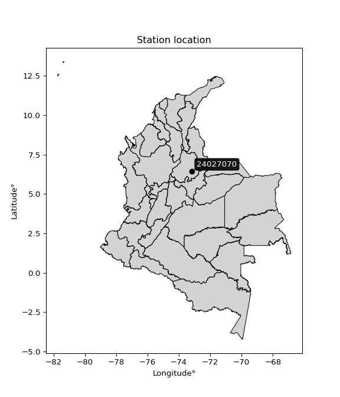

<div align="center">


</div>

# PMP Station (Rain, Pmax24h): 24027070

Probable Maximum Precipitation (PMP) is the greatest amount of rainfall for a specific duration that is meteorologically possible for a given location, acting as a "worst-case" scenario for extreme storms, crucial for designing safety-critical infrastructure like bridges, river deviations, dams, spillways, and nuclear plants to prevent catastrophic failure. PMP is calculated by hydrologists using meteorological data to determine the upper limit of extreme rainfall, often leading to the Probable Maximum Flood (PMF) for flood control design, and is increasingly being studied for climate change impacts. Probable Maximum Precipitation (PMP) is the theoretical upper limit of rainfall, a deterministic estimate for extreme events, while probability distributions (like GEV, Gumbel) describe the likelihood and frequency of various precipitation amounts, including rare ones, showing how often events occur, with PMP representing the extreme end of these distributions, used for critical infrastructure design to ensure safety against the worst conceivable weather, unlike standard statistical forecasts which cover typical probabilities.

The most common probability distributions in hydrology, used for analyzing floods, rainfall, and streamflow, include the Normal, Log-Normal, Gumbel, Gamma (including Log-Pearson Type III), and Generalized Extreme Value (GEV) distributions, often chosen based on the data´s skewness and whether modeling extremes or general conditions, with Gumbel and GEV popular for extreme events like floods, while the Normal distribution serves as a baseline, though often requiring transformations for skewed hydrological data. These distributions help in designing water infrastructure, managing water resources, and forecasting hydrologic events.

> Hydrological data often isn´t perfectly normal (it´s skewed), so different distributions are needed for different applications, such as: **Flood Frequency Analysis**: Using Gumbel, GEV, or Log-Pearson Type III for predicting extreme flood magnitudes and their return periods, **Rainfall Analysis**: Normal for annual totals, but Log-Normal, Weibull, or GEV for intensity or extreme daily rainfall, **Streamflow Modeling**: Gamma and Log-Normal for maximum flows, GEV for minimum flows, and Kappa for daily flows.

<div align="center">

</img>

</div>


## A. General information


### 1. General running parameters

• app_version: _v20260108_. • runtime: _2026-01-09 11:32:22.148588_. • Python version: _3.14.0_. • SciPy version: _1.16.3_. • Pandas version: _2.3.3_. • NumPy version: _2.3.5_. • Stations dataset (station_dataset_file): _dataset/pmax24h_in/automatic_colombia_2003_2024.csv_. • Stations catalog (station_catalog_file): _dataset/CNE.xls_. • Minimum year to eval til year_max (date_min): _1900_. • Maximum year to eval since year_min (date_max): _2024_. • Creates, save and include plots into reports (create_plot): _False_. • Plot only fit distributions with Δo > Δ (plot_only_fit): _True_. • Plot only simple graphs avoiding multiple CDFs and multiple Extreme values plots (plot_only_simple): _True_. • Eval low extreme values, if False, evaluates high extreme values (low_extreme): _False_. • Eval every SciPy distribution as logarithmic (pdist_logarithmic_on): _True_. • Standard deviation normalized (ddof): _1.0_. • Return periods to eval in years (Tr): _[2, 2.33, 5, 10, 15, 20, 25, 50, 75, 100, 200, 250, 500, 750, 1000]_. • Minimum data sample per station, 0 means any (minimum_sample): _5_. • Z-Score maximum threshold to adjust a value, 0 means disable (zscore_max): _3.5_. • Z-Score minimum threshold to adjust a value, 0 means disable (zscore_min): _-2.5_. • Avoid zeros, e.g. rain = 0 (avoid_zeros): _True_. • Avoid null values (avoid_nans): _True_. 

:file_folder:Table: [dataset.csv](../../dataset/pmax24h_in/automatic_colombia_2003_2024.csv)

> Delta Degrees of Freedom (DDOF): is a parameter used in the formulas for calculating variance and standard deviation. When ddof=0, the divisor is $N$ (the total number of observations) and this is used when your data set is the entire population. When ddof=1, the divisor is $N-1$ and this is used when your data set is a sample drawn from a larger population. Using $N-1$ provides an unbiased estimate of the population variance (known as Bessel´s correction).


### 2. Station info and location

|   id |   CODIGO | NOMBRE                  | CATEGORIA    | TECNOLOGIA                              | ESTADO   | FECHA_INSTALACION   |   FECHA_SUSPENSION |   ALTITUD |   LATITUD |   LONGITUD | DEPARTAMENTO   | MUNICIPIO   | AREA_OPERATIVA                         | ENTIDAD                                                     | AREA_HIDROGRAFICA   | ZONA_HIDROGRAFICA   | SUBZONA_HIDROGRAFICA   | CORRIENTE   | Catalogo   |   Version |
|-----:|---------:|:------------------------|:-------------|:----------------------------------------|:---------|:--------------------|-------------------:|----------:|----------:|-----------:|:---------------|:------------|:---------------------------------------|:------------------------------------------------------------|:--------------------|:--------------------|:-----------------------|:------------|:-----------|----------:|
|    0 | 24027070 | MERIDA - AUT [24027070] | Limnigráfica | Automática con Telemetría, Convencional | Activa   | 15/11/1979          |                nan |      1201 |   6.44472 |   -73.1583 | Santander      | Páramo      | Area Operativa 08 - Santanderes-Arauca | INSTITUTO DE HIDROLOGIA METEOROLOGIA Y ESTUDIOS AMBIENTALES | Magdalena Cauca     | Sogamoso            | Río Fonce              | Fonce       | CNE_IDEAM  |  20251226 |

<div align="center">

Dynamic map: [:earth_americas:Google](http://maps.google.com/maps?q=6.444722222,-73.15833333) [:earth_americas:OSM](https://www.openstreetmap.org/#map=18/6.444722222/-73.15833333&layers=P) [:earth_americas:Bing](https://www.bing.com/maps?cp=6.444722222~-73.15833333&lvl=18) [:earth_americas:Apple](https://maps.apple.com/frame?center=6.444722222%2C-73.15833333&span=0.003%2C0.006)

</div>


<div align="center">

```geojson
{
  "type": "Feature",
  "geometry": {
    "type": "Point", 
    "coordinates": [-73.15833333, 6.444722222]
  }, 
  "properties": {
    "Name": "24027070"
  }
}
```

</div>


### 3. Discrete values table and plot

<div align="center">

|               |           0 |           1 |           2 |           3 |          4 |
|:--------------|------------:|------------:|------------:|------------:|-----------:|
| Date          | 2019        | 2020        | 2021        | 2023        | 2024       |
| Value         |   59.4      |   69.2      |   20        |   76.4      |  297.2     |
| Value_initial |   59.4      |   69.2      |   20        |   76.4      |  297.2     |
| count         |    5        |    5        |    5        |    5        |    5       |
| mean          |  104.44     |  104.44     |  104.44     |  104.44     |  104.44    |
| std           |  109.935    |  109.935    |  109.935    |  109.935    |  109.935   |
| zscore        |   -0.409695 |   -0.320552 |   -0.768087 |   -0.255059 |    1.75339 |


</div>


> The initial value (value_initial) correspond to the initial obtained or null completed value, and value (value) is adjusted only when the initial value is outside the valid range (outlier) definite through the Z-Score value. If Z-Score is active, values out of range or outliers are replaced with the station mean value. A Z-Score (or standard score) measures how many standard deviations a data point is from the mean of a dataset, indicating its relative position; positive scores mean above the mean, negative mean below, and a score of zero is exactly at the mean, allowing for comparison of values from different distributions. It´s calculated using the formula $z=(x–μ)/σ$, where $x$ is the data point, $μ$ is the mean, and $σ$ is the standard deviation, helping identify outliers and understand probability.
>
> <sub>**Note**: In this study, "completing" (filling gaps in) and "extending" (forecasting or lengthening the historical record) rainfall data series are avoided for certain critical analyses because they introduce artificial bias and uncertainty, which can distort the statistics of rare events (extremes), alter day-to-day variability, and compromise the integrity and homogeneity of the original data. Some reasons against Completing/Extending rainfall data are: **Distortion of Extremes and Variability**: The primary issue is that most gap-filling or extension methods rely on averaging or regression with nearby stations, which inherently smooths the data. Rainfall is highly variable in space and time, with a large percentage of zero values and occasional large storms. Infilling methods often underestimate the highest values and overestimate the lowest (zero) values, which severely distorts analyses focused on flood frequency, drought severity, and intensity-duration-frequency (IDF) curves, **Loss of Data Homogeneity**: Infilled or extended data are synthetic estimates, not actual measurements. Combining these estimates with observed data can violate the assumption of data homogeneity, which requires that the data properties do not change over time. Inhomogeneity can lead to incorrect conclusions about long-term trends or changes in climate patterns, **Propagation of Errors**: Errors and biases from the original data (e.g., wind-induced undercatch, instrument errors, site changes) or the data used for imputation can propagate through the analysis, leading to unreliable hydrological models and inaccurate predictions, **Compromised Statistical Integrity**: For statistical analyses, especially those involving the frequency of events, using artificial data can introduce time bias or autocorrelation that doesn´t exist in reality, making it difficult to assess the true probability of events, **Difficulty in Validation**: It is difficult to accurately validate the quality of filled or extended data, especially for past periods where ground-truth measurements are unavailable. The reliability of imputation techniques heavily depends on the density of the surrounding station network and the complexity of the local topography.</sub>


### 4. Active continuous probability distributions from SciPy (45 of 104 available)

A Probability Density Function (PDF) describes the relative likelihood of a continuous random variable falling within a specific range, where the total area under its curve equals 1, and the area over any interval gives the actual probability for that range. Unlike discrete probabilities (like rolling a die), a PDF shows density, not direct probability for a single point (which is zero), with higher points indicating higher likelihood, often visualized as a bell curve for normal distributions.

A log of a probability density function (log-PDF) is simply the logarithm of the PDF´s value, denoted as $log(f(x))$, useful for converting multiplication of probabilities into addition, improving numerical stability with tiny numbers, and connecting to information theory concepts like entropy. Instead of dealing with very small probabilities (e.g., 0.000001), log-PDFs use negative numbers (e.g., $log(0.00001) ≈ -11.51$ that are easier for computers to handle, preventing underflow errors and simplifying complex calculations. In this study, each active probability distribution from SciPy is also evaluated in the $log$ form.

[scipy.stats](https://docs.scipy.org/doc/scipy/reference/stats.html) is a Python´s powerful submodule within the SciPy library for comprehensive statistical analysis, offering over 130 probability distributions (like Normal, Poisson), functions for descriptive stats (mean, variance), hypothesis testing (t-tests, chi-square), random variable generation, and statistical tests, making it essential for data science, modeling, and research. It provides tools to explore, model, and draw conclusions from data efficiently, working seamlessly with NumPy.

<div align="center">

|   id | p_dist             |   n_parameter | fit_method   | label                                                                       | active   | ref                                                                                                        |
|-----:|:-------------------|--------------:|:-------------|:----------------------------------------------------------------------------|:---------|:-----------------------------------------------------------------------------------------------------------|
|    0 | alpha              |             3 | MLE          | Alpha                                                                       | True     | [:mortar_board:](https://docs.scipy.org/doc/scipy/reference/generated/scipy.stats.alpha.html)              |
|    1 | betaprime          |             4 | MLE          | Beta prime                                                                  | True     | [:mortar_board:](https://docs.scipy.org/doc/scipy/reference/generated/scipy.stats.betaprime.html)          |
|    2 | chi2               |             3 | MLE          | Chi²                                                                        | True     | [:mortar_board:](https://docs.scipy.org/doc/scipy/reference/generated/scipy.stats.chi2.html)               |
|    3 | crystalball        |             4 | MLE          | Crystalball                                                                 | True     | [:mortar_board:](https://docs.scipy.org/doc/scipy/reference/generated/scipy.stats.crystalball.html)        |
|    4 | dweibull           |             3 | MLE          | Double Weibull                                                              | True     | [:mortar_board:](https://docs.scipy.org/doc/scipy/reference/generated/scipy.stats.dweibull.html)           |
|    5 | erlang             |             3 | MLE          | Erlang                                                                      | True     | [:mortar_board:](https://docs.scipy.org/doc/scipy/reference/generated/scipy.stats.erlang.html)             |
|    6 | expon              |             2 | MLE          | Exponential                                                                 | True     | [:mortar_board:](https://docs.scipy.org/doc/scipy/reference/generated/scipy.stats.expon.html)              |
|    7 | exponnorm          |             3 | MLE          | Exponentially modified Normal                                               | True     | [:mortar_board:](https://docs.scipy.org/doc/scipy/reference/generated/scipy.stats.exponnorm.html)          |
|    8 | f                  |             4 | MLE          | F                                                                           | True     | [:mortar_board:](https://docs.scipy.org/doc/scipy/reference/generated/scipy.stats.f.html)                  |
|    9 | fatiguelife        |             3 | MLE          | Fatigue-life (Birnbaum-Saunders)                                            | True     | [:mortar_board:](https://docs.scipy.org/doc/scipy/reference/generated/scipy.stats.fatiguelife.html)        |
|   10 | fisk               |             3 | MLE          | Fisk                                                                        | True     | [:mortar_board:](https://docs.scipy.org/doc/scipy/reference/generated/scipy.stats.fisk.html)               |
|   11 | gamma              |             3 | MLE          | Gamma                                                                       | True     | [:mortar_board:](https://docs.scipy.org/doc/scipy/reference/generated/scipy.stats.gamma.html)              |
|   12 | genexpon           |             5 | MLE          | Generalized exponential                                                     | True     | [:mortar_board:](https://docs.scipy.org/doc/scipy/reference/generated/scipy.stats.genexpon.html)           |
|   13 | genlogistic        |             3 | MLE          | Generalized logistic                                                        | True     | [:mortar_board:](https://docs.scipy.org/doc/scipy/reference/generated/scipy.stats.genlogistic.html)        |
|   14 | gibrat             |             2 | MM           | Gibrat                                                                      | True     | [:mortar_board:](https://docs.scipy.org/doc/scipy/reference/generated/scipy.stats.gibrat.html)             |
|   15 | gompertz           |             3 | MLE          | Gompertz (or truncated Gumbel)                                              | True     | [:mortar_board:](https://docs.scipy.org/doc/scipy/reference/generated/scipy.stats.gompertz.html)           |
|   16 | gumbel_l           |             2 | MM           | Gumbel Left Skew                                                            | True     | [:mortar_board:](https://docs.scipy.org/doc/scipy/reference/generated/scipy.stats.gumbel_l.html)           |
|   17 | gumbel_r           |             2 | MM           | Gumbel Right Skew                                                           | True     | [:mortar_board:](https://docs.scipy.org/doc/scipy/reference/generated/scipy.stats.gumbel_r.html)           |
|   18 | halflogistic       |             2 | MM           | Half-logistic                                                               | True     | [:mortar_board:](https://docs.scipy.org/doc/scipy/reference/generated/scipy.stats.halflogistic.html)       |
|   19 | halfnorm           |             2 | MM           | Half Normal                                                                 | True     | [:mortar_board:](https://docs.scipy.org/doc/scipy/reference/generated/scipy.stats.halfnorm.html)           |
|   20 | hypsecant          |             2 | MM           | hyperbolic secant                                                           | True     | [:mortar_board:](https://docs.scipy.org/doc/scipy/reference/generated/scipy.stats.hypsecant.html)          |
|   21 | invgamma           |             3 | MLE          | Inverted gamma                                                              | True     | [:mortar_board:](https://docs.scipy.org/doc/scipy/reference/generated/scipy.stats.invgamma.html)           |
|   22 | invgauss           |             3 | MLE          | Inverse Gaussian                                                            | True     | [:mortar_board:](https://docs.scipy.org/doc/scipy/reference/generated/scipy.stats.invgauss.html)           |
|   23 | invweibull         |             3 | MLE          | Inverted Weibull                                                            | True     | [:mortar_board:](https://docs.scipy.org/doc/scipy/reference/generated/scipy.stats.invweibull.html)         |
|   24 | kappa4             |             4 | MLE          | Kappa 4                                                                     | True     | [:mortar_board:](https://docs.scipy.org/doc/scipy/reference/generated/scipy.stats.kappa4.html)             |
|   25 | kstwobign          |             2 | MLE          | Limiting distribution of scaled Kolmogorov-Smirnov two-sided test statistic | True     | [:mortar_board:](https://docs.scipy.org/doc/scipy/reference/generated/scipy.stats.kstwobign.html)          |
|   26 | laplace            |             2 | MM           | Laplace                                                                     | True     | [:mortar_board:](https://docs.scipy.org/doc/scipy/reference/generated/scipy.stats.laplace.html)            |
|   27 | laplace_asymmetric |             3 | MLE          | Asymmetric Laplace                                                          | True     | [:mortar_board:](https://docs.scipy.org/doc/scipy/reference/generated/scipy.stats.laplace_asymmetric.html) |
|   28 | loggamma           |             3 | MLE          | Log gamma                                                                   | True     | [:mortar_board:](https://docs.scipy.org/doc/scipy/reference/generated/scipy.stats.loggamma.html)           |
|   29 | logistic           |             2 | MM           | Logistic (or Sech-squared)                                                  | True     | [:mortar_board:](https://docs.scipy.org/doc/scipy/reference/generated/scipy.stats.logistic.html)           |
|   30 | lognorm            |             3 | MLE          | Log Normal                                                                  | True     | [:mortar_board:](https://docs.scipy.org/doc/scipy/reference/generated/scipy.stats.lognorm.html)            |
|   31 | maxwell            |             2 | MM           | Maxwell                                                                     | True     | [:mortar_board:](https://docs.scipy.org/doc/scipy/reference/generated/scipy.stats.maxwell.html)            |
|   32 | mielke             |             4 | MLE          | Mielke Beta-Kappa / Dagum                                                   | True     | [:mortar_board:](https://docs.scipy.org/doc/scipy/reference/generated/scipy.stats.mielke.html)             |
|   33 | moyal              |             2 | MM           | Moyal                                                                       | True     | [:mortar_board:](https://docs.scipy.org/doc/scipy/reference/generated/scipy.stats.moyal.html)              |
|   34 | nakagami           |             3 | MLE          | Nakagami                                                                    | True     | [:mortar_board:](https://docs.scipy.org/doc/scipy/reference/generated/scipy.stats.nakagami.html)           |
|   35 | ncf                |             5 | MLE          | Non-central F distribution                                                  | True     | [:mortar_board:](https://docs.scipy.org/doc/scipy/reference/generated/scipy.stats.ncf.html)                |
|   36 | nct                |             4 | MLE          | Non-central Student’s t                                                     | True     | [:mortar_board:](https://docs.scipy.org/doc/scipy/reference/generated/scipy.stats.nct.html)                |
|   37 | norm               |             2 | MM           | Normal                                                                      | True     | [:mortar_board:](https://docs.scipy.org/doc/scipy/reference/generated/scipy.stats.norm.html)               |
|   38 | pearson3           |             3 | MM           | Pearson type III                                                            | True     | [:mortar_board:](https://docs.scipy.org/doc/scipy/reference/generated/scipy.stats.pearson3.html)           |
|   39 | rayleigh           |             2 | MM           | Rayleigh                                                                    | True     | [:mortar_board:](https://docs.scipy.org/doc/scipy/reference/generated/scipy.stats.rayleigh.html)           |
|   40 | rice               |             3 | MLE          | Rice                                                                        | True     | [:mortar_board:](https://docs.scipy.org/doc/scipy/reference/generated/scipy.stats.rice.html)               |
|   41 | t                  |             3 | MLE          | Student’s t                                                                 | True     | [:mortar_board:](https://docs.scipy.org/doc/scipy/reference/generated/scipy.stats.t.html)                  |
|   42 | truncnorm          |             4 | MLE          | Truncated normal                                                            | True     | [:mortar_board:](https://docs.scipy.org/doc/scipy/reference/generated/scipy.stats.truncnorm.html)          |
|   43 | wald               |             2 | MM           | Wald                                                                        | True     | [:mortar_board:](https://docs.scipy.org/doc/scipy/reference/generated/scipy.stats.wald.html)               |
|   44 | weibull_min        |             3 | MLE          | Weibull minimum                                                             | True     | [:mortar_board:](https://docs.scipy.org/doc/scipy/reference/generated/scipy.stats.weibull_min.html)        |

</div>

> **n_parameter:** # arguments & localization & scale.
>
> **Fit methods:** (MLE) maximum likelihood, (MM) L-moments.
>
>**Inactive** (With the only purpose of prevent loops, zero divisions, infinite values, over high estimated values or horizontal trending for recurrence intervals estimations, the follow distributions were disabled.)**:** foldnorm, gennorm, norminvgauss, powernorm, powerlognorm, skewnorm, genextreme, anglit, arcsine, argus, beta, bradford, burr, burr12, cauchy, cosine, halfcauchy, foldcauchy, skewcauchy, wrapcauchy, dgamma, gengamma, exponweib, exponpow, truncexpon, gausshyper, genhalflogistic, genhyperbolic, geninvgauss, halfgennorm, johnsonsb, johnsonsu, kappa3, ksone, kstwo, loglaplace, levy, levy_l, levy_stable, ncx2, pareto, genpareto, truncpareto, lomax, powerlaw, rdist, rel_breitwigner, recipinvgauss, semicircular, studentized_range, trapezoid, triang, truncweibull_min, tukeylambda, uniform, loguniform, vonmises, vonmises_line, weibull_max, 


## B. Probability (PDF) vs. Empirical (EDF) distributions functions

A continuous probability distribution (CPD) describes probabilities for variables that can take any value within a range (like rain any time), unlike discrete variables with specific outcomes (like temperature). It uses a Probability Density Function (PDF), a curve where the total area under it equals 1, and the probability of the variable falling within an interval (a to b) is found by calculating the area under the curve between those points. A key feature is that the probability of hitting any single exact value is zero, so probabilities are always expressed for ranges, e.g., $P(a ≤ X ≤ b)$.

<div align="center">

Distributions parameters from station values
|    |   station | p_dist                |   n |              loc |          scale | shape                 | shape1                 | shape2                | shape3   |
|---:|----------:|:----------------------|----:|-----------------:|---------------:|:----------------------|:-----------------------|:----------------------|:---------|
|  0 |  24027070 | alpha                 |   5 |     -0.112118    |   39.8838      | 9.828359708760615e-11 |                        |                       |          |
|  1 |  24027070 | betaprime             |   5 |     20           |   42.6328      | 0.5923016925581879    | 1.0570057337286756     |                       |          |
|  2 |  24027070 | chi2                  |   5 |     20           |    6.34012     | 1.647786811744508     |                        |                       |          |
|  3 |  24027070 | crystalball           |   5 |    104.44        |   98.3293      | 9545.359535684236     | 1072.0782657868128     |                       |          |
|  4 |  24027070 | dweibull              |   5 |     69.2         |  130.577       | 0.4158010487346594    |                        |                       |          |
|  5 |  24027070 | erlang                |   5 |     20           |   64.538       | 0.7651785610432575    |                        |                       |          |
|  6 |  24027070 | expon                 |   5 |     20           |   84.44        |                       |                        |                       |          |
|  7 |  24027070 | exponnorm             |   5 |     19.8958      |    0.0321249   | 2602.211002597468     |                        |                       |          |
|  8 |  24027070 | f                     |   5 |     19.3026      |   39.7871      | 0.9286286216548145    | 4.651276565094021      |                       |          |
|  9 |  24027070 | fatiguelife           |   5 |     20           |    2.10056e-05 | 1593.5828458968585    |                        |                       |          |
| 10 |  24027070 | fisk                  |   5 |     20           |   37.1365      | 0.35276639704141144   |                        |                       |          |
| 11 |  24027070 | gamma                 |   5 |     20           |   58.5729      | 0.6673593672884977    |                        |                       |          |
| 12 |  24027070 | genexpon              |   5 |     20           |  200.032       | 2.368923485177065     | 1.8671690549561717e-11 | 10.583507937164473    |          |
| 13 |  24027070 | genlogistic           |   5 |   -377.218       |   56.9362      | 2323.2601988781407    |                        |                       |          |
| 14 |  24027070 | gibrat                |   5 |     29.4272      |   45.4976      |                       |                        |                       |          |
| 15 |  24027070 | gompertz              |   5 |     20           |    7.56868e+12 | 81876981656.74838     |                        |                       |          |
| 16 |  24027070 | gumbel_l              |   5 |    148.693       |   76.667       |                       |                        |                       |          |
| 17 |  24027070 | gumbel_r              |   5 |     60.1866      |   76.667       |                       |                        |                       |          |
| 18 |  24027070 | halflogistic          |   5 |    -12.103       |   84.068       |                       |                        |                       |          |
| 19 |  24027070 | halfnorm              |   5 |    -25.7094      |  163.118       |                       |                        |                       |          |
| 20 |  24027070 | hypsecant             |   5 |    104.44        |   62.5984      |                       |                        |                       |          |
| 21 |  24027070 | invgamma              |   5 |     -6.29208     |  122.287       | 2.002854618578776     |                        |                       |          |
| 22 |  24027070 | invgauss              |   5 |      6.008       |   68.6178      | 1.4344970193881306    |                        |                       |          |
| 23 |  24027070 | invweibull            |   5 |     20           |    5.64577     | 0.04127829907187326   |                        |                       |          |
| 24 |  24027070 | kappa4                |   5 |     -7.31313     |  310.065       | 1.096685122666683     | 1.0181648575127349     |                       |          |
| 25 |  24027070 | kstwobign             |   5 |   -152.337       |  298.994       |                       |                        |                       |          |
| 26 |  24027070 | laplace               |   5 |    104.44        |   69.5293      |                       |                        |                       |          |
| 27 |  24027070 | laplace_asymmetric    |   5 |     59.4         |   45.5608      | 0.6211544602443875    |                        |                       |          |
| 28 |  24027070 | loggamma              |   5 | -30335.6         | 4115.49        | 1630.2957799191026    |                        |                       |          |
| 29 |  24027070 | logistic              |   5 |    104.44        |   54.2118      |                       |                        |                       |          |
| 30 |  24027070 | lognorm               |   5 |     20           |    0.0404035   | 15.046950093665359    |                        |                       |          |
| 31 |  24027070 | maxwell               |   5 |   -128.559       |  146.011       |                       |                        |                       |          |
| 32 |  24027070 | mielke                |   5 |     19.9939      |   65.8442      | 0.7017239528152845    | 2.027763105501372      |                       |          |
| 33 |  24027070 | moyal                 |   5 |     48.209       |   44.2637      |                       |                        |                       |          |
| 34 |  24027070 | nakagami              |   5 |     20           |  129.045       | 0.24073048236354938   |                        |                       |          |
| 35 |  24027070 | ncf                   |   5 |     -1.09076     |   53.5266      | 15.615402687310809    | 4.242174690022309      | 2.0050616918382413    |          |
| 36 |  24027070 | nct                   |   5 |     -0.071318    |   20.4327      | 1.6049364039920115    | 2.640244017219707      |                       |          |
| 37 |  24027070 | norm                  |   5 |    104.44        |   98.3293      |                       |                        |                       |          |
| 38 |  24027070 | pearson3              |   5 |    104.44        |   98.3292      | 1.3470058510102187    |                        |                       |          |
| 39 |  24027070 | rayleigh              |   5 |    -83.6696      |  150.09        |                       |                        |                       |          |
| 40 |  24027070 | rice                  |   5 |    -40.3139      |  123.738       | 0.0008834205693174467 |                        |                       |          |
| 41 |  24027070 | t                     |   5 |     74.1647      |   72.0176      | 2.608656546222379     |                        |                       |          |
| 42 |  24027070 | truncnorm             |   5 | -39562.6         | 1977.8         | 20.013468884281682    | 20.15363416352536      |                       |          |
| 43 |  24027070 | wald                  |   5 |      6.11072     |   98.3293      |                       |                        |                       |          |
| 44 |  24027070 | weibull_min           |   5 |     20           |   53.852       | 0.5710350770644028    |                        |                       |          |
| 45 |  24027070 | logalpha              |   5 |     -8.69374     |  196.55        | 15.227233083945364    |                        |                       |          |
| 46 |  24027070 | logbetaprime          |   5 |     -0.919167    |   28.4074      | 42.950193225239566    | 236.14148343737702     |                       |          |
| 47 |  24027070 | logchi2               |   5 |      2.99573     |    0.935356    | 1.1058971040567513    |                        |                       |          |
| 48 |  24027070 | logcrystalball        |   5 |      4.26948     |    0.859374    | 190.78975003193318    | 18.424897515819453     |                       |          |
| 49 |  24027070 | logdweibull           |   5 |      4.237       |    0.737971    | 0.5272515358658538    |                        |                       |          |
| 50 |  24027070 | logerlang             |   5 |      0.398523    |    0.193568    | 19.997974509156244    |                        |                       |          |
| 51 |  24027070 | logexpon              |   5 |      2.99573     |    1.27375     |                       |                        |                       |          |
| 52 |  24027070 | logexponnorm          |   5 |      3.87865     |    0.769078    | 0.5081948716138431    |                        |                       |          |
| 53 |  24027070 | logf                  |   5 |      0.278159    |    3.9846      | 43.56452899273579     | 1532.5982341280192     |                       |          |
| 54 |  24027070 | logfatiguelife        |   5 |     -2.0236      |    6.23463     | 0.13693615968836678   |                        |                       |          |
| 55 |  24027070 | logfisk               |   5 |     -2.18013     |    6.39665     | 13.290572958525965    |                        |                       |          |
| 56 |  24027070 | loggamma              |   5 |      0.398518    |    0.193567    | 19.998042731968873    |                        |                       |          |
| 57 |  24027070 | loggenexpon           |   5 |      2.99573     |    0.0100346   | 0.0042680861864004185 | 5.0211764540049        | 7.782708325157284e-06 |          |
| 58 |  24027070 | loggenlogistic        |   5 |      3.80937     |    0.568943    | 1.735520418754743     |                        |                       |          |
| 59 |  24027070 | loggibrat             |   5 |      3.61395     |    0.39761     |                       |                        |                       |          |
| 60 |  24027070 | loggompertz           |   5 |      2.99573     |    1.56601     | 0.6119519144095689    |                        |                       |          |
| 61 |  24027070 | loggumbel_l           |   5 |      4.65625     |    0.670051    |                       |                        |                       |          |
| 62 |  24027070 | loggumbel_r           |   5 |      3.88272     |    0.670051    |                       |                        |                       |          |
| 63 |  24027070 | loghalflogistic       |   5 |      3.25097     |    0.734707    |                       |                        |                       |          |
| 64 |  24027070 | loghalfnorm           |   5 |      3.13204     |    1.42558     |                       |                        |                       |          |
| 65 |  24027070 | loghypsecant          |   5 |      4.26948     |    0.547094    |                       |                        |                       |          |
| 66 |  24027070 | loginvgamma           |   5 |     -4.83655     | 1024           | 113.45136758365152    |                        |                       |          |
| 67 |  24027070 | loginvgauss           |   5 |     -0.72472     |  164.287       | 0.030368562792974924  |                        |                       |          |
| 68 |  24027070 | loginvweibull         |   5 |     -8.71443e+07 |    8.71443e+07 | 112567092.26343182    |                        |                       |          |
| 69 |  24027070 | logkappa4             |   5 |      2.80237     |    2.87576     | 1.07204128096215      | 0.9839559895813399     |                       |          |
| 70 |  24027070 | logkstwobign          |   5 |      1.12701     |    3.60129     |                       |                        |                       |          |
| 71 |  24027070 | loglaplace            |   5 |      4.26948     |    0.607669    |                       |                        |                       |          |
| 72 |  24027070 | loglaplace_asymmetric |   5 |      4.237       |    0.589308    | 0.972827763553109     |                        |                       |          |
| 73 |  24027070 | logloggamma           |   5 |   -234.075       |   32.8182      | 1426.4189414027524    |                        |                       |          |
| 74 |  24027070 | loglogistic           |   5 |      4.26948     |    0.473798    |                       |                        |                       |          |
| 75 |  24027070 | loglognorm            |   5 |      2.99573     |    0.00116763  | 14.302331127281734    |                        |                       |          |
| 76 |  24027070 | logmaxwell            |   5 |      2.23313     |    1.2761      |                       |                        |                       |          |
| 77 |  24027070 | logmielke             |   5 |     -0.0847097   |    4.47321     | 7.579782383323181     | 9.885745376306371      |                       |          |
| 78 |  24027070 | logmoyal              |   5 |      3.77804     |    0.386854    |                       |                        |                       |          |
| 79 |  24027070 | lognakagami           |   5 |      4.08429     |    0.924412    | 0.048173613287750994  |                        |                       |          |
| 80 |  24027070 | logncf                |   5 |     -1.59502     |    2.19436     | 86.08766245095853     | 278.7092108350846      | 142.33281565272887    |          |
| 81 |  24027070 | lognct                |   5 |     -2.45974     |    0.57946     | 58.92044048556318     | 11.460967954452528     |                       |          |
| 82 |  24027070 | lognorm               |   5 |      4.26948     |    0.859374    |                       |                        |                       |          |
| 83 |  24027070 | logpearson3           |   5 |      4.26948     |    0.859373    | 0.2585926121118469    |                        |                       |          |
| 84 |  24027070 | lograyleigh           |   5 |      2.62545     |    1.31175     |                       |                        |                       |          |
| 85 |  24027070 | logrice               |   5 |      2.54714     |    1.03842     | 1.198308290648946     |                        |                       |          |
| 86 |  24027070 | logt                  |   5 |      4.26948     |    0.859373    | 7537697648.214317     |                        |                       |          |
| 87 |  24027070 | logtruncnorm          |   5 |     -0.234294    |    1.59613     | 2.7056572366471103    | 3.744783097773917      |                       |          |
| 88 |  24027070 | logwald               |   5 |      3.41014     |    0.859352    |                       |                        |                       |          |
| 89 |  24027070 | logweibull_min        |   5 |      2.5845      |    1.89825     | 2.0375154457671876    |                        |                       |          |

</div>

> **loc** (Location parameter): This shifts the distribution along the x-axis. For many common distributions, like the normal (Gaussian) distribution, loc represents the mean $μ$. For others, like the uniform distribution, it might represent the minimum value, or for the beta distribution, the left end of the support interval.
>
> **scale** (Scale parameter): This determines the width or spread of the distribution. For the normal distribution, scale represents the standard deviation $σ$. For a uniform distribution, it defines the length of the interval (from $loc$ to $loc + scale$).
>
> **shape** (Shape parameters): Refers to parameters that define the specific form of a probability distribution, distinct from its location (loc) and scale (scale). These parameters are required arguments for most distribution functions. For example, a normal (Gaussian) distribution is fully defined by its location (mean) and scale (standard deviation), so it has no specific shape parameters beyond loc and scale. However, other distributions have intrinsic properties that need specification, as Gamma distribution that takes a shape parameter, often named $a$ or $alpha$.


### 0. Cumulative distribution values - CDF (90 evaluated)

Cumulative Distribution Function (CDF), denoted as $F$<sub>$X$</sub>$(x)$, is a function that gives the probability that a random variable $X$ will take a value less than or equal to a specific value, $x$ (i.e., $(P(X≥x)$. It essentially "accumulates" probabilities from a given point up to the far right (positive infinity), providing a complete picture of the distribution´s probabilities for both discrete (like rain) and continuous (like temperature) variables, helping to find probabilities over ranges or above certain values. Each station is evaluated separately ordering the $x$ values ascending, calculating the CDF and PDF values for the activated distributions and their logarithmic forms.

<div align="center">

CDF ordered by x ascending and calculating $log(f(x))$ separately
|   id |   Station |   date |     x |   count |   mean |     std |    zscore |   Value_initial |   station |   m |     alpha |   alpha_pdf |   betaprime |   betaprime_pdf |        chi2 |     chi2_pdf |   crystalball |   crystalball_pdf |   dweibull |   dweibull_pdf |      erlang |   erlang_pdf |    expon |   expon_pdf |   exponnorm |   exponnorm_pdf |        f |       f_pdf |   fatiguelife |   fatiguelife_pdf |        fisk |    fisk_pdf |       gamma |      gamma_pdf |    genexpon |   genexpon_pdf |   genlogistic |   genlogistic_pdf |   gibrat |   gibrat_pdf |    gompertz |   gompertz_pdf |   gumbel_l |   gumbel_l_pdf |   gumbel_r |   gumbel_r_pdf |   halflogistic |   halflogistic_pdf |   halfnorm |   halfnorm_pdf |   hypsecant |   hypsecant_pdf |   invgamma |   invgamma_pdf |   invgauss |   invgauss_pdf |   invweibull |   invweibull_pdf |      kappa4 |   kappa4_pdf |   kstwobign |   kstwobign_pdf |   laplace |   laplace_pdf |   laplace_asymmetric |   laplace_asymmetric_pdf |   loggamma |   loggamma_pdf |   logistic |   logistic_pdf |   lognorm |   lognorm_pdf |   maxwell |   maxwell_pdf |    mielke |   mielke_pdf |    moyal |   moyal_pdf |    nakagami |   nakagami_pdf |       ncf |     ncf_pdf |       nct |     nct_pdf |     norm |    norm_pdf |   pearson3 |   pearson3_pdf |   rayleigh |   rayleigh_pdf |     rice |    rice_pdf |        t |       t_pdf |   truncnorm |   truncnorm_pdf |      wald |   wald_pdf |   weibull_min |   weibull_min_pdf |   logalpha |   logalpha_pdf |   logbetaprime |   logbetaprime_pdf |     logchi2 |   logchi2_pdf |   logcrystalball |   logcrystalball_pdf |   logdweibull |   logdweibull_pdf |   logerlang |   logerlang_pdf |   logexpon |   logexpon_pdf |   logexponnorm |   logexponnorm_pdf |      logf |   logf_pdf |   logfatiguelife |   logfatiguelife_pdf |   logfisk |   logfisk_pdf |   loggenexpon |   loggenexpon_pdf |   loggenlogistic |   loggenlogistic_pdf |   loggibrat |   loggibrat_pdf |   loggompertz |   loggompertz_pdf |   loggumbel_l |   loggumbel_l_pdf |   loggumbel_r |   loggumbel_r_pdf |   loghalflogistic |   loghalflogistic_pdf |   loghalfnorm |   loghalfnorm_pdf |   loghypsecant |   loghypsecant_pdf |   loginvgamma |   loginvgamma_pdf |   loginvgauss |   loginvgauss_pdf |   loginvweibull |   loginvweibull_pdf |   logkappa4 |   logkappa4_pdf |   logkstwobign |   logkstwobign_pdf |   loglaplace |   loglaplace_pdf |   loglaplace_asymmetric |   loglaplace_asymmetric_pdf |   logloggamma |   logloggamma_pdf |   loglogistic |   loglogistic_pdf |   loglognorm |   loglognorm_pdf |   logmaxwell |   logmaxwell_pdf |   logmielke |   logmielke_pdf |   logmoyal |   logmoyal_pdf |   lognakagami |   lognakagami_pdf |    logncf |   logncf_pdf |    lognct |   lognct_pdf |   logpearson3 |   logpearson3_pdf |   lograyleigh |   lograyleigh_pdf |   logrice |   logrice_pdf |      logt |   logt_pdf |   logtruncnorm |   logtruncnorm_pdf |   logwald |   logwald_pdf |   logweibull_min |   logweibull_min_pdf |
|-----:|----------:|-------:|------:|--------:|-------:|--------:|----------:|----------------:|----------:|----:|----------:|------------:|------------:|----------------:|------------:|-------------:|--------------:|------------------:|-----------:|---------------:|------------:|-------------:|---------:|------------:|------------:|----------------:|---------:|------------:|--------------:|------------------:|------------:|------------:|------------:|---------------:|------------:|---------------:|--------------:|------------------:|---------:|-------------:|------------:|---------------:|-----------:|---------------:|-----------:|---------------:|---------------:|-------------------:|-----------:|---------------:|------------:|----------------:|-----------:|---------------:|-----------:|---------------:|-------------:|-----------------:|------------:|-------------:|------------:|----------------:|----------:|--------------:|---------------------:|-------------------------:|-----------:|---------------:|-----------:|---------------:|----------:|--------------:|----------:|--------------:|----------:|-------------:|---------:|------------:|------------:|---------------:|----------:|------------:|----------:|------------:|---------:|------------:|-----------:|---------------:|-----------:|---------------:|---------:|------------:|---------:|------------:|------------:|----------------:|----------:|-----------:|--------------:|------------------:|-----------:|---------------:|---------------:|-------------------:|------------:|--------------:|-----------------:|---------------------:|--------------:|------------------:|------------:|----------------:|-----------:|---------------:|---------------:|-------------------:|----------:|-----------:|-----------------:|---------------------:|----------:|--------------:|--------------:|------------------:|-----------------:|---------------------:|------------:|----------------:|--------------:|------------------:|--------------:|------------------:|--------------:|------------------:|------------------:|----------------------:|--------------:|------------------:|---------------:|-------------------:|--------------:|------------------:|--------------:|------------------:|----------------:|--------------------:|------------:|----------------:|---------------:|-------------------:|-------------:|-----------------:|------------------------:|----------------------------:|--------------:|------------------:|--------------:|------------------:|-------------:|-----------------:|-------------:|-----------------:|------------:|----------------:|-----------:|---------------:|--------------:|------------------:|----------:|-------------:|----------:|-------------:|--------------:|------------------:|--------------:|------------------:|----------:|--------------:|----------:|-----------:|---------------:|-------------------:|----------:|--------------:|-----------------:|---------------------:|
|    0 |  24027070 |   2021 |  20   |       5 | 104.44 | 109.935 | -0.768087 |            20   |  24027070 |   1 | 0.0473592 | 0.0110121   | 7.24635e-05 |    10.4863      | 1.63744e-13 | 37.9732      |      0.19524  |       0.00280603  |   0.256774 |    0.00144615  | 3.92421e-13 | 84.5191      | 0        | 0.0118427   |  0.00124555 |     0.0119403   | 0.114308 | 0.0756027   |     0.0367626 |       2.78686e+10 | 1.56623e-05 | 6.22066e+06 | 1.66618e-11 | 3129.84        | 1.26567e-12 |    0.0118427   |      0.114429 |       0.00435475  | 0        |  0           | 8.68889e-13 |    0.0108179   |   0.170253 |    0.0020199   |   0.184694 |    0.004069    |       0.188648 |        0.0057359   |   0.220693 |    0.00470312  |    0.16165  |     0.00247276  |  0.0541777 |    0.00788345  |  0.0517744 |    0.0103905   |    0.0143918 |      7.09178e+11 | 2.83131e-15 |   0.0823858  |    0.10608  |     0.00395603  |  0.148436 |   0.00213487  |            0.0691923 |              0.00244494  |  0.0551911 |       0.168667 |   0.173992 |    0.00265106  | 0.0691456 |      0.154769 |  0.207268 |    0.00337126 | 0.0014782 |   0.170093   | 0.169049 | 0.00481444  | 8.31335e-09 |    1.12662e+06 | 0.0559769 | 0.00780615  | 0.0560186 | 0.00606069  | 0.19524  | 0.00280603  |   0.188706 |    0.00494167  |   0.212227 |    0.00362535  | 0.11201  | 0.00349798  | 0.257007 | 0.00353956  | 2.45638e-08 |     0.0107858   | 0.0199999 | 0.00561769 |   5.75819e-10 |   92552.6         |  0.0562495 |       0.162874 |       0.05714  |           0.165174 | 2.57923e-09 |   3.21148e+06 |        0.0691456 |             0.154769 |      0.13418  |       0.0749732   |   0.0551911 |        0.168667 |   0        |      0.785083  |      0.0646103 |           0.155742 | 0.0559366 |   0.169479 |        0.0563149 |             0.165863 | 0.0565446 |     0.136985  |   7.25479e-08 |          0.425339 |        0.0575979 |             0.141773 |    0        |       0         |   4.46582e-09 |          0.390771 |      0.080472 |         0.115131  |     0.0233415 |         0.130895  |          0        |             0         |      0        |          0        |      0.0618559 |          0.112352  |      0.05725  |          0.163751 |     0.0537209 |          0.170909 |       0.0486586 |            0.190003 | 1.31087e-15 |        4.10122  |      0.0494487 |           0.216018 |    0.0614659 |        0.10115   |               0.0557865 |                   0.0973086 |     0.0720533 |          0.155943 |     0.0636622 |         0.125812  |    0.0227763 |      8.50874e+12 |     0.051052 |         0.186783 |   0.0580489 |       0.139348  | 0.00598402 |      0.0648503 |     0         |       0           | 0.0572959 |     0.163979 | 0.0580913 |     0.163323 |     0.0611418 |          0.162243 |      0.039058 |          0.206789 | 0.0449015 |      0.197422 | 0.0691454 |   0.154769 |    0           |          0         |  0        |     0         |        0.0433464 |             0.210045 |
|    1 |  24027070 |   2019 |  59.4 |       5 | 104.44 | 109.935 | -0.409695 |            59.4 |  24027070 |   2 | 0.502743  | 0.00717788  | 0.664982    |     0.0050661   | 0.969213    |  0.00253757  |      0.323457 |       0.00365315  |   0.355636 |    0.00514089  | 0.579593    |  0.00783657  | 0.372871 | 0.00742691  |  0.376597   |     0.00745735  | 0.643167 | 0.00522418  |     0.804946  |       0.00300749  | 0.505218    | 0.00223812  | 0.662413    |    0.00734833  | 0.372872    |    0.00742692  |      0.337768 |       0.00643749  | 0.338205 |  0.0121999   | 0.34703     |    0.00706374  |   0.268032 |    0.00297896  |   0.364105 |    0.00479815  |       0.40136  |        0.00498947  |   0.398166 |    0.00426896  |    0.288508 |     0.00400325  |  0.445647  |    0.00820389  |  0.463982  |    0.00740429  |    0.397352  |      0.000384212 | 0.166254    |   0.00385304 |    0.302392 |     0.0055985   |  0.261602 |   0.00376247  |            0.278412  |              0.0098378   |  0.443334  |       0.470758 |   0.303473 |    0.0038991   | 0.414692  |      0.45357  |  0.353495 |    0.00395432 | 0.628202  |   0.00826745 | 0.378182 | 0.00538672  | 0.439443    |    0.00527357  | 0.440721  | 0.00818339  | 0.441193  | 0.00897338  | 0.323457 | 0.00365315  |   0.388342 |    0.00494658  |   0.365121 |    0.00403215  | 0.277251 | 0.0047069   | 0.426245 | 0.00490019  | 0.350447    |     0.007238    | 0.400684  | 0.00837962 |   0.56681     |       0.00525233  |  0.438549  |       0.474528 |       0.438638 |           0.47085  | 0.687744    |   0.236671    |        0.414691  |             0.45357  |      0.323381 |       0.486563    |   0.443334  |        0.470758 |   0.574552 |      0.334012  |      0.423043  |           0.466621 | 0.444112  |   0.470121 |        0.440391  |             0.47167  | 0.431041  |     0.52031   |   0.499869    |          0.423926 |        0.434387  |             0.505501 |    0.566703 |       0.836316  |   0.459016    |          0.423635 |      0.346806 |         0.415167  |     0.477019  |         0.526958  |          0.513236 |             0.50128   |      0.495852 |          0.447774 |      0.394254  |          0.550007  |      0.437949 |          0.472283 |     0.450165  |          0.474194 |       0.47669   |            0.456207 | 0.429184    |        0.36612  |      0.489892  |           0.440491 |    0.368653  |        0.606667  |               0.372529  |                   0.649803  |     0.413982  |          0.447495 |     0.40351   |         0.508001  |    0.683703  |      0.022857    |     0.448973 |         0.459431 |   0.430015  |       0.521753  | 0.50087    |      0.553437  |     0.0316906 |       3.43771e+12 | 0.43777   |     0.471833 | 0.438366  |     0.473181 |     0.430811  |          0.465715 |      0.461207 |          0.456804 | 0.442711  |      0.454573 | 0.414691  |   0.45357  |    2.22365e-08 |          1.93774   |  0.566188 |     0.648632  |        0.461383  |             0.452758 |
|    2 |  24027070 |   2020 |  69.2 |       5 | 104.44 | 109.935 | -0.320552 |            69.2 |  24027070 |   3 | 0.565005  | 0.0056133   | 0.708205    |     0.00384159  | 0.98623     |  0.00112663  |      0.360027 |       0.00380484  |   0.5      |    3.37055e+06 | 0.648997    |  0.00639037  | 0.44159  | 0.0066131   |  0.445558   |     0.00663242  | 0.688809 | 0.00415463  |     0.831566  |       0.00245514  | 0.524787    | 0.00178811  | 0.726313    |    0.00577346  | 0.44159     |    0.0066131   |      0.400996 |       0.00643456  | 0.446513 |  0.00994024  | 0.412712    |    0.00635321  |   0.298521 |    0.00324415  |   0.411033 |    0.00476661  |       0.449086 |        0.00474807  |   0.439329 |    0.00412975  |    0.329584 |     0.00437345  |  0.519428  |    0.00688068  |  0.530087  |    0.00613639  |    0.400713  |      0.000307453 | 0.203646    |   0.00378104 |    0.357564 |     0.00564008  |  0.301199 |   0.00433197  |            0.36866   |              0.00860741  |  0.514777  |       0.462516 |   0.34298  |    0.00415675  | 0.484925  |      0.463893 |  0.392532 |    0.00400605 | 0.699813  |   0.00642222 | 0.430169 | 0.00520883  | 0.487868    |    0.00464121  | 0.514582  | 0.0069126   | 0.521723  | 0.00747561  | 0.360027 | 0.00380484  |   0.435988 |    0.00476983  |   0.404702 |    0.00403974  | 0.324061 | 0.00483469  | 0.474987 | 0.00502704  | 0.417972    |     0.00655395  | 0.476617  | 0.00714247 |   0.61315     |       0.00426418  |  0.510772  |       0.46879  |       0.510319 |           0.465456 | 0.721442    |   0.205686    |        0.484924  |             0.463893 |      0.5      |       4.03773e+06 |   0.514777  |        0.462516 |   0.622619 |      0.296276  |      0.494909  |           0.471972 | 0.51545   |   0.461797 |        0.512109  |             0.465132 | 0.510621  |     0.517543  |   0.562572    |          0.396677 |        0.511444  |             0.499968 |    0.673338 |       0.578873  |   0.522873    |          0.4119   |      0.414267 |         0.467581  |     0.554689  |         0.48788   |          0.585662 |             0.447117  |      0.561717 |          0.414469 |      0.481112  |          0.580795  |      0.509879 |          0.467235 |     0.521863  |          0.46243  |       0.5443    |            0.427658 | 0.4848      |        0.362343 |      0.555069  |           0.412037 |    0.473975  |        0.779989  |               0.486229  |                   0.848131  |     0.483332  |          0.458498 |     0.482867  |         0.527032  |    0.686962  |      0.0199564   |     0.518513 |         0.449334 |   0.510118  |       0.522804  | 0.580567   |      0.489148  |     0.74549   |       0.469763    | 0.509641  |     0.466934 | 0.510447  |     0.46828  |     0.502104  |          0.465522 |      0.529834 |          0.440346 | 0.511749  |      0.447764 | 0.484925  |   0.463893 |    0.260337    |          1.48897   |  0.652582 |     0.491498  |        0.529474  |             0.437381 |
|    3 |  24027070 |   2023 |  76.4 |       5 | 104.44 | 109.935 | -0.255059 |            76.4 |  24027070 |   4 | 0.602176  | 0.00474539  | 0.73348     |     0.00320821  | 0.992351    |  0.000623359 |      0.387759 |       0.00389555  |   0.629483 |    0.00641301  | 0.691841    |  0.00553537  | 0.487231 | 0.00607258  |  0.491312   |     0.00608508  | 0.716536 | 0.00356994  |     0.848083  |       0.00214344  | 0.536786    | 0.00155522  | 0.764551    |    0.00487889  | 0.487231    |    0.00607259  |      0.446966 |       0.00632053  | 0.512728 |  0.00848872  | 0.456719    |    0.00587715  |   0.322588 |    0.00344132  |   0.445131 |    0.00469932  |       0.482607 |        0.00456232  |   0.468675 |    0.00402112  |    0.36196  |     0.00461425  |  0.56583   |    0.00602677  |  0.571462  |    0.00537856  |    0.402778  |      0.00026807  | 0.23071     |   0.00373784 |    0.39805  |     0.00559641  |  0.334061 |   0.00480461  |            0.427688  |              0.00780263  |  0.559976  |       0.449894 |   0.3735   |    0.00431636  | 0.53084   |      0.462837 |  0.421438 |    0.00402016 | 0.74201   |   0.00533363 | 0.467054 | 0.00503161  | 0.519932    |    0.00427662  | 0.561299  | 0.00608055  | 0.571875  | 0.00647467  | 0.387759 | 0.00389555  |   0.469786 |    0.00461566  |   0.433741 |    0.00402367  | 0.359075 | 0.00488564  | 0.511271 | 0.00504021  | 0.463481    |     0.00609283  | 0.525102  | 0.00634184 |   0.641831    |       0.00372337  |  0.556647  |       0.457199 |       0.555886 |           0.454337 | 0.740935    |   0.188508    |        0.53084   |             0.462836 |      0.646499 |       0.652882    |   0.559976  |        0.449894 |   0.650834 |      0.274124  |      0.541434  |           0.467015 | 0.560577  |   0.449144 |        0.557611  |             0.45334  | 0.561174  |     0.502279  |   0.600884    |          0.377251 |        0.560261  |             0.485055 |    0.724611 |       0.462453  |   0.563157    |          0.401729 |      0.462077 |         0.497774  |     0.601449  |         0.45636   |          0.628176 |             0.411997  |      0.601626 |          0.391808 |      0.538596  |          0.577547  |      0.555627 |          0.456183 |     0.566946  |          0.447657 |       0.585522  |            0.404831 | 0.520552    |        0.360086 |      0.594811  |           0.390678 |    0.551829  |        0.737524  |               0.563679  |                   0.720277  |     0.528747  |          0.458167 |     0.535031  |         0.525061  |    0.68886   |      0.0184341   |     0.562402 |         0.43676  |   0.561283  |       0.509252  | 0.626824   |      0.4455    |     0.782176  |       0.298401    | 0.555366  |     0.456009 | 0.556298  |     0.457193 |     0.54784   |          0.457623 |      0.572679 |          0.4248   | 0.555603  |      0.437622 | 0.53084   |   0.462837 |    0.395544    |          1.24913   |  0.697261 |     0.413981  |        0.572061  |             0.422542 |
|    4 |  24027070 |   2024 | 297.2 |       5 | 104.44 | 109.935 |  1.75339  |           297.2 |  24027070 |   5 | 0.893286  | 0.000356783 | 0.928733    |     0.000242437 | 1           |  1.29009e-11 |      0.975023 |       0.000593929 |   0.858289 |    0.000325842 | 0.992322    |  0.000124434 | 0.962477 | 0.000444373 |  0.963746   |     0.000433684 | 0.949723 | 0.000270259 |     0.988684  |       0.000122051 | 0.670204    | 0.000281285 | 0.996339    |    6.62448e-05 | 0.962477    |    0.000444373 |      0.983473 |       0.000287862 | 0.961843 |  0.000309696 | 0.950149    |    0.000539283 |   0.99903  |    8.77888e-05 |   0.955581 |    0.000566308 |       0.950757 |        0.000571333 |   0.952252 |    0.000689404 |    0.970742 |     0.000466735 |  0.937993  |    0.000356186 |  0.939312  |    0.000423278 |    0.426765  |      5.41144e-05 | 0.999923    |   0.00383107 |    0.978244 |     0.000437607 |  0.968743 |   0.000449555 |            0.971798  |              0.000384495 |  0.939597  |       0.112401 |   0.972231 |    0.000498002 | 0.951351  |      0.117417 |  0.963313 |    0.00066186 | 0.981896  |   0.00012782 | 0.952116 | 0.000540243 | 0.944855    |    0.000645774 | 0.940075  | 0.000357656 | 0.938871  | 0.000322484 | 0.975023 | 0.000593929 |   0.951704 |    0.000586332 |   0.960034 |    0.000675709 | 0.975766 | 0.000534195 | 0.967872 | 0.000311857 | 0.999988    |     0.000646235 | 0.951595  | 0.00041622 |   0.921828    |       0.000410453 |  0.941404  |       0.111019 |       0.941449 |           0.112466 | 0.897324    |   0.0666927   |        0.951351  |             0.117417 |      0.880538 |       0.0618717   |   0.939597  |        0.112401 |   0.87981  |      0.0943591 |      0.947432  |           0.11118  | 0.939474  |   0.112267 |        0.940811  |             0.112152 | 0.94062   |     0.0942702 |   0.922702    |          0.113751 |        0.939838  |             0.100686 |    0.951024 |       0.0487613 |   0.940199    |          0.130931 |      0.990982 |         0.0633716 |     0.935242  |         0.0934478 |          0.930602 |             0.0911793 |      0.927731 |          0.111277 |      0.953015  |          0.0855694 |      0.941775 |          0.11183  |     0.938433  |          0.10989  |       0.911581  |            0.109009 | 0.990271    |        0.323052 |      0.919855  |           0.112877 |    0.952072  |        0.0788726 |               0.953665  |                   0.0764897 |     0.950235  |          0.119959 |     0.95291   |         0.0947091 |    0.705938  |      0.00892621  |     0.938654 |         0.116196 |   0.943042  |       0.0910755 | 0.933051   |      0.0863264 |     0.929417  |       0.0483664   | 0.941954  |     0.112034 | 0.942005  |     0.110941 |     0.944634  |          0.114386 |      0.935226 |          0.11553  | 0.941467  |      0.118847 | 0.951351  |   0.117417 |    0.996515    |          0.0760301 |  0.937236 |     0.0638663 |        0.935054  |             0.116342 |


</div>

An Empirical Distribution Function (EDF) is a step-function estimate of a true cumulative distribution function (CDF) based on observed sample data, representing the proportion of data points less than or equal to a given value. It is calculated by ordering your data and jumping up by $1/n$ (where $n$ is sample size) at each unique data point, allowing analysis without assuming an underlying population distribution, and it gets closer to the true CDF as the sample size grows. For the empirical probability calculations, the parameter $m$ correspond to the order number which means the position of the $x$ values in an ascending order list.

The Kolmogorov-Smirnov (K-S) test is a non-parametric statistical test used to determine if a sample data set comes from a specific theoretical distribution (one-sample) or if two different samples come from the same underlying distribution (two-sample), by comparing their cumulative distribution functions (CDFs). It calculates the maximum vertical difference (D statistic) between these functions, with a small p-value indicating a significant difference and rejection of the null hypothesis (that the data/samples match).


### 1. EDF California (1923)

California´s estimates the true probability distribution of water-related data (like rainfall, streamflow) using observed samples, crucial for risk assessment.

<div align="center">


$P=m/n$


</div>


**1.1. Empirical values**

<div align="center">

|                | 0              | 1                  | 2              | 3                 | 4              |
|:---------------|:---------------|:-------------------|:---------------|:------------------|:---------------|
| date           | 2021           | 2019               | 2020           | 2023              | 2024           |
| x              | 20.0           | 59.4               | 69.2           | 76.4              | 297.2          |
| m              | 1              | 2                  | 3              | 4                 | 5              |
| empirical_dist | edf_california | edf_california     | edf_california | edf_california    | edf_california |
| empirical      | 0.2            | 0.4                | 0.6            | 0.8               | 1.0            |
| empirical_tr   | 1.25           | 1.6666666666666667 | 2.5            | 5.000000000000001 | inf            |

</div>


**1.2. Kolmogorov-Smirnov fit test (sorted by Δ)**


<div align="center">

|                | 0                   | 1                   | 2                  | 3                  | 4                  | 5                   | 6                   | 7                  | 8                  | 9                  | 10                 | 11                 | 12                 | 13                  | 14                  | 15                  | 16                  | 17                 | 18                  | 19                  | 20                  | 21                  | 22                    | 23                 | 24                  | 25                  | 26                  | 27                 | 28                 | 29                 | 30                  | 31                 | 32                 | 33                  | 34                  | 35                  | 36                  | 37                  | 38                  | 39                 | 40                  | 41                  | 42                  | 43                 | 44                 | 45                 | 46                  | 47                  | 48                  | 49                 | 50                 | 51                  | 52                  | 53                 | 54                  | 55                 | 56                 | 57                  | 58                  | 59                  | 60                 | 61                  | 62                 | 63                  | 64                  | 65                  | 66                  | 67                 | 68                 | 69                 | 70                 | 71                  | 72                  | 73                  | 74                  | 75                 | 76                 | 77                 | 78                 | 79                  | 80                  | 81                 | 82                 | 83                  | 84                 | 85                 | 86                 | 87                 | 88                 | 89                 |
|:---------------|:--------------------|:--------------------|:-------------------|:-------------------|:-------------------|:--------------------|:--------------------|:-------------------|:-------------------|:-------------------|:-------------------|:-------------------|:-------------------|:--------------------|:--------------------|:--------------------|:--------------------|:-------------------|:--------------------|:--------------------|:--------------------|:--------------------|:----------------------|:-------------------|:--------------------|:--------------------|:--------------------|:-------------------|:-------------------|:-------------------|:--------------------|:-------------------|:-------------------|:--------------------|:--------------------|:--------------------|:--------------------|:--------------------|:--------------------|:-------------------|:--------------------|:--------------------|:--------------------|:-------------------|:-------------------|:-------------------|:--------------------|:--------------------|:--------------------|:-------------------|:-------------------|:--------------------|:--------------------|:-------------------|:--------------------|:-------------------|:-------------------|:--------------------|:--------------------|:--------------------|:-------------------|:--------------------|:-------------------|:--------------------|:--------------------|:--------------------|:--------------------|:-------------------|:-------------------|:-------------------|:-------------------|:--------------------|:--------------------|:--------------------|:--------------------|:-------------------|:-------------------|:-------------------|:-------------------|:--------------------|:--------------------|:-------------------|:-------------------|:--------------------|:-------------------|:-------------------|:-------------------|:-------------------|:-------------------|:-------------------|
| station        | 24027070            | 24027070            | 24027070           | 24027070           | 24027070           | 24027070            | 24027070            | 24027070           | 24027070           | 24027070           | 24027070           | 24027070           | 24027070           | 24027070            | 24027070            | 24027070            | 24027070            | 24027070           | 24027070            | 24027070            | 24027070            | 24027070            | 24027070              | 24027070           | 24027070            | 24027070            | 24027070            | 24027070           | 24027070           | 24027070           | 24027070            | 24027070           | 24027070           | 24027070            | 24027070            | 24027070            | 24027070            | 24027070            | 24027070            | 24027070           | 24027070            | 24027070            | 24027070            | 24027070           | 24027070           | 24027070           | 24027070            | 24027070            | 24027070            | 24027070           | 24027070           | 24027070            | 24027070            | 24027070           | 24027070            | 24027070           | 24027070           | 24027070            | 24027070            | 24027070            | 24027070           | 24027070            | 24027070           | 24027070            | 24027070            | 24027070            | 24027070            | 24027070           | 24027070           | 24027070           | 24027070           | 24027070            | 24027070            | 24027070            | 24027070            | 24027070           | 24027070           | 24027070           | 24027070           | 24027070            | 24027070            | 24027070           | 24027070           | 24027070            | 24027070           | 24027070           | 24027070           | 24027070           | 24027070           | 24027070           |
| empirical_dist | edf_california      | edf_california      | edf_california     | edf_california     | edf_california     | edf_california      | edf_california      | edf_california     | edf_california     | edf_california     | edf_california     | edf_california     | edf_california     | edf_california      | edf_california      | edf_california      | edf_california      | edf_california     | edf_california      | edf_california      | edf_california      | edf_california      | edf_california        | edf_california     | edf_california      | edf_california      | edf_california      | edf_california     | edf_california     | edf_california     | edf_california      | edf_california     | edf_california     | edf_california      | edf_california      | edf_california      | edf_california      | edf_california      | edf_california      | edf_california     | edf_california      | edf_california      | edf_california      | edf_california     | edf_california     | edf_california     | edf_california      | edf_california      | edf_california      | edf_california     | edf_california     | edf_california      | edf_california      | edf_california     | edf_california      | edf_california     | edf_california     | edf_california      | edf_california      | edf_california      | edf_california     | edf_california      | edf_california     | edf_california      | edf_california      | edf_california      | edf_california      | edf_california     | edf_california     | edf_california     | edf_california     | edf_california      | edf_california      | edf_california      | edf_california      | edf_california     | edf_california     | edf_california     | edf_california     | edf_california      | edf_california      | edf_california     | edf_california     | edf_california      | edf_california     | edf_california     | edf_california     | edf_california     | edf_california     | edf_california     |
| p_dist         | logdweibull         | dweibull            | logmoyal           | alpha              | loggumbel_r        | loggenexpon         | weibull_min         | erlang             | loggibrat          | loghalflogistic    | loghalfnorm        | logexpon           | logwald            | logkstwobign        | loginvweibull       | lograyleigh         | logweibull_min      | nct                | mielke              | invgauss            | loginvgauss         | invgamma            | loglaplace_asymmetric | loggompertz        | logmaxwell          | ncf                 | logmielke           | logfisk            | logf               | loggenlogistic     | logerlang           | loggamma           | loggamma           | logfatiguelife      | f                   | logalpha            | lognct              | logbetaprime        | loginvgamma         | logrice            | logncf              | loglaplace          | logpearson3         | logexponnorm       | loghypsecant       | gamma              | loglogistic         | betaprime           | logt                | lognorm            | lognorm            | logcrystalball      | logloggamma         | wald               | logkappa4           | nakagami           | gibrat             | logchi2             | t                   | loglognorm          | exponnorm          | genexpon            | expon              | halflogistic        | fisk                | pearson3            | halfnorm            | moyal              | truncnorm          | loggumbel_l        | gompertz           | genlogistic         | gumbel_r            | rayleigh            | lognakagami         | laplace_asymmetric | maxwell            | kstwobign          | logtruncnorm       | fatiguelife         | norm                | crystalball        | logistic           | hypsecant           | rice               | laplace            | gumbel_l           | chi2               | kappa4             | invweibull         |
| delta          | 0.15350086330563095 | 0.17051664383954512 | 0.1940159804282416 | 0.197824436846177  | 0.1985506454982311 | 0.19999992745206246 | 0.19999999942418084 | 0.1999999999996076 | 0.2                | 0.2                | 0.2                | 0.2                | 0.2                | 0.20518906610756515 | 0.21447771055361464 | 0.22732070978182994 | 0.22793897992049628 | 0.2281250413940339 | 0.22820220656251822 | 0.22853805773895064 | 0.23305410729660947 | 0.23416997144739526 | 0.2363208932664177    | 0.2368433946455648 | 0.23759772855606798 | 0.23870061961120492 | 0.23871662556881312 | 0.238826293587174  | 0.2394228728687786 | 0.2397388026121675 | 0.24002365342183618 | 0.2400236663248646 | 0.2400236663248646 | 0.24238924815579388 | 0.24316702146392855 | 0.24335256353938983 | 0.24370243515227474 | 0.24411389907058212 | 0.24437311201796208 | 0.2443970834318605 | 0.24463449204890042 | 0.24817068443164692 | 0.25216034743188087 | 0.2585659173090419 | 0.2614041797265284 | 0.2624133467615488 | 0.26496886638573414 | 0.26498165410976815 | 0.26916001167319736 | 0.269160034449462  | 0.269160034449462  | 0.26916033053982635 | 0.27125274415798906 | 0.2748980556048909 | 0.27944770763627114 | 0.2800678351885263 | 0.2872718945726914 | 0.28774366714166366 | 0.28872876815734205 | 0.29406156486525636 | 0.3086877492920057 | 0.31276871844476795 | 0.3127689674772157 | 0.31739284067909934 | 0.32979565865715765 | 0.33021367951189556 | 0.33132505258164674 | 0.3329456508820102 | 0.336519480994113  | 0.3379225088950807 | 0.3432813933538489 | 0.35303407945642146 | 0.35486910923107573 | 0.36625925463751297 | 0.36830937421822035 | 0.3723117107336349 | 0.3785619294939988 | 0.401950495226946  | 0.4044564063535507 | 0.40494581652781336 | 0.41224086905788965 | 0.4122408749634956 | 0.4265000175375502 | 0.43804013124796387 | 0.4409248780547018 | 0.4659385816650806 | 0.4774117636333123 | 0.5692131898793585 | 0.5692896377824692 | 0.5732347776773652 |
| deltao         | 0.5865427407550001  | 0.5865427407550001  | 0.5865427407550001 | 0.5865427407550001 | 0.5865427407550001 | 0.5865427407550001  | 0.5865427407550001  | 0.5865427407550001 | 0.5865427407550001 | 0.5865427407550001 | 0.5865427407550001 | 0.5865427407550001 | 0.5865427407550001 | 0.5865427407550001  | 0.5865427407550001  | 0.5865427407550001  | 0.5865427407550001  | 0.5865427407550001 | 0.5865427407550001  | 0.5865427407550001  | 0.5865427407550001  | 0.5865427407550001  | 0.5865427407550001    | 0.5865427407550001 | 0.5865427407550001  | 0.5865427407550001  | 0.5865427407550001  | 0.5865427407550001 | 0.5865427407550001 | 0.5865427407550001 | 0.5865427407550001  | 0.5865427407550001 | 0.5865427407550001 | 0.5865427407550001  | 0.5865427407550001  | 0.5865427407550001  | 0.5865427407550001  | 0.5865427407550001  | 0.5865427407550001  | 0.5865427407550001 | 0.5865427407550001  | 0.5865427407550001  | 0.5865427407550001  | 0.5865427407550001 | 0.5865427407550001 | 0.5865427407550001 | 0.5865427407550001  | 0.5865427407550001  | 0.5865427407550001  | 0.5865427407550001 | 0.5865427407550001 | 0.5865427407550001  | 0.5865427407550001  | 0.5865427407550001 | 0.5865427407550001  | 0.5865427407550001 | 0.5865427407550001 | 0.5865427407550001  | 0.5865427407550001  | 0.5865427407550001  | 0.5865427407550001 | 0.5865427407550001  | 0.5865427407550001 | 0.5865427407550001  | 0.5865427407550001  | 0.5865427407550001  | 0.5865427407550001  | 0.5865427407550001 | 0.5865427407550001 | 0.5865427407550001 | 0.5865427407550001 | 0.5865427407550001  | 0.5865427407550001  | 0.5865427407550001  | 0.5865427407550001  | 0.5865427407550001 | 0.5865427407550001 | 0.5865427407550001 | 0.5865427407550001 | 0.5865427407550001  | 0.5865427407550001  | 0.5865427407550001 | 0.5865427407550001 | 0.5865427407550001  | 0.5865427407550001 | 0.5865427407550001 | 0.5865427407550001 | 0.5865427407550001 | 0.5865427407550001 | 0.5865427407550001 |
| eval           | Δo > Δ              | Δo > Δ              | Δo > Δ             | Δo > Δ             | Δo > Δ             | Δo > Δ              | Δo > Δ              | Δo > Δ             | Δo > Δ             | Δo > Δ             | Δo > Δ             | Δo > Δ             | Δo > Δ             | Δo > Δ              | Δo > Δ              | Δo > Δ              | Δo > Δ              | Δo > Δ             | Δo > Δ              | Δo > Δ              | Δo > Δ              | Δo > Δ              | Δo > Δ                | Δo > Δ             | Δo > Δ              | Δo > Δ              | Δo > Δ              | Δo > Δ             | Δo > Δ             | Δo > Δ             | Δo > Δ              | Δo > Δ             | Δo > Δ             | Δo > Δ              | Δo > Δ              | Δo > Δ              | Δo > Δ              | Δo > Δ              | Δo > Δ              | Δo > Δ             | Δo > Δ              | Δo > Δ              | Δo > Δ              | Δo > Δ             | Δo > Δ             | Δo > Δ             | Δo > Δ              | Δo > Δ              | Δo > Δ              | Δo > Δ             | Δo > Δ             | Δo > Δ              | Δo > Δ              | Δo > Δ             | Δo > Δ              | Δo > Δ             | Δo > Δ             | Δo > Δ              | Δo > Δ              | Δo > Δ              | Δo > Δ             | Δo > Δ              | Δo > Δ             | Δo > Δ              | Δo > Δ              | Δo > Δ              | Δo > Δ              | Δo > Δ             | Δo > Δ             | Δo > Δ             | Δo > Δ             | Δo > Δ              | Δo > Δ              | Δo > Δ              | Δo > Δ              | Δo > Δ             | Δo > Δ             | Δo > Δ             | Δo > Δ             | Δo > Δ              | Δo > Δ              | Δo > Δ             | Δo > Δ             | Δo > Δ              | Δo > Δ             | Δo > Δ             | Δo > Δ             | Δo > Δ             | Δo > Δ             | Δo > Δ             |
| fit            | 1                   | 1                   | 1                  | 1                  | 1                  | 1                   | 1                   | 1                  | 1                  | 1                  | 1                  | 1                  | 1                  | 1                   | 1                   | 1                   | 1                   | 1                  | 1                   | 1                   | 1                   | 1                   | 1                     | 1                  | 1                   | 1                   | 1                   | 1                  | 1                  | 1                  | 1                   | 1                  | 1                  | 1                   | 1                   | 1                   | 1                   | 1                   | 1                   | 1                  | 1                   | 1                   | 1                   | 1                  | 1                  | 1                  | 1                   | 1                   | 1                   | 1                  | 1                  | 1                   | 1                   | 1                  | 1                   | 1                  | 1                  | 1                   | 1                   | 1                   | 1                  | 1                   | 1                  | 1                   | 1                   | 1                   | 1                   | 1                  | 1                  | 1                  | 1                  | 1                   | 1                   | 1                   | 1                   | 1                  | 1                  | 1                  | 1                  | 1                   | 1                   | 1                  | 1                  | 1                   | 1                  | 1                  | 1                  | 1                  | 1                  | 1                  |
| n              | 5                   | 5                   | 5                  | 5                  | 5                  | 5                   | 5                   | 5                  | 5                  | 5                  | 5                  | 5                  | 5                  | 5                   | 5                   | 5                   | 5                   | 5                  | 5                   | 5                   | 5                   | 5                   | 5                     | 5                  | 5                   | 5                   | 5                   | 5                  | 5                  | 5                  | 5                   | 5                  | 5                  | 5                   | 5                   | 5                   | 5                   | 5                   | 5                   | 5                  | 5                   | 5                   | 5                   | 5                  | 5                  | 5                  | 5                   | 5                   | 5                   | 5                  | 5                  | 5                   | 5                   | 5                  | 5                   | 5                  | 5                  | 5                   | 5                   | 5                   | 5                  | 5                   | 5                  | 5                   | 5                   | 5                   | 5                   | 5                  | 5                  | 5                  | 5                  | 5                   | 5                   | 5                   | 5                   | 5                  | 5                  | 5                  | 5                  | 5                   | 5                   | 5                  | 5                  | 5                   | 5                  | 5                  | 5                  | 5                  | 5                  | 5                  |
| best_fit       | 1                   | 0                   | 0                  | 0                  | 0                  | 0                   | 0                   | 0                  | 0                  | 0                  | 0                  | 0                  | 0                  | 0                   | 0                   | 0                   | 0                   | 0                  | 0                   | 0                   | 0                   | 0                   | 0                     | 0                  | 0                   | 0                   | 0                   | 0                  | 0                  | 0                  | 0                   | 0                  | 0                  | 0                   | 0                   | 0                   | 0                   | 0                   | 0                   | 0                  | 0                   | 0                   | 0                   | 0                  | 0                  | 0                  | 0                   | 0                   | 0                   | 0                  | 0                  | 0                   | 0                   | 0                  | 0                   | 0                  | 0                  | 0                   | 0                   | 0                   | 0                  | 0                   | 0                  | 0                   | 0                   | 0                   | 0                   | 0                  | 0                  | 0                  | 0                  | 0                   | 0                   | 0                   | 0                   | 0                  | 0                  | 0                  | 0                  | 0                   | 0                   | 0                  | 0                  | 0                   | 0                  | 0                  | 0                  | 0                  | 0                  | 0                  |
| best_fit_sort  | 1                   | 2                   | 3                  | 4                  | 5                  | 6                   | 7                   | 8                  | 9                  | 10                 | 11                 | 12                 | 13                 | 14                  | 15                  | 16                  | 17                  | 18                 | 19                  | 20                  | 21                  | 22                  | 23                    | 24                 | 25                  | 26                  | 27                  | 28                 | 29                 | 30                 | 31                  | 32                 | 33                 | 34                  | 35                  | 36                  | 37                  | 38                  | 39                  | 40                 | 41                  | 42                  | 43                  | 44                 | 45                 | 46                 | 47                  | 48                  | 49                  | 50                 | 51                 | 52                  | 53                  | 54                 | 55                  | 56                 | 57                 | 58                  | 59                  | 60                  | 61                 | 62                  | 63                 | 64                  | 65                  | 66                  | 67                  | 68                 | 69                 | 70                 | 71                 | 72                  | 73                  | 74                  | 75                  | 76                 | 77                 | 78                 | 79                 | 80                  | 81                  | 82                 | 83                 | 84                  | 85                 | 86                 | 87                 | 88                 | 89                 | 90                 |

</div>


**1.3. Best fit**

<div align="center">

|   id |   station | empirical_dist   | p_dist      |    delta |   deltao | eval   |   fit |   n |   best_fit |   best_fit_sort |
|-----:|----------:|:-----------------|:------------|---------:|---------:|:-------|------:|----:|-----------:|----------------:|
|    0 |  24027070 | edf_california   | logdweibull | 0.153501 | 0.586543 | Δo > Δ |     1 |   5 |          1 |               1 |

</div>


### 2. EDF Hazen (1930)

Hazen method for plotting positions is a formula used to estimate the empirical cumulative probability distribution of flood events or other hydrological data. This formula often results in biased estimations, particularly when extrapolating to extreme events (high return periods).

<div align="center">


$P=(m-0.5)/n$


</div>


**2.1. Empirical values**

<div align="center">

|                | 0                  | 1                  | 2         | 3                 | 4                  |
|:---------------|:-------------------|:-------------------|:----------|:------------------|:-------------------|
| date           | 2021               | 2019               | 2020      | 2023              | 2024               |
| x              | 20.0               | 59.4               | 69.2      | 76.4              | 297.2              |
| m              | 1                  | 2                  | 3         | 4                 | 5                  |
| empirical_dist | edf_hazen          | edf_hazen          | edf_hazen | edf_hazen         | edf_hazen          |
| empirical      | 0.1                | 0.3                | 0.5       | 0.7               | 0.9                |
| empirical_tr   | 1.1111111111111112 | 1.4285714285714286 | 2.0       | 3.333333333333333 | 10.000000000000002 |

</div>


**2.2. Kolmogorov-Smirnov fit test (sorted by Δ)**


<div align="center">

|                | 0                    | 1                     | 2                   | 3                  | 4                   | 5                   | 6                   | 7                  | 8                   | 9                   | 10                  | 11                  | 12                  | 13                  | 14                  | 15                 | 16                  | 17                  | 18                  | 19                  | 20                  | 21                  | 22                  | 23                  | 24                 | 25                 | 26                  | 27                  | 28                  | 29                  | 30                  | 31                  | 32                  | 33                  | 34                  | 35                  | 36                 | 37                 | 38                  | 39                  | 40                 | 41                  | 42                  | 43                  | 44                  | 45                  | 46                  | 47                  | 48                  | 49                  | 50                  | 51                  | 52                  | 53                  | 54                  | 55                  | 56                  | 57                 | 58                 | 59                 | 60                  | 61                  | 62                 | 63                 | 64                 | 65                 | 66                 | 67                 | 68                 | 69                 | 70                 | 71                 | 72                 | 73                  | 74                 | 75                 | 76                  | 77                 | 78                  | 79                 | 80                  | 81                 | 82                  | 83                 | 84                 | 85                 | 86                 | 87                 | 88                 | 89                 |
|:---------------|:---------------------|:----------------------|:--------------------|:-------------------|:--------------------|:--------------------|:--------------------|:-------------------|:--------------------|:--------------------|:--------------------|:--------------------|:--------------------|:--------------------|:--------------------|:-------------------|:--------------------|:--------------------|:--------------------|:--------------------|:--------------------|:--------------------|:--------------------|:--------------------|:-------------------|:-------------------|:--------------------|:--------------------|:--------------------|:--------------------|:--------------------|:--------------------|:--------------------|:--------------------|:--------------------|:--------------------|:-------------------|:-------------------|:--------------------|:--------------------|:-------------------|:--------------------|:--------------------|:--------------------|:--------------------|:--------------------|:--------------------|:--------------------|:--------------------|:--------------------|:--------------------|:--------------------|:--------------------|:--------------------|:--------------------|:--------------------|:--------------------|:-------------------|:-------------------|:-------------------|:--------------------|:--------------------|:-------------------|:-------------------|:-------------------|:-------------------|:-------------------|:-------------------|:-------------------|:-------------------|:-------------------|:-------------------|:-------------------|:--------------------|:-------------------|:-------------------|:--------------------|:-------------------|:--------------------|:-------------------|:--------------------|:-------------------|:--------------------|:-------------------|:-------------------|:-------------------|:-------------------|:-------------------|:-------------------|:-------------------|
| station        | 24027070             | 24027070              | 24027070            | 24027070           | 24027070            | 24027070            | 24027070            | 24027070           | 24027070            | 24027070            | 24027070            | 24027070            | 24027070            | 24027070            | 24027070            | 24027070           | 24027070            | 24027070            | 24027070            | 24027070            | 24027070            | 24027070            | 24027070            | 24027070            | 24027070           | 24027070           | 24027070            | 24027070            | 24027070            | 24027070            | 24027070            | 24027070            | 24027070            | 24027070            | 24027070            | 24027070            | 24027070           | 24027070           | 24027070            | 24027070            | 24027070           | 24027070            | 24027070            | 24027070            | 24027070            | 24027070            | 24027070            | 24027070            | 24027070            | 24027070            | 24027070            | 24027070            | 24027070            | 24027070            | 24027070            | 24027070            | 24027070            | 24027070           | 24027070           | 24027070           | 24027070            | 24027070            | 24027070           | 24027070           | 24027070           | 24027070           | 24027070           | 24027070           | 24027070           | 24027070           | 24027070           | 24027070           | 24027070           | 24027070            | 24027070           | 24027070           | 24027070            | 24027070           | 24027070            | 24027070           | 24027070            | 24027070           | 24027070            | 24027070           | 24027070           | 24027070           | 24027070           | 24027070           | 24027070           | 24027070           |
| empirical_dist | edf_hazen            | edf_hazen             | edf_hazen           | edf_hazen          | edf_hazen           | edf_hazen           | edf_hazen           | edf_hazen          | edf_hazen           | edf_hazen           | edf_hazen           | edf_hazen           | edf_hazen           | edf_hazen           | edf_hazen           | edf_hazen          | edf_hazen           | edf_hazen           | edf_hazen           | edf_hazen           | edf_hazen           | edf_hazen           | edf_hazen           | edf_hazen           | edf_hazen          | edf_hazen          | edf_hazen           | edf_hazen           | edf_hazen           | edf_hazen           | edf_hazen           | edf_hazen           | edf_hazen           | edf_hazen           | edf_hazen           | edf_hazen           | edf_hazen          | edf_hazen          | edf_hazen           | edf_hazen           | edf_hazen          | edf_hazen           | edf_hazen           | edf_hazen           | edf_hazen           | edf_hazen           | edf_hazen           | edf_hazen           | edf_hazen           | edf_hazen           | edf_hazen           | edf_hazen           | edf_hazen           | edf_hazen           | edf_hazen           | edf_hazen           | edf_hazen           | edf_hazen          | edf_hazen          | edf_hazen          | edf_hazen           | edf_hazen           | edf_hazen          | edf_hazen          | edf_hazen          | edf_hazen          | edf_hazen          | edf_hazen          | edf_hazen          | edf_hazen          | edf_hazen          | edf_hazen          | edf_hazen          | edf_hazen           | edf_hazen          | edf_hazen          | edf_hazen           | edf_hazen          | edf_hazen           | edf_hazen          | edf_hazen           | edf_hazen          | edf_hazen           | edf_hazen          | edf_hazen          | edf_hazen          | edf_hazen          | edf_hazen          | edf_hazen          | edf_hazen          |
| p_dist         | logdweibull          | loglaplace_asymmetric | logmielke           | logfisk            | loggenlogistic      | ncf                 | nct                 | logfatiguelife     | loggamma            | loggamma            | logerlang           | logalpha            | lognct              | logf                | logbetaprime        | loginvgamma        | logrice             | logncf              | invgamma            | loglaplace          | logmaxwell          | loginvgauss         | logpearson3         | dweibull            | logexponnorm       | loggompertz        | lograyleigh         | logweibull_min      | loghypsecant        | invgauss            | loglogistic         | logt                | lognorm             | lognorm             | logcrystalball      | logloggamma         | wald               | loginvweibull      | loggumbel_r         | logkappa4           | nakagami           | gibrat              | t                   | logkstwobign        | loghalfnorm         | loggenexpon         | logmoyal            | alpha               | exponnorm           | genexpon            | expon               | loghalflogistic     | halflogistic        | fisk                | pearson3            | halfnorm            | moyal               | truncnorm          | loggumbel_l        | gompertz           | genlogistic         | gumbel_r            | logwald            | rayleigh           | loggibrat          | weibull_min        | lognakagami        | laplace_asymmetric | logexpon           | maxwell            | erlang             | kstwobign          | logtruncnorm       | norm                | crystalball        | logistic           | mielke              | hypsecant          | rice                | f                  | gamma               | betaprime          | laplace             | gumbel_l           | loglognorm         | logchi2            | kappa4             | invweibull         | fatiguelife        | chi2               |
| delta          | 0.053500863305630864 | 0.1363208932664176    | 0.13871662556881303 | 0.1388262935871739 | 0.13973880261216742 | 0.14072059596827668 | 0.14119296390405162 | 0.1423892481557938 | 0.14333385650958813 | 0.14333385650958813 | 0.14333390982440808 | 0.14335256353938974 | 0.14370243515227465 | 0.14411160876468582 | 0.14411389907058203 | 0.144373112017962  | 0.14439708343186042 | 0.14463449204890033 | 0.14564744099842925 | 0.14817068443164683 | 0.14897260847578797 | 0.15016497347416607 | 0.15216034743188078 | 0.15677427799391888 | 0.1585659173090418 | 0.1590159518356869 | 0.16120727195942514 | 0.16138344421273804 | 0.16140417972652832 | 0.16398159583785066 | 0.16496886638573405 | 0.16916001167319727 | 0.16916003444946193 | 0.16916003444946193 | 0.16916033053982626 | 0.17125274415798897 | 0.1748980556048908 | 0.1766902341534501 | 0.17701870752689963 | 0.17944770763627105 | 0.1800678351885262 | 0.18727189457269133 | 0.18872876815734196 | 0.18989169045072468 | 0.19585175849914122 | 0.19986862377298914 | 0.20086986683999158 | 0.20274321612880702 | 0.20868774929200562 | 0.21276871844476786 | 0.21276896747721563 | 0.21323624174466588 | 0.21739284067909925 | 0.22979565865715768 | 0.23021367951189547 | 0.23132505258164665 | 0.23294565088201014 | 0.2365194809941129 | 0.2379225088950806 | 0.2432813933538488 | 0.25303407945642137 | 0.25486910923107564 | 0.2661877735993475 | 0.2662592546375129 | 0.2667025001343442 | 0.266810429745664  | 0.2683093742182203 | 0.2723117107336348 | 0.2745515109954005 | 0.2785619294939987 | 0.2795931486543864 | 0.3019504952269459 | 0.3044564063535506 | 0.31224086905788956 | 0.3122408749634955 | 0.3265000175375501 | 0.32820220656251825 | 0.3380401312479638 | 0.34092487805470173 | 0.3431670214639286 | 0.36241334676154885 | 0.3649816541097682 | 0.36593858166508053 | 0.3774117636333122 | 0.3837028361752171 | 0.3877436671416637 | 0.4692896377824691 | 0.4732347776773652 | 0.5049458165278133 | 0.6692131898793585 |
| deltao         | 0.5865427407550001   | 0.5865427407550001    | 0.5865427407550001  | 0.5865427407550001 | 0.5865427407550001  | 0.5865427407550001  | 0.5865427407550001  | 0.5865427407550001 | 0.5865427407550001  | 0.5865427407550001  | 0.5865427407550001  | 0.5865427407550001  | 0.5865427407550001  | 0.5865427407550001  | 0.5865427407550001  | 0.5865427407550001 | 0.5865427407550001  | 0.5865427407550001  | 0.5865427407550001  | 0.5865427407550001  | 0.5865427407550001  | 0.5865427407550001  | 0.5865427407550001  | 0.5865427407550001  | 0.5865427407550001 | 0.5865427407550001 | 0.5865427407550001  | 0.5865427407550001  | 0.5865427407550001  | 0.5865427407550001  | 0.5865427407550001  | 0.5865427407550001  | 0.5865427407550001  | 0.5865427407550001  | 0.5865427407550001  | 0.5865427407550001  | 0.5865427407550001 | 0.5865427407550001 | 0.5865427407550001  | 0.5865427407550001  | 0.5865427407550001 | 0.5865427407550001  | 0.5865427407550001  | 0.5865427407550001  | 0.5865427407550001  | 0.5865427407550001  | 0.5865427407550001  | 0.5865427407550001  | 0.5865427407550001  | 0.5865427407550001  | 0.5865427407550001  | 0.5865427407550001  | 0.5865427407550001  | 0.5865427407550001  | 0.5865427407550001  | 0.5865427407550001  | 0.5865427407550001  | 0.5865427407550001 | 0.5865427407550001 | 0.5865427407550001 | 0.5865427407550001  | 0.5865427407550001  | 0.5865427407550001 | 0.5865427407550001 | 0.5865427407550001 | 0.5865427407550001 | 0.5865427407550001 | 0.5865427407550001 | 0.5865427407550001 | 0.5865427407550001 | 0.5865427407550001 | 0.5865427407550001 | 0.5865427407550001 | 0.5865427407550001  | 0.5865427407550001 | 0.5865427407550001 | 0.5865427407550001  | 0.5865427407550001 | 0.5865427407550001  | 0.5865427407550001 | 0.5865427407550001  | 0.5865427407550001 | 0.5865427407550001  | 0.5865427407550001 | 0.5865427407550001 | 0.5865427407550001 | 0.5865427407550001 | 0.5865427407550001 | 0.5865427407550001 | 0.5865427407550001 |
| eval           | Δo > Δ               | Δo > Δ                | Δo > Δ              | Δo > Δ             | Δo > Δ              | Δo > Δ              | Δo > Δ              | Δo > Δ             | Δo > Δ              | Δo > Δ              | Δo > Δ              | Δo > Δ              | Δo > Δ              | Δo > Δ              | Δo > Δ              | Δo > Δ             | Δo > Δ              | Δo > Δ              | Δo > Δ              | Δo > Δ              | Δo > Δ              | Δo > Δ              | Δo > Δ              | Δo > Δ              | Δo > Δ             | Δo > Δ             | Δo > Δ              | Δo > Δ              | Δo > Δ              | Δo > Δ              | Δo > Δ              | Δo > Δ              | Δo > Δ              | Δo > Δ              | Δo > Δ              | Δo > Δ              | Δo > Δ             | Δo > Δ             | Δo > Δ              | Δo > Δ              | Δo > Δ             | Δo > Δ              | Δo > Δ              | Δo > Δ              | Δo > Δ              | Δo > Δ              | Δo > Δ              | Δo > Δ              | Δo > Δ              | Δo > Δ              | Δo > Δ              | Δo > Δ              | Δo > Δ              | Δo > Δ              | Δo > Δ              | Δo > Δ              | Δo > Δ              | Δo > Δ             | Δo > Δ             | Δo > Δ             | Δo > Δ              | Δo > Δ              | Δo > Δ             | Δo > Δ             | Δo > Δ             | Δo > Δ             | Δo > Δ             | Δo > Δ             | Δo > Δ             | Δo > Δ             | Δo > Δ             | Δo > Δ             | Δo > Δ             | Δo > Δ              | Δo > Δ             | Δo > Δ             | Δo > Δ              | Δo > Δ             | Δo > Δ              | Δo > Δ             | Δo > Δ              | Δo > Δ             | Δo > Δ              | Δo > Δ             | Δo > Δ             | Δo > Δ             | Δo > Δ             | Δo > Δ             | Δo > Δ             | Δo <= Δ            |
| fit            | 1                    | 1                     | 1                   | 1                  | 1                   | 1                   | 1                   | 1                  | 1                   | 1                   | 1                   | 1                   | 1                   | 1                   | 1                   | 1                  | 1                   | 1                   | 1                   | 1                   | 1                   | 1                   | 1                   | 1                   | 1                  | 1                  | 1                   | 1                   | 1                   | 1                   | 1                   | 1                   | 1                   | 1                   | 1                   | 1                   | 1                  | 1                  | 1                   | 1                   | 1                  | 1                   | 1                   | 1                   | 1                   | 1                   | 1                   | 1                   | 1                   | 1                   | 1                   | 1                   | 1                   | 1                   | 1                   | 1                   | 1                   | 1                  | 1                  | 1                  | 1                   | 1                   | 1                  | 1                  | 1                  | 1                  | 1                  | 1                  | 1                  | 1                  | 1                  | 1                  | 1                  | 1                   | 1                  | 1                  | 1                   | 1                  | 1                   | 1                  | 1                   | 1                  | 1                   | 1                  | 1                  | 1                  | 1                  | 1                  | 1                  | 0                  |
| n              | 5                    | 5                     | 5                   | 5                  | 5                   | 5                   | 5                   | 5                  | 5                   | 5                   | 5                   | 5                   | 5                   | 5                   | 5                   | 5                  | 5                   | 5                   | 5                   | 5                   | 5                   | 5                   | 5                   | 5                   | 5                  | 5                  | 5                   | 5                   | 5                   | 5                   | 5                   | 5                   | 5                   | 5                   | 5                   | 5                   | 5                  | 5                  | 5                   | 5                   | 5                  | 5                   | 5                   | 5                   | 5                   | 5                   | 5                   | 5                   | 5                   | 5                   | 5                   | 5                   | 5                   | 5                   | 5                   | 5                   | 5                   | 5                  | 5                  | 5                  | 5                   | 5                   | 5                  | 5                  | 5                  | 5                  | 5                  | 5                  | 5                  | 5                  | 5                  | 5                  | 5                  | 5                   | 5                  | 5                  | 5                   | 5                  | 5                   | 5                  | 5                   | 5                  | 5                   | 5                  | 5                  | 5                  | 5                  | 5                  | 5                  | 5                  |
| best_fit       | 1                    | 0                     | 0                   | 0                  | 0                   | 0                   | 0                   | 0                  | 0                   | 0                   | 0                   | 0                   | 0                   | 0                   | 0                   | 0                  | 0                   | 0                   | 0                   | 0                   | 0                   | 0                   | 0                   | 0                   | 0                  | 0                  | 0                   | 0                   | 0                   | 0                   | 0                   | 0                   | 0                   | 0                   | 0                   | 0                   | 0                  | 0                  | 0                   | 0                   | 0                  | 0                   | 0                   | 0                   | 0                   | 0                   | 0                   | 0                   | 0                   | 0                   | 0                   | 0                   | 0                   | 0                   | 0                   | 0                   | 0                   | 0                  | 0                  | 0                  | 0                   | 0                   | 0                  | 0                  | 0                  | 0                  | 0                  | 0                  | 0                  | 0                  | 0                  | 0                  | 0                  | 0                   | 0                  | 0                  | 0                   | 0                  | 0                   | 0                  | 0                   | 0                  | 0                   | 0                  | 0                  | 0                  | 0                  | 0                  | 0                  | 0                  |
| best_fit_sort  | 1                    | 2                     | 3                   | 4                  | 5                   | 6                   | 7                   | 8                  | 9                   | 10                  | 11                  | 12                  | 13                  | 14                  | 15                  | 16                 | 17                  | 18                  | 19                  | 20                  | 21                  | 22                  | 23                  | 24                  | 25                 | 26                 | 27                  | 28                  | 29                  | 30                  | 31                  | 32                  | 33                  | 34                  | 35                  | 36                  | 37                 | 38                 | 39                  | 40                  | 41                 | 42                  | 43                  | 44                  | 45                  | 46                  | 47                  | 48                  | 49                  | 50                  | 51                  | 52                  | 53                  | 54                  | 55                  | 56                  | 57                  | 58                 | 59                 | 60                 | 61                  | 62                  | 63                 | 64                 | 65                 | 66                 | 67                 | 68                 | 69                 | 70                 | 71                 | 72                 | 73                 | 74                  | 75                 | 76                 | 77                  | 78                 | 79                  | 80                 | 81                  | 82                 | 83                  | 84                 | 85                 | 86                 | 87                 | 88                 | 89                 | 90                 |

</div>


**2.3. Best fit**

<div align="center">

|   id |   station | empirical_dist   | p_dist      |     delta |   deltao | eval   |   fit |   n |   best_fit |   best_fit_sort |
|-----:|----------:|:-----------------|:------------|----------:|---------:|:-------|------:|----:|-----------:|----------------:|
|    0 |  24027070 | edf_hazen        | logdweibull | 0.0535009 | 0.586543 | Δo > Δ |     1 |   5 |          1 |               1 |

</div>


### 3. EDF Weibull (1939)

Weibull plotting position formula is an empirical method used to estimate the non-exceedance probability or plotting position for a set of observed data, is often recommended or widely used in practice, particularly in flood frequency analysis.

<div align="center">


$P=m/(n+1)$


</div>


**3.1. Empirical values**

<div align="center">

|                | 0                   | 1                  | 2           | 3                  | 4                  |
|:---------------|:--------------------|:-------------------|:------------|:-------------------|:-------------------|
| date           | 2021                | 2019               | 2020        | 2023               | 2024               |
| x              | 20.0                | 59.4               | 69.2        | 76.4               | 297.2              |
| m              | 1                   | 2                  | 3           | 4                  | 5                  |
| empirical_dist | edf_weibull         | edf_weibull        | edf_weibull | edf_weibull        | edf_weibull        |
| empirical      | 0.16666666666666666 | 0.3333333333333333 | 0.5         | 0.6666666666666666 | 0.8333333333333334 |
| empirical_tr   | 1.2                 | 1.4999999999999998 | 2.0         | 2.9999999999999996 | 6.000000000000002  |

</div>


**3.2. Kolmogorov-Smirnov fit test (sorted by Δ)**


<div align="center">

|                | 0                   | 1                   | 2                   | 3                   | 4                   | 5                   | 6                   | 7                   | 8                   | 9                   | 10                  | 11                 | 12                  | 13                 | 14                  | 15                  | 16                  | 17                 | 18                  | 19                  | 20                  | 21                  | 22                    | 23                  | 24                  | 25                 | 26                 | 27                 | 28                  | 29                  | 30                  | 31                 | 32                 | 33                  | 34                  | 35                  | 36                 | 37                  | 38                  | 39                  | 40                 | 41                 | 42                 | 43                  | 44                  | 45                  | 46                  | 47                 | 48                  | 49                 | 50                  | 51                 | 52                  | 53                  | 54                  | 55                  | 56                 | 57                  | 58                  | 59                  | 60                  | 61                  | 62                  | 63                  | 64                  | 65                  | 66                  | 67                  | 68                 | 69                  | 70                  | 71                  | 72                 | 73                  | 74                 | 75                  | 76                  | 77                 | 78                  | 79                 | 80                  | 81                 | 82                  | 83                  | 84                 | 85                  | 86                  | 87                 | 88                  | 89                 |
|:---------------|:--------------------|:--------------------|:--------------------|:--------------------|:--------------------|:--------------------|:--------------------|:--------------------|:--------------------|:--------------------|:--------------------|:-------------------|:--------------------|:-------------------|:--------------------|:--------------------|:--------------------|:-------------------|:--------------------|:--------------------|:--------------------|:--------------------|:----------------------|:--------------------|:--------------------|:-------------------|:-------------------|:-------------------|:--------------------|:--------------------|:--------------------|:-------------------|:-------------------|:--------------------|:--------------------|:--------------------|:-------------------|:--------------------|:--------------------|:--------------------|:-------------------|:-------------------|:-------------------|:--------------------|:--------------------|:--------------------|:--------------------|:-------------------|:--------------------|:-------------------|:--------------------|:-------------------|:--------------------|:--------------------|:--------------------|:--------------------|:-------------------|:--------------------|:--------------------|:--------------------|:--------------------|:--------------------|:--------------------|:--------------------|:--------------------|:--------------------|:--------------------|:--------------------|:-------------------|:--------------------|:--------------------|:--------------------|:-------------------|:--------------------|:-------------------|:--------------------|:--------------------|:-------------------|:--------------------|:-------------------|:--------------------|:-------------------|:--------------------|:--------------------|:-------------------|:--------------------|:--------------------|:-------------------|:--------------------|:-------------------|
| station        | 24027070            | 24027070            | 24027070            | 24027070            | 24027070            | 24027070            | 24027070            | 24027070            | 24027070            | 24027070            | 24027070            | 24027070           | 24027070            | 24027070           | 24027070            | 24027070            | 24027070            | 24027070           | 24027070            | 24027070            | 24027070            | 24027070            | 24027070              | 24027070            | 24027070            | 24027070           | 24027070           | 24027070           | 24027070            | 24027070            | 24027070            | 24027070           | 24027070           | 24027070            | 24027070            | 24027070            | 24027070           | 24027070            | 24027070            | 24027070            | 24027070           | 24027070           | 24027070           | 24027070            | 24027070            | 24027070            | 24027070            | 24027070           | 24027070            | 24027070           | 24027070            | 24027070           | 24027070            | 24027070            | 24027070            | 24027070            | 24027070           | 24027070            | 24027070            | 24027070            | 24027070            | 24027070            | 24027070            | 24027070            | 24027070            | 24027070            | 24027070            | 24027070            | 24027070           | 24027070            | 24027070            | 24027070            | 24027070           | 24027070            | 24027070           | 24027070            | 24027070            | 24027070           | 24027070            | 24027070           | 24027070            | 24027070           | 24027070            | 24027070            | 24027070           | 24027070            | 24027070            | 24027070           | 24027070            | 24027070           |
| empirical_dist | edf_weibull         | edf_weibull         | edf_weibull         | edf_weibull         | edf_weibull         | edf_weibull         | edf_weibull         | edf_weibull         | edf_weibull         | edf_weibull         | edf_weibull         | edf_weibull        | edf_weibull         | edf_weibull        | edf_weibull         | edf_weibull         | edf_weibull         | edf_weibull        | edf_weibull         | edf_weibull         | edf_weibull         | edf_weibull         | edf_weibull           | edf_weibull         | edf_weibull         | edf_weibull        | edf_weibull        | edf_weibull        | edf_weibull         | edf_weibull         | edf_weibull         | edf_weibull        | edf_weibull        | edf_weibull         | edf_weibull         | edf_weibull         | edf_weibull        | edf_weibull         | edf_weibull         | edf_weibull         | edf_weibull        | edf_weibull        | edf_weibull        | edf_weibull         | edf_weibull         | edf_weibull         | edf_weibull         | edf_weibull        | edf_weibull         | edf_weibull        | edf_weibull         | edf_weibull        | edf_weibull         | edf_weibull         | edf_weibull         | edf_weibull         | edf_weibull        | edf_weibull         | edf_weibull         | edf_weibull         | edf_weibull         | edf_weibull         | edf_weibull         | edf_weibull         | edf_weibull         | edf_weibull         | edf_weibull         | edf_weibull         | edf_weibull        | edf_weibull         | edf_weibull         | edf_weibull         | edf_weibull        | edf_weibull         | edf_weibull        | edf_weibull         | edf_weibull         | edf_weibull        | edf_weibull         | edf_weibull        | edf_weibull         | edf_weibull        | edf_weibull         | edf_weibull         | edf_weibull        | edf_weibull         | edf_weibull         | edf_weibull        | edf_weibull         | edf_weibull        |
| p_dist         | logdweibull         | dweibull            | loggenlogistic      | logmielke           | logfisk             | logfatiguelife      | lognct              | logalpha            | nct                 | ncf                 | logf                | logbetaprime       | loginvgamma         | logncf             | logerlang           | loggamma            | loggamma            | invgamma           | logmaxwell          | loginvgauss         | loglaplace          | logpearson3         | loglaplace_asymmetric | logrice             | logexponnorm        | lograyleigh        | logweibull_min     | loghypsecant       | invgauss            | loglogistic         | logt                | lognorm            | lognorm            | logcrystalball      | logloggamma         | loginvweibull       | loggumbel_r        | wald                | t                   | logkstwobign        | loggenexpon        | nakagami           | loggompertz        | logkappa4           | gibrat              | loghalfnorm         | logmoyal            | alpha              | fisk                | exponnorm          | genexpon            | expon              | loghalflogistic     | halflogistic        | pearson3            | halfnorm            | moyal              | truncnorm           | loggumbel_l         | gompertz            | genlogistic         | gumbel_r            | logwald             | rayleigh            | loggibrat           | weibull_min         | laplace_asymmetric  | logexpon            | maxwell            | erlang              | kstwobign           | norm                | crystalball        | logistic            | mielke             | lognakagami         | hypsecant           | rice               | f                   | gamma              | betaprime           | laplace            | logtruncnorm        | gumbel_l            | loglognorm         | logchi2             | invweibull          | kappa4             | fatiguelife         | chi2               |
| delta          | 0.04720455739089935 | 0.09010761132725223 | 0.10906879133668931 | 0.10970889709601817 | 0.11012205597667887 | 0.11035181394306573 | 0.11036910181894133 | 0.11041718754813099 | 0.11064802828529571 | 0.11068980333725242 | 0.11077827543135249 | 0.1107805657372487 | 0.11103977868462866 | 0.111301158715567  | 0.11147556529509335 | 0.11147560132363293 | 0.11147560132363293 | 0.1124889615417321 | 0.11563927514245465 | 0.11683164014083275 | 0.11873820147847525 | 0.11882701409854746 | 0.12033166895828529   | 0.12176516140939664 | 0.12523258397570847 | 0.1278739386260918 | 0.1280501108794047 | 0.128070846393195  | 0.13064826250451733 | 0.13163553305240072 | 0.13582667833986395 | 0.1358267011161286 | 0.1358267011161286 | 0.13582699720649294 | 0.13791941082465564 | 0.14335690082011676 | 0.1436853741935663 | 0.14666681310209326 | 0.15539543482400864 | 0.15655835711739136 | 0.1666665941187291 | 0.166666658353321  | 0.1666666622008509 | 0.16666666666666535 | 0.16666666666666666 | 0.16666666666666666 | 0.16753653350665826 | 0.1694098827954737 | 0.17188436011954206 | 0.1753544159586723 | 0.17943538511143453 | 0.1794356341438823 | 0.17990290841133255 | 0.18405950734576593 | 0.19688034617856215 | 0.19799171924831332 | 0.1996123175486768 | 0.20318614766077958 | 0.20458917556174727 | 0.20994806002051547 | 0.21970074612308804 | 0.22153577589774232 | 0.23285444026601415 | 0.23292592130417955 | 0.23336916680101089 | 0.23347709641233066 | 0.23897837740030148 | 0.24121817766206716 | 0.2452285961606654 | 0.24625981532105307 | 0.26861716189361257 | 0.27890753572455623 | 0.2789075416301622 | 0.29316668420421677 | 0.2948688732291849 | 0.30164270755155365 | 0.30470679791463046 | 0.3075915447213684 | 0.30983368813059525 | 0.3290800134282155 | 0.33164832077643486 | 0.3326052483317472 | 0.33333331109682757 | 0.34407843029997887 | 0.3503695028418838 | 0.35441033380833037 | 0.40656811101069856 | 0.4359563044491358 | 0.47161248319448007 | 0.6358798565460253 |
| deltao         | 0.5865427407550001  | 0.5865427407550001  | 0.5865427407550001  | 0.5865427407550001  | 0.5865427407550001  | 0.5865427407550001  | 0.5865427407550001  | 0.5865427407550001  | 0.5865427407550001  | 0.5865427407550001  | 0.5865427407550001  | 0.5865427407550001 | 0.5865427407550001  | 0.5865427407550001 | 0.5865427407550001  | 0.5865427407550001  | 0.5865427407550001  | 0.5865427407550001 | 0.5865427407550001  | 0.5865427407550001  | 0.5865427407550001  | 0.5865427407550001  | 0.5865427407550001    | 0.5865427407550001  | 0.5865427407550001  | 0.5865427407550001 | 0.5865427407550001 | 0.5865427407550001 | 0.5865427407550001  | 0.5865427407550001  | 0.5865427407550001  | 0.5865427407550001 | 0.5865427407550001 | 0.5865427407550001  | 0.5865427407550001  | 0.5865427407550001  | 0.5865427407550001 | 0.5865427407550001  | 0.5865427407550001  | 0.5865427407550001  | 0.5865427407550001 | 0.5865427407550001 | 0.5865427407550001 | 0.5865427407550001  | 0.5865427407550001  | 0.5865427407550001  | 0.5865427407550001  | 0.5865427407550001 | 0.5865427407550001  | 0.5865427407550001 | 0.5865427407550001  | 0.5865427407550001 | 0.5865427407550001  | 0.5865427407550001  | 0.5865427407550001  | 0.5865427407550001  | 0.5865427407550001 | 0.5865427407550001  | 0.5865427407550001  | 0.5865427407550001  | 0.5865427407550001  | 0.5865427407550001  | 0.5865427407550001  | 0.5865427407550001  | 0.5865427407550001  | 0.5865427407550001  | 0.5865427407550001  | 0.5865427407550001  | 0.5865427407550001 | 0.5865427407550001  | 0.5865427407550001  | 0.5865427407550001  | 0.5865427407550001 | 0.5865427407550001  | 0.5865427407550001 | 0.5865427407550001  | 0.5865427407550001  | 0.5865427407550001 | 0.5865427407550001  | 0.5865427407550001 | 0.5865427407550001  | 0.5865427407550001 | 0.5865427407550001  | 0.5865427407550001  | 0.5865427407550001 | 0.5865427407550001  | 0.5865427407550001  | 0.5865427407550001 | 0.5865427407550001  | 0.5865427407550001 |
| eval           | Δo > Δ              | Δo > Δ              | Δo > Δ              | Δo > Δ              | Δo > Δ              | Δo > Δ              | Δo > Δ              | Δo > Δ              | Δo > Δ              | Δo > Δ              | Δo > Δ              | Δo > Δ             | Δo > Δ              | Δo > Δ             | Δo > Δ              | Δo > Δ              | Δo > Δ              | Δo > Δ             | Δo > Δ              | Δo > Δ              | Δo > Δ              | Δo > Δ              | Δo > Δ                | Δo > Δ              | Δo > Δ              | Δo > Δ             | Δo > Δ             | Δo > Δ             | Δo > Δ              | Δo > Δ              | Δo > Δ              | Δo > Δ             | Δo > Δ             | Δo > Δ              | Δo > Δ              | Δo > Δ              | Δo > Δ             | Δo > Δ              | Δo > Δ              | Δo > Δ              | Δo > Δ             | Δo > Δ             | Δo > Δ             | Δo > Δ              | Δo > Δ              | Δo > Δ              | Δo > Δ              | Δo > Δ             | Δo > Δ              | Δo > Δ             | Δo > Δ              | Δo > Δ             | Δo > Δ              | Δo > Δ              | Δo > Δ              | Δo > Δ              | Δo > Δ             | Δo > Δ              | Δo > Δ              | Δo > Δ              | Δo > Δ              | Δo > Δ              | Δo > Δ              | Δo > Δ              | Δo > Δ              | Δo > Δ              | Δo > Δ              | Δo > Δ              | Δo > Δ             | Δo > Δ              | Δo > Δ              | Δo > Δ              | Δo > Δ             | Δo > Δ              | Δo > Δ             | Δo > Δ              | Δo > Δ              | Δo > Δ             | Δo > Δ              | Δo > Δ             | Δo > Δ              | Δo > Δ             | Δo > Δ              | Δo > Δ              | Δo > Δ             | Δo > Δ              | Δo > Δ              | Δo > Δ             | Δo > Δ              | Δo <= Δ            |
| fit            | 1                   | 1                   | 1                   | 1                   | 1                   | 1                   | 1                   | 1                   | 1                   | 1                   | 1                   | 1                  | 1                   | 1                  | 1                   | 1                   | 1                   | 1                  | 1                   | 1                   | 1                   | 1                   | 1                     | 1                   | 1                   | 1                  | 1                  | 1                  | 1                   | 1                   | 1                   | 1                  | 1                  | 1                   | 1                   | 1                   | 1                  | 1                   | 1                   | 1                   | 1                  | 1                  | 1                  | 1                   | 1                   | 1                   | 1                   | 1                  | 1                   | 1                  | 1                   | 1                  | 1                   | 1                   | 1                   | 1                   | 1                  | 1                   | 1                   | 1                   | 1                   | 1                   | 1                   | 1                   | 1                   | 1                   | 1                   | 1                   | 1                  | 1                   | 1                   | 1                   | 1                  | 1                   | 1                  | 1                   | 1                   | 1                  | 1                   | 1                  | 1                   | 1                  | 1                   | 1                   | 1                  | 1                   | 1                   | 1                  | 1                   | 0                  |
| n              | 5                   | 5                   | 5                   | 5                   | 5                   | 5                   | 5                   | 5                   | 5                   | 5                   | 5                   | 5                  | 5                   | 5                  | 5                   | 5                   | 5                   | 5                  | 5                   | 5                   | 5                   | 5                   | 5                     | 5                   | 5                   | 5                  | 5                  | 5                  | 5                   | 5                   | 5                   | 5                  | 5                  | 5                   | 5                   | 5                   | 5                  | 5                   | 5                   | 5                   | 5                  | 5                  | 5                  | 5                   | 5                   | 5                   | 5                   | 5                  | 5                   | 5                  | 5                   | 5                  | 5                   | 5                   | 5                   | 5                   | 5                  | 5                   | 5                   | 5                   | 5                   | 5                   | 5                   | 5                   | 5                   | 5                   | 5                   | 5                   | 5                  | 5                   | 5                   | 5                   | 5                  | 5                   | 5                  | 5                   | 5                   | 5                  | 5                   | 5                  | 5                   | 5                  | 5                   | 5                   | 5                  | 5                   | 5                   | 5                  | 5                   | 5                  |
| best_fit       | 1                   | 0                   | 0                   | 0                   | 0                   | 0                   | 0                   | 0                   | 0                   | 0                   | 0                   | 0                  | 0                   | 0                  | 0                   | 0                   | 0                   | 0                  | 0                   | 0                   | 0                   | 0                   | 0                     | 0                   | 0                   | 0                  | 0                  | 0                  | 0                   | 0                   | 0                   | 0                  | 0                  | 0                   | 0                   | 0                   | 0                  | 0                   | 0                   | 0                   | 0                  | 0                  | 0                  | 0                   | 0                   | 0                   | 0                   | 0                  | 0                   | 0                  | 0                   | 0                  | 0                   | 0                   | 0                   | 0                   | 0                  | 0                   | 0                   | 0                   | 0                   | 0                   | 0                   | 0                   | 0                   | 0                   | 0                   | 0                   | 0                  | 0                   | 0                   | 0                   | 0                  | 0                   | 0                  | 0                   | 0                   | 0                  | 0                   | 0                  | 0                   | 0                  | 0                   | 0                   | 0                  | 0                   | 0                   | 0                  | 0                   | 0                  |
| best_fit_sort  | 1                   | 2                   | 3                   | 4                   | 5                   | 6                   | 7                   | 8                   | 9                   | 10                  | 11                  | 12                 | 13                  | 14                 | 15                  | 16                  | 17                  | 18                 | 19                  | 20                  | 21                  | 22                  | 23                    | 24                  | 25                  | 26                 | 27                 | 28                 | 29                  | 30                  | 31                  | 32                 | 33                 | 34                  | 35                  | 36                  | 37                 | 38                  | 39                  | 40                  | 41                 | 42                 | 43                 | 44                  | 45                  | 46                  | 47                  | 48                 | 49                  | 50                 | 51                  | 52                 | 53                  | 54                  | 55                  | 56                  | 57                 | 58                  | 59                  | 60                  | 61                  | 62                  | 63                  | 64                  | 65                  | 66                  | 67                  | 68                  | 69                 | 70                  | 71                  | 72                  | 73                 | 74                  | 75                 | 76                  | 77                  | 78                 | 79                  | 80                 | 81                  | 82                 | 83                  | 84                  | 85                 | 86                  | 87                  | 88                 | 89                  | 90                 |

</div>


**3.3. Best fit**

<div align="center">

|   id |   station | empirical_dist   | p_dist      |     delta |   deltao | eval   |   fit |   n |   best_fit |   best_fit_sort |
|-----:|----------:|:-----------------|:------------|----------:|---------:|:-------|------:|----:|-----------:|----------------:|
|    0 |  24027070 | edf_weibull      | logdweibull | 0.0472046 | 0.586543 | Δo > Δ |     1 |   5 |          1 |               1 |

</div>


### 4. EDF Beard (1943)

The Beard formula (or Beard´s plotting position formula) in hydrology is used to estimate the empirical non-exceedance probability _(P)_ of a flood event (or other extreme hydrological data point) within a given dataset.

<div align="center">


$P=(m-0.31)/(n+0.38)$


</div>


**4.1. Empirical values**

<div align="center">

|                | 0                   | 1                  | 2         | 3                  | 4                  |
|:---------------|:--------------------|:-------------------|:----------|:-------------------|:-------------------|
| date           | 2021                | 2019               | 2020      | 2023               | 2024               |
| x              | 20.0                | 59.4               | 69.2      | 76.4               | 297.2              |
| m              | 1                   | 2                  | 3         | 4                  | 5                  |
| empirical_dist | edf_beard           | edf_beard          | edf_beard | edf_beard          | edf_beard          |
| empirical      | 0.12825278810408922 | 0.3141263940520446 | 0.5       | 0.6858736059479554 | 0.8717472118959109 |
| empirical_tr   | 1.1471215351812367  | 1.4579945799457996 | 2.0       | 3.183431952662722  | 7.797101449275368  |

</div>


**4.2. Kolmogorov-Smirnov fit test (sorted by Δ)**


<div align="center">

|                | 0                   | 1                     | 2                   | 3                   | 4                  | 5                   | 6                   | 7                   | 8                   | 9                  | 10                 | 11                  | 12                  | 13                  | 14                  | 15                 | 16                  | 17                 | 18                 | 19                 | 20                 | 21                  | 22                  | 23                  | 24                  | 25                  | 26                 | 27                 | 28                 | 29                  | 30                  | 31                  | 32                 | 33                 | 34                  | 35                  | 36                  | 37                  | 38                 | 39                  | 40                  | 41                 | 42                  | 43                  | 44                  | 45                 | 46                  | 47                 | 48                 | 49                  | 50                 | 51                  | 52                  | 53                  | 54                  | 55                  | 56                 | 57                  | 58                  | 59                  | 60                  | 61                  | 62                  | 63                  | 64                 | 65                  | 66                 | 67                  | 68                 | 69                  | 70                  | 71                  | 72                  | 73                 | 74                  | 75                 | 76                 | 77                  | 78                 | 79                  | 80                 | 81                  | 82                 | 83                  | 84                 | 85                  | 86                  | 87                 | 88                  | 89                 |
|:---------------|:--------------------|:----------------------|:--------------------|:--------------------|:-------------------|:--------------------|:--------------------|:--------------------|:--------------------|:-------------------|:-------------------|:--------------------|:--------------------|:--------------------|:--------------------|:-------------------|:--------------------|:-------------------|:-------------------|:-------------------|:-------------------|:--------------------|:--------------------|:--------------------|:--------------------|:--------------------|:-------------------|:-------------------|:-------------------|:--------------------|:--------------------|:--------------------|:-------------------|:-------------------|:--------------------|:--------------------|:--------------------|:--------------------|:-------------------|:--------------------|:--------------------|:-------------------|:--------------------|:--------------------|:--------------------|:-------------------|:--------------------|:-------------------|:-------------------|:--------------------|:-------------------|:--------------------|:--------------------|:--------------------|:--------------------|:--------------------|:-------------------|:--------------------|:--------------------|:--------------------|:--------------------|:--------------------|:--------------------|:--------------------|:-------------------|:--------------------|:-------------------|:--------------------|:-------------------|:--------------------|:--------------------|:--------------------|:--------------------|:-------------------|:--------------------|:-------------------|:-------------------|:--------------------|:-------------------|:--------------------|:-------------------|:--------------------|:-------------------|:--------------------|:-------------------|:--------------------|:--------------------|:-------------------|:--------------------|:-------------------|
| station        | 24027070            | 24027070              | 24027070            | 24027070            | 24027070           | 24027070            | 24027070            | 24027070            | 24027070            | 24027070           | 24027070           | 24027070            | 24027070            | 24027070            | 24027070            | 24027070           | 24027070            | 24027070           | 24027070           | 24027070           | 24027070           | 24027070            | 24027070            | 24027070            | 24027070            | 24027070            | 24027070           | 24027070           | 24027070           | 24027070            | 24027070            | 24027070            | 24027070           | 24027070           | 24027070            | 24027070            | 24027070            | 24027070            | 24027070           | 24027070            | 24027070            | 24027070           | 24027070            | 24027070            | 24027070            | 24027070           | 24027070            | 24027070           | 24027070           | 24027070            | 24027070           | 24027070            | 24027070            | 24027070            | 24027070            | 24027070            | 24027070           | 24027070            | 24027070            | 24027070            | 24027070            | 24027070            | 24027070            | 24027070            | 24027070           | 24027070            | 24027070           | 24027070            | 24027070           | 24027070            | 24027070            | 24027070            | 24027070            | 24027070           | 24027070            | 24027070           | 24027070           | 24027070            | 24027070           | 24027070            | 24027070           | 24027070            | 24027070           | 24027070            | 24027070           | 24027070            | 24027070            | 24027070           | 24027070            | 24027070           |
| empirical_dist | edf_beard           | edf_beard             | edf_beard           | edf_beard           | edf_beard          | edf_beard           | edf_beard           | edf_beard           | edf_beard           | edf_beard          | edf_beard          | edf_beard           | edf_beard           | edf_beard           | edf_beard           | edf_beard          | edf_beard           | edf_beard          | edf_beard          | edf_beard          | edf_beard          | edf_beard           | edf_beard           | edf_beard           | edf_beard           | edf_beard           | edf_beard          | edf_beard          | edf_beard          | edf_beard           | edf_beard           | edf_beard           | edf_beard          | edf_beard          | edf_beard           | edf_beard           | edf_beard           | edf_beard           | edf_beard          | edf_beard           | edf_beard           | edf_beard          | edf_beard           | edf_beard           | edf_beard           | edf_beard          | edf_beard           | edf_beard          | edf_beard          | edf_beard           | edf_beard          | edf_beard           | edf_beard           | edf_beard           | edf_beard           | edf_beard           | edf_beard          | edf_beard           | edf_beard           | edf_beard           | edf_beard           | edf_beard           | edf_beard           | edf_beard           | edf_beard          | edf_beard           | edf_beard          | edf_beard           | edf_beard          | edf_beard           | edf_beard           | edf_beard           | edf_beard           | edf_beard          | edf_beard           | edf_beard          | edf_beard          | edf_beard           | edf_beard          | edf_beard           | edf_beard          | edf_beard           | edf_beard          | edf_beard           | edf_beard          | edf_beard           | edf_beard           | edf_beard          | edf_beard           | edf_beard          |
| p_dist         | logdweibull         | loglaplace_asymmetric | logmielke           | logfisk             | loggenlogistic     | ncf                 | nct                 | logfatiguelife      | dweibull            | loggamma           | loggamma           | logerlang           | logalpha            | lognct              | logf                | logbetaprime       | loginvgamma         | logrice            | logncf             | invgamma           | loglaplace         | logmaxwell          | loginvgauss         | logpearson3         | logexponnorm        | loggompertz         | lograyleigh        | logweibull_min     | loghypsecant       | invgauss            | loglogistic         | logt                | lognorm            | lognorm            | logcrystalball      | logloggamma         | wald                | loginvweibull       | loggumbel_r        | logkappa4           | nakagami            | gibrat             | t                   | logkstwobign        | loghalfnorm         | loggenexpon        | logmoyal            | alpha              | exponnorm          | genexpon            | expon              | loghalflogistic     | fisk                | halflogistic        | pearson3            | halfnorm            | moyal              | truncnorm           | loggumbel_l         | gompertz            | genlogistic         | gumbel_r            | logwald             | rayleigh            | loggibrat          | weibull_min         | laplace_asymmetric | logexpon            | maxwell            | erlang              | lognakagami         | kstwobign           | norm                | crystalball        | logistic            | mielke             | logtruncnorm       | hypsecant           | rice               | f                   | gamma              | betaprime           | laplace            | gumbel_l            | loglognorm         | logchi2             | invweibull          | kappa4             | fatiguelife         | chi2               |
| delta          | 0.03937446925358634 | 0.12219449921437309   | 0.12459023151676851 | 0.12469989953512939 | 0.1256124085601229 | 0.12659420191623205 | 0.12706656985200698 | 0.12826285410374927 | 0.12852148988982967 | 0.1292074624575435 | 0.1292074624575435 | 0.12920751577236345 | 0.12922616948734522 | 0.12957604110023013 | 0.12998521471264118 | 0.1299875050185375 | 0.13024671796591747 | 0.1302706893798159 | 0.1305080979968558 | 0.1315210469463846 | 0.1340442903796023 | 0.13484621442374334 | 0.13603857942212144 | 0.13803395337983626 | 0.14443952325699727 | 0.14488955778364226 | 0.1470808779073805 | 0.1472570501606934 | 0.1472777856744838 | 0.14985520178580602 | 0.15084247233368953 | 0.15503361762115275 | 0.1550336403974174 | 0.1550336403974174 | 0.15503393648778174 | 0.15712635010594445 | 0.16077166155284628 | 0.16256384010140545 | 0.162892313474855  | 0.16532131358422653 | 0.16594144113648168 | 0.1731455005206468 | 0.17460237410529744 | 0.17576529639868005 | 0.18172536444709658 | 0.1857422297209445 | 0.18674347278794695 | 0.1886168220767624 | 0.1945613552399611 | 0.19864232439272334 | 0.1986425734251711 | 0.19910984769262124 | 0.20154287055306852 | 0.20326644662705473 | 0.21608728545985095 | 0.21719865852960213 | 0.2188192568299656 | 0.22239308694206839 | 0.22379611484303608 | 0.22915499930180427 | 0.23890768540437685 | 0.24074271517903112 | 0.25206137954730284 | 0.25213286058546835 | 0.2525761060822996 | 0.25268403569361936 | 0.2581853166815903 | 0.26042511694335585 | 0.2644355354419542 | 0.26546675460234176 | 0.28243576827026495 | 0.28782410117490137 | 0.29811447500584504 | 0.298114480911451  | 0.31237362348550557 | 0.3140758125104736 | 0.3141263718155389 | 0.32391373719591926 | 0.3267984840026572 | 0.32904062741188395 | 0.3482869527095042 | 0.35085526005772355 | 0.351812187613036  | 0.36328536958126767 | 0.3695764421231725 | 0.37361727308961906 | 0.44498198957327606 | 0.4551632437304246 | 0.49081942247576876 | 0.6550867958273139 |
| deltao         | 0.5865427407550001  | 0.5865427407550001    | 0.5865427407550001  | 0.5865427407550001  | 0.5865427407550001 | 0.5865427407550001  | 0.5865427407550001  | 0.5865427407550001  | 0.5865427407550001  | 0.5865427407550001 | 0.5865427407550001 | 0.5865427407550001  | 0.5865427407550001  | 0.5865427407550001  | 0.5865427407550001  | 0.5865427407550001 | 0.5865427407550001  | 0.5865427407550001 | 0.5865427407550001 | 0.5865427407550001 | 0.5865427407550001 | 0.5865427407550001  | 0.5865427407550001  | 0.5865427407550001  | 0.5865427407550001  | 0.5865427407550001  | 0.5865427407550001 | 0.5865427407550001 | 0.5865427407550001 | 0.5865427407550001  | 0.5865427407550001  | 0.5865427407550001  | 0.5865427407550001 | 0.5865427407550001 | 0.5865427407550001  | 0.5865427407550001  | 0.5865427407550001  | 0.5865427407550001  | 0.5865427407550001 | 0.5865427407550001  | 0.5865427407550001  | 0.5865427407550001 | 0.5865427407550001  | 0.5865427407550001  | 0.5865427407550001  | 0.5865427407550001 | 0.5865427407550001  | 0.5865427407550001 | 0.5865427407550001 | 0.5865427407550001  | 0.5865427407550001 | 0.5865427407550001  | 0.5865427407550001  | 0.5865427407550001  | 0.5865427407550001  | 0.5865427407550001  | 0.5865427407550001 | 0.5865427407550001  | 0.5865427407550001  | 0.5865427407550001  | 0.5865427407550001  | 0.5865427407550001  | 0.5865427407550001  | 0.5865427407550001  | 0.5865427407550001 | 0.5865427407550001  | 0.5865427407550001 | 0.5865427407550001  | 0.5865427407550001 | 0.5865427407550001  | 0.5865427407550001  | 0.5865427407550001  | 0.5865427407550001  | 0.5865427407550001 | 0.5865427407550001  | 0.5865427407550001 | 0.5865427407550001 | 0.5865427407550001  | 0.5865427407550001 | 0.5865427407550001  | 0.5865427407550001 | 0.5865427407550001  | 0.5865427407550001 | 0.5865427407550001  | 0.5865427407550001 | 0.5865427407550001  | 0.5865427407550001  | 0.5865427407550001 | 0.5865427407550001  | 0.5865427407550001 |
| eval           | Δo > Δ              | Δo > Δ                | Δo > Δ              | Δo > Δ              | Δo > Δ             | Δo > Δ              | Δo > Δ              | Δo > Δ              | Δo > Δ              | Δo > Δ             | Δo > Δ             | Δo > Δ              | Δo > Δ              | Δo > Δ              | Δo > Δ              | Δo > Δ             | Δo > Δ              | Δo > Δ             | Δo > Δ             | Δo > Δ             | Δo > Δ             | Δo > Δ              | Δo > Δ              | Δo > Δ              | Δo > Δ              | Δo > Δ              | Δo > Δ             | Δo > Δ             | Δo > Δ             | Δo > Δ              | Δo > Δ              | Δo > Δ              | Δo > Δ             | Δo > Δ             | Δo > Δ              | Δo > Δ              | Δo > Δ              | Δo > Δ              | Δo > Δ             | Δo > Δ              | Δo > Δ              | Δo > Δ             | Δo > Δ              | Δo > Δ              | Δo > Δ              | Δo > Δ             | Δo > Δ              | Δo > Δ             | Δo > Δ             | Δo > Δ              | Δo > Δ             | Δo > Δ              | Δo > Δ              | Δo > Δ              | Δo > Δ              | Δo > Δ              | Δo > Δ             | Δo > Δ              | Δo > Δ              | Δo > Δ              | Δo > Δ              | Δo > Δ              | Δo > Δ              | Δo > Δ              | Δo > Δ             | Δo > Δ              | Δo > Δ             | Δo > Δ              | Δo > Δ             | Δo > Δ              | Δo > Δ              | Δo > Δ              | Δo > Δ              | Δo > Δ             | Δo > Δ              | Δo > Δ             | Δo > Δ             | Δo > Δ              | Δo > Δ             | Δo > Δ              | Δo > Δ             | Δo > Δ              | Δo > Δ             | Δo > Δ              | Δo > Δ             | Δo > Δ              | Δo > Δ              | Δo > Δ             | Δo > Δ              | Δo <= Δ            |
| fit            | 1                   | 1                     | 1                   | 1                   | 1                  | 1                   | 1                   | 1                   | 1                   | 1                  | 1                  | 1                   | 1                   | 1                   | 1                   | 1                  | 1                   | 1                  | 1                  | 1                  | 1                  | 1                   | 1                   | 1                   | 1                   | 1                   | 1                  | 1                  | 1                  | 1                   | 1                   | 1                   | 1                  | 1                  | 1                   | 1                   | 1                   | 1                   | 1                  | 1                   | 1                   | 1                  | 1                   | 1                   | 1                   | 1                  | 1                   | 1                  | 1                  | 1                   | 1                  | 1                   | 1                   | 1                   | 1                   | 1                   | 1                  | 1                   | 1                   | 1                   | 1                   | 1                   | 1                   | 1                   | 1                  | 1                   | 1                  | 1                   | 1                  | 1                   | 1                   | 1                   | 1                   | 1                  | 1                   | 1                  | 1                  | 1                   | 1                  | 1                   | 1                  | 1                   | 1                  | 1                   | 1                  | 1                   | 1                   | 1                  | 1                   | 0                  |
| n              | 5                   | 5                     | 5                   | 5                   | 5                  | 5                   | 5                   | 5                   | 5                   | 5                  | 5                  | 5                   | 5                   | 5                   | 5                   | 5                  | 5                   | 5                  | 5                  | 5                  | 5                  | 5                   | 5                   | 5                   | 5                   | 5                   | 5                  | 5                  | 5                  | 5                   | 5                   | 5                   | 5                  | 5                  | 5                   | 5                   | 5                   | 5                   | 5                  | 5                   | 5                   | 5                  | 5                   | 5                   | 5                   | 5                  | 5                   | 5                  | 5                  | 5                   | 5                  | 5                   | 5                   | 5                   | 5                   | 5                   | 5                  | 5                   | 5                   | 5                   | 5                   | 5                   | 5                   | 5                   | 5                  | 5                   | 5                  | 5                   | 5                  | 5                   | 5                   | 5                   | 5                   | 5                  | 5                   | 5                  | 5                  | 5                   | 5                  | 5                   | 5                  | 5                   | 5                  | 5                   | 5                  | 5                   | 5                   | 5                  | 5                   | 5                  |
| best_fit       | 1                   | 0                     | 0                   | 0                   | 0                  | 0                   | 0                   | 0                   | 0                   | 0                  | 0                  | 0                   | 0                   | 0                   | 0                   | 0                  | 0                   | 0                  | 0                  | 0                  | 0                  | 0                   | 0                   | 0                   | 0                   | 0                   | 0                  | 0                  | 0                  | 0                   | 0                   | 0                   | 0                  | 0                  | 0                   | 0                   | 0                   | 0                   | 0                  | 0                   | 0                   | 0                  | 0                   | 0                   | 0                   | 0                  | 0                   | 0                  | 0                  | 0                   | 0                  | 0                   | 0                   | 0                   | 0                   | 0                   | 0                  | 0                   | 0                   | 0                   | 0                   | 0                   | 0                   | 0                   | 0                  | 0                   | 0                  | 0                   | 0                  | 0                   | 0                   | 0                   | 0                   | 0                  | 0                   | 0                  | 0                  | 0                   | 0                  | 0                   | 0                  | 0                   | 0                  | 0                   | 0                  | 0                   | 0                   | 0                  | 0                   | 0                  |
| best_fit_sort  | 1                   | 2                     | 3                   | 4                   | 5                  | 6                   | 7                   | 8                   | 9                   | 10                 | 11                 | 12                  | 13                  | 14                  | 15                  | 16                 | 17                  | 18                 | 19                 | 20                 | 21                 | 22                  | 23                  | 24                  | 25                  | 26                  | 27                 | 28                 | 29                 | 30                  | 31                  | 32                  | 33                 | 34                 | 35                  | 36                  | 37                  | 38                  | 39                 | 40                  | 41                  | 42                 | 43                  | 44                  | 45                  | 46                 | 47                  | 48                 | 49                 | 50                  | 51                 | 52                  | 53                  | 54                  | 55                  | 56                  | 57                 | 58                  | 59                  | 60                  | 61                  | 62                  | 63                  | 64                  | 65                 | 66                  | 67                 | 68                  | 69                 | 70                  | 71                  | 72                  | 73                  | 74                 | 75                  | 76                 | 77                 | 78                  | 79                 | 80                  | 81                 | 82                  | 83                 | 84                  | 85                 | 86                  | 87                  | 88                 | 89                  | 90                 |

</div>


**4.3. Best fit**

<div align="center">

|   id |   station | empirical_dist   | p_dist      |     delta |   deltao | eval   |   fit |   n |   best_fit |   best_fit_sort |
|-----:|----------:|:-----------------|:------------|----------:|---------:|:-------|------:|----:|-----------:|----------------:|
|    0 |  24027070 | edf_beard        | logdweibull | 0.0393745 | 0.586543 | Δo > Δ |     1 |   5 |          1 |               1 |

</div>


### 5. EDF Chegodayev (1955)

The Chegodayev formula is an empirical plotting position formula used in hydrological frequency analysis to estimate the exceedance probability or return period of a specific event from a set of observed data. It is primarily used for plotting observed data points on probability paper to fit a theoretical distribution, particularly for analyzing extreme events like maximum flood flows or rainfall intensities. The constant _b_ value in the generalized plotting position formula is 0.3.

<div align="center">


$P=(m-b)/(n+1-2b)$


</div>


**5.1. Empirical values**

<div align="center">

|                | 0                   | 1                   | 2              | 3                  | 4                  |
|:---------------|:--------------------|:--------------------|:---------------|:-------------------|:-------------------|
| date           | 2021                | 2019                | 2020           | 2023               | 2024               |
| x              | 20.0                | 59.4                | 69.2           | 76.4               | 297.2              |
| m              | 1                   | 2                   | 3              | 4                  | 5                  |
| empirical_dist | edf_chegodayev      | edf_chegodayev      | edf_chegodayev | edf_chegodayev     | edf_chegodayev     |
| empirical      | 0.12962962962962962 | 0.31481481481481477 | 0.5            | 0.6851851851851851 | 0.8703703703703703 |
| empirical_tr   | 1.148936170212766   | 1.4594594594594594  | 2.0            | 3.1764705882352935 | 7.714285714285713  |

</div>


**5.2. Kolmogorov-Smirnov fit test (sorted by Δ)**


<div align="center">

|                | 0                   | 1                     | 2                  | 3                   | 4                   | 5                  | 6                   | 7                   | 8                   | 9                   | 10                  | 11                 | 12                 | 13                  | 14                  | 15                 | 16                  | 17                  | 18                 | 19                  | 20                 | 21                 | 22                 | 23                  | 24                  | 25                  | 26                  | 27                  | 28                  | 29                  | 30                 | 31                  | 32                 | 33                 | 34                  | 35                  | 36                  | 37                 | 38                  | 39                 | 40                  | 41                 | 42                  | 43                 | 44                  | 45                  | 46                 | 47                  | 48                  | 49                  | 50                 | 51                 | 52                 | 53                  | 54                  | 55                  | 56                 | 57                  | 58                  | 59                  | 60                  | 61                 | 62                 | 63                  | 64                  | 65                 | 66                  | 67                 | 68                 | 69                 | 70                 | 71                  | 72                 | 73                  | 74                  | 75                  | 76                 | 77                  | 78                 | 79                 | 80                  | 81                 | 82                 | 83                  | 84                  | 85                 | 86                  | 87                 | 88                 | 89                 |
|:---------------|:--------------------|:----------------------|:-------------------|:--------------------|:--------------------|:-------------------|:--------------------|:--------------------|:--------------------|:--------------------|:--------------------|:-------------------|:-------------------|:--------------------|:--------------------|:-------------------|:--------------------|:--------------------|:-------------------|:--------------------|:-------------------|:-------------------|:-------------------|:--------------------|:--------------------|:--------------------|:--------------------|:--------------------|:--------------------|:--------------------|:-------------------|:--------------------|:-------------------|:-------------------|:--------------------|:--------------------|:--------------------|:-------------------|:--------------------|:-------------------|:--------------------|:-------------------|:--------------------|:-------------------|:--------------------|:--------------------|:-------------------|:--------------------|:--------------------|:--------------------|:-------------------|:-------------------|:-------------------|:--------------------|:--------------------|:--------------------|:-------------------|:--------------------|:--------------------|:--------------------|:--------------------|:-------------------|:-------------------|:--------------------|:--------------------|:-------------------|:--------------------|:-------------------|:-------------------|:-------------------|:-------------------|:--------------------|:-------------------|:--------------------|:--------------------|:--------------------|:-------------------|:--------------------|:-------------------|:-------------------|:--------------------|:-------------------|:-------------------|:--------------------|:--------------------|:-------------------|:--------------------|:-------------------|:-------------------|:-------------------|
| station        | 24027070            | 24027070              | 24027070           | 24027070            | 24027070            | 24027070           | 24027070            | 24027070            | 24027070            | 24027070            | 24027070            | 24027070           | 24027070           | 24027070            | 24027070            | 24027070           | 24027070            | 24027070            | 24027070           | 24027070            | 24027070           | 24027070           | 24027070           | 24027070            | 24027070            | 24027070            | 24027070            | 24027070            | 24027070            | 24027070            | 24027070           | 24027070            | 24027070           | 24027070           | 24027070            | 24027070            | 24027070            | 24027070           | 24027070            | 24027070           | 24027070            | 24027070           | 24027070            | 24027070           | 24027070            | 24027070            | 24027070           | 24027070            | 24027070            | 24027070            | 24027070           | 24027070           | 24027070           | 24027070            | 24027070            | 24027070            | 24027070           | 24027070            | 24027070            | 24027070            | 24027070            | 24027070           | 24027070           | 24027070            | 24027070            | 24027070           | 24027070            | 24027070           | 24027070           | 24027070           | 24027070           | 24027070            | 24027070           | 24027070            | 24027070            | 24027070            | 24027070           | 24027070            | 24027070           | 24027070           | 24027070            | 24027070           | 24027070           | 24027070            | 24027070            | 24027070           | 24027070            | 24027070           | 24027070           | 24027070           |
| empirical_dist | edf_chegodayev      | edf_chegodayev        | edf_chegodayev     | edf_chegodayev      | edf_chegodayev      | edf_chegodayev     | edf_chegodayev      | edf_chegodayev      | edf_chegodayev      | edf_chegodayev      | edf_chegodayev      | edf_chegodayev     | edf_chegodayev     | edf_chegodayev      | edf_chegodayev      | edf_chegodayev     | edf_chegodayev      | edf_chegodayev      | edf_chegodayev     | edf_chegodayev      | edf_chegodayev     | edf_chegodayev     | edf_chegodayev     | edf_chegodayev      | edf_chegodayev      | edf_chegodayev      | edf_chegodayev      | edf_chegodayev      | edf_chegodayev      | edf_chegodayev      | edf_chegodayev     | edf_chegodayev      | edf_chegodayev     | edf_chegodayev     | edf_chegodayev      | edf_chegodayev      | edf_chegodayev      | edf_chegodayev     | edf_chegodayev      | edf_chegodayev     | edf_chegodayev      | edf_chegodayev     | edf_chegodayev      | edf_chegodayev     | edf_chegodayev      | edf_chegodayev      | edf_chegodayev     | edf_chegodayev      | edf_chegodayev      | edf_chegodayev      | edf_chegodayev     | edf_chegodayev     | edf_chegodayev     | edf_chegodayev      | edf_chegodayev      | edf_chegodayev      | edf_chegodayev     | edf_chegodayev      | edf_chegodayev      | edf_chegodayev      | edf_chegodayev      | edf_chegodayev     | edf_chegodayev     | edf_chegodayev      | edf_chegodayev      | edf_chegodayev     | edf_chegodayev      | edf_chegodayev     | edf_chegodayev     | edf_chegodayev     | edf_chegodayev     | edf_chegodayev      | edf_chegodayev     | edf_chegodayev      | edf_chegodayev      | edf_chegodayev      | edf_chegodayev     | edf_chegodayev      | edf_chegodayev     | edf_chegodayev     | edf_chegodayev      | edf_chegodayev     | edf_chegodayev     | edf_chegodayev      | edf_chegodayev      | edf_chegodayev     | edf_chegodayev      | edf_chegodayev     | edf_chegodayev     | edf_chegodayev     |
| p_dist         | logdweibull         | loglaplace_asymmetric | logmielke          | logfisk             | loggenlogistic      | ncf                | nct                 | dweibull            | logfatiguelife      | loggamma            | loggamma            | logerlang          | logalpha           | lognct              | logf                | logbetaprime       | loginvgamma         | logrice             | logncf             | invgamma            | loglaplace         | logmaxwell         | loginvgauss        | logpearson3         | logexponnorm        | loggompertz         | lograyleigh         | logweibull_min      | loghypsecant        | invgauss            | loglogistic        | logt                | lognorm            | lognorm            | logcrystalball      | logloggamma         | wald                | loginvweibull      | loggumbel_r         | logkappa4          | nakagami            | gibrat             | t                   | logkstwobign       | loghalfnorm         | loggenexpon         | logmoyal           | alpha               | exponnorm           | genexpon            | expon              | loghalflogistic    | fisk               | halflogistic        | pearson3            | halfnorm            | moyal              | truncnorm           | loggumbel_l         | gompertz            | genlogistic         | gumbel_r           | logwald            | rayleigh            | loggibrat           | weibull_min        | laplace_asymmetric  | logexpon           | maxwell            | erlang             | lognakagami        | kstwobign           | norm               | crystalball         | logistic            | mielke              | logtruncnorm       | hypsecant           | rice               | f                  | gamma               | betaprime          | laplace            | gumbel_l            | loglognorm          | logchi2            | invweibull          | kappa4             | fatiguelife        | chi2               |
| delta          | 0.03868604849081603 | 0.12150607845160277   | 0.1239018107539982 | 0.12401147877235907 | 0.12492398779735259 | 0.1259057811534619 | 0.12637814908923684 | 0.12714464836428926 | 0.12757443334097895 | 0.12851904169477335 | 0.12851904169477335 | 0.1285190950095933 | 0.1285377487245749 | 0.12888762033745982 | 0.12929679394987104 | 0.1292990842557672 | 0.12955829720314715 | 0.12958226861704558 | 0.1298196772340855 | 0.13083262618361446 | 0.133355869616832  | 0.1341577936609732 | 0.1353501586593513 | 0.13734553261706595 | 0.14375110249422696 | 0.14420113702087212 | 0.14639245714461036 | 0.14656862939792326 | 0.14658936491171348 | 0.14916678102303588 | 0.1501540515709192 | 0.15434519685838244 | 0.1543452196346471 | 0.1543452196346471 | 0.15434551572501143 | 0.15643792934317413 | 0.16008324079007596 | 0.1618754193386353 | 0.16220389271208485 | 0.1646328928214562 | 0.16525302037371137 | 0.1724570797578765 | 0.17391395334252713 | 0.1750768756359099 | 0.18103694368432643 | 0.18505380895817436 | 0.1860550520251768 | 0.18792840131399224 | 0.19387293447719078 | 0.19795390362995302 | 0.1979541526624008 | 0.1984214269298511 | 0.200166029027528  | 0.20257802586428442 | 0.21539886469708064 | 0.21651023776683181 | 0.2181308360671953 | 0.22170466617929807 | 0.22310769408026576 | 0.22846657853903396 | 0.23821926464160653 | 0.2400542944162608 | 0.2513729587845327 | 0.25144443982269804 | 0.25188768531952943 | 0.2519956149308492 | 0.25749689591881997 | 0.2597366961805857 | 0.2637471146791839 | 0.2647783338395716 | 0.2831241890330351 | 0.28713568041213106 | 0.2974260542430747 | 0.29742606014868067 | 0.31168520272273526 | 0.31338739174770347 | 0.314814792578309  | 0.32322531643314895 | 0.3261100632398869 | 0.3283522066491138 | 0.34759853194673407 | 0.3501668392949534 | 0.3511237668502657 | 0.36259694881849736 | 0.36888802136040233 | 0.3729288523268489 | 0.44360514804773554 | 0.4544748229676543 | 0.4901310017129986 | 0.6543983750645438 |
| deltao         | 0.5865427407550001  | 0.5865427407550001    | 0.5865427407550001 | 0.5865427407550001  | 0.5865427407550001  | 0.5865427407550001 | 0.5865427407550001  | 0.5865427407550001  | 0.5865427407550001  | 0.5865427407550001  | 0.5865427407550001  | 0.5865427407550001 | 0.5865427407550001 | 0.5865427407550001  | 0.5865427407550001  | 0.5865427407550001 | 0.5865427407550001  | 0.5865427407550001  | 0.5865427407550001 | 0.5865427407550001  | 0.5865427407550001 | 0.5865427407550001 | 0.5865427407550001 | 0.5865427407550001  | 0.5865427407550001  | 0.5865427407550001  | 0.5865427407550001  | 0.5865427407550001  | 0.5865427407550001  | 0.5865427407550001  | 0.5865427407550001 | 0.5865427407550001  | 0.5865427407550001 | 0.5865427407550001 | 0.5865427407550001  | 0.5865427407550001  | 0.5865427407550001  | 0.5865427407550001 | 0.5865427407550001  | 0.5865427407550001 | 0.5865427407550001  | 0.5865427407550001 | 0.5865427407550001  | 0.5865427407550001 | 0.5865427407550001  | 0.5865427407550001  | 0.5865427407550001 | 0.5865427407550001  | 0.5865427407550001  | 0.5865427407550001  | 0.5865427407550001 | 0.5865427407550001 | 0.5865427407550001 | 0.5865427407550001  | 0.5865427407550001  | 0.5865427407550001  | 0.5865427407550001 | 0.5865427407550001  | 0.5865427407550001  | 0.5865427407550001  | 0.5865427407550001  | 0.5865427407550001 | 0.5865427407550001 | 0.5865427407550001  | 0.5865427407550001  | 0.5865427407550001 | 0.5865427407550001  | 0.5865427407550001 | 0.5865427407550001 | 0.5865427407550001 | 0.5865427407550001 | 0.5865427407550001  | 0.5865427407550001 | 0.5865427407550001  | 0.5865427407550001  | 0.5865427407550001  | 0.5865427407550001 | 0.5865427407550001  | 0.5865427407550001 | 0.5865427407550001 | 0.5865427407550001  | 0.5865427407550001 | 0.5865427407550001 | 0.5865427407550001  | 0.5865427407550001  | 0.5865427407550001 | 0.5865427407550001  | 0.5865427407550001 | 0.5865427407550001 | 0.5865427407550001 |
| eval           | Δo > Δ              | Δo > Δ                | Δo > Δ             | Δo > Δ              | Δo > Δ              | Δo > Δ             | Δo > Δ              | Δo > Δ              | Δo > Δ              | Δo > Δ              | Δo > Δ              | Δo > Δ             | Δo > Δ             | Δo > Δ              | Δo > Δ              | Δo > Δ             | Δo > Δ              | Δo > Δ              | Δo > Δ             | Δo > Δ              | Δo > Δ             | Δo > Δ             | Δo > Δ             | Δo > Δ              | Δo > Δ              | Δo > Δ              | Δo > Δ              | Δo > Δ              | Δo > Δ              | Δo > Δ              | Δo > Δ             | Δo > Δ              | Δo > Δ             | Δo > Δ             | Δo > Δ              | Δo > Δ              | Δo > Δ              | Δo > Δ             | Δo > Δ              | Δo > Δ             | Δo > Δ              | Δo > Δ             | Δo > Δ              | Δo > Δ             | Δo > Δ              | Δo > Δ              | Δo > Δ             | Δo > Δ              | Δo > Δ              | Δo > Δ              | Δo > Δ             | Δo > Δ             | Δo > Δ             | Δo > Δ              | Δo > Δ              | Δo > Δ              | Δo > Δ             | Δo > Δ              | Δo > Δ              | Δo > Δ              | Δo > Δ              | Δo > Δ             | Δo > Δ             | Δo > Δ              | Δo > Δ              | Δo > Δ             | Δo > Δ              | Δo > Δ             | Δo > Δ             | Δo > Δ             | Δo > Δ             | Δo > Δ              | Δo > Δ             | Δo > Δ              | Δo > Δ              | Δo > Δ              | Δo > Δ             | Δo > Δ              | Δo > Δ             | Δo > Δ             | Δo > Δ              | Δo > Δ             | Δo > Δ             | Δo > Δ              | Δo > Δ              | Δo > Δ             | Δo > Δ              | Δo > Δ             | Δo > Δ             | Δo <= Δ            |
| fit            | 1                   | 1                     | 1                  | 1                   | 1                   | 1                  | 1                   | 1                   | 1                   | 1                   | 1                   | 1                  | 1                  | 1                   | 1                   | 1                  | 1                   | 1                   | 1                  | 1                   | 1                  | 1                  | 1                  | 1                   | 1                   | 1                   | 1                   | 1                   | 1                   | 1                   | 1                  | 1                   | 1                  | 1                  | 1                   | 1                   | 1                   | 1                  | 1                   | 1                  | 1                   | 1                  | 1                   | 1                  | 1                   | 1                   | 1                  | 1                   | 1                   | 1                   | 1                  | 1                  | 1                  | 1                   | 1                   | 1                   | 1                  | 1                   | 1                   | 1                   | 1                   | 1                  | 1                  | 1                   | 1                   | 1                  | 1                   | 1                  | 1                  | 1                  | 1                  | 1                   | 1                  | 1                   | 1                   | 1                   | 1                  | 1                   | 1                  | 1                  | 1                   | 1                  | 1                  | 1                   | 1                   | 1                  | 1                   | 1                  | 1                  | 0                  |
| n              | 5                   | 5                     | 5                  | 5                   | 5                   | 5                  | 5                   | 5                   | 5                   | 5                   | 5                   | 5                  | 5                  | 5                   | 5                   | 5                  | 5                   | 5                   | 5                  | 5                   | 5                  | 5                  | 5                  | 5                   | 5                   | 5                   | 5                   | 5                   | 5                   | 5                   | 5                  | 5                   | 5                  | 5                  | 5                   | 5                   | 5                   | 5                  | 5                   | 5                  | 5                   | 5                  | 5                   | 5                  | 5                   | 5                   | 5                  | 5                   | 5                   | 5                   | 5                  | 5                  | 5                  | 5                   | 5                   | 5                   | 5                  | 5                   | 5                   | 5                   | 5                   | 5                  | 5                  | 5                   | 5                   | 5                  | 5                   | 5                  | 5                  | 5                  | 5                  | 5                   | 5                  | 5                   | 5                   | 5                   | 5                  | 5                   | 5                  | 5                  | 5                   | 5                  | 5                  | 5                   | 5                   | 5                  | 5                   | 5                  | 5                  | 5                  |
| best_fit       | 1                   | 0                     | 0                  | 0                   | 0                   | 0                  | 0                   | 0                   | 0                   | 0                   | 0                   | 0                  | 0                  | 0                   | 0                   | 0                  | 0                   | 0                   | 0                  | 0                   | 0                  | 0                  | 0                  | 0                   | 0                   | 0                   | 0                   | 0                   | 0                   | 0                   | 0                  | 0                   | 0                  | 0                  | 0                   | 0                   | 0                   | 0                  | 0                   | 0                  | 0                   | 0                  | 0                   | 0                  | 0                   | 0                   | 0                  | 0                   | 0                   | 0                   | 0                  | 0                  | 0                  | 0                   | 0                   | 0                   | 0                  | 0                   | 0                   | 0                   | 0                   | 0                  | 0                  | 0                   | 0                   | 0                  | 0                   | 0                  | 0                  | 0                  | 0                  | 0                   | 0                  | 0                   | 0                   | 0                   | 0                  | 0                   | 0                  | 0                  | 0                   | 0                  | 0                  | 0                   | 0                   | 0                  | 0                   | 0                  | 0                  | 0                  |
| best_fit_sort  | 1                   | 2                     | 3                  | 4                   | 5                   | 6                  | 7                   | 8                   | 9                   | 10                  | 11                  | 12                 | 13                 | 14                  | 15                  | 16                 | 17                  | 18                  | 19                 | 20                  | 21                 | 22                 | 23                 | 24                  | 25                  | 26                  | 27                  | 28                  | 29                  | 30                  | 31                 | 32                  | 33                 | 34                 | 35                  | 36                  | 37                  | 38                 | 39                  | 40                 | 41                  | 42                 | 43                  | 44                 | 45                  | 46                  | 47                 | 48                  | 49                  | 50                  | 51                 | 52                 | 53                 | 54                  | 55                  | 56                  | 57                 | 58                  | 59                  | 60                  | 61                  | 62                 | 63                 | 64                  | 65                  | 66                 | 67                  | 68                 | 69                 | 70                 | 71                 | 72                  | 73                 | 74                  | 75                  | 76                  | 77                 | 78                  | 79                 | 80                 | 81                  | 82                 | 83                 | 84                  | 85                  | 86                 | 87                  | 88                 | 89                 | 90                 |

</div>


**5.3. Best fit**

<div align="center">

|   id |   station | empirical_dist   | p_dist      |    delta |   deltao | eval   |   fit |   n |   best_fit |   best_fit_sort |
|-----:|----------:|:-----------------|:------------|---------:|---------:|:-------|------:|----:|-----------:|----------------:|
|    0 |  24027070 | edf_chegodayev   | logdweibull | 0.038686 | 0.586543 | Δo > Δ |     1 |   5 |          1 |               1 |

</div>


### 6. EDF Blom (1958)

The Blom formula is a specific "plotting position" formula used in hydrology and statistical analysis to estimate the empirical cumulative probability (or non-exceedance probability) of a data series. It is particularly recommended for data that are approximately normally distributed. The constant _a_ is set to 0.375 (or 3/8).

<div align="center">


$P=(m-a)/(n+1-2a)$


</div>


**6.1. Empirical values**

<div align="center">

|                | 0                   | 1                   | 2        | 3                  | 4                  |
|:---------------|:--------------------|:--------------------|:---------|:-------------------|:-------------------|
| date           | 2021                | 2019                | 2020     | 2023               | 2024               |
| x              | 20.0                | 59.4                | 69.2     | 76.4               | 297.2              |
| m              | 1                   | 2                   | 3        | 4                  | 5                  |
| empirical_dist | edf_blom            | edf_blom            | edf_blom | edf_blom           | edf_blom           |
| empirical      | 0.11904761904761904 | 0.30952380952380953 | 0.5      | 0.6904761904761905 | 0.8809523809523809 |
| empirical_tr   | 1.135135135135135   | 1.4482758620689655  | 2.0      | 3.230769230769231  | 8.399999999999999  |

</div>


**6.2. Kolmogorov-Smirnov fit test (sorted by Δ)**


<div align="center">

|                | 0                    | 1                     | 2                   | 3                   | 4                   | 5                   | 6                   | 7                  | 8                   | 9                   | 10                  | 11                  | 12                  | 13                  | 14                  | 15                 | 16                  | 17                  | 18                 | 19                  | 20                  | 21                  | 22                  | 23                 | 24                 | 25                  | 26                 | 27                 | 28                  | 29                 | 30                  | 31                  | 32                  | 33                  | 34                  | 35                  | 36                 | 37                  | 38                 | 39                  | 40                  | 41                  | 42                  | 43                  | 44                  | 45                 | 46                  | 47                  | 48                  | 49                  | 50                  | 51                  | 52                  | 53                  | 54                  | 55                  | 56                  | 57                  | 58                 | 59                 | 60                  | 61                  | 62                  | 63                 | 64                  | 65                  | 66                 | 67                  | 68                 | 69                  | 70                  | 71                 | 72                  | 73                 | 74                 | 75                 | 76                 | 77                 | 78                  | 79                  | 80                 | 81                  | 82                  | 83                 | 84                  | 85                  | 86                 | 87                  | 88                  | 89                 |
|:---------------|:---------------------|:----------------------|:--------------------|:--------------------|:--------------------|:--------------------|:--------------------|:-------------------|:--------------------|:--------------------|:--------------------|:--------------------|:--------------------|:--------------------|:--------------------|:-------------------|:--------------------|:--------------------|:-------------------|:--------------------|:--------------------|:--------------------|:--------------------|:-------------------|:-------------------|:--------------------|:-------------------|:-------------------|:--------------------|:-------------------|:--------------------|:--------------------|:--------------------|:--------------------|:--------------------|:--------------------|:-------------------|:--------------------|:-------------------|:--------------------|:--------------------|:--------------------|:--------------------|:--------------------|:--------------------|:-------------------|:--------------------|:--------------------|:--------------------|:--------------------|:--------------------|:--------------------|:--------------------|:--------------------|:--------------------|:--------------------|:--------------------|:--------------------|:-------------------|:-------------------|:--------------------|:--------------------|:--------------------|:-------------------|:--------------------|:--------------------|:-------------------|:--------------------|:-------------------|:--------------------|:--------------------|:-------------------|:--------------------|:-------------------|:-------------------|:-------------------|:-------------------|:-------------------|:--------------------|:--------------------|:-------------------|:--------------------|:--------------------|:-------------------|:--------------------|:--------------------|:-------------------|:--------------------|:--------------------|:-------------------|
| station        | 24027070             | 24027070              | 24027070            | 24027070            | 24027070            | 24027070            | 24027070            | 24027070           | 24027070            | 24027070            | 24027070            | 24027070            | 24027070            | 24027070            | 24027070            | 24027070           | 24027070            | 24027070            | 24027070           | 24027070            | 24027070            | 24027070            | 24027070            | 24027070           | 24027070           | 24027070            | 24027070           | 24027070           | 24027070            | 24027070           | 24027070            | 24027070            | 24027070            | 24027070            | 24027070            | 24027070            | 24027070           | 24027070            | 24027070           | 24027070            | 24027070            | 24027070            | 24027070            | 24027070            | 24027070            | 24027070           | 24027070            | 24027070            | 24027070            | 24027070            | 24027070            | 24027070            | 24027070            | 24027070            | 24027070            | 24027070            | 24027070            | 24027070            | 24027070           | 24027070           | 24027070            | 24027070            | 24027070            | 24027070           | 24027070            | 24027070            | 24027070           | 24027070            | 24027070           | 24027070            | 24027070            | 24027070           | 24027070            | 24027070           | 24027070           | 24027070           | 24027070           | 24027070           | 24027070            | 24027070            | 24027070           | 24027070            | 24027070            | 24027070           | 24027070            | 24027070            | 24027070           | 24027070            | 24027070            | 24027070           |
| empirical_dist | edf_blom             | edf_blom              | edf_blom            | edf_blom            | edf_blom            | edf_blom            | edf_blom            | edf_blom           | edf_blom            | edf_blom            | edf_blom            | edf_blom            | edf_blom            | edf_blom            | edf_blom            | edf_blom           | edf_blom            | edf_blom            | edf_blom           | edf_blom            | edf_blom            | edf_blom            | edf_blom            | edf_blom           | edf_blom           | edf_blom            | edf_blom           | edf_blom           | edf_blom            | edf_blom           | edf_blom            | edf_blom            | edf_blom            | edf_blom            | edf_blom            | edf_blom            | edf_blom           | edf_blom            | edf_blom           | edf_blom            | edf_blom            | edf_blom            | edf_blom            | edf_blom            | edf_blom            | edf_blom           | edf_blom            | edf_blom            | edf_blom            | edf_blom            | edf_blom            | edf_blom            | edf_blom            | edf_blom            | edf_blom            | edf_blom            | edf_blom            | edf_blom            | edf_blom           | edf_blom           | edf_blom            | edf_blom            | edf_blom            | edf_blom           | edf_blom            | edf_blom            | edf_blom           | edf_blom            | edf_blom           | edf_blom            | edf_blom            | edf_blom           | edf_blom            | edf_blom           | edf_blom           | edf_blom           | edf_blom           | edf_blom           | edf_blom            | edf_blom            | edf_blom           | edf_blom            | edf_blom            | edf_blom           | edf_blom            | edf_blom            | edf_blom           | edf_blom            | edf_blom            | edf_blom           |
| p_dist         | logdweibull          | loglaplace_asymmetric | logmielke           | logfisk             | loggenlogistic      | ncf                 | nct                 | logfatiguelife     | loggamma            | loggamma            | logerlang           | logalpha            | lognct              | logf                | logbetaprime        | loginvgamma        | logrice             | logncf              | invgamma           | dweibull            | loglaplace          | logmaxwell          | loginvgauss         | logpearson3        | logexponnorm       | loggompertz         | lograyleigh        | logweibull_min     | loghypsecant        | invgauss           | loglogistic         | logt                | lognorm             | lognorm             | logcrystalball      | logloggamma         | wald               | loginvweibull       | loggumbel_r        | logkappa4           | nakagami            | gibrat              | t                   | logkstwobign        | loghalfnorm         | loggenexpon        | logmoyal            | alpha               | exponnorm           | genexpon            | expon               | loghalflogistic     | halflogistic        | fisk                | pearson3            | halfnorm            | moyal               | truncnorm           | loggumbel_l        | gompertz           | genlogistic         | gumbel_r            | logwald             | rayleigh           | loggibrat           | weibull_min         | laplace_asymmetric | logexpon            | maxwell            | erlang              | lognakagami         | kstwobign          | norm                | crystalball        | logtruncnorm       | logistic           | mielke             | hypsecant          | rice                | f                   | gamma              | betaprime           | laplace             | gumbel_l           | loglognorm          | logchi2             | invweibull         | kappa4              | fatiguelife         | chi2               |
| delta          | 0.043977053781821374 | 0.12679708374260812   | 0.12919281604500354 | 0.12930248406336442 | 0.13021499308835793 | 0.13119678644446714 | 0.13166915438024207 | 0.1328654386319843 | 0.13381004698577859 | 0.13381004698577859 | 0.13381010030059853 | 0.13382875401558025 | 0.13417862562846516 | 0.13458779924087627 | 0.13459008954677254 | 0.1348493024941525 | 0.13487327390805093 | 0.13511068252509084 | 0.1361236314746197 | 0.13772665894629985 | 0.13864687490783734 | 0.13944879895197843 | 0.14064116395035653 | 0.1426365379080713 | 0.1490421077852323 | 0.14949214231187735 | 0.1516834624356156 | 0.1518596346889285 | 0.15188037020271883 | 0.1544577863140411 | 0.15544505686192456 | 0.15963620214938778 | 0.15963622492565244 | 0.15963622492565244 | 0.15963652101601677 | 0.16172893463417948 | 0.1653742460810813 | 0.16716642462964054 | 0.1674948980030901 | 0.16992389811246156 | 0.17054402566471671 | 0.17774808504888184 | 0.17920495863353247 | 0.18036788092691514 | 0.18632794897533167 | 0.1903448142491796 | 0.19134605731618204 | 0.19321940660499748 | 0.19916393976819613 | 0.20324490892095837 | 0.20324515795340614 | 0.20371243222085633 | 0.20786903115528976 | 0.21074803960953858 | 0.22068986998808598 | 0.22180124305783716 | 0.22342184135820065 | 0.22699567147030342 | 0.2283986993712711 | 0.2337575838300393 | 0.24351026993261188 | 0.24534529970726615 | 0.25666396407553793 | 0.2567354451137034 | 0.25717869061053467 | 0.25728662022185445 | 0.2627879012098253 | 0.26502770147159094 | 0.2690381199701892 | 0.27006933913057685 | 0.27783318374202987 | 0.2924266857031364 | 0.30271705953408007 | 0.302717065439686  | 0.3095237872873038 | 0.3169762080137406 | 0.3186783970387087 | 0.3285163217241543 | 0.33140106853089224 | 0.33364321194011903 | 0.3528895372377393 | 0.35545784458595864 | 0.35641477214127104 | 0.3678879541095027 | 0.37417902665140756 | 0.37821985761785415 | 0.4541871586297461 | 0.45976582825865964 | 0.49542200700400385 | 0.659689380355549  |
| deltao         | 0.5865427407550001   | 0.5865427407550001    | 0.5865427407550001  | 0.5865427407550001  | 0.5865427407550001  | 0.5865427407550001  | 0.5865427407550001  | 0.5865427407550001 | 0.5865427407550001  | 0.5865427407550001  | 0.5865427407550001  | 0.5865427407550001  | 0.5865427407550001  | 0.5865427407550001  | 0.5865427407550001  | 0.5865427407550001 | 0.5865427407550001  | 0.5865427407550001  | 0.5865427407550001 | 0.5865427407550001  | 0.5865427407550001  | 0.5865427407550001  | 0.5865427407550001  | 0.5865427407550001 | 0.5865427407550001 | 0.5865427407550001  | 0.5865427407550001 | 0.5865427407550001 | 0.5865427407550001  | 0.5865427407550001 | 0.5865427407550001  | 0.5865427407550001  | 0.5865427407550001  | 0.5865427407550001  | 0.5865427407550001  | 0.5865427407550001  | 0.5865427407550001 | 0.5865427407550001  | 0.5865427407550001 | 0.5865427407550001  | 0.5865427407550001  | 0.5865427407550001  | 0.5865427407550001  | 0.5865427407550001  | 0.5865427407550001  | 0.5865427407550001 | 0.5865427407550001  | 0.5865427407550001  | 0.5865427407550001  | 0.5865427407550001  | 0.5865427407550001  | 0.5865427407550001  | 0.5865427407550001  | 0.5865427407550001  | 0.5865427407550001  | 0.5865427407550001  | 0.5865427407550001  | 0.5865427407550001  | 0.5865427407550001 | 0.5865427407550001 | 0.5865427407550001  | 0.5865427407550001  | 0.5865427407550001  | 0.5865427407550001 | 0.5865427407550001  | 0.5865427407550001  | 0.5865427407550001 | 0.5865427407550001  | 0.5865427407550001 | 0.5865427407550001  | 0.5865427407550001  | 0.5865427407550001 | 0.5865427407550001  | 0.5865427407550001 | 0.5865427407550001 | 0.5865427407550001 | 0.5865427407550001 | 0.5865427407550001 | 0.5865427407550001  | 0.5865427407550001  | 0.5865427407550001 | 0.5865427407550001  | 0.5865427407550001  | 0.5865427407550001 | 0.5865427407550001  | 0.5865427407550001  | 0.5865427407550001 | 0.5865427407550001  | 0.5865427407550001  | 0.5865427407550001 |
| eval           | Δo > Δ               | Δo > Δ                | Δo > Δ              | Δo > Δ              | Δo > Δ              | Δo > Δ              | Δo > Δ              | Δo > Δ             | Δo > Δ              | Δo > Δ              | Δo > Δ              | Δo > Δ              | Δo > Δ              | Δo > Δ              | Δo > Δ              | Δo > Δ             | Δo > Δ              | Δo > Δ              | Δo > Δ             | Δo > Δ              | Δo > Δ              | Δo > Δ              | Δo > Δ              | Δo > Δ             | Δo > Δ             | Δo > Δ              | Δo > Δ             | Δo > Δ             | Δo > Δ              | Δo > Δ             | Δo > Δ              | Δo > Δ              | Δo > Δ              | Δo > Δ              | Δo > Δ              | Δo > Δ              | Δo > Δ             | Δo > Δ              | Δo > Δ             | Δo > Δ              | Δo > Δ              | Δo > Δ              | Δo > Δ              | Δo > Δ              | Δo > Δ              | Δo > Δ             | Δo > Δ              | Δo > Δ              | Δo > Δ              | Δo > Δ              | Δo > Δ              | Δo > Δ              | Δo > Δ              | Δo > Δ              | Δo > Δ              | Δo > Δ              | Δo > Δ              | Δo > Δ              | Δo > Δ             | Δo > Δ             | Δo > Δ              | Δo > Δ              | Δo > Δ              | Δo > Δ             | Δo > Δ              | Δo > Δ              | Δo > Δ             | Δo > Δ              | Δo > Δ             | Δo > Δ              | Δo > Δ              | Δo > Δ             | Δo > Δ              | Δo > Δ             | Δo > Δ             | Δo > Δ             | Δo > Δ             | Δo > Δ             | Δo > Δ              | Δo > Δ              | Δo > Δ             | Δo > Δ              | Δo > Δ              | Δo > Δ             | Δo > Δ              | Δo > Δ              | Δo > Δ             | Δo > Δ              | Δo > Δ              | Δo <= Δ            |
| fit            | 1                    | 1                     | 1                   | 1                   | 1                   | 1                   | 1                   | 1                  | 1                   | 1                   | 1                   | 1                   | 1                   | 1                   | 1                   | 1                  | 1                   | 1                   | 1                  | 1                   | 1                   | 1                   | 1                   | 1                  | 1                  | 1                   | 1                  | 1                  | 1                   | 1                  | 1                   | 1                   | 1                   | 1                   | 1                   | 1                   | 1                  | 1                   | 1                  | 1                   | 1                   | 1                   | 1                   | 1                   | 1                   | 1                  | 1                   | 1                   | 1                   | 1                   | 1                   | 1                   | 1                   | 1                   | 1                   | 1                   | 1                   | 1                   | 1                  | 1                  | 1                   | 1                   | 1                   | 1                  | 1                   | 1                   | 1                  | 1                   | 1                  | 1                   | 1                   | 1                  | 1                   | 1                  | 1                  | 1                  | 1                  | 1                  | 1                   | 1                   | 1                  | 1                   | 1                   | 1                  | 1                   | 1                   | 1                  | 1                   | 1                   | 0                  |
| n              | 5                    | 5                     | 5                   | 5                   | 5                   | 5                   | 5                   | 5                  | 5                   | 5                   | 5                   | 5                   | 5                   | 5                   | 5                   | 5                  | 5                   | 5                   | 5                  | 5                   | 5                   | 5                   | 5                   | 5                  | 5                  | 5                   | 5                  | 5                  | 5                   | 5                  | 5                   | 5                   | 5                   | 5                   | 5                   | 5                   | 5                  | 5                   | 5                  | 5                   | 5                   | 5                   | 5                   | 5                   | 5                   | 5                  | 5                   | 5                   | 5                   | 5                   | 5                   | 5                   | 5                   | 5                   | 5                   | 5                   | 5                   | 5                   | 5                  | 5                  | 5                   | 5                   | 5                   | 5                  | 5                   | 5                   | 5                  | 5                   | 5                  | 5                   | 5                   | 5                  | 5                   | 5                  | 5                  | 5                  | 5                  | 5                  | 5                   | 5                   | 5                  | 5                   | 5                   | 5                  | 5                   | 5                   | 5                  | 5                   | 5                   | 5                  |
| best_fit       | 1                    | 0                     | 0                   | 0                   | 0                   | 0                   | 0                   | 0                  | 0                   | 0                   | 0                   | 0                   | 0                   | 0                   | 0                   | 0                  | 0                   | 0                   | 0                  | 0                   | 0                   | 0                   | 0                   | 0                  | 0                  | 0                   | 0                  | 0                  | 0                   | 0                  | 0                   | 0                   | 0                   | 0                   | 0                   | 0                   | 0                  | 0                   | 0                  | 0                   | 0                   | 0                   | 0                   | 0                   | 0                   | 0                  | 0                   | 0                   | 0                   | 0                   | 0                   | 0                   | 0                   | 0                   | 0                   | 0                   | 0                   | 0                   | 0                  | 0                  | 0                   | 0                   | 0                   | 0                  | 0                   | 0                   | 0                  | 0                   | 0                  | 0                   | 0                   | 0                  | 0                   | 0                  | 0                  | 0                  | 0                  | 0                  | 0                   | 0                   | 0                  | 0                   | 0                   | 0                  | 0                   | 0                   | 0                  | 0                   | 0                   | 0                  |
| best_fit_sort  | 1                    | 2                     | 3                   | 4                   | 5                   | 6                   | 7                   | 8                  | 9                   | 10                  | 11                  | 12                  | 13                  | 14                  | 15                  | 16                 | 17                  | 18                  | 19                 | 20                  | 21                  | 22                  | 23                  | 24                 | 25                 | 26                  | 27                 | 28                 | 29                  | 30                 | 31                  | 32                  | 33                  | 34                  | 35                  | 36                  | 37                 | 38                  | 39                 | 40                  | 41                  | 42                  | 43                  | 44                  | 45                  | 46                 | 47                  | 48                  | 49                  | 50                  | 51                  | 52                  | 53                  | 54                  | 55                  | 56                  | 57                  | 58                  | 59                 | 60                 | 61                  | 62                  | 63                  | 64                 | 65                  | 66                  | 67                 | 68                  | 69                 | 70                  | 71                  | 72                 | 73                  | 74                 | 75                 | 76                 | 77                 | 78                 | 79                  | 80                  | 81                 | 82                  | 83                  | 84                 | 85                  | 86                  | 87                 | 88                  | 89                  | 90                 |

</div>


**6.3. Best fit**

<div align="center">

|   id |   station | empirical_dist   | p_dist      |     delta |   deltao | eval   |   fit |   n |   best_fit |   best_fit_sort |
|-----:|----------:|:-----------------|:------------|----------:|---------:|:-------|------:|----:|-----------:|----------------:|
|    0 |  24027070 | edf_blom         | logdweibull | 0.0439771 | 0.586543 | Δo > Δ |     1 |   5 |          1 |               1 |

</div>


### 7. EDF Tukey (1962)

In hydrology, the Tukey formula is used as a plotting position formula to estimate the empirical probability or frequency of a flood event (or other hydrological data). The formula parameter is given as _c=0.333_ (or 1/3).

<div align="center">


$P=(m-c)/(n+1-2c)$


</div>


**7.1. Empirical values**

<div align="center">

|                | 0                  | 1                  | 2         | 3         | 4         |
|:---------------|:-------------------|:-------------------|:----------|:----------|:----------|
| date           | 2021               | 2019               | 2020      | 2023      | 2024      |
| x              | 20.0               | 59.4               | 69.2      | 76.4      | 297.2     |
| m              | 1                  | 2                  | 3         | 4         | 5         |
| empirical_dist | edf_tukey          | edf_tukey          | edf_tukey | edf_tukey | edf_tukey |
| empirical      | 0.125              | 0.3125             | 0.5       | 0.6875    | 0.875     |
| empirical_tr   | 1.1428571428571428 | 1.4545454545454546 | 2.0       | 3.2       | 8.0       |

</div>


**7.2. Kolmogorov-Smirnov fit test (sorted by Δ)**


<div align="center">

|                | 0                   | 1                     | 2                   | 3                   | 4                   | 5                   | 6                  | 7                   | 8                   | 9                   | 10                  | 11                 | 12                 | 13                 | 14                  | 15                 | 16                  | 17                  | 18                  | 19                  | 20                  | 21                  | 22                  | 23                  | 24                  | 25                 | 26                  | 27                  | 28                  | 29                  | 30                 | 31                  | 32                  | 33                  | 34                 | 35                 | 36                  | 37                  | 38                  | 39                 | 40                  | 41                  | 42                 | 43                  | 44                 | 45                  | 46                  | 47                 | 48                  | 49                 | 50                  | 51                  | 52                  | 53                 | 54                  | 55                 | 56                  | 57                  | 58                  | 59                  | 60                 | 61                  | 62                  | 63                 | 64                 | 65                 | 66                  | 67                  | 68                  | 69                 | 70                  | 71                  | 72                 | 73                  | 74                  | 75                  | 76                  | 77                 | 78                 | 79                  | 80                  | 81                  | 82                 | 83                  | 84                 | 85                 | 86                 | 87                  | 88                 | 89                 |
|:---------------|:--------------------|:----------------------|:--------------------|:--------------------|:--------------------|:--------------------|:-------------------|:--------------------|:--------------------|:--------------------|:--------------------|:-------------------|:-------------------|:-------------------|:--------------------|:-------------------|:--------------------|:--------------------|:--------------------|:--------------------|:--------------------|:--------------------|:--------------------|:--------------------|:--------------------|:-------------------|:--------------------|:--------------------|:--------------------|:--------------------|:-------------------|:--------------------|:--------------------|:--------------------|:-------------------|:-------------------|:--------------------|:--------------------|:--------------------|:-------------------|:--------------------|:--------------------|:-------------------|:--------------------|:-------------------|:--------------------|:--------------------|:-------------------|:--------------------|:-------------------|:--------------------|:--------------------|:--------------------|:-------------------|:--------------------|:-------------------|:--------------------|:--------------------|:--------------------|:--------------------|:-------------------|:--------------------|:--------------------|:-------------------|:-------------------|:-------------------|:--------------------|:--------------------|:--------------------|:-------------------|:--------------------|:--------------------|:-------------------|:--------------------|:--------------------|:--------------------|:--------------------|:-------------------|:-------------------|:--------------------|:--------------------|:--------------------|:-------------------|:--------------------|:-------------------|:-------------------|:-------------------|:--------------------|:-------------------|:-------------------|
| station        | 24027070            | 24027070              | 24027070            | 24027070            | 24027070            | 24027070            | 24027070           | 24027070            | 24027070            | 24027070            | 24027070            | 24027070           | 24027070           | 24027070           | 24027070            | 24027070           | 24027070            | 24027070            | 24027070            | 24027070            | 24027070            | 24027070            | 24027070            | 24027070            | 24027070            | 24027070           | 24027070            | 24027070            | 24027070            | 24027070            | 24027070           | 24027070            | 24027070            | 24027070            | 24027070           | 24027070           | 24027070            | 24027070            | 24027070            | 24027070           | 24027070            | 24027070            | 24027070           | 24027070            | 24027070           | 24027070            | 24027070            | 24027070           | 24027070            | 24027070           | 24027070            | 24027070            | 24027070            | 24027070           | 24027070            | 24027070           | 24027070            | 24027070            | 24027070            | 24027070            | 24027070           | 24027070            | 24027070            | 24027070           | 24027070           | 24027070           | 24027070            | 24027070            | 24027070            | 24027070           | 24027070            | 24027070            | 24027070           | 24027070            | 24027070            | 24027070            | 24027070            | 24027070           | 24027070           | 24027070            | 24027070            | 24027070            | 24027070           | 24027070            | 24027070           | 24027070           | 24027070           | 24027070            | 24027070           | 24027070           |
| empirical_dist | edf_tukey           | edf_tukey             | edf_tukey           | edf_tukey           | edf_tukey           | edf_tukey           | edf_tukey          | edf_tukey           | edf_tukey           | edf_tukey           | edf_tukey           | edf_tukey          | edf_tukey          | edf_tukey          | edf_tukey           | edf_tukey          | edf_tukey           | edf_tukey           | edf_tukey           | edf_tukey           | edf_tukey           | edf_tukey           | edf_tukey           | edf_tukey           | edf_tukey           | edf_tukey          | edf_tukey           | edf_tukey           | edf_tukey           | edf_tukey           | edf_tukey          | edf_tukey           | edf_tukey           | edf_tukey           | edf_tukey          | edf_tukey          | edf_tukey           | edf_tukey           | edf_tukey           | edf_tukey          | edf_tukey           | edf_tukey           | edf_tukey          | edf_tukey           | edf_tukey          | edf_tukey           | edf_tukey           | edf_tukey          | edf_tukey           | edf_tukey          | edf_tukey           | edf_tukey           | edf_tukey           | edf_tukey          | edf_tukey           | edf_tukey          | edf_tukey           | edf_tukey           | edf_tukey           | edf_tukey           | edf_tukey          | edf_tukey           | edf_tukey           | edf_tukey          | edf_tukey          | edf_tukey          | edf_tukey           | edf_tukey           | edf_tukey           | edf_tukey          | edf_tukey           | edf_tukey           | edf_tukey          | edf_tukey           | edf_tukey           | edf_tukey           | edf_tukey           | edf_tukey          | edf_tukey          | edf_tukey           | edf_tukey           | edf_tukey           | edf_tukey          | edf_tukey           | edf_tukey          | edf_tukey          | edf_tukey          | edf_tukey           | edf_tukey          | edf_tukey          |
| p_dist         | logdweibull         | loglaplace_asymmetric | logmielke           | logfisk             | loggenlogistic      | ncf                 | nct                | logfatiguelife      | loggamma            | loggamma            | logerlang           | logalpha           | lognct             | logf               | logbetaprime        | dweibull           | loginvgamma         | logrice             | logncf              | invgamma            | loglaplace          | logmaxwell          | loginvgauss         | logpearson3         | logexponnorm        | loggompertz        | lograyleigh         | logweibull_min      | loghypsecant        | invgauss            | loglogistic        | logt                | lognorm             | lognorm             | logcrystalball     | logloggamma        | wald                | loginvweibull       | loggumbel_r         | logkappa4          | nakagami            | gibrat              | t                  | logkstwobign        | loghalfnorm        | loggenexpon         | logmoyal            | alpha              | exponnorm           | genexpon           | expon               | loghalflogistic     | fisk                | halflogistic       | pearson3            | halfnorm           | moyal               | truncnorm           | loggumbel_l         | gompertz            | genlogistic        | gumbel_r            | logwald             | rayleigh           | loggibrat          | weibull_min        | laplace_asymmetric  | logexpon            | maxwell             | erlang             | lognakagami         | kstwobign           | norm               | crystalball         | logtruncnorm        | logistic            | mielke              | hypsecant          | rice               | f                   | gamma               | betaprime           | laplace            | gumbel_l            | loglognorm         | logchi2            | invweibull         | kappa4              | fatiguelife        | chi2               |
| delta          | 0.04100086330563091 | 0.12382089326641765   | 0.12621662556881308 | 0.12632629358717395 | 0.12723880261216747 | 0.12822059596827667 | 0.1286929639040516 | 0.12988924815579383 | 0.13083385650958812 | 0.13083385650958812 | 0.13083390982440807 | 0.1308525635393898 | 0.1312024351522747 | 0.1316116087646858 | 0.13161389907058207 | 0.1317742779939189 | 0.13187311201796204 | 0.13189708343186046 | 0.13213449204890038 | 0.13314744099842923 | 0.13567068443164687 | 0.13647260847578796 | 0.13766497347416606 | 0.13966034743188083 | 0.14606591730904184 | 0.1465159518356869 | 0.14870727195942512 | 0.14888344421273803 | 0.14890417972652836 | 0.15148159583785065 | 0.1524688663857341 | 0.15666001167319732 | 0.15666003444946197 | 0.15666003444946197 | 0.1566603305398263 | 0.158752744157989  | 0.16239805560489085 | 0.16419023415345008 | 0.16451870752689962 | 0.1669477076362711 | 0.16756783518852625 | 0.17477189457269138 | 0.176228768157342  | 0.17739169045072467 | 0.1833517584991412 | 0.18736862377298913 | 0.18836986683999157 | 0.190243216128807  | 0.19618774929200566 | 0.2002687184447679 | 0.20026896747721568 | 0.20073624174466587 | 0.20479565865715765 | 0.2048928406790993 | 0.21771367951189552 | 0.2188250525816467 | 0.22044565088201018 | 0.22401948099411295 | 0.22542250889508064 | 0.23078139335384884 | 0.2405340794564214 | 0.24236910923107569 | 0.25368777359934747 | 0.2537592546375129 | 0.2542025001343442 | 0.254310429745664  | 0.25981171073363485 | 0.26205151099540047 | 0.26606192949399876 | 0.2670931486543864 | 0.28080937421822033 | 0.28945049522694594 | 0.2997408690578896 | 0.29974087496349555 | 0.31249997776349425 | 0.31400001753755014 | 0.31570220656251824 | 0.3255401312479638 | 0.3284248780547018 | 0.33066702146392857 | 0.34991334676154884 | 0.35248165410976817 | 0.3534385816650806 | 0.36491176363331224 | 0.3712028361752171 | 0.3752436671416637 | 0.4482347776773652 | 0.45678963778246917 | 0.4924458165278134 | 0.6567131898793586 |
| deltao         | 0.5865427407550001  | 0.5865427407550001    | 0.5865427407550001  | 0.5865427407550001  | 0.5865427407550001  | 0.5865427407550001  | 0.5865427407550001 | 0.5865427407550001  | 0.5865427407550001  | 0.5865427407550001  | 0.5865427407550001  | 0.5865427407550001 | 0.5865427407550001 | 0.5865427407550001 | 0.5865427407550001  | 0.5865427407550001 | 0.5865427407550001  | 0.5865427407550001  | 0.5865427407550001  | 0.5865427407550001  | 0.5865427407550001  | 0.5865427407550001  | 0.5865427407550001  | 0.5865427407550001  | 0.5865427407550001  | 0.5865427407550001 | 0.5865427407550001  | 0.5865427407550001  | 0.5865427407550001  | 0.5865427407550001  | 0.5865427407550001 | 0.5865427407550001  | 0.5865427407550001  | 0.5865427407550001  | 0.5865427407550001 | 0.5865427407550001 | 0.5865427407550001  | 0.5865427407550001  | 0.5865427407550001  | 0.5865427407550001 | 0.5865427407550001  | 0.5865427407550001  | 0.5865427407550001 | 0.5865427407550001  | 0.5865427407550001 | 0.5865427407550001  | 0.5865427407550001  | 0.5865427407550001 | 0.5865427407550001  | 0.5865427407550001 | 0.5865427407550001  | 0.5865427407550001  | 0.5865427407550001  | 0.5865427407550001 | 0.5865427407550001  | 0.5865427407550001 | 0.5865427407550001  | 0.5865427407550001  | 0.5865427407550001  | 0.5865427407550001  | 0.5865427407550001 | 0.5865427407550001  | 0.5865427407550001  | 0.5865427407550001 | 0.5865427407550001 | 0.5865427407550001 | 0.5865427407550001  | 0.5865427407550001  | 0.5865427407550001  | 0.5865427407550001 | 0.5865427407550001  | 0.5865427407550001  | 0.5865427407550001 | 0.5865427407550001  | 0.5865427407550001  | 0.5865427407550001  | 0.5865427407550001  | 0.5865427407550001 | 0.5865427407550001 | 0.5865427407550001  | 0.5865427407550001  | 0.5865427407550001  | 0.5865427407550001 | 0.5865427407550001  | 0.5865427407550001 | 0.5865427407550001 | 0.5865427407550001 | 0.5865427407550001  | 0.5865427407550001 | 0.5865427407550001 |
| eval           | Δo > Δ              | Δo > Δ                | Δo > Δ              | Δo > Δ              | Δo > Δ              | Δo > Δ              | Δo > Δ             | Δo > Δ              | Δo > Δ              | Δo > Δ              | Δo > Δ              | Δo > Δ             | Δo > Δ             | Δo > Δ             | Δo > Δ              | Δo > Δ             | Δo > Δ              | Δo > Δ              | Δo > Δ              | Δo > Δ              | Δo > Δ              | Δo > Δ              | Δo > Δ              | Δo > Δ              | Δo > Δ              | Δo > Δ             | Δo > Δ              | Δo > Δ              | Δo > Δ              | Δo > Δ              | Δo > Δ             | Δo > Δ              | Δo > Δ              | Δo > Δ              | Δo > Δ             | Δo > Δ             | Δo > Δ              | Δo > Δ              | Δo > Δ              | Δo > Δ             | Δo > Δ              | Δo > Δ              | Δo > Δ             | Δo > Δ              | Δo > Δ             | Δo > Δ              | Δo > Δ              | Δo > Δ             | Δo > Δ              | Δo > Δ             | Δo > Δ              | Δo > Δ              | Δo > Δ              | Δo > Δ             | Δo > Δ              | Δo > Δ             | Δo > Δ              | Δo > Δ              | Δo > Δ              | Δo > Δ              | Δo > Δ             | Δo > Δ              | Δo > Δ              | Δo > Δ             | Δo > Δ             | Δo > Δ             | Δo > Δ              | Δo > Δ              | Δo > Δ              | Δo > Δ             | Δo > Δ              | Δo > Δ              | Δo > Δ             | Δo > Δ              | Δo > Δ              | Δo > Δ              | Δo > Δ              | Δo > Δ             | Δo > Δ             | Δo > Δ              | Δo > Δ              | Δo > Δ              | Δo > Δ             | Δo > Δ              | Δo > Δ             | Δo > Δ             | Δo > Δ             | Δo > Δ              | Δo > Δ             | Δo <= Δ            |
| fit            | 1                   | 1                     | 1                   | 1                   | 1                   | 1                   | 1                  | 1                   | 1                   | 1                   | 1                   | 1                  | 1                  | 1                  | 1                   | 1                  | 1                   | 1                   | 1                   | 1                   | 1                   | 1                   | 1                   | 1                   | 1                   | 1                  | 1                   | 1                   | 1                   | 1                   | 1                  | 1                   | 1                   | 1                   | 1                  | 1                  | 1                   | 1                   | 1                   | 1                  | 1                   | 1                   | 1                  | 1                   | 1                  | 1                   | 1                   | 1                  | 1                   | 1                  | 1                   | 1                   | 1                   | 1                  | 1                   | 1                  | 1                   | 1                   | 1                   | 1                   | 1                  | 1                   | 1                   | 1                  | 1                  | 1                  | 1                   | 1                   | 1                   | 1                  | 1                   | 1                   | 1                  | 1                   | 1                   | 1                   | 1                   | 1                  | 1                  | 1                   | 1                   | 1                   | 1                  | 1                   | 1                  | 1                  | 1                  | 1                   | 1                  | 0                  |
| n              | 5                   | 5                     | 5                   | 5                   | 5                   | 5                   | 5                  | 5                   | 5                   | 5                   | 5                   | 5                  | 5                  | 5                  | 5                   | 5                  | 5                   | 5                   | 5                   | 5                   | 5                   | 5                   | 5                   | 5                   | 5                   | 5                  | 5                   | 5                   | 5                   | 5                   | 5                  | 5                   | 5                   | 5                   | 5                  | 5                  | 5                   | 5                   | 5                   | 5                  | 5                   | 5                   | 5                  | 5                   | 5                  | 5                   | 5                   | 5                  | 5                   | 5                  | 5                   | 5                   | 5                   | 5                  | 5                   | 5                  | 5                   | 5                   | 5                   | 5                   | 5                  | 5                   | 5                   | 5                  | 5                  | 5                  | 5                   | 5                   | 5                   | 5                  | 5                   | 5                   | 5                  | 5                   | 5                   | 5                   | 5                   | 5                  | 5                  | 5                   | 5                   | 5                   | 5                  | 5                   | 5                  | 5                  | 5                  | 5                   | 5                  | 5                  |
| best_fit       | 1                   | 0                     | 0                   | 0                   | 0                   | 0                   | 0                  | 0                   | 0                   | 0                   | 0                   | 0                  | 0                  | 0                  | 0                   | 0                  | 0                   | 0                   | 0                   | 0                   | 0                   | 0                   | 0                   | 0                   | 0                   | 0                  | 0                   | 0                   | 0                   | 0                   | 0                  | 0                   | 0                   | 0                   | 0                  | 0                  | 0                   | 0                   | 0                   | 0                  | 0                   | 0                   | 0                  | 0                   | 0                  | 0                   | 0                   | 0                  | 0                   | 0                  | 0                   | 0                   | 0                   | 0                  | 0                   | 0                  | 0                   | 0                   | 0                   | 0                   | 0                  | 0                   | 0                   | 0                  | 0                  | 0                  | 0                   | 0                   | 0                   | 0                  | 0                   | 0                   | 0                  | 0                   | 0                   | 0                   | 0                   | 0                  | 0                  | 0                   | 0                   | 0                   | 0                  | 0                   | 0                  | 0                  | 0                  | 0                   | 0                  | 0                  |
| best_fit_sort  | 1                   | 2                     | 3                   | 4                   | 5                   | 6                   | 7                  | 8                   | 9                   | 10                  | 11                  | 12                 | 13                 | 14                 | 15                  | 16                 | 17                  | 18                  | 19                  | 20                  | 21                  | 22                  | 23                  | 24                  | 25                  | 26                 | 27                  | 28                  | 29                  | 30                  | 31                 | 32                  | 33                  | 34                  | 35                 | 36                 | 37                  | 38                  | 39                  | 40                 | 41                  | 42                  | 43                 | 44                  | 45                 | 46                  | 47                  | 48                 | 49                  | 50                 | 51                  | 52                  | 53                  | 54                 | 55                  | 56                 | 57                  | 58                  | 59                  | 60                  | 61                 | 62                  | 63                  | 64                 | 65                 | 66                 | 67                  | 68                  | 69                  | 70                 | 71                  | 72                  | 73                 | 74                  | 75                  | 76                  | 77                  | 78                 | 79                 | 80                  | 81                  | 82                  | 83                 | 84                  | 85                 | 86                 | 87                 | 88                  | 89                 | 90                 |

</div>


**7.3. Best fit**

<div align="center">

|   id |   station | empirical_dist   | p_dist      |     delta |   deltao | eval   |   fit |   n |   best_fit |   best_fit_sort |
|-----:|----------:|:-----------------|:------------|----------:|---------:|:-------|------:|----:|-----------:|----------------:|
|    0 |  24027070 | edf_tukey        | logdweibull | 0.0410009 | 0.586543 | Δo > Δ |     1 |   5 |          1 |               1 |

</div>


### 8. EDF Gringorten (1963)

Gringorten plotting position formula is essential for estimating the probability and return periods of extreme events like floods and heavy rainfall. The constant _a=0.44_.

<div align="center">


$P=(m-a)/(n+1-2a)$


</div>


**8.1. Empirical values**

<div align="center">

|                | 0                   | 1                  | 2              | 3                 | 4                  |
|:---------------|:--------------------|:-------------------|:---------------|:------------------|:-------------------|
| date           | 2021                | 2019               | 2020           | 2023              | 2024               |
| x              | 20.0                | 59.4               | 69.2           | 76.4              | 297.2              |
| m              | 1                   | 2                  | 3              | 4                 | 5                  |
| empirical_dist | edf_gringorten      | edf_gringorten     | edf_gringorten | edf_gringorten    | edf_gringorten     |
| empirical      | 0.10937500000000001 | 0.3046875          | 0.5            | 0.6953125         | 0.8906249999999999 |
| empirical_tr   | 1.1228070175438596  | 1.4382022471910112 | 2.0            | 3.282051282051282 | 9.142857142857133  |

</div>


**8.2. Kolmogorov-Smirnov fit test (sorted by Δ)**


<div align="center">

|                | 0                   | 1                     | 2                   | 3                   | 4                   | 5                   | 6                  | 7                   | 8                   | 9                   | 10                  | 11                 | 12                 | 13                 | 14                  | 15                  | 16                  | 17                  | 18                  | 19                  | 20                  | 21                  | 22                 | 23                  | 24                  | 25                 | 26                  | 27                  | 28                  | 29                  | 30                 | 31                  | 32                  | 33                  | 34                 | 35                 | 36                  | 37                  | 38                  | 39                 | 40                  | 41                  | 42                 | 43                  | 44                 | 45                  | 46                  | 47                 | 48                  | 49                 | 50                  | 51                  | 52                 | 53                  | 54                  | 55                 | 56                  | 57                  | 58                  | 59                  | 60                 | 61                 | 62                  | 63                 | 64                 | 65                 | 66                  | 67                  | 68                  | 69                  | 70                 | 71                  | 72                  | 73                 | 74                  | 75                  | 76                  | 77                 | 78                 | 79                  | 80                  | 81                  | 82                 | 83                  | 84                 | 85                 | 86                 | 87                  | 88                 | 89                 |
|:---------------|:--------------------|:----------------------|:--------------------|:--------------------|:--------------------|:--------------------|:-------------------|:--------------------|:--------------------|:--------------------|:--------------------|:-------------------|:-------------------|:-------------------|:--------------------|:--------------------|:--------------------|:--------------------|:--------------------|:--------------------|:--------------------|:--------------------|:-------------------|:--------------------|:--------------------|:-------------------|:--------------------|:--------------------|:--------------------|:--------------------|:-------------------|:--------------------|:--------------------|:--------------------|:-------------------|:-------------------|:--------------------|:--------------------|:--------------------|:-------------------|:--------------------|:--------------------|:-------------------|:--------------------|:-------------------|:--------------------|:--------------------|:-------------------|:--------------------|:-------------------|:--------------------|:--------------------|:-------------------|:--------------------|:--------------------|:-------------------|:--------------------|:--------------------|:--------------------|:--------------------|:-------------------|:-------------------|:--------------------|:-------------------|:-------------------|:-------------------|:--------------------|:--------------------|:--------------------|:--------------------|:-------------------|:--------------------|:--------------------|:-------------------|:--------------------|:--------------------|:--------------------|:-------------------|:-------------------|:--------------------|:--------------------|:--------------------|:-------------------|:--------------------|:-------------------|:-------------------|:-------------------|:--------------------|:-------------------|:-------------------|
| station        | 24027070            | 24027070              | 24027070            | 24027070            | 24027070            | 24027070            | 24027070           | 24027070            | 24027070            | 24027070            | 24027070            | 24027070           | 24027070           | 24027070           | 24027070            | 24027070            | 24027070            | 24027070            | 24027070            | 24027070            | 24027070            | 24027070            | 24027070           | 24027070            | 24027070            | 24027070           | 24027070            | 24027070            | 24027070            | 24027070            | 24027070           | 24027070            | 24027070            | 24027070            | 24027070           | 24027070           | 24027070            | 24027070            | 24027070            | 24027070           | 24027070            | 24027070            | 24027070           | 24027070            | 24027070           | 24027070            | 24027070            | 24027070           | 24027070            | 24027070           | 24027070            | 24027070            | 24027070           | 24027070            | 24027070            | 24027070           | 24027070            | 24027070            | 24027070            | 24027070            | 24027070           | 24027070           | 24027070            | 24027070           | 24027070           | 24027070           | 24027070            | 24027070            | 24027070            | 24027070            | 24027070           | 24027070            | 24027070            | 24027070           | 24027070            | 24027070            | 24027070            | 24027070           | 24027070           | 24027070            | 24027070            | 24027070            | 24027070           | 24027070            | 24027070           | 24027070           | 24027070           | 24027070            | 24027070           | 24027070           |
| empirical_dist | edf_gringorten      | edf_gringorten        | edf_gringorten      | edf_gringorten      | edf_gringorten      | edf_gringorten      | edf_gringorten     | edf_gringorten      | edf_gringorten      | edf_gringorten      | edf_gringorten      | edf_gringorten     | edf_gringorten     | edf_gringorten     | edf_gringorten      | edf_gringorten      | edf_gringorten      | edf_gringorten      | edf_gringorten      | edf_gringorten      | edf_gringorten      | edf_gringorten      | edf_gringorten     | edf_gringorten      | edf_gringorten      | edf_gringorten     | edf_gringorten      | edf_gringorten      | edf_gringorten      | edf_gringorten      | edf_gringorten     | edf_gringorten      | edf_gringorten      | edf_gringorten      | edf_gringorten     | edf_gringorten     | edf_gringorten      | edf_gringorten      | edf_gringorten      | edf_gringorten     | edf_gringorten      | edf_gringorten      | edf_gringorten     | edf_gringorten      | edf_gringorten     | edf_gringorten      | edf_gringorten      | edf_gringorten     | edf_gringorten      | edf_gringorten     | edf_gringorten      | edf_gringorten      | edf_gringorten     | edf_gringorten      | edf_gringorten      | edf_gringorten     | edf_gringorten      | edf_gringorten      | edf_gringorten      | edf_gringorten      | edf_gringorten     | edf_gringorten     | edf_gringorten      | edf_gringorten     | edf_gringorten     | edf_gringorten     | edf_gringorten      | edf_gringorten      | edf_gringorten      | edf_gringorten      | edf_gringorten     | edf_gringorten      | edf_gringorten      | edf_gringorten     | edf_gringorten      | edf_gringorten      | edf_gringorten      | edf_gringorten     | edf_gringorten     | edf_gringorten      | edf_gringorten      | edf_gringorten      | edf_gringorten     | edf_gringorten      | edf_gringorten     | edf_gringorten     | edf_gringorten     | edf_gringorten      | edf_gringorten     | edf_gringorten     |
| p_dist         | logdweibull         | loglaplace_asymmetric | logmielke           | logfisk             | loggenlogistic      | ncf                 | nct                | logfatiguelife      | loggamma            | loggamma            | logerlang           | logalpha           | lognct             | logf               | logbetaprime        | loginvgamma         | logrice             | logncf              | invgamma            | loglaplace          | logmaxwell          | loginvgauss         | dweibull           | logpearson3         | logexponnorm        | loggompertz        | lograyleigh         | logweibull_min      | loghypsecant        | invgauss            | loglogistic        | logt                | lognorm             | lognorm             | logcrystalball     | logloggamma        | wald                | loginvweibull       | loggumbel_r         | logkappa4          | nakagami            | gibrat              | t                  | logkstwobign        | loghalfnorm        | loggenexpon         | logmoyal            | alpha              | exponnorm           | genexpon           | expon               | loghalflogistic     | halflogistic       | fisk                | pearson3            | halfnorm           | moyal               | truncnorm           | loggumbel_l         | gompertz            | genlogistic        | gumbel_r           | logwald             | rayleigh           | loggibrat          | weibull_min        | laplace_asymmetric  | logexpon            | lognakagami         | maxwell             | erlang             | kstwobign           | logtruncnorm        | norm               | crystalball         | logistic            | mielke              | hypsecant          | rice               | f                   | gamma               | betaprime           | laplace            | gumbel_l            | loglognorm         | logchi2            | invweibull         | kappa4              | fatiguelife        | chi2               |
| delta          | 0.04881336330563091 | 0.13163339326641765   | 0.13402912556881308 | 0.13413879358717395 | 0.13505130261216747 | 0.13603309596827667 | 0.1365054639040516 | 0.13770174815579383 | 0.13864635650958812 | 0.13864635650958812 | 0.13864640982440807 | 0.1386650635393898 | 0.1390149351522747 | 0.1394241087646858 | 0.13942639907058207 | 0.13968561201796204 | 0.13970958343186046 | 0.13994699204890038 | 0.14095994099842923 | 0.14348318443164687 | 0.14428510847578796 | 0.14547747347416606 | 0.1473992779939189 | 0.14747284743188083 | 0.15387841730904184 | 0.1543284518356869 | 0.15651977195942512 | 0.15669594421273803 | 0.15671667972652836 | 0.15929409583785065 | 0.1602813663857341 | 0.16447251167319732 | 0.16447253444946197 | 0.16447253444946197 | 0.1644728305398263 | 0.166565244157989  | 0.17021055560489085 | 0.17200273415345008 | 0.17233120752689962 | 0.1747602076362711 | 0.17538033518852625 | 0.18258439457269138 | 0.184041268157342  | 0.18520419045072467 | 0.1911642584991412 | 0.19518112377298913 | 0.19618236683999157 | 0.198055716128807  | 0.20400024929200566 | 0.2080812184447679 | 0.20808146747721568 | 0.20854874174466587 | 0.2127053406790993 | 0.22042065865715754 | 0.22552617951189552 | 0.2266375525816467 | 0.22825815088201018 | 0.23183198099411295 | 0.23323500889508064 | 0.23859389335384884 | 0.2483465794564214 | 0.2501816092310757 | 0.26150027359934747 | 0.2615717546375129 | 0.2620150001343442 | 0.262122929745664  | 0.26762421073363485 | 0.26986401099540047 | 0.27299687421822033 | 0.27387442949399876 | 0.2749056486543864 | 0.29726299522694594 | 0.30468747776349425 | 0.3075533690578896 | 0.30755337496349555 | 0.32181251753755014 | 0.32351470656251824 | 0.3333526312479638 | 0.3362373780547018 | 0.33847952146392857 | 0.35772584676154884 | 0.36029415410976817 | 0.3612510816650806 | 0.37272426363331224 | 0.3790153361752171 | 0.3830561671416637 | 0.4638597776773651 | 0.46460213778246917 | 0.5002583165278134 | 0.6645256898793586 |
| deltao         | 0.5865427407550001  | 0.5865427407550001    | 0.5865427407550001  | 0.5865427407550001  | 0.5865427407550001  | 0.5865427407550001  | 0.5865427407550001 | 0.5865427407550001  | 0.5865427407550001  | 0.5865427407550001  | 0.5865427407550001  | 0.5865427407550001 | 0.5865427407550001 | 0.5865427407550001 | 0.5865427407550001  | 0.5865427407550001  | 0.5865427407550001  | 0.5865427407550001  | 0.5865427407550001  | 0.5865427407550001  | 0.5865427407550001  | 0.5865427407550001  | 0.5865427407550001 | 0.5865427407550001  | 0.5865427407550001  | 0.5865427407550001 | 0.5865427407550001  | 0.5865427407550001  | 0.5865427407550001  | 0.5865427407550001  | 0.5865427407550001 | 0.5865427407550001  | 0.5865427407550001  | 0.5865427407550001  | 0.5865427407550001 | 0.5865427407550001 | 0.5865427407550001  | 0.5865427407550001  | 0.5865427407550001  | 0.5865427407550001 | 0.5865427407550001  | 0.5865427407550001  | 0.5865427407550001 | 0.5865427407550001  | 0.5865427407550001 | 0.5865427407550001  | 0.5865427407550001  | 0.5865427407550001 | 0.5865427407550001  | 0.5865427407550001 | 0.5865427407550001  | 0.5865427407550001  | 0.5865427407550001 | 0.5865427407550001  | 0.5865427407550001  | 0.5865427407550001 | 0.5865427407550001  | 0.5865427407550001  | 0.5865427407550001  | 0.5865427407550001  | 0.5865427407550001 | 0.5865427407550001 | 0.5865427407550001  | 0.5865427407550001 | 0.5865427407550001 | 0.5865427407550001 | 0.5865427407550001  | 0.5865427407550001  | 0.5865427407550001  | 0.5865427407550001  | 0.5865427407550001 | 0.5865427407550001  | 0.5865427407550001  | 0.5865427407550001 | 0.5865427407550001  | 0.5865427407550001  | 0.5865427407550001  | 0.5865427407550001 | 0.5865427407550001 | 0.5865427407550001  | 0.5865427407550001  | 0.5865427407550001  | 0.5865427407550001 | 0.5865427407550001  | 0.5865427407550001 | 0.5865427407550001 | 0.5865427407550001 | 0.5865427407550001  | 0.5865427407550001 | 0.5865427407550001 |
| eval           | Δo > Δ              | Δo > Δ                | Δo > Δ              | Δo > Δ              | Δo > Δ              | Δo > Δ              | Δo > Δ             | Δo > Δ              | Δo > Δ              | Δo > Δ              | Δo > Δ              | Δo > Δ             | Δo > Δ             | Δo > Δ             | Δo > Δ              | Δo > Δ              | Δo > Δ              | Δo > Δ              | Δo > Δ              | Δo > Δ              | Δo > Δ              | Δo > Δ              | Δo > Δ             | Δo > Δ              | Δo > Δ              | Δo > Δ             | Δo > Δ              | Δo > Δ              | Δo > Δ              | Δo > Δ              | Δo > Δ             | Δo > Δ              | Δo > Δ              | Δo > Δ              | Δo > Δ             | Δo > Δ             | Δo > Δ              | Δo > Δ              | Δo > Δ              | Δo > Δ             | Δo > Δ              | Δo > Δ              | Δo > Δ             | Δo > Δ              | Δo > Δ             | Δo > Δ              | Δo > Δ              | Δo > Δ             | Δo > Δ              | Δo > Δ             | Δo > Δ              | Δo > Δ              | Δo > Δ             | Δo > Δ              | Δo > Δ              | Δo > Δ             | Δo > Δ              | Δo > Δ              | Δo > Δ              | Δo > Δ              | Δo > Δ             | Δo > Δ             | Δo > Δ              | Δo > Δ             | Δo > Δ             | Δo > Δ             | Δo > Δ              | Δo > Δ              | Δo > Δ              | Δo > Δ              | Δo > Δ             | Δo > Δ              | Δo > Δ              | Δo > Δ             | Δo > Δ              | Δo > Δ              | Δo > Δ              | Δo > Δ             | Δo > Δ             | Δo > Δ              | Δo > Δ              | Δo > Δ              | Δo > Δ             | Δo > Δ              | Δo > Δ             | Δo > Δ             | Δo > Δ             | Δo > Δ              | Δo > Δ             | Δo <= Δ            |
| fit            | 1                   | 1                     | 1                   | 1                   | 1                   | 1                   | 1                  | 1                   | 1                   | 1                   | 1                   | 1                  | 1                  | 1                  | 1                   | 1                   | 1                   | 1                   | 1                   | 1                   | 1                   | 1                   | 1                  | 1                   | 1                   | 1                  | 1                   | 1                   | 1                   | 1                   | 1                  | 1                   | 1                   | 1                   | 1                  | 1                  | 1                   | 1                   | 1                   | 1                  | 1                   | 1                   | 1                  | 1                   | 1                  | 1                   | 1                   | 1                  | 1                   | 1                  | 1                   | 1                   | 1                  | 1                   | 1                   | 1                  | 1                   | 1                   | 1                   | 1                   | 1                  | 1                  | 1                   | 1                  | 1                  | 1                  | 1                   | 1                   | 1                   | 1                   | 1                  | 1                   | 1                   | 1                  | 1                   | 1                   | 1                   | 1                  | 1                  | 1                   | 1                   | 1                   | 1                  | 1                   | 1                  | 1                  | 1                  | 1                   | 1                  | 0                  |
| n              | 5                   | 5                     | 5                   | 5                   | 5                   | 5                   | 5                  | 5                   | 5                   | 5                   | 5                   | 5                  | 5                  | 5                  | 5                   | 5                   | 5                   | 5                   | 5                   | 5                   | 5                   | 5                   | 5                  | 5                   | 5                   | 5                  | 5                   | 5                   | 5                   | 5                   | 5                  | 5                   | 5                   | 5                   | 5                  | 5                  | 5                   | 5                   | 5                   | 5                  | 5                   | 5                   | 5                  | 5                   | 5                  | 5                   | 5                   | 5                  | 5                   | 5                  | 5                   | 5                   | 5                  | 5                   | 5                   | 5                  | 5                   | 5                   | 5                   | 5                   | 5                  | 5                  | 5                   | 5                  | 5                  | 5                  | 5                   | 5                   | 5                   | 5                   | 5                  | 5                   | 5                   | 5                  | 5                   | 5                   | 5                   | 5                  | 5                  | 5                   | 5                   | 5                   | 5                  | 5                   | 5                  | 5                  | 5                  | 5                   | 5                  | 5                  |
| best_fit       | 1                   | 0                     | 0                   | 0                   | 0                   | 0                   | 0                  | 0                   | 0                   | 0                   | 0                   | 0                  | 0                  | 0                  | 0                   | 0                   | 0                   | 0                   | 0                   | 0                   | 0                   | 0                   | 0                  | 0                   | 0                   | 0                  | 0                   | 0                   | 0                   | 0                   | 0                  | 0                   | 0                   | 0                   | 0                  | 0                  | 0                   | 0                   | 0                   | 0                  | 0                   | 0                   | 0                  | 0                   | 0                  | 0                   | 0                   | 0                  | 0                   | 0                  | 0                   | 0                   | 0                  | 0                   | 0                   | 0                  | 0                   | 0                   | 0                   | 0                   | 0                  | 0                  | 0                   | 0                  | 0                  | 0                  | 0                   | 0                   | 0                   | 0                   | 0                  | 0                   | 0                   | 0                  | 0                   | 0                   | 0                   | 0                  | 0                  | 0                   | 0                   | 0                   | 0                  | 0                   | 0                  | 0                  | 0                  | 0                   | 0                  | 0                  |
| best_fit_sort  | 1                   | 2                     | 3                   | 4                   | 5                   | 6                   | 7                  | 8                   | 9                   | 10                  | 11                  | 12                 | 13                 | 14                 | 15                  | 16                  | 17                  | 18                  | 19                  | 20                  | 21                  | 22                  | 23                 | 24                  | 25                  | 26                 | 27                  | 28                  | 29                  | 30                  | 31                 | 32                  | 33                  | 34                  | 35                 | 36                 | 37                  | 38                  | 39                  | 40                 | 41                  | 42                  | 43                 | 44                  | 45                 | 46                  | 47                  | 48                 | 49                  | 50                 | 51                  | 52                  | 53                 | 54                  | 55                  | 56                 | 57                  | 58                  | 59                  | 60                  | 61                 | 62                 | 63                  | 64                 | 65                 | 66                 | 67                  | 68                  | 69                  | 70                  | 71                 | 72                  | 73                  | 74                 | 75                  | 76                  | 77                  | 78                 | 79                 | 80                  | 81                  | 82                  | 83                 | 84                  | 85                 | 86                 | 87                 | 88                  | 89                 | 90                 |

</div>


**8.3. Best fit**

<div align="center">

|   id |   station | empirical_dist   | p_dist      |     delta |   deltao | eval   |   fit |   n |   best_fit |   best_fit_sort |
|-----:|----------:|:-----------------|:------------|----------:|---------:|:-------|------:|----:|-----------:|----------------:|
|    0 |  24027070 | edf_gringorten   | logdweibull | 0.0488134 | 0.586543 | Δo > Δ |     1 |   5 |          1 |               1 |

</div>


### 9. EDF Filliben (1975)

The specific values of the constants (0.3175) (often denoted as $alpha$) and (0.365) are derived from a method proposed by James J. Filliben in a 1975 paper. This particular formula is the mean value of the $i$-th order statistic of the normal distribution and is considered a robust and effective plotting position formula for the normal probability plot correlation coefficient test for normality.

<div align="center">


$P=(m-0.3175)/(n+0.365)$


</div>


**9.1. Empirical values**

<div align="center">

|                | 0                   | 1                  | 2            | 3                  | 4                  |
|:---------------|:--------------------|:-------------------|:-------------|:-------------------|:-------------------|
| date           | 2021                | 2019               | 2020         | 2023               | 2024               |
| x              | 20.0                | 59.4               | 69.2         | 76.4               | 297.2              |
| m              | 1                   | 2                  | 3            | 4                  | 5                  |
| empirical_dist | edf_filliben        | edf_filliben       | edf_filliben | edf_filliben       | edf_filliben       |
| empirical      | 0.12721342031686858 | 0.3136067101584343 | 0.5          | 0.6863932898415657 | 0.8727865796831314 |
| empirical_tr   | 1.1457554725040042  | 1.456890699253225  | 2.0          | 3.188707280832095  | 7.860805860805863  |

</div>


**9.2. Kolmogorov-Smirnov fit test (sorted by Δ)**


<div align="center">

|                | 0                    | 1                     | 2                   | 3                   | 4                   | 5                  | 6                   | 7                  | 8                  | 9                   | 10                  | 11                 | 12                  | 13                  | 14                  | 15                  | 16                 | 17                  | 18                  | 19                  | 20                  | 21                  | 22                 | 23                 | 24                 | 25                 | 26                  | 27                  | 28                  | 29                  | 30                  | 31                 | 32                  | 33                  | 34                  | 35                  | 36                 | 37                 | 38                  | 39                  | 40                  | 41                  | 42                  | 43                 | 44                  | 45                  | 46                 | 47                  | 48                  | 49                  | 50                  | 51                 | 52                 | 53                  | 54                 | 55                  | 56                  | 57                  | 58                 | 59                 | 60                  | 61                  | 62                 | 63                 | 64                 | 65                 | 66                 | 67                 | 68                  | 69                 | 70                 | 71                 | 72                  | 73                 | 74                 | 75                  | 76                  | 77                 | 78                  | 79                 | 80                  | 81                 | 82                  | 83                 | 84                 | 85                 | 86                  | 87                  | 88                 | 89                 |
|:---------------|:---------------------|:----------------------|:--------------------|:--------------------|:--------------------|:-------------------|:--------------------|:-------------------|:-------------------|:--------------------|:--------------------|:-------------------|:--------------------|:--------------------|:--------------------|:--------------------|:-------------------|:--------------------|:--------------------|:--------------------|:--------------------|:--------------------|:-------------------|:-------------------|:-------------------|:-------------------|:--------------------|:--------------------|:--------------------|:--------------------|:--------------------|:-------------------|:--------------------|:--------------------|:--------------------|:--------------------|:-------------------|:-------------------|:--------------------|:--------------------|:--------------------|:--------------------|:--------------------|:-------------------|:--------------------|:--------------------|:-------------------|:--------------------|:--------------------|:--------------------|:--------------------|:-------------------|:-------------------|:--------------------|:-------------------|:--------------------|:--------------------|:--------------------|:-------------------|:-------------------|:--------------------|:--------------------|:-------------------|:-------------------|:-------------------|:-------------------|:-------------------|:-------------------|:--------------------|:-------------------|:-------------------|:-------------------|:--------------------|:-------------------|:-------------------|:--------------------|:--------------------|:-------------------|:--------------------|:-------------------|:--------------------|:-------------------|:--------------------|:-------------------|:-------------------|:-------------------|:--------------------|:--------------------|:-------------------|:-------------------|
| station        | 24027070             | 24027070              | 24027070            | 24027070            | 24027070            | 24027070           | 24027070            | 24027070           | 24027070           | 24027070            | 24027070            | 24027070           | 24027070            | 24027070            | 24027070            | 24027070            | 24027070           | 24027070            | 24027070            | 24027070            | 24027070            | 24027070            | 24027070           | 24027070           | 24027070           | 24027070           | 24027070            | 24027070            | 24027070            | 24027070            | 24027070            | 24027070           | 24027070            | 24027070            | 24027070            | 24027070            | 24027070           | 24027070           | 24027070            | 24027070            | 24027070            | 24027070            | 24027070            | 24027070           | 24027070            | 24027070            | 24027070           | 24027070            | 24027070            | 24027070            | 24027070            | 24027070           | 24027070           | 24027070            | 24027070           | 24027070            | 24027070            | 24027070            | 24027070           | 24027070           | 24027070            | 24027070            | 24027070           | 24027070           | 24027070           | 24027070           | 24027070           | 24027070           | 24027070            | 24027070           | 24027070           | 24027070           | 24027070            | 24027070           | 24027070           | 24027070            | 24027070            | 24027070           | 24027070            | 24027070           | 24027070            | 24027070           | 24027070            | 24027070           | 24027070           | 24027070           | 24027070            | 24027070            | 24027070           | 24027070           |
| empirical_dist | edf_filliben         | edf_filliben          | edf_filliben        | edf_filliben        | edf_filliben        | edf_filliben       | edf_filliben        | edf_filliben       | edf_filliben       | edf_filliben        | edf_filliben        | edf_filliben       | edf_filliben        | edf_filliben        | edf_filliben        | edf_filliben        | edf_filliben       | edf_filliben        | edf_filliben        | edf_filliben        | edf_filliben        | edf_filliben        | edf_filliben       | edf_filliben       | edf_filliben       | edf_filliben       | edf_filliben        | edf_filliben        | edf_filliben        | edf_filliben        | edf_filliben        | edf_filliben       | edf_filliben        | edf_filliben        | edf_filliben        | edf_filliben        | edf_filliben       | edf_filliben       | edf_filliben        | edf_filliben        | edf_filliben        | edf_filliben        | edf_filliben        | edf_filliben       | edf_filliben        | edf_filliben        | edf_filliben       | edf_filliben        | edf_filliben        | edf_filliben        | edf_filliben        | edf_filliben       | edf_filliben       | edf_filliben        | edf_filliben       | edf_filliben        | edf_filliben        | edf_filliben        | edf_filliben       | edf_filliben       | edf_filliben        | edf_filliben        | edf_filliben       | edf_filliben       | edf_filliben       | edf_filliben       | edf_filliben       | edf_filliben       | edf_filliben        | edf_filliben       | edf_filliben       | edf_filliben       | edf_filliben        | edf_filliben       | edf_filliben       | edf_filliben        | edf_filliben        | edf_filliben       | edf_filliben        | edf_filliben       | edf_filliben        | edf_filliben       | edf_filliben        | edf_filliben       | edf_filliben       | edf_filliben       | edf_filliben        | edf_filliben        | edf_filliben       | edf_filliben       |
| p_dist         | logdweibull          | loglaplace_asymmetric | logmielke           | logfisk             | loggenlogistic      | ncf                | nct                 | logfatiguelife     | dweibull           | loggamma            | loggamma            | logerlang          | logalpha            | lognct              | logf                | logbetaprime        | loginvgamma        | logrice             | logncf              | invgamma            | loglaplace          | logmaxwell          | loginvgauss        | logpearson3        | logexponnorm       | loggompertz        | lograyleigh         | logweibull_min      | loghypsecant        | invgauss            | loglogistic         | logt               | lognorm             | lognorm             | logcrystalball      | logloggamma         | wald               | loginvweibull      | loggumbel_r         | logkappa4           | nakagami            | gibrat              | t                   | logkstwobign       | loghalfnorm         | loggenexpon         | logmoyal           | alpha               | exponnorm           | genexpon            | expon               | loghalflogistic    | fisk               | halflogistic        | pearson3           | halfnorm            | moyal               | truncnorm           | loggumbel_l        | gompertz           | genlogistic         | gumbel_r            | logwald            | rayleigh           | loggibrat          | weibull_min        | laplace_asymmetric | logexpon           | maxwell             | erlang             | lognakagami        | kstwobign          | norm                | crystalball        | logistic           | logtruncnorm        | mielke              | hypsecant          | rice                | f                  | gamma               | betaprime          | laplace             | gumbel_l           | loglognorm         | logchi2            | invweibull          | kappa4              | fatiguelife        | chi2               |
| delta          | 0.039894153147196576 | 0.12271418310798332   | 0.12510991541037875 | 0.12521958342873962 | 0.12613209245373314 | 0.1271138858098424 | 0.12758625374561733 | 0.1287825379973595 | 0.1295608576770503 | 0.12972714635115384 | 0.12972714635115384 | 0.1297271996659738 | 0.12974585338095546 | 0.13009572499384037 | 0.13050489860625153 | 0.13050718891214774 | 0.1307664018595277 | 0.13079037327342613 | 0.13102778189046604 | 0.13204073083999496 | 0.13456397427321254 | 0.13536589831735368 | 0.1365582633157318 | 0.1385536372734465 | 0.1449592071506075 | 0.1454092416772526 | 0.14760056180099085 | 0.14777673405430375 | 0.14779746956809403 | 0.15037488567941637 | 0.15136215622729976 | 0.155553301514763  | 0.15555332429102764 | 0.15555332429102764 | 0.15555362038139198 | 0.15764603399955468 | 0.1612913454464565 | 0.1630835239950158 | 0.16341199736846534 | 0.16584099747783676 | 0.16646112503009192 | 0.17366518441425705 | 0.17512205799890768 | 0.1762849802922904 | 0.18224504834070693 | 0.18626191361455485 | 0.1872631566815573 | 0.18913650597037274 | 0.19508103913357133 | 0.19916200828633357 | 0.19916225731878134 | 0.1996295315862316 | 0.2025822383402891 | 0.20378613052066497 | 0.2166069693534612 | 0.21771834242321236 | 0.21933894072357585 | 0.22291277083567862 | 0.2243157987366463 | 0.2296746831954145 | 0.23942736929798708 | 0.24126239907264135 | 0.2525810634409132 | 0.2526525444790786 | 0.2530957899759099 | 0.2532037195872297 | 0.2587050005752005 | 0.2609448008369662 | 0.26495521933556443 | 0.2659864384959521 | 0.2819160843766546 | 0.2883437850685116 | 0.29863415889945527 | 0.2986341648050612 | 0.3128933073791158 | 0.31360668792192853 | 0.31459549640408396 | 0.3244334210895295 | 0.32731816789626744 | 0.3295603113054943 | 0.34880663660311456 | 0.3513749439513339 | 0.35233187150664624 | 0.3638050534748779 | 0.3700961260167828 | 0.3741369569832294 | 0.44602135736049664 | 0.45568292762403484 | 0.4913391063693791 | 0.6556064797209242 |
| deltao         | 0.5865427407550001   | 0.5865427407550001    | 0.5865427407550001  | 0.5865427407550001  | 0.5865427407550001  | 0.5865427407550001 | 0.5865427407550001  | 0.5865427407550001 | 0.5865427407550001 | 0.5865427407550001  | 0.5865427407550001  | 0.5865427407550001 | 0.5865427407550001  | 0.5865427407550001  | 0.5865427407550001  | 0.5865427407550001  | 0.5865427407550001 | 0.5865427407550001  | 0.5865427407550001  | 0.5865427407550001  | 0.5865427407550001  | 0.5865427407550001  | 0.5865427407550001 | 0.5865427407550001 | 0.5865427407550001 | 0.5865427407550001 | 0.5865427407550001  | 0.5865427407550001  | 0.5865427407550001  | 0.5865427407550001  | 0.5865427407550001  | 0.5865427407550001 | 0.5865427407550001  | 0.5865427407550001  | 0.5865427407550001  | 0.5865427407550001  | 0.5865427407550001 | 0.5865427407550001 | 0.5865427407550001  | 0.5865427407550001  | 0.5865427407550001  | 0.5865427407550001  | 0.5865427407550001  | 0.5865427407550001 | 0.5865427407550001  | 0.5865427407550001  | 0.5865427407550001 | 0.5865427407550001  | 0.5865427407550001  | 0.5865427407550001  | 0.5865427407550001  | 0.5865427407550001 | 0.5865427407550001 | 0.5865427407550001  | 0.5865427407550001 | 0.5865427407550001  | 0.5865427407550001  | 0.5865427407550001  | 0.5865427407550001 | 0.5865427407550001 | 0.5865427407550001  | 0.5865427407550001  | 0.5865427407550001 | 0.5865427407550001 | 0.5865427407550001 | 0.5865427407550001 | 0.5865427407550001 | 0.5865427407550001 | 0.5865427407550001  | 0.5865427407550001 | 0.5865427407550001 | 0.5865427407550001 | 0.5865427407550001  | 0.5865427407550001 | 0.5865427407550001 | 0.5865427407550001  | 0.5865427407550001  | 0.5865427407550001 | 0.5865427407550001  | 0.5865427407550001 | 0.5865427407550001  | 0.5865427407550001 | 0.5865427407550001  | 0.5865427407550001 | 0.5865427407550001 | 0.5865427407550001 | 0.5865427407550001  | 0.5865427407550001  | 0.5865427407550001 | 0.5865427407550001 |
| eval           | Δo > Δ               | Δo > Δ                | Δo > Δ              | Δo > Δ              | Δo > Δ              | Δo > Δ             | Δo > Δ              | Δo > Δ             | Δo > Δ             | Δo > Δ              | Δo > Δ              | Δo > Δ             | Δo > Δ              | Δo > Δ              | Δo > Δ              | Δo > Δ              | Δo > Δ             | Δo > Δ              | Δo > Δ              | Δo > Δ              | Δo > Δ              | Δo > Δ              | Δo > Δ             | Δo > Δ             | Δo > Δ             | Δo > Δ             | Δo > Δ              | Δo > Δ              | Δo > Δ              | Δo > Δ              | Δo > Δ              | Δo > Δ             | Δo > Δ              | Δo > Δ              | Δo > Δ              | Δo > Δ              | Δo > Δ             | Δo > Δ             | Δo > Δ              | Δo > Δ              | Δo > Δ              | Δo > Δ              | Δo > Δ              | Δo > Δ             | Δo > Δ              | Δo > Δ              | Δo > Δ             | Δo > Δ              | Δo > Δ              | Δo > Δ              | Δo > Δ              | Δo > Δ             | Δo > Δ             | Δo > Δ              | Δo > Δ             | Δo > Δ              | Δo > Δ              | Δo > Δ              | Δo > Δ             | Δo > Δ             | Δo > Δ              | Δo > Δ              | Δo > Δ             | Δo > Δ             | Δo > Δ             | Δo > Δ             | Δo > Δ             | Δo > Δ             | Δo > Δ              | Δo > Δ             | Δo > Δ             | Δo > Δ             | Δo > Δ              | Δo > Δ             | Δo > Δ             | Δo > Δ              | Δo > Δ              | Δo > Δ             | Δo > Δ              | Δo > Δ             | Δo > Δ              | Δo > Δ             | Δo > Δ              | Δo > Δ             | Δo > Δ             | Δo > Δ             | Δo > Δ              | Δo > Δ              | Δo > Δ             | Δo <= Δ            |
| fit            | 1                    | 1                     | 1                   | 1                   | 1                   | 1                  | 1                   | 1                  | 1                  | 1                   | 1                   | 1                  | 1                   | 1                   | 1                   | 1                   | 1                  | 1                   | 1                   | 1                   | 1                   | 1                   | 1                  | 1                  | 1                  | 1                  | 1                   | 1                   | 1                   | 1                   | 1                   | 1                  | 1                   | 1                   | 1                   | 1                   | 1                  | 1                  | 1                   | 1                   | 1                   | 1                   | 1                   | 1                  | 1                   | 1                   | 1                  | 1                   | 1                   | 1                   | 1                   | 1                  | 1                  | 1                   | 1                  | 1                   | 1                   | 1                   | 1                  | 1                  | 1                   | 1                   | 1                  | 1                  | 1                  | 1                  | 1                  | 1                  | 1                   | 1                  | 1                  | 1                  | 1                   | 1                  | 1                  | 1                   | 1                   | 1                  | 1                   | 1                  | 1                   | 1                  | 1                   | 1                  | 1                  | 1                  | 1                   | 1                   | 1                  | 0                  |
| n              | 5                    | 5                     | 5                   | 5                   | 5                   | 5                  | 5                   | 5                  | 5                  | 5                   | 5                   | 5                  | 5                   | 5                   | 5                   | 5                   | 5                  | 5                   | 5                   | 5                   | 5                   | 5                   | 5                  | 5                  | 5                  | 5                  | 5                   | 5                   | 5                   | 5                   | 5                   | 5                  | 5                   | 5                   | 5                   | 5                   | 5                  | 5                  | 5                   | 5                   | 5                   | 5                   | 5                   | 5                  | 5                   | 5                   | 5                  | 5                   | 5                   | 5                   | 5                   | 5                  | 5                  | 5                   | 5                  | 5                   | 5                   | 5                   | 5                  | 5                  | 5                   | 5                   | 5                  | 5                  | 5                  | 5                  | 5                  | 5                  | 5                   | 5                  | 5                  | 5                  | 5                   | 5                  | 5                  | 5                   | 5                   | 5                  | 5                   | 5                  | 5                   | 5                  | 5                   | 5                  | 5                  | 5                  | 5                   | 5                   | 5                  | 5                  |
| best_fit       | 1                    | 0                     | 0                   | 0                   | 0                   | 0                  | 0                   | 0                  | 0                  | 0                   | 0                   | 0                  | 0                   | 0                   | 0                   | 0                   | 0                  | 0                   | 0                   | 0                   | 0                   | 0                   | 0                  | 0                  | 0                  | 0                  | 0                   | 0                   | 0                   | 0                   | 0                   | 0                  | 0                   | 0                   | 0                   | 0                   | 0                  | 0                  | 0                   | 0                   | 0                   | 0                   | 0                   | 0                  | 0                   | 0                   | 0                  | 0                   | 0                   | 0                   | 0                   | 0                  | 0                  | 0                   | 0                  | 0                   | 0                   | 0                   | 0                  | 0                  | 0                   | 0                   | 0                  | 0                  | 0                  | 0                  | 0                  | 0                  | 0                   | 0                  | 0                  | 0                  | 0                   | 0                  | 0                  | 0                   | 0                   | 0                  | 0                   | 0                  | 0                   | 0                  | 0                   | 0                  | 0                  | 0                  | 0                   | 0                   | 0                  | 0                  |
| best_fit_sort  | 1                    | 2                     | 3                   | 4                   | 5                   | 6                  | 7                   | 8                  | 9                  | 10                  | 11                  | 12                 | 13                  | 14                  | 15                  | 16                  | 17                 | 18                  | 19                  | 20                  | 21                  | 22                  | 23                 | 24                 | 25                 | 26                 | 27                  | 28                  | 29                  | 30                  | 31                  | 32                 | 33                  | 34                  | 35                  | 36                  | 37                 | 38                 | 39                  | 40                  | 41                  | 42                  | 43                  | 44                 | 45                  | 46                  | 47                 | 48                  | 49                  | 50                  | 51                  | 52                 | 53                 | 54                  | 55                 | 56                  | 57                  | 58                  | 59                 | 60                 | 61                  | 62                  | 63                 | 64                 | 65                 | 66                 | 67                 | 68                 | 69                  | 70                 | 71                 | 72                 | 73                  | 74                 | 75                 | 76                  | 77                  | 78                 | 79                  | 80                 | 81                  | 82                 | 83                  | 84                 | 85                 | 86                 | 87                  | 88                  | 89                 | 90                 |

</div>


**9.3. Best fit**

<div align="center">

|   id |   station | empirical_dist   | p_dist      |     delta |   deltao | eval   |   fit |   n |   best_fit |   best_fit_sort |
|-----:|----------:|:-----------------|:------------|----------:|---------:|:-------|------:|----:|-----------:|----------------:|
|    0 |  24027070 | edf_filliben     | logdweibull | 0.0398942 | 0.586543 | Δo > Δ |     1 |   5 |          1 |               1 |

</div>


### 10. EDF Jenkinson (1977)

The Jenkinson formula in hydrology is an empirical plotting position formula used to estimate the non-exceedance probability _(P)_ or return period _(T)_ of a given ordered observation within a sample. It is a widely used method in the frequency analysis of extreme events such as floods and rainfall, as it provides a distribution-free way to plot data. _a≈0.31_ and _b≈0.38_ are constants derived to approximate the median of the probability distribution for the given rank.

<div align="center">


$P=(m-a)/(n+b)$


</div>


**10.1. Empirical values**

<div align="center">

|                | 0                   | 1                  | 2             | 3                  | 4                  |
|:---------------|:--------------------|:-------------------|:--------------|:-------------------|:-------------------|
| date           | 2021                | 2019               | 2020          | 2023               | 2024               |
| x              | 20.0                | 59.4               | 69.2          | 76.4               | 297.2              |
| m              | 1                   | 2                  | 3             | 4                  | 5                  |
| empirical_dist | edf_jenkinson       | edf_jenkinson      | edf_jenkinson | edf_jenkinson      | edf_jenkinson      |
| empirical      | 0.12825278810408922 | 0.3141263940520446 | 0.5           | 0.6858736059479554 | 0.8717472118959109 |
| empirical_tr   | 1.1471215351812367  | 1.4579945799457996 | 2.0           | 3.183431952662722  | 7.797101449275368  |

</div>


**10.2. Kolmogorov-Smirnov fit test (sorted by Δ)**


<div align="center">

|                | 0                   | 1                     | 2                   | 3                   | 4                  | 5                   | 6                   | 7                   | 8                   | 9                  | 10                 | 11                  | 12                  | 13                  | 14                  | 15                 | 16                  | 17                 | 18                 | 19                 | 20                 | 21                  | 22                  | 23                  | 24                  | 25                  | 26                 | 27                 | 28                 | 29                  | 30                  | 31                  | 32                 | 33                 | 34                  | 35                  | 36                  | 37                  | 38                 | 39                  | 40                  | 41                 | 42                  | 43                  | 44                  | 45                 | 46                  | 47                 | 48                 | 49                  | 50                 | 51                  | 52                  | 53                  | 54                  | 55                  | 56                 | 57                  | 58                  | 59                  | 60                  | 61                  | 62                  | 63                  | 64                 | 65                  | 66                 | 67                  | 68                 | 69                  | 70                  | 71                  | 72                  | 73                 | 74                  | 75                 | 76                 | 77                  | 78                 | 79                  | 80                 | 81                  | 82                 | 83                  | 84                 | 85                  | 86                  | 87                 | 88                  | 89                 |
|:---------------|:--------------------|:----------------------|:--------------------|:--------------------|:-------------------|:--------------------|:--------------------|:--------------------|:--------------------|:-------------------|:-------------------|:--------------------|:--------------------|:--------------------|:--------------------|:-------------------|:--------------------|:-------------------|:-------------------|:-------------------|:-------------------|:--------------------|:--------------------|:--------------------|:--------------------|:--------------------|:-------------------|:-------------------|:-------------------|:--------------------|:--------------------|:--------------------|:-------------------|:-------------------|:--------------------|:--------------------|:--------------------|:--------------------|:-------------------|:--------------------|:--------------------|:-------------------|:--------------------|:--------------------|:--------------------|:-------------------|:--------------------|:-------------------|:-------------------|:--------------------|:-------------------|:--------------------|:--------------------|:--------------------|:--------------------|:--------------------|:-------------------|:--------------------|:--------------------|:--------------------|:--------------------|:--------------------|:--------------------|:--------------------|:-------------------|:--------------------|:-------------------|:--------------------|:-------------------|:--------------------|:--------------------|:--------------------|:--------------------|:-------------------|:--------------------|:-------------------|:-------------------|:--------------------|:-------------------|:--------------------|:-------------------|:--------------------|:-------------------|:--------------------|:-------------------|:--------------------|:--------------------|:-------------------|:--------------------|:-------------------|
| station        | 24027070            | 24027070              | 24027070            | 24027070            | 24027070           | 24027070            | 24027070            | 24027070            | 24027070            | 24027070           | 24027070           | 24027070            | 24027070            | 24027070            | 24027070            | 24027070           | 24027070            | 24027070           | 24027070           | 24027070           | 24027070           | 24027070            | 24027070            | 24027070            | 24027070            | 24027070            | 24027070           | 24027070           | 24027070           | 24027070            | 24027070            | 24027070            | 24027070           | 24027070           | 24027070            | 24027070            | 24027070            | 24027070            | 24027070           | 24027070            | 24027070            | 24027070           | 24027070            | 24027070            | 24027070            | 24027070           | 24027070            | 24027070           | 24027070           | 24027070            | 24027070           | 24027070            | 24027070            | 24027070            | 24027070            | 24027070            | 24027070           | 24027070            | 24027070            | 24027070            | 24027070            | 24027070            | 24027070            | 24027070            | 24027070           | 24027070            | 24027070           | 24027070            | 24027070           | 24027070            | 24027070            | 24027070            | 24027070            | 24027070           | 24027070            | 24027070           | 24027070           | 24027070            | 24027070           | 24027070            | 24027070           | 24027070            | 24027070           | 24027070            | 24027070           | 24027070            | 24027070            | 24027070           | 24027070            | 24027070           |
| empirical_dist | edf_jenkinson       | edf_jenkinson         | edf_jenkinson       | edf_jenkinson       | edf_jenkinson      | edf_jenkinson       | edf_jenkinson       | edf_jenkinson       | edf_jenkinson       | edf_jenkinson      | edf_jenkinson      | edf_jenkinson       | edf_jenkinson       | edf_jenkinson       | edf_jenkinson       | edf_jenkinson      | edf_jenkinson       | edf_jenkinson      | edf_jenkinson      | edf_jenkinson      | edf_jenkinson      | edf_jenkinson       | edf_jenkinson       | edf_jenkinson       | edf_jenkinson       | edf_jenkinson       | edf_jenkinson      | edf_jenkinson      | edf_jenkinson      | edf_jenkinson       | edf_jenkinson       | edf_jenkinson       | edf_jenkinson      | edf_jenkinson      | edf_jenkinson       | edf_jenkinson       | edf_jenkinson       | edf_jenkinson       | edf_jenkinson      | edf_jenkinson       | edf_jenkinson       | edf_jenkinson      | edf_jenkinson       | edf_jenkinson       | edf_jenkinson       | edf_jenkinson      | edf_jenkinson       | edf_jenkinson      | edf_jenkinson      | edf_jenkinson       | edf_jenkinson      | edf_jenkinson       | edf_jenkinson       | edf_jenkinson       | edf_jenkinson       | edf_jenkinson       | edf_jenkinson      | edf_jenkinson       | edf_jenkinson       | edf_jenkinson       | edf_jenkinson       | edf_jenkinson       | edf_jenkinson       | edf_jenkinson       | edf_jenkinson      | edf_jenkinson       | edf_jenkinson      | edf_jenkinson       | edf_jenkinson      | edf_jenkinson       | edf_jenkinson       | edf_jenkinson       | edf_jenkinson       | edf_jenkinson      | edf_jenkinson       | edf_jenkinson      | edf_jenkinson      | edf_jenkinson       | edf_jenkinson      | edf_jenkinson       | edf_jenkinson      | edf_jenkinson       | edf_jenkinson      | edf_jenkinson       | edf_jenkinson      | edf_jenkinson       | edf_jenkinson       | edf_jenkinson      | edf_jenkinson       | edf_jenkinson      |
| p_dist         | logdweibull         | loglaplace_asymmetric | logmielke           | logfisk             | loggenlogistic     | ncf                 | nct                 | logfatiguelife      | dweibull            | loggamma           | loggamma           | logerlang           | logalpha            | lognct              | logf                | logbetaprime       | loginvgamma         | logrice            | logncf             | invgamma           | loglaplace         | logmaxwell          | loginvgauss         | logpearson3         | logexponnorm        | loggompertz         | lograyleigh        | logweibull_min     | loghypsecant       | invgauss            | loglogistic         | logt                | lognorm            | lognorm            | logcrystalball      | logloggamma         | wald                | loginvweibull       | loggumbel_r        | logkappa4           | nakagami            | gibrat             | t                   | logkstwobign        | loghalfnorm         | loggenexpon        | logmoyal            | alpha              | exponnorm          | genexpon            | expon              | loghalflogistic     | fisk                | halflogistic        | pearson3            | halfnorm            | moyal              | truncnorm           | loggumbel_l         | gompertz            | genlogistic         | gumbel_r            | logwald             | rayleigh            | loggibrat          | weibull_min         | laplace_asymmetric | logexpon            | maxwell            | erlang              | lognakagami         | kstwobign           | norm                | crystalball        | logistic            | mielke             | logtruncnorm       | hypsecant           | rice               | f                   | gamma              | betaprime           | laplace            | gumbel_l            | loglognorm         | logchi2             | invweibull          | kappa4             | fatiguelife         | chi2               |
| delta          | 0.03937446925358634 | 0.12219449921437309   | 0.12459023151676851 | 0.12469989953512939 | 0.1256124085601229 | 0.12659420191623205 | 0.12706656985200698 | 0.12826285410374927 | 0.12852148988982967 | 0.1292074624575435 | 0.1292074624575435 | 0.12920751577236345 | 0.12922616948734522 | 0.12957604110023013 | 0.12998521471264118 | 0.1299875050185375 | 0.13024671796591747 | 0.1302706893798159 | 0.1305080979968558 | 0.1315210469463846 | 0.1340442903796023 | 0.13484621442374334 | 0.13603857942212144 | 0.13803395337983626 | 0.14443952325699727 | 0.14488955778364226 | 0.1470808779073805 | 0.1472570501606934 | 0.1472777856744838 | 0.14985520178580602 | 0.15084247233368953 | 0.15503361762115275 | 0.1550336403974174 | 0.1550336403974174 | 0.15503393648778174 | 0.15712635010594445 | 0.16077166155284628 | 0.16256384010140545 | 0.162892313474855  | 0.16532131358422653 | 0.16594144113648168 | 0.1731455005206468 | 0.17460237410529744 | 0.17576529639868005 | 0.18172536444709658 | 0.1857422297209445 | 0.18674347278794695 | 0.1886168220767624 | 0.1945613552399611 | 0.19864232439272334 | 0.1986425734251711 | 0.19910984769262124 | 0.20154287055306852 | 0.20326644662705473 | 0.21608728545985095 | 0.21719865852960213 | 0.2188192568299656 | 0.22239308694206839 | 0.22379611484303608 | 0.22915499930180427 | 0.23890768540437685 | 0.24074271517903112 | 0.25206137954730284 | 0.25213286058546835 | 0.2525761060822996 | 0.25268403569361936 | 0.2581853166815903 | 0.26042511694335585 | 0.2644355354419542 | 0.26546675460234176 | 0.28243576827026495 | 0.28782410117490137 | 0.29811447500584504 | 0.298114480911451  | 0.31237362348550557 | 0.3140758125104736 | 0.3141263718155389 | 0.32391373719591926 | 0.3267984840026572 | 0.32904062741188395 | 0.3482869527095042 | 0.35085526005772355 | 0.351812187613036  | 0.36328536958126767 | 0.3695764421231725 | 0.37361727308961906 | 0.44498198957327606 | 0.4551632437304246 | 0.49081942247576876 | 0.6550867958273139 |
| deltao         | 0.5865427407550001  | 0.5865427407550001    | 0.5865427407550001  | 0.5865427407550001  | 0.5865427407550001 | 0.5865427407550001  | 0.5865427407550001  | 0.5865427407550001  | 0.5865427407550001  | 0.5865427407550001 | 0.5865427407550001 | 0.5865427407550001  | 0.5865427407550001  | 0.5865427407550001  | 0.5865427407550001  | 0.5865427407550001 | 0.5865427407550001  | 0.5865427407550001 | 0.5865427407550001 | 0.5865427407550001 | 0.5865427407550001 | 0.5865427407550001  | 0.5865427407550001  | 0.5865427407550001  | 0.5865427407550001  | 0.5865427407550001  | 0.5865427407550001 | 0.5865427407550001 | 0.5865427407550001 | 0.5865427407550001  | 0.5865427407550001  | 0.5865427407550001  | 0.5865427407550001 | 0.5865427407550001 | 0.5865427407550001  | 0.5865427407550001  | 0.5865427407550001  | 0.5865427407550001  | 0.5865427407550001 | 0.5865427407550001  | 0.5865427407550001  | 0.5865427407550001 | 0.5865427407550001  | 0.5865427407550001  | 0.5865427407550001  | 0.5865427407550001 | 0.5865427407550001  | 0.5865427407550001 | 0.5865427407550001 | 0.5865427407550001  | 0.5865427407550001 | 0.5865427407550001  | 0.5865427407550001  | 0.5865427407550001  | 0.5865427407550001  | 0.5865427407550001  | 0.5865427407550001 | 0.5865427407550001  | 0.5865427407550001  | 0.5865427407550001  | 0.5865427407550001  | 0.5865427407550001  | 0.5865427407550001  | 0.5865427407550001  | 0.5865427407550001 | 0.5865427407550001  | 0.5865427407550001 | 0.5865427407550001  | 0.5865427407550001 | 0.5865427407550001  | 0.5865427407550001  | 0.5865427407550001  | 0.5865427407550001  | 0.5865427407550001 | 0.5865427407550001  | 0.5865427407550001 | 0.5865427407550001 | 0.5865427407550001  | 0.5865427407550001 | 0.5865427407550001  | 0.5865427407550001 | 0.5865427407550001  | 0.5865427407550001 | 0.5865427407550001  | 0.5865427407550001 | 0.5865427407550001  | 0.5865427407550001  | 0.5865427407550001 | 0.5865427407550001  | 0.5865427407550001 |
| eval           | Δo > Δ              | Δo > Δ                | Δo > Δ              | Δo > Δ              | Δo > Δ             | Δo > Δ              | Δo > Δ              | Δo > Δ              | Δo > Δ              | Δo > Δ             | Δo > Δ             | Δo > Δ              | Δo > Δ              | Δo > Δ              | Δo > Δ              | Δo > Δ             | Δo > Δ              | Δo > Δ             | Δo > Δ             | Δo > Δ             | Δo > Δ             | Δo > Δ              | Δo > Δ              | Δo > Δ              | Δo > Δ              | Δo > Δ              | Δo > Δ             | Δo > Δ             | Δo > Δ             | Δo > Δ              | Δo > Δ              | Δo > Δ              | Δo > Δ             | Δo > Δ             | Δo > Δ              | Δo > Δ              | Δo > Δ              | Δo > Δ              | Δo > Δ             | Δo > Δ              | Δo > Δ              | Δo > Δ             | Δo > Δ              | Δo > Δ              | Δo > Δ              | Δo > Δ             | Δo > Δ              | Δo > Δ             | Δo > Δ             | Δo > Δ              | Δo > Δ             | Δo > Δ              | Δo > Δ              | Δo > Δ              | Δo > Δ              | Δo > Δ              | Δo > Δ             | Δo > Δ              | Δo > Δ              | Δo > Δ              | Δo > Δ              | Δo > Δ              | Δo > Δ              | Δo > Δ              | Δo > Δ             | Δo > Δ              | Δo > Δ             | Δo > Δ              | Δo > Δ             | Δo > Δ              | Δo > Δ              | Δo > Δ              | Δo > Δ              | Δo > Δ             | Δo > Δ              | Δo > Δ             | Δo > Δ             | Δo > Δ              | Δo > Δ             | Δo > Δ              | Δo > Δ             | Δo > Δ              | Δo > Δ             | Δo > Δ              | Δo > Δ             | Δo > Δ              | Δo > Δ              | Δo > Δ             | Δo > Δ              | Δo <= Δ            |
| fit            | 1                   | 1                     | 1                   | 1                   | 1                  | 1                   | 1                   | 1                   | 1                   | 1                  | 1                  | 1                   | 1                   | 1                   | 1                   | 1                  | 1                   | 1                  | 1                  | 1                  | 1                  | 1                   | 1                   | 1                   | 1                   | 1                   | 1                  | 1                  | 1                  | 1                   | 1                   | 1                   | 1                  | 1                  | 1                   | 1                   | 1                   | 1                   | 1                  | 1                   | 1                   | 1                  | 1                   | 1                   | 1                   | 1                  | 1                   | 1                  | 1                  | 1                   | 1                  | 1                   | 1                   | 1                   | 1                   | 1                   | 1                  | 1                   | 1                   | 1                   | 1                   | 1                   | 1                   | 1                   | 1                  | 1                   | 1                  | 1                   | 1                  | 1                   | 1                   | 1                   | 1                   | 1                  | 1                   | 1                  | 1                  | 1                   | 1                  | 1                   | 1                  | 1                   | 1                  | 1                   | 1                  | 1                   | 1                   | 1                  | 1                   | 0                  |
| n              | 5                   | 5                     | 5                   | 5                   | 5                  | 5                   | 5                   | 5                   | 5                   | 5                  | 5                  | 5                   | 5                   | 5                   | 5                   | 5                  | 5                   | 5                  | 5                  | 5                  | 5                  | 5                   | 5                   | 5                   | 5                   | 5                   | 5                  | 5                  | 5                  | 5                   | 5                   | 5                   | 5                  | 5                  | 5                   | 5                   | 5                   | 5                   | 5                  | 5                   | 5                   | 5                  | 5                   | 5                   | 5                   | 5                  | 5                   | 5                  | 5                  | 5                   | 5                  | 5                   | 5                   | 5                   | 5                   | 5                   | 5                  | 5                   | 5                   | 5                   | 5                   | 5                   | 5                   | 5                   | 5                  | 5                   | 5                  | 5                   | 5                  | 5                   | 5                   | 5                   | 5                   | 5                  | 5                   | 5                  | 5                  | 5                   | 5                  | 5                   | 5                  | 5                   | 5                  | 5                   | 5                  | 5                   | 5                   | 5                  | 5                   | 5                  |
| best_fit       | 1                   | 0                     | 0                   | 0                   | 0                  | 0                   | 0                   | 0                   | 0                   | 0                  | 0                  | 0                   | 0                   | 0                   | 0                   | 0                  | 0                   | 0                  | 0                  | 0                  | 0                  | 0                   | 0                   | 0                   | 0                   | 0                   | 0                  | 0                  | 0                  | 0                   | 0                   | 0                   | 0                  | 0                  | 0                   | 0                   | 0                   | 0                   | 0                  | 0                   | 0                   | 0                  | 0                   | 0                   | 0                   | 0                  | 0                   | 0                  | 0                  | 0                   | 0                  | 0                   | 0                   | 0                   | 0                   | 0                   | 0                  | 0                   | 0                   | 0                   | 0                   | 0                   | 0                   | 0                   | 0                  | 0                   | 0                  | 0                   | 0                  | 0                   | 0                   | 0                   | 0                   | 0                  | 0                   | 0                  | 0                  | 0                   | 0                  | 0                   | 0                  | 0                   | 0                  | 0                   | 0                  | 0                   | 0                   | 0                  | 0                   | 0                  |
| best_fit_sort  | 1                   | 2                     | 3                   | 4                   | 5                  | 6                   | 7                   | 8                   | 9                   | 10                 | 11                 | 12                  | 13                  | 14                  | 15                  | 16                 | 17                  | 18                 | 19                 | 20                 | 21                 | 22                  | 23                  | 24                  | 25                  | 26                  | 27                 | 28                 | 29                 | 30                  | 31                  | 32                  | 33                 | 34                 | 35                  | 36                  | 37                  | 38                  | 39                 | 40                  | 41                  | 42                 | 43                  | 44                  | 45                  | 46                 | 47                  | 48                 | 49                 | 50                  | 51                 | 52                  | 53                  | 54                  | 55                  | 56                  | 57                 | 58                  | 59                  | 60                  | 61                  | 62                  | 63                  | 64                  | 65                 | 66                  | 67                 | 68                  | 69                 | 70                  | 71                  | 72                  | 73                  | 74                 | 75                  | 76                 | 77                 | 78                  | 79                 | 80                  | 81                 | 82                  | 83                 | 84                  | 85                 | 86                  | 87                  | 88                 | 89                  | 90                 |

</div>


**10.3. Best fit**

<div align="center">

|   id |   station | empirical_dist   | p_dist      |     delta |   deltao | eval   |   fit |   n |   best_fit |   best_fit_sort |
|-----:|----------:|:-----------------|:------------|----------:|---------:|:-------|------:|----:|-----------:|----------------:|
|    0 |  24027070 | edf_jenkinson    | logdweibull | 0.0393745 | 0.586543 | Δo > Δ |     1 |   5 |          1 |               1 |

</div>


### 11. EDF Cunnane (1978)

Cunnane´s work in statistical hydrology has focused on the performance and evaluation of different probability distributions (such as GEV, Gumbel, Lognormal) for flood frequency estimation. _b_ is a constant, typically set to 0.4.

<div align="center">


$P=(m-b)/(n+1-2b)$


</div>


**11.1. Empirical values**

<div align="center">

|                | 0                   | 1                  | 2           | 3                  | 4                  |
|:---------------|:--------------------|:-------------------|:------------|:-------------------|:-------------------|
| date           | 2021                | 2019               | 2020        | 2023               | 2024               |
| x              | 20.0                | 59.4               | 69.2        | 76.4               | 297.2              |
| m              | 1                   | 2                  | 3           | 4                  | 5                  |
| empirical_dist | edf_cunnane         | edf_cunnane        | edf_cunnane | edf_cunnane        | edf_cunnane        |
| empirical      | 0.11538461538461538 | 0.3076923076923077 | 0.5         | 0.6923076923076923 | 0.8846153846153845 |
| empirical_tr   | 1.1304347826086958  | 1.4444444444444444 | 2.0         | 3.25               | 8.666666666666655  |

</div>


**11.2. Kolmogorov-Smirnov fit test (sorted by Δ)**


<div align="center">

|                | 0                  | 1                     | 2                   | 3                   | 4                   | 5                   | 6                  | 7                   | 8                  | 9                  | 10                  | 11                  | 12                 | 13                 | 14                  | 15                  | 16                  | 17                  | 18                  | 19                  | 20                  | 21                  | 22                  | 23                  | 24                  | 25                  | 26                  | 27                  | 28                  | 29                  | 30                  | 31                 | 32                  | 33                  | 34                 | 35                 | 36                  | 37                  | 38                 | 39                  | 40                  | 41                  | 42                 | 43                  | 44                 | 45                  | 46                  | 47                 | 48                  | 49                 | 50                  | 51                  | 52                 | 53                  | 54                 | 55                  | 56                  | 57                  | 58                  | 59                  | 60                 | 61                  | 62                  | 63                 | 64                 | 65                  | 66                  | 67                  | 68                  | 69                  | 70                  | 71                 | 72                 | 73                  | 74                  | 75                 | 76                  | 77                 | 78                  | 79                  | 80                  | 81                  | 82                  | 83                 | 84                 | 85                 | 86                  | 87                  | 88                 | 89                 |
|:---------------|:-------------------|:----------------------|:--------------------|:--------------------|:--------------------|:--------------------|:-------------------|:--------------------|:-------------------|:-------------------|:--------------------|:--------------------|:-------------------|:-------------------|:--------------------|:--------------------|:--------------------|:--------------------|:--------------------|:--------------------|:--------------------|:--------------------|:--------------------|:--------------------|:--------------------|:--------------------|:--------------------|:--------------------|:--------------------|:--------------------|:--------------------|:-------------------|:--------------------|:--------------------|:-------------------|:-------------------|:--------------------|:--------------------|:-------------------|:--------------------|:--------------------|:--------------------|:-------------------|:--------------------|:-------------------|:--------------------|:--------------------|:-------------------|:--------------------|:-------------------|:--------------------|:--------------------|:-------------------|:--------------------|:-------------------|:--------------------|:--------------------|:--------------------|:--------------------|:--------------------|:-------------------|:--------------------|:--------------------|:-------------------|:-------------------|:--------------------|:--------------------|:--------------------|:--------------------|:--------------------|:--------------------|:-------------------|:-------------------|:--------------------|:--------------------|:-------------------|:--------------------|:-------------------|:--------------------|:--------------------|:--------------------|:--------------------|:--------------------|:-------------------|:-------------------|:-------------------|:--------------------|:--------------------|:-------------------|:-------------------|
| station        | 24027070           | 24027070              | 24027070            | 24027070            | 24027070            | 24027070            | 24027070           | 24027070            | 24027070           | 24027070           | 24027070            | 24027070            | 24027070           | 24027070           | 24027070            | 24027070            | 24027070            | 24027070            | 24027070            | 24027070            | 24027070            | 24027070            | 24027070            | 24027070            | 24027070            | 24027070            | 24027070            | 24027070            | 24027070            | 24027070            | 24027070            | 24027070           | 24027070            | 24027070            | 24027070           | 24027070           | 24027070            | 24027070            | 24027070           | 24027070            | 24027070            | 24027070            | 24027070           | 24027070            | 24027070           | 24027070            | 24027070            | 24027070           | 24027070            | 24027070           | 24027070            | 24027070            | 24027070           | 24027070            | 24027070           | 24027070            | 24027070            | 24027070            | 24027070            | 24027070            | 24027070           | 24027070            | 24027070            | 24027070           | 24027070           | 24027070            | 24027070            | 24027070            | 24027070            | 24027070            | 24027070            | 24027070           | 24027070           | 24027070            | 24027070            | 24027070           | 24027070            | 24027070           | 24027070            | 24027070            | 24027070            | 24027070            | 24027070            | 24027070           | 24027070           | 24027070           | 24027070            | 24027070            | 24027070           | 24027070           |
| empirical_dist | edf_cunnane        | edf_cunnane           | edf_cunnane         | edf_cunnane         | edf_cunnane         | edf_cunnane         | edf_cunnane        | edf_cunnane         | edf_cunnane        | edf_cunnane        | edf_cunnane         | edf_cunnane         | edf_cunnane        | edf_cunnane        | edf_cunnane         | edf_cunnane         | edf_cunnane         | edf_cunnane         | edf_cunnane         | edf_cunnane         | edf_cunnane         | edf_cunnane         | edf_cunnane         | edf_cunnane         | edf_cunnane         | edf_cunnane         | edf_cunnane         | edf_cunnane         | edf_cunnane         | edf_cunnane         | edf_cunnane         | edf_cunnane        | edf_cunnane         | edf_cunnane         | edf_cunnane        | edf_cunnane        | edf_cunnane         | edf_cunnane         | edf_cunnane        | edf_cunnane         | edf_cunnane         | edf_cunnane         | edf_cunnane        | edf_cunnane         | edf_cunnane        | edf_cunnane         | edf_cunnane         | edf_cunnane        | edf_cunnane         | edf_cunnane        | edf_cunnane         | edf_cunnane         | edf_cunnane        | edf_cunnane         | edf_cunnane        | edf_cunnane         | edf_cunnane         | edf_cunnane         | edf_cunnane         | edf_cunnane         | edf_cunnane        | edf_cunnane         | edf_cunnane         | edf_cunnane        | edf_cunnane        | edf_cunnane         | edf_cunnane         | edf_cunnane         | edf_cunnane         | edf_cunnane         | edf_cunnane         | edf_cunnane        | edf_cunnane        | edf_cunnane         | edf_cunnane         | edf_cunnane        | edf_cunnane         | edf_cunnane        | edf_cunnane         | edf_cunnane         | edf_cunnane         | edf_cunnane         | edf_cunnane         | edf_cunnane        | edf_cunnane        | edf_cunnane        | edf_cunnane         | edf_cunnane         | edf_cunnane        | edf_cunnane        |
| p_dist         | logdweibull        | loglaplace_asymmetric | logmielke           | logfisk             | loggenlogistic      | ncf                 | nct                | logfatiguelife      | loggamma           | loggamma           | logerlang           | logalpha            | lognct             | logf               | logbetaprime        | loginvgamma         | logrice             | logncf              | invgamma            | loglaplace          | logmaxwell          | dweibull            | loginvgauss         | logpearson3         | logexponnorm        | loggompertz         | lograyleigh         | logweibull_min      | loghypsecant        | invgauss            | loglogistic         | logt               | lognorm             | lognorm             | logcrystalball     | logloggamma        | wald                | loginvweibull       | loggumbel_r        | logkappa4           | nakagami            | gibrat              | t                  | logkstwobign        | loghalfnorm        | loggenexpon         | logmoyal            | alpha              | exponnorm           | genexpon           | expon               | loghalflogistic     | halflogistic       | fisk                | pearson3           | halfnorm            | moyal               | truncnorm           | loggumbel_l         | gompertz            | genlogistic        | gumbel_r            | logwald             | rayleigh           | loggibrat          | weibull_min         | laplace_asymmetric  | logexpon            | maxwell             | erlang              | lognakagami         | kstwobign          | norm               | crystalball         | logtruncnorm        | logistic           | mielke              | hypsecant          | rice                | f                   | gamma               | betaprime           | laplace             | gumbel_l           | loglognorm         | logchi2            | invweibull          | kappa4              | fatiguelife        | chi2               |
| delta          | 0.0458085556133232 | 0.12862858557410994   | 0.13102431787650537 | 0.13113398589486625 | 0.13204649491985976 | 0.13302828827596896 | 0.1335006562117439 | 0.13469694046348613 | 0.1356415488172804 | 0.1356415488172804 | 0.13564160213210036 | 0.13566025584708208 | 0.136010127459967  | 0.1364193010723781 | 0.13642159137827436 | 0.13668080432565433 | 0.13670477573955275 | 0.13694218435659267 | 0.13795513330612152 | 0.14047837673933916 | 0.14128030078348025 | 0.14138966260930352 | 0.14247266578185835 | 0.14446803973957312 | 0.15087360961673413 | 0.15132364414337918 | 0.15351496426711742 | 0.15369113652043032 | 0.15371187203422065 | 0.15628928814554294 | 0.15727655869342638 | 0.1614677039808896 | 0.16146772675715426 | 0.16146772675715426 | 0.1614680228475186 | 0.1635604364656813 | 0.16720574791258314 | 0.16899792646114237 | 0.1693263998345919 | 0.17175539994396338 | 0.17237552749621854 | 0.17957958688038367 | 0.1810364604650343 | 0.18219938275841696 | 0.1881594508068335 | 0.19217631608068142 | 0.19317755914768386 | 0.1950509084364993 | 0.20099544159969795 | 0.2050764107524602 | 0.20507665978490797 | 0.20554393405235816 | 0.2097005329867916 | 0.21441104327254212 | 0.2225213718195878 | 0.22363274488933899 | 0.22525334318970247 | 0.22882717330180524 | 0.23023020120277293 | 0.23558908566154113 | 0.2453417717641137 | 0.24717680153876798 | 0.25849546590703976 | 0.2585669469452052 | 0.2590101924420365 | 0.25911812205335627 | 0.26461940304132714 | 0.26685920330309276 | 0.27086962180169105 | 0.27190084096207867 | 0.27600168191052804 | 0.2942581875346382 | 0.3045485613655819 | 0.30454856727118784 | 0.30769228545580196 | 0.3188077098452424 | 0.32050989887021053 | 0.3303478235556561 | 0.33323257036239406 | 0.33547471377162086 | 0.35472103906924113 | 0.35728934641746046 | 0.35824627397277287 | 0.3697194559410045 | 0.3760105284829094 | 0.380051359449356  | 0.45785016229274966 | 0.46159733009016146 | 0.4972535088355057 | 0.6615208821870509 |
| deltao         | 0.5865427407550001 | 0.5865427407550001    | 0.5865427407550001  | 0.5865427407550001  | 0.5865427407550001  | 0.5865427407550001  | 0.5865427407550001 | 0.5865427407550001  | 0.5865427407550001 | 0.5865427407550001 | 0.5865427407550001  | 0.5865427407550001  | 0.5865427407550001 | 0.5865427407550001 | 0.5865427407550001  | 0.5865427407550001  | 0.5865427407550001  | 0.5865427407550001  | 0.5865427407550001  | 0.5865427407550001  | 0.5865427407550001  | 0.5865427407550001  | 0.5865427407550001  | 0.5865427407550001  | 0.5865427407550001  | 0.5865427407550001  | 0.5865427407550001  | 0.5865427407550001  | 0.5865427407550001  | 0.5865427407550001  | 0.5865427407550001  | 0.5865427407550001 | 0.5865427407550001  | 0.5865427407550001  | 0.5865427407550001 | 0.5865427407550001 | 0.5865427407550001  | 0.5865427407550001  | 0.5865427407550001 | 0.5865427407550001  | 0.5865427407550001  | 0.5865427407550001  | 0.5865427407550001 | 0.5865427407550001  | 0.5865427407550001 | 0.5865427407550001  | 0.5865427407550001  | 0.5865427407550001 | 0.5865427407550001  | 0.5865427407550001 | 0.5865427407550001  | 0.5865427407550001  | 0.5865427407550001 | 0.5865427407550001  | 0.5865427407550001 | 0.5865427407550001  | 0.5865427407550001  | 0.5865427407550001  | 0.5865427407550001  | 0.5865427407550001  | 0.5865427407550001 | 0.5865427407550001  | 0.5865427407550001  | 0.5865427407550001 | 0.5865427407550001 | 0.5865427407550001  | 0.5865427407550001  | 0.5865427407550001  | 0.5865427407550001  | 0.5865427407550001  | 0.5865427407550001  | 0.5865427407550001 | 0.5865427407550001 | 0.5865427407550001  | 0.5865427407550001  | 0.5865427407550001 | 0.5865427407550001  | 0.5865427407550001 | 0.5865427407550001  | 0.5865427407550001  | 0.5865427407550001  | 0.5865427407550001  | 0.5865427407550001  | 0.5865427407550001 | 0.5865427407550001 | 0.5865427407550001 | 0.5865427407550001  | 0.5865427407550001  | 0.5865427407550001 | 0.5865427407550001 |
| eval           | Δo > Δ             | Δo > Δ                | Δo > Δ              | Δo > Δ              | Δo > Δ              | Δo > Δ              | Δo > Δ             | Δo > Δ              | Δo > Δ             | Δo > Δ             | Δo > Δ              | Δo > Δ              | Δo > Δ             | Δo > Δ             | Δo > Δ              | Δo > Δ              | Δo > Δ              | Δo > Δ              | Δo > Δ              | Δo > Δ              | Δo > Δ              | Δo > Δ              | Δo > Δ              | Δo > Δ              | Δo > Δ              | Δo > Δ              | Δo > Δ              | Δo > Δ              | Δo > Δ              | Δo > Δ              | Δo > Δ              | Δo > Δ             | Δo > Δ              | Δo > Δ              | Δo > Δ             | Δo > Δ             | Δo > Δ              | Δo > Δ              | Δo > Δ             | Δo > Δ              | Δo > Δ              | Δo > Δ              | Δo > Δ             | Δo > Δ              | Δo > Δ             | Δo > Δ              | Δo > Δ              | Δo > Δ             | Δo > Δ              | Δo > Δ             | Δo > Δ              | Δo > Δ              | Δo > Δ             | Δo > Δ              | Δo > Δ             | Δo > Δ              | Δo > Δ              | Δo > Δ              | Δo > Δ              | Δo > Δ              | Δo > Δ             | Δo > Δ              | Δo > Δ              | Δo > Δ             | Δo > Δ             | Δo > Δ              | Δo > Δ              | Δo > Δ              | Δo > Δ              | Δo > Δ              | Δo > Δ              | Δo > Δ             | Δo > Δ             | Δo > Δ              | Δo > Δ              | Δo > Δ             | Δo > Δ              | Δo > Δ             | Δo > Δ              | Δo > Δ              | Δo > Δ              | Δo > Δ              | Δo > Δ              | Δo > Δ             | Δo > Δ             | Δo > Δ             | Δo > Δ              | Δo > Δ              | Δo > Δ             | Δo <= Δ            |
| fit            | 1                  | 1                     | 1                   | 1                   | 1                   | 1                   | 1                  | 1                   | 1                  | 1                  | 1                   | 1                   | 1                  | 1                  | 1                   | 1                   | 1                   | 1                   | 1                   | 1                   | 1                   | 1                   | 1                   | 1                   | 1                   | 1                   | 1                   | 1                   | 1                   | 1                   | 1                   | 1                  | 1                   | 1                   | 1                  | 1                  | 1                   | 1                   | 1                  | 1                   | 1                   | 1                   | 1                  | 1                   | 1                  | 1                   | 1                   | 1                  | 1                   | 1                  | 1                   | 1                   | 1                  | 1                   | 1                  | 1                   | 1                   | 1                   | 1                   | 1                   | 1                  | 1                   | 1                   | 1                  | 1                  | 1                   | 1                   | 1                   | 1                   | 1                   | 1                   | 1                  | 1                  | 1                   | 1                   | 1                  | 1                   | 1                  | 1                   | 1                   | 1                   | 1                   | 1                   | 1                  | 1                  | 1                  | 1                   | 1                   | 1                  | 0                  |
| n              | 5                  | 5                     | 5                   | 5                   | 5                   | 5                   | 5                  | 5                   | 5                  | 5                  | 5                   | 5                   | 5                  | 5                  | 5                   | 5                   | 5                   | 5                   | 5                   | 5                   | 5                   | 5                   | 5                   | 5                   | 5                   | 5                   | 5                   | 5                   | 5                   | 5                   | 5                   | 5                  | 5                   | 5                   | 5                  | 5                  | 5                   | 5                   | 5                  | 5                   | 5                   | 5                   | 5                  | 5                   | 5                  | 5                   | 5                   | 5                  | 5                   | 5                  | 5                   | 5                   | 5                  | 5                   | 5                  | 5                   | 5                   | 5                   | 5                   | 5                   | 5                  | 5                   | 5                   | 5                  | 5                  | 5                   | 5                   | 5                   | 5                   | 5                   | 5                   | 5                  | 5                  | 5                   | 5                   | 5                  | 5                   | 5                  | 5                   | 5                   | 5                   | 5                   | 5                   | 5                  | 5                  | 5                  | 5                   | 5                   | 5                  | 5                  |
| best_fit       | 1                  | 0                     | 0                   | 0                   | 0                   | 0                   | 0                  | 0                   | 0                  | 0                  | 0                   | 0                   | 0                  | 0                  | 0                   | 0                   | 0                   | 0                   | 0                   | 0                   | 0                   | 0                   | 0                   | 0                   | 0                   | 0                   | 0                   | 0                   | 0                   | 0                   | 0                   | 0                  | 0                   | 0                   | 0                  | 0                  | 0                   | 0                   | 0                  | 0                   | 0                   | 0                   | 0                  | 0                   | 0                  | 0                   | 0                   | 0                  | 0                   | 0                  | 0                   | 0                   | 0                  | 0                   | 0                  | 0                   | 0                   | 0                   | 0                   | 0                   | 0                  | 0                   | 0                   | 0                  | 0                  | 0                   | 0                   | 0                   | 0                   | 0                   | 0                   | 0                  | 0                  | 0                   | 0                   | 0                  | 0                   | 0                  | 0                   | 0                   | 0                   | 0                   | 0                   | 0                  | 0                  | 0                  | 0                   | 0                   | 0                  | 0                  |
| best_fit_sort  | 1                  | 2                     | 3                   | 4                   | 5                   | 6                   | 7                  | 8                   | 9                  | 10                 | 11                  | 12                  | 13                 | 14                 | 15                  | 16                  | 17                  | 18                  | 19                  | 20                  | 21                  | 22                  | 23                  | 24                  | 25                  | 26                  | 27                  | 28                  | 29                  | 30                  | 31                  | 32                 | 33                  | 34                  | 35                 | 36                 | 37                  | 38                  | 39                 | 40                  | 41                  | 42                  | 43                 | 44                  | 45                 | 46                  | 47                  | 48                 | 49                  | 50                 | 51                  | 52                  | 53                 | 54                  | 55                 | 56                  | 57                  | 58                  | 59                  | 60                  | 61                 | 62                  | 63                  | 64                 | 65                 | 66                  | 67                  | 68                  | 69                  | 70                  | 71                  | 72                 | 73                 | 74                  | 75                  | 76                 | 77                  | 78                 | 79                  | 80                  | 81                  | 82                  | 83                  | 84                 | 85                 | 86                 | 87                  | 88                  | 89                 | 90                 |

</div>


**11.3. Best fit**

<div align="center">

|   id |   station | empirical_dist   | p_dist      |     delta |   deltao | eval   |   fit |   n |   best_fit |   best_fit_sort |
|-----:|----------:|:-----------------|:------------|----------:|---------:|:-------|------:|----:|-----------:|----------------:|
|    0 |  24027070 | edf_cunnane      | logdweibull | 0.0458086 | 0.586543 | Δo > Δ |     1 |   5 |          1 |               1 |

</div>


### 12. EDF Adamowski (1981)

The Adamowski formula in hydrology refers to a specific plotting position formula used for estimating the non-parametric empirical distribution of hydrological events (like flood peaks) to calculate their return periods. This formula provides an alternative to traditional parametric methods (like the Gumbel or Log Pearson Type III distributions). 

<div align="center">


$P=(m-0.25)/(n+0.5)$


</div>


**12.1. Empirical values**

<div align="center">

|                | 0                   | 1                  | 2             | 3                  | 4                  |
|:---------------|:--------------------|:-------------------|:--------------|:-------------------|:-------------------|
| date           | 2021                | 2019               | 2020          | 2023               | 2024               |
| x              | 20.0                | 59.4               | 69.2          | 76.4               | 297.2              |
| m              | 1                   | 2                  | 3             | 4                  | 5                  |
| empirical_dist | edf_adamowski       | edf_adamowski      | edf_adamowski | edf_adamowski      | edf_adamowski      |
| empirical      | 0.13636363636363635 | 0.3181818181818182 | 0.5           | 0.6818181818181818 | 0.8636363636363636 |
| empirical_tr   | 1.1578947368421053  | 1.4666666666666666 | 2.0           | 3.1428571428571423 | 7.333333333333334  |

</div>


**12.2. Kolmogorov-Smirnov fit test (sorted by Δ)**


<div align="center">

|                | 0                    | 1                     | 2                   | 3                   | 4                   | 5                   | 6                  | 7                   | 8                  | 9                   | 10                  | 11                 | 12                  | 13                  | 14                  | 15                  | 16                 | 17                  | 18                  | 19                  | 20                  | 21                  | 22                 | 23                 | 24                 | 25                 | 26                  | 27                  | 28                  | 29                  | 30                  | 31                 | 32                  | 33                  | 34                  | 35                  | 36                 | 37                 | 38                  | 39                  | 40                  | 41                  | 42                  | 43                 | 44                  | 45                  | 46                 | 47                  | 48                  | 49                 | 50                  | 51                  | 52                 | 53                  | 54                 | 55                  | 56                  | 57                  | 58                 | 59                 | 60                  | 61                  | 62                 | 63                 | 64                  | 65                 | 66                 | 67                 | 68                  | 69                 | 70                 | 71                 | 72                  | 73                 | 74                 | 75                  | 76                  | 77                 | 78                  | 79                 | 80                  | 81                 | 82                  | 83                 | 84                 | 85                 | 86                  | 87                  | 88                 | 89                 |
|:---------------|:---------------------|:----------------------|:--------------------|:--------------------|:--------------------|:--------------------|:-------------------|:--------------------|:-------------------|:--------------------|:--------------------|:-------------------|:--------------------|:--------------------|:--------------------|:--------------------|:-------------------|:--------------------|:--------------------|:--------------------|:--------------------|:--------------------|:-------------------|:-------------------|:-------------------|:-------------------|:--------------------|:--------------------|:--------------------|:--------------------|:--------------------|:-------------------|:--------------------|:--------------------|:--------------------|:--------------------|:-------------------|:-------------------|:--------------------|:--------------------|:--------------------|:--------------------|:--------------------|:-------------------|:--------------------|:--------------------|:-------------------|:--------------------|:--------------------|:-------------------|:--------------------|:--------------------|:-------------------|:--------------------|:-------------------|:--------------------|:--------------------|:--------------------|:-------------------|:-------------------|:--------------------|:--------------------|:-------------------|:-------------------|:--------------------|:-------------------|:-------------------|:-------------------|:--------------------|:-------------------|:-------------------|:-------------------|:--------------------|:-------------------|:-------------------|:--------------------|:--------------------|:-------------------|:--------------------|:-------------------|:--------------------|:-------------------|:--------------------|:-------------------|:-------------------|:-------------------|:--------------------|:--------------------|:-------------------|:-------------------|
| station        | 24027070             | 24027070              | 24027070            | 24027070            | 24027070            | 24027070            | 24027070           | 24027070            | 24027070           | 24027070            | 24027070            | 24027070           | 24027070            | 24027070            | 24027070            | 24027070            | 24027070           | 24027070            | 24027070            | 24027070            | 24027070            | 24027070            | 24027070           | 24027070           | 24027070           | 24027070           | 24027070            | 24027070            | 24027070            | 24027070            | 24027070            | 24027070           | 24027070            | 24027070            | 24027070            | 24027070            | 24027070           | 24027070           | 24027070            | 24027070            | 24027070            | 24027070            | 24027070            | 24027070           | 24027070            | 24027070            | 24027070           | 24027070            | 24027070            | 24027070           | 24027070            | 24027070            | 24027070           | 24027070            | 24027070           | 24027070            | 24027070            | 24027070            | 24027070           | 24027070           | 24027070            | 24027070            | 24027070           | 24027070           | 24027070            | 24027070           | 24027070           | 24027070           | 24027070            | 24027070           | 24027070           | 24027070           | 24027070            | 24027070           | 24027070           | 24027070            | 24027070            | 24027070           | 24027070            | 24027070           | 24027070            | 24027070           | 24027070            | 24027070           | 24027070           | 24027070           | 24027070            | 24027070            | 24027070           | 24027070           |
| empirical_dist | edf_adamowski        | edf_adamowski         | edf_adamowski       | edf_adamowski       | edf_adamowski       | edf_adamowski       | edf_adamowski      | edf_adamowski       | edf_adamowski      | edf_adamowski       | edf_adamowski       | edf_adamowski      | edf_adamowski       | edf_adamowski       | edf_adamowski       | edf_adamowski       | edf_adamowski      | edf_adamowski       | edf_adamowski       | edf_adamowski       | edf_adamowski       | edf_adamowski       | edf_adamowski      | edf_adamowski      | edf_adamowski      | edf_adamowski      | edf_adamowski       | edf_adamowski       | edf_adamowski       | edf_adamowski       | edf_adamowski       | edf_adamowski      | edf_adamowski       | edf_adamowski       | edf_adamowski       | edf_adamowski       | edf_adamowski      | edf_adamowski      | edf_adamowski       | edf_adamowski       | edf_adamowski       | edf_adamowski       | edf_adamowski       | edf_adamowski      | edf_adamowski       | edf_adamowski       | edf_adamowski      | edf_adamowski       | edf_adamowski       | edf_adamowski      | edf_adamowski       | edf_adamowski       | edf_adamowski      | edf_adamowski       | edf_adamowski      | edf_adamowski       | edf_adamowski       | edf_adamowski       | edf_adamowski      | edf_adamowski      | edf_adamowski       | edf_adamowski       | edf_adamowski      | edf_adamowski      | edf_adamowski       | edf_adamowski      | edf_adamowski      | edf_adamowski      | edf_adamowski       | edf_adamowski      | edf_adamowski      | edf_adamowski      | edf_adamowski       | edf_adamowski      | edf_adamowski      | edf_adamowski       | edf_adamowski       | edf_adamowski      | edf_adamowski       | edf_adamowski      | edf_adamowski       | edf_adamowski      | edf_adamowski       | edf_adamowski      | edf_adamowski      | edf_adamowski      | edf_adamowski       | edf_adamowski       | edf_adamowski      | edf_adamowski      |
| p_dist         | logdweibull          | loglaplace_asymmetric | dweibull            | logmielke           | logfisk             | loggenlogistic      | ncf                | nct                 | logfatiguelife     | loggamma            | loggamma            | logerlang          | logalpha            | lognct              | logf                | logbetaprime        | loginvgamma        | logrice             | logncf              | invgamma            | loglaplace          | logmaxwell          | loginvgauss        | logpearson3        | logexponnorm       | loggompertz        | lograyleigh         | logweibull_min      | loghypsecant        | invgauss            | loglogistic         | logt               | lognorm             | lognorm             | logcrystalball      | logloggamma         | wald               | loginvweibull      | loggumbel_r         | logkappa4           | nakagami            | gibrat              | t                   | logkstwobign       | loghalfnorm         | loggenexpon         | logmoyal           | alpha               | exponnorm           | fisk               | genexpon            | expon               | loghalflogistic    | halflogistic        | pearson3           | halfnorm            | moyal               | truncnorm           | loggumbel_l        | gompertz           | genlogistic         | gumbel_r            | logwald            | rayleigh           | loggibrat           | weibull_min        | laplace_asymmetric | logexpon           | maxwell             | erlang             | kstwobign          | lognakagami        | norm                | crystalball        | logistic           | mielke              | logtruncnorm        | hypsecant          | rice                | f                  | gamma               | betaprime          | laplace             | gumbel_l           | loglognorm         | logchi2            | invweibull          | kappa4              | fatiguelife        | chi2               |
| delta          | 0.035319045123812676 | 0.11813907508459942   | 0.12041064163028253 | 0.12053480738699485 | 0.12064447540535572 | 0.12155698443034924 | 0.1225387777864585 | 0.12301114572223343 | 0.1242074299739756 | 0.12515203832776994 | 0.12515203832776994 | 0.1251520916425899 | 0.12517074535757156 | 0.12552061697045647 | 0.12592979058286763 | 0.12593208088876384 | 0.1261912938361438 | 0.12621526525004223 | 0.12645267386708214 | 0.12746562281661106 | 0.12998886624982864 | 0.13079079029396978 | 0.1319831552923479 | 0.1339785292500626 | 0.1403840991272236 | 0.1408341336538687 | 0.14302545377760695 | 0.14320162603091985 | 0.14322236154471013 | 0.14579977765603247 | 0.14678704820391586 | 0.1509781934913791 | 0.15097821626764374 | 0.15097821626764374 | 0.15097851235800808 | 0.15307092597617078 | 0.1567162374230726 | 0.1585084159716319 | 0.15883688934508144 | 0.16126588945445286 | 0.16188601700670802 | 0.16909007639087315 | 0.17054694997552378 | 0.1717098722689065 | 0.17766994031732303 | 0.18168680559117095 | 0.1826880486581734 | 0.18456139794698884 | 0.19050593111018743 | 0.1934320222935213 | 0.19458690026294967 | 0.19458714929539744 | 0.1950544235628477 | 0.19921102249728107 | 0.2120318613300773 | 0.21314323439982846 | 0.21476383270019195 | 0.21833766281229472 | 0.2197406907132624 | 0.2250995751720306 | 0.23485226127460318 | 0.23668729104925745 | 0.2480059554175293 | 0.2480774364556947 | 0.24852068195252602 | 0.2486286115638458 | 0.2541298925518166 | 0.2563696928135823 | 0.26038011131218053 | 0.2614113304725682 | 0.2837686770451277 | 0.2864911924000385 | 0.29405905087607137 | 0.2940590567816773 | 0.3083181993557319 | 0.31002038838070006 | 0.31818179594531243 | 0.3198583130661456 | 0.32274305987288354 | 0.3249852032821104 | 0.34423152857973066 | 0.34679983592795   | 0.34775676348326234 | 0.359229945451494  | 0.3655210179933989 | 0.3695618489598455 | 0.43687114131372884 | 0.45110781960065094 | 0.4867639983459952 | 0.6510313716975404 |
| deltao         | 0.5865427407550001   | 0.5865427407550001    | 0.5865427407550001  | 0.5865427407550001  | 0.5865427407550001  | 0.5865427407550001  | 0.5865427407550001 | 0.5865427407550001  | 0.5865427407550001 | 0.5865427407550001  | 0.5865427407550001  | 0.5865427407550001 | 0.5865427407550001  | 0.5865427407550001  | 0.5865427407550001  | 0.5865427407550001  | 0.5865427407550001 | 0.5865427407550001  | 0.5865427407550001  | 0.5865427407550001  | 0.5865427407550001  | 0.5865427407550001  | 0.5865427407550001 | 0.5865427407550001 | 0.5865427407550001 | 0.5865427407550001 | 0.5865427407550001  | 0.5865427407550001  | 0.5865427407550001  | 0.5865427407550001  | 0.5865427407550001  | 0.5865427407550001 | 0.5865427407550001  | 0.5865427407550001  | 0.5865427407550001  | 0.5865427407550001  | 0.5865427407550001 | 0.5865427407550001 | 0.5865427407550001  | 0.5865427407550001  | 0.5865427407550001  | 0.5865427407550001  | 0.5865427407550001  | 0.5865427407550001 | 0.5865427407550001  | 0.5865427407550001  | 0.5865427407550001 | 0.5865427407550001  | 0.5865427407550001  | 0.5865427407550001 | 0.5865427407550001  | 0.5865427407550001  | 0.5865427407550001 | 0.5865427407550001  | 0.5865427407550001 | 0.5865427407550001  | 0.5865427407550001  | 0.5865427407550001  | 0.5865427407550001 | 0.5865427407550001 | 0.5865427407550001  | 0.5865427407550001  | 0.5865427407550001 | 0.5865427407550001 | 0.5865427407550001  | 0.5865427407550001 | 0.5865427407550001 | 0.5865427407550001 | 0.5865427407550001  | 0.5865427407550001 | 0.5865427407550001 | 0.5865427407550001 | 0.5865427407550001  | 0.5865427407550001 | 0.5865427407550001 | 0.5865427407550001  | 0.5865427407550001  | 0.5865427407550001 | 0.5865427407550001  | 0.5865427407550001 | 0.5865427407550001  | 0.5865427407550001 | 0.5865427407550001  | 0.5865427407550001 | 0.5865427407550001 | 0.5865427407550001 | 0.5865427407550001  | 0.5865427407550001  | 0.5865427407550001 | 0.5865427407550001 |
| eval           | Δo > Δ               | Δo > Δ                | Δo > Δ              | Δo > Δ              | Δo > Δ              | Δo > Δ              | Δo > Δ             | Δo > Δ              | Δo > Δ             | Δo > Δ              | Δo > Δ              | Δo > Δ             | Δo > Δ              | Δo > Δ              | Δo > Δ              | Δo > Δ              | Δo > Δ             | Δo > Δ              | Δo > Δ              | Δo > Δ              | Δo > Δ              | Δo > Δ              | Δo > Δ             | Δo > Δ             | Δo > Δ             | Δo > Δ             | Δo > Δ              | Δo > Δ              | Δo > Δ              | Δo > Δ              | Δo > Δ              | Δo > Δ             | Δo > Δ              | Δo > Δ              | Δo > Δ              | Δo > Δ              | Δo > Δ             | Δo > Δ             | Δo > Δ              | Δo > Δ              | Δo > Δ              | Δo > Δ              | Δo > Δ              | Δo > Δ             | Δo > Δ              | Δo > Δ              | Δo > Δ             | Δo > Δ              | Δo > Δ              | Δo > Δ             | Δo > Δ              | Δo > Δ              | Δo > Δ             | Δo > Δ              | Δo > Δ             | Δo > Δ              | Δo > Δ              | Δo > Δ              | Δo > Δ             | Δo > Δ             | Δo > Δ              | Δo > Δ              | Δo > Δ             | Δo > Δ             | Δo > Δ              | Δo > Δ             | Δo > Δ             | Δo > Δ             | Δo > Δ              | Δo > Δ             | Δo > Δ             | Δo > Δ             | Δo > Δ              | Δo > Δ             | Δo > Δ             | Δo > Δ              | Δo > Δ              | Δo > Δ             | Δo > Δ              | Δo > Δ             | Δo > Δ              | Δo > Δ             | Δo > Δ              | Δo > Δ             | Δo > Δ             | Δo > Δ             | Δo > Δ              | Δo > Δ              | Δo > Δ             | Δo <= Δ            |
| fit            | 1                    | 1                     | 1                   | 1                   | 1                   | 1                   | 1                  | 1                   | 1                  | 1                   | 1                   | 1                  | 1                   | 1                   | 1                   | 1                   | 1                  | 1                   | 1                   | 1                   | 1                   | 1                   | 1                  | 1                  | 1                  | 1                  | 1                   | 1                   | 1                   | 1                   | 1                   | 1                  | 1                   | 1                   | 1                   | 1                   | 1                  | 1                  | 1                   | 1                   | 1                   | 1                   | 1                   | 1                  | 1                   | 1                   | 1                  | 1                   | 1                   | 1                  | 1                   | 1                   | 1                  | 1                   | 1                  | 1                   | 1                   | 1                   | 1                  | 1                  | 1                   | 1                   | 1                  | 1                  | 1                   | 1                  | 1                  | 1                  | 1                   | 1                  | 1                  | 1                  | 1                   | 1                  | 1                  | 1                   | 1                   | 1                  | 1                   | 1                  | 1                   | 1                  | 1                   | 1                  | 1                  | 1                  | 1                   | 1                   | 1                  | 0                  |
| n              | 5                    | 5                     | 5                   | 5                   | 5                   | 5                   | 5                  | 5                   | 5                  | 5                   | 5                   | 5                  | 5                   | 5                   | 5                   | 5                   | 5                  | 5                   | 5                   | 5                   | 5                   | 5                   | 5                  | 5                  | 5                  | 5                  | 5                   | 5                   | 5                   | 5                   | 5                   | 5                  | 5                   | 5                   | 5                   | 5                   | 5                  | 5                  | 5                   | 5                   | 5                   | 5                   | 5                   | 5                  | 5                   | 5                   | 5                  | 5                   | 5                   | 5                  | 5                   | 5                   | 5                  | 5                   | 5                  | 5                   | 5                   | 5                   | 5                  | 5                  | 5                   | 5                   | 5                  | 5                  | 5                   | 5                  | 5                  | 5                  | 5                   | 5                  | 5                  | 5                  | 5                   | 5                  | 5                  | 5                   | 5                   | 5                  | 5                   | 5                  | 5                   | 5                  | 5                   | 5                  | 5                  | 5                  | 5                   | 5                   | 5                  | 5                  |
| best_fit       | 1                    | 0                     | 0                   | 0                   | 0                   | 0                   | 0                  | 0                   | 0                  | 0                   | 0                   | 0                  | 0                   | 0                   | 0                   | 0                   | 0                  | 0                   | 0                   | 0                   | 0                   | 0                   | 0                  | 0                  | 0                  | 0                  | 0                   | 0                   | 0                   | 0                   | 0                   | 0                  | 0                   | 0                   | 0                   | 0                   | 0                  | 0                  | 0                   | 0                   | 0                   | 0                   | 0                   | 0                  | 0                   | 0                   | 0                  | 0                   | 0                   | 0                  | 0                   | 0                   | 0                  | 0                   | 0                  | 0                   | 0                   | 0                   | 0                  | 0                  | 0                   | 0                   | 0                  | 0                  | 0                   | 0                  | 0                  | 0                  | 0                   | 0                  | 0                  | 0                  | 0                   | 0                  | 0                  | 0                   | 0                   | 0                  | 0                   | 0                  | 0                   | 0                  | 0                   | 0                  | 0                  | 0                  | 0                   | 0                   | 0                  | 0                  |
| best_fit_sort  | 1                    | 2                     | 3                   | 4                   | 5                   | 6                   | 7                  | 8                   | 9                  | 10                  | 11                  | 12                 | 13                  | 14                  | 15                  | 16                  | 17                 | 18                  | 19                  | 20                  | 21                  | 22                  | 23                 | 24                 | 25                 | 26                 | 27                  | 28                  | 29                  | 30                  | 31                  | 32                 | 33                  | 34                  | 35                  | 36                  | 37                 | 38                 | 39                  | 40                  | 41                  | 42                  | 43                  | 44                 | 45                  | 46                  | 47                 | 48                  | 49                  | 50                 | 51                  | 52                  | 53                 | 54                  | 55                 | 56                  | 57                  | 58                  | 59                 | 60                 | 61                  | 62                  | 63                 | 64                 | 65                  | 66                 | 67                 | 68                 | 69                  | 70                 | 71                 | 72                 | 73                  | 74                 | 75                 | 76                  | 77                  | 78                 | 79                  | 80                 | 81                  | 82                 | 83                  | 84                 | 85                 | 86                 | 87                  | 88                  | 89                 | 90                 |

</div>


**12.3. Best fit**

<div align="center">

|   id |   station | empirical_dist   | p_dist      |    delta |   deltao | eval   |   fit |   n |   best_fit |   best_fit_sort |
|-----:|----------:|:-----------------|:------------|---------:|---------:|:-------|------:|----:|-----------:|----------------:|
|    0 |  24027070 | edf_adamowski    | logdweibull | 0.035319 | 0.586543 | Δo > Δ |     1 |   5 |          1 |               1 |

</div>


## C. Best fit & Estimate extreme values for specific return periods - Tr

Best fit in probability distribution analysis means finding the theoretical distribution (like Normal, Poisson, Exponential) that most accurately mirrors your real-world data´s patterns (shape, center, spread) for better predictions, using methods like visual checks (Q-Q plots), goodness-of-fit tests (Kolmogorov-Smirnov, Chi-Squared), and information criteria (AIC) to score and select the simplest, most representative model.


### 1. Best fit (ordered by delta Δ)

:file_folder:Table: [bestfit_24027070.csv](table/bestfit_24027070.csv)

<div align="center">

|   id |   station | empirical_dist   | p_dist      |     delta |   deltao | eval   |   fit |   n |   best_fit |   best_fit_sort |
|-----:|----------:|:-----------------|:------------|----------:|---------:|:-------|------:|----:|-----------:|----------------:|
|    0 |  24027070 | edf_adamowski    | logdweibull | 0.035319  | 0.586543 | Δo > Δ |     1 |   5 |          1 |               1 |
|    1 |  24027070 | edf_chegodayev   | logdweibull | 0.038686  | 0.586543 | Δo > Δ |     1 |   5 |          1 |               2 |
|    2 |  24027070 | edf_jenkinson    | logdweibull | 0.0393745 | 0.586543 | Δo > Δ |     1 |   5 |          1 |               3 |
|    3 |  24027070 | edf_beard        | logdweibull | 0.0393745 | 0.586543 | Δo > Δ |     1 |   5 |          1 |               4 |
|    4 |  24027070 | edf_filliben     | logdweibull | 0.0398942 | 0.586543 | Δo > Δ |     1 |   5 |          1 |               5 |
|    5 |  24027070 | edf_tukey        | logdweibull | 0.0410009 | 0.586543 | Δo > Δ |     1 |   5 |          1 |               6 |
|    6 |  24027070 | edf_blom         | logdweibull | 0.0439771 | 0.586543 | Δo > Δ |     1 |   5 |          1 |               7 |
|    7 |  24027070 | edf_cunnane      | logdweibull | 0.0458086 | 0.586543 | Δo > Δ |     1 |   5 |          1 |               8 |
|    8 |  24027070 | edf_weibull      | logdweibull | 0.0472046 | 0.586543 | Δo > Δ |     1 |   5 |          1 |               9 |
|    9 |  24027070 | edf_gringorten   | logdweibull | 0.0488134 | 0.586543 | Δo > Δ |     1 |   5 |          1 |              10 |
|   10 |  24027070 | edf_hazen        | logdweibull | 0.0535009 | 0.586543 | Δo > Δ |     1 |   5 |          1 |              11 |
|   11 |  24027070 | edf_california   | logdweibull | 0.153501  | 0.586543 | Δo > Δ |     1 |   5 |          1 |              12 |

</div>


### 2. Extreme values and % difference analysis

In hydrology, a return period (or recurrence interval $Tr$) is the statistical average time between extreme events like floods or droughts of a specific magnitude, indicating how rare an event is, with a 100-year flood, for example, having a 1% chance of occurring in any given year, not that it happens exactly every century. It is a key tool for infrastructure design (like bridges or dams) and risk assessment, calculated from historical data to determine the probability of future events, although it is important to remember it is statistical average, and events can cluster or be missed.

The extreme value porcentage difference is evaluated as $pdiff = 1 - (ETrBf / ETr) * 100$, where _ETrBf_ correspond to the bestfit extreme value for a specific recurrence interval and _ETr_ correspond to the extreme value for one of the most used PDFsused in hydrology.

> risk_rate: assuming the return period as the project useful life.

:file_folder:Table: [extreme_24027070.csv](table/extreme_24027070.csv), all PDFs.  
:file_folder:Table: [extremepdiff_24027070.csv](table/extremepdiff_24027070.csv), % difference between bestfit and most used PDFs in Hydrology.

<div align="center">

Extreme values table for only best fit PDFs
|   id |      tr |   prob_l |     prob_g |      alpha |   betaprime |     chi2 |   crystalball |   dweibull |   erlang |    expon |   exponnorm |         f |   fatiguelife |             fisk |    gamma |   genexpon |   genlogistic |    gibrat |   gompertz |   gumbel_l |   gumbel_r |   halflogistic |   halfnorm |   hypsecant |   invgamma |   invgauss |      invweibull |   kappa4 |   kstwobign |   laplace |   laplace_asymmetric |   loggamma |   logistic |   lognorm |   maxwell |    mielke |    moyal |   nakagami |       ncf |       nct |    norm |   pearson3 |   rayleigh |    rice |        t |   truncnorm |     wald |   weibull_min |   logalpha |   logbetaprime |     logchi2 |   logcrystalball |      logdweibull |   logerlang |    logexpon |   logexponnorm |      logf |   logfatiguelife |   logfisk |   loggenexpon |   loggenlogistic |   loggibrat |   loggompertz |   loggumbel_l |   loggumbel_r |   loghalflogistic |   loghalfnorm |   loghypsecant |   loginvgamma |   loginvgauss |   loginvweibull |   logkappa4 |   logkstwobign |   loglaplace |   loglaplace_asymmetric |   logloggamma |   loglogistic |    loglognorm |   logmaxwell |   logmielke |   logmoyal |   lognakagami |    logncf |    lognct |   logpearson3 |   lograyleigh |   logrice |      logt |   logtruncnorm |    logwald |   logweibull_min |   station |   n |   risk_rate |
|-----:|--------:|---------:|-----------:|-----------:|------------:|---------:|--------------:|-----------:|---------:|---------:|------------:|----------:|--------------:|-----------------:|---------:|-----------:|--------------:|----------:|-----------:|-----------:|-----------:|---------------:|-----------:|------------:|-----------:|-----------:|----------------:|---------:|------------:|----------:|---------------------:|-----------:|-----------:|----------:|----------:|----------:|---------:|-----------:|----------:|----------:|--------:|-----------:|-----------:|--------:|---------:|------------:|---------:|--------------:|-----------:|---------------:|------------:|-----------------:|-----------------:|------------:|------------:|---------------:|----------:|-----------------:|----------:|--------------:|-----------------:|------------:|--------------:|--------------:|--------------:|------------------:|--------------:|---------------:|--------------:|--------------:|----------------:|------------:|---------------:|-------------:|------------------------:|--------------:|--------------:|--------------:|-------------:|------------:|-----------:|--------------:|----------:|----------:|--------------:|--------------:|----------:|----------:|---------------:|-----------:|-----------------:|----------:|----:|------------:|
|    0 |    2    | 0.5      | 0.5        |    59.0197 |     37.7673 |  26.6448 |       104.44  |    69.2    |  50.2327 |  78.5293 |     77.84   |   39.1707 |       20      |     57.1365      |  42.0934 |    78.5293 |       84.9383 |   74.9248 |    84.0743 |    120.594 |     88.286 |        80.2551 |    84.3121 |     104.44  |    66.4469 |    64.5105 | 40557.2         |  151.305 |     95.1033 |   104.44  |              86.3076 |     67.031 |    104.44  |   71.4847 |   96.0303 |   46.3315 |  83.071  |    71.8552 |   67.1288 |   66.3734 | 104.44  |    83.0571 |    93.0476 | 105.377 |  74.1647 |     82.5836 |  72.5657 |       48.3436 |    67.6312 |        67.6856 |     33.3694 |          71.4847 |     69.2         |      67.031 |     48.3579 |        69.9507 |   66.9307 |          67.4259 |   67.797  |       59.4184 |          67.6376 |     55.2332 |       65.4836 |       82.3242 |       62.0724 |           57.8659 |       59.9541 |        71.4847 |       67.7548 |       66.0224 |         62.5433 |     72.1688 |        60.7849 |      71.4847 |                 70.3483 |       71.76   |       71.4847 |  20.0234      |      66.4191 |     67.8754 |    59.3068 |       59.5437 |   67.7882 |   67.6761 |       68.888  |       64.71   |   67.4118 |   71.4847 |        83.6496 |    54.1048 |          64.7311 |  24027070 |   5 |    0.75     |
|    1 |    2.33 | 0.570815 | 0.429185   |    70.2482 |     44.9449 |  28.3231 |       121.987 |    70.6228 |  58.2932 |  91.4251 |     90.6069 |   47.6219 |       21.6988 |    103.347       |  48.6258 |    91.4251 |       97.0147 |   83.8133 |    98.1918 |    135.86  |    104.545 |        96.9721 |   103.25   |     118.483 |    77.2336 |    76.2799 |     6.90444e+06 |  171.678 |    109.072  |   115.059 |              97.5095 |     78.271 |    119.9   |   83.3325 |  114.26   |   53.0101 |  98.4624 |    89.0953 |   77.9873 |   76.2366 | 121.987 |    99.7208 |   111.547  | 120.629 |  88.3303 |     95.8058 |  84.0714 |       60.1693 |    78.8173 |        78.966  |     39.7858 |          83.3326 |     70.6617      |      78.271 |     58.7422 |        81.3946 |   78.1687 |          78.6693 |   77.8867 |       70.6605 |          78.0881 |     59.6947 |       77.8746 |       94.0744 |       71.5505 |           66.9687 |       70.7453 |        80.8191 |       79.0007 |       77.0644 |         73.7026 |     87.8965 |        71.9228 |      78.4363 |                 77.167  |       83.7875 |       81.8264 |  20.302       |      77.891  |     77.8488 |    67.846  |       59.9702 |   79.0474 |   78.8779 |       80.3603 |       76.0658 |   79.1167 |   83.3325 |        89.8303 |    59.8282 |          76.1753 |  24027070 |   5 |    0.729209 |
|    2 |    5    | 0.8      | 0.2        |   157.315  |    103.933  |  37.0447 |       187.196 |   175.017  | 100.885  | 155.901  |    154.438  |  107.077  |       57.7849 |   1910.09        |  84.3408 |   155.901  |      149.477  |  134.987  |   168.776  |    185.178 |    175.183 |       172.613  |   183.335  |     174.812 |   141.7    |   147.319  |     3.41029e+16 |  238.689 |    168.409  |   168.149 |             153.516  |    144.448 |    179.593 |  147.341  |  186.012  |   89.1366 | 169.757  |   174.44   |  141.908  |  136.162  | 187.196 |   174.513  |   185.61   | 181.688 | 146.334  |    157.376  | 148.48   |      143.917  |   143.916  |       144.515  |    109.92   |         147.341  |    129.311       |     144.448 |    155.362  |       144.848  |  144.378  |         144.338  |  136.971  |      145.695  |         139.692  |     93.3596 |      150.609  |      144.765  |      132.655  |          129.708  |      142.45   |       132.226  |      144.243  |      142.989  |        150.401  |    168.975  |       146.979  |     124.747  |                122.55   |      148.712  |      137.869  |   9.04764e+86 |     145.825  |    135.309  |   126.512  |       81.6644 |  144.302  |  143.814  |      145.453  |      145.313  |  146.952  |  147.341  |       125.275  |   105.044  |         145.789  |  24027070 |   5 |    0.67232  |
|    3 |   10    | 0.9      | 0.1        |   317.279  |    212.04   |  45.223  |       230.454 |   479.325  | 141.369  | 214.43   |    212.382  |  187.235  |      107.611  |  18849           | 119.222  |   214.43   |      192.205  |  193.32   |   232.85   |    212.636 |    232.716 |       235.43   |   242.596  |     219.792 |   223.016  |   229.102  |     2.68001e+24 |  268.162 |    213.587  |   216.343 |             204.357  |    224.071 |    223.555 |  215.038  |  236.508  |  129.588  | 231.83   |   243.846  |  220.776  |  216.505  | 230.454 |   236.008  |   238.418  | 225.224 | 197.052  |    204.289  | 216.834  |      252.015  |   221.461  |       222.048  |    309.547  |         215.038  |    427.007       |     224.071 |    375.648  |       215.787  |  224.152  |         222.596  |  214.104  |      248.439  |         218.329  |    155.436  |      230.438  |      184.029  |      219.331  |          224.589  |      239.106  |       195.905  |      221.412  |      224.214  |        268.877  |    226.528  |       253.266  |     190.088  |                186.495  |      217.189  |      202.456  | inf           |     226.722  |    209.514  |   217.639  |      180.954  |  221.301  |  220.755  |      219.611  |      230.538  |  224.71   |  215.038  |       162.945  |   190.901  |         231.117  |  24027070 |   5 |    0.651322 |
|    4 |   15    | 0.933333 | 0.0666667  |   476.672  |    317.447  |  50.0721 |       252.041 |   773.236  | 165.507  | 248.668  |    246.278  |  247.892  |      140.197  |  65902.9         | 140.245  |   248.668  |      216.311  |  233.555  |   270.331  |    225.071 |    265.175 |       270.979  |   273.435  |     245.462 |   284.808  |   283.848  |     7.63176e+28 |  277.957 |    237.571  |   244.535 |             234.098  |    281.738 |    247.508 |  259.687  |  262.416  |  158.731  | 267.854  |   280.752  |  279.771  |  281.187  | 252.041 |   270.424  |   265.627  | 247.656 | 229.502  |    226.693  | 260.727  |      328.228  |   277.456  |       277.587  |    583.75   |         259.687  |   1122.98        |     281.738 |    629.618  |       265.1    |  282.005  |         278.952  |  276.32   |      328.21   |         279.471  |    220.932  |      282.58   |      205.156  |      291.275  |          306.417  |      313.071  |       245.177  |      276.768  |      284.169  |        373.164  |    250.14   |       338.093  |     243.198  |                238.417  |      262.231  |      249.601  | inf           |     284.336  |    269.413  |   298.175  |      323.08   |  276.41   |  276.114  |      271.244  |      292.428  |  278.514  |  259.687  |       186.183  |   280.161  |         292.883  |  24027070 |   5 |    0.644736 |
|    5 |   20    | 0.95     | 0.05       |   635.925  |    421.013  |  53.5337 |       266.177 |  1039.69   | 182.78   | 272.96   |    270.327  |  298.228  |      164.324  | 156598           | 155.362  |   272.959  |      233.19   |  265.116  |   296.924  |    232.812 |    287.903 |       295.885  |   293.996  |     263.571 |   336.723  |   325.472  |     1.00356e+32 |  282.835 |    253.727  |   264.537 |             255.199  |    328.513 |    264.063 |  293.838  |  279.611  |  182.668  | 293.367  |   305.5    |  328.848  |  337.724  | 266.177 |   294.341  |   283.712  | 262.566 | 254.533  |    240.155  | 293.436  |      387.838  |   322.864  |       322.347  |    924.117  |         293.838  |   2506.01        |     328.513 |    908.276  |       304.297  |  328.976  |         324.52   |  331.258  |      395.333  |         331.781  |    291.102  |      321.855  |      219.515  |      355.278  |          380.93   |      374.699  |       287.219  |      321.443  |      333.418  |        469.426  |    262.952  |       410.723  |     289.656  |                283.806  |      296.619  |      288.459  | inf           |     330.443  |    322.501  |   372.657  |      493.41   |  320.815  |  320.907  |      312.1    |      342.502  |  320.8    |  293.837  |       202.552  |   372.869  |         342.752  |  24027070 |   5 |    0.641514 |
|    6 |   25    | 0.96     | 0.04       |   795.122  |    523.205  |  56.2286 |       276.584 |  1281.48   | 196.247  | 291.802  |    288.98   |  341.978  |      183.494  | 303645           | 167.182  |   291.802  |      246.191  |  291.427  |   317.552  |    238.32  |    305.409 |       315.075  |   309.294  |     277.586 |   382.38   |   359.231  |     2.53471e+34 |  285.753 |    265.829  |   280.052 |             271.566  |    368.518 |    276.728 |  321.815  |  292.376  |  203.451  | 313.142  |   323.957  |  371.697  |  388.962  | 276.584 |   312.654  |   297.149  | 273.644 | 275.362  |    249.216  | 319.636  |      437.154  |   361.721  |       360.457  |   1325.51   |         321.816  |   4987.89        |     368.518 |   1206.86   |       337.416  |  369.178  |         363.409  |  381.633  |      454.146  |         378.46   |    366.358  |      353.571  |      230.34   |      414.014  |          450.482  |      428.299  |       324.645  |      359.529  |      375.943  |        560.192  |    270.995  |       475.173  |     331.72   |                324.883  |      324.75   |      322.221  | inf           |     369.444  |    371.385  |   442.964  |      684.516  |  358.62   |  359.176  |      346.413  |      385.181  |  356.103  |  321.815  |       214.89   |   468.81   |         385.191  |  24027070 |   5 |    0.639603 |
|    7 |   50    | 0.98     | 0.02       |  1590.86   |   1020.9    |  64.645  |       306.384 |  2241.36   | 238.397  | 350.331  |    346.925  |  508.867  |      244.998  |      2.2965e+06  | 204.327  |   350.331  |      286.24   |  384.175  |   381.626  |    253.271 |    359.337 |       374.2    |   353.76   |     321.037 |   561.117  |   471.486  |     6.37586e+41 |  291.552 |    301.366  |   328.246 |             322.407  |    516.605 |    315.422 |  417.557  |  329.398  |  283.42   | 374.532  |   377.698  |  537.19   |  601.453  | 306.384 |   368.459  |   336.154  | 305.801 | 349.917  |    270.313  | 405.177  |      606.974  |   505.931  |       500.428  |   4145.97   |         417.558  |  60649.9         |     516.605 |   2918.06   |       458.079  |  518.221  |         506.85   |  597.478  |      680.488  |         566.625  |    823.982  |      458.76   |      262.495  |      663.293  |          755.241  |      631.711  |       474.609  |      499.805  |      536.252  |        965.671  |    287.962  |       729.024  |     505.473  |                494.403  |      420.759  |      451.881  | inf           |     510.586  |    583.293  |   757.501  |     1830.61   |  497.51   |  500.791  |      469.27   |      541.642  |  480.867  |  417.556  |       249.205  |   990.081  |         540.322  |  24027070 |   5 |    0.63583  |
|    8 |   75    | 0.986667 | 0.0133333  |  2386.48   |   1504.78   |  69.5939 |       322.373 |  2958.61   | 263.232  | 384.569  |    380.82   |  632.649  |      282.039  |      7.38895e+06 | 226.298  |   384.568  |      309.519  |  446.818  |   419.107  |    260.832 |    390.682 |       408.569  |   377.965  |     346.43  |   698.038  |   541.757  |     1.2766e+46  |  293.468 |    320.918  |   356.438 |             352.148  |    622.595 |    337.771 |  480.183  |  349.526  |  343.84   | 410.432  |   406.959  |  662.06   |  775.212  | 322.373 |   400.485  |   357.374  | 323.295 | 402.1    |    278.489  | 457.815  |      717.625  |   609.645  |       599.773  |   8169.68   |         480.184  | 335280           |     622.596 |   4890.92   |       543.565  |  625.093  |         609.14   |  782.735  |      848.749  |         715.814  |   1424.52   |      524.762  |      280.427  |      872.327  |         1019.84   |      780.533  |       592.54   |      599.745  |      653.461  |       1325.22   |    293.912  |       922.608  |     646.7    |                632.05   |      483.354  |      549.352  | inf           |     608.789  |    768.314  |  1036.68   |     3153.64   |  596.153  |  602.305  |      553.923  |      652.014  |  565.388  |  480.182  |       265.362  |  1568.41   |         649.392  |  24027070 |   5 |    0.634587 |
|    9 |  100    | 0.99     | 0.01       |  3182.07   |   1979.88   |  73.1145 |       333.188 |  3541.27   | 280.918  | 408.861  |    404.869  |  734.668  |      308.691  |      1.68618e+07 | 241.976  |   408.86   |      325.994  |  495.344  |   445.7    |    265.778 |    412.866 |       432.895  |   394.455  |     364.443 |   813.384  |   593.433  |     1.41418e+49 |  294.42  |    334.314  |   376.44  |             373.249  |    707.869 |    353.55  |  527.783  |  363.236  |  394.417  | 435.902  |   426.881  |  766.243  |  927.892  | 333.188 |   422.981  |   371.831  | 335.214 | 443.829  |    282.847  | 496.193  |      801.055  |   693.441  |       679.303  |  13273.5    |         527.784  |      1.25864e+06 |     707.87  |   7055.56   |       612.24   |  711.186  |         691.267  |  952.019  |      986.949  |         844.383  |   2176.92   |      573.507  |      292.813  |     1058.97   |         1261.43   |      901.525  |       693.563  |      679.972  |      749.086  |       1657.96   |    296.951  |      1084.16   |     770.237  |                752.376  |      530.83   |      630.58   | inf           |     686.285  |    939.752  |  1295.15   |     4569.94   |  675.172  |  684.153  |      620.41   |      739.826  |  630.989  |  527.782  |       274.853  |  2193.44   |         735.985  |  24027070 |   5 |    0.633968 |
|   10 |  200    | 0.995    | 0.005      |  6364.38   |   3827.54   |  81.6239 |       357.719 |  5209.26   | 323.717  | 467.39   |    462.813  | 1039.52   |      373.931  |      1.22024e+08 | 280.001  |   467.39   |      365.602  |  627.366  |   509.775  |    276.527 |    466.201 |       491.377  |   432.169  |     407.836 |  1169.72   |   723.427  |     2.94895e+56 |  295.837 |    365.169  |   424.634 |             424.09   |    953.252 |    391.399 |  653.984  |  394.602  |  549.56   | 497.266  |   472.386  | 1083.56   | 1430.12   | 357.719 |   476.532  |   404.91   | 362.485 | 563.897  |    289.77   | 591.789  |     1018.43   |   936.456  |       906.607  |  43239.1    |         653.986  |      4.41021e+07 |     953.254 |  17059.6    |       810.775  |  959.412  |         926.961  | 1550.14   |     1395      |        1255.42   |   6901.03   |      697.235  |      321.656  |     1687.8    |         2102.96   |     1253.49   |      1013.43   |      910.307  |     1030.05   |       2840.96   |    301.605  |      1572.14   |    1173.68   |               1144.96   |      656.31   |      877.817  | inf           |     902.735  |   1561.42   |  2214.29   |    10641.1    |  901.29   |  920.8    |      805.178  |      987.834  |  809.961  |  653.983  |       291.465  |  5057.81   |         979.799  |  24027070 |   5 |    0.633042 |
|   11 |  250    | 0.996    | 0.004      |  7955.52   |   4730.52   |  84.3702 |       365.216 |  5828.78   | 337.543  | 486.232  |    481.467  | 1158.73   |      395.192  |      2.30354e+08 | 292.308  |   486.232  |      378.336  |  674.736  |   530.402  |    279.69  |    483.347 |       510.179  |   443.771  |     421.805 |  1313.24   |   766.76   |     6.64769e+58 |  296.118 |    374.717  |   440.149 |             440.457  |   1045.89  |    403.551 |  698.268  |  404.257  |  611.734  | 517.021  |   486.365  | 1209.8    | 1643.66   | 365.216 |   493.601  |   415.092  | 370.879 | 609.467  |    291.215  | 623.415  |     1093.23   |  1028.95   |       991.936  |  63429.9    |         698.269  |      1.54687e+08 |    1045.9   |  22667.7    |       886.396  | 1053.3    |        1015.75   | 1822.8    |     1552.12   |        1426      |  10440      |      738.898  |      330.671  |     1960.66   |         2478.52   |     1387.26   |      1145.02   |      997.151  |     1138.13   |       3377.98   |    302.552  |      1763.76   |    1344.13   |               1310.67   |      700.214  |      976.172  | inf           |     982.219  |   1852.04   |  2631.58   |    13780.3    |  986.285  | 1010.63   |      872.807  |     1079.77   |  874.339  |  698.266  |       295.208  |  6668.06   |        1069.94   |  24027070 |   5 |    0.632858 |
|   12 |  500    | 0.998    | 0.002      | 15911.2    |   9127.01   |  92.9191 |       387.448 |  8021.67   | 380.618  | 544.762  |    539.411  | 1611.38   |      461.89   |      1.65275e+09 | 330.705  |   544.761  |      417.858  |  838.445  |   594.476  |    288.757 |    536.565 |       568.534  |   478.363  |     465.196 |  1876.06   |   905.385  |     1.33633e+66 |  296.676 |    403.333  |   488.343 |             491.299  |   1383.88  |    441.236 |  848.016  |  433.07   |  854.485  | 578.384  |   527.98   | 1698.32   | 2532.09   | 387.448 |   546.177  |   445.473  | 395.927 | 777.662  |    294.171  | 723.975  |     1340.18   |  1369.85   |      1301.52   | 210187      |         848.018  |      1.06899e+10 |    1383.89  |  54808.2    |      1166.53   | 1396.54   |        1339.07   | 3066.68   |     2135.29   |        2117.29   |  43655.1    |      873.783  |      357.94   |     3121.76   |         4127.44   |     1876.96   |      1673.04   |     1313.84   |     1540.54   |       5781.46   |    304.468  |      2489.58   |    2048.17   |               1994.57   |      848.235  |     1356.96   | inf           |    1263.48   |   3224.7    |  4499.11   |    29624.3    | 1295.18   | 1340.75   |     1111.67   |     1408.15   | 1097.41   |  848.014  |       303.199  | 16057.5    |        1390.96   |  24027070 |   5 |    0.632489 |
|   13 |  750    | 0.998667 | 0.00133333 | 23866.9    |  13401      |  97.9309 |       399.797 |  9499.32   | 405.891  | 578.999  |    573.306  | 1946.03   |      501.298  |      5.22638e+09 | 353.269  |   578.999  |      440.963  |  946.712  |   631.957  |    293.602 |    567.677 |       602.649  |   497.689  |     490.577 |  2307.72   |   989.004  |     2.48529e+70 |  296.86  |    419.409  |   516.535 |             521.039  |   1622.04  |    463.254 |  944.669  |  449.184  | 1039.85   | 614.278  |   551.183  | 2067.43   | 3260.08   | 399.797 |   576.656  |   462.462  | 409.933 | 898.301  |    295.176  | 784.268  |     1494.69   |  1613.23   |      1518.36   | 425625      |         944.671  |      1.61048e+11 |    1622.04  |  91863.2    |      1368.33   | 1638.98   |        1566.44   | 4209.57   |     2553.02   |        2667.45   | 112447      |      956.411  |      373.424  |     4097.2    |         5561.12   |     2222.32   |      2088.56   |     1537.04   |     1830.87   |       7915.37   |    305.116  |      3021.46   |    2620.43   |               2549.88   |      943.433  |     1644.89   | inf           |    1454.57   |   4541.61   |  6157.01   |    45258.1    | 1512      | 1575.66   |     1273.82   |     1633.55   | 1245.37   |  944.667  |       306.028  | 27197.1    |        1610.58   |  24027070 |   5 |    0.632366 |
|   14 | 1000    | 0.999    | 0.001      | 31822.6    |  17597.4    | 101.491  |       408.3   | 10637.9    | 423.853  | 603.291  |    597.355  | 2221.49   |      529.409  |      1.18244e+10 | 369.32   |   603.29   |      457.352  | 1029.56   |   658.55   |    296.864 |    589.745 |       626.848  |   511.035  |     508.586 |  2671.52   |  1049.35   |     2.65383e+73 |  296.951 |    430.546  |   536.537 |             542.14   |   1811.87  |    478.867 | 1017.54   |  460.322  | 1195.68   | 639.746  |   567.189  | 2375.55   | 3900.21   | 408.3   |   598.172  |   474.202  | 419.612 | 995.803  |    295.683  | 827.639  |     1608.74   |  1809.05   |      1690.59   | 703459      |        1017.55   |      1.22459e+12 |    1811.87  | 132520      |      1531.91   | 1832.55   |        1747.47   | 5301.24   |     2888.88   |        3142.28   | 231952      |     1016.66   |      384.221  |     4968.79   |         6870.83   |     2497.25   |      2444.55   |     1715.08   |     2065.87   |       9891.2    |    305.442  |      3455.2    |    3121      |               3035.31   |     1015.05   |     1885.38   | inf           |    1603.28   |   5840.3    |  7691.94   |    60547.5    | 1684.49   | 1764.26   |     1400.04   |     1810.06   | 1358.82   | 1017.54   |       307.476  | 39731.7    |        1782.22   |  24027070 |   5 |    0.632305 |


</div>


<sub>**APP DISCLAIMER**: NO WARRANTY - This software is provided by [github.com/rcfdtools](https://github.com/rcfdtools) "as is", without any express or implied warranty, including warranties of merchantability, fitness for a particular purpose, or non-infringement. There is no guarantee that the software will be error-free or operate without interruption. LIMITATION OF LIABILITY - Neither the authors nor copyright holders will be liable for claims or damages arising from the software or its use. You are responsible for determining if the software is appropriate for your use and assume all associated risks, including errors, legal compliance, and data loss. NO PROFESSIONAL ADVICE - The software provides general information and does not offer professional advice. It should not replace consultation with professional advisors.</sub>