<div align="center">


</div>

# Station (rain, Pmax24h): 24027070

Probable Maximum Precipitation (PMP) is the greatest amount of rainfall for a specific duration that is meteorologically possible for a given location, acting as a "worst-case" scenario for extreme storms, crucial for designing safety-critical infrastructure like bridges, river deviations, dams, spillways, and nuclear plants to prevent catastrophic failure. PMP is calculated by hydrologists using meteorological data to determine the upper limit of extreme rainfall, often leading to the Probable Maximum Flood (PMF) for flood control design, and is increasingly being studied for climate change impacts.

<div align="center">

</img>

</div>


## A. General information


### 1. General running parameters

• app_version: _v20251225_. • runtime: _2025-12-26 14:29:50.888910_. • Python version: _3.14.0_. • SciPy version: _1.16.3_. • Pandas version: _2.3.3_. • NumPy version: _2.3.5_. • Stations dataset (station_dataset_file): _dataset/pmax24h_in/automatic_colombia.csv_. • Stations catalog (station_catalog_file): _dataset/CNE_IDEAM.xls_. • Plot only fit distributions with Δo > Δ (plot_only_fit): _True_. • Eval low extreme values, if False, evaluates high extreme values (low_extreme): _False_. • Eval every SciPy distribution as logarithmic (pdist_logarithmic_on): _True_. • Standard deviation normalized (ddof): _1.0_. • Return periods to eval in years (Tr): _[2, 2.33, 5, 10, 15, 20, 25, 50, 75, 100, 200, 250, 500, 750, 1000]_. • Minimum data sample per station, 0 means any (minimum_sample): _5_. • Z-Score threshold to adjust a value, 0 means disable (zscore): _3.5_. • Avoid zeros, e.g. rain = 0 (avoid_zeros): _True_. • Avoid null values (avoid_nans): _True_. [:file_folder:Dataset file.](../../dataset/pmax24h_in/automatic_colombia.csv)


### 2. Station info and location

|   id |   CODIGO | NOMBRE                  | CATEGORIA    | TECNOLOGIA                              | ESTADO   | FECHA_INSTALACION   |   FECHA_SUSPENSION |   ALTITUD |   LATITUD |   LONGITUD | DEPARTAMENTO   | MUNICIPIO   | AREA_OPERATIVA                         | ENTIDAD                                                     | AREA_HIDROGRAFICA   | ZONA_HIDROGRAFICA   | SUBZONA_HIDROGRAFICA   | CORRIENTE   | OBSERVACION                                                                                                                                                                                                                                                                                                                          |   SUBRED | Catalogo   |
|-----:|---------:|:------------------------|:-------------|:----------------------------------------|:---------|:--------------------|-------------------:|----------:|----------:|-----------:|:---------------|:------------|:---------------------------------------|:------------------------------------------------------------|:--------------------|:--------------------|:-----------------------|:------------|:-------------------------------------------------------------------------------------------------------------------------------------------------------------------------------------------------------------------------------------------------------------------------------------------------------------------------------------|---------:|:-----------|
|    0 | 24027070 | MERIDA - AUT [24027070] | Limnigráfica | Automática con Telemetría, Convencional | Activa   | 15/11/1979          |                nan |      1201 |   6.44472 |   -73.1583 | Santander      | Páramo      | Area Operativa 08 - Santanderes-Arauca | INSTITUTO DE HIDROLOGIA METEOROLOGIA Y ESTUDIOS AMBIENTALES | Magdalena Cauca     | Sogamoso            | Río Fonce              | Fonce       | Con orfeo 20197080001663 enviado por la coordinadora del área operativa se pide entre otras, la corrección de categoría, estados y tecnología de algunas estaciones del área operativa|25/08/2022$Migracion$Se Cambia Estado por orden de la Coordinación de Planeacion Operativa Decisión tomada en la Reunión de la RED 19/08/2022 |      nan | CNE_IDEAM  |

<div align="center">

Map location in: [:earth_americas:Google](http://maps.google.com/maps?q=6.444722222,-73.15833333) [:earth_americas:OSM](https://www.openstreetmap.org/#map=18/6.444722222/-73.15833333&layers=P) [:earth_americas:Bing](https://www.bing.com/maps?cp=6.444722222~-73.15833333&lvl=18) [:earth_americas:Apple](https://maps.apple.com/frame?center=6.444722222%2C-73.15833333&span=0.003%2C0.006)

</div>


<div align="center">

```geojson
{
  "type": "Feature",
  "geometry": {
    "type": "Point", 
    "coordinates": [-73.15833333, 6.444722222]
  }, 
  "properties": {
    "Name": "24027070"
  }
}
```

</div>


### 3. Discrete values table and plot

|               |           0 |           1 |           2 |           3 |          4 |           5 |
|:--------------|------------:|------------:|------------:|------------:|-----------:|------------:|
| Date          | 2019        | 2020        | 2021        | 2023        | 2024       | 2025        |
| Value         |   59.4      |   69.2      |   20        |   76.4      |  297.2     |  142        |
| Value_initial |   59.4      |   69.2      |   20        |   76.4      |  297.2     |  142        |
| count         |    6        |    6        |    6        |    6        |    6       |    6        |
| mean          |  110.7      |  110.7      |  110.7      |  110.7      |  110.7     |  110.7      |
| std           |   99.5177   |   99.5177   |   99.5177   |   99.5177   |   99.5177  |   99.5177   |
| zscore        |   -0.515486 |   -0.417011 |   -0.911396 |   -0.344662 |    1.87404 |    0.314517 |

<div align="center">

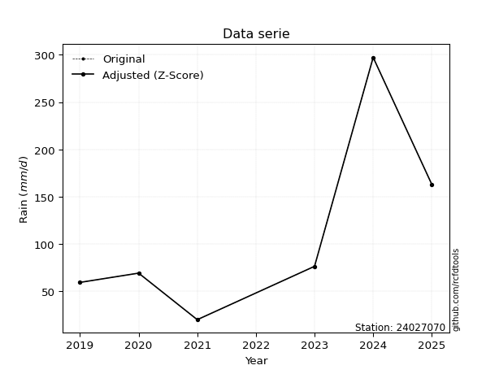</img>

</div>

> If Z-Score is active, values out of range or outliers are replaced with the station mean value.


### 4. Active continuous probability distributions from SciPy (45 of 104 available)

[scipy.stats](https://docs.scipy.org/doc/scipy/reference/stats.html) is a Python´s powerful submodule within the SciPy library for comprehensive statistical analysis, offering over 130 probability distributions (like Normal, Poisson), functions for descriptive stats (mean, variance), hypothesis testing (t-tests, chi-square), random variable generation, and statistical tests, making it essential for data science, modeling, and research. It provides tools to explore, model, and draw conclusions from data efficiently, working seamlessly with NumPy.

<div align="center">

|   id | p_dist             |   n_parameter | fit_method   | label                                                                       | active   | ref                                                                                                        |
|-----:|:-------------------|--------------:|:-------------|:----------------------------------------------------------------------------|:---------|:-----------------------------------------------------------------------------------------------------------|
|    0 | alpha              |             3 | MLE          | Alpha                                                                       | True     | [:mortar_board:](https://docs.scipy.org/doc/scipy/reference/generated/scipy.stats.alpha.html)              |
|    1 | betaprime          |             4 | MLE          | Beta prime                                                                  | True     | [:mortar_board:](https://docs.scipy.org/doc/scipy/reference/generated/scipy.stats.betaprime.html)          |
|    2 | chi2               |             3 | MLE          | Chi²                                                                        | True     | [:mortar_board:](https://docs.scipy.org/doc/scipy/reference/generated/scipy.stats.chi2.html)               |
|    3 | crystalball        |             4 | MLE          | Crystalball                                                                 | True     | [:mortar_board:](https://docs.scipy.org/doc/scipy/reference/generated/scipy.stats.crystalball.html)        |
|    4 | erlang             |             3 | MLE          | Erlang                                                                      | True     | [:mortar_board:](https://docs.scipy.org/doc/scipy/reference/generated/scipy.stats.erlang.html)             |
|    5 | expon              |             2 | MLE          | Exponential                                                                 | True     | [:mortar_board:](https://docs.scipy.org/doc/scipy/reference/generated/scipy.stats.expon.html)              |
|    6 | exponnorm          |             3 | MLE          | Exponentially modified Normal                                               | True     | [:mortar_board:](https://docs.scipy.org/doc/scipy/reference/generated/scipy.stats.exponnorm.html)          |
|    7 | f                  |             4 | MLE          | F                                                                           | True     | [:mortar_board:](https://docs.scipy.org/doc/scipy/reference/generated/scipy.stats.f.html)                  |
|    8 | fatiguelife        |             3 | MLE          | Fatigue-life (Birnbaum-Saunders)                                            | True     | [:mortar_board:](https://docs.scipy.org/doc/scipy/reference/generated/scipy.stats.fatiguelife.html)        |
|    9 | fisk               |             3 | MLE          | Fisk                                                                        | True     | [:mortar_board:](https://docs.scipy.org/doc/scipy/reference/generated/scipy.stats.fisk.html)               |
|   10 | gamma              |             3 | MLE          | Gamma                                                                       | True     | [:mortar_board:](https://docs.scipy.org/doc/scipy/reference/generated/scipy.stats.gamma.html)              |
|   11 | genexpon           |             5 | MLE          | Generalized exponential                                                     | True     | [:mortar_board:](https://docs.scipy.org/doc/scipy/reference/generated/scipy.stats.genexpon.html)           |
|   12 | genlogistic        |             3 | MLE          | Generalized logistic                                                        | True     | [:mortar_board:](https://docs.scipy.org/doc/scipy/reference/generated/scipy.stats.genlogistic.html)        |
|   13 | gibrat             |             2 | MM           | Gibrat                                                                      | True     | [:mortar_board:](https://docs.scipy.org/doc/scipy/reference/generated/scipy.stats.gibrat.html)             |
|   14 | gompertz           |             3 | MLE          | Gompertz (or truncated Gumbel)                                              | True     | [:mortar_board:](https://docs.scipy.org/doc/scipy/reference/generated/scipy.stats.gompertz.html)           |
|   15 | gumbel_l           |             2 | MM           | Gumbel Left Skew                                                            | True     | [:mortar_board:](https://docs.scipy.org/doc/scipy/reference/generated/scipy.stats.gumbel_l.html)           |
|   16 | gumbel_r           |             2 | MM           | Gumbel Right Skew                                                           | True     | [:mortar_board:](https://docs.scipy.org/doc/scipy/reference/generated/scipy.stats.gumbel_r.html)           |
|   17 | halflogistic       |             2 | MM           | Half-logistic                                                               | True     | [:mortar_board:](https://docs.scipy.org/doc/scipy/reference/generated/scipy.stats.halflogistic.html)       |
|   18 | halfnorm           |             2 | MM           | Half Normal                                                                 | True     | [:mortar_board:](https://docs.scipy.org/doc/scipy/reference/generated/scipy.stats.halfnorm.html)           |
|   19 | hypsecant          |             2 | MM           | hyperbolic secant                                                           | True     | [:mortar_board:](https://docs.scipy.org/doc/scipy/reference/generated/scipy.stats.hypsecant.html)          |
|   20 | invgamma           |             3 | MLE          | Inverted gamma                                                              | True     | [:mortar_board:](https://docs.scipy.org/doc/scipy/reference/generated/scipy.stats.invgamma.html)           |
|   21 | invgauss           |             3 | MLE          | Inverse Gaussian                                                            | True     | [:mortar_board:](https://docs.scipy.org/doc/scipy/reference/generated/scipy.stats.invgauss.html)           |
|   22 | invweibull         |             3 | MLE          | Inverted Weibull                                                            | True     | [:mortar_board:](https://docs.scipy.org/doc/scipy/reference/generated/scipy.stats.invweibull.html)         |
|   23 | johnsonsu          |             4 | MLE          | Johnson Su                                                                  | True     | [:mortar_board:](https://docs.scipy.org/doc/scipy/reference/generated/scipy.stats.johnsonsu.html)          |
|   24 | kstwobign          |             2 | MLE          | Limiting distribution of scaled Kolmogorov-Smirnov two-sided test statistic | True     | [:mortar_board:](https://docs.scipy.org/doc/scipy/reference/generated/scipy.stats.kstwobign.html)          |
|   25 | laplace            |             2 | MM           | Laplace                                                                     | True     | [:mortar_board:](https://docs.scipy.org/doc/scipy/reference/generated/scipy.stats.laplace.html)            |
|   26 | laplace_asymmetric |             3 | MLE          | Asymmetric Laplace                                                          | True     | [:mortar_board:](https://docs.scipy.org/doc/scipy/reference/generated/scipy.stats.laplace_asymmetric.html) |
|   27 | loggamma           |             3 | MLE          | Log gamma                                                                   | True     | [:mortar_board:](https://docs.scipy.org/doc/scipy/reference/generated/scipy.stats.loggamma.html)           |
|   28 | logistic           |             2 | MM           | Logistic (or Sech-squared)                                                  | True     | [:mortar_board:](https://docs.scipy.org/doc/scipy/reference/generated/scipy.stats.logistic.html)           |
|   29 | lognorm            |             3 | MLE          | Log Normal                                                                  | True     | [:mortar_board:](https://docs.scipy.org/doc/scipy/reference/generated/scipy.stats.lognorm.html)            |
|   30 | maxwell            |             2 | MM           | Maxwell                                                                     | True     | [:mortar_board:](https://docs.scipy.org/doc/scipy/reference/generated/scipy.stats.maxwell.html)            |
|   31 | mielke             |             4 | MLE          | Mielke Beta-Kappa / Dagum                                                   | True     | [:mortar_board:](https://docs.scipy.org/doc/scipy/reference/generated/scipy.stats.mielke.html)             |
|   32 | moyal              |             2 | MM           | Moyal                                                                       | True     | [:mortar_board:](https://docs.scipy.org/doc/scipy/reference/generated/scipy.stats.moyal.html)              |
|   33 | nakagami           |             3 | MLE          | Nakagami                                                                    | True     | [:mortar_board:](https://docs.scipy.org/doc/scipy/reference/generated/scipy.stats.nakagami.html)           |
|   34 | ncf                |             5 | MLE          | Non-central F distribution                                                  | True     | [:mortar_board:](https://docs.scipy.org/doc/scipy/reference/generated/scipy.stats.ncf.html)                |
|   35 | nct                |             4 | MLE          | Non-central Student’s t                                                     | True     | [:mortar_board:](https://docs.scipy.org/doc/scipy/reference/generated/scipy.stats.nct.html)                |
|   36 | norm               |             2 | MM           | Normal                                                                      | True     | [:mortar_board:](https://docs.scipy.org/doc/scipy/reference/generated/scipy.stats.norm.html)               |
|   37 | pareto             |             3 | MLE          | Pareto                                                                      | True     | [:mortar_board:](https://docs.scipy.org/doc/scipy/reference/generated/scipy.stats.pareto.html)             |
|   38 | pearson3           |             3 | MM           | Pearson type III                                                            | True     | [:mortar_board:](https://docs.scipy.org/doc/scipy/reference/generated/scipy.stats.pearson3.html)           |
|   39 | rayleigh           |             2 | MM           | Rayleigh                                                                    | True     | [:mortar_board:](https://docs.scipy.org/doc/scipy/reference/generated/scipy.stats.rayleigh.html)           |
|   40 | rice               |             3 | MLE          | Rice                                                                        | True     | [:mortar_board:](https://docs.scipy.org/doc/scipy/reference/generated/scipy.stats.rice.html)               |
|   41 | t                  |             3 | MLE          | Student’s t                                                                 | True     | [:mortar_board:](https://docs.scipy.org/doc/scipy/reference/generated/scipy.stats.t.html)                  |
|   42 | truncnorm          |             4 | MLE          | Truncated normal                                                            | True     | [:mortar_board:](https://docs.scipy.org/doc/scipy/reference/generated/scipy.stats.truncnorm.html)          |
|   43 | wald               |             2 | MM           | Wald                                                                        | True     | [:mortar_board:](https://docs.scipy.org/doc/scipy/reference/generated/scipy.stats.wald.html)               |
|   44 | weibull_min        |             3 | MLE          | Weibull minimum                                                             | True     | [:mortar_board:](https://docs.scipy.org/doc/scipy/reference/generated/scipy.stats.weibull_min.html)        |

</div>

> **n_parameter:** # arguments & localization & scale.
>
> **Fit methods:** (MLE) maximum likelihood, (MM) L-moments.
>
>**Inactive:** foldnorm, gennorm, norminvgauss, powernorm, powerlognorm, skewnorm, genextreme, anglit, arcsine, argus, beta, bradford, burr, burr12, cauchy, cosine, halfcauchy, foldcauchy, skewcauchy, wrapcauchy, dgamma, gengamma, exponweib, exponpow, truncexpon, gausshyper, genhalflogistic, genhyperbolic, geninvgauss, halfgennorm, johnsonsb, kappa4, kappa3, ksone, kstwo, loglaplace, levy, levy_l, levy_stable, ncx2, genpareto, truncpareto, lomax, powerlaw, rdist, rel_breitwigner, recipinvgauss, semicircular, studentized_range, trapezoid, triang, truncweibull_min, tukeylambda, uniform, loguniform, vonmises, vonmises_line, weibull_max, dweibull, 


## B. Probability distributions vs. Empirical distributions

A continuous probability distribution (CPD) describes probabilities for variables that can take any value within a range (like rain any time), unlike discrete variables with specific outcomes (like temperature). It uses a Probability Density Function (PDF), a curve where the total area under it equals 1, and the probability of the variable falling within an interval (a to b) is found by calculating the area under the curve between those points. A key feature is that the probability of hitting any single exact value is zero, so probabilities are always expressed for ranges, e.g., $P(a ≤ X ≤ b)$.

<div align="center">

Distributions parameters
|    |   station | p_dist                |   n |              loc |          scale | shape                 | shape1              | shape2                 | shape3   |
|---:|----------:|:----------------------|----:|-----------------:|---------------:|:----------------------|:--------------------|:-----------------------|:---------|
|  0 |  24027070 | alpha                 |   6 |     -0.123846    |   43.3791      | 5.665258018028228e-11 |                     |                        |          |
|  1 |  24027070 | betaprime             |   6 |     -0.727908    |  111.738       | 3.0134811066203095    | 3.95362140286392    |                        |          |
|  2 |  24027070 | chi2                  |   6 |     20           |    6.34012     | 1.647786811744508     |                     |                        |          |
|  3 |  24027070 | crystalball           |   6 |    110.7         |   90.8468      | 9668.2620713964       | 3301.915044940388   |                        |          |
|  4 |  24027070 | erlang                |   6 |     20           |   76.7084      | 0.7055332008373236    |                     |                        |          |
|  5 |  24027070 | expon                 |   6 |     20           |   90.7         |                       |                     |                        |          |
|  6 |  24027070 | exponnorm             |   6 |     24.5994      |   17.9236      | 4.803745115960529     |                     |                        |          |
|  7 |  24027070 | f                     |   6 |     20           |   93.0223      | 1.22900238731041      | 25.81213028661709   |                        |          |
|  8 |  24027070 | fatiguelife           |   6 |      3.50455     |   73.5125      | 0.9512641440935434    |                     |                        |          |
|  9 |  24027070 | fisk                  |   6 |      9.41262     |   69.245       | 1.7629127729853133    |                     |                        |          |
| 10 |  24027070 | gamma                 |   6 |     20           |   97.0554      | 0.5778923221593613    |                     |                        |          |
| 11 |  24027070 | genexpon              |   6 |     20           |   83.6031      | 0.9217525672027921    | 0.13130598351650352 | 4.266745309287835e-08  |          |
| 12 |  24027070 | genlogistic           |   6 |   -344.336       |   58.1363      | 1290.7752713302443    |                     |                        |          |
| 13 |  24027070 | gibrat                |   6 |     41.3953      |   42.0354      |                       |                     |                        |          |
| 14 |  24027070 | gompertz              |   6 |     20           |    3.01508e+06 | 33253.106455552945    |                     |                        |          |
| 15 |  24027070 | gumbel_l              |   6 |    151.586       |   70.833       |                       |                     |                        |          |
| 16 |  24027070 | gumbel_r              |   6 |     69.8141      |   70.833       |                       |                     |                        |          |
| 17 |  24027070 | halflogistic          |   6 |      3.02542     |   77.6708      |                       |                     |                        |          |
| 18 |  24027070 | halfnorm              |   6 |     -9.54558     |  150.705       |                       |                     |                        |          |
| 19 |  24027070 | hypsecant             |   6 |    110.7         |   57.8349      |                       |                     |                        |          |
| 20 |  24027070 | invgamma              |   6 |    -21.9992      |  263.347       | 2.916709112743524     |                     |                        |          |
| 21 |  24027070 | invgauss              |   6 |     -3.27249     |  140.048       | 0.8138075324498799    |                     |                        |          |
| 22 |  24027070 | invweibull            |   6 |     20           |    5.65868     | 0.0652044818054894    |                     |                        |          |
| 23 |  24027070 | johnsonsu             |   6 |     63.8644      |   10.3418      | -0.4662004870879536   | 0.5106396721284029  |                        |          |
| 24 |  24027070 | kstwobign             |   6 |   -142.117       |  293.037       |                       |                     |                        |          |
| 25 |  24027070 | laplace               |   6 |    110.7         |   64.2384      |                       |                     |                        |          |
| 26 |  24027070 | laplace_asymmetric    |   6 |     59.4         |   44.9         | 0.5804028833933206    |                     |                        |          |
| 27 |  24027070 | loggamma              |   6 | -30559.7         | 4052.09        | 1938.2407170679803    |                     |                        |          |
| 28 |  24027070 | logistic              |   6 |    110.7         |   50.0865      |                       |                     |                        |          |
| 29 |  24027070 | lognorm               |   6 |     20           |    0.153606    | 14.056780563314659    |                     |                        |          |
| 30 |  24027070 | maxwell               |   6 |   -104.569       |  134.9         |                       |                     |                        |          |
| 31 |  24027070 | mielke                |   6 |     19.9948      |   90.4451      | 0.6751599350119043    | 2.3001179449294025  |                        |          |
| 32 |  24027070 | moyal                 |   6 |     58.748       |   40.8954      |                       |                     |                        |          |
| 33 |  24027070 | nakagami              |   6 |     20           |  169.084       | 0.24560178266818103   |                     |                        |          |
| 34 |  24027070 | ncf                   |   6 |      0.945799    |   66.8626      | 5.090281703304637     | 8.868953968450775   | 1.4059340902029769     |          |
| 35 |  24027070 | nct                   |   6 |    -41.7417      |   11.7029      | 2.583931892151366     | 9.058719800386083   |                        |          |
| 36 |  24027070 | norm                  |   6 |    110.7         |   90.8468      |                       |                     |                        |          |
| 37 |  24027070 | pareto                |   6 |     19.7697      |    0.230329    | 0.2041551695899973    |                     |                        |          |
| 38 |  24027070 | pearson3              |   6 |    110.7         |   90.8469      | 1.228053168232989     |                     |                        |          |
| 39 |  24027070 | rayleigh              |   6 |    -63.0953      |  138.669       |                       |                     |                        |          |
| 40 |  24027070 | rice                  |   6 |    -28.8946      |  117.771       | 0.0003066016933815397 |                     |                        |          |
| 41 |  24027070 | t                     |   6 |     68.614       |   14.715       | 0.6798615483534257    |                     |                        |          |
| 42 |  24027070 | truncnorm             |   6 | -36588.8         | 1830.44        | 19.99998289749713     | 299.18397881883806  |                        |          |
| 43 |  24027070 | wald                  |   6 |     19.8532      |   90.8468      |                       |                     |                        |          |
| 44 |  24027070 | weibull_min           |   6 |     20           |   77.5779      | 0.6886836272163579    |                     |                        |          |
| 45 |  24027070 | logalpha              |   6 |    -12.7268      |  346.652       | 20.307219157215982    |                     |                        |          |
| 46 |  24027070 | logbetaprime          |   6 |     -7.42532     |   92.3928      | 229.4512881919165     | 1795.0213830019575  |                        |          |
| 47 |  24027070 | logchi2               |   6 |      2.99573     |    0.935356    | 1.1058971040567513    |                     |                        |          |
| 48 |  24027070 | logcrystalball        |   6 |      4.38387     |    0.825145    | 135.42844759053912    | 138.45743979806377  |                        |          |
| 49 |  24027070 | logerlang             |   6 |    -22.0343      |    0.0258737   | 1020.9776608187294    |                     |                        |          |
| 50 |  24027070 | logexpon              |   6 |      2.99573     |    1.38814     |                       |                     |                        |          |
| 51 |  24027070 | logexponnorm          |   6 |      4.38297     |    0.82514     | 0.0010930598125791203 |                     |                        |          |
| 52 |  24027070 | logf                  |   6 |    -34.4851      |   38.8673      | 4452.26069166589      | 1844208.6409264817  |                        |          |
| 53 |  24027070 | logfatiguelife        |   6 |    -85.0036      |   89.3856      | 0.009227386156784468  |                     |                        |          |
| 54 |  24027070 | logfisk               |   6 |     -1.09226e+07 |    1.09226e+07 | 23088664.21950072     |                     |                        |          |
| 55 |  24027070 | loggamma              |   6 |    -22.5891      |    0.0253263   | 1064.9980365671308    |                     |                        |          |
| 56 |  24027070 | loggenexpon           |   6 |      2.99393     |    0.0135369   | 0.004159050692865034  | 5.035362598669222   | 1.5948206930242652e-05 |          |
| 57 |  24027070 | loggenlogistic        |   6 |      4.38252     |    0.473054    | 1.0060031026643896    |                     |                        |          |
| 58 |  24027070 | loggibrat             |   6 |      3.75435     |    0.381821    |                       |                     |                        |          |
| 59 |  24027070 | loggompertz           |   6 |      2.99573     |    1.12584     | 0.29085603223201273   |                     |                        |          |
| 60 |  24027070 | loggumbel_l           |   6 |      4.75523     |    0.643362    |                       |                     |                        |          |
| 61 |  24027070 | loggumbel_r           |   6 |      4.01252     |    0.643362    |                       |                     |                        |          |
| 62 |  24027070 | loghalflogistic       |   6 |      3.40583     |    0.705502    |                       |                     |                        |          |
| 63 |  24027070 | loghalfnorm           |   6 |      3.29171     |    1.36882     |                       |                     |                        |          |
| 64 |  24027070 | loghypsecant          |   6 |      4.38387     |    0.525303    |                       |                     |                        |          |
| 65 |  24027070 | loginvgamma           |   6 |    -10.1897      | 4381.68        | 301.74324295353574    |                     |                        |          |
| 66 |  24027070 | loginvgauss           |   6 |     -2.25275     |  397.095       | 0.01671629047198707   |                     |                        |          |
| 67 |  24027070 | loginvweibull         |   6 |     -5.4266e+07  |    5.4266e+07  | 68708501.81770787     |                     |                        |          |
| 68 |  24027070 | logjohnsonsu          |   6 |     -2.17988e+06 |    1.16306e+07 | -2672626.675976018    | 14342234.057744954  |                        |          |
| 69 |  24027070 | logkstwobign          |   6 |      1.14277     |    3.71024     |                       |                     |                        |          |
| 70 |  24027070 | loglaplace            |   6 |      4.38387     |    0.583465    |                       |                     |                        |          |
| 71 |  24027070 | loglaplace_asymmetric |   6 |      4.237       |    0.598139    | 0.8846534358997322    |                     |                        |          |
| 72 |  24027070 | logloggamma           |   6 |    -28.1461      |    7.41064     | 81.10983543084788     |                     |                        |          |
| 73 |  24027070 | loglogistic           |   6 |      4.38387     |    0.454926    |                       |                     |                        |          |
| 74 |  24027070 | loglognorm            |   6 |      2.99573     |    0.00402532  | 13.346254939704947    |                     |                        |          |
| 75 |  24027070 | logmaxwell            |   6 |      2.42863     |    1.22527     |                       |                     |                        |          |
| 76 |  24027070 | logmielke             |   6 |     -0.0783561   |    4.81282     | 6.6843512175505655    | 11.86344348162152   |                        |          |
| 77 |  24027070 | logmoyal              |   6 |      3.912       |    0.371445    |                       |                     |                        |          |
| 78 |  24027070 | lognakagami           |   6 |      4.08429     |    0.308033    | 0.23191937333120133   |                     |                        |          |
| 79 |  24027070 | logncf                |   6 |     -0.255376    |    2.33025     | 46.41832094414852     | 2548.7703901643586  | 45.89581072032683      |          |
| 80 |  24027070 | lognct                |   6 |     40.5261      |    0.818388    | 58668.44254352107     | -44.16194945097058  |                        |          |
| 81 |  24027070 | lognorm               |   6 |      4.38387     |    0.825144    |                       |                     |                        |          |
| 82 |  24027070 | logpareto             |   6 |      2.9914      |    0.00432839  | 0.20348029646142424   |                     |                        |          |
| 83 |  24027070 | logpearson3           |   6 |      4.38387     |    0.825142    | -0.07925779559070058  |                     |                        |          |
| 84 |  24027070 | lograyleigh           |   6 |      2.80533     |    1.2595      |                       |                     |                        |          |
| 85 |  24027070 | logrice               |   6 |      2.51824     |    0.923111    | 1.698099800147941     |                     |                        |          |
| 86 |  24027070 | logt                  |   6 |      4.38387     |    0.825147    | 1513193264.7251658    |                     |                        |          |
| 87 |  24027070 | logtruncnorm          |   6 |     -0.227547    |    1.63787     | 2.632598129956403     | 3.6156534769114237  |                        |          |
| 88 |  24027070 | logwald               |   6 |      3.55872     |    0.82515     |                       |                     |                        |          |
| 89 |  24027070 | logweibull_min        |   6 |      1.9409      |    2.7259      | 3.321219153200081     |                     |                        |          |

</div>

> **loc** (Location parameter): This shifts the distribution along the x-axis. For many common distributions, like the normal (Gaussian) distribution, loc represents the mean $μ$. For others, like the uniform distribution, it might represent the minimum value, or for the beta distribution, the left end of the support interval.
>
> **scale** (Scale parameter): This determines the width or spread of the distribution. For the normal distribution, scale represents the standard deviation $σ$. For a uniform distribution, it defines the length of the interval (from $loc$ to $loc + scale$).
>
> **shape** (Shape parameters): Refers to parameters that define the specific form of a probability distribution, distinct from its location (loc) and scale (scale). These parameters are required arguments for most distribution functions. For example, a normal (Gaussian) distribution is fully defined by its location (mean) and scale (standard deviation), so it has no specific shape parameters beyond loc and scale. However, other distributions have intrinsic properties that need specification, as Gamma distribution that takes a shape parameter, often named $a$ or $alpha$.


### 0. Cumulative distribution values - CDF (90 evaluated)

> Ordered by x ascending and calculating $log(f(x))$ separately. 

|   id |   Station |   date |     x |   count |   mean |     std |    zscore |   Value_initial |   station |   m |     alpha |   alpha_pdf |   betaprime |   betaprime_pdf |        chi2 |     chi2_pdf |   crystalball |   crystalball_pdf |      erlang |   erlang_pdf |    expon |   expon_pdf |   exponnorm |   exponnorm_pdf |           f |        f_pdf |   fatiguelife |   fatiguelife_pdf |      fisk |    fisk_pdf |       gamma |       gamma_pdf |    genexpon |   genexpon_pdf |   genlogistic |   genlogistic_pdf |   gibrat |   gibrat_pdf |    gompertz |   gompertz_pdf |   gumbel_l |   gumbel_l_pdf |   gumbel_r |   gumbel_r_pdf |   halflogistic |   halflogistic_pdf |   halfnorm |   halfnorm_pdf |   hypsecant |   hypsecant_pdf |   invgamma |   invgamma_pdf |   invgauss |   invgauss_pdf |   invweibull |   invweibull_pdf |   johnsonsu |   johnsonsu_pdf |   kstwobign |   kstwobign_pdf |   laplace |   laplace_pdf |   laplace_asymmetric |   laplace_asymmetric_pdf |   loggamma |   loggamma_pdf |   logistic |   logistic_pdf |   lognorm |   lognorm_pdf |   maxwell |   maxwell_pdf |     mielke |   mielke_pdf |    moyal |   moyal_pdf |    nakagami |     nakagami_pdf |       ncf |     ncf_pdf |       nct |     nct_pdf |     norm |    norm_pdf |   pareto |   pareto_pdf |   pearson3 |   pearson3_pdf |   rayleigh |   rayleigh_pdf |      rice |    rice_pdf |        t |       t_pdf |   truncnorm |   truncnorm_pdf |         wald |    wald_pdf |   weibull_min |   weibull_min_pdf |   logalpha |   logalpha_pdf |   logbetaprime |   logbetaprime_pdf |     logchi2 |   logchi2_pdf |   logcrystalball |   logcrystalball_pdf |   logerlang |   logerlang_pdf |   logexpon |   logexpon_pdf |   logexponnorm |   logexponnorm_pdf |      logf |   logf_pdf |   logfatiguelife |   logfatiguelife_pdf |   logfisk |   logfisk_pdf |   loggenexpon |   loggenexpon_pdf |   loggenlogistic |   loggenlogistic_pdf |   loggibrat |   loggibrat_pdf |   loggompertz |   loggompertz_pdf |   loggumbel_l |   loggumbel_l_pdf |   loggumbel_r |   loggumbel_r_pdf |   loghalflogistic |   loghalflogistic_pdf |   loghalfnorm |   loghalfnorm_pdf |   loghypsecant |   loghypsecant_pdf |   loginvgamma |   loginvgamma_pdf |   loginvgauss |   loginvgauss_pdf |   loginvweibull |   loginvweibull_pdf |   logjohnsonsu |   logjohnsonsu_pdf |   logkstwobign |   logkstwobign_pdf |   loglaplace |   loglaplace_pdf |   loglaplace_asymmetric |   loglaplace_asymmetric_pdf |   logloggamma |   logloggamma_pdf |   loglogistic |   loglogistic_pdf |   loglognorm |   loglognorm_pdf |   logmaxwell |   logmaxwell_pdf |   logmielke |   logmielke_pdf |    logmoyal |   logmoyal_pdf |   lognakagami |   lognakagami_pdf |    logncf |   logncf_pdf |    lognct |   lognct_pdf |   logpareto |   logpareto_pdf |   logpearson3 |   logpearson3_pdf |   lograyleigh |   lograyleigh_pdf |   logrice |   logrice_pdf |      logt |   logt_pdf |   logtruncnorm |   logtruncnorm_pdf |   logwald |   logwald_pdf |   logweibull_min |   logweibull_min_pdf |
|-----:|----------:|-------:|------:|--------:|-------:|--------:|----------:|----------------:|----------:|----:|----------:|------------:|------------:|----------------:|------------:|-------------:|--------------:|------------------:|------------:|-------------:|---------:|------------:|------------:|----------------:|------------:|-------------:|--------------:|------------------:|----------:|------------:|------------:|----------------:|------------:|---------------:|--------------:|------------------:|---------:|-------------:|------------:|---------------:|-----------:|---------------:|-----------:|---------------:|---------------:|-------------------:|-----------:|---------------:|------------:|----------------:|-----------:|---------------:|-----------:|---------------:|-------------:|-----------------:|------------:|----------------:|------------:|----------------:|----------:|--------------:|---------------------:|-------------------------:|-----------:|---------------:|-----------:|---------------:|----------:|--------------:|----------:|--------------:|-----------:|-------------:|---------:|------------:|------------:|-----------------:|----------:|------------:|----------:|------------:|---------:|------------:|---------:|-------------:|-----------:|---------------:|-----------:|---------------:|----------:|------------:|---------:|------------:|------------:|----------------:|-------------:|------------:|--------------:|------------------:|-----------:|---------------:|---------------:|-------------------:|------------:|--------------:|-----------------:|---------------------:|------------:|----------------:|-----------:|---------------:|---------------:|-------------------:|----------:|-----------:|-----------------:|---------------------:|----------:|--------------:|--------------:|------------------:|-----------------:|---------------------:|------------:|----------------:|--------------:|------------------:|--------------:|------------------:|--------------:|------------------:|------------------:|----------------------:|--------------:|------------------:|---------------:|-------------------:|--------------:|------------------:|--------------:|------------------:|----------------:|--------------------:|---------------:|-------------------:|---------------:|-------------------:|-------------:|-----------------:|------------------------:|----------------------------:|--------------:|------------------:|--------------:|------------------:|-------------:|-----------------:|-------------:|-----------------:|------------:|----------------:|------------:|---------------:|--------------:|------------------:|----------:|-------------:|----------:|-------------:|------------:|----------------:|--------------:|------------------:|--------------:|------------------:|----------:|--------------:|----------:|-----------:|---------------:|-------------------:|----------:|--------------:|-----------------:|---------------------:|
|    0 |  24027070 |   2021 |  20   |       6 |  110.7 | 99.5177 | -0.911396 |            20   |  24027070 |   1 | 0.0311143 | 0.00837129  |   0.0507886 |     0.00543169  | 1.63744e-13 | 37.9732      |      0.159047 |       0.00266781  | 3.28642e-12 | 652.651      | 0        | 0.0110254   |   0.0526616 |     0.00401946  | 4.24951e-07 | 47.5756      |     0.0426039 |       0.00746964  | 0.0352049 | 0.00565562  | 3.56052e-10 | 57916.1         | 1.15834e-11 |    0.0110253   |     0.0864984 |       0.00363827  | 0        |  0           | 1.90098e-09 |    0.0110289   |   0.144468 |    0.00188458  |   0.132612 |    0.00378241  |       0.10884  |        0.00636117  |   0.155428 |     0.00519356 |    0.130804 |     0.00219857  |  0.0464573 |    0.00513821  |  0.0437693 |     0.00625483 |  5.54234e-05 |      9.96916e+09 |   0.0587998 |     0.00132853  |   0.0804652 |      0.003505   |  0.121836 |   0.00189663  |            0.0555604 |              0.00213201  |  0.0447176 |       0.118199 |   0.140533 |    0.0024115   | 0.0462551 |      0.117442 |  0.163175 |   0.00329279  | 0.00136847 |  0.178183    | 0.108275 |  0.00431428 | 5.01661e-09 | 693605           | 0.0526289 | 0.00557198  | 0.0492807 | 0.00485596  | 0.159047 | 0.00266781  | 0        |  0.886363    |   0.131942 |    0.00450679  |   0.164347 |    0.00361115  | 0.0825731 | 0.00323414  | 0.136323 | 0.00183571  |    0        |     0.0109535   | 3.71353e-136 | 7.8386e-133 |   5.59082e-12 |    1083.77        |  0.0408552 |       0.122937 |      0.0411121 |           0.116737 | 2.57923e-09 |   3.21148e+06 |        0.0462554 |             0.117442 |   0.0448724 |        0.118582 |   0        |       0.720388 |      0.0462545 |           0.117441 | 0.0450929 |   0.117947 |        0.0451407 |             0.117029 | 0.0501899 |      0.100769 |   0.000555153 |          0.307858 |        0.0497163 |             0.100376 |    0        |       0         |   4.92455e-09 |          0.258347 |     0.0628422 |         0.0945423 |    0.00777376 |         0.0586873 |          0        |              0        |      0        |          0        |      0.0452378 |          0.0858279 |     0.0424659 |          0.123085 |     0.0391862 |          0.126023 |       0.0330304 |            0.142624 |      0.0462362 |           0.117416 |      0.0356839 |           0.171252 |    0.0463153 |        0.0793798 |               0.0420458 |                   0.0794598 |     0.0494099 |          0.116485 |     0.0451588 |         0.0947836 |    0.0126928 |      5.53236e+12 |    0.0247384 |         0.125329 |   0.0498279 |        0.107818 | 0.000597302 |      0.0101795 |   0           |       0           | 0.0389603 |     0.124057 | 0.0463144 |     0.117408 |    0        |      47.0107    |     0.0485127 |          0.116883 |     0.0113621 |          0.118665 | 0.0324975 |      0.139394 | 0.0462559 |   0.117443 |    0           |          0         |  0        |     0         |        0.0418148 |             0.128866 |
|    1 |  24027070 |   2019 |  59.4 |       6 |  110.7 | 99.5177 | -0.515486 |            59.4 |  24027070 |   2 | 0.466143  | 0.00749051  |   0.344652  |     0.00755668  | 0.969213    |  0.00253757  |      0.286143 |       0.00374419  | 0.561984    |   0.00736057 | 0.352346 | 0.00714061  |   0.320081  |     0.00759375  | 0.438019    |  0.00576317  |     0.386325  |       0.0072639   | 0.360199  | 0.00812752  | 0.578551    |     0.00651336  | 0.352346    |    0.00714061  |     0.288395  |       0.00616525  | 0.198253 |  0.0154674   | 0.352439    |    0.00714199  |   0.238249 |    0.0029266   |   0.313994 |    0.00513497  |       0.347772 |        0.00565885  |   0.352678 |     0.0047683  |    0.248734 |     0.00387625  |  0.353831  |    0.00800442  |  0.370269  |     0.00758797 |  0.414309    |      0.00060416  |   0.248156  |     0.014349    |   0.268374  |      0.0056167  |  0.224982 |   0.0035023   |            0.251983  |              0.00966929  |  0.362039  |       0.456901 |   0.264205 |    0.0038813   | 0.358279  |      0.452644 |  0.312506 |   0.0041746   | 0.548017   |  0.00817963  | 0.321168 |  0.00591644 | 0.380716    |      0.00469585  | 0.345947  | 0.00750717  | 0.349608  | 0.00810338  | 0.286143 | 0.00374419  | 0.650397 |  0.00180097  |   0.331773 |    0.00528306  |   0.323057 |    0.00431236  | 0.245     | 0.00480626  | 0.339556 | 0.013563    |    0.35066  |     0.00712016  | 0.305385     | 0.0106007   |   0.46588     |       0.00585495  |  0.377072  |       0.465921 |      0.36377   |           0.462102 | 0.687744    |   0.236671    |        0.358279  |             0.452644 |   0.362728  |        0.457126 |   0.543509 |       0.32885  |      0.358278  |           0.452646 | 0.361271  |   0.456489 |        0.35885   |             0.454601 | 0.345382  |      0.477925 |   0.448657    |          0.432675 |        0.345214  |             0.479089 |    0.441952 |       1.19629   |   0.377508    |          0.422914 |     0.297032  |         0.385097  |    0.408841   |         0.568388  |          0.446913 |              0.567163 |      0.437427 |          0.492935 |      0.327577  |          0.519208  |     0.3751    |          0.464113 |     0.383932  |          0.467267 |       0.423396  |            0.460732 |      0.358259  |           0.452685 |      0.44412   |           0.441707 |    0.299214  |        0.512823  |               0.32897   |                   0.6217    |     0.352229  |          0.4441   |     0.341071  |         0.494018  |    0.662609  |      0.0251459   |    0.39069   |         0.477197 |   0.345498  |        0.470665 | 0.427772    |      0.621925  |   1.41044e-07 |       7.36585e+07 | 0.38076   |     0.468611 | 0.358112  |     0.452436 |    0.675519 |       0.0604137 |     0.354004  |          0.446445 |     0.402844  |          0.48145  | 0.375039  |      0.457062 | 0.35828   |   0.452643 |    1.69255e-06 |          1.86328   |  0.473323 |     0.857613  |        0.362389  |             0.444622 |
|    2 |  24027070 |   2020 |  69.2 |       6 |  110.7 | 99.5177 | -0.417011 |            69.2 |  24027070 |   3 | 0.531481  | 0.00592147  |   0.415886  |     0.00695938  | 0.98623     |  0.00112663  |      0.323903 |       0.00395628  | 0.627499    |   0.00606765 | 0.418676 | 0.0064093   |   0.391705  |     0.00699041  | 0.490332    |  0.00495075  |     0.452936  |       0.00634926  | 0.435635  | 0.00724944  | 0.63645     |     0.00536084  | 0.418676    |    0.0064093   |     0.349723  |       0.00631747  | 0.339691 |  0.0131734   | 0.418781    |    0.00641032  |   0.268396 |    0.00322784  |   0.36469  |    0.00519342  |       0.401968 |        0.00539728  |   0.398687 |     0.00461876 |    0.288996 |     0.00433817  |  0.428745  |    0.00726007  |  0.440425  |     0.00673215 |  0.419591    |      0.000482943 |   0.415577  |     0.0171123   |   0.324164  |      0.00574454 |  0.262061 |   0.00407951  |            0.340985  |              0.00851879  |  0.433594  |       0.477701 |   0.303948 |    0.00422397  | 0.429363  |      0.475883 |  0.353977 |   0.00428096  | 0.621457   |  0.00684064  | 0.378839 |  0.00582859 | 0.423987    |      0.00416286  | 0.416809  | 0.00693345  | 0.425808  | 0.00741387  | 0.323903 | 0.00395628  | 0.665818 |  0.00138022  |   0.383198 |    0.00519864  |   0.365613 |    0.00436458  | 0.293114  | 0.00499944  | 0.511643 | 0.0198427   |    0.416827 |     0.00639632  | 0.401705     | 0.0090522   |   0.518475    |       0.00492573  |  0.44925   |       0.476676 |      0.435903  |           0.479948 | 0.721442    |   0.205686    |        0.429363  |             0.475883 |   0.434302  |        0.477732 |   0.591063 |       0.294593 |      0.429363  |           0.475885 | 0.432818  |   0.478015 |        0.430174  |             0.477032 | 0.421504  |      0.515435 |   0.513413    |          0.414375 |        0.421516  |             0.516601 |    0.592642 |       0.804174  |   0.442971    |          0.433415 |     0.360368  |         0.444271  |    0.493889   |         0.541548  |          0.52922  |              0.510222 |      0.510173 |          0.459234 |      0.412139  |          0.583018  |     0.447172  |          0.477133 |     0.455973  |          0.473579 |       0.492455  |            0.44167  |      0.42935   |           0.475932 |      0.510013  |           0.419922 |    0.388729  |        0.666243  |               0.439025  |                   0.829687  |     0.4223    |          0.471351 |     0.419981  |         0.535466  |    0.666195  |      0.0219604   |    0.46376   |         0.477326 |   0.420731  |        0.511506 | 0.518497    |      0.562985  |   0.559312    |       1.62189     | 0.453174  |     0.477087 | 0.429171  |     0.475766 |    0.68404  |       0.051615  |     0.424348  |          0.472524 |     0.475886  |          0.473015 | 0.445952  |      0.469401 | 0.429364  |   0.475882 |    0.251965    |          1.45142   |  0.586483 |     0.636349  |        0.431979  |             0.464706 |
|    3 |  24027070 |   2023 |  76.4 |       6 |  110.7 | 99.5177 | -0.344662 |            76.4 |  24027070 |   4 | 0.570802  | 0.00503325  |   0.464232  |     0.00646637  | 0.992351    |  0.000623359 |      0.352879 |       0.00408927  | 0.668365    |   0.00530629 | 0.463039 | 0.00592019  |   0.440204  |     0.00647929  | 0.524213    |  0.00447441  |     0.496465  |       0.00575301  | 0.485395  | 0.00657366  | 0.672589    |     0.00469871  | 0.463039    |    0.00592018  |     0.395234  |       0.00630853  | 0.427387 |  0.0112075   | 0.46315     |    0.00592098  |   0.292454 |    0.0034557   |   0.402036 |    0.0051719   |       0.440091 |        0.00519063  |   0.431518 |     0.00449975 |    0.321404 |     0.00465995  |  0.478864  |    0.00665962  |  0.48671   |     0.00613078 |  0.422835    |      0.000420783 |   0.522548  |     0.0125156   |   0.365588  |      0.00575065 |  0.293143 |   0.00456336  |            0.399553  |              0.00776171  |  0.481182  |       0.482701 |   0.335187 |    0.00444904  | 0.476859  |      0.482669 |  0.384986 |   0.0043284   | 0.667533   |  0.00597384  | 0.420311 |  0.00568174 | 0.452828    |      0.00385812  | 0.465032  | 0.00645791  | 0.477081  | 0.00682287  | 0.352879 | 0.00408927  | 0.674968 |  0.00117176  |   0.420261 |    0.00509095  |   0.397085 |    0.0043738   | 0.329463  | 0.00509044  | 0.640141 | 0.0148817   |    0.461114 |     0.00591174  | 0.462941     | 0.00797484  |   0.551959    |       0.00439242  |  0.496404  |       0.474991 |      0.483607  |           0.482789 | 0.740935    |   0.188508    |        0.476859  |             0.482668 |   0.481887  |        0.482603 |   0.619207 |       0.274318 |      0.476858  |           0.48267  | 0.480461  |   0.4835   |        0.477753  |             0.483183 | 0.473183  |      0.52694  |   0.553705    |          0.399392 |        0.473306  |             0.528007 |    0.663083 |       0.627758  |   0.486056    |          0.436641 |     0.406182  |         0.481047  |    0.546157   |         0.513463  |          0.577838 |              0.472077 |      0.554475 |          0.435723 |      0.47102   |          0.603445  |     0.494445  |          0.476944 |     0.502688  |          0.469283 |       0.535307  |            0.423552 |      0.476851  |           0.48272  |      0.550712  |           0.402038 |    0.460599  |        0.78942   |               0.515421  |                   0.716697  |     0.469498  |          0.481219 |     0.473706  |         0.548021  |    0.668284  |      0.0202881   |    0.510681  |         0.469791 |   0.472177  |        0.526233 | 0.571992    |      0.517378  |   0.692807    |       1.12508     | 0.5003    |     0.474032 | 0.476658  |     0.482621 |    0.688919 |       0.0470772 |     0.471618  |          0.4815   |     0.522153  |          0.461074 | 0.492491  |      0.469955 | 0.476859  |   0.482667 |    0.384343    |          1.22874   |  0.643904 |     0.527899  |        0.478322  |             0.470721 |
|    4 |  24027070 |   2025 | 142   |       6 |  110.7 | 99.5177 |  0.314517 |           142   |  24027070 |   5 | 0.760198  | 0.00163553  |   0.754995  |     0.0027976   | 0.999962    |  3.08281e-06 |      0.634778 |       0.00413832  | 0.877936    |   0.0017977  | 0.739485 | 0.00287227  |   0.738641  |     0.00303551  | 0.72821     |  0.00215274  |     0.750803  |       0.00252969  | 0.758628  | 0.0024347   | 0.863279    |     0.00172583  | 0.739484    |    0.00287228  |     0.740505  |       0.00382616  | 0.808583 |  0.00270967  | 0.739605    |    0.00287199  |   0.582482 |    0.00514833  |   0.697035 |    0.00355165  |       0.713677 |        0.00315862  |   0.68538  |     0.00319327 |    0.664426 |     0.00478565  |  0.765037  |    0.00262695  |  0.755308  |     0.00260007 |  0.441075    |      0.000192961 |   0.821895  |     0.00168875  |   0.695934  |      0.0039812  |  0.692843 |   0.00478152  |            0.742842  |              0.00332417  |  0.757394  |       0.373078 |   0.651337 |    0.0045341   | 0.755894  |      0.380232 |  0.658    |   0.00371819  | 0.887386   |  0.001642    | 0.717826 |  0.00330237 | 0.648861    |      0.00235627  | 0.757686  | 0.00283342  | 0.769089  | 0.00264088  | 0.634778 | 0.00413832  | 0.722213 |  0.000463974 |   0.700487 |    0.00333457  |   0.665048 |    0.00357258  | 0.651047  | 0.00429954  | 0.896225 | 0.000945286 |    0.737772 |     0.00288184  | 0.776352     | 0.00269507  |   0.744842    |       0.00196734  |  0.759018  |       0.34542  |      0.756596  |           0.365219 | 0.832338    |   0.11419     |        0.755894  |             0.380232 |   0.757843  |        0.372479 |   0.756351 |       0.175521 |      0.755895  |           0.380233 | 0.757771  |   0.375127 |        0.756005  |             0.377875 | 0.769037  |      0.375459 |   0.764374    |          0.274743 |        0.769434  |             0.375302 |    0.874176 |       0.172121  |   0.745366    |          0.375172 |     0.744841  |         0.541707  |    0.793902   |         0.284799  |          0.799961 |              0.255181 |      0.775911 |          0.278388 |      0.793287  |          0.36643   |     0.760152  |          0.351445 |     0.759207  |          0.33511  |       0.751947  |            0.271426 |      0.755914  |           0.380257 |      0.758529  |           0.266121 |    0.812395  |        0.321536  |               0.806258  |                   0.286546  |     0.752986  |          0.392837 |     0.778552  |         0.378983  |    0.678555  |      0.0136959   |    0.764707  |         0.330172 |   0.771     |        0.378478 | 0.806188    |      0.255696  |   0.981104    |       0.105418    | 0.760815  |     0.341286 | 0.755785  |     0.380507 |    0.712014 |       0.0298304 |     0.753759  |          0.389169 |     0.767218  |          0.315569 | 0.75767   |      0.356967 | 0.755894  |   0.380231 |    0.846735    |          0.398488  |  0.845037 |     0.190421  |        0.752793  |             0.380577 |
|    5 |  24027070 |   2024 | 297.2 |       6 |  110.7 | 99.5177 |  1.87404  |           297.2 |  24027070 |   6 | 0.884001  | 0.000387382 |   0.946271  |     0.000446168 | 1           |  1.29009e-11 |      0.979959 |       0.000533887 | 0.986577    |   0.00018667 | 0.952935 | 0.000518907 |   0.956907  |     0.000500492 | 0.91078     |  0.000591813 |     0.942402  |       0.000515968 | 0.924937  | 0.000425303 | 0.978573    |     0.000246643 | 0.952935    |    0.000518909 |     0.979399  |       0.000350672 | 0.964533 |  0.000305368 | 0.952988    |    0.000518537 |   0.999595 |    4.46259e-05 |   0.960453 |    0.000547119 |       0.955697 |        0.000557757 |   0.958189 |     0.00066712 |    0.974696 |     0.000437054 |  0.942142  |    0.000422416 |  0.944188  |     0.00048566 |  0.460295    |      8.40078e-05 |   0.930469  |     0.000292032 |   0.977674  |      0.00045689 |  0.972578 |   0.000426885 |            0.965413  |              0.000447097 |  0.941953  |       0.136066 |   0.976422 |    0.000459656 | 0.943885  |      0.136969 |  0.968932 |   0.000621919 | 0.978711   |  0.000168502 | 0.956789 |  0.00052779 | 0.886235    |      0.000911433 | 0.950199  | 0.000437817 | 0.943457  | 0.000406079 | 0.979959 | 0.000533887 | 0.765016 |  0.00017292  |   0.957917 |    0.000578482 |   0.965797 |    0.000640863 | 0.978364  | 0.000508682 | 0.95182  | 0.000143044 |    0.952534 |     0.000523833 | 0.955222     | 0.000412825 |   0.909617    |       0.000539751 |  0.931776  |       0.13447  |      0.937978  |           0.136515 | 0.897324    |   0.0666927   |        0.943884  |             0.136969 |   0.942041  |        0.135774 |   0.856883 |       0.1031   |      0.943885  |           0.136968 | 0.942996  |   0.135695 |        0.942906  |             0.136899 | 0.940706  |      0.117907 |   0.911603    |          0.131605 |        0.940869  |             0.117628 |    0.947974 |       0.0548685 |   0.945296    |          0.155325 |     0.9865    |         0.0903363 |    0.929392   |         0.10578   |          0.924906 |              0.102444 |      0.920792 |          0.124896 |      0.94759   |          0.0993209 |     0.935233  |          0.134219 |     0.928045  |          0.134268 |       0.894128  |            0.126688 |      0.943903  |           0.136949 |      0.901425  |           0.130327 |    0.947095  |        0.090673  |               0.935015  |                   0.0961138 |     0.947225  |          0.138566 |     0.946887  |         0.11055   |    0.687091  |      0.00983487  |    0.931348  |         0.132611 |   0.940223  |        0.112817 | 0.927665    |      0.0971028 |   0.999901    |       0.000859716 | 0.931721  |     0.133673 | 0.943927  |     0.137041 |    0.730122 |       0.0203162 |     0.946254  |          0.138251 |     0.927982  |          0.131162 | 0.937515  |      0.138    | 0.943884  |   0.136969 |    1           |          0.0863932 |  0.933263 |     0.0713246 |        0.944612  |             0.141802 |

An Empirical Distribution Function (EDF) is a step-function estimate of a true cumulative distribution function (CDF) based on observed sample data, representing the proportion of data points less than or equal to a given value. It is calculated by ordering your data and jumping up by $1/n$ (where $n$ is sample size) at each unique data point, allowing analysis without assuming an underlying population distribution, and it gets closer to the true CDF as the sample size grows.


### 1. Empirical - EDF California (1923)

California´s estimates the true probability distribution of water-related data (like rainfall, streamflow) using observed samples, crucial for risk assessment.

<div align="center">


$P=m/n$


</div>


**1.1. Empirical values**

<div align="center">

|                | 0                   | 1                  | 2              | 3                  | 4                  | 5              |
|:---------------|:--------------------|:-------------------|:---------------|:-------------------|:-------------------|:---------------|
| date           | 2021                | 2019               | 2020           | 2023               | 2025               | 2024           |
| x              | 20.0                | 59.4               | 69.2           | 76.4               | 142.0              | 297.2          |
| m              | 1                   | 2                  | 3              | 4                  | 5                  | 6              |
| empirical_dist | edf_california      | edf_california     | edf_california | edf_california     | edf_california     | edf_california |
| empirical      | 0.16666666666666666 | 0.3333333333333333 | 0.5            | 0.6666666666666666 | 0.8333333333333334 | 1.0            |
| empirical_tr   | 1.2                 | 1.4999999999999998 | 2.0            | 2.9999999999999996 | 6.000000000000002  | inf            |

</div>


**1.2. Kolmogorov-Smirnov fit test (sorted by Δ)**


<div align="center">

|                | 0                 | 1                  | 2                  | 3                  | 4                   | 5                     | 6                   | 7                   | 8                   | 9                   | 10                  | 11                 | 12                  | 13                  | 14                  | 15                  | 16                  | 17                  | 18                  | 19                  | 20                  | 21                  | 22                 | 23                  | 24                 | 25                  | 26                  | 27                | 28                  | 29                  | 30                 | 31                  | 32                  | 33                  | 34                  | 35                  | 36                  | 37                 | 38                 | 39                 | 40                  | 41                  | 42                  | 43                 | 44                  | 45                  | 46                  | 47                  | 48                  | 49                  | 50                 | 51                 | 52                  | 53                 | 54                  | 55                  | 56                  | 57                  | 58                  | 59                  | 60                  | 61                  | 62                  | 63                  | 64                 | 65                  | 66                  | 67                  | 68                 | 69                 | 70                  | 71                 | 72                 | 73                 | 74                 | 75                  | 76                  | 77                 | 78                  | 79                 | 80                  | 81                  | 82                  | 83                  | 84                 | 85                  | 86                  | 87                 | 88                 | 89                 |
|:---------------|:------------------|:-------------------|:-------------------|:-------------------|:--------------------|:----------------------|:--------------------|:--------------------|:--------------------|:--------------------|:--------------------|:-------------------|:--------------------|:--------------------|:--------------------|:--------------------|:--------------------|:--------------------|:--------------------|:--------------------|:--------------------|:--------------------|:-------------------|:--------------------|:-------------------|:--------------------|:--------------------|:------------------|:--------------------|:--------------------|:-------------------|:--------------------|:--------------------|:--------------------|:--------------------|:--------------------|:--------------------|:-------------------|:-------------------|:-------------------|:--------------------|:--------------------|:--------------------|:-------------------|:--------------------|:--------------------|:--------------------|:--------------------|:--------------------|:--------------------|:-------------------|:-------------------|:--------------------|:-------------------|:--------------------|:--------------------|:--------------------|:--------------------|:--------------------|:--------------------|:--------------------|:--------------------|:--------------------|:--------------------|:-------------------|:--------------------|:--------------------|:--------------------|:-------------------|:-------------------|:--------------------|:-------------------|:-------------------|:-------------------|:-------------------|:--------------------|:--------------------|:-------------------|:--------------------|:-------------------|:--------------------|:--------------------|:--------------------|:--------------------|:-------------------|:--------------------|:--------------------|:-------------------|:-------------------|:-------------------|
| station        | 24027070          | 24027070           | 24027070           | 24027070           | 24027070            | 24027070              | 24027070            | 24027070            | 24027070            | 24027070            | 24027070            | 24027070           | 24027070            | 24027070            | 24027070            | 24027070            | 24027070            | 24027070            | 24027070            | 24027070            | 24027070            | 24027070            | 24027070           | 24027070            | 24027070           | 24027070            | 24027070            | 24027070          | 24027070            | 24027070            | 24027070           | 24027070            | 24027070            | 24027070            | 24027070            | 24027070            | 24027070            | 24027070           | 24027070           | 24027070           | 24027070            | 24027070            | 24027070            | 24027070           | 24027070            | 24027070            | 24027070            | 24027070            | 24027070            | 24027070            | 24027070           | 24027070           | 24027070            | 24027070           | 24027070            | 24027070            | 24027070            | 24027070            | 24027070            | 24027070            | 24027070            | 24027070            | 24027070            | 24027070            | 24027070           | 24027070            | 24027070            | 24027070            | 24027070           | 24027070           | 24027070            | 24027070           | 24027070           | 24027070           | 24027070           | 24027070            | 24027070            | 24027070           | 24027070            | 24027070           | 24027070            | 24027070            | 24027070            | 24027070            | 24027070           | 24027070            | 24027070            | 24027070           | 24027070           | 24027070           |
| empirical_dist | edf_california    | edf_california     | edf_california     | edf_california     | edf_california      | edf_california        | edf_california      | edf_california      | edf_california      | edf_california      | edf_california      | edf_california     | edf_california      | edf_california      | edf_california      | edf_california      | edf_california      | edf_california      | edf_california      | edf_california      | edf_california      | edf_california      | edf_california     | edf_california      | edf_california     | edf_california      | edf_california      | edf_california    | edf_california      | edf_california      | edf_california     | edf_california      | edf_california      | edf_california      | edf_california      | edf_california      | edf_california      | edf_california     | edf_california     | edf_california     | edf_california      | edf_california      | edf_california      | edf_california     | edf_california      | edf_california      | edf_california      | edf_california      | edf_california      | edf_california      | edf_california     | edf_california     | edf_california      | edf_california     | edf_california      | edf_california      | edf_california      | edf_california      | edf_california      | edf_california      | edf_california      | edf_california      | edf_california      | edf_california      | edf_california     | edf_california      | edf_california      | edf_california      | edf_california     | edf_california     | edf_california      | edf_california     | edf_california     | edf_california     | edf_california     | edf_california      | edf_california      | edf_california     | edf_california      | edf_california     | edf_california      | edf_california      | edf_california      | edf_california      | edf_california     | edf_california      | edf_california      | edf_california     | edf_california     | edf_california     |
| p_dist         | t                 | logkstwobign       | loginvweibull      | alpha              | johnsonsu           | loglaplace_asymmetric | lograyleigh         | logmaxwell          | loggumbel_r         | loginvgauss         | logmoyal            | loggenexpon        | logncf              | f                   | weibull_min         | loghalflogistic     | loggibrat           | loghalfnorm         | logwald             | fatiguelife         | logalpha            | loginvgamma         | logrice            | invgauss            | loggompertz        | fisk                | logbetaprime        | logerlang         | loggamma            | loggamma            | logf               | invgamma            | logweibull_min      | logfatiguelife      | nct                 | logt                | logcrystalball      | lognorm            | lognorm            | logexponnorm       | logjohnsonsu        | lognct              | loglogistic         | loggenlogistic     | logfisk             | logmielke           | logpearson3         | loghypsecant        | logloggamma         | ncf                 | betaprime          | gompertz           | expon               | genexpon           | wald                | truncnorm           | loglaplace          | logexpon            | nakagami            | mielke              | exponnorm           | halflogistic        | erlang              | halfnorm            | gibrat             | gamma               | moyal               | pearson3            | loggumbel_l        | gumbel_r           | laplace_asymmetric  | rayleigh           | genlogistic        | maxwell            | kstwobign          | crystalball         | norm                | pareto             | loglognorm          | logistic           | logtruncnorm        | lognakagami         | rice                | logpareto           | hypsecant          | logchi2             | laplace             | gumbel_l           | invweibull         | chi2               |
| delta          | 0.062891807781714 | 0.1309827664871593 | 0.1336362910348776 | 0.1355523895787985 | 0.14411864545011743 | 0.15124574878787445   | 0.15530453617067552 | 0.15598581089288333 | 0.15889290491510968 | 0.16397829865546465 | 0.16606936462322053 | 0.1661115132330584 | 0.16636687358230517 | 0.16666624171570443 | 0.16666666666107582 | 0.16666666666666666 | 0.16666666666666666 | 0.16666666666666666 | 0.16666666666666666 | 0.17020148295454407 | 0.17026242624086618 | 0.17222128161684924 | 0.1741759845910269 | 0.17995669839374845 | 0.1806108659493355 | 0.18127143379115984 | 0.18305996056367912 | 0.184779799130885 | 0.18548454201424486 | 0.18548454201424486 | 0.1862059843180175 | 0.18780231795097757 | 0.18834513595376212 | 0.18891390021334448 | 0.18958543261164518 | 0.18980752714427046 | 0.18980802193790125 | 0.1898081374051171 | 0.1898081374051171 | 0.1898081883108783 | 0.18981586892367347 | 0.19000838717526614 | 0.19296045101596926 | 0.1933603141038439 | 0.19348404683403875 | 0.19448947694156593 | 0.19504872465190004 | 0.19564636629624316 | 0.19716903521889811 | 0.20163456414607794 | 0.2024346413972395 | 0.2035165797825791 | 0.20362745366886503 | 0.2036281479781442 | 0.20372566851711277 | 0.20555315103873983 | 0.20606773812310242 | 0.21017581188795081 | 0.21383897112747158 | 0.21468391518447266 | 0.22646304183177723 | 0.22657582305292878 | 0.22865072379139612 | 0.23514882391859976 | 0.2392794549657173 | 0.24521722474624524 | 0.24635519442710296 | 0.24640527512615878 | 0.2604844166826312 | 0.2646306720703943 | 0.26711379982427674 | 0.2695813970755092 | 0.2714325556477716 | 0.2816802058764048 | 0.3010787894470914 | 0.31378741024908474 | 0.31378742357188955 | 0.3170640922201355 | 0.32927562783570724 | 0.3314793165706468 | 0.33333164078662686 | 0.33333319228889197 | 0.33720338897064034 | 0.34218560199435205 | 0.3452630188159072 | 0.35441033380833037 | 0.37352396321761855 | 0.3742126763836906 | 0.5397053971410766 | 0.6358798565460253 |
| deltao         | 0.530385761606    | 0.530385761606     | 0.530385761606     | 0.530385761606     | 0.530385761606      | 0.530385761606        | 0.530385761606      | 0.530385761606      | 0.530385761606      | 0.530385761606      | 0.530385761606      | 0.530385761606     | 0.530385761606      | 0.530385761606      | 0.530385761606      | 0.530385761606      | 0.530385761606      | 0.530385761606      | 0.530385761606      | 0.530385761606      | 0.530385761606      | 0.530385761606      | 0.530385761606     | 0.530385761606      | 0.530385761606     | 0.530385761606      | 0.530385761606      | 0.530385761606    | 0.530385761606      | 0.530385761606      | 0.530385761606     | 0.530385761606      | 0.530385761606      | 0.530385761606      | 0.530385761606      | 0.530385761606      | 0.530385761606      | 0.530385761606     | 0.530385761606     | 0.530385761606     | 0.530385761606      | 0.530385761606      | 0.530385761606      | 0.530385761606     | 0.530385761606      | 0.530385761606      | 0.530385761606      | 0.530385761606      | 0.530385761606      | 0.530385761606      | 0.530385761606     | 0.530385761606     | 0.530385761606      | 0.530385761606     | 0.530385761606      | 0.530385761606      | 0.530385761606      | 0.530385761606      | 0.530385761606      | 0.530385761606      | 0.530385761606      | 0.530385761606      | 0.530385761606      | 0.530385761606      | 0.530385761606     | 0.530385761606      | 0.530385761606      | 0.530385761606      | 0.530385761606     | 0.530385761606     | 0.530385761606      | 0.530385761606     | 0.530385761606     | 0.530385761606     | 0.530385761606     | 0.530385761606      | 0.530385761606      | 0.530385761606     | 0.530385761606      | 0.530385761606     | 0.530385761606      | 0.530385761606      | 0.530385761606      | 0.530385761606      | 0.530385761606     | 0.530385761606      | 0.530385761606      | 0.530385761606     | 0.530385761606     | 0.530385761606     |
| eval           | Δo > Δ            | Δo > Δ             | Δo > Δ             | Δo > Δ             | Δo > Δ              | Δo > Δ                | Δo > Δ              | Δo > Δ              | Δo > Δ              | Δo > Δ              | Δo > Δ              | Δo > Δ             | Δo > Δ              | Δo > Δ              | Δo > Δ              | Δo > Δ              | Δo > Δ              | Δo > Δ              | Δo > Δ              | Δo > Δ              | Δo > Δ              | Δo > Δ              | Δo > Δ             | Δo > Δ              | Δo > Δ             | Δo > Δ              | Δo > Δ              | Δo > Δ            | Δo > Δ              | Δo > Δ              | Δo > Δ             | Δo > Δ              | Δo > Δ              | Δo > Δ              | Δo > Δ              | Δo > Δ              | Δo > Δ              | Δo > Δ             | Δo > Δ             | Δo > Δ             | Δo > Δ              | Δo > Δ              | Δo > Δ              | Δo > Δ             | Δo > Δ              | Δo > Δ              | Δo > Δ              | Δo > Δ              | Δo > Δ              | Δo > Δ              | Δo > Δ             | Δo > Δ             | Δo > Δ              | Δo > Δ             | Δo > Δ              | Δo > Δ              | Δo > Δ              | Δo > Δ              | Δo > Δ              | Δo > Δ              | Δo > Δ              | Δo > Δ              | Δo > Δ              | Δo > Δ              | Δo > Δ             | Δo > Δ              | Δo > Δ              | Δo > Δ              | Δo > Δ             | Δo > Δ             | Δo > Δ              | Δo > Δ             | Δo > Δ             | Δo > Δ             | Δo > Δ             | Δo > Δ              | Δo > Δ              | Δo > Δ             | Δo > Δ              | Δo > Δ             | Δo > Δ              | Δo > Δ              | Δo > Δ              | Δo > Δ              | Δo > Δ             | Δo > Δ              | Δo > Δ              | Δo > Δ             | Δo <= Δ            | Δo <= Δ            |
| fit            | 1                 | 1                  | 1                  | 1                  | 1                   | 1                     | 1                   | 1                   | 1                   | 1                   | 1                   | 1                  | 1                   | 1                   | 1                   | 1                   | 1                   | 1                   | 1                   | 1                   | 1                   | 1                   | 1                  | 1                   | 1                  | 1                   | 1                   | 1                 | 1                   | 1                   | 1                  | 1                   | 1                   | 1                   | 1                   | 1                   | 1                   | 1                  | 1                  | 1                  | 1                   | 1                   | 1                   | 1                  | 1                   | 1                   | 1                   | 1                   | 1                   | 1                   | 1                  | 1                  | 1                   | 1                  | 1                   | 1                   | 1                   | 1                   | 1                   | 1                   | 1                   | 1                   | 1                   | 1                   | 1                  | 1                   | 1                   | 1                   | 1                  | 1                  | 1                   | 1                  | 1                  | 1                  | 1                  | 1                   | 1                   | 1                  | 1                   | 1                  | 1                   | 1                   | 1                   | 1                   | 1                  | 1                   | 1                   | 1                  | 0                  | 0                  |
| n              | 6                 | 6                  | 6                  | 6                  | 6                   | 6                     | 6                   | 6                   | 6                   | 6                   | 6                   | 6                  | 6                   | 6                   | 6                   | 6                   | 6                   | 6                   | 6                   | 6                   | 6                   | 6                   | 6                  | 6                   | 6                  | 6                   | 6                   | 6                 | 6                   | 6                   | 6                  | 6                   | 6                   | 6                   | 6                   | 6                   | 6                   | 6                  | 6                  | 6                  | 6                   | 6                   | 6                   | 6                  | 6                   | 6                   | 6                   | 6                   | 6                   | 6                   | 6                  | 6                  | 6                   | 6                  | 6                   | 6                   | 6                   | 6                   | 6                   | 6                   | 6                   | 6                   | 6                   | 6                   | 6                  | 6                   | 6                   | 6                   | 6                  | 6                  | 6                   | 6                  | 6                  | 6                  | 6                  | 6                   | 6                   | 6                  | 6                   | 6                  | 6                   | 6                   | 6                   | 6                   | 6                  | 6                   | 6                   | 6                  | 6                  | 6                  |
| best_fit       | 1                 | 0                  | 0                  | 0                  | 0                   | 0                     | 0                   | 0                   | 0                   | 0                   | 0                   | 0                  | 0                   | 0                   | 0                   | 0                   | 0                   | 0                   | 0                   | 0                   | 0                   | 0                   | 0                  | 0                   | 0                  | 0                   | 0                   | 0                 | 0                   | 0                   | 0                  | 0                   | 0                   | 0                   | 0                   | 0                   | 0                   | 0                  | 0                  | 0                  | 0                   | 0                   | 0                   | 0                  | 0                   | 0                   | 0                   | 0                   | 0                   | 0                   | 0                  | 0                  | 0                   | 0                  | 0                   | 0                   | 0                   | 0                   | 0                   | 0                   | 0                   | 0                   | 0                   | 0                   | 0                  | 0                   | 0                   | 0                   | 0                  | 0                  | 0                   | 0                  | 0                  | 0                  | 0                  | 0                   | 0                   | 0                  | 0                   | 0                  | 0                   | 0                   | 0                   | 0                   | 0                  | 0                   | 0                   | 0                  | 0                  | 0                  |
| best_fit_sort  | 1                 | 2                  | 3                  | 4                  | 5                   | 6                     | 7                   | 8                   | 9                   | 10                  | 11                  | 12                 | 13                  | 14                  | 15                  | 16                  | 17                  | 18                  | 19                  | 20                  | 21                  | 22                  | 23                 | 24                  | 25                 | 26                  | 27                  | 28                | 29                  | 30                  | 31                 | 32                  | 33                  | 34                  | 35                  | 36                  | 37                  | 38                 | 39                 | 40                 | 41                  | 42                  | 43                  | 44                 | 45                  | 46                  | 47                  | 48                  | 49                  | 50                  | 51                 | 52                 | 53                  | 54                 | 55                  | 56                  | 57                  | 58                  | 59                  | 60                  | 61                  | 62                  | 63                  | 64                  | 65                 | 66                  | 67                  | 68                  | 69                 | 70                 | 71                  | 72                 | 73                 | 74                 | 75                 | 76                  | 77                  | 78                 | 79                  | 80                 | 81                  | 82                  | 83                  | 84                  | 85                 | 86                  | 87                  | 88                 | 89                 | 90                 |

</div>


<div align="center">

</img>

</div>


**1.3. Best fit**

<div align="center">

|   id |   station | empirical_dist   | p_dist   |     delta |   deltao | eval   |   fit |   n |   best_fit |   best_fit_sort |
|-----:|----------:|:-----------------|:---------|----------:|---------:|:-------|------:|----:|-----------:|----------------:|
|    0 |  24027070 | edf_california   | t        | 0.0628918 | 0.530386 | Δo > Δ |     1 |   6 |          1 |               1 |

</div>


<div align="center">

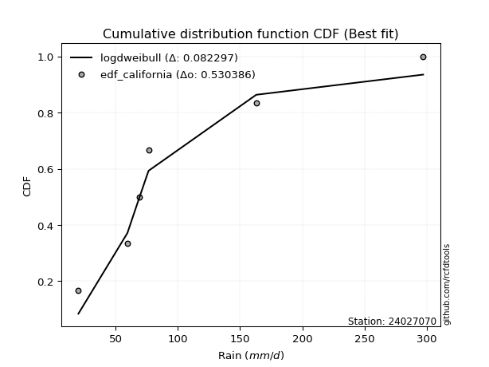</img>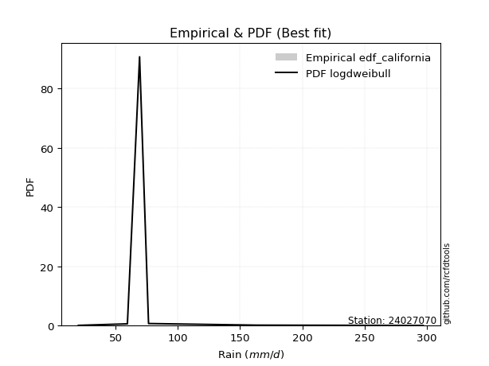</img>

</div>


### 2. Empirical - EDF Hazen (1930)

Hazen method for plotting positions is a formula used to estimate the empirical cumulative probability distribution of flood events or other hydrological data. This formula often results in biased estimations, particularly when extrapolating to extreme events (high return periods).

<div align="center">


$P=(m-0.5)/n$


</div>


**2.1. Empirical values**

<div align="center">

|                | 0                   | 1                  | 2                  | 3                  | 4         | 5                  |
|:---------------|:--------------------|:-------------------|:-------------------|:-------------------|:----------|:-------------------|
| date           | 2021                | 2019               | 2020               | 2023               | 2025      | 2024               |
| x              | 20.0                | 59.4               | 69.2               | 76.4               | 142.0     | 297.2              |
| m              | 1                   | 2                  | 3                  | 4                  | 5         | 6                  |
| empirical_dist | edf_hazen           | edf_hazen          | edf_hazen          | edf_hazen          | edf_hazen | edf_hazen          |
| empirical      | 0.08333333333333333 | 0.25               | 0.4166666666666667 | 0.5833333333333334 | 0.75      | 0.9166666666666666 |
| empirical_tr   | 1.090909090909091   | 1.3333333333333333 | 1.7142857142857144 | 2.4000000000000004 | 4.0       | 11.999999999999995 |

</div>


**2.2. Kolmogorov-Smirnov fit test (sorted by Δ)**


<div align="center">

|                | 0                   | 1                     | 2                   | 3                   | 4                   | 5                  | 6                 | 7                   | 8                   | 9                   | 10                  | 11                  | 12                | 13                  | 14                  | 15                  | 16                  | 17                  | 18                  | 19                  | 20                  | 21                 | 22                  | 23                 | 24                  | 25                  | 26                  | 27                  | 28                  | 29                  | 30                  | 31                  | 32                  | 33                  | 34                  | 35                  | 36                | 37                  | 38                 | 39                  | 40                  | 41                  | 42                  | 43                  | 44                  | 45                  | 46                  | 47                 | 48                  | 49                  | 50                 | 51                 | 52                  | 53                  | 54                  | 55                  | 56                  | 57                  | 58                  | 59                 | 60                  | 61                  | 62                 | 63                  | 64                 | 65                  | 66                  | 67                  | 68                  | 69                  | 70                  | 71                  | 72                 | 73                  | 74                  | 75                  | 76                 | 77                  | 78                 | 79                  | 80                  | 81                | 82                  | 83                  | 84                 | 85                  | 86                  | 87                 | 88                  | 89                 |
|:---------------|:--------------------|:----------------------|:--------------------|:--------------------|:--------------------|:-------------------|:------------------|:--------------------|:--------------------|:--------------------|:--------------------|:--------------------|:------------------|:--------------------|:--------------------|:--------------------|:--------------------|:--------------------|:--------------------|:--------------------|:--------------------|:-------------------|:--------------------|:-------------------|:--------------------|:--------------------|:--------------------|:--------------------|:--------------------|:--------------------|:--------------------|:--------------------|:--------------------|:--------------------|:--------------------|:--------------------|:------------------|:--------------------|:-------------------|:--------------------|:--------------------|:--------------------|:--------------------|:--------------------|:--------------------|:--------------------|:--------------------|:-------------------|:--------------------|:--------------------|:-------------------|:-------------------|:--------------------|:--------------------|:--------------------|:--------------------|:--------------------|:--------------------|:--------------------|:-------------------|:--------------------|:--------------------|:-------------------|:--------------------|:-------------------|:--------------------|:--------------------|:--------------------|:--------------------|:--------------------|:--------------------|:--------------------|:-------------------|:--------------------|:--------------------|:--------------------|:-------------------|:--------------------|:-------------------|:--------------------|:--------------------|:------------------|:--------------------|:--------------------|:-------------------|:--------------------|:--------------------|:-------------------|:--------------------|:-------------------|
| station        | 24027070            | 24027070              | 24027070            | 24027070            | 24027070            | 24027070           | 24027070          | 24027070            | 24027070            | 24027070            | 24027070            | 24027070            | 24027070          | 24027070            | 24027070            | 24027070            | 24027070            | 24027070            | 24027070            | 24027070            | 24027070            | 24027070           | 24027070            | 24027070           | 24027070            | 24027070            | 24027070            | 24027070            | 24027070            | 24027070            | 24027070            | 24027070            | 24027070            | 24027070            | 24027070            | 24027070            | 24027070          | 24027070            | 24027070           | 24027070            | 24027070            | 24027070            | 24027070            | 24027070            | 24027070            | 24027070            | 24027070            | 24027070           | 24027070            | 24027070            | 24027070           | 24027070           | 24027070            | 24027070            | 24027070            | 24027070            | 24027070            | 24027070            | 24027070            | 24027070           | 24027070            | 24027070            | 24027070           | 24027070            | 24027070           | 24027070            | 24027070            | 24027070            | 24027070            | 24027070            | 24027070            | 24027070            | 24027070           | 24027070            | 24027070            | 24027070            | 24027070           | 24027070            | 24027070           | 24027070            | 24027070            | 24027070          | 24027070            | 24027070            | 24027070           | 24027070            | 24027070            | 24027070           | 24027070            | 24027070           |
| empirical_dist | edf_hazen           | edf_hazen             | edf_hazen           | edf_hazen           | edf_hazen           | edf_hazen          | edf_hazen         | edf_hazen           | edf_hazen           | edf_hazen           | edf_hazen           | edf_hazen           | edf_hazen         | edf_hazen           | edf_hazen           | edf_hazen           | edf_hazen           | edf_hazen           | edf_hazen           | edf_hazen           | edf_hazen           | edf_hazen          | edf_hazen           | edf_hazen          | edf_hazen           | edf_hazen           | edf_hazen           | edf_hazen           | edf_hazen           | edf_hazen           | edf_hazen           | edf_hazen           | edf_hazen           | edf_hazen           | edf_hazen           | edf_hazen           | edf_hazen         | edf_hazen           | edf_hazen          | edf_hazen           | edf_hazen           | edf_hazen           | edf_hazen           | edf_hazen           | edf_hazen           | edf_hazen           | edf_hazen           | edf_hazen          | edf_hazen           | edf_hazen           | edf_hazen          | edf_hazen          | edf_hazen           | edf_hazen           | edf_hazen           | edf_hazen           | edf_hazen           | edf_hazen           | edf_hazen           | edf_hazen          | edf_hazen           | edf_hazen           | edf_hazen          | edf_hazen           | edf_hazen          | edf_hazen           | edf_hazen           | edf_hazen           | edf_hazen           | edf_hazen           | edf_hazen           | edf_hazen           | edf_hazen          | edf_hazen           | edf_hazen           | edf_hazen           | edf_hazen          | edf_hazen           | edf_hazen          | edf_hazen           | edf_hazen           | edf_hazen         | edf_hazen           | edf_hazen           | edf_hazen          | edf_hazen           | edf_hazen           | edf_hazen          | edf_hazen           | edf_hazen          |
| p_dist         | johnsonsu           | loglaplace_asymmetric | invgamma            | nct                 | lognct              | logjohnsonsu       | logexponnorm      | lognorm             | lognorm             | logcrystalball      | logt                | logfatiguelife      | loglogistic       | loggenlogistic      | logfisk             | fisk                | logmielke           | logf                | logpearson3         | loggamma            | loggamma            | loghypsecant       | logweibull_min      | logerlang          | logbetaprime        | logloggamma         | ncf                 | betaprime           | gompertz            | invgauss            | expon               | genexpon            | wald                | truncnorm           | loglaplace          | logrice             | loginvgamma       | logalpha            | loggompertz        | nakagami            | logncf              | loginvgauss         | fatiguelife         | logmaxwell          | exponnorm           | halflogistic        | t                   | halfnorm           | lograyleigh         | gibrat              | loggumbel_r        | moyal              | pearson3            | loginvweibull       | loggumbel_l         | logmoyal            | gumbel_r            | laplace_asymmetric  | rayleigh            | loghalfnorm        | f                   | genlogistic         | loggibrat          | logkstwobign        | loghalflogistic    | maxwell             | loggenexpon         | weibull_min         | alpha               | kstwobign           | logwald             | crystalball         | norm               | logistic            | logtruncnorm        | lognakagami         | rice               | hypsecant           | laplace            | gumbel_l            | logexpon            | mielke            | erlang              | gamma               | pareto             | loglognorm          | logpareto           | logchi2            | invweibull          | chi2               |
| delta          | 0.07189514024136656 | 0.07896990918197594   | 0.10446898461764431 | 0.10625209927831192 | 0.10811192878676007 | 0.1082591954759834 | 0.108278289949711 | 0.10827875743691884 | 0.10827875743691884 | 0.10827905499985119 | 0.10827978102210573 | 0.10884970004019812 | 0.109627117682636 | 0.11002698077051065 | 0.11015071350070549 | 0.11019921461626586 | 0.11115614360823267 | 0.11127128232764377 | 0.11171539131856678 | 0.11203947542317144 | 0.11203947542317144 | 0.1123130329629099 | 0.11238945241335768 | 0.1127277782913425 | 0.11377043171085627 | 0.11383570188556486 | 0.11830123081274468 | 0.11910130806390623 | 0.12018324644924583 | 0.12026885428655498 | 0.12029412033553177 | 0.12029481464481095 | 0.12039233518377951 | 0.12221981770540657 | 0.12273440478976916 | 0.12503921723980438 | 0.125099645953561 | 0.12707237849674113 | 0.1275083244898338 | 0.13071611031369307 | 0.13076023832885997 | 0.13393175078596353 | 0.13632515772729564 | 0.14069026919904792 | 0.14312970849844397 | 0.14324248971959552 | 0.14622514111504736 | 0.1518154905852665 | 0.15284440087965323 | 0.15594612163238403 | 0.1588406121123217 | 0.1630218610937697 | 0.16307194179282553 | 0.17339612672757854 | 0.17715108334929797 | 0.17777195737627438 | 0.18129733873706105 | 0.18378046649094348 | 0.18624806374217595 | 0.1874268635552655 | 0.18801917443661104 | 0.18809922231443832 | 0.1919518141220246 | 0.19411984317558595 | 0.1969129297239373 | 0.19834687254307154 | 0.19865691882071346 | 0.21587967555272736 | 0.21614305577990983 | 0.21774545611375812 | 0.22332322973049235 | 0.23045407691575148 | 0.2304540902385563 | 0.24814598323731352 | 0.24999830745329354 | 0.24999985895555865 | 0.2538700556373071 | 0.26192968548257395 | 0.2901906298842853 | 0.29087934305035734 | 0.29350914522128413 | 0.298017248517806 | 0.31198405712472943 | 0.32855055807957856 | 0.4003974255534688 | 0.41260896116904056 | 0.42551893532768537 | 0.4377436671416637 | 0.45637206380774326 | 0.7192131898793586 |
| deltao         | 0.530385761606      | 0.530385761606        | 0.530385761606      | 0.530385761606      | 0.530385761606      | 0.530385761606     | 0.530385761606    | 0.530385761606      | 0.530385761606      | 0.530385761606      | 0.530385761606      | 0.530385761606      | 0.530385761606    | 0.530385761606      | 0.530385761606      | 0.530385761606      | 0.530385761606      | 0.530385761606      | 0.530385761606      | 0.530385761606      | 0.530385761606      | 0.530385761606     | 0.530385761606      | 0.530385761606     | 0.530385761606      | 0.530385761606      | 0.530385761606      | 0.530385761606      | 0.530385761606      | 0.530385761606      | 0.530385761606      | 0.530385761606      | 0.530385761606      | 0.530385761606      | 0.530385761606      | 0.530385761606      | 0.530385761606    | 0.530385761606      | 0.530385761606     | 0.530385761606      | 0.530385761606      | 0.530385761606      | 0.530385761606      | 0.530385761606      | 0.530385761606      | 0.530385761606      | 0.530385761606      | 0.530385761606     | 0.530385761606      | 0.530385761606      | 0.530385761606     | 0.530385761606     | 0.530385761606      | 0.530385761606      | 0.530385761606      | 0.530385761606      | 0.530385761606      | 0.530385761606      | 0.530385761606      | 0.530385761606     | 0.530385761606      | 0.530385761606      | 0.530385761606     | 0.530385761606      | 0.530385761606     | 0.530385761606      | 0.530385761606      | 0.530385761606      | 0.530385761606      | 0.530385761606      | 0.530385761606      | 0.530385761606      | 0.530385761606     | 0.530385761606      | 0.530385761606      | 0.530385761606      | 0.530385761606     | 0.530385761606      | 0.530385761606     | 0.530385761606      | 0.530385761606      | 0.530385761606    | 0.530385761606      | 0.530385761606      | 0.530385761606     | 0.530385761606      | 0.530385761606      | 0.530385761606     | 0.530385761606      | 0.530385761606     |
| eval           | Δo > Δ              | Δo > Δ                | Δo > Δ              | Δo > Δ              | Δo > Δ              | Δo > Δ             | Δo > Δ            | Δo > Δ              | Δo > Δ              | Δo > Δ              | Δo > Δ              | Δo > Δ              | Δo > Δ            | Δo > Δ              | Δo > Δ              | Δo > Δ              | Δo > Δ              | Δo > Δ              | Δo > Δ              | Δo > Δ              | Δo > Δ              | Δo > Δ             | Δo > Δ              | Δo > Δ             | Δo > Δ              | Δo > Δ              | Δo > Δ              | Δo > Δ              | Δo > Δ              | Δo > Δ              | Δo > Δ              | Δo > Δ              | Δo > Δ              | Δo > Δ              | Δo > Δ              | Δo > Δ              | Δo > Δ            | Δo > Δ              | Δo > Δ             | Δo > Δ              | Δo > Δ              | Δo > Δ              | Δo > Δ              | Δo > Δ              | Δo > Δ              | Δo > Δ              | Δo > Δ              | Δo > Δ             | Δo > Δ              | Δo > Δ              | Δo > Δ             | Δo > Δ             | Δo > Δ              | Δo > Δ              | Δo > Δ              | Δo > Δ              | Δo > Δ              | Δo > Δ              | Δo > Δ              | Δo > Δ             | Δo > Δ              | Δo > Δ              | Δo > Δ             | Δo > Δ              | Δo > Δ             | Δo > Δ              | Δo > Δ              | Δo > Δ              | Δo > Δ              | Δo > Δ              | Δo > Δ              | Δo > Δ              | Δo > Δ             | Δo > Δ              | Δo > Δ              | Δo > Δ              | Δo > Δ             | Δo > Δ              | Δo > Δ             | Δo > Δ              | Δo > Δ              | Δo > Δ            | Δo > Δ              | Δo > Δ              | Δo > Δ             | Δo > Δ              | Δo > Δ              | Δo > Δ             | Δo > Δ              | Δo <= Δ            |
| fit            | 1                   | 1                     | 1                   | 1                   | 1                   | 1                  | 1                 | 1                   | 1                   | 1                   | 1                   | 1                   | 1                 | 1                   | 1                   | 1                   | 1                   | 1                   | 1                   | 1                   | 1                   | 1                  | 1                   | 1                  | 1                   | 1                   | 1                   | 1                   | 1                   | 1                   | 1                   | 1                   | 1                   | 1                   | 1                   | 1                   | 1                 | 1                   | 1                  | 1                   | 1                   | 1                   | 1                   | 1                   | 1                   | 1                   | 1                   | 1                  | 1                   | 1                   | 1                  | 1                  | 1                   | 1                   | 1                   | 1                   | 1                   | 1                   | 1                   | 1                  | 1                   | 1                   | 1                  | 1                   | 1                  | 1                   | 1                   | 1                   | 1                   | 1                   | 1                   | 1                   | 1                  | 1                   | 1                   | 1                   | 1                  | 1                   | 1                  | 1                   | 1                   | 1                 | 1                   | 1                   | 1                  | 1                   | 1                   | 1                  | 1                   | 0                  |
| n              | 6                   | 6                     | 6                   | 6                   | 6                   | 6                  | 6                 | 6                   | 6                   | 6                   | 6                   | 6                   | 6                 | 6                   | 6                   | 6                   | 6                   | 6                   | 6                   | 6                   | 6                   | 6                  | 6                   | 6                  | 6                   | 6                   | 6                   | 6                   | 6                   | 6                   | 6                   | 6                   | 6                   | 6                   | 6                   | 6                   | 6                 | 6                   | 6                  | 6                   | 6                   | 6                   | 6                   | 6                   | 6                   | 6                   | 6                   | 6                  | 6                   | 6                   | 6                  | 6                  | 6                   | 6                   | 6                   | 6                   | 6                   | 6                   | 6                   | 6                  | 6                   | 6                   | 6                  | 6                   | 6                  | 6                   | 6                   | 6                   | 6                   | 6                   | 6                   | 6                   | 6                  | 6                   | 6                   | 6                   | 6                  | 6                   | 6                  | 6                   | 6                   | 6                 | 6                   | 6                   | 6                  | 6                   | 6                   | 6                  | 6                   | 6                  |
| best_fit       | 1                   | 0                     | 0                   | 0                   | 0                   | 0                  | 0                 | 0                   | 0                   | 0                   | 0                   | 0                   | 0                 | 0                   | 0                   | 0                   | 0                   | 0                   | 0                   | 0                   | 0                   | 0                  | 0                   | 0                  | 0                   | 0                   | 0                   | 0                   | 0                   | 0                   | 0                   | 0                   | 0                   | 0                   | 0                   | 0                   | 0                 | 0                   | 0                  | 0                   | 0                   | 0                   | 0                   | 0                   | 0                   | 0                   | 0                   | 0                  | 0                   | 0                   | 0                  | 0                  | 0                   | 0                   | 0                   | 0                   | 0                   | 0                   | 0                   | 0                  | 0                   | 0                   | 0                  | 0                   | 0                  | 0                   | 0                   | 0                   | 0                   | 0                   | 0                   | 0                   | 0                  | 0                   | 0                   | 0                   | 0                  | 0                   | 0                  | 0                   | 0                   | 0                 | 0                   | 0                   | 0                  | 0                   | 0                   | 0                  | 0                   | 0                  |
| best_fit_sort  | 1                   | 2                     | 3                   | 4                   | 5                   | 6                  | 7                 | 8                   | 9                   | 10                  | 11                  | 12                  | 13                | 14                  | 15                  | 16                  | 17                  | 18                  | 19                  | 20                  | 21                  | 22                 | 23                  | 24                 | 25                  | 26                  | 27                  | 28                  | 29                  | 30                  | 31                  | 32                  | 33                  | 34                  | 35                  | 36                  | 37                | 38                  | 39                 | 40                  | 41                  | 42                  | 43                  | 44                  | 45                  | 46                  | 47                  | 48                 | 49                  | 50                  | 51                 | 52                 | 53                  | 54                  | 55                  | 56                  | 57                  | 58                  | 59                  | 60                 | 61                  | 62                  | 63                 | 64                  | 65                 | 66                  | 67                  | 68                  | 69                  | 70                  | 71                  | 72                  | 73                 | 74                  | 75                  | 76                  | 77                 | 78                  | 79                 | 80                  | 81                  | 82                | 83                  | 84                  | 85                 | 86                  | 87                  | 88                 | 89                  | 90                 |

</div>


<div align="center">

</img>

</div>


**2.3. Best fit**

<div align="center">

|   id |   station | empirical_dist   | p_dist    |     delta |   deltao | eval   |   fit |   n |   best_fit |   best_fit_sort |
|-----:|----------:|:-----------------|:----------|----------:|---------:|:-------|------:|----:|-----------:|----------------:|
|    0 |  24027070 | edf_hazen        | johnsonsu | 0.0718951 | 0.530386 | Δo > Δ |     1 |   6 |          1 |               1 |

</div>


<div align="center">

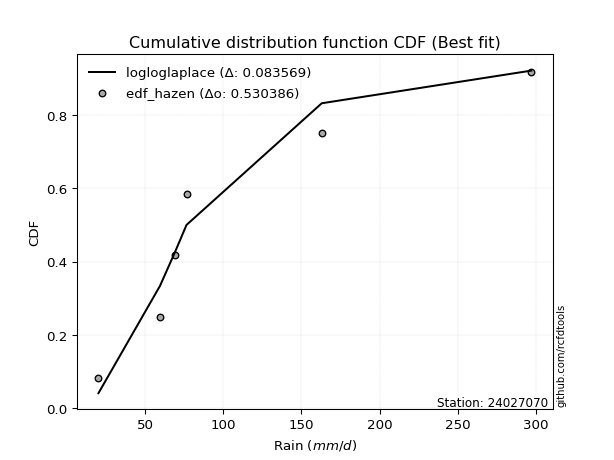</img>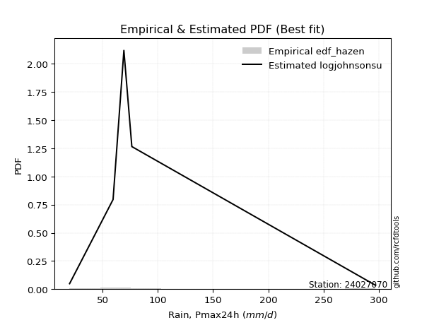</img>

</div>


### 3. Empirical - EDF Weibull (1939)

Weibull plotting position formula is an empirical method used to estimate the non-exceedance probability or plotting position for a set of observed data, is often recommended or widely used in practice, particularly in flood frequency analysis.

<div align="center">


$P=m/(n+1)$


</div>


**3.1. Empirical values**

<div align="center">

|                | 0                   | 1                  | 2                   | 3                  | 4                  | 5                  |
|:---------------|:--------------------|:-------------------|:--------------------|:-------------------|:-------------------|:-------------------|
| date           | 2021                | 2019               | 2020                | 2023               | 2025               | 2024               |
| x              | 20.0                | 59.4               | 69.2                | 76.4               | 142.0              | 297.2              |
| m              | 1                   | 2                  | 3                   | 4                  | 5                  | 6                  |
| empirical_dist | edf_weibull         | edf_weibull        | edf_weibull         | edf_weibull        | edf_weibull        | edf_weibull        |
| empirical      | 0.14285714285714285 | 0.2857142857142857 | 0.42857142857142855 | 0.5714285714285714 | 0.7142857142857143 | 0.8571428571428571 |
| empirical_tr   | 1.1666666666666665  | 1.4                | 1.75                | 2.333333333333333  | 3.5                | 6.999999999999997  |

</div>


**3.2. Kolmogorov-Smirnov fit test (sorted by Δ)**


<div align="center">

|                | 0                   | 1                   | 2                   | 3                  | 4                   | 5                  | 6                  | 7                   | 8                   | 9                   | 10                  | 11                  | 12                 | 13                  | 14                  | 15                  | 16                  | 17                  | 18                 | 19                  | 20                  | 21                  | 22                  | 23                    | 24                  | 25                  | 26                  | 27                  | 28                  | 29                  | 30                  | 31                  | 32                  | 33                  | 34                  | 35                  | 36                  | 37                | 38                  | 39                  | 40                  | 41                  | 42                  | 43                  | 44                  | 45                  | 46                 | 47                  | 48                  | 49                  | 50                  | 51                  | 52                  | 53                  | 54                 | 55                  | 56                  | 57                  | 58                  | 59                  | 60                | 61                  | 62                 | 63                  | 64                  | 65                  | 66                  | 67                  | 68                  | 69                  | 70                  | 71                 | 72                 | 73                  | 74                 | 75                | 76                  | 77                 | 78                  | 79                 | 80                  | 81                  | 82                  | 83                  | 84                 | 85                  | 86                  | 87                 | 88                | 89                 |
|:---------------|:--------------------|:--------------------|:--------------------|:-------------------|:--------------------|:-------------------|:-------------------|:--------------------|:--------------------|:--------------------|:--------------------|:--------------------|:-------------------|:--------------------|:--------------------|:--------------------|:--------------------|:--------------------|:-------------------|:--------------------|:--------------------|:--------------------|:--------------------|:----------------------|:--------------------|:--------------------|:--------------------|:--------------------|:--------------------|:--------------------|:--------------------|:--------------------|:--------------------|:--------------------|:--------------------|:--------------------|:--------------------|:------------------|:--------------------|:--------------------|:--------------------|:--------------------|:--------------------|:--------------------|:--------------------|:--------------------|:-------------------|:--------------------|:--------------------|:--------------------|:--------------------|:--------------------|:--------------------|:--------------------|:-------------------|:--------------------|:--------------------|:--------------------|:--------------------|:--------------------|:------------------|:--------------------|:-------------------|:--------------------|:--------------------|:--------------------|:--------------------|:--------------------|:--------------------|:--------------------|:--------------------|:-------------------|:-------------------|:--------------------|:-------------------|:------------------|:--------------------|:-------------------|:--------------------|:-------------------|:--------------------|:--------------------|:--------------------|:--------------------|:-------------------|:--------------------|:--------------------|:-------------------|:------------------|:-------------------|
| station        | 24027070            | 24027070            | 24027070            | 24027070           | 24027070            | 24027070           | 24027070           | 24027070            | 24027070            | 24027070            | 24027070            | 24027070            | 24027070           | 24027070            | 24027070            | 24027070            | 24027070            | 24027070            | 24027070           | 24027070            | 24027070            | 24027070            | 24027070            | 24027070              | 24027070            | 24027070            | 24027070            | 24027070            | 24027070            | 24027070            | 24027070            | 24027070            | 24027070            | 24027070            | 24027070            | 24027070            | 24027070            | 24027070          | 24027070            | 24027070            | 24027070            | 24027070            | 24027070            | 24027070            | 24027070            | 24027070            | 24027070           | 24027070            | 24027070            | 24027070            | 24027070            | 24027070            | 24027070            | 24027070            | 24027070           | 24027070            | 24027070            | 24027070            | 24027070            | 24027070            | 24027070          | 24027070            | 24027070           | 24027070            | 24027070            | 24027070            | 24027070            | 24027070            | 24027070            | 24027070            | 24027070            | 24027070           | 24027070           | 24027070            | 24027070           | 24027070          | 24027070            | 24027070           | 24027070            | 24027070           | 24027070            | 24027070            | 24027070            | 24027070            | 24027070           | 24027070            | 24027070            | 24027070           | 24027070          | 24027070           |
| empirical_dist | edf_weibull         | edf_weibull         | edf_weibull         | edf_weibull        | edf_weibull         | edf_weibull        | edf_weibull        | edf_weibull         | edf_weibull         | edf_weibull         | edf_weibull         | edf_weibull         | edf_weibull        | edf_weibull         | edf_weibull         | edf_weibull         | edf_weibull         | edf_weibull         | edf_weibull        | edf_weibull         | edf_weibull         | edf_weibull         | edf_weibull         | edf_weibull           | edf_weibull         | edf_weibull         | edf_weibull         | edf_weibull         | edf_weibull         | edf_weibull         | edf_weibull         | edf_weibull         | edf_weibull         | edf_weibull         | edf_weibull         | edf_weibull         | edf_weibull         | edf_weibull       | edf_weibull         | edf_weibull         | edf_weibull         | edf_weibull         | edf_weibull         | edf_weibull         | edf_weibull         | edf_weibull         | edf_weibull        | edf_weibull         | edf_weibull         | edf_weibull         | edf_weibull         | edf_weibull         | edf_weibull         | edf_weibull         | edf_weibull        | edf_weibull         | edf_weibull         | edf_weibull         | edf_weibull         | edf_weibull         | edf_weibull       | edf_weibull         | edf_weibull        | edf_weibull         | edf_weibull         | edf_weibull         | edf_weibull         | edf_weibull         | edf_weibull         | edf_weibull         | edf_weibull         | edf_weibull        | edf_weibull        | edf_weibull         | edf_weibull        | edf_weibull       | edf_weibull         | edf_weibull        | edf_weibull         | edf_weibull        | edf_weibull         | edf_weibull         | edf_weibull         | edf_weibull         | edf_weibull        | edf_weibull         | edf_weibull         | edf_weibull        | edf_weibull       | edf_weibull        |
| p_dist         | nct                 | invgamma            | lognct              | logt               | logcrystalball      | lognorm            | lognorm            | logexponnorm        | logjohnsonsu        | logfatiguelife      | loglogistic         | logf                | logerlang          | loggenlogistic      | loggamma            | loggamma            | logfisk             | invgauss            | logmielke          | logpearson3         | loginvgamma         | loghypsecant        | fatiguelife         | loglaplace_asymmetric | logweibull_min      | logbetaprime        | logloggamma         | logalpha            | loginvgauss         | logncf              | ncf                 | betaprime           | johnsonsu           | fisk                | logrice             | loglaplace          | logmaxwell          | exponnorm         | halflogistic        | lograyleigh         | loggumbel_r         | loginvweibull       | halfnorm            | logmoyal            | nakagami            | loggompertz         | gompertz           | genexpon            | wald                | expon               | truncnorm           | gibrat              | moyal               | pearson3            | loghalfnorm        | f                   | logkstwobign        | loghalflogistic     | loggenexpon         | loggibrat           | loggumbel_l       | gumbel_r            | laplace_asymmetric | rayleigh            | genlogistic         | weibull_min         | alpha               | t                   | maxwell             | logwald             | kstwobign           | crystalball        | norm               | logistic            | rice               | hypsecant         | logexpon            | mielke             | erlang              | laplace            | gumbel_l            | logtruncnorm        | lognakagami         | gamma               | pareto             | loglognorm          | logpareto           | invweibull         | logchi2           | chi2               |
| delta          | 0.09434733737354994 | 0.09639987424659238 | 0.09654276022424987 | 0.0966012776114487 | 0.09660176007342591 | 0.0966020496798645 | 0.0966020496798645 | 0.09660264208540441 | 0.09662093892994271 | 0.09771644633984203 | 0.09772235577787403 | 0.09776429167144186 | 0.0979847671363007 | 0.09812221886574868 | 0.09813953624341924 | 0.09813953624341924 | 0.09824595159594351 | 0.09908785324924088 | 0.0992513817034707 | 0.09981062941380481 | 0.10039124388437981 | 0.10040827105814792 | 0.10061087201300994 | 0.10081131582462752   | 0.10104233365640108 | 0.10174502794843737 | 0.10193093998080288 | 0.10200191174112752 | 0.10367095832261934 | 0.10389680968673407 | 0.10639646890798271 | 0.10719654615914426 | 0.10760942595565226 | 0.10765223175872976 | 0.11035968348334348 | 0.11082964288500718 | 0.11811870978360905 | 0.131224946593682 | 0.13133772781483355 | 0.13149501236115171 | 0.13508338110558588 | 0.13768184101329284 | 0.13991072868050453 | 0.14225984081369672 | 0.14285713784052834 | 0.14285713793259008 | 0.1428571409561663 | 0.14285714284555945 | 0.14285714285714285 | 0.14285714285714285 | 0.14285714285714285 | 0.14404135972762205 | 0.15111709918900773 | 0.15116717988806355 | 0.1517125778409798 | 0.15230488872232534 | 0.15840555746130025 | 0.16119864400965161 | 0.16294263310642776 | 0.16407028045023503 | 0.165246321444536 | 0.16939257683229908 | 0.1718757045861815 | 0.17434330183741398 | 0.17619446040967635 | 0.18016538983844166 | 0.18042877006562413 | 0.18193942682933306 | 0.18644211063830957 | 0.18760894401620665 | 0.20584069420899614 | 0.2185493150109895 | 0.2185493283337943 | 0.23624122133255154 | 0.2419652937325451 | 0.250024923577812 | 0.25779485950699843 | 0.2623029628035203 | 0.27626977141044373 | 0.2782858679795233 | 0.27897458114559537 | 0.28571259316757924 | 0.28571414466984435 | 0.29283627236529286 | 0.3646831398391831 | 0.37689467545475486 | 0.38980464961339967 | 0.3968482542839337 | 0.402029381427378 | 0.6834989041650729 |
| deltao         | 0.530385761606      | 0.530385761606      | 0.530385761606      | 0.530385761606     | 0.530385761606      | 0.530385761606     | 0.530385761606     | 0.530385761606      | 0.530385761606      | 0.530385761606      | 0.530385761606      | 0.530385761606      | 0.530385761606     | 0.530385761606      | 0.530385761606      | 0.530385761606      | 0.530385761606      | 0.530385761606      | 0.530385761606     | 0.530385761606      | 0.530385761606      | 0.530385761606      | 0.530385761606      | 0.530385761606        | 0.530385761606      | 0.530385761606      | 0.530385761606      | 0.530385761606      | 0.530385761606      | 0.530385761606      | 0.530385761606      | 0.530385761606      | 0.530385761606      | 0.530385761606      | 0.530385761606      | 0.530385761606      | 0.530385761606      | 0.530385761606    | 0.530385761606      | 0.530385761606      | 0.530385761606      | 0.530385761606      | 0.530385761606      | 0.530385761606      | 0.530385761606      | 0.530385761606      | 0.530385761606     | 0.530385761606      | 0.530385761606      | 0.530385761606      | 0.530385761606      | 0.530385761606      | 0.530385761606      | 0.530385761606      | 0.530385761606     | 0.530385761606      | 0.530385761606      | 0.530385761606      | 0.530385761606      | 0.530385761606      | 0.530385761606    | 0.530385761606      | 0.530385761606     | 0.530385761606      | 0.530385761606      | 0.530385761606      | 0.530385761606      | 0.530385761606      | 0.530385761606      | 0.530385761606      | 0.530385761606      | 0.530385761606     | 0.530385761606     | 0.530385761606      | 0.530385761606     | 0.530385761606    | 0.530385761606      | 0.530385761606     | 0.530385761606      | 0.530385761606     | 0.530385761606      | 0.530385761606      | 0.530385761606      | 0.530385761606      | 0.530385761606     | 0.530385761606      | 0.530385761606      | 0.530385761606     | 0.530385761606    | 0.530385761606     |
| eval           | Δo > Δ              | Δo > Δ              | Δo > Δ              | Δo > Δ             | Δo > Δ              | Δo > Δ             | Δo > Δ             | Δo > Δ              | Δo > Δ              | Δo > Δ              | Δo > Δ              | Δo > Δ              | Δo > Δ             | Δo > Δ              | Δo > Δ              | Δo > Δ              | Δo > Δ              | Δo > Δ              | Δo > Δ             | Δo > Δ              | Δo > Δ              | Δo > Δ              | Δo > Δ              | Δo > Δ                | Δo > Δ              | Δo > Δ              | Δo > Δ              | Δo > Δ              | Δo > Δ              | Δo > Δ              | Δo > Δ              | Δo > Δ              | Δo > Δ              | Δo > Δ              | Δo > Δ              | Δo > Δ              | Δo > Δ              | Δo > Δ            | Δo > Δ              | Δo > Δ              | Δo > Δ              | Δo > Δ              | Δo > Δ              | Δo > Δ              | Δo > Δ              | Δo > Δ              | Δo > Δ             | Δo > Δ              | Δo > Δ              | Δo > Δ              | Δo > Δ              | Δo > Δ              | Δo > Δ              | Δo > Δ              | Δo > Δ             | Δo > Δ              | Δo > Δ              | Δo > Δ              | Δo > Δ              | Δo > Δ              | Δo > Δ            | Δo > Δ              | Δo > Δ             | Δo > Δ              | Δo > Δ              | Δo > Δ              | Δo > Δ              | Δo > Δ              | Δo > Δ              | Δo > Δ              | Δo > Δ              | Δo > Δ             | Δo > Δ             | Δo > Δ              | Δo > Δ             | Δo > Δ            | Δo > Δ              | Δo > Δ             | Δo > Δ              | Δo > Δ             | Δo > Δ              | Δo > Δ              | Δo > Δ              | Δo > Δ              | Δo > Δ             | Δo > Δ              | Δo > Δ              | Δo > Δ             | Δo > Δ            | Δo <= Δ            |
| fit            | 1                   | 1                   | 1                   | 1                  | 1                   | 1                  | 1                  | 1                   | 1                   | 1                   | 1                   | 1                   | 1                  | 1                   | 1                   | 1                   | 1                   | 1                   | 1                  | 1                   | 1                   | 1                   | 1                   | 1                     | 1                   | 1                   | 1                   | 1                   | 1                   | 1                   | 1                   | 1                   | 1                   | 1                   | 1                   | 1                   | 1                   | 1                 | 1                   | 1                   | 1                   | 1                   | 1                   | 1                   | 1                   | 1                   | 1                  | 1                   | 1                   | 1                   | 1                   | 1                   | 1                   | 1                   | 1                  | 1                   | 1                   | 1                   | 1                   | 1                   | 1                 | 1                   | 1                  | 1                   | 1                   | 1                   | 1                   | 1                   | 1                   | 1                   | 1                   | 1                  | 1                  | 1                   | 1                  | 1                 | 1                   | 1                  | 1                   | 1                  | 1                   | 1                   | 1                   | 1                   | 1                  | 1                   | 1                   | 1                  | 1                 | 0                  |
| n              | 6                   | 6                   | 6                   | 6                  | 6                   | 6                  | 6                  | 6                   | 6                   | 6                   | 6                   | 6                   | 6                  | 6                   | 6                   | 6                   | 6                   | 6                   | 6                  | 6                   | 6                   | 6                   | 6                   | 6                     | 6                   | 6                   | 6                   | 6                   | 6                   | 6                   | 6                   | 6                   | 6                   | 6                   | 6                   | 6                   | 6                   | 6                 | 6                   | 6                   | 6                   | 6                   | 6                   | 6                   | 6                   | 6                   | 6                  | 6                   | 6                   | 6                   | 6                   | 6                   | 6                   | 6                   | 6                  | 6                   | 6                   | 6                   | 6                   | 6                   | 6                 | 6                   | 6                  | 6                   | 6                   | 6                   | 6                   | 6                   | 6                   | 6                   | 6                   | 6                  | 6                  | 6                   | 6                  | 6                 | 6                   | 6                  | 6                   | 6                  | 6                   | 6                   | 6                   | 6                   | 6                  | 6                   | 6                   | 6                  | 6                 | 6                  |
| best_fit       | 1                   | 0                   | 0                   | 0                  | 0                   | 0                  | 0                  | 0                   | 0                   | 0                   | 0                   | 0                   | 0                  | 0                   | 0                   | 0                   | 0                   | 0                   | 0                  | 0                   | 0                   | 0                   | 0                   | 0                     | 0                   | 0                   | 0                   | 0                   | 0                   | 0                   | 0                   | 0                   | 0                   | 0                   | 0                   | 0                   | 0                   | 0                 | 0                   | 0                   | 0                   | 0                   | 0                   | 0                   | 0                   | 0                   | 0                  | 0                   | 0                   | 0                   | 0                   | 0                   | 0                   | 0                   | 0                  | 0                   | 0                   | 0                   | 0                   | 0                   | 0                 | 0                   | 0                  | 0                   | 0                   | 0                   | 0                   | 0                   | 0                   | 0                   | 0                   | 0                  | 0                  | 0                   | 0                  | 0                 | 0                   | 0                  | 0                   | 0                  | 0                   | 0                   | 0                   | 0                   | 0                  | 0                   | 0                   | 0                  | 0                 | 0                  |
| best_fit_sort  | 1                   | 2                   | 3                   | 4                  | 5                   | 6                  | 7                  | 8                   | 9                   | 10                  | 11                  | 12                  | 13                 | 14                  | 15                  | 16                  | 17                  | 18                  | 19                 | 20                  | 21                  | 22                  | 23                  | 24                    | 25                  | 26                  | 27                  | 28                  | 29                  | 30                  | 31                  | 32                  | 33                  | 34                  | 35                  | 36                  | 37                  | 38                | 39                  | 40                  | 41                  | 42                  | 43                  | 44                  | 45                  | 46                  | 47                 | 48                  | 49                  | 50                  | 51                  | 52                  | 53                  | 54                  | 55                 | 56                  | 57                  | 58                  | 59                  | 60                  | 61                | 62                  | 63                 | 64                  | 65                  | 66                  | 67                  | 68                  | 69                  | 70                  | 71                  | 72                 | 73                 | 74                  | 75                 | 76                | 77                  | 78                 | 79                  | 80                 | 81                  | 82                  | 83                  | 84                  | 85                 | 86                  | 87                  | 88                 | 89                | 90                 |

</div>


<div align="center">

</img>

</div>


**3.3. Best fit**

<div align="center">

|   id |   station | empirical_dist   | p_dist   |     delta |   deltao | eval   |   fit |   n |   best_fit |   best_fit_sort |
|-----:|----------:|:-----------------|:---------|----------:|---------:|:-------|------:|----:|-----------:|----------------:|
|    0 |  24027070 | edf_weibull      | nct      | 0.0943473 | 0.530386 | Δo > Δ |     1 |   6 |          1 |               1 |

</div>


<div align="center">

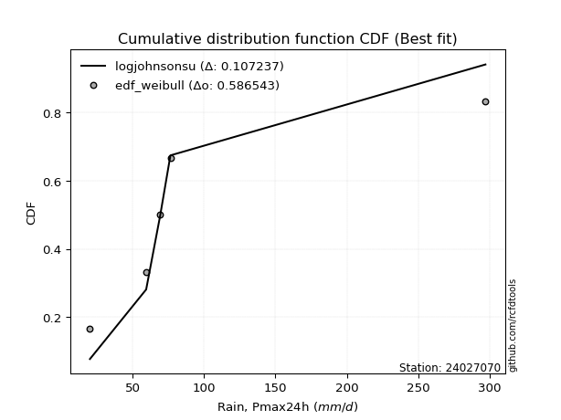</img>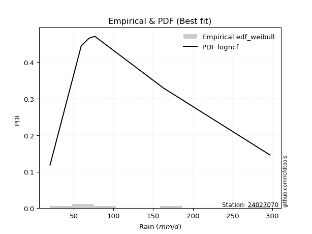</img>

</div>


### 4. Empirical - EDF Beard (1943)

The Beard formula (or Beard´s plotting position formula) in hydrology is used to estimate the empirical non-exceedance probability _(P)_ of a flood event (or other extreme hydrological data point) within a given dataset.

<div align="center">


$P=(m-0.31)/(n+0.38)$


</div>


**4.1. Empirical values**

<div align="center">

|                | 0                   | 1                   | 2                  | 3                  | 4                  | 5                  |
|:---------------|:--------------------|:--------------------|:-------------------|:-------------------|:-------------------|:-------------------|
| date           | 2021                | 2019                | 2020               | 2023               | 2025               | 2024               |
| x              | 20.0                | 59.4                | 69.2               | 76.4               | 142.0              | 297.2              |
| m              | 1                   | 2                   | 3                  | 4                  | 5                  | 6                  |
| empirical_dist | edf_beard           | edf_beard           | edf_beard          | edf_beard          | edf_beard          | edf_beard          |
| empirical      | 0.10815047021943573 | 0.26489028213166144 | 0.4216300940438871 | 0.5783699059561128 | 0.7351097178683387 | 0.8918495297805643 |
| empirical_tr   | 1.1212653778558874  | 1.3603411513859276  | 1.7289972899728996 | 2.3717472118959106 | 3.7751479289940844 | 9.246376811594207  |

</div>


**4.2. Kolmogorov-Smirnov fit test (sorted by Δ)**


<div align="center">

|                | 0                     | 1                   | 2                   | 3                   | 4                   | 5                   | 6                   | 7                   | 8                   | 9                   | 10                  | 11                  | 12                  | 13                  | 14                  | 15                  | 16                 | 17                  | 18                  | 19                  | 20                 | 21                  | 22                  | 23                  | 24                  | 25                  | 26                 | 27                  | 28                  | 29                 | 30                  | 31                  | 32                  | 33                  | 34                  | 35                 | 36                  | 37                  | 38                  | 39                 | 40                 | 41                 | 42                  | 43                 | 44                 | 45                  | 46                  | 47                  | 48                  | 49                  | 50                  | 51                  | 52                 | 53                 | 54                  | 55                 | 56                  | 57                 | 58                 | 59                  | 60                  | 61                 | 62                 | 63                  | 64                  | 65                  | 66                | 67                  | 68                 | 69                 | 70                  | 71                  | 72                  | 73                  | 74                  | 75                 | 76                | 77                 | 78                 | 79                  | 80                  | 81                 | 82                | 83                 | 84                  | 85                 | 86                  | 87                  | 88                  | 89                 |
|:---------------|:----------------------|:--------------------|:--------------------|:--------------------|:--------------------|:--------------------|:--------------------|:--------------------|:--------------------|:--------------------|:--------------------|:--------------------|:--------------------|:--------------------|:--------------------|:--------------------|:-------------------|:--------------------|:--------------------|:--------------------|:-------------------|:--------------------|:--------------------|:--------------------|:--------------------|:--------------------|:-------------------|:--------------------|:--------------------|:-------------------|:--------------------|:--------------------|:--------------------|:--------------------|:--------------------|:-------------------|:--------------------|:--------------------|:--------------------|:-------------------|:-------------------|:-------------------|:--------------------|:-------------------|:-------------------|:--------------------|:--------------------|:--------------------|:--------------------|:--------------------|:--------------------|:--------------------|:-------------------|:-------------------|:--------------------|:-------------------|:--------------------|:-------------------|:-------------------|:--------------------|:--------------------|:-------------------|:-------------------|:--------------------|:--------------------|:--------------------|:------------------|:--------------------|:-------------------|:-------------------|:--------------------|:--------------------|:--------------------|:--------------------|:--------------------|:-------------------|:------------------|:-------------------|:-------------------|:--------------------|:--------------------|:-------------------|:------------------|:-------------------|:--------------------|:-------------------|:--------------------|:--------------------|:--------------------|:-------------------|
| station        | 24027070              | 24027070            | 24027070            | 24027070            | 24027070            | 24027070            | 24027070            | 24027070            | 24027070            | 24027070            | 24027070            | 24027070            | 24027070            | 24027070            | 24027070            | 24027070            | 24027070           | 24027070            | 24027070            | 24027070            | 24027070           | 24027070            | 24027070            | 24027070            | 24027070            | 24027070            | 24027070           | 24027070            | 24027070            | 24027070           | 24027070            | 24027070            | 24027070            | 24027070            | 24027070            | 24027070           | 24027070            | 24027070            | 24027070            | 24027070           | 24027070           | 24027070           | 24027070            | 24027070           | 24027070           | 24027070            | 24027070            | 24027070            | 24027070            | 24027070            | 24027070            | 24027070            | 24027070           | 24027070           | 24027070            | 24027070           | 24027070            | 24027070           | 24027070           | 24027070            | 24027070            | 24027070           | 24027070           | 24027070            | 24027070            | 24027070            | 24027070          | 24027070            | 24027070           | 24027070           | 24027070            | 24027070            | 24027070            | 24027070            | 24027070            | 24027070           | 24027070          | 24027070           | 24027070           | 24027070            | 24027070            | 24027070           | 24027070          | 24027070           | 24027070            | 24027070           | 24027070            | 24027070            | 24027070            | 24027070           |
| empirical_dist | edf_beard             | edf_beard           | edf_beard           | edf_beard           | edf_beard           | edf_beard           | edf_beard           | edf_beard           | edf_beard           | edf_beard           | edf_beard           | edf_beard           | edf_beard           | edf_beard           | edf_beard           | edf_beard           | edf_beard          | edf_beard           | edf_beard           | edf_beard           | edf_beard          | edf_beard           | edf_beard           | edf_beard           | edf_beard           | edf_beard           | edf_beard          | edf_beard           | edf_beard           | edf_beard          | edf_beard           | edf_beard           | edf_beard           | edf_beard           | edf_beard           | edf_beard          | edf_beard           | edf_beard           | edf_beard           | edf_beard          | edf_beard          | edf_beard          | edf_beard           | edf_beard          | edf_beard          | edf_beard           | edf_beard           | edf_beard           | edf_beard           | edf_beard           | edf_beard           | edf_beard           | edf_beard          | edf_beard          | edf_beard           | edf_beard          | edf_beard           | edf_beard          | edf_beard          | edf_beard           | edf_beard           | edf_beard          | edf_beard          | edf_beard           | edf_beard           | edf_beard           | edf_beard         | edf_beard           | edf_beard          | edf_beard          | edf_beard           | edf_beard           | edf_beard           | edf_beard           | edf_beard           | edf_beard          | edf_beard         | edf_beard          | edf_beard          | edf_beard           | edf_beard           | edf_beard          | edf_beard         | edf_beard          | edf_beard           | edf_beard          | edf_beard           | edf_beard           | edf_beard           | edf_beard          |
| p_dist         | loglaplace_asymmetric | johnsonsu           | fisk                | loggamma            | loggamma            | logerlang           | logf                | logbetaprime        | invgamma            | logweibull_min      | logfatiguelife      | nct                 | logt                | logcrystalball      | lognorm             | lognorm             | logexponnorm       | logjohnsonsu        | lognct              | loglogistic         | loggenlogistic     | logfisk             | invgauss            | logmielke           | logpearson3         | loghypsecant        | logloggamma        | logrice             | loginvgamma         | logalpha           | loggompertz         | ncf                 | betaprime           | gompertz            | expon               | genexpon           | wald                | logncf              | truncnorm           | loglaplace         | loginvgauss        | fatiguelife        | nakagami            | logmaxwell         | lograyleigh        | exponnorm           | halflogistic        | loggumbel_r         | halfnorm            | gibrat              | moyal               | pearson3            | loginvweibull      | t                  | logmoyal            | loggumbel_l        | loghalfnorm         | f                  | gumbel_r           | loggibrat           | laplace_asymmetric  | logkstwobign       | rayleigh           | loghalflogistic     | genlogistic         | loggenexpon         | maxwell           | weibull_min         | alpha              | logwald            | kstwobign           | crystalball         | norm                | logistic            | rice                | hypsecant          | logtruncnorm      | lognakagami        | logexpon           | mielke              | laplace             | gumbel_l           | erlang            | gamma              | pareto              | loglognorm         | logpareto           | logchi2             | invweibull          | chi2               |
| delta          | 0.07114876800217806   | 0.08678542237302789 | 0.09530893248460443 | 0.09718778130369105 | 0.09718778130369105 | 0.09783749615968107 | 0.09790922360746368 | 0.09888014957919483 | 0.09950555724042376 | 0.10004837524320831 | 0.10061713950279066 | 0.10128867190109136 | 0.10151076643371665 | 0.10151126122734744 | 0.10151137669456328 | 0.10151137669456328 | 0.1015114276003245 | 0.10151910821311966 | 0.10171162646471232 | 0.10466369030541545 | 0.1050635533932901 | 0.10518728612348494 | 0.10537857215489355 | 0.10619271623101212 | 0.10675196394134623 | 0.10734960558568934 | 0.1088722745083443 | 0.11014893510814294 | 0.11020936382189955 | 0.1121820963650797 | 0.11261804235817235 | 0.11333780343552413 | 0.11413788068668568 | 0.11521981907202528 | 0.11533069295831122 | 0.1153313872675904 | 0.11542890780655896 | 0.11586995619719853 | 0.11725639032818602 | 0.1177709774125486 | 0.1190414686543021 | 0.1214348755956342 | 0.12554221041691777 | 0.1257999870673865 | 0.1379541187479918 | 0.13816628112122342 | 0.13827906234237497 | 0.14395032998066026 | 0.14685206320804595 | 0.15098269425516347 | 0.15805843371654915 | 0.15810851441560497 | 0.1585058445959171 | 0.1611154232467087 | 0.16288167524461294 | 0.1721876559720774 | 0.17253658142360406 | 0.1731288923049496 | 0.1763339113598405 | 0.17706153199036317 | 0.17881703911372293 | 0.1792295610439245 | 0.1812846363649554 | 0.18202264759227588 | 0.18313579493721777 | 0.18376663668905202 | 0.193383445165851 | 0.20098939342106592 | 0.2012527736482484 | 0.2084329475988309 | 0.21278202873653757 | 0.22549064953853093 | 0.22549066286133573 | 0.24318255586009296 | 0.24890662826008653 | 0.2569662581053534 | 0.264888589584955 | 0.2648901410872201 | 0.2786188630896227 | 0.28312696638614454 | 0.28522720250706474 | 0.2859159156731368 | 0.297093774993068 | 0.3136602759479171 | 0.38550714342180736 | 0.3977186790373791 | 0.41062865319602393 | 0.42285338501000225 | 0.43155492692164094 | 0.7043229077476971 |
| deltao         | 0.530385761606        | 0.530385761606      | 0.530385761606      | 0.530385761606      | 0.530385761606      | 0.530385761606      | 0.530385761606      | 0.530385761606      | 0.530385761606      | 0.530385761606      | 0.530385761606      | 0.530385761606      | 0.530385761606      | 0.530385761606      | 0.530385761606      | 0.530385761606      | 0.530385761606     | 0.530385761606      | 0.530385761606      | 0.530385761606      | 0.530385761606     | 0.530385761606      | 0.530385761606      | 0.530385761606      | 0.530385761606      | 0.530385761606      | 0.530385761606     | 0.530385761606      | 0.530385761606      | 0.530385761606     | 0.530385761606      | 0.530385761606      | 0.530385761606      | 0.530385761606      | 0.530385761606      | 0.530385761606     | 0.530385761606      | 0.530385761606      | 0.530385761606      | 0.530385761606     | 0.530385761606     | 0.530385761606     | 0.530385761606      | 0.530385761606     | 0.530385761606     | 0.530385761606      | 0.530385761606      | 0.530385761606      | 0.530385761606      | 0.530385761606      | 0.530385761606      | 0.530385761606      | 0.530385761606     | 0.530385761606     | 0.530385761606      | 0.530385761606     | 0.530385761606      | 0.530385761606     | 0.530385761606     | 0.530385761606      | 0.530385761606      | 0.530385761606     | 0.530385761606     | 0.530385761606      | 0.530385761606      | 0.530385761606      | 0.530385761606    | 0.530385761606      | 0.530385761606     | 0.530385761606     | 0.530385761606      | 0.530385761606      | 0.530385761606      | 0.530385761606      | 0.530385761606      | 0.530385761606     | 0.530385761606    | 0.530385761606     | 0.530385761606     | 0.530385761606      | 0.530385761606      | 0.530385761606     | 0.530385761606    | 0.530385761606     | 0.530385761606      | 0.530385761606     | 0.530385761606      | 0.530385761606      | 0.530385761606      | 0.530385761606     |
| eval           | Δo > Δ                | Δo > Δ              | Δo > Δ              | Δo > Δ              | Δo > Δ              | Δo > Δ              | Δo > Δ              | Δo > Δ              | Δo > Δ              | Δo > Δ              | Δo > Δ              | Δo > Δ              | Δo > Δ              | Δo > Δ              | Δo > Δ              | Δo > Δ              | Δo > Δ             | Δo > Δ              | Δo > Δ              | Δo > Δ              | Δo > Δ             | Δo > Δ              | Δo > Δ              | Δo > Δ              | Δo > Δ              | Δo > Δ              | Δo > Δ             | Δo > Δ              | Δo > Δ              | Δo > Δ             | Δo > Δ              | Δo > Δ              | Δo > Δ              | Δo > Δ              | Δo > Δ              | Δo > Δ             | Δo > Δ              | Δo > Δ              | Δo > Δ              | Δo > Δ             | Δo > Δ             | Δo > Δ             | Δo > Δ              | Δo > Δ             | Δo > Δ             | Δo > Δ              | Δo > Δ              | Δo > Δ              | Δo > Δ              | Δo > Δ              | Δo > Δ              | Δo > Δ              | Δo > Δ             | Δo > Δ             | Δo > Δ              | Δo > Δ             | Δo > Δ              | Δo > Δ             | Δo > Δ             | Δo > Δ              | Δo > Δ              | Δo > Δ             | Δo > Δ             | Δo > Δ              | Δo > Δ              | Δo > Δ              | Δo > Δ            | Δo > Δ              | Δo > Δ             | Δo > Δ             | Δo > Δ              | Δo > Δ              | Δo > Δ              | Δo > Δ              | Δo > Δ              | Δo > Δ             | Δo > Δ            | Δo > Δ             | Δo > Δ             | Δo > Δ              | Δo > Δ              | Δo > Δ             | Δo > Δ            | Δo > Δ             | Δo > Δ              | Δo > Δ             | Δo > Δ              | Δo > Δ              | Δo > Δ              | Δo <= Δ            |
| fit            | 1                     | 1                   | 1                   | 1                   | 1                   | 1                   | 1                   | 1                   | 1                   | 1                   | 1                   | 1                   | 1                   | 1                   | 1                   | 1                   | 1                  | 1                   | 1                   | 1                   | 1                  | 1                   | 1                   | 1                   | 1                   | 1                   | 1                  | 1                   | 1                   | 1                  | 1                   | 1                   | 1                   | 1                   | 1                   | 1                  | 1                   | 1                   | 1                   | 1                  | 1                  | 1                  | 1                   | 1                  | 1                  | 1                   | 1                   | 1                   | 1                   | 1                   | 1                   | 1                   | 1                  | 1                  | 1                   | 1                  | 1                   | 1                  | 1                  | 1                   | 1                   | 1                  | 1                  | 1                   | 1                   | 1                   | 1                 | 1                   | 1                  | 1                  | 1                   | 1                   | 1                   | 1                   | 1                   | 1                  | 1                 | 1                  | 1                  | 1                   | 1                   | 1                  | 1                 | 1                  | 1                   | 1                  | 1                   | 1                   | 1                   | 0                  |
| n              | 6                     | 6                   | 6                   | 6                   | 6                   | 6                   | 6                   | 6                   | 6                   | 6                   | 6                   | 6                   | 6                   | 6                   | 6                   | 6                   | 6                  | 6                   | 6                   | 6                   | 6                  | 6                   | 6                   | 6                   | 6                   | 6                   | 6                  | 6                   | 6                   | 6                  | 6                   | 6                   | 6                   | 6                   | 6                   | 6                  | 6                   | 6                   | 6                   | 6                  | 6                  | 6                  | 6                   | 6                  | 6                  | 6                   | 6                   | 6                   | 6                   | 6                   | 6                   | 6                   | 6                  | 6                  | 6                   | 6                  | 6                   | 6                  | 6                  | 6                   | 6                   | 6                  | 6                  | 6                   | 6                   | 6                   | 6                 | 6                   | 6                  | 6                  | 6                   | 6                   | 6                   | 6                   | 6                   | 6                  | 6                 | 6                  | 6                  | 6                   | 6                   | 6                  | 6                 | 6                  | 6                   | 6                  | 6                   | 6                   | 6                   | 6                  |
| best_fit       | 1                     | 0                   | 0                   | 0                   | 0                   | 0                   | 0                   | 0                   | 0                   | 0                   | 0                   | 0                   | 0                   | 0                   | 0                   | 0                   | 0                  | 0                   | 0                   | 0                   | 0                  | 0                   | 0                   | 0                   | 0                   | 0                   | 0                  | 0                   | 0                   | 0                  | 0                   | 0                   | 0                   | 0                   | 0                   | 0                  | 0                   | 0                   | 0                   | 0                  | 0                  | 0                  | 0                   | 0                  | 0                  | 0                   | 0                   | 0                   | 0                   | 0                   | 0                   | 0                   | 0                  | 0                  | 0                   | 0                  | 0                   | 0                  | 0                  | 0                   | 0                   | 0                  | 0                  | 0                   | 0                   | 0                   | 0                 | 0                   | 0                  | 0                  | 0                   | 0                   | 0                   | 0                   | 0                   | 0                  | 0                 | 0                  | 0                  | 0                   | 0                   | 0                  | 0                 | 0                  | 0                   | 0                  | 0                   | 0                   | 0                   | 0                  |
| best_fit_sort  | 1                     | 2                   | 3                   | 4                   | 5                   | 6                   | 7                   | 8                   | 9                   | 10                  | 11                  | 12                  | 13                  | 14                  | 15                  | 16                  | 17                 | 18                  | 19                  | 20                  | 21                 | 22                  | 23                  | 24                  | 25                  | 26                  | 27                 | 28                  | 29                  | 30                 | 31                  | 32                  | 33                  | 34                  | 35                  | 36                 | 37                  | 38                  | 39                  | 40                 | 41                 | 42                 | 43                  | 44                 | 45                 | 46                  | 47                  | 48                  | 49                  | 50                  | 51                  | 52                  | 53                 | 54                 | 55                  | 56                 | 57                  | 58                 | 59                 | 60                  | 61                  | 62                 | 63                 | 64                  | 65                  | 66                  | 67                | 68                  | 69                 | 70                 | 71                  | 72                  | 73                  | 74                  | 75                  | 76                 | 77                | 78                 | 79                 | 80                  | 81                  | 82                 | 83                | 84                 | 85                  | 86                 | 87                  | 88                  | 89                  | 90                 |

</div>


<div align="center">

</img>

</div>


**4.3. Best fit**

<div align="center">

|   id |   station | empirical_dist   | p_dist                |     delta |   deltao | eval   |   fit |   n |   best_fit |   best_fit_sort |
|-----:|----------:|:-----------------|:----------------------|----------:|---------:|:-------|------:|----:|-----------:|----------------:|
|    0 |  24027070 | edf_beard        | loglaplace_asymmetric | 0.0711488 | 0.530386 | Δo > Δ |     1 |   6 |          1 |               1 |

</div>


<div align="center">

</img>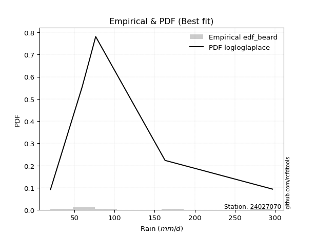</img>

</div>


### 5. Empirical - EDF Chegodayev (1955)

The Chegodayev formula is an empirical plotting position formula used in hydrological frequency analysis to estimate the exceedance probability or return period of a specific event from a set of observed data. It is primarily used for plotting observed data points on probability paper to fit a theoretical distribution, particularly for analyzing extreme events like maximum flood flows or rainfall intensities. The constant _b_ value in the generalized plotting position formula is 0.3.

<div align="center">


$P=(m-b)/(n+1-2b)$


</div>


**5.1. Empirical values**

<div align="center">

|                | 0                   | 1                  | 2                  | 3                  | 4                 | 5                 |
|:---------------|:--------------------|:-------------------|:-------------------|:-------------------|:------------------|:------------------|
| date           | 2021                | 2019               | 2020               | 2023               | 2025              | 2024              |
| x              | 20.0                | 59.4               | 69.2               | 76.4               | 142.0             | 297.2             |
| m              | 1                   | 2                  | 3                  | 4                  | 5                 | 6                 |
| empirical_dist | edf_chegodayev      | edf_chegodayev     | edf_chegodayev     | edf_chegodayev     | edf_chegodayev    | edf_chegodayev    |
| empirical      | 0.10937499999999999 | 0.265625           | 0.421875           | 0.578125           | 0.734375          | 0.890625          |
| empirical_tr   | 1.1228070175438596  | 1.3617021276595744 | 1.7297297297297298 | 2.3703703703703702 | 3.764705882352941 | 9.142857142857142 |

</div>


**5.2. Kolmogorov-Smirnov fit test (sorted by Δ)**


<div align="center">

|                | 0                     | 1                   | 2                   | 3                   | 4                   | 5                  | 6                   | 7                   | 8                   | 9                   | 10                  | 11                  | 12                  | 13                  | 14                  | 15                  | 16                  | 17                  | 18                 | 19                  | 20                  | 21                  | 22                  | 23                 | 24                  | 25                  | 26                  | 27                  | 28                  | 29                  | 30                  | 31                  | 32                  | 33                  | 34                 | 35                  | 36                  | 37                  | 38                 | 39                  | 40                  | 41                  | 42                  | 43                  | 44                  | 45                 | 46                  | 47                 | 48                  | 49                  | 50                  | 51                  | 52                  | 53                  | 54                  | 55                 | 56                 | 57                  | 58                  | 59                 | 60                  | 61                 | 62                  | 63                 | 64                  | 65                  | 66                  | 67                  | 68                  | 69                  | 70                  | 71                 | 72                  | 73                  | 74                 | 75                 | 76                  | 77                  | 78                  | 79                | 80                 | 81                  | 82                  | 83                  | 84                 | 85                  | 86                  | 87                 | 88                 | 89                 |
|:---------------|:----------------------|:--------------------|:--------------------|:--------------------|:--------------------|:-------------------|:--------------------|:--------------------|:--------------------|:--------------------|:--------------------|:--------------------|:--------------------|:--------------------|:--------------------|:--------------------|:--------------------|:--------------------|:-------------------|:--------------------|:--------------------|:--------------------|:--------------------|:-------------------|:--------------------|:--------------------|:--------------------|:--------------------|:--------------------|:--------------------|:--------------------|:--------------------|:--------------------|:--------------------|:-------------------|:--------------------|:--------------------|:--------------------|:-------------------|:--------------------|:--------------------|:--------------------|:--------------------|:--------------------|:--------------------|:-------------------|:--------------------|:-------------------|:--------------------|:--------------------|:--------------------|:--------------------|:--------------------|:--------------------|:--------------------|:-------------------|:-------------------|:--------------------|:--------------------|:-------------------|:--------------------|:-------------------|:--------------------|:-------------------|:--------------------|:--------------------|:--------------------|:--------------------|:--------------------|:--------------------|:--------------------|:-------------------|:--------------------|:--------------------|:-------------------|:-------------------|:--------------------|:--------------------|:--------------------|:------------------|:-------------------|:--------------------|:--------------------|:--------------------|:-------------------|:--------------------|:--------------------|:-------------------|:-------------------|:-------------------|
| station        | 24027070              | 24027070            | 24027070            | 24027070            | 24027070            | 24027070           | 24027070            | 24027070            | 24027070            | 24027070            | 24027070            | 24027070            | 24027070            | 24027070            | 24027070            | 24027070            | 24027070            | 24027070            | 24027070           | 24027070            | 24027070            | 24027070            | 24027070            | 24027070           | 24027070            | 24027070            | 24027070            | 24027070            | 24027070            | 24027070            | 24027070            | 24027070            | 24027070            | 24027070            | 24027070           | 24027070            | 24027070            | 24027070            | 24027070           | 24027070            | 24027070            | 24027070            | 24027070            | 24027070            | 24027070            | 24027070           | 24027070            | 24027070           | 24027070            | 24027070            | 24027070            | 24027070            | 24027070            | 24027070            | 24027070            | 24027070           | 24027070           | 24027070            | 24027070            | 24027070           | 24027070            | 24027070           | 24027070            | 24027070           | 24027070            | 24027070            | 24027070            | 24027070            | 24027070            | 24027070            | 24027070            | 24027070           | 24027070            | 24027070            | 24027070           | 24027070           | 24027070            | 24027070            | 24027070            | 24027070          | 24027070           | 24027070            | 24027070            | 24027070            | 24027070           | 24027070            | 24027070            | 24027070           | 24027070           | 24027070           |
| empirical_dist | edf_chegodayev        | edf_chegodayev      | edf_chegodayev      | edf_chegodayev      | edf_chegodayev      | edf_chegodayev     | edf_chegodayev      | edf_chegodayev      | edf_chegodayev      | edf_chegodayev      | edf_chegodayev      | edf_chegodayev      | edf_chegodayev      | edf_chegodayev      | edf_chegodayev      | edf_chegodayev      | edf_chegodayev      | edf_chegodayev      | edf_chegodayev     | edf_chegodayev      | edf_chegodayev      | edf_chegodayev      | edf_chegodayev      | edf_chegodayev     | edf_chegodayev      | edf_chegodayev      | edf_chegodayev      | edf_chegodayev      | edf_chegodayev      | edf_chegodayev      | edf_chegodayev      | edf_chegodayev      | edf_chegodayev      | edf_chegodayev      | edf_chegodayev     | edf_chegodayev      | edf_chegodayev      | edf_chegodayev      | edf_chegodayev     | edf_chegodayev      | edf_chegodayev      | edf_chegodayev      | edf_chegodayev      | edf_chegodayev      | edf_chegodayev      | edf_chegodayev     | edf_chegodayev      | edf_chegodayev     | edf_chegodayev      | edf_chegodayev      | edf_chegodayev      | edf_chegodayev      | edf_chegodayev      | edf_chegodayev      | edf_chegodayev      | edf_chegodayev     | edf_chegodayev     | edf_chegodayev      | edf_chegodayev      | edf_chegodayev     | edf_chegodayev      | edf_chegodayev     | edf_chegodayev      | edf_chegodayev     | edf_chegodayev      | edf_chegodayev      | edf_chegodayev      | edf_chegodayev      | edf_chegodayev      | edf_chegodayev      | edf_chegodayev      | edf_chegodayev     | edf_chegodayev      | edf_chegodayev      | edf_chegodayev     | edf_chegodayev     | edf_chegodayev      | edf_chegodayev      | edf_chegodayev      | edf_chegodayev    | edf_chegodayev     | edf_chegodayev      | edf_chegodayev      | edf_chegodayev      | edf_chegodayev     | edf_chegodayev      | edf_chegodayev      | edf_chegodayev     | edf_chegodayev     | edf_chegodayev     |
| p_dist         | loglaplace_asymmetric | johnsonsu           | fisk                | loggamma            | loggamma            | logerlang          | logf                | logbetaprime        | invgamma            | logweibull_min      | logfatiguelife      | nct                 | logt                | logcrystalball      | lognorm             | lognorm             | logexponnorm        | logjohnsonsu        | lognct             | loglogistic         | invgauss            | loggenlogistic      | logfisk             | logmielke          | logpearson3         | loghypsecant        | logloggamma         | logrice             | loginvgamma         | logalpha            | loggompertz         | ncf                 | betaprime           | gompertz            | expon              | genexpon            | logncf              | wald                | truncnorm          | loglaplace          | loginvgauss         | fatiguelife         | logmaxwell          | nakagami            | lograyleigh         | exponnorm          | halflogistic        | loggumbel_r        | halfnorm            | gibrat              | loginvweibull       | moyal               | pearson3            | t                   | logmoyal            | loghalfnorm        | loggumbel_l        | f                   | gumbel_r            | loggibrat          | logkstwobign        | laplace_asymmetric | rayleigh            | loghalflogistic    | genlogistic         | loggenexpon         | maxwell             | weibull_min         | alpha               | logwald             | kstwobign           | crystalball        | norm                | logistic            | rice               | hypsecant          | logtruncnorm        | lognakagami         | logexpon            | mielke            | laplace            | gumbel_l            | erlang              | gamma               | pareto             | loglognorm          | logpareto           | logchi2            | invweibull         | chi2               |
| delta          | 0.07188348587051674   | 0.08752014024136656 | 0.09457421461626586 | 0.09694287534757823 | 0.09694287534757823 | 0.0971027782913425 | 0.09766431765135086 | 0.09814543171085627 | 0.09926065128431094 | 0.09980346928709549 | 0.10037223354667785 | 0.10104376594497855 | 0.10126586047760383 | 0.10126635527123462 | 0.10126647073845046 | 0.10126647073845046 | 0.10126652164421168 | 0.10127420225700684 | 0.1014667205085995 | 0.10441878434930263 | 0.10464385428655498 | 0.10481864743717728 | 0.10494238016737212 | 0.1059478102748993 | 0.10650705798523341 | 0.10710469962957653 | 0.10862736855223148 | 0.10941421723980438 | 0.10947464595356099 | 0.11144737849674113 | 0.11188332448983379 | 0.11309289747941131 | 0.11389297473057286 | 0.11497491311591246 | 0.1150857870021984 | 0.11508648131147758 | 0.11513523832885997 | 0.11518400185044614 | 0.1170114843720732 | 0.11752607145643579 | 0.11830675078596353 | 0.12070015772729564 | 0.12506526919904792 | 0.12529730446080495 | 0.13721940087965323 | 0.1379213751651106 | 0.13803415638626215 | 0.1432156121123217 | 0.14660715725193313 | 0.15073778829905066 | 0.15777112672757854 | 0.15781352776043633 | 0.15786360845949216 | 0.16185014111504736 | 0.16214695737627438 | 0.1718018635552655 | 0.1719427500159646 | 0.17239417443661104 | 0.17608900540372768 | 0.1763268141220246 | 0.17849484317558595 | 0.1785721331576101 | 0.18103973040884258 | 0.1812879297239373 | 0.18289088898110495 | 0.18303191882071346 | 0.19313853920973817 | 0.20025467555272736 | 0.20051805577990983 | 0.20769822973049235 | 0.21253712278042475 | 0.2252457435824181 | 0.22524575690522292 | 0.24293764990398015 | 0.2486617223039737 | 0.2567213521492406 | 0.26562330745329354 | 0.26562485895555865 | 0.27788414522128413 | 0.282392248517806 | 0.2849822965509519 | 0.28567100971702397 | 0.29635905712472943 | 0.31292555807957856 | 0.3847724255534688 | 0.39698396116904056 | 0.40989393532768537 | 0.4221186671416637 | 0.4303303971410766 | 0.7035881898793586 |
| deltao         | 0.530385761606        | 0.530385761606      | 0.530385761606      | 0.530385761606      | 0.530385761606      | 0.530385761606     | 0.530385761606      | 0.530385761606      | 0.530385761606      | 0.530385761606      | 0.530385761606      | 0.530385761606      | 0.530385761606      | 0.530385761606      | 0.530385761606      | 0.530385761606      | 0.530385761606      | 0.530385761606      | 0.530385761606     | 0.530385761606      | 0.530385761606      | 0.530385761606      | 0.530385761606      | 0.530385761606     | 0.530385761606      | 0.530385761606      | 0.530385761606      | 0.530385761606      | 0.530385761606      | 0.530385761606      | 0.530385761606      | 0.530385761606      | 0.530385761606      | 0.530385761606      | 0.530385761606     | 0.530385761606      | 0.530385761606      | 0.530385761606      | 0.530385761606     | 0.530385761606      | 0.530385761606      | 0.530385761606      | 0.530385761606      | 0.530385761606      | 0.530385761606      | 0.530385761606     | 0.530385761606      | 0.530385761606     | 0.530385761606      | 0.530385761606      | 0.530385761606      | 0.530385761606      | 0.530385761606      | 0.530385761606      | 0.530385761606      | 0.530385761606     | 0.530385761606     | 0.530385761606      | 0.530385761606      | 0.530385761606     | 0.530385761606      | 0.530385761606     | 0.530385761606      | 0.530385761606     | 0.530385761606      | 0.530385761606      | 0.530385761606      | 0.530385761606      | 0.530385761606      | 0.530385761606      | 0.530385761606      | 0.530385761606     | 0.530385761606      | 0.530385761606      | 0.530385761606     | 0.530385761606     | 0.530385761606      | 0.530385761606      | 0.530385761606      | 0.530385761606    | 0.530385761606     | 0.530385761606      | 0.530385761606      | 0.530385761606      | 0.530385761606     | 0.530385761606      | 0.530385761606      | 0.530385761606     | 0.530385761606     | 0.530385761606     |
| eval           | Δo > Δ                | Δo > Δ              | Δo > Δ              | Δo > Δ              | Δo > Δ              | Δo > Δ             | Δo > Δ              | Δo > Δ              | Δo > Δ              | Δo > Δ              | Δo > Δ              | Δo > Δ              | Δo > Δ              | Δo > Δ              | Δo > Δ              | Δo > Δ              | Δo > Δ              | Δo > Δ              | Δo > Δ             | Δo > Δ              | Δo > Δ              | Δo > Δ              | Δo > Δ              | Δo > Δ             | Δo > Δ              | Δo > Δ              | Δo > Δ              | Δo > Δ              | Δo > Δ              | Δo > Δ              | Δo > Δ              | Δo > Δ              | Δo > Δ              | Δo > Δ              | Δo > Δ             | Δo > Δ              | Δo > Δ              | Δo > Δ              | Δo > Δ             | Δo > Δ              | Δo > Δ              | Δo > Δ              | Δo > Δ              | Δo > Δ              | Δo > Δ              | Δo > Δ             | Δo > Δ              | Δo > Δ             | Δo > Δ              | Δo > Δ              | Δo > Δ              | Δo > Δ              | Δo > Δ              | Δo > Δ              | Δo > Δ              | Δo > Δ             | Δo > Δ             | Δo > Δ              | Δo > Δ              | Δo > Δ             | Δo > Δ              | Δo > Δ             | Δo > Δ              | Δo > Δ             | Δo > Δ              | Δo > Δ              | Δo > Δ              | Δo > Δ              | Δo > Δ              | Δo > Δ              | Δo > Δ              | Δo > Δ             | Δo > Δ              | Δo > Δ              | Δo > Δ             | Δo > Δ             | Δo > Δ              | Δo > Δ              | Δo > Δ              | Δo > Δ            | Δo > Δ             | Δo > Δ              | Δo > Δ              | Δo > Δ              | Δo > Δ             | Δo > Δ              | Δo > Δ              | Δo > Δ             | Δo > Δ             | Δo <= Δ            |
| fit            | 1                     | 1                   | 1                   | 1                   | 1                   | 1                  | 1                   | 1                   | 1                   | 1                   | 1                   | 1                   | 1                   | 1                   | 1                   | 1                   | 1                   | 1                   | 1                  | 1                   | 1                   | 1                   | 1                   | 1                  | 1                   | 1                   | 1                   | 1                   | 1                   | 1                   | 1                   | 1                   | 1                   | 1                   | 1                  | 1                   | 1                   | 1                   | 1                  | 1                   | 1                   | 1                   | 1                   | 1                   | 1                   | 1                  | 1                   | 1                  | 1                   | 1                   | 1                   | 1                   | 1                   | 1                   | 1                   | 1                  | 1                  | 1                   | 1                   | 1                  | 1                   | 1                  | 1                   | 1                  | 1                   | 1                   | 1                   | 1                   | 1                   | 1                   | 1                   | 1                  | 1                   | 1                   | 1                  | 1                  | 1                   | 1                   | 1                   | 1                 | 1                  | 1                   | 1                   | 1                   | 1                  | 1                   | 1                   | 1                  | 1                  | 0                  |
| n              | 6                     | 6                   | 6                   | 6                   | 6                   | 6                  | 6                   | 6                   | 6                   | 6                   | 6                   | 6                   | 6                   | 6                   | 6                   | 6                   | 6                   | 6                   | 6                  | 6                   | 6                   | 6                   | 6                   | 6                  | 6                   | 6                   | 6                   | 6                   | 6                   | 6                   | 6                   | 6                   | 6                   | 6                   | 6                  | 6                   | 6                   | 6                   | 6                  | 6                   | 6                   | 6                   | 6                   | 6                   | 6                   | 6                  | 6                   | 6                  | 6                   | 6                   | 6                   | 6                   | 6                   | 6                   | 6                   | 6                  | 6                  | 6                   | 6                   | 6                  | 6                   | 6                  | 6                   | 6                  | 6                   | 6                   | 6                   | 6                   | 6                   | 6                   | 6                   | 6                  | 6                   | 6                   | 6                  | 6                  | 6                   | 6                   | 6                   | 6                 | 6                  | 6                   | 6                   | 6                   | 6                  | 6                   | 6                   | 6                  | 6                  | 6                  |
| best_fit       | 1                     | 0                   | 0                   | 0                   | 0                   | 0                  | 0                   | 0                   | 0                   | 0                   | 0                   | 0                   | 0                   | 0                   | 0                   | 0                   | 0                   | 0                   | 0                  | 0                   | 0                   | 0                   | 0                   | 0                  | 0                   | 0                   | 0                   | 0                   | 0                   | 0                   | 0                   | 0                   | 0                   | 0                   | 0                  | 0                   | 0                   | 0                   | 0                  | 0                   | 0                   | 0                   | 0                   | 0                   | 0                   | 0                  | 0                   | 0                  | 0                   | 0                   | 0                   | 0                   | 0                   | 0                   | 0                   | 0                  | 0                  | 0                   | 0                   | 0                  | 0                   | 0                  | 0                   | 0                  | 0                   | 0                   | 0                   | 0                   | 0                   | 0                   | 0                   | 0                  | 0                   | 0                   | 0                  | 0                  | 0                   | 0                   | 0                   | 0                 | 0                  | 0                   | 0                   | 0                   | 0                  | 0                   | 0                   | 0                  | 0                  | 0                  |
| best_fit_sort  | 1                     | 2                   | 3                   | 4                   | 5                   | 6                  | 7                   | 8                   | 9                   | 10                  | 11                  | 12                  | 13                  | 14                  | 15                  | 16                  | 17                  | 18                  | 19                 | 20                  | 21                  | 22                  | 23                  | 24                 | 25                  | 26                  | 27                  | 28                  | 29                  | 30                  | 31                  | 32                  | 33                  | 34                  | 35                 | 36                  | 37                  | 38                  | 39                 | 40                  | 41                  | 42                  | 43                  | 44                  | 45                  | 46                 | 47                  | 48                 | 49                  | 50                  | 51                  | 52                  | 53                  | 54                  | 55                  | 56                 | 57                 | 58                  | 59                  | 60                 | 61                  | 62                 | 63                  | 64                 | 65                  | 66                  | 67                  | 68                  | 69                  | 70                  | 71                  | 72                 | 73                  | 74                  | 75                 | 76                 | 77                  | 78                  | 79                  | 80                | 81                 | 82                  | 83                  | 84                  | 85                 | 86                  | 87                  | 88                 | 89                 | 90                 |

</div>


<div align="center">

</img>

</div>


**5.3. Best fit**

<div align="center">

|   id |   station | empirical_dist   | p_dist                |     delta |   deltao | eval   |   fit |   n |   best_fit |   best_fit_sort |
|-----:|----------:|:-----------------|:----------------------|----------:|---------:|:-------|------:|----:|-----------:|----------------:|
|    0 |  24027070 | edf_chegodayev   | loglaplace_asymmetric | 0.0718835 | 0.530386 | Δo > Δ |     1 |   6 |          1 |               1 |

</div>


<div align="center">

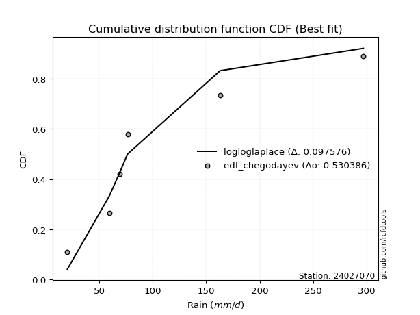</img>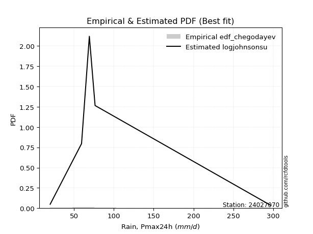</img>

</div>


### 6. Empirical - EDF Blom (1958)

The Blom formula is a specific "plotting position" formula used in hydrology and statistical analysis to estimate the empirical cumulative probability (or non-exceedance probability) of a data series. It is particularly recommended for data that are approximately normally distributed. The constant _a_ is set to 0.375 (or 3/8).

<div align="center">


$P=(m-a)/(n+1-2a)$


</div>


**6.1. Empirical values**

<div align="center">

|                | 0                  | 1                  | 2                  | 3                 | 4                 | 5                  |
|:---------------|:-------------------|:-------------------|:-------------------|:------------------|:------------------|:-------------------|
| date           | 2021               | 2019               | 2020               | 2023              | 2025              | 2024               |
| x              | 20.0               | 59.4               | 69.2               | 76.4              | 142.0             | 297.2              |
| m              | 1                  | 2                  | 3                  | 4                 | 5                 | 6                  |
| empirical_dist | edf_blom           | edf_blom           | edf_blom           | edf_blom          | edf_blom          | edf_blom           |
| empirical      | 0.1                | 0.26               | 0.42               | 0.58              | 0.74              | 0.9                |
| empirical_tr   | 1.1111111111111112 | 1.3513513513513513 | 1.7241379310344827 | 2.380952380952381 | 3.846153846153846 | 10.000000000000002 |

</div>


**6.2. Kolmogorov-Smirnov fit test (sorted by Δ)**


<div align="center">

|                | 0                     | 1                   | 2                   | 3                  | 4                   | 5                   | 6                   | 7                   | 8                   | 9                  | 10                  | 11                  | 12                  | 13                  | 14                  | 15                  | 16                 | 17                  | 18                  | 19                  | 20                  | 21                  | 22                  | 23                  | 24                  | 25                  | 26                  | 27                  | 28                  | 29                  | 30                  | 31                  | 32                  | 33                  | 34                 | 35                  | 36                  | 37                  | 38                  | 39                  | 40                  | 41                  | 42                 | 43                  | 44                  | 45                 | 46                  | 47                 | 48                 | 49                  | 50                  | 51                 | 52                  | 53                  | 54                  | 55                  | 56                 | 57                  | 58                  | 59                  | 60                 | 61                  | 62                  | 63                 | 64                 | 65                  | 66                  | 67                  | 68                  | 69                  | 70                 | 71                  | 72                  | 73                 | 74                  | 75                  | 76                  | 77                  | 78                 | 79                 | 80                  | 81                  | 82                 | 83                  | 84                 | 85                  | 86                  | 87                 | 88                  | 89                 |
|:---------------|:----------------------|:--------------------|:--------------------|:-------------------|:--------------------|:--------------------|:--------------------|:--------------------|:--------------------|:-------------------|:--------------------|:--------------------|:--------------------|:--------------------|:--------------------|:--------------------|:-------------------|:--------------------|:--------------------|:--------------------|:--------------------|:--------------------|:--------------------|:--------------------|:--------------------|:--------------------|:--------------------|:--------------------|:--------------------|:--------------------|:--------------------|:--------------------|:--------------------|:--------------------|:-------------------|:--------------------|:--------------------|:--------------------|:--------------------|:--------------------|:--------------------|:--------------------|:-------------------|:--------------------|:--------------------|:-------------------|:--------------------|:-------------------|:-------------------|:--------------------|:--------------------|:-------------------|:--------------------|:--------------------|:--------------------|:--------------------|:-------------------|:--------------------|:--------------------|:--------------------|:-------------------|:--------------------|:--------------------|:-------------------|:-------------------|:--------------------|:--------------------|:--------------------|:--------------------|:--------------------|:-------------------|:--------------------|:--------------------|:-------------------|:--------------------|:--------------------|:--------------------|:--------------------|:-------------------|:-------------------|:--------------------|:--------------------|:-------------------|:--------------------|:-------------------|:--------------------|:--------------------|:-------------------|:--------------------|:-------------------|
| station        | 24027070              | 24027070            | 24027070            | 24027070           | 24027070            | 24027070            | 24027070            | 24027070            | 24027070            | 24027070           | 24027070            | 24027070            | 24027070            | 24027070            | 24027070            | 24027070            | 24027070           | 24027070            | 24027070            | 24027070            | 24027070            | 24027070            | 24027070            | 24027070            | 24027070            | 24027070            | 24027070            | 24027070            | 24027070            | 24027070            | 24027070            | 24027070            | 24027070            | 24027070            | 24027070           | 24027070            | 24027070            | 24027070            | 24027070            | 24027070            | 24027070            | 24027070            | 24027070           | 24027070            | 24027070            | 24027070           | 24027070            | 24027070           | 24027070           | 24027070            | 24027070            | 24027070           | 24027070            | 24027070            | 24027070            | 24027070            | 24027070           | 24027070            | 24027070            | 24027070            | 24027070           | 24027070            | 24027070            | 24027070           | 24027070           | 24027070            | 24027070            | 24027070            | 24027070            | 24027070            | 24027070           | 24027070            | 24027070            | 24027070           | 24027070            | 24027070            | 24027070            | 24027070            | 24027070           | 24027070           | 24027070            | 24027070            | 24027070           | 24027070            | 24027070           | 24027070            | 24027070            | 24027070           | 24027070            | 24027070           |
| empirical_dist | edf_blom              | edf_blom            | edf_blom            | edf_blom           | edf_blom            | edf_blom            | edf_blom            | edf_blom            | edf_blom            | edf_blom           | edf_blom            | edf_blom            | edf_blom            | edf_blom            | edf_blom            | edf_blom            | edf_blom           | edf_blom            | edf_blom            | edf_blom            | edf_blom            | edf_blom            | edf_blom            | edf_blom            | edf_blom            | edf_blom            | edf_blom            | edf_blom            | edf_blom            | edf_blom            | edf_blom            | edf_blom            | edf_blom            | edf_blom            | edf_blom           | edf_blom            | edf_blom            | edf_blom            | edf_blom            | edf_blom            | edf_blom            | edf_blom            | edf_blom           | edf_blom            | edf_blom            | edf_blom           | edf_blom            | edf_blom           | edf_blom           | edf_blom            | edf_blom            | edf_blom           | edf_blom            | edf_blom            | edf_blom            | edf_blom            | edf_blom           | edf_blom            | edf_blom            | edf_blom            | edf_blom           | edf_blom            | edf_blom            | edf_blom           | edf_blom           | edf_blom            | edf_blom            | edf_blom            | edf_blom            | edf_blom            | edf_blom           | edf_blom            | edf_blom            | edf_blom           | edf_blom            | edf_blom            | edf_blom            | edf_blom            | edf_blom           | edf_blom           | edf_blom            | edf_blom            | edf_blom           | edf_blom            | edf_blom           | edf_blom            | edf_blom            | edf_blom           | edf_blom            | edf_blom           |
| p_dist         | loglaplace_asymmetric | johnsonsu           | fisk                | invgamma           | logf                | loggamma            | loggamma            | logfatiguelife      | logweibull_min      | logerlang          | nct                 | logt                | logcrystalball      | lognorm             | lognorm             | logexponnorm        | logjohnsonsu       | lognct              | logbetaprime        | loglogistic         | loggenlogistic      | logfisk             | logmielke           | logpearson3         | loghypsecant        | invgauss            | logloggamma         | ncf                 | logrice             | loginvgamma         | betaprime           | gompertz            | expon               | genexpon            | wald               | logalpha            | loggompertz         | truncnorm           | loglaplace          | logncf              | loginvgauss         | fatiguelife         | nakagami           | logmaxwell          | exponnorm           | halflogistic       | lograyleigh         | halfnorm           | loggumbel_r        | gibrat              | t                   | moyal              | pearson3            | loginvweibull       | logmoyal            | loggumbel_l         | loghalfnorm        | gumbel_r            | f                   | laplace_asymmetric  | loggibrat          | rayleigh            | logkstwobign        | genlogistic        | loghalflogistic    | loggenexpon         | maxwell             | weibull_min         | alpha               | logwald             | kstwobign          | crystalball         | norm                | logistic           | rice                | hypsecant           | logtruncnorm        | lognakagami         | logexpon           | laplace            | gumbel_l            | mielke              | erlang             | gamma               | pareto             | loglognorm          | logpareto           | logchi2            | invweibull          | chi2               |
| delta          | 0.06896990918197593   | 0.08189514024136657 | 0.10019921461626585 | 0.1011356512843109 | 0.10127128232764376 | 0.10203947542317143 | 0.10203947542317143 | 0.10224723354667781 | 0.10238945241335767 | 0.1027277782913425 | 0.10291876594497851 | 0.10314086047760379 | 0.10314135527123458 | 0.10314147073845042 | 0.10314147073845042 | 0.10314152164421164 | 0.1031492022570068 | 0.10334172050859947 | 0.10377043171085626 | 0.10629378434930259 | 0.10669364743717724 | 0.10681738016737208 | 0.10782281027489926 | 0.10838205798523337 | 0.10897969962957649 | 0.11026885428655497 | 0.11050236855223144 | 0.11496789747941127 | 0.11503921723980437 | 0.11509964595356098 | 0.11576797473057282 | 0.11684991311591242 | 0.11696078700219836 | 0.11696148131147754 | 0.1170590018504461 | 0.11707237849674113 | 0.11750832448983378 | 0.11888648437207316 | 0.11940107145643575 | 0.12076023832885996 | 0.12393175078596352 | 0.12632515772729563 | 0.1271723044608049 | 0.13069026919904791 | 0.13979637516511056 | 0.1399091563862621 | 0.14284440087965322 | 0.1484821572519331 | 0.1488406121123217 | 0.15261278829905062 | 0.15622514111504737 | 0.1596885277604363 | 0.15973860845949212 | 0.16339612672757853 | 0.16777195737627437 | 0.17381775001596456 | 0.1774268635552655 | 0.17796400540372764 | 0.17801917443661103 | 0.18044713315761007 | 0.1819518141220246 | 0.18291473040884254 | 0.18411984317558594 | 0.1847658889811049 | 0.1869129297239373 | 0.18865691882071345 | 0.19501353920973813 | 0.20587967555272735 | 0.20614305577990982 | 0.21332322973049234 | 0.2144121227804247 | 0.22712074358241807 | 0.22712075690522288 | 0.2448126499039801 | 0.25053672230397367 | 0.25859635214924054 | 0.25999830745329355 | 0.25999985895555866 | 0.2835091452212841 | 0.2868572965509519 | 0.28754600971702393 | 0.28801724851780597 | 0.3019840571247294 | 0.31855055807957855 | 0.3903974255534688 | 0.40260896116904055 | 0.41551893532768536 | 0.4277436671416637 | 0.43970539714107665 | 0.7092131898793586 |
| deltao         | 0.530385761606        | 0.530385761606      | 0.530385761606      | 0.530385761606     | 0.530385761606      | 0.530385761606      | 0.530385761606      | 0.530385761606      | 0.530385761606      | 0.530385761606     | 0.530385761606      | 0.530385761606      | 0.530385761606      | 0.530385761606      | 0.530385761606      | 0.530385761606      | 0.530385761606     | 0.530385761606      | 0.530385761606      | 0.530385761606      | 0.530385761606      | 0.530385761606      | 0.530385761606      | 0.530385761606      | 0.530385761606      | 0.530385761606      | 0.530385761606      | 0.530385761606      | 0.530385761606      | 0.530385761606      | 0.530385761606      | 0.530385761606      | 0.530385761606      | 0.530385761606      | 0.530385761606     | 0.530385761606      | 0.530385761606      | 0.530385761606      | 0.530385761606      | 0.530385761606      | 0.530385761606      | 0.530385761606      | 0.530385761606     | 0.530385761606      | 0.530385761606      | 0.530385761606     | 0.530385761606      | 0.530385761606     | 0.530385761606     | 0.530385761606      | 0.530385761606      | 0.530385761606     | 0.530385761606      | 0.530385761606      | 0.530385761606      | 0.530385761606      | 0.530385761606     | 0.530385761606      | 0.530385761606      | 0.530385761606      | 0.530385761606     | 0.530385761606      | 0.530385761606      | 0.530385761606     | 0.530385761606     | 0.530385761606      | 0.530385761606      | 0.530385761606      | 0.530385761606      | 0.530385761606      | 0.530385761606     | 0.530385761606      | 0.530385761606      | 0.530385761606     | 0.530385761606      | 0.530385761606      | 0.530385761606      | 0.530385761606      | 0.530385761606     | 0.530385761606     | 0.530385761606      | 0.530385761606      | 0.530385761606     | 0.530385761606      | 0.530385761606     | 0.530385761606      | 0.530385761606      | 0.530385761606     | 0.530385761606      | 0.530385761606     |
| eval           | Δo > Δ                | Δo > Δ              | Δo > Δ              | Δo > Δ             | Δo > Δ              | Δo > Δ              | Δo > Δ              | Δo > Δ              | Δo > Δ              | Δo > Δ             | Δo > Δ              | Δo > Δ              | Δo > Δ              | Δo > Δ              | Δo > Δ              | Δo > Δ              | Δo > Δ             | Δo > Δ              | Δo > Δ              | Δo > Δ              | Δo > Δ              | Δo > Δ              | Δo > Δ              | Δo > Δ              | Δo > Δ              | Δo > Δ              | Δo > Δ              | Δo > Δ              | Δo > Δ              | Δo > Δ              | Δo > Δ              | Δo > Δ              | Δo > Δ              | Δo > Δ              | Δo > Δ             | Δo > Δ              | Δo > Δ              | Δo > Δ              | Δo > Δ              | Δo > Δ              | Δo > Δ              | Δo > Δ              | Δo > Δ             | Δo > Δ              | Δo > Δ              | Δo > Δ             | Δo > Δ              | Δo > Δ             | Δo > Δ             | Δo > Δ              | Δo > Δ              | Δo > Δ             | Δo > Δ              | Δo > Δ              | Δo > Δ              | Δo > Δ              | Δo > Δ             | Δo > Δ              | Δo > Δ              | Δo > Δ              | Δo > Δ             | Δo > Δ              | Δo > Δ              | Δo > Δ             | Δo > Δ             | Δo > Δ              | Δo > Δ              | Δo > Δ              | Δo > Δ              | Δo > Δ              | Δo > Δ             | Δo > Δ              | Δo > Δ              | Δo > Δ             | Δo > Δ              | Δo > Δ              | Δo > Δ              | Δo > Δ              | Δo > Δ             | Δo > Δ             | Δo > Δ              | Δo > Δ              | Δo > Δ             | Δo > Δ              | Δo > Δ             | Δo > Δ              | Δo > Δ              | Δo > Δ             | Δo > Δ              | Δo <= Δ            |
| fit            | 1                     | 1                   | 1                   | 1                  | 1                   | 1                   | 1                   | 1                   | 1                   | 1                  | 1                   | 1                   | 1                   | 1                   | 1                   | 1                   | 1                  | 1                   | 1                   | 1                   | 1                   | 1                   | 1                   | 1                   | 1                   | 1                   | 1                   | 1                   | 1                   | 1                   | 1                   | 1                   | 1                   | 1                   | 1                  | 1                   | 1                   | 1                   | 1                   | 1                   | 1                   | 1                   | 1                  | 1                   | 1                   | 1                  | 1                   | 1                  | 1                  | 1                   | 1                   | 1                  | 1                   | 1                   | 1                   | 1                   | 1                  | 1                   | 1                   | 1                   | 1                  | 1                   | 1                   | 1                  | 1                  | 1                   | 1                   | 1                   | 1                   | 1                   | 1                  | 1                   | 1                   | 1                  | 1                   | 1                   | 1                   | 1                   | 1                  | 1                  | 1                   | 1                   | 1                  | 1                   | 1                  | 1                   | 1                   | 1                  | 1                   | 0                  |
| n              | 6                     | 6                   | 6                   | 6                  | 6                   | 6                   | 6                   | 6                   | 6                   | 6                  | 6                   | 6                   | 6                   | 6                   | 6                   | 6                   | 6                  | 6                   | 6                   | 6                   | 6                   | 6                   | 6                   | 6                   | 6                   | 6                   | 6                   | 6                   | 6                   | 6                   | 6                   | 6                   | 6                   | 6                   | 6                  | 6                   | 6                   | 6                   | 6                   | 6                   | 6                   | 6                   | 6                  | 6                   | 6                   | 6                  | 6                   | 6                  | 6                  | 6                   | 6                   | 6                  | 6                   | 6                   | 6                   | 6                   | 6                  | 6                   | 6                   | 6                   | 6                  | 6                   | 6                   | 6                  | 6                  | 6                   | 6                   | 6                   | 6                   | 6                   | 6                  | 6                   | 6                   | 6                  | 6                   | 6                   | 6                   | 6                   | 6                  | 6                  | 6                   | 6                   | 6                  | 6                   | 6                  | 6                   | 6                   | 6                  | 6                   | 6                  |
| best_fit       | 1                     | 0                   | 0                   | 0                  | 0                   | 0                   | 0                   | 0                   | 0                   | 0                  | 0                   | 0                   | 0                   | 0                   | 0                   | 0                   | 0                  | 0                   | 0                   | 0                   | 0                   | 0                   | 0                   | 0                   | 0                   | 0                   | 0                   | 0                   | 0                   | 0                   | 0                   | 0                   | 0                   | 0                   | 0                  | 0                   | 0                   | 0                   | 0                   | 0                   | 0                   | 0                   | 0                  | 0                   | 0                   | 0                  | 0                   | 0                  | 0                  | 0                   | 0                   | 0                  | 0                   | 0                   | 0                   | 0                   | 0                  | 0                   | 0                   | 0                   | 0                  | 0                   | 0                   | 0                  | 0                  | 0                   | 0                   | 0                   | 0                   | 0                   | 0                  | 0                   | 0                   | 0                  | 0                   | 0                   | 0                   | 0                   | 0                  | 0                  | 0                   | 0                   | 0                  | 0                   | 0                  | 0                   | 0                   | 0                  | 0                   | 0                  |
| best_fit_sort  | 1                     | 2                   | 3                   | 4                  | 5                   | 6                   | 7                   | 8                   | 9                   | 10                 | 11                  | 12                  | 13                  | 14                  | 15                  | 16                  | 17                 | 18                  | 19                  | 20                  | 21                  | 22                  | 23                  | 24                  | 25                  | 26                  | 27                  | 28                  | 29                  | 30                  | 31                  | 32                  | 33                  | 34                  | 35                 | 36                  | 37                  | 38                  | 39                  | 40                  | 41                  | 42                  | 43                 | 44                  | 45                  | 46                 | 47                  | 48                 | 49                 | 50                  | 51                  | 52                 | 53                  | 54                  | 55                  | 56                  | 57                 | 58                  | 59                  | 60                  | 61                 | 62                  | 63                  | 64                 | 65                 | 66                  | 67                  | 68                  | 69                  | 70                  | 71                 | 72                  | 73                  | 74                 | 75                  | 76                  | 77                  | 78                  | 79                 | 80                 | 81                  | 82                  | 83                 | 84                  | 85                 | 86                  | 87                  | 88                 | 89                  | 90                 |

</div>


<div align="center">

</img>

</div>


**6.3. Best fit**

<div align="center">

|   id |   station | empirical_dist   | p_dist                |     delta |   deltao | eval   |   fit |   n |   best_fit |   best_fit_sort |
|-----:|----------:|:-----------------|:----------------------|----------:|---------:|:-------|------:|----:|-----------:|----------------:|
|    0 |  24027070 | edf_blom         | loglaplace_asymmetric | 0.0689699 | 0.530386 | Δo > Δ |     1 |   6 |          1 |               1 |

</div>


<div align="center">

</img></img>

</div>


### 7. Empirical - EDF Tukey (1962)

In hydrology, the Tukey formula is used as a plotting position formula to estimate the empirical probability or frequency of a flood event (or other hydrological data). The formula parameter is given as _c=0.333_ (or 1/3).

<div align="center">


$P=(m-c)/(n+1-2c)$


</div>


**7.1. Empirical values**

<div align="center">

|                | 0                   | 1                  | 2                   | 3                  | 4                  | 5                  |
|:---------------|:--------------------|:-------------------|:--------------------|:-------------------|:-------------------|:-------------------|
| date           | 2021                | 2019               | 2020                | 2023               | 2025               | 2024               |
| x              | 20.0                | 59.4               | 69.2                | 76.4               | 142.0              | 297.2              |
| m              | 1                   | 2                  | 3                   | 4                  | 5                  | 6                  |
| empirical_dist | edf_tukey           | edf_tukey          | edf_tukey           | edf_tukey          | edf_tukey          | edf_tukey          |
| empirical      | 0.10526315789473684 | 0.2631578947368421 | 0.42105263157894735 | 0.5789473684210527 | 0.7368421052631579 | 0.8947368421052632 |
| empirical_tr   | 1.1176470588235294  | 1.357142857142857  | 1.7272727272727273  | 2.375              | 3.7999999999999994 | 9.5                |

</div>


**7.2. Kolmogorov-Smirnov fit test (sorted by Δ)**


<div align="center">

|                | 0                     | 1                   | 2                   | 3                   | 4                   | 5                   | 6                   | 7                  | 8                   | 9                   | 10                 | 11                 | 12                  | 13                  | 14                  | 15                  | 16                  | 17                 | 18                  | 19                  | 20                  | 21                  | 22                  | 23                  | 24                  | 25                  | 26                  | 27                  | 28                 | 29                  | 30                  | 31                 | 32                  | 33                  | 34                  | 35                  | 36                 | 37                  | 38                  | 39                  | 40                  | 41                  | 42                 | 43                  | 44                  | 45                 | 46                  | 47                 | 48                  | 49                 | 50                | 51                 | 52                 | 53                  | 54                 | 55                  | 56                 | 57                  | 58                  | 59                  | 60                  | 61                  | 62                  | 63                 | 64                  | 65                  | 66                  | 67                  | 68                  | 69                  | 70                 | 71                  | 72                  | 73                 | 74                  | 75                  | 76                  | 77                  | 78                  | 79                 | 80                 | 81                 | 82                  | 83                  | 84                 | 85                  | 86                 | 87                 | 88                 | 89                 |
|:---------------|:----------------------|:--------------------|:--------------------|:--------------------|:--------------------|:--------------------|:--------------------|:-------------------|:--------------------|:--------------------|:-------------------|:-------------------|:--------------------|:--------------------|:--------------------|:--------------------|:--------------------|:-------------------|:--------------------|:--------------------|:--------------------|:--------------------|:--------------------|:--------------------|:--------------------|:--------------------|:--------------------|:--------------------|:-------------------|:--------------------|:--------------------|:-------------------|:--------------------|:--------------------|:--------------------|:--------------------|:-------------------|:--------------------|:--------------------|:--------------------|:--------------------|:--------------------|:-------------------|:--------------------|:--------------------|:-------------------|:--------------------|:-------------------|:--------------------|:-------------------|:------------------|:-------------------|:-------------------|:--------------------|:-------------------|:--------------------|:-------------------|:--------------------|:--------------------|:--------------------|:--------------------|:--------------------|:--------------------|:-------------------|:--------------------|:--------------------|:--------------------|:--------------------|:--------------------|:--------------------|:-------------------|:--------------------|:--------------------|:-------------------|:--------------------|:--------------------|:--------------------|:--------------------|:--------------------|:-------------------|:-------------------|:-------------------|:--------------------|:--------------------|:-------------------|:--------------------|:-------------------|:-------------------|:-------------------|:-------------------|
| station        | 24027070              | 24027070            | 24027070            | 24027070            | 24027070            | 24027070            | 24027070            | 24027070           | 24027070            | 24027070            | 24027070           | 24027070           | 24027070            | 24027070            | 24027070            | 24027070            | 24027070            | 24027070           | 24027070            | 24027070            | 24027070            | 24027070            | 24027070            | 24027070            | 24027070            | 24027070            | 24027070            | 24027070            | 24027070           | 24027070            | 24027070            | 24027070           | 24027070            | 24027070            | 24027070            | 24027070            | 24027070           | 24027070            | 24027070            | 24027070            | 24027070            | 24027070            | 24027070           | 24027070            | 24027070            | 24027070           | 24027070            | 24027070           | 24027070            | 24027070           | 24027070          | 24027070           | 24027070           | 24027070            | 24027070           | 24027070            | 24027070           | 24027070            | 24027070            | 24027070            | 24027070            | 24027070            | 24027070            | 24027070           | 24027070            | 24027070            | 24027070            | 24027070            | 24027070            | 24027070            | 24027070           | 24027070            | 24027070            | 24027070           | 24027070            | 24027070            | 24027070            | 24027070            | 24027070            | 24027070           | 24027070           | 24027070           | 24027070            | 24027070            | 24027070           | 24027070            | 24027070           | 24027070           | 24027070           | 24027070           |
| empirical_dist | edf_tukey             | edf_tukey           | edf_tukey           | edf_tukey           | edf_tukey           | edf_tukey           | edf_tukey           | edf_tukey          | edf_tukey           | edf_tukey           | edf_tukey          | edf_tukey          | edf_tukey           | edf_tukey           | edf_tukey           | edf_tukey           | edf_tukey           | edf_tukey          | edf_tukey           | edf_tukey           | edf_tukey           | edf_tukey           | edf_tukey           | edf_tukey           | edf_tukey           | edf_tukey           | edf_tukey           | edf_tukey           | edf_tukey          | edf_tukey           | edf_tukey           | edf_tukey          | edf_tukey           | edf_tukey           | edf_tukey           | edf_tukey           | edf_tukey          | edf_tukey           | edf_tukey           | edf_tukey           | edf_tukey           | edf_tukey           | edf_tukey          | edf_tukey           | edf_tukey           | edf_tukey          | edf_tukey           | edf_tukey          | edf_tukey           | edf_tukey          | edf_tukey         | edf_tukey          | edf_tukey          | edf_tukey           | edf_tukey          | edf_tukey           | edf_tukey          | edf_tukey           | edf_tukey           | edf_tukey           | edf_tukey           | edf_tukey           | edf_tukey           | edf_tukey          | edf_tukey           | edf_tukey           | edf_tukey           | edf_tukey           | edf_tukey           | edf_tukey           | edf_tukey          | edf_tukey           | edf_tukey           | edf_tukey          | edf_tukey           | edf_tukey           | edf_tukey           | edf_tukey           | edf_tukey           | edf_tukey          | edf_tukey          | edf_tukey          | edf_tukey           | edf_tukey           | edf_tukey          | edf_tukey           | edf_tukey          | edf_tukey          | edf_tukey          | edf_tukey          |
| p_dist         | loglaplace_asymmetric | johnsonsu           | fisk                | logf                | loggamma            | loggamma            | logerlang           | invgamma           | logbetaprime        | logweibull_min      | logfatiguelife     | nct                | logt                | logcrystalball      | lognorm             | lognorm             | logexponnorm        | logjohnsonsu       | lognct              | loglogistic         | loggenlogistic      | logfisk             | logmielke           | invgauss            | logpearson3         | loghypsecant        | logloggamma         | logrice             | loginvgamma        | logalpha            | ncf                 | loggompertz        | betaprime           | gompertz            | expon               | genexpon            | wald               | logncf              | truncnorm           | loglaplace          | loginvgauss         | fatiguelife         | nakagami           | logmaxwell          | exponnorm           | halflogistic       | lograyleigh         | loggumbel_r        | halfnorm            | gibrat             | moyal             | pearson3           | t                  | loginvweibull       | logmoyal           | loggumbel_l         | loghalfnorm        | f                   | gumbel_r            | loggibrat           | laplace_asymmetric  | logkstwobign        | rayleigh            | genlogistic        | loghalflogistic     | loggenexpon         | maxwell             | weibull_min         | alpha               | logwald             | kstwobign          | crystalball         | norm                | logistic           | rice                | hypsecant           | logtruncnorm        | lognakagami         | logexpon            | mielke             | laplace            | gumbel_l           | erlang              | gamma               | pareto             | loglognorm          | logpareto          | logchi2            | invweibull         | chi2               |
| delta          | 0.06941638060735889   | 0.08505303497820871 | 0.09704131987942377 | 0.09848668607240352 | 0.09888158068632935 | 0.09888158068632935 | 0.09956988355450042 | 0.1000830197053636 | 0.10061253697401418 | 0.10062583770814815 | 0.1011946019677305 | 0.1018661343660312 | 0.10208822889865649 | 0.10208872369228728 | 0.10208883915950312 | 0.10208883915950312 | 0.10208889006526434 | 0.1020965706780595 | 0.10228908892965216 | 0.10524115277035528 | 0.10564101585822994 | 0.10576474858842477 | 0.10677017869595196 | 0.10711095954971289 | 0.10732942640628607 | 0.10792706805062918 | 0.10944973697328414 | 0.11188132250296229 | 0.1119417512167189 | 0.11391448375989904 | 0.11391526590046397 | 0.1143504297529917 | 0.11471534315162552 | 0.11579728153696511 | 0.11590815542325106 | 0.11590884973253024 | 0.1160063702714988 | 0.11760234359201788 | 0.11783385279312586 | 0.11834843987748844 | 0.12077385604912144 | 0.12316726299045355 | 0.1261196728818576 | 0.12753237446220583 | 0.13874374358616326 | 0.1388565248073148 | 0.13968650614281114 | 0.1456827173754796 | 0.14742952567298578 | 0.1515601567201033 | 0.158635896181489 | 0.1586859768805448 | 0.1593830358518895 | 0.16023823199073645 | 0.1646140626394323 | 0.17276511843701725 | 0.1742689688184234 | 0.17486127969976895 | 0.17691137382478034 | 0.17879391938518252 | 0.17939450157866277 | 0.18096194843874386 | 0.18186209882989524 | 0.1837132574021576 | 0.18375503498709522 | 0.18549902408387137 | 0.19396090763079082 | 0.20272178081588527 | 0.20298516104306774 | 0.21016533499365025 | 0.2133594912014774 | 0.22606811200347077 | 0.22606812532627557 | 0.2437600183250328 | 0.24948409072502636 | 0.25754372057029323 | 0.26315620219013564 | 0.26315775369240074 | 0.28035125048444204 | 0.2848593537809639 | 0.2858046649720046 | 0.2864933781380766 | 0.29882616238788734 | 0.31539266334273647 | 0.3872395308166267 | 0.39945106643219846 | 0.4123610405908433 | 0.4245857724048216 | 0.4344422392463398 | 0.7060552951425165 |
| deltao         | 0.530385761606        | 0.530385761606      | 0.530385761606      | 0.530385761606      | 0.530385761606      | 0.530385761606      | 0.530385761606      | 0.530385761606     | 0.530385761606      | 0.530385761606      | 0.530385761606     | 0.530385761606     | 0.530385761606      | 0.530385761606      | 0.530385761606      | 0.530385761606      | 0.530385761606      | 0.530385761606     | 0.530385761606      | 0.530385761606      | 0.530385761606      | 0.530385761606      | 0.530385761606      | 0.530385761606      | 0.530385761606      | 0.530385761606      | 0.530385761606      | 0.530385761606      | 0.530385761606     | 0.530385761606      | 0.530385761606      | 0.530385761606     | 0.530385761606      | 0.530385761606      | 0.530385761606      | 0.530385761606      | 0.530385761606     | 0.530385761606      | 0.530385761606      | 0.530385761606      | 0.530385761606      | 0.530385761606      | 0.530385761606     | 0.530385761606      | 0.530385761606      | 0.530385761606     | 0.530385761606      | 0.530385761606     | 0.530385761606      | 0.530385761606     | 0.530385761606    | 0.530385761606     | 0.530385761606     | 0.530385761606      | 0.530385761606     | 0.530385761606      | 0.530385761606     | 0.530385761606      | 0.530385761606      | 0.530385761606      | 0.530385761606      | 0.530385761606      | 0.530385761606      | 0.530385761606     | 0.530385761606      | 0.530385761606      | 0.530385761606      | 0.530385761606      | 0.530385761606      | 0.530385761606      | 0.530385761606     | 0.530385761606      | 0.530385761606      | 0.530385761606     | 0.530385761606      | 0.530385761606      | 0.530385761606      | 0.530385761606      | 0.530385761606      | 0.530385761606     | 0.530385761606     | 0.530385761606     | 0.530385761606      | 0.530385761606      | 0.530385761606     | 0.530385761606      | 0.530385761606     | 0.530385761606     | 0.530385761606     | 0.530385761606     |
| eval           | Δo > Δ                | Δo > Δ              | Δo > Δ              | Δo > Δ              | Δo > Δ              | Δo > Δ              | Δo > Δ              | Δo > Δ             | Δo > Δ              | Δo > Δ              | Δo > Δ             | Δo > Δ             | Δo > Δ              | Δo > Δ              | Δo > Δ              | Δo > Δ              | Δo > Δ              | Δo > Δ             | Δo > Δ              | Δo > Δ              | Δo > Δ              | Δo > Δ              | Δo > Δ              | Δo > Δ              | Δo > Δ              | Δo > Δ              | Δo > Δ              | Δo > Δ              | Δo > Δ             | Δo > Δ              | Δo > Δ              | Δo > Δ             | Δo > Δ              | Δo > Δ              | Δo > Δ              | Δo > Δ              | Δo > Δ             | Δo > Δ              | Δo > Δ              | Δo > Δ              | Δo > Δ              | Δo > Δ              | Δo > Δ             | Δo > Δ              | Δo > Δ              | Δo > Δ             | Δo > Δ              | Δo > Δ             | Δo > Δ              | Δo > Δ             | Δo > Δ            | Δo > Δ             | Δo > Δ             | Δo > Δ              | Δo > Δ             | Δo > Δ              | Δo > Δ             | Δo > Δ              | Δo > Δ              | Δo > Δ              | Δo > Δ              | Δo > Δ              | Δo > Δ              | Δo > Δ             | Δo > Δ              | Δo > Δ              | Δo > Δ              | Δo > Δ              | Δo > Δ              | Δo > Δ              | Δo > Δ             | Δo > Δ              | Δo > Δ              | Δo > Δ             | Δo > Δ              | Δo > Δ              | Δo > Δ              | Δo > Δ              | Δo > Δ              | Δo > Δ             | Δo > Δ             | Δo > Δ             | Δo > Δ              | Δo > Δ              | Δo > Δ             | Δo > Δ              | Δo > Δ             | Δo > Δ             | Δo > Δ             | Δo <= Δ            |
| fit            | 1                     | 1                   | 1                   | 1                   | 1                   | 1                   | 1                   | 1                  | 1                   | 1                   | 1                  | 1                  | 1                   | 1                   | 1                   | 1                   | 1                   | 1                  | 1                   | 1                   | 1                   | 1                   | 1                   | 1                   | 1                   | 1                   | 1                   | 1                   | 1                  | 1                   | 1                   | 1                  | 1                   | 1                   | 1                   | 1                   | 1                  | 1                   | 1                   | 1                   | 1                   | 1                   | 1                  | 1                   | 1                   | 1                  | 1                   | 1                  | 1                   | 1                  | 1                 | 1                  | 1                  | 1                   | 1                  | 1                   | 1                  | 1                   | 1                   | 1                   | 1                   | 1                   | 1                   | 1                  | 1                   | 1                   | 1                   | 1                   | 1                   | 1                   | 1                  | 1                   | 1                   | 1                  | 1                   | 1                   | 1                   | 1                   | 1                   | 1                  | 1                  | 1                  | 1                   | 1                   | 1                  | 1                   | 1                  | 1                  | 1                  | 0                  |
| n              | 6                     | 6                   | 6                   | 6                   | 6                   | 6                   | 6                   | 6                  | 6                   | 6                   | 6                  | 6                  | 6                   | 6                   | 6                   | 6                   | 6                   | 6                  | 6                   | 6                   | 6                   | 6                   | 6                   | 6                   | 6                   | 6                   | 6                   | 6                   | 6                  | 6                   | 6                   | 6                  | 6                   | 6                   | 6                   | 6                   | 6                  | 6                   | 6                   | 6                   | 6                   | 6                   | 6                  | 6                   | 6                   | 6                  | 6                   | 6                  | 6                   | 6                  | 6                 | 6                  | 6                  | 6                   | 6                  | 6                   | 6                  | 6                   | 6                   | 6                   | 6                   | 6                   | 6                   | 6                  | 6                   | 6                   | 6                   | 6                   | 6                   | 6                   | 6                  | 6                   | 6                   | 6                  | 6                   | 6                   | 6                   | 6                   | 6                   | 6                  | 6                  | 6                  | 6                   | 6                   | 6                  | 6                   | 6                  | 6                  | 6                  | 6                  |
| best_fit       | 1                     | 0                   | 0                   | 0                   | 0                   | 0                   | 0                   | 0                  | 0                   | 0                   | 0                  | 0                  | 0                   | 0                   | 0                   | 0                   | 0                   | 0                  | 0                   | 0                   | 0                   | 0                   | 0                   | 0                   | 0                   | 0                   | 0                   | 0                   | 0                  | 0                   | 0                   | 0                  | 0                   | 0                   | 0                   | 0                   | 0                  | 0                   | 0                   | 0                   | 0                   | 0                   | 0                  | 0                   | 0                   | 0                  | 0                   | 0                  | 0                   | 0                  | 0                 | 0                  | 0                  | 0                   | 0                  | 0                   | 0                  | 0                   | 0                   | 0                   | 0                   | 0                   | 0                   | 0                  | 0                   | 0                   | 0                   | 0                   | 0                   | 0                   | 0                  | 0                   | 0                   | 0                  | 0                   | 0                   | 0                   | 0                   | 0                   | 0                  | 0                  | 0                  | 0                   | 0                   | 0                  | 0                   | 0                  | 0                  | 0                  | 0                  |
| best_fit_sort  | 1                     | 2                   | 3                   | 4                   | 5                   | 6                   | 7                   | 8                  | 9                   | 10                  | 11                 | 12                 | 13                  | 14                  | 15                  | 16                  | 17                  | 18                 | 19                  | 20                  | 21                  | 22                  | 23                  | 24                  | 25                  | 26                  | 27                  | 28                  | 29                 | 30                  | 31                  | 32                 | 33                  | 34                  | 35                  | 36                  | 37                 | 38                  | 39                  | 40                  | 41                  | 42                  | 43                 | 44                  | 45                  | 46                 | 47                  | 48                 | 49                  | 50                 | 51                | 52                 | 53                 | 54                  | 55                 | 56                  | 57                 | 58                  | 59                  | 60                  | 61                  | 62                  | 63                  | 64                 | 65                  | 66                  | 67                  | 68                  | 69                  | 70                  | 71                 | 72                  | 73                  | 74                 | 75                  | 76                  | 77                  | 78                  | 79                  | 80                 | 81                 | 82                 | 83                  | 84                  | 85                 | 86                  | 87                 | 88                 | 89                 | 90                 |

</div>


<div align="center">

</img>

</div>


**7.3. Best fit**

<div align="center">

|   id |   station | empirical_dist   | p_dist                |     delta |   deltao | eval   |   fit |   n |   best_fit |   best_fit_sort |
|-----:|----------:|:-----------------|:----------------------|----------:|---------:|:-------|------:|----:|-----------:|----------------:|
|    0 |  24027070 | edf_tukey        | loglaplace_asymmetric | 0.0694164 | 0.530386 | Δo > Δ |     1 |   6 |          1 |               1 |

</div>


<div align="center">

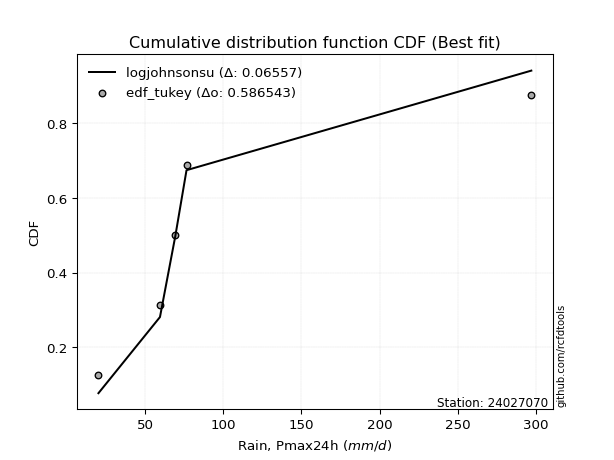</img>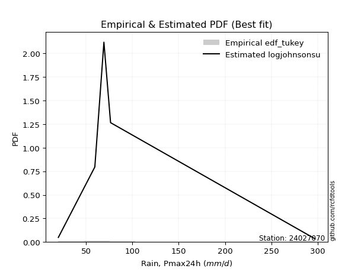</img>

</div>


### 8. Empirical - EDF Gringorten (1963)

Gringorten plotting position formula is essential for estimating the probability and return periods of extreme events like floods and heavy rainfall. The constant _a=0.44_.

<div align="center">


$P=(m-a)/(n+1-2a)$


</div>


**8.1. Empirical values**

<div align="center">

|                | 0                   | 1                  | 2                   | 3                  | 4                  | 5                  |
|:---------------|:--------------------|:-------------------|:--------------------|:-------------------|:-------------------|:-------------------|
| date           | 2021                | 2019               | 2020                | 2023               | 2025               | 2024               |
| x              | 20.0                | 59.4               | 69.2                | 76.4               | 142.0              | 297.2              |
| m              | 1                   | 2                  | 3                   | 4                  | 5                  | 6                  |
| empirical_dist | edf_gringorten      | edf_gringorten     | edf_gringorten      | edf_gringorten     | edf_gringorten     | edf_gringorten     |
| empirical      | 0.09150326797385622 | 0.2549019607843137 | 0.41830065359477125 | 0.5816993464052288 | 0.7450980392156862 | 0.9084967320261437 |
| empirical_tr   | 1.1007194244604317  | 1.3421052631578947 | 1.7191011235955058  | 2.3906250000000004 | 3.9230769230769216 | 10.928571428571415 |

</div>


**8.2. Kolmogorov-Smirnov fit test (sorted by Δ)**


<div align="center">

|                | 0                     | 1                   | 2                   | 3                   | 4                   | 5                   | 6                   | 7                   | 8                   | 9                   | 10                  | 11                  | 12                  | 13                  | 14                  | 15                  | 16                  | 17                 | 18                  | 19                  | 20                  | 21                  | 22                 | 23                  | 24                  | 25                  | 26                  | 27                  | 28                  | 29                  | 30                 | 31                  | 32                  | 33                  | 34                  | 35                | 36                  | 37                  | 38                  | 39                  | 40                  | 41                  | 42                  | 43                  | 44                 | 45                  | 46                  | 47                  | 48                  | 49                | 50                  | 51                  | 52                  | 53                  | 54                  | 55                 | 56                  | 57                  | 58                 | 59                  | 60                  | 61                  | 62                 | 63                  | 64                 | 65                  | 66                  | 67                  | 68                  | 69                  | 70                  | 71                 | 72                  | 73                  | 74                 | 75                  | 76                  | 77                 | 78                 | 79                 | 80                 | 81                  | 82                 | 83                  | 84                 | 85                  | 86                  | 87               | 88                 | 89                 |
|:---------------|:----------------------|:--------------------|:--------------------|:--------------------|:--------------------|:--------------------|:--------------------|:--------------------|:--------------------|:--------------------|:--------------------|:--------------------|:--------------------|:--------------------|:--------------------|:--------------------|:--------------------|:-------------------|:--------------------|:--------------------|:--------------------|:--------------------|:-------------------|:--------------------|:--------------------|:--------------------|:--------------------|:--------------------|:--------------------|:--------------------|:-------------------|:--------------------|:--------------------|:--------------------|:--------------------|:------------------|:--------------------|:--------------------|:--------------------|:--------------------|:--------------------|:--------------------|:--------------------|:--------------------|:-------------------|:--------------------|:--------------------|:--------------------|:--------------------|:------------------|:--------------------|:--------------------|:--------------------|:--------------------|:--------------------|:-------------------|:--------------------|:--------------------|:-------------------|:--------------------|:--------------------|:--------------------|:-------------------|:--------------------|:-------------------|:--------------------|:--------------------|:--------------------|:--------------------|:--------------------|:--------------------|:-------------------|:--------------------|:--------------------|:-------------------|:--------------------|:--------------------|:-------------------|:-------------------|:-------------------|:-------------------|:--------------------|:-------------------|:--------------------|:-------------------|:--------------------|:--------------------|:-----------------|:-------------------|:-------------------|
| station        | 24027070              | 24027070            | 24027070            | 24027070            | 24027070            | 24027070            | 24027070            | 24027070            | 24027070            | 24027070            | 24027070            | 24027070            | 24027070            | 24027070            | 24027070            | 24027070            | 24027070            | 24027070           | 24027070            | 24027070            | 24027070            | 24027070            | 24027070           | 24027070            | 24027070            | 24027070            | 24027070            | 24027070            | 24027070            | 24027070            | 24027070           | 24027070            | 24027070            | 24027070            | 24027070            | 24027070          | 24027070            | 24027070            | 24027070            | 24027070            | 24027070            | 24027070            | 24027070            | 24027070            | 24027070           | 24027070            | 24027070            | 24027070            | 24027070            | 24027070          | 24027070            | 24027070            | 24027070            | 24027070            | 24027070            | 24027070           | 24027070            | 24027070            | 24027070           | 24027070            | 24027070            | 24027070            | 24027070           | 24027070            | 24027070           | 24027070            | 24027070            | 24027070            | 24027070            | 24027070            | 24027070            | 24027070           | 24027070            | 24027070            | 24027070           | 24027070            | 24027070            | 24027070           | 24027070           | 24027070           | 24027070           | 24027070            | 24027070           | 24027070            | 24027070           | 24027070            | 24027070            | 24027070         | 24027070           | 24027070           |
| empirical_dist | edf_gringorten        | edf_gringorten      | edf_gringorten      | edf_gringorten      | edf_gringorten      | edf_gringorten      | edf_gringorten      | edf_gringorten      | edf_gringorten      | edf_gringorten      | edf_gringorten      | edf_gringorten      | edf_gringorten      | edf_gringorten      | edf_gringorten      | edf_gringorten      | edf_gringorten      | edf_gringorten     | edf_gringorten      | edf_gringorten      | edf_gringorten      | edf_gringorten      | edf_gringorten     | edf_gringorten      | edf_gringorten      | edf_gringorten      | edf_gringorten      | edf_gringorten      | edf_gringorten      | edf_gringorten      | edf_gringorten     | edf_gringorten      | edf_gringorten      | edf_gringorten      | edf_gringorten      | edf_gringorten    | edf_gringorten      | edf_gringorten      | edf_gringorten      | edf_gringorten      | edf_gringorten      | edf_gringorten      | edf_gringorten      | edf_gringorten      | edf_gringorten     | edf_gringorten      | edf_gringorten      | edf_gringorten      | edf_gringorten      | edf_gringorten    | edf_gringorten      | edf_gringorten      | edf_gringorten      | edf_gringorten      | edf_gringorten      | edf_gringorten     | edf_gringorten      | edf_gringorten      | edf_gringorten     | edf_gringorten      | edf_gringorten      | edf_gringorten      | edf_gringorten     | edf_gringorten      | edf_gringorten     | edf_gringorten      | edf_gringorten      | edf_gringorten      | edf_gringorten      | edf_gringorten      | edf_gringorten      | edf_gringorten     | edf_gringorten      | edf_gringorten      | edf_gringorten     | edf_gringorten      | edf_gringorten      | edf_gringorten     | edf_gringorten     | edf_gringorten     | edf_gringorten     | edf_gringorten      | edf_gringorten     | edf_gringorten      | edf_gringorten     | edf_gringorten      | edf_gringorten      | edf_gringorten   | edf_gringorten     | edf_gringorten     |
| p_dist         | loglaplace_asymmetric | johnsonsu           | invgamma            | logfatiguelife      | nct                 | logt                | logcrystalball      | lognorm             | lognorm             | logexponnorm        | logjohnsonsu        | lognct              | fisk                | logf                | loggamma            | loggamma            | logweibull_min      | logerlang          | loglogistic         | loggenlogistic      | logfisk             | logbetaprime        | logmielke          | logpearson3         | loghypsecant        | logloggamma         | invgauss            | ncf                 | betaprime           | gompertz            | expon              | genexpon            | wald                | logrice             | loginvgamma         | truncnorm         | loglaplace          | logalpha            | loggompertz         | logncf              | nakagami            | loginvgauss         | fatiguelife         | logmaxwell          | exponnorm          | halflogistic        | lograyleigh         | halfnorm            | t                   | loggumbel_r       | gibrat              | moyal               | pearson3            | loginvweibull       | logmoyal            | loggumbel_l        | gumbel_r            | laplace_asymmetric  | loghalfnorm        | f                   | rayleigh            | genlogistic         | loggibrat          | logkstwobign        | loghalflogistic    | loggenexpon         | maxwell             | weibull_min         | alpha               | kstwobign           | logwald             | crystalball        | norm                | logistic            | rice               | logtruncnorm        | lognakagami         | hypsecant          | laplace            | logexpon           | gumbel_l           | mielke              | erlang             | gamma               | pareto             | loglognorm          | logpareto           | logchi2          | invweibull         | chi2               |
| delta          | 0.07406794839766223   | 0.07679710102568038 | 0.10283499768953974 | 0.10394773925588441 | 0.10461811235020735 | 0.10484020688283263 | 0.10484070167646342 | 0.10484081714367927 | 0.10484081714367927 | 0.10484086804944048 | 0.10484854866223564 | 0.10504106691382831 | 0.10529725383195215 | 0.10636932154333006 | 0.10713751463885773 | 0.10713751463885773 | 0.10748749162904397 | 0.1078258175070288 | 0.10799313075453143 | 0.10839299384240608 | 0.10851672657260092 | 0.10886847092654256 | 0.1095221566801281 | 0.11008140439046221 | 0.11067904603480533 | 0.11220171495746029 | 0.11536689350224127 | 0.11666724388464011 | 0.11746732113580166 | 0.11854925952114126 | 0.1186601334074272 | 0.11866082771670639 | 0.11875834825567494 | 0.12013725645549067 | 0.12019768516924728 | 0.120585830777302 | 0.12110041786166459 | 0.12217041771242743 | 0.12260636370552008 | 0.12585827754454626 | 0.12887165086603375 | 0.12902979000164982 | 0.13142319694298193 | 0.13578830841473422 | 0.1414957215703394 | 0.14160850279149095 | 0.14794244009533952 | 0.15018150365716193 | 0.15112710189936118 | 0.153938651328008 | 0.15431213470427946 | 0.16138787416566513 | 0.16143795486472096 | 0.16849416594326483 | 0.17286999659196067 | 0.1755170964211934 | 0.17966335180895648 | 0.18214647956283891 | 0.1825249027709518 | 0.18311721365229733 | 0.18461407681407138 | 0.18646523538633375 | 0.1870498533377109 | 0.18921788239127224 | 0.1920109689396236 | 0.19375495803639975 | 0.19671288561496697 | 0.21097771476841365 | 0.21124109499559612 | 0.21611146918565355 | 0.21842126894617864 | 0.2288200899876469 | 0.22882010331045172 | 0.24651199630920895 | 0.2522360687092025 | 0.25490026823760725 | 0.25490181973987236 | 0.2602956985544694 | 0.2885566429561807 | 0.2886071844369704 | 0.2892453561222528 | 0.29311528773349227 | 0.3070820963404157 | 0.32364859729526485 | 0.3954954647691551 | 0.40770700038472685 | 0.42061697454337166 | 0.43284170635735 | 0.4482021291672203 | 0.7143112290950449 |
| deltao         | 0.530385761606        | 0.530385761606      | 0.530385761606      | 0.530385761606      | 0.530385761606      | 0.530385761606      | 0.530385761606      | 0.530385761606      | 0.530385761606      | 0.530385761606      | 0.530385761606      | 0.530385761606      | 0.530385761606      | 0.530385761606      | 0.530385761606      | 0.530385761606      | 0.530385761606      | 0.530385761606     | 0.530385761606      | 0.530385761606      | 0.530385761606      | 0.530385761606      | 0.530385761606     | 0.530385761606      | 0.530385761606      | 0.530385761606      | 0.530385761606      | 0.530385761606      | 0.530385761606      | 0.530385761606      | 0.530385761606     | 0.530385761606      | 0.530385761606      | 0.530385761606      | 0.530385761606      | 0.530385761606    | 0.530385761606      | 0.530385761606      | 0.530385761606      | 0.530385761606      | 0.530385761606      | 0.530385761606      | 0.530385761606      | 0.530385761606      | 0.530385761606     | 0.530385761606      | 0.530385761606      | 0.530385761606      | 0.530385761606      | 0.530385761606    | 0.530385761606      | 0.530385761606      | 0.530385761606      | 0.530385761606      | 0.530385761606      | 0.530385761606     | 0.530385761606      | 0.530385761606      | 0.530385761606     | 0.530385761606      | 0.530385761606      | 0.530385761606      | 0.530385761606     | 0.530385761606      | 0.530385761606     | 0.530385761606      | 0.530385761606      | 0.530385761606      | 0.530385761606      | 0.530385761606      | 0.530385761606      | 0.530385761606     | 0.530385761606      | 0.530385761606      | 0.530385761606     | 0.530385761606      | 0.530385761606      | 0.530385761606     | 0.530385761606     | 0.530385761606     | 0.530385761606     | 0.530385761606      | 0.530385761606     | 0.530385761606      | 0.530385761606     | 0.530385761606      | 0.530385761606      | 0.530385761606   | 0.530385761606     | 0.530385761606     |
| eval           | Δo > Δ                | Δo > Δ              | Δo > Δ              | Δo > Δ              | Δo > Δ              | Δo > Δ              | Δo > Δ              | Δo > Δ              | Δo > Δ              | Δo > Δ              | Δo > Δ              | Δo > Δ              | Δo > Δ              | Δo > Δ              | Δo > Δ              | Δo > Δ              | Δo > Δ              | Δo > Δ             | Δo > Δ              | Δo > Δ              | Δo > Δ              | Δo > Δ              | Δo > Δ             | Δo > Δ              | Δo > Δ              | Δo > Δ              | Δo > Δ              | Δo > Δ              | Δo > Δ              | Δo > Δ              | Δo > Δ             | Δo > Δ              | Δo > Δ              | Δo > Δ              | Δo > Δ              | Δo > Δ            | Δo > Δ              | Δo > Δ              | Δo > Δ              | Δo > Δ              | Δo > Δ              | Δo > Δ              | Δo > Δ              | Δo > Δ              | Δo > Δ             | Δo > Δ              | Δo > Δ              | Δo > Δ              | Δo > Δ              | Δo > Δ            | Δo > Δ              | Δo > Δ              | Δo > Δ              | Δo > Δ              | Δo > Δ              | Δo > Δ             | Δo > Δ              | Δo > Δ              | Δo > Δ             | Δo > Δ              | Δo > Δ              | Δo > Δ              | Δo > Δ             | Δo > Δ              | Δo > Δ             | Δo > Δ              | Δo > Δ              | Δo > Δ              | Δo > Δ              | Δo > Δ              | Δo > Δ              | Δo > Δ             | Δo > Δ              | Δo > Δ              | Δo > Δ             | Δo > Δ              | Δo > Δ              | Δo > Δ             | Δo > Δ             | Δo > Δ             | Δo > Δ             | Δo > Δ              | Δo > Δ             | Δo > Δ              | Δo > Δ             | Δo > Δ              | Δo > Δ              | Δo > Δ           | Δo > Δ             | Δo <= Δ            |
| fit            | 1                     | 1                   | 1                   | 1                   | 1                   | 1                   | 1                   | 1                   | 1                   | 1                   | 1                   | 1                   | 1                   | 1                   | 1                   | 1                   | 1                   | 1                  | 1                   | 1                   | 1                   | 1                   | 1                  | 1                   | 1                   | 1                   | 1                   | 1                   | 1                   | 1                   | 1                  | 1                   | 1                   | 1                   | 1                   | 1                 | 1                   | 1                   | 1                   | 1                   | 1                   | 1                   | 1                   | 1                   | 1                  | 1                   | 1                   | 1                   | 1                   | 1                 | 1                   | 1                   | 1                   | 1                   | 1                   | 1                  | 1                   | 1                   | 1                  | 1                   | 1                   | 1                   | 1                  | 1                   | 1                  | 1                   | 1                   | 1                   | 1                   | 1                   | 1                   | 1                  | 1                   | 1                   | 1                  | 1                   | 1                   | 1                  | 1                  | 1                  | 1                  | 1                   | 1                  | 1                   | 1                  | 1                   | 1                   | 1                | 1                  | 0                  |
| n              | 6                     | 6                   | 6                   | 6                   | 6                   | 6                   | 6                   | 6                   | 6                   | 6                   | 6                   | 6                   | 6                   | 6                   | 6                   | 6                   | 6                   | 6                  | 6                   | 6                   | 6                   | 6                   | 6                  | 6                   | 6                   | 6                   | 6                   | 6                   | 6                   | 6                   | 6                  | 6                   | 6                   | 6                   | 6                   | 6                 | 6                   | 6                   | 6                   | 6                   | 6                   | 6                   | 6                   | 6                   | 6                  | 6                   | 6                   | 6                   | 6                   | 6                 | 6                   | 6                   | 6                   | 6                   | 6                   | 6                  | 6                   | 6                   | 6                  | 6                   | 6                   | 6                   | 6                  | 6                   | 6                  | 6                   | 6                   | 6                   | 6                   | 6                   | 6                   | 6                  | 6                   | 6                   | 6                  | 6                   | 6                   | 6                  | 6                  | 6                  | 6                  | 6                   | 6                  | 6                   | 6                  | 6                   | 6                   | 6                | 6                  | 6                  |
| best_fit       | 1                     | 0                   | 0                   | 0                   | 0                   | 0                   | 0                   | 0                   | 0                   | 0                   | 0                   | 0                   | 0                   | 0                   | 0                   | 0                   | 0                   | 0                  | 0                   | 0                   | 0                   | 0                   | 0                  | 0                   | 0                   | 0                   | 0                   | 0                   | 0                   | 0                   | 0                  | 0                   | 0                   | 0                   | 0                   | 0                 | 0                   | 0                   | 0                   | 0                   | 0                   | 0                   | 0                   | 0                   | 0                  | 0                   | 0                   | 0                   | 0                   | 0                 | 0                   | 0                   | 0                   | 0                   | 0                   | 0                  | 0                   | 0                   | 0                  | 0                   | 0                   | 0                   | 0                  | 0                   | 0                  | 0                   | 0                   | 0                   | 0                   | 0                   | 0                   | 0                  | 0                   | 0                   | 0                  | 0                   | 0                   | 0                  | 0                  | 0                  | 0                  | 0                   | 0                  | 0                   | 0                  | 0                   | 0                   | 0                | 0                  | 0                  |
| best_fit_sort  | 1                     | 2                   | 3                   | 4                   | 5                   | 6                   | 7                   | 8                   | 9                   | 10                  | 11                  | 12                  | 13                  | 14                  | 15                  | 16                  | 17                  | 18                 | 19                  | 20                  | 21                  | 22                  | 23                 | 24                  | 25                  | 26                  | 27                  | 28                  | 29                  | 30                  | 31                 | 32                  | 33                  | 34                  | 35                  | 36                | 37                  | 38                  | 39                  | 40                  | 41                  | 42                  | 43                  | 44                  | 45                 | 46                  | 47                  | 48                  | 49                  | 50                | 51                  | 52                  | 53                  | 54                  | 55                  | 56                 | 57                  | 58                  | 59                 | 60                  | 61                  | 62                  | 63                 | 64                  | 65                 | 66                  | 67                  | 68                  | 69                  | 70                  | 71                  | 72                 | 73                  | 74                  | 75                 | 76                  | 77                  | 78                 | 79                 | 80                 | 81                 | 82                  | 83                 | 84                  | 85                 | 86                  | 87                  | 88               | 89                 | 90                 |

</div>


<div align="center">

</img>

</div>


**8.3. Best fit**

<div align="center">

|   id |   station | empirical_dist   | p_dist                |     delta |   deltao | eval   |   fit |   n |   best_fit |   best_fit_sort |
|-----:|----------:|:-----------------|:----------------------|----------:|---------:|:-------|------:|----:|-----------:|----------------:|
|    0 |  24027070 | edf_gringorten   | loglaplace_asymmetric | 0.0740679 | 0.530386 | Δo > Δ |     1 |   6 |          1 |               1 |

</div>


<div align="center">

</img>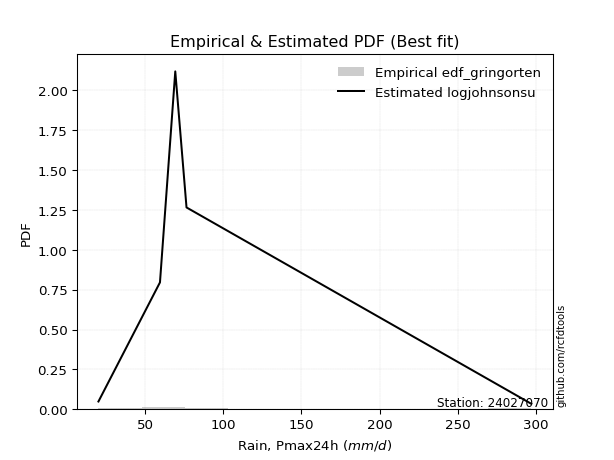</img>

</div>


### 9. Empirical - EDF Filliben (1975)

The specific values of the constants (0.3175) (often denoted as $alpha$) and (0.365) are derived from a method proposed by James J. Filliben in a 1975 paper. This particular formula is the mean value of the $i$-th order statistic of the normal distribution and is considered a robust and effective plotting position formula for the normal probability plot correlation coefficient test for normality.

<div align="center">


$P=(m-0.3175)/(n+0.365)$


</div>


**9.1. Empirical values**

<div align="center">

|                | 0                   | 1                   | 2                  | 3                  | 4                  | 5                  |
|:---------------|:--------------------|:--------------------|:-------------------|:-------------------|:-------------------|:-------------------|
| date           | 2021                | 2019                | 2020               | 2023               | 2025               | 2024               |
| x              | 20.0                | 59.4                | 69.2               | 76.4               | 142.0              | 297.2              |
| m              | 1                   | 2                   | 3                  | 4                  | 5                  | 6                  |
| empirical_dist | edf_filliben        | edf_filliben        | edf_filliben       | edf_filliben       | edf_filliben       | edf_filliben       |
| empirical      | 0.10722702278083267 | 0.26433621366849963 | 0.4214454045561665 | 0.5785545954438335 | 0.7356637863315004 | 0.8927729772191673 |
| empirical_tr   | 1.1201055873295205  | 1.3593166043780034  | 1.7284453496266123 | 2.3727865796831313 | 3.783060921248143  | 9.326007326007321  |

</div>


**9.2. Kolmogorov-Smirnov fit test (sorted by Δ)**


<div align="center">

|                | 0                     | 1                   | 2                   | 3                   | 4                   | 5                   | 6                   | 7                   | 8                   | 9                   | 10                  | 11                  | 12                 | 13                 | 14                  | 15                  | 16                  | 17                  | 18                  | 19                 | 20                  | 21                  | 22                  | 23                  | 24                  | 25               | 26                  | 27                  | 28                  | 29                 | 30                  | 31                  | 32                  | 33                  | 34                  | 35                  | 36                  | 37                  | 38                  | 39                  | 40                 | 41                  | 42                  | 43                 | 44                  | 45                  | 46                 | 47                  | 48                 | 49                  | 50                 | 51                  | 52                 | 53                  | 54                  | 55                  | 56                  | 57                 | 58                  | 59                  | 60                 | 61                  | 62                  | 63                  | 64                  | 65                  | 66                  | 67                  | 68                 | 69                  | 70                  | 71                 | 72                 | 73                  | 74                  | 75                  | 76                 | 77                 | 78                 | 79                  | 80                 | 81                  | 82                 | 83                 | 84                  | 85                 | 86                  | 87                  | 88                 | 89                 |
|:---------------|:----------------------|:--------------------|:--------------------|:--------------------|:--------------------|:--------------------|:--------------------|:--------------------|:--------------------|:--------------------|:--------------------|:--------------------|:-------------------|:-------------------|:--------------------|:--------------------|:--------------------|:--------------------|:--------------------|:-------------------|:--------------------|:--------------------|:--------------------|:--------------------|:--------------------|:-----------------|:--------------------|:--------------------|:--------------------|:-------------------|:--------------------|:--------------------|:--------------------|:--------------------|:--------------------|:--------------------|:--------------------|:--------------------|:--------------------|:--------------------|:-------------------|:--------------------|:--------------------|:-------------------|:--------------------|:--------------------|:-------------------|:--------------------|:-------------------|:--------------------|:-------------------|:--------------------|:-------------------|:--------------------|:--------------------|:--------------------|:--------------------|:-------------------|:--------------------|:--------------------|:-------------------|:--------------------|:--------------------|:--------------------|:--------------------|:--------------------|:--------------------|:--------------------|:-------------------|:--------------------|:--------------------|:-------------------|:-------------------|:--------------------|:--------------------|:--------------------|:-------------------|:-------------------|:-------------------|:--------------------|:-------------------|:--------------------|:-------------------|:-------------------|:--------------------|:-------------------|:--------------------|:--------------------|:-------------------|:-------------------|
| station        | 24027070              | 24027070            | 24027070            | 24027070            | 24027070            | 24027070            | 24027070            | 24027070            | 24027070            | 24027070            | 24027070            | 24027070            | 24027070           | 24027070           | 24027070            | 24027070            | 24027070            | 24027070            | 24027070            | 24027070           | 24027070            | 24027070            | 24027070            | 24027070            | 24027070            | 24027070         | 24027070            | 24027070            | 24027070            | 24027070           | 24027070            | 24027070            | 24027070            | 24027070            | 24027070            | 24027070            | 24027070            | 24027070            | 24027070            | 24027070            | 24027070           | 24027070            | 24027070            | 24027070           | 24027070            | 24027070            | 24027070           | 24027070            | 24027070           | 24027070            | 24027070           | 24027070            | 24027070           | 24027070            | 24027070            | 24027070            | 24027070            | 24027070           | 24027070            | 24027070            | 24027070           | 24027070            | 24027070            | 24027070            | 24027070            | 24027070            | 24027070            | 24027070            | 24027070           | 24027070            | 24027070            | 24027070           | 24027070           | 24027070            | 24027070            | 24027070            | 24027070           | 24027070           | 24027070           | 24027070            | 24027070           | 24027070            | 24027070           | 24027070           | 24027070            | 24027070           | 24027070            | 24027070            | 24027070           | 24027070           |
| empirical_dist | edf_filliben          | edf_filliben        | edf_filliben        | edf_filliben        | edf_filliben        | edf_filliben        | edf_filliben        | edf_filliben        | edf_filliben        | edf_filliben        | edf_filliben        | edf_filliben        | edf_filliben       | edf_filliben       | edf_filliben        | edf_filliben        | edf_filliben        | edf_filliben        | edf_filliben        | edf_filliben       | edf_filliben        | edf_filliben        | edf_filliben        | edf_filliben        | edf_filliben        | edf_filliben     | edf_filliben        | edf_filliben        | edf_filliben        | edf_filliben       | edf_filliben        | edf_filliben        | edf_filliben        | edf_filliben        | edf_filliben        | edf_filliben        | edf_filliben        | edf_filliben        | edf_filliben        | edf_filliben        | edf_filliben       | edf_filliben        | edf_filliben        | edf_filliben       | edf_filliben        | edf_filliben        | edf_filliben       | edf_filliben        | edf_filliben       | edf_filliben        | edf_filliben       | edf_filliben        | edf_filliben       | edf_filliben        | edf_filliben        | edf_filliben        | edf_filliben        | edf_filliben       | edf_filliben        | edf_filliben        | edf_filliben       | edf_filliben        | edf_filliben        | edf_filliben        | edf_filliben        | edf_filliben        | edf_filliben        | edf_filliben        | edf_filliben       | edf_filliben        | edf_filliben        | edf_filliben       | edf_filliben       | edf_filliben        | edf_filliben        | edf_filliben        | edf_filliben       | edf_filliben       | edf_filliben       | edf_filliben        | edf_filliben       | edf_filliben        | edf_filliben       | edf_filliben       | edf_filliben        | edf_filliben       | edf_filliben        | edf_filliben        | edf_filliben       | edf_filliben       |
| p_dist         | loglaplace_asymmetric | johnsonsu           | fisk                | loggamma            | loggamma            | logf                | logerlang           | logbetaprime        | invgamma            | logweibull_min      | logfatiguelife      | nct                 | logt               | logcrystalball     | lognorm             | lognorm             | logexponnorm        | logjohnsonsu        | lognct              | loglogistic        | loggenlogistic      | logfisk             | invgauss            | logmielke           | logpearson3         | loghypsecant     | logloggamma         | logrice             | loginvgamma         | logalpha           | loggompertz         | ncf                 | betaprime           | gompertz            | expon               | genexpon            | wald                | logncf              | truncnorm           | loglaplace          | loginvgauss        | fatiguelife         | nakagami            | logmaxwell         | exponnorm           | halflogistic        | lograyleigh        | loggumbel_r         | halfnorm           | gibrat              | moyal              | pearson3            | loginvweibull      | t                   | logmoyal            | loggumbel_l         | loghalfnorm         | f                  | gumbel_r            | loggibrat           | laplace_asymmetric | logkstwobign        | rayleigh            | loghalflogistic     | genlogistic         | loggenexpon         | maxwell             | weibull_min         | alpha              | logwald             | kstwobign           | crystalball        | norm               | logistic            | rice                | hypsecant           | logtruncnorm       | lognakagami        | logexpon           | mielke              | laplace            | gumbel_l            | erlang             | gamma              | pareto              | loglognorm         | logpareto           | logchi2             | invweibull         | chi2               |
| delta          | 0.07059469953901631   | 0.08623135390986614 | 0.09586300094776623 | 0.09770326175467181 | 0.09770326175467181 | 0.09809391309518434 | 0.09839156462284288 | 0.09943421804235664 | 0.09969024672814442 | 0.10023306473092897 | 0.10080182899051132 | 0.10147336138881202 | 0.1016954559214373 | 0.1016959507150681 | 0.10169606618228394 | 0.10169606618228394 | 0.10169611708804516 | 0.10170379770084031 | 0.10189631595243298 | 0.1048483797931361 | 0.10524824288101076 | 0.10537197561120559 | 0.10593264061805535 | 0.10637740571873278 | 0.10693665342906689 | 0.10753429507341 | 0.10905696399606496 | 0.11070300357130475 | 0.11076343228506136 | 0.1127361648282415 | 0.11317211082133416 | 0.11352249292324479 | 0.11432257017440633 | 0.11540450855974593 | 0.11551538244603188 | 0.11551607675531106 | 0.11561359729427961 | 0.11642402466036034 | 0.11744107981590668 | 0.11795566690026926 | 0.1195955371174639 | 0.12198894405879601 | 0.12572689990463842 | 0.1263540555305483 | 0.13835097060894408 | 0.13846375183009563 | 0.1385081872111536 | 0.14450439844382207 | 0.1470367526957666 | 0.15116738374288413 | 0.1582431232042698 | 0.15829320390332563 | 0.1590599130590789 | 0.16056135478354694 | 0.16343574370777475 | 0.17237234545979807 | 0.17309064988676587 | 0.1736829607681114 | 0.17651860084756116 | 0.17761560045352498 | 0.1790017286014436 | 0.17978362950708632 | 0.18146932585267606 | 0.18257671605543768 | 0.18332048442493842 | 0.18432070515221383 | 0.19356813465357164 | 0.20154346188422773 | 0.2018068421114102 | 0.20898701606199271 | 0.21296671822425822 | 0.2256753390262516 | 0.2256753523490564 | 0.24336724534781362 | 0.24909131774780718 | 0.25715094759307405 | 0.2643345211217932 | 0.2643360726240583 | 0.2791729315527845 | 0.28368103484930635 | 0.2854118919947854 | 0.28610060516085745 | 0.2976478434562298 | 0.3142143444110789 | 0.38606121188496917 | 0.3982727475005409 | 0.41118272165918573 | 0.42340745347316405 | 0.4324783743602439 | 0.7048769762108589 |
| deltao         | 0.530385761606        | 0.530385761606      | 0.530385761606      | 0.530385761606      | 0.530385761606      | 0.530385761606      | 0.530385761606      | 0.530385761606      | 0.530385761606      | 0.530385761606      | 0.530385761606      | 0.530385761606      | 0.530385761606     | 0.530385761606     | 0.530385761606      | 0.530385761606      | 0.530385761606      | 0.530385761606      | 0.530385761606      | 0.530385761606     | 0.530385761606      | 0.530385761606      | 0.530385761606      | 0.530385761606      | 0.530385761606      | 0.530385761606   | 0.530385761606      | 0.530385761606      | 0.530385761606      | 0.530385761606     | 0.530385761606      | 0.530385761606      | 0.530385761606      | 0.530385761606      | 0.530385761606      | 0.530385761606      | 0.530385761606      | 0.530385761606      | 0.530385761606      | 0.530385761606      | 0.530385761606     | 0.530385761606      | 0.530385761606      | 0.530385761606     | 0.530385761606      | 0.530385761606      | 0.530385761606     | 0.530385761606      | 0.530385761606     | 0.530385761606      | 0.530385761606     | 0.530385761606      | 0.530385761606     | 0.530385761606      | 0.530385761606      | 0.530385761606      | 0.530385761606      | 0.530385761606     | 0.530385761606      | 0.530385761606      | 0.530385761606     | 0.530385761606      | 0.530385761606      | 0.530385761606      | 0.530385761606      | 0.530385761606      | 0.530385761606      | 0.530385761606      | 0.530385761606     | 0.530385761606      | 0.530385761606      | 0.530385761606     | 0.530385761606     | 0.530385761606      | 0.530385761606      | 0.530385761606      | 0.530385761606     | 0.530385761606     | 0.530385761606     | 0.530385761606      | 0.530385761606     | 0.530385761606      | 0.530385761606     | 0.530385761606     | 0.530385761606      | 0.530385761606     | 0.530385761606      | 0.530385761606      | 0.530385761606     | 0.530385761606     |
| eval           | Δo > Δ                | Δo > Δ              | Δo > Δ              | Δo > Δ              | Δo > Δ              | Δo > Δ              | Δo > Δ              | Δo > Δ              | Δo > Δ              | Δo > Δ              | Δo > Δ              | Δo > Δ              | Δo > Δ             | Δo > Δ             | Δo > Δ              | Δo > Δ              | Δo > Δ              | Δo > Δ              | Δo > Δ              | Δo > Δ             | Δo > Δ              | Δo > Δ              | Δo > Δ              | Δo > Δ              | Δo > Δ              | Δo > Δ           | Δo > Δ              | Δo > Δ              | Δo > Δ              | Δo > Δ             | Δo > Δ              | Δo > Δ              | Δo > Δ              | Δo > Δ              | Δo > Δ              | Δo > Δ              | Δo > Δ              | Δo > Δ              | Δo > Δ              | Δo > Δ              | Δo > Δ             | Δo > Δ              | Δo > Δ              | Δo > Δ             | Δo > Δ              | Δo > Δ              | Δo > Δ             | Δo > Δ              | Δo > Δ             | Δo > Δ              | Δo > Δ             | Δo > Δ              | Δo > Δ             | Δo > Δ              | Δo > Δ              | Δo > Δ              | Δo > Δ              | Δo > Δ             | Δo > Δ              | Δo > Δ              | Δo > Δ             | Δo > Δ              | Δo > Δ              | Δo > Δ              | Δo > Δ              | Δo > Δ              | Δo > Δ              | Δo > Δ              | Δo > Δ             | Δo > Δ              | Δo > Δ              | Δo > Δ             | Δo > Δ             | Δo > Δ              | Δo > Δ              | Δo > Δ              | Δo > Δ             | Δo > Δ             | Δo > Δ             | Δo > Δ              | Δo > Δ             | Δo > Δ              | Δo > Δ             | Δo > Δ             | Δo > Δ              | Δo > Δ             | Δo > Δ              | Δo > Δ              | Δo > Δ             | Δo <= Δ            |
| fit            | 1                     | 1                   | 1                   | 1                   | 1                   | 1                   | 1                   | 1                   | 1                   | 1                   | 1                   | 1                   | 1                  | 1                  | 1                   | 1                   | 1                   | 1                   | 1                   | 1                  | 1                   | 1                   | 1                   | 1                   | 1                   | 1                | 1                   | 1                   | 1                   | 1                  | 1                   | 1                   | 1                   | 1                   | 1                   | 1                   | 1                   | 1                   | 1                   | 1                   | 1                  | 1                   | 1                   | 1                  | 1                   | 1                   | 1                  | 1                   | 1                  | 1                   | 1                  | 1                   | 1                  | 1                   | 1                   | 1                   | 1                   | 1                  | 1                   | 1                   | 1                  | 1                   | 1                   | 1                   | 1                   | 1                   | 1                   | 1                   | 1                  | 1                   | 1                   | 1                  | 1                  | 1                   | 1                   | 1                   | 1                  | 1                  | 1                  | 1                   | 1                  | 1                   | 1                  | 1                  | 1                   | 1                  | 1                   | 1                   | 1                  | 0                  |
| n              | 6                     | 6                   | 6                   | 6                   | 6                   | 6                   | 6                   | 6                   | 6                   | 6                   | 6                   | 6                   | 6                  | 6                  | 6                   | 6                   | 6                   | 6                   | 6                   | 6                  | 6                   | 6                   | 6                   | 6                   | 6                   | 6                | 6                   | 6                   | 6                   | 6                  | 6                   | 6                   | 6                   | 6                   | 6                   | 6                   | 6                   | 6                   | 6                   | 6                   | 6                  | 6                   | 6                   | 6                  | 6                   | 6                   | 6                  | 6                   | 6                  | 6                   | 6                  | 6                   | 6                  | 6                   | 6                   | 6                   | 6                   | 6                  | 6                   | 6                   | 6                  | 6                   | 6                   | 6                   | 6                   | 6                   | 6                   | 6                   | 6                  | 6                   | 6                   | 6                  | 6                  | 6                   | 6                   | 6                   | 6                  | 6                  | 6                  | 6                   | 6                  | 6                   | 6                  | 6                  | 6                   | 6                  | 6                   | 6                   | 6                  | 6                  |
| best_fit       | 1                     | 0                   | 0                   | 0                   | 0                   | 0                   | 0                   | 0                   | 0                   | 0                   | 0                   | 0                   | 0                  | 0                  | 0                   | 0                   | 0                   | 0                   | 0                   | 0                  | 0                   | 0                   | 0                   | 0                   | 0                   | 0                | 0                   | 0                   | 0                   | 0                  | 0                   | 0                   | 0                   | 0                   | 0                   | 0                   | 0                   | 0                   | 0                   | 0                   | 0                  | 0                   | 0                   | 0                  | 0                   | 0                   | 0                  | 0                   | 0                  | 0                   | 0                  | 0                   | 0                  | 0                   | 0                   | 0                   | 0                   | 0                  | 0                   | 0                   | 0                  | 0                   | 0                   | 0                   | 0                   | 0                   | 0                   | 0                   | 0                  | 0                   | 0                   | 0                  | 0                  | 0                   | 0                   | 0                   | 0                  | 0                  | 0                  | 0                   | 0                  | 0                   | 0                  | 0                  | 0                   | 0                  | 0                   | 0                   | 0                  | 0                  |
| best_fit_sort  | 1                     | 2                   | 3                   | 4                   | 5                   | 6                   | 7                   | 8                   | 9                   | 10                  | 11                  | 12                  | 13                 | 14                 | 15                  | 16                  | 17                  | 18                  | 19                  | 20                 | 21                  | 22                  | 23                  | 24                  | 25                  | 26               | 27                  | 28                  | 29                  | 30                 | 31                  | 32                  | 33                  | 34                  | 35                  | 36                  | 37                  | 38                  | 39                  | 40                  | 41                 | 42                  | 43                  | 44                 | 45                  | 46                  | 47                 | 48                  | 49                 | 50                  | 51                 | 52                  | 53                 | 54                  | 55                  | 56                  | 57                  | 58                 | 59                  | 60                  | 61                 | 62                  | 63                  | 64                  | 65                  | 66                  | 67                  | 68                  | 69                 | 70                  | 71                  | 72                 | 73                 | 74                  | 75                  | 76                  | 77                 | 78                 | 79                 | 80                  | 81                 | 82                  | 83                 | 84                 | 85                  | 86                 | 87                  | 88                  | 89                 | 90                 |

</div>


<div align="center">

</img>

</div>


**9.3. Best fit**

<div align="center">

|   id |   station | empirical_dist   | p_dist                |     delta |   deltao | eval   |   fit |   n |   best_fit |   best_fit_sort |
|-----:|----------:|:-----------------|:----------------------|----------:|---------:|:-------|------:|----:|-----------:|----------------:|
|    0 |  24027070 | edf_filliben     | loglaplace_asymmetric | 0.0705947 | 0.530386 | Δo > Δ |     1 |   6 |          1 |               1 |

</div>


<div align="center">

</img>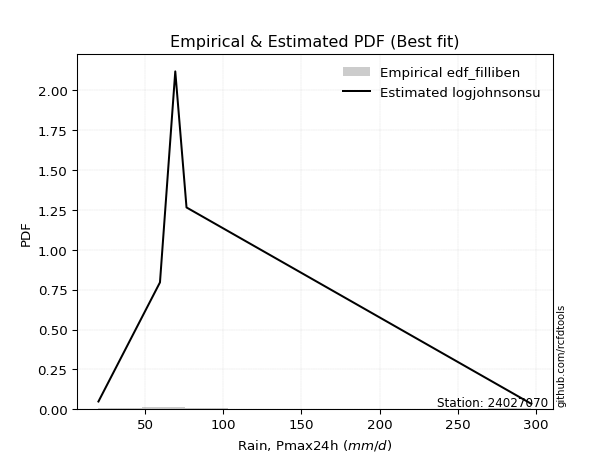</img>

</div>


### 10. Empirical - EDF Jenkinson (1977)

The Jenkinson formula in hydrology is an empirical plotting position formula used to estimate the non-exceedance probability _(P)_ or return period _(T)_ of a given ordered observation within a sample. It is a widely used method in the frequency analysis of extreme events such as floods and rainfall, as it provides a distribution-free way to plot data. _a≈0.31_ and _b≈0.38_ are constants derived to approximate the median of the probability distribution for the given rank.

<div align="center">


$P=(m-a)/(n+b)$


</div>


**10.1. Empirical values**

<div align="center">

|                | 0                   | 1                   | 2                  | 3                  | 4                  | 5                  |
|:---------------|:--------------------|:--------------------|:-------------------|:-------------------|:-------------------|:-------------------|
| date           | 2021                | 2019                | 2020               | 2023               | 2025               | 2024               |
| x              | 20.0                | 59.4                | 69.2               | 76.4               | 142.0              | 297.2              |
| m              | 1                   | 2                   | 3                  | 4                  | 5                  | 6                  |
| empirical_dist | edf_jenkinson       | edf_jenkinson       | edf_jenkinson      | edf_jenkinson      | edf_jenkinson      | edf_jenkinson      |
| empirical      | 0.10815047021943573 | 0.26489028213166144 | 0.4216300940438871 | 0.5783699059561128 | 0.7351097178683387 | 0.8918495297805643 |
| empirical_tr   | 1.1212653778558874  | 1.3603411513859276  | 1.7289972899728996 | 2.3717472118959106 | 3.7751479289940844 | 9.246376811594207  |

</div>


**10.2. Kolmogorov-Smirnov fit test (sorted by Δ)**


<div align="center">

|                | 0                     | 1                   | 2                   | 3                   | 4                   | 5                   | 6                   | 7                   | 8                   | 9                   | 10                  | 11                  | 12                  | 13                  | 14                  | 15                  | 16                 | 17                  | 18                  | 19                  | 20                 | 21                  | 22                  | 23                  | 24                  | 25                  | 26                 | 27                  | 28                  | 29                 | 30                  | 31                  | 32                  | 33                  | 34                  | 35                 | 36                  | 37                  | 38                  | 39                 | 40                 | 41                 | 42                  | 43                 | 44                 | 45                  | 46                  | 47                  | 48                  | 49                  | 50                  | 51                  | 52                 | 53                 | 54                  | 55                 | 56                  | 57                 | 58                 | 59                  | 60                  | 61                 | 62                 | 63                  | 64                  | 65                  | 66                | 67                  | 68                 | 69                 | 70                  | 71                  | 72                  | 73                  | 74                  | 75                 | 76                | 77                 | 78                 | 79                  | 80                  | 81                 | 82                | 83                 | 84                  | 85                 | 86                  | 87                  | 88                  | 89                 |
|:---------------|:----------------------|:--------------------|:--------------------|:--------------------|:--------------------|:--------------------|:--------------------|:--------------------|:--------------------|:--------------------|:--------------------|:--------------------|:--------------------|:--------------------|:--------------------|:--------------------|:-------------------|:--------------------|:--------------------|:--------------------|:-------------------|:--------------------|:--------------------|:--------------------|:--------------------|:--------------------|:-------------------|:--------------------|:--------------------|:-------------------|:--------------------|:--------------------|:--------------------|:--------------------|:--------------------|:-------------------|:--------------------|:--------------------|:--------------------|:-------------------|:-------------------|:-------------------|:--------------------|:-------------------|:-------------------|:--------------------|:--------------------|:--------------------|:--------------------|:--------------------|:--------------------|:--------------------|:-------------------|:-------------------|:--------------------|:-------------------|:--------------------|:-------------------|:-------------------|:--------------------|:--------------------|:-------------------|:-------------------|:--------------------|:--------------------|:--------------------|:------------------|:--------------------|:-------------------|:-------------------|:--------------------|:--------------------|:--------------------|:--------------------|:--------------------|:-------------------|:------------------|:-------------------|:-------------------|:--------------------|:--------------------|:-------------------|:------------------|:-------------------|:--------------------|:-------------------|:--------------------|:--------------------|:--------------------|:-------------------|
| station        | 24027070              | 24027070            | 24027070            | 24027070            | 24027070            | 24027070            | 24027070            | 24027070            | 24027070            | 24027070            | 24027070            | 24027070            | 24027070            | 24027070            | 24027070            | 24027070            | 24027070           | 24027070            | 24027070            | 24027070            | 24027070           | 24027070            | 24027070            | 24027070            | 24027070            | 24027070            | 24027070           | 24027070            | 24027070            | 24027070           | 24027070            | 24027070            | 24027070            | 24027070            | 24027070            | 24027070           | 24027070            | 24027070            | 24027070            | 24027070           | 24027070           | 24027070           | 24027070            | 24027070           | 24027070           | 24027070            | 24027070            | 24027070            | 24027070            | 24027070            | 24027070            | 24027070            | 24027070           | 24027070           | 24027070            | 24027070           | 24027070            | 24027070           | 24027070           | 24027070            | 24027070            | 24027070           | 24027070           | 24027070            | 24027070            | 24027070            | 24027070          | 24027070            | 24027070           | 24027070           | 24027070            | 24027070            | 24027070            | 24027070            | 24027070            | 24027070           | 24027070          | 24027070           | 24027070           | 24027070            | 24027070            | 24027070           | 24027070          | 24027070           | 24027070            | 24027070           | 24027070            | 24027070            | 24027070            | 24027070           |
| empirical_dist | edf_jenkinson         | edf_jenkinson       | edf_jenkinson       | edf_jenkinson       | edf_jenkinson       | edf_jenkinson       | edf_jenkinson       | edf_jenkinson       | edf_jenkinson       | edf_jenkinson       | edf_jenkinson       | edf_jenkinson       | edf_jenkinson       | edf_jenkinson       | edf_jenkinson       | edf_jenkinson       | edf_jenkinson      | edf_jenkinson       | edf_jenkinson       | edf_jenkinson       | edf_jenkinson      | edf_jenkinson       | edf_jenkinson       | edf_jenkinson       | edf_jenkinson       | edf_jenkinson       | edf_jenkinson      | edf_jenkinson       | edf_jenkinson       | edf_jenkinson      | edf_jenkinson       | edf_jenkinson       | edf_jenkinson       | edf_jenkinson       | edf_jenkinson       | edf_jenkinson      | edf_jenkinson       | edf_jenkinson       | edf_jenkinson       | edf_jenkinson      | edf_jenkinson      | edf_jenkinson      | edf_jenkinson       | edf_jenkinson      | edf_jenkinson      | edf_jenkinson       | edf_jenkinson       | edf_jenkinson       | edf_jenkinson       | edf_jenkinson       | edf_jenkinson       | edf_jenkinson       | edf_jenkinson      | edf_jenkinson      | edf_jenkinson       | edf_jenkinson      | edf_jenkinson       | edf_jenkinson      | edf_jenkinson      | edf_jenkinson       | edf_jenkinson       | edf_jenkinson      | edf_jenkinson      | edf_jenkinson       | edf_jenkinson       | edf_jenkinson       | edf_jenkinson     | edf_jenkinson       | edf_jenkinson      | edf_jenkinson      | edf_jenkinson       | edf_jenkinson       | edf_jenkinson       | edf_jenkinson       | edf_jenkinson       | edf_jenkinson      | edf_jenkinson     | edf_jenkinson      | edf_jenkinson      | edf_jenkinson       | edf_jenkinson       | edf_jenkinson      | edf_jenkinson     | edf_jenkinson      | edf_jenkinson       | edf_jenkinson      | edf_jenkinson       | edf_jenkinson       | edf_jenkinson       | edf_jenkinson      |
| p_dist         | loglaplace_asymmetric | johnsonsu           | fisk                | loggamma            | loggamma            | logerlang           | logf                | logbetaprime        | invgamma            | logweibull_min      | logfatiguelife      | nct                 | logt                | logcrystalball      | lognorm             | lognorm             | logexponnorm       | logjohnsonsu        | lognct              | loglogistic         | loggenlogistic     | logfisk             | invgauss            | logmielke           | logpearson3         | loghypsecant        | logloggamma        | logrice             | loginvgamma         | logalpha           | loggompertz         | ncf                 | betaprime           | gompertz            | expon               | genexpon           | wald                | logncf              | truncnorm           | loglaplace         | loginvgauss        | fatiguelife        | nakagami            | logmaxwell         | lograyleigh        | exponnorm           | halflogistic        | loggumbel_r         | halfnorm            | gibrat              | moyal               | pearson3            | loginvweibull      | t                  | logmoyal            | loggumbel_l        | loghalfnorm         | f                  | gumbel_r           | loggibrat           | laplace_asymmetric  | logkstwobign       | rayleigh           | loghalflogistic     | genlogistic         | loggenexpon         | maxwell           | weibull_min         | alpha              | logwald            | kstwobign           | crystalball         | norm                | logistic            | rice                | hypsecant          | logtruncnorm      | lognakagami        | logexpon           | mielke              | laplace             | gumbel_l           | erlang            | gamma              | pareto              | loglognorm         | logpareto           | logchi2             | invweibull          | chi2               |
| delta          | 0.07114876800217806   | 0.08678542237302789 | 0.09530893248460443 | 0.09718778130369105 | 0.09718778130369105 | 0.09783749615968107 | 0.09790922360746368 | 0.09888014957919483 | 0.09950555724042376 | 0.10004837524320831 | 0.10061713950279066 | 0.10128867190109136 | 0.10151076643371665 | 0.10151126122734744 | 0.10151137669456328 | 0.10151137669456328 | 0.1015114276003245 | 0.10151910821311966 | 0.10171162646471232 | 0.10466369030541545 | 0.1050635533932901 | 0.10518728612348494 | 0.10537857215489355 | 0.10619271623101212 | 0.10675196394134623 | 0.10734960558568934 | 0.1088722745083443 | 0.11014893510814294 | 0.11020936382189955 | 0.1121820963650797 | 0.11261804235817235 | 0.11333780343552413 | 0.11413788068668568 | 0.11521981907202528 | 0.11533069295831122 | 0.1153313872675904 | 0.11542890780655896 | 0.11586995619719853 | 0.11725639032818602 | 0.1177709774125486 | 0.1190414686543021 | 0.1214348755956342 | 0.12554221041691777 | 0.1257999870673865 | 0.1379541187479918 | 0.13816628112122342 | 0.13827906234237497 | 0.14395032998066026 | 0.14685206320804595 | 0.15098269425516347 | 0.15805843371654915 | 0.15810851441560497 | 0.1585058445959171 | 0.1611154232467087 | 0.16288167524461294 | 0.1721876559720774 | 0.17253658142360406 | 0.1731288923049496 | 0.1763339113598405 | 0.17706153199036317 | 0.17881703911372293 | 0.1792295610439245 | 0.1812846363649554 | 0.18202264759227588 | 0.18313579493721777 | 0.18376663668905202 | 0.193383445165851 | 0.20098939342106592 | 0.2012527736482484 | 0.2084329475988309 | 0.21278202873653757 | 0.22549064953853093 | 0.22549066286133573 | 0.24318255586009296 | 0.24890662826008653 | 0.2569662581053534 | 0.264888589584955 | 0.2648901410872201 | 0.2786188630896227 | 0.28312696638614454 | 0.28522720250706474 | 0.2859159156731368 | 0.297093774993068 | 0.3136602759479171 | 0.38550714342180736 | 0.3977186790373791 | 0.41062865319602393 | 0.42285338501000225 | 0.43155492692164094 | 0.7043229077476971 |
| deltao         | 0.530385761606        | 0.530385761606      | 0.530385761606      | 0.530385761606      | 0.530385761606      | 0.530385761606      | 0.530385761606      | 0.530385761606      | 0.530385761606      | 0.530385761606      | 0.530385761606      | 0.530385761606      | 0.530385761606      | 0.530385761606      | 0.530385761606      | 0.530385761606      | 0.530385761606     | 0.530385761606      | 0.530385761606      | 0.530385761606      | 0.530385761606     | 0.530385761606      | 0.530385761606      | 0.530385761606      | 0.530385761606      | 0.530385761606      | 0.530385761606     | 0.530385761606      | 0.530385761606      | 0.530385761606     | 0.530385761606      | 0.530385761606      | 0.530385761606      | 0.530385761606      | 0.530385761606      | 0.530385761606     | 0.530385761606      | 0.530385761606      | 0.530385761606      | 0.530385761606     | 0.530385761606     | 0.530385761606     | 0.530385761606      | 0.530385761606     | 0.530385761606     | 0.530385761606      | 0.530385761606      | 0.530385761606      | 0.530385761606      | 0.530385761606      | 0.530385761606      | 0.530385761606      | 0.530385761606     | 0.530385761606     | 0.530385761606      | 0.530385761606     | 0.530385761606      | 0.530385761606     | 0.530385761606     | 0.530385761606      | 0.530385761606      | 0.530385761606     | 0.530385761606     | 0.530385761606      | 0.530385761606      | 0.530385761606      | 0.530385761606    | 0.530385761606      | 0.530385761606     | 0.530385761606     | 0.530385761606      | 0.530385761606      | 0.530385761606      | 0.530385761606      | 0.530385761606      | 0.530385761606     | 0.530385761606    | 0.530385761606     | 0.530385761606     | 0.530385761606      | 0.530385761606      | 0.530385761606     | 0.530385761606    | 0.530385761606     | 0.530385761606      | 0.530385761606     | 0.530385761606      | 0.530385761606      | 0.530385761606      | 0.530385761606     |
| eval           | Δo > Δ                | Δo > Δ              | Δo > Δ              | Δo > Δ              | Δo > Δ              | Δo > Δ              | Δo > Δ              | Δo > Δ              | Δo > Δ              | Δo > Δ              | Δo > Δ              | Δo > Δ              | Δo > Δ              | Δo > Δ              | Δo > Δ              | Δo > Δ              | Δo > Δ             | Δo > Δ              | Δo > Δ              | Δo > Δ              | Δo > Δ             | Δo > Δ              | Δo > Δ              | Δo > Δ              | Δo > Δ              | Δo > Δ              | Δo > Δ             | Δo > Δ              | Δo > Δ              | Δo > Δ             | Δo > Δ              | Δo > Δ              | Δo > Δ              | Δo > Δ              | Δo > Δ              | Δo > Δ             | Δo > Δ              | Δo > Δ              | Δo > Δ              | Δo > Δ             | Δo > Δ             | Δo > Δ             | Δo > Δ              | Δo > Δ             | Δo > Δ             | Δo > Δ              | Δo > Δ              | Δo > Δ              | Δo > Δ              | Δo > Δ              | Δo > Δ              | Δo > Δ              | Δo > Δ             | Δo > Δ             | Δo > Δ              | Δo > Δ             | Δo > Δ              | Δo > Δ             | Δo > Δ             | Δo > Δ              | Δo > Δ              | Δo > Δ             | Δo > Δ             | Δo > Δ              | Δo > Δ              | Δo > Δ              | Δo > Δ            | Δo > Δ              | Δo > Δ             | Δo > Δ             | Δo > Δ              | Δo > Δ              | Δo > Δ              | Δo > Δ              | Δo > Δ              | Δo > Δ             | Δo > Δ            | Δo > Δ             | Δo > Δ             | Δo > Δ              | Δo > Δ              | Δo > Δ             | Δo > Δ            | Δo > Δ             | Δo > Δ              | Δo > Δ             | Δo > Δ              | Δo > Δ              | Δo > Δ              | Δo <= Δ            |
| fit            | 1                     | 1                   | 1                   | 1                   | 1                   | 1                   | 1                   | 1                   | 1                   | 1                   | 1                   | 1                   | 1                   | 1                   | 1                   | 1                   | 1                  | 1                   | 1                   | 1                   | 1                  | 1                   | 1                   | 1                   | 1                   | 1                   | 1                  | 1                   | 1                   | 1                  | 1                   | 1                   | 1                   | 1                   | 1                   | 1                  | 1                   | 1                   | 1                   | 1                  | 1                  | 1                  | 1                   | 1                  | 1                  | 1                   | 1                   | 1                   | 1                   | 1                   | 1                   | 1                   | 1                  | 1                  | 1                   | 1                  | 1                   | 1                  | 1                  | 1                   | 1                   | 1                  | 1                  | 1                   | 1                   | 1                   | 1                 | 1                   | 1                  | 1                  | 1                   | 1                   | 1                   | 1                   | 1                   | 1                  | 1                 | 1                  | 1                  | 1                   | 1                   | 1                  | 1                 | 1                  | 1                   | 1                  | 1                   | 1                   | 1                   | 0                  |
| n              | 6                     | 6                   | 6                   | 6                   | 6                   | 6                   | 6                   | 6                   | 6                   | 6                   | 6                   | 6                   | 6                   | 6                   | 6                   | 6                   | 6                  | 6                   | 6                   | 6                   | 6                  | 6                   | 6                   | 6                   | 6                   | 6                   | 6                  | 6                   | 6                   | 6                  | 6                   | 6                   | 6                   | 6                   | 6                   | 6                  | 6                   | 6                   | 6                   | 6                  | 6                  | 6                  | 6                   | 6                  | 6                  | 6                   | 6                   | 6                   | 6                   | 6                   | 6                   | 6                   | 6                  | 6                  | 6                   | 6                  | 6                   | 6                  | 6                  | 6                   | 6                   | 6                  | 6                  | 6                   | 6                   | 6                   | 6                 | 6                   | 6                  | 6                  | 6                   | 6                   | 6                   | 6                   | 6                   | 6                  | 6                 | 6                  | 6                  | 6                   | 6                   | 6                  | 6                 | 6                  | 6                   | 6                  | 6                   | 6                   | 6                   | 6                  |
| best_fit       | 1                     | 0                   | 0                   | 0                   | 0                   | 0                   | 0                   | 0                   | 0                   | 0                   | 0                   | 0                   | 0                   | 0                   | 0                   | 0                   | 0                  | 0                   | 0                   | 0                   | 0                  | 0                   | 0                   | 0                   | 0                   | 0                   | 0                  | 0                   | 0                   | 0                  | 0                   | 0                   | 0                   | 0                   | 0                   | 0                  | 0                   | 0                   | 0                   | 0                  | 0                  | 0                  | 0                   | 0                  | 0                  | 0                   | 0                   | 0                   | 0                   | 0                   | 0                   | 0                   | 0                  | 0                  | 0                   | 0                  | 0                   | 0                  | 0                  | 0                   | 0                   | 0                  | 0                  | 0                   | 0                   | 0                   | 0                 | 0                   | 0                  | 0                  | 0                   | 0                   | 0                   | 0                   | 0                   | 0                  | 0                 | 0                  | 0                  | 0                   | 0                   | 0                  | 0                 | 0                  | 0                   | 0                  | 0                   | 0                   | 0                   | 0                  |
| best_fit_sort  | 1                     | 2                   | 3                   | 4                   | 5                   | 6                   | 7                   | 8                   | 9                   | 10                  | 11                  | 12                  | 13                  | 14                  | 15                  | 16                  | 17                 | 18                  | 19                  | 20                  | 21                 | 22                  | 23                  | 24                  | 25                  | 26                  | 27                 | 28                  | 29                  | 30                 | 31                  | 32                  | 33                  | 34                  | 35                  | 36                 | 37                  | 38                  | 39                  | 40                 | 41                 | 42                 | 43                  | 44                 | 45                 | 46                  | 47                  | 48                  | 49                  | 50                  | 51                  | 52                  | 53                 | 54                 | 55                  | 56                 | 57                  | 58                 | 59                 | 60                  | 61                  | 62                 | 63                 | 64                  | 65                  | 66                  | 67                | 68                  | 69                 | 70                 | 71                  | 72                  | 73                  | 74                  | 75                  | 76                 | 77                | 78                 | 79                 | 80                  | 81                  | 82                 | 83                | 84                 | 85                  | 86                 | 87                  | 88                  | 89                  | 90                 |

</div>


<div align="center">

</img>

</div>


**10.3. Best fit**

<div align="center">

|   id |   station | empirical_dist   | p_dist                |     delta |   deltao | eval   |   fit |   n |   best_fit |   best_fit_sort |
|-----:|----------:|:-----------------|:----------------------|----------:|---------:|:-------|------:|----:|-----------:|----------------:|
|    0 |  24027070 | edf_jenkinson    | loglaplace_asymmetric | 0.0711488 | 0.530386 | Δo > Δ |     1 |   6 |          1 |               1 |

</div>


<div align="center">

</img>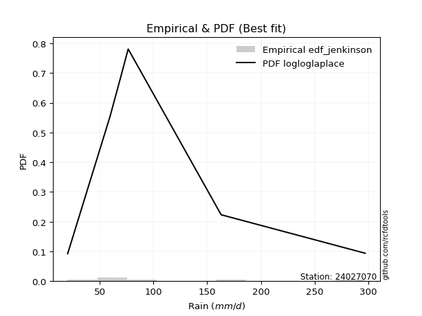</img>

</div>


### 11. Empirical - EDF Cunnane (1978)

Cunnane´s work in statistical hydrology has focused on the performance and evaluation of different probability distributions (such as GEV, Gumbel, Lognormal) for flood frequency estimation. _b_ is a constant, typically set to 0.4.

<div align="center">


$P=(m-b)/(n+1-2b)$


</div>


**11.1. Empirical values**

<div align="center">

|                | 0                  | 1                   | 2                   | 3                  | 4                  | 5                  |
|:---------------|:-------------------|:--------------------|:--------------------|:-------------------|:-------------------|:-------------------|
| date           | 2021               | 2019                | 2020                | 2023               | 2025               | 2024               |
| x              | 20.0               | 59.4                | 69.2                | 76.4               | 142.0              | 297.2              |
| m              | 1                  | 2                   | 3                   | 4                  | 5                  | 6                  |
| empirical_dist | edf_cunnane        | edf_cunnane         | edf_cunnane         | edf_cunnane        | edf_cunnane        | edf_cunnane        |
| empirical      | 0.0967741935483871 | 0.25806451612903225 | 0.41935483870967744 | 0.5806451612903226 | 0.7419354838709676 | 0.9032258064516128 |
| empirical_tr   | 1.1071428571428572 | 1.3478260869565217  | 1.7222222222222225  | 2.384615384615385  | 3.8749999999999982 | 10.333333333333318 |

</div>


**11.2. Kolmogorov-Smirnov fit test (sorted by Δ)**


<div align="center">

|                | 0                     | 1                   | 2                   | 3                   | 4                   | 5                   | 6                   | 7                   | 8                   | 9                   | 10                  | 11                 | 12                  | 13                  | 14                  | 15                  | 16                  | 17                  | 18                  | 19                  | 20                 | 21                  | 22                  | 23                  | 24                  | 25                 | 26                  | 27                  | 28                  | 29                  | 30                  | 31                  | 32                  | 33                 | 34                  | 35                  | 36                  | 37                  | 38                  | 39                  | 40                  | 41                  | 42                 | 43                  | 44                  | 45                  | 46                  | 47                  | 48                  | 49                  | 50                  | 51                  | 52                  | 53                  | 54                  | 55                  | 56                 | 57                  | 58                  | 59                  | 60                 | 61                  | 62                  | 63                 | 64                  | 65                 | 66                 | 67                 | 68                  | 69                  | 70                 | 71                  | 72                  | 73                  | 74                  | 75                 | 76                 | 77                 | 78                 | 79                  | 80                 | 81                 | 82                 | 83                 | 84                  | 85                 | 86                 | 87                  | 88                 | 89                 |
|:---------------|:----------------------|:--------------------|:--------------------|:--------------------|:--------------------|:--------------------|:--------------------|:--------------------|:--------------------|:--------------------|:--------------------|:-------------------|:--------------------|:--------------------|:--------------------|:--------------------|:--------------------|:--------------------|:--------------------|:--------------------|:-------------------|:--------------------|:--------------------|:--------------------|:--------------------|:-------------------|:--------------------|:--------------------|:--------------------|:--------------------|:--------------------|:--------------------|:--------------------|:-------------------|:--------------------|:--------------------|:--------------------|:--------------------|:--------------------|:--------------------|:--------------------|:--------------------|:-------------------|:--------------------|:--------------------|:--------------------|:--------------------|:--------------------|:--------------------|:--------------------|:--------------------|:--------------------|:--------------------|:--------------------|:--------------------|:--------------------|:-------------------|:--------------------|:--------------------|:--------------------|:-------------------|:--------------------|:--------------------|:-------------------|:--------------------|:-------------------|:-------------------|:-------------------|:--------------------|:--------------------|:-------------------|:--------------------|:--------------------|:--------------------|:--------------------|:-------------------|:-------------------|:-------------------|:-------------------|:--------------------|:-------------------|:-------------------|:-------------------|:-------------------|:--------------------|:-------------------|:-------------------|:--------------------|:-------------------|:-------------------|
| station        | 24027070              | 24027070            | 24027070            | 24027070            | 24027070            | 24027070            | 24027070            | 24027070            | 24027070            | 24027070            | 24027070            | 24027070           | 24027070            | 24027070            | 24027070            | 24027070            | 24027070            | 24027070            | 24027070            | 24027070            | 24027070           | 24027070            | 24027070            | 24027070            | 24027070            | 24027070           | 24027070            | 24027070            | 24027070            | 24027070            | 24027070            | 24027070            | 24027070            | 24027070           | 24027070            | 24027070            | 24027070            | 24027070            | 24027070            | 24027070            | 24027070            | 24027070            | 24027070           | 24027070            | 24027070            | 24027070            | 24027070            | 24027070            | 24027070            | 24027070            | 24027070            | 24027070            | 24027070            | 24027070            | 24027070            | 24027070            | 24027070           | 24027070            | 24027070            | 24027070            | 24027070           | 24027070            | 24027070            | 24027070           | 24027070            | 24027070           | 24027070           | 24027070           | 24027070            | 24027070            | 24027070           | 24027070            | 24027070            | 24027070            | 24027070            | 24027070           | 24027070           | 24027070           | 24027070           | 24027070            | 24027070           | 24027070           | 24027070           | 24027070           | 24027070            | 24027070           | 24027070           | 24027070            | 24027070           | 24027070           |
| empirical_dist | edf_cunnane           | edf_cunnane         | edf_cunnane         | edf_cunnane         | edf_cunnane         | edf_cunnane         | edf_cunnane         | edf_cunnane         | edf_cunnane         | edf_cunnane         | edf_cunnane         | edf_cunnane        | edf_cunnane         | edf_cunnane         | edf_cunnane         | edf_cunnane         | edf_cunnane         | edf_cunnane         | edf_cunnane         | edf_cunnane         | edf_cunnane        | edf_cunnane         | edf_cunnane         | edf_cunnane         | edf_cunnane         | edf_cunnane        | edf_cunnane         | edf_cunnane         | edf_cunnane         | edf_cunnane         | edf_cunnane         | edf_cunnane         | edf_cunnane         | edf_cunnane        | edf_cunnane         | edf_cunnane         | edf_cunnane         | edf_cunnane         | edf_cunnane         | edf_cunnane         | edf_cunnane         | edf_cunnane         | edf_cunnane        | edf_cunnane         | edf_cunnane         | edf_cunnane         | edf_cunnane         | edf_cunnane         | edf_cunnane         | edf_cunnane         | edf_cunnane         | edf_cunnane         | edf_cunnane         | edf_cunnane         | edf_cunnane         | edf_cunnane         | edf_cunnane        | edf_cunnane         | edf_cunnane         | edf_cunnane         | edf_cunnane        | edf_cunnane         | edf_cunnane         | edf_cunnane        | edf_cunnane         | edf_cunnane        | edf_cunnane        | edf_cunnane        | edf_cunnane         | edf_cunnane         | edf_cunnane        | edf_cunnane         | edf_cunnane         | edf_cunnane         | edf_cunnane         | edf_cunnane        | edf_cunnane        | edf_cunnane        | edf_cunnane        | edf_cunnane         | edf_cunnane        | edf_cunnane        | edf_cunnane        | edf_cunnane        | edf_cunnane         | edf_cunnane        | edf_cunnane        | edf_cunnane         | edf_cunnane        | edf_cunnane        |
| p_dist         | loglaplace_asymmetric | johnsonsu           | invgamma            | fisk                | logfatiguelife      | logf                | nct                 | logt                | logcrystalball      | lognorm             | lognorm             | logexponnorm       | logjohnsonsu        | loggamma            | loggamma            | lognct              | logweibull_min      | logerlang           | logbetaprime        | loglogistic         | loggenlogistic     | logfisk             | logmielke           | logpearson3         | loghypsecant        | logloggamma        | invgauss            | ncf                 | betaprime           | logrice             | loginvgamma         | gompertz            | expon               | genexpon           | wald                | logalpha            | loggompertz         | truncnorm           | loglaplace          | logncf              | loginvgauss         | nakagami            | fatiguelife        | logmaxwell          | exponnorm           | halflogistic        | lograyleigh         | halfnorm            | loggumbel_r         | gibrat              | t                   | moyal               | pearson3            | loginvweibull       | logmoyal            | loggumbel_l         | gumbel_r           | loghalfnorm         | f                   | laplace_asymmetric  | rayleigh           | loggibrat           | genlogistic         | logkstwobign       | loghalflogistic     | loggenexpon        | maxwell            | weibull_min        | alpha               | kstwobign           | logwald            | crystalball         | norm                | logistic            | rice                | logtruncnorm       | lognakagami        | hypsecant          | logexpon           | laplace             | gumbel_l           | mielke             | erlang             | gamma              | pareto              | loglognorm         | logpareto          | logchi2             | invweibull         | chi2               |
| delta          | 0.07090539305294369   | 0.07995965637039892 | 0.10178081257463356 | 0.10213469848723361 | 0.10289239483700047 | 0.10320676619861152 | 0.10356392723530117 | 0.10378602176792645 | 0.10378651656155724 | 0.10378663202877308 | 0.10378663202877308 | 0.1037866829345343 | 0.10379436354732946 | 0.10397495929413919 | 0.10397495929413919 | 0.10398688179892213 | 0.10432493628432543 | 0.10466326216231026 | 0.10570591558182402 | 0.10693894563962525 | 0.1073388087274999 | 0.10746254145769474 | 0.10846797156522192 | 0.10902721927555603 | 0.10962486091989915 | 0.1111475298425541 | 0.11220433815752273 | 0.11561305876973393 | 0.11641313602089548 | 0.11697470111077213 | 0.11703512982452874 | 0.11749507440623508 | 0.11760594829252102 | 0.1176066426018002 | 0.11770416314076876 | 0.11900786236770888 | 0.11944380836080154 | 0.11953164566239582 | 0.12004623274675841 | 0.12269572219982772 | 0.12586723465693128 | 0.12781746575112757 | 0.1282606415982634 | 0.13262575307001567 | 0.14044153645543322 | 0.14055431767658477 | 0.14477988475062098 | 0.14912731854225575 | 0.15077609598328945 | 0.15325794958937328 | 0.15428965724407973 | 0.16033368905075895 | 0.16038376974981478 | 0.16533161059854629 | 0.16970744124724213 | 0.17446291130628722 | 0.1786091666940503 | 0.17936234742623325 | 0.17995465830757879 | 0.18109229444793273 | 0.1835598916991652 | 0.18388729799299236 | 0.18541105027142757 | 0.1860553270465537 | 0.18884841359490506 | 0.1905924026916812 | 0.1956587005000608 | 0.2078151594236951 | 0.20807853965087758 | 0.21505728407074737 | 0.2152587136014601 | 0.22776590487274073 | 0.22776591819554554 | 0.24545781119430277 | 0.25118188359429633 | 0.2580628235823258 | 0.2580643750845909 | 0.2592415134395632 | 0.2854446290922519 | 0.28750245784127454 | 0.2881911710073466 | 0.2899527323887737 | 0.3039195409956972 | 0.3204860419505463 | 0.39233290942443655 | 0.4045444450400083 | 0.4174544191986531 | 0.42967915101263143 | 0.4429312035926894 | 0.7111486737503263 |
| deltao         | 0.530385761606        | 0.530385761606      | 0.530385761606      | 0.530385761606      | 0.530385761606      | 0.530385761606      | 0.530385761606      | 0.530385761606      | 0.530385761606      | 0.530385761606      | 0.530385761606      | 0.530385761606     | 0.530385761606      | 0.530385761606      | 0.530385761606      | 0.530385761606      | 0.530385761606      | 0.530385761606      | 0.530385761606      | 0.530385761606      | 0.530385761606     | 0.530385761606      | 0.530385761606      | 0.530385761606      | 0.530385761606      | 0.530385761606     | 0.530385761606      | 0.530385761606      | 0.530385761606      | 0.530385761606      | 0.530385761606      | 0.530385761606      | 0.530385761606      | 0.530385761606     | 0.530385761606      | 0.530385761606      | 0.530385761606      | 0.530385761606      | 0.530385761606      | 0.530385761606      | 0.530385761606      | 0.530385761606      | 0.530385761606     | 0.530385761606      | 0.530385761606      | 0.530385761606      | 0.530385761606      | 0.530385761606      | 0.530385761606      | 0.530385761606      | 0.530385761606      | 0.530385761606      | 0.530385761606      | 0.530385761606      | 0.530385761606      | 0.530385761606      | 0.530385761606     | 0.530385761606      | 0.530385761606      | 0.530385761606      | 0.530385761606     | 0.530385761606      | 0.530385761606      | 0.530385761606     | 0.530385761606      | 0.530385761606     | 0.530385761606     | 0.530385761606     | 0.530385761606      | 0.530385761606      | 0.530385761606     | 0.530385761606      | 0.530385761606      | 0.530385761606      | 0.530385761606      | 0.530385761606     | 0.530385761606     | 0.530385761606     | 0.530385761606     | 0.530385761606      | 0.530385761606     | 0.530385761606     | 0.530385761606     | 0.530385761606     | 0.530385761606      | 0.530385761606     | 0.530385761606     | 0.530385761606      | 0.530385761606     | 0.530385761606     |
| eval           | Δo > Δ                | Δo > Δ              | Δo > Δ              | Δo > Δ              | Δo > Δ              | Δo > Δ              | Δo > Δ              | Δo > Δ              | Δo > Δ              | Δo > Δ              | Δo > Δ              | Δo > Δ             | Δo > Δ              | Δo > Δ              | Δo > Δ              | Δo > Δ              | Δo > Δ              | Δo > Δ              | Δo > Δ              | Δo > Δ              | Δo > Δ             | Δo > Δ              | Δo > Δ              | Δo > Δ              | Δo > Δ              | Δo > Δ             | Δo > Δ              | Δo > Δ              | Δo > Δ              | Δo > Δ              | Δo > Δ              | Δo > Δ              | Δo > Δ              | Δo > Δ             | Δo > Δ              | Δo > Δ              | Δo > Δ              | Δo > Δ              | Δo > Δ              | Δo > Δ              | Δo > Δ              | Δo > Δ              | Δo > Δ             | Δo > Δ              | Δo > Δ              | Δo > Δ              | Δo > Δ              | Δo > Δ              | Δo > Δ              | Δo > Δ              | Δo > Δ              | Δo > Δ              | Δo > Δ              | Δo > Δ              | Δo > Δ              | Δo > Δ              | Δo > Δ             | Δo > Δ              | Δo > Δ              | Δo > Δ              | Δo > Δ             | Δo > Δ              | Δo > Δ              | Δo > Δ             | Δo > Δ              | Δo > Δ             | Δo > Δ             | Δo > Δ             | Δo > Δ              | Δo > Δ              | Δo > Δ             | Δo > Δ              | Δo > Δ              | Δo > Δ              | Δo > Δ              | Δo > Δ             | Δo > Δ             | Δo > Δ             | Δo > Δ             | Δo > Δ              | Δo > Δ             | Δo > Δ             | Δo > Δ             | Δo > Δ             | Δo > Δ              | Δo > Δ             | Δo > Δ             | Δo > Δ              | Δo > Δ             | Δo <= Δ            |
| fit            | 1                     | 1                   | 1                   | 1                   | 1                   | 1                   | 1                   | 1                   | 1                   | 1                   | 1                   | 1                  | 1                   | 1                   | 1                   | 1                   | 1                   | 1                   | 1                   | 1                   | 1                  | 1                   | 1                   | 1                   | 1                   | 1                  | 1                   | 1                   | 1                   | 1                   | 1                   | 1                   | 1                   | 1                  | 1                   | 1                   | 1                   | 1                   | 1                   | 1                   | 1                   | 1                   | 1                  | 1                   | 1                   | 1                   | 1                   | 1                   | 1                   | 1                   | 1                   | 1                   | 1                   | 1                   | 1                   | 1                   | 1                  | 1                   | 1                   | 1                   | 1                  | 1                   | 1                   | 1                  | 1                   | 1                  | 1                  | 1                  | 1                   | 1                   | 1                  | 1                   | 1                   | 1                   | 1                   | 1                  | 1                  | 1                  | 1                  | 1                   | 1                  | 1                  | 1                  | 1                  | 1                   | 1                  | 1                  | 1                   | 1                  | 0                  |
| n              | 6                     | 6                   | 6                   | 6                   | 6                   | 6                   | 6                   | 6                   | 6                   | 6                   | 6                   | 6                  | 6                   | 6                   | 6                   | 6                   | 6                   | 6                   | 6                   | 6                   | 6                  | 6                   | 6                   | 6                   | 6                   | 6                  | 6                   | 6                   | 6                   | 6                   | 6                   | 6                   | 6                   | 6                  | 6                   | 6                   | 6                   | 6                   | 6                   | 6                   | 6                   | 6                   | 6                  | 6                   | 6                   | 6                   | 6                   | 6                   | 6                   | 6                   | 6                   | 6                   | 6                   | 6                   | 6                   | 6                   | 6                  | 6                   | 6                   | 6                   | 6                  | 6                   | 6                   | 6                  | 6                   | 6                  | 6                  | 6                  | 6                   | 6                   | 6                  | 6                   | 6                   | 6                   | 6                   | 6                  | 6                  | 6                  | 6                  | 6                   | 6                  | 6                  | 6                  | 6                  | 6                   | 6                  | 6                  | 6                   | 6                  | 6                  |
| best_fit       | 1                     | 0                   | 0                   | 0                   | 0                   | 0                   | 0                   | 0                   | 0                   | 0                   | 0                   | 0                  | 0                   | 0                   | 0                   | 0                   | 0                   | 0                   | 0                   | 0                   | 0                  | 0                   | 0                   | 0                   | 0                   | 0                  | 0                   | 0                   | 0                   | 0                   | 0                   | 0                   | 0                   | 0                  | 0                   | 0                   | 0                   | 0                   | 0                   | 0                   | 0                   | 0                   | 0                  | 0                   | 0                   | 0                   | 0                   | 0                   | 0                   | 0                   | 0                   | 0                   | 0                   | 0                   | 0                   | 0                   | 0                  | 0                   | 0                   | 0                   | 0                  | 0                   | 0                   | 0                  | 0                   | 0                  | 0                  | 0                  | 0                   | 0                   | 0                  | 0                   | 0                   | 0                   | 0                   | 0                  | 0                  | 0                  | 0                  | 0                   | 0                  | 0                  | 0                  | 0                  | 0                   | 0                  | 0                  | 0                   | 0                  | 0                  |
| best_fit_sort  | 1                     | 2                   | 3                   | 4                   | 5                   | 6                   | 7                   | 8                   | 9                   | 10                  | 11                  | 12                 | 13                  | 14                  | 15                  | 16                  | 17                  | 18                  | 19                  | 20                  | 21                 | 22                  | 23                  | 24                  | 25                  | 26                 | 27                  | 28                  | 29                  | 30                  | 31                  | 32                  | 33                  | 34                 | 35                  | 36                  | 37                  | 38                  | 39                  | 40                  | 41                  | 42                  | 43                 | 44                  | 45                  | 46                  | 47                  | 48                  | 49                  | 50                  | 51                  | 52                  | 53                  | 54                  | 55                  | 56                  | 57                 | 58                  | 59                  | 60                  | 61                 | 62                  | 63                  | 64                 | 65                  | 66                 | 67                 | 68                 | 69                  | 70                  | 71                 | 72                  | 73                  | 74                  | 75                  | 76                 | 77                 | 78                 | 79                 | 80                  | 81                 | 82                 | 83                 | 84                 | 85                  | 86                 | 87                 | 88                  | 89                 | 90                 |

</div>


<div align="center">

</img>

</div>


**11.3. Best fit**

<div align="center">

|   id |   station | empirical_dist   | p_dist                |     delta |   deltao | eval   |   fit |   n |   best_fit |   best_fit_sort |
|-----:|----------:|:-----------------|:----------------------|----------:|---------:|:-------|------:|----:|-----------:|----------------:|
|    0 |  24027070 | edf_cunnane      | loglaplace_asymmetric | 0.0709054 | 0.530386 | Δo > Δ |     1 |   6 |          1 |               1 |

</div>


<div align="center">

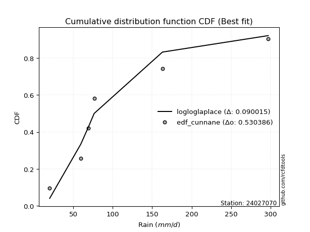</img></img>

</div>


### 12. Empirical - EDF Adamowski (1981)

The Adamowski formula in hydrology refers to a specific plotting position formula used for estimating the non-parametric empirical distribution of hydrological events (like flood peaks) to calculate their return periods. This formula provides an alternative to traditional parametric methods (like the Gumbel or Log Pearson Type III distributions). 

<div align="center">


$P=(m-0.25)/(n+0.5)$


</div>


**12.1. Empirical values**

<div align="center">

|                | 0                   | 1                  | 2                  | 3                  | 4                  | 5                  |
|:---------------|:--------------------|:-------------------|:-------------------|:-------------------|:-------------------|:-------------------|
| date           | 2021                | 2019               | 2020               | 2023               | 2025               | 2024               |
| x              | 20.0                | 59.4               | 69.2               | 76.4               | 142.0              | 297.2              |
| m              | 1                   | 2                  | 3                  | 4                  | 5                  | 6                  |
| empirical_dist | edf_adamowski       | edf_adamowski      | edf_adamowski      | edf_adamowski      | edf_adamowski      | edf_adamowski      |
| empirical      | 0.11538461538461539 | 0.2692307692307692 | 0.4230769230769231 | 0.5769230769230769 | 0.7307692307692307 | 0.8846153846153846 |
| empirical_tr   | 1.1304347826086958  | 1.3684210526315788 | 1.7333333333333334 | 2.3636363636363633 | 3.7142857142857135 | 8.666666666666664  |

</div>


**12.2. Kolmogorov-Smirnov fit test (sorted by Δ)**


<div align="center">

|                | 0                     | 1                   | 2                   | 3                   | 4                   | 5                  | 6                  | 7                   | 8                   | 9                   | 10                  | 11                  | 12                 | 13                  | 14                  | 15                  | 16                  | 17                  | 18                  | 19                  | 20                 | 21                  | 22                  | 23                  | 24                  | 25                  | 26                  | 27                 | 28                  | 29                  | 30                  | 31                  | 32                  | 33                  | 34                  | 35                  | 36                | 37                  | 38                  | 39                  | 40                  | 41                  | 42                 | 43                  | 44                | 45                  | 46                  | 47                  | 48               | 49                  | 50                  | 51                 | 52                  | 53                  | 54                  | 55                  | 56                  | 57                  | 58                 | 59                  | 60                  | 61                  | 62                 | 63                  | 64                  | 65                  | 66                  | 67                  | 68                 | 69                  | 70                  | 71                  | 72                 | 73                  | 74                  | 75                  | 76                  | 77                  | 78                 | 79                  | 80                 | 81                  | 82                 | 83                  | 84                 | 85                  | 86                  | 87                  | 88                 | 89                 |
|:---------------|:----------------------|:--------------------|:--------------------|:--------------------|:--------------------|:-------------------|:-------------------|:--------------------|:--------------------|:--------------------|:--------------------|:--------------------|:-------------------|:--------------------|:--------------------|:--------------------|:--------------------|:--------------------|:--------------------|:--------------------|:-------------------|:--------------------|:--------------------|:--------------------|:--------------------|:--------------------|:--------------------|:-------------------|:--------------------|:--------------------|:--------------------|:--------------------|:--------------------|:--------------------|:--------------------|:--------------------|:------------------|:--------------------|:--------------------|:--------------------|:--------------------|:--------------------|:-------------------|:--------------------|:------------------|:--------------------|:--------------------|:--------------------|:-----------------|:--------------------|:--------------------|:-------------------|:--------------------|:--------------------|:--------------------|:--------------------|:--------------------|:--------------------|:-------------------|:--------------------|:--------------------|:--------------------|:-------------------|:--------------------|:--------------------|:--------------------|:--------------------|:--------------------|:-------------------|:--------------------|:--------------------|:--------------------|:-------------------|:--------------------|:--------------------|:--------------------|:--------------------|:--------------------|:-------------------|:--------------------|:-------------------|:--------------------|:-------------------|:--------------------|:-------------------|:--------------------|:--------------------|:--------------------|:-------------------|:-------------------|
| station        | 24027070              | 24027070            | 24027070            | 24027070            | 24027070            | 24027070           | 24027070           | 24027070            | 24027070            | 24027070            | 24027070            | 24027070            | 24027070           | 24027070            | 24027070            | 24027070            | 24027070            | 24027070            | 24027070            | 24027070            | 24027070           | 24027070            | 24027070            | 24027070            | 24027070            | 24027070            | 24027070            | 24027070           | 24027070            | 24027070            | 24027070            | 24027070            | 24027070            | 24027070            | 24027070            | 24027070            | 24027070          | 24027070            | 24027070            | 24027070            | 24027070            | 24027070            | 24027070           | 24027070            | 24027070          | 24027070            | 24027070            | 24027070            | 24027070         | 24027070            | 24027070            | 24027070           | 24027070            | 24027070            | 24027070            | 24027070            | 24027070            | 24027070            | 24027070           | 24027070            | 24027070            | 24027070            | 24027070           | 24027070            | 24027070            | 24027070            | 24027070            | 24027070            | 24027070           | 24027070            | 24027070            | 24027070            | 24027070           | 24027070            | 24027070            | 24027070            | 24027070            | 24027070            | 24027070           | 24027070            | 24027070           | 24027070            | 24027070           | 24027070            | 24027070           | 24027070            | 24027070            | 24027070            | 24027070           | 24027070           |
| empirical_dist | edf_adamowski         | edf_adamowski       | edf_adamowski       | edf_adamowski       | edf_adamowski       | edf_adamowski      | edf_adamowski      | edf_adamowski       | edf_adamowski       | edf_adamowski       | edf_adamowski       | edf_adamowski       | edf_adamowski      | edf_adamowski       | edf_adamowski       | edf_adamowski       | edf_adamowski       | edf_adamowski       | edf_adamowski       | edf_adamowski       | edf_adamowski      | edf_adamowski       | edf_adamowski       | edf_adamowski       | edf_adamowski       | edf_adamowski       | edf_adamowski       | edf_adamowski      | edf_adamowski       | edf_adamowski       | edf_adamowski       | edf_adamowski       | edf_adamowski       | edf_adamowski       | edf_adamowski       | edf_adamowski       | edf_adamowski     | edf_adamowski       | edf_adamowski       | edf_adamowski       | edf_adamowski       | edf_adamowski       | edf_adamowski      | edf_adamowski       | edf_adamowski     | edf_adamowski       | edf_adamowski       | edf_adamowski       | edf_adamowski    | edf_adamowski       | edf_adamowski       | edf_adamowski      | edf_adamowski       | edf_adamowski       | edf_adamowski       | edf_adamowski       | edf_adamowski       | edf_adamowski       | edf_adamowski      | edf_adamowski       | edf_adamowski       | edf_adamowski       | edf_adamowski      | edf_adamowski       | edf_adamowski       | edf_adamowski       | edf_adamowski       | edf_adamowski       | edf_adamowski      | edf_adamowski       | edf_adamowski       | edf_adamowski       | edf_adamowski      | edf_adamowski       | edf_adamowski       | edf_adamowski       | edf_adamowski       | edf_adamowski       | edf_adamowski      | edf_adamowski       | edf_adamowski      | edf_adamowski       | edf_adamowski      | edf_adamowski       | edf_adamowski      | edf_adamowski       | edf_adamowski       | edf_adamowski       | edf_adamowski      | edf_adamowski      |
| p_dist         | loglaplace_asymmetric | johnsonsu           | fisk                | logbetaprime        | logerlang           | loggamma           | loggamma           | logf                | invgamma            | logweibull_min      | logfatiguelife      | nct                 | logt               | logcrystalball      | lognorm             | lognorm             | logexponnorm        | logjohnsonsu        | lognct              | invgauss            | loglogistic        | loggenlogistic      | logfisk             | logmielke           | logpearson3         | logrice             | loginvgamma         | loghypsecant       | logloggamma         | logalpha            | logncf              | ncf                 | betaprime           | loginvgauss         | loggompertz         | gompertz            | genexpon          | wald                | expon               | truncnorm           | loglaplace          | fatiguelife         | logmaxwell         | nakagami            | lograyleigh       | exponnorm           | halflogistic        | loggumbel_r         | halfnorm         | gibrat              | loginvweibull       | moyal              | pearson3            | logmoyal            | t                   | loghalfnorm         | f                   | loggumbel_l         | loggibrat          | gumbel_r            | logkstwobign        | laplace_asymmetric  | loghalflogistic    | loggenexpon         | rayleigh            | genlogistic         | maxwell             | weibull_min         | alpha              | logwald             | kstwobign           | crystalball         | norm               | logistic            | rice                | hypsecant           | logtruncnorm        | lognakagami         | logexpon           | mielke              | laplace            | gumbel_l            | erlang             | gamma               | pareto             | loglognorm          | logpareto           | logchi2             | invweibull         | chi2               |
| delta          | 0.07548925510128601   | 0.09112590947213584 | 0.09152784404757008 | 0.09453966248008705 | 0.09503620938729523 | 0.0957409522706551 | 0.0957409522706551 | 0.09646239457442773 | 0.09805872820738781 | 0.09860154621017236 | 0.09917031046975472 | 0.09984184286805542 | 0.1000639374006807 | 0.10006443219431149 | 0.10006454766152734 | 0.10006454766152734 | 0.10006459856728855 | 0.10007227918008371 | 0.10026479743167638 | 0.10103808505578576 | 0.1032168612723795 | 0.10361672436025415 | 0.10374045709044899 | 0.10474588719797617 | 0.10530513490831028 | 0.10580844800903516 | 0.10586887672279177 | 0.1059027765526534 | 0.10742544547530836 | 0.10784160926597192 | 0.11152946909809075 | 0.11189097440248819 | 0.11269105165364973 | 0.11470098155519431 | 0.11538461046006261 | 0.11538461348363885 | 0.115384615373032 | 0.11538461538461539 | 0.11538461538461539 | 0.11580956129515008 | 0.11632414837951266 | 0.11709438849652642 | 0.1214594999682787 | 0.12409538138388182 | 0.133613631648884 | 0.13671945208818748 | 0.13683223330933902 | 0.13960984288155248 | 0.14540523417501 | 0.14953586522212753 | 0.15416535749680932 | 0.1566116046835132 | 0.15666168538256903 | 0.15854118814550516 | 0.16545591034581664 | 0.16819609432449628 | 0.16878840520584182 | 0.17074082693904147 | 0.1727210448912554 | 0.17488708232680455 | 0.17488907394481673 | 0.17737021008068699 | 0.1776821604931681 | 0.17942614958994424 | 0.17983780733191945 | 0.18168896590418182 | 0.19193661613281504 | 0.19664890632195814 | 0.1969122865491406 | 0.20409246049972313 | 0.21133519970350162 | 0.22404382050549498 | 0.2240438338282998 | 0.24173572682705702 | 0.24745979922705058 | 0.25551942907231745 | 0.26922907668406276 | 0.26923062818632787 | 0.2742783759905149 | 0.27878647928703676 | 0.2837803734740288 | 0.28446908664010084 | 0.2927532878939602 | 0.30931978884880934 | 0.3811666563226996 | 0.39337819193827134 | 0.40628816609691615 | 0.41851289791089447 | 0.4243207817564612 | 0.6999824206485894 |
| deltao         | 0.530385761606        | 0.530385761606      | 0.530385761606      | 0.530385761606      | 0.530385761606      | 0.530385761606     | 0.530385761606     | 0.530385761606      | 0.530385761606      | 0.530385761606      | 0.530385761606      | 0.530385761606      | 0.530385761606     | 0.530385761606      | 0.530385761606      | 0.530385761606      | 0.530385761606      | 0.530385761606      | 0.530385761606      | 0.530385761606      | 0.530385761606     | 0.530385761606      | 0.530385761606      | 0.530385761606      | 0.530385761606      | 0.530385761606      | 0.530385761606      | 0.530385761606     | 0.530385761606      | 0.530385761606      | 0.530385761606      | 0.530385761606      | 0.530385761606      | 0.530385761606      | 0.530385761606      | 0.530385761606      | 0.530385761606    | 0.530385761606      | 0.530385761606      | 0.530385761606      | 0.530385761606      | 0.530385761606      | 0.530385761606     | 0.530385761606      | 0.530385761606    | 0.530385761606      | 0.530385761606      | 0.530385761606      | 0.530385761606   | 0.530385761606      | 0.530385761606      | 0.530385761606     | 0.530385761606      | 0.530385761606      | 0.530385761606      | 0.530385761606      | 0.530385761606      | 0.530385761606      | 0.530385761606     | 0.530385761606      | 0.530385761606      | 0.530385761606      | 0.530385761606     | 0.530385761606      | 0.530385761606      | 0.530385761606      | 0.530385761606      | 0.530385761606      | 0.530385761606     | 0.530385761606      | 0.530385761606      | 0.530385761606      | 0.530385761606     | 0.530385761606      | 0.530385761606      | 0.530385761606      | 0.530385761606      | 0.530385761606      | 0.530385761606     | 0.530385761606      | 0.530385761606     | 0.530385761606      | 0.530385761606     | 0.530385761606      | 0.530385761606     | 0.530385761606      | 0.530385761606      | 0.530385761606      | 0.530385761606     | 0.530385761606     |
| eval           | Δo > Δ                | Δo > Δ              | Δo > Δ              | Δo > Δ              | Δo > Δ              | Δo > Δ             | Δo > Δ             | Δo > Δ              | Δo > Δ              | Δo > Δ              | Δo > Δ              | Δo > Δ              | Δo > Δ             | Δo > Δ              | Δo > Δ              | Δo > Δ              | Δo > Δ              | Δo > Δ              | Δo > Δ              | Δo > Δ              | Δo > Δ             | Δo > Δ              | Δo > Δ              | Δo > Δ              | Δo > Δ              | Δo > Δ              | Δo > Δ              | Δo > Δ             | Δo > Δ              | Δo > Δ              | Δo > Δ              | Δo > Δ              | Δo > Δ              | Δo > Δ              | Δo > Δ              | Δo > Δ              | Δo > Δ            | Δo > Δ              | Δo > Δ              | Δo > Δ              | Δo > Δ              | Δo > Δ              | Δo > Δ             | Δo > Δ              | Δo > Δ            | Δo > Δ              | Δo > Δ              | Δo > Δ              | Δo > Δ           | Δo > Δ              | Δo > Δ              | Δo > Δ             | Δo > Δ              | Δo > Δ              | Δo > Δ              | Δo > Δ              | Δo > Δ              | Δo > Δ              | Δo > Δ             | Δo > Δ              | Δo > Δ              | Δo > Δ              | Δo > Δ             | Δo > Δ              | Δo > Δ              | Δo > Δ              | Δo > Δ              | Δo > Δ              | Δo > Δ             | Δo > Δ              | Δo > Δ              | Δo > Δ              | Δo > Δ             | Δo > Δ              | Δo > Δ              | Δo > Δ              | Δo > Δ              | Δo > Δ              | Δo > Δ             | Δo > Δ              | Δo > Δ             | Δo > Δ              | Δo > Δ             | Δo > Δ              | Δo > Δ             | Δo > Δ              | Δo > Δ              | Δo > Δ              | Δo > Δ             | Δo <= Δ            |
| fit            | 1                     | 1                   | 1                   | 1                   | 1                   | 1                  | 1                  | 1                   | 1                   | 1                   | 1                   | 1                   | 1                  | 1                   | 1                   | 1                   | 1                   | 1                   | 1                   | 1                   | 1                  | 1                   | 1                   | 1                   | 1                   | 1                   | 1                   | 1                  | 1                   | 1                   | 1                   | 1                   | 1                   | 1                   | 1                   | 1                   | 1                 | 1                   | 1                   | 1                   | 1                   | 1                   | 1                  | 1                   | 1                 | 1                   | 1                   | 1                   | 1                | 1                   | 1                   | 1                  | 1                   | 1                   | 1                   | 1                   | 1                   | 1                   | 1                  | 1                   | 1                   | 1                   | 1                  | 1                   | 1                   | 1                   | 1                   | 1                   | 1                  | 1                   | 1                   | 1                   | 1                  | 1                   | 1                   | 1                   | 1                   | 1                   | 1                  | 1                   | 1                  | 1                   | 1                  | 1                   | 1                  | 1                   | 1                   | 1                   | 1                  | 0                  |
| n              | 6                     | 6                   | 6                   | 6                   | 6                   | 6                  | 6                  | 6                   | 6                   | 6                   | 6                   | 6                   | 6                  | 6                   | 6                   | 6                   | 6                   | 6                   | 6                   | 6                   | 6                  | 6                   | 6                   | 6                   | 6                   | 6                   | 6                   | 6                  | 6                   | 6                   | 6                   | 6                   | 6                   | 6                   | 6                   | 6                   | 6                 | 6                   | 6                   | 6                   | 6                   | 6                   | 6                  | 6                   | 6                 | 6                   | 6                   | 6                   | 6                | 6                   | 6                   | 6                  | 6                   | 6                   | 6                   | 6                   | 6                   | 6                   | 6                  | 6                   | 6                   | 6                   | 6                  | 6                   | 6                   | 6                   | 6                   | 6                   | 6                  | 6                   | 6                   | 6                   | 6                  | 6                   | 6                   | 6                   | 6                   | 6                   | 6                  | 6                   | 6                  | 6                   | 6                  | 6                   | 6                  | 6                   | 6                   | 6                   | 6                  | 6                  |
| best_fit       | 1                     | 0                   | 0                   | 0                   | 0                   | 0                  | 0                  | 0                   | 0                   | 0                   | 0                   | 0                   | 0                  | 0                   | 0                   | 0                   | 0                   | 0                   | 0                   | 0                   | 0                  | 0                   | 0                   | 0                   | 0                   | 0                   | 0                   | 0                  | 0                   | 0                   | 0                   | 0                   | 0                   | 0                   | 0                   | 0                   | 0                 | 0                   | 0                   | 0                   | 0                   | 0                   | 0                  | 0                   | 0                 | 0                   | 0                   | 0                   | 0                | 0                   | 0                   | 0                  | 0                   | 0                   | 0                   | 0                   | 0                   | 0                   | 0                  | 0                   | 0                   | 0                   | 0                  | 0                   | 0                   | 0                   | 0                   | 0                   | 0                  | 0                   | 0                   | 0                   | 0                  | 0                   | 0                   | 0                   | 0                   | 0                   | 0                  | 0                   | 0                  | 0                   | 0                  | 0                   | 0                  | 0                   | 0                   | 0                   | 0                  | 0                  |
| best_fit_sort  | 1                     | 2                   | 3                   | 4                   | 5                   | 6                  | 7                  | 8                   | 9                   | 10                  | 11                  | 12                  | 13                 | 14                  | 15                  | 16                  | 17                  | 18                  | 19                  | 20                  | 21                 | 22                  | 23                  | 24                  | 25                  | 26                  | 27                  | 28                 | 29                  | 30                  | 31                  | 32                  | 33                  | 34                  | 35                  | 36                  | 37                | 38                  | 39                  | 40                  | 41                  | 42                  | 43                 | 44                  | 45                | 46                  | 47                  | 48                  | 49               | 50                  | 51                  | 52                 | 53                  | 54                  | 55                  | 56                  | 57                  | 58                  | 59                 | 60                  | 61                  | 62                  | 63                 | 64                  | 65                  | 66                  | 67                  | 68                  | 69                 | 70                  | 71                  | 72                  | 73                 | 74                  | 75                  | 76                  | 77                  | 78                  | 79                 | 80                  | 81                 | 82                  | 83                 | 84                  | 85                 | 86                  | 87                  | 88                  | 89                 | 90                 |

</div>


<div align="center">

</img>

</div>


**12.3. Best fit**

<div align="center">

|   id |   station | empirical_dist   | p_dist                |     delta |   deltao | eval   |   fit |   n |   best_fit |   best_fit_sort |
|-----:|----------:|:-----------------|:----------------------|----------:|---------:|:-------|------:|----:|-----------:|----------------:|
|    0 |  24027070 | edf_adamowski    | loglaplace_asymmetric | 0.0754893 | 0.530386 | Δo > Δ |     1 |   6 |          1 |               1 |

</div>


<div align="center">

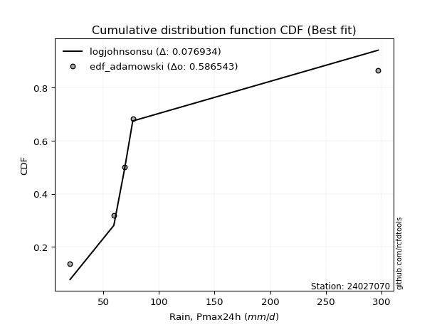</img>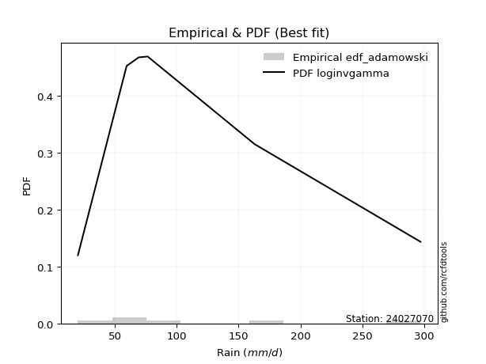</img>

</div>


## C. Best fit & Estimate extreme values for specific return periods - Tr


### 1. Best fit (ordered by delta Δ)

<div align="center">

|   id |   station | empirical_dist   | p_dist                |     delta |   deltao | eval   |   fit |   n |   best_fit |   best_fit_sort |
|-----:|----------:|:-----------------|:----------------------|----------:|---------:|:-------|------:|----:|-----------:|----------------:|
|    0 |  24027070 | edf_california   | t                     | 0.0628918 | 0.530386 | Δo > Δ |     1 |   6 |          1 |               1 |
|    1 |  24027070 | edf_blom         | loglaplace_asymmetric | 0.0689699 | 0.530386 | Δo > Δ |     1 |   6 |          1 |               2 |
|    2 |  24027070 | edf_tukey        | loglaplace_asymmetric | 0.0694164 | 0.530386 | Δo > Δ |     1 |   6 |          1 |               3 |
|    3 |  24027070 | edf_filliben     | loglaplace_asymmetric | 0.0705947 | 0.530386 | Δo > Δ |     1 |   6 |          1 |               4 |
|    4 |  24027070 | edf_cunnane      | loglaplace_asymmetric | 0.0709054 | 0.530386 | Δo > Δ |     1 |   6 |          1 |               5 |
|    5 |  24027070 | edf_jenkinson    | loglaplace_asymmetric | 0.0711488 | 0.530386 | Δo > Δ |     1 |   6 |          1 |               6 |
|    6 |  24027070 | edf_beard        | loglaplace_asymmetric | 0.0711488 | 0.530386 | Δo > Δ |     1 |   6 |          1 |               7 |
|    7 |  24027070 | edf_chegodayev   | loglaplace_asymmetric | 0.0718835 | 0.530386 | Δo > Δ |     1 |   6 |          1 |               8 |
|    8 |  24027070 | edf_hazen        | johnsonsu             | 0.0718951 | 0.530386 | Δo > Δ |     1 |   6 |          1 |               9 |
|    9 |  24027070 | edf_gringorten   | loglaplace_asymmetric | 0.0740679 | 0.530386 | Δo > Δ |     1 |   6 |          1 |              10 |
|   10 |  24027070 | edf_adamowski    | loglaplace_asymmetric | 0.0754893 | 0.530386 | Δo > Δ |     1 |   6 |          1 |              11 |
|   11 |  24027070 | edf_weibull      | nct                   | 0.0943473 | 0.530386 | Δo > Δ |     1 |   6 |          1 |              12 |

</div>

:file_folder:Tables: [bestfit_24027070.csv](table/bestfit_24027070.csv) | [extreme_24027070.csv](table/extreme_24027070.csv)


### 2. Extreme values

In hydrology, a return period (or recurrence interval $Tr$) is the statistical average time between extreme events like floods or droughts of a specific magnitude, indicating how rare an event is, with a 100-year flood, for example, having a 1% chance of occurring in any given year, not that it happens exactly every century. It is a key tool for infrastructure design (like bridges or dams) and risk assessment, calculated from historical data to determine the probability of future events, although it is important to remember it is statistical average, and events can cluster or be missed.

> risk_rate: assuming the return period as the project useful life.

|   id |      tr |   prob_l |     prob_g |      alpha |   betaprime |     chi2 |   crystalball |   erlang |    expon |   exponnorm |         f |   fatiguelife |      fisk |    gamma |   genexpon |   genlogistic |   gibrat |   gompertz |   gumbel_l |   gumbel_r |   halflogistic |   halfnorm |   hypsecant |   invgamma |   invgauss |      invweibull |   johnsonsu |   kstwobign |   laplace |   laplace_asymmetric |   loggamma |   logistic |   lognorm |   maxwell |    mielke |    moyal |   nakagami |      ncf |       nct |    norm |           pareto |   pearson3 |   rayleigh |    rice |          t |   truncnorm |     wald |   weibull_min |   logalpha |   logbetaprime |     logchi2 |   logcrystalball |   logerlang |    logexpon |   logexponnorm |      logf |   logfatiguelife |   logfisk |   loggenexpon |   loggenlogistic |   loggibrat |   loggompertz |   loggumbel_l |   loggumbel_r |   loghalflogistic |   loghalfnorm |   loghypsecant |   loginvgamma |   loginvgauss |   loginvweibull |   logjohnsonsu |   logkstwobign |   loglaplace |   loglaplace_asymmetric |   logloggamma |   loglogistic |    loglognorm |   logmaxwell |   logmielke |   logmoyal |   lognakagami |    logncf |    lognct |      logpareto |   logpearson3 |   lograyleigh |   logrice |      logt |   logtruncnorm |    logwald |   logweibull_min |   station |   n |   risk_rate |
|-----:|--------:|---------:|-----------:|-----------:|------------:|---------:|--------------:|---------:|---------:|------------:|----------:|--------------:|----------:|---------:|-----------:|--------------:|---------:|-----------:|-----------:|-----------:|---------------:|-----------:|------------:|-----------:|-----------:|----------------:|------------:|------------:|----------:|---------------------:|-----------:|-----------:|----------:|----------:|----------:|---------:|-----------:|---------:|----------:|--------:|-----------------:|-----------:|-----------:|--------:|-----------:|------------:|---------:|--------------:|-----------:|---------------:|------------:|-----------------:|------------:|------------:|---------------:|----------:|-----------------:|----------:|--------------:|-----------------:|------------:|--------------:|--------------:|--------------:|------------------:|--------------:|---------------:|--------------:|--------------:|----------------:|---------------:|---------------:|-------------:|------------------------:|--------------:|--------------:|--------------:|-------------:|------------:|-----------:|--------------:|----------:|----------:|---------------:|--------------:|--------------:|----------:|----------:|---------------:|-----------:|-----------------:|----------:|----:|------------:|
|    0 |    2    | 0.5      | 0.5        |    64.1901 |     82.1074 |  26.6448 |       110.7   |  51.6477 |  82.8684 |     86.1425 |   71.1809 |       77.017  |   78.6577 |  48.7124 |    82.8686 |       93.3862 |  83.4307 |    82.8475 |    125.625 |    95.7753 |        88.3555 |    92.1037 |     110.7   |    79.6397 |    78.5994 |  1582.7         |     74.6736 |     100.392 |   110.7   |               90.562 |    79.4364 |    110.7   |   80.1479 |   102.93  |   53.8184 |  90.9571 |    89.3925 |  81.9778 |   79.8317 | 110.7   |     26.6382      |    92.5789 |    100.174 | 109.77  |    68.614  |     83.2266 |  81.2512 |       65.5627 |    76.9808 |        79.0401 |     33.3694 |          80.1479 |     79.3213 |     52.3483 |        80.1479 |   79.5493 |          79.9971 |   80.381  |       67.0074 |          80.3543 |     62.5627 |       78.878  |       91.7834 |       69.9874 |           65.4251 |       67.6922 |        80.1479 |       77.2954 |       75.9638 |         70.3961 |        80.1488 |        67.577  |      80.1479 |                 74.7988 |       81.3821 |       80.1479 |  20.0807      |      74.6867 |     80.5325 |    66.9906 |       66.8964 |   76.3517 |   80.1813 |  22.6904       |       81.0262 |       72.8405 |   77.6312 |   80.1478 |        84.659  |    61.3376 |          79.9968 |  24027070 |   6 |    0.75     |
|    1 |    2.33 | 0.570815 | 0.429185   |    76.4027 |     94.6726 |  28.3231 |       126.912 |  60.6148 |  96.7203 |     99.2946 |   87.6006 |       90.6001 |   90.816  |  58.2271 |    96.7204 |      105.718  |  91.6429 |    96.6945 |    139.729 |   110.797  |       103.8    |   109.6    |     123.674 |    91.6435 |    91.549  | 40422           |     80.6753 |     114.083 |   120.511 |              102.377 |    92.0829 |    124.984 |   92.8626 |   119.773 |   62.2596 | 105.177  |   111.998  |  94.4867 |   91.5421 | 126.912 |     34.2822      |   108.17   |    117.266 | 124.286 |    72.264  |     97.1428 |  91.8814 |       80.8385 |    89.5586 |        91.6789 |     39.7858 |          92.8626 |     91.9537 |     64.7101 |        92.8626 |   92.1788 |          92.6933 |   91.9908 |       79.7749 |          91.939  |     67.408  |       92.7896 |      104.328  |       80.2187 |           75.2786 |       79.3516 |        90.1717 |       89.844  |       88.5514 |         83.2323 |        92.8621 |        80.3674 |      87.6175 |                 82.9353 |       94.232  |       91.2505 |  20.8906      |      87.0325 |     92.0922 |    76.2267 |       69.7001 |   88.8568 |   92.9008 |  26.2562       |       93.8435 |       85.0735 |   90.4123 |   92.8626 |        91.0941 |    67.5552 |          93.0202 |  24027070 |   6 |    0.729209 |
|    2 |    5    | 0.8      | 0.2        |   171.1    |    160.085  |  37.0447 |       187.159 | 108.938  | 165.976  |    165.039  |  181.961  |      163.971  |  161.433  | 112.443  |   165.976  |      159.29   | 138.923  |   165.925  |    185.294 |   176.059  |       173.686  |   183.591  |     175.717 |   156.724  |   161.298  |     5.53435e+10 |    130.432  |     172.238 |   169.561 |              161.446 |   160.201  |    180.135 |  160.506  |   186.065 |  105.474  | 171.046  |   223.117  | 158.633  |  154.823  | 187.159 |    630.808       |   176.916  |    185.693 | 182.4   |    95.1578 |    166.642  | 151.389  |      174.824  |   161.034  |       161.051  |    109.92   |         160.506  |    160.019  |    186.767  |       160.506  |  159.909  |         160.59   |  154.872  |      162.86   |         154.698  |    103.567  |      165.481  |      157.811  |      145.114  |          142.022  |      155.389  |       144.663  |      160.081  |      161.592  |        172.314  |       160.496  |       167.826  |     136.797  |                138.98   |      161.131  |      150.586  |   2.3328e+133 |     158.92   |    153.905  |   138.655  |       85.6483 |  160.344  |  160.541  |   2.61908e+06  |      160.986  |      158.384  |  160.949  |  160.506  |       127.746  |   115.983  |         161.863  |  24027070 |   6 |    0.67232  |
|    3 |   10    | 0.9      | 0.1        |   345.083  |    227.496  |  45.223  |       227.125 | 155.601  | 228.844  |    224.719  |  280.126  |      236.599  |  250.223  | 167.102  |   228.845  |      202.92   | 192.816  |   228.77   |    210.663 |   229.214  |       231.722  |   238.343  |     217.274 |   228.508  |   232.313  |     5.51173e+15 |    222.19   |     216.515 |   214.088 |              215.068 |   232.266  |    220.751 |  230.751  |   232.718 |  150.295  | 228.396  |   313.116  | 223.206  |  225.354  | 227.125 |  18241.3         |   232.45   |    234.483 | 223.837 |   146.179  |    229.618  | 214.541  |      280.43   |   243.083  |       236.566  |    309.547  |         230.751  |    232.066  |    488.845  |       230.75   |  231.11   |         231.661  |  227.29   |      273.29   |         226.991  |    168.975  |      234.854  |      198.704  |      235.172  |          240.601  |      255.501  |       211.001  |      238.798  |      247.831  |        311.69   |       230.727  |       293.988  |     204.982  |                222.069  |      228.375  |      217.772  | inf           |     242.776  |    226.079  |   233.43   |      101.408  |  242.833  |  230.739  |   4.77743e+155 |      229.084  |      246.699  |  237.391  |  230.751  |       165.787  |   205.829  |         231.586  |  24027070 |   6 |    0.651322 |
|    4 |   15    | 0.933333 | 0.0666667  |   518.444  |    271.86   |  50.0721 |       247.069 | 183.598  | 265.62   |    259.63   |  341.907  |      280.941  |  318.814  | 200.457  |   265.621  |      227.535  | 229.99   |   265.531  |    222.152 |   259.204  |       264.566  |   266.835  |     240.991 |   278.231  |   276.968  |     3.64118e+18 |    307.382  |     240.021 |   240.134 |              246.435 |   279.914  |    242.881 |  276.576  |   256.655 |  181.119  | 261.679  |   360.929  | 264.99   |  274.934  | 247.069 | 132796           |   263.268  |    259.621 | 245.187 |   210.185  |    266.407  | 255.094  |      349.591  |   300.695  |       287.54   |    583.75   |         276.576  |    279.718  |    858.245  |       276.575  |  277.975  |         278.295  |  280.127  |      357.421  |         279.743  |    236.846  |      276.581  |      220.56   |      308.804  |          324.235  |      330.967  |       261.721  |      293.071  |      309.529  |        435.458  |       276.542  |       395.898  |     259.693  |                292.111  |      271.23   |      266.253  | inf           |     301.736  |    280.511  |   315.824  |      110.954  |  300.843  |  276.512  | inf            |      272.753  |      309.977  |  288.55   |  276.577  |       188.535  |   297.492  |         275.979  |  24027070 |   6 |    0.644736 |
|    5 |   20    | 0.95     | 0.05       |   691.653  |    305.935  |  53.5337 |       260.13  | 203.689  | 291.713  |    284.399  |  387.529  |      313.049  |  377.332  | 224.569  |   291.713  |      244.769  | 259.149  |   291.613  |    229.303 |   280.202  |       287.577  |   285.832  |     257.721 |   317.679  |   309.909  |     3.43322e+20 |    386.63   |     255.856 |   258.614 |              268.69  |   316.438  |    258.177 |  311.411  |   272.541 |  205.784  | 285.25   |   392.984  | 296.747  |  314.712  | 260.13  | 543395           |   284.598  |    276.33  | 259.378 |   285.043  |    292.487  | 285.314  |      401.63   |   346.574  |       327.122  |    924.117  |         311.412  |    316.252  |   1279.51   |       311.41   |  313.799  |         313.874  |  323.666  |      427.422  |         323.212  |    308.671  |      306.628  |      235.361  |      373.69   |          399.608  |      393.294  |       304.674  |      335.782  |      359.214  |        550.336  |       311.369  |       483.786  |     307.155  |                354.832  |      303.34   |      305.936  | inf           |     348.572  |    326.725  |   391.224  |      117.858  |  347.043  |  311.298  | inf            |      305.598  |      360.777  |  328.01   |  311.413  |       204.147  |   391.456  |         309.17   |  24027070 |   6 |    0.641514 |
|    6 |   25    | 0.96     | 0.04       |   864.802  |    333.998  |  56.2286 |       269.744 | 219.381  | 311.952  |    303.612  |  423.904  |      338.269  |  429.465  | 243.484  |   311.953  |      258.044  | 283.458  |   311.844  |    234.392 |   296.376  |       305.306  |   299.966  |     270.67  |   350.95   |   336.126  |     1.13908e+22 |    460.997  |     267.716 |   272.949 |              285.953 |   346.414  |    269.878 |  339.829  |   284.335 |  226.814  | 303.521  |   416.887  | 322.702  |  348.563  | 269.744 |      1.62104e+06 |   300.887  |    288.745 | 269.921 |   369.267  |    312.703  | 309.52   |      443.592  |   385.304  |       359.919  |   1325.51   |         339.829  |    346.242  |   1744.09   |       339.827  |  343.141  |         342.975  |  361.488  |      488.27   |         360.973  |    384.938  |      330.164  |      246.495  |      432.824  |          469.43   |      447.167  |       342.698  |      371.52   |      401.491  |        659.097  |       339.779  |       562.175  |     349.865  |                412.616  |      329.261  |      340.24   | inf           |     387.985  |    367.931  |   461.843  |      123.285  |  386.035  |  339.67   | inf            |      332.183  |      403.84   |  360.525  |  339.83   |       215.662  |   487.714  |         335.907  |  24027070 |   6 |    0.639603 |
|    7 |   50    | 0.98     | 0.02       |  1730.27   |    431.392  |  64.645  |       297.277 | 268.608  | 374.82   |    363.292  |  542.265  |      418.075  |  639.123  | 303.193  |   374.821  |      298.938  | 369.149  |   374.685  |    248.206 |   346.2    |       359.932  |   341.048  |     310.815 |   471.566  |   420.932  |     5.51543e+26 |    782.881  |     302.545 |   317.475 |              339.575 |   449.383  |    305.628 |  436.379  |   318.539 |  305.194  | 360.239  |   486.482  | 411.547  |  473.469  | 297.277 |      4.83396e+07 |   350.33   |    324.781 | 300.527 |   902.371  |    375.432  | 388.552  |      582.253  |   525.417  |       474.531  |   4145.97   |         436.38   |    449.286  |   4565      |       436.377  |  443.569  |         442.323  |  506.686  |      719.155  |         505.944  |    838.349  |      404.438  |      279.447  |      680.531  |          771.009  |      649.415  |       493.479  |      498.678  |      556.583  |       1148.74   |       436.304  |       873.745  |     524.253  |                659.297  |      415.693  |      470.767  | inf           |     529.344  |    535.638  |   773.087  |      140.556  |  526.905  |  436.029  | inf            |      421.253  |      560.222  |  472.915  |  436.382  |       246.421  |   999.81   |         424.641  |  24027070 |   6 |    0.63583  |
|    8 |   75    | 0.986667 | 0.0133333  |  2595.62   |    496.467  |  69.5939 |       312.049 | 297.68   | 411.596  |    398.203  |  615.225  |      465.607  |  805.017  | 338.661  |   411.597  |      322.707  | 427.024  |   411.444  |    255.191 |   375.16   |       391.686  |   363.411  |     334.276 |   556.303  |   472.655  |     2.91538e+29 |   1052.53   |     321.707 |   343.522 |              370.941 |   517.061  |    326.275 |  499.043  |   337.136 |  362.404  | 393.408  |   524.375  | 469.977  |  563.11   | 312.049 |      3.52241e+08 |   378.59   |    344.387 | 317.178 |  1582.42   |    412.076  | 437.185  |      668.818  |   623.218  |       551.373  |   8169.68   |         499.044  |    517.036  |   8014.57   |       499.039  |  509.304  |         507.159  |  615.795  |      888.187  |         614.882  |   1418.19   |      448.625  |      297.752  |      885.285  |         1028.78   |      795.678  |       610.677  |      585.724  |      666.503  |       1586.56   |       498.95   |      1113.66   |     664.177  |                867.244  |      470.588  |      567.876  | inf           |     626.748  |    671.747  |  1044.87   |      150.957  |  624.995  |  498.541  | inf            |      478.131  |      669.416  |  547.242  |  499.046  |       260.202  |  1555.09   |         480.643  |  24027070 |   6 |    0.634587 |
|    9 |  100    | 0.99     | 0.01       |  3460.94   |    546.742  |  73.1145 |       322.041 | 318.408  | 437.689  |    422.973  |  668.658  |      499.646  |  947.836  | 364.024  |   437.69   |      339.53   | 471.858  |   437.525  |    259.761 |   395.656  |       414.161  |   378.646  |     350.917 |   623.88   |   510.196  |     2.4661e+31  |   1290.16   |     334.836 |   362.002 |              393.197 |   568.671  |    340.853 |  546.451  |   349.802 |  409.286  | 416.939  |   550.175  | 514.67   |  635.611  | 322.041 |      1.44151e+09 |   398.398  |    357.744 | 328.522 |  2379.86   |    438.054  | 472.642  |      732.527  |   700.718  |       610.71   |  13273.5    |         546.453  |    568.71   |  11948.5    |       546.447  |  559.302  |         556.383  |  706.698  |     1025.73   |         705.643  |   2131.06   |      480.277  |      310.369  |     1066.43   |         1261.77   |      913.76   |       710.324  |      653.835  |      754.412  |       1993.94   |       546.344  |      1315.07   |     785.563  |               1053.45   |      511.562  |      648.273  | inf           |     703.166  |    791.764  |  1293.86   |      158.476  |  702.558  |  545.823  | inf            |      520.728  |      755.759  |  604.109  |  546.455  |       268.074  |  2145.97   |         522.261  |  24027070 |   6 |    0.633968 |
|   10 |  200    | 0.995    | 0.005      |  6922.14   |    683.685  |  81.6239 |       344.706 | 368.634  | 500.557  |    482.653  |  803.137  |      582.561  | 1403.84   | 425.69   |   500.558  |      379.973  | 593.834  |   500.364  |    269.692 |   444.932  |       468.193  |   413.49   |     391.009 |   816.589  |   603.222  |     1.06041e+36 |   2062.73   |     365.076 |   406.529 |              446.819 |   706.189  |    375.823 |  671.358  |   378.782 |  548.747  | 473.634  |   609.108  | 634.686  |  846.761  | 344.706 |      4.29867e+10 |   445.424  |    388.305 | 354.478 |  6475.25   |    500.572  | 560.964  |      893.413  |   919.068  |       771.678  |  43239.1    |         671.361  |    706.436  |  31274.1    |       671.353  |  692.034  |         686.716  |  983.282  |     1426.53   |         981.794  |   6453.11   |      557.483  |      339.667  |     1668.43   |         2061.23   |     1253.94   |      1022.36   |      842.186  |     1005.28   |       3454.05   |       671.212  |      1928.55   |    1177.12   |               1683.26   |      617.479  |      890.634  | inf           |     914.895  |   1193.66   |  2165.33   |      177.081  |  920.239  |  670.349  | inf            |      631.348  |      997.555  |  756.246  |  671.363  |       281.443  |  4786.52   |         629.124  |  24027070 |   6 |    0.633042 |
|   11 |  250    | 0.996    | 0.004      |  8652.72   |    733.048  |  84.3702 |       351.632 | 384.878  | 520.797  |    501.866  |  848.179  |      609.49   | 1592.91   | 445.686  |   520.798  |      392.975  | 637.599  |   520.593  |    272.614 |   460.774  |       485.563  |   424.209  |     403.915 |   888.954  |   633.872  |     3.2739e+37  |   2384.6    |     374.435 |   420.863 |              464.081 |   754.672  |    387.05  |  714.95   |   387.703 |  603.176  | 491.885  |   627.213  | 677.398  |  927.567  | 351.632 |      1.2824e+11  |   460.38   |    397.713 | 362.467 |  8964.19   |    520.675  | 590.183  |      947.33   |  1000.03   |       829.352  |  63429.9    |         714.952  |    755.005  |  42629.5    |       714.944  |  738.675  |         732.405  | 1093.28   |     1579.13   |        1091.62   |   9603.21   |      582.603  |      348.803  |     1926.62   |         2413.52   |     1382.17   |      1149.51   |      910.847  |     1099.32   |       4121.36   |       714.789  |      2171.15   |    1340.8    |               1957.38   |      653.812  |      986.245  | inf           |     992.11   |   1368.74   |  2555.75   |      183.223  | 1000.63   |  713.792  | inf            |      669.453  |     1086.54   |  810.053  |  714.955  |       284.381  |  6241.35   |         665.551  |  24027070 |   6 |    0.632858 |
|   12 |  500    | 0.998    | 0.002      | 17305.6    |    905.204  |  92.9191 |       372.172 | 435.527  | 583.665  |    561.546  |  993.654  |      693.754  | 2358.33   | 508.176  |   583.666  |      433.33   | 788.85   |   583.43   |    280.991 |   509.942  |       539.479  |   456.169  |     444.004 |  1152.35   |   731.01   |     1.37546e+42 |   3677.26   |     402.48  |   465.39  |              517.703 |   919.455  |    421.868 |  861.583  |   414.322 |  809.791  | 548.578  |   681.113  | 824.411  | 1227.71   | 372.172 |      3.82418e+12 |   506.358  |    425.782 | 386.306 | 24726.5    |    583.055  | 683.091  |     1121.06   |  1290.11   |      1028.66   | 210187      |         861.586  |    920.121  | 111579      |       861.575  |  896.664  |         886.798  | 1518.98   |     2139.08   |        1516.65   |  37938.3    |      661.392  |      376.377  |     3011.26   |         3938.53   |     1847.7    |      1654.42   |     1152.45   |     1439.96   |       7130.79   |       861.371  |      3096.74   |    2009.12   |               3127.58   |      773.925  |     1353.09   | inf           |    1263.47   |   2127.46   |  4277.13   |      202.796  | 1287.22   |  859.877  | inf            |      795.94   |     1402.07   |  993.422  |  861.59   |       290.565  | 14513.3    |         785.17   |  24027070 |   6 |    0.632489 |
|   13 |  750    | 0.998667 | 0.00133333 | 25958.5    |   1020.69   |  97.9309 |       383.582 | 465.273  | 620.441  |    596.457  | 1082.74   |      743.422  | 2966.87   | 544.96   |   620.442  |      456.922  | 888.879  |   620.187  |    285.468 |   538.686  |       570.997  |   474.024  |     467.454 |  1337.96   |   789.06   |     6.93862e+44 |   4684.86   |     418.235 |   491.436 |              549.07  |  1026.46   |    442.209 |  955.664  |   429.211 |  962.645  | 581.742  |   711.168  | 921.542  | 1444.24   | 383.582 |      2.7866e+13  |   532.957  |    441.478 | 399.637 | 44836.5    |    619.496  | 738.796  |     1226.89   |  1490.48   |      1160.62   | 425625      |         955.668  |   1027.38   | 195894      |       955.655  |  998.861  |         986.387  | 1840.74   |     2535.12   |        1837.9    |  94118      |      707.98   |      391.997  |     3909.6    |         5244.08   |     2173      |      2047.14   |     1315.8    |     1678.08   |       9824.92   |       955.419  |      3780.41   |    2545.36   |               4114.05   |      849.45   |     1627.67   | inf           |    1446.42   |   2786.25   |  5780.55   |      214.602  | 1483.88   |  953.569  | inf            |      875.851  |     1616.9    | 1112.82   |  955.673  |       292.724  | 24071.5    |         859.782  |  24027070 |   6 |    0.632366 |
|   14 | 1000    | 0.999    | 0.001      | 34611.4    |   1110.08   | 101.491  |       391.438 | 486.424  | 646.533  |    621.227  | 1147.79   |      778.81   | 3491.75   | 571.147  |   646.535  |      473.656  | 965.426  |   646.266  |    288.481 |   559.075  |       593.355  |   486.355  |     484.092 |  1486.17   |   830.743  |     5.73444e+46 |   5537.56   |     429.15  |   509.916 |              571.325 |  1107.47   |    456.635 | 1026.35   |   439.501 | 1088.58   | 605.272  |   731.901  | 995.994  | 1619.76   | 391.438 |      1.14039e+14 |   551.712  |    452.325 | 408.849 | 68418.4    |    645.33   | 778.866  |     1303.79   |  1648.26   |      1261.73   | 703459      |        1026.35   |   1108.58   | 292048      |      1026.34   | 1076.03   |        1061.46   | 2109.44   |     2851.03   |        2106.17   | 188641      |      741.246  |      402.873  |     4705      |         6424.88   |     2430.53   |      2381.1    |     1442.67   |     1866.95   |      12332.8    |      1026.07   |      4340.69   |    3010.55   |               4997.4    |      905.475  |     1855.54   | inf           |    1588.12   |   3392.78   |  7157.89   |      223.144  | 1638.04   | 1023.94   | inf            |      935.305  |     1784.31   | 1203.32   | 1026.35   |       293.822  | 34639      |         914.847  |  24027070 |   6 |    0.632305 |

<div align="center">

</img>

</div>


<div align="center">

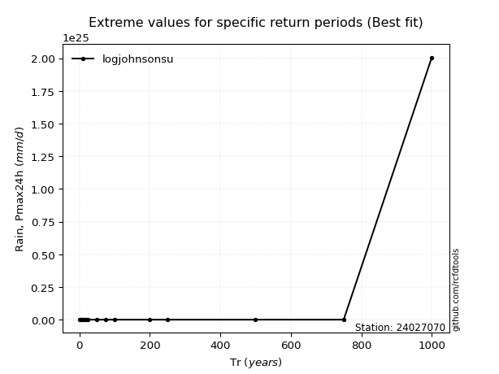</img>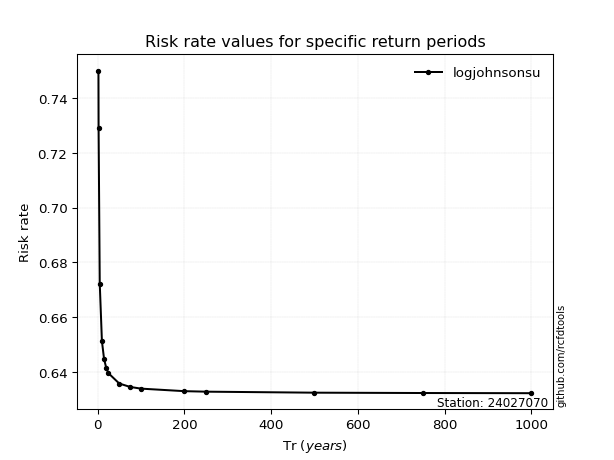</img>

</div>


<sub>**APP DISCLAIMER**: NO WARRANTY - This software is provided by [github.com/rcfdtools](https://github.com/rcfdtools) "as is", without any express or implied warranty, including warranties of merchantability, fitness for a particular purpose, or non-infringement. There is no guarantee that the software will be error-free or operate without interruption. LIMITATION OF LIABILITY - Neither the authors nor copyright holders will be liable for claims or damages arising from the software or its use. You are responsible for determining if the software is appropriate for your use and assume all associated risks, including errors, legal compliance, and data loss. NO PROFESSIONAL ADVICE - The software provides general information and does not offer professional advice. It should not replace consultation with professional advisors.</sub>