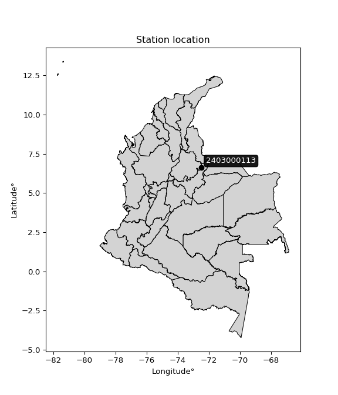

<div align="center">


</div>

# PMP Station (Rain, Pmax24h): 2403000113

Probable Maximum Precipitation (PMP) is the greatest amount of rainfall for a specific duration that is meteorologically possible for a given location, acting as a "worst-case" scenario for extreme storms, crucial for designing safety-critical infrastructure like bridges, river deviations, dams, spillways, and nuclear plants to prevent catastrophic failure. PMP is calculated by hydrologists using meteorological data to determine the upper limit of extreme rainfall, often leading to the Probable Maximum Flood (PMF) for flood control design, and is increasingly being studied for climate change impacts. Probable Maximum Precipitation (PMP) is the theoretical upper limit of rainfall, a deterministic estimate for extreme events, while probability distributions (like GEV, Gumbel) describe the likelihood and frequency of various precipitation amounts, including rare ones, showing how often events occur, with PMP representing the extreme end of these distributions, used for critical infrastructure design to ensure safety against the worst conceivable weather, unlike standard statistical forecasts which cover typical probabilities.

The most common probability distributions in hydrology, used for analyzing floods, rainfall, and streamflow, include the Normal, Log-Normal, Gumbel, Gamma (including Log-Pearson Type III), and Generalized Extreme Value (GEV) distributions, often chosen based on the data´s skewness and whether modeling extremes or general conditions, with Gumbel and GEV popular for extreme events like floods, while the Normal distribution serves as a baseline, though often requiring transformations for skewed hydrological data. These distributions help in designing water infrastructure, managing water resources, and forecasting hydrologic events.

> Hydrological data often isn´t perfectly normal (it´s skewed), so different distributions are needed for different applications, such as: **Flood Frequency Analysis**: Using Gumbel, GEV, or Log-Pearson Type III for predicting extreme flood magnitudes and their return periods, **Rainfall Analysis**: Normal for annual totals, but Log-Normal, Weibull, or GEV for intensity or extreme daily rainfall, **Streamflow Modeling**: Gamma and Log-Normal for maximum flows, GEV for minimum flows, and Kappa for daily flows.

<div align="center">

</img>

</div>


## A. General information


### 1. General running parameters

• app_version: _v20260113_. • runtime: _2026-01-17 18:24:04.630693_. • Python version: _3.14.0_. • SciPy version: _1.16.3_. • Pandas version: _2.3.3_. • NumPy version: _2.3.5_. • Stations dataset (station_dataset_file): _dataset/pmax24h_in/automatic_colombia_2003_2025.csv_. • Stations catalog (station_catalog_file): _dataset/CNE.xls_. • Minimum year to eval til year_max (date_min): _1900_. • Maximum year to eval since year_min (date_max): _2025_. • Creates, save and include plots into reports (create_plot): _False_. • Plot only fit distributions with Δo > Δ (plot_only_fit): _True_. • Plot only simple graphs avoiding multiple CDFs and multiple Extreme values plots (plot_only_simple): _True_. • Eval low extreme values, if False, evaluates high extreme values (low_extreme): _False_. • Eval every SciPy distribution as logarithmic (pdist_logarithmic_on): _True_. • Standard deviation normalized (ddof): _1.0_. • Return periods to eval in years (Tr): _[2, 2.33, 5, 10, 15, 20, 25, 50, 75, 100, 200, 250, 500, 750, 1000]_. • Minimum data sample per station, 0 means any (minimum_sample): _5_. • Z-Score maximum threshold to adjust a value, 0 means disable (zscore_max): _3.5_. • Z-Score minimum threshold to adjust a value, 0 means disable (zscore_min): _-2.5_. • Avoid zeros, e.g. rain = 0 (avoid_zeros): _True_. • Avoid null values (avoid_nans): _True_. 

:file_folder:Table: [dataset.csv](../../dataset/pmax24h_in/automatic_colombia_2003_2025.csv)

> Delta Degrees of Freedom (DDOF): is a parameter used in the formulas for calculating variance and standard deviation. When ddof=0, the divisor is $N$ (the total number of observations) and this is used when your data set is the entire population. When ddof=1, the divisor is $N-1$ and this is used when your data set is a sample drawn from a larger population. Using $N-1$ provides an unbiased estimate of the population variance (known as Bessel´s correction).


### 2. Station info and location

|   id |     CODIGO | NOMBRE                       | CATEGORIA     | TECNOLOGIA                | ESTADO   | FECHA_INSTALACION   |   FECHA_SUSPENSION |   ALTITUD |   LATITUD |   LONGITUD | DEPARTAMENTO   | MUNICIPIO   | AREA_OPERATIVA                              | ENTIDAD                                                     | AREA_HIDROGRAFICA   | ZONA_HIDROGRAFICA   | SUBZONA_HIDROGRAFICA   | CORRIENTE   | Catalogo   |   Version |
|-----:|-----------:|:-----------------------------|:--------------|:--------------------------|:---------|:--------------------|-------------------:|----------:|----------:|-----------:|:---------------|:------------|:--------------------------------------------|:------------------------------------------------------------|:--------------------|:--------------------|:-----------------------|:------------|:-----------|----------:|
|    0 | 2403000113 | LAS CAÑAS - AUT [2403000113] | Pluviométrica | Automática con Telemetría | Activa   | 22/07/2019          |                nan |      3343 |    6.6058 |   -72.4836 | Boyacá         | Chiscas     | Area Operativa 06 - Boyacá-Casanare-Vichada | INSTITUTO DE HIDROLOGIA METEOROLOGIA Y ESTUDIOS AMBIENTALES | Magdalena Cauca     | Sogamoso            | Río Chicamocha         | Cuscaneva   | CNE_IDEAM  |  20251226 |

<div align="center">

Dynamic map: [:earth_americas:Google](http://maps.google.com/maps?q=6.6058,-72.4836) [:earth_americas:OSM](https://www.openstreetmap.org/#map=18/6.6058/-72.4836&layers=P) [:earth_americas:Bing](https://www.bing.com/maps?cp=6.6058~-72.4836&lvl=18) [:earth_americas:Apple](https://maps.apple.com/frame?center=6.6058%2C-72.4836&span=0.003%2C0.006)

</div>


<div align="center">

```geojson
{
  "type": "Feature",
  "geometry": {
    "type": "Point", 
    "coordinates": [-72.4836, 6.6058]
  }, 
  "properties": {
    "Name": "2403000113"
  }
}
```

</div>


### 3. Discrete values table and plot

<div align="center">

|               |          0 |           1 |            2 |           3 |          4 |          5 |
|:--------------|-----------:|------------:|-------------:|------------:|-----------:|-----------:|
| Date          | 2020       | 2021        | 2022         | 2023        | 2024       | 2025       |
| Value         |    2.1     |    4.3      |    4.5       |    4.7      |    6.2     |    4.8     |
| Value_initial |    2.1     |    4.3      |    4.5       |    4.7      |    6.2     |    4.8     |
| count         |    6       |    6        |    6         |    6        |    6       |    6       |
| mean          |    4.43333 |    4.43333  |    4.43333   |    4.43333  |    4.43333 |    4.43333 |
| std           |    1.32615 |    1.32615  |    1.32615   |    1.32615  |    1.32615 |    1.32615 |
| zscore        |   -1.75948 |   -0.100542 |    0.0502709 |    0.201084 |    1.33218 |    0.27649 |


</div>


> The initial value (value_initial) correspond to the initial obtained or null completed value, and value (value) is adjusted only when the initial value is outside the valid range (outlier) definite through the Z-Score value. If Z-Score is active, values out of range or outliers are replaced with the station mean value. A Z-Score (or standard score) measures how many standard deviations a data point is from the mean of a dataset, indicating its relative position; positive scores mean above the mean, negative mean below, and a score of zero is exactly at the mean, allowing for comparison of values from different distributions. It´s calculated using the formula $z=(x–μ)/σ$, where $x$ is the data point, $μ$ is the mean, and $σ$ is the standard deviation, helping identify outliers and understand probability.
>
> <sub>**Note**: In this study, "completing" (filling gaps in) and "extending" (forecasting or lengthening the historical record) rainfall data series are avoided for certain critical analyses because they introduce artificial bias and uncertainty, which can distort the statistics of rare events (extremes), alter day-to-day variability, and compromise the integrity and homogeneity of the original data. Some reasons against Completing/Extending rainfall data are: **Distortion of Extremes and Variability**: The primary issue is that most gap-filling or extension methods rely on averaging or regression with nearby stations, which inherently smooths the data. Rainfall is highly variable in space and time, with a large percentage of zero values and occasional large storms. Infilling methods often underestimate the highest values and overestimate the lowest (zero) values, which severely distorts analyses focused on flood frequency, drought severity, and intensity-duration-frequency (IDF) curves, **Loss of Data Homogeneity**: Infilled or extended data are synthetic estimates, not actual measurements. Combining these estimates with observed data can violate the assumption of data homogeneity, which requires that the data properties do not change over time. Inhomogeneity can lead to incorrect conclusions about long-term trends or changes in climate patterns, **Propagation of Errors**: Errors and biases from the original data (e.g., wind-induced undercatch, instrument errors, site changes) or the data used for imputation can propagate through the analysis, leading to unreliable hydrological models and inaccurate predictions, **Compromised Statistical Integrity**: For statistical analyses, especially those involving the frequency of events, using artificial data can introduce time bias or autocorrelation that doesn´t exist in reality, making it difficult to assess the true probability of events, **Difficulty in Validation**: It is difficult to accurately validate the quality of filled or extended data, especially for past periods where ground-truth measurements are unavailable. The reliability of imputation techniques heavily depends on the density of the surrounding station network and the complexity of the local topography.</sub>


### 4. Active continuous probability distributions from SciPy (80 of 104 available)

A Probability Density Function (PDF) describes the relative likelihood of a continuous random variable falling within a specific range, where the total area under its curve equals 1, and the area over any interval gives the actual probability for that range. Unlike discrete probabilities (like rolling a die), a PDF shows density, not direct probability for a single point (which is zero), with higher points indicating higher likelihood, often visualized as a bell curve for normal distributions.

A log of a probability density function (log-PDF) is simply the logarithm of the PDF´s value, denoted as $log(f(x))$, useful for converting multiplication of probabilities into addition, improving numerical stability with tiny numbers, and connecting to information theory concepts like entropy. Instead of dealing with very small probabilities (e.g., 0.000001), log-PDFs use negative numbers (e.g., $log(0.00001) ≈ -11.51$ that are easier for computers to handle, preventing underflow errors and simplifying complex calculations. In this study, each active probability distribution from SciPy is also evaluated in the $log$ form.

[scipy.stats](https://docs.scipy.org/doc/scipy/reference/stats.html) is a Python´s powerful submodule within the SciPy library for comprehensive statistical analysis, offering over 130 probability distributions (like Normal, Poisson), functions for descriptive stats (mean, variance), hypothesis testing (t-tests, chi-square), random variable generation, and statistical tests, making it essential for data science, modeling, and research. It provides tools to explore, model, and draw conclusions from data efficiently, working seamlessly with NumPy.

<div align="center">

|   id | p_dist           |   n_parameter | fit_method   | label                                                                       | active   | ref                                                                                                      |
|-----:|:-----------------|--------------:|:-------------|:----------------------------------------------------------------------------|:---------|:---------------------------------------------------------------------------------------------------------|
|    0 | alpha            |             3 | MLE          | Alpha                                                                       | True     | [:mortar_board:](https://docs.scipy.org/doc/scipy/reference/generated/scipy.stats.alpha.html)            |
|    1 | anglit           |             2 | MM           | Anglit                                                                      | True     | [:mortar_board:](https://docs.scipy.org/doc/scipy/reference/generated/scipy.stats.anglit.html)           |
|    2 | arcsine          |             2 | MM           | Arcsine                                                                     | True     | [:mortar_board:](https://docs.scipy.org/doc/scipy/reference/generated/scipy.stats.arcsine.html)          |
|    3 | argus            |             3 | MLE          | Argus                                                                       | True     | [:mortar_board:](https://docs.scipy.org/doc/scipy/reference/generated/scipy.stats.argus.html)            |
|    4 | beta             |             4 | MLE          | Beta                                                                        | True     | [:mortar_board:](https://docs.scipy.org/doc/scipy/reference/generated/scipy.stats.beta.html)             |
|    5 | betaprime        |             4 | MLE          | Beta prime                                                                  | True     | [:mortar_board:](https://docs.scipy.org/doc/scipy/reference/generated/scipy.stats.betaprime.html)        |
|    6 | bradford         |             3 | MLE          | Bradford                                                                    | True     | [:mortar_board:](https://docs.scipy.org/doc/scipy/reference/generated/scipy.stats.bradford.html)         |
|    7 | burr             |             4 | MLE          | Burr (Type III)                                                             | True     | [:mortar_board:](https://docs.scipy.org/doc/scipy/reference/generated/scipy.stats.burr.html)             |
|    8 | burr12           |             4 | MLE          | Burr (Type III) 12                                                          | True     | [:mortar_board:](https://docs.scipy.org/doc/scipy/reference/generated/scipy.stats.burr12.html)           |
|    9 | cosine           |             2 | MLE          | Cosine                                                                      | True     | [:mortar_board:](https://docs.scipy.org/doc/scipy/reference/generated/scipy.stats.cosine.html)           |
|   10 | crystalball      |             4 | MLE          | Crystalball                                                                 | True     | [:mortar_board:](https://docs.scipy.org/doc/scipy/reference/generated/scipy.stats.crystalball.html)      |
|   11 | dgamma           |             3 | MLE          | Double gamma                                                                | True     | [:mortar_board:](https://docs.scipy.org/doc/scipy/reference/generated/scipy.stats.dgamma.html)           |
|   12 | dweibull         |             3 | MLE          | Double Weibull                                                              | True     | [:mortar_board:](https://docs.scipy.org/doc/scipy/reference/generated/scipy.stats.dweibull.html)         |
|   13 | erlang           |             3 | MLE          | Erlang                                                                      | True     | [:mortar_board:](https://docs.scipy.org/doc/scipy/reference/generated/scipy.stats.erlang.html)           |
|   14 | exponnorm        |             3 | MLE          | Exponentially modified Normal                                               | True     | [:mortar_board:](https://docs.scipy.org/doc/scipy/reference/generated/scipy.stats.exponnorm.html)        |
|   15 | exponpow         |             3 | MLE          | Exponential power                                                           | True     | [:mortar_board:](https://docs.scipy.org/doc/scipy/reference/generated/scipy.stats.exponpow.html)         |
|   16 | exponweib        |             4 | MLE          | Exponentiated Weibull                                                       | True     | [:mortar_board:](https://docs.scipy.org/doc/scipy/reference/generated/scipy.stats.exponweib.html)        |
|   17 | f                |             4 | MLE          | F                                                                           | True     | [:mortar_board:](https://docs.scipy.org/doc/scipy/reference/generated/scipy.stats.f.html)                |
|   18 | fatiguelife      |             3 | MLE          | Fatigue-life (Birnbaum-Saunders)                                            | True     | [:mortar_board:](https://docs.scipy.org/doc/scipy/reference/generated/scipy.stats.fatiguelife.html)      |
|   19 | foldnorm         |             3 | MM           | Fold Normal                                                                 | True     | [:mortar_board:](https://docs.scipy.org/doc/scipy/reference/generated/scipy.stats.foldnorm.html)         |
|   20 | gamma            |             3 | MLE          | Gamma                                                                       | True     | [:mortar_board:](https://docs.scipy.org/doc/scipy/reference/generated/scipy.stats.gamma.html)            |
|   21 | gausshyper       |             6 | MLE          | Gauss hypergeometric                                                        | True     | [:mortar_board:](https://docs.scipy.org/doc/scipy/reference/generated/scipy.stats.gausshyper.html)       |
|   22 | genexpon         |             5 | MLE          | Generalized exponential                                                     | True     | [:mortar_board:](https://docs.scipy.org/doc/scipy/reference/generated/scipy.stats.genexpon.html)         |
|   23 | genextreme       |             3 | MLE          | Generalized exponential                                                     | True     | [:mortar_board:](https://docs.scipy.org/doc/scipy/reference/generated/scipy.stats.genextreme.html)       |
|   24 | gengamma         |             4 | MLE          | Generalized gamma                                                           | True     | [:mortar_board:](https://docs.scipy.org/doc/scipy/reference/generated/scipy.stats.gengamma.html)         |
|   25 | genhalflogistic  |             3 | MLE          | Generalized half-logistic                                                   | True     | [:mortar_board:](https://docs.scipy.org/doc/scipy/reference/generated/scipy.stats.genhalflogistic.html)  |
|   26 | genlogistic      |             3 | MLE          | Generalized logistic                                                        | True     | [:mortar_board:](https://docs.scipy.org/doc/scipy/reference/generated/scipy.stats.genlogistic.html)      |
|   27 | gennorm          |             3 | MLE          | Generalized Normal                                                          | True     | [:mortar_board:](https://docs.scipy.org/doc/scipy/reference/generated/scipy.stats.gennorm.html)          |
|   28 | genpareto        |             3 | MLE          | Generalized Pareto                                                          | True     | [:mortar_board:](https://docs.scipy.org/doc/scipy/reference/generated/scipy.stats.genpareto.html)        |
|   29 | gompertz         |             3 | MLE          | Gompertz (or truncated Gumbel)                                              | True     | [:mortar_board:](https://docs.scipy.org/doc/scipy/reference/generated/scipy.stats.gompertz.html)         |
|   30 | gumbel_l         |             2 | MM           | Gumbel Left Skew                                                            | True     | [:mortar_board:](https://docs.scipy.org/doc/scipy/reference/generated/scipy.stats.gumbel_l.html)         |
|   31 | gumbel_r         |             2 | MM           | Gumbel Right Skew                                                           | True     | [:mortar_board:](https://docs.scipy.org/doc/scipy/reference/generated/scipy.stats.gumbel_r.html)         |
|   32 | halfgennorm      |             3 | MLE          | Upper half of a generalized normal                                          | True     | [:mortar_board:](https://docs.scipy.org/doc/scipy/reference/generated/scipy.stats.halfgennorm.html)      |
|   33 | halflogistic     |             2 | MM           | Half-logistic                                                               | True     | [:mortar_board:](https://docs.scipy.org/doc/scipy/reference/generated/scipy.stats.halflogistic.html)     |
|   34 | halfnorm         |             2 | MM           | Half Normal                                                                 | True     | [:mortar_board:](https://docs.scipy.org/doc/scipy/reference/generated/scipy.stats.halfnorm.html)         |
|   35 | hypsecant        |             2 | MM           | hyperbolic secant                                                           | True     | [:mortar_board:](https://docs.scipy.org/doc/scipy/reference/generated/scipy.stats.hypsecant.html)        |
|   36 | invgamma         |             3 | MLE          | Inverted gamma                                                              | True     | [:mortar_board:](https://docs.scipy.org/doc/scipy/reference/generated/scipy.stats.invgamma.html)         |
|   37 | invgauss         |             3 | MLE          | Inverse Gaussian                                                            | True     | [:mortar_board:](https://docs.scipy.org/doc/scipy/reference/generated/scipy.stats.invgauss.html)         |
|   38 | invweibull       |             3 | MLE          | Inverted Weibull                                                            | True     | [:mortar_board:](https://docs.scipy.org/doc/scipy/reference/generated/scipy.stats.invweibull.html)       |
|   39 | johnsonsb        |             4 | MLE          | Johnson SB                                                                  | True     | [:mortar_board:](https://docs.scipy.org/doc/scipy/reference/generated/scipy.stats.johnsonsb.html)        |
|   40 | johnsonsu        |             4 | MLE          | Johnson Su                                                                  | True     | [:mortar_board:](https://docs.scipy.org/doc/scipy/reference/generated/scipy.stats.johnsonsu.html)        |
|   41 | kappa3           |             3 | MLE          | Kappa 3                                                                     | True     | [:mortar_board:](https://docs.scipy.org/doc/scipy/reference/generated/scipy.stats.kappa3.html)           |
|   42 | kappa4           |             4 | MLE          | Kappa 4                                                                     | True     | [:mortar_board:](https://docs.scipy.org/doc/scipy/reference/generated/scipy.stats.kappa4.html)           |
|   43 | ksone            |             3 | MLE          | Kolmogorov-Smirnov one-sided test statistic distribution                    | True     | [:mortar_board:](https://docs.scipy.org/doc/scipy/reference/generated/scipy.stats.ksone.html)            |
|   44 | kstwobign        |             2 | MLE          | Limiting distribution of scaled Kolmogorov-Smirnov two-sided test statistic | True     | [:mortar_board:](https://docs.scipy.org/doc/scipy/reference/generated/scipy.stats.kstwobign.html)        |
|   45 | laplace          |             2 | MM           | Laplace                                                                     | True     | [:mortar_board:](https://docs.scipy.org/doc/scipy/reference/generated/scipy.stats.laplace.html)          |
|   46 | levy_l           |             2 | MLE          | Left-skewed Levy                                                            | True     | [:mortar_board:](https://docs.scipy.org/doc/scipy/reference/generated/scipy.stats.levy_l.html)           |
|   47 | loggamma         |             3 | MLE          | Log gamma                                                                   | True     | [:mortar_board:](https://docs.scipy.org/doc/scipy/reference/generated/scipy.stats.loggamma.html)         |
|   48 | logistic         |             2 | MM           | Logistic (or Sech-squared)                                                  | True     | [:mortar_board:](https://docs.scipy.org/doc/scipy/reference/generated/scipy.stats.logistic.html)         |
|   49 | loglaplace       |             3 | MLE          | Log-Laplace                                                                 | True     | [:mortar_board:](https://docs.scipy.org/doc/scipy/reference/generated/scipy.stats.loglaplace.html)       |
|   50 | lomax            |             3 | MLE          | Lomax (Pareto of the second kind)                                           | True     | [:mortar_board:](https://docs.scipy.org/doc/scipy/reference/generated/scipy.stats.lomax.html)            |
|   51 | maxwell          |             2 | MM           | Maxwell                                                                     | True     | [:mortar_board:](https://docs.scipy.org/doc/scipy/reference/generated/scipy.stats.maxwell.html)          |
|   52 | mielke           |             4 | MLE          | Mielke Beta-Kappa / Dagum                                                   | True     | [:mortar_board:](https://docs.scipy.org/doc/scipy/reference/generated/scipy.stats.mielke.html)           |
|   53 | moyal            |             2 | MM           | Moyal                                                                       | True     | [:mortar_board:](https://docs.scipy.org/doc/scipy/reference/generated/scipy.stats.moyal.html)            |
|   54 | nakagami         |             3 | MLE          | Nakagami                                                                    | True     | [:mortar_board:](https://docs.scipy.org/doc/scipy/reference/generated/scipy.stats.nakagami.html)         |
|   55 | ncf              |             5 | MLE          | Non-central F distribution                                                  | True     | [:mortar_board:](https://docs.scipy.org/doc/scipy/reference/generated/scipy.stats.ncf.html)              |
|   56 | nct              |             4 | MLE          | Non-central Student’s t                                                     | True     | [:mortar_board:](https://docs.scipy.org/doc/scipy/reference/generated/scipy.stats.nct.html)              |
|   57 | norm             |             2 | MM           | Normal                                                                      | True     | [:mortar_board:](https://docs.scipy.org/doc/scipy/reference/generated/scipy.stats.norm.html)             |
|   58 | pearson3         |             3 | MM           | Pearson type III                                                            | True     | [:mortar_board:](https://docs.scipy.org/doc/scipy/reference/generated/scipy.stats.pearson3.html)         |
|   59 | powerlaw         |             3 | MLE          | Power-function                                                              | True     | [:mortar_board:](https://docs.scipy.org/doc/scipy/reference/generated/scipy.stats.powerlaw.html)         |
|   60 | rayleigh         |             2 | MM           | Rayleigh                                                                    | True     | [:mortar_board:](https://docs.scipy.org/doc/scipy/reference/generated/scipy.stats.rayleigh.html)         |
|   61 | rdist            |             3 | MLE          | R-distributed (symmetric beta)                                              | True     | [:mortar_board:](https://docs.scipy.org/doc/scipy/reference/generated/scipy.stats.rdist.html)            |
|   62 | rice             |             3 | MLE          | Rice                                                                        | True     | [:mortar_board:](https://docs.scipy.org/doc/scipy/reference/generated/scipy.stats.rice.html)             |
|   63 | semicircular     |             2 | MM           | Semicircular                                                                | True     | [:mortar_board:](https://docs.scipy.org/doc/scipy/reference/generated/scipy.stats.semicircular.html)     |
|   64 | skewnorm         |             3 | MLE          | Skew normal                                                                 | True     | [:mortar_board:](https://docs.scipy.org/doc/scipy/reference/generated/scipy.stats.skewnorm.html)         |
|   65 | t                |             3 | MLE          | Student’s t                                                                 | True     | [:mortar_board:](https://docs.scipy.org/doc/scipy/reference/generated/scipy.stats.t.html)                |
|   66 | trapezoid        |             4 | MLE          | Trapezoid                                                                   | True     | [:mortar_board:](https://docs.scipy.org/doc/scipy/reference/generated/scipy.stats.trapezoid.html)        |
|   67 | triang           |             3 | MLE          | Triangular                                                                  | True     | [:mortar_board:](https://docs.scipy.org/doc/scipy/reference/generated/scipy.stats.triang.html)           |
|   68 | truncexpon       |             3 | MLE          | Truncated exponential                                                       | True     | [:mortar_board:](https://docs.scipy.org/doc/scipy/reference/generated/scipy.stats.truncexpon.html)       |
|   69 | truncnorm        |             4 | MLE          | Truncated normal                                                            | True     | [:mortar_board:](https://docs.scipy.org/doc/scipy/reference/generated/scipy.stats.truncnorm.html)        |
|   70 | truncpareto      |             4 | MLE          | Upper truncated Pareto                                                      | True     | [:mortar_board:](https://docs.scipy.org/doc/scipy/reference/generated/scipy.stats.truncpareto.html)      |
|   71 | truncweibull_min |             5 | MLE          | Doubly truncated Weibull minimum                                            | True     | [:mortar_board:](https://docs.scipy.org/doc/scipy/reference/generated/scipy.stats.truncweibull_min.html) |
|   72 | tukeylambda      |             3 | MLE          | Tukey-Lamdba                                                                | True     | [:mortar_board:](https://docs.scipy.org/doc/scipy/reference/generated/scipy.stats.tukeylambda.html)      |
|   73 | uniform          |             2 | MLE          | Uniform                                                                     | True     | [:mortar_board:](https://docs.scipy.org/doc/scipy/reference/generated/scipy.stats.uniform.html)          |
|   74 | vonmises         |             3 | MLE          | Von Mises                                                                   | True     | [:mortar_board:](https://docs.scipy.org/doc/scipy/reference/generated/scipy.stats.vonmises.html)         |
|   75 | vonmises_line    |             3 | MLE          | Von Mises line                                                              | True     | [:mortar_board:](https://docs.scipy.org/doc/scipy/reference/generated/scipy.stats.vonmises_line.html)    |
|   76 | wald             |             2 | MM           | Wald                                                                        | True     | [:mortar_board:](https://docs.scipy.org/doc/scipy/reference/generated/scipy.stats.wald.html)             |
|   77 | weibull_max      |             3 | MLE          | Weibull maximum                                                             | True     | [:mortar_board:](https://docs.scipy.org/doc/scipy/reference/generated/scipy.stats.weibull_max.html)      |
|   78 | weibull_min      |             3 | MLE          | Weibull minimum                                                             | True     | [:mortar_board:](https://docs.scipy.org/doc/scipy/reference/generated/scipy.stats.weibull_min.html)      |
|   79 | wrapcauchy       |             3 | MLE          | Wrapped  Cauchy                                                             | True     | [:mortar_board:](https://docs.scipy.org/doc/scipy/reference/generated/scipy.stats.wrapcauchy.html)       |

</div>

> **n_parameter:** # arguments & localization & scale.
>
> **Fit methods:** (MLE) maximum likelihood, (MM) L-moments.
>
>**Inactive** (With the only purpose of prevent loops, zero divisions, infinite values, over high estimated values or horizontal trending for recurrence intervals estimations, the follow distributions were disabled.)**:** lognorm, norminvgauss, powernorm, powerlognorm, cauchy, halfcauchy, foldcauchy, skewcauchy, chi2, expon, fisk, genhyperbolic, geninvgauss, gibrat, kstwo, laplace_asymmetric, levy, levy_stable, ncx2, pareto, rel_breitwigner, recipinvgauss, studentized_range, loguniform, 


## B. Probability (PDF) vs. Empirical (EDF) distributions functions

A continuous probability distribution (CPD) describes probabilities for variables that can take any value within a range (like rain any time), unlike discrete variables with specific outcomes (like temperature). It uses a Probability Density Function (PDF), a curve where the total area under it equals 1, and the probability of the variable falling within an interval (a to b) is found by calculating the area under the curve between those points. A key feature is that the probability of hitting any single exact value is zero, so probabilities are always expressed for ranges, e.g., $P(a ≤ X ≤ b)$.

<div align="center">

Distributions parameters from station values
|     |    station | p_dist              |   n |              loc |            scale | shape                  | shape1                 | shape2                 | shape3             |
|----:|-----------:|:--------------------|----:|-----------------:|-----------------:|:-----------------------|:-----------------------|:-----------------------|:-------------------|
|   0 | 2403000113 | alpha               |   6 |    -17.0254      |    350.661       | 16.41716900224141      |                        |                        |                    |
|   1 | 2403000113 | anglit              |   6 |      4.43333     |      3.54149     |                        |                        |                        |                    |
|   2 | 2403000113 | arcsine             |   6 |      2.72128     |      3.42411     |                        |                        |                        |                    |
|   3 | 2403000113 | argus               |   6 |      1.18761     |      5.21544     | 1.083880301070141      |                        |                        |                    |
|   4 | 2403000113 | beta                |   6 |     -1.83259     |      8.03259     | 3.1106840489631242     | 0.6762117440556336     |                        |                    |
|   5 | 2403000113 | betaprime           |   6 |    -26.7448      |    237.847       | 724.5203158681852      | 5528.648448689586      |                        |                    |
|   6 | 2403000113 | bradford            |   6 |      2.09993     |      4.10013     | 1.0087253890608054     |                        |                        |                    |
|   7 | 2403000113 | burr                |   6 |  -2403.03        |   2408.07        | 5186.79791734502       | 0.5104369278545771     |                        |                    |
|   8 | 2403000113 | burr12              |   6 |     -6.28781     |     22.9415      | 10.818461546697797     | 2259.941893799365      |                        |                    |
|   9 | 2403000113 | cosine              |   6 |      4.31605     |      1.05893     |                        |                        |                        |                    |
|  10 | 2403000113 | crystalball         |   6 |      4.43333     |      1.21061     | 28.078834855210584     | 1.0005683985129064     |                        |                    |
|  11 | 2403000113 | dgamma              |   6 |      4.7         |      0.924676    | 0.7878043410072479     |                        |                        |                    |
|  12 | 2403000113 | dweibull            |   6 |      4.7         |      0.913718    | 0.7988348120863249     |                        |                        |                    |
|  13 | 2403000113 | erlang              |   6 |    -17.0407      |      0.0714335   | 300.40331049617146     |                        |                        |                    |
|  14 | 2403000113 | exponnorm           |   6 |      4.43232     |      1.2106      | 0.0008410589000517542  |                        |                        |                    |
|  15 | 2403000113 | exponpow            |   6 |      2.1         |      1.38459     | 0.32487752725941665    |                        |                        |                    |
|  16 | 2403000113 | exponweib           |   6 |      2.1         |      1.11128     | 0.9901525580092257     | 0.614146054530389      |                        |                    |
|  17 | 2403000113 | f                   |   6 |  -1024.81        |   1029.25        | 4975804.395269053      | 2020100.3626955068     |                        |                    |
|  18 | 2403000113 | fatiguelife         |   6 |   -444.909       |    449.336       | 0.002687012515817885   |                        |                        |                    |
|  19 | 2403000113 | foldnorm            |   6 |      2.71116     |      1.31036     | 1.2192924794335214     |                        |                        |                    |
|  20 | 2403000113 | gamma               |   6 |    -15.242       |      0.0799865   | 245.94470512376773     |                        |                        |                    |
|  21 | 2403000113 | gausshyper          |   6 |      1.99455     |      4.20545     | 1.2646841729847802     | 0.711023276670893      | 1.0195871274024704     | 0.8273789923661451 |
|  22 | 2403000113 | genexpon            |   6 |      2.09981     |      0.0211487   | 0.0033228894796952673  | 2.598205246303882      | 3.129490047612387e-05  |                    |
|  23 | 2403000113 | genextreme          |   6 |      4.18657     |      1.34464     | 0.5745118780122738     |                        |                        |                    |
|  24 | 2403000113 | gengamma            |   6 |      2.1         |      1.10234     | 1.0100235740477612     | 0.6188655852897129     |                        |                    |
|  25 | 2403000113 | genhalflogistic     |   6 |      1.76078     |      4.71269     | 1.0616023940583035     |                        |                        |                    |
|  26 | 2403000113 | genlogistic         |   6 |      5.04138     |      0.464442    | 0.5108627556483989     |                        |                        |                    |
|  27 | 2403000113 | gennorm             |   6 |      4.7         |      0.000556383 | 0.23736146228425098    |                        |                        |                    |
|  28 | 2403000113 | genpareto           |   6 |     -0.0128838   |     12.4594      | -2.0054122188184405    |                        |                        |                    |
|  29 | 2403000113 | gompertz            |   6 |      2.1         |      1.2501      | 0.11793353124787964    |                        |                        |                    |
|  30 | 2403000113 | gumbel_l            |   6 |      4.97817     |      0.943902    |                        |                        |                        |                    |
|  31 | 2403000113 | gumbel_r            |   6 |      3.8885      |      0.943902    |                        |                        |                        |                    |
|  32 | 2403000113 | halfgennorm         |   6 |      2.1         |      1.06382     | 0.6607325981253231     |                        |                        |                    |
|  33 | 2403000113 | halflogistic        |   6 |      2.99847     |      1.03504     |                        |                        |                        |                    |
|  34 | 2403000113 | halfnorm            |   6 |      2.83099     |      2.00824     |                        |                        |                        |                    |
|  35 | 2403000113 | hypsecant           |   6 |      4.43333     |      0.770693    |                        |                        |                        |                    |
|  36 | 2403000113 | invgamma            |   6 |    -18.3283      |   7651.88        | 337.3171257298079      |                        |                        |                    |
|  37 | 2403000113 | invgauss            |   6 |     -7.2212      |    927.338       | 0.012531461962518795   |                        |                        |                    |
|  38 | 2403000113 | invweibull          |   6 |     -7.59942e+07 |      7.59942e+07 | 57765847.02709593      |                        |                        |                    |
|  39 | 2403000113 | johnsonsb           |   6 |      2.1         |      4.1         | -0.20594922960424666   | 0.2271203190557261     |                        |                    |
|  40 | 2403000113 | johnsonsu           |   6 |      4.67668     |      0.151804    | 0.18525290629512922    | 0.49147938998625196    |                        |                    |
|  41 | 2403000113 | kappa3              |   6 |      2.1         |      4.09735     | 2772.8888065730844     |                        |                        |                    |
|  42 | 2403000113 | kappa4              |   6 |      1.65415     |      4.57755     | 1.107948694197125      | 1.006670198265474      |                        |                    |
|  43 | 2403000113 | ksone               |   6 |      1.69        |      4.92        | 1.0                    |                        |                        |                    |
|  44 | 2403000113 | kstwobign           |   6 |     -0.895202    |      6.0943      |                        |                        |                        |                    |
|  45 | 2403000113 | laplace             |   6 |      4.43333     |      0.856024    |                        |                        |                        |                    |
|  46 | 2403000113 | levy_l              |   6 |      6.3794      |      0.74535     |                        |                        |                        |                    |
|  47 | 2403000113 | loggamma            |   6 |      3.92054     |      1.46239     | 1.891978693453297      |                        |                        |                    |
|  48 | 2403000113 | logistic            |   6 |      4.43333     |      0.667439    |                        |                        |                        |                    |
|  49 | 2403000113 | loglaplace          |   6 |     -0.015011    |      4.51501     | 4.871387730967975      |                        |                        |                    |
|  50 | 2403000113 | lomax               |   6 |      2.1         |      1.76763e+08 | 74816218.2872665       |                        |                        |                    |
|  51 | 2403000113 | maxwell             |   6 |      1.56472     |      1.79764     |                        |                        |                        |                    |
|  52 | 2403000113 | mielke              |   6 | -14200.2         |  14205.3         | 15621.865342400932     | 30582.978859184725     |                        |                    |
|  53 | 2403000113 | moyal               |   6 |      3.74103     |      0.544962    |                        |                        |                        |                    |
|  54 | 2403000113 | nakagami            |   6 |      4.3         |      1.1404      | 0.20611946859654276    |                        |                        |                    |
|  55 | 2403000113 | ncf                 |   6 |    -11.798       |     12.3978      | 320.9099700892711      | 9944.005737533444      | 100.62611476259036     |                    |
|  56 | 2403000113 | nct                 |   6 |    -81.8862      |      1.17453     | 41270.520235931384     | 73.49088030774803      |                        |                    |
|  57 | 2403000113 | norm                |   6 |      4.43333     |      1.2106      |                        |                        |                        |                    |
|  58 | 2403000113 | pearson3            |   6 |      4.43333     |      1.2106      | -0.6691571434226087    |                        |                        |                    |
|  59 | 2403000113 | powerlaw            |   6 |      2.1         |      4.1         | 0.15466806884211579    |                        |                        |                    |
|  60 | 2403000113 | rayleigh            |   6 |      2.11736     |      1.84788     |                        |                        |                        |                    |
|  61 | 2403000113 | rdist               |   6 |      2.91135     |      1.88865     | 1.1773944988059144     |                        |                        |                    |
|  62 | 2403000113 | rice                |   6 |      1.23919     |      1.3037      | 2.205684584899987      |                        |                        |                    |
|  63 | 2403000113 | semicircular        |   6 |      4.43333     |      2.4212      |                        |                        |                        |                    |
|  64 | 2403000113 | skewnorm            |   6 |      5.69359     |      1.74752     | -2.303604119823018     |                        |                        |                    |
|  65 | 2403000113 | t                   |   6 |      4.43338     |      1.21053     | 16912.1590345829       |                        |                        |                    |
|  66 | 2403000113 | trapezoid           |   6 |      1.69        |      4.92        | 1.0                    | 1.0                    |                        |                    |
|  67 | 2403000113 | triang              |   6 |      1.10262     |      5.09739     | 0.9999999973279183     |                        |                        |                    |
|  68 | 2403000113 | truncexpon          |   6 |      2.1         |      5.53008     | 0.7414005693827457     |                        |                        |                    |
|  69 | 2403000113 | truncnorm           |   6 |      4.32366     |      1.17759     | -1.8883322566270735    | 58.6682387859193       |                        |                    |
|  70 | 2403000113 | truncpareto         |   6 |      2.0925      |      0.00749744  | 0.20336468901440172    | 547.8535279059029      |                        |                    |
|  71 | 2403000113 | truncweibull_min    |   6 |      2.02634     |      6.71886     | 1.1326846797200654     | 1.5160479151316684e-09 | 0.6211857935248943     |                    |
|  72 | 2403000113 | tukeylambda         |   6 |      3.46176     |      1.59118     | 1.1684676876825009     |                        |                        |                    |
|  73 | 2403000113 | uniform             |   6 |      2.1         |      4.1         |                        |                        |                        |                    |
|  74 | 2403000113 | vonmises            |   6 |     -1.5852      |      1           | 1.218029368901475      |                        |                        |                    |
|  75 | 2403000113 | vonmises_line       |   6 |      4.14999     |      0.652537    | 0.3522857481458912     |                        |                        |                    |
|  76 | 2403000113 | wald                |   6 |      3.2227      |      1.21062     |                        |                        |                        |                    |
|  77 | 2403000113 | weibull_max         |   6 |      6.2         |      1.4495      | 0.7240308478288182     |                        |                        |                    |
|  78 | 2403000113 | weibull_min         |   6 |     -6.26516     |     11.2129      | 10.793291581468022     |                        |                        |                    |
|  79 | 2403000113 | wrapcauchy          |   6 |      2.0999      |      0.656157    | 3.633161155638855e-05  |                        |                        |                    |
|  80 | 2403000113 | logalpha            |   6 |    -12.7069      |    582.33        | 41.18359900971815      |                        |                        |                    |
|  81 | 2403000113 | loganglit           |   6 |      1.44089     |      0.97591     |                        |                        |                        |                    |
|  82 | 2403000113 | logarcsine          |   6 |      0.969117    |      0.943552    |                        |                        |                        |                    |
|  83 | 2403000113 | logargus            |   6 |      0.349266    |      1.50764     | 2.212141114537665      |                        |                        |                    |
|  84 | 2403000113 | logbeta             |   6 |     -0.676265    |      2.50081     | 6.122708118672457      | 0.8184770790053022     |                        |                    |
|  85 | 2403000113 | logbetaprime        |   6 |     -6.41026     |     11.6301      | 813.2206513339752      | 1206.2320317397139     |                        |                    |
|  86 | 2403000113 | logbradford         |   6 |      0.728406    |      1.09615     | 0.00038655082675527594 |                        |                        |                    |
|  87 | 2403000113 | logburr             |   6 |     -4.41599e+07 |      4.41599e+07 | 613151007.671237       | 0.25485250769746226    |                        |                    |
|  88 | 2403000113 | logburr12           |   6 |   -507.874       |    512.161       | 2243.222539217503      | 143248.00374529074     |                        |                    |
|  89 | 2403000113 | logcosine           |   6 |      1.38163     |      0.294889    |                        |                        |                        |                    |
|  90 | 2403000113 | logcrystalball      |   6 |      1.44089     |      0.333599    | 2430.2403846281536     | 44.64378394726606      |                        |                    |
|  91 | 2403000113 | logdgamma           |   6 |      1.54756     |      0.238221    | 0.7146975189836289     |                        |                        |                    |
|  92 | 2403000113 | logdweibull         |   6 |      1.54756     |      0.235422    | 0.4652985736577656     |                        |                        |                    |
|  93 | 2403000113 | logerlang           |   6 |      0.741937    |      1.09035     | 0.7824436990494136     |                        |                        |                    |
|  94 | 2403000113 | logexponnorm        |   6 |      1.44066     |      0.3336      | 0.0006875093376782191  |                        |                        |                    |
|  95 | 2403000113 | logexponpow         |   6 |    -89.0238      |     90.7401      | 293.8593561693965      |                        |                        |                    |
|  96 | 2403000113 | logexponweib        |   6 |   -676.879       |    678.59        | 0.4452376531972504     | 5055.495297700838      |                        |                    |
|  97 | 2403000113 | logf                |   6 |   -540.478       |    541.918       | 16233336.505273297     | 7769761.763603684      |                        |                    |
|  98 | 2403000113 | logfatiguelife      |   6 |   -222.229       |    223.668       | 0.0014882399907367315  |                        |                        |                    |
|  99 | 2403000113 | logfoldnorm         |   6 |     -0.606407    |      0.310072    | 6.613369217928503      |                        |                        |                    |
| 100 | 2403000113 | loggamma            |   6 |      0.741937    |      1.17964     | 0.41056749325838754    |                        |                        |                    |
| 101 | 2403000113 | loggausshyper       |   6 |      0.738244    |      1.0863      | 1.0863452684846422     | 0.7507285363164267     | 1.078528557267425      | 0.959837392024519  |
| 102 | 2403000113 | loggenexpon         |   6 |      0.724004    |      0.00521941  | 0.002292684205717394   | 2.181407421749281      | 2.7505885603344092e-05 |                    |
| 103 | 2403000113 | loggenextreme       |   6 |      1.44542     |      0.399082    | 1.052634185232275      |                        |                        |                    |
| 104 | 2403000113 | loggengamma         |   6 |    -19.183       |     12.278       | 63.61333498906705      | 7.995049078445036      |                        |                    |
| 105 | 2403000113 | loggenhalflogistic  |   6 |      0.693162    |      1.18907     | 1.0509875095987682     |                        |                        |                    |
| 106 | 2403000113 | loggenlogistic      |   6 |      1.68272     |      0.0811768   | 0.29497518654281596    |                        |                        |                    |
| 107 | 2403000113 | loggennorm          |   6 |      1.54756     |      0.00487212  | 0.3553545879990538     |                        |                        |                    |
| 108 | 2403000113 | loggenpareto        |   6 |      0.00212208  |      2.25326     | -1.2364033532295813    |                        |                        |                    |
| 109 | 2403000113 | loggompertz         |   6 |      0.741936    |      0.249636    | 0.03681133322523535    |                        |                        |                    |
| 110 | 2403000113 | loggumbel_l         |   6 |      1.59103     |      0.260106    |                        |                        |                        |                    |
| 111 | 2403000113 | loggumbel_r         |   6 |      1.29076     |      0.260106    |                        |                        |                        |                    |
| 112 | 2403000113 | loghalfgennorm      |   6 |      0.741937    |      1.08262     | 2897272.0083293896     |                        |                        |                    |
| 113 | 2403000113 | loghalflogistic     |   6 |      1.04547     |      0.285231    |                        |                        |                        |                    |
| 114 | 2403000113 | loghalfnorm         |   6 |      0.999307    |      0.553441    |                        |                        |                        |                    |
| 115 | 2403000113 | loghypsecant        |   6 |      1.44089     |      0.212376    |                        |                        |                        |                    |
| 116 | 2403000113 | loginvgamma         |   6 |     -6.44677     |   4078.45        | 518.1147391994241      |                        |                        |                    |
| 117 | 2403000113 | loginvgauss         |   6 |     -2.33936     |    403.419       | 0.009356982507737265   |                        |                        |                    |
| 118 | 2403000113 | loginvweibull       |   6 |     -5.19906e+07 |      5.19906e+07 | 132729009.07724696     |                        |                        |                    |
| 119 | 2403000113 | logjohnsonsb        |   6 |      0.547586    |      1.27696     | -0.016342853239549385  | 0.12600299861452846    |                        |                    |
| 120 | 2403000113 | logjohnsonsu        |   6 |      1.54976     |      0.0248179   | 0.28201471371256426    | 0.43987573558212945    |                        |                    |
| 121 | 2403000113 | logkappa3           |   6 |      0.741937    |      1.08261     | 3113037.8781319186     |                        |                        |                    |
| 122 | 2403000113 | logkappa4           |   6 |      0.646662    |      1.20057     | 1.0862540483703285     | 1.014426993093464      |                        |                    |
| 123 | 2403000113 | logksone            |   6 |      0.633676    |      1.29913     | 1.0                    |                        |                        |                    |
| 124 | 2403000113 | logkstwobign        |   6 |     -0.139994    |      1.80621     |                        |                        |                        |                    |
| 125 | 2403000113 | loglaplace          |   6 |      1.44089     |      0.23589     |                        |                        |                        |                    |
| 126 | 2403000113 | loglevy_l           |   6 |      1.8592      |      0.143781    |                        |                        |                        |                    |
| 127 | 2403000113 | logloggamma         |   6 |      1.74569     |      0.128964    | 0.4289482772488953     |                        |                        |                    |
| 128 | 2403000113 | loglogistic         |   6 |      1.44089     |      0.183923    |                        |                        |                        |                    |
| 129 | 2403000113 | logloglaplace       |   6 |     -0.012941    |      1.5605      | 6.019728998808393      |                        |                        |                    |
| 130 | 2403000113 | loglomax            |   6 |      0.741936    | 729289           | 569525.0142033349      |                        |                        |                    |
| 131 | 2403000113 | logmaxwell          |   6 |      0.650404    |      0.495366    |                        |                        |                        |                    |
| 132 | 2403000113 | logmielke           |   6 |     -1.2612e+07  |      1.2612e+07  | 44858104.37898857      | 159440597.33821243     |                        |                    |
| 133 | 2403000113 | logmoyal            |   6 |      1.25012     |      0.150172    |                        |                        |                        |                    |
| 134 | 2403000113 | lognakagami         |   6 |      1.45862     |      0.146678    | 0.12279108500824065    |                        |                        |                    |
| 135 | 2403000113 | logncf              |   6 |     -7.31948     |      5.83575     | 1349.781865521306      | 6589.288117846274      | 677.3975526827253      |                    |
| 136 | 2403000113 | lognct              |   6 |     19.0487      |      0.317364    | 15990.950736503843     | -55.4787598963036      |                        |                    |
| 137 | 2403000113 | lognorm             |   6 |      1.44089     |      0.333599    |                        |                        |                        |                    |
| 138 | 2403000113 | logpearson3         |   6 |      1.44089     |      0.333599    | -1.2634979258158547    |                        |                        |                    |
| 139 | 2403000113 | logpowerlaw         |   6 |      0.741937    |      1.08261     | 0.1572948903797957     |                        |                        |                    |
| 140 | 2403000113 | lograyleigh         |   6 |      0.802696    |      0.509208    |                        |                        |                        |                    |
| 141 | 2403000113 | logrdist            |   6 |      1.6386      |      0.185947    | 1.6082718332424677     |                        |                        |                    |
| 142 | 2403000113 | logrice             |   6 |   -160.716       |      0.333626    | 486.043229256951       |                        |                        |                    |
| 143 | 2403000113 | logsemicircular     |   6 |      1.44089     |      0.66725     |                        |                        |                        |                    |
| 144 | 2403000113 | logskewnorm         |   6 |      1.82455     |      0.508407    | -44471006.05719704     |                        |                        |                    |
| 145 | 2403000113 | logt                |   6 |      1.53117     |      0.0548719   | 0.7746054845460888     |                        |                        |                    |
| 146 | 2403000113 | logtrapezoid        |   6 |      0.497333    |      1.41534     | 1.0                    | 1.0                    |                        |                    |
| 147 | 2403000113 | logtriang           |   6 |      0.513056    |      1.3115      | 0.9999973961338761     |                        |                        |                    |
| 148 | 2403000113 | logtruncexpon       |   6 |      0.741934    |      1.31925     | 0.8206363925905023     |                        |                        |                    |
| 149 | 2403000113 | logtruncnorm        |   6 |     -0.09593     |      1.55584     | 0.9989989084580168     | 1.2343700489113085     |                        |                    |
| 150 | 2403000113 | logtruncpareto      |   6 |      0.739662    |      0.0022754   | 0.2033212296844554     | 476.78878017282983     |                        |                    |
| 151 | 2403000113 | logtruncweibull_min |   6 |      0.73944     |      1.69292     | 0.9550385037619822     | 0.0014723815871728221  | 0.6409682062852934     |                    |
| 152 | 2403000113 | logtukeylambda      |   6 |      1.64158     |      0.256542    | 1.4021217075166459     |                        |                        |                    |
| 153 | 2403000113 | loguniform          |   6 |      0.741937    |      1.08261     |                        |                        |                        |                    |
| 154 | 2403000113 | logvonmises         |   6 |      1.44893     |      1           | 9.562119766253234      |                        |                        |                    |
| 155 | 2403000113 | logvonmises_line    |   6 |      1.49523     |      0.239782    | 1.1171765205799074     |                        |                        |                    |
| 156 | 2403000113 | logwald             |   6 |      1.10733     |      0.33357     |                        |                        |                        |                    |
| 157 | 2403000113 | logweibull_max      |   6 |      1.82455     |      0.161804    | 0.535787263975833      |                        |                        |                    |
| 158 | 2403000113 | logweibull_min      |   6 |     -1.44893e+07 |      1.44893e+07 | 65871006.450138226     |                        |                        |                    |
| 159 | 2403000113 | logwrapcauchy       |   6 |      0.741937    |      0.172303    | 0.18547363929615784    |                        |                        |                    |

</div>

> **loc** (Location parameter): This shifts the distribution along the x-axis. For many common distributions, like the normal (Gaussian) distribution, loc represents the mean $μ$. For others, like the uniform distribution, it might represent the minimum value, or for the beta distribution, the left end of the support interval.
>
> **scale** (Scale parameter): This determines the width or spread of the distribution. For the normal distribution, scale represents the standard deviation $σ$. For a uniform distribution, it defines the length of the interval (from $loc$ to $loc + scale$).
>
> **shape** (Shape parameters): Refers to parameters that define the specific form of a probability distribution, distinct from its location (loc) and scale (scale). These parameters are required arguments for most distribution functions. For example, a normal (Gaussian) distribution is fully defined by its location (mean) and scale (standard deviation), so it has no specific shape parameters beyond loc and scale. However, other distributions have intrinsic properties that need specification, as Gamma distribution that takes a shape parameter, often named $a$ or $alpha$.


### 0. Cumulative distribution values - CDF (160 evaluated)

Cumulative Distribution Function (CDF), denoted as $F$<sub>$X$</sub>$(x)$, is a function that gives the probability that a random variable $X$ will take a value less than or equal to a specific value, $x$ (i.e., $(P(X≥x)$. It essentially "accumulates" probabilities from a given point up to the far right (positive infinity), providing a complete picture of the distribution´s probabilities for both discrete (like rain) and continuous (like temperature) variables, helping to find probabilities over ranges or above certain values. Each station is evaluated separately ordering the $x$ values ascending, calculating the CDF and PDF values for the activated distributions and their logarithmic forms.

<div align="center">

CDF ordered by x ascending and calculating $log(f(x))$ separately
|   id |    Station |   date |   x |   count |    mean |     std |     zscore |   Value_initial |    station |   m |     alpha |   alpha_pdf |    anglit |   anglit_pdf |   arcsine |   arcsine_pdf |     argus |   argus_pdf |      beta |      beta_pdf |   betaprime |   betaprime_pdf |    bradford |   bradford_pdf |      burr |   burr_pdf |    burr12 |   burr12_pdf |   cosine |   cosine_pdf |   crystalball |   crystalball_pdf |    dgamma |   dgamma_pdf |   dweibull |   dweibull_pdf |    erlang |   erlang_pdf |   exponnorm |   exponnorm_pdf |    exponpow |   exponpow_pdf |   exponweib |   exponweib_pdf |         f |     f_pdf |   fatiguelife |   fatiguelife_pdf |   foldnorm |   foldnorm_pdf |     gamma |   gamma_pdf |   gausshyper |   gausshyper_pdf |    genexpon |   genexpon_pdf |   genextreme |   genextreme_pdf |    gengamma |   gengamma_pdf |   genhalflogistic |   genhalflogistic_pdf |   genlogistic |   genlogistic_pdf |   gennorm |   gennorm_pdf |   genpareto |   genpareto_pdf |   gompertz |   gompertz_pdf |   gumbel_l |   gumbel_l_pdf |   gumbel_r |   gumbel_r_pdf |   halfgennorm |   halfgennorm_pdf |   halflogistic |   halflogistic_pdf |   halfnorm |   halfnorm_pdf |   hypsecant |   hypsecant_pdf |   invgamma |   invgamma_pdf |   invgauss |   invgauss_pdf |   invweibull |   invweibull_pdf |   johnsonsb |   johnsonsb_pdf |   johnsonsu |   johnsonsu_pdf |      kappa3 |   kappa3_pdf |      kappa4 |   kappa4_pdf |     ksone |   ksone_pdf |   kstwobign |   kstwobign_pdf |   laplace |   laplace_pdf |   levy_l |   levy_l_pdf |    loggamma |   loggamma_pdf |   logistic |   logistic_pdf |   loglaplace |   loglaplace_pdf |       lomax |   lomax_pdf |    maxwell |   maxwell_pdf |    mielke |   mielke_pdf |       moyal |   moyal_pdf |    nakagami |   nakagami_pdf |       ncf |   ncf_pdf |       nct |   nct_pdf |      norm |   norm_pdf |   pearson3 |   pearson3_pdf |   powerlaw |   powerlaw_pdf |   rayleigh |   rayleigh_pdf |    rdist |     rdist_pdf |      rice |   rice_pdf |   semicircular |   semicircular_pdf |   skewnorm |   skewnorm_pdf |         t |     t_pdf |   trapezoid |   trapezoid_pdf |    triang |   triang_pdf |   truncexpon |   truncexpon_pdf |   truncnorm |   truncnorm_pdf |   truncpareto |   truncpareto_pdf |   truncweibull_min |   truncweibull_min_pdf |   tukeylambda |   tukeylambda_pdf |   uniform |   uniform_pdf |   vonmises |   vonmises_pdf |   vonmises_line |   vonmises_line_pdf |     wald |   wald_pdf |   weibull_max |   weibull_max_pdf |   weibull_min |   weibull_min_pdf |   wrapcauchy |   wrapcauchy_pdf |   logalpha |   logalpha_pdf |   loganglit |   loganglit_pdf |   logarcsine |   logarcsine_pdf |   logargus |   logargus_pdf |   logbeta |   logbeta_pdf |   logbetaprime |   logbetaprime_pdf |   logbradford |   logbradford_pdf |   logburr |   logburr_pdf |   logburr12 |   logburr12_pdf |   logcosine |   logcosine_pdf |   logcrystalball |   logcrystalball_pdf |   logdgamma |   logdgamma_pdf |   logdweibull |   logdweibull_pdf |   logerlang |   logerlang_pdf |   logexponnorm |   logexponnorm_pdf |   logexponpow |   logexponpow_pdf |   logexponweib |   logexponweib_pdf |      logf |   logf_pdf |   logfatiguelife |   logfatiguelife_pdf |   logfoldnorm |   logfoldnorm_pdf |   loggausshyper |   loggausshyper_pdf |   loggenexpon |   loggenexpon_pdf |   loggenextreme |   loggenextreme_pdf |   loggengamma |   loggengamma_pdf |   loggenhalflogistic |   loggenhalflogistic_pdf |   loggenlogistic |   loggenlogistic_pdf |   loggennorm |   loggennorm_pdf |   loggenpareto |   loggenpareto_pdf |   loggompertz |   loggompertz_pdf |   loggumbel_l |   loggumbel_l_pdf |   loggumbel_r |   loggumbel_r_pdf |   loghalfgennorm |   loghalfgennorm_pdf |   loghalflogistic |   loghalflogistic_pdf |   loghalfnorm |   loghalfnorm_pdf |   loghypsecant |   loghypsecant_pdf |   loginvgamma |   loginvgamma_pdf |   loginvgauss |   loginvgauss_pdf |   loginvweibull |   loginvweibull_pdf |   logjohnsonsb |   logjohnsonsb_pdf |   logjohnsonsu |   logjohnsonsu_pdf |   logkappa3 |   logkappa3_pdf |   logkappa4 |   logkappa4_pdf |   logksone |   logksone_pdf |   logkstwobign |   logkstwobign_pdf |   loglevy_l |   loglevy_l_pdf |   logloggamma |   logloggamma_pdf |   loglogistic |   loglogistic_pdf |   logloglaplace |   logloglaplace_pdf |    loglomax |   loglomax_pdf |   logmaxwell |   logmaxwell_pdf |   logmielke |   logmielke_pdf |    logmoyal |   logmoyal_pdf |   lognakagami |   lognakagami_pdf |    logncf |   logncf_pdf |    lognct |   lognct_pdf |   lognorm |   lognorm_pdf |   logpearson3 |   logpearson3_pdf |   logpowerlaw |   logpowerlaw_pdf |   lograyleigh |   lograyleigh_pdf |   logrdist |   logrdist_pdf |   logrice |   logrice_pdf |   logsemicircular |   logsemicircular_pdf |   logskewnorm |   logskewnorm_pdf |      logt |   logt_pdf |   logtrapezoid |   logtrapezoid_pdf |   logtriang |   logtriang_pdf |   logtruncexpon |   logtruncexpon_pdf |   logtruncnorm |   logtruncnorm_pdf |   logtruncpareto |   logtruncpareto_pdf |   logtruncweibull_min |   logtruncweibull_min_pdf |   logtukeylambda |   logtukeylambda_pdf |   loguniform |   loguniform_pdf |   logvonmises |   logvonmises_pdf |   logvonmises_line |   logvonmises_line_pdf |   logwald |   logwald_pdf |   logweibull_max |   logweibull_max_pdf |   logweibull_min |   logweibull_min_pdf |   logwrapcauchy |   logwrapcauchy_pdf |
|-----:|-----------:|-------:|----:|--------:|--------:|--------:|-----------:|----------------:|-----------:|----:|----------:|------------:|----------:|-------------:|----------:|--------------:|----------:|------------:|----------:|--------------:|------------:|----------------:|------------:|---------------:|----------:|-----------:|----------:|-------------:|---------:|-------------:|--------------:|------------------:|----------:|-------------:|-----------:|---------------:|----------:|-------------:|------------:|----------------:|------------:|---------------:|------------:|----------------:|----------:|----------:|--------------:|------------------:|-----------:|---------------:|----------:|------------:|-------------:|-----------------:|------------:|---------------:|-------------:|-----------------:|------------:|---------------:|------------------:|----------------------:|--------------:|------------------:|----------:|--------------:|------------:|----------------:|-----------:|---------------:|-----------:|---------------:|-----------:|---------------:|--------------:|------------------:|---------------:|-------------------:|-----------:|---------------:|------------:|----------------:|-----------:|---------------:|-----------:|---------------:|-------------:|-----------------:|------------:|----------------:|------------:|----------------:|------------:|-------------:|------------:|-------------:|----------:|------------:|------------:|----------------:|----------:|--------------:|---------:|-------------:|------------:|---------------:|-----------:|---------------:|-------------:|-----------------:|------------:|------------:|-----------:|--------------:|----------:|-------------:|------------:|------------:|------------:|---------------:|----------:|----------:|----------:|----------:|----------:|-----------:|-----------:|---------------:|-----------:|---------------:|-----------:|---------------:|---------:|--------------:|----------:|-----------:|---------------:|-------------------:|-----------:|---------------:|----------:|----------:|------------:|----------------:|----------:|-------------:|-------------:|-----------------:|------------:|----------------:|--------------:|------------------:|-------------------:|-----------------------:|--------------:|------------------:|----------:|--------------:|-----------:|---------------:|----------------:|--------------------:|---------:|-----------:|--------------:|------------------:|--------------:|------------------:|-------------:|-----------------:|-----------:|---------------:|------------:|----------------:|-------------:|-----------------:|-----------:|---------------:|----------:|--------------:|---------------:|-------------------:|--------------:|------------------:|----------:|--------------:|------------:|----------------:|------------:|----------------:|-----------------:|---------------------:|------------:|----------------:|--------------:|------------------:|------------:|----------------:|---------------:|-------------------:|--------------:|------------------:|---------------:|-------------------:|----------:|-----------:|-----------------:|---------------------:|--------------:|------------------:|----------------:|--------------------:|--------------:|------------------:|----------------:|--------------------:|--------------:|------------------:|---------------------:|-------------------------:|-----------------:|---------------------:|-------------:|-----------------:|---------------:|-------------------:|--------------:|------------------:|--------------:|------------------:|--------------:|------------------:|-----------------:|---------------------:|------------------:|----------------------:|--------------:|------------------:|---------------:|-------------------:|--------------:|------------------:|--------------:|------------------:|----------------:|--------------------:|---------------:|-------------------:|---------------:|-------------------:|------------:|----------------:|------------:|----------------:|-----------:|---------------:|---------------:|-------------------:|------------:|----------------:|--------------:|------------------:|--------------:|------------------:|----------------:|--------------------:|------------:|---------------:|-------------:|-----------------:|------------:|----------------:|------------:|---------------:|--------------:|------------------:|----------:|-------------:|----------:|-------------:|----------:|--------------:|--------------:|------------------:|--------------:|------------------:|--------------:|------------------:|-----------:|---------------:|----------:|--------------:|------------------:|----------------------:|--------------:|------------------:|----------:|-----------:|---------------:|-------------------:|------------:|----------------:|----------------:|--------------------:|---------------:|-------------------:|-----------------:|---------------------:|----------------------:|--------------------------:|-----------------:|---------------------:|-------------:|-----------------:|--------------:|------------------:|-------------------:|-----------------------:|----------:|--------------:|-----------------:|---------------------:|-----------------:|---------------------:|----------------:|--------------------:|
|    0 | 2403000113 |   2020 | 2.1 |       6 | 4.43333 | 1.32615 | -1.75948   |             2.1 | 2403000113 |   1 | 0.0275759 |   0.0608164 | 0.0159276 |    0.0707022 |  0        |      0        | 0.0359051 |   0.0787984 | 0.0632893 |     0.0533466 |   0.0266721 |       0.0530669 | 2.57467e-05 |       0.352714 | 0.0392774 |  0.04316   | 0.0414538 |    0.0523421 | 0.028968 |    0.0753668 |     0.0269644 |         0.0514312 | 0.0193358 |    0.0221481 |  0.0498453 |      0.0353108 | 0.0271147 |    0.0545391 |    0.026964 |       0.0514306 | 9.25541e-06 |    6.77088e+09 | 4.32801e-10 |  592641         | 0.0269866 | 0.0514417 |     0.0266397 |         0.0513159 |   0        |       0        | 0.0277436 |   0.0553042 |   0.00953279 |         0.113652 | 3.05423e-05 |       0.157151 |    0.0481899 |        0.0574589 | 2.37305e-10 | 334014         |          0.037422 |              0.114714 |     0.0393103 |         0.0431627 | 0.0373964 |     0.0160278 |    0.18719  |     0.0988556   | 8.0821e-10 |      0.0943391 |  0.0462901 |      0.0478882 | 0.00129251 |     0.00910763 |   2.17876e-11 |         0.700424  |       0        |          0         |   0        |      0         |   0.0308092 |       0.0399135 |  0.0240599 |       0.052702 |  0.0273534 |      0.0608547 |    0.0269619 |         0.074054 | 5.09865e-06 |     144.598     |   0.0608659 |       0.0229381 | 3.07475e-11 |     0.243364 | 3.98001e-15 |     7.83679  | 0.0833333 |    0.203252 |   0.0308636 |       0.0949537 | 0.0327476 |     0.0382554 | 0.323569 |    0.0356611 | 2.96695e-07 |     1.0972e+09 |  0.0294278 |      0.042793  |    0.0258304 |         0.109502 | 1.15697e-09 |   0.423258  | 0.00683817 |     0.0376484 | 0.0393184 |    0.0431716 | 6.57386e-06 | 0.000128067 | 0           |     0          | 0.0251922 | 0.0514946 | 0.0270194 | 0.0516104 | 0.0269639 |  0.0514305 |  0.0419438 |      0.0532858 | 0.00339372 |    1.18197e+12 |   0        |       0        | 0.34292  |      0.20491  | 0.0219928 |  0.0573959 |       0.004127 |          0.0701925 |  0.0397443 |      0.0551129 | 0.0269624 | 0.0514221 |  0.00694444 |       0.0338753 | 0.0382851 |    0.0767709 |  1.12914e-06 |         0.345388 | 4.17227e-07 |       0.0586975 |      0        |        37.5357    |          0.0135914 |               0.20837  |   7.10543e-15 |          0.625878 |  0        |      0.243902 |    1.01933 |      0.0398911 |     1.80849e-06 |            0.166283 | 0        |  0         |      0.119674 |         0.0448662 |     0.0414428 |         0.0523486 |  2.37871e-05 |         0.242574 |  0.0171657 |       0.136867 |  0.00477947 |        0.141342 |     0        |         0        |  0.0330416 |       0.179506 | 0.0218117 |     0.0969246 |      0.0218831 |           0.159952 |     0.0123469 |          0.912458 | 0.0342395 |      0.121159 |    0.024196 |        0.105414 |   0.0232566 |        0.235647 |        0.0180767 |             0.133181 |  0.00880862 |       0.0395066 |     0.0849482 |       0.0869672   | 3.31156e-13 |     2333.86     |      0.0180775 |           0.133185 |     0.0418824 |          0.137026 |      0.0401647 |           0.133369 | 0.0183078 |   0.13453  |        0.0179873 |             0.133324 |     0.0117599 |         0.0989798 |      0.00239884 |            0.704765 |    0.00819792 |          0.474834 |       0.0665647 |            0.158269 |     0.0176467 |          0.127031 |            0.0209619 |                 0.439247 |         0.032759 |             0.119037 |     0.022749 |        0.0462197 |       0.343752 |           0.49027  |   1.82614e-07 |          0.147461 |     0.0374983 |          0.141428 |   0.000261761 |        0.00830057 |         0        |             0.923688 |          0        |              0        |      0        |          0        |      0.0236788 |           0.111392 |     0.0173309 |          0.139904 |     0.0198739 |          0.162608 |       0.0243753 |            0.23113  |       0.407978 |         0.296924   |      0.0599755 |          0.0648132 | 2.91291e-08 |        0.923688 | 2.05251e-15 |       15.4172   |  0.0833333 |       0.769743 |       0.029048 |           0.307934 |    0.280207 |        0.120112 |      0.040045 |          0.133155 |     0.0218755 |          0.116337 |      0.00631569 |           0.0503641 | 1.05886e-06 |       0.780931 |   0.00166088 |        0.0540641 |   0.0345886 |        0.123024 | 5.62525e-08 |    5.69931e-06 |    0          |       0           | 0.0202295 |     0.14769  | 0.0179622 |     0.132051 | 0.0180767 |      0.133181 |     0.0402801 |          0.149375 |    0.00305494 |       4.32819e+12 |      0        |          0        |  0         |        0       | 0.0180849 |      0.133221 |          0        |              0        |     0.0332196 |          0.162589 | 0.0393354 |  0.0385144 |      0.0298681 |           0.244215 |   0.0304568 |        0.266137 |     3.98114e-06 |            1.35395  |    0           |            0       |         0        |           125.042    |           7.55163e-06 |                  1.57895  |      0           |              0       |     0        |         0.923692 |      0.017453 |          0.122982 |        1.67623e-09 |               0.162412 |  0        |      0        |        0.0627407 |          0.085971    |        0.0213468 |            0.0960036 |     2.68771e-09 |            1.34435  |
|    1 | 2403000113 |   2021 | 4.3 |       6 | 4.43333 | 1.32615 | -0.100542  |             4.3 | 2403000113 |   2 | 0.489553  |   0.307507  | 0.462387  |    0.281567  |  0.475185 |      0.186489 | 0.418372  |   0.26523   | 0.292373  |     0.174804  |   0.463638  |       0.323536  | 0.620222    |       0.228851 | 0.402671  |  0.368323  | 0.40908   |    0.317603  | 0.495174 |    0.300577  |     0.45615   |         0.327546  | 0.268052  |    0.355722  |  0.29818   |      0.307816  | 0.46955   |    0.322439  |    0.456149 |       0.327547  | 0.888909    |    0.0609686   | 0.783427    |       0.0920786 | 0.455065  | 0.326491  |     0.457984  |         0.328681  |   0.489787 |       0.320271 | 0.467016  |   0.318318  |   0.424989   |         0.223966 | 0.543988    |       0.253748 |    0.39965   |        0.286481  | 0.78112     |      0.094012  |          0.379684 |              0.212152 |     0.402628  |         0.368245  | 0.168694  |     0.230405  |    0.446109 |     0.145367    | 0.43303    |      0.310848  |  0.385838  |      0.317196  | 0.5238     |     0.358843   |   0.638392    |         0.13914   |       0.557182 |          0.333103  |   0.53552  |      0.304042  |   0.445204  |       0.406913  |  0.474567  |       0.323384 |  0.491517  |      0.309739  |    0.507307  |         0.261698 | 0.431462    |       0.087559  |   0.26733   |       0.398153  | 0.5354      |     0.243364 | 0.567696    |     0.233571 | 0.530488  |    0.203252 |   0.538425  |       0.248253  | 0.427883  |     0.499849  | 0.450629 |    0.0960169 | 0.781739    |     0.286785   |  0.450223  |      0.370854  |    0.536188  |         1.96622  | 0.605906    |   0.166803  | 0.490396   |     0.322913  | 0.402646  |    0.368214  | 0.549315    | 0.366403    | 4.65722e-07 |     2.1616e+08 | 0.450383  | 0.3141    | 0.456693  | 0.327182  | 0.45615   |  0.327548  |  0.412823  |      0.31302   | 0.908205   |    0.0638501   |   0.502206 |       0.318189 | 0.787682 |      0.259457 | 0.465921  |  0.321159  |       0.46496  |          0.262536  |  0.422316  |      0.321221  | 0.456132  | 0.327561  |  0.281417   |       0.215645  | 0.393454  |    0.24611   |  0.626908    |         0.232025 | 0.476546    |       0.349004  |      0.948337 |         0.0401192 |          0.574927  |               0.246491 |   0.798796    |          0.364087 |  0.536585 |      0.243902 |    1.3525  |      0.347733  |     0.550304    |            0.333284 | 0.620278 |  0.389899  |      0.296276 |         0.137341  |     0.409094  |         0.317587  |  0.533645    |         0.242539 |  0.529701  |       1.15455  |  0.518156   |        1.02401  |     0.51196  |         0.675182 |  0.418861  |       1.13325  | 0.304296  |     0.959219  |      0.532573  |           1.11377  |     0.666203  |          0.912228 | 0.428406  |      1.46148  |    0.438163 |        1.42664  |   0.582628  |        1.06114  |        0.521183  |             1.19419  |  0.266375   |       1.50058   |     0.264759  |       0.880564    | 0.593264    |        0.439614 |      0.521187  |           1.19418  |     0.418826  |          1.26238  |      0.419412  |           1.28782  | 0.522086  |   1.19141  |        0.523553  |             1.19629  |     0.51852   |         1.28522   |      0.617793   |            0.859063 |    0.599971   |          0.821711 |       0.380255  |            0.954513 |     0.518566  |          1.2308   |            0.490708  |                 0.987026 |         0.434985 |             1.4866   |     0.211164 |        1.29797   |       0.727059 |           0.603261 |   0.458283    |          1.41013  |     0.451763  |          1.26685  |   0.591864    |        1.19344    |         0        |             0.923688 |          0.619516 |              1.08018  |      0.593412 |          1.02166  |      0.526531  |           1.4936   |     0.532839  |          1.1431   |     0.544458  |          1.08041  |       0.551     |            0.838406 |       0.539267 |         0.191612   |      0.273232  |          1.54876   | 0.661987    |        0.923688 | 0.675781    |        0.875889 |  0.634991  |       0.769743 |       0.586316 |           0.788532 |    0.4509   |        0.498638 |      0.420719 |          1.29688  |     0.52407   |          1.35612  |      0.351188   |           1.43661   | 0.428607    |       0.446219 |   0.553266   |        1.13287   |   0.435933  |        1.46945  | 0.617441    |    1.17129     |    0.00018808 |       2.08017e+11 | 0.518515  |     1.1283   | 0.520606  |     1.19918  | 0.521183  |      1.19419  |     0.436819  |          1.1954   |    0.937175   |       0.205689    |      0.563785 |          1.10347  |  0.0298328 |        4.03177 | 0.521188  |      1.19409  |          0.516913 |              0.953758 |     0.471669  |          1.21125  | 0.227805  |  1.9284    |      0.461296  |           0.959753 |   0.519808  |        1.09947  |     0.748671    |            0.786453 |    0.000819012 |            3.09051 |         0.965154 |             0.122796 |           0.742531    |                  0.788713 |      1.17026e-11 |              3.89784 |     0.661989 |         0.923692 |      0.511787 |          1.21613  |        0.44469     |               1.4974   |  0.688475 |      1.10516  |        0.212583  |          0.481956    |        0.429397  |            1.45543   |     0.616522    |            0.725588 |
|    2 | 2403000113 |   2022 | 4.5 |       6 | 4.43333 | 1.32615 |  0.0502709 |             4.5 | 2403000113 |   3 | 0.550368  |   0.299513  | 0.51882   |    0.282167  |  0.512398 |      0.186064 | 0.472854  |   0.279367  | 0.329206  |     0.193914  |   0.528386  |       0.32252   | 0.665277    |       0.221771 | 0.479995  |  0.402527  | 0.47487   |    0.339154  | 0.555154 |    0.298332  |     0.521958  |         0.32904   | 0.353118  |    0.511591  |  0.371475  |      0.440859  | 0.533954  |    0.320212  |    0.521957 |       0.329041  | 0.900317    |    0.0533349   | 0.800795    |       0.0818883 | 0.520669  | 0.328063  |     0.52398   |         0.329772  |   0.553106 |       0.312023 | 0.530613  |   0.316315  |   0.470381   |         0.230079 | 0.593491    |       0.240932 |    0.459046  |        0.306907  | 0.798851    |      0.0835923 |          0.423604 |              0.227337 |     0.479936  |         0.402452  | 0.234182  |     0.474717  |    0.475993 |     0.153704    | 0.496595   |      0.323882  |  0.452585  |      0.349447  | 0.592638   |     0.328479   |   0.664925    |         0.126449  |       0.620213 |          0.297252  |   0.594071 |      0.281282  |   0.5275    |       0.411477  |  0.538917  |       0.318738 |  0.552791  |      0.30185   |    0.558262  |         0.247368 | 0.449221    |       0.0903135 |   0.381097  |       0.804073  | 0.584073    |     0.243364 | 0.614226    |     0.231764 | 0.571138  |    0.203252 |   0.586637  |       0.233597  | 0.537462  |     0.540333  | 0.471144 |    0.109633  | 0.794299    |     0.266119   |  0.52495   |      0.373633  |    0.617491  |         1.62156  | 0.637894    |   0.153264  | 0.554001   |     0.312012  | 0.479947  |    0.402409  | 0.618201    | 0.322243    | 0.383997    |     0.787343   | 0.513302  | 0.313786  | 0.522411  | 0.328512  | 0.521958  |  0.329041  |  0.477444  |      0.3321    | 0.92051    |    0.0593223   |   0.564502 |       0.303877 | 0.844192 |      0.312414 | 0.530165  |  0.319932  |       0.517527 |          0.262836  |  0.488627  |      0.340685  | 0.521943  | 0.329057  |  0.326199   |       0.23217   | 0.444215  |    0.261504  |  0.672484    |         0.223783 | 0.546131    |       0.345183  |      0.955951 |         0.0361432 |          0.623785  |               0.24205  |   0.872429    |          0.373164 |  0.585366 |      0.243902 |    1.42487 |      0.37347   |     0.615806    |            0.32015  | 0.689195 |  0.303636  |      0.325517 |         0.155599  |     0.474879  |         0.339128  |  0.582153    |         0.242541 |  0.581617  |       1.1262   |  0.564563   |        1.01611  |     0.54276  |         0.680839 |  0.473038  |       1.25116  | 0.350911  |     1.0946    |      0.582675  |           1.08753  |     0.707675  |          0.912213 | 0.499202  |      1.6508   |    0.505568 |        1.53364  |   0.630289  |        1.03356  |        0.575111  |             1.17462  |  0.349024   |       2.22747   |     0.316995  |       1.54577     | 0.612708    |        0.416057 |      0.575115  |           1.17461  |     0.479436  |          1.40345  |      0.481243  |           1.43127  | 0.575768  |   1.17152  |        0.577547  |             1.17543  |     0.576543  |         1.26286   |      0.657072   |            0.869606 |    0.636462   |          0.78301  |       0.426381  |            1.07742  |     0.574257  |          1.21518  |            0.537124  |                 1.05622  |         0.50655  |             1.65718  |     0.291422 |        2.43782   |       0.754828 |           0.618758 |   0.524227    |          1.48586  |     0.511219  |          1.34518  |   0.643796    |        1.08998    |         0        |             0.923688 |          0.666219 |              0.974915 |      0.638262 |          0.951119 |      0.593334  |           1.43484  |     0.584188  |          1.11282  |     0.592829  |          1.04513  |       0.588188  |            0.796918 |       0.548328 |         0.207872   |      0.37423   |          3.20606   | 0.70398     |        0.923688 | 0.715538    |        0.8732   |  0.669986  |       0.769743 |       0.62124  |           0.747511 |    0.475422 |        0.583826 |      0.482986 |          1.4413   |     0.58505   |          1.31994  |      0.421779   |           1.67367   | 0.448537    |       0.430655 |   0.6037     |        1.08357   |   0.506736  |        1.64146  | 0.667691    |    1.0401      |    0.614273   |       3.28354     | 0.569417  |     1.10799  | 0.574774  |     1.18016  | 0.575111  |      1.17462  |     0.493323  |          1.28881  |    0.946286   |       0.1953      |      0.612721 |          1.04758  |  0.170669  |        2.71317 | 0.575112  |      1.17452  |          0.5602   |              0.949807 |     0.528469  |          1.28661  | 0.362881  |  4.31315   |      0.505961  |           1.00514  |   0.570994  |        1.15233  |     0.783816    |            0.759813 |    0.13927     |            3.0003  |         0.970534 |             0.114062 |           0.777866    |                  0.765883 |      0.137116    |              2.79987 |     0.703983 |         0.923692 |      0.566778 |          1.19911  |        0.513412    |               1.51584  |  0.734061 |      0.908191 |        0.23641   |          0.57002     |        0.498361  |            1.57329   |     0.65074     |            0.782269 |
|    3 | 2403000113 |   2023 | 4.7 |       6 | 4.43333 | 1.32615 |  0.201084  |             4.7 | 2403000113 |   4 | 0.608941  |   0.285269  | 0.575014  |    0.279171  |  0.549782 |      0.18822  | 0.530018  |   0.291985  | 0.370112  |     0.215631  |   0.592091  |       0.313195  | 0.708959    |       0.215116 | 0.562439  |  0.418157  | 0.544197  |    0.352541  | 0.614156 |    0.290823  |     0.587172  |         0.32164   | 0.5       |  705.345     |  0.5       |    457.688     | 0.597094  |    0.309897  |    0.587171 |       0.321641  | 0.910324    |    0.0469115   | 0.816283    |       0.0732173 | 0.585702  | 0.320824  |     0.589295  |         0.321915  |   0.614235 |       0.298377 | 0.593021  |   0.306521  |   0.517079   |         0.237079 | 0.640237    |       0.226259 |    0.522141  |        0.323241  | 0.814659    |      0.0747201 |          0.470744 |              0.24441  |     0.562367  |         0.418099  | 0.5       |    26.9922    |    0.507698 |     0.163658    | 0.56216    |      0.330572  |  0.525149  |      0.374665  | 0.654898   |     0.293677   |   0.68907     |         0.115223  |       0.676138 |          0.26223   |   0.647975 |      0.257658  |   0.608004  |       0.38947   |  0.601539  |       0.306252 |  0.611831  |      0.287587  |    0.606098  |         0.230687 | 0.467712    |       0.0949423 |   0.60275   |       1.23405   | 0.632745    |     0.243364 | 0.660414    |     0.230148 | 0.611789  |    0.203252 |   0.631776  |       0.217632  | 0.633833  |     0.427753  | 0.494715 |    0.126761  | 0.805476    |     0.248234   |  0.598576  |      0.360007  |    0.681887  |         1.34857  | 0.667285    |   0.140824  | 0.614794   |     0.295012  | 0.562368  |    0.418049  | 0.678254    | 0.278651    | 0.509356    |     0.514008   | 0.575388  | 0.305846  | 0.587506  | 0.320993  | 0.587172  |  0.321642  |  0.545156  |      0.343576  | 0.931977   |    0.0554412   |   0.62344  |       0.284808 | 0.919078 |      0.479714 | 0.593365  |  0.31079   |       0.569974 |          0.261336  |  0.558011  |      0.351482  | 0.58716   | 0.321658  |  0.374285   |       0.248695  | 0.498056  |    0.276899  |  0.716441    |         0.215834 | 0.613973    |       0.331696  |      0.962839 |         0.0328337 |          0.671733  |               0.237407 |   0.948739    |          0.393429 |  0.634146 |      0.243902 |    1.50077 |      0.382462  |     0.677826    |            0.298975 | 0.743213 |  0.239651  |      0.358759 |         0.177516  |     0.544201  |         0.352509  |  0.630662    |         0.242544 |  0.629692  |       1.08239  |  0.608434   |        1.0003   |     0.572598 |         0.692643 |  0.529981  |       1.36823  | 0.401673  |     1.24361   |      0.629143  |           1.04734  |     0.747342  |          0.912199 | 0.574451  |      1.80184  |    0.573867 |        1.60063  |   0.674459  |        0.996212 |        0.625423  |             1.13628  |  0.5        |   31959.7       |     0.5       |       1.06896e+08 | 0.630337    |        0.394993 |      0.625426  |           1.13627  |     0.543261  |          1.52949  |      0.546271  |           1.55635  | 0.62594   |   1.13305  |        0.627867  |             1.13584  |     0.630546  |         1.21709   |      0.695186   |            0.884235 |    0.669651   |          0.743032 |       0.47609   |            1.21183  |     0.626372  |          1.17823  |            0.584638  |                 1.1305   |         0.581437 |             1.77667  |     0.5      |       21.4863    |       0.782104 |           0.636253 |   0.589823    |          1.52476  |     0.570916  |          1.39577  |   0.688958    |        0.986862   |         0        |             0.923688 |          0.70649  |              0.87801  |      0.678134 |          0.882616 |      0.65355   |           1.32777  |     0.631655  |          1.06791  |     0.63731   |          0.998823 |       0.62192   |            0.754082 |       0.557808 |         0.229313   |      0.596014  |          6.83827   | 0.744146    |        0.923688 | 0.753462    |        0.87109  |  0.703458  |       0.769743 |       0.652863 |           0.706754 |    0.503021 |        0.690413 |      0.548451 |          1.56611  |     0.64106   |          1.25108  |      0.5        |           1.92878   | 0.466949    |       0.416276 |   0.649578   |        1.02479   |   0.581046  |        1.76661  | 0.710302    |    0.921002    |    0.721737   |       1.91406     | 0.616879  |     1.07239  | 0.625332  |     1.14202  | 0.625423  |      1.13628  |     0.551108  |          1.36641  |    0.954581   |       0.186378    |      0.656951 |          0.98547  |  0.282692  |        2.47601 | 0.625419  |      1.13619  |          0.601344 |              0.941823 |     0.585882  |          1.35293  | 0.587257  |  4.99092   |      0.550614  |           1.04856  |   0.622203  |        1.2029   |     0.816318    |            0.735176 |    0.267864    |            2.91415 |         0.975331 |             0.106715 |           0.81071     |                  0.744826 |      0.255377    |              2.65935 |     0.74415  |         0.923692 |      0.618174 |          1.16142  |        0.578686    |               1.47733  |  0.770186 |      0.758842 |        0.263475  |          0.679771    |        0.56858   |            1.64883   |     0.6862      |            0.851038 |
|    4 | 2403000113 |   2025 | 4.8 |       6 | 4.43333 | 1.32615 |  0.27649   |             4.8 | 2403000113 |   5 | 0.637023  |   0.276182  | 0.602796  |    0.276335  |  0.568704 |      0.190339 | 0.5595    |   0.297556  | 0.39227   |     0.227688  |   0.623048  |       0.305653  | 0.730311    |       0.211936 | 0.604241  |  0.416771  | 0.579616  |    0.355381  | 0.642966 |    0.28517   |     0.619009  |         0.314765  | 0.589093  |    0.660339  |  0.578502  |      0.575072  | 0.627702  |    0.301973  |    0.619008 |       0.314766  | 0.914871    |    0.0440746   | 0.823409    |       0.0693566 | 0.617463  | 0.314056  |     0.621148  |         0.314806  |   0.643645 |       0.289619 | 0.623309  |   0.298953  |   0.540982   |         0.241032 | 0.662472    |       0.218387 |    0.554786  |        0.329428  | 0.821931    |      0.0707682 |          0.495649 |              0.253772 |     0.604164  |         0.416725  | 0.702036  |     0.876498  |    0.524347 |     0.169418    | 0.595257   |      0.331032  |  0.563072  |      0.383271  | 0.683365   |     0.275638   |   0.700333    |         0.11009   |       0.701513 |          0.245343  |   0.673143 |      0.245685  |   0.64603   |       0.370311  |  0.631735  |       0.29742  |  0.640143  |      0.27844   |    0.628723  |         0.221783 | 0.47736     |       0.0981201 |   0.708869  |       0.861737  | 0.657082    |     0.243364 | 0.683391    |     0.229404 | 0.632114  |    0.203252 |   0.653127  |       0.209361  | 0.674204  |     0.380592  | 0.507894 |    0.137049  | 0.810617    |     0.240163   |  0.633988  |      0.347668  |    0.709049  |         1.23342  | 0.681074    |   0.134988  | 0.643786   |     0.284645  | 0.60416   |    0.416676  | 0.705075    | 0.257917    | 0.55709     |     0.444442   | 0.605655  | 0.299232  | 0.619277  | 0.31408   | 0.619009  |  0.314767  |  0.579648  |      0.345848  | 0.937433   |    0.0537003   |   0.651381 |       0.273884 | 1        | 388739        | 0.624092  |  0.303457  |       0.59604  |          0.259903  |  0.59325   |      0.352788  | 0.618999  | 0.314782  |  0.399568   |       0.256957  | 0.52613   |    0.284596  |  0.737831    |         0.211967 | 0.646658    |       0.321653  |      0.966048 |         0.0313799 |          0.695355  |               0.235025 |   0.989415    |          0.429585 |  0.658537 |      0.243902 |    1.53893 |      0.380049  |     0.707103    |            0.286422 | 0.765861 |  0.213922  |      0.377134 |         0.190195  |     0.579617  |         0.355348  |  0.654916    |         0.242546 |  0.652208  |       1.05597  |  0.629386   |        0.989782 |     0.587265 |         0.700879 |  0.559388  |       1.42527  | 0.428691  |     1.32398   |      0.650944  |           1.02313  |     0.766547  |          0.912193 | 0.612942  |      1.85117  |    0.607753 |        1.6164   |   0.695208  |        0.974511 |        0.64909   |             1.11136  |  0.593394   |       3.01011   |     0.638801  |       2.59584     | 0.63855     |        0.385271 |      0.649093  |           1.11135  |     0.576038  |          1.58318  |      0.579594  |           1.60789  | 0.649539  |   1.10812  |        0.651518  |             1.11033  |     0.655863  |         1.18712   |      0.713896   |            0.893379 |    0.685083   |          0.722861 |       0.502352  |            1.28375  |     0.650921  |          1.1531   |            0.608848  |                 1.16979  |         0.6192   |             1.80695  |     0.639177 |        3.99762   |       0.7956   |           0.645943 |   0.621986    |          1.52885  |     0.600457  |          1.40925  |   0.709208    |        0.936882   |         0        |             0.923688 |          0.724497 |              0.832839 |      0.696366 |          0.849359 |      0.680837  |           1.26337  |     0.653862  |          1.04124  |     0.658067  |          0.972637 |       0.63757   |            0.732605 |       0.562772 |         0.242596   |      0.7225    |          4.7304    | 0.763593    |        0.923688 | 0.771792    |        0.870244 |  0.719664  |       0.769743 |       0.667532 |           0.686714 |    0.51821  |        0.75408  |      0.581971 |          1.61682  |     0.666954  |          1.20772  |      0.538752   |           1.75561   | 0.475642    |       0.409488 |   0.670822   |        0.993031  |   0.618641  |        1.80117  | 0.729114    |    0.866437    |    0.758452   |       1.5921      | 0.639226  |     1.04997  | 0.64912   |     1.11709  | 0.64909   |      1.11136  |     0.580215  |          1.39782  |    0.958462   |       0.18237     |      0.67736  |          0.95304  |  0.334168  |        2.41788 | 0.649084  |      1.11128  |          0.621118 |              0.936451 |     0.614681  |          1.38261  | 0.678182  |  3.62064   |      0.572911  |           1.06958  |   0.647785  |        1.22738  |     0.831673    |            0.723537 |    0.328779    |            2.87253 |         0.977543 |             0.103462 |           0.826286    |                  0.734892 |      0.310958    |              2.623   |     0.763596 |         0.923692 |      0.642369 |          1.13622  |        0.609418    |               1.44026  |  0.785505 |      0.697467 |        0.27846   |          0.745285    |        0.603513  |            1.66752   |     0.704516    |            0.889471 |
|    5 | 2403000113 |   2024 | 6.2 |       6 | 4.43333 | 1.32615 |  1.33218   |             6.2 | 2403000113 |   6 | 0.906414  |   0.108665  | 0.920112  |    0.15311   |  1        |      0        | 0.971132  |   0.205286  | 1         | 22681         |   0.922486  |       0.113094  | 0.999989    |       0.175595 | 0.960319  |  0.0804764 | 0.956509  |    0.118044  | 0.938866 |    0.119216  |     0.927762  |         0.113623  | 0.930713  |    0.0817834 |  0.886844  |      0.0895396 | 0.922231  |    0.111453  |    0.927762 |       0.113623  | 0.957107    |    0.020065    | 0.893413    |       0.0356154 | 0.926521  | 0.114536  |     0.928578  |         0.112495  |   0.925467 |       0.107619 | 0.918     |   0.114017  |   1          |      5517.48     | 0.885738    |       0.102865 |    0.967989  |        0.167604  | 0.893254    |      0.0362052 |          1        |              3.57742  |     0.9603    |         0.080524  | 0.934748  |     0.0397972 |    1        |     8.00437e+06 | 0.950974   |      0.122882  |  0.973982  |      0.10058   | 0.917236   |     0.0839498  |   0.81605     |         0.0611378 |       0.913219 |          0.0802054 |   0.906573 |      0.0972756 |   0.935898  |       0.0826134 |  0.919012  |       0.109476 |  0.910772  |      0.107833  |    0.852054  |         0.103696 | 0.999995    |     886.764     |   0.951595  |       0.0322652 | 0.99779     |     0.242837 | 0.999682    |     0.230523 | 0.916667  |    0.203252 |   0.867084  |       0.101478  | 0.936515  |     0.0741626 | 0.95848  |    0.567781  | 0.861668    |     0.164907   |  0.933822  |      0.0925909 |    0.901684  |         0.416788 | 0.823663    |   0.0746361 | 0.916027   |     0.106219  | 0.960284  |    0.0805416 | 0.916567    | 0.07627     | 0.890453    |     0.11906    | 0.907808  | 0.121808  | 0.927387  | 0.113622  | 0.927763  |  0.113622  |  0.953957  |      0.125883  | 1          |    0.0377239   |   0.912896 |       0.104144 | 1        |      0        | 0.923019  |  0.113636  |       0.919144 |          0.179796  |  0.954559  |      0.110419  | 0.92776   | 0.11362   |  0.840278   |       0.372629  | 0.999998  |    0.392357  |  1           |         0.164559 | 0.942774    |       0.0980878 |      1        |         0.0190034 |          1         |               0.199905 |   1           |          0        |  1        |      0.243902 |    1.90379 |      0.123016  |     1           |            0.166283 | 0.925158 |  0.0554177 |      1        |      7884.6       |     0.956507  |         0.118068  |  0.994504    |         0.242574 |  0.866444  |       0.594349 |  0.853856   |        0.723941 |     0.802286 |         1.15937  |  0.971135  |       1.26937  | 1         |  1056.47      |      0.861057  |           0.594366 |     0.999997  |          0.91211  | 0.961461  |      0.486203 |    0.944282 |        0.708054 |   0.897826  |        0.576822 |        0.874939  |             0.617279 |  0.89869    |       0.492838  |     0.829962  |       0.308087    | 0.723893    |        0.287305 |      0.87494   |           0.617273 |     0.956494  |          0.825953 |      0.955949  |           0.790266 | 0.87476   |   0.616057 |        0.876447  |             0.612348 |     0.890013  |         0.606373  |      1          |         4458.31     |    0.837113   |          0.465241 |       1         |           15.7291   |     0.883703  |          0.622566 |            1         |                 9.99633  |         0.953717 |             0.514331 |     0.909865 |        0.321387  |       1        |         498.593    |   0.937823    |          0.701029 |     0.914065  |          0.81082  |   0.879458    |        0.434309   |         0.999995 |             0.923687 |          0.877706 |              0.402537 |      0.864068 |          0.474308 |      0.896374  |           0.479363 |     0.865026  |          0.587647 |     0.856361  |          0.563596 |       0.791224  |            0.473021 |       0.999997 |         6.3376e+09 |      0.950062  |          0.164267  | 0.999996    |        0.923686 | 0.994887    |        0.899214 |  0.916667  |       0.769743 |       0.812445 |           0.450644 |    0.958366 |        2.94522  |      0.956004 |          0.772534 |     0.889532  |          0.534274 |      0.813014   |           0.612576  | 0.570634    |       0.335305 |   0.868259   |        0.545311  |   0.955071  |        0.512062 | 0.882579    |    0.388119    |    0.955423   |       0.320801    | 0.856871  |     0.619998 | 0.875969  |     0.61843  | 0.874939  |      0.617279 |     0.928153  |          1.01413  |    1          |       0.145292    |      0.866482 |          0.526183 |  1         |     2082.04    | 0.874923  |      0.617284 |          0.844739 |              0.780602 |     1         |          1.56938  | 0.915821  |  0.21849   |      0.87935   |           1.3251   |   0.999994  |        1.52497  |     0.999995    |            0.595947 |    1           |            2.3766  |         1        |             0.074846 |           1           |                  0.626079 |      1           |              3.89227 |     1        |         0.923692 |      0.872551 |          0.624652 |        0.876073    |               0.617952 |  0.900664 |      0.278886 |        1         |          2.62656e+07 |        0.948257  |            0.696638  |     1           |            1.34435  |


</div>

An Empirical Distribution Function (EDF) is a step-function estimate of a true cumulative distribution function (CDF) based on observed sample data, representing the proportion of data points less than or equal to a given value. It is calculated by ordering your data and jumping up by $1/n$ (where $n$ is sample size) at each unique data point, allowing analysis without assuming an underlying population distribution, and it gets closer to the true CDF as the sample size grows. For the empirical probability calculations, the parameter $m$ correspond to the order number which means the position of the $x$ values in an ascending order list.

The Kolmogorov-Smirnov (K-S) test is a non-parametric statistical test used to determine if a sample data set comes from a specific theoretical distribution (one-sample) or if two different samples come from the same underlying distribution (two-sample), by comparing their cumulative distribution functions (CDFs). It calculates the maximum vertical difference (D statistic) between these functions, with a small p-value indicating a significant difference and rejection of the null hypothesis (that the data/samples match).


### 1. EDF California (1923)

California´s estimates the true probability distribution of water-related data (like rainfall, streamflow) using observed samples, crucial for risk assessment.

<div align="center">


$P=m/n$


</div>


**1.1. Empirical values**

<div align="center">

|                | 0                   | 1                  | 2              | 3                  | 4                  | 5              |
|:---------------|:--------------------|:-------------------|:---------------|:-------------------|:-------------------|:---------------|
| date           | 2020                | 2021               | 2022           | 2023               | 2025               | 2024           |
| x              | 2.1                 | 4.3                | 4.5            | 4.7                | 4.8                | 6.2            |
| m              | 1                   | 2                  | 3              | 4                  | 5                  | 6              |
| empirical_dist | edf_california      | edf_california     | edf_california | edf_california     | edf_california     | edf_california |
| empirical      | 0.16666666666666666 | 0.3333333333333333 | 0.5            | 0.6666666666666666 | 0.8333333333333334 | 1.0            |
| empirical_tr   | 1.2                 | 1.4999999999999998 | 2.0            | 2.9999999999999996 | 6.000000000000002  | inf            |

</div>


**1.2. Kolmogorov-Smirnov fit test (sorted by Δ)**


<div align="center">

|                | 0                   | 1                  | 2                  | 3                   | 4                  | 5                   | 6                   | 7                   | 8                   | 9                   | 10                 | 11                 | 12                 | 13                  | 14                  | 15                  | 16                  | 17                 | 18                  | 19                  | 20                  | 21                  | 22                 | 23                  | 24                | 25                  | 26                 | 27                  | 28                  | 29                 | 30                  | 31                  | 32                  | 33                  | 34                  | 35                | 36                  | 37                 | 38                 | 39                  | 40                  | 41                 | 42                | 43                  | 44                 | 45                 | 46                  | 47                 | 48                  | 49                  | 50                | 51                 | 52                  | 53                 | 54                  | 55                  | 56                  | 57                  | 58                  | 59                  | 60                  | 61                 | 62                  | 63                  | 64                  | 65                  | 66                  | 67                  | 68                  | 69                  | 70                  | 71                  | 72                  | 73                  | 74                  | 75                  | 76                 | 77                  | 78                  | 79                 | 80                | 81                  | 82                 | 83                  | 84                  | 85                  | 86                  | 87                  | 88                  | 89                 | 90                 | 91                 | 92                  | 93                  | 94                  | 95                  | 96                 | 97                 | 98                 | 99                 | 100                 | 101                 | 102                | 103                | 104                 | 105                 | 106                | 107                 | 108                 | 109                | 110                 | 111                 | 112                | 113                | 114                 | 115                | 116                 | 117                | 118                 | 119                 | 120                 | 121                 | 122                 | 123                 | 124                | 125                | 126                 | 127                | 128                | 129                | 130                | 131                 | 132                | 133                | 134                | 135                | 136                | 137                 | 138                | 139                | 140                 | 141                 | 142                 | 143                 | 144                 | 145                | 146                 | 147                | 148                 | 149                | 150               | 151                | 152                | 153                | 154                | 155                | 156                | 157                | 158                | 159               |
|:---------------|:--------------------|:-------------------|:-------------------|:--------------------|:-------------------|:--------------------|:--------------------|:--------------------|:--------------------|:--------------------|:-------------------|:-------------------|:-------------------|:--------------------|:--------------------|:--------------------|:--------------------|:-------------------|:--------------------|:--------------------|:--------------------|:--------------------|:-------------------|:--------------------|:------------------|:--------------------|:-------------------|:--------------------|:--------------------|:-------------------|:--------------------|:--------------------|:--------------------|:--------------------|:--------------------|:------------------|:--------------------|:-------------------|:-------------------|:--------------------|:--------------------|:-------------------|:------------------|:--------------------|:-------------------|:-------------------|:--------------------|:-------------------|:--------------------|:--------------------|:------------------|:-------------------|:--------------------|:-------------------|:--------------------|:--------------------|:--------------------|:--------------------|:--------------------|:--------------------|:--------------------|:-------------------|:--------------------|:--------------------|:--------------------|:--------------------|:--------------------|:--------------------|:--------------------|:--------------------|:--------------------|:--------------------|:--------------------|:--------------------|:--------------------|:--------------------|:-------------------|:--------------------|:--------------------|:-------------------|:------------------|:--------------------|:-------------------|:--------------------|:--------------------|:--------------------|:--------------------|:--------------------|:--------------------|:-------------------|:-------------------|:-------------------|:--------------------|:--------------------|:--------------------|:--------------------|:-------------------|:-------------------|:-------------------|:-------------------|:--------------------|:--------------------|:-------------------|:-------------------|:--------------------|:--------------------|:-------------------|:--------------------|:--------------------|:-------------------|:--------------------|:--------------------|:-------------------|:-------------------|:--------------------|:-------------------|:--------------------|:-------------------|:--------------------|:--------------------|:--------------------|:--------------------|:--------------------|:--------------------|:-------------------|:-------------------|:--------------------|:-------------------|:-------------------|:-------------------|:-------------------|:--------------------|:-------------------|:-------------------|:-------------------|:-------------------|:-------------------|:--------------------|:-------------------|:-------------------|:--------------------|:--------------------|:--------------------|:--------------------|:--------------------|:-------------------|:--------------------|:-------------------|:--------------------|:-------------------|:------------------|:-------------------|:-------------------|:-------------------|:-------------------|:-------------------|:-------------------|:-------------------|:-------------------|:------------------|
| station        | 2403000113          | 2403000113         | 2403000113         | 2403000113          | 2403000113         | 2403000113          | 2403000113          | 2403000113          | 2403000113          | 2403000113          | 2403000113         | 2403000113         | 2403000113         | 2403000113          | 2403000113          | 2403000113          | 2403000113          | 2403000113         | 2403000113          | 2403000113          | 2403000113          | 2403000113          | 2403000113         | 2403000113          | 2403000113        | 2403000113          | 2403000113         | 2403000113          | 2403000113          | 2403000113         | 2403000113          | 2403000113          | 2403000113          | 2403000113          | 2403000113          | 2403000113        | 2403000113          | 2403000113         | 2403000113         | 2403000113          | 2403000113          | 2403000113         | 2403000113        | 2403000113          | 2403000113         | 2403000113         | 2403000113          | 2403000113         | 2403000113          | 2403000113          | 2403000113        | 2403000113         | 2403000113          | 2403000113         | 2403000113          | 2403000113          | 2403000113          | 2403000113          | 2403000113          | 2403000113          | 2403000113          | 2403000113         | 2403000113          | 2403000113          | 2403000113          | 2403000113          | 2403000113          | 2403000113          | 2403000113          | 2403000113          | 2403000113          | 2403000113          | 2403000113          | 2403000113          | 2403000113          | 2403000113          | 2403000113         | 2403000113          | 2403000113          | 2403000113         | 2403000113        | 2403000113          | 2403000113         | 2403000113          | 2403000113          | 2403000113          | 2403000113          | 2403000113          | 2403000113          | 2403000113         | 2403000113         | 2403000113         | 2403000113          | 2403000113          | 2403000113          | 2403000113          | 2403000113         | 2403000113         | 2403000113         | 2403000113         | 2403000113          | 2403000113          | 2403000113         | 2403000113         | 2403000113          | 2403000113          | 2403000113         | 2403000113          | 2403000113          | 2403000113         | 2403000113          | 2403000113          | 2403000113         | 2403000113         | 2403000113          | 2403000113         | 2403000113          | 2403000113         | 2403000113          | 2403000113          | 2403000113          | 2403000113          | 2403000113          | 2403000113          | 2403000113         | 2403000113         | 2403000113          | 2403000113         | 2403000113         | 2403000113         | 2403000113         | 2403000113          | 2403000113         | 2403000113         | 2403000113         | 2403000113         | 2403000113         | 2403000113          | 2403000113         | 2403000113         | 2403000113          | 2403000113          | 2403000113          | 2403000113          | 2403000113          | 2403000113         | 2403000113          | 2403000113         | 2403000113          | 2403000113         | 2403000113        | 2403000113         | 2403000113         | 2403000113         | 2403000113         | 2403000113         | 2403000113         | 2403000113         | 2403000113         | 2403000113        |
| empirical_dist | edf_california      | edf_california     | edf_california     | edf_california      | edf_california     | edf_california      | edf_california      | edf_california      | edf_california      | edf_california      | edf_california     | edf_california     | edf_california     | edf_california      | edf_california      | edf_california      | edf_california      | edf_california     | edf_california      | edf_california      | edf_california      | edf_california      | edf_california     | edf_california      | edf_california    | edf_california      | edf_california     | edf_california      | edf_california      | edf_california     | edf_california      | edf_california      | edf_california      | edf_california      | edf_california      | edf_california    | edf_california      | edf_california     | edf_california     | edf_california      | edf_california      | edf_california     | edf_california    | edf_california      | edf_california     | edf_california     | edf_california      | edf_california     | edf_california      | edf_california      | edf_california    | edf_california     | edf_california      | edf_california     | edf_california      | edf_california      | edf_california      | edf_california      | edf_california      | edf_california      | edf_california      | edf_california     | edf_california      | edf_california      | edf_california      | edf_california      | edf_california      | edf_california      | edf_california      | edf_california      | edf_california      | edf_california      | edf_california      | edf_california      | edf_california      | edf_california      | edf_california     | edf_california      | edf_california      | edf_california     | edf_california    | edf_california      | edf_california     | edf_california      | edf_california      | edf_california      | edf_california      | edf_california      | edf_california      | edf_california     | edf_california     | edf_california     | edf_california      | edf_california      | edf_california      | edf_california      | edf_california     | edf_california     | edf_california     | edf_california     | edf_california      | edf_california      | edf_california     | edf_california     | edf_california      | edf_california      | edf_california     | edf_california      | edf_california      | edf_california     | edf_california      | edf_california      | edf_california     | edf_california     | edf_california      | edf_california     | edf_california      | edf_california     | edf_california      | edf_california      | edf_california      | edf_california      | edf_california      | edf_california      | edf_california     | edf_california     | edf_california      | edf_california     | edf_california     | edf_california     | edf_california     | edf_california      | edf_california     | edf_california     | edf_california     | edf_california     | edf_california     | edf_california      | edf_california     | edf_california     | edf_california      | edf_california      | edf_california      | edf_california      | edf_california      | edf_california     | edf_california      | edf_california     | edf_california      | edf_california     | edf_california    | edf_california     | edf_california     | edf_california     | edf_california     | edf_california     | edf_california     | edf_california     | edf_california     | edf_california    |
| p_dist         | johnsonsu           | logjohnsonsu       | logt               | laplace             | rayleigh           | logfoldnorm         | loggengamma         | logtriang           | truncnorm           | lognct              | hypsecant          | logcrystalball     | lognorm            | logexponnorm        | logrice             | logf                | maxwell             | foldnorm           | logfatiguelife      | cosine              | gumbel_r            | loglogistic         | logvonmises        | invgauss            | loghypsecant      | logncf              | logdweibull        | alpha               | logalpha            | logbetaprime       | logistic            | loginvgamma         | wrapcauchy          | ksone               | invgamma            | kappa3            | halfnorm            | loglaplace         | loglaplace         | uniform             | loganglit           | invweibull         | kstwobign         | erlang              | loggennorm         | rice               | gamma               | betaprime          | genexpon            | loginvgauss         | loggompertz       | fatiguelife        | logsemicircular     | nct                | loggenlogistic      | norm                | crystalball         | exponnorm           | t                   | logmielke           | f                   | moyal              | vonmises_line       | loginvweibull       | logskewnorm         | logmaxwell          | logburr             | halflogistic        | logvonmises_line    | loggenhalflogistic  | logburr12           | ncf                 | burr                | genlogistic         | mielke              | logweibull_min      | lograyleigh        | anglit              | loggumbel_l         | kappa4             | semicircular      | gompertz            | logdgamma          | skewnorm            | truncweibull_min    | dgamma              | logarcsine          | logcosine           | logloggamma         | logkstwobign       | logpearson3        | pearson3           | weibull_min         | burr12              | logexponweib        | dweibull            | logexponpow        | loggumbel_r        | loghalfnorm        | logtrapezoid       | arcsine             | gennorm             | loggenexpon        | gumbel_l           | logjohnsonsb        | lomax               | argus              | logargus            | logerlang           | genextreme         | logwrapcauchy       | logmoyal            | loggausshyper      | loghalflogistic    | bradford            | wald               | gausshyper          | truncexpon         | logloglaplace       | logksone            | halfgennorm         | triang              | genpareto           | loglevy_l           | levy_l             | logkappa3          | loguniform          | loggenextreme      | logbradford        | lognakagami        | nakagami           | genhalflogistic     | logkappa4          | logwald            | johnsonsb          | loggenpareto       | logbeta            | logtruncweibull_min | logtruncexpon      | loglomax           | trapezoid           | beta                | gengamma            | loggamma            | loggamma            | exponweib          | rdist               | weibull_max        | tukeylambda         | logrdist           | logtruncnorm      | logtukeylambda     | logweibull_max     | exponpow           | powerlaw           | logpowerlaw        | truncpareto        | logtruncpareto     | loghalfgennorm     | vonmises          |
| delta          | 0.12446455501952547 | 0.1257696373206218 | 0.1551512103229914 | 0.15912932715021633 | 0.1819523269257829 | 0.18518691228489687 | 0.18523264083802699 | 0.18647422896144833 | 0.18667560283889084 | 0.18727222185922415 | 0.1873030651951727 | 0.1878500973120047 | 0.1878501184224763 | 0.18785388738362502 | 0.18785466247658372 | 0.18875230156259576 | 0.18954738133000226 | 0.1896885168064526 | 0.19021947285301138 | 0.19036753857151567 | 0.19046692891936395 | 0.19073712255905678 | 0.1909647863376226 | 0.19319066894388748 | 0.193197901214127 | 0.19410729872356103 | 0.1945322433034734 | 0.19631021632739432 | 0.19636774872044988 | 0.1992394374537641 | 0.19934550662461847 | 0.19950589002074876 | 0.20031181503113477 | 0.20121951219512213 | 0.20159788747419238 | 0.202066491704945 | 0.20218649363878022 | 0.2028546217521489 | 0.2028546217521489 | 0.20325203252032525 | 0.20394684904489024 | 0.2046098537622676 | 0.205091197359827 | 0.20563161608137392 | 0.2085775236441847 | 0.2092414275061122 | 0.21002473794120124 | 0.2102850837349185 | 0.21065478530059772 | 0.21112448983468907 | 0.211347761886572 | 0.2121855366937595 | 0.21221553010429817 | 0.2140566833439762 | 0.21413379049287073 | 0.21432407230374706 | 0.21432442477365654 | 0.21432512872621923 | 0.21433482967180328 | 0.21469259230630566 | 0.21587056537976068 | 0.2159813638332772 | 0.21697083505021958 | 0.21766637307797604 | 0.21865198999992874 | 0.21993248729228737 | 0.22039161400141427 | 0.22384827947399405 | 0.22391531270742115 | 0.22448540638923553 | 0.22558053847528414 | 0.22767786062282747 | 0.22909234368602238 | 0.22916976599589134 | 0.22917338618623717 | 0.22982012613077074 | 0.2304519998087135 | 0.23053711787429465 | 0.23287583586452976 | 0.2343625245338285 | 0.237293492268159 | 0.23807583717352654 | 0.2399396119806576 | 0.24008364001760552 | 0.24159340746605346 | 0.24424030890924497 | 0.24606875233211245 | 0.24929444461968814 | 0.25136242605442505 | 0.2529822996966819 | 0.2531186307879164 | 0.2536857230651941 | 0.25371635596707465 | 0.25371687629866746 | 0.25373969823872566 | 0.25483137794867017 | 0.2572951889987415 | 0.2585303031375868 | 0.2600787781167993 | 0.2604227111003582 | 0.26462980516702184 | 0.26581837844111306 | 0.2666381272385709 | 0.2702610624588425 | 0.27056126092978683 | 0.27257308984957834 | 0.2738334028304995 | 0.27394511435313984 | 0.27610704444825196 | 0.2785468752496778 | 0.28318851650338744 | 0.28410781547680514 | 0.2844598944422398 | 0.2861825631177029 | 0.28688879509388027 | 0.2869451058838895 | 0.29235168938472256 | 0.2935749737449937 | 0.29458156985794826 | 0.30165786760987817 | 0.30505900476630093 | 0.30720285056169583 | 0.30898682310962355 | 0.31512316815993147 | 0.3254389420703171 | 0.3286534064494468 | 0.32865610779852045 | 0.3309813518537592 | 0.3328695753024689 | 0.3331452535778898 | 0.3333328676116675 | 0.33768475031437817 | 0.3424480152089809 | 0.3551420594075782 | 0.3559736081145429 | 0.3937259996768017 | 0.4046425112658507 | 0.4091976442695023  | 0.4153374980582986 | 0.4293655446016569 | 0.43376545045938286 | 0.44106319516558806 | 0.44778625575657155 | 0.44840574857683496 | 0.44840574857683496 | 0.4500932146474779 | 0.45434831206471676 | 0.4561996825262453 | 0.46546217947517005 | 0.4991656395268581 | 0.504554361970756 | 0.5223749382104591 | 0.5548738089591063 | 0.5555757689702494 | 0.5748713958807543 | 0.6038418665397813 | 0.6150037587394979 | 0.6318211645903438 | 0.8333333333333334 | 1.019171319102848 |
| deltao         | 0.530385761606      | 0.530385761606     | 0.530385761606     | 0.530385761606      | 0.530385761606     | 0.530385761606      | 0.530385761606      | 0.530385761606      | 0.530385761606      | 0.530385761606      | 0.530385761606     | 0.530385761606     | 0.530385761606     | 0.530385761606      | 0.530385761606      | 0.530385761606      | 0.530385761606      | 0.530385761606     | 0.530385761606      | 0.530385761606      | 0.530385761606      | 0.530385761606      | 0.530385761606     | 0.530385761606      | 0.530385761606    | 0.530385761606      | 0.530385761606     | 0.530385761606      | 0.530385761606      | 0.530385761606     | 0.530385761606      | 0.530385761606      | 0.530385761606      | 0.530385761606      | 0.530385761606      | 0.530385761606    | 0.530385761606      | 0.530385761606     | 0.530385761606     | 0.530385761606      | 0.530385761606      | 0.530385761606     | 0.530385761606    | 0.530385761606      | 0.530385761606     | 0.530385761606     | 0.530385761606      | 0.530385761606     | 0.530385761606      | 0.530385761606      | 0.530385761606    | 0.530385761606     | 0.530385761606      | 0.530385761606     | 0.530385761606      | 0.530385761606      | 0.530385761606      | 0.530385761606      | 0.530385761606      | 0.530385761606      | 0.530385761606      | 0.530385761606     | 0.530385761606      | 0.530385761606      | 0.530385761606      | 0.530385761606      | 0.530385761606      | 0.530385761606      | 0.530385761606      | 0.530385761606      | 0.530385761606      | 0.530385761606      | 0.530385761606      | 0.530385761606      | 0.530385761606      | 0.530385761606      | 0.530385761606     | 0.530385761606      | 0.530385761606      | 0.530385761606     | 0.530385761606    | 0.530385761606      | 0.530385761606     | 0.530385761606      | 0.530385761606      | 0.530385761606      | 0.530385761606      | 0.530385761606      | 0.530385761606      | 0.530385761606     | 0.530385761606     | 0.530385761606     | 0.530385761606      | 0.530385761606      | 0.530385761606      | 0.530385761606      | 0.530385761606     | 0.530385761606     | 0.530385761606     | 0.530385761606     | 0.530385761606      | 0.530385761606      | 0.530385761606     | 0.530385761606     | 0.530385761606      | 0.530385761606      | 0.530385761606     | 0.530385761606      | 0.530385761606      | 0.530385761606     | 0.530385761606      | 0.530385761606      | 0.530385761606     | 0.530385761606     | 0.530385761606      | 0.530385761606     | 0.530385761606      | 0.530385761606     | 0.530385761606      | 0.530385761606      | 0.530385761606      | 0.530385761606      | 0.530385761606      | 0.530385761606      | 0.530385761606     | 0.530385761606     | 0.530385761606      | 0.530385761606     | 0.530385761606     | 0.530385761606     | 0.530385761606     | 0.530385761606      | 0.530385761606     | 0.530385761606     | 0.530385761606     | 0.530385761606     | 0.530385761606     | 0.530385761606      | 0.530385761606     | 0.530385761606     | 0.530385761606      | 0.530385761606      | 0.530385761606      | 0.530385761606      | 0.530385761606      | 0.530385761606     | 0.530385761606      | 0.530385761606     | 0.530385761606      | 0.530385761606     | 0.530385761606    | 0.530385761606     | 0.530385761606     | 0.530385761606     | 0.530385761606     | 0.530385761606     | 0.530385761606     | 0.530385761606     | 0.530385761606     | 0.530385761606    |
| eval           | Δo > Δ              | Δo > Δ             | Δo > Δ             | Δo > Δ              | Δo > Δ             | Δo > Δ              | Δo > Δ              | Δo > Δ              | Δo > Δ              | Δo > Δ              | Δo > Δ             | Δo > Δ             | Δo > Δ             | Δo > Δ              | Δo > Δ              | Δo > Δ              | Δo > Δ              | Δo > Δ             | Δo > Δ              | Δo > Δ              | Δo > Δ              | Δo > Δ              | Δo > Δ             | Δo > Δ              | Δo > Δ            | Δo > Δ              | Δo > Δ             | Δo > Δ              | Δo > Δ              | Δo > Δ             | Δo > Δ              | Δo > Δ              | Δo > Δ              | Δo > Δ              | Δo > Δ              | Δo > Δ            | Δo > Δ              | Δo > Δ             | Δo > Δ             | Δo > Δ              | Δo > Δ              | Δo > Δ             | Δo > Δ            | Δo > Δ              | Δo > Δ             | Δo > Δ             | Δo > Δ              | Δo > Δ             | Δo > Δ              | Δo > Δ              | Δo > Δ            | Δo > Δ             | Δo > Δ              | Δo > Δ             | Δo > Δ              | Δo > Δ              | Δo > Δ              | Δo > Δ              | Δo > Δ              | Δo > Δ              | Δo > Δ              | Δo > Δ             | Δo > Δ              | Δo > Δ              | Δo > Δ              | Δo > Δ              | Δo > Δ              | Δo > Δ              | Δo > Δ              | Δo > Δ              | Δo > Δ              | Δo > Δ              | Δo > Δ              | Δo > Δ              | Δo > Δ              | Δo > Δ              | Δo > Δ             | Δo > Δ              | Δo > Δ              | Δo > Δ             | Δo > Δ            | Δo > Δ              | Δo > Δ             | Δo > Δ              | Δo > Δ              | Δo > Δ              | Δo > Δ              | Δo > Δ              | Δo > Δ              | Δo > Δ             | Δo > Δ             | Δo > Δ             | Δo > Δ              | Δo > Δ              | Δo > Δ              | Δo > Δ              | Δo > Δ             | Δo > Δ             | Δo > Δ             | Δo > Δ             | Δo > Δ              | Δo > Δ              | Δo > Δ             | Δo > Δ             | Δo > Δ              | Δo > Δ              | Δo > Δ             | Δo > Δ              | Δo > Δ              | Δo > Δ             | Δo > Δ              | Δo > Δ              | Δo > Δ             | Δo > Δ             | Δo > Δ              | Δo > Δ             | Δo > Δ              | Δo > Δ             | Δo > Δ              | Δo > Δ              | Δo > Δ              | Δo > Δ              | Δo > Δ              | Δo > Δ              | Δo > Δ             | Δo > Δ             | Δo > Δ              | Δo > Δ             | Δo > Δ             | Δo > Δ             | Δo > Δ             | Δo > Δ              | Δo > Δ             | Δo > Δ             | Δo > Δ             | Δo > Δ             | Δo > Δ             | Δo > Δ              | Δo > Δ             | Δo > Δ             | Δo > Δ              | Δo > Δ              | Δo > Δ              | Δo > Δ              | Δo > Δ              | Δo > Δ             | Δo > Δ              | Δo > Δ             | Δo > Δ              | Δo > Δ             | Δo > Δ            | Δo > Δ             | Δo <= Δ            | Δo <= Δ            | Δo <= Δ            | Δo <= Δ            | Δo <= Δ            | Δo <= Δ            | Δo <= Δ            | Δo <= Δ           |
| fit            | 1                   | 1                  | 1                  | 1                   | 1                  | 1                   | 1                   | 1                   | 1                   | 1                   | 1                  | 1                  | 1                  | 1                   | 1                   | 1                   | 1                   | 1                  | 1                   | 1                   | 1                   | 1                   | 1                  | 1                   | 1                 | 1                   | 1                  | 1                   | 1                   | 1                  | 1                   | 1                   | 1                   | 1                   | 1                   | 1                 | 1                   | 1                  | 1                  | 1                   | 1                   | 1                  | 1                 | 1                   | 1                  | 1                  | 1                   | 1                  | 1                   | 1                   | 1                 | 1                  | 1                   | 1                  | 1                   | 1                   | 1                   | 1                   | 1                   | 1                   | 1                   | 1                  | 1                   | 1                   | 1                   | 1                   | 1                   | 1                   | 1                   | 1                   | 1                   | 1                   | 1                   | 1                   | 1                   | 1                   | 1                  | 1                   | 1                   | 1                  | 1                 | 1                   | 1                  | 1                   | 1                   | 1                   | 1                   | 1                   | 1                   | 1                  | 1                  | 1                  | 1                   | 1                   | 1                   | 1                   | 1                  | 1                  | 1                  | 1                  | 1                   | 1                   | 1                  | 1                  | 1                   | 1                   | 1                  | 1                   | 1                   | 1                  | 1                   | 1                   | 1                  | 1                  | 1                   | 1                  | 1                   | 1                  | 1                   | 1                   | 1                   | 1                   | 1                   | 1                   | 1                  | 1                  | 1                   | 1                  | 1                  | 1                  | 1                  | 1                   | 1                  | 1                  | 1                  | 1                  | 1                  | 1                   | 1                  | 1                  | 1                   | 1                   | 1                   | 1                   | 1                   | 1                  | 1                   | 1                  | 1                   | 1                  | 1                 | 1                  | 0                  | 0                  | 0                  | 0                  | 0                  | 0                  | 0                  | 0                 |
| n              | 6                   | 6                  | 6                  | 6                   | 6                  | 6                   | 6                   | 6                   | 6                   | 6                   | 6                  | 6                  | 6                  | 6                   | 6                   | 6                   | 6                   | 6                  | 6                   | 6                   | 6                   | 6                   | 6                  | 6                   | 6                 | 6                   | 6                  | 6                   | 6                   | 6                  | 6                   | 6                   | 6                   | 6                   | 6                   | 6                 | 6                   | 6                  | 6                  | 6                   | 6                   | 6                  | 6                 | 6                   | 6                  | 6                  | 6                   | 6                  | 6                   | 6                   | 6                 | 6                  | 6                   | 6                  | 6                   | 6                   | 6                   | 6                   | 6                   | 6                   | 6                   | 6                  | 6                   | 6                   | 6                   | 6                   | 6                   | 6                   | 6                   | 6                   | 6                   | 6                   | 6                   | 6                   | 6                   | 6                   | 6                  | 6                   | 6                   | 6                  | 6                 | 6                   | 6                  | 6                   | 6                   | 6                   | 6                   | 6                   | 6                   | 6                  | 6                  | 6                  | 6                   | 6                   | 6                   | 6                   | 6                  | 6                  | 6                  | 6                  | 6                   | 6                   | 6                  | 6                  | 6                   | 6                   | 6                  | 6                   | 6                   | 6                  | 6                   | 6                   | 6                  | 6                  | 6                   | 6                  | 6                   | 6                  | 6                   | 6                   | 6                   | 6                   | 6                   | 6                   | 6                  | 6                  | 6                   | 6                  | 6                  | 6                  | 6                  | 6                   | 6                  | 6                  | 6                  | 6                  | 6                  | 6                   | 6                  | 6                  | 6                   | 6                   | 6                   | 6                   | 6                   | 6                  | 6                   | 6                  | 6                   | 6                  | 6                 | 6                  | 6                  | 6                  | 6                  | 6                  | 6                  | 6                  | 6                  | 6                 |
| best_fit       | 1                   | 0                  | 0                  | 0                   | 0                  | 0                   | 0                   | 0                   | 0                   | 0                   | 0                  | 0                  | 0                  | 0                   | 0                   | 0                   | 0                   | 0                  | 0                   | 0                   | 0                   | 0                   | 0                  | 0                   | 0                 | 0                   | 0                  | 0                   | 0                   | 0                  | 0                   | 0                   | 0                   | 0                   | 0                   | 0                 | 0                   | 0                  | 0                  | 0                   | 0                   | 0                  | 0                 | 0                   | 0                  | 0                  | 0                   | 0                  | 0                   | 0                   | 0                 | 0                  | 0                   | 0                  | 0                   | 0                   | 0                   | 0                   | 0                   | 0                   | 0                   | 0                  | 0                   | 0                   | 0                   | 0                   | 0                   | 0                   | 0                   | 0                   | 0                   | 0                   | 0                   | 0                   | 0                   | 0                   | 0                  | 0                   | 0                   | 0                  | 0                 | 0                   | 0                  | 0                   | 0                   | 0                   | 0                   | 0                   | 0                   | 0                  | 0                  | 0                  | 0                   | 0                   | 0                   | 0                   | 0                  | 0                  | 0                  | 0                  | 0                   | 0                   | 0                  | 0                  | 0                   | 0                   | 0                  | 0                   | 0                   | 0                  | 0                   | 0                   | 0                  | 0                  | 0                   | 0                  | 0                   | 0                  | 0                   | 0                   | 0                   | 0                   | 0                   | 0                   | 0                  | 0                  | 0                   | 0                  | 0                  | 0                  | 0                  | 0                   | 0                  | 0                  | 0                  | 0                  | 0                  | 0                   | 0                  | 0                  | 0                   | 0                   | 0                   | 0                   | 0                   | 0                  | 0                   | 0                  | 0                   | 0                  | 0                 | 0                  | 0                  | 0                  | 0                  | 0                  | 0                  | 0                  | 0                  | 0                 |
| best_fit_sort  | 1                   | 2                  | 3                  | 4                   | 5                  | 6                   | 7                   | 8                   | 9                   | 10                  | 11                 | 12                 | 13                 | 14                  | 15                  | 16                  | 17                  | 18                 | 19                  | 20                  | 21                  | 22                  | 23                 | 24                  | 25                | 26                  | 27                 | 28                  | 29                  | 30                 | 31                  | 32                  | 33                  | 34                  | 35                  | 36                | 37                  | 38                 | 39                 | 40                  | 41                  | 42                 | 43                | 44                  | 45                 | 46                 | 47                  | 48                 | 49                  | 50                  | 51                | 52                 | 53                  | 54                 | 55                  | 56                  | 57                  | 58                  | 59                  | 60                  | 61                  | 62                 | 63                  | 64                  | 65                  | 66                  | 67                  | 68                  | 69                  | 70                  | 71                  | 72                  | 73                  | 74                  | 75                  | 76                  | 77                 | 78                  | 79                  | 80                 | 81                | 82                  | 83                 | 84                  | 85                  | 86                  | 87                  | 88                  | 89                  | 90                 | 91                 | 92                 | 93                  | 94                  | 95                  | 96                  | 97                 | 98                 | 99                 | 100                | 101                 | 102                 | 103                | 104                | 105                 | 106                 | 107                | 108                 | 109                 | 110                | 111                 | 112                 | 113                | 114                | 115                 | 116                | 117                 | 118                | 119                 | 120                 | 121                 | 122                 | 123                 | 124                 | 125                | 126                | 127                 | 128                | 129                | 130                | 131                | 132                 | 133                | 134                | 135                | 136                | 137                | 138                 | 139                | 140                | 141                 | 142                 | 143                 | 144                 | 145                 | 146                | 147                 | 148                | 149                 | 150                | 151               | 152                | 153                | 154                | 155                | 156                | 157                | 158                | 159                | 160               |

</div>


**1.3. Best fit**

<div align="center">

|   id |    station | empirical_dist   | p_dist    |    delta |   deltao | eval   |   fit |   n |   best_fit |   best_fit_sort |
|-----:|-----------:|:-----------------|:----------|---------:|---------:|:-------|------:|----:|-----------:|----------------:|
|    0 | 2403000113 | edf_california   | johnsonsu | 0.124465 | 0.530386 | Δo > Δ |     1 |   6 |          1 |               1 |

</div>


### 2. EDF Hazen (1930)

Hazen method for plotting positions is a formula used to estimate the empirical cumulative probability distribution of flood events or other hydrological data. This formula often results in biased estimations, particularly when extrapolating to extreme events (high return periods).

<div align="center">


$P=(m-0.5)/n$


</div>


**2.1. Empirical values**

<div align="center">

|                | 0                   | 1                  | 2                  | 3                  | 4         | 5                  |
|:---------------|:--------------------|:-------------------|:-------------------|:-------------------|:----------|:-------------------|
| date           | 2020                | 2021               | 2022               | 2023               | 2025      | 2024               |
| x              | 2.1                 | 4.3                | 4.5                | 4.7                | 4.8       | 6.2                |
| m              | 1                   | 2                  | 3                  | 4                  | 5         | 6                  |
| empirical_dist | edf_hazen           | edf_hazen          | edf_hazen          | edf_hazen          | edf_hazen | edf_hazen          |
| empirical      | 0.08333333333333333 | 0.25               | 0.4166666666666667 | 0.5833333333333334 | 0.75      | 0.9166666666666666 |
| empirical_tr   | 1.090909090909091   | 1.3333333333333333 | 1.7142857142857144 | 2.4000000000000004 | 4.0       | 11.999999999999995 |

</div>


**2.2. Kolmogorov-Smirnov fit test (sorted by Δ)**


<div align="center">

|                | 0                  | 1                   | 2                   | 3                   | 4                   | 5                   | 6                   | 7                 | 8                   | 9                  | 10                  | 11                  | 12                 | 13                 | 14                  | 15                 | 16                 | 17                  | 18                  | 19                  | 20                  | 21                  | 22                  | 23                  | 24                  | 25                  | 26                  | 27                  | 28                  | 29                  | 30                  | 31                  | 32                  | 33                  | 34                  | 35                  | 36                  | 37                  | 38                  | 39                 | 40                  | 41                  | 42                  | 43                  | 44                 | 45                  | 46                  | 47                 | 48                 | 49                  | 50                  | 51                 | 52                  | 53                  | 54                  | 55                  | 56                  | 57                  | 58                  | 59                 | 60                 | 61                  | 62                  | 63                  | 64                  | 65                  | 66                  | 67                  | 68                 | 69                  | 70                  | 71                 | 72                  | 73                 | 74                | 75                  | 76                  | 77                  | 78                 | 79                 | 80                  | 81                  | 82                | 83                 | 84                  | 85                  | 86                 | 87                  | 88                 | 89                  | 90                 | 91                 | 92                 | 93                 | 94                 | 95                  | 96                 | 97                 | 98                  | 99                 | 100                | 101                 | 102                | 103                 | 104                | 105                | 106                | 107                 | 108                | 109                 | 110                | 111                | 112                 | 113                | 114                 | 115                 | 116                | 117                | 118                | 119                | 120                | 121                | 122                | 123                 | 124                | 125                 | 126                 | 127                | 128                | 129                | 130                | 131                 | 132               | 133                | 134                 | 135                | 136                 | 137                 | 138                | 139                 | 140                | 141                | 142                 | 143               | 144                 | 145                 | 146                 | 147                | 148                | 149                | 150                | 151                | 152                | 153                | 154                | 155                | 156                | 157                | 158            | 159                |
|:---------------|:-------------------|:--------------------|:--------------------|:--------------------|:--------------------|:--------------------|:--------------------|:------------------|:--------------------|:-------------------|:--------------------|:--------------------|:-------------------|:-------------------|:--------------------|:-------------------|:-------------------|:--------------------|:--------------------|:--------------------|:--------------------|:--------------------|:--------------------|:--------------------|:--------------------|:--------------------|:--------------------|:--------------------|:--------------------|:--------------------|:--------------------|:--------------------|:--------------------|:--------------------|:--------------------|:--------------------|:--------------------|:--------------------|:--------------------|:-------------------|:--------------------|:--------------------|:--------------------|:--------------------|:-------------------|:--------------------|:--------------------|:-------------------|:-------------------|:--------------------|:--------------------|:-------------------|:--------------------|:--------------------|:--------------------|:--------------------|:--------------------|:--------------------|:--------------------|:-------------------|:-------------------|:--------------------|:--------------------|:--------------------|:--------------------|:--------------------|:--------------------|:--------------------|:-------------------|:--------------------|:--------------------|:-------------------|:--------------------|:-------------------|:------------------|:--------------------|:--------------------|:--------------------|:-------------------|:-------------------|:--------------------|:--------------------|:------------------|:-------------------|:--------------------|:--------------------|:-------------------|:--------------------|:-------------------|:--------------------|:-------------------|:-------------------|:-------------------|:-------------------|:-------------------|:--------------------|:-------------------|:-------------------|:--------------------|:-------------------|:-------------------|:--------------------|:-------------------|:--------------------|:-------------------|:-------------------|:-------------------|:--------------------|:-------------------|:--------------------|:-------------------|:-------------------|:--------------------|:-------------------|:--------------------|:--------------------|:-------------------|:-------------------|:-------------------|:-------------------|:-------------------|:-------------------|:-------------------|:--------------------|:-------------------|:--------------------|:--------------------|:-------------------|:-------------------|:-------------------|:-------------------|:--------------------|:------------------|:-------------------|:--------------------|:-------------------|:--------------------|:--------------------|:-------------------|:--------------------|:-------------------|:-------------------|:--------------------|:------------------|:--------------------|:--------------------|:--------------------|:-------------------|:-------------------|:-------------------|:-------------------|:-------------------|:-------------------|:-------------------|:-------------------|:-------------------|:-------------------|:-------------------|:---------------|:-------------------|
| station        | 2403000113         | 2403000113          | 2403000113          | 2403000113          | 2403000113          | 2403000113          | 2403000113          | 2403000113        | 2403000113          | 2403000113         | 2403000113          | 2403000113          | 2403000113         | 2403000113         | 2403000113          | 2403000113         | 2403000113         | 2403000113          | 2403000113          | 2403000113          | 2403000113          | 2403000113          | 2403000113          | 2403000113          | 2403000113          | 2403000113          | 2403000113          | 2403000113          | 2403000113          | 2403000113          | 2403000113          | 2403000113          | 2403000113          | 2403000113          | 2403000113          | 2403000113          | 2403000113          | 2403000113          | 2403000113          | 2403000113         | 2403000113          | 2403000113          | 2403000113          | 2403000113          | 2403000113         | 2403000113          | 2403000113          | 2403000113         | 2403000113         | 2403000113          | 2403000113          | 2403000113         | 2403000113          | 2403000113          | 2403000113          | 2403000113          | 2403000113          | 2403000113          | 2403000113          | 2403000113         | 2403000113         | 2403000113          | 2403000113          | 2403000113          | 2403000113          | 2403000113          | 2403000113          | 2403000113          | 2403000113         | 2403000113          | 2403000113          | 2403000113         | 2403000113          | 2403000113         | 2403000113        | 2403000113          | 2403000113          | 2403000113          | 2403000113         | 2403000113         | 2403000113          | 2403000113          | 2403000113        | 2403000113         | 2403000113          | 2403000113          | 2403000113         | 2403000113          | 2403000113         | 2403000113          | 2403000113         | 2403000113         | 2403000113         | 2403000113         | 2403000113         | 2403000113          | 2403000113         | 2403000113         | 2403000113          | 2403000113         | 2403000113         | 2403000113          | 2403000113         | 2403000113          | 2403000113         | 2403000113         | 2403000113         | 2403000113          | 2403000113         | 2403000113          | 2403000113         | 2403000113         | 2403000113          | 2403000113         | 2403000113          | 2403000113          | 2403000113         | 2403000113         | 2403000113         | 2403000113         | 2403000113         | 2403000113         | 2403000113         | 2403000113          | 2403000113         | 2403000113          | 2403000113          | 2403000113         | 2403000113         | 2403000113         | 2403000113         | 2403000113          | 2403000113        | 2403000113         | 2403000113          | 2403000113         | 2403000113          | 2403000113          | 2403000113         | 2403000113          | 2403000113         | 2403000113         | 2403000113          | 2403000113        | 2403000113          | 2403000113          | 2403000113          | 2403000113         | 2403000113         | 2403000113         | 2403000113         | 2403000113         | 2403000113         | 2403000113         | 2403000113         | 2403000113         | 2403000113         | 2403000113         | 2403000113     | 2403000113         |
| empirical_dist | edf_hazen          | edf_hazen           | edf_hazen           | edf_hazen           | edf_hazen           | edf_hazen           | edf_hazen           | edf_hazen         | edf_hazen           | edf_hazen          | edf_hazen           | edf_hazen           | edf_hazen          | edf_hazen          | edf_hazen           | edf_hazen          | edf_hazen          | edf_hazen           | edf_hazen           | edf_hazen           | edf_hazen           | edf_hazen           | edf_hazen           | edf_hazen           | edf_hazen           | edf_hazen           | edf_hazen           | edf_hazen           | edf_hazen           | edf_hazen           | edf_hazen           | edf_hazen           | edf_hazen           | edf_hazen           | edf_hazen           | edf_hazen           | edf_hazen           | edf_hazen           | edf_hazen           | edf_hazen          | edf_hazen           | edf_hazen           | edf_hazen           | edf_hazen           | edf_hazen          | edf_hazen           | edf_hazen           | edf_hazen          | edf_hazen          | edf_hazen           | edf_hazen           | edf_hazen          | edf_hazen           | edf_hazen           | edf_hazen           | edf_hazen           | edf_hazen           | edf_hazen           | edf_hazen           | edf_hazen          | edf_hazen          | edf_hazen           | edf_hazen           | edf_hazen           | edf_hazen           | edf_hazen           | edf_hazen           | edf_hazen           | edf_hazen          | edf_hazen           | edf_hazen           | edf_hazen          | edf_hazen           | edf_hazen          | edf_hazen         | edf_hazen           | edf_hazen           | edf_hazen           | edf_hazen          | edf_hazen          | edf_hazen           | edf_hazen           | edf_hazen         | edf_hazen          | edf_hazen           | edf_hazen           | edf_hazen          | edf_hazen           | edf_hazen          | edf_hazen           | edf_hazen          | edf_hazen          | edf_hazen          | edf_hazen          | edf_hazen          | edf_hazen           | edf_hazen          | edf_hazen          | edf_hazen           | edf_hazen          | edf_hazen          | edf_hazen           | edf_hazen          | edf_hazen           | edf_hazen          | edf_hazen          | edf_hazen          | edf_hazen           | edf_hazen          | edf_hazen           | edf_hazen          | edf_hazen          | edf_hazen           | edf_hazen          | edf_hazen           | edf_hazen           | edf_hazen          | edf_hazen          | edf_hazen          | edf_hazen          | edf_hazen          | edf_hazen          | edf_hazen          | edf_hazen           | edf_hazen          | edf_hazen           | edf_hazen           | edf_hazen          | edf_hazen          | edf_hazen          | edf_hazen          | edf_hazen           | edf_hazen         | edf_hazen          | edf_hazen           | edf_hazen          | edf_hazen           | edf_hazen           | edf_hazen          | edf_hazen           | edf_hazen          | edf_hazen          | edf_hazen           | edf_hazen         | edf_hazen           | edf_hazen           | edf_hazen           | edf_hazen          | edf_hazen          | edf_hazen          | edf_hazen          | edf_hazen          | edf_hazen          | edf_hazen          | edf_hazen          | edf_hazen          | edf_hazen          | edf_hazen          | edf_hazen      | edf_hazen          |
| p_dist         | johnsonsu          | logjohnsonsu        | logt                | logdweibull         | loggennorm          | genlogistic         | mielke              | burr              | logdgamma           | dgamma             | pearson3            | weibull_min         | burr12             | logexponweib       | logloggamma         | dweibull           | skewnorm           | logexponpow         | laplace             | logburr             | logweibull_min      | gennorm             | gompertz            | loggenlogistic      | logmielke           | logpearson3         | gumbel_l            | logburr12           | argus               | logargus            | logvonmises_line    | hypsecant           | genextreme          | logistic            | ncf                 | loggumbel_l         | f                   | t                   | exponnorm           | norm               | crystalball         | nct                 | fatiguelife         | loggompertz         | gausshyper         | logloglaplace       | logtrapezoid        | anglit             | betaprime          | semicircular        | rice                | gamma              | erlang              | logskewnorm         | triang              | invgamma            | arcsine             | genpareto           | truncnorm           | loglevy_l          | alpha              | foldnorm            | maxwell             | loggenhalflogistic  | invgauss            | levy_l              | cosine              | loggenextreme       | lognakagami        | nakagami            | rayleigh            | genhalflogistic    | invweibull          | logvonmises        | logarcsine        | logsemicircular     | loganglit           | logncf              | logfoldnorm        | loggengamma        | logtriang           | lognct              | logcrystalball    | lognorm            | logexponnorm        | logrice             | logf               | johnsonsb           | logfatiguelife     | gumbel_r            | loglogistic        | loghypsecant       | logalpha           | ksone              | logbetaprime       | loginvgamma         | wrapcauchy         | kappa3             | halfnorm            | loglaplace         | loglaplace         | uniform             | kstwobign          | genexpon            | loginvgauss        | moyal              | vonmises_line      | loginvweibull       | logmaxwell         | halflogistic        | lograyleigh        | kappa4             | logbeta             | logjohnsonsb       | truncweibull_min    | logcosine           | logkstwobign       | loggumbel_r        | logerlang          | loghalfnorm        | loglomax           | loggenexpon        | trapezoid          | lomax               | beta               | logwrapcauchy       | logmoyal            | loggausshyper      | loghalflogistic    | bradford           | wald               | weibull_max         | truncexpon        | logksone           | halfgennorm         | logkappa3          | loguniform          | logrdist            | logbradford        | logtruncnorm        | logkappa4          | logwald            | logtukeylambda      | logweibull_max    | loggenpareto        | logtruncweibull_min | logtruncexpon       | gengamma           | loggamma           | loggamma           | exponweib          | rdist              | tukeylambda        | exponpow           | powerlaw           | logpowerlaw        | truncpareto        | logtruncpareto     | loghalfgennorm | vonmises           |
| delta          | 0.0411312216861921 | 0.04243630398728848 | 0.07181787698965802 | 0.11119890997014004 | 0.12524419031085138 | 0.15262762805969182 | 0.15264566894195403 | 0.152670620583647 | 0.15660627864732424 | 0.1609069755759116 | 0.17035238973186073 | 0.17038302263374128 | 0.1703835429653341 | 0.1704063649053923 | 0.17071880378157095 | 0.1714980446153368 | 0.1723155799894317 | 0.17396185566540812 | 0.17788278825841686 | 0.17840624817605372 | 0.17939670112461537 | 0.18248504510777974 | 0.18303025809050033 | 0.18498477528080914 | 0.18593340957823362 | 0.18681940674313724 | 0.18692772912550915 | 0.18816344682557007 | 0.19050006949716614 | 0.19061178101980647 | 0.19468951010342472 | 0.19520361845326928 | 0.19521354191634444 | 0.20022332276224947 | 0.20038298768864787 | 0.20176289215990284 | 0.20506525327949093 | 0.20613150372654998 | 0.20614915194064742 | 0.2061499249104642 | 0.20615029966859805 | 0.20669311035327326 | 0.20798438995121665 | 0.20828258933679633 | 0.2090183560513892 | 0.21124823652461489 | 0.21129649869883543 | 0.2123866518052333 | 0.2136382506175204 | 0.21495968042113978 | 0.21592108084954614 | 0.2170156912185594 | 0.21954959328746093 | 0.22166894674119447 | 0.22386951722836246 | 0.22456730369193345 | 0.22518483007062579 | 0.22565348977629018 | 0.22654631974871625 | 0.2317898348265981 | 0.2395528535288537 | 0.23978665960712575 | 0.24039614960576872 | 0.24070845791969336 | 0.24151689970859958 | 0.24210560873698372 | 0.24517432371819092 | 0.24764801852042584 | 0.2498119202445565 | 0.24999953427833424 | 0.25220620029313134 | 0.2543514169810448 | 0.25730701114820664 | 0.2617869037247835 | 0.261960167426062 | 0.26691296321163993 | 0.26815558661247474 | 0.26851531989759303 | 0.2685202456182302 | 0.2685659741713603 | 0.26980756229478164 | 0.27060555519255747 | 0.271183430645338 | 0.2711834517558096 | 0.27118722071695833 | 0.27118799580991704 | 0.2720856348959291 | 0.27264027478120956 | 0.2735528061863447 | 0.27380026225269727 | 0.2740704558923901 | 0.2765312345474603 | 0.2797010820537832 | 0.2804878048780487 | 0.2825727707870974 | 0.28283922335408207 | 0.2836451483644681 | 0.2853998250382783 | 0.28551982697211353 | 0.2861879550854822 | 0.2861879550854822 | 0.28658536585365857 | 0.2884245306931603 | 0.29398811863393104 | 0.2944578231680224 | 0.2993146971666105 | 0.3003041683835529 | 0.30099970641130935 | 0.3032658206256207 | 0.30718161280732736 | 0.3137853331420468 | 0.3176958578671618 | 0.32130917793251734 | 0.3246450295912478 | 0.32492674079938677 | 0.33262777795302145 | 0.3363156330300152 | 0.3418636364709201 | 0.3432638522796554 | 0.3434121114501326 | 0.3460322112683235 | 0.3499714605719042 | 0.3504321171260495 | 0.35590642318291166 | 0.3577298618322547 | 0.36652184983672076 | 0.36744114881013845 | 0.3677932277755731 | 0.3695158964510362 | 0.3702221284272136 | 0.3702784392172228 | 0.37286634919291195 | 0.376908307078327 | 0.3849912009432115 | 0.38839233809963425 | 0.4119867397827801 | 0.41198944113185376 | 0.41583230619352474 | 0.4162029086358022 | 0.42122102863742267 | 0.4257813485423142 | 0.4384753927409115 | 0.43904160487712574 | 0.471540475625773 | 0.47705933301013503 | 0.4925309776028356  | 0.49867083139163193 | 0.5311195890899049 | 0.5317390819101683 | 0.5317390819101683 | 0.5334265479808112 | 0.5376816453980501 | 0.5487955128085034 | 0.6389091023035827 | 0.6582047292140877 | 0.6871751998731147 | 0.6983370920728312 | 0.7151544979236771 | 0.75           | 1.1025046524361812 |
| deltao         | 0.530385761606     | 0.530385761606      | 0.530385761606      | 0.530385761606      | 0.530385761606      | 0.530385761606      | 0.530385761606      | 0.530385761606    | 0.530385761606      | 0.530385761606     | 0.530385761606      | 0.530385761606      | 0.530385761606     | 0.530385761606     | 0.530385761606      | 0.530385761606     | 0.530385761606     | 0.530385761606      | 0.530385761606      | 0.530385761606      | 0.530385761606      | 0.530385761606      | 0.530385761606      | 0.530385761606      | 0.530385761606      | 0.530385761606      | 0.530385761606      | 0.530385761606      | 0.530385761606      | 0.530385761606      | 0.530385761606      | 0.530385761606      | 0.530385761606      | 0.530385761606      | 0.530385761606      | 0.530385761606      | 0.530385761606      | 0.530385761606      | 0.530385761606      | 0.530385761606     | 0.530385761606      | 0.530385761606      | 0.530385761606      | 0.530385761606      | 0.530385761606     | 0.530385761606      | 0.530385761606      | 0.530385761606     | 0.530385761606     | 0.530385761606      | 0.530385761606      | 0.530385761606     | 0.530385761606      | 0.530385761606      | 0.530385761606      | 0.530385761606      | 0.530385761606      | 0.530385761606      | 0.530385761606      | 0.530385761606     | 0.530385761606     | 0.530385761606      | 0.530385761606      | 0.530385761606      | 0.530385761606      | 0.530385761606      | 0.530385761606      | 0.530385761606      | 0.530385761606     | 0.530385761606      | 0.530385761606      | 0.530385761606     | 0.530385761606      | 0.530385761606     | 0.530385761606    | 0.530385761606      | 0.530385761606      | 0.530385761606      | 0.530385761606     | 0.530385761606     | 0.530385761606      | 0.530385761606      | 0.530385761606    | 0.530385761606     | 0.530385761606      | 0.530385761606      | 0.530385761606     | 0.530385761606      | 0.530385761606     | 0.530385761606      | 0.530385761606     | 0.530385761606     | 0.530385761606     | 0.530385761606     | 0.530385761606     | 0.530385761606      | 0.530385761606     | 0.530385761606     | 0.530385761606      | 0.530385761606     | 0.530385761606     | 0.530385761606      | 0.530385761606     | 0.530385761606      | 0.530385761606     | 0.530385761606     | 0.530385761606     | 0.530385761606      | 0.530385761606     | 0.530385761606      | 0.530385761606     | 0.530385761606     | 0.530385761606      | 0.530385761606     | 0.530385761606      | 0.530385761606      | 0.530385761606     | 0.530385761606     | 0.530385761606     | 0.530385761606     | 0.530385761606     | 0.530385761606     | 0.530385761606     | 0.530385761606      | 0.530385761606     | 0.530385761606      | 0.530385761606      | 0.530385761606     | 0.530385761606     | 0.530385761606     | 0.530385761606     | 0.530385761606      | 0.530385761606    | 0.530385761606     | 0.530385761606      | 0.530385761606     | 0.530385761606      | 0.530385761606      | 0.530385761606     | 0.530385761606      | 0.530385761606     | 0.530385761606     | 0.530385761606      | 0.530385761606    | 0.530385761606      | 0.530385761606      | 0.530385761606      | 0.530385761606     | 0.530385761606     | 0.530385761606     | 0.530385761606     | 0.530385761606     | 0.530385761606     | 0.530385761606     | 0.530385761606     | 0.530385761606     | 0.530385761606     | 0.530385761606     | 0.530385761606 | 0.530385761606     |
| eval           | Δo > Δ             | Δo > Δ              | Δo > Δ              | Δo > Δ              | Δo > Δ              | Δo > Δ              | Δo > Δ              | Δo > Δ            | Δo > Δ              | Δo > Δ             | Δo > Δ              | Δo > Δ              | Δo > Δ             | Δo > Δ             | Δo > Δ              | Δo > Δ             | Δo > Δ             | Δo > Δ              | Δo > Δ              | Δo > Δ              | Δo > Δ              | Δo > Δ              | Δo > Δ              | Δo > Δ              | Δo > Δ              | Δo > Δ              | Δo > Δ              | Δo > Δ              | Δo > Δ              | Δo > Δ              | Δo > Δ              | Δo > Δ              | Δo > Δ              | Δo > Δ              | Δo > Δ              | Δo > Δ              | Δo > Δ              | Δo > Δ              | Δo > Δ              | Δo > Δ             | Δo > Δ              | Δo > Δ              | Δo > Δ              | Δo > Δ              | Δo > Δ             | Δo > Δ              | Δo > Δ              | Δo > Δ             | Δo > Δ             | Δo > Δ              | Δo > Δ              | Δo > Δ             | Δo > Δ              | Δo > Δ              | Δo > Δ              | Δo > Δ              | Δo > Δ              | Δo > Δ              | Δo > Δ              | Δo > Δ             | Δo > Δ             | Δo > Δ              | Δo > Δ              | Δo > Δ              | Δo > Δ              | Δo > Δ              | Δo > Δ              | Δo > Δ              | Δo > Δ             | Δo > Δ              | Δo > Δ              | Δo > Δ             | Δo > Δ              | Δo > Δ             | Δo > Δ            | Δo > Δ              | Δo > Δ              | Δo > Δ              | Δo > Δ             | Δo > Δ             | Δo > Δ              | Δo > Δ              | Δo > Δ            | Δo > Δ             | Δo > Δ              | Δo > Δ              | Δo > Δ             | Δo > Δ              | Δo > Δ             | Δo > Δ              | Δo > Δ             | Δo > Δ             | Δo > Δ             | Δo > Δ             | Δo > Δ             | Δo > Δ              | Δo > Δ             | Δo > Δ             | Δo > Δ              | Δo > Δ             | Δo > Δ             | Δo > Δ              | Δo > Δ             | Δo > Δ              | Δo > Δ             | Δo > Δ             | Δo > Δ             | Δo > Δ              | Δo > Δ             | Δo > Δ              | Δo > Δ             | Δo > Δ             | Δo > Δ              | Δo > Δ             | Δo > Δ              | Δo > Δ              | Δo > Δ             | Δo > Δ             | Δo > Δ             | Δo > Δ             | Δo > Δ             | Δo > Δ             | Δo > Δ             | Δo > Δ              | Δo > Δ             | Δo > Δ              | Δo > Δ              | Δo > Δ             | Δo > Δ             | Δo > Δ             | Δo > Δ             | Δo > Δ              | Δo > Δ            | Δo > Δ             | Δo > Δ              | Δo > Δ             | Δo > Δ              | Δo > Δ              | Δo > Δ             | Δo > Δ              | Δo > Δ             | Δo > Δ             | Δo > Δ              | Δo > Δ            | Δo > Δ              | Δo > Δ              | Δo > Δ              | Δo <= Δ            | Δo <= Δ            | Δo <= Δ            | Δo <= Δ            | Δo <= Δ            | Δo <= Δ            | Δo <= Δ            | Δo <= Δ            | Δo <= Δ            | Δo <= Δ            | Δo <= Δ            | Δo <= Δ        | Δo <= Δ            |
| fit            | 1                  | 1                   | 1                   | 1                   | 1                   | 1                   | 1                   | 1                 | 1                   | 1                  | 1                   | 1                   | 1                  | 1                  | 1                   | 1                  | 1                  | 1                   | 1                   | 1                   | 1                   | 1                   | 1                   | 1                   | 1                   | 1                   | 1                   | 1                   | 1                   | 1                   | 1                   | 1                   | 1                   | 1                   | 1                   | 1                   | 1                   | 1                   | 1                   | 1                  | 1                   | 1                   | 1                   | 1                   | 1                  | 1                   | 1                   | 1                  | 1                  | 1                   | 1                   | 1                  | 1                   | 1                   | 1                   | 1                   | 1                   | 1                   | 1                   | 1                  | 1                  | 1                   | 1                   | 1                   | 1                   | 1                   | 1                   | 1                   | 1                  | 1                   | 1                   | 1                  | 1                   | 1                  | 1                 | 1                   | 1                   | 1                   | 1                  | 1                  | 1                   | 1                   | 1                 | 1                  | 1                   | 1                   | 1                  | 1                   | 1                  | 1                   | 1                  | 1                  | 1                  | 1                  | 1                  | 1                   | 1                  | 1                  | 1                   | 1                  | 1                  | 1                   | 1                  | 1                   | 1                  | 1                  | 1                  | 1                   | 1                  | 1                   | 1                  | 1                  | 1                   | 1                  | 1                   | 1                   | 1                  | 1                  | 1                  | 1                  | 1                  | 1                  | 1                  | 1                   | 1                  | 1                   | 1                   | 1                  | 1                  | 1                  | 1                  | 1                   | 1                 | 1                  | 1                   | 1                  | 1                   | 1                   | 1                  | 1                   | 1                  | 1                  | 1                   | 1                 | 1                   | 1                   | 1                   | 0                  | 0                  | 0                  | 0                  | 0                  | 0                  | 0                  | 0                  | 0                  | 0                  | 0                  | 0              | 0                  |
| n              | 6                  | 6                   | 6                   | 6                   | 6                   | 6                   | 6                   | 6                 | 6                   | 6                  | 6                   | 6                   | 6                  | 6                  | 6                   | 6                  | 6                  | 6                   | 6                   | 6                   | 6                   | 6                   | 6                   | 6                   | 6                   | 6                   | 6                   | 6                   | 6                   | 6                   | 6                   | 6                   | 6                   | 6                   | 6                   | 6                   | 6                   | 6                   | 6                   | 6                  | 6                   | 6                   | 6                   | 6                   | 6                  | 6                   | 6                   | 6                  | 6                  | 6                   | 6                   | 6                  | 6                   | 6                   | 6                   | 6                   | 6                   | 6                   | 6                   | 6                  | 6                  | 6                   | 6                   | 6                   | 6                   | 6                   | 6                   | 6                   | 6                  | 6                   | 6                   | 6                  | 6                   | 6                  | 6                 | 6                   | 6                   | 6                   | 6                  | 6                  | 6                   | 6                   | 6                 | 6                  | 6                   | 6                   | 6                  | 6                   | 6                  | 6                   | 6                  | 6                  | 6                  | 6                  | 6                  | 6                   | 6                  | 6                  | 6                   | 6                  | 6                  | 6                   | 6                  | 6                   | 6                  | 6                  | 6                  | 6                   | 6                  | 6                   | 6                  | 6                  | 6                   | 6                  | 6                   | 6                   | 6                  | 6                  | 6                  | 6                  | 6                  | 6                  | 6                  | 6                   | 6                  | 6                   | 6                   | 6                  | 6                  | 6                  | 6                  | 6                   | 6                 | 6                  | 6                   | 6                  | 6                   | 6                   | 6                  | 6                   | 6                  | 6                  | 6                   | 6                 | 6                   | 6                   | 6                   | 6                  | 6                  | 6                  | 6                  | 6                  | 6                  | 6                  | 6                  | 6                  | 6                  | 6                  | 6              | 6                  |
| best_fit       | 1                  | 0                   | 0                   | 0                   | 0                   | 0                   | 0                   | 0                 | 0                   | 0                  | 0                   | 0                   | 0                  | 0                  | 0                   | 0                  | 0                  | 0                   | 0                   | 0                   | 0                   | 0                   | 0                   | 0                   | 0                   | 0                   | 0                   | 0                   | 0                   | 0                   | 0                   | 0                   | 0                   | 0                   | 0                   | 0                   | 0                   | 0                   | 0                   | 0                  | 0                   | 0                   | 0                   | 0                   | 0                  | 0                   | 0                   | 0                  | 0                  | 0                   | 0                   | 0                  | 0                   | 0                   | 0                   | 0                   | 0                   | 0                   | 0                   | 0                  | 0                  | 0                   | 0                   | 0                   | 0                   | 0                   | 0                   | 0                   | 0                  | 0                   | 0                   | 0                  | 0                   | 0                  | 0                 | 0                   | 0                   | 0                   | 0                  | 0                  | 0                   | 0                   | 0                 | 0                  | 0                   | 0                   | 0                  | 0                   | 0                  | 0                   | 0                  | 0                  | 0                  | 0                  | 0                  | 0                   | 0                  | 0                  | 0                   | 0                  | 0                  | 0                   | 0                  | 0                   | 0                  | 0                  | 0                  | 0                   | 0                  | 0                   | 0                  | 0                  | 0                   | 0                  | 0                   | 0                   | 0                  | 0                  | 0                  | 0                  | 0                  | 0                  | 0                  | 0                   | 0                  | 0                   | 0                   | 0                  | 0                  | 0                  | 0                  | 0                   | 0                 | 0                  | 0                   | 0                  | 0                   | 0                   | 0                  | 0                   | 0                  | 0                  | 0                   | 0                 | 0                   | 0                   | 0                   | 0                  | 0                  | 0                  | 0                  | 0                  | 0                  | 0                  | 0                  | 0                  | 0                  | 0                  | 0              | 0                  |
| best_fit_sort  | 1                  | 2                   | 3                   | 4                   | 5                   | 6                   | 7                   | 8                 | 9                   | 10                 | 11                  | 12                  | 13                 | 14                 | 15                  | 16                 | 17                 | 18                  | 19                  | 20                  | 21                  | 22                  | 23                  | 24                  | 25                  | 26                  | 27                  | 28                  | 29                  | 30                  | 31                  | 32                  | 33                  | 34                  | 35                  | 36                  | 37                  | 38                  | 39                  | 40                 | 41                  | 42                  | 43                  | 44                  | 45                 | 46                  | 47                  | 48                 | 49                 | 50                  | 51                  | 52                 | 53                  | 54                  | 55                  | 56                  | 57                  | 58                  | 59                  | 60                 | 61                 | 62                  | 63                  | 64                  | 65                  | 66                  | 67                  | 68                  | 69                 | 70                  | 71                  | 72                 | 73                  | 74                 | 75                | 76                  | 77                  | 78                  | 79                 | 80                 | 81                  | 82                  | 83                | 84                 | 85                  | 86                  | 87                 | 88                  | 89                 | 90                  | 91                 | 92                 | 93                 | 94                 | 95                 | 96                  | 97                 | 98                 | 99                  | 100                | 101                | 102                 | 103                | 104                 | 105                | 106                | 107                | 108                 | 109                | 110                 | 111                | 112                | 113                 | 114                | 115                 | 116                 | 117                | 118                | 119                | 120                | 121                | 122                | 123                | 124                 | 125                | 126                 | 127                 | 128                | 129                | 130                | 131                | 132                 | 133               | 134                | 135                 | 136                | 137                 | 138                 | 139                | 140                 | 141                | 142                | 143                 | 144               | 145                 | 146                 | 147                 | 148                | 149                | 150                | 151                | 152                | 153                | 154                | 155                | 156                | 157                | 158                | 159            | 160                |

</div>


**2.3. Best fit**

<div align="center">

|   id |    station | empirical_dist   | p_dist    |     delta |   deltao | eval   |   fit |   n |   best_fit |   best_fit_sort |
|-----:|-----------:|:-----------------|:----------|----------:|---------:|:-------|------:|----:|-----------:|----------------:|
|    0 | 2403000113 | edf_hazen        | johnsonsu | 0.0411312 | 0.530386 | Δo > Δ |     1 |   6 |          1 |               1 |

</div>


### 3. EDF Weibull (1939)

Weibull plotting position formula is an empirical method used to estimate the non-exceedance probability or plotting position for a set of observed data, is often recommended or widely used in practice, particularly in flood frequency analysis.

<div align="center">


$P=m/(n+1)$


</div>


**3.1. Empirical values**

<div align="center">

|                | 0                   | 1                  | 2                   | 3                  | 4                  | 5                  |
|:---------------|:--------------------|:-------------------|:--------------------|:-------------------|:-------------------|:-------------------|
| date           | 2020                | 2021               | 2022                | 2023               | 2025               | 2024               |
| x              | 2.1                 | 4.3                | 4.5                 | 4.7                | 4.8                | 6.2                |
| m              | 1                   | 2                  | 3                   | 4                  | 5                  | 6                  |
| empirical_dist | edf_weibull         | edf_weibull        | edf_weibull         | edf_weibull        | edf_weibull        | edf_weibull        |
| empirical      | 0.14285714285714285 | 0.2857142857142857 | 0.42857142857142855 | 0.5714285714285714 | 0.7142857142857143 | 0.8571428571428571 |
| empirical_tr   | 1.1666666666666665  | 1.4                | 1.75                | 2.333333333333333  | 3.5                | 6.999999999999997  |

</div>


**3.2. Kolmogorov-Smirnov fit test (sorted by Δ)**


<div align="center">

|                | 0                   | 1                  | 2                   | 3                   | 4                   | 5                   | 6                  | 7                  | 8                   | 9                   | 10                  | 11                 | 12                 | 13                  | 14                 | 15                | 16                  | 17                  | 18                  | 19                  | 20                  | 21                  | 22                  | 23                  | 24                  | 25                  | 26                  | 27                  | 28                  | 29                  | 30                  | 31                  | 32                  | 33                  | 34                  | 35                  | 36                  | 37                  | 38                 | 39                  | 40                  | 41                  | 42                  | 43                 | 44                 | 45                  | 46                 | 47                 | 48                  | 49                  | 50                 | 51                  | 52                  | 53                  | 54                  | 55                 | 56                  | 57                  | 58                 | 59                 | 60                | 61                  | 62                  | 63                  | 64                  | 65                  | 66                  | 67                  | 68                  | 69                 | 70                  | 71                  | 72                 | 73                  | 74                  | 75                  | 76                  | 77                 | 78                  | 79                  | 80                 | 81                 | 82                  | 83                  | 84                  | 85                  | 86                | 87                  | 88                 | 89                  | 90                 | 91                | 92                  | 93                  | 94                  | 95                  | 96                  | 97                  | 98                  | 99                  | 100                | 101                 | 102                | 103                | 104                | 105                 | 106                 | 107               | 108                 | 109                | 110                | 111                | 112                 | 113                | 114               | 115                | 116                 | 117                | 118                | 119                | 120                | 121                | 122                | 123                 | 124               | 125                 | 126                 | 127                | 128                | 129                | 130                | 131                 | 132                | 133                | 134                 | 135                | 136                 | 137                 | 138                 | 139                 | 140                | 141                | 142                 | 143                | 144                 | 145                 | 146                 | 147                 | 148                | 149                | 150                 | 151                | 152                | 153               | 154               | 155               | 156                | 157                | 158                | 159                |
|:---------------|:--------------------|:-------------------|:--------------------|:--------------------|:--------------------|:--------------------|:-------------------|:-------------------|:--------------------|:--------------------|:--------------------|:-------------------|:-------------------|:--------------------|:-------------------|:------------------|:--------------------|:--------------------|:--------------------|:--------------------|:--------------------|:--------------------|:--------------------|:--------------------|:--------------------|:--------------------|:--------------------|:--------------------|:--------------------|:--------------------|:--------------------|:--------------------|:--------------------|:--------------------|:--------------------|:--------------------|:--------------------|:--------------------|:-------------------|:--------------------|:--------------------|:--------------------|:--------------------|:-------------------|:-------------------|:--------------------|:-------------------|:-------------------|:--------------------|:--------------------|:-------------------|:--------------------|:--------------------|:--------------------|:--------------------|:-------------------|:--------------------|:--------------------|:-------------------|:-------------------|:------------------|:--------------------|:--------------------|:--------------------|:--------------------|:--------------------|:--------------------|:--------------------|:--------------------|:-------------------|:--------------------|:--------------------|:-------------------|:--------------------|:--------------------|:--------------------|:--------------------|:-------------------|:--------------------|:--------------------|:-------------------|:-------------------|:--------------------|:--------------------|:--------------------|:--------------------|:------------------|:--------------------|:-------------------|:--------------------|:-------------------|:------------------|:--------------------|:--------------------|:--------------------|:--------------------|:--------------------|:--------------------|:--------------------|:--------------------|:-------------------|:--------------------|:-------------------|:-------------------|:-------------------|:--------------------|:--------------------|:------------------|:--------------------|:-------------------|:-------------------|:-------------------|:--------------------|:-------------------|:------------------|:-------------------|:--------------------|:-------------------|:-------------------|:-------------------|:-------------------|:-------------------|:-------------------|:--------------------|:------------------|:--------------------|:--------------------|:-------------------|:-------------------|:-------------------|:-------------------|:--------------------|:-------------------|:-------------------|:--------------------|:-------------------|:--------------------|:--------------------|:--------------------|:--------------------|:-------------------|:-------------------|:--------------------|:-------------------|:--------------------|:--------------------|:--------------------|:--------------------|:-------------------|:-------------------|:--------------------|:-------------------|:-------------------|:------------------|:------------------|:------------------|:-------------------|:-------------------|:-------------------|:-------------------|
| station        | 2403000113          | 2403000113         | 2403000113          | 2403000113          | 2403000113          | 2403000113          | 2403000113         | 2403000113         | 2403000113          | 2403000113          | 2403000113          | 2403000113         | 2403000113         | 2403000113          | 2403000113         | 2403000113        | 2403000113          | 2403000113          | 2403000113          | 2403000113          | 2403000113          | 2403000113          | 2403000113          | 2403000113          | 2403000113          | 2403000113          | 2403000113          | 2403000113          | 2403000113          | 2403000113          | 2403000113          | 2403000113          | 2403000113          | 2403000113          | 2403000113          | 2403000113          | 2403000113          | 2403000113          | 2403000113         | 2403000113          | 2403000113          | 2403000113          | 2403000113          | 2403000113         | 2403000113         | 2403000113          | 2403000113         | 2403000113         | 2403000113          | 2403000113          | 2403000113         | 2403000113          | 2403000113          | 2403000113          | 2403000113          | 2403000113         | 2403000113          | 2403000113          | 2403000113         | 2403000113         | 2403000113        | 2403000113          | 2403000113          | 2403000113          | 2403000113          | 2403000113          | 2403000113          | 2403000113          | 2403000113          | 2403000113         | 2403000113          | 2403000113          | 2403000113         | 2403000113          | 2403000113          | 2403000113          | 2403000113          | 2403000113         | 2403000113          | 2403000113          | 2403000113         | 2403000113         | 2403000113          | 2403000113          | 2403000113          | 2403000113          | 2403000113        | 2403000113          | 2403000113         | 2403000113          | 2403000113         | 2403000113        | 2403000113          | 2403000113          | 2403000113          | 2403000113          | 2403000113          | 2403000113          | 2403000113          | 2403000113          | 2403000113         | 2403000113          | 2403000113         | 2403000113         | 2403000113         | 2403000113          | 2403000113          | 2403000113        | 2403000113          | 2403000113         | 2403000113         | 2403000113         | 2403000113          | 2403000113         | 2403000113        | 2403000113         | 2403000113          | 2403000113         | 2403000113         | 2403000113         | 2403000113         | 2403000113         | 2403000113         | 2403000113          | 2403000113        | 2403000113          | 2403000113          | 2403000113         | 2403000113         | 2403000113         | 2403000113         | 2403000113          | 2403000113         | 2403000113         | 2403000113          | 2403000113         | 2403000113          | 2403000113          | 2403000113          | 2403000113          | 2403000113         | 2403000113         | 2403000113          | 2403000113         | 2403000113          | 2403000113          | 2403000113          | 2403000113          | 2403000113         | 2403000113         | 2403000113          | 2403000113         | 2403000113         | 2403000113        | 2403000113        | 2403000113        | 2403000113         | 2403000113         | 2403000113         | 2403000113         |
| empirical_dist | edf_weibull         | edf_weibull        | edf_weibull         | edf_weibull         | edf_weibull         | edf_weibull         | edf_weibull        | edf_weibull        | edf_weibull         | edf_weibull         | edf_weibull         | edf_weibull        | edf_weibull        | edf_weibull         | edf_weibull        | edf_weibull       | edf_weibull         | edf_weibull         | edf_weibull         | edf_weibull         | edf_weibull         | edf_weibull         | edf_weibull         | edf_weibull         | edf_weibull         | edf_weibull         | edf_weibull         | edf_weibull         | edf_weibull         | edf_weibull         | edf_weibull         | edf_weibull         | edf_weibull         | edf_weibull         | edf_weibull         | edf_weibull         | edf_weibull         | edf_weibull         | edf_weibull        | edf_weibull         | edf_weibull         | edf_weibull         | edf_weibull         | edf_weibull        | edf_weibull        | edf_weibull         | edf_weibull        | edf_weibull        | edf_weibull         | edf_weibull         | edf_weibull        | edf_weibull         | edf_weibull         | edf_weibull         | edf_weibull         | edf_weibull        | edf_weibull         | edf_weibull         | edf_weibull        | edf_weibull        | edf_weibull       | edf_weibull         | edf_weibull         | edf_weibull         | edf_weibull         | edf_weibull         | edf_weibull         | edf_weibull         | edf_weibull         | edf_weibull        | edf_weibull         | edf_weibull         | edf_weibull        | edf_weibull         | edf_weibull         | edf_weibull         | edf_weibull         | edf_weibull        | edf_weibull         | edf_weibull         | edf_weibull        | edf_weibull        | edf_weibull         | edf_weibull         | edf_weibull         | edf_weibull         | edf_weibull       | edf_weibull         | edf_weibull        | edf_weibull         | edf_weibull        | edf_weibull       | edf_weibull         | edf_weibull         | edf_weibull         | edf_weibull         | edf_weibull         | edf_weibull         | edf_weibull         | edf_weibull         | edf_weibull        | edf_weibull         | edf_weibull        | edf_weibull        | edf_weibull        | edf_weibull         | edf_weibull         | edf_weibull       | edf_weibull         | edf_weibull        | edf_weibull        | edf_weibull        | edf_weibull         | edf_weibull        | edf_weibull       | edf_weibull        | edf_weibull         | edf_weibull        | edf_weibull        | edf_weibull        | edf_weibull        | edf_weibull        | edf_weibull        | edf_weibull         | edf_weibull       | edf_weibull         | edf_weibull         | edf_weibull        | edf_weibull        | edf_weibull        | edf_weibull        | edf_weibull         | edf_weibull        | edf_weibull        | edf_weibull         | edf_weibull        | edf_weibull         | edf_weibull         | edf_weibull         | edf_weibull         | edf_weibull        | edf_weibull        | edf_weibull         | edf_weibull        | edf_weibull         | edf_weibull         | edf_weibull         | edf_weibull         | edf_weibull        | edf_weibull        | edf_weibull         | edf_weibull        | edf_weibull        | edf_weibull       | edf_weibull       | edf_weibull       | edf_weibull        | edf_weibull        | edf_weibull        | edf_weibull        |
| p_dist         | logjohnsonsu        | johnsonsu          | logt                | logdweibull         | genlogistic         | mielke              | burr               | dgamma             | logdgamma           | pearson3            | weibull_min         | burr12             | logexponweib       | logloggamma         | dweibull           | skewnorm          | loggennorm          | logexponpow         | laplace             | logburr             | logweibull_min      | gompertz            | loggenlogistic      | logmielke           | logpearson3         | gumbel_l            | logburr12           | argus               | logargus            | logvonmises_line    | hypsecant           | genextreme          | logistic            | ncf                 | loggumbel_l         | f                   | t                   | exponnorm           | norm               | crystalball         | nct                 | fatiguelife         | loggompertz         | gausshyper         | logloglaplace      | logtrapezoid        | anglit             | betaprime          | semicircular        | rice                | gamma              | erlang              | logskewnorm         | triang              | invgamma            | arcsine            | genpareto           | truncnorm           | gennorm            | loglevy_l          | alpha             | foldnorm            | maxwell             | loggenhalflogistic  | invgauss            | levy_l              | cosine              | loggenextreme       | rayleigh            | genhalflogistic    | invweibull          | logvonmises         | logarcsine         | logsemicircular     | loganglit           | logncf              | logfoldnorm         | loggengamma        | logtriang           | lognct              | logcrystalball     | lognorm            | logexponnorm        | logrice             | logf                | johnsonsb           | logfatiguelife    | gumbel_r            | loglogistic        | loghypsecant        | logalpha           | ksone             | logbetaprime        | loginvgamma         | wrapcauchy          | kappa3              | halfnorm            | loglaplace          | loglaplace          | uniform             | kstwobign          | genexpon            | loginvgauss        | moyal              | vonmises_line      | logjohnsonsb        | loginvweibull       | logmaxwell        | halflogistic        | lograyleigh        | kappa4             | lognakagami        | logbeta             | nakagami           | loglomax          | truncweibull_min   | logcosine           | logkstwobign       | loggumbel_r        | logerlang          | loghalfnorm        | loggenexpon        | trapezoid          | lomax               | beta              | logwrapcauchy       | logmoyal            | loggausshyper      | loghalflogistic    | bradford           | wald               | weibull_max         | truncexpon         | logksone           | halfgennorm         | logkappa3          | loguniform          | logrdist            | logbradford         | logtruncnorm        | logkappa4          | logwald            | logtukeylambda      | logweibull_max     | loggenpareto        | logtruncweibull_min | logtruncexpon       | gengamma            | loggamma           | loggamma           | exponweib           | rdist              | tukeylambda        | exponpow          | powerlaw          | logpowerlaw       | truncpareto        | logtruncpareto     | loghalfgennorm     | vonmises           |
| delta          | 0.09291924101048932 | 0.0944518441363772 | 0.10352170434103371 | 0.11157652770010912 | 0.11691334234540612 | 0.11693138322766833 | 0.1169563348693613 | 0.1251926898616259 | 0.13404852455470395 | 0.13463810401757503 | 0.13466873691945558 | 0.1346692572510484 | 0.1346920791911066 | 0.13500451806728525 | 0.1357837589010511 | 0.136601294275146 | 0.13714895221561324 | 0.13824756995112242 | 0.14216850254413116 | 0.14269196246176802 | 0.14368241541032967 | 0.14731597237621463 | 0.14927048956652345 | 0.15021912386394792 | 0.15110512102885154 | 0.15121344341122345 | 0.15244916111128437 | 0.15478578378288044 | 0.15489749530552077 | 0.15897522438913902 | 0.15948933273898358 | 0.15949925620205874 | 0.16450903704796377 | 0.16466870197436217 | 0.16604860644561714 | 0.16935096756520523 | 0.17041721801226428 | 0.17043486622636173 | 0.1704356391961785 | 0.17043601395431235 | 0.17097882463898756 | 0.17227010423693095 | 0.17256830362251063 | 0.1733040703371035 | 0.1755339508103292 | 0.17558221298454973 | 0.1766723660909476 | 0.1779239649032347 | 0.17924539470685408 | 0.18020679513526044 | 0.1813014055042737 | 0.18383530757317523 | 0.18595466102690877 | 0.18815523151407676 | 0.18885301797764775 | 0.1894705443563401 | 0.18993920406200449 | 0.19083203403443055 | 0.1943898070125416 | 0.1960755491123124 | 0.203838567814568 | 0.20407237389284005 | 0.20468186389148302 | 0.20499417220540767 | 0.20580261399431388 | 0.20639132302269803 | 0.20946003800390522 | 0.21193373280614014 | 0.21649191457884565 | 0.2186371312667591 | 0.22159272543392095 | 0.22607261801049783 | 0.2262458817117763 | 0.23119867749735423 | 0.23244130089818904 | 0.23280103418330733 | 0.23280595990394448 | 0.2328516884570746 | 0.23409327658049595 | 0.23489126947827177 | 0.2354691449310523 | 0.2354691660415239 | 0.23547293500267263 | 0.23547371009563134 | 0.23637134918164338 | 0.23692598906692386 | 0.237838520472059 | 0.23808597653841157 | 0.2383561701781044 | 0.24081694883317462 | 0.2439867963394975 | 0.244773519163763 | 0.24685848507281172 | 0.24712493763979637 | 0.24793086265018238 | 0.24968553932399262 | 0.24980554125782783 | 0.25047366937119653 | 0.25047366937119653 | 0.25087108013937287 | 0.2527102449788746 | 0.25827383291964534 | 0.2587435374537367 | 0.2636004114523248 | 0.2645898826692672 | 0.26512122006743827 | 0.26528542069702366 | 0.267551534911335 | 0.27146732709304167 | 0.2780710474277611 | 0.2819815721528761 | 0.2855262059588422 | 0.28559489221823164 | 0.2857138199926199 | 0.286508401744514 | 0.2892124550851011 | 0.29691349223873575 | 0.3006013473157295 | 0.3061493507566344 | 0.3075495665653697 | 0.3076978257358469 | 0.3142571748576185 | 0.3147178314117638 | 0.32019213746862596 | 0.322015576117969 | 0.33080756412243506 | 0.33172686309585275 | 0.3320789420612874 | 0.3338016107367505 | 0.3345078427129279 | 0.3345641535029371 | 0.33715206347862625 | 0.3411940213640413 | 0.3492769152289258 | 0.35267805238534855 | 0.3762724540684944 | 0.37627515541756806 | 0.38011802047923904 | 0.38048862292151653 | 0.38550674292313697 | 0.3900670628280285 | 0.4027611070266258 | 0.40332731916284004 | 0.4358261899114873 | 0.44134504729584934 | 0.4568166918885499  | 0.46295654567734623 | 0.49540530337561917 | 0.4960247961958826 | 0.4960247961958826 | 0.49771226226652554 | 0.5019673596837644 | 0.5130812270942177 | 0.603194816589297 | 0.622490443499802 | 0.651460914158829 | 0.6626228063585455 | 0.6794402122093914 | 0.7142857142857143 | 1.0667903667218956 |
| deltao         | 0.530385761606      | 0.530385761606     | 0.530385761606      | 0.530385761606      | 0.530385761606      | 0.530385761606      | 0.530385761606     | 0.530385761606     | 0.530385761606      | 0.530385761606      | 0.530385761606      | 0.530385761606     | 0.530385761606     | 0.530385761606      | 0.530385761606     | 0.530385761606    | 0.530385761606      | 0.530385761606      | 0.530385761606      | 0.530385761606      | 0.530385761606      | 0.530385761606      | 0.530385761606      | 0.530385761606      | 0.530385761606      | 0.530385761606      | 0.530385761606      | 0.530385761606      | 0.530385761606      | 0.530385761606      | 0.530385761606      | 0.530385761606      | 0.530385761606      | 0.530385761606      | 0.530385761606      | 0.530385761606      | 0.530385761606      | 0.530385761606      | 0.530385761606     | 0.530385761606      | 0.530385761606      | 0.530385761606      | 0.530385761606      | 0.530385761606     | 0.530385761606     | 0.530385761606      | 0.530385761606     | 0.530385761606     | 0.530385761606      | 0.530385761606      | 0.530385761606     | 0.530385761606      | 0.530385761606      | 0.530385761606      | 0.530385761606      | 0.530385761606     | 0.530385761606      | 0.530385761606      | 0.530385761606     | 0.530385761606     | 0.530385761606    | 0.530385761606      | 0.530385761606      | 0.530385761606      | 0.530385761606      | 0.530385761606      | 0.530385761606      | 0.530385761606      | 0.530385761606      | 0.530385761606     | 0.530385761606      | 0.530385761606      | 0.530385761606     | 0.530385761606      | 0.530385761606      | 0.530385761606      | 0.530385761606      | 0.530385761606     | 0.530385761606      | 0.530385761606      | 0.530385761606     | 0.530385761606     | 0.530385761606      | 0.530385761606      | 0.530385761606      | 0.530385761606      | 0.530385761606    | 0.530385761606      | 0.530385761606     | 0.530385761606      | 0.530385761606     | 0.530385761606    | 0.530385761606      | 0.530385761606      | 0.530385761606      | 0.530385761606      | 0.530385761606      | 0.530385761606      | 0.530385761606      | 0.530385761606      | 0.530385761606     | 0.530385761606      | 0.530385761606     | 0.530385761606     | 0.530385761606     | 0.530385761606      | 0.530385761606      | 0.530385761606    | 0.530385761606      | 0.530385761606     | 0.530385761606     | 0.530385761606     | 0.530385761606      | 0.530385761606     | 0.530385761606    | 0.530385761606     | 0.530385761606      | 0.530385761606     | 0.530385761606     | 0.530385761606     | 0.530385761606     | 0.530385761606     | 0.530385761606     | 0.530385761606      | 0.530385761606    | 0.530385761606      | 0.530385761606      | 0.530385761606     | 0.530385761606     | 0.530385761606     | 0.530385761606     | 0.530385761606      | 0.530385761606     | 0.530385761606     | 0.530385761606      | 0.530385761606     | 0.530385761606      | 0.530385761606      | 0.530385761606      | 0.530385761606      | 0.530385761606     | 0.530385761606     | 0.530385761606      | 0.530385761606     | 0.530385761606      | 0.530385761606      | 0.530385761606      | 0.530385761606      | 0.530385761606     | 0.530385761606     | 0.530385761606      | 0.530385761606     | 0.530385761606     | 0.530385761606    | 0.530385761606    | 0.530385761606    | 0.530385761606     | 0.530385761606     | 0.530385761606     | 0.530385761606     |
| eval           | Δo > Δ              | Δo > Δ             | Δo > Δ              | Δo > Δ              | Δo > Δ              | Δo > Δ              | Δo > Δ             | Δo > Δ             | Δo > Δ              | Δo > Δ              | Δo > Δ              | Δo > Δ             | Δo > Δ             | Δo > Δ              | Δo > Δ             | Δo > Δ            | Δo > Δ              | Δo > Δ              | Δo > Δ              | Δo > Δ              | Δo > Δ              | Δo > Δ              | Δo > Δ              | Δo > Δ              | Δo > Δ              | Δo > Δ              | Δo > Δ              | Δo > Δ              | Δo > Δ              | Δo > Δ              | Δo > Δ              | Δo > Δ              | Δo > Δ              | Δo > Δ              | Δo > Δ              | Δo > Δ              | Δo > Δ              | Δo > Δ              | Δo > Δ             | Δo > Δ              | Δo > Δ              | Δo > Δ              | Δo > Δ              | Δo > Δ             | Δo > Δ             | Δo > Δ              | Δo > Δ             | Δo > Δ             | Δo > Δ              | Δo > Δ              | Δo > Δ             | Δo > Δ              | Δo > Δ              | Δo > Δ              | Δo > Δ              | Δo > Δ             | Δo > Δ              | Δo > Δ              | Δo > Δ             | Δo > Δ             | Δo > Δ            | Δo > Δ              | Δo > Δ              | Δo > Δ              | Δo > Δ              | Δo > Δ              | Δo > Δ              | Δo > Δ              | Δo > Δ              | Δo > Δ             | Δo > Δ              | Δo > Δ              | Δo > Δ             | Δo > Δ              | Δo > Δ              | Δo > Δ              | Δo > Δ              | Δo > Δ             | Δo > Δ              | Δo > Δ              | Δo > Δ             | Δo > Δ             | Δo > Δ              | Δo > Δ              | Δo > Δ              | Δo > Δ              | Δo > Δ            | Δo > Δ              | Δo > Δ             | Δo > Δ              | Δo > Δ             | Δo > Δ            | Δo > Δ              | Δo > Δ              | Δo > Δ              | Δo > Δ              | Δo > Δ              | Δo > Δ              | Δo > Δ              | Δo > Δ              | Δo > Δ             | Δo > Δ              | Δo > Δ             | Δo > Δ             | Δo > Δ             | Δo > Δ              | Δo > Δ              | Δo > Δ            | Δo > Δ              | Δo > Δ             | Δo > Δ             | Δo > Δ             | Δo > Δ              | Δo > Δ             | Δo > Δ            | Δo > Δ             | Δo > Δ              | Δo > Δ             | Δo > Δ             | Δo > Δ             | Δo > Δ             | Δo > Δ             | Δo > Δ             | Δo > Δ              | Δo > Δ            | Δo > Δ              | Δo > Δ              | Δo > Δ             | Δo > Δ             | Δo > Δ             | Δo > Δ             | Δo > Δ              | Δo > Δ             | Δo > Δ             | Δo > Δ              | Δo > Δ             | Δo > Δ              | Δo > Δ              | Δo > Δ              | Δo > Δ              | Δo > Δ             | Δo > Δ             | Δo > Δ              | Δo > Δ             | Δo > Δ              | Δo > Δ              | Δo > Δ              | Δo > Δ              | Δo > Δ             | Δo > Δ             | Δo > Δ              | Δo > Δ             | Δo > Δ             | Δo <= Δ           | Δo <= Δ           | Δo <= Δ           | Δo <= Δ            | Δo <= Δ            | Δo <= Δ            | Δo <= Δ            |
| fit            | 1                   | 1                  | 1                   | 1                   | 1                   | 1                   | 1                  | 1                  | 1                   | 1                   | 1                   | 1                  | 1                  | 1                   | 1                  | 1                 | 1                   | 1                   | 1                   | 1                   | 1                   | 1                   | 1                   | 1                   | 1                   | 1                   | 1                   | 1                   | 1                   | 1                   | 1                   | 1                   | 1                   | 1                   | 1                   | 1                   | 1                   | 1                   | 1                  | 1                   | 1                   | 1                   | 1                   | 1                  | 1                  | 1                   | 1                  | 1                  | 1                   | 1                   | 1                  | 1                   | 1                   | 1                   | 1                   | 1                  | 1                   | 1                   | 1                  | 1                  | 1                 | 1                   | 1                   | 1                   | 1                   | 1                   | 1                   | 1                   | 1                   | 1                  | 1                   | 1                   | 1                  | 1                   | 1                   | 1                   | 1                   | 1                  | 1                   | 1                   | 1                  | 1                  | 1                   | 1                   | 1                   | 1                   | 1                 | 1                   | 1                  | 1                   | 1                  | 1                 | 1                   | 1                   | 1                   | 1                   | 1                   | 1                   | 1                   | 1                   | 1                  | 1                   | 1                  | 1                  | 1                  | 1                   | 1                   | 1                 | 1                   | 1                  | 1                  | 1                  | 1                   | 1                  | 1                 | 1                  | 1                   | 1                  | 1                  | 1                  | 1                  | 1                  | 1                  | 1                   | 1                 | 1                   | 1                   | 1                  | 1                  | 1                  | 1                  | 1                   | 1                  | 1                  | 1                   | 1                  | 1                   | 1                   | 1                   | 1                   | 1                  | 1                  | 1                   | 1                  | 1                   | 1                   | 1                   | 1                   | 1                  | 1                  | 1                   | 1                  | 1                  | 0                 | 0                 | 0                 | 0                  | 0                  | 0                  | 0                  |
| n              | 6                   | 6                  | 6                   | 6                   | 6                   | 6                   | 6                  | 6                  | 6                   | 6                   | 6                   | 6                  | 6                  | 6                   | 6                  | 6                 | 6                   | 6                   | 6                   | 6                   | 6                   | 6                   | 6                   | 6                   | 6                   | 6                   | 6                   | 6                   | 6                   | 6                   | 6                   | 6                   | 6                   | 6                   | 6                   | 6                   | 6                   | 6                   | 6                  | 6                   | 6                   | 6                   | 6                   | 6                  | 6                  | 6                   | 6                  | 6                  | 6                   | 6                   | 6                  | 6                   | 6                   | 6                   | 6                   | 6                  | 6                   | 6                   | 6                  | 6                  | 6                 | 6                   | 6                   | 6                   | 6                   | 6                   | 6                   | 6                   | 6                   | 6                  | 6                   | 6                   | 6                  | 6                   | 6                   | 6                   | 6                   | 6                  | 6                   | 6                   | 6                  | 6                  | 6                   | 6                   | 6                   | 6                   | 6                 | 6                   | 6                  | 6                   | 6                  | 6                 | 6                   | 6                   | 6                   | 6                   | 6                   | 6                   | 6                   | 6                   | 6                  | 6                   | 6                  | 6                  | 6                  | 6                   | 6                   | 6                 | 6                   | 6                  | 6                  | 6                  | 6                   | 6                  | 6                 | 6                  | 6                   | 6                  | 6                  | 6                  | 6                  | 6                  | 6                  | 6                   | 6                 | 6                   | 6                   | 6                  | 6                  | 6                  | 6                  | 6                   | 6                  | 6                  | 6                   | 6                  | 6                   | 6                   | 6                   | 6                   | 6                  | 6                  | 6                   | 6                  | 6                   | 6                   | 6                   | 6                   | 6                  | 6                  | 6                   | 6                  | 6                  | 6                 | 6                 | 6                 | 6                  | 6                  | 6                  | 6                  |
| best_fit       | 1                   | 0                  | 0                   | 0                   | 0                   | 0                   | 0                  | 0                  | 0                   | 0                   | 0                   | 0                  | 0                  | 0                   | 0                  | 0                 | 0                   | 0                   | 0                   | 0                   | 0                   | 0                   | 0                   | 0                   | 0                   | 0                   | 0                   | 0                   | 0                   | 0                   | 0                   | 0                   | 0                   | 0                   | 0                   | 0                   | 0                   | 0                   | 0                  | 0                   | 0                   | 0                   | 0                   | 0                  | 0                  | 0                   | 0                  | 0                  | 0                   | 0                   | 0                  | 0                   | 0                   | 0                   | 0                   | 0                  | 0                   | 0                   | 0                  | 0                  | 0                 | 0                   | 0                   | 0                   | 0                   | 0                   | 0                   | 0                   | 0                   | 0                  | 0                   | 0                   | 0                  | 0                   | 0                   | 0                   | 0                   | 0                  | 0                   | 0                   | 0                  | 0                  | 0                   | 0                   | 0                   | 0                   | 0                 | 0                   | 0                  | 0                   | 0                  | 0                 | 0                   | 0                   | 0                   | 0                   | 0                   | 0                   | 0                   | 0                   | 0                  | 0                   | 0                  | 0                  | 0                  | 0                   | 0                   | 0                 | 0                   | 0                  | 0                  | 0                  | 0                   | 0                  | 0                 | 0                  | 0                   | 0                  | 0                  | 0                  | 0                  | 0                  | 0                  | 0                   | 0                 | 0                   | 0                   | 0                  | 0                  | 0                  | 0                  | 0                   | 0                  | 0                  | 0                   | 0                  | 0                   | 0                   | 0                   | 0                   | 0                  | 0                  | 0                   | 0                  | 0                   | 0                   | 0                   | 0                   | 0                  | 0                  | 0                   | 0                  | 0                  | 0                 | 0                 | 0                 | 0                  | 0                  | 0                  | 0                  |
| best_fit_sort  | 1                   | 2                  | 3                   | 4                   | 5                   | 6                   | 7                  | 8                  | 9                   | 10                  | 11                  | 12                 | 13                 | 14                  | 15                 | 16                | 17                  | 18                  | 19                  | 20                  | 21                  | 22                  | 23                  | 24                  | 25                  | 26                  | 27                  | 28                  | 29                  | 30                  | 31                  | 32                  | 33                  | 34                  | 35                  | 36                  | 37                  | 38                  | 39                 | 40                  | 41                  | 42                  | 43                  | 44                 | 45                 | 46                  | 47                 | 48                 | 49                  | 50                  | 51                 | 52                  | 53                  | 54                  | 55                  | 56                 | 57                  | 58                  | 59                 | 60                 | 61                | 62                  | 63                  | 64                  | 65                  | 66                  | 67                  | 68                  | 69                  | 70                 | 71                  | 72                  | 73                 | 74                  | 75                  | 76                  | 77                  | 78                 | 79                  | 80                  | 81                 | 82                 | 83                  | 84                  | 85                  | 86                  | 87                | 88                  | 89                 | 90                  | 91                 | 92                | 93                  | 94                  | 95                  | 96                  | 97                  | 98                  | 99                  | 100                 | 101                | 102                 | 103                | 104                | 105                | 106                 | 107                 | 108               | 109                 | 110                | 111                | 112                | 113                 | 114                | 115               | 116                | 117                 | 118                | 119                | 120                | 121                | 122                | 123                | 124                 | 125               | 126                 | 127                 | 128                | 129                | 130                | 131                | 132                 | 133                | 134                | 135                 | 136                | 137                 | 138                 | 139                 | 140                 | 141                | 142                | 143                 | 144                | 145                 | 146                 | 147                 | 148                 | 149                | 150                | 151                 | 152                | 153                | 154               | 155               | 156               | 157                | 158                | 159                | 160                |

</div>


**3.3. Best fit**

<div align="center">

|   id |    station | empirical_dist   | p_dist       |     delta |   deltao | eval   |   fit |   n |   best_fit |   best_fit_sort |
|-----:|-----------:|:-----------------|:-------------|----------:|---------:|:-------|------:|----:|-----------:|----------------:|
|    0 | 2403000113 | edf_weibull      | logjohnsonsu | 0.0929192 | 0.530386 | Δo > Δ |     1 |   6 |          1 |               1 |

</div>


### 4. EDF Beard (1943)

The Beard formula (or Beard´s plotting position formula) in hydrology is used to estimate the empirical non-exceedance probability _(P)_ of a flood event (or other extreme hydrological data point) within a given dataset.

<div align="center">


$P=(m-0.31)/(n+0.38)$


</div>


**4.1. Empirical values**

<div align="center">

|                | 0                   | 1                   | 2                  | 3                  | 4                  | 5                  |
|:---------------|:--------------------|:--------------------|:-------------------|:-------------------|:-------------------|:-------------------|
| date           | 2020                | 2021                | 2022               | 2023               | 2025               | 2024               |
| x              | 2.1                 | 4.3                 | 4.5                | 4.7                | 4.8                | 6.2                |
| m              | 1                   | 2                   | 3                  | 4                  | 5                  | 6                  |
| empirical_dist | edf_beard           | edf_beard           | edf_beard          | edf_beard          | edf_beard          | edf_beard          |
| empirical      | 0.10815047021943573 | 0.26489028213166144 | 0.4216300940438871 | 0.5783699059561128 | 0.7351097178683387 | 0.8918495297805643 |
| empirical_tr   | 1.1212653778558874  | 1.3603411513859276  | 1.7289972899728996 | 2.3717472118959106 | 3.7751479289940844 | 9.246376811594207  |

</div>


**4.2. Kolmogorov-Smirnov fit test (sorted by Δ)**


<div align="center">

|                | 0                  | 1                   | 2                   | 3                  | 4                   | 5                   | 6                  | 7                   | 8                  | 9                   | 10                 | 11                  | 12                  | 13                  | 14                 | 15                  | 16                  | 17                 | 18                  | 19                  | 20                  | 21                 | 22                 | 23                  | 24                 | 25                  | 26                  | 27                 | 28                  | 29                 | 30                  | 31                 | 32                  | 33                  | 34                 | 35                  | 36                 | 37                  | 38                | 39                  | 40                 | 41                  | 42                  | 43                 | 44                  | 45                  | 46                | 47                  | 48                  | 49                  | 50                 | 51                  | 52                 | 53                  | 54                  | 55                  | 56                  | 57                  | 58                  | 59                  | 60                  | 61                  | 62                  | 63                  | 64                  | 65                 | 66                 | 67                 | 68                 | 69                  | 70                 | 71                 | 72                  | 73                 | 74                 | 75                 | 76                  | 77                  | 78                 | 79                  | 80                  | 81                  | 82                 | 83                 | 84                  | 85                  | 86                  | 87                  | 88                  | 89                 | 90                  | 91                  | 92                  | 93                  | 94                | 95                  | 96                  | 97                 | 98                 | 99                 | 100                | 101                 | 102                | 103                | 104                 | 105                | 106                 | 107                | 108                 | 109                 | 110                | 111                 | 112                | 113               | 114                 | 115              | 116                | 117                | 118                 | 119                 | 120                | 121                 | 122                 | 123                | 124                 | 125                | 126               | 127                 | 128                | 129                 | 130                | 131                | 132                | 133                 | 134                | 135                | 136                | 137                | 138                | 139                 | 140                 | 141                | 142                | 143                | 144                | 145                 | 146                | 147                | 148                | 149                | 150                | 151                | 152                | 153                | 154                | 155                | 156                | 157                | 158                | 159                |
|:---------------|:-------------------|:--------------------|:--------------------|:-------------------|:--------------------|:--------------------|:-------------------|:--------------------|:-------------------|:--------------------|:-------------------|:--------------------|:--------------------|:--------------------|:-------------------|:--------------------|:--------------------|:-------------------|:--------------------|:--------------------|:--------------------|:-------------------|:-------------------|:--------------------|:-------------------|:--------------------|:--------------------|:-------------------|:--------------------|:-------------------|:--------------------|:-------------------|:--------------------|:--------------------|:-------------------|:--------------------|:-------------------|:--------------------|:------------------|:--------------------|:-------------------|:--------------------|:--------------------|:-------------------|:--------------------|:--------------------|:------------------|:--------------------|:--------------------|:--------------------|:-------------------|:--------------------|:-------------------|:--------------------|:--------------------|:--------------------|:--------------------|:--------------------|:--------------------|:--------------------|:--------------------|:--------------------|:--------------------|:--------------------|:--------------------|:-------------------|:-------------------|:-------------------|:-------------------|:--------------------|:-------------------|:-------------------|:--------------------|:-------------------|:-------------------|:-------------------|:--------------------|:--------------------|:-------------------|:--------------------|:--------------------|:--------------------|:-------------------|:-------------------|:--------------------|:--------------------|:--------------------|:--------------------|:--------------------|:-------------------|:--------------------|:--------------------|:--------------------|:--------------------|:------------------|:--------------------|:--------------------|:-------------------|:-------------------|:-------------------|:-------------------|:--------------------|:-------------------|:-------------------|:--------------------|:-------------------|:--------------------|:-------------------|:--------------------|:--------------------|:-------------------|:--------------------|:-------------------|:------------------|:--------------------|:-----------------|:-------------------|:-------------------|:--------------------|:--------------------|:-------------------|:--------------------|:--------------------|:-------------------|:--------------------|:-------------------|:------------------|:--------------------|:-------------------|:--------------------|:-------------------|:-------------------|:-------------------|:--------------------|:-------------------|:-------------------|:-------------------|:-------------------|:-------------------|:--------------------|:--------------------|:-------------------|:-------------------|:-------------------|:-------------------|:--------------------|:-------------------|:-------------------|:-------------------|:-------------------|:-------------------|:-------------------|:-------------------|:-------------------|:-------------------|:-------------------|:-------------------|:-------------------|:-------------------|:-------------------|
| station        | 2403000113         | 2403000113          | 2403000113          | 2403000113         | 2403000113          | 2403000113          | 2403000113         | 2403000113          | 2403000113         | 2403000113          | 2403000113         | 2403000113          | 2403000113          | 2403000113          | 2403000113         | 2403000113          | 2403000113          | 2403000113         | 2403000113          | 2403000113          | 2403000113          | 2403000113         | 2403000113         | 2403000113          | 2403000113         | 2403000113          | 2403000113          | 2403000113         | 2403000113          | 2403000113         | 2403000113          | 2403000113         | 2403000113          | 2403000113          | 2403000113         | 2403000113          | 2403000113         | 2403000113          | 2403000113        | 2403000113          | 2403000113         | 2403000113          | 2403000113          | 2403000113         | 2403000113          | 2403000113          | 2403000113        | 2403000113          | 2403000113          | 2403000113          | 2403000113         | 2403000113          | 2403000113         | 2403000113          | 2403000113          | 2403000113          | 2403000113          | 2403000113          | 2403000113          | 2403000113          | 2403000113          | 2403000113          | 2403000113          | 2403000113          | 2403000113          | 2403000113         | 2403000113         | 2403000113         | 2403000113         | 2403000113          | 2403000113         | 2403000113         | 2403000113          | 2403000113         | 2403000113         | 2403000113         | 2403000113          | 2403000113          | 2403000113         | 2403000113          | 2403000113          | 2403000113          | 2403000113         | 2403000113         | 2403000113          | 2403000113          | 2403000113          | 2403000113          | 2403000113          | 2403000113         | 2403000113          | 2403000113          | 2403000113          | 2403000113          | 2403000113        | 2403000113          | 2403000113          | 2403000113         | 2403000113         | 2403000113         | 2403000113         | 2403000113          | 2403000113         | 2403000113         | 2403000113          | 2403000113         | 2403000113          | 2403000113         | 2403000113          | 2403000113          | 2403000113         | 2403000113          | 2403000113         | 2403000113        | 2403000113          | 2403000113       | 2403000113         | 2403000113         | 2403000113          | 2403000113          | 2403000113         | 2403000113          | 2403000113          | 2403000113         | 2403000113          | 2403000113         | 2403000113        | 2403000113          | 2403000113         | 2403000113          | 2403000113         | 2403000113         | 2403000113         | 2403000113          | 2403000113         | 2403000113         | 2403000113         | 2403000113         | 2403000113         | 2403000113          | 2403000113          | 2403000113         | 2403000113         | 2403000113         | 2403000113         | 2403000113          | 2403000113         | 2403000113         | 2403000113         | 2403000113         | 2403000113         | 2403000113         | 2403000113         | 2403000113         | 2403000113         | 2403000113         | 2403000113         | 2403000113         | 2403000113         | 2403000113         |
| empirical_dist | edf_beard          | edf_beard           | edf_beard           | edf_beard          | edf_beard           | edf_beard           | edf_beard          | edf_beard           | edf_beard          | edf_beard           | edf_beard          | edf_beard           | edf_beard           | edf_beard           | edf_beard          | edf_beard           | edf_beard           | edf_beard          | edf_beard           | edf_beard           | edf_beard           | edf_beard          | edf_beard          | edf_beard           | edf_beard          | edf_beard           | edf_beard           | edf_beard          | edf_beard           | edf_beard          | edf_beard           | edf_beard          | edf_beard           | edf_beard           | edf_beard          | edf_beard           | edf_beard          | edf_beard           | edf_beard         | edf_beard           | edf_beard          | edf_beard           | edf_beard           | edf_beard          | edf_beard           | edf_beard           | edf_beard         | edf_beard           | edf_beard           | edf_beard           | edf_beard          | edf_beard           | edf_beard          | edf_beard           | edf_beard           | edf_beard           | edf_beard           | edf_beard           | edf_beard           | edf_beard           | edf_beard           | edf_beard           | edf_beard           | edf_beard           | edf_beard           | edf_beard          | edf_beard          | edf_beard          | edf_beard          | edf_beard           | edf_beard          | edf_beard          | edf_beard           | edf_beard          | edf_beard          | edf_beard          | edf_beard           | edf_beard           | edf_beard          | edf_beard           | edf_beard           | edf_beard           | edf_beard          | edf_beard          | edf_beard           | edf_beard           | edf_beard           | edf_beard           | edf_beard           | edf_beard          | edf_beard           | edf_beard           | edf_beard           | edf_beard           | edf_beard         | edf_beard           | edf_beard           | edf_beard          | edf_beard          | edf_beard          | edf_beard          | edf_beard           | edf_beard          | edf_beard          | edf_beard           | edf_beard          | edf_beard           | edf_beard          | edf_beard           | edf_beard           | edf_beard          | edf_beard           | edf_beard          | edf_beard         | edf_beard           | edf_beard        | edf_beard          | edf_beard          | edf_beard           | edf_beard           | edf_beard          | edf_beard           | edf_beard           | edf_beard          | edf_beard           | edf_beard          | edf_beard         | edf_beard           | edf_beard          | edf_beard           | edf_beard          | edf_beard          | edf_beard          | edf_beard           | edf_beard          | edf_beard          | edf_beard          | edf_beard          | edf_beard          | edf_beard           | edf_beard           | edf_beard          | edf_beard          | edf_beard          | edf_beard          | edf_beard           | edf_beard          | edf_beard          | edf_beard          | edf_beard          | edf_beard          | edf_beard          | edf_beard          | edf_beard          | edf_beard          | edf_beard          | edf_beard          | edf_beard          | edf_beard          | edf_beard          |
| p_dist         | logjohnsonsu       | johnsonsu           | logt                | logdweibull        | loggennorm          | genlogistic         | mielke             | burr                | logdgamma          | dgamma              | pearson3           | weibull_min         | burr12              | logexponweib        | logloggamma        | dweibull            | skewnorm            | logexponpow        | laplace             | logburr             | logweibull_min      | gompertz           | loggenlogistic     | logmielke           | logpearson3        | gumbel_l            | logburr12           | argus              | logargus            | logvonmises_line   | hypsecant           | genextreme         | logistic            | ncf                 | loggumbel_l        | gennorm             | f                  | t                   | exponnorm         | norm                | crystalball        | nct                 | fatiguelife         | loggompertz        | gausshyper          | logloglaplace       | logtrapezoid      | anglit              | betaprime           | semicircular        | rice               | gamma               | erlang             | logskewnorm         | triang              | invgamma            | arcsine             | genpareto           | truncnorm           | loglevy_l           | alpha               | foldnorm            | maxwell             | loggenhalflogistic  | invgauss            | levy_l             | cosine             | loggenextreme      | rayleigh           | genhalflogistic     | invweibull         | logvonmises        | logarcsine          | logsemicircular    | loganglit          | logncf             | logfoldnorm         | loggengamma         | logtriang          | lognct              | logcrystalball      | lognorm             | logexponnorm       | logrice            | logf                | johnsonsb           | logfatiguelife      | gumbel_r            | loglogistic         | loghypsecant       | lognakagami         | logalpha            | nakagami            | ksone               | logbetaprime      | loginvgamma         | wrapcauchy          | kappa3             | halfnorm           | loglaplace         | loglaplace         | uniform             | kstwobign          | genexpon           | loginvgauss         | moyal              | vonmises_line       | loginvweibull      | logmaxwell          | halflogistic        | lograyleigh        | logjohnsonsb        | kappa4             | logbeta           | truncweibull_min    | logcosine        | loglomax           | logkstwobign       | loggumbel_r         | logerlang           | loghalfnorm        | loggenexpon         | trapezoid           | lomax              | beta                | logwrapcauchy      | logmoyal          | loggausshyper       | loghalflogistic    | bradford            | wald               | weibull_max        | truncexpon         | logksone            | halfgennorm        | logkappa3          | loguniform         | logrdist           | logbradford        | logtruncnorm        | logkappa4           | logwald            | logtukeylambda     | logweibull_max     | loggenpareto       | logtruncweibull_min | logtruncexpon      | gengamma           | loggamma           | loggamma           | exponweib          | rdist              | tukeylambda        | exponpow           | powerlaw           | logpowerlaw        | truncpareto        | logtruncpareto     | loghalfgennorm     | vonmises           |
| delta          | 0.0582125683727821 | 0.05974517149866998 | 0.06881503170332659 | 0.1046351931725677 | 0.13020761768807182 | 0.13773734592803039 | 0.1377553868102926 | 0.13778033845198556 | 0.1417159965156629 | 0.14601669344425028 | 0.1554621076001994 | 0.15549274050207995 | 0.15549326083367276 | 0.15551608277373097 | 0.1558285216499095 | 0.15660776248367547 | 0.15742529785777026 | 0.1590715735337468 | 0.16299250612675542 | 0.16351596604439228 | 0.16450641899295393 | 0.1681399759588389 | 0.1700944931491477 | 0.17104312744657219 | 0.1719291246114758 | 0.17203744699384782 | 0.17327316469390863 | 0.1756097873655048 | 0.17572149888814514 | 0.1797992279717633 | 0.18031333632160784 | 0.1803232597846831 | 0.18533304063058803 | 0.18549270555698644 | 0.1868726100282414 | 0.18744847248500018 | 0.1901749711478295 | 0.19124122159488854 | 0.191258869808986 | 0.19125964277880275 | 0.1912600175369366 | 0.19180282822161182 | 0.19309410781955522 | 0.1933923072051349 | 0.19412807391972786 | 0.19635795439295356 | 0.196406216567174 | 0.19749636967357187 | 0.19874796848585896 | 0.20006939828947834 | 0.2010307987178847 | 0.20212540908689797 | 0.2046593111557995 | 0.20677866460953304 | 0.20897923509670113 | 0.20967702156027201 | 0.21029454793896435 | 0.21076320764462886 | 0.21165603761705482 | 0.21689955269493677 | 0.22466257139719226 | 0.22489637747546432 | 0.22550586747410728 | 0.22581817578803193 | 0.22662661757693814 | 0.2272153266053224 | 0.2302840415865295 | 0.2327577363887645 | 0.2373159181614699 | 0.23946113484938347 | 0.2424167290165452 | 0.2468966215931221 | 0.24706988529440055 | 0.2520226810799785 | 0.2532653044808133 | 0.2536250377659316 | 0.25362996348656874 | 0.25367569203969886 | 0.2549172801631202 | 0.25571527306089603 | 0.25629314851367657 | 0.25629316962414816 | 0.2562969385852969 | 0.2562977136782556 | 0.25719535276426764 | 0.25774999264954823 | 0.25866252405468326 | 0.25890998012103583 | 0.25918017376072866 | 0.2616409524157989 | 0.26470220237621794 | 0.26481079992212175 | 0.26488981640999565 | 0.26559752274638726 | 0.267682488655436 | 0.26794894122242063 | 0.26875486623280664 | 0.2705095429066169 | 0.2706295448404521 | 0.2712976729538208 | 0.2712976729538208 | 0.27169508372199713 | 0.2735342485614989 | 0.2790978365022696 | 0.27956754103636094 | 0.2844244150349491 | 0.28541388625189146 | 0.2861094242796479 | 0.28837553849395925 | 0.29229133067566593 | 0.2988950510103854 | 0.29982789270514537 | 0.3028055757355004 | 0.306418895800856 | 0.31003645866772533 | 0.31773749582136 | 0.3212150743822212 | 0.3214253508983538 | 0.32697335433925867 | 0.32837357014799395 | 0.3285218293184712 | 0.33508117844024277 | 0.33554183499438817 | 0.3410161410512502 | 0.34283957970059337 | 0.3516315677050593 | 0.352550866678477 | 0.35290294564391167 | 0.3546256143193748 | 0.35533184629555215 | 0.3553881570855614 | 0.3579760670612506 | 0.3620180249466656 | 0.37010091881155005 | 0.3735020559679728 | 0.3970964576511187 | 0.3970991590001923 | 0.4009420240618634 | 0.4013126265041408 | 0.40633074650576134 | 0.41089106641065276 | 0.4235851106092501 | 0.4241513227454644 | 0.4566501934941117 | 0.4621690508784736 | 0.47764069547117416 | 0.4837805492599705 | 0.5162293069582434 | 0.5168487997785068 | 0.5168487997785068 | 0.5185362658491498 | 0.5227913632663886 | 0.5339052306768419 | 0.6240188201719212 | 0.6433144470824262 | 0.6722849177414533 | 0.6834468099411698 | 0.7002642157920157 | 0.7351097178683387 | 1.0876143703045198 |
| deltao         | 0.530385761606     | 0.530385761606      | 0.530385761606      | 0.530385761606     | 0.530385761606      | 0.530385761606      | 0.530385761606     | 0.530385761606      | 0.530385761606     | 0.530385761606      | 0.530385761606     | 0.530385761606      | 0.530385761606      | 0.530385761606      | 0.530385761606     | 0.530385761606      | 0.530385761606      | 0.530385761606     | 0.530385761606      | 0.530385761606      | 0.530385761606      | 0.530385761606     | 0.530385761606     | 0.530385761606      | 0.530385761606     | 0.530385761606      | 0.530385761606      | 0.530385761606     | 0.530385761606      | 0.530385761606     | 0.530385761606      | 0.530385761606     | 0.530385761606      | 0.530385761606      | 0.530385761606     | 0.530385761606      | 0.530385761606     | 0.530385761606      | 0.530385761606    | 0.530385761606      | 0.530385761606     | 0.530385761606      | 0.530385761606      | 0.530385761606     | 0.530385761606      | 0.530385761606      | 0.530385761606    | 0.530385761606      | 0.530385761606      | 0.530385761606      | 0.530385761606     | 0.530385761606      | 0.530385761606     | 0.530385761606      | 0.530385761606      | 0.530385761606      | 0.530385761606      | 0.530385761606      | 0.530385761606      | 0.530385761606      | 0.530385761606      | 0.530385761606      | 0.530385761606      | 0.530385761606      | 0.530385761606      | 0.530385761606     | 0.530385761606     | 0.530385761606     | 0.530385761606     | 0.530385761606      | 0.530385761606     | 0.530385761606     | 0.530385761606      | 0.530385761606     | 0.530385761606     | 0.530385761606     | 0.530385761606      | 0.530385761606      | 0.530385761606     | 0.530385761606      | 0.530385761606      | 0.530385761606      | 0.530385761606     | 0.530385761606     | 0.530385761606      | 0.530385761606      | 0.530385761606      | 0.530385761606      | 0.530385761606      | 0.530385761606     | 0.530385761606      | 0.530385761606      | 0.530385761606      | 0.530385761606      | 0.530385761606    | 0.530385761606      | 0.530385761606      | 0.530385761606     | 0.530385761606     | 0.530385761606     | 0.530385761606     | 0.530385761606      | 0.530385761606     | 0.530385761606     | 0.530385761606      | 0.530385761606     | 0.530385761606      | 0.530385761606     | 0.530385761606      | 0.530385761606      | 0.530385761606     | 0.530385761606      | 0.530385761606     | 0.530385761606    | 0.530385761606      | 0.530385761606   | 0.530385761606     | 0.530385761606     | 0.530385761606      | 0.530385761606      | 0.530385761606     | 0.530385761606      | 0.530385761606      | 0.530385761606     | 0.530385761606      | 0.530385761606     | 0.530385761606    | 0.530385761606      | 0.530385761606     | 0.530385761606      | 0.530385761606     | 0.530385761606     | 0.530385761606     | 0.530385761606      | 0.530385761606     | 0.530385761606     | 0.530385761606     | 0.530385761606     | 0.530385761606     | 0.530385761606      | 0.530385761606      | 0.530385761606     | 0.530385761606     | 0.530385761606     | 0.530385761606     | 0.530385761606      | 0.530385761606     | 0.530385761606     | 0.530385761606     | 0.530385761606     | 0.530385761606     | 0.530385761606     | 0.530385761606     | 0.530385761606     | 0.530385761606     | 0.530385761606     | 0.530385761606     | 0.530385761606     | 0.530385761606     | 0.530385761606     |
| eval           | Δo > Δ             | Δo > Δ              | Δo > Δ              | Δo > Δ             | Δo > Δ              | Δo > Δ              | Δo > Δ             | Δo > Δ              | Δo > Δ             | Δo > Δ              | Δo > Δ             | Δo > Δ              | Δo > Δ              | Δo > Δ              | Δo > Δ             | Δo > Δ              | Δo > Δ              | Δo > Δ             | Δo > Δ              | Δo > Δ              | Δo > Δ              | Δo > Δ             | Δo > Δ             | Δo > Δ              | Δo > Δ             | Δo > Δ              | Δo > Δ              | Δo > Δ             | Δo > Δ              | Δo > Δ             | Δo > Δ              | Δo > Δ             | Δo > Δ              | Δo > Δ              | Δo > Δ             | Δo > Δ              | Δo > Δ             | Δo > Δ              | Δo > Δ            | Δo > Δ              | Δo > Δ             | Δo > Δ              | Δo > Δ              | Δo > Δ             | Δo > Δ              | Δo > Δ              | Δo > Δ            | Δo > Δ              | Δo > Δ              | Δo > Δ              | Δo > Δ             | Δo > Δ              | Δo > Δ             | Δo > Δ              | Δo > Δ              | Δo > Δ              | Δo > Δ              | Δo > Δ              | Δo > Δ              | Δo > Δ              | Δo > Δ              | Δo > Δ              | Δo > Δ              | Δo > Δ              | Δo > Δ              | Δo > Δ             | Δo > Δ             | Δo > Δ             | Δo > Δ             | Δo > Δ              | Δo > Δ             | Δo > Δ             | Δo > Δ              | Δo > Δ             | Δo > Δ             | Δo > Δ             | Δo > Δ              | Δo > Δ              | Δo > Δ             | Δo > Δ              | Δo > Δ              | Δo > Δ              | Δo > Δ             | Δo > Δ             | Δo > Δ              | Δo > Δ              | Δo > Δ              | Δo > Δ              | Δo > Δ              | Δo > Δ             | Δo > Δ              | Δo > Δ              | Δo > Δ              | Δo > Δ              | Δo > Δ            | Δo > Δ              | Δo > Δ              | Δo > Δ             | Δo > Δ             | Δo > Δ             | Δo > Δ             | Δo > Δ              | Δo > Δ             | Δo > Δ             | Δo > Δ              | Δo > Δ             | Δo > Δ              | Δo > Δ             | Δo > Δ              | Δo > Δ              | Δo > Δ             | Δo > Δ              | Δo > Δ             | Δo > Δ            | Δo > Δ              | Δo > Δ           | Δo > Δ             | Δo > Δ             | Δo > Δ              | Δo > Δ              | Δo > Δ             | Δo > Δ              | Δo > Δ              | Δo > Δ             | Δo > Δ              | Δo > Δ             | Δo > Δ            | Δo > Δ              | Δo > Δ             | Δo > Δ              | Δo > Δ             | Δo > Δ             | Δo > Δ             | Δo > Δ              | Δo > Δ             | Δo > Δ             | Δo > Δ             | Δo > Δ             | Δo > Δ             | Δo > Δ              | Δo > Δ              | Δo > Δ             | Δo > Δ             | Δo > Δ             | Δo > Δ             | Δo > Δ              | Δo > Δ             | Δo > Δ             | Δo > Δ             | Δo > Δ             | Δo > Δ             | Δo > Δ             | Δo <= Δ            | Δo <= Δ            | Δo <= Δ            | Δo <= Δ            | Δo <= Δ            | Δo <= Δ            | Δo <= Δ            | Δo <= Δ            |
| fit            | 1                  | 1                   | 1                   | 1                  | 1                   | 1                   | 1                  | 1                   | 1                  | 1                   | 1                  | 1                   | 1                   | 1                   | 1                  | 1                   | 1                   | 1                  | 1                   | 1                   | 1                   | 1                  | 1                  | 1                   | 1                  | 1                   | 1                   | 1                  | 1                   | 1                  | 1                   | 1                  | 1                   | 1                   | 1                  | 1                   | 1                  | 1                   | 1                 | 1                   | 1                  | 1                   | 1                   | 1                  | 1                   | 1                   | 1                 | 1                   | 1                   | 1                   | 1                  | 1                   | 1                  | 1                   | 1                   | 1                   | 1                   | 1                   | 1                   | 1                   | 1                   | 1                   | 1                   | 1                   | 1                   | 1                  | 1                  | 1                  | 1                  | 1                   | 1                  | 1                  | 1                   | 1                  | 1                  | 1                  | 1                   | 1                   | 1                  | 1                   | 1                   | 1                   | 1                  | 1                  | 1                   | 1                   | 1                   | 1                   | 1                   | 1                  | 1                   | 1                   | 1                   | 1                   | 1                 | 1                   | 1                   | 1                  | 1                  | 1                  | 1                  | 1                   | 1                  | 1                  | 1                   | 1                  | 1                   | 1                  | 1                   | 1                   | 1                  | 1                   | 1                  | 1                 | 1                   | 1                | 1                  | 1                  | 1                   | 1                   | 1                  | 1                   | 1                   | 1                  | 1                   | 1                  | 1                 | 1                   | 1                  | 1                   | 1                  | 1                  | 1                  | 1                   | 1                  | 1                  | 1                  | 1                  | 1                  | 1                   | 1                   | 1                  | 1                  | 1                  | 1                  | 1                   | 1                  | 1                  | 1                  | 1                  | 1                  | 1                  | 0                  | 0                  | 0                  | 0                  | 0                  | 0                  | 0                  | 0                  |
| n              | 6                  | 6                   | 6                   | 6                  | 6                   | 6                   | 6                  | 6                   | 6                  | 6                   | 6                  | 6                   | 6                   | 6                   | 6                  | 6                   | 6                   | 6                  | 6                   | 6                   | 6                   | 6                  | 6                  | 6                   | 6                  | 6                   | 6                   | 6                  | 6                   | 6                  | 6                   | 6                  | 6                   | 6                   | 6                  | 6                   | 6                  | 6                   | 6                 | 6                   | 6                  | 6                   | 6                   | 6                  | 6                   | 6                   | 6                 | 6                   | 6                   | 6                   | 6                  | 6                   | 6                  | 6                   | 6                   | 6                   | 6                   | 6                   | 6                   | 6                   | 6                   | 6                   | 6                   | 6                   | 6                   | 6                  | 6                  | 6                  | 6                  | 6                   | 6                  | 6                  | 6                   | 6                  | 6                  | 6                  | 6                   | 6                   | 6                  | 6                   | 6                   | 6                   | 6                  | 6                  | 6                   | 6                   | 6                   | 6                   | 6                   | 6                  | 6                   | 6                   | 6                   | 6                   | 6                 | 6                   | 6                   | 6                  | 6                  | 6                  | 6                  | 6                   | 6                  | 6                  | 6                   | 6                  | 6                   | 6                  | 6                   | 6                   | 6                  | 6                   | 6                  | 6                 | 6                   | 6                | 6                  | 6                  | 6                   | 6                   | 6                  | 6                   | 6                   | 6                  | 6                   | 6                  | 6                 | 6                   | 6                  | 6                   | 6                  | 6                  | 6                  | 6                   | 6                  | 6                  | 6                  | 6                  | 6                  | 6                   | 6                   | 6                  | 6                  | 6                  | 6                  | 6                   | 6                  | 6                  | 6                  | 6                  | 6                  | 6                  | 6                  | 6                  | 6                  | 6                  | 6                  | 6                  | 6                  | 6                  |
| best_fit       | 1                  | 0                   | 0                   | 0                  | 0                   | 0                   | 0                  | 0                   | 0                  | 0                   | 0                  | 0                   | 0                   | 0                   | 0                  | 0                   | 0                   | 0                  | 0                   | 0                   | 0                   | 0                  | 0                  | 0                   | 0                  | 0                   | 0                   | 0                  | 0                   | 0                  | 0                   | 0                  | 0                   | 0                   | 0                  | 0                   | 0                  | 0                   | 0                 | 0                   | 0                  | 0                   | 0                   | 0                  | 0                   | 0                   | 0                 | 0                   | 0                   | 0                   | 0                  | 0                   | 0                  | 0                   | 0                   | 0                   | 0                   | 0                   | 0                   | 0                   | 0                   | 0                   | 0                   | 0                   | 0                   | 0                  | 0                  | 0                  | 0                  | 0                   | 0                  | 0                  | 0                   | 0                  | 0                  | 0                  | 0                   | 0                   | 0                  | 0                   | 0                   | 0                   | 0                  | 0                  | 0                   | 0                   | 0                   | 0                   | 0                   | 0                  | 0                   | 0                   | 0                   | 0                   | 0                 | 0                   | 0                   | 0                  | 0                  | 0                  | 0                  | 0                   | 0                  | 0                  | 0                   | 0                  | 0                   | 0                  | 0                   | 0                   | 0                  | 0                   | 0                  | 0                 | 0                   | 0                | 0                  | 0                  | 0                   | 0                   | 0                  | 0                   | 0                   | 0                  | 0                   | 0                  | 0                 | 0                   | 0                  | 0                   | 0                  | 0                  | 0                  | 0                   | 0                  | 0                  | 0                  | 0                  | 0                  | 0                   | 0                   | 0                  | 0                  | 0                  | 0                  | 0                   | 0                  | 0                  | 0                  | 0                  | 0                  | 0                  | 0                  | 0                  | 0                  | 0                  | 0                  | 0                  | 0                  | 0                  |
| best_fit_sort  | 1                  | 2                   | 3                   | 4                  | 5                   | 6                   | 7                  | 8                   | 9                  | 10                  | 11                 | 12                  | 13                  | 14                  | 15                 | 16                  | 17                  | 18                 | 19                  | 20                  | 21                  | 22                 | 23                 | 24                  | 25                 | 26                  | 27                  | 28                 | 29                  | 30                 | 31                  | 32                 | 33                  | 34                  | 35                 | 36                  | 37                 | 38                  | 39                | 40                  | 41                 | 42                  | 43                  | 44                 | 45                  | 46                  | 47                | 48                  | 49                  | 50                  | 51                 | 52                  | 53                 | 54                  | 55                  | 56                  | 57                  | 58                  | 59                  | 60                  | 61                  | 62                  | 63                  | 64                  | 65                  | 66                 | 67                 | 68                 | 69                 | 70                  | 71                 | 72                 | 73                  | 74                 | 75                 | 76                 | 77                  | 78                  | 79                 | 80                  | 81                  | 82                  | 83                 | 84                 | 85                  | 86                  | 87                  | 88                  | 89                  | 90                 | 91                  | 92                  | 93                  | 94                  | 95                | 96                  | 97                  | 98                 | 99                 | 100                | 101                | 102                 | 103                | 104                | 105                 | 106                | 107                 | 108                | 109                 | 110                 | 111                | 112                 | 113                | 114               | 115                 | 116              | 117                | 118                | 119                 | 120                 | 121                | 122                 | 123                 | 124                | 125                 | 126                | 127               | 128                 | 129                | 130                 | 131                | 132                | 133                | 134                 | 135                | 136                | 137                | 138                | 139                | 140                 | 141                 | 142                | 143                | 144                | 145                | 146                 | 147                | 148                | 149                | 150                | 151                | 152                | 153                | 154                | 155                | 156                | 157                | 158                | 159                | 160                |

</div>


**4.3. Best fit**

<div align="center">

|   id |    station | empirical_dist   | p_dist       |     delta |   deltao | eval   |   fit |   n |   best_fit |   best_fit_sort |
|-----:|-----------:|:-----------------|:-------------|----------:|---------:|:-------|------:|----:|-----------:|----------------:|
|    0 | 2403000113 | edf_beard        | logjohnsonsu | 0.0582126 | 0.530386 | Δo > Δ |     1 |   6 |          1 |               1 |

</div>


### 5. EDF Chegodayev (1955)

The Chegodayev formula is an empirical plotting position formula used in hydrological frequency analysis to estimate the exceedance probability or return period of a specific event from a set of observed data. It is primarily used for plotting observed data points on probability paper to fit a theoretical distribution, particularly for analyzing extreme events like maximum flood flows or rainfall intensities. The constant _b_ value in the generalized plotting position formula is 0.3.

<div align="center">


$P=(m-b)/(n+1-2b)$


</div>


**5.1. Empirical values**

<div align="center">

|                | 0                   | 1                  | 2                  | 3                  | 4                 | 5                 |
|:---------------|:--------------------|:-------------------|:-------------------|:-------------------|:------------------|:------------------|
| date           | 2020                | 2021               | 2022               | 2023               | 2025              | 2024              |
| x              | 2.1                 | 4.3                | 4.5                | 4.7                | 4.8               | 6.2               |
| m              | 1                   | 2                  | 3                  | 4                  | 5                 | 6                 |
| empirical_dist | edf_chegodayev      | edf_chegodayev     | edf_chegodayev     | edf_chegodayev     | edf_chegodayev    | edf_chegodayev    |
| empirical      | 0.10937499999999999 | 0.265625           | 0.421875           | 0.578125           | 0.734375          | 0.890625          |
| empirical_tr   | 1.1228070175438596  | 1.3617021276595744 | 1.7297297297297298 | 2.3703703703703702 | 3.764705882352941 | 9.142857142857142 |

</div>


**5.2. Kolmogorov-Smirnov fit test (sorted by Δ)**


<div align="center">

|                | 0                   | 1                   | 2                   | 3                   | 4                  | 5                   | 6                   | 7                 | 8                   | 9                  | 10                  | 11                  | 12                 | 13                 | 14                  | 15                 | 16                 | 17                  | 18                  | 19                  | 20                  | 21                  | 22                  | 23                  | 24                  | 25                  | 26                  | 27                  | 28                  | 29                  | 30                  | 31                  | 32                  | 33                  | 34                  | 35                  | 36                  | 37                  | 38                  | 39                 | 40                  | 41                  | 42                  | 43                  | 44                 | 45                  | 46                  | 47                 | 48                 | 49                  | 50                  | 51                 | 52                  | 53                  | 54                  | 55                  | 56                  | 57                  | 58                  | 59                 | 60                 | 61                  | 62                  | 63                  | 64                  | 65                  | 66                  | 67                  | 68                  | 69                 | 70                  | 71                  | 72                  | 73                  | 74                  | 75                  | 76                 | 77                 | 78                  | 79                  | 80                | 81                 | 82                  | 83                  | 84                 | 85                  | 86                 | 87                  | 88                 | 89                 | 90                 | 91                 | 92                 | 93                 | 94                 | 95                  | 96                 | 97                 | 98                  | 99                 | 100                | 101                 | 102                | 103                 | 104                | 105                | 106                | 107                 | 108                | 109                 | 110                | 111                | 112                | 113                 | 114                 | 115                 | 116                | 117                | 118                | 119                | 120                | 121                | 122                | 123                 | 124                | 125                 | 126                 | 127                | 128                | 129                | 130                | 131                 | 132               | 133                | 134                 | 135                | 136                 | 137                 | 138                | 139                 | 140                | 141                | 142                 | 143               | 144                 | 145                 | 146                 | 147                | 148                | 149                | 150                | 151                | 152                | 153                | 154                | 155                | 156                | 157                | 158            | 159                |
|:---------------|:--------------------|:--------------------|:--------------------|:--------------------|:-------------------|:--------------------|:--------------------|:------------------|:--------------------|:-------------------|:--------------------|:--------------------|:-------------------|:-------------------|:--------------------|:-------------------|:-------------------|:--------------------|:--------------------|:--------------------|:--------------------|:--------------------|:--------------------|:--------------------|:--------------------|:--------------------|:--------------------|:--------------------|:--------------------|:--------------------|:--------------------|:--------------------|:--------------------|:--------------------|:--------------------|:--------------------|:--------------------|:--------------------|:--------------------|:-------------------|:--------------------|:--------------------|:--------------------|:--------------------|:-------------------|:--------------------|:--------------------|:-------------------|:-------------------|:--------------------|:--------------------|:-------------------|:--------------------|:--------------------|:--------------------|:--------------------|:--------------------|:--------------------|:--------------------|:-------------------|:-------------------|:--------------------|:--------------------|:--------------------|:--------------------|:--------------------|:--------------------|:--------------------|:--------------------|:-------------------|:--------------------|:--------------------|:--------------------|:--------------------|:--------------------|:--------------------|:-------------------|:-------------------|:--------------------|:--------------------|:------------------|:-------------------|:--------------------|:--------------------|:-------------------|:--------------------|:-------------------|:--------------------|:-------------------|:-------------------|:-------------------|:-------------------|:-------------------|:-------------------|:-------------------|:--------------------|:-------------------|:-------------------|:--------------------|:-------------------|:-------------------|:--------------------|:-------------------|:--------------------|:-------------------|:-------------------|:-------------------|:--------------------|:-------------------|:--------------------|:-------------------|:-------------------|:-------------------|:--------------------|:--------------------|:--------------------|:-------------------|:-------------------|:-------------------|:-------------------|:-------------------|:-------------------|:-------------------|:--------------------|:-------------------|:--------------------|:--------------------|:-------------------|:-------------------|:-------------------|:-------------------|:--------------------|:------------------|:-------------------|:--------------------|:-------------------|:--------------------|:--------------------|:-------------------|:--------------------|:-------------------|:-------------------|:--------------------|:------------------|:--------------------|:--------------------|:--------------------|:-------------------|:-------------------|:-------------------|:-------------------|:-------------------|:-------------------|:-------------------|:-------------------|:-------------------|:-------------------|:-------------------|:---------------|:-------------------|
| station        | 2403000113          | 2403000113          | 2403000113          | 2403000113          | 2403000113         | 2403000113          | 2403000113          | 2403000113        | 2403000113          | 2403000113         | 2403000113          | 2403000113          | 2403000113         | 2403000113         | 2403000113          | 2403000113         | 2403000113         | 2403000113          | 2403000113          | 2403000113          | 2403000113          | 2403000113          | 2403000113          | 2403000113          | 2403000113          | 2403000113          | 2403000113          | 2403000113          | 2403000113          | 2403000113          | 2403000113          | 2403000113          | 2403000113          | 2403000113          | 2403000113          | 2403000113          | 2403000113          | 2403000113          | 2403000113          | 2403000113         | 2403000113          | 2403000113          | 2403000113          | 2403000113          | 2403000113         | 2403000113          | 2403000113          | 2403000113         | 2403000113         | 2403000113          | 2403000113          | 2403000113         | 2403000113          | 2403000113          | 2403000113          | 2403000113          | 2403000113          | 2403000113          | 2403000113          | 2403000113         | 2403000113         | 2403000113          | 2403000113          | 2403000113          | 2403000113          | 2403000113          | 2403000113          | 2403000113          | 2403000113          | 2403000113         | 2403000113          | 2403000113          | 2403000113          | 2403000113          | 2403000113          | 2403000113          | 2403000113         | 2403000113         | 2403000113          | 2403000113          | 2403000113        | 2403000113         | 2403000113          | 2403000113          | 2403000113         | 2403000113          | 2403000113         | 2403000113          | 2403000113         | 2403000113         | 2403000113         | 2403000113         | 2403000113         | 2403000113         | 2403000113         | 2403000113          | 2403000113         | 2403000113         | 2403000113          | 2403000113         | 2403000113         | 2403000113          | 2403000113         | 2403000113          | 2403000113         | 2403000113         | 2403000113         | 2403000113          | 2403000113         | 2403000113          | 2403000113         | 2403000113         | 2403000113         | 2403000113          | 2403000113          | 2403000113          | 2403000113         | 2403000113         | 2403000113         | 2403000113         | 2403000113         | 2403000113         | 2403000113         | 2403000113          | 2403000113         | 2403000113          | 2403000113          | 2403000113         | 2403000113         | 2403000113         | 2403000113         | 2403000113          | 2403000113        | 2403000113         | 2403000113          | 2403000113         | 2403000113          | 2403000113          | 2403000113         | 2403000113          | 2403000113         | 2403000113         | 2403000113          | 2403000113        | 2403000113          | 2403000113          | 2403000113          | 2403000113         | 2403000113         | 2403000113         | 2403000113         | 2403000113         | 2403000113         | 2403000113         | 2403000113         | 2403000113         | 2403000113         | 2403000113         | 2403000113     | 2403000113         |
| empirical_dist | edf_chegodayev      | edf_chegodayev      | edf_chegodayev      | edf_chegodayev      | edf_chegodayev     | edf_chegodayev      | edf_chegodayev      | edf_chegodayev    | edf_chegodayev      | edf_chegodayev     | edf_chegodayev      | edf_chegodayev      | edf_chegodayev     | edf_chegodayev     | edf_chegodayev      | edf_chegodayev     | edf_chegodayev     | edf_chegodayev      | edf_chegodayev      | edf_chegodayev      | edf_chegodayev      | edf_chegodayev      | edf_chegodayev      | edf_chegodayev      | edf_chegodayev      | edf_chegodayev      | edf_chegodayev      | edf_chegodayev      | edf_chegodayev      | edf_chegodayev      | edf_chegodayev      | edf_chegodayev      | edf_chegodayev      | edf_chegodayev      | edf_chegodayev      | edf_chegodayev      | edf_chegodayev      | edf_chegodayev      | edf_chegodayev      | edf_chegodayev     | edf_chegodayev      | edf_chegodayev      | edf_chegodayev      | edf_chegodayev      | edf_chegodayev     | edf_chegodayev      | edf_chegodayev      | edf_chegodayev     | edf_chegodayev     | edf_chegodayev      | edf_chegodayev      | edf_chegodayev     | edf_chegodayev      | edf_chegodayev      | edf_chegodayev      | edf_chegodayev      | edf_chegodayev      | edf_chegodayev      | edf_chegodayev      | edf_chegodayev     | edf_chegodayev     | edf_chegodayev      | edf_chegodayev      | edf_chegodayev      | edf_chegodayev      | edf_chegodayev      | edf_chegodayev      | edf_chegodayev      | edf_chegodayev      | edf_chegodayev     | edf_chegodayev      | edf_chegodayev      | edf_chegodayev      | edf_chegodayev      | edf_chegodayev      | edf_chegodayev      | edf_chegodayev     | edf_chegodayev     | edf_chegodayev      | edf_chegodayev      | edf_chegodayev    | edf_chegodayev     | edf_chegodayev      | edf_chegodayev      | edf_chegodayev     | edf_chegodayev      | edf_chegodayev     | edf_chegodayev      | edf_chegodayev     | edf_chegodayev     | edf_chegodayev     | edf_chegodayev     | edf_chegodayev     | edf_chegodayev     | edf_chegodayev     | edf_chegodayev      | edf_chegodayev     | edf_chegodayev     | edf_chegodayev      | edf_chegodayev     | edf_chegodayev     | edf_chegodayev      | edf_chegodayev     | edf_chegodayev      | edf_chegodayev     | edf_chegodayev     | edf_chegodayev     | edf_chegodayev      | edf_chegodayev     | edf_chegodayev      | edf_chegodayev     | edf_chegodayev     | edf_chegodayev     | edf_chegodayev      | edf_chegodayev      | edf_chegodayev      | edf_chegodayev     | edf_chegodayev     | edf_chegodayev     | edf_chegodayev     | edf_chegodayev     | edf_chegodayev     | edf_chegodayev     | edf_chegodayev      | edf_chegodayev     | edf_chegodayev      | edf_chegodayev      | edf_chegodayev     | edf_chegodayev     | edf_chegodayev     | edf_chegodayev     | edf_chegodayev      | edf_chegodayev    | edf_chegodayev     | edf_chegodayev      | edf_chegodayev     | edf_chegodayev      | edf_chegodayev      | edf_chegodayev     | edf_chegodayev      | edf_chegodayev     | edf_chegodayev     | edf_chegodayev      | edf_chegodayev    | edf_chegodayev      | edf_chegodayev      | edf_chegodayev      | edf_chegodayev     | edf_chegodayev     | edf_chegodayev     | edf_chegodayev     | edf_chegodayev     | edf_chegodayev     | edf_chegodayev     | edf_chegodayev     | edf_chegodayev     | edf_chegodayev     | edf_chegodayev     | edf_chegodayev | edf_chegodayev     |
| p_dist         | logjohnsonsu        | johnsonsu           | logt                | logdweibull         | loggennorm         | genlogistic         | mielke              | burr              | logdgamma           | dgamma             | pearson3            | weibull_min         | burr12             | logexponweib       | logloggamma         | dweibull           | skewnorm           | logexponpow         | laplace             | logburr             | logweibull_min      | gompertz            | loggenlogistic      | logmielke           | logpearson3         | gumbel_l            | logburr12           | argus               | logargus            | logvonmises_line    | hypsecant           | genextreme          | logistic            | ncf                 | loggumbel_l         | gennorm             | f                   | t                   | exponnorm           | norm               | crystalball         | nct                 | fatiguelife         | loggompertz         | gausshyper         | logloglaplace       | logtrapezoid        | anglit             | betaprime          | semicircular        | rice                | gamma              | erlang              | logskewnorm         | triang              | invgamma            | arcsine             | genpareto           | truncnorm           | loglevy_l          | alpha              | foldnorm            | maxwell             | loggenhalflogistic  | invgauss            | levy_l              | cosine              | loggenextreme       | rayleigh            | genhalflogistic    | invweibull          | logvonmises         | logarcsine          | logsemicircular     | loganglit           | logncf              | logfoldnorm        | loggengamma        | logtriang           | lognct              | logcrystalball    | lognorm            | logexponnorm        | logrice             | logf               | johnsonsb           | logfatiguelife     | gumbel_r            | loglogistic        | loghypsecant       | logalpha           | ksone              | lognakagami        | nakagami           | logbetaprime       | loginvgamma         | wrapcauchy         | kappa3             | halfnorm            | loglaplace         | loglaplace         | uniform             | kstwobign          | genexpon            | loginvgauss        | moyal              | vonmises_line      | loginvweibull       | logmaxwell         | halflogistic        | lograyleigh        | logjohnsonsb       | kappa4             | logbeta             | truncweibull_min    | logcosine           | loglomax           | logkstwobign       | loggumbel_r        | logerlang          | loghalfnorm        | loggenexpon        | trapezoid          | lomax               | beta               | logwrapcauchy       | logmoyal            | loggausshyper      | loghalflogistic    | bradford           | wald               | weibull_max         | truncexpon        | logksone           | halfgennorm         | logkappa3          | loguniform          | logrdist            | logbradford        | logtruncnorm        | logkappa4          | logwald            | logtukeylambda      | logweibull_max    | loggenpareto        | logtruncweibull_min | logtruncexpon       | gengamma           | loggamma           | loggamma           | exponweib          | rdist              | tukeylambda        | exponpow           | powerlaw           | logpowerlaw        | truncpareto        | logtruncpareto     | loghalfgennorm | vonmises           |
| delta          | 0.05943709815334641 | 0.06096970127923429 | 0.07003956148389084 | 0.10488009912868057 | 0.1304525236441847 | 0.13700262805969182 | 0.13702066894195403 | 0.137045620583647 | 0.14098127864732424 | 0.1452819755759116 | 0.15472738973186073 | 0.15475802263374128 | 0.1547585429653341 | 0.1547813649053923 | 0.15509380378157095 | 0.1558730446153368 | 0.1566905799894317 | 0.15833685566540812 | 0.16225778825841686 | 0.16278124817605372 | 0.16377170112461537 | 0.16740525809050033 | 0.16935977528080914 | 0.17030840957823362 | 0.17119440674313724 | 0.17130272912550915 | 0.17253844682557007 | 0.17487506949716614 | 0.17498678101980647 | 0.17906451010342472 | 0.17957861845326928 | 0.17958854191634444 | 0.18459832276224947 | 0.18475798768864787 | 0.18613789215990284 | 0.18769337844111306 | 0.18944025327949093 | 0.19050650372654998 | 0.19052415194064742 | 0.1905249249104642 | 0.19052529966859805 | 0.19106811035327326 | 0.19235938995121665 | 0.19265758933679633 | 0.1933933560513892 | 0.19562323652461489 | 0.19567149869883543 | 0.1967616518052333 | 0.1980132506175204 | 0.19933468042113978 | 0.20029608084954614 | 0.2013906912185594 | 0.20392459328746093 | 0.20604394674119447 | 0.20824451722836246 | 0.20894230369193345 | 0.20955983007062579 | 0.21002848977629018 | 0.21092131974871625 | 0.2161648348265981 | 0.2239278535288537 | 0.22416165960712575 | 0.22477114960576872 | 0.22508345791969336 | 0.22589189970859958 | 0.22648060873698372 | 0.22954932371819092 | 0.23202301852042584 | 0.23658120029313134 | 0.2387264169810448 | 0.24168201114820664 | 0.24616190372478353 | 0.24633516742606199 | 0.25128796321163993 | 0.25253058661247474 | 0.25289031989759303 | 0.2528952456182302 | 0.2529409741713603 | 0.25418256229478164 | 0.25498055519255747 | 0.255558430645338 | 0.2555584517558096 | 0.25556222071695833 | 0.25556299580991704 | 0.2564606348959291 | 0.25701527478120956 | 0.2579278061863447 | 0.25817526225269727 | 0.2584454558923901 | 0.2609062345474603 | 0.2640760820537832 | 0.2648628048780487 | 0.2654369202445565 | 0.2656245342783342 | 0.2669477707870974 | 0.26721422335408207 | 0.2680201483644681 | 0.2697748250382783 | 0.26989482697211353 | 0.2705629550854822 | 0.2705629550854822 | 0.27096036585365857 | 0.2727995306931603 | 0.27836311863393104 | 0.2788328231680224 | 0.2836896971666105 | 0.2846791683835529 | 0.28537470641130935 | 0.2876408206256207 | 0.29155661280732736 | 0.2981603331420468 | 0.2986033629245811 | 0.3020708578671618 | 0.30568417793251734 | 0.30930174079938677 | 0.31700277795302145 | 0.3199905446016569 | 0.3206906330300152 | 0.3262386364709201 | 0.3276388522796554 | 0.3277871114501326 | 0.3343464605719042 | 0.3348071171260495 | 0.34028142318291166 | 0.3421048618322547 | 0.35089684983672076 | 0.35181614881013845 | 0.3521682277755731 | 0.3538908964510362 | 0.3545971284272136 | 0.3546534392172228 | 0.35724134919291195 | 0.361283307078327 | 0.3693662009432115 | 0.37276733809963425 | 0.3963617397827801 | 0.39636444113185376 | 0.40020730619352474 | 0.4005779086358022 | 0.40559602863742267 | 0.4101563485423142 | 0.4228503927409115 | 0.42341660487712574 | 0.455915475625773 | 0.46143433301013503 | 0.4769059776028356  | 0.48304583139163193 | 0.5154945890899049 | 0.5161140819101683 | 0.5161140819101683 | 0.5178015479808112 | 0.5220566453980501 | 0.5331705128085034 | 0.6232841023035827 | 0.6425797292140877 | 0.6715501998731147 | 0.6827120920728312 | 0.6995294979236771 | 0.734375       | 1.0868796524361812 |
| deltao         | 0.530385761606      | 0.530385761606      | 0.530385761606      | 0.530385761606      | 0.530385761606     | 0.530385761606      | 0.530385761606      | 0.530385761606    | 0.530385761606      | 0.530385761606     | 0.530385761606      | 0.530385761606      | 0.530385761606     | 0.530385761606     | 0.530385761606      | 0.530385761606     | 0.530385761606     | 0.530385761606      | 0.530385761606      | 0.530385761606      | 0.530385761606      | 0.530385761606      | 0.530385761606      | 0.530385761606      | 0.530385761606      | 0.530385761606      | 0.530385761606      | 0.530385761606      | 0.530385761606      | 0.530385761606      | 0.530385761606      | 0.530385761606      | 0.530385761606      | 0.530385761606      | 0.530385761606      | 0.530385761606      | 0.530385761606      | 0.530385761606      | 0.530385761606      | 0.530385761606     | 0.530385761606      | 0.530385761606      | 0.530385761606      | 0.530385761606      | 0.530385761606     | 0.530385761606      | 0.530385761606      | 0.530385761606     | 0.530385761606     | 0.530385761606      | 0.530385761606      | 0.530385761606     | 0.530385761606      | 0.530385761606      | 0.530385761606      | 0.530385761606      | 0.530385761606      | 0.530385761606      | 0.530385761606      | 0.530385761606     | 0.530385761606     | 0.530385761606      | 0.530385761606      | 0.530385761606      | 0.530385761606      | 0.530385761606      | 0.530385761606      | 0.530385761606      | 0.530385761606      | 0.530385761606     | 0.530385761606      | 0.530385761606      | 0.530385761606      | 0.530385761606      | 0.530385761606      | 0.530385761606      | 0.530385761606     | 0.530385761606     | 0.530385761606      | 0.530385761606      | 0.530385761606    | 0.530385761606     | 0.530385761606      | 0.530385761606      | 0.530385761606     | 0.530385761606      | 0.530385761606     | 0.530385761606      | 0.530385761606     | 0.530385761606     | 0.530385761606     | 0.530385761606     | 0.530385761606     | 0.530385761606     | 0.530385761606     | 0.530385761606      | 0.530385761606     | 0.530385761606     | 0.530385761606      | 0.530385761606     | 0.530385761606     | 0.530385761606      | 0.530385761606     | 0.530385761606      | 0.530385761606     | 0.530385761606     | 0.530385761606     | 0.530385761606      | 0.530385761606     | 0.530385761606      | 0.530385761606     | 0.530385761606     | 0.530385761606     | 0.530385761606      | 0.530385761606      | 0.530385761606      | 0.530385761606     | 0.530385761606     | 0.530385761606     | 0.530385761606     | 0.530385761606     | 0.530385761606     | 0.530385761606     | 0.530385761606      | 0.530385761606     | 0.530385761606      | 0.530385761606      | 0.530385761606     | 0.530385761606     | 0.530385761606     | 0.530385761606     | 0.530385761606      | 0.530385761606    | 0.530385761606     | 0.530385761606      | 0.530385761606     | 0.530385761606      | 0.530385761606      | 0.530385761606     | 0.530385761606      | 0.530385761606     | 0.530385761606     | 0.530385761606      | 0.530385761606    | 0.530385761606      | 0.530385761606      | 0.530385761606      | 0.530385761606     | 0.530385761606     | 0.530385761606     | 0.530385761606     | 0.530385761606     | 0.530385761606     | 0.530385761606     | 0.530385761606     | 0.530385761606     | 0.530385761606     | 0.530385761606     | 0.530385761606 | 0.530385761606     |
| eval           | Δo > Δ              | Δo > Δ              | Δo > Δ              | Δo > Δ              | Δo > Δ             | Δo > Δ              | Δo > Δ              | Δo > Δ            | Δo > Δ              | Δo > Δ             | Δo > Δ              | Δo > Δ              | Δo > Δ             | Δo > Δ             | Δo > Δ              | Δo > Δ             | Δo > Δ             | Δo > Δ              | Δo > Δ              | Δo > Δ              | Δo > Δ              | Δo > Δ              | Δo > Δ              | Δo > Δ              | Δo > Δ              | Δo > Δ              | Δo > Δ              | Δo > Δ              | Δo > Δ              | Δo > Δ              | Δo > Δ              | Δo > Δ              | Δo > Δ              | Δo > Δ              | Δo > Δ              | Δo > Δ              | Δo > Δ              | Δo > Δ              | Δo > Δ              | Δo > Δ             | Δo > Δ              | Δo > Δ              | Δo > Δ              | Δo > Δ              | Δo > Δ             | Δo > Δ              | Δo > Δ              | Δo > Δ             | Δo > Δ             | Δo > Δ              | Δo > Δ              | Δo > Δ             | Δo > Δ              | Δo > Δ              | Δo > Δ              | Δo > Δ              | Δo > Δ              | Δo > Δ              | Δo > Δ              | Δo > Δ             | Δo > Δ             | Δo > Δ              | Δo > Δ              | Δo > Δ              | Δo > Δ              | Δo > Δ              | Δo > Δ              | Δo > Δ              | Δo > Δ              | Δo > Δ             | Δo > Δ              | Δo > Δ              | Δo > Δ              | Δo > Δ              | Δo > Δ              | Δo > Δ              | Δo > Δ             | Δo > Δ             | Δo > Δ              | Δo > Δ              | Δo > Δ            | Δo > Δ             | Δo > Δ              | Δo > Δ              | Δo > Δ             | Δo > Δ              | Δo > Δ             | Δo > Δ              | Δo > Δ             | Δo > Δ             | Δo > Δ             | Δo > Δ             | Δo > Δ             | Δo > Δ             | Δo > Δ             | Δo > Δ              | Δo > Δ             | Δo > Δ             | Δo > Δ              | Δo > Δ             | Δo > Δ             | Δo > Δ              | Δo > Δ             | Δo > Δ              | Δo > Δ             | Δo > Δ             | Δo > Δ             | Δo > Δ              | Δo > Δ             | Δo > Δ              | Δo > Δ             | Δo > Δ             | Δo > Δ             | Δo > Δ              | Δo > Δ              | Δo > Δ              | Δo > Δ             | Δo > Δ             | Δo > Δ             | Δo > Δ             | Δo > Δ             | Δo > Δ             | Δo > Δ             | Δo > Δ              | Δo > Δ             | Δo > Δ              | Δo > Δ              | Δo > Δ             | Δo > Δ             | Δo > Δ             | Δo > Δ             | Δo > Δ              | Δo > Δ            | Δo > Δ             | Δo > Δ              | Δo > Δ             | Δo > Δ              | Δo > Δ              | Δo > Δ             | Δo > Δ              | Δo > Δ             | Δo > Δ             | Δo > Δ              | Δo > Δ            | Δo > Δ              | Δo > Δ              | Δo > Δ              | Δo > Δ             | Δo > Δ             | Δo > Δ             | Δo > Δ             | Δo > Δ             | Δo <= Δ            | Δo <= Δ            | Δo <= Δ            | Δo <= Δ            | Δo <= Δ            | Δo <= Δ            | Δo <= Δ        | Δo <= Δ            |
| fit            | 1                   | 1                   | 1                   | 1                   | 1                  | 1                   | 1                   | 1                 | 1                   | 1                  | 1                   | 1                   | 1                  | 1                  | 1                   | 1                  | 1                  | 1                   | 1                   | 1                   | 1                   | 1                   | 1                   | 1                   | 1                   | 1                   | 1                   | 1                   | 1                   | 1                   | 1                   | 1                   | 1                   | 1                   | 1                   | 1                   | 1                   | 1                   | 1                   | 1                  | 1                   | 1                   | 1                   | 1                   | 1                  | 1                   | 1                   | 1                  | 1                  | 1                   | 1                   | 1                  | 1                   | 1                   | 1                   | 1                   | 1                   | 1                   | 1                   | 1                  | 1                  | 1                   | 1                   | 1                   | 1                   | 1                   | 1                   | 1                   | 1                   | 1                  | 1                   | 1                   | 1                   | 1                   | 1                   | 1                   | 1                  | 1                  | 1                   | 1                   | 1                 | 1                  | 1                   | 1                   | 1                  | 1                   | 1                  | 1                   | 1                  | 1                  | 1                  | 1                  | 1                  | 1                  | 1                  | 1                   | 1                  | 1                  | 1                   | 1                  | 1                  | 1                   | 1                  | 1                   | 1                  | 1                  | 1                  | 1                   | 1                  | 1                   | 1                  | 1                  | 1                  | 1                   | 1                   | 1                   | 1                  | 1                  | 1                  | 1                  | 1                  | 1                  | 1                  | 1                   | 1                  | 1                   | 1                   | 1                  | 1                  | 1                  | 1                  | 1                   | 1                 | 1                  | 1                   | 1                  | 1                   | 1                   | 1                  | 1                   | 1                  | 1                  | 1                   | 1                 | 1                   | 1                   | 1                   | 1                  | 1                  | 1                  | 1                  | 1                  | 0                  | 0                  | 0                  | 0                  | 0                  | 0                  | 0              | 0                  |
| n              | 6                   | 6                   | 6                   | 6                   | 6                  | 6                   | 6                   | 6                 | 6                   | 6                  | 6                   | 6                   | 6                  | 6                  | 6                   | 6                  | 6                  | 6                   | 6                   | 6                   | 6                   | 6                   | 6                   | 6                   | 6                   | 6                   | 6                   | 6                   | 6                   | 6                   | 6                   | 6                   | 6                   | 6                   | 6                   | 6                   | 6                   | 6                   | 6                   | 6                  | 6                   | 6                   | 6                   | 6                   | 6                  | 6                   | 6                   | 6                  | 6                  | 6                   | 6                   | 6                  | 6                   | 6                   | 6                   | 6                   | 6                   | 6                   | 6                   | 6                  | 6                  | 6                   | 6                   | 6                   | 6                   | 6                   | 6                   | 6                   | 6                   | 6                  | 6                   | 6                   | 6                   | 6                   | 6                   | 6                   | 6                  | 6                  | 6                   | 6                   | 6                 | 6                  | 6                   | 6                   | 6                  | 6                   | 6                  | 6                   | 6                  | 6                  | 6                  | 6                  | 6                  | 6                  | 6                  | 6                   | 6                  | 6                  | 6                   | 6                  | 6                  | 6                   | 6                  | 6                   | 6                  | 6                  | 6                  | 6                   | 6                  | 6                   | 6                  | 6                  | 6                  | 6                   | 6                   | 6                   | 6                  | 6                  | 6                  | 6                  | 6                  | 6                  | 6                  | 6                   | 6                  | 6                   | 6                   | 6                  | 6                  | 6                  | 6                  | 6                   | 6                 | 6                  | 6                   | 6                  | 6                   | 6                   | 6                  | 6                   | 6                  | 6                  | 6                   | 6                 | 6                   | 6                   | 6                   | 6                  | 6                  | 6                  | 6                  | 6                  | 6                  | 6                  | 6                  | 6                  | 6                  | 6                  | 6              | 6                  |
| best_fit       | 1                   | 0                   | 0                   | 0                   | 0                  | 0                   | 0                   | 0                 | 0                   | 0                  | 0                   | 0                   | 0                  | 0                  | 0                   | 0                  | 0                  | 0                   | 0                   | 0                   | 0                   | 0                   | 0                   | 0                   | 0                   | 0                   | 0                   | 0                   | 0                   | 0                   | 0                   | 0                   | 0                   | 0                   | 0                   | 0                   | 0                   | 0                   | 0                   | 0                  | 0                   | 0                   | 0                   | 0                   | 0                  | 0                   | 0                   | 0                  | 0                  | 0                   | 0                   | 0                  | 0                   | 0                   | 0                   | 0                   | 0                   | 0                   | 0                   | 0                  | 0                  | 0                   | 0                   | 0                   | 0                   | 0                   | 0                   | 0                   | 0                   | 0                  | 0                   | 0                   | 0                   | 0                   | 0                   | 0                   | 0                  | 0                  | 0                   | 0                   | 0                 | 0                  | 0                   | 0                   | 0                  | 0                   | 0                  | 0                   | 0                  | 0                  | 0                  | 0                  | 0                  | 0                  | 0                  | 0                   | 0                  | 0                  | 0                   | 0                  | 0                  | 0                   | 0                  | 0                   | 0                  | 0                  | 0                  | 0                   | 0                  | 0                   | 0                  | 0                  | 0                  | 0                   | 0                   | 0                   | 0                  | 0                  | 0                  | 0                  | 0                  | 0                  | 0                  | 0                   | 0                  | 0                   | 0                   | 0                  | 0                  | 0                  | 0                  | 0                   | 0                 | 0                  | 0                   | 0                  | 0                   | 0                   | 0                  | 0                   | 0                  | 0                  | 0                   | 0                 | 0                   | 0                   | 0                   | 0                  | 0                  | 0                  | 0                  | 0                  | 0                  | 0                  | 0                  | 0                  | 0                  | 0                  | 0              | 0                  |
| best_fit_sort  | 1                   | 2                   | 3                   | 4                   | 5                  | 6                   | 7                   | 8                 | 9                   | 10                 | 11                  | 12                  | 13                 | 14                 | 15                  | 16                 | 17                 | 18                  | 19                  | 20                  | 21                  | 22                  | 23                  | 24                  | 25                  | 26                  | 27                  | 28                  | 29                  | 30                  | 31                  | 32                  | 33                  | 34                  | 35                  | 36                  | 37                  | 38                  | 39                  | 40                 | 41                  | 42                  | 43                  | 44                  | 45                 | 46                  | 47                  | 48                 | 49                 | 50                  | 51                  | 52                 | 53                  | 54                  | 55                  | 56                  | 57                  | 58                  | 59                  | 60                 | 61                 | 62                  | 63                  | 64                  | 65                  | 66                  | 67                  | 68                  | 69                  | 70                 | 71                  | 72                  | 73                  | 74                  | 75                  | 76                  | 77                 | 78                 | 79                  | 80                  | 81                | 82                 | 83                  | 84                  | 85                 | 86                  | 87                 | 88                  | 89                 | 90                 | 91                 | 92                 | 93                 | 94                 | 95                 | 96                  | 97                 | 98                 | 99                  | 100                | 101                | 102                 | 103                | 104                 | 105                | 106                | 107                | 108                 | 109                | 110                 | 111                | 112                | 113                | 114                 | 115                 | 116                 | 117                | 118                | 119                | 120                | 121                | 122                | 123                | 124                 | 125                | 126                 | 127                 | 128                | 129                | 130                | 131                | 132                 | 133               | 134                | 135                 | 136                | 137                 | 138                 | 139                | 140                 | 141                | 142                | 143                 | 144               | 145                 | 146                 | 147                 | 148                | 149                | 150                | 151                | 152                | 153                | 154                | 155                | 156                | 157                | 158                | 159            | 160                |

</div>


**5.3. Best fit**

<div align="center">

|   id |    station | empirical_dist   | p_dist       |     delta |   deltao | eval   |   fit |   n |   best_fit |   best_fit_sort |
|-----:|-----------:|:-----------------|:-------------|----------:|---------:|:-------|------:|----:|-----------:|----------------:|
|    0 | 2403000113 | edf_chegodayev   | logjohnsonsu | 0.0594371 | 0.530386 | Δo > Δ |     1 |   6 |          1 |               1 |

</div>


### 6. EDF Blom (1958)

The Blom formula is a specific "plotting position" formula used in hydrology and statistical analysis to estimate the empirical cumulative probability (or non-exceedance probability) of a data series. It is particularly recommended for data that are approximately normally distributed. The constant _a_ is set to 0.375 (or 3/8).

<div align="center">


$P=(m-a)/(n+1-2a)$


</div>


**6.1. Empirical values**

<div align="center">

|                | 0                  | 1                  | 2                  | 3                 | 4                 | 5                  |
|:---------------|:-------------------|:-------------------|:-------------------|:------------------|:------------------|:-------------------|
| date           | 2020               | 2021               | 2022               | 2023              | 2025              | 2024               |
| x              | 2.1                | 4.3                | 4.5                | 4.7               | 4.8               | 6.2                |
| m              | 1                  | 2                  | 3                  | 4                 | 5                 | 6                  |
| empirical_dist | edf_blom           | edf_blom           | edf_blom           | edf_blom          | edf_blom          | edf_blom           |
| empirical      | 0.1                | 0.26               | 0.42               | 0.58              | 0.74              | 0.9                |
| empirical_tr   | 1.1111111111111112 | 1.3513513513513513 | 1.7241379310344827 | 2.380952380952381 | 3.846153846153846 | 10.000000000000002 |

</div>


**6.2. Kolmogorov-Smirnov fit test (sorted by Δ)**


<div align="center">

|                | 0                   | 1                   | 2                    | 3                   | 4                   | 5                  | 6                   | 7                 | 8                   | 9                  | 10                  | 11                  | 12                  | 13                  | 14                  | 15                 | 16                 | 17                 | 18                  | 19                 | 20                  | 21                  | 22                  | 23                 | 24                  | 25                  | 26                  | 27                  | 28                  | 29                  | 30                  | 31                  | 32                  | 33                  | 34                  | 35                  | 36                  | 37                  | 38                  | 39                  | 40                  | 41                  | 42                  | 43                  | 44                  | 45                  | 46                  | 47                 | 48                 | 49                  | 50                  | 51                 | 52                  | 53                  | 54                  | 55                  | 56                  | 57                  | 58                  | 59                 | 60                  | 61                  | 62                 | 63                  | 64                  | 65                  | 66                  | 67                  | 68                  | 69                 | 70                  | 71                 | 72                | 73                 | 74                  | 75                | 76                  | 77                 | 78                  | 79                 | 80                 | 81                  | 82                | 83                 | 84                 | 85                  | 86                  | 87                  | 88                 | 89                  | 90                 | 91                 | 92                 | 93                 | 94                 | 95                  | 96                  | 97                 | 98                 | 99                 | 100                | 101                 | 102                | 103                 | 104                | 105                | 106                | 107                 | 108                | 109                 | 110                | 111                | 112                 | 113                 | 114                 | 115                 | 116                | 117                | 118                | 119                | 120                | 121                | 122                | 123                 | 124                | 125                 | 126                 | 127                | 128                | 129                | 130                | 131                 | 132               | 133                | 134                 | 135                | 136                 | 137                 | 138                | 139                 | 140                | 141                | 142                | 143               | 144               | 145                 | 146                | 147                | 148                | 149                | 150                | 151                | 152                | 153                | 154                | 155                | 156                | 157                | 158            | 159                |
|:---------------|:--------------------|:--------------------|:---------------------|:--------------------|:--------------------|:-------------------|:--------------------|:------------------|:--------------------|:-------------------|:--------------------|:--------------------|:--------------------|:--------------------|:--------------------|:-------------------|:-------------------|:-------------------|:--------------------|:-------------------|:--------------------|:--------------------|:--------------------|:-------------------|:--------------------|:--------------------|:--------------------|:--------------------|:--------------------|:--------------------|:--------------------|:--------------------|:--------------------|:--------------------|:--------------------|:--------------------|:--------------------|:--------------------|:--------------------|:--------------------|:--------------------|:--------------------|:--------------------|:--------------------|:--------------------|:--------------------|:--------------------|:-------------------|:-------------------|:--------------------|:--------------------|:-------------------|:--------------------|:--------------------|:--------------------|:--------------------|:--------------------|:--------------------|:--------------------|:-------------------|:--------------------|:--------------------|:-------------------|:--------------------|:--------------------|:--------------------|:--------------------|:--------------------|:--------------------|:-------------------|:--------------------|:-------------------|:------------------|:-------------------|:--------------------|:------------------|:--------------------|:-------------------|:--------------------|:-------------------|:-------------------|:--------------------|:------------------|:-------------------|:-------------------|:--------------------|:--------------------|:--------------------|:-------------------|:--------------------|:-------------------|:-------------------|:-------------------|:-------------------|:-------------------|:--------------------|:--------------------|:-------------------|:-------------------|:-------------------|:-------------------|:--------------------|:-------------------|:--------------------|:-------------------|:-------------------|:-------------------|:--------------------|:-------------------|:--------------------|:-------------------|:-------------------|:--------------------|:--------------------|:--------------------|:--------------------|:-------------------|:-------------------|:-------------------|:-------------------|:-------------------|:-------------------|:-------------------|:--------------------|:-------------------|:--------------------|:--------------------|:-------------------|:-------------------|:-------------------|:-------------------|:--------------------|:------------------|:-------------------|:--------------------|:-------------------|:--------------------|:--------------------|:-------------------|:--------------------|:-------------------|:-------------------|:-------------------|:------------------|:------------------|:--------------------|:-------------------|:-------------------|:-------------------|:-------------------|:-------------------|:-------------------|:-------------------|:-------------------|:-------------------|:-------------------|:-------------------|:-------------------|:---------------|:-------------------|
| station        | 2403000113          | 2403000113          | 2403000113           | 2403000113          | 2403000113          | 2403000113         | 2403000113          | 2403000113        | 2403000113          | 2403000113         | 2403000113          | 2403000113          | 2403000113          | 2403000113          | 2403000113          | 2403000113         | 2403000113         | 2403000113         | 2403000113          | 2403000113         | 2403000113          | 2403000113          | 2403000113          | 2403000113         | 2403000113          | 2403000113          | 2403000113          | 2403000113          | 2403000113          | 2403000113          | 2403000113          | 2403000113          | 2403000113          | 2403000113          | 2403000113          | 2403000113          | 2403000113          | 2403000113          | 2403000113          | 2403000113          | 2403000113          | 2403000113          | 2403000113          | 2403000113          | 2403000113          | 2403000113          | 2403000113          | 2403000113         | 2403000113         | 2403000113          | 2403000113          | 2403000113         | 2403000113          | 2403000113          | 2403000113          | 2403000113          | 2403000113          | 2403000113          | 2403000113          | 2403000113         | 2403000113          | 2403000113          | 2403000113         | 2403000113          | 2403000113          | 2403000113          | 2403000113          | 2403000113          | 2403000113          | 2403000113         | 2403000113          | 2403000113         | 2403000113        | 2403000113         | 2403000113          | 2403000113        | 2403000113          | 2403000113         | 2403000113          | 2403000113         | 2403000113         | 2403000113          | 2403000113        | 2403000113         | 2403000113         | 2403000113          | 2403000113          | 2403000113          | 2403000113         | 2403000113          | 2403000113         | 2403000113         | 2403000113         | 2403000113         | 2403000113         | 2403000113          | 2403000113          | 2403000113         | 2403000113         | 2403000113         | 2403000113         | 2403000113          | 2403000113         | 2403000113          | 2403000113         | 2403000113         | 2403000113         | 2403000113          | 2403000113         | 2403000113          | 2403000113         | 2403000113         | 2403000113          | 2403000113          | 2403000113          | 2403000113          | 2403000113         | 2403000113         | 2403000113         | 2403000113         | 2403000113         | 2403000113         | 2403000113         | 2403000113          | 2403000113         | 2403000113          | 2403000113          | 2403000113         | 2403000113         | 2403000113         | 2403000113         | 2403000113          | 2403000113        | 2403000113         | 2403000113          | 2403000113         | 2403000113          | 2403000113          | 2403000113         | 2403000113          | 2403000113         | 2403000113         | 2403000113         | 2403000113        | 2403000113        | 2403000113          | 2403000113         | 2403000113         | 2403000113         | 2403000113         | 2403000113         | 2403000113         | 2403000113         | 2403000113         | 2403000113         | 2403000113         | 2403000113         | 2403000113         | 2403000113     | 2403000113         |
| empirical_dist | edf_blom            | edf_blom            | edf_blom             | edf_blom            | edf_blom            | edf_blom           | edf_blom            | edf_blom          | edf_blom            | edf_blom           | edf_blom            | edf_blom            | edf_blom            | edf_blom            | edf_blom            | edf_blom           | edf_blom           | edf_blom           | edf_blom            | edf_blom           | edf_blom            | edf_blom            | edf_blom            | edf_blom           | edf_blom            | edf_blom            | edf_blom            | edf_blom            | edf_blom            | edf_blom            | edf_blom            | edf_blom            | edf_blom            | edf_blom            | edf_blom            | edf_blom            | edf_blom            | edf_blom            | edf_blom            | edf_blom            | edf_blom            | edf_blom            | edf_blom            | edf_blom            | edf_blom            | edf_blom            | edf_blom            | edf_blom           | edf_blom           | edf_blom            | edf_blom            | edf_blom           | edf_blom            | edf_blom            | edf_blom            | edf_blom            | edf_blom            | edf_blom            | edf_blom            | edf_blom           | edf_blom            | edf_blom            | edf_blom           | edf_blom            | edf_blom            | edf_blom            | edf_blom            | edf_blom            | edf_blom            | edf_blom           | edf_blom            | edf_blom           | edf_blom          | edf_blom           | edf_blom            | edf_blom          | edf_blom            | edf_blom           | edf_blom            | edf_blom           | edf_blom           | edf_blom            | edf_blom          | edf_blom           | edf_blom           | edf_blom            | edf_blom            | edf_blom            | edf_blom           | edf_blom            | edf_blom           | edf_blom           | edf_blom           | edf_blom           | edf_blom           | edf_blom            | edf_blom            | edf_blom           | edf_blom           | edf_blom           | edf_blom           | edf_blom            | edf_blom           | edf_blom            | edf_blom           | edf_blom           | edf_blom           | edf_blom            | edf_blom           | edf_blom            | edf_blom           | edf_blom           | edf_blom            | edf_blom            | edf_blom            | edf_blom            | edf_blom           | edf_blom           | edf_blom           | edf_blom           | edf_blom           | edf_blom           | edf_blom           | edf_blom            | edf_blom           | edf_blom            | edf_blom            | edf_blom           | edf_blom           | edf_blom           | edf_blom           | edf_blom            | edf_blom          | edf_blom           | edf_blom            | edf_blom           | edf_blom            | edf_blom            | edf_blom           | edf_blom            | edf_blom           | edf_blom           | edf_blom           | edf_blom          | edf_blom          | edf_blom            | edf_blom           | edf_blom           | edf_blom           | edf_blom           | edf_blom           | edf_blom           | edf_blom           | edf_blom           | edf_blom           | edf_blom           | edf_blom           | edf_blom           | edf_blom       | edf_blom           |
| p_dist         | logjohnsonsu        | johnsonsu           | logt                 | logdweibull         | loggennorm          | genlogistic        | mielke              | burr              | logdgamma           | dgamma             | pearson3            | weibull_min         | burr12              | logexponweib        | logloggamma         | dweibull           | skewnorm           | logexponpow        | laplace             | logburr            | logweibull_min      | gompertz            | loggenlogistic      | logmielke          | logpearson3         | gumbel_l            | logburr12           | argus               | logargus            | logvonmises_line    | hypsecant           | genextreme          | gennorm             | logistic            | ncf                 | loggumbel_l         | f                   | t                   | exponnorm           | norm                | crystalball         | nct                 | fatiguelife         | loggompertz         | gausshyper          | logloglaplace       | logtrapezoid        | anglit             | betaprime          | semicircular        | rice                | gamma              | erlang              | logskewnorm         | triang              | invgamma            | arcsine             | genpareto           | truncnorm           | loglevy_l          | alpha               | foldnorm            | maxwell            | loggenhalflogistic  | invgauss            | levy_l              | cosine              | loggenextreme       | rayleigh            | genhalflogistic    | invweibull          | logvonmises        | logarcsine        | logsemicircular    | loganglit           | logncf            | logfoldnorm         | loggengamma        | logtriang           | lognakagami        | nakagami           | lognct              | logcrystalball    | lognorm            | logexponnorm       | logrice             | logf                | johnsonsb           | logfatiguelife     | gumbel_r            | loglogistic        | loghypsecant       | logalpha           | ksone              | logbetaprime       | loginvgamma         | wrapcauchy          | kappa3             | halfnorm           | loglaplace         | loglaplace         | uniform             | kstwobign          | genexpon            | loginvgauss        | moyal              | vonmises_line      | loginvweibull       | logmaxwell         | halflogistic        | lograyleigh        | kappa4             | logjohnsonsb        | logbeta             | truncweibull_min    | logcosine           | logkstwobign       | loglomax           | loggumbel_r        | logerlang          | loghalfnorm        | loggenexpon        | trapezoid          | lomax               | beta               | logwrapcauchy       | logmoyal            | loggausshyper      | loghalflogistic    | bradford           | wald               | weibull_max         | truncexpon        | logksone           | halfgennorm         | logkappa3          | loguniform          | logrdist            | logbradford        | logtruncnorm        | logkappa4          | logwald            | logtukeylambda     | logweibull_max    | loggenpareto      | logtruncweibull_min | logtruncexpon      | gengamma           | loggamma           | loggamma           | exponweib          | rdist              | tukeylambda        | exponpow           | powerlaw           | logpowerlaw        | truncpareto        | logtruncpareto     | loghalfgennorm | vonmises           |
| delta          | 0.05006209815334639 | 0.05159470127923427 | 0.061817876989658016 | 0.10300509912868056 | 0.12857752364418468 | 0.1426276280596918 | 0.14264566894195402 | 0.142670620583647 | 0.14660627864732423 | 0.1509069755759116 | 0.16035238973186072 | 0.16038302263374127 | 0.16038354296533408 | 0.16040636490539228 | 0.16071880378157094 | 0.1614980446153368 | 0.1623155799894317 | 0.1639618556654081 | 0.16788278825841685 | 0.1684062481760537 | 0.16939670112461536 | 0.17303025809050032 | 0.17498477528080914 | 0.1759334095782336 | 0.17681940674313723 | 0.17692772912550914 | 0.17816344682557006 | 0.18050006949716613 | 0.18061178101980646 | 0.18468951010342471 | 0.18520361845326927 | 0.18521354191634443 | 0.18581837844111304 | 0.19022332276224946 | 0.19038298768864786 | 0.19176289215990283 | 0.19506525327949092 | 0.19613150372654997 | 0.19614915194064741 | 0.19614992491046418 | 0.19615029966859804 | 0.19669311035327325 | 0.19798438995121664 | 0.19828258933679632 | 0.19901835605138918 | 0.20124823652461488 | 0.20129649869883542 | 0.2023866518052333 | 0.2036382506175204 | 0.20495968042113977 | 0.20592108084954613 | 0.2070156912185594 | 0.20954959328746092 | 0.21166894674119446 | 0.21386951722836245 | 0.21456730369193344 | 0.21518483007062578 | 0.21565348977629017 | 0.21654631974871624 | 0.2217898348265981 | 0.22955285352885368 | 0.22978665960712574 | 0.2303961496057687 | 0.23070845791969335 | 0.23151689970859957 | 0.23210560873698372 | 0.23517432371819091 | 0.23764801852042583 | 0.24220620029313134 | 0.2443514169810448 | 0.24730701114820663 | 0.2517869037247835 | 0.251960167426062 | 0.2569129632116399 | 0.25815558661247473 | 0.258515319897593 | 0.25852024561823017 | 0.2585659741713603 | 0.25980756229478164 | 0.2598119202445565 | 0.2599995342783342 | 0.26060555519255746 | 0.261183430645338 | 0.2611834517558096 | 0.2611872207169583 | 0.26118799580991703 | 0.26208563489592906 | 0.26264027478120955 | 0.2635528061863447 | 0.26380026225269726 | 0.2640704558923901 | 0.2665312345474603 | 0.2697010820537832 | 0.2704878048780487 | 0.2725727707870974 | 0.27283922335408206 | 0.27364514836446807 | 0.2753998250382783 | 0.2755198269721135 | 0.2761879550854822 | 0.2761879550854822 | 0.27658536585365856 | 0.2784245306931603 | 0.28398811863393103 | 0.2844578231680224 | 0.2893146971666105 | 0.2903041683835529 | 0.29099970641130934 | 0.2932658206256207 | 0.29718161280732736 | 0.3037853331420468 | 0.3076958578671618 | 0.30797836292458114 | 0.31130917793251733 | 0.31492674079938676 | 0.32262777795302144 | 0.3263156330300152 | 0.3293655446016569 | 0.3318636364709201 | 0.3332638522796554 | 0.3334121114501326 | 0.3399714605719042 | 0.3404321171260495 | 0.34590642318291165 | 0.3477298618322547 | 0.35652184983672075 | 0.35744114881013844 | 0.3577932277755731 | 0.3595158964510362 | 0.3602221284272136 | 0.3602784392172228 | 0.36286634919291194 | 0.366908307078327 | 0.3749912009432115 | 0.37839233809963424 | 0.4019867397827801 | 0.40198944113185375 | 0.40583230619352473 | 0.4062029086358022 | 0.41122102863742266 | 0.4157813485423142 | 0.4284753927409115 | 0.4290416048771257 | 0.461540475625773 | 0.467059333010135 | 0.4825309776028356  | 0.4886708313916319 | 0.5211195890899049 | 0.5217390819101683 | 0.5217390819101683 | 0.5234265479808112 | 0.5276816453980501 | 0.5387955128085034 | 0.6289091023035827 | 0.6482047292140877 | 0.6771751998731147 | 0.6883370920728312 | 0.7051544979236771 | 0.74           | 1.0925046524361812 |
| deltao         | 0.530385761606      | 0.530385761606      | 0.530385761606       | 0.530385761606      | 0.530385761606      | 0.530385761606     | 0.530385761606      | 0.530385761606    | 0.530385761606      | 0.530385761606     | 0.530385761606      | 0.530385761606      | 0.530385761606      | 0.530385761606      | 0.530385761606      | 0.530385761606     | 0.530385761606     | 0.530385761606     | 0.530385761606      | 0.530385761606     | 0.530385761606      | 0.530385761606      | 0.530385761606      | 0.530385761606     | 0.530385761606      | 0.530385761606      | 0.530385761606      | 0.530385761606      | 0.530385761606      | 0.530385761606      | 0.530385761606      | 0.530385761606      | 0.530385761606      | 0.530385761606      | 0.530385761606      | 0.530385761606      | 0.530385761606      | 0.530385761606      | 0.530385761606      | 0.530385761606      | 0.530385761606      | 0.530385761606      | 0.530385761606      | 0.530385761606      | 0.530385761606      | 0.530385761606      | 0.530385761606      | 0.530385761606     | 0.530385761606     | 0.530385761606      | 0.530385761606      | 0.530385761606     | 0.530385761606      | 0.530385761606      | 0.530385761606      | 0.530385761606      | 0.530385761606      | 0.530385761606      | 0.530385761606      | 0.530385761606     | 0.530385761606      | 0.530385761606      | 0.530385761606     | 0.530385761606      | 0.530385761606      | 0.530385761606      | 0.530385761606      | 0.530385761606      | 0.530385761606      | 0.530385761606     | 0.530385761606      | 0.530385761606     | 0.530385761606    | 0.530385761606     | 0.530385761606      | 0.530385761606    | 0.530385761606      | 0.530385761606     | 0.530385761606      | 0.530385761606     | 0.530385761606     | 0.530385761606      | 0.530385761606    | 0.530385761606     | 0.530385761606     | 0.530385761606      | 0.530385761606      | 0.530385761606      | 0.530385761606     | 0.530385761606      | 0.530385761606     | 0.530385761606     | 0.530385761606     | 0.530385761606     | 0.530385761606     | 0.530385761606      | 0.530385761606      | 0.530385761606     | 0.530385761606     | 0.530385761606     | 0.530385761606     | 0.530385761606      | 0.530385761606     | 0.530385761606      | 0.530385761606     | 0.530385761606     | 0.530385761606     | 0.530385761606      | 0.530385761606     | 0.530385761606      | 0.530385761606     | 0.530385761606     | 0.530385761606      | 0.530385761606      | 0.530385761606      | 0.530385761606      | 0.530385761606     | 0.530385761606     | 0.530385761606     | 0.530385761606     | 0.530385761606     | 0.530385761606     | 0.530385761606     | 0.530385761606      | 0.530385761606     | 0.530385761606      | 0.530385761606      | 0.530385761606     | 0.530385761606     | 0.530385761606     | 0.530385761606     | 0.530385761606      | 0.530385761606    | 0.530385761606     | 0.530385761606      | 0.530385761606     | 0.530385761606      | 0.530385761606      | 0.530385761606     | 0.530385761606      | 0.530385761606     | 0.530385761606     | 0.530385761606     | 0.530385761606    | 0.530385761606    | 0.530385761606      | 0.530385761606     | 0.530385761606     | 0.530385761606     | 0.530385761606     | 0.530385761606     | 0.530385761606     | 0.530385761606     | 0.530385761606     | 0.530385761606     | 0.530385761606     | 0.530385761606     | 0.530385761606     | 0.530385761606 | 0.530385761606     |
| eval           | Δo > Δ              | Δo > Δ              | Δo > Δ               | Δo > Δ              | Δo > Δ              | Δo > Δ             | Δo > Δ              | Δo > Δ            | Δo > Δ              | Δo > Δ             | Δo > Δ              | Δo > Δ              | Δo > Δ              | Δo > Δ              | Δo > Δ              | Δo > Δ             | Δo > Δ             | Δo > Δ             | Δo > Δ              | Δo > Δ             | Δo > Δ              | Δo > Δ              | Δo > Δ              | Δo > Δ             | Δo > Δ              | Δo > Δ              | Δo > Δ              | Δo > Δ              | Δo > Δ              | Δo > Δ              | Δo > Δ              | Δo > Δ              | Δo > Δ              | Δo > Δ              | Δo > Δ              | Δo > Δ              | Δo > Δ              | Δo > Δ              | Δo > Δ              | Δo > Δ              | Δo > Δ              | Δo > Δ              | Δo > Δ              | Δo > Δ              | Δo > Δ              | Δo > Δ              | Δo > Δ              | Δo > Δ             | Δo > Δ             | Δo > Δ              | Δo > Δ              | Δo > Δ             | Δo > Δ              | Δo > Δ              | Δo > Δ              | Δo > Δ              | Δo > Δ              | Δo > Δ              | Δo > Δ              | Δo > Δ             | Δo > Δ              | Δo > Δ              | Δo > Δ             | Δo > Δ              | Δo > Δ              | Δo > Δ              | Δo > Δ              | Δo > Δ              | Δo > Δ              | Δo > Δ             | Δo > Δ              | Δo > Δ             | Δo > Δ            | Δo > Δ             | Δo > Δ              | Δo > Δ            | Δo > Δ              | Δo > Δ             | Δo > Δ              | Δo > Δ             | Δo > Δ             | Δo > Δ              | Δo > Δ            | Δo > Δ             | Δo > Δ             | Δo > Δ              | Δo > Δ              | Δo > Δ              | Δo > Δ             | Δo > Δ              | Δo > Δ             | Δo > Δ             | Δo > Δ             | Δo > Δ             | Δo > Δ             | Δo > Δ              | Δo > Δ              | Δo > Δ             | Δo > Δ             | Δo > Δ             | Δo > Δ             | Δo > Δ              | Δo > Δ             | Δo > Δ              | Δo > Δ             | Δo > Δ             | Δo > Δ             | Δo > Δ              | Δo > Δ             | Δo > Δ              | Δo > Δ             | Δo > Δ             | Δo > Δ              | Δo > Δ              | Δo > Δ              | Δo > Δ              | Δo > Δ             | Δo > Δ             | Δo > Δ             | Δo > Δ             | Δo > Δ             | Δo > Δ             | Δo > Δ             | Δo > Δ              | Δo > Δ             | Δo > Δ              | Δo > Δ              | Δo > Δ             | Δo > Δ             | Δo > Δ             | Δo > Δ             | Δo > Δ              | Δo > Δ            | Δo > Δ             | Δo > Δ              | Δo > Δ             | Δo > Δ              | Δo > Δ              | Δo > Δ             | Δo > Δ              | Δo > Δ             | Δo > Δ             | Δo > Δ             | Δo > Δ            | Δo > Δ            | Δo > Δ              | Δo > Δ             | Δo > Δ             | Δo > Δ             | Δo > Δ             | Δo > Δ             | Δo > Δ             | Δo <= Δ            | Δo <= Δ            | Δo <= Δ            | Δo <= Δ            | Δo <= Δ            | Δo <= Δ            | Δo <= Δ        | Δo <= Δ            |
| fit            | 1                   | 1                   | 1                    | 1                   | 1                   | 1                  | 1                   | 1                 | 1                   | 1                  | 1                   | 1                   | 1                   | 1                   | 1                   | 1                  | 1                  | 1                  | 1                   | 1                  | 1                   | 1                   | 1                   | 1                  | 1                   | 1                   | 1                   | 1                   | 1                   | 1                   | 1                   | 1                   | 1                   | 1                   | 1                   | 1                   | 1                   | 1                   | 1                   | 1                   | 1                   | 1                   | 1                   | 1                   | 1                   | 1                   | 1                   | 1                  | 1                  | 1                   | 1                   | 1                  | 1                   | 1                   | 1                   | 1                   | 1                   | 1                   | 1                   | 1                  | 1                   | 1                   | 1                  | 1                   | 1                   | 1                   | 1                   | 1                   | 1                   | 1                  | 1                   | 1                  | 1                 | 1                  | 1                   | 1                 | 1                   | 1                  | 1                   | 1                  | 1                  | 1                   | 1                 | 1                  | 1                  | 1                   | 1                   | 1                   | 1                  | 1                   | 1                  | 1                  | 1                  | 1                  | 1                  | 1                   | 1                   | 1                  | 1                  | 1                  | 1                  | 1                   | 1                  | 1                   | 1                  | 1                  | 1                  | 1                   | 1                  | 1                   | 1                  | 1                  | 1                   | 1                   | 1                   | 1                   | 1                  | 1                  | 1                  | 1                  | 1                  | 1                  | 1                  | 1                   | 1                  | 1                   | 1                   | 1                  | 1                  | 1                  | 1                  | 1                   | 1                 | 1                  | 1                   | 1                  | 1                   | 1                   | 1                  | 1                   | 1                  | 1                  | 1                  | 1                 | 1                 | 1                   | 1                  | 1                  | 1                  | 1                  | 1                  | 1                  | 0                  | 0                  | 0                  | 0                  | 0                  | 0                  | 0              | 0                  |
| n              | 6                   | 6                   | 6                    | 6                   | 6                   | 6                  | 6                   | 6                 | 6                   | 6                  | 6                   | 6                   | 6                   | 6                   | 6                   | 6                  | 6                  | 6                  | 6                   | 6                  | 6                   | 6                   | 6                   | 6                  | 6                   | 6                   | 6                   | 6                   | 6                   | 6                   | 6                   | 6                   | 6                   | 6                   | 6                   | 6                   | 6                   | 6                   | 6                   | 6                   | 6                   | 6                   | 6                   | 6                   | 6                   | 6                   | 6                   | 6                  | 6                  | 6                   | 6                   | 6                  | 6                   | 6                   | 6                   | 6                   | 6                   | 6                   | 6                   | 6                  | 6                   | 6                   | 6                  | 6                   | 6                   | 6                   | 6                   | 6                   | 6                   | 6                  | 6                   | 6                  | 6                 | 6                  | 6                   | 6                 | 6                   | 6                  | 6                   | 6                  | 6                  | 6                   | 6                 | 6                  | 6                  | 6                   | 6                   | 6                   | 6                  | 6                   | 6                  | 6                  | 6                  | 6                  | 6                  | 6                   | 6                   | 6                  | 6                  | 6                  | 6                  | 6                   | 6                  | 6                   | 6                  | 6                  | 6                  | 6                   | 6                  | 6                   | 6                  | 6                  | 6                   | 6                   | 6                   | 6                   | 6                  | 6                  | 6                  | 6                  | 6                  | 6                  | 6                  | 6                   | 6                  | 6                   | 6                   | 6                  | 6                  | 6                  | 6                  | 6                   | 6                 | 6                  | 6                   | 6                  | 6                   | 6                   | 6                  | 6                   | 6                  | 6                  | 6                  | 6                 | 6                 | 6                   | 6                  | 6                  | 6                  | 6                  | 6                  | 6                  | 6                  | 6                  | 6                  | 6                  | 6                  | 6                  | 6              | 6                  |
| best_fit       | 1                   | 0                   | 0                    | 0                   | 0                   | 0                  | 0                   | 0                 | 0                   | 0                  | 0                   | 0                   | 0                   | 0                   | 0                   | 0                  | 0                  | 0                  | 0                   | 0                  | 0                   | 0                   | 0                   | 0                  | 0                   | 0                   | 0                   | 0                   | 0                   | 0                   | 0                   | 0                   | 0                   | 0                   | 0                   | 0                   | 0                   | 0                   | 0                   | 0                   | 0                   | 0                   | 0                   | 0                   | 0                   | 0                   | 0                   | 0                  | 0                  | 0                   | 0                   | 0                  | 0                   | 0                   | 0                   | 0                   | 0                   | 0                   | 0                   | 0                  | 0                   | 0                   | 0                  | 0                   | 0                   | 0                   | 0                   | 0                   | 0                   | 0                  | 0                   | 0                  | 0                 | 0                  | 0                   | 0                 | 0                   | 0                  | 0                   | 0                  | 0                  | 0                   | 0                 | 0                  | 0                  | 0                   | 0                   | 0                   | 0                  | 0                   | 0                  | 0                  | 0                  | 0                  | 0                  | 0                   | 0                   | 0                  | 0                  | 0                  | 0                  | 0                   | 0                  | 0                   | 0                  | 0                  | 0                  | 0                   | 0                  | 0                   | 0                  | 0                  | 0                   | 0                   | 0                   | 0                   | 0                  | 0                  | 0                  | 0                  | 0                  | 0                  | 0                  | 0                   | 0                  | 0                   | 0                   | 0                  | 0                  | 0                  | 0                  | 0                   | 0                 | 0                  | 0                   | 0                  | 0                   | 0                   | 0                  | 0                   | 0                  | 0                  | 0                  | 0                 | 0                 | 0                   | 0                  | 0                  | 0                  | 0                  | 0                  | 0                  | 0                  | 0                  | 0                  | 0                  | 0                  | 0                  | 0              | 0                  |
| best_fit_sort  | 1                   | 2                   | 3                    | 4                   | 5                   | 6                  | 7                   | 8                 | 9                   | 10                 | 11                  | 12                  | 13                  | 14                  | 15                  | 16                 | 17                 | 18                 | 19                  | 20                 | 21                  | 22                  | 23                  | 24                 | 25                  | 26                  | 27                  | 28                  | 29                  | 30                  | 31                  | 32                  | 33                  | 34                  | 35                  | 36                  | 37                  | 38                  | 39                  | 40                  | 41                  | 42                  | 43                  | 44                  | 45                  | 46                  | 47                  | 48                 | 49                 | 50                  | 51                  | 52                 | 53                  | 54                  | 55                  | 56                  | 57                  | 58                  | 59                  | 60                 | 61                  | 62                  | 63                 | 64                  | 65                  | 66                  | 67                  | 68                  | 69                  | 70                 | 71                  | 72                 | 73                | 74                 | 75                  | 76                | 77                  | 78                 | 79                  | 80                 | 81                 | 82                  | 83                | 84                 | 85                 | 86                  | 87                  | 88                  | 89                 | 90                  | 91                 | 92                 | 93                 | 94                 | 95                 | 96                  | 97                  | 98                 | 99                 | 100                | 101                | 102                 | 103                | 104                 | 105                | 106                | 107                | 108                 | 109                | 110                 | 111                | 112                | 113                 | 114                 | 115                 | 116                 | 117                | 118                | 119                | 120                | 121                | 122                | 123                | 124                 | 125                | 126                 | 127                 | 128                | 129                | 130                | 131                | 132                 | 133               | 134                | 135                 | 136                | 137                 | 138                 | 139                | 140                 | 141                | 142                | 143                | 144               | 145               | 146                 | 147                | 148                | 149                | 150                | 151                | 152                | 153                | 154                | 155                | 156                | 157                | 158                | 159            | 160                |

</div>


**6.3. Best fit**

<div align="center">

|   id |    station | empirical_dist   | p_dist       |     delta |   deltao | eval   |   fit |   n |   best_fit |   best_fit_sort |
|-----:|-----------:|:-----------------|:-------------|----------:|---------:|:-------|------:|----:|-----------:|----------------:|
|    0 | 2403000113 | edf_blom         | logjohnsonsu | 0.0500621 | 0.530386 | Δo > Δ |     1 |   6 |          1 |               1 |

</div>


### 7. EDF Tukey (1962)

In hydrology, the Tukey formula is used as a plotting position formula to estimate the empirical probability or frequency of a flood event (or other hydrological data). The formula parameter is given as _c=0.333_ (or 1/3).

<div align="center">


$P=(m-c)/(n+1-2c)$


</div>


**7.1. Empirical values**

<div align="center">

|                | 0                   | 1                  | 2                   | 3                  | 4                  | 5                  |
|:---------------|:--------------------|:-------------------|:--------------------|:-------------------|:-------------------|:-------------------|
| date           | 2020                | 2021               | 2022                | 2023               | 2025               | 2024               |
| x              | 2.1                 | 4.3                | 4.5                 | 4.7                | 4.8                | 6.2                |
| m              | 1                   | 2                  | 3                   | 4                  | 5                  | 6                  |
| empirical_dist | edf_tukey           | edf_tukey          | edf_tukey           | edf_tukey          | edf_tukey          | edf_tukey          |
| empirical      | 0.10526315789473684 | 0.2631578947368421 | 0.42105263157894735 | 0.5789473684210527 | 0.7368421052631579 | 0.8947368421052632 |
| empirical_tr   | 1.1176470588235294  | 1.357142857142857  | 1.7272727272727273  | 2.375              | 3.7999999999999994 | 9.5                |

</div>


**7.2. Kolmogorov-Smirnov fit test (sorted by Δ)**


<div align="center">

|                | 0                   | 1                    | 2                  | 3                   | 4                   | 5                   | 6                   | 7                  | 8                  | 9                   | 10                  | 11                  | 12                  | 13                  | 14                  | 15                  | 16                 | 17                  | 18                  | 19                  | 20                  | 21                  | 22                  | 23                  | 24                  | 25                | 26                  | 27                | 28                  | 29                  | 30                 | 31                 | 32                 | 33                  | 34                  | 35                  | 36                  | 37                 | 38                  | 39                 | 40                  | 41                  | 42                  | 43                  | 44                  | 45                  | 46                  | 47                  | 48                 | 49                  | 50                  | 51                 | 52                  | 53                  | 54                 | 55                  | 56                 | 57                  | 58                  | 59                  | 60                 | 61                  | 62                  | 63                  | 64                  | 65                  | 66                  | 67                 | 68                  | 69                  | 70                  | 71                  | 72                 | 73                  | 74                  | 75                  | 76                 | 77                 | 78                  | 79                 | 80                 | 81                 | 82                  | 83                  | 84                | 85                 | 86                 | 87                 | 88                | 89                 | 90                 | 91                 | 92                 | 93                 | 94                 | 95               | 96                | 97                  | 98                  | 99                  | 100                 | 101                | 102                 | 103                 | 104                | 105                 | 106                | 107                 | 108                | 109                | 110                | 111                | 112                | 113                | 114                | 115                 | 116                | 117                 | 118               | 119                | 120                | 121                | 122                 | 123                 | 124                 | 125                 | 126                 | 127               | 128                 | 129                | 130                | 131                | 132                | 133                | 134                 | 135               | 136                 | 137                | 138                 | 139                | 140                | 141                | 142                | 143                 | 144                 | 145                 | 146                 | 147                | 148                | 149                | 150                | 151                | 152                | 153                | 154                | 155                | 156                | 157               | 158                | 159                |
|:---------------|:--------------------|:---------------------|:-------------------|:--------------------|:--------------------|:--------------------|:--------------------|:-------------------|:-------------------|:--------------------|:--------------------|:--------------------|:--------------------|:--------------------|:--------------------|:--------------------|:-------------------|:--------------------|:--------------------|:--------------------|:--------------------|:--------------------|:--------------------|:--------------------|:--------------------|:------------------|:--------------------|:------------------|:--------------------|:--------------------|:-------------------|:-------------------|:-------------------|:--------------------|:--------------------|:--------------------|:--------------------|:-------------------|:--------------------|:-------------------|:--------------------|:--------------------|:--------------------|:--------------------|:--------------------|:--------------------|:--------------------|:--------------------|:-------------------|:--------------------|:--------------------|:-------------------|:--------------------|:--------------------|:-------------------|:--------------------|:-------------------|:--------------------|:--------------------|:--------------------|:-------------------|:--------------------|:--------------------|:--------------------|:--------------------|:--------------------|:--------------------|:-------------------|:--------------------|:--------------------|:--------------------|:--------------------|:-------------------|:--------------------|:--------------------|:--------------------|:-------------------|:-------------------|:--------------------|:-------------------|:-------------------|:-------------------|:--------------------|:--------------------|:------------------|:-------------------|:-------------------|:-------------------|:------------------|:-------------------|:-------------------|:-------------------|:-------------------|:-------------------|:-------------------|:-----------------|:------------------|:--------------------|:--------------------|:--------------------|:--------------------|:-------------------|:--------------------|:--------------------|:-------------------|:--------------------|:-------------------|:--------------------|:-------------------|:-------------------|:-------------------|:-------------------|:-------------------|:-------------------|:-------------------|:--------------------|:-------------------|:--------------------|:------------------|:-------------------|:-------------------|:-------------------|:--------------------|:--------------------|:--------------------|:--------------------|:--------------------|:------------------|:--------------------|:-------------------|:-------------------|:-------------------|:-------------------|:-------------------|:--------------------|:------------------|:--------------------|:-------------------|:--------------------|:-------------------|:-------------------|:-------------------|:-------------------|:--------------------|:--------------------|:--------------------|:--------------------|:-------------------|:-------------------|:-------------------|:-------------------|:-------------------|:-------------------|:-------------------|:-------------------|:-------------------|:-------------------|:------------------|:-------------------|:-------------------|
| station        | 2403000113          | 2403000113           | 2403000113         | 2403000113          | 2403000113          | 2403000113          | 2403000113          | 2403000113         | 2403000113         | 2403000113          | 2403000113          | 2403000113          | 2403000113          | 2403000113          | 2403000113          | 2403000113          | 2403000113         | 2403000113          | 2403000113          | 2403000113          | 2403000113          | 2403000113          | 2403000113          | 2403000113          | 2403000113          | 2403000113        | 2403000113          | 2403000113        | 2403000113          | 2403000113          | 2403000113         | 2403000113         | 2403000113         | 2403000113          | 2403000113          | 2403000113          | 2403000113          | 2403000113         | 2403000113          | 2403000113         | 2403000113          | 2403000113          | 2403000113          | 2403000113          | 2403000113          | 2403000113          | 2403000113          | 2403000113          | 2403000113         | 2403000113          | 2403000113          | 2403000113         | 2403000113          | 2403000113          | 2403000113         | 2403000113          | 2403000113         | 2403000113          | 2403000113          | 2403000113          | 2403000113         | 2403000113          | 2403000113          | 2403000113          | 2403000113          | 2403000113          | 2403000113          | 2403000113         | 2403000113          | 2403000113          | 2403000113          | 2403000113          | 2403000113         | 2403000113          | 2403000113          | 2403000113          | 2403000113         | 2403000113         | 2403000113          | 2403000113         | 2403000113         | 2403000113         | 2403000113          | 2403000113          | 2403000113        | 2403000113         | 2403000113         | 2403000113         | 2403000113        | 2403000113         | 2403000113         | 2403000113         | 2403000113         | 2403000113         | 2403000113         | 2403000113       | 2403000113        | 2403000113          | 2403000113          | 2403000113          | 2403000113          | 2403000113         | 2403000113          | 2403000113          | 2403000113         | 2403000113          | 2403000113         | 2403000113          | 2403000113         | 2403000113         | 2403000113         | 2403000113         | 2403000113         | 2403000113         | 2403000113         | 2403000113          | 2403000113         | 2403000113          | 2403000113        | 2403000113         | 2403000113         | 2403000113         | 2403000113          | 2403000113          | 2403000113          | 2403000113          | 2403000113          | 2403000113        | 2403000113          | 2403000113         | 2403000113         | 2403000113         | 2403000113         | 2403000113         | 2403000113          | 2403000113        | 2403000113          | 2403000113         | 2403000113          | 2403000113         | 2403000113         | 2403000113         | 2403000113         | 2403000113          | 2403000113          | 2403000113          | 2403000113          | 2403000113         | 2403000113         | 2403000113         | 2403000113         | 2403000113         | 2403000113         | 2403000113         | 2403000113         | 2403000113         | 2403000113         | 2403000113        | 2403000113         | 2403000113         |
| empirical_dist | edf_tukey           | edf_tukey            | edf_tukey          | edf_tukey           | edf_tukey           | edf_tukey           | edf_tukey           | edf_tukey          | edf_tukey          | edf_tukey           | edf_tukey           | edf_tukey           | edf_tukey           | edf_tukey           | edf_tukey           | edf_tukey           | edf_tukey          | edf_tukey           | edf_tukey           | edf_tukey           | edf_tukey           | edf_tukey           | edf_tukey           | edf_tukey           | edf_tukey           | edf_tukey         | edf_tukey           | edf_tukey         | edf_tukey           | edf_tukey           | edf_tukey          | edf_tukey          | edf_tukey          | edf_tukey           | edf_tukey           | edf_tukey           | edf_tukey           | edf_tukey          | edf_tukey           | edf_tukey          | edf_tukey           | edf_tukey           | edf_tukey           | edf_tukey           | edf_tukey           | edf_tukey           | edf_tukey           | edf_tukey           | edf_tukey          | edf_tukey           | edf_tukey           | edf_tukey          | edf_tukey           | edf_tukey           | edf_tukey          | edf_tukey           | edf_tukey          | edf_tukey           | edf_tukey           | edf_tukey           | edf_tukey          | edf_tukey           | edf_tukey           | edf_tukey           | edf_tukey           | edf_tukey           | edf_tukey           | edf_tukey          | edf_tukey           | edf_tukey           | edf_tukey           | edf_tukey           | edf_tukey          | edf_tukey           | edf_tukey           | edf_tukey           | edf_tukey          | edf_tukey          | edf_tukey           | edf_tukey          | edf_tukey          | edf_tukey          | edf_tukey           | edf_tukey           | edf_tukey         | edf_tukey          | edf_tukey          | edf_tukey          | edf_tukey         | edf_tukey          | edf_tukey          | edf_tukey          | edf_tukey          | edf_tukey          | edf_tukey          | edf_tukey        | edf_tukey         | edf_tukey           | edf_tukey           | edf_tukey           | edf_tukey           | edf_tukey          | edf_tukey           | edf_tukey           | edf_tukey          | edf_tukey           | edf_tukey          | edf_tukey           | edf_tukey          | edf_tukey          | edf_tukey          | edf_tukey          | edf_tukey          | edf_tukey          | edf_tukey          | edf_tukey           | edf_tukey          | edf_tukey           | edf_tukey         | edf_tukey          | edf_tukey          | edf_tukey          | edf_tukey           | edf_tukey           | edf_tukey           | edf_tukey           | edf_tukey           | edf_tukey         | edf_tukey           | edf_tukey          | edf_tukey          | edf_tukey          | edf_tukey          | edf_tukey          | edf_tukey           | edf_tukey         | edf_tukey           | edf_tukey          | edf_tukey           | edf_tukey          | edf_tukey          | edf_tukey          | edf_tukey          | edf_tukey           | edf_tukey           | edf_tukey           | edf_tukey           | edf_tukey          | edf_tukey          | edf_tukey          | edf_tukey          | edf_tukey          | edf_tukey          | edf_tukey          | edf_tukey          | edf_tukey          | edf_tukey          | edf_tukey         | edf_tukey          | edf_tukey          |
| p_dist         | logjohnsonsu        | johnsonsu            | logt               | logdweibull         | loggennorm          | genlogistic         | mielke              | burr               | logdgamma          | dgamma              | pearson3            | weibull_min         | burr12              | logexponweib        | logloggamma         | dweibull            | skewnorm           | logexponpow         | laplace             | logburr             | logweibull_min      | gompertz            | loggenlogistic      | logmielke           | logpearson3         | gumbel_l          | logburr12           | argus             | logargus            | logvonmises_line    | hypsecant          | genextreme         | gennorm            | logistic            | ncf                 | loggumbel_l         | f                   | t                  | exponnorm           | norm               | crystalball         | nct                 | fatiguelife         | loggompertz         | gausshyper          | logloglaplace       | logtrapezoid        | anglit              | betaprime          | semicircular        | rice                | gamma              | erlang              | logskewnorm         | triang             | invgamma            | arcsine            | genpareto           | truncnorm           | loglevy_l           | alpha              | foldnorm            | maxwell             | loggenhalflogistic  | invgauss            | levy_l              | cosine              | loggenextreme      | rayleigh            | genhalflogistic     | invweibull          | logvonmises         | logarcsine         | logsemicircular     | loganglit           | logncf              | logfoldnorm        | loggengamma        | logtriang           | lognct             | logcrystalball     | lognorm            | logexponnorm        | logrice             | logf              | johnsonsb          | logfatiguelife     | gumbel_r           | loglogistic       | lognakagami        | nakagami           | loghypsecant       | logalpha           | ksone              | logbetaprime       | loginvgamma      | wrapcauchy        | kappa3              | halfnorm            | loglaplace          | loglaplace          | uniform            | kstwobign           | genexpon            | loginvgauss        | moyal               | vonmises_line      | loginvweibull       | logmaxwell         | halflogistic       | lograyleigh        | logjohnsonsb       | kappa4             | logbeta            | truncweibull_min   | logcosine           | logkstwobign       | loglomax            | loggumbel_r       | logerlang          | loghalfnorm        | loggenexpon        | trapezoid           | lomax               | beta                | logwrapcauchy       | logmoyal            | loggausshyper     | loghalflogistic     | bradford           | wald               | weibull_max        | truncexpon         | logksone           | halfgennorm         | logkappa3         | loguniform          | logrdist           | logbradford         | logtruncnorm       | logkappa4          | logwald            | logtukeylambda     | logweibull_max      | loggenpareto        | logtruncweibull_min | logtruncexpon       | gengamma           | loggamma           | loggamma           | exponweib          | rdist              | tukeylambda        | exponpow           | powerlaw           | logpowerlaw        | truncpareto        | logtruncpareto    | loghalfgennorm     | vonmises           |
| delta          | 0.05532525604808325 | 0.056857859173971126 | 0.0659277193786277 | 0.10405773070762792 | 0.12963015522313204 | 0.13946973332284973 | 0.13948777420511194 | 0.1395127258468049 | 0.1434483839104821 | 0.14774908083906946 | 0.15719449499501859 | 0.15722512789689913 | 0.15722564822849194 | 0.15724847016855015 | 0.15756090904472886 | 0.15834014987849465 | 0.1591576852525896 | 0.16080396092856597 | 0.16472489352157477 | 0.16524835343921163 | 0.16623880638777327 | 0.16987236335365824 | 0.17182688054396705 | 0.17277551484139153 | 0.17366151200629515 | 0.173769834388667 | 0.17500555208872798 | 0.177342174760324 | 0.17745388628296432 | 0.18153161536658263 | 0.1820457237164272 | 0.1820556471795023 | 0.1868710100200604 | 0.18706542802540738 | 0.18722509295180578 | 0.18860499742306075 | 0.19190735854264884 | 0.1929736089897079 | 0.19299125720380533 | 0.1929920301736221 | 0.19299240493175596 | 0.19353521561643117 | 0.19482649521437456 | 0.19512469459995424 | 0.19586046131454704 | 0.19809034178777274 | 0.19813860396199334 | 0.19922875706839122 | 0.2004803558806783 | 0.20180178568429769 | 0.20276318611270405 | 0.2038577964817173 | 0.20639169855061884 | 0.20851105200435238 | 0.2107116224915203 | 0.21140940895509136 | 0.2120269353337837 | 0.21249559503944804 | 0.21338842501187416 | 0.21863194008975595 | 0.2263949587920116 | 0.22662876487028366 | 0.22723825486892663 | 0.22755056318285127 | 0.22835900497175748 | 0.22894771400014158 | 0.23201642898134883 | 0.2344901237835837 | 0.23904830555628925 | 0.24119352224420265 | 0.24414911641136455 | 0.24862900898794144 | 0.2488022726892199 | 0.25375506847479784 | 0.25499769187563265 | 0.25535742516075094 | 0.2553623508813881 | 0.2554080794345182 | 0.25664966755793955 | 0.2574476604557154 | 0.2580255359084959 | 0.2580255570189675 | 0.25802932598011624 | 0.25803010107307495 | 0.258927740159087 | 0.2594823800443674 | 0.2603949114495026 | 0.2606423675158552 | 0.260912561155548 | 0.2629698149813986 | 0.2631574290151763 | 0.2633733398106182 | 0.2665431873169411 | 0.2673299101412066 | 0.2694148760502553 | 0.26968132861724 | 0.270487253627626 | 0.27224193030143623 | 0.27236193223527144 | 0.27303006034864014 | 0.27303006034864014 | 0.2734274711168165 | 0.27526663595631823 | 0.28083022389708895 | 0.2812999284311803 | 0.28615680242976843 | 0.2871462736467108 | 0.28784181167446726 | 0.2901079258887786 | 0.2940237180704853 | 0.3006274384052047 | 0.3027152050298443 | 0.3045379631303197 | 0.3081512831956752 | 0.3117688460625447 | 0.31946988321617936 | 0.3231577382931731 | 0.32410238670692004 | 0.328705741734078 | 0.3301059575428133 | 0.3302542167132905 | 0.3368135658350621 | 0.33727422238920735 | 0.34274852844606957 | 0.34457196709541255 | 0.35336395509987867 | 0.35428325407329636 | 0.354635333038731 | 0.35635800171419413 | 0.3570642336903715 | 0.3571205444803807 | 0.3597084544560698 | 0.3637504123414849 | 0.3718333062063694 | 0.37523444336279216 | 0.398828845045938 | 0.39883154639501167 | 0.4026744114566826 | 0.40304501389896014 | 0.4080631339005805 | 0.4126234538054721 | 0.4253174980040694 | 0.4258837101402836 | 0.45838258088893086 | 0.46390143827329294 | 0.4793730828659935  | 0.48551293665478984 | 0.5179616943530627 | 0.5185811871733261 | 0.5185811871733261 | 0.5202686532439691 | 0.5245237506612079 | 0.5356376180716613 | 0.6257512075667406 | 0.6450468344772455 | 0.6740173051362726 | 0.6851791973359891 | 0.701996603186835 | 0.7368421052631579 | 1.0893467576993392 |
| deltao         | 0.530385761606      | 0.530385761606       | 0.530385761606     | 0.530385761606      | 0.530385761606      | 0.530385761606      | 0.530385761606      | 0.530385761606     | 0.530385761606     | 0.530385761606      | 0.530385761606      | 0.530385761606      | 0.530385761606      | 0.530385761606      | 0.530385761606      | 0.530385761606      | 0.530385761606     | 0.530385761606      | 0.530385761606      | 0.530385761606      | 0.530385761606      | 0.530385761606      | 0.530385761606      | 0.530385761606      | 0.530385761606      | 0.530385761606    | 0.530385761606      | 0.530385761606    | 0.530385761606      | 0.530385761606      | 0.530385761606     | 0.530385761606     | 0.530385761606     | 0.530385761606      | 0.530385761606      | 0.530385761606      | 0.530385761606      | 0.530385761606     | 0.530385761606      | 0.530385761606     | 0.530385761606      | 0.530385761606      | 0.530385761606      | 0.530385761606      | 0.530385761606      | 0.530385761606      | 0.530385761606      | 0.530385761606      | 0.530385761606     | 0.530385761606      | 0.530385761606      | 0.530385761606     | 0.530385761606      | 0.530385761606      | 0.530385761606     | 0.530385761606      | 0.530385761606     | 0.530385761606      | 0.530385761606      | 0.530385761606      | 0.530385761606     | 0.530385761606      | 0.530385761606      | 0.530385761606      | 0.530385761606      | 0.530385761606      | 0.530385761606      | 0.530385761606     | 0.530385761606      | 0.530385761606      | 0.530385761606      | 0.530385761606      | 0.530385761606     | 0.530385761606      | 0.530385761606      | 0.530385761606      | 0.530385761606     | 0.530385761606     | 0.530385761606      | 0.530385761606     | 0.530385761606     | 0.530385761606     | 0.530385761606      | 0.530385761606      | 0.530385761606    | 0.530385761606     | 0.530385761606     | 0.530385761606     | 0.530385761606    | 0.530385761606     | 0.530385761606     | 0.530385761606     | 0.530385761606     | 0.530385761606     | 0.530385761606     | 0.530385761606   | 0.530385761606    | 0.530385761606      | 0.530385761606      | 0.530385761606      | 0.530385761606      | 0.530385761606     | 0.530385761606      | 0.530385761606      | 0.530385761606     | 0.530385761606      | 0.530385761606     | 0.530385761606      | 0.530385761606     | 0.530385761606     | 0.530385761606     | 0.530385761606     | 0.530385761606     | 0.530385761606     | 0.530385761606     | 0.530385761606      | 0.530385761606     | 0.530385761606      | 0.530385761606    | 0.530385761606     | 0.530385761606     | 0.530385761606     | 0.530385761606      | 0.530385761606      | 0.530385761606      | 0.530385761606      | 0.530385761606      | 0.530385761606    | 0.530385761606      | 0.530385761606     | 0.530385761606     | 0.530385761606     | 0.530385761606     | 0.530385761606     | 0.530385761606      | 0.530385761606    | 0.530385761606      | 0.530385761606     | 0.530385761606      | 0.530385761606     | 0.530385761606     | 0.530385761606     | 0.530385761606     | 0.530385761606      | 0.530385761606      | 0.530385761606      | 0.530385761606      | 0.530385761606     | 0.530385761606     | 0.530385761606     | 0.530385761606     | 0.530385761606     | 0.530385761606     | 0.530385761606     | 0.530385761606     | 0.530385761606     | 0.530385761606     | 0.530385761606    | 0.530385761606     | 0.530385761606     |
| eval           | Δo > Δ              | Δo > Δ               | Δo > Δ             | Δo > Δ              | Δo > Δ              | Δo > Δ              | Δo > Δ              | Δo > Δ             | Δo > Δ             | Δo > Δ              | Δo > Δ              | Δo > Δ              | Δo > Δ              | Δo > Δ              | Δo > Δ              | Δo > Δ              | Δo > Δ             | Δo > Δ              | Δo > Δ              | Δo > Δ              | Δo > Δ              | Δo > Δ              | Δo > Δ              | Δo > Δ              | Δo > Δ              | Δo > Δ            | Δo > Δ              | Δo > Δ            | Δo > Δ              | Δo > Δ              | Δo > Δ             | Δo > Δ             | Δo > Δ             | Δo > Δ              | Δo > Δ              | Δo > Δ              | Δo > Δ              | Δo > Δ             | Δo > Δ              | Δo > Δ             | Δo > Δ              | Δo > Δ              | Δo > Δ              | Δo > Δ              | Δo > Δ              | Δo > Δ              | Δo > Δ              | Δo > Δ              | Δo > Δ             | Δo > Δ              | Δo > Δ              | Δo > Δ             | Δo > Δ              | Δo > Δ              | Δo > Δ             | Δo > Δ              | Δo > Δ             | Δo > Δ              | Δo > Δ              | Δo > Δ              | Δo > Δ             | Δo > Δ              | Δo > Δ              | Δo > Δ              | Δo > Δ              | Δo > Δ              | Δo > Δ              | Δo > Δ             | Δo > Δ              | Δo > Δ              | Δo > Δ              | Δo > Δ              | Δo > Δ             | Δo > Δ              | Δo > Δ              | Δo > Δ              | Δo > Δ             | Δo > Δ             | Δo > Δ              | Δo > Δ             | Δo > Δ             | Δo > Δ             | Δo > Δ              | Δo > Δ              | Δo > Δ            | Δo > Δ             | Δo > Δ             | Δo > Δ             | Δo > Δ            | Δo > Δ             | Δo > Δ             | Δo > Δ             | Δo > Δ             | Δo > Δ             | Δo > Δ             | Δo > Δ           | Δo > Δ            | Δo > Δ              | Δo > Δ              | Δo > Δ              | Δo > Δ              | Δo > Δ             | Δo > Δ              | Δo > Δ              | Δo > Δ             | Δo > Δ              | Δo > Δ             | Δo > Δ              | Δo > Δ             | Δo > Δ             | Δo > Δ             | Δo > Δ             | Δo > Δ             | Δo > Δ             | Δo > Δ             | Δo > Δ              | Δo > Δ             | Δo > Δ              | Δo > Δ            | Δo > Δ             | Δo > Δ             | Δo > Δ             | Δo > Δ              | Δo > Δ              | Δo > Δ              | Δo > Δ              | Δo > Δ              | Δo > Δ            | Δo > Δ              | Δo > Δ             | Δo > Δ             | Δo > Δ             | Δo > Δ             | Δo > Δ             | Δo > Δ              | Δo > Δ            | Δo > Δ              | Δo > Δ             | Δo > Δ              | Δo > Δ             | Δo > Δ             | Δo > Δ             | Δo > Δ             | Δo > Δ              | Δo > Δ              | Δo > Δ              | Δo > Δ              | Δo > Δ             | Δo > Δ             | Δo > Δ             | Δo > Δ             | Δo > Δ             | Δo <= Δ            | Δo <= Δ            | Δo <= Δ            | Δo <= Δ            | Δo <= Δ            | Δo <= Δ           | Δo <= Δ            | Δo <= Δ            |
| fit            | 1                   | 1                    | 1                  | 1                   | 1                   | 1                   | 1                   | 1                  | 1                  | 1                   | 1                   | 1                   | 1                   | 1                   | 1                   | 1                   | 1                  | 1                   | 1                   | 1                   | 1                   | 1                   | 1                   | 1                   | 1                   | 1                 | 1                   | 1                 | 1                   | 1                   | 1                  | 1                  | 1                  | 1                   | 1                   | 1                   | 1                   | 1                  | 1                   | 1                  | 1                   | 1                   | 1                   | 1                   | 1                   | 1                   | 1                   | 1                   | 1                  | 1                   | 1                   | 1                  | 1                   | 1                   | 1                  | 1                   | 1                  | 1                   | 1                   | 1                   | 1                  | 1                   | 1                   | 1                   | 1                   | 1                   | 1                   | 1                  | 1                   | 1                   | 1                   | 1                   | 1                  | 1                   | 1                   | 1                   | 1                  | 1                  | 1                   | 1                  | 1                  | 1                  | 1                   | 1                   | 1                 | 1                  | 1                  | 1                  | 1                 | 1                  | 1                  | 1                  | 1                  | 1                  | 1                  | 1                | 1                 | 1                   | 1                   | 1                   | 1                   | 1                  | 1                   | 1                   | 1                  | 1                   | 1                  | 1                   | 1                  | 1                  | 1                  | 1                  | 1                  | 1                  | 1                  | 1                   | 1                  | 1                   | 1                 | 1                  | 1                  | 1                  | 1                   | 1                   | 1                   | 1                   | 1                   | 1                 | 1                   | 1                  | 1                  | 1                  | 1                  | 1                  | 1                   | 1                 | 1                   | 1                  | 1                   | 1                  | 1                  | 1                  | 1                  | 1                   | 1                   | 1                   | 1                   | 1                  | 1                  | 1                  | 1                  | 1                  | 0                  | 0                  | 0                  | 0                  | 0                  | 0                 | 0                  | 0                  |
| n              | 6                   | 6                    | 6                  | 6                   | 6                   | 6                   | 6                   | 6                  | 6                  | 6                   | 6                   | 6                   | 6                   | 6                   | 6                   | 6                   | 6                  | 6                   | 6                   | 6                   | 6                   | 6                   | 6                   | 6                   | 6                   | 6                 | 6                   | 6                 | 6                   | 6                   | 6                  | 6                  | 6                  | 6                   | 6                   | 6                   | 6                   | 6                  | 6                   | 6                  | 6                   | 6                   | 6                   | 6                   | 6                   | 6                   | 6                   | 6                   | 6                  | 6                   | 6                   | 6                  | 6                   | 6                   | 6                  | 6                   | 6                  | 6                   | 6                   | 6                   | 6                  | 6                   | 6                   | 6                   | 6                   | 6                   | 6                   | 6                  | 6                   | 6                   | 6                   | 6                   | 6                  | 6                   | 6                   | 6                   | 6                  | 6                  | 6                   | 6                  | 6                  | 6                  | 6                   | 6                   | 6                 | 6                  | 6                  | 6                  | 6                 | 6                  | 6                  | 6                  | 6                  | 6                  | 6                  | 6                | 6                 | 6                   | 6                   | 6                   | 6                   | 6                  | 6                   | 6                   | 6                  | 6                   | 6                  | 6                   | 6                  | 6                  | 6                  | 6                  | 6                  | 6                  | 6                  | 6                   | 6                  | 6                   | 6                 | 6                  | 6                  | 6                  | 6                   | 6                   | 6                   | 6                   | 6                   | 6                 | 6                   | 6                  | 6                  | 6                  | 6                  | 6                  | 6                   | 6                 | 6                   | 6                  | 6                   | 6                  | 6                  | 6                  | 6                  | 6                   | 6                   | 6                   | 6                   | 6                  | 6                  | 6                  | 6                  | 6                  | 6                  | 6                  | 6                  | 6                  | 6                  | 6                 | 6                  | 6                  |
| best_fit       | 1                   | 0                    | 0                  | 0                   | 0                   | 0                   | 0                   | 0                  | 0                  | 0                   | 0                   | 0                   | 0                   | 0                   | 0                   | 0                   | 0                  | 0                   | 0                   | 0                   | 0                   | 0                   | 0                   | 0                   | 0                   | 0                 | 0                   | 0                 | 0                   | 0                   | 0                  | 0                  | 0                  | 0                   | 0                   | 0                   | 0                   | 0                  | 0                   | 0                  | 0                   | 0                   | 0                   | 0                   | 0                   | 0                   | 0                   | 0                   | 0                  | 0                   | 0                   | 0                  | 0                   | 0                   | 0                  | 0                   | 0                  | 0                   | 0                   | 0                   | 0                  | 0                   | 0                   | 0                   | 0                   | 0                   | 0                   | 0                  | 0                   | 0                   | 0                   | 0                   | 0                  | 0                   | 0                   | 0                   | 0                  | 0                  | 0                   | 0                  | 0                  | 0                  | 0                   | 0                   | 0                 | 0                  | 0                  | 0                  | 0                 | 0                  | 0                  | 0                  | 0                  | 0                  | 0                  | 0                | 0                 | 0                   | 0                   | 0                   | 0                   | 0                  | 0                   | 0                   | 0                  | 0                   | 0                  | 0                   | 0                  | 0                  | 0                  | 0                  | 0                  | 0                  | 0                  | 0                   | 0                  | 0                   | 0                 | 0                  | 0                  | 0                  | 0                   | 0                   | 0                   | 0                   | 0                   | 0                 | 0                   | 0                  | 0                  | 0                  | 0                  | 0                  | 0                   | 0                 | 0                   | 0                  | 0                   | 0                  | 0                  | 0                  | 0                  | 0                   | 0                   | 0                   | 0                   | 0                  | 0                  | 0                  | 0                  | 0                  | 0                  | 0                  | 0                  | 0                  | 0                  | 0                 | 0                  | 0                  |
| best_fit_sort  | 1                   | 2                    | 3                  | 4                   | 5                   | 6                   | 7                   | 8                  | 9                  | 10                  | 11                  | 12                  | 13                  | 14                  | 15                  | 16                  | 17                 | 18                  | 19                  | 20                  | 21                  | 22                  | 23                  | 24                  | 25                  | 26                | 27                  | 28                | 29                  | 30                  | 31                 | 32                 | 33                 | 34                  | 35                  | 36                  | 37                  | 38                 | 39                  | 40                 | 41                  | 42                  | 43                  | 44                  | 45                  | 46                  | 47                  | 48                  | 49                 | 50                  | 51                  | 52                 | 53                  | 54                  | 55                 | 56                  | 57                 | 58                  | 59                  | 60                  | 61                 | 62                  | 63                  | 64                  | 65                  | 66                  | 67                  | 68                 | 69                  | 70                  | 71                  | 72                  | 73                 | 74                  | 75                  | 76                  | 77                 | 78                 | 79                  | 80                 | 81                 | 82                 | 83                  | 84                  | 85                | 86                 | 87                 | 88                 | 89                | 90                 | 91                 | 92                 | 93                 | 94                 | 95                 | 96               | 97                | 98                  | 99                  | 100                 | 101                 | 102                | 103                 | 104                 | 105                | 106                 | 107                | 108                 | 109                | 110                | 111                | 112                | 113                | 114                | 115                | 116                 | 117                | 118                 | 119               | 120                | 121                | 122                | 123                 | 124                 | 125                 | 126                 | 127                 | 128               | 129                 | 130                | 131                | 132                | 133                | 134                | 135                 | 136               | 137                 | 138                | 139                 | 140                | 141                | 142                | 143                | 144                 | 145                 | 146                 | 147                 | 148                | 149                | 150                | 151                | 152                | 153                | 154                | 155                | 156                | 157                | 158               | 159                | 160                |

</div>


**7.3. Best fit**

<div align="center">

|   id |    station | empirical_dist   | p_dist       |     delta |   deltao | eval   |   fit |   n |   best_fit |   best_fit_sort |
|-----:|-----------:|:-----------------|:-------------|----------:|---------:|:-------|------:|----:|-----------:|----------------:|
|    0 | 2403000113 | edf_tukey        | logjohnsonsu | 0.0553253 | 0.530386 | Δo > Δ |     1 |   6 |          1 |               1 |

</div>


### 8. EDF Gringorten (1963)

Gringorten plotting position formula is essential for estimating the probability and return periods of extreme events like floods and heavy rainfall. The constant _a=0.44_.

<div align="center">


$P=(m-a)/(n+1-2a)$


</div>


**8.1. Empirical values**

<div align="center">

|                | 0                   | 1                  | 2                   | 3                  | 4                  | 5                  |
|:---------------|:--------------------|:-------------------|:--------------------|:-------------------|:-------------------|:-------------------|
| date           | 2020                | 2021               | 2022                | 2023               | 2025               | 2024               |
| x              | 2.1                 | 4.3                | 4.5                 | 4.7                | 4.8                | 6.2                |
| m              | 1                   | 2                  | 3                   | 4                  | 5                  | 6                  |
| empirical_dist | edf_gringorten      | edf_gringorten     | edf_gringorten      | edf_gringorten     | edf_gringorten     | edf_gringorten     |
| empirical      | 0.09150326797385622 | 0.2549019607843137 | 0.41830065359477125 | 0.5816993464052288 | 0.7450980392156862 | 0.9084967320261437 |
| empirical_tr   | 1.1007194244604317  | 1.3421052631578947 | 1.7191011235955058  | 2.3906250000000004 | 3.9230769230769216 | 10.928571428571415 |

</div>


**8.2. Kolmogorov-Smirnov fit test (sorted by Δ)**


<div align="center">

|                | 0                   | 1                   | 2                  | 3                   | 4                   | 5                   | 6                   | 7                  | 8                   | 9                   | 10                 | 11                  | 12                  | 13                  | 14                  | 15                  | 16                | 17                 | 18                  | 19               | 20                  | 21                  | 22                  | 23                 | 24                  | 25                  | 26                  | 27                 | 28                  | 29                  | 30                  | 31                  | 32                  | 33                  | 34                  | 35                  | 36                  | 37                  | 38                  | 39                  | 40                  | 41                  | 42                  | 43                  | 44                  | 45                  | 46                  | 47                 | 48                 | 49                  | 50                  | 51                 | 52                  | 53                  | 54                  | 55                  | 56                  | 57                  | 58                  | 59                  | 60                  | 61                  | 62                | 63                  | 64                  | 65                 | 66                  | 67                  | 68                  | 69                  | 70                  | 71                 | 72                 | 73                 | 74                 | 75                 | 76                  | 77                 | 78                  | 79                 | 80                  | 81                  | 82                 | 83                 | 84                 | 85                  | 86                  | 87                  | 88                | 89                  | 90                 | 91                 | 92                 | 93                | 94                 | 95                  | 96                 | 97                 | 98                 | 99                 | 100                | 101                 | 102                | 103                 | 104                | 105                | 106                | 107                 | 108               | 109                 | 110                | 111                | 112                | 113                | 114                 | 115                 | 116                | 117                | 118                 | 119                | 120                | 121                | 122                | 123                 | 124                | 125                 | 126                 | 127                | 128                | 129                | 130                | 131                 | 132                | 133                | 134                 | 135                | 136                 | 137                | 138                | 139                 | 140                | 141                | 142                | 143                | 144                | 145                 | 146                | 147                | 148                | 149                | 150                | 151                | 152                | 153               | 154               | 155               | 156                | 157                | 158                | 159                |
|:---------------|:--------------------|:--------------------|:-------------------|:--------------------|:--------------------|:--------------------|:--------------------|:-------------------|:--------------------|:--------------------|:-------------------|:--------------------|:--------------------|:--------------------|:--------------------|:--------------------|:------------------|:-------------------|:--------------------|:-----------------|:--------------------|:--------------------|:--------------------|:-------------------|:--------------------|:--------------------|:--------------------|:-------------------|:--------------------|:--------------------|:--------------------|:--------------------|:--------------------|:--------------------|:--------------------|:--------------------|:--------------------|:--------------------|:--------------------|:--------------------|:--------------------|:--------------------|:--------------------|:--------------------|:--------------------|:--------------------|:--------------------|:-------------------|:-------------------|:--------------------|:--------------------|:-------------------|:--------------------|:--------------------|:--------------------|:--------------------|:--------------------|:--------------------|:--------------------|:--------------------|:--------------------|:--------------------|:------------------|:--------------------|:--------------------|:-------------------|:--------------------|:--------------------|:--------------------|:--------------------|:--------------------|:-------------------|:-------------------|:-------------------|:-------------------|:-------------------|:--------------------|:-------------------|:--------------------|:-------------------|:--------------------|:--------------------|:-------------------|:-------------------|:-------------------|:--------------------|:--------------------|:--------------------|:------------------|:--------------------|:-------------------|:-------------------|:-------------------|:------------------|:-------------------|:--------------------|:-------------------|:-------------------|:-------------------|:-------------------|:-------------------|:--------------------|:-------------------|:--------------------|:-------------------|:-------------------|:-------------------|:--------------------|:------------------|:--------------------|:-------------------|:-------------------|:-------------------|:-------------------|:--------------------|:--------------------|:-------------------|:-------------------|:--------------------|:-------------------|:-------------------|:-------------------|:-------------------|:--------------------|:-------------------|:--------------------|:--------------------|:-------------------|:-------------------|:-------------------|:-------------------|:--------------------|:-------------------|:-------------------|:--------------------|:-------------------|:--------------------|:-------------------|:-------------------|:--------------------|:-------------------|:-------------------|:-------------------|:-------------------|:-------------------|:--------------------|:-------------------|:-------------------|:-------------------|:-------------------|:-------------------|:-------------------|:-------------------|:------------------|:------------------|:------------------|:-------------------|:-------------------|:-------------------|:-------------------|
| station        | 2403000113          | 2403000113          | 2403000113         | 2403000113          | 2403000113          | 2403000113          | 2403000113          | 2403000113         | 2403000113          | 2403000113          | 2403000113         | 2403000113          | 2403000113          | 2403000113          | 2403000113          | 2403000113          | 2403000113        | 2403000113         | 2403000113          | 2403000113       | 2403000113          | 2403000113          | 2403000113          | 2403000113         | 2403000113          | 2403000113          | 2403000113          | 2403000113         | 2403000113          | 2403000113          | 2403000113          | 2403000113          | 2403000113          | 2403000113          | 2403000113          | 2403000113          | 2403000113          | 2403000113          | 2403000113          | 2403000113          | 2403000113          | 2403000113          | 2403000113          | 2403000113          | 2403000113          | 2403000113          | 2403000113          | 2403000113         | 2403000113         | 2403000113          | 2403000113          | 2403000113         | 2403000113          | 2403000113          | 2403000113          | 2403000113          | 2403000113          | 2403000113          | 2403000113          | 2403000113          | 2403000113          | 2403000113          | 2403000113        | 2403000113          | 2403000113          | 2403000113         | 2403000113          | 2403000113          | 2403000113          | 2403000113          | 2403000113          | 2403000113         | 2403000113         | 2403000113         | 2403000113         | 2403000113         | 2403000113          | 2403000113         | 2403000113          | 2403000113         | 2403000113          | 2403000113          | 2403000113         | 2403000113         | 2403000113         | 2403000113          | 2403000113          | 2403000113          | 2403000113        | 2403000113          | 2403000113         | 2403000113         | 2403000113         | 2403000113        | 2403000113         | 2403000113          | 2403000113         | 2403000113         | 2403000113         | 2403000113         | 2403000113         | 2403000113          | 2403000113         | 2403000113          | 2403000113         | 2403000113         | 2403000113         | 2403000113          | 2403000113        | 2403000113          | 2403000113         | 2403000113         | 2403000113         | 2403000113         | 2403000113          | 2403000113          | 2403000113         | 2403000113         | 2403000113          | 2403000113         | 2403000113         | 2403000113         | 2403000113         | 2403000113          | 2403000113         | 2403000113          | 2403000113          | 2403000113         | 2403000113         | 2403000113         | 2403000113         | 2403000113          | 2403000113         | 2403000113         | 2403000113          | 2403000113         | 2403000113          | 2403000113         | 2403000113         | 2403000113          | 2403000113         | 2403000113         | 2403000113         | 2403000113         | 2403000113         | 2403000113          | 2403000113         | 2403000113         | 2403000113         | 2403000113         | 2403000113         | 2403000113         | 2403000113         | 2403000113        | 2403000113        | 2403000113        | 2403000113         | 2403000113         | 2403000113         | 2403000113         |
| empirical_dist | edf_gringorten      | edf_gringorten      | edf_gringorten     | edf_gringorten      | edf_gringorten      | edf_gringorten      | edf_gringorten      | edf_gringorten     | edf_gringorten      | edf_gringorten      | edf_gringorten     | edf_gringorten      | edf_gringorten      | edf_gringorten      | edf_gringorten      | edf_gringorten      | edf_gringorten    | edf_gringorten     | edf_gringorten      | edf_gringorten   | edf_gringorten      | edf_gringorten      | edf_gringorten      | edf_gringorten     | edf_gringorten      | edf_gringorten      | edf_gringorten      | edf_gringorten     | edf_gringorten      | edf_gringorten      | edf_gringorten      | edf_gringorten      | edf_gringorten      | edf_gringorten      | edf_gringorten      | edf_gringorten      | edf_gringorten      | edf_gringorten      | edf_gringorten      | edf_gringorten      | edf_gringorten      | edf_gringorten      | edf_gringorten      | edf_gringorten      | edf_gringorten      | edf_gringorten      | edf_gringorten      | edf_gringorten     | edf_gringorten     | edf_gringorten      | edf_gringorten      | edf_gringorten     | edf_gringorten      | edf_gringorten      | edf_gringorten      | edf_gringorten      | edf_gringorten      | edf_gringorten      | edf_gringorten      | edf_gringorten      | edf_gringorten      | edf_gringorten      | edf_gringorten    | edf_gringorten      | edf_gringorten      | edf_gringorten     | edf_gringorten      | edf_gringorten      | edf_gringorten      | edf_gringorten      | edf_gringorten      | edf_gringorten     | edf_gringorten     | edf_gringorten     | edf_gringorten     | edf_gringorten     | edf_gringorten      | edf_gringorten     | edf_gringorten      | edf_gringorten     | edf_gringorten      | edf_gringorten      | edf_gringorten     | edf_gringorten     | edf_gringorten     | edf_gringorten      | edf_gringorten      | edf_gringorten      | edf_gringorten    | edf_gringorten      | edf_gringorten     | edf_gringorten     | edf_gringorten     | edf_gringorten    | edf_gringorten     | edf_gringorten      | edf_gringorten     | edf_gringorten     | edf_gringorten     | edf_gringorten     | edf_gringorten     | edf_gringorten      | edf_gringorten     | edf_gringorten      | edf_gringorten     | edf_gringorten     | edf_gringorten     | edf_gringorten      | edf_gringorten    | edf_gringorten      | edf_gringorten     | edf_gringorten     | edf_gringorten     | edf_gringorten     | edf_gringorten      | edf_gringorten      | edf_gringorten     | edf_gringorten     | edf_gringorten      | edf_gringorten     | edf_gringorten     | edf_gringorten     | edf_gringorten     | edf_gringorten      | edf_gringorten     | edf_gringorten      | edf_gringorten      | edf_gringorten     | edf_gringorten     | edf_gringorten     | edf_gringorten     | edf_gringorten      | edf_gringorten     | edf_gringorten     | edf_gringorten      | edf_gringorten     | edf_gringorten      | edf_gringorten     | edf_gringorten     | edf_gringorten      | edf_gringorten     | edf_gringorten     | edf_gringorten     | edf_gringorten     | edf_gringorten     | edf_gringorten      | edf_gringorten     | edf_gringorten     | edf_gringorten     | edf_gringorten     | edf_gringorten     | edf_gringorten     | edf_gringorten     | edf_gringorten    | edf_gringorten    | edf_gringorten    | edf_gringorten     | edf_gringorten     | edf_gringorten     | edf_gringorten     |
| p_dist         | johnsonsu           | logjohnsonsu        | logt               | logdweibull         | loggennorm          | genlogistic         | mielke              | burr               | logdgamma           | dgamma              | pearson3           | weibull_min         | burr12              | logexponweib        | logloggamma         | dweibull            | skewnorm          | logexponpow        | laplace             | logburr          | logweibull_min      | gompertz            | loggenlogistic      | logmielke          | logpearson3         | gumbel_l            | logburr12           | gennorm            | argus               | logargus            | logvonmises_line    | hypsecant           | genextreme          | logistic            | ncf                 | loggumbel_l         | f                   | t                   | exponnorm           | norm                | crystalball         | nct                 | fatiguelife         | loggompertz         | gausshyper          | logloglaplace       | logtrapezoid        | anglit             | betaprime          | semicircular        | rice                | gamma              | erlang              | logskewnorm         | triang              | invgamma            | arcsine             | genpareto           | truncnorm           | loglevy_l           | alpha               | foldnorm            | maxwell           | loggenhalflogistic  | invgauss            | levy_l             | cosine              | loggenextreme       | rayleigh            | genhalflogistic     | invweibull          | lognakagami        | nakagami           | logvonmises        | logarcsine         | logsemicircular    | loganglit           | logncf             | logfoldnorm         | loggengamma        | logtriang           | lognct              | logcrystalball     | lognorm            | logexponnorm       | logrice             | logf                | johnsonsb           | logfatiguelife    | gumbel_r            | loglogistic        | loghypsecant       | logalpha           | ksone             | logbetaprime       | loginvgamma         | wrapcauchy         | kappa3             | halfnorm           | loglaplace         | loglaplace         | uniform             | kstwobign          | genexpon            | loginvgauss        | moyal              | vonmises_line      | loginvweibull       | logmaxwell        | halflogistic        | lograyleigh        | kappa4             | logbeta            | logjohnsonsb       | truncweibull_min    | logcosine           | logkstwobign       | loggumbel_r        | loglomax            | logerlang          | loghalfnorm        | loggenexpon        | trapezoid          | lomax               | beta               | logwrapcauchy       | logmoyal            | loggausshyper      | loghalflogistic    | bradford           | wald               | weibull_max         | truncexpon         | logksone           | halfgennorm         | logkappa3          | loguniform          | logrdist           | logbradford        | logtruncnorm        | logkappa4          | logwald            | logtukeylambda     | logweibull_max     | loggenpareto       | logtruncweibull_min | logtruncexpon      | gengamma           | loggamma           | loggamma           | exponweib          | rdist              | tukeylambda        | exponpow          | powerlaw          | logpowerlaw       | truncpareto        | logtruncpareto     | loghalfgennorm     | vonmises           |
| delta          | 0.04309796925309062 | 0.04407029091539305 | 0.0669159162053442 | 0.10629694918582622 | 0.12687817723895595 | 0.14772566727537811 | 0.14774370815764032 | 0.1477686597993333 | 0.15170431786301042 | 0.15600501479159778 | 0.1654504289475469 | 0.16548106184942746 | 0.16548158218102027 | 0.16550440412107847 | 0.16581684299725724 | 0.16659608383102298 | 0.167413619205118 | 0.1690598948810943 | 0.17298082747410315 | 0.17350428739174 | 0.17449474034030166 | 0.17812829730618662 | 0.18008281449649544 | 0.1810314487939199 | 0.18191744595882353 | 0.18202576834119533 | 0.18326148604125636 | 0.1841190320358843 | 0.18559810871285232 | 0.18570982023549265 | 0.18978754931911102 | 0.19030165766895557 | 0.19031158113203062 | 0.19532136197793576 | 0.19548102690433417 | 0.19686093137558913 | 0.20016329249517723 | 0.20122954294223627 | 0.20124719115633372 | 0.20124796412615048 | 0.20124833888428434 | 0.20179114956895955 | 0.20308242916690294 | 0.20338062855248262 | 0.20411639526707537 | 0.20634627574030107 | 0.20639453791452173 | 0.2074846910209196 | 0.2087362898332067 | 0.21005771963682607 | 0.21101912006523244 | 0.2121137304342457 | 0.21464763250314722 | 0.21676698595688076 | 0.21896755644404864 | 0.21966534290761974 | 0.22028286928631208 | 0.22075152899197636 | 0.22164435896440254 | 0.22688787404228428 | 0.23465089274453999 | 0.23488469882281204 | 0.235494188821455 | 0.23580649713537966 | 0.23661493892428587 | 0.2372036479526699 | 0.24027236293387721 | 0.24274605773611202 | 0.24730423950881764 | 0.24944945619673098 | 0.25240505036389294 | 0.2547138810288702 | 0.2549014950626479 | 0.2568849429404698 | 0.2570582066417483 | 0.2620110024273262 | 0.26325362582816103 | 0.2636133591132793 | 0.26361828483391647 | 0.2636640133870466 | 0.26490560151046794 | 0.26570359440824376 | 0.2662814698610243 | 0.2662814909714959 | 0.2662852599326446 | 0.26628603502560333 | 0.26718367411161537 | 0.26773831399689574 | 0.268650845402031 | 0.26889830146838356 | 0.2691684951080764 | 0.2716292737631466 | 0.2747991212694695 | 0.275585844093735 | 0.2776708100027837 | 0.27793726256976836 | 0.2787431875801544 | 0.2804978642539646 | 0.2806178661877998 | 0.2812859943011685 | 0.2812859943011685 | 0.28168340506934486 | 0.2835225699088466 | 0.28908615784961733 | 0.2895558623837087 | 0.2944127363822968 | 0.2954022075992392 | 0.29609774562699565 | 0.298363859841307 | 0.30227965202301366 | 0.3088833723577331 | 0.3127938970828481 | 0.3164072171482035 | 0.3164750949507249 | 0.32002478001507306 | 0.32772581716870774 | 0.3314136722457015 | 0.3369616756866064 | 0.33786227662780055 | 0.3383618914953417 | 0.3385101506658189 | 0.3450694997875905 | 0.3455301563417357 | 0.35100446239859795 | 0.3528279010479409 | 0.36161988905240705 | 0.36253918802582474 | 0.3628912669912594 | 0.3646139356667225 | 0.3653201676428999 | 0.3653764784329091 | 0.36796438840859813 | 0.3720063462940133 | 0.3800892401588978 | 0.38349037731532054 | 0.4070847789984664 | 0.40708748034754005 | 0.4109303454092109 | 0.4113009478514885 | 0.41631906785310885 | 0.4208793877580005 | 0.4335734319565978 | 0.4341396440928119 | 0.4666385148414592 | 0.4721573722258213 | 0.4876290168185219  | 0.4937688706073182 | 0.5262176283055912 | 0.5268371211258546 | 0.5268371211258546 | 0.5285245871964975 | 0.5327796846137364 | 0.5438935520241897 | 0.634007141519269 | 0.653302768429774 | 0.682273239088801 | 0.6934351312885175 | 0.7102525371393634 | 0.7450980392156862 | 1.0976026916518675 |
| deltao         | 0.530385761606      | 0.530385761606      | 0.530385761606     | 0.530385761606      | 0.530385761606      | 0.530385761606      | 0.530385761606      | 0.530385761606     | 0.530385761606      | 0.530385761606      | 0.530385761606     | 0.530385761606      | 0.530385761606      | 0.530385761606      | 0.530385761606      | 0.530385761606      | 0.530385761606    | 0.530385761606     | 0.530385761606      | 0.530385761606   | 0.530385761606      | 0.530385761606      | 0.530385761606      | 0.530385761606     | 0.530385761606      | 0.530385761606      | 0.530385761606      | 0.530385761606     | 0.530385761606      | 0.530385761606      | 0.530385761606      | 0.530385761606      | 0.530385761606      | 0.530385761606      | 0.530385761606      | 0.530385761606      | 0.530385761606      | 0.530385761606      | 0.530385761606      | 0.530385761606      | 0.530385761606      | 0.530385761606      | 0.530385761606      | 0.530385761606      | 0.530385761606      | 0.530385761606      | 0.530385761606      | 0.530385761606     | 0.530385761606     | 0.530385761606      | 0.530385761606      | 0.530385761606     | 0.530385761606      | 0.530385761606      | 0.530385761606      | 0.530385761606      | 0.530385761606      | 0.530385761606      | 0.530385761606      | 0.530385761606      | 0.530385761606      | 0.530385761606      | 0.530385761606    | 0.530385761606      | 0.530385761606      | 0.530385761606     | 0.530385761606      | 0.530385761606      | 0.530385761606      | 0.530385761606      | 0.530385761606      | 0.530385761606     | 0.530385761606     | 0.530385761606     | 0.530385761606     | 0.530385761606     | 0.530385761606      | 0.530385761606     | 0.530385761606      | 0.530385761606     | 0.530385761606      | 0.530385761606      | 0.530385761606     | 0.530385761606     | 0.530385761606     | 0.530385761606      | 0.530385761606      | 0.530385761606      | 0.530385761606    | 0.530385761606      | 0.530385761606     | 0.530385761606     | 0.530385761606     | 0.530385761606    | 0.530385761606     | 0.530385761606      | 0.530385761606     | 0.530385761606     | 0.530385761606     | 0.530385761606     | 0.530385761606     | 0.530385761606      | 0.530385761606     | 0.530385761606      | 0.530385761606     | 0.530385761606     | 0.530385761606     | 0.530385761606      | 0.530385761606    | 0.530385761606      | 0.530385761606     | 0.530385761606     | 0.530385761606     | 0.530385761606     | 0.530385761606      | 0.530385761606      | 0.530385761606     | 0.530385761606     | 0.530385761606      | 0.530385761606     | 0.530385761606     | 0.530385761606     | 0.530385761606     | 0.530385761606      | 0.530385761606     | 0.530385761606      | 0.530385761606      | 0.530385761606     | 0.530385761606     | 0.530385761606     | 0.530385761606     | 0.530385761606      | 0.530385761606     | 0.530385761606     | 0.530385761606      | 0.530385761606     | 0.530385761606      | 0.530385761606     | 0.530385761606     | 0.530385761606      | 0.530385761606     | 0.530385761606     | 0.530385761606     | 0.530385761606     | 0.530385761606     | 0.530385761606      | 0.530385761606     | 0.530385761606     | 0.530385761606     | 0.530385761606     | 0.530385761606     | 0.530385761606     | 0.530385761606     | 0.530385761606    | 0.530385761606    | 0.530385761606    | 0.530385761606     | 0.530385761606     | 0.530385761606     | 0.530385761606     |
| eval           | Δo > Δ              | Δo > Δ              | Δo > Δ             | Δo > Δ              | Δo > Δ              | Δo > Δ              | Δo > Δ              | Δo > Δ             | Δo > Δ              | Δo > Δ              | Δo > Δ             | Δo > Δ              | Δo > Δ              | Δo > Δ              | Δo > Δ              | Δo > Δ              | Δo > Δ            | Δo > Δ             | Δo > Δ              | Δo > Δ           | Δo > Δ              | Δo > Δ              | Δo > Δ              | Δo > Δ             | Δo > Δ              | Δo > Δ              | Δo > Δ              | Δo > Δ             | Δo > Δ              | Δo > Δ              | Δo > Δ              | Δo > Δ              | Δo > Δ              | Δo > Δ              | Δo > Δ              | Δo > Δ              | Δo > Δ              | Δo > Δ              | Δo > Δ              | Δo > Δ              | Δo > Δ              | Δo > Δ              | Δo > Δ              | Δo > Δ              | Δo > Δ              | Δo > Δ              | Δo > Δ              | Δo > Δ             | Δo > Δ             | Δo > Δ              | Δo > Δ              | Δo > Δ             | Δo > Δ              | Δo > Δ              | Δo > Δ              | Δo > Δ              | Δo > Δ              | Δo > Δ              | Δo > Δ              | Δo > Δ              | Δo > Δ              | Δo > Δ              | Δo > Δ            | Δo > Δ              | Δo > Δ              | Δo > Δ             | Δo > Δ              | Δo > Δ              | Δo > Δ              | Δo > Δ              | Δo > Δ              | Δo > Δ             | Δo > Δ             | Δo > Δ             | Δo > Δ             | Δo > Δ             | Δo > Δ              | Δo > Δ             | Δo > Δ              | Δo > Δ             | Δo > Δ              | Δo > Δ              | Δo > Δ             | Δo > Δ             | Δo > Δ             | Δo > Δ              | Δo > Δ              | Δo > Δ              | Δo > Δ            | Δo > Δ              | Δo > Δ             | Δo > Δ             | Δo > Δ             | Δo > Δ            | Δo > Δ             | Δo > Δ              | Δo > Δ             | Δo > Δ             | Δo > Δ             | Δo > Δ             | Δo > Δ             | Δo > Δ              | Δo > Δ             | Δo > Δ              | Δo > Δ             | Δo > Δ             | Δo > Δ             | Δo > Δ              | Δo > Δ            | Δo > Δ              | Δo > Δ             | Δo > Δ             | Δo > Δ             | Δo > Δ             | Δo > Δ              | Δo > Δ              | Δo > Δ             | Δo > Δ             | Δo > Δ              | Δo > Δ             | Δo > Δ             | Δo > Δ             | Δo > Δ             | Δo > Δ              | Δo > Δ             | Δo > Δ              | Δo > Δ              | Δo > Δ             | Δo > Δ             | Δo > Δ             | Δo > Δ             | Δo > Δ              | Δo > Δ             | Δo > Δ             | Δo > Δ              | Δo > Δ             | Δo > Δ              | Δo > Δ             | Δo > Δ             | Δo > Δ              | Δo > Δ             | Δo > Δ             | Δo > Δ             | Δo > Δ             | Δo > Δ             | Δo > Δ              | Δo > Δ             | Δo > Δ             | Δo > Δ             | Δo > Δ             | Δo > Δ             | Δo <= Δ            | Δo <= Δ            | Δo <= Δ           | Δo <= Δ           | Δo <= Δ           | Δo <= Δ            | Δo <= Δ            | Δo <= Δ            | Δo <= Δ            |
| fit            | 1                   | 1                   | 1                  | 1                   | 1                   | 1                   | 1                   | 1                  | 1                   | 1                   | 1                  | 1                   | 1                   | 1                   | 1                   | 1                   | 1                 | 1                  | 1                   | 1                | 1                   | 1                   | 1                   | 1                  | 1                   | 1                   | 1                   | 1                  | 1                   | 1                   | 1                   | 1                   | 1                   | 1                   | 1                   | 1                   | 1                   | 1                   | 1                   | 1                   | 1                   | 1                   | 1                   | 1                   | 1                   | 1                   | 1                   | 1                  | 1                  | 1                   | 1                   | 1                  | 1                   | 1                   | 1                   | 1                   | 1                   | 1                   | 1                   | 1                   | 1                   | 1                   | 1                 | 1                   | 1                   | 1                  | 1                   | 1                   | 1                   | 1                   | 1                   | 1                  | 1                  | 1                  | 1                  | 1                  | 1                   | 1                  | 1                   | 1                  | 1                   | 1                   | 1                  | 1                  | 1                  | 1                   | 1                   | 1                   | 1                 | 1                   | 1                  | 1                  | 1                  | 1                 | 1                  | 1                   | 1                  | 1                  | 1                  | 1                  | 1                  | 1                   | 1                  | 1                   | 1                  | 1                  | 1                  | 1                   | 1                 | 1                   | 1                  | 1                  | 1                  | 1                  | 1                   | 1                   | 1                  | 1                  | 1                   | 1                  | 1                  | 1                  | 1                  | 1                   | 1                  | 1                   | 1                   | 1                  | 1                  | 1                  | 1                  | 1                   | 1                  | 1                  | 1                   | 1                  | 1                   | 1                  | 1                  | 1                   | 1                  | 1                  | 1                  | 1                  | 1                  | 1                   | 1                  | 1                  | 1                  | 1                  | 1                  | 0                  | 0                  | 0                 | 0                 | 0                 | 0                  | 0                  | 0                  | 0                  |
| n              | 6                   | 6                   | 6                  | 6                   | 6                   | 6                   | 6                   | 6                  | 6                   | 6                   | 6                  | 6                   | 6                   | 6                   | 6                   | 6                   | 6                 | 6                  | 6                   | 6                | 6                   | 6                   | 6                   | 6                  | 6                   | 6                   | 6                   | 6                  | 6                   | 6                   | 6                   | 6                   | 6                   | 6                   | 6                   | 6                   | 6                   | 6                   | 6                   | 6                   | 6                   | 6                   | 6                   | 6                   | 6                   | 6                   | 6                   | 6                  | 6                  | 6                   | 6                   | 6                  | 6                   | 6                   | 6                   | 6                   | 6                   | 6                   | 6                   | 6                   | 6                   | 6                   | 6                 | 6                   | 6                   | 6                  | 6                   | 6                   | 6                   | 6                   | 6                   | 6                  | 6                  | 6                  | 6                  | 6                  | 6                   | 6                  | 6                   | 6                  | 6                   | 6                   | 6                  | 6                  | 6                  | 6                   | 6                   | 6                   | 6                 | 6                   | 6                  | 6                  | 6                  | 6                 | 6                  | 6                   | 6                  | 6                  | 6                  | 6                  | 6                  | 6                   | 6                  | 6                   | 6                  | 6                  | 6                  | 6                   | 6                 | 6                   | 6                  | 6                  | 6                  | 6                  | 6                   | 6                   | 6                  | 6                  | 6                   | 6                  | 6                  | 6                  | 6                  | 6                   | 6                  | 6                   | 6                   | 6                  | 6                  | 6                  | 6                  | 6                   | 6                  | 6                  | 6                   | 6                  | 6                   | 6                  | 6                  | 6                   | 6                  | 6                  | 6                  | 6                  | 6                  | 6                   | 6                  | 6                  | 6                  | 6                  | 6                  | 6                  | 6                  | 6                 | 6                 | 6                 | 6                  | 6                  | 6                  | 6                  |
| best_fit       | 1                   | 0                   | 0                  | 0                   | 0                   | 0                   | 0                   | 0                  | 0                   | 0                   | 0                  | 0                   | 0                   | 0                   | 0                   | 0                   | 0                 | 0                  | 0                   | 0                | 0                   | 0                   | 0                   | 0                  | 0                   | 0                   | 0                   | 0                  | 0                   | 0                   | 0                   | 0                   | 0                   | 0                   | 0                   | 0                   | 0                   | 0                   | 0                   | 0                   | 0                   | 0                   | 0                   | 0                   | 0                   | 0                   | 0                   | 0                  | 0                  | 0                   | 0                   | 0                  | 0                   | 0                   | 0                   | 0                   | 0                   | 0                   | 0                   | 0                   | 0                   | 0                   | 0                 | 0                   | 0                   | 0                  | 0                   | 0                   | 0                   | 0                   | 0                   | 0                  | 0                  | 0                  | 0                  | 0                  | 0                   | 0                  | 0                   | 0                  | 0                   | 0                   | 0                  | 0                  | 0                  | 0                   | 0                   | 0                   | 0                 | 0                   | 0                  | 0                  | 0                  | 0                 | 0                  | 0                   | 0                  | 0                  | 0                  | 0                  | 0                  | 0                   | 0                  | 0                   | 0                  | 0                  | 0                  | 0                   | 0                 | 0                   | 0                  | 0                  | 0                  | 0                  | 0                   | 0                   | 0                  | 0                  | 0                   | 0                  | 0                  | 0                  | 0                  | 0                   | 0                  | 0                   | 0                   | 0                  | 0                  | 0                  | 0                  | 0                   | 0                  | 0                  | 0                   | 0                  | 0                   | 0                  | 0                  | 0                   | 0                  | 0                  | 0                  | 0                  | 0                  | 0                   | 0                  | 0                  | 0                  | 0                  | 0                  | 0                  | 0                  | 0                 | 0                 | 0                 | 0                  | 0                  | 0                  | 0                  |
| best_fit_sort  | 1                   | 2                   | 3                  | 4                   | 5                   | 6                   | 7                   | 8                  | 9                   | 10                  | 11                 | 12                  | 13                  | 14                  | 15                  | 16                  | 17                | 18                 | 19                  | 20               | 21                  | 22                  | 23                  | 24                 | 25                  | 26                  | 27                  | 28                 | 29                  | 30                  | 31                  | 32                  | 33                  | 34                  | 35                  | 36                  | 37                  | 38                  | 39                  | 40                  | 41                  | 42                  | 43                  | 44                  | 45                  | 46                  | 47                  | 48                 | 49                 | 50                  | 51                  | 52                 | 53                  | 54                  | 55                  | 56                  | 57                  | 58                  | 59                  | 60                  | 61                  | 62                  | 63                | 64                  | 65                  | 66                 | 67                  | 68                  | 69                  | 70                  | 71                  | 72                 | 73                 | 74                 | 75                 | 76                 | 77                  | 78                 | 79                  | 80                 | 81                  | 82                  | 83                 | 84                 | 85                 | 86                  | 87                  | 88                  | 89                | 90                  | 91                 | 92                 | 93                 | 94                | 95                 | 96                  | 97                 | 98                 | 99                 | 100                | 101                | 102                 | 103                | 104                 | 105                | 106                | 107                | 108                 | 109               | 110                 | 111                | 112                | 113                | 114                | 115                 | 116                 | 117                | 118                | 119                 | 120                | 121                | 122                | 123                | 124                 | 125                | 126                 | 127                 | 128                | 129                | 130                | 131                | 132                 | 133                | 134                | 135                 | 136                | 137                 | 138                | 139                | 140                 | 141                | 142                | 143                | 144                | 145                | 146                 | 147                | 148                | 149                | 150                | 151                | 152                | 153                | 154               | 155               | 156               | 157                | 158                | 159                | 160                |

</div>


**8.3. Best fit**

<div align="center">

|   id |    station | empirical_dist   | p_dist    |    delta |   deltao | eval   |   fit |   n |   best_fit |   best_fit_sort |
|-----:|-----------:|:-----------------|:----------|---------:|---------:|:-------|------:|----:|-----------:|----------------:|
|    0 | 2403000113 | edf_gringorten   | johnsonsu | 0.043098 | 0.530386 | Δo > Δ |     1 |   6 |          1 |               1 |

</div>


### 9. EDF Filliben (1975)

The specific values of the constants (0.3175) (often denoted as $alpha$) and (0.365) are derived from a method proposed by James J. Filliben in a 1975 paper. This particular formula is the mean value of the $i$-th order statistic of the normal distribution and is considered a robust and effective plotting position formula for the normal probability plot correlation coefficient test for normality.

<div align="center">


$P=(m-0.3175)/(n+0.365)$


</div>


**9.1. Empirical values**

<div align="center">

|                | 0                   | 1                   | 2                  | 3                  | 4                  | 5                  |
|:---------------|:--------------------|:--------------------|:-------------------|:-------------------|:-------------------|:-------------------|
| date           | 2020                | 2021                | 2022               | 2023               | 2025               | 2024               |
| x              | 2.1                 | 4.3                 | 4.5                | 4.7                | 4.8                | 6.2                |
| m              | 1                   | 2                   | 3                  | 4                  | 5                  | 6                  |
| empirical_dist | edf_filliben        | edf_filliben        | edf_filliben       | edf_filliben       | edf_filliben       | edf_filliben       |
| empirical      | 0.10722702278083267 | 0.26433621366849963 | 0.4214454045561665 | 0.5785545954438335 | 0.7356637863315004 | 0.8927729772191673 |
| empirical_tr   | 1.1201055873295205  | 1.3593166043780034  | 1.7284453496266123 | 2.3727865796831313 | 3.783060921248143  | 9.326007326007321  |

</div>


**9.2. Kolmogorov-Smirnov fit test (sorted by Δ)**


<div align="center">

|                | 0                   | 1                   | 2                   | 3                  | 4                   | 5                  | 6                  | 7                   | 8                   | 9                   | 10                  | 11                 | 12                 | 13                  | 14                  | 15                  | 16                  | 17                  | 18                  | 19                  | 20                  | 21                 | 22                 | 23                | 24                 | 25                  | 26                  | 27                  | 28                 | 29                 | 30                  | 31                  | 32                  | 33                  | 34                  | 35                 | 36                 | 37                  | 38                 | 39                  | 40                  | 41                  | 42                  | 43                 | 44                 | 45                 | 46                 | 47                  | 48                  | 49                  | 50                 | 51                  | 52                 | 53                  | 54                  | 55                  | 56                  | 57                 | 58                  | 59                  | 60                  | 61                  | 62                  | 63                  | 64                  | 65                  | 66                 | 67                  | 68                 | 69                  | 70                | 71                 | 72                  | 73                 | 74                 | 75                 | 76                  | 77                  | 78                | 79                  | 80                 | 81                  | 82                 | 83                 | 84                  | 85               | 86                  | 87                  | 88                  | 89                 | 90                  | 91                  | 92                  | 93                  | 94                 | 95                  | 96                  | 97                 | 98                 | 99                 | 100                | 101                 | 102                | 103                | 104                 | 105                | 106                 | 107                | 108                 | 109                 | 110                | 111                 | 112                | 113                 | 114                 | 115                | 116                | 117                 | 118                | 119                 | 120               | 121                 | 122                | 123               | 124                | 125                 | 126                | 127                | 128                | 129                 | 130                | 131                | 132                | 133                 | 134                | 135                | 136                 | 137                 | 138                | 139                | 140                 | 141                | 142                 | 143                 | 144                | 145                 | 146                | 147                | 148                | 149                | 150                | 151                | 152                | 153               | 154                | 155                | 156                | 157                | 158                | 159                |
|:---------------|:--------------------|:--------------------|:--------------------|:-------------------|:--------------------|:-------------------|:-------------------|:--------------------|:--------------------|:--------------------|:--------------------|:-------------------|:-------------------|:--------------------|:--------------------|:--------------------|:--------------------|:--------------------|:--------------------|:--------------------|:--------------------|:-------------------|:-------------------|:------------------|:-------------------|:--------------------|:--------------------|:--------------------|:-------------------|:-------------------|:--------------------|:--------------------|:--------------------|:--------------------|:--------------------|:-------------------|:-------------------|:--------------------|:-------------------|:--------------------|:--------------------|:--------------------|:--------------------|:-------------------|:-------------------|:-------------------|:-------------------|:--------------------|:--------------------|:--------------------|:-------------------|:--------------------|:-------------------|:--------------------|:--------------------|:--------------------|:--------------------|:-------------------|:--------------------|:--------------------|:--------------------|:--------------------|:--------------------|:--------------------|:--------------------|:--------------------|:-------------------|:--------------------|:-------------------|:--------------------|:------------------|:-------------------|:--------------------|:-------------------|:-------------------|:-------------------|:--------------------|:--------------------|:------------------|:--------------------|:-------------------|:--------------------|:-------------------|:-------------------|:--------------------|:-----------------|:--------------------|:--------------------|:--------------------|:-------------------|:--------------------|:--------------------|:--------------------|:--------------------|:-------------------|:--------------------|:--------------------|:-------------------|:-------------------|:-------------------|:-------------------|:--------------------|:-------------------|:-------------------|:--------------------|:-------------------|:--------------------|:-------------------|:--------------------|:--------------------|:-------------------|:--------------------|:-------------------|:--------------------|:--------------------|:-------------------|:-------------------|:--------------------|:-------------------|:--------------------|:------------------|:--------------------|:-------------------|:------------------|:-------------------|:--------------------|:-------------------|:-------------------|:-------------------|:--------------------|:-------------------|:-------------------|:-------------------|:--------------------|:-------------------|:-------------------|:--------------------|:--------------------|:-------------------|:-------------------|:--------------------|:-------------------|:--------------------|:--------------------|:-------------------|:--------------------|:-------------------|:-------------------|:-------------------|:-------------------|:-------------------|:-------------------|:-------------------|:------------------|:-------------------|:-------------------|:-------------------|:-------------------|:-------------------|:-------------------|
| station        | 2403000113          | 2403000113          | 2403000113          | 2403000113         | 2403000113          | 2403000113         | 2403000113         | 2403000113          | 2403000113          | 2403000113          | 2403000113          | 2403000113         | 2403000113         | 2403000113          | 2403000113          | 2403000113          | 2403000113          | 2403000113          | 2403000113          | 2403000113          | 2403000113          | 2403000113         | 2403000113         | 2403000113        | 2403000113         | 2403000113          | 2403000113          | 2403000113          | 2403000113         | 2403000113         | 2403000113          | 2403000113          | 2403000113          | 2403000113          | 2403000113          | 2403000113         | 2403000113         | 2403000113          | 2403000113         | 2403000113          | 2403000113          | 2403000113          | 2403000113          | 2403000113         | 2403000113         | 2403000113         | 2403000113         | 2403000113          | 2403000113          | 2403000113          | 2403000113         | 2403000113          | 2403000113         | 2403000113          | 2403000113          | 2403000113          | 2403000113          | 2403000113         | 2403000113          | 2403000113          | 2403000113          | 2403000113          | 2403000113          | 2403000113          | 2403000113          | 2403000113          | 2403000113         | 2403000113          | 2403000113         | 2403000113          | 2403000113        | 2403000113         | 2403000113          | 2403000113         | 2403000113         | 2403000113         | 2403000113          | 2403000113          | 2403000113        | 2403000113          | 2403000113         | 2403000113          | 2403000113         | 2403000113         | 2403000113          | 2403000113       | 2403000113          | 2403000113          | 2403000113          | 2403000113         | 2403000113          | 2403000113          | 2403000113          | 2403000113          | 2403000113         | 2403000113          | 2403000113          | 2403000113         | 2403000113         | 2403000113         | 2403000113         | 2403000113          | 2403000113         | 2403000113         | 2403000113          | 2403000113         | 2403000113          | 2403000113         | 2403000113          | 2403000113          | 2403000113         | 2403000113          | 2403000113         | 2403000113          | 2403000113          | 2403000113         | 2403000113         | 2403000113          | 2403000113         | 2403000113          | 2403000113        | 2403000113          | 2403000113         | 2403000113        | 2403000113         | 2403000113          | 2403000113         | 2403000113         | 2403000113         | 2403000113          | 2403000113         | 2403000113         | 2403000113         | 2403000113          | 2403000113         | 2403000113         | 2403000113          | 2403000113          | 2403000113         | 2403000113         | 2403000113          | 2403000113         | 2403000113          | 2403000113          | 2403000113         | 2403000113          | 2403000113         | 2403000113         | 2403000113         | 2403000113         | 2403000113         | 2403000113         | 2403000113         | 2403000113        | 2403000113         | 2403000113         | 2403000113         | 2403000113         | 2403000113         | 2403000113         |
| empirical_dist | edf_filliben        | edf_filliben        | edf_filliben        | edf_filliben       | edf_filliben        | edf_filliben       | edf_filliben       | edf_filliben        | edf_filliben        | edf_filliben        | edf_filliben        | edf_filliben       | edf_filliben       | edf_filliben        | edf_filliben        | edf_filliben        | edf_filliben        | edf_filliben        | edf_filliben        | edf_filliben        | edf_filliben        | edf_filliben       | edf_filliben       | edf_filliben      | edf_filliben       | edf_filliben        | edf_filliben        | edf_filliben        | edf_filliben       | edf_filliben       | edf_filliben        | edf_filliben        | edf_filliben        | edf_filliben        | edf_filliben        | edf_filliben       | edf_filliben       | edf_filliben        | edf_filliben       | edf_filliben        | edf_filliben        | edf_filliben        | edf_filliben        | edf_filliben       | edf_filliben       | edf_filliben       | edf_filliben       | edf_filliben        | edf_filliben        | edf_filliben        | edf_filliben       | edf_filliben        | edf_filliben       | edf_filliben        | edf_filliben        | edf_filliben        | edf_filliben        | edf_filliben       | edf_filliben        | edf_filliben        | edf_filliben        | edf_filliben        | edf_filliben        | edf_filliben        | edf_filliben        | edf_filliben        | edf_filliben       | edf_filliben        | edf_filliben       | edf_filliben        | edf_filliben      | edf_filliben       | edf_filliben        | edf_filliben       | edf_filliben       | edf_filliben       | edf_filliben        | edf_filliben        | edf_filliben      | edf_filliben        | edf_filliben       | edf_filliben        | edf_filliben       | edf_filliben       | edf_filliben        | edf_filliben     | edf_filliben        | edf_filliben        | edf_filliben        | edf_filliben       | edf_filliben        | edf_filliben        | edf_filliben        | edf_filliben        | edf_filliben       | edf_filliben        | edf_filliben        | edf_filliben       | edf_filliben       | edf_filliben       | edf_filliben       | edf_filliben        | edf_filliben       | edf_filliben       | edf_filliben        | edf_filliben       | edf_filliben        | edf_filliben       | edf_filliben        | edf_filliben        | edf_filliben       | edf_filliben        | edf_filliben       | edf_filliben        | edf_filliben        | edf_filliben       | edf_filliben       | edf_filliben        | edf_filliben       | edf_filliben        | edf_filliben      | edf_filliben        | edf_filliben       | edf_filliben      | edf_filliben       | edf_filliben        | edf_filliben       | edf_filliben       | edf_filliben       | edf_filliben        | edf_filliben       | edf_filliben       | edf_filliben       | edf_filliben        | edf_filliben       | edf_filliben       | edf_filliben        | edf_filliben        | edf_filliben       | edf_filliben       | edf_filliben        | edf_filliben       | edf_filliben        | edf_filliben        | edf_filliben       | edf_filliben        | edf_filliben       | edf_filliben       | edf_filliben       | edf_filliben       | edf_filliben       | edf_filliben       | edf_filliben       | edf_filliben      | edf_filliben       | edf_filliben       | edf_filliben       | edf_filliben       | edf_filliben       | edf_filliben       |
| p_dist         | logjohnsonsu        | johnsonsu           | logt                | logdweibull        | loggennorm          | genlogistic        | mielke             | burr                | logdgamma           | dgamma              | pearson3            | weibull_min        | burr12             | logexponweib        | logloggamma         | dweibull            | skewnorm            | logexponpow         | laplace             | logburr             | logweibull_min      | gompertz           | loggenlogistic     | logmielke         | logpearson3        | gumbel_l            | logburr12           | argus               | logargus           | logvonmises_line   | hypsecant           | genextreme          | logistic            | ncf                 | gennorm             | loggumbel_l        | f                  | t                   | exponnorm          | norm                | crystalball         | nct                 | fatiguelife         | loggompertz        | gausshyper         | logloglaplace      | logtrapezoid       | anglit              | betaprime           | semicircular        | rice               | gamma               | erlang             | logskewnorm         | triang              | invgamma            | arcsine             | genpareto          | truncnorm           | loglevy_l           | alpha               | foldnorm            | maxwell             | loggenhalflogistic  | invgauss            | levy_l              | cosine             | loggenextreme       | rayleigh           | genhalflogistic     | invweibull        | logvonmises        | logarcsine          | logsemicircular    | loganglit          | logncf             | logfoldnorm         | loggengamma         | logtriang         | lognct              | logcrystalball     | lognorm             | logexponnorm       | logrice            | logf                | johnsonsb        | logfatiguelife      | gumbel_r            | loglogistic         | loghypsecant       | lognakagami         | nakagami            | logalpha            | ksone               | logbetaprime       | loginvgamma         | wrapcauchy          | kappa3             | halfnorm           | loglaplace         | loglaplace         | uniform             | kstwobign          | genexpon           | loginvgauss         | moyal              | vonmises_line       | loginvweibull      | logmaxwell          | halflogistic        | lograyleigh        | logjohnsonsb        | kappa4             | logbeta             | truncweibull_min    | logcosine          | logkstwobign       | loglomax            | loggumbel_r        | logerlang           | loghalfnorm       | loggenexpon         | trapezoid          | lomax             | beta               | logwrapcauchy       | logmoyal           | loggausshyper      | loghalflogistic    | bradford            | wald               | weibull_max        | truncexpon         | logksone            | halfgennorm        | logkappa3          | loguniform          | logrdist            | logbradford        | logtruncnorm       | logkappa4           | logwald            | logtukeylambda      | logweibull_max      | loggenpareto       | logtruncweibull_min | logtruncexpon      | gengamma           | loggamma           | loggamma           | exponweib          | rdist              | tukeylambda        | exponpow          | powerlaw           | logpowerlaw        | truncpareto        | logtruncpareto     | loghalfgennorm     | vonmises           |
| delta          | 0.05728912093417915 | 0.05882172406006703 | 0.06789158426472353 | 0.1044505036848471 | 0.13002292820035122 | 0.1382914143911922 | 0.1383094552734544 | 0.13833440691514737 | 0.14227006497882466 | 0.14657076190741203 | 0.15601617606336116 | 0.1560468089652417 | 0.1560473292968345 | 0.15607015123689272 | 0.15638259011307132 | 0.15716183094683722 | 0.15797936632093207 | 0.15962564199690854 | 0.16354657458991723 | 0.16407003450755409 | 0.16506048745611573 | 0.1686940444220007 | 0.1706485616123095 | 0.171597195909734 | 0.1724831930746376 | 0.17259151545700957 | 0.17382723315707044 | 0.17616385582866656 | 0.1762755673513069 | 0.1803532964349251 | 0.18086740478476965 | 0.18087732824784486 | 0.18588710909374984 | 0.18604677402014824 | 0.18726378299727958 | 0.1874266784914032 | 0.1907290396109913 | 0.19179529005805035 | 0.1918129382721478 | 0.19181371124196456 | 0.19181408600009842 | 0.19235689668477363 | 0.19364817628271702 | 0.1939463756682967 | 0.1946821423828896 | 0.1969120228561153 | 0.1969602850303358 | 0.19805043813673368 | 0.19930203694902077 | 0.20062346675264014 | 0.2015848671810465 | 0.20267947755005977 | 0.2052133796189613 | 0.20733273307269484 | 0.20953330355986288 | 0.21023109002343382 | 0.21084861640212615 | 0.2113172761077906 | 0.21221010608021662 | 0.21745362115809852 | 0.22521663986035406 | 0.22545044593862612 | 0.22605993593726909 | 0.22637224425119373 | 0.22718068604009994 | 0.22776939506848415 | 0.2308381100496913 | 0.23331180485192626 | 0.2378699866246317 | 0.24001520331254522 | 0.242970797479707 | 0.2474506900562839 | 0.24762395375756235 | 0.2525767495431403 | 0.2538193729439751 | 0.2541791062290934 | 0.25418403194973055 | 0.25422976050286067 | 0.255471348626282 | 0.25626934152405784 | 0.2568472169768384 | 0.25684723808730997 | 0.2568510070484587 | 0.2568517821414174 | 0.25774942122742944 | 0.25830406111271 | 0.25921659251784507 | 0.25946404858419764 | 0.25973424222389047 | 0.2621950208789607 | 0.26414813391305614 | 0.26433574794683384 | 0.26536486838528356 | 0.26615159120954907 | 0.2682365571185978 | 0.26850300968558244 | 0.26930893469596845 | 0.2710636113697787 | 0.2711836133036139 | 0.2718517414169826 | 0.2718517414169826 | 0.27224915218515894 | 0.2740883170246607 | 0.2796519049654314 | 0.28012160949952275 | 0.2849784834981109 | 0.28596795471505326 | 0.2866634927428097 | 0.28892960695712105 | 0.29284539913882773 | 0.2994491194735472 | 0.30075134014374844 | 0.3033596441986622 | 0.30697296426401777 | 0.31059052713088714 | 0.3182915642845218 | 0.3219794193615156 | 0.32213852182082414 | 0.3275274228024205 | 0.32892763861115576 | 0.329075897781633 | 0.33563524690340457 | 0.3360959034575499 | 0.341570209514412 | 0.3433936481637551 | 0.35218563616822113 | 0.3531049351416388 | 0.3534570141070735 | 0.3551796827825366 | 0.35588591475871395 | 0.3559422255487232 | 0.3585301355244124 | 0.3625720934098274 | 0.37065498727471186 | 0.3740561244311346 | 0.3976505261142805 | 0.39765322746335413 | 0.40149609252502516 | 0.4018666949673026 | 0.4068848149689231 | 0.41144513487381457 | 0.4241391790724119 | 0.42470539120862616 | 0.45720426195727343 | 0.4627231193416354 | 0.47819476393433596 | 0.4843346177231323 | 0.5167833754214053 | 0.5174028682416687 | 0.5174028682416687 | 0.5190903343123117 | 0.5233454317295505 | 0.5344592991400037 | 0.624572888635083 | 0.6438685155455881 | 0.6728389862046151 | 0.6840008784043317 | 0.7008182842551776 | 0.7356637863315004 | 1.0881684387676815 |
| deltao         | 0.530385761606      | 0.530385761606      | 0.530385761606      | 0.530385761606     | 0.530385761606      | 0.530385761606     | 0.530385761606     | 0.530385761606      | 0.530385761606      | 0.530385761606      | 0.530385761606      | 0.530385761606     | 0.530385761606     | 0.530385761606      | 0.530385761606      | 0.530385761606      | 0.530385761606      | 0.530385761606      | 0.530385761606      | 0.530385761606      | 0.530385761606      | 0.530385761606     | 0.530385761606     | 0.530385761606    | 0.530385761606     | 0.530385761606      | 0.530385761606      | 0.530385761606      | 0.530385761606     | 0.530385761606     | 0.530385761606      | 0.530385761606      | 0.530385761606      | 0.530385761606      | 0.530385761606      | 0.530385761606     | 0.530385761606     | 0.530385761606      | 0.530385761606     | 0.530385761606      | 0.530385761606      | 0.530385761606      | 0.530385761606      | 0.530385761606     | 0.530385761606     | 0.530385761606     | 0.530385761606     | 0.530385761606      | 0.530385761606      | 0.530385761606      | 0.530385761606     | 0.530385761606      | 0.530385761606     | 0.530385761606      | 0.530385761606      | 0.530385761606      | 0.530385761606      | 0.530385761606     | 0.530385761606      | 0.530385761606      | 0.530385761606      | 0.530385761606      | 0.530385761606      | 0.530385761606      | 0.530385761606      | 0.530385761606      | 0.530385761606     | 0.530385761606      | 0.530385761606     | 0.530385761606      | 0.530385761606    | 0.530385761606     | 0.530385761606      | 0.530385761606     | 0.530385761606     | 0.530385761606     | 0.530385761606      | 0.530385761606      | 0.530385761606    | 0.530385761606      | 0.530385761606     | 0.530385761606      | 0.530385761606     | 0.530385761606     | 0.530385761606      | 0.530385761606   | 0.530385761606      | 0.530385761606      | 0.530385761606      | 0.530385761606     | 0.530385761606      | 0.530385761606      | 0.530385761606      | 0.530385761606      | 0.530385761606     | 0.530385761606      | 0.530385761606      | 0.530385761606     | 0.530385761606     | 0.530385761606     | 0.530385761606     | 0.530385761606      | 0.530385761606     | 0.530385761606     | 0.530385761606      | 0.530385761606     | 0.530385761606      | 0.530385761606     | 0.530385761606      | 0.530385761606      | 0.530385761606     | 0.530385761606      | 0.530385761606     | 0.530385761606      | 0.530385761606      | 0.530385761606     | 0.530385761606     | 0.530385761606      | 0.530385761606     | 0.530385761606      | 0.530385761606    | 0.530385761606      | 0.530385761606     | 0.530385761606    | 0.530385761606     | 0.530385761606      | 0.530385761606     | 0.530385761606     | 0.530385761606     | 0.530385761606      | 0.530385761606     | 0.530385761606     | 0.530385761606     | 0.530385761606      | 0.530385761606     | 0.530385761606     | 0.530385761606      | 0.530385761606      | 0.530385761606     | 0.530385761606     | 0.530385761606      | 0.530385761606     | 0.530385761606      | 0.530385761606      | 0.530385761606     | 0.530385761606      | 0.530385761606     | 0.530385761606     | 0.530385761606     | 0.530385761606     | 0.530385761606     | 0.530385761606     | 0.530385761606     | 0.530385761606    | 0.530385761606     | 0.530385761606     | 0.530385761606     | 0.530385761606     | 0.530385761606     | 0.530385761606     |
| eval           | Δo > Δ              | Δo > Δ              | Δo > Δ              | Δo > Δ             | Δo > Δ              | Δo > Δ             | Δo > Δ             | Δo > Δ              | Δo > Δ              | Δo > Δ              | Δo > Δ              | Δo > Δ             | Δo > Δ             | Δo > Δ              | Δo > Δ              | Δo > Δ              | Δo > Δ              | Δo > Δ              | Δo > Δ              | Δo > Δ              | Δo > Δ              | Δo > Δ             | Δo > Δ             | Δo > Δ            | Δo > Δ             | Δo > Δ              | Δo > Δ              | Δo > Δ              | Δo > Δ             | Δo > Δ             | Δo > Δ              | Δo > Δ              | Δo > Δ              | Δo > Δ              | Δo > Δ              | Δo > Δ             | Δo > Δ             | Δo > Δ              | Δo > Δ             | Δo > Δ              | Δo > Δ              | Δo > Δ              | Δo > Δ              | Δo > Δ             | Δo > Δ             | Δo > Δ             | Δo > Δ             | Δo > Δ              | Δo > Δ              | Δo > Δ              | Δo > Δ             | Δo > Δ              | Δo > Δ             | Δo > Δ              | Δo > Δ              | Δo > Δ              | Δo > Δ              | Δo > Δ             | Δo > Δ              | Δo > Δ              | Δo > Δ              | Δo > Δ              | Δo > Δ              | Δo > Δ              | Δo > Δ              | Δo > Δ              | Δo > Δ             | Δo > Δ              | Δo > Δ             | Δo > Δ              | Δo > Δ            | Δo > Δ             | Δo > Δ              | Δo > Δ             | Δo > Δ             | Δo > Δ             | Δo > Δ              | Δo > Δ              | Δo > Δ            | Δo > Δ              | Δo > Δ             | Δo > Δ              | Δo > Δ             | Δo > Δ             | Δo > Δ              | Δo > Δ           | Δo > Δ              | Δo > Δ              | Δo > Δ              | Δo > Δ             | Δo > Δ              | Δo > Δ              | Δo > Δ              | Δo > Δ              | Δo > Δ             | Δo > Δ              | Δo > Δ              | Δo > Δ             | Δo > Δ             | Δo > Δ             | Δo > Δ             | Δo > Δ              | Δo > Δ             | Δo > Δ             | Δo > Δ              | Δo > Δ             | Δo > Δ              | Δo > Δ             | Δo > Δ              | Δo > Δ              | Δo > Δ             | Δo > Δ              | Δo > Δ             | Δo > Δ              | Δo > Δ              | Δo > Δ             | Δo > Δ             | Δo > Δ              | Δo > Δ             | Δo > Δ              | Δo > Δ            | Δo > Δ              | Δo > Δ             | Δo > Δ            | Δo > Δ             | Δo > Δ              | Δo > Δ             | Δo > Δ             | Δo > Δ             | Δo > Δ              | Δo > Δ             | Δo > Δ             | Δo > Δ             | Δo > Δ              | Δo > Δ             | Δo > Δ             | Δo > Δ              | Δo > Δ              | Δo > Δ             | Δo > Δ             | Δo > Δ              | Δo > Δ             | Δo > Δ              | Δo > Δ              | Δo > Δ             | Δo > Δ              | Δo > Δ             | Δo > Δ             | Δo > Δ             | Δo > Δ             | Δo > Δ             | Δo > Δ             | Δo <= Δ            | Δo <= Δ           | Δo <= Δ            | Δo <= Δ            | Δo <= Δ            | Δo <= Δ            | Δo <= Δ            | Δo <= Δ            |
| fit            | 1                   | 1                   | 1                   | 1                  | 1                   | 1                  | 1                  | 1                   | 1                   | 1                   | 1                   | 1                  | 1                  | 1                   | 1                   | 1                   | 1                   | 1                   | 1                   | 1                   | 1                   | 1                  | 1                  | 1                 | 1                  | 1                   | 1                   | 1                   | 1                  | 1                  | 1                   | 1                   | 1                   | 1                   | 1                   | 1                  | 1                  | 1                   | 1                  | 1                   | 1                   | 1                   | 1                   | 1                  | 1                  | 1                  | 1                  | 1                   | 1                   | 1                   | 1                  | 1                   | 1                  | 1                   | 1                   | 1                   | 1                   | 1                  | 1                   | 1                   | 1                   | 1                   | 1                   | 1                   | 1                   | 1                   | 1                  | 1                   | 1                  | 1                   | 1                 | 1                  | 1                   | 1                  | 1                  | 1                  | 1                   | 1                   | 1                 | 1                   | 1                  | 1                   | 1                  | 1                  | 1                   | 1                | 1                   | 1                   | 1                   | 1                  | 1                   | 1                   | 1                   | 1                   | 1                  | 1                   | 1                   | 1                  | 1                  | 1                  | 1                  | 1                   | 1                  | 1                  | 1                   | 1                  | 1                   | 1                  | 1                   | 1                   | 1                  | 1                   | 1                  | 1                   | 1                   | 1                  | 1                  | 1                   | 1                  | 1                   | 1                 | 1                   | 1                  | 1                 | 1                  | 1                   | 1                  | 1                  | 1                  | 1                   | 1                  | 1                  | 1                  | 1                   | 1                  | 1                  | 1                   | 1                   | 1                  | 1                  | 1                   | 1                  | 1                   | 1                   | 1                  | 1                   | 1                  | 1                  | 1                  | 1                  | 1                  | 1                  | 0                  | 0                 | 0                  | 0                  | 0                  | 0                  | 0                  | 0                  |
| n              | 6                   | 6                   | 6                   | 6                  | 6                   | 6                  | 6                  | 6                   | 6                   | 6                   | 6                   | 6                  | 6                  | 6                   | 6                   | 6                   | 6                   | 6                   | 6                   | 6                   | 6                   | 6                  | 6                  | 6                 | 6                  | 6                   | 6                   | 6                   | 6                  | 6                  | 6                   | 6                   | 6                   | 6                   | 6                   | 6                  | 6                  | 6                   | 6                  | 6                   | 6                   | 6                   | 6                   | 6                  | 6                  | 6                  | 6                  | 6                   | 6                   | 6                   | 6                  | 6                   | 6                  | 6                   | 6                   | 6                   | 6                   | 6                  | 6                   | 6                   | 6                   | 6                   | 6                   | 6                   | 6                   | 6                   | 6                  | 6                   | 6                  | 6                   | 6                 | 6                  | 6                   | 6                  | 6                  | 6                  | 6                   | 6                   | 6                 | 6                   | 6                  | 6                   | 6                  | 6                  | 6                   | 6                | 6                   | 6                   | 6                   | 6                  | 6                   | 6                   | 6                   | 6                   | 6                  | 6                   | 6                   | 6                  | 6                  | 6                  | 6                  | 6                   | 6                  | 6                  | 6                   | 6                  | 6                   | 6                  | 6                   | 6                   | 6                  | 6                   | 6                  | 6                   | 6                   | 6                  | 6                  | 6                   | 6                  | 6                   | 6                 | 6                   | 6                  | 6                 | 6                  | 6                   | 6                  | 6                  | 6                  | 6                   | 6                  | 6                  | 6                  | 6                   | 6                  | 6                  | 6                   | 6                   | 6                  | 6                  | 6                   | 6                  | 6                   | 6                   | 6                  | 6                   | 6                  | 6                  | 6                  | 6                  | 6                  | 6                  | 6                  | 6                 | 6                  | 6                  | 6                  | 6                  | 6                  | 6                  |
| best_fit       | 1                   | 0                   | 0                   | 0                  | 0                   | 0                  | 0                  | 0                   | 0                   | 0                   | 0                   | 0                  | 0                  | 0                   | 0                   | 0                   | 0                   | 0                   | 0                   | 0                   | 0                   | 0                  | 0                  | 0                 | 0                  | 0                   | 0                   | 0                   | 0                  | 0                  | 0                   | 0                   | 0                   | 0                   | 0                   | 0                  | 0                  | 0                   | 0                  | 0                   | 0                   | 0                   | 0                   | 0                  | 0                  | 0                  | 0                  | 0                   | 0                   | 0                   | 0                  | 0                   | 0                  | 0                   | 0                   | 0                   | 0                   | 0                  | 0                   | 0                   | 0                   | 0                   | 0                   | 0                   | 0                   | 0                   | 0                  | 0                   | 0                  | 0                   | 0                 | 0                  | 0                   | 0                  | 0                  | 0                  | 0                   | 0                   | 0                 | 0                   | 0                  | 0                   | 0                  | 0                  | 0                   | 0                | 0                   | 0                   | 0                   | 0                  | 0                   | 0                   | 0                   | 0                   | 0                  | 0                   | 0                   | 0                  | 0                  | 0                  | 0                  | 0                   | 0                  | 0                  | 0                   | 0                  | 0                   | 0                  | 0                   | 0                   | 0                  | 0                   | 0                  | 0                   | 0                   | 0                  | 0                  | 0                   | 0                  | 0                   | 0                 | 0                   | 0                  | 0                 | 0                  | 0                   | 0                  | 0                  | 0                  | 0                   | 0                  | 0                  | 0                  | 0                   | 0                  | 0                  | 0                   | 0                   | 0                  | 0                  | 0                   | 0                  | 0                   | 0                   | 0                  | 0                   | 0                  | 0                  | 0                  | 0                  | 0                  | 0                  | 0                  | 0                 | 0                  | 0                  | 0                  | 0                  | 0                  | 0                  |
| best_fit_sort  | 1                   | 2                   | 3                   | 4                  | 5                   | 6                  | 7                  | 8                   | 9                   | 10                  | 11                  | 12                 | 13                 | 14                  | 15                  | 16                  | 17                  | 18                  | 19                  | 20                  | 21                  | 22                 | 23                 | 24                | 25                 | 26                  | 27                  | 28                  | 29                 | 30                 | 31                  | 32                  | 33                  | 34                  | 35                  | 36                 | 37                 | 38                  | 39                 | 40                  | 41                  | 42                  | 43                  | 44                 | 45                 | 46                 | 47                 | 48                  | 49                  | 50                  | 51                 | 52                  | 53                 | 54                  | 55                  | 56                  | 57                  | 58                 | 59                  | 60                  | 61                  | 62                  | 63                  | 64                  | 65                  | 66                  | 67                 | 68                  | 69                 | 70                  | 71                | 72                 | 73                  | 74                 | 75                 | 76                 | 77                  | 78                  | 79                | 80                  | 81                 | 82                  | 83                 | 84                 | 85                  | 86               | 87                  | 88                  | 89                  | 90                 | 91                  | 92                  | 93                  | 94                  | 95                 | 96                  | 97                  | 98                 | 99                 | 100                | 101                | 102                 | 103                | 104                | 105                 | 106                | 107                 | 108                | 109                 | 110                 | 111                | 112                 | 113                | 114                 | 115                 | 116                | 117                | 118                 | 119                | 120                 | 121               | 122                 | 123                | 124               | 125                | 126                 | 127                | 128                | 129                | 130                 | 131                | 132                | 133                | 134                 | 135                | 136                | 137                 | 138                 | 139                | 140                | 141                 | 142                | 143                 | 144                 | 145                | 146                 | 147                | 148                | 149                | 150                | 151                | 152                | 153                | 154               | 155                | 156                | 157                | 158                | 159                | 160                |

</div>


**9.3. Best fit**

<div align="center">

|   id |    station | empirical_dist   | p_dist       |     delta |   deltao | eval   |   fit |   n |   best_fit |   best_fit_sort |
|-----:|-----------:|:-----------------|:-------------|----------:|---------:|:-------|------:|----:|-----------:|----------------:|
|    0 | 2403000113 | edf_filliben     | logjohnsonsu | 0.0572891 | 0.530386 | Δo > Δ |     1 |   6 |          1 |               1 |

</div>


### 10. EDF Jenkinson (1977)

The Jenkinson formula in hydrology is an empirical plotting position formula used to estimate the non-exceedance probability _(P)_ or return period _(T)_ of a given ordered observation within a sample. It is a widely used method in the frequency analysis of extreme events such as floods and rainfall, as it provides a distribution-free way to plot data. _a≈0.31_ and _b≈0.38_ are constants derived to approximate the median of the probability distribution for the given rank.

<div align="center">


$P=(m-a)/(n+b)$


</div>


**10.1. Empirical values**

<div align="center">

|                | 0                   | 1                   | 2                  | 3                  | 4                  | 5                  |
|:---------------|:--------------------|:--------------------|:-------------------|:-------------------|:-------------------|:-------------------|
| date           | 2020                | 2021                | 2022               | 2023               | 2025               | 2024               |
| x              | 2.1                 | 4.3                 | 4.5                | 4.7                | 4.8                | 6.2                |
| m              | 1                   | 2                   | 3                  | 4                  | 5                  | 6                  |
| empirical_dist | edf_jenkinson       | edf_jenkinson       | edf_jenkinson      | edf_jenkinson      | edf_jenkinson      | edf_jenkinson      |
| empirical      | 0.10815047021943573 | 0.26489028213166144 | 0.4216300940438871 | 0.5783699059561128 | 0.7351097178683387 | 0.8918495297805643 |
| empirical_tr   | 1.1212653778558874  | 1.3603411513859276  | 1.7289972899728996 | 2.3717472118959106 | 3.7751479289940844 | 9.246376811594207  |

</div>


**10.2. Kolmogorov-Smirnov fit test (sorted by Δ)**


<div align="center">

|                | 0                  | 1                   | 2                   | 3                  | 4                   | 5                   | 6                  | 7                   | 8                  | 9                   | 10                 | 11                  | 12                  | 13                  | 14                 | 15                  | 16                  | 17                 | 18                  | 19                  | 20                  | 21                 | 22                 | 23                  | 24                 | 25                  | 26                  | 27                 | 28                  | 29                 | 30                  | 31                 | 32                  | 33                  | 34                 | 35                  | 36                 | 37                  | 38                | 39                  | 40                 | 41                  | 42                  | 43                 | 44                  | 45                  | 46                | 47                  | 48                  | 49                  | 50                 | 51                  | 52                 | 53                  | 54                  | 55                  | 56                  | 57                  | 58                  | 59                  | 60                  | 61                  | 62                  | 63                  | 64                  | 65                 | 66                 | 67                 | 68                 | 69                  | 70                 | 71                 | 72                  | 73                 | 74                 | 75                 | 76                  | 77                  | 78                 | 79                  | 80                  | 81                  | 82                 | 83                 | 84                  | 85                  | 86                  | 87                  | 88                  | 89                 | 90                  | 91                  | 92                  | 93                  | 94                | 95                  | 96                  | 97                 | 98                 | 99                 | 100                | 101                 | 102                | 103                | 104                 | 105                | 106                 | 107                | 108                 | 109                 | 110                | 111                 | 112                | 113               | 114                 | 115              | 116                | 117                | 118                 | 119                 | 120                | 121                 | 122                 | 123                | 124                 | 125                | 126               | 127                 | 128                | 129                 | 130                | 131                | 132                | 133                 | 134                | 135                | 136                | 137                | 138                | 139                 | 140                 | 141                | 142                | 143                | 144                | 145                 | 146                | 147                | 148                | 149                | 150                | 151                | 152                | 153                | 154                | 155                | 156                | 157                | 158                | 159                |
|:---------------|:-------------------|:--------------------|:--------------------|:-------------------|:--------------------|:--------------------|:-------------------|:--------------------|:-------------------|:--------------------|:-------------------|:--------------------|:--------------------|:--------------------|:-------------------|:--------------------|:--------------------|:-------------------|:--------------------|:--------------------|:--------------------|:-------------------|:-------------------|:--------------------|:-------------------|:--------------------|:--------------------|:-------------------|:--------------------|:-------------------|:--------------------|:-------------------|:--------------------|:--------------------|:-------------------|:--------------------|:-------------------|:--------------------|:------------------|:--------------------|:-------------------|:--------------------|:--------------------|:-------------------|:--------------------|:--------------------|:------------------|:--------------------|:--------------------|:--------------------|:-------------------|:--------------------|:-------------------|:--------------------|:--------------------|:--------------------|:--------------------|:--------------------|:--------------------|:--------------------|:--------------------|:--------------------|:--------------------|:--------------------|:--------------------|:-------------------|:-------------------|:-------------------|:-------------------|:--------------------|:-------------------|:-------------------|:--------------------|:-------------------|:-------------------|:-------------------|:--------------------|:--------------------|:-------------------|:--------------------|:--------------------|:--------------------|:-------------------|:-------------------|:--------------------|:--------------------|:--------------------|:--------------------|:--------------------|:-------------------|:--------------------|:--------------------|:--------------------|:--------------------|:------------------|:--------------------|:--------------------|:-------------------|:-------------------|:-------------------|:-------------------|:--------------------|:-------------------|:-------------------|:--------------------|:-------------------|:--------------------|:-------------------|:--------------------|:--------------------|:-------------------|:--------------------|:-------------------|:------------------|:--------------------|:-----------------|:-------------------|:-------------------|:--------------------|:--------------------|:-------------------|:--------------------|:--------------------|:-------------------|:--------------------|:-------------------|:------------------|:--------------------|:-------------------|:--------------------|:-------------------|:-------------------|:-------------------|:--------------------|:-------------------|:-------------------|:-------------------|:-------------------|:-------------------|:--------------------|:--------------------|:-------------------|:-------------------|:-------------------|:-------------------|:--------------------|:-------------------|:-------------------|:-------------------|:-------------------|:-------------------|:-------------------|:-------------------|:-------------------|:-------------------|:-------------------|:-------------------|:-------------------|:-------------------|:-------------------|
| station        | 2403000113         | 2403000113          | 2403000113          | 2403000113         | 2403000113          | 2403000113          | 2403000113         | 2403000113          | 2403000113         | 2403000113          | 2403000113         | 2403000113          | 2403000113          | 2403000113          | 2403000113         | 2403000113          | 2403000113          | 2403000113         | 2403000113          | 2403000113          | 2403000113          | 2403000113         | 2403000113         | 2403000113          | 2403000113         | 2403000113          | 2403000113          | 2403000113         | 2403000113          | 2403000113         | 2403000113          | 2403000113         | 2403000113          | 2403000113          | 2403000113         | 2403000113          | 2403000113         | 2403000113          | 2403000113        | 2403000113          | 2403000113         | 2403000113          | 2403000113          | 2403000113         | 2403000113          | 2403000113          | 2403000113        | 2403000113          | 2403000113          | 2403000113          | 2403000113         | 2403000113          | 2403000113         | 2403000113          | 2403000113          | 2403000113          | 2403000113          | 2403000113          | 2403000113          | 2403000113          | 2403000113          | 2403000113          | 2403000113          | 2403000113          | 2403000113          | 2403000113         | 2403000113         | 2403000113         | 2403000113         | 2403000113          | 2403000113         | 2403000113         | 2403000113          | 2403000113         | 2403000113         | 2403000113         | 2403000113          | 2403000113          | 2403000113         | 2403000113          | 2403000113          | 2403000113          | 2403000113         | 2403000113         | 2403000113          | 2403000113          | 2403000113          | 2403000113          | 2403000113          | 2403000113         | 2403000113          | 2403000113          | 2403000113          | 2403000113          | 2403000113        | 2403000113          | 2403000113          | 2403000113         | 2403000113         | 2403000113         | 2403000113         | 2403000113          | 2403000113         | 2403000113         | 2403000113          | 2403000113         | 2403000113          | 2403000113         | 2403000113          | 2403000113          | 2403000113         | 2403000113          | 2403000113         | 2403000113        | 2403000113          | 2403000113       | 2403000113         | 2403000113         | 2403000113          | 2403000113          | 2403000113         | 2403000113          | 2403000113          | 2403000113         | 2403000113          | 2403000113         | 2403000113        | 2403000113          | 2403000113         | 2403000113          | 2403000113         | 2403000113         | 2403000113         | 2403000113          | 2403000113         | 2403000113         | 2403000113         | 2403000113         | 2403000113         | 2403000113          | 2403000113          | 2403000113         | 2403000113         | 2403000113         | 2403000113         | 2403000113          | 2403000113         | 2403000113         | 2403000113         | 2403000113         | 2403000113         | 2403000113         | 2403000113         | 2403000113         | 2403000113         | 2403000113         | 2403000113         | 2403000113         | 2403000113         | 2403000113         |
| empirical_dist | edf_jenkinson      | edf_jenkinson       | edf_jenkinson       | edf_jenkinson      | edf_jenkinson       | edf_jenkinson       | edf_jenkinson      | edf_jenkinson       | edf_jenkinson      | edf_jenkinson       | edf_jenkinson      | edf_jenkinson       | edf_jenkinson       | edf_jenkinson       | edf_jenkinson      | edf_jenkinson       | edf_jenkinson       | edf_jenkinson      | edf_jenkinson       | edf_jenkinson       | edf_jenkinson       | edf_jenkinson      | edf_jenkinson      | edf_jenkinson       | edf_jenkinson      | edf_jenkinson       | edf_jenkinson       | edf_jenkinson      | edf_jenkinson       | edf_jenkinson      | edf_jenkinson       | edf_jenkinson      | edf_jenkinson       | edf_jenkinson       | edf_jenkinson      | edf_jenkinson       | edf_jenkinson      | edf_jenkinson       | edf_jenkinson     | edf_jenkinson       | edf_jenkinson      | edf_jenkinson       | edf_jenkinson       | edf_jenkinson      | edf_jenkinson       | edf_jenkinson       | edf_jenkinson     | edf_jenkinson       | edf_jenkinson       | edf_jenkinson       | edf_jenkinson      | edf_jenkinson       | edf_jenkinson      | edf_jenkinson       | edf_jenkinson       | edf_jenkinson       | edf_jenkinson       | edf_jenkinson       | edf_jenkinson       | edf_jenkinson       | edf_jenkinson       | edf_jenkinson       | edf_jenkinson       | edf_jenkinson       | edf_jenkinson       | edf_jenkinson      | edf_jenkinson      | edf_jenkinson      | edf_jenkinson      | edf_jenkinson       | edf_jenkinson      | edf_jenkinson      | edf_jenkinson       | edf_jenkinson      | edf_jenkinson      | edf_jenkinson      | edf_jenkinson       | edf_jenkinson       | edf_jenkinson      | edf_jenkinson       | edf_jenkinson       | edf_jenkinson       | edf_jenkinson      | edf_jenkinson      | edf_jenkinson       | edf_jenkinson       | edf_jenkinson       | edf_jenkinson       | edf_jenkinson       | edf_jenkinson      | edf_jenkinson       | edf_jenkinson       | edf_jenkinson       | edf_jenkinson       | edf_jenkinson     | edf_jenkinson       | edf_jenkinson       | edf_jenkinson      | edf_jenkinson      | edf_jenkinson      | edf_jenkinson      | edf_jenkinson       | edf_jenkinson      | edf_jenkinson      | edf_jenkinson       | edf_jenkinson      | edf_jenkinson       | edf_jenkinson      | edf_jenkinson       | edf_jenkinson       | edf_jenkinson      | edf_jenkinson       | edf_jenkinson      | edf_jenkinson     | edf_jenkinson       | edf_jenkinson    | edf_jenkinson      | edf_jenkinson      | edf_jenkinson       | edf_jenkinson       | edf_jenkinson      | edf_jenkinson       | edf_jenkinson       | edf_jenkinson      | edf_jenkinson       | edf_jenkinson      | edf_jenkinson     | edf_jenkinson       | edf_jenkinson      | edf_jenkinson       | edf_jenkinson      | edf_jenkinson      | edf_jenkinson      | edf_jenkinson       | edf_jenkinson      | edf_jenkinson      | edf_jenkinson      | edf_jenkinson      | edf_jenkinson      | edf_jenkinson       | edf_jenkinson       | edf_jenkinson      | edf_jenkinson      | edf_jenkinson      | edf_jenkinson      | edf_jenkinson       | edf_jenkinson      | edf_jenkinson      | edf_jenkinson      | edf_jenkinson      | edf_jenkinson      | edf_jenkinson      | edf_jenkinson      | edf_jenkinson      | edf_jenkinson      | edf_jenkinson      | edf_jenkinson      | edf_jenkinson      | edf_jenkinson      | edf_jenkinson      |
| p_dist         | logjohnsonsu       | johnsonsu           | logt                | logdweibull        | loggennorm          | genlogistic         | mielke             | burr                | logdgamma          | dgamma              | pearson3           | weibull_min         | burr12              | logexponweib        | logloggamma        | dweibull            | skewnorm            | logexponpow        | laplace             | logburr             | logweibull_min      | gompertz           | loggenlogistic     | logmielke           | logpearson3        | gumbel_l            | logburr12           | argus              | logargus            | logvonmises_line   | hypsecant           | genextreme         | logistic            | ncf                 | loggumbel_l        | gennorm             | f                  | t                   | exponnorm         | norm                | crystalball        | nct                 | fatiguelife         | loggompertz        | gausshyper          | logloglaplace       | logtrapezoid      | anglit              | betaprime           | semicircular        | rice               | gamma               | erlang             | logskewnorm         | triang              | invgamma            | arcsine             | genpareto           | truncnorm           | loglevy_l           | alpha               | foldnorm            | maxwell             | loggenhalflogistic  | invgauss            | levy_l             | cosine             | loggenextreme      | rayleigh           | genhalflogistic     | invweibull         | logvonmises        | logarcsine          | logsemicircular    | loganglit          | logncf             | logfoldnorm         | loggengamma         | logtriang          | lognct              | logcrystalball      | lognorm             | logexponnorm       | logrice            | logf                | johnsonsb           | logfatiguelife      | gumbel_r            | loglogistic         | loghypsecant       | lognakagami         | logalpha            | nakagami            | ksone               | logbetaprime      | loginvgamma         | wrapcauchy          | kappa3             | halfnorm           | loglaplace         | loglaplace         | uniform             | kstwobign          | genexpon           | loginvgauss         | moyal              | vonmises_line       | loginvweibull      | logmaxwell          | halflogistic        | lograyleigh        | logjohnsonsb        | kappa4             | logbeta           | truncweibull_min    | logcosine        | loglomax           | logkstwobign       | loggumbel_r         | logerlang           | loghalfnorm        | loggenexpon         | trapezoid           | lomax              | beta                | logwrapcauchy      | logmoyal          | loggausshyper       | loghalflogistic    | bradford            | wald               | weibull_max        | truncexpon         | logksone            | halfgennorm        | logkappa3          | loguniform         | logrdist           | logbradford        | logtruncnorm        | logkappa4           | logwald            | logtukeylambda     | logweibull_max     | loggenpareto       | logtruncweibull_min | logtruncexpon      | gengamma           | loggamma           | loggamma           | exponweib          | rdist              | tukeylambda        | exponpow           | powerlaw           | logpowerlaw        | truncpareto        | logtruncpareto     | loghalfgennorm     | vonmises           |
| delta          | 0.0582125683727821 | 0.05974517149866998 | 0.06881503170332659 | 0.1046351931725677 | 0.13020761768807182 | 0.13773734592803039 | 0.1377553868102926 | 0.13778033845198556 | 0.1417159965156629 | 0.14601669344425028 | 0.1554621076001994 | 0.15549274050207995 | 0.15549326083367276 | 0.15551608277373097 | 0.1558285216499095 | 0.15660776248367547 | 0.15742529785777026 | 0.1590715735337468 | 0.16299250612675542 | 0.16351596604439228 | 0.16450641899295393 | 0.1681399759588389 | 0.1700944931491477 | 0.17104312744657219 | 0.1719291246114758 | 0.17203744699384782 | 0.17327316469390863 | 0.1756097873655048 | 0.17572149888814514 | 0.1797992279717633 | 0.18031333632160784 | 0.1803232597846831 | 0.18533304063058803 | 0.18549270555698644 | 0.1868726100282414 | 0.18744847248500018 | 0.1901749711478295 | 0.19124122159488854 | 0.191258869808986 | 0.19125964277880275 | 0.1912600175369366 | 0.19180282822161182 | 0.19309410781955522 | 0.1933923072051349 | 0.19412807391972786 | 0.19635795439295356 | 0.196406216567174 | 0.19749636967357187 | 0.19874796848585896 | 0.20006939828947834 | 0.2010307987178847 | 0.20212540908689797 | 0.2046593111557995 | 0.20677866460953304 | 0.20897923509670113 | 0.20967702156027201 | 0.21029454793896435 | 0.21076320764462886 | 0.21165603761705482 | 0.21689955269493677 | 0.22466257139719226 | 0.22489637747546432 | 0.22550586747410728 | 0.22581817578803193 | 0.22662661757693814 | 0.2272153266053224 | 0.2302840415865295 | 0.2327577363887645 | 0.2373159181614699 | 0.23946113484938347 | 0.2424167290165452 | 0.2468966215931221 | 0.24706988529440055 | 0.2520226810799785 | 0.2532653044808133 | 0.2536250377659316 | 0.25362996348656874 | 0.25367569203969886 | 0.2549172801631202 | 0.25571527306089603 | 0.25629314851367657 | 0.25629316962414816 | 0.2562969385852969 | 0.2562977136782556 | 0.25719535276426764 | 0.25774999264954823 | 0.25866252405468326 | 0.25890998012103583 | 0.25918017376072866 | 0.2616409524157989 | 0.26470220237621794 | 0.26481079992212175 | 0.26488981640999565 | 0.26559752274638726 | 0.267682488655436 | 0.26794894122242063 | 0.26875486623280664 | 0.2705095429066169 | 0.2706295448404521 | 0.2712976729538208 | 0.2712976729538208 | 0.27169508372199713 | 0.2735342485614989 | 0.2790978365022696 | 0.27956754103636094 | 0.2844244150349491 | 0.28541388625189146 | 0.2861094242796479 | 0.28837553849395925 | 0.29229133067566593 | 0.2988950510103854 | 0.29982789270514537 | 0.3028055757355004 | 0.306418895800856 | 0.31003645866772533 | 0.31773749582136 | 0.3212150743822212 | 0.3214253508983538 | 0.32697335433925867 | 0.32837357014799395 | 0.3285218293184712 | 0.33508117844024277 | 0.33554183499438817 | 0.3410161410512502 | 0.34283957970059337 | 0.3516315677050593 | 0.352550866678477 | 0.35290294564391167 | 0.3546256143193748 | 0.35533184629555215 | 0.3553881570855614 | 0.3579760670612506 | 0.3620180249466656 | 0.37010091881155005 | 0.3735020559679728 | 0.3970964576511187 | 0.3970991590001923 | 0.4009420240618634 | 0.4013126265041408 | 0.40633074650576134 | 0.41089106641065276 | 0.4235851106092501 | 0.4241513227454644 | 0.4566501934941117 | 0.4621690508784736 | 0.47764069547117416 | 0.4837805492599705 | 0.5162293069582434 | 0.5168487997785068 | 0.5168487997785068 | 0.5185362658491498 | 0.5227913632663886 | 0.5339052306768419 | 0.6240188201719212 | 0.6433144470824262 | 0.6722849177414533 | 0.6834468099411698 | 0.7002642157920157 | 0.7351097178683387 | 1.0876143703045198 |
| deltao         | 0.530385761606     | 0.530385761606      | 0.530385761606      | 0.530385761606     | 0.530385761606      | 0.530385761606      | 0.530385761606     | 0.530385761606      | 0.530385761606     | 0.530385761606      | 0.530385761606     | 0.530385761606      | 0.530385761606      | 0.530385761606      | 0.530385761606     | 0.530385761606      | 0.530385761606      | 0.530385761606     | 0.530385761606      | 0.530385761606      | 0.530385761606      | 0.530385761606     | 0.530385761606     | 0.530385761606      | 0.530385761606     | 0.530385761606      | 0.530385761606      | 0.530385761606     | 0.530385761606      | 0.530385761606     | 0.530385761606      | 0.530385761606     | 0.530385761606      | 0.530385761606      | 0.530385761606     | 0.530385761606      | 0.530385761606     | 0.530385761606      | 0.530385761606    | 0.530385761606      | 0.530385761606     | 0.530385761606      | 0.530385761606      | 0.530385761606     | 0.530385761606      | 0.530385761606      | 0.530385761606    | 0.530385761606      | 0.530385761606      | 0.530385761606      | 0.530385761606     | 0.530385761606      | 0.530385761606     | 0.530385761606      | 0.530385761606      | 0.530385761606      | 0.530385761606      | 0.530385761606      | 0.530385761606      | 0.530385761606      | 0.530385761606      | 0.530385761606      | 0.530385761606      | 0.530385761606      | 0.530385761606      | 0.530385761606     | 0.530385761606     | 0.530385761606     | 0.530385761606     | 0.530385761606      | 0.530385761606     | 0.530385761606     | 0.530385761606      | 0.530385761606     | 0.530385761606     | 0.530385761606     | 0.530385761606      | 0.530385761606      | 0.530385761606     | 0.530385761606      | 0.530385761606      | 0.530385761606      | 0.530385761606     | 0.530385761606     | 0.530385761606      | 0.530385761606      | 0.530385761606      | 0.530385761606      | 0.530385761606      | 0.530385761606     | 0.530385761606      | 0.530385761606      | 0.530385761606      | 0.530385761606      | 0.530385761606    | 0.530385761606      | 0.530385761606      | 0.530385761606     | 0.530385761606     | 0.530385761606     | 0.530385761606     | 0.530385761606      | 0.530385761606     | 0.530385761606     | 0.530385761606      | 0.530385761606     | 0.530385761606      | 0.530385761606     | 0.530385761606      | 0.530385761606      | 0.530385761606     | 0.530385761606      | 0.530385761606     | 0.530385761606    | 0.530385761606      | 0.530385761606   | 0.530385761606     | 0.530385761606     | 0.530385761606      | 0.530385761606      | 0.530385761606     | 0.530385761606      | 0.530385761606      | 0.530385761606     | 0.530385761606      | 0.530385761606     | 0.530385761606    | 0.530385761606      | 0.530385761606     | 0.530385761606      | 0.530385761606     | 0.530385761606     | 0.530385761606     | 0.530385761606      | 0.530385761606     | 0.530385761606     | 0.530385761606     | 0.530385761606     | 0.530385761606     | 0.530385761606      | 0.530385761606      | 0.530385761606     | 0.530385761606     | 0.530385761606     | 0.530385761606     | 0.530385761606      | 0.530385761606     | 0.530385761606     | 0.530385761606     | 0.530385761606     | 0.530385761606     | 0.530385761606     | 0.530385761606     | 0.530385761606     | 0.530385761606     | 0.530385761606     | 0.530385761606     | 0.530385761606     | 0.530385761606     | 0.530385761606     |
| eval           | Δo > Δ             | Δo > Δ              | Δo > Δ              | Δo > Δ             | Δo > Δ              | Δo > Δ              | Δo > Δ             | Δo > Δ              | Δo > Δ             | Δo > Δ              | Δo > Δ             | Δo > Δ              | Δo > Δ              | Δo > Δ              | Δo > Δ             | Δo > Δ              | Δo > Δ              | Δo > Δ             | Δo > Δ              | Δo > Δ              | Δo > Δ              | Δo > Δ             | Δo > Δ             | Δo > Δ              | Δo > Δ             | Δo > Δ              | Δo > Δ              | Δo > Δ             | Δo > Δ              | Δo > Δ             | Δo > Δ              | Δo > Δ             | Δo > Δ              | Δo > Δ              | Δo > Δ             | Δo > Δ              | Δo > Δ             | Δo > Δ              | Δo > Δ            | Δo > Δ              | Δo > Δ             | Δo > Δ              | Δo > Δ              | Δo > Δ             | Δo > Δ              | Δo > Δ              | Δo > Δ            | Δo > Δ              | Δo > Δ              | Δo > Δ              | Δo > Δ             | Δo > Δ              | Δo > Δ             | Δo > Δ              | Δo > Δ              | Δo > Δ              | Δo > Δ              | Δo > Δ              | Δo > Δ              | Δo > Δ              | Δo > Δ              | Δo > Δ              | Δo > Δ              | Δo > Δ              | Δo > Δ              | Δo > Δ             | Δo > Δ             | Δo > Δ             | Δo > Δ             | Δo > Δ              | Δo > Δ             | Δo > Δ             | Δo > Δ              | Δo > Δ             | Δo > Δ             | Δo > Δ             | Δo > Δ              | Δo > Δ              | Δo > Δ             | Δo > Δ              | Δo > Δ              | Δo > Δ              | Δo > Δ             | Δo > Δ             | Δo > Δ              | Δo > Δ              | Δo > Δ              | Δo > Δ              | Δo > Δ              | Δo > Δ             | Δo > Δ              | Δo > Δ              | Δo > Δ              | Δo > Δ              | Δo > Δ            | Δo > Δ              | Δo > Δ              | Δo > Δ             | Δo > Δ             | Δo > Δ             | Δo > Δ             | Δo > Δ              | Δo > Δ             | Δo > Δ             | Δo > Δ              | Δo > Δ             | Δo > Δ              | Δo > Δ             | Δo > Δ              | Δo > Δ              | Δo > Δ             | Δo > Δ              | Δo > Δ             | Δo > Δ            | Δo > Δ              | Δo > Δ           | Δo > Δ             | Δo > Δ             | Δo > Δ              | Δo > Δ              | Δo > Δ             | Δo > Δ              | Δo > Δ              | Δo > Δ             | Δo > Δ              | Δo > Δ             | Δo > Δ            | Δo > Δ              | Δo > Δ             | Δo > Δ              | Δo > Δ             | Δo > Δ             | Δo > Δ             | Δo > Δ              | Δo > Δ             | Δo > Δ             | Δo > Δ             | Δo > Δ             | Δo > Δ             | Δo > Δ              | Δo > Δ              | Δo > Δ             | Δo > Δ             | Δo > Δ             | Δo > Δ             | Δo > Δ              | Δo > Δ             | Δo > Δ             | Δo > Δ             | Δo > Δ             | Δo > Δ             | Δo > Δ             | Δo <= Δ            | Δo <= Δ            | Δo <= Δ            | Δo <= Δ            | Δo <= Δ            | Δo <= Δ            | Δo <= Δ            | Δo <= Δ            |
| fit            | 1                  | 1                   | 1                   | 1                  | 1                   | 1                   | 1                  | 1                   | 1                  | 1                   | 1                  | 1                   | 1                   | 1                   | 1                  | 1                   | 1                   | 1                  | 1                   | 1                   | 1                   | 1                  | 1                  | 1                   | 1                  | 1                   | 1                   | 1                  | 1                   | 1                  | 1                   | 1                  | 1                   | 1                   | 1                  | 1                   | 1                  | 1                   | 1                 | 1                   | 1                  | 1                   | 1                   | 1                  | 1                   | 1                   | 1                 | 1                   | 1                   | 1                   | 1                  | 1                   | 1                  | 1                   | 1                   | 1                   | 1                   | 1                   | 1                   | 1                   | 1                   | 1                   | 1                   | 1                   | 1                   | 1                  | 1                  | 1                  | 1                  | 1                   | 1                  | 1                  | 1                   | 1                  | 1                  | 1                  | 1                   | 1                   | 1                  | 1                   | 1                   | 1                   | 1                  | 1                  | 1                   | 1                   | 1                   | 1                   | 1                   | 1                  | 1                   | 1                   | 1                   | 1                   | 1                 | 1                   | 1                   | 1                  | 1                  | 1                  | 1                  | 1                   | 1                  | 1                  | 1                   | 1                  | 1                   | 1                  | 1                   | 1                   | 1                  | 1                   | 1                  | 1                 | 1                   | 1                | 1                  | 1                  | 1                   | 1                   | 1                  | 1                   | 1                   | 1                  | 1                   | 1                  | 1                 | 1                   | 1                  | 1                   | 1                  | 1                  | 1                  | 1                   | 1                  | 1                  | 1                  | 1                  | 1                  | 1                   | 1                   | 1                  | 1                  | 1                  | 1                  | 1                   | 1                  | 1                  | 1                  | 1                  | 1                  | 1                  | 0                  | 0                  | 0                  | 0                  | 0                  | 0                  | 0                  | 0                  |
| n              | 6                  | 6                   | 6                   | 6                  | 6                   | 6                   | 6                  | 6                   | 6                  | 6                   | 6                  | 6                   | 6                   | 6                   | 6                  | 6                   | 6                   | 6                  | 6                   | 6                   | 6                   | 6                  | 6                  | 6                   | 6                  | 6                   | 6                   | 6                  | 6                   | 6                  | 6                   | 6                  | 6                   | 6                   | 6                  | 6                   | 6                  | 6                   | 6                 | 6                   | 6                  | 6                   | 6                   | 6                  | 6                   | 6                   | 6                 | 6                   | 6                   | 6                   | 6                  | 6                   | 6                  | 6                   | 6                   | 6                   | 6                   | 6                   | 6                   | 6                   | 6                   | 6                   | 6                   | 6                   | 6                   | 6                  | 6                  | 6                  | 6                  | 6                   | 6                  | 6                  | 6                   | 6                  | 6                  | 6                  | 6                   | 6                   | 6                  | 6                   | 6                   | 6                   | 6                  | 6                  | 6                   | 6                   | 6                   | 6                   | 6                   | 6                  | 6                   | 6                   | 6                   | 6                   | 6                 | 6                   | 6                   | 6                  | 6                  | 6                  | 6                  | 6                   | 6                  | 6                  | 6                   | 6                  | 6                   | 6                  | 6                   | 6                   | 6                  | 6                   | 6                  | 6                 | 6                   | 6                | 6                  | 6                  | 6                   | 6                   | 6                  | 6                   | 6                   | 6                  | 6                   | 6                  | 6                 | 6                   | 6                  | 6                   | 6                  | 6                  | 6                  | 6                   | 6                  | 6                  | 6                  | 6                  | 6                  | 6                   | 6                   | 6                  | 6                  | 6                  | 6                  | 6                   | 6                  | 6                  | 6                  | 6                  | 6                  | 6                  | 6                  | 6                  | 6                  | 6                  | 6                  | 6                  | 6                  | 6                  |
| best_fit       | 1                  | 0                   | 0                   | 0                  | 0                   | 0                   | 0                  | 0                   | 0                  | 0                   | 0                  | 0                   | 0                   | 0                   | 0                  | 0                   | 0                   | 0                  | 0                   | 0                   | 0                   | 0                  | 0                  | 0                   | 0                  | 0                   | 0                   | 0                  | 0                   | 0                  | 0                   | 0                  | 0                   | 0                   | 0                  | 0                   | 0                  | 0                   | 0                 | 0                   | 0                  | 0                   | 0                   | 0                  | 0                   | 0                   | 0                 | 0                   | 0                   | 0                   | 0                  | 0                   | 0                  | 0                   | 0                   | 0                   | 0                   | 0                   | 0                   | 0                   | 0                   | 0                   | 0                   | 0                   | 0                   | 0                  | 0                  | 0                  | 0                  | 0                   | 0                  | 0                  | 0                   | 0                  | 0                  | 0                  | 0                   | 0                   | 0                  | 0                   | 0                   | 0                   | 0                  | 0                  | 0                   | 0                   | 0                   | 0                   | 0                   | 0                  | 0                   | 0                   | 0                   | 0                   | 0                 | 0                   | 0                   | 0                  | 0                  | 0                  | 0                  | 0                   | 0                  | 0                  | 0                   | 0                  | 0                   | 0                  | 0                   | 0                   | 0                  | 0                   | 0                  | 0                 | 0                   | 0                | 0                  | 0                  | 0                   | 0                   | 0                  | 0                   | 0                   | 0                  | 0                   | 0                  | 0                 | 0                   | 0                  | 0                   | 0                  | 0                  | 0                  | 0                   | 0                  | 0                  | 0                  | 0                  | 0                  | 0                   | 0                   | 0                  | 0                  | 0                  | 0                  | 0                   | 0                  | 0                  | 0                  | 0                  | 0                  | 0                  | 0                  | 0                  | 0                  | 0                  | 0                  | 0                  | 0                  | 0                  |
| best_fit_sort  | 1                  | 2                   | 3                   | 4                  | 5                   | 6                   | 7                  | 8                   | 9                  | 10                  | 11                 | 12                  | 13                  | 14                  | 15                 | 16                  | 17                  | 18                 | 19                  | 20                  | 21                  | 22                 | 23                 | 24                  | 25                 | 26                  | 27                  | 28                 | 29                  | 30                 | 31                  | 32                 | 33                  | 34                  | 35                 | 36                  | 37                 | 38                  | 39                | 40                  | 41                 | 42                  | 43                  | 44                 | 45                  | 46                  | 47                | 48                  | 49                  | 50                  | 51                 | 52                  | 53                 | 54                  | 55                  | 56                  | 57                  | 58                  | 59                  | 60                  | 61                  | 62                  | 63                  | 64                  | 65                  | 66                 | 67                 | 68                 | 69                 | 70                  | 71                 | 72                 | 73                  | 74                 | 75                 | 76                 | 77                  | 78                  | 79                 | 80                  | 81                  | 82                  | 83                 | 84                 | 85                  | 86                  | 87                  | 88                  | 89                  | 90                 | 91                  | 92                  | 93                  | 94                  | 95                | 96                  | 97                  | 98                 | 99                 | 100                | 101                | 102                 | 103                | 104                | 105                 | 106                | 107                 | 108                | 109                 | 110                 | 111                | 112                 | 113                | 114               | 115                 | 116              | 117                | 118                | 119                 | 120                 | 121                | 122                 | 123                 | 124                | 125                 | 126                | 127               | 128                 | 129                | 130                 | 131                | 132                | 133                | 134                 | 135                | 136                | 137                | 138                | 139                | 140                 | 141                 | 142                | 143                | 144                | 145                | 146                 | 147                | 148                | 149                | 150                | 151                | 152                | 153                | 154                | 155                | 156                | 157                | 158                | 159                | 160                |

</div>


**10.3. Best fit**

<div align="center">

|   id |    station | empirical_dist   | p_dist       |     delta |   deltao | eval   |   fit |   n |   best_fit |   best_fit_sort |
|-----:|-----------:|:-----------------|:-------------|----------:|---------:|:-------|------:|----:|-----------:|----------------:|
|    0 | 2403000113 | edf_jenkinson    | logjohnsonsu | 0.0582126 | 0.530386 | Δo > Δ |     1 |   6 |          1 |               1 |

</div>


### 11. EDF Cunnane (1978)

Cunnane´s work in statistical hydrology has focused on the performance and evaluation of different probability distributions (such as GEV, Gumbel, Lognormal) for flood frequency estimation. _b_ is a constant, typically set to 0.4.

<div align="center">


$P=(m-b)/(n+1-2b)$


</div>


**11.1. Empirical values**

<div align="center">

|                | 0                  | 1                   | 2                   | 3                  | 4                  | 5                  |
|:---------------|:-------------------|:--------------------|:--------------------|:-------------------|:-------------------|:-------------------|
| date           | 2020               | 2021                | 2022                | 2023               | 2025               | 2024               |
| x              | 2.1                | 4.3                 | 4.5                 | 4.7                | 4.8                | 6.2                |
| m              | 1                  | 2                   | 3                   | 4                  | 5                  | 6                  |
| empirical_dist | edf_cunnane        | edf_cunnane         | edf_cunnane         | edf_cunnane        | edf_cunnane        | edf_cunnane        |
| empirical      | 0.0967741935483871 | 0.25806451612903225 | 0.41935483870967744 | 0.5806451612903226 | 0.7419354838709676 | 0.9032258064516128 |
| empirical_tr   | 1.1071428571428572 | 1.3478260869565217  | 1.7222222222222225  | 2.384615384615385  | 3.8749999999999982 | 10.333333333333318 |

</div>


**11.2. Kolmogorov-Smirnov fit test (sorted by Δ)**


<div align="center">

|                | 0                    | 1                   | 2                   | 3                   | 4                   | 5                   | 6                   | 7                   | 8                   | 9                   | 10                  | 11                  | 12                  | 13                  | 14                 | 15                  | 16                  | 17                  | 18                 | 19                  | 20                  | 21                  | 22                 | 23                  | 24                | 25                  | 26                  | 27                  | 28                 | 29                 | 30                  | 31                  | 32                  | 33                  | 34                  | 35                 | 36                  | 37                  | 38                  | 39                  | 40                 | 41                | 42                 | 43                  | 44                  | 45                  | 46                  | 47                  | 48                  | 49                  | 50                 | 51                  | 52                  | 53                  | 54                 | 55                 | 56                  | 57                  | 58                | 59                  | 60                  | 61                 | 62                  | 63                 | 64                  | 65                  | 66                  | 67                  | 68                 | 69                  | 70                 | 71                 | 72                  | 73                  | 74                  | 75                 | 76                 | 77                 | 78                  | 79                  | 80                 | 81                 | 82                  | 83                  | 84                 | 85                 | 86                 | 87                 | 88                  | 89                | 90                  | 91                  | 92                  | 93                  | 94                  | 95                 | 96                  | 97                  | 98                 | 99               | 100              | 101                | 102                 | 103                | 104                 | 105                 | 106                 | 107                | 108                 | 109                | 110                 | 111                 | 112               | 113               | 114                | 115                | 116                 | 117                 | 118                 | 119                 | 120                 | 121                 | 122                 | 123                | 124                 | 125                | 126                | 127                 | 128                 | 129                 | 130                 | 131                | 132                 | 133                 | 134               | 135                 | 136                | 137                | 138              | 139                | 140                 | 141                 | 142                | 143                 | 144                | 145                 | 146                | 147                | 148               | 149               | 150               | 151                | 152                | 153                | 154                | 155                | 156               | 157                | 158                | 159               |
|:---------------|:---------------------|:--------------------|:--------------------|:--------------------|:--------------------|:--------------------|:--------------------|:--------------------|:--------------------|:--------------------|:--------------------|:--------------------|:--------------------|:--------------------|:-------------------|:--------------------|:--------------------|:--------------------|:-------------------|:--------------------|:--------------------|:--------------------|:-------------------|:--------------------|:------------------|:--------------------|:--------------------|:--------------------|:-------------------|:-------------------|:--------------------|:--------------------|:--------------------|:--------------------|:--------------------|:-------------------|:--------------------|:--------------------|:--------------------|:--------------------|:-------------------|:------------------|:-------------------|:--------------------|:--------------------|:--------------------|:--------------------|:--------------------|:--------------------|:--------------------|:-------------------|:--------------------|:--------------------|:--------------------|:-------------------|:-------------------|:--------------------|:--------------------|:------------------|:--------------------|:--------------------|:-------------------|:--------------------|:-------------------|:--------------------|:--------------------|:--------------------|:--------------------|:-------------------|:--------------------|:-------------------|:-------------------|:--------------------|:--------------------|:--------------------|:-------------------|:-------------------|:-------------------|:--------------------|:--------------------|:-------------------|:-------------------|:--------------------|:--------------------|:-------------------|:-------------------|:-------------------|:-------------------|:--------------------|:------------------|:--------------------|:--------------------|:--------------------|:--------------------|:--------------------|:-------------------|:--------------------|:--------------------|:-------------------|:-----------------|:-----------------|:-------------------|:--------------------|:-------------------|:--------------------|:--------------------|:--------------------|:-------------------|:--------------------|:-------------------|:--------------------|:--------------------|:------------------|:------------------|:-------------------|:-------------------|:--------------------|:--------------------|:--------------------|:--------------------|:--------------------|:--------------------|:--------------------|:-------------------|:--------------------|:-------------------|:-------------------|:--------------------|:--------------------|:--------------------|:--------------------|:-------------------|:--------------------|:--------------------|:------------------|:--------------------|:-------------------|:-------------------|:-----------------|:-------------------|:--------------------|:--------------------|:-------------------|:--------------------|:-------------------|:--------------------|:-------------------|:-------------------|:------------------|:------------------|:------------------|:-------------------|:-------------------|:-------------------|:-------------------|:-------------------|:------------------|:-------------------|:-------------------|:------------------|
| station        | 2403000113           | 2403000113          | 2403000113          | 2403000113          | 2403000113          | 2403000113          | 2403000113          | 2403000113          | 2403000113          | 2403000113          | 2403000113          | 2403000113          | 2403000113          | 2403000113          | 2403000113         | 2403000113          | 2403000113          | 2403000113          | 2403000113         | 2403000113          | 2403000113          | 2403000113          | 2403000113         | 2403000113          | 2403000113        | 2403000113          | 2403000113          | 2403000113          | 2403000113         | 2403000113         | 2403000113          | 2403000113          | 2403000113          | 2403000113          | 2403000113          | 2403000113         | 2403000113          | 2403000113          | 2403000113          | 2403000113          | 2403000113         | 2403000113        | 2403000113         | 2403000113          | 2403000113          | 2403000113          | 2403000113          | 2403000113          | 2403000113          | 2403000113          | 2403000113         | 2403000113          | 2403000113          | 2403000113          | 2403000113         | 2403000113         | 2403000113          | 2403000113          | 2403000113        | 2403000113          | 2403000113          | 2403000113         | 2403000113          | 2403000113         | 2403000113          | 2403000113          | 2403000113          | 2403000113          | 2403000113         | 2403000113          | 2403000113         | 2403000113         | 2403000113          | 2403000113          | 2403000113          | 2403000113         | 2403000113         | 2403000113         | 2403000113          | 2403000113          | 2403000113         | 2403000113         | 2403000113          | 2403000113          | 2403000113         | 2403000113         | 2403000113         | 2403000113         | 2403000113          | 2403000113        | 2403000113          | 2403000113          | 2403000113          | 2403000113          | 2403000113          | 2403000113         | 2403000113          | 2403000113          | 2403000113         | 2403000113       | 2403000113       | 2403000113         | 2403000113          | 2403000113         | 2403000113          | 2403000113          | 2403000113          | 2403000113         | 2403000113          | 2403000113         | 2403000113          | 2403000113          | 2403000113        | 2403000113        | 2403000113         | 2403000113         | 2403000113          | 2403000113          | 2403000113          | 2403000113          | 2403000113          | 2403000113          | 2403000113          | 2403000113         | 2403000113          | 2403000113         | 2403000113         | 2403000113          | 2403000113          | 2403000113          | 2403000113          | 2403000113         | 2403000113          | 2403000113          | 2403000113        | 2403000113          | 2403000113         | 2403000113         | 2403000113       | 2403000113         | 2403000113          | 2403000113          | 2403000113         | 2403000113          | 2403000113         | 2403000113          | 2403000113         | 2403000113         | 2403000113        | 2403000113        | 2403000113        | 2403000113         | 2403000113         | 2403000113         | 2403000113         | 2403000113         | 2403000113        | 2403000113         | 2403000113         | 2403000113        |
| empirical_dist | edf_cunnane          | edf_cunnane         | edf_cunnane         | edf_cunnane         | edf_cunnane         | edf_cunnane         | edf_cunnane         | edf_cunnane         | edf_cunnane         | edf_cunnane         | edf_cunnane         | edf_cunnane         | edf_cunnane         | edf_cunnane         | edf_cunnane        | edf_cunnane         | edf_cunnane         | edf_cunnane         | edf_cunnane        | edf_cunnane         | edf_cunnane         | edf_cunnane         | edf_cunnane        | edf_cunnane         | edf_cunnane       | edf_cunnane         | edf_cunnane         | edf_cunnane         | edf_cunnane        | edf_cunnane        | edf_cunnane         | edf_cunnane         | edf_cunnane         | edf_cunnane         | edf_cunnane         | edf_cunnane        | edf_cunnane         | edf_cunnane         | edf_cunnane         | edf_cunnane         | edf_cunnane        | edf_cunnane       | edf_cunnane        | edf_cunnane         | edf_cunnane         | edf_cunnane         | edf_cunnane         | edf_cunnane         | edf_cunnane         | edf_cunnane         | edf_cunnane        | edf_cunnane         | edf_cunnane         | edf_cunnane         | edf_cunnane        | edf_cunnane        | edf_cunnane         | edf_cunnane         | edf_cunnane       | edf_cunnane         | edf_cunnane         | edf_cunnane        | edf_cunnane         | edf_cunnane        | edf_cunnane         | edf_cunnane         | edf_cunnane         | edf_cunnane         | edf_cunnane        | edf_cunnane         | edf_cunnane        | edf_cunnane        | edf_cunnane         | edf_cunnane         | edf_cunnane         | edf_cunnane        | edf_cunnane        | edf_cunnane        | edf_cunnane         | edf_cunnane         | edf_cunnane        | edf_cunnane        | edf_cunnane         | edf_cunnane         | edf_cunnane        | edf_cunnane        | edf_cunnane        | edf_cunnane        | edf_cunnane         | edf_cunnane       | edf_cunnane         | edf_cunnane         | edf_cunnane         | edf_cunnane         | edf_cunnane         | edf_cunnane        | edf_cunnane         | edf_cunnane         | edf_cunnane        | edf_cunnane      | edf_cunnane      | edf_cunnane        | edf_cunnane         | edf_cunnane        | edf_cunnane         | edf_cunnane         | edf_cunnane         | edf_cunnane        | edf_cunnane         | edf_cunnane        | edf_cunnane         | edf_cunnane         | edf_cunnane       | edf_cunnane       | edf_cunnane        | edf_cunnane        | edf_cunnane         | edf_cunnane         | edf_cunnane         | edf_cunnane         | edf_cunnane         | edf_cunnane         | edf_cunnane         | edf_cunnane        | edf_cunnane         | edf_cunnane        | edf_cunnane        | edf_cunnane         | edf_cunnane         | edf_cunnane         | edf_cunnane         | edf_cunnane        | edf_cunnane         | edf_cunnane         | edf_cunnane       | edf_cunnane         | edf_cunnane        | edf_cunnane        | edf_cunnane      | edf_cunnane        | edf_cunnane         | edf_cunnane         | edf_cunnane        | edf_cunnane         | edf_cunnane        | edf_cunnane         | edf_cunnane        | edf_cunnane        | edf_cunnane       | edf_cunnane       | edf_cunnane       | edf_cunnane        | edf_cunnane        | edf_cunnane        | edf_cunnane        | edf_cunnane        | edf_cunnane       | edf_cunnane        | edf_cunnane        | edf_cunnane       |
| p_dist         | logjohnsonsu         | johnsonsu           | logt                | logdweibull         | loggennorm          | genlogistic         | mielke              | burr                | logdgamma           | dgamma              | pearson3            | weibull_min         | burr12              | logexponweib        | logloggamma        | dweibull            | skewnorm            | logexponpow         | laplace            | logburr             | logweibull_min      | gompertz            | loggenlogistic     | logmielke           | logpearson3       | gumbel_l            | logburr12           | argus               | logargus           | gennorm            | logvonmises_line    | hypsecant           | genextreme          | logistic            | ncf                 | loggumbel_l        | f                   | t                   | exponnorm           | norm                | crystalball        | nct               | fatiguelife        | loggompertz         | gausshyper          | logloglaplace       | logtrapezoid        | anglit              | betaprime           | semicircular        | rice               | gamma               | erlang              | logskewnorm         | triang             | invgamma           | arcsine             | genpareto           | truncnorm         | loglevy_l           | alpha               | foldnorm           | maxwell             | loggenhalflogistic | invgauss            | levy_l              | cosine              | loggenextreme       | rayleigh           | genhalflogistic     | invweibull         | logvonmises        | logarcsine          | lognakagami         | nakagami            | logsemicircular    | loganglit          | logncf             | logfoldnorm         | loggengamma         | logtriang          | lognct             | logcrystalball      | lognorm             | logexponnorm       | logrice            | logf               | johnsonsb          | logfatiguelife      | gumbel_r          | loglogistic         | loghypsecant        | logalpha            | ksone               | logbetaprime        | loginvgamma        | wrapcauchy          | kappa3              | halfnorm           | loglaplace       | loglaplace       | uniform            | kstwobign           | genexpon           | loginvgauss         | moyal               | vonmises_line       | loginvweibull      | logmaxwell          | halflogistic       | lograyleigh         | kappa4              | logjohnsonsb      | logbeta           | truncweibull_min   | logcosine          | logkstwobign        | loglomax            | loggumbel_r         | logerlang           | loghalfnorm         | loggenexpon         | trapezoid           | lomax              | beta                | logwrapcauchy      | logmoyal           | loggausshyper       | loghalflogistic     | bradford            | wald                | weibull_max        | truncexpon          | logksone            | halfgennorm       | logkappa3           | loguniform         | logrdist           | logbradford      | logtruncnorm       | logkappa4           | logwald             | logtukeylambda     | logweibull_max      | loggenpareto       | logtruncweibull_min | logtruncexpon      | gengamma           | loggamma          | loggamma          | exponweib         | rdist              | tukeylambda        | exponpow           | powerlaw           | logpowerlaw        | truncpareto       | logtruncpareto     | loghalfgennorm     | vonmises          |
| delta          | 0.046836291701733646 | 0.04836889482762152 | 0.06375336086062566 | 0.10313439384110767 | 0.12793236235386213 | 0.14456311193065957 | 0.14458115281292178 | 0.14460610445461475 | 0.14854176251829188 | 0.15284245944687924 | 0.16228787360282837 | 0.16231850650470891 | 0.16231902683630173 | 0.16234184877635993 | 0.1626542876525387 | 0.16343352848630444 | 0.16425106386039945 | 0.16589733953637575 | 0.1698182721293846 | 0.17034173204702147 | 0.17133218499558311 | 0.17496574196146808 | 0.1769202591517769 | 0.17786889344920137 | 0.178754890614105 | 0.17886321299647678 | 0.18009893069653782 | 0.18243555336813377 | 0.1825472648907741 | 0.1851732171507905 | 0.18662499397439247 | 0.18713910232423703 | 0.18714902578731207 | 0.19215880663321722 | 0.19231847155961562 | 0.1936983760308706 | 0.19700073715045868 | 0.19806698759751773 | 0.19808463581161517 | 0.19808540878143194 | 0.1980857835395658 | 0.198628594224241 | 0.1999198738221844 | 0.20021807320776408 | 0.20095383992235683 | 0.20318372039558252 | 0.20323198256980318 | 0.20432213567620106 | 0.20557373448848815 | 0.20689516429210753 | 0.2078565647205139 | 0.20895117508952715 | 0.21148507715842868 | 0.21360443061216222 | 0.2158050010993301 | 0.2165027875629012 | 0.21712031394159353 | 0.21758897364725782 | 0.218481803619684 | 0.22372531869756573 | 0.23148833739982144 | 0.2317221434780935 | 0.23233163347673647 | 0.2326439417906611 | 0.23345238357956732 | 0.23404109260795136 | 0.23710980758915867 | 0.23958350239139348 | 0.2441416841640991 | 0.24628690085201244 | 0.2492424950191744 | 0.2537223875957513 | 0.25389565129702973 | 0.25787643637358876 | 0.25806405040736646 | 0.2588484470826077 | 0.2600910704834425 | 0.2604508037685608 | 0.26045572948919793 | 0.26050145804232805 | 0.2617430461657494 | 0.2625410390635252 | 0.26311891451630576 | 0.26311893562677735 | 0.2631227045879261 | 0.2631234796808848 | 0.2640211187668968 | 0.2645757586521772 | 0.26548829005731245 | 0.265735746123665 | 0.26600593976335785 | 0.26846671841842806 | 0.27163656592475094 | 0.27242328874901645 | 0.27450825465806517 | 0.2747747072250498 | 0.27558063223543583 | 0.27733530890924607 | 0.2774553108430813 | 0.27812343895645 | 0.27812343895645 | 0.2785208497246263 | 0.28036001456412807 | 0.2859236025048988 | 0.28639330703899013 | 0.29125018103757827 | 0.29223965225452064 | 0.2929351902822771 | 0.29520130449658843 | 0.2991170966782951 | 0.30572081701301457 | 0.30963134173812956 | 0.311204169376194 | 0.313244661803485 | 0.3168622246703545 | 0.3245632618239892 | 0.32825111690098296 | 0.33259135105326965 | 0.33379912034188786 | 0.33519933615062314 | 0.33534759532110037 | 0.34190694444287195 | 0.34236760099701713 | 0.3478419070538794 | 0.34966534570322233 | 0.3584573337076885 | 0.3593766326811062 | 0.35972871164654086 | 0.36145138032200397 | 0.36215761229818133 | 0.36221392308819056 | 0.3648018330638796 | 0.36884379094929476 | 0.37692668481417924 | 0.380327821970602 | 0.40392222365374786 | 0.4039249250028215 | 0.4077677900644924 | 0.40813839250677 | 0.4131565125083903 | 0.41771683241328195 | 0.43041087661187927 | 0.4309770887480934 | 0.46347595949674064 | 0.4689948168811028 | 0.48446646147380334 | 0.4906063152625997 | 0.5230550729608726 | 0.523674565781136 | 0.523674565781136 | 0.525362031851779 | 0.5296171292690178 | 0.5407309966794711 | 0.6308445861745504 | 0.6501402130850554 | 0.6791106837440825 | 0.690272575943799 | 0.7070899817946449 | 0.7419354838709676 | 1.094440136307149 |
| deltao         | 0.530385761606       | 0.530385761606      | 0.530385761606      | 0.530385761606      | 0.530385761606      | 0.530385761606      | 0.530385761606      | 0.530385761606      | 0.530385761606      | 0.530385761606      | 0.530385761606      | 0.530385761606      | 0.530385761606      | 0.530385761606      | 0.530385761606     | 0.530385761606      | 0.530385761606      | 0.530385761606      | 0.530385761606     | 0.530385761606      | 0.530385761606      | 0.530385761606      | 0.530385761606     | 0.530385761606      | 0.530385761606    | 0.530385761606      | 0.530385761606      | 0.530385761606      | 0.530385761606     | 0.530385761606     | 0.530385761606      | 0.530385761606      | 0.530385761606      | 0.530385761606      | 0.530385761606      | 0.530385761606     | 0.530385761606      | 0.530385761606      | 0.530385761606      | 0.530385761606      | 0.530385761606     | 0.530385761606    | 0.530385761606     | 0.530385761606      | 0.530385761606      | 0.530385761606      | 0.530385761606      | 0.530385761606      | 0.530385761606      | 0.530385761606      | 0.530385761606     | 0.530385761606      | 0.530385761606      | 0.530385761606      | 0.530385761606     | 0.530385761606     | 0.530385761606      | 0.530385761606      | 0.530385761606    | 0.530385761606      | 0.530385761606      | 0.530385761606     | 0.530385761606      | 0.530385761606     | 0.530385761606      | 0.530385761606      | 0.530385761606      | 0.530385761606      | 0.530385761606     | 0.530385761606      | 0.530385761606     | 0.530385761606     | 0.530385761606      | 0.530385761606      | 0.530385761606      | 0.530385761606     | 0.530385761606     | 0.530385761606     | 0.530385761606      | 0.530385761606      | 0.530385761606     | 0.530385761606     | 0.530385761606      | 0.530385761606      | 0.530385761606     | 0.530385761606     | 0.530385761606     | 0.530385761606     | 0.530385761606      | 0.530385761606    | 0.530385761606      | 0.530385761606      | 0.530385761606      | 0.530385761606      | 0.530385761606      | 0.530385761606     | 0.530385761606      | 0.530385761606      | 0.530385761606     | 0.530385761606   | 0.530385761606   | 0.530385761606     | 0.530385761606      | 0.530385761606     | 0.530385761606      | 0.530385761606      | 0.530385761606      | 0.530385761606     | 0.530385761606      | 0.530385761606     | 0.530385761606      | 0.530385761606      | 0.530385761606    | 0.530385761606    | 0.530385761606     | 0.530385761606     | 0.530385761606      | 0.530385761606      | 0.530385761606      | 0.530385761606      | 0.530385761606      | 0.530385761606      | 0.530385761606      | 0.530385761606     | 0.530385761606      | 0.530385761606     | 0.530385761606     | 0.530385761606      | 0.530385761606      | 0.530385761606      | 0.530385761606      | 0.530385761606     | 0.530385761606      | 0.530385761606      | 0.530385761606    | 0.530385761606      | 0.530385761606     | 0.530385761606     | 0.530385761606   | 0.530385761606     | 0.530385761606      | 0.530385761606      | 0.530385761606     | 0.530385761606      | 0.530385761606     | 0.530385761606      | 0.530385761606     | 0.530385761606     | 0.530385761606    | 0.530385761606    | 0.530385761606    | 0.530385761606     | 0.530385761606     | 0.530385761606     | 0.530385761606     | 0.530385761606     | 0.530385761606    | 0.530385761606     | 0.530385761606     | 0.530385761606    |
| eval           | Δo > Δ               | Δo > Δ              | Δo > Δ              | Δo > Δ              | Δo > Δ              | Δo > Δ              | Δo > Δ              | Δo > Δ              | Δo > Δ              | Δo > Δ              | Δo > Δ              | Δo > Δ              | Δo > Δ              | Δo > Δ              | Δo > Δ             | Δo > Δ              | Δo > Δ              | Δo > Δ              | Δo > Δ             | Δo > Δ              | Δo > Δ              | Δo > Δ              | Δo > Δ             | Δo > Δ              | Δo > Δ            | Δo > Δ              | Δo > Δ              | Δo > Δ              | Δo > Δ             | Δo > Δ             | Δo > Δ              | Δo > Δ              | Δo > Δ              | Δo > Δ              | Δo > Δ              | Δo > Δ             | Δo > Δ              | Δo > Δ              | Δo > Δ              | Δo > Δ              | Δo > Δ             | Δo > Δ            | Δo > Δ             | Δo > Δ              | Δo > Δ              | Δo > Δ              | Δo > Δ              | Δo > Δ              | Δo > Δ              | Δo > Δ              | Δo > Δ             | Δo > Δ              | Δo > Δ              | Δo > Δ              | Δo > Δ             | Δo > Δ             | Δo > Δ              | Δo > Δ              | Δo > Δ            | Δo > Δ              | Δo > Δ              | Δo > Δ             | Δo > Δ              | Δo > Δ             | Δo > Δ              | Δo > Δ              | Δo > Δ              | Δo > Δ              | Δo > Δ             | Δo > Δ              | Δo > Δ             | Δo > Δ             | Δo > Δ              | Δo > Δ              | Δo > Δ              | Δo > Δ             | Δo > Δ             | Δo > Δ             | Δo > Δ              | Δo > Δ              | Δo > Δ             | Δo > Δ             | Δo > Δ              | Δo > Δ              | Δo > Δ             | Δo > Δ             | Δo > Δ             | Δo > Δ             | Δo > Δ              | Δo > Δ            | Δo > Δ              | Δo > Δ              | Δo > Δ              | Δo > Δ              | Δo > Δ              | Δo > Δ             | Δo > Δ              | Δo > Δ              | Δo > Δ             | Δo > Δ           | Δo > Δ           | Δo > Δ             | Δo > Δ              | Δo > Δ             | Δo > Δ              | Δo > Δ              | Δo > Δ              | Δo > Δ             | Δo > Δ              | Δo > Δ             | Δo > Δ              | Δo > Δ              | Δo > Δ            | Δo > Δ            | Δo > Δ             | Δo > Δ             | Δo > Δ              | Δo > Δ              | Δo > Δ              | Δo > Δ              | Δo > Δ              | Δo > Δ              | Δo > Δ              | Δo > Δ             | Δo > Δ              | Δo > Δ             | Δo > Δ             | Δo > Δ              | Δo > Δ              | Δo > Δ              | Δo > Δ              | Δo > Δ             | Δo > Δ              | Δo > Δ              | Δo > Δ            | Δo > Δ              | Δo > Δ             | Δo > Δ             | Δo > Δ           | Δo > Δ             | Δo > Δ              | Δo > Δ              | Δo > Δ             | Δo > Δ              | Δo > Δ             | Δo > Δ              | Δo > Δ             | Δo > Δ             | Δo > Δ            | Δo > Δ            | Δo > Δ            | Δo > Δ             | Δo <= Δ            | Δo <= Δ            | Δo <= Δ            | Δo <= Δ            | Δo <= Δ           | Δo <= Δ            | Δo <= Δ            | Δo <= Δ           |
| fit            | 1                    | 1                   | 1                   | 1                   | 1                   | 1                   | 1                   | 1                   | 1                   | 1                   | 1                   | 1                   | 1                   | 1                   | 1                  | 1                   | 1                   | 1                   | 1                  | 1                   | 1                   | 1                   | 1                  | 1                   | 1                 | 1                   | 1                   | 1                   | 1                  | 1                  | 1                   | 1                   | 1                   | 1                   | 1                   | 1                  | 1                   | 1                   | 1                   | 1                   | 1                  | 1                 | 1                  | 1                   | 1                   | 1                   | 1                   | 1                   | 1                   | 1                   | 1                  | 1                   | 1                   | 1                   | 1                  | 1                  | 1                   | 1                   | 1                 | 1                   | 1                   | 1                  | 1                   | 1                  | 1                   | 1                   | 1                   | 1                   | 1                  | 1                   | 1                  | 1                  | 1                   | 1                   | 1                   | 1                  | 1                  | 1                  | 1                   | 1                   | 1                  | 1                  | 1                   | 1                   | 1                  | 1                  | 1                  | 1                  | 1                   | 1                 | 1                   | 1                   | 1                   | 1                   | 1                   | 1                  | 1                   | 1                   | 1                  | 1                | 1                | 1                  | 1                   | 1                  | 1                   | 1                   | 1                   | 1                  | 1                   | 1                  | 1                   | 1                   | 1                 | 1                 | 1                  | 1                  | 1                   | 1                   | 1                   | 1                   | 1                   | 1                   | 1                   | 1                  | 1                   | 1                  | 1                  | 1                   | 1                   | 1                   | 1                   | 1                  | 1                   | 1                   | 1                 | 1                   | 1                  | 1                  | 1                | 1                  | 1                   | 1                   | 1                  | 1                   | 1                  | 1                   | 1                  | 1                  | 1                 | 1                 | 1                 | 1                  | 0                  | 0                  | 0                  | 0                  | 0                 | 0                  | 0                  | 0                 |
| n              | 6                    | 6                   | 6                   | 6                   | 6                   | 6                   | 6                   | 6                   | 6                   | 6                   | 6                   | 6                   | 6                   | 6                   | 6                  | 6                   | 6                   | 6                   | 6                  | 6                   | 6                   | 6                   | 6                  | 6                   | 6                 | 6                   | 6                   | 6                   | 6                  | 6                  | 6                   | 6                   | 6                   | 6                   | 6                   | 6                  | 6                   | 6                   | 6                   | 6                   | 6                  | 6                 | 6                  | 6                   | 6                   | 6                   | 6                   | 6                   | 6                   | 6                   | 6                  | 6                   | 6                   | 6                   | 6                  | 6                  | 6                   | 6                   | 6                 | 6                   | 6                   | 6                  | 6                   | 6                  | 6                   | 6                   | 6                   | 6                   | 6                  | 6                   | 6                  | 6                  | 6                   | 6                   | 6                   | 6                  | 6                  | 6                  | 6                   | 6                   | 6                  | 6                  | 6                   | 6                   | 6                  | 6                  | 6                  | 6                  | 6                   | 6                 | 6                   | 6                   | 6                   | 6                   | 6                   | 6                  | 6                   | 6                   | 6                  | 6                | 6                | 6                  | 6                   | 6                  | 6                   | 6                   | 6                   | 6                  | 6                   | 6                  | 6                   | 6                   | 6                 | 6                 | 6                  | 6                  | 6                   | 6                   | 6                   | 6                   | 6                   | 6                   | 6                   | 6                  | 6                   | 6                  | 6                  | 6                   | 6                   | 6                   | 6                   | 6                  | 6                   | 6                   | 6                 | 6                   | 6                  | 6                  | 6                | 6                  | 6                   | 6                   | 6                  | 6                   | 6                  | 6                   | 6                  | 6                  | 6                 | 6                 | 6                 | 6                  | 6                  | 6                  | 6                  | 6                  | 6                 | 6                  | 6                  | 6                 |
| best_fit       | 1                    | 0                   | 0                   | 0                   | 0                   | 0                   | 0                   | 0                   | 0                   | 0                   | 0                   | 0                   | 0                   | 0                   | 0                  | 0                   | 0                   | 0                   | 0                  | 0                   | 0                   | 0                   | 0                  | 0                   | 0                 | 0                   | 0                   | 0                   | 0                  | 0                  | 0                   | 0                   | 0                   | 0                   | 0                   | 0                  | 0                   | 0                   | 0                   | 0                   | 0                  | 0                 | 0                  | 0                   | 0                   | 0                   | 0                   | 0                   | 0                   | 0                   | 0                  | 0                   | 0                   | 0                   | 0                  | 0                  | 0                   | 0                   | 0                 | 0                   | 0                   | 0                  | 0                   | 0                  | 0                   | 0                   | 0                   | 0                   | 0                  | 0                   | 0                  | 0                  | 0                   | 0                   | 0                   | 0                  | 0                  | 0                  | 0                   | 0                   | 0                  | 0                  | 0                   | 0                   | 0                  | 0                  | 0                  | 0                  | 0                   | 0                 | 0                   | 0                   | 0                   | 0                   | 0                   | 0                  | 0                   | 0                   | 0                  | 0                | 0                | 0                  | 0                   | 0                  | 0                   | 0                   | 0                   | 0                  | 0                   | 0                  | 0                   | 0                   | 0                 | 0                 | 0                  | 0                  | 0                   | 0                   | 0                   | 0                   | 0                   | 0                   | 0                   | 0                  | 0                   | 0                  | 0                  | 0                   | 0                   | 0                   | 0                   | 0                  | 0                   | 0                   | 0                 | 0                   | 0                  | 0                  | 0                | 0                  | 0                   | 0                   | 0                  | 0                   | 0                  | 0                   | 0                  | 0                  | 0                 | 0                 | 0                 | 0                  | 0                  | 0                  | 0                  | 0                  | 0                 | 0                  | 0                  | 0                 |
| best_fit_sort  | 1                    | 2                   | 3                   | 4                   | 5                   | 6                   | 7                   | 8                   | 9                   | 10                  | 11                  | 12                  | 13                  | 14                  | 15                 | 16                  | 17                  | 18                  | 19                 | 20                  | 21                  | 22                  | 23                 | 24                  | 25                | 26                  | 27                  | 28                  | 29                 | 30                 | 31                  | 32                  | 33                  | 34                  | 35                  | 36                 | 37                  | 38                  | 39                  | 40                  | 41                 | 42                | 43                 | 44                  | 45                  | 46                  | 47                  | 48                  | 49                  | 50                  | 51                 | 52                  | 53                  | 54                  | 55                 | 56                 | 57                  | 58                  | 59                | 60                  | 61                  | 62                 | 63                  | 64                 | 65                  | 66                  | 67                  | 68                  | 69                 | 70                  | 71                 | 72                 | 73                  | 74                  | 75                  | 76                 | 77                 | 78                 | 79                  | 80                  | 81                 | 82                 | 83                  | 84                  | 85                 | 86                 | 87                 | 88                 | 89                  | 90                | 91                  | 92                  | 93                  | 94                  | 95                  | 96                 | 97                  | 98                  | 99                 | 100              | 101              | 102                | 103                 | 104                | 105                 | 106                 | 107                 | 108                | 109                 | 110                | 111                 | 112                 | 113               | 114               | 115                | 116                | 117                 | 118                 | 119                 | 120                 | 121                 | 122                 | 123                 | 124                | 125                 | 126                | 127                | 128                 | 129                 | 130                 | 131                 | 132                | 133                 | 134                 | 135               | 136                 | 137                | 138                | 139              | 140                | 141                 | 142                 | 143                | 144                 | 145                | 146                 | 147                | 148                | 149               | 150               | 151               | 152                | 153                | 154                | 155                | 156                | 157               | 158                | 159                | 160               |

</div>


**11.3. Best fit**

<div align="center">

|   id |    station | empirical_dist   | p_dist       |     delta |   deltao | eval   |   fit |   n |   best_fit |   best_fit_sort |
|-----:|-----------:|:-----------------|:-------------|----------:|---------:|:-------|------:|----:|-----------:|----------------:|
|    0 | 2403000113 | edf_cunnane      | logjohnsonsu | 0.0468363 | 0.530386 | Δo > Δ |     1 |   6 |          1 |               1 |

</div>


### 12. EDF Adamowski (1981)

The Adamowski formula in hydrology refers to a specific plotting position formula used for estimating the non-parametric empirical distribution of hydrological events (like flood peaks) to calculate their return periods. This formula provides an alternative to traditional parametric methods (like the Gumbel or Log Pearson Type III distributions). 

<div align="center">


$P=(m-0.25)/(n+0.5)$


</div>


**12.1. Empirical values**

<div align="center">

|                | 0                   | 1                  | 2                  | 3                  | 4                  | 5                  |
|:---------------|:--------------------|:-------------------|:-------------------|:-------------------|:-------------------|:-------------------|
| date           | 2020                | 2021               | 2022               | 2023               | 2025               | 2024               |
| x              | 2.1                 | 4.3                | 4.5                | 4.7                | 4.8                | 6.2                |
| m              | 1                   | 2                  | 3                  | 4                  | 5                  | 6                  |
| empirical_dist | edf_adamowski       | edf_adamowski      | edf_adamowski      | edf_adamowski      | edf_adamowski      | edf_adamowski      |
| empirical      | 0.11538461538461539 | 0.2692307692307692 | 0.4230769230769231 | 0.5769230769230769 | 0.7307692307692307 | 0.8846153846153846 |
| empirical_tr   | 1.1304347826086958  | 1.3684210526315788 | 1.7333333333333334 | 2.3636363636363633 | 3.7142857142857135 | 8.666666666666664  |

</div>


**12.2. Kolmogorov-Smirnov fit test (sorted by Δ)**


<div align="center">

|                | 0                   | 1                   | 2                   | 3                   | 4                   | 5                  | 6                  | 7                   | 8                   | 9                   | 10                  | 11                | 12                  | 13                  | 14                  | 15                  | 16                  | 17                  | 18                  | 19                 | 20                  | 21                 | 22                  | 23                 | 24                  | 25                  | 26                  | 27                  | 28                 | 29                 | 30                  | 31                  | 32                  | 33                  | 34                  | 35                  | 36                  | 37                 | 38                  | 39                  | 40                  | 41                  | 42                  | 43                 | 44                 | 45                 | 46                  | 47                 | 48                  | 49                  | 50                  | 51                  | 52                 | 53                  | 54                  | 55                  | 56                  | 57                 | 58                  | 59                  | 60                  | 61                  | 62                 | 63                  | 64                  | 65                  | 66                 | 67                  | 68                  | 69                  | 70                  | 71                 | 72                  | 73                 | 74                  | 75                 | 76                  | 77                  | 78                 | 79                  | 80                 | 81                 | 82                 | 83                 | 84                  | 85                 | 86                 | 87                  | 88                 | 89                 | 90                  | 91                 | 92                 | 93                  | 94                  | 95                 | 96                 | 97                | 98                | 99                  | 100                | 101                | 102                 | 103                | 104                 | 105                | 106                | 107                 | 108                 | 109                 | 110                | 111                | 112                | 113                 | 114                 | 115                 | 116                 | 117               | 118                | 119                | 120                | 121               | 122                | 123                 | 124                | 125                 | 126                 | 127                | 128               | 129                 | 130                | 131                | 132                | 133                 | 134                 | 135                | 136                 | 137                 | 138               | 139                | 140               | 141                | 142                 | 143                 | 144                | 145                 | 146                | 147                | 148               | 149               | 150               | 151                | 152                | 153                | 154                | 155                | 156               | 157                | 158                | 159               |
|:---------------|:--------------------|:--------------------|:--------------------|:--------------------|:--------------------|:-------------------|:-------------------|:--------------------|:--------------------|:--------------------|:--------------------|:------------------|:--------------------|:--------------------|:--------------------|:--------------------|:--------------------|:--------------------|:--------------------|:-------------------|:--------------------|:-------------------|:--------------------|:-------------------|:--------------------|:--------------------|:--------------------|:--------------------|:-------------------|:-------------------|:--------------------|:--------------------|:--------------------|:--------------------|:--------------------|:--------------------|:--------------------|:-------------------|:--------------------|:--------------------|:--------------------|:--------------------|:--------------------|:-------------------|:-------------------|:-------------------|:--------------------|:-------------------|:--------------------|:--------------------|:--------------------|:--------------------|:-------------------|:--------------------|:--------------------|:--------------------|:--------------------|:-------------------|:--------------------|:--------------------|:--------------------|:--------------------|:-------------------|:--------------------|:--------------------|:--------------------|:-------------------|:--------------------|:--------------------|:--------------------|:--------------------|:-------------------|:--------------------|:-------------------|:--------------------|:-------------------|:--------------------|:--------------------|:-------------------|:--------------------|:-------------------|:-------------------|:-------------------|:-------------------|:--------------------|:-------------------|:-------------------|:--------------------|:-------------------|:-------------------|:--------------------|:-------------------|:-------------------|:--------------------|:--------------------|:-------------------|:-------------------|:------------------|:------------------|:--------------------|:-------------------|:-------------------|:--------------------|:-------------------|:--------------------|:-------------------|:-------------------|:--------------------|:--------------------|:--------------------|:-------------------|:-------------------|:-------------------|:--------------------|:--------------------|:--------------------|:--------------------|:------------------|:-------------------|:-------------------|:-------------------|:------------------|:-------------------|:--------------------|:-------------------|:--------------------|:--------------------|:-------------------|:------------------|:--------------------|:-------------------|:-------------------|:-------------------|:--------------------|:--------------------|:-------------------|:--------------------|:--------------------|:------------------|:-------------------|:------------------|:-------------------|:--------------------|:--------------------|:-------------------|:--------------------|:-------------------|:-------------------|:------------------|:------------------|:------------------|:-------------------|:-------------------|:-------------------|:-------------------|:-------------------|:------------------|:-------------------|:-------------------|:------------------|
| station        | 2403000113          | 2403000113          | 2403000113          | 2403000113          | 2403000113          | 2403000113         | 2403000113         | 2403000113          | 2403000113          | 2403000113          | 2403000113          | 2403000113        | 2403000113          | 2403000113          | 2403000113          | 2403000113          | 2403000113          | 2403000113          | 2403000113          | 2403000113         | 2403000113          | 2403000113         | 2403000113          | 2403000113         | 2403000113          | 2403000113          | 2403000113          | 2403000113          | 2403000113         | 2403000113         | 2403000113          | 2403000113          | 2403000113          | 2403000113          | 2403000113          | 2403000113          | 2403000113          | 2403000113         | 2403000113          | 2403000113          | 2403000113          | 2403000113          | 2403000113          | 2403000113         | 2403000113         | 2403000113         | 2403000113          | 2403000113         | 2403000113          | 2403000113          | 2403000113          | 2403000113          | 2403000113         | 2403000113          | 2403000113          | 2403000113          | 2403000113          | 2403000113         | 2403000113          | 2403000113          | 2403000113          | 2403000113          | 2403000113         | 2403000113          | 2403000113          | 2403000113          | 2403000113         | 2403000113          | 2403000113          | 2403000113          | 2403000113          | 2403000113         | 2403000113          | 2403000113         | 2403000113          | 2403000113         | 2403000113          | 2403000113          | 2403000113         | 2403000113          | 2403000113         | 2403000113         | 2403000113         | 2403000113         | 2403000113          | 2403000113         | 2403000113         | 2403000113          | 2403000113         | 2403000113         | 2403000113          | 2403000113         | 2403000113         | 2403000113          | 2403000113          | 2403000113         | 2403000113         | 2403000113        | 2403000113        | 2403000113          | 2403000113         | 2403000113         | 2403000113          | 2403000113         | 2403000113          | 2403000113         | 2403000113         | 2403000113          | 2403000113          | 2403000113          | 2403000113         | 2403000113         | 2403000113         | 2403000113          | 2403000113          | 2403000113          | 2403000113          | 2403000113        | 2403000113         | 2403000113         | 2403000113         | 2403000113        | 2403000113         | 2403000113          | 2403000113         | 2403000113          | 2403000113          | 2403000113         | 2403000113        | 2403000113          | 2403000113         | 2403000113         | 2403000113         | 2403000113          | 2403000113          | 2403000113         | 2403000113          | 2403000113          | 2403000113        | 2403000113         | 2403000113        | 2403000113         | 2403000113          | 2403000113          | 2403000113         | 2403000113          | 2403000113         | 2403000113         | 2403000113        | 2403000113        | 2403000113        | 2403000113         | 2403000113         | 2403000113         | 2403000113         | 2403000113         | 2403000113        | 2403000113         | 2403000113         | 2403000113        |
| empirical_dist | edf_adamowski       | edf_adamowski       | edf_adamowski       | edf_adamowski       | edf_adamowski       | edf_adamowski      | edf_adamowski      | edf_adamowski       | edf_adamowski       | edf_adamowski       | edf_adamowski       | edf_adamowski     | edf_adamowski       | edf_adamowski       | edf_adamowski       | edf_adamowski       | edf_adamowski       | edf_adamowski       | edf_adamowski       | edf_adamowski      | edf_adamowski       | edf_adamowski      | edf_adamowski       | edf_adamowski      | edf_adamowski       | edf_adamowski       | edf_adamowski       | edf_adamowski       | edf_adamowski      | edf_adamowski      | edf_adamowski       | edf_adamowski       | edf_adamowski       | edf_adamowski       | edf_adamowski       | edf_adamowski       | edf_adamowski       | edf_adamowski      | edf_adamowski       | edf_adamowski       | edf_adamowski       | edf_adamowski       | edf_adamowski       | edf_adamowski      | edf_adamowski      | edf_adamowski      | edf_adamowski       | edf_adamowski      | edf_adamowski       | edf_adamowski       | edf_adamowski       | edf_adamowski       | edf_adamowski      | edf_adamowski       | edf_adamowski       | edf_adamowski       | edf_adamowski       | edf_adamowski      | edf_adamowski       | edf_adamowski       | edf_adamowski       | edf_adamowski       | edf_adamowski      | edf_adamowski       | edf_adamowski       | edf_adamowski       | edf_adamowski      | edf_adamowski       | edf_adamowski       | edf_adamowski       | edf_adamowski       | edf_adamowski      | edf_adamowski       | edf_adamowski      | edf_adamowski       | edf_adamowski      | edf_adamowski       | edf_adamowski       | edf_adamowski      | edf_adamowski       | edf_adamowski      | edf_adamowski      | edf_adamowski      | edf_adamowski      | edf_adamowski       | edf_adamowski      | edf_adamowski      | edf_adamowski       | edf_adamowski      | edf_adamowski      | edf_adamowski       | edf_adamowski      | edf_adamowski      | edf_adamowski       | edf_adamowski       | edf_adamowski      | edf_adamowski      | edf_adamowski     | edf_adamowski     | edf_adamowski       | edf_adamowski      | edf_adamowski      | edf_adamowski       | edf_adamowski      | edf_adamowski       | edf_adamowski      | edf_adamowski      | edf_adamowski       | edf_adamowski       | edf_adamowski       | edf_adamowski      | edf_adamowski      | edf_adamowski      | edf_adamowski       | edf_adamowski       | edf_adamowski       | edf_adamowski       | edf_adamowski     | edf_adamowski      | edf_adamowski      | edf_adamowski      | edf_adamowski     | edf_adamowski      | edf_adamowski       | edf_adamowski      | edf_adamowski       | edf_adamowski       | edf_adamowski      | edf_adamowski     | edf_adamowski       | edf_adamowski      | edf_adamowski      | edf_adamowski      | edf_adamowski       | edf_adamowski       | edf_adamowski      | edf_adamowski       | edf_adamowski       | edf_adamowski     | edf_adamowski      | edf_adamowski     | edf_adamowski      | edf_adamowski       | edf_adamowski       | edf_adamowski      | edf_adamowski       | edf_adamowski      | edf_adamowski      | edf_adamowski     | edf_adamowski     | edf_adamowski     | edf_adamowski      | edf_adamowski      | edf_adamowski      | edf_adamowski      | edf_adamowski      | edf_adamowski     | edf_adamowski      | edf_adamowski      | edf_adamowski     |
| p_dist         | logjohnsonsu        | johnsonsu           | logt                | logdweibull         | loggennorm          | genlogistic        | mielke             | burr                | logdgamma           | dgamma              | pearson3            | weibull_min       | burr12              | logexponweib        | logloggamma         | dweibull            | skewnorm            | logexponpow         | laplace             | logburr            | logweibull_min      | gompertz           | loggenlogistic      | logmielke          | logpearson3         | gumbel_l            | logburr12           | argus               | logargus           | logvonmises_line   | hypsecant           | genextreme          | logistic            | ncf                 | loggumbel_l         | f                   | t                   | exponnorm          | norm                | crystalball         | nct                 | fatiguelife         | gennorm             | loggompertz        | gausshyper         | logloglaplace      | logtrapezoid        | anglit             | betaprime           | semicircular        | rice                | gamma               | erlang             | logskewnorm         | triang              | invgamma            | arcsine             | genpareto          | truncnorm           | loglevy_l           | alpha               | foldnorm            | maxwell            | loggenhalflogistic  | invgauss            | levy_l              | cosine             | loggenextreme       | rayleigh            | genhalflogistic     | invweibull          | logvonmises        | logarcsine          | logsemicircular    | loganglit           | logncf             | logfoldnorm         | loggengamma         | logtriang          | lognct              | logcrystalball     | lognorm            | logexponnorm       | logrice            | logf                | johnsonsb          | logfatiguelife     | gumbel_r            | loglogistic        | loghypsecant       | logalpha            | ksone              | logbetaprime       | loginvgamma         | wrapcauchy          | kappa3             | halfnorm           | loglaplace        | loglaplace        | uniform             | lognakagami        | kstwobign          | nakagami            | genexpon           | loginvgauss         | moyal              | vonmises_line      | loginvweibull       | logmaxwell          | halflogistic        | logjohnsonsb       | lograyleigh        | kappa4             | logbeta             | truncweibull_min    | logcosine           | loglomax            | logkstwobign      | loggumbel_r        | logerlang          | loghalfnorm        | loggenexpon       | trapezoid          | lomax               | beta               | logwrapcauchy       | logmoyal            | loggausshyper      | loghalflogistic   | bradford            | wald               | weibull_max        | truncexpon         | logksone            | halfgennorm         | logkappa3          | loguniform          | logrdist            | logbradford       | logtruncnorm       | logkappa4         | logwald            | logtukeylambda      | logweibull_max      | loggenpareto       | logtruncweibull_min | logtruncexpon      | gengamma           | loggamma          | loggamma          | exponweib         | rdist              | tukeylambda        | exponpow           | powerlaw           | logpowerlaw        | truncpareto       | logtruncpareto     | loghalfgennorm     | vonmises          |
| delta          | 0.06544671353796183 | 0.06697931666384971 | 0.07604917686850625 | 0.10608202220560364 | 0.13165444672110777 | 0.1333968588289226 | 0.1334148997111848 | 0.13343985135287778 | 0.13737550941655496 | 0.14167620634514233 | 0.15112162050109146 | 0.151152253402972 | 0.15115277373456482 | 0.15117559567462302 | 0.15148803455080173 | 0.15226727538456752 | 0.15308481075866248 | 0.15473108643463884 | 0.15865201902764764 | 0.1591754789452845 | 0.16016593189384615 | 0.1637994888597311 | 0.16575400605003993 | 0.1667026403474644 | 0.16758863751236802 | 0.16769695989473987 | 0.16893267759480085 | 0.17126930026639686 | 0.1713810117890372 | 0.1754587408726555 | 0.17597284922250006 | 0.17598277268557516 | 0.18099255353148025 | 0.18115221845787866 | 0.18253212292913362 | 0.18583448404872172 | 0.18690073449578076 | 0.1869183827098782 | 0.18691915567969497 | 0.18691953043782883 | 0.18746234112250404 | 0.18875362072044743 | 0.18889530151803613 | 0.1890518201060271 | 0.1897875868206199 | 0.1920174672938456 | 0.19206572946806622 | 0.1931558825744641 | 0.19440748138675118 | 0.19572891119037056 | 0.19669031161877693 | 0.19778492198779019 | 0.2003188240566917 | 0.20243817751042525 | 0.20463874799759318 | 0.20533653446116423 | 0.20595406083985657 | 0.2064227205455209 | 0.20731555051794703 | 0.21255906559582882 | 0.22032208429808448 | 0.22055589037635653 | 0.2211653803749995 | 0.22147768868892415 | 0.22228613047783036 | 0.22287483950621445 | 0.2259435544874217 | 0.22841724928965657 | 0.23297543106236213 | 0.23512064775027552 | 0.23807624191743743 | 0.2425561344940143 | 0.24272939819529277 | 0.2476821939808707 | 0.24892481738170552 | 0.2492845506668238 | 0.24928947638746096 | 0.24933520494059108 | 0.2505767930640124 | 0.25137478596178825 | 0.2519526614145688 | 0.2519526825250404 | 0.2519564514861891 | 0.2519572265791478 | 0.25285486566515986 | 0.2534095055504403 | 0.2543220369555755 | 0.25456949302192805 | 0.2548396866616209 | 0.2573004653166911 | 0.26047031282301397 | 0.2612570356472795 | 0.2633420015563282 | 0.26360845412331285 | 0.26441437913369886 | 0.2661690558075091 | 0.2662890577413443 | 0.266957185854713 | 0.266957185854713 | 0.26735459662288935 | 0.2690426894753257 | 0.2691937614623911 | 0.26923030350910343 | 0.2747573494031618 | 0.27522705393725316 | 0.2800839279358413 | 0.2810733991527837 | 0.28176893718054014 | 0.28403505139485147 | 0.28795084357655815 | 0.2925937475399657 | 0.2945545639112776 | 0.2984650886363926 | 0.30207840870174807 | 0.30569597156861755 | 0.31339700872225223 | 0.31398092921704146 | 0.317084863799246 | 0.3226328672401509 | 0.3240330830488862 | 0.3241813422193634 | 0.330740691341135 | 0.3312013478952802 | 0.33667565395214244 | 0.3384990926014854 | 0.34729108060595154 | 0.34821037957936923 | 0.3485624585448039 | 0.350285127220267 | 0.35099135919644436 | 0.3510476699864536 | 0.3536355799621427 | 0.3576775378475578 | 0.36576043171244227 | 0.36916156886886503 | 0.3927559705520109 | 0.39275867190108454 | 0.39660153696275546 | 0.396972139405033 | 0.4019902594066534 | 0.406550579311545 | 0.4192446235101423 | 0.41981083564635646 | 0.45230970639500373 | 0.4578285637793658 | 0.4733002083720664  | 0.4794400621608627 | 0.5118888198591356 | 0.512508312679399 | 0.512508312679399 | 0.514195778750042 | 0.5184508761672808 | 0.5295647435777342 | 0.6196783330728135 | 0.6389739599833184 | 0.6679444306423454 | 0.679106322842062 | 0.6959237286929079 | 0.7307692307692307 | 1.083273883205412 |
| deltao         | 0.530385761606      | 0.530385761606      | 0.530385761606      | 0.530385761606      | 0.530385761606      | 0.530385761606     | 0.530385761606     | 0.530385761606      | 0.530385761606      | 0.530385761606      | 0.530385761606      | 0.530385761606    | 0.530385761606      | 0.530385761606      | 0.530385761606      | 0.530385761606      | 0.530385761606      | 0.530385761606      | 0.530385761606      | 0.530385761606     | 0.530385761606      | 0.530385761606     | 0.530385761606      | 0.530385761606     | 0.530385761606      | 0.530385761606      | 0.530385761606      | 0.530385761606      | 0.530385761606     | 0.530385761606     | 0.530385761606      | 0.530385761606      | 0.530385761606      | 0.530385761606      | 0.530385761606      | 0.530385761606      | 0.530385761606      | 0.530385761606     | 0.530385761606      | 0.530385761606      | 0.530385761606      | 0.530385761606      | 0.530385761606      | 0.530385761606     | 0.530385761606     | 0.530385761606     | 0.530385761606      | 0.530385761606     | 0.530385761606      | 0.530385761606      | 0.530385761606      | 0.530385761606      | 0.530385761606     | 0.530385761606      | 0.530385761606      | 0.530385761606      | 0.530385761606      | 0.530385761606     | 0.530385761606      | 0.530385761606      | 0.530385761606      | 0.530385761606      | 0.530385761606     | 0.530385761606      | 0.530385761606      | 0.530385761606      | 0.530385761606     | 0.530385761606      | 0.530385761606      | 0.530385761606      | 0.530385761606      | 0.530385761606     | 0.530385761606      | 0.530385761606     | 0.530385761606      | 0.530385761606     | 0.530385761606      | 0.530385761606      | 0.530385761606     | 0.530385761606      | 0.530385761606     | 0.530385761606     | 0.530385761606     | 0.530385761606     | 0.530385761606      | 0.530385761606     | 0.530385761606     | 0.530385761606      | 0.530385761606     | 0.530385761606     | 0.530385761606      | 0.530385761606     | 0.530385761606     | 0.530385761606      | 0.530385761606      | 0.530385761606     | 0.530385761606     | 0.530385761606    | 0.530385761606    | 0.530385761606      | 0.530385761606     | 0.530385761606     | 0.530385761606      | 0.530385761606     | 0.530385761606      | 0.530385761606     | 0.530385761606     | 0.530385761606      | 0.530385761606      | 0.530385761606      | 0.530385761606     | 0.530385761606     | 0.530385761606     | 0.530385761606      | 0.530385761606      | 0.530385761606      | 0.530385761606      | 0.530385761606    | 0.530385761606     | 0.530385761606     | 0.530385761606     | 0.530385761606    | 0.530385761606     | 0.530385761606      | 0.530385761606     | 0.530385761606      | 0.530385761606      | 0.530385761606     | 0.530385761606    | 0.530385761606      | 0.530385761606     | 0.530385761606     | 0.530385761606     | 0.530385761606      | 0.530385761606      | 0.530385761606     | 0.530385761606      | 0.530385761606      | 0.530385761606    | 0.530385761606     | 0.530385761606    | 0.530385761606     | 0.530385761606      | 0.530385761606      | 0.530385761606     | 0.530385761606      | 0.530385761606     | 0.530385761606     | 0.530385761606    | 0.530385761606    | 0.530385761606    | 0.530385761606     | 0.530385761606     | 0.530385761606     | 0.530385761606     | 0.530385761606     | 0.530385761606    | 0.530385761606     | 0.530385761606     | 0.530385761606    |
| eval           | Δo > Δ              | Δo > Δ              | Δo > Δ              | Δo > Δ              | Δo > Δ              | Δo > Δ             | Δo > Δ             | Δo > Δ              | Δo > Δ              | Δo > Δ              | Δo > Δ              | Δo > Δ            | Δo > Δ              | Δo > Δ              | Δo > Δ              | Δo > Δ              | Δo > Δ              | Δo > Δ              | Δo > Δ              | Δo > Δ             | Δo > Δ              | Δo > Δ             | Δo > Δ              | Δo > Δ             | Δo > Δ              | Δo > Δ              | Δo > Δ              | Δo > Δ              | Δo > Δ             | Δo > Δ             | Δo > Δ              | Δo > Δ              | Δo > Δ              | Δo > Δ              | Δo > Δ              | Δo > Δ              | Δo > Δ              | Δo > Δ             | Δo > Δ              | Δo > Δ              | Δo > Δ              | Δo > Δ              | Δo > Δ              | Δo > Δ             | Δo > Δ             | Δo > Δ             | Δo > Δ              | Δo > Δ             | Δo > Δ              | Δo > Δ              | Δo > Δ              | Δo > Δ              | Δo > Δ             | Δo > Δ              | Δo > Δ              | Δo > Δ              | Δo > Δ              | Δo > Δ             | Δo > Δ              | Δo > Δ              | Δo > Δ              | Δo > Δ              | Δo > Δ             | Δo > Δ              | Δo > Δ              | Δo > Δ              | Δo > Δ             | Δo > Δ              | Δo > Δ              | Δo > Δ              | Δo > Δ              | Δo > Δ             | Δo > Δ              | Δo > Δ             | Δo > Δ              | Δo > Δ             | Δo > Δ              | Δo > Δ              | Δo > Δ             | Δo > Δ              | Δo > Δ             | Δo > Δ             | Δo > Δ             | Δo > Δ             | Δo > Δ              | Δo > Δ             | Δo > Δ             | Δo > Δ              | Δo > Δ             | Δo > Δ             | Δo > Δ              | Δo > Δ             | Δo > Δ             | Δo > Δ              | Δo > Δ              | Δo > Δ             | Δo > Δ             | Δo > Δ            | Δo > Δ            | Δo > Δ              | Δo > Δ             | Δo > Δ             | Δo > Δ              | Δo > Δ             | Δo > Δ              | Δo > Δ             | Δo > Δ             | Δo > Δ              | Δo > Δ              | Δo > Δ              | Δo > Δ             | Δo > Δ             | Δo > Δ             | Δo > Δ              | Δo > Δ              | Δo > Δ              | Δo > Δ              | Δo > Δ            | Δo > Δ             | Δo > Δ             | Δo > Δ             | Δo > Δ            | Δo > Δ             | Δo > Δ              | Δo > Δ             | Δo > Δ              | Δo > Δ              | Δo > Δ             | Δo > Δ            | Δo > Δ              | Δo > Δ             | Δo > Δ             | Δo > Δ             | Δo > Δ              | Δo > Δ              | Δo > Δ             | Δo > Δ              | Δo > Δ              | Δo > Δ            | Δo > Δ             | Δo > Δ            | Δo > Δ             | Δo > Δ              | Δo > Δ              | Δo > Δ             | Δo > Δ              | Δo > Δ             | Δo > Δ             | Δo > Δ            | Δo > Δ            | Δo > Δ            | Δo > Δ             | Δo > Δ             | Δo <= Δ            | Δo <= Δ            | Δo <= Δ            | Δo <= Δ           | Δo <= Δ            | Δo <= Δ            | Δo <= Δ           |
| fit            | 1                   | 1                   | 1                   | 1                   | 1                   | 1                  | 1                  | 1                   | 1                   | 1                   | 1                   | 1                 | 1                   | 1                   | 1                   | 1                   | 1                   | 1                   | 1                   | 1                  | 1                   | 1                  | 1                   | 1                  | 1                   | 1                   | 1                   | 1                   | 1                  | 1                  | 1                   | 1                   | 1                   | 1                   | 1                   | 1                   | 1                   | 1                  | 1                   | 1                   | 1                   | 1                   | 1                   | 1                  | 1                  | 1                  | 1                   | 1                  | 1                   | 1                   | 1                   | 1                   | 1                  | 1                   | 1                   | 1                   | 1                   | 1                  | 1                   | 1                   | 1                   | 1                   | 1                  | 1                   | 1                   | 1                   | 1                  | 1                   | 1                   | 1                   | 1                   | 1                  | 1                   | 1                  | 1                   | 1                  | 1                   | 1                   | 1                  | 1                   | 1                  | 1                  | 1                  | 1                  | 1                   | 1                  | 1                  | 1                   | 1                  | 1                  | 1                   | 1                  | 1                  | 1                   | 1                   | 1                  | 1                  | 1                 | 1                 | 1                   | 1                  | 1                  | 1                   | 1                  | 1                   | 1                  | 1                  | 1                   | 1                   | 1                   | 1                  | 1                  | 1                  | 1                   | 1                   | 1                   | 1                   | 1                 | 1                  | 1                  | 1                  | 1                 | 1                  | 1                   | 1                  | 1                   | 1                   | 1                  | 1                 | 1                   | 1                  | 1                  | 1                  | 1                   | 1                   | 1                  | 1                   | 1                   | 1                 | 1                  | 1                 | 1                  | 1                   | 1                   | 1                  | 1                   | 1                  | 1                  | 1                 | 1                 | 1                 | 1                  | 1                  | 0                  | 0                  | 0                  | 0                 | 0                  | 0                  | 0                 |
| n              | 6                   | 6                   | 6                   | 6                   | 6                   | 6                  | 6                  | 6                   | 6                   | 6                   | 6                   | 6                 | 6                   | 6                   | 6                   | 6                   | 6                   | 6                   | 6                   | 6                  | 6                   | 6                  | 6                   | 6                  | 6                   | 6                   | 6                   | 6                   | 6                  | 6                  | 6                   | 6                   | 6                   | 6                   | 6                   | 6                   | 6                   | 6                  | 6                   | 6                   | 6                   | 6                   | 6                   | 6                  | 6                  | 6                  | 6                   | 6                  | 6                   | 6                   | 6                   | 6                   | 6                  | 6                   | 6                   | 6                   | 6                   | 6                  | 6                   | 6                   | 6                   | 6                   | 6                  | 6                   | 6                   | 6                   | 6                  | 6                   | 6                   | 6                   | 6                   | 6                  | 6                   | 6                  | 6                   | 6                  | 6                   | 6                   | 6                  | 6                   | 6                  | 6                  | 6                  | 6                  | 6                   | 6                  | 6                  | 6                   | 6                  | 6                  | 6                   | 6                  | 6                  | 6                   | 6                   | 6                  | 6                  | 6                 | 6                 | 6                   | 6                  | 6                  | 6                   | 6                  | 6                   | 6                  | 6                  | 6                   | 6                   | 6                   | 6                  | 6                  | 6                  | 6                   | 6                   | 6                   | 6                   | 6                 | 6                  | 6                  | 6                  | 6                 | 6                  | 6                   | 6                  | 6                   | 6                   | 6                  | 6                 | 6                   | 6                  | 6                  | 6                  | 6                   | 6                   | 6                  | 6                   | 6                   | 6                 | 6                  | 6                 | 6                  | 6                   | 6                   | 6                  | 6                   | 6                  | 6                  | 6                 | 6                 | 6                 | 6                  | 6                  | 6                  | 6                  | 6                  | 6                 | 6                  | 6                  | 6                 |
| best_fit       | 1                   | 0                   | 0                   | 0                   | 0                   | 0                  | 0                  | 0                   | 0                   | 0                   | 0                   | 0                 | 0                   | 0                   | 0                   | 0                   | 0                   | 0                   | 0                   | 0                  | 0                   | 0                  | 0                   | 0                  | 0                   | 0                   | 0                   | 0                   | 0                  | 0                  | 0                   | 0                   | 0                   | 0                   | 0                   | 0                   | 0                   | 0                  | 0                   | 0                   | 0                   | 0                   | 0                   | 0                  | 0                  | 0                  | 0                   | 0                  | 0                   | 0                   | 0                   | 0                   | 0                  | 0                   | 0                   | 0                   | 0                   | 0                  | 0                   | 0                   | 0                   | 0                   | 0                  | 0                   | 0                   | 0                   | 0                  | 0                   | 0                   | 0                   | 0                   | 0                  | 0                   | 0                  | 0                   | 0                  | 0                   | 0                   | 0                  | 0                   | 0                  | 0                  | 0                  | 0                  | 0                   | 0                  | 0                  | 0                   | 0                  | 0                  | 0                   | 0                  | 0                  | 0                   | 0                   | 0                  | 0                  | 0                 | 0                 | 0                   | 0                  | 0                  | 0                   | 0                  | 0                   | 0                  | 0                  | 0                   | 0                   | 0                   | 0                  | 0                  | 0                  | 0                   | 0                   | 0                   | 0                   | 0                 | 0                  | 0                  | 0                  | 0                 | 0                  | 0                   | 0                  | 0                   | 0                   | 0                  | 0                 | 0                   | 0                  | 0                  | 0                  | 0                   | 0                   | 0                  | 0                   | 0                   | 0                 | 0                  | 0                 | 0                  | 0                   | 0                   | 0                  | 0                   | 0                  | 0                  | 0                 | 0                 | 0                 | 0                  | 0                  | 0                  | 0                  | 0                  | 0                 | 0                  | 0                  | 0                 |
| best_fit_sort  | 1                   | 2                   | 3                   | 4                   | 5                   | 6                  | 7                  | 8                   | 9                   | 10                  | 11                  | 12                | 13                  | 14                  | 15                  | 16                  | 17                  | 18                  | 19                  | 20                 | 21                  | 22                 | 23                  | 24                 | 25                  | 26                  | 27                  | 28                  | 29                 | 30                 | 31                  | 32                  | 33                  | 34                  | 35                  | 36                  | 37                  | 38                 | 39                  | 40                  | 41                  | 42                  | 43                  | 44                 | 45                 | 46                 | 47                  | 48                 | 49                  | 50                  | 51                  | 52                  | 53                 | 54                  | 55                  | 56                  | 57                  | 58                 | 59                  | 60                  | 61                  | 62                  | 63                 | 64                  | 65                  | 66                  | 67                 | 68                  | 69                  | 70                  | 71                  | 72                 | 73                  | 74                 | 75                  | 76                 | 77                  | 78                  | 79                 | 80                  | 81                 | 82                 | 83                 | 84                 | 85                  | 86                 | 87                 | 88                  | 89                 | 90                 | 91                  | 92                 | 93                 | 94                  | 95                  | 96                 | 97                 | 98                | 99                | 100                 | 101                | 102                | 103                 | 104                | 105                 | 106                | 107                | 108                 | 109                 | 110                 | 111                | 112                | 113                | 114                 | 115                 | 116                 | 117                 | 118               | 119                | 120                | 121                | 122               | 123                | 124                 | 125                | 126                 | 127                 | 128                | 129               | 130                 | 131                | 132                | 133                | 134                 | 135                 | 136                | 137                 | 138                 | 139               | 140                | 141               | 142                | 143                 | 144                 | 145                | 146                 | 147                | 148                | 149               | 150               | 151               | 152                | 153                | 154                | 155                | 156                | 157               | 158                | 159                | 160               |

</div>


**12.3. Best fit**

<div align="center">

|   id |    station | empirical_dist   | p_dist       |     delta |   deltao | eval   |   fit |   n |   best_fit |   best_fit_sort |
|-----:|-----------:|:-----------------|:-------------|----------:|---------:|:-------|------:|----:|-----------:|----------------:|
|    0 | 2403000113 | edf_adamowski    | logjohnsonsu | 0.0654467 | 0.530386 | Δo > Δ |     1 |   6 |          1 |               1 |

</div>


## C. Best fit & Estimate extreme values for specific return periods - Tr

Best fit in probability distribution analysis means finding the theoretical distribution (like Normal, Poisson, Exponential) that most accurately mirrors your real-world data´s patterns (shape, center, spread) for better predictions, using methods like visual checks (Q-Q plots), goodness-of-fit tests (Kolmogorov-Smirnov, Chi-Squared), and information criteria (AIC) to score and select the simplest, most representative model.


### 1. Best fit (ordered by delta Δ)

:file_folder:Table: [bestfit_2403000113.csv](table/bestfit_2403000113.csv)

<div align="center">

|   id |    station | empirical_dist   | p_dist       |     delta |   deltao | eval   |   fit |   n |   best_fit |   best_fit_sort |
|-----:|-----------:|:-----------------|:-------------|----------:|---------:|:-------|------:|----:|-----------:|----------------:|
|    0 | 2403000113 | edf_hazen        | johnsonsu    | 0.0411312 | 0.530386 | Δo > Δ |     1 |   6 |          1 |               1 |
|    1 | 2403000113 | edf_gringorten   | johnsonsu    | 0.043098  | 0.530386 | Δo > Δ |     1 |   6 |          1 |               2 |
|    2 | 2403000113 | edf_cunnane      | logjohnsonsu | 0.0468363 | 0.530386 | Δo > Δ |     1 |   6 |          1 |               3 |
|    3 | 2403000113 | edf_blom         | logjohnsonsu | 0.0500621 | 0.530386 | Δo > Δ |     1 |   6 |          1 |               4 |
|    4 | 2403000113 | edf_tukey        | logjohnsonsu | 0.0553253 | 0.530386 | Δo > Δ |     1 |   6 |          1 |               5 |
|    5 | 2403000113 | edf_filliben     | logjohnsonsu | 0.0572891 | 0.530386 | Δo > Δ |     1 |   6 |          1 |               6 |
|    6 | 2403000113 | edf_beard        | logjohnsonsu | 0.0582126 | 0.530386 | Δo > Δ |     1 |   6 |          1 |               7 |
|    7 | 2403000113 | edf_jenkinson    | logjohnsonsu | 0.0582126 | 0.530386 | Δo > Δ |     1 |   6 |          1 |               8 |
|    8 | 2403000113 | edf_chegodayev   | logjohnsonsu | 0.0594371 | 0.530386 | Δo > Δ |     1 |   6 |          1 |               9 |
|    9 | 2403000113 | edf_adamowski    | logjohnsonsu | 0.0654467 | 0.530386 | Δo > Δ |     1 |   6 |          1 |              10 |
|   10 | 2403000113 | edf_weibull      | logjohnsonsu | 0.0929192 | 0.530386 | Δo > Δ |     1 |   6 |          1 |              11 |
|   11 | 2403000113 | edf_california   | johnsonsu    | 0.124465  | 0.530386 | Δo > Δ |     1 |   6 |          1 |              12 |

</div>


### 2. Extreme values and % difference analysis

In hydrology, a return period (or recurrence interval $Tr$) is the statistical average time between extreme events like floods or droughts of a specific magnitude, indicating how rare an event is, with a 100-year flood, for example, having a 1% chance of occurring in any given year, not that it happens exactly every century. It is a key tool for infrastructure design (like bridges or dams) and risk assessment, calculated from historical data to determine the probability of future events, although it is important to remember it is statistical average, and events can cluster or be missed.

The extreme value porcentage difference is evaluated as $pdiff = 1 - (ETrBf / ETr) * 100$, where _ETrBf_ correspond to the bestfit extreme value for a specific recurrence interval and _ETr_ correspond to the extreme value for one of the most used PDFsused in hydrology.

> risk_rate: assuming the return period as the project useful life.

:file_folder:Table: [extreme_2403000113.csv](table/extreme_2403000113.csv), all PDFs.  
:file_folder:Table: [extremepdiff_2403000113.csv](table/extremepdiff_2403000113.csv), % difference between bestfit and most used PDFs in Hydrology.

<div align="center">

Extreme values table for only best fit PDFs
|   id |      tr |   prob_l |     prob_g |   alpha |   anglit |   arcsine |   argus |    beta |   betaprime |   bradford |    burr |   burr12 |   cosine |   crystalball |   dgamma |   dweibull |   erlang |   exponnorm |   exponpow |   exponweib |       f |   fatiguelife |   foldnorm |   gamma |   gausshyper |   genexpon |   genextreme |   gengamma |   genhalflogistic |   genlogistic |   gennorm |   genpareto |   gompertz |   gumbel_l |   gumbel_r |   halfgennorm |   halflogistic |   halfnorm |   hypsecant |   invgamma |   invgauss |   invweibull |   johnsonsb |   johnsonsu |   kappa3 |   kappa4 |   ksone |   kstwobign |   laplace |   levy_l |   loggamma |   logistic |   loglaplace |    lomax |   maxwell |   mielke |    moyal |   nakagami |     ncf |     nct |    norm |   pearson3 |   powerlaw |   rayleigh |   rdist |    rice |   semicircular |   skewnorm |       t |   trapezoid |   triang |   truncexpon |   truncnorm |   truncpareto |   truncweibull_min |   tukeylambda |   uniform |   vonmises |   vonmises_line |     wald |   weibull_max |   weibull_min |   wrapcauchy |   logalpha |   loganglit |   logarcsine |   logargus |   logbeta |   logbetaprime |   logbradford |   logburr |   logburr12 |   logcosine |   logcrystalball |   logdgamma |   logdweibull |   logerlang |   logexponnorm |   logexponpow |   logexponweib |     logf |   logfatiguelife |   logfoldnorm |   loggausshyper |   loggenexpon |   loggenextreme |   loggengamma |   loggenhalflogistic |   loggenlogistic |   loggennorm |   loggenpareto |   loggompertz |   loggumbel_l |   loggumbel_r |   loghalfgennorm |   loghalflogistic |   loghalfnorm |   loghypsecant |   loginvgamma |   loginvgauss |   loginvweibull |   logjohnsonsb |   logjohnsonsu |   logkappa3 |   logkappa4 |   logksone |   logkstwobign |   loglevy_l |   logloggamma |   loglogistic |   logloglaplace |    loglomax |   logmaxwell |   logmielke |   logmoyal |   lognakagami |   logncf |   lognct |   lognorm |   logpearson3 |   logpowerlaw |   lograyleigh |   logrdist |   logrice |   logsemicircular |   logskewnorm |             logt |   logtrapezoid |   logtriang |   logtruncexpon |   logtruncnorm |   logtruncpareto |   logtruncweibull_min |   logtukeylambda |   loguniform |   logvonmises |   logvonmises_line |   logwald |   logweibull_max |   logweibull_min |   logwrapcauchy |    station |   n |   risk_rate |
|-----:|--------:|---------:|-----------:|--------:|---------:|----------:|--------:|--------:|------------:|-----------:|--------:|---------:|---------:|--------------:|---------:|-----------:|---------:|------------:|-----------:|------------:|--------:|--------------:|-----------:|--------:|-------------:|-----------:|-------------:|-----------:|------------------:|--------------:|----------:|------------:|-----------:|-----------:|-----------:|--------------:|---------------:|-----------:|------------:|-----------:|-----------:|-------------:|------------:|------------:|---------:|---------:|--------:|------------:|----------:|---------:|-----------:|-----------:|-------------:|---------:|----------:|---------:|---------:|-----------:|--------:|--------:|--------:|-----------:|-----------:|-----------:|--------:|--------:|---------------:|-----------:|--------:|------------:|---------:|-------------:|------------:|--------------:|-------------------:|--------------:|----------:|-----------:|----------------:|---------:|--------------:|--------------:|-------------:|-----------:|------------:|-------------:|-----------:|----------:|---------------:|--------------:|----------:|------------:|------------:|-----------------:|------------:|--------------:|------------:|---------------:|--------------:|---------------:|---------:|-----------------:|--------------:|----------------:|--------------:|----------------:|--------------:|---------------------:|-----------------:|-------------:|---------------:|--------------:|--------------:|--------------:|-----------------:|------------------:|--------------:|---------------:|--------------:|--------------:|----------------:|---------------:|---------------:|------------:|------------:|-----------:|---------------:|------------:|--------------:|--------------:|----------------:|------------:|-------------:|------------:|-----------:|--------------:|---------:|---------:|----------:|--------------:|--------------:|--------------:|-----------:|----------:|------------------:|--------------:|-----------------:|---------------:|------------:|----------------:|---------------:|-----------------:|----------------------:|-----------------:|-------------:|--------------:|-------------------:|----------:|-----------------:|-----------------:|----------------:|-----------:|----:|------------:|
|    0 |    2    | 0.5      | 0.5        | 4.33402 |  4.43333 |   4.43334 | 4.59608 | 5.21884 |     4.41223 |    3.79609 | 4.54933 |  4.57343 |  4.31605 |       4.43333 |  4.7     |    4.7     |  4.39439 |     4.43334 |    2.2923  |     2.70204 | 4.43705 |       4.42738 |    4.33194 | 4.40357 |      4.62755 |    4.12979 |      4.63097 |    2.72355 |           4.81709 |       4.54948 |   4.7     |     4.65259 |    4.5105  |    4.63222 |    4.23445 |       3.49531 |        4.13557 |    4.18553 |     4.43333 |    4.37872 |    4.32742 |      4.27217 |     5.0206  |     4.61809 |  2.1     |  4.01197 | 4.15    |     4.14828 |   4.43333 |  4.74104 |    2.51656 |    4.43333 |      4.22447 |  3.73765 |   4.32979 |  4.54946 |  4.17024 |    4.68206 | 4.45766 | 4.43185 | 4.43333 |    4.56741 |    2.1464  |    4.29307 | 2.91135 | 4.40599 |        4.43333 |    4.53326 | 4.43338 |     5.16897 |  4.70701 |      3.77843 |     4.3672  |       2.16048 |            3.99984 |       3.46176 |   4.15    |  -1.5852   |         4.14999 |  4.04089 |       5.32628 |       4.5734  |      4.16128 |    4.19119 |     4.22447 |      4.22447 |    4.59585 |   5.04558 |        4.17655 |       3.58381 |   4.50217 |     4.48365 |     3.98139 |          4.22447 |     4.7     |       4.7     |     3.56254 |        4.22445 |       4.5654  |        4.55855 |  4.2214  |          4.21627 |       4.23852 |         3.74405 |       3.82999 |         4.79119 |       4.23563 |              4.34039 |          4.48218 |      4.7     |        2.86067 |       4.42666 |       4.46245 |       3.99917 |              2.1 |           3.89165 |       3.94559 |        4.22447 |       4.17879 |       4.12826 |         4.05309 |        3.4124  |        4.63085 |         2.1 |     3.52448 |    3.60832 |        3.87591 |     4.6793  |       4.55278 |       4.22447 |         4.7     |     5.10146 |      4.10564 |     4.48149 |    3.92904 |       4.38502 |  4.23011 |  4.2268  |   4.22447 |       4.52328 |       2.12791 |       4.06431 |    5.14797 |   4.22444 |           4.22444 |       4.40013 |      4.62357     |        4.47331 |     4.22249 |         3.23871 |        5.10129 |          2.13759 |               3.25034 |          5.16333 |      3.60832 |       4.25854 |            4.46038 |   3.79152 |          5.71394 |          4.50469 |         3.60832 | 2403000113 |   6 |    0.75     |
|    1 |    2.33 | 0.570815 | 0.429185   | 4.56874 |  4.68497 |   4.81109 | 4.8379  | 5.44484 |     4.63252 |    4.08779 | 4.72002 |  4.77522 |  4.55262 |       4.64937 |  4.77355 |    4.78694 |  4.61595 |     4.64937 |    2.4069  |     2.93419 | 4.65378 |       4.64288 |    4.55706 | 4.62809 |      4.92244 |    4.40709 |      4.84847 |    2.95851 |           5.08027 |       4.7202  |   4.71392 |     5.06082 |    4.72617 |    4.82017 |    4.43463 |       3.86497 |        4.34139 |    4.41868 |     4.60622 |    4.60088 |    4.56007 |      4.55117 |     5.56266 |     4.67458 |  2.1     |  4.31336 | 4.49841 |     4.433   |   4.56407 |  5.1869  |    2.72784 |    4.62367 |      4.37943 |  4.09847 |   4.55424 |  4.7202  |  4.35974 |    4.83153 | 4.68507 | 4.64823 | 4.64937 |    4.77445 |    2.20925 |    4.52084 | 3.28516 | 4.62795 |        4.70322 |    4.73638 | 4.64941 |     5.40717 |  4.95381 |      4.06338 |     4.57188 |       2.195   |            4.28333 |       3.66219 |   4.44034 |  -1.39874  |         4.36181 |  4.18255 |       5.54812 |       4.77522 |      4.45325 |    4.45719 |     4.5278  |      4.68791 |    4.83835 |   5.26671 |        4.45137 |       3.87309 |   4.69051 |     4.69104 |     4.25251 |          4.48359 |     4.76652 |       4.71954 |     4.09222 |        4.48358 |       4.78415 |        4.77376 |  4.48104 |          4.47434 |       4.47966 |         4.07004 |       4.15252 |         5.04477 |       4.48728 |              4.64232 |          4.67189 |      4.7358  |        3.26791 |       4.64165 |       4.69966 |       4.22597 |              2.1 |           4.11876 |       4.20742 |        4.4306  |       4.44649 |       4.40702 |         4.40417 |        4.95413 |        4.68266 |         2.1 |     3.81665 |    3.95603 |        4.21718 |     5.09957 |       4.76684 |       4.45196 |         4.89228 |     6.20335 |      4.36758 |     4.67276 |    4.13966 |       4.44712 |  4.50568 |  4.48494 |   4.48359 |       4.76772 |       2.16536 |       4.32757 |    5.30541 |   4.48359 |           4.55062 |       4.64763 |      4.68481     |        4.7906  |     4.4993  |         3.48994 |        5.23549 |          2.15895 |               3.50839 |          5.30715 |      3.89584 |       4.51519 |            4.67509 |   3.94244 |          5.86848 |          4.70637 |         4.02631 | 2403000113 |   6 |    0.729209 |
|    2 |    5    | 0.8      | 0.2        | 5.48817 |  5.57281 |   5.81842 | 5.57698 | 5.97552 |     5.46136 |    5.13695 | 5.3207  |  5.45317 |  5.40512 |       5.45221 |  5.32649 |    5.519   |  5.45266 |     5.45221 |    3.31772 |     4.49032 | 5.45964 |       5.44467 |    5.41412 | 5.47743 |      5.75398 |    5.53356 |      5.53837 |    4.5138  |           5.7692  |       5.32095 |   4.98644 |     5.95364 |    5.45557 |    5.42736 |    5.30429 |       5.95024 |        5.27268 |    5.40466 |     5.29973 |    5.4523  |    5.46617 |      5.76326 |     6.1597  |     4.94528 |  5.38726 |  5.31206 | 5.626   |     5.64245 |   5.2177  |  5.92558 |    4.59918 |    5.3586  |      5.24375 |  5.9025  |   5.43763 |  5.32102 |  5.23749 |    5.61922 | 5.54871 | 5.45294 | 5.4522  |    5.47102 |    3.06876 |    5.43268 | 4.34668 | 5.46022 |        5.62423 |    5.42487 | 5.45222 |     6.09058 |  5.66186 |      5.10136 |     5.33978 |       2.61478 |            5.25605 |       4.30331 |   5.38    |  -0.671428 |         5.15347 |  4.97555 |       6.0174  |       5.45322 |      5.39815 |    5.62922 |     5.78283 |      6.18772 |    5.57701 |   5.85607 |        5.66505 |       4.9793  |   5.31901 |     5.42903 |     5.39197 |          5.59379 |     5.4158  |       5.71252 |     8.48052 |        5.59378 |       5.49283 |        5.47813 |  5.59376 |          5.5805  |       5.50237 |         5.26967 |       5.75798 |         5.73376 |       5.54776 |              5.54093 |          5.32679 |      5.18383 |        4.83273 |       5.42309 |       5.55562 |       5.37038 |              2.1 |           5.32383 |       5.52106 |        5.36363 |       5.63315 |       5.67503 |         6.31829 |        6.19128 |        4.90655 |         2.1 |     4.95824 |    5.32804 |        6.03527 |     5.88055 |       5.46957 |       5.45135 |         6.07465 |    16.4917  |      5.57137 |     5.32653 |    5.27243 |       4.94188 |  5.71406 |  5.58859 |   5.59379 |       5.59159 |       2.72912 |       5.56378 |    5.82489 |   5.59389 |           5.86546 |       5.45071 |      5.05399     |        5.83137 |     5.39836 |         4.59768 |        5.71474 |          2.42772 |               4.63321 |          5.7906  |      4.99295 |       5.61709 |            5.61846 |   4.90521 |          6.13927 |          5.42173 |         5.28564 | 2403000113 |   6 |    0.67232  |
|    3 |   10    | 0.9      | 0.1        | 6.14255 |  6.07534 |   6.0616  | 5.91319 | 6.12128 |     6.02011 |    5.64997 | 5.72561 |  5.84854 |  5.92017 |       5.98479 |  5.89143 |    6.3578  |  6.01939 |     5.98479 |    4.49407 |     6.39262 | 5.99463 |       5.97735 |    5.98891 | 6.05395 |      6.03048 |    6.34596 |      5.88464 |    6.39418 |           6.00511 |       5.72588 |   5.5984  |     6.13864 |    5.87733 |    5.76541 |    6.01262 |       8.13117 |        6.04608 |    6.13425 |     5.85351 |    6.04046 |    6.10461 |      6.75049 |     6.19414 |     5.37483 |  5.79817 |  5.75609 | 6.118   |     6.56329 |   5.81105 |  6.10391 |    8.19554 |    5.89985 |      6.17521 |  7.54015 |   6.05931 |  5.72601 |  6.00172 |    6.28329 | 6.13788 | 5.98727 | 5.98478 |    5.87244 |    4.17463 |    6.08284 | 4.65716 | 6.017   |        6.09682 |    5.83762 | 5.9848  |     6.35752 |  5.93842 |      5.62344 |     5.85281 |       3.40809 |            5.7147  |       4.5734  |   5.79    |  -0.113459 |         5.62486 |  5.81711 |       6.13523 |       5.84859 |      5.81041 |    6.60033 |     6.64172 |      6.61658 |    5.91286 |   6.05558 |        6.67288 |       5.55623 |   5.71875 |     5.88922 |     6.22355 |          6.47803 |     6.21661 |       9.04519 |    16.9035  |        6.47802 |       5.87835 |        5.8698  |  6.48078 |          6.46207 |       6.30655 |         5.80345 |       7.28228 |         5.98386 |       6.37336 |              5.89028 |          5.76248 |      6.02666 |        5.57787 |       5.9203  |       6.09804 |       6.52793 |              2.1 |           6.58847 |       6.75063 |        6.24789 |       6.62463 |       6.7722  |         8.47733 |        6.19973 |        5.30619 |         2.1 |     5.5633  |    6.0672  |        7.92908 |     6.08637 |       5.86383 |       6.32818 |         7.58274 |    40.0629  |      6.61246 |     5.75586 |    6.50833 |       5.50836 |  6.70749 |  6.46507 |   6.47803 |       6.04111 |       3.6547  |       6.65547 |    6.0369  |   6.47822 |           6.68135 |       5.81629 |      5.84116     |        6.2968  |     5.79648 |         5.29414 |        5.94859 |          3.00757 |               5.32414 |          6.00248 |      5.56384 |       6.50416 |            6.47016 |   6.18532 |          6.18498 |          5.86613 |         5.74803 | 2403000113 |   6 |    0.651322 |
|    4 |   15    | 0.933333 | 0.0666667  | 6.48353 |  6.28993 |   6.10798 | 6.03758 | 6.15702 |     6.30162 |    5.82909 | 5.93926 |  6.03197 |  6.15478 |       6.25056 |  6.23268 |    6.89626 |  6.30571 |     6.25056 |    5.2828  |     7.69509 | 6.26172 |       6.2434  |    6.27626 | 6.34558 |      6.10396 |    6.76631 |      6.02335 |    7.67484 |           6.0756  |       5.93952 |   6.1651  |     6.17279 |    6.07094 |    5.91851 |    6.41226 |       9.51655 |        6.48375 |    6.51393 |     6.16955 |    6.34121 |    6.43473 |      7.30748 |     6.19777 |     5.7755  |  5.93514 |  5.90475 | 6.282   |     7.05215 |   6.15814 |  6.15778 |   11.8048  |    6.19474 |      6.79501 |  8.49811 |   6.37829 |  5.93968 |  6.44524 |    6.63922 | 6.43678 | 6.25407 | 6.25055 |    6.05553 |    4.72457 |    6.41784 | 4.72791 | 6.29585 |        6.28111 |    6.0342  | 6.25058 |     6.44317 |  6.02716 |      5.80903 |     6.10943 |       3.96131 |            5.87328 |       4.66053 |   5.92667 |   0.200743 |         5.80743 |  6.35753 |       6.16391 |       6.03201 |      5.94783 |    7.15533 |     7.04631 |      6.70169 |    6.03729 |   6.11252 |        7.24936 |       5.76303 |   5.92793 |     6.11029 |     6.64373 |          6.97027 |     6.76499 |      13.5802  |    25.4842  |        6.97026 |       6.04883 |        6.04602 |  6.97483 |          6.95303 |       6.7508  |         5.96426 |       8.22189 |         6.0607  |       6.82621 |              5.99959 |          5.99537 |      6.79192 |        5.81533 |       6.1613  |       6.36081 |       7.28789 |              2.1 |           7.43303 |       7.49526 |        6.81641 |       7.19437 |       7.41715 |        10.0065  |        6.19995 |        5.73906 |         2.1 |     5.78059 |    6.33571 |        9.16528 |     6.14995 |       6.04258 |       6.8639  |         8.74019 |    67.3337  |      7.22    |     5.98397 |    7.35443 |       5.85392 |  7.27195 |  6.95206 |   6.97027 |       6.23224 |       4.22129 |       7.29911 |    6.10066 |   6.97051 |           7.02945 |       5.94185 |      6.88385     |        6.45388 |     5.93035 |         5.56881 |        6.03034 |          3.48126 |               5.59252 |          6.0713  |      5.76829 |       7.00395 |            6.99739 |   7.17843 |          6.19318 |          6.0792  |         5.89777 | 2403000113 |   6 |    0.644736 |
|    5 |   20    | 0.95     | 0.05       | 6.71232 |  6.41616 |   6.12431 | 6.10505 | 6.17198 |     6.48695 |    5.92022 | 6.08515 |  6.14755 |  6.29906 |       6.4246  |  6.47788 |    7.29563 |  6.49448 |     6.4246  |    5.87516 |     8.69814 | 6.43667 |       6.41772 |    6.46451 | 6.53799 |      6.13586 |    7.04621 |      6.10223 |    8.65851 |           6.10917 |       6.0854  |   6.67798 |     6.18472 |    6.19213 |    6.01381 |    6.69207 |      10.5446  |        6.7904  |    6.76707 |     6.3925  |    6.54084 |    6.65516 |      7.69746 |     6.19882 |     6.15198 |  6.00362 |  5.97912 | 6.364   |     7.38146 |   6.4044  |  6.18537 |   15.4276  |    6.39857 |      7.27213 |  9.1778  |   6.58999 |  6.08559 |  6.75935 |    6.87839 | 6.6343  | 6.42884 | 6.4246  |    6.16942 |    5.04277 |    6.6405  | 4.75569 | 6.47878 |        6.38333 |    6.16019 | 6.42464 |     6.48542 |  6.07094 |      5.90421 |     6.27766 |       4.34192 |            5.95372 |       4.7032  |   5.995   |   0.416922 |         5.90292 |  6.76024 |       6.17603 |       6.14757 |      6.01653 |    7.5475  |     7.29573 |      6.73192 |    6.10484 |   6.13861 |        7.65684 |       5.8693  |   6.07161 |     6.25208 |     6.91611 |          7.31271 |     7.19114 |      19.3191  |    34.1794  |        7.3127  |       6.1534  |        6.15528 |  7.31865 |          7.29468 |       7.05854 |         6.03786 |       8.91345 |         6.09773 |       7.13857 |              6.05257 |          6.15688 |      7.5026  |        5.9279  |       6.31653 |       6.53006 |       7.87207 |              2.1 |           8.08846 |       8.0368  |        7.24833 |       7.59825 |       7.88044 |        11.2386  |        6.19999 |        6.19766 |         2.1 |     5.89209 |    6.47439 |       10.1049  |     6.18277 |       6.15388 |       7.26045 |         9.72486 |    97.324   |      7.65371 |     6.14176 |    8.01937 |       6.10113 |  7.66935 |  7.29049 |   7.31271 |       6.34518 |       4.58732 |       7.76098 |    6.13027 |   7.313   |           7.23029 |       6.00546 |      8.24497     |        6.5328  |     5.99751 |         5.7157  |        6.07197 |          3.84583 |               5.73505 |          6.10501 |      5.87331 |       7.35476 |            7.37552 |   8.02084 |          6.19608 |          6.21571 |         5.97267 | 2403000113 |   6 |    0.641514 |
|    6 |   25    | 0.96     | 0.04       | 6.88361 |  6.50171 |   6.13189 | 6.14827 | 6.17988 |     6.62388 |    5.97541 | 6.19605 |  6.23046 |  6.40024 |       6.55273 |  6.66946 |    7.61426 |  6.63409 |     6.55272 |    6.34986 |     9.51946 | 6.56548 |       6.54608 |    6.60312 | 6.68034 |      6.15312 |    7.2544  |      6.15446 |    9.46262 |           6.12872 |       6.19629 |   7.14602 |     6.19023 |    6.27865 |    6.08162 |    6.9076  |      11.3667  |        7.02665 |    6.95541 |     6.56505 |    6.68916 |    6.8196  |      7.99786 |     6.19926 |     6.50815 |  6.04472 |  6.02374 | 6.4132  |     7.62812 |   6.59542 |  6.20269 |   19.0661  |    6.55449 |      7.66517 |  9.705   |   6.74715 |  6.19649 |  7.00281 |    7.05691 | 6.7806  | 6.55753 | 6.55272 |    6.25028 |    5.2489  |    6.80593 | 4.76964 | 6.61358 |        6.44964 |    6.25169 | 6.55277 |     6.5106  |  6.09702 |      5.96212 |     6.40156 |       4.61524 |            6.00238 |       4.72842 |   6.036   |   0.577052 |         5.96132 |  7.08281 |       6.18252 |       6.23047 |      6.05776 |    7.85181 |     7.46976 |      6.74599 |    6.14814 |   6.15333 |        7.97307 |       5.934   |   6.1817  |     6.35498 |     7.11375 |          7.5755  |     7.54386 |      26.3632  |    42.9661  |        7.57549 |       6.22704 |        6.23282 |  7.58255 |          7.55691 |       7.29402 |         6.07895 |       9.4651  |         6.11944 |       7.37683 |              6.08372 |          6.28134 |      8.17516 |        5.99239 |       6.42948 |       6.65323 |       8.35377 |              2.1 |           8.63259 |       8.46497 |        7.6013  |       7.91237 |       8.24415 |        12.2901  |        6.19999 |        6.67978 |         2.1 |     5.95985 |    6.55905 |       10.8713  |     6.20346 |       6.23312 |       7.57921 |        10.6024  |   129.514   |      7.99246 |     6.26316 |    8.57585 |       6.29336 |  7.97689 |  7.55    |   7.5755  |       6.4222  |       4.84082 |       8.12297 |    6.14705 |   7.57582 |           7.36364 |       6.04391 |     10.0088      |        6.58028 |     6.03789 |         5.80714 |        6.0972  |          4.12916 |               5.82343 |          6.12492 |      5.93724 |       7.62589 |            7.66122 |   8.76635 |          6.19744 |          6.31472 |         6.01774 | 2403000113 |   6 |    0.639603 |
|    7 |   50    | 0.98     | 0.02       | 7.38808 |  6.71229 |   6.14201 | 6.24539 | 6.1928  |     7.01829 |    6.08695 | 6.53227 |  6.45835 |  6.66519 |       6.91962 |  7.27052 |    8.64792 |  7.03689 |     6.91961 |    7.88969 |    12.301   | 6.93444 |       6.91387 |    7.00013 | 7.0914  |      6.1823  |    7.85966 |      6.27832 |   12.1787  |           6.16621 |       6.53244 |   9.04382 |     6.19757 |    6.5146  |    6.2657  |    7.57155 |      14.0504  |        7.7546  |    7.50286 |     7.10002 |    7.12046 |    7.30082 |      8.92322 |     6.1998  |     8.07393 |  6.1269  |  6.11286 | 6.5116  |     8.35245 |   7.18877 |  6.24168 |   37.4994  |    7.03089 |      9.02676 | 11.3427  |   7.20295 |  6.53271 |  7.75863 |    7.57703 | 7.20378 | 6.92617 | 6.9196  |    6.4682  |    5.69796 |    7.28615 | 4.79063 | 7.0002  |        6.60114 |    6.50864 | 6.9197  |     6.56055 |  6.14877 |      6.07978 |     6.75666 |       5.29215 |            6.10058 |       4.77767 |   6.118   |   0.996028 |         6.07996 |  8.13598 |       6.19338 |       6.45831 |      6.14021 |    8.80324 |     7.91605 |      6.76483 |    6.24551 |   6.18004 |        8.96187 |       6.06555 |   6.52229 |     6.64295 |     7.65846 |          8.38145 |     8.77255 |      85.7534  |    87.8811  |        8.38145 |       6.42349 |        6.4425  |  8.39223 |          8.36143 |       8.01268 |         6.1515  |      11.2696  |         6.16145 |       8.10002 |              6.1442  |          6.66967 |     11.2227  |        6.11102 |       6.74686 |       6.99943 |      10.0309  |              2.1 |          10.5502  |       9.84342 |        8.80867 |       8.89831 |       9.40438 |        16.1889  |        6.2     |        9.45129 |         2.1 |     6.09705 |    6.7317  |       13.4746  |     6.25029 |       6.44839 |       8.64246 |        14.1653  |   314.625   |      9.0621  |     6.64109 |   10.5616  |       6.89105 |  8.93379 |  8.34484 |   8.38145 |       6.61474 |       5.44153 |       9.27227 |    6.17755 |   8.38187 |           7.67757 |       6.12148 |     30.6586      |        6.67553 |     6.11884 |         5.99794 |        6.14822 |          4.91738 |               6.00694 |          6.16372 |      6.0672  |       8.46909 |            8.42176 |  11.7178  |          6.19931 |          6.5915  |         6.10838 | 2403000113 |   6 |    0.63583  |
|    8 |   75    | 0.986667 | 0.0133333  | 7.66764 |  6.80496 |   6.14389 | 6.28358 | 6.19605 |     7.23135 |    6.12448 | 6.72531 |  6.57518 |  6.79171 |       7.11648 |  7.62537 |    9.28003 |  7.25487 |     7.11647 |    8.82454 |    14.0824  | 7.13248 |       7.11133 |    7.21318 | 7.31404 |      6.18999 |    8.18944 |      6.33039 |   13.9137  |           6.17811 |       6.72543 |  10.5077  |     6.19892 |    6.63444 |    6.35879 |    7.95746 |      15.7067  |        8.17775 |    7.80086 |     7.41265 |    7.35596 |    7.56542 |      9.46108 |     6.1999  |     9.40739 |  6.15429 |  6.1425  | 6.5444  |     8.75097 |   7.53586 |  6.2577  |   56.2907  |    7.30604 |      9.93276 | 12.3006  |   7.45076 |  6.72573 |  8.20062 |    7.86026 | 7.43345 | 7.12405 | 7.11647 |    6.57703 |    5.85918 |    7.54741 | 4.79529 | 7.20798 |        6.66165 |    6.64381 | 7.11659 |     6.57709 |  6.16591 |      6.11957 |     6.94733 |       5.56508 |            6.13358 |       4.79356 |   6.14533 |   1.16995  |         6.11989 |  8.78406 |       6.19624 |       6.57509 |      6.16769 |    9.36729 |     8.12081 |      6.76833 |    6.28384 |   6.18785 |        9.54803 |       6.11005 |   6.72371 |     6.79351 |     7.93311 |          8.84869 |     9.5933  |     199.311   |   133.934   |        8.84868 |       6.52084 |        6.54816 |  8.86182 |          8.82803 |       8.42706 |         6.17167 |      12.3932  |         6.1749  |       8.51432 |              6.16363 |          6.90123 |     14.0125  |        6.14595 |       6.91351 |       7.1813  |      11.1564  |              2.1 |          11.8551  |      10.6859  |        9.60118 |       9.48546 |      10.1082  |        19.0006  |        6.2     |       12.9073  |         2.1 |     6.14315 |    6.79026 |       15.1639  |     6.26964 |       6.55739 |       9.32322 |        17.0542  |   528.791   |      9.70254 |     6.86598 |   11.9296  |       7.24054 |  9.49781 |  8.80495 |   8.84869 |       6.7017  |       5.67457 |       9.96443 |    6.18642 |   8.84917 |           7.80668 |       6.14755 |    112.68        |        6.70736 |     6.14587 |         6.06401 |        6.16539 |          5.27371 |               6.0702  |          6.17623 |      6.11115 |       8.96689 |            8.742   |  14.0087  |          6.19968 |          6.73605 |         6.13879 | 2403000113 |   6 |    0.634587 |
|    9 |  100    | 0.99     | 0.01       | 7.86038 |  6.86007 |   6.14454 | 6.30482 | 6.19742 |     7.37602 |    6.14331 | 6.86129 |  6.65219 |  6.87102 |       7.24963 |  7.87827 |    9.73957 |  7.40304 |     7.24962 |    9.49882 |    15.4124  | 7.26645 |       7.24493 |    7.35728 | 7.46545 |      6.19332 |    8.41429 |      6.36052 |   15.2071  |           6.1839  |       6.86136 |  11.7254  |     6.19939 |    6.713   |    6.41968 |    8.23059 |      16.9187  |        8.47724 |    8.00388 |     7.63441 |    7.51687 |    7.74694 |      9.84176 |     6.19994 |    10.5944  |  6.16799 |  6.1573  | 6.5608  |     9.02402 |   7.78212 |  6.26706 |   75.3801  |    7.5003  |     10.6302  | 12.9803  |   7.61955 |  6.86169 |  8.5142  |    8.05307 | 7.58982 | 7.25792 | 7.24961 |    6.64753 |    5.94205 |    7.7254  | 4.79711 | 7.34863 |        6.69554 |    6.7343  | 7.24976 |     6.58534 |  6.17445 |      6.13957 |     7.07634 |       5.71203 |            6.15013 |       4.80136 |   6.159   |   1.26279  |         6.13989 |  9.25657 |       6.19748 |       6.65206 |      6.18143 |    9.77202 |     8.24508 |      6.76956 |    6.30516 |   6.19145 |        9.96857 |       6.13242 |   6.8686  |     6.89384 |     8.11025 |          9.17938 |    10.226   |     388.923   |   180.787   |        9.17938 |       6.58376 |        6.61716 |  9.19428 |          9.15835 |       8.71941 |         6.18067 |      13.2226  |         6.18148 |       8.80546 |              6.17315 |          7.06856 |     16.6861  |        6.16208 |       7.02482 |       7.30281 |      12.0285  |              2.1 |          12.8751  |      11.3008  |       10.2062  |       9.90792 |      10.6204  |        21.281   |        6.2     |       17.1882  |         2.1 |     6.16623 |    6.81972 |       16.442   |     6.28097 |       6.62876 |       9.83591 |        19.6067  |   764.314   |     10.1645  |     7.0283  |   13.0063  |       7.48844 |  9.90104 |  9.1303  |   9.17938 |       6.75443 |       5.79815 |      10.4653  |    6.1905  |   9.17991 |           7.87994 |       6.16062 |    473.883       |        6.7233  |     6.1594  |         6.09752 |        6.17401 |          5.47557 |               6.10224 |          6.18237 |      6.13324 |       9.32362 |            8.91462 |  15.9566  |          6.19981 |          6.83231 |         6.15404 | 2403000113 |   6 |    0.633968 |
|   10 |  200    | 0.995    | 0.005      | 8.30893 |  6.96418 |   6.14518 | 6.34159 | 6.19907 |     7.70589 |    6.17164 | 7.18683 |  6.82117 |  7.03226 |       7.55165 |  8.49077 |   10.8813  |  7.74134 |     7.55164 |   11.1502  |    18.834   | 7.5704  |       7.54814 |    7.68417 | 7.81138 |      6.19748 |    8.92923 |      6.41539 |   18.5288  |           6.19231 |       7.18675 |  15.3441  |     6.19985 |    6.88419 |    6.55202 |    8.88723 |      19.959   |        9.19728 |    8.46819 |     8.16866 |    7.88688 |    8.16647 |     10.7569  |     6.19998 |    14.509   |  6.18853 |  6.17943 | 6.5854  |     9.65292 |   8.37547 |  6.28481 |  153.992   |    7.96629 |     12.5185  | 14.6179  |   8.00572 |  7.18716 |  9.2697  |    8.49331 | 7.94763 | 7.56168 | 7.55164 |    6.79838 |    6.06926 |    8.13266 | 4.79911 | 7.66801 |        6.75463 |    6.93707 | 7.55185 |     6.59768 |  6.18725 |      6.1697  |     7.36909 |       5.94673 |            6.17503 |       4.81278 |   6.1795  |   1.40767  |         6.16993 | 10.4335  |       6.19903 |       6.82096 |      6.20204 |   10.7657  |     8.48505 |      6.77074 |    6.34209 |   6.19634 |       11.0007  |       6.16613 |   7.22667 |     7.11706 |     8.48273 |          9.97604 |    11.9406  |    2483.82    |   373.52    |        9.97604 |       6.71845 |        6.767   |  9.99547 |          9.9544  |       9.42069 |         6.19231 |      15.3368  |         6.19109 |       9.49996 |              6.18706 |          7.48443 |     27.0046  |        6.18388 |       7.27317 |       7.57405 |      14.4144  |              2.1 |          15.7009  |      12.8435  |       11.825   |      10.9491  |      11.9023  |        27.947   |        6.2     |       46.1721  |         2.1 |     6.20078 |    6.86417 |       19.8109  |     6.30251 |       6.78412 |      11.1836  |        28.2365  |  1856.74    |     11.3058  |     7.43118 |   16.0166  |       8.08597 | 10.8859  |  9.91311 |   9.97604 |       6.85709 |       5.99301 |      11.7083  |    6.19599 |   9.97668 |           8.00929 |       6.18028 | 384743           |        6.74722 |     6.1797  |         6.14841 |        6.18698 |          5.81331 |               6.1508  |          6.19139 |      6.16653 |      10.1993  |            9.18745 |  22.0688  |          6.19995 |          7.04631 |         6.17698 | 2403000113 |   6 |    0.633042 |
|   11 |  250    | 0.996    | 0.004      | 8.44925 |  6.99068 |   6.14525 | 6.35017 | 6.19933 |     7.80717 |    6.17731 | 7.29122 |  6.87131 |  7.07646 |       7.64395 |  8.68876 |   11.2585  |  7.84534 |     7.64394 |   11.6877  |    19.9989  | 7.66331 |       7.64084 |    7.78407 | 7.91778 |      6.19816 |    9.08786 |      6.42885 |   19.6578  |           6.19393 |       7.29108 |  16.7352  |     6.1999  |    6.93466 |    6.59096 |    9.09833 |      20.9726  |        9.42876 |    8.61103 |     8.34064 |    8.00135 |    8.29685 |     11.0512  |     6.19999 |    16.159   |  6.19264 |  6.18384 | 6.59032 |     9.84755 |   8.56649 |  6.28942 |  194.349   |    8.1159  |     13.1951  | 15.1452  |   8.1246  |  7.29151 |  9.51291 |    8.6285  | 8.05783 | 7.65454 | 7.64393 |    6.84203 |    6.09512 |    8.25802 | 4.79939 | 7.76569 |        6.76849 |    6.99841 | 7.64417 |     6.60015 |  6.1898  |      6.17575 |     7.45859 |       5.99585 |            6.18002 |       4.81501 |   6.1836  |   1.43722  |         6.17595 | 10.8229  |       6.19929 |       6.87107 |      6.20617 |   11.0918  |     8.54723 |      6.77088 |    6.35071 |   6.19721 |       11.3393  |       6.17289 |   7.34506 |     7.1841  |     8.58779 |         10.233   |    12.5552  |    4859.62    |   472.165   |       10.233   |       6.75752 |        6.81107 | 10.254   |         10.2113  |       9.64605 |         6.19429 |      16.0537  |         6.19296 |       9.722   |              6.18977 |          7.62261 |     32.132   |        6.18776 |       7.34794 |       7.65576 |      15.2778  |              2.1 |          16.7351  |      13.3591  |       12.3989  |      11.292   |      12.3305  |        30.5057  |        6.2     |       71.121   |         2.1 |     6.20767 |    6.87309 |       20.9873  |     6.30812 |       6.82991 |      11.6543  |        32.0488  |  2470.85    |     11.6823  |     7.56488 |   17.1268  |       8.27855 | 11.2076  | 10.1653  |  10.233   |       6.88409 |       6.03341 |      12.1198  |    6.19696 |  10.2337  |           8.03994 |       6.18422 |      1.68975e+07 |        6.752   |     6.18377 |         6.15868 |        6.18958 |          5.88646 |               6.16059 |          6.19315 |      6.17321 |      10.4871  |            9.24377 |  24.5682  |          6.19997 |          7.11054 |         6.18158 | 2403000113 |   6 |    0.632858 |
|   12 |  500    | 0.998    | 0.002      | 8.87466 |  7.05638 |   6.14536 | 6.36986 | 6.19976 |     8.10882 |    6.18868 | 7.61473 |  7.01614 |  7.1941  |       7.91765 |  9.30578 |   12.4577  |  8.15543 |     7.91765 |   13.3681  |    23.8067  | 7.93889 |       7.91585 |    8.08032 | 8.23521 |      6.19931 |    9.56146 |      6.46115 |   23.3438  |           6.1971  |       7.61438 |  21.8458  |     6.19998 |    7.07958 |    6.70259 |    9.75353 |      24.2249  |       10.1472  |    9.03692 |     8.87485 |    8.34473 |    8.68954 |     11.9644  |     6.19999 |    22.8665  |  6.20087 |  6.19264 | 6.60016 |    10.4308  |   9.15984 |  6.30135 |  403.351   |    8.57987 |     15.539   | 16.7828  |   8.47932 |  7.6149  | 10.2684  |    9.03076 | 8.38703 | 7.92997 | 7.91764 |    6.96496 |    6.14727 |    8.63207 | 4.79981 | 8.05558 |        6.8004  |    7.17879 | 7.91796 |     6.60508 |  6.19491 |      6.18786 |     7.72405 |       6.09636 |            6.19    |       4.81939 |   6.1918  |   1.49668  |         6.18797 | 12.061   |       6.19973 |       7.01579 |      6.21441 |   12.1267  |     8.70338 |      6.77107 |    6.3705  |   6.1988  |       12.4133  |       6.18644 |   7.72379 |     7.37983 |     8.87376 |         11.0347  |    14.6842  |   49421.7     |   979.709   |       11.0347  |       6.86815 |        6.93746 | 11.0607  |         11.0128  |      10.3466  |         6.19773 |      18.3992  |         6.19661 |      10.4087  |              6.19506 |          8.06669 |     58.6117  |        6.1948  |       7.56671 |       7.89491 |      18.3009  |              2.1 |          20.3993  |      15.0228  |       14.3653  |      12.3838  |      13.7125  |        40.0374  |        6.2     |      440.773   |         2.1 |     6.22138 |    6.89097 |       24.9477  |     6.32265 |       6.9614  |      13.2438  |        49.0075  |  6002.42    |     12.8819  |     7.99413 |   21.0906  |       8.87813 | 12.2234  | 10.9513  |  11.0347  |       6.95331 |       6.11569 |      13.4357  |    6.19872 |  11.0355  |           8.11097 |       6.1921  |      5.29568e+16 |        6.76158 |     6.19189 |         6.1793  |        6.19479 |          6.03888 |               6.18025 |          6.19663 |      6.18659 |      11.4031  |            9.35791 |  34.5563  |          6.19999 |          7.29793 |         6.19078 | 2403000113 |   6 |    0.632489 |
|   13 |  750    | 0.998667 | 0.00133333 | 9.11718 |  7.08547 |   6.14537 | 6.37776 | 6.19987 |     8.27723 |    6.19247 | 7.80364 |  7.0942  |  7.2511  |       8.0697  |  9.66794 |   13.1773  |  8.32878 |     8.0697  |   14.3557  |    26.1634  | 8.09201 |       8.06869 |    8.2449  | 8.41278 |      6.19961 |    9.82648 |      6.47486 |   25.6217  |           6.19811 |       7.80316 |  25.4417  |     6.19999 |    7.15716 |    6.76224 |   10.1366  |      26.1977  |       10.5672  |    9.27485 |     9.18734 |    8.53805 |    8.91163 |     12.4982  |     6.2     |    28.163   |  6.20364 |  6.19557 | 6.60344 |    10.7585  |   9.50693 |  6.30701 |  620.969   |    8.85094 |     17.0986  | 17.7408  |   8.67772 |  7.80373 | 10.7103  |    9.25494 | 8.57144 | 8.08303 | 8.06969 |    7.02915 |    6.16478 |    8.84123 | 4.79991 | 8.21675 |        6.81324 |    7.27808 | 8.07006 |     6.60672 |  6.19661 |      6.19191 |     7.87156 |       6.13055 |            6.19333 |       4.82081 |   6.19453 |   1.51657  |         6.19198 | 12.8033  |       6.19984 |       7.09379 |      6.21716 |   12.7486  |     8.77343 |      6.77111 |    6.37844 |   6.19927 |       13.0583  |       6.19096 |   7.95361 |     7.48661 |     9.01575 |         11.5069  |    16.1004  |  226740       |  1503.32    |       11.5069  |       6.92641 |        7.00508 | 11.536   |         11.4851  |      10.7574  |         6.19868 |      19.858   |         6.19779 |      10.8091  |              6.19678 |          8.33762 |     87.078   |        6.19685 |       7.68635 |       8.02577 |      20.3382  |              2.1 |          22.9025  |      16.0408  |       15.6572  |      13.0424  |      14.5597  |        46.9352  |        6.2     |     1975.25    |         2.1 |     6.22592 |    6.89694 |       27.492   |     6.32956 |       7.03183 |      14.271   |        64.3318  | 10088.3     |     13.6058  |     8.25567 |   23.8219  |       9.23019 | 12.8303  | 11.4137  |  11.5069  |       6.98535 |       6.14356 |      14.2329  |    6.19922 |  11.5077  |           8.13973 |       6.19474 |      5.88642e+27 |        6.76478 |     6.1946  |         6.1862  |        6.19652 |          6.09159 |               6.18682 |          6.19777 |      6.19106 |      11.9564  |            9.39636 |  42.3991  |          6.2     |          7.4001  |         6.19385 | 2403000113 |   6 |    0.632366 |
|   14 | 1000    | 0.999    | 0.001      | 9.2868  |  7.1028  |   6.14538 | 6.38219 | 6.19991 |     8.39354 |    6.19437 | 7.93759 |  7.147   |  7.28706 |       8.17439 |  9.92537 |   13.6955  |  8.44859 |     8.17438 |   15.0572  |    27.8918  | 8.19745 |       8.17396 |    8.35821 | 8.53554 |      6.19974 |   10.0097  |      6.48281 |   27.2909  |           6.19861 |       7.937   |  28.2899  |     6.19999 |    7.20943 |    6.8024  |   10.4083  |      27.6279  |       10.8652  |    9.43916 |     9.40906 |    8.67223 |    9.06619 |     12.8769  |     6.2     |    32.6812  |  6.20506 |  6.19703 | 6.60508 |    10.9855  |   9.75319 |  6.31056 |  844.807   |    9.04317 |     18.2992  | 18.4204  |   8.81485 |  7.93761 | 11.0239  |    9.40952 | 8.69906 | 8.18843 | 8.17437 |    7.07168 |    6.17356 |    8.98577 | 4.79994 | 8.32776 |        6.82046 |    7.34611 | 8.17478 |     6.60754 |  6.19746 |      6.19393 |     7.97313 |       6.14778 |            6.195   |       4.82151 |   6.1959  |   1.52652  |         6.19399 | 13.3373  |       6.1999  |       7.14655 |      6.21853 |   13.1977  |     8.81544 |      6.77112 |    6.3829  |   6.19949 |       13.5238  |       6.19323 |   8.1206  |     7.55936 |     9.10649 |         11.8436  |    17.1901  |  720682       |  2037.93    |       11.8436  |       6.96529 |        7.05064 | 11.8751  |         11.8221  |      11.0498  |         6.1991  |      20.9333  |         6.19837 |      11.0929  |              6.19762 |          8.53512 |    117.701   |        6.19779 |       7.76796 |       8.11507 |      21.9194  |              2.1 |          24.8622  |      16.7839  |       16.6436  |      13.5193  |      15.1792  |        52.5371  |        6.2     |     7334.24    |         2.1 |     6.22819 |    6.89993 |       29.4053  |     6.3339  |       7.07929 |      15.0473  |        78.9266  | 14581.6     |     14.1298  |     8.4462  |   25.9718  |       9.48074 | 13.267   | 11.7432  |  11.8436  |       7.00501 |       6.15759 |      14.8112  |    6.19946 |  11.8446  |           8.15593 |       6.19605 |      9.12633e+39 |        6.76637 |     6.19596 |         6.18966 |        6.19739 |          6.11832 |               6.19011 |          6.19834 |      6.19329 |      12.3577  |            9.41566 |  49.1195  |          6.2     |          7.46967 |         6.19539 | 2403000113 |   6 |    0.632305 |


</div>


<sub>**APP DISCLAIMER**: NO WARRANTY - This software is provided by [github.com/rcfdtools](https://github.com/rcfdtools) "as is", without any express or implied warranty, including warranties of merchantability, fitness for a particular purpose, or non-infringement. There is no guarantee that the software will be error-free or operate without interruption. LIMITATION OF LIABILITY - Neither the authors nor copyright holders will be liable for claims or damages arising from the software or its use. You are responsible for determining if the software is appropriate for your use and assume all associated risks, including errors, legal compliance, and data loss. NO PROFESSIONAL ADVICE - The software provides general information and does not offer professional advice. It should not replace consultation with professional advisors.</sub>