<div align="center">


</div>

# PMP Station (Rain, Pmax24h): 2403000113

Probable Maximum Precipitation (PMP) is the greatest amount of rainfall for a specific duration that is meteorologically possible for a given location, acting as a "worst-case" scenario for extreme storms, crucial for designing safety-critical infrastructure like bridges, river deviations, dams, spillways, and nuclear plants to prevent catastrophic failure. PMP is calculated by hydrologists using meteorological data to determine the upper limit of extreme rainfall, often leading to the Probable Maximum Flood (PMF) for flood control design, and is increasingly being studied for climate change impacts. Probable Maximum Precipitation (PMP) is the theoretical upper limit of rainfall, a deterministic estimate for extreme events, while probability distributions (like GEV, Gumbel) describe the likelihood and frequency of various precipitation amounts, including rare ones, showing how often events occur, with PMP representing the extreme end of these distributions, used for critical infrastructure design to ensure safety against the worst conceivable weather, unlike standard statistical forecasts which cover typical probabilities.

The most common probability distributions in hydrology, used for analyzing floods, rainfall, and streamflow, include the Normal, Log-Normal, Gumbel, Gamma (including Log-Pearson Type III), and Generalized Extreme Value (GEV) distributions, often chosen based on the data´s skewness and whether modeling extremes or general conditions, with Gumbel and GEV popular for extreme events like floods, while the Normal distribution serves as a baseline, though often requiring transformations for skewed hydrological data. These distributions help in designing water infrastructure, managing water resources, and forecasting hydrologic events.

> Hydrological data often isn´t perfectly normal (it´s skewed), so different distributions are needed for different applications, such as: **Flood Frequency Analysis**: Using Gumbel, GEV, or Log-Pearson Type III for predicting extreme flood magnitudes and their return periods, **Rainfall Analysis**: Normal for annual totals, but Log-Normal, Weibull, or GEV for intensity or extreme daily rainfall, **Streamflow Modeling**: Gamma and Log-Normal for maximum flows, GEV for minimum flows, and Kappa for daily flows.

<div align="center">

</img>

</div>


## A. General information


### 1. General running parameters

• app_version: _v20260103_. • runtime: _2026-01-05 16:20:51.132608_. • Python version: _3.14.0_. • SciPy version: _1.16.3_. • Pandas version: _2.3.3_. • NumPy version: _2.3.5_. • Stations dataset (station_dataset_file): _dataset/pmax24h_in/automatic_colombia_2003_2024.csv_. • Stations catalog (station_catalog_file): _dataset/CNE.xls_. • Minimum year to eval til year_max (date_min): _1900_. • Maximum year to eval since year_min (date_max): _2024_. • Creates, save and include plots into reports (create_plot): _True_. • Plot only fit distributions with Δo > Δ (plot_only_fit): _True_. • Plot only simple graphs avoiding multiple CDFs and multiple Extreme values plots (plot_only_simple): _True_. • Eval low extreme values, if False, evaluates high extreme values (low_extreme): _False_. • Eval every SciPy distribution as logarithmic (pdist_logarithmic_on): _True_. • Standard deviation normalized (ddof): _1.0_. • Return periods to eval in years (Tr): _[2, 2.33, 5, 10, 15, 20, 25, 50, 75, 100, 200, 250, 500, 750, 1000]_. • Minimum data sample per station, 0 means any (minimum_sample): _5_. • Z-Score maximum threshold to adjust a value, 0 means disable (zscore_max): _3.5_. • Z-Score minimum threshold to adjust a value, 0 means disable (zscore_min): _-2.5_. • Avoid zeros, e.g. rain = 0 (avoid_zeros): _True_. • Avoid null values (avoid_nans): _True_. 

[:file_folder:Dataset file](../../dataset/pmax24h_in/automatic_colombia_2003_2024.csv)

> Delta Degrees of Freedom (DDOF): is a parameter used in the formulas for calculating variance and standard deviation. When ddof=0, the divisor is $N$ (the total number of observations) and this is used when your data set is the entire population. When ddof=1, the divisor is $N-1$ and this is used when your data set is a sample drawn from a larger population. Using $N-1$ provides an unbiased estimate of the population variance (known as Bessel´s correction).


### 2. Station info and location

|   id |     CODIGO | NOMBRE                       | CATEGORIA     | TECNOLOGIA                | ESTADO   | FECHA_INSTALACION   |   FECHA_SUSPENSION |   ALTITUD |   LATITUD |   LONGITUD | DEPARTAMENTO   | MUNICIPIO   | AREA_OPERATIVA                              | ENTIDAD                                                     | AREA_HIDROGRAFICA   | ZONA_HIDROGRAFICA   | SUBZONA_HIDROGRAFICA   | CORRIENTE   | Catalogo   |   Version |
|-----:|-----------:|:-----------------------------|:--------------|:--------------------------|:---------|:--------------------|-------------------:|----------:|----------:|-----------:|:---------------|:------------|:--------------------------------------------|:------------------------------------------------------------|:--------------------|:--------------------|:-----------------------|:------------|:-----------|----------:|
|    0 | 2403000113 | LAS CAÑAS - AUT [2403000113] | Pluviométrica | Automática con Telemetría | Activa   | 22/07/2019          |                nan |      3343 |    6.6058 |   -72.4836 | Boyacá         | Chiscas     | Area Operativa 06 - Boyacá-Casanare-Vichada | INSTITUTO DE HIDROLOGIA METEOROLOGIA Y ESTUDIOS AMBIENTALES | Magdalena Cauca     | Sogamoso            | Río Chicamocha         | Cuscaneva   | CNE_IDEAM  |  20251226 |

<div align="center">

Dynamic map: [:earth_americas:Google](http://maps.google.com/maps?q=6.6058,-72.4836) [:earth_americas:OSM](https://www.openstreetmap.org/#map=18/6.6058/-72.4836&layers=P) [:earth_americas:Bing](https://www.bing.com/maps?cp=6.6058~-72.4836&lvl=18) [:earth_americas:Apple](https://maps.apple.com/frame?center=6.6058%2C-72.4836&span=0.003%2C0.006)

</div>


<div align="center">

```geojson
{
  "type": "Feature",
  "geometry": {
    "type": "Point", 
    "coordinates": [-72.4836, 6.6058]
  }, 
  "properties": {
    "Name": "2403000113"
  }
}
```

</div>


### 3. Discrete values table and plot

<div align="center">

|               |          0 |            1 |            2 |           3 |          4 |
|:--------------|-----------:|-------------:|-------------:|------------:|-----------:|
| Date          | 2020       | 2021         | 2022         | 2023        | 2024       |
| Value         |    2.1     |    4.3       |    4.5       |    4.7      |    6.2     |
| Value_initial |    2.1     |    4.3       |    4.5       |    4.7      |    6.2     |
| count         |    5       |    5         |    5         |    5        |    5       |
| mean          |    4.36    |    4.36      |    4.36      |    4.36     |    4.36    |
| std           |    1.46901 |    1.46901   |    1.46901   |    1.46901  |    1.46901 |
| zscore        |   -1.53845 |   -0.0408437 |    0.0953021 |    0.231448 |    1.25254 |


</div>


<div align="center">

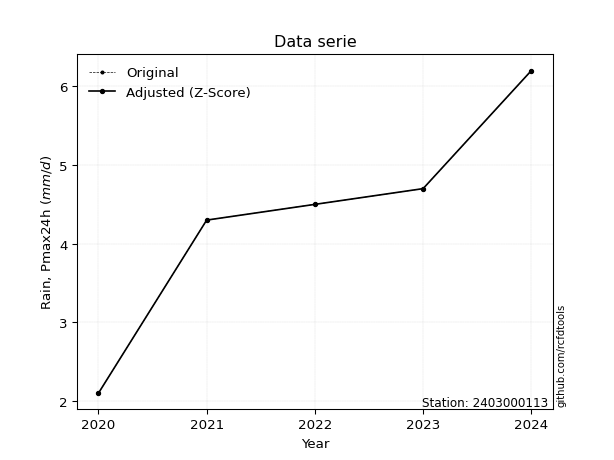</img>

</div>


> The initial value (value_initial) correspond to the initial obtained or null completed value, and value (value) is adjusted only when the initial value is outside the valid range (outlier) definite through the Z-Score value. If Z-Score is active, values out of range or outliers are replaced with the station mean value. A Z-Score (or standard score) measures how many standard deviations a data point is from the mean of a dataset, indicating its relative position; positive scores mean above the mean, negative mean below, and a score of zero is exactly at the mean, allowing for comparison of values from different distributions. It´s calculated using the formula $z=(x–μ)/σ$, where $x$ is the data point, $μ$ is the mean, and $σ$ is the standard deviation, helping identify outliers and understand probability.
>
> <sub>**Note**: In this study, "completing" (filling gaps in) and "extending" (forecasting or lengthening the historical record) rainfall data series are avoided for certain critical analyses because they introduce artificial bias and uncertainty, which can distort the statistics of rare events (extremes), alter day-to-day variability, and compromise the integrity and homogeneity of the original data. Some reasons against Completing/Extending rainfall data are: **Distortion of Extremes and Variability**: The primary issue is that most gap-filling or extension methods rely on averaging or regression with nearby stations, which inherently smooths the data. Rainfall is highly variable in space and time, with a large percentage of zero values and occasional large storms. Infilling methods often underestimate the highest values and overestimate the lowest (zero) values, which severely distorts analyses focused on flood frequency, drought severity, and intensity-duration-frequency (IDF) curves, **Loss of Data Homogeneity**: Infilled or extended data are synthetic estimates, not actual measurements. Combining these estimates with observed data can violate the assumption of data homogeneity, which requires that the data properties do not change over time. Inhomogeneity can lead to incorrect conclusions about long-term trends or changes in climate patterns, **Propagation of Errors**: Errors and biases from the original data (e.g., wind-induced undercatch, instrument errors, site changes) or the data used for imputation can propagate through the analysis, leading to unreliable hydrological models and inaccurate predictions, **Compromised Statistical Integrity**: For statistical analyses, especially those involving the frequency of events, using artificial data can introduce time bias or autocorrelation that doesn´t exist in reality, making it difficult to assess the true probability of events, **Difficulty in Validation**: It is difficult to accurately validate the quality of filled or extended data, especially for past periods where ground-truth measurements are unavailable. The reliability of imputation techniques heavily depends on the density of the surrounding station network and the complexity of the local topography.</sub>


### 4. Active continuous probability distributions from SciPy (44 of 104 available)

A Probability Density Function (PDF) describes the relative likelihood of a continuous random variable falling within a specific range, where the total area under its curve equals 1, and the area over any interval gives the actual probability for that range. Unlike discrete probabilities (like rolling a die), a PDF shows density, not direct probability for a single point (which is zero), with higher points indicating higher likelihood, often visualized as a bell curve for normal distributions.

A log of a probability density function (log-PDF) is simply the logarithm of the PDF´s value, denoted as $log(f(x))$, useful for converting multiplication of probabilities into addition, improving numerical stability with tiny numbers, and connecting to information theory concepts like entropy. Instead of dealing with very small probabilities (e.g., 0.000001), log-PDFs use negative numbers (e.g., $log(0.00001) ≈ -11.51$ that are easier for computers to handle, preventing underflow errors and simplifying complex calculations. In this study, each active probability distribution from SciPy is also evaluated in the $log$ form.

[scipy.stats](https://docs.scipy.org/doc/scipy/reference/stats.html) is a Python´s powerful submodule within the SciPy library for comprehensive statistical analysis, offering over 130 probability distributions (like Normal, Poisson), functions for descriptive stats (mean, variance), hypothesis testing (t-tests, chi-square), random variable generation, and statistical tests, making it essential for data science, modeling, and research. It provides tools to explore, model, and draw conclusions from data efficiently, working seamlessly with NumPy.

<div align="center">

|   id | p_dist             |   n_parameter | fit_method   | label                                                                       | active   | ref                                                                                                        |
|-----:|:-------------------|--------------:|:-------------|:----------------------------------------------------------------------------|:---------|:-----------------------------------------------------------------------------------------------------------|
|    0 | alpha              |             3 | MLE          | Alpha                                                                       | True     | [:mortar_board:](https://docs.scipy.org/doc/scipy/reference/generated/scipy.stats.alpha.html)              |
|    1 | betaprime          |             4 | MLE          | Beta prime                                                                  | True     | [:mortar_board:](https://docs.scipy.org/doc/scipy/reference/generated/scipy.stats.betaprime.html)          |
|    2 | chi2               |             3 | MLE          | Chi²                                                                        | True     | [:mortar_board:](https://docs.scipy.org/doc/scipy/reference/generated/scipy.stats.chi2.html)               |
|    3 | crystalball        |             4 | MLE          | Crystalball                                                                 | True     | [:mortar_board:](https://docs.scipy.org/doc/scipy/reference/generated/scipy.stats.crystalball.html)        |
|    4 | erlang             |             3 | MLE          | Erlang                                                                      | True     | [:mortar_board:](https://docs.scipy.org/doc/scipy/reference/generated/scipy.stats.erlang.html)             |
|    5 | expon              |             2 | MLE          | Exponential                                                                 | True     | [:mortar_board:](https://docs.scipy.org/doc/scipy/reference/generated/scipy.stats.expon.html)              |
|    6 | exponnorm          |             3 | MLE          | Exponentially modified Normal                                               | True     | [:mortar_board:](https://docs.scipy.org/doc/scipy/reference/generated/scipy.stats.exponnorm.html)          |
|    7 | f                  |             4 | MLE          | F                                                                           | True     | [:mortar_board:](https://docs.scipy.org/doc/scipy/reference/generated/scipy.stats.f.html)                  |
|    8 | fatiguelife        |             3 | MLE          | Fatigue-life (Birnbaum-Saunders)                                            | True     | [:mortar_board:](https://docs.scipy.org/doc/scipy/reference/generated/scipy.stats.fatiguelife.html)        |
|    9 | fisk               |             3 | MLE          | Fisk                                                                        | True     | [:mortar_board:](https://docs.scipy.org/doc/scipy/reference/generated/scipy.stats.fisk.html)               |
|   10 | gamma              |             3 | MLE          | Gamma                                                                       | True     | [:mortar_board:](https://docs.scipy.org/doc/scipy/reference/generated/scipy.stats.gamma.html)              |
|   11 | genexpon           |             5 | MLE          | Generalized exponential                                                     | True     | [:mortar_board:](https://docs.scipy.org/doc/scipy/reference/generated/scipy.stats.genexpon.html)           |
|   12 | genlogistic        |             3 | MLE          | Generalized logistic                                                        | True     | [:mortar_board:](https://docs.scipy.org/doc/scipy/reference/generated/scipy.stats.genlogistic.html)        |
|   13 | gibrat             |             2 | MM           | Gibrat                                                                      | True     | [:mortar_board:](https://docs.scipy.org/doc/scipy/reference/generated/scipy.stats.gibrat.html)             |
|   14 | gompertz           |             3 | MLE          | Gompertz (or truncated Gumbel)                                              | True     | [:mortar_board:](https://docs.scipy.org/doc/scipy/reference/generated/scipy.stats.gompertz.html)           |
|   15 | gumbel_l           |             2 | MM           | Gumbel Left Skew                                                            | True     | [:mortar_board:](https://docs.scipy.org/doc/scipy/reference/generated/scipy.stats.gumbel_l.html)           |
|   16 | gumbel_r           |             2 | MM           | Gumbel Right Skew                                                           | True     | [:mortar_board:](https://docs.scipy.org/doc/scipy/reference/generated/scipy.stats.gumbel_r.html)           |
|   17 | halflogistic       |             2 | MM           | Half-logistic                                                               | True     | [:mortar_board:](https://docs.scipy.org/doc/scipy/reference/generated/scipy.stats.halflogistic.html)       |
|   18 | halfnorm           |             2 | MM           | Half Normal                                                                 | True     | [:mortar_board:](https://docs.scipy.org/doc/scipy/reference/generated/scipy.stats.halfnorm.html)           |
|   19 | hypsecant          |             2 | MM           | hyperbolic secant                                                           | True     | [:mortar_board:](https://docs.scipy.org/doc/scipy/reference/generated/scipy.stats.hypsecant.html)          |
|   20 | invgamma           |             3 | MLE          | Inverted gamma                                                              | True     | [:mortar_board:](https://docs.scipy.org/doc/scipy/reference/generated/scipy.stats.invgamma.html)           |
|   21 | invgauss           |             3 | MLE          | Inverse Gaussian                                                            | True     | [:mortar_board:](https://docs.scipy.org/doc/scipy/reference/generated/scipy.stats.invgauss.html)           |
|   22 | invweibull         |             3 | MLE          | Inverted Weibull                                                            | True     | [:mortar_board:](https://docs.scipy.org/doc/scipy/reference/generated/scipy.stats.invweibull.html)         |
|   23 | johnsonsu          |             4 | MLE          | Johnson Su                                                                  | True     | [:mortar_board:](https://docs.scipy.org/doc/scipy/reference/generated/scipy.stats.johnsonsu.html)          |
|   24 | kstwobign          |             2 | MLE          | Limiting distribution of scaled Kolmogorov-Smirnov two-sided test statistic | True     | [:mortar_board:](https://docs.scipy.org/doc/scipy/reference/generated/scipy.stats.kstwobign.html)          |
|   25 | laplace            |             2 | MM           | Laplace                                                                     | True     | [:mortar_board:](https://docs.scipy.org/doc/scipy/reference/generated/scipy.stats.laplace.html)            |
|   26 | laplace_asymmetric |             3 | MLE          | Asymmetric Laplace                                                          | True     | [:mortar_board:](https://docs.scipy.org/doc/scipy/reference/generated/scipy.stats.laplace_asymmetric.html) |
|   27 | loggamma           |             3 | MLE          | Log gamma                                                                   | True     | [:mortar_board:](https://docs.scipy.org/doc/scipy/reference/generated/scipy.stats.loggamma.html)           |
|   28 | logistic           |             2 | MM           | Logistic (or Sech-squared)                                                  | True     | [:mortar_board:](https://docs.scipy.org/doc/scipy/reference/generated/scipy.stats.logistic.html)           |
|   29 | lognorm            |             3 | MLE          | Log Normal                                                                  | True     | [:mortar_board:](https://docs.scipy.org/doc/scipy/reference/generated/scipy.stats.lognorm.html)            |
|   30 | maxwell            |             2 | MM           | Maxwell                                                                     | True     | [:mortar_board:](https://docs.scipy.org/doc/scipy/reference/generated/scipy.stats.maxwell.html)            |
|   31 | mielke             |             4 | MLE          | Mielke Beta-Kappa / Dagum                                                   | True     | [:mortar_board:](https://docs.scipy.org/doc/scipy/reference/generated/scipy.stats.mielke.html)             |
|   32 | moyal              |             2 | MM           | Moyal                                                                       | True     | [:mortar_board:](https://docs.scipy.org/doc/scipy/reference/generated/scipy.stats.moyal.html)              |
|   33 | nakagami           |             3 | MLE          | Nakagami                                                                    | True     | [:mortar_board:](https://docs.scipy.org/doc/scipy/reference/generated/scipy.stats.nakagami.html)           |
|   34 | ncf                |             5 | MLE          | Non-central F distribution                                                  | True     | [:mortar_board:](https://docs.scipy.org/doc/scipy/reference/generated/scipy.stats.ncf.html)                |
|   35 | nct                |             4 | MLE          | Non-central Student’s t                                                     | True     | [:mortar_board:](https://docs.scipy.org/doc/scipy/reference/generated/scipy.stats.nct.html)                |
|   36 | norm               |             2 | MM           | Normal                                                                      | True     | [:mortar_board:](https://docs.scipy.org/doc/scipy/reference/generated/scipy.stats.norm.html)               |
|   37 | pearson3           |             3 | MM           | Pearson type III                                                            | True     | [:mortar_board:](https://docs.scipy.org/doc/scipy/reference/generated/scipy.stats.pearson3.html)           |
|   38 | rayleigh           |             2 | MM           | Rayleigh                                                                    | True     | [:mortar_board:](https://docs.scipy.org/doc/scipy/reference/generated/scipy.stats.rayleigh.html)           |
|   39 | rice               |             3 | MLE          | Rice                                                                        | True     | [:mortar_board:](https://docs.scipy.org/doc/scipy/reference/generated/scipy.stats.rice.html)               |
|   40 | t                  |             3 | MLE          | Student’s t                                                                 | True     | [:mortar_board:](https://docs.scipy.org/doc/scipy/reference/generated/scipy.stats.t.html)                  |
|   41 | truncnorm          |             4 | MLE          | Truncated normal                                                            | True     | [:mortar_board:](https://docs.scipy.org/doc/scipy/reference/generated/scipy.stats.truncnorm.html)          |
|   42 | wald               |             2 | MM           | Wald                                                                        | True     | [:mortar_board:](https://docs.scipy.org/doc/scipy/reference/generated/scipy.stats.wald.html)               |
|   43 | weibull_min        |             3 | MLE          | Weibull minimum                                                             | True     | [:mortar_board:](https://docs.scipy.org/doc/scipy/reference/generated/scipy.stats.weibull_min.html)        |

</div>

> **n_parameter:** # arguments & localization & scale.
>
> **Fit methods:** (MLE) maximum likelihood, (MM) L-moments.
>
>**Inactive** (With the only purpose of prevent loops, zero divisions, infinite values, over high estimated values or horizontal trending for recurrence intervals estimations, the follow distributions were disabled.)**:** foldnorm, gennorm, norminvgauss, powernorm, powerlognorm, skewnorm, genextreme, anglit, arcsine, argus, beta, bradford, burr, burr12, cauchy, cosine, halfcauchy, foldcauchy, skewcauchy, wrapcauchy, dgamma, gengamma, exponweib, exponpow, truncexpon, gausshyper, genhalflogistic, genhyperbolic, geninvgauss, halfgennorm, johnsonsb, kappa4, kappa3, ksone, kstwo, loglaplace, levy, levy_l, levy_stable, ncx2, pareto, genpareto, truncpareto, lomax, powerlaw, rdist, rel_breitwigner, recipinvgauss, semicircular, studentized_range, trapezoid, triang, truncweibull_min, tukeylambda, uniform, loguniform, vonmises, vonmises_line, weibull_max, dweibull, 


## B. Probability (PDF) vs. Empirical (EDF) distributions functions

A continuous probability distribution (CPD) describes probabilities for variables that can take any value within a range (like rain any time), unlike discrete variables with specific outcomes (like temperature). It uses a Probability Density Function (PDF), a curve where the total area under it equals 1, and the probability of the variable falling within an interval (a to b) is found by calculating the area under the curve between those points. A key feature is that the probability of hitting any single exact value is zero, so probabilities are always expressed for ranges, e.g., $P(a ≤ X ≤ b)$.

<div align="center">

Distributions parameters from station values
|    |    station | p_dist                |   n |             loc |          scale | shape                  | shape1             | shape2                | shape3   |
|---:|-----------:|:----------------------|----:|----------------:|---------------:|:-----------------------|:-------------------|:----------------------|:---------|
|  0 | 2403000113 | alpha                 |   5 |   -25.8641      |  667.703       | 22.153114597611832     |                    |                       |          |
|  1 | 2403000113 | betaprime             |   5 |   -21.5474      |  217.63        | 419.3517270895261      | 3524.355575946094  |                       |          |
|  2 | 2403000113 | chi2                  |   5 |     2.1         |    1.27049     | 1.2323265677287196     |                    |                       |          |
|  3 | 2403000113 | crystalball           |   5 |     4.36        |    1.31392     | 16.456255731435192     | 10.670497732886044 |                       |          |
|  4 | 2403000113 | erlang                |   5 |   -18.544       |    0.078415    | 291.94784361862423     |                    |                       |          |
|  5 | 2403000113 | expon                 |   5 |     2.1         |    2.26        |                        |                    |                       |          |
|  6 | 2403000113 | exponnorm             |   5 |     4.35872     |    1.31392     | 0.0009770940670494385  |                    |                       |          |
|  7 | 2403000113 | f                     |   5 |  -103.86        |  108.212       | 25407.733113011054     | 28404.442222275946 |                       |          |
|  8 | 2403000113 | fatiguelife           |   5 |  -337.106       |  341.463       | 0.003846298226716928   |                    |                       |          |
|  9 | 2403000113 | fisk                  |   5 |    -4.94598e+07 |    4.94598e+07 | 68279542.43221274      |                    |                       |          |
| 10 | 2403000113 | gamma                 |   5 |   -17.3881      |    0.0830618   | 261.74840628816594     |                    |                       |          |
| 11 | 2403000113 | genexpon              |   5 |     2.05907     |    0.0229948   | 0.004285769333016757   | 2.726585388011763  | 3.159185001450029e-05 |          |
| 12 | 2403000113 | genlogistic           |   5 |     5.02043     |    0.549141    | 0.5384454034045392     |                    |                       |          |
| 13 | 2403000113 | gibrat                |   5 |     3.35765     |    0.607958    |                        |                    |                       |          |
| 14 | 2403000113 | gompertz              |   5 |     2.1         |    1.51499     | 0.19468020841550893    |                    |                       |          |
| 15 | 2403000113 | gumbel_l              |   5 |     4.95134     |    1.02446     |                        |                    |                       |          |
| 16 | 2403000113 | gumbel_r              |   5 |     3.76866     |    1.02446     |                        |                    |                       |          |
| 17 | 2403000113 | halflogistic          |   5 |     2.8027      |    1.12336     |                        |                    |                       |          |
| 18 | 2403000113 | halfnorm              |   5 |     2.62087     |    2.17968     |                        |                    |                       |          |
| 19 | 2403000113 | hypsecant             |   5 |     4.36        |    0.836471    |                        |                    |                       |          |
| 20 | 2403000113 | invgamma              |   5 |   -18.2516      | 6228.1         | 276.71898743648        |                    |                       |          |
| 21 | 2403000113 | invgauss              |   5 |    -7.81091     |  939.637       | 0.012932569660472511   |                    |                       |          |
| 22 | 2403000113 | invweibull            |   5 | -7028.78        | 7032.42        | 5236.929909889612      |                    |                       |          |
| 23 | 2403000113 | johnsonsu             |   5 |     4.51368     |    0.149276    | 0.050828990832878326   | 0.4545379860663933 |                       |          |
| 24 | 2403000113 | kstwobign             |   5 |    -1.07201     |    6.20356     |                        |                    |                       |          |
| 25 | 2403000113 | laplace               |   5 |     4.36        |    0.929086    |                        |                    |                       |          |
| 26 | 2403000113 | laplace_asymmetric    |   5 |     4.5         |    0.891803    | 1.0816093825818287     |                    |                       |          |
| 27 | 2403000113 | loggamma              |   5 |     3.32386     |    1.78893     | 2.2619752173883954     |                    |                       |          |
| 28 | 2403000113 | logistic              |   5 |     4.36        |    0.724405    |                        |                    |                       |          |
| 29 | 2403000113 | lognorm               |   5 |     2.1         |    0.00190358  | 14.544832640096049     |                    |                       |          |
| 30 | 2403000113 | maxwell               |   5 |     1.24655     |    1.95107     |                        |                    |                       |          |
| 31 | 2403000113 | mielke                |   5 |     2.1         |    3.73049     | 0.4407812989140071     | 8.51694655971343   |                       |          |
| 32 | 2403000113 | moyal                 |   5 |     3.60861     |    0.591474    |                        |                    |                       |          |
| 33 | 2403000113 | nakagami              |   5 |     4.3         |    0.473064    | 0.04420168198320146    |                    |                       |          |
| 34 | 2403000113 | ncf                   |   5 |    -0.646331    |    2.84278e-06 | 3.5796104375976484e-05 | 140.03829585578177 | 62.309538218614925    |          |
| 35 | 2403000113 | nct                   |   5 |   -78.2181      |    1.29132     | 54908.858517044966     | 63.94719068344223  |                       |          |
| 36 | 2403000113 | norm                  |   5 |     4.36        |    1.31393     |                        |                    |                       |          |
| 37 | 2403000113 | pearson3              |   5 |     4.36        |    1.31392     | -0.4647987728688376    |                    |                       |          |
| 38 | 2403000113 | rayleigh              |   5 |     1.84638     |    2.00558     |                        |                    |                       |          |
| 39 | 2403000113 | rice                  |   5 |     1.23242     |    1.44678     | 1.8702729219036989     |                    |                       |          |
| 40 | 2403000113 | t                     |   5 |     4.36        |    1.31393     | 2780909033.451646      |                    |                       |          |
| 41 | 2403000113 | truncnorm             |   5 |     4.36        |    1.31392     | -5.4473180448472025    | 88.60695157645236  |                       |          |
| 42 | 2403000113 | wald                  |   5 |     3.04611     |    1.31389     |                        |                    |                       |          |
| 43 | 2403000113 | weibull_min           |   5 |    -4.04713     |    8.95367     | 7.703526339835552      |                    |                       |          |
| 44 | 2403000113 | logalpha              |   5 |   -10.1         |  347.441       | 30.187933533698327     |                    |                       |          |
| 45 | 2403000113 | logbetaprime          |   5 |    -7.11645     |   12.9721      | 852.2890544516833      | 1297.2019624056993 |                       |          |
| 46 | 2403000113 | logchi2               |   5 |     0.741937    |    0.92293     | 1.0233123388642247     |                    |                       |          |
| 47 | 2403000113 | logcrystalball        |   5 |     1.41535     |    0.360043    | 7.529904522773755      | 129.28022265472225 |                       |          |
| 48 | 2403000113 | logerlang             |   5 |     0.741937    |    0.980524    | 0.6312600197545519     |                    |                       |          |
| 49 | 2403000113 | logexpon              |   5 |     0.741937    |    0.673411    |                        |                    |                       |          |
| 50 | 2403000113 | logexponnorm          |   5 |     1.41509     |    0.360042    | 0.0007271787098407707  |                    |                       |          |
| 51 | 2403000113 | logf                  |   5 |  -491.054       |  492.47        | 5397773.914635053      | 12083092.323728122 |                       |          |
| 52 | 2403000113 | logfatiguelife        |   5 |  -200.084       |  201.499       | 0.0017913210909509506  |                    |                       |          |
| 53 | 2403000113 | logfisk               |   5 |    -9.48104e+07 |    9.48104e+07 | 488854345.0295572      |                    |                       |          |
| 54 | 2403000113 | loggamma              |   5 |    -4.78892     |    0.022679    | 273.2952793349357      |                    |                       |          |
| 55 | 2403000113 | loggenexpon           |   5 |     0.702076    |    0.00443903  | 0.0020876726858312404  | 2.0412405023052007 | 2.010734521198678e-05 |          |
| 56 | 2403000113 | loggenlogistic        |   5 |     1.71004     |    0.0888596   | 0.27152481710627735    |                    |                       |          |
| 57 | 2403000113 | loggibrat             |   5 |     1.14072     |    0.166576    |                        |                    |                       |          |
| 58 | 2403000113 | loggompertz           |   5 |     0.741936    |    0.299687    | 0.07006381484698526    |                    |                       |          |
| 59 | 2403000113 | loggumbel_l           |   5 |     1.57739     |    0.280724    |                        |                    |                       |          |
| 60 | 2403000113 | loggumbel_r           |   5 |     1.25331     |    0.280724    |                        |                    |                       |          |
| 61 | 2403000113 | loghalflogistic       |   5 |     0.988548    |    0.307863    |                        |                    |                       |          |
| 62 | 2403000113 | loghalfnorm           |   5 |     0.938811    |    0.597252    |                        |                    |                       |          |
| 63 | 2403000113 | loghypsecant          |   5 |     1.41535     |    0.22921     |                        |                    |                       |          |
| 64 | 2403000113 | loginvgamma           |   5 |    -6.36971     | 3310.79        | 426.670603172135       |                    |                       |          |
| 65 | 2403000113 | loginvgauss           |   5 |    -2.40229     |  375.608       | 0.010138606400352837   |                    |                       |          |
| 66 | 2403000113 | loginvweibull         |   5 |    -1.55288e+07 |    1.55288e+07 | 38763194.32125835      |                    |                       |          |
| 67 | 2403000113 | logjohnsonsu          |   5 |     1.51116     |    0.0309539   | 0.12310236088718624    | 0.433080794217092  |                       |          |
| 68 | 2403000113 | logkstwobign          |   5 |    -0.184797    |    1.82479     |                        |                    |                       |          |
| 69 | 2403000113 | loglaplace            |   5 |     1.41535     |    0.254589    |                        |                    |                       |          |
| 70 | 2403000113 | loglaplace_asymmetric |   5 |     1.54756     |    0.21345     | 1.356628680124747      |                    |                       |          |
| 71 | 2403000113 | logloggamma           |   5 |     1.78704     |    0.118056    | 0.331723038650766      |                    |                       |          |
| 72 | 2403000113 | loglogistic           |   5 |     1.41535     |    0.198502    |                        |                    |                       |          |
| 73 | 2403000113 | loglognorm            |   5 |     0.741937    |    0.000555488 | 14.621254886299605     |                    |                       |          |
| 74 | 2403000113 | logmaxwell            |   5 |     0.562199    |    0.534632    |                        |                    |                       |          |
| 75 | 2403000113 | logmielke             |   5 |    -6.66703e+06 |    6.66703e+06 | 15506188.864629753     | 662449913.0182431  |                       |          |
| 76 | 2403000113 | logmoyal              |   5 |     1.20945     |    0.162076    |                        |                    |                       |          |
| 77 | 2403000113 | lognakagami           |   5 |     1.45862     |    0.172406    | 0.17021263682422347    |                    |                       |          |
| 78 | 2403000113 | logncf                |   5 |   -37.1757      |   32.6827      | 28350.65232168199      | 102753.88899950247 | 5122.687588505016     |          |
| 79 | 2403000113 | lognct                |   5 |   -15.7594      |    0.317842    | 4642.719207742158      | 54.024153825374746 |                       |          |
| 80 | 2403000113 | lognorm               |   5 |     1.41535     |    0.360043    |                        |                    |                       |          |
| 81 | 2403000113 | logpearson3           |   5 |     1.41535     |    0.360044    | -1.0017956929289316    |                    |                       |          |
| 82 | 2403000113 | lograyleigh           |   5 |     0.726566    |    0.549569    |                        |                    |                       |          |
| 83 | 2403000113 | logrice               |   5 |     0.474397    |    0.389508    | 2.165695937225676      |                    |                       |          |
| 84 | 2403000113 | logt                  |   5 |     1.5076      |    0.0536298   | 0.6718219677986048     |                    |                       |          |
| 85 | 2403000113 | logtruncnorm          |   5 |    -0.0956238   |    1.54431     | 1.0064264111546577     | 1.2433827573011196 |                       |          |
| 86 | 2403000113 | logwald               |   5 |     1.05529     |    0.360055    |                        |                    |                       |          |
| 87 | 2403000113 | logweibull_min        |   5 |    -1.86862e+07 |    1.86862e+07 | 72829231.24960457      |                    |                       |          |

</div>

> **loc** (Location parameter): This shifts the distribution along the x-axis. For many common distributions, like the normal (Gaussian) distribution, loc represents the mean $μ$. For others, like the uniform distribution, it might represent the minimum value, or for the beta distribution, the left end of the support interval.
>
> **scale** (Scale parameter): This determines the width or spread of the distribution. For the normal distribution, scale represents the standard deviation $σ$. For a uniform distribution, it defines the length of the interval (from $loc$ to $loc + scale$).
>
> **shape** (Shape parameters): Refers to parameters that define the specific form of a probability distribution, distinct from its location (loc) and scale (scale). These parameters are required arguments for most distribution functions. For example, a normal (Gaussian) distribution is fully defined by its location (mean) and scale (standard deviation), so it has no specific shape parameters beyond loc and scale. However, other distributions have intrinsic properties that need specification, as Gamma distribution that takes a shape parameter, often named $a$ or $alpha$.


### 0. Cumulative distribution values - CDF (88 evaluated)

Cumulative Distribution Function (CDF), denoted as $F$<sub>$X$</sub>$(x)$, is a function that gives the probability that a random variable $X$ will take a value less than or equal to a specific value, $x$ (i.e., $(P(X≥x)$. It essentially "accumulates" probabilities from a given point up to the far right (positive infinity), providing a complete picture of the distribution´s probabilities for both discrete (like rain) and continuous (like temperature) variables, helping to find probabilities over ranges or above certain values. Each station is evaluated separately ordering the $x$ values ascending, calculating the CDF and PDF values for the activated distributions and their logarithmic forms.

<div align="center">

CDF ordered by x ascending and calculating $log(f(x))$ separately
|   id |    Station |   date |   x |   count |   mean |     std |     zscore |   Value_initial |    station |   m |     alpha |   alpha_pdf |   betaprime |   betaprime_pdf |        chi2 |       chi2_pdf |   crystalball |   crystalball_pdf |    erlang |   erlang_pdf |    expon |   expon_pdf |   exponnorm |   exponnorm_pdf |         f |    f_pdf |   fatiguelife |   fatiguelife_pdf |      fisk |   fisk_pdf |     gamma |   gamma_pdf |   genexpon |   genexpon_pdf |   genlogistic |   genlogistic_pdf |   gibrat |   gibrat_pdf |   gompertz |   gompertz_pdf |   gumbel_l |   gumbel_l_pdf |   gumbel_r |   gumbel_r_pdf |   halflogistic |   halflogistic_pdf |   halfnorm |   halfnorm_pdf |   hypsecant |   hypsecant_pdf |   invgamma |   invgamma_pdf |   invgauss |   invgauss_pdf |   invweibull |   invweibull_pdf |   johnsonsu |   johnsonsu_pdf |   kstwobign |   kstwobign_pdf |   laplace |   laplace_pdf |   laplace_asymmetric |   laplace_asymmetric_pdf |   loggamma |   loggamma_pdf |   logistic |   logistic_pdf |   lognorm |   lognorm_pdf |   maxwell |   maxwell_pdf |      mielke |     mielke_pdf |       moyal |   moyal_pdf |   nakagami |   nakagami_pdf |       ncf |   ncf_pdf |       nct |   nct_pdf |      norm |   norm_pdf |   pearson3 |   pearson3_pdf |   rayleigh |   rayleigh_pdf |      rice |   rice_pdf |         t |    t_pdf |   truncnorm |   truncnorm_pdf |     wald |   wald_pdf |   weibull_min |   weibull_min_pdf |   logalpha |   logalpha_pdf |   logbetaprime |   logbetaprime_pdf |     logchi2 |   logchi2_pdf |   logcrystalball |   logcrystalball_pdf |   logerlang |   logerlang_pdf |   logexpon |   logexpon_pdf |   logexponnorm |   logexponnorm_pdf |      logf |   logf_pdf |   logfatiguelife |   logfatiguelife_pdf |   logfisk |   logfisk_pdf |   loggenexpon |   loggenexpon_pdf |   loggenlogistic |   loggenlogistic_pdf |   loggibrat |   loggibrat_pdf |   loggompertz |   loggompertz_pdf |   loggumbel_l |   loggumbel_l_pdf |   loggumbel_r |   loggumbel_r_pdf |   loghalflogistic |   loghalflogistic_pdf |   loghalfnorm |   loghalfnorm_pdf |   loghypsecant |   loghypsecant_pdf |   loginvgamma |   loginvgamma_pdf |   loginvgauss |   loginvgauss_pdf |   loginvweibull |   loginvweibull_pdf |   logjohnsonsu |   logjohnsonsu_pdf |   logkstwobign |   logkstwobign_pdf |   loglaplace |   loglaplace_pdf |   loglaplace_asymmetric |   loglaplace_asymmetric_pdf |   logloggamma |   logloggamma_pdf |   loglogistic |   loglogistic_pdf |   loglognorm |   loglognorm_pdf |   logmaxwell |   logmaxwell_pdf |   logmielke |   logmielke_pdf |    logmoyal |   logmoyal_pdf |   lognakagami |   lognakagami_pdf |    logncf |   logncf_pdf |    lognct |   lognct_pdf |   logpearson3 |   logpearson3_pdf |   lograyleigh |   lograyleigh_pdf |   logrice |   logrice_pdf |      logt |   logt_pdf |   logtruncnorm |   logtruncnorm_pdf |   logwald |   logwald_pdf |   logweibull_min |   logweibull_min_pdf |
|-----:|-----------:|-------:|----:|--------:|-------:|--------:|-----------:|----------------:|-----------:|----:|----------:|------------:|------------:|----------------:|------------:|---------------:|--------------:|------------------:|----------:|-------------:|---------:|------------:|------------:|----------------:|----------:|---------:|--------------:|------------------:|----------:|-----------:|----------:|------------:|-----------:|---------------:|--------------:|------------------:|---------:|-------------:|-----------:|---------------:|-----------:|---------------:|-----------:|---------------:|---------------:|-------------------:|-----------:|---------------:|------------:|----------------:|-----------:|---------------:|-----------:|---------------:|-------------:|-----------------:|------------:|----------------:|------------:|----------------:|----------:|--------------:|---------------------:|-------------------------:|-----------:|---------------:|-----------:|---------------:|----------:|--------------:|----------:|--------------:|------------:|---------------:|------------:|------------:|-----------:|---------------:|----------:|----------:|----------:|----------:|----------:|-----------:|-----------:|---------------:|-----------:|---------------:|----------:|-----------:|----------:|---------:|------------:|----------------:|---------:|-----------:|--------------:|------------------:|-----------:|---------------:|---------------:|-------------------:|------------:|--------------:|-----------------:|---------------------:|------------:|----------------:|-----------:|---------------:|---------------:|-------------------:|----------:|-----------:|-----------------:|---------------------:|----------:|--------------:|--------------:|------------------:|-----------------:|---------------------:|------------:|----------------:|--------------:|------------------:|--------------:|------------------:|--------------:|------------------:|------------------:|----------------------:|--------------:|------------------:|---------------:|-------------------:|--------------:|------------------:|--------------:|------------------:|----------------:|--------------------:|---------------:|-------------------:|---------------:|-------------------:|-------------:|-----------------:|------------------------:|----------------------------:|--------------:|------------------:|--------------:|------------------:|-------------:|-----------------:|-------------:|-----------------:|------------:|----------------:|------------:|---------------:|--------------:|------------------:|----------:|-------------:|----------:|-------------:|--------------:|------------------:|--------------:|------------------:|----------:|--------------:|----------:|-----------:|---------------:|-------------------:|----------:|--------------:|-----------------:|---------------------:|
|    0 | 2403000113 |   2020 | 2.1 |       5 |   4.36 | 1.46901 | -1.53845   |             2.1 | 2403000113 |   1 | 0.0423536 |   0.0770705 |   0.0424199 |       0.0722327 | 2.18149e-10 | 302676         |     0.0427128 |         0.0691677 | 0.0429647 |    0.0730322 | 0        |   0.442478  |    0.042712 |       0.0691667 | 0.0425728 | 0.070019 |     0.0423524 |          0.069182 | 0.0372538 |  0.0495132 | 0.0429333 |   0.0730658 | 0.00773435 |      0.191554  |     0.0569159 |         0.0555351 | 0        |    0         | 6.2531e-09 |       0.128502 |  0.0599642 |      0.0567412 | 0.00610992 |      0.0304036 |       0        |           0        |   0        |      0         |   0.0426424 |       0.0508265 |  0.0424461 |      0.0764444 |  0.0407608 |      0.0781719 |    0.0429255 |        0.10066   |   0.0630461 |       0.0232731 |    0.043761 |       0.116403  | 0.0439085 |      0.04726  |            0.0447845 |                0.0464289 |  0.0338183 |       0.216223 |  0.0422978 |       0.05592  | 0.0307166 |      0.192716 | 0.0210255 |     0.0711102 | 3.52006e-06 | 980038         | 0.000343894 |  0.00398234 |  0         |    0           | 0.0328667 | 0.0762147 | 0.0428026 | 0.0693533 | 0.0427129 |  0.0691677 |  0.0539023 |      0.0666977 | 0.00796362 |      0.0625499 | 0.0332237 |  0.0807202 | 0.0427133 | 0.069168 |   0.0427126 |       0.0691675 | 0        |  0         |     0.0536868 |         0.0654406 |  0.0315779 |       0.209834 |      0.0334435 |           0.213509 | 5.65948e-09 |   2.60822e+07 |        0.0307166 |             0.192716 | 9.56981e-11 |   544129        |   0        |       1.48498  |       0.030716 |           0.192713 | 0.0306218 |   0.192176 |        0.0308949 |             0.193803 |  0.022582 |      0.113806 |     0.0201947 |          0.542146 |         0.051913 |             0.158626 |    0        |        0        |   2.10236e-07 |          0.233791 |     0.0497154 |          0.17262  |    0.00206656 |         0.0455081 |          0        |              0        |      0        |          0        |      0.0336925 |           0.14672  |     0.0326152 |          0.218051 |     0.0316032 |          0.225713 |       0.0370438 |            0.304746 |      0.0583593 |          0.0655723 |      0.0413054 |           0.381817 |    0.0354993 |         0.139438 |               0.0401121 |                    0.138522 |     0.0593871 |          0.166852 |     0.0325317 |          0.158555 |    0.0227552 |      3.32665e+13 |   0.00977012 |         0.15941  |   0.0768536 |        0.178746 | 2.33385e-05 |     0.00135402 |   0           |       0           | 0.0314487 |     0.197831 | 0.0316362 |     0.198592 |     0.0504545 |          0.186644 |   0.000391085 |         0.0508746 | 0.0259962 |      0.218194 | 0.0521536 |  0.0456677 |    0           |            0       |  0        |      0        |        0.0383282 |             0.146484 |
|    1 | 2403000113 |   2021 | 4.3 |       5 |   4.36 | 1.46901 | -0.0408437 |             4.3 | 2403000113 |   2 | 0.506964  |   0.292715  |   0.49116   |       0.298542  | 0.758741    |      0.12041   |     0.481789  |         0.30331   | 0.493172  |    0.298109  | 0.622223 |   0.167158  |    0.481786 |       0.30331   | 0.484388  | 0.301804 |     0.482758  |          0.303522 | 0.446475  |  0.341172  | 0.492415  |   0.29727   | 0.562325   |      0.241105  |     0.433961  |         0.335231  | 0.669403 |    0.384584  | 0.471151   |       0.290339 |  0.411113  |      0.304382  | 0.551384   |      0.320414  |       0.582633 |           0.294003 |   0.558912 |      0.27207   |   0.477187  |       0.379562  |  0.505153  |      0.294026  |  0.510741  |      0.290024  |    0.542439  |        0.247062  |   0.317511  |       0.621561  |    0.558591 |       0.238165  | 0.468731  |      0.504508 |            0.438185  |                0.454274  |  0.560313  |       1.04622  |  0.479305  |       0.34452  | 0.547826  |      1.10007  | 0.515472  |     0.294342  | 0.791883    |      0.156911  | 0.57725     |  0.321868   |  0.0445306 |    4.43228e+12 | 0.517001  | 0.285803  | 0.48222   | 0.303058  | 0.481789  |  0.30331   |  0.451053  |      0.298781  | 0.526854   |      0.288618  | 0.494696  |  0.295425  | 0.481788  | 0.303309 |   0.481788  |       0.30331   | 0.649241 |  0.325331  |     0.441519  |         0.30025   |  0.551275  |       1.0289   |      0.556209  |           1.04494  | 0.613464    |   0.336551    |        0.547826  |             1.10007  | 0.705231    |        0.387724 |   0.655014 |       0.512297 |       0.547824 |           1.10007  | 0.546612  |   1.09881  |        0.548093  |             1.09698  |  0.481887 |      1.28734  |     0.613723  |          0.789324 |         0.456652 |             1.31757  |    0.740948 |        1.01843  |   0.501259    |          1.27434  |     0.480568  |          1.212    |    0.618002   |         1.05948   |          0.643095 |              0.952417 |      0.615878 |          0.914746 |      0.559732  |           1.36435  |     0.565829  |          1.03518  |     0.574198  |          1.00969  |       0.576485  |            0.792625 |      0.330085  |          2.57223   |      0.608105  |           0.755669 |    0.578145  |         1.65701  |               0.476578  |                    1.6458   |     0.438174  |          1.1751   |     0.554277  |          1.24459  |    0.687888  |      0.033767    |   0.578359   |         1.02879  |   0.406975  |        0.946544 | 0.642909    |     1.02492    |   6.81123e-06 |       1.04426e+10 | 0.551292  |     1.0897   | 0.550045  |     1.0848   |     0.481653  |          1.14601  |   0.58818     |         0.998168  | 0.555846  |      1.06329  | 0.290599  |  2.77008   |    1.42813e-06 |            3.09857 |  0.71202  |      0.928576 |        0.471844  |             1.31406  |
|    2 | 2403000113 |   2022 | 4.5 |       5 |   4.36 | 1.46901 |  0.0953021 |             4.5 | 2403000113 |   3 | 0.564843  |   0.285091  |   0.550576  |       0.294533  | 0.781516    |      0.107641  |     0.542427  |         0.301908  | 0.552477  |    0.293857  | 0.654218 |   0.153001  |    0.542425 |       0.301908  | 0.544642  | 0.299599 |     0.54341   |          0.301828 | 0.51529   |  0.344804  | 0.551553  |   0.29304   | 0.609255   |      0.227942  |     0.503242  |         0.3556    | 0.735893 |    0.286237  | 0.529722   |       0.29462  |  0.474643  |      0.330085  | 0.612783   |      0.292941  |       0.638394 |           0.263698 |   0.611375 |      0.252438  |   0.553028  |       0.375271  |  0.56335   |      0.286938  |  0.567962  |      0.281267  |    0.590347  |        0.231672  |   0.503684  |       1.20964   |    0.604772 |       0.22343   | 0.569941  |      0.462884 |            0.539145  |                0.558941  |  0.607219  |       1.01497  |  0.548166  |       0.341908 | 0.597329  |      1.0749   | 0.573303  |     0.283142  | 0.822332    |      0.147581  | 0.637853    |  0.28419    |  0.826657  |    0.362642    | 0.573042  | 0.273808  | 0.542798  | 0.301559  | 0.542427  |  0.301908  |  0.511854  |      0.308155  | 0.583272   |      0.274924  | 0.553431  |  0.290929  | 0.542427  | 0.301907 |   0.542427  |       0.301908  | 0.707422 |  0.259516  |     0.502967  |         0.313179  |  0.59741   |       0.998527 |      0.603086  |           1.01499  | 0.628351    |   0.318647    |        0.597329  |             1.0749   | 0.722261    |        0.361857 |   0.677535 |       0.478853 |       0.597328 |           1.0749   | 0.596045  |   1.07406  |        0.597451  |             1.07164  |  0.540394 |      1.28062  |     0.648746  |          0.750903 |         0.519522 |             1.44515  |    0.782286 |        0.809999 |   0.560054    |          1.30825  |     0.537066  |          1.27007  |    0.66411    |         0.968301  |          0.68436  |              0.863454 |      0.656078 |          0.853633 |      0.620253  |           1.2908   |     0.61214   |          1.00001  |     0.619239  |          0.969901 |       0.611577  |            0.750663 |      0.509941  |          5.43955   |      0.641527  |           0.714406 |    0.647134  |         1.38602  |               0.557594  |                    1.92558  |     0.494374  |          1.29695  |     0.609924  |          1.19856  |    0.689374  |      0.0316871   |   0.624089   |         0.981307 |   0.452365  |        1.05211  | 0.686975    |     0.914528   |   0.506265    |       3.75278     | 0.600284  |     1.06288  | 0.598823  |     1.0584   |     0.534983  |          1.19764  |   0.632408    |         0.946299  | 0.603581  |      1.03428  | 0.48089   |  5.41027   |    0.138784    |            3.00681 |  0.750665 |      0.777066 |        0.533321  |             1.38619  |
|    3 | 2403000113 |   2023 | 4.7 |       5 |   4.36 | 1.46901 |  0.231448  |             4.7 | 2403000113 |   4 | 0.620636  |   0.272009  |   0.608554  |       0.284253  | 0.801904    |      0.0964828 |     0.602092  |         0.293629  | 0.610299  |    0.283386  | 0.683503 |   0.140043  |    0.60209  |       0.29363   | 0.60378   | 0.290702 |     0.603031  |          0.293273 | 0.58353   |  0.335494  | 0.609219  |   0.282648  | 0.653412   |      0.213436  |     0.57527   |         0.362059  | 0.78584  |    0.217177  | 0.588676   |       0.294052 |  0.542712  |      0.349257  | 0.668387   |      0.262855  |       0.688173 |           0.234306 |   0.659851 |      0.232259  |   0.625961  |       0.351131  |  0.619554  |      0.274244  |  0.622909  |      0.267439  |    0.635004  |        0.214713  |   0.700721  |       0.66124   |    0.647897 |       0.207705  | 0.653232  |      0.373236 |            0.638408  |                0.438551  |  0.650481  |       0.972924 |  0.61523   |       0.326781 | 0.643272  |      1.0358   | 0.628432  |     0.267488  | 0.85089     |      0.137883  | 0.69101     |  0.247735   |  0.878023  |    0.188264    | 0.626245  | 0.257623  | 0.602386  | 0.293211  | 0.602092  |  0.293629  |  0.57385   |      0.310579  | 0.636596   |      0.257815  | 0.610682  |  0.280662  | 0.602092  | 0.293628 |   0.602092  |       0.293629  | 0.754088 |  0.209353  |     0.566322  |         0.31909   |  0.63999   |       0.958129 |      0.646375  |           0.974153 | 0.641861    |   0.302908    |        0.643272  |             1.0358   | 0.737496    |        0.339149 |   0.6977   |       0.448909 |       0.64327  |           1.0358   | 0.64196   |   1.03539  |        0.643251  |             1.03254  |  0.595354 |      1.24215  |     0.680555  |          0.711729 |         0.584546 |             1.53892  |    0.814065 |        0.658156 |   0.617209    |          1.31604  |     0.593109  |          1.30335  |    0.704286   |         0.87952   |          0.72012  |              0.781885 |      0.691917 |          0.794681 |      0.6742    |           1.1859   |     0.654686  |          0.955097 |     0.660408  |          0.922172 |       0.643306  |            0.708386 |      0.711051  |          3.0969    |      0.671715  |           0.673939 |    0.702539  |         1.1684   |               0.647942  |                    2.23759  |     0.553211  |          1.4073   |     0.66062   |          1.12947  |    0.690713  |      0.0299203   |   0.665618   |         0.927556 |   0.50051   |        1.16409  | 0.724557    |     0.815143   |   0.633162    |       2.33111     | 0.64568   |     1.02279  | 0.644037  |     1.01891  |     0.587855  |          1.23116  |   0.672366    |         0.890608  | 0.647717  |      0.993723 | 0.682161  |  3.28719   |    0.26763     |            2.91922 |  0.781819 |      0.659742 |        0.594596  |             1.42659  |
|    4 | 2403000113 |   2024 | 6.2 |       5 |   4.36 | 1.46901 |  1.25254   |             6.2 | 2403000113 |   5 | 0.908098  |   0.107113  |   0.913562  |       0.111933  | 0.902379    |      0.0448899 |     0.919301  |         0.113893  | 0.91392   |    0.11133   | 0.837025 |   0.0721128 |    0.9193   |       0.113894  | 0.917288  | 0.113462 |     0.919192  |          0.113445 | 0.917438  |  0.104567  | 0.912713  |   0.111878  | 0.885345   |      0.0984934 |     0.942293  |         0.0965663 | 0.938497 |    0.0427288 | 0.93415    |       0.126705 |  0.966064  |      0.112073  | 0.911034   |      0.0828584 |       0.907315 |           0.078684 |   0.899419 |      0.0950716 |   0.929727  |       0.08333   |  0.909813  |      0.107643  |  0.905148  |      0.106386  |    0.861866  |        0.0953751 |   0.929058  |       0.0364227 |    0.871954 |       0.0967064 | 0.930996  |      0.074271 |            0.941369  |                0.0711099 |  0.86525   |       0.553895 |  0.9269    |       0.093534 | 0.872134  |      0.580851 | 0.908172  |     0.105019  | 0.981047    |      0.0325992 | 0.910944    |  0.0749696  |  0.983343  |    0.023012    | 0.895293  | 0.103577  | 0.919093  | 0.113824  | 0.919301  |  0.113893  |  0.934474  |      0.126618  | 0.90521    |      0.102597  | 0.913702  |  0.112465  | 0.9193    | 0.113894 |   0.919301  |       0.113893  | 0.921085 |  0.0542636 |     0.940853  |         0.125736  |  0.853444  |       0.560919 |      0.8623    |           0.55995  | 0.714283    |   0.225666    |        0.872134  |             0.580851 | 0.815023    |        0.229289 |   0.799643 |       0.297526 |       0.872133 |           0.580854 | 0.871087  |   0.582885 |        0.871501  |             0.580201 |  0.859883 |      0.621231 |     0.840843  |          0.446021 |         0.936037 |             0.618015 |    0.921063 |        0.215213 |   0.92005     |          0.692667 |     0.910362  |          0.770167 |    0.877484   |         0.408529  |          0.87587  |              0.378175 |      0.861931 |          0.444835 |      0.894191  |           0.453172 |     0.864227  |          0.539572 |     0.861696  |          0.519984 |       0.801757  |            0.442198 |      0.923197  |          0.198222  |      0.82317   |           0.425934 |    0.899786  |         0.39363  |               0.939458  |                    0.384791 |     0.943289  |          0.884759 |     0.887099  |          0.504551 |    0.6978    |      0.0220378   |   0.865783   |         0.512301 |   0.950511  |        1.95787  | 0.880816    |     0.364932   |   0.936602    |       0.445716    | 0.871388  |     0.57395  | 0.86945   |     0.575781 |     0.902853  |          0.848613 |   0.864095    |         0.494067  | 0.867731  |      0.566248 | 0.905989  |  0.196909  |    0.999999    |            2.37355 |  0.899385 |      0.262247 |        0.929875  |             0.726317 |


</div>

An Empirical Distribution Function (EDF) is a step-function estimate of a true cumulative distribution function (CDF) based on observed sample data, representing the proportion of data points less than or equal to a given value. It is calculated by ordering your data and jumping up by $1/n$ (where $n$ is sample size) at each unique data point, allowing analysis without assuming an underlying population distribution, and it gets closer to the true CDF as the sample size grows. For the empirical probability calculations, the parameter $m$ correspond to the order number which means the position of the $x$ values in an ascending order list.

The Kolmogorov-Smirnov (K-S) test is a non-parametric statistical test used to determine if a sample data set comes from a specific theoretical distribution (one-sample) or if two different samples come from the same underlying distribution (two-sample), by comparing their cumulative distribution functions (CDFs). It calculates the maximum vertical difference (D statistic) between these functions, with a small p-value indicating a significant difference and rejection of the null hypothesis (that the data/samples match).


### 1. EDF California (1923)

California´s estimates the true probability distribution of water-related data (like rainfall, streamflow) using observed samples, crucial for risk assessment.

<div align="center">


$P=m/n$


</div>


**1.1. Empirical values**

<div align="center">

|                | 0              | 1                  | 2              | 3                 | 4              |
|:---------------|:---------------|:-------------------|:---------------|:------------------|:---------------|
| date           | 2020           | 2021               | 2022           | 2023              | 2024           |
| x              | 2.1            | 4.3                | 4.5            | 4.7               | 6.2            |
| m              | 1              | 2                  | 3              | 4                 | 5              |
| empirical_dist | edf_california | edf_california     | edf_california | edf_california    | edf_california |
| empirical      | 0.2            | 0.4                | 0.6            | 0.8               | 1.0            |
| empirical_tr   | 1.25           | 1.6666666666666667 | 2.5            | 5.000000000000001 | inf            |

</div>


**1.2. Kolmogorov-Smirnov fit test (sorted by Δ)**


<div align="center">

|                | 0                   | 1                  | 2                   | 3                   | 4                   | 5                     | 6                   | 7                  | 8                   | 9                   | 10                  | 11                  | 12                 | 13                 | 14                  | 15                  | 16                  | 17                  | 18                  | 19                  | 20                  | 21                  | 22                  | 23                  | 24                 | 25                 | 26                  | 27                  | 28                  | 29                  | 30                  | 31                 | 32                  | 33                 | 34                 | 35                  | 36                 | 37                  | 38                  | 39                  | 40                  | 41                  | 42                 | 43                 | 44                  | 45                  | 46                 | 47                  | 48                 | 49                  | 50                 | 51                  | 52                  | 53                 | 54                 | 55                  | 56                  | 57                 | 58                 | 59                  | 60                  | 61                  | 62                  | 63                  | 64                 | 65                  | 66                  | 67                  | 68                 | 69                 | 70                 | 71                  | 72                  | 73                  | 74                  | 75                  | 76                  | 77                  | 78                 | 79                  | 80                 | 81                  | 82                  | 83                 | 84                  | 85                 | 86                 | 87                 |
|:---------------|:--------------------|:-------------------|:--------------------|:--------------------|:--------------------|:----------------------|:--------------------|:-------------------|:--------------------|:--------------------|:--------------------|:--------------------|:-------------------|:-------------------|:--------------------|:--------------------|:--------------------|:--------------------|:--------------------|:--------------------|:--------------------|:--------------------|:--------------------|:--------------------|:-------------------|:-------------------|:--------------------|:--------------------|:--------------------|:--------------------|:--------------------|:-------------------|:--------------------|:-------------------|:-------------------|:--------------------|:-------------------|:--------------------|:--------------------|:--------------------|:--------------------|:--------------------|:-------------------|:-------------------|:--------------------|:--------------------|:-------------------|:--------------------|:-------------------|:--------------------|:-------------------|:--------------------|:--------------------|:-------------------|:-------------------|:--------------------|:--------------------|:-------------------|:-------------------|:--------------------|:--------------------|:--------------------|:--------------------|:--------------------|:-------------------|:--------------------|:--------------------|:--------------------|:-------------------|:-------------------|:-------------------|:--------------------|:--------------------|:--------------------|:--------------------|:--------------------|:--------------------|:--------------------|:-------------------|:--------------------|:-------------------|:--------------------|:--------------------|:-------------------|:--------------------|:-------------------|:-------------------|:-------------------|
| station        | 2403000113          | 2403000113         | 2403000113          | 2403000113          | 2403000113          | 2403000113            | 2403000113          | 2403000113         | 2403000113          | 2403000113          | 2403000113          | 2403000113          | 2403000113         | 2403000113         | 2403000113          | 2403000113          | 2403000113          | 2403000113          | 2403000113          | 2403000113          | 2403000113          | 2403000113          | 2403000113          | 2403000113          | 2403000113         | 2403000113         | 2403000113          | 2403000113          | 2403000113          | 2403000113          | 2403000113          | 2403000113         | 2403000113          | 2403000113         | 2403000113         | 2403000113          | 2403000113         | 2403000113          | 2403000113          | 2403000113          | 2403000113          | 2403000113          | 2403000113         | 2403000113         | 2403000113          | 2403000113          | 2403000113         | 2403000113          | 2403000113         | 2403000113          | 2403000113         | 2403000113          | 2403000113          | 2403000113         | 2403000113         | 2403000113          | 2403000113          | 2403000113         | 2403000113         | 2403000113          | 2403000113          | 2403000113          | 2403000113          | 2403000113          | 2403000113         | 2403000113          | 2403000113          | 2403000113          | 2403000113         | 2403000113         | 2403000113         | 2403000113          | 2403000113          | 2403000113          | 2403000113          | 2403000113          | 2403000113          | 2403000113          | 2403000113         | 2403000113          | 2403000113         | 2403000113          | 2403000113          | 2403000113         | 2403000113          | 2403000113         | 2403000113         | 2403000113         |
| empirical_dist | edf_california      | edf_california     | edf_california      | edf_california      | edf_california      | edf_california        | edf_california      | edf_california     | edf_california      | edf_california      | edf_california      | edf_california      | edf_california     | edf_california     | edf_california      | edf_california      | edf_california      | edf_california      | edf_california      | edf_california      | edf_california      | edf_california      | edf_california      | edf_california      | edf_california     | edf_california     | edf_california      | edf_california      | edf_california      | edf_california      | edf_california      | edf_california     | edf_california      | edf_california     | edf_california     | edf_california      | edf_california     | edf_california      | edf_california      | edf_california      | edf_california      | edf_california      | edf_california     | edf_california     | edf_california      | edf_california      | edf_california     | edf_california      | edf_california     | edf_california      | edf_california     | edf_california      | edf_california      | edf_california     | edf_california     | edf_california      | edf_california      | edf_california     | edf_california     | edf_california      | edf_california      | edf_california      | edf_california      | edf_california      | edf_california     | edf_california      | edf_california      | edf_california      | edf_california     | edf_california     | edf_california     | edf_california      | edf_california      | edf_california      | edf_california      | edf_california      | edf_california      | edf_california      | edf_california     | edf_california      | edf_california     | edf_california      | edf_california      | edf_california     | edf_california      | edf_california     | edf_california     | edf_california     |
| p_dist         | johnsonsu           | logjohnsonsu       | logt                | laplace             | kstwobign           | loglaplace_asymmetric | laplace_asymmetric  | invweibull         | loggamma            | loggamma            | loghypsecant        | logbetaprime        | loginvgamma        | loglogistic        | lognct              | logalpha            | logncf              | logfatiguelife      | logcrystalball      | lognorm             | lognorm             | logexponnorm        | logf                | ncf                 | logrice            | hypsecant          | loginvgauss         | invgauss            | loglaplace          | maxwell             | alpha               | invgamma           | logistic            | rice               | erlang             | logmaxwell          | gamma              | betaprime           | rayleigh            | genexpon            | gumbel_r            | f                   | fatiguelife        | nct                | crystalball         | norm                | truncnorm          | t                   | exponnorm          | loginvweibull       | lograyleigh        | moyal               | loggompertz         | halflogistic       | halfnorm           | logfisk             | logweibull_min      | loggumbel_l        | logkstwobign       | gompertz            | logpearson3         | loggenexpon         | loggenlogistic      | loghalfnorm         | fisk               | loggumbel_r         | expon               | genlogistic         | pearson3           | weibull_min        | logmoyal           | loghalflogistic     | logloggamma         | wald                | logexpon            | gumbel_l            | gibrat              | logchi2             | logmielke          | loglognorm          | logerlang          | logwald             | loggibrat           | nakagami           | chi2                | mielke             | lognakagami        | logtruncnorm       |
| delta          | 0.13695389226593468 | 0.1416406569003268 | 0.14784636172642812 | 0.15609146140985006 | 0.15859115596967988 | 0.15988794288207214   | 0.16159224006482387 | 0.164996061195688  | 0.16618174169286548 | 0.16618174169286548 | 0.16630747544928504 | 0.16655651914161504 | 0.1673847515005883 | 0.1674682689113516 | 0.16836375921848656 | 0.16842208558684352 | 0.16855131629423556 | 0.16910507751081916 | 0.16928341878653835 | 0.16928341889767257 | 0.16928341889767257 | 0.16928404283294482 | 0.16937819755877745 | 0.17375485332874951 | 0.174003817812215  | 0.1740389935033121 | 0.17419766958636684 | 0.17709101580691466 | 0.17814548555187126 | 0.17897451069338977 | 0.17936393101767634 | 0.1804459412477024 | 0.18476994114647782 | 0.1893180248374593 | 0.1897006333239698 | 0.19022987564623356 | 0.1907806468287272 | 0.19144589711222093 | 0.19203638308127427 | 0.19226565433742746 | 0.19389007811239717 | 0.19622010903394527 | 0.1969692127545013 | 0.197614070589345  | 0.19790754788284393 | 0.19790766854829278 | 0.1979078024113834 | 0.19790842680923704 | 0.1979099893050198 | 0.19824280630942825 | 0.1996089146563249 | 0.19965610561681799 | 0.19999978976358074 | 0.2                | 0.2                | 0.20464630280950424 | 0.20540405364353298 | 0.2068914497477523 | 0.2081046018214845 | 0.21132447800957532 | 0.21214502695779358 | 0.21372341171115583 | 0.21545359171266554 | 0.21587751634258645 | 0.2164703229952808 | 0.21800227403335026 | 0.22222304642647683 | 0.22472969526530717 | 0.2261495637172407 | 0.2336775070267264 | 0.2429093665010834 | 0.24309532259440592 | 0.24678878293004602 | 0.24924122963281858 | 0.25501353053603926 | 0.25728764099031154 | 0.26940346863376774 | 0.28571723922094827 | 0.2994904345453734 | 0.30219980013232517 | 0.3052312521195911 | 0.31202017151902484 | 0.34094796065499355 | 0.3554694174211281 | 0.35874065508279895 | 0.3918826086490693 | 0.3999931887674109 | 0.5323701780291362 |
| deltao         | 0.5865427407550001  | 0.5865427407550001 | 0.5865427407550001  | 0.5865427407550001  | 0.5865427407550001  | 0.5865427407550001    | 0.5865427407550001  | 0.5865427407550001 | 0.5865427407550001  | 0.5865427407550001  | 0.5865427407550001  | 0.5865427407550001  | 0.5865427407550001 | 0.5865427407550001 | 0.5865427407550001  | 0.5865427407550001  | 0.5865427407550001  | 0.5865427407550001  | 0.5865427407550001  | 0.5865427407550001  | 0.5865427407550001  | 0.5865427407550001  | 0.5865427407550001  | 0.5865427407550001  | 0.5865427407550001 | 0.5865427407550001 | 0.5865427407550001  | 0.5865427407550001  | 0.5865427407550001  | 0.5865427407550001  | 0.5865427407550001  | 0.5865427407550001 | 0.5865427407550001  | 0.5865427407550001 | 0.5865427407550001 | 0.5865427407550001  | 0.5865427407550001 | 0.5865427407550001  | 0.5865427407550001  | 0.5865427407550001  | 0.5865427407550001  | 0.5865427407550001  | 0.5865427407550001 | 0.5865427407550001 | 0.5865427407550001  | 0.5865427407550001  | 0.5865427407550001 | 0.5865427407550001  | 0.5865427407550001 | 0.5865427407550001  | 0.5865427407550001 | 0.5865427407550001  | 0.5865427407550001  | 0.5865427407550001 | 0.5865427407550001 | 0.5865427407550001  | 0.5865427407550001  | 0.5865427407550001 | 0.5865427407550001 | 0.5865427407550001  | 0.5865427407550001  | 0.5865427407550001  | 0.5865427407550001  | 0.5865427407550001  | 0.5865427407550001 | 0.5865427407550001  | 0.5865427407550001  | 0.5865427407550001  | 0.5865427407550001 | 0.5865427407550001 | 0.5865427407550001 | 0.5865427407550001  | 0.5865427407550001  | 0.5865427407550001  | 0.5865427407550001  | 0.5865427407550001  | 0.5865427407550001  | 0.5865427407550001  | 0.5865427407550001 | 0.5865427407550001  | 0.5865427407550001 | 0.5865427407550001  | 0.5865427407550001  | 0.5865427407550001 | 0.5865427407550001  | 0.5865427407550001 | 0.5865427407550001 | 0.5865427407550001 |
| eval           | Δo > Δ              | Δo > Δ             | Δo > Δ              | Δo > Δ              | Δo > Δ              | Δo > Δ                | Δo > Δ              | Δo > Δ             | Δo > Δ              | Δo > Δ              | Δo > Δ              | Δo > Δ              | Δo > Δ             | Δo > Δ             | Δo > Δ              | Δo > Δ              | Δo > Δ              | Δo > Δ              | Δo > Δ              | Δo > Δ              | Δo > Δ              | Δo > Δ              | Δo > Δ              | Δo > Δ              | Δo > Δ             | Δo > Δ             | Δo > Δ              | Δo > Δ              | Δo > Δ              | Δo > Δ              | Δo > Δ              | Δo > Δ             | Δo > Δ              | Δo > Δ             | Δo > Δ             | Δo > Δ              | Δo > Δ             | Δo > Δ              | Δo > Δ              | Δo > Δ              | Δo > Δ              | Δo > Δ              | Δo > Δ             | Δo > Δ             | Δo > Δ              | Δo > Δ              | Δo > Δ             | Δo > Δ              | Δo > Δ             | Δo > Δ              | Δo > Δ             | Δo > Δ              | Δo > Δ              | Δo > Δ             | Δo > Δ             | Δo > Δ              | Δo > Δ              | Δo > Δ             | Δo > Δ             | Δo > Δ              | Δo > Δ              | Δo > Δ              | Δo > Δ              | Δo > Δ              | Δo > Δ             | Δo > Δ              | Δo > Δ              | Δo > Δ              | Δo > Δ             | Δo > Δ             | Δo > Δ             | Δo > Δ              | Δo > Δ              | Δo > Δ              | Δo > Δ              | Δo > Δ              | Δo > Δ              | Δo > Δ              | Δo > Δ             | Δo > Δ              | Δo > Δ             | Δo > Δ              | Δo > Δ              | Δo > Δ             | Δo > Δ              | Δo > Δ             | Δo > Δ             | Δo > Δ             |
| fit            | 1                   | 1                  | 1                   | 1                   | 1                   | 1                     | 1                   | 1                  | 1                   | 1                   | 1                   | 1                   | 1                  | 1                  | 1                   | 1                   | 1                   | 1                   | 1                   | 1                   | 1                   | 1                   | 1                   | 1                   | 1                  | 1                  | 1                   | 1                   | 1                   | 1                   | 1                   | 1                  | 1                   | 1                  | 1                  | 1                   | 1                  | 1                   | 1                   | 1                   | 1                   | 1                   | 1                  | 1                  | 1                   | 1                   | 1                  | 1                   | 1                  | 1                   | 1                  | 1                   | 1                   | 1                  | 1                  | 1                   | 1                   | 1                  | 1                  | 1                   | 1                   | 1                   | 1                   | 1                   | 1                  | 1                   | 1                   | 1                   | 1                  | 1                  | 1                  | 1                   | 1                   | 1                   | 1                   | 1                   | 1                   | 1                   | 1                  | 1                   | 1                  | 1                   | 1                   | 1                  | 1                   | 1                  | 1                  | 1                  |
| n              | 5                   | 5                  | 5                   | 5                   | 5                   | 5                     | 5                   | 5                  | 5                   | 5                   | 5                   | 5                   | 5                  | 5                  | 5                   | 5                   | 5                   | 5                   | 5                   | 5                   | 5                   | 5                   | 5                   | 5                   | 5                  | 5                  | 5                   | 5                   | 5                   | 5                   | 5                   | 5                  | 5                   | 5                  | 5                  | 5                   | 5                  | 5                   | 5                   | 5                   | 5                   | 5                   | 5                  | 5                  | 5                   | 5                   | 5                  | 5                   | 5                  | 5                   | 5                  | 5                   | 5                   | 5                  | 5                  | 5                   | 5                   | 5                  | 5                  | 5                   | 5                   | 5                   | 5                   | 5                   | 5                  | 5                   | 5                   | 5                   | 5                  | 5                  | 5                  | 5                   | 5                   | 5                   | 5                   | 5                   | 5                   | 5                   | 5                  | 5                   | 5                  | 5                   | 5                   | 5                  | 5                   | 5                  | 5                  | 5                  |
| best_fit       | 1                   | 0                  | 0                   | 0                   | 0                   | 0                     | 0                   | 0                  | 0                   | 0                   | 0                   | 0                   | 0                  | 0                  | 0                   | 0                   | 0                   | 0                   | 0                   | 0                   | 0                   | 0                   | 0                   | 0                   | 0                  | 0                  | 0                   | 0                   | 0                   | 0                   | 0                   | 0                  | 0                   | 0                  | 0                  | 0                   | 0                  | 0                   | 0                   | 0                   | 0                   | 0                   | 0                  | 0                  | 0                   | 0                   | 0                  | 0                   | 0                  | 0                   | 0                  | 0                   | 0                   | 0                  | 0                  | 0                   | 0                   | 0                  | 0                  | 0                   | 0                   | 0                   | 0                   | 0                   | 0                  | 0                   | 0                   | 0                   | 0                  | 0                  | 0                  | 0                   | 0                   | 0                   | 0                   | 0                   | 0                   | 0                   | 0                  | 0                   | 0                  | 0                   | 0                   | 0                  | 0                   | 0                  | 0                  | 0                  |
| best_fit_sort  | 1                   | 2                  | 3                   | 4                   | 5                   | 6                     | 7                   | 8                  | 9                   | 10                  | 11                  | 12                  | 13                 | 14                 | 15                  | 16                  | 17                  | 18                  | 19                  | 20                  | 21                  | 22                  | 23                  | 24                  | 25                 | 26                 | 27                  | 28                  | 29                  | 30                  | 31                  | 32                 | 33                  | 34                 | 35                 | 36                  | 37                 | 38                  | 39                  | 40                  | 41                  | 42                  | 43                 | 44                 | 45                  | 46                  | 47                 | 48                  | 49                 | 50                  | 51                 | 52                  | 53                  | 54                 | 55                 | 56                  | 57                  | 58                 | 59                 | 60                  | 61                  | 62                  | 63                  | 64                  | 65                 | 66                  | 67                  | 68                  | 69                 | 70                 | 71                 | 72                  | 73                  | 74                  | 75                  | 76                  | 77                  | 78                  | 79                 | 80                  | 81                 | 82                  | 83                  | 84                 | 85                  | 86                 | 87                 | 88                 |

</div>


**1.3. Best fit**

<div align="center">

|   id |    station | empirical_dist   | p_dist    |    delta |   deltao | eval   |   fit |   n |   best_fit |   best_fit_sort |
|-----:|-----------:|:-----------------|:----------|---------:|---------:|:-------|------:|----:|-----------:|----------------:|
|    0 | 2403000113 | edf_california   | johnsonsu | 0.136954 | 0.586543 | Δo > Δ |     1 |   5 |          1 |               1 |

</div>


<div align="center">

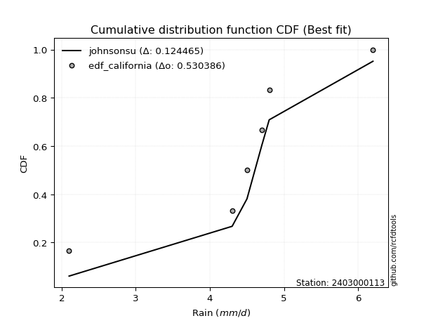</img>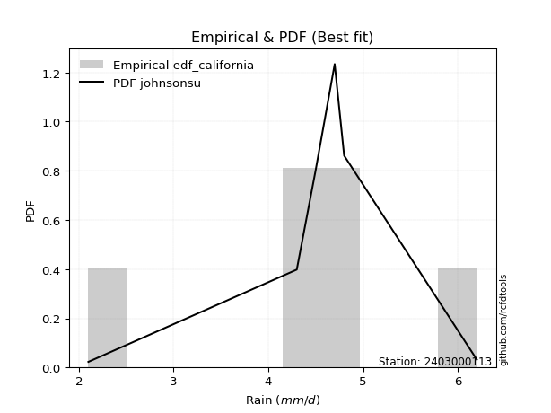</img>

</div>


### 2. EDF Hazen (1930)

Hazen method for plotting positions is a formula used to estimate the empirical cumulative probability distribution of flood events or other hydrological data. This formula often results in biased estimations, particularly when extrapolating to extreme events (high return periods).

<div align="center">


$P=(m-0.5)/n$


</div>


**2.1. Empirical values**

<div align="center">

|                | 0                  | 1                  | 2         | 3                 | 4                  |
|:---------------|:-------------------|:-------------------|:----------|:------------------|:-------------------|
| date           | 2020               | 2021               | 2022      | 2023              | 2024               |
| x              | 2.1                | 4.3                | 4.5       | 4.7               | 6.2                |
| m              | 1                  | 2                  | 3         | 4                 | 5                  |
| empirical_dist | edf_hazen          | edf_hazen          | edf_hazen | edf_hazen         | edf_hazen          |
| empirical      | 0.1                | 0.3                | 0.5       | 0.7               | 0.9                |
| empirical_tr   | 1.1111111111111112 | 1.4285714285714286 | 2.0       | 3.333333333333333 | 10.000000000000002 |

</div>


**2.2. Kolmogorov-Smirnov fit test (sorted by Δ)**


<div align="center">

|                | 0                   | 1                    | 2                  | 3                  | 4                   | 5                   | 6                  | 7                   | 8                   | 9                   | 10                  | 11                  | 12                  | 13                 | 14                    | 15                  | 16                 | 17                 | 18                  | 19                 | 20                 | 21                 | 22                  | 23                  | 24                  | 25                 | 26                 | 27                 | 28                  | 29                  | 30                  | 31                  | 32                 | 33                  | 34                  | 35                 | 36                 | 37                 | 38                  | 39                  | 40                  | 41                  | 42                 | 43                  | 44                  | 45                 | 46                 | 47                 | 48                  | 49                  | 50                 | 51                  | 52                 | 53                  | 54                 | 55                 | 56                 | 57                 | 58                 | 59                  | 60                 | 61                 | 62                 | 63                 | 64                 | 65                  | 66                  | 67                  | 68                 | 69                 | 70                 | 71                  | 72                 | 73                 | 74                  | 75                  | 76                  | 77                  | 78                 | 79                 | 80                 | 81                  | 82                  | 83                  | 84                  | 85                 | 86                 | 87                  |
|:---------------|:--------------------|:---------------------|:-------------------|:-------------------|:--------------------|:--------------------|:-------------------|:--------------------|:--------------------|:--------------------|:--------------------|:--------------------|:--------------------|:-------------------|:----------------------|:--------------------|:-------------------|:-------------------|:--------------------|:-------------------|:-------------------|:-------------------|:--------------------|:--------------------|:--------------------|:-------------------|:-------------------|:-------------------|:--------------------|:--------------------|:--------------------|:--------------------|:-------------------|:--------------------|:--------------------|:-------------------|:-------------------|:-------------------|:--------------------|:--------------------|:--------------------|:--------------------|:-------------------|:--------------------|:--------------------|:-------------------|:-------------------|:-------------------|:--------------------|:--------------------|:-------------------|:--------------------|:-------------------|:--------------------|:-------------------|:-------------------|:-------------------|:-------------------|:-------------------|:--------------------|:-------------------|:-------------------|:-------------------|:-------------------|:-------------------|:--------------------|:--------------------|:--------------------|:-------------------|:-------------------|:-------------------|:--------------------|:-------------------|:-------------------|:--------------------|:--------------------|:--------------------|:--------------------|:-------------------|:-------------------|:-------------------|:--------------------|:--------------------|:--------------------|:--------------------|:-------------------|:-------------------|:--------------------|
| station        | 2403000113          | 2403000113           | 2403000113         | 2403000113         | 2403000113          | 2403000113          | 2403000113         | 2403000113          | 2403000113          | 2403000113          | 2403000113          | 2403000113          | 2403000113          | 2403000113         | 2403000113            | 2403000113          | 2403000113         | 2403000113         | 2403000113          | 2403000113         | 2403000113         | 2403000113         | 2403000113          | 2403000113          | 2403000113          | 2403000113         | 2403000113         | 2403000113         | 2403000113          | 2403000113          | 2403000113          | 2403000113          | 2403000113         | 2403000113          | 2403000113          | 2403000113         | 2403000113         | 2403000113         | 2403000113          | 2403000113          | 2403000113          | 2403000113          | 2403000113         | 2403000113          | 2403000113          | 2403000113         | 2403000113         | 2403000113         | 2403000113          | 2403000113          | 2403000113         | 2403000113          | 2403000113         | 2403000113          | 2403000113         | 2403000113         | 2403000113         | 2403000113         | 2403000113         | 2403000113          | 2403000113         | 2403000113         | 2403000113         | 2403000113         | 2403000113         | 2403000113          | 2403000113          | 2403000113          | 2403000113         | 2403000113         | 2403000113         | 2403000113          | 2403000113         | 2403000113         | 2403000113          | 2403000113          | 2403000113          | 2403000113          | 2403000113         | 2403000113         | 2403000113         | 2403000113          | 2403000113          | 2403000113          | 2403000113          | 2403000113         | 2403000113         | 2403000113          |
| empirical_dist | edf_hazen           | edf_hazen            | edf_hazen          | edf_hazen          | edf_hazen           | edf_hazen           | edf_hazen          | edf_hazen           | edf_hazen           | edf_hazen           | edf_hazen           | edf_hazen           | edf_hazen           | edf_hazen          | edf_hazen             | edf_hazen           | edf_hazen          | edf_hazen          | edf_hazen           | edf_hazen          | edf_hazen          | edf_hazen          | edf_hazen           | edf_hazen           | edf_hazen           | edf_hazen          | edf_hazen          | edf_hazen          | edf_hazen           | edf_hazen           | edf_hazen           | edf_hazen           | edf_hazen          | edf_hazen           | edf_hazen           | edf_hazen          | edf_hazen          | edf_hazen          | edf_hazen           | edf_hazen           | edf_hazen           | edf_hazen           | edf_hazen          | edf_hazen           | edf_hazen           | edf_hazen          | edf_hazen          | edf_hazen          | edf_hazen           | edf_hazen           | edf_hazen          | edf_hazen           | edf_hazen          | edf_hazen           | edf_hazen          | edf_hazen          | edf_hazen          | edf_hazen          | edf_hazen          | edf_hazen           | edf_hazen          | edf_hazen          | edf_hazen          | edf_hazen          | edf_hazen          | edf_hazen           | edf_hazen           | edf_hazen           | edf_hazen          | edf_hazen          | edf_hazen          | edf_hazen           | edf_hazen          | edf_hazen          | edf_hazen           | edf_hazen           | edf_hazen           | edf_hazen           | edf_hazen          | edf_hazen          | edf_hazen          | edf_hazen           | edf_hazen           | edf_hazen           | edf_hazen           | edf_hazen          | edf_hazen          | edf_hazen           |
| p_dist         | johnsonsu           | logjohnsonsu         | logt               | genlogistic        | laplace_asymmetric  | weibull_min         | fisk               | logloggamma         | pearson3            | loggenlogistic      | gumbel_l            | laplace             | gompertz            | logweibull_min     | loglaplace_asymmetric | hypsecant           | logistic           | loggumbel_l        | logpearson3         | exponnorm          | t                  | truncnorm          | norm                | crystalball         | logfisk             | nct                | fatiguelife        | f                  | betaprime           | gamma               | erlang              | rice                | logmielke          | loggompertz         | invgamma            | alpha              | invgauss           | maxwell            | ncf                 | rayleigh            | invweibull          | logf                | logexponnorm       | lognorm             | lognorm             | logcrystalball     | logfatiguelife     | lognct             | logalpha            | logncf              | gumbel_r           | loglogistic         | logrice            | logbetaprime        | kstwobign          | halfnorm           | loghypsecant       | loggamma           | loggamma           | genexpon            | loginvgamma        | loginvgauss        | loginvweibull      | moyal              | loglaplace         | logmaxwell          | halflogistic        | lograyleigh         | lognakagami        | logkstwobign       | logchi2            | loggenexpon         | loghalfnorm        | loggumbel_r        | expon               | nakagami            | logmoyal            | loghalflogistic     | wald               | logexpon           | gibrat             | loglognorm          | logerlang           | logwald             | logtruncnorm        | loggibrat          | chi2               | mielke              |
| delta          | 0.03695389226593468 | 0.041640656900326777 | 0.0478463617264281 | 0.1339613896448496 | 0.13818475055289187 | 0.14151931011935842 | 0.1464752929410092 | 0.14678878293004594 | 0.15105258012322648 | 0.15665179015912167 | 0.15728764099031145 | 0.16873073186530135 | 0.17115122370437047 | 0.1718438730048682 | 0.17657848431244322   | 0.17718720807791344 | 0.1793051820878394 | 0.180568076292783  | 0.18165305013483574 | 0.1817861344941425 | 0.1817883392196546 | 0.181788485591655  | 0.18178875290360513 | 0.18178883203860075 | 0.18188744858660794 | 0.1822198945295435 | 0.1827580151431864 | 0.1843875168817259 | 0.19115973018850857 | 0.19241502197634225 | 0.19317211592485733 | 0.19469595673481416 | 0.1994904345453733 | 0.20125925823649954 | 0.20515328208661837 | 0.2069640947689198 | 0.2107407715730883 | 0.215472410815938  | 0.21700144464054522 | 0.22685376138235697 | 0.24243935762062557 | 0.24661167605384998 | 0.2478241818919094 | 0.24782619377897036 | 0.24782619377897036 | 0.2478261970438675 | 0.248092621763562  | 0.2500451477338496 | 0.25127507952931677 | 0.25129212186534816 | 0.2513835397990533 | 0.25427684728264305 | 0.2558458081913621 | 0.25620895200196864 | 0.2585911559696799 | 0.2589120109860779 | 0.2597318672591104 | 0.2603131643580517 | 0.2603131643580517 | 0.26232476856373105 | 0.2658288319639603 | 0.2741976695863669 | 0.2764850407430693 | 0.277249801344236  | 0.2781454855518713 | 0.27835904631380876 | 0.28263285452664305 | 0.28817992553040067 | 0.2999931887674109 | 0.3081046018214845 | 0.3134635110965038 | 0.31372341171115586 | 0.3158775163425865 | 0.3180022740333503 | 0.32222304642647687 | 0.32665693794136674 | 0.34290936650108345 | 0.34309532259440595 | 0.3492412296328186 | 0.3550135305360393 | 0.3694034686337678 | 0.38788753093388334 | 0.40523125211959116 | 0.41202017151902487 | 0.43237017802913613 | 0.4409479606549936 | 0.458740655082799  | 0.49188260864906935 |
| deltao         | 0.5865427407550001  | 0.5865427407550001   | 0.5865427407550001 | 0.5865427407550001 | 0.5865427407550001  | 0.5865427407550001  | 0.5865427407550001 | 0.5865427407550001  | 0.5865427407550001  | 0.5865427407550001  | 0.5865427407550001  | 0.5865427407550001  | 0.5865427407550001  | 0.5865427407550001 | 0.5865427407550001    | 0.5865427407550001  | 0.5865427407550001 | 0.5865427407550001 | 0.5865427407550001  | 0.5865427407550001 | 0.5865427407550001 | 0.5865427407550001 | 0.5865427407550001  | 0.5865427407550001  | 0.5865427407550001  | 0.5865427407550001 | 0.5865427407550001 | 0.5865427407550001 | 0.5865427407550001  | 0.5865427407550001  | 0.5865427407550001  | 0.5865427407550001  | 0.5865427407550001 | 0.5865427407550001  | 0.5865427407550001  | 0.5865427407550001 | 0.5865427407550001 | 0.5865427407550001 | 0.5865427407550001  | 0.5865427407550001  | 0.5865427407550001  | 0.5865427407550001  | 0.5865427407550001 | 0.5865427407550001  | 0.5865427407550001  | 0.5865427407550001 | 0.5865427407550001 | 0.5865427407550001 | 0.5865427407550001  | 0.5865427407550001  | 0.5865427407550001 | 0.5865427407550001  | 0.5865427407550001 | 0.5865427407550001  | 0.5865427407550001 | 0.5865427407550001 | 0.5865427407550001 | 0.5865427407550001 | 0.5865427407550001 | 0.5865427407550001  | 0.5865427407550001 | 0.5865427407550001 | 0.5865427407550001 | 0.5865427407550001 | 0.5865427407550001 | 0.5865427407550001  | 0.5865427407550001  | 0.5865427407550001  | 0.5865427407550001 | 0.5865427407550001 | 0.5865427407550001 | 0.5865427407550001  | 0.5865427407550001 | 0.5865427407550001 | 0.5865427407550001  | 0.5865427407550001  | 0.5865427407550001  | 0.5865427407550001  | 0.5865427407550001 | 0.5865427407550001 | 0.5865427407550001 | 0.5865427407550001  | 0.5865427407550001  | 0.5865427407550001  | 0.5865427407550001  | 0.5865427407550001 | 0.5865427407550001 | 0.5865427407550001  |
| eval           | Δo > Δ              | Δo > Δ               | Δo > Δ             | Δo > Δ             | Δo > Δ              | Δo > Δ              | Δo > Δ             | Δo > Δ              | Δo > Δ              | Δo > Δ              | Δo > Δ              | Δo > Δ              | Δo > Δ              | Δo > Δ             | Δo > Δ                | Δo > Δ              | Δo > Δ             | Δo > Δ             | Δo > Δ              | Δo > Δ             | Δo > Δ             | Δo > Δ             | Δo > Δ              | Δo > Δ              | Δo > Δ              | Δo > Δ             | Δo > Δ             | Δo > Δ             | Δo > Δ              | Δo > Δ              | Δo > Δ              | Δo > Δ              | Δo > Δ             | Δo > Δ              | Δo > Δ              | Δo > Δ             | Δo > Δ             | Δo > Δ             | Δo > Δ              | Δo > Δ              | Δo > Δ              | Δo > Δ              | Δo > Δ             | Δo > Δ              | Δo > Δ              | Δo > Δ             | Δo > Δ             | Δo > Δ             | Δo > Δ              | Δo > Δ              | Δo > Δ             | Δo > Δ              | Δo > Δ             | Δo > Δ              | Δo > Δ             | Δo > Δ             | Δo > Δ             | Δo > Δ             | Δo > Δ             | Δo > Δ              | Δo > Δ             | Δo > Δ             | Δo > Δ             | Δo > Δ             | Δo > Δ             | Δo > Δ              | Δo > Δ              | Δo > Δ              | Δo > Δ             | Δo > Δ             | Δo > Δ             | Δo > Δ              | Δo > Δ             | Δo > Δ             | Δo > Δ              | Δo > Δ              | Δo > Δ              | Δo > Δ              | Δo > Δ             | Δo > Δ             | Δo > Δ             | Δo > Δ              | Δo > Δ              | Δo > Δ              | Δo > Δ              | Δo > Δ             | Δo > Δ             | Δo > Δ              |
| fit            | 1                   | 1                    | 1                  | 1                  | 1                   | 1                   | 1                  | 1                   | 1                   | 1                   | 1                   | 1                   | 1                   | 1                  | 1                     | 1                   | 1                  | 1                  | 1                   | 1                  | 1                  | 1                  | 1                   | 1                   | 1                   | 1                  | 1                  | 1                  | 1                   | 1                   | 1                   | 1                   | 1                  | 1                   | 1                   | 1                  | 1                  | 1                  | 1                   | 1                   | 1                   | 1                   | 1                  | 1                   | 1                   | 1                  | 1                  | 1                  | 1                   | 1                   | 1                  | 1                   | 1                  | 1                   | 1                  | 1                  | 1                  | 1                  | 1                  | 1                   | 1                  | 1                  | 1                  | 1                  | 1                  | 1                   | 1                   | 1                   | 1                  | 1                  | 1                  | 1                   | 1                  | 1                  | 1                   | 1                   | 1                   | 1                   | 1                  | 1                  | 1                  | 1                   | 1                   | 1                   | 1                   | 1                  | 1                  | 1                   |
| n              | 5                   | 5                    | 5                  | 5                  | 5                   | 5                   | 5                  | 5                   | 5                   | 5                   | 5                   | 5                   | 5                   | 5                  | 5                     | 5                   | 5                  | 5                  | 5                   | 5                  | 5                  | 5                  | 5                   | 5                   | 5                   | 5                  | 5                  | 5                  | 5                   | 5                   | 5                   | 5                   | 5                  | 5                   | 5                   | 5                  | 5                  | 5                  | 5                   | 5                   | 5                   | 5                   | 5                  | 5                   | 5                   | 5                  | 5                  | 5                  | 5                   | 5                   | 5                  | 5                   | 5                  | 5                   | 5                  | 5                  | 5                  | 5                  | 5                  | 5                   | 5                  | 5                  | 5                  | 5                  | 5                  | 5                   | 5                   | 5                   | 5                  | 5                  | 5                  | 5                   | 5                  | 5                  | 5                   | 5                   | 5                   | 5                   | 5                  | 5                  | 5                  | 5                   | 5                   | 5                   | 5                   | 5                  | 5                  | 5                   |
| best_fit       | 1                   | 0                    | 0                  | 0                  | 0                   | 0                   | 0                  | 0                   | 0                   | 0                   | 0                   | 0                   | 0                   | 0                  | 0                     | 0                   | 0                  | 0                  | 0                   | 0                  | 0                  | 0                  | 0                   | 0                   | 0                   | 0                  | 0                  | 0                  | 0                   | 0                   | 0                   | 0                   | 0                  | 0                   | 0                   | 0                  | 0                  | 0                  | 0                   | 0                   | 0                   | 0                   | 0                  | 0                   | 0                   | 0                  | 0                  | 0                  | 0                   | 0                   | 0                  | 0                   | 0                  | 0                   | 0                  | 0                  | 0                  | 0                  | 0                  | 0                   | 0                  | 0                  | 0                  | 0                  | 0                  | 0                   | 0                   | 0                   | 0                  | 0                  | 0                  | 0                   | 0                  | 0                  | 0                   | 0                   | 0                   | 0                   | 0                  | 0                  | 0                  | 0                   | 0                   | 0                   | 0                   | 0                  | 0                  | 0                   |
| best_fit_sort  | 1                   | 2                    | 3                  | 4                  | 5                   | 6                   | 7                  | 8                   | 9                   | 10                  | 11                  | 12                  | 13                  | 14                 | 15                    | 16                  | 17                 | 18                 | 19                  | 20                 | 21                 | 22                 | 23                  | 24                  | 25                  | 26                 | 27                 | 28                 | 29                  | 30                  | 31                  | 32                  | 33                 | 34                  | 35                  | 36                 | 37                 | 38                 | 39                  | 40                  | 41                  | 42                  | 43                 | 44                  | 45                  | 46                 | 47                 | 48                 | 49                  | 50                  | 51                 | 52                  | 53                 | 54                  | 55                 | 56                 | 57                 | 58                 | 59                 | 60                  | 61                 | 62                 | 63                 | 64                 | 65                 | 66                  | 67                  | 68                  | 69                 | 70                 | 71                 | 72                  | 73                 | 74                 | 75                  | 76                  | 77                  | 78                  | 79                 | 80                 | 81                 | 82                  | 83                  | 84                  | 85                  | 86                 | 87                 | 88                  |

</div>


**2.3. Best fit**

<div align="center">

|   id |    station | empirical_dist   | p_dist    |     delta |   deltao | eval   |   fit |   n |   best_fit |   best_fit_sort |
|-----:|-----------:|:-----------------|:----------|----------:|---------:|:-------|------:|----:|-----------:|----------------:|
|    0 | 2403000113 | edf_hazen        | johnsonsu | 0.0369539 | 0.586543 | Δo > Δ |     1 |   5 |          1 |               1 |

</div>


<div align="center">

</img></img>

</div>


### 3. EDF Weibull (1939)

Weibull plotting position formula is an empirical method used to estimate the non-exceedance probability or plotting position for a set of observed data, is often recommended or widely used in practice, particularly in flood frequency analysis.

<div align="center">


$P=m/(n+1)$


</div>


**3.1. Empirical values**

<div align="center">

|                | 0                   | 1                  | 2           | 3                  | 4                  |
|:---------------|:--------------------|:-------------------|:------------|:-------------------|:-------------------|
| date           | 2020                | 2021               | 2022        | 2023               | 2024               |
| x              | 2.1                 | 4.3                | 4.5         | 4.7                | 6.2                |
| m              | 1                   | 2                  | 3           | 4                  | 5                  |
| empirical_dist | edf_weibull         | edf_weibull        | edf_weibull | edf_weibull        | edf_weibull        |
| empirical      | 0.16666666666666666 | 0.3333333333333333 | 0.5         | 0.6666666666666666 | 0.8333333333333334 |
| empirical_tr   | 1.2                 | 1.4999999999999998 | 2.0         | 2.9999999999999996 | 6.000000000000002  |

</div>


**3.2. Kolmogorov-Smirnov fit test (sorted by Δ)**


<div align="center">

|                | 0                   | 1                   | 2                   | 3                   | 4                   | 5                   | 6                   | 7                   | 8                   | 9                   | 10                  | 11                  | 12                  | 13                    | 14                 | 15                  | 16                  | 17                 | 18                  | 19                  | 20                  | 21                 | 22                  | 23                 | 24                 | 25                  | 26                  | 27                  | 28                  | 29                 | 30                  | 31                  | 32                  | 33                 | 34                  | 35                  | 36                  | 37                  | 38                 | 39                  | 40                  | 41                  | 42                  | 43                  | 44                  | 45                  | 46                  | 47                 | 48                  | 49                  | 50                 | 51                  | 52                  | 53                 | 54                  | 55                  | 56                  | 57                  | 58                  | 59                  | 60                  | 61                  | 62                  | 63                  | 64                  | 65                  | 66                  | 67                  | 68                 | 69                  | 70                  | 71                  | 72                  | 73                  | 74                 | 75                 | 76                 | 77                  | 78                  | 79                 | 80                  | 81                 | 82                  | 83                  | 84                 | 85                  | 86                  | 87                 |
|:---------------|:--------------------|:--------------------|:--------------------|:--------------------|:--------------------|:--------------------|:--------------------|:--------------------|:--------------------|:--------------------|:--------------------|:--------------------|:--------------------|:----------------------|:-------------------|:--------------------|:--------------------|:-------------------|:--------------------|:--------------------|:--------------------|:-------------------|:--------------------|:-------------------|:-------------------|:--------------------|:--------------------|:--------------------|:--------------------|:-------------------|:--------------------|:--------------------|:--------------------|:-------------------|:--------------------|:--------------------|:--------------------|:--------------------|:-------------------|:--------------------|:--------------------|:--------------------|:--------------------|:--------------------|:--------------------|:--------------------|:--------------------|:-------------------|:--------------------|:--------------------|:-------------------|:--------------------|:--------------------|:-------------------|:--------------------|:--------------------|:--------------------|:--------------------|:--------------------|:--------------------|:--------------------|:--------------------|:--------------------|:--------------------|:--------------------|:--------------------|:--------------------|:--------------------|:-------------------|:--------------------|:--------------------|:--------------------|:--------------------|:--------------------|:-------------------|:-------------------|:-------------------|:--------------------|:--------------------|:-------------------|:--------------------|:-------------------|:--------------------|:--------------------|:-------------------|:--------------------|:--------------------|:-------------------|
| station        | 2403000113          | 2403000113          | 2403000113          | 2403000113          | 2403000113          | 2403000113          | 2403000113          | 2403000113          | 2403000113          | 2403000113          | 2403000113          | 2403000113          | 2403000113          | 2403000113            | 2403000113         | 2403000113          | 2403000113          | 2403000113         | 2403000113          | 2403000113          | 2403000113          | 2403000113         | 2403000113          | 2403000113         | 2403000113         | 2403000113          | 2403000113          | 2403000113          | 2403000113          | 2403000113         | 2403000113          | 2403000113          | 2403000113          | 2403000113         | 2403000113          | 2403000113          | 2403000113          | 2403000113          | 2403000113         | 2403000113          | 2403000113          | 2403000113          | 2403000113          | 2403000113          | 2403000113          | 2403000113          | 2403000113          | 2403000113         | 2403000113          | 2403000113          | 2403000113         | 2403000113          | 2403000113          | 2403000113         | 2403000113          | 2403000113          | 2403000113          | 2403000113          | 2403000113          | 2403000113          | 2403000113          | 2403000113          | 2403000113          | 2403000113          | 2403000113          | 2403000113          | 2403000113          | 2403000113          | 2403000113         | 2403000113          | 2403000113          | 2403000113          | 2403000113          | 2403000113          | 2403000113         | 2403000113         | 2403000113         | 2403000113          | 2403000113          | 2403000113         | 2403000113          | 2403000113         | 2403000113          | 2403000113          | 2403000113         | 2403000113          | 2403000113          | 2403000113         |
| empirical_dist | edf_weibull         | edf_weibull         | edf_weibull         | edf_weibull         | edf_weibull         | edf_weibull         | edf_weibull         | edf_weibull         | edf_weibull         | edf_weibull         | edf_weibull         | edf_weibull         | edf_weibull         | edf_weibull           | edf_weibull        | edf_weibull         | edf_weibull         | edf_weibull        | edf_weibull         | edf_weibull         | edf_weibull         | edf_weibull        | edf_weibull         | edf_weibull        | edf_weibull        | edf_weibull         | edf_weibull         | edf_weibull         | edf_weibull         | edf_weibull        | edf_weibull         | edf_weibull         | edf_weibull         | edf_weibull        | edf_weibull         | edf_weibull         | edf_weibull         | edf_weibull         | edf_weibull        | edf_weibull         | edf_weibull         | edf_weibull         | edf_weibull         | edf_weibull         | edf_weibull         | edf_weibull         | edf_weibull         | edf_weibull        | edf_weibull         | edf_weibull         | edf_weibull        | edf_weibull         | edf_weibull         | edf_weibull        | edf_weibull         | edf_weibull         | edf_weibull         | edf_weibull         | edf_weibull         | edf_weibull         | edf_weibull         | edf_weibull         | edf_weibull         | edf_weibull         | edf_weibull         | edf_weibull         | edf_weibull         | edf_weibull         | edf_weibull        | edf_weibull         | edf_weibull         | edf_weibull         | edf_weibull         | edf_weibull         | edf_weibull        | edf_weibull        | edf_weibull        | edf_weibull         | edf_weibull         | edf_weibull        | edf_weibull         | edf_weibull        | edf_weibull         | edf_weibull         | edf_weibull        | edf_weibull         | edf_weibull         | edf_weibull        |
| p_dist         | johnsonsu           | logjohnsonsu        | genlogistic         | weibull_min         | logloggamma         | logt                | pearson3            | laplace_asymmetric  | loggenlogistic      | fisk                | gumbel_l            | laplace             | logweibull_min      | loglaplace_asymmetric | hypsecant          | logistic            | loggumbel_l         | logpearson3        | exponnorm           | t                   | truncnorm           | norm               | crystalball         | logfisk            | nct                | fatiguelife         | f                   | betaprime           | gamma               | erlang             | rice                | logmielke           | gompertz            | loggompertz        | invgamma            | alpha               | invgauss            | maxwell             | ncf                | rayleigh            | invweibull          | logf                | logexponnorm        | lognorm             | lognorm             | logcrystalball      | logfatiguelife      | lognct             | logalpha            | logncf              | gumbel_r           | loglogistic         | logrice             | logbetaprime       | kstwobign           | halfnorm            | loghypsecant        | loggamma            | loggamma            | genexpon            | loginvgamma         | loginvgauss         | loginvweibull       | moyal               | loglaplace          | logmaxwell          | halflogistic        | lograyleigh         | logkstwobign       | logchi2             | loggenexpon         | loghalfnorm         | loggumbel_r         | expon               | logmoyal           | loghalflogistic    | wald               | logexpon            | nakagami            | lognakagami        | gibrat              | loglognorm         | logerlang           | logwald             | logtruncnorm       | loggibrat           | chi2                | mielke             |
| delta          | 0.10362055893260133 | 0.10830732356699344 | 0.10975073310760483 | 0.11297987619897112 | 0.11345544959671261 | 0.11451302839309475 | 0.11771924678989315 | 0.12188216794105015 | 0.12331845682578835 | 0.12941286193950205 | 0.13273079832805112 | 0.13539739853196803 | 0.13851053967153487 | 0.1432451509791099    | 0.1438538747445801 | 0.14597184875450608 | 0.14723474295944966 | 0.1483197168015024 | 0.14845280116080917 | 0.14845500588632127 | 0.14845515225832168 | 0.1484554195702718 | 0.14845549870526742 | 0.1485541152532746 | 0.1488865611962102 | 0.14942468180985308 | 0.15105418354839256 | 0.15782639685517524 | 0.15908168864300892 | 0.159838782591524  | 0.16136262340148083 | 0.16615710121203997 | 0.16666666041356493 | 0.1679259249031662 | 0.17181994875328505 | 0.17363076143558648 | 0.17740743823975497 | 0.18213907748260466 | 0.1836681113072119 | 0.19352042804902364 | 0.20910602428729225 | 0.21327834272051666 | 0.21449084855857609 | 0.21449286044563703 | 0.21449286044563703 | 0.21449286371053417 | 0.21475928843022868 | 0.2167118144005163 | 0.21794174619598344 | 0.21795878853201484 | 0.21805020646572   | 0.22094351394930972 | 0.22251247485802877 | 0.2228756186686353 | 0.22525782263634658 | 0.22557867765274459 | 0.22639853392577708 | 0.22697983102471836 | 0.22697983102471836 | 0.22899143523039772 | 0.23249549863062696 | 0.24086433625303355 | 0.24315170740973596 | 0.24391646801090267 | 0.24481215221853797 | 0.24502571298047543 | 0.24929952119330973 | 0.25484659219706735 | 0.2747712684881512 | 0.28013017776317045 | 0.28039007837782254 | 0.28254418300925316 | 0.28466894070001697 | 0.28888971309314354 | 0.3095760331677501 | 0.3097619892610726 | 0.3159078962994853 | 0.32168019720270596 | 0.32665693794136674 | 0.3333265221007442 | 0.33607013530043445 | 0.35455419760055   | 0.37189791878625783 | 0.37868683818569154 | 0.3990368446958028 | 0.40761462732166026 | 0.42540732174946566 | 0.458549275315736  |
| deltao         | 0.5865427407550001  | 0.5865427407550001  | 0.5865427407550001  | 0.5865427407550001  | 0.5865427407550001  | 0.5865427407550001  | 0.5865427407550001  | 0.5865427407550001  | 0.5865427407550001  | 0.5865427407550001  | 0.5865427407550001  | 0.5865427407550001  | 0.5865427407550001  | 0.5865427407550001    | 0.5865427407550001 | 0.5865427407550001  | 0.5865427407550001  | 0.5865427407550001 | 0.5865427407550001  | 0.5865427407550001  | 0.5865427407550001  | 0.5865427407550001 | 0.5865427407550001  | 0.5865427407550001 | 0.5865427407550001 | 0.5865427407550001  | 0.5865427407550001  | 0.5865427407550001  | 0.5865427407550001  | 0.5865427407550001 | 0.5865427407550001  | 0.5865427407550001  | 0.5865427407550001  | 0.5865427407550001 | 0.5865427407550001  | 0.5865427407550001  | 0.5865427407550001  | 0.5865427407550001  | 0.5865427407550001 | 0.5865427407550001  | 0.5865427407550001  | 0.5865427407550001  | 0.5865427407550001  | 0.5865427407550001  | 0.5865427407550001  | 0.5865427407550001  | 0.5865427407550001  | 0.5865427407550001 | 0.5865427407550001  | 0.5865427407550001  | 0.5865427407550001 | 0.5865427407550001  | 0.5865427407550001  | 0.5865427407550001 | 0.5865427407550001  | 0.5865427407550001  | 0.5865427407550001  | 0.5865427407550001  | 0.5865427407550001  | 0.5865427407550001  | 0.5865427407550001  | 0.5865427407550001  | 0.5865427407550001  | 0.5865427407550001  | 0.5865427407550001  | 0.5865427407550001  | 0.5865427407550001  | 0.5865427407550001  | 0.5865427407550001 | 0.5865427407550001  | 0.5865427407550001  | 0.5865427407550001  | 0.5865427407550001  | 0.5865427407550001  | 0.5865427407550001 | 0.5865427407550001 | 0.5865427407550001 | 0.5865427407550001  | 0.5865427407550001  | 0.5865427407550001 | 0.5865427407550001  | 0.5865427407550001 | 0.5865427407550001  | 0.5865427407550001  | 0.5865427407550001 | 0.5865427407550001  | 0.5865427407550001  | 0.5865427407550001 |
| eval           | Δo > Δ              | Δo > Δ              | Δo > Δ              | Δo > Δ              | Δo > Δ              | Δo > Δ              | Δo > Δ              | Δo > Δ              | Δo > Δ              | Δo > Δ              | Δo > Δ              | Δo > Δ              | Δo > Δ              | Δo > Δ                | Δo > Δ             | Δo > Δ              | Δo > Δ              | Δo > Δ             | Δo > Δ              | Δo > Δ              | Δo > Δ              | Δo > Δ             | Δo > Δ              | Δo > Δ             | Δo > Δ             | Δo > Δ              | Δo > Δ              | Δo > Δ              | Δo > Δ              | Δo > Δ             | Δo > Δ              | Δo > Δ              | Δo > Δ              | Δo > Δ             | Δo > Δ              | Δo > Δ              | Δo > Δ              | Δo > Δ              | Δo > Δ             | Δo > Δ              | Δo > Δ              | Δo > Δ              | Δo > Δ              | Δo > Δ              | Δo > Δ              | Δo > Δ              | Δo > Δ              | Δo > Δ             | Δo > Δ              | Δo > Δ              | Δo > Δ             | Δo > Δ              | Δo > Δ              | Δo > Δ             | Δo > Δ              | Δo > Δ              | Δo > Δ              | Δo > Δ              | Δo > Δ              | Δo > Δ              | Δo > Δ              | Δo > Δ              | Δo > Δ              | Δo > Δ              | Δo > Δ              | Δo > Δ              | Δo > Δ              | Δo > Δ              | Δo > Δ             | Δo > Δ              | Δo > Δ              | Δo > Δ              | Δo > Δ              | Δo > Δ              | Δo > Δ             | Δo > Δ             | Δo > Δ             | Δo > Δ              | Δo > Δ              | Δo > Δ             | Δo > Δ              | Δo > Δ             | Δo > Δ              | Δo > Δ              | Δo > Δ             | Δo > Δ              | Δo > Δ              | Δo > Δ             |
| fit            | 1                   | 1                   | 1                   | 1                   | 1                   | 1                   | 1                   | 1                   | 1                   | 1                   | 1                   | 1                   | 1                   | 1                     | 1                  | 1                   | 1                   | 1                  | 1                   | 1                   | 1                   | 1                  | 1                   | 1                  | 1                  | 1                   | 1                   | 1                   | 1                   | 1                  | 1                   | 1                   | 1                   | 1                  | 1                   | 1                   | 1                   | 1                   | 1                  | 1                   | 1                   | 1                   | 1                   | 1                   | 1                   | 1                   | 1                   | 1                  | 1                   | 1                   | 1                  | 1                   | 1                   | 1                  | 1                   | 1                   | 1                   | 1                   | 1                   | 1                   | 1                   | 1                   | 1                   | 1                   | 1                   | 1                   | 1                   | 1                   | 1                  | 1                   | 1                   | 1                   | 1                   | 1                   | 1                  | 1                  | 1                  | 1                   | 1                   | 1                  | 1                   | 1                  | 1                   | 1                   | 1                  | 1                   | 1                   | 1                  |
| n              | 5                   | 5                   | 5                   | 5                   | 5                   | 5                   | 5                   | 5                   | 5                   | 5                   | 5                   | 5                   | 5                   | 5                     | 5                  | 5                   | 5                   | 5                  | 5                   | 5                   | 5                   | 5                  | 5                   | 5                  | 5                  | 5                   | 5                   | 5                   | 5                   | 5                  | 5                   | 5                   | 5                   | 5                  | 5                   | 5                   | 5                   | 5                   | 5                  | 5                   | 5                   | 5                   | 5                   | 5                   | 5                   | 5                   | 5                   | 5                  | 5                   | 5                   | 5                  | 5                   | 5                   | 5                  | 5                   | 5                   | 5                   | 5                   | 5                   | 5                   | 5                   | 5                   | 5                   | 5                   | 5                   | 5                   | 5                   | 5                   | 5                  | 5                   | 5                   | 5                   | 5                   | 5                   | 5                  | 5                  | 5                  | 5                   | 5                   | 5                  | 5                   | 5                  | 5                   | 5                   | 5                  | 5                   | 5                   | 5                  |
| best_fit       | 1                   | 0                   | 0                   | 0                   | 0                   | 0                   | 0                   | 0                   | 0                   | 0                   | 0                   | 0                   | 0                   | 0                     | 0                  | 0                   | 0                   | 0                  | 0                   | 0                   | 0                   | 0                  | 0                   | 0                  | 0                  | 0                   | 0                   | 0                   | 0                   | 0                  | 0                   | 0                   | 0                   | 0                  | 0                   | 0                   | 0                   | 0                   | 0                  | 0                   | 0                   | 0                   | 0                   | 0                   | 0                   | 0                   | 0                   | 0                  | 0                   | 0                   | 0                  | 0                   | 0                   | 0                  | 0                   | 0                   | 0                   | 0                   | 0                   | 0                   | 0                   | 0                   | 0                   | 0                   | 0                   | 0                   | 0                   | 0                   | 0                  | 0                   | 0                   | 0                   | 0                   | 0                   | 0                  | 0                  | 0                  | 0                   | 0                   | 0                  | 0                   | 0                  | 0                   | 0                   | 0                  | 0                   | 0                   | 0                  |
| best_fit_sort  | 1                   | 2                   | 3                   | 4                   | 5                   | 6                   | 7                   | 8                   | 9                   | 10                  | 11                  | 12                  | 13                  | 14                    | 15                 | 16                  | 17                  | 18                 | 19                  | 20                  | 21                  | 22                 | 23                  | 24                 | 25                 | 26                  | 27                  | 28                  | 29                  | 30                 | 31                  | 32                  | 33                  | 34                 | 35                  | 36                  | 37                  | 38                  | 39                 | 40                  | 41                  | 42                  | 43                  | 44                  | 45                  | 46                  | 47                  | 48                 | 49                  | 50                  | 51                 | 52                  | 53                  | 54                 | 55                  | 56                  | 57                  | 58                  | 59                  | 60                  | 61                  | 62                  | 63                  | 64                  | 65                  | 66                  | 67                  | 68                  | 69                 | 70                  | 71                  | 72                  | 73                  | 74                  | 75                 | 76                 | 77                 | 78                  | 79                  | 80                 | 81                  | 82                 | 83                  | 84                  | 85                 | 86                  | 87                  | 88                 |

</div>


**3.3. Best fit**

<div align="center">

|   id |    station | empirical_dist   | p_dist    |    delta |   deltao | eval   |   fit |   n |   best_fit |   best_fit_sort |
|-----:|-----------:|:-----------------|:----------|---------:|---------:|:-------|------:|----:|-----------:|----------------:|
|    0 | 2403000113 | edf_weibull      | johnsonsu | 0.103621 | 0.586543 | Δo > Δ |     1 |   5 |          1 |               1 |

</div>


<div align="center">

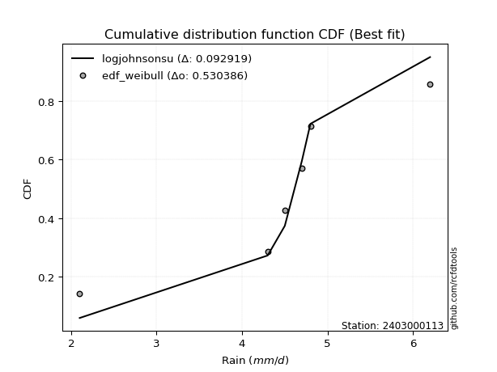</img>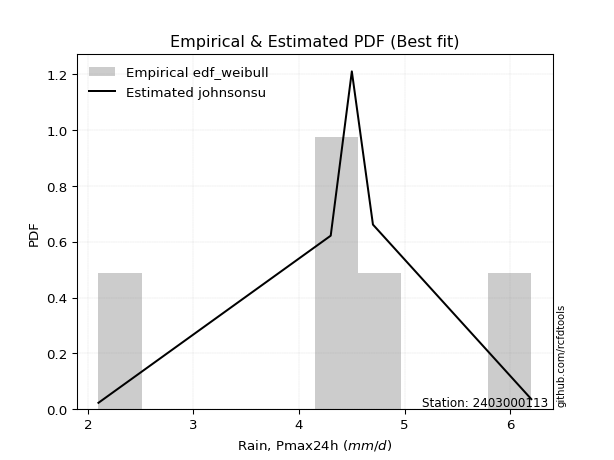</img>

</div>


### 4. EDF Beard (1943)

The Beard formula (or Beard´s plotting position formula) in hydrology is used to estimate the empirical non-exceedance probability _(P)_ of a flood event (or other extreme hydrological data point) within a given dataset.

<div align="center">


$P=(m-0.31)/(n+0.38)$


</div>


**4.1. Empirical values**

<div align="center">

|                | 0                   | 1                  | 2         | 3                  | 4                  |
|:---------------|:--------------------|:-------------------|:----------|:-------------------|:-------------------|
| date           | 2020                | 2021               | 2022      | 2023               | 2024               |
| x              | 2.1                 | 4.3                | 4.5       | 4.7                | 6.2                |
| m              | 1                   | 2                  | 3         | 4                  | 5                  |
| empirical_dist | edf_beard           | edf_beard          | edf_beard | edf_beard          | edf_beard          |
| empirical      | 0.12825278810408922 | 0.3141263940520446 | 0.5       | 0.6858736059479554 | 0.8717472118959109 |
| empirical_tr   | 1.1471215351812367  | 1.4579945799457996 | 2.0       | 3.183431952662722  | 7.797101449275368  |

</div>


**4.2. Kolmogorov-Smirnov fit test (sorted by Δ)**


<div align="center">

|                | 0                   | 1                  | 2                   | 3                   | 4                   | 5                  | 6                   | 7                  | 8                   | 9                   | 10                  | 11                  | 12                  | 13                  | 14                    | 15                 | 16                  | 17                  | 18                 | 19                  | 20                  | 21                  | 22                 | 23                 | 24                 | 25                  | 26                  | 27                  | 28                  | 29                  | 30                 | 31                  | 32                  | 33                 | 34                  | 35                  | 36                  | 37                  | 38                  | 39                  | 40                  | 41                  | 42                  | 43                  | 44                  | 45                  | 46                  | 47                  | 48                  | 49                  | 50                  | 51                  | 52                  | 53                 | 54                  | 55                  | 56                  | 57                  | 58                  | 59                  | 60                  | 61                  | 62                  | 63                  | 64                  | 65                 | 66                 | 67                  | 68                 | 69                  | 70                  | 71                  | 72                  | 73                  | 74                 | 75                  | 76                 | 77                 | 78                 | 79                  | 80                  | 81                 | 82                 | 83                  | 84                 | 85                  | 86                  | 87                 |
|:---------------|:--------------------|:-------------------|:--------------------|:--------------------|:--------------------|:-------------------|:--------------------|:-------------------|:--------------------|:--------------------|:--------------------|:--------------------|:--------------------|:--------------------|:----------------------|:-------------------|:--------------------|:--------------------|:-------------------|:--------------------|:--------------------|:--------------------|:-------------------|:-------------------|:-------------------|:--------------------|:--------------------|:--------------------|:--------------------|:--------------------|:-------------------|:--------------------|:--------------------|:-------------------|:--------------------|:--------------------|:--------------------|:--------------------|:--------------------|:--------------------|:--------------------|:--------------------|:--------------------|:--------------------|:--------------------|:--------------------|:--------------------|:--------------------|:--------------------|:--------------------|:--------------------|:--------------------|:--------------------|:-------------------|:--------------------|:--------------------|:--------------------|:--------------------|:--------------------|:--------------------|:--------------------|:--------------------|:--------------------|:--------------------|:--------------------|:-------------------|:-------------------|:--------------------|:-------------------|:--------------------|:--------------------|:--------------------|:--------------------|:--------------------|:-------------------|:--------------------|:-------------------|:-------------------|:-------------------|:--------------------|:--------------------|:-------------------|:-------------------|:--------------------|:-------------------|:--------------------|:--------------------|:-------------------|
| station        | 2403000113          | 2403000113         | 2403000113          | 2403000113          | 2403000113          | 2403000113         | 2403000113          | 2403000113         | 2403000113          | 2403000113          | 2403000113          | 2403000113          | 2403000113          | 2403000113          | 2403000113            | 2403000113         | 2403000113          | 2403000113          | 2403000113         | 2403000113          | 2403000113          | 2403000113          | 2403000113         | 2403000113         | 2403000113         | 2403000113          | 2403000113          | 2403000113          | 2403000113          | 2403000113          | 2403000113         | 2403000113          | 2403000113          | 2403000113         | 2403000113          | 2403000113          | 2403000113          | 2403000113          | 2403000113          | 2403000113          | 2403000113          | 2403000113          | 2403000113          | 2403000113          | 2403000113          | 2403000113          | 2403000113          | 2403000113          | 2403000113          | 2403000113          | 2403000113          | 2403000113          | 2403000113          | 2403000113         | 2403000113          | 2403000113          | 2403000113          | 2403000113          | 2403000113          | 2403000113          | 2403000113          | 2403000113          | 2403000113          | 2403000113          | 2403000113          | 2403000113         | 2403000113         | 2403000113          | 2403000113         | 2403000113          | 2403000113          | 2403000113          | 2403000113          | 2403000113          | 2403000113         | 2403000113          | 2403000113         | 2403000113         | 2403000113         | 2403000113          | 2403000113          | 2403000113         | 2403000113         | 2403000113          | 2403000113         | 2403000113          | 2403000113          | 2403000113         |
| empirical_dist | edf_beard           | edf_beard          | edf_beard           | edf_beard           | edf_beard           | edf_beard          | edf_beard           | edf_beard          | edf_beard           | edf_beard           | edf_beard           | edf_beard           | edf_beard           | edf_beard           | edf_beard             | edf_beard          | edf_beard           | edf_beard           | edf_beard          | edf_beard           | edf_beard           | edf_beard           | edf_beard          | edf_beard          | edf_beard          | edf_beard           | edf_beard           | edf_beard           | edf_beard           | edf_beard           | edf_beard          | edf_beard           | edf_beard           | edf_beard          | edf_beard           | edf_beard           | edf_beard           | edf_beard           | edf_beard           | edf_beard           | edf_beard           | edf_beard           | edf_beard           | edf_beard           | edf_beard           | edf_beard           | edf_beard           | edf_beard           | edf_beard           | edf_beard           | edf_beard           | edf_beard           | edf_beard           | edf_beard          | edf_beard           | edf_beard           | edf_beard           | edf_beard           | edf_beard           | edf_beard           | edf_beard           | edf_beard           | edf_beard           | edf_beard           | edf_beard           | edf_beard          | edf_beard          | edf_beard           | edf_beard          | edf_beard           | edf_beard           | edf_beard           | edf_beard           | edf_beard           | edf_beard          | edf_beard           | edf_beard          | edf_beard          | edf_beard          | edf_beard           | edf_beard           | edf_beard          | edf_beard          | edf_beard           | edf_beard          | edf_beard           | edf_beard           | edf_beard          |
| p_dist         | johnsonsu           | logjohnsonsu       | logt                | genlogistic         | laplace_asymmetric  | weibull_min        | fisk                | logloggamma        | pearson3            | loggenlogistic      | gumbel_l            | laplace             | gompertz            | logweibull_min      | loglaplace_asymmetric | hypsecant          | logistic            | loggumbel_l         | logpearson3        | exponnorm           | t                   | truncnorm           | norm               | crystalball        | logfisk            | nct                 | fatiguelife         | f                   | betaprime           | gamma               | erlang             | rice                | logmielke           | loggompertz        | invgamma            | alpha               | invgauss            | maxwell             | ncf                 | rayleigh            | invweibull          | logf                | logexponnorm        | lognorm             | lognorm             | logcrystalball      | logfatiguelife      | lognct              | logalpha            | logncf              | gumbel_r            | loglogistic         | logrice             | logbetaprime       | kstwobign           | halfnorm            | loghypsecant        | loggamma            | loggamma            | genexpon            | loginvgamma         | loginvgauss         | loginvweibull       | moyal               | loglaplace          | logmaxwell         | halflogistic       | lograyleigh         | logkstwobign       | logchi2             | loggenexpon         | loghalfnorm         | loggumbel_r         | expon               | lognakagami        | nakagami            | logmoyal           | loghalflogistic    | wald               | logexpon            | gibrat              | loglognorm         | logerlang          | logwald             | logtruncnorm       | loggibrat           | chi2                | mielke             |
| delta          | 0.06520668037002389 | 0.069893445004416  | 0.07609914983051731 | 0.11983499559280497 | 0.12405835650084723 | 0.1273929160673138 | 0.13234889888896456 | 0.1326623888780014 | 0.13692618607118184 | 0.14252539610707704 | 0.14316124693826693 | 0.15460433781325672 | 0.15702482965232584 | 0.15771747895282356 | 0.16245209026039859   | 0.1630608140258688 | 0.16517878803579478 | 0.16644168224073835 | 0.1675266560827911 | 0.16765974044209786 | 0.16766194516760996 | 0.16766209153961037 | 0.1676623588515605 | 0.1676624379865561 | 0.1677610545345633 | 0.16809350047749888 | 0.16863162109114177 | 0.17026112282968126 | 0.17703333613646394 | 0.17828862792429762 | 0.1790457218728127 | 0.18056956268276952 | 0.18536404049332877 | 0.1871328641844549 | 0.19102688803457374 | 0.19283770071687517 | 0.19661437752104366 | 0.20134601676389335 | 0.20287505058850058 | 0.21272736733031233 | 0.22831296356858094 | 0.23248528200180535 | 0.23369778783986478 | 0.23369979972692573 | 0.23369979972692573 | 0.23369980299182286 | 0.23396622771151737 | 0.23591875368180498 | 0.23714868547727214 | 0.23716572781330353 | 0.23725714574700868 | 0.24015045323059842 | 0.24171941413931747 | 0.242082557949924  | 0.24446476191763528 | 0.24478561693403328 | 0.24560547320706577 | 0.24618677030600705 | 0.24618677030600705 | 0.24819837451168641 | 0.25170243791191566 | 0.26007127553432224 | 0.26235864669102466 | 0.26312340729219136 | 0.26401909149982666 | 0.2642326522617641 | 0.2685064604745984 | 0.27405353147835604 | 0.2939782077694399 | 0.29933711704445914 | 0.29959701765911123 | 0.30175112229054185 | 0.30387587998130566 | 0.30809665237443223 | 0.3141195828194555 | 0.32665693794136674 | 0.3287829724490388 | 0.3289689285423613 | 0.335114835580774  | 0.34088713648399466 | 0.35527707458172314 | 0.3737611368818387 | 0.3911048580675465 | 0.39789377746698024 | 0.4182437839770916 | 0.42682156660294895 | 0.44461426103075435 | 0.4777562145970247 |
| deltao         | 0.5865427407550001  | 0.5865427407550001 | 0.5865427407550001  | 0.5865427407550001  | 0.5865427407550001  | 0.5865427407550001 | 0.5865427407550001  | 0.5865427407550001 | 0.5865427407550001  | 0.5865427407550001  | 0.5865427407550001  | 0.5865427407550001  | 0.5865427407550001  | 0.5865427407550001  | 0.5865427407550001    | 0.5865427407550001 | 0.5865427407550001  | 0.5865427407550001  | 0.5865427407550001 | 0.5865427407550001  | 0.5865427407550001  | 0.5865427407550001  | 0.5865427407550001 | 0.5865427407550001 | 0.5865427407550001 | 0.5865427407550001  | 0.5865427407550001  | 0.5865427407550001  | 0.5865427407550001  | 0.5865427407550001  | 0.5865427407550001 | 0.5865427407550001  | 0.5865427407550001  | 0.5865427407550001 | 0.5865427407550001  | 0.5865427407550001  | 0.5865427407550001  | 0.5865427407550001  | 0.5865427407550001  | 0.5865427407550001  | 0.5865427407550001  | 0.5865427407550001  | 0.5865427407550001  | 0.5865427407550001  | 0.5865427407550001  | 0.5865427407550001  | 0.5865427407550001  | 0.5865427407550001  | 0.5865427407550001  | 0.5865427407550001  | 0.5865427407550001  | 0.5865427407550001  | 0.5865427407550001  | 0.5865427407550001 | 0.5865427407550001  | 0.5865427407550001  | 0.5865427407550001  | 0.5865427407550001  | 0.5865427407550001  | 0.5865427407550001  | 0.5865427407550001  | 0.5865427407550001  | 0.5865427407550001  | 0.5865427407550001  | 0.5865427407550001  | 0.5865427407550001 | 0.5865427407550001 | 0.5865427407550001  | 0.5865427407550001 | 0.5865427407550001  | 0.5865427407550001  | 0.5865427407550001  | 0.5865427407550001  | 0.5865427407550001  | 0.5865427407550001 | 0.5865427407550001  | 0.5865427407550001 | 0.5865427407550001 | 0.5865427407550001 | 0.5865427407550001  | 0.5865427407550001  | 0.5865427407550001 | 0.5865427407550001 | 0.5865427407550001  | 0.5865427407550001 | 0.5865427407550001  | 0.5865427407550001  | 0.5865427407550001 |
| eval           | Δo > Δ              | Δo > Δ             | Δo > Δ              | Δo > Δ              | Δo > Δ              | Δo > Δ             | Δo > Δ              | Δo > Δ             | Δo > Δ              | Δo > Δ              | Δo > Δ              | Δo > Δ              | Δo > Δ              | Δo > Δ              | Δo > Δ                | Δo > Δ             | Δo > Δ              | Δo > Δ              | Δo > Δ             | Δo > Δ              | Δo > Δ              | Δo > Δ              | Δo > Δ             | Δo > Δ             | Δo > Δ             | Δo > Δ              | Δo > Δ              | Δo > Δ              | Δo > Δ              | Δo > Δ              | Δo > Δ             | Δo > Δ              | Δo > Δ              | Δo > Δ             | Δo > Δ              | Δo > Δ              | Δo > Δ              | Δo > Δ              | Δo > Δ              | Δo > Δ              | Δo > Δ              | Δo > Δ              | Δo > Δ              | Δo > Δ              | Δo > Δ              | Δo > Δ              | Δo > Δ              | Δo > Δ              | Δo > Δ              | Δo > Δ              | Δo > Δ              | Δo > Δ              | Δo > Δ              | Δo > Δ             | Δo > Δ              | Δo > Δ              | Δo > Δ              | Δo > Δ              | Δo > Δ              | Δo > Δ              | Δo > Δ              | Δo > Δ              | Δo > Δ              | Δo > Δ              | Δo > Δ              | Δo > Δ             | Δo > Δ             | Δo > Δ              | Δo > Δ             | Δo > Δ              | Δo > Δ              | Δo > Δ              | Δo > Δ              | Δo > Δ              | Δo > Δ             | Δo > Δ              | Δo > Δ             | Δo > Δ             | Δo > Δ             | Δo > Δ              | Δo > Δ              | Δo > Δ             | Δo > Δ             | Δo > Δ              | Δo > Δ             | Δo > Δ              | Δo > Δ              | Δo > Δ             |
| fit            | 1                   | 1                  | 1                   | 1                   | 1                   | 1                  | 1                   | 1                  | 1                   | 1                   | 1                   | 1                   | 1                   | 1                   | 1                     | 1                  | 1                   | 1                   | 1                  | 1                   | 1                   | 1                   | 1                  | 1                  | 1                  | 1                   | 1                   | 1                   | 1                   | 1                   | 1                  | 1                   | 1                   | 1                  | 1                   | 1                   | 1                   | 1                   | 1                   | 1                   | 1                   | 1                   | 1                   | 1                   | 1                   | 1                   | 1                   | 1                   | 1                   | 1                   | 1                   | 1                   | 1                   | 1                  | 1                   | 1                   | 1                   | 1                   | 1                   | 1                   | 1                   | 1                   | 1                   | 1                   | 1                   | 1                  | 1                  | 1                   | 1                  | 1                   | 1                   | 1                   | 1                   | 1                   | 1                  | 1                   | 1                  | 1                  | 1                  | 1                   | 1                   | 1                  | 1                  | 1                   | 1                  | 1                   | 1                   | 1                  |
| n              | 5                   | 5                  | 5                   | 5                   | 5                   | 5                  | 5                   | 5                  | 5                   | 5                   | 5                   | 5                   | 5                   | 5                   | 5                     | 5                  | 5                   | 5                   | 5                  | 5                   | 5                   | 5                   | 5                  | 5                  | 5                  | 5                   | 5                   | 5                   | 5                   | 5                   | 5                  | 5                   | 5                   | 5                  | 5                   | 5                   | 5                   | 5                   | 5                   | 5                   | 5                   | 5                   | 5                   | 5                   | 5                   | 5                   | 5                   | 5                   | 5                   | 5                   | 5                   | 5                   | 5                   | 5                  | 5                   | 5                   | 5                   | 5                   | 5                   | 5                   | 5                   | 5                   | 5                   | 5                   | 5                   | 5                  | 5                  | 5                   | 5                  | 5                   | 5                   | 5                   | 5                   | 5                   | 5                  | 5                   | 5                  | 5                  | 5                  | 5                   | 5                   | 5                  | 5                  | 5                   | 5                  | 5                   | 5                   | 5                  |
| best_fit       | 1                   | 0                  | 0                   | 0                   | 0                   | 0                  | 0                   | 0                  | 0                   | 0                   | 0                   | 0                   | 0                   | 0                   | 0                     | 0                  | 0                   | 0                   | 0                  | 0                   | 0                   | 0                   | 0                  | 0                  | 0                  | 0                   | 0                   | 0                   | 0                   | 0                   | 0                  | 0                   | 0                   | 0                  | 0                   | 0                   | 0                   | 0                   | 0                   | 0                   | 0                   | 0                   | 0                   | 0                   | 0                   | 0                   | 0                   | 0                   | 0                   | 0                   | 0                   | 0                   | 0                   | 0                  | 0                   | 0                   | 0                   | 0                   | 0                   | 0                   | 0                   | 0                   | 0                   | 0                   | 0                   | 0                  | 0                  | 0                   | 0                  | 0                   | 0                   | 0                   | 0                   | 0                   | 0                  | 0                   | 0                  | 0                  | 0                  | 0                   | 0                   | 0                  | 0                  | 0                   | 0                  | 0                   | 0                   | 0                  |
| best_fit_sort  | 1                   | 2                  | 3                   | 4                   | 5                   | 6                  | 7                   | 8                  | 9                   | 10                  | 11                  | 12                  | 13                  | 14                  | 15                    | 16                 | 17                  | 18                  | 19                 | 20                  | 21                  | 22                  | 23                 | 24                 | 25                 | 26                  | 27                  | 28                  | 29                  | 30                  | 31                 | 32                  | 33                  | 34                 | 35                  | 36                  | 37                  | 38                  | 39                  | 40                  | 41                  | 42                  | 43                  | 44                  | 45                  | 46                  | 47                  | 48                  | 49                  | 50                  | 51                  | 52                  | 53                  | 54                 | 55                  | 56                  | 57                  | 58                  | 59                  | 60                  | 61                  | 62                  | 63                  | 64                  | 65                  | 66                 | 67                 | 68                  | 69                 | 70                  | 71                  | 72                  | 73                  | 74                  | 75                 | 76                  | 77                 | 78                 | 79                 | 80                  | 81                  | 82                 | 83                 | 84                  | 85                 | 86                  | 87                  | 88                 |

</div>


**4.3. Best fit**

<div align="center">

|   id |    station | empirical_dist   | p_dist    |     delta |   deltao | eval   |   fit |   n |   best_fit |   best_fit_sort |
|-----:|-----------:|:-----------------|:----------|----------:|---------:|:-------|------:|----:|-----------:|----------------:|
|    0 | 2403000113 | edf_beard        | johnsonsu | 0.0652067 | 0.586543 | Δo > Δ |     1 |   5 |          1 |               1 |

</div>


<div align="center">

</img></img>

</div>


### 5. EDF Chegodayev (1955)

The Chegodayev formula is an empirical plotting position formula used in hydrological frequency analysis to estimate the exceedance probability or return period of a specific event from a set of observed data. It is primarily used for plotting observed data points on probability paper to fit a theoretical distribution, particularly for analyzing extreme events like maximum flood flows or rainfall intensities. The constant _b_ value in the generalized plotting position formula is 0.3.

<div align="center">


$P=(m-b)/(n+1-2b)$


</div>


**5.1. Empirical values**

<div align="center">

|                | 0                   | 1                   | 2              | 3                  | 4                  |
|:---------------|:--------------------|:--------------------|:---------------|:-------------------|:-------------------|
| date           | 2020                | 2021                | 2022           | 2023               | 2024               |
| x              | 2.1                 | 4.3                 | 4.5            | 4.7                | 6.2                |
| m              | 1                   | 2                   | 3              | 4                  | 5                  |
| empirical_dist | edf_chegodayev      | edf_chegodayev      | edf_chegodayev | edf_chegodayev     | edf_chegodayev     |
| empirical      | 0.12962962962962962 | 0.31481481481481477 | 0.5            | 0.6851851851851851 | 0.8703703703703703 |
| empirical_tr   | 1.148936170212766   | 1.4594594594594594  | 2.0            | 3.1764705882352935 | 7.714285714285713  |

</div>


**5.2. Kolmogorov-Smirnov fit test (sorted by Δ)**


<div align="center">

|                | 0                  | 1                  | 2                   | 3                   | 4                   | 5                   | 6                  | 7                  | 8                  | 9                  | 10                  | 11                  | 12                 | 13                  | 14                    | 15                  | 16                  | 17                 | 18                  | 19                 | 20                 | 21                  | 22                  | 23                  | 24                  | 25                  | 26                  | 27                 | 28                 | 29                  | 30                  | 31                  | 32                  | 33                  | 34                 | 35                  | 36                 | 37                 | 38                  | 39                  | 40                 | 41                 | 42                  | 43                  | 44                  | 45                 | 46                  | 47                  | 48                 | 49                  | 50                  | 51                  | 52                  | 53                  | 54                  | 55                  | 56                  | 57                 | 58                 | 59                  | 60                 | 61                 | 62                 | 63                 | 64                 | 65                 | 66                  | 67                 | 68                  | 69                 | 70                 | 71                 | 72                 | 73                 | 74                  | 75                  | 76                  | 77                  | 78                  | 79                 | 80                 | 81                  | 82                 | 83                 | 84                 | 85                 | 86                 | 87                  |
|:---------------|:-------------------|:-------------------|:--------------------|:--------------------|:--------------------|:--------------------|:-------------------|:-------------------|:-------------------|:-------------------|:--------------------|:--------------------|:-------------------|:--------------------|:----------------------|:--------------------|:--------------------|:-------------------|:--------------------|:-------------------|:-------------------|:--------------------|:--------------------|:--------------------|:--------------------|:--------------------|:--------------------|:-------------------|:-------------------|:--------------------|:--------------------|:--------------------|:--------------------|:--------------------|:-------------------|:--------------------|:-------------------|:-------------------|:--------------------|:--------------------|:-------------------|:-------------------|:--------------------|:--------------------|:--------------------|:-------------------|:--------------------|:--------------------|:-------------------|:--------------------|:--------------------|:--------------------|:--------------------|:--------------------|:--------------------|:--------------------|:--------------------|:-------------------|:-------------------|:--------------------|:-------------------|:-------------------|:-------------------|:-------------------|:-------------------|:-------------------|:--------------------|:-------------------|:--------------------|:-------------------|:-------------------|:-------------------|:-------------------|:-------------------|:--------------------|:--------------------|:--------------------|:--------------------|:--------------------|:-------------------|:-------------------|:--------------------|:-------------------|:-------------------|:-------------------|:-------------------|:-------------------|:--------------------|
| station        | 2403000113         | 2403000113         | 2403000113          | 2403000113          | 2403000113          | 2403000113          | 2403000113         | 2403000113         | 2403000113         | 2403000113         | 2403000113          | 2403000113          | 2403000113         | 2403000113          | 2403000113            | 2403000113          | 2403000113          | 2403000113         | 2403000113          | 2403000113         | 2403000113         | 2403000113          | 2403000113          | 2403000113          | 2403000113          | 2403000113          | 2403000113          | 2403000113         | 2403000113         | 2403000113          | 2403000113          | 2403000113          | 2403000113          | 2403000113          | 2403000113         | 2403000113          | 2403000113         | 2403000113         | 2403000113          | 2403000113          | 2403000113         | 2403000113         | 2403000113          | 2403000113          | 2403000113          | 2403000113         | 2403000113          | 2403000113          | 2403000113         | 2403000113          | 2403000113          | 2403000113          | 2403000113          | 2403000113          | 2403000113          | 2403000113          | 2403000113          | 2403000113         | 2403000113         | 2403000113          | 2403000113         | 2403000113         | 2403000113         | 2403000113         | 2403000113         | 2403000113         | 2403000113          | 2403000113         | 2403000113          | 2403000113         | 2403000113         | 2403000113         | 2403000113         | 2403000113         | 2403000113          | 2403000113          | 2403000113          | 2403000113          | 2403000113          | 2403000113         | 2403000113         | 2403000113          | 2403000113         | 2403000113         | 2403000113         | 2403000113         | 2403000113         | 2403000113          |
| empirical_dist | edf_chegodayev     | edf_chegodayev     | edf_chegodayev      | edf_chegodayev      | edf_chegodayev      | edf_chegodayev      | edf_chegodayev     | edf_chegodayev     | edf_chegodayev     | edf_chegodayev     | edf_chegodayev      | edf_chegodayev      | edf_chegodayev     | edf_chegodayev      | edf_chegodayev        | edf_chegodayev      | edf_chegodayev      | edf_chegodayev     | edf_chegodayev      | edf_chegodayev     | edf_chegodayev     | edf_chegodayev      | edf_chegodayev      | edf_chegodayev      | edf_chegodayev      | edf_chegodayev      | edf_chegodayev      | edf_chegodayev     | edf_chegodayev     | edf_chegodayev      | edf_chegodayev      | edf_chegodayev      | edf_chegodayev      | edf_chegodayev      | edf_chegodayev     | edf_chegodayev      | edf_chegodayev     | edf_chegodayev     | edf_chegodayev      | edf_chegodayev      | edf_chegodayev     | edf_chegodayev     | edf_chegodayev      | edf_chegodayev      | edf_chegodayev      | edf_chegodayev     | edf_chegodayev      | edf_chegodayev      | edf_chegodayev     | edf_chegodayev      | edf_chegodayev      | edf_chegodayev      | edf_chegodayev      | edf_chegodayev      | edf_chegodayev      | edf_chegodayev      | edf_chegodayev      | edf_chegodayev     | edf_chegodayev     | edf_chegodayev      | edf_chegodayev     | edf_chegodayev     | edf_chegodayev     | edf_chegodayev     | edf_chegodayev     | edf_chegodayev     | edf_chegodayev      | edf_chegodayev     | edf_chegodayev      | edf_chegodayev     | edf_chegodayev     | edf_chegodayev     | edf_chegodayev     | edf_chegodayev     | edf_chegodayev      | edf_chegodayev      | edf_chegodayev      | edf_chegodayev      | edf_chegodayev      | edf_chegodayev     | edf_chegodayev     | edf_chegodayev      | edf_chegodayev     | edf_chegodayev     | edf_chegodayev     | edf_chegodayev     | edf_chegodayev     | edf_chegodayev      |
| p_dist         | johnsonsu          | logjohnsonsu       | logt                | genlogistic         | laplace_asymmetric  | weibull_min         | fisk               | logloggamma        | pearson3           | loggenlogistic     | gumbel_l            | laplace             | gompertz           | logweibull_min      | loglaplace_asymmetric | hypsecant           | logistic            | loggumbel_l        | logpearson3         | exponnorm          | t                  | truncnorm           | norm                | crystalball         | logfisk             | nct                 | fatiguelife         | f                  | betaprime          | gamma               | erlang              | rice                | logmielke           | loggompertz         | invgamma           | alpha               | invgauss           | maxwell            | ncf                 | rayleigh            | invweibull         | logf               | logexponnorm        | lognorm             | lognorm             | logcrystalball     | logfatiguelife      | lognct              | logalpha           | logncf              | gumbel_r            | loglogistic         | logrice             | logbetaprime        | kstwobign           | halfnorm            | loghypsecant        | loggamma           | loggamma           | genexpon            | loginvgamma        | loginvgauss        | loginvweibull      | moyal              | loglaplace         | logmaxwell         | halflogistic        | lograyleigh        | logkstwobign        | logchi2            | loggenexpon        | loghalfnorm        | loggumbel_r        | expon              | lognakagami         | nakagami            | logmoyal            | loghalflogistic     | wald                | logexpon           | gibrat             | loglognorm          | logerlang          | logwald            | logtruncnorm       | loggibrat          | chi2               | mielke              |
| delta          | 0.0665835218955643 | 0.0712702865299564 | 0.07747599135605772 | 0.11914657483003482 | 0.12336993573807709 | 0.12670449530454364 | 0.1316604781261944 | 0.1319739681152311 | 0.1362377653084117 | 0.1418369753443069 | 0.14247282617549661 | 0.15391591705048657 | 0.1563364088895557 | 0.15702905819005342 | 0.16176366949762844   | 0.16237239326309866 | 0.16449036727302463 | 0.1657532614779682 | 0.16683823532002096 | 0.1669713196793277 | 0.1669735244048398 | 0.16697367077684022 | 0.16697393808879035 | 0.16697401722378596 | 0.16707263377179316 | 0.16740507971472873 | 0.16794320032837162 | 0.1695727020669111 | 0.1763449153736938 | 0.17760020716152747 | 0.17835730111004255 | 0.17988114191999938 | 0.18467561973055846 | 0.18644444342168476 | 0.1903384672718036 | 0.19214927995410502 | 0.1959259567582735 | 0.2006575960011232 | 0.20218662982573044 | 0.21203894656754219 | 0.2276245428058108 | 0.2317968612390352 | 0.23300936707709463 | 0.23301137896415558 | 0.23301137896415558 | 0.2330113822290527 | 0.23327780694874722 | 0.23523033291903483 | 0.236460264714502  | 0.23647730705053338 | 0.23656872498423853 | 0.23946203246782827 | 0.24103099337654732 | 0.24139413718715386 | 0.24377634115486513 | 0.24409719617126313 | 0.24491705244429562 | 0.2454983495432369 | 0.2454983495432369 | 0.24750995374891627 | 0.2510140171491455 | 0.2593828547715521 | 0.2616702259282545 | 0.2624349865294212 | 0.2633306707370565 | 0.263544231498994  | 0.26781803971182827 | 0.2733651107155859 | 0.29328978700666974 | 0.298648696281689  | 0.2989085968963411 | 0.3010627015277717 | 0.3031874592185355 | 0.3074082316116621 | 0.31480800358222566 | 0.32665693794136674 | 0.32809455168626867 | 0.32828050777959117 | 0.33442641481800384 | 0.3401987157212245 | 0.354588653818953  | 0.37307271611906856 | 0.3904164373047764 | 0.3972053567042101 | 0.4175553632143213 | 0.4261331458401788 | 0.4439258402679842 | 0.47706779383425457 |
| deltao         | 0.5865427407550001 | 0.5865427407550001 | 0.5865427407550001  | 0.5865427407550001  | 0.5865427407550001  | 0.5865427407550001  | 0.5865427407550001 | 0.5865427407550001 | 0.5865427407550001 | 0.5865427407550001 | 0.5865427407550001  | 0.5865427407550001  | 0.5865427407550001 | 0.5865427407550001  | 0.5865427407550001    | 0.5865427407550001  | 0.5865427407550001  | 0.5865427407550001 | 0.5865427407550001  | 0.5865427407550001 | 0.5865427407550001 | 0.5865427407550001  | 0.5865427407550001  | 0.5865427407550001  | 0.5865427407550001  | 0.5865427407550001  | 0.5865427407550001  | 0.5865427407550001 | 0.5865427407550001 | 0.5865427407550001  | 0.5865427407550001  | 0.5865427407550001  | 0.5865427407550001  | 0.5865427407550001  | 0.5865427407550001 | 0.5865427407550001  | 0.5865427407550001 | 0.5865427407550001 | 0.5865427407550001  | 0.5865427407550001  | 0.5865427407550001 | 0.5865427407550001 | 0.5865427407550001  | 0.5865427407550001  | 0.5865427407550001  | 0.5865427407550001 | 0.5865427407550001  | 0.5865427407550001  | 0.5865427407550001 | 0.5865427407550001  | 0.5865427407550001  | 0.5865427407550001  | 0.5865427407550001  | 0.5865427407550001  | 0.5865427407550001  | 0.5865427407550001  | 0.5865427407550001  | 0.5865427407550001 | 0.5865427407550001 | 0.5865427407550001  | 0.5865427407550001 | 0.5865427407550001 | 0.5865427407550001 | 0.5865427407550001 | 0.5865427407550001 | 0.5865427407550001 | 0.5865427407550001  | 0.5865427407550001 | 0.5865427407550001  | 0.5865427407550001 | 0.5865427407550001 | 0.5865427407550001 | 0.5865427407550001 | 0.5865427407550001 | 0.5865427407550001  | 0.5865427407550001  | 0.5865427407550001  | 0.5865427407550001  | 0.5865427407550001  | 0.5865427407550001 | 0.5865427407550001 | 0.5865427407550001  | 0.5865427407550001 | 0.5865427407550001 | 0.5865427407550001 | 0.5865427407550001 | 0.5865427407550001 | 0.5865427407550001  |
| eval           | Δo > Δ             | Δo > Δ             | Δo > Δ              | Δo > Δ              | Δo > Δ              | Δo > Δ              | Δo > Δ             | Δo > Δ             | Δo > Δ             | Δo > Δ             | Δo > Δ              | Δo > Δ              | Δo > Δ             | Δo > Δ              | Δo > Δ                | Δo > Δ              | Δo > Δ              | Δo > Δ             | Δo > Δ              | Δo > Δ             | Δo > Δ             | Δo > Δ              | Δo > Δ              | Δo > Δ              | Δo > Δ              | Δo > Δ              | Δo > Δ              | Δo > Δ             | Δo > Δ             | Δo > Δ              | Δo > Δ              | Δo > Δ              | Δo > Δ              | Δo > Δ              | Δo > Δ             | Δo > Δ              | Δo > Δ             | Δo > Δ             | Δo > Δ              | Δo > Δ              | Δo > Δ             | Δo > Δ             | Δo > Δ              | Δo > Δ              | Δo > Δ              | Δo > Δ             | Δo > Δ              | Δo > Δ              | Δo > Δ             | Δo > Δ              | Δo > Δ              | Δo > Δ              | Δo > Δ              | Δo > Δ              | Δo > Δ              | Δo > Δ              | Δo > Δ              | Δo > Δ             | Δo > Δ             | Δo > Δ              | Δo > Δ             | Δo > Δ             | Δo > Δ             | Δo > Δ             | Δo > Δ             | Δo > Δ             | Δo > Δ              | Δo > Δ             | Δo > Δ              | Δo > Δ             | Δo > Δ             | Δo > Δ             | Δo > Δ             | Δo > Δ             | Δo > Δ              | Δo > Δ              | Δo > Δ              | Δo > Δ              | Δo > Δ              | Δo > Δ             | Δo > Δ             | Δo > Δ              | Δo > Δ             | Δo > Δ             | Δo > Δ             | Δo > Δ             | Δo > Δ             | Δo > Δ              |
| fit            | 1                  | 1                  | 1                   | 1                   | 1                   | 1                   | 1                  | 1                  | 1                  | 1                  | 1                   | 1                   | 1                  | 1                   | 1                     | 1                   | 1                   | 1                  | 1                   | 1                  | 1                  | 1                   | 1                   | 1                   | 1                   | 1                   | 1                   | 1                  | 1                  | 1                   | 1                   | 1                   | 1                   | 1                   | 1                  | 1                   | 1                  | 1                  | 1                   | 1                   | 1                  | 1                  | 1                   | 1                   | 1                   | 1                  | 1                   | 1                   | 1                  | 1                   | 1                   | 1                   | 1                   | 1                   | 1                   | 1                   | 1                   | 1                  | 1                  | 1                   | 1                  | 1                  | 1                  | 1                  | 1                  | 1                  | 1                   | 1                  | 1                   | 1                  | 1                  | 1                  | 1                  | 1                  | 1                   | 1                   | 1                   | 1                   | 1                   | 1                  | 1                  | 1                   | 1                  | 1                  | 1                  | 1                  | 1                  | 1                   |
| n              | 5                  | 5                  | 5                   | 5                   | 5                   | 5                   | 5                  | 5                  | 5                  | 5                  | 5                   | 5                   | 5                  | 5                   | 5                     | 5                   | 5                   | 5                  | 5                   | 5                  | 5                  | 5                   | 5                   | 5                   | 5                   | 5                   | 5                   | 5                  | 5                  | 5                   | 5                   | 5                   | 5                   | 5                   | 5                  | 5                   | 5                  | 5                  | 5                   | 5                   | 5                  | 5                  | 5                   | 5                   | 5                   | 5                  | 5                   | 5                   | 5                  | 5                   | 5                   | 5                   | 5                   | 5                   | 5                   | 5                   | 5                   | 5                  | 5                  | 5                   | 5                  | 5                  | 5                  | 5                  | 5                  | 5                  | 5                   | 5                  | 5                   | 5                  | 5                  | 5                  | 5                  | 5                  | 5                   | 5                   | 5                   | 5                   | 5                   | 5                  | 5                  | 5                   | 5                  | 5                  | 5                  | 5                  | 5                  | 5                   |
| best_fit       | 1                  | 0                  | 0                   | 0                   | 0                   | 0                   | 0                  | 0                  | 0                  | 0                  | 0                   | 0                   | 0                  | 0                   | 0                     | 0                   | 0                   | 0                  | 0                   | 0                  | 0                  | 0                   | 0                   | 0                   | 0                   | 0                   | 0                   | 0                  | 0                  | 0                   | 0                   | 0                   | 0                   | 0                   | 0                  | 0                   | 0                  | 0                  | 0                   | 0                   | 0                  | 0                  | 0                   | 0                   | 0                   | 0                  | 0                   | 0                   | 0                  | 0                   | 0                   | 0                   | 0                   | 0                   | 0                   | 0                   | 0                   | 0                  | 0                  | 0                   | 0                  | 0                  | 0                  | 0                  | 0                  | 0                  | 0                   | 0                  | 0                   | 0                  | 0                  | 0                  | 0                  | 0                  | 0                   | 0                   | 0                   | 0                   | 0                   | 0                  | 0                  | 0                   | 0                  | 0                  | 0                  | 0                  | 0                  | 0                   |
| best_fit_sort  | 1                  | 2                  | 3                   | 4                   | 5                   | 6                   | 7                  | 8                  | 9                  | 10                 | 11                  | 12                  | 13                 | 14                  | 15                    | 16                  | 17                  | 18                 | 19                  | 20                 | 21                 | 22                  | 23                  | 24                  | 25                  | 26                  | 27                  | 28                 | 29                 | 30                  | 31                  | 32                  | 33                  | 34                  | 35                 | 36                  | 37                 | 38                 | 39                  | 40                  | 41                 | 42                 | 43                  | 44                  | 45                  | 46                 | 47                  | 48                  | 49                 | 50                  | 51                  | 52                  | 53                  | 54                  | 55                  | 56                  | 57                  | 58                 | 59                 | 60                  | 61                 | 62                 | 63                 | 64                 | 65                 | 66                 | 67                  | 68                 | 69                  | 70                 | 71                 | 72                 | 73                 | 74                 | 75                  | 76                  | 77                  | 78                  | 79                  | 80                 | 81                 | 82                  | 83                 | 84                 | 85                 | 86                 | 87                 | 88                  |

</div>


**5.3. Best fit**

<div align="center">

|   id |    station | empirical_dist   | p_dist    |     delta |   deltao | eval   |   fit |   n |   best_fit |   best_fit_sort |
|-----:|-----------:|:-----------------|:----------|----------:|---------:|:-------|------:|----:|-----------:|----------------:|
|    0 | 2403000113 | edf_chegodayev   | johnsonsu | 0.0665835 | 0.586543 | Δo > Δ |     1 |   5 |          1 |               1 |

</div>


<div align="center">

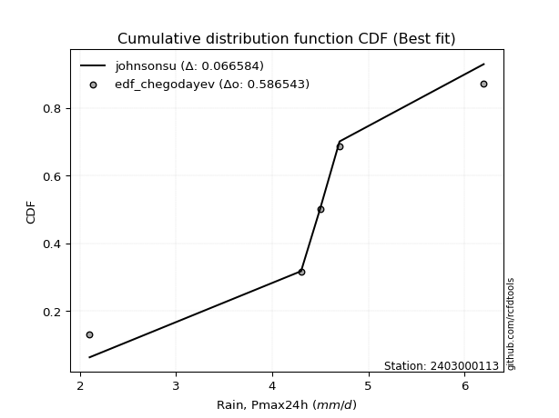</img>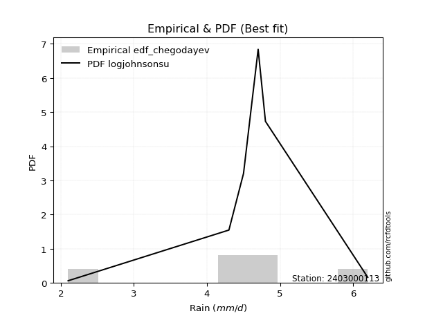</img>

</div>


### 6. EDF Blom (1958)

The Blom formula is a specific "plotting position" formula used in hydrology and statistical analysis to estimate the empirical cumulative probability (or non-exceedance probability) of a data series. It is particularly recommended for data that are approximately normally distributed. The constant _a_ is set to 0.375 (or 3/8).

<div align="center">


$P=(m-a)/(n+1-2a)$


</div>


**6.1. Empirical values**

<div align="center">

|                | 0                   | 1                   | 2        | 3                  | 4                  |
|:---------------|:--------------------|:--------------------|:---------|:-------------------|:-------------------|
| date           | 2020                | 2021                | 2022     | 2023               | 2024               |
| x              | 2.1                 | 4.3                 | 4.5      | 4.7                | 6.2                |
| m              | 1                   | 2                   | 3        | 4                  | 5                  |
| empirical_dist | edf_blom            | edf_blom            | edf_blom | edf_blom           | edf_blom           |
| empirical      | 0.11904761904761904 | 0.30952380952380953 | 0.5      | 0.6904761904761905 | 0.8809523809523809 |
| empirical_tr   | 1.135135135135135   | 1.4482758620689655  | 2.0      | 3.230769230769231  | 8.399999999999999  |

</div>


**6.2. Kolmogorov-Smirnov fit test (sorted by Δ)**


<div align="center">

|                | 0                    | 1                   | 2                   | 3                   | 4                   | 5                   | 6                   | 7                   | 8                   | 9                   | 10                  | 11                 | 12                  | 13                  | 14                    | 15                 | 16                  | 17                  | 18                 | 19                  | 20                  | 21                  | 22                 | 23                 | 24                 | 25                  | 26                  | 27                  | 28                  | 29                 | 30                 | 31                 | 32                 | 33                 | 34                  | 35                  | 36                  | 37                  | 38                  | 39                  | 40                  | 41                  | 42                  | 43                  | 44                  | 45                  | 46                  | 47                  | 48                  | 49                  | 50                  | 51                 | 52                  | 53                 | 54                  | 55                  | 56                  | 57                  | 58                  | 59                 | 60                  | 61                  | 62                  | 63                  | 64                  | 65                 | 66                 | 67                 | 68                 | 69                  | 70                 | 71                  | 72                  | 73                 | 74                 | 75                  | 76                 | 77                 | 78                  | 79                  | 80                 | 81                 | 82                 | 83                 | 84                  | 85                  | 86                  | 87                 |
|:---------------|:---------------------|:--------------------|:--------------------|:--------------------|:--------------------|:--------------------|:--------------------|:--------------------|:--------------------|:--------------------|:--------------------|:-------------------|:--------------------|:--------------------|:----------------------|:-------------------|:--------------------|:--------------------|:-------------------|:--------------------|:--------------------|:--------------------|:-------------------|:-------------------|:-------------------|:--------------------|:--------------------|:--------------------|:--------------------|:-------------------|:-------------------|:-------------------|:-------------------|:-------------------|:--------------------|:--------------------|:--------------------|:--------------------|:--------------------|:--------------------|:--------------------|:--------------------|:--------------------|:--------------------|:--------------------|:--------------------|:--------------------|:--------------------|:--------------------|:--------------------|:--------------------|:-------------------|:--------------------|:-------------------|:--------------------|:--------------------|:--------------------|:--------------------|:--------------------|:-------------------|:--------------------|:--------------------|:--------------------|:--------------------|:--------------------|:-------------------|:-------------------|:-------------------|:-------------------|:--------------------|:-------------------|:--------------------|:--------------------|:-------------------|:-------------------|:--------------------|:-------------------|:-------------------|:--------------------|:--------------------|:-------------------|:-------------------|:-------------------|:-------------------|:--------------------|:--------------------|:--------------------|:-------------------|
| station        | 2403000113           | 2403000113          | 2403000113          | 2403000113          | 2403000113          | 2403000113          | 2403000113          | 2403000113          | 2403000113          | 2403000113          | 2403000113          | 2403000113         | 2403000113          | 2403000113          | 2403000113            | 2403000113         | 2403000113          | 2403000113          | 2403000113         | 2403000113          | 2403000113          | 2403000113          | 2403000113         | 2403000113         | 2403000113         | 2403000113          | 2403000113          | 2403000113          | 2403000113          | 2403000113         | 2403000113         | 2403000113         | 2403000113         | 2403000113         | 2403000113          | 2403000113          | 2403000113          | 2403000113          | 2403000113          | 2403000113          | 2403000113          | 2403000113          | 2403000113          | 2403000113          | 2403000113          | 2403000113          | 2403000113          | 2403000113          | 2403000113          | 2403000113          | 2403000113          | 2403000113         | 2403000113          | 2403000113         | 2403000113          | 2403000113          | 2403000113          | 2403000113          | 2403000113          | 2403000113         | 2403000113          | 2403000113          | 2403000113          | 2403000113          | 2403000113          | 2403000113         | 2403000113         | 2403000113         | 2403000113         | 2403000113          | 2403000113         | 2403000113          | 2403000113          | 2403000113         | 2403000113         | 2403000113          | 2403000113         | 2403000113         | 2403000113          | 2403000113          | 2403000113         | 2403000113         | 2403000113         | 2403000113         | 2403000113          | 2403000113          | 2403000113          | 2403000113         |
| empirical_dist | edf_blom             | edf_blom            | edf_blom            | edf_blom            | edf_blom            | edf_blom            | edf_blom            | edf_blom            | edf_blom            | edf_blom            | edf_blom            | edf_blom           | edf_blom            | edf_blom            | edf_blom              | edf_blom           | edf_blom            | edf_blom            | edf_blom           | edf_blom            | edf_blom            | edf_blom            | edf_blom           | edf_blom           | edf_blom           | edf_blom            | edf_blom            | edf_blom            | edf_blom            | edf_blom           | edf_blom           | edf_blom           | edf_blom           | edf_blom           | edf_blom            | edf_blom            | edf_blom            | edf_blom            | edf_blom            | edf_blom            | edf_blom            | edf_blom            | edf_blom            | edf_blom            | edf_blom            | edf_blom            | edf_blom            | edf_blom            | edf_blom            | edf_blom            | edf_blom            | edf_blom           | edf_blom            | edf_blom           | edf_blom            | edf_blom            | edf_blom            | edf_blom            | edf_blom            | edf_blom           | edf_blom            | edf_blom            | edf_blom            | edf_blom            | edf_blom            | edf_blom           | edf_blom           | edf_blom           | edf_blom           | edf_blom            | edf_blom           | edf_blom            | edf_blom            | edf_blom           | edf_blom           | edf_blom            | edf_blom           | edf_blom           | edf_blom            | edf_blom            | edf_blom           | edf_blom           | edf_blom           | edf_blom           | edf_blom            | edf_blom            | edf_blom            | edf_blom           |
| p_dist         | johnsonsu            | logjohnsonsu        | logt                | genlogistic         | laplace_asymmetric  | weibull_min         | fisk                | logloggamma         | pearson3            | loggenlogistic      | gumbel_l            | laplace            | gompertz            | logweibull_min      | loglaplace_asymmetric | hypsecant          | logistic            | loggumbel_l         | logpearson3        | exponnorm           | t                   | truncnorm           | norm               | crystalball        | logfisk            | nct                 | fatiguelife         | f                   | betaprime           | gamma              | erlang             | rice               | logmielke          | loggompertz        | invgamma            | alpha               | invgauss            | maxwell             | ncf                 | rayleigh            | invweibull          | logf                | logexponnorm        | lognorm             | lognorm             | logcrystalball      | logfatiguelife      | lognct              | logalpha            | logncf              | gumbel_r            | loglogistic        | logrice             | logbetaprime       | kstwobign           | halfnorm            | loghypsecant        | loggamma            | loggamma            | genexpon           | loginvgamma         | loginvgauss         | loginvweibull       | moyal               | loglaplace          | logmaxwell         | halflogistic       | lograyleigh        | logkstwobign       | logchi2             | loggenexpon        | loghalfnorm         | loggumbel_r         | lognakagami        | expon              | nakagami            | logmoyal           | loghalflogistic    | wald                | logexpon            | gibrat             | loglognorm         | logerlang          | logwald            | logtruncnorm        | loggibrat           | chi2                | mielke             |
| delta          | 0.056001511313553715 | 0.06068827594794581 | 0.06689398077404714 | 0.12443758012104006 | 0.12866094102908232 | 0.13199550059554888 | 0.13695148341719965 | 0.13726497340623645 | 0.14152877059941693 | 0.14712798063531213 | 0.14776383146650196 | 0.1592069223414918 | 0.16162741418056092 | 0.16232006348105865 | 0.16705467478863367   | 0.1676633985541039 | 0.16978137256402986 | 0.17104426676897344 | 0.1721292406110262 | 0.17226232497033295 | 0.17226452969584505 | 0.17226467606784546 | 0.1722649433797956 | 0.1722650225147912 | 0.1723636390627984 | 0.17269608500573397 | 0.17323420561937686 | 0.17486370735791634 | 0.18163592066469902 | 0.1828912124525327 | 0.1836483064010478 | 0.1851721472110046 | 0.1899666250215638 | 0.19173544871269   | 0.19562947256280883 | 0.19744028524511026 | 0.20121696204927875 | 0.20594860129212844 | 0.20747763511673567 | 0.21732995185854742 | 0.23291554809681603 | 0.23708786653004044 | 0.23830037236809987 | 0.23830238425516082 | 0.23830238425516082 | 0.23830238752005795 | 0.23856881223975246 | 0.24052133821004007 | 0.24175127000550722 | 0.24176831234153862 | 0.24185973027524377 | 0.2447530377588335 | 0.24632199866755256 | 0.2466851424781591 | 0.24906734644587036 | 0.24938820146226837 | 0.25020805773530086 | 0.25078935483424214 | 0.25078935483424214 | 0.2528009590399215 | 0.25630502244015074 | 0.26467386006255733 | 0.26696123121925974 | 0.26772599182042645 | 0.26862167602806175 | 0.2688352367899992 | 0.2731090450028335 | 0.2786561160065911 | 0.298580792297675  | 0.30393970157269423 | 0.3041996021873463 | 0.30635370681877694 | 0.30847846450954075 | 0.3095169982912204 | 0.3126992369026673 | 0.32665693794136674 | 0.3333855569772739 | 0.3335715130705964 | 0.33971742010900907 | 0.34548972101222974 | 0.3598796591099582 | 0.3783637214100738 | 0.3957074425957816 | 0.4024963619952153 | 0.42284636850532664 | 0.43142415113118404 | 0.44921684555898944 | 0.4823587991252598 |
| deltao         | 0.5865427407550001   | 0.5865427407550001  | 0.5865427407550001  | 0.5865427407550001  | 0.5865427407550001  | 0.5865427407550001  | 0.5865427407550001  | 0.5865427407550001  | 0.5865427407550001  | 0.5865427407550001  | 0.5865427407550001  | 0.5865427407550001 | 0.5865427407550001  | 0.5865427407550001  | 0.5865427407550001    | 0.5865427407550001 | 0.5865427407550001  | 0.5865427407550001  | 0.5865427407550001 | 0.5865427407550001  | 0.5865427407550001  | 0.5865427407550001  | 0.5865427407550001 | 0.5865427407550001 | 0.5865427407550001 | 0.5865427407550001  | 0.5865427407550001  | 0.5865427407550001  | 0.5865427407550001  | 0.5865427407550001 | 0.5865427407550001 | 0.5865427407550001 | 0.5865427407550001 | 0.5865427407550001 | 0.5865427407550001  | 0.5865427407550001  | 0.5865427407550001  | 0.5865427407550001  | 0.5865427407550001  | 0.5865427407550001  | 0.5865427407550001  | 0.5865427407550001  | 0.5865427407550001  | 0.5865427407550001  | 0.5865427407550001  | 0.5865427407550001  | 0.5865427407550001  | 0.5865427407550001  | 0.5865427407550001  | 0.5865427407550001  | 0.5865427407550001  | 0.5865427407550001 | 0.5865427407550001  | 0.5865427407550001 | 0.5865427407550001  | 0.5865427407550001  | 0.5865427407550001  | 0.5865427407550001  | 0.5865427407550001  | 0.5865427407550001 | 0.5865427407550001  | 0.5865427407550001  | 0.5865427407550001  | 0.5865427407550001  | 0.5865427407550001  | 0.5865427407550001 | 0.5865427407550001 | 0.5865427407550001 | 0.5865427407550001 | 0.5865427407550001  | 0.5865427407550001 | 0.5865427407550001  | 0.5865427407550001  | 0.5865427407550001 | 0.5865427407550001 | 0.5865427407550001  | 0.5865427407550001 | 0.5865427407550001 | 0.5865427407550001  | 0.5865427407550001  | 0.5865427407550001 | 0.5865427407550001 | 0.5865427407550001 | 0.5865427407550001 | 0.5865427407550001  | 0.5865427407550001  | 0.5865427407550001  | 0.5865427407550001 |
| eval           | Δo > Δ               | Δo > Δ              | Δo > Δ              | Δo > Δ              | Δo > Δ              | Δo > Δ              | Δo > Δ              | Δo > Δ              | Δo > Δ              | Δo > Δ              | Δo > Δ              | Δo > Δ             | Δo > Δ              | Δo > Δ              | Δo > Δ                | Δo > Δ             | Δo > Δ              | Δo > Δ              | Δo > Δ             | Δo > Δ              | Δo > Δ              | Δo > Δ              | Δo > Δ             | Δo > Δ             | Δo > Δ             | Δo > Δ              | Δo > Δ              | Δo > Δ              | Δo > Δ              | Δo > Δ             | Δo > Δ             | Δo > Δ             | Δo > Δ             | Δo > Δ             | Δo > Δ              | Δo > Δ              | Δo > Δ              | Δo > Δ              | Δo > Δ              | Δo > Δ              | Δo > Δ              | Δo > Δ              | Δo > Δ              | Δo > Δ              | Δo > Δ              | Δo > Δ              | Δo > Δ              | Δo > Δ              | Δo > Δ              | Δo > Δ              | Δo > Δ              | Δo > Δ             | Δo > Δ              | Δo > Δ             | Δo > Δ              | Δo > Δ              | Δo > Δ              | Δo > Δ              | Δo > Δ              | Δo > Δ             | Δo > Δ              | Δo > Δ              | Δo > Δ              | Δo > Δ              | Δo > Δ              | Δo > Δ             | Δo > Δ             | Δo > Δ             | Δo > Δ             | Δo > Δ              | Δo > Δ             | Δo > Δ              | Δo > Δ              | Δo > Δ             | Δo > Δ             | Δo > Δ              | Δo > Δ             | Δo > Δ             | Δo > Δ              | Δo > Δ              | Δo > Δ             | Δo > Δ             | Δo > Δ             | Δo > Δ             | Δo > Δ              | Δo > Δ              | Δo > Δ              | Δo > Δ             |
| fit            | 1                    | 1                   | 1                   | 1                   | 1                   | 1                   | 1                   | 1                   | 1                   | 1                   | 1                   | 1                  | 1                   | 1                   | 1                     | 1                  | 1                   | 1                   | 1                  | 1                   | 1                   | 1                   | 1                  | 1                  | 1                  | 1                   | 1                   | 1                   | 1                   | 1                  | 1                  | 1                  | 1                  | 1                  | 1                   | 1                   | 1                   | 1                   | 1                   | 1                   | 1                   | 1                   | 1                   | 1                   | 1                   | 1                   | 1                   | 1                   | 1                   | 1                   | 1                   | 1                  | 1                   | 1                  | 1                   | 1                   | 1                   | 1                   | 1                   | 1                  | 1                   | 1                   | 1                   | 1                   | 1                   | 1                  | 1                  | 1                  | 1                  | 1                   | 1                  | 1                   | 1                   | 1                  | 1                  | 1                   | 1                  | 1                  | 1                   | 1                   | 1                  | 1                  | 1                  | 1                  | 1                   | 1                   | 1                   | 1                  |
| n              | 5                    | 5                   | 5                   | 5                   | 5                   | 5                   | 5                   | 5                   | 5                   | 5                   | 5                   | 5                  | 5                   | 5                   | 5                     | 5                  | 5                   | 5                   | 5                  | 5                   | 5                   | 5                   | 5                  | 5                  | 5                  | 5                   | 5                   | 5                   | 5                   | 5                  | 5                  | 5                  | 5                  | 5                  | 5                   | 5                   | 5                   | 5                   | 5                   | 5                   | 5                   | 5                   | 5                   | 5                   | 5                   | 5                   | 5                   | 5                   | 5                   | 5                   | 5                   | 5                  | 5                   | 5                  | 5                   | 5                   | 5                   | 5                   | 5                   | 5                  | 5                   | 5                   | 5                   | 5                   | 5                   | 5                  | 5                  | 5                  | 5                  | 5                   | 5                  | 5                   | 5                   | 5                  | 5                  | 5                   | 5                  | 5                  | 5                   | 5                   | 5                  | 5                  | 5                  | 5                  | 5                   | 5                   | 5                   | 5                  |
| best_fit       | 1                    | 0                   | 0                   | 0                   | 0                   | 0                   | 0                   | 0                   | 0                   | 0                   | 0                   | 0                  | 0                   | 0                   | 0                     | 0                  | 0                   | 0                   | 0                  | 0                   | 0                   | 0                   | 0                  | 0                  | 0                  | 0                   | 0                   | 0                   | 0                   | 0                  | 0                  | 0                  | 0                  | 0                  | 0                   | 0                   | 0                   | 0                   | 0                   | 0                   | 0                   | 0                   | 0                   | 0                   | 0                   | 0                   | 0                   | 0                   | 0                   | 0                   | 0                   | 0                  | 0                   | 0                  | 0                   | 0                   | 0                   | 0                   | 0                   | 0                  | 0                   | 0                   | 0                   | 0                   | 0                   | 0                  | 0                  | 0                  | 0                  | 0                   | 0                  | 0                   | 0                   | 0                  | 0                  | 0                   | 0                  | 0                  | 0                   | 0                   | 0                  | 0                  | 0                  | 0                  | 0                   | 0                   | 0                   | 0                  |
| best_fit_sort  | 1                    | 2                   | 3                   | 4                   | 5                   | 6                   | 7                   | 8                   | 9                   | 10                  | 11                  | 12                 | 13                  | 14                  | 15                    | 16                 | 17                  | 18                  | 19                 | 20                  | 21                  | 22                  | 23                 | 24                 | 25                 | 26                  | 27                  | 28                  | 29                  | 30                 | 31                 | 32                 | 33                 | 34                 | 35                  | 36                  | 37                  | 38                  | 39                  | 40                  | 41                  | 42                  | 43                  | 44                  | 45                  | 46                  | 47                  | 48                  | 49                  | 50                  | 51                  | 52                 | 53                  | 54                 | 55                  | 56                  | 57                  | 58                  | 59                  | 60                 | 61                  | 62                  | 63                  | 64                  | 65                  | 66                 | 67                 | 68                 | 69                 | 70                  | 71                 | 72                  | 73                  | 74                 | 75                 | 76                  | 77                 | 78                 | 79                  | 80                  | 81                 | 82                 | 83                 | 84                 | 85                  | 86                  | 87                  | 88                 |

</div>


**6.3. Best fit**

<div align="center">

|   id |    station | empirical_dist   | p_dist    |     delta |   deltao | eval   |   fit |   n |   best_fit |   best_fit_sort |
|-----:|-----------:|:-----------------|:----------|----------:|---------:|:-------|------:|----:|-----------:|----------------:|
|    0 | 2403000113 | edf_blom         | johnsonsu | 0.0560015 | 0.586543 | Δo > Δ |     1 |   5 |          1 |               1 |

</div>


<div align="center">

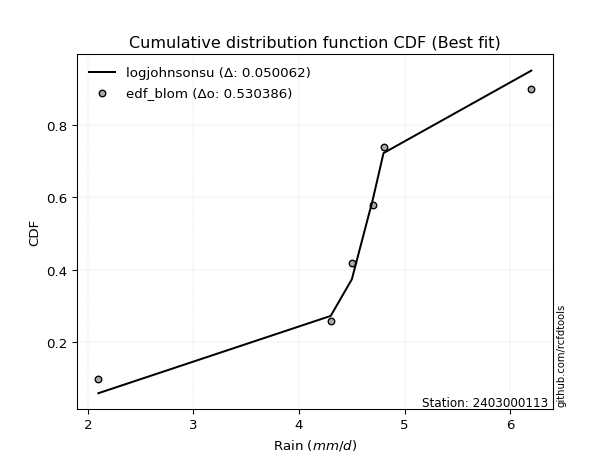</img>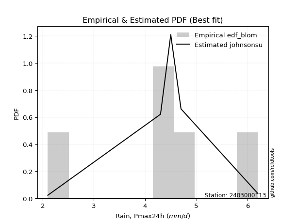</img>

</div>


### 7. EDF Tukey (1962)

In hydrology, the Tukey formula is used as a plotting position formula to estimate the empirical probability or frequency of a flood event (or other hydrological data). The formula parameter is given as _c=0.333_ (or 1/3).

<div align="center">


$P=(m-c)/(n+1-2c)$


</div>


**7.1. Empirical values**

<div align="center">

|                | 0                  | 1                  | 2         | 3         | 4         |
|:---------------|:-------------------|:-------------------|:----------|:----------|:----------|
| date           | 2020               | 2021               | 2022      | 2023      | 2024      |
| x              | 2.1                | 4.3                | 4.5       | 4.7       | 6.2       |
| m              | 1                  | 2                  | 3         | 4         | 5         |
| empirical_dist | edf_tukey          | edf_tukey          | edf_tukey | edf_tukey | edf_tukey |
| empirical      | 0.125              | 0.3125             | 0.5       | 0.6875    | 0.875     |
| empirical_tr   | 1.1428571428571428 | 1.4545454545454546 | 2.0       | 3.2       | 8.0       |

</div>


**7.2. Kolmogorov-Smirnov fit test (sorted by Δ)**


<div align="center">

|                | 0                    | 1                   | 2                  | 3                  | 4                   | 5                  | 6                   | 7                   | 8                   | 9                   | 10                 | 11                  | 12                  | 13                 | 14                    | 15                  | 16                 | 17                  | 18                  | 19                  | 20                  | 21                 | 22                  | 23                  | 24                  | 25                 | 26                 | 27                  | 28                  | 29                  | 30                  | 31                  | 32                  | 33                  | 34                  | 35                 | 36                  | 37                  | 38                 | 39                  | 40                  | 41                  | 42                 | 43                  | 44                  | 45                  | 46                 | 47                 | 48                  | 49                  | 50                 | 51                  | 52                 | 53                  | 54                 | 55                 | 56                 | 57                  | 58                  | 59                  | 60                 | 61                  | 62                 | 63                 | 64                 | 65                  | 66                  | 67                  | 68                 | 69                  | 70                  | 71                 | 72                 | 73                  | 74                 | 75                  | 76                  | 77                  | 78                 | 79                 | 80                  | 81                  | 82                  | 83                  | 84                 | 85                 | 86                 | 87                  |
|:---------------|:---------------------|:--------------------|:-------------------|:-------------------|:--------------------|:-------------------|:--------------------|:--------------------|:--------------------|:--------------------|:-------------------|:--------------------|:--------------------|:-------------------|:----------------------|:--------------------|:-------------------|:--------------------|:--------------------|:--------------------|:--------------------|:-------------------|:--------------------|:--------------------|:--------------------|:-------------------|:-------------------|:--------------------|:--------------------|:--------------------|:--------------------|:--------------------|:--------------------|:--------------------|:--------------------|:-------------------|:--------------------|:--------------------|:-------------------|:--------------------|:--------------------|:--------------------|:-------------------|:--------------------|:--------------------|:--------------------|:-------------------|:-------------------|:--------------------|:--------------------|:-------------------|:--------------------|:-------------------|:--------------------|:-------------------|:-------------------|:-------------------|:--------------------|:--------------------|:--------------------|:-------------------|:--------------------|:-------------------|:-------------------|:-------------------|:--------------------|:--------------------|:--------------------|:-------------------|:--------------------|:--------------------|:-------------------|:-------------------|:--------------------|:-------------------|:--------------------|:--------------------|:--------------------|:-------------------|:-------------------|:--------------------|:--------------------|:--------------------|:--------------------|:-------------------|:-------------------|:-------------------|:--------------------|
| station        | 2403000113           | 2403000113          | 2403000113         | 2403000113         | 2403000113          | 2403000113         | 2403000113          | 2403000113          | 2403000113          | 2403000113          | 2403000113         | 2403000113          | 2403000113          | 2403000113         | 2403000113            | 2403000113          | 2403000113         | 2403000113          | 2403000113          | 2403000113          | 2403000113          | 2403000113         | 2403000113          | 2403000113          | 2403000113          | 2403000113         | 2403000113         | 2403000113          | 2403000113          | 2403000113          | 2403000113          | 2403000113          | 2403000113          | 2403000113          | 2403000113          | 2403000113         | 2403000113          | 2403000113          | 2403000113         | 2403000113          | 2403000113          | 2403000113          | 2403000113         | 2403000113          | 2403000113          | 2403000113          | 2403000113         | 2403000113         | 2403000113          | 2403000113          | 2403000113         | 2403000113          | 2403000113         | 2403000113          | 2403000113         | 2403000113         | 2403000113         | 2403000113          | 2403000113          | 2403000113          | 2403000113         | 2403000113          | 2403000113         | 2403000113         | 2403000113         | 2403000113          | 2403000113          | 2403000113          | 2403000113         | 2403000113          | 2403000113          | 2403000113         | 2403000113         | 2403000113          | 2403000113         | 2403000113          | 2403000113          | 2403000113          | 2403000113         | 2403000113         | 2403000113          | 2403000113          | 2403000113          | 2403000113          | 2403000113         | 2403000113         | 2403000113         | 2403000113          |
| empirical_dist | edf_tukey            | edf_tukey           | edf_tukey          | edf_tukey          | edf_tukey           | edf_tukey          | edf_tukey           | edf_tukey           | edf_tukey           | edf_tukey           | edf_tukey          | edf_tukey           | edf_tukey           | edf_tukey          | edf_tukey             | edf_tukey           | edf_tukey          | edf_tukey           | edf_tukey           | edf_tukey           | edf_tukey           | edf_tukey          | edf_tukey           | edf_tukey           | edf_tukey           | edf_tukey          | edf_tukey          | edf_tukey           | edf_tukey           | edf_tukey           | edf_tukey           | edf_tukey           | edf_tukey           | edf_tukey           | edf_tukey           | edf_tukey          | edf_tukey           | edf_tukey           | edf_tukey          | edf_tukey           | edf_tukey           | edf_tukey           | edf_tukey          | edf_tukey           | edf_tukey           | edf_tukey           | edf_tukey          | edf_tukey          | edf_tukey           | edf_tukey           | edf_tukey          | edf_tukey           | edf_tukey          | edf_tukey           | edf_tukey          | edf_tukey          | edf_tukey          | edf_tukey           | edf_tukey           | edf_tukey           | edf_tukey          | edf_tukey           | edf_tukey          | edf_tukey          | edf_tukey          | edf_tukey           | edf_tukey           | edf_tukey           | edf_tukey          | edf_tukey           | edf_tukey           | edf_tukey          | edf_tukey          | edf_tukey           | edf_tukey          | edf_tukey           | edf_tukey           | edf_tukey           | edf_tukey          | edf_tukey          | edf_tukey           | edf_tukey           | edf_tukey           | edf_tukey           | edf_tukey          | edf_tukey          | edf_tukey          | edf_tukey           |
| p_dist         | johnsonsu            | logjohnsonsu        | logt               | genlogistic        | laplace_asymmetric  | weibull_min        | fisk                | logloggamma         | pearson3            | loggenlogistic      | gumbel_l           | laplace             | gompertz            | logweibull_min     | loglaplace_asymmetric | hypsecant           | logistic           | loggumbel_l         | logpearson3         | exponnorm           | t                   | truncnorm          | norm                | crystalball         | logfisk             | nct                | fatiguelife        | f                   | betaprime           | gamma               | erlang              | rice                | logmielke           | loggompertz         | invgamma            | alpha              | invgauss            | maxwell             | ncf                | rayleigh            | invweibull          | logf                | logexponnorm       | lognorm             | lognorm             | logcrystalball      | logfatiguelife     | lognct             | logalpha            | logncf              | gumbel_r           | loglogistic         | logrice            | logbetaprime        | kstwobign          | halfnorm           | loghypsecant       | loggamma            | loggamma            | genexpon            | loginvgamma        | loginvgauss         | loginvweibull      | moyal              | loglaplace         | logmaxwell          | halflogistic        | lograyleigh         | logkstwobign       | logchi2             | loggenexpon         | loghalfnorm        | loggumbel_r        | expon               | lognakagami        | nakagami            | logmoyal            | loghalflogistic     | wald               | logexpon           | gibrat              | loglognorm          | logerlang           | logwald             | logtruncnorm       | loggibrat          | chi2               | mielke              |
| delta          | 0.061953892265934674 | 0.06664065690032678 | 0.0728463617264281 | 0.1214613896448496 | 0.12568475055289186 | 0.1290193101193584 | 0.13397529294100918 | 0.13428878293004598 | 0.13855258012322647 | 0.14415179015912166 | 0.1447876409903115 | 0.15623073186530134 | 0.15865122370437046 | 0.1593438730048682 | 0.1640784843124432    | 0.16468720807791343 | 0.1668051820878394 | 0.16806807629278298 | 0.16915305013483573 | 0.16928613449414248 | 0.16928833921965458 | 0.169288485591655  | 0.16928875290360512 | 0.16928883203860073 | 0.16938744858660792 | 0.1697198945295435 | 0.1702580151431864 | 0.17188751688172588 | 0.17865973018850856 | 0.17991502197634224 | 0.18067211592485732 | 0.18219595673481415 | 0.18699043454537334 | 0.18875925823649953 | 0.19265328208661836 | 0.1944640947689198 | 0.19824077157308828 | 0.20297241081593798 | 0.2045014446405452 | 0.21435376138235696 | 0.22993935762062556 | 0.23411167605384997 | 0.2353241818919094 | 0.23532619377897035 | 0.23532619377897035 | 0.23532619704386748 | 0.235592621763562  | 0.2375451477338496 | 0.23877507952931676 | 0.23879212186534815 | 0.2388835397990533 | 0.24177684728264304 | 0.2433458081913621 | 0.24370895200196863 | 0.2460911559696799 | 0.2464120109860779 | 0.2472318672591104 | 0.24781316435805167 | 0.24781316435805167 | 0.24982476856373104 | 0.2533288319639603 | 0.26169766958636687 | 0.2639850407430693 | 0.264749801344236  | 0.2656454855518713 | 0.26585904631380874 | 0.27013285452664304 | 0.27567992553040066 | 0.2956046018214845 | 0.30096351109650377 | 0.30122341171115585 | 0.3033775163425865 | 0.3055022740333503 | 0.30972304642647686 | 0.3124931887674109 | 0.32665693794136674 | 0.33040936650108343 | 0.33059532259440594 | 0.3367412296328186 | 0.3425135305360393 | 0.35690346863376776 | 0.37538753093388333 | 0.39273125211959115 | 0.39952017151902486 | 0.4198701780291362 | 0.4284479606549936 | 0.446240655082799  | 0.47938260864906934 |
| deltao         | 0.5865427407550001   | 0.5865427407550001  | 0.5865427407550001 | 0.5865427407550001 | 0.5865427407550001  | 0.5865427407550001 | 0.5865427407550001  | 0.5865427407550001  | 0.5865427407550001  | 0.5865427407550001  | 0.5865427407550001 | 0.5865427407550001  | 0.5865427407550001  | 0.5865427407550001 | 0.5865427407550001    | 0.5865427407550001  | 0.5865427407550001 | 0.5865427407550001  | 0.5865427407550001  | 0.5865427407550001  | 0.5865427407550001  | 0.5865427407550001 | 0.5865427407550001  | 0.5865427407550001  | 0.5865427407550001  | 0.5865427407550001 | 0.5865427407550001 | 0.5865427407550001  | 0.5865427407550001  | 0.5865427407550001  | 0.5865427407550001  | 0.5865427407550001  | 0.5865427407550001  | 0.5865427407550001  | 0.5865427407550001  | 0.5865427407550001 | 0.5865427407550001  | 0.5865427407550001  | 0.5865427407550001 | 0.5865427407550001  | 0.5865427407550001  | 0.5865427407550001  | 0.5865427407550001 | 0.5865427407550001  | 0.5865427407550001  | 0.5865427407550001  | 0.5865427407550001 | 0.5865427407550001 | 0.5865427407550001  | 0.5865427407550001  | 0.5865427407550001 | 0.5865427407550001  | 0.5865427407550001 | 0.5865427407550001  | 0.5865427407550001 | 0.5865427407550001 | 0.5865427407550001 | 0.5865427407550001  | 0.5865427407550001  | 0.5865427407550001  | 0.5865427407550001 | 0.5865427407550001  | 0.5865427407550001 | 0.5865427407550001 | 0.5865427407550001 | 0.5865427407550001  | 0.5865427407550001  | 0.5865427407550001  | 0.5865427407550001 | 0.5865427407550001  | 0.5865427407550001  | 0.5865427407550001 | 0.5865427407550001 | 0.5865427407550001  | 0.5865427407550001 | 0.5865427407550001  | 0.5865427407550001  | 0.5865427407550001  | 0.5865427407550001 | 0.5865427407550001 | 0.5865427407550001  | 0.5865427407550001  | 0.5865427407550001  | 0.5865427407550001  | 0.5865427407550001 | 0.5865427407550001 | 0.5865427407550001 | 0.5865427407550001  |
| eval           | Δo > Δ               | Δo > Δ              | Δo > Δ             | Δo > Δ             | Δo > Δ              | Δo > Δ             | Δo > Δ              | Δo > Δ              | Δo > Δ              | Δo > Δ              | Δo > Δ             | Δo > Δ              | Δo > Δ              | Δo > Δ             | Δo > Δ                | Δo > Δ              | Δo > Δ             | Δo > Δ              | Δo > Δ              | Δo > Δ              | Δo > Δ              | Δo > Δ             | Δo > Δ              | Δo > Δ              | Δo > Δ              | Δo > Δ             | Δo > Δ             | Δo > Δ              | Δo > Δ              | Δo > Δ              | Δo > Δ              | Δo > Δ              | Δo > Δ              | Δo > Δ              | Δo > Δ              | Δo > Δ             | Δo > Δ              | Δo > Δ              | Δo > Δ             | Δo > Δ              | Δo > Δ              | Δo > Δ              | Δo > Δ             | Δo > Δ              | Δo > Δ              | Δo > Δ              | Δo > Δ             | Δo > Δ             | Δo > Δ              | Δo > Δ              | Δo > Δ             | Δo > Δ              | Δo > Δ             | Δo > Δ              | Δo > Δ             | Δo > Δ             | Δo > Δ             | Δo > Δ              | Δo > Δ              | Δo > Δ              | Δo > Δ             | Δo > Δ              | Δo > Δ             | Δo > Δ             | Δo > Δ             | Δo > Δ              | Δo > Δ              | Δo > Δ              | Δo > Δ             | Δo > Δ              | Δo > Δ              | Δo > Δ             | Δo > Δ             | Δo > Δ              | Δo > Δ             | Δo > Δ              | Δo > Δ              | Δo > Δ              | Δo > Δ             | Δo > Δ             | Δo > Δ              | Δo > Δ              | Δo > Δ              | Δo > Δ              | Δo > Δ             | Δo > Δ             | Δo > Δ             | Δo > Δ              |
| fit            | 1                    | 1                   | 1                  | 1                  | 1                   | 1                  | 1                   | 1                   | 1                   | 1                   | 1                  | 1                   | 1                   | 1                  | 1                     | 1                   | 1                  | 1                   | 1                   | 1                   | 1                   | 1                  | 1                   | 1                   | 1                   | 1                  | 1                  | 1                   | 1                   | 1                   | 1                   | 1                   | 1                   | 1                   | 1                   | 1                  | 1                   | 1                   | 1                  | 1                   | 1                   | 1                   | 1                  | 1                   | 1                   | 1                   | 1                  | 1                  | 1                   | 1                   | 1                  | 1                   | 1                  | 1                   | 1                  | 1                  | 1                  | 1                   | 1                   | 1                   | 1                  | 1                   | 1                  | 1                  | 1                  | 1                   | 1                   | 1                   | 1                  | 1                   | 1                   | 1                  | 1                  | 1                   | 1                  | 1                   | 1                   | 1                   | 1                  | 1                  | 1                   | 1                   | 1                   | 1                   | 1                  | 1                  | 1                  | 1                   |
| n              | 5                    | 5                   | 5                  | 5                  | 5                   | 5                  | 5                   | 5                   | 5                   | 5                   | 5                  | 5                   | 5                   | 5                  | 5                     | 5                   | 5                  | 5                   | 5                   | 5                   | 5                   | 5                  | 5                   | 5                   | 5                   | 5                  | 5                  | 5                   | 5                   | 5                   | 5                   | 5                   | 5                   | 5                   | 5                   | 5                  | 5                   | 5                   | 5                  | 5                   | 5                   | 5                   | 5                  | 5                   | 5                   | 5                   | 5                  | 5                  | 5                   | 5                   | 5                  | 5                   | 5                  | 5                   | 5                  | 5                  | 5                  | 5                   | 5                   | 5                   | 5                  | 5                   | 5                  | 5                  | 5                  | 5                   | 5                   | 5                   | 5                  | 5                   | 5                   | 5                  | 5                  | 5                   | 5                  | 5                   | 5                   | 5                   | 5                  | 5                  | 5                   | 5                   | 5                   | 5                   | 5                  | 5                  | 5                  | 5                   |
| best_fit       | 1                    | 0                   | 0                  | 0                  | 0                   | 0                  | 0                   | 0                   | 0                   | 0                   | 0                  | 0                   | 0                   | 0                  | 0                     | 0                   | 0                  | 0                   | 0                   | 0                   | 0                   | 0                  | 0                   | 0                   | 0                   | 0                  | 0                  | 0                   | 0                   | 0                   | 0                   | 0                   | 0                   | 0                   | 0                   | 0                  | 0                   | 0                   | 0                  | 0                   | 0                   | 0                   | 0                  | 0                   | 0                   | 0                   | 0                  | 0                  | 0                   | 0                   | 0                  | 0                   | 0                  | 0                   | 0                  | 0                  | 0                  | 0                   | 0                   | 0                   | 0                  | 0                   | 0                  | 0                  | 0                  | 0                   | 0                   | 0                   | 0                  | 0                   | 0                   | 0                  | 0                  | 0                   | 0                  | 0                   | 0                   | 0                   | 0                  | 0                  | 0                   | 0                   | 0                   | 0                   | 0                  | 0                  | 0                  | 0                   |
| best_fit_sort  | 1                    | 2                   | 3                  | 4                  | 5                   | 6                  | 7                   | 8                   | 9                   | 10                  | 11                 | 12                  | 13                  | 14                 | 15                    | 16                  | 17                 | 18                  | 19                  | 20                  | 21                  | 22                 | 23                  | 24                  | 25                  | 26                 | 27                 | 28                  | 29                  | 30                  | 31                  | 32                  | 33                  | 34                  | 35                  | 36                 | 37                  | 38                  | 39                 | 40                  | 41                  | 42                  | 43                 | 44                  | 45                  | 46                  | 47                 | 48                 | 49                  | 50                  | 51                 | 52                  | 53                 | 54                  | 55                 | 56                 | 57                 | 58                  | 59                  | 60                  | 61                 | 62                  | 63                 | 64                 | 65                 | 66                  | 67                  | 68                  | 69                 | 70                  | 71                  | 72                 | 73                 | 74                  | 75                 | 76                  | 77                  | 78                  | 79                 | 80                 | 81                  | 82                  | 83                  | 84                  | 85                 | 86                 | 87                 | 88                  |

</div>


**7.3. Best fit**

<div align="center">

|   id |    station | empirical_dist   | p_dist    |     delta |   deltao | eval   |   fit |   n |   best_fit |   best_fit_sort |
|-----:|-----------:|:-----------------|:----------|----------:|---------:|:-------|------:|----:|-----------:|----------------:|
|    0 | 2403000113 | edf_tukey        | johnsonsu | 0.0619539 | 0.586543 | Δo > Δ |     1 |   5 |          1 |               1 |

</div>


<div align="center">

</img>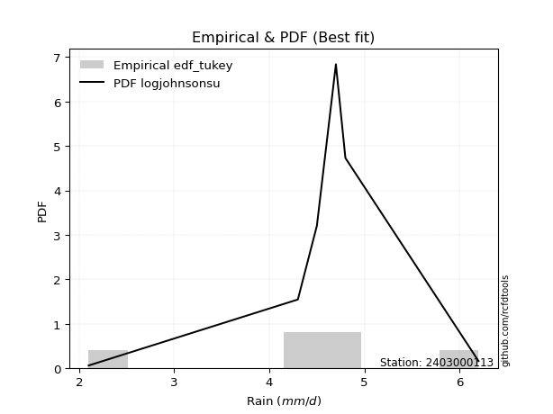</img>

</div>


### 8. EDF Gringorten (1963)

Gringorten plotting position formula is essential for estimating the probability and return periods of extreme events like floods and heavy rainfall. The constant _a=0.44_.

<div align="center">


$P=(m-a)/(n+1-2a)$


</div>


**8.1. Empirical values**

<div align="center">

|                | 0                   | 1                  | 2              | 3                 | 4                  |
|:---------------|:--------------------|:-------------------|:---------------|:------------------|:-------------------|
| date           | 2020                | 2021               | 2022           | 2023              | 2024               |
| x              | 2.1                 | 4.3                | 4.5            | 4.7               | 6.2                |
| m              | 1                   | 2                  | 3              | 4                 | 5                  |
| empirical_dist | edf_gringorten      | edf_gringorten     | edf_gringorten | edf_gringorten    | edf_gringorten     |
| empirical      | 0.10937500000000001 | 0.3046875          | 0.5            | 0.6953125         | 0.8906249999999999 |
| empirical_tr   | 1.1228070175438596  | 1.4382022471910112 | 2.0            | 3.282051282051282 | 9.142857142857133  |

</div>


**8.2. Kolmogorov-Smirnov fit test (sorted by Δ)**


<div align="center">

|                | 0                   | 1                    | 2                   | 3                  | 4                   | 5                  | 6                   | 7                   | 8                   | 9                   | 10                 | 11                  | 12                  | 13                 | 14                    | 15                  | 16                 | 17                  | 18                  | 19                  | 20                  | 21                 | 22                  | 23                  | 24                  | 25                 | 26                 | 27                  | 28                  | 29                  | 30                  | 31                  | 32                  | 33                  | 34                  | 35                 | 36                  | 37                  | 38                 | 39                  | 40                  | 41                  | 42                 | 43                  | 44                  | 45                  | 46                 | 47                 | 48                  | 49                  | 50                 | 51                  | 52                 | 53                 | 54                 | 55                 | 56                 | 57                 | 58                 | 59                  | 60                 | 61                  | 62                 | 63                 | 64                 | 65                  | 66                  | 67                  | 68                 | 69                 | 70                  | 71                  | 72                 | 73                 | 74                  | 75                  | 76                  | 77                  | 78                 | 79                 | 80                  | 81                  | 82                  | 83                  | 84                 | 85                 | 86                 | 87                  |
|:---------------|:--------------------|:---------------------|:--------------------|:-------------------|:--------------------|:-------------------|:--------------------|:--------------------|:--------------------|:--------------------|:-------------------|:--------------------|:--------------------|:-------------------|:----------------------|:--------------------|:-------------------|:--------------------|:--------------------|:--------------------|:--------------------|:-------------------|:--------------------|:--------------------|:--------------------|:-------------------|:-------------------|:--------------------|:--------------------|:--------------------|:--------------------|:--------------------|:--------------------|:--------------------|:--------------------|:-------------------|:--------------------|:--------------------|:-------------------|:--------------------|:--------------------|:--------------------|:-------------------|:--------------------|:--------------------|:--------------------|:-------------------|:-------------------|:--------------------|:--------------------|:-------------------|:--------------------|:-------------------|:-------------------|:-------------------|:-------------------|:-------------------|:-------------------|:-------------------|:--------------------|:-------------------|:--------------------|:-------------------|:-------------------|:-------------------|:--------------------|:--------------------|:--------------------|:-------------------|:-------------------|:--------------------|:--------------------|:-------------------|:-------------------|:--------------------|:--------------------|:--------------------|:--------------------|:-------------------|:-------------------|:--------------------|:--------------------|:--------------------|:--------------------|:-------------------|:-------------------|:-------------------|:--------------------|
| station        | 2403000113          | 2403000113           | 2403000113          | 2403000113         | 2403000113          | 2403000113         | 2403000113          | 2403000113          | 2403000113          | 2403000113          | 2403000113         | 2403000113          | 2403000113          | 2403000113         | 2403000113            | 2403000113          | 2403000113         | 2403000113          | 2403000113          | 2403000113          | 2403000113          | 2403000113         | 2403000113          | 2403000113          | 2403000113          | 2403000113         | 2403000113         | 2403000113          | 2403000113          | 2403000113          | 2403000113          | 2403000113          | 2403000113          | 2403000113          | 2403000113          | 2403000113         | 2403000113          | 2403000113          | 2403000113         | 2403000113          | 2403000113          | 2403000113          | 2403000113         | 2403000113          | 2403000113          | 2403000113          | 2403000113         | 2403000113         | 2403000113          | 2403000113          | 2403000113         | 2403000113          | 2403000113         | 2403000113         | 2403000113         | 2403000113         | 2403000113         | 2403000113         | 2403000113         | 2403000113          | 2403000113         | 2403000113          | 2403000113         | 2403000113         | 2403000113         | 2403000113          | 2403000113          | 2403000113          | 2403000113         | 2403000113         | 2403000113          | 2403000113          | 2403000113         | 2403000113         | 2403000113          | 2403000113          | 2403000113          | 2403000113          | 2403000113         | 2403000113         | 2403000113          | 2403000113          | 2403000113          | 2403000113          | 2403000113         | 2403000113         | 2403000113         | 2403000113          |
| empirical_dist | edf_gringorten      | edf_gringorten       | edf_gringorten      | edf_gringorten     | edf_gringorten      | edf_gringorten     | edf_gringorten      | edf_gringorten      | edf_gringorten      | edf_gringorten      | edf_gringorten     | edf_gringorten      | edf_gringorten      | edf_gringorten     | edf_gringorten        | edf_gringorten      | edf_gringorten     | edf_gringorten      | edf_gringorten      | edf_gringorten      | edf_gringorten      | edf_gringorten     | edf_gringorten      | edf_gringorten      | edf_gringorten      | edf_gringorten     | edf_gringorten     | edf_gringorten      | edf_gringorten      | edf_gringorten      | edf_gringorten      | edf_gringorten      | edf_gringorten      | edf_gringorten      | edf_gringorten      | edf_gringorten     | edf_gringorten      | edf_gringorten      | edf_gringorten     | edf_gringorten      | edf_gringorten      | edf_gringorten      | edf_gringorten     | edf_gringorten      | edf_gringorten      | edf_gringorten      | edf_gringorten     | edf_gringorten     | edf_gringorten      | edf_gringorten      | edf_gringorten     | edf_gringorten      | edf_gringorten     | edf_gringorten     | edf_gringorten     | edf_gringorten     | edf_gringorten     | edf_gringorten     | edf_gringorten     | edf_gringorten      | edf_gringorten     | edf_gringorten      | edf_gringorten     | edf_gringorten     | edf_gringorten     | edf_gringorten      | edf_gringorten      | edf_gringorten      | edf_gringorten     | edf_gringorten     | edf_gringorten      | edf_gringorten      | edf_gringorten     | edf_gringorten     | edf_gringorten      | edf_gringorten      | edf_gringorten      | edf_gringorten      | edf_gringorten     | edf_gringorten     | edf_gringorten      | edf_gringorten      | edf_gringorten      | edf_gringorten      | edf_gringorten     | edf_gringorten     | edf_gringorten     | edf_gringorten      |
| p_dist         | johnsonsu           | logjohnsonsu         | logt                | genlogistic        | laplace_asymmetric  | weibull_min        | fisk                | logloggamma         | pearson3            | loggenlogistic      | gumbel_l           | laplace             | gompertz            | logweibull_min     | loglaplace_asymmetric | hypsecant           | logistic           | loggumbel_l         | logpearson3         | exponnorm           | t                   | truncnorm          | norm                | crystalball         | logfisk             | nct                | fatiguelife        | f                   | betaprime           | gamma               | erlang              | rice                | logmielke           | loggompertz         | invgamma            | alpha              | invgauss            | maxwell             | ncf                | rayleigh            | invweibull          | logf                | logexponnorm       | lognorm             | lognorm             | logcrystalball      | logfatiguelife     | lognct             | logalpha            | logncf              | gumbel_r           | loglogistic         | logrice            | logbetaprime       | kstwobign          | halfnorm           | loghypsecant       | loggamma           | loggamma           | genexpon            | loginvgamma        | loginvgauss         | loginvweibull      | moyal              | loglaplace         | logmaxwell          | halflogistic        | lograyleigh         | logkstwobign       | lognakagami        | logchi2             | loggenexpon         | loghalfnorm        | loggumbel_r        | expon               | nakagami            | logmoyal            | loghalflogistic     | wald               | logexpon           | gibrat              | loglognorm          | logerlang           | logwald             | logtruncnorm       | loggibrat          | chi2               | mielke              |
| delta          | 0.04632889226593469 | 0.051015656900326785 | 0.05722136172642811 | 0.1292738896448496 | 0.13349725055289186 | 0.1368318101193584 | 0.14178779294100918 | 0.14210128293004598 | 0.14636508012322647 | 0.15196429015912166 | 0.1526001409903115 | 0.16404323186530134 | 0.16646372370437046 | 0.1671563730048682 | 0.1718909843124432    | 0.17249970807791343 | 0.1746176820878394 | 0.17588057629278298 | 0.17696555013483573 | 0.17709863449414248 | 0.17710083921965458 | 0.177100985591655  | 0.17710125290360512 | 0.17710133203860073 | 0.17719994858660792 | 0.1775323945295435 | 0.1780705151431864 | 0.17970001688172588 | 0.18647223018850856 | 0.18772752197634224 | 0.18848461592485732 | 0.19000845673481415 | 0.19480293454537334 | 0.19657175823649953 | 0.20046578208661836 | 0.2022765947689198 | 0.20605327157308828 | 0.21078491081593798 | 0.2123139446405452 | 0.22216626138235696 | 0.23775185762062556 | 0.24192417605384997 | 0.2431366818919094 | 0.24313869377897035 | 0.24313869377897035 | 0.24313869704386748 | 0.243405121763562  | 0.2453576477338496 | 0.24658757952931676 | 0.24660462186534815 | 0.2466960397990533 | 0.24958934728264304 | 0.2511583081913621 | 0.2515214520019686 | 0.2539036559696799 | 0.2542245109860779 | 0.2550443672591104 | 0.2556256643580517 | 0.2556256643580517 | 0.25763726856373104 | 0.2611413319639603 | 0.26951016958636687 | 0.2717975407430693 | 0.272562301344236  | 0.2734579855518713 | 0.27367154631380874 | 0.27794535452664304 | 0.28349242553040066 | 0.3034171018214845 | 0.3046806887674109 | 0.30877601109650377 | 0.30903591171115585 | 0.3111900163425865 | 0.3133147740333503 | 0.31753554642647686 | 0.32665693794136674 | 0.33822186650108343 | 0.33840782259440594 | 0.3445537296328186 | 0.3503260305360393 | 0.36471596863376776 | 0.38320003093388333 | 0.40054375211959115 | 0.40733267151902486 | 0.4276826780291362 | 0.4362604606549936 | 0.454053155082799  | 0.48719510864906934 |
| deltao         | 0.5865427407550001  | 0.5865427407550001   | 0.5865427407550001  | 0.5865427407550001 | 0.5865427407550001  | 0.5865427407550001 | 0.5865427407550001  | 0.5865427407550001  | 0.5865427407550001  | 0.5865427407550001  | 0.5865427407550001 | 0.5865427407550001  | 0.5865427407550001  | 0.5865427407550001 | 0.5865427407550001    | 0.5865427407550001  | 0.5865427407550001 | 0.5865427407550001  | 0.5865427407550001  | 0.5865427407550001  | 0.5865427407550001  | 0.5865427407550001 | 0.5865427407550001  | 0.5865427407550001  | 0.5865427407550001  | 0.5865427407550001 | 0.5865427407550001 | 0.5865427407550001  | 0.5865427407550001  | 0.5865427407550001  | 0.5865427407550001  | 0.5865427407550001  | 0.5865427407550001  | 0.5865427407550001  | 0.5865427407550001  | 0.5865427407550001 | 0.5865427407550001  | 0.5865427407550001  | 0.5865427407550001 | 0.5865427407550001  | 0.5865427407550001  | 0.5865427407550001  | 0.5865427407550001 | 0.5865427407550001  | 0.5865427407550001  | 0.5865427407550001  | 0.5865427407550001 | 0.5865427407550001 | 0.5865427407550001  | 0.5865427407550001  | 0.5865427407550001 | 0.5865427407550001  | 0.5865427407550001 | 0.5865427407550001 | 0.5865427407550001 | 0.5865427407550001 | 0.5865427407550001 | 0.5865427407550001 | 0.5865427407550001 | 0.5865427407550001  | 0.5865427407550001 | 0.5865427407550001  | 0.5865427407550001 | 0.5865427407550001 | 0.5865427407550001 | 0.5865427407550001  | 0.5865427407550001  | 0.5865427407550001  | 0.5865427407550001 | 0.5865427407550001 | 0.5865427407550001  | 0.5865427407550001  | 0.5865427407550001 | 0.5865427407550001 | 0.5865427407550001  | 0.5865427407550001  | 0.5865427407550001  | 0.5865427407550001  | 0.5865427407550001 | 0.5865427407550001 | 0.5865427407550001  | 0.5865427407550001  | 0.5865427407550001  | 0.5865427407550001  | 0.5865427407550001 | 0.5865427407550001 | 0.5865427407550001 | 0.5865427407550001  |
| eval           | Δo > Δ              | Δo > Δ               | Δo > Δ              | Δo > Δ             | Δo > Δ              | Δo > Δ             | Δo > Δ              | Δo > Δ              | Δo > Δ              | Δo > Δ              | Δo > Δ             | Δo > Δ              | Δo > Δ              | Δo > Δ             | Δo > Δ                | Δo > Δ              | Δo > Δ             | Δo > Δ              | Δo > Δ              | Δo > Δ              | Δo > Δ              | Δo > Δ             | Δo > Δ              | Δo > Δ              | Δo > Δ              | Δo > Δ             | Δo > Δ             | Δo > Δ              | Δo > Δ              | Δo > Δ              | Δo > Δ              | Δo > Δ              | Δo > Δ              | Δo > Δ              | Δo > Δ              | Δo > Δ             | Δo > Δ              | Δo > Δ              | Δo > Δ             | Δo > Δ              | Δo > Δ              | Δo > Δ              | Δo > Δ             | Δo > Δ              | Δo > Δ              | Δo > Δ              | Δo > Δ             | Δo > Δ             | Δo > Δ              | Δo > Δ              | Δo > Δ             | Δo > Δ              | Δo > Δ             | Δo > Δ             | Δo > Δ             | Δo > Δ             | Δo > Δ             | Δo > Δ             | Δo > Δ             | Δo > Δ              | Δo > Δ             | Δo > Δ              | Δo > Δ             | Δo > Δ             | Δo > Δ             | Δo > Δ              | Δo > Δ              | Δo > Δ              | Δo > Δ             | Δo > Δ             | Δo > Δ              | Δo > Δ              | Δo > Δ             | Δo > Δ             | Δo > Δ              | Δo > Δ              | Δo > Δ              | Δo > Δ              | Δo > Δ             | Δo > Δ             | Δo > Δ              | Δo > Δ              | Δo > Δ              | Δo > Δ              | Δo > Δ             | Δo > Δ             | Δo > Δ             | Δo > Δ              |
| fit            | 1                   | 1                    | 1                   | 1                  | 1                   | 1                  | 1                   | 1                   | 1                   | 1                   | 1                  | 1                   | 1                   | 1                  | 1                     | 1                   | 1                  | 1                   | 1                   | 1                   | 1                   | 1                  | 1                   | 1                   | 1                   | 1                  | 1                  | 1                   | 1                   | 1                   | 1                   | 1                   | 1                   | 1                   | 1                   | 1                  | 1                   | 1                   | 1                  | 1                   | 1                   | 1                   | 1                  | 1                   | 1                   | 1                   | 1                  | 1                  | 1                   | 1                   | 1                  | 1                   | 1                  | 1                  | 1                  | 1                  | 1                  | 1                  | 1                  | 1                   | 1                  | 1                   | 1                  | 1                  | 1                  | 1                   | 1                   | 1                   | 1                  | 1                  | 1                   | 1                   | 1                  | 1                  | 1                   | 1                   | 1                   | 1                   | 1                  | 1                  | 1                   | 1                   | 1                   | 1                   | 1                  | 1                  | 1                  | 1                   |
| n              | 5                   | 5                    | 5                   | 5                  | 5                   | 5                  | 5                   | 5                   | 5                   | 5                   | 5                  | 5                   | 5                   | 5                  | 5                     | 5                   | 5                  | 5                   | 5                   | 5                   | 5                   | 5                  | 5                   | 5                   | 5                   | 5                  | 5                  | 5                   | 5                   | 5                   | 5                   | 5                   | 5                   | 5                   | 5                   | 5                  | 5                   | 5                   | 5                  | 5                   | 5                   | 5                   | 5                  | 5                   | 5                   | 5                   | 5                  | 5                  | 5                   | 5                   | 5                  | 5                   | 5                  | 5                  | 5                  | 5                  | 5                  | 5                  | 5                  | 5                   | 5                  | 5                   | 5                  | 5                  | 5                  | 5                   | 5                   | 5                   | 5                  | 5                  | 5                   | 5                   | 5                  | 5                  | 5                   | 5                   | 5                   | 5                   | 5                  | 5                  | 5                   | 5                   | 5                   | 5                   | 5                  | 5                  | 5                  | 5                   |
| best_fit       | 1                   | 0                    | 0                   | 0                  | 0                   | 0                  | 0                   | 0                   | 0                   | 0                   | 0                  | 0                   | 0                   | 0                  | 0                     | 0                   | 0                  | 0                   | 0                   | 0                   | 0                   | 0                  | 0                   | 0                   | 0                   | 0                  | 0                  | 0                   | 0                   | 0                   | 0                   | 0                   | 0                   | 0                   | 0                   | 0                  | 0                   | 0                   | 0                  | 0                   | 0                   | 0                   | 0                  | 0                   | 0                   | 0                   | 0                  | 0                  | 0                   | 0                   | 0                  | 0                   | 0                  | 0                  | 0                  | 0                  | 0                  | 0                  | 0                  | 0                   | 0                  | 0                   | 0                  | 0                  | 0                  | 0                   | 0                   | 0                   | 0                  | 0                  | 0                   | 0                   | 0                  | 0                  | 0                   | 0                   | 0                   | 0                   | 0                  | 0                  | 0                   | 0                   | 0                   | 0                   | 0                  | 0                  | 0                  | 0                   |
| best_fit_sort  | 1                   | 2                    | 3                   | 4                  | 5                   | 6                  | 7                   | 8                   | 9                   | 10                  | 11                 | 12                  | 13                  | 14                 | 15                    | 16                  | 17                 | 18                  | 19                  | 20                  | 21                  | 22                 | 23                  | 24                  | 25                  | 26                 | 27                 | 28                  | 29                  | 30                  | 31                  | 32                  | 33                  | 34                  | 35                  | 36                 | 37                  | 38                  | 39                 | 40                  | 41                  | 42                  | 43                 | 44                  | 45                  | 46                  | 47                 | 48                 | 49                  | 50                  | 51                 | 52                  | 53                 | 54                 | 55                 | 56                 | 57                 | 58                 | 59                 | 60                  | 61                 | 62                  | 63                 | 64                 | 65                 | 66                  | 67                  | 68                  | 69                 | 70                 | 71                  | 72                  | 73                 | 74                 | 75                  | 76                  | 77                  | 78                  | 79                 | 80                 | 81                  | 82                  | 83                  | 84                  | 85                 | 86                 | 87                 | 88                  |

</div>


**8.3. Best fit**

<div align="center">

|   id |    station | empirical_dist   | p_dist    |     delta |   deltao | eval   |   fit |   n |   best_fit |   best_fit_sort |
|-----:|-----------:|:-----------------|:----------|----------:|---------:|:-------|------:|----:|-----------:|----------------:|
|    0 | 2403000113 | edf_gringorten   | johnsonsu | 0.0463289 | 0.586543 | Δo > Δ |     1 |   5 |          1 |               1 |

</div>


<div align="center">

</img></img>

</div>


### 9. EDF Filliben (1975)

The specific values of the constants (0.3175) (often denoted as $alpha$) and (0.365) are derived from a method proposed by James J. Filliben in a 1975 paper. This particular formula is the mean value of the $i$-th order statistic of the normal distribution and is considered a robust and effective plotting position formula for the normal probability plot correlation coefficient test for normality.

<div align="center">


$P=(m-0.3175)/(n+0.365)$


</div>


**9.1. Empirical values**

<div align="center">

|                | 0                   | 1                  | 2            | 3                  | 4                  |
|:---------------|:--------------------|:-------------------|:-------------|:-------------------|:-------------------|
| date           | 2020                | 2021               | 2022         | 2023               | 2024               |
| x              | 2.1                 | 4.3                | 4.5          | 4.7                | 6.2                |
| m              | 1                   | 2                  | 3            | 4                  | 5                  |
| empirical_dist | edf_filliben        | edf_filliben       | edf_filliben | edf_filliben       | edf_filliben       |
| empirical      | 0.12721342031686858 | 0.3136067101584343 | 0.5          | 0.6863932898415657 | 0.8727865796831314 |
| empirical_tr   | 1.1457554725040042  | 1.456890699253225  | 2.0          | 3.188707280832095  | 7.860805860805863  |

</div>


**9.2. Kolmogorov-Smirnov fit test (sorted by Δ)**


<div align="center">

|                | 0                   | 1                   | 2                   | 3                   | 4                   | 5                   | 6                  | 7                   | 8                  | 9                   | 10                  | 11                  | 12                  | 13                 | 14                    | 15                  | 16                  | 17                 | 18                  | 19                 | 20                 | 21                  | 22                  | 23                  | 24                  | 25                  | 26                  | 27                 | 28                  | 29                  | 30                  | 31                  | 32                 | 33                  | 34                  | 35                  | 36                 | 37                 | 38                  | 39                  | 40                  | 41                 | 42                  | 43                  | 44                  | 45                 | 46                  | 47                  | 48                  | 49                  | 50                  | 51                  | 52                 | 53                  | 54                  | 55                  | 56                  | 57                 | 58                 | 59                  | 60                 | 61                 | 62                 | 63                 | 64                 | 65                  | 66                  | 67                 | 68                  | 69                 | 70                 | 71                 | 72                 | 73                 | 74                  | 75                  | 76                  | 77                  | 78                  | 79                 | 80                 | 81                  | 82                  | 83                 | 84                  | 85                 | 86                 | 87                  |
|:---------------|:--------------------|:--------------------|:--------------------|:--------------------|:--------------------|:--------------------|:-------------------|:--------------------|:-------------------|:--------------------|:--------------------|:--------------------|:--------------------|:-------------------|:----------------------|:--------------------|:--------------------|:-------------------|:--------------------|:-------------------|:-------------------|:--------------------|:--------------------|:--------------------|:--------------------|:--------------------|:--------------------|:-------------------|:--------------------|:--------------------|:--------------------|:--------------------|:-------------------|:--------------------|:--------------------|:--------------------|:-------------------|:-------------------|:--------------------|:--------------------|:--------------------|:-------------------|:--------------------|:--------------------|:--------------------|:-------------------|:--------------------|:--------------------|:--------------------|:--------------------|:--------------------|:--------------------|:-------------------|:--------------------|:--------------------|:--------------------|:--------------------|:-------------------|:-------------------|:--------------------|:-------------------|:-------------------|:-------------------|:-------------------|:-------------------|:--------------------|:--------------------|:-------------------|:--------------------|:-------------------|:-------------------|:-------------------|:-------------------|:-------------------|:--------------------|:--------------------|:--------------------|:--------------------|:--------------------|:-------------------|:-------------------|:--------------------|:--------------------|:-------------------|:--------------------|:-------------------|:-------------------|:--------------------|
| station        | 2403000113          | 2403000113          | 2403000113          | 2403000113          | 2403000113          | 2403000113          | 2403000113         | 2403000113          | 2403000113         | 2403000113          | 2403000113          | 2403000113          | 2403000113          | 2403000113         | 2403000113            | 2403000113          | 2403000113          | 2403000113         | 2403000113          | 2403000113         | 2403000113         | 2403000113          | 2403000113          | 2403000113          | 2403000113          | 2403000113          | 2403000113          | 2403000113         | 2403000113          | 2403000113          | 2403000113          | 2403000113          | 2403000113         | 2403000113          | 2403000113          | 2403000113          | 2403000113         | 2403000113         | 2403000113          | 2403000113          | 2403000113          | 2403000113         | 2403000113          | 2403000113          | 2403000113          | 2403000113         | 2403000113          | 2403000113          | 2403000113          | 2403000113          | 2403000113          | 2403000113          | 2403000113         | 2403000113          | 2403000113          | 2403000113          | 2403000113          | 2403000113         | 2403000113         | 2403000113          | 2403000113         | 2403000113         | 2403000113         | 2403000113         | 2403000113         | 2403000113          | 2403000113          | 2403000113         | 2403000113          | 2403000113         | 2403000113         | 2403000113         | 2403000113         | 2403000113         | 2403000113          | 2403000113          | 2403000113          | 2403000113          | 2403000113          | 2403000113         | 2403000113         | 2403000113          | 2403000113          | 2403000113         | 2403000113          | 2403000113         | 2403000113         | 2403000113          |
| empirical_dist | edf_filliben        | edf_filliben        | edf_filliben        | edf_filliben        | edf_filliben        | edf_filliben        | edf_filliben       | edf_filliben        | edf_filliben       | edf_filliben        | edf_filliben        | edf_filliben        | edf_filliben        | edf_filliben       | edf_filliben          | edf_filliben        | edf_filliben        | edf_filliben       | edf_filliben        | edf_filliben       | edf_filliben       | edf_filliben        | edf_filliben        | edf_filliben        | edf_filliben        | edf_filliben        | edf_filliben        | edf_filliben       | edf_filliben        | edf_filliben        | edf_filliben        | edf_filliben        | edf_filliben       | edf_filliben        | edf_filliben        | edf_filliben        | edf_filliben       | edf_filliben       | edf_filliben        | edf_filliben        | edf_filliben        | edf_filliben       | edf_filliben        | edf_filliben        | edf_filliben        | edf_filliben       | edf_filliben        | edf_filliben        | edf_filliben        | edf_filliben        | edf_filliben        | edf_filliben        | edf_filliben       | edf_filliben        | edf_filliben        | edf_filliben        | edf_filliben        | edf_filliben       | edf_filliben       | edf_filliben        | edf_filliben       | edf_filliben       | edf_filliben       | edf_filliben       | edf_filliben       | edf_filliben        | edf_filliben        | edf_filliben       | edf_filliben        | edf_filliben       | edf_filliben       | edf_filliben       | edf_filliben       | edf_filliben       | edf_filliben        | edf_filliben        | edf_filliben        | edf_filliben        | edf_filliben        | edf_filliben       | edf_filliben       | edf_filliben        | edf_filliben        | edf_filliben       | edf_filliben        | edf_filliben       | edf_filliben       | edf_filliben        |
| p_dist         | johnsonsu           | logjohnsonsu        | logt                | genlogistic         | laplace_asymmetric  | weibull_min         | fisk               | logloggamma         | pearson3           | loggenlogistic      | gumbel_l            | laplace             | gompertz            | logweibull_min     | loglaplace_asymmetric | hypsecant           | logistic            | loggumbel_l        | logpearson3         | exponnorm          | t                  | truncnorm           | norm                | crystalball         | logfisk             | nct                 | fatiguelife         | f                  | betaprime           | gamma               | erlang              | rice                | logmielke          | loggompertz         | invgamma            | alpha               | invgauss           | maxwell            | ncf                 | rayleigh            | invweibull          | logf               | logexponnorm        | lognorm             | lognorm             | logcrystalball     | logfatiguelife      | lognct              | logalpha            | logncf              | gumbel_r            | loglogistic         | logrice            | logbetaprime        | kstwobign           | halfnorm            | loghypsecant        | loggamma           | loggamma           | genexpon            | loginvgamma        | loginvgauss        | loginvweibull      | moyal              | loglaplace         | logmaxwell          | halflogistic        | lograyleigh        | logkstwobign        | logchi2            | loggenexpon        | loghalfnorm        | loggumbel_r        | expon              | lognakagami         | nakagami            | logmoyal            | loghalflogistic     | wald                | logexpon           | gibrat             | loglognorm          | logerlang           | logwald            | logtruncnorm        | loggibrat          | chi2               | mielke              |
| delta          | 0.06416731258280325 | 0.06885407721719536 | 0.07505978204329668 | 0.12035467948641532 | 0.12457804039445758 | 0.12791259996092413 | 0.1328685827825749 | 0.13318207277161165 | 0.1374458699647922 | 0.14304508000068739 | 0.14368093083187716 | 0.15512402170686707 | 0.15754451354593618 | 0.1582371628464339 | 0.16297177415400893   | 0.16358049791947915 | 0.16569847192940512 | 0.1669613661343487 | 0.16804633997640145 | 0.1681794243357082 | 0.1681816290612203 | 0.16818177543322071 | 0.16818204274517085 | 0.16818212188016646 | 0.16828073842817365 | 0.16861318437110923 | 0.16915130498475212 | 0.1707808067232916 | 0.17755302003007428 | 0.17880831181790796 | 0.17956540576642305 | 0.18108924657637987 | 0.185883724386939  | 0.18765254807806525 | 0.19154657192818408 | 0.19335738461048552 | 0.197134061414654  | 0.2018657006575037 | 0.20339473448211093 | 0.21324705122392268 | 0.22883264746219129 | 0.2330049658954157 | 0.23421747173347512 | 0.23421948362053607 | 0.23421948362053607 | 0.2342194868854332 | 0.23448591160512772 | 0.23643843757541533 | 0.23766836937088248 | 0.23768541170691387 | 0.23777682964061903 | 0.24067013712420876 | 0.2422390980329278 | 0.24260224184353435 | 0.24498444581124562 | 0.24530530082764362 | 0.24612515710067612 | 0.2467064541996174 | 0.2467064541996174 | 0.24871805840529676 | 0.252222121805526  | 0.2605909594279326 | 0.262878330584635  | 0.2636430911858017 | 0.264538775393437  | 0.26475233615537447 | 0.26902614436820876 | 0.2745732153719664 | 0.29449789166305024 | 0.2998568009380695 | 0.3001167015527216 | 0.3022708061841522 | 0.304395563874916  | 0.3086163362680426 | 0.31359989892584517 | 0.32665693794136674 | 0.32930265634264916 | 0.32948861243597166 | 0.33563451947438433 | 0.341406820377605  | 0.3557967584753335 | 0.37428082077544905 | 0.39162454196115687 | 0.3984134613605906 | 0.41876346787070184 | 0.4273412504965593 | 0.4451339449243647 | 0.47827589849063507 |
| deltao         | 0.5865427407550001  | 0.5865427407550001  | 0.5865427407550001  | 0.5865427407550001  | 0.5865427407550001  | 0.5865427407550001  | 0.5865427407550001 | 0.5865427407550001  | 0.5865427407550001 | 0.5865427407550001  | 0.5865427407550001  | 0.5865427407550001  | 0.5865427407550001  | 0.5865427407550001 | 0.5865427407550001    | 0.5865427407550001  | 0.5865427407550001  | 0.5865427407550001 | 0.5865427407550001  | 0.5865427407550001 | 0.5865427407550001 | 0.5865427407550001  | 0.5865427407550001  | 0.5865427407550001  | 0.5865427407550001  | 0.5865427407550001  | 0.5865427407550001  | 0.5865427407550001 | 0.5865427407550001  | 0.5865427407550001  | 0.5865427407550001  | 0.5865427407550001  | 0.5865427407550001 | 0.5865427407550001  | 0.5865427407550001  | 0.5865427407550001  | 0.5865427407550001 | 0.5865427407550001 | 0.5865427407550001  | 0.5865427407550001  | 0.5865427407550001  | 0.5865427407550001 | 0.5865427407550001  | 0.5865427407550001  | 0.5865427407550001  | 0.5865427407550001 | 0.5865427407550001  | 0.5865427407550001  | 0.5865427407550001  | 0.5865427407550001  | 0.5865427407550001  | 0.5865427407550001  | 0.5865427407550001 | 0.5865427407550001  | 0.5865427407550001  | 0.5865427407550001  | 0.5865427407550001  | 0.5865427407550001 | 0.5865427407550001 | 0.5865427407550001  | 0.5865427407550001 | 0.5865427407550001 | 0.5865427407550001 | 0.5865427407550001 | 0.5865427407550001 | 0.5865427407550001  | 0.5865427407550001  | 0.5865427407550001 | 0.5865427407550001  | 0.5865427407550001 | 0.5865427407550001 | 0.5865427407550001 | 0.5865427407550001 | 0.5865427407550001 | 0.5865427407550001  | 0.5865427407550001  | 0.5865427407550001  | 0.5865427407550001  | 0.5865427407550001  | 0.5865427407550001 | 0.5865427407550001 | 0.5865427407550001  | 0.5865427407550001  | 0.5865427407550001 | 0.5865427407550001  | 0.5865427407550001 | 0.5865427407550001 | 0.5865427407550001  |
| eval           | Δo > Δ              | Δo > Δ              | Δo > Δ              | Δo > Δ              | Δo > Δ              | Δo > Δ              | Δo > Δ             | Δo > Δ              | Δo > Δ             | Δo > Δ              | Δo > Δ              | Δo > Δ              | Δo > Δ              | Δo > Δ             | Δo > Δ                | Δo > Δ              | Δo > Δ              | Δo > Δ             | Δo > Δ              | Δo > Δ             | Δo > Δ             | Δo > Δ              | Δo > Δ              | Δo > Δ              | Δo > Δ              | Δo > Δ              | Δo > Δ              | Δo > Δ             | Δo > Δ              | Δo > Δ              | Δo > Δ              | Δo > Δ              | Δo > Δ             | Δo > Δ              | Δo > Δ              | Δo > Δ              | Δo > Δ             | Δo > Δ             | Δo > Δ              | Δo > Δ              | Δo > Δ              | Δo > Δ             | Δo > Δ              | Δo > Δ              | Δo > Δ              | Δo > Δ             | Δo > Δ              | Δo > Δ              | Δo > Δ              | Δo > Δ              | Δo > Δ              | Δo > Δ              | Δo > Δ             | Δo > Δ              | Δo > Δ              | Δo > Δ              | Δo > Δ              | Δo > Δ             | Δo > Δ             | Δo > Δ              | Δo > Δ             | Δo > Δ             | Δo > Δ             | Δo > Δ             | Δo > Δ             | Δo > Δ              | Δo > Δ              | Δo > Δ             | Δo > Δ              | Δo > Δ             | Δo > Δ             | Δo > Δ             | Δo > Δ             | Δo > Δ             | Δo > Δ              | Δo > Δ              | Δo > Δ              | Δo > Δ              | Δo > Δ              | Δo > Δ             | Δo > Δ             | Δo > Δ              | Δo > Δ              | Δo > Δ             | Δo > Δ              | Δo > Δ             | Δo > Δ             | Δo > Δ              |
| fit            | 1                   | 1                   | 1                   | 1                   | 1                   | 1                   | 1                  | 1                   | 1                  | 1                   | 1                   | 1                   | 1                   | 1                  | 1                     | 1                   | 1                   | 1                  | 1                   | 1                  | 1                  | 1                   | 1                   | 1                   | 1                   | 1                   | 1                   | 1                  | 1                   | 1                   | 1                   | 1                   | 1                  | 1                   | 1                   | 1                   | 1                  | 1                  | 1                   | 1                   | 1                   | 1                  | 1                   | 1                   | 1                   | 1                  | 1                   | 1                   | 1                   | 1                   | 1                   | 1                   | 1                  | 1                   | 1                   | 1                   | 1                   | 1                  | 1                  | 1                   | 1                  | 1                  | 1                  | 1                  | 1                  | 1                   | 1                   | 1                  | 1                   | 1                  | 1                  | 1                  | 1                  | 1                  | 1                   | 1                   | 1                   | 1                   | 1                   | 1                  | 1                  | 1                   | 1                   | 1                  | 1                   | 1                  | 1                  | 1                   |
| n              | 5                   | 5                   | 5                   | 5                   | 5                   | 5                   | 5                  | 5                   | 5                  | 5                   | 5                   | 5                   | 5                   | 5                  | 5                     | 5                   | 5                   | 5                  | 5                   | 5                  | 5                  | 5                   | 5                   | 5                   | 5                   | 5                   | 5                   | 5                  | 5                   | 5                   | 5                   | 5                   | 5                  | 5                   | 5                   | 5                   | 5                  | 5                  | 5                   | 5                   | 5                   | 5                  | 5                   | 5                   | 5                   | 5                  | 5                   | 5                   | 5                   | 5                   | 5                   | 5                   | 5                  | 5                   | 5                   | 5                   | 5                   | 5                  | 5                  | 5                   | 5                  | 5                  | 5                  | 5                  | 5                  | 5                   | 5                   | 5                  | 5                   | 5                  | 5                  | 5                  | 5                  | 5                  | 5                   | 5                   | 5                   | 5                   | 5                   | 5                  | 5                  | 5                   | 5                   | 5                  | 5                   | 5                  | 5                  | 5                   |
| best_fit       | 1                   | 0                   | 0                   | 0                   | 0                   | 0                   | 0                  | 0                   | 0                  | 0                   | 0                   | 0                   | 0                   | 0                  | 0                     | 0                   | 0                   | 0                  | 0                   | 0                  | 0                  | 0                   | 0                   | 0                   | 0                   | 0                   | 0                   | 0                  | 0                   | 0                   | 0                   | 0                   | 0                  | 0                   | 0                   | 0                   | 0                  | 0                  | 0                   | 0                   | 0                   | 0                  | 0                   | 0                   | 0                   | 0                  | 0                   | 0                   | 0                   | 0                   | 0                   | 0                   | 0                  | 0                   | 0                   | 0                   | 0                   | 0                  | 0                  | 0                   | 0                  | 0                  | 0                  | 0                  | 0                  | 0                   | 0                   | 0                  | 0                   | 0                  | 0                  | 0                  | 0                  | 0                  | 0                   | 0                   | 0                   | 0                   | 0                   | 0                  | 0                  | 0                   | 0                   | 0                  | 0                   | 0                  | 0                  | 0                   |
| best_fit_sort  | 1                   | 2                   | 3                   | 4                   | 5                   | 6                   | 7                  | 8                   | 9                  | 10                  | 11                  | 12                  | 13                  | 14                 | 15                    | 16                  | 17                  | 18                 | 19                  | 20                 | 21                 | 22                  | 23                  | 24                  | 25                  | 26                  | 27                  | 28                 | 29                  | 30                  | 31                  | 32                  | 33                 | 34                  | 35                  | 36                  | 37                 | 38                 | 39                  | 40                  | 41                  | 42                 | 43                  | 44                  | 45                  | 46                 | 47                  | 48                  | 49                  | 50                  | 51                  | 52                  | 53                 | 54                  | 55                  | 56                  | 57                  | 58                 | 59                 | 60                  | 61                 | 62                 | 63                 | 64                 | 65                 | 66                  | 67                  | 68                 | 69                  | 70                 | 71                 | 72                 | 73                 | 74                 | 75                  | 76                  | 77                  | 78                  | 79                  | 80                 | 81                 | 82                  | 83                  | 84                 | 85                  | 86                 | 87                 | 88                  |

</div>


**9.3. Best fit**

<div align="center">

|   id |    station | empirical_dist   | p_dist    |     delta |   deltao | eval   |   fit |   n |   best_fit |   best_fit_sort |
|-----:|-----------:|:-----------------|:----------|----------:|---------:|:-------|------:|----:|-----------:|----------------:|
|    0 | 2403000113 | edf_filliben     | johnsonsu | 0.0641673 | 0.586543 | Δo > Δ |     1 |   5 |          1 |               1 |

</div>


<div align="center">

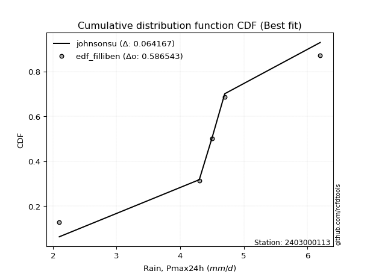</img></img>

</div>


### 10. EDF Jenkinson (1977)

The Jenkinson formula in hydrology is an empirical plotting position formula used to estimate the non-exceedance probability _(P)_ or return period _(T)_ of a given ordered observation within a sample. It is a widely used method in the frequency analysis of extreme events such as floods and rainfall, as it provides a distribution-free way to plot data. _a≈0.31_ and _b≈0.38_ are constants derived to approximate the median of the probability distribution for the given rank.

<div align="center">


$P=(m-a)/(n+b)$


</div>


**10.1. Empirical values**

<div align="center">

|                | 0                   | 1                  | 2             | 3                  | 4                  |
|:---------------|:--------------------|:-------------------|:--------------|:-------------------|:-------------------|
| date           | 2020                | 2021               | 2022          | 2023               | 2024               |
| x              | 2.1                 | 4.3                | 4.5           | 4.7                | 6.2                |
| m              | 1                   | 2                  | 3             | 4                  | 5                  |
| empirical_dist | edf_jenkinson       | edf_jenkinson      | edf_jenkinson | edf_jenkinson      | edf_jenkinson      |
| empirical      | 0.12825278810408922 | 0.3141263940520446 | 0.5           | 0.6858736059479554 | 0.8717472118959109 |
| empirical_tr   | 1.1471215351812367  | 1.4579945799457996 | 2.0           | 3.183431952662722  | 7.797101449275368  |

</div>


**10.2. Kolmogorov-Smirnov fit test (sorted by Δ)**


<div align="center">

|                | 0                   | 1                  | 2                   | 3                   | 4                   | 5                  | 6                   | 7                  | 8                   | 9                   | 10                  | 11                  | 12                  | 13                  | 14                    | 15                 | 16                  | 17                  | 18                 | 19                  | 20                  | 21                  | 22                 | 23                 | 24                 | 25                  | 26                  | 27                  | 28                  | 29                  | 30                 | 31                  | 32                  | 33                 | 34                  | 35                  | 36                  | 37                  | 38                  | 39                  | 40                  | 41                  | 42                  | 43                  | 44                  | 45                  | 46                  | 47                  | 48                  | 49                  | 50                  | 51                  | 52                  | 53                 | 54                  | 55                  | 56                  | 57                  | 58                  | 59                  | 60                  | 61                  | 62                  | 63                  | 64                  | 65                 | 66                 | 67                  | 68                 | 69                  | 70                  | 71                  | 72                  | 73                  | 74                 | 75                  | 76                 | 77                 | 78                 | 79                  | 80                  | 81                 | 82                 | 83                  | 84                 | 85                  | 86                  | 87                 |
|:---------------|:--------------------|:-------------------|:--------------------|:--------------------|:--------------------|:-------------------|:--------------------|:-------------------|:--------------------|:--------------------|:--------------------|:--------------------|:--------------------|:--------------------|:----------------------|:-------------------|:--------------------|:--------------------|:-------------------|:--------------------|:--------------------|:--------------------|:-------------------|:-------------------|:-------------------|:--------------------|:--------------------|:--------------------|:--------------------|:--------------------|:-------------------|:--------------------|:--------------------|:-------------------|:--------------------|:--------------------|:--------------------|:--------------------|:--------------------|:--------------------|:--------------------|:--------------------|:--------------------|:--------------------|:--------------------|:--------------------|:--------------------|:--------------------|:--------------------|:--------------------|:--------------------|:--------------------|:--------------------|:-------------------|:--------------------|:--------------------|:--------------------|:--------------------|:--------------------|:--------------------|:--------------------|:--------------------|:--------------------|:--------------------|:--------------------|:-------------------|:-------------------|:--------------------|:-------------------|:--------------------|:--------------------|:--------------------|:--------------------|:--------------------|:-------------------|:--------------------|:-------------------|:-------------------|:-------------------|:--------------------|:--------------------|:-------------------|:-------------------|:--------------------|:-------------------|:--------------------|:--------------------|:-------------------|
| station        | 2403000113          | 2403000113         | 2403000113          | 2403000113          | 2403000113          | 2403000113         | 2403000113          | 2403000113         | 2403000113          | 2403000113          | 2403000113          | 2403000113          | 2403000113          | 2403000113          | 2403000113            | 2403000113         | 2403000113          | 2403000113          | 2403000113         | 2403000113          | 2403000113          | 2403000113          | 2403000113         | 2403000113         | 2403000113         | 2403000113          | 2403000113          | 2403000113          | 2403000113          | 2403000113          | 2403000113         | 2403000113          | 2403000113          | 2403000113         | 2403000113          | 2403000113          | 2403000113          | 2403000113          | 2403000113          | 2403000113          | 2403000113          | 2403000113          | 2403000113          | 2403000113          | 2403000113          | 2403000113          | 2403000113          | 2403000113          | 2403000113          | 2403000113          | 2403000113          | 2403000113          | 2403000113          | 2403000113         | 2403000113          | 2403000113          | 2403000113          | 2403000113          | 2403000113          | 2403000113          | 2403000113          | 2403000113          | 2403000113          | 2403000113          | 2403000113          | 2403000113         | 2403000113         | 2403000113          | 2403000113         | 2403000113          | 2403000113          | 2403000113          | 2403000113          | 2403000113          | 2403000113         | 2403000113          | 2403000113         | 2403000113         | 2403000113         | 2403000113          | 2403000113          | 2403000113         | 2403000113         | 2403000113          | 2403000113         | 2403000113          | 2403000113          | 2403000113         |
| empirical_dist | edf_jenkinson       | edf_jenkinson      | edf_jenkinson       | edf_jenkinson       | edf_jenkinson       | edf_jenkinson      | edf_jenkinson       | edf_jenkinson      | edf_jenkinson       | edf_jenkinson       | edf_jenkinson       | edf_jenkinson       | edf_jenkinson       | edf_jenkinson       | edf_jenkinson         | edf_jenkinson      | edf_jenkinson       | edf_jenkinson       | edf_jenkinson      | edf_jenkinson       | edf_jenkinson       | edf_jenkinson       | edf_jenkinson      | edf_jenkinson      | edf_jenkinson      | edf_jenkinson       | edf_jenkinson       | edf_jenkinson       | edf_jenkinson       | edf_jenkinson       | edf_jenkinson      | edf_jenkinson       | edf_jenkinson       | edf_jenkinson      | edf_jenkinson       | edf_jenkinson       | edf_jenkinson       | edf_jenkinson       | edf_jenkinson       | edf_jenkinson       | edf_jenkinson       | edf_jenkinson       | edf_jenkinson       | edf_jenkinson       | edf_jenkinson       | edf_jenkinson       | edf_jenkinson       | edf_jenkinson       | edf_jenkinson       | edf_jenkinson       | edf_jenkinson       | edf_jenkinson       | edf_jenkinson       | edf_jenkinson      | edf_jenkinson       | edf_jenkinson       | edf_jenkinson       | edf_jenkinson       | edf_jenkinson       | edf_jenkinson       | edf_jenkinson       | edf_jenkinson       | edf_jenkinson       | edf_jenkinson       | edf_jenkinson       | edf_jenkinson      | edf_jenkinson      | edf_jenkinson       | edf_jenkinson      | edf_jenkinson       | edf_jenkinson       | edf_jenkinson       | edf_jenkinson       | edf_jenkinson       | edf_jenkinson      | edf_jenkinson       | edf_jenkinson      | edf_jenkinson      | edf_jenkinson      | edf_jenkinson       | edf_jenkinson       | edf_jenkinson      | edf_jenkinson      | edf_jenkinson       | edf_jenkinson      | edf_jenkinson       | edf_jenkinson       | edf_jenkinson      |
| p_dist         | johnsonsu           | logjohnsonsu       | logt                | genlogistic         | laplace_asymmetric  | weibull_min        | fisk                | logloggamma        | pearson3            | loggenlogistic      | gumbel_l            | laplace             | gompertz            | logweibull_min      | loglaplace_asymmetric | hypsecant          | logistic            | loggumbel_l         | logpearson3        | exponnorm           | t                   | truncnorm           | norm               | crystalball        | logfisk            | nct                 | fatiguelife         | f                   | betaprime           | gamma               | erlang             | rice                | logmielke           | loggompertz        | invgamma            | alpha               | invgauss            | maxwell             | ncf                 | rayleigh            | invweibull          | logf                | logexponnorm        | lognorm             | lognorm             | logcrystalball      | logfatiguelife      | lognct              | logalpha            | logncf              | gumbel_r            | loglogistic         | logrice             | logbetaprime       | kstwobign           | halfnorm            | loghypsecant        | loggamma            | loggamma            | genexpon            | loginvgamma         | loginvgauss         | loginvweibull       | moyal               | loglaplace          | logmaxwell         | halflogistic       | lograyleigh         | logkstwobign       | logchi2             | loggenexpon         | loghalfnorm         | loggumbel_r         | expon               | lognakagami        | nakagami            | logmoyal           | loghalflogistic    | wald               | logexpon            | gibrat              | loglognorm         | logerlang          | logwald             | logtruncnorm       | loggibrat           | chi2                | mielke             |
| delta          | 0.06520668037002389 | 0.069893445004416  | 0.07609914983051731 | 0.11983499559280497 | 0.12405835650084723 | 0.1273929160673138 | 0.13234889888896456 | 0.1326623888780014 | 0.13692618607118184 | 0.14252539610707704 | 0.14316124693826693 | 0.15460433781325672 | 0.15702482965232584 | 0.15771747895282356 | 0.16245209026039859   | 0.1630608140258688 | 0.16517878803579478 | 0.16644168224073835 | 0.1675266560827911 | 0.16765974044209786 | 0.16766194516760996 | 0.16766209153961037 | 0.1676623588515605 | 0.1676624379865561 | 0.1677610545345633 | 0.16809350047749888 | 0.16863162109114177 | 0.17026112282968126 | 0.17703333613646394 | 0.17828862792429762 | 0.1790457218728127 | 0.18056956268276952 | 0.18536404049332877 | 0.1871328641844549 | 0.19102688803457374 | 0.19283770071687517 | 0.19661437752104366 | 0.20134601676389335 | 0.20287505058850058 | 0.21272736733031233 | 0.22831296356858094 | 0.23248528200180535 | 0.23369778783986478 | 0.23369979972692573 | 0.23369979972692573 | 0.23369980299182286 | 0.23396622771151737 | 0.23591875368180498 | 0.23714868547727214 | 0.23716572781330353 | 0.23725714574700868 | 0.24015045323059842 | 0.24171941413931747 | 0.242082557949924  | 0.24446476191763528 | 0.24478561693403328 | 0.24560547320706577 | 0.24618677030600705 | 0.24618677030600705 | 0.24819837451168641 | 0.25170243791191566 | 0.26007127553432224 | 0.26235864669102466 | 0.26312340729219136 | 0.26401909149982666 | 0.2642326522617641 | 0.2685064604745984 | 0.27405353147835604 | 0.2939782077694399 | 0.29933711704445914 | 0.29959701765911123 | 0.30175112229054185 | 0.30387587998130566 | 0.30809665237443223 | 0.3141195828194555 | 0.32665693794136674 | 0.3287829724490388 | 0.3289689285423613 | 0.335114835580774  | 0.34088713648399466 | 0.35527707458172314 | 0.3737611368818387 | 0.3911048580675465 | 0.39789377746698024 | 0.4182437839770916 | 0.42682156660294895 | 0.44461426103075435 | 0.4777562145970247 |
| deltao         | 0.5865427407550001  | 0.5865427407550001 | 0.5865427407550001  | 0.5865427407550001  | 0.5865427407550001  | 0.5865427407550001 | 0.5865427407550001  | 0.5865427407550001 | 0.5865427407550001  | 0.5865427407550001  | 0.5865427407550001  | 0.5865427407550001  | 0.5865427407550001  | 0.5865427407550001  | 0.5865427407550001    | 0.5865427407550001 | 0.5865427407550001  | 0.5865427407550001  | 0.5865427407550001 | 0.5865427407550001  | 0.5865427407550001  | 0.5865427407550001  | 0.5865427407550001 | 0.5865427407550001 | 0.5865427407550001 | 0.5865427407550001  | 0.5865427407550001  | 0.5865427407550001  | 0.5865427407550001  | 0.5865427407550001  | 0.5865427407550001 | 0.5865427407550001  | 0.5865427407550001  | 0.5865427407550001 | 0.5865427407550001  | 0.5865427407550001  | 0.5865427407550001  | 0.5865427407550001  | 0.5865427407550001  | 0.5865427407550001  | 0.5865427407550001  | 0.5865427407550001  | 0.5865427407550001  | 0.5865427407550001  | 0.5865427407550001  | 0.5865427407550001  | 0.5865427407550001  | 0.5865427407550001  | 0.5865427407550001  | 0.5865427407550001  | 0.5865427407550001  | 0.5865427407550001  | 0.5865427407550001  | 0.5865427407550001 | 0.5865427407550001  | 0.5865427407550001  | 0.5865427407550001  | 0.5865427407550001  | 0.5865427407550001  | 0.5865427407550001  | 0.5865427407550001  | 0.5865427407550001  | 0.5865427407550001  | 0.5865427407550001  | 0.5865427407550001  | 0.5865427407550001 | 0.5865427407550001 | 0.5865427407550001  | 0.5865427407550001 | 0.5865427407550001  | 0.5865427407550001  | 0.5865427407550001  | 0.5865427407550001  | 0.5865427407550001  | 0.5865427407550001 | 0.5865427407550001  | 0.5865427407550001 | 0.5865427407550001 | 0.5865427407550001 | 0.5865427407550001  | 0.5865427407550001  | 0.5865427407550001 | 0.5865427407550001 | 0.5865427407550001  | 0.5865427407550001 | 0.5865427407550001  | 0.5865427407550001  | 0.5865427407550001 |
| eval           | Δo > Δ              | Δo > Δ             | Δo > Δ              | Δo > Δ              | Δo > Δ              | Δo > Δ             | Δo > Δ              | Δo > Δ             | Δo > Δ              | Δo > Δ              | Δo > Δ              | Δo > Δ              | Δo > Δ              | Δo > Δ              | Δo > Δ                | Δo > Δ             | Δo > Δ              | Δo > Δ              | Δo > Δ             | Δo > Δ              | Δo > Δ              | Δo > Δ              | Δo > Δ             | Δo > Δ             | Δo > Δ             | Δo > Δ              | Δo > Δ              | Δo > Δ              | Δo > Δ              | Δo > Δ              | Δo > Δ             | Δo > Δ              | Δo > Δ              | Δo > Δ             | Δo > Δ              | Δo > Δ              | Δo > Δ              | Δo > Δ              | Δo > Δ              | Δo > Δ              | Δo > Δ              | Δo > Δ              | Δo > Δ              | Δo > Δ              | Δo > Δ              | Δo > Δ              | Δo > Δ              | Δo > Δ              | Δo > Δ              | Δo > Δ              | Δo > Δ              | Δo > Δ              | Δo > Δ              | Δo > Δ             | Δo > Δ              | Δo > Δ              | Δo > Δ              | Δo > Δ              | Δo > Δ              | Δo > Δ              | Δo > Δ              | Δo > Δ              | Δo > Δ              | Δo > Δ              | Δo > Δ              | Δo > Δ             | Δo > Δ             | Δo > Δ              | Δo > Δ             | Δo > Δ              | Δo > Δ              | Δo > Δ              | Δo > Δ              | Δo > Δ              | Δo > Δ             | Δo > Δ              | Δo > Δ             | Δo > Δ             | Δo > Δ             | Δo > Δ              | Δo > Δ              | Δo > Δ             | Δo > Δ             | Δo > Δ              | Δo > Δ             | Δo > Δ              | Δo > Δ              | Δo > Δ             |
| fit            | 1                   | 1                  | 1                   | 1                   | 1                   | 1                  | 1                   | 1                  | 1                   | 1                   | 1                   | 1                   | 1                   | 1                   | 1                     | 1                  | 1                   | 1                   | 1                  | 1                   | 1                   | 1                   | 1                  | 1                  | 1                  | 1                   | 1                   | 1                   | 1                   | 1                   | 1                  | 1                   | 1                   | 1                  | 1                   | 1                   | 1                   | 1                   | 1                   | 1                   | 1                   | 1                   | 1                   | 1                   | 1                   | 1                   | 1                   | 1                   | 1                   | 1                   | 1                   | 1                   | 1                   | 1                  | 1                   | 1                   | 1                   | 1                   | 1                   | 1                   | 1                   | 1                   | 1                   | 1                   | 1                   | 1                  | 1                  | 1                   | 1                  | 1                   | 1                   | 1                   | 1                   | 1                   | 1                  | 1                   | 1                  | 1                  | 1                  | 1                   | 1                   | 1                  | 1                  | 1                   | 1                  | 1                   | 1                   | 1                  |
| n              | 5                   | 5                  | 5                   | 5                   | 5                   | 5                  | 5                   | 5                  | 5                   | 5                   | 5                   | 5                   | 5                   | 5                   | 5                     | 5                  | 5                   | 5                   | 5                  | 5                   | 5                   | 5                   | 5                  | 5                  | 5                  | 5                   | 5                   | 5                   | 5                   | 5                   | 5                  | 5                   | 5                   | 5                  | 5                   | 5                   | 5                   | 5                   | 5                   | 5                   | 5                   | 5                   | 5                   | 5                   | 5                   | 5                   | 5                   | 5                   | 5                   | 5                   | 5                   | 5                   | 5                   | 5                  | 5                   | 5                   | 5                   | 5                   | 5                   | 5                   | 5                   | 5                   | 5                   | 5                   | 5                   | 5                  | 5                  | 5                   | 5                  | 5                   | 5                   | 5                   | 5                   | 5                   | 5                  | 5                   | 5                  | 5                  | 5                  | 5                   | 5                   | 5                  | 5                  | 5                   | 5                  | 5                   | 5                   | 5                  |
| best_fit       | 1                   | 0                  | 0                   | 0                   | 0                   | 0                  | 0                   | 0                  | 0                   | 0                   | 0                   | 0                   | 0                   | 0                   | 0                     | 0                  | 0                   | 0                   | 0                  | 0                   | 0                   | 0                   | 0                  | 0                  | 0                  | 0                   | 0                   | 0                   | 0                   | 0                   | 0                  | 0                   | 0                   | 0                  | 0                   | 0                   | 0                   | 0                   | 0                   | 0                   | 0                   | 0                   | 0                   | 0                   | 0                   | 0                   | 0                   | 0                   | 0                   | 0                   | 0                   | 0                   | 0                   | 0                  | 0                   | 0                   | 0                   | 0                   | 0                   | 0                   | 0                   | 0                   | 0                   | 0                   | 0                   | 0                  | 0                  | 0                   | 0                  | 0                   | 0                   | 0                   | 0                   | 0                   | 0                  | 0                   | 0                  | 0                  | 0                  | 0                   | 0                   | 0                  | 0                  | 0                   | 0                  | 0                   | 0                   | 0                  |
| best_fit_sort  | 1                   | 2                  | 3                   | 4                   | 5                   | 6                  | 7                   | 8                  | 9                   | 10                  | 11                  | 12                  | 13                  | 14                  | 15                    | 16                 | 17                  | 18                  | 19                 | 20                  | 21                  | 22                  | 23                 | 24                 | 25                 | 26                  | 27                  | 28                  | 29                  | 30                  | 31                 | 32                  | 33                  | 34                 | 35                  | 36                  | 37                  | 38                  | 39                  | 40                  | 41                  | 42                  | 43                  | 44                  | 45                  | 46                  | 47                  | 48                  | 49                  | 50                  | 51                  | 52                  | 53                  | 54                 | 55                  | 56                  | 57                  | 58                  | 59                  | 60                  | 61                  | 62                  | 63                  | 64                  | 65                  | 66                 | 67                 | 68                  | 69                 | 70                  | 71                  | 72                  | 73                  | 74                  | 75                 | 76                  | 77                 | 78                 | 79                 | 80                  | 81                  | 82                 | 83                 | 84                  | 85                 | 86                  | 87                  | 88                 |

</div>


**10.3. Best fit**

<div align="center">

|   id |    station | empirical_dist   | p_dist    |     delta |   deltao | eval   |   fit |   n |   best_fit |   best_fit_sort |
|-----:|-----------:|:-----------------|:----------|----------:|---------:|:-------|------:|----:|-----------:|----------------:|
|    0 | 2403000113 | edf_jenkinson    | johnsonsu | 0.0652067 | 0.586543 | Δo > Δ |     1 |   5 |          1 |               1 |

</div>


<div align="center">

</img>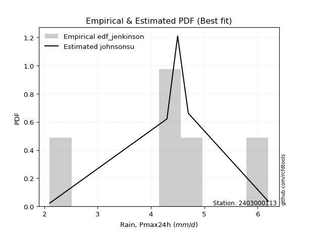</img>

</div>


### 11. EDF Cunnane (1978)

Cunnane´s work in statistical hydrology has focused on the performance and evaluation of different probability distributions (such as GEV, Gumbel, Lognormal) for flood frequency estimation. _b_ is a constant, typically set to 0.4.

<div align="center">


$P=(m-b)/(n+1-2b)$


</div>


**11.1. Empirical values**

<div align="center">

|                | 0                   | 1                  | 2           | 3                  | 4                  |
|:---------------|:--------------------|:-------------------|:------------|:-------------------|:-------------------|
| date           | 2020                | 2021               | 2022        | 2023               | 2024               |
| x              | 2.1                 | 4.3                | 4.5         | 4.7                | 6.2                |
| m              | 1                   | 2                  | 3           | 4                  | 5                  |
| empirical_dist | edf_cunnane         | edf_cunnane        | edf_cunnane | edf_cunnane        | edf_cunnane        |
| empirical      | 0.11538461538461538 | 0.3076923076923077 | 0.5         | 0.6923076923076923 | 0.8846153846153845 |
| empirical_tr   | 1.1304347826086958  | 1.4444444444444444 | 2.0         | 3.25               | 8.666666666666655  |

</div>


**11.2. Kolmogorov-Smirnov fit test (sorted by Δ)**


<div align="center">

|                | 0                   | 1                   | 2                   | 3                   | 4                   | 5                  | 6                   | 7                   | 8                   | 9                   | 10                  | 11                  | 12                  | 13                  | 14                    | 15                  | 16                 | 17                  | 18                  | 19                  | 20                  | 21                  | 22                 | 23                  | 24                  | 25                 | 26                  | 27                  | 28                  | 29                  | 30                  | 31                  | 32                  | 33                  | 34                  | 35                  | 36                  | 37                  | 38                 | 39                  | 40                  | 41                  | 42                 | 43                  | 44                  | 45                  | 46                  | 47                 | 48                  | 49                  | 50                 | 51                  | 52                  | 53                  | 54                 | 55                 | 56                 | 57                  | 58                  | 59                 | 60                  | 61                  | 62                  | 63                  | 64                 | 65                  | 66                  | 67                  | 68                 | 69                  | 70                  | 71                 | 72                  | 73                 | 74                  | 75                  | 76                 | 77                  | 78                 | 79                  | 80                  | 81                 | 82                  | 83                  | 84                  | 85                  | 86                  | 87                  |
|:---------------|:--------------------|:--------------------|:--------------------|:--------------------|:--------------------|:-------------------|:--------------------|:--------------------|:--------------------|:--------------------|:--------------------|:--------------------|:--------------------|:--------------------|:----------------------|:--------------------|:-------------------|:--------------------|:--------------------|:--------------------|:--------------------|:--------------------|:-------------------|:--------------------|:--------------------|:-------------------|:--------------------|:--------------------|:--------------------|:--------------------|:--------------------|:--------------------|:--------------------|:--------------------|:--------------------|:--------------------|:--------------------|:--------------------|:-------------------|:--------------------|:--------------------|:--------------------|:-------------------|:--------------------|:--------------------|:--------------------|:--------------------|:-------------------|:--------------------|:--------------------|:-------------------|:--------------------|:--------------------|:--------------------|:-------------------|:-------------------|:-------------------|:--------------------|:--------------------|:-------------------|:--------------------|:--------------------|:--------------------|:--------------------|:-------------------|:--------------------|:--------------------|:--------------------|:-------------------|:--------------------|:--------------------|:-------------------|:--------------------|:-------------------|:--------------------|:--------------------|:-------------------|:--------------------|:-------------------|:--------------------|:--------------------|:-------------------|:--------------------|:--------------------|:--------------------|:--------------------|:--------------------|:--------------------|
| station        | 2403000113          | 2403000113          | 2403000113          | 2403000113          | 2403000113          | 2403000113         | 2403000113          | 2403000113          | 2403000113          | 2403000113          | 2403000113          | 2403000113          | 2403000113          | 2403000113          | 2403000113            | 2403000113          | 2403000113         | 2403000113          | 2403000113          | 2403000113          | 2403000113          | 2403000113          | 2403000113         | 2403000113          | 2403000113          | 2403000113         | 2403000113          | 2403000113          | 2403000113          | 2403000113          | 2403000113          | 2403000113          | 2403000113          | 2403000113          | 2403000113          | 2403000113          | 2403000113          | 2403000113          | 2403000113         | 2403000113          | 2403000113          | 2403000113          | 2403000113         | 2403000113          | 2403000113          | 2403000113          | 2403000113          | 2403000113         | 2403000113          | 2403000113          | 2403000113         | 2403000113          | 2403000113          | 2403000113          | 2403000113         | 2403000113         | 2403000113         | 2403000113          | 2403000113          | 2403000113         | 2403000113          | 2403000113          | 2403000113          | 2403000113          | 2403000113         | 2403000113          | 2403000113          | 2403000113          | 2403000113         | 2403000113          | 2403000113          | 2403000113         | 2403000113          | 2403000113         | 2403000113          | 2403000113          | 2403000113         | 2403000113          | 2403000113         | 2403000113          | 2403000113          | 2403000113         | 2403000113          | 2403000113          | 2403000113          | 2403000113          | 2403000113          | 2403000113          |
| empirical_dist | edf_cunnane         | edf_cunnane         | edf_cunnane         | edf_cunnane         | edf_cunnane         | edf_cunnane        | edf_cunnane         | edf_cunnane         | edf_cunnane         | edf_cunnane         | edf_cunnane         | edf_cunnane         | edf_cunnane         | edf_cunnane         | edf_cunnane           | edf_cunnane         | edf_cunnane        | edf_cunnane         | edf_cunnane         | edf_cunnane         | edf_cunnane         | edf_cunnane         | edf_cunnane        | edf_cunnane         | edf_cunnane         | edf_cunnane        | edf_cunnane         | edf_cunnane         | edf_cunnane         | edf_cunnane         | edf_cunnane         | edf_cunnane         | edf_cunnane         | edf_cunnane         | edf_cunnane         | edf_cunnane         | edf_cunnane         | edf_cunnane         | edf_cunnane        | edf_cunnane         | edf_cunnane         | edf_cunnane         | edf_cunnane        | edf_cunnane         | edf_cunnane         | edf_cunnane         | edf_cunnane         | edf_cunnane        | edf_cunnane         | edf_cunnane         | edf_cunnane        | edf_cunnane         | edf_cunnane         | edf_cunnane         | edf_cunnane        | edf_cunnane        | edf_cunnane        | edf_cunnane         | edf_cunnane         | edf_cunnane        | edf_cunnane         | edf_cunnane         | edf_cunnane         | edf_cunnane         | edf_cunnane        | edf_cunnane         | edf_cunnane         | edf_cunnane         | edf_cunnane        | edf_cunnane         | edf_cunnane         | edf_cunnane        | edf_cunnane         | edf_cunnane        | edf_cunnane         | edf_cunnane         | edf_cunnane        | edf_cunnane         | edf_cunnane        | edf_cunnane         | edf_cunnane         | edf_cunnane        | edf_cunnane         | edf_cunnane         | edf_cunnane         | edf_cunnane         | edf_cunnane         | edf_cunnane         |
| p_dist         | johnsonsu           | logjohnsonsu        | logt                | genlogistic         | laplace_asymmetric  | weibull_min        | fisk                | logloggamma         | pearson3            | loggenlogistic      | gumbel_l            | laplace             | gompertz            | logweibull_min      | loglaplace_asymmetric | hypsecant           | logistic           | loggumbel_l         | logpearson3         | exponnorm           | t                   | truncnorm           | norm               | crystalball         | logfisk             | nct                | fatiguelife         | f                   | betaprime           | gamma               | erlang              | rice                | logmielke           | loggompertz         | invgamma            | alpha               | invgauss            | maxwell             | ncf                | rayleigh            | invweibull          | logf                | logexponnorm       | lognorm             | lognorm             | logcrystalball      | logfatiguelife      | lognct             | logalpha            | logncf              | gumbel_r           | loglogistic         | logrice             | logbetaprime        | kstwobign          | halfnorm           | loghypsecant       | loggamma            | loggamma            | genexpon           | loginvgamma         | loginvgauss         | loginvweibull       | moyal               | loglaplace         | logmaxwell          | halflogistic        | lograyleigh         | logkstwobign       | logchi2             | loggenexpon         | lognakagami        | loghalfnorm         | loggumbel_r        | expon               | nakagami            | logmoyal           | loghalflogistic     | wald               | logexpon            | gibrat              | loglognorm         | logerlang           | logwald             | logtruncnorm        | loggibrat           | chi2                | mielke              |
| delta          | 0.05233850765055005 | 0.05702527228494215 | 0.06323097711104347 | 0.12626908195254188 | 0.13049244286058415 | 0.1338270024270507 | 0.13878298524870147 | 0.13909647523773827 | 0.14336027243091876 | 0.14895948246681395 | 0.14959533329800379 | 0.16103842417299363 | 0.16345891601206275 | 0.16415156531256048 | 0.1688861766201355    | 0.16949490038560572 | 0.1716128743955317 | 0.17287576860047527 | 0.17396074244252802 | 0.17409382680183477 | 0.17409603152734687 | 0.17409617789934728 | 0.1740964452112974 | 0.17409652434629302 | 0.17419514089430022 | 0.1745275868372358 | 0.17506570745087868 | 0.17669520918941817 | 0.18346742249620085 | 0.18472271428403453 | 0.18547980823254961 | 0.18700364904250644 | 0.19179812685306563 | 0.19356695054419182 | 0.19746097439431065 | 0.19927178707661208 | 0.20304846388078057 | 0.20778010312363027 | 0.2093091369482375 | 0.21916145369004925 | 0.23474704992831785 | 0.23891936836154226 | 0.2401318741996017 | 0.24013388608666264 | 0.24013388608666264 | 0.24013388935155977 | 0.24040031407125428 | 0.2423528400415419 | 0.24358277183700905 | 0.24359981417304044 | 0.2436912321067456 | 0.24658453959033533 | 0.24815350049905438 | 0.24851664430966092 | 0.2508988482773722 | 0.2512197032937702 | 0.2520395595668027 | 0.25262085666574396 | 0.25262085666574396 | 0.2546324608714233 | 0.25813652427165257 | 0.26650536189405916 | 0.26879273305076157 | 0.26955749365192827 | 0.2704531778595636 | 0.27066673862150104 | 0.27494054683433533 | 0.28048761783809295 | 0.3004122941291768 | 0.30577120340419606 | 0.30603110401884814 | 0.3076854964597186 | 0.30818520865027876 | 0.3103099663410426 | 0.31453073873416915 | 0.32665693794136674 | 0.3352170588087757 | 0.33540301490209823 | 0.3415489219405109 | 0.34732122284373157 | 0.36171116094146005 | 0.3801952232415756 | 0.39753894442728344 | 0.40432786382671715 | 0.42467787033682847 | 0.43325565296268587 | 0.45104834739049127 | 0.48419030095676163 |
| deltao         | 0.5865427407550001  | 0.5865427407550001  | 0.5865427407550001  | 0.5865427407550001  | 0.5865427407550001  | 0.5865427407550001 | 0.5865427407550001  | 0.5865427407550001  | 0.5865427407550001  | 0.5865427407550001  | 0.5865427407550001  | 0.5865427407550001  | 0.5865427407550001  | 0.5865427407550001  | 0.5865427407550001    | 0.5865427407550001  | 0.5865427407550001 | 0.5865427407550001  | 0.5865427407550001  | 0.5865427407550001  | 0.5865427407550001  | 0.5865427407550001  | 0.5865427407550001 | 0.5865427407550001  | 0.5865427407550001  | 0.5865427407550001 | 0.5865427407550001  | 0.5865427407550001  | 0.5865427407550001  | 0.5865427407550001  | 0.5865427407550001  | 0.5865427407550001  | 0.5865427407550001  | 0.5865427407550001  | 0.5865427407550001  | 0.5865427407550001  | 0.5865427407550001  | 0.5865427407550001  | 0.5865427407550001 | 0.5865427407550001  | 0.5865427407550001  | 0.5865427407550001  | 0.5865427407550001 | 0.5865427407550001  | 0.5865427407550001  | 0.5865427407550001  | 0.5865427407550001  | 0.5865427407550001 | 0.5865427407550001  | 0.5865427407550001  | 0.5865427407550001 | 0.5865427407550001  | 0.5865427407550001  | 0.5865427407550001  | 0.5865427407550001 | 0.5865427407550001 | 0.5865427407550001 | 0.5865427407550001  | 0.5865427407550001  | 0.5865427407550001 | 0.5865427407550001  | 0.5865427407550001  | 0.5865427407550001  | 0.5865427407550001  | 0.5865427407550001 | 0.5865427407550001  | 0.5865427407550001  | 0.5865427407550001  | 0.5865427407550001 | 0.5865427407550001  | 0.5865427407550001  | 0.5865427407550001 | 0.5865427407550001  | 0.5865427407550001 | 0.5865427407550001  | 0.5865427407550001  | 0.5865427407550001 | 0.5865427407550001  | 0.5865427407550001 | 0.5865427407550001  | 0.5865427407550001  | 0.5865427407550001 | 0.5865427407550001  | 0.5865427407550001  | 0.5865427407550001  | 0.5865427407550001  | 0.5865427407550001  | 0.5865427407550001  |
| eval           | Δo > Δ              | Δo > Δ              | Δo > Δ              | Δo > Δ              | Δo > Δ              | Δo > Δ             | Δo > Δ              | Δo > Δ              | Δo > Δ              | Δo > Δ              | Δo > Δ              | Δo > Δ              | Δo > Δ              | Δo > Δ              | Δo > Δ                | Δo > Δ              | Δo > Δ             | Δo > Δ              | Δo > Δ              | Δo > Δ              | Δo > Δ              | Δo > Δ              | Δo > Δ             | Δo > Δ              | Δo > Δ              | Δo > Δ             | Δo > Δ              | Δo > Δ              | Δo > Δ              | Δo > Δ              | Δo > Δ              | Δo > Δ              | Δo > Δ              | Δo > Δ              | Δo > Δ              | Δo > Δ              | Δo > Δ              | Δo > Δ              | Δo > Δ             | Δo > Δ              | Δo > Δ              | Δo > Δ              | Δo > Δ             | Δo > Δ              | Δo > Δ              | Δo > Δ              | Δo > Δ              | Δo > Δ             | Δo > Δ              | Δo > Δ              | Δo > Δ             | Δo > Δ              | Δo > Δ              | Δo > Δ              | Δo > Δ             | Δo > Δ             | Δo > Δ             | Δo > Δ              | Δo > Δ              | Δo > Δ             | Δo > Δ              | Δo > Δ              | Δo > Δ              | Δo > Δ              | Δo > Δ             | Δo > Δ              | Δo > Δ              | Δo > Δ              | Δo > Δ             | Δo > Δ              | Δo > Δ              | Δo > Δ             | Δo > Δ              | Δo > Δ             | Δo > Δ              | Δo > Δ              | Δo > Δ             | Δo > Δ              | Δo > Δ             | Δo > Δ              | Δo > Δ              | Δo > Δ             | Δo > Δ              | Δo > Δ              | Δo > Δ              | Δo > Δ              | Δo > Δ              | Δo > Δ              |
| fit            | 1                   | 1                   | 1                   | 1                   | 1                   | 1                  | 1                   | 1                   | 1                   | 1                   | 1                   | 1                   | 1                   | 1                   | 1                     | 1                   | 1                  | 1                   | 1                   | 1                   | 1                   | 1                   | 1                  | 1                   | 1                   | 1                  | 1                   | 1                   | 1                   | 1                   | 1                   | 1                   | 1                   | 1                   | 1                   | 1                   | 1                   | 1                   | 1                  | 1                   | 1                   | 1                   | 1                  | 1                   | 1                   | 1                   | 1                   | 1                  | 1                   | 1                   | 1                  | 1                   | 1                   | 1                   | 1                  | 1                  | 1                  | 1                   | 1                   | 1                  | 1                   | 1                   | 1                   | 1                   | 1                  | 1                   | 1                   | 1                   | 1                  | 1                   | 1                   | 1                  | 1                   | 1                  | 1                   | 1                   | 1                  | 1                   | 1                  | 1                   | 1                   | 1                  | 1                   | 1                   | 1                   | 1                   | 1                   | 1                   |
| n              | 5                   | 5                   | 5                   | 5                   | 5                   | 5                  | 5                   | 5                   | 5                   | 5                   | 5                   | 5                   | 5                   | 5                   | 5                     | 5                   | 5                  | 5                   | 5                   | 5                   | 5                   | 5                   | 5                  | 5                   | 5                   | 5                  | 5                   | 5                   | 5                   | 5                   | 5                   | 5                   | 5                   | 5                   | 5                   | 5                   | 5                   | 5                   | 5                  | 5                   | 5                   | 5                   | 5                  | 5                   | 5                   | 5                   | 5                   | 5                  | 5                   | 5                   | 5                  | 5                   | 5                   | 5                   | 5                  | 5                  | 5                  | 5                   | 5                   | 5                  | 5                   | 5                   | 5                   | 5                   | 5                  | 5                   | 5                   | 5                   | 5                  | 5                   | 5                   | 5                  | 5                   | 5                  | 5                   | 5                   | 5                  | 5                   | 5                  | 5                   | 5                   | 5                  | 5                   | 5                   | 5                   | 5                   | 5                   | 5                   |
| best_fit       | 1                   | 0                   | 0                   | 0                   | 0                   | 0                  | 0                   | 0                   | 0                   | 0                   | 0                   | 0                   | 0                   | 0                   | 0                     | 0                   | 0                  | 0                   | 0                   | 0                   | 0                   | 0                   | 0                  | 0                   | 0                   | 0                  | 0                   | 0                   | 0                   | 0                   | 0                   | 0                   | 0                   | 0                   | 0                   | 0                   | 0                   | 0                   | 0                  | 0                   | 0                   | 0                   | 0                  | 0                   | 0                   | 0                   | 0                   | 0                  | 0                   | 0                   | 0                  | 0                   | 0                   | 0                   | 0                  | 0                  | 0                  | 0                   | 0                   | 0                  | 0                   | 0                   | 0                   | 0                   | 0                  | 0                   | 0                   | 0                   | 0                  | 0                   | 0                   | 0                  | 0                   | 0                  | 0                   | 0                   | 0                  | 0                   | 0                  | 0                   | 0                   | 0                  | 0                   | 0                   | 0                   | 0                   | 0                   | 0                   |
| best_fit_sort  | 1                   | 2                   | 3                   | 4                   | 5                   | 6                  | 7                   | 8                   | 9                   | 10                  | 11                  | 12                  | 13                  | 14                  | 15                    | 16                  | 17                 | 18                  | 19                  | 20                  | 21                  | 22                  | 23                 | 24                  | 25                  | 26                 | 27                  | 28                  | 29                  | 30                  | 31                  | 32                  | 33                  | 34                  | 35                  | 36                  | 37                  | 38                  | 39                 | 40                  | 41                  | 42                  | 43                 | 44                  | 45                  | 46                  | 47                  | 48                 | 49                  | 50                  | 51                 | 52                  | 53                  | 54                  | 55                 | 56                 | 57                 | 58                  | 59                  | 60                 | 61                  | 62                  | 63                  | 64                  | 65                 | 66                  | 67                  | 68                  | 69                 | 70                  | 71                  | 72                 | 73                  | 74                 | 75                  | 76                  | 77                 | 78                  | 79                 | 80                  | 81                  | 82                 | 83                  | 84                  | 85                  | 86                  | 87                  | 88                  |

</div>


**11.3. Best fit**

<div align="center">

|   id |    station | empirical_dist   | p_dist    |     delta |   deltao | eval   |   fit |   n |   best_fit |   best_fit_sort |
|-----:|-----------:|:-----------------|:----------|----------:|---------:|:-------|------:|----:|-----------:|----------------:|
|    0 | 2403000113 | edf_cunnane      | johnsonsu | 0.0523385 | 0.586543 | Δo > Δ |     1 |   5 |          1 |               1 |

</div>


<div align="center">

</img></img>

</div>


### 12. EDF Adamowski (1981)

The Adamowski formula in hydrology refers to a specific plotting position formula used for estimating the non-parametric empirical distribution of hydrological events (like flood peaks) to calculate their return periods. This formula provides an alternative to traditional parametric methods (like the Gumbel or Log Pearson Type III distributions). 

<div align="center">


$P=(m-0.25)/(n+0.5)$


</div>


**12.1. Empirical values**

<div align="center">

|                | 0                   | 1                  | 2             | 3                  | 4                  |
|:---------------|:--------------------|:-------------------|:--------------|:-------------------|:-------------------|
| date           | 2020                | 2021               | 2022          | 2023               | 2024               |
| x              | 2.1                 | 4.3                | 4.5           | 4.7                | 6.2                |
| m              | 1                   | 2                  | 3             | 4                  | 5                  |
| empirical_dist | edf_adamowski       | edf_adamowski      | edf_adamowski | edf_adamowski      | edf_adamowski      |
| empirical      | 0.13636363636363635 | 0.3181818181818182 | 0.5           | 0.6818181818181818 | 0.8636363636363636 |
| empirical_tr   | 1.1578947368421053  | 1.4666666666666666 | 2.0           | 3.1428571428571423 | 7.333333333333334  |

</div>


**12.2. Kolmogorov-Smirnov fit test (sorted by Δ)**


<div align="center">

|                | 0                   | 1                   | 2                   | 3                   | 4                   | 5                   | 6                  | 7                   | 8                  | 9                   | 10                  | 11                  | 12                  | 13                 | 14                    | 15                  | 16                  | 17                 | 18                  | 19                 | 20                 | 21                  | 22                  | 23                  | 24                  | 25                  | 26                  | 27                 | 28                  | 29                  | 30                  | 31                  | 32                 | 33                  | 34                  | 35                  | 36                 | 37                 | 38                  | 39                  | 40                  | 41                 | 42                  | 43                  | 44                  | 45                 | 46                  | 47                  | 48                  | 49                  | 50                  | 51                  | 52                 | 53                  | 54                  | 55                  | 56                  | 57                 | 58                 | 59                  | 60                 | 61                 | 62                 | 63                 | 64                 | 65                  | 66                  | 67                 | 68                  | 69                 | 70                 | 71                 | 72                 | 73                 | 74                  | 75                  | 76                  | 77                  | 78                  | 79                 | 80                 | 81                  | 82                  | 83                 | 84                  | 85                 | 86                 | 87                  |
|:---------------|:--------------------|:--------------------|:--------------------|:--------------------|:--------------------|:--------------------|:-------------------|:--------------------|:-------------------|:--------------------|:--------------------|:--------------------|:--------------------|:-------------------|:----------------------|:--------------------|:--------------------|:-------------------|:--------------------|:-------------------|:-------------------|:--------------------|:--------------------|:--------------------|:--------------------|:--------------------|:--------------------|:-------------------|:--------------------|:--------------------|:--------------------|:--------------------|:-------------------|:--------------------|:--------------------|:--------------------|:-------------------|:-------------------|:--------------------|:--------------------|:--------------------|:-------------------|:--------------------|:--------------------|:--------------------|:-------------------|:--------------------|:--------------------|:--------------------|:--------------------|:--------------------|:--------------------|:-------------------|:--------------------|:--------------------|:--------------------|:--------------------|:-------------------|:-------------------|:--------------------|:-------------------|:-------------------|:-------------------|:-------------------|:-------------------|:--------------------|:--------------------|:-------------------|:--------------------|:-------------------|:-------------------|:-------------------|:-------------------|:-------------------|:--------------------|:--------------------|:--------------------|:--------------------|:--------------------|:-------------------|:-------------------|:--------------------|:--------------------|:-------------------|:--------------------|:-------------------|:-------------------|:--------------------|
| station        | 2403000113          | 2403000113          | 2403000113          | 2403000113          | 2403000113          | 2403000113          | 2403000113         | 2403000113          | 2403000113         | 2403000113          | 2403000113          | 2403000113          | 2403000113          | 2403000113         | 2403000113            | 2403000113          | 2403000113          | 2403000113         | 2403000113          | 2403000113         | 2403000113         | 2403000113          | 2403000113          | 2403000113          | 2403000113          | 2403000113          | 2403000113          | 2403000113         | 2403000113          | 2403000113          | 2403000113          | 2403000113          | 2403000113         | 2403000113          | 2403000113          | 2403000113          | 2403000113         | 2403000113         | 2403000113          | 2403000113          | 2403000113          | 2403000113         | 2403000113          | 2403000113          | 2403000113          | 2403000113         | 2403000113          | 2403000113          | 2403000113          | 2403000113          | 2403000113          | 2403000113          | 2403000113         | 2403000113          | 2403000113          | 2403000113          | 2403000113          | 2403000113         | 2403000113         | 2403000113          | 2403000113         | 2403000113         | 2403000113         | 2403000113         | 2403000113         | 2403000113          | 2403000113          | 2403000113         | 2403000113          | 2403000113         | 2403000113         | 2403000113         | 2403000113         | 2403000113         | 2403000113          | 2403000113          | 2403000113          | 2403000113          | 2403000113          | 2403000113         | 2403000113         | 2403000113          | 2403000113          | 2403000113         | 2403000113          | 2403000113         | 2403000113         | 2403000113          |
| empirical_dist | edf_adamowski       | edf_adamowski       | edf_adamowski       | edf_adamowski       | edf_adamowski       | edf_adamowski       | edf_adamowski      | edf_adamowski       | edf_adamowski      | edf_adamowski       | edf_adamowski       | edf_adamowski       | edf_adamowski       | edf_adamowski      | edf_adamowski         | edf_adamowski       | edf_adamowski       | edf_adamowski      | edf_adamowski       | edf_adamowski      | edf_adamowski      | edf_adamowski       | edf_adamowski       | edf_adamowski       | edf_adamowski       | edf_adamowski       | edf_adamowski       | edf_adamowski      | edf_adamowski       | edf_adamowski       | edf_adamowski       | edf_adamowski       | edf_adamowski      | edf_adamowski       | edf_adamowski       | edf_adamowski       | edf_adamowski      | edf_adamowski      | edf_adamowski       | edf_adamowski       | edf_adamowski       | edf_adamowski      | edf_adamowski       | edf_adamowski       | edf_adamowski       | edf_adamowski      | edf_adamowski       | edf_adamowski       | edf_adamowski       | edf_adamowski       | edf_adamowski       | edf_adamowski       | edf_adamowski      | edf_adamowski       | edf_adamowski       | edf_adamowski       | edf_adamowski       | edf_adamowski      | edf_adamowski      | edf_adamowski       | edf_adamowski      | edf_adamowski      | edf_adamowski      | edf_adamowski      | edf_adamowski      | edf_adamowski       | edf_adamowski       | edf_adamowski      | edf_adamowski       | edf_adamowski      | edf_adamowski      | edf_adamowski      | edf_adamowski      | edf_adamowski      | edf_adamowski       | edf_adamowski       | edf_adamowski       | edf_adamowski       | edf_adamowski       | edf_adamowski      | edf_adamowski      | edf_adamowski       | edf_adamowski       | edf_adamowski      | edf_adamowski       | edf_adamowski      | edf_adamowski      | edf_adamowski       |
| p_dist         | johnsonsu           | logjohnsonsu        | logt                | genlogistic         | laplace_asymmetric  | weibull_min         | fisk               | logloggamma         | pearson3           | loggenlogistic      | gumbel_l            | laplace             | gompertz            | logweibull_min     | loglaplace_asymmetric | hypsecant           | logistic            | loggumbel_l        | logpearson3         | exponnorm          | t                  | truncnorm           | norm                | crystalball         | logfisk             | nct                 | fatiguelife         | f                  | betaprime           | gamma               | erlang              | rice                | logmielke          | loggompertz         | invgamma            | alpha               | invgauss           | maxwell            | ncf                 | rayleigh            | invweibull          | logf               | logexponnorm        | lognorm             | lognorm             | logcrystalball     | logfatiguelife      | lognct              | logalpha            | logncf              | gumbel_r            | loglogistic         | logrice            | logbetaprime        | kstwobign           | halfnorm            | loghypsecant        | loggamma           | loggamma           | genexpon            | loginvgamma        | loginvgauss        | loginvweibull      | moyal              | loglaplace         | logmaxwell          | halflogistic        | lograyleigh        | logkstwobign        | logchi2            | loggenexpon        | loghalfnorm        | loggumbel_r        | expon              | lognakagami         | logmoyal            | loghalflogistic     | nakagami            | wald                | logexpon           | gibrat             | loglognorm          | logerlang           | logwald            | logtruncnorm        | loggibrat          | chi2               | mielke              |
| delta          | 0.07331752862957103 | 0.07800429326396313 | 0.08420999809006445 | 0.11577957146303142 | 0.12000293237107368 | 0.12333749193754023 | 0.128293474759191  | 0.12860696474822775 | 0.1328707619414083 | 0.13846997197730349 | 0.13910582280849326 | 0.15054891368348317 | 0.15296940552255228 | 0.15366205482305   | 0.15839666613062503   | 0.15900538989609525 | 0.16112336390602122 | 0.1623862581109648 | 0.16347123195301755 | 0.1636043163123243 | 0.1636065210378364 | 0.16360666740983681 | 0.16360693472178695 | 0.16360701385678256 | 0.16370563040478975 | 0.16403807634772533 | 0.16457619696136822 | 0.1662056986999077 | 0.17297791200669038 | 0.17423320379452406 | 0.17499029774303915 | 0.17651413855299597 | 0.1813086163635551 | 0.18307744005468135 | 0.18697146390480018 | 0.18878227658710162 | 0.1925589533912701 | 0.1972905926341198 | 0.19881962645872703 | 0.20867194320053878 | 0.22425753943880739 | 0.2284298578720318 | 0.22964236371009122 | 0.22964437559715217 | 0.22964437559715217 | 0.2296443788620493 | 0.22991080358174382 | 0.23186332955203143 | 0.23309326134749858 | 0.23311030368352997 | 0.23320172161723512 | 0.23609502910082486 | 0.2376639900095439 | 0.23802713382015045 | 0.24040933778786172 | 0.24073019280425972 | 0.24155004907729222 | 0.2421313461762335 | 0.2421313461762335 | 0.24414295038191286 | 0.2476470137821421 | 0.2560158514045487 | 0.2583032225612511 | 0.2590679831624178 | 0.2599636673700531 | 0.26017722813199057 | 0.26445103634482486 | 0.2699981073485825 | 0.28992278363966634 | 0.2952816929146856 | 0.2955415935293377 | 0.2976956981607683 | 0.2998204558515321 | 0.3040412282446587 | 0.31817500694922907 | 0.32472754831926526 | 0.32491350441258776 | 0.32665693794136674 | 0.33105941145100043 | 0.3368317123542211 | 0.3512216504519496 | 0.36970571275206515 | 0.38704943393777297 | 0.3938383533372067 | 0.41418835984731794 | 0.4227661424731754 | 0.4405588369009808 | 0.47370079046725116 |
| deltao         | 0.5865427407550001  | 0.5865427407550001  | 0.5865427407550001  | 0.5865427407550001  | 0.5865427407550001  | 0.5865427407550001  | 0.5865427407550001 | 0.5865427407550001  | 0.5865427407550001 | 0.5865427407550001  | 0.5865427407550001  | 0.5865427407550001  | 0.5865427407550001  | 0.5865427407550001 | 0.5865427407550001    | 0.5865427407550001  | 0.5865427407550001  | 0.5865427407550001 | 0.5865427407550001  | 0.5865427407550001 | 0.5865427407550001 | 0.5865427407550001  | 0.5865427407550001  | 0.5865427407550001  | 0.5865427407550001  | 0.5865427407550001  | 0.5865427407550001  | 0.5865427407550001 | 0.5865427407550001  | 0.5865427407550001  | 0.5865427407550001  | 0.5865427407550001  | 0.5865427407550001 | 0.5865427407550001  | 0.5865427407550001  | 0.5865427407550001  | 0.5865427407550001 | 0.5865427407550001 | 0.5865427407550001  | 0.5865427407550001  | 0.5865427407550001  | 0.5865427407550001 | 0.5865427407550001  | 0.5865427407550001  | 0.5865427407550001  | 0.5865427407550001 | 0.5865427407550001  | 0.5865427407550001  | 0.5865427407550001  | 0.5865427407550001  | 0.5865427407550001  | 0.5865427407550001  | 0.5865427407550001 | 0.5865427407550001  | 0.5865427407550001  | 0.5865427407550001  | 0.5865427407550001  | 0.5865427407550001 | 0.5865427407550001 | 0.5865427407550001  | 0.5865427407550001 | 0.5865427407550001 | 0.5865427407550001 | 0.5865427407550001 | 0.5865427407550001 | 0.5865427407550001  | 0.5865427407550001  | 0.5865427407550001 | 0.5865427407550001  | 0.5865427407550001 | 0.5865427407550001 | 0.5865427407550001 | 0.5865427407550001 | 0.5865427407550001 | 0.5865427407550001  | 0.5865427407550001  | 0.5865427407550001  | 0.5865427407550001  | 0.5865427407550001  | 0.5865427407550001 | 0.5865427407550001 | 0.5865427407550001  | 0.5865427407550001  | 0.5865427407550001 | 0.5865427407550001  | 0.5865427407550001 | 0.5865427407550001 | 0.5865427407550001  |
| eval           | Δo > Δ              | Δo > Δ              | Δo > Δ              | Δo > Δ              | Δo > Δ              | Δo > Δ              | Δo > Δ             | Δo > Δ              | Δo > Δ             | Δo > Δ              | Δo > Δ              | Δo > Δ              | Δo > Δ              | Δo > Δ             | Δo > Δ                | Δo > Δ              | Δo > Δ              | Δo > Δ             | Δo > Δ              | Δo > Δ             | Δo > Δ             | Δo > Δ              | Δo > Δ              | Δo > Δ              | Δo > Δ              | Δo > Δ              | Δo > Δ              | Δo > Δ             | Δo > Δ              | Δo > Δ              | Δo > Δ              | Δo > Δ              | Δo > Δ             | Δo > Δ              | Δo > Δ              | Δo > Δ              | Δo > Δ             | Δo > Δ             | Δo > Δ              | Δo > Δ              | Δo > Δ              | Δo > Δ             | Δo > Δ              | Δo > Δ              | Δo > Δ              | Δo > Δ             | Δo > Δ              | Δo > Δ              | Δo > Δ              | Δo > Δ              | Δo > Δ              | Δo > Δ              | Δo > Δ             | Δo > Δ              | Δo > Δ              | Δo > Δ              | Δo > Δ              | Δo > Δ             | Δo > Δ             | Δo > Δ              | Δo > Δ             | Δo > Δ             | Δo > Δ             | Δo > Δ             | Δo > Δ             | Δo > Δ              | Δo > Δ              | Δo > Δ             | Δo > Δ              | Δo > Δ             | Δo > Δ             | Δo > Δ             | Δo > Δ             | Δo > Δ             | Δo > Δ              | Δo > Δ              | Δo > Δ              | Δo > Δ              | Δo > Δ              | Δo > Δ             | Δo > Δ             | Δo > Δ              | Δo > Δ              | Δo > Δ             | Δo > Δ              | Δo > Δ             | Δo > Δ             | Δo > Δ              |
| fit            | 1                   | 1                   | 1                   | 1                   | 1                   | 1                   | 1                  | 1                   | 1                  | 1                   | 1                   | 1                   | 1                   | 1                  | 1                     | 1                   | 1                   | 1                  | 1                   | 1                  | 1                  | 1                   | 1                   | 1                   | 1                   | 1                   | 1                   | 1                  | 1                   | 1                   | 1                   | 1                   | 1                  | 1                   | 1                   | 1                   | 1                  | 1                  | 1                   | 1                   | 1                   | 1                  | 1                   | 1                   | 1                   | 1                  | 1                   | 1                   | 1                   | 1                   | 1                   | 1                   | 1                  | 1                   | 1                   | 1                   | 1                   | 1                  | 1                  | 1                   | 1                  | 1                  | 1                  | 1                  | 1                  | 1                   | 1                   | 1                  | 1                   | 1                  | 1                  | 1                  | 1                  | 1                  | 1                   | 1                   | 1                   | 1                   | 1                   | 1                  | 1                  | 1                   | 1                   | 1                  | 1                   | 1                  | 1                  | 1                   |
| n              | 5                   | 5                   | 5                   | 5                   | 5                   | 5                   | 5                  | 5                   | 5                  | 5                   | 5                   | 5                   | 5                   | 5                  | 5                     | 5                   | 5                   | 5                  | 5                   | 5                  | 5                  | 5                   | 5                   | 5                   | 5                   | 5                   | 5                   | 5                  | 5                   | 5                   | 5                   | 5                   | 5                  | 5                   | 5                   | 5                   | 5                  | 5                  | 5                   | 5                   | 5                   | 5                  | 5                   | 5                   | 5                   | 5                  | 5                   | 5                   | 5                   | 5                   | 5                   | 5                   | 5                  | 5                   | 5                   | 5                   | 5                   | 5                  | 5                  | 5                   | 5                  | 5                  | 5                  | 5                  | 5                  | 5                   | 5                   | 5                  | 5                   | 5                  | 5                  | 5                  | 5                  | 5                  | 5                   | 5                   | 5                   | 5                   | 5                   | 5                  | 5                  | 5                   | 5                   | 5                  | 5                   | 5                  | 5                  | 5                   |
| best_fit       | 1                   | 0                   | 0                   | 0                   | 0                   | 0                   | 0                  | 0                   | 0                  | 0                   | 0                   | 0                   | 0                   | 0                  | 0                     | 0                   | 0                   | 0                  | 0                   | 0                  | 0                  | 0                   | 0                   | 0                   | 0                   | 0                   | 0                   | 0                  | 0                   | 0                   | 0                   | 0                   | 0                  | 0                   | 0                   | 0                   | 0                  | 0                  | 0                   | 0                   | 0                   | 0                  | 0                   | 0                   | 0                   | 0                  | 0                   | 0                   | 0                   | 0                   | 0                   | 0                   | 0                  | 0                   | 0                   | 0                   | 0                   | 0                  | 0                  | 0                   | 0                  | 0                  | 0                  | 0                  | 0                  | 0                   | 0                   | 0                  | 0                   | 0                  | 0                  | 0                  | 0                  | 0                  | 0                   | 0                   | 0                   | 0                   | 0                   | 0                  | 0                  | 0                   | 0                   | 0                  | 0                   | 0                  | 0                  | 0                   |
| best_fit_sort  | 1                   | 2                   | 3                   | 4                   | 5                   | 6                   | 7                  | 8                   | 9                  | 10                  | 11                  | 12                  | 13                  | 14                 | 15                    | 16                  | 17                  | 18                 | 19                  | 20                 | 21                 | 22                  | 23                  | 24                  | 25                  | 26                  | 27                  | 28                 | 29                  | 30                  | 31                  | 32                  | 33                 | 34                  | 35                  | 36                  | 37                 | 38                 | 39                  | 40                  | 41                  | 42                 | 43                  | 44                  | 45                  | 46                 | 47                  | 48                  | 49                  | 50                  | 51                  | 52                  | 53                 | 54                  | 55                  | 56                  | 57                  | 58                 | 59                 | 60                  | 61                 | 62                 | 63                 | 64                 | 65                 | 66                  | 67                  | 68                 | 69                  | 70                 | 71                 | 72                 | 73                 | 74                 | 75                  | 76                  | 77                  | 78                  | 79                  | 80                 | 81                 | 82                  | 83                  | 84                 | 85                  | 86                 | 87                 | 88                  |

</div>


**12.3. Best fit**

<div align="center">

|   id |    station | empirical_dist   | p_dist    |     delta |   deltao | eval   |   fit |   n |   best_fit |   best_fit_sort |
|-----:|-----------:|:-----------------|:----------|----------:|---------:|:-------|------:|----:|-----------:|----------------:|
|    0 | 2403000113 | edf_adamowski    | johnsonsu | 0.0733175 | 0.586543 | Δo > Δ |     1 |   5 |          1 |               1 |

</div>


<div align="center">

</img></img>

</div>


## C. Best fit & Estimate extreme values for specific return periods - Tr

Best fit in probability distribution analysis means finding the theoretical distribution (like Normal, Poisson, Exponential) that most accurately mirrors your real-world data´s patterns (shape, center, spread) for better predictions, using methods like visual checks (Q-Q plots), goodness-of-fit tests (Kolmogorov-Smirnov, Chi-Squared), and information criteria (AIC) to score and select the simplest, most representative model.


### 1. Best fit (ordered by delta Δ)

<div align="center">

|   id |    station | empirical_dist   | p_dist    |     delta |   deltao | eval   |   fit |   n |   best_fit |   best_fit_sort |
|-----:|-----------:|:-----------------|:----------|----------:|---------:|:-------|------:|----:|-----------:|----------------:|
|    0 | 2403000113 | edf_hazen        | johnsonsu | 0.0369539 | 0.586543 | Δo > Δ |     1 |   5 |          1 |               1 |
|    1 | 2403000113 | edf_gringorten   | johnsonsu | 0.0463289 | 0.586543 | Δo > Δ |     1 |   5 |          1 |               2 |
|    2 | 2403000113 | edf_cunnane      | johnsonsu | 0.0523385 | 0.586543 | Δo > Δ |     1 |   5 |          1 |               3 |
|    3 | 2403000113 | edf_blom         | johnsonsu | 0.0560015 | 0.586543 | Δo > Δ |     1 |   5 |          1 |               4 |
|    4 | 2403000113 | edf_tukey        | johnsonsu | 0.0619539 | 0.586543 | Δo > Δ |     1 |   5 |          1 |               5 |
|    5 | 2403000113 | edf_filliben     | johnsonsu | 0.0641673 | 0.586543 | Δo > Δ |     1 |   5 |          1 |               6 |
|    6 | 2403000113 | edf_beard        | johnsonsu | 0.0652067 | 0.586543 | Δo > Δ |     1 |   5 |          1 |               7 |
|    7 | 2403000113 | edf_jenkinson    | johnsonsu | 0.0652067 | 0.586543 | Δo > Δ |     1 |   5 |          1 |               8 |
|    8 | 2403000113 | edf_chegodayev   | johnsonsu | 0.0665835 | 0.586543 | Δo > Δ |     1 |   5 |          1 |               9 |
|    9 | 2403000113 | edf_adamowski    | johnsonsu | 0.0733175 | 0.586543 | Δo > Δ |     1 |   5 |          1 |              10 |
|   10 | 2403000113 | edf_weibull      | johnsonsu | 0.103621  | 0.586543 | Δo > Δ |     1 |   5 |          1 |              11 |
|   11 | 2403000113 | edf_california   | johnsonsu | 0.136954  | 0.586543 | Δo > Δ |     1 |   5 |          1 |              12 |

</div>

:file_folder:Tables: [bestfit_2403000113.csv](table/bestfit_2403000113.csv) | [extreme_2403000113.csv](table/extreme_2403000113.csv)


### 2. Extreme values

In hydrology, a return period (or recurrence interval $Tr$) is the statistical average time between extreme events like floods or droughts of a specific magnitude, indicating how rare an event is, with a 100-year flood, for example, having a 1% chance of occurring in any given year, not that it happens exactly every century. It is a key tool for infrastructure design (like bridges or dams) and risk assessment, calculated from historical data to determine the probability of future events, although it is important to remember it is statistical average, and events can cluster or be missed.

> risk_rate: assuming the return period as the project useful life.

|   id |      tr |   prob_l |     prob_g |   alpha |   betaprime |     chi2 |   crystalball |   erlang |    expon |   exponnorm |       f |   fatiguelife |    fisk |   gamma |   genexpon |   genlogistic |   gibrat |   gompertz |   gumbel_l |   gumbel_r |   halflogistic |   halfnorm |   hypsecant |   invgamma |   invgauss |   invweibull |   johnsonsu |   kstwobign |   laplace |   laplace_asymmetric |   loggamma |   logistic |   lognorm |   maxwell |   mielke |    moyal |   nakagami |      ncf |     nct |    norm |   pearson3 |   rayleigh |    rice |       t |   truncnorm |     wald |   weibull_min |   logalpha |   logbetaprime |     logchi2 |   logcrystalball |   logerlang |   logexpon |   logexponnorm |     logf |   logfatiguelife |   logfisk |   loggenexpon |   loggenlogistic |   loggibrat |   loggompertz |   loggumbel_l |   loggumbel_r |   loghalflogistic |   loghalfnorm |   loghypsecant |   loginvgamma |   loginvgauss |   loginvweibull |     logjohnsonsu |   logkstwobign |   loglaplace |   loglaplace_asymmetric |   logloggamma |   loglogistic |    loglognorm |   logmaxwell |   logmielke |   logmoyal |   lognakagami |   logncf |   lognct |   logpearson3 |   lograyleigh |   logrice |             logt |   logtruncnorm |   logwald |   logweibull_min |    station |   n |   risk_rate |
|-----:|--------:|---------:|-----------:|--------:|------------:|---------:|--------------:|---------:|---------:|------------:|--------:|--------------:|--------:|--------:|-----------:|--------------:|---------:|-----------:|-----------:|-----------:|---------------:|-----------:|------------:|-----------:|-----------:|-------------:|------------:|------------:|----------:|---------------------:|-----------:|-----------:|----------:|----------:|---------:|---------:|-----------:|---------:|--------:|--------:|-----------:|-----------:|--------:|--------:|------------:|---------:|--------------:|-----------:|---------------:|------------:|-----------------:|------------:|-----------:|---------------:|---------:|-----------------:|----------:|--------------:|-----------------:|------------:|--------------:|--------------:|--------------:|------------------:|--------------:|---------------:|--------------:|--------------:|----------------:|-----------------:|---------------:|-------------:|------------------------:|--------------:|--------------:|--------------:|-------------:|------------:|-----------:|--------------:|---------:|---------:|--------------:|--------------:|----------:|-----------------:|---------------:|----------:|-----------------:|-----------:|----:|------------:|
|    0 |    2    | 0.5      | 0.5        | 4.27623 |     4.32962 |  2.93937 |       4.36    |  4.32291 |  3.66651 |     4.36001 | 4.35172 |       4.35678 | 4.45568 | 4.32552 |    4.04904 |       4.49088 |  3.96561 |    4.39888 |    4.57586 |    4.14414 |        4.03684 |    4.09104 |     4.36    |    4.28248 |    4.26303 |      4.13208 |     4.49695 |     4.0619  |   4.36    |              4.42729 |    4.06162 |    4.36    |   4.11792 |   4.24762 |  2.87414 |  4.07446 |    4.30068 |  4.24079 | 4.35863 | 4.36    |    4.46145 |    4.20777 | 4.31796 | 4.36    |     4.36    |  3.93409 |       4.49052 |    4.09295 |        4.0769  |     3.25551 |          4.11792 |     2.94265 |    3.34916 |        4.11793 |  4.12243 |          4.11645 |   4.36087 |       3.75461 |          4.43886 |     3.69616 |       4.29575 |       4.36884 |       3.88141 |           3.76885 |       3.82536 |        4.11792 |       4.03877 |       4.00147 |         3.92172 |      4.49173     |        3.76349 |      4.11792 |                 4.36015 |       4.51948 |       4.11792 |   2.10117     |      3.99305 |     4.69794 |    3.808   |       4.49259 |  4.10345 |  4.10725 |       4.36879 |       3.94968 |   4.0818  |     4.51587      |        5.10116 |   3.66428 |          4.3918  | 2403000113 |   5 |    0.75     |
|    1 |    2.33 | 0.570815 | 0.429185   | 4.52099 |     4.56904 |  3.20357 |       4.59447 |  4.56268 |  4.01166 |     4.59448 | 4.58779 |       4.59123 | 4.66226 | 4.56603 |    4.33538 |       4.6877  |  4.08439 |    4.63935 |    4.77985 |    4.36141 |        4.26022 |    4.3441  |     4.54765 |    4.52608 |    4.51016 |      4.41689 |     4.55615 |     4.35172 |   4.50189 |              4.5587  |    4.3435  |    4.56659 |   4.39118 |   4.49122 |  3.14551 |  4.28012 |    4.30302 |  4.49188 | 4.59334 | 4.59447 |    4.69023 |    4.45497 | 4.56    | 4.59447 |     4.59447 |  4.08783 |       4.71408 |    4.38288 |        4.36075 |     3.82316 |          4.39118 |     3.26574 |    3.71194 |        4.39119 |  4.39626 |          4.39037 |   4.60886 |       4.07814 |          4.65804 |     3.81843 |       4.53712 |       4.62    |       4.11951 |           4.00679 |       4.10002 |        4.3352  |       4.32079 |       4.28564 |         4.26947 |      4.54998     |        4.09842 |      4.28118 |                 4.53064 |       4.75855 |       4.35775 |   2.11591     |      4.26869 |     4.97326 |    4.02877 |       4.58886 |  4.37803 |  4.38346 |       4.63518 |       4.22649 |   4.36118 |     4.57654      |        5.23524 |   3.82196 |          4.62201 | 2403000113 |   5 |    0.729209 |
|    2 |    5    | 0.8      | 0.2        | 5.46652 |     5.47313 |  4.68037 |       5.46583 |  5.46838 |  5.73733 |     5.46583 | 5.46952 |       5.46393 | 5.45988 | 5.47537 |    5.50702 |       5.38644 |  4.76819 |    5.47308 |    5.43886 |    5.3053  |        5.27097 |    5.41424 |     5.30034 |    5.46271 |    5.47334 |      5.65438 |     4.92572 |     5.58286 |   5.21131 |              5.18828 |    5.59725 |    5.36424 |   5.57542 |   5.45001 |  4.35214 |  5.2328  |    4.43777 |  5.50279 | 5.46602 | 5.46583 |    5.48486 |    5.44463 | 5.47214 | 5.46583 |     5.46583 |  4.94848 |       5.47709 |    5.69359 |        5.6246  |     9.91961 |          5.57542 |     5.82291 |    6.20745 |        5.57543 |  5.58424 |          5.57897 |   5.7061  |       5.69974 |          5.41122 |     4.60525 |       5.44117 |       5.53438 |       5.33548 |           5.28564 |       5.4971  |        5.32824 |       5.59149 |       5.59137 |         6.17551 |      4.90146     |        5.88696 |      5.19983 |                 5.13733 |       5.52825 |       5.42236 |   4.15261e+53 |      5.55131 |     5.75005 |    5.23053 |       5.1924  |  5.57379 |  5.58855 |       5.5954  |       5.54313 |   5.59066 |     4.97968      |        5.71438 |   4.83854 |          5.45143 | 2403000113 |   5 |    0.67232  |
|    3 |   10    | 0.9      | 0.1        | 6.1269  |     6.08549 |  6.14767 |       6.04386 |  6.08203 |  7.30384 |     6.04387 | 6.05832 |       6.04408 | 6.04729 | 6.09219 |    6.35688 |       5.86164 |  5.54765 |    5.96564 |    5.80577 |    6.07408 |        6.11035 |    6.20612 |     5.90139 |    6.1125  |    6.15262 |      6.66245 |     5.62781 |     6.52021 |   5.85531 |              5.75979 |    6.64733 |    5.95168 |   6.53232 |   6.12476 |  5.08601 |  6.06224 |    4.83531 |  6.24632 | 6.0453  | 6.04386 |    5.96502 |    6.15028 | 6.08482 | 6.04387 |     6.04386 |  5.86183 |       5.93034 |    6.81772 |        6.68491 |    26.707   |          6.53232 |    10.3124  |    9.89989 |        6.53232 |  6.54485 |          6.54105 |   6.67795 |       7.25214 |          5.90831 |     5.7017  |       6.03478 |       6.11974 |       6.58663 |           6.65277 |       6.82917 |        6.2822  |       6.67607 |       6.73628 |         8.34129 |      5.66708     |        7.75597 |      6.20337 |                 5.7293  |       5.94711 |       6.36938 | inf           |      6.67873 |     6.04941 |    6.5653  |       5.79791 |  6.54653 |  6.57139 |       6.17933 |       6.72561 |   6.60155 |     6.02768      |        5.94834 |   6.21461 |          5.97611 | 2403000113 |   5 |    0.651322 |
|    4 |   15    | 0.933333 | 0.0666667  | 6.46697 |     6.39487 |  7.03803 |       6.33231 |  6.3921  |  8.22019 |     6.33232 | 6.35331 |       6.33396 | 6.36734 | 6.40408 |    6.79754 |       6.11318 |  6.08529 |    6.19358 |    5.97194 |    6.50782 |        6.58537 |    6.61821 |     6.2444  |    6.44562 |    6.50406 |      7.23126 |     6.32457 |     7.01783 |   6.23202 |              6.0941  |    7.25093 |    6.27175 |   7.06959 |   6.47096 |  5.4067  |  6.54362 |    5.13875 |  6.6409  | 6.33449 | 6.33231 |    6.19104 |    6.51386 | 6.39214 | 6.33232 |     6.33231 |  6.44834 |       6.14264 |    7.47458 |        7.29517 |    49.2167  |          7.06959 |    14.5769  |   13.008   |        7.0696  |  7.08447 |          7.08186 |   7.27542 |       8.21387 |          6.1734  |     6.60663 |       6.32696 |       6.40483 |       7.4179  |           7.57774 |       7.64552 |        6.90133 |       7.30772 |       7.41496 |         9.88312 |      6.57556     |        8.97855 |      6.87794 |                 6.10671 |       6.13372 |       6.95323 | inf           |      7.34335 |     6.14739 |    7.49102 |       6.15566 |  7.09513 |  7.12662 |       6.44786 |       7.43019 |   7.1747  |     7.67748      |        6.03016 |   7.2982  |          6.23006 | 2403000113 |   5 |    0.644736 |
|    5 |   20    | 0.95     | 0.05       | 6.69362 |     6.59886 |  7.68009 |       6.52121 |  6.59655 |  8.87035 |     6.52122 | 6.54692 |       6.52392 | 6.58855 | 6.60981 |    7.09123 |       6.28517 |  6.50703 |    6.33675 |    6.07537 |    6.81152 |        6.91818 |    6.89296 |     6.48638 |    6.66705 |    6.73879 |      7.62956 |     7.00026 |     7.35304 |   6.4993  |              6.3313  |    7.67872 |    6.49297 |   7.44517 |   6.70072 |  5.60657 |  6.88454 |    5.36349 |  6.90822 | 6.52391 | 6.52121 |    6.33426 |    6.75552 | 6.59388 | 6.52122 |     6.52121 |  6.88541 |       6.27706 |    7.94475 |        7.72802 |    76.73    |          7.44517 |    18.705   |   15.7887  |        7.44518 |  7.46178 |          7.46015 |   7.71934 |       8.92372 |          6.35724 |     7.41589 |       6.51658 |       6.58895 |       8.06163 |           8.3014  |       8.24332 |        7.37445 |       7.75895 |       7.90485 |        11.1294  |      7.61662     |        9.90899 |      7.40059 |                 6.38947 |       6.24892 |       7.38776 | inf           |      7.82055 |     6.19838 |    8.22454 |       6.40922 |  7.47961 |  7.51614 |       6.6143  |       7.93887 |   7.57746 |    10.2058       |        6.07183 |   8.22683 |          6.39355 | 2403000113 |   5 |    0.641514 |
|    6 |   25    | 0.96     | 0.04       | 6.86251 |     6.74973 |  8.18302 |       6.66027 |  6.74776 |  9.37466 |     6.66028 | 6.68965 |       6.66383 | 6.75778 | 6.762   |    7.30978 |       6.41597 |  6.85861 |    6.43917 |    6.14897 |    7.04545 |        7.1746  |    7.09738 |     6.67366 |    6.83175 |    6.91393 |      7.93636 |     7.65323 |     7.60413 |   6.70662 |              6.51528 |    8.0113  |    6.6622  |   7.73434 |   6.8713  |  5.75123 |  7.14878 |    5.53827 |  7.10965 | 6.66337 | 6.66027 |    6.43728 |    6.93508 | 6.74261 | 6.66028 |     6.66027 |  7.23549 |       6.3738  |    8.31294 |        8.06475 |   108.814   |          7.73434 |    22.7373  |   18.3488  |        7.73434 |  7.75234 |          7.75155 |   8.07714 |       9.49107 |          6.49899 |     8.16582 |       6.65524 |       6.72319 |       8.5953  |           8.90575 |       8.71824 |        7.76276 |       8.11179 |       8.29076 |        12.1954  |      8.79583     |       10.6685  |      7.83319 |                 6.61778 |       6.33046 |       7.73842 | inf           |      8.19476 |     6.23097 |    8.84217 |       6.60552 |  7.77618 |  7.81681 |       6.73179 |       8.33924 |   7.88868 |    14.0789       |        6.09708 |   9.05516 |          6.5125  | 2403000113 |   5 |    0.639603 |
|    7 |   50    | 0.98     | 0.02       | 7.35597 |     7.18505 |  9.76742 |       7.05847 |  7.18409 | 10.9412  |     7.05848 | 7.09938 |       7.06478 | 7.27481 | 7.20134 |    7.94565 |       6.81286 |  8.09795 |    6.71924 |    6.34876 |    7.76606 |        7.96466 |    7.69156 |     7.25428 |    7.31143 |    7.42663 |      8.88157 |    10.6317  |     8.34144 |   7.35061 |              7.08679 |    9.05426 |    7.17925 |   8.62604 |   7.366   |  6.16871 |  7.96911 |    6.06631 |  7.70905 | 7.06282 | 7.05847 |    6.72122 |    7.45628 | 7.1694  | 7.05848 |     7.05847 |  8.37851 |       6.64098 |    9.48227 |        9.12183 |   329.268   |          8.62604 |    42.0362  |   29.2634  |        8.62604 |  8.64862 |          8.65084 |   9.27635 |      11.3532  |          6.94199 |    11.4676  |       7.04781 |       7.10152 |      10.4717  |          11.0587  |      10.2597  |        9.10152 |       9.2295  |       9.52899 |        16.165   |     17.2322      |       13.2524  |      9.34496 |                 7.38033 |       6.55012 |       8.91631 | inf           |      9.38445 |     6.309   |   11.0709  |       7.21307 |  8.69359 |  8.74805 |       7.04363 |       9.6195  |   8.85408 |   109.891        |        6.14815 |  12.386   |          6.84666 | 2403000113 |   5 |    0.63583  |
|    8 |   75    | 0.986667 | 0.0133333  | 7.62693 |     7.42067 | 10.7068  |       7.27213 |  7.42025 | 11.8575  |     7.27214 | 7.31985 |       7.28011 | 7.57343 | 7.43924 |    8.29236 |       7.04085 |  8.935   |    6.86188 |    6.44979 |    8.1849  |        8.42391 |    8.01501 |     7.5936  |    7.57383 |    7.70865 |      9.43102 |    13.2639  |     8.74711 |   7.72732 |              7.42111 |    9.67448 |    7.47789 |   9.14615 |   7.63496 |  6.40353 |  8.44882 |    6.35915 |  8.04497 | 7.27722 | 7.27214 |    6.86691 |    7.73983 | 7.3989  | 7.27215 |     7.27213 |  9.08187 |       6.77869 |   10.1881  |        9.75126 |   637.186   |          9.14615 |    60.4983  |   38.4509  |        9.14616 |  9.17161 |          9.17586 |  10.0485  |      12.5169  |          7.2069  |    14.4237  |       7.25562 |       7.30088 |      11.7453  |          12.542   |      11.2105  |        9.98835 |       9.90211 |      10.2852  |        19.0418  |     31.6757      |       14.932   |     10.3612  |                 7.86651 |       6.66035 |       9.67663 | inf           |     10.1022  |     6.34535 |   12.6262  |       7.5672  |  9.23066 |  9.29399 |       7.19548 |      10.3967  |   9.42086 |  1547.52         |        6.16535 |  15.0189  |          7.02211 | 2403000113 |   5 |    0.634587 |
|    9 |  100    | 0.99     | 0.01       | 7.81271 |     7.58083 | 11.3779  |       7.41665 |  7.58078 | 12.5077  |     7.41665 | 7.46921 |       7.42583 | 7.78426 | 7.601   |    8.52883 |       7.20147 |  9.58343 |    6.95552 |    6.51588 |    8.48135 |        8.74896 |    8.23535 |     7.83429 |    7.75334 |    7.90216 |      9.81992 |    15.6596  |     9.02506 |   7.9946  |              7.6583  |   10.1202  |    7.68873 |   9.5156  |   7.81816 |  6.56997 |  8.78916 |    6.559   |  8.27806 | 7.42225 | 7.41665 |    6.96284 |    7.93301 | 7.55431 | 7.41666 |     7.41665 |  9.59468 |       6.86972 |   10.7001  |       10.204   |  1022.5     |          9.5156  |    78.462   |   46.6704  |        9.5156  |  9.54318 |          9.549   |  10.632   |      13.3778  |          7.39872 |    17.228   |       7.39503 |       7.43429 |      12.7392  |          13.7105  |      11.9082  |       10.6693  |      10.3891  |      10.8376  |        21.3822  |     55.5773      |       16.2041  |     11.1485  |                 8.23075 |       6.73217 |      10.2522  | inf           |     10.6223  |     6.36886 |   13.8603  |       7.81812 |  9.613   |  9.68298 |       7.29197 |      10.9619  |   9.825   | 35043.5          |        6.17398 |  17.285   |          7.1393  | 2403000113 |   5 |    0.633968 |
|   10 |  200    | 0.995    | 0.005      | 8.24187 |     7.94657 | 13.0077  |       7.74445 |  7.94735 | 14.0742  |     7.74445 | 7.80874 |       7.75659 | 8.29001 | 7.97049 |    9.07061 |       7.58607 | 11.3476  |    7.15988 |    6.65952 |    9.19403 |        9.53043 |    8.7393  |     8.41414 |    8.16669 |    8.34952 |     10.755   |    23.8112  |     9.66523 |   8.6386  |              8.22981 |   11.2169  |    8.1945  |  10.4099  |   8.23729 |  6.97887 |  9.60914 |    7.01447 |  8.82498 | 7.7513  | 7.74445 |    7.17282 |    8.37503 | 7.90729 | 7.74446 |     7.74444 | 10.8721  |       7.07023 |   11.9762  |       11.3192  |  3236.95    |         10.4099  |   147.5     |   74.4317  |       10.4099  | 10.4429  |         10.4529  |  12.1737  |      15.5789  |          7.87704 |    27.9355  |       7.70785 |       7.73274 |      15.4865  |          16.985   |      13.6716  |       12.5067  |      11.5997  |      12.2279  |        28.2543  |    391.739       |       19.5617  |     13.3001  |                 9.17916 |       6.88761 |      11.7762  | inf           |     11.9151  |     6.42093 |   17.3522  |       8.42238 | 10.5413  | 10.6286  |       7.49234 |      12.3734  |  10.8082  |     3.71181e+11  |        6.18697 |  24.5297  |          7.40081 | 2403000113 |   5 |    0.633042 |
|   11 |  250    | 0.996    | 0.004      | 8.37521 |     8.05901 | 13.5358  |       7.84462 |  8.06004 | 14.5785  |     7.84462 | 7.9127  |       7.85773 | 8.45237 | 8.08412 |    9.23756 |       7.70939 | 11.9805  |    7.2202  |    6.70178 |    9.42315 |        9.78167 |    8.89434 |     8.60079 |    8.29474 |    8.48858 |     11.0556  |    27.3353  |     9.86335 |   8.84592 |              8.4138  |   11.5774  |    8.35687 |  10.6996  |   8.36631 |  7.11448 |  9.87311 |    7.15377 |  8.9973  | 7.85187 | 7.84462 |    7.2349  |    8.51109 | 8.01528 | 7.84463 |     7.84462 | 11.2946  |       7.12993 |   12.4008  |       11.6862  |  4706.5     |         10.6996  |   180.96    |   86.5005  |       10.6996  | 10.7344  |         10.746   |  12.7146  |      16.3272  |          8.03647 |    33.2259  |       7.8025  |       7.82281 |      16.49    |          18.1956  |      14.2649  |       13.163   |      12.0015  |      12.6946  |        30.9026  |    924.271       |       20.7356  |     14.0776  |                 9.50716 |       6.93319 |      12.312   | inf           |     12.3439  |     6.43683 |   18.6539  |       8.61704 | 10.8429  | 10.9361  |       7.54849 |      12.8434  |  11.1282  |     7.4059e+15   |        6.18957 |  27.5414  |          7.47956 | 2403000113 |   5 |    0.632858 |
|   12 |  500    | 0.998    | 0.002      | 8.77683 |     8.39432 | 15.1848  |       8.14169 |  8.39609 | 16.145   |     8.14169 | 8.22156 |       8.15785 | 8.95592 | 8.42306 |    9.73614 |       8.0916  | 14.1681  |    7.3936  |    6.82293 |   10.1343  |       10.5614  |    9.35658 |     9.1806  |    8.67935 |    8.90751 |     11.9888  |    42.0432  |    10.4571  |   9.48991 |              8.98531 |   12.7229  |    8.86044 |  11.607   |   8.75131 |  7.5528  | 10.6931  |    7.56605 |  9.52314 | 8.15018 | 8.14169 |    7.41335 |    8.91706 | 8.33584 | 8.1417  |     8.14169 | 12.6383  |       7.30283 |   13.7663  |       12.8537  | 15184.3     |         11.607   |   342.59    |  137.954   |       11.607   | 11.6478  |         11.6644  |  14.5497  |      18.7818  |          8.55059 |    60.5036  |       8.0806  |       8.08687 |      20.0378  |          22.5308  |      16.1911  |       15.4297  |      13.2904  |      14.2082  |        40.8098  |  35396.7         |       24.6924  |     16.7945  |                10.6026  |       7.06352 |      14.1337  | inf           |     13.7173  |     6.48481 |   23.3534  |       9.22291 | 11.79    | 11.9029  |       7.70141 |      14.3547  |  12.1346  |     2.22249e+43  |        6.19478 |  39.8018  |          7.70999 | 2403000113 |   5 |    0.632489 |
|   13 |  750    | 0.998667 | 0.00133333 | 9.00403 |     8.5818  | 16.1547  |       8.30671 |  8.58396 | 17.0614  |     8.30672 | 8.39349 |       8.32468 | 9.25011 | 8.61261 |   10.0152  |       8.31478 | 15.6148  |    7.48653 |    6.88768 |   10.55    |       11.0173  |    9.61482 |     9.51976 |    8.8962  |    9.1445  |     12.5344  |    53.9877  |    10.7906  |   9.86662 |              9.31962 |   13.4122  |    9.15465 |  12.1439  |   8.96665 |  7.82325 | 11.1727  |    7.79423 |  9.8251  | 8.31593 | 8.30671 |    7.50888 |    9.14407 | 8.5141  | 8.30673 |     8.30671 | 13.444   |       7.39634 |   14.5997  |       13.5571  | 30285.9     |         12.1439  |   498.624   |  181.266   |       12.1439  | 12.1885  |         12.2083  |  15.7421  |      20.3128  |          8.86552 |    89.9352  |       8.23343 |       8.23164 |      22.4555  |          25.529   |      17.3782  |       16.9324  |      14.0747  |      15.1413  |        48.0137  | 722132           |       27.2378  |     18.6207  |                11.3011  |       7.13301 |      15.3203  | inf           |     14.5511  |     6.5123  |   26.6336  |       9.57861 | 12.3522  | 12.4776  |       7.77779 |      15.276   |  12.733   |     5.24746e+78  |        6.19652 |  49.6347  |          7.83603 | 2403000113 |   5 |    0.632366 |
|   14 | 1000    | 0.999    | 0.001      | 9.1622  |     8.71138 | 16.845   |       8.42033 |  8.71382 | 17.7115  |     8.42034 | 8.51203 |       8.43958 | 9.45874 | 8.74365 |   10.2082  |       8.47302 | 16.7219  |    7.54917 |    6.93126 |   10.8449  |       11.3407  |    9.79316 |     9.7604  |    9.04684 |    9.30946 |     12.9214  |    64.3548  |    11.0217  |  10.1339  |              9.55682 |   13.9104  |    9.36329 |  12.528   |   9.11548 |  8.02224 | 11.513   |    7.9509  | 10.0372  | 8.43007 | 8.42033 |    7.57318 |    9.30095 | 8.63691 | 8.42035 |     8.42033 | 14.0235  |       7.4597  |   15.2075  |       14.066   | 49530.4     |         12.528   |   651.259   |  220.015   |       12.528   | 12.5753  |         12.5975  |  16.6465  |      21.4435  |          9.0957  |   121.806   |       8.33797 |       8.33052 |      24.3454  |          27.8946  |      18.2485  |       18.0866  |      14.6457  |      15.8259  |        53.8823  |      1.01939e+07 |       29.1535  |     20.0357  |                11.8244  |       7.17972 |      16.2217  | inf           |     15.1568  |     6.53166 |   29.2367  |       9.83173 | 12.7551  | 12.8897  |       7.82696 |      15.947   |  13.1623  |     2.79681e+120 |        6.19739 |  58.1777  |          7.92203 | 2403000113 |   5 |    0.632305 |

<div align="center">

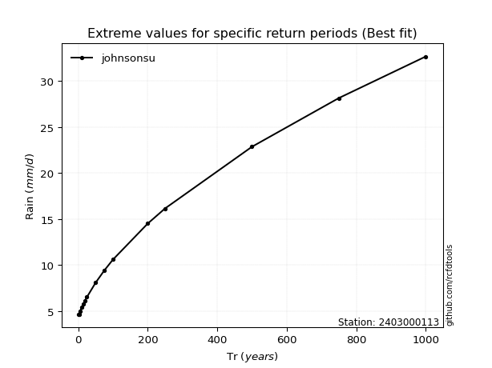</img>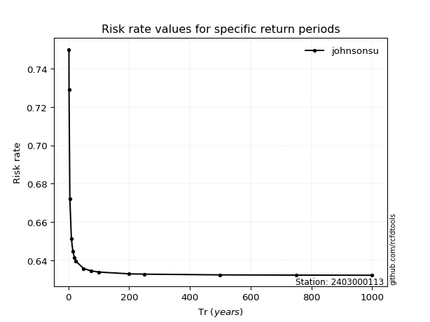</img>

</div>


<sub>**APP DISCLAIMER**: NO WARRANTY - This software is provided by [github.com/rcfdtools](https://github.com/rcfdtools) "as is", without any express or implied warranty, including warranties of merchantability, fitness for a particular purpose, or non-infringement. There is no guarantee that the software will be error-free or operate without interruption. LIMITATION OF LIABILITY - Neither the authors nor copyright holders will be liable for claims or damages arising from the software or its use. You are responsible for determining if the software is appropriate for your use and assume all associated risks, including errors, legal compliance, and data loss. NO PROFESSIONAL ADVICE - The software provides general information and does not offer professional advice. It should not replace consultation with professional advisors.</sub>