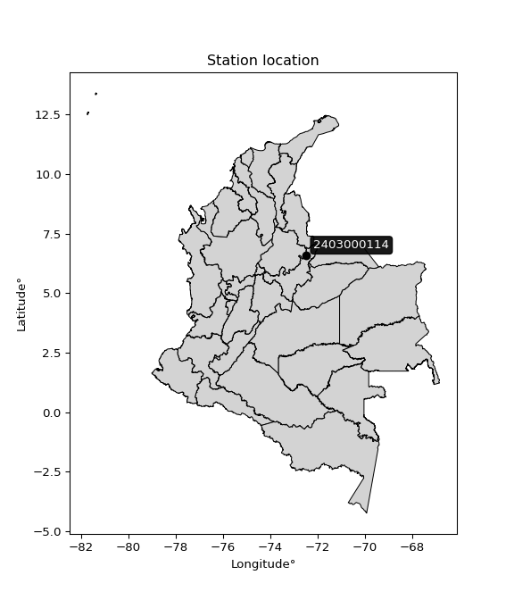

<div align="center">


</div>

# PMP Station (Rain, Pmax24h): 2403000114

Probable Maximum Precipitation (PMP) is the greatest amount of rainfall for a specific duration that is meteorologically possible for a given location, acting as a "worst-case" scenario for extreme storms, crucial for designing safety-critical infrastructure like bridges, river deviations, dams, spillways, and nuclear plants to prevent catastrophic failure. PMP is calculated by hydrologists using meteorological data to determine the upper limit of extreme rainfall, often leading to the Probable Maximum Flood (PMF) for flood control design, and is increasingly being studied for climate change impacts. Probable Maximum Precipitation (PMP) is the theoretical upper limit of rainfall, a deterministic estimate for extreme events, while probability distributions (like GEV, Gumbel) describe the likelihood and frequency of various precipitation amounts, including rare ones, showing how often events occur, with PMP representing the extreme end of these distributions, used for critical infrastructure design to ensure safety against the worst conceivable weather, unlike standard statistical forecasts which cover typical probabilities.

The most common probability distributions in hydrology, used for analyzing floods, rainfall, and streamflow, include the Normal, Log-Normal, Gumbel, Gamma (including Log-Pearson Type III), and Generalized Extreme Value (GEV) distributions, often chosen based on the data´s skewness and whether modeling extremes or general conditions, with Gumbel and GEV popular for extreme events like floods, while the Normal distribution serves as a baseline, though often requiring transformations for skewed hydrological data. These distributions help in designing water infrastructure, managing water resources, and forecasting hydrologic events.

> Hydrological data often isn´t perfectly normal (it´s skewed), so different distributions are needed for different applications, such as: **Flood Frequency Analysis**: Using Gumbel, GEV, or Log-Pearson Type III for predicting extreme flood magnitudes and their return periods, **Rainfall Analysis**: Normal for annual totals, but Log-Normal, Weibull, or GEV for intensity or extreme daily rainfall, **Streamflow Modeling**: Gamma and Log-Normal for maximum flows, GEV for minimum flows, and Kappa for daily flows.

<div align="center">

</img>

</div>


## A. General information


### 1. General running parameters

• app_version: _v20260113_. • runtime: _2026-01-13 16:28:34.738620_. • Python version: _3.14.0_. • SciPy version: _1.16.3_. • Pandas version: _2.3.3_. • NumPy version: _2.3.5_. • Stations dataset (station_dataset_file): _dataset/pmax24h_in/automatic_colombia_2003_2025.csv_. • Stations catalog (station_catalog_file): _dataset/CNE.xls_. • Minimum year to eval til year_max (date_min): _1900_. • Maximum year to eval since year_min (date_max): _2025_. • Creates, save and include plots into reports (create_plot): _False_. • Plot only fit distributions with Δo > Δ (plot_only_fit): _True_. • Plot only simple graphs avoiding multiple CDFs and multiple Extreme values plots (plot_only_simple): _True_. • Eval low extreme values, if False, evaluates high extreme values (low_extreme): _False_. • Eval every SciPy distribution as logarithmic (pdist_logarithmic_on): _True_. • Standard deviation normalized (ddof): _1.0_. • Return periods to eval in years (Tr): _[2, 2.33, 5, 10, 15, 20, 25, 50, 75, 100, 200, 250, 500, 750, 1000]_. • Minimum data sample per station, 0 means any (minimum_sample): _5_. • Z-Score maximum threshold to adjust a value, 0 means disable (zscore_max): _3.5_. • Z-Score minimum threshold to adjust a value, 0 means disable (zscore_min): _-2.5_. • Avoid zeros, e.g. rain = 0 (avoid_zeros): _True_. • Avoid null values (avoid_nans): _True_. 

:file_folder:Table: [dataset.csv](../../dataset/pmax24h_in/automatic_colombia_2003_2025.csv)

> Delta Degrees of Freedom (DDOF): is a parameter used in the formulas for calculating variance and standard deviation. When ddof=0, the divisor is $N$ (the total number of observations) and this is used when your data set is the entire population. When ddof=1, the divisor is $N-1$ and this is used when your data set is a sample drawn from a larger population. Using $N-1$ provides an unbiased estimate of the population variance (known as Bessel´s correction).


### 2. Station info and location

|   id |     CODIGO | NOMBRE                          | CATEGORIA     | TECNOLOGIA                | ESTADO   | FECHA_INSTALACION   |   FECHA_SUSPENSION |   ALTITUD |   LATITUD |   LONGITUD | DEPARTAMENTO   | MUNICIPIO   | AREA_OPERATIVA                              | ENTIDAD                                                     | AREA_HIDROGRAFICA   | ZONA_HIDROGRAFICA   | SUBZONA_HIDROGRAFICA   | CORRIENTE   | Catalogo   |   Version |
|-----:|-----------:|:--------------------------------|:--------------|:--------------------------|:---------|:--------------------|-------------------:|----------:|----------:|-----------:|:---------------|:------------|:--------------------------------------------|:------------------------------------------------------------|:--------------------|:--------------------|:-----------------------|:------------|:-----------|----------:|
|    0 | 2403000114 | LAS MERCEDES - AUT [2403000114] | Pluviométrica | Automática con Telemetría | Activa   | 22/07/2019          |                nan |      2653 |    6.5774 |    -72.479 | Boyacá         | Chiscas     | Area Operativa 06 - Boyacá-Casanare-Vichada | INSTITUTO DE HIDROLOGIA METEOROLOGIA Y ESTUDIOS AMBIENTALES | Magdalena Cauca     | Sogamoso            | Río Chicamocha         | Cuscaneva   | CNE_IDEAM  |  20251226 |

<div align="center">

Dynamic map: [:earth_americas:Google](http://maps.google.com/maps?q=6.5774,-72.479) [:earth_americas:OSM](https://www.openstreetmap.org/#map=18/6.5774/-72.479&layers=P) [:earth_americas:Bing](https://www.bing.com/maps?cp=6.5774~-72.479&lvl=18) [:earth_americas:Apple](https://maps.apple.com/frame?center=6.5774%2C-72.479&span=0.003%2C0.006)

</div>


<div align="center">

```geojson
{
  "type": "Feature",
  "geometry": {
    "type": "Point", 
    "coordinates": [-72.479, 6.5774]
  }, 
  "properties": {
    "Name": "2403000114"
  }
}
```

</div>


### 3. Discrete values table and plot

<div align="center">

|               |           0 |           1 |           2 |           3 |           4 |          5 |
|:--------------|------------:|------------:|------------:|------------:|------------:|-----------:|
| Date          | 2020        | 2021        | 2022        | 2023        | 2024        | 2025       |
| Value         |    1.7      |    2.6      |    2.9      |    4.2      |    7        |   56.5     |
| Value_initial |    1.7      |    2.6      |    2.9      |    4.2      |    7        |   56.5     |
| count         |    6        |    6        |    6        |    6        |    6        |    6       |
| mean          |   12.4833   |   12.4833   |   12.4833   |   12.4833   |   12.4833   |   12.4833  |
| std           |   21.6423   |   21.6423   |   21.6423   |   21.6423   |   21.6423   |   21.6423  |
| zscore        |   -0.498252 |   -0.456667 |   -0.442805 |   -0.382738 |   -0.253362 |    2.03382 |


</div>


> The initial value (value_initial) correspond to the initial obtained or null completed value, and value (value) is adjusted only when the initial value is outside the valid range (outlier) definite through the Z-Score value. If Z-Score is active, values out of range or outliers are replaced with the station mean value. A Z-Score (or standard score) measures how many standard deviations a data point is from the mean of a dataset, indicating its relative position; positive scores mean above the mean, negative mean below, and a score of zero is exactly at the mean, allowing for comparison of values from different distributions. It´s calculated using the formula $z=(x–μ)/σ$, where $x$ is the data point, $μ$ is the mean, and $σ$ is the standard deviation, helping identify outliers and understand probability.
>
> <sub>**Note**: In this study, "completing" (filling gaps in) and "extending" (forecasting or lengthening the historical record) rainfall data series are avoided for certain critical analyses because they introduce artificial bias and uncertainty, which can distort the statistics of rare events (extremes), alter day-to-day variability, and compromise the integrity and homogeneity of the original data. Some reasons against Completing/Extending rainfall data are: **Distortion of Extremes and Variability**: The primary issue is that most gap-filling or extension methods rely on averaging or regression with nearby stations, which inherently smooths the data. Rainfall is highly variable in space and time, with a large percentage of zero values and occasional large storms. Infilling methods often underestimate the highest values and overestimate the lowest (zero) values, which severely distorts analyses focused on flood frequency, drought severity, and intensity-duration-frequency (IDF) curves, **Loss of Data Homogeneity**: Infilled or extended data are synthetic estimates, not actual measurements. Combining these estimates with observed data can violate the assumption of data homogeneity, which requires that the data properties do not change over time. Inhomogeneity can lead to incorrect conclusions about long-term trends or changes in climate patterns, **Propagation of Errors**: Errors and biases from the original data (e.g., wind-induced undercatch, instrument errors, site changes) or the data used for imputation can propagate through the analysis, leading to unreliable hydrological models and inaccurate predictions, **Compromised Statistical Integrity**: For statistical analyses, especially those involving the frequency of events, using artificial data can introduce time bias or autocorrelation that doesn´t exist in reality, making it difficult to assess the true probability of events, **Difficulty in Validation**: It is difficult to accurately validate the quality of filled or extended data, especially for past periods where ground-truth measurements are unavailable. The reliability of imputation techniques heavily depends on the density of the surrounding station network and the complexity of the local topography.</sub>


### 4. Active continuous probability distributions from SciPy (45 of 104 available)

A Probability Density Function (PDF) describes the relative likelihood of a continuous random variable falling within a specific range, where the total area under its curve equals 1, and the area over any interval gives the actual probability for that range. Unlike discrete probabilities (like rolling a die), a PDF shows density, not direct probability for a single point (which is zero), with higher points indicating higher likelihood, often visualized as a bell curve for normal distributions.

A log of a probability density function (log-PDF) is simply the logarithm of the PDF´s value, denoted as $log(f(x))$, useful for converting multiplication of probabilities into addition, improving numerical stability with tiny numbers, and connecting to information theory concepts like entropy. Instead of dealing with very small probabilities (e.g., 0.000001), log-PDFs use negative numbers (e.g., $log(0.00001) ≈ -11.51$ that are easier for computers to handle, preventing underflow errors and simplifying complex calculations. In this study, each active probability distribution from SciPy is also evaluated in the $log$ form.

[scipy.stats](https://docs.scipy.org/doc/scipy/reference/stats.html) is a Python´s powerful submodule within the SciPy library for comprehensive statistical analysis, offering over 130 probability distributions (like Normal, Poisson), functions for descriptive stats (mean, variance), hypothesis testing (t-tests, chi-square), random variable generation, and statistical tests, making it essential for data science, modeling, and research. It provides tools to explore, model, and draw conclusions from data efficiently, working seamlessly with NumPy.

<div align="center">

|   id | p_dist             |   n_parameter | fit_method   | label                                                                       | active   | ref                                                                                                        |
|-----:|:-------------------|--------------:|:-------------|:----------------------------------------------------------------------------|:---------|:-----------------------------------------------------------------------------------------------------------|
|    0 | alpha              |             3 | MLE          | Alpha                                                                       | True     | [:mortar_board:](https://docs.scipy.org/doc/scipy/reference/generated/scipy.stats.alpha.html)              |
|    1 | betaprime          |             4 | MLE          | Beta prime                                                                  | True     | [:mortar_board:](https://docs.scipy.org/doc/scipy/reference/generated/scipy.stats.betaprime.html)          |
|    2 | chi2               |             3 | MLE          | Chi²                                                                        | True     | [:mortar_board:](https://docs.scipy.org/doc/scipy/reference/generated/scipy.stats.chi2.html)               |
|    3 | crystalball        |             4 | MLE          | Crystalball                                                                 | True     | [:mortar_board:](https://docs.scipy.org/doc/scipy/reference/generated/scipy.stats.crystalball.html)        |
|    4 | dweibull           |             3 | MLE          | Double Weibull                                                              | True     | [:mortar_board:](https://docs.scipy.org/doc/scipy/reference/generated/scipy.stats.dweibull.html)           |
|    5 | erlang             |             3 | MLE          | Erlang                                                                      | True     | [:mortar_board:](https://docs.scipy.org/doc/scipy/reference/generated/scipy.stats.erlang.html)             |
|    6 | expon              |             2 | MLE          | Exponential                                                                 | True     | [:mortar_board:](https://docs.scipy.org/doc/scipy/reference/generated/scipy.stats.expon.html)              |
|    7 | exponnorm          |             3 | MLE          | Exponentially modified Normal                                               | True     | [:mortar_board:](https://docs.scipy.org/doc/scipy/reference/generated/scipy.stats.exponnorm.html)          |
|    8 | f                  |             4 | MLE          | F                                                                           | True     | [:mortar_board:](https://docs.scipy.org/doc/scipy/reference/generated/scipy.stats.f.html)                  |
|    9 | fatiguelife        |             3 | MLE          | Fatigue-life (Birnbaum-Saunders)                                            | True     | [:mortar_board:](https://docs.scipy.org/doc/scipy/reference/generated/scipy.stats.fatiguelife.html)        |
|   10 | fisk               |             3 | MLE          | Fisk                                                                        | True     | [:mortar_board:](https://docs.scipy.org/doc/scipy/reference/generated/scipy.stats.fisk.html)               |
|   11 | gamma              |             3 | MLE          | Gamma                                                                       | True     | [:mortar_board:](https://docs.scipy.org/doc/scipy/reference/generated/scipy.stats.gamma.html)              |
|   12 | genexpon           |             5 | MLE          | Generalized exponential                                                     | True     | [:mortar_board:](https://docs.scipy.org/doc/scipy/reference/generated/scipy.stats.genexpon.html)           |
|   13 | genlogistic        |             3 | MLE          | Generalized logistic                                                        | True     | [:mortar_board:](https://docs.scipy.org/doc/scipy/reference/generated/scipy.stats.genlogistic.html)        |
|   14 | gibrat             |             2 | MM           | Gibrat                                                                      | True     | [:mortar_board:](https://docs.scipy.org/doc/scipy/reference/generated/scipy.stats.gibrat.html)             |
|   15 | gompertz           |             3 | MLE          | Gompertz (or truncated Gumbel)                                              | True     | [:mortar_board:](https://docs.scipy.org/doc/scipy/reference/generated/scipy.stats.gompertz.html)           |
|   16 | gumbel_l           |             2 | MM           | Gumbel Left Skew                                                            | True     | [:mortar_board:](https://docs.scipy.org/doc/scipy/reference/generated/scipy.stats.gumbel_l.html)           |
|   17 | gumbel_r           |             2 | MM           | Gumbel Right Skew                                                           | True     | [:mortar_board:](https://docs.scipy.org/doc/scipy/reference/generated/scipy.stats.gumbel_r.html)           |
|   18 | halflogistic       |             2 | MM           | Half-logistic                                                               | True     | [:mortar_board:](https://docs.scipy.org/doc/scipy/reference/generated/scipy.stats.halflogistic.html)       |
|   19 | halfnorm           |             2 | MM           | Half Normal                                                                 | True     | [:mortar_board:](https://docs.scipy.org/doc/scipy/reference/generated/scipy.stats.halfnorm.html)           |
|   20 | hypsecant          |             2 | MM           | hyperbolic secant                                                           | True     | [:mortar_board:](https://docs.scipy.org/doc/scipy/reference/generated/scipy.stats.hypsecant.html)          |
|   21 | invgamma           |             3 | MLE          | Inverted gamma                                                              | True     | [:mortar_board:](https://docs.scipy.org/doc/scipy/reference/generated/scipy.stats.invgamma.html)           |
|   22 | invgauss           |             3 | MLE          | Inverse Gaussian                                                            | True     | [:mortar_board:](https://docs.scipy.org/doc/scipy/reference/generated/scipy.stats.invgauss.html)           |
|   23 | invweibull         |             3 | MLE          | Inverted Weibull                                                            | True     | [:mortar_board:](https://docs.scipy.org/doc/scipy/reference/generated/scipy.stats.invweibull.html)         |
|   24 | kappa4             |             4 | MLE          | Kappa 4                                                                     | True     | [:mortar_board:](https://docs.scipy.org/doc/scipy/reference/generated/scipy.stats.kappa4.html)             |
|   25 | kstwobign          |             2 | MLE          | Limiting distribution of scaled Kolmogorov-Smirnov two-sided test statistic | True     | [:mortar_board:](https://docs.scipy.org/doc/scipy/reference/generated/scipy.stats.kstwobign.html)          |
|   26 | laplace            |             2 | MM           | Laplace                                                                     | True     | [:mortar_board:](https://docs.scipy.org/doc/scipy/reference/generated/scipy.stats.laplace.html)            |
|   27 | laplace_asymmetric |             3 | MLE          | Asymmetric Laplace                                                          | True     | [:mortar_board:](https://docs.scipy.org/doc/scipy/reference/generated/scipy.stats.laplace_asymmetric.html) |
|   28 | loggamma           |             3 | MLE          | Log gamma                                                                   | True     | [:mortar_board:](https://docs.scipy.org/doc/scipy/reference/generated/scipy.stats.loggamma.html)           |
|   29 | logistic           |             2 | MM           | Logistic (or Sech-squared)                                                  | True     | [:mortar_board:](https://docs.scipy.org/doc/scipy/reference/generated/scipy.stats.logistic.html)           |
|   30 | lognorm            |             3 | MLE          | Log Normal                                                                  | True     | [:mortar_board:](https://docs.scipy.org/doc/scipy/reference/generated/scipy.stats.lognorm.html)            |
|   31 | maxwell            |             2 | MM           | Maxwell                                                                     | True     | [:mortar_board:](https://docs.scipy.org/doc/scipy/reference/generated/scipy.stats.maxwell.html)            |
|   32 | mielke             |             4 | MLE          | Mielke Beta-Kappa / Dagum                                                   | True     | [:mortar_board:](https://docs.scipy.org/doc/scipy/reference/generated/scipy.stats.mielke.html)             |
|   33 | moyal              |             2 | MM           | Moyal                                                                       | True     | [:mortar_board:](https://docs.scipy.org/doc/scipy/reference/generated/scipy.stats.moyal.html)              |
|   34 | nakagami           |             3 | MLE          | Nakagami                                                                    | True     | [:mortar_board:](https://docs.scipy.org/doc/scipy/reference/generated/scipy.stats.nakagami.html)           |
|   35 | ncf                |             5 | MLE          | Non-central F distribution                                                  | True     | [:mortar_board:](https://docs.scipy.org/doc/scipy/reference/generated/scipy.stats.ncf.html)                |
|   36 | nct                |             4 | MLE          | Non-central Student’s t                                                     | True     | [:mortar_board:](https://docs.scipy.org/doc/scipy/reference/generated/scipy.stats.nct.html)                |
|   37 | norm               |             2 | MM           | Normal                                                                      | True     | [:mortar_board:](https://docs.scipy.org/doc/scipy/reference/generated/scipy.stats.norm.html)               |
|   38 | pearson3           |             3 | MM           | Pearson type III                                                            | True     | [:mortar_board:](https://docs.scipy.org/doc/scipy/reference/generated/scipy.stats.pearson3.html)           |
|   39 | rayleigh           |             2 | MM           | Rayleigh                                                                    | True     | [:mortar_board:](https://docs.scipy.org/doc/scipy/reference/generated/scipy.stats.rayleigh.html)           |
|   40 | rice               |             3 | MLE          | Rice                                                                        | True     | [:mortar_board:](https://docs.scipy.org/doc/scipy/reference/generated/scipy.stats.rice.html)               |
|   41 | t                  |             3 | MLE          | Student’s t                                                                 | True     | [:mortar_board:](https://docs.scipy.org/doc/scipy/reference/generated/scipy.stats.t.html)                  |
|   42 | truncnorm          |             4 | MLE          | Truncated normal                                                            | True     | [:mortar_board:](https://docs.scipy.org/doc/scipy/reference/generated/scipy.stats.truncnorm.html)          |
|   43 | wald               |             2 | MM           | Wald                                                                        | True     | [:mortar_board:](https://docs.scipy.org/doc/scipy/reference/generated/scipy.stats.wald.html)               |
|   44 | weibull_min        |             3 | MLE          | Weibull minimum                                                             | True     | [:mortar_board:](https://docs.scipy.org/doc/scipy/reference/generated/scipy.stats.weibull_min.html)        |

</div>

> **n_parameter:** # arguments & localization & scale.
>
> **Fit methods:** (MLE) maximum likelihood, (MM) L-moments.
>
>**Inactive** (With the only purpose of prevent loops, zero divisions, infinite values, over high estimated values or horizontal trending for recurrence intervals estimations, the follow distributions were disabled.)**:** foldnorm, gennorm, norminvgauss, powernorm, powerlognorm, skewnorm, genextreme, anglit, arcsine, argus, beta, bradford, burr, burr12, cauchy, cosine, halfcauchy, foldcauchy, skewcauchy, wrapcauchy, dgamma, gengamma, exponweib, exponpow, truncexpon, gausshyper, genhalflogistic, genhyperbolic, geninvgauss, halfgennorm, johnsonsb, johnsonsu, kappa3, ksone, kstwo, loglaplace, levy, levy_l, levy_stable, ncx2, pareto, genpareto, truncpareto, lomax, powerlaw, rdist, rel_breitwigner, recipinvgauss, semicircular, studentized_range, trapezoid, triang, truncweibull_min, tukeylambda, uniform, loguniform, vonmises, vonmises_line, weibull_max, 


## B. Probability (PDF) vs. Empirical (EDF) distributions functions

A continuous probability distribution (CPD) describes probabilities for variables that can take any value within a range (like rain any time), unlike discrete variables with specific outcomes (like temperature). It uses a Probability Density Function (PDF), a curve where the total area under it equals 1, and the probability of the variable falling within an interval (a to b) is found by calculating the area under the curve between those points. A key feature is that the probability of hitting any single exact value is zero, so probabilities are always expressed for ranges, e.g., $P(a ≤ X ≤ b)$.

<div align="center">

Distributions parameters from station values
|    |    station | p_dist                |   n |           loc |          scale | shape                 | shape1                 | shape2             | shape3   |
|---:|-----------:|:----------------------|----:|--------------:|---------------:|:----------------------|:-----------------------|:-------------------|:---------|
|  0 | 2403000114 | alpha                 |   6 |     0.750577  |    1.86334     | 3.234511612434999e-07 |                        |                    |          |
|  1 | 2403000114 | betaprime             |   6 |     1.7       |    0.581227    | 0.521575841180463     | 0.538561972781213      |                    |          |
|  2 | 2403000114 | chi2                  |   6 |     1.7       |   17.4332      | 0.9519090968521169    |                        |                    |          |
|  3 | 2403000114 | crystalball           |   6 |    12.4833    |   19.7566      | 1079.6389045388223    | 5.13269251826101       |                    |          |
|  4 | 2403000114 | dweibull              |   6 |     2.9       |   22.9256      | 0.6147003478651278    |                        |                    |          |
|  5 | 2403000114 | erlang                |   6 |     1.7       |    6.44442     | 0.7895607884282747    |                        |                    |          |
|  6 | 2403000114 | expon                 |   6 |     1.7       |   10.7833      |                       |                        |                    |          |
|  7 | 2403000114 | exponnorm             |   6 |     1.68642   |    0.00418994  | 2561.7729112161614    |                        |                    |          |
|  8 | 2403000114 | f                     |   6 |     1.7       |    0.846609    | 0.982902557883885     | 1.0575642948468569     |                    |          |
|  9 | 2403000114 | fatiguelife           |   6 |     1.7       |    4.95175e-06 | 1496.8498246979748    |                        |                    |          |
| 10 | 2403000114 | fisk                  |   6 |     1.7       |    1.23906     | 0.530193746998683     |                        |                    |          |
| 11 | 2403000114 | gamma                 |   6 |     1.7       |   19.0161      | 0.4991268256781771    |                        |                    |          |
| 12 | 2403000114 | genexpon              |   6 |     1.7       |   19.0884      | 1.7701819961281458    | 1.0084957466930548e-11 | 2.079498719723789  |          |
| 13 | 2403000114 | genlogistic           |   6 |   -67.2083    |    9.10404     | 2830.069408801328     |                        |                    |          |
| 14 | 2403000114 | gibrat                |   6 |    -2.58849   |    9.14152     |                       |                        |                    |          |
| 15 | 2403000114 | gompertz              |   6 |     1.7       |    1.19836e+07 | 1187987.0902757072    |                        |                    |          |
| 16 | 2403000114 | gumbel_l              |   6 |    21.3749    |   15.4042      |                       |                        |                    |          |
| 17 | 2403000114 | gumbel_r              |   6 |     3.5918    |   15.4042      |                       |                        |                    |          |
| 18 | 2403000114 | halflogistic          |   6 |   -10.9329    |   16.8912      |                       |                        |                    |          |
| 19 | 2403000114 | halfnorm              |   6 |   -13.6667    |   32.7742      |                       |                        |                    |          |
| 20 | 2403000114 | hypsecant             |   6 |    12.4833    |   12.5775      |                       |                        |                    |          |
| 21 | 2403000114 | invgamma              |   6 |     1.3645    |    0.835703    | 0.6949787095349627    |                        |                    |          |
| 22 | 2403000114 | invgauss              |   6 |     1.43936   |    1.11112     | 9.939509449857423     |                        |                    |          |
| 23 | 2403000114 | invweibull            |   6 |     1.517     |    1.06857     | 0.6604894890699027    |                        |                    |          |
| 24 | 2403000114 | kappa4                |   6 |    -3.7298    |   60.6774      | 1.0981756766366573    | 0.978778458637626      |                    |          |
| 25 | 2403000114 | kstwobign             |   6 |   -33.6246    |   54.3524      |                       |                        |                    |          |
| 26 | 2403000114 | laplace               |   6 |    12.4833    |   13.9701      |                       |                        |                    |          |
| 27 | 2403000114 | laplace_asymmetric    |   6 |     1.7       |    0.000859419 | 7.970004061096854e-05 |                        |                    |          |
| 28 | 2403000114 | loggamma              |   6 | -7699.62      |  991.21        | 2393.608609941777     |                        |                    |          |
| 29 | 2403000114 | logistic              |   6 |    12.4833    |   10.8924      |                       |                        |                    |          |
| 30 | 2403000114 | lognorm               |   6 |     1.7       |    0.00747269  | 13.993959071527637    |                        |                    |          |
| 31 | 2403000114 | maxwell               |   6 |   -34.3316    |   29.3369      |                       |                        |                    |          |
| 32 | 2403000114 | mielke                |   6 |     1.7       |    0.183029    | 0.6426538506891469    | 0.5929942604510046     |                    |          |
| 33 | 2403000114 | moyal                 |   6 |     1.18522   |    8.89361     |                       |                        |                    |          |
| 34 | 2403000114 | nakagami              |   6 |     1.7       |   34.3197      | 0.12136734988650827   |                        |                    |          |
| 35 | 2403000114 | ncf                   |   6 |     1.36834   |    0.359186    | 110.10726663335433    | 1.3899688721087913     | 259.0454922253971  |          |
| 36 | 2403000114 | nct                   |   6 |     0.473656  |    0.0386188   | 0.8489613690449936    | 54.73613393699865      |                    |          |
| 37 | 2403000114 | norm                  |   6 |    12.4833    |   19.7566      |                       |                        |                    |          |
| 38 | 2403000114 | pearson3              |   6 |    12.4833    |   19.7566      | 1.7603234270693116    |                        |                    |          |
| 39 | 2403000114 | rayleigh              |   6 |   -25.3123    |   30.1565      |                       |                        |                    |          |
| 40 | 2403000114 | rice                  |   6 |   -14.6813    |   23.7512      | 0.0006192440507830192 |                        |                    |          |
| 41 | 2403000114 | t                     |   6 |     2.75865   |    0.577271    | 0.48650120188448276   |                        |                    |          |
| 42 | 2403000114 | truncnorm             |   6 |   -99.2143    |   39.9393      | 2.5266895116025383    | 64.60920974305225      |                    |          |
| 43 | 2403000114 | wald                  |   6 |    -7.2733    |   19.7566      |                       |                        |                    |          |
| 44 | 2403000114 | weibull_min           |   6 |     1.7       |    2.19864     | 0.4585160911540106    |                        |                    |          |
| 45 | 2403000114 | logalpha              |   6 |    -0.628518  |    4.83424     | 2.5398325184035113    |                        |                    |          |
| 46 | 2403000114 | logbetaprime          |   6 |     0.530628  |    1.6207      | 0.7024263796929864    | 1.693391924534906      |                    |          |
| 47 | 2403000114 | logchi2               |   6 |     0.530628  |    0.679508    | 0.32021705853023774   |                        |                    |          |
| 48 | 2403000114 | logcrystalball        |   6 |     1.66101   |    1.14713     | 530.9140142708322     | 284.7012676065283      |                    |          |
| 49 | 2403000114 | logdweibull           |   6 |     1.30757   |    0.818072    | 1.0190754883226676    |                        |                    |          |
| 50 | 2403000114 | logerlang             |   6 |     0.530628  |    1.14168     | 0.8976504899105405    |                        |                    |          |
| 51 | 2403000114 | logexpon              |   6 |     0.530628  |    1.13039     |                       |                        |                    |          |
| 52 | 2403000114 | logexponnorm          |   6 |     0.529564  |    0.000320932 | 3499.011662351667     |                        |                    |          |
| 53 | 2403000114 | logf                  |   6 |     0.530628  |    0.668777    | 1.2447409695908795    | 4.590563400383695      |                    |          |
| 54 | 2403000114 | logfatiguelife        |   6 |     0.352504  |    0.859344    | 1.0131236246960134    |                        |                    |          |
| 55 | 2403000114 | logfisk               |   6 |     0.426569  |    0.817323    | 1.628019370852774     |                        |                    |          |
| 56 | 2403000114 | loggamma              |   6 |     0.530628  |    0.911923    | 0.8797218732805286    |                        |                    |          |
| 57 | 2403000114 | loggenexpon           |   6 |     0.530628  |    1.1818      | 1.0454253610305488    | 2.675200210586777e-08  | 1.3207474109891202 |          |
| 58 | 2403000114 | loggenlogistic        |   6 |    -4.27495   |    0.732205    | 1708.1009184463023    |                        |                    |          |
| 59 | 2403000114 | loggibrat             |   6 |     0.785851  |    0.530806    |                       |                        |                    |          |
| 60 | 2403000114 | loggompertz           |   6 |     0.530628  | 2073.96        | 1865.8964062912937    |                        |                    |          |
| 61 | 2403000114 | loggumbel_l           |   6 |     2.17729   |    0.894417    |                       |                        |                    |          |
| 62 | 2403000114 | loggumbel_r           |   6 |     1.14474   |    0.894417    |                       |                        |                    |          |
| 63 | 2403000114 | loghalflogistic       |   6 |     0.301394  |    0.980759    |                       |                        |                    |          |
| 64 | 2403000114 | loghalfnorm           |   6 |     0.142658  |    1.90298     |                       |                        |                    |          |
| 65 | 2403000114 | loghypsecant          |   6 |     1.66101   |    0.730288    |                       |                        |                    |          |
| 66 | 2403000114 | loginvgamma           |   6 |     0.0339412 |    2.96435     | 2.7446456342040846    |                        |                    |          |
| 67 | 2403000114 | loginvgauss           |   6 |     0.261317  |    1.56971     | 0.8916932607913732    |                        |                    |          |
| 68 | 2403000114 | loginvweibull         |   6 |    -0.329597  |    1.36294     | 2.3929632868546875    |                        |                    |          |
| 69 | 2403000114 | logkappa4             |   6 |     0.17743   |    3.89093     | 1.099756063832658     | 0.9841329579580944     |                    |          |
| 70 | 2403000114 | logkstwobign          |   6 |    -1.52525   |    3.69468     |                       |                        |                    |          |
| 71 | 2403000114 | loglaplace            |   6 |     1.66101   |    0.811146    |                       |                        |                    |          |
| 72 | 2403000114 | loglaplace_asymmetric |   6 |     0.955511  |    0.555561    | 0.5496517846815845    |                        |                    |          |
| 73 | 2403000114 | logloggamma           |   6 |  -362.461     |   49.0615      | 1672.362002718568     |                        |                    |          |
| 74 | 2403000114 | loglogistic           |   6 |     1.66101   |    0.632448    |                       |                        |                    |          |
| 75 | 2403000114 | loglognorm            |   6 |     0.530628  |    0.00219873  | 13.709510724847183    |                        |                    |          |
| 76 | 2403000114 | logmaxwell            |   6 |    -1.05721   |    1.7034      |                       |                        |                    |          |
| 77 | 2403000114 | logmielke             |   6 |    -0.312847  |    0.246389    | 137.88864381824305    | 2.3849500229747482     |                    |          |
| 78 | 2403000114 | logmoyal              |   6 |     1.00501   |    0.516392    |                       |                        |                    |          |
| 79 | 2403000114 | lognakagami           |   6 |     0.530628  |    1.30109     | 0.27573031696707373   |                        |                    |          |
| 80 | 2403000114 | logncf                |   6 |     0.336246  |    0.356933    | 4.0018843781842435    | 5.843323652102326      | 6.2790250922760045 |          |
| 81 | 2403000114 | lognct                |   6 |    -0.237571  |    0.0667574   | 2.453356725519299     | 19.37307447409711      |                    |          |
| 82 | 2403000114 | lognorm               |   6 |     1.66101   |    1.14713     |                       |                        |                    |          |
| 83 | 2403000114 | logpearson3           |   6 |     1.66102   |    1.14713     | 1.2554925608439131    |                        |                    |          |
| 84 | 2403000114 | lograyleigh           |   6 |    -0.53352   |    1.75098     |                       |                        |                    |          |
| 85 | 2403000114 | logrice               |   6 |    -0.0972601 |    1.48449     | 0.001030238544094782  |                        |                    |          |
| 86 | 2403000114 | logt                  |   6 |     1.26666   |    0.974207    | 4.7849324792466135    |                        |                    |          |
| 87 | 2403000114 | logtruncnorm          |   6 |    -1.24508   |    2.04512     | 0.868262718905385     | 2.581438793261934      |                    |          |
| 88 | 2403000114 | logwald               |   6 |     0.51388   |    1.14713     |                       |                        |                    |          |
| 89 | 2403000114 | logweibull_min        |   6 |     0.530628  |    1.36002     | 0.718048289622964     |                        |                    |          |

</div>

> **loc** (Location parameter): This shifts the distribution along the x-axis. For many common distributions, like the normal (Gaussian) distribution, loc represents the mean $μ$. For others, like the uniform distribution, it might represent the minimum value, or for the beta distribution, the left end of the support interval.
>
> **scale** (Scale parameter): This determines the width or spread of the distribution. For the normal distribution, scale represents the standard deviation $σ$. For a uniform distribution, it defines the length of the interval (from $loc$ to $loc + scale$).
>
> **shape** (Shape parameters): Refers to parameters that define the specific form of a probability distribution, distinct from its location (loc) and scale (scale). These parameters are required arguments for most distribution functions. For example, a normal (Gaussian) distribution is fully defined by its location (mean) and scale (standard deviation), so it has no specific shape parameters beyond loc and scale. However, other distributions have intrinsic properties that need specification, as Gamma distribution that takes a shape parameter, often named $a$ or $alpha$.


### 0. Cumulative distribution values - CDF (90 evaluated)

Cumulative Distribution Function (CDF), denoted as $F$<sub>$X$</sub>$(x)$, is a function that gives the probability that a random variable $X$ will take a value less than or equal to a specific value, $x$ (i.e., $(P(X≥x)$. It essentially "accumulates" probabilities from a given point up to the far right (positive infinity), providing a complete picture of the distribution´s probabilities for both discrete (like rain) and continuous (like temperature) variables, helping to find probabilities over ranges or above certain values. Each station is evaluated separately ordering the $x$ values ascending, calculating the CDF and PDF values for the activated distributions and their logarithmic forms.

<div align="center">

CDF ordered by x ascending and calculating $log(f(x))$ separately
|   id |    Station |   date |    x |   count |    mean |     std |    zscore |   Value_initial |    station |   m |     alpha |   alpha_pdf |   betaprime |   betaprime_pdf |        chi2 |   chi2_pdf |   crystalball |   crystalball_pdf |   dweibull |   dweibull_pdf |      erlang |    erlang_pdf |     expon |   expon_pdf |   exponnorm |   exponnorm_pdf |           f |            f_pdf |   fatiguelife |   fatiguelife_pdf |        fisk |    fisk_pdf |       gamma |   gamma_pdf |    genexpon |   genexpon_pdf |   genlogistic |   genlogistic_pdf |   gibrat |   gibrat_pdf |    gompertz |   gompertz_pdf |   gumbel_l |   gumbel_l_pdf |   gumbel_r |   gumbel_r_pdf |   halflogistic |   halflogistic_pdf |   halfnorm |   halfnorm_pdf |   hypsecant |   hypsecant_pdf |   invgamma |   invgamma_pdf |   invgauss |   invgauss_pdf |   invweibull |   invweibull_pdf |      kappa4 |   kappa4_pdf |   kstwobign |   kstwobign_pdf |   laplace |   laplace_pdf |   laplace_asymmetric |   laplace_asymmetric_pdf |    loggamma |   loggamma_pdf |   logistic |   logistic_pdf |   lognorm |   lognorm_pdf |   maxwell |   maxwell_pdf |      mielke |     mielke_pdf |    moyal |   moyal_pdf |    nakagami |   nakagami_pdf |       ncf |     ncf_pdf |       nct |     nct_pdf |     norm |   norm_pdf |   pearson3 |   pearson3_pdf |   rayleigh |   rayleigh_pdf |     rice |   rice_pdf |        t |       t_pdf |   truncnorm |   truncnorm_pdf |     wald |   wald_pdf |   weibull_min |   weibull_min_pdf |   logalpha |   logalpha_pdf |   logbetaprime |   logbetaprime_pdf |    logchi2 |   logchi2_pdf |   logcrystalball |   logcrystalball_pdf |   logdweibull |   logdweibull_pdf |   logerlang |   logerlang_pdf |   logexpon |   logexpon_pdf |   logexponnorm |   logexponnorm_pdf |        logf |       logf_pdf |   logfatiguelife |   logfatiguelife_pdf |   logfisk |   logfisk_pdf |   loggenexpon |   loggenexpon_pdf |   loggenlogistic |   loggenlogistic_pdf |   loggibrat |   loggibrat_pdf |   loggompertz |   loggompertz_pdf |   loggumbel_l |   loggumbel_l_pdf |   loggumbel_r |   loggumbel_r_pdf |   loghalflogistic |   loghalflogistic_pdf |   loghalfnorm |   loghalfnorm_pdf |   loghypsecant |   loghypsecant_pdf |   loginvgamma |   loginvgamma_pdf |   loginvgauss |   loginvgauss_pdf |   loginvweibull |   loginvweibull_pdf |   logkappa4 |   logkappa4_pdf |   logkstwobign |   logkstwobign_pdf |   loglaplace |   loglaplace_pdf |   loglaplace_asymmetric |   loglaplace_asymmetric_pdf |   logloggamma |   logloggamma_pdf |   loglogistic |   loglogistic_pdf |   loglognorm |   loglognorm_pdf |   logmaxwell |   logmaxwell_pdf |   logmielke |   logmielke_pdf |   logmoyal |   logmoyal_pdf |   lognakagami |   lognakagami_pdf |   logncf |   logncf_pdf |    lognct |   lognct_pdf |   logpearson3 |   logpearson3_pdf |   lograyleigh |   lograyleigh_pdf |   logrice |   logrice_pdf |     logt |   logt_pdf |   logtruncnorm |   logtruncnorm_pdf |     logwald |   logwald_pdf |   logweibull_min |   logweibull_min_pdf |
|-----:|-----------:|-------:|-----:|--------:|--------:|--------:|----------:|----------------:|-----------:|----:|----------:|------------:|------------:|----------------:|------------:|-----------:|--------------:|------------------:|-----------:|---------------:|------------:|--------------:|----------:|------------:|------------:|----------------:|------------:|-----------------:|--------------:|------------------:|------------:|------------:|------------:|------------:|------------:|---------------:|--------------:|------------------:|---------:|-------------:|------------:|---------------:|-----------:|---------------:|-----------:|---------------:|---------------:|-------------------:|-----------:|---------------:|------------:|----------------:|-----------:|---------------:|-----------:|---------------:|-------------:|-----------------:|------------:|-------------:|------------:|----------------:|----------:|--------------:|---------------------:|-------------------------:|------------:|---------------:|-----------:|---------------:|----------:|--------------:|----------:|--------------:|------------:|---------------:|---------:|------------:|------------:|---------------:|----------:|------------:|----------:|------------:|---------:|-----------:|-----------:|---------------:|-----------:|---------------:|---------:|-----------:|---------:|------------:|------------:|----------------:|---------:|-----------:|--------------:|------------------:|-----------:|---------------:|---------------:|-------------------:|-----------:|--------------:|-----------------:|---------------------:|--------------:|------------------:|------------:|----------------:|-----------:|---------------:|---------------:|-------------------:|------------:|---------------:|-----------------:|---------------------:|----------:|--------------:|--------------:|------------------:|-----------------:|---------------------:|------------:|----------------:|--------------:|------------------:|--------------:|------------------:|--------------:|------------------:|------------------:|----------------------:|--------------:|------------------:|---------------:|-------------------:|--------------:|------------------:|--------------:|------------------:|----------------:|--------------------:|------------:|----------------:|---------------:|-------------------:|-------------:|-----------------:|------------------------:|----------------------------:|--------------:|------------------:|--------------:|------------------:|-------------:|-----------------:|-------------:|-----------------:|------------:|----------------:|-----------:|---------------:|--------------:|------------------:|---------:|-------------:|----------:|-------------:|--------------:|------------------:|--------------:|------------------:|----------:|--------------:|---------:|-----------:|---------------:|-------------------:|------------:|--------------:|-----------------:|---------------------:|
|    0 | 2403000114 |   2020 |  1.7 |       6 | 12.4833 | 21.6423 | -0.498252 |             1.7 | 2403000114 |   1 | 0.0496919 |  0.240381   | 0.000176717 |  1127.17        | 7.38277e-09 | 1.5825e+07 |      0.292599 |        0.0173983  |   0.424748 |     0.0354893  | 1.08096e-13 | 384.374       | 0         | 0.0927357   |  0.00126396 |     0.0929913   | 4.43324e-07 | 882383           |      0.025133 |       9.9651e+10  | 4.47945e-09 | 1.06959e+07 | 3.98946e-09 | 8.96777e+06 | 3.19594e-11 |    0.0927362   |      0.232108 |       0.0372273   | 0.224557 |   0.0698562  | 1.68745e-08 |    0.0991345   |   0.243313 |    0.0136955   |   0.322817 |     0.0236948  |       0.35744  |         0.0258192  |   0.360834 |     0.0218108  |    0.255452 |      0.0181993  |  0.0438736 |    0.356457    |   0.043032 |    0.414183    |    0.0404594 |      0.468366    | 2.96301e-15 |    0.438968  |    0.207859 |     0.0284886   |  0.23107  |    0.0165404  |          7.74034e-09 |              0.0927372   | 1.04624e-14 |     82.902     |   0.270915 |     0.0181337  |  0.162214 |     0.214014  |  0.319685 |    0.0192976  | 9.31826e-07 | 7921.19        | 0.331312 |  0.0271849  | 5.51949e-05 |    6.03379e+10 | 0.0438734 | 0.356446    | 0.0907127 | 0.244205    | 0.292599 | 0.0173983  |   0.358712 |     0.0291252  |   0.330464 |     0.0198871  | 0.211676 | 0.0228919  | 0.234965 | 0.0996236   | 3.30467e-08 |     0.071285    | 0.323339 | 0.0475237  |   4.63135e-08 |       9.56361e+07 |  0.0517651 |      0.381901  |    3.84906e-07 |        403.432     | 0.00285646 |   4.11939e+12 |         0.162214 |            0.214014  |      0.193606 |         0.240938  | 4.40549e-15 |      35.6198    |   0        |      0.884654  |     0.00094692 |          0.889265  | 1.19339e-10 | 668992         |        0.0428415 |            0.669338  | 0.0337167 |      0.509715 |   8.25523e-10 |         0.884605  |        0.0898921 |            0.29556   |    0        |       0         |   5.85508e-09 |         0.899679  |      0.146707 |        0.151358   |      0.137111 |         0.304594  |          0.116337 |             0.50291   |      0.161549 |         0.410659  |       0.133422 |          0.177395  |     0.0478789 |         0.433393  |     0.0444095 |         0.534518  |       0.0493928 |           0.413293  | 3.10893e-15 |        7.18607  |      0.0838014 |          0.284063  |     0.124094 |        0.152986  |                0.05771  |                   0.188987  |      0.173578 |         0.212102  |      0.143402 |         0.194226  |    0.0127658 |      2.16504e+13 |     0.16708  |        0.263586  |   0.0501315 |        0.413473 |   0.113421 |      0.349353  |   1.07006e-09 |       5.31513e+06 | 0.044474 |    0.456373  | 0.0497478 |     0.412766 |      0.135623 |         0.367433  |      0.168626 |         0.288558  | 0.0855656 |     0.260542  | 0.242722 |  0.280646  |    5.22005e-07 |          0.712869  | 3.43476e-16 |    7.1219e-13 |      2.80506e-12 |        18142         |
|    1 | 2403000114 |   2021 |  2.6 |       6 | 12.4833 | 21.6423 | -0.456667 |             2.6 | 2403000114 |   2 | 0.313682  |  0.261657   | 0.581139    |     0.17881     | 0.196436    | 0.102079   |      0.308448 |        0.0178178  |   0.466399 |     0.0664808  | 0.214156    |   0.173624    | 0.0800741 | 0.08531     |  0.0815914  |     0.0855633   | 0.519472    |      0.179046    |      0.612107 |       0.0606162   | 0.457724    | 0.146223    | 0.242318    | 0.130197    | 0.0800745   |    0.0853104   |      0.266307 |       0.0386938   | 0.285566 |   0.0654953  | 0.0853567   |    0.0906727   |   0.2559   |    0.014278    |   0.34421  |     0.0238313  |       0.380453 |         0.0253166  |   0.380336 |     0.0215236  |    0.272238 |      0.019101   |  0.350919  |    0.240119    |   0.361568 |    0.229225    |    0.37114   |      0.224349    | 0.0234903   |    0.0237628 |    0.233931 |     0.0294143   |  0.246446 |    0.017641   |          0.0800753   |              0.0853112   | 0.43407     |      0.69493   |   0.28754  |     0.0188077  |  0.269273 |     0.287847  |  0.337153 |    0.0195148  | 0.700469    |    0.140047    | 0.355725 |  0.0270444  | 0.339196    |    0.091476    | 0.350911  | 0.240117    | 0.306291  | 0.204772    | 0.308448 | 0.0178178  |   0.384537 |     0.0282606  |   0.348416 |     0.0199988  | 0.232562 | 0.0235097  | 0.429087 | 0.416359    | 0.0623591   |     0.0673225   | 0.364752 | 0.0444973  |   0.485187    |       0.17414     |  0.306011  |      0.677948  |    0.46768     |          0.554945  | 0.85734    |   0.246119    |         0.269273 |            0.287847  |      0.327382 |         0.401314  | 0.361474    |       0.623975  |   0.313311 |      0.607481  |     0.315668   |          0.609408  | 0.500813    |      0.548882  |        0.362613  |            0.623556  | 0.329944  |      0.680459 |   0.313297    |         0.607461  |        0.259521  |            0.477919  |    0.127019 |       1.22696   |   0.317708    |         0.61397   |      0.22518  |        0.221011   |      0.290656 |         0.401534  |          0.32164  |             0.457068  |      0.330729 |         0.382725  |       0.231509 |          0.289792  |     0.319157  |         0.670905  |     0.339554  |         0.648415  |       0.31629   |           0.677943  | 0.145218    |        0.31046  |      0.241905  |          0.436167  |     0.209526 |        0.258309  |                0.23202  |                   0.759811  |      0.2782   |         0.278347  |      0.246845 |         0.293957  |    0.649497  |      0.0636217   |     0.293566 |        0.325378  |   0.316764  |        0.677967 |   0.294135 |      0.46747   |   0.416867    |       0.528711    | 0.318142 |    0.662824  | 0.315597  |     0.676719 |      0.30828  |         0.42344   |      0.30343  |         0.338301  | 0.222341  |     0.371506  | 0.381453 |  0.365786  |    0.275247    |          0.582501  | 0.255393    |    0.890809   |      0.351892    |            0.475027  |
|    2 | 2403000114 |   2022 |  2.9 |       6 | 12.4833 | 21.6423 | -0.442805 |             2.9 | 2403000114 |   3 | 0.385994  |  0.221003   | 0.626475    |     0.128146    | 0.224642    | 0.0870415  |      0.313814 |        0.0179516  |   0.5      | 36878.1        | 0.26348     |   0.155991    | 0.105314  | 0.0829693   |  0.106905   |     0.0832049   | 0.565564    |      0.132284    |      0.628875 |       0.0517902   | 0.495755    | 0.110449    | 0.278291    | 0.110961    | 0.105315    |    0.0829697   |      0.277974 |       0.0390804   | 0.304965 |   0.0638173  | 0.112158    |    0.0880158   |   0.260213 |    0.0144744   |   0.351364 |     0.0238573  |       0.388022 |         0.0251444  |   0.386778 |     0.0214252  |    0.278013 |      0.019399   |  0.414955  |    0.189584    |   0.422302 |    0.178894    |    0.430264  |      0.173296    | 0.0305235   |    0.0231569 |    0.242795 |     0.029674    |  0.251795 |    0.0180239  |          0.105316    |              0.0829705   | 0.504596    |      0.599774  |   0.293216 |     0.0190261  |  0.301594 |     0.303822  |  0.343017 |    0.0195784  | 0.735402    |    0.0972488   | 0.363828 |  0.0269709  | 0.363726    |    0.0735643   | 0.414947  | 0.189584    | 0.36346   | 0.176837    | 0.313814 | 0.0179516  |   0.392972 |     0.0279685  |   0.35442  |     0.0200274  | 0.239644 | 0.0236971  | 0.563636 | 0.425142    | 0.0823635   |     0.0660438   | 0.37795  | 0.0434861  |   0.531196    |       0.135702    |  0.378399  |      0.643646  |    0.522698    |          0.457696  | 0.88078    |   0.187419    |         0.301594 |            0.303822  |      0.374108 |         0.455355  | 0.425683    |       0.553937  |   0.376545 |      0.551542  |     0.379082   |          0.552937  | 0.555173    |      0.451846  |        0.426363  |            0.545846  | 0.400618  |      0.612599 |   0.376528    |         0.551526  |        0.312832  |            0.49633   |    0.259889 |       1.16293   |   0.381566    |         0.556536  |      0.250429 |        0.241573   |      0.335007 |         0.409613  |          0.370624 |             0.439781  |      0.371991 |         0.372844  |       0.264929 |          0.322317  |     0.389788  |         0.620214  |     0.406703  |         0.581331  |       0.387899  |           0.63045   | 0.178748    |        0.303921 |      0.290428  |          0.450918  |     0.23972  |        0.295532  |                0.310666 |                   0.682002  |      0.309389 |         0.292598  |      0.280325 |         0.318987  |    0.65566   |      0.0502833   |     0.329626 |        0.334572  |   0.388392  |        0.63076  |   0.345255 |      0.467075  |   0.471192    |       0.469087    | 0.387864 |    0.612048  | 0.387152  |     0.630674 |      0.354367 |         0.419722  |      0.340693 |         0.343686  | 0.263864  |     0.388147  | 0.422156 |  0.378874  |    0.337034    |          0.549194  | 0.347299    |    0.78885    |      0.400172    |            0.412182  |
|    3 | 2403000114 |   2023 |  4.2 |       6 | 12.4833 | 21.6423 | -0.382738 |             4.2 | 2403000114 |   4 | 0.589066  |  0.107988   | 0.729782    |     0.0504528   | 0.314818    | 0.0570807  |      0.33751  |        0.0184938  |   0.578731 |     0.0341296  | 0.432486    |   0.109248    | 0.206926  | 0.0735462   |  0.208778   |     0.073714    | 0.676013    |      0.0558195   |      0.682497 |       0.0338394   | 0.591982    | 0.0512251   | 0.392617    | 0.0717502   | 0.206927    |    0.0735465   |      0.329591 |       0.0401736   | 0.383005 |   0.0562219  | 0.219512    |    0.0773733   |   0.279588 |    0.0153365   |   0.382401 |     0.0238634  |       0.420213 |         0.0243742  |   0.414346 |     0.0209834  |    0.304059 |      0.0206626  |  0.580712  |    0.0860324   |   0.578657 |    0.0818674   |    0.580186  |      0.0777563   | 0.0595383   |    0.0216755 |    0.281973 |     0.0305259   |  0.276351 |    0.0197817  |          0.206929    |              0.0735471   | 0.681383    |      0.375045  |   0.318545 |     0.0199289  |  0.421933 |     0.341093  |  0.368624 |    0.0198033  | 0.811774    |    0.0365265   | 0.398617 |  0.0265159  | 0.434635    |    0.0421762   | 0.580705  | 0.0860333   | 0.534283  | 0.0963169   | 0.33751  | 0.0184938  |   0.428502 |     0.0266908  |   0.380514 |     0.0201035  | 0.270927 | 0.0244023  | 0.795985 | 0.0658411   | 0.164731    |     0.060738    | 0.431682 | 0.0392197  |   0.653775    |       0.0673522   |  0.581392  |      0.446639  |    0.652327    |          0.267585  | 0.92942    |   0.0916866   |         0.421933 |            0.341093  |      0.569839 |         0.517188  | 0.596098    |       0.37945   |   0.55073  |      0.397449  |     0.553529   |          0.39759   | 0.683027    |      0.263702  |        0.590351  |            0.356733  | 0.584728  |      0.39198  |   0.55071     |         0.397444  |        0.496169  |            0.474817  |    0.579806 |       0.602146  |   0.556873    |         0.398846  |      0.353466 |        0.315259   |      0.485389 |         0.392257  |          0.521186 |             0.371328  |      0.502964 |         0.332924  |       0.403059 |          0.415811  |     0.581879  |         0.420195  |     0.583702  |         0.386261  |       0.583369  |           0.426334  | 0.288331    |        0.289164 |      0.45788   |          0.439787  |     0.378447 |        0.466559  |                0.522152 |                   0.472765  |      0.424751 |         0.326067  |      0.41163  |         0.382942  |    0.669695  |      0.0292172   |     0.456289 |        0.343821  |   0.583998  |        0.426595 |   0.509638 |      0.409886  |   0.618676    |       0.339585    | 0.578025 |    0.418213  | 0.583283  |     0.428993 |      0.502895 |         0.37604   |      0.468476 |         0.341284  | 0.413013  |     0.408157  | 0.565093 |  0.381859  |    0.520038    |          0.440326  | 0.576378    |    0.471731   |      0.525783    |            0.280889  |
|    4 | 2403000114 |   2024 |  7   |       6 | 12.4833 | 21.6423 | -0.253362 |             7   | 2403000114 |   5 | 0.765579  |  0.0364123  | 0.812413    |     0.0177472   | 0.43901     | 0.0355302  |      0.390681 |        0.0194299  |   0.646642 |     0.01839    | 0.661009    |   0.0604011   | 0.388291  | 0.0567272   |  0.390452   |     0.0567884   | 0.769861    |      0.020667    |      0.755268 |       0.0204858   | 0.683642    | 0.0216355   | 0.545384    | 0.0425033   | 0.388293    |    0.0567274   |      0.442157 |       0.0396294   | 0.519037 |   0.041559   | 0.408689    |    0.0586194   |   0.325175 |    0.0172297   |   0.448649 |     0.0233442  |       0.486018 |         0.022609   |   0.471684 |     0.0199555  |    0.365426 |      0.0230797  |  0.724561  |    0.0310915   |   0.718839 |    0.0312902   |    0.712087  |      0.0291266   | 0.11796     |    0.020245  |    0.368503 |     0.0309929   |  0.337681 |    0.0241718  |          0.388296    |              0.0567277   | 0.824257    |      0.202964  |   0.37674  |     0.0215569  |  0.59807  |     0.337211  |  0.424451 |    0.0200101  | 0.871023    |    0.0126352   | 0.470817 |  0.0249418  | 0.521473    |    0.0238214   | 0.724557  | 0.0310921   | 0.702757  | 0.0374717   | 0.390681 | 0.0194299  |   0.499379 |     0.0239452  |   0.436755 |     0.0200125  | 0.340747 | 0.0253376  | 0.878148 | 0.0139022   | 0.320133    |     0.050531    | 0.529825 | 0.0311765  |   0.776189    |       0.0289847   |  0.750187  |      0.235027  |    0.755088    |          0.150628  | 0.961884   |   0.0432258   |         0.59807  |            0.337211  |      0.770021 |         0.285133  | 0.748843    |       0.231704  |   0.714077 |      0.252942  |     0.716708   |          0.252276  | 0.784076    |      0.147533  |        0.732104  |            0.213818  | 0.732897  |      0.209762 |   0.714058    |         0.252946  |        0.705478  |            0.33611   |    0.782843 |       0.253336  |   0.720215    |         0.251888  |      0.537941 |        0.398851   |      0.664777 |         0.303473  |          0.684955 |             0.270625  |      0.656664 |         0.267622  |       0.621142 |          0.404682  |     0.743246  |         0.230895  |     0.735275  |         0.22423   |       0.745792  |           0.230038  | 0.43264     |        0.276754 |      0.659456  |          0.34115   |     0.648088 |        0.433846  |                0.711729 |                   0.285204  |      0.593315 |         0.323989  |      0.61075  |         0.375896  |    0.681441  |      0.018396    |     0.624764 |        0.307747  |   0.746439  |        0.229903 |   0.687604 |      0.286525  |   0.761999    |       0.229036    | 0.739754 |    0.23319   | 0.746982  |     0.232054 |      0.671797 |         0.283165  |      0.63306  |         0.296744  | 0.612158  |     0.359586  | 0.740967 |  0.293883  |    0.710046    |          0.307657  | 0.751202    |    0.243254   |      0.64264     |            0.186568  |
|    5 | 2403000114 |   2025 | 56.5 |       6 | 12.4833 | 21.6423 |  2.03382  |            56.5 | 2403000114 |   6 | 0.973337  |  0.00047809 | 0.944792    |     0.000538647 | 0.928831    | 0.00252569 |      0.987058 |        0.00168786 |   0.907324 |     0.00179141 | 0.999893    |   1.70495e-05 | 0.993792  | 0.000575703 |  0.993944   |     0.000564214 | 0.929601    |      0.000671877 |      0.986874 |       0.000684505 | 0.881748    | 0.00100881  | 0.983685    | 0.000976762 | 0.993792    |    0.000575691 |      0.996454 |       0.000388777 | 0.968994 |   0.00118342 | 0.995628    |    0.000433397 |   0.999943 |    3.59507e-05 |   0.968278 |     0.00202631 |       0.96375  |         0.00210716 |   0.967719 |     0.00246101 |    0.980775 |      0.00152762 |  0.940443  |    0.000744024 |   0.955984 |    0.000876844 |    0.92861   |      0.000826213 | 0.973637    |    0.0152965 |    0.991818 |     0.000998476 |  0.978591 |    0.00153251 |          0.993792    |              0.000575666 | 0.983616    |      0.0184299 |   0.982725 |     0.00155861 |  0.980719 |     0.0409159 |  0.977568 |    0.00216053 | 0.964405    |    0.000371984 | 0.964418 |  0.00199907 | 0.891204    |    0.00298942  | 0.940442  | 0.000744036 | 0.951463  | 0.000735158 | 0.987058 | 0.00168786 |   0.96168  |     0.00206747 |   0.974776 |     0.00226916 | 0.988789 | 0.00141461 | 0.964528 | 0.000321101 | 0.991603    |     0.000868106 | 0.96128  | 0.00161396 |   0.987335    |       0.000462962 |  0.938793  |      0.0288267 |    0.905091    |          0.0328172 | 0.99531    |   0.00434252  |         0.980719 |            0.0409159 |      0.983487 |         0.0210478 | 0.962291    |       0.0339031 |   0.954928 |      0.0398735 |     0.955886   |          0.0392845 | 0.927567    |      0.0298373 |        0.941348  |            0.0400462 | 0.918134  |      0.033919 |   0.95492     |         0.0398781 |        0.980061  |            0.0269574 |    0.96497  |       0.0238041 |   0.957353    |         0.0384337 |      0.999656 |        0.00307002 |      0.961237 |         0.0424875 |          0.956497 |             0.0433917 |      0.959145 |         0.0518077 |       0.975321 |          0.0337599 |     0.941249  |         0.0326851 |     0.943684  |         0.0375045 |       0.94012   |           0.0318324 | 0.976898    |        0.242654 |      0.978405  |          0.0351802 |     0.973188 |        0.0330541 |                0.963483 |                   0.0361287 |      0.97684  |         0.0464272 |      0.977077 |         0.0354134 |    0.70466   |      0.00718712  |     0.96982  |        0.0480457 |   0.940364  |        0.031706 |   0.957546 |      0.0410674 |   0.980315    |       0.0286212   | 0.941437 |    0.0333729 | 0.94216   |     0.031543 |      0.958467 |         0.0448388 |      0.966714 |         0.0495912 | 0.979201  |     0.0389943 | 0.980965 |  0.0222972 |    0.999998    |          0.0371283 | 0.955815    |    0.0322095  |      0.860941    |            0.0562253 |


</div>

An Empirical Distribution Function (EDF) is a step-function estimate of a true cumulative distribution function (CDF) based on observed sample data, representing the proportion of data points less than or equal to a given value. It is calculated by ordering your data and jumping up by $1/n$ (where $n$ is sample size) at each unique data point, allowing analysis without assuming an underlying population distribution, and it gets closer to the true CDF as the sample size grows. For the empirical probability calculations, the parameter $m$ correspond to the order number which means the position of the $x$ values in an ascending order list.

The Kolmogorov-Smirnov (K-S) test is a non-parametric statistical test used to determine if a sample data set comes from a specific theoretical distribution (one-sample) or if two different samples come from the same underlying distribution (two-sample), by comparing their cumulative distribution functions (CDFs). It calculates the maximum vertical difference (D statistic) between these functions, with a small p-value indicating a significant difference and rejection of the null hypothesis (that the data/samples match).


### 1. EDF California (1923)

California´s estimates the true probability distribution of water-related data (like rainfall, streamflow) using observed samples, crucial for risk assessment.

<div align="center">


$P=m/n$


</div>


**1.1. Empirical values**

<div align="center">

|                | 0                   | 1                  | 2              | 3                  | 4                  | 5              |
|:---------------|:--------------------|:-------------------|:---------------|:-------------------|:-------------------|:---------------|
| date           | 2020                | 2021               | 2022           | 2023               | 2024               | 2025           |
| x              | 1.7                 | 2.6                | 2.9            | 4.2                | 7.0                | 56.5           |
| m              | 1                   | 2                  | 3              | 4                  | 5                  | 6              |
| empirical_dist | edf_california      | edf_california     | edf_california | edf_california     | edf_california     | edf_california |
| empirical      | 0.16666666666666666 | 0.3333333333333333 | 0.5            | 0.6666666666666666 | 0.8333333333333334 | 1.0            |
| empirical_tr   | 1.2                 | 1.4999999999999998 | 2.0            | 2.9999999999999996 | 6.000000000000002  | inf            |

</div>


**1.2. Kolmogorov-Smirnov fit test (sorted by Δ)**


<div align="center">

|                | 0                   | 1                   | 2                   | 3                   | 4                  | 5                   | 6                  | 7                   | 8                   | 9                   | 10                  | 11                  | 12                 | 13                  | 14                 | 15                  | 16                  | 17                  | 18                  | 19                  | 20                | 21               | 22                  | 23                  | 24                  | 25                  | 26                  | 27                  | 28                  | 29                 | 30                 | 31                  | 32                  | 33                  | 34                  | 35                  | 36                  | 37                  | 38                  | 39                    | 40                | 41                  | 42                 | 43                  | 44                 | 45                  | 46                 | 47                  | 48                 | 49                 | 50                 | 51                 | 52                 | 53                 | 54                  | 55                  | 56                 | 57                  | 58                  | 59                  | 60                 | 61                 | 62                  | 63                 | 64                  | 65                 | 66                  | 67                  | 68                  | 69                  | 70                 | 71                  | 72                  | 73                  | 74                  | 75                | 76                 | 77                  | 78                 | 79                 | 80                 | 81                  | 82                 | 83                 | 84                  | 85                 | 86                 | 87                 | 88                 | 89                 |
|:---------------|:--------------------|:--------------------|:--------------------|:--------------------|:-------------------|:--------------------|:-------------------|:--------------------|:--------------------|:--------------------|:--------------------|:--------------------|:-------------------|:--------------------|:-------------------|:--------------------|:--------------------|:--------------------|:--------------------|:--------------------|:------------------|:-----------------|:--------------------|:--------------------|:--------------------|:--------------------|:--------------------|:--------------------|:--------------------|:-------------------|:-------------------|:--------------------|:--------------------|:--------------------|:--------------------|:--------------------|:--------------------|:--------------------|:--------------------|:----------------------|:------------------|:--------------------|:-------------------|:--------------------|:-------------------|:--------------------|:-------------------|:--------------------|:-------------------|:-------------------|:-------------------|:-------------------|:-------------------|:-------------------|:--------------------|:--------------------|:-------------------|:--------------------|:--------------------|:--------------------|:-------------------|:-------------------|:--------------------|:-------------------|:--------------------|:-------------------|:--------------------|:--------------------|:--------------------|:--------------------|:-------------------|:--------------------|:--------------------|:--------------------|:--------------------|:------------------|:-------------------|:--------------------|:-------------------|:-------------------|:-------------------|:--------------------|:-------------------|:-------------------|:--------------------|:-------------------|:-------------------|:-------------------|:-------------------|:-------------------|
| station        | 2403000114          | 2403000114          | 2403000114          | 2403000114          | 2403000114         | 2403000114          | 2403000114         | 2403000114          | 2403000114          | 2403000114          | 2403000114          | 2403000114          | 2403000114         | 2403000114          | 2403000114         | 2403000114          | 2403000114          | 2403000114          | 2403000114          | 2403000114          | 2403000114        | 2403000114       | 2403000114          | 2403000114          | 2403000114          | 2403000114          | 2403000114          | 2403000114          | 2403000114          | 2403000114         | 2403000114         | 2403000114          | 2403000114          | 2403000114          | 2403000114          | 2403000114          | 2403000114          | 2403000114          | 2403000114          | 2403000114            | 2403000114        | 2403000114          | 2403000114         | 2403000114          | 2403000114         | 2403000114          | 2403000114         | 2403000114          | 2403000114         | 2403000114         | 2403000114         | 2403000114         | 2403000114         | 2403000114         | 2403000114          | 2403000114          | 2403000114         | 2403000114          | 2403000114          | 2403000114          | 2403000114         | 2403000114         | 2403000114          | 2403000114         | 2403000114          | 2403000114         | 2403000114          | 2403000114          | 2403000114          | 2403000114          | 2403000114         | 2403000114          | 2403000114          | 2403000114          | 2403000114          | 2403000114        | 2403000114         | 2403000114          | 2403000114         | 2403000114         | 2403000114         | 2403000114          | 2403000114         | 2403000114         | 2403000114          | 2403000114         | 2403000114         | 2403000114         | 2403000114         | 2403000114         |
| empirical_dist | edf_california      | edf_california      | edf_california      | edf_california      | edf_california     | edf_california      | edf_california     | edf_california      | edf_california      | edf_california      | edf_california      | edf_california      | edf_california     | edf_california      | edf_california     | edf_california      | edf_california      | edf_california      | edf_california      | edf_california      | edf_california    | edf_california   | edf_california      | edf_california      | edf_california      | edf_california      | edf_california      | edf_california      | edf_california      | edf_california     | edf_california     | edf_california      | edf_california      | edf_california      | edf_california      | edf_california      | edf_california      | edf_california      | edf_california      | edf_california        | edf_california    | edf_california      | edf_california     | edf_california      | edf_california     | edf_california      | edf_california     | edf_california      | edf_california     | edf_california     | edf_california     | edf_california     | edf_california     | edf_california     | edf_california      | edf_california      | edf_california     | edf_california      | edf_california      | edf_california      | edf_california     | edf_california     | edf_california      | edf_california     | edf_california      | edf_california     | edf_california      | edf_california      | edf_california      | edf_california      | edf_california     | edf_california      | edf_california      | edf_california      | edf_california      | edf_california    | edf_california     | edf_california      | edf_california     | edf_california     | edf_california     | edf_california      | edf_california     | edf_california     | edf_california      | edf_california     | edf_california     | edf_california     | edf_california     | edf_california     |
| p_dist         | logt                | logmielke           | lognct              | alpha               | loginvweibull      | loginvgamma         | logalpha           | logncf              | loginvgauss         | invgamma            | ncf                 | invgauss            | logfatiguelife     | logdweibull         | invweibull         | t                   | logfisk             | nct                 | loghalflogistic     | logmoyal            | logpearson3       | logexponnorm     | logtruncnorm        | logbetaprime        | weibull_min         | loggompertz         | fisk                | lognakagami         | loggenexpon         | loggamma           | loggamma           | logerlang           | logwald             | logexpon            | logf                | loghalfnorm         | loggumbel_r         | f                   | loggenlogistic      | loglaplace_asymmetric | logweibull_min    | lograyleigh         | logkstwobign       | logmaxwell          | erlang             | loggibrat           | logloggamma        | logcrystalball      | lognorm            | lognorm            | betaprime          | logrice            | loglogistic        | dweibull           | loghypsecant        | fatiguelife         | gamma              | loglaplace          | wald                | nakagami            | loggumbel_l        | gibrat             | loglognorm          | pearson3           | halflogistic        | halfnorm           | moyal               | mielke              | gumbel_r            | genlogistic         | chi2               | rayleigh            | logkappa4           | maxwell             | norm                | crystalball       | gompertz           | logistic            | exponnorm          | laplace_asymmetric | genexpon           | expon               | kstwobign          | hypsecant          | rice                | laplace            | gumbel_l           | truncnorm          | logchi2            | kappa4             |
| delta          | 0.10157367471212098 | 0.11653517616007172 | 0.11691888257948727 | 0.11697478348281479 | 0.1172738521581273 | 0.11878773564449085 | 0.1216013797587604 | 0.12219270430026966 | 0.12225720201861501 | 0.12279303706907885 | 0.12279331477399547 | 0.12363468795198912 | 0.1238251357847657 | 0.12589210569789716 | 0.1262073096743217 | 0.12931865693107336 | 0.13295000032840718 | 0.13654015736221126 | 0.14837810291047193 | 0.15702842328289113 | 0.163771559244976 | 0.16571974690285 | 0.16666614466178906 | 0.16666628176084353 | 0.16666662035315863 | 0.16666666081158463 | 0.16666666218722126 | 0.16666666559660276 | 0.16666666584114403 | 0.1666666666666562 | 0.1666666666666562 | 0.16666666666666224 | 0.16666666666666632 | 0.16666666666666666 | 0.16747999848220957 | 0.17666890782958955 | 0.18127792980465535 | 0.18613832102782985 | 0.18716834454759995 | 0.1893340163565007    | 0.190693649655566 | 0.20027345857940027 | 0.2095717345950266 | 0.21037719433711582 | 0.2365202254826001 | 0.24011105922354647 | 0.2419157943420681 | 0.24473389135408974 | 0.2447339244322796 | 0.2447339244322796 | 0.2478061313594892 | 0.2536533989972024 | 0.2550365233242079 | 0.2580818322141828 | 0.26360813738055777 | 0.27877338079883035 | 0.2879498047703535 | 0.28821945236257746 | 0.30350855905531027 | 0.31186025012355456 | 0.3132005843999769 | 0.3142964666327319 | 0.31616341331578685 | 0.3339547046484183 | 0.34731492533063285 | 0.3616496424235754 | 0.36251628520871415 | 0.36713548245976685 | 0.38468449830121904 | 0.39117617078123446 | 0.3943233080041039 | 0.39657859184880984 | 0.40069304899422364 | 0.40888276429698023 | 0.44265206551953745 | 0.442652067356776 | 0.4471543391571433 | 0.45659342651999085 | 0.4578888701891466 | 0.4597373502285834 | 0.4597393078400541 | 0.45974025987301204 | 0.4648301820208338 | 0.4679073030357634 | 0.49258669102917135 | 0.4956522826332456 | 0.5081587774680125 | 0.5132003597531516 | 0.5240068006159362 | 0.7153731607770686 |
| deltao         | 0.530385761606      | 0.530385761606      | 0.530385761606      | 0.530385761606      | 0.530385761606     | 0.530385761606      | 0.530385761606     | 0.530385761606      | 0.530385761606      | 0.530385761606      | 0.530385761606      | 0.530385761606      | 0.530385761606     | 0.530385761606      | 0.530385761606     | 0.530385761606      | 0.530385761606      | 0.530385761606      | 0.530385761606      | 0.530385761606      | 0.530385761606    | 0.530385761606   | 0.530385761606      | 0.530385761606      | 0.530385761606      | 0.530385761606      | 0.530385761606      | 0.530385761606      | 0.530385761606      | 0.530385761606     | 0.530385761606     | 0.530385761606      | 0.530385761606      | 0.530385761606      | 0.530385761606      | 0.530385761606      | 0.530385761606      | 0.530385761606      | 0.530385761606      | 0.530385761606        | 0.530385761606    | 0.530385761606      | 0.530385761606     | 0.530385761606      | 0.530385761606     | 0.530385761606      | 0.530385761606     | 0.530385761606      | 0.530385761606     | 0.530385761606     | 0.530385761606     | 0.530385761606     | 0.530385761606     | 0.530385761606     | 0.530385761606      | 0.530385761606      | 0.530385761606     | 0.530385761606      | 0.530385761606      | 0.530385761606      | 0.530385761606     | 0.530385761606     | 0.530385761606      | 0.530385761606     | 0.530385761606      | 0.530385761606     | 0.530385761606      | 0.530385761606      | 0.530385761606      | 0.530385761606      | 0.530385761606     | 0.530385761606      | 0.530385761606      | 0.530385761606      | 0.530385761606      | 0.530385761606    | 0.530385761606     | 0.530385761606      | 0.530385761606     | 0.530385761606     | 0.530385761606     | 0.530385761606      | 0.530385761606     | 0.530385761606     | 0.530385761606      | 0.530385761606     | 0.530385761606     | 0.530385761606     | 0.530385761606     | 0.530385761606     |
| eval           | Δo > Δ              | Δo > Δ              | Δo > Δ              | Δo > Δ              | Δo > Δ             | Δo > Δ              | Δo > Δ             | Δo > Δ              | Δo > Δ              | Δo > Δ              | Δo > Δ              | Δo > Δ              | Δo > Δ             | Δo > Δ              | Δo > Δ             | Δo > Δ              | Δo > Δ              | Δo > Δ              | Δo > Δ              | Δo > Δ              | Δo > Δ            | Δo > Δ           | Δo > Δ              | Δo > Δ              | Δo > Δ              | Δo > Δ              | Δo > Δ              | Δo > Δ              | Δo > Δ              | Δo > Δ             | Δo > Δ             | Δo > Δ              | Δo > Δ              | Δo > Δ              | Δo > Δ              | Δo > Δ              | Δo > Δ              | Δo > Δ              | Δo > Δ              | Δo > Δ                | Δo > Δ            | Δo > Δ              | Δo > Δ             | Δo > Δ              | Δo > Δ             | Δo > Δ              | Δo > Δ             | Δo > Δ              | Δo > Δ             | Δo > Δ             | Δo > Δ             | Δo > Δ             | Δo > Δ             | Δo > Δ             | Δo > Δ              | Δo > Δ              | Δo > Δ             | Δo > Δ              | Δo > Δ              | Δo > Δ              | Δo > Δ             | Δo > Δ             | Δo > Δ              | Δo > Δ             | Δo > Δ              | Δo > Δ             | Δo > Δ              | Δo > Δ              | Δo > Δ              | Δo > Δ              | Δo > Δ             | Δo > Δ              | Δo > Δ              | Δo > Δ              | Δo > Δ              | Δo > Δ            | Δo > Δ             | Δo > Δ              | Δo > Δ             | Δo > Δ             | Δo > Δ             | Δo > Δ              | Δo > Δ             | Δo > Δ             | Δo > Δ              | Δo > Δ             | Δo > Δ             | Δo > Δ             | Δo > Δ             | Δo <= Δ            |
| fit            | 1                   | 1                   | 1                   | 1                   | 1                  | 1                   | 1                  | 1                   | 1                   | 1                   | 1                   | 1                   | 1                  | 1                   | 1                  | 1                   | 1                   | 1                   | 1                   | 1                   | 1                 | 1                | 1                   | 1                   | 1                   | 1                   | 1                   | 1                   | 1                   | 1                  | 1                  | 1                   | 1                   | 1                   | 1                   | 1                   | 1                   | 1                   | 1                   | 1                     | 1                 | 1                   | 1                  | 1                   | 1                  | 1                   | 1                  | 1                   | 1                  | 1                  | 1                  | 1                  | 1                  | 1                  | 1                   | 1                   | 1                  | 1                   | 1                   | 1                   | 1                  | 1                  | 1                   | 1                  | 1                   | 1                  | 1                   | 1                   | 1                   | 1                   | 1                  | 1                   | 1                   | 1                   | 1                   | 1                 | 1                  | 1                   | 1                  | 1                  | 1                  | 1                   | 1                  | 1                  | 1                   | 1                  | 1                  | 1                  | 1                  | 0                  |
| n              | 6                   | 6                   | 6                   | 6                   | 6                  | 6                   | 6                  | 6                   | 6                   | 6                   | 6                   | 6                   | 6                  | 6                   | 6                  | 6                   | 6                   | 6                   | 6                   | 6                   | 6                 | 6                | 6                   | 6                   | 6                   | 6                   | 6                   | 6                   | 6                   | 6                  | 6                  | 6                   | 6                   | 6                   | 6                   | 6                   | 6                   | 6                   | 6                   | 6                     | 6                 | 6                   | 6                  | 6                   | 6                  | 6                   | 6                  | 6                   | 6                  | 6                  | 6                  | 6                  | 6                  | 6                  | 6                   | 6                   | 6                  | 6                   | 6                   | 6                   | 6                  | 6                  | 6                   | 6                  | 6                   | 6                  | 6                   | 6                   | 6                   | 6                   | 6                  | 6                   | 6                   | 6                   | 6                   | 6                 | 6                  | 6                   | 6                  | 6                  | 6                  | 6                   | 6                  | 6                  | 6                   | 6                  | 6                  | 6                  | 6                  | 6                  |
| best_fit       | 1                   | 0                   | 0                   | 0                   | 0                  | 0                   | 0                  | 0                   | 0                   | 0                   | 0                   | 0                   | 0                  | 0                   | 0                  | 0                   | 0                   | 0                   | 0                   | 0                   | 0                 | 0                | 0                   | 0                   | 0                   | 0                   | 0                   | 0                   | 0                   | 0                  | 0                  | 0                   | 0                   | 0                   | 0                   | 0                   | 0                   | 0                   | 0                   | 0                     | 0                 | 0                   | 0                  | 0                   | 0                  | 0                   | 0                  | 0                   | 0                  | 0                  | 0                  | 0                  | 0                  | 0                  | 0                   | 0                   | 0                  | 0                   | 0                   | 0                   | 0                  | 0                  | 0                   | 0                  | 0                   | 0                  | 0                   | 0                   | 0                   | 0                   | 0                  | 0                   | 0                   | 0                   | 0                   | 0                 | 0                  | 0                   | 0                  | 0                  | 0                  | 0                   | 0                  | 0                  | 0                   | 0                  | 0                  | 0                  | 0                  | 0                  |
| best_fit_sort  | 1                   | 2                   | 3                   | 4                   | 5                  | 6                   | 7                  | 8                   | 9                   | 10                  | 11                  | 12                  | 13                 | 14                  | 15                 | 16                  | 17                  | 18                  | 19                  | 20                  | 21                | 22               | 23                  | 24                  | 25                  | 26                  | 27                  | 28                  | 29                  | 30                 | 31                 | 32                  | 33                  | 34                  | 35                  | 36                  | 37                  | 38                  | 39                  | 40                    | 41                | 42                  | 43                 | 44                  | 45                 | 46                  | 47                 | 48                  | 49                 | 50                 | 51                 | 52                 | 53                 | 54                 | 55                  | 56                  | 57                 | 58                  | 59                  | 60                  | 61                 | 62                 | 63                  | 64                 | 65                  | 66                 | 67                  | 68                  | 69                  | 70                  | 71                 | 72                  | 73                  | 74                  | 75                  | 76                | 77                 | 78                  | 79                 | 80                 | 81                 | 82                  | 83                 | 84                 | 85                  | 86                 | 87                 | 88                 | 89                 | 90                 |

</div>


**1.3. Best fit**

<div align="center">

|   id |    station | empirical_dist   | p_dist   |    delta |   deltao | eval   |   fit |   n |   best_fit |   best_fit_sort |
|-----:|-----------:|:-----------------|:---------|---------:|---------:|:-------|------:|----:|-----------:|----------------:|
|    0 | 2403000114 | edf_california   | logt     | 0.101574 | 0.530386 | Δo > Δ |     1 |   6 |          1 |               1 |

</div>


### 2. EDF Hazen (1930)

Hazen method for plotting positions is a formula used to estimate the empirical cumulative probability distribution of flood events or other hydrological data. This formula often results in biased estimations, particularly when extrapolating to extreme events (high return periods).

<div align="center">


$P=(m-0.5)/n$


</div>


**2.1. Empirical values**

<div align="center">

|                | 0                   | 1                  | 2                  | 3                  | 4         | 5                  |
|:---------------|:--------------------|:-------------------|:-------------------|:-------------------|:----------|:-------------------|
| date           | 2020                | 2021               | 2022               | 2023               | 2024      | 2025               |
| x              | 1.7                 | 2.6                | 2.9                | 4.2                | 7.0       | 56.5               |
| m              | 1                   | 2                  | 3                  | 4                  | 5         | 6                  |
| empirical_dist | edf_hazen           | edf_hazen          | edf_hazen          | edf_hazen          | edf_hazen | edf_hazen          |
| empirical      | 0.08333333333333333 | 0.25               | 0.4166666666666667 | 0.5833333333333334 | 0.75      | 0.9166666666666666 |
| empirical_tr   | 1.090909090909091   | 1.3333333333333333 | 1.7142857142857144 | 2.4000000000000004 | 4.0       | 11.999999999999995 |

</div>


**2.2. Kolmogorov-Smirnov fit test (sorted by Δ)**


<div align="center">

|                | 0                    | 1                    | 2                  | 3                   | 4                   | 5                   | 6                   | 7                   | 8                   | 9                   | 10                  | 11                  | 12                  | 13                  | 14                 | 15                 | 16                  | 17                  | 18                  | 19                  | 20                  | 21                  | 22                  | 23                  | 24                    | 25                  | 26                  | 27                  | 28                  | 29                  | 30                 | 31                  | 32                  | 33                  | 34                  | 35                  | 36                  | 37                  | 38                  | 39                  | 40                  | 41                  | 42                  | 43                  | 44                 | 45                 | 46                 | 47                 | 48                 | 49                 | 50                  | 51                  | 52                 | 53                  | 54                  | 55                  | 56                 | 57                 | 58                  | 59                  | 60                  | 61                | 62                 | 63                  | 64                 | 65                  | 66                  | 67                 | 68                  | 69                 | 70                  | 71                 | 72                 | 73                  | 74                  | 75                 | 76                  | 77                  | 78                  | 79                 | 80                  | 81               | 82                  | 83                | 84                  | 85                 | 86                 | 87                  | 88                 | 89                 |
|:---------------|:---------------------|:---------------------|:-------------------|:--------------------|:--------------------|:--------------------|:--------------------|:--------------------|:--------------------|:--------------------|:--------------------|:--------------------|:--------------------|:--------------------|:-------------------|:-------------------|:--------------------|:--------------------|:--------------------|:--------------------|:--------------------|:--------------------|:--------------------|:--------------------|:----------------------|:--------------------|:--------------------|:--------------------|:--------------------|:--------------------|:-------------------|:--------------------|:--------------------|:--------------------|:--------------------|:--------------------|:--------------------|:--------------------|:--------------------|:--------------------|:--------------------|:--------------------|:--------------------|:--------------------|:-------------------|:-------------------|:-------------------|:-------------------|:-------------------|:-------------------|:--------------------|:--------------------|:-------------------|:--------------------|:--------------------|:--------------------|:-------------------|:-------------------|:--------------------|:--------------------|:--------------------|:------------------|:-------------------|:--------------------|:-------------------|:--------------------|:--------------------|:-------------------|:--------------------|:-------------------|:--------------------|:-------------------|:-------------------|:--------------------|:--------------------|:-------------------|:--------------------|:--------------------|:--------------------|:-------------------|:--------------------|:-----------------|:--------------------|:------------------|:--------------------|:-------------------|:-------------------|:--------------------|:-------------------|:-------------------|
| station        | 2403000114           | 2403000114           | 2403000114         | 2403000114          | 2403000114          | 2403000114          | 2403000114          | 2403000114          | 2403000114          | 2403000114          | 2403000114          | 2403000114          | 2403000114          | 2403000114          | 2403000114         | 2403000114         | 2403000114          | 2403000114          | 2403000114          | 2403000114          | 2403000114          | 2403000114          | 2403000114          | 2403000114          | 2403000114            | 2403000114          | 2403000114          | 2403000114          | 2403000114          | 2403000114          | 2403000114         | 2403000114          | 2403000114          | 2403000114          | 2403000114          | 2403000114          | 2403000114          | 2403000114          | 2403000114          | 2403000114          | 2403000114          | 2403000114          | 2403000114          | 2403000114          | 2403000114         | 2403000114         | 2403000114         | 2403000114         | 2403000114         | 2403000114         | 2403000114          | 2403000114          | 2403000114         | 2403000114          | 2403000114          | 2403000114          | 2403000114         | 2403000114         | 2403000114          | 2403000114          | 2403000114          | 2403000114        | 2403000114         | 2403000114          | 2403000114         | 2403000114          | 2403000114          | 2403000114         | 2403000114          | 2403000114         | 2403000114          | 2403000114         | 2403000114         | 2403000114          | 2403000114          | 2403000114         | 2403000114          | 2403000114          | 2403000114          | 2403000114         | 2403000114          | 2403000114       | 2403000114          | 2403000114        | 2403000114          | 2403000114         | 2403000114         | 2403000114          | 2403000114         | 2403000114         |
| empirical_dist | edf_hazen            | edf_hazen            | edf_hazen          | edf_hazen           | edf_hazen           | edf_hazen           | edf_hazen           | edf_hazen           | edf_hazen           | edf_hazen           | edf_hazen           | edf_hazen           | edf_hazen           | edf_hazen           | edf_hazen          | edf_hazen          | edf_hazen           | edf_hazen           | edf_hazen           | edf_hazen           | edf_hazen           | edf_hazen           | edf_hazen           | edf_hazen           | edf_hazen             | edf_hazen           | edf_hazen           | edf_hazen           | edf_hazen           | edf_hazen           | edf_hazen          | edf_hazen           | edf_hazen           | edf_hazen           | edf_hazen           | edf_hazen           | edf_hazen           | edf_hazen           | edf_hazen           | edf_hazen           | edf_hazen           | edf_hazen           | edf_hazen           | edf_hazen           | edf_hazen          | edf_hazen          | edf_hazen          | edf_hazen          | edf_hazen          | edf_hazen          | edf_hazen           | edf_hazen           | edf_hazen          | edf_hazen           | edf_hazen           | edf_hazen           | edf_hazen          | edf_hazen          | edf_hazen           | edf_hazen           | edf_hazen           | edf_hazen         | edf_hazen          | edf_hazen           | edf_hazen          | edf_hazen           | edf_hazen           | edf_hazen          | edf_hazen           | edf_hazen          | edf_hazen           | edf_hazen          | edf_hazen          | edf_hazen           | edf_hazen           | edf_hazen          | edf_hazen           | edf_hazen           | edf_hazen           | edf_hazen          | edf_hazen           | edf_hazen        | edf_hazen           | edf_hazen         | edf_hazen           | edf_hazen          | edf_hazen          | edf_hazen           | edf_hazen          | edf_hazen          |
| p_dist         | logalpha             | nct                  | alpha              | lognct              | loginvweibull       | logmielke           | logncf              | loginvgamma         | loghalflogistic     | logmoyal            | logfisk             | logpearson3         | logexponnorm        | logtruncnorm        | loggompertz        | loggenexpon        | logwald             | logexpon            | loginvgauss         | loghalfnorm         | loggumbel_r         | ncf                 | invgamma            | loggenlogistic      | loglaplace_asymmetric | logweibull_min      | logdweibull         | logerlang           | invgauss            | logfatiguelife      | lograyleigh        | invweibull          | logkstwobign        | logmaxwell          | erlang              | loggibrat           | logloggamma         | logt                | logcrystalball      | lognorm             | lognorm             | lognakagami         | logrice             | loglogistic         | loghypsecant       | loggamma           | loggamma           | gamma              | loglaplace         | fisk               | t                   | logbetaprime        | nakagami           | loggumbel_l         | gibrat              | weibull_min         | wald               | logf               | f                   | halflogistic        | pearson3            | halfnorm          | moyal              | gumbel_r            | genlogistic        | chi2                | rayleigh            | logkappa4          | maxwell             | betaprime          | dweibull            | norm               | crystalball        | fatiguelife         | gompertz            | logistic           | exponnorm           | laplace_asymmetric  | genexpon            | expon              | kstwobign           | hypsecant        | loglognorm          | rice              | laplace             | gumbel_l           | truncnorm          | mielke              | logchi2            | kappa4             |
| delta          | 0.056011131674932324 | 0.056290804686604745 | 0.0636815011002162 | 0.06559692125891381 | 0.06629031366442034 | 0.06676374767751014 | 0.06814165938772576 | 0.06915671761816405 | 0.07163994900845688 | 0.07369508994955787 | 0.07994384784265218 | 0.08043822591164274 | 0.08238641356951666 | 0.08333281132845571 | 0.0833333274782513 | 0.0833333325078107 | 0.08333333333333298 | 0.08333333333333333 | 0.08955380087327997 | 0.09333557449625618 | 0.09794459647132209 | 0.10091092273930852 | 0.10091853198235845 | 0.10383501121426664 | 0.1060006830231674    | 0.10736031632223264 | 0.11027265601336621 | 0.11147359494327497 | 0.11156838102256911 | 0.11261291893835701 | 0.1169401252460669 | 0.12113985548060024 | 0.12623840126169328 | 0.12704386100378257 | 0.15318689214926678 | 0.15677772589021316 | 0.15858246100873485 | 0.15938855269029062 | 0.16140055802075648 | 0.16140059109894633 | 0.16140059109894633 | 0.16686657689670126 | 0.17032006566386915 | 0.17170318999087464 | 0.1802748040472245 | 0.1840698421753702 | 0.1840698421753702 | 0.2046164714370201 | 0.2048861190292442 | 0.2077240700524287 | 0.21265199026440662 | 0.21767953870225493 | 0.2285269167902212 | 0.22986725106664363 | 0.23096313329939855 | 0.23518683710901966 | 0.2400057035032353 | 0.2508133318155429 | 0.26947165436116316 | 0.27410669744437965 | 0.27537889885857747 | 0.278316309090242 | 0.2791829518753808 | 0.30135116496788567 | 0.3078428374479011 | 0.31098997467077055 | 0.31324525851547647 | 0.3173597156608903 | 0.32554943096364686 | 0.3311394646928225 | 0.34141516554751616 | 0.3593187321862041 | 0.3593187340234426 | 0.36210671413216367 | 0.36382100582381005 | 0.3732600931866575 | 0.37455553685581333 | 0.37640401689525016 | 0.37640597450672086 | 0.3764069265396788 | 0.38149684868750044 | 0.38457396970243 | 0.39949674664912016 | 0.409253357695838 | 0.41231894929991225 | 0.4248254441346791 | 0.4298670264198183 | 0.45046881579310016 | 0.6073401339492694 | 0.6320398274437352 |
| deltao         | 0.530385761606       | 0.530385761606       | 0.530385761606     | 0.530385761606      | 0.530385761606      | 0.530385761606      | 0.530385761606      | 0.530385761606      | 0.530385761606      | 0.530385761606      | 0.530385761606      | 0.530385761606      | 0.530385761606      | 0.530385761606      | 0.530385761606     | 0.530385761606     | 0.530385761606      | 0.530385761606      | 0.530385761606      | 0.530385761606      | 0.530385761606      | 0.530385761606      | 0.530385761606      | 0.530385761606      | 0.530385761606        | 0.530385761606      | 0.530385761606      | 0.530385761606      | 0.530385761606      | 0.530385761606      | 0.530385761606     | 0.530385761606      | 0.530385761606      | 0.530385761606      | 0.530385761606      | 0.530385761606      | 0.530385761606      | 0.530385761606      | 0.530385761606      | 0.530385761606      | 0.530385761606      | 0.530385761606      | 0.530385761606      | 0.530385761606      | 0.530385761606     | 0.530385761606     | 0.530385761606     | 0.530385761606     | 0.530385761606     | 0.530385761606     | 0.530385761606      | 0.530385761606      | 0.530385761606     | 0.530385761606      | 0.530385761606      | 0.530385761606      | 0.530385761606     | 0.530385761606     | 0.530385761606      | 0.530385761606      | 0.530385761606      | 0.530385761606    | 0.530385761606     | 0.530385761606      | 0.530385761606     | 0.530385761606      | 0.530385761606      | 0.530385761606     | 0.530385761606      | 0.530385761606     | 0.530385761606      | 0.530385761606     | 0.530385761606     | 0.530385761606      | 0.530385761606      | 0.530385761606     | 0.530385761606      | 0.530385761606      | 0.530385761606      | 0.530385761606     | 0.530385761606      | 0.530385761606   | 0.530385761606      | 0.530385761606    | 0.530385761606      | 0.530385761606     | 0.530385761606     | 0.530385761606      | 0.530385761606     | 0.530385761606     |
| eval           | Δo > Δ               | Δo > Δ               | Δo > Δ             | Δo > Δ              | Δo > Δ              | Δo > Δ              | Δo > Δ              | Δo > Δ              | Δo > Δ              | Δo > Δ              | Δo > Δ              | Δo > Δ              | Δo > Δ              | Δo > Δ              | Δo > Δ             | Δo > Δ             | Δo > Δ              | Δo > Δ              | Δo > Δ              | Δo > Δ              | Δo > Δ              | Δo > Δ              | Δo > Δ              | Δo > Δ              | Δo > Δ                | Δo > Δ              | Δo > Δ              | Δo > Δ              | Δo > Δ              | Δo > Δ              | Δo > Δ             | Δo > Δ              | Δo > Δ              | Δo > Δ              | Δo > Δ              | Δo > Δ              | Δo > Δ              | Δo > Δ              | Δo > Δ              | Δo > Δ              | Δo > Δ              | Δo > Δ              | Δo > Δ              | Δo > Δ              | Δo > Δ             | Δo > Δ             | Δo > Δ             | Δo > Δ             | Δo > Δ             | Δo > Δ             | Δo > Δ              | Δo > Δ              | Δo > Δ             | Δo > Δ              | Δo > Δ              | Δo > Δ              | Δo > Δ             | Δo > Δ             | Δo > Δ              | Δo > Δ              | Δo > Δ              | Δo > Δ            | Δo > Δ             | Δo > Δ              | Δo > Δ             | Δo > Δ              | Δo > Δ              | Δo > Δ             | Δo > Δ              | Δo > Δ             | Δo > Δ              | Δo > Δ             | Δo > Δ             | Δo > Δ              | Δo > Δ              | Δo > Δ             | Δo > Δ              | Δo > Δ              | Δo > Δ              | Δo > Δ             | Δo > Δ              | Δo > Δ           | Δo > Δ              | Δo > Δ            | Δo > Δ              | Δo > Δ             | Δo > Δ             | Δo > Δ              | Δo <= Δ            | Δo <= Δ            |
| fit            | 1                    | 1                    | 1                  | 1                   | 1                   | 1                   | 1                   | 1                   | 1                   | 1                   | 1                   | 1                   | 1                   | 1                   | 1                  | 1                  | 1                   | 1                   | 1                   | 1                   | 1                   | 1                   | 1                   | 1                   | 1                     | 1                   | 1                   | 1                   | 1                   | 1                   | 1                  | 1                   | 1                   | 1                   | 1                   | 1                   | 1                   | 1                   | 1                   | 1                   | 1                   | 1                   | 1                   | 1                   | 1                  | 1                  | 1                  | 1                  | 1                  | 1                  | 1                   | 1                   | 1                  | 1                   | 1                   | 1                   | 1                  | 1                  | 1                   | 1                   | 1                   | 1                 | 1                  | 1                   | 1                  | 1                   | 1                   | 1                  | 1                   | 1                  | 1                   | 1                  | 1                  | 1                   | 1                   | 1                  | 1                   | 1                   | 1                   | 1                  | 1                   | 1                | 1                   | 1                 | 1                   | 1                  | 1                  | 1                   | 0                  | 0                  |
| n              | 6                    | 6                    | 6                  | 6                   | 6                   | 6                   | 6                   | 6                   | 6                   | 6                   | 6                   | 6                   | 6                   | 6                   | 6                  | 6                  | 6                   | 6                   | 6                   | 6                   | 6                   | 6                   | 6                   | 6                   | 6                     | 6                   | 6                   | 6                   | 6                   | 6                   | 6                  | 6                   | 6                   | 6                   | 6                   | 6                   | 6                   | 6                   | 6                   | 6                   | 6                   | 6                   | 6                   | 6                   | 6                  | 6                  | 6                  | 6                  | 6                  | 6                  | 6                   | 6                   | 6                  | 6                   | 6                   | 6                   | 6                  | 6                  | 6                   | 6                   | 6                   | 6                 | 6                  | 6                   | 6                  | 6                   | 6                   | 6                  | 6                   | 6                  | 6                   | 6                  | 6                  | 6                   | 6                   | 6                  | 6                   | 6                   | 6                   | 6                  | 6                   | 6                | 6                   | 6                 | 6                   | 6                  | 6                  | 6                   | 6                  | 6                  |
| best_fit       | 1                    | 0                    | 0                  | 0                   | 0                   | 0                   | 0                   | 0                   | 0                   | 0                   | 0                   | 0                   | 0                   | 0                   | 0                  | 0                  | 0                   | 0                   | 0                   | 0                   | 0                   | 0                   | 0                   | 0                   | 0                     | 0                   | 0                   | 0                   | 0                   | 0                   | 0                  | 0                   | 0                   | 0                   | 0                   | 0                   | 0                   | 0                   | 0                   | 0                   | 0                   | 0                   | 0                   | 0                   | 0                  | 0                  | 0                  | 0                  | 0                  | 0                  | 0                   | 0                   | 0                  | 0                   | 0                   | 0                   | 0                  | 0                  | 0                   | 0                   | 0                   | 0                 | 0                  | 0                   | 0                  | 0                   | 0                   | 0                  | 0                   | 0                  | 0                   | 0                  | 0                  | 0                   | 0                   | 0                  | 0                   | 0                   | 0                   | 0                  | 0                   | 0                | 0                   | 0                 | 0                   | 0                  | 0                  | 0                   | 0                  | 0                  |
| best_fit_sort  | 1                    | 2                    | 3                  | 4                   | 5                   | 6                   | 7                   | 8                   | 9                   | 10                  | 11                  | 12                  | 13                  | 14                  | 15                 | 16                 | 17                  | 18                  | 19                  | 20                  | 21                  | 22                  | 23                  | 24                  | 25                    | 26                  | 27                  | 28                  | 29                  | 30                  | 31                 | 32                  | 33                  | 34                  | 35                  | 36                  | 37                  | 38                  | 39                  | 40                  | 41                  | 42                  | 43                  | 44                  | 45                 | 46                 | 47                 | 48                 | 49                 | 50                 | 51                  | 52                  | 53                 | 54                  | 55                  | 56                  | 57                 | 58                 | 59                  | 60                  | 61                  | 62                | 63                 | 64                  | 65                 | 66                  | 67                  | 68                 | 69                  | 70                 | 71                  | 72                 | 73                 | 74                  | 75                  | 76                 | 77                  | 78                  | 79                  | 80                 | 81                  | 82               | 83                  | 84                | 85                  | 86                 | 87                 | 88                  | 89                 | 90                 |

</div>


**2.3. Best fit**

<div align="center">

|   id |    station | empirical_dist   | p_dist   |     delta |   deltao | eval   |   fit |   n |   best_fit |   best_fit_sort |
|-----:|-----------:|:-----------------|:---------|----------:|---------:|:-------|------:|----:|-----------:|----------------:|
|    0 | 2403000114 | edf_hazen        | logalpha | 0.0560111 | 0.530386 | Δo > Δ |     1 |   6 |          1 |               1 |

</div>


### 3. EDF Weibull (1939)

Weibull plotting position formula is an empirical method used to estimate the non-exceedance probability or plotting position for a set of observed data, is often recommended or widely used in practice, particularly in flood frequency analysis.

<div align="center">


$P=m/(n+1)$


</div>


**3.1. Empirical values**

<div align="center">

|                | 0                   | 1                  | 2                   | 3                  | 4                  | 5                  |
|:---------------|:--------------------|:-------------------|:--------------------|:-------------------|:-------------------|:-------------------|
| date           | 2020                | 2021               | 2022                | 2023               | 2024               | 2025               |
| x              | 1.7                 | 2.6                | 2.9                 | 4.2                | 7.0                | 56.5               |
| m              | 1                   | 2                  | 3                   | 4                  | 5                  | 6                  |
| empirical_dist | edf_weibull         | edf_weibull        | edf_weibull         | edf_weibull        | edf_weibull        | edf_weibull        |
| empirical      | 0.14285714285714285 | 0.2857142857142857 | 0.42857142857142855 | 0.5714285714285714 | 0.7142857142857143 | 0.8571428571428571 |
| empirical_tr   | 1.1666666666666665  | 1.4                | 1.75                | 2.333333333333333  | 3.5                | 6.999999999999997  |

</div>


**3.2. Kolmogorov-Smirnov fit test (sorted by Δ)**


<div align="center">

|                | 0                   | 1                   | 2                   | 3                   | 4                   | 5                   | 6                   | 7                  | 8                   | 9                   | 10                  | 11                  | 12                  | 13                  | 14                  | 15                  | 16                  | 17                  | 18                  | 19                  | 20                  | 21                 | 22                    | 23                  | 24                  | 25                  | 26                  | 27                  | 28                  | 29                  | 30                  | 31                  | 32                 | 33                  | 34                  | 35                  | 36                  | 37                 | 38                 | 39                 | 40                  | 41                  | 42                  | 43                  | 44                  | 45                  | 46                  | 47                | 48                  | 49                  | 50                 | 51                 | 52                  | 53                  | 54                  | 55                  | 56                  | 57                  | 58                 | 59                  | 60                  | 61                  | 62                  | 63                  | 64                 | 65                  | 66                  | 67                  | 68                  | 69                  | 70                 | 71                 | 72                 | 73                  | 74                 | 75                  | 76                 | 77                 | 78                  | 79                  | 80                 | 81                 | 82                 | 83                 | 84                  | 85                 | 86                 | 87                  | 88                 | 89                 |
|:---------------|:--------------------|:--------------------|:--------------------|:--------------------|:--------------------|:--------------------|:--------------------|:-------------------|:--------------------|:--------------------|:--------------------|:--------------------|:--------------------|:--------------------|:--------------------|:--------------------|:--------------------|:--------------------|:--------------------|:--------------------|:--------------------|:-------------------|:----------------------|:--------------------|:--------------------|:--------------------|:--------------------|:--------------------|:--------------------|:--------------------|:--------------------|:--------------------|:-------------------|:--------------------|:--------------------|:--------------------|:--------------------|:-------------------|:-------------------|:-------------------|:--------------------|:--------------------|:--------------------|:--------------------|:--------------------|:--------------------|:--------------------|:------------------|:--------------------|:--------------------|:-------------------|:-------------------|:--------------------|:--------------------|:--------------------|:--------------------|:--------------------|:--------------------|:-------------------|:--------------------|:--------------------|:--------------------|:--------------------|:--------------------|:-------------------|:--------------------|:--------------------|:--------------------|:--------------------|:--------------------|:-------------------|:-------------------|:-------------------|:--------------------|:-------------------|:--------------------|:-------------------|:-------------------|:--------------------|:--------------------|:-------------------|:-------------------|:-------------------|:-------------------|:--------------------|:-------------------|:-------------------|:--------------------|:-------------------|:-------------------|
| station        | 2403000114          | 2403000114          | 2403000114          | 2403000114          | 2403000114          | 2403000114          | 2403000114          | 2403000114         | 2403000114          | 2403000114          | 2403000114          | 2403000114          | 2403000114          | 2403000114          | 2403000114          | 2403000114          | 2403000114          | 2403000114          | 2403000114          | 2403000114          | 2403000114          | 2403000114         | 2403000114            | 2403000114          | 2403000114          | 2403000114          | 2403000114          | 2403000114          | 2403000114          | 2403000114          | 2403000114          | 2403000114          | 2403000114         | 2403000114          | 2403000114          | 2403000114          | 2403000114          | 2403000114         | 2403000114         | 2403000114         | 2403000114          | 2403000114          | 2403000114          | 2403000114          | 2403000114          | 2403000114          | 2403000114          | 2403000114        | 2403000114          | 2403000114          | 2403000114         | 2403000114         | 2403000114          | 2403000114          | 2403000114          | 2403000114          | 2403000114          | 2403000114          | 2403000114         | 2403000114          | 2403000114          | 2403000114          | 2403000114          | 2403000114          | 2403000114         | 2403000114          | 2403000114          | 2403000114          | 2403000114          | 2403000114          | 2403000114         | 2403000114         | 2403000114         | 2403000114          | 2403000114         | 2403000114          | 2403000114         | 2403000114         | 2403000114          | 2403000114          | 2403000114         | 2403000114         | 2403000114         | 2403000114         | 2403000114          | 2403000114         | 2403000114         | 2403000114          | 2403000114         | 2403000114         |
| empirical_dist | edf_weibull         | edf_weibull         | edf_weibull         | edf_weibull         | edf_weibull         | edf_weibull         | edf_weibull         | edf_weibull        | edf_weibull         | edf_weibull         | edf_weibull         | edf_weibull         | edf_weibull         | edf_weibull         | edf_weibull         | edf_weibull         | edf_weibull         | edf_weibull         | edf_weibull         | edf_weibull         | edf_weibull         | edf_weibull        | edf_weibull           | edf_weibull         | edf_weibull         | edf_weibull         | edf_weibull         | edf_weibull         | edf_weibull         | edf_weibull         | edf_weibull         | edf_weibull         | edf_weibull        | edf_weibull         | edf_weibull         | edf_weibull         | edf_weibull         | edf_weibull        | edf_weibull        | edf_weibull        | edf_weibull         | edf_weibull         | edf_weibull         | edf_weibull         | edf_weibull         | edf_weibull         | edf_weibull         | edf_weibull       | edf_weibull         | edf_weibull         | edf_weibull        | edf_weibull        | edf_weibull         | edf_weibull         | edf_weibull         | edf_weibull         | edf_weibull         | edf_weibull         | edf_weibull        | edf_weibull         | edf_weibull         | edf_weibull         | edf_weibull         | edf_weibull         | edf_weibull        | edf_weibull         | edf_weibull         | edf_weibull         | edf_weibull         | edf_weibull         | edf_weibull        | edf_weibull        | edf_weibull        | edf_weibull         | edf_weibull        | edf_weibull         | edf_weibull        | edf_weibull        | edf_weibull         | edf_weibull         | edf_weibull        | edf_weibull        | edf_weibull        | edf_weibull        | edf_weibull         | edf_weibull        | edf_weibull        | edf_weibull         | edf_weibull        | edf_weibull        |
| p_dist         | logalpha            | logmielke           | lognct              | loginvweibull       | nct                 | loginvgamma         | logncf              | loginvgauss        | invgamma            | ncf                 | loghalflogistic     | invgauss            | logfatiguelife      | logmoyal            | logpearson3         | loghalfnorm         | invweibull          | loggumbel_r         | logfisk             | lograyleigh         | logmaxwell          | alpha              | loglaplace_asymmetric | loggenlogistic      | logt                | logdweibull         | logkstwobign        | logexponnorm        | logtruncnorm        | loggompertz         | lognakagami         | loggenexpon         | logweibull_min     | logerlang           | logwald             | logexpon            | logloggamma         | loggamma           | loggamma           | logcrystalball     | lognorm             | lognorm             | loglogistic         | logrice             | erlang              | loghypsecant        | loggibrat           | fisk              | gamma               | logbetaprime        | wald               | nakagami           | loglaplace          | gibrat              | weibull_min         | logf                | pearson3            | loggumbel_l         | t                  | halflogistic        | f                   | halfnorm            | moyal               | gumbel_r            | genlogistic        | chi2                | rayleigh            | dweibull            | logkappa4           | maxwell             | betaprime          | norm               | crystalball        | fatiguelife         | logistic           | kstwobign           | hypsecant          | gompertz           | exponnorm           | loglognorm          | laplace_asymmetric | genexpon           | expon              | rice               | laplace             | gumbel_l           | truncnorm          | mielke              | logchi2            | kappa4             |
| delta          | 0.09109205603643114 | 0.09272565235054792 | 0.09310935876996346 | 0.09346432834860349 | 0.09432050836836103 | 0.09497821183496705 | 0.09838318049074585 | 0.0984476782090912 | 0.09898351325955504 | 0.09898379096447166 | 0.09935411838800834 | 0.09982516414246531 | 0.10001561197524189 | 0.10040332814463537 | 0.10132368737945396 | 0.10200200533531567 | 0.10239778586479789 | 0.10409442712496042 | 0.10914047651888337 | 0.10957077220118427 | 0.11513909909902059 | 0.1161939705709496 | 0.11790544492792926   | 0.12291857521811966 | 0.12382181426173577 | 0.12634443788283745 | 0.13814316316645514 | 0.14191022309332618 | 0.14285662085226525 | 0.14285713700206082 | 0.14285714178707895 | 0.14285714203162023 | 0.1428571428543378 | 0.14285714285713844 | 0.14285714285714252 | 0.14285714285714285 | 0.14667769910397288 | 0.1483555564610845 | 0.1483555564610845 | 0.1494957961159945 | 0.14949582919418436 | 0.14949582919418436 | 0.15979842808611266 | 0.16470781743322055 | 0.16509165405402865 | 0.16837004214246254 | 0.16868248779497502 | 0.172009784338143 | 0.17881174074462963 | 0.18196525298796923 | 0.1844609400076912 | 0.1928126310759355 | 0.19298135712448222 | 0.19524884758511285 | 0.19947255139473397 | 0.21509904610125719 | 0.21585508933476794 | 0.21796248916188166 | 0.2245567521691686 | 0.22826730628301378 | 0.23375736864687746 | 0.24260202337595632 | 0.24346866616109508 | 0.26563687925359997 | 0.2721285517336154 | 0.27527568895648485 | 0.27753097280119077 | 0.28189135602370663 | 0.28309794594025645 | 0.28983514524936116 | 0.2954251789785368 | 0.3236044464719184 | 0.3236044483091569 | 0.32639242841787797 | 0.3375458074723718 | 0.34578256297321475 | 0.3488596839881443 | 0.3519162439190481 | 0.36265077495105136 | 0.36378246093483446 | 0.3644992549904882 | 0.3645012126019589 | 0.3645021646349168 | 0.3735390719815523 | 0.37660466358562655 | 0.3891111584203934 | 0.4066977531852294 | 0.41475453007881447 | 0.5716258482349837 | 0.5963255417294495 |
| deltao         | 0.530385761606      | 0.530385761606      | 0.530385761606      | 0.530385761606      | 0.530385761606      | 0.530385761606      | 0.530385761606      | 0.530385761606     | 0.530385761606      | 0.530385761606      | 0.530385761606      | 0.530385761606      | 0.530385761606      | 0.530385761606      | 0.530385761606      | 0.530385761606      | 0.530385761606      | 0.530385761606      | 0.530385761606      | 0.530385761606      | 0.530385761606      | 0.530385761606     | 0.530385761606        | 0.530385761606      | 0.530385761606      | 0.530385761606      | 0.530385761606      | 0.530385761606      | 0.530385761606      | 0.530385761606      | 0.530385761606      | 0.530385761606      | 0.530385761606     | 0.530385761606      | 0.530385761606      | 0.530385761606      | 0.530385761606      | 0.530385761606     | 0.530385761606     | 0.530385761606     | 0.530385761606      | 0.530385761606      | 0.530385761606      | 0.530385761606      | 0.530385761606      | 0.530385761606      | 0.530385761606      | 0.530385761606    | 0.530385761606      | 0.530385761606      | 0.530385761606     | 0.530385761606     | 0.530385761606      | 0.530385761606      | 0.530385761606      | 0.530385761606      | 0.530385761606      | 0.530385761606      | 0.530385761606     | 0.530385761606      | 0.530385761606      | 0.530385761606      | 0.530385761606      | 0.530385761606      | 0.530385761606     | 0.530385761606      | 0.530385761606      | 0.530385761606      | 0.530385761606      | 0.530385761606      | 0.530385761606     | 0.530385761606     | 0.530385761606     | 0.530385761606      | 0.530385761606     | 0.530385761606      | 0.530385761606     | 0.530385761606     | 0.530385761606      | 0.530385761606      | 0.530385761606     | 0.530385761606     | 0.530385761606     | 0.530385761606     | 0.530385761606      | 0.530385761606     | 0.530385761606     | 0.530385761606      | 0.530385761606     | 0.530385761606     |
| eval           | Δo > Δ              | Δo > Δ              | Δo > Δ              | Δo > Δ              | Δo > Δ              | Δo > Δ              | Δo > Δ              | Δo > Δ             | Δo > Δ              | Δo > Δ              | Δo > Δ              | Δo > Δ              | Δo > Δ              | Δo > Δ              | Δo > Δ              | Δo > Δ              | Δo > Δ              | Δo > Δ              | Δo > Δ              | Δo > Δ              | Δo > Δ              | Δo > Δ             | Δo > Δ                | Δo > Δ              | Δo > Δ              | Δo > Δ              | Δo > Δ              | Δo > Δ              | Δo > Δ              | Δo > Δ              | Δo > Δ              | Δo > Δ              | Δo > Δ             | Δo > Δ              | Δo > Δ              | Δo > Δ              | Δo > Δ              | Δo > Δ             | Δo > Δ             | Δo > Δ             | Δo > Δ              | Δo > Δ              | Δo > Δ              | Δo > Δ              | Δo > Δ              | Δo > Δ              | Δo > Δ              | Δo > Δ            | Δo > Δ              | Δo > Δ              | Δo > Δ             | Δo > Δ             | Δo > Δ              | Δo > Δ              | Δo > Δ              | Δo > Δ              | Δo > Δ              | Δo > Δ              | Δo > Δ             | Δo > Δ              | Δo > Δ              | Δo > Δ              | Δo > Δ              | Δo > Δ              | Δo > Δ             | Δo > Δ              | Δo > Δ              | Δo > Δ              | Δo > Δ              | Δo > Δ              | Δo > Δ             | Δo > Δ             | Δo > Δ             | Δo > Δ              | Δo > Δ             | Δo > Δ              | Δo > Δ             | Δo > Δ             | Δo > Δ              | Δo > Δ              | Δo > Δ             | Δo > Δ             | Δo > Δ             | Δo > Δ             | Δo > Δ              | Δo > Δ             | Δo > Δ             | Δo > Δ              | Δo <= Δ            | Δo <= Δ            |
| fit            | 1                   | 1                   | 1                   | 1                   | 1                   | 1                   | 1                   | 1                  | 1                   | 1                   | 1                   | 1                   | 1                   | 1                   | 1                   | 1                   | 1                   | 1                   | 1                   | 1                   | 1                   | 1                  | 1                     | 1                   | 1                   | 1                   | 1                   | 1                   | 1                   | 1                   | 1                   | 1                   | 1                  | 1                   | 1                   | 1                   | 1                   | 1                  | 1                  | 1                  | 1                   | 1                   | 1                   | 1                   | 1                   | 1                   | 1                   | 1                 | 1                   | 1                   | 1                  | 1                  | 1                   | 1                   | 1                   | 1                   | 1                   | 1                   | 1                  | 1                   | 1                   | 1                   | 1                   | 1                   | 1                  | 1                   | 1                   | 1                   | 1                   | 1                   | 1                  | 1                  | 1                  | 1                   | 1                  | 1                   | 1                  | 1                  | 1                   | 1                   | 1                  | 1                  | 1                  | 1                  | 1                   | 1                  | 1                  | 1                   | 0                  | 0                  |
| n              | 6                   | 6                   | 6                   | 6                   | 6                   | 6                   | 6                   | 6                  | 6                   | 6                   | 6                   | 6                   | 6                   | 6                   | 6                   | 6                   | 6                   | 6                   | 6                   | 6                   | 6                   | 6                  | 6                     | 6                   | 6                   | 6                   | 6                   | 6                   | 6                   | 6                   | 6                   | 6                   | 6                  | 6                   | 6                   | 6                   | 6                   | 6                  | 6                  | 6                  | 6                   | 6                   | 6                   | 6                   | 6                   | 6                   | 6                   | 6                 | 6                   | 6                   | 6                  | 6                  | 6                   | 6                   | 6                   | 6                   | 6                   | 6                   | 6                  | 6                   | 6                   | 6                   | 6                   | 6                   | 6                  | 6                   | 6                   | 6                   | 6                   | 6                   | 6                  | 6                  | 6                  | 6                   | 6                  | 6                   | 6                  | 6                  | 6                   | 6                   | 6                  | 6                  | 6                  | 6                  | 6                   | 6                  | 6                  | 6                   | 6                  | 6                  |
| best_fit       | 1                   | 0                   | 0                   | 0                   | 0                   | 0                   | 0                   | 0                  | 0                   | 0                   | 0                   | 0                   | 0                   | 0                   | 0                   | 0                   | 0                   | 0                   | 0                   | 0                   | 0                   | 0                  | 0                     | 0                   | 0                   | 0                   | 0                   | 0                   | 0                   | 0                   | 0                   | 0                   | 0                  | 0                   | 0                   | 0                   | 0                   | 0                  | 0                  | 0                  | 0                   | 0                   | 0                   | 0                   | 0                   | 0                   | 0                   | 0                 | 0                   | 0                   | 0                  | 0                  | 0                   | 0                   | 0                   | 0                   | 0                   | 0                   | 0                  | 0                   | 0                   | 0                   | 0                   | 0                   | 0                  | 0                   | 0                   | 0                   | 0                   | 0                   | 0                  | 0                  | 0                  | 0                   | 0                  | 0                   | 0                  | 0                  | 0                   | 0                   | 0                  | 0                  | 0                  | 0                  | 0                   | 0                  | 0                  | 0                   | 0                  | 0                  |
| best_fit_sort  | 1                   | 2                   | 3                   | 4                   | 5                   | 6                   | 7                   | 8                  | 9                   | 10                  | 11                  | 12                  | 13                  | 14                  | 15                  | 16                  | 17                  | 18                  | 19                  | 20                  | 21                  | 22                 | 23                    | 24                  | 25                  | 26                  | 27                  | 28                  | 29                  | 30                  | 31                  | 32                  | 33                 | 34                  | 35                  | 36                  | 37                  | 38                 | 39                 | 40                 | 41                  | 42                  | 43                  | 44                  | 45                  | 46                  | 47                  | 48                | 49                  | 50                  | 51                 | 52                 | 53                  | 54                  | 55                  | 56                  | 57                  | 58                  | 59                 | 60                  | 61                  | 62                  | 63                  | 64                  | 65                 | 66                  | 67                  | 68                  | 69                  | 70                  | 71                 | 72                 | 73                 | 74                  | 75                 | 76                  | 77                 | 78                 | 79                  | 80                  | 81                 | 82                 | 83                 | 84                 | 85                  | 86                 | 87                 | 88                  | 89                 | 90                 |

</div>


**3.3. Best fit**

<div align="center">

|   id |    station | empirical_dist   | p_dist   |     delta |   deltao | eval   |   fit |   n |   best_fit |   best_fit_sort |
|-----:|-----------:|:-----------------|:---------|----------:|---------:|:-------|------:|----:|-----------:|----------------:|
|    0 | 2403000114 | edf_weibull      | logalpha | 0.0910921 | 0.530386 | Δo > Δ |     1 |   6 |          1 |               1 |

</div>


### 4. EDF Beard (1943)

The Beard formula (or Beard´s plotting position formula) in hydrology is used to estimate the empirical non-exceedance probability _(P)_ of a flood event (or other extreme hydrological data point) within a given dataset.

<div align="center">


$P=(m-0.31)/(n+0.38)$


</div>


**4.1. Empirical values**

<div align="center">

|                | 0                   | 1                   | 2                  | 3                  | 4                  | 5                  |
|:---------------|:--------------------|:--------------------|:-------------------|:-------------------|:-------------------|:-------------------|
| date           | 2020                | 2021                | 2022               | 2023               | 2024               | 2025               |
| x              | 1.7                 | 2.6                 | 2.9                | 4.2                | 7.0                | 56.5               |
| m              | 1                   | 2                   | 3                  | 4                  | 5                  | 6                  |
| empirical_dist | edf_beard           | edf_beard           | edf_beard          | edf_beard          | edf_beard          | edf_beard          |
| empirical      | 0.10815047021943573 | 0.26489028213166144 | 0.4216300940438871 | 0.5783699059561128 | 0.7351097178683387 | 0.8918495297805643 |
| empirical_tr   | 1.1212653778558874  | 1.3603411513859276  | 1.7289972899728996 | 2.3717472118959106 | 3.7751479289940844 | 9.246376811594207  |

</div>


**4.2. Kolmogorov-Smirnov fit test (sorted by Δ)**


<div align="center">

|                | 0                   | 1                   | 2                   | 3                    | 4                   | 5                   | 6                   | 7                   | 8                   | 9                   | 10                  | 11                  | 12                  | 13                  | 14                  | 15                  | 16                  | 17                  | 18                  | 19                  | 20                  | 21                  | 22                  | 23                 | 24                  | 25                  | 26                  | 27                  | 28                  | 29                  | 30                  | 31                    | 32                  | 33                  | 34                 | 35                  | 36                 | 37                  | 38                  | 39                  | 40                  | 41                 | 42                 | 43                  | 44                  | 45                  | 46                  | 47                  | 48                  | 49                  | 50                 | 51                  | 52                  | 53                  | 54                  | 55                  | 56                  | 57                  | 58                  | 59                  | 60                 | 61                 | 62                  | 63                  | 64                  | 65                 | 66                  | 67                  | 68                  | 69                 | 70                  | 71                  | 72                 | 73                  | 74                  | 75                 | 76                 | 77                 | 78                 | 79                 | 80                 | 81                 | 82                 | 83                  | 84                 | 85                 | 86                  | 87                 | 88                | 89                 |
|:---------------|:--------------------|:--------------------|:--------------------|:---------------------|:--------------------|:--------------------|:--------------------|:--------------------|:--------------------|:--------------------|:--------------------|:--------------------|:--------------------|:--------------------|:--------------------|:--------------------|:--------------------|:--------------------|:--------------------|:--------------------|:--------------------|:--------------------|:--------------------|:-------------------|:--------------------|:--------------------|:--------------------|:--------------------|:--------------------|:--------------------|:--------------------|:----------------------|:--------------------|:--------------------|:-------------------|:--------------------|:-------------------|:--------------------|:--------------------|:--------------------|:--------------------|:-------------------|:-------------------|:--------------------|:--------------------|:--------------------|:--------------------|:--------------------|:--------------------|:--------------------|:-------------------|:--------------------|:--------------------|:--------------------|:--------------------|:--------------------|:--------------------|:--------------------|:--------------------|:--------------------|:-------------------|:-------------------|:--------------------|:--------------------|:--------------------|:-------------------|:--------------------|:--------------------|:--------------------|:-------------------|:--------------------|:--------------------|:-------------------|:--------------------|:--------------------|:-------------------|:-------------------|:-------------------|:-------------------|:-------------------|:-------------------|:-------------------|:-------------------|:--------------------|:-------------------|:-------------------|:--------------------|:-------------------|:------------------|:-------------------|
| station        | 2403000114          | 2403000114          | 2403000114          | 2403000114           | 2403000114          | 2403000114          | 2403000114          | 2403000114          | 2403000114          | 2403000114          | 2403000114          | 2403000114          | 2403000114          | 2403000114          | 2403000114          | 2403000114          | 2403000114          | 2403000114          | 2403000114          | 2403000114          | 2403000114          | 2403000114          | 2403000114          | 2403000114         | 2403000114          | 2403000114          | 2403000114          | 2403000114          | 2403000114          | 2403000114          | 2403000114          | 2403000114            | 2403000114          | 2403000114          | 2403000114         | 2403000114          | 2403000114         | 2403000114          | 2403000114          | 2403000114          | 2403000114          | 2403000114         | 2403000114         | 2403000114          | 2403000114          | 2403000114          | 2403000114          | 2403000114          | 2403000114          | 2403000114          | 2403000114         | 2403000114          | 2403000114          | 2403000114          | 2403000114          | 2403000114          | 2403000114          | 2403000114          | 2403000114          | 2403000114          | 2403000114         | 2403000114         | 2403000114          | 2403000114          | 2403000114          | 2403000114         | 2403000114          | 2403000114          | 2403000114          | 2403000114         | 2403000114          | 2403000114          | 2403000114         | 2403000114          | 2403000114          | 2403000114         | 2403000114         | 2403000114         | 2403000114         | 2403000114         | 2403000114         | 2403000114         | 2403000114         | 2403000114          | 2403000114         | 2403000114         | 2403000114          | 2403000114         | 2403000114        | 2403000114         |
| empirical_dist | edf_beard           | edf_beard           | edf_beard           | edf_beard            | edf_beard           | edf_beard           | edf_beard           | edf_beard           | edf_beard           | edf_beard           | edf_beard           | edf_beard           | edf_beard           | edf_beard           | edf_beard           | edf_beard           | edf_beard           | edf_beard           | edf_beard           | edf_beard           | edf_beard           | edf_beard           | edf_beard           | edf_beard          | edf_beard           | edf_beard           | edf_beard           | edf_beard           | edf_beard           | edf_beard           | edf_beard           | edf_beard             | edf_beard           | edf_beard           | edf_beard          | edf_beard           | edf_beard          | edf_beard           | edf_beard           | edf_beard           | edf_beard           | edf_beard          | edf_beard          | edf_beard           | edf_beard           | edf_beard           | edf_beard           | edf_beard           | edf_beard           | edf_beard           | edf_beard          | edf_beard           | edf_beard           | edf_beard           | edf_beard           | edf_beard           | edf_beard           | edf_beard           | edf_beard           | edf_beard           | edf_beard          | edf_beard          | edf_beard           | edf_beard           | edf_beard           | edf_beard          | edf_beard           | edf_beard           | edf_beard           | edf_beard          | edf_beard           | edf_beard           | edf_beard          | edf_beard           | edf_beard           | edf_beard          | edf_beard          | edf_beard          | edf_beard          | edf_beard          | edf_beard          | edf_beard          | edf_beard          | edf_beard           | edf_beard          | edf_beard          | edf_beard           | edf_beard          | edf_beard         | edf_beard          |
| p_dist         | logalpha            | logmielke           | lognct              | loginvweibull        | nct                 | loginvgamma         | logncf              | loghalflogistic     | logfisk             | loginvgauss         | logpearson3         | logmoyal            | loghalfnorm         | alpha               | ncf                 | invgamma            | logdweibull         | loggumbel_r         | invgauss            | logfatiguelife      | invweibull          | logexponnorm        | logtruncnorm        | loggompertz        | loggenexpon         | logweibull_min      | logerlang           | logwald             | logexpon            | loggenlogistic      | lograyleigh         | loglaplace_asymmetric | logmaxwell          | logkstwobign        | logt               | lognakagami         | logloggamma        | logcrystalball      | lognorm             | lognorm             | erlang              | loggibrat          | logrice            | loglogistic         | loggamma            | loggamma            | loghypsecant        | gamma               | fisk                | loglaplace          | logbetaprime       | nakagami            | wald                | gibrat              | t                   | weibull_min         | loggumbel_l         | logf                | halflogistic        | pearson3            | f                  | halfnorm           | moyal               | gumbel_r            | genlogistic         | chi2               | rayleigh            | logkappa4           | maxwell             | betaprime          | dweibull            | norm                | crystalball        | fatiguelife         | logistic            | gompertz           | kstwobign          | exponnorm          | hypsecant          | laplace_asymmetric | genexpon           | expon              | loglognorm         | rice                | laplace            | gumbel_l           | truncnorm           | mielke             | logchi2           | kappa4             |
| delta          | 0.05638538339872403 | 0.05801897971284079 | 0.05840268613225635 | 0.058757655710896375 | 0.05961383573065382 | 0.06027153919725993 | 0.06367650785303874 | 0.06464744575030112 | 0.07443380388117625 | 0.07466351874161853 | 0.07547479853442218 | 0.07637501742218761 | 0.07844529236459485 | 0.08148729793324239 | 0.08602064060764708 | 0.08602824985069701 | 0.09163776524513023 | 0.09298116909410153 | 0.09667809889090767 | 0.09772263680669557 | 0.10624957334893881 | 0.10720355045561906 | 0.10814994821455812 | 0.1081504643643537 | 0.10815046939391311 | 0.10815047021663067 | 0.10815047021943133 | 0.10815047021943539 | 0.10815047021943573 | 0.10879843859148708 | 0.10989370760589579 | 0.11096411040038784   | 0.12208043362656201 | 0.13120182863891372 | 0.1345714158041882 | 0.15197629476503982 | 0.1536190336315143 | 0.15643713064353593 | 0.15643716372172578 | 0.15643716372172578 | 0.15815031952648723 | 0.1617411532674336 | 0.1653566382866486 | 0.16673976261365409 | 0.16917956004370877 | 0.16917956004370877 | 0.17531137667000396 | 0.18972618930535878 | 0.19283378792076727 | 0.19992269165202364 | 0.2027892565705935 | 0.21363663465855987 | 0.21518856661713287 | 0.21607285116773722 | 0.21761541764162717 | 0.22029655497735823 | 0.22490382368942308 | 0.23592304968388145 | 0.24928956055827722 | 0.25056176197247504 | 0.2545813722295017 | 0.2634260269585807 | 0.26429266974371945 | 0.28646088283622434 | 0.29295255531623976 | 0.2960996925391092 | 0.29835497638381514 | 0.30246943352922895 | 0.31065914883198553 | 0.3162491825611611 | 0.31659802866141373 | 0.34442845005454276 | 0.3444284518917813 | 0.34721643200050223 | 0.35836981105499616 | 0.3588575784465895 | 0.3666065665558391 | 0.3695921094785928 | 0.3696836875707687 | 0.3714405895180296 | 0.3714425471295003 | 0.3714434991624582 | 0.3846064645174587 | 0.39436307556417666 | 0.3974286671682509 | 0.4099351620030178 | 0.41497674428815695 | 0.4355785336614387 | 0.592449851817608 | 0.6171495453120739 |
| deltao         | 0.530385761606      | 0.530385761606      | 0.530385761606      | 0.530385761606       | 0.530385761606      | 0.530385761606      | 0.530385761606      | 0.530385761606      | 0.530385761606      | 0.530385761606      | 0.530385761606      | 0.530385761606      | 0.530385761606      | 0.530385761606      | 0.530385761606      | 0.530385761606      | 0.530385761606      | 0.530385761606      | 0.530385761606      | 0.530385761606      | 0.530385761606      | 0.530385761606      | 0.530385761606      | 0.530385761606     | 0.530385761606      | 0.530385761606      | 0.530385761606      | 0.530385761606      | 0.530385761606      | 0.530385761606      | 0.530385761606      | 0.530385761606        | 0.530385761606      | 0.530385761606      | 0.530385761606     | 0.530385761606      | 0.530385761606     | 0.530385761606      | 0.530385761606      | 0.530385761606      | 0.530385761606      | 0.530385761606     | 0.530385761606     | 0.530385761606      | 0.530385761606      | 0.530385761606      | 0.530385761606      | 0.530385761606      | 0.530385761606      | 0.530385761606      | 0.530385761606     | 0.530385761606      | 0.530385761606      | 0.530385761606      | 0.530385761606      | 0.530385761606      | 0.530385761606      | 0.530385761606      | 0.530385761606      | 0.530385761606      | 0.530385761606     | 0.530385761606     | 0.530385761606      | 0.530385761606      | 0.530385761606      | 0.530385761606     | 0.530385761606      | 0.530385761606      | 0.530385761606      | 0.530385761606     | 0.530385761606      | 0.530385761606      | 0.530385761606     | 0.530385761606      | 0.530385761606      | 0.530385761606     | 0.530385761606     | 0.530385761606     | 0.530385761606     | 0.530385761606     | 0.530385761606     | 0.530385761606     | 0.530385761606     | 0.530385761606      | 0.530385761606     | 0.530385761606     | 0.530385761606      | 0.530385761606     | 0.530385761606    | 0.530385761606     |
| eval           | Δo > Δ              | Δo > Δ              | Δo > Δ              | Δo > Δ               | Δo > Δ              | Δo > Δ              | Δo > Δ              | Δo > Δ              | Δo > Δ              | Δo > Δ              | Δo > Δ              | Δo > Δ              | Δo > Δ              | Δo > Δ              | Δo > Δ              | Δo > Δ              | Δo > Δ              | Δo > Δ              | Δo > Δ              | Δo > Δ              | Δo > Δ              | Δo > Δ              | Δo > Δ              | Δo > Δ             | Δo > Δ              | Δo > Δ              | Δo > Δ              | Δo > Δ              | Δo > Δ              | Δo > Δ              | Δo > Δ              | Δo > Δ                | Δo > Δ              | Δo > Δ              | Δo > Δ             | Δo > Δ              | Δo > Δ             | Δo > Δ              | Δo > Δ              | Δo > Δ              | Δo > Δ              | Δo > Δ             | Δo > Δ             | Δo > Δ              | Δo > Δ              | Δo > Δ              | Δo > Δ              | Δo > Δ              | Δo > Δ              | Δo > Δ              | Δo > Δ             | Δo > Δ              | Δo > Δ              | Δo > Δ              | Δo > Δ              | Δo > Δ              | Δo > Δ              | Δo > Δ              | Δo > Δ              | Δo > Δ              | Δo > Δ             | Δo > Δ             | Δo > Δ              | Δo > Δ              | Δo > Δ              | Δo > Δ             | Δo > Δ              | Δo > Δ              | Δo > Δ              | Δo > Δ             | Δo > Δ              | Δo > Δ              | Δo > Δ             | Δo > Δ              | Δo > Δ              | Δo > Δ             | Δo > Δ             | Δo > Δ             | Δo > Δ             | Δo > Δ             | Δo > Δ             | Δo > Δ             | Δo > Δ             | Δo > Δ              | Δo > Δ             | Δo > Δ             | Δo > Δ              | Δo > Δ             | Δo <= Δ           | Δo <= Δ            |
| fit            | 1                   | 1                   | 1                   | 1                    | 1                   | 1                   | 1                   | 1                   | 1                   | 1                   | 1                   | 1                   | 1                   | 1                   | 1                   | 1                   | 1                   | 1                   | 1                   | 1                   | 1                   | 1                   | 1                   | 1                  | 1                   | 1                   | 1                   | 1                   | 1                   | 1                   | 1                   | 1                     | 1                   | 1                   | 1                  | 1                   | 1                  | 1                   | 1                   | 1                   | 1                   | 1                  | 1                  | 1                   | 1                   | 1                   | 1                   | 1                   | 1                   | 1                   | 1                  | 1                   | 1                   | 1                   | 1                   | 1                   | 1                   | 1                   | 1                   | 1                   | 1                  | 1                  | 1                   | 1                   | 1                   | 1                  | 1                   | 1                   | 1                   | 1                  | 1                   | 1                   | 1                  | 1                   | 1                   | 1                  | 1                  | 1                  | 1                  | 1                  | 1                  | 1                  | 1                  | 1                   | 1                  | 1                  | 1                   | 1                  | 0                 | 0                  |
| n              | 6                   | 6                   | 6                   | 6                    | 6                   | 6                   | 6                   | 6                   | 6                   | 6                   | 6                   | 6                   | 6                   | 6                   | 6                   | 6                   | 6                   | 6                   | 6                   | 6                   | 6                   | 6                   | 6                   | 6                  | 6                   | 6                   | 6                   | 6                   | 6                   | 6                   | 6                   | 6                     | 6                   | 6                   | 6                  | 6                   | 6                  | 6                   | 6                   | 6                   | 6                   | 6                  | 6                  | 6                   | 6                   | 6                   | 6                   | 6                   | 6                   | 6                   | 6                  | 6                   | 6                   | 6                   | 6                   | 6                   | 6                   | 6                   | 6                   | 6                   | 6                  | 6                  | 6                   | 6                   | 6                   | 6                  | 6                   | 6                   | 6                   | 6                  | 6                   | 6                   | 6                  | 6                   | 6                   | 6                  | 6                  | 6                  | 6                  | 6                  | 6                  | 6                  | 6                  | 6                   | 6                  | 6                  | 6                   | 6                  | 6                 | 6                  |
| best_fit       | 1                   | 0                   | 0                   | 0                    | 0                   | 0                   | 0                   | 0                   | 0                   | 0                   | 0                   | 0                   | 0                   | 0                   | 0                   | 0                   | 0                   | 0                   | 0                   | 0                   | 0                   | 0                   | 0                   | 0                  | 0                   | 0                   | 0                   | 0                   | 0                   | 0                   | 0                   | 0                     | 0                   | 0                   | 0                  | 0                   | 0                  | 0                   | 0                   | 0                   | 0                   | 0                  | 0                  | 0                   | 0                   | 0                   | 0                   | 0                   | 0                   | 0                   | 0                  | 0                   | 0                   | 0                   | 0                   | 0                   | 0                   | 0                   | 0                   | 0                   | 0                  | 0                  | 0                   | 0                   | 0                   | 0                  | 0                   | 0                   | 0                   | 0                  | 0                   | 0                   | 0                  | 0                   | 0                   | 0                  | 0                  | 0                  | 0                  | 0                  | 0                  | 0                  | 0                  | 0                   | 0                  | 0                  | 0                   | 0                  | 0                 | 0                  |
| best_fit_sort  | 1                   | 2                   | 3                   | 4                    | 5                   | 6                   | 7                   | 8                   | 9                   | 10                  | 11                  | 12                  | 13                  | 14                  | 15                  | 16                  | 17                  | 18                  | 19                  | 20                  | 21                  | 22                  | 23                  | 24                 | 25                  | 26                  | 27                  | 28                  | 29                  | 30                  | 31                  | 32                    | 33                  | 34                  | 35                 | 36                  | 37                 | 38                  | 39                  | 40                  | 41                  | 42                 | 43                 | 44                  | 45                  | 46                  | 47                  | 48                  | 49                  | 50                  | 51                 | 52                  | 53                  | 54                  | 55                  | 56                  | 57                  | 58                  | 59                  | 60                  | 61                 | 62                 | 63                  | 64                  | 65                  | 66                 | 67                  | 68                  | 69                  | 70                 | 71                  | 72                  | 73                 | 74                  | 75                  | 76                 | 77                 | 78                 | 79                 | 80                 | 81                 | 82                 | 83                 | 84                  | 85                 | 86                 | 87                  | 88                 | 89                | 90                 |

</div>


**4.3. Best fit**

<div align="center">

|   id |    station | empirical_dist   | p_dist   |     delta |   deltao | eval   |   fit |   n |   best_fit |   best_fit_sort |
|-----:|-----------:|:-----------------|:---------|----------:|---------:|:-------|------:|----:|-----------:|----------------:|
|    0 | 2403000114 | edf_beard        | logalpha | 0.0563854 | 0.530386 | Δo > Δ |     1 |   6 |          1 |               1 |

</div>


### 5. EDF Chegodayev (1955)

The Chegodayev formula is an empirical plotting position formula used in hydrological frequency analysis to estimate the exceedance probability or return period of a specific event from a set of observed data. It is primarily used for plotting observed data points on probability paper to fit a theoretical distribution, particularly for analyzing extreme events like maximum flood flows or rainfall intensities. The constant _b_ value in the generalized plotting position formula is 0.3.

<div align="center">


$P=(m-b)/(n+1-2b)$


</div>


**5.1. Empirical values**

<div align="center">

|                | 0                   | 1                  | 2                  | 3                  | 4                 | 5                 |
|:---------------|:--------------------|:-------------------|:-------------------|:-------------------|:------------------|:------------------|
| date           | 2020                | 2021               | 2022               | 2023               | 2024              | 2025              |
| x              | 1.7                 | 2.6                | 2.9                | 4.2                | 7.0               | 56.5              |
| m              | 1                   | 2                  | 3                  | 4                  | 5                 | 6                 |
| empirical_dist | edf_chegodayev      | edf_chegodayev     | edf_chegodayev     | edf_chegodayev     | edf_chegodayev    | edf_chegodayev    |
| empirical      | 0.10937499999999999 | 0.265625           | 0.421875           | 0.578125           | 0.734375          | 0.890625          |
| empirical_tr   | 1.1228070175438596  | 1.3617021276595744 | 1.7297297297297298 | 2.3703703703703702 | 3.764705882352941 | 9.142857142857142 |

</div>


**5.2. Kolmogorov-Smirnov fit test (sorted by Δ)**


<div align="center">

|                | 0                    | 1                    | 2                  | 3                   | 4                   | 5                    | 6                 | 7                   | 8                   | 9                   | 10                 | 11                  | 12                  | 13                 | 14                  | 15                  | 16                  | 17                  | 18                  | 19                  | 20                  | 21                  | 22                  | 23                  | 24                  | 25                  | 26                  | 27                  | 28                  | 29                  | 30                  | 31                    | 32                 | 33                 | 34                  | 35                  | 36                  | 37                 | 38                  | 39                  | 40                 | 41                  | 42                  | 43                  | 44                 | 45                 | 46                  | 47                 | 48                 | 49                  | 50                  | 51                 | 52                  | 53                  | 54               | 55                  | 56                  | 57                  | 58                  | 59                  | 60                  | 61                | 62                 | 63                  | 64                 | 65                  | 66                  | 67                 | 68                  | 69                 | 70                 | 71                 | 72                 | 73                  | 74                 | 75                 | 76                  | 77               | 78                  | 79                 | 80                 | 81                 | 82                  | 83                | 84                  | 85                 | 86                 | 87                  | 88                 | 89                 |
|:---------------|:---------------------|:---------------------|:-------------------|:--------------------|:--------------------|:---------------------|:------------------|:--------------------|:--------------------|:--------------------|:-------------------|:--------------------|:--------------------|:-------------------|:--------------------|:--------------------|:--------------------|:--------------------|:--------------------|:--------------------|:--------------------|:--------------------|:--------------------|:--------------------|:--------------------|:--------------------|:--------------------|:--------------------|:--------------------|:--------------------|:--------------------|:----------------------|:-------------------|:-------------------|:--------------------|:--------------------|:--------------------|:-------------------|:--------------------|:--------------------|:-------------------|:--------------------|:--------------------|:--------------------|:-------------------|:-------------------|:--------------------|:-------------------|:-------------------|:--------------------|:--------------------|:-------------------|:--------------------|:--------------------|:-----------------|:--------------------|:--------------------|:--------------------|:--------------------|:--------------------|:--------------------|:------------------|:-------------------|:--------------------|:-------------------|:--------------------|:--------------------|:-------------------|:--------------------|:-------------------|:-------------------|:-------------------|:-------------------|:--------------------|:-------------------|:-------------------|:--------------------|:-----------------|:--------------------|:-------------------|:-------------------|:-------------------|:--------------------|:------------------|:--------------------|:-------------------|:-------------------|:--------------------|:-------------------|:-------------------|
| station        | 2403000114           | 2403000114           | 2403000114         | 2403000114          | 2403000114          | 2403000114           | 2403000114        | 2403000114          | 2403000114          | 2403000114          | 2403000114         | 2403000114          | 2403000114          | 2403000114         | 2403000114          | 2403000114          | 2403000114          | 2403000114          | 2403000114          | 2403000114          | 2403000114          | 2403000114          | 2403000114          | 2403000114          | 2403000114          | 2403000114          | 2403000114          | 2403000114          | 2403000114          | 2403000114          | 2403000114          | 2403000114            | 2403000114         | 2403000114         | 2403000114          | 2403000114          | 2403000114          | 2403000114         | 2403000114          | 2403000114          | 2403000114         | 2403000114          | 2403000114          | 2403000114          | 2403000114         | 2403000114         | 2403000114          | 2403000114         | 2403000114         | 2403000114          | 2403000114          | 2403000114         | 2403000114          | 2403000114          | 2403000114       | 2403000114          | 2403000114          | 2403000114          | 2403000114          | 2403000114          | 2403000114          | 2403000114        | 2403000114         | 2403000114          | 2403000114         | 2403000114          | 2403000114          | 2403000114         | 2403000114          | 2403000114         | 2403000114         | 2403000114         | 2403000114         | 2403000114          | 2403000114         | 2403000114         | 2403000114          | 2403000114       | 2403000114          | 2403000114         | 2403000114         | 2403000114         | 2403000114          | 2403000114        | 2403000114          | 2403000114         | 2403000114         | 2403000114          | 2403000114         | 2403000114         |
| empirical_dist | edf_chegodayev       | edf_chegodayev       | edf_chegodayev     | edf_chegodayev      | edf_chegodayev      | edf_chegodayev       | edf_chegodayev    | edf_chegodayev      | edf_chegodayev      | edf_chegodayev      | edf_chegodayev     | edf_chegodayev      | edf_chegodayev      | edf_chegodayev     | edf_chegodayev      | edf_chegodayev      | edf_chegodayev      | edf_chegodayev      | edf_chegodayev      | edf_chegodayev      | edf_chegodayev      | edf_chegodayev      | edf_chegodayev      | edf_chegodayev      | edf_chegodayev      | edf_chegodayev      | edf_chegodayev      | edf_chegodayev      | edf_chegodayev      | edf_chegodayev      | edf_chegodayev      | edf_chegodayev        | edf_chegodayev     | edf_chegodayev     | edf_chegodayev      | edf_chegodayev      | edf_chegodayev      | edf_chegodayev     | edf_chegodayev      | edf_chegodayev      | edf_chegodayev     | edf_chegodayev      | edf_chegodayev      | edf_chegodayev      | edf_chegodayev     | edf_chegodayev     | edf_chegodayev      | edf_chegodayev     | edf_chegodayev     | edf_chegodayev      | edf_chegodayev      | edf_chegodayev     | edf_chegodayev      | edf_chegodayev      | edf_chegodayev   | edf_chegodayev      | edf_chegodayev      | edf_chegodayev      | edf_chegodayev      | edf_chegodayev      | edf_chegodayev      | edf_chegodayev    | edf_chegodayev     | edf_chegodayev      | edf_chegodayev     | edf_chegodayev      | edf_chegodayev      | edf_chegodayev     | edf_chegodayev      | edf_chegodayev     | edf_chegodayev     | edf_chegodayev     | edf_chegodayev     | edf_chegodayev      | edf_chegodayev     | edf_chegodayev     | edf_chegodayev      | edf_chegodayev   | edf_chegodayev      | edf_chegodayev     | edf_chegodayev     | edf_chegodayev     | edf_chegodayev      | edf_chegodayev    | edf_chegodayev      | edf_chegodayev     | edf_chegodayev     | edf_chegodayev      | edf_chegodayev     | edf_chegodayev     |
| p_dist         | logalpha             | logmielke            | lognct             | loginvweibull       | nct                 | loginvgamma          | logncf            | loghalflogistic     | loginvgauss         | logpearson3         | logfisk            | logmoyal            | loghalfnorm         | alpha              | ncf                 | invgamma            | loggumbel_r         | logdweibull         | invgauss            | logfatiguelife      | invweibull          | logexponnorm        | loggenlogistic      | logtruncnorm        | loggompertz         | loggenexpon         | logweibull_min      | logerlang           | logwald             | logexpon            | lograyleigh         | loglaplace_asymmetric | logmaxwell         | logkstwobign       | logt                | lognakagami         | logloggamma         | logcrystalball     | lognorm             | lognorm             | erlang             | loggibrat           | logrice             | loglogistic         | loggamma           | loggamma           | loghypsecant        | gamma              | fisk               | loglaplace          | logbetaprime        | nakagami           | wald                | gibrat              | t                | weibull_min         | loggumbel_l         | logf                | halflogistic        | pearson3            | f                   | halfnorm          | moyal              | gumbel_r            | genlogistic        | chi2                | rayleigh            | logkappa4          | maxwell             | dweibull           | betaprime          | norm               | crystalball        | fatiguelife         | logistic           | gompertz           | kstwobign           | hypsecant        | exponnorm           | laplace_asymmetric | genexpon           | expon              | loglognorm          | rice              | laplace             | gumbel_l           | truncnorm          | mielke              | logchi2            | kappa4             |
| delta          | 0.057609913179288284 | 0.059243509493405046 | 0.0596272159128206 | 0.05998218549146063 | 0.06083836551121813 | 0.061496068977824184 | 0.064901037633603 | 0.06587197553086543 | 0.07392880087327997 | 0.07522989257830937 | 0.0756583336617405 | 0.07661992337830048 | 0.07771057449625618 | 0.0827118277138067 | 0.08528592273930852 | 0.08529353198235845 | 0.09273626313798872 | 0.09286229502569454 | 0.09594338102256911 | 0.09698791893835701 | 0.10551485548060024 | 0.10842808023618332 | 0.10904334454759995 | 0.10937447799512237 | 0.10937499414491796 | 0.10937499917447736 | 0.10937499999719492 | 0.10937499999999559 | 0.10937499999999964 | 0.10937499999999999 | 0.10964880164978297 | 0.11120901635650071   | 0.1218355276704492 | 0.1314467345950266 | 0.13334688602362393 | 0.15124157689670126 | 0.15337412767540148 | 0.1561922246874231 | 0.15619225776561296 | 0.15619225776561296 | 0.1583952254826001 | 0.16198605922354647 | 0.16511173233053578 | 0.16649485665754127 | 0.1684448421753702 | 0.1684448421753702 | 0.17506647071389114 | 0.1889914714370201 | 0.1920990700524287 | 0.19967778569591083 | 0.20205453870225493 | 0.2129019167902212 | 0.21396403683656862 | 0.21533813329939855 | 0.21786032359774 | 0.21956183710901966 | 0.22465891773331026 | 0.23518833181554288 | 0.24835659199729948 | 0.24933723219191078 | 0.25384665436116316 | 0.262691309090242 | 0.2635579518753808 | 0.28572616496788567 | 0.2922178374479011 | 0.29536497467077055 | 0.29762025851547647 | 0.3017347156608903 | 0.30992443096364686 | 0.3153734988808495 | 0.3155144646928225 | 0.3436937321862041 | 0.3436937340234426 | 0.34648171413216367 | 0.3576350931866575 | 0.3586126724904767 | 0.36587184868750044 | 0.36894896970243 | 0.36934720352247996 | 0.3711956835619168 | 0.3711976411733875 | 0.3711985932063454 | 0.38387174664912016 | 0.393628357695838 | 0.39669394929991225 | 0.4092004441346791 | 0.4142420264198183 | 0.43484381579310016 | 0.5917151339492694 | 0.6164148274437352 |
| deltao         | 0.530385761606       | 0.530385761606       | 0.530385761606     | 0.530385761606      | 0.530385761606      | 0.530385761606       | 0.530385761606    | 0.530385761606      | 0.530385761606      | 0.530385761606      | 0.530385761606     | 0.530385761606      | 0.530385761606      | 0.530385761606     | 0.530385761606      | 0.530385761606      | 0.530385761606      | 0.530385761606      | 0.530385761606      | 0.530385761606      | 0.530385761606      | 0.530385761606      | 0.530385761606      | 0.530385761606      | 0.530385761606      | 0.530385761606      | 0.530385761606      | 0.530385761606      | 0.530385761606      | 0.530385761606      | 0.530385761606      | 0.530385761606        | 0.530385761606     | 0.530385761606     | 0.530385761606      | 0.530385761606      | 0.530385761606      | 0.530385761606     | 0.530385761606      | 0.530385761606      | 0.530385761606     | 0.530385761606      | 0.530385761606      | 0.530385761606      | 0.530385761606     | 0.530385761606     | 0.530385761606      | 0.530385761606     | 0.530385761606     | 0.530385761606      | 0.530385761606      | 0.530385761606     | 0.530385761606      | 0.530385761606      | 0.530385761606   | 0.530385761606      | 0.530385761606      | 0.530385761606      | 0.530385761606      | 0.530385761606      | 0.530385761606      | 0.530385761606    | 0.530385761606     | 0.530385761606      | 0.530385761606     | 0.530385761606      | 0.530385761606      | 0.530385761606     | 0.530385761606      | 0.530385761606     | 0.530385761606     | 0.530385761606     | 0.530385761606     | 0.530385761606      | 0.530385761606     | 0.530385761606     | 0.530385761606      | 0.530385761606   | 0.530385761606      | 0.530385761606     | 0.530385761606     | 0.530385761606     | 0.530385761606      | 0.530385761606    | 0.530385761606      | 0.530385761606     | 0.530385761606     | 0.530385761606      | 0.530385761606     | 0.530385761606     |
| eval           | Δo > Δ               | Δo > Δ               | Δo > Δ             | Δo > Δ              | Δo > Δ              | Δo > Δ               | Δo > Δ            | Δo > Δ              | Δo > Δ              | Δo > Δ              | Δo > Δ             | Δo > Δ              | Δo > Δ              | Δo > Δ             | Δo > Δ              | Δo > Δ              | Δo > Δ              | Δo > Δ              | Δo > Δ              | Δo > Δ              | Δo > Δ              | Δo > Δ              | Δo > Δ              | Δo > Δ              | Δo > Δ              | Δo > Δ              | Δo > Δ              | Δo > Δ              | Δo > Δ              | Δo > Δ              | Δo > Δ              | Δo > Δ                | Δo > Δ             | Δo > Δ             | Δo > Δ              | Δo > Δ              | Δo > Δ              | Δo > Δ             | Δo > Δ              | Δo > Δ              | Δo > Δ             | Δo > Δ              | Δo > Δ              | Δo > Δ              | Δo > Δ             | Δo > Δ             | Δo > Δ              | Δo > Δ             | Δo > Δ             | Δo > Δ              | Δo > Δ              | Δo > Δ             | Δo > Δ              | Δo > Δ              | Δo > Δ           | Δo > Δ              | Δo > Δ              | Δo > Δ              | Δo > Δ              | Δo > Δ              | Δo > Δ              | Δo > Δ            | Δo > Δ             | Δo > Δ              | Δo > Δ             | Δo > Δ              | Δo > Δ              | Δo > Δ             | Δo > Δ              | Δo > Δ             | Δo > Δ             | Δo > Δ             | Δo > Δ             | Δo > Δ              | Δo > Δ             | Δo > Δ             | Δo > Δ              | Δo > Δ           | Δo > Δ              | Δo > Δ             | Δo > Δ             | Δo > Δ             | Δo > Δ              | Δo > Δ            | Δo > Δ              | Δo > Δ             | Δo > Δ             | Δo > Δ              | Δo <= Δ            | Δo <= Δ            |
| fit            | 1                    | 1                    | 1                  | 1                   | 1                   | 1                    | 1                 | 1                   | 1                   | 1                   | 1                  | 1                   | 1                   | 1                  | 1                   | 1                   | 1                   | 1                   | 1                   | 1                   | 1                   | 1                   | 1                   | 1                   | 1                   | 1                   | 1                   | 1                   | 1                   | 1                   | 1                   | 1                     | 1                  | 1                  | 1                   | 1                   | 1                   | 1                  | 1                   | 1                   | 1                  | 1                   | 1                   | 1                   | 1                  | 1                  | 1                   | 1                  | 1                  | 1                   | 1                   | 1                  | 1                   | 1                   | 1                | 1                   | 1                   | 1                   | 1                   | 1                   | 1                   | 1                 | 1                  | 1                   | 1                  | 1                   | 1                   | 1                  | 1                   | 1                  | 1                  | 1                  | 1                  | 1                   | 1                  | 1                  | 1                   | 1                | 1                   | 1                  | 1                  | 1                  | 1                   | 1                 | 1                   | 1                  | 1                  | 1                   | 0                  | 0                  |
| n              | 6                    | 6                    | 6                  | 6                   | 6                   | 6                    | 6                 | 6                   | 6                   | 6                   | 6                  | 6                   | 6                   | 6                  | 6                   | 6                   | 6                   | 6                   | 6                   | 6                   | 6                   | 6                   | 6                   | 6                   | 6                   | 6                   | 6                   | 6                   | 6                   | 6                   | 6                   | 6                     | 6                  | 6                  | 6                   | 6                   | 6                   | 6                  | 6                   | 6                   | 6                  | 6                   | 6                   | 6                   | 6                  | 6                  | 6                   | 6                  | 6                  | 6                   | 6                   | 6                  | 6                   | 6                   | 6                | 6                   | 6                   | 6                   | 6                   | 6                   | 6                   | 6                 | 6                  | 6                   | 6                  | 6                   | 6                   | 6                  | 6                   | 6                  | 6                  | 6                  | 6                  | 6                   | 6                  | 6                  | 6                   | 6                | 6                   | 6                  | 6                  | 6                  | 6                   | 6                 | 6                   | 6                  | 6                  | 6                   | 6                  | 6                  |
| best_fit       | 1                    | 0                    | 0                  | 0                   | 0                   | 0                    | 0                 | 0                   | 0                   | 0                   | 0                  | 0                   | 0                   | 0                  | 0                   | 0                   | 0                   | 0                   | 0                   | 0                   | 0                   | 0                   | 0                   | 0                   | 0                   | 0                   | 0                   | 0                   | 0                   | 0                   | 0                   | 0                     | 0                  | 0                  | 0                   | 0                   | 0                   | 0                  | 0                   | 0                   | 0                  | 0                   | 0                   | 0                   | 0                  | 0                  | 0                   | 0                  | 0                  | 0                   | 0                   | 0                  | 0                   | 0                   | 0                | 0                   | 0                   | 0                   | 0                   | 0                   | 0                   | 0                 | 0                  | 0                   | 0                  | 0                   | 0                   | 0                  | 0                   | 0                  | 0                  | 0                  | 0                  | 0                   | 0                  | 0                  | 0                   | 0                | 0                   | 0                  | 0                  | 0                  | 0                   | 0                 | 0                   | 0                  | 0                  | 0                   | 0                  | 0                  |
| best_fit_sort  | 1                    | 2                    | 3                  | 4                   | 5                   | 6                    | 7                 | 8                   | 9                   | 10                  | 11                 | 12                  | 13                  | 14                 | 15                  | 16                  | 17                  | 18                  | 19                  | 20                  | 21                  | 22                  | 23                  | 24                  | 25                  | 26                  | 27                  | 28                  | 29                  | 30                  | 31                  | 32                    | 33                 | 34                 | 35                  | 36                  | 37                  | 38                 | 39                  | 40                  | 41                 | 42                  | 43                  | 44                  | 45                 | 46                 | 47                  | 48                 | 49                 | 50                  | 51                  | 52                 | 53                  | 54                  | 55               | 56                  | 57                  | 58                  | 59                  | 60                  | 61                  | 62                | 63                 | 64                  | 65                 | 66                  | 67                  | 68                 | 69                  | 70                 | 71                 | 72                 | 73                 | 74                  | 75                 | 76                 | 77                  | 78               | 79                  | 80                 | 81                 | 82                 | 83                  | 84                | 85                  | 86                 | 87                 | 88                  | 89                 | 90                 |

</div>


**5.3. Best fit**

<div align="center">

|   id |    station | empirical_dist   | p_dist   |     delta |   deltao | eval   |   fit |   n |   best_fit |   best_fit_sort |
|-----:|-----------:|:-----------------|:---------|----------:|---------:|:-------|------:|----:|-----------:|----------------:|
|    0 | 2403000114 | edf_chegodayev   | logalpha | 0.0576099 | 0.530386 | Δo > Δ |     1 |   6 |          1 |               1 |

</div>


### 6. EDF Blom (1958)

The Blom formula is a specific "plotting position" formula used in hydrology and statistical analysis to estimate the empirical cumulative probability (or non-exceedance probability) of a data series. It is particularly recommended for data that are approximately normally distributed. The constant _a_ is set to 0.375 (or 3/8).

<div align="center">


$P=(m-a)/(n+1-2a)$


</div>


**6.1. Empirical values**

<div align="center">

|                | 0                  | 1                  | 2                  | 3                 | 4                 | 5                  |
|:---------------|:-------------------|:-------------------|:-------------------|:------------------|:------------------|:-------------------|
| date           | 2020               | 2021               | 2022               | 2023              | 2024              | 2025               |
| x              | 1.7                | 2.6                | 2.9                | 4.2               | 7.0               | 56.5               |
| m              | 1                  | 2                  | 3                  | 4                 | 5                 | 6                  |
| empirical_dist | edf_blom           | edf_blom           | edf_blom           | edf_blom          | edf_blom          | edf_blom           |
| empirical      | 0.1                | 0.26               | 0.42               | 0.58              | 0.74              | 0.9                |
| empirical_tr   | 1.1111111111111112 | 1.3513513513513513 | 1.7241379310344827 | 2.380952380952381 | 3.846153846153846 | 10.000000000000002 |

</div>


**6.2. Kolmogorov-Smirnov fit test (sorted by Δ)**


<div align="center">

|                | 0                    | 1                  | 2                   | 3                   | 4                    | 5                   | 6                    | 7                    | 8                   | 9                   | 10                  | 11                  | 12                  | 13                  | 14                  | 15                  | 16                  | 17                  | 18                  | 19                  | 20                  | 21                  | 22                  | 23                  | 24             | 25                  | 26                 | 27                | 28                  | 29                    | 30                  | 31                  | 32                  | 33                  | 34                  | 35                  | 36                  | 37                  | 38                  | 39                  | 40                  | 41                  | 42                  | 43                  | 44                 | 45                 | 46                 | 47                 | 48                 | 49                  | 50                  | 51                  | 52                  | 53                  | 54                 | 55                  | 56                  | 57                  | 58                  | 59                  | 60                  | 61                | 62                  | 63                  | 64                 | 65                  | 66                  | 67                  | 68                  | 69                 | 70                  | 71                 | 72                 | 73                  | 74                  | 75                 | 76                 | 77                  | 78                  | 79                  | 80                  | 81               | 82                  | 83                | 84                  | 85                 | 86                  | 87                  | 88                 | 89                 |
|:---------------|:---------------------|:-------------------|:--------------------|:--------------------|:---------------------|:--------------------|:---------------------|:---------------------|:--------------------|:--------------------|:--------------------|:--------------------|:--------------------|:--------------------|:--------------------|:--------------------|:--------------------|:--------------------|:--------------------|:--------------------|:--------------------|:--------------------|:--------------------|:--------------------|:---------------|:--------------------|:-------------------|:------------------|:--------------------|:----------------------|:--------------------|:--------------------|:--------------------|:--------------------|:--------------------|:--------------------|:--------------------|:--------------------|:--------------------|:--------------------|:--------------------|:--------------------|:--------------------|:--------------------|:-------------------|:-------------------|:-------------------|:-------------------|:-------------------|:--------------------|:--------------------|:--------------------|:--------------------|:--------------------|:-------------------|:--------------------|:--------------------|:--------------------|:--------------------|:--------------------|:--------------------|:------------------|:--------------------|:--------------------|:-------------------|:--------------------|:--------------------|:--------------------|:--------------------|:-------------------|:--------------------|:-------------------|:-------------------|:--------------------|:--------------------|:-------------------|:-------------------|:--------------------|:--------------------|:--------------------|:--------------------|:-----------------|:--------------------|:------------------|:--------------------|:-------------------|:--------------------|:--------------------|:-------------------|:-------------------|
| station        | 2403000114           | 2403000114         | 2403000114          | 2403000114          | 2403000114           | 2403000114          | 2403000114           | 2403000114           | 2403000114          | 2403000114          | 2403000114          | 2403000114          | 2403000114          | 2403000114          | 2403000114          | 2403000114          | 2403000114          | 2403000114          | 2403000114          | 2403000114          | 2403000114          | 2403000114          | 2403000114          | 2403000114          | 2403000114     | 2403000114          | 2403000114         | 2403000114        | 2403000114          | 2403000114            | 2403000114          | 2403000114          | 2403000114          | 2403000114          | 2403000114          | 2403000114          | 2403000114          | 2403000114          | 2403000114          | 2403000114          | 2403000114          | 2403000114          | 2403000114          | 2403000114          | 2403000114         | 2403000114         | 2403000114         | 2403000114         | 2403000114         | 2403000114          | 2403000114          | 2403000114          | 2403000114          | 2403000114          | 2403000114         | 2403000114          | 2403000114          | 2403000114          | 2403000114          | 2403000114          | 2403000114          | 2403000114        | 2403000114          | 2403000114          | 2403000114         | 2403000114          | 2403000114          | 2403000114          | 2403000114          | 2403000114         | 2403000114          | 2403000114         | 2403000114         | 2403000114          | 2403000114          | 2403000114         | 2403000114         | 2403000114          | 2403000114          | 2403000114          | 2403000114          | 2403000114       | 2403000114          | 2403000114        | 2403000114          | 2403000114         | 2403000114          | 2403000114          | 2403000114         | 2403000114         |
| empirical_dist | edf_blom             | edf_blom           | edf_blom            | edf_blom            | edf_blom             | edf_blom            | edf_blom             | edf_blom             | edf_blom            | edf_blom            | edf_blom            | edf_blom            | edf_blom            | edf_blom            | edf_blom            | edf_blom            | edf_blom            | edf_blom            | edf_blom            | edf_blom            | edf_blom            | edf_blom            | edf_blom            | edf_blom            | edf_blom       | edf_blom            | edf_blom           | edf_blom          | edf_blom            | edf_blom              | edf_blom            | edf_blom            | edf_blom            | edf_blom            | edf_blom            | edf_blom            | edf_blom            | edf_blom            | edf_blom            | edf_blom            | edf_blom            | edf_blom            | edf_blom            | edf_blom            | edf_blom           | edf_blom           | edf_blom           | edf_blom           | edf_blom           | edf_blom            | edf_blom            | edf_blom            | edf_blom            | edf_blom            | edf_blom           | edf_blom            | edf_blom            | edf_blom            | edf_blom            | edf_blom            | edf_blom            | edf_blom          | edf_blom            | edf_blom            | edf_blom           | edf_blom            | edf_blom            | edf_blom            | edf_blom            | edf_blom           | edf_blom            | edf_blom           | edf_blom           | edf_blom            | edf_blom            | edf_blom           | edf_blom           | edf_blom            | edf_blom            | edf_blom            | edf_blom            | edf_blom         | edf_blom            | edf_blom          | edf_blom            | edf_blom           | edf_blom            | edf_blom            | edf_blom           | edf_blom           |
| p_dist         | logalpha             | lognct             | loginvweibull       | nct                 | logmielke            | logncf              | loginvgamma          | loghalflogistic      | logfisk             | alpha               | logmoyal            | logpearson3         | loginvgauss         | loghalfnorm         | ncf                 | invgamma            | logdweibull         | loggumbel_r         | logexponnorm        | logtruncnorm        | loggompertz         | loggenexpon         | logweibull_min      | logwald             | logexpon       | logerlang           | invgauss           | logfatiguelife    | loggenlogistic      | loglaplace_asymmetric | invweibull          | lograyleigh         | logmaxwell          | logkstwobign        | logt                | logloggamma         | erlang              | lognakagami         | logcrystalball      | lognorm             | lognorm             | loggibrat           | logrice             | loglogistic         | loggamma           | loggamma           | loghypsecant       | gamma              | fisk               | loglaplace          | logbetaprime        | t                   | nakagami            | gibrat              | wald               | weibull_min         | loggumbel_l         | logf                | halflogistic        | pearson3            | f                   | halfnorm          | moyal               | gumbel_r            | genlogistic        | chi2                | rayleigh            | logkappa4           | maxwell             | betaprime          | dweibull            | norm               | crystalball        | fatiguelife         | gompertz            | logistic           | exponnorm          | kstwobign           | laplace_asymmetric  | genexpon            | expon               | hypsecant        | loglognorm          | rice              | laplace             | gumbel_l           | truncnorm           | mielke              | logchi2            | kappa4             |
| delta          | 0.048234913179288304 | 0.0555969212589138 | 0.05629031366442033 | 0.05654015736221124 | 0.056763747677510135 | 0.05814165938772575 | 0.059156717618164045 | 0.061639949008456874 | 0.06994384784265217 | 0.07333682771380667 | 0.07474492337830047 | 0.07710489257830933 | 0.07955380087327996 | 0.08333557449625617 | 0.09091092273930851 | 0.09091853198235844 | 0.09360598934669953 | 0.09461126313798868 | 0.09905308023618334 | 0.09999947799512239 | 0.09999999414491798 | 0.09999999917447738 | 0.09999999999719494 | 0.09999999999999966 | 0.1            | 0.10147359494327496 | 0.1015683810225691 | 0.102612918938357 | 0.10716834454759994 | 0.1093340163565007    | 0.11113985548060024 | 0.11152380164978293 | 0.12371052767044916 | 0.12957173459502658 | 0.14272188602362393 | 0.15524912767540144 | 0.15652022548260008 | 0.15686657689670125 | 0.15806722468742307 | 0.15806725776561292 | 0.15806725776561292 | 0.16011105922354646 | 0.16698673233053574 | 0.16836985665754123 | 0.1740698421753702 | 0.1740698421753702 | 0.1769414707138911 | 0.1946164714370201 | 0.1977240700524287 | 0.20155278569591079 | 0.20767953870225492 | 0.21598532359774003 | 0.21852691679022118 | 0.22096313329939854 | 0.2233390368365686 | 0.22518683710901966 | 0.22653391773331022 | 0.24081333181554287 | 0.25744003077771294 | 0.25871223219191075 | 0.25947165436116315 | 0.268316309090242 | 0.26918295187538077 | 0.29135116496788566 | 0.2978428374479011 | 0.30098997467077054 | 0.30324525851547646 | 0.30735971566089026 | 0.31554943096364685 | 0.3211394646928225 | 0.32474849888084945 | 0.3493187321862041 | 0.3493187340234426 | 0.35210671413216366 | 0.36048767249047664 | 0.3632600931866575 | 0.3712222035224799 | 0.37149684868750044 | 0.37307068356191675 | 0.37307264117338745 | 0.37307359320634537 | 0.37457396970243 | 0.38949674664912015 | 0.399253357695838 | 0.40231894929991224 | 0.4148254441346791 | 0.41986702641981827 | 0.44046881579310015 | 0.5973401339492694 | 0.6220398274437352 |
| deltao         | 0.530385761606       | 0.530385761606     | 0.530385761606      | 0.530385761606      | 0.530385761606       | 0.530385761606      | 0.530385761606       | 0.530385761606       | 0.530385761606      | 0.530385761606      | 0.530385761606      | 0.530385761606      | 0.530385761606      | 0.530385761606      | 0.530385761606      | 0.530385761606      | 0.530385761606      | 0.530385761606      | 0.530385761606      | 0.530385761606      | 0.530385761606      | 0.530385761606      | 0.530385761606      | 0.530385761606      | 0.530385761606 | 0.530385761606      | 0.530385761606     | 0.530385761606    | 0.530385761606      | 0.530385761606        | 0.530385761606      | 0.530385761606      | 0.530385761606      | 0.530385761606      | 0.530385761606      | 0.530385761606      | 0.530385761606      | 0.530385761606      | 0.530385761606      | 0.530385761606      | 0.530385761606      | 0.530385761606      | 0.530385761606      | 0.530385761606      | 0.530385761606     | 0.530385761606     | 0.530385761606     | 0.530385761606     | 0.530385761606     | 0.530385761606      | 0.530385761606      | 0.530385761606      | 0.530385761606      | 0.530385761606      | 0.530385761606     | 0.530385761606      | 0.530385761606      | 0.530385761606      | 0.530385761606      | 0.530385761606      | 0.530385761606      | 0.530385761606    | 0.530385761606      | 0.530385761606      | 0.530385761606     | 0.530385761606      | 0.530385761606      | 0.530385761606      | 0.530385761606      | 0.530385761606     | 0.530385761606      | 0.530385761606     | 0.530385761606     | 0.530385761606      | 0.530385761606      | 0.530385761606     | 0.530385761606     | 0.530385761606      | 0.530385761606      | 0.530385761606      | 0.530385761606      | 0.530385761606   | 0.530385761606      | 0.530385761606    | 0.530385761606      | 0.530385761606     | 0.530385761606      | 0.530385761606      | 0.530385761606     | 0.530385761606     |
| eval           | Δo > Δ               | Δo > Δ             | Δo > Δ              | Δo > Δ              | Δo > Δ               | Δo > Δ              | Δo > Δ               | Δo > Δ               | Δo > Δ              | Δo > Δ              | Δo > Δ              | Δo > Δ              | Δo > Δ              | Δo > Δ              | Δo > Δ              | Δo > Δ              | Δo > Δ              | Δo > Δ              | Δo > Δ              | Δo > Δ              | Δo > Δ              | Δo > Δ              | Δo > Δ              | Δo > Δ              | Δo > Δ         | Δo > Δ              | Δo > Δ             | Δo > Δ            | Δo > Δ              | Δo > Δ                | Δo > Δ              | Δo > Δ              | Δo > Δ              | Δo > Δ              | Δo > Δ              | Δo > Δ              | Δo > Δ              | Δo > Δ              | Δo > Δ              | Δo > Δ              | Δo > Δ              | Δo > Δ              | Δo > Δ              | Δo > Δ              | Δo > Δ             | Δo > Δ             | Δo > Δ             | Δo > Δ             | Δo > Δ             | Δo > Δ              | Δo > Δ              | Δo > Δ              | Δo > Δ              | Δo > Δ              | Δo > Δ             | Δo > Δ              | Δo > Δ              | Δo > Δ              | Δo > Δ              | Δo > Δ              | Δo > Δ              | Δo > Δ            | Δo > Δ              | Δo > Δ              | Δo > Δ             | Δo > Δ              | Δo > Δ              | Δo > Δ              | Δo > Δ              | Δo > Δ             | Δo > Δ              | Δo > Δ             | Δo > Δ             | Δo > Δ              | Δo > Δ              | Δo > Δ             | Δo > Δ             | Δo > Δ              | Δo > Δ              | Δo > Δ              | Δo > Δ              | Δo > Δ           | Δo > Δ              | Δo > Δ            | Δo > Δ              | Δo > Δ             | Δo > Δ              | Δo > Δ              | Δo <= Δ            | Δo <= Δ            |
| fit            | 1                    | 1                  | 1                   | 1                   | 1                    | 1                   | 1                    | 1                    | 1                   | 1                   | 1                   | 1                   | 1                   | 1                   | 1                   | 1                   | 1                   | 1                   | 1                   | 1                   | 1                   | 1                   | 1                   | 1                   | 1              | 1                   | 1                  | 1                 | 1                   | 1                     | 1                   | 1                   | 1                   | 1                   | 1                   | 1                   | 1                   | 1                   | 1                   | 1                   | 1                   | 1                   | 1                   | 1                   | 1                  | 1                  | 1                  | 1                  | 1                  | 1                   | 1                   | 1                   | 1                   | 1                   | 1                  | 1                   | 1                   | 1                   | 1                   | 1                   | 1                   | 1                 | 1                   | 1                   | 1                  | 1                   | 1                   | 1                   | 1                   | 1                  | 1                   | 1                  | 1                  | 1                   | 1                   | 1                  | 1                  | 1                   | 1                   | 1                   | 1                   | 1                | 1                   | 1                 | 1                   | 1                  | 1                   | 1                   | 0                  | 0                  |
| n              | 6                    | 6                  | 6                   | 6                   | 6                    | 6                   | 6                    | 6                    | 6                   | 6                   | 6                   | 6                   | 6                   | 6                   | 6                   | 6                   | 6                   | 6                   | 6                   | 6                   | 6                   | 6                   | 6                   | 6                   | 6              | 6                   | 6                  | 6                 | 6                   | 6                     | 6                   | 6                   | 6                   | 6                   | 6                   | 6                   | 6                   | 6                   | 6                   | 6                   | 6                   | 6                   | 6                   | 6                   | 6                  | 6                  | 6                  | 6                  | 6                  | 6                   | 6                   | 6                   | 6                   | 6                   | 6                  | 6                   | 6                   | 6                   | 6                   | 6                   | 6                   | 6                 | 6                   | 6                   | 6                  | 6                   | 6                   | 6                   | 6                   | 6                  | 6                   | 6                  | 6                  | 6                   | 6                   | 6                  | 6                  | 6                   | 6                   | 6                   | 6                   | 6                | 6                   | 6                 | 6                   | 6                  | 6                   | 6                   | 6                  | 6                  |
| best_fit       | 1                    | 0                  | 0                   | 0                   | 0                    | 0                   | 0                    | 0                    | 0                   | 0                   | 0                   | 0                   | 0                   | 0                   | 0                   | 0                   | 0                   | 0                   | 0                   | 0                   | 0                   | 0                   | 0                   | 0                   | 0              | 0                   | 0                  | 0                 | 0                   | 0                     | 0                   | 0                   | 0                   | 0                   | 0                   | 0                   | 0                   | 0                   | 0                   | 0                   | 0                   | 0                   | 0                   | 0                   | 0                  | 0                  | 0                  | 0                  | 0                  | 0                   | 0                   | 0                   | 0                   | 0                   | 0                  | 0                   | 0                   | 0                   | 0                   | 0                   | 0                   | 0                 | 0                   | 0                   | 0                  | 0                   | 0                   | 0                   | 0                   | 0                  | 0                   | 0                  | 0                  | 0                   | 0                   | 0                  | 0                  | 0                   | 0                   | 0                   | 0                   | 0                | 0                   | 0                 | 0                   | 0                  | 0                   | 0                   | 0                  | 0                  |
| best_fit_sort  | 1                    | 2                  | 3                   | 4                   | 5                    | 6                   | 7                    | 8                    | 9                   | 10                  | 11                  | 12                  | 13                  | 14                  | 15                  | 16                  | 17                  | 18                  | 19                  | 20                  | 21                  | 22                  | 23                  | 24                  | 25             | 26                  | 27                 | 28                | 29                  | 30                    | 31                  | 32                  | 33                  | 34                  | 35                  | 36                  | 37                  | 38                  | 39                  | 40                  | 41                  | 42                  | 43                  | 44                  | 45                 | 46                 | 47                 | 48                 | 49                 | 50                  | 51                  | 52                  | 53                  | 54                  | 55                 | 56                  | 57                  | 58                  | 59                  | 60                  | 61                  | 62                | 63                  | 64                  | 65                 | 66                  | 67                  | 68                  | 69                  | 70                 | 71                  | 72                 | 73                 | 74                  | 75                  | 76                 | 77                 | 78                  | 79                  | 80                  | 81                  | 82               | 83                  | 84                | 85                  | 86                 | 87                  | 88                  | 89                 | 90                 |

</div>


**6.3. Best fit**

<div align="center">

|   id |    station | empirical_dist   | p_dist   |     delta |   deltao | eval   |   fit |   n |   best_fit |   best_fit_sort |
|-----:|-----------:|:-----------------|:---------|----------:|---------:|:-------|------:|----:|-----------:|----------------:|
|    0 | 2403000114 | edf_blom         | logalpha | 0.0482349 | 0.530386 | Δo > Δ |     1 |   6 |          1 |               1 |

</div>


### 7. EDF Tukey (1962)

In hydrology, the Tukey formula is used as a plotting position formula to estimate the empirical probability or frequency of a flood event (or other hydrological data). The formula parameter is given as _c=0.333_ (or 1/3).

<div align="center">


$P=(m-c)/(n+1-2c)$


</div>


**7.1. Empirical values**

<div align="center">

|                | 0                   | 1                  | 2                   | 3                  | 4                  | 5                  |
|:---------------|:--------------------|:-------------------|:--------------------|:-------------------|:-------------------|:-------------------|
| date           | 2020                | 2021               | 2022                | 2023               | 2024               | 2025               |
| x              | 1.7                 | 2.6                | 2.9                 | 4.2                | 7.0                | 56.5               |
| m              | 1                   | 2                  | 3                   | 4                  | 5                  | 6                  |
| empirical_dist | edf_tukey           | edf_tukey          | edf_tukey           | edf_tukey          | edf_tukey          | edf_tukey          |
| empirical      | 0.10526315789473684 | 0.2631578947368421 | 0.42105263157894735 | 0.5789473684210527 | 0.7368421052631579 | 0.8947368421052632 |
| empirical_tr   | 1.1176470588235294  | 1.357142857142857  | 1.7272727272727273  | 2.375              | 3.7999999999999994 | 9.5                |

</div>


**7.2. Kolmogorov-Smirnov fit test (sorted by Δ)**


<div align="center">

|                | 0                    | 1                    | 2                   | 3                   | 4                    | 5                  | 6                   | 7                   | 8                   | 9                   | 10                  | 11                  | 12                  | 13                  | 14                  | 15                  | 16                  | 17                  | 18                  | 19                  | 20                  | 21                  | 22                 | 23                  | 24                  | 25                  | 26                  | 27                  | 28                  | 29                 | 30                    | 31                  | 32                  | 33                  | 34                 | 35                  | 36                  | 37                  | 38                  | 39                  | 40                  | 41                  | 42                  | 43                  | 44                 | 45                 | 46                 | 47                  | 48                  | 49                  | 50                  | 51                  | 52                  | 53                 | 54                  | 55                  | 56                  | 57                 | 58                  | 59                  | 60                  | 61                 | 62                  | 63                 | 64                  | 65                 | 66                 | 67                 | 68                 | 69                 | 70                  | 71                  | 72                  | 73                 | 74                  | 75                  | 76                 | 77                 | 78                 | 79                  | 80                  | 81                  | 82                  | 83                  | 84                 | 85                  | 86                  | 87                 | 88                 | 89                 |
|:---------------|:---------------------|:---------------------|:--------------------|:--------------------|:---------------------|:-------------------|:--------------------|:--------------------|:--------------------|:--------------------|:--------------------|:--------------------|:--------------------|:--------------------|:--------------------|:--------------------|:--------------------|:--------------------|:--------------------|:--------------------|:--------------------|:--------------------|:-------------------|:--------------------|:--------------------|:--------------------|:--------------------|:--------------------|:--------------------|:-------------------|:----------------------|:--------------------|:--------------------|:--------------------|:-------------------|:--------------------|:--------------------|:--------------------|:--------------------|:--------------------|:--------------------|:--------------------|:--------------------|:--------------------|:-------------------|:-------------------|:-------------------|:--------------------|:--------------------|:--------------------|:--------------------|:--------------------|:--------------------|:-------------------|:--------------------|:--------------------|:--------------------|:-------------------|:--------------------|:--------------------|:--------------------|:-------------------|:--------------------|:-------------------|:--------------------|:-------------------|:-------------------|:-------------------|:-------------------|:-------------------|:--------------------|:--------------------|:--------------------|:-------------------|:--------------------|:--------------------|:-------------------|:-------------------|:-------------------|:--------------------|:--------------------|:--------------------|:--------------------|:--------------------|:-------------------|:--------------------|:--------------------|:-------------------|:-------------------|:-------------------|
| station        | 2403000114           | 2403000114           | 2403000114          | 2403000114          | 2403000114           | 2403000114         | 2403000114          | 2403000114          | 2403000114          | 2403000114          | 2403000114          | 2403000114          | 2403000114          | 2403000114          | 2403000114          | 2403000114          | 2403000114          | 2403000114          | 2403000114          | 2403000114          | 2403000114          | 2403000114          | 2403000114         | 2403000114          | 2403000114          | 2403000114          | 2403000114          | 2403000114          | 2403000114          | 2403000114         | 2403000114            | 2403000114          | 2403000114          | 2403000114          | 2403000114         | 2403000114          | 2403000114          | 2403000114          | 2403000114          | 2403000114          | 2403000114          | 2403000114          | 2403000114          | 2403000114          | 2403000114         | 2403000114         | 2403000114         | 2403000114          | 2403000114          | 2403000114          | 2403000114          | 2403000114          | 2403000114          | 2403000114         | 2403000114          | 2403000114          | 2403000114          | 2403000114         | 2403000114          | 2403000114          | 2403000114          | 2403000114         | 2403000114          | 2403000114         | 2403000114          | 2403000114         | 2403000114         | 2403000114         | 2403000114         | 2403000114         | 2403000114          | 2403000114          | 2403000114          | 2403000114         | 2403000114          | 2403000114          | 2403000114         | 2403000114         | 2403000114         | 2403000114          | 2403000114          | 2403000114          | 2403000114          | 2403000114          | 2403000114         | 2403000114          | 2403000114          | 2403000114         | 2403000114         | 2403000114         |
| empirical_dist | edf_tukey            | edf_tukey            | edf_tukey           | edf_tukey           | edf_tukey            | edf_tukey          | edf_tukey           | edf_tukey           | edf_tukey           | edf_tukey           | edf_tukey           | edf_tukey           | edf_tukey           | edf_tukey           | edf_tukey           | edf_tukey           | edf_tukey           | edf_tukey           | edf_tukey           | edf_tukey           | edf_tukey           | edf_tukey           | edf_tukey          | edf_tukey           | edf_tukey           | edf_tukey           | edf_tukey           | edf_tukey           | edf_tukey           | edf_tukey          | edf_tukey             | edf_tukey           | edf_tukey           | edf_tukey           | edf_tukey          | edf_tukey           | edf_tukey           | edf_tukey           | edf_tukey           | edf_tukey           | edf_tukey           | edf_tukey           | edf_tukey           | edf_tukey           | edf_tukey          | edf_tukey          | edf_tukey          | edf_tukey           | edf_tukey           | edf_tukey           | edf_tukey           | edf_tukey           | edf_tukey           | edf_tukey          | edf_tukey           | edf_tukey           | edf_tukey           | edf_tukey          | edf_tukey           | edf_tukey           | edf_tukey           | edf_tukey          | edf_tukey           | edf_tukey          | edf_tukey           | edf_tukey          | edf_tukey          | edf_tukey          | edf_tukey          | edf_tukey          | edf_tukey           | edf_tukey           | edf_tukey           | edf_tukey          | edf_tukey           | edf_tukey           | edf_tukey          | edf_tukey          | edf_tukey          | edf_tukey           | edf_tukey           | edf_tukey           | edf_tukey           | edf_tukey           | edf_tukey          | edf_tukey           | edf_tukey           | edf_tukey          | edf_tukey          | edf_tukey          |
| p_dist         | logalpha             | logmielke            | lognct              | loginvweibull       | loginvgamma          | nct                | logncf              | loghalflogistic     | logfisk             | logmoyal            | logpearson3         | loginvgauss         | alpha               | loghalfnorm         | ncf                 | invgamma            | logdweibull         | loggumbel_r         | invgauss            | logfatiguelife      | logexponnorm        | logtruncnorm        | loggompertz        | loggenexpon         | logweibull_min      | logerlang           | logwald             | logexpon            | invweibull          | loggenlogistic     | loglaplace_asymmetric | lograyleigh         | logmaxwell          | logkstwobign        | logt               | lognakagami         | logloggamma         | logcrystalball      | lognorm             | lognorm             | erlang              | loggibrat           | logrice             | loglogistic         | loggamma           | loggamma           | loghypsecant       | gamma               | fisk                | loglaplace          | logbetaprime        | nakagami            | t                   | gibrat             | wald                | weibull_min         | loggumbel_l         | logf               | halflogistic        | pearson3            | f                   | halfnorm           | moyal               | gumbel_r           | genlogistic         | chi2               | rayleigh           | logkappa4          | maxwell            | betaprime          | dweibull            | norm                | crystalball         | fatiguelife        | gompertz            | logistic            | kstwobign          | exponnorm          | hypsecant          | laplace_asymmetric  | genexpon            | expon               | loglognorm          | rice                | laplace            | gumbel_l            | truncnorm           | mielke             | logchi2            | kappa4             |
| delta          | 0.053498071074025134 | 0.055131667388141896 | 0.05551537380755745 | 0.05587034338619748 | 0.057384226872561034 | 0.0575927889411586 | 0.06078919552833984 | 0.06176013342560227 | 0.07154649155647735 | 0.07579755495724783 | 0.07605226099936202 | 0.07639590613643787 | 0.07859998560854353 | 0.08017767975941403 | 0.08775302800246643 | 0.08776063724551636 | 0.08875045292043138 | 0.09355863155904137 | 0.09841048628572702 | 0.09945502420151492 | 0.10431623813092017 | 0.10526263588985922 | 0.1052631520396548 | 0.10526315706921421 | 0.10526315789193177 | 0.10526315789473244 | 0.10526315789473649 | 0.10526315789473684 | 0.10798196074375815 | 0.1082209761265473 | 0.11038664793544806   | 0.11047117007083562 | 0.12265789609150185 | 0.13062436617397394 | 0.1374587281288871 | 0.15370868215985917 | 0.15419649609645414 | 0.15701459310847576 | 0.15701462618666562 | 0.15701462618666562 | 0.15757285706154744 | 0.16116369080249382 | 0.16593410075158843 | 0.16731722507859392 | 0.1709119474385281 | 0.1709119474385281 | 0.1758888391349438 | 0.19145857670017796 | 0.19456617531558662 | 0.20050015411696348 | 0.20452164396541284 | 0.21536902205337904 | 0.21703795517668734 | 0.2178052385625564 | 0.21807587894183178 | 0.22202894237217757 | 0.22548128615436291 | 0.2376554370787008 | 0.25217687288297613 | 0.25344907429717395 | 0.25631375962432107 | 0.2651584143533999 | 0.26602505713853863 | 0.2881932702310435 | 0.29468494271105894 | 0.2978320799339284 | 0.3000873637786343 | 0.3042018209240481 | 0.3123915362268047 | 0.3179815699559804 | 0.31948534098611264 | 0.34616083744936194 | 0.34616083928660046 | 0.3489488193953216 | 0.35943504091152934 | 0.36010219844981534 | 0.3683389539506583 | 0.3701695719435326 | 0.3714160749655879 | 0.37201805198296944 | 0.37202000959444015 | 0.37202096162739806 | 0.38633885191227807 | 0.39609546295899584 | 0.3991610545630701 | 0.41166754939783695 | 0.41670913168297613 | 0.4373109210562581 | 0.5941822392124274 | 0.6188819327068931 |
| deltao         | 0.530385761606       | 0.530385761606       | 0.530385761606      | 0.530385761606      | 0.530385761606       | 0.530385761606     | 0.530385761606      | 0.530385761606      | 0.530385761606      | 0.530385761606      | 0.530385761606      | 0.530385761606      | 0.530385761606      | 0.530385761606      | 0.530385761606      | 0.530385761606      | 0.530385761606      | 0.530385761606      | 0.530385761606      | 0.530385761606      | 0.530385761606      | 0.530385761606      | 0.530385761606     | 0.530385761606      | 0.530385761606      | 0.530385761606      | 0.530385761606      | 0.530385761606      | 0.530385761606      | 0.530385761606     | 0.530385761606        | 0.530385761606      | 0.530385761606      | 0.530385761606      | 0.530385761606     | 0.530385761606      | 0.530385761606      | 0.530385761606      | 0.530385761606      | 0.530385761606      | 0.530385761606      | 0.530385761606      | 0.530385761606      | 0.530385761606      | 0.530385761606     | 0.530385761606     | 0.530385761606     | 0.530385761606      | 0.530385761606      | 0.530385761606      | 0.530385761606      | 0.530385761606      | 0.530385761606      | 0.530385761606     | 0.530385761606      | 0.530385761606      | 0.530385761606      | 0.530385761606     | 0.530385761606      | 0.530385761606      | 0.530385761606      | 0.530385761606     | 0.530385761606      | 0.530385761606     | 0.530385761606      | 0.530385761606     | 0.530385761606     | 0.530385761606     | 0.530385761606     | 0.530385761606     | 0.530385761606      | 0.530385761606      | 0.530385761606      | 0.530385761606     | 0.530385761606      | 0.530385761606      | 0.530385761606     | 0.530385761606     | 0.530385761606     | 0.530385761606      | 0.530385761606      | 0.530385761606      | 0.530385761606      | 0.530385761606      | 0.530385761606     | 0.530385761606      | 0.530385761606      | 0.530385761606     | 0.530385761606     | 0.530385761606     |
| eval           | Δo > Δ               | Δo > Δ               | Δo > Δ              | Δo > Δ              | Δo > Δ               | Δo > Δ             | Δo > Δ              | Δo > Δ              | Δo > Δ              | Δo > Δ              | Δo > Δ              | Δo > Δ              | Δo > Δ              | Δo > Δ              | Δo > Δ              | Δo > Δ              | Δo > Δ              | Δo > Δ              | Δo > Δ              | Δo > Δ              | Δo > Δ              | Δo > Δ              | Δo > Δ             | Δo > Δ              | Δo > Δ              | Δo > Δ              | Δo > Δ              | Δo > Δ              | Δo > Δ              | Δo > Δ             | Δo > Δ                | Δo > Δ              | Δo > Δ              | Δo > Δ              | Δo > Δ             | Δo > Δ              | Δo > Δ              | Δo > Δ              | Δo > Δ              | Δo > Δ              | Δo > Δ              | Δo > Δ              | Δo > Δ              | Δo > Δ              | Δo > Δ             | Δo > Δ             | Δo > Δ             | Δo > Δ              | Δo > Δ              | Δo > Δ              | Δo > Δ              | Δo > Δ              | Δo > Δ              | Δo > Δ             | Δo > Δ              | Δo > Δ              | Δo > Δ              | Δo > Δ             | Δo > Δ              | Δo > Δ              | Δo > Δ              | Δo > Δ             | Δo > Δ              | Δo > Δ             | Δo > Δ              | Δo > Δ             | Δo > Δ             | Δo > Δ             | Δo > Δ             | Δo > Δ             | Δo > Δ              | Δo > Δ              | Δo > Δ              | Δo > Δ             | Δo > Δ              | Δo > Δ              | Δo > Δ             | Δo > Δ             | Δo > Δ             | Δo > Δ              | Δo > Δ              | Δo > Δ              | Δo > Δ              | Δo > Δ              | Δo > Δ             | Δo > Δ              | Δo > Δ              | Δo > Δ             | Δo <= Δ            | Δo <= Δ            |
| fit            | 1                    | 1                    | 1                   | 1                   | 1                    | 1                  | 1                   | 1                   | 1                   | 1                   | 1                   | 1                   | 1                   | 1                   | 1                   | 1                   | 1                   | 1                   | 1                   | 1                   | 1                   | 1                   | 1                  | 1                   | 1                   | 1                   | 1                   | 1                   | 1                   | 1                  | 1                     | 1                   | 1                   | 1                   | 1                  | 1                   | 1                   | 1                   | 1                   | 1                   | 1                   | 1                   | 1                   | 1                   | 1                  | 1                  | 1                  | 1                   | 1                   | 1                   | 1                   | 1                   | 1                   | 1                  | 1                   | 1                   | 1                   | 1                  | 1                   | 1                   | 1                   | 1                  | 1                   | 1                  | 1                   | 1                  | 1                  | 1                  | 1                  | 1                  | 1                   | 1                   | 1                   | 1                  | 1                   | 1                   | 1                  | 1                  | 1                  | 1                   | 1                   | 1                   | 1                   | 1                   | 1                  | 1                   | 1                   | 1                  | 0                  | 0                  |
| n              | 6                    | 6                    | 6                   | 6                   | 6                    | 6                  | 6                   | 6                   | 6                   | 6                   | 6                   | 6                   | 6                   | 6                   | 6                   | 6                   | 6                   | 6                   | 6                   | 6                   | 6                   | 6                   | 6                  | 6                   | 6                   | 6                   | 6                   | 6                   | 6                   | 6                  | 6                     | 6                   | 6                   | 6                   | 6                  | 6                   | 6                   | 6                   | 6                   | 6                   | 6                   | 6                   | 6                   | 6                   | 6                  | 6                  | 6                  | 6                   | 6                   | 6                   | 6                   | 6                   | 6                   | 6                  | 6                   | 6                   | 6                   | 6                  | 6                   | 6                   | 6                   | 6                  | 6                   | 6                  | 6                   | 6                  | 6                  | 6                  | 6                  | 6                  | 6                   | 6                   | 6                   | 6                  | 6                   | 6                   | 6                  | 6                  | 6                  | 6                   | 6                   | 6                   | 6                   | 6                   | 6                  | 6                   | 6                   | 6                  | 6                  | 6                  |
| best_fit       | 1                    | 0                    | 0                   | 0                   | 0                    | 0                  | 0                   | 0                   | 0                   | 0                   | 0                   | 0                   | 0                   | 0                   | 0                   | 0                   | 0                   | 0                   | 0                   | 0                   | 0                   | 0                   | 0                  | 0                   | 0                   | 0                   | 0                   | 0                   | 0                   | 0                  | 0                     | 0                   | 0                   | 0                   | 0                  | 0                   | 0                   | 0                   | 0                   | 0                   | 0                   | 0                   | 0                   | 0                   | 0                  | 0                  | 0                  | 0                   | 0                   | 0                   | 0                   | 0                   | 0                   | 0                  | 0                   | 0                   | 0                   | 0                  | 0                   | 0                   | 0                   | 0                  | 0                   | 0                  | 0                   | 0                  | 0                  | 0                  | 0                  | 0                  | 0                   | 0                   | 0                   | 0                  | 0                   | 0                   | 0                  | 0                  | 0                  | 0                   | 0                   | 0                   | 0                   | 0                   | 0                  | 0                   | 0                   | 0                  | 0                  | 0                  |
| best_fit_sort  | 1                    | 2                    | 3                   | 4                   | 5                    | 6                  | 7                   | 8                   | 9                   | 10                  | 11                  | 12                  | 13                  | 14                  | 15                  | 16                  | 17                  | 18                  | 19                  | 20                  | 21                  | 22                  | 23                 | 24                  | 25                  | 26                  | 27                  | 28                  | 29                  | 30                 | 31                    | 32                  | 33                  | 34                  | 35                 | 36                  | 37                  | 38                  | 39                  | 40                  | 41                  | 42                  | 43                  | 44                  | 45                 | 46                 | 47                 | 48                  | 49                  | 50                  | 51                  | 52                  | 53                  | 54                 | 55                  | 56                  | 57                  | 58                 | 59                  | 60                  | 61                  | 62                 | 63                  | 64                 | 65                  | 66                 | 67                 | 68                 | 69                 | 70                 | 71                  | 72                  | 73                  | 74                 | 75                  | 76                  | 77                 | 78                 | 79                 | 80                  | 81                  | 82                  | 83                  | 84                  | 85                 | 86                  | 87                  | 88                 | 89                 | 90                 |

</div>


**7.3. Best fit**

<div align="center">

|   id |    station | empirical_dist   | p_dist   |     delta |   deltao | eval   |   fit |   n |   best_fit |   best_fit_sort |
|-----:|-----------:|:-----------------|:---------|----------:|---------:|:-------|------:|----:|-----------:|----------------:|
|    0 | 2403000114 | edf_tukey        | logalpha | 0.0534981 | 0.530386 | Δo > Δ |     1 |   6 |          1 |               1 |

</div>


### 8. EDF Gringorten (1963)

Gringorten plotting position formula is essential for estimating the probability and return periods of extreme events like floods and heavy rainfall. The constant _a=0.44_.

<div align="center">


$P=(m-a)/(n+1-2a)$


</div>


**8.1. Empirical values**

<div align="center">

|                | 0                   | 1                  | 2                   | 3                  | 4                  | 5                  |
|:---------------|:--------------------|:-------------------|:--------------------|:-------------------|:-------------------|:-------------------|
| date           | 2020                | 2021               | 2022                | 2023               | 2024               | 2025               |
| x              | 1.7                 | 2.6                | 2.9                 | 4.2                | 7.0                | 56.5               |
| m              | 1                   | 2                  | 3                   | 4                  | 5                  | 6                  |
| empirical_dist | edf_gringorten      | edf_gringorten     | edf_gringorten      | edf_gringorten     | edf_gringorten     | edf_gringorten     |
| empirical      | 0.09150326797385622 | 0.2549019607843137 | 0.41830065359477125 | 0.5816993464052288 | 0.7450980392156862 | 0.9084967320261437 |
| empirical_tr   | 1.1007194244604317  | 1.3421052631578947 | 1.7191011235955058  | 2.3906250000000004 | 3.9230769230769216 | 10.928571428571415 |

</div>


**8.2. Kolmogorov-Smirnov fit test (sorted by Δ)**


<div align="center">

|                | 0                    | 1                   | 2                  | 3                    | 4                    | 5                   | 6                   | 7                   | 8                   | 9                   | 10                  | 11                  | 12                  | 13                  | 14                  | 15                 | 16                  | 17                 | 18                  | 19                  | 20                  | 21                  | 22                  | 23                  | 24                  | 25                 | 26                  | 27                 | 28                    | 29                 | 30                  | 31                  | 32                | 33                  | 34                  | 35                  | 36                  | 37                  | 38                 | 39                  | 40                  | 41                  | 42                  | 43                  | 44                  | 45                 | 46                 | 47                 | 48                | 49                  | 50                  | 51                 | 52                  | 53                  | 54                  | 55                  | 56                 | 57                  | 58                  | 59                  | 60                  | 61                 | 62                  | 63                  | 64                  | 65                  | 66                  | 67                  | 68                  | 69                 | 70                  | 71                  | 72                 | 73                  | 74                 | 75                  | 76                  | 77                 | 78                 | 79                 | 80                 | 81                 | 82                  | 83                  | 84                  | 85                 | 86                  | 87                  | 88                 | 89                 |
|:---------------|:---------------------|:--------------------|:-------------------|:---------------------|:---------------------|:--------------------|:--------------------|:--------------------|:--------------------|:--------------------|:--------------------|:--------------------|:--------------------|:--------------------|:--------------------|:-------------------|:--------------------|:-------------------|:--------------------|:--------------------|:--------------------|:--------------------|:--------------------|:--------------------|:--------------------|:-------------------|:--------------------|:-------------------|:----------------------|:-------------------|:--------------------|:--------------------|:------------------|:--------------------|:--------------------|:--------------------|:--------------------|:--------------------|:-------------------|:--------------------|:--------------------|:--------------------|:--------------------|:--------------------|:--------------------|:-------------------|:-------------------|:-------------------|:------------------|:--------------------|:--------------------|:-------------------|:--------------------|:--------------------|:--------------------|:--------------------|:-------------------|:--------------------|:--------------------|:--------------------|:--------------------|:-------------------|:--------------------|:--------------------|:--------------------|:--------------------|:--------------------|:--------------------|:--------------------|:-------------------|:--------------------|:--------------------|:-------------------|:--------------------|:-------------------|:--------------------|:--------------------|:-------------------|:-------------------|:-------------------|:-------------------|:-------------------|:--------------------|:--------------------|:--------------------|:-------------------|:--------------------|:--------------------|:-------------------|:-------------------|
| station        | 2403000114           | 2403000114          | 2403000114         | 2403000114           | 2403000114           | 2403000114          | 2403000114          | 2403000114          | 2403000114          | 2403000114          | 2403000114          | 2403000114          | 2403000114          | 2403000114          | 2403000114          | 2403000114         | 2403000114          | 2403000114         | 2403000114          | 2403000114          | 2403000114          | 2403000114          | 2403000114          | 2403000114          | 2403000114          | 2403000114         | 2403000114          | 2403000114         | 2403000114            | 2403000114         | 2403000114          | 2403000114          | 2403000114        | 2403000114          | 2403000114          | 2403000114          | 2403000114          | 2403000114          | 2403000114         | 2403000114          | 2403000114          | 2403000114          | 2403000114          | 2403000114          | 2403000114          | 2403000114         | 2403000114         | 2403000114         | 2403000114        | 2403000114          | 2403000114          | 2403000114         | 2403000114          | 2403000114          | 2403000114          | 2403000114          | 2403000114         | 2403000114          | 2403000114          | 2403000114          | 2403000114          | 2403000114         | 2403000114          | 2403000114          | 2403000114          | 2403000114          | 2403000114          | 2403000114          | 2403000114          | 2403000114         | 2403000114          | 2403000114          | 2403000114         | 2403000114          | 2403000114         | 2403000114          | 2403000114          | 2403000114         | 2403000114         | 2403000114         | 2403000114         | 2403000114         | 2403000114          | 2403000114          | 2403000114          | 2403000114         | 2403000114          | 2403000114          | 2403000114         | 2403000114         |
| empirical_dist | edf_gringorten       | edf_gringorten      | edf_gringorten     | edf_gringorten       | edf_gringorten       | edf_gringorten      | edf_gringorten      | edf_gringorten      | edf_gringorten      | edf_gringorten      | edf_gringorten      | edf_gringorten      | edf_gringorten      | edf_gringorten      | edf_gringorten      | edf_gringorten     | edf_gringorten      | edf_gringorten     | edf_gringorten      | edf_gringorten      | edf_gringorten      | edf_gringorten      | edf_gringorten      | edf_gringorten      | edf_gringorten      | edf_gringorten     | edf_gringorten      | edf_gringorten     | edf_gringorten        | edf_gringorten     | edf_gringorten      | edf_gringorten      | edf_gringorten    | edf_gringorten      | edf_gringorten      | edf_gringorten      | edf_gringorten      | edf_gringorten      | edf_gringorten     | edf_gringorten      | edf_gringorten      | edf_gringorten      | edf_gringorten      | edf_gringorten      | edf_gringorten      | edf_gringorten     | edf_gringorten     | edf_gringorten     | edf_gringorten    | edf_gringorten      | edf_gringorten      | edf_gringorten     | edf_gringorten      | edf_gringorten      | edf_gringorten      | edf_gringorten      | edf_gringorten     | edf_gringorten      | edf_gringorten      | edf_gringorten      | edf_gringorten      | edf_gringorten     | edf_gringorten      | edf_gringorten      | edf_gringorten      | edf_gringorten      | edf_gringorten      | edf_gringorten      | edf_gringorten      | edf_gringorten     | edf_gringorten      | edf_gringorten      | edf_gringorten     | edf_gringorten      | edf_gringorten     | edf_gringorten      | edf_gringorten      | edf_gringorten     | edf_gringorten     | edf_gringorten     | edf_gringorten     | edf_gringorten     | edf_gringorten      | edf_gringorten      | edf_gringorten      | edf_gringorten     | edf_gringorten      | edf_gringorten      | edf_gringorten     | edf_gringorten     |
| p_dist         | logalpha             | nct                 | lognct             | loginvweibull        | logmielke            | logncf              | loginvgamma         | alpha               | loghalflogistic     | logmoyal            | logfisk             | logpearson3         | loginvgauss         | loghalfnorm         | logexponnorm        | logtruncnorm       | loggompertz         | loggenexpon        | logwald             | logexpon            | ncf                 | invgamma            | loggumbel_r         | logdweibull         | logweibull_min      | loggenlogistic     | logerlang           | invgauss           | loglaplace_asymmetric | logfatiguelife     | lograyleigh         | invweibull          | logmaxwell        | logkstwobign        | logt                | erlang              | logloggamma         | loggibrat           | logcrystalball     | lognorm             | lognorm             | lognakagami         | logrice             | loglogistic         | loghypsecant        | loggamma           | loggamma           | gamma              | fisk              | loglaplace          | logbetaprime        | t                  | nakagami            | gibrat              | loggumbel_l         | weibull_min         | wald               | logf                | f                   | halflogistic        | pearson3            | halfnorm           | moyal               | gumbel_r            | genlogistic         | chi2                | rayleigh            | logkappa4           | maxwell             | betaprime          | dweibull            | norm                | crystalball        | fatiguelife         | gompertz           | logistic            | exponnorm           | laplace_asymmetric | genexpon           | expon              | kstwobign          | hypsecant          | loglognorm          | rice                | laplace             | gumbel_l           | truncnorm           | mielke              | logchi2            | kappa4             |
| delta          | 0.051109170890618616 | 0.05484081095698251 | 0.0606949604746001 | 0.061388352880106634 | 0.061861786893196435 | 0.06323969860341205 | 0.06425475683385035 | 0.06484009568766302 | 0.06673798822414317 | 0.07304557697307174 | 0.07504188705833847 | 0.07880423898353817 | 0.08465184008896626 | 0.08843361371194236 | 0.09055634821003955 | 0.0915027459689786 | 0.09150326211877419 | 0.0915032671483336 | 0.09150326797385587 | 0.09150326797385622 | 0.09600896195499481 | 0.09601657119804474 | 0.09631060954321752 | 0.10210272137284332 | 0.10245835553791882 | 0.1054689981423712 | 0.10657163415896126 | 0.1066664202382554 | 0.10763466995127197   | 0.1077109581540433 | 0.11322314805501177 | 0.11623789469628654 | 0.125409874075678 | 0.12787238818979785 | 0.15121861804976772 | 0.15482087907737135 | 0.15694847408063028 | 0.15841171281831773 | 0.1597665710926519 | 0.15976660417084176 | 0.15976660417084176 | 0.16196461611238755 | 0.16868607873576458 | 0.17006920306277007 | 0.17864081711911994 | 0.1791678813910565 | 0.1791678813910565 | 0.1997145106527063 | 0.202822109268115 | 0.20325213210113963 | 0.21277757791794122 | 0.2142859771925112 | 0.22362495600590737 | 0.22606117251508473 | 0.22823326413853906 | 0.23028487632470596 | 0.2318357688627124 | 0.24591137103122918 | 0.26456969357684945 | 0.26593676280385675 | 0.26720896421805457 | 0.2734143483059282 | 0.27428099109106696 | 0.29644920418357185 | 0.30294087666358727 | 0.30608801388645673 | 0.30834329773116265 | 0.31245775487657645 | 0.32064747017933304 | 0.3262375039085088 | 0.33324523090699326 | 0.35441677140189026 | 0.3544167732391288 | 0.35720475334784996 | 0.3621870188957055 | 0.36835813240234366 | 0.37292154992770876 | 0.3747700299671456 | 0.3747719875786163 | 0.3747729396115742 | 0.3765948879031866 | 0.3796720089181162 | 0.39459478586480645 | 0.40435139691152416 | 0.40741698851559843 | 0.4199234833503653 | 0.42496506563550446 | 0.44556685500878646 | 0.6024381731649557 | 0.6271378666594214 |
| deltao         | 0.530385761606       | 0.530385761606      | 0.530385761606     | 0.530385761606       | 0.530385761606       | 0.530385761606      | 0.530385761606      | 0.530385761606      | 0.530385761606      | 0.530385761606      | 0.530385761606      | 0.530385761606      | 0.530385761606      | 0.530385761606      | 0.530385761606      | 0.530385761606     | 0.530385761606      | 0.530385761606     | 0.530385761606      | 0.530385761606      | 0.530385761606      | 0.530385761606      | 0.530385761606      | 0.530385761606      | 0.530385761606      | 0.530385761606     | 0.530385761606      | 0.530385761606     | 0.530385761606        | 0.530385761606     | 0.530385761606      | 0.530385761606      | 0.530385761606    | 0.530385761606      | 0.530385761606      | 0.530385761606      | 0.530385761606      | 0.530385761606      | 0.530385761606     | 0.530385761606      | 0.530385761606      | 0.530385761606      | 0.530385761606      | 0.530385761606      | 0.530385761606      | 0.530385761606     | 0.530385761606     | 0.530385761606     | 0.530385761606    | 0.530385761606      | 0.530385761606      | 0.530385761606     | 0.530385761606      | 0.530385761606      | 0.530385761606      | 0.530385761606      | 0.530385761606     | 0.530385761606      | 0.530385761606      | 0.530385761606      | 0.530385761606      | 0.530385761606     | 0.530385761606      | 0.530385761606      | 0.530385761606      | 0.530385761606      | 0.530385761606      | 0.530385761606      | 0.530385761606      | 0.530385761606     | 0.530385761606      | 0.530385761606      | 0.530385761606     | 0.530385761606      | 0.530385761606     | 0.530385761606      | 0.530385761606      | 0.530385761606     | 0.530385761606     | 0.530385761606     | 0.530385761606     | 0.530385761606     | 0.530385761606      | 0.530385761606      | 0.530385761606      | 0.530385761606     | 0.530385761606      | 0.530385761606      | 0.530385761606     | 0.530385761606     |
| eval           | Δo > Δ               | Δo > Δ              | Δo > Δ             | Δo > Δ               | Δo > Δ               | Δo > Δ              | Δo > Δ              | Δo > Δ              | Δo > Δ              | Δo > Δ              | Δo > Δ              | Δo > Δ              | Δo > Δ              | Δo > Δ              | Δo > Δ              | Δo > Δ             | Δo > Δ              | Δo > Δ             | Δo > Δ              | Δo > Δ              | Δo > Δ              | Δo > Δ              | Δo > Δ              | Δo > Δ              | Δo > Δ              | Δo > Δ             | Δo > Δ              | Δo > Δ             | Δo > Δ                | Δo > Δ             | Δo > Δ              | Δo > Δ              | Δo > Δ            | Δo > Δ              | Δo > Δ              | Δo > Δ              | Δo > Δ              | Δo > Δ              | Δo > Δ             | Δo > Δ              | Δo > Δ              | Δo > Δ              | Δo > Δ              | Δo > Δ              | Δo > Δ              | Δo > Δ             | Δo > Δ             | Δo > Δ             | Δo > Δ            | Δo > Δ              | Δo > Δ              | Δo > Δ             | Δo > Δ              | Δo > Δ              | Δo > Δ              | Δo > Δ              | Δo > Δ             | Δo > Δ              | Δo > Δ              | Δo > Δ              | Δo > Δ              | Δo > Δ             | Δo > Δ              | Δo > Δ              | Δo > Δ              | Δo > Δ              | Δo > Δ              | Δo > Δ              | Δo > Δ              | Δo > Δ             | Δo > Δ              | Δo > Δ              | Δo > Δ             | Δo > Δ              | Δo > Δ             | Δo > Δ              | Δo > Δ              | Δo > Δ             | Δo > Δ             | Δo > Δ             | Δo > Δ             | Δo > Δ             | Δo > Δ              | Δo > Δ              | Δo > Δ              | Δo > Δ             | Δo > Δ              | Δo > Δ              | Δo <= Δ            | Δo <= Δ            |
| fit            | 1                    | 1                   | 1                  | 1                    | 1                    | 1                   | 1                   | 1                   | 1                   | 1                   | 1                   | 1                   | 1                   | 1                   | 1                   | 1                  | 1                   | 1                  | 1                   | 1                   | 1                   | 1                   | 1                   | 1                   | 1                   | 1                  | 1                   | 1                  | 1                     | 1                  | 1                   | 1                   | 1                 | 1                   | 1                   | 1                   | 1                   | 1                   | 1                  | 1                   | 1                   | 1                   | 1                   | 1                   | 1                   | 1                  | 1                  | 1                  | 1                 | 1                   | 1                   | 1                  | 1                   | 1                   | 1                   | 1                   | 1                  | 1                   | 1                   | 1                   | 1                   | 1                  | 1                   | 1                   | 1                   | 1                   | 1                   | 1                   | 1                   | 1                  | 1                   | 1                   | 1                  | 1                   | 1                  | 1                   | 1                   | 1                  | 1                  | 1                  | 1                  | 1                  | 1                   | 1                   | 1                   | 1                  | 1                   | 1                   | 0                  | 0                  |
| n              | 6                    | 6                   | 6                  | 6                    | 6                    | 6                   | 6                   | 6                   | 6                   | 6                   | 6                   | 6                   | 6                   | 6                   | 6                   | 6                  | 6                   | 6                  | 6                   | 6                   | 6                   | 6                   | 6                   | 6                   | 6                   | 6                  | 6                   | 6                  | 6                     | 6                  | 6                   | 6                   | 6                 | 6                   | 6                   | 6                   | 6                   | 6                   | 6                  | 6                   | 6                   | 6                   | 6                   | 6                   | 6                   | 6                  | 6                  | 6                  | 6                 | 6                   | 6                   | 6                  | 6                   | 6                   | 6                   | 6                   | 6                  | 6                   | 6                   | 6                   | 6                   | 6                  | 6                   | 6                   | 6                   | 6                   | 6                   | 6                   | 6                   | 6                  | 6                   | 6                   | 6                  | 6                   | 6                  | 6                   | 6                   | 6                  | 6                  | 6                  | 6                  | 6                  | 6                   | 6                   | 6                   | 6                  | 6                   | 6                   | 6                  | 6                  |
| best_fit       | 1                    | 0                   | 0                  | 0                    | 0                    | 0                   | 0                   | 0                   | 0                   | 0                   | 0                   | 0                   | 0                   | 0                   | 0                   | 0                  | 0                   | 0                  | 0                   | 0                   | 0                   | 0                   | 0                   | 0                   | 0                   | 0                  | 0                   | 0                  | 0                     | 0                  | 0                   | 0                   | 0                 | 0                   | 0                   | 0                   | 0                   | 0                   | 0                  | 0                   | 0                   | 0                   | 0                   | 0                   | 0                   | 0                  | 0                  | 0                  | 0                 | 0                   | 0                   | 0                  | 0                   | 0                   | 0                   | 0                   | 0                  | 0                   | 0                   | 0                   | 0                   | 0                  | 0                   | 0                   | 0                   | 0                   | 0                   | 0                   | 0                   | 0                  | 0                   | 0                   | 0                  | 0                   | 0                  | 0                   | 0                   | 0                  | 0                  | 0                  | 0                  | 0                  | 0                   | 0                   | 0                   | 0                  | 0                   | 0                   | 0                  | 0                  |
| best_fit_sort  | 1                    | 2                   | 3                  | 4                    | 5                    | 6                   | 7                   | 8                   | 9                   | 10                  | 11                  | 12                  | 13                  | 14                  | 15                  | 16                 | 17                  | 18                 | 19                  | 20                  | 21                  | 22                  | 23                  | 24                  | 25                  | 26                 | 27                  | 28                 | 29                    | 30                 | 31                  | 32                  | 33                | 34                  | 35                  | 36                  | 37                  | 38                  | 39                 | 40                  | 41                  | 42                  | 43                  | 44                  | 45                  | 46                 | 47                 | 48                 | 49                | 50                  | 51                  | 52                 | 53                  | 54                  | 55                  | 56                  | 57                 | 58                  | 59                  | 60                  | 61                  | 62                 | 63                  | 64                  | 65                  | 66                  | 67                  | 68                  | 69                  | 70                 | 71                  | 72                  | 73                 | 74                  | 75                 | 76                  | 77                  | 78                 | 79                 | 80                 | 81                 | 82                 | 83                  | 84                  | 85                  | 86                 | 87                  | 88                  | 89                 | 90                 |

</div>


**8.3. Best fit**

<div align="center">

|   id |    station | empirical_dist   | p_dist   |     delta |   deltao | eval   |   fit |   n |   best_fit |   best_fit_sort |
|-----:|-----------:|:-----------------|:---------|----------:|---------:|:-------|------:|----:|-----------:|----------------:|
|    0 | 2403000114 | edf_gringorten   | logalpha | 0.0511092 | 0.530386 | Δo > Δ |     1 |   6 |          1 |               1 |

</div>


### 9. EDF Filliben (1975)

The specific values of the constants (0.3175) (often denoted as $alpha$) and (0.365) are derived from a method proposed by James J. Filliben in a 1975 paper. This particular formula is the mean value of the $i$-th order statistic of the normal distribution and is considered a robust and effective plotting position formula for the normal probability plot correlation coefficient test for normality.

<div align="center">


$P=(m-0.3175)/(n+0.365)$


</div>


**9.1. Empirical values**

<div align="center">

|                | 0                   | 1                   | 2                  | 3                  | 4                  | 5                  |
|:---------------|:--------------------|:--------------------|:-------------------|:-------------------|:-------------------|:-------------------|
| date           | 2020                | 2021                | 2022               | 2023               | 2024               | 2025               |
| x              | 1.7                 | 2.6                 | 2.9                | 4.2                | 7.0                | 56.5               |
| m              | 1                   | 2                   | 3                  | 4                  | 5                  | 6                  |
| empirical_dist | edf_filliben        | edf_filliben        | edf_filliben       | edf_filliben       | edf_filliben       | edf_filliben       |
| empirical      | 0.10722702278083267 | 0.26433621366849963 | 0.4214454045561665 | 0.5785545954438335 | 0.7356637863315004 | 0.8927729772191673 |
| empirical_tr   | 1.1201055873295205  | 1.3593166043780034  | 1.7284453496266123 | 2.3727865796831313 | 3.783060921248143  | 9.326007326007321  |

</div>


**9.2. Kolmogorov-Smirnov fit test (sorted by Δ)**


<div align="center">

|                | 0                    | 1                   | 2                   | 3                   | 4                    | 5                    | 6                   | 7                   | 8                   | 9                   | 10                  | 11                | 12                 | 13                  | 14                  | 15                  | 16                  | 17                  | 18                  | 19                  | 20                | 21                  | 22                  | 23                  | 24                  | 25                 | 26                  | 27                  | 28                  | 29                  | 30                  | 31                    | 32                  | 33                  | 34                  | 35                  | 36                  | 37                  | 38                  | 39                  | 40                  | 41                | 42                  | 43                  | 44                  | 45                  | 46                  | 47                  | 48                  | 49                 | 50                 | 51                  | 52                  | 53                  | 54                  | 55                  | 56                  | 57                  | 58                 | 59                 | 60                  | 61                  | 62                 | 63                 | 64                 | 65                | 66                 | 67                 | 68                 | 69                 | 70                 | 71                 | 72                  | 73                  | 74                 | 75                  | 76                  | 77                  | 78                  | 79                  | 80                  | 81                 | 82                  | 83                 | 84                 | 85                 | 86                 | 87                  | 88                 | 89                 |
|:---------------|:---------------------|:--------------------|:--------------------|:--------------------|:---------------------|:---------------------|:--------------------|:--------------------|:--------------------|:--------------------|:--------------------|:------------------|:-------------------|:--------------------|:--------------------|:--------------------|:--------------------|:--------------------|:--------------------|:--------------------|:------------------|:--------------------|:--------------------|:--------------------|:--------------------|:-------------------|:--------------------|:--------------------|:--------------------|:--------------------|:--------------------|:----------------------|:--------------------|:--------------------|:--------------------|:--------------------|:--------------------|:--------------------|:--------------------|:--------------------|:--------------------|:------------------|:--------------------|:--------------------|:--------------------|:--------------------|:--------------------|:--------------------|:--------------------|:-------------------|:-------------------|:--------------------|:--------------------|:--------------------|:--------------------|:--------------------|:--------------------|:--------------------|:-------------------|:-------------------|:--------------------|:--------------------|:-------------------|:-------------------|:-------------------|:------------------|:-------------------|:-------------------|:-------------------|:-------------------|:-------------------|:-------------------|:--------------------|:--------------------|:-------------------|:--------------------|:--------------------|:--------------------|:--------------------|:--------------------|:--------------------|:-------------------|:--------------------|:-------------------|:-------------------|:-------------------|:-------------------|:--------------------|:-------------------|:-------------------|
| station        | 2403000114           | 2403000114          | 2403000114          | 2403000114          | 2403000114           | 2403000114           | 2403000114          | 2403000114          | 2403000114          | 2403000114          | 2403000114          | 2403000114        | 2403000114         | 2403000114          | 2403000114          | 2403000114          | 2403000114          | 2403000114          | 2403000114          | 2403000114          | 2403000114        | 2403000114          | 2403000114          | 2403000114          | 2403000114          | 2403000114         | 2403000114          | 2403000114          | 2403000114          | 2403000114          | 2403000114          | 2403000114            | 2403000114          | 2403000114          | 2403000114          | 2403000114          | 2403000114          | 2403000114          | 2403000114          | 2403000114          | 2403000114          | 2403000114        | 2403000114          | 2403000114          | 2403000114          | 2403000114          | 2403000114          | 2403000114          | 2403000114          | 2403000114         | 2403000114         | 2403000114          | 2403000114          | 2403000114          | 2403000114          | 2403000114          | 2403000114          | 2403000114          | 2403000114         | 2403000114         | 2403000114          | 2403000114          | 2403000114         | 2403000114         | 2403000114         | 2403000114        | 2403000114         | 2403000114         | 2403000114         | 2403000114         | 2403000114         | 2403000114         | 2403000114          | 2403000114          | 2403000114         | 2403000114          | 2403000114          | 2403000114          | 2403000114          | 2403000114          | 2403000114          | 2403000114         | 2403000114          | 2403000114         | 2403000114         | 2403000114         | 2403000114         | 2403000114          | 2403000114         | 2403000114         |
| empirical_dist | edf_filliben         | edf_filliben        | edf_filliben        | edf_filliben        | edf_filliben         | edf_filliben         | edf_filliben        | edf_filliben        | edf_filliben        | edf_filliben        | edf_filliben        | edf_filliben      | edf_filliben       | edf_filliben        | edf_filliben        | edf_filliben        | edf_filliben        | edf_filliben        | edf_filliben        | edf_filliben        | edf_filliben      | edf_filliben        | edf_filliben        | edf_filliben        | edf_filliben        | edf_filliben       | edf_filliben        | edf_filliben        | edf_filliben        | edf_filliben        | edf_filliben        | edf_filliben          | edf_filliben        | edf_filliben        | edf_filliben        | edf_filliben        | edf_filliben        | edf_filliben        | edf_filliben        | edf_filliben        | edf_filliben        | edf_filliben      | edf_filliben        | edf_filliben        | edf_filliben        | edf_filliben        | edf_filliben        | edf_filliben        | edf_filliben        | edf_filliben       | edf_filliben       | edf_filliben        | edf_filliben        | edf_filliben        | edf_filliben        | edf_filliben        | edf_filliben        | edf_filliben        | edf_filliben       | edf_filliben       | edf_filliben        | edf_filliben        | edf_filliben       | edf_filliben       | edf_filliben       | edf_filliben      | edf_filliben       | edf_filliben       | edf_filliben       | edf_filliben       | edf_filliben       | edf_filliben       | edf_filliben        | edf_filliben        | edf_filliben       | edf_filliben        | edf_filliben        | edf_filliben        | edf_filliben        | edf_filliben        | edf_filliben        | edf_filliben       | edf_filliben        | edf_filliben       | edf_filliben       | edf_filliben       | edf_filliben       | edf_filliben        | edf_filliben       | edf_filliben       |
| p_dist         | logalpha             | logmielke           | lognct              | loginvweibull       | nct                  | loginvgamma          | logncf              | loghalflogistic     | logfisk             | loginvgauss         | logpearson3         | logmoyal          | loghalfnorm        | alpha               | ncf                 | invgamma            | logdweibull         | loggumbel_r         | invgauss            | logfatiguelife      | logexponnorm      | invweibull          | logtruncnorm        | loggompertz         | loggenexpon         | logweibull_min     | logerlang           | logwald             | logexpon            | loggenlogistic      | lograyleigh         | loglaplace_asymmetric | logmaxwell          | logkstwobign        | logt                | lognakagami         | logloggamma         | logcrystalball      | lognorm             | lognorm             | erlang              | loggibrat         | logrice             | loglogistic         | loggamma            | loggamma            | loghypsecant        | gamma               | fisk                | loglaplace         | logbetaprime       | nakagami            | wald                | gibrat              | t                   | weibull_min         | loggumbel_l         | logf                | halflogistic       | pearson3           | f                   | halfnorm            | moyal              | gumbel_r           | genlogistic        | chi2              | rayleigh           | logkappa4          | maxwell            | betaprime          | dweibull           | norm               | crystalball         | fatiguelife         | logistic           | gompertz            | kstwobign           | exponnorm           | hypsecant           | laplace_asymmetric  | genexpon            | expon              | loglognorm          | rice               | laplace            | gumbel_l           | truncnorm          | mielke              | logchi2            | kappa4             |
| delta          | 0.055461935960120966 | 0.05709553227423773 | 0.05747923869365328 | 0.05783420827229331 | 0.058690388292050866 | 0.059348091758656865 | 0.06275306041443568 | 0.06372399831169817 | 0.07351035644257319 | 0.07521758720478033 | 0.07565948802214284 | 0.076190327934467 | 0.0789993608277566 | 0.08056385049463943 | 0.08657470907080889 | 0.08658231831385882 | 0.09071431780652728 | 0.09316585858182219 | 0.09723216735406948 | 0.09827670526985738 | 0.106280103017016 | 0.10680364181210061 | 0.10722650077595505 | 0.10722701692575064 | 0.10722702195531005 | 0.1072270227780276 | 0.10722702278082827 | 0.10722702278083232 | 0.10722702278083267 | 0.10861374910376648 | 0.11007839709361644 | 0.11077942091266724   | 0.12226512311428267 | 0.13101713915119312 | 0.13549486324279125 | 0.15253036322820163 | 0.15380372311923496 | 0.15662182013125658 | 0.15662185320944644 | 0.15662185320944644 | 0.15796563003876662 | 0.161556463779713 | 0.16554132777436925 | 0.16692445210137474 | 0.16973362850687057 | 0.16973362850687057 | 0.17549606615772462 | 0.19028025776852053 | 0.19338785638392908 | 0.2001073811397443 | 0.2033433250337553 | 0.21419070312172162 | 0.21611201405573593 | 0.21662691963089897 | 0.21743072815390652 | 0.22085062344052003 | 0.22508851317714373 | 0.23647711814704325 | 0.2502130079968803 | 0.2514852094110781 | 0.25513544069266353 | 0.26398009542174244 | 0.2648467382068812 | 0.2870149512993861 | 0.2935066237794015 | 0.296653761002271 | 0.2989090448469769 | 0.3030235019923907 | 0.3112132172951473 | 0.3168032510243229 | 0.3175214761000168 | 0.3449825185177045 | 0.34498252035494303 | 0.34777050046366403 | 0.3589238795181579 | 0.35904226793431016 | 0.36716063501900087 | 0.36977679896631344 | 0.37023775603393044 | 0.37162527900575026 | 0.37162723661722097 | 0.3716281886501789 | 0.38516053298062053 | 0.3949171440273384 | 0.3979827356314127 | 0.4104892304661795 | 0.4155308127513187 | 0.43613260212460053 | 0.5930039202807698 | 0.6177036137752356 |
| deltao         | 0.530385761606       | 0.530385761606      | 0.530385761606      | 0.530385761606      | 0.530385761606       | 0.530385761606       | 0.530385761606      | 0.530385761606      | 0.530385761606      | 0.530385761606      | 0.530385761606      | 0.530385761606    | 0.530385761606     | 0.530385761606      | 0.530385761606      | 0.530385761606      | 0.530385761606      | 0.530385761606      | 0.530385761606      | 0.530385761606      | 0.530385761606    | 0.530385761606      | 0.530385761606      | 0.530385761606      | 0.530385761606      | 0.530385761606     | 0.530385761606      | 0.530385761606      | 0.530385761606      | 0.530385761606      | 0.530385761606      | 0.530385761606        | 0.530385761606      | 0.530385761606      | 0.530385761606      | 0.530385761606      | 0.530385761606      | 0.530385761606      | 0.530385761606      | 0.530385761606      | 0.530385761606      | 0.530385761606    | 0.530385761606      | 0.530385761606      | 0.530385761606      | 0.530385761606      | 0.530385761606      | 0.530385761606      | 0.530385761606      | 0.530385761606     | 0.530385761606     | 0.530385761606      | 0.530385761606      | 0.530385761606      | 0.530385761606      | 0.530385761606      | 0.530385761606      | 0.530385761606      | 0.530385761606     | 0.530385761606     | 0.530385761606      | 0.530385761606      | 0.530385761606     | 0.530385761606     | 0.530385761606     | 0.530385761606    | 0.530385761606     | 0.530385761606     | 0.530385761606     | 0.530385761606     | 0.530385761606     | 0.530385761606     | 0.530385761606      | 0.530385761606      | 0.530385761606     | 0.530385761606      | 0.530385761606      | 0.530385761606      | 0.530385761606      | 0.530385761606      | 0.530385761606      | 0.530385761606     | 0.530385761606      | 0.530385761606     | 0.530385761606     | 0.530385761606     | 0.530385761606     | 0.530385761606      | 0.530385761606     | 0.530385761606     |
| eval           | Δo > Δ               | Δo > Δ              | Δo > Δ              | Δo > Δ              | Δo > Δ               | Δo > Δ               | Δo > Δ              | Δo > Δ              | Δo > Δ              | Δo > Δ              | Δo > Δ              | Δo > Δ            | Δo > Δ             | Δo > Δ              | Δo > Δ              | Δo > Δ              | Δo > Δ              | Δo > Δ              | Δo > Δ              | Δo > Δ              | Δo > Δ            | Δo > Δ              | Δo > Δ              | Δo > Δ              | Δo > Δ              | Δo > Δ             | Δo > Δ              | Δo > Δ              | Δo > Δ              | Δo > Δ              | Δo > Δ              | Δo > Δ                | Δo > Δ              | Δo > Δ              | Δo > Δ              | Δo > Δ              | Δo > Δ              | Δo > Δ              | Δo > Δ              | Δo > Δ              | Δo > Δ              | Δo > Δ            | Δo > Δ              | Δo > Δ              | Δo > Δ              | Δo > Δ              | Δo > Δ              | Δo > Δ              | Δo > Δ              | Δo > Δ             | Δo > Δ             | Δo > Δ              | Δo > Δ              | Δo > Δ              | Δo > Δ              | Δo > Δ              | Δo > Δ              | Δo > Δ              | Δo > Δ             | Δo > Δ             | Δo > Δ              | Δo > Δ              | Δo > Δ             | Δo > Δ             | Δo > Δ             | Δo > Δ            | Δo > Δ             | Δo > Δ             | Δo > Δ             | Δo > Δ             | Δo > Δ             | Δo > Δ             | Δo > Δ              | Δo > Δ              | Δo > Δ             | Δo > Δ              | Δo > Δ              | Δo > Δ              | Δo > Δ              | Δo > Δ              | Δo > Δ              | Δo > Δ             | Δo > Δ              | Δo > Δ             | Δo > Δ             | Δo > Δ             | Δo > Δ             | Δo > Δ              | Δo <= Δ            | Δo <= Δ            |
| fit            | 1                    | 1                   | 1                   | 1                   | 1                    | 1                    | 1                   | 1                   | 1                   | 1                   | 1                   | 1                 | 1                  | 1                   | 1                   | 1                   | 1                   | 1                   | 1                   | 1                   | 1                 | 1                   | 1                   | 1                   | 1                   | 1                  | 1                   | 1                   | 1                   | 1                   | 1                   | 1                     | 1                   | 1                   | 1                   | 1                   | 1                   | 1                   | 1                   | 1                   | 1                   | 1                 | 1                   | 1                   | 1                   | 1                   | 1                   | 1                   | 1                   | 1                  | 1                  | 1                   | 1                   | 1                   | 1                   | 1                   | 1                   | 1                   | 1                  | 1                  | 1                   | 1                   | 1                  | 1                  | 1                  | 1                 | 1                  | 1                  | 1                  | 1                  | 1                  | 1                  | 1                   | 1                   | 1                  | 1                   | 1                   | 1                   | 1                   | 1                   | 1                   | 1                  | 1                   | 1                  | 1                  | 1                  | 1                  | 1                   | 0                  | 0                  |
| n              | 6                    | 6                   | 6                   | 6                   | 6                    | 6                    | 6                   | 6                   | 6                   | 6                   | 6                   | 6                 | 6                  | 6                   | 6                   | 6                   | 6                   | 6                   | 6                   | 6                   | 6                 | 6                   | 6                   | 6                   | 6                   | 6                  | 6                   | 6                   | 6                   | 6                   | 6                   | 6                     | 6                   | 6                   | 6                   | 6                   | 6                   | 6                   | 6                   | 6                   | 6                   | 6                 | 6                   | 6                   | 6                   | 6                   | 6                   | 6                   | 6                   | 6                  | 6                  | 6                   | 6                   | 6                   | 6                   | 6                   | 6                   | 6                   | 6                  | 6                  | 6                   | 6                   | 6                  | 6                  | 6                  | 6                 | 6                  | 6                  | 6                  | 6                  | 6                  | 6                  | 6                   | 6                   | 6                  | 6                   | 6                   | 6                   | 6                   | 6                   | 6                   | 6                  | 6                   | 6                  | 6                  | 6                  | 6                  | 6                   | 6                  | 6                  |
| best_fit       | 1                    | 0                   | 0                   | 0                   | 0                    | 0                    | 0                   | 0                   | 0                   | 0                   | 0                   | 0                 | 0                  | 0                   | 0                   | 0                   | 0                   | 0                   | 0                   | 0                   | 0                 | 0                   | 0                   | 0                   | 0                   | 0                  | 0                   | 0                   | 0                   | 0                   | 0                   | 0                     | 0                   | 0                   | 0                   | 0                   | 0                   | 0                   | 0                   | 0                   | 0                   | 0                 | 0                   | 0                   | 0                   | 0                   | 0                   | 0                   | 0                   | 0                  | 0                  | 0                   | 0                   | 0                   | 0                   | 0                   | 0                   | 0                   | 0                  | 0                  | 0                   | 0                   | 0                  | 0                  | 0                  | 0                 | 0                  | 0                  | 0                  | 0                  | 0                  | 0                  | 0                   | 0                   | 0                  | 0                   | 0                   | 0                   | 0                   | 0                   | 0                   | 0                  | 0                   | 0                  | 0                  | 0                  | 0                  | 0                   | 0                  | 0                  |
| best_fit_sort  | 1                    | 2                   | 3                   | 4                   | 5                    | 6                    | 7                   | 8                   | 9                   | 10                  | 11                  | 12                | 13                 | 14                  | 15                  | 16                  | 17                  | 18                  | 19                  | 20                  | 21                | 22                  | 23                  | 24                  | 25                  | 26                 | 27                  | 28                  | 29                  | 30                  | 31                  | 32                    | 33                  | 34                  | 35                  | 36                  | 37                  | 38                  | 39                  | 40                  | 41                  | 42                | 43                  | 44                  | 45                  | 46                  | 47                  | 48                  | 49                  | 50                 | 51                 | 52                  | 53                  | 54                  | 55                  | 56                  | 57                  | 58                  | 59                 | 60                 | 61                  | 62                  | 63                 | 64                 | 65                 | 66                | 67                 | 68                 | 69                 | 70                 | 71                 | 72                 | 73                  | 74                  | 75                 | 76                  | 77                  | 78                  | 79                  | 80                  | 81                  | 82                 | 83                  | 84                 | 85                 | 86                 | 87                 | 88                  | 89                 | 90                 |

</div>


**9.3. Best fit**

<div align="center">

|   id |    station | empirical_dist   | p_dist   |     delta |   deltao | eval   |   fit |   n |   best_fit |   best_fit_sort |
|-----:|-----------:|:-----------------|:---------|----------:|---------:|:-------|------:|----:|-----------:|----------------:|
|    0 | 2403000114 | edf_filliben     | logalpha | 0.0554619 | 0.530386 | Δo > Δ |     1 |   6 |          1 |               1 |

</div>


### 10. EDF Jenkinson (1977)

The Jenkinson formula in hydrology is an empirical plotting position formula used to estimate the non-exceedance probability _(P)_ or return period _(T)_ of a given ordered observation within a sample. It is a widely used method in the frequency analysis of extreme events such as floods and rainfall, as it provides a distribution-free way to plot data. _a≈0.31_ and _b≈0.38_ are constants derived to approximate the median of the probability distribution for the given rank.

<div align="center">


$P=(m-a)/(n+b)$


</div>


**10.1. Empirical values**

<div align="center">

|                | 0                   | 1                   | 2                  | 3                  | 4                  | 5                  |
|:---------------|:--------------------|:--------------------|:-------------------|:-------------------|:-------------------|:-------------------|
| date           | 2020                | 2021                | 2022               | 2023               | 2024               | 2025               |
| x              | 1.7                 | 2.6                 | 2.9                | 4.2                | 7.0                | 56.5               |
| m              | 1                   | 2                   | 3                  | 4                  | 5                  | 6                  |
| empirical_dist | edf_jenkinson       | edf_jenkinson       | edf_jenkinson      | edf_jenkinson      | edf_jenkinson      | edf_jenkinson      |
| empirical      | 0.10815047021943573 | 0.26489028213166144 | 0.4216300940438871 | 0.5783699059561128 | 0.7351097178683387 | 0.8918495297805643 |
| empirical_tr   | 1.1212653778558874  | 1.3603411513859276  | 1.7289972899728996 | 2.3717472118959106 | 3.7751479289940844 | 9.246376811594207  |

</div>


**10.2. Kolmogorov-Smirnov fit test (sorted by Δ)**


<div align="center">

|                | 0                   | 1                   | 2                   | 3                    | 4                   | 5                   | 6                   | 7                   | 8                   | 9                   | 10                  | 11                  | 12                  | 13                  | 14                  | 15                  | 16                  | 17                  | 18                  | 19                  | 20                  | 21                  | 22                  | 23                 | 24                  | 25                  | 26                  | 27                  | 28                  | 29                  | 30                  | 31                    | 32                  | 33                  | 34                 | 35                  | 36                 | 37                  | 38                  | 39                  | 40                  | 41                 | 42                 | 43                  | 44                  | 45                  | 46                  | 47                  | 48                  | 49                  | 50                 | 51                  | 52                  | 53                  | 54                  | 55                  | 56                  | 57                  | 58                  | 59                  | 60                 | 61                 | 62                  | 63                  | 64                  | 65                 | 66                  | 67                  | 68                  | 69                 | 70                  | 71                  | 72                 | 73                  | 74                  | 75                 | 76                 | 77                 | 78                 | 79                 | 80                 | 81                 | 82                 | 83                  | 84                 | 85                 | 86                  | 87                 | 88                | 89                 |
|:---------------|:--------------------|:--------------------|:--------------------|:---------------------|:--------------------|:--------------------|:--------------------|:--------------------|:--------------------|:--------------------|:--------------------|:--------------------|:--------------------|:--------------------|:--------------------|:--------------------|:--------------------|:--------------------|:--------------------|:--------------------|:--------------------|:--------------------|:--------------------|:-------------------|:--------------------|:--------------------|:--------------------|:--------------------|:--------------------|:--------------------|:--------------------|:----------------------|:--------------------|:--------------------|:-------------------|:--------------------|:-------------------|:--------------------|:--------------------|:--------------------|:--------------------|:-------------------|:-------------------|:--------------------|:--------------------|:--------------------|:--------------------|:--------------------|:--------------------|:--------------------|:-------------------|:--------------------|:--------------------|:--------------------|:--------------------|:--------------------|:--------------------|:--------------------|:--------------------|:--------------------|:-------------------|:-------------------|:--------------------|:--------------------|:--------------------|:-------------------|:--------------------|:--------------------|:--------------------|:-------------------|:--------------------|:--------------------|:-------------------|:--------------------|:--------------------|:-------------------|:-------------------|:-------------------|:-------------------|:-------------------|:-------------------|:-------------------|:-------------------|:--------------------|:-------------------|:-------------------|:--------------------|:-------------------|:------------------|:-------------------|
| station        | 2403000114          | 2403000114          | 2403000114          | 2403000114           | 2403000114          | 2403000114          | 2403000114          | 2403000114          | 2403000114          | 2403000114          | 2403000114          | 2403000114          | 2403000114          | 2403000114          | 2403000114          | 2403000114          | 2403000114          | 2403000114          | 2403000114          | 2403000114          | 2403000114          | 2403000114          | 2403000114          | 2403000114         | 2403000114          | 2403000114          | 2403000114          | 2403000114          | 2403000114          | 2403000114          | 2403000114          | 2403000114            | 2403000114          | 2403000114          | 2403000114         | 2403000114          | 2403000114         | 2403000114          | 2403000114          | 2403000114          | 2403000114          | 2403000114         | 2403000114         | 2403000114          | 2403000114          | 2403000114          | 2403000114          | 2403000114          | 2403000114          | 2403000114          | 2403000114         | 2403000114          | 2403000114          | 2403000114          | 2403000114          | 2403000114          | 2403000114          | 2403000114          | 2403000114          | 2403000114          | 2403000114         | 2403000114         | 2403000114          | 2403000114          | 2403000114          | 2403000114         | 2403000114          | 2403000114          | 2403000114          | 2403000114         | 2403000114          | 2403000114          | 2403000114         | 2403000114          | 2403000114          | 2403000114         | 2403000114         | 2403000114         | 2403000114         | 2403000114         | 2403000114         | 2403000114         | 2403000114         | 2403000114          | 2403000114         | 2403000114         | 2403000114          | 2403000114         | 2403000114        | 2403000114         |
| empirical_dist | edf_jenkinson       | edf_jenkinson       | edf_jenkinson       | edf_jenkinson        | edf_jenkinson       | edf_jenkinson       | edf_jenkinson       | edf_jenkinson       | edf_jenkinson       | edf_jenkinson       | edf_jenkinson       | edf_jenkinson       | edf_jenkinson       | edf_jenkinson       | edf_jenkinson       | edf_jenkinson       | edf_jenkinson       | edf_jenkinson       | edf_jenkinson       | edf_jenkinson       | edf_jenkinson       | edf_jenkinson       | edf_jenkinson       | edf_jenkinson      | edf_jenkinson       | edf_jenkinson       | edf_jenkinson       | edf_jenkinson       | edf_jenkinson       | edf_jenkinson       | edf_jenkinson       | edf_jenkinson         | edf_jenkinson       | edf_jenkinson       | edf_jenkinson      | edf_jenkinson       | edf_jenkinson      | edf_jenkinson       | edf_jenkinson       | edf_jenkinson       | edf_jenkinson       | edf_jenkinson      | edf_jenkinson      | edf_jenkinson       | edf_jenkinson       | edf_jenkinson       | edf_jenkinson       | edf_jenkinson       | edf_jenkinson       | edf_jenkinson       | edf_jenkinson      | edf_jenkinson       | edf_jenkinson       | edf_jenkinson       | edf_jenkinson       | edf_jenkinson       | edf_jenkinson       | edf_jenkinson       | edf_jenkinson       | edf_jenkinson       | edf_jenkinson      | edf_jenkinson      | edf_jenkinson       | edf_jenkinson       | edf_jenkinson       | edf_jenkinson      | edf_jenkinson       | edf_jenkinson       | edf_jenkinson       | edf_jenkinson      | edf_jenkinson       | edf_jenkinson       | edf_jenkinson      | edf_jenkinson       | edf_jenkinson       | edf_jenkinson      | edf_jenkinson      | edf_jenkinson      | edf_jenkinson      | edf_jenkinson      | edf_jenkinson      | edf_jenkinson      | edf_jenkinson      | edf_jenkinson       | edf_jenkinson      | edf_jenkinson      | edf_jenkinson       | edf_jenkinson      | edf_jenkinson     | edf_jenkinson      |
| p_dist         | logalpha            | logmielke           | lognct              | loginvweibull        | nct                 | loginvgamma         | logncf              | loghalflogistic     | logfisk             | loginvgauss         | logpearson3         | logmoyal            | loghalfnorm         | alpha               | ncf                 | invgamma            | logdweibull         | loggumbel_r         | invgauss            | logfatiguelife      | invweibull          | logexponnorm        | logtruncnorm        | loggompertz        | loggenexpon         | logweibull_min      | logerlang           | logwald             | logexpon            | loggenlogistic      | lograyleigh         | loglaplace_asymmetric | logmaxwell          | logkstwobign        | logt               | lognakagami         | logloggamma        | logcrystalball      | lognorm             | lognorm             | erlang              | loggibrat          | logrice            | loglogistic         | loggamma            | loggamma            | loghypsecant        | gamma               | fisk                | loglaplace          | logbetaprime       | nakagami            | wald                | gibrat              | t                   | weibull_min         | loggumbel_l         | logf                | halflogistic        | pearson3            | f                  | halfnorm           | moyal               | gumbel_r            | genlogistic         | chi2               | rayleigh            | logkappa4           | maxwell             | betaprime          | dweibull            | norm                | crystalball        | fatiguelife         | logistic            | gompertz           | kstwobign          | exponnorm          | hypsecant          | laplace_asymmetric | genexpon           | expon              | loglognorm         | rice                | laplace            | gumbel_l           | truncnorm           | mielke             | logchi2           | kappa4             |
| delta          | 0.05638538339872403 | 0.05801897971284079 | 0.05840268613225635 | 0.058757655710896375 | 0.05961383573065382 | 0.06027153919725993 | 0.06367650785303874 | 0.06464744575030112 | 0.07443380388117625 | 0.07466351874161853 | 0.07547479853442218 | 0.07637501742218761 | 0.07844529236459485 | 0.08148729793324239 | 0.08602064060764708 | 0.08602824985069701 | 0.09163776524513023 | 0.09298116909410153 | 0.09667809889090767 | 0.09772263680669557 | 0.10624957334893881 | 0.10720355045561906 | 0.10814994821455812 | 0.1081504643643537 | 0.10815046939391311 | 0.10815047021663067 | 0.10815047021943133 | 0.10815047021943539 | 0.10815047021943573 | 0.10879843859148708 | 0.10989370760589579 | 0.11096411040038784   | 0.12208043362656201 | 0.13120182863891372 | 0.1345714158041882 | 0.15197629476503982 | 0.1536190336315143 | 0.15643713064353593 | 0.15643716372172578 | 0.15643716372172578 | 0.15815031952648723 | 0.1617411532674336 | 0.1653566382866486 | 0.16673976261365409 | 0.16917956004370877 | 0.16917956004370877 | 0.17531137667000396 | 0.18972618930535878 | 0.19283378792076727 | 0.19992269165202364 | 0.2027892565705935 | 0.21363663465855987 | 0.21518856661713287 | 0.21607285116773722 | 0.21761541764162717 | 0.22029655497735823 | 0.22490382368942308 | 0.23592304968388145 | 0.24928956055827722 | 0.25056176197247504 | 0.2545813722295017 | 0.2634260269585807 | 0.26429266974371945 | 0.28646088283622434 | 0.29295255531623976 | 0.2960996925391092 | 0.29835497638381514 | 0.30246943352922895 | 0.31065914883198553 | 0.3162491825611611 | 0.31659802866141373 | 0.34442845005454276 | 0.3444284518917813 | 0.34721643200050223 | 0.35836981105499616 | 0.3588575784465895 | 0.3666065665558391 | 0.3695921094785928 | 0.3696836875707687 | 0.3714405895180296 | 0.3714425471295003 | 0.3714434991624582 | 0.3846064645174587 | 0.39436307556417666 | 0.3974286671682509 | 0.4099351620030178 | 0.41497674428815695 | 0.4355785336614387 | 0.592449851817608 | 0.6171495453120739 |
| deltao         | 0.530385761606      | 0.530385761606      | 0.530385761606      | 0.530385761606       | 0.530385761606      | 0.530385761606      | 0.530385761606      | 0.530385761606      | 0.530385761606      | 0.530385761606      | 0.530385761606      | 0.530385761606      | 0.530385761606      | 0.530385761606      | 0.530385761606      | 0.530385761606      | 0.530385761606      | 0.530385761606      | 0.530385761606      | 0.530385761606      | 0.530385761606      | 0.530385761606      | 0.530385761606      | 0.530385761606     | 0.530385761606      | 0.530385761606      | 0.530385761606      | 0.530385761606      | 0.530385761606      | 0.530385761606      | 0.530385761606      | 0.530385761606        | 0.530385761606      | 0.530385761606      | 0.530385761606     | 0.530385761606      | 0.530385761606     | 0.530385761606      | 0.530385761606      | 0.530385761606      | 0.530385761606      | 0.530385761606     | 0.530385761606     | 0.530385761606      | 0.530385761606      | 0.530385761606      | 0.530385761606      | 0.530385761606      | 0.530385761606      | 0.530385761606      | 0.530385761606     | 0.530385761606      | 0.530385761606      | 0.530385761606      | 0.530385761606      | 0.530385761606      | 0.530385761606      | 0.530385761606      | 0.530385761606      | 0.530385761606      | 0.530385761606     | 0.530385761606     | 0.530385761606      | 0.530385761606      | 0.530385761606      | 0.530385761606     | 0.530385761606      | 0.530385761606      | 0.530385761606      | 0.530385761606     | 0.530385761606      | 0.530385761606      | 0.530385761606     | 0.530385761606      | 0.530385761606      | 0.530385761606     | 0.530385761606     | 0.530385761606     | 0.530385761606     | 0.530385761606     | 0.530385761606     | 0.530385761606     | 0.530385761606     | 0.530385761606      | 0.530385761606     | 0.530385761606     | 0.530385761606      | 0.530385761606     | 0.530385761606    | 0.530385761606     |
| eval           | Δo > Δ              | Δo > Δ              | Δo > Δ              | Δo > Δ               | Δo > Δ              | Δo > Δ              | Δo > Δ              | Δo > Δ              | Δo > Δ              | Δo > Δ              | Δo > Δ              | Δo > Δ              | Δo > Δ              | Δo > Δ              | Δo > Δ              | Δo > Δ              | Δo > Δ              | Δo > Δ              | Δo > Δ              | Δo > Δ              | Δo > Δ              | Δo > Δ              | Δo > Δ              | Δo > Δ             | Δo > Δ              | Δo > Δ              | Δo > Δ              | Δo > Δ              | Δo > Δ              | Δo > Δ              | Δo > Δ              | Δo > Δ                | Δo > Δ              | Δo > Δ              | Δo > Δ             | Δo > Δ              | Δo > Δ             | Δo > Δ              | Δo > Δ              | Δo > Δ              | Δo > Δ              | Δo > Δ             | Δo > Δ             | Δo > Δ              | Δo > Δ              | Δo > Δ              | Δo > Δ              | Δo > Δ              | Δo > Δ              | Δo > Δ              | Δo > Δ             | Δo > Δ              | Δo > Δ              | Δo > Δ              | Δo > Δ              | Δo > Δ              | Δo > Δ              | Δo > Δ              | Δo > Δ              | Δo > Δ              | Δo > Δ             | Δo > Δ             | Δo > Δ              | Δo > Δ              | Δo > Δ              | Δo > Δ             | Δo > Δ              | Δo > Δ              | Δo > Δ              | Δo > Δ             | Δo > Δ              | Δo > Δ              | Δo > Δ             | Δo > Δ              | Δo > Δ              | Δo > Δ             | Δo > Δ             | Δo > Δ             | Δo > Δ             | Δo > Δ             | Δo > Δ             | Δo > Δ             | Δo > Δ             | Δo > Δ              | Δo > Δ             | Δo > Δ             | Δo > Δ              | Δo > Δ             | Δo <= Δ           | Δo <= Δ            |
| fit            | 1                   | 1                   | 1                   | 1                    | 1                   | 1                   | 1                   | 1                   | 1                   | 1                   | 1                   | 1                   | 1                   | 1                   | 1                   | 1                   | 1                   | 1                   | 1                   | 1                   | 1                   | 1                   | 1                   | 1                  | 1                   | 1                   | 1                   | 1                   | 1                   | 1                   | 1                   | 1                     | 1                   | 1                   | 1                  | 1                   | 1                  | 1                   | 1                   | 1                   | 1                   | 1                  | 1                  | 1                   | 1                   | 1                   | 1                   | 1                   | 1                   | 1                   | 1                  | 1                   | 1                   | 1                   | 1                   | 1                   | 1                   | 1                   | 1                   | 1                   | 1                  | 1                  | 1                   | 1                   | 1                   | 1                  | 1                   | 1                   | 1                   | 1                  | 1                   | 1                   | 1                  | 1                   | 1                   | 1                  | 1                  | 1                  | 1                  | 1                  | 1                  | 1                  | 1                  | 1                   | 1                  | 1                  | 1                   | 1                  | 0                 | 0                  |
| n              | 6                   | 6                   | 6                   | 6                    | 6                   | 6                   | 6                   | 6                   | 6                   | 6                   | 6                   | 6                   | 6                   | 6                   | 6                   | 6                   | 6                   | 6                   | 6                   | 6                   | 6                   | 6                   | 6                   | 6                  | 6                   | 6                   | 6                   | 6                   | 6                   | 6                   | 6                   | 6                     | 6                   | 6                   | 6                  | 6                   | 6                  | 6                   | 6                   | 6                   | 6                   | 6                  | 6                  | 6                   | 6                   | 6                   | 6                   | 6                   | 6                   | 6                   | 6                  | 6                   | 6                   | 6                   | 6                   | 6                   | 6                   | 6                   | 6                   | 6                   | 6                  | 6                  | 6                   | 6                   | 6                   | 6                  | 6                   | 6                   | 6                   | 6                  | 6                   | 6                   | 6                  | 6                   | 6                   | 6                  | 6                  | 6                  | 6                  | 6                  | 6                  | 6                  | 6                  | 6                   | 6                  | 6                  | 6                   | 6                  | 6                 | 6                  |
| best_fit       | 1                   | 0                   | 0                   | 0                    | 0                   | 0                   | 0                   | 0                   | 0                   | 0                   | 0                   | 0                   | 0                   | 0                   | 0                   | 0                   | 0                   | 0                   | 0                   | 0                   | 0                   | 0                   | 0                   | 0                  | 0                   | 0                   | 0                   | 0                   | 0                   | 0                   | 0                   | 0                     | 0                   | 0                   | 0                  | 0                   | 0                  | 0                   | 0                   | 0                   | 0                   | 0                  | 0                  | 0                   | 0                   | 0                   | 0                   | 0                   | 0                   | 0                   | 0                  | 0                   | 0                   | 0                   | 0                   | 0                   | 0                   | 0                   | 0                   | 0                   | 0                  | 0                  | 0                   | 0                   | 0                   | 0                  | 0                   | 0                   | 0                   | 0                  | 0                   | 0                   | 0                  | 0                   | 0                   | 0                  | 0                  | 0                  | 0                  | 0                  | 0                  | 0                  | 0                  | 0                   | 0                  | 0                  | 0                   | 0                  | 0                 | 0                  |
| best_fit_sort  | 1                   | 2                   | 3                   | 4                    | 5                   | 6                   | 7                   | 8                   | 9                   | 10                  | 11                  | 12                  | 13                  | 14                  | 15                  | 16                  | 17                  | 18                  | 19                  | 20                  | 21                  | 22                  | 23                  | 24                 | 25                  | 26                  | 27                  | 28                  | 29                  | 30                  | 31                  | 32                    | 33                  | 34                  | 35                 | 36                  | 37                 | 38                  | 39                  | 40                  | 41                  | 42                 | 43                 | 44                  | 45                  | 46                  | 47                  | 48                  | 49                  | 50                  | 51                 | 52                  | 53                  | 54                  | 55                  | 56                  | 57                  | 58                  | 59                  | 60                  | 61                 | 62                 | 63                  | 64                  | 65                  | 66                 | 67                  | 68                  | 69                  | 70                 | 71                  | 72                  | 73                 | 74                  | 75                  | 76                 | 77                 | 78                 | 79                 | 80                 | 81                 | 82                 | 83                 | 84                  | 85                 | 86                 | 87                  | 88                 | 89                | 90                 |

</div>


**10.3. Best fit**

<div align="center">

|   id |    station | empirical_dist   | p_dist   |     delta |   deltao | eval   |   fit |   n |   best_fit |   best_fit_sort |
|-----:|-----------:|:-----------------|:---------|----------:|---------:|:-------|------:|----:|-----------:|----------------:|
|    0 | 2403000114 | edf_jenkinson    | logalpha | 0.0563854 | 0.530386 | Δo > Δ |     1 |   6 |          1 |               1 |

</div>


### 11. EDF Cunnane (1978)

Cunnane´s work in statistical hydrology has focused on the performance and evaluation of different probability distributions (such as GEV, Gumbel, Lognormal) for flood frequency estimation. _b_ is a constant, typically set to 0.4.

<div align="center">


$P=(m-b)/(n+1-2b)$


</div>


**11.1. Empirical values**

<div align="center">

|                | 0                  | 1                   | 2                   | 3                  | 4                  | 5                  |
|:---------------|:-------------------|:--------------------|:--------------------|:-------------------|:-------------------|:-------------------|
| date           | 2020               | 2021                | 2022                | 2023               | 2024               | 2025               |
| x              | 1.7                | 2.6                 | 2.9                 | 4.2                | 7.0                | 56.5               |
| m              | 1                  | 2                   | 3                   | 4                  | 5                  | 6                  |
| empirical_dist | edf_cunnane        | edf_cunnane         | edf_cunnane         | edf_cunnane        | edf_cunnane        | edf_cunnane        |
| empirical      | 0.0967741935483871 | 0.25806451612903225 | 0.41935483870967744 | 0.5806451612903226 | 0.7419354838709676 | 0.9032258064516128 |
| empirical_tr   | 1.1071428571428572 | 1.3478260869565217  | 1.7222222222222225  | 2.384615384615385  | 3.8749999999999982 | 10.333333333333318 |

</div>


**11.2. Kolmogorov-Smirnov fit test (sorted by Δ)**


<div align="center">

|                | 0                   | 1                   | 2                   | 3                   | 4                   | 5                   | 6                  | 7                   | 8                   | 9                   | 10                  | 11                  | 12                  | 13                  | 14                  | 15                 | 16                  | 17                  | 18                  | 19                  | 20                  | 21                  | 22                 | 23                  | 24                  | 25                  | 26                  | 27                  | 28                  | 29                    | 30                  | 31                | 32                  | 33                  | 34                  | 35                  | 36                 | 37                  | 38                  | 39                  | 40                | 41                 | 42                 | 43                 | 44                  | 45                  | 46                  | 47                  | 48                  | 49                  | 50                  | 51                  | 52                  | 53                 | 54                  | 55                 | 56                  | 57                  | 58                 | 59                 | 60                 | 61                  | 62                 | 63                 | 64                 | 65                 | 66                 | 67                 | 68                 | 69                  | 70                 | 71                 | 72                  | 73                 | 74                 | 75                 | 76                 | 77                 | 78                 | 79                 | 80                | 81                  | 82                 | 83                 | 84                 | 85                  | 86                 | 87                 | 88                 | 89                 |
|:---------------|:--------------------|:--------------------|:--------------------|:--------------------|:--------------------|:--------------------|:-------------------|:--------------------|:--------------------|:--------------------|:--------------------|:--------------------|:--------------------|:--------------------|:--------------------|:-------------------|:--------------------|:--------------------|:--------------------|:--------------------|:--------------------|:--------------------|:-------------------|:--------------------|:--------------------|:--------------------|:--------------------|:--------------------|:--------------------|:----------------------|:--------------------|:------------------|:--------------------|:--------------------|:--------------------|:--------------------|:-------------------|:--------------------|:--------------------|:--------------------|:------------------|:-------------------|:-------------------|:-------------------|:--------------------|:--------------------|:--------------------|:--------------------|:--------------------|:--------------------|:--------------------|:--------------------|:--------------------|:-------------------|:--------------------|:-------------------|:--------------------|:--------------------|:-------------------|:-------------------|:-------------------|:--------------------|:-------------------|:-------------------|:-------------------|:-------------------|:-------------------|:-------------------|:-------------------|:--------------------|:-------------------|:-------------------|:--------------------|:-------------------|:-------------------|:-------------------|:-------------------|:-------------------|:-------------------|:-------------------|:------------------|:--------------------|:-------------------|:-------------------|:-------------------|:--------------------|:-------------------|:-------------------|:-------------------|:-------------------|
| station        | 2403000114          | 2403000114          | 2403000114          | 2403000114          | 2403000114          | 2403000114          | 2403000114         | 2403000114          | 2403000114          | 2403000114          | 2403000114          | 2403000114          | 2403000114          | 2403000114          | 2403000114          | 2403000114         | 2403000114          | 2403000114          | 2403000114          | 2403000114          | 2403000114          | 2403000114          | 2403000114         | 2403000114          | 2403000114          | 2403000114          | 2403000114          | 2403000114          | 2403000114          | 2403000114            | 2403000114          | 2403000114        | 2403000114          | 2403000114          | 2403000114          | 2403000114          | 2403000114         | 2403000114          | 2403000114          | 2403000114          | 2403000114        | 2403000114         | 2403000114         | 2403000114         | 2403000114          | 2403000114          | 2403000114          | 2403000114          | 2403000114          | 2403000114          | 2403000114          | 2403000114          | 2403000114          | 2403000114         | 2403000114          | 2403000114         | 2403000114          | 2403000114          | 2403000114         | 2403000114         | 2403000114         | 2403000114          | 2403000114         | 2403000114         | 2403000114         | 2403000114         | 2403000114         | 2403000114         | 2403000114         | 2403000114          | 2403000114         | 2403000114         | 2403000114          | 2403000114         | 2403000114         | 2403000114         | 2403000114         | 2403000114         | 2403000114         | 2403000114         | 2403000114        | 2403000114          | 2403000114         | 2403000114         | 2403000114         | 2403000114          | 2403000114         | 2403000114         | 2403000114         | 2403000114         |
| empirical_dist | edf_cunnane         | edf_cunnane         | edf_cunnane         | edf_cunnane         | edf_cunnane         | edf_cunnane         | edf_cunnane        | edf_cunnane         | edf_cunnane         | edf_cunnane         | edf_cunnane         | edf_cunnane         | edf_cunnane         | edf_cunnane         | edf_cunnane         | edf_cunnane        | edf_cunnane         | edf_cunnane         | edf_cunnane         | edf_cunnane         | edf_cunnane         | edf_cunnane         | edf_cunnane        | edf_cunnane         | edf_cunnane         | edf_cunnane         | edf_cunnane         | edf_cunnane         | edf_cunnane         | edf_cunnane           | edf_cunnane         | edf_cunnane       | edf_cunnane         | edf_cunnane         | edf_cunnane         | edf_cunnane         | edf_cunnane        | edf_cunnane         | edf_cunnane         | edf_cunnane         | edf_cunnane       | edf_cunnane        | edf_cunnane        | edf_cunnane        | edf_cunnane         | edf_cunnane         | edf_cunnane         | edf_cunnane         | edf_cunnane         | edf_cunnane         | edf_cunnane         | edf_cunnane         | edf_cunnane         | edf_cunnane        | edf_cunnane         | edf_cunnane        | edf_cunnane         | edf_cunnane         | edf_cunnane        | edf_cunnane        | edf_cunnane        | edf_cunnane         | edf_cunnane        | edf_cunnane        | edf_cunnane        | edf_cunnane        | edf_cunnane        | edf_cunnane        | edf_cunnane        | edf_cunnane         | edf_cunnane        | edf_cunnane        | edf_cunnane         | edf_cunnane        | edf_cunnane        | edf_cunnane        | edf_cunnane        | edf_cunnane        | edf_cunnane        | edf_cunnane        | edf_cunnane       | edf_cunnane         | edf_cunnane        | edf_cunnane        | edf_cunnane        | edf_cunnane         | edf_cunnane        | edf_cunnane        | edf_cunnane        | edf_cunnane        |
| p_dist         | logalpha            | nct                 | lognct              | loginvweibull       | logmielke           | logncf              | loginvgamma        | loghalflogistic     | alpha               | logfisk             | logmoyal            | logpearson3         | loginvgauss         | loghalfnorm         | ncf                 | invgamma           | loggumbel_r         | logexponnorm        | logtruncnorm        | loggompertz         | loggenexpon         | logwald             | logexpon           | logdweibull         | logweibull_min      | logerlang           | invgauss            | logfatiguelife      | loggenlogistic      | loglaplace_asymmetric | lograyleigh         | invweibull        | logmaxwell          | logkstwobign        | logt                | erlang              | logloggamma        | logcrystalball      | lognorm             | lognorm             | lognakagami       | loggibrat          | logrice            | loglogistic        | loggamma            | loggamma            | loghypsecant        | gamma               | fisk                | loglaplace          | logbetaprime        | t                   | nakagami            | gibrat             | wald                | weibull_min        | loggumbel_l         | logf                | halflogistic       | f                  | pearson3           | halfnorm            | moyal              | gumbel_r           | genlogistic        | chi2               | rayleigh           | logkappa4          | maxwell            | betaprime           | dweibull           | norm               | crystalball         | fatiguelife        | gompertz           | logistic           | exponnorm          | kstwobign          | laplace_asymmetric | genexpon           | expon             | hypsecant           | loglognorm         | rice               | laplace            | gumbel_l            | truncnorm          | mielke             | logchi2            | kappa4             |
| delta          | 0.04794661554590007 | 0.05589499607188869 | 0.05753240512988156 | 0.05822579753538809 | 0.05869923154847789 | 0.06007714325869351 | 0.0610922014891318 | 0.06357543287942463 | 0.07011102126219393 | 0.07187933171361993 | 0.07409976208797792 | 0.07775005386863199 | 0.08148928474424771 | 0.08527105836722382 | 0.09284640661027627 | 0.0928540158533262 | 0.09525642442831134 | 0.09582727378457043 | 0.09677367154350948 | 0.09677418769330506 | 0.09677419272286447 | 0.09677419354838675 | 0.0967741935483871 | 0.09683179579831244 | 0.09929580019320028 | 0.10340907881424272 | 0.10350386489353686 | 0.10454840280932476 | 0.10652318325727739 | 0.10868885506617815   | 0.11216896294010559 | 0.113075339351568 | 0.12435568896077182 | 0.12892657330470403 | 0.14594769247523684 | 0.15587506419227753 | 0.1558942889657241 | 0.15871238597774573 | 0.15871241905593558 | 0.15871241905593558 | 0.158802060767669 | 0.1594658979332239 | 0.1676318936208584 | 0.1690150179478639 | 0.17600532604633795 | 0.17600532604633795 | 0.17758663200421376 | 0.19655195530798775 | 0.19965955392339646 | 0.20219794698623345 | 0.20961502257322268 | 0.21534016230741737 | 0.22046240066118883 | 0.2228986171703662 | 0.22656484328818152 | 0.2271223209799874 | 0.22717907902363288 | 0.24274881568651063 | 0.2606658372293259 | 0.2614071382321309 | 0.2619380386435237 | 0.27025179296120966 | 0.2711184357463484 | 0.2932866488388533 | 0.2997783213188687 | 0.3029254585417382 | 0.3051807423864441 | 0.3092951995318579 | 0.3174849148346145 | 0.32307494856379027 | 0.3279743053324624 | 0.3512542160571717 | 0.35125421789441025 | 0.3540421980031314 | 0.3611328337807993 | 0.3651955770576251 | 0.3718673648128026 | 0.3734323325584681 | 0.3737158448522394 | 0.3737178024637101 | 0.373718754496668 | 0.37650945357339766 | 0.3914322305200879 | 0.4011888415668056 | 0.4042544331708799 | 0.41676092800564674 | 0.4218025102907859 | 0.4424042996640679 | 0.5992756178202372 | 0.6239753113147029 |
| deltao         | 0.530385761606      | 0.530385761606      | 0.530385761606      | 0.530385761606      | 0.530385761606      | 0.530385761606      | 0.530385761606     | 0.530385761606      | 0.530385761606      | 0.530385761606      | 0.530385761606      | 0.530385761606      | 0.530385761606      | 0.530385761606      | 0.530385761606      | 0.530385761606     | 0.530385761606      | 0.530385761606      | 0.530385761606      | 0.530385761606      | 0.530385761606      | 0.530385761606      | 0.530385761606     | 0.530385761606      | 0.530385761606      | 0.530385761606      | 0.530385761606      | 0.530385761606      | 0.530385761606      | 0.530385761606        | 0.530385761606      | 0.530385761606    | 0.530385761606      | 0.530385761606      | 0.530385761606      | 0.530385761606      | 0.530385761606     | 0.530385761606      | 0.530385761606      | 0.530385761606      | 0.530385761606    | 0.530385761606     | 0.530385761606     | 0.530385761606     | 0.530385761606      | 0.530385761606      | 0.530385761606      | 0.530385761606      | 0.530385761606      | 0.530385761606      | 0.530385761606      | 0.530385761606      | 0.530385761606      | 0.530385761606     | 0.530385761606      | 0.530385761606     | 0.530385761606      | 0.530385761606      | 0.530385761606     | 0.530385761606     | 0.530385761606     | 0.530385761606      | 0.530385761606     | 0.530385761606     | 0.530385761606     | 0.530385761606     | 0.530385761606     | 0.530385761606     | 0.530385761606     | 0.530385761606      | 0.530385761606     | 0.530385761606     | 0.530385761606      | 0.530385761606     | 0.530385761606     | 0.530385761606     | 0.530385761606     | 0.530385761606     | 0.530385761606     | 0.530385761606     | 0.530385761606    | 0.530385761606      | 0.530385761606     | 0.530385761606     | 0.530385761606     | 0.530385761606      | 0.530385761606     | 0.530385761606     | 0.530385761606     | 0.530385761606     |
| eval           | Δo > Δ              | Δo > Δ              | Δo > Δ              | Δo > Δ              | Δo > Δ              | Δo > Δ              | Δo > Δ             | Δo > Δ              | Δo > Δ              | Δo > Δ              | Δo > Δ              | Δo > Δ              | Δo > Δ              | Δo > Δ              | Δo > Δ              | Δo > Δ             | Δo > Δ              | Δo > Δ              | Δo > Δ              | Δo > Δ              | Δo > Δ              | Δo > Δ              | Δo > Δ             | Δo > Δ              | Δo > Δ              | Δo > Δ              | Δo > Δ              | Δo > Δ              | Δo > Δ              | Δo > Δ                | Δo > Δ              | Δo > Δ            | Δo > Δ              | Δo > Δ              | Δo > Δ              | Δo > Δ              | Δo > Δ             | Δo > Δ              | Δo > Δ              | Δo > Δ              | Δo > Δ            | Δo > Δ             | Δo > Δ             | Δo > Δ             | Δo > Δ              | Δo > Δ              | Δo > Δ              | Δo > Δ              | Δo > Δ              | Δo > Δ              | Δo > Δ              | Δo > Δ              | Δo > Δ              | Δo > Δ             | Δo > Δ              | Δo > Δ             | Δo > Δ              | Δo > Δ              | Δo > Δ             | Δo > Δ             | Δo > Δ             | Δo > Δ              | Δo > Δ             | Δo > Δ             | Δo > Δ             | Δo > Δ             | Δo > Δ             | Δo > Δ             | Δo > Δ             | Δo > Δ              | Δo > Δ             | Δo > Δ             | Δo > Δ              | Δo > Δ             | Δo > Δ             | Δo > Δ             | Δo > Δ             | Δo > Δ             | Δo > Δ             | Δo > Δ             | Δo > Δ            | Δo > Δ              | Δo > Δ             | Δo > Δ             | Δo > Δ             | Δo > Δ              | Δo > Δ             | Δo > Δ             | Δo <= Δ            | Δo <= Δ            |
| fit            | 1                   | 1                   | 1                   | 1                   | 1                   | 1                   | 1                  | 1                   | 1                   | 1                   | 1                   | 1                   | 1                   | 1                   | 1                   | 1                  | 1                   | 1                   | 1                   | 1                   | 1                   | 1                   | 1                  | 1                   | 1                   | 1                   | 1                   | 1                   | 1                   | 1                     | 1                   | 1                 | 1                   | 1                   | 1                   | 1                   | 1                  | 1                   | 1                   | 1                   | 1                 | 1                  | 1                  | 1                  | 1                   | 1                   | 1                   | 1                   | 1                   | 1                   | 1                   | 1                   | 1                   | 1                  | 1                   | 1                  | 1                   | 1                   | 1                  | 1                  | 1                  | 1                   | 1                  | 1                  | 1                  | 1                  | 1                  | 1                  | 1                  | 1                   | 1                  | 1                  | 1                   | 1                  | 1                  | 1                  | 1                  | 1                  | 1                  | 1                  | 1                 | 1                   | 1                  | 1                  | 1                  | 1                   | 1                  | 1                  | 0                  | 0                  |
| n              | 6                   | 6                   | 6                   | 6                   | 6                   | 6                   | 6                  | 6                   | 6                   | 6                   | 6                   | 6                   | 6                   | 6                   | 6                   | 6                  | 6                   | 6                   | 6                   | 6                   | 6                   | 6                   | 6                  | 6                   | 6                   | 6                   | 6                   | 6                   | 6                   | 6                     | 6                   | 6                 | 6                   | 6                   | 6                   | 6                   | 6                  | 6                   | 6                   | 6                   | 6                 | 6                  | 6                  | 6                  | 6                   | 6                   | 6                   | 6                   | 6                   | 6                   | 6                   | 6                   | 6                   | 6                  | 6                   | 6                  | 6                   | 6                   | 6                  | 6                  | 6                  | 6                   | 6                  | 6                  | 6                  | 6                  | 6                  | 6                  | 6                  | 6                   | 6                  | 6                  | 6                   | 6                  | 6                  | 6                  | 6                  | 6                  | 6                  | 6                  | 6                 | 6                   | 6                  | 6                  | 6                  | 6                   | 6                  | 6                  | 6                  | 6                  |
| best_fit       | 1                   | 0                   | 0                   | 0                   | 0                   | 0                   | 0                  | 0                   | 0                   | 0                   | 0                   | 0                   | 0                   | 0                   | 0                   | 0                  | 0                   | 0                   | 0                   | 0                   | 0                   | 0                   | 0                  | 0                   | 0                   | 0                   | 0                   | 0                   | 0                   | 0                     | 0                   | 0                 | 0                   | 0                   | 0                   | 0                   | 0                  | 0                   | 0                   | 0                   | 0                 | 0                  | 0                  | 0                  | 0                   | 0                   | 0                   | 0                   | 0                   | 0                   | 0                   | 0                   | 0                   | 0                  | 0                   | 0                  | 0                   | 0                   | 0                  | 0                  | 0                  | 0                   | 0                  | 0                  | 0                  | 0                  | 0                  | 0                  | 0                  | 0                   | 0                  | 0                  | 0                   | 0                  | 0                  | 0                  | 0                  | 0                  | 0                  | 0                  | 0                 | 0                   | 0                  | 0                  | 0                  | 0                   | 0                  | 0                  | 0                  | 0                  |
| best_fit_sort  | 1                   | 2                   | 3                   | 4                   | 5                   | 6                   | 7                  | 8                   | 9                   | 10                  | 11                  | 12                  | 13                  | 14                  | 15                  | 16                 | 17                  | 18                  | 19                  | 20                  | 21                  | 22                  | 23                 | 24                  | 25                  | 26                  | 27                  | 28                  | 29                  | 30                    | 31                  | 32                | 33                  | 34                  | 35                  | 36                  | 37                 | 38                  | 39                  | 40                  | 41                | 42                 | 43                 | 44                 | 45                  | 46                  | 47                  | 48                  | 49                  | 50                  | 51                  | 52                  | 53                  | 54                 | 55                  | 56                 | 57                  | 58                  | 59                 | 60                 | 61                 | 62                  | 63                 | 64                 | 65                 | 66                 | 67                 | 68                 | 69                 | 70                  | 71                 | 72                 | 73                  | 74                 | 75                 | 76                 | 77                 | 78                 | 79                 | 80                 | 81                | 82                  | 83                 | 84                 | 85                 | 86                  | 87                 | 88                 | 89                 | 90                 |

</div>


**11.3. Best fit**

<div align="center">

|   id |    station | empirical_dist   | p_dist   |     delta |   deltao | eval   |   fit |   n |   best_fit |   best_fit_sort |
|-----:|-----------:|:-----------------|:---------|----------:|---------:|:-------|------:|----:|-----------:|----------------:|
|    0 | 2403000114 | edf_cunnane      | logalpha | 0.0479466 | 0.530386 | Δo > Δ |     1 |   6 |          1 |               1 |

</div>


### 12. EDF Adamowski (1981)

The Adamowski formula in hydrology refers to a specific plotting position formula used for estimating the non-parametric empirical distribution of hydrological events (like flood peaks) to calculate their return periods. This formula provides an alternative to traditional parametric methods (like the Gumbel or Log Pearson Type III distributions). 

<div align="center">


$P=(m-0.25)/(n+0.5)$


</div>


**12.1. Empirical values**

<div align="center">

|                | 0                   | 1                  | 2                  | 3                  | 4                  | 5                  |
|:---------------|:--------------------|:-------------------|:-------------------|:-------------------|:-------------------|:-------------------|
| date           | 2020                | 2021               | 2022               | 2023               | 2024               | 2025               |
| x              | 1.7                 | 2.6                | 2.9                | 4.2                | 7.0                | 56.5               |
| m              | 1                   | 2                  | 3                  | 4                  | 5                  | 6                  |
| empirical_dist | edf_adamowski       | edf_adamowski      | edf_adamowski      | edf_adamowski      | edf_adamowski      | edf_adamowski      |
| empirical      | 0.11538461538461539 | 0.2692307692307692 | 0.4230769230769231 | 0.5769230769230769 | 0.7307692307692307 | 0.8846153846153846 |
| empirical_tr   | 1.1304347826086958  | 1.3684210526315788 | 1.7333333333333334 | 2.3636363636363633 | 3.7142857142857135 | 8.666666666666664  |

</div>


**12.2. Kolmogorov-Smirnov fit test (sorted by Δ)**


<div align="center">

|                | 0                   | 1                   | 2                 | 3                   | 4                   | 5                   | 6                   | 7                   | 8                   | 9                   | 10                  | 11                  | 12                  | 13                 | 14                  | 15                  | 16                  | 17                  | 18                  | 19                  | 20                  | 21                  | 22                  | 23                    | 24                  | 25                  | 26                  | 27                  | 28                  | 29                  | 30                  | 31                  | 32                  | 33                  | 34                  | 35                  | 36                  | 37                  | 38                  | 39                  | 40                  | 41                  | 42                  | 43                  | 44                  | 45                  | 46                  | 47                  | 48                 | 49                 | 50                 | 51                  | 52                  | 53                  | 54                  | 55                  | 56                  | 57                  | 58                 | 59                 | 60                  | 61                  | 62                 | 63                 | 64                 | 65                 | 66                 | 67                | 68                 | 69                 | 70                 | 71                 | 72                  | 73                  | 74                 | 75                  | 76                  | 77                  | 78                  | 79                  | 80                  | 81                 | 82                  | 83                 | 84                | 85                 | 86                  | 87                  | 88                 | 89                 |
|:---------------|:--------------------|:--------------------|:------------------|:--------------------|:--------------------|:--------------------|:--------------------|:--------------------|:--------------------|:--------------------|:--------------------|:--------------------|:--------------------|:-------------------|:--------------------|:--------------------|:--------------------|:--------------------|:--------------------|:--------------------|:--------------------|:--------------------|:--------------------|:----------------------|:--------------------|:--------------------|:--------------------|:--------------------|:--------------------|:--------------------|:--------------------|:--------------------|:--------------------|:--------------------|:--------------------|:--------------------|:--------------------|:--------------------|:--------------------|:--------------------|:--------------------|:--------------------|:--------------------|:--------------------|:--------------------|:--------------------|:--------------------|:--------------------|:-------------------|:-------------------|:-------------------|:--------------------|:--------------------|:--------------------|:--------------------|:--------------------|:--------------------|:--------------------|:-------------------|:-------------------|:--------------------|:--------------------|:-------------------|:-------------------|:-------------------|:-------------------|:-------------------|:------------------|:-------------------|:-------------------|:-------------------|:-------------------|:--------------------|:--------------------|:-------------------|:--------------------|:--------------------|:--------------------|:--------------------|:--------------------|:--------------------|:-------------------|:--------------------|:-------------------|:------------------|:-------------------|:--------------------|:--------------------|:-------------------|:-------------------|
| station        | 2403000114          | 2403000114          | 2403000114        | 2403000114          | 2403000114          | 2403000114          | 2403000114          | 2403000114          | 2403000114          | 2403000114          | 2403000114          | 2403000114          | 2403000114          | 2403000114         | 2403000114          | 2403000114          | 2403000114          | 2403000114          | 2403000114          | 2403000114          | 2403000114          | 2403000114          | 2403000114          | 2403000114            | 2403000114          | 2403000114          | 2403000114          | 2403000114          | 2403000114          | 2403000114          | 2403000114          | 2403000114          | 2403000114          | 2403000114          | 2403000114          | 2403000114          | 2403000114          | 2403000114          | 2403000114          | 2403000114          | 2403000114          | 2403000114          | 2403000114          | 2403000114          | 2403000114          | 2403000114          | 2403000114          | 2403000114          | 2403000114         | 2403000114         | 2403000114         | 2403000114          | 2403000114          | 2403000114          | 2403000114          | 2403000114          | 2403000114          | 2403000114          | 2403000114         | 2403000114         | 2403000114          | 2403000114          | 2403000114         | 2403000114         | 2403000114         | 2403000114         | 2403000114         | 2403000114        | 2403000114         | 2403000114         | 2403000114         | 2403000114         | 2403000114          | 2403000114          | 2403000114         | 2403000114          | 2403000114          | 2403000114          | 2403000114          | 2403000114          | 2403000114          | 2403000114         | 2403000114          | 2403000114         | 2403000114        | 2403000114         | 2403000114          | 2403000114          | 2403000114         | 2403000114         |
| empirical_dist | edf_adamowski       | edf_adamowski       | edf_adamowski     | edf_adamowski       | edf_adamowski       | edf_adamowski       | edf_adamowski       | edf_adamowski       | edf_adamowski       | edf_adamowski       | edf_adamowski       | edf_adamowski       | edf_adamowski       | edf_adamowski      | edf_adamowski       | edf_adamowski       | edf_adamowski       | edf_adamowski       | edf_adamowski       | edf_adamowski       | edf_adamowski       | edf_adamowski       | edf_adamowski       | edf_adamowski         | edf_adamowski       | edf_adamowski       | edf_adamowski       | edf_adamowski       | edf_adamowski       | edf_adamowski       | edf_adamowski       | edf_adamowski       | edf_adamowski       | edf_adamowski       | edf_adamowski       | edf_adamowski       | edf_adamowski       | edf_adamowski       | edf_adamowski       | edf_adamowski       | edf_adamowski       | edf_adamowski       | edf_adamowski       | edf_adamowski       | edf_adamowski       | edf_adamowski       | edf_adamowski       | edf_adamowski       | edf_adamowski      | edf_adamowski      | edf_adamowski      | edf_adamowski       | edf_adamowski       | edf_adamowski       | edf_adamowski       | edf_adamowski       | edf_adamowski       | edf_adamowski       | edf_adamowski      | edf_adamowski      | edf_adamowski       | edf_adamowski       | edf_adamowski      | edf_adamowski      | edf_adamowski      | edf_adamowski      | edf_adamowski      | edf_adamowski     | edf_adamowski      | edf_adamowski      | edf_adamowski      | edf_adamowski      | edf_adamowski       | edf_adamowski       | edf_adamowski      | edf_adamowski       | edf_adamowski       | edf_adamowski       | edf_adamowski       | edf_adamowski       | edf_adamowski       | edf_adamowski      | edf_adamowski       | edf_adamowski      | edf_adamowski     | edf_adamowski      | edf_adamowski       | edf_adamowski       | edf_adamowski      | edf_adamowski      |
| p_dist         | logalpha            | logmielke           | lognct            | loginvweibull       | nct                 | loginvgamma         | logncf              | loginvgauss         | loghalflogistic     | logpearson3         | loghalfnorm         | logmoyal            | logfisk             | ncf                | invgamma            | alpha               | loggumbel_r         | invgauss            | logfatiguelife      | logdweibull         | invweibull          | lograyleigh         | loggenlogistic      | loglaplace_asymmetric | logexponnorm        | logtruncnorm        | loggompertz         | loggenexpon         | logweibull_min      | logerlang           | logwald             | logexpon            | logmaxwell          | logt                | logkstwobign        | lognakagami         | logloggamma         | logcrystalball      | lognorm             | lognorm             | erlang              | loggibrat           | logrice             | loggamma            | loggamma            | loglogistic         | loghypsecant        | gamma               | fisk               | logbetaprime       | loglaplace         | wald                | nakagami            | gibrat              | weibull_min         | t                   | loggumbel_l         | logf                | pearson3           | halflogistic       | f                   | halfnorm            | moyal              | gumbel_r           | genlogistic        | chi2               | rayleigh           | logkappa4         | maxwell            | dweibull           | betaprime          | norm               | crystalball         | fatiguelife         | logistic           | gompertz            | kstwobign           | hypsecant           | exponnorm           | laplace_asymmetric  | genexpon            | expon              | loglognorm          | rice               | laplace           | gumbel_l           | truncnorm           | mielke              | logchi2            | kappa4             |
| delta          | 0.06361952856390368 | 0.06525312487802046 | 0.065636831297436 | 0.06599180087607603 | 0.06684798089583355 | 0.06750568436243959 | 0.07091065301821839 | 0.07097515073656374 | 0.07188159091548085 | 0.07402796950138624 | 0.07452947786278818 | 0.07782184645522355 | 0.08166794904635591 | 0.0816801535085393 | 0.08168776275158923 | 0.08872144309842211 | 0.09153434006106559 | 0.09233761179179989 | 0.09338214970758779 | 0.09887191041030996 | 0.10190908624983103 | 0.10844687857285984 | 0.11024526762452302 | 0.11241093943342378   | 0.11443769562079872 | 0.11538409337973778 | 0.11538460952953336 | 0.11538461455909277 | 0.11538461538181033 | 0.11538461538461099 | 0.11538461538461504 | 0.11538461538461539 | 0.12063360459352607 | 0.12733727063900854 | 0.13264865767194967 | 0.14763580766593204 | 0.15217220459847836 | 0.15499030161049998 | 0.15499033468868983 | 0.15499033468868983 | 0.15959714855952317 | 0.16318798230046955 | 0.16390980925361265 | 0.16483907294460098 | 0.16483907294460098 | 0.16529293358061814 | 0.17386454763696801 | 0.18538570220625084 | 0.1884933008216595 | 0.1984487694714857 | 0.1984758626189877 | 0.20795442145195323 | 0.20929614755945192 | 0.21173236406862928 | 0.21595606787825045 | 0.21906224667466312 | 0.22345699465638713 | 0.23158256258477367 | 0.2433276168072954 | 0.2447508227665302 | 0.25024088513039394 | 0.25908553985947275 | 0.2599521826446115 | 0.2821203957371164 | 0.2886120682171318 | 0.2917592054400013 | 0.2940144892847072 | 0.298128946430121 | 0.3063186617328776 | 0.3093638834962341 | 0.3119086954620533 | 0.3400879629554348 | 0.34008796479267334 | 0.34287594490139445 | 0.3540293239558882 | 0.35741074941355355 | 0.36226607945673117 | 0.36534320047166075 | 0.36814528044555683 | 0.36999376048499366 | 0.36999571809646437 | 0.3699966701294223 | 0.38026597741835094 | 0.3900225884650687 | 0.393088180069143 | 0.4055946749039098 | 0.41219225867973486 | 0.43123804656233095 | 0.5881093647185003 | 0.6128090582129659 |
| deltao         | 0.530385761606      | 0.530385761606      | 0.530385761606    | 0.530385761606      | 0.530385761606      | 0.530385761606      | 0.530385761606      | 0.530385761606      | 0.530385761606      | 0.530385761606      | 0.530385761606      | 0.530385761606      | 0.530385761606      | 0.530385761606     | 0.530385761606      | 0.530385761606      | 0.530385761606      | 0.530385761606      | 0.530385761606      | 0.530385761606      | 0.530385761606      | 0.530385761606      | 0.530385761606      | 0.530385761606        | 0.530385761606      | 0.530385761606      | 0.530385761606      | 0.530385761606      | 0.530385761606      | 0.530385761606      | 0.530385761606      | 0.530385761606      | 0.530385761606      | 0.530385761606      | 0.530385761606      | 0.530385761606      | 0.530385761606      | 0.530385761606      | 0.530385761606      | 0.530385761606      | 0.530385761606      | 0.530385761606      | 0.530385761606      | 0.530385761606      | 0.530385761606      | 0.530385761606      | 0.530385761606      | 0.530385761606      | 0.530385761606     | 0.530385761606     | 0.530385761606     | 0.530385761606      | 0.530385761606      | 0.530385761606      | 0.530385761606      | 0.530385761606      | 0.530385761606      | 0.530385761606      | 0.530385761606     | 0.530385761606     | 0.530385761606      | 0.530385761606      | 0.530385761606     | 0.530385761606     | 0.530385761606     | 0.530385761606     | 0.530385761606     | 0.530385761606    | 0.530385761606     | 0.530385761606     | 0.530385761606     | 0.530385761606     | 0.530385761606      | 0.530385761606      | 0.530385761606     | 0.530385761606      | 0.530385761606      | 0.530385761606      | 0.530385761606      | 0.530385761606      | 0.530385761606      | 0.530385761606     | 0.530385761606      | 0.530385761606     | 0.530385761606    | 0.530385761606     | 0.530385761606      | 0.530385761606      | 0.530385761606     | 0.530385761606     |
| eval           | Δo > Δ              | Δo > Δ              | Δo > Δ            | Δo > Δ              | Δo > Δ              | Δo > Δ              | Δo > Δ              | Δo > Δ              | Δo > Δ              | Δo > Δ              | Δo > Δ              | Δo > Δ              | Δo > Δ              | Δo > Δ             | Δo > Δ              | Δo > Δ              | Δo > Δ              | Δo > Δ              | Δo > Δ              | Δo > Δ              | Δo > Δ              | Δo > Δ              | Δo > Δ              | Δo > Δ                | Δo > Δ              | Δo > Δ              | Δo > Δ              | Δo > Δ              | Δo > Δ              | Δo > Δ              | Δo > Δ              | Δo > Δ              | Δo > Δ              | Δo > Δ              | Δo > Δ              | Δo > Δ              | Δo > Δ              | Δo > Δ              | Δo > Δ              | Δo > Δ              | Δo > Δ              | Δo > Δ              | Δo > Δ              | Δo > Δ              | Δo > Δ              | Δo > Δ              | Δo > Δ              | Δo > Δ              | Δo > Δ             | Δo > Δ             | Δo > Δ             | Δo > Δ              | Δo > Δ              | Δo > Δ              | Δo > Δ              | Δo > Δ              | Δo > Δ              | Δo > Δ              | Δo > Δ             | Δo > Δ             | Δo > Δ              | Δo > Δ              | Δo > Δ             | Δo > Δ             | Δo > Δ             | Δo > Δ             | Δo > Δ             | Δo > Δ            | Δo > Δ             | Δo > Δ             | Δo > Δ             | Δo > Δ             | Δo > Δ              | Δo > Δ              | Δo > Δ             | Δo > Δ              | Δo > Δ              | Δo > Δ              | Δo > Δ              | Δo > Δ              | Δo > Δ              | Δo > Δ             | Δo > Δ              | Δo > Δ             | Δo > Δ            | Δo > Δ             | Δo > Δ              | Δo > Δ              | Δo <= Δ            | Δo <= Δ            |
| fit            | 1                   | 1                   | 1                 | 1                   | 1                   | 1                   | 1                   | 1                   | 1                   | 1                   | 1                   | 1                   | 1                   | 1                  | 1                   | 1                   | 1                   | 1                   | 1                   | 1                   | 1                   | 1                   | 1                   | 1                     | 1                   | 1                   | 1                   | 1                   | 1                   | 1                   | 1                   | 1                   | 1                   | 1                   | 1                   | 1                   | 1                   | 1                   | 1                   | 1                   | 1                   | 1                   | 1                   | 1                   | 1                   | 1                   | 1                   | 1                   | 1                  | 1                  | 1                  | 1                   | 1                   | 1                   | 1                   | 1                   | 1                   | 1                   | 1                  | 1                  | 1                   | 1                   | 1                  | 1                  | 1                  | 1                  | 1                  | 1                 | 1                  | 1                  | 1                  | 1                  | 1                   | 1                   | 1                  | 1                   | 1                   | 1                   | 1                   | 1                   | 1                   | 1                  | 1                   | 1                  | 1                 | 1                  | 1                   | 1                   | 0                  | 0                  |
| n              | 6                   | 6                   | 6                 | 6                   | 6                   | 6                   | 6                   | 6                   | 6                   | 6                   | 6                   | 6                   | 6                   | 6                  | 6                   | 6                   | 6                   | 6                   | 6                   | 6                   | 6                   | 6                   | 6                   | 6                     | 6                   | 6                   | 6                   | 6                   | 6                   | 6                   | 6                   | 6                   | 6                   | 6                   | 6                   | 6                   | 6                   | 6                   | 6                   | 6                   | 6                   | 6                   | 6                   | 6                   | 6                   | 6                   | 6                   | 6                   | 6                  | 6                  | 6                  | 6                   | 6                   | 6                   | 6                   | 6                   | 6                   | 6                   | 6                  | 6                  | 6                   | 6                   | 6                  | 6                  | 6                  | 6                  | 6                  | 6                 | 6                  | 6                  | 6                  | 6                  | 6                   | 6                   | 6                  | 6                   | 6                   | 6                   | 6                   | 6                   | 6                   | 6                  | 6                   | 6                  | 6                 | 6                  | 6                   | 6                   | 6                  | 6                  |
| best_fit       | 1                   | 0                   | 0                 | 0                   | 0                   | 0                   | 0                   | 0                   | 0                   | 0                   | 0                   | 0                   | 0                   | 0                  | 0                   | 0                   | 0                   | 0                   | 0                   | 0                   | 0                   | 0                   | 0                   | 0                     | 0                   | 0                   | 0                   | 0                   | 0                   | 0                   | 0                   | 0                   | 0                   | 0                   | 0                   | 0                   | 0                   | 0                   | 0                   | 0                   | 0                   | 0                   | 0                   | 0                   | 0                   | 0                   | 0                   | 0                   | 0                  | 0                  | 0                  | 0                   | 0                   | 0                   | 0                   | 0                   | 0                   | 0                   | 0                  | 0                  | 0                   | 0                   | 0                  | 0                  | 0                  | 0                  | 0                  | 0                 | 0                  | 0                  | 0                  | 0                  | 0                   | 0                   | 0                  | 0                   | 0                   | 0                   | 0                   | 0                   | 0                   | 0                  | 0                   | 0                  | 0                 | 0                  | 0                   | 0                   | 0                  | 0                  |
| best_fit_sort  | 1                   | 2                   | 3                 | 4                   | 5                   | 6                   | 7                   | 8                   | 9                   | 10                  | 11                  | 12                  | 13                  | 14                 | 15                  | 16                  | 17                  | 18                  | 19                  | 20                  | 21                  | 22                  | 23                  | 24                    | 25                  | 26                  | 27                  | 28                  | 29                  | 30                  | 31                  | 32                  | 33                  | 34                  | 35                  | 36                  | 37                  | 38                  | 39                  | 40                  | 41                  | 42                  | 43                  | 44                  | 45                  | 46                  | 47                  | 48                  | 49                 | 50                 | 51                 | 52                  | 53                  | 54                  | 55                  | 56                  | 57                  | 58                  | 59                 | 60                 | 61                  | 62                  | 63                 | 64                 | 65                 | 66                 | 67                 | 68                | 69                 | 70                 | 71                 | 72                 | 73                  | 74                  | 75                 | 76                  | 77                  | 78                  | 79                  | 80                  | 81                  | 82                 | 83                  | 84                 | 85                | 86                 | 87                  | 88                  | 89                 | 90                 |

</div>


**12.3. Best fit**

<div align="center">

|   id |    station | empirical_dist   | p_dist   |     delta |   deltao | eval   |   fit |   n |   best_fit |   best_fit_sort |
|-----:|-----------:|:-----------------|:---------|----------:|---------:|:-------|------:|----:|-----------:|----------------:|
|    0 | 2403000114 | edf_adamowski    | logalpha | 0.0636195 | 0.530386 | Δo > Δ |     1 |   6 |          1 |               1 |

</div>


## C. Best fit & Estimate extreme values for specific return periods - Tr

Best fit in probability distribution analysis means finding the theoretical distribution (like Normal, Poisson, Exponential) that most accurately mirrors your real-world data´s patterns (shape, center, spread) for better predictions, using methods like visual checks (Q-Q plots), goodness-of-fit tests (Kolmogorov-Smirnov, Chi-Squared), and information criteria (AIC) to score and select the simplest, most representative model.


### 1. Best fit (ordered by delta Δ)

:file_folder:Table: [bestfit_2403000114.csv](table/bestfit_2403000114.csv)

<div align="center">

|   id |    station | empirical_dist   | p_dist   |     delta |   deltao | eval   |   fit |   n |   best_fit |   best_fit_sort |
|-----:|-----------:|:-----------------|:---------|----------:|---------:|:-------|------:|----:|-----------:|----------------:|
|    0 | 2403000114 | edf_cunnane      | logalpha | 0.0479466 | 0.530386 | Δo > Δ |     1 |   6 |          1 |               1 |
|    1 | 2403000114 | edf_blom         | logalpha | 0.0482349 | 0.530386 | Δo > Δ |     1 |   6 |          1 |               2 |
|    2 | 2403000114 | edf_gringorten   | logalpha | 0.0511092 | 0.530386 | Δo > Δ |     1 |   6 |          1 |               3 |
|    3 | 2403000114 | edf_tukey        | logalpha | 0.0534981 | 0.530386 | Δo > Δ |     1 |   6 |          1 |               4 |
|    4 | 2403000114 | edf_filliben     | logalpha | 0.0554619 | 0.530386 | Δo > Δ |     1 |   6 |          1 |               5 |
|    5 | 2403000114 | edf_hazen        | logalpha | 0.0560111 | 0.530386 | Δo > Δ |     1 |   6 |          1 |               6 |
|    6 | 2403000114 | edf_beard        | logalpha | 0.0563854 | 0.530386 | Δo > Δ |     1 |   6 |          1 |               7 |
|    7 | 2403000114 | edf_jenkinson    | logalpha | 0.0563854 | 0.530386 | Δo > Δ |     1 |   6 |          1 |               8 |
|    8 | 2403000114 | edf_chegodayev   | logalpha | 0.0576099 | 0.530386 | Δo > Δ |     1 |   6 |          1 |               9 |
|    9 | 2403000114 | edf_adamowski    | logalpha | 0.0636195 | 0.530386 | Δo > Δ |     1 |   6 |          1 |              10 |
|   10 | 2403000114 | edf_weibull      | logalpha | 0.0910921 | 0.530386 | Δo > Δ |     1 |   6 |          1 |              11 |
|   11 | 2403000114 | edf_california   | logt     | 0.101574  | 0.530386 | Δo > Δ |     1 |   6 |          1 |              12 |

</div>


### 2. Extreme values and % difference analysis

In hydrology, a return period (or recurrence interval $Tr$) is the statistical average time between extreme events like floods or droughts of a specific magnitude, indicating how rare an event is, with a 100-year flood, for example, having a 1% chance of occurring in any given year, not that it happens exactly every century. It is a key tool for infrastructure design (like bridges or dams) and risk assessment, calculated from historical data to determine the probability of future events, although it is important to remember it is statistical average, and events can cluster or be missed.

The extreme value porcentage difference is evaluated as $pdiff = 1 - (ETrBf / ETr) * 100$, where _ETrBf_ correspond to the bestfit extreme value for a specific recurrence interval and _ETr_ correspond to the extreme value for one of the most used PDFsused in hydrology.

> risk_rate: assuming the return period as the project useful life.

:file_folder:Table: [extreme_2403000114.csv](table/extreme_2403000114.csv), all PDFs.  
:file_folder:Table: [extremepdiff_2403000114.csv](table/extremepdiff_2403000114.csv), % difference between bestfit and most used PDFs in Hydrology.

<div align="center">

Extreme values table for only best fit PDFs
|   id |      tr |   prob_l |     prob_g |      alpha |   betaprime |      chi2 |   crystalball |   dweibull |   erlang |    expon |   exponnorm |            f |   fatiguelife |         fisk |     gamma |   genexpon |   genlogistic |    gibrat |   gompertz |   gumbel_l |   gumbel_r |   halflogistic |   halfnorm |   hypsecant |    invgamma |   invgauss |   invweibull |   kappa4 |   kstwobign |   laplace |   laplace_asymmetric |   loggamma |   logistic |   lognorm |   maxwell |      mielke |     moyal |   nakagami |         ncf |        nct |    norm |   pearson3 |   rayleigh |    rice |           t |   truncnorm |      wald |   weibull_min |         logalpha |    logbetaprime |   logchi2 |   logcrystalball |   logdweibull |   logerlang |   logexpon |   logexponnorm |             logf |   logfatiguelife |          logfisk |   loggenexpon |   loggenlogistic |    loggibrat |   loggompertz |   loggumbel_l |   loggumbel_r |   loghalflogistic |   loghalfnorm |   loghypsecant |      loginvgamma |   loginvgauss |    loginvweibull |   logkappa4 |   logkstwobign |   loglaplace |   loglaplace_asymmetric |   logloggamma |   loglogistic |    loglognorm |   logmaxwell |        logmielke |   logmoyal |   lognakagami |           logncf |           lognct |   logpearson3 |   lograyleigh |   logrice |       logt |   logtruncnorm |     logwald |   logweibull_min |    station |   n |   risk_rate |
|-----:|--------:|---------:|-----------:|-----------:|------------:|----------:|--------------:|-----------:|---------:|---------:|------------:|-------------:|--------------:|-------------:|----------:|-----------:|--------------:|----------:|-----------:|-----------:|-----------:|---------------:|-----------:|------------:|------------:|-----------:|-------------:|---------:|------------:|----------:|---------------------:|-----------:|-----------:|----------:|----------:|------------:|----------:|-----------:|------------:|-----------:|--------:|-----------:|-----------:|--------:|------------:|------------:|----------:|--------------:|-----------------:|----------------:|----------:|-----------------:|--------------:|------------:|-----------:|---------------:|-----------------:|-----------------:|-----------------:|--------------:|-----------------:|-------------:|--------------:|--------------:|--------------:|------------------:|--------------:|---------------:|-----------------:|--------------:|-----------------:|------------:|---------------:|-------------:|------------------------:|--------------:|--------------:|--------------:|-------------:|-----------------:|-----------:|--------------:|-----------------:|-----------------:|--------------:|--------------:|----------:|-----------:|---------------:|------------:|-----------------:|-----------:|----:|------------:|
|    0 |    2    | 0.5      | 0.5        |    3.51317 |     2.249   |   8.91733 |       12.4833 |    2.9     |  4.86723 |  9.17444 |     9.12644 |      2.49759 |       1.7     |      2.93906 |   6.0113  |     9.1744 |       8.48672 |   6.55303 |    8.69198 |    15.729  |    9.23763 |        7.62403 |    8.43916 |     12.4833 |     3.43945 |    3.42048 |      3.37821 |  27.7157 |     11.3561 |   12.4833 |              9.17432 |    2.87797 |    12.4833 |   5.26465 |   10.7936 |     1.92039 |   8.18981 |    6.15531 |     3.43951 |    3.86886 | 12.4833 |    7.02596 |    10.1943 | 13.2836 |     2.75865 |     11.0702 |   6.07905 |       2.68856 |      3.55964     |     2.76515     |   1.71957 |          5.26465 |       3.69716 |     3.35128 |    3.72159 |        3.69851 |      2.59616     |          3.35969 |      3.46909     |       3.72175 |          4.23408 |      3.73093 |       3.67269 |       6.35645 |       4.36038 |           3.9704  |       4.16284 |        5.26465 |      3.52242     |       3.45898 |      3.52166     |     8.94721 |        4.6291  |      5.26465 |                 4.01196 |       5.27474 |       5.26465 |   1.70374     |      4.77266 |      3.51783     |    4.103   |       3.08968 |      3.54506     |      3.52509     |       4.16784 |       4.60944 |    5.2101 |    3.54897 |        4.01575 |     3.62974 |      3.84574     | 2403000114 |   6 |    0.75     |
|    1 |    2.33 | 0.570815 | 0.429185   |    4.03776 |     2.54428 |  11.7331  |       16.0089 |    3.97815 |  5.69237 | 10.8213  |    10.7657  |      2.94043 |       2.05332 |      3.82172 |   7.62563 |    10.8212 |      10.4177  |   8.33896 |   10.2325  |    18.7963 |   12.5045  |       10.9829  |   12.2442  |     15.3049 |     4.08815 |    4.10635 |      4.08292 |  31.8255 |     13.8954 |   14.6169 |             10.8211  |    3.26723 |    15.5896 |   6.46059 |   14.4565 |     2.05283 |  11.2823  |    9.4029  |     4.08822 |    4.61251 | 16.0089 |   10.184   |    13.9114 | 16.2112 |     2.91706 |     13.0474 |   8.39081 |       3.22618 |      4.10305     |     3.25411     |   1.74553 |          6.46059 |       4.20795 |     3.93758 |    4.42286 |        4.39043 |      3.00526     |          3.98242 |      4.05668     |       4.42309 |          4.94549 |      4.1386  |       4.35186 |       7.59559 |       5.27112 |           4.82539 |       5.19205 |        6.20181 |      4.09247     |       4.06464 |      4.08019     |    11.629   |        5.50127 |      5.95894 |                 4.68162 |       6.53309 |       6.3052  |   1.74372     |      5.90371 |      4.07446     |    4.91002 |       3.67504 |      4.1289      |      4.08168     |       5.07193 |       5.71978 |    6.2562 |    4.26352 |        4.73487 |     4.15117 |      4.99204     | 2403000114 |   6 |    0.729209 |
|    2 |    5    | 0.8      | 0.2        |    8.10548 |     6.36154 |  28.8869  |       29.1109 |   22.7864  | 10.0211  | 19.0551  |    18.9616  |      8.79089 |       9.55866 |     18.6293  |  17.2873  |    19.055  |      18.8062  |  18.621   |   17.9349  |    28.7055 |   26.6972  |       26.1809  |   28.3351  |     26.6226 |    10.5977  |   10.8196  |     11.87    |  45.5653 |     24.6819 |   25.284  |             19.0548  |    6.25969 |    27.5834 |  13.8248  |   28.8731 |     3.90418 |  25.607   |   34.0453  |    10.5979  |   10.9812  | 29.1109 |   25.3223  |    28.7922 | 27.9313 |     4.2628  |     22.5251 |  21.3321  |       7.90726 |      8.95314     |     9.94345     |   2.18121 |         13.8248  |       7.83331 |     8.96667 |   10.4847  |       10.3488  |      7.84719     |         10.1837  |     10.3992      |      10.4857  |          9.7101  |      7.51865 |      10.1631  |      13.5032  |      12.0169  |          11.6621  |      13.2159  |       11.965   |      9.3358      |       9.83599 |      9.21963     |    27.8937  |       11.4525  |     11.0702  |                10.1292  |      14.4293  |      12.6515  |   1.46527e+98 |     13.6352  |      9.18683     |   11.2798  |       8.36176 |      9.49025     |      9.13029     |      12.0965  |      13.5714  |   13.015  |    8.72487 |        9.76008 |     8.80044 |     23.7892      | 2403000114 |   6 |    0.67232  |
|    3 |   10    | 0.9      | 0.1        |   15.5789  |    19.6195  |  47.0526  |       37.8025 |   52.6211  | 14.1117  | 26.5295  |    26.4016  |     29.6236  |      19.9216  |     79.8431  |  27.3888  |    26.5294 |      25.6384  |  30.3413  |   24.9269  |    34.2225 |   38.2569  |       38.8023  |   40.2421  |     35.6602 |    27.26    |   24.828   |     33.7645  |  51.7857 |     32.8945 |   34.9673 |             26.5292  |   11.4372  |    36.4164 |  22.8997  |   39.0188 |    10.2831  |  38.0789  |   59.5566  |    27.2605  |   24.3625  | 37.8025 |   38.5651  |    39.4026 | 36.288  |     9.13513 |     30.6143 |  35.0658  |      15.2559  |     22.8736      |    48.6888      |   3.25758 |         22.8997  |      13.6334  |    19.1786  |   22.9528  |       22.5388  |     27.2609      |         26.2172  |     35.8078      |      22.956   |         16.8215  |     14.849   |      21.9417  |      18.6018  |      23.512   |          24.2685  |      26.3845  |       20.2213  |     23.5977      |      24.5841  |     23.5928      |    41.3921  |       20.0147  |     19.4239  |                20.4099  |      24.3506  |      21.129   | inf           |     24.5755  |     23.4537      |   23.2702  |      16.0454  |     23.8602      |     22.8244      |      24.4819  |      25.1293  |   21.9422 |   15.0931  |       16.6128  |    19.5354  |    131.058       | 2403000114 |   6 |    0.651322 |
|    4 |   15    | 0.933333 | 0.0666667  |   23.0256  |    40.1922  |  58.346   |       42.1397 |   74.5613  | 16.5448  | 30.9018  |    30.7538  |     62.5128  |      26.6992  |    181.507   |  33.6388  |    30.9017 |      29.4929  |  38.4255  |   29.0169  |    36.721  |   44.7788  |       45.9449  |   46.4384  |     40.8179 |    48.1675  |   38.1594  |     62.736   |  53.9001 |     37.2544 |   40.6316 |             30.9013  |   16.3228  |    41.229  |  29.4579  |   44.2244 |    19.7374  |  45.317   |   73.8814  |    48.1682  |   39.0151  | 42.1397 |   46.1888  |    44.8696 | 40.5938 |    17.4464  |     35.1501 |  43.885   |      21.0088  |     47.3466      |   176.151       |   4.39005 |         29.4579  |      18.8107  |    30.0189  |   36.2983  |       35.5363  |     69.3659      |         46.8698  |     95.6602      |      36.3044  |         22.9352  |     23.7443  |      34.414   |      21.5059  |      34.3359  |          36.7412  |      37.8093  |       27.2815  |     45.2398      |      43.9647  |     46.364       |    47.3166  |       26.9191  |     26.9881  |                30.7487  |      31.5948  |      27.9406  | inf           |     33.2484  |     46.0271      |   35.4258  |      22.6471  |     45.2214      |     43.8499      |      36.2321  |      34.5174  |   28.7182 |   20.6202  |       21.5407  |    32.5995  |    394.178       | 2403000114 |   6 |    0.644736 |
|    5 |   20    | 0.95     | 0.05       |   30.4658  |    67.6509  |  66.5747  |       44.9801 |   91.9383  | 18.2841  | 34.004   |    33.8417  |    106.917   |      31.7171  |    321.554   |  38.1836  |    34.0038 |      32.1918  |  44.7669  |   31.9188  |    38.2762 |   49.3452  |       50.9492  |   50.5696  |     44.4564 |    72.421   |   50.3393  |     97.4146  |  54.9681 |     40.1914 |   44.6506 |             34.0035  |   21.0297  |    44.5554 |  34.7397  |   47.6792 |    31.8521  |  50.4431  |   83.6232  |    72.4218  |   54.5728  | 44.9801 |   51.5583  |    48.5033 | 43.4557 |    29.2945  |     38.289  |  50.4571  |      25.7648  |     89.3234      |   539.887       |   5.54267 |         34.7396  |      23.6194  |    41.2961  |   50.2476  |       49.0875  |    150.309       |         71.4545  |    224.483       |      50.2569  |         28.4951  |     34.3141  |      47.358   |      23.5383  |      44.7609  |          49.1297  |      48.0588  |       33.6992  |     76.1337      |      67.6313  |     80.3151      |    50.6178  |       32.8674  |     34.0813  |                41.1252  |      37.4609  |      33.8934  | inf           |     40.6339  |     79.6583      |   47.7072  |      28.5249  |     75.1114      |     74.3638      |      47.5377  |      42.6253  |   34.3433 |   25.7747  |       25.3136  |    47.7459  |    896.95        | 2403000114 |   6 |    0.641514 |
|    6 |   25    | 0.96     | 0.04       |   37.9033  |   101.713   |  73.0598  |       47.071  |  106.397   | 19.6393  | 36.4102  |    36.2368  |    162.474   |      35.7041  |    498.649   |  41.7612  |    36.41   |      34.2706  |  50.0534  |   34.1697  |    39.3829 |   52.8626  |       54.8047  |   53.6433  |     47.2723 |    99.5115  |   61.4372  |    137.02    |  55.6133 |     42.3913 |   47.7679 |             36.4097  |   25.609   |    47.1    |  39.2239  |   50.2441 |    46.3798  |  54.4164  |   90.9305  |    99.5124  |   70.8427  | 47.071  |   55.7044  |    51.2031 | 45.5821 |    44.7393  |     40.6811 |  55.7211  |      29.8469  |    159.706       |  1483.01        |   6.70958 |         39.2239  |      28.1703  |    52.9138  |   64.6637  |       63.0661  |    294.225       |         99.5593  |    484.608       |      64.6767  |         33.6807  |     46.643   |      60.6639  |      25.1005  |      54.9029  |          61.4566  |      57.4489  |       39.685   |    118.402       |      95.3736  |    128.778       |    52.7197  |       38.169   |     40.8436  |                51.53    |      42.4589  |      39.2899  | inf           |     47.159   |    127.642       |   60.0865  |      33.8778  |    115.236       |    116.878       |      58.5015  |      49.8594  |   39.2247 |   30.7196  |       28.3166  |    64.8153  |   1734.76        | 2403000114 |   6 |    0.639603 |
|    7 |   50    | 0.98     | 0.02       |   75.0795  |   364.998   |  93.6653  |       53.0585 |  156.453   | 23.877   | 43.8846  |    43.6768  |    599.702   |      48.4961  |   1911.44    |  53.1098  |    43.8844 |      40.6745  |  68.6887  |   41.1617  |    42.387  |   63.698   |       66.6843  |   62.5775  |     56.0028 |   268.299   |  105.313   |    394.579   |  56.9173 |     48.8513 |   57.4512 |             43.884   |   47.3264  |    54.8746 |  55.5309  |   57.6826 |   150.385   |  66.7512  |  112.306   |   268.299   |  159.7     | 53.0585 |   68.4981  |    59.04   | 51.7545 |   177.271   |     47.8919 |  72.9084  |      44.7677  |   2005.25        | 93445.2         |  12.715   |         55.5309  |      48.6106  |   114.546   |  141.56    |      137.352   |   3815.2         |        284.925   |  11511.4         |     141.594   |         56.3716  |    137.632   |     130.885   |      29.8839  |     102.997   |         122.498   |      96.5098  |       65.8838  |    597.149       |     291.248   |    758.079       |    57.2277  |       59.2135  |     71.6643  |               103.831   |      60.7387  |      61.7065  | inf           |     72.6336  |    750.349       |  122.975   |      55.8856  |    543.915       |    631.166       |     109.896   |      78.5902  |   57.6905 |   54.1719  |       37.368   |   175.824   |  15072           | 2403000114 |   6 |    0.63583  |
|    8 |   75    | 0.986667 | 0.0133333  |  112.25    |   773.459   | 105.979   |       56.2712 |  189.143   | 26.3718  | 48.2569  |    48.029   |   1289.81    |      56.2     |   4157.5     |  59.8816  |    48.2567 |      44.3966  |  81.275   |   45.2517  |    43.9062 |   69.9959  |       73.5899  |   67.441   |     61.1048 |   480.144   |  137.425   |    731.463   |  57.3578 |     52.4055 |   63.1156 |             48.2562  |   67.8659  |    59.365  |  66.9188  |   61.7268 |   299.546   |  73.9643  |  123.962   |   480.143   |  257.183   | 56.2712 |   75.9334  |    63.3037 | 55.1125 |   404.346   |     51.968  |  83.4846  |      55.1024  |  19219.9         |     2.63383e+06 |  18.9591  |         66.9188  |      66.815   |   180.196   |  223.868   |      216.559   |  25581.3         |        533.495   | 150667           |     223.928   |         76.045   |    285.834   |     205.204   |      32.6396  |     148.47    |         182.922   |     128       |       88.6001  |   1887.04        |     576.917   |   2772.83        |    58.8314  |       75.3959  |     99.5724  |               156.427   |      73.5771  |      80.0869  | inf           |     91.8582  |   2744.26        |  186.942   |      73.3931  |   1618.02        |   2148.35        |     157.63    |     100.666   |   71.1631 |   77.0981  |       41.9784  |   324.919   |  57459.6         | 2403000114 |   6 |    0.634587 |
|    9 |  100    | 0.99     | 0.01       |  149.42    |  1318.62    | 114.811   |       58.4441 |  213.785   | 28.1476  | 51.3591  |    51.1168  |   2221.5     |      61.7432  |   7197.26    |  64.7347  |    51.3588 |      47.031   |  91.025   |   48.1537  |    44.8998 |   74.4534  |       78.4775  |   70.7541  |     64.7239 |   725.902   |  162.925   |   1132.77    |  57.5799 |     54.8407 |   67.1345 |             51.3583  |   87.6837  |    62.5352 |  75.9175  |   64.4814 |   488.172   |  79.0817  |  131.893   |   725.897   |  360.729   | 58.4441 |   81.191   |    66.2084 | 57.4002 |   728.182   |     54.8014 |  91.1957  |      63.1694  | 164403           |     4.80614e+07 |  25.4026  |         75.9175  |      83.697   |   248.633   |  309.9     |      299.141   | 122992           |        836.252   |      1.43015e+06 |     309.988   |         93.9911  |    503.484   |     282.309   |      34.5781  |     192.326   |         242.948   |     155.151   |      109.319   |   4756.95        |     948.411   |   8014.37        |    59.6551  |       88.9692  |    125.743   |               209.215   |      83.7541  |      96.2731  | inf           |    107.79    |   7935.03        |  251.623   |      88.3582  |   3859.43        |   5828.89        |     203       |     119.16    |   82.1021 |  100.215   |       44.789   |   508.418   | 153127           | 2403000114 |   6 |    0.633968 |
|   10 |  200    | 0.995    | 0.005      |  298.095   |  4772.68    | 136.358   |       63.3731 |  277.876   | 32.4427  | 58.8335  |    58.5569  |   8237.21    |      75.3121  |  26853       |  76.5649  |    58.8332 |      53.3644  | 117.551   |   55.1456  |    47.0596 |   85.1695  |       90.228   |   78.3316  |     73.4427 |  1966.52    |  232.816   |   3244.77    |  57.9164 |     60.4496 |   76.8178 |             58.8326  |  162.766   |    70.1402 | 101.072   |   70.7836 |  1580.21    |  91.4113  |  149.98    |  1966.49    |  815.55    | 63.3731 |   93.808   |    72.8547 | 62.6348 |  3018.24    |     61.4436 | 110.403   |      85.1568  |      5.72677e+08 |     5.82686e+11 |  52.7292  |        101.072   |     143.848   |   540.772   |  678.424   |      651.502   |      1.35565e+07 |       2501.53    |      2.25101e+09 |     678.647   |        156.424   |   2349.15    |     608.745   |      39.198   |     358.313   |         480.641   |     240.899   |      181.365   |  68415           |    3259.59    | 185886           |    60.9221  |      130.264   |    220.629   |               421.56    |     112.317   |     149.718   | inf           |    155.418   | 184666           |  514.823   |     135.016   |  46023.1         | 110102           |     370.235   |     175.277   |  113.879  |  197.798   |       49.8905  |  1550.84    |      1.79237e+06 | 2403000114 |   6 |    0.633042 |
|   11 |  250    | 0.996    | 0.004      |  372.432   |  7222.12    | 143.363   |       64.8793 |  299.879   | 33.8296  | 61.2398  |    60.952   |  12561.2     |      79.7342  |  40981.5     |  80.4089  |    61.2394 |      55.4004  | 127.069   |   57.3965  |    47.6951 |   88.6146  |       94.0056  |   80.6628  |     76.2494 |  2710.75    |  257.631   |   4551.76    |  57.9844 |     62.1854 |   79.9351 |             61.2388  |  198.697   |    72.5817 | 110.31    |   72.7236 |  2305.16    |  95.3804  |  155.525   |  2710.7     | 1060.58    | 64.8793 |   97.8565  |    74.9006 | 64.2462 |  4773.15    |     63.5298 | 116.757   |      93.0137  |      3.03541e+10 |     3.0055e+13  |  67.1379  |        110.31    |     171.188   |   694.71    |  873.066   |      837.028   |      8.55939e+07 |       3571.42    |      5.07615e+10 |     873.365   |        184.256   |   4082.48    |     779.543   |      40.6714  |     437.658   |         598.521   |     275.816   |      213.466   | 188015           |    4899.34    | 630200           |    61.1808  |      146.578   |    264.405   |               528.216   |     122.84    |     172.521   | inf           |    173.949   | 627350           |  648.255   |     153.806   | 116715           | 342634           |     448.253   |     197.386   |  125.945  |  250.291   |       51.0715  |  2242.85    |      4.06999e+06 | 2403000114 |   6 |    0.632858 |
|   12 |  500    | 0.998    | 0.002      |  744.116   | 26155.3     | 165.304   |       69.3461 |  372.304   | 38.1491  | 68.7142  |    68.392   |  46590       |      93.6063  | 152052       |  92.4409  |    68.7138 |      61.72    | 159.962   |   64.3885  |    49.5168 |   99.3074  |      105.731   |   87.6132  |     84.9675 |  7347.69    |  340.979   |  13017.1     |  58.1217 |     67.3873 |   89.6184 |             68.7131  |  369.537   |    80.1536 | 142.972   |   78.5127 |  7439.37    | 107.71    |  171.998   |  7347.5     | 2398.96    | 69.3461 |  110.398   |    81.0048 | 69.0539 | 19832.6     |     69.8609 | 136.962   |     119.881   |      9.34418e+18 |     3.11938e+20 | 144.538   |        142.972   |     293.635   |  1514.01    | 1911.29    |     1822.97    |      9.52133e+10 |      10887.1     |      2.03741e+16 |    1912.03    |        306.306   |  27567.7     |    1680.31    |      45.2091  |     814.274   |        1182.34    |     412.939   |      354.136   |      7.7386e+06  |   17857.6     |      6.30045e+07 |    61.7051  |      208.755   |    463.927   |              1064.33    |     160.154   |     267.78    | inf           |    243.445   |      6.33991e+07 | 1326.31    |     226.715   |      3.45e+06    |      2.42394e+07 |     807.119   |     281.348   |  170.092  |  552.024   |       53.6328  |  7249.3     |      5.64529e+07 | 2403000114 |   6 |    0.632489 |
|   13 |  750    | 0.998667 | 0.00133333 | 1115.8     | 55528.2     | 178.247   |       71.8275 |  417.441   | 40.6827  | 73.0865  |    72.7442  | 100300       |     101.802   | 327086       |  99.5352  |    73.0861 |      65.4144  | 181.715   |   68.4785  |    50.4904 |  105.558   |      112.585   |   91.4962  |     90.0673 | 13167.5     |  393.642   |  24061.1     |  58.168  |     70.3096 |   95.2828 |             73.0853  |  531.516   |    84.5773 | 165.129   |   81.7505 | 14754       | 114.922   |  181.159   | 13167.1     | 3867.31    | 71.8275 |  117.712   |    84.4183 | 71.7424 | 45635.2     |     73.4662 | 149.077   |     137.348   |      2.43211e+27 |     1.39665e+26 | 228.589   |        165.129   |     402.37    |  2389.35    | 3022.58    |     2874.23    |      1.72678e+13 |      21006.9     |      7.54344e+20 |    3023.82    |        412.284   |  97491.1     |    2632.96    |      47.8384  |    1170.57    |        1760.31    |     517.367   |      476.177   |      1.09594e+08 |   38723.2     |      1.85014e+09 |    61.8825  |      254.628   |    644.592   |              1603.47    |     185.541   |     346.202   | inf           |    293.797   |      1.88129e+09 | 2016.09    |     281.5     |      3.74909e+07 |      5.4208e+08  |    1134.42    |     343.021   |  201.214  |  919.167   |       54.5522  | 14648       |      2.77797e+08 | 2403000114 |   6 |    0.632366 |
|   14 | 1000    | 0.999    | 0.001      | 1487.48    | 94731.7     | 187.473   |       73.5359 |  450.669   | 42.4829  | 76.1886  |    75.8321  | 172812       |     107.649   | 563095       | 104.59    |    76.1882 |      68.035   | 198.362   |   71.3804  |    51.1457 |  109.992   |      117.447   |   94.1777  |     93.6856 | 19919       |  432.549   |  37202.9     |  58.1914 |     72.3341 |   99.3017 |             76.1875  |  688.031   |    87.7145 | 182.349   |   83.9883 | 23978.2     | 120.039   |  187.468   | 19918.4     | 5427.01    | 73.5359 |  122.894   |    86.7772 | 73.6002 | 82432.6     |     75.983  | 157.791   |     150.535   |      6.01758e+35 |     1.14649e+31 | 317.643   |        182.349   |     503.028   |  3303.44    | 4184.15    |     3970.27    |      1.25842e+15 |      33556.8     |      7.62194e+24 |    4185.94    |        509.014   | 256303       |    3620.87    |      49.6936  |    1514.3     |        2334.5     |     604.532   |      587.502   |      9.24367e+08 |   67536.2     |      2.95168e+10 |    61.9719  |      292.196   |    814.008   |              2144.59    |     205.306   |     415.374   | inf           |    334.563   |      3.03124e+10 | 2713.6     |     326.838   |      2.51835e+08 |      6.85293e+09 |    1442.26    |     393.372   |  225.99   | 1351.47    |       55.0254  | 24295.1     |      8.81042e+08 | 2403000114 |   6 |    0.632305 |


</div>


<sub>**APP DISCLAIMER**: NO WARRANTY - This software is provided by [github.com/rcfdtools](https://github.com/rcfdtools) "as is", without any express or implied warranty, including warranties of merchantability, fitness for a particular purpose, or non-infringement. There is no guarantee that the software will be error-free or operate without interruption. LIMITATION OF LIABILITY - Neither the authors nor copyright holders will be liable for claims or damages arising from the software or its use. You are responsible for determining if the software is appropriate for your use and assume all associated risks, including errors, legal compliance, and data loss. NO PROFESSIONAL ADVICE - The software provides general information and does not offer professional advice. It should not replace consultation with professional advisors.</sub>