<div align="center">


</div>

# PMP Station (Rain, Pmax24h): 2403000117

Probable Maximum Precipitation (PMP) is the greatest amount of rainfall for a specific duration that is meteorologically possible for a given location, acting as a "worst-case" scenario for extreme storms, crucial for designing safety-critical infrastructure like bridges, river deviations, dams, spillways, and nuclear plants to prevent catastrophic failure. PMP is calculated by hydrologists using meteorological data to determine the upper limit of extreme rainfall, often leading to the Probable Maximum Flood (PMF) for flood control design, and is increasingly being studied for climate change impacts. Probable Maximum Precipitation (PMP) is the theoretical upper limit of rainfall, a deterministic estimate for extreme events, while probability distributions (like GEV, Gumbel) describe the likelihood and frequency of various precipitation amounts, including rare ones, showing how often events occur, with PMP representing the extreme end of these distributions, used for critical infrastructure design to ensure safety against the worst conceivable weather, unlike standard statistical forecasts which cover typical probabilities.

The most common probability distributions in hydrology, used for analyzing floods, rainfall, and streamflow, include the Normal, Log-Normal, Gumbel, Gamma (including Log-Pearson Type III), and Generalized Extreme Value (GEV) distributions, often chosen based on the data´s skewness and whether modeling extremes or general conditions, with Gumbel and GEV popular for extreme events like floods, while the Normal distribution serves as a baseline, though often requiring transformations for skewed hydrological data. These distributions help in designing water infrastructure, managing water resources, and forecasting hydrologic events.

> Hydrological data often isn´t perfectly normal (it´s skewed), so different distributions are needed for different applications, such as: **Flood Frequency Analysis**: Using Gumbel, GEV, or Log-Pearson Type III for predicting extreme flood magnitudes and their return periods, **Rainfall Analysis**: Normal for annual totals, but Log-Normal, Weibull, or GEV for intensity or extreme daily rainfall, **Streamflow Modeling**: Gamma and Log-Normal for maximum flows, GEV for minimum flows, and Kappa for daily flows.

<div align="center">

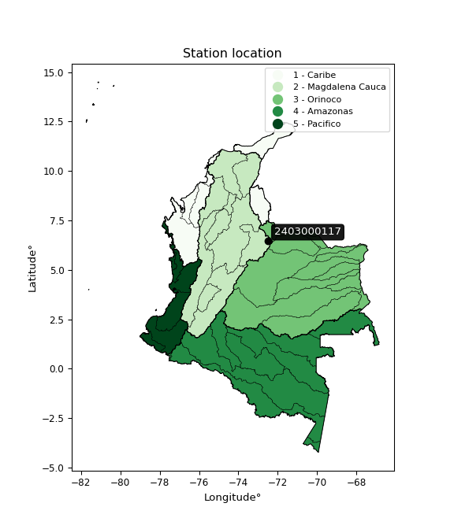</img>

</div>


## A. General information


### 1. General running parameters

• app_version: _v20260103_. • runtime: _2026-01-05 16:20:51.132608_. • Python version: _3.14.0_. • SciPy version: _1.16.3_. • Pandas version: _2.3.3_. • NumPy version: _2.3.5_. • Stations dataset (station_dataset_file): _dataset/pmax24h_in/automatic_colombia_2003_2024.csv_. • Stations catalog (station_catalog_file): _dataset/CNE.xls_. • Minimum year to eval til year_max (date_min): _1900_. • Maximum year to eval since year_min (date_max): _2024_. • Creates, save and include plots into reports (create_plot): _True_. • Plot only fit distributions with Δo > Δ (plot_only_fit): _True_. • Plot only simple graphs avoiding multiple CDFs and multiple Extreme values plots (plot_only_simple): _True_. • Eval low extreme values, if False, evaluates high extreme values (low_extreme): _False_. • Eval every SciPy distribution as logarithmic (pdist_logarithmic_on): _True_. • Standard deviation normalized (ddof): _1.0_. • Return periods to eval in years (Tr): _[2, 2.33, 5, 10, 15, 20, 25, 50, 75, 100, 200, 250, 500, 750, 1000]_. • Minimum data sample per station, 0 means any (minimum_sample): _5_. • Z-Score maximum threshold to adjust a value, 0 means disable (zscore_max): _3.5_. • Z-Score minimum threshold to adjust a value, 0 means disable (zscore_min): _-2.5_. • Avoid zeros, e.g. rain = 0 (avoid_zeros): _True_. • Avoid null values (avoid_nans): _True_. 

[:file_folder:Dataset file](../../dataset/pmax24h_in/automatic_colombia_2003_2024.csv)

> Delta Degrees of Freedom (DDOF): is a parameter used in the formulas for calculating variance and standard deviation. When ddof=0, the divisor is $N$ (the total number of observations) and this is used when your data set is the entire population. When ddof=1, the divisor is $N-1$ and this is used when your data set is a sample drawn from a larger population. Using $N-1$ provides an unbiased estimate of the population variance (known as Bessel´s correction).


### 2. Station info and location

|   id |     CODIGO | NOMBRE                    | CATEGORIA     | TECNOLOGIA                | ESTADO           | FECHA_INSTALACION   |   FECHA_SUSPENSION |   ALTITUD |   LATITUD |   LONGITUD | DEPARTAMENTO   | MUNICIPIO   | AREA_OPERATIVA                              | ENTIDAD                                                     | AREA_HIDROGRAFICA   | ZONA_HIDROGRAFICA   | SUBZONA_HIDROGRAFICA   |   CORRIENTE | Catalogo   |   Version |
|-----:|-----------:|:--------------------------|:--------------|:--------------------------|:-----------------|:--------------------|-------------------:|----------:|----------:|-----------:|:---------------|:------------|:--------------------------------------------|:------------------------------------------------------------|:--------------------|:--------------------|:-----------------------|------------:|:-----------|----------:|
|    0 | 2403000117 | PM LA LAGUNA [2403000117] | Pluviométrica | Automática con Telemetría | En Mantenimiento | 01/09/2018          |                nan |      2786 |   6.44717 |   -72.4977 | Boyacá         | Guacamayas  | Area Operativa 06 - Boyacá-Casanare-Vichada | INSTITUTO DE HIDROLOGIA METEOROLOGIA Y ESTUDIOS AMBIENTALES | Magdalena Cauca     | Sogamoso            | Río Chicamocha         |         nan | CNE_IDEAM  |  20251226 |

<div align="center">

Dynamic map: [:earth_americas:Google](http://maps.google.com/maps?q=6.447166667,-72.497694444) [:earth_americas:OSM](https://www.openstreetmap.org/#map=18/6.447166667/-72.497694444&layers=P) [:earth_americas:Bing](https://www.bing.com/maps?cp=6.447166667~-72.497694444&lvl=18) [:earth_americas:Apple](https://maps.apple.com/frame?center=6.447166667%2C-72.497694444&span=0.003%2C0.006)

</div>


<div align="center">

```geojson
{
  "type": "Feature",
  "geometry": {
    "type": "Point", 
    "coordinates": [-72.497694444, 6.447166667]
  }, 
  "properties": {
    "Name": "2403000117"
  }
}
```

</div>


### 3. Discrete values table and plot

<div align="center">

|               |           0 |            1 |           2 |           3 |           4 |          5 |
|:--------------|------------:|-------------:|------------:|------------:|------------:|-----------:|
| Date          | 2019        | 2020         | 2021        | 2022        | 2023        | 2024       |
| Value         |   22.7      |   43.1       |   35.1      |   33.9      |   35.6      |   94       |
| Value_initial |   22.7      |   43.1       |   35.1      |   33.9      |   35.6      |   94       |
| count         |    6        |    6         |    6        |    6        |    6        |    6       |
| mean          |   44.0667   |   44.0667    |   44.0667   |   44.0667   |   44.0667   |   44.0667  |
| std           |   25.3229   |   25.3229    |   25.3229   |   25.3229   |   25.3229   |   25.3229  |
| zscore        |   -0.843768 |   -0.0381736 |   -0.354093 |   -0.401481 |   -0.334348 |    1.97186 |


</div>


<div align="center">

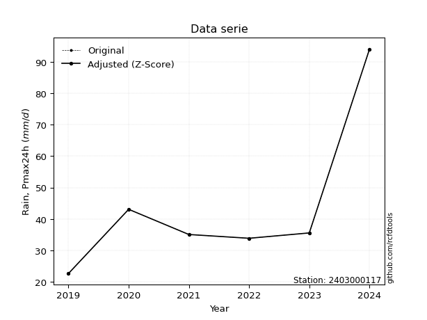</img>

</div>


> The initial value (value_initial) correspond to the initial obtained or null completed value, and value (value) is adjusted only when the initial value is outside the valid range (outlier) definite through the Z-Score value. If Z-Score is active, values out of range or outliers are replaced with the station mean value. A Z-Score (or standard score) measures how many standard deviations a data point is from the mean of a dataset, indicating its relative position; positive scores mean above the mean, negative mean below, and a score of zero is exactly at the mean, allowing for comparison of values from different distributions. It´s calculated using the formula $z=(x–μ)/σ$, where $x$ is the data point, $μ$ is the mean, and $σ$ is the standard deviation, helping identify outliers and understand probability.
>
> <sub>**Note**: In this study, "completing" (filling gaps in) and "extending" (forecasting or lengthening the historical record) rainfall data series are avoided for certain critical analyses because they introduce artificial bias and uncertainty, which can distort the statistics of rare events (extremes), alter day-to-day variability, and compromise the integrity and homogeneity of the original data. Some reasons against Completing/Extending rainfall data are: **Distortion of Extremes and Variability**: The primary issue is that most gap-filling or extension methods rely on averaging or regression with nearby stations, which inherently smooths the data. Rainfall is highly variable in space and time, with a large percentage of zero values and occasional large storms. Infilling methods often underestimate the highest values and overestimate the lowest (zero) values, which severely distorts analyses focused on flood frequency, drought severity, and intensity-duration-frequency (IDF) curves, **Loss of Data Homogeneity**: Infilled or extended data are synthetic estimates, not actual measurements. Combining these estimates with observed data can violate the assumption of data homogeneity, which requires that the data properties do not change over time. Inhomogeneity can lead to incorrect conclusions about long-term trends or changes in climate patterns, **Propagation of Errors**: Errors and biases from the original data (e.g., wind-induced undercatch, instrument errors, site changes) or the data used for imputation can propagate through the analysis, leading to unreliable hydrological models and inaccurate predictions, **Compromised Statistical Integrity**: For statistical analyses, especially those involving the frequency of events, using artificial data can introduce time bias or autocorrelation that doesn´t exist in reality, making it difficult to assess the true probability of events, **Difficulty in Validation**: It is difficult to accurately validate the quality of filled or extended data, especially for past periods where ground-truth measurements are unavailable. The reliability of imputation techniques heavily depends on the density of the surrounding station network and the complexity of the local topography.</sub>


### 4. Active continuous probability distributions from SciPy (44 of 104 available)

A Probability Density Function (PDF) describes the relative likelihood of a continuous random variable falling within a specific range, where the total area under its curve equals 1, and the area over any interval gives the actual probability for that range. Unlike discrete probabilities (like rolling a die), a PDF shows density, not direct probability for a single point (which is zero), with higher points indicating higher likelihood, often visualized as a bell curve for normal distributions.

A log of a probability density function (log-PDF) is simply the logarithm of the PDF´s value, denoted as $log(f(x))$, useful for converting multiplication of probabilities into addition, improving numerical stability with tiny numbers, and connecting to information theory concepts like entropy. Instead of dealing with very small probabilities (e.g., 0.000001), log-PDFs use negative numbers (e.g., $log(0.00001) ≈ -11.51$ that are easier for computers to handle, preventing underflow errors and simplifying complex calculations. In this study, each active probability distribution from SciPy is also evaluated in the $log$ form.

[scipy.stats](https://docs.scipy.org/doc/scipy/reference/stats.html) is a Python´s powerful submodule within the SciPy library for comprehensive statistical analysis, offering over 130 probability distributions (like Normal, Poisson), functions for descriptive stats (mean, variance), hypothesis testing (t-tests, chi-square), random variable generation, and statistical tests, making it essential for data science, modeling, and research. It provides tools to explore, model, and draw conclusions from data efficiently, working seamlessly with NumPy.

<div align="center">

|   id | p_dist             |   n_parameter | fit_method   | label                                                                       | active   | ref                                                                                                        |
|-----:|:-------------------|--------------:|:-------------|:----------------------------------------------------------------------------|:---------|:-----------------------------------------------------------------------------------------------------------|
|    0 | alpha              |             3 | MLE          | Alpha                                                                       | True     | [:mortar_board:](https://docs.scipy.org/doc/scipy/reference/generated/scipy.stats.alpha.html)              |
|    1 | betaprime          |             4 | MLE          | Beta prime                                                                  | True     | [:mortar_board:](https://docs.scipy.org/doc/scipy/reference/generated/scipy.stats.betaprime.html)          |
|    2 | chi2               |             3 | MLE          | Chi²                                                                        | True     | [:mortar_board:](https://docs.scipy.org/doc/scipy/reference/generated/scipy.stats.chi2.html)               |
|    3 | crystalball        |             4 | MLE          | Crystalball                                                                 | True     | [:mortar_board:](https://docs.scipy.org/doc/scipy/reference/generated/scipy.stats.crystalball.html)        |
|    4 | erlang             |             3 | MLE          | Erlang                                                                      | True     | [:mortar_board:](https://docs.scipy.org/doc/scipy/reference/generated/scipy.stats.erlang.html)             |
|    5 | expon              |             2 | MLE          | Exponential                                                                 | True     | [:mortar_board:](https://docs.scipy.org/doc/scipy/reference/generated/scipy.stats.expon.html)              |
|    6 | exponnorm          |             3 | MLE          | Exponentially modified Normal                                               | True     | [:mortar_board:](https://docs.scipy.org/doc/scipy/reference/generated/scipy.stats.exponnorm.html)          |
|    7 | f                  |             4 | MLE          | F                                                                           | True     | [:mortar_board:](https://docs.scipy.org/doc/scipy/reference/generated/scipy.stats.f.html)                  |
|    8 | fatiguelife        |             3 | MLE          | Fatigue-life (Birnbaum-Saunders)                                            | True     | [:mortar_board:](https://docs.scipy.org/doc/scipy/reference/generated/scipy.stats.fatiguelife.html)        |
|    9 | fisk               |             3 | MLE          | Fisk                                                                        | True     | [:mortar_board:](https://docs.scipy.org/doc/scipy/reference/generated/scipy.stats.fisk.html)               |
|   10 | gamma              |             3 | MLE          | Gamma                                                                       | True     | [:mortar_board:](https://docs.scipy.org/doc/scipy/reference/generated/scipy.stats.gamma.html)              |
|   11 | genexpon           |             5 | MLE          | Generalized exponential                                                     | True     | [:mortar_board:](https://docs.scipy.org/doc/scipy/reference/generated/scipy.stats.genexpon.html)           |
|   12 | genlogistic        |             3 | MLE          | Generalized logistic                                                        | True     | [:mortar_board:](https://docs.scipy.org/doc/scipy/reference/generated/scipy.stats.genlogistic.html)        |
|   13 | gibrat             |             2 | MM           | Gibrat                                                                      | True     | [:mortar_board:](https://docs.scipy.org/doc/scipy/reference/generated/scipy.stats.gibrat.html)             |
|   14 | gompertz           |             3 | MLE          | Gompertz (or truncated Gumbel)                                              | True     | [:mortar_board:](https://docs.scipy.org/doc/scipy/reference/generated/scipy.stats.gompertz.html)           |
|   15 | gumbel_l           |             2 | MM           | Gumbel Left Skew                                                            | True     | [:mortar_board:](https://docs.scipy.org/doc/scipy/reference/generated/scipy.stats.gumbel_l.html)           |
|   16 | gumbel_r           |             2 | MM           | Gumbel Right Skew                                                           | True     | [:mortar_board:](https://docs.scipy.org/doc/scipy/reference/generated/scipy.stats.gumbel_r.html)           |
|   17 | halflogistic       |             2 | MM           | Half-logistic                                                               | True     | [:mortar_board:](https://docs.scipy.org/doc/scipy/reference/generated/scipy.stats.halflogistic.html)       |
|   18 | halfnorm           |             2 | MM           | Half Normal                                                                 | True     | [:mortar_board:](https://docs.scipy.org/doc/scipy/reference/generated/scipy.stats.halfnorm.html)           |
|   19 | hypsecant          |             2 | MM           | hyperbolic secant                                                           | True     | [:mortar_board:](https://docs.scipy.org/doc/scipy/reference/generated/scipy.stats.hypsecant.html)          |
|   20 | invgamma           |             3 | MLE          | Inverted gamma                                                              | True     | [:mortar_board:](https://docs.scipy.org/doc/scipy/reference/generated/scipy.stats.invgamma.html)           |
|   21 | invgauss           |             3 | MLE          | Inverse Gaussian                                                            | True     | [:mortar_board:](https://docs.scipy.org/doc/scipy/reference/generated/scipy.stats.invgauss.html)           |
|   22 | invweibull         |             3 | MLE          | Inverted Weibull                                                            | True     | [:mortar_board:](https://docs.scipy.org/doc/scipy/reference/generated/scipy.stats.invweibull.html)         |
|   23 | johnsonsu          |             4 | MLE          | Johnson Su                                                                  | True     | [:mortar_board:](https://docs.scipy.org/doc/scipy/reference/generated/scipy.stats.johnsonsu.html)          |
|   24 | kstwobign          |             2 | MLE          | Limiting distribution of scaled Kolmogorov-Smirnov two-sided test statistic | True     | [:mortar_board:](https://docs.scipy.org/doc/scipy/reference/generated/scipy.stats.kstwobign.html)          |
|   25 | laplace            |             2 | MM           | Laplace                                                                     | True     | [:mortar_board:](https://docs.scipy.org/doc/scipy/reference/generated/scipy.stats.laplace.html)            |
|   26 | laplace_asymmetric |             3 | MLE          | Asymmetric Laplace                                                          | True     | [:mortar_board:](https://docs.scipy.org/doc/scipy/reference/generated/scipy.stats.laplace_asymmetric.html) |
|   27 | loggamma           |             3 | MLE          | Log gamma                                                                   | True     | [:mortar_board:](https://docs.scipy.org/doc/scipy/reference/generated/scipy.stats.loggamma.html)           |
|   28 | logistic           |             2 | MM           | Logistic (or Sech-squared)                                                  | True     | [:mortar_board:](https://docs.scipy.org/doc/scipy/reference/generated/scipy.stats.logistic.html)           |
|   29 | lognorm            |             3 | MLE          | Log Normal                                                                  | True     | [:mortar_board:](https://docs.scipy.org/doc/scipy/reference/generated/scipy.stats.lognorm.html)            |
|   30 | maxwell            |             2 | MM           | Maxwell                                                                     | True     | [:mortar_board:](https://docs.scipy.org/doc/scipy/reference/generated/scipy.stats.maxwell.html)            |
|   31 | mielke             |             4 | MLE          | Mielke Beta-Kappa / Dagum                                                   | True     | [:mortar_board:](https://docs.scipy.org/doc/scipy/reference/generated/scipy.stats.mielke.html)             |
|   32 | moyal              |             2 | MM           | Moyal                                                                       | True     | [:mortar_board:](https://docs.scipy.org/doc/scipy/reference/generated/scipy.stats.moyal.html)              |
|   33 | nakagami           |             3 | MLE          | Nakagami                                                                    | True     | [:mortar_board:](https://docs.scipy.org/doc/scipy/reference/generated/scipy.stats.nakagami.html)           |
|   34 | ncf                |             5 | MLE          | Non-central F distribution                                                  | True     | [:mortar_board:](https://docs.scipy.org/doc/scipy/reference/generated/scipy.stats.ncf.html)                |
|   35 | nct                |             4 | MLE          | Non-central Student’s t                                                     | True     | [:mortar_board:](https://docs.scipy.org/doc/scipy/reference/generated/scipy.stats.nct.html)                |
|   36 | norm               |             2 | MM           | Normal                                                                      | True     | [:mortar_board:](https://docs.scipy.org/doc/scipy/reference/generated/scipy.stats.norm.html)               |
|   37 | pearson3           |             3 | MM           | Pearson type III                                                            | True     | [:mortar_board:](https://docs.scipy.org/doc/scipy/reference/generated/scipy.stats.pearson3.html)           |
|   38 | rayleigh           |             2 | MM           | Rayleigh                                                                    | True     | [:mortar_board:](https://docs.scipy.org/doc/scipy/reference/generated/scipy.stats.rayleigh.html)           |
|   39 | rice               |             3 | MLE          | Rice                                                                        | True     | [:mortar_board:](https://docs.scipy.org/doc/scipy/reference/generated/scipy.stats.rice.html)               |
|   40 | t                  |             3 | MLE          | Student’s t                                                                 | True     | [:mortar_board:](https://docs.scipy.org/doc/scipy/reference/generated/scipy.stats.t.html)                  |
|   41 | truncnorm          |             4 | MLE          | Truncated normal                                                            | True     | [:mortar_board:](https://docs.scipy.org/doc/scipy/reference/generated/scipy.stats.truncnorm.html)          |
|   42 | wald               |             2 | MM           | Wald                                                                        | True     | [:mortar_board:](https://docs.scipy.org/doc/scipy/reference/generated/scipy.stats.wald.html)               |
|   43 | weibull_min        |             3 | MLE          | Weibull minimum                                                             | True     | [:mortar_board:](https://docs.scipy.org/doc/scipy/reference/generated/scipy.stats.weibull_min.html)        |

</div>

> **n_parameter:** # arguments & localization & scale.
>
> **Fit methods:** (MLE) maximum likelihood, (MM) L-moments.
>
>**Inactive** (With the only purpose of prevent loops, zero divisions, infinite values, over high estimated values or horizontal trending for recurrence intervals estimations, the follow distributions were disabled.)**:** foldnorm, gennorm, norminvgauss, powernorm, powerlognorm, skewnorm, genextreme, anglit, arcsine, argus, beta, bradford, burr, burr12, cauchy, cosine, halfcauchy, foldcauchy, skewcauchy, wrapcauchy, dgamma, gengamma, exponweib, exponpow, truncexpon, gausshyper, genhalflogistic, genhyperbolic, geninvgauss, halfgennorm, johnsonsb, kappa4, kappa3, ksone, kstwo, loglaplace, levy, levy_l, levy_stable, ncx2, pareto, genpareto, truncpareto, lomax, powerlaw, rdist, rel_breitwigner, recipinvgauss, semicircular, studentized_range, trapezoid, triang, truncweibull_min, tukeylambda, uniform, loguniform, vonmises, vonmises_line, weibull_max, dweibull, 


## B. Probability (PDF) vs. Empirical (EDF) distributions functions

A continuous probability distribution (CPD) describes probabilities for variables that can take any value within a range (like rain any time), unlike discrete variables with specific outcomes (like temperature). It uses a Probability Density Function (PDF), a curve where the total area under it equals 1, and the probability of the variable falling within an interval (a to b) is found by calculating the area under the curve between those points. A key feature is that the probability of hitting any single exact value is zero, so probabilities are always expressed for ranges, e.g., $P(a ≤ X ≤ b)$.

<div align="center">

Distributions parameters from station values
|    |    station | p_dist                |   n |           loc |         scale | shape                  | shape1             | shape2                 | shape3   |
|---:|-----------:|:----------------------|----:|--------------:|--------------:|:-----------------------|:-------------------|:-----------------------|:---------|
|  0 | 2403000117 | alpha                 |   6 |      1.62721  |  90.9748      | 2.604913497467404      |                    |                        |          |
|  1 | 2403000117 | betaprime             |   6 |     -0.238724 |   1.79649     | 138.25404447466758     | 6.714348039856096  |                        |          |
|  2 | 2403000117 | chi2                  |   6 |     22.7      |  12.5201      | 0.9075316887976577     |                    |                        |          |
|  3 | 2403000117 | crystalball           |   6 |     44.0667   |  23.1166      | 3778.407556749393      | 1314.2968709544798 |                        |          |
|  4 | 2403000117 | erlang                |   6 |     22.7      |  28.4427      | 0.46207353921682065    |                    |                        |          |
|  5 | 2403000117 | expon                 |   6 |     22.7      |  21.3667      |                        |                    |                        |          |
|  6 | 2403000117 | exponnorm             |   6 |     24.8223   |   4.98263     | 3.862287941243536      |                    |                        |          |
|  7 | 2403000117 | f                     |   6 |     13.343    |  20.6012      | 474.27468789040006     | 5.845045759048661  |                        |          |
|  8 | 2403000117 | fatiguelife           |   6 |     18.6919   |  17.6127      | 0.9369441285197655     |                    |                        |          |
|  9 | 2403000117 | fisk                  |   6 |     19.4942   |  16.9303      | 1.9864330454450583     |                    |                        |          |
| 10 | 2403000117 | gamma                 |   6 |     22.7      |  25.2083      | 0.783356481522963      |                    |                        |          |
| 11 | 2403000117 | genexpon              |   6 |     22.7      |  47.9324      | 2.2433599082175526     | 0.5732280655771271 | 1.7882350199117415e-08 |          |
| 12 | 2403000117 | genlogistic           |   6 |    -62.3946   |  13.3779      | 1423.766471418542      |                    |                        |          |
| 13 | 2403000117 | gibrat                |   6 |     26.4317   |  10.6962      |                        |                    |                        |          |
| 14 | 2403000117 | gompertz              |   6 |     22.7      |   7.78401e+10 | 3680644073.2235785     |                    |                        |          |
| 15 | 2403000117 | gumbel_l              |   6 |     54.4704   |  18.0239      |                        |                    |                        |          |
| 16 | 2403000117 | gumbel_r              |   6 |     33.663    |  18.0239      |                        |                    |                        |          |
| 17 | 2403000117 | halflogistic          |   6 |     16.6682   |  19.7638      |                        |                    |                        |          |
| 18 | 2403000117 | halfnorm              |   6 |     13.4694   |  38.348       |                        |                    |                        |          |
| 19 | 2403000117 | hypsecant             |   6 |     44.0667   |  14.7165      |                        |                    |                        |          |
| 20 | 2403000117 | invgamma              |   6 |     13.2182   |  60.4486      | 2.9220946962711416     |                    |                        |          |
| 21 | 2403000117 | invgauss              |   6 |     17.3994   |  31.9713      | 0.8341005662286012     |                    |                        |          |
| 22 | 2403000117 | invweibull            |   6 |     22.7      |   1.3232      | 0.054575325458975754   |                    |                        |          |
| 23 | 2403000117 | johnsonsu             |   6 |     35.1461   |   0.335109    | -0.21285853198582616   | 0.2927840361586786 |                        |          |
| 24 | 2403000117 | kstwobign             |   6 |    -16.7352   |  70.9681      |                        |                    |                        |          |
| 25 | 2403000117 | laplace               |   6 |     44.0667   |  16.3459      |                        |                    |                        |          |
| 26 | 2403000117 | laplace_asymmetric    |   6 |     33.9      |  10.5264      | 0.6275831912471384     |                    |                        |          |
| 27 | 2403000117 | loggamma              |   6 |  -7300.26     | 985.948       | 1718.931331415356      |                    |                        |          |
| 28 | 2403000117 | logistic              |   6 |     44.0667   |  12.7448      |                        |                    |                        |          |
| 29 | 2403000117 | lognorm               |   6 |     22.7      |   0.0458231   | 13.515117277384501     |                    |                        |          |
| 30 | 2403000117 | maxwell               |   6 |    -10.7099   |  34.3261      |                        |                    |                        |          |
| 31 | 2403000117 | mielke                |   6 |     -0.624085 |   8.15937     | 261.5100177191863      | 3.1353004535619378 |                        |          |
| 32 | 2403000117 | moyal                 |   6 |     30.8471   |  10.4061      |                        |                    |                        |          |
| 33 | 2403000117 | nakagami              |   6 |     22.7      |  40.4534      | 0.31123934857705815    |                    |                        |          |
| 34 | 2403000117 | ncf                   |   6 |     -0.252023 |   8.36806e-06 | 7.047202196263637e-06  | 29.420134390847785 | 34.0692969965267       |          |
| 35 | 2403000117 | nct                   |   6 |     -0.129396 |   0.674472    | 3.8516269447181384     | 51.28010233343737  |                        |          |
| 36 | 2403000117 | norm                  |   6 |     44.0667   |  23.1166      |                        |                    |                        |          |
| 37 | 2403000117 | pearson3              |   6 |     44.0667   |  23.1166      | 1.516037298786435      |                    |                        |          |
| 38 | 2403000117 | rayleigh              |   6 |     -0.156671 |  35.2851      |                        |                    |                        |          |
| 39 | 2403000117 | rice                  |   6 |      9.95688  |  29.1363      | 0.002389175380682425   |                    |                        |          |
| 40 | 2403000117 | t                     |   6 |     44.464    |  22.931       | 14.526039741540018     |                    |                        |          |
| 41 | 2403000117 | truncnorm             |   6 | -11958.4      | 527.808       | 22.69980227946235      | 22.83489228386002  |                        |          |
| 42 | 2403000117 | wald                  |   6 |     20.9501   |  23.1166      |                        |                    |                        |          |
| 43 | 2403000117 | weibull_min           |   6 |     22.7      |  28.0797      | 0.3616551225664799     |                    |                        |          |
| 44 | 2403000117 | logalpha              |   6 |      1.68109  |   9.86443     | 5.1421679076384015     |                    |                        |          |
| 45 | 2403000117 | logbetaprime          |   6 |      3.12236  | 182.157       | 0.6188147614878687     | 367.49040529202387 |                        |          |
| 46 | 2403000117 | logchi2               |   6 |      3.12236  |   0.940423    | 1.14542343955208       |                    |                        |          |
| 47 | 2403000117 | logcrystalball        |   6 |      3.68052  |   0.43092     | 7.450455561806159      | 3360.2541810551475 |                        |          |
| 48 | 2403000117 | logerlang             |   6 |      3.12236  |   0.510811    | 0.8807504295434649     |                    |                        |          |
| 49 | 2403000117 | logexpon              |   6 |      3.12236  |   0.558159    |                        |                    |                        |          |
| 50 | 2403000117 | logexponnorm          |   6 |      3.30049  |   0.198923    | 1.9105064465348423     |                    |                        |          |
| 51 | 2403000117 | logf                  |   6 |      2.36709  |   1.19567     | 644.9234204094244      | 22.169104640269488 |                        |          |
| 52 | 2403000117 | logfatiguelife        |   6 |      2.67062  |   0.925697    | 0.42647732894752277    |                    |                        |          |
| 53 | 2403000117 | logfisk               |   6 |      2.69212  |   0.90537     | 4.248489154064722      |                    |                        |          |
| 54 | 2403000117 | loggamma              |   6 |      3.12236  |   0.526767    | 0.8702089781553293     |                    |                        |          |
| 55 | 2403000117 | loggenexpon           |   6 |      3.12235  |   0.10496     | 0.1234332544635608     | 3.6895016028389565 | 0.0041854737099612065  |          |
| 56 | 2403000117 | loggenlogistic        |   6 |      1.50899  |   0.326551    | 428.3473814001478      |                    |                        |          |
| 57 | 2403000117 | loggibrat             |   6 |      3.3518   |   0.19938     |                        |                    |                        |          |
| 58 | 2403000117 | loggompertz           |   6 |      3.12236  |   1.00459     | 1.0225019201367784     |                    |                        |          |
| 59 | 2403000117 | loggumbel_l           |   6 |      3.87446  |   0.335987    |                        |                    |                        |          |
| 60 | 2403000117 | loggumbel_r           |   6 |      3.48659  |   0.335987    |                        |                    |                        |          |
| 61 | 2403000117 | loghalflogistic       |   6 |      3.16982  |   0.368397    |                        |                    |                        |          |
| 62 | 2403000117 | loghalfnorm           |   6 |      3.11015  |   0.714852    |                        |                    |                        |          |
| 63 | 2403000117 | loghypsecant          |   6 |      3.68052  |   0.274332    |                        |                    |                        |          |
| 64 | 2403000117 | loginvgamma           |   6 |      2.34691  |  13.4528      | 11.081448126242378     |                    |                        |          |
| 65 | 2403000117 | loginvgauss           |   6 |      2.64456  |   5.81537     | 0.17814243516731923    |                    |                        |          |
| 66 | 2403000117 | loginvweibull         |   6 |     -4.86586  |   8.34665     | 25.886003293604695     |                    |                        |          |
| 67 | 2403000117 | logjohnsonsu          |   6 |      3.56002  |   0.0107463   | -0.17129495318641408   | 0.3095200449672044 |                        |          |
| 68 | 2403000117 | logkstwobign          |   6 |      2.3003   |   1.59316     |                        |                    |                        |          |
| 69 | 2403000117 | loglaplace            |   6 |      3.68052  |   0.304706    |                        |                    |                        |          |
| 70 | 2403000117 | loglaplace_asymmetric |   6 |      3.5582   |   0.257888    | 0.790675509598936      |                    |                        |          |
| 71 | 2403000117 | logloggamma           |   6 |   -114.255    |  16.3237      | 1373.5395379790925     |                    |                        |          |
| 72 | 2403000117 | loglogistic           |   6 |      3.68052  |   0.237579    |                        |                    |                        |          |
| 73 | 2403000117 | loglognorm            |   6 |      3.12236  |   0.00178014  | 12.984909511800872     |                    |                        |          |
| 74 | 2403000117 | logmaxwell            |   6 |      2.65942  |   0.639879    |                        |                    |                        |          |
| 75 | 2403000117 | logmielke             |   6 |     -4.20045  |   6.56907     | 1069.4235685619005     | 24.141269909973317 |                        |          |
| 76 | 2403000117 | logmoyal              |   6 |      3.4341   |   0.193982    |                        |                    |                        |          |
| 77 | 2403000117 | lognakagami           |   6 |      3.12236  |   0.598625    | 0.12996961627917042    |                    |                        |          |
| 78 | 2403000117 | logncf                |   6 |     -1.13577  |   7.05013e-07 | 5.125836746394886e-05  | 266.03297923603446 | 348.71054092713615     |          |
| 79 | 2403000117 | lognct                |   6 |     -0.188538 |   0.0673003   | 47.62196016171376      | 56.562372439499995 |                        |          |
| 80 | 2403000117 | lognorm               |   6 |      3.68052  |   0.43092     |                        |                    |                        |          |
| 81 | 2403000117 | logpearson3           |   6 |      3.68052  |   0.43092     | 0.9622001707041292     |                    |                        |          |
| 82 | 2403000117 | lograyleigh           |   6 |      2.85615  |   0.657756    |                        |                    |                        |          |
| 83 | 2403000117 | logrice               |   6 |      2.93586  |   0.608364    | 0.00034575817006646844 |                    |                        |          |
| 84 | 2403000117 | logt                  |   6 |      3.56083  |   0.0254274   | 0.441180234890714      |                    |                        |          |
| 85 | 2403000117 | logtruncnorm          |   6 |     -0.15899  |   1.082       | 3.4033254373684265     | 4.34594040359948   |                        |          |
| 86 | 2403000117 | logwald               |   6 |      3.24965  |   0.430876    |                        |                    |                        |          |
| 87 | 2403000117 | logweibull_min        |   6 |      3.12236  |   0.460459    | 0.34469868311874474    |                    |                        |          |

</div>

> **loc** (Location parameter): This shifts the distribution along the x-axis. For many common distributions, like the normal (Gaussian) distribution, loc represents the mean $μ$. For others, like the uniform distribution, it might represent the minimum value, or for the beta distribution, the left end of the support interval.
>
> **scale** (Scale parameter): This determines the width or spread of the distribution. For the normal distribution, scale represents the standard deviation $σ$. For a uniform distribution, it defines the length of the interval (from $loc$ to $loc + scale$).
>
> **shape** (Shape parameters): Refers to parameters that define the specific form of a probability distribution, distinct from its location (loc) and scale (scale). These parameters are required arguments for most distribution functions. For example, a normal (Gaussian) distribution is fully defined by its location (mean) and scale (standard deviation), so it has no specific shape parameters beyond loc and scale. However, other distributions have intrinsic properties that need specification, as Gamma distribution that takes a shape parameter, often named $a$ or $alpha$.


### 0. Cumulative distribution values - CDF (88 evaluated)

Cumulative Distribution Function (CDF), denoted as $F$<sub>$X$</sub>$(x)$, is a function that gives the probability that a random variable $X$ will take a value less than or equal to a specific value, $x$ (i.e., $(P(X≥x)$. It essentially "accumulates" probabilities from a given point up to the far right (positive infinity), providing a complete picture of the distribution´s probabilities for both discrete (like rain) and continuous (like temperature) variables, helping to find probabilities over ranges or above certain values. Each station is evaluated separately ordering the $x$ values ascending, calculating the CDF and PDF values for the activated distributions and their logarithmic forms.

<div align="center">

CDF ordered by x ascending and calculating $log(f(x))$ separately
|   id |    Station |   date |    x |   count |    mean |     std |     zscore |   Value_initial |    station |   m |     alpha |   alpha_pdf |   betaprime |   betaprime_pdf |        chi2 |    chi2_pdf |   crystalball |   crystalball_pdf |      erlang |   erlang_pdf |    expon |   expon_pdf |   exponnorm |   exponnorm_pdf |         f |      f_pdf |   fatiguelife |   fatiguelife_pdf |     fisk |   fisk_pdf |       gamma |   gamma_pdf |    genexpon |   genexpon_pdf |   genlogistic |   genlogistic_pdf |   gibrat |   gibrat_pdf |    gompertz |   gompertz_pdf |   gumbel_l |   gumbel_l_pdf |   gumbel_r |   gumbel_r_pdf |   halflogistic |   halflogistic_pdf |   halfnorm |   halfnorm_pdf |   hypsecant |   hypsecant_pdf |   invgamma |   invgamma_pdf |   invgauss |   invgauss_pdf |   invweibull |   invweibull_pdf |   johnsonsu |   johnsonsu_pdf |   kstwobign |   kstwobign_pdf |   laplace |   laplace_pdf |   laplace_asymmetric |   laplace_asymmetric_pdf |   loggamma |   loggamma_pdf |   logistic |   logistic_pdf |   lognorm |   lognorm_pdf |   maxwell |   maxwell_pdf |    mielke |   mielke_pdf |    moyal |   moyal_pdf |    nakagami |   nakagami_pdf |      ncf |    ncf_pdf |       nct |    nct_pdf |     norm |   norm_pdf |   pearson3 |   pearson3_pdf |   rayleigh |   rayleigh_pdf |      rice |   rice_pdf |        t |      t_pdf |   truncnorm |   truncnorm_pdf |        wald |   wald_pdf |   weibull_min |   weibull_min_pdf |   logalpha |   logalpha_pdf |   logbetaprime |   logbetaprime_pdf |     logchi2 |   logchi2_pdf |   logcrystalball |   logcrystalball_pdf |   logerlang |   logerlang_pdf |   logexpon |   logexpon_pdf |   logexponnorm |   logexponnorm_pdf |      logf |   logf_pdf |   logfatiguelife |   logfatiguelife_pdf |   logfisk |   logfisk_pdf |   loggenexpon |   loggenexpon_pdf |   loggenlogistic |   loggenlogistic_pdf |   loggibrat |   loggibrat_pdf |   loggompertz |   loggompertz_pdf |   loggumbel_l |   loggumbel_l_pdf |   loggumbel_r |   loggumbel_r_pdf |   loghalflogistic |   loghalflogistic_pdf |   loghalfnorm |   loghalfnorm_pdf |   loghypsecant |   loghypsecant_pdf |   loginvgamma |   loginvgamma_pdf |   loginvgauss |   loginvgauss_pdf |   loginvweibull |   loginvweibull_pdf |   logjohnsonsu |   logjohnsonsu_pdf |   logkstwobign |   logkstwobign_pdf |   loglaplace |   loglaplace_pdf |   loglaplace_asymmetric |   loglaplace_asymmetric_pdf |   logloggamma |   logloggamma_pdf |   loglogistic |   loglogistic_pdf |   loglognorm |   loglognorm_pdf |   logmaxwell |   logmaxwell_pdf |   logmielke |   logmielke_pdf |   logmoyal |   logmoyal_pdf |   lognakagami |   lognakagami_pdf |   logncf |   logncf_pdf |   lognct |   lognct_pdf |   logpearson3 |   logpearson3_pdf |   lograyleigh |   lograyleigh_pdf |   logrice |   logrice_pdf |      logt |   logt_pdf |   logtruncnorm |   logtruncnorm_pdf |   logwald |   logwald_pdf |   logweibull_min |   logweibull_min_pdf |
|-----:|-----------:|-------:|-----:|--------:|--------:|--------:|-----------:|----------------:|-----------:|----:|----------:|------------:|------------:|----------------:|------------:|------------:|--------------:|------------------:|------------:|-------------:|---------:|------------:|------------:|----------------:|----------:|-----------:|--------------:|------------------:|---------:|-----------:|------------:|------------:|------------:|---------------:|--------------:|------------------:|---------:|-------------:|------------:|---------------:|-----------:|---------------:|-----------:|---------------:|---------------:|-------------------:|-----------:|---------------:|------------:|----------------:|-----------:|---------------:|-----------:|---------------:|-------------:|-----------------:|------------:|----------------:|------------:|----------------:|----------:|--------------:|---------------------:|-------------------------:|-----------:|---------------:|-----------:|---------------:|----------:|--------------:|----------:|--------------:|----------:|-------------:|---------:|------------:|------------:|---------------:|---------:|-----------:|----------:|-----------:|---------:|-----------:|-----------:|---------------:|-----------:|---------------:|----------:|-----------:|---------:|-----------:|------------:|----------------:|------------:|-----------:|--------------:|------------------:|-----------:|---------------:|---------------:|-------------------:|------------:|--------------:|-----------------:|---------------------:|------------:|----------------:|-----------:|---------------:|---------------:|-------------------:|----------:|-----------:|-----------------:|---------------------:|----------:|--------------:|--------------:|------------------:|-----------------:|---------------------:|------------:|----------------:|--------------:|------------------:|--------------:|------------------:|--------------:|------------------:|------------------:|----------------------:|--------------:|------------------:|---------------:|-------------------:|--------------:|------------------:|--------------:|------------------:|----------------:|--------------------:|---------------:|-------------------:|---------------:|-------------------:|-------------:|-----------------:|------------------------:|----------------------------:|--------------:|------------------:|--------------:|------------------:|-------------:|-----------------:|-------------:|-----------------:|------------:|----------------:|-----------:|---------------:|--------------:|------------------:|---------:|-------------:|---------:|-------------:|--------------:|------------------:|--------------:|------------------:|----------:|--------------:|----------:|-----------:|---------------:|-------------------:|----------:|--------------:|-----------------:|---------------------:|
|    0 | 2403000117 |   2019 | 22.7 |       6 | 44.0667 | 25.3229 | -0.843768  |            22.7 | 2403000117 |   1 | 0.0436253 |  0.0189562  |   0.0785285 |      0.0186241  | 7.26829e-08 | 9.28333e+06 |      0.177665 |        0.0112582  | 5.06076e-08 |  6.58213e+06 | 0        |  0.0468019  |   0.0502016 |      0.0148029  | 0.0432862 | 0.0216367  |     0.0419783 |        0.0307032  | 0.035376 | 0.0211448  | 4.12968e-13 | 91.0574     | 8.19179e-10 |     0.0468026  |      0.085606 |       0.0157154   | 0        |   0          | 3.73775e-13 |     0.0472847  |   0.157671 |    0.00801884  |   0.159262 |     0.0162338  |       0.151424 |         0.0247186  |   0.190217 |     0.0202123  |    0.146413 |      0.0096018  |  0.0432372 |      0.0216202 |  0.0423601 |     0.0266674  |   0.00194885 |      1.86825e+11 |   0.0702161 |     0.00316488  |   0.0829963 |      0.0147133  |  0.135294 |    0.00827694 |            0.0518598 |               0.00785016 | 8.0121e-14 |     157        |   0.15756  |     0.0104148  |  0.097613 |      0.400127 |  0.186006 |    0.0137122  | 0.0477572 |   0.0191745  | 0.139104 |   0.0189909 | 7.85673e-11 | 13765.9        | 0.115349 | 0.0170566  | 0.0596827 | 0.0190407  | 0.177665 | 0.0112582  |   0.145966 |     0.0228119  |   0.189256 |     0.0148838  | 0.0912112 | 0.0136417  | 0.179045 | 0.0107194  | 9.52472e-08 |      0.0451633  | 0.000731864 | 0.00293524 |   1.78019e-06 |       1.81218e+08 |  0.0443686 |       0.445027 |    5.44385e-10 |     758572         | 1.87481e-09 |   1.20891e+06 |         0.097613 |             0.400127 | 1.04758e-13 |     103.882     |   0        |       1.7916   |       0.042398 |           0.37596  | 0.0437505 |   0.463292 |        0.0428507 |             0.503705 |  0.040667 |      0.385238 |   1.32009e-05 |          1.176    |        0.0472764 |             0.440246 |    0        |       0         |   2.94906e-09 |          1.01783  |      0.101134 |         0.285245  |     0.0519959 |          0.457549 |          0        |              0        |     0.0136277 |          1.11599  |      0.0827569 |          0.29828   |     0.0437508 |          0.463274 |     0.0429897 |          0.497879 |       0.0443821 |            0.447991 |      0.0626095 |          0.0870704 |       0.047219 |           0.474858 |    0.0800631 |        0.262755  |               0.0453754 |                    0.222531 |      0.103068 |          0.402658 |     0.0871162 |          0.33474  |    0.0127133 |      5.69427e+12 |    0.0862842 |         0.502384 |   0.0447737 |        0.44278  |  0.0255255 |       0.379317 |   9.52635e-05 |       5.57607e+10 | 0.197772 |     0.465112 | 0.071029 |     0.430512 |      0.057678 |          0.524896 |     0.0786402 |          0.566935 | 0.0459041 |      0.480785 | 0.0930093 |  0.0935038 |    0           |          0         |  0        |     0         |      6.66959e-06 |          5.17687e+09 |
|    1 | 2403000117 |   2022 | 33.9 |       6 | 44.0667 | 25.3229 | -0.401481  |            33.9 | 2403000117 |   2 | 0.417183  |  0.0342146  |   0.372795  |      0.0285952  | 0.687442    | 0.0203028   |      0.330041 |        0.015667   | 0.652469    |  0.0204275   | 0.40796  |  0.0277086  |   0.358645  |      0.0315478  | 0.422155  | 0.03205    |     0.437697  |        0.02773    | 0.420491 | 0.0336011  | 0.474114    |  0.0256257  | 0.407965    |     0.0277088  |      0.344853 |       0.0274338   | 0.359715 |   0.0500806  | 0.411153    |     0.0278435  |   0.273422 |    0.012876    |   0.372717 |     0.0204089  |       0.410276 |         0.0210403  |   0.405806 |     0.0180535  |    0.295756 |      0.0173276  |  0.422016  |      0.0320502 |  0.431142  |     0.0292339  |   0.410667   |      0.00178092  |   0.210271  |     0.0654404   |   0.311327  |      0.0236522  |  0.268443 |    0.0164226  |            0.282568  |               0.0427732  | 0.596023   |       0.839718 |   0.310516 |     0.0167986  |  0.357709 |      0.866261 |  0.360603 |    0.0168726  | 0.406181  |   0.033055   | 0.387827 |   0.0228024 | 0.347038    |     0.0189396  | 0.360775 | 0.0243022  | 0.387219  | 0.0310933  | 0.330041 | 0.015667   |   0.405628 |     0.0217764  |   0.372362 |     0.0171683  | 0.286552  | 0.0201221  | 0.325922 | 0.0152798  | 0.401392    |      0.0278929  | 0.41551     | 0.0346335  |   0.51188     |       0.0113042   |  0.415981  |       1.13364  |    0.738925    |          0.672208  | 0.429566    |   0.534573    |         0.357709 |             0.866261 | 0.601246    |       0.847225  |   0.512528 |       0.873356 |       0.40643  |           1.21659  | 0.418763  |   1.11417  |        0.42372   |             1.0777   |  0.41032  |      1.23657  |   0.442216    |          0.967034 |        0.408233  |             1.11885  |    0.440389 |       2.29869   |   0.394499    |          0.918689 |      0.296548 |         0.736466  |     0.408125  |          1.0886   |          0.446173 |              1.08705  |     0.436807  |          0.944391 |      0.326923  |          0.992971  |     0.418762  |          1.11418  |     0.422925  |          1.08212  |       0.416244  |            1.12573  |      0.220168  |          2.40357   |       0.402583 |           1.04873  |    0.298569  |        0.979857  |               0.324346  |                    1.59066  |      0.359253 |          0.845952 |     0.340449  |          0.945134 |    0.661736  |      0.0702224   |    0.390089  |         0.913634 |   0.415031  |        1.12951  |  0.426988  |       1.19163  |   0.730513    |       0.44962     | 0.419105 |     0.605223 | 0.377967 |     0.999344 |      0.411056 |          1.0213   |     0.402238  |          0.921929 | 0.372729  |      0.995806 | 0.268858  |  2.84276   |    4.49783e-06 |          3.45489   |  0.472205 |     1.64658   |      0.61461     |          0.315836    |
|    2 | 2403000117 |   2021 | 35.1 |       6 | 44.0667 | 25.3229 | -0.354093  |            35.1 | 2403000117 |   3 | 0.457132  |  0.0323353  |   0.406786  |      0.0280234  | 0.710576    | 0.0183061   |      0.349049 |        0.0160072  | 0.67582     |  0.0185401   | 0.440294 |  0.0261953  |   0.395829  |      0.0303778  | 0.459484  | 0.0301548  |     0.469857  |        0.0258921  | 0.459633 | 0.0316146  | 0.503813    |  0.0239015  | 0.440299    |     0.0261955  |      0.377824 |       0.0274798   | 0.41675  |   0.0450175  | 0.443635    |     0.0263076  |   0.289225 |    0.0134631   |   0.397179 |     0.0203475  |       0.435207 |         0.020507   |   0.427287 |     0.0177463  |    0.317049 |      0.0181542  |  0.459345  |      0.0301558 |  0.465085  |     0.0273504  |   0.412697   |      0.00160757  |   0.400119  |     0.334419    |   0.339791  |      0.023763   |  0.288891 |    0.0176736  |            0.332103  |               0.0398199  | 0.624138   |       0.777616 |   0.331025 |     0.0173755  |  0.388257 |      0.889234 |  0.380926 |    0.0169919  | 0.444914  |   0.0314706  | 0.414969 |   0.022417  | 0.369268    |     0.0181278  | 0.389903 | 0.0242208  | 0.423912  | 0.0300279  | 0.349049 | 0.0160072  |   0.431428 |     0.0212171  |   0.39298  |     0.0171894  | 0.310879  | 0.0204101  | 0.344484 | 0.0156508  | 0.434013    |      0.0264886  | 0.455394    | 0.0318689  |   0.524831    |       0.010312    |  0.455031  |       1.10977  |    0.761152    |          0.607119  | 0.447664    |   0.506453    |         0.388257 |             0.889234 | 0.629595    |       0.783638  |   0.541982 |       0.820588 |       0.448417 |           1.19464  | 0.457094  |   1.08812  |        0.46073   |             1.04904  |  0.453019 |      1.21553  |   0.475299    |          0.934839 |        0.446877  |             1.10123  |    0.513796 |       1.93173   |   0.426159    |          0.90133  |      0.323028 |         0.786055  |     0.445731  |          1.07197  |          0.48318  |              1.04037  |     0.469189  |          0.917108 |      0.36255   |          1.0538    |     0.457094  |          1.08814  |     0.460097  |          1.05382  |       0.455002  |            1.10099  |      0.411639  |         11.0509    |       0.438791 |           1.03179  |    0.334676  |        1.09836   |               0.384679  |                    1.88655  |      0.389082 |          0.868228 |     0.374052  |          0.985514 |    0.664076  |      0.0644438   |    0.421952  |         0.917355 |   0.453937  |        1.10565  |  0.467697  |       1.14735  |   0.745598    |       0.418336    | 0.440197 |     0.607102 | 0.41291  |     1.00826  |      0.446339 |          1.00612  |     0.434255  |          0.918037 | 0.4074    |      0.996464 | 0.473297  | 10.0486    |    0.113826    |          3.09521   |  0.525887 |     1.4443    |      0.625152    |          0.2909      |
|    3 | 2403000117 |   2023 | 35.6 |       6 | 44.0667 | 25.3229 | -0.334348  |            35.6 | 2403000117 |   4 | 0.473093  |  0.0315074  |   0.420726  |      0.0277305  | 0.71954     | 0.0175609   |      0.357086 |        0.0161383  | 0.684912    |  0.0178338   | 0.453239 |  0.0255894  |   0.41088   |      0.0298192  | 0.474361  | 0.0293542  |     0.48262   |        0.025164   | 0.475227 | 0.0307584  | 0.515596    |  0.0232323  | 0.453244    |     0.0255896  |      0.391554 |       0.0274343   | 0.438752 |   0.0429995  | 0.456634    |     0.0256929  |   0.296018 |    0.0137095   |   0.407341 |     0.0202972  |       0.445403 |         0.0202799  |   0.436128 |     0.0176148  |    0.326209 |      0.018485   |  0.474223  |      0.0293555 |  0.478569  |     0.0265895  |   0.413485   |      0.00154487  |   0.544778  |     0.205729    |   0.351674  |      0.0237681  |  0.297864 |    0.0182226  |            0.351719  |               0.0386504  | 0.634968   |       0.753882 |   0.339769 |     0.0176013  |  0.400891 |      0.897074 |  0.389432 |    0.0170287  | 0.460474  |   0.0307646  | 0.426131 |   0.0222286 | 0.378254    |     0.0178163  | 0.401996 | 0.024146   | 0.438803  | 0.0295289  | 0.357086 | 0.0161383  |   0.441976 |     0.0209737  |   0.401575 |     0.0171864  | 0.321109  | 0.0205069  | 0.352346 | 0.0157949  | 0.447116    |      0.0259244  | 0.471052    | 0.030772   |   0.529895    |       0.0099479   |  0.470641  |       1.09725  |    0.769567    |          0.582912  | 0.454752    |   0.495846    |         0.400891 |             0.897074 | 0.640507    |       0.759339  |   0.553442 |       0.800054 |       0.465223 |           1.18121  | 0.472394  |   1.07507  |        0.475474  |             1.03551  |  0.470121 |      1.20234  |   0.488427    |          0.921415 |        0.462385  |             1.09123  |    0.540174 |       1.79974   |   0.438855    |          0.893885 |      0.334289 |         0.806215  |     0.460829  |          1.06259  |          0.497758 |              1.02096  |     0.48208   |          0.905627 |      0.377612  |          1.07559   |     0.472394  |          1.07508  |     0.474908  |          1.04037  |       0.470487  |            1.08824  |      0.552741  |          7.48381   |       0.453323 |           1.02292  |    0.350578  |        1.15054   |               0.410793  |                    1.80649  |      0.401418 |          0.875902 |     0.388093  |          0.999571 |    0.664972  |      0.0623529   |    0.434928  |         0.917297 |   0.46949   |        1.09318  |  0.483783  |       1.12698  |   0.751432    |       0.406712    | 0.448786 |     0.607365 | 0.427181 |     1.0095   |      0.460514 |          0.998056 |     0.44722   |          0.915071 | 0.421485  |      0.99489  | 0.607036  |  7.76387   |    0.156636    |          2.95903   |  0.545784 |     1.36969   |      0.629202    |          0.281798    |
|    4 | 2403000117 |   2020 | 43.1 |       6 | 44.0667 | 25.3229 | -0.0381736 |            43.1 | 2403000117 |   5 | 0.662623  |  0.0194791  |   0.606162  |      0.02131    | 0.81989     | 0.0101332   |      0.483322 |        0.0172428  | 0.788695    |  0.0107067   | 0.615095 |  0.0180143  |   0.599992  |      0.0207794  | 0.652129  | 0.0186098  |     0.636756  |        0.0166282  | 0.65932  | 0.0189016  | 0.658876    |  0.0156228  | 0.6151      |     0.0180143  |      0.58548  |       0.0234239   | 0.671342 |   0.0216912  | 0.618867    |     0.0180217  |   0.412653 |    0.0173409   |   0.553002 |     0.0181756  |       0.584119 |         0.0166669  |   0.560286 |     0.0154367  |    0.479106 |      0.0215829  |  0.65201   |      0.018613  |  0.640641  |     0.0172989  |   0.422604   |      0.000973787 |   0.820546  |     0.00963205  |   0.524182  |      0.0216471  |  0.471288 |    0.0288322  |            0.585458  |               0.024715   | 0.753104   |       0.500874 |   0.481047 |     0.0195876  |  0.576367 |      0.908778 |  0.51696  |    0.0167176  | 0.650004  |   0.0200265  | 0.578875 |   0.0182408 | 0.497592    |     0.0142905  | 0.572998 | 0.0209011  | 0.627845  | 0.0207665  | 0.483322 | 0.0172428  |   0.58454  |     0.0169826  |   0.528312 |     0.016388   | 0.476372  | 0.0204431  | 0.476689 | 0.0170686  | 0.613275    |      0.0187685  | 0.650883    | 0.0183831  |   0.589703    |       0.00648006  |  0.657328  |       0.835974 |    0.85611     |          0.3465    | 0.538135    |   0.385033    |         0.576367 |             0.908778 | 0.759091    |       0.500678  |   0.682952 |       0.568025 |       0.662984 |           0.860566 | 0.655179  |   0.820733 |        0.651656  |             0.796038 |  0.671586 |      0.874591 |   0.646439    |          0.729521 |        0.650698  |             0.855825 |    0.765813 |       0.744957  |   0.598771    |          0.773121 |      0.512659 |         1.04259   |     0.644961  |          0.841871 |          0.667263 |              0.752938 |     0.639278  |          0.735061 |      0.594868  |          1.10916   |     0.655182  |          0.820738 |     0.651925  |          0.79934  |       0.655613  |            0.830301 |      0.829908  |          0.384475  |       0.632225 |           0.831859 |    0.619221  |        1.24966   |               0.672124  |                    1.00526  |      0.573071 |          0.891908 |     0.586461  |          1.02082  |    0.674848  |      0.0432393   |    0.604858  |         0.837826 |   0.655631  |        0.835018 |  0.668802  |       0.802865 |   0.817055    |       0.290155    | 0.563442 |     0.584089 | 0.613689 |     0.908408 |      0.635685 |          0.816723 |     0.613842  |          0.809881 | 0.603643  |      0.886364 | 0.869367  |  0.283174  |    0.578382    |          1.58397   |  0.735031 |     0.699923  |      0.674007    |          0.196445    |
|    5 | 2403000117 |   2024 | 94   |       6 | 44.0667 | 25.3229 |  1.97186   |            94   | 2403000117 |   6 | 0.951762  |  0.00115035 |   0.973778  |      0.00124272 | 0.985446    | 0.000670012 |      0.984616 |        0.00167418 | 0.977771    |  0.000912255 | 0.964456 |  0.00166354 |   0.971595  |      0.00147603 | 0.95445   | 0.00134643 |     0.954563  |        0.00172711 | 0.949952 | 0.00126756 | 0.962391    |  0.00158163 | 0.964457    |     0.00166349 |      0.98815  |       0.000880503 | 0.967354 |   0.00107992 | 0.965658    |     0.00162383 |   0.999872 |    6.36458e-05 |   0.965443 |     0.00188378 |       0.960814 |         0.00194387 |   0.964271 |     0.00229394 |    0.978613 |      0.00145216 |  0.954421  |      0.0013471 |  0.954757  |     0.00161874 |   0.447329   |      0.000275447 |   0.933619  |     0.000641125 |   0.984644  |      0.00135051 |  0.976434 |    0.00144172 |            0.980064  |               0.00118858 | 0.947796   |       0.102798 |   0.980505 |     0.00149979 |  0.977366 |      0.124752 |  0.974503 |    0.00206272 | 0.96235   |   0.00122343 | 0.961634 |   0.001842  | 0.907517    |     0.00366735 | 0.979445 | 0.00127678 | 0.966209  | 0.00126228 | 0.984616 | 0.00167418 |   0.960515 |     0.00195276 |   0.97157  |     0.00215001 | 0.984394  | 0.00154498 | 0.976044 | 0.00196697 | 0.999997    |      0.00208488 | 0.959047    | 0.00146832 |   0.753588    |       0.00175076  |  0.95503   |       0.114074 |    0.975867    |          0.0533895 | 0.74424     |   0.181039    |         0.977366 |             0.124752 | 0.951093    |       0.0989416 |   0.921585 |       0.140488 |       0.956421 |           0.114668 | 0.95466   |   0.119518 |        0.954147  |             0.128043 |  0.95429  |      0.10011  |   0.953102    |          0.145967 |        0.961294  |             0.1162   |    0.963092 |       0.0677343 |   0.958591    |          0.173403 |      0.999338 |         0.0144223 |     0.957851  |          0.122767 |          0.953058 |              0.12443  |     0.955016  |          0.149608 |      0.972599  |          0.0997583 |     0.954659  |          0.119516 |     0.954314  |          0.127121 |       0.956024  |            0.118284 |      0.925229  |          0.0444529 |       0.962039 |           0.134185 |    0.970537  |        0.0966922 |               0.969979  |                    0.092042 |      0.975672 |          0.131993 |     0.974207  |          0.105766 |    0.696593  |      0.0189404   |    0.965949  |         0.141766 |   0.956514  |        0.117357 |  0.954286  |       0.1177   |   0.949901    |       0.0898638   | 0.892864 |     0.239887 | 0.970527 |     0.119158 |      0.95823  |          0.132917 |     0.962732  |          0.145332 | 0.969519  |      0.132382 | 0.934836  |  0.0292572 |    0.999997    |          0.0896023 |  0.953281 |     0.0912811 |      0.771141    |          0.0818698   |


</div>

An Empirical Distribution Function (EDF) is a step-function estimate of a true cumulative distribution function (CDF) based on observed sample data, representing the proportion of data points less than or equal to a given value. It is calculated by ordering your data and jumping up by $1/n$ (where $n$ is sample size) at each unique data point, allowing analysis without assuming an underlying population distribution, and it gets closer to the true CDF as the sample size grows. For the empirical probability calculations, the parameter $m$ correspond to the order number which means the position of the $x$ values in an ascending order list.

The Kolmogorov-Smirnov (K-S) test is a non-parametric statistical test used to determine if a sample data set comes from a specific theoretical distribution (one-sample) or if two different samples come from the same underlying distribution (two-sample), by comparing their cumulative distribution functions (CDFs). It calculates the maximum vertical difference (D statistic) between these functions, with a small p-value indicating a significant difference and rejection of the null hypothesis (that the data/samples match).


### 1. EDF California (1923)

California´s estimates the true probability distribution of water-related data (like rainfall, streamflow) using observed samples, crucial for risk assessment.

<div align="center">


$P=m/n$


</div>


**1.1. Empirical values**

<div align="center">

|                | 0                   | 1                  | 2              | 3                  | 4                  | 5              |
|:---------------|:--------------------|:-------------------|:---------------|:-------------------|:-------------------|:---------------|
| date           | 2019                | 2022               | 2021           | 2023               | 2020               | 2024           |
| x              | 22.7                | 33.9               | 35.1           | 35.6               | 43.1               | 94.0           |
| m              | 1                   | 2                  | 3              | 4                  | 5                  | 6              |
| empirical_dist | edf_california      | edf_california     | edf_california | edf_california     | edf_california     | edf_california |
| empirical      | 0.16666666666666666 | 0.3333333333333333 | 0.5            | 0.6666666666666666 | 0.8333333333333334 | 1.0            |
| empirical_tr   | 1.2                 | 1.4999999999999998 | 2.0            | 2.9999999999999996 | 6.000000000000002  | inf            |

</div>


**1.2. Kolmogorov-Smirnov fit test (sorted by Δ)**


<div align="center">

|                | 0                   | 1                   | 2                   | 3                   | 4                   | 5                  | 6                   | 7                  | 8                   | 9                   | 10                 | 11                  | 12                 | 13                  | 14                 | 15                  | 16                 | 17                  | 18                  | 19                  | 20                  | 21                  | 22                  | 23                  | 24                  | 25                  | 26                  | 27                  | 28                  | 29                  | 30                  | 31                 | 32                 | 33                  | 34                  | 35                  | 36                  | 37                  | 38                  | 39                  | 40                 | 41                  | 42                  | 43                 | 44                  | 45                  | 46                | 47                  | 48                  | 49                    | 50                 | 51                 | 52                  | 53                  | 54                 | 55                 | 56                  | 57                  | 58                 | 59                 | 60                  | 61                 | 62                 | 63                  | 64                 | 65                  | 66                 | 67                 | 68                 | 69                  | 70                  | 71                  | 72                  | 73                 | 74                  | 75                  | 76                  | 77                 | 78                  | 79                 | 80                 | 81                  | 82                 | 83                 | 84                  | 85                 | 86                 | 87                 |
|:---------------|:--------------------|:--------------------|:--------------------|:--------------------|:--------------------|:-------------------|:--------------------|:-------------------|:--------------------|:--------------------|:-------------------|:--------------------|:-------------------|:--------------------|:-------------------|:--------------------|:-------------------|:--------------------|:--------------------|:--------------------|:--------------------|:--------------------|:--------------------|:--------------------|:--------------------|:--------------------|:--------------------|:--------------------|:--------------------|:--------------------|:--------------------|:-------------------|:-------------------|:--------------------|:--------------------|:--------------------|:--------------------|:--------------------|:--------------------|:--------------------|:-------------------|:--------------------|:--------------------|:-------------------|:--------------------|:--------------------|:------------------|:--------------------|:--------------------|:----------------------|:-------------------|:-------------------|:--------------------|:--------------------|:-------------------|:-------------------|:--------------------|:--------------------|:-------------------|:-------------------|:--------------------|:-------------------|:-------------------|:--------------------|:-------------------|:--------------------|:-------------------|:-------------------|:-------------------|:--------------------|:--------------------|:--------------------|:--------------------|:-------------------|:--------------------|:--------------------|:--------------------|:-------------------|:--------------------|:-------------------|:-------------------|:--------------------|:-------------------|:-------------------|:--------------------|:-------------------|:-------------------|:-------------------|
| station        | 2403000117          | 2403000117          | 2403000117          | 2403000117          | 2403000117          | 2403000117         | 2403000117          | 2403000117         | 2403000117          | 2403000117          | 2403000117         | 2403000117          | 2403000117         | 2403000117          | 2403000117         | 2403000117          | 2403000117         | 2403000117          | 2403000117          | 2403000117          | 2403000117          | 2403000117          | 2403000117          | 2403000117          | 2403000117          | 2403000117          | 2403000117          | 2403000117          | 2403000117          | 2403000117          | 2403000117          | 2403000117         | 2403000117         | 2403000117          | 2403000117          | 2403000117          | 2403000117          | 2403000117          | 2403000117          | 2403000117          | 2403000117         | 2403000117          | 2403000117          | 2403000117         | 2403000117          | 2403000117          | 2403000117        | 2403000117          | 2403000117          | 2403000117            | 2403000117         | 2403000117         | 2403000117          | 2403000117          | 2403000117         | 2403000117         | 2403000117          | 2403000117          | 2403000117         | 2403000117         | 2403000117          | 2403000117         | 2403000117         | 2403000117          | 2403000117         | 2403000117          | 2403000117         | 2403000117         | 2403000117         | 2403000117          | 2403000117          | 2403000117          | 2403000117          | 2403000117         | 2403000117          | 2403000117          | 2403000117          | 2403000117         | 2403000117          | 2403000117         | 2403000117         | 2403000117          | 2403000117         | 2403000117         | 2403000117          | 2403000117         | 2403000117         | 2403000117         |
| empirical_dist | edf_california      | edf_california      | edf_california      | edf_california      | edf_california      | edf_california     | edf_california      | edf_california     | edf_california      | edf_california      | edf_california     | edf_california      | edf_california     | edf_california      | edf_california     | edf_california      | edf_california     | edf_california      | edf_california      | edf_california      | edf_california      | edf_california      | edf_california      | edf_california      | edf_california      | edf_california      | edf_california      | edf_california      | edf_california      | edf_california      | edf_california      | edf_california     | edf_california     | edf_california      | edf_california      | edf_california      | edf_california      | edf_california      | edf_california      | edf_california      | edf_california     | edf_california      | edf_california      | edf_california     | edf_california      | edf_california      | edf_california    | edf_california      | edf_california      | edf_california        | edf_california     | edf_california     | edf_california      | edf_california      | edf_california     | edf_california     | edf_california      | edf_california      | edf_california     | edf_california     | edf_california      | edf_california     | edf_california     | edf_california      | edf_california     | edf_california      | edf_california     | edf_california     | edf_california     | edf_california      | edf_california      | edf_california      | edf_california      | edf_california     | edf_california      | edf_california      | edf_california      | edf_california     | edf_california      | edf_california     | edf_california     | edf_california      | edf_california     | edf_california     | edf_california      | edf_california     | edf_california     | edf_california     |
| p_dist         | logt                | logjohnsonsu        | johnsonsu           | loggibrat           | logwald             | loghalflogistic    | gamma               | logexpon           | logmoyal            | loggenexpon         | logfatiguelife     | fisk                | loginvgauss        | f                   | invgamma           | invgauss            | alpha              | loghalfnorm         | loginvgamma         | logf                | wald                | logalpha            | loginvweibull       | logfisk             | fatiguelife         | logmielke           | logexponnorm        | loggenlogistic      | loggumbel_r         | logpearson3         | mielke              | logkstwobign       | gompertz           | genexpon            | expon               | lograyleigh         | truncnorm           | nct                 | gibrat              | logmaxwell          | loggompertz        | lognct              | logrice             | betaprime          | weibull_min         | pearson3            | halflogistic      | moyal               | exponnorm           | loglaplace_asymmetric | loggamma           | loggamma           | ncf                 | logloggamma         | lognorm            | lognorm            | logcrystalball      | logerlang           | logncf             | halfnorm           | genlogistic         | loglogistic        | gumbel_r           | logweibull_min      | loghypsecant       | logchi2             | rayleigh           | laplace_asymmetric | kstwobign          | loglaplace          | maxwell             | erlang              | loglognorm          | loggumbel_l        | nakagami            | crystalball         | norm                | logistic           | chi2                | hypsecant          | t                  | rice                | laplace            | lognakagami        | logbetaprime        | gumbel_l           | logtruncnorm       | invweibull         |
| delta          | 0.07365738337651609 | 0.11392534308584057 | 0.12306272631378412 | 0.16666666666666666 | 0.16666666666666666 | 0.1689085577232295 | 0.17445758852391668 | 0.1791948575358649 | 0.18288344626218156 | 0.18689424526969933 | 0.1911927796491248 | 0.19144001781561765 | 0.1917583664573001 | 0.19230573399525464 | 0.1924433770964682 | 0.19269278938035184 | 0.1935734275746851 | 0.19405489845669166 | 0.19427266867742576 | 0.19427286301001223 | 0.19561420202025154 | 0.19602524075985872 | 0.19617996129241155 | 0.19654518451590658 | 0.19657737559448007 | 0.19717697573631426 | 0.20144380343027712 | 0.20428212878413965 | 0.20583746652103158 | 0.20615253476824202 | 0.20619262290547274 | 0.2133432637853792 | 0.2144660120940628 | 0.21823308282171416 | 0.21823854043617563 | 0.21949127441197225 | 0.22005783462955064 | 0.22786408098380573 | 0.22791495211639567 | 0.23173864379690629 | 0.2345627741692381 | 0.23948535819639888 | 0.24518209449678535 | 0.2459411265289062 | 0.24641212384055722 | 0.24879377171930395 | 0.249214677415878 | 0.25445872212458276 | 0.25578709505546826 | 0.2558736180361122    | 0.2626897322164436 | 0.2626897322164436 | 0.26467078067647054 | 0.26524914069498257 | 0.2657753227773577 | 0.2657753227773577 | 0.26577532550794514 | 0.26791259732546363 | 0.2698909395563578 | 0.2730470076041873 | 0.27511302962125506 | 0.2785741528177926 | 0.2803315594623239 | 0.28127685167153776 | 0.2890549540808747 | 0.29519798913629836 | 0.3050212084475622 | 0.3149476394103602 | 0.3149922434449293 | 0.31608873757204586 | 0.31637343089033765 | 0.31913530253791905 | 0.32840315318516494 | 0.3323774173684667 | 0.33574094303802793 | 0.35001105150999884 | 0.35001106412572913 | 0.3522861853442979 | 0.35410845758977644 | 0.3542268418520572 | 0.3566443730721163 | 0.35696140034792256 | 0.3688021855053665 | 0.3971798319998833 | 0.40559160029639957 | 0.4206798652489606 | 0.5100302498737336 | 0.5526708465847296 |
| deltao         | 0.530385761606      | 0.530385761606      | 0.530385761606      | 0.530385761606      | 0.530385761606      | 0.530385761606     | 0.530385761606      | 0.530385761606     | 0.530385761606      | 0.530385761606      | 0.530385761606     | 0.530385761606      | 0.530385761606     | 0.530385761606      | 0.530385761606     | 0.530385761606      | 0.530385761606     | 0.530385761606      | 0.530385761606      | 0.530385761606      | 0.530385761606      | 0.530385761606      | 0.530385761606      | 0.530385761606      | 0.530385761606      | 0.530385761606      | 0.530385761606      | 0.530385761606      | 0.530385761606      | 0.530385761606      | 0.530385761606      | 0.530385761606     | 0.530385761606     | 0.530385761606      | 0.530385761606      | 0.530385761606      | 0.530385761606      | 0.530385761606      | 0.530385761606      | 0.530385761606      | 0.530385761606     | 0.530385761606      | 0.530385761606      | 0.530385761606     | 0.530385761606      | 0.530385761606      | 0.530385761606    | 0.530385761606      | 0.530385761606      | 0.530385761606        | 0.530385761606     | 0.530385761606     | 0.530385761606      | 0.530385761606      | 0.530385761606     | 0.530385761606     | 0.530385761606      | 0.530385761606      | 0.530385761606     | 0.530385761606     | 0.530385761606      | 0.530385761606     | 0.530385761606     | 0.530385761606      | 0.530385761606     | 0.530385761606      | 0.530385761606     | 0.530385761606     | 0.530385761606     | 0.530385761606      | 0.530385761606      | 0.530385761606      | 0.530385761606      | 0.530385761606     | 0.530385761606      | 0.530385761606      | 0.530385761606      | 0.530385761606     | 0.530385761606      | 0.530385761606     | 0.530385761606     | 0.530385761606      | 0.530385761606     | 0.530385761606     | 0.530385761606      | 0.530385761606     | 0.530385761606     | 0.530385761606     |
| eval           | Δo > Δ              | Δo > Δ              | Δo > Δ              | Δo > Δ              | Δo > Δ              | Δo > Δ             | Δo > Δ              | Δo > Δ             | Δo > Δ              | Δo > Δ              | Δo > Δ             | Δo > Δ              | Δo > Δ             | Δo > Δ              | Δo > Δ             | Δo > Δ              | Δo > Δ             | Δo > Δ              | Δo > Δ              | Δo > Δ              | Δo > Δ              | Δo > Δ              | Δo > Δ              | Δo > Δ              | Δo > Δ              | Δo > Δ              | Δo > Δ              | Δo > Δ              | Δo > Δ              | Δo > Δ              | Δo > Δ              | Δo > Δ             | Δo > Δ             | Δo > Δ              | Δo > Δ              | Δo > Δ              | Δo > Δ              | Δo > Δ              | Δo > Δ              | Δo > Δ              | Δo > Δ             | Δo > Δ              | Δo > Δ              | Δo > Δ             | Δo > Δ              | Δo > Δ              | Δo > Δ            | Δo > Δ              | Δo > Δ              | Δo > Δ                | Δo > Δ             | Δo > Δ             | Δo > Δ              | Δo > Δ              | Δo > Δ             | Δo > Δ             | Δo > Δ              | Δo > Δ              | Δo > Δ             | Δo > Δ             | Δo > Δ              | Δo > Δ             | Δo > Δ             | Δo > Δ              | Δo > Δ             | Δo > Δ              | Δo > Δ             | Δo > Δ             | Δo > Δ             | Δo > Δ              | Δo > Δ              | Δo > Δ              | Δo > Δ              | Δo > Δ             | Δo > Δ              | Δo > Δ              | Δo > Δ              | Δo > Δ             | Δo > Δ              | Δo > Δ             | Δo > Δ             | Δo > Δ              | Δo > Δ             | Δo > Δ             | Δo > Δ              | Δo > Δ             | Δo > Δ             | Δo <= Δ            |
| fit            | 1                   | 1                   | 1                   | 1                   | 1                   | 1                  | 1                   | 1                  | 1                   | 1                   | 1                  | 1                   | 1                  | 1                   | 1                  | 1                   | 1                  | 1                   | 1                   | 1                   | 1                   | 1                   | 1                   | 1                   | 1                   | 1                   | 1                   | 1                   | 1                   | 1                   | 1                   | 1                  | 1                  | 1                   | 1                   | 1                   | 1                   | 1                   | 1                   | 1                   | 1                  | 1                   | 1                   | 1                  | 1                   | 1                   | 1                 | 1                   | 1                   | 1                     | 1                  | 1                  | 1                   | 1                   | 1                  | 1                  | 1                   | 1                   | 1                  | 1                  | 1                   | 1                  | 1                  | 1                   | 1                  | 1                   | 1                  | 1                  | 1                  | 1                   | 1                   | 1                   | 1                   | 1                  | 1                   | 1                   | 1                   | 1                  | 1                   | 1                  | 1                  | 1                   | 1                  | 1                  | 1                   | 1                  | 1                  | 0                  |
| n              | 6                   | 6                   | 6                   | 6                   | 6                   | 6                  | 6                   | 6                  | 6                   | 6                   | 6                  | 6                   | 6                  | 6                   | 6                  | 6                   | 6                  | 6                   | 6                   | 6                   | 6                   | 6                   | 6                   | 6                   | 6                   | 6                   | 6                   | 6                   | 6                   | 6                   | 6                   | 6                  | 6                  | 6                   | 6                   | 6                   | 6                   | 6                   | 6                   | 6                   | 6                  | 6                   | 6                   | 6                  | 6                   | 6                   | 6                 | 6                   | 6                   | 6                     | 6                  | 6                  | 6                   | 6                   | 6                  | 6                  | 6                   | 6                   | 6                  | 6                  | 6                   | 6                  | 6                  | 6                   | 6                  | 6                   | 6                  | 6                  | 6                  | 6                   | 6                   | 6                   | 6                   | 6                  | 6                   | 6                   | 6                   | 6                  | 6                   | 6                  | 6                  | 6                   | 6                  | 6                  | 6                   | 6                  | 6                  | 6                  |
| best_fit       | 1                   | 0                   | 0                   | 0                   | 0                   | 0                  | 0                   | 0                  | 0                   | 0                   | 0                  | 0                   | 0                  | 0                   | 0                  | 0                   | 0                  | 0                   | 0                   | 0                   | 0                   | 0                   | 0                   | 0                   | 0                   | 0                   | 0                   | 0                   | 0                   | 0                   | 0                   | 0                  | 0                  | 0                   | 0                   | 0                   | 0                   | 0                   | 0                   | 0                   | 0                  | 0                   | 0                   | 0                  | 0                   | 0                   | 0                 | 0                   | 0                   | 0                     | 0                  | 0                  | 0                   | 0                   | 0                  | 0                  | 0                   | 0                   | 0                  | 0                  | 0                   | 0                  | 0                  | 0                   | 0                  | 0                   | 0                  | 0                  | 0                  | 0                   | 0                   | 0                   | 0                   | 0                  | 0                   | 0                   | 0                   | 0                  | 0                   | 0                  | 0                  | 0                   | 0                  | 0                  | 0                   | 0                  | 0                  | 0                  |
| best_fit_sort  | 1                   | 2                   | 3                   | 4                   | 5                   | 6                  | 7                   | 8                  | 9                   | 10                  | 11                 | 12                  | 13                 | 14                  | 15                 | 16                  | 17                 | 18                  | 19                  | 20                  | 21                  | 22                  | 23                  | 24                  | 25                  | 26                  | 27                  | 28                  | 29                  | 30                  | 31                  | 32                 | 33                 | 34                  | 35                  | 36                  | 37                  | 38                  | 39                  | 40                  | 41                 | 42                  | 43                  | 44                 | 45                  | 46                  | 47                | 48                  | 49                  | 50                    | 51                 | 52                 | 53                  | 54                  | 55                 | 56                 | 57                  | 58                  | 59                 | 60                 | 61                  | 62                 | 63                 | 64                  | 65                 | 66                  | 67                 | 68                 | 69                 | 70                  | 71                  | 72                  | 73                  | 74                 | 75                  | 76                  | 77                  | 78                 | 79                  | 80                 | 81                 | 82                  | 83                 | 84                 | 85                  | 86                 | 87                 | 88                 |

</div>


**1.3. Best fit**

<div align="center">

|   id |    station | empirical_dist   | p_dist   |     delta |   deltao | eval   |   fit |   n |   best_fit |   best_fit_sort |
|-----:|-----------:|:-----------------|:---------|----------:|---------:|:-------|------:|----:|-----------:|----------------:|
|    0 | 2403000117 | edf_california   | logt     | 0.0736574 | 0.530386 | Δo > Δ |     1 |   6 |          1 |               1 |

</div>


<div align="center">

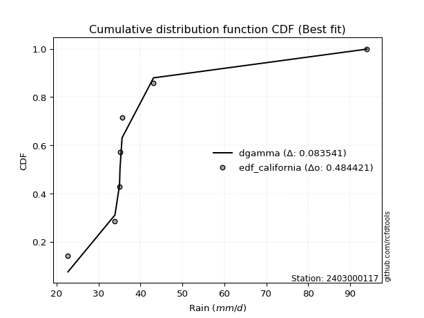</img>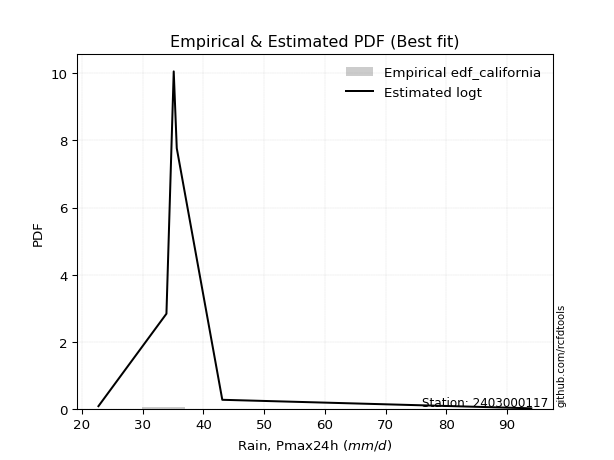</img>

</div>


### 2. EDF Hazen (1930)

Hazen method for plotting positions is a formula used to estimate the empirical cumulative probability distribution of flood events or other hydrological data. This formula often results in biased estimations, particularly when extrapolating to extreme events (high return periods).

<div align="center">


$P=(m-0.5)/n$


</div>


**2.1. Empirical values**

<div align="center">

|                | 0                   | 1                  | 2                  | 3                  | 4         | 5                  |
|:---------------|:--------------------|:-------------------|:-------------------|:-------------------|:----------|:-------------------|
| date           | 2019                | 2022               | 2021               | 2023               | 2020      | 2024               |
| x              | 22.7                | 33.9               | 35.1               | 35.6               | 43.1      | 94.0               |
| m              | 1                   | 2                  | 3                  | 4                  | 5         | 6                  |
| empirical_dist | edf_hazen           | edf_hazen          | edf_hazen          | edf_hazen          | edf_hazen | edf_hazen          |
| empirical      | 0.08333333333333333 | 0.25               | 0.4166666666666667 | 0.5833333333333334 | 0.75      | 0.9166666666666666 |
| empirical_tr   | 1.090909090909091   | 1.3333333333333333 | 1.7142857142857144 | 2.4000000000000004 | 4.0       | 11.999999999999995 |

</div>


**2.2. Kolmogorov-Smirnov fit test (sorted by Δ)**


<div align="center">

|                | 0                   | 1                   | 2                   | 3                   | 4                   | 5                   | 6                   | 7                   | 8                   | 9                   | 10                  | 11                 | 12                 | 13                 | 14                  | 15                 | 16                  | 17                 | 18                  | 19                  | 20                 | 21                  | 22                 | 23                  | 24                  | 25                  | 26                  | 27                  | 28                  | 29                  | 30                  | 31                  | 32                 | 33                 | 34                  | 35                | 36                    | 37                  | 38                  | 39                  | 40                  | 41                  | 42                 | 43                  | 44                  | 45                  | 46                  | 47                  | 48                 | 49                  | 50                  | 51                 | 52                  | 53                  | 54                | 55                  | 56                  | 57                  | 58                  | 59                 | 60                  | 61                  | 62                  | 63                 | 64                  | 65                  | 66                  | 67                  | 68                 | 69                  | 70                  | 71                 | 72                  | 73                  | 74                 | 75                 | 76                  | 77                 | 78                 | 79                  | 80                 | 81                  | 82                  | 83                 | 84                  | 85                 | 86                  | 87                 |
|:---------------|:--------------------|:--------------------|:--------------------|:--------------------|:--------------------|:--------------------|:--------------------|:--------------------|:--------------------|:--------------------|:--------------------|:-------------------|:-------------------|:-------------------|:--------------------|:-------------------|:--------------------|:-------------------|:--------------------|:--------------------|:-------------------|:--------------------|:-------------------|:--------------------|:--------------------|:--------------------|:--------------------|:--------------------|:--------------------|:--------------------|:--------------------|:--------------------|:-------------------|:-------------------|:--------------------|:------------------|:----------------------|:--------------------|:--------------------|:--------------------|:--------------------|:--------------------|:-------------------|:--------------------|:--------------------|:--------------------|:--------------------|:--------------------|:-------------------|:--------------------|:--------------------|:-------------------|:--------------------|:--------------------|:------------------|:--------------------|:--------------------|:--------------------|:--------------------|:-------------------|:--------------------|:--------------------|:--------------------|:-------------------|:--------------------|:--------------------|:--------------------|:--------------------|:-------------------|:--------------------|:--------------------|:-------------------|:--------------------|:--------------------|:-------------------|:-------------------|:--------------------|:-------------------|:-------------------|:--------------------|:-------------------|:--------------------|:--------------------|:-------------------|:--------------------|:-------------------|:--------------------|:-------------------|
| station        | 2403000117          | 2403000117          | 2403000117          | 2403000117          | 2403000117          | 2403000117          | 2403000117          | 2403000117          | 2403000117          | 2403000117          | 2403000117          | 2403000117         | 2403000117         | 2403000117         | 2403000117          | 2403000117         | 2403000117          | 2403000117         | 2403000117          | 2403000117          | 2403000117         | 2403000117          | 2403000117         | 2403000117          | 2403000117          | 2403000117          | 2403000117          | 2403000117          | 2403000117          | 2403000117          | 2403000117          | 2403000117          | 2403000117         | 2403000117         | 2403000117          | 2403000117        | 2403000117            | 2403000117          | 2403000117          | 2403000117          | 2403000117          | 2403000117          | 2403000117         | 2403000117          | 2403000117          | 2403000117          | 2403000117          | 2403000117          | 2403000117         | 2403000117          | 2403000117          | 2403000117         | 2403000117          | 2403000117          | 2403000117        | 2403000117          | 2403000117          | 2403000117          | 2403000117          | 2403000117         | 2403000117          | 2403000117          | 2403000117          | 2403000117         | 2403000117          | 2403000117          | 2403000117          | 2403000117          | 2403000117         | 2403000117          | 2403000117          | 2403000117         | 2403000117          | 2403000117          | 2403000117         | 2403000117         | 2403000117          | 2403000117         | 2403000117         | 2403000117          | 2403000117         | 2403000117          | 2403000117          | 2403000117         | 2403000117          | 2403000117         | 2403000117          | 2403000117         |
| empirical_dist | edf_hazen           | edf_hazen           | edf_hazen           | edf_hazen           | edf_hazen           | edf_hazen           | edf_hazen           | edf_hazen           | edf_hazen           | edf_hazen           | edf_hazen           | edf_hazen          | edf_hazen          | edf_hazen          | edf_hazen           | edf_hazen          | edf_hazen           | edf_hazen          | edf_hazen           | edf_hazen           | edf_hazen          | edf_hazen           | edf_hazen          | edf_hazen           | edf_hazen           | edf_hazen           | edf_hazen           | edf_hazen           | edf_hazen           | edf_hazen           | edf_hazen           | edf_hazen           | edf_hazen          | edf_hazen          | edf_hazen           | edf_hazen         | edf_hazen             | edf_hazen           | edf_hazen           | edf_hazen           | edf_hazen           | edf_hazen           | edf_hazen          | edf_hazen           | edf_hazen           | edf_hazen           | edf_hazen           | edf_hazen           | edf_hazen          | edf_hazen           | edf_hazen           | edf_hazen          | edf_hazen           | edf_hazen           | edf_hazen         | edf_hazen           | edf_hazen           | edf_hazen           | edf_hazen           | edf_hazen          | edf_hazen           | edf_hazen           | edf_hazen           | edf_hazen          | edf_hazen           | edf_hazen           | edf_hazen           | edf_hazen           | edf_hazen          | edf_hazen           | edf_hazen           | edf_hazen          | edf_hazen           | edf_hazen           | edf_hazen          | edf_hazen          | edf_hazen           | edf_hazen          | edf_hazen          | edf_hazen           | edf_hazen          | edf_hazen           | edf_hazen           | edf_hazen          | edf_hazen           | edf_hazen          | edf_hazen           | edf_hazen          |
| p_dist         | johnsonsu           | logjohnsonsu        | logt                | nct                 | gibrat              | logmaxwell          | loggompertz         | truncnorm           | lograyleigh         | logkstwobign        | lognct              | mielke             | logexponnorm       | expon              | genexpon            | loggumbel_r        | loggenlogistic      | logfisk            | logpearson3         | gompertz            | logrice            | betaprime           | logmielke          | pearson3            | wald                | halflogistic        | logalpha            | loginvweibull       | alpha               | loginvgamma         | logf                | fisk                | moyal              | invgamma           | f                   | exponnorm         | loglaplace_asymmetric | loginvgauss         | logfatiguelife      | logmoyal            | invgauss            | ncf                 | logloggamma        | lognorm             | lognorm             | logcrystalball      | logncf              | loghalfnorm         | fatiguelife        | halfnorm            | loggibrat           | genlogistic        | loggenexpon         | loglogistic         | loghalflogistic   | gumbel_r            | loghypsecant        | logchi2             | rayleigh            | logwald            | gamma               | laplace_asymmetric  | kstwobign           | loglaplace         | maxwell             | loggumbel_l         | nakagami            | weibull_min         | logexpon           | crystalball         | norm                | logistic           | hypsecant           | t                   | rice               | laplace            | gumbel_l            | loggamma           | loggamma           | logerlang           | logweibull_min     | erlang              | loglognorm          | logtruncnorm       | chi2                | invweibull         | lognakagami         | logbetaprime       |
| delta          | 0.07054621778181036 | 0.07990836024874315 | 0.11936669316860904 | 0.14453074765047247 | 0.14458161878306242 | 0.14840531046357303 | 0.15122944083590473 | 0.15139182541020685 | 0.15223799598402987 | 0.15258280836243993 | 0.15615202486306562 | 0.1561807041732282 | 0.1564303867672932 | 0.1579599339434533 | 0.15796454284249528 | 0.1581246431923905 | 0.15823290322179073 | 0.1603200275330846 | 0.16105582138431185 | 0.16115280225249096 | 0.1618487611634521 | 0.16260779319557295 | 0.1650311212831037 | 0.16546043838597058 | 0.16550984016854992 | 0.16588134408254462 | 0.16598097715125604 | 0.16624400944356987 | 0.16718329820118755 | 0.16876196907330288 | 0.16876256173070375 | 0.17049098505285193 | 0.1711253887912494 | 0.1720158535580123 | 0.17215489327486183 | 0.172453761722135 | 0.17254028470277893   | 0.17292489169408193 | 0.17371953688055625 | 0.17698838578417442 | 0.18114171056678308 | 0.18133744734313728 | 0.1819158073616493 | 0.18244198944402445 | 0.18244198944402445 | 0.18244199217461188 | 0.18655760622302442 | 0.18680748509829903 | 0.1876967522015019 | 0.18971367427085395 | 0.19038893628809578 | 0.1917796962879218 | 0.19221627595243707 | 0.19524081948445932 | 0.196172503339771 | 0.19699822612899054 | 0.20572162074754147 | 0.21186465580296499 | 0.22168787511422883 | 0.2222053076848332 | 0.22411449015787366 | 0.23161430607702693 | 0.23165891011159606 | 0.2327554042387126 | 0.23304009755700428 | 0.24904408403513345 | 0.25240760970469456 | 0.26187974676667547 | 0.2625281908691982 | 0.26667771817666547 | 0.26667773079239576 | 0.2689528520109645 | 0.27089350851872385 | 0.27331103973878296 | 0.2736280670145892 | 0.2854688521720332 | 0.33734653191562725 | 0.3460230655497769 | 0.3460230655497769 | 0.35124593065879695 | 0.3646101850048711 | 0.40246863587125237 | 0.41173648651849826 | 0.4266969165404003 | 0.43744179092310975 | 0.4693375132513963 | 0.48051316533321664 | 0.4889249336297329 |
| deltao         | 0.530385761606      | 0.530385761606      | 0.530385761606      | 0.530385761606      | 0.530385761606      | 0.530385761606      | 0.530385761606      | 0.530385761606      | 0.530385761606      | 0.530385761606      | 0.530385761606      | 0.530385761606     | 0.530385761606     | 0.530385761606     | 0.530385761606      | 0.530385761606     | 0.530385761606      | 0.530385761606     | 0.530385761606      | 0.530385761606      | 0.530385761606     | 0.530385761606      | 0.530385761606     | 0.530385761606      | 0.530385761606      | 0.530385761606      | 0.530385761606      | 0.530385761606      | 0.530385761606      | 0.530385761606      | 0.530385761606      | 0.530385761606      | 0.530385761606     | 0.530385761606     | 0.530385761606      | 0.530385761606    | 0.530385761606        | 0.530385761606      | 0.530385761606      | 0.530385761606      | 0.530385761606      | 0.530385761606      | 0.530385761606     | 0.530385761606      | 0.530385761606      | 0.530385761606      | 0.530385761606      | 0.530385761606      | 0.530385761606     | 0.530385761606      | 0.530385761606      | 0.530385761606     | 0.530385761606      | 0.530385761606      | 0.530385761606    | 0.530385761606      | 0.530385761606      | 0.530385761606      | 0.530385761606      | 0.530385761606     | 0.530385761606      | 0.530385761606      | 0.530385761606      | 0.530385761606     | 0.530385761606      | 0.530385761606      | 0.530385761606      | 0.530385761606      | 0.530385761606     | 0.530385761606      | 0.530385761606      | 0.530385761606     | 0.530385761606      | 0.530385761606      | 0.530385761606     | 0.530385761606     | 0.530385761606      | 0.530385761606     | 0.530385761606     | 0.530385761606      | 0.530385761606     | 0.530385761606      | 0.530385761606      | 0.530385761606     | 0.530385761606      | 0.530385761606     | 0.530385761606      | 0.530385761606     |
| eval           | Δo > Δ              | Δo > Δ              | Δo > Δ              | Δo > Δ              | Δo > Δ              | Δo > Δ              | Δo > Δ              | Δo > Δ              | Δo > Δ              | Δo > Δ              | Δo > Δ              | Δo > Δ             | Δo > Δ             | Δo > Δ             | Δo > Δ              | Δo > Δ             | Δo > Δ              | Δo > Δ             | Δo > Δ              | Δo > Δ              | Δo > Δ             | Δo > Δ              | Δo > Δ             | Δo > Δ              | Δo > Δ              | Δo > Δ              | Δo > Δ              | Δo > Δ              | Δo > Δ              | Δo > Δ              | Δo > Δ              | Δo > Δ              | Δo > Δ             | Δo > Δ             | Δo > Δ              | Δo > Δ            | Δo > Δ                | Δo > Δ              | Δo > Δ              | Δo > Δ              | Δo > Δ              | Δo > Δ              | Δo > Δ             | Δo > Δ              | Δo > Δ              | Δo > Δ              | Δo > Δ              | Δo > Δ              | Δo > Δ             | Δo > Δ              | Δo > Δ              | Δo > Δ             | Δo > Δ              | Δo > Δ              | Δo > Δ            | Δo > Δ              | Δo > Δ              | Δo > Δ              | Δo > Δ              | Δo > Δ             | Δo > Δ              | Δo > Δ              | Δo > Δ              | Δo > Δ             | Δo > Δ              | Δo > Δ              | Δo > Δ              | Δo > Δ              | Δo > Δ             | Δo > Δ              | Δo > Δ              | Δo > Δ             | Δo > Δ              | Δo > Δ              | Δo > Δ             | Δo > Δ             | Δo > Δ              | Δo > Δ             | Δo > Δ             | Δo > Δ              | Δo > Δ             | Δo > Δ              | Δo > Δ              | Δo > Δ             | Δo > Δ              | Δo > Δ             | Δo > Δ              | Δo > Δ             |
| fit            | 1                   | 1                   | 1                   | 1                   | 1                   | 1                   | 1                   | 1                   | 1                   | 1                   | 1                   | 1                  | 1                  | 1                  | 1                   | 1                  | 1                   | 1                  | 1                   | 1                   | 1                  | 1                   | 1                  | 1                   | 1                   | 1                   | 1                   | 1                   | 1                   | 1                   | 1                   | 1                   | 1                  | 1                  | 1                   | 1                 | 1                     | 1                   | 1                   | 1                   | 1                   | 1                   | 1                  | 1                   | 1                   | 1                   | 1                   | 1                   | 1                  | 1                   | 1                   | 1                  | 1                   | 1                   | 1                 | 1                   | 1                   | 1                   | 1                   | 1                  | 1                   | 1                   | 1                   | 1                  | 1                   | 1                   | 1                   | 1                   | 1                  | 1                   | 1                   | 1                  | 1                   | 1                   | 1                  | 1                  | 1                   | 1                  | 1                  | 1                   | 1                  | 1                   | 1                   | 1                  | 1                   | 1                  | 1                   | 1                  |
| n              | 6                   | 6                   | 6                   | 6                   | 6                   | 6                   | 6                   | 6                   | 6                   | 6                   | 6                   | 6                  | 6                  | 6                  | 6                   | 6                  | 6                   | 6                  | 6                   | 6                   | 6                  | 6                   | 6                  | 6                   | 6                   | 6                   | 6                   | 6                   | 6                   | 6                   | 6                   | 6                   | 6                  | 6                  | 6                   | 6                 | 6                     | 6                   | 6                   | 6                   | 6                   | 6                   | 6                  | 6                   | 6                   | 6                   | 6                   | 6                   | 6                  | 6                   | 6                   | 6                  | 6                   | 6                   | 6                 | 6                   | 6                   | 6                   | 6                   | 6                  | 6                   | 6                   | 6                   | 6                  | 6                   | 6                   | 6                   | 6                   | 6                  | 6                   | 6                   | 6                  | 6                   | 6                   | 6                  | 6                  | 6                   | 6                  | 6                  | 6                   | 6                  | 6                   | 6                   | 6                  | 6                   | 6                  | 6                   | 6                  |
| best_fit       | 1                   | 0                   | 0                   | 0                   | 0                   | 0                   | 0                   | 0                   | 0                   | 0                   | 0                   | 0                  | 0                  | 0                  | 0                   | 0                  | 0                   | 0                  | 0                   | 0                   | 0                  | 0                   | 0                  | 0                   | 0                   | 0                   | 0                   | 0                   | 0                   | 0                   | 0                   | 0                   | 0                  | 0                  | 0                   | 0                 | 0                     | 0                   | 0                   | 0                   | 0                   | 0                   | 0                  | 0                   | 0                   | 0                   | 0                   | 0                   | 0                  | 0                   | 0                   | 0                  | 0                   | 0                   | 0                 | 0                   | 0                   | 0                   | 0                   | 0                  | 0                   | 0                   | 0                   | 0                  | 0                   | 0                   | 0                   | 0                   | 0                  | 0                   | 0                   | 0                  | 0                   | 0                   | 0                  | 0                  | 0                   | 0                  | 0                  | 0                   | 0                  | 0                   | 0                   | 0                  | 0                   | 0                  | 0                   | 0                  |
| best_fit_sort  | 1                   | 2                   | 3                   | 4                   | 5                   | 6                   | 7                   | 8                   | 9                   | 10                  | 11                  | 12                 | 13                 | 14                 | 15                  | 16                 | 17                  | 18                 | 19                  | 20                  | 21                 | 22                  | 23                 | 24                  | 25                  | 26                  | 27                  | 28                  | 29                  | 30                  | 31                  | 32                  | 33                 | 34                 | 35                  | 36                | 37                    | 38                  | 39                  | 40                  | 41                  | 42                  | 43                 | 44                  | 45                  | 46                  | 47                  | 48                  | 49                 | 50                  | 51                  | 52                 | 53                  | 54                  | 55                | 56                  | 57                  | 58                  | 59                  | 60                 | 61                  | 62                  | 63                  | 64                 | 65                  | 66                  | 67                  | 68                  | 69                 | 70                  | 71                  | 72                 | 73                  | 74                  | 75                 | 76                 | 77                  | 78                 | 79                 | 80                  | 81                 | 82                  | 83                  | 84                 | 85                  | 86                 | 87                  | 88                 |

</div>


**2.3. Best fit**

<div align="center">

|   id |    station | empirical_dist   | p_dist    |     delta |   deltao | eval   |   fit |   n |   best_fit |   best_fit_sort |
|-----:|-----------:|:-----------------|:----------|----------:|---------:|:-------|------:|----:|-----------:|----------------:|
|    0 | 2403000117 | edf_hazen        | johnsonsu | 0.0705462 | 0.530386 | Δo > Δ |     1 |   6 |          1 |               1 |

</div>


<div align="center">

</img></img>

</div>


### 3. EDF Weibull (1939)

Weibull plotting position formula is an empirical method used to estimate the non-exceedance probability or plotting position for a set of observed data, is often recommended or widely used in practice, particularly in flood frequency analysis.

<div align="center">


$P=m/(n+1)$


</div>


**3.1. Empirical values**

<div align="center">

|                | 0                   | 1                  | 2                   | 3                  | 4                  | 5                  |
|:---------------|:--------------------|:-------------------|:--------------------|:-------------------|:-------------------|:-------------------|
| date           | 2019                | 2022               | 2021                | 2023               | 2020               | 2024               |
| x              | 22.7                | 33.9               | 35.1                | 35.6               | 43.1               | 94.0               |
| m              | 1                   | 2                  | 3                   | 4                  | 5                  | 6                  |
| empirical_dist | edf_weibull         | edf_weibull        | edf_weibull         | edf_weibull        | edf_weibull        | edf_weibull        |
| empirical      | 0.14285714285714285 | 0.2857142857142857 | 0.42857142857142855 | 0.5714285714285714 | 0.7142857142857143 | 0.8571428571428571 |
| empirical_tr   | 1.1666666666666665  | 1.4                | 1.75                | 2.333333333333333  | 3.5                | 6.999999999999997  |

</div>


**3.2. Kolmogorov-Smirnov fit test (sorted by Δ)**


<div align="center">

|                | 0                   | 1                   | 2                   | 3                   | 4                   | 5                  | 6                   | 7                   | 8                   | 9                   | 10                | 11                  | 12                  | 13                  | 14                  | 15                  | 16                 | 17                  | 18                  | 19                  | 20                 | 21                  | 22                  | 23                  | 24                  | 25                  | 26                  | 27                  | 28                 | 29                  | 30                  | 31                  | 32                  | 33                  | 34                  | 35                  | 36                  | 37                  | 38                  | 39                  | 40                 | 41                  | 42                  | 43                  | 44                  | 45                 | 46                  | 47                    | 48                  | 49                 | 50                  | 51                  | 52                  | 53                 | 54                 | 55                  | 56                  | 57                  | 58                 | 59                  | 60                 | 61                  | 62                  | 63                  | 64                 | 65                  | 66                  | 67                 | 68                  | 69                  | 70                  | 71                  | 72                  | 73                  | 74                 | 75                  | 76                  | 77                 | 78                 | 79                  | 80                 | 81                  | 82                  | 83                  | 84                  | 85                  | 86                  | 87                 |
|:---------------|:--------------------|:--------------------|:--------------------|:--------------------|:--------------------|:-------------------|:--------------------|:--------------------|:--------------------|:--------------------|:------------------|:--------------------|:--------------------|:--------------------|:--------------------|:--------------------|:-------------------|:--------------------|:--------------------|:--------------------|:-------------------|:--------------------|:--------------------|:--------------------|:--------------------|:--------------------|:--------------------|:--------------------|:-------------------|:--------------------|:--------------------|:--------------------|:--------------------|:--------------------|:--------------------|:--------------------|:--------------------|:--------------------|:--------------------|:--------------------|:-------------------|:--------------------|:--------------------|:--------------------|:--------------------|:-------------------|:--------------------|:----------------------|:--------------------|:-------------------|:--------------------|:--------------------|:--------------------|:-------------------|:-------------------|:--------------------|:--------------------|:--------------------|:-------------------|:--------------------|:-------------------|:--------------------|:--------------------|:--------------------|:-------------------|:--------------------|:--------------------|:-------------------|:--------------------|:--------------------|:--------------------|:--------------------|:--------------------|:--------------------|:-------------------|:--------------------|:--------------------|:-------------------|:-------------------|:--------------------|:-------------------|:--------------------|:--------------------|:--------------------|:--------------------|:--------------------|:--------------------|:-------------------|
| station        | 2403000117          | 2403000117          | 2403000117          | 2403000117          | 2403000117          | 2403000117         | 2403000117          | 2403000117          | 2403000117          | 2403000117          | 2403000117        | 2403000117          | 2403000117          | 2403000117          | 2403000117          | 2403000117          | 2403000117         | 2403000117          | 2403000117          | 2403000117          | 2403000117         | 2403000117          | 2403000117          | 2403000117          | 2403000117          | 2403000117          | 2403000117          | 2403000117          | 2403000117         | 2403000117          | 2403000117          | 2403000117          | 2403000117          | 2403000117          | 2403000117          | 2403000117          | 2403000117          | 2403000117          | 2403000117          | 2403000117          | 2403000117         | 2403000117          | 2403000117          | 2403000117          | 2403000117          | 2403000117         | 2403000117          | 2403000117            | 2403000117          | 2403000117         | 2403000117          | 2403000117          | 2403000117          | 2403000117         | 2403000117         | 2403000117          | 2403000117          | 2403000117          | 2403000117         | 2403000117          | 2403000117         | 2403000117          | 2403000117          | 2403000117          | 2403000117         | 2403000117          | 2403000117          | 2403000117         | 2403000117          | 2403000117          | 2403000117          | 2403000117          | 2403000117          | 2403000117          | 2403000117         | 2403000117          | 2403000117          | 2403000117         | 2403000117         | 2403000117          | 2403000117         | 2403000117          | 2403000117          | 2403000117          | 2403000117          | 2403000117          | 2403000117          | 2403000117         |
| empirical_dist | edf_weibull         | edf_weibull         | edf_weibull         | edf_weibull         | edf_weibull         | edf_weibull        | edf_weibull         | edf_weibull         | edf_weibull         | edf_weibull         | edf_weibull       | edf_weibull         | edf_weibull         | edf_weibull         | edf_weibull         | edf_weibull         | edf_weibull        | edf_weibull         | edf_weibull         | edf_weibull         | edf_weibull        | edf_weibull         | edf_weibull         | edf_weibull         | edf_weibull         | edf_weibull         | edf_weibull         | edf_weibull         | edf_weibull        | edf_weibull         | edf_weibull         | edf_weibull         | edf_weibull         | edf_weibull         | edf_weibull         | edf_weibull         | edf_weibull         | edf_weibull         | edf_weibull         | edf_weibull         | edf_weibull        | edf_weibull         | edf_weibull         | edf_weibull         | edf_weibull         | edf_weibull        | edf_weibull         | edf_weibull           | edf_weibull         | edf_weibull        | edf_weibull         | edf_weibull         | edf_weibull         | edf_weibull        | edf_weibull        | edf_weibull         | edf_weibull         | edf_weibull         | edf_weibull        | edf_weibull         | edf_weibull        | edf_weibull         | edf_weibull         | edf_weibull         | edf_weibull        | edf_weibull         | edf_weibull         | edf_weibull        | edf_weibull         | edf_weibull         | edf_weibull         | edf_weibull         | edf_weibull         | edf_weibull         | edf_weibull        | edf_weibull         | edf_weibull         | edf_weibull        | edf_weibull        | edf_weibull         | edf_weibull        | edf_weibull         | edf_weibull         | edf_weibull         | edf_weibull         | edf_weibull         | edf_weibull         | edf_weibull        |
| p_dist         | johnsonsu           | logjohnsonsu        | logkstwobign        | mielke              | logexponnorm        | loggumbel_r        | loggenlogistic      | lograyleigh         | logfisk             | logpearson3         | logmielke         | pearson3            | halflogistic        | logalpha            | loginvweibull       | alpha               | nct                | loginvgamma         | logf                | fisk                | invgamma           | f                   | logmaxwell          | loginvgauss         | logfatiguelife      | logmoyal            | wald                | truncnorm           | loggompertz        | genexpon            | gompertz            | gibrat              | expon               | lognct              | moyal               | invgauss            | logrice             | betaprime           | logncf              | loghalfnorm         | fatiguelife        | halfnorm            | loggibrat           | logt                | loggenexpon         | loghalflogistic    | exponnorm           | loglaplace_asymmetric | gumbel_r            | ncf                | logloggamma         | lognorm             | lognorm             | logcrystalball     | logchi2            | genlogistic         | loglogistic         | rayleigh            | logwald            | gamma               | loghypsecant       | maxwell             | nakagami            | laplace_asymmetric  | kstwobign          | loglaplace          | weibull_min         | logexpon           | crystalball         | norm                | logistic            | loggumbel_l         | t                   | hypsecant           | rice               | laplace             | gumbel_l            | loggamma           | loggamma           | logerlang           | logweibull_min     | erlang              | loglognorm          | chi2                | invweibull          | logtruncnorm        | lognakagami         | logbetaprime       |
| delta          | 0.10626050349609606 | 0.11562264596302885 | 0.11810516854728398 | 0.12046641845894251 | 0.12071610105300751 | 0.1224103574781048 | 0.12251861750750503 | 0.12420851461047122 | 0.12460574181879891 | 0.12534153567002615 | 0.129316835568818 | 0.12974615267168488 | 0.13016705836825893 | 0.13026669143697034 | 0.13052972372928417 | 0.13146901248690185 | 0.1326259857457105 | 0.13304768335901718 | 0.13304827601641805 | 0.13477669933856623 | 0.1363015678437266 | 0.13644060756057613 | 0.13650054855881105 | 0.13721060597979623 | 0.13800525116627055 | 0.14127410006988872 | 0.14212527887565246 | 0.14285704760990262 | 0.1428571399080823 | 0.14285714203796343 | 0.14285714285676906 | 0.14285714285714285 | 0.14285714285714285 | 0.14424726295830365 | 0.14529796757559954 | 0.14542742485249738 | 0.14994399925869012 | 0.15070303129081097 | 0.15084332050873872 | 0.15109319938401333 | 0.1519824664872162 | 0.15399938855656825 | 0.15467465057381008 | 0.15508097888289474 | 0.15650199023815137 | 0.1604582176254853 | 0.16054899981737303 | 0.16063552279801696   | 0.16408735847577638 | 0.1694326854383753 | 0.17001104545688733 | 0.17053722753926248 | 0.17053722753926248 | 0.1705372302698499 | 0.1761503700886793 | 0.17987493438315982 | 0.18333605757969734 | 0.18597358939994313 | 0.1864910219705475 | 0.18840020444358796 | 0.1938168588427795 | 0.19732581184271858 | 0.21669332399040886 | 0.21970954417226496 | 0.2197541482068341 | 0.22085064233395063 | 0.22616546105238977 | 0.2268139051549125 | 0.23096343246237977 | 0.23096344507811006 | 0.23323856629667883 | 0.23713932213037148 | 0.23759675402449726 | 0.24521914805187978 | 0.2503195725434738 | 0.27356409026727124 | 0.30163224620134155 | 0.3103087798354912 | 0.3103087798354912 | 0.31553164494451125 | 0.3288958992905854 | 0.36675435015696667 | 0.37602220080421256 | 0.40172750520882405 | 0.40981370372758674 | 0.41479215463563834 | 0.44479887961893094 | 0.4532106479154472 |
| deltao         | 0.530385761606      | 0.530385761606      | 0.530385761606      | 0.530385761606      | 0.530385761606      | 0.530385761606     | 0.530385761606      | 0.530385761606      | 0.530385761606      | 0.530385761606      | 0.530385761606    | 0.530385761606      | 0.530385761606      | 0.530385761606      | 0.530385761606      | 0.530385761606      | 0.530385761606     | 0.530385761606      | 0.530385761606      | 0.530385761606      | 0.530385761606     | 0.530385761606      | 0.530385761606      | 0.530385761606      | 0.530385761606      | 0.530385761606      | 0.530385761606      | 0.530385761606      | 0.530385761606     | 0.530385761606      | 0.530385761606      | 0.530385761606      | 0.530385761606      | 0.530385761606      | 0.530385761606      | 0.530385761606      | 0.530385761606      | 0.530385761606      | 0.530385761606      | 0.530385761606      | 0.530385761606     | 0.530385761606      | 0.530385761606      | 0.530385761606      | 0.530385761606      | 0.530385761606     | 0.530385761606      | 0.530385761606        | 0.530385761606      | 0.530385761606     | 0.530385761606      | 0.530385761606      | 0.530385761606      | 0.530385761606     | 0.530385761606     | 0.530385761606      | 0.530385761606      | 0.530385761606      | 0.530385761606     | 0.530385761606      | 0.530385761606     | 0.530385761606      | 0.530385761606      | 0.530385761606      | 0.530385761606     | 0.530385761606      | 0.530385761606      | 0.530385761606     | 0.530385761606      | 0.530385761606      | 0.530385761606      | 0.530385761606      | 0.530385761606      | 0.530385761606      | 0.530385761606     | 0.530385761606      | 0.530385761606      | 0.530385761606     | 0.530385761606     | 0.530385761606      | 0.530385761606     | 0.530385761606      | 0.530385761606      | 0.530385761606      | 0.530385761606      | 0.530385761606      | 0.530385761606      | 0.530385761606     |
| eval           | Δo > Δ              | Δo > Δ              | Δo > Δ              | Δo > Δ              | Δo > Δ              | Δo > Δ             | Δo > Δ              | Δo > Δ              | Δo > Δ              | Δo > Δ              | Δo > Δ            | Δo > Δ              | Δo > Δ              | Δo > Δ              | Δo > Δ              | Δo > Δ              | Δo > Δ             | Δo > Δ              | Δo > Δ              | Δo > Δ              | Δo > Δ             | Δo > Δ              | Δo > Δ              | Δo > Δ              | Δo > Δ              | Δo > Δ              | Δo > Δ              | Δo > Δ              | Δo > Δ             | Δo > Δ              | Δo > Δ              | Δo > Δ              | Δo > Δ              | Δo > Δ              | Δo > Δ              | Δo > Δ              | Δo > Δ              | Δo > Δ              | Δo > Δ              | Δo > Δ              | Δo > Δ             | Δo > Δ              | Δo > Δ              | Δo > Δ              | Δo > Δ              | Δo > Δ             | Δo > Δ              | Δo > Δ                | Δo > Δ              | Δo > Δ             | Δo > Δ              | Δo > Δ              | Δo > Δ              | Δo > Δ             | Δo > Δ             | Δo > Δ              | Δo > Δ              | Δo > Δ              | Δo > Δ             | Δo > Δ              | Δo > Δ             | Δo > Δ              | Δo > Δ              | Δo > Δ              | Δo > Δ             | Δo > Δ              | Δo > Δ              | Δo > Δ             | Δo > Δ              | Δo > Δ              | Δo > Δ              | Δo > Δ              | Δo > Δ              | Δo > Δ              | Δo > Δ             | Δo > Δ              | Δo > Δ              | Δo > Δ             | Δo > Δ             | Δo > Δ              | Δo > Δ             | Δo > Δ              | Δo > Δ              | Δo > Δ              | Δo > Δ              | Δo > Δ              | Δo > Δ              | Δo > Δ             |
| fit            | 1                   | 1                   | 1                   | 1                   | 1                   | 1                  | 1                   | 1                   | 1                   | 1                   | 1                 | 1                   | 1                   | 1                   | 1                   | 1                   | 1                  | 1                   | 1                   | 1                   | 1                  | 1                   | 1                   | 1                   | 1                   | 1                   | 1                   | 1                   | 1                  | 1                   | 1                   | 1                   | 1                   | 1                   | 1                   | 1                   | 1                   | 1                   | 1                   | 1                   | 1                  | 1                   | 1                   | 1                   | 1                   | 1                  | 1                   | 1                     | 1                   | 1                  | 1                   | 1                   | 1                   | 1                  | 1                  | 1                   | 1                   | 1                   | 1                  | 1                   | 1                  | 1                   | 1                   | 1                   | 1                  | 1                   | 1                   | 1                  | 1                   | 1                   | 1                   | 1                   | 1                   | 1                   | 1                  | 1                   | 1                   | 1                  | 1                  | 1                   | 1                  | 1                   | 1                   | 1                   | 1                   | 1                   | 1                   | 1                  |
| n              | 6                   | 6                   | 6                   | 6                   | 6                   | 6                  | 6                   | 6                   | 6                   | 6                   | 6                 | 6                   | 6                   | 6                   | 6                   | 6                   | 6                  | 6                   | 6                   | 6                   | 6                  | 6                   | 6                   | 6                   | 6                   | 6                   | 6                   | 6                   | 6                  | 6                   | 6                   | 6                   | 6                   | 6                   | 6                   | 6                   | 6                   | 6                   | 6                   | 6                   | 6                  | 6                   | 6                   | 6                   | 6                   | 6                  | 6                   | 6                     | 6                   | 6                  | 6                   | 6                   | 6                   | 6                  | 6                  | 6                   | 6                   | 6                   | 6                  | 6                   | 6                  | 6                   | 6                   | 6                   | 6                  | 6                   | 6                   | 6                  | 6                   | 6                   | 6                   | 6                   | 6                   | 6                   | 6                  | 6                   | 6                   | 6                  | 6                  | 6                   | 6                  | 6                   | 6                   | 6                   | 6                   | 6                   | 6                   | 6                  |
| best_fit       | 1                   | 0                   | 0                   | 0                   | 0                   | 0                  | 0                   | 0                   | 0                   | 0                   | 0                 | 0                   | 0                   | 0                   | 0                   | 0                   | 0                  | 0                   | 0                   | 0                   | 0                  | 0                   | 0                   | 0                   | 0                   | 0                   | 0                   | 0                   | 0                  | 0                   | 0                   | 0                   | 0                   | 0                   | 0                   | 0                   | 0                   | 0                   | 0                   | 0                   | 0                  | 0                   | 0                   | 0                   | 0                   | 0                  | 0                   | 0                     | 0                   | 0                  | 0                   | 0                   | 0                   | 0                  | 0                  | 0                   | 0                   | 0                   | 0                  | 0                   | 0                  | 0                   | 0                   | 0                   | 0                  | 0                   | 0                   | 0                  | 0                   | 0                   | 0                   | 0                   | 0                   | 0                   | 0                  | 0                   | 0                   | 0                  | 0                  | 0                   | 0                  | 0                   | 0                   | 0                   | 0                   | 0                   | 0                   | 0                  |
| best_fit_sort  | 1                   | 2                   | 3                   | 4                   | 5                   | 6                  | 7                   | 8                   | 9                   | 10                  | 11                | 12                  | 13                  | 14                  | 15                  | 16                  | 17                 | 18                  | 19                  | 20                  | 21                 | 22                  | 23                  | 24                  | 25                  | 26                  | 27                  | 28                  | 29                 | 30                  | 31                  | 32                  | 33                  | 34                  | 35                  | 36                  | 37                  | 38                  | 39                  | 40                  | 41                 | 42                  | 43                  | 44                  | 45                  | 46                 | 47                  | 48                    | 49                  | 50                 | 51                  | 52                  | 53                  | 54                 | 55                 | 56                  | 57                  | 58                  | 59                 | 60                  | 61                 | 62                  | 63                  | 64                  | 65                 | 66                  | 67                  | 68                 | 69                  | 70                  | 71                  | 72                  | 73                  | 74                  | 75                 | 76                  | 77                  | 78                 | 79                 | 80                  | 81                 | 82                  | 83                  | 84                  | 85                  | 86                  | 87                  | 88                 |

</div>


**3.3. Best fit**

<div align="center">

|   id |    station | empirical_dist   | p_dist    |    delta |   deltao | eval   |   fit |   n |   best_fit |   best_fit_sort |
|-----:|-----------:|:-----------------|:----------|---------:|---------:|:-------|------:|----:|-----------:|----------------:|
|    0 | 2403000117 | edf_weibull      | johnsonsu | 0.106261 | 0.530386 | Δo > Δ |     1 |   6 |          1 |               1 |

</div>


<div align="center">

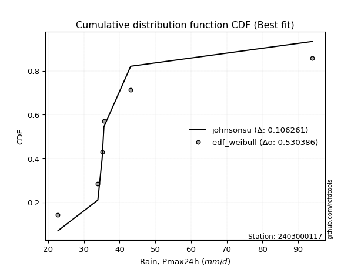</img></img>

</div>


### 4. EDF Beard (1943)

The Beard formula (or Beard´s plotting position formula) in hydrology is used to estimate the empirical non-exceedance probability _(P)_ of a flood event (or other extreme hydrological data point) within a given dataset.

<div align="center">


$P=(m-0.31)/(n+0.38)$


</div>


**4.1. Empirical values**

<div align="center">

|                | 0                   | 1                   | 2                  | 3                  | 4                  | 5                  |
|:---------------|:--------------------|:--------------------|:-------------------|:-------------------|:-------------------|:-------------------|
| date           | 2019                | 2022                | 2021               | 2023               | 2020               | 2024               |
| x              | 22.7                | 33.9                | 35.1               | 35.6               | 43.1               | 94.0               |
| m              | 1                   | 2                   | 3                  | 4                  | 5                  | 6                  |
| empirical_dist | edf_beard           | edf_beard           | edf_beard          | edf_beard          | edf_beard          | edf_beard          |
| empirical      | 0.10815047021943573 | 0.26489028213166144 | 0.4216300940438871 | 0.5783699059561128 | 0.7351097178683387 | 0.8918495297805643 |
| empirical_tr   | 1.1212653778558874  | 1.3603411513859276  | 1.7289972899728996 | 2.3717472118959106 | 3.7751479289940844 | 9.246376811594207  |

</div>


**4.2. Kolmogorov-Smirnov fit test (sorted by Δ)**


<div align="center">

|                | 0                   | 1                   | 2                   | 3                  | 4                   | 5                  | 6                   | 7                   | 8                   | 9                   | 10                  | 11                  | 12                  | 13                  | 14                 | 15                  | 16                  | 17                 | 18                  | 19                  | 20                  | 21                  | 22                 | 23                 | 24                  | 25                  | 26                 | 27                  | 28                  | 29                 | 30                  | 31                  | 32                  | 33                 | 34                 | 35                 | 36                 | 37                  | 38                  | 39                  | 40                    | 41                 | 42                 | 43                  | 44                  | 45                  | 46                  | 47                  | 48                  | 49                 | 50                 | 51                  | 52                  | 53                 | 54                  | 55                  | 56                  | 57                  | 58                 | 59                  | 60                  | 61                  | 62                  | 63                 | 64                  | 65                  | 66                 | 67                  | 68                  | 69                  | 70                  | 71                 | 72                 | 73                  | 74                  | 75                  | 76                 | 77                 | 78                 | 79                 | 80                  | 81                  | 82                 | 83                  | 84                 | 85                  | 86                 | 87                  |
|:---------------|:--------------------|:--------------------|:--------------------|:-------------------|:--------------------|:-------------------|:--------------------|:--------------------|:--------------------|:--------------------|:--------------------|:--------------------|:--------------------|:--------------------|:-------------------|:--------------------|:--------------------|:-------------------|:--------------------|:--------------------|:--------------------|:--------------------|:-------------------|:-------------------|:--------------------|:--------------------|:-------------------|:--------------------|:--------------------|:-------------------|:--------------------|:--------------------|:--------------------|:-------------------|:-------------------|:-------------------|:-------------------|:--------------------|:--------------------|:--------------------|:----------------------|:-------------------|:-------------------|:--------------------|:--------------------|:--------------------|:--------------------|:--------------------|:--------------------|:-------------------|:-------------------|:--------------------|:--------------------|:-------------------|:--------------------|:--------------------|:--------------------|:--------------------|:-------------------|:--------------------|:--------------------|:--------------------|:--------------------|:-------------------|:--------------------|:--------------------|:-------------------|:--------------------|:--------------------|:--------------------|:--------------------|:-------------------|:-------------------|:--------------------|:--------------------|:--------------------|:-------------------|:-------------------|:-------------------|:-------------------|:--------------------|:--------------------|:-------------------|:--------------------|:-------------------|:--------------------|:-------------------|:--------------------|
| station        | 2403000117          | 2403000117          | 2403000117          | 2403000117         | 2403000117          | 2403000117         | 2403000117          | 2403000117          | 2403000117          | 2403000117          | 2403000117          | 2403000117          | 2403000117          | 2403000117          | 2403000117         | 2403000117          | 2403000117          | 2403000117         | 2403000117          | 2403000117          | 2403000117          | 2403000117          | 2403000117         | 2403000117         | 2403000117          | 2403000117          | 2403000117         | 2403000117          | 2403000117          | 2403000117         | 2403000117          | 2403000117          | 2403000117          | 2403000117         | 2403000117         | 2403000117         | 2403000117         | 2403000117          | 2403000117          | 2403000117          | 2403000117            | 2403000117         | 2403000117         | 2403000117          | 2403000117          | 2403000117          | 2403000117          | 2403000117          | 2403000117          | 2403000117         | 2403000117         | 2403000117          | 2403000117          | 2403000117         | 2403000117          | 2403000117          | 2403000117          | 2403000117          | 2403000117         | 2403000117          | 2403000117          | 2403000117          | 2403000117          | 2403000117         | 2403000117          | 2403000117          | 2403000117         | 2403000117          | 2403000117          | 2403000117          | 2403000117          | 2403000117         | 2403000117         | 2403000117          | 2403000117          | 2403000117          | 2403000117         | 2403000117         | 2403000117         | 2403000117         | 2403000117          | 2403000117          | 2403000117         | 2403000117          | 2403000117         | 2403000117          | 2403000117         | 2403000117          |
| empirical_dist | edf_beard           | edf_beard           | edf_beard           | edf_beard          | edf_beard           | edf_beard          | edf_beard           | edf_beard           | edf_beard           | edf_beard           | edf_beard           | edf_beard           | edf_beard           | edf_beard           | edf_beard          | edf_beard           | edf_beard           | edf_beard          | edf_beard           | edf_beard           | edf_beard           | edf_beard           | edf_beard          | edf_beard          | edf_beard           | edf_beard           | edf_beard          | edf_beard           | edf_beard           | edf_beard          | edf_beard           | edf_beard           | edf_beard           | edf_beard          | edf_beard          | edf_beard          | edf_beard          | edf_beard           | edf_beard           | edf_beard           | edf_beard             | edf_beard          | edf_beard          | edf_beard           | edf_beard           | edf_beard           | edf_beard           | edf_beard           | edf_beard           | edf_beard          | edf_beard          | edf_beard           | edf_beard           | edf_beard          | edf_beard           | edf_beard           | edf_beard           | edf_beard           | edf_beard          | edf_beard           | edf_beard           | edf_beard           | edf_beard           | edf_beard          | edf_beard           | edf_beard           | edf_beard          | edf_beard           | edf_beard           | edf_beard           | edf_beard           | edf_beard          | edf_beard          | edf_beard           | edf_beard           | edf_beard           | edf_beard          | edf_beard          | edf_beard          | edf_beard          | edf_beard           | edf_beard           | edf_beard          | edf_beard           | edf_beard          | edf_beard           | edf_beard          | edf_beard           |
| p_dist         | johnsonsu           | logjohnsonsu        | logt                | truncnorm          | lograyleigh         | logkstwobign       | loggompertz         | nct                 | gibrat              | mielke              | logexponnorm        | expon               | genexpon            | loggumbel_r         | loggenlogistic     | logmaxwell          | logfisk             | logpearson3        | gompertz            | logmielke           | pearson3            | wald                | halflogistic       | logalpha           | lognct              | loginvweibull       | alpha              | loginvgamma         | logf                | fisk               | moyal               | logrice             | invgamma            | f                  | betaprime          | loginvgauss        | logfatiguelife     | logmoyal            | invgauss            | exponnorm           | loglaplace_asymmetric | logncf             | loghalfnorm        | fatiguelife         | halfnorm            | loggibrat           | ncf                 | logloggamma         | loggenexpon         | lognorm            | lognorm            | logcrystalball      | loghalflogistic     | gumbel_r           | genlogistic         | loglogistic         | logchi2             | loghypsecant        | rayleigh           | logwald             | gamma               | maxwell             | laplace_asymmetric  | kstwobign          | loglaplace          | nakagami            | loggumbel_l        | weibull_min         | logexpon            | crystalball         | norm                | logistic           | hypsecant          | t                   | rice                | laplace             | gumbel_l           | loggamma           | loggamma           | logerlang          | logweibull_min      | erlang              | loglognorm         | logtruncnorm        | chi2               | invweibull          | lognakagami        | logbetaprime        |
| delta          | 0.08543649991347169 | 0.09479864238040447 | 0.13425697530027036 | 0.1365015432785454 | 0.13734771385236844 | 0.1376925262307785 | 0.13951482209432386 | 0.13956732027325192 | 0.13961819140584186 | 0.14129042204156678 | 0.14154010463563177 | 0.14306965181179188 | 0.14307426071083384 | 0.14323436106072907 | 0.1433426210901293 | 0.14344188308635247 | 0.14542974540142317 | 0.1461655392526504 | 0.14626252012082952 | 0.15014083915144227 | 0.15057015625430925 | 0.15061955803688848 | 0.1509910619508833 | 0.1510906950195946 | 0.15118859748584507 | 0.15135372731190844 | 0.1522930160695261 | 0.15387168694164144 | 0.15387227959904232 | 0.1556007029211905 | 0.15623510665958806 | 0.15688533378623154 | 0.15712557142635086 | 0.1572646111432004 | 0.1576443658183524 | 0.1580346095624205 | 0.1588292547488948 | 0.16209810365251298 | 0.16625142843512164 | 0.16749033434491445 | 0.16757685732555838   | 0.1716673240913631 | 0.1719172029666376 | 0.17280647006984046 | 0.17482339213919262 | 0.17549865415643434 | 0.17637401996591673 | 0.17695237998442875 | 0.17732599382077563 | 0.1774785620668039 | 0.1774785620668039 | 0.17747856479739132 | 0.18128222120810955 | 0.1821079439973292 | 0.18681626891070124 | 0.19027739210723876 | 0.19697437367130366 | 0.20075819337032091 | 0.2067975929825675 | 0.20731502555317177 | 0.20922420802621222 | 0.21814981542534295 | 0.22665087869980638 | 0.2266954827343755 | 0.22779197686149205 | 0.23751732757303323 | 0.2440806566579129 | 0.24698946463501403 | 0.24763790873753677 | 0.25178743604500414 | 0.25178744866073444 | 0.2540625698793032 | 0.2560032263870625 | 0.25842075760712163 | 0.25873778488292787 | 0.28050542479481266 | 0.3224562497839659 | 0.3311327834181155 | 0.3311327834181155 | 0.3363556485271355 | 0.34971990287320964 | 0.38757835373959093 | 0.3968462043868368 | 0.42173348916317976 | 0.4225515087914483 | 0.44452037636529396 | 0.4656228832015552 | 0.47403465149807145 |
| deltao         | 0.530385761606      | 0.530385761606      | 0.530385761606      | 0.530385761606     | 0.530385761606      | 0.530385761606     | 0.530385761606      | 0.530385761606      | 0.530385761606      | 0.530385761606      | 0.530385761606      | 0.530385761606      | 0.530385761606      | 0.530385761606      | 0.530385761606     | 0.530385761606      | 0.530385761606      | 0.530385761606     | 0.530385761606      | 0.530385761606      | 0.530385761606      | 0.530385761606      | 0.530385761606     | 0.530385761606     | 0.530385761606      | 0.530385761606      | 0.530385761606     | 0.530385761606      | 0.530385761606      | 0.530385761606     | 0.530385761606      | 0.530385761606      | 0.530385761606      | 0.530385761606     | 0.530385761606     | 0.530385761606     | 0.530385761606     | 0.530385761606      | 0.530385761606      | 0.530385761606      | 0.530385761606        | 0.530385761606     | 0.530385761606     | 0.530385761606      | 0.530385761606      | 0.530385761606      | 0.530385761606      | 0.530385761606      | 0.530385761606      | 0.530385761606     | 0.530385761606     | 0.530385761606      | 0.530385761606      | 0.530385761606     | 0.530385761606      | 0.530385761606      | 0.530385761606      | 0.530385761606      | 0.530385761606     | 0.530385761606      | 0.530385761606      | 0.530385761606      | 0.530385761606      | 0.530385761606     | 0.530385761606      | 0.530385761606      | 0.530385761606     | 0.530385761606      | 0.530385761606      | 0.530385761606      | 0.530385761606      | 0.530385761606     | 0.530385761606     | 0.530385761606      | 0.530385761606      | 0.530385761606      | 0.530385761606     | 0.530385761606     | 0.530385761606     | 0.530385761606     | 0.530385761606      | 0.530385761606      | 0.530385761606     | 0.530385761606      | 0.530385761606     | 0.530385761606      | 0.530385761606     | 0.530385761606      |
| eval           | Δo > Δ              | Δo > Δ              | Δo > Δ              | Δo > Δ             | Δo > Δ              | Δo > Δ             | Δo > Δ              | Δo > Δ              | Δo > Δ              | Δo > Δ              | Δo > Δ              | Δo > Δ              | Δo > Δ              | Δo > Δ              | Δo > Δ             | Δo > Δ              | Δo > Δ              | Δo > Δ             | Δo > Δ              | Δo > Δ              | Δo > Δ              | Δo > Δ              | Δo > Δ             | Δo > Δ             | Δo > Δ              | Δo > Δ              | Δo > Δ             | Δo > Δ              | Δo > Δ              | Δo > Δ             | Δo > Δ              | Δo > Δ              | Δo > Δ              | Δo > Δ             | Δo > Δ             | Δo > Δ             | Δo > Δ             | Δo > Δ              | Δo > Δ              | Δo > Δ              | Δo > Δ                | Δo > Δ             | Δo > Δ             | Δo > Δ              | Δo > Δ              | Δo > Δ              | Δo > Δ              | Δo > Δ              | Δo > Δ              | Δo > Δ             | Δo > Δ             | Δo > Δ              | Δo > Δ              | Δo > Δ             | Δo > Δ              | Δo > Δ              | Δo > Δ              | Δo > Δ              | Δo > Δ             | Δo > Δ              | Δo > Δ              | Δo > Δ              | Δo > Δ              | Δo > Δ             | Δo > Δ              | Δo > Δ              | Δo > Δ             | Δo > Δ              | Δo > Δ              | Δo > Δ              | Δo > Δ              | Δo > Δ             | Δo > Δ             | Δo > Δ              | Δo > Δ              | Δo > Δ              | Δo > Δ             | Δo > Δ             | Δo > Δ             | Δo > Δ             | Δo > Δ              | Δo > Δ              | Δo > Δ             | Δo > Δ              | Δo > Δ             | Δo > Δ              | Δo > Δ             | Δo > Δ              |
| fit            | 1                   | 1                   | 1                   | 1                  | 1                   | 1                  | 1                   | 1                   | 1                   | 1                   | 1                   | 1                   | 1                   | 1                   | 1                  | 1                   | 1                   | 1                  | 1                   | 1                   | 1                   | 1                   | 1                  | 1                  | 1                   | 1                   | 1                  | 1                   | 1                   | 1                  | 1                   | 1                   | 1                   | 1                  | 1                  | 1                  | 1                  | 1                   | 1                   | 1                   | 1                     | 1                  | 1                  | 1                   | 1                   | 1                   | 1                   | 1                   | 1                   | 1                  | 1                  | 1                   | 1                   | 1                  | 1                   | 1                   | 1                   | 1                   | 1                  | 1                   | 1                   | 1                   | 1                   | 1                  | 1                   | 1                   | 1                  | 1                   | 1                   | 1                   | 1                   | 1                  | 1                  | 1                   | 1                   | 1                   | 1                  | 1                  | 1                  | 1                  | 1                   | 1                   | 1                  | 1                   | 1                  | 1                   | 1                  | 1                   |
| n              | 6                   | 6                   | 6                   | 6                  | 6                   | 6                  | 6                   | 6                   | 6                   | 6                   | 6                   | 6                   | 6                   | 6                   | 6                  | 6                   | 6                   | 6                  | 6                   | 6                   | 6                   | 6                   | 6                  | 6                  | 6                   | 6                   | 6                  | 6                   | 6                   | 6                  | 6                   | 6                   | 6                   | 6                  | 6                  | 6                  | 6                  | 6                   | 6                   | 6                   | 6                     | 6                  | 6                  | 6                   | 6                   | 6                   | 6                   | 6                   | 6                   | 6                  | 6                  | 6                   | 6                   | 6                  | 6                   | 6                   | 6                   | 6                   | 6                  | 6                   | 6                   | 6                   | 6                   | 6                  | 6                   | 6                   | 6                  | 6                   | 6                   | 6                   | 6                   | 6                  | 6                  | 6                   | 6                   | 6                   | 6                  | 6                  | 6                  | 6                  | 6                   | 6                   | 6                  | 6                   | 6                  | 6                   | 6                  | 6                   |
| best_fit       | 1                   | 0                   | 0                   | 0                  | 0                   | 0                  | 0                   | 0                   | 0                   | 0                   | 0                   | 0                   | 0                   | 0                   | 0                  | 0                   | 0                   | 0                  | 0                   | 0                   | 0                   | 0                   | 0                  | 0                  | 0                   | 0                   | 0                  | 0                   | 0                   | 0                  | 0                   | 0                   | 0                   | 0                  | 0                  | 0                  | 0                  | 0                   | 0                   | 0                   | 0                     | 0                  | 0                  | 0                   | 0                   | 0                   | 0                   | 0                   | 0                   | 0                  | 0                  | 0                   | 0                   | 0                  | 0                   | 0                   | 0                   | 0                   | 0                  | 0                   | 0                   | 0                   | 0                   | 0                  | 0                   | 0                   | 0                  | 0                   | 0                   | 0                   | 0                   | 0                  | 0                  | 0                   | 0                   | 0                   | 0                  | 0                  | 0                  | 0                  | 0                   | 0                   | 0                  | 0                   | 0                  | 0                   | 0                  | 0                   |
| best_fit_sort  | 1                   | 2                   | 3                   | 4                  | 5                   | 6                  | 7                   | 8                   | 9                   | 10                  | 11                  | 12                  | 13                  | 14                  | 15                 | 16                  | 17                  | 18                 | 19                  | 20                  | 21                  | 22                  | 23                 | 24                 | 25                  | 26                  | 27                 | 28                  | 29                  | 30                 | 31                  | 32                  | 33                  | 34                 | 35                 | 36                 | 37                 | 38                  | 39                  | 40                  | 41                    | 42                 | 43                 | 44                  | 45                  | 46                  | 47                  | 48                  | 49                  | 50                 | 51                 | 52                  | 53                  | 54                 | 55                  | 56                  | 57                  | 58                  | 59                 | 60                  | 61                  | 62                  | 63                  | 64                 | 65                  | 66                  | 67                 | 68                  | 69                  | 70                  | 71                  | 72                 | 73                 | 74                  | 75                  | 76                  | 77                 | 78                 | 79                 | 80                 | 81                  | 82                  | 83                 | 84                  | 85                 | 86                  | 87                 | 88                  |

</div>


**4.3. Best fit**

<div align="center">

|   id |    station | empirical_dist   | p_dist    |     delta |   deltao | eval   |   fit |   n |   best_fit |   best_fit_sort |
|-----:|-----------:|:-----------------|:----------|----------:|---------:|:-------|------:|----:|-----------:|----------------:|
|    0 | 2403000117 | edf_beard        | johnsonsu | 0.0854365 | 0.530386 | Δo > Δ |     1 |   6 |          1 |               1 |

</div>


<div align="center">

</img></img>

</div>


### 5. EDF Chegodayev (1955)

The Chegodayev formula is an empirical plotting position formula used in hydrological frequency analysis to estimate the exceedance probability or return period of a specific event from a set of observed data. It is primarily used for plotting observed data points on probability paper to fit a theoretical distribution, particularly for analyzing extreme events like maximum flood flows or rainfall intensities. The constant _b_ value in the generalized plotting position formula is 0.3.

<div align="center">


$P=(m-b)/(n+1-2b)$


</div>


**5.1. Empirical values**

<div align="center">

|                | 0                   | 1                  | 2                  | 3                  | 4                 | 5                 |
|:---------------|:--------------------|:-------------------|:-------------------|:-------------------|:------------------|:------------------|
| date           | 2019                | 2022               | 2021               | 2023               | 2020              | 2024              |
| x              | 22.7                | 33.9               | 35.1               | 35.6               | 43.1              | 94.0              |
| m              | 1                   | 2                  | 3                  | 4                  | 5                 | 6                 |
| empirical_dist | edf_chegodayev      | edf_chegodayev     | edf_chegodayev     | edf_chegodayev     | edf_chegodayev    | edf_chegodayev    |
| empirical      | 0.10937499999999999 | 0.265625           | 0.421875           | 0.578125           | 0.734375          | 0.890625          |
| empirical_tr   | 1.1228070175438596  | 1.3617021276595744 | 1.7297297297297298 | 2.3703703703703702 | 3.764705882352941 | 9.142857142857142 |

</div>


**5.2. Kolmogorov-Smirnov fit test (sorted by Δ)**


<div align="center">

|                | 0                   | 1                   | 2                   | 3                   | 4                   | 5                   | 6                   | 7                  | 8                   | 9                  | 10                 | 11                 | 12                  | 13                 | 14                  | 15                  | 16                 | 17                  | 18                  | 19                 | 20                  | 21                  | 22                  | 23                  | 24                  | 25                  | 26                  | 27                  | 28                  | 29                  | 30                 | 31                 | 32                  | 33                  | 34                  | 35                  | 36                  | 37                  | 38                  | 39                  | 40                    | 41                  | 42                  | 43                 | 44                  | 45                  | 46                 | 47                  | 48                  | 49                  | 50                  | 51                 | 52                | 53                  | 54                  | 55                  | 56                  | 57                 | 58                  | 59                 | 60                  | 61                  | 62                  | 63                 | 64                  | 65                  | 66                  | 67                  | 68                 | 69                  | 70                  | 71                 | 72                  | 73                  | 74                 | 75                  | 76                  | 77                 | 78                 | 79                  | 80                 | 81                  | 82                  | 83                  | 84                  | 85                  | 86                  | 87                 |
|:---------------|:--------------------|:--------------------|:--------------------|:--------------------|:--------------------|:--------------------|:--------------------|:-------------------|:--------------------|:-------------------|:-------------------|:-------------------|:--------------------|:-------------------|:--------------------|:--------------------|:-------------------|:--------------------|:--------------------|:-------------------|:--------------------|:--------------------|:--------------------|:--------------------|:--------------------|:--------------------|:--------------------|:--------------------|:--------------------|:--------------------|:-------------------|:-------------------|:--------------------|:--------------------|:--------------------|:--------------------|:--------------------|:--------------------|:--------------------|:--------------------|:----------------------|:--------------------|:--------------------|:-------------------|:--------------------|:--------------------|:-------------------|:--------------------|:--------------------|:--------------------|:--------------------|:-------------------|:------------------|:--------------------|:--------------------|:--------------------|:--------------------|:-------------------|:--------------------|:-------------------|:--------------------|:--------------------|:--------------------|:-------------------|:--------------------|:--------------------|:--------------------|:--------------------|:-------------------|:--------------------|:--------------------|:-------------------|:--------------------|:--------------------|:-------------------|:--------------------|:--------------------|:-------------------|:-------------------|:--------------------|:-------------------|:--------------------|:--------------------|:--------------------|:--------------------|:--------------------|:--------------------|:-------------------|
| station        | 2403000117          | 2403000117          | 2403000117          | 2403000117          | 2403000117          | 2403000117          | 2403000117          | 2403000117         | 2403000117          | 2403000117         | 2403000117         | 2403000117         | 2403000117          | 2403000117         | 2403000117          | 2403000117          | 2403000117         | 2403000117          | 2403000117          | 2403000117         | 2403000117          | 2403000117          | 2403000117          | 2403000117          | 2403000117          | 2403000117          | 2403000117          | 2403000117          | 2403000117          | 2403000117          | 2403000117         | 2403000117         | 2403000117          | 2403000117          | 2403000117          | 2403000117          | 2403000117          | 2403000117          | 2403000117          | 2403000117          | 2403000117            | 2403000117          | 2403000117          | 2403000117         | 2403000117          | 2403000117          | 2403000117         | 2403000117          | 2403000117          | 2403000117          | 2403000117          | 2403000117         | 2403000117        | 2403000117          | 2403000117          | 2403000117          | 2403000117          | 2403000117         | 2403000117          | 2403000117         | 2403000117          | 2403000117          | 2403000117          | 2403000117         | 2403000117          | 2403000117          | 2403000117          | 2403000117          | 2403000117         | 2403000117          | 2403000117          | 2403000117         | 2403000117          | 2403000117          | 2403000117         | 2403000117          | 2403000117          | 2403000117         | 2403000117         | 2403000117          | 2403000117         | 2403000117          | 2403000117          | 2403000117          | 2403000117          | 2403000117          | 2403000117          | 2403000117         |
| empirical_dist | edf_chegodayev      | edf_chegodayev      | edf_chegodayev      | edf_chegodayev      | edf_chegodayev      | edf_chegodayev      | edf_chegodayev      | edf_chegodayev     | edf_chegodayev      | edf_chegodayev     | edf_chegodayev     | edf_chegodayev     | edf_chegodayev      | edf_chegodayev     | edf_chegodayev      | edf_chegodayev      | edf_chegodayev     | edf_chegodayev      | edf_chegodayev      | edf_chegodayev     | edf_chegodayev      | edf_chegodayev      | edf_chegodayev      | edf_chegodayev      | edf_chegodayev      | edf_chegodayev      | edf_chegodayev      | edf_chegodayev      | edf_chegodayev      | edf_chegodayev      | edf_chegodayev     | edf_chegodayev     | edf_chegodayev      | edf_chegodayev      | edf_chegodayev      | edf_chegodayev      | edf_chegodayev      | edf_chegodayev      | edf_chegodayev      | edf_chegodayev      | edf_chegodayev        | edf_chegodayev      | edf_chegodayev      | edf_chegodayev     | edf_chegodayev      | edf_chegodayev      | edf_chegodayev     | edf_chegodayev      | edf_chegodayev      | edf_chegodayev      | edf_chegodayev      | edf_chegodayev     | edf_chegodayev    | edf_chegodayev      | edf_chegodayev      | edf_chegodayev      | edf_chegodayev      | edf_chegodayev     | edf_chegodayev      | edf_chegodayev     | edf_chegodayev      | edf_chegodayev      | edf_chegodayev      | edf_chegodayev     | edf_chegodayev      | edf_chegodayev      | edf_chegodayev      | edf_chegodayev      | edf_chegodayev     | edf_chegodayev      | edf_chegodayev      | edf_chegodayev     | edf_chegodayev      | edf_chegodayev      | edf_chegodayev     | edf_chegodayev      | edf_chegodayev      | edf_chegodayev     | edf_chegodayev     | edf_chegodayev      | edf_chegodayev     | edf_chegodayev      | edf_chegodayev      | edf_chegodayev      | edf_chegodayev      | edf_chegodayev      | edf_chegodayev      | edf_chegodayev     |
| p_dist         | johnsonsu           | logjohnsonsu        | logt                | truncnorm           | lograyleigh         | logkstwobign        | loggompertz         | nct                | gibrat              | mielke             | logexponnorm       | expon              | genexpon            | loggumbel_r        | loggenlogistic      | logmaxwell          | logfisk            | logpearson3         | gompertz            | logmielke          | pearson3            | wald                | halflogistic        | logalpha            | loginvweibull       | lognct              | alpha               | loginvgamma         | logf                | fisk                | moyal              | invgamma           | f                   | logrice             | loginvgauss         | betaprime           | logfatiguelife      | logmoyal            | invgauss            | exponnorm           | loglaplace_asymmetric | logncf              | loghalfnorm         | fatiguelife        | halfnorm            | loggibrat           | ncf                | loggenexpon         | logloggamma         | lognorm             | lognorm             | logcrystalball     | loghalflogistic   | gumbel_r            | genlogistic         | loglogistic         | logchi2             | loghypsecant       | rayleigh            | logwald            | gamma               | maxwell             | laplace_asymmetric  | kstwobign          | loglaplace          | nakagami            | loggumbel_l         | weibull_min         | logexpon           | crystalball         | norm                | logistic           | hypsecant           | t                   | rice               | laplace             | gumbel_l            | loggamma           | loggamma           | logerlang           | logweibull_min     | erlang              | loglognorm          | logtruncnorm        | chi2                | invweibull          | lognakagami         | logbetaprime       |
| delta          | 0.08617121778181036 | 0.09553336024874315 | 0.13499169316860904 | 0.13576682541020685 | 0.13661299598402987 | 0.13695780836243993 | 0.13926991613821105 | 0.1393224143171391 | 0.13937328544972905 | 0.1405557041732282 | 0.1408053867672932 | 0.1423349339434533 | 0.14233954284249528 | 0.1424996431923905 | 0.14260790322179073 | 0.14319697713023966 | 0.1446950275330846 | 0.14543082138431185 | 0.14552780225249096 | 0.1494061212831037 | 0.14983543838597058 | 0.14988484016854992 | 0.15025634408254462 | 0.15035597715125604 | 0.15061900944356987 | 0.15094369152973225 | 0.15155829820118755 | 0.15313696907330288 | 0.15313756173070375 | 0.15486598505285193 | 0.1555003887912494 | 0.1563908535580123 | 0.15652989327486183 | 0.15664042783011872 | 0.15729989169408193 | 0.15739945986223958 | 0.15809453688055625 | 0.16136338578417442 | 0.16551671056678308 | 0.16724542838880163 | 0.16733195136944556   | 0.17093260622302442 | 0.17118248509829903 | 0.1720717522015019 | 0.17408867427085395 | 0.17476393628809578 | 0.1761291140098039 | 0.17659127595243707 | 0.17670747402831594 | 0.17723365611069108 | 0.17723365611069108 | 0.1772336588412785 | 0.180547503339771 | 0.18137322612899054 | 0.18657136295458843 | 0.19003248615112595 | 0.19623965580296499 | 0.2005132874142081 | 0.20606287511422883 | 0.2065803076848332 | 0.20848949015787366 | 0.21741509755700428 | 0.22640597274369356 | 0.2264505767782627 | 0.22754707090537923 | 0.23678260970469456 | 0.24383575070180008 | 0.24625474676667547 | 0.2469031908691982 | 0.25105271817666547 | 0.25105273079239576 | 0.2533278520109645 | 0.25526850851872385 | 0.25768603973878296 | 0.2580030670145892 | 0.28026051883869985 | 0.32172153191562725 | 0.3303980655497769 | 0.3303980655497769 | 0.33562093065879695 | 0.3489851850048711 | 0.38684363587125237 | 0.39611148651849826 | 0.42148858320706695 | 0.42181679092310975 | 0.44329584658472965 | 0.46488816533321664 | 0.4732999336297329 |
| deltao         | 0.530385761606      | 0.530385761606      | 0.530385761606      | 0.530385761606      | 0.530385761606      | 0.530385761606      | 0.530385761606      | 0.530385761606     | 0.530385761606      | 0.530385761606     | 0.530385761606     | 0.530385761606     | 0.530385761606      | 0.530385761606     | 0.530385761606      | 0.530385761606      | 0.530385761606     | 0.530385761606      | 0.530385761606      | 0.530385761606     | 0.530385761606      | 0.530385761606      | 0.530385761606      | 0.530385761606      | 0.530385761606      | 0.530385761606      | 0.530385761606      | 0.530385761606      | 0.530385761606      | 0.530385761606      | 0.530385761606     | 0.530385761606     | 0.530385761606      | 0.530385761606      | 0.530385761606      | 0.530385761606      | 0.530385761606      | 0.530385761606      | 0.530385761606      | 0.530385761606      | 0.530385761606        | 0.530385761606      | 0.530385761606      | 0.530385761606     | 0.530385761606      | 0.530385761606      | 0.530385761606     | 0.530385761606      | 0.530385761606      | 0.530385761606      | 0.530385761606      | 0.530385761606     | 0.530385761606    | 0.530385761606      | 0.530385761606      | 0.530385761606      | 0.530385761606      | 0.530385761606     | 0.530385761606      | 0.530385761606     | 0.530385761606      | 0.530385761606      | 0.530385761606      | 0.530385761606     | 0.530385761606      | 0.530385761606      | 0.530385761606      | 0.530385761606      | 0.530385761606     | 0.530385761606      | 0.530385761606      | 0.530385761606     | 0.530385761606      | 0.530385761606      | 0.530385761606     | 0.530385761606      | 0.530385761606      | 0.530385761606     | 0.530385761606     | 0.530385761606      | 0.530385761606     | 0.530385761606      | 0.530385761606      | 0.530385761606      | 0.530385761606      | 0.530385761606      | 0.530385761606      | 0.530385761606     |
| eval           | Δo > Δ              | Δo > Δ              | Δo > Δ              | Δo > Δ              | Δo > Δ              | Δo > Δ              | Δo > Δ              | Δo > Δ             | Δo > Δ              | Δo > Δ             | Δo > Δ             | Δo > Δ             | Δo > Δ              | Δo > Δ             | Δo > Δ              | Δo > Δ              | Δo > Δ             | Δo > Δ              | Δo > Δ              | Δo > Δ             | Δo > Δ              | Δo > Δ              | Δo > Δ              | Δo > Δ              | Δo > Δ              | Δo > Δ              | Δo > Δ              | Δo > Δ              | Δo > Δ              | Δo > Δ              | Δo > Δ             | Δo > Δ             | Δo > Δ              | Δo > Δ              | Δo > Δ              | Δo > Δ              | Δo > Δ              | Δo > Δ              | Δo > Δ              | Δo > Δ              | Δo > Δ                | Δo > Δ              | Δo > Δ              | Δo > Δ             | Δo > Δ              | Δo > Δ              | Δo > Δ             | Δo > Δ              | Δo > Δ              | Δo > Δ              | Δo > Δ              | Δo > Δ             | Δo > Δ            | Δo > Δ              | Δo > Δ              | Δo > Δ              | Δo > Δ              | Δo > Δ             | Δo > Δ              | Δo > Δ             | Δo > Δ              | Δo > Δ              | Δo > Δ              | Δo > Δ             | Δo > Δ              | Δo > Δ              | Δo > Δ              | Δo > Δ              | Δo > Δ             | Δo > Δ              | Δo > Δ              | Δo > Δ             | Δo > Δ              | Δo > Δ              | Δo > Δ             | Δo > Δ              | Δo > Δ              | Δo > Δ             | Δo > Δ             | Δo > Δ              | Δo > Δ             | Δo > Δ              | Δo > Δ              | Δo > Δ              | Δo > Δ              | Δo > Δ              | Δo > Δ              | Δo > Δ             |
| fit            | 1                   | 1                   | 1                   | 1                   | 1                   | 1                   | 1                   | 1                  | 1                   | 1                  | 1                  | 1                  | 1                   | 1                  | 1                   | 1                   | 1                  | 1                   | 1                   | 1                  | 1                   | 1                   | 1                   | 1                   | 1                   | 1                   | 1                   | 1                   | 1                   | 1                   | 1                  | 1                  | 1                   | 1                   | 1                   | 1                   | 1                   | 1                   | 1                   | 1                   | 1                     | 1                   | 1                   | 1                  | 1                   | 1                   | 1                  | 1                   | 1                   | 1                   | 1                   | 1                  | 1                 | 1                   | 1                   | 1                   | 1                   | 1                  | 1                   | 1                  | 1                   | 1                   | 1                   | 1                  | 1                   | 1                   | 1                   | 1                   | 1                  | 1                   | 1                   | 1                  | 1                   | 1                   | 1                  | 1                   | 1                   | 1                  | 1                  | 1                   | 1                  | 1                   | 1                   | 1                   | 1                   | 1                   | 1                   | 1                  |
| n              | 6                   | 6                   | 6                   | 6                   | 6                   | 6                   | 6                   | 6                  | 6                   | 6                  | 6                  | 6                  | 6                   | 6                  | 6                   | 6                   | 6                  | 6                   | 6                   | 6                  | 6                   | 6                   | 6                   | 6                   | 6                   | 6                   | 6                   | 6                   | 6                   | 6                   | 6                  | 6                  | 6                   | 6                   | 6                   | 6                   | 6                   | 6                   | 6                   | 6                   | 6                     | 6                   | 6                   | 6                  | 6                   | 6                   | 6                  | 6                   | 6                   | 6                   | 6                   | 6                  | 6                 | 6                   | 6                   | 6                   | 6                   | 6                  | 6                   | 6                  | 6                   | 6                   | 6                   | 6                  | 6                   | 6                   | 6                   | 6                   | 6                  | 6                   | 6                   | 6                  | 6                   | 6                   | 6                  | 6                   | 6                   | 6                  | 6                  | 6                   | 6                  | 6                   | 6                   | 6                   | 6                   | 6                   | 6                   | 6                  |
| best_fit       | 1                   | 0                   | 0                   | 0                   | 0                   | 0                   | 0                   | 0                  | 0                   | 0                  | 0                  | 0                  | 0                   | 0                  | 0                   | 0                   | 0                  | 0                   | 0                   | 0                  | 0                   | 0                   | 0                   | 0                   | 0                   | 0                   | 0                   | 0                   | 0                   | 0                   | 0                  | 0                  | 0                   | 0                   | 0                   | 0                   | 0                   | 0                   | 0                   | 0                   | 0                     | 0                   | 0                   | 0                  | 0                   | 0                   | 0                  | 0                   | 0                   | 0                   | 0                   | 0                  | 0                 | 0                   | 0                   | 0                   | 0                   | 0                  | 0                   | 0                  | 0                   | 0                   | 0                   | 0                  | 0                   | 0                   | 0                   | 0                   | 0                  | 0                   | 0                   | 0                  | 0                   | 0                   | 0                  | 0                   | 0                   | 0                  | 0                  | 0                   | 0                  | 0                   | 0                   | 0                   | 0                   | 0                   | 0                   | 0                  |
| best_fit_sort  | 1                   | 2                   | 3                   | 4                   | 5                   | 6                   | 7                   | 8                  | 9                   | 10                 | 11                 | 12                 | 13                  | 14                 | 15                  | 16                  | 17                 | 18                  | 19                  | 20                 | 21                  | 22                  | 23                  | 24                  | 25                  | 26                  | 27                  | 28                  | 29                  | 30                  | 31                 | 32                 | 33                  | 34                  | 35                  | 36                  | 37                  | 38                  | 39                  | 40                  | 41                    | 42                  | 43                  | 44                 | 45                  | 46                  | 47                 | 48                  | 49                  | 50                  | 51                  | 52                 | 53                | 54                  | 55                  | 56                  | 57                  | 58                 | 59                  | 60                 | 61                  | 62                  | 63                  | 64                 | 65                  | 66                  | 67                  | 68                  | 69                 | 70                  | 71                  | 72                 | 73                  | 74                  | 75                 | 76                  | 77                  | 78                 | 79                 | 80                  | 81                 | 82                  | 83                  | 84                  | 85                  | 86                  | 87                  | 88                 |

</div>


**5.3. Best fit**

<div align="center">

|   id |    station | empirical_dist   | p_dist    |     delta |   deltao | eval   |   fit |   n |   best_fit |   best_fit_sort |
|-----:|-----------:|:-----------------|:----------|----------:|---------:|:-------|------:|----:|-----------:|----------------:|
|    0 | 2403000117 | edf_chegodayev   | johnsonsu | 0.0861712 | 0.530386 | Δo > Δ |     1 |   6 |          1 |               1 |

</div>


<div align="center">

</img>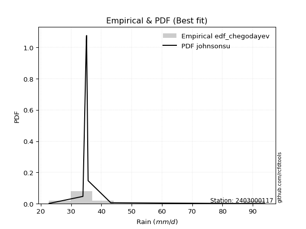</img>

</div>


### 6. EDF Blom (1958)

The Blom formula is a specific "plotting position" formula used in hydrology and statistical analysis to estimate the empirical cumulative probability (or non-exceedance probability) of a data series. It is particularly recommended for data that are approximately normally distributed. The constant _a_ is set to 0.375 (or 3/8).

<div align="center">


$P=(m-a)/(n+1-2a)$


</div>


**6.1. Empirical values**

<div align="center">

|                | 0                  | 1                  | 2                  | 3                 | 4                 | 5                  |
|:---------------|:-------------------|:-------------------|:-------------------|:------------------|:------------------|:-------------------|
| date           | 2019               | 2022               | 2021               | 2023              | 2020              | 2024               |
| x              | 22.7               | 33.9               | 35.1               | 35.6              | 43.1              | 94.0               |
| m              | 1                  | 2                  | 3                  | 4                 | 5                 | 6                  |
| empirical_dist | edf_blom           | edf_blom           | edf_blom           | edf_blom          | edf_blom          | edf_blom           |
| empirical      | 0.1                | 0.26               | 0.42               | 0.58              | 0.74              | 0.9                |
| empirical_tr   | 1.1111111111111112 | 1.3513513513513513 | 1.7241379310344827 | 2.380952380952381 | 3.846153846153846 | 10.000000000000002 |

</div>


**6.2. Kolmogorov-Smirnov fit test (sorted by Δ)**


<div align="center">

|                | 0                   | 1                   | 2                   | 3                   | 4                   | 5                 | 6                   | 7                   | 8                   | 9                   | 10                 | 11                 | 12                 | 13                  | 14                 | 15                  | 16                 | 17                  | 18                  | 19                 | 20                 | 21                  | 22                 | 23                  | 24                  | 25                  | 26                  | 27                  | 28                  | 29                  | 30                  | 31                  | 32                  | 33                 | 34                  | 35                  | 36                  | 37                 | 38                 | 39                    | 40                  | 41                 | 42                  | 43                  | 44                  | 45                 | 46                  | 47                  | 48                  | 49                  | 50                  | 51                  | 52                  | 53                  | 54                 | 55                 | 56                  | 57                  | 58                  | 59                 | 60                  | 61                  | 62                  | 63                  | 64                 | 65                  | 66                  | 67                  | 68                 | 69                  | 70                  | 71                 | 72                  | 73                  | 74                 | 75                 | 76                  | 77                 | 78                 | 79                  | 80                  | 81                  | 82                  | 83                 | 84                  | 85                  | 86                  | 87                 |
|:---------------|:--------------------|:--------------------|:--------------------|:--------------------|:--------------------|:------------------|:--------------------|:--------------------|:--------------------|:--------------------|:-------------------|:-------------------|:-------------------|:--------------------|:-------------------|:--------------------|:-------------------|:--------------------|:--------------------|:-------------------|:-------------------|:--------------------|:-------------------|:--------------------|:--------------------|:--------------------|:--------------------|:--------------------|:--------------------|:--------------------|:--------------------|:--------------------|:--------------------|:-------------------|:--------------------|:--------------------|:--------------------|:-------------------|:-------------------|:----------------------|:--------------------|:-------------------|:--------------------|:--------------------|:--------------------|:-------------------|:--------------------|:--------------------|:--------------------|:--------------------|:--------------------|:--------------------|:--------------------|:--------------------|:-------------------|:-------------------|:--------------------|:--------------------|:--------------------|:-------------------|:--------------------|:--------------------|:--------------------|:--------------------|:-------------------|:--------------------|:--------------------|:--------------------|:-------------------|:--------------------|:--------------------|:-------------------|:--------------------|:--------------------|:-------------------|:-------------------|:--------------------|:-------------------|:-------------------|:--------------------|:--------------------|:--------------------|:--------------------|:-------------------|:--------------------|:--------------------|:--------------------|:-------------------|
| station        | 2403000117          | 2403000117          | 2403000117          | 2403000117          | 2403000117          | 2403000117        | 2403000117          | 2403000117          | 2403000117          | 2403000117          | 2403000117         | 2403000117         | 2403000117         | 2403000117          | 2403000117         | 2403000117          | 2403000117         | 2403000117          | 2403000117          | 2403000117         | 2403000117         | 2403000117          | 2403000117         | 2403000117          | 2403000117          | 2403000117          | 2403000117          | 2403000117          | 2403000117          | 2403000117          | 2403000117          | 2403000117          | 2403000117          | 2403000117         | 2403000117          | 2403000117          | 2403000117          | 2403000117         | 2403000117         | 2403000117            | 2403000117          | 2403000117         | 2403000117          | 2403000117          | 2403000117          | 2403000117         | 2403000117          | 2403000117          | 2403000117          | 2403000117          | 2403000117          | 2403000117          | 2403000117          | 2403000117          | 2403000117         | 2403000117         | 2403000117          | 2403000117          | 2403000117          | 2403000117         | 2403000117          | 2403000117          | 2403000117          | 2403000117          | 2403000117         | 2403000117          | 2403000117          | 2403000117          | 2403000117         | 2403000117          | 2403000117          | 2403000117         | 2403000117          | 2403000117          | 2403000117         | 2403000117         | 2403000117          | 2403000117         | 2403000117         | 2403000117          | 2403000117          | 2403000117          | 2403000117          | 2403000117         | 2403000117          | 2403000117          | 2403000117          | 2403000117         |
| empirical_dist | edf_blom            | edf_blom            | edf_blom            | edf_blom            | edf_blom            | edf_blom          | edf_blom            | edf_blom            | edf_blom            | edf_blom            | edf_blom           | edf_blom           | edf_blom           | edf_blom            | edf_blom           | edf_blom            | edf_blom           | edf_blom            | edf_blom            | edf_blom           | edf_blom           | edf_blom            | edf_blom           | edf_blom            | edf_blom            | edf_blom            | edf_blom            | edf_blom            | edf_blom            | edf_blom            | edf_blom            | edf_blom            | edf_blom            | edf_blom           | edf_blom            | edf_blom            | edf_blom            | edf_blom           | edf_blom           | edf_blom              | edf_blom            | edf_blom           | edf_blom            | edf_blom            | edf_blom            | edf_blom           | edf_blom            | edf_blom            | edf_blom            | edf_blom            | edf_blom            | edf_blom            | edf_blom            | edf_blom            | edf_blom           | edf_blom           | edf_blom            | edf_blom            | edf_blom            | edf_blom           | edf_blom            | edf_blom            | edf_blom            | edf_blom            | edf_blom           | edf_blom            | edf_blom            | edf_blom            | edf_blom           | edf_blom            | edf_blom            | edf_blom           | edf_blom            | edf_blom            | edf_blom           | edf_blom           | edf_blom            | edf_blom           | edf_blom           | edf_blom            | edf_blom            | edf_blom            | edf_blom            | edf_blom           | edf_blom            | edf_blom            | edf_blom            | edf_blom           |
| p_dist         | johnsonsu           | logjohnsonsu        | logt                | nct                 | loggompertz         | gibrat            | truncnorm           | lograyleigh         | logkstwobign        | logmaxwell          | mielke             | logexponnorm       | expon              | genexpon            | loggumbel_r        | loggenlogistic      | logfisk            | logpearson3         | gompertz            | lognct             | logmielke          | pearson3            | wald               | halflogistic        | logalpha            | loginvweibull       | alpha               | logrice             | loginvgamma         | logf                | betaprime           | fisk                | moyal               | invgamma           | f                   | loginvgauss         | logfatiguelife      | logmoyal           | exponnorm          | loglaplace_asymmetric | invgauss            | logncf             | loghalfnorm         | fatiguelife         | ncf                 | logloggamma        | lognorm             | lognorm             | logcrystalball      | halfnorm            | loggibrat           | loggenexpon         | loghalflogistic     | gumbel_r            | genlogistic        | loglogistic        | logchi2             | loghypsecant        | rayleigh            | logwald            | gamma               | maxwell             | laplace_asymmetric  | kstwobign           | loglaplace         | nakagami            | loggumbel_l         | weibull_min         | logexpon           | crystalball         | norm                | logistic           | hypsecant           | t                   | rice               | laplace            | gumbel_l            | loggamma           | loggamma           | logerlang           | logweibull_min      | erlang              | loglognorm          | logtruncnorm       | chi2                | invweibull          | lognakagami         | logbetaprime       |
| delta          | 0.08054621778181037 | 0.08990836024874316 | 0.12936669316860905 | 0.14119741431713906 | 0.14122944083590472 | 0.141248285449729 | 0.14139182541020684 | 0.14223799598402986 | 0.14258280836243992 | 0.14507197713023962 | 0.1461807041732282 | 0.1464303867672932 | 0.1479599339434533 | 0.14796454284249527 | 0.1481246431923905 | 0.14823290322179072 | 0.1503200275330846 | 0.15105582138431184 | 0.15115280225249095 | 0.1528186915297322 | 0.1550311212831037 | 0.15546043838597057 | 0.1555098401685499 | 0.15588134408254462 | 0.15598097715125603 | 0.15624400944356986 | 0.15718329820118754 | 0.15851542783011868 | 0.15876196907330287 | 0.15876256173070374 | 0.15927445986223954 | 0.16049098505285192 | 0.16112538879124938 | 0.1620158535580123 | 0.16215489327486182 | 0.16292489169408192 | 0.16371953688055624 | 0.1669883857841744 | 0.1691204283888016 | 0.16920695136944552   | 0.17114171056678307 | 0.1765576062230244 | 0.17680748509829902 | 0.17769675220150188 | 0.17800411400980387 | 0.1785824740283159 | 0.17910865611069104 | 0.17910865611069104 | 0.17910865884127847 | 0.17971367427085394 | 0.18038893628809577 | 0.18221627595243706 | 0.18617250333977098 | 0.18699822612899053 | 0.1884463629545884 | 0.1919074861511259 | 0.20186465580296498 | 0.20238828741420806 | 0.21168787511422882 | 0.2122053076848332 | 0.21411449015787365 | 0.22304009755700427 | 0.22828097274369352 | 0.22832557677826265 | 0.2294220709053792 | 0.24240760970469455 | 0.24571075070180004 | 0.25187974676667546 | 0.2525281908691982 | 0.25667771817666546 | 0.25667773079239575 | 0.2589528520109645 | 0.26089350851872384 | 0.26331103973878295 | 0.2636280670145892 | 0.2821355188386998 | 0.32734653191562724 | 0.3360230655497769 | 0.3360230655497769 | 0.34124593065879694 | 0.35461018500487107 | 0.39246863587125236 | 0.40173648651849825 | 0.4233635832070669 | 0.42744179092310974 | 0.45267084658472967 | 0.47051316533321663 | 0.4789249336297329 |
| deltao         | 0.530385761606      | 0.530385761606      | 0.530385761606      | 0.530385761606      | 0.530385761606      | 0.530385761606    | 0.530385761606      | 0.530385761606      | 0.530385761606      | 0.530385761606      | 0.530385761606     | 0.530385761606     | 0.530385761606     | 0.530385761606      | 0.530385761606     | 0.530385761606      | 0.530385761606     | 0.530385761606      | 0.530385761606      | 0.530385761606     | 0.530385761606     | 0.530385761606      | 0.530385761606     | 0.530385761606      | 0.530385761606      | 0.530385761606      | 0.530385761606      | 0.530385761606      | 0.530385761606      | 0.530385761606      | 0.530385761606      | 0.530385761606      | 0.530385761606      | 0.530385761606     | 0.530385761606      | 0.530385761606      | 0.530385761606      | 0.530385761606     | 0.530385761606     | 0.530385761606        | 0.530385761606      | 0.530385761606     | 0.530385761606      | 0.530385761606      | 0.530385761606      | 0.530385761606     | 0.530385761606      | 0.530385761606      | 0.530385761606      | 0.530385761606      | 0.530385761606      | 0.530385761606      | 0.530385761606      | 0.530385761606      | 0.530385761606     | 0.530385761606     | 0.530385761606      | 0.530385761606      | 0.530385761606      | 0.530385761606     | 0.530385761606      | 0.530385761606      | 0.530385761606      | 0.530385761606      | 0.530385761606     | 0.530385761606      | 0.530385761606      | 0.530385761606      | 0.530385761606     | 0.530385761606      | 0.530385761606      | 0.530385761606     | 0.530385761606      | 0.530385761606      | 0.530385761606     | 0.530385761606     | 0.530385761606      | 0.530385761606     | 0.530385761606     | 0.530385761606      | 0.530385761606      | 0.530385761606      | 0.530385761606      | 0.530385761606     | 0.530385761606      | 0.530385761606      | 0.530385761606      | 0.530385761606     |
| eval           | Δo > Δ              | Δo > Δ              | Δo > Δ              | Δo > Δ              | Δo > Δ              | Δo > Δ            | Δo > Δ              | Δo > Δ              | Δo > Δ              | Δo > Δ              | Δo > Δ             | Δo > Δ             | Δo > Δ             | Δo > Δ              | Δo > Δ             | Δo > Δ              | Δo > Δ             | Δo > Δ              | Δo > Δ              | Δo > Δ             | Δo > Δ             | Δo > Δ              | Δo > Δ             | Δo > Δ              | Δo > Δ              | Δo > Δ              | Δo > Δ              | Δo > Δ              | Δo > Δ              | Δo > Δ              | Δo > Δ              | Δo > Δ              | Δo > Δ              | Δo > Δ             | Δo > Δ              | Δo > Δ              | Δo > Δ              | Δo > Δ             | Δo > Δ             | Δo > Δ                | Δo > Δ              | Δo > Δ             | Δo > Δ              | Δo > Δ              | Δo > Δ              | Δo > Δ             | Δo > Δ              | Δo > Δ              | Δo > Δ              | Δo > Δ              | Δo > Δ              | Δo > Δ              | Δo > Δ              | Δo > Δ              | Δo > Δ             | Δo > Δ             | Δo > Δ              | Δo > Δ              | Δo > Δ              | Δo > Δ             | Δo > Δ              | Δo > Δ              | Δo > Δ              | Δo > Δ              | Δo > Δ             | Δo > Δ              | Δo > Δ              | Δo > Δ              | Δo > Δ             | Δo > Δ              | Δo > Δ              | Δo > Δ             | Δo > Δ              | Δo > Δ              | Δo > Δ             | Δo > Δ             | Δo > Δ              | Δo > Δ             | Δo > Δ             | Δo > Δ              | Δo > Δ              | Δo > Δ              | Δo > Δ              | Δo > Δ             | Δo > Δ              | Δo > Δ              | Δo > Δ              | Δo > Δ             |
| fit            | 1                   | 1                   | 1                   | 1                   | 1                   | 1                 | 1                   | 1                   | 1                   | 1                   | 1                  | 1                  | 1                  | 1                   | 1                  | 1                   | 1                  | 1                   | 1                   | 1                  | 1                  | 1                   | 1                  | 1                   | 1                   | 1                   | 1                   | 1                   | 1                   | 1                   | 1                   | 1                   | 1                   | 1                  | 1                   | 1                   | 1                   | 1                  | 1                  | 1                     | 1                   | 1                  | 1                   | 1                   | 1                   | 1                  | 1                   | 1                   | 1                   | 1                   | 1                   | 1                   | 1                   | 1                   | 1                  | 1                  | 1                   | 1                   | 1                   | 1                  | 1                   | 1                   | 1                   | 1                   | 1                  | 1                   | 1                   | 1                   | 1                  | 1                   | 1                   | 1                  | 1                   | 1                   | 1                  | 1                  | 1                   | 1                  | 1                  | 1                   | 1                   | 1                   | 1                   | 1                  | 1                   | 1                   | 1                   | 1                  |
| n              | 6                   | 6                   | 6                   | 6                   | 6                   | 6                 | 6                   | 6                   | 6                   | 6                   | 6                  | 6                  | 6                  | 6                   | 6                  | 6                   | 6                  | 6                   | 6                   | 6                  | 6                  | 6                   | 6                  | 6                   | 6                   | 6                   | 6                   | 6                   | 6                   | 6                   | 6                   | 6                   | 6                   | 6                  | 6                   | 6                   | 6                   | 6                  | 6                  | 6                     | 6                   | 6                  | 6                   | 6                   | 6                   | 6                  | 6                   | 6                   | 6                   | 6                   | 6                   | 6                   | 6                   | 6                   | 6                  | 6                  | 6                   | 6                   | 6                   | 6                  | 6                   | 6                   | 6                   | 6                   | 6                  | 6                   | 6                   | 6                   | 6                  | 6                   | 6                   | 6                  | 6                   | 6                   | 6                  | 6                  | 6                   | 6                  | 6                  | 6                   | 6                   | 6                   | 6                   | 6                  | 6                   | 6                   | 6                   | 6                  |
| best_fit       | 1                   | 0                   | 0                   | 0                   | 0                   | 0                 | 0                   | 0                   | 0                   | 0                   | 0                  | 0                  | 0                  | 0                   | 0                  | 0                   | 0                  | 0                   | 0                   | 0                  | 0                  | 0                   | 0                  | 0                   | 0                   | 0                   | 0                   | 0                   | 0                   | 0                   | 0                   | 0                   | 0                   | 0                  | 0                   | 0                   | 0                   | 0                  | 0                  | 0                     | 0                   | 0                  | 0                   | 0                   | 0                   | 0                  | 0                   | 0                   | 0                   | 0                   | 0                   | 0                   | 0                   | 0                   | 0                  | 0                  | 0                   | 0                   | 0                   | 0                  | 0                   | 0                   | 0                   | 0                   | 0                  | 0                   | 0                   | 0                   | 0                  | 0                   | 0                   | 0                  | 0                   | 0                   | 0                  | 0                  | 0                   | 0                  | 0                  | 0                   | 0                   | 0                   | 0                   | 0                  | 0                   | 0                   | 0                   | 0                  |
| best_fit_sort  | 1                   | 2                   | 3                   | 4                   | 5                   | 6                 | 7                   | 8                   | 9                   | 10                  | 11                 | 12                 | 13                 | 14                  | 15                 | 16                  | 17                 | 18                  | 19                  | 20                 | 21                 | 22                  | 23                 | 24                  | 25                  | 26                  | 27                  | 28                  | 29                  | 30                  | 31                  | 32                  | 33                  | 34                 | 35                  | 36                  | 37                  | 38                 | 39                 | 40                    | 41                  | 42                 | 43                  | 44                  | 45                  | 46                 | 47                  | 48                  | 49                  | 50                  | 51                  | 52                  | 53                  | 54                  | 55                 | 56                 | 57                  | 58                  | 59                  | 60                 | 61                  | 62                  | 63                  | 64                  | 65                 | 66                  | 67                  | 68                  | 69                 | 70                  | 71                  | 72                 | 73                  | 74                  | 75                 | 76                 | 77                  | 78                 | 79                 | 80                  | 81                  | 82                  | 83                  | 84                 | 85                  | 86                  | 87                  | 88                 |

</div>


**6.3. Best fit**

<div align="center">

|   id |    station | empirical_dist   | p_dist    |     delta |   deltao | eval   |   fit |   n |   best_fit |   best_fit_sort |
|-----:|-----------:|:-----------------|:----------|----------:|---------:|:-------|------:|----:|-----------:|----------------:|
|    0 | 2403000117 | edf_blom         | johnsonsu | 0.0805462 | 0.530386 | Δo > Δ |     1 |   6 |          1 |               1 |

</div>


<div align="center">

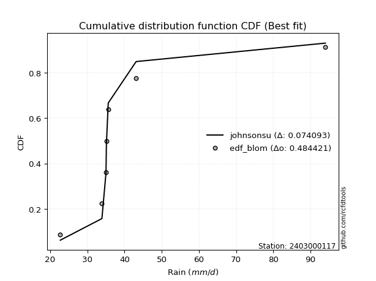</img></img>

</div>


### 7. EDF Tukey (1962)

In hydrology, the Tukey formula is used as a plotting position formula to estimate the empirical probability or frequency of a flood event (or other hydrological data). The formula parameter is given as _c=0.333_ (or 1/3).

<div align="center">


$P=(m-c)/(n+1-2c)$


</div>


**7.1. Empirical values**

<div align="center">

|                | 0                   | 1                  | 2                   | 3                  | 4                  | 5                  |
|:---------------|:--------------------|:-------------------|:--------------------|:-------------------|:-------------------|:-------------------|
| date           | 2019                | 2022               | 2021                | 2023               | 2020               | 2024               |
| x              | 22.7                | 33.9               | 35.1                | 35.6               | 43.1               | 94.0               |
| m              | 1                   | 2                  | 3                   | 4                  | 5                  | 6                  |
| empirical_dist | edf_tukey           | edf_tukey          | edf_tukey           | edf_tukey          | edf_tukey          | edf_tukey          |
| empirical      | 0.10526315789473684 | 0.2631578947368421 | 0.42105263157894735 | 0.5789473684210527 | 0.7368421052631579 | 0.8947368421052632 |
| empirical_tr   | 1.1176470588235294  | 1.357142857142857  | 1.7272727272727273  | 2.375              | 3.7999999999999994 | 9.5                |

</div>


**7.2. Kolmogorov-Smirnov fit test (sorted by Δ)**


<div align="center">

|                | 0                   | 1                  | 2                   | 3                   | 4                   | 5                   | 6                  | 7                   | 8                  | 9                   | 10                  | 11                 | 12                  | 13                 | 14                 | 15                  | 16                  | 17                  | 18                  | 19                 | 20                  | 21                  | 22                  | 23                  | 24                  | 25                  | 26                  | 27                  | 28                  | 29                  | 30                  | 31                  | 32                  | 33                 | 34                  | 35                  | 36                  | 37                  | 38                  | 39                 | 40                    | 41                  | 42                  | 43                 | 44                 | 45                  | 46                 | 47                 | 48                  | 49                  | 50                  | 51                  | 52                 | 53                 | 54                  | 55                 | 56                  | 57                  | 58                  | 59                  | 60                  | 61                  | 62                  | 63                  | 64                 | 65                 | 66                  | 67                  | 68                  | 69                 | 70                 | 71                 | 72                 | 73                 | 74                  | 75                 | 76                 | 77                 | 78                 | 79                  | 80                | 81                 | 82                  | 83                 | 84                  | 85                 | 86                  | 87                 |
|:---------------|:--------------------|:-------------------|:--------------------|:--------------------|:--------------------|:--------------------|:-------------------|:--------------------|:-------------------|:--------------------|:--------------------|:-------------------|:--------------------|:-------------------|:-------------------|:--------------------|:--------------------|:--------------------|:--------------------|:-------------------|:--------------------|:--------------------|:--------------------|:--------------------|:--------------------|:--------------------|:--------------------|:--------------------|:--------------------|:--------------------|:--------------------|:--------------------|:--------------------|:-------------------|:--------------------|:--------------------|:--------------------|:--------------------|:--------------------|:-------------------|:----------------------|:--------------------|:--------------------|:-------------------|:-------------------|:--------------------|:-------------------|:-------------------|:--------------------|:--------------------|:--------------------|:--------------------|:-------------------|:-------------------|:--------------------|:-------------------|:--------------------|:--------------------|:--------------------|:--------------------|:--------------------|:--------------------|:--------------------|:--------------------|:-------------------|:-------------------|:--------------------|:--------------------|:--------------------|:-------------------|:-------------------|:-------------------|:-------------------|:-------------------|:--------------------|:-------------------|:-------------------|:-------------------|:-------------------|:--------------------|:------------------|:-------------------|:--------------------|:-------------------|:--------------------|:-------------------|:--------------------|:-------------------|
| station        | 2403000117          | 2403000117         | 2403000117          | 2403000117          | 2403000117          | 2403000117          | 2403000117         | 2403000117          | 2403000117         | 2403000117          | 2403000117          | 2403000117         | 2403000117          | 2403000117         | 2403000117         | 2403000117          | 2403000117          | 2403000117          | 2403000117          | 2403000117         | 2403000117          | 2403000117          | 2403000117          | 2403000117          | 2403000117          | 2403000117          | 2403000117          | 2403000117          | 2403000117          | 2403000117          | 2403000117          | 2403000117          | 2403000117          | 2403000117         | 2403000117          | 2403000117          | 2403000117          | 2403000117          | 2403000117          | 2403000117         | 2403000117            | 2403000117          | 2403000117          | 2403000117         | 2403000117         | 2403000117          | 2403000117         | 2403000117         | 2403000117          | 2403000117          | 2403000117          | 2403000117          | 2403000117         | 2403000117         | 2403000117          | 2403000117         | 2403000117          | 2403000117          | 2403000117          | 2403000117          | 2403000117          | 2403000117          | 2403000117          | 2403000117          | 2403000117         | 2403000117         | 2403000117          | 2403000117          | 2403000117          | 2403000117         | 2403000117         | 2403000117         | 2403000117         | 2403000117         | 2403000117          | 2403000117         | 2403000117         | 2403000117         | 2403000117         | 2403000117          | 2403000117        | 2403000117         | 2403000117          | 2403000117         | 2403000117          | 2403000117         | 2403000117          | 2403000117         |
| empirical_dist | edf_tukey           | edf_tukey          | edf_tukey           | edf_tukey           | edf_tukey           | edf_tukey           | edf_tukey          | edf_tukey           | edf_tukey          | edf_tukey           | edf_tukey           | edf_tukey          | edf_tukey           | edf_tukey          | edf_tukey          | edf_tukey           | edf_tukey           | edf_tukey           | edf_tukey           | edf_tukey          | edf_tukey           | edf_tukey           | edf_tukey           | edf_tukey           | edf_tukey           | edf_tukey           | edf_tukey           | edf_tukey           | edf_tukey           | edf_tukey           | edf_tukey           | edf_tukey           | edf_tukey           | edf_tukey          | edf_tukey           | edf_tukey           | edf_tukey           | edf_tukey           | edf_tukey           | edf_tukey          | edf_tukey             | edf_tukey           | edf_tukey           | edf_tukey          | edf_tukey          | edf_tukey           | edf_tukey          | edf_tukey          | edf_tukey           | edf_tukey           | edf_tukey           | edf_tukey           | edf_tukey          | edf_tukey          | edf_tukey           | edf_tukey          | edf_tukey           | edf_tukey           | edf_tukey           | edf_tukey           | edf_tukey           | edf_tukey           | edf_tukey           | edf_tukey           | edf_tukey          | edf_tukey          | edf_tukey           | edf_tukey           | edf_tukey           | edf_tukey          | edf_tukey          | edf_tukey          | edf_tukey          | edf_tukey          | edf_tukey           | edf_tukey          | edf_tukey          | edf_tukey          | edf_tukey          | edf_tukey           | edf_tukey         | edf_tukey          | edf_tukey           | edf_tukey          | edf_tukey           | edf_tukey          | edf_tukey           | edf_tukey          |
| p_dist         | johnsonsu           | logjohnsonsu       | logt                | truncnorm           | lograyleigh         | logkstwobign        | loggompertz        | nct                 | gibrat             | mielke              | logexponnorm        | logmaxwell         | expon               | genexpon           | loggumbel_r        | loggenlogistic      | logfisk             | logpearson3         | gompertz            | lognct             | logmielke           | pearson3            | wald                | halflogistic        | logalpha            | loginvweibull       | alpha               | loginvgamma         | logf                | fisk                | logrice             | moyal               | betaprime           | invgamma           | f                   | loginvgauss         | logfatiguelife      | logmoyal            | invgauss            | exponnorm          | loglaplace_asymmetric | logncf              | loghalfnorm         | fatiguelife        | halfnorm           | ncf                 | loggibrat          | logloggamma        | lognorm             | lognorm             | logcrystalball      | loggenexpon         | loghalflogistic    | gumbel_r           | genlogistic         | loglogistic        | logchi2             | loghypsecant        | rayleigh            | logwald             | gamma               | maxwell             | laplace_asymmetric  | kstwobign           | loglaplace         | nakagami           | loggumbel_l         | weibull_min         | logexpon            | crystalball        | norm               | logistic           | hypsecant          | t                  | rice                | laplace            | gumbel_l           | loggamma           | loggamma           | logerlang           | logweibull_min    | erlang             | loglognorm          | logtruncnorm       | chi2                | invweibull         | lognakagami         | logbetaprime       |
| delta          | 0.08370411251865251 | 0.0930662549855853 | 0.13252458790545119 | 0.13823393067336476 | 0.13908010124718778 | 0.13942491362559783 | 0.1400922845592637 | 0.14014478273819175 | 0.1401956538707817 | 0.14302280943638612 | 0.14327249203045112 | 0.1440193455512923 | 0.14480203920661122 | 0.1448066481056532 | 0.1449667484555484 | 0.14507500848494864 | 0.14716213279624252 | 0.14789792664746976 | 0.14799490751564887 | 0.1517660599507849 | 0.15187322654626162 | 0.15230254364912843 | 0.15235194543170782 | 0.15272344934570248 | 0.15282308241441395 | 0.15308611470672778 | 0.15402540346434546 | 0.15560407433646078 | 0.15560466699386166 | 0.15733309031600984 | 0.15746279625117138 | 0.15796749405440724 | 0.15822182828329223 | 0.1588579588211702 | 0.15899699853801974 | 0.15976699695723984 | 0.16056164214371416 | 0.16383049104733233 | 0.16798381582994099 | 0.1680677968098543 | 0.16815431979049822   | 0.17339971148618227 | 0.17364959036145694 | 0.1745388574646598 | 0.1765557795340118 | 0.17695148243085657 | 0.1772310415512537 | 0.1775298424493686 | 0.17805602453174374 | 0.17805602453174374 | 0.17805602726233116 | 0.17905838121559498 | 0.1830146086029289 | 0.1838403313921484 | 0.18739373137564108 | 0.1908548545721786 | 0.19870676106612284 | 0.20133565583526075 | 0.20852998037738668 | 0.20904741294799112 | 0.21095659542103157 | 0.21988220282016213 | 0.22722834116474622 | 0.22727294519931535 | 0.2283694393264319 | 0.2392497149678524 | 0.24465811912285274 | 0.24872185202983338 | 0.24937029613235612 | 0.2535198234398233 | 0.2535198360555536 | 0.2557949572741224 | 0.2577356137818817 | 0.2601531450019408 | 0.26047017227774705 | 0.2810828872597525 | 0.3241886371787851 | 0.3328651708129348 | 0.3328651708129348 | 0.33808803592195485 | 0.351452290268029 | 0.3893107411344103 | 0.39857859178165617 | 0.4223109516281196 | 0.42428389618626766 | 0.4474076886899928 | 0.46735527059637455 | 0.4757670388928908 |
| deltao         | 0.530385761606      | 0.530385761606     | 0.530385761606      | 0.530385761606      | 0.530385761606      | 0.530385761606      | 0.530385761606     | 0.530385761606      | 0.530385761606     | 0.530385761606      | 0.530385761606      | 0.530385761606     | 0.530385761606      | 0.530385761606     | 0.530385761606     | 0.530385761606      | 0.530385761606      | 0.530385761606      | 0.530385761606      | 0.530385761606     | 0.530385761606      | 0.530385761606      | 0.530385761606      | 0.530385761606      | 0.530385761606      | 0.530385761606      | 0.530385761606      | 0.530385761606      | 0.530385761606      | 0.530385761606      | 0.530385761606      | 0.530385761606      | 0.530385761606      | 0.530385761606     | 0.530385761606      | 0.530385761606      | 0.530385761606      | 0.530385761606      | 0.530385761606      | 0.530385761606     | 0.530385761606        | 0.530385761606      | 0.530385761606      | 0.530385761606     | 0.530385761606     | 0.530385761606      | 0.530385761606     | 0.530385761606     | 0.530385761606      | 0.530385761606      | 0.530385761606      | 0.530385761606      | 0.530385761606     | 0.530385761606     | 0.530385761606      | 0.530385761606     | 0.530385761606      | 0.530385761606      | 0.530385761606      | 0.530385761606      | 0.530385761606      | 0.530385761606      | 0.530385761606      | 0.530385761606      | 0.530385761606     | 0.530385761606     | 0.530385761606      | 0.530385761606      | 0.530385761606      | 0.530385761606     | 0.530385761606     | 0.530385761606     | 0.530385761606     | 0.530385761606     | 0.530385761606      | 0.530385761606     | 0.530385761606     | 0.530385761606     | 0.530385761606     | 0.530385761606      | 0.530385761606    | 0.530385761606     | 0.530385761606      | 0.530385761606     | 0.530385761606      | 0.530385761606     | 0.530385761606      | 0.530385761606     |
| eval           | Δo > Δ              | Δo > Δ             | Δo > Δ              | Δo > Δ              | Δo > Δ              | Δo > Δ              | Δo > Δ             | Δo > Δ              | Δo > Δ             | Δo > Δ              | Δo > Δ              | Δo > Δ             | Δo > Δ              | Δo > Δ             | Δo > Δ             | Δo > Δ              | Δo > Δ              | Δo > Δ              | Δo > Δ              | Δo > Δ             | Δo > Δ              | Δo > Δ              | Δo > Δ              | Δo > Δ              | Δo > Δ              | Δo > Δ              | Δo > Δ              | Δo > Δ              | Δo > Δ              | Δo > Δ              | Δo > Δ              | Δo > Δ              | Δo > Δ              | Δo > Δ             | Δo > Δ              | Δo > Δ              | Δo > Δ              | Δo > Δ              | Δo > Δ              | Δo > Δ             | Δo > Δ                | Δo > Δ              | Δo > Δ              | Δo > Δ             | Δo > Δ             | Δo > Δ              | Δo > Δ             | Δo > Δ             | Δo > Δ              | Δo > Δ              | Δo > Δ              | Δo > Δ              | Δo > Δ             | Δo > Δ             | Δo > Δ              | Δo > Δ             | Δo > Δ              | Δo > Δ              | Δo > Δ              | Δo > Δ              | Δo > Δ              | Δo > Δ              | Δo > Δ              | Δo > Δ              | Δo > Δ             | Δo > Δ             | Δo > Δ              | Δo > Δ              | Δo > Δ              | Δo > Δ             | Δo > Δ             | Δo > Δ             | Δo > Δ             | Δo > Δ             | Δo > Δ              | Δo > Δ             | Δo > Δ             | Δo > Δ             | Δo > Δ             | Δo > Δ              | Δo > Δ            | Δo > Δ             | Δo > Δ              | Δo > Δ             | Δo > Δ              | Δo > Δ             | Δo > Δ              | Δo > Δ             |
| fit            | 1                   | 1                  | 1                   | 1                   | 1                   | 1                   | 1                  | 1                   | 1                  | 1                   | 1                   | 1                  | 1                   | 1                  | 1                  | 1                   | 1                   | 1                   | 1                   | 1                  | 1                   | 1                   | 1                   | 1                   | 1                   | 1                   | 1                   | 1                   | 1                   | 1                   | 1                   | 1                   | 1                   | 1                  | 1                   | 1                   | 1                   | 1                   | 1                   | 1                  | 1                     | 1                   | 1                   | 1                  | 1                  | 1                   | 1                  | 1                  | 1                   | 1                   | 1                   | 1                   | 1                  | 1                  | 1                   | 1                  | 1                   | 1                   | 1                   | 1                   | 1                   | 1                   | 1                   | 1                   | 1                  | 1                  | 1                   | 1                   | 1                   | 1                  | 1                  | 1                  | 1                  | 1                  | 1                   | 1                  | 1                  | 1                  | 1                  | 1                   | 1                 | 1                  | 1                   | 1                  | 1                   | 1                  | 1                   | 1                  |
| n              | 6                   | 6                  | 6                   | 6                   | 6                   | 6                   | 6                  | 6                   | 6                  | 6                   | 6                   | 6                  | 6                   | 6                  | 6                  | 6                   | 6                   | 6                   | 6                   | 6                  | 6                   | 6                   | 6                   | 6                   | 6                   | 6                   | 6                   | 6                   | 6                   | 6                   | 6                   | 6                   | 6                   | 6                  | 6                   | 6                   | 6                   | 6                   | 6                   | 6                  | 6                     | 6                   | 6                   | 6                  | 6                  | 6                   | 6                  | 6                  | 6                   | 6                   | 6                   | 6                   | 6                  | 6                  | 6                   | 6                  | 6                   | 6                   | 6                   | 6                   | 6                   | 6                   | 6                   | 6                   | 6                  | 6                  | 6                   | 6                   | 6                   | 6                  | 6                  | 6                  | 6                  | 6                  | 6                   | 6                  | 6                  | 6                  | 6                  | 6                   | 6                 | 6                  | 6                   | 6                  | 6                   | 6                  | 6                   | 6                  |
| best_fit       | 1                   | 0                  | 0                   | 0                   | 0                   | 0                   | 0                  | 0                   | 0                  | 0                   | 0                   | 0                  | 0                   | 0                  | 0                  | 0                   | 0                   | 0                   | 0                   | 0                  | 0                   | 0                   | 0                   | 0                   | 0                   | 0                   | 0                   | 0                   | 0                   | 0                   | 0                   | 0                   | 0                   | 0                  | 0                   | 0                   | 0                   | 0                   | 0                   | 0                  | 0                     | 0                   | 0                   | 0                  | 0                  | 0                   | 0                  | 0                  | 0                   | 0                   | 0                   | 0                   | 0                  | 0                  | 0                   | 0                  | 0                   | 0                   | 0                   | 0                   | 0                   | 0                   | 0                   | 0                   | 0                  | 0                  | 0                   | 0                   | 0                   | 0                  | 0                  | 0                  | 0                  | 0                  | 0                   | 0                  | 0                  | 0                  | 0                  | 0                   | 0                 | 0                  | 0                   | 0                  | 0                   | 0                  | 0                   | 0                  |
| best_fit_sort  | 1                   | 2                  | 3                   | 4                   | 5                   | 6                   | 7                  | 8                   | 9                  | 10                  | 11                  | 12                 | 13                  | 14                 | 15                 | 16                  | 17                  | 18                  | 19                  | 20                 | 21                  | 22                  | 23                  | 24                  | 25                  | 26                  | 27                  | 28                  | 29                  | 30                  | 31                  | 32                  | 33                  | 34                 | 35                  | 36                  | 37                  | 38                  | 39                  | 40                 | 41                    | 42                  | 43                  | 44                 | 45                 | 46                  | 47                 | 48                 | 49                  | 50                  | 51                  | 52                  | 53                 | 54                 | 55                  | 56                 | 57                  | 58                  | 59                  | 60                  | 61                  | 62                  | 63                  | 64                  | 65                 | 66                 | 67                  | 68                  | 69                  | 70                 | 71                 | 72                 | 73                 | 74                 | 75                  | 76                 | 77                 | 78                 | 79                 | 80                  | 81                | 82                 | 83                  | 84                 | 85                  | 86                 | 87                  | 88                 |

</div>


**7.3. Best fit**

<div align="center">

|   id |    station | empirical_dist   | p_dist    |     delta |   deltao | eval   |   fit |   n |   best_fit |   best_fit_sort |
|-----:|-----------:|:-----------------|:----------|----------:|---------:|:-------|------:|----:|-----------:|----------------:|
|    0 | 2403000117 | edf_tukey        | johnsonsu | 0.0837041 | 0.530386 | Δo > Δ |     1 |   6 |          1 |               1 |

</div>


<div align="center">

</img></img>

</div>


### 8. EDF Gringorten (1963)

Gringorten plotting position formula is essential for estimating the probability and return periods of extreme events like floods and heavy rainfall. The constant _a=0.44_.

<div align="center">


$P=(m-a)/(n+1-2a)$


</div>


**8.1. Empirical values**

<div align="center">

|                | 0                   | 1                  | 2                   | 3                  | 4                  | 5                  |
|:---------------|:--------------------|:-------------------|:--------------------|:-------------------|:-------------------|:-------------------|
| date           | 2019                | 2022               | 2021                | 2023               | 2020               | 2024               |
| x              | 22.7                | 33.9               | 35.1                | 35.6               | 43.1               | 94.0               |
| m              | 1                   | 2                  | 3                   | 4                  | 5                  | 6                  |
| empirical_dist | edf_gringorten      | edf_gringorten     | edf_gringorten      | edf_gringorten     | edf_gringorten     | edf_gringorten     |
| empirical      | 0.09150326797385622 | 0.2549019607843137 | 0.41830065359477125 | 0.5816993464052288 | 0.7450980392156862 | 0.9084967320261437 |
| empirical_tr   | 1.1007194244604317  | 1.3421052631578947 | 1.7191011235955058  | 2.3906250000000004 | 3.9230769230769216 | 10.928571428571415 |

</div>


**8.2. Kolmogorov-Smirnov fit test (sorted by Δ)**


<div align="center">

|                | 0                   | 1                   | 2                   | 3                  | 4                   | 5                  | 6                   | 7                   | 8                   | 9                   | 10                 | 11                 | 12                 | 13                  | 14                 | 15                  | 16                  | 17                 | 18                  | 19                  | 20               | 21                  | 22                  | 23                 | 24                  | 25                 | 26                  | 27                  | 28                  | 29                  | 30                  | 31                  | 32                  | 33                 | 34                  | 35                  | 36                  | 37                  | 38                    | 39                 | 40                  | 41                 | 42                  | 43                  | 44                  | 45                 | 46                 | 47                  | 48                  | 49                  | 50                  | 51                  | 52                  | 53                  | 54                  | 55                  | 56                 | 57                  | 58                | 59                 | 60                  | 61                  | 62                  | 63                 | 64                  | 65                  | 66                  | 67                  | 68                 | 69                  | 70                  | 71                 | 72               | 73                  | 74                 | 75                  | 76                 | 77                 | 78                 | 79                  | 80                  | 81                  | 82                  | 83                  | 84                  | 85                 | 86                  | 87                 |
|:---------------|:--------------------|:--------------------|:--------------------|:-------------------|:--------------------|:-------------------|:--------------------|:--------------------|:--------------------|:--------------------|:-------------------|:-------------------|:-------------------|:--------------------|:-------------------|:--------------------|:--------------------|:-------------------|:--------------------|:--------------------|:-----------------|:--------------------|:--------------------|:-------------------|:--------------------|:-------------------|:--------------------|:--------------------|:--------------------|:--------------------|:--------------------|:--------------------|:--------------------|:-------------------|:--------------------|:--------------------|:--------------------|:--------------------|:----------------------|:-------------------|:--------------------|:-------------------|:--------------------|:--------------------|:--------------------|:-------------------|:-------------------|:--------------------|:--------------------|:--------------------|:--------------------|:--------------------|:--------------------|:--------------------|:--------------------|:--------------------|:-------------------|:--------------------|:------------------|:-------------------|:--------------------|:--------------------|:--------------------|:-------------------|:--------------------|:--------------------|:--------------------|:--------------------|:-------------------|:--------------------|:--------------------|:-------------------|:-----------------|:--------------------|:-------------------|:--------------------|:-------------------|:-------------------|:-------------------|:--------------------|:--------------------|:--------------------|:--------------------|:--------------------|:--------------------|:-------------------|:--------------------|:-------------------|
| station        | 2403000117          | 2403000117          | 2403000117          | 2403000117         | 2403000117          | 2403000117         | 2403000117          | 2403000117          | 2403000117          | 2403000117          | 2403000117         | 2403000117         | 2403000117         | 2403000117          | 2403000117         | 2403000117          | 2403000117          | 2403000117         | 2403000117          | 2403000117          | 2403000117       | 2403000117          | 2403000117          | 2403000117         | 2403000117          | 2403000117         | 2403000117          | 2403000117          | 2403000117          | 2403000117          | 2403000117          | 2403000117          | 2403000117          | 2403000117         | 2403000117          | 2403000117          | 2403000117          | 2403000117          | 2403000117            | 2403000117         | 2403000117          | 2403000117         | 2403000117          | 2403000117          | 2403000117          | 2403000117         | 2403000117         | 2403000117          | 2403000117          | 2403000117          | 2403000117          | 2403000117          | 2403000117          | 2403000117          | 2403000117          | 2403000117          | 2403000117         | 2403000117          | 2403000117        | 2403000117         | 2403000117          | 2403000117          | 2403000117          | 2403000117         | 2403000117          | 2403000117          | 2403000117          | 2403000117          | 2403000117         | 2403000117          | 2403000117          | 2403000117         | 2403000117       | 2403000117          | 2403000117         | 2403000117          | 2403000117         | 2403000117         | 2403000117         | 2403000117          | 2403000117          | 2403000117          | 2403000117          | 2403000117          | 2403000117          | 2403000117         | 2403000117          | 2403000117         |
| empirical_dist | edf_gringorten      | edf_gringorten      | edf_gringorten      | edf_gringorten     | edf_gringorten      | edf_gringorten     | edf_gringorten      | edf_gringorten      | edf_gringorten      | edf_gringorten      | edf_gringorten     | edf_gringorten     | edf_gringorten     | edf_gringorten      | edf_gringorten     | edf_gringorten      | edf_gringorten      | edf_gringorten     | edf_gringorten      | edf_gringorten      | edf_gringorten   | edf_gringorten      | edf_gringorten      | edf_gringorten     | edf_gringorten      | edf_gringorten     | edf_gringorten      | edf_gringorten      | edf_gringorten      | edf_gringorten      | edf_gringorten      | edf_gringorten      | edf_gringorten      | edf_gringorten     | edf_gringorten      | edf_gringorten      | edf_gringorten      | edf_gringorten      | edf_gringorten        | edf_gringorten     | edf_gringorten      | edf_gringorten     | edf_gringorten      | edf_gringorten      | edf_gringorten      | edf_gringorten     | edf_gringorten     | edf_gringorten      | edf_gringorten      | edf_gringorten      | edf_gringorten      | edf_gringorten      | edf_gringorten      | edf_gringorten      | edf_gringorten      | edf_gringorten      | edf_gringorten     | edf_gringorten      | edf_gringorten    | edf_gringorten     | edf_gringorten      | edf_gringorten      | edf_gringorten      | edf_gringorten     | edf_gringorten      | edf_gringorten      | edf_gringorten      | edf_gringorten      | edf_gringorten     | edf_gringorten      | edf_gringorten      | edf_gringorten     | edf_gringorten   | edf_gringorten      | edf_gringorten     | edf_gringorten      | edf_gringorten     | edf_gringorten     | edf_gringorten     | edf_gringorten      | edf_gringorten      | edf_gringorten      | edf_gringorten      | edf_gringorten      | edf_gringorten      | edf_gringorten     | edf_gringorten      | edf_gringorten     |
| p_dist         | johnsonsu           | logjohnsonsu        | logt                | nct                | gibrat              | loggompertz        | truncnorm           | logmaxwell          | lograyleigh         | logkstwobign        | mielke             | logexponnorm       | expon              | genexpon            | loggumbel_r        | loggenlogistic      | lognct              | logfisk            | logpearson3         | gompertz            | logmielke        | logrice             | pearson3            | wald               | betaprime           | halflogistic       | logalpha            | loginvweibull       | alpha               | loginvgamma         | logf                | fisk                | moyal               | invgamma           | f                   | loginvgauss         | logfatiguelife      | exponnorm           | loglaplace_asymmetric | logmoyal           | invgauss            | ncf                | logloggamma         | lognorm             | lognorm             | logcrystalball     | logncf             | loghalfnorm         | fatiguelife         | halfnorm            | loggibrat           | loggenexpon         | genlogistic         | loghalflogistic     | gumbel_r            | loglogistic         | loghypsecant       | logchi2             | rayleigh          | logwald            | gamma               | maxwell             | laplace_asymmetric  | kstwobign          | loglaplace          | loggumbel_l         | nakagami            | weibull_min         | logexpon           | crystalball         | norm                | logistic           | hypsecant        | t                   | rice               | laplace             | gumbel_l           | loggamma           | loggamma           | logerlang           | logweibull_min      | erlang              | loglognorm          | logtruncnorm        | chi2                | invweibull         | lognakagami         | logbetaprime       |
| delta          | 0.07544817856612418 | 0.08481032103305697 | 0.12426865395292286 | 0.1428967607223679 | 0.14294763185495785 | 0.1463274800515909 | 0.14648986462589314 | 0.14677132353546846 | 0.14733603519971616 | 0.14768084757812622 | 0.1512787433889145 | 0.1515284259829795 | 0.1530579731591396 | 0.15306258205818157 | 0.1532226824080768 | 0.15333094243747702 | 0.15451803793496105 | 0.1554180667487709 | 0.15615386059999814 | 0.15625084146817725 | 0.16012916049879 | 0.16021477423534752 | 0.16055847760165676 | 0.1606078793842362 | 0.16097380626746838 | 0.1609793832982308 | 0.16107901636694233 | 0.16134204865925617 | 0.16228133741687384 | 0.16386000828898917 | 0.16386060094639004 | 0.16558902426853822 | 0.16622342800693557 | 0.1671138927736986 | 0.16725293249054812 | 0.16802293090976822 | 0.16881757609624254 | 0.17081977479403043 | 0.17090629777467437   | 0.1720864249998607 | 0.17623974978246937 | 0.1797034604150327 | 0.18028182043354474 | 0.18080800251591989 | 0.18080800251591989 | 0.1808080052465073 | 0.1816556454387106 | 0.18190552431398532 | 0.18279479141718818 | 0.18481171348654013 | 0.18548697550378207 | 0.18731431516812336 | 0.19014570935981723 | 0.19127054255545728 | 0.19209626534467672 | 0.19360683255635475 | 0.2040876338194369 | 0.20696269501865117 | 0.216785914329915 | 0.2173033469005195 | 0.21921252937355995 | 0.22813813677269046 | 0.22998031914892236 | 0.2300249231834915 | 0.23112141731060803 | 0.24741009710702888 | 0.24750564892038074 | 0.25697778598236176 | 0.2576262300848845 | 0.26177575739235165 | 0.26177577000808194 | 0.2640508912266507 | 0.26599154773441 | 0.26840907895446914 | 0.2687261062302754 | 0.28383486524392865 | 0.3324445711313134 | 0.3411211047654632 | 0.3411211047654632 | 0.34634396987448324 | 0.35970822422055737 | 0.39756667508693866 | 0.40683452573418455 | 0.42506292961229575 | 0.43253983013879604 | 0.4611675786108733 | 0.47561120454890293 | 0.4840229728454192 |
| deltao         | 0.530385761606      | 0.530385761606      | 0.530385761606      | 0.530385761606     | 0.530385761606      | 0.530385761606     | 0.530385761606      | 0.530385761606      | 0.530385761606      | 0.530385761606      | 0.530385761606     | 0.530385761606     | 0.530385761606     | 0.530385761606      | 0.530385761606     | 0.530385761606      | 0.530385761606      | 0.530385761606     | 0.530385761606      | 0.530385761606      | 0.530385761606   | 0.530385761606      | 0.530385761606      | 0.530385761606     | 0.530385761606      | 0.530385761606     | 0.530385761606      | 0.530385761606      | 0.530385761606      | 0.530385761606      | 0.530385761606      | 0.530385761606      | 0.530385761606      | 0.530385761606     | 0.530385761606      | 0.530385761606      | 0.530385761606      | 0.530385761606      | 0.530385761606        | 0.530385761606     | 0.530385761606      | 0.530385761606     | 0.530385761606      | 0.530385761606      | 0.530385761606      | 0.530385761606     | 0.530385761606     | 0.530385761606      | 0.530385761606      | 0.530385761606      | 0.530385761606      | 0.530385761606      | 0.530385761606      | 0.530385761606      | 0.530385761606      | 0.530385761606      | 0.530385761606     | 0.530385761606      | 0.530385761606    | 0.530385761606     | 0.530385761606      | 0.530385761606      | 0.530385761606      | 0.530385761606     | 0.530385761606      | 0.530385761606      | 0.530385761606      | 0.530385761606      | 0.530385761606     | 0.530385761606      | 0.530385761606      | 0.530385761606     | 0.530385761606   | 0.530385761606      | 0.530385761606     | 0.530385761606      | 0.530385761606     | 0.530385761606     | 0.530385761606     | 0.530385761606      | 0.530385761606      | 0.530385761606      | 0.530385761606      | 0.530385761606      | 0.530385761606      | 0.530385761606     | 0.530385761606      | 0.530385761606     |
| eval           | Δo > Δ              | Δo > Δ              | Δo > Δ              | Δo > Δ             | Δo > Δ              | Δo > Δ             | Δo > Δ              | Δo > Δ              | Δo > Δ              | Δo > Δ              | Δo > Δ             | Δo > Δ             | Δo > Δ             | Δo > Δ              | Δo > Δ             | Δo > Δ              | Δo > Δ              | Δo > Δ             | Δo > Δ              | Δo > Δ              | Δo > Δ           | Δo > Δ              | Δo > Δ              | Δo > Δ             | Δo > Δ              | Δo > Δ             | Δo > Δ              | Δo > Δ              | Δo > Δ              | Δo > Δ              | Δo > Δ              | Δo > Δ              | Δo > Δ              | Δo > Δ             | Δo > Δ              | Δo > Δ              | Δo > Δ              | Δo > Δ              | Δo > Δ                | Δo > Δ             | Δo > Δ              | Δo > Δ             | Δo > Δ              | Δo > Δ              | Δo > Δ              | Δo > Δ             | Δo > Δ             | Δo > Δ              | Δo > Δ              | Δo > Δ              | Δo > Δ              | Δo > Δ              | Δo > Δ              | Δo > Δ              | Δo > Δ              | Δo > Δ              | Δo > Δ             | Δo > Δ              | Δo > Δ            | Δo > Δ             | Δo > Δ              | Δo > Δ              | Δo > Δ              | Δo > Δ             | Δo > Δ              | Δo > Δ              | Δo > Δ              | Δo > Δ              | Δo > Δ             | Δo > Δ              | Δo > Δ              | Δo > Δ             | Δo > Δ           | Δo > Δ              | Δo > Δ             | Δo > Δ              | Δo > Δ             | Δo > Δ             | Δo > Δ             | Δo > Δ              | Δo > Δ              | Δo > Δ              | Δo > Δ              | Δo > Δ              | Δo > Δ              | Δo > Δ             | Δo > Δ              | Δo > Δ             |
| fit            | 1                   | 1                   | 1                   | 1                  | 1                   | 1                  | 1                   | 1                   | 1                   | 1                   | 1                  | 1                  | 1                  | 1                   | 1                  | 1                   | 1                   | 1                  | 1                   | 1                   | 1                | 1                   | 1                   | 1                  | 1                   | 1                  | 1                   | 1                   | 1                   | 1                   | 1                   | 1                   | 1                   | 1                  | 1                   | 1                   | 1                   | 1                   | 1                     | 1                  | 1                   | 1                  | 1                   | 1                   | 1                   | 1                  | 1                  | 1                   | 1                   | 1                   | 1                   | 1                   | 1                   | 1                   | 1                   | 1                   | 1                  | 1                   | 1                 | 1                  | 1                   | 1                   | 1                   | 1                  | 1                   | 1                   | 1                   | 1                   | 1                  | 1                   | 1                   | 1                  | 1                | 1                   | 1                  | 1                   | 1                  | 1                  | 1                  | 1                   | 1                   | 1                   | 1                   | 1                   | 1                   | 1                  | 1                   | 1                  |
| n              | 6                   | 6                   | 6                   | 6                  | 6                   | 6                  | 6                   | 6                   | 6                   | 6                   | 6                  | 6                  | 6                  | 6                   | 6                  | 6                   | 6                   | 6                  | 6                   | 6                   | 6                | 6                   | 6                   | 6                  | 6                   | 6                  | 6                   | 6                   | 6                   | 6                   | 6                   | 6                   | 6                   | 6                  | 6                   | 6                   | 6                   | 6                   | 6                     | 6                  | 6                   | 6                  | 6                   | 6                   | 6                   | 6                  | 6                  | 6                   | 6                   | 6                   | 6                   | 6                   | 6                   | 6                   | 6                   | 6                   | 6                  | 6                   | 6                 | 6                  | 6                   | 6                   | 6                   | 6                  | 6                   | 6                   | 6                   | 6                   | 6                  | 6                   | 6                   | 6                  | 6                | 6                   | 6                  | 6                   | 6                  | 6                  | 6                  | 6                   | 6                   | 6                   | 6                   | 6                   | 6                   | 6                  | 6                   | 6                  |
| best_fit       | 1                   | 0                   | 0                   | 0                  | 0                   | 0                  | 0                   | 0                   | 0                   | 0                   | 0                  | 0                  | 0                  | 0                   | 0                  | 0                   | 0                   | 0                  | 0                   | 0                   | 0                | 0                   | 0                   | 0                  | 0                   | 0                  | 0                   | 0                   | 0                   | 0                   | 0                   | 0                   | 0                   | 0                  | 0                   | 0                   | 0                   | 0                   | 0                     | 0                  | 0                   | 0                  | 0                   | 0                   | 0                   | 0                  | 0                  | 0                   | 0                   | 0                   | 0                   | 0                   | 0                   | 0                   | 0                   | 0                   | 0                  | 0                   | 0                 | 0                  | 0                   | 0                   | 0                   | 0                  | 0                   | 0                   | 0                   | 0                   | 0                  | 0                   | 0                   | 0                  | 0                | 0                   | 0                  | 0                   | 0                  | 0                  | 0                  | 0                   | 0                   | 0                   | 0                   | 0                   | 0                   | 0                  | 0                   | 0                  |
| best_fit_sort  | 1                   | 2                   | 3                   | 4                  | 5                   | 6                  | 7                   | 8                   | 9                   | 10                  | 11                 | 12                 | 13                 | 14                  | 15                 | 16                  | 17                  | 18                 | 19                  | 20                  | 21               | 22                  | 23                  | 24                 | 25                  | 26                 | 27                  | 28                  | 29                  | 30                  | 31                  | 32                  | 33                  | 34                 | 35                  | 36                  | 37                  | 38                  | 39                    | 40                 | 41                  | 42                 | 43                  | 44                  | 45                  | 46                 | 47                 | 48                  | 49                  | 50                  | 51                  | 52                  | 53                  | 54                  | 55                  | 56                  | 57                 | 58                  | 59                | 60                 | 61                  | 62                  | 63                  | 64                 | 65                  | 66                  | 67                  | 68                  | 69                 | 70                  | 71                  | 72                 | 73               | 74                  | 75                 | 76                  | 77                 | 78                 | 79                 | 80                  | 81                  | 82                  | 83                  | 84                  | 85                  | 86                 | 87                  | 88                 |

</div>


**8.3. Best fit**

<div align="center">

|   id |    station | empirical_dist   | p_dist    |     delta |   deltao | eval   |   fit |   n |   best_fit |   best_fit_sort |
|-----:|-----------:|:-----------------|:----------|----------:|---------:|:-------|------:|----:|-----------:|----------------:|
|    0 | 2403000117 | edf_gringorten   | johnsonsu | 0.0754482 | 0.530386 | Δo > Δ |     1 |   6 |          1 |               1 |

</div>


<div align="center">

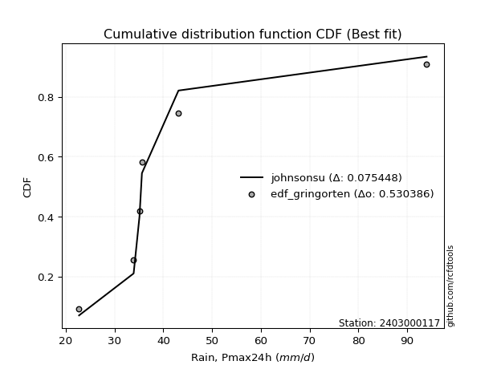</img>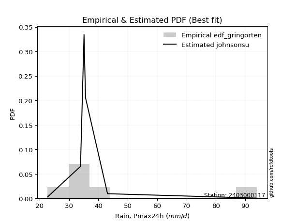</img>

</div>


### 9. EDF Filliben (1975)

The specific values of the constants (0.3175) (often denoted as $alpha$) and (0.365) are derived from a method proposed by James J. Filliben in a 1975 paper. This particular formula is the mean value of the $i$-th order statistic of the normal distribution and is considered a robust and effective plotting position formula for the normal probability plot correlation coefficient test for normality.

<div align="center">


$P=(m-0.3175)/(n+0.365)$


</div>


**9.1. Empirical values**

<div align="center">

|                | 0                   | 1                   | 2                  | 3                  | 4                  | 5                  |
|:---------------|:--------------------|:--------------------|:-------------------|:-------------------|:-------------------|:-------------------|
| date           | 2019                | 2022                | 2021               | 2023               | 2020               | 2024               |
| x              | 22.7                | 33.9                | 35.1               | 35.6               | 43.1               | 94.0               |
| m              | 1                   | 2                   | 3                  | 4                  | 5                  | 6                  |
| empirical_dist | edf_filliben        | edf_filliben        | edf_filliben       | edf_filliben       | edf_filliben       | edf_filliben       |
| empirical      | 0.10722702278083267 | 0.26433621366849963 | 0.4214454045561665 | 0.5785545954438335 | 0.7356637863315004 | 0.8927729772191673 |
| empirical_tr   | 1.1201055873295205  | 1.3593166043780034  | 1.7284453496266123 | 2.3727865796831313 | 3.783060921248143  | 9.326007326007321  |

</div>


**9.2. Kolmogorov-Smirnov fit test (sorted by Δ)**


<div align="center">

|                | 0                   | 1                   | 2                   | 3                   | 4                   | 5                  | 6                   | 7                   | 8                   | 9                   | 10                  | 11                  | 12                  | 13                  | 14                  | 15                 | 16                  | 17                  | 18                  | 19                  | 20                | 21                  | 22                  | 23                  | 24                 | 25                  | 26                  | 27                  | 28                  | 29                 | 30                 | 31                 | 32                  | 33                 | 34                  | 35                 | 36                  | 37                 | 38                  | 39                 | 40                    | 41                  | 42                 | 43                  | 44                  | 45                  | 46                  | 47                 | 48                  | 49                  | 50                  | 51                  | 52                  | 53                  | 54                 | 55                  | 56                 | 57                  | 58                  | 59                  | 60                  | 61                 | 62                  | 63                  | 64                 | 65                  | 66                  | 67                  | 68                  | 69                 | 70                 | 71                  | 72                  | 73                 | 74                 | 75                 | 76                  | 77                 | 78                 | 79                 | 80                  | 81                  | 82                 | 83                 | 84                 | 85                 | 86                | 87                  |
|:---------------|:--------------------|:--------------------|:--------------------|:--------------------|:--------------------|:-------------------|:--------------------|:--------------------|:--------------------|:--------------------|:--------------------|:--------------------|:--------------------|:--------------------|:--------------------|:-------------------|:--------------------|:--------------------|:--------------------|:--------------------|:------------------|:--------------------|:--------------------|:--------------------|:-------------------|:--------------------|:--------------------|:--------------------|:--------------------|:-------------------|:-------------------|:-------------------|:--------------------|:-------------------|:--------------------|:-------------------|:--------------------|:-------------------|:--------------------|:-------------------|:----------------------|:--------------------|:-------------------|:--------------------|:--------------------|:--------------------|:--------------------|:-------------------|:--------------------|:--------------------|:--------------------|:--------------------|:--------------------|:--------------------|:-------------------|:--------------------|:-------------------|:--------------------|:--------------------|:--------------------|:--------------------|:-------------------|:--------------------|:--------------------|:-------------------|:--------------------|:--------------------|:--------------------|:--------------------|:-------------------|:-------------------|:--------------------|:--------------------|:-------------------|:-------------------|:-------------------|:--------------------|:-------------------|:-------------------|:-------------------|:--------------------|:--------------------|:-------------------|:-------------------|:-------------------|:-------------------|:------------------|:--------------------|
| station        | 2403000117          | 2403000117          | 2403000117          | 2403000117          | 2403000117          | 2403000117         | 2403000117          | 2403000117          | 2403000117          | 2403000117          | 2403000117          | 2403000117          | 2403000117          | 2403000117          | 2403000117          | 2403000117         | 2403000117          | 2403000117          | 2403000117          | 2403000117          | 2403000117        | 2403000117          | 2403000117          | 2403000117          | 2403000117         | 2403000117          | 2403000117          | 2403000117          | 2403000117          | 2403000117         | 2403000117         | 2403000117         | 2403000117          | 2403000117         | 2403000117          | 2403000117         | 2403000117          | 2403000117         | 2403000117          | 2403000117         | 2403000117            | 2403000117          | 2403000117         | 2403000117          | 2403000117          | 2403000117          | 2403000117          | 2403000117         | 2403000117          | 2403000117          | 2403000117          | 2403000117          | 2403000117          | 2403000117          | 2403000117         | 2403000117          | 2403000117         | 2403000117          | 2403000117          | 2403000117          | 2403000117          | 2403000117         | 2403000117          | 2403000117          | 2403000117         | 2403000117          | 2403000117          | 2403000117          | 2403000117          | 2403000117         | 2403000117         | 2403000117          | 2403000117          | 2403000117         | 2403000117         | 2403000117         | 2403000117          | 2403000117         | 2403000117         | 2403000117         | 2403000117          | 2403000117          | 2403000117         | 2403000117         | 2403000117         | 2403000117         | 2403000117        | 2403000117          |
| empirical_dist | edf_filliben        | edf_filliben        | edf_filliben        | edf_filliben        | edf_filliben        | edf_filliben       | edf_filliben        | edf_filliben        | edf_filliben        | edf_filliben        | edf_filliben        | edf_filliben        | edf_filliben        | edf_filliben        | edf_filliben        | edf_filliben       | edf_filliben        | edf_filliben        | edf_filliben        | edf_filliben        | edf_filliben      | edf_filliben        | edf_filliben        | edf_filliben        | edf_filliben       | edf_filliben        | edf_filliben        | edf_filliben        | edf_filliben        | edf_filliben       | edf_filliben       | edf_filliben       | edf_filliben        | edf_filliben       | edf_filliben        | edf_filliben       | edf_filliben        | edf_filliben       | edf_filliben        | edf_filliben       | edf_filliben          | edf_filliben        | edf_filliben       | edf_filliben        | edf_filliben        | edf_filliben        | edf_filliben        | edf_filliben       | edf_filliben        | edf_filliben        | edf_filliben        | edf_filliben        | edf_filliben        | edf_filliben        | edf_filliben       | edf_filliben        | edf_filliben       | edf_filliben        | edf_filliben        | edf_filliben        | edf_filliben        | edf_filliben       | edf_filliben        | edf_filliben        | edf_filliben       | edf_filliben        | edf_filliben        | edf_filliben        | edf_filliben        | edf_filliben       | edf_filliben       | edf_filliben        | edf_filliben        | edf_filliben       | edf_filliben       | edf_filliben       | edf_filliben        | edf_filliben       | edf_filliben       | edf_filliben       | edf_filliben        | edf_filliben        | edf_filliben       | edf_filliben       | edf_filliben       | edf_filliben       | edf_filliben      | edf_filliben        |
| p_dist         | johnsonsu           | logjohnsonsu        | logt                | truncnorm           | lograyleigh         | logkstwobign       | loggompertz         | nct                 | gibrat              | mielke              | logexponnorm        | expon               | logmaxwell          | genexpon            | loggumbel_r         | loggenlogistic     | logfisk             | logpearson3         | gompertz            | logmielke           | pearson3          | wald                | lognct              | halflogistic        | logalpha           | loginvweibull       | alpha               | loginvgamma         | logf                | fisk               | moyal              | logrice            | invgamma            | f                  | betaprime           | loginvgauss        | logfatiguelife      | logmoyal           | invgauss            | exponnorm          | loglaplace_asymmetric | logncf              | loghalfnorm        | fatiguelife         | halfnorm            | loggibrat           | ncf                 | logloggamma        | lognorm             | lognorm             | logcrystalball      | loggenexpon         | loghalflogistic     | gumbel_r            | genlogistic        | loglogistic         | logchi2            | loghypsecant        | rayleigh            | logwald             | gamma               | maxwell            | laplace_asymmetric  | kstwobign           | loglaplace         | nakagami            | loggumbel_l         | weibull_min         | logexpon            | crystalball        | norm               | logistic            | hypsecant           | t                  | rice               | laplace            | gumbel_l            | loggamma           | loggamma           | logerlang          | logweibull_min      | erlang              | loglognorm         | logtruncnorm       | chi2               | invweibull         | lognakagami       | logbetaprime        |
| delta          | 0.08488243145030994 | 0.09424457391724272 | 0.13370290683710861 | 0.13705561174170722 | 0.13790178231553024 | 0.1382465946939403 | 0.13969951158204452 | 0.13975200976097257 | 0.13980288089356252 | 0.14184449050472858 | 0.14209417309879357 | 0.14362372027495368 | 0.14362657257407313 | 0.14362832917399565 | 0.14378842952389087 | 0.1438966895532911 | 0.14598381386458498 | 0.14671960771581222 | 0.14681658858399133 | 0.15069490761460408 | 0.151124224717471 | 0.15117362650005028 | 0.15137328697356572 | 0.15154513041404505 | 0.1516447634827564 | 0.15190779577507024 | 0.15284708453268792 | 0.15442575540480324 | 0.15442634806220412 | 0.1561547713843523 | 0.1567891751227498 | 0.1570700232739522 | 0.15767963988951267 | 0.1578186796063622 | 0.15782905530607305 | 0.1585886780255823 | 0.15938332321205662 | 0.1626521721156748 | 0.16680549689828345 | 0.1676750238326351 | 0.16776154681327904   | 0.17222139255452484 | 0.1724712714297994 | 0.17336053853300226 | 0.17537746060235437 | 0.17605272261959615 | 0.17655870945363739 | 0.1771370694721494 | 0.17766325155452456 | 0.17766325155452456 | 0.17766325428511198 | 0.17788006228393743 | 0.18183628967127136 | 0.18266201246049096 | 0.1870009583984219 | 0.19046208159495942 | 0.1975284421344654 | 0.20094288285804157 | 0.20735166144572925 | 0.20786909401633358 | 0.20977827648937403 | 0.2187038838885047 | 0.22683556818752704 | 0.22688017222209617 | 0.2279766663492127 | 0.23807139603619498 | 0.24426534614563356 | 0.24754353309817584 | 0.24819197720069858 | 0.2523415045081659 | 0.2523415171238962 | 0.25461663834246495 | 0.25655729485022427 | 0.2589748260702834 | 0.2592918533460896 | 0.2806901142825333 | 0.32301031824712767 | 0.3316868518812773 | 0.3316868518812773 | 0.3369097169902973 | 0.35027397133637145 | 0.38813242220275274 | 0.3974002728499986 | 0.4219181786509004 | 0.4231055772546101 | 0.4454438238038969 | 0.466176951664717 | 0.47458871996123325 |
| deltao         | 0.530385761606      | 0.530385761606      | 0.530385761606      | 0.530385761606      | 0.530385761606      | 0.530385761606     | 0.530385761606      | 0.530385761606      | 0.530385761606      | 0.530385761606      | 0.530385761606      | 0.530385761606      | 0.530385761606      | 0.530385761606      | 0.530385761606      | 0.530385761606     | 0.530385761606      | 0.530385761606      | 0.530385761606      | 0.530385761606      | 0.530385761606    | 0.530385761606      | 0.530385761606      | 0.530385761606      | 0.530385761606     | 0.530385761606      | 0.530385761606      | 0.530385761606      | 0.530385761606      | 0.530385761606     | 0.530385761606     | 0.530385761606     | 0.530385761606      | 0.530385761606     | 0.530385761606      | 0.530385761606     | 0.530385761606      | 0.530385761606     | 0.530385761606      | 0.530385761606     | 0.530385761606        | 0.530385761606      | 0.530385761606     | 0.530385761606      | 0.530385761606      | 0.530385761606      | 0.530385761606      | 0.530385761606     | 0.530385761606      | 0.530385761606      | 0.530385761606      | 0.530385761606      | 0.530385761606      | 0.530385761606      | 0.530385761606     | 0.530385761606      | 0.530385761606     | 0.530385761606      | 0.530385761606      | 0.530385761606      | 0.530385761606      | 0.530385761606     | 0.530385761606      | 0.530385761606      | 0.530385761606     | 0.530385761606      | 0.530385761606      | 0.530385761606      | 0.530385761606      | 0.530385761606     | 0.530385761606     | 0.530385761606      | 0.530385761606      | 0.530385761606     | 0.530385761606     | 0.530385761606     | 0.530385761606      | 0.530385761606     | 0.530385761606     | 0.530385761606     | 0.530385761606      | 0.530385761606      | 0.530385761606     | 0.530385761606     | 0.530385761606     | 0.530385761606     | 0.530385761606    | 0.530385761606      |
| eval           | Δo > Δ              | Δo > Δ              | Δo > Δ              | Δo > Δ              | Δo > Δ              | Δo > Δ             | Δo > Δ              | Δo > Δ              | Δo > Δ              | Δo > Δ              | Δo > Δ              | Δo > Δ              | Δo > Δ              | Δo > Δ              | Δo > Δ              | Δo > Δ             | Δo > Δ              | Δo > Δ              | Δo > Δ              | Δo > Δ              | Δo > Δ            | Δo > Δ              | Δo > Δ              | Δo > Δ              | Δo > Δ             | Δo > Δ              | Δo > Δ              | Δo > Δ              | Δo > Δ              | Δo > Δ             | Δo > Δ             | Δo > Δ             | Δo > Δ              | Δo > Δ             | Δo > Δ              | Δo > Δ             | Δo > Δ              | Δo > Δ             | Δo > Δ              | Δo > Δ             | Δo > Δ                | Δo > Δ              | Δo > Δ             | Δo > Δ              | Δo > Δ              | Δo > Δ              | Δo > Δ              | Δo > Δ             | Δo > Δ              | Δo > Δ              | Δo > Δ              | Δo > Δ              | Δo > Δ              | Δo > Δ              | Δo > Δ             | Δo > Δ              | Δo > Δ             | Δo > Δ              | Δo > Δ              | Δo > Δ              | Δo > Δ              | Δo > Δ             | Δo > Δ              | Δo > Δ              | Δo > Δ             | Δo > Δ              | Δo > Δ              | Δo > Δ              | Δo > Δ              | Δo > Δ             | Δo > Δ             | Δo > Δ              | Δo > Δ              | Δo > Δ             | Δo > Δ             | Δo > Δ             | Δo > Δ              | Δo > Δ             | Δo > Δ             | Δo > Δ             | Δo > Δ              | Δo > Δ              | Δo > Δ             | Δo > Δ             | Δo > Δ             | Δo > Δ             | Δo > Δ            | Δo > Δ              |
| fit            | 1                   | 1                   | 1                   | 1                   | 1                   | 1                  | 1                   | 1                   | 1                   | 1                   | 1                   | 1                   | 1                   | 1                   | 1                   | 1                  | 1                   | 1                   | 1                   | 1                   | 1                 | 1                   | 1                   | 1                   | 1                  | 1                   | 1                   | 1                   | 1                   | 1                  | 1                  | 1                  | 1                   | 1                  | 1                   | 1                  | 1                   | 1                  | 1                   | 1                  | 1                     | 1                   | 1                  | 1                   | 1                   | 1                   | 1                   | 1                  | 1                   | 1                   | 1                   | 1                   | 1                   | 1                   | 1                  | 1                   | 1                  | 1                   | 1                   | 1                   | 1                   | 1                  | 1                   | 1                   | 1                  | 1                   | 1                   | 1                   | 1                   | 1                  | 1                  | 1                   | 1                   | 1                  | 1                  | 1                  | 1                   | 1                  | 1                  | 1                  | 1                   | 1                   | 1                  | 1                  | 1                  | 1                  | 1                 | 1                   |
| n              | 6                   | 6                   | 6                   | 6                   | 6                   | 6                  | 6                   | 6                   | 6                   | 6                   | 6                   | 6                   | 6                   | 6                   | 6                   | 6                  | 6                   | 6                   | 6                   | 6                   | 6                 | 6                   | 6                   | 6                   | 6                  | 6                   | 6                   | 6                   | 6                   | 6                  | 6                  | 6                  | 6                   | 6                  | 6                   | 6                  | 6                   | 6                  | 6                   | 6                  | 6                     | 6                   | 6                  | 6                   | 6                   | 6                   | 6                   | 6                  | 6                   | 6                   | 6                   | 6                   | 6                   | 6                   | 6                  | 6                   | 6                  | 6                   | 6                   | 6                   | 6                   | 6                  | 6                   | 6                   | 6                  | 6                   | 6                   | 6                   | 6                   | 6                  | 6                  | 6                   | 6                   | 6                  | 6                  | 6                  | 6                   | 6                  | 6                  | 6                  | 6                   | 6                   | 6                  | 6                  | 6                  | 6                  | 6                 | 6                   |
| best_fit       | 1                   | 0                   | 0                   | 0                   | 0                   | 0                  | 0                   | 0                   | 0                   | 0                   | 0                   | 0                   | 0                   | 0                   | 0                   | 0                  | 0                   | 0                   | 0                   | 0                   | 0                 | 0                   | 0                   | 0                   | 0                  | 0                   | 0                   | 0                   | 0                   | 0                  | 0                  | 0                  | 0                   | 0                  | 0                   | 0                  | 0                   | 0                  | 0                   | 0                  | 0                     | 0                   | 0                  | 0                   | 0                   | 0                   | 0                   | 0                  | 0                   | 0                   | 0                   | 0                   | 0                   | 0                   | 0                  | 0                   | 0                  | 0                   | 0                   | 0                   | 0                   | 0                  | 0                   | 0                   | 0                  | 0                   | 0                   | 0                   | 0                   | 0                  | 0                  | 0                   | 0                   | 0                  | 0                  | 0                  | 0                   | 0                  | 0                  | 0                  | 0                   | 0                   | 0                  | 0                  | 0                  | 0                  | 0                 | 0                   |
| best_fit_sort  | 1                   | 2                   | 3                   | 4                   | 5                   | 6                  | 7                   | 8                   | 9                   | 10                  | 11                  | 12                  | 13                  | 14                  | 15                  | 16                 | 17                  | 18                  | 19                  | 20                  | 21                | 22                  | 23                  | 24                  | 25                 | 26                  | 27                  | 28                  | 29                  | 30                 | 31                 | 32                 | 33                  | 34                 | 35                  | 36                 | 37                  | 38                 | 39                  | 40                 | 41                    | 42                  | 43                 | 44                  | 45                  | 46                  | 47                  | 48                 | 49                  | 50                  | 51                  | 52                  | 53                  | 54                  | 55                 | 56                  | 57                 | 58                  | 59                  | 60                  | 61                  | 62                 | 63                  | 64                  | 65                 | 66                  | 67                  | 68                  | 69                  | 70                 | 71                 | 72                  | 73                  | 74                 | 75                 | 76                 | 77                  | 78                 | 79                 | 80                 | 81                  | 82                  | 83                 | 84                 | 85                 | 86                 | 87                | 88                  |

</div>


**9.3. Best fit**

<div align="center">

|   id |    station | empirical_dist   | p_dist    |     delta |   deltao | eval   |   fit |   n |   best_fit |   best_fit_sort |
|-----:|-----------:|:-----------------|:----------|----------:|---------:|:-------|------:|----:|-----------:|----------------:|
|    0 | 2403000117 | edf_filliben     | johnsonsu | 0.0848824 | 0.530386 | Δo > Δ |     1 |   6 |          1 |               1 |

</div>


<div align="center">

</img>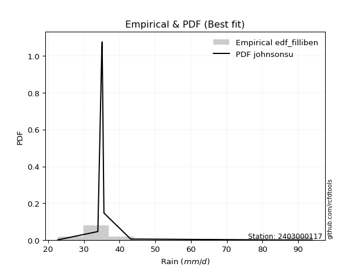</img>

</div>


### 10. EDF Jenkinson (1977)

The Jenkinson formula in hydrology is an empirical plotting position formula used to estimate the non-exceedance probability _(P)_ or return period _(T)_ of a given ordered observation within a sample. It is a widely used method in the frequency analysis of extreme events such as floods and rainfall, as it provides a distribution-free way to plot data. _a≈0.31_ and _b≈0.38_ are constants derived to approximate the median of the probability distribution for the given rank.

<div align="center">


$P=(m-a)/(n+b)$


</div>


**10.1. Empirical values**

<div align="center">

|                | 0                   | 1                   | 2                  | 3                  | 4                  | 5                  |
|:---------------|:--------------------|:--------------------|:-------------------|:-------------------|:-------------------|:-------------------|
| date           | 2019                | 2022                | 2021               | 2023               | 2020               | 2024               |
| x              | 22.7                | 33.9                | 35.1               | 35.6               | 43.1               | 94.0               |
| m              | 1                   | 2                   | 3                  | 4                  | 5                  | 6                  |
| empirical_dist | edf_jenkinson       | edf_jenkinson       | edf_jenkinson      | edf_jenkinson      | edf_jenkinson      | edf_jenkinson      |
| empirical      | 0.10815047021943573 | 0.26489028213166144 | 0.4216300940438871 | 0.5783699059561128 | 0.7351097178683387 | 0.8918495297805643 |
| empirical_tr   | 1.1212653778558874  | 1.3603411513859276  | 1.7289972899728996 | 2.3717472118959106 | 3.7751479289940844 | 9.246376811594207  |

</div>


**10.2. Kolmogorov-Smirnov fit test (sorted by Δ)**


<div align="center">

|                | 0                   | 1                   | 2                   | 3                  | 4                   | 5                  | 6                   | 7                   | 8                   | 9                   | 10                  | 11                  | 12                  | 13                  | 14                 | 15                  | 16                  | 17                 | 18                  | 19                  | 20                  | 21                  | 22                 | 23                 | 24                  | 25                  | 26                 | 27                  | 28                  | 29                 | 30                  | 31                  | 32                  | 33                 | 34                 | 35                 | 36                 | 37                  | 38                  | 39                  | 40                    | 41                 | 42                 | 43                  | 44                  | 45                  | 46                  | 47                  | 48                  | 49                 | 50                 | 51                  | 52                  | 53                 | 54                  | 55                  | 56                  | 57                  | 58                 | 59                  | 60                  | 61                  | 62                  | 63                 | 64                  | 65                  | 66                 | 67                  | 68                  | 69                  | 70                  | 71                 | 72                 | 73                  | 74                  | 75                  | 76                 | 77                 | 78                 | 79                 | 80                  | 81                  | 82                 | 83                  | 84                 | 85                  | 86                 | 87                  |
|:---------------|:--------------------|:--------------------|:--------------------|:-------------------|:--------------------|:-------------------|:--------------------|:--------------------|:--------------------|:--------------------|:--------------------|:--------------------|:--------------------|:--------------------|:-------------------|:--------------------|:--------------------|:-------------------|:--------------------|:--------------------|:--------------------|:--------------------|:-------------------|:-------------------|:--------------------|:--------------------|:-------------------|:--------------------|:--------------------|:-------------------|:--------------------|:--------------------|:--------------------|:-------------------|:-------------------|:-------------------|:-------------------|:--------------------|:--------------------|:--------------------|:----------------------|:-------------------|:-------------------|:--------------------|:--------------------|:--------------------|:--------------------|:--------------------|:--------------------|:-------------------|:-------------------|:--------------------|:--------------------|:-------------------|:--------------------|:--------------------|:--------------------|:--------------------|:-------------------|:--------------------|:--------------------|:--------------------|:--------------------|:-------------------|:--------------------|:--------------------|:-------------------|:--------------------|:--------------------|:--------------------|:--------------------|:-------------------|:-------------------|:--------------------|:--------------------|:--------------------|:-------------------|:-------------------|:-------------------|:-------------------|:--------------------|:--------------------|:-------------------|:--------------------|:-------------------|:--------------------|:-------------------|:--------------------|
| station        | 2403000117          | 2403000117          | 2403000117          | 2403000117         | 2403000117          | 2403000117         | 2403000117          | 2403000117          | 2403000117          | 2403000117          | 2403000117          | 2403000117          | 2403000117          | 2403000117          | 2403000117         | 2403000117          | 2403000117          | 2403000117         | 2403000117          | 2403000117          | 2403000117          | 2403000117          | 2403000117         | 2403000117         | 2403000117          | 2403000117          | 2403000117         | 2403000117          | 2403000117          | 2403000117         | 2403000117          | 2403000117          | 2403000117          | 2403000117         | 2403000117         | 2403000117         | 2403000117         | 2403000117          | 2403000117          | 2403000117          | 2403000117            | 2403000117         | 2403000117         | 2403000117          | 2403000117          | 2403000117          | 2403000117          | 2403000117          | 2403000117          | 2403000117         | 2403000117         | 2403000117          | 2403000117          | 2403000117         | 2403000117          | 2403000117          | 2403000117          | 2403000117          | 2403000117         | 2403000117          | 2403000117          | 2403000117          | 2403000117          | 2403000117         | 2403000117          | 2403000117          | 2403000117         | 2403000117          | 2403000117          | 2403000117          | 2403000117          | 2403000117         | 2403000117         | 2403000117          | 2403000117          | 2403000117          | 2403000117         | 2403000117         | 2403000117         | 2403000117         | 2403000117          | 2403000117          | 2403000117         | 2403000117          | 2403000117         | 2403000117          | 2403000117         | 2403000117          |
| empirical_dist | edf_jenkinson       | edf_jenkinson       | edf_jenkinson       | edf_jenkinson      | edf_jenkinson       | edf_jenkinson      | edf_jenkinson       | edf_jenkinson       | edf_jenkinson       | edf_jenkinson       | edf_jenkinson       | edf_jenkinson       | edf_jenkinson       | edf_jenkinson       | edf_jenkinson      | edf_jenkinson       | edf_jenkinson       | edf_jenkinson      | edf_jenkinson       | edf_jenkinson       | edf_jenkinson       | edf_jenkinson       | edf_jenkinson      | edf_jenkinson      | edf_jenkinson       | edf_jenkinson       | edf_jenkinson      | edf_jenkinson       | edf_jenkinson       | edf_jenkinson      | edf_jenkinson       | edf_jenkinson       | edf_jenkinson       | edf_jenkinson      | edf_jenkinson      | edf_jenkinson      | edf_jenkinson      | edf_jenkinson       | edf_jenkinson       | edf_jenkinson       | edf_jenkinson         | edf_jenkinson      | edf_jenkinson      | edf_jenkinson       | edf_jenkinson       | edf_jenkinson       | edf_jenkinson       | edf_jenkinson       | edf_jenkinson       | edf_jenkinson      | edf_jenkinson      | edf_jenkinson       | edf_jenkinson       | edf_jenkinson      | edf_jenkinson       | edf_jenkinson       | edf_jenkinson       | edf_jenkinson       | edf_jenkinson      | edf_jenkinson       | edf_jenkinson       | edf_jenkinson       | edf_jenkinson       | edf_jenkinson      | edf_jenkinson       | edf_jenkinson       | edf_jenkinson      | edf_jenkinson       | edf_jenkinson       | edf_jenkinson       | edf_jenkinson       | edf_jenkinson      | edf_jenkinson      | edf_jenkinson       | edf_jenkinson       | edf_jenkinson       | edf_jenkinson      | edf_jenkinson      | edf_jenkinson      | edf_jenkinson      | edf_jenkinson       | edf_jenkinson       | edf_jenkinson      | edf_jenkinson       | edf_jenkinson      | edf_jenkinson       | edf_jenkinson      | edf_jenkinson       |
| p_dist         | johnsonsu           | logjohnsonsu        | logt                | truncnorm          | lograyleigh         | logkstwobign       | loggompertz         | nct                 | gibrat              | mielke              | logexponnorm        | expon               | genexpon            | loggumbel_r         | loggenlogistic     | logmaxwell          | logfisk             | logpearson3        | gompertz            | logmielke           | pearson3            | wald                | halflogistic       | logalpha           | lognct              | loginvweibull       | alpha              | loginvgamma         | logf                | fisk               | moyal               | logrice             | invgamma            | f                  | betaprime          | loginvgauss        | logfatiguelife     | logmoyal            | invgauss            | exponnorm           | loglaplace_asymmetric | logncf             | loghalfnorm        | fatiguelife         | halfnorm            | loggibrat           | ncf                 | logloggamma         | loggenexpon         | lognorm            | lognorm            | logcrystalball      | loghalflogistic     | gumbel_r           | genlogistic         | loglogistic         | logchi2             | loghypsecant        | rayleigh           | logwald             | gamma               | maxwell             | laplace_asymmetric  | kstwobign          | loglaplace          | nakagami            | loggumbel_l        | weibull_min         | logexpon            | crystalball         | norm                | logistic           | hypsecant          | t                   | rice                | laplace             | gumbel_l           | loggamma           | loggamma           | logerlang          | logweibull_min      | erlang              | loglognorm         | logtruncnorm        | chi2               | invweibull          | lognakagami        | logbetaprime        |
| delta          | 0.08543649991347169 | 0.09479864238040447 | 0.13425697530027036 | 0.1365015432785454 | 0.13734771385236844 | 0.1376925262307785 | 0.13951482209432386 | 0.13956732027325192 | 0.13961819140584186 | 0.14129042204156678 | 0.14154010463563177 | 0.14306965181179188 | 0.14307426071083384 | 0.14323436106072907 | 0.1433426210901293 | 0.14344188308635247 | 0.14542974540142317 | 0.1461655392526504 | 0.14626252012082952 | 0.15014083915144227 | 0.15057015625430925 | 0.15061955803688848 | 0.1509910619508833 | 0.1510906950195946 | 0.15118859748584507 | 0.15135372731190844 | 0.1522930160695261 | 0.15387168694164144 | 0.15387227959904232 | 0.1556007029211905 | 0.15623510665958806 | 0.15688533378623154 | 0.15712557142635086 | 0.1572646111432004 | 0.1576443658183524 | 0.1580346095624205 | 0.1588292547488948 | 0.16209810365251298 | 0.16625142843512164 | 0.16749033434491445 | 0.16757685732555838   | 0.1716673240913631 | 0.1719172029666376 | 0.17280647006984046 | 0.17482339213919262 | 0.17549865415643434 | 0.17637401996591673 | 0.17695237998442875 | 0.17732599382077563 | 0.1774785620668039 | 0.1774785620668039 | 0.17747856479739132 | 0.18128222120810955 | 0.1821079439973292 | 0.18681626891070124 | 0.19027739210723876 | 0.19697437367130366 | 0.20075819337032091 | 0.2067975929825675 | 0.20731502555317177 | 0.20922420802621222 | 0.21814981542534295 | 0.22665087869980638 | 0.2266954827343755 | 0.22779197686149205 | 0.23751732757303323 | 0.2440806566579129 | 0.24698946463501403 | 0.24763790873753677 | 0.25178743604500414 | 0.25178744866073444 | 0.2540625698793032 | 0.2560032263870625 | 0.25842075760712163 | 0.25873778488292787 | 0.28050542479481266 | 0.3224562497839659 | 0.3311327834181155 | 0.3311327834181155 | 0.3363556485271355 | 0.34971990287320964 | 0.38757835373959093 | 0.3968462043868368 | 0.42173348916317976 | 0.4225515087914483 | 0.44452037636529396 | 0.4656228832015552 | 0.47403465149807145 |
| deltao         | 0.530385761606      | 0.530385761606      | 0.530385761606      | 0.530385761606     | 0.530385761606      | 0.530385761606     | 0.530385761606      | 0.530385761606      | 0.530385761606      | 0.530385761606      | 0.530385761606      | 0.530385761606      | 0.530385761606      | 0.530385761606      | 0.530385761606     | 0.530385761606      | 0.530385761606      | 0.530385761606     | 0.530385761606      | 0.530385761606      | 0.530385761606      | 0.530385761606      | 0.530385761606     | 0.530385761606     | 0.530385761606      | 0.530385761606      | 0.530385761606     | 0.530385761606      | 0.530385761606      | 0.530385761606     | 0.530385761606      | 0.530385761606      | 0.530385761606      | 0.530385761606     | 0.530385761606     | 0.530385761606     | 0.530385761606     | 0.530385761606      | 0.530385761606      | 0.530385761606      | 0.530385761606        | 0.530385761606     | 0.530385761606     | 0.530385761606      | 0.530385761606      | 0.530385761606      | 0.530385761606      | 0.530385761606      | 0.530385761606      | 0.530385761606     | 0.530385761606     | 0.530385761606      | 0.530385761606      | 0.530385761606     | 0.530385761606      | 0.530385761606      | 0.530385761606      | 0.530385761606      | 0.530385761606     | 0.530385761606      | 0.530385761606      | 0.530385761606      | 0.530385761606      | 0.530385761606     | 0.530385761606      | 0.530385761606      | 0.530385761606     | 0.530385761606      | 0.530385761606      | 0.530385761606      | 0.530385761606      | 0.530385761606     | 0.530385761606     | 0.530385761606      | 0.530385761606      | 0.530385761606      | 0.530385761606     | 0.530385761606     | 0.530385761606     | 0.530385761606     | 0.530385761606      | 0.530385761606      | 0.530385761606     | 0.530385761606      | 0.530385761606     | 0.530385761606      | 0.530385761606     | 0.530385761606      |
| eval           | Δo > Δ              | Δo > Δ              | Δo > Δ              | Δo > Δ             | Δo > Δ              | Δo > Δ             | Δo > Δ              | Δo > Δ              | Δo > Δ              | Δo > Δ              | Δo > Δ              | Δo > Δ              | Δo > Δ              | Δo > Δ              | Δo > Δ             | Δo > Δ              | Δo > Δ              | Δo > Δ             | Δo > Δ              | Δo > Δ              | Δo > Δ              | Δo > Δ              | Δo > Δ             | Δo > Δ             | Δo > Δ              | Δo > Δ              | Δo > Δ             | Δo > Δ              | Δo > Δ              | Δo > Δ             | Δo > Δ              | Δo > Δ              | Δo > Δ              | Δo > Δ             | Δo > Δ             | Δo > Δ             | Δo > Δ             | Δo > Δ              | Δo > Δ              | Δo > Δ              | Δo > Δ                | Δo > Δ             | Δo > Δ             | Δo > Δ              | Δo > Δ              | Δo > Δ              | Δo > Δ              | Δo > Δ              | Δo > Δ              | Δo > Δ             | Δo > Δ             | Δo > Δ              | Δo > Δ              | Δo > Δ             | Δo > Δ              | Δo > Δ              | Δo > Δ              | Δo > Δ              | Δo > Δ             | Δo > Δ              | Δo > Δ              | Δo > Δ              | Δo > Δ              | Δo > Δ             | Δo > Δ              | Δo > Δ              | Δo > Δ             | Δo > Δ              | Δo > Δ              | Δo > Δ              | Δo > Δ              | Δo > Δ             | Δo > Δ             | Δo > Δ              | Δo > Δ              | Δo > Δ              | Δo > Δ             | Δo > Δ             | Δo > Δ             | Δo > Δ             | Δo > Δ              | Δo > Δ              | Δo > Δ             | Δo > Δ              | Δo > Δ             | Δo > Δ              | Δo > Δ             | Δo > Δ              |
| fit            | 1                   | 1                   | 1                   | 1                  | 1                   | 1                  | 1                   | 1                   | 1                   | 1                   | 1                   | 1                   | 1                   | 1                   | 1                  | 1                   | 1                   | 1                  | 1                   | 1                   | 1                   | 1                   | 1                  | 1                  | 1                   | 1                   | 1                  | 1                   | 1                   | 1                  | 1                   | 1                   | 1                   | 1                  | 1                  | 1                  | 1                  | 1                   | 1                   | 1                   | 1                     | 1                  | 1                  | 1                   | 1                   | 1                   | 1                   | 1                   | 1                   | 1                  | 1                  | 1                   | 1                   | 1                  | 1                   | 1                   | 1                   | 1                   | 1                  | 1                   | 1                   | 1                   | 1                   | 1                  | 1                   | 1                   | 1                  | 1                   | 1                   | 1                   | 1                   | 1                  | 1                  | 1                   | 1                   | 1                   | 1                  | 1                  | 1                  | 1                  | 1                   | 1                   | 1                  | 1                   | 1                  | 1                   | 1                  | 1                   |
| n              | 6                   | 6                   | 6                   | 6                  | 6                   | 6                  | 6                   | 6                   | 6                   | 6                   | 6                   | 6                   | 6                   | 6                   | 6                  | 6                   | 6                   | 6                  | 6                   | 6                   | 6                   | 6                   | 6                  | 6                  | 6                   | 6                   | 6                  | 6                   | 6                   | 6                  | 6                   | 6                   | 6                   | 6                  | 6                  | 6                  | 6                  | 6                   | 6                   | 6                   | 6                     | 6                  | 6                  | 6                   | 6                   | 6                   | 6                   | 6                   | 6                   | 6                  | 6                  | 6                   | 6                   | 6                  | 6                   | 6                   | 6                   | 6                   | 6                  | 6                   | 6                   | 6                   | 6                   | 6                  | 6                   | 6                   | 6                  | 6                   | 6                   | 6                   | 6                   | 6                  | 6                  | 6                   | 6                   | 6                   | 6                  | 6                  | 6                  | 6                  | 6                   | 6                   | 6                  | 6                   | 6                  | 6                   | 6                  | 6                   |
| best_fit       | 1                   | 0                   | 0                   | 0                  | 0                   | 0                  | 0                   | 0                   | 0                   | 0                   | 0                   | 0                   | 0                   | 0                   | 0                  | 0                   | 0                   | 0                  | 0                   | 0                   | 0                   | 0                   | 0                  | 0                  | 0                   | 0                   | 0                  | 0                   | 0                   | 0                  | 0                   | 0                   | 0                   | 0                  | 0                  | 0                  | 0                  | 0                   | 0                   | 0                   | 0                     | 0                  | 0                  | 0                   | 0                   | 0                   | 0                   | 0                   | 0                   | 0                  | 0                  | 0                   | 0                   | 0                  | 0                   | 0                   | 0                   | 0                   | 0                  | 0                   | 0                   | 0                   | 0                   | 0                  | 0                   | 0                   | 0                  | 0                   | 0                   | 0                   | 0                   | 0                  | 0                  | 0                   | 0                   | 0                   | 0                  | 0                  | 0                  | 0                  | 0                   | 0                   | 0                  | 0                   | 0                  | 0                   | 0                  | 0                   |
| best_fit_sort  | 1                   | 2                   | 3                   | 4                  | 5                   | 6                  | 7                   | 8                   | 9                   | 10                  | 11                  | 12                  | 13                  | 14                  | 15                 | 16                  | 17                  | 18                 | 19                  | 20                  | 21                  | 22                  | 23                 | 24                 | 25                  | 26                  | 27                 | 28                  | 29                  | 30                 | 31                  | 32                  | 33                  | 34                 | 35                 | 36                 | 37                 | 38                  | 39                  | 40                  | 41                    | 42                 | 43                 | 44                  | 45                  | 46                  | 47                  | 48                  | 49                  | 50                 | 51                 | 52                  | 53                  | 54                 | 55                  | 56                  | 57                  | 58                  | 59                 | 60                  | 61                  | 62                  | 63                  | 64                 | 65                  | 66                  | 67                 | 68                  | 69                  | 70                  | 71                  | 72                 | 73                 | 74                  | 75                  | 76                  | 77                 | 78                 | 79                 | 80                 | 81                  | 82                  | 83                 | 84                  | 85                 | 86                  | 87                 | 88                  |

</div>


**10.3. Best fit**

<div align="center">

|   id |    station | empirical_dist   | p_dist    |     delta |   deltao | eval   |   fit |   n |   best_fit |   best_fit_sort |
|-----:|-----------:|:-----------------|:----------|----------:|---------:|:-------|------:|----:|-----------:|----------------:|
|    0 | 2403000117 | edf_jenkinson    | johnsonsu | 0.0854365 | 0.530386 | Δo > Δ |     1 |   6 |          1 |               1 |

</div>


<div align="center">

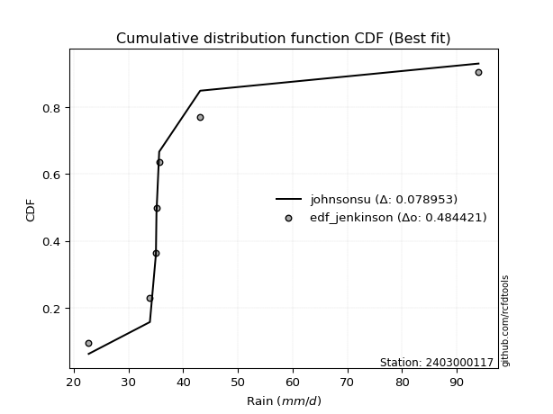</img>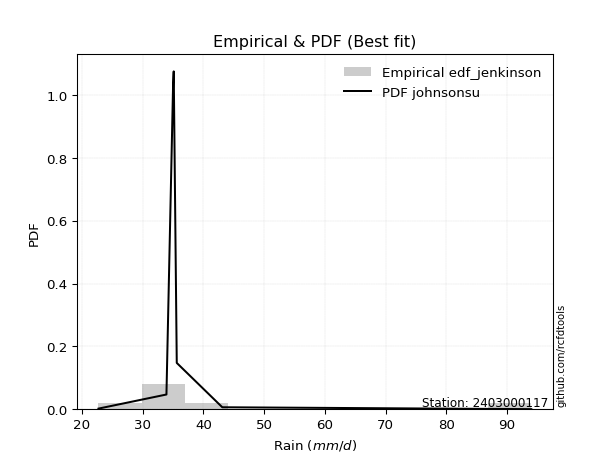</img>

</div>


### 11. EDF Cunnane (1978)

Cunnane´s work in statistical hydrology has focused on the performance and evaluation of different probability distributions (such as GEV, Gumbel, Lognormal) for flood frequency estimation. _b_ is a constant, typically set to 0.4.

<div align="center">


$P=(m-b)/(n+1-2b)$


</div>


**11.1. Empirical values**

<div align="center">

|                | 0                  | 1                   | 2                   | 3                  | 4                  | 5                  |
|:---------------|:-------------------|:--------------------|:--------------------|:-------------------|:-------------------|:-------------------|
| date           | 2019               | 2022                | 2021                | 2023               | 2020               | 2024               |
| x              | 22.7               | 33.9                | 35.1                | 35.6               | 43.1               | 94.0               |
| m              | 1                  | 2                   | 3                   | 4                  | 5                  | 6                  |
| empirical_dist | edf_cunnane        | edf_cunnane         | edf_cunnane         | edf_cunnane        | edf_cunnane        | edf_cunnane        |
| empirical      | 0.0967741935483871 | 0.25806451612903225 | 0.41935483870967744 | 0.5806451612903226 | 0.7419354838709676 | 0.9032258064516128 |
| empirical_tr   | 1.1071428571428572 | 1.3478260869565217  | 1.7222222222222225  | 2.384615384615385  | 3.8749999999999982 | 10.333333333333318 |

</div>


**11.2. Kolmogorov-Smirnov fit test (sorted by Δ)**


<div align="center">

|                | 0                   | 1                   | 2                  | 3                   | 4                   | 5                   | 6                  | 7                   | 8                   | 9                   | 10                  | 11                  | 12                  | 13                  | 14                  | 15                  | 16                  | 17                 | 18                 | 19                  | 20                  | 21                  | 22                  | 23                  | 24                 | 25                  | 26                 | 27                  | 28                 | 29                  | 30                 | 31                  | 32                  | 33                  | 34                  | 35                  | 36                | 37                  | 38                  | 39                    | 40                  | 41                  | 42                  | 43                  | 44                  | 45                  | 46                 | 47                 | 48                  | 49                 | 50                  | 51                  | 52                  | 53                  | 54                  | 55                  | 56                  | 57                  | 58                  | 59                  | 60                 | 61                  | 62                  | 63                 | 64                  | 65                 | 66                 | 67                 | 68                  | 69                 | 70                 | 71                  | 72                 | 73                 | 74                  | 75                  | 76                 | 77                  | 78                  | 79                 | 80                  | 81                 | 82                | 83                  | 84                 | 85                 | 86                 | 87                  |
|:---------------|:--------------------|:--------------------|:-------------------|:--------------------|:--------------------|:--------------------|:-------------------|:--------------------|:--------------------|:--------------------|:--------------------|:--------------------|:--------------------|:--------------------|:--------------------|:--------------------|:--------------------|:-------------------|:-------------------|:--------------------|:--------------------|:--------------------|:--------------------|:--------------------|:-------------------|:--------------------|:-------------------|:--------------------|:-------------------|:--------------------|:-------------------|:--------------------|:--------------------|:--------------------|:--------------------|:--------------------|:------------------|:--------------------|:--------------------|:----------------------|:--------------------|:--------------------|:--------------------|:--------------------|:--------------------|:--------------------|:-------------------|:-------------------|:--------------------|:-------------------|:--------------------|:--------------------|:--------------------|:--------------------|:--------------------|:--------------------|:--------------------|:--------------------|:--------------------|:--------------------|:-------------------|:--------------------|:--------------------|:-------------------|:--------------------|:-------------------|:-------------------|:-------------------|:--------------------|:-------------------|:-------------------|:--------------------|:-------------------|:-------------------|:--------------------|:--------------------|:-------------------|:--------------------|:--------------------|:-------------------|:--------------------|:-------------------|:------------------|:--------------------|:-------------------|:-------------------|:-------------------|:--------------------|
| station        | 2403000117          | 2403000117          | 2403000117         | 2403000117          | 2403000117          | 2403000117          | 2403000117         | 2403000117          | 2403000117          | 2403000117          | 2403000117          | 2403000117          | 2403000117          | 2403000117          | 2403000117          | 2403000117          | 2403000117          | 2403000117         | 2403000117         | 2403000117          | 2403000117          | 2403000117          | 2403000117          | 2403000117          | 2403000117         | 2403000117          | 2403000117         | 2403000117          | 2403000117         | 2403000117          | 2403000117         | 2403000117          | 2403000117          | 2403000117          | 2403000117          | 2403000117          | 2403000117        | 2403000117          | 2403000117          | 2403000117            | 2403000117          | 2403000117          | 2403000117          | 2403000117          | 2403000117          | 2403000117          | 2403000117         | 2403000117         | 2403000117          | 2403000117         | 2403000117          | 2403000117          | 2403000117          | 2403000117          | 2403000117          | 2403000117          | 2403000117          | 2403000117          | 2403000117          | 2403000117          | 2403000117         | 2403000117          | 2403000117          | 2403000117         | 2403000117          | 2403000117         | 2403000117         | 2403000117         | 2403000117          | 2403000117         | 2403000117         | 2403000117          | 2403000117         | 2403000117         | 2403000117          | 2403000117          | 2403000117         | 2403000117          | 2403000117          | 2403000117         | 2403000117          | 2403000117         | 2403000117        | 2403000117          | 2403000117         | 2403000117         | 2403000117         | 2403000117          |
| empirical_dist | edf_cunnane         | edf_cunnane         | edf_cunnane        | edf_cunnane         | edf_cunnane         | edf_cunnane         | edf_cunnane        | edf_cunnane         | edf_cunnane         | edf_cunnane         | edf_cunnane         | edf_cunnane         | edf_cunnane         | edf_cunnane         | edf_cunnane         | edf_cunnane         | edf_cunnane         | edf_cunnane        | edf_cunnane        | edf_cunnane         | edf_cunnane         | edf_cunnane         | edf_cunnane         | edf_cunnane         | edf_cunnane        | edf_cunnane         | edf_cunnane        | edf_cunnane         | edf_cunnane        | edf_cunnane         | edf_cunnane        | edf_cunnane         | edf_cunnane         | edf_cunnane         | edf_cunnane         | edf_cunnane         | edf_cunnane       | edf_cunnane         | edf_cunnane         | edf_cunnane           | edf_cunnane         | edf_cunnane         | edf_cunnane         | edf_cunnane         | edf_cunnane         | edf_cunnane         | edf_cunnane        | edf_cunnane        | edf_cunnane         | edf_cunnane        | edf_cunnane         | edf_cunnane         | edf_cunnane         | edf_cunnane         | edf_cunnane         | edf_cunnane         | edf_cunnane         | edf_cunnane         | edf_cunnane         | edf_cunnane         | edf_cunnane        | edf_cunnane         | edf_cunnane         | edf_cunnane        | edf_cunnane         | edf_cunnane        | edf_cunnane        | edf_cunnane        | edf_cunnane         | edf_cunnane        | edf_cunnane        | edf_cunnane         | edf_cunnane        | edf_cunnane        | edf_cunnane         | edf_cunnane         | edf_cunnane        | edf_cunnane         | edf_cunnane         | edf_cunnane        | edf_cunnane         | edf_cunnane        | edf_cunnane       | edf_cunnane         | edf_cunnane        | edf_cunnane        | edf_cunnane        | edf_cunnane         |
| p_dist         | johnsonsu           | logjohnsonsu        | logt               | nct                 | gibrat              | loggompertz         | truncnorm          | lograyleigh         | logkstwobign        | logmaxwell          | mielke              | logexponnorm        | expon               | genexpon            | loggumbel_r         | loggenlogistic      | logfisk             | logpearson3        | gompertz           | lognct              | logmielke           | pearson3            | wald                | halflogistic        | logalpha           | loginvweibull       | alpha              | logrice             | betaprime          | loginvgamma         | logf               | fisk                | moyal               | invgamma            | f                   | loginvgauss         | logfatiguelife    | logmoyal            | exponnorm           | loglaplace_asymmetric | invgauss            | logncf              | ncf                 | loghalfnorm         | logloggamma         | fatiguelife         | lognorm            | lognorm            | logcrystalball      | halfnorm           | loggibrat           | loggenexpon         | loghalflogistic     | gumbel_r            | genlogistic         | loglogistic         | loghypsecant        | logchi2             | rayleigh            | logwald             | gamma              | maxwell             | laplace_asymmetric  | kstwobign          | loglaplace          | nakagami           | loggumbel_l        | weibull_min        | logexpon            | crystalball        | norm               | logistic            | hypsecant          | t                  | rice                | laplace             | gumbel_l           | loggamma            | loggamma            | logerlang          | logweibull_min      | erlang             | loglognorm        | logtruncnorm        | chi2               | invweibull         | lognakagami        | logbetaprime        |
| delta          | 0.07861073391084272 | 0.08797287637777551 | 0.1274312092976414 | 0.14184257560746172 | 0.14189344674005167 | 0.14316492470687237 | 0.1433273092811746 | 0.14417347985499762 | 0.14451829223340767 | 0.14571713842056228 | 0.14811618804419596 | 0.14836587063826095 | 0.14989541781442106 | 0.14990002671346303 | 0.15006012706335825 | 0.15016838709275848 | 0.15225551140405236 | 0.1529913052552796 | 0.1530882861234587 | 0.15346385282005487 | 0.15696660515407146 | 0.15739592225693821 | 0.15744532403951766 | 0.15781682795351226 | 0.1579164610222238 | 0.15817949331453762 | 0.1591187820721553 | 0.15916058912044134 | 0.1599196211525622 | 0.16069745294427062 | 0.1606980456016715 | 0.16242646892381968 | 0.16306087266221703 | 0.16395133742898005 | 0.16409037714582958 | 0.16486037556504968 | 0.165655020751524 | 0.16892386965514217 | 0.16976558967912425 | 0.16985211265976818   | 0.17307719443775083 | 0.17849309009399206 | 0.17864927530012653 | 0.17874296896926678 | 0.17922763531863856 | 0.17963223607246964 | 0.1797538174010137 | 0.1797538174010137 | 0.17975382013160113 | 0.1816491581418216 | 0.18232442015906353 | 0.18415175982340481 | 0.18810798721073874 | 0.18893370999995818 | 0.18909152424491105 | 0.19255264744144857 | 0.20303344870453072 | 0.20380013967393262 | 0.21362335898519647 | 0.21414079155580096 | 0.2160499740288414 | 0.22497558142797192 | 0.22892613403401618 | 0.2289707380685853 | 0.23006723219570185 | 0.2443430935756622 | 0.2463559119921227 | 0.2538152306376432 | 0.25446367474016596 | 0.2586132020476331 | 0.2586132146633634 | 0.26088833588193217 | 0.2628289923896915 | 0.2652465236097506 | 0.26556355088555683 | 0.28278068012902247 | 0.3292820157865949 | 0.33795854942074466 | 0.33795854942074466 | 0.3431814145297647 | 0.35654566887583883 | 0.3944041197422201 | 0.403671970389466 | 0.42400874449738957 | 0.4293772747940775 | 0.4558966530363424 | 0.4724486492041844 | 0.48086041750070063 |
| deltao         | 0.530385761606      | 0.530385761606      | 0.530385761606     | 0.530385761606      | 0.530385761606      | 0.530385761606      | 0.530385761606     | 0.530385761606      | 0.530385761606      | 0.530385761606      | 0.530385761606      | 0.530385761606      | 0.530385761606      | 0.530385761606      | 0.530385761606      | 0.530385761606      | 0.530385761606      | 0.530385761606     | 0.530385761606     | 0.530385761606      | 0.530385761606      | 0.530385761606      | 0.530385761606      | 0.530385761606      | 0.530385761606     | 0.530385761606      | 0.530385761606     | 0.530385761606      | 0.530385761606     | 0.530385761606      | 0.530385761606     | 0.530385761606      | 0.530385761606      | 0.530385761606      | 0.530385761606      | 0.530385761606      | 0.530385761606    | 0.530385761606      | 0.530385761606      | 0.530385761606        | 0.530385761606      | 0.530385761606      | 0.530385761606      | 0.530385761606      | 0.530385761606      | 0.530385761606      | 0.530385761606     | 0.530385761606     | 0.530385761606      | 0.530385761606     | 0.530385761606      | 0.530385761606      | 0.530385761606      | 0.530385761606      | 0.530385761606      | 0.530385761606      | 0.530385761606      | 0.530385761606      | 0.530385761606      | 0.530385761606      | 0.530385761606     | 0.530385761606      | 0.530385761606      | 0.530385761606     | 0.530385761606      | 0.530385761606     | 0.530385761606     | 0.530385761606     | 0.530385761606      | 0.530385761606     | 0.530385761606     | 0.530385761606      | 0.530385761606     | 0.530385761606     | 0.530385761606      | 0.530385761606      | 0.530385761606     | 0.530385761606      | 0.530385761606      | 0.530385761606     | 0.530385761606      | 0.530385761606     | 0.530385761606    | 0.530385761606      | 0.530385761606     | 0.530385761606     | 0.530385761606     | 0.530385761606      |
| eval           | Δo > Δ              | Δo > Δ              | Δo > Δ             | Δo > Δ              | Δo > Δ              | Δo > Δ              | Δo > Δ             | Δo > Δ              | Δo > Δ              | Δo > Δ              | Δo > Δ              | Δo > Δ              | Δo > Δ              | Δo > Δ              | Δo > Δ              | Δo > Δ              | Δo > Δ              | Δo > Δ             | Δo > Δ             | Δo > Δ              | Δo > Δ              | Δo > Δ              | Δo > Δ              | Δo > Δ              | Δo > Δ             | Δo > Δ              | Δo > Δ             | Δo > Δ              | Δo > Δ             | Δo > Δ              | Δo > Δ             | Δo > Δ              | Δo > Δ              | Δo > Δ              | Δo > Δ              | Δo > Δ              | Δo > Δ            | Δo > Δ              | Δo > Δ              | Δo > Δ                | Δo > Δ              | Δo > Δ              | Δo > Δ              | Δo > Δ              | Δo > Δ              | Δo > Δ              | Δo > Δ             | Δo > Δ             | Δo > Δ              | Δo > Δ             | Δo > Δ              | Δo > Δ              | Δo > Δ              | Δo > Δ              | Δo > Δ              | Δo > Δ              | Δo > Δ              | Δo > Δ              | Δo > Δ              | Δo > Δ              | Δo > Δ             | Δo > Δ              | Δo > Δ              | Δo > Δ             | Δo > Δ              | Δo > Δ             | Δo > Δ             | Δo > Δ             | Δo > Δ              | Δo > Δ             | Δo > Δ             | Δo > Δ              | Δo > Δ             | Δo > Δ             | Δo > Δ              | Δo > Δ              | Δo > Δ             | Δo > Δ              | Δo > Δ              | Δo > Δ             | Δo > Δ              | Δo > Δ             | Δo > Δ            | Δo > Δ              | Δo > Δ             | Δo > Δ             | Δo > Δ             | Δo > Δ              |
| fit            | 1                   | 1                   | 1                  | 1                   | 1                   | 1                   | 1                  | 1                   | 1                   | 1                   | 1                   | 1                   | 1                   | 1                   | 1                   | 1                   | 1                   | 1                  | 1                  | 1                   | 1                   | 1                   | 1                   | 1                   | 1                  | 1                   | 1                  | 1                   | 1                  | 1                   | 1                  | 1                   | 1                   | 1                   | 1                   | 1                   | 1                 | 1                   | 1                   | 1                     | 1                   | 1                   | 1                   | 1                   | 1                   | 1                   | 1                  | 1                  | 1                   | 1                  | 1                   | 1                   | 1                   | 1                   | 1                   | 1                   | 1                   | 1                   | 1                   | 1                   | 1                  | 1                   | 1                   | 1                  | 1                   | 1                  | 1                  | 1                  | 1                   | 1                  | 1                  | 1                   | 1                  | 1                  | 1                   | 1                   | 1                  | 1                   | 1                   | 1                  | 1                   | 1                  | 1                 | 1                   | 1                  | 1                  | 1                  | 1                   |
| n              | 6                   | 6                   | 6                  | 6                   | 6                   | 6                   | 6                  | 6                   | 6                   | 6                   | 6                   | 6                   | 6                   | 6                   | 6                   | 6                   | 6                   | 6                  | 6                  | 6                   | 6                   | 6                   | 6                   | 6                   | 6                  | 6                   | 6                  | 6                   | 6                  | 6                   | 6                  | 6                   | 6                   | 6                   | 6                   | 6                   | 6                 | 6                   | 6                   | 6                     | 6                   | 6                   | 6                   | 6                   | 6                   | 6                   | 6                  | 6                  | 6                   | 6                  | 6                   | 6                   | 6                   | 6                   | 6                   | 6                   | 6                   | 6                   | 6                   | 6                   | 6                  | 6                   | 6                   | 6                  | 6                   | 6                  | 6                  | 6                  | 6                   | 6                  | 6                  | 6                   | 6                  | 6                  | 6                   | 6                   | 6                  | 6                   | 6                   | 6                  | 6                   | 6                  | 6                 | 6                   | 6                  | 6                  | 6                  | 6                   |
| best_fit       | 1                   | 0                   | 0                  | 0                   | 0                   | 0                   | 0                  | 0                   | 0                   | 0                   | 0                   | 0                   | 0                   | 0                   | 0                   | 0                   | 0                   | 0                  | 0                  | 0                   | 0                   | 0                   | 0                   | 0                   | 0                  | 0                   | 0                  | 0                   | 0                  | 0                   | 0                  | 0                   | 0                   | 0                   | 0                   | 0                   | 0                 | 0                   | 0                   | 0                     | 0                   | 0                   | 0                   | 0                   | 0                   | 0                   | 0                  | 0                  | 0                   | 0                  | 0                   | 0                   | 0                   | 0                   | 0                   | 0                   | 0                   | 0                   | 0                   | 0                   | 0                  | 0                   | 0                   | 0                  | 0                   | 0                  | 0                  | 0                  | 0                   | 0                  | 0                  | 0                   | 0                  | 0                  | 0                   | 0                   | 0                  | 0                   | 0                   | 0                  | 0                   | 0                  | 0                 | 0                   | 0                  | 0                  | 0                  | 0                   |
| best_fit_sort  | 1                   | 2                   | 3                  | 4                   | 5                   | 6                   | 7                  | 8                   | 9                   | 10                  | 11                  | 12                  | 13                  | 14                  | 15                  | 16                  | 17                  | 18                 | 19                 | 20                  | 21                  | 22                  | 23                  | 24                  | 25                 | 26                  | 27                 | 28                  | 29                 | 30                  | 31                 | 32                  | 33                  | 34                  | 35                  | 36                  | 37                | 38                  | 39                  | 40                    | 41                  | 42                  | 43                  | 44                  | 45                  | 46                  | 47                 | 48                 | 49                  | 50                 | 51                  | 52                  | 53                  | 54                  | 55                  | 56                  | 57                  | 58                  | 59                  | 60                  | 61                 | 62                  | 63                  | 64                 | 65                  | 66                 | 67                 | 68                 | 69                  | 70                 | 71                 | 72                  | 73                 | 74                 | 75                  | 76                  | 77                 | 78                  | 79                  | 80                 | 81                  | 82                 | 83                | 84                  | 85                 | 86                 | 87                 | 88                  |

</div>


**11.3. Best fit**

<div align="center">

|   id |    station | empirical_dist   | p_dist    |     delta |   deltao | eval   |   fit |   n |   best_fit |   best_fit_sort |
|-----:|-----------:|:-----------------|:----------|----------:|---------:|:-------|------:|----:|-----------:|----------------:|
|    0 | 2403000117 | edf_cunnane      | johnsonsu | 0.0786107 | 0.530386 | Δo > Δ |     1 |   6 |          1 |               1 |

</div>


<div align="center">

</img></img>

</div>


### 12. EDF Adamowski (1981)

The Adamowski formula in hydrology refers to a specific plotting position formula used for estimating the non-parametric empirical distribution of hydrological events (like flood peaks) to calculate their return periods. This formula provides an alternative to traditional parametric methods (like the Gumbel or Log Pearson Type III distributions). 

<div align="center">


$P=(m-0.25)/(n+0.5)$


</div>


**12.1. Empirical values**

<div align="center">

|                | 0                   | 1                  | 2                  | 3                  | 4                  | 5                  |
|:---------------|:--------------------|:-------------------|:-------------------|:-------------------|:-------------------|:-------------------|
| date           | 2019                | 2022               | 2021               | 2023               | 2020               | 2024               |
| x              | 22.7                | 33.9               | 35.1               | 35.6               | 43.1               | 94.0               |
| m              | 1                   | 2                  | 3                  | 4                  | 5                  | 6                  |
| empirical_dist | edf_adamowski       | edf_adamowski      | edf_adamowski      | edf_adamowski      | edf_adamowski      | edf_adamowski      |
| empirical      | 0.11538461538461539 | 0.2692307692307692 | 0.4230769230769231 | 0.5769230769230769 | 0.7307692307692307 | 0.8846153846153846 |
| empirical_tr   | 1.1304347826086958  | 1.3684210526315788 | 1.7333333333333334 | 2.3636363636363633 | 3.7142857142857135 | 8.666666666666664  |

</div>


**12.2. Kolmogorov-Smirnov fit test (sorted by Δ)**


<div align="center">

|                | 0                   | 1                   | 2                   | 3                   | 4                  | 5                 | 6                 | 7                   | 8                   | 9                   | 10                 | 11                 | 12                  | 13                  | 14                  | 15                 | 16                  | 17                  | 18                  | 19                 | 20                 | 21                 | 22                  | 23                  | 24                  | 25                  | 26                  | 27                  | 28                  | 29                 | 30                  | 31                  | 32                 | 33                 | 34                  | 35                 | 36                  | 37                 | 38                  | 39                 | 40                    | 41                  | 42                 | 43                  | 44                  | 45                  | 46                  | 47                  | 48                 | 49                  | 50                  | 51                  | 52                  | 53                  | 54                 | 55                  | 56                 | 57                  | 58                  | 59                | 60                  | 61                | 62                  | 63                  | 64                 | 65                  | 66                  | 67                  | 68                | 69                 | 70                 | 71                  | 72                 | 73                 | 74                 | 75                 | 76                | 77                 | 78                 | 79                 | 80                  | 81                  | 82                  | 83                  | 84                 | 85                  | 86                 | 87                  |
|:---------------|:--------------------|:--------------------|:--------------------|:--------------------|:-------------------|:------------------|:------------------|:--------------------|:--------------------|:--------------------|:-------------------|:-------------------|:--------------------|:--------------------|:--------------------|:-------------------|:--------------------|:--------------------|:--------------------|:-------------------|:-------------------|:-------------------|:--------------------|:--------------------|:--------------------|:--------------------|:--------------------|:--------------------|:--------------------|:-------------------|:--------------------|:--------------------|:-------------------|:-------------------|:--------------------|:-------------------|:--------------------|:-------------------|:--------------------|:-------------------|:----------------------|:--------------------|:-------------------|:--------------------|:--------------------|:--------------------|:--------------------|:--------------------|:-------------------|:--------------------|:--------------------|:--------------------|:--------------------|:--------------------|:-------------------|:--------------------|:-------------------|:--------------------|:--------------------|:------------------|:--------------------|:------------------|:--------------------|:--------------------|:-------------------|:--------------------|:--------------------|:--------------------|:------------------|:-------------------|:-------------------|:--------------------|:-------------------|:-------------------|:-------------------|:-------------------|:------------------|:-------------------|:-------------------|:-------------------|:--------------------|:--------------------|:--------------------|:--------------------|:-------------------|:--------------------|:-------------------|:--------------------|
| station        | 2403000117          | 2403000117          | 2403000117          | 2403000117          | 2403000117         | 2403000117        | 2403000117        | 2403000117          | 2403000117          | 2403000117          | 2403000117         | 2403000117         | 2403000117          | 2403000117          | 2403000117          | 2403000117         | 2403000117          | 2403000117          | 2403000117          | 2403000117         | 2403000117         | 2403000117         | 2403000117          | 2403000117          | 2403000117          | 2403000117          | 2403000117          | 2403000117          | 2403000117          | 2403000117         | 2403000117          | 2403000117          | 2403000117         | 2403000117         | 2403000117          | 2403000117         | 2403000117          | 2403000117         | 2403000117          | 2403000117         | 2403000117            | 2403000117          | 2403000117         | 2403000117          | 2403000117          | 2403000117          | 2403000117          | 2403000117          | 2403000117         | 2403000117          | 2403000117          | 2403000117          | 2403000117          | 2403000117          | 2403000117         | 2403000117          | 2403000117         | 2403000117          | 2403000117          | 2403000117        | 2403000117          | 2403000117        | 2403000117          | 2403000117          | 2403000117         | 2403000117          | 2403000117          | 2403000117          | 2403000117        | 2403000117         | 2403000117         | 2403000117          | 2403000117         | 2403000117         | 2403000117         | 2403000117         | 2403000117        | 2403000117         | 2403000117         | 2403000117         | 2403000117          | 2403000117          | 2403000117          | 2403000117          | 2403000117         | 2403000117          | 2403000117         | 2403000117          |
| empirical_dist | edf_adamowski       | edf_adamowski       | edf_adamowski       | edf_adamowski       | edf_adamowski      | edf_adamowski     | edf_adamowski     | edf_adamowski       | edf_adamowski       | edf_adamowski       | edf_adamowski      | edf_adamowski      | edf_adamowski       | edf_adamowski       | edf_adamowski       | edf_adamowski      | edf_adamowski       | edf_adamowski       | edf_adamowski       | edf_adamowski      | edf_adamowski      | edf_adamowski      | edf_adamowski       | edf_adamowski       | edf_adamowski       | edf_adamowski       | edf_adamowski       | edf_adamowski       | edf_adamowski       | edf_adamowski      | edf_adamowski       | edf_adamowski       | edf_adamowski      | edf_adamowski      | edf_adamowski       | edf_adamowski      | edf_adamowski       | edf_adamowski      | edf_adamowski       | edf_adamowski      | edf_adamowski         | edf_adamowski       | edf_adamowski      | edf_adamowski       | edf_adamowski       | edf_adamowski       | edf_adamowski       | edf_adamowski       | edf_adamowski      | edf_adamowski       | edf_adamowski       | edf_adamowski       | edf_adamowski       | edf_adamowski       | edf_adamowski      | edf_adamowski       | edf_adamowski      | edf_adamowski       | edf_adamowski       | edf_adamowski     | edf_adamowski       | edf_adamowski     | edf_adamowski       | edf_adamowski       | edf_adamowski      | edf_adamowski       | edf_adamowski       | edf_adamowski       | edf_adamowski     | edf_adamowski      | edf_adamowski      | edf_adamowski       | edf_adamowski      | edf_adamowski      | edf_adamowski      | edf_adamowski      | edf_adamowski     | edf_adamowski      | edf_adamowski      | edf_adamowski      | edf_adamowski       | edf_adamowski       | edf_adamowski       | edf_adamowski       | edf_adamowski      | edf_adamowski       | edf_adamowski      | edf_adamowski       |
| p_dist         | johnsonsu           | logjohnsonsu        | truncnorm           | lograyleigh         | logkstwobign       | mielke            | logexponnorm      | loggompertz         | nct                 | gibrat              | logt               | expon              | genexpon            | loggumbel_r         | loggenlogistic      | logfisk            | logpearson3         | gompertz            | logmaxwell          | logmielke          | pearson3           | wald               | halflogistic        | logalpha            | loginvweibull       | alpha               | loginvgamma         | logf                | lognct              | fisk               | moyal               | invgamma            | f                  | loginvgauss        | logfatiguelife      | logrice            | betaprime           | logmoyal           | invgauss            | exponnorm          | loglaplace_asymmetric | logncf              | loghalfnorm        | fatiguelife         | halfnorm            | loggibrat           | loggenexpon         | ncf                 | logloggamma        | lognorm             | lognorm             | logcrystalball      | loghalflogistic     | gumbel_r            | genlogistic        | loglogistic         | logchi2            | loghypsecant        | rayleigh            | logwald           | gamma               | maxwell           | laplace_asymmetric  | kstwobign           | loglaplace         | nakagami            | loggumbel_l         | weibull_min         | logexpon          | crystalball        | norm               | logistic            | hypsecant          | t                  | rice               | laplace            | gumbel_l          | loggamma           | loggamma           | logerlang          | logweibull_min      | erlang              | loglognorm          | chi2                | logtruncnorm       | invweibull          | lognakagami        | logbetaprime        |
| delta          | 0.08977698701257963 | 0.09913912947951242 | 0.13216105617943763 | 0.13300722675326065 | 0.1333520391316707 | 0.136949934942459 | 0.137199617536524 | 0.13806799306128792 | 0.13812049124021597 | 0.13817136237280592 | 0.1385974623993783 | 0.1387291647126841 | 0.13873377361172606 | 0.13889387396162128 | 0.13900213399102151 | 0.1410892583023154 | 0.14182505215354263 | 0.14192203302172174 | 0.14199505405331653 | 0.1458003520523345 | 0.1462296691552013 | 0.1462790709377807 | 0.14665057485177535 | 0.14675020792048682 | 0.14701324021280066 | 0.14795252897041833 | 0.14953119984253366 | 0.14953179249993453 | 0.14974176845280912 | 0.1512602158220827 | 0.15189461956048012 | 0.15278508432724308 | 0.1529241240440926 | 0.1536941224633127 | 0.15448876764978703 | 0.1554385047531956 | 0.15619753678531645 | 0.1577576165534052 | 0.16191094133601386 | 0.1660435053118785 | 0.16613002829252244   | 0.16732683699225515 | 0.1675767158675298 | 0.16846598297073268 | 0.17048290504008468 | 0.17115816705732656 | 0.17298550672166785 | 0.17492719093288078 | 0.1755055509513928 | 0.17603173303376796 | 0.17603173303376796 | 0.17603173576435538 | 0.17694173410900177 | 0.17776745689822127 | 0.1853694398776653 | 0.18883056307420282 | 0.1926338865721957 | 0.19931136433728497 | 0.20245710588345955 | 0.202974538454064 | 0.20488372092710444 | 0.213809328326235 | 0.22520404966677043 | 0.22524865370133956 | 0.2263451478284561 | 0.23317684047392528 | 0.24263382762487695 | 0.24264897753590625 | 0.243297421638429 | 0.2474469489458962 | 0.2474469615616265 | 0.24972208278019525 | 0.2516627392879546 | 0.2540802705080137 | 0.2558140780379793 | 0.2790585957617767 | 0.318115762684858 | 0.3267922963190077 | 0.3267922963190077 | 0.3320151614280277 | 0.34537941577410186 | 0.38323786664048315 | 0.39250571728772904 | 0.41821102169234053 | 0.4202866601301438 | 0.43728623120011423 | 0.4612823961024474 | 0.46969416439896366 |
| deltao         | 0.530385761606      | 0.530385761606      | 0.530385761606      | 0.530385761606      | 0.530385761606     | 0.530385761606    | 0.530385761606    | 0.530385761606      | 0.530385761606      | 0.530385761606      | 0.530385761606     | 0.530385761606     | 0.530385761606      | 0.530385761606      | 0.530385761606      | 0.530385761606     | 0.530385761606      | 0.530385761606      | 0.530385761606      | 0.530385761606     | 0.530385761606     | 0.530385761606     | 0.530385761606      | 0.530385761606      | 0.530385761606      | 0.530385761606      | 0.530385761606      | 0.530385761606      | 0.530385761606      | 0.530385761606     | 0.530385761606      | 0.530385761606      | 0.530385761606     | 0.530385761606     | 0.530385761606      | 0.530385761606     | 0.530385761606      | 0.530385761606     | 0.530385761606      | 0.530385761606     | 0.530385761606        | 0.530385761606      | 0.530385761606     | 0.530385761606      | 0.530385761606      | 0.530385761606      | 0.530385761606      | 0.530385761606      | 0.530385761606     | 0.530385761606      | 0.530385761606      | 0.530385761606      | 0.530385761606      | 0.530385761606      | 0.530385761606     | 0.530385761606      | 0.530385761606     | 0.530385761606      | 0.530385761606      | 0.530385761606    | 0.530385761606      | 0.530385761606    | 0.530385761606      | 0.530385761606      | 0.530385761606     | 0.530385761606      | 0.530385761606      | 0.530385761606      | 0.530385761606    | 0.530385761606     | 0.530385761606     | 0.530385761606      | 0.530385761606     | 0.530385761606     | 0.530385761606     | 0.530385761606     | 0.530385761606    | 0.530385761606     | 0.530385761606     | 0.530385761606     | 0.530385761606      | 0.530385761606      | 0.530385761606      | 0.530385761606      | 0.530385761606     | 0.530385761606      | 0.530385761606     | 0.530385761606      |
| eval           | Δo > Δ              | Δo > Δ              | Δo > Δ              | Δo > Δ              | Δo > Δ             | Δo > Δ            | Δo > Δ            | Δo > Δ              | Δo > Δ              | Δo > Δ              | Δo > Δ             | Δo > Δ             | Δo > Δ              | Δo > Δ              | Δo > Δ              | Δo > Δ             | Δo > Δ              | Δo > Δ              | Δo > Δ              | Δo > Δ             | Δo > Δ             | Δo > Δ             | Δo > Δ              | Δo > Δ              | Δo > Δ              | Δo > Δ              | Δo > Δ              | Δo > Δ              | Δo > Δ              | Δo > Δ             | Δo > Δ              | Δo > Δ              | Δo > Δ             | Δo > Δ             | Δo > Δ              | Δo > Δ             | Δo > Δ              | Δo > Δ             | Δo > Δ              | Δo > Δ             | Δo > Δ                | Δo > Δ              | Δo > Δ             | Δo > Δ              | Δo > Δ              | Δo > Δ              | Δo > Δ              | Δo > Δ              | Δo > Δ             | Δo > Δ              | Δo > Δ              | Δo > Δ              | Δo > Δ              | Δo > Δ              | Δo > Δ             | Δo > Δ              | Δo > Δ             | Δo > Δ              | Δo > Δ              | Δo > Δ            | Δo > Δ              | Δo > Δ            | Δo > Δ              | Δo > Δ              | Δo > Δ             | Δo > Δ              | Δo > Δ              | Δo > Δ              | Δo > Δ            | Δo > Δ             | Δo > Δ             | Δo > Δ              | Δo > Δ             | Δo > Δ             | Δo > Δ             | Δo > Δ             | Δo > Δ            | Δo > Δ             | Δo > Δ             | Δo > Δ             | Δo > Δ              | Δo > Δ              | Δo > Δ              | Δo > Δ              | Δo > Δ             | Δo > Δ              | Δo > Δ             | Δo > Δ              |
| fit            | 1                   | 1                   | 1                   | 1                   | 1                  | 1                 | 1                 | 1                   | 1                   | 1                   | 1                  | 1                  | 1                   | 1                   | 1                   | 1                  | 1                   | 1                   | 1                   | 1                  | 1                  | 1                  | 1                   | 1                   | 1                   | 1                   | 1                   | 1                   | 1                   | 1                  | 1                   | 1                   | 1                  | 1                  | 1                   | 1                  | 1                   | 1                  | 1                   | 1                  | 1                     | 1                   | 1                  | 1                   | 1                   | 1                   | 1                   | 1                   | 1                  | 1                   | 1                   | 1                   | 1                   | 1                   | 1                  | 1                   | 1                  | 1                   | 1                   | 1                 | 1                   | 1                 | 1                   | 1                   | 1                  | 1                   | 1                   | 1                   | 1                 | 1                  | 1                  | 1                   | 1                  | 1                  | 1                  | 1                  | 1                 | 1                  | 1                  | 1                  | 1                   | 1                   | 1                   | 1                   | 1                  | 1                   | 1                  | 1                   |
| n              | 6                   | 6                   | 6                   | 6                   | 6                  | 6                 | 6                 | 6                   | 6                   | 6                   | 6                  | 6                  | 6                   | 6                   | 6                   | 6                  | 6                   | 6                   | 6                   | 6                  | 6                  | 6                  | 6                   | 6                   | 6                   | 6                   | 6                   | 6                   | 6                   | 6                  | 6                   | 6                   | 6                  | 6                  | 6                   | 6                  | 6                   | 6                  | 6                   | 6                  | 6                     | 6                   | 6                  | 6                   | 6                   | 6                   | 6                   | 6                   | 6                  | 6                   | 6                   | 6                   | 6                   | 6                   | 6                  | 6                   | 6                  | 6                   | 6                   | 6                 | 6                   | 6                 | 6                   | 6                   | 6                  | 6                   | 6                   | 6                   | 6                 | 6                  | 6                  | 6                   | 6                  | 6                  | 6                  | 6                  | 6                 | 6                  | 6                  | 6                  | 6                   | 6                   | 6                   | 6                   | 6                  | 6                   | 6                  | 6                   |
| best_fit       | 1                   | 0                   | 0                   | 0                   | 0                  | 0                 | 0                 | 0                   | 0                   | 0                   | 0                  | 0                  | 0                   | 0                   | 0                   | 0                  | 0                   | 0                   | 0                   | 0                  | 0                  | 0                  | 0                   | 0                   | 0                   | 0                   | 0                   | 0                   | 0                   | 0                  | 0                   | 0                   | 0                  | 0                  | 0                   | 0                  | 0                   | 0                  | 0                   | 0                  | 0                     | 0                   | 0                  | 0                   | 0                   | 0                   | 0                   | 0                   | 0                  | 0                   | 0                   | 0                   | 0                   | 0                   | 0                  | 0                   | 0                  | 0                   | 0                   | 0                 | 0                   | 0                 | 0                   | 0                   | 0                  | 0                   | 0                   | 0                   | 0                 | 0                  | 0                  | 0                   | 0                  | 0                  | 0                  | 0                  | 0                 | 0                  | 0                  | 0                  | 0                   | 0                   | 0                   | 0                   | 0                  | 0                   | 0                  | 0                   |
| best_fit_sort  | 1                   | 2                   | 3                   | 4                   | 5                  | 6                 | 7                 | 8                   | 9                   | 10                  | 11                 | 12                 | 13                  | 14                  | 15                  | 16                 | 17                  | 18                  | 19                  | 20                 | 21                 | 22                 | 23                  | 24                  | 25                  | 26                  | 27                  | 28                  | 29                  | 30                 | 31                  | 32                  | 33                 | 34                 | 35                  | 36                 | 37                  | 38                 | 39                  | 40                 | 41                    | 42                  | 43                 | 44                  | 45                  | 46                  | 47                  | 48                  | 49                 | 50                  | 51                  | 52                  | 53                  | 54                  | 55                 | 56                  | 57                 | 58                  | 59                  | 60                | 61                  | 62                | 63                  | 64                  | 65                 | 66                  | 67                  | 68                  | 69                | 70                 | 71                 | 72                  | 73                 | 74                 | 75                 | 76                 | 77                | 78                 | 79                 | 80                 | 81                  | 82                  | 83                  | 84                  | 85                 | 86                  | 87                 | 88                  |

</div>


**12.3. Best fit**

<div align="center">

|   id |    station | empirical_dist   | p_dist    |    delta |   deltao | eval   |   fit |   n |   best_fit |   best_fit_sort |
|-----:|-----------:|:-----------------|:----------|---------:|---------:|:-------|------:|----:|-----------:|----------------:|
|    0 | 2403000117 | edf_adamowski    | johnsonsu | 0.089777 | 0.530386 | Δo > Δ |     1 |   6 |          1 |               1 |

</div>


<div align="center">

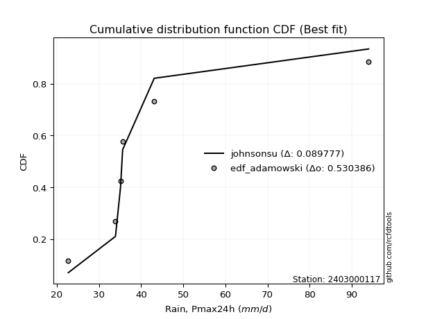</img></img>

</div>


## C. Best fit & Estimate extreme values for specific return periods - Tr

Best fit in probability distribution analysis means finding the theoretical distribution (like Normal, Poisson, Exponential) that most accurately mirrors your real-world data´s patterns (shape, center, spread) for better predictions, using methods like visual checks (Q-Q plots), goodness-of-fit tests (Kolmogorov-Smirnov, Chi-Squared), and information criteria (AIC) to score and select the simplest, most representative model.


### 1. Best fit (ordered by delta Δ)

<div align="center">

|   id |    station | empirical_dist   | p_dist    |     delta |   deltao | eval   |   fit |   n |   best_fit |   best_fit_sort |
|-----:|-----------:|:-----------------|:----------|----------:|---------:|:-------|------:|----:|-----------:|----------------:|
|    0 | 2403000117 | edf_hazen        | johnsonsu | 0.0705462 | 0.530386 | Δo > Δ |     1 |   6 |          1 |               1 |
|    1 | 2403000117 | edf_california   | logt      | 0.0736574 | 0.530386 | Δo > Δ |     1 |   6 |          1 |               2 |
|    2 | 2403000117 | edf_gringorten   | johnsonsu | 0.0754482 | 0.530386 | Δo > Δ |     1 |   6 |          1 |               3 |
|    3 | 2403000117 | edf_cunnane      | johnsonsu | 0.0786107 | 0.530386 | Δo > Δ |     1 |   6 |          1 |               4 |
|    4 | 2403000117 | edf_blom         | johnsonsu | 0.0805462 | 0.530386 | Δo > Δ |     1 |   6 |          1 |               5 |
|    5 | 2403000117 | edf_tukey        | johnsonsu | 0.0837041 | 0.530386 | Δo > Δ |     1 |   6 |          1 |               6 |
|    6 | 2403000117 | edf_filliben     | johnsonsu | 0.0848824 | 0.530386 | Δo > Δ |     1 |   6 |          1 |               7 |
|    7 | 2403000117 | edf_jenkinson    | johnsonsu | 0.0854365 | 0.530386 | Δo > Δ |     1 |   6 |          1 |               8 |
|    8 | 2403000117 | edf_beard        | johnsonsu | 0.0854365 | 0.530386 | Δo > Δ |     1 |   6 |          1 |               9 |
|    9 | 2403000117 | edf_chegodayev   | johnsonsu | 0.0861712 | 0.530386 | Δo > Δ |     1 |   6 |          1 |              10 |
|   10 | 2403000117 | edf_adamowski    | johnsonsu | 0.089777  | 0.530386 | Δo > Δ |     1 |   6 |          1 |              11 |
|   11 | 2403000117 | edf_weibull      | johnsonsu | 0.106261  | 0.530386 | Δo > Δ |     1 |   6 |          1 |              12 |

</div>

:file_folder:Tables: [bestfit_2403000117.csv](table/bestfit_2403000117.csv) | [extreme_2403000117.csv](table/extreme_2403000117.csv)


### 2. Extreme values

In hydrology, a return period (or recurrence interval $Tr$) is the statistical average time between extreme events like floods or droughts of a specific magnitude, indicating how rare an event is, with a 100-year flood, for example, having a 1% chance of occurring in any given year, not that it happens exactly every century. It is a key tool for infrastructure design (like bridges or dams) and risk assessment, calculated from historical data to determine the probability of future events, although it is important to remember it is statistical average, and events can cluster or be missed.

> risk_rate: assuming the return period as the project useful life.

|   id |      tr |   prob_l |     prob_g |     alpha |   betaprime |     chi2 |   crystalball |   erlang |    expon |   exponnorm |        f |   fatiguelife |     fisk |    gamma |   genexpon |   genlogistic |   gibrat |   gompertz |   gumbel_l |   gumbel_r |   halflogistic |   halfnorm |   hypsecant |   invgamma |   invgauss |      invweibull |   johnsonsu |   kstwobign |   laplace |   laplace_asymmetric |   loggamma |   logistic |   lognorm |   maxwell |   mielke |    moyal |   nakagami |      ncf |      nct |     norm |   pearson3 |   rayleigh |     rice |        t |   truncnorm |     wald |   weibull_min |   logalpha |   logbetaprime |     logchi2 |   logcrystalball |   logerlang |   logexpon |   logexponnorm |     logf |   logfatiguelife |   logfisk |   loggenexpon |   loggenlogistic |   loggibrat |   loggompertz |   loggumbel_l |   loggumbel_r |   loghalflogistic |   loghalfnorm |   loghypsecant |   loginvgamma |   loginvgauss |   loginvweibull |    logjohnsonsu |   logkstwobign |   loglaplace |   loglaplace_asymmetric |   logloggamma |   loglogistic |    loglognorm |   logmaxwell |   logmielke |   logmoyal |   lognakagami |   logncf |   lognct |   logpearson3 |   lograyleigh |   logrice |           logt |   logtruncnorm |   logwald |   logweibull_min |    station |   n |   risk_rate |
|-----:|--------:|---------:|-----------:|----------:|------------:|---------:|--------------:|---------:|---------:|------------:|---------:|--------------:|---------:|---------:|-----------:|--------------:|---------:|-----------:|-----------:|-----------:|---------------:|-----------:|------------:|-----------:|-----------:|----------------:|------------:|------------:|----------:|---------------------:|-----------:|-----------:|----------:|----------:|---------:|---------:|-----------:|---------:|---------:|---------:|-----------:|-----------:|---------:|---------:|------------:|---------:|--------------:|-----------:|---------------:|------------:|-----------------:|------------:|-----------:|---------------:|---------:|-----------------:|----------:|--------------:|-----------------:|------------:|--------------:|--------------:|--------------:|------------------:|--------------:|---------------:|--------------:|--------------:|----------------:|----------------:|---------------:|-------------:|------------------------:|--------------:|--------------:|--------------:|-------------:|------------:|-----------:|--------------:|---------:|---------:|--------------:|--------------:|----------:|---------------:|---------------:|----------:|-----------------:|-----------:|----:|------------:|
|    0 |    2    | 0.5      | 0.5        |   36.4745 |     38.5717 |  27.4186 |       44.0667 |  28.2563 |  37.5102 |     38.7985 |  36.4953 |       36.3046 |  36.4245 |  34.9412 |    37.51   |       39.6428 |  37.1279 |    37.359  |    47.8644 |    40.269  |        38.381  |    39.3347 |     44.0667 |    36.5002 |    36.425  |  1114.71        |     35.4118 |     41.9961 |   44.0667 |              39.9562 |    30.6207 |    44.0667 |   39.6672 |   42.0896 |  36.9265 |  39.043  |    43.2688 |  39.7612 |  37.7581 |  44.0667 |    38.4661 |    41.3884 |  44.2623 |  44.464  |     37.7351 |  36.5732 |       32.8921 |    36.5776 |        26.7747 |     39.2549 |          39.6672 |     30.5011 |    33.4232 |        36.6796 |  36.5377 |          36.4636 |   36.5065 |       36.0529 |          36.8659 |     34.8546 |       38.1788 |       42.5771 |       36.9561 |           35.6784 |       36.3181 |        39.6672 |       36.5377 |       36.4797 |         36.5915 |    35.3844      |        37.2911 |      39.6672 |                 37.5582 |       39.7437 |       39.6672 |  22.7404      |      38.2319 |     36.6209 |    36.1211 |       24.8637 |  38.7392 |  38.2747 |       37.0566 |       37.7354 |   38.5577 |  35.1923       |        41.1706 |   34.4964 |     26.6122      | 2403000117 |   6 |    0.75     |
|    1 |    2.33 | 0.570815 | 0.429185   |   39.0171 |     41.4988 |  29.3386 |       48.1918 |  30.4811 |  40.7734 |     41.7445 |  39.2413 |       39.5059 |  39.0382 |  38.1488 |    40.7731 |       42.4806 |  39.2175 |    40.5888 |    51.4533 |    44.0914 |        42.311  |    43.7869 |     47.368  |    39.2468 |    39.4675 | 53216.6         |     35.7398 |     45.3117 |   46.563  |              42.5178 |    32.9291 |    47.7012 |   42.8378 |   46.3754 |  39.5645 |  42.6614 |    48.591  |  42.9958 |  40.5386 |  48.1918 |    42.3021 |    45.7375 |  47.8536 |  48.6294 |     40.9413 |  39.2781 |       40.3758 |    39.1893 |        28.1987 |     47.1301 |          42.8378 |     32.7493 |    36.3973 |        39.1264 |  39.2052 |          39.2322 |   38.8749 |       39.1132 |          39.5115 |     36.239  |       41.5936 |       45.5231 |       39.6855 |           38.3901 |       39.4608 |        42.185  |       39.2051 |       39.2364 |         39.2306 |    35.6915      |        40.1726 |      41.5567 |                 39.4764 |       42.9912 |       42.4479 |  23.1138      |      41.4116 |     39.2496 |    38.6415 |       26.424  |  43.649  |  41.1581 |       39.9666 |       40.9221 |   41.5601 |  35.4472       |        42.8962 |   36.2803 |     30.1352      | 2403000117 |   6 |    0.729209 |
|    2 |    5    | 0.8      | 0.2        |   52.8416 |     55.2542 |  41.2568 |       63.5221 |  44.1915 |  57.0883 |     56.4399 |  54.1229 |       56.7096 |  53.5155 |  55.0066 |    57.0878 |       54.8079 |  51.2481 |    56.7372 |    63.0477 |    60.6978 |        60.0938 |    62.6143 |     60.6106 |    54.132  |    55.9277 |     1.14211e+12 |     41.2833 |     59.3958 |   59.0442 |              55.3251 |    47.8332 |    61.7348 |   57.0082 |   63.2438 |  53.3278 |  59.4222 |    73.0149 |  57.0918 |  54.4133 |  63.5221 |    59.9734 |    63.1492 |  62.2311 |  64.3468 |     56.0927 |  54.4203 |      127.379  |    53.2425 |        37.669  |    133.974  |          57.0082 |     47.1491 |    55.7394 |        52.6716 |  53.6203 |          54.2453 |   51.7701 |       55.603  |          53.3881 |     45.3491 |       58.6843 |       56.5063 |       54.0845 |           53.478  |       56.0517 |        53.9967 |       53.6201 |       54.1753 |         53.4487 |    40.5099      |        55.1115 |      52.4428 |                 50.6404 |       57.5    |       55.1401 |   2.78951e+44 |      56.7133 |     53.3787 |    52.8136 |       40.7481 |  69.6061 |  55.0327 |       55.0842 |       56.6133 |   56.1116 |  37.981        |        52.1159 |   48.1111 |    141.7         | 2403000117 |   6 |    0.67232  |
|    3 |   10    | 0.9      | 0.1        |   69.1872 |     67.7353 |  54.0483 |       73.6917 |  58.8308 |  71.8986 |     69.7791 |  70.5273 |       73.6685 |  70.6677 |  70.9601 |    71.8978 |       64.8475 |  64.9617 |    71.3962 |    69.5029 |    74.2234 |        74.8616 |    76.5462 |     71.1851 |    70.5412 |    72.7666 |     1.07002e+18 |     62.7417 |     70.119  |   70.3743 |              66.9512 |    67.6589 |    72.0699 |   68.9079 |   75.1149 |  67.9329 |  74.0151 |    92.0152 |  68.6197 |  68.1985 |  73.6917 |    74.8735 |    75.564  |  72.4825 |  75.2517 |     68.0274 |  70.4897 |      304.501  |    69.1473 |        50.2354 |    384.962  |          68.9079 |     66.0944 |    82.0701 |        68.5545 |  69.7801 |          70.7442 |   67.4027 |       72.6654 |          68.2165 |     58.5579 |       74.219  |       63.7319 |       69.5942 |           70.4245 |       72.6738 |        65.7621 |       69.78   |       70.618  |         69.3299 |    63.2517      |        70.1111 |      64.7757 |                 63.4866 |       69.6676 |       66.8558 | inf           |      70.7605 |     69.1361 |    69.3245 |       62.8046 |  96.9178 |  68.0621 |       70.6635 |       71.3553 |   69.5045 |  51.0501       |        61.0655 |   64.9121 |   4018.02        | 2403000117 |   6 |    0.651322 |
|    4 |   15    | 0.933333 | 0.0666667  |   81.6966 |     75.319  |  62.0401 |       78.7666 |  67.9598 |  80.562  |     77.582  |  81.8857 |       84.0069 |  83.4151 |  80.4549 |    80.5611 |       70.5117 |  74.4206 |    79.9712 |    72.4263 |    81.8545 |        83.2189 |    83.7963 |     77.22   |    81.9032 |    83.3808 |     2.50359e+21 |     93.5568 |     75.8117 |   77.002  |              73.7521 |    83.0357 |    77.701  |   75.745  |   81.2059 |  77.8504 |  82.4842 |   102.019  |  75.1615 |  77.1403 |  78.7666 |    83.3106 |    81.9607 |  77.7645 |  80.9267 |     73.9214 |  80.8087 |      463.983  |    80.6645 |        59.8333 |    733.461  |          75.745  |     80.6723 |   102.913  |        79.9758 |  81.2657 |          82.1243 |   79.6081 |       83.7158 |          78.3321 |     69.849  |       83.3134 |       67.3014 |       80.2328 |           82.2959 |       83.1904 |        73.5923 |       81.2658 |       81.9868 |         80.5611 |   115.977       |        79.6687 |      73.294  |                 72.463  |       76.6493 |       74.2552 | inf           |      79.2686 |     80.2772 |    81.1803 |       79.9121 | 115.105  |  76.1727 |       80.9204 |       80.3919 |   77.6086 |  89.4626       |        66.3214 |   78.6788 |  90106.1         | 2403000117 |   6 |    0.644736 |
|    5 |   20    | 0.95     | 0.05       |   92.5123 |     80.878  |  67.8753 |       82.09   |  74.6199 |  86.7088 |     83.1183 |  90.8944 |       91.488  |  94.0375 |  87.2441 |    86.7079 |       74.4776 |  81.8405 |    86.0552 |    74.246  |    87.1975 |        89.0742 |    88.6301 |     81.4772 |    90.915  |    91.2196 |     5.7223e+23  |    130.59   |     79.6465 |   81.7044 |              78.5773 |    96.082  |    81.593  |   80.586  |   85.2482 |  85.6352 |  88.4821 |   108.71   |  79.7672 |  83.9672 |  82.09   |    89.2069 |    86.2124 |  81.2753 |  84.7495 |     77.547  |  88.4985 |      606.084  |    90.1674 |        67.8792 |   1169.04   |          80.586  |     92.9783 |   120.839  |        89.2157 |  90.5801 |          91.1252 |   90.2599 |       92.0773 |          86.2947 |     80.2097 |       89.7687 |       69.6235 |       88.6356 |           91.7864 |       91.0345 |        79.6707 |       90.5806 |       90.9964 |         89.6229 |   234.847       |        86.8311 |      80.0088 |                 79.5914 |       81.5881 |       79.8428 | inf           |      85.4726 |     89.2677 |    90.7838 |       94.104  | 129.156  |  82.2076 |       88.7984 |       87.0228 |   83.5114 | 210.998        |        69.9471 |   90.8042 |      1.51147e+06 | 2403000117 |   6 |    0.641514 |
|    6 |   25    | 0.96     | 0.04       |  102.344  |     85.3068 |  72.4796 |       84.5365 |  79.8727 |  91.4766 |     87.4125 |  98.4911 |       97.3624 | 103.341  |  92.5351 |    91.4756 |       77.5323 |  88.0261 |    90.7744 |    75.5409 |    91.3131 |        93.5855 |    92.2265 |     84.772  |    98.5143 |    97.4632 |     3.75514e+25 |    172.15   |     82.5189 |   85.3519 |              82.3201 |   107.629  |    84.5704 |   84.3462 |   88.2492 |  92.1536 |  93.1311 |   113.694  |  83.3328 |  89.571  |  84.5365 |    93.7378 |    89.3713 |  83.8837 |  87.6243 |     80.0307 |  94.6578 |      734.287  |    98.4634 |        74.9341 |   1685.28   |          84.3462 |    103.83   |   136.867  |        97.1116 |  98.5857 |          98.6988 |   99.9871 |       98.8764 |          92.9755 |     90.0122 |       94.7773 |       71.3246 |       95.7033 |           99.8385 |       97.3469 |        84.7173 |       98.5866 |       98.5895 |         97.3734 |   509.304       |        92.6146 |      85.6381 |                 85.6002 |       85.4215 |       84.3995 | inf           |      90.3905 |     96.9588 |    99.0024 |      106.369  | 140.77   |  87.0686 |       95.2854 |       92.3011 |   88.186  | 686.025        |        72.6515 |  101.851  |      1.98219e+07 | 2403000117 |   6 |    0.639603 |
|    7 |   50    | 0.98     | 0.02       |  144.585  |     99.8102 |  87.1339 |       91.5423 |  96.5802 | 106.287  |    100.752  | 126.022  |      115.943  | 139.592  | 109.083  |   106.286  |       86.9424 | 109.83   |   105.433  |    79.056  |   103.991  |       107.485  |   102.68   |     94.9873 |   126.055  |   117.681  |     1.48632e+31 |    420.869  |     90.9537 |   96.682  |              93.9462 |   153.328  |    93.6673 |   96.1131 |   96.9527 | 115.493  | 107.564  |   128.197  |  94.4406 | 108.94   |  91.5423 |   107.618  |    98.5411 |  91.4556 |  96.1843 |     85.9769 | 114.768  |     1242.87   |   130.987  |       102.352  |   5348.77   |          96.1131 |    146.473  |   201.522  |       126.379  | 128.835  |         126.032  |  141.882  |      121.856  |         116.985  |    135.15   |      110.343  |       76.1546 |      121.218  |          129.366  |      118.291  |       102.488  |      128.838  |      126.084  |        126.306  | 43307           |       111.922  |     105.777  |                107.315  |       97.4014 |       99.9967 | inf           |     106.313  |    125.688  |   129.565  |      152.172  | 181.28   | 103.306  |      117.783  |      109.507  |  103.291  |   5.66905e+07  |        80.1152 |  148.168  |      6.56501e+11 | 2403000117 |   6 |    0.63583  |
|    8 |   75    | 0.986667 | 0.0133333  |  181.786  |    108.883  |  95.9051 |       95.3014 | 106.574  | 114.95   |    108.555  | 145.356  |      127.005  | 167.291  | 118.827  |   114.949  |       92.412  | 124.557  |   114.008  |    80.8335 |   111.36   |       115.565  |   108.371  |    100.957  |   145.397  |   130.025  |     2.66431e+34 |    707.326  |     95.5945 |  103.31   |             100.747  |   188.738  |    98.9212 |  103.09   |  101.685  | 131.668  | 116.003  |   136.093  | 101.002  | 121.844  |  95.3014 |   115.627  |   103.53   |  95.575  | 101.006  |     88.3552 | 127.143  |     1625.39   |   156.432  |       123.163  |  10624      |         103.09   |    179.254  |   252.702  |       147.434  | 151.295  |         145.132  |  178.676  |      136.69   |         133.694  |    177.843  |      119.453  |       78.7202 |      139.067  |          150.394  |      131.529  |       114.552  |      151.3    |      145.378  |        147.407  |     5.92044e+06 |       124.211  |     119.688  |                122.488  |      104.493  |      110.286  | inf           |     116.116  |    146.663  |   151.64   |      184.976  | 208.459  | 113.705  |      132.795  |      120.18   |  112.568  |   1.27918e+17  |        83.6344 |  186.608  |      1.91553e+15 | 2403000117 |   6 |    0.634587 |
|    9 |  100    | 0.99     | 0.01       |  216.822  |    115.614  | 102.2    |       97.8438 | 113.745  | 121.097  |    114.091  | 160.77   |      134.925  | 190.613  | 125.763  |   121.096  |       96.2831 | 135.965  |   120.092  |    81.9961 |   116.576  |       121.284  |   112.247  |    105.192  |   160.818  |   138.989  |     5.34894e+36 |   1013.8    |     98.7742 |  108.012  |             105.572  |   218.779  |   102.631  |  108.093  |  104.908  | 144.459  | 121.991  |   141.471  | 105.702  | 131.805  |  97.8438 |   121.269  |   106.929  |  98.3814 | 104.371  |     89.6428 | 136.165  |     1938.33   |   178.45   |       140.589  |  17355      |         108.093  |    206.922  |   296.718  |       164.468  | 169.948  |         160.312  |  213.233  |      147.88   |         146.943  |    219.983  |      125.919  |       80.445  |      153.266  |          167.311  |      141.386  |       123.961  |      169.955  |      160.757  |        164.683  |     1.00514e+09 |       133.401  |     130.653  |                134.538  |      109.573  |      118.182  | inf           |     123.307  |    163.85   |   169.547  |      211.255  | 229.489  | 121.535  |      144.379  |      128.04   |  119.362  |   2.60056e+31  |        85.7129 |  220.783  |      1.40672e+18 | 2403000117 |   6 |    0.633968 |
|   10 |  200    | 0.995    | 0.005      |  348.602  |    132.93   | 117.572  |      103.611  | 131.25   | 135.907  |    127.43   | 204.713  |      154.214  | 262.682  | 142.543  |   135.906  |      105.59   | 167.003  |   134.751  |    84.5232 |   129.114  |       135.033  |   121.114  |    115.393  |   204.781  |   161.214  |     1.83717e+42 |   2329.67   |    106.098  |  119.342  |             117.198  |   312.542  |   111.529  |  120.362  |  112.282  | 180.503  | 136.418  |   153.759  | 117.215  | 158.93   | 103.611  |   134.746  |   114.705  | 104.803  | 112.349  |     91.7196 | 158.639  |     2845.51   |   250.851  |       193.954  |  57245      |         120.362  |    292.628  |   436.885  |       214.035  | 226.858  |         203.38   |  343.547  |      177.262  |         184.42   |    392.329  |      141.503  |       84.3253 |      193.623  |          216.185  |      166.795  |       149.925  |      226.873  |      204.588  |        216.067  |     1.73911e+18 |       157.239  |     161.378  |                168.666  |      122.01   |      139.505  | inf           |     141.477  |    215.045  |   221.861  |      286.013  | 286.818  | 142.119  |      175.856  |      148.014  |  136.488  |   1.88498e+145 |        89.3849 |  335.653  |      3.7752e+26  | 2403000117 |   6 |    0.633042 |
|   11 |  250    | 0.996    | 0.004      |  412.346  |    138.861  | 122.574  |      105.373  | 136.944  | 140.675  |    131.724  | 221.209  |      160.478  | 291.731  | 147.962  |   140.673  |      108.581  | 178.139  |   139.471  |    85.2668 |   133.145  |       139.453  |   123.841  |    118.677  |   221.285  |   168.541  |     1.10625e+44 |   3012.16   |    108.364  |  122.99   |             120.941  |   350.643  |   114.386  |  124.382  |  114.552  | 193.895  | 141.062  |   157.537  | 120.988  | 168.711  | 105.373  |   139.055  |   117.099  | 106.78   | 114.892  |     92.1584 | 166.074  |     3186.58   |   282.179  |       215.29   |  84301.3    |         124.382  |    327.227  |   494.832  |       232.978  | 249.679  |         219.48   |  407.413  |      187.489  |         198.393  |    482.841  |      146.522  |       85.5022 |      208.732  |          234.751  |      175.496  |       159.39   |      249.699  |      221.043  |        236.147  |     8.00096e+22 |       165.446  |     172.732  |                181.4    |      126.079  |      147.135  | inf           |     147.592  |    235.081  |   241.924  |      313.859  | 307.478  | 149.311  |      187.174  |      154.769  |  142.239  |   7.7761e+239  |        90.2198 |  385.547  |      6.07296e+29 | 2403000117 |   6 |    0.632858 |
|   12 |  500    | 0.998    | 0.002      |  724.731  |    158.5    | 138.246  |      110.6    | 154.782  | 155.485  |    145.063  | 281.232  |      180.076  | 405.798  | 164.84   |   155.483  |      117.868  | 216.626  |   154.13   |    87.3983 |   145.656  |       153.172  |   131.974  |    128.878  |   281.337  |   191.769  |     3.69569e+49 |   6479.06   |    115.156  |  134.32   |             132.567  |   501.513  |   123.245  |  137.11   |  121.325  | 242.102  | 155.488  |   168.789  | 132.945  | 202.861  | 110.6    |   152.358  |   124.241  | 112.677  | 122.759  |     93.0616 | 189.715  |     4410.37   |   419.106  |       298.351  | 282611      |         137.11   |    463.25   |   728.586  |       303.193  | 339.609  |         277.794  |  734.816  |      221.819  |         248.869  |    989.397  |      162.117  |       88.968  |      263.559  |          303.156  |      204.223  |       192.772  |      339.647  |      280.931  |        312.691  |     7.65718e+45 |       192.697  |     213.353  |                227.416  |      138.944  |      173.557  | inf           |     167.455  |    311.608  |   316.57   |      413.642  | 379.426  | 173.623  |      226.522  |      176.81   |  160.88   | inf            |        92.0143 |  599.031  |      2.62005e+41 | 2403000117 |   6 |    0.632489 |
|   13 |  750    | 0.998667 | 0.00133333 | 1033.56   |    170.907  | 147.496  |      113.503  | 165.309  | 164.149  |    152.866  | 323.514  |      191.627  | 493.433  | 174.741  |   164.147  |      123.296  | 242.079  |   162.705  |    88.5375 |   152.971  |       161.192  |   136.517  |    134.845  |   323.642  |   205.656  |     6.26504e+52 |   9930.95   |    118.972  |  140.947  |             139.368  |   618.5    |   128.421  |  144.735  |  125.114  | 275.642  | 163.926  |   175.068  | 140.122  | 225.811  | 113.503  |   160.091  |   128.235  | 115.975  | 127.358  |     93.3707 | 203.89   |     5248.25   |   541.318  |       361.568  | 576045      |         144.735  |    567.875  |   913.624  |       353.706  | 409.595  |         318.659  | 1087.45   |      243.802  |         284.133  |   1590.09   |      171.242  |       90.8775 |      302.059  |          352.039  |      222.273  |       215.452  |      409.652  |      323.142  |        369.766  |     1.18577e+68 |       209.931  |     241.41   |                259.57   |      146.637  |      191.138  | inf           |     179.709  |    368.81   |   370.499  |      482.303  | 427.559  | 189.368  |      252.808  |      190.476  |  172.348  | inf            |        92.6538 |  780.173  |      3.02475e+49 | 2403000117 |   6 |    0.632366 |
|   14 | 1000    | 0.999    | 0.001      | 1341.28   |    180.155  | 154.092  |      115.502  | 172.813  | 170.296  |    158.403  | 357.269  |      199.856  | 567.381  | 181.776  |   170.294  |      127.147  | 261.557  |   168.789  |    89.3042 |   158.159  |       166.881  |   139.654  |    139.079  |   357.414  |   215.629  |     1.22332e+55 |  13331.1    |    121.615  |  145.65   |             144.193  |   717.798  |   132.092  |  150.23   |  127.732  | 302.207  | 169.914  |   179.401  | 145.303  | 243.597  | 115.502  |   165.559  |   130.995  | 118.254  | 130.629  |     93.5268 | 214.086  |     5900.49   |   657.458  |       414.607  | 956418      |         150.23   |    656.221  |  1072.76   |       394.57   | 469.503  |         351.174  | 1470.23   |      260.303  |         312.136  |   2286.13   |      177.718  |       92.1857 |      332.731  |          391.421  |      235.661  |       233.145  |      469.576  |      356.857  |        417.129  |     3.28503e+89 |       222.766  |     263.527  |                285.105  |      152.175  |      204.675  | inf           |     188.698  |    416.364  |   414.246  |      536.117  | 464.721  | 201.29   |      273.091  |      200.533  |  180.748  | inf            |        92.982  |  943.471  |      6.33322e+55 | 2403000117 |   6 |    0.632305 |

<div align="center">

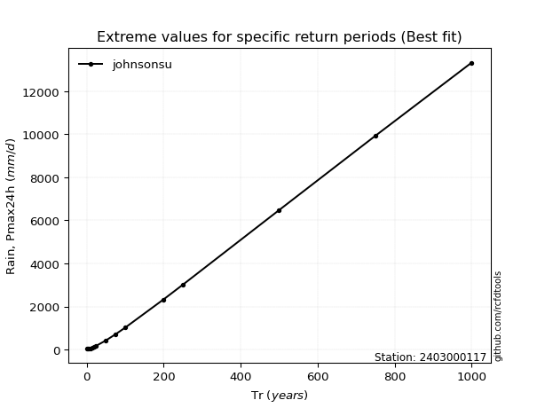</img>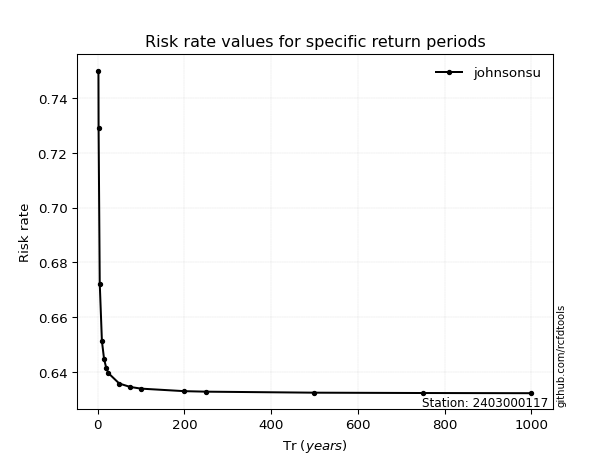</img>

</div>


<sub>**APP DISCLAIMER**: NO WARRANTY - This software is provided by [github.com/rcfdtools](https://github.com/rcfdtools) "as is", without any express or implied warranty, including warranties of merchantability, fitness for a particular purpose, or non-infringement. There is no guarantee that the software will be error-free or operate without interruption. LIMITATION OF LIABILITY - Neither the authors nor copyright holders will be liable for claims or damages arising from the software or its use. You are responsible for determining if the software is appropriate for your use and assume all associated risks, including errors, legal compliance, and data loss. NO PROFESSIONAL ADVICE - The software provides general information and does not offer professional advice. It should not replace consultation with professional advisors.</sub>