<div align="center">


</div>

# PMP Station (Rain, Pmax24h): 24030680

Probable Maximum Precipitation (PMP) is the greatest amount of rainfall for a specific duration that is meteorologically possible for a given location, acting as a "worst-case" scenario for extreme storms, crucial for designing safety-critical infrastructure like bridges, river deviations, dams, spillways, and nuclear plants to prevent catastrophic failure. PMP is calculated by hydrologists using meteorological data to determine the upper limit of extreme rainfall, often leading to the Probable Maximum Flood (PMF) for flood control design, and is increasingly being studied for climate change impacts. Probable Maximum Precipitation (PMP) is the theoretical upper limit of rainfall, a deterministic estimate for extreme events, while probability distributions (like GEV, Gumbel) describe the likelihood and frequency of various precipitation amounts, including rare ones, showing how often events occur, with PMP representing the extreme end of these distributions, used for critical infrastructure design to ensure safety against the worst conceivable weather, unlike standard statistical forecasts which cover typical probabilities.

The most common probability distributions in hydrology, used for analyzing floods, rainfall, and streamflow, include the Normal, Log-Normal, Gumbel, Gamma (including Log-Pearson Type III), and Generalized Extreme Value (GEV) distributions, often chosen based on the data´s skewness and whether modeling extremes or general conditions, with Gumbel and GEV popular for extreme events like floods, while the Normal distribution serves as a baseline, though often requiring transformations for skewed hydrological data. These distributions help in designing water infrastructure, managing water resources, and forecasting hydrologic events.

> Hydrological data often isn´t perfectly normal (it´s skewed), so different distributions are needed for different applications, such as: **Flood Frequency Analysis**: Using Gumbel, GEV, or Log-Pearson Type III for predicting extreme flood magnitudes and their return periods, **Rainfall Analysis**: Normal for annual totals, but Log-Normal, Weibull, or GEV for intensity or extreme daily rainfall, **Streamflow Modeling**: Gamma and Log-Normal for maximum flows, GEV for minimum flows, and Kappa for daily flows.

<div align="center">

</img>

</div>


## A. General information


### 1. General running parameters

• app_version: _v20260103_. • runtime: _2026-01-05 16:20:51.132608_. • Python version: _3.14.0_. • SciPy version: _1.16.3_. • Pandas version: _2.3.3_. • NumPy version: _2.3.5_. • Stations dataset (station_dataset_file): _dataset/pmax24h_in/automatic_colombia_2003_2024.csv_. • Stations catalog (station_catalog_file): _dataset/CNE.xls_. • Minimum year to eval til year_max (date_min): _1900_. • Maximum year to eval since year_min (date_max): _2024_. • Creates, save and include plots into reports (create_plot): _True_. • Plot only fit distributions with Δo > Δ (plot_only_fit): _True_. • Plot only simple graphs avoiding multiple CDFs and multiple Extreme values plots (plot_only_simple): _True_. • Eval low extreme values, if False, evaluates high extreme values (low_extreme): _False_. • Eval every SciPy distribution as logarithmic (pdist_logarithmic_on): _True_. • Standard deviation normalized (ddof): _1.0_. • Return periods to eval in years (Tr): _[2, 2.33, 5, 10, 15, 20, 25, 50, 75, 100, 200, 250, 500, 750, 1000]_. • Minimum data sample per station, 0 means any (minimum_sample): _5_. • Z-Score maximum threshold to adjust a value, 0 means disable (zscore_max): _3.5_. • Z-Score minimum threshold to adjust a value, 0 means disable (zscore_min): _-2.5_. • Avoid zeros, e.g. rain = 0 (avoid_zeros): _True_. • Avoid null values (avoid_nans): _True_. 

[:file_folder:Dataset file](../../dataset/pmax24h_in/automatic_colombia_2003_2024.csv)

> Delta Degrees of Freedom (DDOF): is a parameter used in the formulas for calculating variance and standard deviation. When ddof=0, the divisor is $N$ (the total number of observations) and this is used when your data set is the entire population. When ddof=1, the divisor is $N-1$ and this is used when your data set is a sample drawn from a larger population. Using $N-1$ provides an unbiased estimate of the population variance (known as Bessel´s correction).


### 2. Station info and location

|   id |   CODIGO | NOMBRE                     | CATEGORIA     | TECNOLOGIA                              | ESTADO   | FECHA_INSTALACION   |   FECHA_SUSPENSION |   ALTITUD |   LATITUD |   LONGITUD | DEPARTAMENTO   | MUNICIPIO   | AREA_OPERATIVA                         | ENTIDAD                                                     | AREA_HIDROGRAFICA   | ZONA_HIDROGRAFICA   | SUBZONA_HIDROGRAFICA   |   CORRIENTE | Catalogo   |   Version |
|-----:|---------:|:---------------------------|:--------------|:----------------------------------------|:---------|:--------------------|-------------------:|----------:|----------:|-----------:|:---------------|:------------|:---------------------------------------|:------------------------------------------------------------|:--------------------|:--------------------|:-----------------------|------------:|:-----------|----------:|
|    0 | 24030680 | EL PARAMO - AUT [24030680] | Pluviométrica | Automática con Telemetría, Convencional | Activa   | 15/06/1974          |                nan |      3238 |   6.81078 |    -72.556 | Santander      | Carcasí     | Area Operativa 08 - Santanderes-Arauca | INSTITUTO DE HIDROLOGIA METEOROLOGIA Y ESTUDIOS AMBIENTALES | Magdalena Cauca     | Sogamoso            | Río Chicamocha         |         nan | CNE_IDEAM  |  20251226 |

<div align="center">

Dynamic map: [:earth_americas:Google](http://maps.google.com/maps?q=6.81078,-72.55605) [:earth_americas:OSM](https://www.openstreetmap.org/#map=18/6.81078/-72.55605&layers=P) [:earth_americas:Bing](https://www.bing.com/maps?cp=6.81078~-72.55605&lvl=18) [:earth_americas:Apple](https://maps.apple.com/frame?center=6.81078%2C-72.55605&span=0.003%2C0.006)

</div>


<div align="center">

```geojson
{
  "type": "Feature",
  "geometry": {
    "type": "Point", 
    "coordinates": [-72.55605, 6.81078]
  }, 
  "properties": {
    "Name": "24030680"
  }
}
```

</div>


### 3. Discrete values table and plot

<div align="center">

|               |          0 |          1 |          2 |          3 |           4 |           5 |          6 |
|:--------------|-----------:|-----------:|-----------:|-----------:|------------:|------------:|-----------:|
| Date          | 2017       | 2018       | 2019       | 2020       | 2021        | 2022        | 2023       |
| Value         |   14.2     |   18       |   45.4     |   45.6     |   32.6      |   39.2      |   22.6     |
| Value_initial |   14.2     |   18       |   45.4     |   45.6     |   32.6      |   39.2      |   22.6     |
| count         |    7       |    7       |    7       |    7       |    7        |    7        |    7       |
| mean          |   31.0857  |   31.0857  |   31.0857  |   31.0857  |   31.0857   |   31.0857   |   31.0857  |
| std           |   12.9876  |   12.9876  |   12.9876  |   12.9876  |   12.9876   |   12.9876   |   12.9876  |
| zscore        |   -1.30014 |   -1.00755 |    1.10215 |    1.11755 |    0.116595 |    0.624771 |   -0.65337 |


</div>


<div align="center">

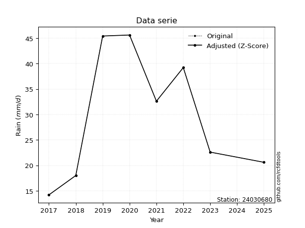</img>

</div>


> The initial value (value_initial) correspond to the initial obtained or null completed value, and value (value) is adjusted only when the initial value is outside the valid range (outlier) definite through the Z-Score value. If Z-Score is active, values out of range or outliers are replaced with the station mean value. A Z-Score (or standard score) measures how many standard deviations a data point is from the mean of a dataset, indicating its relative position; positive scores mean above the mean, negative mean below, and a score of zero is exactly at the mean, allowing for comparison of values from different distributions. It´s calculated using the formula $z=(x–μ)/σ$, where $x$ is the data point, $μ$ is the mean, and $σ$ is the standard deviation, helping identify outliers and understand probability.
>
> <sub>**Note**: In this study, "completing" (filling gaps in) and "extending" (forecasting or lengthening the historical record) rainfall data series are avoided for certain critical analyses because they introduce artificial bias and uncertainty, which can distort the statistics of rare events (extremes), alter day-to-day variability, and compromise the integrity and homogeneity of the original data. Some reasons against Completing/Extending rainfall data are: **Distortion of Extremes and Variability**: The primary issue is that most gap-filling or extension methods rely on averaging or regression with nearby stations, which inherently smooths the data. Rainfall is highly variable in space and time, with a large percentage of zero values and occasional large storms. Infilling methods often underestimate the highest values and overestimate the lowest (zero) values, which severely distorts analyses focused on flood frequency, drought severity, and intensity-duration-frequency (IDF) curves, **Loss of Data Homogeneity**: Infilled or extended data are synthetic estimates, not actual measurements. Combining these estimates with observed data can violate the assumption of data homogeneity, which requires that the data properties do not change over time. Inhomogeneity can lead to incorrect conclusions about long-term trends or changes in climate patterns, **Propagation of Errors**: Errors and biases from the original data (e.g., wind-induced undercatch, instrument errors, site changes) or the data used for imputation can propagate through the analysis, leading to unreliable hydrological models and inaccurate predictions, **Compromised Statistical Integrity**: For statistical analyses, especially those involving the frequency of events, using artificial data can introduce time bias or autocorrelation that doesn´t exist in reality, making it difficult to assess the true probability of events, **Difficulty in Validation**: It is difficult to accurately validate the quality of filled or extended data, especially for past periods where ground-truth measurements are unavailable. The reliability of imputation techniques heavily depends on the density of the surrounding station network and the complexity of the local topography.</sub>


### 4. Active continuous probability distributions from SciPy (44 of 104 available)

A Probability Density Function (PDF) describes the relative likelihood of a continuous random variable falling within a specific range, where the total area under its curve equals 1, and the area over any interval gives the actual probability for that range. Unlike discrete probabilities (like rolling a die), a PDF shows density, not direct probability for a single point (which is zero), with higher points indicating higher likelihood, often visualized as a bell curve for normal distributions.

A log of a probability density function (log-PDF) is simply the logarithm of the PDF´s value, denoted as $log(f(x))$, useful for converting multiplication of probabilities into addition, improving numerical stability with tiny numbers, and connecting to information theory concepts like entropy. Instead of dealing with very small probabilities (e.g., 0.000001), log-PDFs use negative numbers (e.g., $log(0.00001) ≈ -11.51$ that are easier for computers to handle, preventing underflow errors and simplifying complex calculations. In this study, each active probability distribution from SciPy is also evaluated in the $log$ form.

[scipy.stats](https://docs.scipy.org/doc/scipy/reference/stats.html) is a Python´s powerful submodule within the SciPy library for comprehensive statistical analysis, offering over 130 probability distributions (like Normal, Poisson), functions for descriptive stats (mean, variance), hypothesis testing (t-tests, chi-square), random variable generation, and statistical tests, making it essential for data science, modeling, and research. It provides tools to explore, model, and draw conclusions from data efficiently, working seamlessly with NumPy.

<div align="center">

|   id | p_dist             |   n_parameter | fit_method   | label                                                                       | active   | ref                                                                                                        |
|-----:|:-------------------|--------------:|:-------------|:----------------------------------------------------------------------------|:---------|:-----------------------------------------------------------------------------------------------------------|
|    0 | alpha              |             3 | MLE          | Alpha                                                                       | True     | [:mortar_board:](https://docs.scipy.org/doc/scipy/reference/generated/scipy.stats.alpha.html)              |
|    1 | betaprime          |             4 | MLE          | Beta prime                                                                  | True     | [:mortar_board:](https://docs.scipy.org/doc/scipy/reference/generated/scipy.stats.betaprime.html)          |
|    2 | chi2               |             3 | MLE          | Chi²                                                                        | True     | [:mortar_board:](https://docs.scipy.org/doc/scipy/reference/generated/scipy.stats.chi2.html)               |
|    3 | crystalball        |             4 | MLE          | Crystalball                                                                 | True     | [:mortar_board:](https://docs.scipy.org/doc/scipy/reference/generated/scipy.stats.crystalball.html)        |
|    4 | erlang             |             3 | MLE          | Erlang                                                                      | True     | [:mortar_board:](https://docs.scipy.org/doc/scipy/reference/generated/scipy.stats.erlang.html)             |
|    5 | expon              |             2 | MLE          | Exponential                                                                 | True     | [:mortar_board:](https://docs.scipy.org/doc/scipy/reference/generated/scipy.stats.expon.html)              |
|    6 | exponnorm          |             3 | MLE          | Exponentially modified Normal                                               | True     | [:mortar_board:](https://docs.scipy.org/doc/scipy/reference/generated/scipy.stats.exponnorm.html)          |
|    7 | f                  |             4 | MLE          | F                                                                           | True     | [:mortar_board:](https://docs.scipy.org/doc/scipy/reference/generated/scipy.stats.f.html)                  |
|    8 | fatiguelife        |             3 | MLE          | Fatigue-life (Birnbaum-Saunders)                                            | True     | [:mortar_board:](https://docs.scipy.org/doc/scipy/reference/generated/scipy.stats.fatiguelife.html)        |
|    9 | fisk               |             3 | MLE          | Fisk                                                                        | True     | [:mortar_board:](https://docs.scipy.org/doc/scipy/reference/generated/scipy.stats.fisk.html)               |
|   10 | gamma              |             3 | MLE          | Gamma                                                                       | True     | [:mortar_board:](https://docs.scipy.org/doc/scipy/reference/generated/scipy.stats.gamma.html)              |
|   11 | genexpon           |             5 | MLE          | Generalized exponential                                                     | True     | [:mortar_board:](https://docs.scipy.org/doc/scipy/reference/generated/scipy.stats.genexpon.html)           |
|   12 | genlogistic        |             3 | MLE          | Generalized logistic                                                        | True     | [:mortar_board:](https://docs.scipy.org/doc/scipy/reference/generated/scipy.stats.genlogistic.html)        |
|   13 | gibrat             |             2 | MM           | Gibrat                                                                      | True     | [:mortar_board:](https://docs.scipy.org/doc/scipy/reference/generated/scipy.stats.gibrat.html)             |
|   14 | gompertz           |             3 | MLE          | Gompertz (or truncated Gumbel)                                              | True     | [:mortar_board:](https://docs.scipy.org/doc/scipy/reference/generated/scipy.stats.gompertz.html)           |
|   15 | gumbel_l           |             2 | MM           | Gumbel Left Skew                                                            | True     | [:mortar_board:](https://docs.scipy.org/doc/scipy/reference/generated/scipy.stats.gumbel_l.html)           |
|   16 | gumbel_r           |             2 | MM           | Gumbel Right Skew                                                           | True     | [:mortar_board:](https://docs.scipy.org/doc/scipy/reference/generated/scipy.stats.gumbel_r.html)           |
|   17 | halflogistic       |             2 | MM           | Half-logistic                                                               | True     | [:mortar_board:](https://docs.scipy.org/doc/scipy/reference/generated/scipy.stats.halflogistic.html)       |
|   18 | halfnorm           |             2 | MM           | Half Normal                                                                 | True     | [:mortar_board:](https://docs.scipy.org/doc/scipy/reference/generated/scipy.stats.halfnorm.html)           |
|   19 | hypsecant          |             2 | MM           | hyperbolic secant                                                           | True     | [:mortar_board:](https://docs.scipy.org/doc/scipy/reference/generated/scipy.stats.hypsecant.html)          |
|   20 | invgamma           |             3 | MLE          | Inverted gamma                                                              | True     | [:mortar_board:](https://docs.scipy.org/doc/scipy/reference/generated/scipy.stats.invgamma.html)           |
|   21 | invgauss           |             3 | MLE          | Inverse Gaussian                                                            | True     | [:mortar_board:](https://docs.scipy.org/doc/scipy/reference/generated/scipy.stats.invgauss.html)           |
|   22 | invweibull         |             3 | MLE          | Inverted Weibull                                                            | True     | [:mortar_board:](https://docs.scipy.org/doc/scipy/reference/generated/scipy.stats.invweibull.html)         |
|   23 | johnsonsu          |             4 | MLE          | Johnson Su                                                                  | True     | [:mortar_board:](https://docs.scipy.org/doc/scipy/reference/generated/scipy.stats.johnsonsu.html)          |
|   24 | kstwobign          |             2 | MLE          | Limiting distribution of scaled Kolmogorov-Smirnov two-sided test statistic | True     | [:mortar_board:](https://docs.scipy.org/doc/scipy/reference/generated/scipy.stats.kstwobign.html)          |
|   25 | laplace            |             2 | MM           | Laplace                                                                     | True     | [:mortar_board:](https://docs.scipy.org/doc/scipy/reference/generated/scipy.stats.laplace.html)            |
|   26 | laplace_asymmetric |             3 | MLE          | Asymmetric Laplace                                                          | True     | [:mortar_board:](https://docs.scipy.org/doc/scipy/reference/generated/scipy.stats.laplace_asymmetric.html) |
|   27 | loggamma           |             3 | MLE          | Log gamma                                                                   | True     | [:mortar_board:](https://docs.scipy.org/doc/scipy/reference/generated/scipy.stats.loggamma.html)           |
|   28 | logistic           |             2 | MM           | Logistic (or Sech-squared)                                                  | True     | [:mortar_board:](https://docs.scipy.org/doc/scipy/reference/generated/scipy.stats.logistic.html)           |
|   29 | lognorm            |             3 | MLE          | Log Normal                                                                  | True     | [:mortar_board:](https://docs.scipy.org/doc/scipy/reference/generated/scipy.stats.lognorm.html)            |
|   30 | maxwell            |             2 | MM           | Maxwell                                                                     | True     | [:mortar_board:](https://docs.scipy.org/doc/scipy/reference/generated/scipy.stats.maxwell.html)            |
|   31 | mielke             |             4 | MLE          | Mielke Beta-Kappa / Dagum                                                   | True     | [:mortar_board:](https://docs.scipy.org/doc/scipy/reference/generated/scipy.stats.mielke.html)             |
|   32 | moyal              |             2 | MM           | Moyal                                                                       | True     | [:mortar_board:](https://docs.scipy.org/doc/scipy/reference/generated/scipy.stats.moyal.html)              |
|   33 | nakagami           |             3 | MLE          | Nakagami                                                                    | True     | [:mortar_board:](https://docs.scipy.org/doc/scipy/reference/generated/scipy.stats.nakagami.html)           |
|   34 | ncf                |             5 | MLE          | Non-central F distribution                                                  | True     | [:mortar_board:](https://docs.scipy.org/doc/scipy/reference/generated/scipy.stats.ncf.html)                |
|   35 | nct                |             4 | MLE          | Non-central Student’s t                                                     | True     | [:mortar_board:](https://docs.scipy.org/doc/scipy/reference/generated/scipy.stats.nct.html)                |
|   36 | norm               |             2 | MM           | Normal                                                                      | True     | [:mortar_board:](https://docs.scipy.org/doc/scipy/reference/generated/scipy.stats.norm.html)               |
|   37 | pearson3           |             3 | MM           | Pearson type III                                                            | True     | [:mortar_board:](https://docs.scipy.org/doc/scipy/reference/generated/scipy.stats.pearson3.html)           |
|   38 | rayleigh           |             2 | MM           | Rayleigh                                                                    | True     | [:mortar_board:](https://docs.scipy.org/doc/scipy/reference/generated/scipy.stats.rayleigh.html)           |
|   39 | rice               |             3 | MLE          | Rice                                                                        | True     | [:mortar_board:](https://docs.scipy.org/doc/scipy/reference/generated/scipy.stats.rice.html)               |
|   40 | t                  |             3 | MLE          | Student’s t                                                                 | True     | [:mortar_board:](https://docs.scipy.org/doc/scipy/reference/generated/scipy.stats.t.html)                  |
|   41 | truncnorm          |             4 | MLE          | Truncated normal                                                            | True     | [:mortar_board:](https://docs.scipy.org/doc/scipy/reference/generated/scipy.stats.truncnorm.html)          |
|   42 | wald               |             2 | MM           | Wald                                                                        | True     | [:mortar_board:](https://docs.scipy.org/doc/scipy/reference/generated/scipy.stats.wald.html)               |
|   43 | weibull_min        |             3 | MLE          | Weibull minimum                                                             | True     | [:mortar_board:](https://docs.scipy.org/doc/scipy/reference/generated/scipy.stats.weibull_min.html)        |

</div>

> **n_parameter:** # arguments & localization & scale.
>
> **Fit methods:** (MLE) maximum likelihood, (MM) L-moments.
>
>**Inactive** (With the only purpose of prevent loops, zero divisions, infinite values, over high estimated values or horizontal trending for recurrence intervals estimations, the follow distributions were disabled.)**:** foldnorm, gennorm, norminvgauss, powernorm, powerlognorm, skewnorm, genextreme, anglit, arcsine, argus, beta, bradford, burr, burr12, cauchy, cosine, halfcauchy, foldcauchy, skewcauchy, wrapcauchy, dgamma, gengamma, exponweib, exponpow, truncexpon, gausshyper, genhalflogistic, genhyperbolic, geninvgauss, halfgennorm, johnsonsb, kappa4, kappa3, ksone, kstwo, loglaplace, levy, levy_l, levy_stable, ncx2, pareto, genpareto, truncpareto, lomax, powerlaw, rdist, rel_breitwigner, recipinvgauss, semicircular, studentized_range, trapezoid, triang, truncweibull_min, tukeylambda, uniform, loguniform, vonmises, vonmises_line, weibull_max, dweibull, 


## B. Probability (PDF) vs. Empirical (EDF) distributions functions

A continuous probability distribution (CPD) describes probabilities for variables that can take any value within a range (like rain any time), unlike discrete variables with specific outcomes (like temperature). It uses a Probability Density Function (PDF), a curve where the total area under it equals 1, and the probability of the variable falling within an interval (a to b) is found by calculating the area under the curve between those points. A key feature is that the probability of hitting any single exact value is zero, so probabilities are always expressed for ranges, e.g., $P(a ≤ X ≤ b)$.

<div align="center">

Distributions parameters from station values
|    |   station | p_dist                |   n |               loc |            scale | shape                  | shape1                | shape2             | shape3   |
|---:|----------:|:----------------------|----:|------------------:|-----------------:|:-----------------------|:----------------------|:-------------------|:---------|
|  0 |  24030680 | alpha                 |   7 |    -151.875       |   2733.51        | 15.005614354205896     |                       |                    |          |
|  1 |  24030680 | betaprime             |   7 |    -102.095       |   8196.25        | 122.80008943802352     | 7562.559399109685     |                    |          |
|  2 |  24030680 | chi2                  |   7 |      14.2         |     19.8061      | 0.933614471512921      |                       |                    |          |
|  3 |  24030680 | crystalball           |   7 |      31.0857      |     12.0242      | 1381.6673414450931     | 2799.360602056544     |                    |          |
|  4 |  24030680 | erlang                |   7 |    -295.716       |      0.443679    | 736.5732266990908      |                       |                    |          |
|  5 |  24030680 | expon                 |   7 |      14.2         |     16.8857      |                        |                       |                    |          |
|  6 |  24030680 | exponnorm             |   7 |      31.074       |     12.0242      | 0.0009732102893691989  |                       |                    |          |
|  7 |  24030680 | f                     |   7 |      14.2         |     16.0494      | 1.309834987950968      | 214.85883337591565    |                    |          |
|  8 |  24030680 | fatiguelife           |   7 |      14.2         |      1.86315e-05 | 826.1585886566638      |                       |                    |          |
|  9 |  24030680 | fisk                  |   7 | -364909           | 364940           | 48563.08665378628      |                       |                    |          |
| 10 |  24030680 | gamma                 |   7 |    -294.892       |      0.445017    | 732.511978988267       |                       |                    |          |
| 11 |  24030680 | genexpon              |   7 |      14.2         |      3.23468     | 0.19157135951574694    | 3.055313091533275e-08 | 0.6348837900453916 |          |
| 12 |  24030680 | genlogistic           |   7 |     -37.8324      |     10.711       | 354.5601530956674      |                       |                    |          |
| 13 |  24030680 | gibrat                |   7 |      21.9127      |      5.56368     |                        |                       |                    |          |
| 14 |  24030680 | gompertz              |   7 |      14.2         |     18.6966      | 0.5019964995895656     |                       |                    |          |
| 15 |  24030680 | gumbel_l              |   7 |      36.4972      |      9.37523     |                        |                       |                    |          |
| 16 |  24030680 | gumbel_r              |   7 |      25.6742      |      9.37523     |                        |                       |                    |          |
| 17 |  24030680 | halflogistic          |   7 |      16.8343      |     10.2802      |                        |                       |                    |          |
| 18 |  24030680 | halfnorm              |   7 |      15.1704      |     19.9469      |                        |                       |                    |          |
| 19 |  24030680 | hypsecant             |   7 |      31.0857      |      7.65484     |                        |                       |                    |          |
| 20 |  24030680 | invgamma              |   7 |     -68.7171      |   6526.34        | 66.39925598141517      |                       |                    |          |
| 21 |  24030680 | invgauss              |   7 |     -16.6283      |    659.816       | 0.07234918567452378    |                       |                    |          |
| 22 |  24030680 | invweibull            |   7 |      14.2         |      1.11085     | 0.06287499974517066    |                       |                    |          |
| 23 |  24030680 | johnsonsu             |   7 |      45.6         |      1.45128e-14 | 2.1086014587042783     | 0.10201912156517869   |                    |          |
| 24 |  24030680 | kstwobign             |   7 |     -11.5061      |     48.5063      |                        |                       |                    |          |
| 25 |  24030680 | laplace               |   7 |      31.0857      |      8.50239     |                        |                       |                    |          |
| 26 |  24030680 | laplace_asymmetric    |   7 |      32.6         |     10.6911      | 1.0733205389659948     |                       |                    |          |
| 27 |  24030680 | loggamma              |   7 |      45.6001      |      1.03285e-05 | 7.123844068249446e-07  |                       |                    |          |
| 28 |  24030680 | logistic              |   7 |      31.0857      |      6.62929     |                        |                       |                    |          |
| 29 |  24030680 | lognorm               |   7 |      14.2         |      0.0822902   | 12.866215544937978     |                       |                    |          |
| 30 |  24030680 | maxwell               |   7 |       2.59342     |     17.8549      |                        |                       |                    |          |
| 31 |  24030680 | mielke                |   7 |    -218.881       |    169.196       | 122823.14312567282     | 23.473576387394857    |                    |          |
| 32 |  24030680 | moyal                 |   7 |      24.2095      |      5.41279     |                        |                       |                    |          |
| 33 |  24030680 | nakagami              |   7 |      14.2         |     28.2947      | 0.16635034202592142    |                       |                    |          |
| 34 |  24030680 | ncf                   |   7 |      -2.62252     |     32.116       | 14.293744629521058     | 1268.8990751754677    | 0.6881540843699305 |          |
| 35 |  24030680 | nct                   |   7 |    -507.133       |     11.9872      | 151510.72471935983     | 44.89901458479079     |                    |          |
| 36 |  24030680 | norm                  |   7 |      31.0857      |     12.0242      |                        |                       |                    |          |
| 37 |  24030680 | pearson3              |   7 |      31.0857      |     12.0242      | -0.09354389791204283   |                       |                    |          |
| 38 |  24030680 | rayleigh              |   7 |       8.08273     |     18.3537      |                        |                       |                    |          |
| 39 |  24030680 | rice                  |   7 |       8.05655     |     14.6112      | 1.07770054451123       |                       |                    |          |
| 40 |  24030680 | t                     |   7 |      31.0848      |     12.0241      | 3269241.664714398      |                       |                    |          |
| 41 |  24030680 | truncnorm             |   7 |      31.0857      |     12.0242      | -301.3882590584278     | 567.3929103467225     |                    |          |
| 42 |  24030680 | wald                  |   7 |      19.0615      |     12.0242      |                        |                       |                    |          |
| 43 |  24030680 | weibull_min           |   7 |      14.2         |     19.2742      | 0.8556676076544394     |                       |                    |          |
| 44 |  24030680 | logalpha              |   7 |      -7.19295     |    253.553       | 24.081301343437843     |                       |                    |          |
| 45 |  24030680 | logbetaprime          |   7 |     -17.1076      |     17.4942      | 4788.623202974928      | 4096.2476283908       |                    |          |
| 46 |  24030680 | logchi2               |   7 |       2.65324     |      0.954232    | 1.0990745621941602     |                       |                    |          |
| 47 |  24030680 | logcrystalball        |   7 |       3.35        |      0.432218    | 53.004510226722466     | 1492.5525893487647    |                    |          |
| 48 |  24030680 | logerlang             |   7 |      -4.03028     |      0.0261295   | 282.44140296149715     |                       |                    |          |
| 49 |  24030680 | logexpon              |   7 |       2.65324     |      0.696754    |                        |                       |                    |          |
| 50 |  24030680 | logexponnorm          |   7 |       3.34973     |      0.432221    | 0.0006109532194747689  |                       |                    |          |
| 51 |  24030680 | logf                  |   7 |    -141.589       |    144.939       | 626765.2049333479      | 349146.5604259096     |                    |          |
| 52 |  24030680 | logfatiguelife        |   7 |     -82.6105      |     85.9604      | 0.005035196492634434   |                       |                    |          |
| 53 |  24030680 | logfisk               |   7 |      -2.71208e+07 |      2.71208e+07 | 101479261.68430774     |                       |                    |          |
| 54 |  24030680 | loggamma              |   7 |      -3.53333     |      0.0279807   | 246.01187001046753     |                       |                    |          |
| 55 |  24030680 | loggenexpon           |   7 |       2.65324     |      0.770806    | 0.82266103062592       | 1.4404567074700818    | 0.4003284464052731 |          |
| 56 |  24030680 | loggenlogistic        |   7 |       3.81992     |      8.1478e-07  | 1.73842283515472e-06   |                       |                    |          |
| 57 |  24030680 | loggibrat             |   7 |       3.02032     |      0.199962    |                        |                       |                    |          |
| 58 |  24030680 | loggompertz           |   7 |       2.65324     |      0.485287    | 0.20636566608935042    |                       |                    |          |
| 59 |  24030680 | loggumbel_l           |   7 |       3.54452     |      0.336999    |                        |                       |                    |          |
| 60 |  24030680 | loggumbel_r           |   7 |       3.15547     |      0.336999    |                        |                       |                    |          |
| 61 |  24030680 | loghalflogistic       |   7 |       2.83775     |      0.369509    |                        |                       |                    |          |
| 62 |  24030680 | loghalfnorm           |   7 |       2.77794     |      0.716963    |                        |                       |                    |          |
| 63 |  24030680 | loghypsecant          |   7 |       3.35        |      0.275159    |                        |                       |                    |          |
| 64 |  24030680 | loginvgamma           |   7 |      -4.23755     |   2190.96        | 289.7629278267967      |                       |                    |          |
| 65 |  24030680 | loginvgauss           |   7 |       0.3013      |    134.589       | 0.02256802690377864    |                       |                    |          |
| 66 |  24030680 | loginvweibull         |   7 |      -3.05409e+07 |      3.05409e+07 | 73463016.23719624      |                       |                    |          |
| 67 |  24030680 | logjohnsonsu          |   7 |       3.81995     |      1.32729e-11 | 7.762575849970968      | 0.34154542287577044   |                    |          |
| 68 |  24030680 | logkstwobign          |   7 |       1.69577     |      1.88426     |                        |                       |                    |          |
| 69 |  24030680 | loglaplace            |   7 |       3.35        |      0.305624    |                        |                       |                    |          |
| 70 |  24030680 | loglaplace_asymmetric |   7 |       3.81991     |      0.00360291  | 130.3354199506124      |                       |                    |          |
| 71 |  24030680 | logloggamma           |   7 |       3.81998     |      5.33397e-06 | 1.1428104652239306e-05 |                       |                    |          |
| 72 |  24030680 | loglogistic           |   7 |       3.35        |      0.238294    |                        |                       |                    |          |
| 73 |  24030680 | loglognorm            |   7 |       2.65324     |      0.00476773  | 12.261135601015043     |                       |                    |          |
| 74 |  24030680 | logmaxwell            |   7 |       2.32582     |      0.641807    |                        |                       |                    |          |
| 75 |  24030680 | logmielke             |   7 |      -5.12057e+07 |      5.12057e+07 | 107950044.71206713     | 12749803016.133202    |                    |          |
| 76 |  24030680 | logmoyal              |   7 |       3.10283     |      0.194566    |                        |                       |                    |          |
| 77 |  24030680 | lognakagami           |   7 |       2.65324     |      0.919788    | 0.4136062919696698     |                       |                    |          |
| 78 |  24030680 | logncf                |   7 |      -5.34273     |      8.37982     | 1353.0703860716835     | 1870.9947551008509    | 49.59616836086977  |          |
| 79 |  24030680 | lognct                |   7 |      20.1063      |      0.420525    | 14487.633718286714     | -39.84533813946658    |                    |          |
| 80 |  24030680 | lognorm               |   7 |       3.35        |      0.432218    |                        |                       |                    |          |
| 81 |  24030680 | logpearson3           |   7 |       3.35        |      0.432219    | -0.3687673458259284    |                       |                    |          |
| 82 |  24030680 | lograyleigh           |   7 |       2.52314     |      0.659737    |                        |                       |                    |          |
| 83 |  24030680 | logrice               |   7 |       2.42567     |      0.496543    | 1.490941651971942      |                       |                    |          |
| 84 |  24030680 | logt                  |   7 |       3.35        |      0.432218    | 64119385596.8454       |                       |                    |          |
| 85 |  24030680 | logtruncnorm          |   7 |      -0.207964    |      1.56466     | 1.980200754019227      | 2.574286615816402     |                    |          |
| 86 |  24030680 | logwald               |   7 |       2.91777     |      0.432224    |                        |                       |                    |          |
| 87 |  24030680 | logweibull_min        |   7 |      -7.83785e+06 |      7.83786e+06 | 22975744.223026827     |                       |                    |          |

</div>

> **loc** (Location parameter): This shifts the distribution along the x-axis. For many common distributions, like the normal (Gaussian) distribution, loc represents the mean $μ$. For others, like the uniform distribution, it might represent the minimum value, or for the beta distribution, the left end of the support interval.
>
> **scale** (Scale parameter): This determines the width or spread of the distribution. For the normal distribution, scale represents the standard deviation $σ$. For a uniform distribution, it defines the length of the interval (from $loc$ to $loc + scale$).
>
> **shape** (Shape parameters): Refers to parameters that define the specific form of a probability distribution, distinct from its location (loc) and scale (scale). These parameters are required arguments for most distribution functions. For example, a normal (Gaussian) distribution is fully defined by its location (mean) and scale (standard deviation), so it has no specific shape parameters beyond loc and scale. However, other distributions have intrinsic properties that need specification, as Gamma distribution that takes a shape parameter, often named $a$ or $alpha$.


### 0. Cumulative distribution values - CDF (88 evaluated)

Cumulative Distribution Function (CDF), denoted as $F$<sub>$X$</sub>$(x)$, is a function that gives the probability that a random variable $X$ will take a value less than or equal to a specific value, $x$ (i.e., $(P(X≥x)$. It essentially "accumulates" probabilities from a given point up to the far right (positive infinity), providing a complete picture of the distribution´s probabilities for both discrete (like rain) and continuous (like temperature) variables, helping to find probabilities over ranges or above certain values. Each station is evaluated separately ordering the $x$ values ascending, calculating the CDF and PDF values for the activated distributions and their logarithmic forms.

<div align="center">

CDF ordered by x ascending and calculating $log(f(x))$ separately
|   id |   Station |   date |    x |   count |    mean |     std |    zscore |   Value_initial |   station |   m |     alpha |   alpha_pdf |   betaprime |   betaprime_pdf |        chi2 |   chi2_pdf |   crystalball |   crystalball_pdf |    erlang |   erlang_pdf |    expon |   expon_pdf |   exponnorm |   exponnorm_pdf |           f |        f_pdf |   fatiguelife |   fatiguelife_pdf |     fisk |   fisk_pdf |    gamma |   gamma_pdf |    genexpon |   genexpon_pdf |   genlogistic |   genlogistic_pdf |    gibrat |   gibrat_pdf |    gompertz |   gompertz_pdf |   gumbel_l |   gumbel_l_pdf |   gumbel_r |   gumbel_r_pdf |   halflogistic |   halflogistic_pdf |   halfnorm |   halfnorm_pdf |   hypsecant |   hypsecant_pdf |   invgamma |   invgamma_pdf |   invgauss |   invgauss_pdf |   invweibull |   invweibull_pdf |   johnsonsu |   johnsonsu_pdf |   kstwobign |   kstwobign_pdf |   laplace |   laplace_pdf |   laplace_asymmetric |   laplace_asymmetric_pdf |   loggamma |   loggamma_pdf |   logistic |   logistic_pdf |   lognorm |   lognorm_pdf |   maxwell |   maxwell_pdf |   mielke |   mielke_pdf |     moyal |   moyal_pdf |    nakagami |   nakagami_pdf |       ncf |   ncf_pdf |      nct |   nct_pdf |     norm |   norm_pdf |   pearson3 |   pearson3_pdf |   rayleigh |   rayleigh_pdf |      rice |   rice_pdf |         t |     t_pdf |   truncnorm |   truncnorm_pdf |     wald |   wald_pdf |   weibull_min |   weibull_min_pdf |   logalpha |   logalpha_pdf |   logbetaprime |   logbetaprime_pdf |   logchi2 |   logchi2_pdf |   logcrystalball |   logcrystalball_pdf |   logerlang |   logerlang_pdf |   logexpon |   logexpon_pdf |   logexponnorm |   logexponnorm_pdf |      logf |   logf_pdf |   logfatiguelife |   logfatiguelife_pdf |   logfisk |   logfisk_pdf |   loggenexpon |   loggenexpon_pdf |   loggenlogistic |   loggenlogistic_pdf |   loggibrat |   loggibrat_pdf |   loggompertz |   loggompertz_pdf |   loggumbel_l |   loggumbel_l_pdf |   loggumbel_r |   loggumbel_r_pdf |   loghalflogistic |   loghalflogistic_pdf |   loghalfnorm |   loghalfnorm_pdf |   loghypsecant |   loghypsecant_pdf |   loginvgamma |   loginvgamma_pdf |   loginvgauss |   loginvgauss_pdf |   loginvweibull |   loginvweibull_pdf |   logjohnsonsu |   logjohnsonsu_pdf |   logkstwobign |   logkstwobign_pdf |   loglaplace |   loglaplace_pdf |   loglaplace_asymmetric |   loglaplace_asymmetric_pdf |   logloggamma |   logloggamma_pdf |   loglogistic |   loglogistic_pdf |   loglognorm |   loglognorm_pdf |   logmaxwell |   logmaxwell_pdf |   logmielke |   logmielke_pdf |   logmoyal |   logmoyal_pdf |   lognakagami |   lognakagami_pdf |    logncf |   logncf_pdf |    lognct |   lognct_pdf |   logpearson3 |   logpearson3_pdf |   lograyleigh |   lograyleigh_pdf |   logrice |   logrice_pdf |      logt |   logt_pdf |   logtruncnorm |   logtruncnorm_pdf |   logwald |   logwald_pdf |   logweibull_min |   logweibull_min_pdf |
|-----:|----------:|-------:|-----:|--------:|--------:|--------:|----------:|----------------:|----------:|----:|----------:|------------:|------------:|----------------:|------------:|-----------:|--------------:|------------------:|----------:|-------------:|---------:|------------:|------------:|----------------:|------------:|-------------:|--------------:|------------------:|---------:|-----------:|---------:|------------:|------------:|---------------:|--------------:|------------------:|----------:|-------------:|------------:|---------------:|-----------:|---------------:|-----------:|---------------:|---------------:|-------------------:|-----------:|---------------:|------------:|----------------:|-----------:|---------------:|-----------:|---------------:|-------------:|-----------------:|------------:|----------------:|------------:|----------------:|----------:|--------------:|---------------------:|-------------------------:|-----------:|---------------:|-----------:|---------------:|----------:|--------------:|----------:|--------------:|---------:|-------------:|----------:|------------:|------------:|---------------:|----------:|----------:|---------:|----------:|---------:|-----------:|-----------:|---------------:|-----------:|---------------:|----------:|-----------:|----------:|----------:|------------:|----------------:|---------:|-----------:|--------------:|------------------:|-----------:|---------------:|---------------:|-------------------:|----------:|--------------:|-----------------:|---------------------:|------------:|----------------:|-----------:|---------------:|---------------:|-------------------:|----------:|-----------:|-----------------:|---------------------:|----------:|--------------:|--------------:|------------------:|-----------------:|---------------------:|------------:|----------------:|--------------:|------------------:|--------------:|------------------:|--------------:|------------------:|------------------:|----------------------:|--------------:|------------------:|---------------:|-------------------:|--------------:|------------------:|--------------:|------------------:|----------------:|--------------------:|---------------:|-------------------:|---------------:|-------------------:|-------------:|-----------------:|------------------------:|----------------------------:|--------------:|------------------:|--------------:|------------------:|-------------:|-----------------:|-------------:|-----------------:|------------:|----------------:|-----------:|---------------:|--------------:|------------------:|----------:|-------------:|----------:|-------------:|--------------:|------------------:|--------------:|------------------:|----------:|--------------:|----------:|-----------:|---------------:|-------------------:|----------:|--------------:|-----------------:|---------------------:|
|    0 |  24030680 |   2017 | 14.2 |       7 | 31.0857 | 12.9876 | -1.30014  |            14.2 |  24030680 |   1 | 0.0729855 |   0.0137406 |   0.0775774 |       0.0131462 | 2.63786e-08 | 6.932e+06  |      0.080113 |         0.0123771 | 0.0785495 |    0.0126153 | 0        |  0.0592217  |   0.0801126 |       0.0123771 | 1.54574e-07 | 121.382      |     0.0667819 |       8.00749e+09 | 0.093274 |  0.0112549 | 0.078566 |   0.0126154 | 7.13737e-09 |     0.0592242  |     0.0643599 |         0.0164201 | 0         |   0          | 2.41501e-12 |      0.0268496 |  0.0885391 |     0.00901295 |   0.033361 |      0.0120999 |      0         |          0         |   0        |      0         |   0.0698438 |       0.0090511 |  0.0712415 |      0.01416   |  0.0640991 |      0.015635  |  0.000199961 |      6.02837e+10 |   0.0588543 |     0.000381227 |   0.0584951 |       0.017716  | 0.0686219 |     0.0080709 |             0.107703 |                0.0093859 |  0.0522117 |       0.261235 |  0.0726189 |      0.0101588 | 0.0534763 |      0.251716 | 0.0644574 |     0.0152868 |      nan |          nan | 0.0117055 |  0.00774615 | 3.25447e-06 |    6.09542e+08 | 0.0632018 | 0.0157729 | 0.080158 | 0.0123845 | 0.080113 |  0.0123771 |  0.0822346 |      0.0121001 |  0.0540296 |      0.0171786 | 0.0485405 |  0.0155047 | 0.0801225 | 0.0123784 |    0.080113 |       0.0123771 | 0        | 0          |   1.90103e-14 |        9.15722    |  0.0474518 |       0.258692 |      0.0531761 |           0.257743 | 2.885e-09 |   3.57003e+06 |        0.0534762 |             0.251716 |   0.0527233 |        0.261766 |   0        |       1.43523  |      0.0534784 |           0.251722 | 0.0534306 |   0.252499 |         0.053042 |             0.251785 |  0.062386 |      0.21887  |   9.20559e-11 |          1.06727  |         0        |             0.177034 |    0        |        0        |   4.02113e-08 |          0.425245 |     0.0685602 |          0.196304 |      0.011814 |          0.155597 |         0         |              0        |      0        |          0        |      0.0504953 |           0.182745 |     0.0521098 |          0.271612 |     0.0507827 |          0.298839 |       0.0437047 |            0.32908  |       0.139863 |          0.0651144 |      0.0415043 |           0.370873 |    0.0511537 |         0.167374 |               0.0833662 |                    0.177531 |     0.0821053 |          0.175912 |     0.0509835 |          0.203044 |    0.0071999 |      3.66887e+12 |    0.0326791 |         0.284071 |   0.0832715 |        0.17555  | 0.00149769 |      0.0421157 |   1.67463e-13 |        311.936    | 0.0509056 |     0.258053 | 0.0537213 |     0.251705 |      0.062336 |          0.238952 |     0.0192572 |          0.293159 | 0.0347264 |      0.306325 | 0.0534764 |   0.251716 |    0           |           0        |  0        |      0        |        0.0684638 |             0.193661 |
|    1 |  24030680 |   2018 | 18   |       7 | 31.0857 | 12.9876 | -1.00755  |            18   |  24030680 |   2 | 0.138801  |   0.0209605 |   0.139764  |       0.019686  | 0.366809    | 0.0421907  |      0.138235 |         0.0183516 | 0.138016  |    0.0188113 | 0.201518 |  0.0472875  |   0.138235  |       0.0183516 | 0.307896    |   0.0482426  |     0.707688  |       0.0247125   | 0.145716 |  0.0165657 | 0.138029 |   0.0188093 | 0.201525    |     0.047289   |     0.145707  |         0.0261315 | 0         |   0          | 0.106971    |      0.0293813 |  0.129807  |     0.0129055  |   0.103598 |      0.0250535 |      0.0566363 |          0.048481  |   0.112808 |      0.0395999 |   0.11397   |       0.0145726 |  0.13941   |      0.0217446 |  0.140717  |      0.0245171 |  0.396299    |      0.00606924  |   0.0604143 |     0.000442698 |   0.146887  |       0.0282176 | 0.107291  |     0.0126189 |             0.149985 |                0.0130706 |  0.146675  |       0.548065 |  0.121968  |      0.0161543 | 0.143798  |      0.524383 | 0.137323  |     0.0229299 |      nan |          nan | 0.0759578 |  0.027085   | 0.409902    |    0.0357959   | 0.140179  | 0.0245401 | 0.138311 | 0.0183598 | 0.138235 |  0.0183516 |  0.138768  |      0.0178008 |  0.135829  |      0.0254415 | 0.123295  |  0.0235474 | 0.13825   | 0.0183532 |    0.138235 |       0.0183516 | 0        | 0          |   0.220595    |        0.0437396  |  0.143555  |       0.564569 |      0.145951  |           0.53816  | 0.342473  |   0.732004    |        0.143798  |             0.524383 |   0.147146  |        0.547135 |   0.288468 |       1.02121  |      0.143802  |           0.524389 | 0.144063  |   0.526077 |         0.143557 |             0.525866 |  0.139108 |      0.448101 |   0.243675    |          0.970983 |         0        |             0.293619 |    0        |        0        |   0.121931    |          0.608668 |     0.13372   |          0.368999 |      0.111242 |          0.724906 |         0.0710859 |              1.34631  |      0.124606 |          1.09927  |      0.118409  |           0.420475 |     0.150569  |          0.56931  |     0.160481  |          0.630627 |       0.170406  |            0.725338 |       0.157851 |          0.0886085 |      0.183661  |           0.790025 |    0.111132  |         0.363624 |               0.138133  |                    0.294159 |     0.136463  |          0.292375 |     0.126882  |          0.464901 |    0.624996  |      0.130421    |    0.144264  |         0.653307 |   0.137279  |        0.289406 | 0.0842971  |      0.797711  |   0.253062    |          0.86576  | 0.144749  |     0.546339 | 0.143948  |     0.523629 |      0.144237 |          0.466311 |     0.143518  |          0.722635 | 0.145176  |      0.620153 | 0.143799  |   0.524384 |    5.60124e-06 |           1.90738  |  0        |      0        |        0.132483  |             0.361415 |
|    2 |  24030680 |   2023 | 22.6 |       7 | 31.0857 | 12.9876 | -0.65337  |            22.6 |  24030680 |   3 | 0.254154  |   0.0287841 |   0.248485  |       0.0273385 | 0.512713    | 0.0246094  |      0.240181 |         0.0258646 | 0.242396  |    0.0264156 | 0.391928 |  0.036011   |   0.24018   |       0.0258646 | 0.482419    |   0.0303894  |     0.791817  |       0.0138713   | 0.239311 |  0.0242251 | 0.242392 |   0.0264102 | 0.391941    |     0.0360118  |     0.285122  |         0.0333443 | 0.0182503 |   0.0651754  | 0.247778    |      0.0316522 |  0.203164  |     0.0193026  |   0.24956  |      0.0369488 |      0.2733    |          0.0450041 |   0.290457 |      0.0373197 |   0.202944  |       0.0247518 |  0.258602  |      0.0295726 |  0.272566  |      0.0319288 |  0.414553    |      0.00273234  |   0.0626743 |     0.000546695 |   0.293977  |       0.0343988 | 0.184301  |     0.0216764 |             0.223946 |                0.019516  |  0.303594  |       0.814871 |  0.217544  |      0.0256768 | 0.295678  |      0.799132 | 0.260284  |     0.0299486 |      nan |          nan | 0.245928  |  0.043623   | 0.532813    |    0.0208395   | 0.271677  | 0.0317765 | 0.24029  | 0.0258702 | 0.240181 |  0.0258646 |  0.237722  |      0.0251678 |  0.268617  |      0.0315197 | 0.24878   |  0.0304023 | 0.240203  | 0.0258662 |    0.240181 |       0.0258646 | 0.15959  | 0.0891686  |   0.388181    |        0.0306205  |  0.305209  |       0.835645 |      0.300814  |           0.808927 | 0.476071  |   0.479847    |        0.295678  |             0.799132 |   0.303745  |        0.813265 |   0.486734 |       0.736653 |      0.295682  |           0.799132 | 0.296285  |   0.800095 |         0.295788 |             0.800303 |  0.274646 |      0.745414 |   0.447236    |          0.81146  |         0        |             0.477156 |    0.236697 |        3.1602   |   0.282013    |          0.795488 |     0.24574   |          0.631205 |      0.327003 |          1.08463  |         0.361972  |              1.17585  |      0.364664 |          0.994507 |      0.258681  |           0.839999 |     0.311626  |          0.825804 |     0.333948  |          0.862998 |       0.359301  |            0.884655 |       0.182091 |          0.128593  |      0.380858  |           0.892094 |    0.234008  |         0.765672 |               0.224271  |                    0.477592 |     0.222215  |          0.476099 |     0.274128  |          0.835025 |    0.645612  |      0.065299    |    0.323095  |         0.88418  |   0.221802  |        0.467596 | 0.33611    |      1.24181   |   0.43172     |          0.712849 | 0.301514  |     0.815103 | 0.295648  |     0.798532 |      0.280575 |          0.731543 |     0.333977  |          0.910179 | 0.314095  |      0.842351 | 0.295678  |   0.799132 |    0.375933    |           1.415    |  0.33168  |      2.14538  |        0.241898  |             0.615434 |
|    3 |  24030680 |   2021 | 32.6 |       7 | 31.0857 | 12.9876 |  0.116595 |            32.6 |  24030680 |   4 | 0.574485  |   0.0314846 |   0.564081  |       0.032254  | 0.687204    | 0.0125861  |      0.550109 |         0.0329162 | 0.554809  |    0.0327155 | 0.663675 |  0.0199177  |   0.550108  |       0.0329163 | 0.699119    |   0.0154103  |     0.885488  |       0.00632544  | 0.543457 |  0.0330164 | 0.55473  |   0.0327082 | 0.663691    |     0.0199176  |     0.610278  |         0.0281179 | 0.743055  |   0.0301654  | 0.568761    |      0.0309785 |  0.483087  |     0.0363832  |   0.620197 |      0.0316024 |      0.645063  |          0.0283988 |   0.617773 |      0.0273065 |   0.562562  |       0.0407823 |  0.581198  |      0.0310903 |  0.597905  |      0.0294753 |  0.43249     |      0.00123874  |   0.0701738 |     0.0010557   |   0.619963  |       0.0278935 | 0.581571  |     0.0492131 |             0.53532  |                0.0466509 |  0.627301  |       0.851234 |  0.556859  |      0.0372238 | 0.622009  |      0.879502 | 0.580493  |     0.0307469 |      nan |          nan | 0.645032  |  0.0305352  | 0.686246    |    0.0116805   | 0.596241  | 0.0295728 | 0.550197 | 0.0329063 | 0.550109 |  0.0329162 |  0.544028  |      0.0331041 |  0.59025   |      0.0298224 | 0.573837  |  0.031432  | 0.550141  | 0.0329163 |    0.550109 |       0.0329162 | 0.71394  | 0.0275756  |   0.617514    |        0.0170944  |  0.630921  |       0.839059 |      0.626065  |           0.864287 | 0.615607  |   0.304796    |        0.622009  |             0.879502 |   0.627158  |        0.851536 |   0.696622 |       0.435417 |      0.622011  |           0.879495 | 0.622315  |   0.877081 |         0.621859 |             0.876999 |  0.598605 |      0.899056 |   0.692327    |          0.529927 |         0        |             1.04265  |    0.800032 |        0.603321 |   0.608401    |          0.923049 |     0.566732  |          1.07533  |      0.685986 |          0.767203 |         0.703853  |              0.682787 |      0.675485 |          0.684962 |      0.649553  |           1.03147  |     0.631943  |          0.825026 |     0.650758  |          0.776344 |       0.654398  |            0.667476 |       0.256105 |          0.327499  |      0.671536  |           0.652909 |    0.677815  |         1.05419  |               0.489329  |                    1.04204  |     0.487155  |          1.04374  |     0.637298  |          0.970016 |    0.66309   |      0.035832    |    0.646497  |         0.794337 |   0.480169  |        1.01228  | 0.707527   |      0.716995  |   0.655247    |          0.511189 | 0.625446  |     0.851763 | 0.622115  |     0.880796 |      0.600675 |          0.928528 |     0.653989  |          0.764099 | 0.634768  |      0.82213  | 0.622009  |   0.879502 |    0.781061    |           0.836942 |  0.767889 |      0.592819 |        0.555396  |             1.05642  |
|    4 |  24030680 |   2022 | 39.2 |       7 | 31.0857 | 12.9876 |  0.624771 |            39.2 |  24030680 |   5 | 0.757922  |   0.0233848 |   0.755908  |       0.02488   | 0.757661    | 0.00904798 |      0.750108 |         0.026422  | 0.751939  |    0.0258544 | 0.772486 |  0.0134738  |   0.750108  |       0.0264221 | 0.783719    |   0.0105964  |     0.919559  |       0.00418629  | 0.74126  |  0.0255217 | 0.751831 |   0.0258532 | 0.7725      |     0.0134735  |     0.765858  |         0.0190666 | 0.871542  |   0.0121363  | 0.755777    |      0.024971  |  0.736616  |     0.0374809  |   0.789556 |      0.0198992 |      0.796074  |          0.0178141 |   0.771673 |      0.0193611 |   0.787682  |       0.025725  |  0.7607    |      0.0227132 |  0.764316  |      0.0207306 |  0.439466    |      0.000908737 |   0.0804274 |     0.00237938  |   0.775481  |       0.0192717 | 0.80747   |     0.0226443 |             0.760452 |                0.024049  |  0.76908   |       0.6728   |  0.772768  |      0.0264882 | 0.769535  |      0.70333  | 0.759681  |     0.0229627 |      nan |          nan | 0.802284  |  0.0178852  | 0.753748    |    0.00896976  | 0.763925  | 0.0209791 | 0.750117 | 0.02641   | 0.750108 |  0.026422  |  0.747432  |      0.0271446 |  0.762414  |      0.021947  | 0.758233  |  0.0237706 | 0.750136  | 0.0264208 |    0.750108 |       0.026422  | 0.842125 | 0.0133615  |   0.713289    |        0.0122594  |  0.769552  |       0.653314 |      0.770387  |           0.685757 | 0.666786  |   0.252848    |        0.769534  |             0.70333  |   0.769065  |        0.673738 |   0.767154 |       0.334186 |      0.769536  |           0.703323 | 0.769365  |   0.700882 |         0.768892 |             0.700834 |  0.748288 |      0.704769 |   0.778346    |          0.406333 |         0        |             1.54516  |    0.880264 |        0.308056 |   0.769191    |          0.795478 |     0.764362  |          1.0107   |      0.804055 |          0.520341 |         0.809083  |              0.467357 |      0.785899 |          0.514377 |      0.806273  |           0.661389 |     0.768603  |          0.646271 |     0.777409  |          0.591621 |       0.761739  |            0.498659 |       0.350782 |          0.836957  |      0.777063  |           0.493458 |    0.823753  |         0.576679 |               0.724618  |                    1.5431   |     0.723128  |          1.54931  |     0.792052  |          0.691185 |    0.669036  |      0.0291213   |    0.776542  |         0.609777 |   0.708258  |        1.49312  | 0.815293   |      0.466091  |   0.74081     |          0.418086 | 0.767319  |     0.673398 | 0.769894  |     0.704595 |      0.761588 |          0.789705 |     0.778529  |          0.582886 | 0.771451  |      0.649344 | 0.769535  |   0.703329 |    0.915479    |           0.629393 |  0.851792 |      0.344701 |        0.751313  |             1.01444  |
|    5 |  24030680 |   2019 | 45.4 |       7 | 31.0857 | 12.9876 |  1.10215  |            45.4 |  24030680 |   6 | 0.874773  |   0.0144773 |   0.880557  |       0.0153608 | 0.806607    | 0.00687505 |      0.883067 |         0.0163349 | 0.881803  |    0.0159732 | 0.842403 |  0.00933314 |   0.883067  |       0.0163349 | 0.839639    |   0.00763092 |     0.941367  |       0.00293665  | 0.867329 |  0.0153119 | 0.881705 |   0.0159776 | 0.842416    |     0.0093328  |     0.861091  |         0.0120207 | 0.925094  |   0.00602112 | 0.884832    |      0.0164058 |  0.92458   |     0.0207927  |   0.885181 |      0.0115154 |      0.883028  |          0.0107129 |   0.870355 |      0.0126862 |   0.902645  |       0.0125208 |  0.874042  |      0.014063  |  0.868035  |      0.0130232 |  0.444492    |      0.000726296 |   0.147174  |     0.11743     |   0.872516  |       0.0123237 | 0.907144  |     0.0109211 |             0.871451 |                0.0129055 |  0.855034  |       0.497106 |  0.89653   |      0.0139931 | 0.859269  |      0.516789 | 0.875457  |     0.0145063 |      nan |          nan | 0.887697  |  0.0103051  | 0.803592    |    0.00719671  | 0.869081  | 0.0132144 | 0.883019 | 0.0163298 | 0.883067 |  0.0163349 |  0.88447   |      0.0168265 |  0.873436  |      0.0140208 | 0.878133  |  0.0149735 | 0.883085  | 0.0163332 |    0.883067 |       0.0163349 | 0.904333 | 0.00740563 |   0.779098    |        0.00914824 |  0.852852  |       0.481607 |      0.85788   |           0.504625 | 0.701445  |   0.220304    |        0.859269  |             0.516789 |   0.855154  |        0.497928 |   0.811399 |       0.270685 |      0.859269  |           0.516784 | 0.858807  |   0.515353 |         0.858344 |             0.515567 |  0.837389 |      0.50951  |   0.831671    |          0.322209 |         0        |             2.11365  |    0.916276 |        0.193479 |   0.87218     |          0.596184 |     0.892984  |          0.709666 |      0.868438 |          0.363507 |         0.867542  |              0.334729 |      0.852151 |          0.390546 |      0.884043  |           0.412159 |     0.851277  |          0.479863 |     0.852888  |          0.438259 |       0.825993  |            0.379823 |       0.794445 |         21.8931    |      0.840944  |           0.379277 |    0.89099   |         0.356681 |               0.990625  |                    2.10957  |     0.990474  |          2.12211  |     0.875832  |          0.456371 |    0.67302   |      0.0253185   |    0.854473  |         0.452947 |   0.965102  |        2.00394  | 0.872741   |      0.324244  |   0.797085    |          0.349331 | 0.853394  |     0.498213 | 0.859768  |     0.517373 |      0.863318 |          0.587442 |     0.853201  |          0.435883 | 0.854756  |      0.484663 | 0.859269  |   0.516788 |    0.997824    |           0.496627 |  0.893582 |      0.233221 |        0.882358  |             0.738024 |
|    6 |  24030680 |   2020 | 45.6 |       7 | 31.0857 | 12.9876 |  1.11755  |            45.6 |  24030680 |   7 | 0.877642  |   0.0142154 |   0.8836    |       0.0150691 | 0.807977    | 0.00681716 |      0.886301 |         0.0160124 | 0.884967  |    0.0156628 | 0.844259 |  0.00922325 |   0.886301  |       0.0160124 | 0.841158    |   0.00755257 |     0.941951  |       0.00290435  | 0.870362 |  0.0150142 | 0.88487  |   0.0156672 | 0.844271    |     0.00922291 |     0.863476  |         0.0118311 | 0.926286  |   0.00589761 | 0.888084    |      0.016114  |  0.928669  |     0.0200896  |   0.887463 |      0.0113014 |      0.885152  |          0.0105302 |   0.872873 |      0.0124942 |   0.905118  |       0.0122123 |  0.87683   |      0.0138126 |  0.870618  |      0.0128077 |  0.444637    |      0.000721615 |   0.982511  |     3.03641e+11 |   0.874962  |       0.0121303 | 0.909303  |     0.0106672 |             0.874006 |                0.012649  |  0.857207  |       0.491871 |  0.899295  |      0.0136611 | 0.861528  |      0.511133 | 0.878333  |     0.0142533 |      nan |          nan | 0.88974   |  0.0101201  | 0.805027    |    0.00714747  | 0.871702  | 0.0129951 | 0.886253 | 0.0160076 | 0.886301 |  0.0160124 |  0.887801  |      0.0164884 |  0.876216  |      0.0137863 | 0.8811    |  0.0147053 | 0.886319  | 0.0160108 |    0.886301 |       0.0160124 | 0.905801 | 0.00727393 |   0.780919    |        0.00906445 |  0.854958  |       0.476586 |      0.860087  |           0.499191 | 0.702412  |   0.219424    |        0.861528  |             0.511133 |   0.857331  |        0.492682 |   0.812585 |       0.268983 |      0.861528  |           0.511128 | 0.86106   |   0.509735 |         0.860598 |             0.509958 |  0.839616 |      0.503868 |   0.833083    |          0.319897 |         0.999978 |             2.13356  |    0.917121 |        0.190953 |   0.874786    |          0.589345 |     0.896078  |          0.698195 |      0.870027 |          0.359453 |         0.869006  |              0.331289 |      0.85386  |          0.387089 |      0.885842  |           0.406046 |     0.853375  |          0.474973 |     0.854805  |          0.433892 |       0.827655  |            0.376585 |       0.991749 |        174.697     |      0.842604  |           0.376114 |    0.892546  |         0.351588 |               0.999941  |                    2.12941  |     0.999846  |          2.14218  |     0.877824  |          0.450071 |    0.673131  |      0.0252196   |    0.856454  |         0.448428 |   0.973843  |        1.96331  | 0.874159   |      0.320694  |   0.798616    |          0.347361 | 0.855573  |     0.492997 | 0.86203   |     0.511692 |      0.865885 |          0.58078  |     0.855107  |          0.431685 | 0.856876  |      0.479756 | 0.861528  |   0.511132 |    1           |           0.49305  |  0.894601 |      0.230614 |        0.885578  |             0.727131 |


</div>

An Empirical Distribution Function (EDF) is a step-function estimate of a true cumulative distribution function (CDF) based on observed sample data, representing the proportion of data points less than or equal to a given value. It is calculated by ordering your data and jumping up by $1/n$ (where $n$ is sample size) at each unique data point, allowing analysis without assuming an underlying population distribution, and it gets closer to the true CDF as the sample size grows. For the empirical probability calculations, the parameter $m$ correspond to the order number which means the position of the $x$ values in an ascending order list.

The Kolmogorov-Smirnov (K-S) test is a non-parametric statistical test used to determine if a sample data set comes from a specific theoretical distribution (one-sample) or if two different samples come from the same underlying distribution (two-sample), by comparing their cumulative distribution functions (CDFs). It calculates the maximum vertical difference (D statistic) between these functions, with a small p-value indicating a significant difference and rejection of the null hypothesis (that the data/samples match).


### 1. EDF California (1923)

California´s estimates the true probability distribution of water-related data (like rainfall, streamflow) using observed samples, crucial for risk assessment.

<div align="center">


$P=m/n$


</div>


**1.1. Empirical values**

<div align="center">

|                | 0                   | 1                  | 2                   | 3                  | 4                  | 5                  | 6              |
|:---------------|:--------------------|:-------------------|:--------------------|:-------------------|:-------------------|:-------------------|:---------------|
| date           | 2017                | 2018               | 2023                | 2021               | 2022               | 2019               | 2020           |
| x              | 14.2                | 18.0               | 22.6                | 32.6               | 39.2               | 45.4               | 45.6           |
| m              | 1                   | 2                  | 3                   | 4                  | 5                  | 6                  | 7              |
| empirical_dist | edf_california      | edf_california     | edf_california      | edf_california     | edf_california     | edf_california     | edf_california |
| empirical      | 0.14285714285714285 | 0.2857142857142857 | 0.42857142857142855 | 0.5714285714285714 | 0.7142857142857143 | 0.8571428571428571 | 1.0            |
| empirical_tr   | 1.1666666666666665  | 1.4                | 1.75                | 2.333333333333333  | 3.5                | 6.999999999999997  | inf            |

</div>


**1.2. Kolmogorov-Smirnov fit test (sorted by Δ)**


<div align="center">

|                | 0                   | 1                   | 2                   | 3                   | 4                   | 5                   | 6                   | 7                   | 8                   | 9                   | 10                  | 11                  | 12                  | 13                  | 14                  | 15                  | 16                  | 17                  | 18                  | 19                  | 20                  | 21                  | 22                  | 23                  | 24                  | 25                  | 26                  | 27                  | 28                  | 29                  | 30                  | 31                  | 32                  | 33                  | 34                  | 35                  | 36                  | 37                  | 38                  | 39                  | 40                  | 41                  | 42                  | 43                  | 44                  | 45                  | 46                  | 47                  | 48                  | 49                  | 50                  | 51                  | 52                  | 53                  | 54                  | 55                  | 56                  | 57                  | 58                  | 59                  | 60                  | 61                  | 62                  | 63                    | 64                  | 65                  | 66                  | 67                  | 68                  | 69                  | 70                  | 71                  | 72                  | 73                  | 74                  | 75                  | 76                  | 77                  | 78                  | 79                  | 80                  | 81                  | 82                  | 83                  | 84                  | 85                  | 86                  | 87                  |
|:---------------|:--------------------|:--------------------|:--------------------|:--------------------|:--------------------|:--------------------|:--------------------|:--------------------|:--------------------|:--------------------|:--------------------|:--------------------|:--------------------|:--------------------|:--------------------|:--------------------|:--------------------|:--------------------|:--------------------|:--------------------|:--------------------|:--------------------|:--------------------|:--------------------|:--------------------|:--------------------|:--------------------|:--------------------|:--------------------|:--------------------|:--------------------|:--------------------|:--------------------|:--------------------|:--------------------|:--------------------|:--------------------|:--------------------|:--------------------|:--------------------|:--------------------|:--------------------|:--------------------|:--------------------|:--------------------|:--------------------|:--------------------|:--------------------|:--------------------|:--------------------|:--------------------|:--------------------|:--------------------|:--------------------|:--------------------|:--------------------|:--------------------|:--------------------|:--------------------|:--------------------|:--------------------|:--------------------|:--------------------|:----------------------|:--------------------|:--------------------|:--------------------|:--------------------|:--------------------|:--------------------|:--------------------|:--------------------|:--------------------|:--------------------|:--------------------|:--------------------|:--------------------|:--------------------|:--------------------|:--------------------|:--------------------|:--------------------|:--------------------|:--------------------|:--------------------|:--------------------|:--------------------|:--------------------|
| station        | 24030680            | 24030680            | 24030680            | 24030680            | 24030680            | 24030680            | 24030680            | 24030680            | 24030680            | 24030680            | 24030680            | 24030680            | 24030680            | 24030680            | 24030680            | 24030680            | 24030680            | 24030680            | 24030680            | 24030680            | 24030680            | 24030680            | 24030680            | 24030680            | 24030680            | 24030680            | 24030680            | 24030680            | 24030680            | 24030680            | 24030680            | 24030680            | 24030680            | 24030680            | 24030680            | 24030680            | 24030680            | 24030680            | 24030680            | 24030680            | 24030680            | 24030680            | 24030680            | 24030680            | 24030680            | 24030680            | 24030680            | 24030680            | 24030680            | 24030680            | 24030680            | 24030680            | 24030680            | 24030680            | 24030680            | 24030680            | 24030680            | 24030680            | 24030680            | 24030680            | 24030680            | 24030680            | 24030680            | 24030680              | 24030680            | 24030680            | 24030680            | 24030680            | 24030680            | 24030680            | 24030680            | 24030680            | 24030680            | 24030680            | 24030680            | 24030680            | 24030680            | 24030680            | 24030680            | 24030680            | 24030680            | 24030680            | 24030680            | 24030680            | 24030680            | 24030680            | 24030680            | 24030680            |
| empirical_dist | edf_california      | edf_california      | edf_california      | edf_california      | edf_california      | edf_california      | edf_california      | edf_california      | edf_california      | edf_california      | edf_california      | edf_california      | edf_california      | edf_california      | edf_california      | edf_california      | edf_california      | edf_california      | edf_california      | edf_california      | edf_california      | edf_california      | edf_california      | edf_california      | edf_california      | edf_california      | edf_california      | edf_california      | edf_california      | edf_california      | edf_california      | edf_california      | edf_california      | edf_california      | edf_california      | edf_california      | edf_california      | edf_california      | edf_california      | edf_california      | edf_california      | edf_california      | edf_california      | edf_california      | edf_california      | edf_california      | edf_california      | edf_california      | edf_california      | edf_california      | edf_california      | edf_california      | edf_california      | edf_california      | edf_california      | edf_california      | edf_california      | edf_california      | edf_california      | edf_california      | edf_california      | edf_california      | edf_california      | edf_california        | edf_california      | edf_california      | edf_california      | edf_california      | edf_california      | edf_california      | edf_california      | edf_california      | edf_california      | edf_california      | edf_california      | edf_california      | edf_california      | edf_california      | edf_california      | edf_california      | edf_california      | edf_california      | edf_california      | edf_california      | edf_california      | edf_california      | edf_california      | edf_california      |
| p_dist         | kstwobign           | logbetaprime        | logf                | lognct              | logexponnorm        | logt                | lognorm             | lognorm             | logcrystalball      | logfatiguelife      | logerlang           | loggamma            | loggamma            | logrice             | genlogistic         | logmaxwell          | logncf              | lograyleigh         | logalpha            | loginvgauss         | loginvgamma         | logpearson3         | genexpon            | expon               | invgauss            | ncf                 | logkstwobign        | loglogistic         | f                   | rayleigh            | logfisk             | loghalfnorm         | loggompertz         | loggenexpon         | maxwell             | loghypsecant        | invgamma            | loginvweibull       | halfnorm            | alpha               | loggumbel_r         | rice                | betaprime           | gompertz            | gumbel_r            | loggumbel_l         | erlang              | gamma               | logweibull_min      | logexpon            | nct                 | t                   | crystalball         | norm                | truncnorm           | exponnorm           | fisk                | pearson3            | chi2                | loglaplace          | nakagami            | lognakagami         | logmoyal            | loglaplace_asymmetric | laplace_asymmetric  | logloggamma         | logmielke           | moyal               | logistic            | loghalflogistic     | weibull_min         | gumbel_l            | hypsecant           | halflogistic        | laplace             | logtruncnorm        | logwald             | loggibrat           | wald                | logchi2             | loglognorm          | logjohnsonsu        | gibrat              | fatiguelife         | invweibull          | johnsonsu           | loggenlogistic      | mielke              |
| delta          | 0.1388271884147574  | 0.13991347519546649 | 0.14165175414553452 | 0.1417663441521007  | 0.14191235711910866 | 0.14191560676192688 | 0.14191594547870728 | 0.14191594547870728 | 0.14191600151632866 | 0.14215689588749908 | 0.14266912585282898 | 0.14279278092948744 | 0.14279278092948744 | 0.14312430360852646 | 0.14344970138123514 | 0.14354574454698954 | 0.1444271174067795  | 0.1448926748133963  | 0.14504203578326602 | 0.14519501587864092 | 0.14662490969773045 | 0.14799662362226113 | 0.15572868841925214 | 0.15574113085582497 | 0.15600564905058384 | 0.15689487357573156 | 0.15739613427511057 | 0.15883192082556583 | 0.15884217043450155 | 0.15995461065949973 | 0.16038429702223933 | 0.1611086873922859  | 0.16378326934349483 | 0.166917397118449   | 0.16828779567420993 | 0.1698907331481977  | 0.1699691528874922  | 0.1723447251265774  | 0.1729066596802521  | 0.1744177028307598  | 0.17447224776689615 | 0.17979093319863107 | 0.18008670551061454 | 0.18079369825374264 | 0.18211589363923003 | 0.18283104414724252 | 0.18617534288817889 | 0.18617912955228189 | 0.18667326052385488 | 0.18741503575182017 | 0.18828153672893697 | 0.18836802563151622 | 0.18839029691633602 | 0.1883903034280901  | 0.18839030749301258 | 0.1883909342329039  | 0.18926023446143822 | 0.1908490983295965  | 0.1920234327687328  | 0.19456350152445337 | 0.19497329719899714 | 0.20138423327619648 | 0.20141716837994297 | 0.20430073989854888   | 0.20462525220690744 | 0.20635617394445147 | 0.20676910588629263 | 0.20975649215007933 | 0.21102709061332664 | 0.21462836213834885 | 0.21908058514824924 | 0.22540744927940895 | 0.225627662750726   | 0.22907798910230026 | 0.24427062335890118 | 0.2857086844730089  | 0.2857142857142857  | 0.2857142857142857  | 0.2857142857142857  | 0.2975884219824596  | 0.3392813066808187  | 0.3635035262059465  | 0.4103211050657216  | 0.42197330278278955 | 0.5553627338949105  | 0.7099688281876297  | 0.8571428571428571  | nan                 |
| deltao         | 0.48442053926100004 | 0.48442053926100004 | 0.48442053926100004 | 0.48442053926100004 | 0.48442053926100004 | 0.48442053926100004 | 0.48442053926100004 | 0.48442053926100004 | 0.48442053926100004 | 0.48442053926100004 | 0.48442053926100004 | 0.48442053926100004 | 0.48442053926100004 | 0.48442053926100004 | 0.48442053926100004 | 0.48442053926100004 | 0.48442053926100004 | 0.48442053926100004 | 0.48442053926100004 | 0.48442053926100004 | 0.48442053926100004 | 0.48442053926100004 | 0.48442053926100004 | 0.48442053926100004 | 0.48442053926100004 | 0.48442053926100004 | 0.48442053926100004 | 0.48442053926100004 | 0.48442053926100004 | 0.48442053926100004 | 0.48442053926100004 | 0.48442053926100004 | 0.48442053926100004 | 0.48442053926100004 | 0.48442053926100004 | 0.48442053926100004 | 0.48442053926100004 | 0.48442053926100004 | 0.48442053926100004 | 0.48442053926100004 | 0.48442053926100004 | 0.48442053926100004 | 0.48442053926100004 | 0.48442053926100004 | 0.48442053926100004 | 0.48442053926100004 | 0.48442053926100004 | 0.48442053926100004 | 0.48442053926100004 | 0.48442053926100004 | 0.48442053926100004 | 0.48442053926100004 | 0.48442053926100004 | 0.48442053926100004 | 0.48442053926100004 | 0.48442053926100004 | 0.48442053926100004 | 0.48442053926100004 | 0.48442053926100004 | 0.48442053926100004 | 0.48442053926100004 | 0.48442053926100004 | 0.48442053926100004 | 0.48442053926100004   | 0.48442053926100004 | 0.48442053926100004 | 0.48442053926100004 | 0.48442053926100004 | 0.48442053926100004 | 0.48442053926100004 | 0.48442053926100004 | 0.48442053926100004 | 0.48442053926100004 | 0.48442053926100004 | 0.48442053926100004 | 0.48442053926100004 | 0.48442053926100004 | 0.48442053926100004 | 0.48442053926100004 | 0.48442053926100004 | 0.48442053926100004 | 0.48442053926100004 | 0.48442053926100004 | 0.48442053926100004 | 0.48442053926100004 | 0.48442053926100004 | 0.48442053926100004 | 0.48442053926100004 |
| eval           | Δo > Δ              | Δo > Δ              | Δo > Δ              | Δo > Δ              | Δo > Δ              | Δo > Δ              | Δo > Δ              | Δo > Δ              | Δo > Δ              | Δo > Δ              | Δo > Δ              | Δo > Δ              | Δo > Δ              | Δo > Δ              | Δo > Δ              | Δo > Δ              | Δo > Δ              | Δo > Δ              | Δo > Δ              | Δo > Δ              | Δo > Δ              | Δo > Δ              | Δo > Δ              | Δo > Δ              | Δo > Δ              | Δo > Δ              | Δo > Δ              | Δo > Δ              | Δo > Δ              | Δo > Δ              | Δo > Δ              | Δo > Δ              | Δo > Δ              | Δo > Δ              | Δo > Δ              | Δo > Δ              | Δo > Δ              | Δo > Δ              | Δo > Δ              | Δo > Δ              | Δo > Δ              | Δo > Δ              | Δo > Δ              | Δo > Δ              | Δo > Δ              | Δo > Δ              | Δo > Δ              | Δo > Δ              | Δo > Δ              | Δo > Δ              | Δo > Δ              | Δo > Δ              | Δo > Δ              | Δo > Δ              | Δo > Δ              | Δo > Δ              | Δo > Δ              | Δo > Δ              | Δo > Δ              | Δo > Δ              | Δo > Δ              | Δo > Δ              | Δo > Δ              | Δo > Δ                | Δo > Δ              | Δo > Δ              | Δo > Δ              | Δo > Δ              | Δo > Δ              | Δo > Δ              | Δo > Δ              | Δo > Δ              | Δo > Δ              | Δo > Δ              | Δo > Δ              | Δo > Δ              | Δo > Δ              | Δo > Δ              | Δo > Δ              | Δo > Δ              | Δo > Δ              | Δo > Δ              | Δo > Δ              | Δo > Δ              | Δo <= Δ             | Δo <= Δ             | Δo <= Δ             | Δo <= Δ             |
| fit            | 1                   | 1                   | 1                   | 1                   | 1                   | 1                   | 1                   | 1                   | 1                   | 1                   | 1                   | 1                   | 1                   | 1                   | 1                   | 1                   | 1                   | 1                   | 1                   | 1                   | 1                   | 1                   | 1                   | 1                   | 1                   | 1                   | 1                   | 1                   | 1                   | 1                   | 1                   | 1                   | 1                   | 1                   | 1                   | 1                   | 1                   | 1                   | 1                   | 1                   | 1                   | 1                   | 1                   | 1                   | 1                   | 1                   | 1                   | 1                   | 1                   | 1                   | 1                   | 1                   | 1                   | 1                   | 1                   | 1                   | 1                   | 1                   | 1                   | 1                   | 1                   | 1                   | 1                   | 1                     | 1                   | 1                   | 1                   | 1                   | 1                   | 1                   | 1                   | 1                   | 1                   | 1                   | 1                   | 1                   | 1                   | 1                   | 1                   | 1                   | 1                   | 1                   | 1                   | 1                   | 0                   | 0                   | 0                   | 0                   |
| n              | 7                   | 7                   | 7                   | 7                   | 7                   | 7                   | 7                   | 7                   | 7                   | 7                   | 7                   | 7                   | 7                   | 7                   | 7                   | 7                   | 7                   | 7                   | 7                   | 7                   | 7                   | 7                   | 7                   | 7                   | 7                   | 7                   | 7                   | 7                   | 7                   | 7                   | 7                   | 7                   | 7                   | 7                   | 7                   | 7                   | 7                   | 7                   | 7                   | 7                   | 7                   | 7                   | 7                   | 7                   | 7                   | 7                   | 7                   | 7                   | 7                   | 7                   | 7                   | 7                   | 7                   | 7                   | 7                   | 7                   | 7                   | 7                   | 7                   | 7                   | 7                   | 7                   | 7                   | 7                     | 7                   | 7                   | 7                   | 7                   | 7                   | 7                   | 7                   | 7                   | 7                   | 7                   | 7                   | 7                   | 7                   | 7                   | 7                   | 7                   | 7                   | 7                   | 7                   | 7                   | 7                   | 7                   | 7                   | 7                   |
| best_fit       | 1                   | 0                   | 0                   | 0                   | 0                   | 0                   | 0                   | 0                   | 0                   | 0                   | 0                   | 0                   | 0                   | 0                   | 0                   | 0                   | 0                   | 0                   | 0                   | 0                   | 0                   | 0                   | 0                   | 0                   | 0                   | 0                   | 0                   | 0                   | 0                   | 0                   | 0                   | 0                   | 0                   | 0                   | 0                   | 0                   | 0                   | 0                   | 0                   | 0                   | 0                   | 0                   | 0                   | 0                   | 0                   | 0                   | 0                   | 0                   | 0                   | 0                   | 0                   | 0                   | 0                   | 0                   | 0                   | 0                   | 0                   | 0                   | 0                   | 0                   | 0                   | 0                   | 0                   | 0                     | 0                   | 0                   | 0                   | 0                   | 0                   | 0                   | 0                   | 0                   | 0                   | 0                   | 0                   | 0                   | 0                   | 0                   | 0                   | 0                   | 0                   | 0                   | 0                   | 0                   | 0                   | 0                   | 0                   | 0                   |
| best_fit_sort  | 1                   | 2                   | 3                   | 4                   | 5                   | 6                   | 7                   | 8                   | 9                   | 10                  | 11                  | 12                  | 13                  | 14                  | 15                  | 16                  | 17                  | 18                  | 19                  | 20                  | 21                  | 22                  | 23                  | 24                  | 25                  | 26                  | 27                  | 28                  | 29                  | 30                  | 31                  | 32                  | 33                  | 34                  | 35                  | 36                  | 37                  | 38                  | 39                  | 40                  | 41                  | 42                  | 43                  | 44                  | 45                  | 46                  | 47                  | 48                  | 49                  | 50                  | 51                  | 52                  | 53                  | 54                  | 55                  | 56                  | 57                  | 58                  | 59                  | 60                  | 61                  | 62                  | 63                  | 64                    | 65                  | 66                  | 67                  | 68                  | 69                  | 70                  | 71                  | 72                  | 73                  | 74                  | 75                  | 76                  | 77                  | 78                  | 79                  | 80                  | 81                  | 82                  | 83                  | 84                  | 85                  | 86                  | 87                  | 88                  |

</div>


**1.3. Best fit**

<div align="center">

|   id |   station | empirical_dist   | p_dist    |    delta |   deltao | eval   |   fit |   n |   best_fit |   best_fit_sort |
|-----:|----------:|:-----------------|:----------|---------:|---------:|:-------|------:|----:|-----------:|----------------:|
|    0 |  24030680 | edf_california   | kstwobign | 0.138827 | 0.484421 | Δo > Δ |     1 |   7 |          1 |               1 |

</div>


<div align="center">

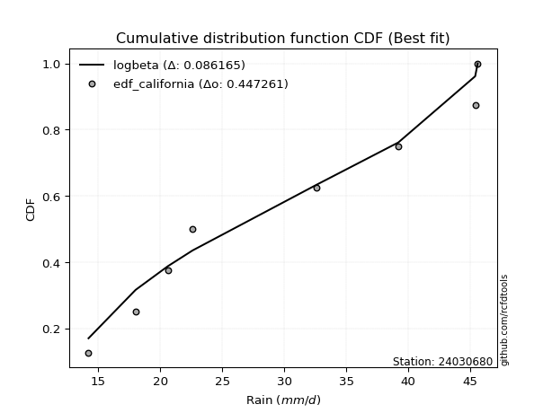</img>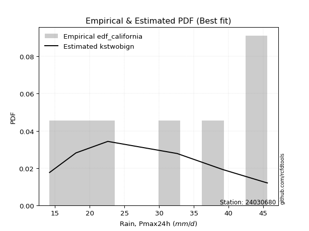</img>

</div>


### 2. EDF Hazen (1930)

Hazen method for plotting positions is a formula used to estimate the empirical cumulative probability distribution of flood events or other hydrological data. This formula often results in biased estimations, particularly when extrapolating to extreme events (high return periods).

<div align="center">


$P=(m-0.5)/n$


</div>


**2.1. Empirical values**

<div align="center">

|                | 0                   | 1                   | 2                   | 3         | 4                  | 5                  | 6                  |
|:---------------|:--------------------|:--------------------|:--------------------|:----------|:-------------------|:-------------------|:-------------------|
| date           | 2017                | 2018                | 2023                | 2021      | 2022               | 2019               | 2020               |
| x              | 14.2                | 18.0                | 22.6                | 32.6      | 39.2               | 45.4               | 45.6               |
| m              | 1                   | 2                   | 3                   | 4         | 5                  | 6                  | 7                  |
| empirical_dist | edf_hazen           | edf_hazen           | edf_hazen           | edf_hazen | edf_hazen          | edf_hazen          | edf_hazen          |
| empirical      | 0.07142857142857142 | 0.21428571428571427 | 0.35714285714285715 | 0.5       | 0.6428571428571429 | 0.7857142857142857 | 0.9285714285714286 |
| empirical_tr   | 1.0769230769230769  | 1.2727272727272727  | 1.5555555555555558  | 2.0       | 2.8000000000000003 | 4.666666666666666  | 14.000000000000007 |

</div>


**2.2. Kolmogorov-Smirnov fit test (sorted by Δ)**


<div align="center">

|                | 0                   | 1                   | 2                   | 3                   | 4                   | 5                   | 6                   | 7                   | 8                   | 9                   | 10                  | 11                  | 12                  | 13                  | 14                  | 15                  | 16                  | 17                  | 18                  | 19                  | 20                  | 21                  | 22                  | 23                  | 24                  | 25                  | 26                  | 27                  | 28                  | 29                  | 30                  | 31                  | 32                  | 33                  | 34                  | 35                  | 36                  | 37                  | 38                  | 39                  | 40                  | 41                  | 42                  | 43                  | 44                  | 45                  | 46                  | 47                  | 48                  | 49                  | 50                  | 51                  | 52                  | 53                  | 54                  | 55                  | 56                  | 57                  | 58                  | 59                  | 60                  | 61                  | 62                  | 63                  | 64                  | 65                  | 66                  | 67                  | 68                  | 69                  | 70                  | 71                  | 72                  | 73                    | 74                  | 75                  | 76                  | 77                  | 78                  | 79                  | 80                  | 81                  | 82                  | 83                  | 84                  | 85                  | 86                  | 87                  |
|:---------------|:--------------------|:--------------------|:--------------------|:--------------------|:--------------------|:--------------------|:--------------------|:--------------------|:--------------------|:--------------------|:--------------------|:--------------------|:--------------------|:--------------------|:--------------------|:--------------------|:--------------------|:--------------------|:--------------------|:--------------------|:--------------------|:--------------------|:--------------------|:--------------------|:--------------------|:--------------------|:--------------------|:--------------------|:--------------------|:--------------------|:--------------------|:--------------------|:--------------------|:--------------------|:--------------------|:--------------------|:--------------------|:--------------------|:--------------------|:--------------------|:--------------------|:--------------------|:--------------------|:--------------------|:--------------------|:--------------------|:--------------------|:--------------------|:--------------------|:--------------------|:--------------------|:--------------------|:--------------------|:--------------------|:--------------------|:--------------------|:--------------------|:--------------------|:--------------------|:--------------------|:--------------------|:--------------------|:--------------------|:--------------------|:--------------------|:--------------------|:--------------------|:--------------------|:--------------------|:--------------------|:--------------------|:--------------------|:--------------------|:----------------------|:--------------------|:--------------------|:--------------------|:--------------------|:--------------------|:--------------------|:--------------------|:--------------------|:--------------------|:--------------------|:--------------------|:--------------------|:--------------------|:--------------------|
| station        | 24030680            | 24030680            | 24030680            | 24030680            | 24030680            | 24030680            | 24030680            | 24030680            | 24030680            | 24030680            | 24030680            | 24030680            | 24030680            | 24030680            | 24030680            | 24030680            | 24030680            | 24030680            | 24030680            | 24030680            | 24030680            | 24030680            | 24030680            | 24030680            | 24030680            | 24030680            | 24030680            | 24030680            | 24030680            | 24030680            | 24030680            | 24030680            | 24030680            | 24030680            | 24030680            | 24030680            | 24030680            | 24030680            | 24030680            | 24030680            | 24030680            | 24030680            | 24030680            | 24030680            | 24030680            | 24030680            | 24030680            | 24030680            | 24030680            | 24030680            | 24030680            | 24030680            | 24030680            | 24030680            | 24030680            | 24030680            | 24030680            | 24030680            | 24030680            | 24030680            | 24030680            | 24030680            | 24030680            | 24030680            | 24030680            | 24030680            | 24030680            | 24030680            | 24030680            | 24030680            | 24030680            | 24030680            | 24030680            | 24030680              | 24030680            | 24030680            | 24030680            | 24030680            | 24030680            | 24030680            | 24030680            | 24030680            | 24030680            | 24030680            | 24030680            | 24030680            | 24030680            | 24030680            |
| empirical_dist | edf_hazen           | edf_hazen           | edf_hazen           | edf_hazen           | edf_hazen           | edf_hazen           | edf_hazen           | edf_hazen           | edf_hazen           | edf_hazen           | edf_hazen           | edf_hazen           | edf_hazen           | edf_hazen           | edf_hazen           | edf_hazen           | edf_hazen           | edf_hazen           | edf_hazen           | edf_hazen           | edf_hazen           | edf_hazen           | edf_hazen           | edf_hazen           | edf_hazen           | edf_hazen           | edf_hazen           | edf_hazen           | edf_hazen           | edf_hazen           | edf_hazen           | edf_hazen           | edf_hazen           | edf_hazen           | edf_hazen           | edf_hazen           | edf_hazen           | edf_hazen           | edf_hazen           | edf_hazen           | edf_hazen           | edf_hazen           | edf_hazen           | edf_hazen           | edf_hazen           | edf_hazen           | edf_hazen           | edf_hazen           | edf_hazen           | edf_hazen           | edf_hazen           | edf_hazen           | edf_hazen           | edf_hazen           | edf_hazen           | edf_hazen           | edf_hazen           | edf_hazen           | edf_hazen           | edf_hazen           | edf_hazen           | edf_hazen           | edf_hazen           | edf_hazen           | edf_hazen           | edf_hazen           | edf_hazen           | edf_hazen           | edf_hazen           | edf_hazen           | edf_hazen           | edf_hazen           | edf_hazen           | edf_hazen             | edf_hazen           | edf_hazen           | edf_hazen           | edf_hazen           | edf_hazen           | edf_hazen           | edf_hazen           | edf_hazen           | edf_hazen           | edf_hazen           | edf_hazen           | edf_hazen           | edf_hazen           | edf_hazen           |
| p_dist         | logfisk             | gompertz            | betaprime           | erlang              | gamma               | alpha               | logweibull_min      | rice                | maxwell             | nct                 | t                   | crystalball         | norm                | truncnorm           | exponnorm           | fisk                | invgamma            | logpearson3         | pearson3            | rayleigh            | ncf                 | invgauss            | loggumbel_l         | genlogistic         | logncf              | logfatiguelife      | loggompertz         | logf                | logcrystalball      | lognorm             | lognorm             | logt                | logexponnorm        | lognct              | logerlang           | loggamma            | loggamma            | logbetaprime        | halfnorm            | logalpha            | loginvgamma         | kstwobign           | laplace_asymmetric  | logrice             | logistic            | logmaxwell          | gumbel_r            | weibull_min         | loglogistic         | loginvgauss         | gumbel_l            | lograyleigh         | hypsecant           | loginvweibull       | lognakagami         | halflogistic        | moyal               | loghypsecant        | expon               | genexpon            | logkstwobign        | laplace             | loghalfnorm         | logmielke           | loglaplace          | loggumbel_r         | chi2                | loggenexpon         | nakagami            | logexpon            | f                   | loghalflogistic     | logloggamma         | loglaplace_asymmetric | logmoyal            | wald                | logchi2             | logwald             | logtruncnorm        | logjohnsonsu        | loggibrat           | gibrat              | loglognorm          | invweibull          | fatiguelife         | johnsonsu           | loggenlogistic      | mielke              |
| delta          | 0.10543104030108619 | 0.11292032976068633 | 0.1130503666832382  | 0.11474677145960749 | 0.11475055812371049 | 0.1150649803056647  | 0.11524468909528349 | 0.11537585119507021 | 0.11682395952884195 | 0.11685296530036557 | 0.11693945420294483 | 0.11696172548776462 | 0.1169617319995187  | 0.11696173606444119 | 0.1169623628043325  | 0.11783166303286682 | 0.11784324521479683 | 0.11873081762983906 | 0.11942052690102511 | 0.11955650207204627 | 0.12106798601705193 | 0.12145886575809339 | 0.12150507227886598 | 0.12300073724044303 | 0.125446194009732   | 0.12603466505896077 | 0.1263337899439022  | 0.12650834458349858 | 0.12667728900666575 | 0.12667737396779077 | 0.12667737396779077 | 0.12667756348406511 | 0.1266786543364743  | 0.12703653230699574 | 0.127157945298368   | 0.12730071369458007 | 0.12730071369458007 | 0.1275293703080328  | 0.12881551397881896 | 0.130920793650249   | 0.13194323789168416 | 0.13262338605899704 | 0.13319668077833605 | 0.13476774402861313 | 0.13959851918475524 | 0.1464965618552514  | 0.14669887154796168 | 0.14765201371967784 | 0.14919519005470117 | 0.1507580565179769  | 0.15397887785083755 | 0.15398925877419822 | 0.1541990913221546  | 0.15439791701020977 | 0.15524732053299994 | 0.15764941767372884 | 0.1594273529738819  | 0.1634160053648661  | 0.16367539901163264 | 0.16369113920929423 | 0.1715358120683963  | 0.17284205193032978 | 0.17548472508823165 | 0.17938731207876013 | 0.18089565208775982 | 0.18598621018074935 | 0.187203936233458   | 0.1923267285972956  | 0.19561654523978347 | 0.1966215386603728  | 0.19911943266091447 | 0.20385286197396557 | 0.2047597754411037  | 0.2049102211779883    | 0.20752661845511522 | 0.21428571428571427 | 0.2261598505538882  | 0.2678894980172212  | 0.28106107171143924 | 0.2920749547773751  | 0.3000317862707116  | 0.3388925336371502  | 0.4107098781093901  | 0.48393416246633914 | 0.49340187421136095 | 0.6385402567590583  | 0.7857142857142857  | nan                 |
| deltao         | 0.48442053926100004 | 0.48442053926100004 | 0.48442053926100004 | 0.48442053926100004 | 0.48442053926100004 | 0.48442053926100004 | 0.48442053926100004 | 0.48442053926100004 | 0.48442053926100004 | 0.48442053926100004 | 0.48442053926100004 | 0.48442053926100004 | 0.48442053926100004 | 0.48442053926100004 | 0.48442053926100004 | 0.48442053926100004 | 0.48442053926100004 | 0.48442053926100004 | 0.48442053926100004 | 0.48442053926100004 | 0.48442053926100004 | 0.48442053926100004 | 0.48442053926100004 | 0.48442053926100004 | 0.48442053926100004 | 0.48442053926100004 | 0.48442053926100004 | 0.48442053926100004 | 0.48442053926100004 | 0.48442053926100004 | 0.48442053926100004 | 0.48442053926100004 | 0.48442053926100004 | 0.48442053926100004 | 0.48442053926100004 | 0.48442053926100004 | 0.48442053926100004 | 0.48442053926100004 | 0.48442053926100004 | 0.48442053926100004 | 0.48442053926100004 | 0.48442053926100004 | 0.48442053926100004 | 0.48442053926100004 | 0.48442053926100004 | 0.48442053926100004 | 0.48442053926100004 | 0.48442053926100004 | 0.48442053926100004 | 0.48442053926100004 | 0.48442053926100004 | 0.48442053926100004 | 0.48442053926100004 | 0.48442053926100004 | 0.48442053926100004 | 0.48442053926100004 | 0.48442053926100004 | 0.48442053926100004 | 0.48442053926100004 | 0.48442053926100004 | 0.48442053926100004 | 0.48442053926100004 | 0.48442053926100004 | 0.48442053926100004 | 0.48442053926100004 | 0.48442053926100004 | 0.48442053926100004 | 0.48442053926100004 | 0.48442053926100004 | 0.48442053926100004 | 0.48442053926100004 | 0.48442053926100004 | 0.48442053926100004 | 0.48442053926100004   | 0.48442053926100004 | 0.48442053926100004 | 0.48442053926100004 | 0.48442053926100004 | 0.48442053926100004 | 0.48442053926100004 | 0.48442053926100004 | 0.48442053926100004 | 0.48442053926100004 | 0.48442053926100004 | 0.48442053926100004 | 0.48442053926100004 | 0.48442053926100004 | 0.48442053926100004 |
| eval           | Δo > Δ              | Δo > Δ              | Δo > Δ              | Δo > Δ              | Δo > Δ              | Δo > Δ              | Δo > Δ              | Δo > Δ              | Δo > Δ              | Δo > Δ              | Δo > Δ              | Δo > Δ              | Δo > Δ              | Δo > Δ              | Δo > Δ              | Δo > Δ              | Δo > Δ              | Δo > Δ              | Δo > Δ              | Δo > Δ              | Δo > Δ              | Δo > Δ              | Δo > Δ              | Δo > Δ              | Δo > Δ              | Δo > Δ              | Δo > Δ              | Δo > Δ              | Δo > Δ              | Δo > Δ              | Δo > Δ              | Δo > Δ              | Δo > Δ              | Δo > Δ              | Δo > Δ              | Δo > Δ              | Δo > Δ              | Δo > Δ              | Δo > Δ              | Δo > Δ              | Δo > Δ              | Δo > Δ              | Δo > Δ              | Δo > Δ              | Δo > Δ              | Δo > Δ              | Δo > Δ              | Δo > Δ              | Δo > Δ              | Δo > Δ              | Δo > Δ              | Δo > Δ              | Δo > Δ              | Δo > Δ              | Δo > Δ              | Δo > Δ              | Δo > Δ              | Δo > Δ              | Δo > Δ              | Δo > Δ              | Δo > Δ              | Δo > Δ              | Δo > Δ              | Δo > Δ              | Δo > Δ              | Δo > Δ              | Δo > Δ              | Δo > Δ              | Δo > Δ              | Δo > Δ              | Δo > Δ              | Δo > Δ              | Δo > Δ              | Δo > Δ                | Δo > Δ              | Δo > Δ              | Δo > Δ              | Δo > Δ              | Δo > Δ              | Δo > Δ              | Δo > Δ              | Δo > Δ              | Δo > Δ              | Δo > Δ              | Δo <= Δ             | Δo <= Δ             | Δo <= Δ             | Δo <= Δ             |
| fit            | 1                   | 1                   | 1                   | 1                   | 1                   | 1                   | 1                   | 1                   | 1                   | 1                   | 1                   | 1                   | 1                   | 1                   | 1                   | 1                   | 1                   | 1                   | 1                   | 1                   | 1                   | 1                   | 1                   | 1                   | 1                   | 1                   | 1                   | 1                   | 1                   | 1                   | 1                   | 1                   | 1                   | 1                   | 1                   | 1                   | 1                   | 1                   | 1                   | 1                   | 1                   | 1                   | 1                   | 1                   | 1                   | 1                   | 1                   | 1                   | 1                   | 1                   | 1                   | 1                   | 1                   | 1                   | 1                   | 1                   | 1                   | 1                   | 1                   | 1                   | 1                   | 1                   | 1                   | 1                   | 1                   | 1                   | 1                   | 1                   | 1                   | 1                   | 1                   | 1                   | 1                   | 1                     | 1                   | 1                   | 1                   | 1                   | 1                   | 1                   | 1                   | 1                   | 1                   | 1                   | 0                   | 0                   | 0                   | 0                   |
| n              | 7                   | 7                   | 7                   | 7                   | 7                   | 7                   | 7                   | 7                   | 7                   | 7                   | 7                   | 7                   | 7                   | 7                   | 7                   | 7                   | 7                   | 7                   | 7                   | 7                   | 7                   | 7                   | 7                   | 7                   | 7                   | 7                   | 7                   | 7                   | 7                   | 7                   | 7                   | 7                   | 7                   | 7                   | 7                   | 7                   | 7                   | 7                   | 7                   | 7                   | 7                   | 7                   | 7                   | 7                   | 7                   | 7                   | 7                   | 7                   | 7                   | 7                   | 7                   | 7                   | 7                   | 7                   | 7                   | 7                   | 7                   | 7                   | 7                   | 7                   | 7                   | 7                   | 7                   | 7                   | 7                   | 7                   | 7                   | 7                   | 7                   | 7                   | 7                   | 7                   | 7                   | 7                     | 7                   | 7                   | 7                   | 7                   | 7                   | 7                   | 7                   | 7                   | 7                   | 7                   | 7                   | 7                   | 7                   | 7                   |
| best_fit       | 1                   | 0                   | 0                   | 0                   | 0                   | 0                   | 0                   | 0                   | 0                   | 0                   | 0                   | 0                   | 0                   | 0                   | 0                   | 0                   | 0                   | 0                   | 0                   | 0                   | 0                   | 0                   | 0                   | 0                   | 0                   | 0                   | 0                   | 0                   | 0                   | 0                   | 0                   | 0                   | 0                   | 0                   | 0                   | 0                   | 0                   | 0                   | 0                   | 0                   | 0                   | 0                   | 0                   | 0                   | 0                   | 0                   | 0                   | 0                   | 0                   | 0                   | 0                   | 0                   | 0                   | 0                   | 0                   | 0                   | 0                   | 0                   | 0                   | 0                   | 0                   | 0                   | 0                   | 0                   | 0                   | 0                   | 0                   | 0                   | 0                   | 0                   | 0                   | 0                   | 0                   | 0                     | 0                   | 0                   | 0                   | 0                   | 0                   | 0                   | 0                   | 0                   | 0                   | 0                   | 0                   | 0                   | 0                   | 0                   |
| best_fit_sort  | 1                   | 2                   | 3                   | 4                   | 5                   | 6                   | 7                   | 8                   | 9                   | 10                  | 11                  | 12                  | 13                  | 14                  | 15                  | 16                  | 17                  | 18                  | 19                  | 20                  | 21                  | 22                  | 23                  | 24                  | 25                  | 26                  | 27                  | 28                  | 29                  | 30                  | 31                  | 32                  | 33                  | 34                  | 35                  | 36                  | 37                  | 38                  | 39                  | 40                  | 41                  | 42                  | 43                  | 44                  | 45                  | 46                  | 47                  | 48                  | 49                  | 50                  | 51                  | 52                  | 53                  | 54                  | 55                  | 56                  | 57                  | 58                  | 59                  | 60                  | 61                  | 62                  | 63                  | 64                  | 65                  | 66                  | 67                  | 68                  | 69                  | 70                  | 71                  | 72                  | 73                  | 74                    | 75                  | 76                  | 77                  | 78                  | 79                  | 80                  | 81                  | 82                  | 83                  | 84                  | 85                  | 86                  | 87                  | 88                  |

</div>


**2.3. Best fit**

<div align="center">

|   id |   station | empirical_dist   | p_dist   |    delta |   deltao | eval   |   fit |   n |   best_fit |   best_fit_sort |
|-----:|----------:|:-----------------|:---------|---------:|---------:|:-------|------:|----:|-----------:|----------------:|
|    0 |  24030680 | edf_hazen        | logfisk  | 0.105431 | 0.484421 | Δo > Δ |     1 |   7 |          1 |               1 |

</div>


<div align="center">

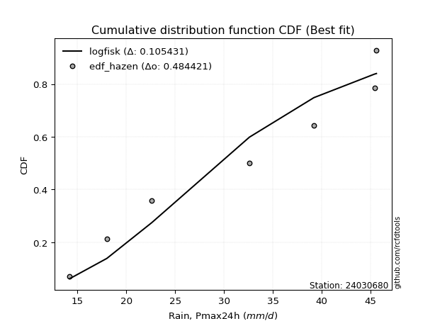</img>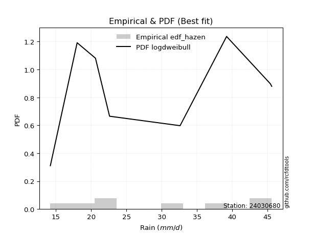</img>

</div>


### 3. EDF Weibull (1939)

Weibull plotting position formula is an empirical method used to estimate the non-exceedance probability or plotting position for a set of observed data, is often recommended or widely used in practice, particularly in flood frequency analysis.

<div align="center">


$P=m/(n+1)$


</div>


**3.1. Empirical values**

<div align="center">

|                | 0                  | 1                  | 2           | 3           | 4                  | 5           | 6           |
|:---------------|:-------------------|:-------------------|:------------|:------------|:-------------------|:------------|:------------|
| date           | 2017               | 2018               | 2023        | 2021        | 2022               | 2019        | 2020        |
| x              | 14.2               | 18.0               | 22.6        | 32.6        | 39.2               | 45.4        | 45.6        |
| m              | 1                  | 2                  | 3           | 4           | 5                  | 6           | 7           |
| empirical_dist | edf_weibull        | edf_weibull        | edf_weibull | edf_weibull | edf_weibull        | edf_weibull | edf_weibull |
| empirical      | 0.125              | 0.25               | 0.375       | 0.5         | 0.625              | 0.75        | 0.875       |
| empirical_tr   | 1.1428571428571428 | 1.3333333333333333 | 1.6         | 2.0         | 2.6666666666666665 | 4.0         | 8.0         |

</div>


**3.2. Kolmogorov-Smirnov fit test (sorted by Δ)**


<div align="center">

|                | 0                   | 1                   | 2                   | 3                   | 4                   | 5                   | 6                   | 7                   | 8                   | 9                   | 10                  | 11                  | 12                  | 13                  | 14                  | 15                  | 16                  | 17                  | 18                  | 19                  | 20                  | 21                  | 22                  | 23                  | 24                  | 25                  | 26                  | 27                  | 28                  | 29                  | 30                  | 31                  | 32                  | 33                  | 34                  | 35                  | 36                  | 37                  | 38                  | 39                  | 40                  | 41                  | 42                  | 43                  | 44                  | 45                  | 46                  | 47                  | 48                  | 49                  | 50                  | 51                  | 52                  | 53                  | 54                  | 55                  | 56                  | 57                  | 58                  | 59                  | 60                  | 61                  | 62                  | 63                  | 64                  | 65                  | 66                  | 67                  | 68                  | 69                  | 70                  | 71                  | 72                  | 73                  | 74                  | 75                    | 76                  | 77                  | 78                  | 79                  | 80                  | 81                  | 82                  | 83                  | 84                  | 85                  | 86                  | 87                  |
|:---------------|:--------------------|:--------------------|:--------------------|:--------------------|:--------------------|:--------------------|:--------------------|:--------------------|:--------------------|:--------------------|:--------------------|:--------------------|:--------------------|:--------------------|:--------------------|:--------------------|:--------------------|:--------------------|:--------------------|:--------------------|:--------------------|:--------------------|:--------------------|:--------------------|:--------------------|:--------------------|:--------------------|:--------------------|:--------------------|:--------------------|:--------------------|:--------------------|:--------------------|:--------------------|:--------------------|:--------------------|:--------------------|:--------------------|:--------------------|:--------------------|:--------------------|:--------------------|:--------------------|:--------------------|:--------------------|:--------------------|:--------------------|:--------------------|:--------------------|:--------------------|:--------------------|:--------------------|:--------------------|:--------------------|:--------------------|:--------------------|:--------------------|:--------------------|:--------------------|:--------------------|:--------------------|:--------------------|:--------------------|:--------------------|:--------------------|:--------------------|:--------------------|:--------------------|:--------------------|:--------------------|:--------------------|:--------------------|:--------------------|:--------------------|:--------------------|:----------------------|:--------------------|:--------------------|:--------------------|:--------------------|:--------------------|:--------------------|:--------------------|:--------------------|:--------------------|:--------------------|:--------------------|:--------------------|
| station        | 24030680            | 24030680            | 24030680            | 24030680            | 24030680            | 24030680            | 24030680            | 24030680            | 24030680            | 24030680            | 24030680            | 24030680            | 24030680            | 24030680            | 24030680            | 24030680            | 24030680            | 24030680            | 24030680            | 24030680            | 24030680            | 24030680            | 24030680            | 24030680            | 24030680            | 24030680            | 24030680            | 24030680            | 24030680            | 24030680            | 24030680            | 24030680            | 24030680            | 24030680            | 24030680            | 24030680            | 24030680            | 24030680            | 24030680            | 24030680            | 24030680            | 24030680            | 24030680            | 24030680            | 24030680            | 24030680            | 24030680            | 24030680            | 24030680            | 24030680            | 24030680            | 24030680            | 24030680            | 24030680            | 24030680            | 24030680            | 24030680            | 24030680            | 24030680            | 24030680            | 24030680            | 24030680            | 24030680            | 24030680            | 24030680            | 24030680            | 24030680            | 24030680            | 24030680            | 24030680            | 24030680            | 24030680            | 24030680            | 24030680            | 24030680            | 24030680              | 24030680            | 24030680            | 24030680            | 24030680            | 24030680            | 24030680            | 24030680            | 24030680            | 24030680            | 24030680            | 24030680            | 24030680            |
| empirical_dist | edf_weibull         | edf_weibull         | edf_weibull         | edf_weibull         | edf_weibull         | edf_weibull         | edf_weibull         | edf_weibull         | edf_weibull         | edf_weibull         | edf_weibull         | edf_weibull         | edf_weibull         | edf_weibull         | edf_weibull         | edf_weibull         | edf_weibull         | edf_weibull         | edf_weibull         | edf_weibull         | edf_weibull         | edf_weibull         | edf_weibull         | edf_weibull         | edf_weibull         | edf_weibull         | edf_weibull         | edf_weibull         | edf_weibull         | edf_weibull         | edf_weibull         | edf_weibull         | edf_weibull         | edf_weibull         | edf_weibull         | edf_weibull         | edf_weibull         | edf_weibull         | edf_weibull         | edf_weibull         | edf_weibull         | edf_weibull         | edf_weibull         | edf_weibull         | edf_weibull         | edf_weibull         | edf_weibull         | edf_weibull         | edf_weibull         | edf_weibull         | edf_weibull         | edf_weibull         | edf_weibull         | edf_weibull         | edf_weibull         | edf_weibull         | edf_weibull         | edf_weibull         | edf_weibull         | edf_weibull         | edf_weibull         | edf_weibull         | edf_weibull         | edf_weibull         | edf_weibull         | edf_weibull         | edf_weibull         | edf_weibull         | edf_weibull         | edf_weibull         | edf_weibull         | edf_weibull         | edf_weibull         | edf_weibull         | edf_weibull         | edf_weibull           | edf_weibull         | edf_weibull         | edf_weibull         | edf_weibull         | edf_weibull         | edf_weibull         | edf_weibull         | edf_weibull         | edf_weibull         | edf_weibull         | edf_weibull         | edf_weibull         |
| p_dist         | logfisk             | weibull_min         | betaprime           | erlang              | gamma               | alpha               | logweibull_min      | rice                | maxwell             | nct                 | t                   | crystalball         | norm                | truncnorm           | exponnorm           | fisk                | invgamma            | logpearson3         | pearson3            | rayleigh            | ncf                 | invgauss            | genlogistic         | logncf              | loggumbel_l         | gompertz            | loginvgamma         | logfatiguelife      | logerlang           | loggamma            | loggamma            | loggompertz         | logf                | logcrystalball      | lognorm             | lognorm             | logt                | logexponnorm        | logalpha            | lognct              | logbetaprime        | logrice             | halfnorm            | kstwobign           | laplace_asymmetric  | logmaxwell          | loginvgauss         | lograyleigh         | loginvweibull       | lognakagami         | logistic            | expon               | genexpon            | gumbel_r            | loglogistic         | logkstwobign        | hypsecant           | logchi2             | gumbel_l            | loghalfnorm         | moyal               | loghypsecant        | loggumbel_r         | nakagami            | chi2                | laplace             | loggenexpon         | halflogistic        | logexpon            | loglaplace          | f                   | loghalflogistic     | logmoyal            | logmielke           | logloggamma         | loglaplace_asymmetric | wald                | logwald             | logjohnsonsu        | logtruncnorm        | loggibrat           | gibrat              | loglognorm          | invweibull          | fatiguelife         | johnsonsu           | loggenlogistic      | mielke              |
| delta          | 0.12328818315822909 | 0.12499999999998099 | 0.1309075095403811  | 0.13260391431675034 | 0.13260770098085334 | 0.1329221231628076  | 0.13310183195242634 | 0.13323299405221312 | 0.13468110238598485 | 0.13471010815750842 | 0.13479659706008768 | 0.13481886834490747 | 0.13481887485666155 | 0.13481887892158403 | 0.13481950566147535 | 0.13568880589000967 | 0.13570038807193974 | 0.13658796048698196 | 0.13727766975816796 | 0.13741364492918917 | 0.13892512887419484 | 0.1393160086152363  | 0.14085788009758593 | 0.14231929723777004 | 0.14298409483618757 | 0.14302876494919844 | 0.14360331731322418 | 0.14389180791610368 | 0.1440649954291351  | 0.14407991097366502 | 0.14407991097366502 | 0.1441909328010451  | 0.14436548744064148 | 0.14453443186380865 | 0.14453451682493368 | 0.14453451682493368 | 0.14453470634120802 | 0.1445357971936172  | 0.14455228092912908 | 0.14489367516413865 | 0.1453865131651757  | 0.1464512380246792  | 0.14667265683596187 | 0.15048052891613994 | 0.1510538236354789  | 0.15154213889098567 | 0.15240921710160582 | 0.15398925877419822 | 0.15439791701020977 | 0.15524732053299994 | 0.1574556620418981  | 0.16367539901163264 | 0.16369113920929423 | 0.1645560144051046  | 0.16705233291184407 | 0.1715358120683963  | 0.17205623417929744 | 0.1725884219824596  | 0.1745803973136688  | 0.17548472508823165 | 0.1772844958310248  | 0.18127314822200902 | 0.18598621018074935 | 0.1862462903446077  | 0.187203936233458   | 0.19069919478747263 | 0.1923267285972956  | 0.19336370338801456 | 0.1966215386603728  | 0.19875279494490272 | 0.19911943266091447 | 0.20385286197396557 | 0.20752661845511522 | 0.21510159779304583 | 0.24047406115538938 | 0.240624506892274     | 0.25                | 0.2678894980172212  | 0.2742178119202322  | 0.29047882190749874 | 0.3000317862707116  | 0.356749676494293   | 0.3749955923951044  | 0.43036273389491053 | 0.45768758849707525 | 0.6028259710447725  | 0.75                | nan                 |
| deltao         | 0.48442053926100004 | 0.48442053926100004 | 0.48442053926100004 | 0.48442053926100004 | 0.48442053926100004 | 0.48442053926100004 | 0.48442053926100004 | 0.48442053926100004 | 0.48442053926100004 | 0.48442053926100004 | 0.48442053926100004 | 0.48442053926100004 | 0.48442053926100004 | 0.48442053926100004 | 0.48442053926100004 | 0.48442053926100004 | 0.48442053926100004 | 0.48442053926100004 | 0.48442053926100004 | 0.48442053926100004 | 0.48442053926100004 | 0.48442053926100004 | 0.48442053926100004 | 0.48442053926100004 | 0.48442053926100004 | 0.48442053926100004 | 0.48442053926100004 | 0.48442053926100004 | 0.48442053926100004 | 0.48442053926100004 | 0.48442053926100004 | 0.48442053926100004 | 0.48442053926100004 | 0.48442053926100004 | 0.48442053926100004 | 0.48442053926100004 | 0.48442053926100004 | 0.48442053926100004 | 0.48442053926100004 | 0.48442053926100004 | 0.48442053926100004 | 0.48442053926100004 | 0.48442053926100004 | 0.48442053926100004 | 0.48442053926100004 | 0.48442053926100004 | 0.48442053926100004 | 0.48442053926100004 | 0.48442053926100004 | 0.48442053926100004 | 0.48442053926100004 | 0.48442053926100004 | 0.48442053926100004 | 0.48442053926100004 | 0.48442053926100004 | 0.48442053926100004 | 0.48442053926100004 | 0.48442053926100004 | 0.48442053926100004 | 0.48442053926100004 | 0.48442053926100004 | 0.48442053926100004 | 0.48442053926100004 | 0.48442053926100004 | 0.48442053926100004 | 0.48442053926100004 | 0.48442053926100004 | 0.48442053926100004 | 0.48442053926100004 | 0.48442053926100004 | 0.48442053926100004 | 0.48442053926100004 | 0.48442053926100004 | 0.48442053926100004 | 0.48442053926100004 | 0.48442053926100004   | 0.48442053926100004 | 0.48442053926100004 | 0.48442053926100004 | 0.48442053926100004 | 0.48442053926100004 | 0.48442053926100004 | 0.48442053926100004 | 0.48442053926100004 | 0.48442053926100004 | 0.48442053926100004 | 0.48442053926100004 | 0.48442053926100004 |
| eval           | Δo > Δ              | Δo > Δ              | Δo > Δ              | Δo > Δ              | Δo > Δ              | Δo > Δ              | Δo > Δ              | Δo > Δ              | Δo > Δ              | Δo > Δ              | Δo > Δ              | Δo > Δ              | Δo > Δ              | Δo > Δ              | Δo > Δ              | Δo > Δ              | Δo > Δ              | Δo > Δ              | Δo > Δ              | Δo > Δ              | Δo > Δ              | Δo > Δ              | Δo > Δ              | Δo > Δ              | Δo > Δ              | Δo > Δ              | Δo > Δ              | Δo > Δ              | Δo > Δ              | Δo > Δ              | Δo > Δ              | Δo > Δ              | Δo > Δ              | Δo > Δ              | Δo > Δ              | Δo > Δ              | Δo > Δ              | Δo > Δ              | Δo > Δ              | Δo > Δ              | Δo > Δ              | Δo > Δ              | Δo > Δ              | Δo > Δ              | Δo > Δ              | Δo > Δ              | Δo > Δ              | Δo > Δ              | Δo > Δ              | Δo > Δ              | Δo > Δ              | Δo > Δ              | Δo > Δ              | Δo > Δ              | Δo > Δ              | Δo > Δ              | Δo > Δ              | Δo > Δ              | Δo > Δ              | Δo > Δ              | Δo > Δ              | Δo > Δ              | Δo > Δ              | Δo > Δ              | Δo > Δ              | Δo > Δ              | Δo > Δ              | Δo > Δ              | Δo > Δ              | Δo > Δ              | Δo > Δ              | Δo > Δ              | Δo > Δ              | Δo > Δ              | Δo > Δ              | Δo > Δ                | Δo > Δ              | Δo > Δ              | Δo > Δ              | Δo > Δ              | Δo > Δ              | Δo > Δ              | Δo > Δ              | Δo > Δ              | Δo > Δ              | Δo <= Δ             | Δo <= Δ             | Δo <= Δ             |
| fit            | 1                   | 1                   | 1                   | 1                   | 1                   | 1                   | 1                   | 1                   | 1                   | 1                   | 1                   | 1                   | 1                   | 1                   | 1                   | 1                   | 1                   | 1                   | 1                   | 1                   | 1                   | 1                   | 1                   | 1                   | 1                   | 1                   | 1                   | 1                   | 1                   | 1                   | 1                   | 1                   | 1                   | 1                   | 1                   | 1                   | 1                   | 1                   | 1                   | 1                   | 1                   | 1                   | 1                   | 1                   | 1                   | 1                   | 1                   | 1                   | 1                   | 1                   | 1                   | 1                   | 1                   | 1                   | 1                   | 1                   | 1                   | 1                   | 1                   | 1                   | 1                   | 1                   | 1                   | 1                   | 1                   | 1                   | 1                   | 1                   | 1                   | 1                   | 1                   | 1                   | 1                   | 1                   | 1                   | 1                     | 1                   | 1                   | 1                   | 1                   | 1                   | 1                   | 1                   | 1                   | 1                   | 0                   | 0                   | 0                   |
| n              | 7                   | 7                   | 7                   | 7                   | 7                   | 7                   | 7                   | 7                   | 7                   | 7                   | 7                   | 7                   | 7                   | 7                   | 7                   | 7                   | 7                   | 7                   | 7                   | 7                   | 7                   | 7                   | 7                   | 7                   | 7                   | 7                   | 7                   | 7                   | 7                   | 7                   | 7                   | 7                   | 7                   | 7                   | 7                   | 7                   | 7                   | 7                   | 7                   | 7                   | 7                   | 7                   | 7                   | 7                   | 7                   | 7                   | 7                   | 7                   | 7                   | 7                   | 7                   | 7                   | 7                   | 7                   | 7                   | 7                   | 7                   | 7                   | 7                   | 7                   | 7                   | 7                   | 7                   | 7                   | 7                   | 7                   | 7                   | 7                   | 7                   | 7                   | 7                   | 7                   | 7                   | 7                   | 7                   | 7                     | 7                   | 7                   | 7                   | 7                   | 7                   | 7                   | 7                   | 7                   | 7                   | 7                   | 7                   | 7                   |
| best_fit       | 1                   | 0                   | 0                   | 0                   | 0                   | 0                   | 0                   | 0                   | 0                   | 0                   | 0                   | 0                   | 0                   | 0                   | 0                   | 0                   | 0                   | 0                   | 0                   | 0                   | 0                   | 0                   | 0                   | 0                   | 0                   | 0                   | 0                   | 0                   | 0                   | 0                   | 0                   | 0                   | 0                   | 0                   | 0                   | 0                   | 0                   | 0                   | 0                   | 0                   | 0                   | 0                   | 0                   | 0                   | 0                   | 0                   | 0                   | 0                   | 0                   | 0                   | 0                   | 0                   | 0                   | 0                   | 0                   | 0                   | 0                   | 0                   | 0                   | 0                   | 0                   | 0                   | 0                   | 0                   | 0                   | 0                   | 0                   | 0                   | 0                   | 0                   | 0                   | 0                   | 0                   | 0                   | 0                   | 0                     | 0                   | 0                   | 0                   | 0                   | 0                   | 0                   | 0                   | 0                   | 0                   | 0                   | 0                   | 0                   |
| best_fit_sort  | 1                   | 2                   | 3                   | 4                   | 5                   | 6                   | 7                   | 8                   | 9                   | 10                  | 11                  | 12                  | 13                  | 14                  | 15                  | 16                  | 17                  | 18                  | 19                  | 20                  | 21                  | 22                  | 23                  | 24                  | 25                  | 26                  | 27                  | 28                  | 29                  | 30                  | 31                  | 32                  | 33                  | 34                  | 35                  | 36                  | 37                  | 38                  | 39                  | 40                  | 41                  | 42                  | 43                  | 44                  | 45                  | 46                  | 47                  | 48                  | 49                  | 50                  | 51                  | 52                  | 53                  | 54                  | 55                  | 56                  | 57                  | 58                  | 59                  | 60                  | 61                  | 62                  | 63                  | 64                  | 65                  | 66                  | 67                  | 68                  | 69                  | 70                  | 71                  | 72                  | 73                  | 74                  | 75                  | 76                    | 77                  | 78                  | 79                  | 80                  | 81                  | 82                  | 83                  | 84                  | 85                  | 86                  | 87                  | 88                  |

</div>


**3.3. Best fit**

<div align="center">

|   id |   station | empirical_dist   | p_dist   |    delta |   deltao | eval   |   fit |   n |   best_fit |   best_fit_sort |
|-----:|----------:|:-----------------|:---------|---------:|---------:|:-------|------:|----:|-----------:|----------------:|
|    0 |  24030680 | edf_weibull      | logfisk  | 0.123288 | 0.484421 | Δo > Δ |     1 |   7 |          1 |               1 |

</div>


<div align="center">

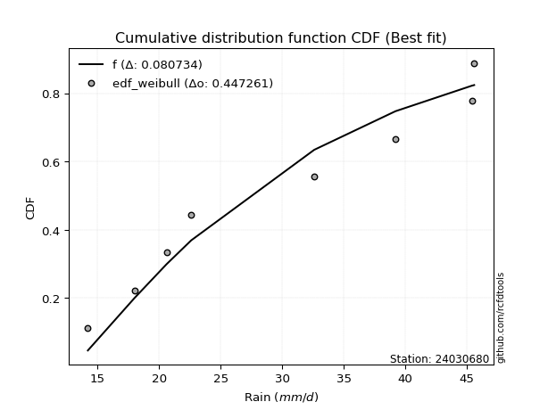</img>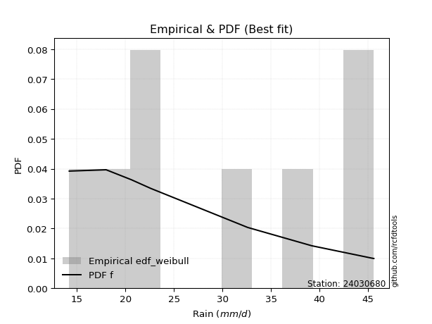</img>

</div>


### 4. EDF Beard (1943)

The Beard formula (or Beard´s plotting position formula) in hydrology is used to estimate the empirical non-exceedance probability _(P)_ of a flood event (or other extreme hydrological data point) within a given dataset.

<div align="center">


$P=(m-0.31)/(n+0.38)$


</div>


**4.1. Empirical values**

<div align="center">

|                | 0                   | 1                   | 2                   | 3         | 4                  | 5                  | 6                  |
|:---------------|:--------------------|:--------------------|:--------------------|:----------|:-------------------|:-------------------|:-------------------|
| date           | 2017                | 2018                | 2023                | 2021      | 2022               | 2019               | 2020               |
| x              | 14.2                | 18.0                | 22.6                | 32.6      | 39.2               | 45.4               | 45.6               |
| m              | 1                   | 2                   | 3                   | 4         | 5                  | 6                  | 7                  |
| empirical_dist | edf_beard           | edf_beard           | edf_beard           | edf_beard | edf_beard          | edf_beard          | edf_beard          |
| empirical      | 0.09349593495934959 | 0.22899728997289973 | 0.36449864498644985 | 0.5       | 0.6355013550135502 | 0.7710027100271003 | 0.9065040650406505 |
| empirical_tr   | 1.1031390134529149  | 1.29701230228471    | 1.5735607675906182  | 2.0       | 2.743494423791822  | 4.366863905325444  | 10.695652173913055 |

</div>


**4.2. Kolmogorov-Smirnov fit test (sorted by Δ)**


<div align="center">

|                | 0                   | 1                   | 2                   | 3                   | 4                   | 5                   | 6                   | 7                   | 8                   | 9                   | 10                  | 11                  | 12                  | 13                  | 14                  | 15                  | 16                  | 17                  | 18                  | 19                  | 20                  | 21                  | 22                  | 23                  | 24                  | 25                  | 26                  | 27                  | 28                  | 29                  | 30                  | 31                  | 32                  | 33                  | 34                  | 35                  | 36                  | 37                  | 38                  | 39                  | 40                  | 41                  | 42                  | 43                  | 44                  | 45                  | 46                  | 47                  | 48                  | 49                  | 50                  | 51                  | 52                  | 53                  | 54                  | 55                  | 56                  | 57                  | 58                  | 59                  | 60                  | 61                  | 62                  | 63                  | 64                  | 65                  | 66                  | 67                  | 68                  | 69                  | 70                  | 71                  | 72                  | 73                  | 74                  | 75                    | 76                  | 77                  | 78                  | 79                  | 80                  | 81                  | 82                  | 83                  | 84                  | 85                  | 86                  | 87                  |
|:---------------|:--------------------|:--------------------|:--------------------|:--------------------|:--------------------|:--------------------|:--------------------|:--------------------|:--------------------|:--------------------|:--------------------|:--------------------|:--------------------|:--------------------|:--------------------|:--------------------|:--------------------|:--------------------|:--------------------|:--------------------|:--------------------|:--------------------|:--------------------|:--------------------|:--------------------|:--------------------|:--------------------|:--------------------|:--------------------|:--------------------|:--------------------|:--------------------|:--------------------|:--------------------|:--------------------|:--------------------|:--------------------|:--------------------|:--------------------|:--------------------|:--------------------|:--------------------|:--------------------|:--------------------|:--------------------|:--------------------|:--------------------|:--------------------|:--------------------|:--------------------|:--------------------|:--------------------|:--------------------|:--------------------|:--------------------|:--------------------|:--------------------|:--------------------|:--------------------|:--------------------|:--------------------|:--------------------|:--------------------|:--------------------|:--------------------|:--------------------|:--------------------|:--------------------|:--------------------|:--------------------|:--------------------|:--------------------|:--------------------|:--------------------|:--------------------|:----------------------|:--------------------|:--------------------|:--------------------|:--------------------|:--------------------|:--------------------|:--------------------|:--------------------|:--------------------|:--------------------|:--------------------|:--------------------|
| station        | 24030680            | 24030680            | 24030680            | 24030680            | 24030680            | 24030680            | 24030680            | 24030680            | 24030680            | 24030680            | 24030680            | 24030680            | 24030680            | 24030680            | 24030680            | 24030680            | 24030680            | 24030680            | 24030680            | 24030680            | 24030680            | 24030680            | 24030680            | 24030680            | 24030680            | 24030680            | 24030680            | 24030680            | 24030680            | 24030680            | 24030680            | 24030680            | 24030680            | 24030680            | 24030680            | 24030680            | 24030680            | 24030680            | 24030680            | 24030680            | 24030680            | 24030680            | 24030680            | 24030680            | 24030680            | 24030680            | 24030680            | 24030680            | 24030680            | 24030680            | 24030680            | 24030680            | 24030680            | 24030680            | 24030680            | 24030680            | 24030680            | 24030680            | 24030680            | 24030680            | 24030680            | 24030680            | 24030680            | 24030680            | 24030680            | 24030680            | 24030680            | 24030680            | 24030680            | 24030680            | 24030680            | 24030680            | 24030680            | 24030680            | 24030680            | 24030680              | 24030680            | 24030680            | 24030680            | 24030680            | 24030680            | 24030680            | 24030680            | 24030680            | 24030680            | 24030680            | 24030680            | 24030680            |
| empirical_dist | edf_beard           | edf_beard           | edf_beard           | edf_beard           | edf_beard           | edf_beard           | edf_beard           | edf_beard           | edf_beard           | edf_beard           | edf_beard           | edf_beard           | edf_beard           | edf_beard           | edf_beard           | edf_beard           | edf_beard           | edf_beard           | edf_beard           | edf_beard           | edf_beard           | edf_beard           | edf_beard           | edf_beard           | edf_beard           | edf_beard           | edf_beard           | edf_beard           | edf_beard           | edf_beard           | edf_beard           | edf_beard           | edf_beard           | edf_beard           | edf_beard           | edf_beard           | edf_beard           | edf_beard           | edf_beard           | edf_beard           | edf_beard           | edf_beard           | edf_beard           | edf_beard           | edf_beard           | edf_beard           | edf_beard           | edf_beard           | edf_beard           | edf_beard           | edf_beard           | edf_beard           | edf_beard           | edf_beard           | edf_beard           | edf_beard           | edf_beard           | edf_beard           | edf_beard           | edf_beard           | edf_beard           | edf_beard           | edf_beard           | edf_beard           | edf_beard           | edf_beard           | edf_beard           | edf_beard           | edf_beard           | edf_beard           | edf_beard           | edf_beard           | edf_beard           | edf_beard           | edf_beard           | edf_beard             | edf_beard           | edf_beard           | edf_beard           | edf_beard           | edf_beard           | edf_beard           | edf_beard           | edf_beard           | edf_beard           | edf_beard           | edf_beard           | edf_beard           |
| p_dist         | logfisk             | betaprime           | gompertz            | erlang              | gamma               | alpha               | logweibull_min      | rice                | maxwell             | nct                 | t                   | crystalball         | norm                | truncnorm           | exponnorm           | fisk                | invgamma            | weibull_min         | logpearson3         | pearson3            | rayleigh            | ncf                 | invgauss            | loggumbel_l         | genlogistic         | logncf              | loginvgamma         | logfatiguelife      | logerlang           | loggamma            | loggamma            | loggompertz         | logf                | logcrystalball      | lognorm             | lognorm             | logt                | logexponnorm        | logalpha            | lognct              | logbetaprime        | logrice             | halfnorm            | kstwobign           | laplace_asymmetric  | logmaxwell          | logistic            | loginvgauss         | lograyleigh         | gumbel_r            | loginvweibull       | lognakagami         | loglogistic         | gumbel_l            | hypsecant           | expon               | genexpon            | moyal               | loghypsecant        | logkstwobign        | halflogistic        | loghalfnorm         | laplace             | loggumbel_r         | nakagami            | chi2                | loglaplace          | loggenexpon         | logmielke           | logexpon            | f                   | loghalflogistic     | logchi2             | logmoyal            | logloggamma         | loglaplace_asymmetric | wald                | logwald             | logtruncnorm        | logjohnsonsu        | loggibrat           | gibrat              | loglognorm          | invweibull          | fatiguelife         | johnsonsu           | loggenlogistic      | mielke              |
| delta          | 0.11278682814467889 | 0.1204061545268309  | 0.12202605492209817 | 0.12210255930320019 | 0.12210634596730319 | 0.1224207681492574  | 0.12260047693887619 | 0.12273163903866291 | 0.12417974737243465 | 0.12420875314395827 | 0.12429524204653752 | 0.12431751333135732 | 0.1243175198431114  | 0.12431752390803388 | 0.1243181506479252  | 0.12518745087645952 | 0.12519903305838953 | 0.12558465018889975 | 0.12608660547343176 | 0.1267763147446178  | 0.12691228991563896 | 0.12842377386064463 | 0.1288146536016861  | 0.12886086012245868 | 0.13035652508403572 | 0.13181794222421983 | 0.13310196229967397 | 0.13339045290255347 | 0.13356364041558488 | 0.1335785559601148  | 0.1335785559601148  | 0.1336895777874949  | 0.13386413242709128 | 0.13403307685025845 | 0.13403316181138347 | 0.13403316181138347 | 0.1340333513276578  | 0.134034442180067   | 0.13405092591557888 | 0.13439232015058844 | 0.1348851581516255  | 0.13594988301112898 | 0.13617130182241166 | 0.13997917390258974 | 0.14055246862192874 | 0.1464965618552514  | 0.14695430702834794 | 0.1507580565179769  | 0.15398925877419822 | 0.15405465939155438 | 0.15439791701020977 | 0.15524732053299994 | 0.15655097789829386 | 0.16133466569443025 | 0.1615548791657473  | 0.16367539901163264 | 0.16369113920929423 | 0.16678314081747458 | 0.1707717932084588  | 0.1715358120683963  | 0.1723609933609143  | 0.17548472508823165 | 0.18019783977392248 | 0.18598621018074935 | 0.1862462903446077  | 0.187203936233458   | 0.18825143993135252 | 0.1923267285972956  | 0.19409888776594553 | 0.1966215386603728  | 0.19911943266091447 | 0.20385286197396557 | 0.20409248702311011 | 0.20752661845511522 | 0.21947135112828908 | 0.2196217968651737    | 0.22899728997289973 | 0.2678894980172212  | 0.28106107171143924 | 0.2847191669337824  | 0.3000317862707116  | 0.3462483214807429  | 0.3959983024222047  | 0.46186679893556104 | 0.47869029852417555 | 0.623828681071873   | 0.7710027100271003  | nan                 |
| deltao         | 0.48442053926100004 | 0.48442053926100004 | 0.48442053926100004 | 0.48442053926100004 | 0.48442053926100004 | 0.48442053926100004 | 0.48442053926100004 | 0.48442053926100004 | 0.48442053926100004 | 0.48442053926100004 | 0.48442053926100004 | 0.48442053926100004 | 0.48442053926100004 | 0.48442053926100004 | 0.48442053926100004 | 0.48442053926100004 | 0.48442053926100004 | 0.48442053926100004 | 0.48442053926100004 | 0.48442053926100004 | 0.48442053926100004 | 0.48442053926100004 | 0.48442053926100004 | 0.48442053926100004 | 0.48442053926100004 | 0.48442053926100004 | 0.48442053926100004 | 0.48442053926100004 | 0.48442053926100004 | 0.48442053926100004 | 0.48442053926100004 | 0.48442053926100004 | 0.48442053926100004 | 0.48442053926100004 | 0.48442053926100004 | 0.48442053926100004 | 0.48442053926100004 | 0.48442053926100004 | 0.48442053926100004 | 0.48442053926100004 | 0.48442053926100004 | 0.48442053926100004 | 0.48442053926100004 | 0.48442053926100004 | 0.48442053926100004 | 0.48442053926100004 | 0.48442053926100004 | 0.48442053926100004 | 0.48442053926100004 | 0.48442053926100004 | 0.48442053926100004 | 0.48442053926100004 | 0.48442053926100004 | 0.48442053926100004 | 0.48442053926100004 | 0.48442053926100004 | 0.48442053926100004 | 0.48442053926100004 | 0.48442053926100004 | 0.48442053926100004 | 0.48442053926100004 | 0.48442053926100004 | 0.48442053926100004 | 0.48442053926100004 | 0.48442053926100004 | 0.48442053926100004 | 0.48442053926100004 | 0.48442053926100004 | 0.48442053926100004 | 0.48442053926100004 | 0.48442053926100004 | 0.48442053926100004 | 0.48442053926100004 | 0.48442053926100004 | 0.48442053926100004 | 0.48442053926100004   | 0.48442053926100004 | 0.48442053926100004 | 0.48442053926100004 | 0.48442053926100004 | 0.48442053926100004 | 0.48442053926100004 | 0.48442053926100004 | 0.48442053926100004 | 0.48442053926100004 | 0.48442053926100004 | 0.48442053926100004 | 0.48442053926100004 |
| eval           | Δo > Δ              | Δo > Δ              | Δo > Δ              | Δo > Δ              | Δo > Δ              | Δo > Δ              | Δo > Δ              | Δo > Δ              | Δo > Δ              | Δo > Δ              | Δo > Δ              | Δo > Δ              | Δo > Δ              | Δo > Δ              | Δo > Δ              | Δo > Δ              | Δo > Δ              | Δo > Δ              | Δo > Δ              | Δo > Δ              | Δo > Δ              | Δo > Δ              | Δo > Δ              | Δo > Δ              | Δo > Δ              | Δo > Δ              | Δo > Δ              | Δo > Δ              | Δo > Δ              | Δo > Δ              | Δo > Δ              | Δo > Δ              | Δo > Δ              | Δo > Δ              | Δo > Δ              | Δo > Δ              | Δo > Δ              | Δo > Δ              | Δo > Δ              | Δo > Δ              | Δo > Δ              | Δo > Δ              | Δo > Δ              | Δo > Δ              | Δo > Δ              | Δo > Δ              | Δo > Δ              | Δo > Δ              | Δo > Δ              | Δo > Δ              | Δo > Δ              | Δo > Δ              | Δo > Δ              | Δo > Δ              | Δo > Δ              | Δo > Δ              | Δo > Δ              | Δo > Δ              | Δo > Δ              | Δo > Δ              | Δo > Δ              | Δo > Δ              | Δo > Δ              | Δo > Δ              | Δo > Δ              | Δo > Δ              | Δo > Δ              | Δo > Δ              | Δo > Δ              | Δo > Δ              | Δo > Δ              | Δo > Δ              | Δo > Δ              | Δo > Δ              | Δo > Δ              | Δo > Δ                | Δo > Δ              | Δo > Δ              | Δo > Δ              | Δo > Δ              | Δo > Δ              | Δo > Δ              | Δo > Δ              | Δo > Δ              | Δo > Δ              | Δo <= Δ             | Δo <= Δ             | Δo <= Δ             |
| fit            | 1                   | 1                   | 1                   | 1                   | 1                   | 1                   | 1                   | 1                   | 1                   | 1                   | 1                   | 1                   | 1                   | 1                   | 1                   | 1                   | 1                   | 1                   | 1                   | 1                   | 1                   | 1                   | 1                   | 1                   | 1                   | 1                   | 1                   | 1                   | 1                   | 1                   | 1                   | 1                   | 1                   | 1                   | 1                   | 1                   | 1                   | 1                   | 1                   | 1                   | 1                   | 1                   | 1                   | 1                   | 1                   | 1                   | 1                   | 1                   | 1                   | 1                   | 1                   | 1                   | 1                   | 1                   | 1                   | 1                   | 1                   | 1                   | 1                   | 1                   | 1                   | 1                   | 1                   | 1                   | 1                   | 1                   | 1                   | 1                   | 1                   | 1                   | 1                   | 1                   | 1                   | 1                   | 1                   | 1                     | 1                   | 1                   | 1                   | 1                   | 1                   | 1                   | 1                   | 1                   | 1                   | 0                   | 0                   | 0                   |
| n              | 7                   | 7                   | 7                   | 7                   | 7                   | 7                   | 7                   | 7                   | 7                   | 7                   | 7                   | 7                   | 7                   | 7                   | 7                   | 7                   | 7                   | 7                   | 7                   | 7                   | 7                   | 7                   | 7                   | 7                   | 7                   | 7                   | 7                   | 7                   | 7                   | 7                   | 7                   | 7                   | 7                   | 7                   | 7                   | 7                   | 7                   | 7                   | 7                   | 7                   | 7                   | 7                   | 7                   | 7                   | 7                   | 7                   | 7                   | 7                   | 7                   | 7                   | 7                   | 7                   | 7                   | 7                   | 7                   | 7                   | 7                   | 7                   | 7                   | 7                   | 7                   | 7                   | 7                   | 7                   | 7                   | 7                   | 7                   | 7                   | 7                   | 7                   | 7                   | 7                   | 7                   | 7                   | 7                   | 7                     | 7                   | 7                   | 7                   | 7                   | 7                   | 7                   | 7                   | 7                   | 7                   | 7                   | 7                   | 7                   |
| best_fit       | 1                   | 0                   | 0                   | 0                   | 0                   | 0                   | 0                   | 0                   | 0                   | 0                   | 0                   | 0                   | 0                   | 0                   | 0                   | 0                   | 0                   | 0                   | 0                   | 0                   | 0                   | 0                   | 0                   | 0                   | 0                   | 0                   | 0                   | 0                   | 0                   | 0                   | 0                   | 0                   | 0                   | 0                   | 0                   | 0                   | 0                   | 0                   | 0                   | 0                   | 0                   | 0                   | 0                   | 0                   | 0                   | 0                   | 0                   | 0                   | 0                   | 0                   | 0                   | 0                   | 0                   | 0                   | 0                   | 0                   | 0                   | 0                   | 0                   | 0                   | 0                   | 0                   | 0                   | 0                   | 0                   | 0                   | 0                   | 0                   | 0                   | 0                   | 0                   | 0                   | 0                   | 0                   | 0                   | 0                     | 0                   | 0                   | 0                   | 0                   | 0                   | 0                   | 0                   | 0                   | 0                   | 0                   | 0                   | 0                   |
| best_fit_sort  | 1                   | 2                   | 3                   | 4                   | 5                   | 6                   | 7                   | 8                   | 9                   | 10                  | 11                  | 12                  | 13                  | 14                  | 15                  | 16                  | 17                  | 18                  | 19                  | 20                  | 21                  | 22                  | 23                  | 24                  | 25                  | 26                  | 27                  | 28                  | 29                  | 30                  | 31                  | 32                  | 33                  | 34                  | 35                  | 36                  | 37                  | 38                  | 39                  | 40                  | 41                  | 42                  | 43                  | 44                  | 45                  | 46                  | 47                  | 48                  | 49                  | 50                  | 51                  | 52                  | 53                  | 54                  | 55                  | 56                  | 57                  | 58                  | 59                  | 60                  | 61                  | 62                  | 63                  | 64                  | 65                  | 66                  | 67                  | 68                  | 69                  | 70                  | 71                  | 72                  | 73                  | 74                  | 75                  | 76                    | 77                  | 78                  | 79                  | 80                  | 81                  | 82                  | 83                  | 84                  | 85                  | 86                  | 87                  | 88                  |

</div>


**4.3. Best fit**

<div align="center">

|   id |   station | empirical_dist   | p_dist   |    delta |   deltao | eval   |   fit |   n |   best_fit |   best_fit_sort |
|-----:|----------:|:-----------------|:---------|---------:|---------:|:-------|------:|----:|-----------:|----------------:|
|    0 |  24030680 | edf_beard        | logfisk  | 0.112787 | 0.484421 | Δo > Δ |     1 |   7 |          1 |               1 |

</div>


<div align="center">

</img></img>

</div>


### 5. EDF Chegodayev (1955)

The Chegodayev formula is an empirical plotting position formula used in hydrological frequency analysis to estimate the exceedance probability or return period of a specific event from a set of observed data. It is primarily used for plotting observed data points on probability paper to fit a theoretical distribution, particularly for analyzing extreme events like maximum flood flows or rainfall intensities. The constant _b_ value in the generalized plotting position formula is 0.3.

<div align="center">


$P=(m-b)/(n+1-2b)$


</div>


**5.1. Empirical values**

<div align="center">

|                | 0                   | 1                   | 2                   | 3              | 4                  | 5                  | 6                  |
|:---------------|:--------------------|:--------------------|:--------------------|:---------------|:-------------------|:-------------------|:-------------------|
| date           | 2017                | 2018                | 2023                | 2021           | 2022               | 2019               | 2020               |
| x              | 14.2                | 18.0                | 22.6                | 32.6           | 39.2               | 45.4               | 45.6               |
| m              | 1                   | 2                   | 3                   | 4              | 5                  | 6                  | 7                  |
| empirical_dist | edf_chegodayev      | edf_chegodayev      | edf_chegodayev      | edf_chegodayev | edf_chegodayev     | edf_chegodayev     | edf_chegodayev     |
| empirical      | 0.09459459459459459 | 0.22972972972972971 | 0.36486486486486486 | 0.5            | 0.6351351351351351 | 0.7702702702702703 | 0.9054054054054054 |
| empirical_tr   | 1.1044776119402986  | 1.2982456140350878  | 1.574468085106383   | 2.0            | 2.7407407407407405 | 4.352941176470589  | 10.571428571428568 |

</div>


**5.2. Kolmogorov-Smirnov fit test (sorted by Δ)**


<div align="center">

|                | 0                   | 1                   | 2                   | 3                   | 4                   | 5                   | 6                   | 7                   | 8                   | 9                   | 10                  | 11                  | 12                  | 13                  | 14                  | 15                  | 16                  | 17                  | 18                  | 19                  | 20                  | 21                  | 22                  | 23                  | 24                  | 25                  | 26                  | 27                  | 28                  | 29                  | 30                  | 31                  | 32                  | 33                  | 34                  | 35                  | 36                  | 37                  | 38                  | 39                  | 40                  | 41                  | 42                  | 43                  | 44                  | 45                  | 46                  | 47                  | 48                  | 49                  | 50                  | 51                  | 52                  | 53                  | 54                  | 55                  | 56                  | 57                  | 58                  | 59                  | 60                  | 61                  | 62                  | 63                  | 64                  | 65                  | 66                  | 67                  | 68                  | 69                  | 70                  | 71                  | 72                  | 73                  | 74                  | 75                    | 76                  | 77                  | 78                  | 79                  | 80                  | 81                  | 82                  | 83                  | 84                  | 85                  | 86                  | 87                  |
|:---------------|:--------------------|:--------------------|:--------------------|:--------------------|:--------------------|:--------------------|:--------------------|:--------------------|:--------------------|:--------------------|:--------------------|:--------------------|:--------------------|:--------------------|:--------------------|:--------------------|:--------------------|:--------------------|:--------------------|:--------------------|:--------------------|:--------------------|:--------------------|:--------------------|:--------------------|:--------------------|:--------------------|:--------------------|:--------------------|:--------------------|:--------------------|:--------------------|:--------------------|:--------------------|:--------------------|:--------------------|:--------------------|:--------------------|:--------------------|:--------------------|:--------------------|:--------------------|:--------------------|:--------------------|:--------------------|:--------------------|:--------------------|:--------------------|:--------------------|:--------------------|:--------------------|:--------------------|:--------------------|:--------------------|:--------------------|:--------------------|:--------------------|:--------------------|:--------------------|:--------------------|:--------------------|:--------------------|:--------------------|:--------------------|:--------------------|:--------------------|:--------------------|:--------------------|:--------------------|:--------------------|:--------------------|:--------------------|:--------------------|:--------------------|:--------------------|:----------------------|:--------------------|:--------------------|:--------------------|:--------------------|:--------------------|:--------------------|:--------------------|:--------------------|:--------------------|:--------------------|:--------------------|:--------------------|
| station        | 24030680            | 24030680            | 24030680            | 24030680            | 24030680            | 24030680            | 24030680            | 24030680            | 24030680            | 24030680            | 24030680            | 24030680            | 24030680            | 24030680            | 24030680            | 24030680            | 24030680            | 24030680            | 24030680            | 24030680            | 24030680            | 24030680            | 24030680            | 24030680            | 24030680            | 24030680            | 24030680            | 24030680            | 24030680            | 24030680            | 24030680            | 24030680            | 24030680            | 24030680            | 24030680            | 24030680            | 24030680            | 24030680            | 24030680            | 24030680            | 24030680            | 24030680            | 24030680            | 24030680            | 24030680            | 24030680            | 24030680            | 24030680            | 24030680            | 24030680            | 24030680            | 24030680            | 24030680            | 24030680            | 24030680            | 24030680            | 24030680            | 24030680            | 24030680            | 24030680            | 24030680            | 24030680            | 24030680            | 24030680            | 24030680            | 24030680            | 24030680            | 24030680            | 24030680            | 24030680            | 24030680            | 24030680            | 24030680            | 24030680            | 24030680            | 24030680              | 24030680            | 24030680            | 24030680            | 24030680            | 24030680            | 24030680            | 24030680            | 24030680            | 24030680            | 24030680            | 24030680            | 24030680            |
| empirical_dist | edf_chegodayev      | edf_chegodayev      | edf_chegodayev      | edf_chegodayev      | edf_chegodayev      | edf_chegodayev      | edf_chegodayev      | edf_chegodayev      | edf_chegodayev      | edf_chegodayev      | edf_chegodayev      | edf_chegodayev      | edf_chegodayev      | edf_chegodayev      | edf_chegodayev      | edf_chegodayev      | edf_chegodayev      | edf_chegodayev      | edf_chegodayev      | edf_chegodayev      | edf_chegodayev      | edf_chegodayev      | edf_chegodayev      | edf_chegodayev      | edf_chegodayev      | edf_chegodayev      | edf_chegodayev      | edf_chegodayev      | edf_chegodayev      | edf_chegodayev      | edf_chegodayev      | edf_chegodayev      | edf_chegodayev      | edf_chegodayev      | edf_chegodayev      | edf_chegodayev      | edf_chegodayev      | edf_chegodayev      | edf_chegodayev      | edf_chegodayev      | edf_chegodayev      | edf_chegodayev      | edf_chegodayev      | edf_chegodayev      | edf_chegodayev      | edf_chegodayev      | edf_chegodayev      | edf_chegodayev      | edf_chegodayev      | edf_chegodayev      | edf_chegodayev      | edf_chegodayev      | edf_chegodayev      | edf_chegodayev      | edf_chegodayev      | edf_chegodayev      | edf_chegodayev      | edf_chegodayev      | edf_chegodayev      | edf_chegodayev      | edf_chegodayev      | edf_chegodayev      | edf_chegodayev      | edf_chegodayev      | edf_chegodayev      | edf_chegodayev      | edf_chegodayev      | edf_chegodayev      | edf_chegodayev      | edf_chegodayev      | edf_chegodayev      | edf_chegodayev      | edf_chegodayev      | edf_chegodayev      | edf_chegodayev      | edf_chegodayev        | edf_chegodayev      | edf_chegodayev      | edf_chegodayev      | edf_chegodayev      | edf_chegodayev      | edf_chegodayev      | edf_chegodayev      | edf_chegodayev      | edf_chegodayev      | edf_chegodayev      | edf_chegodayev      | edf_chegodayev      |
| p_dist         | logfisk             | betaprime           | erlang              | gamma               | gompertz            | alpha               | logweibull_min      | rice                | weibull_min         | maxwell             | nct                 | t                   | crystalball         | norm                | truncnorm           | exponnorm           | fisk                | invgamma            | logpearson3         | pearson3            | rayleigh            | ncf                 | invgauss            | loggumbel_l         | genlogistic         | logncf              | loginvgamma         | logfatiguelife      | logerlang           | loggamma            | loggamma            | loggompertz         | logf                | logcrystalball      | lognorm             | lognorm             | logt                | logexponnorm        | logalpha            | lognct              | logbetaprime        | logrice             | halfnorm            | kstwobign           | laplace_asymmetric  | logmaxwell          | logistic            | loginvgauss         | lograyleigh         | loginvweibull       | gumbel_r            | lognakagami         | loglogistic         | gumbel_l            | hypsecant           | expon               | genexpon            | moyal               | loghypsecant        | logkstwobign        | halflogistic        | loghalfnorm         | laplace             | loggumbel_r         | nakagami            | chi2                | loglaplace          | loggenexpon         | logmielke           | logexpon            | f                   | logchi2             | loghalflogistic     | logmoyal            | logloggamma         | loglaplace_asymmetric | wald                | logwald             | logtruncnorm        | logjohnsonsu        | loggibrat           | gibrat              | loglognorm          | invweibull          | fatiguelife         | johnsonsu           | loggenlogistic      | mielke              |
| delta          | 0.113153048023094   | 0.12077237440524602 | 0.1224687791816152  | 0.1224725658457182  | 0.12275849467892816 | 0.12278698802767252 | 0.1229666968172912  | 0.12309785891707803 | 0.12448599055365461 | 0.12454596725084977 | 0.12457497302237328 | 0.12466146192495253 | 0.12468373320977233 | 0.12468373972152641 | 0.12468374378644889 | 0.12468437052634021 | 0.12555367075487453 | 0.12556525293680465 | 0.12645282535184688 | 0.12714253462303282 | 0.12727850979405408 | 0.12878999373905975 | 0.1291808734801012  | 0.1292270800008738  | 0.13072274496245084 | 0.13218416210263495 | 0.1334681821780891  | 0.1337566727809686  | 0.133929860294      | 0.13394477583852993 | 0.13394477583852993 | 0.13405579766591003 | 0.1342303523055064  | 0.13439929672867357 | 0.1343993816897986  | 0.1343993816897986  | 0.13439957120607293 | 0.1344006620584821  | 0.134417145793994   | 0.13475854002900356 | 0.13525137803004061 | 0.1363161028895441  | 0.13653752170082678 | 0.14034539378100486 | 0.14091868850034375 | 0.1464965618552514  | 0.14732052690676295 | 0.1507580565179769  | 0.15398925877419822 | 0.15439791701020977 | 0.1544208792699695  | 0.15524732053299994 | 0.15691719777670898 | 0.16170088557284526 | 0.1619210990441623  | 0.16367539901163264 | 0.16369113920929423 | 0.1671493606958897  | 0.17113801308687393 | 0.1715358120683963  | 0.17309343311774428 | 0.17548472508823165 | 0.1805640596523375  | 0.18598621018074935 | 0.1862462903446077  | 0.187203936233458   | 0.18861765980976763 | 0.1923267285972956  | 0.19483132752277554 | 0.1966215386603728  | 0.19911943266091447 | 0.20299382738786498 | 0.20385286197396557 | 0.20752661845511522 | 0.2202037908851191  | 0.2203542366220037    | 0.22972972972972971 | 0.2678894980172212  | 0.28106107171143924 | 0.2843529470553673  | 0.3000317862707116  | 0.3466145413591579  | 0.39526586266537467 | 0.4607681393003159  | 0.47795785876734553 | 0.6230962413150429  | 0.7702702702702703  | nan                 |
| deltao         | 0.48442053926100004 | 0.48442053926100004 | 0.48442053926100004 | 0.48442053926100004 | 0.48442053926100004 | 0.48442053926100004 | 0.48442053926100004 | 0.48442053926100004 | 0.48442053926100004 | 0.48442053926100004 | 0.48442053926100004 | 0.48442053926100004 | 0.48442053926100004 | 0.48442053926100004 | 0.48442053926100004 | 0.48442053926100004 | 0.48442053926100004 | 0.48442053926100004 | 0.48442053926100004 | 0.48442053926100004 | 0.48442053926100004 | 0.48442053926100004 | 0.48442053926100004 | 0.48442053926100004 | 0.48442053926100004 | 0.48442053926100004 | 0.48442053926100004 | 0.48442053926100004 | 0.48442053926100004 | 0.48442053926100004 | 0.48442053926100004 | 0.48442053926100004 | 0.48442053926100004 | 0.48442053926100004 | 0.48442053926100004 | 0.48442053926100004 | 0.48442053926100004 | 0.48442053926100004 | 0.48442053926100004 | 0.48442053926100004 | 0.48442053926100004 | 0.48442053926100004 | 0.48442053926100004 | 0.48442053926100004 | 0.48442053926100004 | 0.48442053926100004 | 0.48442053926100004 | 0.48442053926100004 | 0.48442053926100004 | 0.48442053926100004 | 0.48442053926100004 | 0.48442053926100004 | 0.48442053926100004 | 0.48442053926100004 | 0.48442053926100004 | 0.48442053926100004 | 0.48442053926100004 | 0.48442053926100004 | 0.48442053926100004 | 0.48442053926100004 | 0.48442053926100004 | 0.48442053926100004 | 0.48442053926100004 | 0.48442053926100004 | 0.48442053926100004 | 0.48442053926100004 | 0.48442053926100004 | 0.48442053926100004 | 0.48442053926100004 | 0.48442053926100004 | 0.48442053926100004 | 0.48442053926100004 | 0.48442053926100004 | 0.48442053926100004 | 0.48442053926100004 | 0.48442053926100004   | 0.48442053926100004 | 0.48442053926100004 | 0.48442053926100004 | 0.48442053926100004 | 0.48442053926100004 | 0.48442053926100004 | 0.48442053926100004 | 0.48442053926100004 | 0.48442053926100004 | 0.48442053926100004 | 0.48442053926100004 | 0.48442053926100004 |
| eval           | Δo > Δ              | Δo > Δ              | Δo > Δ              | Δo > Δ              | Δo > Δ              | Δo > Δ              | Δo > Δ              | Δo > Δ              | Δo > Δ              | Δo > Δ              | Δo > Δ              | Δo > Δ              | Δo > Δ              | Δo > Δ              | Δo > Δ              | Δo > Δ              | Δo > Δ              | Δo > Δ              | Δo > Δ              | Δo > Δ              | Δo > Δ              | Δo > Δ              | Δo > Δ              | Δo > Δ              | Δo > Δ              | Δo > Δ              | Δo > Δ              | Δo > Δ              | Δo > Δ              | Δo > Δ              | Δo > Δ              | Δo > Δ              | Δo > Δ              | Δo > Δ              | Δo > Δ              | Δo > Δ              | Δo > Δ              | Δo > Δ              | Δo > Δ              | Δo > Δ              | Δo > Δ              | Δo > Δ              | Δo > Δ              | Δo > Δ              | Δo > Δ              | Δo > Δ              | Δo > Δ              | Δo > Δ              | Δo > Δ              | Δo > Δ              | Δo > Δ              | Δo > Δ              | Δo > Δ              | Δo > Δ              | Δo > Δ              | Δo > Δ              | Δo > Δ              | Δo > Δ              | Δo > Δ              | Δo > Δ              | Δo > Δ              | Δo > Δ              | Δo > Δ              | Δo > Δ              | Δo > Δ              | Δo > Δ              | Δo > Δ              | Δo > Δ              | Δo > Δ              | Δo > Δ              | Δo > Δ              | Δo > Δ              | Δo > Δ              | Δo > Δ              | Δo > Δ              | Δo > Δ                | Δo > Δ              | Δo > Δ              | Δo > Δ              | Δo > Δ              | Δo > Δ              | Δo > Δ              | Δo > Δ              | Δo > Δ              | Δo > Δ              | Δo <= Δ             | Δo <= Δ             | Δo <= Δ             |
| fit            | 1                   | 1                   | 1                   | 1                   | 1                   | 1                   | 1                   | 1                   | 1                   | 1                   | 1                   | 1                   | 1                   | 1                   | 1                   | 1                   | 1                   | 1                   | 1                   | 1                   | 1                   | 1                   | 1                   | 1                   | 1                   | 1                   | 1                   | 1                   | 1                   | 1                   | 1                   | 1                   | 1                   | 1                   | 1                   | 1                   | 1                   | 1                   | 1                   | 1                   | 1                   | 1                   | 1                   | 1                   | 1                   | 1                   | 1                   | 1                   | 1                   | 1                   | 1                   | 1                   | 1                   | 1                   | 1                   | 1                   | 1                   | 1                   | 1                   | 1                   | 1                   | 1                   | 1                   | 1                   | 1                   | 1                   | 1                   | 1                   | 1                   | 1                   | 1                   | 1                   | 1                   | 1                   | 1                   | 1                     | 1                   | 1                   | 1                   | 1                   | 1                   | 1                   | 1                   | 1                   | 1                   | 0                   | 0                   | 0                   |
| n              | 7                   | 7                   | 7                   | 7                   | 7                   | 7                   | 7                   | 7                   | 7                   | 7                   | 7                   | 7                   | 7                   | 7                   | 7                   | 7                   | 7                   | 7                   | 7                   | 7                   | 7                   | 7                   | 7                   | 7                   | 7                   | 7                   | 7                   | 7                   | 7                   | 7                   | 7                   | 7                   | 7                   | 7                   | 7                   | 7                   | 7                   | 7                   | 7                   | 7                   | 7                   | 7                   | 7                   | 7                   | 7                   | 7                   | 7                   | 7                   | 7                   | 7                   | 7                   | 7                   | 7                   | 7                   | 7                   | 7                   | 7                   | 7                   | 7                   | 7                   | 7                   | 7                   | 7                   | 7                   | 7                   | 7                   | 7                   | 7                   | 7                   | 7                   | 7                   | 7                   | 7                   | 7                   | 7                   | 7                     | 7                   | 7                   | 7                   | 7                   | 7                   | 7                   | 7                   | 7                   | 7                   | 7                   | 7                   | 7                   |
| best_fit       | 1                   | 0                   | 0                   | 0                   | 0                   | 0                   | 0                   | 0                   | 0                   | 0                   | 0                   | 0                   | 0                   | 0                   | 0                   | 0                   | 0                   | 0                   | 0                   | 0                   | 0                   | 0                   | 0                   | 0                   | 0                   | 0                   | 0                   | 0                   | 0                   | 0                   | 0                   | 0                   | 0                   | 0                   | 0                   | 0                   | 0                   | 0                   | 0                   | 0                   | 0                   | 0                   | 0                   | 0                   | 0                   | 0                   | 0                   | 0                   | 0                   | 0                   | 0                   | 0                   | 0                   | 0                   | 0                   | 0                   | 0                   | 0                   | 0                   | 0                   | 0                   | 0                   | 0                   | 0                   | 0                   | 0                   | 0                   | 0                   | 0                   | 0                   | 0                   | 0                   | 0                   | 0                   | 0                   | 0                     | 0                   | 0                   | 0                   | 0                   | 0                   | 0                   | 0                   | 0                   | 0                   | 0                   | 0                   | 0                   |
| best_fit_sort  | 1                   | 2                   | 3                   | 4                   | 5                   | 6                   | 7                   | 8                   | 9                   | 10                  | 11                  | 12                  | 13                  | 14                  | 15                  | 16                  | 17                  | 18                  | 19                  | 20                  | 21                  | 22                  | 23                  | 24                  | 25                  | 26                  | 27                  | 28                  | 29                  | 30                  | 31                  | 32                  | 33                  | 34                  | 35                  | 36                  | 37                  | 38                  | 39                  | 40                  | 41                  | 42                  | 43                  | 44                  | 45                  | 46                  | 47                  | 48                  | 49                  | 50                  | 51                  | 52                  | 53                  | 54                  | 55                  | 56                  | 57                  | 58                  | 59                  | 60                  | 61                  | 62                  | 63                  | 64                  | 65                  | 66                  | 67                  | 68                  | 69                  | 70                  | 71                  | 72                  | 73                  | 74                  | 75                  | 76                    | 77                  | 78                  | 79                  | 80                  | 81                  | 82                  | 83                  | 84                  | 85                  | 86                  | 87                  | 88                  |

</div>


**5.3. Best fit**

<div align="center">

|   id |   station | empirical_dist   | p_dist   |    delta |   deltao | eval   |   fit |   n |   best_fit |   best_fit_sort |
|-----:|----------:|:-----------------|:---------|---------:|---------:|:-------|------:|----:|-----------:|----------------:|
|    0 |  24030680 | edf_chegodayev   | logfisk  | 0.113153 | 0.484421 | Δo > Δ |     1 |   7 |          1 |               1 |

</div>


<div align="center">

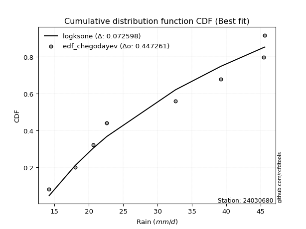</img>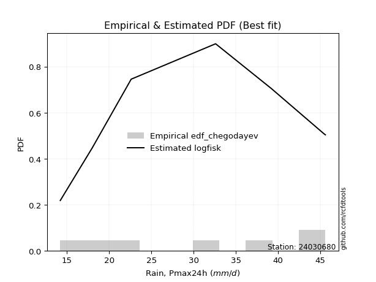</img>

</div>


### 6. EDF Blom (1958)

The Blom formula is a specific "plotting position" formula used in hydrology and statistical analysis to estimate the empirical cumulative probability (or non-exceedance probability) of a data series. It is particularly recommended for data that are approximately normally distributed. The constant _a_ is set to 0.375 (or 3/8).

<div align="center">


$P=(m-a)/(n+1-2a)$


</div>


**6.1. Empirical values**

<div align="center">

|                | 0                   | 1                   | 2                  | 3        | 4                  | 5                  | 6                  |
|:---------------|:--------------------|:--------------------|:-------------------|:---------|:-------------------|:-------------------|:-------------------|
| date           | 2017                | 2018                | 2023               | 2021     | 2022               | 2019               | 2020               |
| x              | 14.2                | 18.0                | 22.6               | 32.6     | 39.2               | 45.4               | 45.6               |
| m              | 1                   | 2                   | 3                  | 4        | 5                  | 6                  | 7                  |
| empirical_dist | edf_blom            | edf_blom            | edf_blom           | edf_blom | edf_blom           | edf_blom           | edf_blom           |
| empirical      | 0.08620689655172414 | 0.22413793103448276 | 0.3620689655172414 | 0.5      | 0.6379310344827587 | 0.7758620689655172 | 0.9137931034482759 |
| empirical_tr   | 1.0943396226415094  | 1.288888888888889   | 1.5675675675675675 | 2.0      | 2.7619047619047623 | 4.461538461538462  | 11.600000000000007 |

</div>


**6.2. Kolmogorov-Smirnov fit test (sorted by Δ)**


<div align="center">

|                | 0                   | 1                   | 2                   | 3                   | 4                   | 5                   | 6                   | 7                   | 8                   | 9                   | 10                  | 11                  | 12                  | 13                  | 14                  | 15                  | 16                  | 17                  | 18                  | 19                  | 20                  | 21                  | 22                  | 23                  | 24                  | 25                  | 26                  | 27                  | 28                  | 29                  | 30                  | 31                  | 32                  | 33                  | 34                  | 35                  | 36                  | 37                  | 38                  | 39                  | 40                  | 41                  | 42                  | 43                  | 44                  | 45                  | 46                  | 47                  | 48                  | 49                  | 50                  | 51                  | 52                  | 53                  | 54                  | 55                  | 56                  | 57                  | 58                  | 59                  | 60                  | 61                  | 62                  | 63                  | 64                  | 65                  | 66                  | 67                  | 68                  | 69                  | 70                  | 71                  | 72                  | 73                  | 74                  | 75                    | 76                  | 77                  | 78                  | 79                  | 80                  | 81                  | 82                  | 83                  | 84                  | 85                  | 86                  | 87                  |
|:---------------|:--------------------|:--------------------|:--------------------|:--------------------|:--------------------|:--------------------|:--------------------|:--------------------|:--------------------|:--------------------|:--------------------|:--------------------|:--------------------|:--------------------|:--------------------|:--------------------|:--------------------|:--------------------|:--------------------|:--------------------|:--------------------|:--------------------|:--------------------|:--------------------|:--------------------|:--------------------|:--------------------|:--------------------|:--------------------|:--------------------|:--------------------|:--------------------|:--------------------|:--------------------|:--------------------|:--------------------|:--------------------|:--------------------|:--------------------|:--------------------|:--------------------|:--------------------|:--------------------|:--------------------|:--------------------|:--------------------|:--------------------|:--------------------|:--------------------|:--------------------|:--------------------|:--------------------|:--------------------|:--------------------|:--------------------|:--------------------|:--------------------|:--------------------|:--------------------|:--------------------|:--------------------|:--------------------|:--------------------|:--------------------|:--------------------|:--------------------|:--------------------|:--------------------|:--------------------|:--------------------|:--------------------|:--------------------|:--------------------|:--------------------|:--------------------|:----------------------|:--------------------|:--------------------|:--------------------|:--------------------|:--------------------|:--------------------|:--------------------|:--------------------|:--------------------|:--------------------|:--------------------|:--------------------|
| station        | 24030680            | 24030680            | 24030680            | 24030680            | 24030680            | 24030680            | 24030680            | 24030680            | 24030680            | 24030680            | 24030680            | 24030680            | 24030680            | 24030680            | 24030680            | 24030680            | 24030680            | 24030680            | 24030680            | 24030680            | 24030680            | 24030680            | 24030680            | 24030680            | 24030680            | 24030680            | 24030680            | 24030680            | 24030680            | 24030680            | 24030680            | 24030680            | 24030680            | 24030680            | 24030680            | 24030680            | 24030680            | 24030680            | 24030680            | 24030680            | 24030680            | 24030680            | 24030680            | 24030680            | 24030680            | 24030680            | 24030680            | 24030680            | 24030680            | 24030680            | 24030680            | 24030680            | 24030680            | 24030680            | 24030680            | 24030680            | 24030680            | 24030680            | 24030680            | 24030680            | 24030680            | 24030680            | 24030680            | 24030680            | 24030680            | 24030680            | 24030680            | 24030680            | 24030680            | 24030680            | 24030680            | 24030680            | 24030680            | 24030680            | 24030680            | 24030680              | 24030680            | 24030680            | 24030680            | 24030680            | 24030680            | 24030680            | 24030680            | 24030680            | 24030680            | 24030680            | 24030680            | 24030680            |
| empirical_dist | edf_blom            | edf_blom            | edf_blom            | edf_blom            | edf_blom            | edf_blom            | edf_blom            | edf_blom            | edf_blom            | edf_blom            | edf_blom            | edf_blom            | edf_blom            | edf_blom            | edf_blom            | edf_blom            | edf_blom            | edf_blom            | edf_blom            | edf_blom            | edf_blom            | edf_blom            | edf_blom            | edf_blom            | edf_blom            | edf_blom            | edf_blom            | edf_blom            | edf_blom            | edf_blom            | edf_blom            | edf_blom            | edf_blom            | edf_blom            | edf_blom            | edf_blom            | edf_blom            | edf_blom            | edf_blom            | edf_blom            | edf_blom            | edf_blom            | edf_blom            | edf_blom            | edf_blom            | edf_blom            | edf_blom            | edf_blom            | edf_blom            | edf_blom            | edf_blom            | edf_blom            | edf_blom            | edf_blom            | edf_blom            | edf_blom            | edf_blom            | edf_blom            | edf_blom            | edf_blom            | edf_blom            | edf_blom            | edf_blom            | edf_blom            | edf_blom            | edf_blom            | edf_blom            | edf_blom            | edf_blom            | edf_blom            | edf_blom            | edf_blom            | edf_blom            | edf_blom            | edf_blom            | edf_blom              | edf_blom            | edf_blom            | edf_blom            | edf_blom            | edf_blom            | edf_blom            | edf_blom            | edf_blom            | edf_blom            | edf_blom            | edf_blom            | edf_blom            |
| p_dist         | logfisk             | gompertz            | betaprime           | erlang              | gamma               | alpha               | logweibull_min      | rice                | maxwell             | nct                 | t                   | crystalball         | norm                | truncnorm           | exponnorm           | fisk                | invgamma            | logpearson3         | pearson3            | rayleigh            | ncf                 | invgauss            | loggumbel_l         | genlogistic         | logncf              | logfatiguelife      | logerlang           | loggamma            | loggamma            | loggompertz         | logf                | logcrystalball      | lognorm             | lognorm             | logt                | logexponnorm        | logalpha            | loginvgamma         | lognct              | logbetaprime        | weibull_min         | halfnorm            | logrice             | kstwobign           | laplace_asymmetric  | logistic            | logmaxwell          | loginvgauss         | gumbel_r            | lograyleigh         | loglogistic         | loginvweibull       | lognakagami         | gumbel_l            | hypsecant           | expon               | genexpon            | moyal               | halflogistic        | loghypsecant        | logkstwobign        | loghalfnorm         | laplace             | loglaplace          | loggumbel_r         | nakagami            | chi2                | logmielke           | loggenexpon         | logexpon            | f                   | loghalflogistic     | logmoyal            | logchi2             | logloggamma         | loglaplace_asymmetric | wald                | logwald             | logtruncnorm        | logjohnsonsu        | loggibrat           | gibrat              | loglognorm          | invweibull          | fatiguelife         | johnsonsu           | loggenlogistic      | mielke              |
| delta          | 0.11035714867547042 | 0.11784643813507056 | 0.11797647505762243 | 0.11967287983399172 | 0.11967666649809472 | 0.11999108868004893 | 0.12017079746966772 | 0.12030195956945444 | 0.12175006790322618 | 0.1217790736747498  | 0.12186556257732906 | 0.12188783386214885 | 0.12188784037390293 | 0.12188784443882542 | 0.12188847117871673 | 0.12275777140725105 | 0.12276935358918106 | 0.12365692600422329 | 0.12434663527540935 | 0.1244826104464305  | 0.12599409439143616 | 0.12638497413247762 | 0.1264311806532502  | 0.12792684561482726 | 0.12938826275501136 | 0.130960773433345   | 0.13113396094637642 | 0.13114887649090634 | 0.13114887649090634 | 0.13125989831828644 | 0.1314344529578828  | 0.13160339738104998 | 0.131603482342175   | 0.131603482342175   | 0.13160367185844934 | 0.13160476271085852 | 0.1316212464463704  | 0.13194323789168416 | 0.13196264068137997 | 0.13245547868241703 | 0.13287368859652515 | 0.1337416223532032  | 0.13476774402861313 | 0.13754949443338127 | 0.13812278915272028 | 0.14452462755913947 | 0.1464965618552514  | 0.1507580565179769  | 0.15162497992234591 | 0.15398925877419822 | 0.1541212984290854  | 0.15439791701020977 | 0.15524732053299994 | 0.15890498622522178 | 0.15912519969653882 | 0.16367539901163264 | 0.16369113920929423 | 0.16435346134826612 | 0.16750163442249733 | 0.16834211373925034 | 0.1715358120683963  | 0.17548472508823165 | 0.177768160304714   | 0.18582176046214405 | 0.18598621018074935 | 0.1862462903446077  | 0.187203936233458   | 0.1892395288275286  | 0.1923267285972956  | 0.1966215386603728  | 0.19911943266091447 | 0.20385286197396557 | 0.20752661845511522 | 0.21138152543073552 | 0.21461199218987215 | 0.21476243792675676   | 0.22413793103448276 | 0.2678894980172212  | 0.28106107171143924 | 0.2871488464029909  | 0.3000317862707116  | 0.34381864201153445 | 0.4008576613606216  | 0.46915583734318644 | 0.4835496574625925  | 0.6286880400102899  | 0.7758620689655172  | nan                 |
| deltao         | 0.48442053926100004 | 0.48442053926100004 | 0.48442053926100004 | 0.48442053926100004 | 0.48442053926100004 | 0.48442053926100004 | 0.48442053926100004 | 0.48442053926100004 | 0.48442053926100004 | 0.48442053926100004 | 0.48442053926100004 | 0.48442053926100004 | 0.48442053926100004 | 0.48442053926100004 | 0.48442053926100004 | 0.48442053926100004 | 0.48442053926100004 | 0.48442053926100004 | 0.48442053926100004 | 0.48442053926100004 | 0.48442053926100004 | 0.48442053926100004 | 0.48442053926100004 | 0.48442053926100004 | 0.48442053926100004 | 0.48442053926100004 | 0.48442053926100004 | 0.48442053926100004 | 0.48442053926100004 | 0.48442053926100004 | 0.48442053926100004 | 0.48442053926100004 | 0.48442053926100004 | 0.48442053926100004 | 0.48442053926100004 | 0.48442053926100004 | 0.48442053926100004 | 0.48442053926100004 | 0.48442053926100004 | 0.48442053926100004 | 0.48442053926100004 | 0.48442053926100004 | 0.48442053926100004 | 0.48442053926100004 | 0.48442053926100004 | 0.48442053926100004 | 0.48442053926100004 | 0.48442053926100004 | 0.48442053926100004 | 0.48442053926100004 | 0.48442053926100004 | 0.48442053926100004 | 0.48442053926100004 | 0.48442053926100004 | 0.48442053926100004 | 0.48442053926100004 | 0.48442053926100004 | 0.48442053926100004 | 0.48442053926100004 | 0.48442053926100004 | 0.48442053926100004 | 0.48442053926100004 | 0.48442053926100004 | 0.48442053926100004 | 0.48442053926100004 | 0.48442053926100004 | 0.48442053926100004 | 0.48442053926100004 | 0.48442053926100004 | 0.48442053926100004 | 0.48442053926100004 | 0.48442053926100004 | 0.48442053926100004 | 0.48442053926100004 | 0.48442053926100004 | 0.48442053926100004   | 0.48442053926100004 | 0.48442053926100004 | 0.48442053926100004 | 0.48442053926100004 | 0.48442053926100004 | 0.48442053926100004 | 0.48442053926100004 | 0.48442053926100004 | 0.48442053926100004 | 0.48442053926100004 | 0.48442053926100004 | 0.48442053926100004 |
| eval           | Δo > Δ              | Δo > Δ              | Δo > Δ              | Δo > Δ              | Δo > Δ              | Δo > Δ              | Δo > Δ              | Δo > Δ              | Δo > Δ              | Δo > Δ              | Δo > Δ              | Δo > Δ              | Δo > Δ              | Δo > Δ              | Δo > Δ              | Δo > Δ              | Δo > Δ              | Δo > Δ              | Δo > Δ              | Δo > Δ              | Δo > Δ              | Δo > Δ              | Δo > Δ              | Δo > Δ              | Δo > Δ              | Δo > Δ              | Δo > Δ              | Δo > Δ              | Δo > Δ              | Δo > Δ              | Δo > Δ              | Δo > Δ              | Δo > Δ              | Δo > Δ              | Δo > Δ              | Δo > Δ              | Δo > Δ              | Δo > Δ              | Δo > Δ              | Δo > Δ              | Δo > Δ              | Δo > Δ              | Δo > Δ              | Δo > Δ              | Δo > Δ              | Δo > Δ              | Δo > Δ              | Δo > Δ              | Δo > Δ              | Δo > Δ              | Δo > Δ              | Δo > Δ              | Δo > Δ              | Δo > Δ              | Δo > Δ              | Δo > Δ              | Δo > Δ              | Δo > Δ              | Δo > Δ              | Δo > Δ              | Δo > Δ              | Δo > Δ              | Δo > Δ              | Δo > Δ              | Δo > Δ              | Δo > Δ              | Δo > Δ              | Δo > Δ              | Δo > Δ              | Δo > Δ              | Δo > Δ              | Δo > Δ              | Δo > Δ              | Δo > Δ              | Δo > Δ              | Δo > Δ                | Δo > Δ              | Δo > Δ              | Δo > Δ              | Δo > Δ              | Δo > Δ              | Δo > Δ              | Δo > Δ              | Δo > Δ              | Δo > Δ              | Δo <= Δ             | Δo <= Δ             | Δo <= Δ             |
| fit            | 1                   | 1                   | 1                   | 1                   | 1                   | 1                   | 1                   | 1                   | 1                   | 1                   | 1                   | 1                   | 1                   | 1                   | 1                   | 1                   | 1                   | 1                   | 1                   | 1                   | 1                   | 1                   | 1                   | 1                   | 1                   | 1                   | 1                   | 1                   | 1                   | 1                   | 1                   | 1                   | 1                   | 1                   | 1                   | 1                   | 1                   | 1                   | 1                   | 1                   | 1                   | 1                   | 1                   | 1                   | 1                   | 1                   | 1                   | 1                   | 1                   | 1                   | 1                   | 1                   | 1                   | 1                   | 1                   | 1                   | 1                   | 1                   | 1                   | 1                   | 1                   | 1                   | 1                   | 1                   | 1                   | 1                   | 1                   | 1                   | 1                   | 1                   | 1                   | 1                   | 1                   | 1                   | 1                   | 1                     | 1                   | 1                   | 1                   | 1                   | 1                   | 1                   | 1                   | 1                   | 1                   | 0                   | 0                   | 0                   |
| n              | 7                   | 7                   | 7                   | 7                   | 7                   | 7                   | 7                   | 7                   | 7                   | 7                   | 7                   | 7                   | 7                   | 7                   | 7                   | 7                   | 7                   | 7                   | 7                   | 7                   | 7                   | 7                   | 7                   | 7                   | 7                   | 7                   | 7                   | 7                   | 7                   | 7                   | 7                   | 7                   | 7                   | 7                   | 7                   | 7                   | 7                   | 7                   | 7                   | 7                   | 7                   | 7                   | 7                   | 7                   | 7                   | 7                   | 7                   | 7                   | 7                   | 7                   | 7                   | 7                   | 7                   | 7                   | 7                   | 7                   | 7                   | 7                   | 7                   | 7                   | 7                   | 7                   | 7                   | 7                   | 7                   | 7                   | 7                   | 7                   | 7                   | 7                   | 7                   | 7                   | 7                   | 7                   | 7                   | 7                     | 7                   | 7                   | 7                   | 7                   | 7                   | 7                   | 7                   | 7                   | 7                   | 7                   | 7                   | 7                   |
| best_fit       | 1                   | 0                   | 0                   | 0                   | 0                   | 0                   | 0                   | 0                   | 0                   | 0                   | 0                   | 0                   | 0                   | 0                   | 0                   | 0                   | 0                   | 0                   | 0                   | 0                   | 0                   | 0                   | 0                   | 0                   | 0                   | 0                   | 0                   | 0                   | 0                   | 0                   | 0                   | 0                   | 0                   | 0                   | 0                   | 0                   | 0                   | 0                   | 0                   | 0                   | 0                   | 0                   | 0                   | 0                   | 0                   | 0                   | 0                   | 0                   | 0                   | 0                   | 0                   | 0                   | 0                   | 0                   | 0                   | 0                   | 0                   | 0                   | 0                   | 0                   | 0                   | 0                   | 0                   | 0                   | 0                   | 0                   | 0                   | 0                   | 0                   | 0                   | 0                   | 0                   | 0                   | 0                   | 0                   | 0                     | 0                   | 0                   | 0                   | 0                   | 0                   | 0                   | 0                   | 0                   | 0                   | 0                   | 0                   | 0                   |
| best_fit_sort  | 1                   | 2                   | 3                   | 4                   | 5                   | 6                   | 7                   | 8                   | 9                   | 10                  | 11                  | 12                  | 13                  | 14                  | 15                  | 16                  | 17                  | 18                  | 19                  | 20                  | 21                  | 22                  | 23                  | 24                  | 25                  | 26                  | 27                  | 28                  | 29                  | 30                  | 31                  | 32                  | 33                  | 34                  | 35                  | 36                  | 37                  | 38                  | 39                  | 40                  | 41                  | 42                  | 43                  | 44                  | 45                  | 46                  | 47                  | 48                  | 49                  | 50                  | 51                  | 52                  | 53                  | 54                  | 55                  | 56                  | 57                  | 58                  | 59                  | 60                  | 61                  | 62                  | 63                  | 64                  | 65                  | 66                  | 67                  | 68                  | 69                  | 70                  | 71                  | 72                  | 73                  | 74                  | 75                  | 76                    | 77                  | 78                  | 79                  | 80                  | 81                  | 82                  | 83                  | 84                  | 85                  | 86                  | 87                  | 88                  |

</div>


**6.3. Best fit**

<div align="center">

|   id |   station | empirical_dist   | p_dist   |    delta |   deltao | eval   |   fit |   n |   best_fit |   best_fit_sort |
|-----:|----------:|:-----------------|:---------|---------:|---------:|:-------|------:|----:|-----------:|----------------:|
|    0 |  24030680 | edf_blom         | logfisk  | 0.110357 | 0.484421 | Δo > Δ |     1 |   7 |          1 |               1 |

</div>


<div align="center">

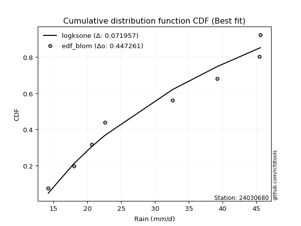</img>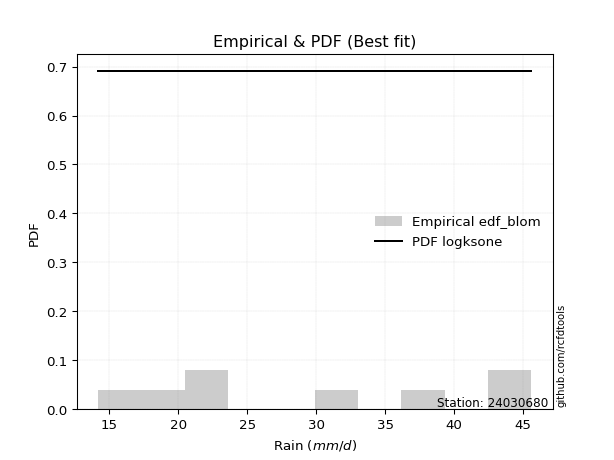</img>

</div>


### 7. EDF Tukey (1962)

In hydrology, the Tukey formula is used as a plotting position formula to estimate the empirical probability or frequency of a flood event (or other hydrological data). The formula parameter is given as _c=0.333_ (or 1/3).

<div align="center">


$P=(m-c)/(n+1-2c)$


</div>


**7.1. Empirical values**

<div align="center">

|                | 0                   | 1                   | 2                   | 3         | 4                  | 5                  | 6                  |
|:---------------|:--------------------|:--------------------|:--------------------|:----------|:-------------------|:-------------------|:-------------------|
| date           | 2017                | 2018                | 2023                | 2021      | 2022               | 2019               | 2020               |
| x              | 14.2                | 18.0                | 22.6                | 32.6      | 39.2               | 45.4               | 45.6               |
| m              | 1                   | 2                   | 3                   | 4         | 5                  | 6                  | 7                  |
| empirical_dist | edf_tukey           | edf_tukey           | edf_tukey           | edf_tukey | edf_tukey          | edf_tukey          | edf_tukey          |
| empirical      | 0.09090909090909091 | 0.22727272727272727 | 0.36363636363636365 | 0.5       | 0.6363636363636364 | 0.7727272727272727 | 0.9090909090909091 |
| empirical_tr   | 1.1                 | 1.2941176470588236  | 1.5714285714285714  | 2.0       | 2.75               | 4.3999999999999995 | 10.999999999999996 |

</div>


**7.2. Kolmogorov-Smirnov fit test (sorted by Δ)**


<div align="center">

|                | 0                   | 1                   | 2                   | 3                   | 4                   | 5                   | 6                   | 7                   | 8                   | 9                   | 10                  | 11                  | 12                  | 13                  | 14                  | 15                  | 16                  | 17                  | 18                  | 19                  | 20                  | 21                  | 22                  | 23                  | 24                  | 25                  | 26                  | 27                  | 28                  | 29                  | 30                  | 31                  | 32                  | 33                  | 34                  | 35                  | 36                  | 37                  | 38                  | 39                  | 40                  | 41                  | 42                  | 43                  | 44                  | 45                  | 46                  | 47                  | 48                  | 49                  | 50                  | 51                  | 52                  | 53                  | 54                  | 55                  | 56                  | 57                  | 58                  | 59                  | 60                  | 61                  | 62                  | 63                  | 64                  | 65                  | 66                  | 67                  | 68                  | 69                  | 70                  | 71                  | 72                  | 73                  | 74                  | 75                    | 76                  | 77                  | 78                  | 79                  | 80                  | 81                  | 82                  | 83                  | 84                  | 85                  | 86                  | 87                  |
|:---------------|:--------------------|:--------------------|:--------------------|:--------------------|:--------------------|:--------------------|:--------------------|:--------------------|:--------------------|:--------------------|:--------------------|:--------------------|:--------------------|:--------------------|:--------------------|:--------------------|:--------------------|:--------------------|:--------------------|:--------------------|:--------------------|:--------------------|:--------------------|:--------------------|:--------------------|:--------------------|:--------------------|:--------------------|:--------------------|:--------------------|:--------------------|:--------------------|:--------------------|:--------------------|:--------------------|:--------------------|:--------------------|:--------------------|:--------------------|:--------------------|:--------------------|:--------------------|:--------------------|:--------------------|:--------------------|:--------------------|:--------------------|:--------------------|:--------------------|:--------------------|:--------------------|:--------------------|:--------------------|:--------------------|:--------------------|:--------------------|:--------------------|:--------------------|:--------------------|:--------------------|:--------------------|:--------------------|:--------------------|:--------------------|:--------------------|:--------------------|:--------------------|:--------------------|:--------------------|:--------------------|:--------------------|:--------------------|:--------------------|:--------------------|:--------------------|:----------------------|:--------------------|:--------------------|:--------------------|:--------------------|:--------------------|:--------------------|:--------------------|:--------------------|:--------------------|:--------------------|:--------------------|:--------------------|
| station        | 24030680            | 24030680            | 24030680            | 24030680            | 24030680            | 24030680            | 24030680            | 24030680            | 24030680            | 24030680            | 24030680            | 24030680            | 24030680            | 24030680            | 24030680            | 24030680            | 24030680            | 24030680            | 24030680            | 24030680            | 24030680            | 24030680            | 24030680            | 24030680            | 24030680            | 24030680            | 24030680            | 24030680            | 24030680            | 24030680            | 24030680            | 24030680            | 24030680            | 24030680            | 24030680            | 24030680            | 24030680            | 24030680            | 24030680            | 24030680            | 24030680            | 24030680            | 24030680            | 24030680            | 24030680            | 24030680            | 24030680            | 24030680            | 24030680            | 24030680            | 24030680            | 24030680            | 24030680            | 24030680            | 24030680            | 24030680            | 24030680            | 24030680            | 24030680            | 24030680            | 24030680            | 24030680            | 24030680            | 24030680            | 24030680            | 24030680            | 24030680            | 24030680            | 24030680            | 24030680            | 24030680            | 24030680            | 24030680            | 24030680            | 24030680            | 24030680              | 24030680            | 24030680            | 24030680            | 24030680            | 24030680            | 24030680            | 24030680            | 24030680            | 24030680            | 24030680            | 24030680            | 24030680            |
| empirical_dist | edf_tukey           | edf_tukey           | edf_tukey           | edf_tukey           | edf_tukey           | edf_tukey           | edf_tukey           | edf_tukey           | edf_tukey           | edf_tukey           | edf_tukey           | edf_tukey           | edf_tukey           | edf_tukey           | edf_tukey           | edf_tukey           | edf_tukey           | edf_tukey           | edf_tukey           | edf_tukey           | edf_tukey           | edf_tukey           | edf_tukey           | edf_tukey           | edf_tukey           | edf_tukey           | edf_tukey           | edf_tukey           | edf_tukey           | edf_tukey           | edf_tukey           | edf_tukey           | edf_tukey           | edf_tukey           | edf_tukey           | edf_tukey           | edf_tukey           | edf_tukey           | edf_tukey           | edf_tukey           | edf_tukey           | edf_tukey           | edf_tukey           | edf_tukey           | edf_tukey           | edf_tukey           | edf_tukey           | edf_tukey           | edf_tukey           | edf_tukey           | edf_tukey           | edf_tukey           | edf_tukey           | edf_tukey           | edf_tukey           | edf_tukey           | edf_tukey           | edf_tukey           | edf_tukey           | edf_tukey           | edf_tukey           | edf_tukey           | edf_tukey           | edf_tukey           | edf_tukey           | edf_tukey           | edf_tukey           | edf_tukey           | edf_tukey           | edf_tukey           | edf_tukey           | edf_tukey           | edf_tukey           | edf_tukey           | edf_tukey           | edf_tukey             | edf_tukey           | edf_tukey           | edf_tukey           | edf_tukey           | edf_tukey           | edf_tukey           | edf_tukey           | edf_tukey           | edf_tukey           | edf_tukey           | edf_tukey           | edf_tukey           |
| p_dist         | logfisk             | betaprime           | gompertz            | erlang              | gamma               | alpha               | logweibull_min      | rice                | maxwell             | nct                 | t                   | crystalball         | norm                | truncnorm           | exponnorm           | fisk                | invgamma            | logpearson3         | pearson3            | rayleigh            | ncf                 | invgauss            | loggumbel_l         | weibull_min         | genlogistic         | logncf              | loginvgamma         | logfatiguelife      | logerlang           | loggamma            | loggamma            | loggompertz         | logf                | logcrystalball      | lognorm             | lognorm             | logt                | logexponnorm        | logalpha            | lognct              | logbetaprime        | logrice             | halfnorm            | kstwobign           | laplace_asymmetric  | logistic            | logmaxwell          | loginvgauss         | gumbel_r            | lograyleigh         | loginvweibull       | lognakagami         | loglogistic         | gumbel_l            | hypsecant           | expon               | genexpon            | moyal               | loghypsecant        | halflogistic        | logkstwobign        | loghalfnorm         | laplace             | loggumbel_r         | nakagami            | chi2                | loglaplace          | loggenexpon         | logmielke           | logexpon            | f                   | loghalflogistic     | logchi2             | logmoyal            | logloggamma         | loglaplace_asymmetric | wald                | logwald             | logtruncnorm        | logjohnsonsu        | loggibrat           | gibrat              | loglognorm          | invweibull          | fatiguelife         | johnsonsu           | loggenlogistic      | mielke              |
| delta          | 0.11192454679459274 | 0.11954387317674475 | 0.12030149222192571 | 0.12124027795311398 | 0.12124406461721698 | 0.12155848679917125 | 0.12173819558878998 | 0.12186935768857676 | 0.1233174660223485  | 0.12334647179387206 | 0.12343296069645132 | 0.12345523198127112 | 0.1234552384930252  | 0.12345524255794768 | 0.123455869297839   | 0.12432516952637332 | 0.12433675170830338 | 0.1252243241233456  | 0.1259140333945316  | 0.12605000856555282 | 0.12756149251055848 | 0.12795237225159994 | 0.12799857877237253 | 0.1281714942391583  | 0.12949424373394958 | 0.13095566087413368 | 0.13223968094958782 | 0.13252817155246732 | 0.13270135906549874 | 0.13271627461002866 | 0.13271627461002866 | 0.13282729643740876 | 0.13300185107700513 | 0.1331707955001723  | 0.13317088046129733 | 0.13317088046129733 | 0.13317106997757167 | 0.13317216082998085 | 0.13318864456549273 | 0.1335300388005023  | 0.13402287680153935 | 0.13508760166104283 | 0.13530902047232551 | 0.1391168925525036  | 0.13969018727184254 | 0.14609202567826174 | 0.1464965618552514  | 0.1507580565179769  | 0.15319237804146824 | 0.15398925877419822 | 0.15439791701020977 | 0.15524732053299994 | 0.15568869654820772 | 0.16047238434434405 | 0.1606925978156611  | 0.16367539901163264 | 0.16369113920929423 | 0.16592085946738844 | 0.16990951185837266 | 0.17063643066074183 | 0.1715358120683963  | 0.17548472508823165 | 0.17933555842383628 | 0.18598621018074935 | 0.1862462903446077  | 0.187203936233458   | 0.18738915858126637 | 0.1923267285972956  | 0.19237432506577312 | 0.1966215386603728  | 0.19911943266091447 | 0.20385286197396557 | 0.20667933107336867 | 0.20752661845511522 | 0.21774678842811668 | 0.21789723416500129   | 0.22727272727272727 | 0.2678894980172212  | 0.28106107171143924 | 0.28558144828386856 | 0.3000317862707116  | 0.34538604013065666 | 0.3977228651223771  | 0.4644536429858196  | 0.48041486122434796 | 0.6255532437720452  | 0.7727272727272727  | nan                 |
| deltao         | 0.48442053926100004 | 0.48442053926100004 | 0.48442053926100004 | 0.48442053926100004 | 0.48442053926100004 | 0.48442053926100004 | 0.48442053926100004 | 0.48442053926100004 | 0.48442053926100004 | 0.48442053926100004 | 0.48442053926100004 | 0.48442053926100004 | 0.48442053926100004 | 0.48442053926100004 | 0.48442053926100004 | 0.48442053926100004 | 0.48442053926100004 | 0.48442053926100004 | 0.48442053926100004 | 0.48442053926100004 | 0.48442053926100004 | 0.48442053926100004 | 0.48442053926100004 | 0.48442053926100004 | 0.48442053926100004 | 0.48442053926100004 | 0.48442053926100004 | 0.48442053926100004 | 0.48442053926100004 | 0.48442053926100004 | 0.48442053926100004 | 0.48442053926100004 | 0.48442053926100004 | 0.48442053926100004 | 0.48442053926100004 | 0.48442053926100004 | 0.48442053926100004 | 0.48442053926100004 | 0.48442053926100004 | 0.48442053926100004 | 0.48442053926100004 | 0.48442053926100004 | 0.48442053926100004 | 0.48442053926100004 | 0.48442053926100004 | 0.48442053926100004 | 0.48442053926100004 | 0.48442053926100004 | 0.48442053926100004 | 0.48442053926100004 | 0.48442053926100004 | 0.48442053926100004 | 0.48442053926100004 | 0.48442053926100004 | 0.48442053926100004 | 0.48442053926100004 | 0.48442053926100004 | 0.48442053926100004 | 0.48442053926100004 | 0.48442053926100004 | 0.48442053926100004 | 0.48442053926100004 | 0.48442053926100004 | 0.48442053926100004 | 0.48442053926100004 | 0.48442053926100004 | 0.48442053926100004 | 0.48442053926100004 | 0.48442053926100004 | 0.48442053926100004 | 0.48442053926100004 | 0.48442053926100004 | 0.48442053926100004 | 0.48442053926100004 | 0.48442053926100004 | 0.48442053926100004   | 0.48442053926100004 | 0.48442053926100004 | 0.48442053926100004 | 0.48442053926100004 | 0.48442053926100004 | 0.48442053926100004 | 0.48442053926100004 | 0.48442053926100004 | 0.48442053926100004 | 0.48442053926100004 | 0.48442053926100004 | 0.48442053926100004 |
| eval           | Δo > Δ              | Δo > Δ              | Δo > Δ              | Δo > Δ              | Δo > Δ              | Δo > Δ              | Δo > Δ              | Δo > Δ              | Δo > Δ              | Δo > Δ              | Δo > Δ              | Δo > Δ              | Δo > Δ              | Δo > Δ              | Δo > Δ              | Δo > Δ              | Δo > Δ              | Δo > Δ              | Δo > Δ              | Δo > Δ              | Δo > Δ              | Δo > Δ              | Δo > Δ              | Δo > Δ              | Δo > Δ              | Δo > Δ              | Δo > Δ              | Δo > Δ              | Δo > Δ              | Δo > Δ              | Δo > Δ              | Δo > Δ              | Δo > Δ              | Δo > Δ              | Δo > Δ              | Δo > Δ              | Δo > Δ              | Δo > Δ              | Δo > Δ              | Δo > Δ              | Δo > Δ              | Δo > Δ              | Δo > Δ              | Δo > Δ              | Δo > Δ              | Δo > Δ              | Δo > Δ              | Δo > Δ              | Δo > Δ              | Δo > Δ              | Δo > Δ              | Δo > Δ              | Δo > Δ              | Δo > Δ              | Δo > Δ              | Δo > Δ              | Δo > Δ              | Δo > Δ              | Δo > Δ              | Δo > Δ              | Δo > Δ              | Δo > Δ              | Δo > Δ              | Δo > Δ              | Δo > Δ              | Δo > Δ              | Δo > Δ              | Δo > Δ              | Δo > Δ              | Δo > Δ              | Δo > Δ              | Δo > Δ              | Δo > Δ              | Δo > Δ              | Δo > Δ              | Δo > Δ                | Δo > Δ              | Δo > Δ              | Δo > Δ              | Δo > Δ              | Δo > Δ              | Δo > Δ              | Δo > Δ              | Δo > Δ              | Δo > Δ              | Δo <= Δ             | Δo <= Δ             | Δo <= Δ             |
| fit            | 1                   | 1                   | 1                   | 1                   | 1                   | 1                   | 1                   | 1                   | 1                   | 1                   | 1                   | 1                   | 1                   | 1                   | 1                   | 1                   | 1                   | 1                   | 1                   | 1                   | 1                   | 1                   | 1                   | 1                   | 1                   | 1                   | 1                   | 1                   | 1                   | 1                   | 1                   | 1                   | 1                   | 1                   | 1                   | 1                   | 1                   | 1                   | 1                   | 1                   | 1                   | 1                   | 1                   | 1                   | 1                   | 1                   | 1                   | 1                   | 1                   | 1                   | 1                   | 1                   | 1                   | 1                   | 1                   | 1                   | 1                   | 1                   | 1                   | 1                   | 1                   | 1                   | 1                   | 1                   | 1                   | 1                   | 1                   | 1                   | 1                   | 1                   | 1                   | 1                   | 1                   | 1                   | 1                   | 1                     | 1                   | 1                   | 1                   | 1                   | 1                   | 1                   | 1                   | 1                   | 1                   | 0                   | 0                   | 0                   |
| n              | 7                   | 7                   | 7                   | 7                   | 7                   | 7                   | 7                   | 7                   | 7                   | 7                   | 7                   | 7                   | 7                   | 7                   | 7                   | 7                   | 7                   | 7                   | 7                   | 7                   | 7                   | 7                   | 7                   | 7                   | 7                   | 7                   | 7                   | 7                   | 7                   | 7                   | 7                   | 7                   | 7                   | 7                   | 7                   | 7                   | 7                   | 7                   | 7                   | 7                   | 7                   | 7                   | 7                   | 7                   | 7                   | 7                   | 7                   | 7                   | 7                   | 7                   | 7                   | 7                   | 7                   | 7                   | 7                   | 7                   | 7                   | 7                   | 7                   | 7                   | 7                   | 7                   | 7                   | 7                   | 7                   | 7                   | 7                   | 7                   | 7                   | 7                   | 7                   | 7                   | 7                   | 7                   | 7                   | 7                     | 7                   | 7                   | 7                   | 7                   | 7                   | 7                   | 7                   | 7                   | 7                   | 7                   | 7                   | 7                   |
| best_fit       | 1                   | 0                   | 0                   | 0                   | 0                   | 0                   | 0                   | 0                   | 0                   | 0                   | 0                   | 0                   | 0                   | 0                   | 0                   | 0                   | 0                   | 0                   | 0                   | 0                   | 0                   | 0                   | 0                   | 0                   | 0                   | 0                   | 0                   | 0                   | 0                   | 0                   | 0                   | 0                   | 0                   | 0                   | 0                   | 0                   | 0                   | 0                   | 0                   | 0                   | 0                   | 0                   | 0                   | 0                   | 0                   | 0                   | 0                   | 0                   | 0                   | 0                   | 0                   | 0                   | 0                   | 0                   | 0                   | 0                   | 0                   | 0                   | 0                   | 0                   | 0                   | 0                   | 0                   | 0                   | 0                   | 0                   | 0                   | 0                   | 0                   | 0                   | 0                   | 0                   | 0                   | 0                   | 0                   | 0                     | 0                   | 0                   | 0                   | 0                   | 0                   | 0                   | 0                   | 0                   | 0                   | 0                   | 0                   | 0                   |
| best_fit_sort  | 1                   | 2                   | 3                   | 4                   | 5                   | 6                   | 7                   | 8                   | 9                   | 10                  | 11                  | 12                  | 13                  | 14                  | 15                  | 16                  | 17                  | 18                  | 19                  | 20                  | 21                  | 22                  | 23                  | 24                  | 25                  | 26                  | 27                  | 28                  | 29                  | 30                  | 31                  | 32                  | 33                  | 34                  | 35                  | 36                  | 37                  | 38                  | 39                  | 40                  | 41                  | 42                  | 43                  | 44                  | 45                  | 46                  | 47                  | 48                  | 49                  | 50                  | 51                  | 52                  | 53                  | 54                  | 55                  | 56                  | 57                  | 58                  | 59                  | 60                  | 61                  | 62                  | 63                  | 64                  | 65                  | 66                  | 67                  | 68                  | 69                  | 70                  | 71                  | 72                  | 73                  | 74                  | 75                  | 76                    | 77                  | 78                  | 79                  | 80                  | 81                  | 82                  | 83                  | 84                  | 85                  | 86                  | 87                  | 88                  |

</div>


**7.3. Best fit**

<div align="center">

|   id |   station | empirical_dist   | p_dist   |    delta |   deltao | eval   |   fit |   n |   best_fit |   best_fit_sort |
|-----:|----------:|:-----------------|:---------|---------:|---------:|:-------|------:|----:|-----------:|----------------:|
|    0 |  24030680 | edf_tukey        | logfisk  | 0.111925 | 0.484421 | Δo > Δ |     1 |   7 |          1 |               1 |

</div>


<div align="center">

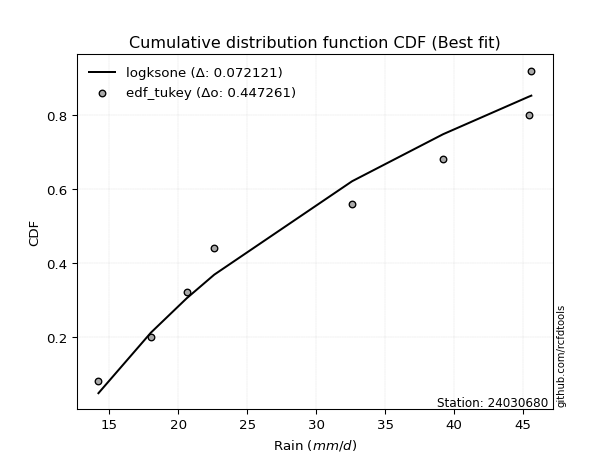</img>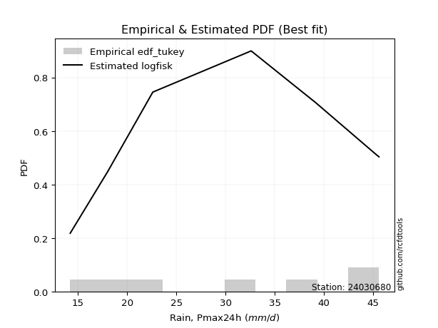</img>

</div>


### 8. EDF Gringorten (1963)

Gringorten plotting position formula is essential for estimating the probability and return periods of extreme events like floods and heavy rainfall. The constant _a=0.44_.

<div align="center">


$P=(m-a)/(n+1-2a)$


</div>


**8.1. Empirical values**

<div align="center">

|                | 0                   | 1                   | 2                  | 3              | 4                  | 5                  | 6                  |
|:---------------|:--------------------|:--------------------|:-------------------|:---------------|:-------------------|:-------------------|:-------------------|
| date           | 2017                | 2018                | 2023               | 2021           | 2022               | 2019               | 2020               |
| x              | 14.2                | 18.0                | 22.6               | 32.6           | 39.2               | 45.4               | 45.6               |
| m              | 1                   | 2                   | 3                  | 4              | 5                  | 6                  | 7                  |
| empirical_dist | edf_gringorten      | edf_gringorten      | edf_gringorten     | edf_gringorten | edf_gringorten     | edf_gringorten     | edf_gringorten     |
| empirical      | 0.07865168539325844 | 0.21910112359550563 | 0.3595505617977528 | 0.5            | 0.6404494382022471 | 0.7808988764044943 | 0.9213483146067415 |
| empirical_tr   | 1.0853658536585364  | 1.2805755395683454  | 1.5614035087719298 | 2.0            | 2.781249999999999  | 4.564102564102562  | 12.714285714285701 |

</div>


**8.2. Kolmogorov-Smirnov fit test (sorted by Δ)**


<div align="center">

|                | 0                   | 1                   | 2                   | 3                   | 4                   | 5                   | 6                   | 7                   | 8                   | 9                   | 10                  | 11                  | 12                  | 13                  | 14                  | 15                  | 16                  | 17                  | 18                  | 19                  | 20                  | 21                  | 22                  | 23                  | 24                  | 25                  | 26                  | 27                  | 28                  | 29                  | 30                  | 31                  | 32                  | 33                  | 34                  | 35                  | 36                  | 37                  | 38                  | 39                  | 40                  | 41                  | 42                  | 43                  | 44                  | 45                  | 46                  | 47                  | 48                  | 49                  | 50                  | 51                  | 52                  | 53                  | 54                  | 55                  | 56                  | 57                  | 58                  | 59                  | 60                  | 61                  | 62                  | 63                  | 64                  | 65                  | 66                  | 67                  | 68                  | 69                  | 70                  | 71                  | 72                  | 73                  | 74                    | 75                  | 76                  | 77                  | 78                  | 79                  | 80                  | 81                  | 82                  | 83                  | 84                  | 85                  | 86                  | 87                  |
|:---------------|:--------------------|:--------------------|:--------------------|:--------------------|:--------------------|:--------------------|:--------------------|:--------------------|:--------------------|:--------------------|:--------------------|:--------------------|:--------------------|:--------------------|:--------------------|:--------------------|:--------------------|:--------------------|:--------------------|:--------------------|:--------------------|:--------------------|:--------------------|:--------------------|:--------------------|:--------------------|:--------------------|:--------------------|:--------------------|:--------------------|:--------------------|:--------------------|:--------------------|:--------------------|:--------------------|:--------------------|:--------------------|:--------------------|:--------------------|:--------------------|:--------------------|:--------------------|:--------------------|:--------------------|:--------------------|:--------------------|:--------------------|:--------------------|:--------------------|:--------------------|:--------------------|:--------------------|:--------------------|:--------------------|:--------------------|:--------------------|:--------------------|:--------------------|:--------------------|:--------------------|:--------------------|:--------------------|:--------------------|:--------------------|:--------------------|:--------------------|:--------------------|:--------------------|:--------------------|:--------------------|:--------------------|:--------------------|:--------------------|:--------------------|:----------------------|:--------------------|:--------------------|:--------------------|:--------------------|:--------------------|:--------------------|:--------------------|:--------------------|:--------------------|:--------------------|:--------------------|:--------------------|:--------------------|
| station        | 24030680            | 24030680            | 24030680            | 24030680            | 24030680            | 24030680            | 24030680            | 24030680            | 24030680            | 24030680            | 24030680            | 24030680            | 24030680            | 24030680            | 24030680            | 24030680            | 24030680            | 24030680            | 24030680            | 24030680            | 24030680            | 24030680            | 24030680            | 24030680            | 24030680            | 24030680            | 24030680            | 24030680            | 24030680            | 24030680            | 24030680            | 24030680            | 24030680            | 24030680            | 24030680            | 24030680            | 24030680            | 24030680            | 24030680            | 24030680            | 24030680            | 24030680            | 24030680            | 24030680            | 24030680            | 24030680            | 24030680            | 24030680            | 24030680            | 24030680            | 24030680            | 24030680            | 24030680            | 24030680            | 24030680            | 24030680            | 24030680            | 24030680            | 24030680            | 24030680            | 24030680            | 24030680            | 24030680            | 24030680            | 24030680            | 24030680            | 24030680            | 24030680            | 24030680            | 24030680            | 24030680            | 24030680            | 24030680            | 24030680            | 24030680              | 24030680            | 24030680            | 24030680            | 24030680            | 24030680            | 24030680            | 24030680            | 24030680            | 24030680            | 24030680            | 24030680            | 24030680            | 24030680            |
| empirical_dist | edf_gringorten      | edf_gringorten      | edf_gringorten      | edf_gringorten      | edf_gringorten      | edf_gringorten      | edf_gringorten      | edf_gringorten      | edf_gringorten      | edf_gringorten      | edf_gringorten      | edf_gringorten      | edf_gringorten      | edf_gringorten      | edf_gringorten      | edf_gringorten      | edf_gringorten      | edf_gringorten      | edf_gringorten      | edf_gringorten      | edf_gringorten      | edf_gringorten      | edf_gringorten      | edf_gringorten      | edf_gringorten      | edf_gringorten      | edf_gringorten      | edf_gringorten      | edf_gringorten      | edf_gringorten      | edf_gringorten      | edf_gringorten      | edf_gringorten      | edf_gringorten      | edf_gringorten      | edf_gringorten      | edf_gringorten      | edf_gringorten      | edf_gringorten      | edf_gringorten      | edf_gringorten      | edf_gringorten      | edf_gringorten      | edf_gringorten      | edf_gringorten      | edf_gringorten      | edf_gringorten      | edf_gringorten      | edf_gringorten      | edf_gringorten      | edf_gringorten      | edf_gringorten      | edf_gringorten      | edf_gringorten      | edf_gringorten      | edf_gringorten      | edf_gringorten      | edf_gringorten      | edf_gringorten      | edf_gringorten      | edf_gringorten      | edf_gringorten      | edf_gringorten      | edf_gringorten      | edf_gringorten      | edf_gringorten      | edf_gringorten      | edf_gringorten      | edf_gringorten      | edf_gringorten      | edf_gringorten      | edf_gringorten      | edf_gringorten      | edf_gringorten      | edf_gringorten        | edf_gringorten      | edf_gringorten      | edf_gringorten      | edf_gringorten      | edf_gringorten      | edf_gringorten      | edf_gringorten      | edf_gringorten      | edf_gringorten      | edf_gringorten      | edf_gringorten      | edf_gringorten      | edf_gringorten      |
| p_dist         | logfisk             | gompertz            | betaprime           | erlang              | gamma               | alpha               | logweibull_min      | rice                | maxwell             | nct                 | t                   | crystalball         | norm                | truncnorm           | exponnorm           | fisk                | invgamma            | logpearson3         | pearson3            | rayleigh            | ncf                 | invgauss            | loggumbel_l         | genlogistic         | logncf              | logfatiguelife      | logerlang           | loggamma            | loggamma            | loggompertz         | logf                | logcrystalball      | lognorm             | lognorm             | logt                | logexponnorm        | lognct              | logbetaprime        | logalpha            | halfnorm            | loginvgamma         | logrice             | kstwobign           | laplace_asymmetric  | weibull_min         | logistic            | logmaxwell          | gumbel_r            | loginvgauss         | loglogistic         | lograyleigh         | loginvweibull       | lognakagami         | gumbel_l            | hypsecant           | moyal               | halflogistic        | expon               | genexpon            | loghypsecant        | logkstwobign        | laplace             | loghalfnorm         | loglaplace          | logmielke           | loggumbel_r         | chi2                | nakagami            | loggenexpon         | logexpon            | f                   | loghalflogistic     | logmoyal            | logloggamma         | loglaplace_asymmetric | logchi2             | wald                | logwald             | logtruncnorm        | logjohnsonsu        | loggibrat           | gibrat              | loglognorm          | invweibull          | fatiguelife         | johnsonsu           | loggenlogistic      | mielke              |
| delta          | 0.107838744955982   | 0.11532803441558215 | 0.11545807133813402 | 0.11715447611450314 | 0.11715826277860614 | 0.11747268496056051 | 0.11765239375017914 | 0.11778355584996603 | 0.11923166418373776 | 0.11926066995526122 | 0.11934715885784047 | 0.11936943014266027 | 0.11936943665441435 | 0.11936944071933683 | 0.11937006745922815 | 0.12023936768776247 | 0.12025094986969265 | 0.12113852228473487 | 0.12182823155592076 | 0.12196420672694208 | 0.12347569067194775 | 0.12386657041298921 | 0.12391277693376179 | 0.12540844189533884 | 0.12686985903552295 | 0.12844236971385659 | 0.128615557226888   | 0.12863047277141793 | 0.12863047277141793 | 0.12874149459879802 | 0.1289160492383944  | 0.12908499366156156 | 0.1290850786226866  | 0.1290850786226866  | 0.12908526813896093 | 0.1290863589913701  | 0.12944423696189156 | 0.1299370749629286  | 0.130920793650249   | 0.13122321863371478 | 0.13194323789168416 | 0.13476774402861313 | 0.13503109071389285 | 0.1356043854332317  | 0.14042889975499073 | 0.1420062238396509  | 0.1464965618552514  | 0.1491065762028575  | 0.1507580565179769  | 0.15160289470959698 | 0.15398925877419822 | 0.15439791701020977 | 0.15524732053299994 | 0.1563865825057332  | 0.15660679597705024 | 0.1618350576287777  | 0.1624648269835202  | 0.16367539901163264 | 0.16369113920929423 | 0.16582371001976193 | 0.1715358120683963  | 0.17524975658522543 | 0.17548472508823165 | 0.18330335674265563 | 0.18420272138855154 | 0.18598621018074935 | 0.187203936233458   | 0.19080113592999212 | 0.1923267285972956  | 0.1966215386603728  | 0.19911943266091447 | 0.20385286197396557 | 0.20752661845511522 | 0.2095751847508951  | 0.2097256304877797    | 0.2189367365892011  | 0.21910112359550563 | 0.2678894980172212  | 0.28106107171143924 | 0.2896672501224793  | 0.3000317862707116  | 0.3413002382920458  | 0.4058944687995988  | 0.476711048501652   | 0.48858646490156965 | 0.6337248474492669  | 0.7808988764044943  | nan                 |
| deltao         | 0.48442053926100004 | 0.48442053926100004 | 0.48442053926100004 | 0.48442053926100004 | 0.48442053926100004 | 0.48442053926100004 | 0.48442053926100004 | 0.48442053926100004 | 0.48442053926100004 | 0.48442053926100004 | 0.48442053926100004 | 0.48442053926100004 | 0.48442053926100004 | 0.48442053926100004 | 0.48442053926100004 | 0.48442053926100004 | 0.48442053926100004 | 0.48442053926100004 | 0.48442053926100004 | 0.48442053926100004 | 0.48442053926100004 | 0.48442053926100004 | 0.48442053926100004 | 0.48442053926100004 | 0.48442053926100004 | 0.48442053926100004 | 0.48442053926100004 | 0.48442053926100004 | 0.48442053926100004 | 0.48442053926100004 | 0.48442053926100004 | 0.48442053926100004 | 0.48442053926100004 | 0.48442053926100004 | 0.48442053926100004 | 0.48442053926100004 | 0.48442053926100004 | 0.48442053926100004 | 0.48442053926100004 | 0.48442053926100004 | 0.48442053926100004 | 0.48442053926100004 | 0.48442053926100004 | 0.48442053926100004 | 0.48442053926100004 | 0.48442053926100004 | 0.48442053926100004 | 0.48442053926100004 | 0.48442053926100004 | 0.48442053926100004 | 0.48442053926100004 | 0.48442053926100004 | 0.48442053926100004 | 0.48442053926100004 | 0.48442053926100004 | 0.48442053926100004 | 0.48442053926100004 | 0.48442053926100004 | 0.48442053926100004 | 0.48442053926100004 | 0.48442053926100004 | 0.48442053926100004 | 0.48442053926100004 | 0.48442053926100004 | 0.48442053926100004 | 0.48442053926100004 | 0.48442053926100004 | 0.48442053926100004 | 0.48442053926100004 | 0.48442053926100004 | 0.48442053926100004 | 0.48442053926100004 | 0.48442053926100004 | 0.48442053926100004 | 0.48442053926100004   | 0.48442053926100004 | 0.48442053926100004 | 0.48442053926100004 | 0.48442053926100004 | 0.48442053926100004 | 0.48442053926100004 | 0.48442053926100004 | 0.48442053926100004 | 0.48442053926100004 | 0.48442053926100004 | 0.48442053926100004 | 0.48442053926100004 | 0.48442053926100004 |
| eval           | Δo > Δ              | Δo > Δ              | Δo > Δ              | Δo > Δ              | Δo > Δ              | Δo > Δ              | Δo > Δ              | Δo > Δ              | Δo > Δ              | Δo > Δ              | Δo > Δ              | Δo > Δ              | Δo > Δ              | Δo > Δ              | Δo > Δ              | Δo > Δ              | Δo > Δ              | Δo > Δ              | Δo > Δ              | Δo > Δ              | Δo > Δ              | Δo > Δ              | Δo > Δ              | Δo > Δ              | Δo > Δ              | Δo > Δ              | Δo > Δ              | Δo > Δ              | Δo > Δ              | Δo > Δ              | Δo > Δ              | Δo > Δ              | Δo > Δ              | Δo > Δ              | Δo > Δ              | Δo > Δ              | Δo > Δ              | Δo > Δ              | Δo > Δ              | Δo > Δ              | Δo > Δ              | Δo > Δ              | Δo > Δ              | Δo > Δ              | Δo > Δ              | Δo > Δ              | Δo > Δ              | Δo > Δ              | Δo > Δ              | Δo > Δ              | Δo > Δ              | Δo > Δ              | Δo > Δ              | Δo > Δ              | Δo > Δ              | Δo > Δ              | Δo > Δ              | Δo > Δ              | Δo > Δ              | Δo > Δ              | Δo > Δ              | Δo > Δ              | Δo > Δ              | Δo > Δ              | Δo > Δ              | Δo > Δ              | Δo > Δ              | Δo > Δ              | Δo > Δ              | Δo > Δ              | Δo > Δ              | Δo > Δ              | Δo > Δ              | Δo > Δ              | Δo > Δ                | Δo > Δ              | Δo > Δ              | Δo > Δ              | Δo > Δ              | Δo > Δ              | Δo > Δ              | Δo > Δ              | Δo > Δ              | Δo > Δ              | Δo <= Δ             | Δo <= Δ             | Δo <= Δ             | Δo <= Δ             |
| fit            | 1                   | 1                   | 1                   | 1                   | 1                   | 1                   | 1                   | 1                   | 1                   | 1                   | 1                   | 1                   | 1                   | 1                   | 1                   | 1                   | 1                   | 1                   | 1                   | 1                   | 1                   | 1                   | 1                   | 1                   | 1                   | 1                   | 1                   | 1                   | 1                   | 1                   | 1                   | 1                   | 1                   | 1                   | 1                   | 1                   | 1                   | 1                   | 1                   | 1                   | 1                   | 1                   | 1                   | 1                   | 1                   | 1                   | 1                   | 1                   | 1                   | 1                   | 1                   | 1                   | 1                   | 1                   | 1                   | 1                   | 1                   | 1                   | 1                   | 1                   | 1                   | 1                   | 1                   | 1                   | 1                   | 1                   | 1                   | 1                   | 1                   | 1                   | 1                   | 1                   | 1                   | 1                   | 1                     | 1                   | 1                   | 1                   | 1                   | 1                   | 1                   | 1                   | 1                   | 1                   | 0                   | 0                   | 0                   | 0                   |
| n              | 7                   | 7                   | 7                   | 7                   | 7                   | 7                   | 7                   | 7                   | 7                   | 7                   | 7                   | 7                   | 7                   | 7                   | 7                   | 7                   | 7                   | 7                   | 7                   | 7                   | 7                   | 7                   | 7                   | 7                   | 7                   | 7                   | 7                   | 7                   | 7                   | 7                   | 7                   | 7                   | 7                   | 7                   | 7                   | 7                   | 7                   | 7                   | 7                   | 7                   | 7                   | 7                   | 7                   | 7                   | 7                   | 7                   | 7                   | 7                   | 7                   | 7                   | 7                   | 7                   | 7                   | 7                   | 7                   | 7                   | 7                   | 7                   | 7                   | 7                   | 7                   | 7                   | 7                   | 7                   | 7                   | 7                   | 7                   | 7                   | 7                   | 7                   | 7                   | 7                   | 7                   | 7                   | 7                     | 7                   | 7                   | 7                   | 7                   | 7                   | 7                   | 7                   | 7                   | 7                   | 7                   | 7                   | 7                   | 7                   |
| best_fit       | 1                   | 0                   | 0                   | 0                   | 0                   | 0                   | 0                   | 0                   | 0                   | 0                   | 0                   | 0                   | 0                   | 0                   | 0                   | 0                   | 0                   | 0                   | 0                   | 0                   | 0                   | 0                   | 0                   | 0                   | 0                   | 0                   | 0                   | 0                   | 0                   | 0                   | 0                   | 0                   | 0                   | 0                   | 0                   | 0                   | 0                   | 0                   | 0                   | 0                   | 0                   | 0                   | 0                   | 0                   | 0                   | 0                   | 0                   | 0                   | 0                   | 0                   | 0                   | 0                   | 0                   | 0                   | 0                   | 0                   | 0                   | 0                   | 0                   | 0                   | 0                   | 0                   | 0                   | 0                   | 0                   | 0                   | 0                   | 0                   | 0                   | 0                   | 0                   | 0                   | 0                   | 0                   | 0                     | 0                   | 0                   | 0                   | 0                   | 0                   | 0                   | 0                   | 0                   | 0                   | 0                   | 0                   | 0                   | 0                   |
| best_fit_sort  | 1                   | 2                   | 3                   | 4                   | 5                   | 6                   | 7                   | 8                   | 9                   | 10                  | 11                  | 12                  | 13                  | 14                  | 15                  | 16                  | 17                  | 18                  | 19                  | 20                  | 21                  | 22                  | 23                  | 24                  | 25                  | 26                  | 27                  | 28                  | 29                  | 30                  | 31                  | 32                  | 33                  | 34                  | 35                  | 36                  | 37                  | 38                  | 39                  | 40                  | 41                  | 42                  | 43                  | 44                  | 45                  | 46                  | 47                  | 48                  | 49                  | 50                  | 51                  | 52                  | 53                  | 54                  | 55                  | 56                  | 57                  | 58                  | 59                  | 60                  | 61                  | 62                  | 63                  | 64                  | 65                  | 66                  | 67                  | 68                  | 69                  | 70                  | 71                  | 72                  | 73                  | 74                  | 75                    | 76                  | 77                  | 78                  | 79                  | 80                  | 81                  | 82                  | 83                  | 84                  | 85                  | 86                  | 87                  | 88                  |

</div>


**8.3. Best fit**

<div align="center">

|   id |   station | empirical_dist   | p_dist   |    delta |   deltao | eval   |   fit |   n |   best_fit |   best_fit_sort |
|-----:|----------:|:-----------------|:---------|---------:|---------:|:-------|------:|----:|-----------:|----------------:|
|    0 |  24030680 | edf_gringorten   | logfisk  | 0.107839 | 0.484421 | Δo > Δ |     1 |   7 |          1 |               1 |

</div>


<div align="center">

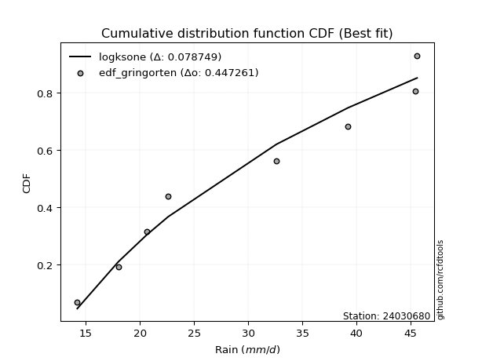</img>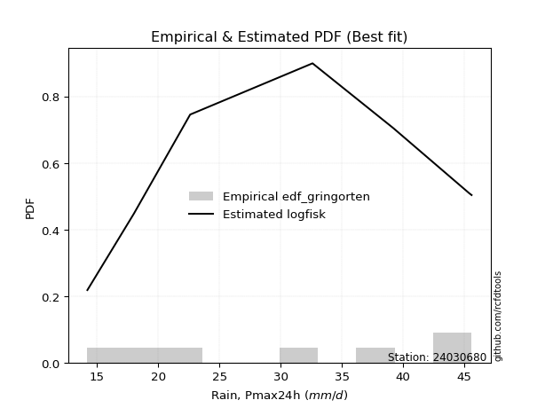</img>

</div>


### 9. EDF Filliben (1975)

The specific values of the constants (0.3175) (often denoted as $alpha$) and (0.365) are derived from a method proposed by James J. Filliben in a 1975 paper. This particular formula is the mean value of the $i$-th order statistic of the normal distribution and is considered a robust and effective plotting position formula for the normal probability plot correlation coefficient test for normality.

<div align="center">


$P=(m-0.3175)/(n+0.365)$


</div>


**9.1. Empirical values**

<div align="center">

|                | 0                   | 1                   | 2                   | 3            | 4                  | 5                  | 6                  |
|:---------------|:--------------------|:--------------------|:--------------------|:-------------|:-------------------|:-------------------|:-------------------|
| date           | 2017                | 2018                | 2023                | 2021         | 2022               | 2019               | 2020               |
| x              | 14.2                | 18.0                | 22.6                | 32.6         | 39.2               | 45.4               | 45.6               |
| m              | 1                   | 2                   | 3                   | 4            | 5                  | 6                  | 7                  |
| empirical_dist | edf_filliben        | edf_filliben        | edf_filliben        | edf_filliben | edf_filliben       | edf_filliben       | edf_filliben       |
| empirical      | 0.09266802443991853 | 0.22844534962661237 | 0.36422267481330617 | 0.5          | 0.6357773251866938 | 0.7715546503733877 | 0.9073319755600815 |
| empirical_tr   | 1.1021324354657687  | 1.2960844698636163  | 1.5728777362520021  | 2.0          | 2.7455731593662627 | 4.377414561664191  | 10.791208791208794 |

</div>


**9.2. Kolmogorov-Smirnov fit test (sorted by Δ)**


<div align="center">

|                | 0                   | 1                   | 2                   | 3                   | 4                   | 5                   | 6                   | 7                   | 8                   | 9                   | 10                  | 11                  | 12                  | 13                  | 14                  | 15                  | 16                  | 17                  | 18                  | 19                  | 20                  | 21                  | 22                  | 23                  | 24                  | 25                  | 26                  | 27                  | 28                  | 29                  | 30                  | 31                  | 32                  | 33                  | 34                  | 35                  | 36                  | 37                  | 38                  | 39                  | 40                  | 41                  | 42                  | 43                  | 44                  | 45                  | 46                  | 47                  | 48                  | 49                  | 50                  | 51                  | 52                  | 53                  | 54                  | 55                  | 56                  | 57                  | 58                  | 59                  | 60                  | 61                  | 62                  | 63                  | 64                  | 65                  | 66                  | 67                  | 68                  | 69                  | 70                  | 71                  | 72                  | 73                  | 74                  | 75                    | 76                  | 77                  | 78                  | 79                  | 80                  | 81                  | 82                  | 83                  | 84                  | 85                  | 86                  | 87                  |
|:---------------|:--------------------|:--------------------|:--------------------|:--------------------|:--------------------|:--------------------|:--------------------|:--------------------|:--------------------|:--------------------|:--------------------|:--------------------|:--------------------|:--------------------|:--------------------|:--------------------|:--------------------|:--------------------|:--------------------|:--------------------|:--------------------|:--------------------|:--------------------|:--------------------|:--------------------|:--------------------|:--------------------|:--------------------|:--------------------|:--------------------|:--------------------|:--------------------|:--------------------|:--------------------|:--------------------|:--------------------|:--------------------|:--------------------|:--------------------|:--------------------|:--------------------|:--------------------|:--------------------|:--------------------|:--------------------|:--------------------|:--------------------|:--------------------|:--------------------|:--------------------|:--------------------|:--------------------|:--------------------|:--------------------|:--------------------|:--------------------|:--------------------|:--------------------|:--------------------|:--------------------|:--------------------|:--------------------|:--------------------|:--------------------|:--------------------|:--------------------|:--------------------|:--------------------|:--------------------|:--------------------|:--------------------|:--------------------|:--------------------|:--------------------|:--------------------|:----------------------|:--------------------|:--------------------|:--------------------|:--------------------|:--------------------|:--------------------|:--------------------|:--------------------|:--------------------|:--------------------|:--------------------|:--------------------|
| station        | 24030680            | 24030680            | 24030680            | 24030680            | 24030680            | 24030680            | 24030680            | 24030680            | 24030680            | 24030680            | 24030680            | 24030680            | 24030680            | 24030680            | 24030680            | 24030680            | 24030680            | 24030680            | 24030680            | 24030680            | 24030680            | 24030680            | 24030680            | 24030680            | 24030680            | 24030680            | 24030680            | 24030680            | 24030680            | 24030680            | 24030680            | 24030680            | 24030680            | 24030680            | 24030680            | 24030680            | 24030680            | 24030680            | 24030680            | 24030680            | 24030680            | 24030680            | 24030680            | 24030680            | 24030680            | 24030680            | 24030680            | 24030680            | 24030680            | 24030680            | 24030680            | 24030680            | 24030680            | 24030680            | 24030680            | 24030680            | 24030680            | 24030680            | 24030680            | 24030680            | 24030680            | 24030680            | 24030680            | 24030680            | 24030680            | 24030680            | 24030680            | 24030680            | 24030680            | 24030680            | 24030680            | 24030680            | 24030680            | 24030680            | 24030680            | 24030680              | 24030680            | 24030680            | 24030680            | 24030680            | 24030680            | 24030680            | 24030680            | 24030680            | 24030680            | 24030680            | 24030680            | 24030680            |
| empirical_dist | edf_filliben        | edf_filliben        | edf_filliben        | edf_filliben        | edf_filliben        | edf_filliben        | edf_filliben        | edf_filliben        | edf_filliben        | edf_filliben        | edf_filliben        | edf_filliben        | edf_filliben        | edf_filliben        | edf_filliben        | edf_filliben        | edf_filliben        | edf_filliben        | edf_filliben        | edf_filliben        | edf_filliben        | edf_filliben        | edf_filliben        | edf_filliben        | edf_filliben        | edf_filliben        | edf_filliben        | edf_filliben        | edf_filliben        | edf_filliben        | edf_filliben        | edf_filliben        | edf_filliben        | edf_filliben        | edf_filliben        | edf_filliben        | edf_filliben        | edf_filliben        | edf_filliben        | edf_filliben        | edf_filliben        | edf_filliben        | edf_filliben        | edf_filliben        | edf_filliben        | edf_filliben        | edf_filliben        | edf_filliben        | edf_filliben        | edf_filliben        | edf_filliben        | edf_filliben        | edf_filliben        | edf_filliben        | edf_filliben        | edf_filliben        | edf_filliben        | edf_filliben        | edf_filliben        | edf_filliben        | edf_filliben        | edf_filliben        | edf_filliben        | edf_filliben        | edf_filliben        | edf_filliben        | edf_filliben        | edf_filliben        | edf_filliben        | edf_filliben        | edf_filliben        | edf_filliben        | edf_filliben        | edf_filliben        | edf_filliben        | edf_filliben          | edf_filliben        | edf_filliben        | edf_filliben        | edf_filliben        | edf_filliben        | edf_filliben        | edf_filliben        | edf_filliben        | edf_filliben        | edf_filliben        | edf_filliben        | edf_filliben        |
| p_dist         | logfisk             | betaprime           | gompertz            | erlang              | gamma               | alpha               | logweibull_min      | rice                | maxwell             | nct                 | t                   | crystalball         | norm                | truncnorm           | exponnorm           | fisk                | invgamma            | logpearson3         | weibull_min         | pearson3            | rayleigh            | ncf                 | invgauss            | loggumbel_l         | genlogistic         | logncf              | loginvgamma         | logfatiguelife      | logerlang           | loggamma            | loggamma            | loggompertz         | logf                | logcrystalball      | lognorm             | lognorm             | logt                | logexponnorm        | logalpha            | lognct              | logbetaprime        | logrice             | halfnorm            | kstwobign           | laplace_asymmetric  | logmaxwell          | logistic            | loginvgauss         | gumbel_r            | lograyleigh         | loginvweibull       | lognakagami         | loglogistic         | gumbel_l            | hypsecant           | expon               | genexpon            | moyal               | loghypsecant        | logkstwobign        | halflogistic        | loghalfnorm         | laplace             | loggumbel_r         | nakagami            | chi2                | loglaplace          | loggenexpon         | logmielke           | logexpon            | f                   | loghalflogistic     | logchi2             | logmoyal            | logloggamma         | loglaplace_asymmetric | wald                | logwald             | logtruncnorm        | logjohnsonsu        | loggibrat           | gibrat              | loglognorm          | invweibull          | fatiguelife         | johnsonsu           | loggenlogistic      | mielke              |
| delta          | 0.11251085797153526 | 0.12013018435368727 | 0.12147411457581081 | 0.1218265891300565  | 0.1218303757941595  | 0.12214479797611377 | 0.1223245067657325  | 0.12245566886551928 | 0.12390377719929102 | 0.12393278297081459 | 0.12401927187339384 | 0.12404154315821364 | 0.12404154966996772 | 0.1240415537348902  | 0.12404218047478152 | 0.12491148070331584 | 0.1249230628852459  | 0.12581063530028813 | 0.12641256070833073 | 0.12650034457147413 | 0.12663631974249534 | 0.128147803687501   | 0.12853868342854247 | 0.12858488994931505 | 0.1300805549108921  | 0.1315419720510762  | 0.13282599212653035 | 0.13311448272940984 | 0.13328767024244126 | 0.13330258578697118 | 0.13330258578697118 | 0.13341360761435128 | 0.13358816225394765 | 0.13375710667711482 | 0.13375719163823985 | 0.13375719163823985 | 0.1337573811545142  | 0.13375847200692337 | 0.13377495574243525 | 0.13411634997744482 | 0.13460918797848187 | 0.13567391283798536 | 0.13589533164926804 | 0.1397032037294461  | 0.14027649844878506 | 0.1464965618552514  | 0.14667833685520426 | 0.1507580565179769  | 0.15377868921841076 | 0.15398925877419822 | 0.15439791701020977 | 0.15524732053299994 | 0.15627500772515024 | 0.16105869552128657 | 0.1612789089926036  | 0.16367539901163264 | 0.16369113920929423 | 0.16650717064433096 | 0.17049582303531519 | 0.1715358120683963  | 0.17180905301462693 | 0.17548472508823165 | 0.1799218696007788  | 0.18598621018074935 | 0.1862462903446077  | 0.187203936233458   | 0.1879754697582089  | 0.1923267285972956  | 0.19354694741965817 | 0.1966215386603728  | 0.19911943266091447 | 0.20385286197396557 | 0.2049203975425411  | 0.20752661845511522 | 0.21891941078200172 | 0.21906985651888633   | 0.22844534962661237 | 0.2678894980172212  | 0.28106107171143924 | 0.28499513710692603 | 0.3000317862707116  | 0.3459723513075992  | 0.39655024276849205 | 0.462694709454992   | 0.4792422388704629  | 0.6243806214181602  | 0.7715546503733877  | nan                 |
| deltao         | 0.48442053926100004 | 0.48442053926100004 | 0.48442053926100004 | 0.48442053926100004 | 0.48442053926100004 | 0.48442053926100004 | 0.48442053926100004 | 0.48442053926100004 | 0.48442053926100004 | 0.48442053926100004 | 0.48442053926100004 | 0.48442053926100004 | 0.48442053926100004 | 0.48442053926100004 | 0.48442053926100004 | 0.48442053926100004 | 0.48442053926100004 | 0.48442053926100004 | 0.48442053926100004 | 0.48442053926100004 | 0.48442053926100004 | 0.48442053926100004 | 0.48442053926100004 | 0.48442053926100004 | 0.48442053926100004 | 0.48442053926100004 | 0.48442053926100004 | 0.48442053926100004 | 0.48442053926100004 | 0.48442053926100004 | 0.48442053926100004 | 0.48442053926100004 | 0.48442053926100004 | 0.48442053926100004 | 0.48442053926100004 | 0.48442053926100004 | 0.48442053926100004 | 0.48442053926100004 | 0.48442053926100004 | 0.48442053926100004 | 0.48442053926100004 | 0.48442053926100004 | 0.48442053926100004 | 0.48442053926100004 | 0.48442053926100004 | 0.48442053926100004 | 0.48442053926100004 | 0.48442053926100004 | 0.48442053926100004 | 0.48442053926100004 | 0.48442053926100004 | 0.48442053926100004 | 0.48442053926100004 | 0.48442053926100004 | 0.48442053926100004 | 0.48442053926100004 | 0.48442053926100004 | 0.48442053926100004 | 0.48442053926100004 | 0.48442053926100004 | 0.48442053926100004 | 0.48442053926100004 | 0.48442053926100004 | 0.48442053926100004 | 0.48442053926100004 | 0.48442053926100004 | 0.48442053926100004 | 0.48442053926100004 | 0.48442053926100004 | 0.48442053926100004 | 0.48442053926100004 | 0.48442053926100004 | 0.48442053926100004 | 0.48442053926100004 | 0.48442053926100004 | 0.48442053926100004   | 0.48442053926100004 | 0.48442053926100004 | 0.48442053926100004 | 0.48442053926100004 | 0.48442053926100004 | 0.48442053926100004 | 0.48442053926100004 | 0.48442053926100004 | 0.48442053926100004 | 0.48442053926100004 | 0.48442053926100004 | 0.48442053926100004 |
| eval           | Δo > Δ              | Δo > Δ              | Δo > Δ              | Δo > Δ              | Δo > Δ              | Δo > Δ              | Δo > Δ              | Δo > Δ              | Δo > Δ              | Δo > Δ              | Δo > Δ              | Δo > Δ              | Δo > Δ              | Δo > Δ              | Δo > Δ              | Δo > Δ              | Δo > Δ              | Δo > Δ              | Δo > Δ              | Δo > Δ              | Δo > Δ              | Δo > Δ              | Δo > Δ              | Δo > Δ              | Δo > Δ              | Δo > Δ              | Δo > Δ              | Δo > Δ              | Δo > Δ              | Δo > Δ              | Δo > Δ              | Δo > Δ              | Δo > Δ              | Δo > Δ              | Δo > Δ              | Δo > Δ              | Δo > Δ              | Δo > Δ              | Δo > Δ              | Δo > Δ              | Δo > Δ              | Δo > Δ              | Δo > Δ              | Δo > Δ              | Δo > Δ              | Δo > Δ              | Δo > Δ              | Δo > Δ              | Δo > Δ              | Δo > Δ              | Δo > Δ              | Δo > Δ              | Δo > Δ              | Δo > Δ              | Δo > Δ              | Δo > Δ              | Δo > Δ              | Δo > Δ              | Δo > Δ              | Δo > Δ              | Δo > Δ              | Δo > Δ              | Δo > Δ              | Δo > Δ              | Δo > Δ              | Δo > Δ              | Δo > Δ              | Δo > Δ              | Δo > Δ              | Δo > Δ              | Δo > Δ              | Δo > Δ              | Δo > Δ              | Δo > Δ              | Δo > Δ              | Δo > Δ                | Δo > Δ              | Δo > Δ              | Δo > Δ              | Δo > Δ              | Δo > Δ              | Δo > Δ              | Δo > Δ              | Δo > Δ              | Δo > Δ              | Δo <= Δ             | Δo <= Δ             | Δo <= Δ             |
| fit            | 1                   | 1                   | 1                   | 1                   | 1                   | 1                   | 1                   | 1                   | 1                   | 1                   | 1                   | 1                   | 1                   | 1                   | 1                   | 1                   | 1                   | 1                   | 1                   | 1                   | 1                   | 1                   | 1                   | 1                   | 1                   | 1                   | 1                   | 1                   | 1                   | 1                   | 1                   | 1                   | 1                   | 1                   | 1                   | 1                   | 1                   | 1                   | 1                   | 1                   | 1                   | 1                   | 1                   | 1                   | 1                   | 1                   | 1                   | 1                   | 1                   | 1                   | 1                   | 1                   | 1                   | 1                   | 1                   | 1                   | 1                   | 1                   | 1                   | 1                   | 1                   | 1                   | 1                   | 1                   | 1                   | 1                   | 1                   | 1                   | 1                   | 1                   | 1                   | 1                   | 1                   | 1                   | 1                   | 1                     | 1                   | 1                   | 1                   | 1                   | 1                   | 1                   | 1                   | 1                   | 1                   | 0                   | 0                   | 0                   |
| n              | 7                   | 7                   | 7                   | 7                   | 7                   | 7                   | 7                   | 7                   | 7                   | 7                   | 7                   | 7                   | 7                   | 7                   | 7                   | 7                   | 7                   | 7                   | 7                   | 7                   | 7                   | 7                   | 7                   | 7                   | 7                   | 7                   | 7                   | 7                   | 7                   | 7                   | 7                   | 7                   | 7                   | 7                   | 7                   | 7                   | 7                   | 7                   | 7                   | 7                   | 7                   | 7                   | 7                   | 7                   | 7                   | 7                   | 7                   | 7                   | 7                   | 7                   | 7                   | 7                   | 7                   | 7                   | 7                   | 7                   | 7                   | 7                   | 7                   | 7                   | 7                   | 7                   | 7                   | 7                   | 7                   | 7                   | 7                   | 7                   | 7                   | 7                   | 7                   | 7                   | 7                   | 7                   | 7                   | 7                     | 7                   | 7                   | 7                   | 7                   | 7                   | 7                   | 7                   | 7                   | 7                   | 7                   | 7                   | 7                   |
| best_fit       | 1                   | 0                   | 0                   | 0                   | 0                   | 0                   | 0                   | 0                   | 0                   | 0                   | 0                   | 0                   | 0                   | 0                   | 0                   | 0                   | 0                   | 0                   | 0                   | 0                   | 0                   | 0                   | 0                   | 0                   | 0                   | 0                   | 0                   | 0                   | 0                   | 0                   | 0                   | 0                   | 0                   | 0                   | 0                   | 0                   | 0                   | 0                   | 0                   | 0                   | 0                   | 0                   | 0                   | 0                   | 0                   | 0                   | 0                   | 0                   | 0                   | 0                   | 0                   | 0                   | 0                   | 0                   | 0                   | 0                   | 0                   | 0                   | 0                   | 0                   | 0                   | 0                   | 0                   | 0                   | 0                   | 0                   | 0                   | 0                   | 0                   | 0                   | 0                   | 0                   | 0                   | 0                   | 0                   | 0                     | 0                   | 0                   | 0                   | 0                   | 0                   | 0                   | 0                   | 0                   | 0                   | 0                   | 0                   | 0                   |
| best_fit_sort  | 1                   | 2                   | 3                   | 4                   | 5                   | 6                   | 7                   | 8                   | 9                   | 10                  | 11                  | 12                  | 13                  | 14                  | 15                  | 16                  | 17                  | 18                  | 19                  | 20                  | 21                  | 22                  | 23                  | 24                  | 25                  | 26                  | 27                  | 28                  | 29                  | 30                  | 31                  | 32                  | 33                  | 34                  | 35                  | 36                  | 37                  | 38                  | 39                  | 40                  | 41                  | 42                  | 43                  | 44                  | 45                  | 46                  | 47                  | 48                  | 49                  | 50                  | 51                  | 52                  | 53                  | 54                  | 55                  | 56                  | 57                  | 58                  | 59                  | 60                  | 61                  | 62                  | 63                  | 64                  | 65                  | 66                  | 67                  | 68                  | 69                  | 70                  | 71                  | 72                  | 73                  | 74                  | 75                  | 76                    | 77                  | 78                  | 79                  | 80                  | 81                  | 82                  | 83                  | 84                  | 85                  | 86                  | 87                  | 88                  |

</div>


**9.3. Best fit**

<div align="center">

|   id |   station | empirical_dist   | p_dist   |    delta |   deltao | eval   |   fit |   n |   best_fit |   best_fit_sort |
|-----:|----------:|:-----------------|:---------|---------:|---------:|:-------|------:|----:|-----------:|----------------:|
|    0 |  24030680 | edf_filliben     | logfisk  | 0.112511 | 0.484421 | Δo > Δ |     1 |   7 |          1 |               1 |

</div>


<div align="center">

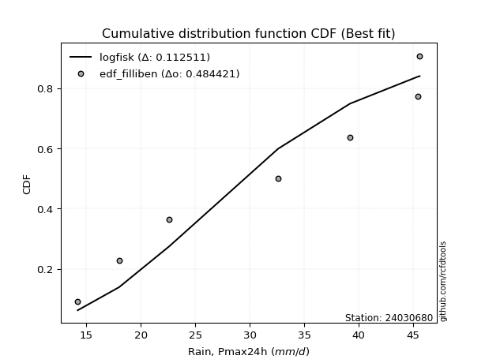</img>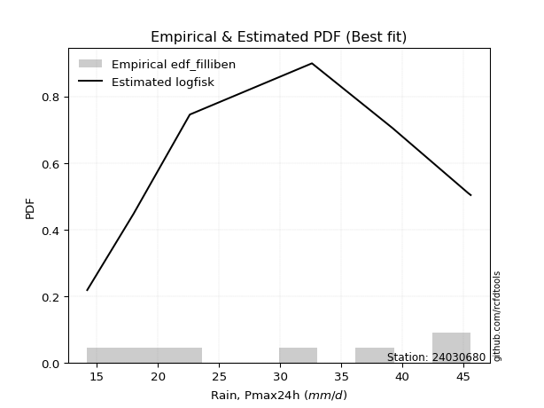</img>

</div>


### 10. EDF Jenkinson (1977)

The Jenkinson formula in hydrology is an empirical plotting position formula used to estimate the non-exceedance probability _(P)_ or return period _(T)_ of a given ordered observation within a sample. It is a widely used method in the frequency analysis of extreme events such as floods and rainfall, as it provides a distribution-free way to plot data. _a≈0.31_ and _b≈0.38_ are constants derived to approximate the median of the probability distribution for the given rank.

<div align="center">


$P=(m-a)/(n+b)$


</div>


**10.1. Empirical values**

<div align="center">

|                | 0                   | 1                   | 2                   | 3             | 4                  | 5                  | 6                  |
|:---------------|:--------------------|:--------------------|:--------------------|:--------------|:-------------------|:-------------------|:-------------------|
| date           | 2017                | 2018                | 2023                | 2021          | 2022               | 2019               | 2020               |
| x              | 14.2                | 18.0                | 22.6                | 32.6          | 39.2               | 45.4               | 45.6               |
| m              | 1                   | 2                   | 3                   | 4             | 5                  | 6                  | 7                  |
| empirical_dist | edf_jenkinson       | edf_jenkinson       | edf_jenkinson       | edf_jenkinson | edf_jenkinson      | edf_jenkinson      | edf_jenkinson      |
| empirical      | 0.09349593495934959 | 0.22899728997289973 | 0.36449864498644985 | 0.5           | 0.6355013550135502 | 0.7710027100271003 | 0.9065040650406505 |
| empirical_tr   | 1.1031390134529149  | 1.29701230228471    | 1.5735607675906182  | 2.0           | 2.743494423791822  | 4.366863905325444  | 10.695652173913055 |

</div>


**10.2. Kolmogorov-Smirnov fit test (sorted by Δ)**


<div align="center">

|                | 0                   | 1                   | 2                   | 3                   | 4                   | 5                   | 6                   | 7                   | 8                   | 9                   | 10                  | 11                  | 12                  | 13                  | 14                  | 15                  | 16                  | 17                  | 18                  | 19                  | 20                  | 21                  | 22                  | 23                  | 24                  | 25                  | 26                  | 27                  | 28                  | 29                  | 30                  | 31                  | 32                  | 33                  | 34                  | 35                  | 36                  | 37                  | 38                  | 39                  | 40                  | 41                  | 42                  | 43                  | 44                  | 45                  | 46                  | 47                  | 48                  | 49                  | 50                  | 51                  | 52                  | 53                  | 54                  | 55                  | 56                  | 57                  | 58                  | 59                  | 60                  | 61                  | 62                  | 63                  | 64                  | 65                  | 66                  | 67                  | 68                  | 69                  | 70                  | 71                  | 72                  | 73                  | 74                  | 75                    | 76                  | 77                  | 78                  | 79                  | 80                  | 81                  | 82                  | 83                  | 84                  | 85                  | 86                  | 87                  |
|:---------------|:--------------------|:--------------------|:--------------------|:--------------------|:--------------------|:--------------------|:--------------------|:--------------------|:--------------------|:--------------------|:--------------------|:--------------------|:--------------------|:--------------------|:--------------------|:--------------------|:--------------------|:--------------------|:--------------------|:--------------------|:--------------------|:--------------------|:--------------------|:--------------------|:--------------------|:--------------------|:--------------------|:--------------------|:--------------------|:--------------------|:--------------------|:--------------------|:--------------------|:--------------------|:--------------------|:--------------------|:--------------------|:--------------------|:--------------------|:--------------------|:--------------------|:--------------------|:--------------------|:--------------------|:--------------------|:--------------------|:--------------------|:--------------------|:--------------------|:--------------------|:--------------------|:--------------------|:--------------------|:--------------------|:--------------------|:--------------------|:--------------------|:--------------------|:--------------------|:--------------------|:--------------------|:--------------------|:--------------------|:--------------------|:--------------------|:--------------------|:--------------------|:--------------------|:--------------------|:--------------------|:--------------------|:--------------------|:--------------------|:--------------------|:--------------------|:----------------------|:--------------------|:--------------------|:--------------------|:--------------------|:--------------------|:--------------------|:--------------------|:--------------------|:--------------------|:--------------------|:--------------------|:--------------------|
| station        | 24030680            | 24030680            | 24030680            | 24030680            | 24030680            | 24030680            | 24030680            | 24030680            | 24030680            | 24030680            | 24030680            | 24030680            | 24030680            | 24030680            | 24030680            | 24030680            | 24030680            | 24030680            | 24030680            | 24030680            | 24030680            | 24030680            | 24030680            | 24030680            | 24030680            | 24030680            | 24030680            | 24030680            | 24030680            | 24030680            | 24030680            | 24030680            | 24030680            | 24030680            | 24030680            | 24030680            | 24030680            | 24030680            | 24030680            | 24030680            | 24030680            | 24030680            | 24030680            | 24030680            | 24030680            | 24030680            | 24030680            | 24030680            | 24030680            | 24030680            | 24030680            | 24030680            | 24030680            | 24030680            | 24030680            | 24030680            | 24030680            | 24030680            | 24030680            | 24030680            | 24030680            | 24030680            | 24030680            | 24030680            | 24030680            | 24030680            | 24030680            | 24030680            | 24030680            | 24030680            | 24030680            | 24030680            | 24030680            | 24030680            | 24030680            | 24030680              | 24030680            | 24030680            | 24030680            | 24030680            | 24030680            | 24030680            | 24030680            | 24030680            | 24030680            | 24030680            | 24030680            | 24030680            |
| empirical_dist | edf_jenkinson       | edf_jenkinson       | edf_jenkinson       | edf_jenkinson       | edf_jenkinson       | edf_jenkinson       | edf_jenkinson       | edf_jenkinson       | edf_jenkinson       | edf_jenkinson       | edf_jenkinson       | edf_jenkinson       | edf_jenkinson       | edf_jenkinson       | edf_jenkinson       | edf_jenkinson       | edf_jenkinson       | edf_jenkinson       | edf_jenkinson       | edf_jenkinson       | edf_jenkinson       | edf_jenkinson       | edf_jenkinson       | edf_jenkinson       | edf_jenkinson       | edf_jenkinson       | edf_jenkinson       | edf_jenkinson       | edf_jenkinson       | edf_jenkinson       | edf_jenkinson       | edf_jenkinson       | edf_jenkinson       | edf_jenkinson       | edf_jenkinson       | edf_jenkinson       | edf_jenkinson       | edf_jenkinson       | edf_jenkinson       | edf_jenkinson       | edf_jenkinson       | edf_jenkinson       | edf_jenkinson       | edf_jenkinson       | edf_jenkinson       | edf_jenkinson       | edf_jenkinson       | edf_jenkinson       | edf_jenkinson       | edf_jenkinson       | edf_jenkinson       | edf_jenkinson       | edf_jenkinson       | edf_jenkinson       | edf_jenkinson       | edf_jenkinson       | edf_jenkinson       | edf_jenkinson       | edf_jenkinson       | edf_jenkinson       | edf_jenkinson       | edf_jenkinson       | edf_jenkinson       | edf_jenkinson       | edf_jenkinson       | edf_jenkinson       | edf_jenkinson       | edf_jenkinson       | edf_jenkinson       | edf_jenkinson       | edf_jenkinson       | edf_jenkinson       | edf_jenkinson       | edf_jenkinson       | edf_jenkinson       | edf_jenkinson         | edf_jenkinson       | edf_jenkinson       | edf_jenkinson       | edf_jenkinson       | edf_jenkinson       | edf_jenkinson       | edf_jenkinson       | edf_jenkinson       | edf_jenkinson       | edf_jenkinson       | edf_jenkinson       | edf_jenkinson       |
| p_dist         | logfisk             | betaprime           | gompertz            | erlang              | gamma               | alpha               | logweibull_min      | rice                | maxwell             | nct                 | t                   | crystalball         | norm                | truncnorm           | exponnorm           | fisk                | invgamma            | weibull_min         | logpearson3         | pearson3            | rayleigh            | ncf                 | invgauss            | loggumbel_l         | genlogistic         | logncf              | loginvgamma         | logfatiguelife      | logerlang           | loggamma            | loggamma            | loggompertz         | logf                | logcrystalball      | lognorm             | lognorm             | logt                | logexponnorm        | logalpha            | lognct              | logbetaprime        | logrice             | halfnorm            | kstwobign           | laplace_asymmetric  | logmaxwell          | logistic            | loginvgauss         | lograyleigh         | gumbel_r            | loginvweibull       | lognakagami         | loglogistic         | gumbel_l            | hypsecant           | expon               | genexpon            | moyal               | loghypsecant        | logkstwobign        | halflogistic        | loghalfnorm         | laplace             | loggumbel_r         | nakagami            | chi2                | loglaplace          | loggenexpon         | logmielke           | logexpon            | f                   | loghalflogistic     | logchi2             | logmoyal            | logloggamma         | loglaplace_asymmetric | wald                | logwald             | logtruncnorm        | logjohnsonsu        | loggibrat           | gibrat              | loglognorm          | invweibull          | fatiguelife         | johnsonsu           | loggenlogistic      | mielke              |
| delta          | 0.11278682814467889 | 0.1204061545268309  | 0.12202605492209817 | 0.12210255930320019 | 0.12210634596730319 | 0.1224207681492574  | 0.12260047693887619 | 0.12273163903866291 | 0.12417974737243465 | 0.12420875314395827 | 0.12429524204653752 | 0.12431751333135732 | 0.1243175198431114  | 0.12431752390803388 | 0.1243181506479252  | 0.12518745087645952 | 0.12519903305838953 | 0.12558465018889975 | 0.12608660547343176 | 0.1267763147446178  | 0.12691228991563896 | 0.12842377386064463 | 0.1288146536016861  | 0.12886086012245868 | 0.13035652508403572 | 0.13181794222421983 | 0.13310196229967397 | 0.13339045290255347 | 0.13356364041558488 | 0.1335785559601148  | 0.1335785559601148  | 0.1336895777874949  | 0.13386413242709128 | 0.13403307685025845 | 0.13403316181138347 | 0.13403316181138347 | 0.1340333513276578  | 0.134034442180067   | 0.13405092591557888 | 0.13439232015058844 | 0.1348851581516255  | 0.13594988301112898 | 0.13617130182241166 | 0.13997917390258974 | 0.14055246862192874 | 0.1464965618552514  | 0.14695430702834794 | 0.1507580565179769  | 0.15398925877419822 | 0.15405465939155438 | 0.15439791701020977 | 0.15524732053299994 | 0.15655097789829386 | 0.16133466569443025 | 0.1615548791657473  | 0.16367539901163264 | 0.16369113920929423 | 0.16678314081747458 | 0.1707717932084588  | 0.1715358120683963  | 0.1723609933609143  | 0.17548472508823165 | 0.18019783977392248 | 0.18598621018074935 | 0.1862462903446077  | 0.187203936233458   | 0.18825143993135252 | 0.1923267285972956  | 0.19409888776594553 | 0.1966215386603728  | 0.19911943266091447 | 0.20385286197396557 | 0.20409248702311011 | 0.20752661845511522 | 0.21947135112828908 | 0.2196217968651737    | 0.22899728997289973 | 0.2678894980172212  | 0.28106107171143924 | 0.2847191669337824  | 0.3000317862707116  | 0.3462483214807429  | 0.3959983024222047  | 0.46186679893556104 | 0.47869029852417555 | 0.623828681071873   | 0.7710027100271003  | nan                 |
| deltao         | 0.48442053926100004 | 0.48442053926100004 | 0.48442053926100004 | 0.48442053926100004 | 0.48442053926100004 | 0.48442053926100004 | 0.48442053926100004 | 0.48442053926100004 | 0.48442053926100004 | 0.48442053926100004 | 0.48442053926100004 | 0.48442053926100004 | 0.48442053926100004 | 0.48442053926100004 | 0.48442053926100004 | 0.48442053926100004 | 0.48442053926100004 | 0.48442053926100004 | 0.48442053926100004 | 0.48442053926100004 | 0.48442053926100004 | 0.48442053926100004 | 0.48442053926100004 | 0.48442053926100004 | 0.48442053926100004 | 0.48442053926100004 | 0.48442053926100004 | 0.48442053926100004 | 0.48442053926100004 | 0.48442053926100004 | 0.48442053926100004 | 0.48442053926100004 | 0.48442053926100004 | 0.48442053926100004 | 0.48442053926100004 | 0.48442053926100004 | 0.48442053926100004 | 0.48442053926100004 | 0.48442053926100004 | 0.48442053926100004 | 0.48442053926100004 | 0.48442053926100004 | 0.48442053926100004 | 0.48442053926100004 | 0.48442053926100004 | 0.48442053926100004 | 0.48442053926100004 | 0.48442053926100004 | 0.48442053926100004 | 0.48442053926100004 | 0.48442053926100004 | 0.48442053926100004 | 0.48442053926100004 | 0.48442053926100004 | 0.48442053926100004 | 0.48442053926100004 | 0.48442053926100004 | 0.48442053926100004 | 0.48442053926100004 | 0.48442053926100004 | 0.48442053926100004 | 0.48442053926100004 | 0.48442053926100004 | 0.48442053926100004 | 0.48442053926100004 | 0.48442053926100004 | 0.48442053926100004 | 0.48442053926100004 | 0.48442053926100004 | 0.48442053926100004 | 0.48442053926100004 | 0.48442053926100004 | 0.48442053926100004 | 0.48442053926100004 | 0.48442053926100004 | 0.48442053926100004   | 0.48442053926100004 | 0.48442053926100004 | 0.48442053926100004 | 0.48442053926100004 | 0.48442053926100004 | 0.48442053926100004 | 0.48442053926100004 | 0.48442053926100004 | 0.48442053926100004 | 0.48442053926100004 | 0.48442053926100004 | 0.48442053926100004 |
| eval           | Δo > Δ              | Δo > Δ              | Δo > Δ              | Δo > Δ              | Δo > Δ              | Δo > Δ              | Δo > Δ              | Δo > Δ              | Δo > Δ              | Δo > Δ              | Δo > Δ              | Δo > Δ              | Δo > Δ              | Δo > Δ              | Δo > Δ              | Δo > Δ              | Δo > Δ              | Δo > Δ              | Δo > Δ              | Δo > Δ              | Δo > Δ              | Δo > Δ              | Δo > Δ              | Δo > Δ              | Δo > Δ              | Δo > Δ              | Δo > Δ              | Δo > Δ              | Δo > Δ              | Δo > Δ              | Δo > Δ              | Δo > Δ              | Δo > Δ              | Δo > Δ              | Δo > Δ              | Δo > Δ              | Δo > Δ              | Δo > Δ              | Δo > Δ              | Δo > Δ              | Δo > Δ              | Δo > Δ              | Δo > Δ              | Δo > Δ              | Δo > Δ              | Δo > Δ              | Δo > Δ              | Δo > Δ              | Δo > Δ              | Δo > Δ              | Δo > Δ              | Δo > Δ              | Δo > Δ              | Δo > Δ              | Δo > Δ              | Δo > Δ              | Δo > Δ              | Δo > Δ              | Δo > Δ              | Δo > Δ              | Δo > Δ              | Δo > Δ              | Δo > Δ              | Δo > Δ              | Δo > Δ              | Δo > Δ              | Δo > Δ              | Δo > Δ              | Δo > Δ              | Δo > Δ              | Δo > Δ              | Δo > Δ              | Δo > Δ              | Δo > Δ              | Δo > Δ              | Δo > Δ                | Δo > Δ              | Δo > Δ              | Δo > Δ              | Δo > Δ              | Δo > Δ              | Δo > Δ              | Δo > Δ              | Δo > Δ              | Δo > Δ              | Δo <= Δ             | Δo <= Δ             | Δo <= Δ             |
| fit            | 1                   | 1                   | 1                   | 1                   | 1                   | 1                   | 1                   | 1                   | 1                   | 1                   | 1                   | 1                   | 1                   | 1                   | 1                   | 1                   | 1                   | 1                   | 1                   | 1                   | 1                   | 1                   | 1                   | 1                   | 1                   | 1                   | 1                   | 1                   | 1                   | 1                   | 1                   | 1                   | 1                   | 1                   | 1                   | 1                   | 1                   | 1                   | 1                   | 1                   | 1                   | 1                   | 1                   | 1                   | 1                   | 1                   | 1                   | 1                   | 1                   | 1                   | 1                   | 1                   | 1                   | 1                   | 1                   | 1                   | 1                   | 1                   | 1                   | 1                   | 1                   | 1                   | 1                   | 1                   | 1                   | 1                   | 1                   | 1                   | 1                   | 1                   | 1                   | 1                   | 1                   | 1                   | 1                   | 1                     | 1                   | 1                   | 1                   | 1                   | 1                   | 1                   | 1                   | 1                   | 1                   | 0                   | 0                   | 0                   |
| n              | 7                   | 7                   | 7                   | 7                   | 7                   | 7                   | 7                   | 7                   | 7                   | 7                   | 7                   | 7                   | 7                   | 7                   | 7                   | 7                   | 7                   | 7                   | 7                   | 7                   | 7                   | 7                   | 7                   | 7                   | 7                   | 7                   | 7                   | 7                   | 7                   | 7                   | 7                   | 7                   | 7                   | 7                   | 7                   | 7                   | 7                   | 7                   | 7                   | 7                   | 7                   | 7                   | 7                   | 7                   | 7                   | 7                   | 7                   | 7                   | 7                   | 7                   | 7                   | 7                   | 7                   | 7                   | 7                   | 7                   | 7                   | 7                   | 7                   | 7                   | 7                   | 7                   | 7                   | 7                   | 7                   | 7                   | 7                   | 7                   | 7                   | 7                   | 7                   | 7                   | 7                   | 7                   | 7                   | 7                     | 7                   | 7                   | 7                   | 7                   | 7                   | 7                   | 7                   | 7                   | 7                   | 7                   | 7                   | 7                   |
| best_fit       | 1                   | 0                   | 0                   | 0                   | 0                   | 0                   | 0                   | 0                   | 0                   | 0                   | 0                   | 0                   | 0                   | 0                   | 0                   | 0                   | 0                   | 0                   | 0                   | 0                   | 0                   | 0                   | 0                   | 0                   | 0                   | 0                   | 0                   | 0                   | 0                   | 0                   | 0                   | 0                   | 0                   | 0                   | 0                   | 0                   | 0                   | 0                   | 0                   | 0                   | 0                   | 0                   | 0                   | 0                   | 0                   | 0                   | 0                   | 0                   | 0                   | 0                   | 0                   | 0                   | 0                   | 0                   | 0                   | 0                   | 0                   | 0                   | 0                   | 0                   | 0                   | 0                   | 0                   | 0                   | 0                   | 0                   | 0                   | 0                   | 0                   | 0                   | 0                   | 0                   | 0                   | 0                   | 0                   | 0                     | 0                   | 0                   | 0                   | 0                   | 0                   | 0                   | 0                   | 0                   | 0                   | 0                   | 0                   | 0                   |
| best_fit_sort  | 1                   | 2                   | 3                   | 4                   | 5                   | 6                   | 7                   | 8                   | 9                   | 10                  | 11                  | 12                  | 13                  | 14                  | 15                  | 16                  | 17                  | 18                  | 19                  | 20                  | 21                  | 22                  | 23                  | 24                  | 25                  | 26                  | 27                  | 28                  | 29                  | 30                  | 31                  | 32                  | 33                  | 34                  | 35                  | 36                  | 37                  | 38                  | 39                  | 40                  | 41                  | 42                  | 43                  | 44                  | 45                  | 46                  | 47                  | 48                  | 49                  | 50                  | 51                  | 52                  | 53                  | 54                  | 55                  | 56                  | 57                  | 58                  | 59                  | 60                  | 61                  | 62                  | 63                  | 64                  | 65                  | 66                  | 67                  | 68                  | 69                  | 70                  | 71                  | 72                  | 73                  | 74                  | 75                  | 76                    | 77                  | 78                  | 79                  | 80                  | 81                  | 82                  | 83                  | 84                  | 85                  | 86                  | 87                  | 88                  |

</div>


**10.3. Best fit**

<div align="center">

|   id |   station | empirical_dist   | p_dist   |    delta |   deltao | eval   |   fit |   n |   best_fit |   best_fit_sort |
|-----:|----------:|:-----------------|:---------|---------:|---------:|:-------|------:|----:|-----------:|----------------:|
|    0 |  24030680 | edf_jenkinson    | logfisk  | 0.112787 | 0.484421 | Δo > Δ |     1 |   7 |          1 |               1 |

</div>


<div align="center">

</img></img>

</div>


### 11. EDF Cunnane (1978)

Cunnane´s work in statistical hydrology has focused on the performance and evaluation of different probability distributions (such as GEV, Gumbel, Lognormal) for flood frequency estimation. _b_ is a constant, typically set to 0.4.

<div align="center">


$P=(m-b)/(n+1-2b)$


</div>


**11.1. Empirical values**

<div align="center">

|                | 0                   | 1                   | 2                  | 3           | 4                  | 5                  | 6                  |
|:---------------|:--------------------|:--------------------|:-------------------|:------------|:-------------------|:-------------------|:-------------------|
| date           | 2017                | 2018                | 2023               | 2021        | 2022               | 2019               | 2020               |
| x              | 14.2                | 18.0                | 22.6               | 32.6        | 39.2               | 45.4               | 45.6               |
| m              | 1                   | 2                   | 3                  | 4           | 5                  | 6                  | 7                  |
| empirical_dist | edf_cunnane         | edf_cunnane         | edf_cunnane        | edf_cunnane | edf_cunnane        | edf_cunnane        | edf_cunnane        |
| empirical      | 0.08333333333333333 | 0.22222222222222224 | 0.3611111111111111 | 0.5         | 0.6388888888888888 | 0.7777777777777777 | 0.9166666666666666 |
| empirical_tr   | 1.090909090909091   | 1.2857142857142856  | 1.565217391304348  | 2.0         | 2.7692307692307687 | 4.499999999999998  | 11.999999999999995 |

</div>


**11.2. Kolmogorov-Smirnov fit test (sorted by Δ)**


<div align="center">

|                | 0                   | 1                   | 2                   | 3                   | 4                   | 5                   | 6                   | 7                   | 8                   | 9                   | 10                  | 11                  | 12                  | 13                  | 14                  | 15                  | 16                  | 17                  | 18                  | 19                  | 20                  | 21                  | 22                  | 23                  | 24                  | 25                  | 26                  | 27                  | 28                  | 29                  | 30                  | 31                  | 32                  | 33                  | 34                  | 35                  | 36                  | 37                  | 38                  | 39                  | 40                  | 41                  | 42                  | 43                  | 44                  | 45                  | 46                  | 47                  | 48                  | 49                  | 50                  | 51                  | 52                  | 53                  | 54                  | 55                  | 56                  | 57                  | 58                  | 59                  | 60                  | 61                  | 62                  | 63                  | 64                  | 65                  | 66                  | 67                  | 68                  | 69                  | 70                  | 71                  | 72                  | 73                  | 74                    | 75                  | 76                  | 77                  | 78                  | 79                  | 80                  | 81                  | 82                  | 83                  | 84                  | 85                  | 86                  | 87                  |
|:---------------|:--------------------|:--------------------|:--------------------|:--------------------|:--------------------|:--------------------|:--------------------|:--------------------|:--------------------|:--------------------|:--------------------|:--------------------|:--------------------|:--------------------|:--------------------|:--------------------|:--------------------|:--------------------|:--------------------|:--------------------|:--------------------|:--------------------|:--------------------|:--------------------|:--------------------|:--------------------|:--------------------|:--------------------|:--------------------|:--------------------|:--------------------|:--------------------|:--------------------|:--------------------|:--------------------|:--------------------|:--------------------|:--------------------|:--------------------|:--------------------|:--------------------|:--------------------|:--------------------|:--------------------|:--------------------|:--------------------|:--------------------|:--------------------|:--------------------|:--------------------|:--------------------|:--------------------|:--------------------|:--------------------|:--------------------|:--------------------|:--------------------|:--------------------|:--------------------|:--------------------|:--------------------|:--------------------|:--------------------|:--------------------|:--------------------|:--------------------|:--------------------|:--------------------|:--------------------|:--------------------|:--------------------|:--------------------|:--------------------|:--------------------|:----------------------|:--------------------|:--------------------|:--------------------|:--------------------|:--------------------|:--------------------|:--------------------|:--------------------|:--------------------|:--------------------|:--------------------|:--------------------|:--------------------|
| station        | 24030680            | 24030680            | 24030680            | 24030680            | 24030680            | 24030680            | 24030680            | 24030680            | 24030680            | 24030680            | 24030680            | 24030680            | 24030680            | 24030680            | 24030680            | 24030680            | 24030680            | 24030680            | 24030680            | 24030680            | 24030680            | 24030680            | 24030680            | 24030680            | 24030680            | 24030680            | 24030680            | 24030680            | 24030680            | 24030680            | 24030680            | 24030680            | 24030680            | 24030680            | 24030680            | 24030680            | 24030680            | 24030680            | 24030680            | 24030680            | 24030680            | 24030680            | 24030680            | 24030680            | 24030680            | 24030680            | 24030680            | 24030680            | 24030680            | 24030680            | 24030680            | 24030680            | 24030680            | 24030680            | 24030680            | 24030680            | 24030680            | 24030680            | 24030680            | 24030680            | 24030680            | 24030680            | 24030680            | 24030680            | 24030680            | 24030680            | 24030680            | 24030680            | 24030680            | 24030680            | 24030680            | 24030680            | 24030680            | 24030680            | 24030680              | 24030680            | 24030680            | 24030680            | 24030680            | 24030680            | 24030680            | 24030680            | 24030680            | 24030680            | 24030680            | 24030680            | 24030680            | 24030680            |
| empirical_dist | edf_cunnane         | edf_cunnane         | edf_cunnane         | edf_cunnane         | edf_cunnane         | edf_cunnane         | edf_cunnane         | edf_cunnane         | edf_cunnane         | edf_cunnane         | edf_cunnane         | edf_cunnane         | edf_cunnane         | edf_cunnane         | edf_cunnane         | edf_cunnane         | edf_cunnane         | edf_cunnane         | edf_cunnane         | edf_cunnane         | edf_cunnane         | edf_cunnane         | edf_cunnane         | edf_cunnane         | edf_cunnane         | edf_cunnane         | edf_cunnane         | edf_cunnane         | edf_cunnane         | edf_cunnane         | edf_cunnane         | edf_cunnane         | edf_cunnane         | edf_cunnane         | edf_cunnane         | edf_cunnane         | edf_cunnane         | edf_cunnane         | edf_cunnane         | edf_cunnane         | edf_cunnane         | edf_cunnane         | edf_cunnane         | edf_cunnane         | edf_cunnane         | edf_cunnane         | edf_cunnane         | edf_cunnane         | edf_cunnane         | edf_cunnane         | edf_cunnane         | edf_cunnane         | edf_cunnane         | edf_cunnane         | edf_cunnane         | edf_cunnane         | edf_cunnane         | edf_cunnane         | edf_cunnane         | edf_cunnane         | edf_cunnane         | edf_cunnane         | edf_cunnane         | edf_cunnane         | edf_cunnane         | edf_cunnane         | edf_cunnane         | edf_cunnane         | edf_cunnane         | edf_cunnane         | edf_cunnane         | edf_cunnane         | edf_cunnane         | edf_cunnane         | edf_cunnane           | edf_cunnane         | edf_cunnane         | edf_cunnane         | edf_cunnane         | edf_cunnane         | edf_cunnane         | edf_cunnane         | edf_cunnane         | edf_cunnane         | edf_cunnane         | edf_cunnane         | edf_cunnane         | edf_cunnane         |
| p_dist         | logfisk             | gompertz            | betaprime           | erlang              | gamma               | alpha               | logweibull_min      | rice                | maxwell             | nct                 | t                   | crystalball         | norm                | truncnorm           | exponnorm           | fisk                | invgamma            | logpearson3         | pearson3            | rayleigh            | ncf                 | invgauss            | loggumbel_l         | genlogistic         | logncf              | logfatiguelife      | logerlang           | loggamma            | loggamma            | loggompertz         | logf                | logcrystalball      | lognorm             | lognorm             | logt                | logexponnorm        | logalpha            | lognct              | logbetaprime        | loginvgamma         | halfnorm            | logrice             | weibull_min         | kstwobign           | laplace_asymmetric  | logistic            | logmaxwell          | gumbel_r            | loginvgauss         | loglogistic         | lograyleigh         | loginvweibull       | lognakagami         | gumbel_l            | hypsecant           | moyal               | expon               | genexpon            | halflogistic        | loghypsecant        | logkstwobign        | loghalfnorm         | laplace             | loglaplace          | loggumbel_r         | chi2                | logmielke           | nakagami            | loggenexpon         | logexpon            | f                   | loghalflogistic     | logmoyal            | logloggamma         | loglaplace_asymmetric | logchi2             | wald                | logwald             | logtruncnorm        | logjohnsonsu        | loggibrat           | gibrat              | loglognorm          | invweibull          | fatiguelife         | johnsonsu           | loggenlogistic      | mielke              |
| delta          | 0.10939929426934025 | 0.1168885837289404  | 0.11701862065149227 | 0.11871502542786144 | 0.11871881209196444 | 0.11903323427391876 | 0.11921294306353744 | 0.11934410516332428 | 0.12079221349709601 | 0.12082121926861952 | 0.12090770817119878 | 0.12092997945601858 | 0.12092998596777266 | 0.12092999003269514 | 0.12093061677258646 | 0.12179991700112078 | 0.1218114991830509  | 0.12269907159809312 | 0.12338878086927907 | 0.12352475604030033 | 0.125036239985306   | 0.12542711972634746 | 0.12547332624712004 | 0.1269689912086971  | 0.1284304083488812  | 0.13000291902721484 | 0.13017610654024625 | 0.13019102208477618 | 0.13019102208477618 | 0.13030204391215627 | 0.13047659855175264 | 0.13064554297491981 | 0.13064562793604484 | 0.13064562793604484 | 0.13064581745231918 | 0.13064690830472836 | 0.130920793650249   | 0.1310047862752498  | 0.13149762427628686 | 0.13194323789168416 | 0.13278376794707303 | 0.13476774402861313 | 0.13574725181491587 | 0.1365916400272511  | 0.13716493474659    | 0.1435667731530092  | 0.1464965618552514  | 0.15066712551621575 | 0.1507580565179769  | 0.15316344402295523 | 0.15398925877419822 | 0.15439791701020977 | 0.15524732053299994 | 0.1579471318190915  | 0.15816734529040855 | 0.16339560694213595 | 0.16367539901163264 | 0.16369113920929423 | 0.1655859256102368  | 0.16738425933312018 | 0.1715358120683963  | 0.17548472508823165 | 0.17681030589858374 | 0.18486390605601388 | 0.18598621018074935 | 0.187203936233458   | 0.18732382001526815 | 0.1876800373032755  | 0.1923267285972956  | 0.1966215386603728  | 0.19911943266091447 | 0.20385286197396557 | 0.20752661845511522 | 0.2126962833776117  | 0.2128467291144963    | 0.21425508864912624 | 0.22222222222222224 | 0.2678894980172212  | 0.28106107171143924 | 0.28810670080912104 | 0.3000317862707116  | 0.34286078760540417 | 0.4027733701728822  | 0.47202940056157716 | 0.48546536627485304 | 0.6306037488225502  | 0.7777777777777777  | nan                 |
| deltao         | 0.48442053926100004 | 0.48442053926100004 | 0.48442053926100004 | 0.48442053926100004 | 0.48442053926100004 | 0.48442053926100004 | 0.48442053926100004 | 0.48442053926100004 | 0.48442053926100004 | 0.48442053926100004 | 0.48442053926100004 | 0.48442053926100004 | 0.48442053926100004 | 0.48442053926100004 | 0.48442053926100004 | 0.48442053926100004 | 0.48442053926100004 | 0.48442053926100004 | 0.48442053926100004 | 0.48442053926100004 | 0.48442053926100004 | 0.48442053926100004 | 0.48442053926100004 | 0.48442053926100004 | 0.48442053926100004 | 0.48442053926100004 | 0.48442053926100004 | 0.48442053926100004 | 0.48442053926100004 | 0.48442053926100004 | 0.48442053926100004 | 0.48442053926100004 | 0.48442053926100004 | 0.48442053926100004 | 0.48442053926100004 | 0.48442053926100004 | 0.48442053926100004 | 0.48442053926100004 | 0.48442053926100004 | 0.48442053926100004 | 0.48442053926100004 | 0.48442053926100004 | 0.48442053926100004 | 0.48442053926100004 | 0.48442053926100004 | 0.48442053926100004 | 0.48442053926100004 | 0.48442053926100004 | 0.48442053926100004 | 0.48442053926100004 | 0.48442053926100004 | 0.48442053926100004 | 0.48442053926100004 | 0.48442053926100004 | 0.48442053926100004 | 0.48442053926100004 | 0.48442053926100004 | 0.48442053926100004 | 0.48442053926100004 | 0.48442053926100004 | 0.48442053926100004 | 0.48442053926100004 | 0.48442053926100004 | 0.48442053926100004 | 0.48442053926100004 | 0.48442053926100004 | 0.48442053926100004 | 0.48442053926100004 | 0.48442053926100004 | 0.48442053926100004 | 0.48442053926100004 | 0.48442053926100004 | 0.48442053926100004 | 0.48442053926100004 | 0.48442053926100004   | 0.48442053926100004 | 0.48442053926100004 | 0.48442053926100004 | 0.48442053926100004 | 0.48442053926100004 | 0.48442053926100004 | 0.48442053926100004 | 0.48442053926100004 | 0.48442053926100004 | 0.48442053926100004 | 0.48442053926100004 | 0.48442053926100004 | 0.48442053926100004 |
| eval           | Δo > Δ              | Δo > Δ              | Δo > Δ              | Δo > Δ              | Δo > Δ              | Δo > Δ              | Δo > Δ              | Δo > Δ              | Δo > Δ              | Δo > Δ              | Δo > Δ              | Δo > Δ              | Δo > Δ              | Δo > Δ              | Δo > Δ              | Δo > Δ              | Δo > Δ              | Δo > Δ              | Δo > Δ              | Δo > Δ              | Δo > Δ              | Δo > Δ              | Δo > Δ              | Δo > Δ              | Δo > Δ              | Δo > Δ              | Δo > Δ              | Δo > Δ              | Δo > Δ              | Δo > Δ              | Δo > Δ              | Δo > Δ              | Δo > Δ              | Δo > Δ              | Δo > Δ              | Δo > Δ              | Δo > Δ              | Δo > Δ              | Δo > Δ              | Δo > Δ              | Δo > Δ              | Δo > Δ              | Δo > Δ              | Δo > Δ              | Δo > Δ              | Δo > Δ              | Δo > Δ              | Δo > Δ              | Δo > Δ              | Δo > Δ              | Δo > Δ              | Δo > Δ              | Δo > Δ              | Δo > Δ              | Δo > Δ              | Δo > Δ              | Δo > Δ              | Δo > Δ              | Δo > Δ              | Δo > Δ              | Δo > Δ              | Δo > Δ              | Δo > Δ              | Δo > Δ              | Δo > Δ              | Δo > Δ              | Δo > Δ              | Δo > Δ              | Δo > Δ              | Δo > Δ              | Δo > Δ              | Δo > Δ              | Δo > Δ              | Δo > Δ              | Δo > Δ                | Δo > Δ              | Δo > Δ              | Δo > Δ              | Δo > Δ              | Δo > Δ              | Δo > Δ              | Δo > Δ              | Δo > Δ              | Δo > Δ              | Δo <= Δ             | Δo <= Δ             | Δo <= Δ             | Δo <= Δ             |
| fit            | 1                   | 1                   | 1                   | 1                   | 1                   | 1                   | 1                   | 1                   | 1                   | 1                   | 1                   | 1                   | 1                   | 1                   | 1                   | 1                   | 1                   | 1                   | 1                   | 1                   | 1                   | 1                   | 1                   | 1                   | 1                   | 1                   | 1                   | 1                   | 1                   | 1                   | 1                   | 1                   | 1                   | 1                   | 1                   | 1                   | 1                   | 1                   | 1                   | 1                   | 1                   | 1                   | 1                   | 1                   | 1                   | 1                   | 1                   | 1                   | 1                   | 1                   | 1                   | 1                   | 1                   | 1                   | 1                   | 1                   | 1                   | 1                   | 1                   | 1                   | 1                   | 1                   | 1                   | 1                   | 1                   | 1                   | 1                   | 1                   | 1                   | 1                   | 1                   | 1                   | 1                   | 1                   | 1                     | 1                   | 1                   | 1                   | 1                   | 1                   | 1                   | 1                   | 1                   | 1                   | 0                   | 0                   | 0                   | 0                   |
| n              | 7                   | 7                   | 7                   | 7                   | 7                   | 7                   | 7                   | 7                   | 7                   | 7                   | 7                   | 7                   | 7                   | 7                   | 7                   | 7                   | 7                   | 7                   | 7                   | 7                   | 7                   | 7                   | 7                   | 7                   | 7                   | 7                   | 7                   | 7                   | 7                   | 7                   | 7                   | 7                   | 7                   | 7                   | 7                   | 7                   | 7                   | 7                   | 7                   | 7                   | 7                   | 7                   | 7                   | 7                   | 7                   | 7                   | 7                   | 7                   | 7                   | 7                   | 7                   | 7                   | 7                   | 7                   | 7                   | 7                   | 7                   | 7                   | 7                   | 7                   | 7                   | 7                   | 7                   | 7                   | 7                   | 7                   | 7                   | 7                   | 7                   | 7                   | 7                   | 7                   | 7                   | 7                   | 7                     | 7                   | 7                   | 7                   | 7                   | 7                   | 7                   | 7                   | 7                   | 7                   | 7                   | 7                   | 7                   | 7                   |
| best_fit       | 1                   | 0                   | 0                   | 0                   | 0                   | 0                   | 0                   | 0                   | 0                   | 0                   | 0                   | 0                   | 0                   | 0                   | 0                   | 0                   | 0                   | 0                   | 0                   | 0                   | 0                   | 0                   | 0                   | 0                   | 0                   | 0                   | 0                   | 0                   | 0                   | 0                   | 0                   | 0                   | 0                   | 0                   | 0                   | 0                   | 0                   | 0                   | 0                   | 0                   | 0                   | 0                   | 0                   | 0                   | 0                   | 0                   | 0                   | 0                   | 0                   | 0                   | 0                   | 0                   | 0                   | 0                   | 0                   | 0                   | 0                   | 0                   | 0                   | 0                   | 0                   | 0                   | 0                   | 0                   | 0                   | 0                   | 0                   | 0                   | 0                   | 0                   | 0                   | 0                   | 0                   | 0                   | 0                     | 0                   | 0                   | 0                   | 0                   | 0                   | 0                   | 0                   | 0                   | 0                   | 0                   | 0                   | 0                   | 0                   |
| best_fit_sort  | 1                   | 2                   | 3                   | 4                   | 5                   | 6                   | 7                   | 8                   | 9                   | 10                  | 11                  | 12                  | 13                  | 14                  | 15                  | 16                  | 17                  | 18                  | 19                  | 20                  | 21                  | 22                  | 23                  | 24                  | 25                  | 26                  | 27                  | 28                  | 29                  | 30                  | 31                  | 32                  | 33                  | 34                  | 35                  | 36                  | 37                  | 38                  | 39                  | 40                  | 41                  | 42                  | 43                  | 44                  | 45                  | 46                  | 47                  | 48                  | 49                  | 50                  | 51                  | 52                  | 53                  | 54                  | 55                  | 56                  | 57                  | 58                  | 59                  | 60                  | 61                  | 62                  | 63                  | 64                  | 65                  | 66                  | 67                  | 68                  | 69                  | 70                  | 71                  | 72                  | 73                  | 74                  | 75                    | 76                  | 77                  | 78                  | 79                  | 80                  | 81                  | 82                  | 83                  | 84                  | 85                  | 86                  | 87                  | 88                  |

</div>


**11.3. Best fit**

<div align="center">

|   id |   station | empirical_dist   | p_dist   |    delta |   deltao | eval   |   fit |   n |   best_fit |   best_fit_sort |
|-----:|----------:|:-----------------|:---------|---------:|---------:|:-------|------:|----:|-----------:|----------------:|
|    0 |  24030680 | edf_cunnane      | logfisk  | 0.109399 | 0.484421 | Δo > Δ |     1 |   7 |          1 |               1 |

</div>


<div align="center">

</img>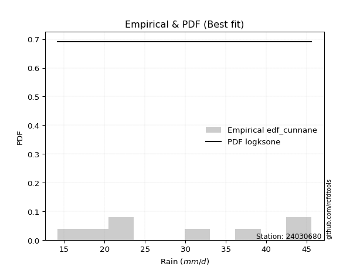</img>

</div>


### 12. EDF Adamowski (1981)

The Adamowski formula in hydrology refers to a specific plotting position formula used for estimating the non-parametric empirical distribution of hydrological events (like flood peaks) to calculate their return periods. This formula provides an alternative to traditional parametric methods (like the Gumbel or Log Pearson Type III distributions). 

<div align="center">


$P=(m-0.25)/(n+0.5)$


</div>


**12.1. Empirical values**

<div align="center">

|                | 0                  | 1                   | 2                   | 3             | 4                  | 5                  | 6                  |
|:---------------|:-------------------|:--------------------|:--------------------|:--------------|:-------------------|:-------------------|:-------------------|
| date           | 2017               | 2018                | 2023                | 2021          | 2022               | 2019               | 2020               |
| x              | 14.2               | 18.0                | 22.6                | 32.6          | 39.2               | 45.4               | 45.6               |
| m              | 1                  | 2                   | 3                   | 4             | 5                  | 6                  | 7                  |
| empirical_dist | edf_adamowski      | edf_adamowski       | edf_adamowski       | edf_adamowski | edf_adamowski      | edf_adamowski      | edf_adamowski      |
| empirical      | 0.1                | 0.23333333333333334 | 0.36666666666666664 | 0.5           | 0.6333333333333333 | 0.7666666666666667 | 0.9                |
| empirical_tr   | 1.1111111111111112 | 1.3043478260869565  | 1.5789473684210527  | 2.0           | 2.727272727272727  | 4.2857142857142865 | 10.000000000000002 |

</div>


**12.2. Kolmogorov-Smirnov fit test (sorted by Δ)**


<div align="center">

|                | 0                   | 1                   | 2                   | 3                   | 4                   | 5                   | 6                   | 7                   | 8                   | 9                   | 10                  | 11                  | 12                  | 13                  | 14                  | 15                  | 16                  | 17                  | 18                  | 19                  | 20                  | 21                  | 22                  | 23                  | 24                  | 25                  | 26                  | 27                  | 28                  | 29                  | 30                  | 31                  | 32                  | 33                  | 34                  | 35                  | 36                  | 37                  | 38                  | 39                  | 40                  | 41                  | 42                  | 43                  | 44                  | 45                  | 46                  | 47                  | 48                  | 49                  | 50                  | 51                  | 52                  | 53                  | 54                  | 55                  | 56                  | 57                  | 58                  | 59                  | 60                  | 61                  | 62                  | 63                  | 64                  | 65                  | 66                  | 67                  | 68                  | 69                  | 70                  | 71                  | 72                  | 73                  | 74                  | 75                    | 76                  | 77                  | 78                  | 79                  | 80                  | 81                  | 82                  | 83                  | 84                  | 85                  | 86                  | 87                  |
|:---------------|:--------------------|:--------------------|:--------------------|:--------------------|:--------------------|:--------------------|:--------------------|:--------------------|:--------------------|:--------------------|:--------------------|:--------------------|:--------------------|:--------------------|:--------------------|:--------------------|:--------------------|:--------------------|:--------------------|:--------------------|:--------------------|:--------------------|:--------------------|:--------------------|:--------------------|:--------------------|:--------------------|:--------------------|:--------------------|:--------------------|:--------------------|:--------------------|:--------------------|:--------------------|:--------------------|:--------------------|:--------------------|:--------------------|:--------------------|:--------------------|:--------------------|:--------------------|:--------------------|:--------------------|:--------------------|:--------------------|:--------------------|:--------------------|:--------------------|:--------------------|:--------------------|:--------------------|:--------------------|:--------------------|:--------------------|:--------------------|:--------------------|:--------------------|:--------------------|:--------------------|:--------------------|:--------------------|:--------------------|:--------------------|:--------------------|:--------------------|:--------------------|:--------------------|:--------------------|:--------------------|:--------------------|:--------------------|:--------------------|:--------------------|:--------------------|:----------------------|:--------------------|:--------------------|:--------------------|:--------------------|:--------------------|:--------------------|:--------------------|:--------------------|:--------------------|:--------------------|:--------------------|:--------------------|
| station        | 24030680            | 24030680            | 24030680            | 24030680            | 24030680            | 24030680            | 24030680            | 24030680            | 24030680            | 24030680            | 24030680            | 24030680            | 24030680            | 24030680            | 24030680            | 24030680            | 24030680            | 24030680            | 24030680            | 24030680            | 24030680            | 24030680            | 24030680            | 24030680            | 24030680            | 24030680            | 24030680            | 24030680            | 24030680            | 24030680            | 24030680            | 24030680            | 24030680            | 24030680            | 24030680            | 24030680            | 24030680            | 24030680            | 24030680            | 24030680            | 24030680            | 24030680            | 24030680            | 24030680            | 24030680            | 24030680            | 24030680            | 24030680            | 24030680            | 24030680            | 24030680            | 24030680            | 24030680            | 24030680            | 24030680            | 24030680            | 24030680            | 24030680            | 24030680            | 24030680            | 24030680            | 24030680            | 24030680            | 24030680            | 24030680            | 24030680            | 24030680            | 24030680            | 24030680            | 24030680            | 24030680            | 24030680            | 24030680            | 24030680            | 24030680            | 24030680              | 24030680            | 24030680            | 24030680            | 24030680            | 24030680            | 24030680            | 24030680            | 24030680            | 24030680            | 24030680            | 24030680            | 24030680            |
| empirical_dist | edf_adamowski       | edf_adamowski       | edf_adamowski       | edf_adamowski       | edf_adamowski       | edf_adamowski       | edf_adamowski       | edf_adamowski       | edf_adamowski       | edf_adamowski       | edf_adamowski       | edf_adamowski       | edf_adamowski       | edf_adamowski       | edf_adamowski       | edf_adamowski       | edf_adamowski       | edf_adamowski       | edf_adamowski       | edf_adamowski       | edf_adamowski       | edf_adamowski       | edf_adamowski       | edf_adamowski       | edf_adamowski       | edf_adamowski       | edf_adamowski       | edf_adamowski       | edf_adamowski       | edf_adamowski       | edf_adamowski       | edf_adamowski       | edf_adamowski       | edf_adamowski       | edf_adamowski       | edf_adamowski       | edf_adamowski       | edf_adamowski       | edf_adamowski       | edf_adamowski       | edf_adamowski       | edf_adamowski       | edf_adamowski       | edf_adamowski       | edf_adamowski       | edf_adamowski       | edf_adamowski       | edf_adamowski       | edf_adamowski       | edf_adamowski       | edf_adamowski       | edf_adamowski       | edf_adamowski       | edf_adamowski       | edf_adamowski       | edf_adamowski       | edf_adamowski       | edf_adamowski       | edf_adamowski       | edf_adamowski       | edf_adamowski       | edf_adamowski       | edf_adamowski       | edf_adamowski       | edf_adamowski       | edf_adamowski       | edf_adamowski       | edf_adamowski       | edf_adamowski       | edf_adamowski       | edf_adamowski       | edf_adamowski       | edf_adamowski       | edf_adamowski       | edf_adamowski       | edf_adamowski         | edf_adamowski       | edf_adamowski       | edf_adamowski       | edf_adamowski       | edf_adamowski       | edf_adamowski       | edf_adamowski       | edf_adamowski       | edf_adamowski       | edf_adamowski       | edf_adamowski       | edf_adamowski       |
| p_dist         | logfisk             | weibull_min         | betaprime           | erlang              | gamma               | alpha               | logweibull_min      | rice                | maxwell             | gompertz            | nct                 | t                   | crystalball         | norm                | truncnorm           | exponnorm           | fisk                | invgamma            | logpearson3         | pearson3            | rayleigh            | ncf                 | invgauss            | loggumbel_l         | genlogistic         | logncf              | loginvgamma         | logfatiguelife      | logerlang           | loggamma            | loggamma            | loggompertz         | logf                | logcrystalball      | lognorm             | lognorm             | logt                | logexponnorm        | logalpha            | lognct              | logbetaprime        | logrice             | halfnorm            | kstwobign           | laplace_asymmetric  | logmaxwell          | logistic            | loginvgauss         | lograyleigh         | loginvweibull       | lognakagami         | gumbel_r            | loglogistic         | gumbel_l            | expon               | genexpon            | hypsecant           | moyal               | logkstwobign        | loghypsecant        | loghalfnorm         | halflogistic        | laplace             | loggumbel_r         | nakagami            | chi2                | loglaplace          | loggenexpon         | logexpon            | logchi2             | logmielke           | f                   | loghalflogistic     | logmoyal            | logloggamma         | loglaplace_asymmetric | wald                | logwald             | logtruncnorm        | logjohnsonsu        | loggibrat           | gibrat              | loglognorm          | invweibull          | fatiguelife         | johnsonsu           | loggenlogistic      | mielke              |
| delta          | 0.11495484982489579 | 0.11908058514824926 | 0.1225741762070478  | 0.12427058098341698 | 0.12427436764751998 | 0.1245887898294743  | 0.12476849861909298 | 0.12489966071887981 | 0.12634776905265155 | 0.12636209828253178 | 0.12637677482417506 | 0.12646326372675432 | 0.1264855350115741  | 0.1264855415233282  | 0.12648554558825068 | 0.126486172328142   | 0.1273554725566763  | 0.12736705473860643 | 0.12825462715364866 | 0.1289443364248346  | 0.12908031159585587 | 0.13059179554086153 | 0.130982675281903   | 0.13102888180267558 | 0.13252454676425263 | 0.13398596390443673 | 0.13526998397989087 | 0.13555847458277037 | 0.13573166209580179 | 0.1357465776403317  | 0.1357465776403317  | 0.1358575994677118  | 0.13603215410730818 | 0.13620109853047535 | 0.13620118349160037 | 0.13620118349160037 | 0.13620137300787472 | 0.1362024638602839  | 0.13621894759579578 | 0.13656034183080534 | 0.1370531798318424  | 0.13811790469134588 | 0.13833932350262856 | 0.14214719558280664 | 0.14272049030214554 | 0.1464965618552514  | 0.14912232870856473 | 0.1507580565179769  | 0.15398925877419822 | 0.15439791701020977 | 0.15524732053299994 | 0.15622268107177129 | 0.15871899957851077 | 0.16350268737464704 | 0.16367539901163264 | 0.16369113920929423 | 0.16372290084596408 | 0.1689511624976915  | 0.1715358120683963  | 0.1729398148886757  | 0.17548472508823165 | 0.1766970367213479  | 0.18236586145413927 | 0.18598621018074935 | 0.1862462903446077  | 0.187203936233458   | 0.19041946161156942 | 0.1923267285972956  | 0.1966215386603728  | 0.19758842198245963 | 0.1984349311263791  | 0.19911943266091447 | 0.20385286197396557 | 0.20752661845511522 | 0.22380739448872267 | 0.22395784022560727   | 0.23333333333333334 | 0.2678894980172212  | 0.28214548857416544 | 0.2825511452535655  | 0.3000317862707116  | 0.3484163431609597  | 0.39166225906177105 | 0.45536273389491055 | 0.4743542551637419  | 0.6194926377114394  | 0.7666666666666667  | nan                 |
| deltao         | 0.48442053926100004 | 0.48442053926100004 | 0.48442053926100004 | 0.48442053926100004 | 0.48442053926100004 | 0.48442053926100004 | 0.48442053926100004 | 0.48442053926100004 | 0.48442053926100004 | 0.48442053926100004 | 0.48442053926100004 | 0.48442053926100004 | 0.48442053926100004 | 0.48442053926100004 | 0.48442053926100004 | 0.48442053926100004 | 0.48442053926100004 | 0.48442053926100004 | 0.48442053926100004 | 0.48442053926100004 | 0.48442053926100004 | 0.48442053926100004 | 0.48442053926100004 | 0.48442053926100004 | 0.48442053926100004 | 0.48442053926100004 | 0.48442053926100004 | 0.48442053926100004 | 0.48442053926100004 | 0.48442053926100004 | 0.48442053926100004 | 0.48442053926100004 | 0.48442053926100004 | 0.48442053926100004 | 0.48442053926100004 | 0.48442053926100004 | 0.48442053926100004 | 0.48442053926100004 | 0.48442053926100004 | 0.48442053926100004 | 0.48442053926100004 | 0.48442053926100004 | 0.48442053926100004 | 0.48442053926100004 | 0.48442053926100004 | 0.48442053926100004 | 0.48442053926100004 | 0.48442053926100004 | 0.48442053926100004 | 0.48442053926100004 | 0.48442053926100004 | 0.48442053926100004 | 0.48442053926100004 | 0.48442053926100004 | 0.48442053926100004 | 0.48442053926100004 | 0.48442053926100004 | 0.48442053926100004 | 0.48442053926100004 | 0.48442053926100004 | 0.48442053926100004 | 0.48442053926100004 | 0.48442053926100004 | 0.48442053926100004 | 0.48442053926100004 | 0.48442053926100004 | 0.48442053926100004 | 0.48442053926100004 | 0.48442053926100004 | 0.48442053926100004 | 0.48442053926100004 | 0.48442053926100004 | 0.48442053926100004 | 0.48442053926100004 | 0.48442053926100004 | 0.48442053926100004   | 0.48442053926100004 | 0.48442053926100004 | 0.48442053926100004 | 0.48442053926100004 | 0.48442053926100004 | 0.48442053926100004 | 0.48442053926100004 | 0.48442053926100004 | 0.48442053926100004 | 0.48442053926100004 | 0.48442053926100004 | 0.48442053926100004 |
| eval           | Δo > Δ              | Δo > Δ              | Δo > Δ              | Δo > Δ              | Δo > Δ              | Δo > Δ              | Δo > Δ              | Δo > Δ              | Δo > Δ              | Δo > Δ              | Δo > Δ              | Δo > Δ              | Δo > Δ              | Δo > Δ              | Δo > Δ              | Δo > Δ              | Δo > Δ              | Δo > Δ              | Δo > Δ              | Δo > Δ              | Δo > Δ              | Δo > Δ              | Δo > Δ              | Δo > Δ              | Δo > Δ              | Δo > Δ              | Δo > Δ              | Δo > Δ              | Δo > Δ              | Δo > Δ              | Δo > Δ              | Δo > Δ              | Δo > Δ              | Δo > Δ              | Δo > Δ              | Δo > Δ              | Δo > Δ              | Δo > Δ              | Δo > Δ              | Δo > Δ              | Δo > Δ              | Δo > Δ              | Δo > Δ              | Δo > Δ              | Δo > Δ              | Δo > Δ              | Δo > Δ              | Δo > Δ              | Δo > Δ              | Δo > Δ              | Δo > Δ              | Δo > Δ              | Δo > Δ              | Δo > Δ              | Δo > Δ              | Δo > Δ              | Δo > Δ              | Δo > Δ              | Δo > Δ              | Δo > Δ              | Δo > Δ              | Δo > Δ              | Δo > Δ              | Δo > Δ              | Δo > Δ              | Δo > Δ              | Δo > Δ              | Δo > Δ              | Δo > Δ              | Δo > Δ              | Δo > Δ              | Δo > Δ              | Δo > Δ              | Δo > Δ              | Δo > Δ              | Δo > Δ                | Δo > Δ              | Δo > Δ              | Δo > Δ              | Δo > Δ              | Δo > Δ              | Δo > Δ              | Δo > Δ              | Δo > Δ              | Δo > Δ              | Δo <= Δ             | Δo <= Δ             | Δo <= Δ             |
| fit            | 1                   | 1                   | 1                   | 1                   | 1                   | 1                   | 1                   | 1                   | 1                   | 1                   | 1                   | 1                   | 1                   | 1                   | 1                   | 1                   | 1                   | 1                   | 1                   | 1                   | 1                   | 1                   | 1                   | 1                   | 1                   | 1                   | 1                   | 1                   | 1                   | 1                   | 1                   | 1                   | 1                   | 1                   | 1                   | 1                   | 1                   | 1                   | 1                   | 1                   | 1                   | 1                   | 1                   | 1                   | 1                   | 1                   | 1                   | 1                   | 1                   | 1                   | 1                   | 1                   | 1                   | 1                   | 1                   | 1                   | 1                   | 1                   | 1                   | 1                   | 1                   | 1                   | 1                   | 1                   | 1                   | 1                   | 1                   | 1                   | 1                   | 1                   | 1                   | 1                   | 1                   | 1                   | 1                   | 1                     | 1                   | 1                   | 1                   | 1                   | 1                   | 1                   | 1                   | 1                   | 1                   | 0                   | 0                   | 0                   |
| n              | 7                   | 7                   | 7                   | 7                   | 7                   | 7                   | 7                   | 7                   | 7                   | 7                   | 7                   | 7                   | 7                   | 7                   | 7                   | 7                   | 7                   | 7                   | 7                   | 7                   | 7                   | 7                   | 7                   | 7                   | 7                   | 7                   | 7                   | 7                   | 7                   | 7                   | 7                   | 7                   | 7                   | 7                   | 7                   | 7                   | 7                   | 7                   | 7                   | 7                   | 7                   | 7                   | 7                   | 7                   | 7                   | 7                   | 7                   | 7                   | 7                   | 7                   | 7                   | 7                   | 7                   | 7                   | 7                   | 7                   | 7                   | 7                   | 7                   | 7                   | 7                   | 7                   | 7                   | 7                   | 7                   | 7                   | 7                   | 7                   | 7                   | 7                   | 7                   | 7                   | 7                   | 7                   | 7                   | 7                     | 7                   | 7                   | 7                   | 7                   | 7                   | 7                   | 7                   | 7                   | 7                   | 7                   | 7                   | 7                   |
| best_fit       | 1                   | 0                   | 0                   | 0                   | 0                   | 0                   | 0                   | 0                   | 0                   | 0                   | 0                   | 0                   | 0                   | 0                   | 0                   | 0                   | 0                   | 0                   | 0                   | 0                   | 0                   | 0                   | 0                   | 0                   | 0                   | 0                   | 0                   | 0                   | 0                   | 0                   | 0                   | 0                   | 0                   | 0                   | 0                   | 0                   | 0                   | 0                   | 0                   | 0                   | 0                   | 0                   | 0                   | 0                   | 0                   | 0                   | 0                   | 0                   | 0                   | 0                   | 0                   | 0                   | 0                   | 0                   | 0                   | 0                   | 0                   | 0                   | 0                   | 0                   | 0                   | 0                   | 0                   | 0                   | 0                   | 0                   | 0                   | 0                   | 0                   | 0                   | 0                   | 0                   | 0                   | 0                   | 0                   | 0                     | 0                   | 0                   | 0                   | 0                   | 0                   | 0                   | 0                   | 0                   | 0                   | 0                   | 0                   | 0                   |
| best_fit_sort  | 1                   | 2                   | 3                   | 4                   | 5                   | 6                   | 7                   | 8                   | 9                   | 10                  | 11                  | 12                  | 13                  | 14                  | 15                  | 16                  | 17                  | 18                  | 19                  | 20                  | 21                  | 22                  | 23                  | 24                  | 25                  | 26                  | 27                  | 28                  | 29                  | 30                  | 31                  | 32                  | 33                  | 34                  | 35                  | 36                  | 37                  | 38                  | 39                  | 40                  | 41                  | 42                  | 43                  | 44                  | 45                  | 46                  | 47                  | 48                  | 49                  | 50                  | 51                  | 52                  | 53                  | 54                  | 55                  | 56                  | 57                  | 58                  | 59                  | 60                  | 61                  | 62                  | 63                  | 64                  | 65                  | 66                  | 67                  | 68                  | 69                  | 70                  | 71                  | 72                  | 73                  | 74                  | 75                  | 76                    | 77                  | 78                  | 79                  | 80                  | 81                  | 82                  | 83                  | 84                  | 85                  | 86                  | 87                  | 88                  |

</div>


**12.3. Best fit**

<div align="center">

|   id |   station | empirical_dist   | p_dist   |    delta |   deltao | eval   |   fit |   n |   best_fit |   best_fit_sort |
|-----:|----------:|:-----------------|:---------|---------:|---------:|:-------|------:|----:|-----------:|----------------:|
|    0 |  24030680 | edf_adamowski    | logfisk  | 0.114955 | 0.484421 | Δo > Δ |     1 |   7 |          1 |               1 |

</div>


<div align="center">

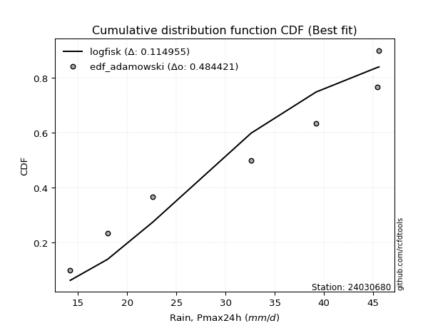</img>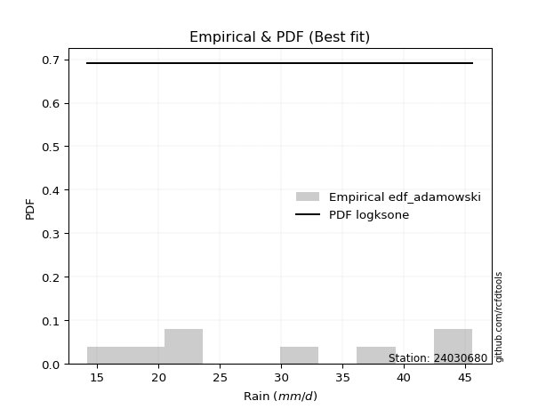</img>

</div>


## C. Best fit & Estimate extreme values for specific return periods - Tr

Best fit in probability distribution analysis means finding the theoretical distribution (like Normal, Poisson, Exponential) that most accurately mirrors your real-world data´s patterns (shape, center, spread) for better predictions, using methods like visual checks (Q-Q plots), goodness-of-fit tests (Kolmogorov-Smirnov, Chi-Squared), and information criteria (AIC) to score and select the simplest, most representative model.


### 1. Best fit (ordered by delta Δ)

<div align="center">

|   id |   station | empirical_dist   | p_dist    |    delta |   deltao | eval   |   fit |   n |   best_fit |   best_fit_sort |
|-----:|----------:|:-----------------|:----------|---------:|---------:|:-------|------:|----:|-----------:|----------------:|
|    0 |  24030680 | edf_hazen        | logfisk   | 0.105431 | 0.484421 | Δo > Δ |     1 |   7 |          1 |               1 |
|    1 |  24030680 | edf_gringorten   | logfisk   | 0.107839 | 0.484421 | Δo > Δ |     1 |   7 |          1 |               2 |
|    2 |  24030680 | edf_cunnane      | logfisk   | 0.109399 | 0.484421 | Δo > Δ |     1 |   7 |          1 |               3 |
|    3 |  24030680 | edf_blom         | logfisk   | 0.110357 | 0.484421 | Δo > Δ |     1 |   7 |          1 |               4 |
|    4 |  24030680 | edf_tukey        | logfisk   | 0.111925 | 0.484421 | Δo > Δ |     1 |   7 |          1 |               5 |
|    5 |  24030680 | edf_filliben     | logfisk   | 0.112511 | 0.484421 | Δo > Δ |     1 |   7 |          1 |               6 |
|    6 |  24030680 | edf_beard        | logfisk   | 0.112787 | 0.484421 | Δo > Δ |     1 |   7 |          1 |               7 |
|    7 |  24030680 | edf_jenkinson    | logfisk   | 0.112787 | 0.484421 | Δo > Δ |     1 |   7 |          1 |               8 |
|    8 |  24030680 | edf_chegodayev   | logfisk   | 0.113153 | 0.484421 | Δo > Δ |     1 |   7 |          1 |               9 |
|    9 |  24030680 | edf_adamowski    | logfisk   | 0.114955 | 0.484421 | Δo > Δ |     1 |   7 |          1 |              10 |
|   10 |  24030680 | edf_weibull      | logfisk   | 0.123288 | 0.484421 | Δo > Δ |     1 |   7 |          1 |              11 |
|   11 |  24030680 | edf_california   | kstwobign | 0.138827 | 0.484421 | Δo > Δ |     1 |   7 |          1 |              12 |

</div>

:file_folder:Tables: [bestfit_24030680.csv](table/bestfit_24030680.csv) | [extreme_24030680.csv](table/extreme_24030680.csv)


### 2. Extreme values

In hydrology, a return period (or recurrence interval $Tr$) is the statistical average time between extreme events like floods or droughts of a specific magnitude, indicating how rare an event is, with a 100-year flood, for example, having a 1% chance of occurring in any given year, not that it happens exactly every century. It is a key tool for infrastructure design (like bridges or dams) and risk assessment, calculated from historical data to determine the probability of future events, although it is important to remember it is statistical average, and events can cluster or be missed.

> risk_rate: assuming the return period as the project useful life.

|   id |      tr |   prob_l |     prob_g |   alpha |   betaprime |     chi2 |   crystalball |   erlang |    expon |   exponnorm |        f |   fatiguelife |    fisk |   gamma |   genexpon |   genlogistic |   gibrat |   gompertz |   gumbel_l |   gumbel_r |   halflogistic |   halfnorm |   hypsecant |   invgamma |   invgauss |      invweibull |   johnsonsu |   kstwobign |   laplace |   laplace_asymmetric |   loggamma |   logistic |   lognorm |   maxwell |   mielke |   moyal |   nakagami |     ncf |     nct |    norm |   pearson3 |   rayleigh |    rice |       t |   truncnorm |     wald |   weibull_min |   logalpha |   logbetaprime |     logchi2 |   logcrystalball |   logerlang |   logexpon |   logexponnorm |     logf |   logfatiguelife |   logfisk |   loggenexpon |   loggenlogistic |   loggibrat |   loggompertz |   loggumbel_l |   loggumbel_r |   loghalflogistic |   loghalfnorm |   loghypsecant |   loginvgamma |   loginvgauss |   loginvweibull |   logjohnsonsu |   logkstwobign |   loglaplace |   loglaplace_asymmetric |   logloggamma |   loglogistic |    loglognorm |   logmaxwell |   logmielke |   logmoyal |   lognakagami |   logncf |   lognct |   logpearson3 |   lograyleigh |   logrice |     logt |   logtruncnorm |   logwald |   logweibull_min |   station |   n |   risk_rate |
|-----:|--------:|---------:|-----------:|--------:|------------:|---------:|--------------:|---------:|---------:|------------:|---------:|--------------:|--------:|--------:|-----------:|--------------:|---------:|-----------:|-----------:|-----------:|---------------:|-----------:|------------:|-----------:|-----------:|----------------:|------------:|------------:|----------:|---------------------:|-----------:|-----------:|----------:|----------:|---------:|--------:|-----------:|--------:|--------:|--------:|-----------:|-----------:|--------:|--------:|------------:|---------:|--------------:|-----------:|---------------:|------------:|-----------------:|------------:|-----------:|---------------:|---------:|-----------------:|----------:|--------------:|-----------------:|------------:|--------------:|--------------:|--------------:|------------------:|--------------:|---------------:|--------------:|--------------:|----------------:|---------------:|---------------:|-------------:|------------------------:|--------------:|--------------:|--------------:|-------------:|------------:|-----------:|--------------:|---------:|---------:|--------------:|--------------:|----------:|---------:|---------------:|----------:|-----------------:|----------:|----:|------------:|
|    0 |    2    | 0.5      | 0.5        | 30.2912 |     30.6401 |  22.0951 |       31.0857 |  30.9381 |  25.9043 |     31.0857 |  23.1925 |       14.2    | 31.2904 | 30.9401 |    25.9038 |       28.9657 |  27.4764 |    30.418  |    33.0611 |    29.1103 |        28.1283 |    28.6244 |     31.0857 |    30.0677 |    29.4512 |   391.997       |        45.6 |     28.6364 |   31.0857 |              31.8168 |    28.2455 |    31.0857 |   28.5026 |   30.0573 |  28.6275 | 28.4726 |    21.1253 | 29.5057 | 31.0826 | 31.0857 |    31.2731 |    29.6926 | 30.3074 | 31.0848 |     31.0857 |  27.188  |       26.7589 |    28.1091 |        28.3294 |     23.8009 |          28.5026 |     28.2492 |    23.0161 |        28.5025 |  28.485  |          28.4991 |   29.2975 |       24.1705 |         inf      |     25.0352 |       29.0112 |       30.6001 |       26.5489 |           25.6283 |       26.0894 |        28.5026 |       28.0047 |       27.2449 |         26.5762 |        43.4101 |        25.923  |      28.5026 |                 32.9319 |       32.9984 |       28.5026 |  14.2679      |      27.4682 |     33.2319 |    25.9473 |       24.9726 |  28.3059 |  28.5036 |       29.2683 |       27.1105 |   27.898  |  28.5026 |        24.8129 |   24.7763 |          30.9052 |  24030680 |   7 |    0.75     |
|    1 |    2.33 | 0.570815 | 0.429185   | 32.4836 |     32.8092 |  25.2281 |       33.2314 |  33.091  |  28.4831 |     33.2315 |  25.8965 |       14.605  | 33.4335 | 33.0935 |    28.4825 |       31.2392 |  28.5634 |    32.6663 |    34.9279 |    31.0986 |        30.1725 |    30.9402 |     32.8029 |    32.2676 |    31.6965 | 11032.6         |        45.6 |     30.9026 |   32.3842 |              33.3915 |    30.5537 |    32.9762 |   30.788  |   32.2866 |  30.8739 | 30.3547 |    24.5665 | 31.7534 | 33.2289 | 33.2314 |    33.412  |    31.9548 | 32.504  | 33.2305 |     33.2314 |  28.595  |       30.0495 |    30.4078 |        30.6223 |     28.4481 |          30.788  |     30.5588 |    25.6003 |        30.7879 |  30.7732 |          30.7886 |   31.6177 |       26.6666 |         inf      |     26.0326 |       31.3052 |       32.7239 |       28.5158 |           27.5823 |       28.354  |        30.3174 |       30.3357 |       29.5548 |         29.0257 |        44.2891 |        28.3085 |      29.8645 |                 35.0454 |       35.1029 |       30.5069 |  14.8167      |      29.7599 |     35.3868 |    27.7635 |       27.9739 |  30.6188 |  30.7867 |       31.5724 |       29.4071 |   30.2278 |  30.788  |        26.3295 |   26.0616 |          33.0775 |  24030680 |   7 |    0.729209 |
|    2 |    5    | 0.8      | 0.2        | 41.1154 |     41.08   |  44.4581 |       41.2055 |  41.1747 |  41.3765 |     41.2055 |  40.8042 |       23.2076 | 41.7082 | 41.1795 |    41.3753 |       41.1129 |  34.8212 |    41.0582 |    40.9588 |    39.7365 |        39.4223 |    40.7334 |     39.6911 |    41.0389 |    41.0302 |     2.54767e+10 |        45.6 |     40.529  |   38.8764 |              40.9973 |    41.1259 |    40.2759 |   41.0077 |   41.0608 |  40.8722 | 39.073  |    44.9051 | 41.0267 | 41.2061 | 41.2055 |    41.2563 |    41.0116 | 41.0607 | 41.2045 |     41.2055 |  36.4712 |       47.8133 |    41.1572 |        41.0023 |     79.8968 |          41.0077 |     41.1239 |    43.5811 |        41.0076 |  41.0251 |          41.0553 |   42.4359 |       41.4412 |         inf      |     32.5983 |       40.7951 |       40.6456 |       38.8984 |           38.4609 |       40.3169 |        38.835  |       41.2442 |       40.7834 |         42.5728 |        45.4113 |        41.1451 |      37.7142 |                 41.0648 |       41.0926 |       39.66   |   8.16668e+63 |      40.7949 |     41.5316 |    37.9817 |       45.7825 |  41.2417 |  40.9816 |       41.236  |       40.7228 |   41.0347 |  41.0077 |        33.3593 |   34.5907 |          41.1942 |  24030680 |   7 |    0.67232  |
|    3 |   10    | 0.9      | 0.1        | 47.3018 |     46.7512 |  64.9323 |       46.4953 |  46.6095 |  53.0808 |     46.4953 |  55.5032 |       35.0856 | 47.8024 | 46.616  |    53.0791 |       49.1525 |  41.9544 |    46.366  |    44.3165 |    46.7719 |        47.1038 |    47.9801 |     45.1915 |    47.4225 |    48.1539 |     3.88638e+15 |        45.6 |     47.8582 |   44.7698 |              47.9016 |    50.3171 |    45.6517 |   49.5958 |   47.2356 |  49.3105 | 46.6635 |    63.2063 | 48.0109 | 46.4989 | 46.4953 |    46.3699 |    47.4692 | 46.9688 | 46.4942 |     46.4953 |  44.8298 |       65.2845 |    50.8012 |        49.8799 |    229.156  |          49.5958 |     50.2919 |    70.6387 |        49.5958 |  49.6638 |          49.7174 |   52.7055 |       59.051  |         inf      |     42.1246 |       47.7259 |       45.8596 |       50.0913 |           50.6908 |       52.313  |        47.325  |       51.0291 |       51.4058 |         58.1597 |        45.5493 |        54.6972 |      46.613  |                 43.4    |       43.4149 |       48.1144 | inf           |      50.9332 |     43.918  |    49.8965 |       66.3176 |  50.517  |  49.5314 |       48.6208 |       51.3627 |   50.4773 |  49.5958 |        38.2655 |   46.714  |          46.5476 |  24030680 |   7 |    0.651322 |
|    4 |   15    | 0.933333 | 0.0666667  | 50.5397 |     49.6369 |  77.6863 |       49.1351 |  49.3432 |  59.9274 |     49.1351 |  64.4157 |       42.854  | 51.1228 | 49.3507 |    59.9254 |       53.6879 |  46.8745 |    48.8906 |    45.8371 |    50.7412 |        51.4509 |    51.7513 |     48.3306 |    50.7925 |    52.0084 |     3.26571e+18 |        45.6 |     51.7491 |   48.2172 |              51.9403 |    55.722  |    48.5808 |   54.5323 |   50.4038 |  54.1917 | 51.0688 |    73.1584 | 51.7541 | 49.1404 | 49.1351 |    48.895  |    50.7965 | 49.9628 | 49.1339 |     49.1351 |  50.1973 |       75.9465 |    56.6018 |        55.0439 |    437.183  |          54.5323 |     55.6764 |    93.699  |        54.5323 |  54.6384 |          54.7098 |   59.3115 |       71.7067 |         inf      |     50.2728 |       51.3247 |       48.4361 |       57.7733 |           59.2636 |       59.907  |        52.9778 |       56.9098 |       58.0225 |         69.3528 |        45.5743 |        63.622  |      52.7624 |                 44.1475 |       44.1582 |       53.4565 | inf           |      57.0769 |     44.6822 |    58.4576 |       80.4832 |  55.989  |  54.4391 |       52.5964 |       57.8882 |   56.0216 |  54.5322 |        40.3545 |   56.6553 |          49.1957 |  24030680 |   7 |    0.644736 |
|    5 |   20    | 0.95     | 0.05       | 52.7178 |     51.5469 |  86.987  |       50.8638 |  51.1413 |  64.7851 |     50.8638 |  70.8467 |       48.6056 | 53.4178 | 51.1494 |    64.7829 |       56.8633 |  50.734  |    50.4953 |    46.7836 |    53.5204 |        54.4966 |    54.2656 |     50.545  |    53.0698 |    54.6454 |     3.6441e+20  |        45.6 |     54.3702 |   50.6632 |              54.8059 |    59.6021 |    50.6052 |   58.0283 |   52.5065 |  57.6622 | 54.1886 |    79.8707 | 54.3004 | 50.8703 | 50.8638 |    50.5389 |    53.008  | 51.9364 | 50.8626 |     50.8638 |  54.1971 |       83.6791 |    60.8246 |        58.7271 |    698.002  |          58.0283 |     59.5389 |   114.495  |        58.0284 |  58.1653 |          58.2511 |   64.3552 |       81.9355 |         inf      |     57.7531 |       53.7238 |       50.1124 |       63.843  |           66.1197 |       65.5732 |        57.3673 |       61.1876 |       62.9401 |         78.4489 |        45.5838 |        70.4411 |      57.6115 |                 44.516  |       44.5245 |       57.4916 | inf           |      61.558  |     45.0593 |    65.395  |       91.5844 |  59.9251 |  57.912  |       55.3033 |       62.6778 |   59.9934 |  58.0283 |        41.5155 |   65.4159 |          50.9195 |  24030680 |   7 |    0.641514 |
|    6 |   25    | 0.96     | 0.04       | 54.3513 |     52.9632 |  94.3206 |       52.1363 |  52.4689 |  68.553  |     52.1363 |  75.8881 |       53.1754 | 55.1735 | 52.4774 |    68.5507 |       59.3092 |  53.9515 |    51.6516 |    47.4572 |    55.6612 |        56.8431 |    56.1363 |     52.2588 |    54.783  |    56.6449 |     1.37654e+22 |        45.6 |     56.3335 |   52.5604 |              57.0286 |    62.6458 |    52.1539 |   60.7443 |   54.0675 |  60.3654 | 56.6068 |    84.8884 | 56.2234 | 52.1438 | 52.1363 |    51.7443 |    54.6511 | 53.3951 | 52.1351 |     52.1363 |  57.4009 |       89.7646 |    64.1711 |        61.6031 |   1007.95   |          60.7444 |     62.5672 |   133.755  |        60.7444 |  60.9075 |          61.0055 |   68.5012 |       90.6678 |         inf      |     64.833  |       55.5091 |       51.3405 |       68.9497 |           71.9384 |       70.134  |        61.0124 |       64.5757 |       66.8953 |         86.2608 |        45.5887 |        76.0234 |      61.6775 |                 44.7354 |       44.7426 |       60.7829 | inf           |      65.1109 |     45.2847 |    71.3338 |      100.831  |  63.0173 |  60.6084 |       57.3478 |       66.4913 |   63.1032 |  60.7443 |        42.2552 |   73.4004 |          52.1829 |  24030680 |   7 |    0.639603 |
|    7 |   50    | 0.98     | 0.02       | 59.1768 |     57.0673 | 117.638  |       55.7804 |  56.2892 |  80.2573 |     55.7804 |  91.8018 |       67.8375 | 60.5377 | 56.2992 |    80.2545 |       66.8437 |  65.2932 |    54.8455 |    49.2856 |    62.2557 |        64.0732 |    61.5738 |     57.5723 |    59.8682 |    62.6516 |     9.94012e+26 |        45.6 |     62.0986 |   58.4538 |              63.9329 |    72.3351 |    56.8857 |   69.2459 |   58.5947 |  68.8599 | 64.114  |    99.5251 | 61.9615 | 55.7908 | 55.7804 |    55.1731 |    59.4208 | 57.5957 | 55.7792 |     55.7804 |  67.8613 |      109.108  |    75.0213 |        70.6855 |   3221.25   |          69.2459 |     72.1982 |   216.797  |        69.246  |  69.5022 |          69.6441 |   82.8979 |      122.944  |         inf      |     97.4601 |       60.7022 |       54.8281 |       87.3938 |           93.2875 |       85.2724 |        73.8529 |       75.546  |       80.054  |        115.561  |        45.5965 |        95.106  |      76.2306 |                 45.1707 |       45.1753 |       72.0525 | inf           |      76.6174 |     45.746  |    93.4306 |      133.368  |  72.8873 |  69.0403 |       63.4402 |       78.9269 |   72.9631 |  69.2459 |        43.844  |  106.905  |          55.7727 |  24030680 |   7 |    0.63583  |
|    8 |   75    | 0.986667 | 0.0133333  | 61.8603 |     59.2992 | 131.581  |       57.7357 |  58.3505 |  87.1039 |     57.7357 | 101.264  |       76.6677 | 63.6359 | 58.3613 |    87.1007 |       71.2229 |  72.9534 |    56.4886 |    50.2101 |    66.0888 |        68.2761 |    64.5338 |     60.6775 |    62.7109 |    66.0507 |     6.62822e+29 |        45.6 |     65.2706 |   61.9013 |              67.9716 |    78.1948 |    59.6186 |   74.2879 |   61.056  |  73.9155 | 68.504  |   107.498  | 65.1835 | 57.7479 | 57.7357 |    56.9991 |    62.0158 | 59.862  | 57.7344 |     57.7357 |  74.2982 |      120.702  |    81.7266 |        76.1277 |   6430.12   |          74.2879 |     78.0162 |   287.571  |        74.2881 |  74.6075 |          74.7794 |   92.5532 |      146.061  |         inf      |    128.349  |       63.5324 |       56.6809 |      100.304  |          108.5    |       94.8448 |        82.5738 |       82.3134 |       88.4284 |        136.971  |        45.5986 |       107.577  |      86.2873 |                 45.3147 |       45.3185 |       79.4899 | inf           |      83.7051 |     45.9179 |   109.401  |      155.301  |  78.8753 |  74.0353 |       66.8512 |       86.6432 |   78.8941 |  74.2879 |        44.4093 |  134.737  |          57.681  |  24030680 |   7 |    0.634587 |
|    9 |  100    | 0.99     | 0.01       | 63.7143 |     60.8205 | 141.584  |       59.0582 |  59.7492 |  91.9616 |     59.0582 | 108.038  |       83.0213 | 65.8233 | 59.7605 |    91.9582 |       74.3224 |  78.8875 |    57.5725 |    50.8149 |    68.8016 |        71.2507 |    66.5502 |     62.8801 |    64.6807 |    68.4211 |     6.60875e+31 |        45.6 |     67.4439 |   64.3473 |              70.8372 |    82.4486 |    61.5481 |   77.9046 |   62.7325 |  77.5472 | 71.6185 |   112.925  | 67.4202 | 59.0716 | 59.0582 |    58.2286 |    63.7836 | 61.3991 | 59.0569 |     59.0582 |  78.9912 |      129.041  |    86.6612 |        80.0562 |  10544.8    |          77.9046 |     82.2369 |   351.396  |        77.9048 |  78.2731 |          78.4682 |  100.04   |      164.693  |         inf      |    158.861  |       65.4619 |       57.9265 |      110.578  |          120.744  |      101.974  |        89.3774 |       87.2876 |       94.7033 |        154.481  |        45.5995 |       117.054  |      94.2174 |                 45.3866 |       45.3899 |       85.1987 | inf           |      88.9045 |     46.0163 |   122.361  |      172.271  |  83.231  |  77.6158 |       69.2128 |       92.3277 |   83.1838 |  77.9046 |        44.6993 |  159.496  |          58.9643 |  24030680 |   7 |    0.633968 |
|   10 |  200    | 0.995    | 0.005      | 68.0415 |     64.3068 | 165.998  |       62.058  |  62.9354 | 103.666  |     62.058  | 124.543  |       98.5739 | 71.0705 | 62.948  |   103.662  |       81.7737 |  95.0318 |    59.952  |    52.1294 |    75.3236 |        78.4022 |    71.162  |     68.1865 |    69.2949 |    74.0164 |     4.21939e+36 |        45.6 |     72.4495 |   70.2407 |              77.7415 |    93.056  |    66.1765 |   86.7748 |   66.5682 |  86.4637 | 79.1225 |   125.309  | 72.6676 | 62.0744 | 62.058  |    61.0013 |    67.8286 | 64.8972 | 62.0567 |     62.058  |  90.6812 |      149.488  |    99.2075 |        89.776  |  35140.7    |          86.7748 |     92.7516 |   569.561  |        86.775  |  87.2751 |          87.5329 |  120.562  |      218.563  |         inf      |    283.799  |       69.8801 |       60.7293 |      139.792  |          156.135  |      120.36   |       108.16   |       99.9099 |      111.062  |        206.289  |        45.6008 |       142.178  |     116.448  |                 45.4941 |       45.4967 |      100.621  | inf           |     102.047  |     46.2083 |   160.246  |      218.372  |  94.1236 |  86.3884 |       74.7275 |      106.777  |   93.8211 |  86.7748 |        45.1437 |  242.798  |          61.8531 |  24030680 |   7 |    0.633042 |
|   11 |  250    | 0.996    | 0.004      | 69.3987 |     65.3821 | 173.938  |       62.9747 |  63.9128 | 107.434  |     62.9747 | 129.908  |      103.642  | 72.7551 | 63.9258 |   107.43   |       84.1691 | 100.824  |    60.6578 |    52.5161 |    77.4203 |        80.7014 |    72.5808 |     69.8947 |    70.7467 |    75.7878 |     1.47921e+38 |        45.6 |     73.9986 |   72.1379 |              79.9642 |    96.5854 |    67.6625 |   89.6818 |   67.7489 |  89.3867 | 81.5381 |   129.109  | 74.3198 | 62.9921 | 62.9747 |    61.8441 |    69.0738 | 65.9691 | 62.9734 |     62.9747 |  94.5485 |      156.17   |   103.457  |        92.9871 |  51933.7    |          89.6819 |     96.247  |   665.369  |        89.6822 |  90.2289 |          90.5091 |  128.005  |      239.014  |         inf      |    349.485  |       71.2407 |       61.5794 |      150.735  |          169.586  |      126.657  |       115.009  |      104.178  |      116.73   |        226.389  |        45.6011 |       150.996  |     124.667  |                 45.5155 |       45.518  |      106.142  | inf           |     106.472  |     46.2618 |   174.783  |      234.893  |  97.7576 |  89.261  |       76.4551 |      111.665  |   97.3414 |  89.6819 |        45.234  |  279.009  |          62.7298 |  24030680 |   7 |    0.632858 |
|   12 |  500    | 0.998    | 0.002      | 73.5239 |     68.598  | 198.81   |       65.6933 |  66.8218 | 119.138  |     65.6933 | 146.716  |      119.543  | 77.9797 | 66.836  |   119.134  |       91.6042 | 120.844  |    62.6943 |    53.6249 |    83.9282 |        87.8374 |    76.811  |     75.2007 |    75.1719 |    81.2135 |     9.21949e+42 |        45.6 |     78.6409 |   78.0313 |              86.8685 |   107.93   |    72.2709 |   98.8881 |   71.2722 |  98.6388 | 89.0419 |   140.41   | 79.3547 | 65.7136 | 65.6933 |    64.331  |    72.789  | 69.1547 | 65.6919 |     65.6933 | 106.845  |      177.213  |   117.37   |       103.237  | 176144      |          98.8881 |    107.473  |  1078.47   |        98.8885 |  99.5944 |          99.9508 |  154.138  |      314.21   |         inf      |    717.635  |       75.3015 |       64.0831 |      190.462  |          219.172  |      147.456  |       139.176  |      118.118  |      135.702  |        302.123  |        45.6015 |       180.836  |     154.083  |                 45.5584 |       45.5607 |      125.264  | inf           |     120.847  |     46.4143 |   228.897  |      291.926  | 109.47   |  98.3503 |       81.6897 |      127.619  |  108.593  |  98.8882 |        45.4161 |  434.1    |          65.3122 |  24030680 |   7 |    0.632489 |
|   13 |  750    | 0.998667 | 0.00133333 | 75.8827 |     70.4022 | 213.485  |       67.2035 |  68.4445 | 125.985  |     67.2035 | 156.644  |      128.937  | 81.0321 | 68.4594 |   125.98   |       95.9507 | 134.083  |    63.7902 |    54.2174 |    87.7326 |        92.0091 |    79.1742 |     78.3045 |    77.7099 |    84.3408 |     5.85691e+45 |        45.6 |     81.2489 |   81.4787 |              90.9073 |   114.848  |    74.9632 |  104.405  |   73.2428 | 104.176  | 93.4313 |   146.704  | 82.2398 | 67.2256 | 67.2035 |    65.7045 |    74.8665 | 70.9285 | 67.2021 |     67.2035 | 114.218  |      189.709  |   126.038  |       109.436  | 361628      |         104.405  |    114.311  |  1430.54   |       104.405  | 105.214  |         105.62   |  171.81   |      367.754  |         inf      |   1154.93   |       77.5727 |       65.4627 |      218.374  |          254.627  |      160.528  |       155.603  |      126.782  |      147.833  |        357.644  |        45.6017 |       200.116  |     174.41   |                 45.5727 |       45.5749 |      137.993  | inf           |     129.718  |     46.4976 |   268.017  |      329.602  | 116.635  | 103.791  |       84.6667 |      137.514  |  115.407  | 104.405  |        45.4772 |  565.836  |          66.7357 |  24030680 |   7 |    0.632366 |
|   14 | 1000    | 0.999    | 0.001      | 77.5356 |     71.6517 | 223.947  |       68.2433 |  69.5644 | 130.842  |     68.2432 | 163.728  |      135.638  | 83.1967 | 69.5799 |   130.837  |       99.0339 | 144.215  |    64.5305 |    54.6162 |    90.4313 |        94.9682 |    80.8062 |     80.5067 |    79.4916 |    86.5417 |     5.70057e+47 |        45.6 |     83.0557 |   83.9247 |              93.7728 |   119.888  |    76.8726 |  108.381  |   74.6048 | 108.162  | 96.5456 |   151.041  | 84.2632 | 68.2666 | 68.2433 |    66.6469 |    76.3021 | 72.1514 | 68.2419 |     68.2433 | 119.522  |      198.655  |   132.441  |       113.93   | 603583      |         108.381  |    119.291  |  1748.04   |       108.381  | 109.268  |         109.712  |  185.558  |      410.765  |          45.5791 |   1662.25   |       79.1423 |       66.4079 |      240.619  |          283.203  |      170.227  |       168.421  |      133.171  |      156.939  |        403.109  |        45.6017 |       214.666  |     190.439  |                 45.5798 |       45.582  |      147.796  | inf           |     136.226  |     46.5552 |   299.765  |      358.416  | 121.866  | 107.71   |       86.7437 |      144.797  |  120.349  | 108.381  |        45.5078 |  684.677  |          67.7112 |  24030680 |   7 |    0.632305 |

<div align="center">

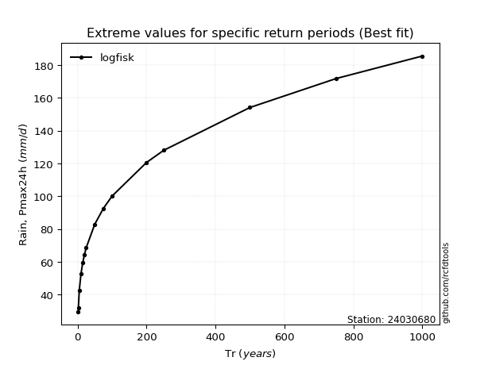</img>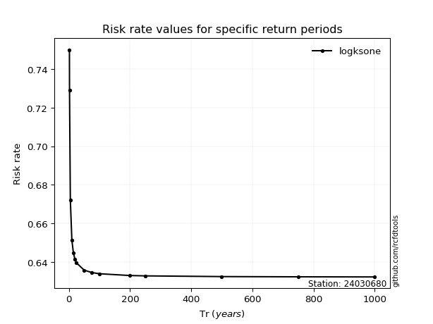</img>

</div>


<sub>**APP DISCLAIMER**: NO WARRANTY - This software is provided by [github.com/rcfdtools](https://github.com/rcfdtools) "as is", without any express or implied warranty, including warranties of merchantability, fitness for a particular purpose, or non-infringement. There is no guarantee that the software will be error-free or operate without interruption. LIMITATION OF LIABILITY - Neither the authors nor copyright holders will be liable for claims or damages arising from the software or its use. You are responsible for determining if the software is appropriate for your use and assume all associated risks, including errors, legal compliance, and data loss. NO PROFESSIONAL ADVICE - The software provides general information and does not offer professional advice. It should not replace consultation with professional advisors.</sub>