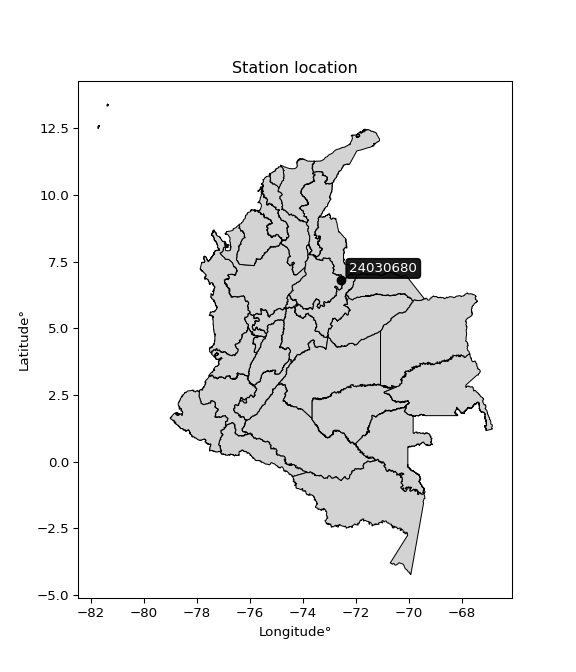

<div align="center">


</div>

# PMP Station (Rain, Pmax24h): 24030680

Probable Maximum Precipitation (PMP) is the greatest amount of rainfall for a specific duration that is meteorologically possible for a given location, acting as a "worst-case" scenario for extreme storms, crucial for designing safety-critical infrastructure like bridges, river deviations, dams, spillways, and nuclear plants to prevent catastrophic failure. PMP is calculated by hydrologists using meteorological data to determine the upper limit of extreme rainfall, often leading to the Probable Maximum Flood (PMF) for flood control design, and is increasingly being studied for climate change impacts. Probable Maximum Precipitation (PMP) is the theoretical upper limit of rainfall, a deterministic estimate for extreme events, while probability distributions (like GEV, Gumbel) describe the likelihood and frequency of various precipitation amounts, including rare ones, showing how often events occur, with PMP representing the extreme end of these distributions, used for critical infrastructure design to ensure safety against the worst conceivable weather, unlike standard statistical forecasts which cover typical probabilities.

The most common probability distributions in hydrology, used for analyzing floods, rainfall, and streamflow, include the Normal, Log-Normal, Gumbel, Gamma (including Log-Pearson Type III), and Generalized Extreme Value (GEV) distributions, often chosen based on the data´s skewness and whether modeling extremes or general conditions, with Gumbel and GEV popular for extreme events like floods, while the Normal distribution serves as a baseline, though often requiring transformations for skewed hydrological data. These distributions help in designing water infrastructure, managing water resources, and forecasting hydrologic events.

> Hydrological data often isn´t perfectly normal (it´s skewed), so different distributions are needed for different applications, such as: **Flood Frequency Analysis**: Using Gumbel, GEV, or Log-Pearson Type III for predicting extreme flood magnitudes and their return periods, **Rainfall Analysis**: Normal for annual totals, but Log-Normal, Weibull, or GEV for intensity or extreme daily rainfall, **Streamflow Modeling**: Gamma and Log-Normal for maximum flows, GEV for minimum flows, and Kappa for daily flows.

<div align="center">

</img>

</div>


## A. General information


### 1. General running parameters

• app_version: _v20260113_. • runtime: _2026-01-13 16:28:34.738620_. • Python version: _3.14.0_. • SciPy version: _1.16.3_. • Pandas version: _2.3.3_. • NumPy version: _2.3.5_. • Stations dataset (station_dataset_file): _dataset/pmax24h_in/automatic_colombia_2003_2025.csv_. • Stations catalog (station_catalog_file): _dataset/CNE.xls_. • Minimum year to eval til year_max (date_min): _1900_. • Maximum year to eval since year_min (date_max): _2025_. • Creates, save and include plots into reports (create_plot): _False_. • Plot only fit distributions with Δo > Δ (plot_only_fit): _True_. • Plot only simple graphs avoiding multiple CDFs and multiple Extreme values plots (plot_only_simple): _True_. • Eval low extreme values, if False, evaluates high extreme values (low_extreme): _False_. • Eval every SciPy distribution as logarithmic (pdist_logarithmic_on): _True_. • Standard deviation normalized (ddof): _1.0_. • Return periods to eval in years (Tr): _[2, 2.33, 5, 10, 15, 20, 25, 50, 75, 100, 200, 250, 500, 750, 1000]_. • Minimum data sample per station, 0 means any (minimum_sample): _5_. • Z-Score maximum threshold to adjust a value, 0 means disable (zscore_max): _3.5_. • Z-Score minimum threshold to adjust a value, 0 means disable (zscore_min): _-2.5_. • Avoid zeros, e.g. rain = 0 (avoid_zeros): _True_. • Avoid null values (avoid_nans): _True_. 

:file_folder:Table: [dataset.csv](../../dataset/pmax24h_in/automatic_colombia_2003_2025.csv)

> Delta Degrees of Freedom (DDOF): is a parameter used in the formulas for calculating variance and standard deviation. When ddof=0, the divisor is $N$ (the total number of observations) and this is used when your data set is the entire population. When ddof=1, the divisor is $N-1$ and this is used when your data set is a sample drawn from a larger population. Using $N-1$ provides an unbiased estimate of the population variance (known as Bessel´s correction).


### 2. Station info and location

|   id |   CODIGO | NOMBRE                     | CATEGORIA     | TECNOLOGIA                              | ESTADO   | FECHA_INSTALACION   |   FECHA_SUSPENSION |   ALTITUD |   LATITUD |   LONGITUD | DEPARTAMENTO   | MUNICIPIO   | AREA_OPERATIVA                         | ENTIDAD                                                     | AREA_HIDROGRAFICA   | ZONA_HIDROGRAFICA   | SUBZONA_HIDROGRAFICA   |   CORRIENTE | Catalogo   |   Version |
|-----:|---------:|:---------------------------|:--------------|:----------------------------------------|:---------|:--------------------|-------------------:|----------:|----------:|-----------:|:---------------|:------------|:---------------------------------------|:------------------------------------------------------------|:--------------------|:--------------------|:-----------------------|------------:|:-----------|----------:|
|    0 | 24030680 | EL PARAMO - AUT [24030680] | Pluviométrica | Automática con Telemetría, Convencional | Activa   | 15/06/1974          |                nan |      3238 |   6.81078 |    -72.556 | Santander      | Carcasí     | Area Operativa 08 - Santanderes-Arauca | INSTITUTO DE HIDROLOGIA METEOROLOGIA Y ESTUDIOS AMBIENTALES | Magdalena Cauca     | Sogamoso            | Río Chicamocha         |         nan | CNE_IDEAM  |  20251226 |

<div align="center">

Dynamic map: [:earth_americas:Google](http://maps.google.com/maps?q=6.81078,-72.55605) [:earth_americas:OSM](https://www.openstreetmap.org/#map=18/6.81078/-72.55605&layers=P) [:earth_americas:Bing](https://www.bing.com/maps?cp=6.81078~-72.55605&lvl=18) [:earth_americas:Apple](https://maps.apple.com/frame?center=6.81078%2C-72.55605&span=0.003%2C0.006)

</div>


<div align="center">

```geojson
{
  "type": "Feature",
  "geometry": {
    "type": "Point", 
    "coordinates": [-72.55605, 6.81078]
  }, 
  "properties": {
    "Name": "24030680"
  }
}
```

</div>


### 3. Discrete values table and plot

<div align="center">

|               |          0 |           1 |          2 |          3 |           4 |           5 |           6 |           7 |
|:--------------|-----------:|------------:|-----------:|-----------:|------------:|------------:|------------:|------------:|
| Date          | 2017       | 2018        | 2019       | 2020       | 2021        | 2022        | 2023        | 2025        |
| Value         |   14.2     |   18        |   45.4     |   45.6     |   32.6      |   39.2      |   22.6      |   20.6      |
| Value_initial |   14.2     |   18        |   45.4     |   45.6     |   32.6      |   39.2      |   22.6      |   20.6      |
| count         |    8       |    8        |    8       |    8       |    8        |    8        |    8        |    8        |
| mean          |   29.775   |   29.775    |   29.775   |   29.775   |   29.775    |   29.775    |   29.775    |   29.775    |
| std           |   12.5827  |   12.5827   |   12.5827  |   12.5827  |   12.5827   |   12.5827   |   12.5827   |   12.5827   |
| zscore        |   -1.23781 |   -0.935807 |    1.24178 |    1.25768 |    0.224514 |    0.749043 |   -0.570226 |   -0.729174 |


</div>


> The initial value (value_initial) correspond to the initial obtained or null completed value, and value (value) is adjusted only when the initial value is outside the valid range (outlier) definite through the Z-Score value. If Z-Score is active, values out of range or outliers are replaced with the station mean value. A Z-Score (or standard score) measures how many standard deviations a data point is from the mean of a dataset, indicating its relative position; positive scores mean above the mean, negative mean below, and a score of zero is exactly at the mean, allowing for comparison of values from different distributions. It´s calculated using the formula $z=(x–μ)/σ$, where $x$ is the data point, $μ$ is the mean, and $σ$ is the standard deviation, helping identify outliers and understand probability.
>
> <sub>**Note**: In this study, "completing" (filling gaps in) and "extending" (forecasting or lengthening the historical record) rainfall data series are avoided for certain critical analyses because they introduce artificial bias and uncertainty, which can distort the statistics of rare events (extremes), alter day-to-day variability, and compromise the integrity and homogeneity of the original data. Some reasons against Completing/Extending rainfall data are: **Distortion of Extremes and Variability**: The primary issue is that most gap-filling or extension methods rely on averaging or regression with nearby stations, which inherently smooths the data. Rainfall is highly variable in space and time, with a large percentage of zero values and occasional large storms. Infilling methods often underestimate the highest values and overestimate the lowest (zero) values, which severely distorts analyses focused on flood frequency, drought severity, and intensity-duration-frequency (IDF) curves, **Loss of Data Homogeneity**: Infilled or extended data are synthetic estimates, not actual measurements. Combining these estimates with observed data can violate the assumption of data homogeneity, which requires that the data properties do not change over time. Inhomogeneity can lead to incorrect conclusions about long-term trends or changes in climate patterns, **Propagation of Errors**: Errors and biases from the original data (e.g., wind-induced undercatch, instrument errors, site changes) or the data used for imputation can propagate through the analysis, leading to unreliable hydrological models and inaccurate predictions, **Compromised Statistical Integrity**: For statistical analyses, especially those involving the frequency of events, using artificial data can introduce time bias or autocorrelation that doesn´t exist in reality, making it difficult to assess the true probability of events, **Difficulty in Validation**: It is difficult to accurately validate the quality of filled or extended data, especially for past periods where ground-truth measurements are unavailable. The reliability of imputation techniques heavily depends on the density of the surrounding station network and the complexity of the local topography.</sub>


### 4. Active continuous probability distributions from SciPy (45 of 104 available)

A Probability Density Function (PDF) describes the relative likelihood of a continuous random variable falling within a specific range, where the total area under its curve equals 1, and the area over any interval gives the actual probability for that range. Unlike discrete probabilities (like rolling a die), a PDF shows density, not direct probability for a single point (which is zero), with higher points indicating higher likelihood, often visualized as a bell curve for normal distributions.

A log of a probability density function (log-PDF) is simply the logarithm of the PDF´s value, denoted as $log(f(x))$, useful for converting multiplication of probabilities into addition, improving numerical stability with tiny numbers, and connecting to information theory concepts like entropy. Instead of dealing with very small probabilities (e.g., 0.000001), log-PDFs use negative numbers (e.g., $log(0.00001) ≈ -11.51$ that are easier for computers to handle, preventing underflow errors and simplifying complex calculations. In this study, each active probability distribution from SciPy is also evaluated in the $log$ form.

[scipy.stats](https://docs.scipy.org/doc/scipy/reference/stats.html) is a Python´s powerful submodule within the SciPy library for comprehensive statistical analysis, offering over 130 probability distributions (like Normal, Poisson), functions for descriptive stats (mean, variance), hypothesis testing (t-tests, chi-square), random variable generation, and statistical tests, making it essential for data science, modeling, and research. It provides tools to explore, model, and draw conclusions from data efficiently, working seamlessly with NumPy.

<div align="center">

|   id | p_dist             |   n_parameter | fit_method   | label                                                                       | active   | ref                                                                                                        |
|-----:|:-------------------|--------------:|:-------------|:----------------------------------------------------------------------------|:---------|:-----------------------------------------------------------------------------------------------------------|
|    0 | alpha              |             3 | MLE          | Alpha                                                                       | True     | [:mortar_board:](https://docs.scipy.org/doc/scipy/reference/generated/scipy.stats.alpha.html)              |
|    1 | betaprime          |             4 | MLE          | Beta prime                                                                  | True     | [:mortar_board:](https://docs.scipy.org/doc/scipy/reference/generated/scipy.stats.betaprime.html)          |
|    2 | chi2               |             3 | MLE          | Chi²                                                                        | True     | [:mortar_board:](https://docs.scipy.org/doc/scipy/reference/generated/scipy.stats.chi2.html)               |
|    3 | crystalball        |             4 | MLE          | Crystalball                                                                 | True     | [:mortar_board:](https://docs.scipy.org/doc/scipy/reference/generated/scipy.stats.crystalball.html)        |
|    4 | dweibull           |             3 | MLE          | Double Weibull                                                              | True     | [:mortar_board:](https://docs.scipy.org/doc/scipy/reference/generated/scipy.stats.dweibull.html)           |
|    5 | erlang             |             3 | MLE          | Erlang                                                                      | True     | [:mortar_board:](https://docs.scipy.org/doc/scipy/reference/generated/scipy.stats.erlang.html)             |
|    6 | expon              |             2 | MLE          | Exponential                                                                 | True     | [:mortar_board:](https://docs.scipy.org/doc/scipy/reference/generated/scipy.stats.expon.html)              |
|    7 | exponnorm          |             3 | MLE          | Exponentially modified Normal                                               | True     | [:mortar_board:](https://docs.scipy.org/doc/scipy/reference/generated/scipy.stats.exponnorm.html)          |
|    8 | f                  |             4 | MLE          | F                                                                           | True     | [:mortar_board:](https://docs.scipy.org/doc/scipy/reference/generated/scipy.stats.f.html)                  |
|    9 | fatiguelife        |             3 | MLE          | Fatigue-life (Birnbaum-Saunders)                                            | True     | [:mortar_board:](https://docs.scipy.org/doc/scipy/reference/generated/scipy.stats.fatiguelife.html)        |
|   10 | fisk               |             3 | MLE          | Fisk                                                                        | True     | [:mortar_board:](https://docs.scipy.org/doc/scipy/reference/generated/scipy.stats.fisk.html)               |
|   11 | gamma              |             3 | MLE          | Gamma                                                                       | True     | [:mortar_board:](https://docs.scipy.org/doc/scipy/reference/generated/scipy.stats.gamma.html)              |
|   12 | genexpon           |             5 | MLE          | Generalized exponential                                                     | True     | [:mortar_board:](https://docs.scipy.org/doc/scipy/reference/generated/scipy.stats.genexpon.html)           |
|   13 | genlogistic        |             3 | MLE          | Generalized logistic                                                        | True     | [:mortar_board:](https://docs.scipy.org/doc/scipy/reference/generated/scipy.stats.genlogistic.html)        |
|   14 | gibrat             |             2 | MM           | Gibrat                                                                      | True     | [:mortar_board:](https://docs.scipy.org/doc/scipy/reference/generated/scipy.stats.gibrat.html)             |
|   15 | gompertz           |             3 | MLE          | Gompertz (or truncated Gumbel)                                              | True     | [:mortar_board:](https://docs.scipy.org/doc/scipy/reference/generated/scipy.stats.gompertz.html)           |
|   16 | gumbel_l           |             2 | MM           | Gumbel Left Skew                                                            | True     | [:mortar_board:](https://docs.scipy.org/doc/scipy/reference/generated/scipy.stats.gumbel_l.html)           |
|   17 | gumbel_r           |             2 | MM           | Gumbel Right Skew                                                           | True     | [:mortar_board:](https://docs.scipy.org/doc/scipy/reference/generated/scipy.stats.gumbel_r.html)           |
|   18 | halflogistic       |             2 | MM           | Half-logistic                                                               | True     | [:mortar_board:](https://docs.scipy.org/doc/scipy/reference/generated/scipy.stats.halflogistic.html)       |
|   19 | halfnorm           |             2 | MM           | Half Normal                                                                 | True     | [:mortar_board:](https://docs.scipy.org/doc/scipy/reference/generated/scipy.stats.halfnorm.html)           |
|   20 | hypsecant          |             2 | MM           | hyperbolic secant                                                           | True     | [:mortar_board:](https://docs.scipy.org/doc/scipy/reference/generated/scipy.stats.hypsecant.html)          |
|   21 | invgamma           |             3 | MLE          | Inverted gamma                                                              | True     | [:mortar_board:](https://docs.scipy.org/doc/scipy/reference/generated/scipy.stats.invgamma.html)           |
|   22 | invgauss           |             3 | MLE          | Inverse Gaussian                                                            | True     | [:mortar_board:](https://docs.scipy.org/doc/scipy/reference/generated/scipy.stats.invgauss.html)           |
|   23 | invweibull         |             3 | MLE          | Inverted Weibull                                                            | True     | [:mortar_board:](https://docs.scipy.org/doc/scipy/reference/generated/scipy.stats.invweibull.html)         |
|   24 | kappa4             |             4 | MLE          | Kappa 4                                                                     | True     | [:mortar_board:](https://docs.scipy.org/doc/scipy/reference/generated/scipy.stats.kappa4.html)             |
|   25 | kstwobign          |             2 | MLE          | Limiting distribution of scaled Kolmogorov-Smirnov two-sided test statistic | True     | [:mortar_board:](https://docs.scipy.org/doc/scipy/reference/generated/scipy.stats.kstwobign.html)          |
|   26 | laplace            |             2 | MM           | Laplace                                                                     | True     | [:mortar_board:](https://docs.scipy.org/doc/scipy/reference/generated/scipy.stats.laplace.html)            |
|   27 | laplace_asymmetric |             3 | MLE          | Asymmetric Laplace                                                          | True     | [:mortar_board:](https://docs.scipy.org/doc/scipy/reference/generated/scipy.stats.laplace_asymmetric.html) |
|   28 | loggamma           |             3 | MLE          | Log gamma                                                                   | True     | [:mortar_board:](https://docs.scipy.org/doc/scipy/reference/generated/scipy.stats.loggamma.html)           |
|   29 | logistic           |             2 | MM           | Logistic (or Sech-squared)                                                  | True     | [:mortar_board:](https://docs.scipy.org/doc/scipy/reference/generated/scipy.stats.logistic.html)           |
|   30 | lognorm            |             3 | MLE          | Log Normal                                                                  | True     | [:mortar_board:](https://docs.scipy.org/doc/scipy/reference/generated/scipy.stats.lognorm.html)            |
|   31 | maxwell            |             2 | MM           | Maxwell                                                                     | True     | [:mortar_board:](https://docs.scipy.org/doc/scipy/reference/generated/scipy.stats.maxwell.html)            |
|   32 | mielke             |             4 | MLE          | Mielke Beta-Kappa / Dagum                                                   | True     | [:mortar_board:](https://docs.scipy.org/doc/scipy/reference/generated/scipy.stats.mielke.html)             |
|   33 | moyal              |             2 | MM           | Moyal                                                                       | True     | [:mortar_board:](https://docs.scipy.org/doc/scipy/reference/generated/scipy.stats.moyal.html)              |
|   34 | nakagami           |             3 | MLE          | Nakagami                                                                    | True     | [:mortar_board:](https://docs.scipy.org/doc/scipy/reference/generated/scipy.stats.nakagami.html)           |
|   35 | ncf                |             5 | MLE          | Non-central F distribution                                                  | True     | [:mortar_board:](https://docs.scipy.org/doc/scipy/reference/generated/scipy.stats.ncf.html)                |
|   36 | nct                |             4 | MLE          | Non-central Student’s t                                                     | True     | [:mortar_board:](https://docs.scipy.org/doc/scipy/reference/generated/scipy.stats.nct.html)                |
|   37 | norm               |             2 | MM           | Normal                                                                      | True     | [:mortar_board:](https://docs.scipy.org/doc/scipy/reference/generated/scipy.stats.norm.html)               |
|   38 | pearson3           |             3 | MM           | Pearson type III                                                            | True     | [:mortar_board:](https://docs.scipy.org/doc/scipy/reference/generated/scipy.stats.pearson3.html)           |
|   39 | rayleigh           |             2 | MM           | Rayleigh                                                                    | True     | [:mortar_board:](https://docs.scipy.org/doc/scipy/reference/generated/scipy.stats.rayleigh.html)           |
|   40 | rice               |             3 | MLE          | Rice                                                                        | True     | [:mortar_board:](https://docs.scipy.org/doc/scipy/reference/generated/scipy.stats.rice.html)               |
|   41 | t                  |             3 | MLE          | Student’s t                                                                 | True     | [:mortar_board:](https://docs.scipy.org/doc/scipy/reference/generated/scipy.stats.t.html)                  |
|   42 | truncnorm          |             4 | MLE          | Truncated normal                                                            | True     | [:mortar_board:](https://docs.scipy.org/doc/scipy/reference/generated/scipy.stats.truncnorm.html)          |
|   43 | wald               |             2 | MM           | Wald                                                                        | True     | [:mortar_board:](https://docs.scipy.org/doc/scipy/reference/generated/scipy.stats.wald.html)               |
|   44 | weibull_min        |             3 | MLE          | Weibull minimum                                                             | True     | [:mortar_board:](https://docs.scipy.org/doc/scipy/reference/generated/scipy.stats.weibull_min.html)        |

</div>

> **n_parameter:** # arguments & localization & scale.
>
> **Fit methods:** (MLE) maximum likelihood, (MM) L-moments.
>
>**Inactive** (With the only purpose of prevent loops, zero divisions, infinite values, over high estimated values or horizontal trending for recurrence intervals estimations, the follow distributions were disabled.)**:** foldnorm, gennorm, norminvgauss, powernorm, powerlognorm, skewnorm, genextreme, anglit, arcsine, argus, beta, bradford, burr, burr12, cauchy, cosine, halfcauchy, foldcauchy, skewcauchy, wrapcauchy, dgamma, gengamma, exponweib, exponpow, truncexpon, gausshyper, genhalflogistic, genhyperbolic, geninvgauss, halfgennorm, johnsonsb, johnsonsu, kappa3, ksone, kstwo, loglaplace, levy, levy_l, levy_stable, ncx2, pareto, genpareto, truncpareto, lomax, powerlaw, rdist, rel_breitwigner, recipinvgauss, semicircular, studentized_range, trapezoid, triang, truncweibull_min, tukeylambda, uniform, loguniform, vonmises, vonmises_line, weibull_max, 


## B. Probability (PDF) vs. Empirical (EDF) distributions functions

A continuous probability distribution (CPD) describes probabilities for variables that can take any value within a range (like rain any time), unlike discrete variables with specific outcomes (like temperature). It uses a Probability Density Function (PDF), a curve where the total area under it equals 1, and the probability of the variable falling within an interval (a to b) is found by calculating the area under the curve between those points. A key feature is that the probability of hitting any single exact value is zero, so probabilities are always expressed for ranges, e.g., $P(a ≤ X ≤ b)$.

<div align="center">

Distributions parameters from station values
|    |   station | p_dist                |   n |             loc |          scale | shape                  | shape1                 | shape2                | shape3   |
|---:|----------:|:----------------------|----:|----------------:|---------------:|:-----------------------|:-----------------------|:----------------------|:---------|
|  0 |  24030680 | alpha                 |   8 |   -61.6964      |  706.575       | 7.852783370319893      |                        |                       |          |
|  1 |  24030680 | betaprime             |   8 |    -0.347428    |   35.7432      | 10.650939319040035     | 13.667480054920713     |                       |          |
|  2 |  24030680 | chi2                  |   8 |    14.2         |   15.334       | 0.8986418846557704     |                        |                       |          |
|  3 |  24030680 | crystalball           |   8 |    29.775       |   11.7701      | 1832.2189218132096     | 2846.212176294006      |                       |          |
|  4 |  24030680 | dweibull              |   8 |    29.2997      |   12.2909      | 2.765551424457863      |                        |                       |          |
|  5 |  24030680 | erlang                |   8 |   -17.0577      |    2.82552     | 16.4640028194488       |                        |                       |          |
|  6 |  24030680 | expon                 |   8 |    14.2         |   15.575       |                        |                        |                       |          |
|  7 |  24030680 | exponnorm             |   8 |    28.5656      |   11.7078      | 0.1032956231002938     |                        |                       |          |
|  8 |  24030680 | f                     |   8 |    12.8523      |   18.9699      | 2.3778962184765042     | 123.04904664641549     |                       |          |
|  9 |  24030680 | fatiguelife           |   8 |    14.2         |    5.81348e-05 | 516.202205370179       |                        |                       |          |
| 10 |  24030680 | fisk                  |   8 |    11.0761      |   15.0782      | 2.065515265636182      |                        |                       |          |
| 11 |  24030680 | gamma                 |   8 |   -16.4778      |    2.89391     | 15.939428352335682     |                        |                       |          |
| 12 |  24030680 | genexpon              |   8 |    14.2         |    2.36553     | 0.15181358376970944    | 4.9041797367100454e-08 | 0.7419503239762115    |          |
| 13 |  24030680 | genlogistic           |   8 |   -39.9467      |    9.83441     | 669.0387998707222      |                        |                       |          |
| 14 |  24030680 | gibrat                |   8 |    20.7959      |    5.44608     |                        |                        |                       |          |
| 15 |  24030680 | gompertz              |   8 |    14.2         |   26.5263      | 1.015563662917133      |                        |                       |          |
| 16 |  24030680 | gumbel_l              |   8 |    35.0722      |    9.17708     |                        |                        |                       |          |
| 17 |  24030680 | gumbel_r              |   8 |    24.4778      |    9.17708     |                        |                        |                       |          |
| 18 |  24030680 | halflogistic          |   8 |    15.8248      |   10.063       |                        |                        |                       |          |
| 19 |  24030680 | halfnorm              |   8 |    14.196       |   19.5253      |                        |                        |                       |          |
| 20 |  24030680 | hypsecant             |   8 |    29.775       |    7.49305     |                        |                        |                       |          |
| 21 |  24030680 | invgamma              |   8 |    -8.85102     |  367.419       | 10.476425325416763     |                        |                       |          |
| 22 |  24030680 | invgauss              |   8 |     6.49996     |   63.3309      | 0.36751473489303976    |                        |                       |          |
| 23 |  24030680 | invweibull            |   8 |    -2.87635e+08 |    2.87635e+08 | 29248779.920673344     |                        |                       |          |
| 24 |  24030680 | kappa4                |   8 |     9.46164     |   37.8646      | 1.1435272290119745     | 1.045429867352265      |                       |          |
| 25 |  24030680 | kstwobign             |   8 |    -9.57851     |   44.8977      |                        |                        |                       |          |
| 26 |  24030680 | laplace               |   8 |    29.775       |    8.32269     |                        |                        |                       |          |
| 27 |  24030680 | laplace_asymmetric    |   8 |    18           |    6.50641     | 0.4437484723129397     |                        |                       |          |
| 28 |  24030680 | loggamma              |   8 | -2735.12        |  394.098       | 1114.5071715931704     |                        |                       |          |
| 29 |  24030680 | logistic              |   8 |    29.775       |    6.48918     |                        |                        |                       |          |
| 30 |  24030680 | lognorm               |   8 |    14.2         |    0.141808    | 12.121069767223144     |                        |                       |          |
| 31 |  24030680 | maxwell               |   8 |     1.88489     |   17.4775      |                        |                        |                       |          |
| 32 |  24030680 | mielke                |   8 |   -78.062       |   48.0359      | 34693.272652257874     | 10.782926901363474     |                       |          |
| 33 |  24030680 | moyal                 |   8 |    23.0441      |    5.29839     |                        |                        |                       |          |
| 34 |  24030680 | nakagami              |   8 |    14.2         |   22.9346      | 0.34917406812211127    |                        |                       |          |
| 35 |  24030680 | ncf                   |   8 |    14.2         |    4.63149     | 0.7140772161399336     | 3985.5171560188237     | 1.8787100504235859    |          |
| 36 |  24030680 | nct                   |   8 |    -0.0469945   |    3.62306     | 3.809603451302447      | 6.640622542450705      |                       |          |
| 37 |  24030680 | norm                  |   8 |    29.775       |   11.7701      |                        |                        |                       |          |
| 38 |  24030680 | pearson3              |   8 |    29.775       |   11.77        | 0.159859848536847      |                        |                       |          |
| 39 |  24030680 | rayleigh              |   8 |     7.25818     |   17.9658      |                        |                        |                       |          |
| 40 |  24030680 | rice                  |   8 |     8.65158     |   15.1841      | 0.7322534815762083     |                        |                       |          |
| 41 |  24030680 | t                     |   8 |    29.776       |   11.7691      | 4479798.3751711        |                        |                       |          |
| 42 |  24030680 | truncnorm             |   8 |    29.775       |   11.7701      | -165.42082750554707    | 323.63778635723287     |                       |          |
| 43 |  24030680 | wald                  |   8 |    18.0049      |   11.7701      |                        |                        |                       |          |
| 44 |  24030680 | weibull_min           |   8 |    14.2         |   11.8527      | 0.5897323360889473     |                        |                       |          |
| 45 |  24030680 | logalpha              |   8 |    -5.78068     |  195.095       | 21.51263952148942      |                        |                       |          |
| 46 |  24030680 | logbetaprime          |   8 |     0.440091    |    2.19991     | 97.00414637390115      | 75.31761630512595      |                       |          |
| 47 |  24030680 | logchi2               |   8 |     2.65324     |    0.954232    | 1.0990745621941602     |                        |                       |          |
| 48 |  24030680 | logcrystalball        |   8 |     3.30941     |    0.418321    | 444.8283410996611      | 35.130176289643856     |                       |          |
| 49 |  24030680 | logdweibull           |   8 |     3.30782     |    0.437458    | 2.7264904040901987     |                        |                       |          |
| 50 |  24030680 | logerlang             |   8 |    -6.55706     |    0.0177813   | 554.8810629067293      |                        |                       |          |
| 51 |  24030680 | logexpon              |   8 |     2.65324     |    0.656166    |                        |                        |                       |          |
| 52 |  24030680 | logexponnorm          |   8 |     3.30899     |    0.41832     | 0.0009921033772080784  |                        |                       |          |
| 53 |  24030680 | logf                  |   8 |   -90.9224      |   94.2311      | 268422.06062453653     | 161567.55022593358     |                       |          |
| 54 |  24030680 | logfatiguelife        |   8 |   -40.3458      |   43.6518      | 0.009571040655368141   |                        |                       |          |
| 55 |  24030680 | logfisk               |   8 |    -1.14916e+07 |    1.14917e+07 | 44162064.35341632      |                        |                       |          |
| 56 |  24030680 | loggamma              |   8 |    -6.45914     |    0.0180428   | 541.3551785573932      |                        |                       |          |
| 57 |  24030680 | loggenexpon           |   8 |     2.65309     |    0.0125102   | 0.008963031422187715   | 3.2042501647681485     | 8.575441996160325e-05 |          |
| 58 |  24030680 | loggenlogistic        |   8 |     1.29682     |    0.380634    | 114.67538633520715     |                        |                       |          |
| 59 |  24030680 | loggibrat             |   8 |     2.9903      |    0.193552    |                        |                        |                       |          |
| 60 |  24030680 | loggompertz           |   8 |     2.65324     |    0.548335    | 0.3019870607466394     |                        |                       |          |
| 61 |  24030680 | loggumbel_l           |   8 |     3.49767     |    0.326164    |                        |                        |                       |          |
| 62 |  24030680 | loggumbel_r           |   8 |     3.12114     |    0.326164    |                        |                        |                       |          |
| 63 |  24030680 | loghalflogistic       |   8 |     2.81356     |    0.357679    |                        |                        |                       |          |
| 64 |  24030680 | loghalfnorm           |   8 |     2.75568     |    0.693996    |                        |                        |                       |          |
| 65 |  24030680 | loghypsecant          |   8 |     3.30941     |    0.266312    |                        |                        |                       |          |
| 66 |  24030680 | loginvgamma           |   8 |    -3.05462     | 1440.68        | 227.40966141265085     |                        |                       |          |
| 67 |  24030680 | loginvgauss           |   8 |     0.335445    |  142.419       | 0.020887559389090024   |                        |                       |          |
| 68 |  24030680 | loginvweibull         |   8 |    -3.32522e+07 |    3.32522e+07 | 86969266.96892251      |                        |                       |          |
| 69 |  24030680 | logkappa4             |   8 |     2.66263     |    1.28662     | 0.9858062135173858     | 1.111762868610028      |                       |          |
| 70 |  24030680 | logkstwobign          |   8 |     1.77668     |    1.74845     |                        |                        |                       |          |
| 71 |  24030680 | loglaplace            |   8 |     3.30941     |    0.295798    |                        |                        |                       |          |
| 72 |  24030680 | loglaplace_asymmetric |   8 |     3.02529     |    0.328018    | 0.6547317284819153     |                        |                       |          |
| 73 |  24030680 | logloggamma           |   8 |     3.81993     |    1.60227e-06 | 3.1436059560894063e-06 |                        |                       |          |
| 74 |  24030680 | loglogistic           |   8 |     3.30941     |    0.230633    |                        |                        |                       |          |
| 75 |  24030680 | loglognorm            |   8 |     2.65324     |    0.00821954  | 11.559410842022201     |                        |                       |          |
| 76 |  24030680 | logmaxwell            |   8 |     2.31816     |    0.621171    |                        |                        |                       |          |
| 77 |  24030680 | logmielke             |   8 |    -7.87761e+06 |    7.87761e+06 | 14988185.918852057     | 1512221796.542592      |                       |          |
| 78 |  24030680 | logmoyal              |   8 |     3.07019     |    0.188311    |                        |                        |                       |          |
| 79 |  24030680 | lognakagami           |   8 |     2.65324     |    0.806013    | 0.3033676489010251     |                        |                       |          |
| 80 |  24030680 | logncf                |   8 |   -67.8351      |   70.3599      | 89424.67273218662      | 162327.17743608495     | 995.2549833522075     |          |
| 81 |  24030680 | lognct                |   8 |    -0.0286367   |    0.123043    | 34.07762116087993      | 26.505466004141212     |                       |          |
| 82 |  24030680 | lognorm               |   8 |     3.30941     |    0.418321    |                        |                        |                       |          |
| 83 |  24030680 | logpearson3           |   8 |     3.30941     |    0.418322    | -0.12239098418901231   |                        |                       |          |
| 84 |  24030680 | lograyleigh           |   8 |     2.50914     |    0.638525    |                        |                        |                       |          |
| 85 |  24030680 | logrice               |   8 |     2.46223     |    0.498733    | 1.2605583914537588     |                        |                       |          |
| 86 |  24030680 | logt                  |   8 |     3.30941     |    0.418319    | 595246196.0400529      |                        |                       |          |
| 87 |  24030680 | logtruncnorm          |   8 |    -0.186042    |    1.54076     | 1.8412973791165834     | 2.599984362650247      |                       |          |
| 88 |  24030680 | logwald               |   8 |     2.89112     |    0.418288    |                        |                        |                       |          |
| 89 |  24030680 | logweibull_min        |   8 |     2.33242     |    1.10355     | 2.588509217723403      |                        |                       |          |

</div>

> **loc** (Location parameter): This shifts the distribution along the x-axis. For many common distributions, like the normal (Gaussian) distribution, loc represents the mean $μ$. For others, like the uniform distribution, it might represent the minimum value, or for the beta distribution, the left end of the support interval.
>
> **scale** (Scale parameter): This determines the width or spread of the distribution. For the normal distribution, scale represents the standard deviation $σ$. For a uniform distribution, it defines the length of the interval (from $loc$ to $loc + scale$).
>
> **shape** (Shape parameters): Refers to parameters that define the specific form of a probability distribution, distinct from its location (loc) and scale (scale). These parameters are required arguments for most distribution functions. For example, a normal (Gaussian) distribution is fully defined by its location (mean) and scale (standard deviation), so it has no specific shape parameters beyond loc and scale. However, other distributions have intrinsic properties that need specification, as Gamma distribution that takes a shape parameter, often named $a$ or $alpha$.


### 0. Cumulative distribution values - CDF (90 evaluated)

Cumulative Distribution Function (CDF), denoted as $F$<sub>$X$</sub>$(x)$, is a function that gives the probability that a random variable $X$ will take a value less than or equal to a specific value, $x$ (i.e., $(P(X≥x)$. It essentially "accumulates" probabilities from a given point up to the far right (positive infinity), providing a complete picture of the distribution´s probabilities for both discrete (like rain) and continuous (like temperature) variables, helping to find probabilities over ranges or above certain values. Each station is evaluated separately ordering the $x$ values ascending, calculating the CDF and PDF values for the activated distributions and their logarithmic forms.

<div align="center">

CDF ordered by x ascending and calculating $log(f(x))$ separately
|   id |   Station |   date |    x |   count |   mean |     std |    zscore |   Value_initial |   station |   m |     alpha |   alpha_pdf |   betaprime |   betaprime_pdf |        chi2 |    chi2_pdf |   crystalball |   crystalball_pdf |   dweibull |   dweibull_pdf |    erlang |   erlang_pdf |    expon |   expon_pdf |   exponnorm |   exponnorm_pdf |         f |      f_pdf |   fatiguelife |   fatiguelife_pdf |     fisk |   fisk_pdf |     gamma |   gamma_pdf |    genexpon |   genexpon_pdf |   genlogistic |   genlogistic_pdf |   gibrat |   gibrat_pdf |    gompertz |   gompertz_pdf |   gumbel_l |   gumbel_l_pdf |   gumbel_r |   gumbel_r_pdf |   halflogistic |   halflogistic_pdf |    halfnorm |   halfnorm_pdf |   hypsecant |   hypsecant_pdf |   invgamma |   invgamma_pdf |   invgauss |   invgauss_pdf |   invweibull |   invweibull_pdf |   kappa4 |   kappa4_pdf |   kstwobign |   kstwobign_pdf |   laplace |   laplace_pdf |   laplace_asymmetric |   laplace_asymmetric_pdf |   loggamma |   loggamma_pdf |   logistic |   logistic_pdf |   lognorm |   lognorm_pdf |   maxwell |   maxwell_pdf |   mielke |   mielke_pdf |     moyal |   moyal_pdf |    nakagami |   nakagami_pdf |         ncf |     ncf_pdf |       nct |    nct_pdf |      norm |   norm_pdf |   pearson3 |   pearson3_pdf |   rayleigh |   rayleigh_pdf |      rice |   rice_pdf |         t |     t_pdf |   truncnorm |   truncnorm_pdf |      wald |   wald_pdf |   weibull_min |   weibull_min_pdf |   logalpha |   logalpha_pdf |   logbetaprime |   logbetaprime_pdf |   logchi2 |   logchi2_pdf |   logcrystalball |   logcrystalball_pdf |   logdweibull |   logdweibull_pdf |   logerlang |   logerlang_pdf |   logexpon |   logexpon_pdf |   logexponnorm |   logexponnorm_pdf |      logf |   logf_pdf |   logfatiguelife |   logfatiguelife_pdf |   logfisk |   logfisk_pdf |   loggenexpon |   loggenexpon_pdf |   loggenlogistic |   loggenlogistic_pdf |   loggibrat |   loggibrat_pdf |   loggompertz |   loggompertz_pdf |   loggumbel_l |   loggumbel_l_pdf |   loggumbel_r |   loggumbel_r_pdf |   loghalflogistic |   loghalflogistic_pdf |   loghalfnorm |   loghalfnorm_pdf |   loghypsecant |   loghypsecant_pdf |   loginvgamma |   loginvgamma_pdf |   loginvgauss |   loginvgauss_pdf |   loginvweibull |   loginvweibull_pdf |   logkappa4 |   logkappa4_pdf |   logkstwobign |   logkstwobign_pdf |   loglaplace |   loglaplace_pdf |   loglaplace_asymmetric |   loglaplace_asymmetric_pdf |   logloggamma |   logloggamma_pdf |   loglogistic |   loglogistic_pdf |   loglognorm |   loglognorm_pdf |   logmaxwell |   logmaxwell_pdf |   logmielke |   logmielke_pdf |   logmoyal |   logmoyal_pdf |   lognakagami |   lognakagami_pdf |    logncf |   logncf_pdf |   lognct |   lognct_pdf |   logpearson3 |   logpearson3_pdf |   lograyleigh |   lograyleigh_pdf |   logrice |   logrice_pdf |      logt |   logt_pdf |   logtruncnorm |   logtruncnorm_pdf |   logwald |   logwald_pdf |   logweibull_min |   logweibull_min_pdf |
|-----:|----------:|-------:|-----:|--------:|-------:|--------:|----------:|----------------:|----------:|----:|----------:|------------:|------------:|----------------:|------------:|------------:|--------------:|------------------:|-----------:|---------------:|----------:|-------------:|---------:|------------:|------------:|----------------:|----------:|-----------:|--------------:|------------------:|---------:|-----------:|----------:|------------:|------------:|---------------:|--------------:|------------------:|---------:|-------------:|------------:|---------------:|-----------:|---------------:|-----------:|---------------:|---------------:|-------------------:|------------:|---------------:|------------:|----------------:|-----------:|---------------:|-----------:|---------------:|-------------:|-----------------:|---------:|-------------:|------------:|----------------:|----------:|--------------:|---------------------:|-------------------------:|-----------:|---------------:|-----------:|---------------:|----------:|--------------:|----------:|--------------:|---------:|-------------:|----------:|------------:|------------:|---------------:|------------:|------------:|----------:|-----------:|----------:|-----------:|-----------:|---------------:|-----------:|---------------:|----------:|-----------:|----------:|----------:|------------:|----------------:|----------:|-----------:|--------------:|------------------:|-----------:|---------------:|---------------:|-------------------:|----------:|--------------:|-----------------:|---------------------:|--------------:|------------------:|------------:|----------------:|-----------:|---------------:|---------------:|-------------------:|----------:|-----------:|-----------------:|---------------------:|----------:|--------------:|--------------:|------------------:|-----------------:|---------------------:|------------:|----------------:|--------------:|------------------:|--------------:|------------------:|--------------:|------------------:|------------------:|----------------------:|--------------:|------------------:|---------------:|-------------------:|--------------:|------------------:|--------------:|------------------:|----------------:|--------------------:|------------:|----------------:|---------------:|-------------------:|-------------:|-----------------:|------------------------:|----------------------------:|--------------:|------------------:|--------------:|------------------:|-------------:|-----------------:|-------------:|-----------------:|------------:|----------------:|-----------:|---------------:|--------------:|------------------:|----------:|-------------:|---------:|-------------:|--------------:|------------------:|--------------:|------------------:|----------:|--------------:|----------:|-----------:|---------------:|-------------------:|----------:|--------------:|-----------------:|---------------------:|
|    0 |  24030680 |   2017 | 14.2 |       8 | 29.775 | 12.5827 | -1.23781  |            14.2 |  24030680 |   1 | 0.0725654 |   0.0169312 |   0.0639235 |      0.0198053  | 5.71525e-08 | 1.44564e+07 |     0.0928724 |         0.014122  |  0.0854367 |      0.0276474 | 0.0765947 |    0.0164005 | 0        |  0.0642055  |   0.0928215 |       0.0141287 | 0.0462394 | 0.0392083  |     0.0633033 |       1.01483e+09 | 0.037275 | 0.0237272  | 0.0751325 |   0.0161502 | 3.23911e-08 |     0.0641773  |     0.0663526 |         0.018266  | 0        |   0          | 3.57191e-09 |      0.0382852 |  0.0977475 |      0.0101128 |  0.0466682 |     0.0155849  |       0        |         0          | 0.000161423 |      0.0408641 |   0.0792335 |       0.0104654 |  0.0594103 |     0.019132   |  0.0431022 |     0.0235631  |    0.0659467 |        0.0182328 | 0        |    2.6725    |   0.0582041 |       0.0190844 | 0.0769548 |    0.00924638 |            0.0441179 |               0.0152805  |  0.0567611 |       0.284552 |  0.0831612 |      0.0117496 | 0.0583741 |      0.278695 | 0.0803395 |     0.0176833 |      nan |          nan | 0.0212281 |  0.0122073  | 4.35903e-12 |   1713.69      | 3.16711e-06 | 2.19508e+07 | 0.0470709 | 0.0209031  | 0.0928724 |  0.014122  |  0.0891268 |      0.0147597 |  0.0719305 |      0.01996   | 0.0498335 |  0.0175269 | 0.0928412 | 0.0141196 |   0.0928724 |       0.014122  | 0         | 0          |   4.65486e-10 |   154536          |  0.0526606 |       0.294786 |      0.0527249 |           0.318149 | 2.885e-09 |   3.57003e+06 |        0.0583739 |             0.278694 |     0.0248801 |          0.310954 |   0.0560818 |        0.282387 |   0        |       1.524    |       0.058374 |           0.278695 | 0.0583958 |   0.280023 |        0.0577454 |             0.28089  | 0.0727447 |      0.259219 |   0.000106509 |          0.716643 |        0.0405825 |             0.33692  |    0        |        0        |   8.74418e-10 |          0.550735 |     0.0723458 |          0.213584 |     0.0150291 |          0.193426 |          0        |              0        |      0        |          0        |      0.0540474 |           0.201974 |      0.052386 |          0.292834 |      0.048066 |          0.301485 |       0.0403206 |            0.338609 |  0.00652037 |        0.723059 |      0.0369166 |           0.37133  |    0.0543973 |         0.1839   |               0.0530683 |                    0.247101 |      0.101366 |          0.198878 |     0.0549367 |          0.225114 |   0.00411112 |      2.36514e+12 |    0.0382854 |         0.323158 |    0.105606 |        0.200929 | 0.00248259 |      0.0659469 |   4.28523e-10 |     585468        | 0.0583938 |     0.280663 | 0.044684 |     0.307216 |     0.0616273 |          0.273584 |     0.0251457 |          0.344562 | 0.0328779 |      0.341479 | 0.0583728 |   0.278692 |     0.00386118 |           1.68517  |  0        |      0        |        0.0400256 |             0.316393 |
|    1 |  24030680 |   2018 | 18   |       8 | 29.775 | 12.5827 | -0.935807 |            18   |  24030680 |   2 | 0.155518  |   0.0265668 |   0.163071  |      0.0316356  | 0.425446    | 0.046153    |     0.158554  |         0.0205495 |  0.226353  |      0.0439045 | 0.15576   |    0.0251939 | 0.216497 |  0.0503052  |   0.158542  |       0.020563  | 0.200242  | 0.0396518  |     0.689797  |       0.0229981   | 0.166933 | 0.0414856  | 0.153181  |   0.0248635 | 0.216414    |     0.0502885  |     0.1581    |         0.0296122 | 0        |   0          | 0.1448      |      0.0377844 |  0.14412   |      0.0145141 |  0.131913  |     0.0291165  |       0.107662 |         0.0491112  | 0.154467    |      0.0400959 |   0.130398  |       0.0169199 |  0.157324  |     0.0316866  |  0.17005   |     0.0402351  |    0.157635  |        0.029614  | 0.15176  |    0.0350241 |   0.155132  |       0.0311605 | 0.121486  |    0.014597   |            0.164517  |               0.0569814  |  0.159632  |       0.595841 |  0.140088  |      0.0185637 | 0.158242  |      0.577444 | 0.162567  |     0.025372  |      nan |          nan | 0.107478  |  0.0331805  | 0.220886    |      0.0403059 | 0.314521    | 0.0367593   | 0.163235  | 0.0384704  | 0.158554  |  0.0205495 |  0.158274  |      0.0216989 |  0.16368   |      0.0278327 | 0.135324  |  0.0269781 | 0.158514  | 0.0205478 |   0.158554  |       0.0205495 | 0         | 0          |   0.400268    |        0.0475862  |  0.161826  |       0.636038 |      0.170208  |           0.675239 | 0.342473  |   0.732004    |        0.158242  |             0.577444 |     0.207362  |          1.19203  |   0.158458  |        0.594172 |   0.303291 |       1.06179  |       0.158242 |           0.577446 | 0.158712  |   0.579567 |        0.158809  |             0.585109 | 0.163284  |      0.525036 |   0.196998    |          0.909572 |        0.177323  |             0.799792 |    0        |        0        |   0.150736    |          0.720771 |     0.1439    |          0.407803 |     0.131471  |          0.817844 |          0.106967 |              1.38191  |      0.153893 |          1.12824  |      0.130142  |           0.475181 |      0.160879 |          0.632659 |      0.162407 |          0.66911  |       0.177828  |            0.803197 |  0.18606    |        0.775803 |      0.188098  |           0.858253 |    0.121265  |         0.409959 |               0.160088  |                    0.745413 |      0.161415 |          0.316693 |     0.139806  |          0.521438 |   0.614418   |      0.139514    |    0.162182  |         0.713102 |    0.165817 |        0.315489 | 0.106975   |      0.93145   |   0.367312    |          0.921059 | 0.159006  |     0.581442 | 0.164885 |     0.710119 |     0.158114  |          0.55469  |     0.163258  |          0.782402 | 0.15931   |      0.707397 | 0.15824   |   0.577443 |     0.350524   |           1.25409  |  0        |      0        |        0.157275  |             0.669002 |
|    2 |  24030680 |   2025 | 20.6 |       8 | 29.775 | 12.5827 | -0.729174 |            20.6 |  24030680 |   3 | 0.231794  |   0.0318164 |   0.252093  |      0.0362917  | 0.52442     | 0.0318206   |     0.217837  |         0.0250139 |  0.340382  |      0.0416091 | 0.228233  |    0.0303485 | 0.336957 |  0.042571   |   0.217864  |       0.0250302 | 0.299198  | 0.0363198  |     0.73981   |       0.0162946   | 0.279089 | 0.0436351  | 0.224761  |   0.0299971 | 0.336837    |     0.04256    |     0.24257   |         0.0349008 | 0        |   0          | 0.24203     |      0.0369373 |  0.186652  |      0.0183102 |  0.217434  |     0.0361524  |       0.232913 |         0.0469917  | 0.257075    |      0.0387242 |   0.181987  |       0.0229857 |  0.247018  |     0.0367158  |  0.278621  |     0.0422989  |    0.242135  |        0.0349204 | 0.239831 |    0.0329384 |   0.243063  |       0.0359318 | 0.166035  |    0.0199497  |            0.300276  |               0.0477224  |  0.252496  |       0.776003 |  0.195621  |      0.0242486 | 0.248511  |      0.757238 | 0.23417   |     0.029505  |      nan |          nan | 0.20788   |  0.0429054  | 0.316449    |      0.03384   | 0.39942     | 0.0294472   | 0.270292  | 0.0427792  | 0.217837  |  0.0250139 |  0.220786  |      0.0263111 |  0.240993  |      0.0313738 | 0.211775  |  0.0315477 | 0.217794  | 0.025013  |   0.217837  |       0.0250139 | 0.0829623 | 0.0825299  |   0.50107     |        0.0319654  |  0.260353  |       0.816639 |      0.273117  |           0.839142 | 0.428221  |   0.556793    |        0.248511  |             0.757238 |     0.369078  |          1.08135  |   0.251169  |        0.775499 |   0.432778 |       0.864449 |       0.248511 |           0.75724  | 0.249223  |   0.758521 |        0.250209  |             0.765873 | 0.246847  |      0.71446  |   0.321704    |          0.928655 |        0.296336  |             0.941895 |    0.043594 |        2.64038  |   0.254134    |          0.809609 |     0.209404  |          0.569546 |     0.261424  |          1.07532  |          0.287631 |              1.28225  |      0.302352 |          1.06613  |      0.210974  |           0.735467 |      0.258979 |          0.813917 |      0.265372 |          0.846476 |       0.297167  |            0.943129 |  0.291901   |        0.793185 |      0.31239   |           0.960298 |    0.191349  |         0.64689  |               0.300048  |                    1.39711  |      0.210332 |          0.412666 |     0.225849  |          0.758093 |   0.629232   |      0.0878522   |    0.269895  |         0.870764 |    0.214345 |        0.40782  | 0.259913   |      1.26531   |   0.47852     |          0.742491 | 0.249808  |     0.760874 | 0.273696 |     0.88863  |     0.244995  |          0.731312 |     0.278714  |          0.913129 | 0.26515   |      0.851217 | 0.248509  |   0.757239 |     0.505569   |           1.04889  |  0.187976 |      2.55759  |        0.258993  |             0.8298   |
|    3 |  24030680 |   2023 | 22.6 |       8 | 29.775 | 12.5827 | -0.570226 |            22.6 |  24030680 |   4 | 0.298317  |   0.0344847 |   0.326348  |      0.0376566  | 0.581492    | 0.0256656   |     0.271064  |         0.0281473 |  0.414838  |      0.0319742 | 0.292042  |    0.033286  | 0.416859 |  0.0374409  |   0.271125  |       0.0281639 | 0.368952  | 0.0334185  |     0.769249  |       0.0133339   | 0.364645 | 0.0415254  | 0.287874  |   0.0329454 | 0.416721    |     0.0374333  |     0.314733  |         0.0369648 | 0.134614 |   0.120112   | 0.315005    |      0.0359952 |  0.226557  |      0.0216518 |  0.293152  |     0.0391973  |       0.324476 |         0.0444558  | 0.333105    |      0.037249  |   0.233315  |       0.0284233 |  0.322254  |     0.0381874  |  0.362008  |     0.0407667  |    0.314345  |        0.0369918 | 0.304654 |    0.0319417 |   0.316727  |       0.037437  | 0.211137  |    0.0253688  |            0.389498  |               0.0416373  |  0.329135  |       0.87311  |  0.248676  |      0.028792  | 0.32359   |      0.858843 | 0.29559   |     0.0317706 |      nan |          nan | 0.29704   |  0.0455863  | 0.380711    |      0.0305683 | 0.454773    | 0.0260823   | 0.355725  | 0.0421982  | 0.271064  |  0.0281473 |  0.276578  |      0.0293887 |  0.305533  |      0.0330091 | 0.277374  |  0.0338748 | 0.27102   | 0.0281473 |   0.271064  |       0.0281473 | 0.260912  | 0.0863313  |   0.557905    |        0.025334   |  0.340329  |       0.903086 |      0.35427   |           0.905233 | 0.476071  |   0.479847    |        0.32359   |             0.858844 |     0.451187  |          0.665572 |   0.327808  |        0.873605 |   0.507478 |       0.750605 |       0.323591 |           0.858846 | 0.32437   |   0.858922 |        0.326048  |             0.866334 | 0.318773  |      0.834527 |   0.406992    |          0.908083 |        0.384983  |             0.961455 |    0.338616 |        2.86591  |   0.331544    |          0.859163 |     0.268141  |          0.700454 |     0.36428   |          1.12784  |          0.401562 |              1.17249  |      0.398338 |          1.00325  |      0.288654  |           0.941329 |      0.338756 |          0.9016   |      0.347639 |          0.921728 |       0.38585   |            0.961037 |  0.36597    |        0.805715 |      0.401563  |           0.955917 |    0.261739  |         0.884858 |               0.418238  |                    1.16121  |      0.252266 |          0.494939 |     0.303615  |          0.916752 |   0.636477   |      0.0698774   |    0.353639  |         0.929551 |    0.255669 |        0.486444 | 0.378378   |      1.26607   |   0.543173    |          0.656124 | 0.325175  |     0.861292 | 0.359434 |     0.953131 |     0.317811  |          0.836783 |     0.365268  |          0.947806 | 0.347034  |      0.910331 | 0.323589  |   0.858846 |     0.596861   |           0.923653 |  0.400953 |      1.96884  |        0.339536  |             0.902798 |
|    4 |  24030680 |   2021 | 32.6 |       8 | 29.775 | 12.5827 |  0.224514 |            32.6 |  24030680 |   5 | 0.640447  |   0.029716  |   0.664509  |      0.0269299  | 0.756439    | 0.0120285   |     0.594841  |         0.0329323 |  0.513004  |      0.0107536 | 0.636693  |    0.0312909 | 0.693145 |  0.0197018  |   0.594978  |       0.0329264 | 0.634352  | 0.0203502  |     0.862112  |       0.00652393  | 0.675934 | 0.0210206  | 0.63055   |   0.03129   | 0.692986    |     0.0197033  |     0.658093  |         0.0279901 | 0.780401 |   0.0250577  | 0.638172    |      0.0277192 |  0.534131  |      0.0387764 |  0.661864  |     0.0297641  |       0.682358 |         0.0265522  | 0.654098    |      0.0262072 |   0.617262  |       0.0396306 |  0.663392  |     0.0269076  |  0.684826  |     0.023388   |    0.657961  |        0.0280076 | 0.61009  |    0.0296339 |   0.65937   |       0.0280783 | 0.643913  |    0.0427851  |            0.691333  |               0.0210517  |  0.666711  |       0.855796 |  0.607148  |      0.0367565 | 0.662067  |      0.873855 | 0.621816  |     0.0300989 |      nan |          nan | 0.684853  |  0.0281426  | 0.62987     |      0.0201968 | 0.660831    | 0.0162223   | 0.689015  | 0.0233799  | 0.594841  |  0.0329323 |  0.604535  |      0.0323071 |  0.630216  |      0.029033  | 0.620423  |  0.0312012 | 0.594815  | 0.0329354 |   0.594841  |       0.0329323 | 0.748862  | 0.0239829  |   0.726404    |        0.0113654  |  0.675581  |       0.817406 |      0.677085  |           0.764132 | 0.615607  |   0.304796    |        0.662067  |             0.873856 |     0.540367  |          0.597709 |   0.666114  |        0.858498 |   0.718199 |       0.429466 |       0.662068 |           0.873856 | 0.661899  |   0.869569 |        0.665     |             0.868449 | 0.656673  |      0.866411 |   0.699082    |          0.653502 |        0.693838  |             0.665221 |    0.825626 |        0.520613 |   0.65793     |          0.857602 |     0.617053  |          1.12696  |     0.720061  |          0.725041 |          0.73414  |              0.644487 |      0.706243 |          0.662548 |      0.695468  |           0.976885 |      0.674629 |          0.82163  |      0.679573 |          0.788556 |       0.693996  |            0.663038 |  0.672447   |        0.875286 |      0.704132  |           0.654565 |    0.723196  |         0.935789 |               0.719999  |                    0.558889 |      0.517638 |          1.01559  |     0.680999  |          0.941928 |   0.655181   |      0.0383448   |    0.68239   |         0.77714  |    0.513339 |        0.976694 | 0.739127   |      0.667438  |   0.73659     |          0.418243 | 0.663201  |     0.869397 | 0.690548 |     0.757914 |     0.655895  |          0.895158 |     0.688458  |          0.745151 | 0.675704  |      0.797508 | 0.662067  |   0.87386  |     0.859781   |           0.539246 |  0.793518 |      0.530991 |        0.672856  |             0.821427 |
|    5 |  24030680 |   2022 | 39.2 |       8 | 29.775 | 12.5827 |  0.749043 |            39.2 |  24030680 |   6 | 0.802284  |   0.0192974 |   0.807784  |      0.0168497  | 0.822078    | 0.00819297  |     0.788365  |         0.0245976 |  0.711475  |      0.0443139 | 0.809865  |    0.0208471 | 0.799138 |  0.0128964  |   0.788417  |       0.0245809 | 0.747401  | 0.0142334  |     0.898024  |       0.00452304  | 0.783737 | 0.0124481  | 0.804519  |   0.0210652 | 0.798997    |     0.0128999  |     0.807431  |         0.0175588 | 0.888326 |   0.0103282  | 0.79621     |      0.0200225 |  0.791538  |      0.0356179 |  0.817876  |     0.0179174  |       0.821511 |         0.0161542  | 0.799663    |      0.0179986 |   0.823679  |       0.0223462 |  0.805847  |     0.0166807  |  0.807823  |     0.0144855  |    0.807378  |        0.0175664 | 0.804256 |    0.0293644 |   0.811448  |       0.0182043 | 0.838878  |    0.0193594  |            0.803211  |               0.0134214  |  0.8057    |       0.639681 |  0.81037   |      0.023681  | 0.804784  |      0.659528 | 0.792857  |     0.0213026 |      nan |          nan | 0.827657  |  0.0160084  | 0.746274    |      0.0152246 | 0.75346     | 0.0120437   | 0.808891  | 0.0137286  | 0.788365  |  0.0245976 |  0.791259  |      0.0234093 |  0.794128  |      0.0203733 | 0.796309  |  0.0217054 | 0.788358  | 0.0246    |   0.788365  |       0.0245976 | 0.860898  | 0.0117388  |   0.788368    |        0.00775249 |  0.806815  |       0.598989 |      0.799548  |           0.560906 | 0.666786  |   0.252848    |        0.804784  |             0.659528 |     0.723295  |          1.23695  |   0.805546  |        0.641633 |   0.787227 |       0.324268 |       0.804785 |           0.659527 | 0.803909  |   0.656563 |        0.806402  |             0.651614 | 0.795273  |      0.625687 |   0.804258    |          0.488052 |        0.798253  |             0.472089 |    0.895108 |        0.267845 |   0.802527    |          0.692944 |     0.815341  |          0.956372 |     0.829764  |          0.474748 |          0.832237 |              0.429688 |      0.811682 |          0.483906 |      0.838371  |           0.58117  |      0.806669 |          0.603089 |      0.805537 |          0.57371  |       0.798086  |            0.470779 |  0.83985    |        0.951307 |      0.807878  |           0.474341 |    0.851582  |         0.501755 |               0.806205  |                    0.386818 |      0.743222 |          1.45818  |     0.826031  |          0.623086 |   0.661543   |      0.0311617   |    0.807077  |         0.571311 |    0.729029 |        1.38707  | 0.838269   |      0.423495  |   0.805309    |          0.329739 | 0.805037  |     0.654971 | 0.810133 |     0.538839 |     0.803411  |          0.686596 |     0.807733  |          0.546808 | 0.804915  |      0.596939 | 0.804785  |   0.65953  |     0.946094   |           0.402609 |  0.868662 |      0.308587 |        0.806203  |             0.61603  |
|    6 |  24030680 |   2019 | 45.4 |       8 | 29.775 | 12.5827 |  1.24178  |            45.4 |  24030680 |   7 | 0.895301  |   0.0111786 |   0.889645  |      0.0100289  | 0.865366    | 0.00592459  |     0.907832  |         0.0140427 |  0.939376  |      0.0219713 | 0.909438  |    0.0117006 | 0.865098 |  0.00866141 |   0.907795  |       0.0140327 | 0.822085  | 0.0100841  |     0.922077  |       0.00331446  | 0.845414 | 0.00786449 | 0.905682  |   0.0119711 | 0.86498     |     0.00866522 |     0.892366  |         0.0103324 | 0.934225 |   0.00520099 | 0.897398    |      0.012735  |  0.954107  |      0.0154098 |  0.902757  |     0.0100635  |       0.899484 |         0.00948673 | 0.889985    |      0.0113958 |   0.921288  |       0.0103979 |  0.886823  |     0.00992793 |  0.87958   |     0.00906712 |    0.892345  |        0.0103355 | 0.990418 |    0.0326651 |   0.900332  |       0.0108692 | 0.923506  |    0.009191   |            0.871068  |               0.00879336 |  0.885309  |       0.446181 |  0.917424  |      0.0116743 | 0.886831  |      0.458729 | 0.897679  |     0.0127553 |      nan |          nan | 0.903472  |  0.00906457 | 0.828142    |      0.0112997 | 0.818443    | 0.00904828  | 0.875796  | 0.00832971 | 0.907832  |  0.0140427 |  0.904851  |      0.0134433 |  0.894981  |      0.0124102 | 0.902184  |  0.0127326 | 0.907835  | 0.0140434 |   0.907832  |       0.0140427 | 0.915685  | 0.00653696 |   0.829607    |        0.00569953 |  0.881425  |       0.420248 |      0.870114  |           0.403517 | 0.701445  |   0.220304    |        0.886831  |             0.458729 |     0.88852   |          0.898483 |   0.885372  |        0.44719  |   0.829889 |       0.25925  |       0.886832 |           0.458727 | 0.885678  |   0.45796  |        0.887377  |             0.452451 | 0.872283  |      0.428128 |   0.866794    |          0.366214 |        0.85791   |             0.345193 |    0.926484 |        0.168939 |   0.890627    |          0.501647 |     0.929332  |          0.574107 |     0.887836  |          0.323837 |          0.885488 |              0.301821 |      0.873276 |          0.358224 |      0.905522  |           0.34958  |      0.881784 |          0.422918 |      0.877234 |          0.406383 |       0.857601  |            0.344561 |  0.993349   |        1.36091  |      0.868221  |           0.351244 |    0.909656  |         0.305426 |               0.855438  |                    0.28855  |      0.991364 |          1.94503  |     0.899747  |          0.391108 |   0.665806   |      0.0270908   |    0.878805  |         0.408496 |    0.963762 |        1.78943  | 0.890075   |      0.290019  |   0.849188    |          0.269311 | 0.886532  |     0.455931 | 0.877264 |     0.380159 |     0.888868  |          0.476664 |     0.876672  |          0.39516  | 0.87999   |      0.427337 | 0.886832  |   0.458728 |     0.998617   |           0.315765 |  0.90605  |      0.208459 |        0.883434  |             0.43727  |
|    7 |  24030680 |   2020 | 45.6 |       8 | 29.775 | 12.5827 |  1.25768  |            45.6 |  24030680 |   8 | 0.897515  |   0.0109655 |   0.891633  |      0.00985485 | 0.866545    | 0.00586541  |     0.910609  |         0.0137275 |  0.94366   |      0.0208687 | 0.911754  |    0.0114535 | 0.86682  |  0.0085509  |   0.91057   |       0.0137179 | 0.824091  | 0.00997169 |     0.922737  |       0.00328263  | 0.846976 | 0.00775423 | 0.908051  |   0.0117235 | 0.866702    |     0.00855471 |     0.894414  |         0.0101477 | 0.935254 |   0.00509628 | 0.899923    |      0.0125156 |  0.957119  |      0.0147156 |  0.90475   |     0.00986832 |       0.901364 |         0.00931846 | 0.892246    |      0.0112102 |   0.923341  |       0.0101321 |  0.888791  |     0.00975712 |  0.881379  |     0.00893018 |    0.894393  |        0.0101507 | 0.997092 |    0.0344492 |   0.902487  |       0.0106732 | 0.925322  |    0.00897277 |            0.872815  |               0.00867423 |  0.887258  |       0.440638 |  0.919729  |      0.011377  | 0.888835  |      0.452909 | 0.900206  |     0.0125104 |      nan |          nan | 0.905269  |  0.00889752 | 0.830391    |      0.0111846 | 0.820244    | 0.00896408  | 0.877448  | 0.00819912 | 0.910609  |  0.0137275 |  0.907511  |      0.0131542 |  0.89744   |      0.0121831 | 0.904705  |  0.012478  | 0.910612  | 0.0137282 |   0.910609  |       0.0137275 | 0.916981  | 0.0064213  |   0.830741    |        0.00564676 |  0.883261  |       0.415251 |      0.871878  |           0.399156 | 0.702412  |   0.219424    |        0.888835  |             0.452909 |     0.892429  |          0.87998  |   0.887326  |        0.44162  |   0.831025 |       0.257519 |       0.888836 |           0.452907 | 0.887678  |   0.452207 |        0.889353  |             0.446712 | 0.874153  |      0.422764 |   0.868396    |          0.362816 |        0.85942   |             0.341836 |    0.927222 |        0.166752 |   0.892819    |          0.495552 |     0.931828  |          0.561348 |     0.889252  |          0.320011 |          0.886808 |              0.298552 |      0.874843 |          0.354769 |      0.907046  |           0.344102 |      0.883632 |          0.417869 |      0.87901  |          0.401756 |       0.859109  |            0.341221 |  1          |       31.2196   |      0.869758  |           0.347907 |    0.910988  |         0.300921 |               0.8567    |                    0.286029 |      0.99995  |          1.96188  |     0.901453  |          0.385181 |   0.665925   |      0.026985    |    0.88059   |         0.403939 |    0.971553 |        1.74799  | 0.891342   |      0.286717  |   0.850368    |          0.26763  | 0.888523  |     0.450176 | 0.878926 |     0.375873 |     0.89095   |          0.470461 |     0.8784    |          0.390935 | 0.881858  |      0.422488 | 0.888836  |   0.452908 |     1          |           0.313433 |  0.906961 |      0.206116 |        0.885345  |             0.432129 |


</div>

An Empirical Distribution Function (EDF) is a step-function estimate of a true cumulative distribution function (CDF) based on observed sample data, representing the proportion of data points less than or equal to a given value. It is calculated by ordering your data and jumping up by $1/n$ (where $n$ is sample size) at each unique data point, allowing analysis without assuming an underlying population distribution, and it gets closer to the true CDF as the sample size grows. For the empirical probability calculations, the parameter $m$ correspond to the order number which means the position of the $x$ values in an ascending order list.

The Kolmogorov-Smirnov (K-S) test is a non-parametric statistical test used to determine if a sample data set comes from a specific theoretical distribution (one-sample) or if two different samples come from the same underlying distribution (two-sample), by comparing their cumulative distribution functions (CDFs). It calculates the maximum vertical difference (D statistic) between these functions, with a small p-value indicating a significant difference and rejection of the null hypothesis (that the data/samples match).


### 1. EDF California (1923)

California´s estimates the true probability distribution of water-related data (like rainfall, streamflow) using observed samples, crucial for risk assessment.

<div align="center">


$P=m/n$


</div>


**1.1. Empirical values**

<div align="center">

|                | 0                  | 1                  | 2              | 3              | 4                  | 5              | 6              | 7              |
|:---------------|:-------------------|:-------------------|:---------------|:---------------|:-------------------|:---------------|:---------------|:---------------|
| date           | 2017               | 2018               | 2025           | 2023           | 2021               | 2022           | 2019           | 2020           |
| x              | 14.2               | 18.0               | 20.6           | 22.6           | 32.6               | 39.2           | 45.4           | 45.6           |
| m              | 1                  | 2                  | 3              | 4              | 5                  | 6              | 7              | 8              |
| empirical_dist | edf_california     | edf_california     | edf_california | edf_california | edf_california     | edf_california | edf_california | edf_california |
| empirical      | 0.125              | 0.25               | 0.375          | 0.5            | 0.625              | 0.75           | 0.875          | 1.0            |
| empirical_tr   | 1.1428571428571428 | 1.3333333333333333 | 1.6            | 2.0            | 2.6666666666666665 | 4.0            | 8.0            | inf            |

</div>


**1.2. Kolmogorov-Smirnov fit test (sorted by Δ)**


<div align="center">

|                | 0                   | 1                  | 2                   | 3                  | 4                  | 5                  | 6                   | 7                   | 8                   | 9                   | 10                 | 11                 | 12                 | 13                 | 14                 | 15                  | 16                  | 17                    | 18                 | 19                  | 20                  | 21                 | 22                  | 23                  | 24                 | 25                  | 26                 | 27                  | 28                  | 29                 | 30                  | 31                 | 32                  | 33                  | 34                  | 35                 | 36                 | 37                  | 38                 | 39                  | 40                  | 41                  | 42                  | 43                  | 44                  | 45                  | 46                  | 47                  | 48                 | 49                 | 50                  | 51                  | 52                 | 53                 | 54                  | 55                  | 56                  | 57                 | 58                 | 59                  | 60                  | 61                 | 62                  | 63                  | 64                 | 65                 | 66                 | 67                  | 68                 | 69                  | 70                  | 71                  | 72                  | 73                  | 74                  | 75                  | 76                 | 77                  | 78                 | 79                  | 80                  | 81                  | 82                 | 83                 | 84                 | 85                  | 86                  | 87                 | 88                  | 89                 |
|:---------------|:--------------------|:-------------------|:--------------------|:-------------------|:-------------------|:-------------------|:--------------------|:--------------------|:--------------------|:--------------------|:-------------------|:-------------------|:-------------------|:-------------------|:-------------------|:--------------------|:--------------------|:----------------------|:-------------------|:--------------------|:--------------------|:-------------------|:--------------------|:--------------------|:-------------------|:--------------------|:-------------------|:--------------------|:--------------------|:-------------------|:--------------------|:-------------------|:--------------------|:--------------------|:--------------------|:-------------------|:-------------------|:--------------------|:-------------------|:--------------------|:--------------------|:--------------------|:--------------------|:--------------------|:--------------------|:--------------------|:--------------------|:--------------------|:-------------------|:-------------------|:--------------------|:--------------------|:-------------------|:-------------------|:--------------------|:--------------------|:--------------------|:-------------------|:-------------------|:--------------------|:--------------------|:-------------------|:--------------------|:--------------------|:-------------------|:-------------------|:-------------------|:--------------------|:-------------------|:--------------------|:--------------------|:--------------------|:--------------------|:--------------------|:--------------------|:--------------------|:-------------------|:--------------------|:-------------------|:--------------------|:--------------------|:--------------------|:-------------------|:-------------------|:-------------------|:--------------------|:--------------------|:-------------------|:--------------------|:-------------------|
| station        | 24030680            | 24030680           | 24030680            | 24030680           | 24030680           | 24030680           | 24030680            | 24030680            | 24030680            | 24030680            | 24030680           | 24030680           | 24030680           | 24030680           | 24030680           | 24030680            | 24030680            | 24030680              | 24030680           | 24030680            | 24030680            | 24030680           | 24030680            | 24030680            | 24030680           | 24030680            | 24030680           | 24030680            | 24030680            | 24030680           | 24030680            | 24030680           | 24030680            | 24030680            | 24030680            | 24030680           | 24030680           | 24030680            | 24030680           | 24030680            | 24030680            | 24030680            | 24030680            | 24030680            | 24030680            | 24030680            | 24030680            | 24030680            | 24030680           | 24030680           | 24030680            | 24030680            | 24030680           | 24030680           | 24030680            | 24030680            | 24030680            | 24030680           | 24030680           | 24030680            | 24030680            | 24030680           | 24030680            | 24030680            | 24030680           | 24030680           | 24030680           | 24030680            | 24030680           | 24030680            | 24030680            | 24030680            | 24030680            | 24030680            | 24030680            | 24030680            | 24030680           | 24030680            | 24030680           | 24030680            | 24030680            | 24030680            | 24030680           | 24030680           | 24030680           | 24030680            | 24030680            | 24030680           | 24030680            | 24030680           |
| empirical_dist | edf_california      | edf_california     | edf_california      | edf_california     | edf_california     | edf_california     | edf_california      | edf_california      | edf_california      | edf_california      | edf_california     | edf_california     | edf_california     | edf_california     | edf_california     | edf_california      | edf_california      | edf_california        | edf_california     | edf_california      | edf_california      | edf_california     | edf_california      | edf_california      | edf_california     | edf_california      | edf_california     | edf_california      | edf_california      | edf_california     | edf_california      | edf_california     | edf_california      | edf_california      | edf_california      | edf_california     | edf_california     | edf_california      | edf_california     | edf_california      | edf_california      | edf_california      | edf_california      | edf_california      | edf_california      | edf_california      | edf_california      | edf_california      | edf_california     | edf_california     | edf_california      | edf_california      | edf_california     | edf_california     | edf_california      | edf_california      | edf_california      | edf_california     | edf_california     | edf_california      | edf_california      | edf_california     | edf_california      | edf_california      | edf_california     | edf_california     | edf_california     | edf_california      | edf_california     | edf_california      | edf_california      | edf_california      | edf_california      | edf_california      | edf_california      | edf_california      | edf_california     | edf_california      | edf_california     | edf_california      | edf_california      | edf_california      | edf_california     | edf_california     | edf_california     | edf_california      | edf_california      | edf_california     | edf_california      | edf_california     |
| p_dist         | logdweibull         | dweibull           | loghalfnorm         | laplace_asymmetric | logkstwobign       | loggenexpon        | expon               | genexpon            | logkappa4           | lograyleigh         | loggumbel_r        | invgauss           | lognct             | loggenlogistic     | loginvweibull      | logmoyal            | loghalflogistic     | loglaplace_asymmetric | nct                | logbetaprime        | logmaxwell          | lognakagami        | loginvgauss         | logrice             | fisk               | logalpha            | logweibull_min     | loginvgamma         | halfnorm            | loggompertz        | logexpon            | weibull_min        | nakagami            | loggamma            | loggamma            | logerlang          | betaprime          | logfatiguelife      | logncf             | chi2                | halflogistic        | logf                | f                   | logexponnorm        | lognorm             | lognorm             | logcrystalball      | logt                | invgamma           | ncf                | logfisk             | logpearson3         | kstwobign          | gompertz           | genlogistic         | invweibull          | rayleigh            | kappa4             | loglogistic        | alpha               | moyal               | maxwell            | gumbel_r            | erlang              | loghypsecant       | gamma              | rice               | pearson3            | exponnorm          | truncnorm           | norm                | crystalball         | t                   | loggumbel_l         | logtruncnorm        | loglaplace          | logmielke          | logloggamma         | logwald            | logistic            | hypsecant           | gumbel_l            | laplace            | wald               | logchi2            | loggibrat           | loglognorm          | gibrat             | fatiguelife         | mielke             |
| delta          | 0.10757108934444504 | 0.1119963236069782 | 0.12515661221737562 | 0.1271848889829098 | 0.130242317897741  | 0.1316036698331705 | 0.13318030870276654 | 0.13329797403036547 | 0.13402976359131863 | 0.13473190372099986 | 0.1357199174880091 | 0.1379922404322777 | 0.1405661774455222 | 0.1405803069335364 | 0.1408914353208176 | 0.14302480095565537 | 0.14303328634360013 | 0.14329964987032673   | 0.1442751754440771 | 0.14572987496971068 | 0.14636073867096533 | 0.1496323457538481 | 0.15236051814183915 | 0.15296569195096493 | 0.1530240132918761 | 0.15967110868867518 | 0.1604637065763872 | 0.16124419064688994 | 0.16689526682236727 | 0.1684562962754273 | 0.16897508160409125 | 0.1692585420744055 | 0.16960927358167655 | 0.17086469824572548 | 0.17086469824572548 | 0.1721920883397947 | 0.1736516847060544 | 0.17395218646608912 | 0.1748252127683912 | 0.17544604776894113 | 0.17552410280071568 | 0.17563045241406416 | 0.17590911027116607 | 0.17640902119365864 | 0.17640951706303554 | 0.17640951706303554 | 0.17640972392304138 | 0.17641104755767006 | 0.1777461708894204 | 0.1797559574458193 | 0.18122668842462397 | 0.18218930244603537 | 0.183273230862599  | 0.1849952225274507 | 0.18526659775016313 | 0.18565452309108266 | 0.19446691239475417 | 0.1953455730682408 | 0.1963852098189035 | 0.20168339734748975 | 0.20295988229326467 | 0.2044102649853396 | 0.20684766544983463 | 0.20795762170213516 | 0.2113461002173253 | 0.2121264741516789 | 0.2226264450566784 | 0.22342159247426835 | 0.2288750978205557 | 0.22893565793522597 | 0.22893574421891888 | 0.22893575039856406 | 0.22897957712437056 | 0.23185897300467512 | 0.23478135188529303 | 0.23826092944677713 | 0.2443310115520742 | 0.24773418633303107 | 0.25               | 0.25132424285775057 | 0.26668509964532927 | 0.27344284738044056 | 0.2888630153716957 | 0.2920377002653085 | 0.2975884219824596 | 0.33140597163011426 | 0.36441826106127806 | 0.375              | 0.43979733979364066 | nan                |
| deltao         | 0.4472608134160001  | 0.4472608134160001 | 0.4472608134160001  | 0.4472608134160001 | 0.4472608134160001 | 0.4472608134160001 | 0.4472608134160001  | 0.4472608134160001  | 0.4472608134160001  | 0.4472608134160001  | 0.4472608134160001 | 0.4472608134160001 | 0.4472608134160001 | 0.4472608134160001 | 0.4472608134160001 | 0.4472608134160001  | 0.4472608134160001  | 0.4472608134160001    | 0.4472608134160001 | 0.4472608134160001  | 0.4472608134160001  | 0.4472608134160001 | 0.4472608134160001  | 0.4472608134160001  | 0.4472608134160001 | 0.4472608134160001  | 0.4472608134160001 | 0.4472608134160001  | 0.4472608134160001  | 0.4472608134160001 | 0.4472608134160001  | 0.4472608134160001 | 0.4472608134160001  | 0.4472608134160001  | 0.4472608134160001  | 0.4472608134160001 | 0.4472608134160001 | 0.4472608134160001  | 0.4472608134160001 | 0.4472608134160001  | 0.4472608134160001  | 0.4472608134160001  | 0.4472608134160001  | 0.4472608134160001  | 0.4472608134160001  | 0.4472608134160001  | 0.4472608134160001  | 0.4472608134160001  | 0.4472608134160001 | 0.4472608134160001 | 0.4472608134160001  | 0.4472608134160001  | 0.4472608134160001 | 0.4472608134160001 | 0.4472608134160001  | 0.4472608134160001  | 0.4472608134160001  | 0.4472608134160001 | 0.4472608134160001 | 0.4472608134160001  | 0.4472608134160001  | 0.4472608134160001 | 0.4472608134160001  | 0.4472608134160001  | 0.4472608134160001 | 0.4472608134160001 | 0.4472608134160001 | 0.4472608134160001  | 0.4472608134160001 | 0.4472608134160001  | 0.4472608134160001  | 0.4472608134160001  | 0.4472608134160001  | 0.4472608134160001  | 0.4472608134160001  | 0.4472608134160001  | 0.4472608134160001 | 0.4472608134160001  | 0.4472608134160001 | 0.4472608134160001  | 0.4472608134160001  | 0.4472608134160001  | 0.4472608134160001 | 0.4472608134160001 | 0.4472608134160001 | 0.4472608134160001  | 0.4472608134160001  | 0.4472608134160001 | 0.4472608134160001  | 0.4472608134160001 |
| eval           | Δo > Δ              | Δo > Δ             | Δo > Δ              | Δo > Δ             | Δo > Δ             | Δo > Δ             | Δo > Δ              | Δo > Δ              | Δo > Δ              | Δo > Δ              | Δo > Δ             | Δo > Δ             | Δo > Δ             | Δo > Δ             | Δo > Δ             | Δo > Δ              | Δo > Δ              | Δo > Δ                | Δo > Δ             | Δo > Δ              | Δo > Δ              | Δo > Δ             | Δo > Δ              | Δo > Δ              | Δo > Δ             | Δo > Δ              | Δo > Δ             | Δo > Δ              | Δo > Δ              | Δo > Δ             | Δo > Δ              | Δo > Δ             | Δo > Δ              | Δo > Δ              | Δo > Δ              | Δo > Δ             | Δo > Δ             | Δo > Δ              | Δo > Δ             | Δo > Δ              | Δo > Δ              | Δo > Δ              | Δo > Δ              | Δo > Δ              | Δo > Δ              | Δo > Δ              | Δo > Δ              | Δo > Δ              | Δo > Δ             | Δo > Δ             | Δo > Δ              | Δo > Δ              | Δo > Δ             | Δo > Δ             | Δo > Δ              | Δo > Δ              | Δo > Δ              | Δo > Δ             | Δo > Δ             | Δo > Δ              | Δo > Δ              | Δo > Δ             | Δo > Δ              | Δo > Δ              | Δo > Δ             | Δo > Δ             | Δo > Δ             | Δo > Δ              | Δo > Δ             | Δo > Δ              | Δo > Δ              | Δo > Δ              | Δo > Δ              | Δo > Δ              | Δo > Δ              | Δo > Δ              | Δo > Δ             | Δo > Δ              | Δo > Δ             | Δo > Δ              | Δo > Δ              | Δo > Δ              | Δo > Δ             | Δo > Δ             | Δo > Δ             | Δo > Δ              | Δo > Δ              | Δo > Δ             | Δo > Δ              | Δo <= Δ            |
| fit            | 1                   | 1                  | 1                   | 1                  | 1                  | 1                  | 1                   | 1                   | 1                   | 1                   | 1                  | 1                  | 1                  | 1                  | 1                  | 1                   | 1                   | 1                     | 1                  | 1                   | 1                   | 1                  | 1                   | 1                   | 1                  | 1                   | 1                  | 1                   | 1                   | 1                  | 1                   | 1                  | 1                   | 1                   | 1                   | 1                  | 1                  | 1                   | 1                  | 1                   | 1                   | 1                   | 1                   | 1                   | 1                   | 1                   | 1                   | 1                   | 1                  | 1                  | 1                   | 1                   | 1                  | 1                  | 1                   | 1                   | 1                   | 1                  | 1                  | 1                   | 1                   | 1                  | 1                   | 1                   | 1                  | 1                  | 1                  | 1                   | 1                  | 1                   | 1                   | 1                   | 1                   | 1                   | 1                   | 1                   | 1                  | 1                   | 1                  | 1                   | 1                   | 1                   | 1                  | 1                  | 1                  | 1                   | 1                   | 1                  | 1                   | 0                  |
| n              | 8                   | 8                  | 8                   | 8                  | 8                  | 8                  | 8                   | 8                   | 8                   | 8                   | 8                  | 8                  | 8                  | 8                  | 8                  | 8                   | 8                   | 8                     | 8                  | 8                   | 8                   | 8                  | 8                   | 8                   | 8                  | 8                   | 8                  | 8                   | 8                   | 8                  | 8                   | 8                  | 8                   | 8                   | 8                   | 8                  | 8                  | 8                   | 8                  | 8                   | 8                   | 8                   | 8                   | 8                   | 8                   | 8                   | 8                   | 8                   | 8                  | 8                  | 8                   | 8                   | 8                  | 8                  | 8                   | 8                   | 8                   | 8                  | 8                  | 8                   | 8                   | 8                  | 8                   | 8                   | 8                  | 8                  | 8                  | 8                   | 8                  | 8                   | 8                   | 8                   | 8                   | 8                   | 8                   | 8                   | 8                  | 8                   | 8                  | 8                   | 8                   | 8                   | 8                  | 8                  | 8                  | 8                   | 8                   | 8                  | 8                   | 8                  |
| best_fit       | 1                   | 0                  | 0                   | 0                  | 0                  | 0                  | 0                   | 0                   | 0                   | 0                   | 0                  | 0                  | 0                  | 0                  | 0                  | 0                   | 0                   | 0                     | 0                  | 0                   | 0                   | 0                  | 0                   | 0                   | 0                  | 0                   | 0                  | 0                   | 0                   | 0                  | 0                   | 0                  | 0                   | 0                   | 0                   | 0                  | 0                  | 0                   | 0                  | 0                   | 0                   | 0                   | 0                   | 0                   | 0                   | 0                   | 0                   | 0                   | 0                  | 0                  | 0                   | 0                   | 0                  | 0                  | 0                   | 0                   | 0                   | 0                  | 0                  | 0                   | 0                   | 0                  | 0                   | 0                   | 0                  | 0                  | 0                  | 0                   | 0                  | 0                   | 0                   | 0                   | 0                   | 0                   | 0                   | 0                   | 0                  | 0                   | 0                  | 0                   | 0                   | 0                   | 0                  | 0                  | 0                  | 0                   | 0                   | 0                  | 0                   | 0                  |
| best_fit_sort  | 1                   | 2                  | 3                   | 4                  | 5                  | 6                  | 7                   | 8                   | 9                   | 10                  | 11                 | 12                 | 13                 | 14                 | 15                 | 16                  | 17                  | 18                    | 19                 | 20                  | 21                  | 22                 | 23                  | 24                  | 25                 | 26                  | 27                 | 28                  | 29                  | 30                 | 31                  | 32                 | 33                  | 34                  | 35                  | 36                 | 37                 | 38                  | 39                 | 40                  | 41                  | 42                  | 43                  | 44                  | 45                  | 46                  | 47                  | 48                  | 49                 | 50                 | 51                  | 52                  | 53                 | 54                 | 55                  | 56                  | 57                  | 58                 | 59                 | 60                  | 61                  | 62                 | 63                  | 64                  | 65                 | 66                 | 67                 | 68                  | 69                 | 70                  | 71                  | 72                  | 73                  | 74                  | 75                  | 76                  | 77                 | 78                  | 79                 | 80                  | 81                  | 82                  | 83                 | 84                 | 85                 | 86                  | 87                  | 88                 | 89                  | 90                 |

</div>


**1.3. Best fit**

<div align="center">

|   id |   station | empirical_dist   | p_dist      |    delta |   deltao | eval   |   fit |   n |   best_fit |   best_fit_sort |
|-----:|----------:|:-----------------|:------------|---------:|---------:|:-------|------:|----:|-----------:|----------------:|
|    0 |  24030680 | edf_california   | logdweibull | 0.107571 | 0.447261 | Δo > Δ |     1 |   8 |          1 |               1 |

</div>


### 2. EDF Hazen (1930)

Hazen method for plotting positions is a formula used to estimate the empirical cumulative probability distribution of flood events or other hydrological data. This formula often results in biased estimations, particularly when extrapolating to extreme events (high return periods).

<div align="center">


$P=(m-0.5)/n$


</div>


**2.1. Empirical values**

<div align="center">

|                | 0                  | 1                  | 2                  | 3                  | 4                  | 5         | 6                 | 7         |
|:---------------|:-------------------|:-------------------|:-------------------|:-------------------|:-------------------|:----------|:------------------|:----------|
| date           | 2017               | 2018               | 2025               | 2023               | 2021               | 2022      | 2019              | 2020      |
| x              | 14.2               | 18.0               | 20.6               | 22.6               | 32.6               | 39.2      | 45.4              | 45.6      |
| m              | 1                  | 2                  | 3                  | 4                  | 5                  | 6         | 7                 | 8         |
| empirical_dist | edf_hazen          | edf_hazen          | edf_hazen          | edf_hazen          | edf_hazen          | edf_hazen | edf_hazen         | edf_hazen |
| empirical      | 0.0625             | 0.1875             | 0.3125             | 0.4375             | 0.5625             | 0.6875    | 0.8125            | 0.9375    |
| empirical_tr   | 1.0666666666666667 | 1.2307692307692308 | 1.4545454545454546 | 1.7777777777777777 | 2.2857142857142856 | 3.2       | 5.333333333333333 | 16.0      |

</div>


**2.2. Kolmogorov-Smirnov fit test (sorted by Δ)**


<div align="center">

|                | 0                   | 1                   | 2                   | 3                   | 4                   | 5                   | 6                  | 7                   | 8                   | 9                   | 10                 | 11                  | 12                  | 13                  | 14                  | 15                  | 16                  | 17                  | 18                  | 19                  | 20                 | 21                  | 22                  | 23                  | 24                 | 25                  | 26                  | 27                 | 28                 | 29                  | 30                  | 31                  | 32                  | 33                  | 34                  | 35                  | 36                 | 37                  | 38                  | 39                 | 40                 | 41                  | 42                  | 43                  | 44                  | 45                  | 46                  | 47                  | 48                  | 49                  | 50                 | 51                  | 52                  | 53                  | 54                 | 55                  | 56                  | 57                    | 58                 | 59                 | 60                  | 61                 | 62                  | 63                  | 64                  | 65                  | 66                  | 67                  | 68                  | 69                 | 70                  | 71                  | 72                  | 73                 | 74                  | 75                  | 76                  | 77                  | 78                  | 79                 | 80                 | 81                  | 82                 | 83                  | 84                  | 85                  | 86                 | 87                  | 88                 | 89                 |
|:---------------|:--------------------|:--------------------|:--------------------|:--------------------|:--------------------|:--------------------|:-------------------|:--------------------|:--------------------|:--------------------|:-------------------|:--------------------|:--------------------|:--------------------|:--------------------|:--------------------|:--------------------|:--------------------|:--------------------|:--------------------|:-------------------|:--------------------|:--------------------|:--------------------|:-------------------|:--------------------|:--------------------|:-------------------|:-------------------|:--------------------|:--------------------|:--------------------|:--------------------|:--------------------|:--------------------|:--------------------|:-------------------|:--------------------|:--------------------|:-------------------|:-------------------|:--------------------|:--------------------|:--------------------|:--------------------|:--------------------|:--------------------|:--------------------|:--------------------|:--------------------|:-------------------|:--------------------|:--------------------|:--------------------|:-------------------|:--------------------|:--------------------|:----------------------|:-------------------|:-------------------|:--------------------|:-------------------|:--------------------|:--------------------|:--------------------|:--------------------|:--------------------|:--------------------|:--------------------|:-------------------|:--------------------|:--------------------|:--------------------|:-------------------|:--------------------|:--------------------|:--------------------|:--------------------|:--------------------|:-------------------|:-------------------|:--------------------|:-------------------|:--------------------|:--------------------|:--------------------|:-------------------|:--------------------|:-------------------|:-------------------|
| station        | 24030680            | 24030680            | 24030680            | 24030680            | 24030680            | 24030680            | 24030680           | 24030680            | 24030680            | 24030680            | 24030680           | 24030680            | 24030680            | 24030680            | 24030680            | 24030680            | 24030680            | 24030680            | 24030680            | 24030680            | 24030680           | 24030680            | 24030680            | 24030680            | 24030680           | 24030680            | 24030680            | 24030680           | 24030680           | 24030680            | 24030680            | 24030680            | 24030680            | 24030680            | 24030680            | 24030680            | 24030680           | 24030680            | 24030680            | 24030680           | 24030680           | 24030680            | 24030680            | 24030680            | 24030680            | 24030680            | 24030680            | 24030680            | 24030680            | 24030680            | 24030680           | 24030680            | 24030680            | 24030680            | 24030680           | 24030680            | 24030680            | 24030680              | 24030680           | 24030680           | 24030680            | 24030680           | 24030680            | 24030680            | 24030680            | 24030680            | 24030680            | 24030680            | 24030680            | 24030680           | 24030680            | 24030680            | 24030680            | 24030680           | 24030680            | 24030680            | 24030680            | 24030680            | 24030680            | 24030680           | 24030680           | 24030680            | 24030680           | 24030680            | 24030680            | 24030680            | 24030680           | 24030680            | 24030680           | 24030680           |
| empirical_dist | edf_hazen           | edf_hazen           | edf_hazen           | edf_hazen           | edf_hazen           | edf_hazen           | edf_hazen          | edf_hazen           | edf_hazen           | edf_hazen           | edf_hazen          | edf_hazen           | edf_hazen           | edf_hazen           | edf_hazen           | edf_hazen           | edf_hazen           | edf_hazen           | edf_hazen           | edf_hazen           | edf_hazen          | edf_hazen           | edf_hazen           | edf_hazen           | edf_hazen          | edf_hazen           | edf_hazen           | edf_hazen          | edf_hazen          | edf_hazen           | edf_hazen           | edf_hazen           | edf_hazen           | edf_hazen           | edf_hazen           | edf_hazen           | edf_hazen          | edf_hazen           | edf_hazen           | edf_hazen          | edf_hazen          | edf_hazen           | edf_hazen           | edf_hazen           | edf_hazen           | edf_hazen           | edf_hazen           | edf_hazen           | edf_hazen           | edf_hazen           | edf_hazen          | edf_hazen           | edf_hazen           | edf_hazen           | edf_hazen          | edf_hazen           | edf_hazen           | edf_hazen             | edf_hazen          | edf_hazen          | edf_hazen           | edf_hazen          | edf_hazen           | edf_hazen           | edf_hazen           | edf_hazen           | edf_hazen           | edf_hazen           | edf_hazen           | edf_hazen          | edf_hazen           | edf_hazen           | edf_hazen           | edf_hazen          | edf_hazen           | edf_hazen           | edf_hazen           | edf_hazen           | edf_hazen           | edf_hazen          | edf_hazen          | edf_hazen           | edf_hazen          | edf_hazen           | edf_hazen           | edf_hazen           | edf_hazen          | edf_hazen           | edf_hazen          | edf_hazen          |
| p_dist         | logdweibull         | nakagami            | halfnorm            | f                   | fisk                | logbetaprime        | loggompertz        | logf                | lognorm             | lognorm             | logcrystalball     | logt                | logexponnorm        | logrice             | logncf              | loginvgauss         | logerlang           | loggamma            | loggamma            | invgamma            | logweibull_min     | logfisk             | logfatiguelife      | loginvgamma         | logalpha           | logpearson3         | logmaxwell          | betaprime          | invgauss           | gompertz            | genlogistic         | invweibull          | kstwobign           | lograyleigh         | nct                 | dweibull            | ncf                | lognct              | laplace_asymmetric  | genexpon           | expon              | loggenlogistic      | loginvweibull       | rayleigh            | halflogistic        | loggenexpon         | loglogistic         | alpha               | moyal               | logkstwobign        | maxwell            | loghalfnorm         | gumbel_r            | erlang              | gamma              | loghypsecant        | logexpon            | loglaplace_asymmetric | loggumbel_r        | rice               | pearson3            | exponnorm          | truncnorm           | norm                | crystalball         | t                   | loggumbel_l         | loghalflogistic     | loglaplace          | logmoyal           | kappa4              | lognakagami         | logkappa4           | logmielke          | logloggamma         | logistic            | hypsecant           | gumbel_l            | weibull_min         | laplace            | wald               | logwald             | logchi2            | chi2                | loggibrat           | logtruncnorm        | gibrat             | loglognorm          | fatiguelife        | mielke             |
| delta          | 0.07602011857716129 | 0.10710927358167655 | 0.11216269108045851 | 0.11340911027116607 | 0.11343392837127353 | 0.11458510453460713 | 0.1150273287186363 | 0.11640902965789834 | 0.11728418920410488 | 0.11728418920410488 | 0.117284342868889  | 0.11728514201981166 | 0.11728542544020992 | 0.11741452726156454 | 0.11753689611320883 | 0.11803653204106934 | 0.11804580906488005 | 0.11819970442445282 | 0.11819970442445282 | 0.11834748059453415 | 0.1187031763078914 | 0.11872668842462397 | 0.11890245021307067 | 0.11916897480464683 | 0.1193151628118756 | 0.11968930244603537 | 0.11988994721983093 | 0.1202840525587443 | 0.1223262984948772 | 0.12249522252745071 | 0.12276659775016313 | 0.12315452309108266 | 0.12394788242645371 | 0.12595791196875883 | 0.12651541488337248 | 0.12687638623435515 | 0.1270211923548541 | 0.12804791412272887 | 0.12883256823398792 | 0.1304863009567101 | 0.1306451416633131 | 0.13133789793586248 | 0.13149605145874255 | 0.13196691239475417 | 0.13401118810035206 | 0.13658223119574386 | 0.13853085290427458 | 0.13918339734748975 | 0.14045988229326467 | 0.14163199754054556 | 0.1419102649853396 | 0.14374254767920192 | 0.14434766544983463 | 0.14545762170213516 | 0.1496264741516789 | 0.15087113778412586 | 0.15569925361236636 | 0.1574987100350249    | 0.157560726709026  | 0.1601264450566784 | 0.16092159247426835 | 0.1663750978205557 | 0.16643565793522597 | 0.16643574421891888 | 0.16643575039856406 | 0.16647957712437056 | 0.16935897300467512 | 0.17163986041759305 | 0.17576092944677713 | 0.1766273207185648 | 0.17791849542843552 | 0.17981222460456198 | 0.18084910305017954 | 0.1818310115520742 | 0.18523418633303107 | 0.18882424285775057 | 0.20418509964532927 | 0.21094284738044056 | 0.21276807957448074 | 0.2263630153716957 | 0.2295377002653085 | 0.23101835418153083 | 0.2350884219824596 | 0.23794604776894113 | 0.26890597163011426 | 0.29728135188529303 | 0.3125             | 0.42691826106127806 | 0.5022973397936407 | nan                |
| deltao         | 0.4472608134160001  | 0.4472608134160001  | 0.4472608134160001  | 0.4472608134160001  | 0.4472608134160001  | 0.4472608134160001  | 0.4472608134160001 | 0.4472608134160001  | 0.4472608134160001  | 0.4472608134160001  | 0.4472608134160001 | 0.4472608134160001  | 0.4472608134160001  | 0.4472608134160001  | 0.4472608134160001  | 0.4472608134160001  | 0.4472608134160001  | 0.4472608134160001  | 0.4472608134160001  | 0.4472608134160001  | 0.4472608134160001 | 0.4472608134160001  | 0.4472608134160001  | 0.4472608134160001  | 0.4472608134160001 | 0.4472608134160001  | 0.4472608134160001  | 0.4472608134160001 | 0.4472608134160001 | 0.4472608134160001  | 0.4472608134160001  | 0.4472608134160001  | 0.4472608134160001  | 0.4472608134160001  | 0.4472608134160001  | 0.4472608134160001  | 0.4472608134160001 | 0.4472608134160001  | 0.4472608134160001  | 0.4472608134160001 | 0.4472608134160001 | 0.4472608134160001  | 0.4472608134160001  | 0.4472608134160001  | 0.4472608134160001  | 0.4472608134160001  | 0.4472608134160001  | 0.4472608134160001  | 0.4472608134160001  | 0.4472608134160001  | 0.4472608134160001 | 0.4472608134160001  | 0.4472608134160001  | 0.4472608134160001  | 0.4472608134160001 | 0.4472608134160001  | 0.4472608134160001  | 0.4472608134160001    | 0.4472608134160001 | 0.4472608134160001 | 0.4472608134160001  | 0.4472608134160001 | 0.4472608134160001  | 0.4472608134160001  | 0.4472608134160001  | 0.4472608134160001  | 0.4472608134160001  | 0.4472608134160001  | 0.4472608134160001  | 0.4472608134160001 | 0.4472608134160001  | 0.4472608134160001  | 0.4472608134160001  | 0.4472608134160001 | 0.4472608134160001  | 0.4472608134160001  | 0.4472608134160001  | 0.4472608134160001  | 0.4472608134160001  | 0.4472608134160001 | 0.4472608134160001 | 0.4472608134160001  | 0.4472608134160001 | 0.4472608134160001  | 0.4472608134160001  | 0.4472608134160001  | 0.4472608134160001 | 0.4472608134160001  | 0.4472608134160001 | 0.4472608134160001 |
| eval           | Δo > Δ              | Δo > Δ              | Δo > Δ              | Δo > Δ              | Δo > Δ              | Δo > Δ              | Δo > Δ             | Δo > Δ              | Δo > Δ              | Δo > Δ              | Δo > Δ             | Δo > Δ              | Δo > Δ              | Δo > Δ              | Δo > Δ              | Δo > Δ              | Δo > Δ              | Δo > Δ              | Δo > Δ              | Δo > Δ              | Δo > Δ             | Δo > Δ              | Δo > Δ              | Δo > Δ              | Δo > Δ             | Δo > Δ              | Δo > Δ              | Δo > Δ             | Δo > Δ             | Δo > Δ              | Δo > Δ              | Δo > Δ              | Δo > Δ              | Δo > Δ              | Δo > Δ              | Δo > Δ              | Δo > Δ             | Δo > Δ              | Δo > Δ              | Δo > Δ             | Δo > Δ             | Δo > Δ              | Δo > Δ              | Δo > Δ              | Δo > Δ              | Δo > Δ              | Δo > Δ              | Δo > Δ              | Δo > Δ              | Δo > Δ              | Δo > Δ             | Δo > Δ              | Δo > Δ              | Δo > Δ              | Δo > Δ             | Δo > Δ              | Δo > Δ              | Δo > Δ                | Δo > Δ             | Δo > Δ             | Δo > Δ              | Δo > Δ             | Δo > Δ              | Δo > Δ              | Δo > Δ              | Δo > Δ              | Δo > Δ              | Δo > Δ              | Δo > Δ              | Δo > Δ             | Δo > Δ              | Δo > Δ              | Δo > Δ              | Δo > Δ             | Δo > Δ              | Δo > Δ              | Δo > Δ              | Δo > Δ              | Δo > Δ              | Δo > Δ             | Δo > Δ             | Δo > Δ              | Δo > Δ             | Δo > Δ              | Δo > Δ              | Δo > Δ              | Δo > Δ             | Δo > Δ              | Δo <= Δ            | Δo <= Δ            |
| fit            | 1                   | 1                   | 1                   | 1                   | 1                   | 1                   | 1                  | 1                   | 1                   | 1                   | 1                  | 1                   | 1                   | 1                   | 1                   | 1                   | 1                   | 1                   | 1                   | 1                   | 1                  | 1                   | 1                   | 1                   | 1                  | 1                   | 1                   | 1                  | 1                  | 1                   | 1                   | 1                   | 1                   | 1                   | 1                   | 1                   | 1                  | 1                   | 1                   | 1                  | 1                  | 1                   | 1                   | 1                   | 1                   | 1                   | 1                   | 1                   | 1                   | 1                   | 1                  | 1                   | 1                   | 1                   | 1                  | 1                   | 1                   | 1                     | 1                  | 1                  | 1                   | 1                  | 1                   | 1                   | 1                   | 1                   | 1                   | 1                   | 1                   | 1                  | 1                   | 1                   | 1                   | 1                  | 1                   | 1                   | 1                   | 1                   | 1                   | 1                  | 1                  | 1                   | 1                  | 1                   | 1                   | 1                   | 1                  | 1                   | 0                  | 0                  |
| n              | 8                   | 8                   | 8                   | 8                   | 8                   | 8                   | 8                  | 8                   | 8                   | 8                   | 8                  | 8                   | 8                   | 8                   | 8                   | 8                   | 8                   | 8                   | 8                   | 8                   | 8                  | 8                   | 8                   | 8                   | 8                  | 8                   | 8                   | 8                  | 8                  | 8                   | 8                   | 8                   | 8                   | 8                   | 8                   | 8                   | 8                  | 8                   | 8                   | 8                  | 8                  | 8                   | 8                   | 8                   | 8                   | 8                   | 8                   | 8                   | 8                   | 8                   | 8                  | 8                   | 8                   | 8                   | 8                  | 8                   | 8                   | 8                     | 8                  | 8                  | 8                   | 8                  | 8                   | 8                   | 8                   | 8                   | 8                   | 8                   | 8                   | 8                  | 8                   | 8                   | 8                   | 8                  | 8                   | 8                   | 8                   | 8                   | 8                   | 8                  | 8                  | 8                   | 8                  | 8                   | 8                   | 8                   | 8                  | 8                   | 8                  | 8                  |
| best_fit       | 1                   | 0                   | 0                   | 0                   | 0                   | 0                   | 0                  | 0                   | 0                   | 0                   | 0                  | 0                   | 0                   | 0                   | 0                   | 0                   | 0                   | 0                   | 0                   | 0                   | 0                  | 0                   | 0                   | 0                   | 0                  | 0                   | 0                   | 0                  | 0                  | 0                   | 0                   | 0                   | 0                   | 0                   | 0                   | 0                   | 0                  | 0                   | 0                   | 0                  | 0                  | 0                   | 0                   | 0                   | 0                   | 0                   | 0                   | 0                   | 0                   | 0                   | 0                  | 0                   | 0                   | 0                   | 0                  | 0                   | 0                   | 0                     | 0                  | 0                  | 0                   | 0                  | 0                   | 0                   | 0                   | 0                   | 0                   | 0                   | 0                   | 0                  | 0                   | 0                   | 0                   | 0                  | 0                   | 0                   | 0                   | 0                   | 0                   | 0                  | 0                  | 0                   | 0                  | 0                   | 0                   | 0                   | 0                  | 0                   | 0                  | 0                  |
| best_fit_sort  | 1                   | 2                   | 3                   | 4                   | 5                   | 6                   | 7                  | 8                   | 9                   | 10                  | 11                 | 12                  | 13                  | 14                  | 15                  | 16                  | 17                  | 18                  | 19                  | 20                  | 21                 | 22                  | 23                  | 24                  | 25                 | 26                  | 27                  | 28                 | 29                 | 30                  | 31                  | 32                  | 33                  | 34                  | 35                  | 36                  | 37                 | 38                  | 39                  | 40                 | 41                 | 42                  | 43                  | 44                  | 45                  | 46                  | 47                  | 48                  | 49                  | 50                  | 51                 | 52                  | 53                  | 54                  | 55                 | 56                  | 57                  | 58                    | 59                 | 60                 | 61                  | 62                 | 63                  | 64                  | 65                  | 66                  | 67                  | 68                  | 69                  | 70                 | 71                  | 72                  | 73                  | 74                 | 75                  | 76                  | 77                  | 78                  | 79                  | 80                 | 81                 | 82                  | 83                 | 84                  | 85                  | 86                  | 87                 | 88                  | 89                 | 90                 |

</div>


**2.3. Best fit**

<div align="center">

|   id |   station | empirical_dist   | p_dist      |     delta |   deltao | eval   |   fit |   n |   best_fit |   best_fit_sort |
|-----:|----------:|:-----------------|:------------|----------:|---------:|:-------|------:|----:|-----------:|----------------:|
|    0 |  24030680 | edf_hazen        | logdweibull | 0.0760201 | 0.447261 | Δo > Δ |     1 |   8 |          1 |               1 |

</div>


### 3. EDF Weibull (1939)

Weibull plotting position formula is an empirical method used to estimate the non-exceedance probability or plotting position for a set of observed data, is often recommended or widely used in practice, particularly in flood frequency analysis.

<div align="center">


$P=m/(n+1)$


</div>


**3.1. Empirical values**

<div align="center">

|                | 0                  | 1                  | 2                  | 3                  | 4                  | 5                  | 6                  | 7                  |
|:---------------|:-------------------|:-------------------|:-------------------|:-------------------|:-------------------|:-------------------|:-------------------|:-------------------|
| date           | 2017               | 2018               | 2025               | 2023               | 2021               | 2022               | 2019               | 2020               |
| x              | 14.2               | 18.0               | 20.6               | 22.6               | 32.6               | 39.2               | 45.4               | 45.6               |
| m              | 1                  | 2                  | 3                  | 4                  | 5                  | 6                  | 7                  | 8                  |
| empirical_dist | edf_weibull        | edf_weibull        | edf_weibull        | edf_weibull        | edf_weibull        | edf_weibull        | edf_weibull        | edf_weibull        |
| empirical      | 0.1111111111111111 | 0.2222222222222222 | 0.3333333333333333 | 0.4444444444444444 | 0.5555555555555556 | 0.6666666666666666 | 0.7777777777777778 | 0.8888888888888888 |
| empirical_tr   | 1.125              | 1.2857142857142856 | 1.4999999999999998 | 1.7999999999999998 | 2.25               | 2.9999999999999996 | 4.5                | 8.999999999999996  |

</div>


**3.2. Kolmogorov-Smirnov fit test (sorted by Δ)**


<div align="center">

|                | 0                   | 1                  | 2                   | 3                   | 4                   | 5                  | 6                  | 7                   | 8                   | 9                   | 10                  | 11                  | 12                  | 13                  | 14                 | 15                  | 16                  | 17                  | 18                  | 19                 | 20                 | 21                 | 22                 | 23                  | 24                 | 25                  | 26                  | 27                 | 28                 | 29                  | 30                  | 31                  | 32                 | 33                  | 34                  | 35                  | 36                  | 37                  | 38                  | 39                  | 40                  | 41                  | 42                  | 43                  | 44                  | 45                  | 46                  | 47                  | 48                  | 49                  | 50                  | 51                  | 52                  | 53                  | 54                  | 55                  | 56                    | 57                 | 58                 | 59                  | 60                  | 61                  | 62                 | 63                 | 64                  | 65                  | 66                  | 67                  | 68                  | 69                 | 70                  | 71                 | 72                  | 73                  | 74                 | 75                  | 76                 | 77                  | 78                 | 79                  | 80                  | 81                  | 82                  | 83                 | 84                 | 85                  | 86                 | 87                  | 88                  | 89                 |
|:---------------|:--------------------|:-------------------|:--------------------|:--------------------|:--------------------|:-------------------|:-------------------|:--------------------|:--------------------|:--------------------|:--------------------|:--------------------|:--------------------|:--------------------|:-------------------|:--------------------|:--------------------|:--------------------|:--------------------|:-------------------|:-------------------|:-------------------|:-------------------|:--------------------|:-------------------|:--------------------|:--------------------|:-------------------|:-------------------|:--------------------|:--------------------|:--------------------|:-------------------|:--------------------|:--------------------|:--------------------|:--------------------|:--------------------|:--------------------|:--------------------|:--------------------|:--------------------|:--------------------|:--------------------|:--------------------|:--------------------|:--------------------|:--------------------|:--------------------|:--------------------|:--------------------|:--------------------|:--------------------|:--------------------|:--------------------|:--------------------|:----------------------|:-------------------|:-------------------|:--------------------|:--------------------|:--------------------|:-------------------|:-------------------|:--------------------|:--------------------|:--------------------|:--------------------|:--------------------|:-------------------|:--------------------|:-------------------|:--------------------|:--------------------|:-------------------|:--------------------|:-------------------|:--------------------|:-------------------|:--------------------|:--------------------|:--------------------|:--------------------|:-------------------|:-------------------|:--------------------|:-------------------|:--------------------|:--------------------|:-------------------|
| station        | 24030680            | 24030680           | 24030680            | 24030680            | 24030680            | 24030680           | 24030680           | 24030680            | 24030680            | 24030680            | 24030680            | 24030680            | 24030680            | 24030680            | 24030680           | 24030680            | 24030680            | 24030680            | 24030680            | 24030680           | 24030680           | 24030680           | 24030680           | 24030680            | 24030680           | 24030680            | 24030680            | 24030680           | 24030680           | 24030680            | 24030680            | 24030680            | 24030680           | 24030680            | 24030680            | 24030680            | 24030680            | 24030680            | 24030680            | 24030680            | 24030680            | 24030680            | 24030680            | 24030680            | 24030680            | 24030680            | 24030680            | 24030680            | 24030680            | 24030680            | 24030680            | 24030680            | 24030680            | 24030680            | 24030680            | 24030680            | 24030680              | 24030680           | 24030680           | 24030680            | 24030680            | 24030680            | 24030680           | 24030680           | 24030680            | 24030680            | 24030680            | 24030680            | 24030680            | 24030680           | 24030680            | 24030680           | 24030680            | 24030680            | 24030680           | 24030680            | 24030680           | 24030680            | 24030680           | 24030680            | 24030680            | 24030680            | 24030680            | 24030680           | 24030680           | 24030680            | 24030680           | 24030680            | 24030680            | 24030680           |
| empirical_dist | edf_weibull         | edf_weibull        | edf_weibull         | edf_weibull         | edf_weibull         | edf_weibull        | edf_weibull        | edf_weibull         | edf_weibull         | edf_weibull         | edf_weibull         | edf_weibull         | edf_weibull         | edf_weibull         | edf_weibull        | edf_weibull         | edf_weibull         | edf_weibull         | edf_weibull         | edf_weibull        | edf_weibull        | edf_weibull        | edf_weibull        | edf_weibull         | edf_weibull        | edf_weibull         | edf_weibull         | edf_weibull        | edf_weibull        | edf_weibull         | edf_weibull         | edf_weibull         | edf_weibull        | edf_weibull         | edf_weibull         | edf_weibull         | edf_weibull         | edf_weibull         | edf_weibull         | edf_weibull         | edf_weibull         | edf_weibull         | edf_weibull         | edf_weibull         | edf_weibull         | edf_weibull         | edf_weibull         | edf_weibull         | edf_weibull         | edf_weibull         | edf_weibull         | edf_weibull         | edf_weibull         | edf_weibull         | edf_weibull         | edf_weibull         | edf_weibull           | edf_weibull        | edf_weibull        | edf_weibull         | edf_weibull         | edf_weibull         | edf_weibull        | edf_weibull        | edf_weibull         | edf_weibull         | edf_weibull         | edf_weibull         | edf_weibull         | edf_weibull        | edf_weibull         | edf_weibull        | edf_weibull         | edf_weibull         | edf_weibull        | edf_weibull         | edf_weibull        | edf_weibull         | edf_weibull        | edf_weibull         | edf_weibull         | edf_weibull         | edf_weibull         | edf_weibull        | edf_weibull        | edf_weibull         | edf_weibull        | edf_weibull         | edf_weibull         | edf_weibull        |
| p_dist         | f                   | logdweibull        | ncf                 | nakagami            | fisk                | logfisk            | gompertz           | logbetaprime        | halfnorm            | loggompertz         | laplace_asymmetric  | logpearson3         | logf                | genexpon            | expon              | lognorm             | lognorm             | logcrystalball      | logt                | logexponnorm       | logrice            | loggenlogistic     | logncf             | loginvweibull       | loginvgauss        | logerlang           | rayleigh            | loggamma           | loggamma           | invgamma            | logweibull_min      | logfatiguelife      | loginvgamma        | logalpha            | logmaxwell          | invweibull          | genlogistic         | lograyleigh         | betaprime           | invgauss            | nct                 | lognct              | loggenexpon         | kstwobign           | alpha               | logkstwobign        | maxwell             | loghalfnorm         | gumbel_r            | erlang              | halflogistic        | gamma               | loglogistic         | moyal               | dweibull            | logexpon            | loglaplace_asymmetric | loggumbel_r        | rice               | pearson3            | loghypsecant        | exponnorm           | truncnorm          | norm               | crystalball         | t                   | loggumbel_l         | weibull_min         | loghalflogistic     | lognakagami        | logmoyal            | loglaplace         | logchi2             | logmielke           | logistic           | chi2                | hypsecant          | kappa4              | logloggamma        | logkappa4           | gumbel_l            | laplace             | logwald             | wald               | loggibrat          | logtruncnorm        | gibrat             | loglognorm          | fatiguelife         | mielke             |
| delta          | 0.08073396285594037 | 0.1107423407993835 | 0.11110794400341814 | 0.11111111110675208 | 0.12037837281571795 | 0.1286068326001868 | 0.1295435306247147 | 0.13288105654536542 | 0.13299602441379188 | 0.13586066205196967 | 0.13654416149777915 | 0.13674402631464322 | 0.13724236299123171 | 0.13743074540115452 | 0.1375895861077575 | 0.13811752253743825 | 0.13811752253743825 | 0.13811767620222237 | 0.13811847535314503 | 0.1381187587735433 | 0.1382478605948979 | 0.1382823423803069 | 0.1383702294465422 | 0.13844049590318697 | 0.1388698653744027 | 0.13887914239821342 | 0.13891135683919859 | 0.1390330377577862 | 0.1390330377577862 | 0.13918081392786752 | 0.13953650964122477 | 0.13973578354640404 | 0.1400023081379802 | 0.14014849614520897 | 0.14041051428166096 | 0.14071135691031011 | 0.14076398735418216 | 0.14106630217368787 | 0.14111738589207767 | 0.14115618306324973 | 0.14222456417149132 | 0.14346636679324687 | 0.14352667564018828 | 0.14478121575978709 | 0.14612784179193417 | 0.14857644198498998 | 0.14885470942978402 | 0.15068699212364633 | 0.15129210989427905 | 0.15240206614657958 | 0.15484452143368543 | 0.15657091859612332 | 0.15936418623760795 | 0.16099030795131575 | 0.16159860845657736 | 0.16264369805681078 | 0.16444315447946933   | 0.1645051711534704 | 0.1670708895011228 | 0.16786603691871277 | 0.17170447111745923 | 0.17331954226500013 | 0.1733801023796704 | 0.1733801886633633 | 0.17338019484300848 | 0.17342402156881498 | 0.17630341744911954 | 0.17804585735225853 | 0.17858430486203747 | 0.1810345236809594 | 0.18357176516300922 | 0.1849154004363852 | 0.18647731087134845 | 0.18877545599651863 | 0.195768687302195  | 0.20322382554671892 | 0.2111295440897737 | 0.21264071765065773 | 0.2135858804354125 | 0.21557132527240175 | 0.21788729182488498 | 0.23330745981614012 | 0.23796279862597525 | 0.2503710335986418 | 0.2897393049634476 | 0.30422579632973745 | 0.3333333333333333 | 0.39219603883905585 | 0.46757511757141845 | nan                |
| deltao         | 0.4472608134160001  | 0.4472608134160001 | 0.4472608134160001  | 0.4472608134160001  | 0.4472608134160001  | 0.4472608134160001 | 0.4472608134160001 | 0.4472608134160001  | 0.4472608134160001  | 0.4472608134160001  | 0.4472608134160001  | 0.4472608134160001  | 0.4472608134160001  | 0.4472608134160001  | 0.4472608134160001 | 0.4472608134160001  | 0.4472608134160001  | 0.4472608134160001  | 0.4472608134160001  | 0.4472608134160001 | 0.4472608134160001 | 0.4472608134160001 | 0.4472608134160001 | 0.4472608134160001  | 0.4472608134160001 | 0.4472608134160001  | 0.4472608134160001  | 0.4472608134160001 | 0.4472608134160001 | 0.4472608134160001  | 0.4472608134160001  | 0.4472608134160001  | 0.4472608134160001 | 0.4472608134160001  | 0.4472608134160001  | 0.4472608134160001  | 0.4472608134160001  | 0.4472608134160001  | 0.4472608134160001  | 0.4472608134160001  | 0.4472608134160001  | 0.4472608134160001  | 0.4472608134160001  | 0.4472608134160001  | 0.4472608134160001  | 0.4472608134160001  | 0.4472608134160001  | 0.4472608134160001  | 0.4472608134160001  | 0.4472608134160001  | 0.4472608134160001  | 0.4472608134160001  | 0.4472608134160001  | 0.4472608134160001  | 0.4472608134160001  | 0.4472608134160001  | 0.4472608134160001    | 0.4472608134160001 | 0.4472608134160001 | 0.4472608134160001  | 0.4472608134160001  | 0.4472608134160001  | 0.4472608134160001 | 0.4472608134160001 | 0.4472608134160001  | 0.4472608134160001  | 0.4472608134160001  | 0.4472608134160001  | 0.4472608134160001  | 0.4472608134160001 | 0.4472608134160001  | 0.4472608134160001 | 0.4472608134160001  | 0.4472608134160001  | 0.4472608134160001 | 0.4472608134160001  | 0.4472608134160001 | 0.4472608134160001  | 0.4472608134160001 | 0.4472608134160001  | 0.4472608134160001  | 0.4472608134160001  | 0.4472608134160001  | 0.4472608134160001 | 0.4472608134160001 | 0.4472608134160001  | 0.4472608134160001 | 0.4472608134160001  | 0.4472608134160001  | 0.4472608134160001 |
| eval           | Δo > Δ              | Δo > Δ             | Δo > Δ              | Δo > Δ              | Δo > Δ              | Δo > Δ             | Δo > Δ             | Δo > Δ              | Δo > Δ              | Δo > Δ              | Δo > Δ              | Δo > Δ              | Δo > Δ              | Δo > Δ              | Δo > Δ             | Δo > Δ              | Δo > Δ              | Δo > Δ              | Δo > Δ              | Δo > Δ             | Δo > Δ             | Δo > Δ             | Δo > Δ             | Δo > Δ              | Δo > Δ             | Δo > Δ              | Δo > Δ              | Δo > Δ             | Δo > Δ             | Δo > Δ              | Δo > Δ              | Δo > Δ              | Δo > Δ             | Δo > Δ              | Δo > Δ              | Δo > Δ              | Δo > Δ              | Δo > Δ              | Δo > Δ              | Δo > Δ              | Δo > Δ              | Δo > Δ              | Δo > Δ              | Δo > Δ              | Δo > Δ              | Δo > Δ              | Δo > Δ              | Δo > Δ              | Δo > Δ              | Δo > Δ              | Δo > Δ              | Δo > Δ              | Δo > Δ              | Δo > Δ              | Δo > Δ              | Δo > Δ              | Δo > Δ                | Δo > Δ             | Δo > Δ             | Δo > Δ              | Δo > Δ              | Δo > Δ              | Δo > Δ             | Δo > Δ             | Δo > Δ              | Δo > Δ              | Δo > Δ              | Δo > Δ              | Δo > Δ              | Δo > Δ             | Δo > Δ              | Δo > Δ             | Δo > Δ              | Δo > Δ              | Δo > Δ             | Δo > Δ              | Δo > Δ             | Δo > Δ              | Δo > Δ             | Δo > Δ              | Δo > Δ              | Δo > Δ              | Δo > Δ              | Δo > Δ             | Δo > Δ             | Δo > Δ              | Δo > Δ             | Δo > Δ              | Δo <= Δ             | Δo <= Δ            |
| fit            | 1                   | 1                  | 1                   | 1                   | 1                   | 1                  | 1                  | 1                   | 1                   | 1                   | 1                   | 1                   | 1                   | 1                   | 1                  | 1                   | 1                   | 1                   | 1                   | 1                  | 1                  | 1                  | 1                  | 1                   | 1                  | 1                   | 1                   | 1                  | 1                  | 1                   | 1                   | 1                   | 1                  | 1                   | 1                   | 1                   | 1                   | 1                   | 1                   | 1                   | 1                   | 1                   | 1                   | 1                   | 1                   | 1                   | 1                   | 1                   | 1                   | 1                   | 1                   | 1                   | 1                   | 1                   | 1                   | 1                   | 1                     | 1                  | 1                  | 1                   | 1                   | 1                   | 1                  | 1                  | 1                   | 1                   | 1                   | 1                   | 1                   | 1                  | 1                   | 1                  | 1                   | 1                   | 1                  | 1                   | 1                  | 1                   | 1                  | 1                   | 1                   | 1                   | 1                   | 1                  | 1                  | 1                   | 1                  | 1                   | 0                   | 0                  |
| n              | 8                   | 8                  | 8                   | 8                   | 8                   | 8                  | 8                  | 8                   | 8                   | 8                   | 8                   | 8                   | 8                   | 8                   | 8                  | 8                   | 8                   | 8                   | 8                   | 8                  | 8                  | 8                  | 8                  | 8                   | 8                  | 8                   | 8                   | 8                  | 8                  | 8                   | 8                   | 8                   | 8                  | 8                   | 8                   | 8                   | 8                   | 8                   | 8                   | 8                   | 8                   | 8                   | 8                   | 8                   | 8                   | 8                   | 8                   | 8                   | 8                   | 8                   | 8                   | 8                   | 8                   | 8                   | 8                   | 8                   | 8                     | 8                  | 8                  | 8                   | 8                   | 8                   | 8                  | 8                  | 8                   | 8                   | 8                   | 8                   | 8                   | 8                  | 8                   | 8                  | 8                   | 8                   | 8                  | 8                   | 8                  | 8                   | 8                  | 8                   | 8                   | 8                   | 8                   | 8                  | 8                  | 8                   | 8                  | 8                   | 8                   | 8                  |
| best_fit       | 1                   | 0                  | 0                   | 0                   | 0                   | 0                  | 0                  | 0                   | 0                   | 0                   | 0                   | 0                   | 0                   | 0                   | 0                  | 0                   | 0                   | 0                   | 0                   | 0                  | 0                  | 0                  | 0                  | 0                   | 0                  | 0                   | 0                   | 0                  | 0                  | 0                   | 0                   | 0                   | 0                  | 0                   | 0                   | 0                   | 0                   | 0                   | 0                   | 0                   | 0                   | 0                   | 0                   | 0                   | 0                   | 0                   | 0                   | 0                   | 0                   | 0                   | 0                   | 0                   | 0                   | 0                   | 0                   | 0                   | 0                     | 0                  | 0                  | 0                   | 0                   | 0                   | 0                  | 0                  | 0                   | 0                   | 0                   | 0                   | 0                   | 0                  | 0                   | 0                  | 0                   | 0                   | 0                  | 0                   | 0                  | 0                   | 0                  | 0                   | 0                   | 0                   | 0                   | 0                  | 0                  | 0                   | 0                  | 0                   | 0                   | 0                  |
| best_fit_sort  | 1                   | 2                  | 3                   | 4                   | 5                   | 6                  | 7                  | 8                   | 9                   | 10                  | 11                  | 12                  | 13                  | 14                  | 15                 | 16                  | 17                  | 18                  | 19                  | 20                 | 21                 | 22                 | 23                 | 24                  | 25                 | 26                  | 27                  | 28                 | 29                 | 30                  | 31                  | 32                  | 33                 | 34                  | 35                  | 36                  | 37                  | 38                  | 39                  | 40                  | 41                  | 42                  | 43                  | 44                  | 45                  | 46                  | 47                  | 48                  | 49                  | 50                  | 51                  | 52                  | 53                  | 54                  | 55                  | 56                  | 57                    | 58                 | 59                 | 60                  | 61                  | 62                  | 63                 | 64                 | 65                  | 66                  | 67                  | 68                  | 69                  | 70                 | 71                  | 72                 | 73                  | 74                  | 75                 | 76                  | 77                 | 78                  | 79                 | 80                  | 81                  | 82                  | 83                  | 84                 | 85                 | 86                  | 87                 | 88                  | 89                  | 90                 |

</div>


**3.3. Best fit**

<div align="center">

|   id |   station | empirical_dist   | p_dist   |    delta |   deltao | eval   |   fit |   n |   best_fit |   best_fit_sort |
|-----:|----------:|:-----------------|:---------|---------:|---------:|:-------|------:|----:|-----------:|----------------:|
|    0 |  24030680 | edf_weibull      | f        | 0.080734 | 0.447261 | Δo > Δ |     1 |   8 |          1 |               1 |

</div>


### 4. EDF Beard (1943)

The Beard formula (or Beard´s plotting position formula) in hydrology is used to estimate the empirical non-exceedance probability _(P)_ of a flood event (or other extreme hydrological data point) within a given dataset.

<div align="center">


$P=(m-0.31)/(n+0.38)$


</div>


**4.1. Empirical values**

<div align="center">

|                | 0                   | 1                   | 2                  | 3                   | 4                  | 5                  | 6                  | 7                  |
|:---------------|:--------------------|:--------------------|:-------------------|:--------------------|:-------------------|:-------------------|:-------------------|:-------------------|
| date           | 2017                | 2018                | 2025               | 2023                | 2021               | 2022               | 2019               | 2020               |
| x              | 14.2                | 18.0                | 20.6               | 22.6                | 32.6               | 39.2               | 45.4               | 45.6               |
| m              | 1                   | 2                   | 3                  | 4                   | 5                  | 6                  | 7                  | 8                  |
| empirical_dist | edf_beard           | edf_beard           | edf_beard          | edf_beard           | edf_beard          | edf_beard          | edf_beard          | edf_beard          |
| empirical      | 0.08233890214797135 | 0.20167064439140808 | 0.3210023866348448 | 0.44033412887828155 | 0.5596658711217184 | 0.6789976133651551 | 0.7983293556085919 | 0.9176610978520287 |
| empirical_tr   | 1.0897269180754225  | 1.2526158445440956  | 1.4727592267135323 | 1.7867803837953091  | 2.2710027100271004 | 3.115241635687732  | 4.958579881656804  | 12.144927536231886 |

</div>


**4.2. Kolmogorov-Smirnov fit test (sorted by Δ)**


<div align="center">

|                | 0                  | 1                   | 2                   | 3                   | 4                   | 5                   | 6                   | 7                   | 8                   | 9                   | 10                  | 11                  | 12                 | 13                 | 14                  | 15                 | 16                  | 17                  | 18                  | 19                  | 20                  | 21                  | 22                  | 23                  | 24                  | 25                 | 26                  | 27                  | 28                  | 29                  | 30                  | 31                  | 32                  | 33                 | 34                  | 35                  | 36                  | 37                  | 38                 | 39                 | 40                  | 41                  | 42                  | 43                  | 44                 | 45                 | 46                 | 47                  | 48                  | 49                  | 50                 | 51                  | 52                  | 53                 | 54                  | 55                  | 56                 | 57                    | 58                 | 59                  | 60                 | 61                  | 62                  | 63                  | 64                  | 65                 | 66                  | 67                  | 68                 | 69                  | 70                 | 71                  | 72                  | 73                  | 74                  | 75                  | 76                  | 77                  | 78                 | 79                  | 80                  | 81                  | 82                  | 83                  | 84                 | 85                  | 86                 | 87                 | 88                 | 89                 |
|:---------------|:-------------------|:--------------------|:--------------------|:--------------------|:--------------------|:--------------------|:--------------------|:--------------------|:--------------------|:--------------------|:--------------------|:--------------------|:-------------------|:-------------------|:--------------------|:-------------------|:--------------------|:--------------------|:--------------------|:--------------------|:--------------------|:--------------------|:--------------------|:--------------------|:--------------------|:-------------------|:--------------------|:--------------------|:--------------------|:--------------------|:--------------------|:--------------------|:--------------------|:-------------------|:--------------------|:--------------------|:--------------------|:--------------------|:-------------------|:-------------------|:--------------------|:--------------------|:--------------------|:--------------------|:-------------------|:-------------------|:-------------------|:--------------------|:--------------------|:--------------------|:-------------------|:--------------------|:--------------------|:-------------------|:--------------------|:--------------------|:-------------------|:----------------------|:-------------------|:--------------------|:-------------------|:--------------------|:--------------------|:--------------------|:--------------------|:-------------------|:--------------------|:--------------------|:-------------------|:--------------------|:-------------------|:--------------------|:--------------------|:--------------------|:--------------------|:--------------------|:--------------------|:--------------------|:-------------------|:--------------------|:--------------------|:--------------------|:--------------------|:--------------------|:-------------------|:--------------------|:-------------------|:-------------------|:-------------------|:-------------------|
| station        | 24030680           | 24030680            | 24030680            | 24030680            | 24030680            | 24030680            | 24030680            | 24030680            | 24030680            | 24030680            | 24030680            | 24030680            | 24030680           | 24030680           | 24030680            | 24030680           | 24030680            | 24030680            | 24030680            | 24030680            | 24030680            | 24030680            | 24030680            | 24030680            | 24030680            | 24030680           | 24030680            | 24030680            | 24030680            | 24030680            | 24030680            | 24030680            | 24030680            | 24030680           | 24030680            | 24030680            | 24030680            | 24030680            | 24030680           | 24030680           | 24030680            | 24030680            | 24030680            | 24030680            | 24030680           | 24030680           | 24030680           | 24030680            | 24030680            | 24030680            | 24030680           | 24030680            | 24030680            | 24030680           | 24030680            | 24030680            | 24030680           | 24030680              | 24030680           | 24030680            | 24030680           | 24030680            | 24030680            | 24030680            | 24030680            | 24030680           | 24030680            | 24030680            | 24030680           | 24030680            | 24030680           | 24030680            | 24030680            | 24030680            | 24030680            | 24030680            | 24030680            | 24030680            | 24030680           | 24030680            | 24030680            | 24030680            | 24030680            | 24030680            | 24030680           | 24030680            | 24030680           | 24030680           | 24030680           | 24030680           |
| empirical_dist | edf_beard          | edf_beard           | edf_beard           | edf_beard           | edf_beard           | edf_beard           | edf_beard           | edf_beard           | edf_beard           | edf_beard           | edf_beard           | edf_beard           | edf_beard          | edf_beard          | edf_beard           | edf_beard          | edf_beard           | edf_beard           | edf_beard           | edf_beard           | edf_beard           | edf_beard           | edf_beard           | edf_beard           | edf_beard           | edf_beard          | edf_beard           | edf_beard           | edf_beard           | edf_beard           | edf_beard           | edf_beard           | edf_beard           | edf_beard          | edf_beard           | edf_beard           | edf_beard           | edf_beard           | edf_beard          | edf_beard          | edf_beard           | edf_beard           | edf_beard           | edf_beard           | edf_beard          | edf_beard          | edf_beard          | edf_beard           | edf_beard           | edf_beard           | edf_beard          | edf_beard           | edf_beard           | edf_beard          | edf_beard           | edf_beard           | edf_beard          | edf_beard             | edf_beard          | edf_beard           | edf_beard          | edf_beard           | edf_beard           | edf_beard           | edf_beard           | edf_beard          | edf_beard           | edf_beard           | edf_beard          | edf_beard           | edf_beard          | edf_beard           | edf_beard           | edf_beard           | edf_beard           | edf_beard           | edf_beard           | edf_beard           | edf_beard          | edf_beard           | edf_beard           | edf_beard           | edf_beard           | edf_beard           | edf_beard          | edf_beard           | edf_beard          | edf_beard          | edf_beard          | edf_beard          |
| p_dist         | nakagami           | logdweibull         | f                   | ncf                 | fisk                | logbetaprime        | halfnorm            | logfisk             | loggompertz         | logpearson3         | logf                | gompertz            | lognorm            | lognorm            | logcrystalball      | logt               | logexponnorm        | logrice             | logncf              | loginvgauss         | logerlang           | loggamma            | loggamma            | invgamma            | logweibull_min      | logfatiguelife     | loginvgamma         | logalpha            | logmaxwell          | invweibull          | genlogistic         | betaprime           | lograyleigh         | invgauss           | nct                 | lognct              | laplace_asymmetric  | kstwobign           | genexpon           | expon              | loggenlogistic      | loginvweibull       | rayleigh            | loggenexpon         | dweibull           | alpha              | halflogistic       | logkstwobign        | maxwell             | loghalfnorm         | loglogistic        | gumbel_r            | erlang              | moyal              | gamma               | logexpon            | loghypsecant       | loglaplace_asymmetric | loggumbel_r        | rice                | pearson3           | exponnorm           | truncnorm           | norm                | crystalball         | t                  | loggumbel_l         | loghalflogistic     | lognakagami        | loglaplace          | logmoyal           | logmielke           | logistic            | kappa4              | logloggamma         | logkappa4           | weibull_min         | hypsecant           | gumbel_l           | logchi2             | chi2                | laplace             | logwald             | wald                | loggibrat          | logtruncnorm        | gibrat             | loglognorm         | fatiguelife        | mielke             |
| delta          | 0.0872703714337052 | 0.09019076296856943 | 0.09357020812319472 | 0.11285054796344601 | 0.11626805724955513 | 0.12055010984687697 | 0.12066507771530344 | 0.12156081730290552 | 0.12352971535348123 | 0.12441307961615478 | 0.12491141629274327 | 0.12532935140573226 | 0.1257865758389498 | 0.1257865758389498 | 0.12578672950373393 | 0.1257875286546566 | 0.12578781207505485 | 0.12591691389640947 | 0.12603928274805376 | 0.12653891867591427 | 0.12654819569972497 | 0.12670209105929775 | 0.12670209105929775 | 0.12684986722937908 | 0.12720556294273633 | 0.1274048368479156 | 0.12767136143949176 | 0.12781754944672052 | 0.12807956758317252 | 0.12838041021182167 | 0.12843304065569372 | 0.12878643919358923 | 0.12879204084704043 | 0.1288252363647613 | 0.12989361747300288 | 0.13113542009475843 | 0.13166669711226953 | 0.13245026906129864 | 0.1333204298349917 | 0.1334792705415947 | 0.13417202681414409 | 0.13433018033702415 | 0.13480104127303572 | 0.13941636007402547 | 0.1410470306257633 | 0.1420175262257713 | 0.142513574735197  | 0.14446612641882717 | 0.14474439386362115 | 0.14657667655748352 | 0.1470332395391195 | 0.14718179432811618 | 0.14829175058041671 | 0.1486593612528273 | 0.15246060302996045 | 0.15853338249064797 | 0.1593735244189708 | 0.16033283891330652   | 0.1603948555873076 | 0.16296057393495994 | 0.1637557213525499 | 0.16920922669883726 | 0.16926978681350752 | 0.16926987309720043 | 0.16926987927684561 | 0.1693137060026521 | 0.17219310188295667 | 0.17447398929587465 | 0.1769242081147966 | 0.17859505832505868 | 0.1794614495968464 | 0.18466514043035576 | 0.19165837173603212 | 0.19208913981984366 | 0.19303430260459842 | 0.19501974744158768 | 0.19859743518307266 | 0.20701922852361082 | 0.2137769762587221 | 0.21524951983448826 | 0.22377540337753304 | 0.22919714424997725 | 0.23385248305981243 | 0.23804008690015332 | 0.2774083582649591 | 0.30011548076357464 | 0.3210023866348448 | 0.41274761666987   | 0.4881266954022326 | nan                |
| deltao         | 0.4472608134160001 | 0.4472608134160001  | 0.4472608134160001  | 0.4472608134160001  | 0.4472608134160001  | 0.4472608134160001  | 0.4472608134160001  | 0.4472608134160001  | 0.4472608134160001  | 0.4472608134160001  | 0.4472608134160001  | 0.4472608134160001  | 0.4472608134160001 | 0.4472608134160001 | 0.4472608134160001  | 0.4472608134160001 | 0.4472608134160001  | 0.4472608134160001  | 0.4472608134160001  | 0.4472608134160001  | 0.4472608134160001  | 0.4472608134160001  | 0.4472608134160001  | 0.4472608134160001  | 0.4472608134160001  | 0.4472608134160001 | 0.4472608134160001  | 0.4472608134160001  | 0.4472608134160001  | 0.4472608134160001  | 0.4472608134160001  | 0.4472608134160001  | 0.4472608134160001  | 0.4472608134160001 | 0.4472608134160001  | 0.4472608134160001  | 0.4472608134160001  | 0.4472608134160001  | 0.4472608134160001 | 0.4472608134160001 | 0.4472608134160001  | 0.4472608134160001  | 0.4472608134160001  | 0.4472608134160001  | 0.4472608134160001 | 0.4472608134160001 | 0.4472608134160001 | 0.4472608134160001  | 0.4472608134160001  | 0.4472608134160001  | 0.4472608134160001 | 0.4472608134160001  | 0.4472608134160001  | 0.4472608134160001 | 0.4472608134160001  | 0.4472608134160001  | 0.4472608134160001 | 0.4472608134160001    | 0.4472608134160001 | 0.4472608134160001  | 0.4472608134160001 | 0.4472608134160001  | 0.4472608134160001  | 0.4472608134160001  | 0.4472608134160001  | 0.4472608134160001 | 0.4472608134160001  | 0.4472608134160001  | 0.4472608134160001 | 0.4472608134160001  | 0.4472608134160001 | 0.4472608134160001  | 0.4472608134160001  | 0.4472608134160001  | 0.4472608134160001  | 0.4472608134160001  | 0.4472608134160001  | 0.4472608134160001  | 0.4472608134160001 | 0.4472608134160001  | 0.4472608134160001  | 0.4472608134160001  | 0.4472608134160001  | 0.4472608134160001  | 0.4472608134160001 | 0.4472608134160001  | 0.4472608134160001 | 0.4472608134160001 | 0.4472608134160001 | 0.4472608134160001 |
| eval           | Δo > Δ             | Δo > Δ              | Δo > Δ              | Δo > Δ              | Δo > Δ              | Δo > Δ              | Δo > Δ              | Δo > Δ              | Δo > Δ              | Δo > Δ              | Δo > Δ              | Δo > Δ              | Δo > Δ             | Δo > Δ             | Δo > Δ              | Δo > Δ             | Δo > Δ              | Δo > Δ              | Δo > Δ              | Δo > Δ              | Δo > Δ              | Δo > Δ              | Δo > Δ              | Δo > Δ              | Δo > Δ              | Δo > Δ             | Δo > Δ              | Δo > Δ              | Δo > Δ              | Δo > Δ              | Δo > Δ              | Δo > Δ              | Δo > Δ              | Δo > Δ             | Δo > Δ              | Δo > Δ              | Δo > Δ              | Δo > Δ              | Δo > Δ             | Δo > Δ             | Δo > Δ              | Δo > Δ              | Δo > Δ              | Δo > Δ              | Δo > Δ             | Δo > Δ             | Δo > Δ             | Δo > Δ              | Δo > Δ              | Δo > Δ              | Δo > Δ             | Δo > Δ              | Δo > Δ              | Δo > Δ             | Δo > Δ              | Δo > Δ              | Δo > Δ             | Δo > Δ                | Δo > Δ             | Δo > Δ              | Δo > Δ             | Δo > Δ              | Δo > Δ              | Δo > Δ              | Δo > Δ              | Δo > Δ             | Δo > Δ              | Δo > Δ              | Δo > Δ             | Δo > Δ              | Δo > Δ             | Δo > Δ              | Δo > Δ              | Δo > Δ              | Δo > Δ              | Δo > Δ              | Δo > Δ              | Δo > Δ              | Δo > Δ             | Δo > Δ              | Δo > Δ              | Δo > Δ              | Δo > Δ              | Δo > Δ              | Δo > Δ             | Δo > Δ              | Δo > Δ             | Δo > Δ             | Δo <= Δ            | Δo <= Δ            |
| fit            | 1                  | 1                   | 1                   | 1                   | 1                   | 1                   | 1                   | 1                   | 1                   | 1                   | 1                   | 1                   | 1                  | 1                  | 1                   | 1                  | 1                   | 1                   | 1                   | 1                   | 1                   | 1                   | 1                   | 1                   | 1                   | 1                  | 1                   | 1                   | 1                   | 1                   | 1                   | 1                   | 1                   | 1                  | 1                   | 1                   | 1                   | 1                   | 1                  | 1                  | 1                   | 1                   | 1                   | 1                   | 1                  | 1                  | 1                  | 1                   | 1                   | 1                   | 1                  | 1                   | 1                   | 1                  | 1                   | 1                   | 1                  | 1                     | 1                  | 1                   | 1                  | 1                   | 1                   | 1                   | 1                   | 1                  | 1                   | 1                   | 1                  | 1                   | 1                  | 1                   | 1                   | 1                   | 1                   | 1                   | 1                   | 1                   | 1                  | 1                   | 1                   | 1                   | 1                   | 1                   | 1                  | 1                   | 1                  | 1                  | 0                  | 0                  |
| n              | 8                  | 8                   | 8                   | 8                   | 8                   | 8                   | 8                   | 8                   | 8                   | 8                   | 8                   | 8                   | 8                  | 8                  | 8                   | 8                  | 8                   | 8                   | 8                   | 8                   | 8                   | 8                   | 8                   | 8                   | 8                   | 8                  | 8                   | 8                   | 8                   | 8                   | 8                   | 8                   | 8                   | 8                  | 8                   | 8                   | 8                   | 8                   | 8                  | 8                  | 8                   | 8                   | 8                   | 8                   | 8                  | 8                  | 8                  | 8                   | 8                   | 8                   | 8                  | 8                   | 8                   | 8                  | 8                   | 8                   | 8                  | 8                     | 8                  | 8                   | 8                  | 8                   | 8                   | 8                   | 8                   | 8                  | 8                   | 8                   | 8                  | 8                   | 8                  | 8                   | 8                   | 8                   | 8                   | 8                   | 8                   | 8                   | 8                  | 8                   | 8                   | 8                   | 8                   | 8                   | 8                  | 8                   | 8                  | 8                  | 8                  | 8                  |
| best_fit       | 1                  | 0                   | 0                   | 0                   | 0                   | 0                   | 0                   | 0                   | 0                   | 0                   | 0                   | 0                   | 0                  | 0                  | 0                   | 0                  | 0                   | 0                   | 0                   | 0                   | 0                   | 0                   | 0                   | 0                   | 0                   | 0                  | 0                   | 0                   | 0                   | 0                   | 0                   | 0                   | 0                   | 0                  | 0                   | 0                   | 0                   | 0                   | 0                  | 0                  | 0                   | 0                   | 0                   | 0                   | 0                  | 0                  | 0                  | 0                   | 0                   | 0                   | 0                  | 0                   | 0                   | 0                  | 0                   | 0                   | 0                  | 0                     | 0                  | 0                   | 0                  | 0                   | 0                   | 0                   | 0                   | 0                  | 0                   | 0                   | 0                  | 0                   | 0                  | 0                   | 0                   | 0                   | 0                   | 0                   | 0                   | 0                   | 0                  | 0                   | 0                   | 0                   | 0                   | 0                   | 0                  | 0                   | 0                  | 0                  | 0                  | 0                  |
| best_fit_sort  | 1                  | 2                   | 3                   | 4                   | 5                   | 6                   | 7                   | 8                   | 9                   | 10                  | 11                  | 12                  | 13                 | 14                 | 15                  | 16                 | 17                  | 18                  | 19                  | 20                  | 21                  | 22                  | 23                  | 24                  | 25                  | 26                 | 27                  | 28                  | 29                  | 30                  | 31                  | 32                  | 33                  | 34                 | 35                  | 36                  | 37                  | 38                  | 39                 | 40                 | 41                  | 42                  | 43                  | 44                  | 45                 | 46                 | 47                 | 48                  | 49                  | 50                  | 51                 | 52                  | 53                  | 54                 | 55                  | 56                  | 57                 | 58                    | 59                 | 60                  | 61                 | 62                  | 63                  | 64                  | 65                  | 66                 | 67                  | 68                  | 69                 | 70                  | 71                 | 72                  | 73                  | 74                  | 75                  | 76                  | 77                  | 78                  | 79                 | 80                  | 81                  | 82                  | 83                  | 84                  | 85                 | 86                  | 87                 | 88                 | 89                 | 90                 |

</div>


**4.3. Best fit**

<div align="center">

|   id |   station | empirical_dist   | p_dist   |     delta |   deltao | eval   |   fit |   n |   best_fit |   best_fit_sort |
|-----:|----------:|:-----------------|:---------|----------:|---------:|:-------|------:|----:|-----------:|----------------:|
|    0 |  24030680 | edf_beard        | nakagami | 0.0872704 | 0.447261 | Δo > Δ |     1 |   8 |          1 |               1 |

</div>


### 5. EDF Chegodayev (1955)

The Chegodayev formula is an empirical plotting position formula used in hydrological frequency analysis to estimate the exceedance probability or return period of a specific event from a set of observed data. It is primarily used for plotting observed data points on probability paper to fit a theoretical distribution, particularly for analyzing extreme events like maximum flood flows or rainfall intensities. The constant _b_ value in the generalized plotting position formula is 0.3.

<div align="center">


$P=(m-b)/(n+1-2b)$


</div>


**5.1. Empirical values**

<div align="center">

|                | 0                   | 1                   | 2                   | 3                   | 4                  | 5                  | 6                  | 7                  |
|:---------------|:--------------------|:--------------------|:--------------------|:--------------------|:-------------------|:-------------------|:-------------------|:-------------------|
| date           | 2017                | 2018                | 2025                | 2023                | 2021               | 2022               | 2019               | 2020               |
| x              | 14.2                | 18.0                | 20.6                | 22.6                | 32.6               | 39.2               | 45.4               | 45.6               |
| m              | 1                   | 2                   | 3                   | 4                   | 5                  | 6                  | 7                  | 8                  |
| empirical_dist | edf_chegodayev      | edf_chegodayev      | edf_chegodayev      | edf_chegodayev      | edf_chegodayev     | edf_chegodayev     | edf_chegodayev     | edf_chegodayev     |
| empirical      | 0.08333333333333333 | 0.20238095238095236 | 0.32142857142857145 | 0.44047619047619047 | 0.5595238095238095 | 0.6785714285714286 | 0.7976190476190476 | 0.9166666666666666 |
| empirical_tr   | 1.090909090909091   | 1.253731343283582   | 1.4736842105263157  | 1.7872340425531914  | 2.27027027027027   | 3.1111111111111116 | 4.941176470588234  | 11.999999999999995 |

</div>


**5.2. Kolmogorov-Smirnov fit test (sorted by Δ)**


<div align="center">

|                | 0                   | 1                   | 2                  | 3                   | 4                  | 5                   | 6                  | 7                   | 8                  | 9                   | 10                  | 11                  | 12                  | 13                  | 14                 | 15                  | 16                  | 17                  | 18                  | 19                  | 20                  | 21                  | 22                  | 23                  | 24                 | 25                  | 26                  | 27                 | 28                  | 29                  | 30                 | 31                 | 32                 | 33                  | 34                  | 35                 | 36                 | 37                 | 38                  | 39                  | 40                  | 41                 | 42                  | 43                  | 44                 | 45                 | 46                  | 47                  | 48                  | 49                  | 50                 | 51                  | 52                  | 53                  | 54                  | 55                  | 56                  | 57                    | 58                  | 59                  | 60                  | 61                  | 62                  | 63                  | 64                  | 65                  | 66                  | 67                  | 68                  | 69                 | 70                  | 71                  | 72                  | 73                  | 74                  | 75                  | 76                  | 77                  | 78                  | 79                  | 80                  | 81                  | 82                 | 83                  | 84                 | 85                 | 86                  | 87                  | 88                  | 89                 |
|:---------------|:--------------------|:--------------------|:-------------------|:--------------------|:-------------------|:--------------------|:-------------------|:--------------------|:-------------------|:--------------------|:--------------------|:--------------------|:--------------------|:--------------------|:-------------------|:--------------------|:--------------------|:--------------------|:--------------------|:--------------------|:--------------------|:--------------------|:--------------------|:--------------------|:-------------------|:--------------------|:--------------------|:-------------------|:--------------------|:--------------------|:-------------------|:-------------------|:-------------------|:--------------------|:--------------------|:-------------------|:-------------------|:-------------------|:--------------------|:--------------------|:--------------------|:-------------------|:--------------------|:--------------------|:-------------------|:-------------------|:--------------------|:--------------------|:--------------------|:--------------------|:-------------------|:--------------------|:--------------------|:--------------------|:--------------------|:--------------------|:--------------------|:----------------------|:--------------------|:--------------------|:--------------------|:--------------------|:--------------------|:--------------------|:--------------------|:--------------------|:--------------------|:--------------------|:--------------------|:-------------------|:--------------------|:--------------------|:--------------------|:--------------------|:--------------------|:--------------------|:--------------------|:--------------------|:--------------------|:--------------------|:--------------------|:--------------------|:-------------------|:--------------------|:-------------------|:-------------------|:--------------------|:--------------------|:--------------------|:-------------------|
| station        | 24030680            | 24030680            | 24030680           | 24030680            | 24030680           | 24030680            | 24030680           | 24030680            | 24030680           | 24030680            | 24030680            | 24030680            | 24030680            | 24030680            | 24030680           | 24030680            | 24030680            | 24030680            | 24030680            | 24030680            | 24030680            | 24030680            | 24030680            | 24030680            | 24030680           | 24030680            | 24030680            | 24030680           | 24030680            | 24030680            | 24030680           | 24030680           | 24030680           | 24030680            | 24030680            | 24030680           | 24030680           | 24030680           | 24030680            | 24030680            | 24030680            | 24030680           | 24030680            | 24030680            | 24030680           | 24030680           | 24030680            | 24030680            | 24030680            | 24030680            | 24030680           | 24030680            | 24030680            | 24030680            | 24030680            | 24030680            | 24030680            | 24030680              | 24030680            | 24030680            | 24030680            | 24030680            | 24030680            | 24030680            | 24030680            | 24030680            | 24030680            | 24030680            | 24030680            | 24030680           | 24030680            | 24030680            | 24030680            | 24030680            | 24030680            | 24030680            | 24030680            | 24030680            | 24030680            | 24030680            | 24030680            | 24030680            | 24030680           | 24030680            | 24030680           | 24030680           | 24030680            | 24030680            | 24030680            | 24030680           |
| empirical_dist | edf_chegodayev      | edf_chegodayev      | edf_chegodayev     | edf_chegodayev      | edf_chegodayev     | edf_chegodayev      | edf_chegodayev     | edf_chegodayev      | edf_chegodayev     | edf_chegodayev      | edf_chegodayev      | edf_chegodayev      | edf_chegodayev      | edf_chegodayev      | edf_chegodayev     | edf_chegodayev      | edf_chegodayev      | edf_chegodayev      | edf_chegodayev      | edf_chegodayev      | edf_chegodayev      | edf_chegodayev      | edf_chegodayev      | edf_chegodayev      | edf_chegodayev     | edf_chegodayev      | edf_chegodayev      | edf_chegodayev     | edf_chegodayev      | edf_chegodayev      | edf_chegodayev     | edf_chegodayev     | edf_chegodayev     | edf_chegodayev      | edf_chegodayev      | edf_chegodayev     | edf_chegodayev     | edf_chegodayev     | edf_chegodayev      | edf_chegodayev      | edf_chegodayev      | edf_chegodayev     | edf_chegodayev      | edf_chegodayev      | edf_chegodayev     | edf_chegodayev     | edf_chegodayev      | edf_chegodayev      | edf_chegodayev      | edf_chegodayev      | edf_chegodayev     | edf_chegodayev      | edf_chegodayev      | edf_chegodayev      | edf_chegodayev      | edf_chegodayev      | edf_chegodayev      | edf_chegodayev        | edf_chegodayev      | edf_chegodayev      | edf_chegodayev      | edf_chegodayev      | edf_chegodayev      | edf_chegodayev      | edf_chegodayev      | edf_chegodayev      | edf_chegodayev      | edf_chegodayev      | edf_chegodayev      | edf_chegodayev     | edf_chegodayev      | edf_chegodayev      | edf_chegodayev      | edf_chegodayev      | edf_chegodayev      | edf_chegodayev      | edf_chegodayev      | edf_chegodayev      | edf_chegodayev      | edf_chegodayev      | edf_chegodayev      | edf_chegodayev      | edf_chegodayev     | edf_chegodayev      | edf_chegodayev     | edf_chegodayev     | edf_chegodayev      | edf_chegodayev      | edf_chegodayev      | edf_chegodayev     |
| p_dist         | nakagami            | logdweibull         | f                  | ncf                 | fisk               | logbetaprime        | halfnorm           | logfisk             | loggompertz        | logpearson3         | logf                | gompertz            | lognorm             | lognorm             | logcrystalball     | logt                | logexponnorm        | logrice             | logncf              | loginvgauss         | logerlang           | loggamma            | loggamma            | invgamma            | logweibull_min     | logfatiguelife      | loginvgamma         | logalpha           | logmaxwell          | invweibull          | genlogistic        | lograyleigh        | betaprime          | invgauss            | nct                 | lognct             | laplace_asymmetric | kstwobign          | genexpon            | expon               | loggenlogistic      | loginvweibull      | rayleigh            | loggenexpon         | dweibull           | alpha              | halflogistic        | logkstwobign        | maxwell             | loghalfnorm         | gumbel_r           | loglogistic         | erlang              | moyal               | gamma               | logexpon            | loghypsecant        | loglaplace_asymmetric | loggumbel_r         | rice                | pearson3            | exponnorm           | truncnorm           | norm                | crystalball         | t                   | loggumbel_l         | loghalflogistic     | lognakagami         | loglaplace         | logmoyal            | logmielke           | logistic            | kappa4              | logloggamma         | logkappa4           | weibull_min         | hypsecant           | gumbel_l            | logchi2             | chi2                | laplace             | logwald            | wald                | loggibrat          | logtruncnorm       | gibrat              | loglognorm          | fatiguelife         | mielke             |
| delta          | 0.08627594024834317 | 0.09090107095811373 | 0.0925757769378327 | 0.11214023997390174 | 0.116410118847464  | 0.12097629464060344 | 0.1210912625090299 | 0.12170287890081444 | 0.1239559001472077 | 0.12483926440988125 | 0.12533760108646974 | 0.12547141300364117 | 0.12621276063267628 | 0.12621276063267628 | 0.1262129142974604 | 0.12621371344838306 | 0.12621399686878132 | 0.12634309869013594 | 0.12646546754178023 | 0.12696510346964074 | 0.12697438049345144 | 0.12712827585302422 | 0.12712827585302422 | 0.12727605202310555 | 0.1276317477364628 | 0.12783102164164206 | 0.12809754623321823 | 0.128243734240447  | 0.12850575237689899 | 0.12880659500554814 | 0.1288592254494202 | 0.1291615402689259 | 0.1292126239873157 | 0.12925142115848776 | 0.13031980226672935 | 0.1315616048884849 | 0.1318087587101784 | 0.1328764538550251 | 0.13346249143290057 | 0.13362133213950356 | 0.13431408841205295 | 0.134472241934933  | 0.13494310287094463 | 0.13955842167193433 | 0.1417573386153076 | 0.1421595878236802 | 0.14293975952892346 | 0.14460818801673603 | 0.14488645546153006 | 0.14671873815539238 | 0.1473238559260251 | 0.14745942433284598 | 0.14843381217832563 | 0.14908554604655377 | 0.15260266462786937 | 0.15867544408855683 | 0.15979970921269726 | 0.16047490051121538   | 0.16053691718521645 | 0.16310263553286886 | 0.16389778295045881 | 0.16935128829674617 | 0.16941184841141643 | 0.16941193469510935 | 0.16941194087475453 | 0.16945576760056102 | 0.17233516348086558 | 0.17461605089378351 | 0.17706626971270545 | 0.1787371199229676 | 0.17960351119475526 | 0.18480720202826467 | 0.19180043333394103 | 0.19279944780938796 | 0.19374461059414272 | 0.19573005543113198 | 0.19788712719352838 | 0.20716129012151974 | 0.21391903785663102 | 0.21425508864912624 | 0.22306509538798877 | 0.22933920584788617 | 0.2339945446577213 | 0.23846627169387996 | 0.2778345430586857 | 0.3002575423614835 | 0.32142857142857145 | 0.41203730868032573 | 0.48741638741268833 | nan                |
| deltao         | 0.4472608134160001  | 0.4472608134160001  | 0.4472608134160001 | 0.4472608134160001  | 0.4472608134160001 | 0.4472608134160001  | 0.4472608134160001 | 0.4472608134160001  | 0.4472608134160001 | 0.4472608134160001  | 0.4472608134160001  | 0.4472608134160001  | 0.4472608134160001  | 0.4472608134160001  | 0.4472608134160001 | 0.4472608134160001  | 0.4472608134160001  | 0.4472608134160001  | 0.4472608134160001  | 0.4472608134160001  | 0.4472608134160001  | 0.4472608134160001  | 0.4472608134160001  | 0.4472608134160001  | 0.4472608134160001 | 0.4472608134160001  | 0.4472608134160001  | 0.4472608134160001 | 0.4472608134160001  | 0.4472608134160001  | 0.4472608134160001 | 0.4472608134160001 | 0.4472608134160001 | 0.4472608134160001  | 0.4472608134160001  | 0.4472608134160001 | 0.4472608134160001 | 0.4472608134160001 | 0.4472608134160001  | 0.4472608134160001  | 0.4472608134160001  | 0.4472608134160001 | 0.4472608134160001  | 0.4472608134160001  | 0.4472608134160001 | 0.4472608134160001 | 0.4472608134160001  | 0.4472608134160001  | 0.4472608134160001  | 0.4472608134160001  | 0.4472608134160001 | 0.4472608134160001  | 0.4472608134160001  | 0.4472608134160001  | 0.4472608134160001  | 0.4472608134160001  | 0.4472608134160001  | 0.4472608134160001    | 0.4472608134160001  | 0.4472608134160001  | 0.4472608134160001  | 0.4472608134160001  | 0.4472608134160001  | 0.4472608134160001  | 0.4472608134160001  | 0.4472608134160001  | 0.4472608134160001  | 0.4472608134160001  | 0.4472608134160001  | 0.4472608134160001 | 0.4472608134160001  | 0.4472608134160001  | 0.4472608134160001  | 0.4472608134160001  | 0.4472608134160001  | 0.4472608134160001  | 0.4472608134160001  | 0.4472608134160001  | 0.4472608134160001  | 0.4472608134160001  | 0.4472608134160001  | 0.4472608134160001  | 0.4472608134160001 | 0.4472608134160001  | 0.4472608134160001 | 0.4472608134160001 | 0.4472608134160001  | 0.4472608134160001  | 0.4472608134160001  | 0.4472608134160001 |
| eval           | Δo > Δ              | Δo > Δ              | Δo > Δ             | Δo > Δ              | Δo > Δ             | Δo > Δ              | Δo > Δ             | Δo > Δ              | Δo > Δ             | Δo > Δ              | Δo > Δ              | Δo > Δ              | Δo > Δ              | Δo > Δ              | Δo > Δ             | Δo > Δ              | Δo > Δ              | Δo > Δ              | Δo > Δ              | Δo > Δ              | Δo > Δ              | Δo > Δ              | Δo > Δ              | Δo > Δ              | Δo > Δ             | Δo > Δ              | Δo > Δ              | Δo > Δ             | Δo > Δ              | Δo > Δ              | Δo > Δ             | Δo > Δ             | Δo > Δ             | Δo > Δ              | Δo > Δ              | Δo > Δ             | Δo > Δ             | Δo > Δ             | Δo > Δ              | Δo > Δ              | Δo > Δ              | Δo > Δ             | Δo > Δ              | Δo > Δ              | Δo > Δ             | Δo > Δ             | Δo > Δ              | Δo > Δ              | Δo > Δ              | Δo > Δ              | Δo > Δ             | Δo > Δ              | Δo > Δ              | Δo > Δ              | Δo > Δ              | Δo > Δ              | Δo > Δ              | Δo > Δ                | Δo > Δ              | Δo > Δ              | Δo > Δ              | Δo > Δ              | Δo > Δ              | Δo > Δ              | Δo > Δ              | Δo > Δ              | Δo > Δ              | Δo > Δ              | Δo > Δ              | Δo > Δ             | Δo > Δ              | Δo > Δ              | Δo > Δ              | Δo > Δ              | Δo > Δ              | Δo > Δ              | Δo > Δ              | Δo > Δ              | Δo > Δ              | Δo > Δ              | Δo > Δ              | Δo > Δ              | Δo > Δ             | Δo > Δ              | Δo > Δ             | Δo > Δ             | Δo > Δ              | Δo > Δ              | Δo <= Δ             | Δo <= Δ            |
| fit            | 1                   | 1                   | 1                  | 1                   | 1                  | 1                   | 1                  | 1                   | 1                  | 1                   | 1                   | 1                   | 1                   | 1                   | 1                  | 1                   | 1                   | 1                   | 1                   | 1                   | 1                   | 1                   | 1                   | 1                   | 1                  | 1                   | 1                   | 1                  | 1                   | 1                   | 1                  | 1                  | 1                  | 1                   | 1                   | 1                  | 1                  | 1                  | 1                   | 1                   | 1                   | 1                  | 1                   | 1                   | 1                  | 1                  | 1                   | 1                   | 1                   | 1                   | 1                  | 1                   | 1                   | 1                   | 1                   | 1                   | 1                   | 1                     | 1                   | 1                   | 1                   | 1                   | 1                   | 1                   | 1                   | 1                   | 1                   | 1                   | 1                   | 1                  | 1                   | 1                   | 1                   | 1                   | 1                   | 1                   | 1                   | 1                   | 1                   | 1                   | 1                   | 1                   | 1                  | 1                   | 1                  | 1                  | 1                   | 1                   | 0                   | 0                  |
| n              | 8                   | 8                   | 8                  | 8                   | 8                  | 8                   | 8                  | 8                   | 8                  | 8                   | 8                   | 8                   | 8                   | 8                   | 8                  | 8                   | 8                   | 8                   | 8                   | 8                   | 8                   | 8                   | 8                   | 8                   | 8                  | 8                   | 8                   | 8                  | 8                   | 8                   | 8                  | 8                  | 8                  | 8                   | 8                   | 8                  | 8                  | 8                  | 8                   | 8                   | 8                   | 8                  | 8                   | 8                   | 8                  | 8                  | 8                   | 8                   | 8                   | 8                   | 8                  | 8                   | 8                   | 8                   | 8                   | 8                   | 8                   | 8                     | 8                   | 8                   | 8                   | 8                   | 8                   | 8                   | 8                   | 8                   | 8                   | 8                   | 8                   | 8                  | 8                   | 8                   | 8                   | 8                   | 8                   | 8                   | 8                   | 8                   | 8                   | 8                   | 8                   | 8                   | 8                  | 8                   | 8                  | 8                  | 8                   | 8                   | 8                   | 8                  |
| best_fit       | 1                   | 0                   | 0                  | 0                   | 0                  | 0                   | 0                  | 0                   | 0                  | 0                   | 0                   | 0                   | 0                   | 0                   | 0                  | 0                   | 0                   | 0                   | 0                   | 0                   | 0                   | 0                   | 0                   | 0                   | 0                  | 0                   | 0                   | 0                  | 0                   | 0                   | 0                  | 0                  | 0                  | 0                   | 0                   | 0                  | 0                  | 0                  | 0                   | 0                   | 0                   | 0                  | 0                   | 0                   | 0                  | 0                  | 0                   | 0                   | 0                   | 0                   | 0                  | 0                   | 0                   | 0                   | 0                   | 0                   | 0                   | 0                     | 0                   | 0                   | 0                   | 0                   | 0                   | 0                   | 0                   | 0                   | 0                   | 0                   | 0                   | 0                  | 0                   | 0                   | 0                   | 0                   | 0                   | 0                   | 0                   | 0                   | 0                   | 0                   | 0                   | 0                   | 0                  | 0                   | 0                  | 0                  | 0                   | 0                   | 0                   | 0                  |
| best_fit_sort  | 1                   | 2                   | 3                  | 4                   | 5                  | 6                   | 7                  | 8                   | 9                  | 10                  | 11                  | 12                  | 13                  | 14                  | 15                 | 16                  | 17                  | 18                  | 19                  | 20                  | 21                  | 22                  | 23                  | 24                  | 25                 | 26                  | 27                  | 28                 | 29                  | 30                  | 31                 | 32                 | 33                 | 34                  | 35                  | 36                 | 37                 | 38                 | 39                  | 40                  | 41                  | 42                 | 43                  | 44                  | 45                 | 46                 | 47                  | 48                  | 49                  | 50                  | 51                 | 52                  | 53                  | 54                  | 55                  | 56                  | 57                  | 58                    | 59                  | 60                  | 61                  | 62                  | 63                  | 64                  | 65                  | 66                  | 67                  | 68                  | 69                  | 70                 | 71                  | 72                  | 73                  | 74                  | 75                  | 76                  | 77                  | 78                  | 79                  | 80                  | 81                  | 82                  | 83                 | 84                  | 85                 | 86                 | 87                  | 88                  | 89                  | 90                 |

</div>


**5.3. Best fit**

<div align="center">

|   id |   station | empirical_dist   | p_dist   |     delta |   deltao | eval   |   fit |   n |   best_fit |   best_fit_sort |
|-----:|----------:|:-----------------|:---------|----------:|---------:|:-------|------:|----:|-----------:|----------------:|
|    0 |  24030680 | edf_chegodayev   | nakagami | 0.0862759 | 0.447261 | Δo > Δ |     1 |   8 |          1 |               1 |

</div>


### 6. EDF Blom (1958)

The Blom formula is a specific "plotting position" formula used in hydrology and statistical analysis to estimate the empirical cumulative probability (or non-exceedance probability) of a data series. It is particularly recommended for data that are approximately normally distributed. The constant _a_ is set to 0.375 (or 3/8).

<div align="center">


$P=(m-a)/(n+1-2a)$


</div>


**6.1. Empirical values**

<div align="center">

|                | 0                   | 1                   | 2                  | 3                  | 4                  | 5                  | 6                 | 7                  |
|:---------------|:--------------------|:--------------------|:-------------------|:-------------------|:-------------------|:-------------------|:------------------|:-------------------|
| date           | 2017                | 2018                | 2025               | 2023               | 2021               | 2022               | 2019              | 2020               |
| x              | 14.2                | 18.0                | 20.6               | 22.6               | 32.6               | 39.2               | 45.4              | 45.6               |
| m              | 1                   | 2                   | 3                  | 4                  | 5                  | 6                  | 7                 | 8                  |
| empirical_dist | edf_blom            | edf_blom            | edf_blom           | edf_blom           | edf_blom           | edf_blom           | edf_blom          | edf_blom           |
| empirical      | 0.07575757575757576 | 0.19696969696969696 | 0.3181818181818182 | 0.4393939393939394 | 0.5606060606060606 | 0.6818181818181818 | 0.803030303030303 | 0.9242424242424242 |
| empirical_tr   | 1.0819672131147542  | 1.2452830188679247  | 1.4666666666666666 | 1.783783783783784  | 2.275862068965517  | 3.1428571428571423 | 5.076923076923076 | 13.199999999999992 |

</div>


**6.2. Kolmogorov-Smirnov fit test (sorted by Δ)**


<div align="center">

|                | 0                  | 1                   | 2                   | 3                   | 4                   | 5                   | 6                   | 7                   | 8                   | 9                   | 10                  | 11                  | 12                  | 13                  | 14                 | 15                  | 16                  | 17                  | 18                  | 19                  | 20                  | 21                  | 22                  | 23                  | 24                 | 25                 | 26                  | 27                  | 28                  | 29                  | 30                  | 31                  | 32                 | 33                  | 34                  | 35                  | 36                  | 37                  | 38                  | 39                  | 40                  | 41                 | 42                  | 43                  | 44                 | 45                 | 46                  | 47                 | 48                 | 49                  | 50                  | 51                 | 52                  | 53                  | 54                 | 55                 | 56                 | 57                    | 58                  | 59                  | 60                  | 61                 | 62                  | 63                  | 64                  | 65                  | 66                 | 67                 | 68                  | 69                  | 70                  | 71                 | 72                  | 73                 | 74                  | 75                  | 76                  | 77                  | 78                  | 79                 | 80                 | 81                  | 82                  | 83                  | 84                  | 85                 | 86                 | 87                 | 88                 | 89                 |
|:---------------|:-------------------|:--------------------|:--------------------|:--------------------|:--------------------|:--------------------|:--------------------|:--------------------|:--------------------|:--------------------|:--------------------|:--------------------|:--------------------|:--------------------|:-------------------|:--------------------|:--------------------|:--------------------|:--------------------|:--------------------|:--------------------|:--------------------|:--------------------|:--------------------|:-------------------|:-------------------|:--------------------|:--------------------|:--------------------|:--------------------|:--------------------|:--------------------|:-------------------|:--------------------|:--------------------|:--------------------|:--------------------|:--------------------|:--------------------|:--------------------|:--------------------|:-------------------|:--------------------|:--------------------|:-------------------|:-------------------|:--------------------|:-------------------|:-------------------|:--------------------|:--------------------|:-------------------|:--------------------|:--------------------|:-------------------|:-------------------|:-------------------|:----------------------|:--------------------|:--------------------|:--------------------|:-------------------|:--------------------|:--------------------|:--------------------|:--------------------|:-------------------|:-------------------|:--------------------|:--------------------|:--------------------|:-------------------|:--------------------|:-------------------|:--------------------|:--------------------|:--------------------|:--------------------|:--------------------|:-------------------|:-------------------|:--------------------|:--------------------|:--------------------|:--------------------|:-------------------|:-------------------|:-------------------|:-------------------|:-------------------|
| station        | 24030680           | 24030680            | 24030680            | 24030680            | 24030680            | 24030680            | 24030680            | 24030680            | 24030680            | 24030680            | 24030680            | 24030680            | 24030680            | 24030680            | 24030680           | 24030680            | 24030680            | 24030680            | 24030680            | 24030680            | 24030680            | 24030680            | 24030680            | 24030680            | 24030680           | 24030680           | 24030680            | 24030680            | 24030680            | 24030680            | 24030680            | 24030680            | 24030680           | 24030680            | 24030680            | 24030680            | 24030680            | 24030680            | 24030680            | 24030680            | 24030680            | 24030680           | 24030680            | 24030680            | 24030680           | 24030680           | 24030680            | 24030680           | 24030680           | 24030680            | 24030680            | 24030680           | 24030680            | 24030680            | 24030680           | 24030680           | 24030680           | 24030680              | 24030680            | 24030680            | 24030680            | 24030680           | 24030680            | 24030680            | 24030680            | 24030680            | 24030680           | 24030680           | 24030680            | 24030680            | 24030680            | 24030680           | 24030680            | 24030680           | 24030680            | 24030680            | 24030680            | 24030680            | 24030680            | 24030680           | 24030680           | 24030680            | 24030680            | 24030680            | 24030680            | 24030680           | 24030680           | 24030680           | 24030680           | 24030680           |
| empirical_dist | edf_blom           | edf_blom            | edf_blom            | edf_blom            | edf_blom            | edf_blom            | edf_blom            | edf_blom            | edf_blom            | edf_blom            | edf_blom            | edf_blom            | edf_blom            | edf_blom            | edf_blom           | edf_blom            | edf_blom            | edf_blom            | edf_blom            | edf_blom            | edf_blom            | edf_blom            | edf_blom            | edf_blom            | edf_blom           | edf_blom           | edf_blom            | edf_blom            | edf_blom            | edf_blom            | edf_blom            | edf_blom            | edf_blom           | edf_blom            | edf_blom            | edf_blom            | edf_blom            | edf_blom            | edf_blom            | edf_blom            | edf_blom            | edf_blom           | edf_blom            | edf_blom            | edf_blom           | edf_blom           | edf_blom            | edf_blom           | edf_blom           | edf_blom            | edf_blom            | edf_blom           | edf_blom            | edf_blom            | edf_blom           | edf_blom           | edf_blom           | edf_blom              | edf_blom            | edf_blom            | edf_blom            | edf_blom           | edf_blom            | edf_blom            | edf_blom            | edf_blom            | edf_blom           | edf_blom           | edf_blom            | edf_blom            | edf_blom            | edf_blom           | edf_blom            | edf_blom           | edf_blom            | edf_blom            | edf_blom            | edf_blom            | edf_blom            | edf_blom           | edf_blom           | edf_blom            | edf_blom            | edf_blom            | edf_blom            | edf_blom           | edf_blom           | edf_blom           | edf_blom           | edf_blom           |
| p_dist         | logdweibull        | nakagami            | f                   | fisk                | ncf                 | logbetaprime        | halfnorm            | logfisk             | loggompertz         | logpearson3         | logf                | lognorm             | lognorm             | logcrystalball      | logt               | logexponnorm        | logrice             | logncf              | loginvgauss         | logerlang           | loggamma            | loggamma            | invgamma            | logweibull_min      | gompertz           | logfatiguelife     | loginvgamma         | logalpha            | logmaxwell          | invweibull          | genlogistic         | betaprime           | invgauss           | lograyleigh         | nct                 | kstwobign           | lognct              | laplace_asymmetric  | genexpon            | expon               | loggenlogistic      | loginvweibull      | rayleigh            | dweibull            | loggenexpon        | halflogistic       | alpha               | logkstwobign       | maxwell            | loglogistic         | loghalfnorm         | moyal              | gumbel_r            | erlang              | gamma              | loghypsecant       | logexpon           | loglaplace_asymmetric | loggumbel_r         | rice                | pearson3            | exponnorm          | truncnorm           | norm                | crystalball         | t                   | loggumbel_l        | loghalflogistic    | lognakagami         | loglaplace          | logmoyal            | logmielke          | kappa4              | logloggamma        | logkappa4           | logistic            | weibull_min         | hypsecant           | gumbel_l            | logchi2            | laplace            | chi2                | logwald             | wald                | loggibrat           | logtruncnorm       | gibrat             | loglognorm         | fatiguelife        | mielke             |
| delta          | 0.0854898155468583 | 0.09385169782410074 | 0.10015153451359027 | 0.11532786776521298 | 0.11755149538515713 | 0.11772954139385028 | 0.11784450926227674 | 0.12062062781856336 | 0.12070914690045453 | 0.12159251116312808 | 0.12209084783971658 | 0.12296600738592312 | 0.12296600738592312 | 0.12296616105070723 | 0.1229669602016299 | 0.12296724362202816 | 0.12309634544338277 | 0.12321871429502707 | 0.12371835022288757 | 0.12372762724669828 | 0.12388152260627106 | 0.12388152260627106 | 0.12402929877635238 | 0.12438499448970963 | 0.1243891619213901 | 0.1245842683948889 | 0.12485079298646506 | 0.12499698099369383 | 0.12525899913014582 | 0.12555984175879498 | 0.12561247220266702 | 0.12596587074056254 | 0.1260046679117346 | 0.12785185136269828 | 0.12840935427731193 | 0.12962970060827195 | 0.12994185351666832 | 0.13072650762792737 | 0.13238024035064955 | 0.13253908105725254 | 0.13323183732980193 | 0.133389990852682  | 0.13386085178869356 | 0.13634608320405217 | 0.1384761705896833 | 0.1396930062821703 | 0.14107733674142914 | 0.143525936934485  | 0.143804204379279  | 0.14421267108609281 | 0.14563648707314136 | 0.1458387927998006 | 0.14624160484377402 | 0.14735156109607456 | 0.1515204135456183 | 0.1565529559659441 | 0.1575931930063058 | 0.15939264942896436   | 0.15945466610296544 | 0.16202038445061778 | 0.16281553186820774 | 0.1682690372144951 | 0.16832959732916536 | 0.16832968361285827 | 0.16832968979250346 | 0.16837351651830995 | 0.1712529123986145 | 0.1735337998115325 | 0.17598401863045443 | 0.17765486884071652 | 0.17852126011250424 | 0.1837249509460136 | 0.18738819239813254 | 0.1883333551828873 | 0.19031880001987656 | 0.19071818225168996 | 0.20329838260478378 | 0.20607903903926866 | 0.21283678677437995 | 0.2218308462248838 | 0.2282569547656351 | 0.22847635079924417 | 0.23291229357547028 | 0.23521951844712669 | 0.27458778981193244 | 0.2991752912792325 | 0.3181818181818182 | 0.4174485640915811 | 0.4928276428239437 | nan                |
| deltao         | 0.4472608134160001 | 0.4472608134160001  | 0.4472608134160001  | 0.4472608134160001  | 0.4472608134160001  | 0.4472608134160001  | 0.4472608134160001  | 0.4472608134160001  | 0.4472608134160001  | 0.4472608134160001  | 0.4472608134160001  | 0.4472608134160001  | 0.4472608134160001  | 0.4472608134160001  | 0.4472608134160001 | 0.4472608134160001  | 0.4472608134160001  | 0.4472608134160001  | 0.4472608134160001  | 0.4472608134160001  | 0.4472608134160001  | 0.4472608134160001  | 0.4472608134160001  | 0.4472608134160001  | 0.4472608134160001 | 0.4472608134160001 | 0.4472608134160001  | 0.4472608134160001  | 0.4472608134160001  | 0.4472608134160001  | 0.4472608134160001  | 0.4472608134160001  | 0.4472608134160001 | 0.4472608134160001  | 0.4472608134160001  | 0.4472608134160001  | 0.4472608134160001  | 0.4472608134160001  | 0.4472608134160001  | 0.4472608134160001  | 0.4472608134160001  | 0.4472608134160001 | 0.4472608134160001  | 0.4472608134160001  | 0.4472608134160001 | 0.4472608134160001 | 0.4472608134160001  | 0.4472608134160001 | 0.4472608134160001 | 0.4472608134160001  | 0.4472608134160001  | 0.4472608134160001 | 0.4472608134160001  | 0.4472608134160001  | 0.4472608134160001 | 0.4472608134160001 | 0.4472608134160001 | 0.4472608134160001    | 0.4472608134160001  | 0.4472608134160001  | 0.4472608134160001  | 0.4472608134160001 | 0.4472608134160001  | 0.4472608134160001  | 0.4472608134160001  | 0.4472608134160001  | 0.4472608134160001 | 0.4472608134160001 | 0.4472608134160001  | 0.4472608134160001  | 0.4472608134160001  | 0.4472608134160001 | 0.4472608134160001  | 0.4472608134160001 | 0.4472608134160001  | 0.4472608134160001  | 0.4472608134160001  | 0.4472608134160001  | 0.4472608134160001  | 0.4472608134160001 | 0.4472608134160001 | 0.4472608134160001  | 0.4472608134160001  | 0.4472608134160001  | 0.4472608134160001  | 0.4472608134160001 | 0.4472608134160001 | 0.4472608134160001 | 0.4472608134160001 | 0.4472608134160001 |
| eval           | Δo > Δ             | Δo > Δ              | Δo > Δ              | Δo > Δ              | Δo > Δ              | Δo > Δ              | Δo > Δ              | Δo > Δ              | Δo > Δ              | Δo > Δ              | Δo > Δ              | Δo > Δ              | Δo > Δ              | Δo > Δ              | Δo > Δ             | Δo > Δ              | Δo > Δ              | Δo > Δ              | Δo > Δ              | Δo > Δ              | Δo > Δ              | Δo > Δ              | Δo > Δ              | Δo > Δ              | Δo > Δ             | Δo > Δ             | Δo > Δ              | Δo > Δ              | Δo > Δ              | Δo > Δ              | Δo > Δ              | Δo > Δ              | Δo > Δ             | Δo > Δ              | Δo > Δ              | Δo > Δ              | Δo > Δ              | Δo > Δ              | Δo > Δ              | Δo > Δ              | Δo > Δ              | Δo > Δ             | Δo > Δ              | Δo > Δ              | Δo > Δ             | Δo > Δ             | Δo > Δ              | Δo > Δ             | Δo > Δ             | Δo > Δ              | Δo > Δ              | Δo > Δ             | Δo > Δ              | Δo > Δ              | Δo > Δ             | Δo > Δ             | Δo > Δ             | Δo > Δ                | Δo > Δ              | Δo > Δ              | Δo > Δ              | Δo > Δ             | Δo > Δ              | Δo > Δ              | Δo > Δ              | Δo > Δ              | Δo > Δ             | Δo > Δ             | Δo > Δ              | Δo > Δ              | Δo > Δ              | Δo > Δ             | Δo > Δ              | Δo > Δ             | Δo > Δ              | Δo > Δ              | Δo > Δ              | Δo > Δ              | Δo > Δ              | Δo > Δ             | Δo > Δ             | Δo > Δ              | Δo > Δ              | Δo > Δ              | Δo > Δ              | Δo > Δ             | Δo > Δ             | Δo > Δ             | Δo <= Δ            | Δo <= Δ            |
| fit            | 1                  | 1                   | 1                   | 1                   | 1                   | 1                   | 1                   | 1                   | 1                   | 1                   | 1                   | 1                   | 1                   | 1                   | 1                  | 1                   | 1                   | 1                   | 1                   | 1                   | 1                   | 1                   | 1                   | 1                   | 1                  | 1                  | 1                   | 1                   | 1                   | 1                   | 1                   | 1                   | 1                  | 1                   | 1                   | 1                   | 1                   | 1                   | 1                   | 1                   | 1                   | 1                  | 1                   | 1                   | 1                  | 1                  | 1                   | 1                  | 1                  | 1                   | 1                   | 1                  | 1                   | 1                   | 1                  | 1                  | 1                  | 1                     | 1                   | 1                   | 1                   | 1                  | 1                   | 1                   | 1                   | 1                   | 1                  | 1                  | 1                   | 1                   | 1                   | 1                  | 1                   | 1                  | 1                   | 1                   | 1                   | 1                   | 1                   | 1                  | 1                  | 1                   | 1                   | 1                   | 1                   | 1                  | 1                  | 1                  | 0                  | 0                  |
| n              | 8                  | 8                   | 8                   | 8                   | 8                   | 8                   | 8                   | 8                   | 8                   | 8                   | 8                   | 8                   | 8                   | 8                   | 8                  | 8                   | 8                   | 8                   | 8                   | 8                   | 8                   | 8                   | 8                   | 8                   | 8                  | 8                  | 8                   | 8                   | 8                   | 8                   | 8                   | 8                   | 8                  | 8                   | 8                   | 8                   | 8                   | 8                   | 8                   | 8                   | 8                   | 8                  | 8                   | 8                   | 8                  | 8                  | 8                   | 8                  | 8                  | 8                   | 8                   | 8                  | 8                   | 8                   | 8                  | 8                  | 8                  | 8                     | 8                   | 8                   | 8                   | 8                  | 8                   | 8                   | 8                   | 8                   | 8                  | 8                  | 8                   | 8                   | 8                   | 8                  | 8                   | 8                  | 8                   | 8                   | 8                   | 8                   | 8                   | 8                  | 8                  | 8                   | 8                   | 8                   | 8                   | 8                  | 8                  | 8                  | 8                  | 8                  |
| best_fit       | 1                  | 0                   | 0                   | 0                   | 0                   | 0                   | 0                   | 0                   | 0                   | 0                   | 0                   | 0                   | 0                   | 0                   | 0                  | 0                   | 0                   | 0                   | 0                   | 0                   | 0                   | 0                   | 0                   | 0                   | 0                  | 0                  | 0                   | 0                   | 0                   | 0                   | 0                   | 0                   | 0                  | 0                   | 0                   | 0                   | 0                   | 0                   | 0                   | 0                   | 0                   | 0                  | 0                   | 0                   | 0                  | 0                  | 0                   | 0                  | 0                  | 0                   | 0                   | 0                  | 0                   | 0                   | 0                  | 0                  | 0                  | 0                     | 0                   | 0                   | 0                   | 0                  | 0                   | 0                   | 0                   | 0                   | 0                  | 0                  | 0                   | 0                   | 0                   | 0                  | 0                   | 0                  | 0                   | 0                   | 0                   | 0                   | 0                   | 0                  | 0                  | 0                   | 0                   | 0                   | 0                   | 0                  | 0                  | 0                  | 0                  | 0                  |
| best_fit_sort  | 1                  | 2                   | 3                   | 4                   | 5                   | 6                   | 7                   | 8                   | 9                   | 10                  | 11                  | 12                  | 13                  | 14                  | 15                 | 16                  | 17                  | 18                  | 19                  | 20                  | 21                  | 22                  | 23                  | 24                  | 25                 | 26                 | 27                  | 28                  | 29                  | 30                  | 31                  | 32                  | 33                 | 34                  | 35                  | 36                  | 37                  | 38                  | 39                  | 40                  | 41                  | 42                 | 43                  | 44                  | 45                 | 46                 | 47                  | 48                 | 49                 | 50                  | 51                  | 52                 | 53                  | 54                  | 55                 | 56                 | 57                 | 58                    | 59                  | 60                  | 61                  | 62                 | 63                  | 64                  | 65                  | 66                  | 67                 | 68                 | 69                  | 70                  | 71                  | 72                 | 73                  | 74                 | 75                  | 76                  | 77                  | 78                  | 79                  | 80                 | 81                 | 82                  | 83                  | 84                  | 85                  | 86                 | 87                 | 88                 | 89                 | 90                 |

</div>


**6.3. Best fit**

<div align="center">

|   id |   station | empirical_dist   | p_dist      |     delta |   deltao | eval   |   fit |   n |   best_fit |   best_fit_sort |
|-----:|----------:|:-----------------|:------------|----------:|---------:|:-------|------:|----:|-----------:|----------------:|
|    0 |  24030680 | edf_blom         | logdweibull | 0.0854898 | 0.447261 | Δo > Δ |     1 |   8 |          1 |               1 |

</div>


### 7. EDF Tukey (1962)

In hydrology, the Tukey formula is used as a plotting position formula to estimate the empirical probability or frequency of a flood event (or other hydrological data). The formula parameter is given as _c=0.333_ (or 1/3).

<div align="center">


$P=(m-c)/(n+1-2c)$


</div>


**7.1. Empirical values**

<div align="center">

|                | 0                  | 1         | 2                  | 3                  | 4                 | 5                  | 6                 | 7                  |
|:---------------|:-------------------|:----------|:-------------------|:-------------------|:------------------|:-------------------|:------------------|:-------------------|
| date           | 2017               | 2018      | 2025               | 2023               | 2021              | 2022               | 2019              | 2020               |
| x              | 14.2               | 18.0      | 20.6               | 22.6               | 32.6              | 39.2               | 45.4              | 45.6               |
| m              | 1                  | 2         | 3                  | 4                  | 5                 | 6                  | 7                 | 8                  |
| empirical_dist | edf_tukey          | edf_tukey | edf_tukey          | edf_tukey          | edf_tukey         | edf_tukey          | edf_tukey         | edf_tukey          |
| empirical      | 0.08               | 0.2       | 0.32               | 0.44               | 0.56              | 0.68               | 0.8               | 0.92               |
| empirical_tr   | 1.0869565217391304 | 1.25      | 1.4705882352941178 | 1.7857142857142856 | 2.272727272727273 | 3.1250000000000004 | 5.000000000000001 | 12.500000000000007 |

</div>


**7.2. Kolmogorov-Smirnov fit test (sorted by Δ)**


<div align="center">

|                | 0                   | 1                   | 2                   | 3                   | 4                   | 5                  | 6                   | 7                   | 8                   | 9                  | 10                 | 11                  | 12                  | 13                  | 14                  | 15                  | 16                  | 17                  | 18                  | 19                 | 20                 | 21                  | 22                  | 23                 | 24                  | 25                  | 26                  | 27                  | 28                  | 29                 | 30                  | 31                  | 32                 | 33                  | 34                  | 35                  | 36                  | 37                  | 38                  | 39                  | 40                  | 41                 | 42                  | 43                 | 44                 | 45                  | 46                  | 47                 | 48                 | 49                  | 50                  | 51                  | 52                  | 53                  | 54                 | 55                 | 56                  | 57                    | 58                  | 59                 | 60                  | 61                 | 62                  | 63                  | 64                  | 65                  | 66                  | 67                 | 68                  | 69                  | 70                  | 71                 | 72                  | 73                  | 74                  | 75                 | 76                  | 77                  | 78                  | 79                  | 80                  | 81                 | 82                  | 83                  | 84                  | 85                 | 86                 | 87                  | 88                  | 89                 |
|:---------------|:--------------------|:--------------------|:--------------------|:--------------------|:--------------------|:-------------------|:--------------------|:--------------------|:--------------------|:-------------------|:-------------------|:--------------------|:--------------------|:--------------------|:--------------------|:--------------------|:--------------------|:--------------------|:--------------------|:-------------------|:-------------------|:--------------------|:--------------------|:-------------------|:--------------------|:--------------------|:--------------------|:--------------------|:--------------------|:-------------------|:--------------------|:--------------------|:-------------------|:--------------------|:--------------------|:--------------------|:--------------------|:--------------------|:--------------------|:--------------------|:--------------------|:-------------------|:--------------------|:-------------------|:-------------------|:--------------------|:--------------------|:-------------------|:-------------------|:--------------------|:--------------------|:--------------------|:--------------------|:--------------------|:-------------------|:-------------------|:--------------------|:----------------------|:--------------------|:-------------------|:--------------------|:-------------------|:--------------------|:--------------------|:--------------------|:--------------------|:--------------------|:-------------------|:--------------------|:--------------------|:--------------------|:-------------------|:--------------------|:--------------------|:--------------------|:-------------------|:--------------------|:--------------------|:--------------------|:--------------------|:--------------------|:-------------------|:--------------------|:--------------------|:--------------------|:-------------------|:-------------------|:--------------------|:--------------------|:-------------------|
| station        | 24030680            | 24030680            | 24030680            | 24030680            | 24030680            | 24030680           | 24030680            | 24030680            | 24030680            | 24030680           | 24030680           | 24030680            | 24030680            | 24030680            | 24030680            | 24030680            | 24030680            | 24030680            | 24030680            | 24030680           | 24030680           | 24030680            | 24030680            | 24030680           | 24030680            | 24030680            | 24030680            | 24030680            | 24030680            | 24030680           | 24030680            | 24030680            | 24030680           | 24030680            | 24030680            | 24030680            | 24030680            | 24030680            | 24030680            | 24030680            | 24030680            | 24030680           | 24030680            | 24030680           | 24030680           | 24030680            | 24030680            | 24030680           | 24030680           | 24030680            | 24030680            | 24030680            | 24030680            | 24030680            | 24030680           | 24030680           | 24030680            | 24030680              | 24030680            | 24030680           | 24030680            | 24030680           | 24030680            | 24030680            | 24030680            | 24030680            | 24030680            | 24030680           | 24030680            | 24030680            | 24030680            | 24030680           | 24030680            | 24030680            | 24030680            | 24030680           | 24030680            | 24030680            | 24030680            | 24030680            | 24030680            | 24030680           | 24030680            | 24030680            | 24030680            | 24030680           | 24030680           | 24030680            | 24030680            | 24030680           |
| empirical_dist | edf_tukey           | edf_tukey           | edf_tukey           | edf_tukey           | edf_tukey           | edf_tukey          | edf_tukey           | edf_tukey           | edf_tukey           | edf_tukey          | edf_tukey          | edf_tukey           | edf_tukey           | edf_tukey           | edf_tukey           | edf_tukey           | edf_tukey           | edf_tukey           | edf_tukey           | edf_tukey          | edf_tukey          | edf_tukey           | edf_tukey           | edf_tukey          | edf_tukey           | edf_tukey           | edf_tukey           | edf_tukey           | edf_tukey           | edf_tukey          | edf_tukey           | edf_tukey           | edf_tukey          | edf_tukey           | edf_tukey           | edf_tukey           | edf_tukey           | edf_tukey           | edf_tukey           | edf_tukey           | edf_tukey           | edf_tukey          | edf_tukey           | edf_tukey          | edf_tukey          | edf_tukey           | edf_tukey           | edf_tukey          | edf_tukey          | edf_tukey           | edf_tukey           | edf_tukey           | edf_tukey           | edf_tukey           | edf_tukey          | edf_tukey          | edf_tukey           | edf_tukey             | edf_tukey           | edf_tukey          | edf_tukey           | edf_tukey          | edf_tukey           | edf_tukey           | edf_tukey           | edf_tukey           | edf_tukey           | edf_tukey          | edf_tukey           | edf_tukey           | edf_tukey           | edf_tukey          | edf_tukey           | edf_tukey           | edf_tukey           | edf_tukey          | edf_tukey           | edf_tukey           | edf_tukey           | edf_tukey           | edf_tukey           | edf_tukey          | edf_tukey           | edf_tukey           | edf_tukey           | edf_tukey          | edf_tukey          | edf_tukey           | edf_tukey           | edf_tukey          |
| p_dist         | logdweibull         | nakagami            | f                   | ncf                 | fisk                | logbetaprime       | halfnorm            | logfisk             | loggompertz         | logpearson3        | logf               | lognorm             | lognorm             | logcrystalball      | logt                | logexponnorm        | logrice             | gompertz            | logncf              | loginvgauss        | logerlang          | loggamma            | loggamma            | invgamma           | logweibull_min      | logfatiguelife      | loginvgamma         | logalpha            | logmaxwell          | invweibull         | genlogistic         | betaprime           | invgauss           | lograyleigh         | nct                 | lognct              | laplace_asymmetric  | kstwobign           | genexpon            | expon               | loggenlogistic      | loginvweibull      | rayleigh            | loggenexpon        | dweibull           | halflogistic        | alpha               | logkstwobign       | maxwell            | loglogistic         | loghalfnorm         | gumbel_r            | moyal               | erlang              | gamma              | logexpon           | loghypsecant        | loglaplace_asymmetric | loggumbel_r         | rice               | pearson3            | exponnorm          | truncnorm           | norm                | crystalball         | t                   | loggumbel_l         | loghalflogistic    | lognakagami         | loglaplace          | logmoyal            | logmielke          | kappa4              | logistic            | logloggamma         | logkappa4          | weibull_min         | hypsecant           | gumbel_l            | logchi2             | chi2                | laplace            | logwald             | wald                | loggibrat           | logtruncnorm       | gibrat             | loglognorm          | fatiguelife         | mielke             |
| delta          | 0.08852011857716124 | 0.08960927358167659 | 0.09590911027116611 | 0.11452119235485408 | 0.11593392837127348 | 0.119547723212032  | 0.11966269108045846 | 0.12122668842462397 | 0.12252732871863625 | 0.1234106929813098 | 0.1239090296578983 | 0.12478418920410483 | 0.12478418920410483 | 0.12478434286888895 | 0.12478514201981161 | 0.12478542544020987 | 0.12491452726156449 | 0.12499522252745071 | 0.12503689611320878 | 0.1255365320410693 | 0.12554580906488   | 0.12569970442445277 | 0.12569970442445277 | 0.1258474805945341 | 0.12620317630789135 | 0.12640245021307062 | 0.12666897480464678 | 0.12681516281187555 | 0.12707718094832754 | 0.1273780235769767 | 0.12743065402084874 | 0.12778405255874425 | 0.1278228497299163 | 0.12845791196875878 | 0.12901541488337243 | 0.13054791412272881 | 0.13133256823398787 | 0.13144788242645367 | 0.13298630095671005 | 0.13314514166331304 | 0.13383789793586243 | 0.1339960514587425 | 0.13446691239475417 | 0.1390822311957438 | 0.1393763862343551 | 0.14151118810035201 | 0.14168339734748975 | 0.1441319975405455 | 0.1444102649853396 | 0.14603085290427453 | 0.14624254767920186 | 0.14684766544983463 | 0.14765697461798233 | 0.14795762170213517 | 0.1521264741516789 | 0.1581992536123663 | 0.15837113778412581 | 0.15999871003502486   | 0.16006072670902594 | 0.1626264450566784 | 0.16342159247426835 | 0.1688750978205557 | 0.16893565793522597 | 0.16893574421891888 | 0.16893575039856407 | 0.16897957712437056 | 0.17185897300467512 | 0.174139860417593  | 0.17659007923651493 | 0.17826092944677713 | 0.17912732071856474 | 0.1843310115520742 | 0.19041849542843547 | 0.19132424285775057 | 0.19136365821319024 | 0.1933491030501795 | 0.20026807957448073 | 0.20668509964532927 | 0.21344284738044056 | 0.21758842198245965 | 0.22544604776894112 | 0.2288630153716957 | 0.23351835418153077 | 0.23703770026530852 | 0.27640597163011427 | 0.299781351885293  | 0.32               | 0.41441826106127805 | 0.48979733979364065 | nan                |
| deltao         | 0.4472608134160001  | 0.4472608134160001  | 0.4472608134160001  | 0.4472608134160001  | 0.4472608134160001  | 0.4472608134160001 | 0.4472608134160001  | 0.4472608134160001  | 0.4472608134160001  | 0.4472608134160001 | 0.4472608134160001 | 0.4472608134160001  | 0.4472608134160001  | 0.4472608134160001  | 0.4472608134160001  | 0.4472608134160001  | 0.4472608134160001  | 0.4472608134160001  | 0.4472608134160001  | 0.4472608134160001 | 0.4472608134160001 | 0.4472608134160001  | 0.4472608134160001  | 0.4472608134160001 | 0.4472608134160001  | 0.4472608134160001  | 0.4472608134160001  | 0.4472608134160001  | 0.4472608134160001  | 0.4472608134160001 | 0.4472608134160001  | 0.4472608134160001  | 0.4472608134160001 | 0.4472608134160001  | 0.4472608134160001  | 0.4472608134160001  | 0.4472608134160001  | 0.4472608134160001  | 0.4472608134160001  | 0.4472608134160001  | 0.4472608134160001  | 0.4472608134160001 | 0.4472608134160001  | 0.4472608134160001 | 0.4472608134160001 | 0.4472608134160001  | 0.4472608134160001  | 0.4472608134160001 | 0.4472608134160001 | 0.4472608134160001  | 0.4472608134160001  | 0.4472608134160001  | 0.4472608134160001  | 0.4472608134160001  | 0.4472608134160001 | 0.4472608134160001 | 0.4472608134160001  | 0.4472608134160001    | 0.4472608134160001  | 0.4472608134160001 | 0.4472608134160001  | 0.4472608134160001 | 0.4472608134160001  | 0.4472608134160001  | 0.4472608134160001  | 0.4472608134160001  | 0.4472608134160001  | 0.4472608134160001 | 0.4472608134160001  | 0.4472608134160001  | 0.4472608134160001  | 0.4472608134160001 | 0.4472608134160001  | 0.4472608134160001  | 0.4472608134160001  | 0.4472608134160001 | 0.4472608134160001  | 0.4472608134160001  | 0.4472608134160001  | 0.4472608134160001  | 0.4472608134160001  | 0.4472608134160001 | 0.4472608134160001  | 0.4472608134160001  | 0.4472608134160001  | 0.4472608134160001 | 0.4472608134160001 | 0.4472608134160001  | 0.4472608134160001  | 0.4472608134160001 |
| eval           | Δo > Δ              | Δo > Δ              | Δo > Δ              | Δo > Δ              | Δo > Δ              | Δo > Δ             | Δo > Δ              | Δo > Δ              | Δo > Δ              | Δo > Δ             | Δo > Δ             | Δo > Δ              | Δo > Δ              | Δo > Δ              | Δo > Δ              | Δo > Δ              | Δo > Δ              | Δo > Δ              | Δo > Δ              | Δo > Δ             | Δo > Δ             | Δo > Δ              | Δo > Δ              | Δo > Δ             | Δo > Δ              | Δo > Δ              | Δo > Δ              | Δo > Δ              | Δo > Δ              | Δo > Δ             | Δo > Δ              | Δo > Δ              | Δo > Δ             | Δo > Δ              | Δo > Δ              | Δo > Δ              | Δo > Δ              | Δo > Δ              | Δo > Δ              | Δo > Δ              | Δo > Δ              | Δo > Δ             | Δo > Δ              | Δo > Δ             | Δo > Δ             | Δo > Δ              | Δo > Δ              | Δo > Δ             | Δo > Δ             | Δo > Δ              | Δo > Δ              | Δo > Δ              | Δo > Δ              | Δo > Δ              | Δo > Δ             | Δo > Δ             | Δo > Δ              | Δo > Δ                | Δo > Δ              | Δo > Δ             | Δo > Δ              | Δo > Δ             | Δo > Δ              | Δo > Δ              | Δo > Δ              | Δo > Δ              | Δo > Δ              | Δo > Δ             | Δo > Δ              | Δo > Δ              | Δo > Δ              | Δo > Δ             | Δo > Δ              | Δo > Δ              | Δo > Δ              | Δo > Δ             | Δo > Δ              | Δo > Δ              | Δo > Δ              | Δo > Δ              | Δo > Δ              | Δo > Δ             | Δo > Δ              | Δo > Δ              | Δo > Δ              | Δo > Δ             | Δo > Δ             | Δo > Δ              | Δo <= Δ             | Δo <= Δ            |
| fit            | 1                   | 1                   | 1                   | 1                   | 1                   | 1                  | 1                   | 1                   | 1                   | 1                  | 1                  | 1                   | 1                   | 1                   | 1                   | 1                   | 1                   | 1                   | 1                   | 1                  | 1                  | 1                   | 1                   | 1                  | 1                   | 1                   | 1                   | 1                   | 1                   | 1                  | 1                   | 1                   | 1                  | 1                   | 1                   | 1                   | 1                   | 1                   | 1                   | 1                   | 1                   | 1                  | 1                   | 1                  | 1                  | 1                   | 1                   | 1                  | 1                  | 1                   | 1                   | 1                   | 1                   | 1                   | 1                  | 1                  | 1                   | 1                     | 1                   | 1                  | 1                   | 1                  | 1                   | 1                   | 1                   | 1                   | 1                   | 1                  | 1                   | 1                   | 1                   | 1                  | 1                   | 1                   | 1                   | 1                  | 1                   | 1                   | 1                   | 1                   | 1                   | 1                  | 1                   | 1                   | 1                   | 1                  | 1                  | 1                   | 0                   | 0                  |
| n              | 8                   | 8                   | 8                   | 8                   | 8                   | 8                  | 8                   | 8                   | 8                   | 8                  | 8                  | 8                   | 8                   | 8                   | 8                   | 8                   | 8                   | 8                   | 8                   | 8                  | 8                  | 8                   | 8                   | 8                  | 8                   | 8                   | 8                   | 8                   | 8                   | 8                  | 8                   | 8                   | 8                  | 8                   | 8                   | 8                   | 8                   | 8                   | 8                   | 8                   | 8                   | 8                  | 8                   | 8                  | 8                  | 8                   | 8                   | 8                  | 8                  | 8                   | 8                   | 8                   | 8                   | 8                   | 8                  | 8                  | 8                   | 8                     | 8                   | 8                  | 8                   | 8                  | 8                   | 8                   | 8                   | 8                   | 8                   | 8                  | 8                   | 8                   | 8                   | 8                  | 8                   | 8                   | 8                   | 8                  | 8                   | 8                   | 8                   | 8                   | 8                   | 8                  | 8                   | 8                   | 8                   | 8                  | 8                  | 8                   | 8                   | 8                  |
| best_fit       | 1                   | 0                   | 0                   | 0                   | 0                   | 0                  | 0                   | 0                   | 0                   | 0                  | 0                  | 0                   | 0                   | 0                   | 0                   | 0                   | 0                   | 0                   | 0                   | 0                  | 0                  | 0                   | 0                   | 0                  | 0                   | 0                   | 0                   | 0                   | 0                   | 0                  | 0                   | 0                   | 0                  | 0                   | 0                   | 0                   | 0                   | 0                   | 0                   | 0                   | 0                   | 0                  | 0                   | 0                  | 0                  | 0                   | 0                   | 0                  | 0                  | 0                   | 0                   | 0                   | 0                   | 0                   | 0                  | 0                  | 0                   | 0                     | 0                   | 0                  | 0                   | 0                  | 0                   | 0                   | 0                   | 0                   | 0                   | 0                  | 0                   | 0                   | 0                   | 0                  | 0                   | 0                   | 0                   | 0                  | 0                   | 0                   | 0                   | 0                   | 0                   | 0                  | 0                   | 0                   | 0                   | 0                  | 0                  | 0                   | 0                   | 0                  |
| best_fit_sort  | 1                   | 2                   | 3                   | 4                   | 5                   | 6                  | 7                   | 8                   | 9                   | 10                 | 11                 | 12                  | 13                  | 14                  | 15                  | 16                  | 17                  | 18                  | 19                  | 20                 | 21                 | 22                  | 23                  | 24                 | 25                  | 26                  | 27                  | 28                  | 29                  | 30                 | 31                  | 32                  | 33                 | 34                  | 35                  | 36                  | 37                  | 38                  | 39                  | 40                  | 41                  | 42                 | 43                  | 44                 | 45                 | 46                  | 47                  | 48                 | 49                 | 50                  | 51                  | 52                  | 53                  | 54                  | 55                 | 56                 | 57                  | 58                    | 59                  | 60                 | 61                  | 62                 | 63                  | 64                  | 65                  | 66                  | 67                  | 68                 | 69                  | 70                  | 71                  | 72                 | 73                  | 74                  | 75                  | 76                 | 77                  | 78                  | 79                  | 80                  | 81                  | 82                 | 83                  | 84                  | 85                  | 86                 | 87                 | 88                  | 89                  | 90                 |

</div>


**7.3. Best fit**

<div align="center">

|   id |   station | empirical_dist   | p_dist      |     delta |   deltao | eval   |   fit |   n |   best_fit |   best_fit_sort |
|-----:|----------:|:-----------------|:------------|----------:|---------:|:-------|------:|----:|-----------:|----------------:|
|    0 |  24030680 | edf_tukey        | logdweibull | 0.0885201 | 0.447261 | Δo > Δ |     1 |   8 |          1 |               1 |

</div>


### 8. EDF Gringorten (1963)

Gringorten plotting position formula is essential for estimating the probability and return periods of extreme events like floods and heavy rainfall. The constant _a=0.44_.

<div align="center">


$P=(m-a)/(n+1-2a)$


</div>


**8.1. Empirical values**

<div align="center">

|                | 0                   | 1                   | 2                  | 3                  | 4                  | 5                  | 6                  | 7                  |
|:---------------|:--------------------|:--------------------|:-------------------|:-------------------|:-------------------|:-------------------|:-------------------|:-------------------|
| date           | 2017                | 2018                | 2025               | 2023               | 2021               | 2022               | 2019               | 2020               |
| x              | 14.2                | 18.0                | 20.6               | 22.6               | 32.6               | 39.2               | 45.4               | 45.6               |
| m              | 1                   | 2                   | 3                  | 4                  | 5                  | 6                  | 7                  | 8                  |
| empirical_dist | edf_gringorten      | edf_gringorten      | edf_gringorten     | edf_gringorten     | edf_gringorten     | edf_gringorten     | edf_gringorten     | edf_gringorten     |
| empirical      | 0.06896551724137932 | 0.19211822660098524 | 0.3152709359605912 | 0.4384236453201971 | 0.5615763546798029 | 0.6847290640394089 | 0.8078817733990148 | 0.9310344827586208 |
| empirical_tr   | 1.0740740740740742  | 1.2378048780487805  | 1.460431654676259  | 1.780701754385965  | 2.2808988764044944 | 3.1718750000000004 | 5.205128205128205  | 14.500000000000018 |

</div>


**8.2. Kolmogorov-Smirnov fit test (sorted by Δ)**


<div align="center">

|                | 0                  | 1                   | 2                   | 3                  | 4                   | 5                  | 6                   | 7                   | 8                   | 9                   | 10                  | 11                  | 12                  | 13                 | 14                  | 15                  | 16                  | 17                  | 18                  | 19                 | 20                 | 21                  | 22                  | 23                  | 24                  | 25                  | 26                  | 27                  | 28                  | 29                  | 30                  | 31                  | 32                  | 33                 | 34                 | 35                  | 36                  | 37                  | 38                  | 39                  | 40                  | 41                  | 42                 | 43                  | 44                  | 45                  | 46                  | 47                  | 48                  | 49                  | 50                  | 51                  | 52                  | 53                  | 54                  | 55                  | 56                  | 57                    | 58                  | 59                 | 60                  | 61                  | 62                 | 63                 | 64                  | 65                  | 66                  | 67                 | 68                  | 69                  | 70                  | 71                  | 72                  | 73                  | 74                 | 75                 | 76                 | 77                 | 78                  | 79                  | 80                  | 81                 | 82                 | 83                 | 84                  | 85                 | 86                 | 87                  | 88                  | 89                 |
|:---------------|:-------------------|:--------------------|:--------------------|:-------------------|:--------------------|:-------------------|:--------------------|:--------------------|:--------------------|:--------------------|:--------------------|:--------------------|:--------------------|:-------------------|:--------------------|:--------------------|:--------------------|:--------------------|:--------------------|:-------------------|:-------------------|:--------------------|:--------------------|:--------------------|:--------------------|:--------------------|:--------------------|:--------------------|:--------------------|:--------------------|:--------------------|:--------------------|:--------------------|:-------------------|:-------------------|:--------------------|:--------------------|:--------------------|:--------------------|:--------------------|:--------------------|:--------------------|:-------------------|:--------------------|:--------------------|:--------------------|:--------------------|:--------------------|:--------------------|:--------------------|:--------------------|:--------------------|:--------------------|:--------------------|:--------------------|:--------------------|:--------------------|:----------------------|:--------------------|:-------------------|:--------------------|:--------------------|:-------------------|:-------------------|:--------------------|:--------------------|:--------------------|:-------------------|:--------------------|:--------------------|:--------------------|:--------------------|:--------------------|:--------------------|:-------------------|:-------------------|:-------------------|:-------------------|:--------------------|:--------------------|:--------------------|:-------------------|:-------------------|:-------------------|:--------------------|:-------------------|:-------------------|:--------------------|:--------------------|:-------------------|
| station        | 24030680           | 24030680            | 24030680            | 24030680           | 24030680            | 24030680           | 24030680            | 24030680            | 24030680            | 24030680            | 24030680            | 24030680            | 24030680            | 24030680           | 24030680            | 24030680            | 24030680            | 24030680            | 24030680            | 24030680           | 24030680           | 24030680            | 24030680            | 24030680            | 24030680            | 24030680            | 24030680            | 24030680            | 24030680            | 24030680            | 24030680            | 24030680            | 24030680            | 24030680           | 24030680           | 24030680            | 24030680            | 24030680            | 24030680            | 24030680            | 24030680            | 24030680            | 24030680           | 24030680            | 24030680            | 24030680            | 24030680            | 24030680            | 24030680            | 24030680            | 24030680            | 24030680            | 24030680            | 24030680            | 24030680            | 24030680            | 24030680            | 24030680              | 24030680            | 24030680           | 24030680            | 24030680            | 24030680           | 24030680           | 24030680            | 24030680            | 24030680            | 24030680           | 24030680            | 24030680            | 24030680            | 24030680            | 24030680            | 24030680            | 24030680           | 24030680           | 24030680           | 24030680           | 24030680            | 24030680            | 24030680            | 24030680           | 24030680           | 24030680           | 24030680            | 24030680           | 24030680           | 24030680            | 24030680            | 24030680           |
| empirical_dist | edf_gringorten     | edf_gringorten      | edf_gringorten      | edf_gringorten     | edf_gringorten      | edf_gringorten     | edf_gringorten      | edf_gringorten      | edf_gringorten      | edf_gringorten      | edf_gringorten      | edf_gringorten      | edf_gringorten      | edf_gringorten     | edf_gringorten      | edf_gringorten      | edf_gringorten      | edf_gringorten      | edf_gringorten      | edf_gringorten     | edf_gringorten     | edf_gringorten      | edf_gringorten      | edf_gringorten      | edf_gringorten      | edf_gringorten      | edf_gringorten      | edf_gringorten      | edf_gringorten      | edf_gringorten      | edf_gringorten      | edf_gringorten      | edf_gringorten      | edf_gringorten     | edf_gringorten     | edf_gringorten      | edf_gringorten      | edf_gringorten      | edf_gringorten      | edf_gringorten      | edf_gringorten      | edf_gringorten      | edf_gringorten     | edf_gringorten      | edf_gringorten      | edf_gringorten      | edf_gringorten      | edf_gringorten      | edf_gringorten      | edf_gringorten      | edf_gringorten      | edf_gringorten      | edf_gringorten      | edf_gringorten      | edf_gringorten      | edf_gringorten      | edf_gringorten      | edf_gringorten        | edf_gringorten      | edf_gringorten     | edf_gringorten      | edf_gringorten      | edf_gringorten     | edf_gringorten     | edf_gringorten      | edf_gringorten      | edf_gringorten      | edf_gringorten     | edf_gringorten      | edf_gringorten      | edf_gringorten      | edf_gringorten      | edf_gringorten      | edf_gringorten      | edf_gringorten     | edf_gringorten     | edf_gringorten     | edf_gringorten     | edf_gringorten      | edf_gringorten      | edf_gringorten      | edf_gringorten     | edf_gringorten     | edf_gringorten     | edf_gringorten      | edf_gringorten     | edf_gringorten     | edf_gringorten      | edf_gringorten      | edf_gringorten     |
| p_dist         | logdweibull        | nakagami            | f                   | fisk               | halfnorm            | logbetaprime       | loggompertz         | logf                | logfisk             | lognorm             | lognorm             | logcrystalball      | logt                | logexponnorm       | logrice             | logncf              | logpearson3         | loginvgauss         | logerlang           | loggamma           | loggamma           | invgamma            | logweibull_min      | logfatiguelife      | loginvgamma         | logalpha            | logmaxwell          | ncf                 | betaprime           | invgauss            | gompertz            | genlogistic         | invweibull          | kstwobign          | lograyleigh        | nct                 | lognct              | laplace_asymmetric  | genexpon            | dweibull            | expon               | loggenlogistic      | loginvweibull      | rayleigh            | halflogistic        | loggenexpon         | alpha               | loglogistic         | logkstwobign        | maxwell             | moyal               | loghalfnorm         | gumbel_r            | erlang              | gamma               | loghypsecant        | logexpon            | loglaplace_asymmetric | loggumbel_r         | rice               | pearson3            | exponnorm           | truncnorm          | norm               | crystalball         | t                   | loggumbel_l         | loghalflogistic    | lognakagami         | loglaplace          | logmoyal            | kappa4              | logmielke           | logkappa4           | logloggamma        | logistic           | hypsecant          | weibull_min        | gumbel_l            | laplace             | logchi2             | logwald            | wald               | chi2               | loggibrat           | logtruncnorm       | gibrat             | loglognorm          | fatiguelife         | mielke             |
| delta          | 0.0806383451781465 | 0.10064375634029732 | 0.10694359302978684 | 0.1143575736914706 | 0.11493362704104959 | 0.1155087498548042 | 0.11779826467922738 | 0.11917996561848943 | 0.11965033374482109 | 0.12005512516469596 | 0.12005512516469596 | 0.12005527882948008 | 0.12005607798040274 | 0.120056361400801  | 0.12018546322215562 | 0.12030783207379991 | 0.12061294776623249 | 0.12080746800166042 | 0.12081674502547113 | 0.1209706403850439 | 0.1209706403850439 | 0.12111841655512523 | 0.12147411226848248 | 0.12167338617366175 | 0.12193991076523791 | 0.12208609877246668 | 0.12234811690891867 | 0.12240296575386886 | 0.12305498851933538 | 0.12324994381507426 | 0.12341886784764783 | 0.12369024307036025 | 0.12407816841127978 | 0.1267188183870448 | 0.1268815572889559 | 0.12743906020356954 | 0.12897155944292593 | 0.12975621355418498 | 0.13140994627690716 | 0.13149461283534036 | 0.13156878698351016 | 0.13226154325605954 | 0.1324196967789396 | 0.13289055771495129 | 0.13678212406094314 | 0.13750587651594093 | 0.14010704266768687 | 0.14130178886486566 | 0.14255564286074263 | 0.14283391030553672 | 0.14292791057857346 | 0.14466619299939898 | 0.14527131077003175 | 0.14638126702233228 | 0.15055011947187602 | 0.15364207374471694 | 0.15662289893256343 | 0.15842235535522198   | 0.15848437202922305 | 0.1610500903768755 | 0.16184523779446547 | 0.16729874314075283 | 0.1673593032554231 | 0.167359389539116  | 0.16735939571876118 | 0.16740322244456768 | 0.17028261832487224 | 0.1725635057377901 | 0.17519399800357674 | 0.17668457476697425 | 0.17755096603876186 | 0.18253672202942073 | 0.18275465687227133 | 0.18546732965116475 | 0.1861578316532282 | 0.1897478881779477 | 0.2051087449655264 | 0.2081498529734955 | 0.21186649270063768 | 0.22728666069189282 | 0.22862290474108038 | 0.2319419995017279 | 0.2323086362258997 | 0.2333278211679559 | 0.27167690759070545 | 0.2982049972054901 | 0.3152709359605912 | 0.42230003446029285 | 0.49767911319265545 | nan                |
| deltao         | 0.4472608134160001 | 0.4472608134160001  | 0.4472608134160001  | 0.4472608134160001 | 0.4472608134160001  | 0.4472608134160001 | 0.4472608134160001  | 0.4472608134160001  | 0.4472608134160001  | 0.4472608134160001  | 0.4472608134160001  | 0.4472608134160001  | 0.4472608134160001  | 0.4472608134160001 | 0.4472608134160001  | 0.4472608134160001  | 0.4472608134160001  | 0.4472608134160001  | 0.4472608134160001  | 0.4472608134160001 | 0.4472608134160001 | 0.4472608134160001  | 0.4472608134160001  | 0.4472608134160001  | 0.4472608134160001  | 0.4472608134160001  | 0.4472608134160001  | 0.4472608134160001  | 0.4472608134160001  | 0.4472608134160001  | 0.4472608134160001  | 0.4472608134160001  | 0.4472608134160001  | 0.4472608134160001 | 0.4472608134160001 | 0.4472608134160001  | 0.4472608134160001  | 0.4472608134160001  | 0.4472608134160001  | 0.4472608134160001  | 0.4472608134160001  | 0.4472608134160001  | 0.4472608134160001 | 0.4472608134160001  | 0.4472608134160001  | 0.4472608134160001  | 0.4472608134160001  | 0.4472608134160001  | 0.4472608134160001  | 0.4472608134160001  | 0.4472608134160001  | 0.4472608134160001  | 0.4472608134160001  | 0.4472608134160001  | 0.4472608134160001  | 0.4472608134160001  | 0.4472608134160001  | 0.4472608134160001    | 0.4472608134160001  | 0.4472608134160001 | 0.4472608134160001  | 0.4472608134160001  | 0.4472608134160001 | 0.4472608134160001 | 0.4472608134160001  | 0.4472608134160001  | 0.4472608134160001  | 0.4472608134160001 | 0.4472608134160001  | 0.4472608134160001  | 0.4472608134160001  | 0.4472608134160001  | 0.4472608134160001  | 0.4472608134160001  | 0.4472608134160001 | 0.4472608134160001 | 0.4472608134160001 | 0.4472608134160001 | 0.4472608134160001  | 0.4472608134160001  | 0.4472608134160001  | 0.4472608134160001 | 0.4472608134160001 | 0.4472608134160001 | 0.4472608134160001  | 0.4472608134160001 | 0.4472608134160001 | 0.4472608134160001  | 0.4472608134160001  | 0.4472608134160001 |
| eval           | Δo > Δ             | Δo > Δ              | Δo > Δ              | Δo > Δ             | Δo > Δ              | Δo > Δ             | Δo > Δ              | Δo > Δ              | Δo > Δ              | Δo > Δ              | Δo > Δ              | Δo > Δ              | Δo > Δ              | Δo > Δ             | Δo > Δ              | Δo > Δ              | Δo > Δ              | Δo > Δ              | Δo > Δ              | Δo > Δ             | Δo > Δ             | Δo > Δ              | Δo > Δ              | Δo > Δ              | Δo > Δ              | Δo > Δ              | Δo > Δ              | Δo > Δ              | Δo > Δ              | Δo > Δ              | Δo > Δ              | Δo > Δ              | Δo > Δ              | Δo > Δ             | Δo > Δ             | Δo > Δ              | Δo > Δ              | Δo > Δ              | Δo > Δ              | Δo > Δ              | Δo > Δ              | Δo > Δ              | Δo > Δ             | Δo > Δ              | Δo > Δ              | Δo > Δ              | Δo > Δ              | Δo > Δ              | Δo > Δ              | Δo > Δ              | Δo > Δ              | Δo > Δ              | Δo > Δ              | Δo > Δ              | Δo > Δ              | Δo > Δ              | Δo > Δ              | Δo > Δ                | Δo > Δ              | Δo > Δ             | Δo > Δ              | Δo > Δ              | Δo > Δ             | Δo > Δ             | Δo > Δ              | Δo > Δ              | Δo > Δ              | Δo > Δ             | Δo > Δ              | Δo > Δ              | Δo > Δ              | Δo > Δ              | Δo > Δ              | Δo > Δ              | Δo > Δ             | Δo > Δ             | Δo > Δ             | Δo > Δ             | Δo > Δ              | Δo > Δ              | Δo > Δ              | Δo > Δ             | Δo > Δ             | Δo > Δ             | Δo > Δ              | Δo > Δ             | Δo > Δ             | Δo > Δ              | Δo <= Δ             | Δo <= Δ            |
| fit            | 1                  | 1                   | 1                   | 1                  | 1                   | 1                  | 1                   | 1                   | 1                   | 1                   | 1                   | 1                   | 1                   | 1                  | 1                   | 1                   | 1                   | 1                   | 1                   | 1                  | 1                  | 1                   | 1                   | 1                   | 1                   | 1                   | 1                   | 1                   | 1                   | 1                   | 1                   | 1                   | 1                   | 1                  | 1                  | 1                   | 1                   | 1                   | 1                   | 1                   | 1                   | 1                   | 1                  | 1                   | 1                   | 1                   | 1                   | 1                   | 1                   | 1                   | 1                   | 1                   | 1                   | 1                   | 1                   | 1                   | 1                   | 1                     | 1                   | 1                  | 1                   | 1                   | 1                  | 1                  | 1                   | 1                   | 1                   | 1                  | 1                   | 1                   | 1                   | 1                   | 1                   | 1                   | 1                  | 1                  | 1                  | 1                  | 1                   | 1                   | 1                   | 1                  | 1                  | 1                  | 1                   | 1                  | 1                  | 1                   | 0                   | 0                  |
| n              | 8                  | 8                   | 8                   | 8                  | 8                   | 8                  | 8                   | 8                   | 8                   | 8                   | 8                   | 8                   | 8                   | 8                  | 8                   | 8                   | 8                   | 8                   | 8                   | 8                  | 8                  | 8                   | 8                   | 8                   | 8                   | 8                   | 8                   | 8                   | 8                   | 8                   | 8                   | 8                   | 8                   | 8                  | 8                  | 8                   | 8                   | 8                   | 8                   | 8                   | 8                   | 8                   | 8                  | 8                   | 8                   | 8                   | 8                   | 8                   | 8                   | 8                   | 8                   | 8                   | 8                   | 8                   | 8                   | 8                   | 8                   | 8                     | 8                   | 8                  | 8                   | 8                   | 8                  | 8                  | 8                   | 8                   | 8                   | 8                  | 8                   | 8                   | 8                   | 8                   | 8                   | 8                   | 8                  | 8                  | 8                  | 8                  | 8                   | 8                   | 8                   | 8                  | 8                  | 8                  | 8                   | 8                  | 8                  | 8                   | 8                   | 8                  |
| best_fit       | 1                  | 0                   | 0                   | 0                  | 0                   | 0                  | 0                   | 0                   | 0                   | 0                   | 0                   | 0                   | 0                   | 0                  | 0                   | 0                   | 0                   | 0                   | 0                   | 0                  | 0                  | 0                   | 0                   | 0                   | 0                   | 0                   | 0                   | 0                   | 0                   | 0                   | 0                   | 0                   | 0                   | 0                  | 0                  | 0                   | 0                   | 0                   | 0                   | 0                   | 0                   | 0                   | 0                  | 0                   | 0                   | 0                   | 0                   | 0                   | 0                   | 0                   | 0                   | 0                   | 0                   | 0                   | 0                   | 0                   | 0                   | 0                     | 0                   | 0                  | 0                   | 0                   | 0                  | 0                  | 0                   | 0                   | 0                   | 0                  | 0                   | 0                   | 0                   | 0                   | 0                   | 0                   | 0                  | 0                  | 0                  | 0                  | 0                   | 0                   | 0                   | 0                  | 0                  | 0                  | 0                   | 0                  | 0                  | 0                   | 0                   | 0                  |
| best_fit_sort  | 1                  | 2                   | 3                   | 4                  | 5                   | 6                  | 7                   | 8                   | 9                   | 10                  | 11                  | 12                  | 13                  | 14                 | 15                  | 16                  | 17                  | 18                  | 19                  | 20                 | 21                 | 22                  | 23                  | 24                  | 25                  | 26                  | 27                  | 28                  | 29                  | 30                  | 31                  | 32                  | 33                  | 34                 | 35                 | 36                  | 37                  | 38                  | 39                  | 40                  | 41                  | 42                  | 43                 | 44                  | 45                  | 46                  | 47                  | 48                  | 49                  | 50                  | 51                  | 52                  | 53                  | 54                  | 55                  | 56                  | 57                  | 58                    | 59                  | 60                 | 61                  | 62                  | 63                 | 64                 | 65                  | 66                  | 67                  | 68                 | 69                  | 70                  | 71                  | 72                  | 73                  | 74                  | 75                 | 76                 | 77                 | 78                 | 79                  | 80                  | 81                  | 82                 | 83                 | 84                 | 85                  | 86                 | 87                 | 88                  | 89                  | 90                 |

</div>


**8.3. Best fit**

<div align="center">

|   id |   station | empirical_dist   | p_dist      |     delta |   deltao | eval   |   fit |   n |   best_fit |   best_fit_sort |
|-----:|----------:|:-----------------|:------------|----------:|---------:|:-------|------:|----:|-----------:|----------------:|
|    0 |  24030680 | edf_gringorten   | logdweibull | 0.0806383 | 0.447261 | Δo > Δ |     1 |   8 |          1 |               1 |

</div>


### 9. EDF Filliben (1975)

The specific values of the constants (0.3175) (often denoted as $alpha$) and (0.365) are derived from a method proposed by James J. Filliben in a 1975 paper. This particular formula is the mean value of the $i$-th order statistic of the normal distribution and is considered a robust and effective plotting position formula for the normal probability plot correlation coefficient test for normality.

<div align="center">


$P=(m-0.3175)/(n+0.365)$


</div>


**9.1. Empirical values**

<div align="center">

|                | 0                  | 1                   | 2                  | 3                   | 4                  | 5                  | 6                  | 7                  |
|:---------------|:-------------------|:--------------------|:-------------------|:--------------------|:-------------------|:-------------------|:-------------------|:-------------------|
| date           | 2017               | 2018                | 2025               | 2023                | 2021               | 2022               | 2019               | 2020               |
| x              | 14.2               | 18.0                | 20.6               | 22.6                | 32.6               | 39.2               | 45.4               | 45.6               |
| m              | 1                  | 2                   | 3                  | 4                   | 5                  | 6                  | 7                  | 8                  |
| empirical_dist | edf_filliben       | edf_filliben        | edf_filliben       | edf_filliben        | edf_filliben       | edf_filliben       | edf_filliben       | edf_filliben       |
| empirical      | 0.0815899581589958 | 0.20113568439928273 | 0.3206814106395696 | 0.44022713687985654 | 0.5597728631201434 | 0.6793185893604303 | 0.7988643156007172 | 0.9184100418410042 |
| empirical_tr   | 1.0888382687927107 | 1.2517770295548074  | 1.4720633523977125 | 1.7864388681260008  | 2.271554650373387  | 3.118359739049394  | 4.971768202080237  | 12.256410256410254 |

</div>


**9.2. Kolmogorov-Smirnov fit test (sorted by Δ)**


<div align="center">

|                | 0                   | 1                   | 2                   | 3                   | 4                   | 5                   | 6                   | 7                   | 8                   | 9                   | 10                  | 11                  | 12                  | 13                  | 14                  | 15                  | 16                 | 17                 | 18                 | 19                  | 20                  | 21                 | 22                 | 23                  | 24                  | 25                  | 26                 | 27                  | 28                  | 29                  | 30                  | 31                  | 32                  | 33                  | 34                  | 35                  | 36                  | 37                 | 38                 | 39                 | 40                  | 41                  | 42                 | 43                  | 44                 | 45                  | 46                  | 47                  | 48                  | 49                 | 50                  | 51                  | 52                 | 53                  | 54                  | 55                  | 56                  | 57                    | 58                  | 59                  | 60                 | 61                  | 62                 | 63                  | 64                 | 65                 | 66                  | 67                  | 68                  | 69                  | 70                 | 71                  | 72                 | 73                  | 74                  | 75                 | 76                 | 77                 | 78                 | 79                  | 80                 | 81                  | 82                  | 83                  | 84                 | 85                  | 86                 | 87                 | 88                 | 89                 |
|:---------------|:--------------------|:--------------------|:--------------------|:--------------------|:--------------------|:--------------------|:--------------------|:--------------------|:--------------------|:--------------------|:--------------------|:--------------------|:--------------------|:--------------------|:--------------------|:--------------------|:-------------------|:-------------------|:-------------------|:--------------------|:--------------------|:-------------------|:-------------------|:--------------------|:--------------------|:--------------------|:-------------------|:--------------------|:--------------------|:--------------------|:--------------------|:--------------------|:--------------------|:--------------------|:--------------------|:--------------------|:--------------------|:-------------------|:-------------------|:-------------------|:--------------------|:--------------------|:-------------------|:--------------------|:-------------------|:--------------------|:--------------------|:--------------------|:--------------------|:-------------------|:--------------------|:--------------------|:-------------------|:--------------------|:--------------------|:--------------------|:--------------------|:----------------------|:--------------------|:--------------------|:-------------------|:--------------------|:-------------------|:--------------------|:-------------------|:-------------------|:--------------------|:--------------------|:--------------------|:--------------------|:-------------------|:--------------------|:-------------------|:--------------------|:--------------------|:-------------------|:-------------------|:-------------------|:-------------------|:--------------------|:-------------------|:--------------------|:--------------------|:--------------------|:-------------------|:--------------------|:-------------------|:-------------------|:-------------------|:-------------------|
| station        | 24030680            | 24030680            | 24030680            | 24030680            | 24030680            | 24030680            | 24030680            | 24030680            | 24030680            | 24030680            | 24030680            | 24030680            | 24030680            | 24030680            | 24030680            | 24030680            | 24030680           | 24030680           | 24030680           | 24030680            | 24030680            | 24030680           | 24030680           | 24030680            | 24030680            | 24030680            | 24030680           | 24030680            | 24030680            | 24030680            | 24030680            | 24030680            | 24030680            | 24030680            | 24030680            | 24030680            | 24030680            | 24030680           | 24030680           | 24030680           | 24030680            | 24030680            | 24030680           | 24030680            | 24030680           | 24030680            | 24030680            | 24030680            | 24030680            | 24030680           | 24030680            | 24030680            | 24030680           | 24030680            | 24030680            | 24030680            | 24030680            | 24030680              | 24030680            | 24030680            | 24030680           | 24030680            | 24030680           | 24030680            | 24030680           | 24030680           | 24030680            | 24030680            | 24030680            | 24030680            | 24030680           | 24030680            | 24030680           | 24030680            | 24030680            | 24030680           | 24030680           | 24030680           | 24030680           | 24030680            | 24030680           | 24030680            | 24030680            | 24030680            | 24030680           | 24030680            | 24030680           | 24030680           | 24030680           | 24030680           |
| empirical_dist | edf_filliben        | edf_filliben        | edf_filliben        | edf_filliben        | edf_filliben        | edf_filliben        | edf_filliben        | edf_filliben        | edf_filliben        | edf_filliben        | edf_filliben        | edf_filliben        | edf_filliben        | edf_filliben        | edf_filliben        | edf_filliben        | edf_filliben       | edf_filliben       | edf_filliben       | edf_filliben        | edf_filliben        | edf_filliben       | edf_filliben       | edf_filliben        | edf_filliben        | edf_filliben        | edf_filliben       | edf_filliben        | edf_filliben        | edf_filliben        | edf_filliben        | edf_filliben        | edf_filliben        | edf_filliben        | edf_filliben        | edf_filliben        | edf_filliben        | edf_filliben       | edf_filliben       | edf_filliben       | edf_filliben        | edf_filliben        | edf_filliben       | edf_filliben        | edf_filliben       | edf_filliben        | edf_filliben        | edf_filliben        | edf_filliben        | edf_filliben       | edf_filliben        | edf_filliben        | edf_filliben       | edf_filliben        | edf_filliben        | edf_filliben        | edf_filliben        | edf_filliben          | edf_filliben        | edf_filliben        | edf_filliben       | edf_filliben        | edf_filliben       | edf_filliben        | edf_filliben       | edf_filliben       | edf_filliben        | edf_filliben        | edf_filliben        | edf_filliben        | edf_filliben       | edf_filliben        | edf_filliben       | edf_filliben        | edf_filliben        | edf_filliben       | edf_filliben       | edf_filliben       | edf_filliben       | edf_filliben        | edf_filliben       | edf_filliben        | edf_filliben        | edf_filliben        | edf_filliben       | edf_filliben        | edf_filliben       | edf_filliben       | edf_filliben       | edf_filliben       |
| p_dist         | nakagami            | logdweibull         | f                   | ncf                 | fisk                | logbetaprime        | halfnorm            | logfisk             | loggompertz         | logpearson3         | logf                | gompertz            | lognorm             | lognorm             | logcrystalball      | logt                | logexponnorm       | logrice            | logncf             | loginvgauss         | logerlang           | loggamma           | loggamma           | invgamma            | logweibull_min      | logfatiguelife      | loginvgamma        | logalpha            | logmaxwell          | invweibull          | genlogistic         | betaprime           | invgauss            | lograyleigh         | nct                 | lognct              | laplace_asymmetric  | kstwobign          | genexpon           | expon              | loggenlogistic      | loginvweibull       | rayleigh           | loggenexpon         | dweibull           | alpha               | halflogistic        | logkstwobign        | maxwell             | loghalfnorm        | loglogistic         | gumbel_r            | erlang             | moyal               | gamma               | logexpon            | loghypsecant        | loglaplace_asymmetric | loggumbel_r         | rice                | pearson3           | exponnorm           | truncnorm          | norm                | crystalball        | t                  | loggumbel_l         | loghalflogistic     | lognakagami         | loglaplace          | logmoyal           | logmielke           | logistic           | kappa4              | logloggamma         | logkappa4          | weibull_min        | hypsecant          | gumbel_l           | logchi2             | chi2               | laplace             | logwald             | wald                | loggibrat          | logtruncnorm        | gibrat             | loglognorm         | fatiguelife        | mielke             |
| delta          | 0.08801931542268071 | 0.08965580297644404 | 0.09431915211217023 | 0.11338550795557137 | 0.11616106525113012 | 0.12022913385160172 | 0.12034410172002818 | 0.12145382530448051 | 0.12320873935820598 | 0.12409210362087952 | 0.12459044029746802 | 0.12522235940730725 | 0.12546559984367456 | 0.12546559984367456 | 0.12546575350845868 | 0.12546655265938134 | 0.1254668360797796 | 0.1255959379011342 | 0.1257183067527785 | 0.12621794268063902 | 0.12622721970444972 | 0.1263811150640225 | 0.1263811150640225 | 0.12652889123410382 | 0.12688458694746108 | 0.12708386085264034 | 0.1273503854442165 | 0.12749657345144527 | 0.12775859158789726 | 0.12805943421654642 | 0.12811206466041847 | 0.12846546319831398 | 0.12850426036948603 | 0.12868504884861542 | 0.12957264147772762 | 0.13081444409948317 | 0.13155970511384452 | 0.1321292930660234 | 0.1332134378365667 | 0.1333722785431697 | 0.13406503481571908 | 0.13422318833859914 | 0.1346940492746107 | 0.13930936807560046 | 0.1405120706336379 | 0.14191053422734629 | 0.14219259873992174 | 0.14435913442040216 | 0.14463740186519614 | 0.1464696845590585 | 0.14671226354384426 | 0.14707480232969117 | 0.1481847585819917 | 0.14833838525755205 | 0.15235361103153544 | 0.15842639049222296 | 0.15905254842369554 | 0.1602258469148815    | 0.16028786358888258 | 0.16285358193653493 | 0.1636487293541249 | 0.16910223470041225 | 0.1691627948150825 | 0.16916288109877542 | 0.1691628872784206 | 0.1692067140042271 | 0.17208610988453166 | 0.17436699729744964 | 0.17681721611637158 | 0.17848806632663367 | 0.1793544575984214 | 0.18455814843193075 | 0.1915513797376071 | 0.19155417982771827 | 0.19249934261247303 | 0.1944847874494623 | 0.199132395175198  | 0.2069122365251858 | 0.2136699842602971 | 0.21599846382346377 | 0.2243103633696584 | 0.22909015225155224 | 0.23374549106138742 | 0.23771911090487813 | 0.2770873822696839 | 0.30000848876514963 | 0.3206814106395696 | 0.4132825766619953 | 0.4886616553943579 | nan                |
| deltao         | 0.4472608134160001  | 0.4472608134160001  | 0.4472608134160001  | 0.4472608134160001  | 0.4472608134160001  | 0.4472608134160001  | 0.4472608134160001  | 0.4472608134160001  | 0.4472608134160001  | 0.4472608134160001  | 0.4472608134160001  | 0.4472608134160001  | 0.4472608134160001  | 0.4472608134160001  | 0.4472608134160001  | 0.4472608134160001  | 0.4472608134160001 | 0.4472608134160001 | 0.4472608134160001 | 0.4472608134160001  | 0.4472608134160001  | 0.4472608134160001 | 0.4472608134160001 | 0.4472608134160001  | 0.4472608134160001  | 0.4472608134160001  | 0.4472608134160001 | 0.4472608134160001  | 0.4472608134160001  | 0.4472608134160001  | 0.4472608134160001  | 0.4472608134160001  | 0.4472608134160001  | 0.4472608134160001  | 0.4472608134160001  | 0.4472608134160001  | 0.4472608134160001  | 0.4472608134160001 | 0.4472608134160001 | 0.4472608134160001 | 0.4472608134160001  | 0.4472608134160001  | 0.4472608134160001 | 0.4472608134160001  | 0.4472608134160001 | 0.4472608134160001  | 0.4472608134160001  | 0.4472608134160001  | 0.4472608134160001  | 0.4472608134160001 | 0.4472608134160001  | 0.4472608134160001  | 0.4472608134160001 | 0.4472608134160001  | 0.4472608134160001  | 0.4472608134160001  | 0.4472608134160001  | 0.4472608134160001    | 0.4472608134160001  | 0.4472608134160001  | 0.4472608134160001 | 0.4472608134160001  | 0.4472608134160001 | 0.4472608134160001  | 0.4472608134160001 | 0.4472608134160001 | 0.4472608134160001  | 0.4472608134160001  | 0.4472608134160001  | 0.4472608134160001  | 0.4472608134160001 | 0.4472608134160001  | 0.4472608134160001 | 0.4472608134160001  | 0.4472608134160001  | 0.4472608134160001 | 0.4472608134160001 | 0.4472608134160001 | 0.4472608134160001 | 0.4472608134160001  | 0.4472608134160001 | 0.4472608134160001  | 0.4472608134160001  | 0.4472608134160001  | 0.4472608134160001 | 0.4472608134160001  | 0.4472608134160001 | 0.4472608134160001 | 0.4472608134160001 | 0.4472608134160001 |
| eval           | Δo > Δ              | Δo > Δ              | Δo > Δ              | Δo > Δ              | Δo > Δ              | Δo > Δ              | Δo > Δ              | Δo > Δ              | Δo > Δ              | Δo > Δ              | Δo > Δ              | Δo > Δ              | Δo > Δ              | Δo > Δ              | Δo > Δ              | Δo > Δ              | Δo > Δ             | Δo > Δ             | Δo > Δ             | Δo > Δ              | Δo > Δ              | Δo > Δ             | Δo > Δ             | Δo > Δ              | Δo > Δ              | Δo > Δ              | Δo > Δ             | Δo > Δ              | Δo > Δ              | Δo > Δ              | Δo > Δ              | Δo > Δ              | Δo > Δ              | Δo > Δ              | Δo > Δ              | Δo > Δ              | Δo > Δ              | Δo > Δ             | Δo > Δ             | Δo > Δ             | Δo > Δ              | Δo > Δ              | Δo > Δ             | Δo > Δ              | Δo > Δ             | Δo > Δ              | Δo > Δ              | Δo > Δ              | Δo > Δ              | Δo > Δ             | Δo > Δ              | Δo > Δ              | Δo > Δ             | Δo > Δ              | Δo > Δ              | Δo > Δ              | Δo > Δ              | Δo > Δ                | Δo > Δ              | Δo > Δ              | Δo > Δ             | Δo > Δ              | Δo > Δ             | Δo > Δ              | Δo > Δ             | Δo > Δ             | Δo > Δ              | Δo > Δ              | Δo > Δ              | Δo > Δ              | Δo > Δ             | Δo > Δ              | Δo > Δ             | Δo > Δ              | Δo > Δ              | Δo > Δ             | Δo > Δ             | Δo > Δ             | Δo > Δ             | Δo > Δ              | Δo > Δ             | Δo > Δ              | Δo > Δ              | Δo > Δ              | Δo > Δ             | Δo > Δ              | Δo > Δ             | Δo > Δ             | Δo <= Δ            | Δo <= Δ            |
| fit            | 1                   | 1                   | 1                   | 1                   | 1                   | 1                   | 1                   | 1                   | 1                   | 1                   | 1                   | 1                   | 1                   | 1                   | 1                   | 1                   | 1                  | 1                  | 1                  | 1                   | 1                   | 1                  | 1                  | 1                   | 1                   | 1                   | 1                  | 1                   | 1                   | 1                   | 1                   | 1                   | 1                   | 1                   | 1                   | 1                   | 1                   | 1                  | 1                  | 1                  | 1                   | 1                   | 1                  | 1                   | 1                  | 1                   | 1                   | 1                   | 1                   | 1                  | 1                   | 1                   | 1                  | 1                   | 1                   | 1                   | 1                   | 1                     | 1                   | 1                   | 1                  | 1                   | 1                  | 1                   | 1                  | 1                  | 1                   | 1                   | 1                   | 1                   | 1                  | 1                   | 1                  | 1                   | 1                   | 1                  | 1                  | 1                  | 1                  | 1                   | 1                  | 1                   | 1                   | 1                   | 1                  | 1                   | 1                  | 1                  | 0                  | 0                  |
| n              | 8                   | 8                   | 8                   | 8                   | 8                   | 8                   | 8                   | 8                   | 8                   | 8                   | 8                   | 8                   | 8                   | 8                   | 8                   | 8                   | 8                  | 8                  | 8                  | 8                   | 8                   | 8                  | 8                  | 8                   | 8                   | 8                   | 8                  | 8                   | 8                   | 8                   | 8                   | 8                   | 8                   | 8                   | 8                   | 8                   | 8                   | 8                  | 8                  | 8                  | 8                   | 8                   | 8                  | 8                   | 8                  | 8                   | 8                   | 8                   | 8                   | 8                  | 8                   | 8                   | 8                  | 8                   | 8                   | 8                   | 8                   | 8                     | 8                   | 8                   | 8                  | 8                   | 8                  | 8                   | 8                  | 8                  | 8                   | 8                   | 8                   | 8                   | 8                  | 8                   | 8                  | 8                   | 8                   | 8                  | 8                  | 8                  | 8                  | 8                   | 8                  | 8                   | 8                   | 8                   | 8                  | 8                   | 8                  | 8                  | 8                  | 8                  |
| best_fit       | 1                   | 0                   | 0                   | 0                   | 0                   | 0                   | 0                   | 0                   | 0                   | 0                   | 0                   | 0                   | 0                   | 0                   | 0                   | 0                   | 0                  | 0                  | 0                  | 0                   | 0                   | 0                  | 0                  | 0                   | 0                   | 0                   | 0                  | 0                   | 0                   | 0                   | 0                   | 0                   | 0                   | 0                   | 0                   | 0                   | 0                   | 0                  | 0                  | 0                  | 0                   | 0                   | 0                  | 0                   | 0                  | 0                   | 0                   | 0                   | 0                   | 0                  | 0                   | 0                   | 0                  | 0                   | 0                   | 0                   | 0                   | 0                     | 0                   | 0                   | 0                  | 0                   | 0                  | 0                   | 0                  | 0                  | 0                   | 0                   | 0                   | 0                   | 0                  | 0                   | 0                  | 0                   | 0                   | 0                  | 0                  | 0                  | 0                  | 0                   | 0                  | 0                   | 0                   | 0                   | 0                  | 0                   | 0                  | 0                  | 0                  | 0                  |
| best_fit_sort  | 1                   | 2                   | 3                   | 4                   | 5                   | 6                   | 7                   | 8                   | 9                   | 10                  | 11                  | 12                  | 13                  | 14                  | 15                  | 16                  | 17                 | 18                 | 19                 | 20                  | 21                  | 22                 | 23                 | 24                  | 25                  | 26                  | 27                 | 28                  | 29                  | 30                  | 31                  | 32                  | 33                  | 34                  | 35                  | 36                  | 37                  | 38                 | 39                 | 40                 | 41                  | 42                  | 43                 | 44                  | 45                 | 46                  | 47                  | 48                  | 49                  | 50                 | 51                  | 52                  | 53                 | 54                  | 55                  | 56                  | 57                  | 58                    | 59                  | 60                  | 61                 | 62                  | 63                 | 64                  | 65                 | 66                 | 67                  | 68                  | 69                  | 70                  | 71                 | 72                  | 73                 | 74                  | 75                  | 76                 | 77                 | 78                 | 79                 | 80                  | 81                 | 82                  | 83                  | 84                  | 85                 | 86                  | 87                 | 88                 | 89                 | 90                 |

</div>


**9.3. Best fit**

<div align="center">

|   id |   station | empirical_dist   | p_dist   |     delta |   deltao | eval   |   fit |   n |   best_fit |   best_fit_sort |
|-----:|----------:|:-----------------|:---------|----------:|---------:|:-------|------:|----:|-----------:|----------------:|
|    0 |  24030680 | edf_filliben     | nakagami | 0.0880193 | 0.447261 | Δo > Δ |     1 |   8 |          1 |               1 |

</div>


### 10. EDF Jenkinson (1977)

The Jenkinson formula in hydrology is an empirical plotting position formula used to estimate the non-exceedance probability _(P)_ or return period _(T)_ of a given ordered observation within a sample. It is a widely used method in the frequency analysis of extreme events such as floods and rainfall, as it provides a distribution-free way to plot data. _a≈0.31_ and _b≈0.38_ are constants derived to approximate the median of the probability distribution for the given rank.

<div align="center">


$P=(m-a)/(n+b)$


</div>


**10.1. Empirical values**

<div align="center">

|                | 0                   | 1                   | 2                  | 3                   | 4                  | 5                  | 6                  | 7                  |
|:---------------|:--------------------|:--------------------|:-------------------|:--------------------|:-------------------|:-------------------|:-------------------|:-------------------|
| date           | 2017                | 2018                | 2025               | 2023                | 2021               | 2022               | 2019               | 2020               |
| x              | 14.2                | 18.0                | 20.6               | 22.6                | 32.6               | 39.2               | 45.4               | 45.6               |
| m              | 1                   | 2                   | 3                  | 4                   | 5                  | 6                  | 7                  | 8                  |
| empirical_dist | edf_jenkinson       | edf_jenkinson       | edf_jenkinson      | edf_jenkinson       | edf_jenkinson      | edf_jenkinson      | edf_jenkinson      | edf_jenkinson      |
| empirical      | 0.08233890214797135 | 0.20167064439140808 | 0.3210023866348448 | 0.44033412887828155 | 0.5596658711217184 | 0.6789976133651551 | 0.7983293556085919 | 0.9176610978520287 |
| empirical_tr   | 1.0897269180754225  | 1.2526158445440956  | 1.4727592267135323 | 1.7867803837953091  | 2.2710027100271004 | 3.115241635687732  | 4.958579881656804  | 12.144927536231886 |

</div>


**10.2. Kolmogorov-Smirnov fit test (sorted by Δ)**


<div align="center">

|                | 0                  | 1                   | 2                   | 3                   | 4                   | 5                   | 6                   | 7                   | 8                   | 9                   | 10                  | 11                  | 12                 | 13                 | 14                  | 15                 | 16                  | 17                  | 18                  | 19                  | 20                  | 21                  | 22                  | 23                  | 24                  | 25                 | 26                  | 27                  | 28                  | 29                  | 30                  | 31                  | 32                  | 33                 | 34                  | 35                  | 36                  | 37                  | 38                 | 39                 | 40                  | 41                  | 42                  | 43                  | 44                 | 45                 | 46                 | 47                  | 48                  | 49                  | 50                 | 51                  | 52                  | 53                 | 54                  | 55                  | 56                 | 57                    | 58                 | 59                  | 60                 | 61                  | 62                  | 63                  | 64                  | 65                 | 66                  | 67                  | 68                 | 69                  | 70                 | 71                  | 72                  | 73                  | 74                  | 75                  | 76                  | 77                  | 78                 | 79                  | 80                  | 81                  | 82                  | 83                  | 84                 | 85                  | 86                 | 87                 | 88                 | 89                 |
|:---------------|:-------------------|:--------------------|:--------------------|:--------------------|:--------------------|:--------------------|:--------------------|:--------------------|:--------------------|:--------------------|:--------------------|:--------------------|:-------------------|:-------------------|:--------------------|:-------------------|:--------------------|:--------------------|:--------------------|:--------------------|:--------------------|:--------------------|:--------------------|:--------------------|:--------------------|:-------------------|:--------------------|:--------------------|:--------------------|:--------------------|:--------------------|:--------------------|:--------------------|:-------------------|:--------------------|:--------------------|:--------------------|:--------------------|:-------------------|:-------------------|:--------------------|:--------------------|:--------------------|:--------------------|:-------------------|:-------------------|:-------------------|:--------------------|:--------------------|:--------------------|:-------------------|:--------------------|:--------------------|:-------------------|:--------------------|:--------------------|:-------------------|:----------------------|:-------------------|:--------------------|:-------------------|:--------------------|:--------------------|:--------------------|:--------------------|:-------------------|:--------------------|:--------------------|:-------------------|:--------------------|:-------------------|:--------------------|:--------------------|:--------------------|:--------------------|:--------------------|:--------------------|:--------------------|:-------------------|:--------------------|:--------------------|:--------------------|:--------------------|:--------------------|:-------------------|:--------------------|:-------------------|:-------------------|:-------------------|:-------------------|
| station        | 24030680           | 24030680            | 24030680            | 24030680            | 24030680            | 24030680            | 24030680            | 24030680            | 24030680            | 24030680            | 24030680            | 24030680            | 24030680           | 24030680           | 24030680            | 24030680           | 24030680            | 24030680            | 24030680            | 24030680            | 24030680            | 24030680            | 24030680            | 24030680            | 24030680            | 24030680           | 24030680            | 24030680            | 24030680            | 24030680            | 24030680            | 24030680            | 24030680            | 24030680           | 24030680            | 24030680            | 24030680            | 24030680            | 24030680           | 24030680           | 24030680            | 24030680            | 24030680            | 24030680            | 24030680           | 24030680           | 24030680           | 24030680            | 24030680            | 24030680            | 24030680           | 24030680            | 24030680            | 24030680           | 24030680            | 24030680            | 24030680           | 24030680              | 24030680           | 24030680            | 24030680           | 24030680            | 24030680            | 24030680            | 24030680            | 24030680           | 24030680            | 24030680            | 24030680           | 24030680            | 24030680           | 24030680            | 24030680            | 24030680            | 24030680            | 24030680            | 24030680            | 24030680            | 24030680           | 24030680            | 24030680            | 24030680            | 24030680            | 24030680            | 24030680           | 24030680            | 24030680           | 24030680           | 24030680           | 24030680           |
| empirical_dist | edf_jenkinson      | edf_jenkinson       | edf_jenkinson       | edf_jenkinson       | edf_jenkinson       | edf_jenkinson       | edf_jenkinson       | edf_jenkinson       | edf_jenkinson       | edf_jenkinson       | edf_jenkinson       | edf_jenkinson       | edf_jenkinson      | edf_jenkinson      | edf_jenkinson       | edf_jenkinson      | edf_jenkinson       | edf_jenkinson       | edf_jenkinson       | edf_jenkinson       | edf_jenkinson       | edf_jenkinson       | edf_jenkinson       | edf_jenkinson       | edf_jenkinson       | edf_jenkinson      | edf_jenkinson       | edf_jenkinson       | edf_jenkinson       | edf_jenkinson       | edf_jenkinson       | edf_jenkinson       | edf_jenkinson       | edf_jenkinson      | edf_jenkinson       | edf_jenkinson       | edf_jenkinson       | edf_jenkinson       | edf_jenkinson      | edf_jenkinson      | edf_jenkinson       | edf_jenkinson       | edf_jenkinson       | edf_jenkinson       | edf_jenkinson      | edf_jenkinson      | edf_jenkinson      | edf_jenkinson       | edf_jenkinson       | edf_jenkinson       | edf_jenkinson      | edf_jenkinson       | edf_jenkinson       | edf_jenkinson      | edf_jenkinson       | edf_jenkinson       | edf_jenkinson      | edf_jenkinson         | edf_jenkinson      | edf_jenkinson       | edf_jenkinson      | edf_jenkinson       | edf_jenkinson       | edf_jenkinson       | edf_jenkinson       | edf_jenkinson      | edf_jenkinson       | edf_jenkinson       | edf_jenkinson      | edf_jenkinson       | edf_jenkinson      | edf_jenkinson       | edf_jenkinson       | edf_jenkinson       | edf_jenkinson       | edf_jenkinson       | edf_jenkinson       | edf_jenkinson       | edf_jenkinson      | edf_jenkinson       | edf_jenkinson       | edf_jenkinson       | edf_jenkinson       | edf_jenkinson       | edf_jenkinson      | edf_jenkinson       | edf_jenkinson      | edf_jenkinson      | edf_jenkinson      | edf_jenkinson      |
| p_dist         | nakagami           | logdweibull         | f                   | ncf                 | fisk                | logbetaprime        | halfnorm            | logfisk             | loggompertz         | logpearson3         | logf                | gompertz            | lognorm            | lognorm            | logcrystalball      | logt               | logexponnorm        | logrice             | logncf              | loginvgauss         | logerlang           | loggamma            | loggamma            | invgamma            | logweibull_min      | logfatiguelife     | loginvgamma         | logalpha            | logmaxwell          | invweibull          | genlogistic         | betaprime           | lograyleigh         | invgauss           | nct                 | lognct              | laplace_asymmetric  | kstwobign           | genexpon           | expon              | loggenlogistic      | loginvweibull       | rayleigh            | loggenexpon         | dweibull           | alpha              | halflogistic       | logkstwobign        | maxwell             | loghalfnorm         | loglogistic        | gumbel_r            | erlang              | moyal              | gamma               | logexpon            | loghypsecant       | loglaplace_asymmetric | loggumbel_r        | rice                | pearson3           | exponnorm           | truncnorm           | norm                | crystalball         | t                  | loggumbel_l         | loghalflogistic     | lognakagami        | loglaplace          | logmoyal           | logmielke           | logistic            | kappa4              | logloggamma         | logkappa4           | weibull_min         | hypsecant           | gumbel_l           | logchi2             | chi2                | laplace             | logwald             | wald                | loggibrat          | logtruncnorm        | gibrat             | loglognorm         | fatiguelife        | mielke             |
| delta          | 0.0872703714337052 | 0.09019076296856943 | 0.09357020812319472 | 0.11285054796344601 | 0.11626805724955513 | 0.12055010984687697 | 0.12066507771530344 | 0.12156081730290552 | 0.12352971535348123 | 0.12441307961615478 | 0.12491141629274327 | 0.12532935140573226 | 0.1257865758389498 | 0.1257865758389498 | 0.12578672950373393 | 0.1257875286546566 | 0.12578781207505485 | 0.12591691389640947 | 0.12603928274805376 | 0.12653891867591427 | 0.12654819569972497 | 0.12670209105929775 | 0.12670209105929775 | 0.12684986722937908 | 0.12720556294273633 | 0.1274048368479156 | 0.12767136143949176 | 0.12781754944672052 | 0.12807956758317252 | 0.12838041021182167 | 0.12843304065569372 | 0.12878643919358923 | 0.12879204084704043 | 0.1288252363647613 | 0.12989361747300288 | 0.13113542009475843 | 0.13166669711226953 | 0.13245026906129864 | 0.1333204298349917 | 0.1334792705415947 | 0.13417202681414409 | 0.13433018033702415 | 0.13480104127303572 | 0.13941636007402547 | 0.1410470306257633 | 0.1420175262257713 | 0.142513574735197  | 0.14446612641882717 | 0.14474439386362115 | 0.14657667655748352 | 0.1470332395391195 | 0.14718179432811618 | 0.14829175058041671 | 0.1486593612528273 | 0.15246060302996045 | 0.15853338249064797 | 0.1593735244189708 | 0.16033283891330652   | 0.1603948555873076 | 0.16296057393495994 | 0.1637557213525499 | 0.16920922669883726 | 0.16926978681350752 | 0.16926987309720043 | 0.16926987927684561 | 0.1693137060026521 | 0.17219310188295667 | 0.17447398929587465 | 0.1769242081147966 | 0.17859505832505868 | 0.1794614495968464 | 0.18466514043035576 | 0.19165837173603212 | 0.19208913981984366 | 0.19303430260459842 | 0.19501974744158768 | 0.19859743518307266 | 0.20701922852361082 | 0.2137769762587221 | 0.21524951983448826 | 0.22377540337753304 | 0.22919714424997725 | 0.23385248305981243 | 0.23804008690015332 | 0.2774083582649591 | 0.30011548076357464 | 0.3210023866348448 | 0.41274761666987   | 0.4881266954022326 | nan                |
| deltao         | 0.4472608134160001 | 0.4472608134160001  | 0.4472608134160001  | 0.4472608134160001  | 0.4472608134160001  | 0.4472608134160001  | 0.4472608134160001  | 0.4472608134160001  | 0.4472608134160001  | 0.4472608134160001  | 0.4472608134160001  | 0.4472608134160001  | 0.4472608134160001 | 0.4472608134160001 | 0.4472608134160001  | 0.4472608134160001 | 0.4472608134160001  | 0.4472608134160001  | 0.4472608134160001  | 0.4472608134160001  | 0.4472608134160001  | 0.4472608134160001  | 0.4472608134160001  | 0.4472608134160001  | 0.4472608134160001  | 0.4472608134160001 | 0.4472608134160001  | 0.4472608134160001  | 0.4472608134160001  | 0.4472608134160001  | 0.4472608134160001  | 0.4472608134160001  | 0.4472608134160001  | 0.4472608134160001 | 0.4472608134160001  | 0.4472608134160001  | 0.4472608134160001  | 0.4472608134160001  | 0.4472608134160001 | 0.4472608134160001 | 0.4472608134160001  | 0.4472608134160001  | 0.4472608134160001  | 0.4472608134160001  | 0.4472608134160001 | 0.4472608134160001 | 0.4472608134160001 | 0.4472608134160001  | 0.4472608134160001  | 0.4472608134160001  | 0.4472608134160001 | 0.4472608134160001  | 0.4472608134160001  | 0.4472608134160001 | 0.4472608134160001  | 0.4472608134160001  | 0.4472608134160001 | 0.4472608134160001    | 0.4472608134160001 | 0.4472608134160001  | 0.4472608134160001 | 0.4472608134160001  | 0.4472608134160001  | 0.4472608134160001  | 0.4472608134160001  | 0.4472608134160001 | 0.4472608134160001  | 0.4472608134160001  | 0.4472608134160001 | 0.4472608134160001  | 0.4472608134160001 | 0.4472608134160001  | 0.4472608134160001  | 0.4472608134160001  | 0.4472608134160001  | 0.4472608134160001  | 0.4472608134160001  | 0.4472608134160001  | 0.4472608134160001 | 0.4472608134160001  | 0.4472608134160001  | 0.4472608134160001  | 0.4472608134160001  | 0.4472608134160001  | 0.4472608134160001 | 0.4472608134160001  | 0.4472608134160001 | 0.4472608134160001 | 0.4472608134160001 | 0.4472608134160001 |
| eval           | Δo > Δ             | Δo > Δ              | Δo > Δ              | Δo > Δ              | Δo > Δ              | Δo > Δ              | Δo > Δ              | Δo > Δ              | Δo > Δ              | Δo > Δ              | Δo > Δ              | Δo > Δ              | Δo > Δ             | Δo > Δ             | Δo > Δ              | Δo > Δ             | Δo > Δ              | Δo > Δ              | Δo > Δ              | Δo > Δ              | Δo > Δ              | Δo > Δ              | Δo > Δ              | Δo > Δ              | Δo > Δ              | Δo > Δ             | Δo > Δ              | Δo > Δ              | Δo > Δ              | Δo > Δ              | Δo > Δ              | Δo > Δ              | Δo > Δ              | Δo > Δ             | Δo > Δ              | Δo > Δ              | Δo > Δ              | Δo > Δ              | Δo > Δ             | Δo > Δ             | Δo > Δ              | Δo > Δ              | Δo > Δ              | Δo > Δ              | Δo > Δ             | Δo > Δ             | Δo > Δ             | Δo > Δ              | Δo > Δ              | Δo > Δ              | Δo > Δ             | Δo > Δ              | Δo > Δ              | Δo > Δ             | Δo > Δ              | Δo > Δ              | Δo > Δ             | Δo > Δ                | Δo > Δ             | Δo > Δ              | Δo > Δ             | Δo > Δ              | Δo > Δ              | Δo > Δ              | Δo > Δ              | Δo > Δ             | Δo > Δ              | Δo > Δ              | Δo > Δ             | Δo > Δ              | Δo > Δ             | Δo > Δ              | Δo > Δ              | Δo > Δ              | Δo > Δ              | Δo > Δ              | Δo > Δ              | Δo > Δ              | Δo > Δ             | Δo > Δ              | Δo > Δ              | Δo > Δ              | Δo > Δ              | Δo > Δ              | Δo > Δ             | Δo > Δ              | Δo > Δ             | Δo > Δ             | Δo <= Δ            | Δo <= Δ            |
| fit            | 1                  | 1                   | 1                   | 1                   | 1                   | 1                   | 1                   | 1                   | 1                   | 1                   | 1                   | 1                   | 1                  | 1                  | 1                   | 1                  | 1                   | 1                   | 1                   | 1                   | 1                   | 1                   | 1                   | 1                   | 1                   | 1                  | 1                   | 1                   | 1                   | 1                   | 1                   | 1                   | 1                   | 1                  | 1                   | 1                   | 1                   | 1                   | 1                  | 1                  | 1                   | 1                   | 1                   | 1                   | 1                  | 1                  | 1                  | 1                   | 1                   | 1                   | 1                  | 1                   | 1                   | 1                  | 1                   | 1                   | 1                  | 1                     | 1                  | 1                   | 1                  | 1                   | 1                   | 1                   | 1                   | 1                  | 1                   | 1                   | 1                  | 1                   | 1                  | 1                   | 1                   | 1                   | 1                   | 1                   | 1                   | 1                   | 1                  | 1                   | 1                   | 1                   | 1                   | 1                   | 1                  | 1                   | 1                  | 1                  | 0                  | 0                  |
| n              | 8                  | 8                   | 8                   | 8                   | 8                   | 8                   | 8                   | 8                   | 8                   | 8                   | 8                   | 8                   | 8                  | 8                  | 8                   | 8                  | 8                   | 8                   | 8                   | 8                   | 8                   | 8                   | 8                   | 8                   | 8                   | 8                  | 8                   | 8                   | 8                   | 8                   | 8                   | 8                   | 8                   | 8                  | 8                   | 8                   | 8                   | 8                   | 8                  | 8                  | 8                   | 8                   | 8                   | 8                   | 8                  | 8                  | 8                  | 8                   | 8                   | 8                   | 8                  | 8                   | 8                   | 8                  | 8                   | 8                   | 8                  | 8                     | 8                  | 8                   | 8                  | 8                   | 8                   | 8                   | 8                   | 8                  | 8                   | 8                   | 8                  | 8                   | 8                  | 8                   | 8                   | 8                   | 8                   | 8                   | 8                   | 8                   | 8                  | 8                   | 8                   | 8                   | 8                   | 8                   | 8                  | 8                   | 8                  | 8                  | 8                  | 8                  |
| best_fit       | 1                  | 0                   | 0                   | 0                   | 0                   | 0                   | 0                   | 0                   | 0                   | 0                   | 0                   | 0                   | 0                  | 0                  | 0                   | 0                  | 0                   | 0                   | 0                   | 0                   | 0                   | 0                   | 0                   | 0                   | 0                   | 0                  | 0                   | 0                   | 0                   | 0                   | 0                   | 0                   | 0                   | 0                  | 0                   | 0                   | 0                   | 0                   | 0                  | 0                  | 0                   | 0                   | 0                   | 0                   | 0                  | 0                  | 0                  | 0                   | 0                   | 0                   | 0                  | 0                   | 0                   | 0                  | 0                   | 0                   | 0                  | 0                     | 0                  | 0                   | 0                  | 0                   | 0                   | 0                   | 0                   | 0                  | 0                   | 0                   | 0                  | 0                   | 0                  | 0                   | 0                   | 0                   | 0                   | 0                   | 0                   | 0                   | 0                  | 0                   | 0                   | 0                   | 0                   | 0                   | 0                  | 0                   | 0                  | 0                  | 0                  | 0                  |
| best_fit_sort  | 1                  | 2                   | 3                   | 4                   | 5                   | 6                   | 7                   | 8                   | 9                   | 10                  | 11                  | 12                  | 13                 | 14                 | 15                  | 16                 | 17                  | 18                  | 19                  | 20                  | 21                  | 22                  | 23                  | 24                  | 25                  | 26                 | 27                  | 28                  | 29                  | 30                  | 31                  | 32                  | 33                  | 34                 | 35                  | 36                  | 37                  | 38                  | 39                 | 40                 | 41                  | 42                  | 43                  | 44                  | 45                 | 46                 | 47                 | 48                  | 49                  | 50                  | 51                 | 52                  | 53                  | 54                 | 55                  | 56                  | 57                 | 58                    | 59                 | 60                  | 61                 | 62                  | 63                  | 64                  | 65                  | 66                 | 67                  | 68                  | 69                 | 70                  | 71                 | 72                  | 73                  | 74                  | 75                  | 76                  | 77                  | 78                  | 79                 | 80                  | 81                  | 82                  | 83                  | 84                  | 85                 | 86                  | 87                 | 88                 | 89                 | 90                 |

</div>


**10.3. Best fit**

<div align="center">

|   id |   station | empirical_dist   | p_dist   |     delta |   deltao | eval   |   fit |   n |   best_fit |   best_fit_sort |
|-----:|----------:|:-----------------|:---------|----------:|---------:|:-------|------:|----:|-----------:|----------------:|
|    0 |  24030680 | edf_jenkinson    | nakagami | 0.0872704 | 0.447261 | Δo > Δ |     1 |   8 |          1 |               1 |

</div>


### 11. EDF Cunnane (1978)

Cunnane´s work in statistical hydrology has focused on the performance and evaluation of different probability distributions (such as GEV, Gumbel, Lognormal) for flood frequency estimation. _b_ is a constant, typically set to 0.4.

<div align="center">


$P=(m-b)/(n+1-2b)$


</div>


**11.1. Empirical values**

<div align="center">

|                | 0                   | 1                   | 2                  | 3                  | 4                  | 5                  | 6                  | 7                  |
|:---------------|:--------------------|:--------------------|:-------------------|:-------------------|:-------------------|:-------------------|:-------------------|:-------------------|
| date           | 2017                | 2018                | 2025               | 2023               | 2021               | 2022               | 2019               | 2020               |
| x              | 14.2                | 18.0                | 20.6               | 22.6               | 32.6               | 39.2               | 45.4               | 45.6               |
| m              | 1                   | 2                   | 3                  | 4                  | 5                  | 6                  | 7                  | 8                  |
| empirical_dist | edf_cunnane         | edf_cunnane         | edf_cunnane        | edf_cunnane        | edf_cunnane        | edf_cunnane        | edf_cunnane        | edf_cunnane        |
| empirical      | 0.07317073170731708 | 0.19512195121951223 | 0.3170731707317074 | 0.4390243902439025 | 0.5609756097560976 | 0.6829268292682927 | 0.8048780487804879 | 0.926829268292683  |
| empirical_tr   | 1.0789473684210527  | 1.2424242424242424  | 1.4642857142857144 | 1.782608695652174  | 2.277777777777778  | 3.153846153846154  | 5.125000000000001  | 13.666666666666675 |

</div>


**11.2. Kolmogorov-Smirnov fit test (sorted by Δ)**


<div align="center">

|                | 0                   | 1                   | 2                   | 3                   | 4                   | 5                   | 6                   | 7                   | 8                   | 9                   | 10                  | 11                  | 12                  | 13                  | 14                  | 15                  | 16                 | 17                 | 18                  | 19                  | 20                  | 21                  | 22                  | 23                  | 24                  | 25                 | 26                  | 27                 | 28                  | 29                  | 30                  | 31                  | 32                  | 33                 | 34                  | 35                  | 36                  | 37                 | 38                  | 39                  | 40                  | 41                  | 42                  | 43                 | 44                  | 45                  | 46                  | 47                  | 48                  | 49                 | 50                  | 51                 | 52                  | 53                  | 54                 | 55                  | 56                  | 57                    | 58                  | 59                 | 60                  | 61                 | 62                  | 63                  | 64                  | 65                  | 66                 | 67                  | 68                  | 69                  | 70                  | 71                 | 72                  | 73                  | 74                  | 75                  | 76                 | 77                  | 78                  | 79                  | 80                 | 81                 | 82                 | 83                  | 84                  | 85                 | 86                 | 87                 | 88                 | 89                 |
|:---------------|:--------------------|:--------------------|:--------------------|:--------------------|:--------------------|:--------------------|:--------------------|:--------------------|:--------------------|:--------------------|:--------------------|:--------------------|:--------------------|:--------------------|:--------------------|:--------------------|:-------------------|:-------------------|:--------------------|:--------------------|:--------------------|:--------------------|:--------------------|:--------------------|:--------------------|:-------------------|:--------------------|:-------------------|:--------------------|:--------------------|:--------------------|:--------------------|:--------------------|:-------------------|:--------------------|:--------------------|:--------------------|:-------------------|:--------------------|:--------------------|:--------------------|:--------------------|:--------------------|:-------------------|:--------------------|:--------------------|:--------------------|:--------------------|:--------------------|:-------------------|:--------------------|:-------------------|:--------------------|:--------------------|:-------------------|:--------------------|:--------------------|:----------------------|:--------------------|:-------------------|:--------------------|:-------------------|:--------------------|:--------------------|:--------------------|:--------------------|:-------------------|:--------------------|:--------------------|:--------------------|:--------------------|:-------------------|:--------------------|:--------------------|:--------------------|:--------------------|:-------------------|:--------------------|:--------------------|:--------------------|:-------------------|:-------------------|:-------------------|:--------------------|:--------------------|:-------------------|:-------------------|:-------------------|:-------------------|:-------------------|
| station        | 24030680            | 24030680            | 24030680            | 24030680            | 24030680            | 24030680            | 24030680            | 24030680            | 24030680            | 24030680            | 24030680            | 24030680            | 24030680            | 24030680            | 24030680            | 24030680            | 24030680           | 24030680           | 24030680            | 24030680            | 24030680            | 24030680            | 24030680            | 24030680            | 24030680            | 24030680           | 24030680            | 24030680           | 24030680            | 24030680            | 24030680            | 24030680            | 24030680            | 24030680           | 24030680            | 24030680            | 24030680            | 24030680           | 24030680            | 24030680            | 24030680            | 24030680            | 24030680            | 24030680           | 24030680            | 24030680            | 24030680            | 24030680            | 24030680            | 24030680           | 24030680            | 24030680           | 24030680            | 24030680            | 24030680           | 24030680            | 24030680            | 24030680              | 24030680            | 24030680           | 24030680            | 24030680           | 24030680            | 24030680            | 24030680            | 24030680            | 24030680           | 24030680            | 24030680            | 24030680            | 24030680            | 24030680           | 24030680            | 24030680            | 24030680            | 24030680            | 24030680           | 24030680            | 24030680            | 24030680            | 24030680           | 24030680           | 24030680           | 24030680            | 24030680            | 24030680           | 24030680           | 24030680           | 24030680           | 24030680           |
| empirical_dist | edf_cunnane         | edf_cunnane         | edf_cunnane         | edf_cunnane         | edf_cunnane         | edf_cunnane         | edf_cunnane         | edf_cunnane         | edf_cunnane         | edf_cunnane         | edf_cunnane         | edf_cunnane         | edf_cunnane         | edf_cunnane         | edf_cunnane         | edf_cunnane         | edf_cunnane        | edf_cunnane        | edf_cunnane         | edf_cunnane         | edf_cunnane         | edf_cunnane         | edf_cunnane         | edf_cunnane         | edf_cunnane         | edf_cunnane        | edf_cunnane         | edf_cunnane        | edf_cunnane         | edf_cunnane         | edf_cunnane         | edf_cunnane         | edf_cunnane         | edf_cunnane        | edf_cunnane         | edf_cunnane         | edf_cunnane         | edf_cunnane        | edf_cunnane         | edf_cunnane         | edf_cunnane         | edf_cunnane         | edf_cunnane         | edf_cunnane        | edf_cunnane         | edf_cunnane         | edf_cunnane         | edf_cunnane         | edf_cunnane         | edf_cunnane        | edf_cunnane         | edf_cunnane        | edf_cunnane         | edf_cunnane         | edf_cunnane        | edf_cunnane         | edf_cunnane         | edf_cunnane           | edf_cunnane         | edf_cunnane        | edf_cunnane         | edf_cunnane        | edf_cunnane         | edf_cunnane         | edf_cunnane         | edf_cunnane         | edf_cunnane        | edf_cunnane         | edf_cunnane         | edf_cunnane         | edf_cunnane         | edf_cunnane        | edf_cunnane         | edf_cunnane         | edf_cunnane         | edf_cunnane         | edf_cunnane        | edf_cunnane         | edf_cunnane         | edf_cunnane         | edf_cunnane        | edf_cunnane        | edf_cunnane        | edf_cunnane         | edf_cunnane         | edf_cunnane        | edf_cunnane        | edf_cunnane        | edf_cunnane        | edf_cunnane        |
| p_dist         | logdweibull         | nakagami            | f                   | fisk                | logbetaprime        | halfnorm            | ncf                 | loggompertz         | logfisk             | logf                | logpearson3         | lognorm             | lognorm             | logcrystalball      | logt                | logexponnorm        | logrice            | logncf             | loginvgauss         | logerlang           | loggamma            | loggamma            | invgamma            | logweibull_min      | logfatiguelife      | loginvgamma        | logalpha            | gompertz           | logmaxwell          | genlogistic         | invweibull          | betaprime           | invgauss            | lograyleigh        | nct                 | kstwobign           | lognct              | laplace_asymmetric | genexpon            | expon               | loggenlogistic      | loginvweibull       | rayleigh            | dweibull           | loggenexpon         | halflogistic        | alpha               | loglogistic         | logkstwobign        | maxwell            | moyal               | loghalfnorm        | gumbel_r            | erlang              | gamma              | loghypsecant        | logexpon            | loglaplace_asymmetric | loggumbel_r         | rice               | pearson3            | exponnorm          | truncnorm           | norm                | crystalball         | t                   | loggumbel_l        | loghalflogistic     | lognakagami         | loglaplace          | logmoyal            | logmielke          | kappa4              | logloggamma         | logkappa4           | logistic            | weibull_min        | hypsecant           | gumbel_l            | logchi2             | laplace            | chi2               | logwald            | wald                | loggibrat           | logtruncnorm       | gibrat             | loglognorm         | fatiguelife        | mielke             |
| delta          | 0.08364206979667344 | 0.09643854187435952 | 0.10273837856384904 | 0.11495831861517591 | 0.11662089394373931 | 0.11673586181216578 | 0.11939924113534187 | 0.11960049945034357 | 0.12025107866852647 | 0.12098220038960561 | 0.12121369268993787 | 0.12185735993581215 | 0.12185735993581215 | 0.12185751360059627 | 0.12185831275151893 | 0.12185859617191719 | 0.1219876979932718 | 0.1221100668449161 | 0.12260970277277661 | 0.12261897979658731 | 0.12277287515616009 | 0.12277287515616009 | 0.12292065132624141 | 0.12327634703959867 | 0.12347562094477793 | 0.1237421455363541 | 0.12388833354358286 | 0.1240196127713532 | 0.12415035168003485 | 0.12450382475255606 | 0.12467891333498515 | 0.12485722329045157 | 0.12489602046162362 | 0.1274823022126612 | 0.12803980512727486 | 0.12852105315816098 | 0.12957230436663125 | 0.1303569584778903 | 0.13201069120061248 | 0.13216953190721548 | 0.13286228817976486 | 0.13302044170264493 | 0.13349130263865666 | 0.1344983374538673 | 0.13810662143964625 | 0.13858435883205933 | 0.14070778759139224 | 0.14310402363598185 | 0.14315638778444795 | 0.1434346552292421 | 0.14473014534968964 | 0.1452669379231043 | 0.14587205569373712 | 0.14698201194603766 | 0.1511508643955814 | 0.15544430851583313 | 0.15722364385626875 | 0.1590231002789273    | 0.15908511695292837 | 0.1616508353005809 | 0.16244598271817084 | 0.1678994880644582 | 0.16796004817912846 | 0.16796013446282138 | 0.16796014064246656 | 0.16800396736827305 | 0.1708833632485776 | 0.17316425066149543 | 0.17561446948041737 | 0.17728531969067962 | 0.17815171096246718 | 0.1833554017959767 | 0.18554044664794767 | 0.18675857657693357 | 0.18847105426969168 | 0.19034863310165306 | 0.2051461283549685 | 0.20570948988923177 | 0.21246723762434305 | 0.22441769027514258 | 0.2278874056155982 | 0.2303240965494289 | 0.2325427444254332 | 0.23411087099701589 | 0.27347914236182164 | 0.2988057421291954 | 0.3170731707317074 | 0.4192963098417658 | 0.4946753885741284 | nan                |
| deltao         | 0.4472608134160001  | 0.4472608134160001  | 0.4472608134160001  | 0.4472608134160001  | 0.4472608134160001  | 0.4472608134160001  | 0.4472608134160001  | 0.4472608134160001  | 0.4472608134160001  | 0.4472608134160001  | 0.4472608134160001  | 0.4472608134160001  | 0.4472608134160001  | 0.4472608134160001  | 0.4472608134160001  | 0.4472608134160001  | 0.4472608134160001 | 0.4472608134160001 | 0.4472608134160001  | 0.4472608134160001  | 0.4472608134160001  | 0.4472608134160001  | 0.4472608134160001  | 0.4472608134160001  | 0.4472608134160001  | 0.4472608134160001 | 0.4472608134160001  | 0.4472608134160001 | 0.4472608134160001  | 0.4472608134160001  | 0.4472608134160001  | 0.4472608134160001  | 0.4472608134160001  | 0.4472608134160001 | 0.4472608134160001  | 0.4472608134160001  | 0.4472608134160001  | 0.4472608134160001 | 0.4472608134160001  | 0.4472608134160001  | 0.4472608134160001  | 0.4472608134160001  | 0.4472608134160001  | 0.4472608134160001 | 0.4472608134160001  | 0.4472608134160001  | 0.4472608134160001  | 0.4472608134160001  | 0.4472608134160001  | 0.4472608134160001 | 0.4472608134160001  | 0.4472608134160001 | 0.4472608134160001  | 0.4472608134160001  | 0.4472608134160001 | 0.4472608134160001  | 0.4472608134160001  | 0.4472608134160001    | 0.4472608134160001  | 0.4472608134160001 | 0.4472608134160001  | 0.4472608134160001 | 0.4472608134160001  | 0.4472608134160001  | 0.4472608134160001  | 0.4472608134160001  | 0.4472608134160001 | 0.4472608134160001  | 0.4472608134160001  | 0.4472608134160001  | 0.4472608134160001  | 0.4472608134160001 | 0.4472608134160001  | 0.4472608134160001  | 0.4472608134160001  | 0.4472608134160001  | 0.4472608134160001 | 0.4472608134160001  | 0.4472608134160001  | 0.4472608134160001  | 0.4472608134160001 | 0.4472608134160001 | 0.4472608134160001 | 0.4472608134160001  | 0.4472608134160001  | 0.4472608134160001 | 0.4472608134160001 | 0.4472608134160001 | 0.4472608134160001 | 0.4472608134160001 |
| eval           | Δo > Δ              | Δo > Δ              | Δo > Δ              | Δo > Δ              | Δo > Δ              | Δo > Δ              | Δo > Δ              | Δo > Δ              | Δo > Δ              | Δo > Δ              | Δo > Δ              | Δo > Δ              | Δo > Δ              | Δo > Δ              | Δo > Δ              | Δo > Δ              | Δo > Δ             | Δo > Δ             | Δo > Δ              | Δo > Δ              | Δo > Δ              | Δo > Δ              | Δo > Δ              | Δo > Δ              | Δo > Δ              | Δo > Δ             | Δo > Δ              | Δo > Δ             | Δo > Δ              | Δo > Δ              | Δo > Δ              | Δo > Δ              | Δo > Δ              | Δo > Δ             | Δo > Δ              | Δo > Δ              | Δo > Δ              | Δo > Δ             | Δo > Δ              | Δo > Δ              | Δo > Δ              | Δo > Δ              | Δo > Δ              | Δo > Δ             | Δo > Δ              | Δo > Δ              | Δo > Δ              | Δo > Δ              | Δo > Δ              | Δo > Δ             | Δo > Δ              | Δo > Δ             | Δo > Δ              | Δo > Δ              | Δo > Δ             | Δo > Δ              | Δo > Δ              | Δo > Δ                | Δo > Δ              | Δo > Δ             | Δo > Δ              | Δo > Δ             | Δo > Δ              | Δo > Δ              | Δo > Δ              | Δo > Δ              | Δo > Δ             | Δo > Δ              | Δo > Δ              | Δo > Δ              | Δo > Δ              | Δo > Δ             | Δo > Δ              | Δo > Δ              | Δo > Δ              | Δo > Δ              | Δo > Δ             | Δo > Δ              | Δo > Δ              | Δo > Δ              | Δo > Δ             | Δo > Δ             | Δo > Δ             | Δo > Δ              | Δo > Δ              | Δo > Δ             | Δo > Δ             | Δo > Δ             | Δo <= Δ            | Δo <= Δ            |
| fit            | 1                   | 1                   | 1                   | 1                   | 1                   | 1                   | 1                   | 1                   | 1                   | 1                   | 1                   | 1                   | 1                   | 1                   | 1                   | 1                   | 1                  | 1                  | 1                   | 1                   | 1                   | 1                   | 1                   | 1                   | 1                   | 1                  | 1                   | 1                  | 1                   | 1                   | 1                   | 1                   | 1                   | 1                  | 1                   | 1                   | 1                   | 1                  | 1                   | 1                   | 1                   | 1                   | 1                   | 1                  | 1                   | 1                   | 1                   | 1                   | 1                   | 1                  | 1                   | 1                  | 1                   | 1                   | 1                  | 1                   | 1                   | 1                     | 1                   | 1                  | 1                   | 1                  | 1                   | 1                   | 1                   | 1                   | 1                  | 1                   | 1                   | 1                   | 1                   | 1                  | 1                   | 1                   | 1                   | 1                   | 1                  | 1                   | 1                   | 1                   | 1                  | 1                  | 1                  | 1                   | 1                   | 1                  | 1                  | 1                  | 0                  | 0                  |
| n              | 8                   | 8                   | 8                   | 8                   | 8                   | 8                   | 8                   | 8                   | 8                   | 8                   | 8                   | 8                   | 8                   | 8                   | 8                   | 8                   | 8                  | 8                  | 8                   | 8                   | 8                   | 8                   | 8                   | 8                   | 8                   | 8                  | 8                   | 8                  | 8                   | 8                   | 8                   | 8                   | 8                   | 8                  | 8                   | 8                   | 8                   | 8                  | 8                   | 8                   | 8                   | 8                   | 8                   | 8                  | 8                   | 8                   | 8                   | 8                   | 8                   | 8                  | 8                   | 8                  | 8                   | 8                   | 8                  | 8                   | 8                   | 8                     | 8                   | 8                  | 8                   | 8                  | 8                   | 8                   | 8                   | 8                   | 8                  | 8                   | 8                   | 8                   | 8                   | 8                  | 8                   | 8                   | 8                   | 8                   | 8                  | 8                   | 8                   | 8                   | 8                  | 8                  | 8                  | 8                   | 8                   | 8                  | 8                  | 8                  | 8                  | 8                  |
| best_fit       | 1                   | 0                   | 0                   | 0                   | 0                   | 0                   | 0                   | 0                   | 0                   | 0                   | 0                   | 0                   | 0                   | 0                   | 0                   | 0                   | 0                  | 0                  | 0                   | 0                   | 0                   | 0                   | 0                   | 0                   | 0                   | 0                  | 0                   | 0                  | 0                   | 0                   | 0                   | 0                   | 0                   | 0                  | 0                   | 0                   | 0                   | 0                  | 0                   | 0                   | 0                   | 0                   | 0                   | 0                  | 0                   | 0                   | 0                   | 0                   | 0                   | 0                  | 0                   | 0                  | 0                   | 0                   | 0                  | 0                   | 0                   | 0                     | 0                   | 0                  | 0                   | 0                  | 0                   | 0                   | 0                   | 0                   | 0                  | 0                   | 0                   | 0                   | 0                   | 0                  | 0                   | 0                   | 0                   | 0                   | 0                  | 0                   | 0                   | 0                   | 0                  | 0                  | 0                  | 0                   | 0                   | 0                  | 0                  | 0                  | 0                  | 0                  |
| best_fit_sort  | 1                   | 2                   | 3                   | 4                   | 5                   | 6                   | 7                   | 8                   | 9                   | 10                  | 11                  | 12                  | 13                  | 14                  | 15                  | 16                  | 17                 | 18                 | 19                  | 20                  | 21                  | 22                  | 23                  | 24                  | 25                  | 26                 | 27                  | 28                 | 29                  | 30                  | 31                  | 32                  | 33                  | 34                 | 35                  | 36                  | 37                  | 38                 | 39                  | 40                  | 41                  | 42                  | 43                  | 44                 | 45                  | 46                  | 47                  | 48                  | 49                  | 50                 | 51                  | 52                 | 53                  | 54                  | 55                 | 56                  | 57                  | 58                    | 59                  | 60                 | 61                  | 62                 | 63                  | 64                  | 65                  | 66                  | 67                 | 68                  | 69                  | 70                  | 71                  | 72                 | 73                  | 74                  | 75                  | 76                  | 77                 | 78                  | 79                  | 80                  | 81                 | 82                 | 83                 | 84                  | 85                  | 86                 | 87                 | 88                 | 89                 | 90                 |

</div>


**11.3. Best fit**

<div align="center">

|   id |   station | empirical_dist   | p_dist      |     delta |   deltao | eval   |   fit |   n |   best_fit |   best_fit_sort |
|-----:|----------:|:-----------------|:------------|----------:|---------:|:-------|------:|----:|-----------:|----------------:|
|    0 |  24030680 | edf_cunnane      | logdweibull | 0.0836421 | 0.447261 | Δo > Δ |     1 |   8 |          1 |               1 |

</div>


### 12. EDF Adamowski (1981)

The Adamowski formula in hydrology refers to a specific plotting position formula used for estimating the non-parametric empirical distribution of hydrological events (like flood peaks) to calculate their return periods. This formula provides an alternative to traditional parametric methods (like the Gumbel or Log Pearson Type III distributions). 

<div align="center">


$P=(m-0.25)/(n+0.5)$


</div>


**12.1. Empirical values**

<div align="center">

|                | 0                   | 1                   | 2                  | 3                  | 4                  | 5                  | 6                  | 7                  |
|:---------------|:--------------------|:--------------------|:-------------------|:-------------------|:-------------------|:-------------------|:-------------------|:-------------------|
| date           | 2017                | 2018                | 2025               | 2023               | 2021               | 2022               | 2019               | 2020               |
| x              | 14.2                | 18.0                | 20.6               | 22.6               | 32.6               | 39.2               | 45.4               | 45.6               |
| m              | 1                   | 2                   | 3                  | 4                  | 5                  | 6                  | 7                  | 8                  |
| empirical_dist | edf_adamowski       | edf_adamowski       | edf_adamowski      | edf_adamowski      | edf_adamowski      | edf_adamowski      | edf_adamowski      | edf_adamowski      |
| empirical      | 0.08823529411764706 | 0.20588235294117646 | 0.3235294117647059 | 0.4411764705882353 | 0.5588235294117647 | 0.6764705882352942 | 0.7941176470588235 | 0.9117647058823529 |
| empirical_tr   | 1.096774193548387   | 1.259259259259259   | 1.4782608695652173 | 1.7894736842105263 | 2.2666666666666666 | 3.0909090909090913 | 4.857142857142856  | 11.33333333333333  |

</div>


**12.2. Kolmogorov-Smirnov fit test (sorted by Δ)**


<div align="center">

|                | 0                   | 1                   | 2                  | 3                   | 4                   | 5                   | 6                   | 7                   | 8                   | 9                  | 10                 | 11                 | 12                  | 13                  | 14                  | 15                 | 16                  | 17                  | 18                  | 19                  | 20                 | 21                  | 22                  | 23                 | 24                  | 25                 | 26                  | 27                  | 28                  | 29                 | 30                  | 31                  | 32                  | 33                 | 34                 | 35                 | 36                  | 37                  | 38                  | 39                  | 40                  | 41                  | 42                  | 43                  | 44                  | 45                 | 46                  | 47                  | 48                  | 49                 | 50                 | 51                  | 52                  | 53                  | 54                  | 55                  | 56                    | 57                  | 58                 | 59                  | 60                  | 61                 | 62                  | 63                  | 64                  | 65                  | 66                 | 67                  | 68                  | 69                 | 70                  | 71                 | 72                  | 73                  | 74                  | 75                 | 76                  | 77                  | 78                  | 79                  | 80                  | 81                  | 82                 | 83                 | 84                  | 85                 | 86                 | 87                 | 88                 | 89                 |
|:---------------|:--------------------|:--------------------|:-------------------|:--------------------|:--------------------|:--------------------|:--------------------|:--------------------|:--------------------|:-------------------|:-------------------|:-------------------|:--------------------|:--------------------|:--------------------|:-------------------|:--------------------|:--------------------|:--------------------|:--------------------|:-------------------|:--------------------|:--------------------|:-------------------|:--------------------|:-------------------|:--------------------|:--------------------|:--------------------|:-------------------|:--------------------|:--------------------|:--------------------|:-------------------|:-------------------|:-------------------|:--------------------|:--------------------|:--------------------|:--------------------|:--------------------|:--------------------|:--------------------|:--------------------|:--------------------|:-------------------|:--------------------|:--------------------|:--------------------|:-------------------|:-------------------|:--------------------|:--------------------|:--------------------|:--------------------|:--------------------|:----------------------|:--------------------|:-------------------|:--------------------|:--------------------|:-------------------|:--------------------|:--------------------|:--------------------|:--------------------|:-------------------|:--------------------|:--------------------|:-------------------|:--------------------|:-------------------|:--------------------|:--------------------|:--------------------|:-------------------|:--------------------|:--------------------|:--------------------|:--------------------|:--------------------|:--------------------|:-------------------|:-------------------|:--------------------|:-------------------|:-------------------|:-------------------|:-------------------|:-------------------|
| station        | 24030680            | 24030680            | 24030680           | 24030680            | 24030680            | 24030680            | 24030680            | 24030680            | 24030680            | 24030680           | 24030680           | 24030680           | 24030680            | 24030680            | 24030680            | 24030680           | 24030680            | 24030680            | 24030680            | 24030680            | 24030680           | 24030680            | 24030680            | 24030680           | 24030680            | 24030680           | 24030680            | 24030680            | 24030680            | 24030680           | 24030680            | 24030680            | 24030680            | 24030680           | 24030680           | 24030680           | 24030680            | 24030680            | 24030680            | 24030680            | 24030680            | 24030680            | 24030680            | 24030680            | 24030680            | 24030680           | 24030680            | 24030680            | 24030680            | 24030680           | 24030680           | 24030680            | 24030680            | 24030680            | 24030680            | 24030680            | 24030680              | 24030680            | 24030680           | 24030680            | 24030680            | 24030680           | 24030680            | 24030680            | 24030680            | 24030680            | 24030680           | 24030680            | 24030680            | 24030680           | 24030680            | 24030680           | 24030680            | 24030680            | 24030680            | 24030680           | 24030680            | 24030680            | 24030680            | 24030680            | 24030680            | 24030680            | 24030680           | 24030680           | 24030680            | 24030680           | 24030680           | 24030680           | 24030680           | 24030680           |
| empirical_dist | edf_adamowski       | edf_adamowski       | edf_adamowski      | edf_adamowski       | edf_adamowski       | edf_adamowski       | edf_adamowski       | edf_adamowski       | edf_adamowski       | edf_adamowski      | edf_adamowski      | edf_adamowski      | edf_adamowski       | edf_adamowski       | edf_adamowski       | edf_adamowski      | edf_adamowski       | edf_adamowski       | edf_adamowski       | edf_adamowski       | edf_adamowski      | edf_adamowski       | edf_adamowski       | edf_adamowski      | edf_adamowski       | edf_adamowski      | edf_adamowski       | edf_adamowski       | edf_adamowski       | edf_adamowski      | edf_adamowski       | edf_adamowski       | edf_adamowski       | edf_adamowski      | edf_adamowski      | edf_adamowski      | edf_adamowski       | edf_adamowski       | edf_adamowski       | edf_adamowski       | edf_adamowski       | edf_adamowski       | edf_adamowski       | edf_adamowski       | edf_adamowski       | edf_adamowski      | edf_adamowski       | edf_adamowski       | edf_adamowski       | edf_adamowski      | edf_adamowski      | edf_adamowski       | edf_adamowski       | edf_adamowski       | edf_adamowski       | edf_adamowski       | edf_adamowski         | edf_adamowski       | edf_adamowski      | edf_adamowski       | edf_adamowski       | edf_adamowski      | edf_adamowski       | edf_adamowski       | edf_adamowski       | edf_adamowski       | edf_adamowski      | edf_adamowski       | edf_adamowski       | edf_adamowski      | edf_adamowski       | edf_adamowski      | edf_adamowski       | edf_adamowski       | edf_adamowski       | edf_adamowski      | edf_adamowski       | edf_adamowski       | edf_adamowski       | edf_adamowski       | edf_adamowski       | edf_adamowski       | edf_adamowski      | edf_adamowski      | edf_adamowski       | edf_adamowski      | edf_adamowski      | edf_adamowski      | edf_adamowski      | edf_adamowski      |
| p_dist         | f                   | nakagami            | logdweibull        | ncf                 | fisk                | logfisk             | logbetaprime        | halfnorm            | loggompertz         | gompertz           | logpearson3        | logf               | lognorm             | lognorm             | logcrystalball      | logt               | logexponnorm        | logrice             | logncf              | loginvgauss         | logerlang          | loggamma            | loggamma            | invgamma           | logweibull_min      | logfatiguelife     | loginvgamma         | logalpha            | logmaxwell          | invweibull         | genlogistic         | lograyleigh         | betaprime           | invgauss           | nct                | laplace_asymmetric | lognct              | genexpon            | expon               | kstwobign           | loggenlogistic      | loginvweibull       | rayleigh            | loggenexpon         | alpha               | halflogistic       | dweibull            | logkstwobign        | maxwell             | loghalfnorm        | gumbel_r           | erlang              | loglogistic         | moyal               | gamma               | logexpon            | loglaplace_asymmetric | loggumbel_r         | loghypsecant       | rice                | pearson3            | exponnorm          | truncnorm           | norm                | crystalball         | t                   | loggumbel_l        | loghalflogistic     | lognakagami         | loglaplace         | logmoyal            | logmielke          | logistic            | weibull_min         | kappa4              | logloggamma        | logkappa4           | hypsecant           | logchi2             | gumbel_l            | chi2                | laplace             | logwald            | wald               | loggibrat           | logtruncnorm       | gibrat             | loglognorm         | fatiguelife        | mielke             |
| delta          | 0.08767381615351899 | 0.08823529411328804 | 0.0944024715183378 | 0.10863883941367763 | 0.11711039895950881 | 0.12240315901285925 | 0.12307713497673789 | 0.12319210284516435 | 0.12605674048334214 | 0.126171693115686  | 0.1269401047460157 | 0.1274384414226042 | 0.12831360096881073 | 0.12831360096881073 | 0.12831375463359485 | 0.1283145537845175 | 0.12831483720491577 | 0.12844393902627038 | 0.12856630787791468 | 0.12906594380577519 | 0.1290752208295859 | 0.12922911618915867 | 0.12922911618915867 | 0.12937689235924   | 0.12973258807259724 | 0.1299318619777765 | 0.13019838656935268 | 0.13034457457658144 | 0.13060659271303343 | 0.1309074353416826 | 0.13096006578555464 | 0.13126238060506035 | 0.13131346432345015 | 0.1313522614946222 | 0.1324206426028638 | 0.1325090388222232 | 0.13366244522461934 | 0.13416277154494538 | 0.13432161225154837 | 0.13497729419115956 | 0.13501436852409776 | 0.13517252204697783 | 0.13564338298298945 | 0.14025870178397915 | 0.14285986793572503 | 0.1450405998650579 | 0.14525873917553167 | 0.14530846812878084 | 0.14558673557357488 | 0.1474190182674372 | 0.1480241360380699 | 0.14913409229037045 | 0.14956026466898042 | 0.15118638638268822 | 0.15330294473991418 | 0.15937572420060164 | 0.1611751806232602    | 0.16123719729726127 | 0.1619005495488317 | 0.16380291564491367 | 0.16459806306250363 | 0.170051568408791  | 0.17011212852346125 | 0.17011221480715416 | 0.17011222098679935 | 0.17015604771260584 | 0.1730354435929104 | 0.17531633100582833 | 0.17776654982475026 | 0.1794374000350124 | 0.18030379130680008 | 0.1855074821403095 | 0.19250071344598585 | 0.19438572663330428 | 0.19630084836961204 | 0.1972460111543668 | 0.19923145599135605 | 0.20786157023356455 | 0.20935312786481253 | 0.21461931796867584 | 0.21956369482776467 | 0.23003948595993098 | 0.2346948247697661 | 0.2405671120300144 | 0.27993538339482016 | 0.3009578224735283 | 0.3235294117647059 | 0.4085359081201016 | 0.4839149868524642 | nan                |
| deltao         | 0.4472608134160001  | 0.4472608134160001  | 0.4472608134160001 | 0.4472608134160001  | 0.4472608134160001  | 0.4472608134160001  | 0.4472608134160001  | 0.4472608134160001  | 0.4472608134160001  | 0.4472608134160001 | 0.4472608134160001 | 0.4472608134160001 | 0.4472608134160001  | 0.4472608134160001  | 0.4472608134160001  | 0.4472608134160001 | 0.4472608134160001  | 0.4472608134160001  | 0.4472608134160001  | 0.4472608134160001  | 0.4472608134160001 | 0.4472608134160001  | 0.4472608134160001  | 0.4472608134160001 | 0.4472608134160001  | 0.4472608134160001 | 0.4472608134160001  | 0.4472608134160001  | 0.4472608134160001  | 0.4472608134160001 | 0.4472608134160001  | 0.4472608134160001  | 0.4472608134160001  | 0.4472608134160001 | 0.4472608134160001 | 0.4472608134160001 | 0.4472608134160001  | 0.4472608134160001  | 0.4472608134160001  | 0.4472608134160001  | 0.4472608134160001  | 0.4472608134160001  | 0.4472608134160001  | 0.4472608134160001  | 0.4472608134160001  | 0.4472608134160001 | 0.4472608134160001  | 0.4472608134160001  | 0.4472608134160001  | 0.4472608134160001 | 0.4472608134160001 | 0.4472608134160001  | 0.4472608134160001  | 0.4472608134160001  | 0.4472608134160001  | 0.4472608134160001  | 0.4472608134160001    | 0.4472608134160001  | 0.4472608134160001 | 0.4472608134160001  | 0.4472608134160001  | 0.4472608134160001 | 0.4472608134160001  | 0.4472608134160001  | 0.4472608134160001  | 0.4472608134160001  | 0.4472608134160001 | 0.4472608134160001  | 0.4472608134160001  | 0.4472608134160001 | 0.4472608134160001  | 0.4472608134160001 | 0.4472608134160001  | 0.4472608134160001  | 0.4472608134160001  | 0.4472608134160001 | 0.4472608134160001  | 0.4472608134160001  | 0.4472608134160001  | 0.4472608134160001  | 0.4472608134160001  | 0.4472608134160001  | 0.4472608134160001 | 0.4472608134160001 | 0.4472608134160001  | 0.4472608134160001 | 0.4472608134160001 | 0.4472608134160001 | 0.4472608134160001 | 0.4472608134160001 |
| eval           | Δo > Δ              | Δo > Δ              | Δo > Δ             | Δo > Δ              | Δo > Δ              | Δo > Δ              | Δo > Δ              | Δo > Δ              | Δo > Δ              | Δo > Δ             | Δo > Δ             | Δo > Δ             | Δo > Δ              | Δo > Δ              | Δo > Δ              | Δo > Δ             | Δo > Δ              | Δo > Δ              | Δo > Δ              | Δo > Δ              | Δo > Δ             | Δo > Δ              | Δo > Δ              | Δo > Δ             | Δo > Δ              | Δo > Δ             | Δo > Δ              | Δo > Δ              | Δo > Δ              | Δo > Δ             | Δo > Δ              | Δo > Δ              | Δo > Δ              | Δo > Δ             | Δo > Δ             | Δo > Δ             | Δo > Δ              | Δo > Δ              | Δo > Δ              | Δo > Δ              | Δo > Δ              | Δo > Δ              | Δo > Δ              | Δo > Δ              | Δo > Δ              | Δo > Δ             | Δo > Δ              | Δo > Δ              | Δo > Δ              | Δo > Δ             | Δo > Δ             | Δo > Δ              | Δo > Δ              | Δo > Δ              | Δo > Δ              | Δo > Δ              | Δo > Δ                | Δo > Δ              | Δo > Δ             | Δo > Δ              | Δo > Δ              | Δo > Δ             | Δo > Δ              | Δo > Δ              | Δo > Δ              | Δo > Δ              | Δo > Δ             | Δo > Δ              | Δo > Δ              | Δo > Δ             | Δo > Δ              | Δo > Δ             | Δo > Δ              | Δo > Δ              | Δo > Δ              | Δo > Δ             | Δo > Δ              | Δo > Δ              | Δo > Δ              | Δo > Δ              | Δo > Δ              | Δo > Δ              | Δo > Δ             | Δo > Δ             | Δo > Δ              | Δo > Δ             | Δo > Δ             | Δo > Δ             | Δo <= Δ            | Δo <= Δ            |
| fit            | 1                   | 1                   | 1                  | 1                   | 1                   | 1                   | 1                   | 1                   | 1                   | 1                  | 1                  | 1                  | 1                   | 1                   | 1                   | 1                  | 1                   | 1                   | 1                   | 1                   | 1                  | 1                   | 1                   | 1                  | 1                   | 1                  | 1                   | 1                   | 1                   | 1                  | 1                   | 1                   | 1                   | 1                  | 1                  | 1                  | 1                   | 1                   | 1                   | 1                   | 1                   | 1                   | 1                   | 1                   | 1                   | 1                  | 1                   | 1                   | 1                   | 1                  | 1                  | 1                   | 1                   | 1                   | 1                   | 1                   | 1                     | 1                   | 1                  | 1                   | 1                   | 1                  | 1                   | 1                   | 1                   | 1                   | 1                  | 1                   | 1                   | 1                  | 1                   | 1                  | 1                   | 1                   | 1                   | 1                  | 1                   | 1                   | 1                   | 1                   | 1                   | 1                   | 1                  | 1                  | 1                   | 1                  | 1                  | 1                  | 0                  | 0                  |
| n              | 8                   | 8                   | 8                  | 8                   | 8                   | 8                   | 8                   | 8                   | 8                   | 8                  | 8                  | 8                  | 8                   | 8                   | 8                   | 8                  | 8                   | 8                   | 8                   | 8                   | 8                  | 8                   | 8                   | 8                  | 8                   | 8                  | 8                   | 8                   | 8                   | 8                  | 8                   | 8                   | 8                   | 8                  | 8                  | 8                  | 8                   | 8                   | 8                   | 8                   | 8                   | 8                   | 8                   | 8                   | 8                   | 8                  | 8                   | 8                   | 8                   | 8                  | 8                  | 8                   | 8                   | 8                   | 8                   | 8                   | 8                     | 8                   | 8                  | 8                   | 8                   | 8                  | 8                   | 8                   | 8                   | 8                   | 8                  | 8                   | 8                   | 8                  | 8                   | 8                  | 8                   | 8                   | 8                   | 8                  | 8                   | 8                   | 8                   | 8                   | 8                   | 8                   | 8                  | 8                  | 8                   | 8                  | 8                  | 8                  | 8                  | 8                  |
| best_fit       | 1                   | 0                   | 0                  | 0                   | 0                   | 0                   | 0                   | 0                   | 0                   | 0                  | 0                  | 0                  | 0                   | 0                   | 0                   | 0                  | 0                   | 0                   | 0                   | 0                   | 0                  | 0                   | 0                   | 0                  | 0                   | 0                  | 0                   | 0                   | 0                   | 0                  | 0                   | 0                   | 0                   | 0                  | 0                  | 0                  | 0                   | 0                   | 0                   | 0                   | 0                   | 0                   | 0                   | 0                   | 0                   | 0                  | 0                   | 0                   | 0                   | 0                  | 0                  | 0                   | 0                   | 0                   | 0                   | 0                   | 0                     | 0                   | 0                  | 0                   | 0                   | 0                  | 0                   | 0                   | 0                   | 0                   | 0                  | 0                   | 0                   | 0                  | 0                   | 0                  | 0                   | 0                   | 0                   | 0                  | 0                   | 0                   | 0                   | 0                   | 0                   | 0                   | 0                  | 0                  | 0                   | 0                  | 0                  | 0                  | 0                  | 0                  |
| best_fit_sort  | 1                   | 2                   | 3                  | 4                   | 5                   | 6                   | 7                   | 8                   | 9                   | 10                 | 11                 | 12                 | 13                  | 14                  | 15                  | 16                 | 17                  | 18                  | 19                  | 20                  | 21                 | 22                  | 23                  | 24                 | 25                  | 26                 | 27                  | 28                  | 29                  | 30                 | 31                  | 32                  | 33                  | 34                 | 35                 | 36                 | 37                  | 38                  | 39                  | 40                  | 41                  | 42                  | 43                  | 44                  | 45                  | 46                 | 47                  | 48                  | 49                  | 50                 | 51                 | 52                  | 53                  | 54                  | 55                  | 56                  | 57                    | 58                  | 59                 | 60                  | 61                  | 62                 | 63                  | 64                  | 65                  | 66                  | 67                 | 68                  | 69                  | 70                 | 71                  | 72                 | 73                  | 74                  | 75                  | 76                 | 77                  | 78                  | 79                  | 80                  | 81                  | 82                  | 83                 | 84                 | 85                  | 86                 | 87                 | 88                 | 89                 | 90                 |

</div>


**12.3. Best fit**

<div align="center">

|   id |   station | empirical_dist   | p_dist   |     delta |   deltao | eval   |   fit |   n |   best_fit |   best_fit_sort |
|-----:|----------:|:-----------------|:---------|----------:|---------:|:-------|------:|----:|-----------:|----------------:|
|    0 |  24030680 | edf_adamowski    | f        | 0.0876738 | 0.447261 | Δo > Δ |     1 |   8 |          1 |               1 |

</div>


## C. Best fit & Estimate extreme values for specific return periods - Tr

Best fit in probability distribution analysis means finding the theoretical distribution (like Normal, Poisson, Exponential) that most accurately mirrors your real-world data´s patterns (shape, center, spread) for better predictions, using methods like visual checks (Q-Q plots), goodness-of-fit tests (Kolmogorov-Smirnov, Chi-Squared), and information criteria (AIC) to score and select the simplest, most representative model.


### 1. Best fit (ordered by delta Δ)

:file_folder:Table: [bestfit_24030680.csv](table/bestfit_24030680.csv)

<div align="center">

|   id |   station | empirical_dist   | p_dist      |     delta |   deltao | eval   |   fit |   n |   best_fit |   best_fit_sort |
|-----:|----------:|:-----------------|:------------|----------:|---------:|:-------|------:|----:|-----------:|----------------:|
|    0 |  24030680 | edf_hazen        | logdweibull | 0.0760201 | 0.447261 | Δo > Δ |     1 |   8 |          1 |               1 |
|    1 |  24030680 | edf_gringorten   | logdweibull | 0.0806383 | 0.447261 | Δo > Δ |     1 |   8 |          1 |               2 |
|    2 |  24030680 | edf_weibull      | f           | 0.080734  | 0.447261 | Δo > Δ |     1 |   8 |          1 |               3 |
|    3 |  24030680 | edf_cunnane      | logdweibull | 0.0836421 | 0.447261 | Δo > Δ |     1 |   8 |          1 |               4 |
|    4 |  24030680 | edf_blom         | logdweibull | 0.0854898 | 0.447261 | Δo > Δ |     1 |   8 |          1 |               5 |
|    5 |  24030680 | edf_chegodayev   | nakagami    | 0.0862759 | 0.447261 | Δo > Δ |     1 |   8 |          1 |               6 |
|    6 |  24030680 | edf_jenkinson    | nakagami    | 0.0872704 | 0.447261 | Δo > Δ |     1 |   8 |          1 |               7 |
|    7 |  24030680 | edf_beard        | nakagami    | 0.0872704 | 0.447261 | Δo > Δ |     1 |   8 |          1 |               8 |
|    8 |  24030680 | edf_adamowski    | f           | 0.0876738 | 0.447261 | Δo > Δ |     1 |   8 |          1 |               9 |
|    9 |  24030680 | edf_filliben     | nakagami    | 0.0880193 | 0.447261 | Δo > Δ |     1 |   8 |          1 |              10 |
|   10 |  24030680 | edf_tukey        | logdweibull | 0.0885201 | 0.447261 | Δo > Δ |     1 |   8 |          1 |              11 |
|   11 |  24030680 | edf_california   | logdweibull | 0.107571  | 0.447261 | Δo > Δ |     1 |   8 |          1 |              12 |

</div>


### 2. Extreme values and % difference analysis

In hydrology, a return period (or recurrence interval $Tr$) is the statistical average time between extreme events like floods or droughts of a specific magnitude, indicating how rare an event is, with a 100-year flood, for example, having a 1% chance of occurring in any given year, not that it happens exactly every century. It is a key tool for infrastructure design (like bridges or dams) and risk assessment, calculated from historical data to determine the probability of future events, although it is important to remember it is statistical average, and events can cluster or be missed.

The extreme value porcentage difference is evaluated as $pdiff = 1 - (ETrBf / ETr) * 100$, where _ETrBf_ correspond to the bestfit extreme value for a specific recurrence interval and _ETr_ correspond to the extreme value for one of the most used PDFsused in hydrology.

> risk_rate: assuming the return period as the project useful life.

:file_folder:Table: [extreme_24030680.csv](table/extreme_24030680.csv), all PDFs.  
:file_folder:Table: [extremepdiff_24030680.csv](table/extremepdiff_24030680.csv), % difference between bestfit and most used PDFs in Hydrology.

<div align="center">

Extreme values table for only best fit PDFs
|   id |      tr |   prob_l |     prob_g |   alpha |   betaprime |     chi2 |   crystalball |   dweibull |   erlang |    expon |   exponnorm |        f |   fatiguelife |     fisk |   gamma |   genexpon |   genlogistic |   gibrat |   gompertz |   gumbel_l |   gumbel_r |   halflogistic |   halfnorm |   hypsecant |   invgamma |   invgauss |   invweibull |   kappa4 |   kstwobign |   laplace |   laplace_asymmetric |   loggamma |   logistic |   lognorm |   maxwell |   mielke |   moyal |   nakagami |      ncf |      nct |    norm |   pearson3 |   rayleigh |    rice |       t |   truncnorm |     wald |   weibull_min |   logalpha |   logbetaprime |     logchi2 |   logcrystalball |   logdweibull |   logerlang |   logexpon |   logexponnorm |     logf |   logfatiguelife |   logfisk |   loggenexpon |   loggenlogistic |   loggibrat |   loggompertz |   loggumbel_l |   loggumbel_r |   loghalflogistic |   loghalfnorm |   loghypsecant |   loginvgamma |   loginvgauss |   loginvweibull |   logkappa4 |   logkstwobign |   loglaplace |   loglaplace_asymmetric |   logloggamma |   loglogistic |    loglognorm |   logmaxwell |   logmielke |   logmoyal |   lognakagami |   logncf |   lognct |   logpearson3 |   lograyleigh |   logrice |    logt |   logtruncnorm |   logwald |   logweibull_min |   station |   n |   risk_rate |
|-----:|--------:|---------:|-----------:|--------:|------------:|---------:|--------------:|-----------:|---------:|---------:|------------:|---------:|--------------:|---------:|--------:|-----------:|--------------:|---------:|-----------:|-----------:|-----------:|---------------:|-----------:|------------:|-----------:|-----------:|-------------:|---------:|------------:|----------:|---------------------:|-----------:|-----------:|----------:|----------:|---------:|--------:|-----------:|---------:|---------:|--------:|-----------:|-----------:|--------:|--------:|------------:|---------:|--------------:|-----------:|---------------:|------------:|-----------------:|--------------:|------------:|-----------:|---------------:|---------:|-----------------:|----------:|--------------:|-----------------:|------------:|--------------:|--------------:|--------------:|------------------:|--------------:|---------------:|--------------:|--------------:|----------------:|------------:|---------------:|-------------:|------------------------:|--------------:|--------------:|--------------:|-------------:|------------:|-----------:|--------------:|---------:|---------:|--------------:|--------------:|----------:|--------:|---------------:|----------:|-----------------:|----------:|----:|------------:|
|    0 |    2    | 0.5      | 0.5        | 28.2813 |     27.312  |  19.8665 |       29.775  |    29.2997 |  28.5233 |  24.9958 |     29.7708 |  26.9255 |       14.2001 |  26.1543 | 28.6885 |    25.0005 |       27.6337 |  26.242  |    28.0015 |    31.7086 |    27.8414 |        26.8801 |    27.3657 |     29.775  |    27.3655 |    26.2286 |      27.6407 |  28.9152 |     27.5777 |   29.775  |              25.5277 |    27.1775 |    29.775  |   27.3689 |   28.7683 |  27.0391 | 27.2171 |    26.8824 |  24.4198 |  26.2426 | 29.775  |    29.4615 |    28.4113 | 28.9568 | 29.776  |     29.775  |  25.9596 |       20.5666 |    26.7944 |        26.4761 |     23.8009 |          27.3689 |       27.3254 |     27.2079 |    22.3776 |        27.3689 |  27.3545 |          27.2733 |   27.5379 |       25.1045 |          25.5385 |     24.1395 |       27.3066 |       29.3159 |       25.5512 |           24.6927 |       25.1226 |        27.3689 |       26.8387 |       26.5636 |         25.5184 |     26.6237 |        25.1196 |      27.3689 |                 24.3816 |       32.029  |       27.3689 |  14.3172      |      26.407  |     32.152  |    24.9906 |       21.2173 |  27.3204 |  26.1597 |       27.6034 |       26.0741 |   26.6532 | 27.3689 |        20.4913 |   23.8986 |          26.8504 |  24030680 |   8 |    0.75     |
|    1 |    2.33 | 0.570815 | 0.429185   | 30.3735 |     29.4248 |  22.1924 |       31.8754 |    35.5296 |  30.575  |  27.3744 |     31.8712 |  29.7092 |       14.6934 |  28.3866 | 30.7558 |    27.3802 |       29.7204 |  27.306  |    30.2723 |    33.536  |    29.7876 |        28.8811 |    29.6325 |     31.4559 |    29.4666 |    28.3821 |      29.7262 |  31.2781 |     29.6753 |   31.0461 |              27.7669 |    29.2964 |    31.6256 |   29.4902 |   30.9505 |  29.1269 | 29.0595 |    29.8366 |  27.648  |  28.3136 | 31.8754 |    31.5693 |    30.6257 | 31.0531 | 31.8762 |     31.8754 |  27.3369 |       23.1237 |    28.906  |        28.6517 |     28.4481 |          29.4902 |       34.0356 |     29.3242 |    24.7363 |        29.4902 |  29.4825 |          29.3862 |   29.6591 |       27.3407 |          27.6917 |     25.0698 |       29.5303 |       31.2831 |       27.3812 |           26.513  |       27.2306 |        29.0538 |       28.9498 |       28.6816 |         27.6738 |     28.9685 |        27.2577 |      28.6336 |                 26.3203 |       34.266  |       29.2295 |  15.1487      |      28.5366 |     34.4701 |    26.6817 |       23.6    |  29.4424 |  28.2379 |       29.7332 |       28.2091 |   28.8096 | 29.4902 |        21.9834 |   25.0974 |          28.9877 |  24030680 |   8 |    0.729209 |
|    2 |    5    | 0.8      | 0.2        | 39.0822 |     38.7462 |  36.6884 |       39.6809 |    41.2081 |  38.7353 |  39.267  |     39.6791 |  43.334  |       25.1727 |  40.5767 | 38.9872 |    39.278  |       38.7838 |  33.4315 |    39.3904 |    39.4394 |    38.2429 |        37.9354 |    39.2188 |     38.1985 |    38.8542 |    38.6706 |      38.7869 |  39.0551 |     38.5855 |   37.401  |              38.9627 |    38.8554 |    38.7709 |   38.9187 |   39.5393 |  38.6889 | 37.5934 |    43.0536 |  43.4528 |  38.5689 | 39.6809 |    39.5785 |    39.4911 | 39.3711 | 39.6812 |     39.6809 |  35.0467 |       40.7627 |    38.7617 |        39.2316 |     79.8968 |          38.9187 |       41.7405 |     38.8656 |    40.8252 |        38.9187 |  38.9687 |          38.8205 |   39.4998 |       38.8621 |          39.3459 |     31.1671 |       39.0577 |       38.5861 |       36.9796 |           36.5784 |       38.2854 |        36.9213 |       38.7738 |       38.8272 |         39.3604 |     37.5708 |        38.5643 |      35.8895 |                 38.5859 |       40.6988 |       37.6801 |   1.24157e+61 |      38.7233 |     41.1615 |    36.1358 |       38.5805 |  38.902  |  38.4839 |       39.0067 |       38.657  |   38.8811 | 38.9187 |        29.4271 |   33.0083 |          38.8111 |  24030680 |   8 |    0.67232  |
|    3 |   10    | 0.9      | 0.1        | 45.8291 |     46.4824 |  52.2907 |       44.8589 |    43.8984 |  44.6258 |  50.0628 |     44.861  |  55.5432 |       39.6419 |  54.7616 | 44.9367 |    50.0785 |       46.1647 |  40.4139 |    45.6062 |    42.7261 |    45.1296 |        45.4546 |    46.3123 |     43.5827 |    46.8104 |    47.8706 |      46.1666 |  42.4438 |     45.3695 |   43.1699 |              49.1259 |    46.9984 |    44.0332 |   46.7824 |   45.5836 |  47.1037 | 45.0236 |    53.1804 |  57.1616 |  48.6974 | 44.8589 |    45.046  |    45.8122 | 45.2299 | 44.8588 |     44.8589 |  43.2286 |       62.9552 |    47.5921 |        49.2824 |    229.156  |          46.7824 |       46.0026 |     46.9874 |    64.336  |        46.7823 |  46.9137 |          46.7411 |   48.7797 |       50.2279 |          52.3643 |     39.9455 |       46.2798 |       43.3673 |       47.2347 |           47.7855 |       49.2642 |        44.7078 |       47.5316 |       48.2395 |         52.4406 |     41.6943 |        50.2251 |      44.0566 |                 54.6063 |       43.2169 |       45.4294 | inf           |      48.0029 |     43.7901 |    47.057  |       56.6296 |  46.8247 |  48.452  |       46.5129 |       48.3946 |   47.7278 | 46.7823 |        35.2898 |   44.1472 |          47.2528 |  24030680 |   8 |    0.651322 |
|    4 |   15    | 0.933333 | 0.0666667  | 49.5455 |     50.9097 |  62.049  |       47.4429 |    45.134  |  47.7109 |  56.3779 |     47.4477 |  62.6738 |       49.1051 |  65.181  | 48.0549 |    56.3964 |       50.3287 |  45.2301 |    48.6643 |    44.2146 |    49.0151 |        49.7098 |    50.0038 |     46.6554 |    51.4346 |    53.2864 |      50.3302 |  43.5566 |     48.9709 |   46.5444 |              55.071  |    51.7251 |    46.9003 |   51.2822 |   48.6848 |  52.1161 | 49.3357 |    58.4939 |  64.9546 |  55.2554 | 47.4429 |    47.8208 |    49.0692 | 48.2264 | 47.4425 |     47.4429 |  48.4827 |       78.3899 |    52.9029 |        55.5756 |    437.183  |          51.2822 |       48.1077 |     51.6994 |    83.9459 |        51.2821 |  51.4726 |          51.2939 |   54.7231 |       57.3915 |          61.5248 |     47.4027 |       50.101  |       45.7233 |       54.2293 |           55.5881 |       56.1713 |        49.8668 |       52.778  |       54.0291 |         61.6554 |     43.072  |        57.7871 |      49.6705 |                 66.9058 |       44.0255 |       50.3028 | inf           |      53.5966 |     44.6354 |    54.8509 |       69.3223 |  51.3711 |  54.8139 |       50.7211 |       54.3337 |   52.9321 | 51.2821 |        38.0069 |   53.2101 |          52.1437 |  24030680 |   8 |    0.644736 |
|    5 |   20    | 0.95     | 0.05       | 52.1218 |     54.0413 |  69.1769 |       49.135  |    45.9168 |  49.7844 |  60.8585 |     49.142  |  67.7374 |       56.1113 |  73.8019 | 50.1515 |    60.879  |       53.2441 |  49.008  |    50.6384 |    45.1411 |    51.7356 |        52.6911 |    52.465  |     48.823  |    54.7369 |    57.1543 |      53.2455 |  44.1063 |     51.397  |   48.9387 |              59.2891 |    55.0927 |    48.882  |   54.461  |   50.743  |  55.7446 | 52.3896 |    62.0445 |  70.4008 |  60.2599 | 49.135  |    49.6549 |    51.234  | 50.2101 | 49.1345 |     49.135  |  52.398  |       90.3756 |    56.7698 |        60.2715 |    698.002  |          54.461  |       49.4923 |     55.0557 |   101.386  |        54.4609 |  54.6985 |          54.5188 |   59.2491 |       62.7299 |          68.8758 |     54.2143 |       52.6725 |       47.254  |       59.7346 |           61.8021 |       61.3063 |        53.8604 |       56.5884 |       58.3005 |         69.0551 |     43.75   |        63.513  |      54.0823 |                 77.2784 |       44.4244 |       53.9734 | inf           |      57.6642 |     45.0537 |    61.1394 |       79.3651 |  54.5882 |  59.6217 |       53.6579 |       58.6791 |   56.6635 | 54.4608 |        39.5852 |   61.1538 |          55.6176 |  24030680 |   8 |    0.641514 |
|    6 |   25    | 0.96     | 0.04       | 54.0958 |     56.4732 |  74.8028 |       50.3807 |    46.482  |  51.338  |  64.334  |     50.3894 |  71.6699 |       61.6781 |  81.3131 | 51.7227 |    64.356  |       55.4898 |  52.1575 |    52.0744 |    45.8005 |    53.8311 |        54.988  |    54.2962 |     50.5006 |    57.3193 |    60.1706 |      55.491  |  44.4329 |     53.2142 |   50.7959 |              62.5609 |    57.7204 |    50.3979 |   56.9263 |   52.271  |  58.6083 | 54.7567 |    64.6887 |  74.5833 |  64.3671 | 50.3807 |    51.0135 |    52.8424 | 51.68   | 50.3801 |     50.3807 |  55.534  |      100.245  |    59.8351 |        64.0606 |   1007.95   |          56.9262 |       50.5173 |     57.6741 |   117.373  |        56.9261 |  57.2033 |          57.0247 |   62.9626 |       67.0251 |          75.1312 |     60.6352 |       54.5979 |       48.3744 |       64.3532 |           67.0595 |       65.4292 |        57.1694 |       59.603  |       61.7179 |         75.3549 |     44.15   |        68.1706 |      57.7725 |                 86.419  |       44.6622 |       56.9612 | inf           |      60.8823 |     45.3049 |    66.5056 |       87.7824 |  57.0861 |  63.5386 |       55.9155 |       62.1312 |   59.5864 | 56.9261 |        40.6186 |   68.3638 |          58.3203 |  24030680 |   8 |    0.639603 |
|    7 |   50    | 0.98     | 0.02       | 60.1472 |     64.0891 |  92.7145 |       53.9478 |    48.0567 |  55.915  |  75.1298 |     53.9621 |  83.9245 |       79.5388 | 110.306  | 56.3535 |    75.1565 |       62.4075 |  63.2594 |    56.0958 |    47.5902 |    60.2862 |        62.0653 |    59.6187 |     55.7018 |    65.507  |    69.6345 |      62.4083 |  45.0753 |     58.5505 |   56.5647 |              72.7241 |    66.0093 |    55.0297 |   64.6207 |   56.7026 |  67.821  | 62.1052 |    72.3799 |  87.3734 |  78.5645 | 53.9478 |    54.9444 |    57.5113 | 55.9288 | 53.9469 |     53.9478 |  65.7734 |      133.969  |    69.78   |        76.7496 |   3221.25   |          64.6206 |       53.4889 |     65.9307 |   184.967  |        64.6205 |  65.0369 |          64.8724 |   75.8133 |       81.2812 |          98.2004 |     89.9663 |       60.252  |       51.5514 |       80.9484 |           86.2401 |       79.0556 |        68.7774 |       69.349  |       72.9848 |         98.6079 |     44.9233 |        83.9165 |      70.9194 |                122.299  |       45.134  |       67.154  | inf           |      71.2677 |     45.8279 |    86.3544 |      117.703  |  64.8989 |  76.8971 |       62.8554 |       73.3459 |   68.8604 | 64.6204 |        42.9179 |   98.3696 |          66.7934 |  24030680 |   8 |    0.63583  |
|    8 |   75    | 0.986667 | 0.0133333  | 63.6624 |     68.614  | 103.439  |       55.8617 |    48.8789 |  58.4499 |  81.4449 |     55.8797 |  91.1275 |       90.2954 | 132.225  | 58.9193 |    81.4743 |       66.4283 |  70.7578 |    58.1933 |    48.4952 |    64.0383 |        66.1793 |    62.5161 |     58.7413 |    70.443  |    75.2372 |      66.4289 |  45.2843 |     61.4865 |   59.9393 |              78.6692 |    70.9702 |    57.7048 |   69.1695 |   59.1119 |  73.4586 | 66.4024 |    76.5671 |  94.7332 |  88.0279 | 55.8617 |    57.0782 |    60.0513 | 58.2296 | 55.8607 |     55.8617 |  72.0742 |      155.769  |    75.9321 |        84.8938 |   6430.12   |          69.1694 |       55.1108 |     70.8704 |   241.346  |        69.1692 |  69.6789 |          69.5302 |   84.3982 |       90.3012 |         114.737  |    117.439  |       63.3648 |       53.2366 |       92.4957 |           99.8196 |       87.631  |        76.6235 |       75.352  |       80.0819 |        115.292  |     45.1677 |        94.0811 |      79.9563 |                149.846  |       45.2902 |       73.8522 | inf           |      77.6393 |     46.0296 |   100.604  |      138.082  |  69.5287 |  85.6635 |       66.8858 |       80.2754 |   74.4429 | 69.1691 |        43.7644 |  123.057  |          71.822  |  24030680 |   8 |    0.634587 |
|    9 |  100    | 0.99     | 0.01       | 66.1573 |     71.8657 | 111.137  |       57.1563 |    49.4272 |  60.196  |  85.9255 |     57.1768 |  96.2562 |       98.0351 | 150.558  | 60.6871 |    85.957  |       69.2741 |  76.5664 |    59.587  |    49.0872 |    66.6938 |        69.0911 |    64.4899 |     60.8974 |    74.0225 |    79.2415 |      69.2746 |  45.3872 |     63.4981 |   62.3336 |              82.8873 |    74.5489 |    59.5935 |   72.4262 |   60.753  |  77.5797 | 69.4512 |    79.4189 |  99.908  |  95.3361 | 57.1563 |    58.5312 |    61.7818 | 59.793  | 57.1551 |     57.1563 |  76.6681 |      172.133  |    80.463  |        91.032  |  10544.8    |          72.4262 |       56.2203 |     74.4331 |   291.488  |        72.426  |  73.0071 |          72.873  |   91.0385 |       97.0239 |         128.097  |    144.367  |       65.4991 |       54.3685 |      101.651  |          110.704  |       93.9997 |        82.726  |       79.7607 |       85.3664 |        128.78   |     45.2857 |       101.748  |      87.0581 |                173.077  |       45.3682 |       78.9798 | inf           |      82.3023 |     46.1478 |   112.117  |      153.944  |  72.8485 |  92.3681 |       69.7401 |       85.3676 |   78.482  | 72.4259 |        44.2047 |  144.881  |          75.4287 |  24030680 |   8 |    0.633968 |
|   10 |  200    | 0.995    | 0.005      | 72.2019 |     79.8682 | 129.939  |       60.0927 |    50.6501 |  64.2516 |  96.7213 |     60.1199 | 108.681  |      116.98   | 206.653  | 64.7944 |    96.7575 |       76.1155 |  92.3695 |    62.6717 |    50.3739 |    73.0779 |        76.0915 |    69.0043 |     66.0917 |    82.9444 |    88.9847 |      76.1158 |  45.5385 |     68.1313 |   68.1024 |              93.0505 |    83.396  |    64.1242 |   80.3934 |   64.5075 |  87.952  | 76.7965 |    85.9378 | 112.235  | 115.255  | 60.0927 |    61.8565 |    65.7414 | 63.3586 | 60.0913 |     60.0927 |  88.111  |      214.521  |    91.9975 |       107.18   |  35140.7    |          80.3933 |       58.7775 |     83.2378 |   459.352  |        80.3931 |  81.1655 |          81.0784 |  109.176  |      114.383  |         166.933  |    253.153  |       70.4206 |       56.9126 |      127.542  |          141.98   |      110.36   |        99.4986 |       90.9381 |       99.0237 |        168.021  |     45.4543 |       121.866  |     106.869  |                244.937  |       45.4848 |       92.7786 | inf           |      94.0514 |     46.3844 |   145.562  |      197.374  |  80.9864 | 110.397  |       76.6178 |       98.2675 |   88.5023 | 80.3929 |        44.8878 |  217.581  |          84.2673 |  24030680 |   8 |    0.633042 |
|   11 |  250    | 0.996    | 0.004      | 74.1648 |     82.5009 | 136.057  |       60.99   |    51.0186 |  65.5175 | 100.197  |     61.0194 | 112.703  |      123.155  | 229.072  | 66.0768 |   100.234  |       78.315  |  98.0397 |    63.593  |    50.7525 |    75.1304 |        78.342  |    70.3931 |     67.7638 |    85.9142 |    92.1487 |      78.3151 |  45.5681 |     69.5652 |   69.9596 |              96.3223 |    86.3169 |    65.5787 |   82.9987 |   65.6633 |  91.4312 | 79.1611 |    87.9421 | 116.165  | 122.444  | 60.99   |    62.8809 |    66.9602 | 64.453  | 60.9886 |     60.99   |  91.8966 |      229.036  |    95.9097 |       112.823  |  51933.7    |          82.9986 |       59.571  |     86.1439 |   531.784  |        82.9984 |  83.8381 |          83.7699 |  115.733  |      120.337  |         181.766  |    309.671  |       71.9456 |       57.6835 |      137.193  |          153.804  |      115.944  |       105.591  |       94.7145 |      103.718  |        183.021  |     45.4863 |       128.865  |     114.161  |                273.909  |       45.5081 |       97.701  | inf           |      97.9952 |     46.4517 |   158.324  |      213.041  |  83.6526 | 116.828  |       78.8359 |      102.618  |   91.8197 | 82.9982 |        45.0278 |  248.913  |          87.1609 |  24030680 |   8 |    0.632858 |
|   12 |  500    | 0.998    | 0.002      | 80.3396 |     90.8765 | 155.23   |       63.6511 |    52.098  |  69.3447 | 110.993  |     63.6877 | 125.268  |      142.524  | 316.294  | 69.9548 |   111.035  |       85.1415 | 117.636  |    66.2663 |    51.8378 |    81.5006 |        85.3272 |    74.5338 |     72.9576 |    95.4727 |   102.057  |      85.1414 |  45.6262 |     73.8622 |   75.7284 |             106.485  |    95.6345 |    70.0897 |   91.2318 |   69.1121 | 102.701  | 86.5063 |    93.9139 | 128.271  | 147.571  | 63.6511 |    65.9411 |    70.5969 | 67.7104 | 63.6495 |     63.6511 | 103.934  |      276.741  |   108.735  |       131.897  | 176144      |          91.2317 |       61.959  |     95.4118 |   838.032  |        91.2315 |  92.2992 |          92.3013 |  138.681  |      140.034  |         236.735  |    621.382  |       76.5218 |       59.952  |      172.052  |          197.149  |      134.328  |       126.997  |      107.045  |      119.312  |        238.652  |     45.5473 |       152.338  |     140.14   |                387.633  |       45.5546 |      114.69   | inf           |     110.774  |     46.6458 |   205.552  |      267.468  |  92.0935 | 139.048  |       85.7506 |      116.777  |  102.426  | 91.2313 |        45.3115 |  381.794  |          96.3102 |  24030680 |   8 |    0.632489 |
|   13 |  750    | 0.998667 | 0.00133333 | 84.0185 |     95.9258 | 166.548  |       65.1294 |    52.6897 |  71.5185 | 117.308  |     65.1703 | 132.671  |      153.968  | 382.614  | 72.158  |   117.353  |       89.1323 | 130.595  |    67.7137 |    52.4178 |    85.2247 |        89.4108 |    76.8471 |     75.9958 |   101.315  |   107.905  |      89.1321 |  45.645  |     76.2761 |   79.103  |             112.431  |   101.266  |    72.7252 |   96.1533 |   71.0411 | 109.634  | 90.8029 |    97.2474 | 135.286  | 164.479  | 65.1294 |    67.6557 |    72.6304 | 69.5268 | 65.1277 |     65.1294 | 111.151  |      306.441  |   116.741  |       144.239  | 361628      |          96.1532 |       63.3091 |    101.012  |  1093.47   |        96.1529 |  97.3674 |          97.4193 |  154.14   |      152.44   |         276.277  |    984.885  |       79.0969 |       61.2007 |      196.4    |          227.945  |      145.839  |       141.478  |      114.704  |      129.195  |        278.707  |     45.5664 |       167.354  |     157.997  |                474.943  |       45.5702 |      125.952  | inf           |     118.635  |     46.7529 |   239.465  |      303.672  |  97.1501 | 153.815  |       89.8183 |      125.529  |  108.852  | 96.1527 |        45.4071 |  493.423  |         101.781  |  24030680 |   8 |    0.632366 |
|   14 | 1000    | 0.999    | 0.001      | 86.6642 |     99.5805 | 174.618  |       66.1472 |    53.0941 |  73.035  | 121.788  |     66.1912 | 137.948  |      162.131  | 438.207  | 73.6953 |   121.835  |       91.9632 | 140.513  |    68.6947 |    52.8082 |    87.8663 |        92.3074 |    78.4446 |     78.1514 |   105.58   |   112.077  |      91.9628 |  45.6543 |     77.9484 |   81.4973 |             116.649  |   105.347  |    74.5941 |   99.6952 |   72.3743 | 114.712  | 93.8514 |    99.5483 | 140.237  | 177.594  | 66.1472 |    68.8423 |    74.0357 | 70.7801 | 66.1454 |     66.1472 | 116.342  |      328.3    |   122.662  |       153.577  | 603583      |          99.6951 |       64.2487 |    105.069  |  1320.65   |        99.6948 | 101.02   |         101.111  |  166.136  |      161.656  |         308.268  |   1401.06   |       80.8828 |       62.0558 |      215.732  |          252.664  |      154.36   |       152.744  |      120.351  |      136.571  |        311.132  |     45.5756 |       178.615  |     172.031  |                548.574  |       45.5779 |      134.603  | inf           |     124.391  |     46.8273 |   266.868  |      331.476  | 100.794  | 165.184  |       92.7166 |      131.958  |  113.513  | 99.6945 |        45.4551 |  593.397  |         105.718  |  24030680 |   8 |    0.632305 |


</div>


<sub>**APP DISCLAIMER**: NO WARRANTY - This software is provided by [github.com/rcfdtools](https://github.com/rcfdtools) "as is", without any express or implied warranty, including warranties of merchantability, fitness for a particular purpose, or non-infringement. There is no guarantee that the software will be error-free or operate without interruption. LIMITATION OF LIABILITY - Neither the authors nor copyright holders will be liable for claims or damages arising from the software or its use. You are responsible for determining if the software is appropriate for your use and assume all associated risks, including errors, legal compliance, and data loss. NO PROFESSIONAL ADVICE - The software provides general information and does not offer professional advice. It should not replace consultation with professional advisors.</sub>