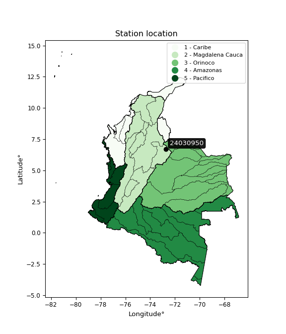

<div align="center">


</div>

# PMP Station (rain, Pmax24h): 24030950

Probable Maximum Precipitation (PMP) is the greatest amount of rainfall for a specific duration that is meteorologically possible for a given location, acting as a "worst-case" scenario for extreme storms, crucial for designing safety-critical infrastructure like bridges, river deviations, dams, spillways, and nuclear plants to prevent catastrophic failure. PMP is calculated by hydrologists using meteorological data to determine the upper limit of extreme rainfall, often leading to the Probable Maximum Flood (PMF) for flood control design, and is increasingly being studied for climate change impacts.

<div align="center">

</img>

</div>


## A. General information


### 1. General running parameters

• app_version: _v20251228_. • runtime: _2025-12-28 08:43:48.795225_. • Python version: _3.14.0_. • SciPy version: _1.16.3_. • Pandas version: _2.3.3_. • NumPy version: _2.3.5_. • Stations dataset (station_dataset_file): _dataset/pmax24h_in/automatic_colombia_2003_2024.csv_. • Stations catalog (station_catalog_file): _dataset/CNE_IDEAM.xls_. • Minimum year to eval til year_max (date_min): _1900_. • Maximum year to eval since year_min (date_max): _2024_. • Creates, save and include plots into reports (create_plot): _False_. • Plot only fit distributions with Δo > Δ (plot_only_fit): _True_. • Eval low extreme values, if False, evaluates high extreme values (low_extreme): _False_. • Eval every SciPy distribution as logarithmic (pdist_logarithmic_on): _True_. • Standard deviation normalized (ddof): _1.0_. • Return periods to eval in years (Tr): _[2, 2.33, 5, 10, 15, 20, 25, 50, 75, 100, 200, 250, 500, 750, 1000]_. • Minimum data sample per station, 0 means any (minimum_sample): _5_. • Z-Score maximum threshold to adjust a value, 0 means disable (zscore_max): _3.5_. • Z-Score minimum threshold to adjust a value, 0 means disable (zscore_min): _-2.5_. • Avoid zeros, e.g. rain = 0 (avoid_zeros): _True_. • Avoid null values (avoid_nans): _True_. [:file_folder:Dataset file.](../../dataset/pmax24h_in/automatic_colombia_2003_2024.csv)

> Delta Degrees of Freedom (DDOF): is a parameter used in the formulas for calculating variance and standard deviation. When ddof=0, the divisor is $N$ (the total number of observations) and this is used when your data set is the entire population. When ddof=1, the divisor is $N-1$ and this is used when your data set is a sample drawn from a larger population. Using $N-1$ provides an unbiased estimate of the population variance (known as Bessel´s correction).


### 2. Station info and location

|   id |   CODIGO | NOMBRE                  | CATEGORIA     | TECNOLOGIA                              | ESTADO           | FECHA_INSTALACION   |   FECHA_SUSPENSION |   ALTITUD |   LATITUD |   LONGITUD | DEPARTAMENTO   | MUNICIPIO   | AREA_OPERATIVA                         | ENTIDAD                                                     | AREA_HIDROGRAFICA   | ZONA_HIDROGRAFICA   | SUBZONA_HIDROGRAFICA   |   CORRIENTE | Catalogo   |
|-----:|---------:|:------------------------|:--------------|:----------------------------------------|:-----------------|:--------------------|-------------------:|----------:|----------:|-----------:|:---------------|:------------|:---------------------------------------|:------------------------------------------------------------|:--------------------|:--------------------|:-----------------------|------------:|:-----------|
|    0 | 24030950 | MALAGA 2 AUT [24030950] | Pluviográfica | Automática con Telemetría, Convencional | En Mantenimiento | 15/12/1973          |                nan |      2237 |   6.70639 |   -72.7297 | Santander      | Málaga      | Area Operativa 08 - Santanderes-Arauca | INSTITUTO DE HIDROLOGIA METEOROLOGIA Y ESTUDIOS AMBIENTALES | Magdalena Cauca     | Sogamoso            | Río Chicamocha         |         nan | CNE_IDEAM  |

<div align="center">

Map location in: [:earth_americas:Google](http://maps.google.com/maps?q=6.706388889,-72.72972222) [:earth_americas:OSM](https://www.openstreetmap.org/#map=18/6.706388889/-72.72972222&layers=P) [:earth_americas:Bing](https://www.bing.com/maps?cp=6.706388889~-72.72972222&lvl=18) [:earth_americas:Apple](https://maps.apple.com/frame?center=6.706388889%2C-72.72972222&span=0.003%2C0.006)

</div>


<div align="center">

```geojson
{
  "type": "Feature",
  "geometry": {
    "type": "Point", 
    "coordinates": [-72.72972222, 6.706388889]
  }, 
  "properties": {
    "Name": "24030950"
  }
}
```

</div>


### 3. Discrete values table and plot

|               |           0 |           1 |          2 |          3 |           4 |           5 |
|:--------------|------------:|------------:|-----------:|-----------:|------------:|------------:|
| Date          | 2017        | 2018        | 2019       | 2020       | 2021        | 2022        |
| Value         |   37.2      |   49.2      |   55.8     |    3       |   39        |   19.6      |
| Value_initial |   37.2      |   49.2      |   55.8     |    3       |   39        |   19.6      |
| count         |    6        |    6        |    6       |    6       |    6        |    6        |
| mean          |   33.9667   |   33.9667   |   33.9667  |   33.9667  |   33.9667   |   33.9667   |
| std           |   19.5442   |   19.5442   |   19.5442  |   19.5442  |   19.5442   |   19.5442   |
| zscore        |    0.165437 |    0.779431 |    1.11713 |   -1.58445 |    0.257536 |   -0.735087 |

> The initial value (value_initial) correspond to the initial obtained or null completed value, and value (value) is adjusted only when the initial value is outside the valid range definite through the Z-Score value. If Z-Score is active, values out of range or outliers are replaced with the station mean value


### 4. Active continuous probability distributions from SciPy (44 of 104 available)

[scipy.stats](https://docs.scipy.org/doc/scipy/reference/stats.html) is a Python´s powerful submodule within the SciPy library for comprehensive statistical analysis, offering over 130 probability distributions (like Normal, Poisson), functions for descriptive stats (mean, variance), hypothesis testing (t-tests, chi-square), random variable generation, and statistical tests, making it essential for data science, modeling, and research. It provides tools to explore, model, and draw conclusions from data efficiently, working seamlessly with NumPy.

<div align="center">

|   id | p_dist             |   n_parameter | fit_method   | label                                                                       | active   | ref                                                                                                        |
|-----:|:-------------------|--------------:|:-------------|:----------------------------------------------------------------------------|:---------|:-----------------------------------------------------------------------------------------------------------|
|    0 | alpha              |             3 | MLE          | Alpha                                                                       | True     | [:mortar_board:](https://docs.scipy.org/doc/scipy/reference/generated/scipy.stats.alpha.html)              |
|    1 | betaprime          |             4 | MLE          | Beta prime                                                                  | True     | [:mortar_board:](https://docs.scipy.org/doc/scipy/reference/generated/scipy.stats.betaprime.html)          |
|    2 | chi2               |             3 | MLE          | Chi²                                                                        | True     | [:mortar_board:](https://docs.scipy.org/doc/scipy/reference/generated/scipy.stats.chi2.html)               |
|    3 | crystalball        |             4 | MLE          | Crystalball                                                                 | True     | [:mortar_board:](https://docs.scipy.org/doc/scipy/reference/generated/scipy.stats.crystalball.html)        |
|    4 | erlang             |             3 | MLE          | Erlang                                                                      | True     | [:mortar_board:](https://docs.scipy.org/doc/scipy/reference/generated/scipy.stats.erlang.html)             |
|    5 | expon              |             2 | MLE          | Exponential                                                                 | True     | [:mortar_board:](https://docs.scipy.org/doc/scipy/reference/generated/scipy.stats.expon.html)              |
|    6 | exponnorm          |             3 | MLE          | Exponentially modified Normal                                               | True     | [:mortar_board:](https://docs.scipy.org/doc/scipy/reference/generated/scipy.stats.exponnorm.html)          |
|    7 | f                  |             4 | MLE          | F                                                                           | True     | [:mortar_board:](https://docs.scipy.org/doc/scipy/reference/generated/scipy.stats.f.html)                  |
|    8 | fatiguelife        |             3 | MLE          | Fatigue-life (Birnbaum-Saunders)                                            | True     | [:mortar_board:](https://docs.scipy.org/doc/scipy/reference/generated/scipy.stats.fatiguelife.html)        |
|    9 | fisk               |             3 | MLE          | Fisk                                                                        | True     | [:mortar_board:](https://docs.scipy.org/doc/scipy/reference/generated/scipy.stats.fisk.html)               |
|   10 | gamma              |             3 | MLE          | Gamma                                                                       | True     | [:mortar_board:](https://docs.scipy.org/doc/scipy/reference/generated/scipy.stats.gamma.html)              |
|   11 | genexpon           |             5 | MLE          | Generalized exponential                                                     | True     | [:mortar_board:](https://docs.scipy.org/doc/scipy/reference/generated/scipy.stats.genexpon.html)           |
|   12 | genlogistic        |             3 | MLE          | Generalized logistic                                                        | True     | [:mortar_board:](https://docs.scipy.org/doc/scipy/reference/generated/scipy.stats.genlogistic.html)        |
|   13 | gibrat             |             2 | MM           | Gibrat                                                                      | True     | [:mortar_board:](https://docs.scipy.org/doc/scipy/reference/generated/scipy.stats.gibrat.html)             |
|   14 | gompertz           |             3 | MLE          | Gompertz (or truncated Gumbel)                                              | True     | [:mortar_board:](https://docs.scipy.org/doc/scipy/reference/generated/scipy.stats.gompertz.html)           |
|   15 | gumbel_l           |             2 | MM           | Gumbel Left Skew                                                            | True     | [:mortar_board:](https://docs.scipy.org/doc/scipy/reference/generated/scipy.stats.gumbel_l.html)           |
|   16 | gumbel_r           |             2 | MM           | Gumbel Right Skew                                                           | True     | [:mortar_board:](https://docs.scipy.org/doc/scipy/reference/generated/scipy.stats.gumbel_r.html)           |
|   17 | halflogistic       |             2 | MM           | Half-logistic                                                               | True     | [:mortar_board:](https://docs.scipy.org/doc/scipy/reference/generated/scipy.stats.halflogistic.html)       |
|   18 | halfnorm           |             2 | MM           | Half Normal                                                                 | True     | [:mortar_board:](https://docs.scipy.org/doc/scipy/reference/generated/scipy.stats.halfnorm.html)           |
|   19 | hypsecant          |             2 | MM           | hyperbolic secant                                                           | True     | [:mortar_board:](https://docs.scipy.org/doc/scipy/reference/generated/scipy.stats.hypsecant.html)          |
|   20 | invgamma           |             3 | MLE          | Inverted gamma                                                              | True     | [:mortar_board:](https://docs.scipy.org/doc/scipy/reference/generated/scipy.stats.invgamma.html)           |
|   21 | invgauss           |             3 | MLE          | Inverse Gaussian                                                            | True     | [:mortar_board:](https://docs.scipy.org/doc/scipy/reference/generated/scipy.stats.invgauss.html)           |
|   22 | invweibull         |             3 | MLE          | Inverted Weibull                                                            | True     | [:mortar_board:](https://docs.scipy.org/doc/scipy/reference/generated/scipy.stats.invweibull.html)         |
|   23 | johnsonsu          |             4 | MLE          | Johnson Su                                                                  | True     | [:mortar_board:](https://docs.scipy.org/doc/scipy/reference/generated/scipy.stats.johnsonsu.html)          |
|   24 | kstwobign          |             2 | MLE          | Limiting distribution of scaled Kolmogorov-Smirnov two-sided test statistic | True     | [:mortar_board:](https://docs.scipy.org/doc/scipy/reference/generated/scipy.stats.kstwobign.html)          |
|   25 | laplace            |             2 | MM           | Laplace                                                                     | True     | [:mortar_board:](https://docs.scipy.org/doc/scipy/reference/generated/scipy.stats.laplace.html)            |
|   26 | laplace_asymmetric |             3 | MLE          | Asymmetric Laplace                                                          | True     | [:mortar_board:](https://docs.scipy.org/doc/scipy/reference/generated/scipy.stats.laplace_asymmetric.html) |
|   27 | loggamma           |             3 | MLE          | Log gamma                                                                   | True     | [:mortar_board:](https://docs.scipy.org/doc/scipy/reference/generated/scipy.stats.loggamma.html)           |
|   28 | logistic           |             2 | MM           | Logistic (or Sech-squared)                                                  | True     | [:mortar_board:](https://docs.scipy.org/doc/scipy/reference/generated/scipy.stats.logistic.html)           |
|   29 | lognorm            |             3 | MLE          | Log Normal                                                                  | True     | [:mortar_board:](https://docs.scipy.org/doc/scipy/reference/generated/scipy.stats.lognorm.html)            |
|   30 | maxwell            |             2 | MM           | Maxwell                                                                     | True     | [:mortar_board:](https://docs.scipy.org/doc/scipy/reference/generated/scipy.stats.maxwell.html)            |
|   31 | mielke             |             4 | MLE          | Mielke Beta-Kappa / Dagum                                                   | True     | [:mortar_board:](https://docs.scipy.org/doc/scipy/reference/generated/scipy.stats.mielke.html)             |
|   32 | moyal              |             2 | MM           | Moyal                                                                       | True     | [:mortar_board:](https://docs.scipy.org/doc/scipy/reference/generated/scipy.stats.moyal.html)              |
|   33 | nakagami           |             3 | MLE          | Nakagami                                                                    | True     | [:mortar_board:](https://docs.scipy.org/doc/scipy/reference/generated/scipy.stats.nakagami.html)           |
|   34 | ncf                |             5 | MLE          | Non-central F distribution                                                  | True     | [:mortar_board:](https://docs.scipy.org/doc/scipy/reference/generated/scipy.stats.ncf.html)                |
|   35 | nct                |             4 | MLE          | Non-central Student’s t                                                     | True     | [:mortar_board:](https://docs.scipy.org/doc/scipy/reference/generated/scipy.stats.nct.html)                |
|   36 | norm               |             2 | MM           | Normal                                                                      | True     | [:mortar_board:](https://docs.scipy.org/doc/scipy/reference/generated/scipy.stats.norm.html)               |
|   37 | pearson3           |             3 | MM           | Pearson type III                                                            | True     | [:mortar_board:](https://docs.scipy.org/doc/scipy/reference/generated/scipy.stats.pearson3.html)           |
|   38 | rayleigh           |             2 | MM           | Rayleigh                                                                    | True     | [:mortar_board:](https://docs.scipy.org/doc/scipy/reference/generated/scipy.stats.rayleigh.html)           |
|   39 | rice               |             3 | MLE          | Rice                                                                        | True     | [:mortar_board:](https://docs.scipy.org/doc/scipy/reference/generated/scipy.stats.rice.html)               |
|   40 | t                  |             3 | MLE          | Student’s t                                                                 | True     | [:mortar_board:](https://docs.scipy.org/doc/scipy/reference/generated/scipy.stats.t.html)                  |
|   41 | truncnorm          |             4 | MLE          | Truncated normal                                                            | True     | [:mortar_board:](https://docs.scipy.org/doc/scipy/reference/generated/scipy.stats.truncnorm.html)          |
|   42 | wald               |             2 | MM           | Wald                                                                        | True     | [:mortar_board:](https://docs.scipy.org/doc/scipy/reference/generated/scipy.stats.wald.html)               |
|   43 | weibull_min        |             3 | MLE          | Weibull minimum                                                             | True     | [:mortar_board:](https://docs.scipy.org/doc/scipy/reference/generated/scipy.stats.weibull_min.html)        |

</div>

> **n_parameter:** # arguments & localization & scale.
>
> **Fit methods:** (MLE) maximum likelihood, (MM) L-moments.
>
>**Inactive:** foldnorm, gennorm, norminvgauss, powernorm, powerlognorm, skewnorm, genextreme, anglit, arcsine, argus, beta, bradford, burr, burr12, cauchy, cosine, halfcauchy, foldcauchy, skewcauchy, wrapcauchy, dgamma, gengamma, exponweib, exponpow, truncexpon, gausshyper, genhalflogistic, genhyperbolic, geninvgauss, halfgennorm, johnsonsb, kappa4, kappa3, ksone, kstwo, loglaplace, levy, levy_l, levy_stable, ncx2, pareto, genpareto, truncpareto, lomax, powerlaw, rdist, rel_breitwigner, recipinvgauss, semicircular, studentized_range, trapezoid, triang, truncweibull_min, tukeylambda, uniform, loguniform, vonmises, vonmises_line, weibull_max, dweibull, 


## B. Probability distributions vs. Empirical distributions

A continuous probability distribution (CPD) describes probabilities for variables that can take any value within a range (like rain any time), unlike discrete variables with specific outcomes (like temperature). It uses a Probability Density Function (PDF), a curve where the total area under it equals 1, and the probability of the variable falling within an interval (a to b) is found by calculating the area under the curve between those points. A key feature is that the probability of hitting any single exact value is zero, so probabilities are always expressed for ranges, e.g., $P(a ≤ X ≤ b)$.

<div align="center">

Distributions parameters from station values
|    |   station | p_dist                |   n |             loc |           scale | shape                  | shape1                 | shape2                | shape3   |
|---:|----------:|:----------------------|----:|----------------:|----------------:|:-----------------------|:-----------------------|:----------------------|:---------|
|  0 |  24030950 | alpha                 |   6 |    -0.0162035   |     7.25173     | 6.983735326715355e-11  |                        |                       |          |
|  1 |  24030950 | betaprime             |   6 |  -580.127       | 43911.4         | 1181.7386557859954     | 84532.1215572143       |                       |          |
|  2 |  24030950 | chi2                  |   6 |     3           |     4.58058     | 1.2303604308337812     |                        |                       |          |
|  3 |  24030950 | crystalball           |   6 |    33.9667      |    17.8413      | 3660.1342446943445     | 254.2376919139925      |                       |          |
|  4 |  24030950 | erlang                |   6 |  -245.716       |     1.20304     | 232.5514923314504      |                        |                       |          |
|  5 |  24030950 | expon                 |   6 |     3           |    30.9667      |                        |                        |                       |          |
|  6 |  24030950 | exponnorm             |   6 |    33.9497      |    17.8412      | 0.0009526495479559121  |                        |                       |          |
|  7 |  24030950 | f                     |   6 | -6261.82        |  6295.78        | 270274.2882371927      | 2866875.6222630823     |                       |          |
|  8 |  24030950 | fatiguelife           |   6 |     3           |     4.06919e-05 | 857.1711283896883      |                        |                       |          |
|  9 |  24030950 | fisk                  |   6 |    -1.28072e+09 |     1.28072e+09 | 123140828.96442735     |                        |                       |          |
| 10 |  24030950 | gamma                 |   6 |  -272.752       |     1.0736      | 285.8123833787271      |                        |                       |          |
| 11 |  24030950 | genexpon              |   6 |     2.99996     |     0.0417564   | 0.001350327696129282   | 4.5561020103701754e-08 | 9.489170207218939     |          |
| 12 |  24030950 | genlogistic           |   6 |    55.8005      |     1.04049e-05 | 4.769035971448157e-07  |                        |                       |          |
| 13 |  24030950 | gibrat                |   6 |    20.3559      |     8.2553      |                        |                        |                       |          |
| 14 |  24030950 | gompertz              |   6 |    -7.19636     |    15.2315      | 0.041630045695705664   |                        |                       |          |
| 15 |  24030950 | gumbel_l              |   6 |    41.9962      |    13.9108      |                        |                        |                       |          |
| 16 |  24030950 | gumbel_r              |   6 |    25.9371      |    13.9108      |                        |                        |                       |          |
| 17 |  24030950 | halflogistic          |   6 |    12.8205      |    15.2537      |                        |                        |                       |          |
| 18 |  24030950 | halfnorm              |   6 |    10.3517      |    29.5969      |                        |                        |                       |          |
| 19 |  24030950 | hypsecant             |   6 |    33.9667      |    11.3581      |                        |                        |                       |          |
| 20 |  24030950 | invgamma              |   6 |  -169.938       | 23685.6         | 117.14252504036062     |                        |                       |          |
| 21 |  24030950 | invgauss              |   6 |   -66.6123      |  2646.27        | 0.03792396612496593    |                        |                       |          |
| 22 |  24030950 | invweibull            |   6 |    -2.29171e+06 |     2.29174e+06 | 127274.79459463246     |                        |                       |          |
| 23 |  24030950 | johnsonsu             |   6 |    64.9813      |     0.373689    | 7.784763951363026      | 1.5799960470377798     |                       |          |
| 24 |  24030950 | kstwobign             |   6 |   -38.7478      |    82.9293      |                        |                        |                       |          |
| 25 |  24030950 | laplace               |   6 |    33.9667      |    12.6157      |                        |                        |                       |          |
| 26 |  24030950 | laplace_asymmetric    |   6 |    39           |    13.3308      | 1.2064464201975496     |                        |                       |          |
| 27 |  24030950 | loggamma              |   6 |    55.8001      |     5.6602e-06  | 2.5939561518025346e-07 |                        |                       |          |
| 28 |  24030950 | logistic              |   6 |    33.9667      |     9.83643     |                        |                        |                       |          |
| 29 |  24030950 | lognorm               |   6 |     3           |     0.0529904   | 14.500090040314657     |                        |                       |          |
| 30 |  24030950 | maxwell               |   6 |    -8.30974     |    26.4928      |                        |                        |                       |          |
| 31 |  24030950 | mielke                |   6 |     3           |    53.3177      | 0.6472266526128301     | 548.4806002603356      |                       |          |
| 32 |  24030950 | moyal                 |   6 |    23.7639      |     8.03141     |                        |                        |                       |          |
| 33 |  24030950 | nakagami              |   6 | -6003.13        |  6037.09        | 28572.17530896952      |                        |                       |          |
| 34 |  24030950 | ncf                   |   6 |     0.216255    |     1.51659e-08 | 4.498355546115499e-09  | 170.00388675492988     | 9.969451849987998     |          |
| 35 |  24030950 | nct                   |   6 | -1176.77        |    17.8367      | 1822592.7866668412     | 67.87888537114537      |                       |          |
| 36 |  24030950 | norm                  |   6 |    33.9667      |    17.8413      |                        |                        |                       |          |
| 37 |  24030950 | pearson3              |   6 |    33.9667      |    17.8413      | -0.5445770452027734    |                        |                       |          |
| 38 |  24030950 | rayleigh              |   6 |    -0.164794    |    27.233       |                        |                        |                       |          |
| 39 |  24030950 | rice                  |   6 |    -7.92905     |    19.7584      | 1.8197423187696202     |                        |                       |          |
| 40 |  24030950 | t                     |   6 |    33.9668      |    17.8417      | 17412618.780144066     |                        |                       |          |
| 41 |  24030950 | truncnorm             |   6 |    48.3361      |    18.7991      | -43.587227071435734    | 0.3970351319762837     |                       |          |
| 42 |  24030950 | wald                  |   6 |    16.1254      |    17.8413      |                        |                        |                       |          |
| 43 |  24030950 | weibull_min           |   6 |    -6.69454e+08 |     6.69455e+08 | 47978301.71538583      |                        |                       |          |
| 44 |  24030950 | logalpha              |   6 |   -28.3794      |   924.72        | 29.31054504168992      |                        |                       |          |
| 45 |  24030950 | logbetaprime          |   6 |   -21.8293      |   214.674       | 646.5056080313764      | 5542.5548430627205     |                       |          |
| 46 |  24030950 | logchi2               |   6 |     1.09861     |     1.11445     | 0.35399773042247884    |                        |                       |          |
| 47 |  24030950 | logcrystalball        |   6 |     3.21195     |     1.0011      | 201.45946500099427     | 8.422189785556391      |                       |          |
| 48 |  24030950 | logerlang             |   6 |   -15.1648      |     0.0614298   | 298.79726401709956     |                        |                       |          |
| 49 |  24030950 | logexpon              |   6 |     1.09861     |     2.11333     |                        |                        |                       |          |
| 50 |  24030950 | logexponnorm          |   6 |     3.21129     |     1.0011      | 0.000642631690887038   |                        |                       |          |
| 51 |  24030950 | logf                  |   6 | -2811.43        |  2814.65        | 47488854.780971855     | 23747685.89102079      |                       |          |
| 52 |  24030950 | logfatiguelife        |   6 |  -812.269       |   815.48        | 0.0012253652660993574  |                        |                       |          |
| 53 |  24030950 | logfisk               |   6 |    -8.3497e+07  |     8.3497e+07  | 163126264.50284743     |                        |                       |          |
| 54 |  24030950 | loggamma              |   6 |   -15.5291      |     0.0586849   | 318.96300504899665     |                        |                       |          |
| 55 |  24030950 | loggenexpon           |   6 |     1.07258     |     0.00440875  | 0.0006748378639965275  | 2.012913653028635      | 2.318551573174796e-06 |          |
| 56 |  24030950 | loggenlogistic        |   6 |     4.02308     |     0.000201184 | 0.0002581948951295164  |                        |                       |          |
| 57 |  24030950 | loggibrat             |   6 |     2.44826     |     0.4632      |                        |                        |                       |          |
| 58 |  24030950 | loggompertz           |   6 |     1.09861     |     0.620045    | 0.01770414942609154    |                        |                       |          |
| 59 |  24030950 | loggumbel_l           |   6 |     3.66249     |     0.78055     |                        |                        |                       |          |
| 60 |  24030950 | loggumbel_r           |   6 |     2.7614      |     0.78055     |                        |                        |                       |          |
| 61 |  24030950 | loghalflogistic       |   6 |     2.02544     |     0.855889    |                        |                        |                       |          |
| 62 |  24030950 | loghalfnorm           |   6 |     1.88683     |     1.66078     |                        |                        |                       |          |
| 63 |  24030950 | loghypsecant          |   6 |     3.21195     |     0.637317    |                        |                        |                       |          |
| 64 |  24030950 | loginvgamma           |   6 |   -17.5955      |  7626.42        | 367.5379643375745      |                        |                       |          |
| 65 |  24030950 | loginvgauss           |   6 |    -6.79648     |   793.823       | 0.012604677243700593   |                        |                       |          |
| 66 |  24030950 | loginvweibull         |   6 |    -1.12483e+08 |     1.12483e+08 | 94670962.4150993       |                        |                       |          |
| 67 |  24030950 | logjohnsonsu          |   6 |     4.02177     |     8.83176e-14 | 1.6504856594336696     | 0.10636998083062826    |                       |          |
| 68 |  24030950 | logkstwobign          |   6 |    -1.56856     |     5.45844     |                        |                        |                       |          |
| 69 |  24030950 | loglaplace            |   6 |     3.21195     |     0.707881    |                        |                        |                       |          |
| 70 |  24030950 | loglaplace_asymmetric |   6 |     4.02177     |     0.00661661  | 122.28760278512968     |                        |                       |          |
| 71 |  24030950 | logloggamma           |   6 |     4.02193     |     1.40479e-05 | 1.7286738774062847e-05 |                        |                       |          |
| 72 |  24030950 | loglogistic           |   6 |     3.21195     |     0.551932    |                        |                        |                       |          |
| 73 |  24030950 | loglognorm            |   6 |     1.09861     |     0.0052937   | 13.775984505345567     |                        |                       |          |
| 74 |  24030950 | logmaxwell            |   6 |     0.839773    |     1.48654     |                        |                        |                       |          |
| 75 |  24030950 | logmielke             |   6 |    -2.24465e+07 |     2.24465e+07 | 27296634.12830347      | 5809789022.902214      |                       |          |
| 76 |  24030950 | logmoyal              |   6 |     2.63946     |     0.450651    |                        |                        |                       |          |
| 77 |  24030950 | lognakagami           |   6 |     2.97553     |     0.652644    | 0.29079932765589567    |                        |                       |          |
| 78 |  24030950 | logncf                |   6 |   -31.6447      |    34.8438      | 3989.775860456825      | 5057.144448425465      | 0.02313879108583833   |          |
| 79 |  24030950 | lognct                |   6 |    61.9667      |     0.9899      | 79198.3282473149       | -59.353428251570094    |                       |          |
| 80 |  24030950 | lognorm               |   6 |     3.21195     |     1.00109     |                        |                        |                       |          |
| 81 |  24030950 | logpearson3           |   6 |     3.21195     |     1.0011      | -1.4024910139362983    |                        |                       |          |
| 82 |  24030950 | lograyleigh           |   6 |     1.29674     |     1.5281      |                        |                        |                       |          |
| 83 |  24030950 | logrice               |   6 |  -376.683       |     1.00101     | 379.50907874909694     |                        |                       |          |
| 84 |  24030950 | logt                  |   6 |     3.71914     |     0.24643     | 0.9615730928678046     |                        |                       |          |
| 85 |  24030950 | logtruncnorm          |   6 |    -0.0683036   |     4.42436     | 0.26374649169456366    | 0.9244496613569169     |                       |          |
| 86 |  24030950 | logwald               |   6 |     2.21089     |     1.00106     |                        |                        |                       |          |
| 87 |  24030950 | logweibull_min        |   6 |     1.09861     |     1.3797      | 0.764663704102744      |                        |                       |          |

</div>

> **loc** (Location parameter): This shifts the distribution along the x-axis. For many common distributions, like the normal (Gaussian) distribution, loc represents the mean $μ$. For others, like the uniform distribution, it might represent the minimum value, or for the beta distribution, the left end of the support interval.
>
> **scale** (Scale parameter): This determines the width or spread of the distribution. For the normal distribution, scale represents the standard deviation $σ$. For a uniform distribution, it defines the length of the interval (from $loc$ to $loc + scale$).
>
> **shape** (Shape parameters): Refers to parameters that define the specific form of a probability distribution, distinct from its location (loc) and scale (scale). These parameters are required arguments for most distribution functions. For example, a normal (Gaussian) distribution is fully defined by its location (mean) and scale (standard deviation), so it has no specific shape parameters beyond loc and scale. However, other distributions have intrinsic properties that need specification, as Gamma distribution that takes a shape parameter, often named $a$ or $alpha$.


### 0. Cumulative distribution values - CDF (88 evaluated)

Cumulative Distribution Function (CDF), denoted as $F$<sub>$X$</sub>$(x)$, is a function that gives the probability that a random variable $X$ will take a value less than or equal to a specific value, $x$ (i.e., $(P(X≥x)$. It essentially "accumulates" probabilities from a given point up to the far right (positive infinity), providing a complete picture of the distribution´s probabilities for both discrete (like rain) and continuous (like temperature) variables, helping to find probabilities over ranges or above certain values.

<div align="center">

CDF ordered by x ascending and calculating $log(f(x))$ separately
|   id |   Station |   date |    x |   count |    mean |     std |    zscore |   Value_initial |   station |   m |     alpha |   alpha_pdf |   betaprime |   betaprime_pdf |        chi2 |         chi2_pdf |   crystalball |   crystalball_pdf |    erlang |   erlang_pdf |    expon |   expon_pdf |   exponnorm |   exponnorm_pdf |        f |      f_pdf |   fatiguelife |   fatiguelife_pdf |      fisk |   fisk_pdf |    gamma |   gamma_pdf |    genexpon |   genexpon_pdf |   genlogistic |   genlogistic_pdf |   gibrat |   gibrat_pdf |   gompertz |   gompertz_pdf |   gumbel_l |   gumbel_l_pdf |   gumbel_r |   gumbel_r_pdf |   halflogistic |   halflogistic_pdf |   halfnorm |   halfnorm_pdf |   hypsecant |   hypsecant_pdf |   invgamma |   invgamma_pdf |   invgauss |   invgauss_pdf |   invweibull |   invweibull_pdf |   johnsonsu |   johnsonsu_pdf |   kstwobign |   kstwobign_pdf |   laplace |   laplace_pdf |   laplace_asymmetric |   laplace_asymmetric_pdf |   loggamma |   loggamma_pdf |   logistic |   logistic_pdf |   lognorm |   lognorm_pdf |   maxwell |   maxwell_pdf |      mielke |    mielke_pdf |       moyal |   moyal_pdf |   nakagami |   nakagami_pdf |      ncf |    ncf_pdf |       nct |    nct_pdf |      norm |   norm_pdf |   pearson3 |   pearson3_pdf |   rayleigh |   rayleigh_pdf |      rice |   rice_pdf |         t |      t_pdf |   truncnorm |   truncnorm_pdf |      wald |   wald_pdf |   weibull_min |   weibull_min_pdf |   logalpha |   logalpha_pdf |   logbetaprime |   logbetaprime_pdf |    logchi2 |   logchi2_pdf |   logcrystalball |   logcrystalball_pdf |   logerlang |   logerlang_pdf |   logexpon |   logexpon_pdf |   logexponnorm |   logexponnorm_pdf |      logf |   logf_pdf |   logfatiguelife |   logfatiguelife_pdf |   logfisk |   logfisk_pdf |   loggenexpon |   loggenexpon_pdf |   loggenlogistic |   loggenlogistic_pdf |   loggibrat |   loggibrat_pdf |   loggompertz |   loggompertz_pdf |   loggumbel_l |   loggumbel_l_pdf |   loggumbel_r |   loggumbel_r_pdf |   loghalflogistic |   loghalflogistic_pdf |   loghalfnorm |   loghalfnorm_pdf |   loghypsecant |   loghypsecant_pdf |   loginvgamma |   loginvgamma_pdf |   loginvgauss |   loginvgauss_pdf |   loginvweibull |   loginvweibull_pdf |   logjohnsonsu |   logjohnsonsu_pdf |   logkstwobign |   logkstwobign_pdf |   loglaplace |   loglaplace_pdf |   loglaplace_asymmetric |   loglaplace_asymmetric_pdf |   logloggamma |   logloggamma_pdf |   loglogistic |   loglogistic_pdf |   loglognorm |   loglognorm_pdf |   logmaxwell |   logmaxwell_pdf |   logmielke |   logmielke_pdf |    logmoyal |   logmoyal_pdf |   lognakagami |   lognakagami_pdf |    logncf |   logncf_pdf |    lognct |   lognct_pdf |   logpearson3 |   logpearson3_pdf |   lograyleigh |   lograyleigh_pdf |   logrice |   logrice_pdf |      logt |   logt_pdf |   logtruncnorm |   logtruncnorm_pdf |   logwald |   logwald_pdf |   logweibull_min |   logweibull_min_pdf |
|-----:|----------:|-------:|-----:|--------:|--------:|--------:|----------:|----------------:|----------:|----:|----------:|------------:|------------:|----------------:|------------:|-----------------:|--------------:|------------------:|----------:|-------------:|---------:|------------:|------------:|----------------:|---------:|-----------:|--------------:|------------------:|----------:|-----------:|---------:|------------:|------------:|---------------:|--------------:|------------------:|---------:|-------------:|-----------:|---------------:|-----------:|---------------:|-----------:|---------------:|---------------:|-------------------:|-----------:|---------------:|------------:|----------------:|-----------:|---------------:|-----------:|---------------:|-------------:|-----------------:|------------:|----------------:|------------:|----------------:|----------:|--------------:|---------------------:|-------------------------:|-----------:|---------------:|-----------:|---------------:|----------:|--------------:|----------:|--------------:|------------:|--------------:|------------:|------------:|-----------:|---------------:|---------:|-----------:|----------:|-----------:|----------:|-----------:|-----------:|---------------:|-----------:|---------------:|----------:|-----------:|----------:|-----------:|------------:|----------------:|----------:|-----------:|--------------:|------------------:|-----------:|---------------:|---------------:|-------------------:|-----------:|--------------:|-----------------:|---------------------:|------------:|----------------:|-----------:|---------------:|---------------:|-------------------:|----------:|-----------:|-----------------:|---------------------:|----------:|--------------:|--------------:|------------------:|-----------------:|---------------------:|------------:|----------------:|--------------:|------------------:|--------------:|------------------:|--------------:|------------------:|------------------:|----------------------:|--------------:|------------------:|---------------:|-------------------:|--------------:|------------------:|--------------:|------------------:|----------------:|--------------------:|---------------:|-------------------:|---------------:|-------------------:|-------------:|-----------------:|------------------------:|----------------------------:|--------------:|------------------:|--------------:|------------------:|-------------:|-----------------:|-------------:|-----------------:|------------:|----------------:|------------:|---------------:|--------------:|------------------:|----------:|-------------:|----------:|-------------:|--------------:|------------------:|--------------:|------------------:|----------:|--------------:|----------:|-----------:|---------------:|-------------------:|----------:|--------------:|-----------------:|---------------------:|
|    0 |  24030950 |   2020 |  3   |       6 | 33.9667 | 19.5442 | -1.58445  |             3   |  24030950 |   1 | 0.0162054 |  0.0353388  |    0.04182  |      0.00514418 | 1.02726e-10 | 142302           |     0.0413109 |        0.00495809 | 0.0411424 |   0.00519927 | 0        |  0.0322928  |   0.0413103 |      0.00495806 | 0.041752 | 0.00499808 |     0.0634957 |       3.99503e+09 | 0.0417285 | 0.00384475 | 0.039637 |  0.00506181 | 1.16375e-06 |     0.0323382  |      0        |        0.00407534 | 0        |   0          |  0.0389015 |     0.00513053 |  0.0588094 |     0.00410078 | 0.00551048 |     0.00206031 |       0        |         0          |   0        |     0          |   0.0416108 |      0.0036531  |  0.0385893 |     0.00552041 |  0.0358163 |     0.00593566 |    0.0396248 |       0.00710432 |   0.0828674 |      0.00389166 |   0.0382805 |      0.00801062 | 0.0429483 |    0.00340435 |            0.0632041 |               0.0039299  |  0.0199221 |       0.049842 |  0.0411638 |     0.00401257 | 0.0173852 |     0.0429275 | 0.0195962 |    0.00501058 | 1.38226e-11 | 10072.7       | 0.000270019 | 0.000237943 |  0.0415366 |      0.004984  | 0.025341 | 0.00823316 | 0.0413655 | 0.00496187 | 0.0413109 | 0.00495809 |  0.0540131 |     0.00475842 | 0.00672985 |     0.00423861 | 0.0305723 | 0.00582502 | 0.0413137 | 0.00495826 |   0.0121361 |      0.00177041 | 0         | 0          |     0.0579569 |        0.00403088 |  0.0197325 |       0.05094  |       0.01853  |          0.0465215 | 0.00159136 |   1.26853e+12 |        0.0173852 |            0.0429275 |   0.0211496 |       0.0518405 |   0        |       0.473186 |      0.0173856 |          0.0429285 | 0.0171947 |  0.0425897 |        0.0171601 |            0.0426406 | 0.0106211 |     0.0205298 |    0.00405757 |          0.158672 |         0        |            0.0300862 |    0        |        0        |   1.14999e-07 |         0.0285532 |     0.0367589 |         0.0462172 |   0.000221033 |        0.00238355 |          0        |              0        |      0        |          0        |       0.023098 |          0.0362108 |     0.0200381 |         0.0515062 |     0.0195686 |         0.0540888 |        0.024747 |           0.0770445 |      0.0414063 |        0.00322492  |      0.0292472 |           0.102354 |    0.0252587 |        0.0356821 |               0.0269765 |                   0.0333401 |     0.0273975 |         0.0337142 |     0.0212697 |         0.0377171 |    0.0126775 |      1.07084e+13 |   0.00139135 |        0.0160284 |   0.0281154 |       0.0341904 | 3.26463e-08 |    1.14049e-06 |   0           |        0          | 0.0191084 |    0.0473737 | 0.0174102 |     0.042922 |     0.0408186 |         0.0482097 |      0        |          0        | 0.0173773 |     0.0429145 | 0.0324662 |  0.0118465 |    2.65393e-06 |           0.398821 |  0        |      0        |      8.38305e-13 |         2886.9       |
|    1 |  24030950 |   2022 | 19.6 |       6 | 33.9667 | 19.5442 | -0.735087 |            19.6 |  24030950 |   2 | 0.711621  |  0.0140435  |    0.216752 |      0.0165849  | 0.922652    |      0.00974522  |     0.210338  |        0.0161689  | 0.217745  |   0.0166209  | 0.414951 |  0.0188929  |   0.210338  |      0.0161689  | 0.211362 | 0.0161747  |     0.771903  |       0.00678331  | 0.176846  | 0.0139966  | 0.214239 |  0.0165915  | 0.415404    |     0.0189054  |      0        |        0.00872164 | 0        |   0          |  0.181406  |     0.0129951  |  0.18118   |     0.011766   | 0.206584   |     0.0234201  |       0.218636 |         0.031212   |   0.24532  |     0.0256739  |   0.175144  |      0.0146537  |  0.230288  |     0.0177273  |  0.245731  |     0.0189001  |    0.276904  |       0.019747   |   0.185791  |      0.00931774 |   0.29474   |      0.0201266  | 0.160103  |    0.0126908  |            0.177421  |               0.0110317  |  0.426227  |       0.376956 |  0.188382  |     0.0155437  | 0.406655  |     0.387547  | 0.225298  |    0.0191899  | 0.469904    |     0.0183213 | 0.195002    | 0.0277982   |  0.211164  |      0.016204  | 0.283285 | 0.0200253  | 0.210429  | 0.0161674  | 0.210338  | 0.0161689  |  0.199806  |     0.0137278  | 0.231542   |     0.0204797  | 0.221056  | 0.0172444  | 0.210342  | 0.0161687  |   0.096561  |      0.0100831  | 0.0590852 | 0.0492348  |     0.178145  |        0.0115557  |  0.42799   |       0.369111 |       0.41443  |          0.377088  | 0.941523   |   0.0426231   |        0.406655  |            0.387547  |   0.427114  |       0.37229   |   0.588576 |       0.19468  |      0.406658  |          0.387547  | 0.405745  |  0.38763   |        0.406997  |            0.388451  | 0.295807  |     0.406962  |    0.516102   |          0.29506  |         0        |            0.334572  |    0.551538 |        0.7503   |   0.293655    |         0.416208  |     0.339489  |         0.350959  |   0.467629    |        0.455365   |          0.504282 |              0.435629 |      0.487876 |          0.387538 |       0.384539 |          0.466955  |     0.427113  |         0.366605  |     0.438407  |         0.359881  |        0.466665 |           0.299344  |      0.0520488 |        0.0108262   |      0.507704  |           0.286056 |    0.358035  |        0.505784  |               0.274414  |                   0.339147  |     0.275918  |         0.339533  |     0.394522  |         0.432796  |    0.665007  |      0.0140898   |   0.44081    |        0.394712  |   0.275555  |       0.335096  | 0.49098     |    0.480975    |   1.17238e-09 |        1.5354e+06 | 0.415288  |    0.375981  | 0.406416  |     0.387517 |     0.323762  |         0.320111  |      0.453089 |          0.393194 | 0.406644  |     0.387576  | 0.105839  |  0.128085  |    0.68809     |           0.325917 |  0.554473 |      0.575574 |      0.717855    |            0.145446  |
|    2 |  24030950 |   2017 | 37.2 |       6 | 33.9667 | 19.5442 |  0.165437 |            37.2 |  24030950 |   3 | 0.845507  |  0.00409895 |    0.5798   |      0.0216578  | 0.990877    |      0.00108055  |     0.571905  |        0.0219964  | 0.576421  |   0.0211843  | 0.668595 |  0.010702   |   0.571906  |      0.0219965  | 0.571942 | 0.0218969  |     0.857583  |       0.00352091  | 0.538515  | 0.0238948  | 0.575404 |  0.0214398  | 0.669122    |     0.0107004  |      0        |        0.0195406  | 0.762121 |   0.0183666  |  0.516269  |     0.0243861  |  0.507556  |     0.0250765  | 0.640815   |     0.0205     |       0.663552 |         0.0183463  |   0.635662 |     0.0178651  |   0.589414  |      0.0269264  |  0.590761  |     0.0201363  |  0.606904  |     0.0191114  |    0.616826  |       0.0165514  |   0.452956  |      0.022529   |   0.62873   |      0.0160773  | 0.613043  |    0.0306726  |            0.52999   |               0.0329537  |  0.663875  |       0.342834 |  0.581445  |     0.0247414  | 0.656864  |     0.367288  | 0.600741  |    0.020323   | 0.750214    |     0.0141976 | 0.664844    | 0.0195923   |  0.572789  |      0.0219632 | 0.618906 | 0.0163205  | 0.571889  | 0.0219882  | 0.571905  | 0.0219964  |  0.537049  |     0.0229828  | 0.60986    |     0.0196559  | 0.582519  | 0.02104    | 0.571901  | 0.021996   |   0.423028  |      0.0272131  | 0.731568  | 0.0171769  |     0.499722  |        0.024832   |  0.658783  |       0.331427 |       0.654692 |          0.349972  | 0.962606   |   0.0251079   |        0.656864  |            0.367288  |   0.661806  |       0.339104  |   0.696186 |       0.143761 |      0.656867  |          0.367287  | 0.656161  |  0.36776   |        0.657596  |            0.367483  | 0.594966  |     0.4708    |    0.688339   |          0.237933 |         0        |            0.761441  |    0.822498 |        0.22268  |   0.635493    |         0.603694  |     0.610366  |         0.4705    |   0.71573     |        0.306677   |          0.730299 |              0.272619 |      0.702294 |          0.279348 |       0.689632 |          0.413412  |     0.656523  |         0.329994  |     0.659689  |         0.314083  |        0.64118  |           0.239843  |      0.0636952 |        0.0327432   |      0.67237   |           0.224997 |    0.717585  |        0.398959  |               0.605815  |                   0.748725  |     0.607055  |         0.747016  |     0.675382  |         0.397225  |    0.672738  |      0.0104064   |   0.677759   |        0.327245  |   0.600657  |       0.730444  | 0.735138    |    0.282826    |   0.723593    |        0.527029   | 0.654865  |    0.349117  | 0.65671   |     0.367549 |     0.582572  |         0.482438  |      0.684017 |          0.313881 | 0.656873  |     0.367315  | 0.375242  |  1.08875   |    0.886188    |           0.29193  |  0.790332 |      0.226047 |      0.794839    |            0.0986976 |
|    3 |  24030950 |   2021 | 39   |       6 | 33.9667 | 19.5442 |  0.257536 |            39   |  24030950 |   4 | 0.852551  |  0.00373586 |    0.618294 |      0.021081   | 0.992626    |      0.000870443 |     0.611073  |        0.0214882  | 0.614059  |   0.0206061  | 0.687309 |  0.0100977  |   0.611073  |      0.0214883  | 0.610931 | 0.0213893  |     0.863747  |       0.00332999  | 0.581136  | 0.0234044  | 0.613503 |  0.0208607  | 0.687833    |     0.0100953  |      0        |        0.0212211  | 0.79237  |   0.0153551  |  0.560689  |     0.0249249  |  0.553461  |     0.0258801  | 0.676379   |     0.0190115  |       0.695295 |         0.0169324  |   0.66693  |     0.016875   |   0.636656  |      0.0254816  |  0.626366  |     0.0194027  |  0.640561  |     0.0182699  |    0.64584   |       0.0156813  |   0.495065  |      0.0242565  |   0.656948  |      0.0152732  | 0.664496  |    0.0265942  |            0.592753  |               0.0368562  |  0.679906  |       0.335577 |  0.625206  |     0.023822   | 0.674049  |     0.359951  | 0.636597  |    0.019498   | 0.775538    |     0.013943  | 0.698528    | 0.0178485   |  0.611892  |      0.0214495 | 0.647565 | 0.0155177  | 0.611043  | 0.0214805  | 0.611073  | 0.0214882  |  0.578545  |     0.0230829  | 0.644462   |     0.0187755  | 0.619883  | 0.020448   | 0.611068  | 0.0214878  |   0.473349  |      0.0286695  | 0.760408  | 0.0149318  |     0.545227  |        0.0256815  |  0.674281  |       0.324443 |       0.671066 |          0.342967  | 0.963771   |   0.0242079   |        0.674049  |            0.359951  |   0.677666  |       0.332089  |   0.702903 |       0.140582 |      0.674052  |          0.359949  | 0.673368  |  0.360435  |        0.674788  |            0.360077  | 0.617004  |     0.461674  |    0.699463   |          0.232846 |         0        |            0.809046  |    0.832624 |        0.206152 |   0.663961    |         0.600617  |     0.632624  |         0.471307  |   0.729931    |        0.29439    |          0.742923 |              0.261754 |      0.715298 |          0.271083 |       0.708754 |          0.39584   |     0.671956  |         0.323162  |     0.67437   |         0.307271  |        0.652388 |           0.23452   |      0.0653569 |        0.0378114   |      0.682885  |           0.220044 |    0.735821  |        0.373197  |               0.642248  |                   0.793752  |     0.6434    |         0.79174   |     0.693863  |         0.384861  |    0.673226  |      0.0102085   |   0.693024   |        0.318806  |   0.636184  |       0.773647  | 0.748195    |    0.269913    |   0.747616    |        0.490104   | 0.6712    |    0.342163  | 0.673907  |     0.360222 |     0.605585  |         0.491418  |      0.69865  |          0.305443 | 0.674059  |     0.359976  | 0.429948  |  1.21861   |    0.899921    |           0.289329 |  0.80069  |      0.212538 |      0.79944     |            0.0960628 |
|    4 |  24030950 |   2018 | 49.2 |       6 | 33.9667 | 19.5442 |  0.779431 |            49.2 |  24030950 |   5 | 0.88286   |  0.00236293 |    0.80562  |      0.0150479  | 0.997767    |      0.000259721 |     0.803399  |        0.0155303  | 0.797566  |   0.0148397  | 0.775061 |  0.0072639  |   0.8034    |      0.0155303  | 0.802456 | 0.0154838  |     0.893081  |       0.00247852  | 0.787205  | 0.0161063  | 0.799134 |  0.0149767  | 0.775544    |     0.00725874 |      0        |        0.0338693  | 0.894541 |   0.006324   |  0.807299  |     0.0213588  |  0.813332  |     0.0225226  | 0.828766   |     0.0111896  |       0.831346 |         0.0101242  |   0.810675 |     0.0113914  |   0.837149  |      0.0137205  |  0.796281  |     0.01361    |  0.798458  |     0.012558   |    0.780262  |       0.0107519  |   0.78089   |      0.0295672  |   0.789319  |      0.0107389  | 0.850527  |    0.0118482  |            0.838208  |               0.0146423  |  0.753187  |       0.293768 |  0.824721  |     0.014696   | 0.752759  |     0.315558  | 0.805877  |    0.0134521  | 0.91143     |     0.0127684 | 0.837379    | 0.00998269  |  0.803756  |      0.0154859 | 0.782057 | 0.0108923  | 0.803314  | 0.0155281  | 0.803399  | 0.0155303  |  0.798965  |     0.0187763  | 0.806584   |     0.0128742  | 0.801885  | 0.0147209  | 0.803392  | 0.0155303  |   0.792149  |      0.0323981  | 0.868006  | 0.00727759 |     0.805384  |        0.0228286  |  0.745214  |       0.284927 |       0.746154 |          0.301751  | 0.968926   |   0.0203094   |        0.752759  |            0.315558  |   0.750291  |       0.291636  |   0.733834 |       0.125946 |      0.752762  |          0.315556  | 0.752196  |  0.316069  |        0.753491  |            0.315371  | 0.717228  |     0.39623   |    0.75059    |          0.207128 |         0.849402 |            1.0901    |    0.872758 |        0.143974 |   0.796946    |         0.527898  |     0.740381  |         0.448538  |   0.79155     |        0.237056   |          0.79786  |              0.212305 |      0.77361  |          0.231129 |       0.790258 |          0.305799  |     0.742683  |         0.284439  |     0.741528  |         0.269945  |        0.703804 |           0.208067  |      0.0807488 |        0.126512    |      0.731181  |           0.19576  |    0.809735  |        0.268781  |               0.855865  |                   1.05776   |     0.856337  |         1.05377   |     0.775422  |         0.315514  |    0.675493  |      0.00933406  |   0.761985   |        0.274134  |   0.843889  |       1.02623   | 0.804077    |    0.212956    |   0.842789    |        0.336222   | 0.746132  |    0.301218  | 0.752683  |     0.315845 |     0.723404  |         0.516587  |      0.764614 |          0.262003 | 0.752774  |     0.315574  | 0.696132  |  0.841971  |    0.965644    |           0.276412 |  0.843465 |      0.158863 |      0.820356    |            0.0843066 |
|    5 |  24030950 |   2019 | 55.8 |       6 | 33.9667 | 19.5442 |  1.11713  |            55.8 |  24030950 |   6 | 0.896628  |  0.0018416  |    0.889055 |      0.0102734  | 0.998961    |      0.000120036 |     0.889477  |        0.0105752  | 0.880546  |   0.01034    | 0.818238 |  0.00586959 |   0.889478  |      0.0105752  | 0.888396 | 0.0105787  |     0.908061  |       0.00207616  | 0.874654  | 0.0105413  | 0.882646 |  0.0103662  | 0.818684    |     0.00586362 |      0.999979 |        0.0458336  | 0.927456 |   0.00389344 |  0.922869  |     0.0131858  |  0.932623  |     0.0130651  | 0.889706   |     0.00747442 |       0.887243 |         0.00697533 |   0.875357 |     0.00829207 |   0.907534  |      0.00802694 |  0.872761  |     0.00963357 |  0.869287  |     0.00899022 |    0.841993  |       0.00804205 |   0.948511  |      0.0181531  |   0.851463  |      0.00815819 | 0.911415  |    0.00702179 |            0.910967  |               0.00805754 |  0.788571  |       0.268172 |  0.901999  |     0.00898664 | 0.790726  |     0.287301  | 0.881163  |    0.00943662 | 0.993699    |     0.0121234 | 0.891749    | 0.00669773  |  0.889585  |      0.0105454 | 0.844964 | 0.00823998 | 0.889391  | 0.0105767  | 0.889477  | 0.0105752  |  0.903306  |     0.0126078  | 0.878955   |     0.00913424 | 0.884188  | 0.0102476  | 0.889471  | 0.0105754  |   1         |      0.0299742  | 0.907246  | 0.00481524 |     0.927679  |        0.0136141  |  0.779592  |       0.261084 |       0.782539 |          0.276054  | 0.971367   |   0.0185113   |        0.790725  |            0.287301  |   0.785455  |       0.266821  |   0.749225 |       0.118663 |      0.790728  |          0.287299  | 0.790226  |  0.287805  |        0.791424  |            0.286976  | 0.76435   |     0.351894  |    0.775773   |          0.192981 |         0.99833  |            1.27926   |    0.889317 |        0.120032 |   0.858737    |         0.449921  |     0.794957  |         0.416242  |   0.819594    |        0.208897   |          0.823061 |              0.188441 |      0.801385 |          0.210275 |       0.82582  |          0.259866  |     0.777026  |         0.26102   |     0.774137  |         0.248031  |        0.729099 |           0.193877  |      0.941566  |        1.06818e+11 |      0.755008  |           0.18285  |    0.840731  |        0.224993  |               0.999933  |                   1.23581   |     0.999812  |         1.23031   |     0.81264   |         0.27586   |    0.676641  |      0.00891908  |   0.794902   |        0.248805  |   0.983351  |       1.16227   | 0.829192    |    0.186591    |   0.880779    |        0.269111   | 0.782459  |    0.275665  | 0.790685  |     0.287574 |     0.788223  |         0.510237  |      0.796081 |          0.23797  | 0.790742  |     0.287311  | 0.779414  |  0.508204  |    0.999995    |           0.269346 |  0.862025 |      0.136694 |      0.830609    |            0.0786756 |


</div>

An Empirical Distribution Function (EDF) is a step-function estimate of a true cumulative distribution function (CDF) based on observed sample data, representing the proportion of data points less than or equal to a given value. It is calculated by ordering your data and jumping up by $1/n$ (where $n$ is sample size) at each unique data point, allowing analysis without assuming an underlying population distribution, and it gets closer to the true CDF as the sample size grows.


### 1. Empirical - EDF California (1923)

California´s estimates the true probability distribution of water-related data (like rainfall, streamflow) using observed samples, crucial for risk assessment.

<div align="center">


$P=m/n$


</div>


**1.1. Empirical values**

<div align="center">

|                | 0                   | 1                  | 2              | 3                  | 4                  | 5              |
|:---------------|:--------------------|:-------------------|:---------------|:-------------------|:-------------------|:---------------|
| date           | 2020                | 2022               | 2017           | 2021               | 2018               | 2019           |
| x              | 3.0                 | 19.6               | 37.2           | 39.0               | 49.2               | 55.8           |
| m              | 1                   | 2                  | 3              | 4                  | 5                  | 6              |
| empirical_dist | edf_california      | edf_california     | edf_california | edf_california     | edf_california     | edf_california |
| empirical      | 0.16666666666666666 | 0.3333333333333333 | 0.5            | 0.6666666666666666 | 0.8333333333333334 | 1.0            |
| empirical_tr   | 1.2                 | 1.4999999999999998 | 2.0            | 2.9999999999999996 | 6.000000000000002  | inf            |

</div>


**1.2. Kolmogorov-Smirnov fit test (sorted by Δ)**


<div align="center">

|                | 0                   | 1                   | 2                   | 3                   | 4                   | 5                  | 6                   | 7                   | 8                   | 9                   | 10                 | 11                | 12                 | 13                  | 14                  | 15                  | 16                    | 17                  | 18                 | 19                  | 20                 | 21                  | 22                  | 23                  | 24                  | 25                  | 26                  | 27                  | 28                  | 29                 | 30                 | 31                  | 32                  | 33                  | 34                  | 35                  | 36                  | 37                  | 38                  | 39                  | 40                 | 41                  | 42                 | 43                  | 44                  | 45                 | 46                 | 47                 | 48                 | 49                  | 50                  | 51                  | 52                  | 53                  | 54                  | 55                 | 56                | 57                  | 58                  | 59                 | 60                 | 61                 | 62                  | 63                  | 64                  | 65                 | 66                  | 67                  | 68                 | 69                 | 70                 | 71                | 72                 | 73                 | 74                  | 75                  | 76                 | 77                  | 78                 | 79                  | 80                  | 81                  | 82                 | 83                 | 84                 | 85                 | 86                 | 87                 |
|:---------------|:--------------------|:--------------------|:--------------------|:--------------------|:--------------------|:-------------------|:--------------------|:--------------------|:--------------------|:--------------------|:-------------------|:------------------|:-------------------|:--------------------|:--------------------|:--------------------|:----------------------|:--------------------|:-------------------|:--------------------|:-------------------|:--------------------|:--------------------|:--------------------|:--------------------|:--------------------|:--------------------|:--------------------|:--------------------|:-------------------|:-------------------|:--------------------|:--------------------|:--------------------|:--------------------|:--------------------|:--------------------|:--------------------|:--------------------|:--------------------|:-------------------|:--------------------|:-------------------|:--------------------|:--------------------|:-------------------|:-------------------|:-------------------|:-------------------|:--------------------|:--------------------|:--------------------|:--------------------|:--------------------|:--------------------|:-------------------|:------------------|:--------------------|:--------------------|:-------------------|:-------------------|:-------------------|:--------------------|:--------------------|:--------------------|:-------------------|:--------------------|:--------------------|:-------------------|:-------------------|:-------------------|:------------------|:-------------------|:-------------------|:--------------------|:--------------------|:-------------------|:--------------------|:-------------------|:--------------------|:--------------------|:--------------------|:-------------------|:-------------------|:-------------------|:-------------------|:-------------------|:-------------------|
| station        | 24030950            | 24030950            | 24030950            | 24030950            | 24030950            | 24030950           | 24030950            | 24030950            | 24030950            | 24030950            | 24030950           | 24030950          | 24030950           | 24030950            | 24030950            | 24030950            | 24030950              | 24030950            | 24030950           | 24030950            | 24030950           | 24030950            | 24030950            | 24030950            | 24030950            | 24030950            | 24030950            | 24030950            | 24030950            | 24030950           | 24030950           | 24030950            | 24030950            | 24030950            | 24030950            | 24030950            | 24030950            | 24030950            | 24030950            | 24030950            | 24030950           | 24030950            | 24030950           | 24030950            | 24030950            | 24030950           | 24030950           | 24030950           | 24030950           | 24030950            | 24030950            | 24030950            | 24030950            | 24030950            | 24030950            | 24030950           | 24030950          | 24030950            | 24030950            | 24030950           | 24030950           | 24030950           | 24030950            | 24030950            | 24030950            | 24030950           | 24030950            | 24030950            | 24030950           | 24030950           | 24030950           | 24030950          | 24030950           | 24030950           | 24030950            | 24030950            | 24030950           | 24030950            | 24030950           | 24030950            | 24030950            | 24030950            | 24030950           | 24030950           | 24030950           | 24030950           | 24030950           | 24030950           |
| empirical_dist | edf_california      | edf_california      | edf_california      | edf_california      | edf_california      | edf_california     | edf_california      | edf_california      | edf_california      | edf_california      | edf_california     | edf_california    | edf_california     | edf_california      | edf_california      | edf_california      | edf_california        | edf_california      | edf_california     | edf_california      | edf_california     | edf_california      | edf_california      | edf_california      | edf_california      | edf_california      | edf_california      | edf_california      | edf_california      | edf_california     | edf_california     | edf_california      | edf_california      | edf_california      | edf_california      | edf_california      | edf_california      | edf_california      | edf_california      | edf_california      | edf_california     | edf_california      | edf_california     | edf_california      | edf_california      | edf_california     | edf_california     | edf_california     | edf_california     | edf_california      | edf_california      | edf_california      | edf_california      | edf_california      | edf_california      | edf_california     | edf_california    | edf_california      | edf_california      | edf_california     | edf_california     | edf_california     | edf_california      | edf_california      | edf_california      | edf_california     | edf_california      | edf_california      | edf_california     | edf_california     | edf_california     | edf_california    | edf_california     | edf_california     | edf_california      | edf_california      | edf_california     | edf_california      | edf_california     | edf_california      | edf_california      | edf_california      | edf_california     | edf_california     | edf_california     | edf_california     | edf_california     | edf_california     |
| p_dist         | betaprime           | f                   | nakagami            | nct                 | t                   | norm               | crystalball         | exponnorm           | erlang              | gamma               | invgamma           | invgauss          | pearson3           | rice                | logmielke           | logloggamma         | loglaplace_asymmetric | logistic            | maxwell            | kstwobign           | gompertz           | gumbel_l            | ncf                 | weibull_min         | laplace_asymmetric  | fisk                | invweibull          | hypsecant           | rayleigh            | gumbel_r           | moyal              | loggompertz         | halflogistic        | halfnorm            | johnsonsu           | laplace             | genexpon            | expon               | loglogistic         | loghypsecant        | loghalfnorm        | lograyleigh         | loggumbel_l        | logmaxwell          | logfatiguelife      | logrice            | logexponnorm       | lognorm            | lognorm            | logcrystalball      | lognct              | logf                | loggamma            | loggamma            | logpearson3         | logerlang          | loggumbel_r       | logbetaprime        | logncf              | loglaplace         | logalpha           | loginvgamma        | loggenexpon         | loginvgauss         | loghalflogistic     | logmoyal           | logfisk             | logt                | truncnorm          | logkstwobign       | mielke             | logexpon          | loginvweibull      | wald               | logwald             | loggibrat           | loglognorm         | lognakagami         | gibrat             | alpha               | logweibull_min      | logtruncnorm        | fatiguelife        | chi2               | logchi2            | loggenlogistic     | logjohnsonsu       | genlogistic        |
| delta          | 0.12484667822760968 | 0.12491470689800413 | 0.12513006507001193 | 0.12530115738478842 | 0.12535295466829974 | 0.1253557942285825 | 0.12535579668325803 | 0.12535633008395702 | 0.12552422781404476 | 0.12702964876267095 | 0.1280773847350834 | 0.130850363795283 | 0.1335272230491262 | 0.13609440834621694 | 0.13855128592380758 | 0.13926918222150358 | 0.13969020240663332   | 0.14495123285656836 | 0.1470704392513132 | 0.14853658999316044 | 0.1519272150456991 | 0.15215375587499452 | 0.15503638055094526 | 0.15518872829672173 | 0.15591259680337685 | 0.15648739342048198 | 0.15800686267920971 | 0.15818940935453185 | 0.15993681231980067 | 0.1611561890048377 | 0.1663966477843216 | 0.16666655166802288 | 0.16666666666666666 | 0.16666666666666666 | 0.17160126175572044 | 0.17323051336652467 | 0.18131557108387175 | 0.18176162494253356 | 0.18735975220958467 | 0.18963191469397456 | 0.2022935924044279 | 0.20391851066597289 | 0.2050426671371528 | 0.20509838217452414 | 0.20857562308620614 | 0.2092577840976919 | 0.2092720641871587 | 0.2092743417370937 | 0.2092743417370937 | 0.20927457777232616 | 0.20931520956828797 | 0.20977414351694235 | 0.21142949208076778 | 0.21142949208076778 | 0.21177665476099095 | 0.2145452625423624 | 0.215730495839776 | 0.21746147344789735 | 0.21754091320925695 | 0.2175846086922808 | 0.2204084304232523 | 0.2229735644531302 | 0.22422693973725027 | 0.22586308238480557 | 0.23029871710744998 | 0.2351375059980978 | 0.23564953982275072 | 0.23671913963265773 | 0.2367723253172398 | 0.2449923218792862 | 0.2502139649759989 | 0.255242590940353 | 0.2709006677959718 | 0.2742481792422075 | 0.29033233201868824 | 0.32249849849987955 | 0.3316735416897962 | 0.33333333216095107 | 0.3333333333333333 | 0.37828724638751016 | 0.38452121114024357 | 0.38618751155765985 | 0.4385696829773866 | 0.5893184969874041 | 0.6081894645927395 | 0.6666666666666666 | 0.7525844869355023 | 0.8333333333333334 |
| deltao         | 0.530385761606      | 0.530385761606      | 0.530385761606      | 0.530385761606      | 0.530385761606      | 0.530385761606     | 0.530385761606      | 0.530385761606      | 0.530385761606      | 0.530385761606      | 0.530385761606     | 0.530385761606    | 0.530385761606     | 0.530385761606      | 0.530385761606      | 0.530385761606      | 0.530385761606        | 0.530385761606      | 0.530385761606     | 0.530385761606      | 0.530385761606     | 0.530385761606      | 0.530385761606      | 0.530385761606      | 0.530385761606      | 0.530385761606      | 0.530385761606      | 0.530385761606      | 0.530385761606      | 0.530385761606     | 0.530385761606     | 0.530385761606      | 0.530385761606      | 0.530385761606      | 0.530385761606      | 0.530385761606      | 0.530385761606      | 0.530385761606      | 0.530385761606      | 0.530385761606      | 0.530385761606     | 0.530385761606      | 0.530385761606     | 0.530385761606      | 0.530385761606      | 0.530385761606     | 0.530385761606     | 0.530385761606     | 0.530385761606     | 0.530385761606      | 0.530385761606      | 0.530385761606      | 0.530385761606      | 0.530385761606      | 0.530385761606      | 0.530385761606     | 0.530385761606    | 0.530385761606      | 0.530385761606      | 0.530385761606     | 0.530385761606     | 0.530385761606     | 0.530385761606      | 0.530385761606      | 0.530385761606      | 0.530385761606     | 0.530385761606      | 0.530385761606      | 0.530385761606     | 0.530385761606     | 0.530385761606     | 0.530385761606    | 0.530385761606     | 0.530385761606     | 0.530385761606      | 0.530385761606      | 0.530385761606     | 0.530385761606      | 0.530385761606     | 0.530385761606      | 0.530385761606      | 0.530385761606      | 0.530385761606     | 0.530385761606     | 0.530385761606     | 0.530385761606     | 0.530385761606     | 0.530385761606     |
| eval           | Δo > Δ              | Δo > Δ              | Δo > Δ              | Δo > Δ              | Δo > Δ              | Δo > Δ             | Δo > Δ              | Δo > Δ              | Δo > Δ              | Δo > Δ              | Δo > Δ             | Δo > Δ            | Δo > Δ             | Δo > Δ              | Δo > Δ              | Δo > Δ              | Δo > Δ                | Δo > Δ              | Δo > Δ             | Δo > Δ              | Δo > Δ             | Δo > Δ              | Δo > Δ              | Δo > Δ              | Δo > Δ              | Δo > Δ              | Δo > Δ              | Δo > Δ              | Δo > Δ              | Δo > Δ             | Δo > Δ             | Δo > Δ              | Δo > Δ              | Δo > Δ              | Δo > Δ              | Δo > Δ              | Δo > Δ              | Δo > Δ              | Δo > Δ              | Δo > Δ              | Δo > Δ             | Δo > Δ              | Δo > Δ             | Δo > Δ              | Δo > Δ              | Δo > Δ             | Δo > Δ             | Δo > Δ             | Δo > Δ             | Δo > Δ              | Δo > Δ              | Δo > Δ              | Δo > Δ              | Δo > Δ              | Δo > Δ              | Δo > Δ             | Δo > Δ            | Δo > Δ              | Δo > Δ              | Δo > Δ             | Δo > Δ             | Δo > Δ             | Δo > Δ              | Δo > Δ              | Δo > Δ              | Δo > Δ             | Δo > Δ              | Δo > Δ              | Δo > Δ             | Δo > Δ             | Δo > Δ             | Δo > Δ            | Δo > Δ             | Δo > Δ             | Δo > Δ              | Δo > Δ              | Δo > Δ             | Δo > Δ              | Δo > Δ             | Δo > Δ              | Δo > Δ              | Δo > Δ              | Δo > Δ             | Δo <= Δ            | Δo <= Δ            | Δo <= Δ            | Δo <= Δ            | Δo <= Δ            |
| fit            | 1                   | 1                   | 1                   | 1                   | 1                   | 1                  | 1                   | 1                   | 1                   | 1                   | 1                  | 1                 | 1                  | 1                   | 1                   | 1                   | 1                     | 1                   | 1                  | 1                   | 1                  | 1                   | 1                   | 1                   | 1                   | 1                   | 1                   | 1                   | 1                   | 1                  | 1                  | 1                   | 1                   | 1                   | 1                   | 1                   | 1                   | 1                   | 1                   | 1                   | 1                  | 1                   | 1                  | 1                   | 1                   | 1                  | 1                  | 1                  | 1                  | 1                   | 1                   | 1                   | 1                   | 1                   | 1                   | 1                  | 1                 | 1                   | 1                   | 1                  | 1                  | 1                  | 1                   | 1                   | 1                   | 1                  | 1                   | 1                   | 1                  | 1                  | 1                  | 1                 | 1                  | 1                  | 1                   | 1                   | 1                  | 1                   | 1                  | 1                   | 1                   | 1                   | 1                  | 0                  | 0                  | 0                  | 0                  | 0                  |
| n              | 6                   | 6                   | 6                   | 6                   | 6                   | 6                  | 6                   | 6                   | 6                   | 6                   | 6                  | 6                 | 6                  | 6                   | 6                   | 6                   | 6                     | 6                   | 6                  | 6                   | 6                  | 6                   | 6                   | 6                   | 6                   | 6                   | 6                   | 6                   | 6                   | 6                  | 6                  | 6                   | 6                   | 6                   | 6                   | 6                   | 6                   | 6                   | 6                   | 6                   | 6                  | 6                   | 6                  | 6                   | 6                   | 6                  | 6                  | 6                  | 6                  | 6                   | 6                   | 6                   | 6                   | 6                   | 6                   | 6                  | 6                 | 6                   | 6                   | 6                  | 6                  | 6                  | 6                   | 6                   | 6                   | 6                  | 6                   | 6                   | 6                  | 6                  | 6                  | 6                 | 6                  | 6                  | 6                   | 6                   | 6                  | 6                   | 6                  | 6                   | 6                   | 6                   | 6                  | 6                  | 6                  | 6                  | 6                  | 6                  |
| best_fit       | 1                   | 0                   | 0                   | 0                   | 0                   | 0                  | 0                   | 0                   | 0                   | 0                   | 0                  | 0                 | 0                  | 0                   | 0                   | 0                   | 0                     | 0                   | 0                  | 0                   | 0                  | 0                   | 0                   | 0                   | 0                   | 0                   | 0                   | 0                   | 0                   | 0                  | 0                  | 0                   | 0                   | 0                   | 0                   | 0                   | 0                   | 0                   | 0                   | 0                   | 0                  | 0                   | 0                  | 0                   | 0                   | 0                  | 0                  | 0                  | 0                  | 0                   | 0                   | 0                   | 0                   | 0                   | 0                   | 0                  | 0                 | 0                   | 0                   | 0                  | 0                  | 0                  | 0                   | 0                   | 0                   | 0                  | 0                   | 0                   | 0                  | 0                  | 0                  | 0                 | 0                  | 0                  | 0                   | 0                   | 0                  | 0                   | 0                  | 0                   | 0                   | 0                   | 0                  | 0                  | 0                  | 0                  | 0                  | 0                  |
| best_fit_sort  | 1                   | 2                   | 3                   | 4                   | 5                   | 6                  | 7                   | 8                   | 9                   | 10                  | 11                 | 12                | 13                 | 14                  | 15                  | 16                  | 17                    | 18                  | 19                 | 20                  | 21                 | 22                  | 23                  | 24                  | 25                  | 26                  | 27                  | 28                  | 29                  | 30                 | 31                 | 32                  | 33                  | 34                  | 35                  | 36                  | 37                  | 38                  | 39                  | 40                  | 41                 | 42                  | 43                 | 44                  | 45                  | 46                 | 47                 | 48                 | 49                 | 50                  | 51                  | 52                  | 53                  | 54                  | 55                  | 56                 | 57                | 58                  | 59                  | 60                 | 61                 | 62                 | 63                  | 64                  | 65                  | 66                 | 67                  | 68                  | 69                 | 70                 | 71                 | 72                | 73                 | 74                 | 75                  | 76                  | 77                 | 78                  | 79                 | 80                  | 81                  | 82                  | 83                 | 84                 | 85                 | 86                 | 87                 | 88                 |

</div>


**1.3. Best fit**

<div align="center">

|   id |   station | empirical_dist   | p_dist    |    delta |   deltao | eval   |   fit |   n |   best_fit |   best_fit_sort |
|-----:|----------:|:-----------------|:----------|---------:|---------:|:-------|------:|----:|-----------:|----------------:|
|    0 |  24030950 | edf_california   | betaprime | 0.124847 | 0.530386 | Δo > Δ |     1 |   6 |          1 |               1 |

</div>


### 2. Empirical - EDF Hazen (1930)

Hazen method for plotting positions is a formula used to estimate the empirical cumulative probability distribution of flood events or other hydrological data. This formula often results in biased estimations, particularly when extrapolating to extreme events (high return periods).

<div align="center">


$P=(m-0.5)/n$


</div>


**2.1. Empirical values**

<div align="center">

|                | 0                   | 1                  | 2                  | 3                  | 4         | 5                  |
|:---------------|:--------------------|:-------------------|:-------------------|:-------------------|:----------|:-------------------|
| date           | 2020                | 2022               | 2017               | 2021               | 2018      | 2019               |
| x              | 3.0                 | 19.6               | 37.2               | 39.0               | 49.2      | 55.8               |
| m              | 1                   | 2                  | 3                  | 4                  | 5         | 6                  |
| empirical_dist | edf_hazen           | edf_hazen          | edf_hazen          | edf_hazen          | edf_hazen | edf_hazen          |
| empirical      | 0.08333333333333333 | 0.25               | 0.4166666666666667 | 0.5833333333333334 | 0.75      | 0.9166666666666666 |
| empirical_tr   | 1.090909090909091   | 1.3333333333333333 | 1.7142857142857144 | 2.4000000000000004 | 4.0       | 11.999999999999995 |

</div>


**2.2. Kolmogorov-Smirnov fit test (sorted by Δ)**


<div align="center">

|                | 0                   | 1                   | 2                   | 3                   | 4                   | 5                   | 6                   | 7                   | 8                   | 9                   | 10                  | 11                 | 12                  | 13                  | 14                  | 15                  | 16                  | 17                  | 18                  | 19                  | 20                 | 21                  | 22                 | 23                  | 24                  | 25                  | 26                 | 27                    | 28                  | 29                  | 30                 | 31                  | 32                  | 33                  | 34                  | 35                  | 36                  | 37                 | 38                 | 39                  | 40                  | 41                  | 42                  | 43                  | 44                  | 45                  | 46                  | 47                  | 48                 | 49                  | 50                  | 51                  | 52                  | 53                 | 54                  | 55                | 56                | 57                  | 58                  | 59                 | 60                  | 61                  | 62                 | 63                 | 64                 | 65                  | 66                 | 67                 | 68                 | 69                | 70                 | 71                  | 72                 | 73                 | 74                 | 75                  | 76                  | 77                  | 78                 | 79                  | 80                 | 81                  | 82                 | 83                 | 84                 | 85                 | 86                 | 87             |
|:---------------|:--------------------|:--------------------|:--------------------|:--------------------|:--------------------|:--------------------|:--------------------|:--------------------|:--------------------|:--------------------|:--------------------|:-------------------|:--------------------|:--------------------|:--------------------|:--------------------|:--------------------|:--------------------|:--------------------|:--------------------|:-------------------|:--------------------|:-------------------|:--------------------|:--------------------|:--------------------|:-------------------|:----------------------|:--------------------|:--------------------|:-------------------|:--------------------|:--------------------|:--------------------|:--------------------|:--------------------|:--------------------|:-------------------|:-------------------|:--------------------|:--------------------|:--------------------|:--------------------|:--------------------|:--------------------|:--------------------|:--------------------|:--------------------|:-------------------|:--------------------|:--------------------|:--------------------|:--------------------|:-------------------|:--------------------|:------------------|:------------------|:--------------------|:--------------------|:-------------------|:--------------------|:--------------------|:-------------------|:-------------------|:-------------------|:--------------------|:-------------------|:-------------------|:-------------------|:------------------|:-------------------|:--------------------|:-------------------|:-------------------|:-------------------|:--------------------|:--------------------|:--------------------|:-------------------|:--------------------|:-------------------|:--------------------|:-------------------|:-------------------|:-------------------|:-------------------|:-------------------|:---------------|
| station        | 24030950            | 24030950            | 24030950            | 24030950            | 24030950            | 24030950            | 24030950            | 24030950            | 24030950            | 24030950            | 24030950            | 24030950           | 24030950            | 24030950            | 24030950            | 24030950            | 24030950            | 24030950            | 24030950            | 24030950            | 24030950           | 24030950            | 24030950           | 24030950            | 24030950            | 24030950            | 24030950           | 24030950              | 24030950            | 24030950            | 24030950           | 24030950            | 24030950            | 24030950            | 24030950            | 24030950            | 24030950            | 24030950           | 24030950           | 24030950            | 24030950            | 24030950            | 24030950            | 24030950            | 24030950            | 24030950            | 24030950            | 24030950            | 24030950           | 24030950            | 24030950            | 24030950            | 24030950            | 24030950           | 24030950            | 24030950          | 24030950          | 24030950            | 24030950            | 24030950           | 24030950            | 24030950            | 24030950           | 24030950           | 24030950           | 24030950            | 24030950           | 24030950           | 24030950           | 24030950          | 24030950           | 24030950            | 24030950           | 24030950           | 24030950           | 24030950            | 24030950            | 24030950            | 24030950           | 24030950            | 24030950           | 24030950            | 24030950           | 24030950           | 24030950           | 24030950           | 24030950           | 24030950       |
| empirical_dist | edf_hazen           | edf_hazen           | edf_hazen           | edf_hazen           | edf_hazen           | edf_hazen           | edf_hazen           | edf_hazen           | edf_hazen           | edf_hazen           | edf_hazen           | edf_hazen          | edf_hazen           | edf_hazen           | edf_hazen           | edf_hazen           | edf_hazen           | edf_hazen           | edf_hazen           | edf_hazen           | edf_hazen          | edf_hazen           | edf_hazen          | edf_hazen           | edf_hazen           | edf_hazen           | edf_hazen          | edf_hazen             | edf_hazen           | edf_hazen           | edf_hazen          | edf_hazen           | edf_hazen           | edf_hazen           | edf_hazen           | edf_hazen           | edf_hazen           | edf_hazen          | edf_hazen          | edf_hazen           | edf_hazen           | edf_hazen           | edf_hazen           | edf_hazen           | edf_hazen           | edf_hazen           | edf_hazen           | edf_hazen           | edf_hazen          | edf_hazen           | edf_hazen           | edf_hazen           | edf_hazen           | edf_hazen          | edf_hazen           | edf_hazen         | edf_hazen         | edf_hazen           | edf_hazen           | edf_hazen          | edf_hazen           | edf_hazen           | edf_hazen          | edf_hazen          | edf_hazen          | edf_hazen           | edf_hazen          | edf_hazen          | edf_hazen          | edf_hazen         | edf_hazen          | edf_hazen           | edf_hazen          | edf_hazen          | edf_hazen          | edf_hazen           | edf_hazen           | edf_hazen           | edf_hazen          | edf_hazen           | edf_hazen          | edf_hazen           | edf_hazen          | edf_hazen          | edf_hazen          | edf_hazen          | edf_hazen          | edf_hazen      |
| p_dist         | weibull_min         | johnsonsu           | gumbel_l            | gompertz            | laplace_asymmetric  | pearson3            | fisk                | logt                | truncnorm           | nct                 | t                   | crystalball        | norm                | exponnorm           | f                   | nakagami            | gamma               | erlang              | betaprime           | logistic            | rice               | logpearson3         | hypsecant          | invgamma            | logfisk             | logmielke           | maxwell            | loglaplace_asymmetric | invgauss            | logloggamma         | rayleigh           | loggumbel_l         | laplace             | invweibull          | ncf                 | kstwobign           | loggompertz         | halfnorm           | gumbel_r           | loginvweibull       | logbetaprime        | logncf              | logf                | loginvgamma         | lognct              | logcrystalball      | lognorm             | lognorm             | logexponnorm       | logrice             | logfatiguelife      | logalpha            | loginvgauss         | logerlang          | halflogistic        | loggamma          | loggamma          | moyal               | expon               | genexpon           | logkstwobign        | loglogistic         | logmaxwell         | lograyleigh        | loggenexpon        | loghypsecant        | loghalfnorm        | loggumbel_r        | loglaplace         | lognakagami       | loghalflogistic    | wald                | logmoyal           | mielke             | logexpon           | gibrat              | logwald             | loggibrat           | loglognorm         | alpha               | logweibull_min     | logtruncnorm        | fatiguelife        | loggenlogistic     | logjohnsonsu       | chi2               | logchi2            | genlogistic    |
| delta          | 0.08305536587300649 | 0.08826792842238718 | 0.09088926826911187 | 0.09960238648135561 | 0.11332299809000229 | 0.12038238072184343 | 0.12184871429428096 | 0.15338580629932447 | 0.15343899198390648 | 0.15522272744673798 | 0.15523466405575953 | 0.1552387714282975 | 0.15523878288755105 | 0.15523902245415283 | 0.15527537779635442 | 0.15612243964352984 | 0.15873769487194095 | 0.15975422108618292 | 0.16313346331586503 | 0.16477882809896255 | 0.1658523927877122 | 0.16590574425101962 | 0.1727473959610561 | 0.17409406907176533 | 0.17829913434359151 | 0.18399051703929786 | 0.1840738677424673 | 0.1891487047324139    | 0.19023689230851654 | 0.19038830538074952 | 0.1931937539259027 | 0.19369964257570632 | 0.19637621806411382 | 0.20015958756603286 | 0.20223980171012407 | 0.21206330468201146 | 0.21882630196710912 | 0.2189956147298991 | 0.2241484323526554 | 0.22451332165900545 | 0.23802555388009666 | 0.23819875733666201 | 0.23949437544554547 | 0.23985628808769427 | 0.24004287652032225 | 0.24019730648506848 | 0.24019754609297422 | 0.24019754609297422 | 0.2402006301456166 | 0.24020645996195283 | 0.24092923098837532 | 0.24211667068014925 | 0.24302207738560472 | 0.2451397691539033 | 0.24688492426911407 | 0.247208801676917 | 0.247208801676917 | 0.24817721864651038 | 0.25192808845468734 | 0.2524552404623473 | 0.25770365822031194 | 0.25871542656396357 | 0.2610922829021773 | 0.2673498345256496 | 0.2716727562145907 | 0.27296524802730787 | 0.2856269257377612 | 0.2990638291731093 | 0.3009179420256141 | 0.306926789386093 | 0.3136320504407833 | 0.31490149149922647 | 0.3184708393314311 | 0.3335472983093322 | 0.3385759242736863 | 0.34545426379592664 | 0.37366566535202156 | 0.40583183183321286 | 0.4150068750231295 | 0.46162057972084347 | 0.4678545444735769 | 0.46952084489099316 | 0.5219030163107199 | 0.5833333333333334 | 0.6692511536021688 | 0.6726518303207374 | 0.6915227979260727 | 0.75           |
| deltao         | 0.530385761606      | 0.530385761606      | 0.530385761606      | 0.530385761606      | 0.530385761606      | 0.530385761606      | 0.530385761606      | 0.530385761606      | 0.530385761606      | 0.530385761606      | 0.530385761606      | 0.530385761606     | 0.530385761606      | 0.530385761606      | 0.530385761606      | 0.530385761606      | 0.530385761606      | 0.530385761606      | 0.530385761606      | 0.530385761606      | 0.530385761606     | 0.530385761606      | 0.530385761606     | 0.530385761606      | 0.530385761606      | 0.530385761606      | 0.530385761606     | 0.530385761606        | 0.530385761606      | 0.530385761606      | 0.530385761606     | 0.530385761606      | 0.530385761606      | 0.530385761606      | 0.530385761606      | 0.530385761606      | 0.530385761606      | 0.530385761606     | 0.530385761606     | 0.530385761606      | 0.530385761606      | 0.530385761606      | 0.530385761606      | 0.530385761606      | 0.530385761606      | 0.530385761606      | 0.530385761606      | 0.530385761606      | 0.530385761606     | 0.530385761606      | 0.530385761606      | 0.530385761606      | 0.530385761606      | 0.530385761606     | 0.530385761606      | 0.530385761606    | 0.530385761606    | 0.530385761606      | 0.530385761606      | 0.530385761606     | 0.530385761606      | 0.530385761606      | 0.530385761606     | 0.530385761606     | 0.530385761606     | 0.530385761606      | 0.530385761606     | 0.530385761606     | 0.530385761606     | 0.530385761606    | 0.530385761606     | 0.530385761606      | 0.530385761606     | 0.530385761606     | 0.530385761606     | 0.530385761606      | 0.530385761606      | 0.530385761606      | 0.530385761606     | 0.530385761606      | 0.530385761606     | 0.530385761606      | 0.530385761606     | 0.530385761606     | 0.530385761606     | 0.530385761606     | 0.530385761606     | 0.530385761606 |
| eval           | Δo > Δ              | Δo > Δ              | Δo > Δ              | Δo > Δ              | Δo > Δ              | Δo > Δ              | Δo > Δ              | Δo > Δ              | Δo > Δ              | Δo > Δ              | Δo > Δ              | Δo > Δ             | Δo > Δ              | Δo > Δ              | Δo > Δ              | Δo > Δ              | Δo > Δ              | Δo > Δ              | Δo > Δ              | Δo > Δ              | Δo > Δ             | Δo > Δ              | Δo > Δ             | Δo > Δ              | Δo > Δ              | Δo > Δ              | Δo > Δ             | Δo > Δ                | Δo > Δ              | Δo > Δ              | Δo > Δ             | Δo > Δ              | Δo > Δ              | Δo > Δ              | Δo > Δ              | Δo > Δ              | Δo > Δ              | Δo > Δ             | Δo > Δ             | Δo > Δ              | Δo > Δ              | Δo > Δ              | Δo > Δ              | Δo > Δ              | Δo > Δ              | Δo > Δ              | Δo > Δ              | Δo > Δ              | Δo > Δ             | Δo > Δ              | Δo > Δ              | Δo > Δ              | Δo > Δ              | Δo > Δ             | Δo > Δ              | Δo > Δ            | Δo > Δ            | Δo > Δ              | Δo > Δ              | Δo > Δ             | Δo > Δ              | Δo > Δ              | Δo > Δ             | Δo > Δ             | Δo > Δ             | Δo > Δ              | Δo > Δ             | Δo > Δ             | Δo > Δ             | Δo > Δ            | Δo > Δ             | Δo > Δ              | Δo > Δ             | Δo > Δ             | Δo > Δ             | Δo > Δ              | Δo > Δ              | Δo > Δ              | Δo > Δ             | Δo > Δ              | Δo > Δ             | Δo > Δ              | Δo > Δ             | Δo <= Δ            | Δo <= Δ            | Δo <= Δ            | Δo <= Δ            | Δo <= Δ        |
| fit            | 1                   | 1                   | 1                   | 1                   | 1                   | 1                   | 1                   | 1                   | 1                   | 1                   | 1                   | 1                  | 1                   | 1                   | 1                   | 1                   | 1                   | 1                   | 1                   | 1                   | 1                  | 1                   | 1                  | 1                   | 1                   | 1                   | 1                  | 1                     | 1                   | 1                   | 1                  | 1                   | 1                   | 1                   | 1                   | 1                   | 1                   | 1                  | 1                  | 1                   | 1                   | 1                   | 1                   | 1                   | 1                   | 1                   | 1                   | 1                   | 1                  | 1                   | 1                   | 1                   | 1                   | 1                  | 1                   | 1                 | 1                 | 1                   | 1                   | 1                  | 1                   | 1                   | 1                  | 1                  | 1                  | 1                   | 1                  | 1                  | 1                  | 1                 | 1                  | 1                   | 1                  | 1                  | 1                  | 1                   | 1                   | 1                   | 1                  | 1                   | 1                  | 1                   | 1                  | 0                  | 0                  | 0                  | 0                  | 0              |
| n              | 6                   | 6                   | 6                   | 6                   | 6                   | 6                   | 6                   | 6                   | 6                   | 6                   | 6                   | 6                  | 6                   | 6                   | 6                   | 6                   | 6                   | 6                   | 6                   | 6                   | 6                  | 6                   | 6                  | 6                   | 6                   | 6                   | 6                  | 6                     | 6                   | 6                   | 6                  | 6                   | 6                   | 6                   | 6                   | 6                   | 6                   | 6                  | 6                  | 6                   | 6                   | 6                   | 6                   | 6                   | 6                   | 6                   | 6                   | 6                   | 6                  | 6                   | 6                   | 6                   | 6                   | 6                  | 6                   | 6                 | 6                 | 6                   | 6                   | 6                  | 6                   | 6                   | 6                  | 6                  | 6                  | 6                   | 6                  | 6                  | 6                  | 6                 | 6                  | 6                   | 6                  | 6                  | 6                  | 6                   | 6                   | 6                   | 6                  | 6                   | 6                  | 6                   | 6                  | 6                  | 6                  | 6                  | 6                  | 6              |
| best_fit       | 1                   | 0                   | 0                   | 0                   | 0                   | 0                   | 0                   | 0                   | 0                   | 0                   | 0                   | 0                  | 0                   | 0                   | 0                   | 0                   | 0                   | 0                   | 0                   | 0                   | 0                  | 0                   | 0                  | 0                   | 0                   | 0                   | 0                  | 0                     | 0                   | 0                   | 0                  | 0                   | 0                   | 0                   | 0                   | 0                   | 0                   | 0                  | 0                  | 0                   | 0                   | 0                   | 0                   | 0                   | 0                   | 0                   | 0                   | 0                   | 0                  | 0                   | 0                   | 0                   | 0                   | 0                  | 0                   | 0                 | 0                 | 0                   | 0                   | 0                  | 0                   | 0                   | 0                  | 0                  | 0                  | 0                   | 0                  | 0                  | 0                  | 0                 | 0                  | 0                   | 0                  | 0                  | 0                  | 0                   | 0                   | 0                   | 0                  | 0                   | 0                  | 0                   | 0                  | 0                  | 0                  | 0                  | 0                  | 0              |
| best_fit_sort  | 1                   | 2                   | 3                   | 4                   | 5                   | 6                   | 7                   | 8                   | 9                   | 10                  | 11                  | 12                 | 13                  | 14                  | 15                  | 16                  | 17                  | 18                  | 19                  | 20                  | 21                 | 22                  | 23                 | 24                  | 25                  | 26                  | 27                 | 28                    | 29                  | 30                  | 31                 | 32                  | 33                  | 34                  | 35                  | 36                  | 37                  | 38                 | 39                 | 40                  | 41                  | 42                  | 43                  | 44                  | 45                  | 46                  | 47                  | 48                  | 49                 | 50                  | 51                  | 52                  | 53                  | 54                 | 55                  | 56                | 57                | 58                  | 59                  | 60                 | 61                  | 62                  | 63                 | 64                 | 65                 | 66                  | 67                 | 68                 | 69                 | 70                | 71                 | 72                  | 73                 | 74                 | 75                 | 76                  | 77                  | 78                  | 79                 | 80                  | 81                 | 82                  | 83                 | 84                 | 85                 | 86                 | 87                 | 88             |

</div>


**2.3. Best fit**

<div align="center">

|   id |   station | empirical_dist   | p_dist      |     delta |   deltao | eval   |   fit |   n |   best_fit |   best_fit_sort |
|-----:|----------:|:-----------------|:------------|----------:|---------:|:-------|------:|----:|-----------:|----------------:|
|    0 |  24030950 | edf_hazen        | weibull_min | 0.0830554 | 0.530386 | Δo > Δ |     1 |   6 |          1 |               1 |

</div>


### 3. Empirical - EDF Weibull (1939)

Weibull plotting position formula is an empirical method used to estimate the non-exceedance probability or plotting position for a set of observed data, is often recommended or widely used in practice, particularly in flood frequency analysis.

<div align="center">


$P=m/(n+1)$


</div>


**3.1. Empirical values**

<div align="center">

|                | 0                   | 1                  | 2                   | 3                  | 4                  | 5                  |
|:---------------|:--------------------|:-------------------|:--------------------|:-------------------|:-------------------|:-------------------|
| date           | 2020                | 2022               | 2017                | 2021               | 2018               | 2019               |
| x              | 3.0                 | 19.6               | 37.2                | 39.0               | 49.2               | 55.8               |
| m              | 1                   | 2                  | 3                   | 4                  | 5                  | 6                  |
| empirical_dist | edf_weibull         | edf_weibull        | edf_weibull         | edf_weibull        | edf_weibull        | edf_weibull        |
| empirical      | 0.14285714285714285 | 0.2857142857142857 | 0.42857142857142855 | 0.5714285714285714 | 0.7142857142857143 | 0.8571428571428571 |
| empirical_tr   | 1.1666666666666665  | 1.4                | 1.75                | 2.333333333333333  | 3.5                | 6.999999999999997  |

</div>


**3.2. Kolmogorov-Smirnov fit test (sorted by Δ)**


<div align="center">

|                | 0                   | 1                   | 2                  | 3                   | 4                   | 5                  | 6                   | 7                   | 8                   | 9                   | 10                 | 11                  | 12                  | 13                  | 14                 | 15                  | 16                  | 17                 | 18                  | 19                  | 20                  | 21                  | 22                  | 23                | 24                  | 25                    | 26                  | 27                  | 28                 | 29                  | 30                  | 31                  | 32                | 33                  | 34                 | 35                 | 36                  | 37                  | 38                  | 39                 | 40                 | 41                  | 42                 | 43                 | 44                  | 45                  | 46                  | 47                  | 48                  | 49                  | 50                  | 51                  | 52                  | 53                  | 54                 | 55                  | 56                  | 57                  | 58                  | 59                  | 60                 | 61                 | 62                  | 63                 | 64                  | 65                | 66                  | 67                  | 68                  | 69                  | 70                  | 71                 | 72                 | 73                  | 74                  | 75                 | 76                 | 77                 | 78                | 79                 | 80                 | 81                 | 82                 | 83                 | 84                 | 85                 | 86                | 87                 |
|:---------------|:--------------------|:--------------------|:-------------------|:--------------------|:--------------------|:-------------------|:--------------------|:--------------------|:--------------------|:--------------------|:-------------------|:--------------------|:--------------------|:--------------------|:-------------------|:--------------------|:--------------------|:-------------------|:--------------------|:--------------------|:--------------------|:--------------------|:--------------------|:------------------|:--------------------|:----------------------|:--------------------|:--------------------|:-------------------|:--------------------|:--------------------|:--------------------|:------------------|:--------------------|:-------------------|:-------------------|:--------------------|:--------------------|:--------------------|:-------------------|:-------------------|:--------------------|:-------------------|:-------------------|:--------------------|:--------------------|:--------------------|:--------------------|:--------------------|:--------------------|:--------------------|:--------------------|:--------------------|:--------------------|:-------------------|:--------------------|:--------------------|:--------------------|:--------------------|:--------------------|:-------------------|:-------------------|:--------------------|:-------------------|:--------------------|:------------------|:--------------------|:--------------------|:--------------------|:--------------------|:--------------------|:-------------------|:-------------------|:--------------------|:--------------------|:-------------------|:-------------------|:-------------------|:------------------|:-------------------|:-------------------|:-------------------|:-------------------|:-------------------|:-------------------|:-------------------|:------------------|:-------------------|
| station        | 24030950            | 24030950            | 24030950           | 24030950            | 24030950            | 24030950           | 24030950            | 24030950            | 24030950            | 24030950            | 24030950           | 24030950            | 24030950            | 24030950            | 24030950           | 24030950            | 24030950            | 24030950           | 24030950            | 24030950            | 24030950            | 24030950            | 24030950            | 24030950          | 24030950            | 24030950              | 24030950            | 24030950            | 24030950           | 24030950            | 24030950            | 24030950            | 24030950          | 24030950            | 24030950           | 24030950           | 24030950            | 24030950            | 24030950            | 24030950           | 24030950           | 24030950            | 24030950           | 24030950           | 24030950            | 24030950            | 24030950            | 24030950            | 24030950            | 24030950            | 24030950            | 24030950            | 24030950            | 24030950            | 24030950           | 24030950            | 24030950            | 24030950            | 24030950            | 24030950            | 24030950           | 24030950           | 24030950            | 24030950           | 24030950            | 24030950          | 24030950            | 24030950            | 24030950            | 24030950            | 24030950            | 24030950           | 24030950           | 24030950            | 24030950            | 24030950           | 24030950           | 24030950           | 24030950          | 24030950           | 24030950           | 24030950           | 24030950           | 24030950           | 24030950           | 24030950           | 24030950          | 24030950           |
| empirical_dist | edf_weibull         | edf_weibull         | edf_weibull        | edf_weibull         | edf_weibull         | edf_weibull        | edf_weibull         | edf_weibull         | edf_weibull         | edf_weibull         | edf_weibull        | edf_weibull         | edf_weibull         | edf_weibull         | edf_weibull        | edf_weibull         | edf_weibull         | edf_weibull        | edf_weibull         | edf_weibull         | edf_weibull         | edf_weibull         | edf_weibull         | edf_weibull       | edf_weibull         | edf_weibull           | edf_weibull         | edf_weibull         | edf_weibull        | edf_weibull         | edf_weibull         | edf_weibull         | edf_weibull       | edf_weibull         | edf_weibull        | edf_weibull        | edf_weibull         | edf_weibull         | edf_weibull         | edf_weibull        | edf_weibull        | edf_weibull         | edf_weibull        | edf_weibull        | edf_weibull         | edf_weibull         | edf_weibull         | edf_weibull         | edf_weibull         | edf_weibull         | edf_weibull         | edf_weibull         | edf_weibull         | edf_weibull         | edf_weibull        | edf_weibull         | edf_weibull         | edf_weibull         | edf_weibull         | edf_weibull         | edf_weibull        | edf_weibull        | edf_weibull         | edf_weibull        | edf_weibull         | edf_weibull       | edf_weibull         | edf_weibull         | edf_weibull         | edf_weibull         | edf_weibull         | edf_weibull        | edf_weibull        | edf_weibull         | edf_weibull         | edf_weibull        | edf_weibull        | edf_weibull        | edf_weibull       | edf_weibull        | edf_weibull        | edf_weibull        | edf_weibull        | edf_weibull        | edf_weibull        | edf_weibull        | edf_weibull       | edf_weibull        |
| p_dist         | johnsonsu           | gompertz            | gumbel_l           | weibull_min         | pearson3            | fisk               | laplace_asymmetric  | nct                 | t                   | crystalball         | norm               | exponnorm           | f                   | nakagami            | gamma              | erlang              | betaprime           | logistic           | rice                | logpearson3         | hypsecant           | invgamma            | logfisk             | logmielke         | maxwell             | loglaplace_asymmetric | invgauss            | logloggamma         | logt               | rayleigh            | loggumbel_l         | laplace             | invweibull        | truncnorm           | ncf                | kstwobign          | loggompertz         | halfnorm            | gumbel_r            | loginvweibull      | logbetaprime       | logncf              | logf               | loginvgamma        | lognct              | logcrystalball      | lognorm             | lognorm             | logexponnorm        | logrice             | logfatiguelife      | logalpha            | loginvgauss         | logerlang           | halflogistic       | loggamma            | loggamma            | moyal               | expon               | genexpon            | logkstwobign       | loglogistic        | logmaxwell          | lograyleigh        | loggenexpon         | loghypsecant      | loghalfnorm         | loggumbel_r         | loglaplace          | lognakagami         | loghalflogistic     | logexpon           | wald               | logmoyal            | mielke              | gibrat             | logwald            | loglognorm         | loggibrat         | alpha              | logweibull_min     | logtruncnorm       | fatiguelife        | loggenlogistic     | logjohnsonsu       | chi2               | logchi2           | genlogistic        |
| delta          | 0.09992375369151879 | 0.10430816742665147 | 0.1045347082559469 | 0.10756968067767411 | 0.10847761881708157 | 0.1099439523895191 | 0.12392254896591248 | 0.14331796554197612 | 0.14332990215099767 | 0.14333400952353564 | 0.1433340209827892 | 0.14333426054939097 | 0.14337061589159256 | 0.14421767773876798 | 0.1468329329671791 | 0.14784945918142106 | 0.15122870141110317 | 0.1528740661942007 | 0.15394763088295033 | 0.15400098234625775 | 0.16084263405629423 | 0.16218930716700347 | 0.16639437243882965 | 0.172085755134536 | 0.17216910583770545 | 0.17724394282765205   | 0.17833213040375467 | 0.17848354347598766 | 0.1798753609379135 | 0.18128899202114085 | 0.18179488067094446 | 0.18447145615935195 | 0.188254825661271 | 0.18915327769819218 | 0.1903350398053622 | 0.2001585427772496 | 0.20692154006234725 | 0.20709085282513723 | 0.21224367044789355 | 0.2126085597542436 | 0.2261207919753348 | 0.22629399543190015 | 0.2275896135407836 | 0.2279515261829324 | 0.22813811461556038 | 0.22829254458030662 | 0.22829278418821236 | 0.22829278418821236 | 0.22829586824085474 | 0.22830169805719097 | 0.22902446908361346 | 0.23021190877538739 | 0.23111731548084286 | 0.23323500724914142 | 0.2349801623643522 | 0.23530403977215514 | 0.23530403977215514 | 0.23627245674174852 | 0.24002332654992548 | 0.24055047855758543 | 0.2437984200522369 | 0.2468106646592017 | 0.24918752099741542 | 0.2554450726208877 | 0.25976799430982883 | 0.261060486122546 | 0.27372216383299935 | 0.28715906726834745 | 0.28901318012085225 | 0.29502202748133116 | 0.30172728853602143 | 0.3028616385594006 | 0.3029967295944646 | 0.30656607742666925 | 0.32164253640457036 | 0.3335495018911648 | 0.3617609034472597 | 0.3792925893088438 | 0.393927069928451 | 0.4259062940065578 | 0.4321402587592912 | 0.4576160829862313 | 0.4861887305964342 | 0.5714285714285714 | 0.6335368678878832 | 0.6369375446064517 | 0.655808512211787 | 0.7142857142857143 |
| deltao         | 0.530385761606      | 0.530385761606      | 0.530385761606     | 0.530385761606      | 0.530385761606      | 0.530385761606     | 0.530385761606      | 0.530385761606      | 0.530385761606      | 0.530385761606      | 0.530385761606     | 0.530385761606      | 0.530385761606      | 0.530385761606      | 0.530385761606     | 0.530385761606      | 0.530385761606      | 0.530385761606     | 0.530385761606      | 0.530385761606      | 0.530385761606      | 0.530385761606      | 0.530385761606      | 0.530385761606    | 0.530385761606      | 0.530385761606        | 0.530385761606      | 0.530385761606      | 0.530385761606     | 0.530385761606      | 0.530385761606      | 0.530385761606      | 0.530385761606    | 0.530385761606      | 0.530385761606     | 0.530385761606     | 0.530385761606      | 0.530385761606      | 0.530385761606      | 0.530385761606     | 0.530385761606     | 0.530385761606      | 0.530385761606     | 0.530385761606     | 0.530385761606      | 0.530385761606      | 0.530385761606      | 0.530385761606      | 0.530385761606      | 0.530385761606      | 0.530385761606      | 0.530385761606      | 0.530385761606      | 0.530385761606      | 0.530385761606     | 0.530385761606      | 0.530385761606      | 0.530385761606      | 0.530385761606      | 0.530385761606      | 0.530385761606     | 0.530385761606     | 0.530385761606      | 0.530385761606     | 0.530385761606      | 0.530385761606    | 0.530385761606      | 0.530385761606      | 0.530385761606      | 0.530385761606      | 0.530385761606      | 0.530385761606     | 0.530385761606     | 0.530385761606      | 0.530385761606      | 0.530385761606     | 0.530385761606     | 0.530385761606     | 0.530385761606    | 0.530385761606     | 0.530385761606     | 0.530385761606     | 0.530385761606     | 0.530385761606     | 0.530385761606     | 0.530385761606     | 0.530385761606    | 0.530385761606     |
| eval           | Δo > Δ              | Δo > Δ              | Δo > Δ             | Δo > Δ              | Δo > Δ              | Δo > Δ             | Δo > Δ              | Δo > Δ              | Δo > Δ              | Δo > Δ              | Δo > Δ             | Δo > Δ              | Δo > Δ              | Δo > Δ              | Δo > Δ             | Δo > Δ              | Δo > Δ              | Δo > Δ             | Δo > Δ              | Δo > Δ              | Δo > Δ              | Δo > Δ              | Δo > Δ              | Δo > Δ            | Δo > Δ              | Δo > Δ                | Δo > Δ              | Δo > Δ              | Δo > Δ             | Δo > Δ              | Δo > Δ              | Δo > Δ              | Δo > Δ            | Δo > Δ              | Δo > Δ             | Δo > Δ             | Δo > Δ              | Δo > Δ              | Δo > Δ              | Δo > Δ             | Δo > Δ             | Δo > Δ              | Δo > Δ             | Δo > Δ             | Δo > Δ              | Δo > Δ              | Δo > Δ              | Δo > Δ              | Δo > Δ              | Δo > Δ              | Δo > Δ              | Δo > Δ              | Δo > Δ              | Δo > Δ              | Δo > Δ             | Δo > Δ              | Δo > Δ              | Δo > Δ              | Δo > Δ              | Δo > Δ              | Δo > Δ             | Δo > Δ             | Δo > Δ              | Δo > Δ             | Δo > Δ              | Δo > Δ            | Δo > Δ              | Δo > Δ              | Δo > Δ              | Δo > Δ              | Δo > Δ              | Δo > Δ             | Δo > Δ             | Δo > Δ              | Δo > Δ              | Δo > Δ             | Δo > Δ             | Δo > Δ             | Δo > Δ            | Δo > Δ             | Δo > Δ             | Δo > Δ             | Δo > Δ             | Δo <= Δ            | Δo <= Δ            | Δo <= Δ            | Δo <= Δ           | Δo <= Δ            |
| fit            | 1                   | 1                   | 1                  | 1                   | 1                   | 1                  | 1                   | 1                   | 1                   | 1                   | 1                  | 1                   | 1                   | 1                   | 1                  | 1                   | 1                   | 1                  | 1                   | 1                   | 1                   | 1                   | 1                   | 1                 | 1                   | 1                     | 1                   | 1                   | 1                  | 1                   | 1                   | 1                   | 1                 | 1                   | 1                  | 1                  | 1                   | 1                   | 1                   | 1                  | 1                  | 1                   | 1                  | 1                  | 1                   | 1                   | 1                   | 1                   | 1                   | 1                   | 1                   | 1                   | 1                   | 1                   | 1                  | 1                   | 1                   | 1                   | 1                   | 1                   | 1                  | 1                  | 1                   | 1                  | 1                   | 1                 | 1                   | 1                   | 1                   | 1                   | 1                   | 1                  | 1                  | 1                   | 1                   | 1                  | 1                  | 1                  | 1                 | 1                  | 1                  | 1                  | 1                  | 0                  | 0                  | 0                  | 0                 | 0                  |
| n              | 6                   | 6                   | 6                  | 6                   | 6                   | 6                  | 6                   | 6                   | 6                   | 6                   | 6                  | 6                   | 6                   | 6                   | 6                  | 6                   | 6                   | 6                  | 6                   | 6                   | 6                   | 6                   | 6                   | 6                 | 6                   | 6                     | 6                   | 6                   | 6                  | 6                   | 6                   | 6                   | 6                 | 6                   | 6                  | 6                  | 6                   | 6                   | 6                   | 6                  | 6                  | 6                   | 6                  | 6                  | 6                   | 6                   | 6                   | 6                   | 6                   | 6                   | 6                   | 6                   | 6                   | 6                   | 6                  | 6                   | 6                   | 6                   | 6                   | 6                   | 6                  | 6                  | 6                   | 6                  | 6                   | 6                 | 6                   | 6                   | 6                   | 6                   | 6                   | 6                  | 6                  | 6                   | 6                   | 6                  | 6                  | 6                  | 6                 | 6                  | 6                  | 6                  | 6                  | 6                  | 6                  | 6                  | 6                 | 6                  |
| best_fit       | 1                   | 0                   | 0                  | 0                   | 0                   | 0                  | 0                   | 0                   | 0                   | 0                   | 0                  | 0                   | 0                   | 0                   | 0                  | 0                   | 0                   | 0                  | 0                   | 0                   | 0                   | 0                   | 0                   | 0                 | 0                   | 0                     | 0                   | 0                   | 0                  | 0                   | 0                   | 0                   | 0                 | 0                   | 0                  | 0                  | 0                   | 0                   | 0                   | 0                  | 0                  | 0                   | 0                  | 0                  | 0                   | 0                   | 0                   | 0                   | 0                   | 0                   | 0                   | 0                   | 0                   | 0                   | 0                  | 0                   | 0                   | 0                   | 0                   | 0                   | 0                  | 0                  | 0                   | 0                  | 0                   | 0                 | 0                   | 0                   | 0                   | 0                   | 0                   | 0                  | 0                  | 0                   | 0                   | 0                  | 0                  | 0                  | 0                 | 0                  | 0                  | 0                  | 0                  | 0                  | 0                  | 0                  | 0                 | 0                  |
| best_fit_sort  | 1                   | 2                   | 3                  | 4                   | 5                   | 6                  | 7                   | 8                   | 9                   | 10                  | 11                 | 12                  | 13                  | 14                  | 15                 | 16                  | 17                  | 18                 | 19                  | 20                  | 21                  | 22                  | 23                  | 24                | 25                  | 26                    | 27                  | 28                  | 29                 | 30                  | 31                  | 32                  | 33                | 34                  | 35                 | 36                 | 37                  | 38                  | 39                  | 40                 | 41                 | 42                  | 43                 | 44                 | 45                  | 46                  | 47                  | 48                  | 49                  | 50                  | 51                  | 52                  | 53                  | 54                  | 55                 | 56                  | 57                  | 58                  | 59                  | 60                  | 61                 | 62                 | 63                  | 64                 | 65                  | 66                | 67                  | 68                  | 69                  | 70                  | 71                  | 72                 | 73                 | 74                  | 75                  | 76                 | 77                 | 78                 | 79                | 80                 | 81                 | 82                 | 83                 | 84                 | 85                 | 86                 | 87                | 88                 |

</div>


**3.3. Best fit**

<div align="center">

|   id |   station | empirical_dist   | p_dist    |     delta |   deltao | eval   |   fit |   n |   best_fit |   best_fit_sort |
|-----:|----------:|:-----------------|:----------|----------:|---------:|:-------|------:|----:|-----------:|----------------:|
|    0 |  24030950 | edf_weibull      | johnsonsu | 0.0999238 | 0.530386 | Δo > Δ |     1 |   6 |          1 |               1 |

</div>


### 4. Empirical - EDF Beard (1943)

The Beard formula (or Beard´s plotting position formula) in hydrology is used to estimate the empirical non-exceedance probability _(P)_ of a flood event (or other extreme hydrological data point) within a given dataset.

<div align="center">


$P=(m-0.31)/(n+0.38)$


</div>


**4.1. Empirical values**

<div align="center">

|                | 0                   | 1                   | 2                  | 3                  | 4                  | 5                  |
|:---------------|:--------------------|:--------------------|:-------------------|:-------------------|:-------------------|:-------------------|
| date           | 2020                | 2022                | 2017               | 2021               | 2018               | 2019               |
| x              | 3.0                 | 19.6                | 37.2               | 39.0               | 49.2               | 55.8               |
| m              | 1                   | 2                   | 3                  | 4                  | 5                  | 6                  |
| empirical_dist | edf_beard           | edf_beard           | edf_beard          | edf_beard          | edf_beard          | edf_beard          |
| empirical      | 0.10815047021943573 | 0.26489028213166144 | 0.4216300940438871 | 0.5783699059561128 | 0.7351097178683387 | 0.8918495297805643 |
| empirical_tr   | 1.1212653778558874  | 1.3603411513859276  | 1.7289972899728996 | 2.3717472118959106 | 3.7751479289940844 | 9.246376811594207  |

</div>


**4.2. Kolmogorov-Smirnov fit test (sorted by Δ)**


<div align="center">

|                | 0                   | 1                   | 2                   | 3                   | 4                   | 5                   | 6                   | 7                   | 8                  | 9                   | 10                 | 11                 | 12                  | 13                 | 14                 | 15                  | 16                 | 17                  | 18                 | 19                  | 20                  | 21                  | 22                  | 23                 | 24                  | 25                  | 26                  | 27                    | 28                 | 29                  | 30                  | 31                  | 32                  | 33                  | 34                  | 35                | 36                  | 37                  | 38                  | 39                | 40                  | 41                  | 42                  | 43                  | 44                 | 45                  | 46                  | 47                  | 48                  | 49                 | 50                  | 51                 | 52                  | 53                  | 54                  | 55                  | 56                  | 57                  | 58                 | 59                  | 60                 | 61                 | 62                  | 63                  | 64                  | 65                  | 66                 | 67                  | 68                 | 69                 | 70                  | 71                  | 72                  | 73                 | 74                 | 75                 | 76                 | 77                  | 78                 | 79                  | 80                  | 81                 | 82                 | 83                 | 84                 | 85                | 86                 | 87                 |
|:---------------|:--------------------|:--------------------|:--------------------|:--------------------|:--------------------|:--------------------|:--------------------|:--------------------|:-------------------|:--------------------|:-------------------|:-------------------|:--------------------|:-------------------|:-------------------|:--------------------|:-------------------|:--------------------|:-------------------|:--------------------|:--------------------|:--------------------|:--------------------|:-------------------|:--------------------|:--------------------|:--------------------|:----------------------|:-------------------|:--------------------|:--------------------|:--------------------|:--------------------|:--------------------|:--------------------|:------------------|:--------------------|:--------------------|:--------------------|:------------------|:--------------------|:--------------------|:--------------------|:--------------------|:-------------------|:--------------------|:--------------------|:--------------------|:--------------------|:-------------------|:--------------------|:-------------------|:--------------------|:--------------------|:--------------------|:--------------------|:--------------------|:--------------------|:-------------------|:--------------------|:-------------------|:-------------------|:--------------------|:--------------------|:--------------------|:--------------------|:-------------------|:--------------------|:-------------------|:-------------------|:--------------------|:--------------------|:--------------------|:-------------------|:-------------------|:-------------------|:-------------------|:--------------------|:-------------------|:--------------------|:--------------------|:-------------------|:-------------------|:-------------------|:-------------------|:------------------|:-------------------|:-------------------|
| station        | 24030950            | 24030950            | 24030950            | 24030950            | 24030950            | 24030950            | 24030950            | 24030950            | 24030950           | 24030950            | 24030950           | 24030950           | 24030950            | 24030950           | 24030950           | 24030950            | 24030950           | 24030950            | 24030950           | 24030950            | 24030950            | 24030950            | 24030950            | 24030950           | 24030950            | 24030950            | 24030950            | 24030950              | 24030950           | 24030950            | 24030950            | 24030950            | 24030950            | 24030950            | 24030950            | 24030950          | 24030950            | 24030950            | 24030950            | 24030950          | 24030950            | 24030950            | 24030950            | 24030950            | 24030950           | 24030950            | 24030950            | 24030950            | 24030950            | 24030950           | 24030950            | 24030950           | 24030950            | 24030950            | 24030950            | 24030950            | 24030950            | 24030950            | 24030950           | 24030950            | 24030950           | 24030950           | 24030950            | 24030950            | 24030950            | 24030950            | 24030950           | 24030950            | 24030950           | 24030950           | 24030950            | 24030950            | 24030950            | 24030950           | 24030950           | 24030950           | 24030950           | 24030950            | 24030950           | 24030950            | 24030950            | 24030950           | 24030950           | 24030950           | 24030950           | 24030950          | 24030950           | 24030950           |
| empirical_dist | edf_beard           | edf_beard           | edf_beard           | edf_beard           | edf_beard           | edf_beard           | edf_beard           | edf_beard           | edf_beard          | edf_beard           | edf_beard          | edf_beard          | edf_beard           | edf_beard          | edf_beard          | edf_beard           | edf_beard          | edf_beard           | edf_beard          | edf_beard           | edf_beard           | edf_beard           | edf_beard           | edf_beard          | edf_beard           | edf_beard           | edf_beard           | edf_beard             | edf_beard          | edf_beard           | edf_beard           | edf_beard           | edf_beard           | edf_beard           | edf_beard           | edf_beard         | edf_beard           | edf_beard           | edf_beard           | edf_beard         | edf_beard           | edf_beard           | edf_beard           | edf_beard           | edf_beard          | edf_beard           | edf_beard           | edf_beard           | edf_beard           | edf_beard          | edf_beard           | edf_beard          | edf_beard           | edf_beard           | edf_beard           | edf_beard           | edf_beard           | edf_beard           | edf_beard          | edf_beard           | edf_beard          | edf_beard          | edf_beard           | edf_beard           | edf_beard           | edf_beard           | edf_beard          | edf_beard           | edf_beard          | edf_beard          | edf_beard           | edf_beard           | edf_beard           | edf_beard          | edf_beard          | edf_beard          | edf_beard          | edf_beard           | edf_beard          | edf_beard           | edf_beard           | edf_beard          | edf_beard          | edf_beard          | edf_beard          | edf_beard         | edf_beard          | edf_beard          |
| p_dist         | johnsonsu           | gumbel_l            | weibull_min         | gompertz            | laplace_asymmetric  | pearson3            | fisk                | nct                 | t                  | crystalball         | norm               | exponnorm          | f                   | nakagami           | gamma              | erlang              | betaprime          | logt                | logistic           | rice                | logpearson3         | hypsecant           | truncnorm           | invgamma           | logfisk             | logmielke           | maxwell             | loglaplace_asymmetric | invgauss           | logloggamma         | rayleigh            | loggumbel_l         | laplace             | invweibull          | ncf                 | kstwobign         | loggompertz         | halfnorm            | gumbel_r            | loginvweibull     | logbetaprime        | logncf              | logf                | loginvgamma         | lognct             | logcrystalball      | lognorm             | lognorm             | logexponnorm        | logrice            | logfatiguelife      | logalpha           | loginvgauss         | logerlang           | halflogistic        | loggamma            | loggamma            | moyal               | expon              | genexpon            | logkstwobign       | loglogistic        | logmaxwell          | lograyleigh         | loggenexpon         | loghypsecant        | loghalfnorm        | loggumbel_r         | loglaplace         | lognakagami        | loghalflogistic     | wald                | logmoyal            | logexpon           | mielke             | gibrat             | logwald            | loglognorm          | loggibrat          | alpha               | logweibull_min      | logtruncnorm       | fatiguelife        | loggenlogistic     | logjohnsonsu       | chi2              | logchi2            | genlogistic        |
| delta          | 0.08330450104516662 | 0.08592584089189143 | 0.08674567709504985 | 0.09463895910413517 | 0.10835957071278185 | 0.11541895334462299 | 0.11688528691706052 | 0.15025930006951754 | 0.1502712366785391 | 0.15027534405107706 | 0.1502753555103306 | 0.1502755950769324 | 0.15031195041913398 | 0.1511590122663094 | 0.1537742674947205 | 0.15479079370896248 | 0.1581700359386446 | 0.15905135735528925 | 0.1598154007217421 | 0.16088896541049175 | 0.16094231687379917 | 0.16778396858383565 | 0.16832927411556792 | 0.1691306416945449 | 0.17333570696637107 | 0.17902708966207742 | 0.17911044036524687 | 0.18418527735519347   | 0.1852734649312961 | 0.18542487800352908 | 0.18823032654868227 | 0.18873621519848588 | 0.19141279068689337 | 0.19519616018881242 | 0.19727637433290363 | 0.207099877304791 | 0.21386287458988867 | 0.21403218735267865 | 0.21918500497543497 | 0.219549894281785 | 0.23306212650287622 | 0.23323532995944157 | 0.23453094806832503 | 0.23489286071047383 | 0.2350794491431018 | 0.23523387910784804 | 0.23523411871575378 | 0.23523411871575378 | 0.23523720276839616 | 0.2352430325847324 | 0.23596580361115488 | 0.2371532433029288 | 0.23805865000838428 | 0.24017634177668284 | 0.24192149689189363 | 0.24224537429969656 | 0.24224537429969656 | 0.24321379126928994 | 0.2469646610774669 | 0.24749181308512685 | 0.2507397545797783 | 0.2537519991867431 | 0.25612885552495684 | 0.26238640714842915 | 0.26670932883737025 | 0.26800182065008743 | 0.2806634983605408 | 0.29410040179588887 | 0.2959545146483937 | 0.3019633620088726 | 0.30866862306356285 | 0.30993806412200603 | 0.31350741195421067 | 0.3236856421420249 | 0.3285838709321118 | 0.3404908364187062 | 0.3687022379748011 | 0.40011659289146806 | 0.4008684044559924 | 0.44673029758918203 | 0.45296426234191545 | 0.4645574175137727 | 0.5070127341790585 | 0.5783699059561128 | 0.6543608714705076 | 0.657761548189076 | 0.6766325157944113 | 0.7351097178683387 |
| deltao         | 0.530385761606      | 0.530385761606      | 0.530385761606      | 0.530385761606      | 0.530385761606      | 0.530385761606      | 0.530385761606      | 0.530385761606      | 0.530385761606     | 0.530385761606      | 0.530385761606     | 0.530385761606     | 0.530385761606      | 0.530385761606     | 0.530385761606     | 0.530385761606      | 0.530385761606     | 0.530385761606      | 0.530385761606     | 0.530385761606      | 0.530385761606      | 0.530385761606      | 0.530385761606      | 0.530385761606     | 0.530385761606      | 0.530385761606      | 0.530385761606      | 0.530385761606        | 0.530385761606     | 0.530385761606      | 0.530385761606      | 0.530385761606      | 0.530385761606      | 0.530385761606      | 0.530385761606      | 0.530385761606    | 0.530385761606      | 0.530385761606      | 0.530385761606      | 0.530385761606    | 0.530385761606      | 0.530385761606      | 0.530385761606      | 0.530385761606      | 0.530385761606     | 0.530385761606      | 0.530385761606      | 0.530385761606      | 0.530385761606      | 0.530385761606     | 0.530385761606      | 0.530385761606     | 0.530385761606      | 0.530385761606      | 0.530385761606      | 0.530385761606      | 0.530385761606      | 0.530385761606      | 0.530385761606     | 0.530385761606      | 0.530385761606     | 0.530385761606     | 0.530385761606      | 0.530385761606      | 0.530385761606      | 0.530385761606      | 0.530385761606     | 0.530385761606      | 0.530385761606     | 0.530385761606     | 0.530385761606      | 0.530385761606      | 0.530385761606      | 0.530385761606     | 0.530385761606     | 0.530385761606     | 0.530385761606     | 0.530385761606      | 0.530385761606     | 0.530385761606      | 0.530385761606      | 0.530385761606     | 0.530385761606     | 0.530385761606     | 0.530385761606     | 0.530385761606    | 0.530385761606     | 0.530385761606     |
| eval           | Δo > Δ              | Δo > Δ              | Δo > Δ              | Δo > Δ              | Δo > Δ              | Δo > Δ              | Δo > Δ              | Δo > Δ              | Δo > Δ             | Δo > Δ              | Δo > Δ             | Δo > Δ             | Δo > Δ              | Δo > Δ             | Δo > Δ             | Δo > Δ              | Δo > Δ             | Δo > Δ              | Δo > Δ             | Δo > Δ              | Δo > Δ              | Δo > Δ              | Δo > Δ              | Δo > Δ             | Δo > Δ              | Δo > Δ              | Δo > Δ              | Δo > Δ                | Δo > Δ             | Δo > Δ              | Δo > Δ              | Δo > Δ              | Δo > Δ              | Δo > Δ              | Δo > Δ              | Δo > Δ            | Δo > Δ              | Δo > Δ              | Δo > Δ              | Δo > Δ            | Δo > Δ              | Δo > Δ              | Δo > Δ              | Δo > Δ              | Δo > Δ             | Δo > Δ              | Δo > Δ              | Δo > Δ              | Δo > Δ              | Δo > Δ             | Δo > Δ              | Δo > Δ             | Δo > Δ              | Δo > Δ              | Δo > Δ              | Δo > Δ              | Δo > Δ              | Δo > Δ              | Δo > Δ             | Δo > Δ              | Δo > Δ             | Δo > Δ             | Δo > Δ              | Δo > Δ              | Δo > Δ              | Δo > Δ              | Δo > Δ             | Δo > Δ              | Δo > Δ             | Δo > Δ             | Δo > Δ              | Δo > Δ              | Δo > Δ              | Δo > Δ             | Δo > Δ             | Δo > Δ             | Δo > Δ             | Δo > Δ              | Δo > Δ             | Δo > Δ              | Δo > Δ              | Δo > Δ             | Δo > Δ             | Δo <= Δ            | Δo <= Δ            | Δo <= Δ           | Δo <= Δ            | Δo <= Δ            |
| fit            | 1                   | 1                   | 1                   | 1                   | 1                   | 1                   | 1                   | 1                   | 1                  | 1                   | 1                  | 1                  | 1                   | 1                  | 1                  | 1                   | 1                  | 1                   | 1                  | 1                   | 1                   | 1                   | 1                   | 1                  | 1                   | 1                   | 1                   | 1                     | 1                  | 1                   | 1                   | 1                   | 1                   | 1                   | 1                   | 1                 | 1                   | 1                   | 1                   | 1                 | 1                   | 1                   | 1                   | 1                   | 1                  | 1                   | 1                   | 1                   | 1                   | 1                  | 1                   | 1                  | 1                   | 1                   | 1                   | 1                   | 1                   | 1                   | 1                  | 1                   | 1                  | 1                  | 1                   | 1                   | 1                   | 1                   | 1                  | 1                   | 1                  | 1                  | 1                   | 1                   | 1                   | 1                  | 1                  | 1                  | 1                  | 1                   | 1                  | 1                   | 1                   | 1                  | 1                  | 0                  | 0                  | 0                 | 0                  | 0                  |
| n              | 6                   | 6                   | 6                   | 6                   | 6                   | 6                   | 6                   | 6                   | 6                  | 6                   | 6                  | 6                  | 6                   | 6                  | 6                  | 6                   | 6                  | 6                   | 6                  | 6                   | 6                   | 6                   | 6                   | 6                  | 6                   | 6                   | 6                   | 6                     | 6                  | 6                   | 6                   | 6                   | 6                   | 6                   | 6                   | 6                 | 6                   | 6                   | 6                   | 6                 | 6                   | 6                   | 6                   | 6                   | 6                  | 6                   | 6                   | 6                   | 6                   | 6                  | 6                   | 6                  | 6                   | 6                   | 6                   | 6                   | 6                   | 6                   | 6                  | 6                   | 6                  | 6                  | 6                   | 6                   | 6                   | 6                   | 6                  | 6                   | 6                  | 6                  | 6                   | 6                   | 6                   | 6                  | 6                  | 6                  | 6                  | 6                   | 6                  | 6                   | 6                   | 6                  | 6                  | 6                  | 6                  | 6                 | 6                  | 6                  |
| best_fit       | 1                   | 0                   | 0                   | 0                   | 0                   | 0                   | 0                   | 0                   | 0                  | 0                   | 0                  | 0                  | 0                   | 0                  | 0                  | 0                   | 0                  | 0                   | 0                  | 0                   | 0                   | 0                   | 0                   | 0                  | 0                   | 0                   | 0                   | 0                     | 0                  | 0                   | 0                   | 0                   | 0                   | 0                   | 0                   | 0                 | 0                   | 0                   | 0                   | 0                 | 0                   | 0                   | 0                   | 0                   | 0                  | 0                   | 0                   | 0                   | 0                   | 0                  | 0                   | 0                  | 0                   | 0                   | 0                   | 0                   | 0                   | 0                   | 0                  | 0                   | 0                  | 0                  | 0                   | 0                   | 0                   | 0                   | 0                  | 0                   | 0                  | 0                  | 0                   | 0                   | 0                   | 0                  | 0                  | 0                  | 0                  | 0                   | 0                  | 0                   | 0                   | 0                  | 0                  | 0                  | 0                  | 0                 | 0                  | 0                  |
| best_fit_sort  | 1                   | 2                   | 3                   | 4                   | 5                   | 6                   | 7                   | 8                   | 9                  | 10                  | 11                 | 12                 | 13                  | 14                 | 15                 | 16                  | 17                 | 18                  | 19                 | 20                  | 21                  | 22                  | 23                  | 24                 | 25                  | 26                  | 27                  | 28                    | 29                 | 30                  | 31                  | 32                  | 33                  | 34                  | 35                  | 36                | 37                  | 38                  | 39                  | 40                | 41                  | 42                  | 43                  | 44                  | 45                 | 46                  | 47                  | 48                  | 49                  | 50                 | 51                  | 52                 | 53                  | 54                  | 55                  | 56                  | 57                  | 58                  | 59                 | 60                  | 61                 | 62                 | 63                  | 64                  | 65                  | 66                  | 67                 | 68                  | 69                 | 70                 | 71                  | 72                  | 73                  | 74                 | 75                 | 76                 | 77                 | 78                  | 79                 | 80                  | 81                  | 82                 | 83                 | 84                 | 85                 | 86                | 87                 | 88                 |

</div>


**4.3. Best fit**

<div align="center">

|   id |   station | empirical_dist   | p_dist    |     delta |   deltao | eval   |   fit |   n |   best_fit |   best_fit_sort |
|-----:|----------:|:-----------------|:----------|----------:|---------:|:-------|------:|----:|-----------:|----------------:|
|    0 |  24030950 | edf_beard        | johnsonsu | 0.0833045 | 0.530386 | Δo > Δ |     1 |   6 |          1 |               1 |

</div>


### 5. Empirical - EDF Chegodayev (1955)

The Chegodayev formula is an empirical plotting position formula used in hydrological frequency analysis to estimate the exceedance probability or return period of a specific event from a set of observed data. It is primarily used for plotting observed data points on probability paper to fit a theoretical distribution, particularly for analyzing extreme events like maximum flood flows or rainfall intensities. The constant _b_ value in the generalized plotting position formula is 0.3.

<div align="center">


$P=(m-b)/(n+1-2b)$


</div>


**5.1. Empirical values**

<div align="center">

|                | 0                   | 1                  | 2                  | 3                  | 4                 | 5                 |
|:---------------|:--------------------|:-------------------|:-------------------|:-------------------|:------------------|:------------------|
| date           | 2020                | 2022               | 2017               | 2021               | 2018              | 2019              |
| x              | 3.0                 | 19.6               | 37.2               | 39.0               | 49.2              | 55.8              |
| m              | 1                   | 2                  | 3                  | 4                  | 5                 | 6                 |
| empirical_dist | edf_chegodayev      | edf_chegodayev     | edf_chegodayev     | edf_chegodayev     | edf_chegodayev    | edf_chegodayev    |
| empirical      | 0.10937499999999999 | 0.265625           | 0.421875           | 0.578125           | 0.734375          | 0.890625          |
| empirical_tr   | 1.1228070175438596  | 1.3617021276595744 | 1.7297297297297298 | 2.3703703703703702 | 3.764705882352941 | 9.142857142857142 |

</div>


**5.2. Kolmogorov-Smirnov fit test (sorted by Δ)**


<div align="center">

|                | 0                  | 1                   | 2                   | 3                  | 4                   | 5                   | 6                   | 7                   | 8                   | 9                  | 10                  | 11                  | 12                 | 13                  | 14                  | 15                 | 16                  | 17                  | 18                 | 19                  | 20                 | 21                  | 22                  | 23                  | 24                 | 25                  | 26                | 27                    | 28                  | 29                 | 30                 | 31                | 32                 | 33                  | 34                  | 35                  | 36                 | 37                  | 38                 | 39                  | 40                  | 41                 | 42                  | 43                  | 44                  | 45                  | 46                 | 47                 | 48                  | 49                  | 50                | 51                  | 52                 | 53                  | 54                  | 55                  | 56                  | 57                  | 58                  | 59                  | 60                  | 61                  | 62                  | 63                 | 64                 | 65                  | 66                 | 67                | 68                 | 69                 | 70               | 71                  | 72                 | 73                 | 74                 | 75                 | 76                  | 77                 | 78                  | 79                  | 80                 | 81                  | 82                 | 83             | 84                 | 85                 | 86                 | 87             |
|:---------------|:-------------------|:--------------------|:--------------------|:-------------------|:--------------------|:--------------------|:--------------------|:--------------------|:--------------------|:-------------------|:--------------------|:--------------------|:-------------------|:--------------------|:--------------------|:-------------------|:--------------------|:--------------------|:-------------------|:--------------------|:-------------------|:--------------------|:--------------------|:--------------------|:-------------------|:--------------------|:------------------|:----------------------|:--------------------|:-------------------|:-------------------|:------------------|:-------------------|:--------------------|:--------------------|:--------------------|:-------------------|:--------------------|:-------------------|:--------------------|:--------------------|:-------------------|:--------------------|:--------------------|:--------------------|:--------------------|:-------------------|:-------------------|:--------------------|:--------------------|:------------------|:--------------------|:-------------------|:--------------------|:--------------------|:--------------------|:--------------------|:--------------------|:--------------------|:--------------------|:--------------------|:--------------------|:--------------------|:-------------------|:-------------------|:--------------------|:-------------------|:------------------|:-------------------|:-------------------|:-----------------|:--------------------|:-------------------|:-------------------|:-------------------|:-------------------|:--------------------|:-------------------|:--------------------|:--------------------|:-------------------|:--------------------|:-------------------|:---------------|:-------------------|:-------------------|:-------------------|:---------------|
| station        | 24030950           | 24030950            | 24030950            | 24030950           | 24030950            | 24030950            | 24030950            | 24030950            | 24030950            | 24030950           | 24030950            | 24030950            | 24030950           | 24030950            | 24030950            | 24030950           | 24030950            | 24030950            | 24030950           | 24030950            | 24030950           | 24030950            | 24030950            | 24030950            | 24030950           | 24030950            | 24030950          | 24030950              | 24030950            | 24030950           | 24030950           | 24030950          | 24030950           | 24030950            | 24030950            | 24030950            | 24030950           | 24030950            | 24030950           | 24030950            | 24030950            | 24030950           | 24030950            | 24030950            | 24030950            | 24030950            | 24030950           | 24030950           | 24030950            | 24030950            | 24030950          | 24030950            | 24030950           | 24030950            | 24030950            | 24030950            | 24030950            | 24030950            | 24030950            | 24030950            | 24030950            | 24030950            | 24030950            | 24030950           | 24030950           | 24030950            | 24030950           | 24030950          | 24030950           | 24030950           | 24030950         | 24030950            | 24030950           | 24030950           | 24030950           | 24030950           | 24030950            | 24030950           | 24030950            | 24030950            | 24030950           | 24030950            | 24030950           | 24030950       | 24030950           | 24030950           | 24030950           | 24030950       |
| empirical_dist | edf_chegodayev     | edf_chegodayev      | edf_chegodayev      | edf_chegodayev     | edf_chegodayev      | edf_chegodayev      | edf_chegodayev      | edf_chegodayev      | edf_chegodayev      | edf_chegodayev     | edf_chegodayev      | edf_chegodayev      | edf_chegodayev     | edf_chegodayev      | edf_chegodayev      | edf_chegodayev     | edf_chegodayev      | edf_chegodayev      | edf_chegodayev     | edf_chegodayev      | edf_chegodayev     | edf_chegodayev      | edf_chegodayev      | edf_chegodayev      | edf_chegodayev     | edf_chegodayev      | edf_chegodayev    | edf_chegodayev        | edf_chegodayev      | edf_chegodayev     | edf_chegodayev     | edf_chegodayev    | edf_chegodayev     | edf_chegodayev      | edf_chegodayev      | edf_chegodayev      | edf_chegodayev     | edf_chegodayev      | edf_chegodayev     | edf_chegodayev      | edf_chegodayev      | edf_chegodayev     | edf_chegodayev      | edf_chegodayev      | edf_chegodayev      | edf_chegodayev      | edf_chegodayev     | edf_chegodayev     | edf_chegodayev      | edf_chegodayev      | edf_chegodayev    | edf_chegodayev      | edf_chegodayev     | edf_chegodayev      | edf_chegodayev      | edf_chegodayev      | edf_chegodayev      | edf_chegodayev      | edf_chegodayev      | edf_chegodayev      | edf_chegodayev      | edf_chegodayev      | edf_chegodayev      | edf_chegodayev     | edf_chegodayev     | edf_chegodayev      | edf_chegodayev     | edf_chegodayev    | edf_chegodayev     | edf_chegodayev     | edf_chegodayev   | edf_chegodayev      | edf_chegodayev     | edf_chegodayev     | edf_chegodayev     | edf_chegodayev     | edf_chegodayev      | edf_chegodayev     | edf_chegodayev      | edf_chegodayev      | edf_chegodayev     | edf_chegodayev      | edf_chegodayev     | edf_chegodayev | edf_chegodayev     | edf_chegodayev     | edf_chegodayev     | edf_chegodayev |
| p_dist         | johnsonsu          | gumbel_l            | weibull_min         | gompertz           | laplace_asymmetric  | pearson3            | fisk                | nct                 | t                   | crystalball        | norm                | exponnorm           | f                  | nakagami            | gamma               | erlang             | betaprime           | logistic            | logt               | rice                | logpearson3        | hypsecant           | invgamma            | truncnorm           | logfisk            | logmielke           | maxwell           | loglaplace_asymmetric | invgauss            | logloggamma        | rayleigh           | loggumbel_l       | laplace            | invweibull          | ncf                 | kstwobign           | loggompertz        | halfnorm            | gumbel_r           | loginvweibull       | logbetaprime        | logncf             | logf                | loginvgamma         | lognct              | logcrystalball      | lognorm            | lognorm            | logexponnorm        | logrice             | logfatiguelife    | logalpha            | loginvgauss        | logerlang           | halflogistic        | loggamma            | loggamma            | moyal               | expon               | genexpon            | logkstwobign        | loglogistic         | logmaxwell          | lograyleigh        | loggenexpon        | loghypsecant        | loghalfnorm        | loggumbel_r       | loglaplace         | lognakagami        | loghalflogistic  | wald                | logmoyal           | logexpon           | mielke             | gibrat             | logwald             | loglognorm         | loggibrat           | alpha               | logweibull_min     | logtruncnorm        | fatiguelife        | loggenlogistic | logjohnsonsu       | chi2               | logchi2            | genlogistic    |
| delta          | 0.0830595950890538 | 0.08568093493577855 | 0.08748039496338841 | 0.0943940531480223 | 0.10811466475666898 | 0.11517404738851011 | 0.11664038096094764 | 0.15001439411340467 | 0.15002633072242622 | 0.1500304380949642 | 0.15003044955421774 | 0.15003068912081952 | 0.1500670444630211 | 0.15091410631019653 | 0.15352936153860763 | 0.1545458877528496 | 0.15792512998253172 | 0.15957049476562923 | 0.1597860752236278 | 0.16064405945437887 | 0.1606974109176863 | 0.16753906262772278 | 0.16888573573843202 | 0.16906399198390648 | 0.1730908010102582 | 0.17878218370596455 | 0.178865534409134 | 0.1839403713990806    | 0.18502855897518322 | 0.1851799720474162 | 0.1879854205925694 | 0.188491309242373 | 0.1911678847307805 | 0.19495125423269954 | 0.19703146837679075 | 0.20685497134867814 | 0.2136179686337758 | 0.21378728139656578 | 0.2189400990193221 | 0.21930498832567213 | 0.23281722054676335 | 0.2329904240033287 | 0.23428604211221216 | 0.23464795475436095 | 0.23483454318698893 | 0.23498897315173517 | 0.2349892127596409 | 0.2349892127596409 | 0.23499229681228329 | 0.23499812662861952 | 0.235720897655042 | 0.23690833734681593 | 0.2378137440522714 | 0.23993143582056997 | 0.24167659093578076 | 0.24200046834358369 | 0.24200046834358369 | 0.24296888531317706 | 0.24671975512135402 | 0.24724690712901398 | 0.25049484862366544 | 0.25350709323063025 | 0.25588394956884397 | 0.2621415011923163 | 0.2664644228812574 | 0.26775691469397456 | 0.2804185924044279 | 0.293855495839776 | 0.2957096086922808 | 0.3017184560527597 | 0.30842371710745 | 0.30969315816589316 | 0.3132625059980978 | 0.3229509242736863 | 0.3283389649759989 | 0.3402459304625933 | 0.36845733201868824 | 0.3993818750231295 | 0.40062349849987955 | 0.44599557972084347 | 0.4522295444735769 | 0.46431251155765985 | 0.5062780163107199 | 0.578125       | 0.6536261536021688 | 0.6570268303207374 | 0.6758977979260727 | 0.734375       |
| deltao         | 0.530385761606     | 0.530385761606      | 0.530385761606      | 0.530385761606     | 0.530385761606      | 0.530385761606      | 0.530385761606      | 0.530385761606      | 0.530385761606      | 0.530385761606     | 0.530385761606      | 0.530385761606      | 0.530385761606     | 0.530385761606      | 0.530385761606      | 0.530385761606     | 0.530385761606      | 0.530385761606      | 0.530385761606     | 0.530385761606      | 0.530385761606     | 0.530385761606      | 0.530385761606      | 0.530385761606      | 0.530385761606     | 0.530385761606      | 0.530385761606    | 0.530385761606        | 0.530385761606      | 0.530385761606     | 0.530385761606     | 0.530385761606    | 0.530385761606     | 0.530385761606      | 0.530385761606      | 0.530385761606      | 0.530385761606     | 0.530385761606      | 0.530385761606     | 0.530385761606      | 0.530385761606      | 0.530385761606     | 0.530385761606      | 0.530385761606      | 0.530385761606      | 0.530385761606      | 0.530385761606     | 0.530385761606     | 0.530385761606      | 0.530385761606      | 0.530385761606    | 0.530385761606      | 0.530385761606     | 0.530385761606      | 0.530385761606      | 0.530385761606      | 0.530385761606      | 0.530385761606      | 0.530385761606      | 0.530385761606      | 0.530385761606      | 0.530385761606      | 0.530385761606      | 0.530385761606     | 0.530385761606     | 0.530385761606      | 0.530385761606     | 0.530385761606    | 0.530385761606     | 0.530385761606     | 0.530385761606   | 0.530385761606      | 0.530385761606     | 0.530385761606     | 0.530385761606     | 0.530385761606     | 0.530385761606      | 0.530385761606     | 0.530385761606      | 0.530385761606      | 0.530385761606     | 0.530385761606      | 0.530385761606     | 0.530385761606 | 0.530385761606     | 0.530385761606     | 0.530385761606     | 0.530385761606 |
| eval           | Δo > Δ             | Δo > Δ              | Δo > Δ              | Δo > Δ             | Δo > Δ              | Δo > Δ              | Δo > Δ              | Δo > Δ              | Δo > Δ              | Δo > Δ             | Δo > Δ              | Δo > Δ              | Δo > Δ             | Δo > Δ              | Δo > Δ              | Δo > Δ             | Δo > Δ              | Δo > Δ              | Δo > Δ             | Δo > Δ              | Δo > Δ             | Δo > Δ              | Δo > Δ              | Δo > Δ              | Δo > Δ             | Δo > Δ              | Δo > Δ            | Δo > Δ                | Δo > Δ              | Δo > Δ             | Δo > Δ             | Δo > Δ            | Δo > Δ             | Δo > Δ              | Δo > Δ              | Δo > Δ              | Δo > Δ             | Δo > Δ              | Δo > Δ             | Δo > Δ              | Δo > Δ              | Δo > Δ             | Δo > Δ              | Δo > Δ              | Δo > Δ              | Δo > Δ              | Δo > Δ             | Δo > Δ             | Δo > Δ              | Δo > Δ              | Δo > Δ            | Δo > Δ              | Δo > Δ             | Δo > Δ              | Δo > Δ              | Δo > Δ              | Δo > Δ              | Δo > Δ              | Δo > Δ              | Δo > Δ              | Δo > Δ              | Δo > Δ              | Δo > Δ              | Δo > Δ             | Δo > Δ             | Δo > Δ              | Δo > Δ             | Δo > Δ            | Δo > Δ             | Δo > Δ             | Δo > Δ           | Δo > Δ              | Δo > Δ             | Δo > Δ             | Δo > Δ             | Δo > Δ             | Δo > Δ              | Δo > Δ             | Δo > Δ              | Δo > Δ              | Δo > Δ             | Δo > Δ              | Δo > Δ             | Δo <= Δ        | Δo <= Δ            | Δo <= Δ            | Δo <= Δ            | Δo <= Δ        |
| fit            | 1                  | 1                   | 1                   | 1                  | 1                   | 1                   | 1                   | 1                   | 1                   | 1                  | 1                   | 1                   | 1                  | 1                   | 1                   | 1                  | 1                   | 1                   | 1                  | 1                   | 1                  | 1                   | 1                   | 1                   | 1                  | 1                   | 1                 | 1                     | 1                   | 1                  | 1                  | 1                 | 1                  | 1                   | 1                   | 1                   | 1                  | 1                   | 1                  | 1                   | 1                   | 1                  | 1                   | 1                   | 1                   | 1                   | 1                  | 1                  | 1                   | 1                   | 1                 | 1                   | 1                  | 1                   | 1                   | 1                   | 1                   | 1                   | 1                   | 1                   | 1                   | 1                   | 1                   | 1                  | 1                  | 1                   | 1                  | 1                 | 1                  | 1                  | 1                | 1                   | 1                  | 1                  | 1                  | 1                  | 1                   | 1                  | 1                   | 1                   | 1                  | 1                   | 1                  | 0              | 0                  | 0                  | 0                  | 0              |
| n              | 6                  | 6                   | 6                   | 6                  | 6                   | 6                   | 6                   | 6                   | 6                   | 6                  | 6                   | 6                   | 6                  | 6                   | 6                   | 6                  | 6                   | 6                   | 6                  | 6                   | 6                  | 6                   | 6                   | 6                   | 6                  | 6                   | 6                 | 6                     | 6                   | 6                  | 6                  | 6                 | 6                  | 6                   | 6                   | 6                   | 6                  | 6                   | 6                  | 6                   | 6                   | 6                  | 6                   | 6                   | 6                   | 6                   | 6                  | 6                  | 6                   | 6                   | 6                 | 6                   | 6                  | 6                   | 6                   | 6                   | 6                   | 6                   | 6                   | 6                   | 6                   | 6                   | 6                   | 6                  | 6                  | 6                   | 6                  | 6                 | 6                  | 6                  | 6                | 6                   | 6                  | 6                  | 6                  | 6                  | 6                   | 6                  | 6                   | 6                   | 6                  | 6                   | 6                  | 6              | 6                  | 6                  | 6                  | 6              |
| best_fit       | 1                  | 0                   | 0                   | 0                  | 0                   | 0                   | 0                   | 0                   | 0                   | 0                  | 0                   | 0                   | 0                  | 0                   | 0                   | 0                  | 0                   | 0                   | 0                  | 0                   | 0                  | 0                   | 0                   | 0                   | 0                  | 0                   | 0                 | 0                     | 0                   | 0                  | 0                  | 0                 | 0                  | 0                   | 0                   | 0                   | 0                  | 0                   | 0                  | 0                   | 0                   | 0                  | 0                   | 0                   | 0                   | 0                   | 0                  | 0                  | 0                   | 0                   | 0                 | 0                   | 0                  | 0                   | 0                   | 0                   | 0                   | 0                   | 0                   | 0                   | 0                   | 0                   | 0                   | 0                  | 0                  | 0                   | 0                  | 0                 | 0                  | 0                  | 0                | 0                   | 0                  | 0                  | 0                  | 0                  | 0                   | 0                  | 0                   | 0                   | 0                  | 0                   | 0                  | 0              | 0                  | 0                  | 0                  | 0              |
| best_fit_sort  | 1                  | 2                   | 3                   | 4                  | 5                   | 6                   | 7                   | 8                   | 9                   | 10                 | 11                  | 12                  | 13                 | 14                  | 15                  | 16                 | 17                  | 18                  | 19                 | 20                  | 21                 | 22                  | 23                  | 24                  | 25                 | 26                  | 27                | 28                    | 29                  | 30                 | 31                 | 32                | 33                 | 34                  | 35                  | 36                  | 37                 | 38                  | 39                 | 40                  | 41                  | 42                 | 43                  | 44                  | 45                  | 46                  | 47                 | 48                 | 49                  | 50                  | 51                | 52                  | 53                 | 54                  | 55                  | 56                  | 57                  | 58                  | 59                  | 60                  | 61                  | 62                  | 63                  | 64                 | 65                 | 66                  | 67                 | 68                | 69                 | 70                 | 71               | 72                  | 73                 | 74                 | 75                 | 76                 | 77                  | 78                 | 79                  | 80                  | 81                 | 82                  | 83                 | 84             | 85                 | 86                 | 87                 | 88             |

</div>


**5.3. Best fit**

<div align="center">

|   id |   station | empirical_dist   | p_dist    |     delta |   deltao | eval   |   fit |   n |   best_fit |   best_fit_sort |
|-----:|----------:|:-----------------|:----------|----------:|---------:|:-------|------:|----:|-----------:|----------------:|
|    0 |  24030950 | edf_chegodayev   | johnsonsu | 0.0830596 | 0.530386 | Δo > Δ |     1 |   6 |          1 |               1 |

</div>


### 6. Empirical - EDF Blom (1958)

The Blom formula is a specific "plotting position" formula used in hydrology and statistical analysis to estimate the empirical cumulative probability (or non-exceedance probability) of a data series. It is particularly recommended for data that are approximately normally distributed. The constant _a_ is set to 0.375 (or 3/8).

<div align="center">


$P=(m-a)/(n+1-2a)$


</div>


**6.1. Empirical values**

<div align="center">

|                | 0                  | 1                  | 2                  | 3                 | 4                 | 5                  |
|:---------------|:-------------------|:-------------------|:-------------------|:------------------|:------------------|:-------------------|
| date           | 2020               | 2022               | 2017               | 2021              | 2018              | 2019               |
| x              | 3.0                | 19.6               | 37.2               | 39.0              | 49.2              | 55.8               |
| m              | 1                  | 2                  | 3                  | 4                 | 5                 | 6                  |
| empirical_dist | edf_blom           | edf_blom           | edf_blom           | edf_blom          | edf_blom          | edf_blom           |
| empirical      | 0.1                | 0.26               | 0.42               | 0.58              | 0.74              | 0.9                |
| empirical_tr   | 1.1111111111111112 | 1.3513513513513513 | 1.7241379310344827 | 2.380952380952381 | 3.846153846153846 | 10.000000000000002 |

</div>


**6.2. Kolmogorov-Smirnov fit test (sorted by Δ)**


<div align="center">

|                | 0                   | 1                   | 2                   | 3                   | 4                   | 5                   | 6                   | 7                   | 8                   | 9                  | 10                  | 11                  | 12                  | 13                  | 14                  | 15                  | 16                  | 17                  | 18                  | 19                 | 20                  | 21                 | 22                 | 23                  | 24                  | 25                  | 26                | 27                    | 28                  | 29                  | 30                 | 31                  | 32                  | 33                  | 34                  | 35                  | 36                  | 37                 | 38                  | 39                  | 40                  | 41                  | 42                  | 43                  | 44                  | 45                  | 46                  | 47                  | 48                 | 49                  | 50                  | 51                  | 52                  | 53               | 54                  | 55                 | 56                 | 57                  | 58                  | 59                | 60                  | 61                  | 62                | 63                 | 64                 | 65                 | 66                 | 67                | 68                 | 69                 | 70               | 71                  | 72                 | 73                 | 74                 | 75                  | 76                  | 77                  | 78                 | 79                  | 80                 | 81                  | 82                 | 83             | 84                 | 85                 | 86                 | 87             |
|:---------------|:--------------------|:--------------------|:--------------------|:--------------------|:--------------------|:--------------------|:--------------------|:--------------------|:--------------------|:-------------------|:--------------------|:--------------------|:--------------------|:--------------------|:--------------------|:--------------------|:--------------------|:--------------------|:--------------------|:-------------------|:--------------------|:-------------------|:-------------------|:--------------------|:--------------------|:--------------------|:------------------|:----------------------|:--------------------|:--------------------|:-------------------|:--------------------|:--------------------|:--------------------|:--------------------|:--------------------|:--------------------|:-------------------|:--------------------|:--------------------|:--------------------|:--------------------|:--------------------|:--------------------|:--------------------|:--------------------|:--------------------|:--------------------|:-------------------|:--------------------|:--------------------|:--------------------|:--------------------|:-----------------|:--------------------|:-------------------|:-------------------|:--------------------|:--------------------|:------------------|:--------------------|:--------------------|:------------------|:-------------------|:-------------------|:-------------------|:-------------------|:------------------|:-------------------|:-------------------|:-----------------|:--------------------|:-------------------|:-------------------|:-------------------|:--------------------|:--------------------|:--------------------|:-------------------|:--------------------|:-------------------|:--------------------|:-------------------|:---------------|:-------------------|:-------------------|:-------------------|:---------------|
| station        | 24030950            | 24030950            | 24030950            | 24030950            | 24030950            | 24030950            | 24030950            | 24030950            | 24030950            | 24030950           | 24030950            | 24030950            | 24030950            | 24030950            | 24030950            | 24030950            | 24030950            | 24030950            | 24030950            | 24030950           | 24030950            | 24030950           | 24030950           | 24030950            | 24030950            | 24030950            | 24030950          | 24030950              | 24030950            | 24030950            | 24030950           | 24030950            | 24030950            | 24030950            | 24030950            | 24030950            | 24030950            | 24030950           | 24030950            | 24030950            | 24030950            | 24030950            | 24030950            | 24030950            | 24030950            | 24030950            | 24030950            | 24030950            | 24030950           | 24030950            | 24030950            | 24030950            | 24030950            | 24030950         | 24030950            | 24030950           | 24030950           | 24030950            | 24030950            | 24030950          | 24030950            | 24030950            | 24030950          | 24030950           | 24030950           | 24030950           | 24030950           | 24030950          | 24030950           | 24030950           | 24030950         | 24030950            | 24030950           | 24030950           | 24030950           | 24030950            | 24030950            | 24030950            | 24030950           | 24030950            | 24030950           | 24030950            | 24030950           | 24030950       | 24030950           | 24030950           | 24030950           | 24030950       |
| empirical_dist | edf_blom            | edf_blom            | edf_blom            | edf_blom            | edf_blom            | edf_blom            | edf_blom            | edf_blom            | edf_blom            | edf_blom           | edf_blom            | edf_blom            | edf_blom            | edf_blom            | edf_blom            | edf_blom            | edf_blom            | edf_blom            | edf_blom            | edf_blom           | edf_blom            | edf_blom           | edf_blom           | edf_blom            | edf_blom            | edf_blom            | edf_blom          | edf_blom              | edf_blom            | edf_blom            | edf_blom           | edf_blom            | edf_blom            | edf_blom            | edf_blom            | edf_blom            | edf_blom            | edf_blom           | edf_blom            | edf_blom            | edf_blom            | edf_blom            | edf_blom            | edf_blom            | edf_blom            | edf_blom            | edf_blom            | edf_blom            | edf_blom           | edf_blom            | edf_blom            | edf_blom            | edf_blom            | edf_blom         | edf_blom            | edf_blom           | edf_blom           | edf_blom            | edf_blom            | edf_blom          | edf_blom            | edf_blom            | edf_blom          | edf_blom           | edf_blom           | edf_blom           | edf_blom           | edf_blom          | edf_blom           | edf_blom           | edf_blom         | edf_blom            | edf_blom           | edf_blom           | edf_blom           | edf_blom            | edf_blom            | edf_blom            | edf_blom           | edf_blom            | edf_blom           | edf_blom            | edf_blom           | edf_blom       | edf_blom           | edf_blom           | edf_blom           | edf_blom       |
| p_dist         | weibull_min         | johnsonsu           | gumbel_l            | gompertz            | laplace_asymmetric  | pearson3            | fisk                | nct                 | t                   | crystalball        | norm                | exponnorm           | f                   | nakagami            | logt                | gamma               | erlang              | betaprime           | logistic            | rice               | logpearson3         | truncnorm          | hypsecant          | invgamma            | logfisk             | logmielke           | maxwell           | loglaplace_asymmetric | invgauss            | logloggamma         | rayleigh           | loggumbel_l         | laplace             | invweibull          | ncf                 | kstwobign           | loggompertz         | halfnorm           | gumbel_r            | loginvweibull       | logbetaprime        | logncf              | logf                | loginvgamma         | lognct              | logcrystalball      | lognorm             | lognorm             | logexponnorm       | logrice             | logfatiguelife      | logalpha            | loginvgauss         | logerlang        | halflogistic        | loggamma           | loggamma           | moyal               | expon               | genexpon          | logkstwobign        | loglogistic         | logmaxwell        | lograyleigh        | loggenexpon        | loghypsecant       | loghalfnorm        | loggumbel_r       | loglaplace         | lognakagami        | loghalflogistic  | wald                | logmoyal           | logexpon           | mielke             | gibrat              | logwald             | loggibrat           | loglognorm         | alpha               | logweibull_min     | logtruncnorm        | fatiguelife        | loggenlogistic | logjohnsonsu       | chi2               | logchi2            | genlogistic    |
| delta          | 0.08185539496338842 | 0.08493459508905377 | 0.08755593493577857 | 0.09626905314802231 | 0.10998966475666899 | 0.11704904738851013 | 0.11851538096094766 | 0.15188939411340469 | 0.15190133072242623 | 0.1519054380949642 | 0.15190544955421775 | 0.15190568912081953 | 0.15194204446302112 | 0.15278910631019654 | 0.15416107522362782 | 0.15540436153860765 | 0.15642088775284962 | 0.15980012998253174 | 0.16144549476562925 | 0.1625190594543789 | 0.16257241091768632 | 0.1634389919839065 | 0.1694140626277228 | 0.17076073573843203 | 0.17496580101025822 | 0.18065718370596456 | 0.180740534409134 | 0.1858153713990806    | 0.18690355897518324 | 0.18705497204741622 | 0.1898604205925694 | 0.19036630924237302 | 0.19304288473078052 | 0.19682625423269956 | 0.19890646837679077 | 0.20872997134867816 | 0.21549296863377582 | 0.2156622813965658 | 0.22081509901932211 | 0.22117998832567215 | 0.23469222054676336 | 0.23486542400332872 | 0.23616104211221217 | 0.23652295475436097 | 0.23670954318698895 | 0.23686397315173519 | 0.23686421275964092 | 0.23686421275964092 | 0.2368672968122833 | 0.23687312662861953 | 0.23759589765504202 | 0.23878333734681595 | 0.23968874405227142 | 0.24180643582057 | 0.24355159093578077 | 0.2438754683435837 | 0.2438754683435837 | 0.24484388531317708 | 0.24859475512135404 | 0.249121907129014 | 0.25236984862366546 | 0.25538209323063027 | 0.257758949568844 | 0.2640165011923163 | 0.2683394228812574 | 0.2696319146939746 | 0.2822935924044279 | 0.295730495839776 | 0.2975846086922808 | 0.3035934560527597 | 0.31029871710745 | 0.31156815816589317 | 0.3151375059980978 | 0.3285759242736863 | 0.3302139649759989 | 0.34212093046259334 | 0.37033233201868826 | 0.40249849849987956 | 0.4050068750231295 | 0.45162057972084346 | 0.4578545444735769 | 0.46618751155765986 | 0.5119030163107199 | 0.58           | 0.6592511536021688 | 0.6626518303207374 | 0.6815227979260727 | 0.74           |
| deltao         | 0.530385761606      | 0.530385761606      | 0.530385761606      | 0.530385761606      | 0.530385761606      | 0.530385761606      | 0.530385761606      | 0.530385761606      | 0.530385761606      | 0.530385761606     | 0.530385761606      | 0.530385761606      | 0.530385761606      | 0.530385761606      | 0.530385761606      | 0.530385761606      | 0.530385761606      | 0.530385761606      | 0.530385761606      | 0.530385761606     | 0.530385761606      | 0.530385761606     | 0.530385761606     | 0.530385761606      | 0.530385761606      | 0.530385761606      | 0.530385761606    | 0.530385761606        | 0.530385761606      | 0.530385761606      | 0.530385761606     | 0.530385761606      | 0.530385761606      | 0.530385761606      | 0.530385761606      | 0.530385761606      | 0.530385761606      | 0.530385761606     | 0.530385761606      | 0.530385761606      | 0.530385761606      | 0.530385761606      | 0.530385761606      | 0.530385761606      | 0.530385761606      | 0.530385761606      | 0.530385761606      | 0.530385761606      | 0.530385761606     | 0.530385761606      | 0.530385761606      | 0.530385761606      | 0.530385761606      | 0.530385761606   | 0.530385761606      | 0.530385761606     | 0.530385761606     | 0.530385761606      | 0.530385761606      | 0.530385761606    | 0.530385761606      | 0.530385761606      | 0.530385761606    | 0.530385761606     | 0.530385761606     | 0.530385761606     | 0.530385761606     | 0.530385761606    | 0.530385761606     | 0.530385761606     | 0.530385761606   | 0.530385761606      | 0.530385761606     | 0.530385761606     | 0.530385761606     | 0.530385761606      | 0.530385761606      | 0.530385761606      | 0.530385761606     | 0.530385761606      | 0.530385761606     | 0.530385761606      | 0.530385761606     | 0.530385761606 | 0.530385761606     | 0.530385761606     | 0.530385761606     | 0.530385761606 |
| eval           | Δo > Δ              | Δo > Δ              | Δo > Δ              | Δo > Δ              | Δo > Δ              | Δo > Δ              | Δo > Δ              | Δo > Δ              | Δo > Δ              | Δo > Δ             | Δo > Δ              | Δo > Δ              | Δo > Δ              | Δo > Δ              | Δo > Δ              | Δo > Δ              | Δo > Δ              | Δo > Δ              | Δo > Δ              | Δo > Δ             | Δo > Δ              | Δo > Δ             | Δo > Δ             | Δo > Δ              | Δo > Δ              | Δo > Δ              | Δo > Δ            | Δo > Δ                | Δo > Δ              | Δo > Δ              | Δo > Δ             | Δo > Δ              | Δo > Δ              | Δo > Δ              | Δo > Δ              | Δo > Δ              | Δo > Δ              | Δo > Δ             | Δo > Δ              | Δo > Δ              | Δo > Δ              | Δo > Δ              | Δo > Δ              | Δo > Δ              | Δo > Δ              | Δo > Δ              | Δo > Δ              | Δo > Δ              | Δo > Δ             | Δo > Δ              | Δo > Δ              | Δo > Δ              | Δo > Δ              | Δo > Δ           | Δo > Δ              | Δo > Δ             | Δo > Δ             | Δo > Δ              | Δo > Δ              | Δo > Δ            | Δo > Δ              | Δo > Δ              | Δo > Δ            | Δo > Δ             | Δo > Δ             | Δo > Δ             | Δo > Δ             | Δo > Δ            | Δo > Δ             | Δo > Δ             | Δo > Δ           | Δo > Δ              | Δo > Δ             | Δo > Δ             | Δo > Δ             | Δo > Δ              | Δo > Δ              | Δo > Δ              | Δo > Δ             | Δo > Δ              | Δo > Δ             | Δo > Δ              | Δo > Δ             | Δo <= Δ        | Δo <= Δ            | Δo <= Δ            | Δo <= Δ            | Δo <= Δ        |
| fit            | 1                   | 1                   | 1                   | 1                   | 1                   | 1                   | 1                   | 1                   | 1                   | 1                  | 1                   | 1                   | 1                   | 1                   | 1                   | 1                   | 1                   | 1                   | 1                   | 1                  | 1                   | 1                  | 1                  | 1                   | 1                   | 1                   | 1                 | 1                     | 1                   | 1                   | 1                  | 1                   | 1                   | 1                   | 1                   | 1                   | 1                   | 1                  | 1                   | 1                   | 1                   | 1                   | 1                   | 1                   | 1                   | 1                   | 1                   | 1                   | 1                  | 1                   | 1                   | 1                   | 1                   | 1                | 1                   | 1                  | 1                  | 1                   | 1                   | 1                 | 1                   | 1                   | 1                 | 1                  | 1                  | 1                  | 1                  | 1                 | 1                  | 1                  | 1                | 1                   | 1                  | 1                  | 1                  | 1                   | 1                   | 1                   | 1                  | 1                   | 1                  | 1                   | 1                  | 0              | 0                  | 0                  | 0                  | 0              |
| n              | 6                   | 6                   | 6                   | 6                   | 6                   | 6                   | 6                   | 6                   | 6                   | 6                  | 6                   | 6                   | 6                   | 6                   | 6                   | 6                   | 6                   | 6                   | 6                   | 6                  | 6                   | 6                  | 6                  | 6                   | 6                   | 6                   | 6                 | 6                     | 6                   | 6                   | 6                  | 6                   | 6                   | 6                   | 6                   | 6                   | 6                   | 6                  | 6                   | 6                   | 6                   | 6                   | 6                   | 6                   | 6                   | 6                   | 6                   | 6                   | 6                  | 6                   | 6                   | 6                   | 6                   | 6                | 6                   | 6                  | 6                  | 6                   | 6                   | 6                 | 6                   | 6                   | 6                 | 6                  | 6                  | 6                  | 6                  | 6                 | 6                  | 6                  | 6                | 6                   | 6                  | 6                  | 6                  | 6                   | 6                   | 6                   | 6                  | 6                   | 6                  | 6                   | 6                  | 6              | 6                  | 6                  | 6                  | 6              |
| best_fit       | 1                   | 0                   | 0                   | 0                   | 0                   | 0                   | 0                   | 0                   | 0                   | 0                  | 0                   | 0                   | 0                   | 0                   | 0                   | 0                   | 0                   | 0                   | 0                   | 0                  | 0                   | 0                  | 0                  | 0                   | 0                   | 0                   | 0                 | 0                     | 0                   | 0                   | 0                  | 0                   | 0                   | 0                   | 0                   | 0                   | 0                   | 0                  | 0                   | 0                   | 0                   | 0                   | 0                   | 0                   | 0                   | 0                   | 0                   | 0                   | 0                  | 0                   | 0                   | 0                   | 0                   | 0                | 0                   | 0                  | 0                  | 0                   | 0                   | 0                 | 0                   | 0                   | 0                 | 0                  | 0                  | 0                  | 0                  | 0                 | 0                  | 0                  | 0                | 0                   | 0                  | 0                  | 0                  | 0                   | 0                   | 0                   | 0                  | 0                   | 0                  | 0                   | 0                  | 0              | 0                  | 0                  | 0                  | 0              |
| best_fit_sort  | 1                   | 2                   | 3                   | 4                   | 5                   | 6                   | 7                   | 8                   | 9                   | 10                 | 11                  | 12                  | 13                  | 14                  | 15                  | 16                  | 17                  | 18                  | 19                  | 20                 | 21                  | 22                 | 23                 | 24                  | 25                  | 26                  | 27                | 28                    | 29                  | 30                  | 31                 | 32                  | 33                  | 34                  | 35                  | 36                  | 37                  | 38                 | 39                  | 40                  | 41                  | 42                  | 43                  | 44                  | 45                  | 46                  | 47                  | 48                  | 49                 | 50                  | 51                  | 52                  | 53                  | 54               | 55                  | 56                 | 57                 | 58                  | 59                  | 60                | 61                  | 62                  | 63                | 64                 | 65                 | 66                 | 67                 | 68                | 69                 | 70                 | 71               | 72                  | 73                 | 74                 | 75                 | 76                  | 77                  | 78                  | 79                 | 80                  | 81                 | 82                  | 83                 | 84             | 85                 | 86                 | 87                 | 88             |

</div>


**6.3. Best fit**

<div align="center">

|   id |   station | empirical_dist   | p_dist      |     delta |   deltao | eval   |   fit |   n |   best_fit |   best_fit_sort |
|-----:|----------:|:-----------------|:------------|----------:|---------:|:-------|------:|----:|-----------:|----------------:|
|    0 |  24030950 | edf_blom         | weibull_min | 0.0818554 | 0.530386 | Δo > Δ |     1 |   6 |          1 |               1 |

</div>


### 7. Empirical - EDF Tukey (1962)

In hydrology, the Tukey formula is used as a plotting position formula to estimate the empirical probability or frequency of a flood event (or other hydrological data). The formula parameter is given as _c=0.333_ (or 1/3).

<div align="center">


$P=(m-c)/(n+1-2c)$


</div>


**7.1. Empirical values**

<div align="center">

|                | 0                   | 1                  | 2                   | 3                  | 4                  | 5                  |
|:---------------|:--------------------|:-------------------|:--------------------|:-------------------|:-------------------|:-------------------|
| date           | 2020                | 2022               | 2017                | 2021               | 2018               | 2019               |
| x              | 3.0                 | 19.6               | 37.2                | 39.0               | 49.2               | 55.8               |
| m              | 1                   | 2                  | 3                   | 4                  | 5                  | 6                  |
| empirical_dist | edf_tukey           | edf_tukey          | edf_tukey           | edf_tukey          | edf_tukey          | edf_tukey          |
| empirical      | 0.10526315789473684 | 0.2631578947368421 | 0.42105263157894735 | 0.5789473684210527 | 0.7368421052631579 | 0.8947368421052632 |
| empirical_tr   | 1.1176470588235294  | 1.357142857142857  | 1.7272727272727273  | 2.375              | 3.7999999999999994 | 9.5                |

</div>


**7.2. Kolmogorov-Smirnov fit test (sorted by Δ)**


<div align="center">

|                | 0                   | 1                  | 2                   | 3                   | 4                   | 5                   | 6                  | 7                   | 8                   | 9                   | 10                 | 11                  | 12                  | 13                  | 14                 | 15                  | 16                 | 17                  | 18                 | 19                  | 20                  | 21                  | 22                  | 23                  | 24                  | 25                 | 26                  | 27                    | 28                  | 29                  | 30                  | 31                  | 32                  | 33                 | 34                 | 35                 | 36                  | 37                  | 38                  | 39                 | 40                | 41                  | 42                 | 43                 | 44                  | 45                  | 46                  | 47                  | 48                  | 49                  | 50                  | 51                 | 52                  | 53                  | 54                 | 55                  | 56                  | 57                  | 58                  | 59                  | 60                 | 61                 | 62                 | 63                  | 64                  | 65                 | 66                  | 67                  | 68                  | 69                  | 70                  | 71                 | 72                  | 73                  | 74                  | 75                | 76                 | 77                 | 78                 | 79                 | 80                 | 81                 | 82                 | 83                 | 84                 | 85                 | 86                 | 87                 |
|:---------------|:--------------------|:-------------------|:--------------------|:--------------------|:--------------------|:--------------------|:-------------------|:--------------------|:--------------------|:--------------------|:-------------------|:--------------------|:--------------------|:--------------------|:-------------------|:--------------------|:-------------------|:--------------------|:-------------------|:--------------------|:--------------------|:--------------------|:--------------------|:--------------------|:--------------------|:-------------------|:--------------------|:----------------------|:--------------------|:--------------------|:--------------------|:--------------------|:--------------------|:-------------------|:-------------------|:-------------------|:--------------------|:--------------------|:--------------------|:-------------------|:------------------|:--------------------|:-------------------|:-------------------|:--------------------|:--------------------|:--------------------|:--------------------|:--------------------|:--------------------|:--------------------|:-------------------|:--------------------|:--------------------|:-------------------|:--------------------|:--------------------|:--------------------|:--------------------|:--------------------|:-------------------|:-------------------|:-------------------|:--------------------|:--------------------|:-------------------|:--------------------|:--------------------|:--------------------|:--------------------|:--------------------|:-------------------|:--------------------|:--------------------|:--------------------|:------------------|:-------------------|:-------------------|:-------------------|:-------------------|:-------------------|:-------------------|:-------------------|:-------------------|:-------------------|:-------------------|:-------------------|:-------------------|
| station        | 24030950            | 24030950           | 24030950            | 24030950            | 24030950            | 24030950            | 24030950           | 24030950            | 24030950            | 24030950            | 24030950           | 24030950            | 24030950            | 24030950            | 24030950           | 24030950            | 24030950           | 24030950            | 24030950           | 24030950            | 24030950            | 24030950            | 24030950            | 24030950            | 24030950            | 24030950           | 24030950            | 24030950              | 24030950            | 24030950            | 24030950            | 24030950            | 24030950            | 24030950           | 24030950           | 24030950           | 24030950            | 24030950            | 24030950            | 24030950           | 24030950          | 24030950            | 24030950           | 24030950           | 24030950            | 24030950            | 24030950            | 24030950            | 24030950            | 24030950            | 24030950            | 24030950           | 24030950            | 24030950            | 24030950           | 24030950            | 24030950            | 24030950            | 24030950            | 24030950            | 24030950           | 24030950           | 24030950           | 24030950            | 24030950            | 24030950           | 24030950            | 24030950            | 24030950            | 24030950            | 24030950            | 24030950           | 24030950            | 24030950            | 24030950            | 24030950          | 24030950           | 24030950           | 24030950           | 24030950           | 24030950           | 24030950           | 24030950           | 24030950           | 24030950           | 24030950           | 24030950           | 24030950           |
| empirical_dist | edf_tukey           | edf_tukey          | edf_tukey           | edf_tukey           | edf_tukey           | edf_tukey           | edf_tukey          | edf_tukey           | edf_tukey           | edf_tukey           | edf_tukey          | edf_tukey           | edf_tukey           | edf_tukey           | edf_tukey          | edf_tukey           | edf_tukey          | edf_tukey           | edf_tukey          | edf_tukey           | edf_tukey           | edf_tukey           | edf_tukey           | edf_tukey           | edf_tukey           | edf_tukey          | edf_tukey           | edf_tukey             | edf_tukey           | edf_tukey           | edf_tukey           | edf_tukey           | edf_tukey           | edf_tukey          | edf_tukey          | edf_tukey          | edf_tukey           | edf_tukey           | edf_tukey           | edf_tukey          | edf_tukey         | edf_tukey           | edf_tukey          | edf_tukey          | edf_tukey           | edf_tukey           | edf_tukey           | edf_tukey           | edf_tukey           | edf_tukey           | edf_tukey           | edf_tukey          | edf_tukey           | edf_tukey           | edf_tukey          | edf_tukey           | edf_tukey           | edf_tukey           | edf_tukey           | edf_tukey           | edf_tukey          | edf_tukey          | edf_tukey          | edf_tukey           | edf_tukey           | edf_tukey          | edf_tukey           | edf_tukey           | edf_tukey           | edf_tukey           | edf_tukey           | edf_tukey          | edf_tukey           | edf_tukey           | edf_tukey           | edf_tukey         | edf_tukey          | edf_tukey          | edf_tukey          | edf_tukey          | edf_tukey          | edf_tukey          | edf_tukey          | edf_tukey          | edf_tukey          | edf_tukey          | edf_tukey          | edf_tukey          |
| p_dist         | johnsonsu           | weibull_min        | gumbel_l            | gompertz            | laplace_asymmetric  | pearson3            | fisk               | nct                 | t                   | crystalball         | norm               | exponnorm           | f                   | nakagami            | gamma              | erlang              | logt               | betaprime           | logistic           | rice                | logpearson3         | truncnorm           | hypsecant           | invgamma            | logfisk             | logmielke          | maxwell             | loglaplace_asymmetric | invgauss            | logloggamma         | rayleigh            | loggumbel_l         | laplace             | invweibull         | ncf                | kstwobign          | loggompertz         | halfnorm            | gumbel_r            | loginvweibull      | logbetaprime      | logncf              | logf               | loginvgamma        | lognct              | logcrystalball      | lognorm             | lognorm             | logexponnorm        | logrice             | logfatiguelife      | logalpha           | loginvgauss         | logerlang           | halflogistic       | loggamma            | loggamma            | moyal               | expon               | genexpon            | logkstwobign       | loglogistic        | logmaxwell         | lograyleigh         | loggenexpon         | loghypsecant       | loghalfnorm         | loggumbel_r         | loglaplace          | lognakagami         | loghalflogistic     | wald               | logmoyal            | logexpon            | mielke              | gibrat            | logwald            | loggibrat          | loglognorm         | alpha              | logweibull_min     | logtruncnorm       | fatiguelife        | loggenlogistic     | logjohnsonsu       | chi2               | logchi2            | genlogistic        |
| delta          | 0.08388196351010646 | 0.0850132897002305 | 0.08650330335683121 | 0.09521642156907495 | 0.10893703317772163 | 0.11599641580956277 | 0.1174627493820003 | 0.15083676253445732 | 0.15084869914347887 | 0.15085280651601685 | 0.1508528179752704 | 0.15085305754187217 | 0.15088941288407376 | 0.15173647473124918 | 0.1543517299596603 | 0.15536825617390226 | 0.1573189699604699 | 0.15874749840358438 | 0.1603928631866819 | 0.16146642787543153 | 0.16151977933873896 | 0.16659688672074857 | 0.16836143104877543 | 0.16970810415948467 | 0.17391316943131085 | 0.1796045521270172 | 0.17968790283018665 | 0.18476273982013325   | 0.18585092739623588 | 0.18600234046846886 | 0.18880778901362205 | 0.18931367766342566 | 0.19199025315183316 | 0.1957736226537522 | 0.1978538367978434 | 0.2076773397697308 | 0.21444033705482846 | 0.21460964981761843 | 0.21976246744037475 | 0.2201273567467248 | 0.233639588967816 | 0.23381279242438135 | 0.2351084105332648 | 0.2354703231754136 | 0.23565691160804159 | 0.23581134157278782 | 0.23581158118069356 | 0.23581158118069356 | 0.23581466523333594 | 0.23582049504967217 | 0.23654326607609466 | 0.2377307057678686 | 0.23863611247332406 | 0.24075380424162263 | 0.2424989593568334 | 0.24282283676463634 | 0.24282283676463634 | 0.24379125373422972 | 0.24754212354240668 | 0.24806927555006664 | 0.2513172170447181 | 0.2543294616516829 | 0.2567063179898966 | 0.26296386961336893 | 0.26728679130231003 | 0.2685792831150272 | 0.28124096082548056 | 0.29467786426082865 | 0.29653197711333346 | 0.30254082447381236 | 0.30924608552850263 | 0.3105155265869458 | 0.31408487441915045 | 0.32541802953684423 | 0.32916133339705156 | 0.341068298883646 | 0.3692797004397409 | 0.4014458669209322 | 0.4018489802862874 | 0.4484626849840014 | 0.4546966497367348 | 0.4651348799787125 | 0.5087451215738779 | 0.5789473684210527 | 0.6560932588653268 | 0.6594939355838954 | 0.6783649031892307 | 0.7368421052631579 |
| deltao         | 0.530385761606      | 0.530385761606     | 0.530385761606      | 0.530385761606      | 0.530385761606      | 0.530385761606      | 0.530385761606     | 0.530385761606      | 0.530385761606      | 0.530385761606      | 0.530385761606     | 0.530385761606      | 0.530385761606      | 0.530385761606      | 0.530385761606     | 0.530385761606      | 0.530385761606     | 0.530385761606      | 0.530385761606     | 0.530385761606      | 0.530385761606      | 0.530385761606      | 0.530385761606      | 0.530385761606      | 0.530385761606      | 0.530385761606     | 0.530385761606      | 0.530385761606        | 0.530385761606      | 0.530385761606      | 0.530385761606      | 0.530385761606      | 0.530385761606      | 0.530385761606     | 0.530385761606     | 0.530385761606     | 0.530385761606      | 0.530385761606      | 0.530385761606      | 0.530385761606     | 0.530385761606    | 0.530385761606      | 0.530385761606     | 0.530385761606     | 0.530385761606      | 0.530385761606      | 0.530385761606      | 0.530385761606      | 0.530385761606      | 0.530385761606      | 0.530385761606      | 0.530385761606     | 0.530385761606      | 0.530385761606      | 0.530385761606     | 0.530385761606      | 0.530385761606      | 0.530385761606      | 0.530385761606      | 0.530385761606      | 0.530385761606     | 0.530385761606     | 0.530385761606     | 0.530385761606      | 0.530385761606      | 0.530385761606     | 0.530385761606      | 0.530385761606      | 0.530385761606      | 0.530385761606      | 0.530385761606      | 0.530385761606     | 0.530385761606      | 0.530385761606      | 0.530385761606      | 0.530385761606    | 0.530385761606     | 0.530385761606     | 0.530385761606     | 0.530385761606     | 0.530385761606     | 0.530385761606     | 0.530385761606     | 0.530385761606     | 0.530385761606     | 0.530385761606     | 0.530385761606     | 0.530385761606     |
| eval           | Δo > Δ              | Δo > Δ             | Δo > Δ              | Δo > Δ              | Δo > Δ              | Δo > Δ              | Δo > Δ             | Δo > Δ              | Δo > Δ              | Δo > Δ              | Δo > Δ             | Δo > Δ              | Δo > Δ              | Δo > Δ              | Δo > Δ             | Δo > Δ              | Δo > Δ             | Δo > Δ              | Δo > Δ             | Δo > Δ              | Δo > Δ              | Δo > Δ              | Δo > Δ              | Δo > Δ              | Δo > Δ              | Δo > Δ             | Δo > Δ              | Δo > Δ                | Δo > Δ              | Δo > Δ              | Δo > Δ              | Δo > Δ              | Δo > Δ              | Δo > Δ             | Δo > Δ             | Δo > Δ             | Δo > Δ              | Δo > Δ              | Δo > Δ              | Δo > Δ             | Δo > Δ            | Δo > Δ              | Δo > Δ             | Δo > Δ             | Δo > Δ              | Δo > Δ              | Δo > Δ              | Δo > Δ              | Δo > Δ              | Δo > Δ              | Δo > Δ              | Δo > Δ             | Δo > Δ              | Δo > Δ              | Δo > Δ             | Δo > Δ              | Δo > Δ              | Δo > Δ              | Δo > Δ              | Δo > Δ              | Δo > Δ             | Δo > Δ             | Δo > Δ             | Δo > Δ              | Δo > Δ              | Δo > Δ             | Δo > Δ              | Δo > Δ              | Δo > Δ              | Δo > Δ              | Δo > Δ              | Δo > Δ             | Δo > Δ              | Δo > Δ              | Δo > Δ              | Δo > Δ            | Δo > Δ             | Δo > Δ             | Δo > Δ             | Δo > Δ             | Δo > Δ             | Δo > Δ             | Δo > Δ             | Δo <= Δ            | Δo <= Δ            | Δo <= Δ            | Δo <= Δ            | Δo <= Δ            |
| fit            | 1                   | 1                  | 1                   | 1                   | 1                   | 1                   | 1                  | 1                   | 1                   | 1                   | 1                  | 1                   | 1                   | 1                   | 1                  | 1                   | 1                  | 1                   | 1                  | 1                   | 1                   | 1                   | 1                   | 1                   | 1                   | 1                  | 1                   | 1                     | 1                   | 1                   | 1                   | 1                   | 1                   | 1                  | 1                  | 1                  | 1                   | 1                   | 1                   | 1                  | 1                 | 1                   | 1                  | 1                  | 1                   | 1                   | 1                   | 1                   | 1                   | 1                   | 1                   | 1                  | 1                   | 1                   | 1                  | 1                   | 1                   | 1                   | 1                   | 1                   | 1                  | 1                  | 1                  | 1                   | 1                   | 1                  | 1                   | 1                   | 1                   | 1                   | 1                   | 1                  | 1                   | 1                   | 1                   | 1                 | 1                  | 1                  | 1                  | 1                  | 1                  | 1                  | 1                  | 0                  | 0                  | 0                  | 0                  | 0                  |
| n              | 6                   | 6                  | 6                   | 6                   | 6                   | 6                   | 6                  | 6                   | 6                   | 6                   | 6                  | 6                   | 6                   | 6                   | 6                  | 6                   | 6                  | 6                   | 6                  | 6                   | 6                   | 6                   | 6                   | 6                   | 6                   | 6                  | 6                   | 6                     | 6                   | 6                   | 6                   | 6                   | 6                   | 6                  | 6                  | 6                  | 6                   | 6                   | 6                   | 6                  | 6                 | 6                   | 6                  | 6                  | 6                   | 6                   | 6                   | 6                   | 6                   | 6                   | 6                   | 6                  | 6                   | 6                   | 6                  | 6                   | 6                   | 6                   | 6                   | 6                   | 6                  | 6                  | 6                  | 6                   | 6                   | 6                  | 6                   | 6                   | 6                   | 6                   | 6                   | 6                  | 6                   | 6                   | 6                   | 6                 | 6                  | 6                  | 6                  | 6                  | 6                  | 6                  | 6                  | 6                  | 6                  | 6                  | 6                  | 6                  |
| best_fit       | 1                   | 0                  | 0                   | 0                   | 0                   | 0                   | 0                  | 0                   | 0                   | 0                   | 0                  | 0                   | 0                   | 0                   | 0                  | 0                   | 0                  | 0                   | 0                  | 0                   | 0                   | 0                   | 0                   | 0                   | 0                   | 0                  | 0                   | 0                     | 0                   | 0                   | 0                   | 0                   | 0                   | 0                  | 0                  | 0                  | 0                   | 0                   | 0                   | 0                  | 0                 | 0                   | 0                  | 0                  | 0                   | 0                   | 0                   | 0                   | 0                   | 0                   | 0                   | 0                  | 0                   | 0                   | 0                  | 0                   | 0                   | 0                   | 0                   | 0                   | 0                  | 0                  | 0                  | 0                   | 0                   | 0                  | 0                   | 0                   | 0                   | 0                   | 0                   | 0                  | 0                   | 0                   | 0                   | 0                 | 0                  | 0                  | 0                  | 0                  | 0                  | 0                  | 0                  | 0                  | 0                  | 0                  | 0                  | 0                  |
| best_fit_sort  | 1                   | 2                  | 3                   | 4                   | 5                   | 6                   | 7                  | 8                   | 9                   | 10                  | 11                 | 12                  | 13                  | 14                  | 15                 | 16                  | 17                 | 18                  | 19                 | 20                  | 21                  | 22                  | 23                  | 24                  | 25                  | 26                 | 27                  | 28                    | 29                  | 30                  | 31                  | 32                  | 33                  | 34                 | 35                 | 36                 | 37                  | 38                  | 39                  | 40                 | 41                | 42                  | 43                 | 44                 | 45                  | 46                  | 47                  | 48                  | 49                  | 50                  | 51                  | 52                 | 53                  | 54                  | 55                 | 56                  | 57                  | 58                  | 59                  | 60                  | 61                 | 62                 | 63                 | 64                  | 65                  | 66                 | 67                  | 68                  | 69                  | 70                  | 71                  | 72                 | 73                  | 74                  | 75                  | 76                | 77                 | 78                 | 79                 | 80                 | 81                 | 82                 | 83                 | 84                 | 85                 | 86                 | 87                 | 88                 |

</div>


**7.3. Best fit**

<div align="center">

|   id |   station | empirical_dist   | p_dist    |    delta |   deltao | eval   |   fit |   n |   best_fit |   best_fit_sort |
|-----:|----------:|:-----------------|:----------|---------:|---------:|:-------|------:|----:|-----------:|----------------:|
|    0 |  24030950 | edf_tukey        | johnsonsu | 0.083882 | 0.530386 | Δo > Δ |     1 |   6 |          1 |               1 |

</div>


### 8. Empirical - EDF Gringorten (1963)

Gringorten plotting position formula is essential for estimating the probability and return periods of extreme events like floods and heavy rainfall. The constant _a=0.44_.

<div align="center">


$P=(m-a)/(n+1-2a)$


</div>


**8.1. Empirical values**

<div align="center">

|                | 0                   | 1                  | 2                   | 3                  | 4                  | 5                  |
|:---------------|:--------------------|:-------------------|:--------------------|:-------------------|:-------------------|:-------------------|
| date           | 2020                | 2022               | 2017                | 2021               | 2018               | 2019               |
| x              | 3.0                 | 19.6               | 37.2                | 39.0               | 49.2               | 55.8               |
| m              | 1                   | 2                  | 3                   | 4                  | 5                  | 6                  |
| empirical_dist | edf_gringorten      | edf_gringorten     | edf_gringorten      | edf_gringorten     | edf_gringorten     | edf_gringorten     |
| empirical      | 0.09150326797385622 | 0.2549019607843137 | 0.41830065359477125 | 0.5816993464052288 | 0.7450980392156862 | 0.9084967320261437 |
| empirical_tr   | 1.1007194244604317  | 1.3421052631578947 | 1.7191011235955058  | 2.3906250000000004 | 3.9230769230769216 | 10.928571428571415 |

</div>


**8.2. Kolmogorov-Smirnov fit test (sorted by Δ)**


<div align="center">

|                | 0                   | 1                  | 2                  | 3                   | 4                   | 5                   | 6                   | 7                  | 8                   | 9                   | 10                  | 11                  | 12                  | 13                  | 14                  | 15                  | 16                  | 17                 | 18                  | 19                  | 20                  | 21                  | 22                  | 23                  | 24                  | 25                 | 26                  | 27                    | 28                  | 29                  | 30                  | 31                  | 32                  | 33                 | 34                 | 35                  | 36                  | 37                  | 38                  | 39                  | 40                 | 41                  | 42                 | 43                 | 44                  | 45                  | 46                  | 47                  | 48                  | 49                  | 50                  | 51                  | 52                  | 53                  | 54                 | 55                  | 56                  | 57                 | 58                  | 59                 | 60                 | 61                | 62                 | 63                | 64                 | 65                 | 66                  | 67                  | 68                  | 69                  | 70                 | 71                 | 72                  | 73                  | 74                 | 75                  | 76                | 77                 | 78                 | 79                  | 80                 | 81                 | 82                 | 83                 | 84                 | 85                 | 86                | 87                 |
|:---------------|:--------------------|:-------------------|:-------------------|:--------------------|:--------------------|:--------------------|:--------------------|:-------------------|:--------------------|:--------------------|:--------------------|:--------------------|:--------------------|:--------------------|:--------------------|:--------------------|:--------------------|:-------------------|:--------------------|:--------------------|:--------------------|:--------------------|:--------------------|:--------------------|:--------------------|:-------------------|:--------------------|:----------------------|:--------------------|:--------------------|:--------------------|:--------------------|:--------------------|:-------------------|:-------------------|:--------------------|:--------------------|:--------------------|:--------------------|:--------------------|:-------------------|:--------------------|:-------------------|:-------------------|:--------------------|:--------------------|:--------------------|:--------------------|:--------------------|:--------------------|:--------------------|:--------------------|:--------------------|:--------------------|:-------------------|:--------------------|:--------------------|:-------------------|:--------------------|:-------------------|:-------------------|:------------------|:-------------------|:------------------|:-------------------|:-------------------|:--------------------|:--------------------|:--------------------|:--------------------|:-------------------|:-------------------|:--------------------|:--------------------|:-------------------|:--------------------|:------------------|:-------------------|:-------------------|:--------------------|:-------------------|:-------------------|:-------------------|:-------------------|:-------------------|:-------------------|:------------------|:-------------------|
| station        | 24030950            | 24030950           | 24030950           | 24030950            | 24030950            | 24030950            | 24030950            | 24030950           | 24030950            | 24030950            | 24030950            | 24030950            | 24030950            | 24030950            | 24030950            | 24030950            | 24030950            | 24030950           | 24030950            | 24030950            | 24030950            | 24030950            | 24030950            | 24030950            | 24030950            | 24030950           | 24030950            | 24030950              | 24030950            | 24030950            | 24030950            | 24030950            | 24030950            | 24030950           | 24030950           | 24030950            | 24030950            | 24030950            | 24030950            | 24030950            | 24030950           | 24030950            | 24030950           | 24030950           | 24030950            | 24030950            | 24030950            | 24030950            | 24030950            | 24030950            | 24030950            | 24030950            | 24030950            | 24030950            | 24030950           | 24030950            | 24030950            | 24030950           | 24030950            | 24030950           | 24030950           | 24030950          | 24030950           | 24030950          | 24030950           | 24030950           | 24030950            | 24030950            | 24030950            | 24030950            | 24030950           | 24030950           | 24030950            | 24030950            | 24030950           | 24030950            | 24030950          | 24030950           | 24030950           | 24030950            | 24030950           | 24030950           | 24030950           | 24030950           | 24030950           | 24030950           | 24030950          | 24030950           |
| empirical_dist | edf_gringorten      | edf_gringorten     | edf_gringorten     | edf_gringorten      | edf_gringorten      | edf_gringorten      | edf_gringorten      | edf_gringorten     | edf_gringorten      | edf_gringorten      | edf_gringorten      | edf_gringorten      | edf_gringorten      | edf_gringorten      | edf_gringorten      | edf_gringorten      | edf_gringorten      | edf_gringorten     | edf_gringorten      | edf_gringorten      | edf_gringorten      | edf_gringorten      | edf_gringorten      | edf_gringorten      | edf_gringorten      | edf_gringorten     | edf_gringorten      | edf_gringorten        | edf_gringorten      | edf_gringorten      | edf_gringorten      | edf_gringorten      | edf_gringorten      | edf_gringorten     | edf_gringorten     | edf_gringorten      | edf_gringorten      | edf_gringorten      | edf_gringorten      | edf_gringorten      | edf_gringorten     | edf_gringorten      | edf_gringorten     | edf_gringorten     | edf_gringorten      | edf_gringorten      | edf_gringorten      | edf_gringorten      | edf_gringorten      | edf_gringorten      | edf_gringorten      | edf_gringorten      | edf_gringorten      | edf_gringorten      | edf_gringorten     | edf_gringorten      | edf_gringorten      | edf_gringorten     | edf_gringorten      | edf_gringorten     | edf_gringorten     | edf_gringorten    | edf_gringorten     | edf_gringorten    | edf_gringorten     | edf_gringorten     | edf_gringorten      | edf_gringorten      | edf_gringorten      | edf_gringorten      | edf_gringorten     | edf_gringorten     | edf_gringorten      | edf_gringorten      | edf_gringorten     | edf_gringorten      | edf_gringorten    | edf_gringorten     | edf_gringorten     | edf_gringorten      | edf_gringorten     | edf_gringorten     | edf_gringorten     | edf_gringorten     | edf_gringorten     | edf_gringorten     | edf_gringorten    | edf_gringorten     |
| p_dist         | weibull_min         | johnsonsu          | gumbel_l           | gompertz            | laplace_asymmetric  | pearson3            | fisk                | logt               | nct                 | t                   | crystalball         | norm                | exponnorm           | f                   | nakagami            | gamma               | erlang              | truncnorm          | betaprime           | logistic            | rice                | logpearson3         | hypsecant           | invgamma            | logfisk             | logmielke          | maxwell             | loglaplace_asymmetric | invgauss            | logloggamma         | rayleigh            | loggumbel_l         | laplace             | invweibull         | ncf                | kstwobign           | loggompertz         | halfnorm            | gumbel_r            | loginvweibull       | logbetaprime       | logncf              | logf               | loginvgamma        | lognct              | logcrystalball      | lognorm             | lognorm             | logexponnorm        | logrice             | logfatiguelife      | logalpha            | loginvgauss         | logerlang           | halflogistic       | loggamma            | loggamma            | moyal              | expon               | genexpon           | logkstwobign       | loglogistic       | logmaxwell         | lograyleigh       | loggenexpon        | loghypsecant       | loghalfnorm         | loggumbel_r         | loglaplace          | lognakagami         | loghalflogistic    | wald               | logmoyal            | mielke              | logexpon           | gibrat              | logwald           | loggibrat          | loglognorm         | alpha               | logweibull_min     | logtruncnorm       | fatiguelife        | loggenlogistic     | logjohnsonsu       | chi2               | logchi2           | genlogistic        |
| delta          | 0.08142137894490192 | 0.0866339414942826 | 0.0892552813410073 | 0.09796839955325104 | 0.11168901116189772 | 0.11874839379373886 | 0.12021472736617639 | 0.1517518193712199 | 0.15358874051863342 | 0.15360067712765496 | 0.15360478450019294 | 0.15360479595944648 | 0.15360503552604826 | 0.15364139086824985 | 0.15448845271542527 | 0.15710370794383638 | 0.15812023415807835 | 0.1583409527682202 | 0.16149947638776047 | 0.16314484117085798 | 0.16421840585960762 | 0.16427175732291505 | 0.17111340903295152 | 0.17246008214366076 | 0.17666514741548695 | 0.1823565301111933 | 0.18243988081436274 | 0.18751471780430934   | 0.18860290538041197 | 0.18875431845264495 | 0.19155976699779814 | 0.19206565564760175 | 0.19474223113600925 | 0.1985256006379283 | 0.2006058147820195 | 0.21042931775390689 | 0.21719231503900455 | 0.21736162780179452 | 0.22251444542455084 | 0.22287933473090088 | 0.2363915669519921 | 0.23656477040855745 | 0.2378603885174409 | 0.2382223011595897 | 0.23840888959221768 | 0.23856331955696392 | 0.23856355916486965 | 0.23856355916486965 | 0.23856664321751203 | 0.23857247303384826 | 0.23929524406027075 | 0.24048268375204468 | 0.24138809045750015 | 0.24350578222579872 | 0.2452509373410095 | 0.24557481474881243 | 0.24557481474881243 | 0.2465432317184058 | 0.25029410152658277 | 0.2508212535342427 | 0.2540691950288942 | 0.257081439635859 | 0.2594582959740727 | 0.265715847597545 | 0.2700387692864861 | 0.2713312610992033 | 0.28399293880965665 | 0.29742984224500474 | 0.29928395509750955 | 0.30529280245798845 | 0.3119980635126787 | 0.3132675045711219 | 0.31683685240332654 | 0.33191331138122765 | 0.3336739634893726 | 0.34382027686782207 | 0.372031678423917 | 0.4041978449051083 | 0.4101049142388158 | 0.45671861893652976 | 0.4629525836892632 | 0.4678868579628886 | 0.5170010555264062 | 0.5816993464052288 | 0.6643491928178551 | 0.6677498695364237 | 0.686620837141759 | 0.7450980392156862 |
| deltao         | 0.530385761606      | 0.530385761606     | 0.530385761606     | 0.530385761606      | 0.530385761606      | 0.530385761606      | 0.530385761606      | 0.530385761606     | 0.530385761606      | 0.530385761606      | 0.530385761606      | 0.530385761606      | 0.530385761606      | 0.530385761606      | 0.530385761606      | 0.530385761606      | 0.530385761606      | 0.530385761606     | 0.530385761606      | 0.530385761606      | 0.530385761606      | 0.530385761606      | 0.530385761606      | 0.530385761606      | 0.530385761606      | 0.530385761606     | 0.530385761606      | 0.530385761606        | 0.530385761606      | 0.530385761606      | 0.530385761606      | 0.530385761606      | 0.530385761606      | 0.530385761606     | 0.530385761606     | 0.530385761606      | 0.530385761606      | 0.530385761606      | 0.530385761606      | 0.530385761606      | 0.530385761606     | 0.530385761606      | 0.530385761606     | 0.530385761606     | 0.530385761606      | 0.530385761606      | 0.530385761606      | 0.530385761606      | 0.530385761606      | 0.530385761606      | 0.530385761606      | 0.530385761606      | 0.530385761606      | 0.530385761606      | 0.530385761606     | 0.530385761606      | 0.530385761606      | 0.530385761606     | 0.530385761606      | 0.530385761606     | 0.530385761606     | 0.530385761606    | 0.530385761606     | 0.530385761606    | 0.530385761606     | 0.530385761606     | 0.530385761606      | 0.530385761606      | 0.530385761606      | 0.530385761606      | 0.530385761606     | 0.530385761606     | 0.530385761606      | 0.530385761606      | 0.530385761606     | 0.530385761606      | 0.530385761606    | 0.530385761606     | 0.530385761606     | 0.530385761606      | 0.530385761606     | 0.530385761606     | 0.530385761606     | 0.530385761606     | 0.530385761606     | 0.530385761606     | 0.530385761606    | 0.530385761606     |
| eval           | Δo > Δ              | Δo > Δ             | Δo > Δ             | Δo > Δ              | Δo > Δ              | Δo > Δ              | Δo > Δ              | Δo > Δ             | Δo > Δ              | Δo > Δ              | Δo > Δ              | Δo > Δ              | Δo > Δ              | Δo > Δ              | Δo > Δ              | Δo > Δ              | Δo > Δ              | Δo > Δ             | Δo > Δ              | Δo > Δ              | Δo > Δ              | Δo > Δ              | Δo > Δ              | Δo > Δ              | Δo > Δ              | Δo > Δ             | Δo > Δ              | Δo > Δ                | Δo > Δ              | Δo > Δ              | Δo > Δ              | Δo > Δ              | Δo > Δ              | Δo > Δ             | Δo > Δ             | Δo > Δ              | Δo > Δ              | Δo > Δ              | Δo > Δ              | Δo > Δ              | Δo > Δ             | Δo > Δ              | Δo > Δ             | Δo > Δ             | Δo > Δ              | Δo > Δ              | Δo > Δ              | Δo > Δ              | Δo > Δ              | Δo > Δ              | Δo > Δ              | Δo > Δ              | Δo > Δ              | Δo > Δ              | Δo > Δ             | Δo > Δ              | Δo > Δ              | Δo > Δ             | Δo > Δ              | Δo > Δ             | Δo > Δ             | Δo > Δ            | Δo > Δ             | Δo > Δ            | Δo > Δ             | Δo > Δ             | Δo > Δ              | Δo > Δ              | Δo > Δ              | Δo > Δ              | Δo > Δ             | Δo > Δ             | Δo > Δ              | Δo > Δ              | Δo > Δ             | Δo > Δ              | Δo > Δ            | Δo > Δ             | Δo > Δ             | Δo > Δ              | Δo > Δ             | Δo > Δ             | Δo > Δ             | Δo <= Δ            | Δo <= Δ            | Δo <= Δ            | Δo <= Δ           | Δo <= Δ            |
| fit            | 1                   | 1                  | 1                  | 1                   | 1                   | 1                   | 1                   | 1                  | 1                   | 1                   | 1                   | 1                   | 1                   | 1                   | 1                   | 1                   | 1                   | 1                  | 1                   | 1                   | 1                   | 1                   | 1                   | 1                   | 1                   | 1                  | 1                   | 1                     | 1                   | 1                   | 1                   | 1                   | 1                   | 1                  | 1                  | 1                   | 1                   | 1                   | 1                   | 1                   | 1                  | 1                   | 1                  | 1                  | 1                   | 1                   | 1                   | 1                   | 1                   | 1                   | 1                   | 1                   | 1                   | 1                   | 1                  | 1                   | 1                   | 1                  | 1                   | 1                  | 1                  | 1                 | 1                  | 1                 | 1                  | 1                  | 1                   | 1                   | 1                   | 1                   | 1                  | 1                  | 1                   | 1                   | 1                  | 1                   | 1                 | 1                  | 1                  | 1                   | 1                  | 1                  | 1                  | 0                  | 0                  | 0                  | 0                 | 0                  |
| n              | 6                   | 6                  | 6                  | 6                   | 6                   | 6                   | 6                   | 6                  | 6                   | 6                   | 6                   | 6                   | 6                   | 6                   | 6                   | 6                   | 6                   | 6                  | 6                   | 6                   | 6                   | 6                   | 6                   | 6                   | 6                   | 6                  | 6                   | 6                     | 6                   | 6                   | 6                   | 6                   | 6                   | 6                  | 6                  | 6                   | 6                   | 6                   | 6                   | 6                   | 6                  | 6                   | 6                  | 6                  | 6                   | 6                   | 6                   | 6                   | 6                   | 6                   | 6                   | 6                   | 6                   | 6                   | 6                  | 6                   | 6                   | 6                  | 6                   | 6                  | 6                  | 6                 | 6                  | 6                 | 6                  | 6                  | 6                   | 6                   | 6                   | 6                   | 6                  | 6                  | 6                   | 6                   | 6                  | 6                   | 6                 | 6                  | 6                  | 6                   | 6                  | 6                  | 6                  | 6                  | 6                  | 6                  | 6                 | 6                  |
| best_fit       | 1                   | 0                  | 0                  | 0                   | 0                   | 0                   | 0                   | 0                  | 0                   | 0                   | 0                   | 0                   | 0                   | 0                   | 0                   | 0                   | 0                   | 0                  | 0                   | 0                   | 0                   | 0                   | 0                   | 0                   | 0                   | 0                  | 0                   | 0                     | 0                   | 0                   | 0                   | 0                   | 0                   | 0                  | 0                  | 0                   | 0                   | 0                   | 0                   | 0                   | 0                  | 0                   | 0                  | 0                  | 0                   | 0                   | 0                   | 0                   | 0                   | 0                   | 0                   | 0                   | 0                   | 0                   | 0                  | 0                   | 0                   | 0                  | 0                   | 0                  | 0                  | 0                 | 0                  | 0                 | 0                  | 0                  | 0                   | 0                   | 0                   | 0                   | 0                  | 0                  | 0                   | 0                   | 0                  | 0                   | 0                 | 0                  | 0                  | 0                   | 0                  | 0                  | 0                  | 0                  | 0                  | 0                  | 0                 | 0                  |
| best_fit_sort  | 1                   | 2                  | 3                  | 4                   | 5                   | 6                   | 7                   | 8                  | 9                   | 10                  | 11                  | 12                  | 13                  | 14                  | 15                  | 16                  | 17                  | 18                 | 19                  | 20                  | 21                  | 22                  | 23                  | 24                  | 25                  | 26                 | 27                  | 28                    | 29                  | 30                  | 31                  | 32                  | 33                  | 34                 | 35                 | 36                  | 37                  | 38                  | 39                  | 40                  | 41                 | 42                  | 43                 | 44                 | 45                  | 46                  | 47                  | 48                  | 49                  | 50                  | 51                  | 52                  | 53                  | 54                  | 55                 | 56                  | 57                  | 58                 | 59                  | 60                 | 61                 | 62                | 63                 | 64                | 65                 | 66                 | 67                  | 68                  | 69                  | 70                  | 71                 | 72                 | 73                  | 74                  | 75                 | 76                  | 77                | 78                 | 79                 | 80                  | 81                 | 82                 | 83                 | 84                 | 85                 | 86                 | 87                | 88                 |

</div>


**8.3. Best fit**

<div align="center">

|   id |   station | empirical_dist   | p_dist      |     delta |   deltao | eval   |   fit |   n |   best_fit |   best_fit_sort |
|-----:|----------:|:-----------------|:------------|----------:|---------:|:-------|------:|----:|-----------:|----------------:|
|    0 |  24030950 | edf_gringorten   | weibull_min | 0.0814214 | 0.530386 | Δo > Δ |     1 |   6 |          1 |               1 |

</div>


### 9. Empirical - EDF Filliben (1975)

The specific values of the constants (0.3175) (often denoted as $alpha$) and (0.365) are derived from a method proposed by James J. Filliben in a 1975 paper. This particular formula is the mean value of the $i$-th order statistic of the normal distribution and is considered a robust and effective plotting position formula for the normal probability plot correlation coefficient test for normality.

<div align="center">


$P=(m-0.3175)/(n+0.365)$


</div>


**9.1. Empirical values**

<div align="center">

|                | 0                   | 1                   | 2                  | 3                  | 4                  | 5                  |
|:---------------|:--------------------|:--------------------|:-------------------|:-------------------|:-------------------|:-------------------|
| date           | 2020                | 2022                | 2017               | 2021               | 2018               | 2019               |
| x              | 3.0                 | 19.6                | 37.2               | 39.0               | 49.2               | 55.8               |
| m              | 1                   | 2                   | 3                  | 4                  | 5                  | 6                  |
| empirical_dist | edf_filliben        | edf_filliben        | edf_filliben       | edf_filliben       | edf_filliben       | edf_filliben       |
| empirical      | 0.10722702278083267 | 0.26433621366849963 | 0.4214454045561665 | 0.5785545954438335 | 0.7356637863315004 | 0.8927729772191673 |
| empirical_tr   | 1.1201055873295205  | 1.3593166043780034  | 1.7284453496266123 | 2.3727865796831313 | 3.783060921248143  | 9.326007326007321  |

</div>


**9.2. Kolmogorov-Smirnov fit test (sorted by Δ)**


<div align="center">

|                | 0                   | 1                   | 2                   | 3                   | 4                   | 5                   | 6                   | 7                   | 8                  | 9                   | 10                 | 11                | 12                  | 13               | 14                 | 15                  | 16                 | 17                  | 18                 | 19                  | 20                  | 21                 | 22                  | 23                 | 24                  | 25                  | 26                  | 27                    | 28                 | 29                  | 30                  | 31                  | 32                  | 33                  | 34                  | 35                  | 36                  | 37                  | 38                  | 39                 | 40                  | 41                  | 42                  | 43                  | 44                 | 45                  | 46                  | 47                  | 48                  | 49                | 50                  | 51                 | 52                  | 53                  | 54                  | 55                  | 56                  | 57                  | 58                 | 59                  | 60                 | 61                  | 62                  | 63                  | 64                  | 65                  | 66                 | 67                  | 68                 | 69                 | 70                  | 71                  | 72                  | 73                 | 74                 | 75                 | 76                 | 77                  | 78                | 79                  | 80                  | 81                 | 82                 | 83                 | 84                 | 85                 | 86                | 87                 |
|:---------------|:--------------------|:--------------------|:--------------------|:--------------------|:--------------------|:--------------------|:--------------------|:--------------------|:-------------------|:--------------------|:-------------------|:------------------|:--------------------|:-----------------|:-------------------|:--------------------|:-------------------|:--------------------|:-------------------|:--------------------|:--------------------|:-------------------|:--------------------|:-------------------|:--------------------|:--------------------|:--------------------|:----------------------|:-------------------|:--------------------|:--------------------|:--------------------|:--------------------|:--------------------|:--------------------|:--------------------|:--------------------|:--------------------|:--------------------|:-------------------|:--------------------|:--------------------|:--------------------|:--------------------|:-------------------|:--------------------|:--------------------|:--------------------|:--------------------|:------------------|:--------------------|:-------------------|:--------------------|:--------------------|:--------------------|:--------------------|:--------------------|:--------------------|:-------------------|:--------------------|:-------------------|:--------------------|:--------------------|:--------------------|:--------------------|:--------------------|:-------------------|:--------------------|:-------------------|:-------------------|:--------------------|:--------------------|:--------------------|:-------------------|:-------------------|:-------------------|:-------------------|:--------------------|:------------------|:--------------------|:--------------------|:-------------------|:-------------------|:-------------------|:-------------------|:-------------------|:------------------|:-------------------|
| station        | 24030950            | 24030950            | 24030950            | 24030950            | 24030950            | 24030950            | 24030950            | 24030950            | 24030950           | 24030950            | 24030950           | 24030950          | 24030950            | 24030950         | 24030950           | 24030950            | 24030950           | 24030950            | 24030950           | 24030950            | 24030950            | 24030950           | 24030950            | 24030950           | 24030950            | 24030950            | 24030950            | 24030950              | 24030950           | 24030950            | 24030950            | 24030950            | 24030950            | 24030950            | 24030950            | 24030950            | 24030950            | 24030950            | 24030950            | 24030950           | 24030950            | 24030950            | 24030950            | 24030950            | 24030950           | 24030950            | 24030950            | 24030950            | 24030950            | 24030950          | 24030950            | 24030950           | 24030950            | 24030950            | 24030950            | 24030950            | 24030950            | 24030950            | 24030950           | 24030950            | 24030950           | 24030950            | 24030950            | 24030950            | 24030950            | 24030950            | 24030950           | 24030950            | 24030950           | 24030950           | 24030950            | 24030950            | 24030950            | 24030950           | 24030950           | 24030950           | 24030950           | 24030950            | 24030950          | 24030950            | 24030950            | 24030950           | 24030950           | 24030950           | 24030950           | 24030950           | 24030950          | 24030950           |
| empirical_dist | edf_filliben        | edf_filliben        | edf_filliben        | edf_filliben        | edf_filliben        | edf_filliben        | edf_filliben        | edf_filliben        | edf_filliben       | edf_filliben        | edf_filliben       | edf_filliben      | edf_filliben        | edf_filliben     | edf_filliben       | edf_filliben        | edf_filliben       | edf_filliben        | edf_filliben       | edf_filliben        | edf_filliben        | edf_filliben       | edf_filliben        | edf_filliben       | edf_filliben        | edf_filliben        | edf_filliben        | edf_filliben          | edf_filliben       | edf_filliben        | edf_filliben        | edf_filliben        | edf_filliben        | edf_filliben        | edf_filliben        | edf_filliben        | edf_filliben        | edf_filliben        | edf_filliben        | edf_filliben       | edf_filliben        | edf_filliben        | edf_filliben        | edf_filliben        | edf_filliben       | edf_filliben        | edf_filliben        | edf_filliben        | edf_filliben        | edf_filliben      | edf_filliben        | edf_filliben       | edf_filliben        | edf_filliben        | edf_filliben        | edf_filliben        | edf_filliben        | edf_filliben        | edf_filliben       | edf_filliben        | edf_filliben       | edf_filliben        | edf_filliben        | edf_filliben        | edf_filliben        | edf_filliben        | edf_filliben       | edf_filliben        | edf_filliben       | edf_filliben       | edf_filliben        | edf_filliben        | edf_filliben        | edf_filliben       | edf_filliben       | edf_filliben       | edf_filliben       | edf_filliben        | edf_filliben      | edf_filliben        | edf_filliben        | edf_filliben       | edf_filliben       | edf_filliben       | edf_filliben       | edf_filliben       | edf_filliben      | edf_filliben       |
| p_dist         | johnsonsu           | gumbel_l            | weibull_min         | gompertz            | laplace_asymmetric  | pearson3            | fisk                | nct                 | t                  | crystalball         | norm               | exponnorm         | f                   | nakagami         | gamma              | erlang              | betaprime          | logt                | logistic           | rice                | logpearson3         | truncnorm          | hypsecant           | invgamma           | logfisk             | logmielke           | maxwell             | loglaplace_asymmetric | invgauss           | logloggamma         | rayleigh            | loggumbel_l         | laplace             | invweibull          | ncf                 | kstwobign           | loggompertz         | halfnorm            | gumbel_r            | loginvweibull      | logbetaprime        | logncf              | logf                | loginvgamma         | lognct             | logcrystalball      | lognorm             | lognorm             | logexponnorm        | logrice           | logfatiguelife      | logalpha           | loginvgauss         | logerlang           | halflogistic        | loggamma            | loggamma            | moyal               | expon              | genexpon            | logkstwobign       | loglogistic         | logmaxwell          | lograyleigh         | loggenexpon         | loghypsecant        | loghalfnorm        | loggumbel_r         | loglaplace         | lognakagami        | loghalflogistic     | wald                | logmoyal            | logexpon           | mielke             | gibrat             | logwald            | loglognorm          | loggibrat         | alpha               | logweibull_min      | logtruncnorm       | fatiguelife        | loggenlogistic     | logjohnsonsu       | chi2               | logchi2           | genlogistic        |
| delta          | 0.08348919053288728 | 0.08611053037961203 | 0.08619160863188804 | 0.09482364859185577 | 0.10854426020050245 | 0.11560364283234359 | 0.11706997640478112 | 0.15044398955723814 | 0.1504559261662597 | 0.15046003353879767 | 0.1504600449980512 | 0.150460284564653 | 0.15049663990685458 | 0.15134370175403 | 0.1539589569824411 | 0.15497548319668308 | 0.1583547254263652 | 0.15849728889212744 | 0.1600000902094627 | 0.16107365489821235 | 0.16112700636151978 | 0.1677752056524061 | 0.16796865807155625 | 0.1693153311822655 | 0.17352039645409167 | 0.17921177914979802 | 0.17929512985296747 | 0.18436996684291407   | 0.1854581544190167 | 0.18560956749124968 | 0.18841501603640287 | 0.18892090468620648 | 0.19159748017461398 | 0.19538084967653302 | 0.19746106382062423 | 0.20728456679251162 | 0.21404756407760928 | 0.21421687684039925 | 0.21936969446315557 | 0.2197345837695056 | 0.23324681599059682 | 0.23342001944716217 | 0.23471563755604563 | 0.23507755019819443 | 0.2352641386308224 | 0.23541856859556864 | 0.23541880820347438 | 0.23541880820347438 | 0.23542189225611676 | 0.235427722072453 | 0.23615049309887548 | 0.2373379327906494 | 0.23824333949610488 | 0.24036103126440345 | 0.24210618637961423 | 0.24243006378741716 | 0.24243006378741716 | 0.24339848075701054 | 0.2471493505651875 | 0.24767650257284746 | 0.2509244440674989 | 0.25393668867446373 | 0.25631354501267745 | 0.26257109663614975 | 0.26689401832509085 | 0.26818651013780803 | 0.2808481878482614 | 0.29428509128360947 | 0.2961392041361143 | 0.3021480514965932 | 0.30885331255128345 | 0.31012275360972663 | 0.31369210144193127 | 0.3242397106051867 | 0.3287685604198324 | 0.3406755259064268 | 0.3688869274625217 | 0.40067066135462986 | 0.401053093943713 | 0.44728436605234384 | 0.45351833080507725 | 0.4647421070014933 | 0.5075668026422202 | 0.5785545954438335 | 0.6549149399336693 | 0.6583156166522377 | 0.677186584257573 | 0.7356637863315004 |
| deltao         | 0.530385761606      | 0.530385761606      | 0.530385761606      | 0.530385761606      | 0.530385761606      | 0.530385761606      | 0.530385761606      | 0.530385761606      | 0.530385761606     | 0.530385761606      | 0.530385761606     | 0.530385761606    | 0.530385761606      | 0.530385761606   | 0.530385761606     | 0.530385761606      | 0.530385761606     | 0.530385761606      | 0.530385761606     | 0.530385761606      | 0.530385761606      | 0.530385761606     | 0.530385761606      | 0.530385761606     | 0.530385761606      | 0.530385761606      | 0.530385761606      | 0.530385761606        | 0.530385761606     | 0.530385761606      | 0.530385761606      | 0.530385761606      | 0.530385761606      | 0.530385761606      | 0.530385761606      | 0.530385761606      | 0.530385761606      | 0.530385761606      | 0.530385761606      | 0.530385761606     | 0.530385761606      | 0.530385761606      | 0.530385761606      | 0.530385761606      | 0.530385761606     | 0.530385761606      | 0.530385761606      | 0.530385761606      | 0.530385761606      | 0.530385761606    | 0.530385761606      | 0.530385761606     | 0.530385761606      | 0.530385761606      | 0.530385761606      | 0.530385761606      | 0.530385761606      | 0.530385761606      | 0.530385761606     | 0.530385761606      | 0.530385761606     | 0.530385761606      | 0.530385761606      | 0.530385761606      | 0.530385761606      | 0.530385761606      | 0.530385761606     | 0.530385761606      | 0.530385761606     | 0.530385761606     | 0.530385761606      | 0.530385761606      | 0.530385761606      | 0.530385761606     | 0.530385761606     | 0.530385761606     | 0.530385761606     | 0.530385761606      | 0.530385761606    | 0.530385761606      | 0.530385761606      | 0.530385761606     | 0.530385761606     | 0.530385761606     | 0.530385761606     | 0.530385761606     | 0.530385761606    | 0.530385761606     |
| eval           | Δo > Δ              | Δo > Δ              | Δo > Δ              | Δo > Δ              | Δo > Δ              | Δo > Δ              | Δo > Δ              | Δo > Δ              | Δo > Δ             | Δo > Δ              | Δo > Δ             | Δo > Δ            | Δo > Δ              | Δo > Δ           | Δo > Δ             | Δo > Δ              | Δo > Δ             | Δo > Δ              | Δo > Δ             | Δo > Δ              | Δo > Δ              | Δo > Δ             | Δo > Δ              | Δo > Δ             | Δo > Δ              | Δo > Δ              | Δo > Δ              | Δo > Δ                | Δo > Δ             | Δo > Δ              | Δo > Δ              | Δo > Δ              | Δo > Δ              | Δo > Δ              | Δo > Δ              | Δo > Δ              | Δo > Δ              | Δo > Δ              | Δo > Δ              | Δo > Δ             | Δo > Δ              | Δo > Δ              | Δo > Δ              | Δo > Δ              | Δo > Δ             | Δo > Δ              | Δo > Δ              | Δo > Δ              | Δo > Δ              | Δo > Δ            | Δo > Δ              | Δo > Δ             | Δo > Δ              | Δo > Δ              | Δo > Δ              | Δo > Δ              | Δo > Δ              | Δo > Δ              | Δo > Δ             | Δo > Δ              | Δo > Δ             | Δo > Δ              | Δo > Δ              | Δo > Δ              | Δo > Δ              | Δo > Δ              | Δo > Δ             | Δo > Δ              | Δo > Δ             | Δo > Δ             | Δo > Δ              | Δo > Δ              | Δo > Δ              | Δo > Δ             | Δo > Δ             | Δo > Δ             | Δo > Δ             | Δo > Δ              | Δo > Δ            | Δo > Δ              | Δo > Δ              | Δo > Δ             | Δo > Δ             | Δo <= Δ            | Δo <= Δ            | Δo <= Δ            | Δo <= Δ           | Δo <= Δ            |
| fit            | 1                   | 1                   | 1                   | 1                   | 1                   | 1                   | 1                   | 1                   | 1                  | 1                   | 1                  | 1                 | 1                   | 1                | 1                  | 1                   | 1                  | 1                   | 1                  | 1                   | 1                   | 1                  | 1                   | 1                  | 1                   | 1                   | 1                   | 1                     | 1                  | 1                   | 1                   | 1                   | 1                   | 1                   | 1                   | 1                   | 1                   | 1                   | 1                   | 1                  | 1                   | 1                   | 1                   | 1                   | 1                  | 1                   | 1                   | 1                   | 1                   | 1                 | 1                   | 1                  | 1                   | 1                   | 1                   | 1                   | 1                   | 1                   | 1                  | 1                   | 1                  | 1                   | 1                   | 1                   | 1                   | 1                   | 1                  | 1                   | 1                  | 1                  | 1                   | 1                   | 1                   | 1                  | 1                  | 1                  | 1                  | 1                   | 1                 | 1                   | 1                   | 1                  | 1                  | 0                  | 0                  | 0                  | 0                 | 0                  |
| n              | 6                   | 6                   | 6                   | 6                   | 6                   | 6                   | 6                   | 6                   | 6                  | 6                   | 6                  | 6                 | 6                   | 6                | 6                  | 6                   | 6                  | 6                   | 6                  | 6                   | 6                   | 6                  | 6                   | 6                  | 6                   | 6                   | 6                   | 6                     | 6                  | 6                   | 6                   | 6                   | 6                   | 6                   | 6                   | 6                   | 6                   | 6                   | 6                   | 6                  | 6                   | 6                   | 6                   | 6                   | 6                  | 6                   | 6                   | 6                   | 6                   | 6                 | 6                   | 6                  | 6                   | 6                   | 6                   | 6                   | 6                   | 6                   | 6                  | 6                   | 6                  | 6                   | 6                   | 6                   | 6                   | 6                   | 6                  | 6                   | 6                  | 6                  | 6                   | 6                   | 6                   | 6                  | 6                  | 6                  | 6                  | 6                   | 6                 | 6                   | 6                   | 6                  | 6                  | 6                  | 6                  | 6                  | 6                 | 6                  |
| best_fit       | 1                   | 0                   | 0                   | 0                   | 0                   | 0                   | 0                   | 0                   | 0                  | 0                   | 0                  | 0                 | 0                   | 0                | 0                  | 0                   | 0                  | 0                   | 0                  | 0                   | 0                   | 0                  | 0                   | 0                  | 0                   | 0                   | 0                   | 0                     | 0                  | 0                   | 0                   | 0                   | 0                   | 0                   | 0                   | 0                   | 0                   | 0                   | 0                   | 0                  | 0                   | 0                   | 0                   | 0                   | 0                  | 0                   | 0                   | 0                   | 0                   | 0                 | 0                   | 0                  | 0                   | 0                   | 0                   | 0                   | 0                   | 0                   | 0                  | 0                   | 0                  | 0                   | 0                   | 0                   | 0                   | 0                   | 0                  | 0                   | 0                  | 0                  | 0                   | 0                   | 0                   | 0                  | 0                  | 0                  | 0                  | 0                   | 0                 | 0                   | 0                   | 0                  | 0                  | 0                  | 0                  | 0                  | 0                 | 0                  |
| best_fit_sort  | 1                   | 2                   | 3                   | 4                   | 5                   | 6                   | 7                   | 8                   | 9                  | 10                  | 11                 | 12                | 13                  | 14               | 15                 | 16                  | 17                 | 18                  | 19                 | 20                  | 21                  | 22                 | 23                  | 24                 | 25                  | 26                  | 27                  | 28                    | 29                 | 30                  | 31                  | 32                  | 33                  | 34                  | 35                  | 36                  | 37                  | 38                  | 39                  | 40                 | 41                  | 42                  | 43                  | 44                  | 45                 | 46                  | 47                  | 48                  | 49                  | 50                | 51                  | 52                 | 53                  | 54                  | 55                  | 56                  | 57                  | 58                  | 59                 | 60                  | 61                 | 62                  | 63                  | 64                  | 65                  | 66                  | 67                 | 68                  | 69                 | 70                 | 71                  | 72                  | 73                  | 74                 | 75                 | 76                 | 77                 | 78                  | 79                | 80                  | 81                  | 82                 | 83                 | 84                 | 85                 | 86                 | 87                | 88                 |

</div>


**9.3. Best fit**

<div align="center">

|   id |   station | empirical_dist   | p_dist    |     delta |   deltao | eval   |   fit |   n |   best_fit |   best_fit_sort |
|-----:|----------:|:-----------------|:----------|----------:|---------:|:-------|------:|----:|-----------:|----------------:|
|    0 |  24030950 | edf_filliben     | johnsonsu | 0.0834892 | 0.530386 | Δo > Δ |     1 |   6 |          1 |               1 |

</div>


### 10. Empirical - EDF Jenkinson (1977)

The Jenkinson formula in hydrology is an empirical plotting position formula used to estimate the non-exceedance probability _(P)_ or return period _(T)_ of a given ordered observation within a sample. It is a widely used method in the frequency analysis of extreme events such as floods and rainfall, as it provides a distribution-free way to plot data. _a≈0.31_ and _b≈0.38_ are constants derived to approximate the median of the probability distribution for the given rank.

<div align="center">


$P=(m-a)/(n+b)$


</div>


**10.1. Empirical values**

<div align="center">

|                | 0                   | 1                   | 2                  | 3                  | 4                  | 5                  |
|:---------------|:--------------------|:--------------------|:-------------------|:-------------------|:-------------------|:-------------------|
| date           | 2020                | 2022                | 2017               | 2021               | 2018               | 2019               |
| x              | 3.0                 | 19.6                | 37.2               | 39.0               | 49.2               | 55.8               |
| m              | 1                   | 2                   | 3                  | 4                  | 5                  | 6                  |
| empirical_dist | edf_jenkinson       | edf_jenkinson       | edf_jenkinson      | edf_jenkinson      | edf_jenkinson      | edf_jenkinson      |
| empirical      | 0.10815047021943573 | 0.26489028213166144 | 0.4216300940438871 | 0.5783699059561128 | 0.7351097178683387 | 0.8918495297805643 |
| empirical_tr   | 1.1212653778558874  | 1.3603411513859276  | 1.7289972899728996 | 2.3717472118959106 | 3.7751479289940844 | 9.246376811594207  |

</div>


**10.2. Kolmogorov-Smirnov fit test (sorted by Δ)**


<div align="center">

|                | 0                   | 1                   | 2                   | 3                   | 4                   | 5                   | 6                   | 7                   | 8                  | 9                   | 10                 | 11                 | 12                  | 13                 | 14                 | 15                  | 16                 | 17                  | 18                 | 19                  | 20                  | 21                  | 22                  | 23                 | 24                  | 25                  | 26                  | 27                    | 28                 | 29                  | 30                  | 31                  | 32                  | 33                  | 34                  | 35                | 36                  | 37                  | 38                  | 39                | 40                  | 41                  | 42                  | 43                  | 44                 | 45                  | 46                  | 47                  | 48                  | 49                 | 50                  | 51                 | 52                  | 53                  | 54                  | 55                  | 56                  | 57                  | 58                 | 59                  | 60                 | 61                 | 62                  | 63                  | 64                  | 65                  | 66                 | 67                  | 68                 | 69                 | 70                  | 71                  | 72                  | 73                 | 74                 | 75                 | 76                 | 77                  | 78                 | 79                  | 80                  | 81                 | 82                 | 83                 | 84                 | 85                | 86                 | 87                 |
|:---------------|:--------------------|:--------------------|:--------------------|:--------------------|:--------------------|:--------------------|:--------------------|:--------------------|:-------------------|:--------------------|:-------------------|:-------------------|:--------------------|:-------------------|:-------------------|:--------------------|:-------------------|:--------------------|:-------------------|:--------------------|:--------------------|:--------------------|:--------------------|:-------------------|:--------------------|:--------------------|:--------------------|:----------------------|:-------------------|:--------------------|:--------------------|:--------------------|:--------------------|:--------------------|:--------------------|:------------------|:--------------------|:--------------------|:--------------------|:------------------|:--------------------|:--------------------|:--------------------|:--------------------|:-------------------|:--------------------|:--------------------|:--------------------|:--------------------|:-------------------|:--------------------|:-------------------|:--------------------|:--------------------|:--------------------|:--------------------|:--------------------|:--------------------|:-------------------|:--------------------|:-------------------|:-------------------|:--------------------|:--------------------|:--------------------|:--------------------|:-------------------|:--------------------|:-------------------|:-------------------|:--------------------|:--------------------|:--------------------|:-------------------|:-------------------|:-------------------|:-------------------|:--------------------|:-------------------|:--------------------|:--------------------|:-------------------|:-------------------|:-------------------|:-------------------|:------------------|:-------------------|:-------------------|
| station        | 24030950            | 24030950            | 24030950            | 24030950            | 24030950            | 24030950            | 24030950            | 24030950            | 24030950           | 24030950            | 24030950           | 24030950           | 24030950            | 24030950           | 24030950           | 24030950            | 24030950           | 24030950            | 24030950           | 24030950            | 24030950            | 24030950            | 24030950            | 24030950           | 24030950            | 24030950            | 24030950            | 24030950              | 24030950           | 24030950            | 24030950            | 24030950            | 24030950            | 24030950            | 24030950            | 24030950          | 24030950            | 24030950            | 24030950            | 24030950          | 24030950            | 24030950            | 24030950            | 24030950            | 24030950           | 24030950            | 24030950            | 24030950            | 24030950            | 24030950           | 24030950            | 24030950           | 24030950            | 24030950            | 24030950            | 24030950            | 24030950            | 24030950            | 24030950           | 24030950            | 24030950           | 24030950           | 24030950            | 24030950            | 24030950            | 24030950            | 24030950           | 24030950            | 24030950           | 24030950           | 24030950            | 24030950            | 24030950            | 24030950           | 24030950           | 24030950           | 24030950           | 24030950            | 24030950           | 24030950            | 24030950            | 24030950           | 24030950           | 24030950           | 24030950           | 24030950          | 24030950           | 24030950           |
| empirical_dist | edf_jenkinson       | edf_jenkinson       | edf_jenkinson       | edf_jenkinson       | edf_jenkinson       | edf_jenkinson       | edf_jenkinson       | edf_jenkinson       | edf_jenkinson      | edf_jenkinson       | edf_jenkinson      | edf_jenkinson      | edf_jenkinson       | edf_jenkinson      | edf_jenkinson      | edf_jenkinson       | edf_jenkinson      | edf_jenkinson       | edf_jenkinson      | edf_jenkinson       | edf_jenkinson       | edf_jenkinson       | edf_jenkinson       | edf_jenkinson      | edf_jenkinson       | edf_jenkinson       | edf_jenkinson       | edf_jenkinson         | edf_jenkinson      | edf_jenkinson       | edf_jenkinson       | edf_jenkinson       | edf_jenkinson       | edf_jenkinson       | edf_jenkinson       | edf_jenkinson     | edf_jenkinson       | edf_jenkinson       | edf_jenkinson       | edf_jenkinson     | edf_jenkinson       | edf_jenkinson       | edf_jenkinson       | edf_jenkinson       | edf_jenkinson      | edf_jenkinson       | edf_jenkinson       | edf_jenkinson       | edf_jenkinson       | edf_jenkinson      | edf_jenkinson       | edf_jenkinson      | edf_jenkinson       | edf_jenkinson       | edf_jenkinson       | edf_jenkinson       | edf_jenkinson       | edf_jenkinson       | edf_jenkinson      | edf_jenkinson       | edf_jenkinson      | edf_jenkinson      | edf_jenkinson       | edf_jenkinson       | edf_jenkinson       | edf_jenkinson       | edf_jenkinson      | edf_jenkinson       | edf_jenkinson      | edf_jenkinson      | edf_jenkinson       | edf_jenkinson       | edf_jenkinson       | edf_jenkinson      | edf_jenkinson      | edf_jenkinson      | edf_jenkinson      | edf_jenkinson       | edf_jenkinson      | edf_jenkinson       | edf_jenkinson       | edf_jenkinson      | edf_jenkinson      | edf_jenkinson      | edf_jenkinson      | edf_jenkinson     | edf_jenkinson      | edf_jenkinson      |
| p_dist         | johnsonsu           | gumbel_l            | weibull_min         | gompertz            | laplace_asymmetric  | pearson3            | fisk                | nct                 | t                  | crystalball         | norm               | exponnorm          | f                   | nakagami           | gamma              | erlang              | betaprime          | logt                | logistic           | rice                | logpearson3         | hypsecant           | truncnorm           | invgamma           | logfisk             | logmielke           | maxwell             | loglaplace_asymmetric | invgauss           | logloggamma         | rayleigh            | loggumbel_l         | laplace             | invweibull          | ncf                 | kstwobign         | loggompertz         | halfnorm            | gumbel_r            | loginvweibull     | logbetaprime        | logncf              | logf                | loginvgamma         | lognct             | logcrystalball      | lognorm             | lognorm             | logexponnorm        | logrice            | logfatiguelife      | logalpha           | loginvgauss         | logerlang           | halflogistic        | loggamma            | loggamma            | moyal               | expon              | genexpon            | logkstwobign       | loglogistic        | logmaxwell          | lograyleigh         | loggenexpon         | loghypsecant        | loghalfnorm        | loggumbel_r         | loglaplace         | lognakagami        | loghalflogistic     | wald                | logmoyal            | logexpon           | mielke             | gibrat             | logwald            | loglognorm          | loggibrat          | alpha               | logweibull_min      | logtruncnorm       | fatiguelife        | loggenlogistic     | logjohnsonsu       | chi2              | logchi2            | genlogistic        |
| delta          | 0.08330450104516662 | 0.08592584089189143 | 0.08674567709504985 | 0.09463895910413517 | 0.10835957071278185 | 0.11541895334462299 | 0.11688528691706052 | 0.15025930006951754 | 0.1502712366785391 | 0.15027534405107706 | 0.1502753555103306 | 0.1502755950769324 | 0.15031195041913398 | 0.1511590122663094 | 0.1537742674947205 | 0.15479079370896248 | 0.1581700359386446 | 0.15905135735528925 | 0.1598154007217421 | 0.16088896541049175 | 0.16094231687379917 | 0.16778396858383565 | 0.16832927411556792 | 0.1691306416945449 | 0.17333570696637107 | 0.17902708966207742 | 0.17911044036524687 | 0.18418527735519347   | 0.1852734649312961 | 0.18542487800352908 | 0.18823032654868227 | 0.18873621519848588 | 0.19141279068689337 | 0.19519616018881242 | 0.19727637433290363 | 0.207099877304791 | 0.21386287458988867 | 0.21403218735267865 | 0.21918500497543497 | 0.219549894281785 | 0.23306212650287622 | 0.23323532995944157 | 0.23453094806832503 | 0.23489286071047383 | 0.2350794491431018 | 0.23523387910784804 | 0.23523411871575378 | 0.23523411871575378 | 0.23523720276839616 | 0.2352430325847324 | 0.23596580361115488 | 0.2371532433029288 | 0.23805865000838428 | 0.24017634177668284 | 0.24192149689189363 | 0.24224537429969656 | 0.24224537429969656 | 0.24321379126928994 | 0.2469646610774669 | 0.24749181308512685 | 0.2507397545797783 | 0.2537519991867431 | 0.25612885552495684 | 0.26238640714842915 | 0.26670932883737025 | 0.26800182065008743 | 0.2806634983605408 | 0.29410040179588887 | 0.2959545146483937 | 0.3019633620088726 | 0.30866862306356285 | 0.30993806412200603 | 0.31350741195421067 | 0.3236856421420249 | 0.3285838709321118 | 0.3404908364187062 | 0.3687022379748011 | 0.40011659289146806 | 0.4008684044559924 | 0.44673029758918203 | 0.45296426234191545 | 0.4645574175137727 | 0.5070127341790585 | 0.5783699059561128 | 0.6543608714705076 | 0.657761548189076 | 0.6766325157944113 | 0.7351097178683387 |
| deltao         | 0.530385761606      | 0.530385761606      | 0.530385761606      | 0.530385761606      | 0.530385761606      | 0.530385761606      | 0.530385761606      | 0.530385761606      | 0.530385761606     | 0.530385761606      | 0.530385761606     | 0.530385761606     | 0.530385761606      | 0.530385761606     | 0.530385761606     | 0.530385761606      | 0.530385761606     | 0.530385761606      | 0.530385761606     | 0.530385761606      | 0.530385761606      | 0.530385761606      | 0.530385761606      | 0.530385761606     | 0.530385761606      | 0.530385761606      | 0.530385761606      | 0.530385761606        | 0.530385761606     | 0.530385761606      | 0.530385761606      | 0.530385761606      | 0.530385761606      | 0.530385761606      | 0.530385761606      | 0.530385761606    | 0.530385761606      | 0.530385761606      | 0.530385761606      | 0.530385761606    | 0.530385761606      | 0.530385761606      | 0.530385761606      | 0.530385761606      | 0.530385761606     | 0.530385761606      | 0.530385761606      | 0.530385761606      | 0.530385761606      | 0.530385761606     | 0.530385761606      | 0.530385761606     | 0.530385761606      | 0.530385761606      | 0.530385761606      | 0.530385761606      | 0.530385761606      | 0.530385761606      | 0.530385761606     | 0.530385761606      | 0.530385761606     | 0.530385761606     | 0.530385761606      | 0.530385761606      | 0.530385761606      | 0.530385761606      | 0.530385761606     | 0.530385761606      | 0.530385761606     | 0.530385761606     | 0.530385761606      | 0.530385761606      | 0.530385761606      | 0.530385761606     | 0.530385761606     | 0.530385761606     | 0.530385761606     | 0.530385761606      | 0.530385761606     | 0.530385761606      | 0.530385761606      | 0.530385761606     | 0.530385761606     | 0.530385761606     | 0.530385761606     | 0.530385761606    | 0.530385761606     | 0.530385761606     |
| eval           | Δo > Δ              | Δo > Δ              | Δo > Δ              | Δo > Δ              | Δo > Δ              | Δo > Δ              | Δo > Δ              | Δo > Δ              | Δo > Δ             | Δo > Δ              | Δo > Δ             | Δo > Δ             | Δo > Δ              | Δo > Δ             | Δo > Δ             | Δo > Δ              | Δo > Δ             | Δo > Δ              | Δo > Δ             | Δo > Δ              | Δo > Δ              | Δo > Δ              | Δo > Δ              | Δo > Δ             | Δo > Δ              | Δo > Δ              | Δo > Δ              | Δo > Δ                | Δo > Δ             | Δo > Δ              | Δo > Δ              | Δo > Δ              | Δo > Δ              | Δo > Δ              | Δo > Δ              | Δo > Δ            | Δo > Δ              | Δo > Δ              | Δo > Δ              | Δo > Δ            | Δo > Δ              | Δo > Δ              | Δo > Δ              | Δo > Δ              | Δo > Δ             | Δo > Δ              | Δo > Δ              | Δo > Δ              | Δo > Δ              | Δo > Δ             | Δo > Δ              | Δo > Δ             | Δo > Δ              | Δo > Δ              | Δo > Δ              | Δo > Δ              | Δo > Δ              | Δo > Δ              | Δo > Δ             | Δo > Δ              | Δo > Δ             | Δo > Δ             | Δo > Δ              | Δo > Δ              | Δo > Δ              | Δo > Δ              | Δo > Δ             | Δo > Δ              | Δo > Δ             | Δo > Δ             | Δo > Δ              | Δo > Δ              | Δo > Δ              | Δo > Δ             | Δo > Δ             | Δo > Δ             | Δo > Δ             | Δo > Δ              | Δo > Δ             | Δo > Δ              | Δo > Δ              | Δo > Δ             | Δo > Δ             | Δo <= Δ            | Δo <= Δ            | Δo <= Δ           | Δo <= Δ            | Δo <= Δ            |
| fit            | 1                   | 1                   | 1                   | 1                   | 1                   | 1                   | 1                   | 1                   | 1                  | 1                   | 1                  | 1                  | 1                   | 1                  | 1                  | 1                   | 1                  | 1                   | 1                  | 1                   | 1                   | 1                   | 1                   | 1                  | 1                   | 1                   | 1                   | 1                     | 1                  | 1                   | 1                   | 1                   | 1                   | 1                   | 1                   | 1                 | 1                   | 1                   | 1                   | 1                 | 1                   | 1                   | 1                   | 1                   | 1                  | 1                   | 1                   | 1                   | 1                   | 1                  | 1                   | 1                  | 1                   | 1                   | 1                   | 1                   | 1                   | 1                   | 1                  | 1                   | 1                  | 1                  | 1                   | 1                   | 1                   | 1                   | 1                  | 1                   | 1                  | 1                  | 1                   | 1                   | 1                   | 1                  | 1                  | 1                  | 1                  | 1                   | 1                  | 1                   | 1                   | 1                  | 1                  | 0                  | 0                  | 0                 | 0                  | 0                  |
| n              | 6                   | 6                   | 6                   | 6                   | 6                   | 6                   | 6                   | 6                   | 6                  | 6                   | 6                  | 6                  | 6                   | 6                  | 6                  | 6                   | 6                  | 6                   | 6                  | 6                   | 6                   | 6                   | 6                   | 6                  | 6                   | 6                   | 6                   | 6                     | 6                  | 6                   | 6                   | 6                   | 6                   | 6                   | 6                   | 6                 | 6                   | 6                   | 6                   | 6                 | 6                   | 6                   | 6                   | 6                   | 6                  | 6                   | 6                   | 6                   | 6                   | 6                  | 6                   | 6                  | 6                   | 6                   | 6                   | 6                   | 6                   | 6                   | 6                  | 6                   | 6                  | 6                  | 6                   | 6                   | 6                   | 6                   | 6                  | 6                   | 6                  | 6                  | 6                   | 6                   | 6                   | 6                  | 6                  | 6                  | 6                  | 6                   | 6                  | 6                   | 6                   | 6                  | 6                  | 6                  | 6                  | 6                 | 6                  | 6                  |
| best_fit       | 1                   | 0                   | 0                   | 0                   | 0                   | 0                   | 0                   | 0                   | 0                  | 0                   | 0                  | 0                  | 0                   | 0                  | 0                  | 0                   | 0                  | 0                   | 0                  | 0                   | 0                   | 0                   | 0                   | 0                  | 0                   | 0                   | 0                   | 0                     | 0                  | 0                   | 0                   | 0                   | 0                   | 0                   | 0                   | 0                 | 0                   | 0                   | 0                   | 0                 | 0                   | 0                   | 0                   | 0                   | 0                  | 0                   | 0                   | 0                   | 0                   | 0                  | 0                   | 0                  | 0                   | 0                   | 0                   | 0                   | 0                   | 0                   | 0                  | 0                   | 0                  | 0                  | 0                   | 0                   | 0                   | 0                   | 0                  | 0                   | 0                  | 0                  | 0                   | 0                   | 0                   | 0                  | 0                  | 0                  | 0                  | 0                   | 0                  | 0                   | 0                   | 0                  | 0                  | 0                  | 0                  | 0                 | 0                  | 0                  |
| best_fit_sort  | 1                   | 2                   | 3                   | 4                   | 5                   | 6                   | 7                   | 8                   | 9                  | 10                  | 11                 | 12                 | 13                  | 14                 | 15                 | 16                  | 17                 | 18                  | 19                 | 20                  | 21                  | 22                  | 23                  | 24                 | 25                  | 26                  | 27                  | 28                    | 29                 | 30                  | 31                  | 32                  | 33                  | 34                  | 35                  | 36                | 37                  | 38                  | 39                  | 40                | 41                  | 42                  | 43                  | 44                  | 45                 | 46                  | 47                  | 48                  | 49                  | 50                 | 51                  | 52                 | 53                  | 54                  | 55                  | 56                  | 57                  | 58                  | 59                 | 60                  | 61                 | 62                 | 63                  | 64                  | 65                  | 66                  | 67                 | 68                  | 69                 | 70                 | 71                  | 72                  | 73                  | 74                 | 75                 | 76                 | 77                 | 78                  | 79                 | 80                  | 81                  | 82                 | 83                 | 84                 | 85                 | 86                | 87                 | 88                 |

</div>


**10.3. Best fit**

<div align="center">

|   id |   station | empirical_dist   | p_dist    |     delta |   deltao | eval   |   fit |   n |   best_fit |   best_fit_sort |
|-----:|----------:|:-----------------|:----------|----------:|---------:|:-------|------:|----:|-----------:|----------------:|
|    0 |  24030950 | edf_jenkinson    | johnsonsu | 0.0833045 | 0.530386 | Δo > Δ |     1 |   6 |          1 |               1 |

</div>


### 11. Empirical - EDF Cunnane (1978)

Cunnane´s work in statistical hydrology has focused on the performance and evaluation of different probability distributions (such as GEV, Gumbel, Lognormal) for flood frequency estimation. _b_ is a constant, typically set to 0.4.

<div align="center">


$P=(m-b)/(n+1-2b)$


</div>


**11.1. Empirical values**

<div align="center">

|                | 0                  | 1                   | 2                   | 3                  | 4                  | 5                  |
|:---------------|:-------------------|:--------------------|:--------------------|:-------------------|:-------------------|:-------------------|
| date           | 2020               | 2022                | 2017                | 2021               | 2018               | 2019               |
| x              | 3.0                | 19.6                | 37.2                | 39.0               | 49.2               | 55.8               |
| m              | 1                  | 2                   | 3                   | 4                  | 5                  | 6                  |
| empirical_dist | edf_cunnane        | edf_cunnane         | edf_cunnane         | edf_cunnane        | edf_cunnane        | edf_cunnane        |
| empirical      | 0.0967741935483871 | 0.25806451612903225 | 0.41935483870967744 | 0.5806451612903226 | 0.7419354838709676 | 0.9032258064516128 |
| empirical_tr   | 1.1071428571428572 | 1.3478260869565217  | 1.7222222222222225  | 2.384615384615385  | 3.8749999999999982 | 10.333333333333318 |

</div>


**11.2. Kolmogorov-Smirnov fit test (sorted by Δ)**


<div align="center">

|                | 0                   | 1                   | 2                   | 3                   | 4                   | 5                   | 6                   | 7                   | 8                   | 9                   | 10                  | 11                 | 12                  | 13                  | 14                 | 15                 | 16                  | 17                  | 18                  | 19                 | 20                  | 21                  | 22                  | 23                  | 24                  | 25                 | 26                  | 27                    | 28                  | 29                  | 30                  | 31                  | 32                  | 33                 | 34                  | 35                 | 36                  | 37                  | 38                  | 39                 | 40                 | 41                  | 42                  | 43                  | 44                 | 45                  | 46                  | 47                  | 48                  | 49                  | 50                  | 51                 | 52                  | 53                  | 54                  | 55                  | 56                  | 57                  | 58                 | 59                  | 60                | 61                 | 62                  | 63                  | 64                  | 65                 | 66                  | 67                  | 68                  | 69                 | 70                  | 71                 | 72                  | 73                 | 74                  | 75                 | 76                 | 77                 | 78                  | 79                 | 80                  | 81                 | 82                 | 83                 | 84                 | 85                 | 86                 | 87                 |
|:---------------|:--------------------|:--------------------|:--------------------|:--------------------|:--------------------|:--------------------|:--------------------|:--------------------|:--------------------|:--------------------|:--------------------|:-------------------|:--------------------|:--------------------|:-------------------|:-------------------|:--------------------|:--------------------|:--------------------|:-------------------|:--------------------|:--------------------|:--------------------|:--------------------|:--------------------|:-------------------|:--------------------|:----------------------|:--------------------|:--------------------|:--------------------|:--------------------|:--------------------|:-------------------|:--------------------|:-------------------|:--------------------|:--------------------|:--------------------|:-------------------|:-------------------|:--------------------|:--------------------|:--------------------|:-------------------|:--------------------|:--------------------|:--------------------|:--------------------|:--------------------|:--------------------|:-------------------|:--------------------|:--------------------|:--------------------|:--------------------|:--------------------|:--------------------|:-------------------|:--------------------|:------------------|:-------------------|:--------------------|:--------------------|:--------------------|:-------------------|:--------------------|:--------------------|:--------------------|:-------------------|:--------------------|:-------------------|:--------------------|:-------------------|:--------------------|:-------------------|:-------------------|:-------------------|:--------------------|:-------------------|:--------------------|:-------------------|:-------------------|:-------------------|:-------------------|:-------------------|:-------------------|:-------------------|
| station        | 24030950            | 24030950            | 24030950            | 24030950            | 24030950            | 24030950            | 24030950            | 24030950            | 24030950            | 24030950            | 24030950            | 24030950           | 24030950            | 24030950            | 24030950           | 24030950           | 24030950            | 24030950            | 24030950            | 24030950           | 24030950            | 24030950            | 24030950            | 24030950            | 24030950            | 24030950           | 24030950            | 24030950              | 24030950            | 24030950            | 24030950            | 24030950            | 24030950            | 24030950           | 24030950            | 24030950           | 24030950            | 24030950            | 24030950            | 24030950           | 24030950           | 24030950            | 24030950            | 24030950            | 24030950           | 24030950            | 24030950            | 24030950            | 24030950            | 24030950            | 24030950            | 24030950           | 24030950            | 24030950            | 24030950            | 24030950            | 24030950            | 24030950            | 24030950           | 24030950            | 24030950          | 24030950           | 24030950            | 24030950            | 24030950            | 24030950           | 24030950            | 24030950            | 24030950            | 24030950           | 24030950            | 24030950           | 24030950            | 24030950           | 24030950            | 24030950           | 24030950           | 24030950           | 24030950            | 24030950           | 24030950            | 24030950           | 24030950           | 24030950           | 24030950           | 24030950           | 24030950           | 24030950           |
| empirical_dist | edf_cunnane         | edf_cunnane         | edf_cunnane         | edf_cunnane         | edf_cunnane         | edf_cunnane         | edf_cunnane         | edf_cunnane         | edf_cunnane         | edf_cunnane         | edf_cunnane         | edf_cunnane        | edf_cunnane         | edf_cunnane         | edf_cunnane        | edf_cunnane        | edf_cunnane         | edf_cunnane         | edf_cunnane         | edf_cunnane        | edf_cunnane         | edf_cunnane         | edf_cunnane         | edf_cunnane         | edf_cunnane         | edf_cunnane        | edf_cunnane         | edf_cunnane           | edf_cunnane         | edf_cunnane         | edf_cunnane         | edf_cunnane         | edf_cunnane         | edf_cunnane        | edf_cunnane         | edf_cunnane        | edf_cunnane         | edf_cunnane         | edf_cunnane         | edf_cunnane        | edf_cunnane        | edf_cunnane         | edf_cunnane         | edf_cunnane         | edf_cunnane        | edf_cunnane         | edf_cunnane         | edf_cunnane         | edf_cunnane         | edf_cunnane         | edf_cunnane         | edf_cunnane        | edf_cunnane         | edf_cunnane         | edf_cunnane         | edf_cunnane         | edf_cunnane         | edf_cunnane         | edf_cunnane        | edf_cunnane         | edf_cunnane       | edf_cunnane        | edf_cunnane         | edf_cunnane         | edf_cunnane         | edf_cunnane        | edf_cunnane         | edf_cunnane         | edf_cunnane         | edf_cunnane        | edf_cunnane         | edf_cunnane        | edf_cunnane         | edf_cunnane        | edf_cunnane         | edf_cunnane        | edf_cunnane        | edf_cunnane        | edf_cunnane         | edf_cunnane        | edf_cunnane         | edf_cunnane        | edf_cunnane        | edf_cunnane        | edf_cunnane        | edf_cunnane        | edf_cunnane        | edf_cunnane        |
| p_dist         | weibull_min         | johnsonsu           | gumbel_l            | gompertz            | laplace_asymmetric  | pearson3            | fisk                | logt                | nct                 | t                   | crystalball         | norm               | exponnorm           | f                   | nakagami           | gamma              | erlang              | betaprime           | truncnorm           | logistic           | rice                | logpearson3         | hypsecant           | invgamma            | logfisk             | logmielke          | maxwell             | loglaplace_asymmetric | invgauss            | logloggamma         | rayleigh            | loggumbel_l         | laplace             | invweibull         | ncf                 | kstwobign          | loggompertz         | halfnorm            | gumbel_r            | loginvweibull      | logbetaprime       | logncf              | logf                | loginvgamma         | lognct             | logcrystalball      | lognorm             | lognorm             | logexponnorm        | logrice             | logfatiguelife      | logalpha           | loginvgauss         | logerlang           | halflogistic        | loggamma            | loggamma            | moyal               | expon              | genexpon            | logkstwobign      | loglogistic        | logmaxwell          | lograyleigh         | loggenexpon         | loghypsecant       | loghalfnorm         | loggumbel_r         | loglaplace          | lognakagami        | loghalflogistic     | wald               | logmoyal            | logexpon           | mielke              | gibrat             | logwald            | loggibrat          | loglognorm          | alpha              | logweibull_min      | logtruncnorm       | fatiguelife        | loggenlogistic     | logjohnsonsu       | chi2               | logchi2            | genlogistic        |
| delta          | 0.08036719382999574 | 0.08557975637937643 | 0.08820109622610112 | 0.09691421443834486 | 0.11063482604699154 | 0.11769420867883268 | 0.11916054225127021 | 0.15222559135266006 | 0.15253455540372723 | 0.15254649201274878 | 0.15255059938528676 | 0.1525506108445403 | 0.15255085041114208 | 0.15258720575334367 | 0.1534342676005191 | 0.1560495228289302 | 0.15706604904317217 | 0.16044529127285428 | 0.16150350811293873 | 0.1620906560559518 | 0.16316422074470144 | 0.16321757220800887 | 0.17005922391804534 | 0.17140589702875458 | 0.17561096230058076 | 0.1813023449962871 | 0.18138569569945656 | 0.18646053268940316   | 0.18754872026550579 | 0.18770013333773877 | 0.19050558188289196 | 0.19101147053269557 | 0.19368804602110307 | 0.1974714155230221 | 0.19955162966711332 | 0.2093751326390007 | 0.21613812992409837 | 0.21630744268688834 | 0.22146026030964466 | 0.2218251496159947 | 0.2353373818370859 | 0.23551058529365126 | 0.23680620340253472 | 0.23716811604468352 | 0.2373547044773115 | 0.23750913444205773 | 0.23750937404996347 | 0.23750937404996347 | 0.23751245810260585 | 0.23751828791894208 | 0.23824105894536457 | 0.2394284986371385 | 0.24033390534259397 | 0.24245159711089254 | 0.24419675222610332 | 0.24452062963390625 | 0.24452062963390625 | 0.24548904660349963 | 0.2492399164116766 | 0.24976706841933655 | 0.253015009913988 | 0.2560272545209528 | 0.25840411085916654 | 0.26466166248263884 | 0.26898458417157994 | 0.2702770759842971 | 0.28293875369475047 | 0.29637565713009856 | 0.29822976998260337 | 0.3042386173430823 | 0.31094387839777254 | 0.3122133194562157 | 0.31578266728842036 | 0.3305114081446541 | 0.33085912626632147 | 0.3427660917529159 | 0.3709774933090108 | 0.4031436597902021 | 0.40694235889409724 | 0.4535560635918112 | 0.45979002834454463 | 0.4668326728479824 | 0.5138385001816876 | 0.5806451612903226 | 0.6611866374731366 | 0.6645873141917051 | 0.6834582817970405 | 0.7419354838709676 |
| deltao         | 0.530385761606      | 0.530385761606      | 0.530385761606      | 0.530385761606      | 0.530385761606      | 0.530385761606      | 0.530385761606      | 0.530385761606      | 0.530385761606      | 0.530385761606      | 0.530385761606      | 0.530385761606     | 0.530385761606      | 0.530385761606      | 0.530385761606     | 0.530385761606     | 0.530385761606      | 0.530385761606      | 0.530385761606      | 0.530385761606     | 0.530385761606      | 0.530385761606      | 0.530385761606      | 0.530385761606      | 0.530385761606      | 0.530385761606     | 0.530385761606      | 0.530385761606        | 0.530385761606      | 0.530385761606      | 0.530385761606      | 0.530385761606      | 0.530385761606      | 0.530385761606     | 0.530385761606      | 0.530385761606     | 0.530385761606      | 0.530385761606      | 0.530385761606      | 0.530385761606     | 0.530385761606     | 0.530385761606      | 0.530385761606      | 0.530385761606      | 0.530385761606     | 0.530385761606      | 0.530385761606      | 0.530385761606      | 0.530385761606      | 0.530385761606      | 0.530385761606      | 0.530385761606     | 0.530385761606      | 0.530385761606      | 0.530385761606      | 0.530385761606      | 0.530385761606      | 0.530385761606      | 0.530385761606     | 0.530385761606      | 0.530385761606    | 0.530385761606     | 0.530385761606      | 0.530385761606      | 0.530385761606      | 0.530385761606     | 0.530385761606      | 0.530385761606      | 0.530385761606      | 0.530385761606     | 0.530385761606      | 0.530385761606     | 0.530385761606      | 0.530385761606     | 0.530385761606      | 0.530385761606     | 0.530385761606     | 0.530385761606     | 0.530385761606      | 0.530385761606     | 0.530385761606      | 0.530385761606     | 0.530385761606     | 0.530385761606     | 0.530385761606     | 0.530385761606     | 0.530385761606     | 0.530385761606     |
| eval           | Δo > Δ              | Δo > Δ              | Δo > Δ              | Δo > Δ              | Δo > Δ              | Δo > Δ              | Δo > Δ              | Δo > Δ              | Δo > Δ              | Δo > Δ              | Δo > Δ              | Δo > Δ             | Δo > Δ              | Δo > Δ              | Δo > Δ             | Δo > Δ             | Δo > Δ              | Δo > Δ              | Δo > Δ              | Δo > Δ             | Δo > Δ              | Δo > Δ              | Δo > Δ              | Δo > Δ              | Δo > Δ              | Δo > Δ             | Δo > Δ              | Δo > Δ                | Δo > Δ              | Δo > Δ              | Δo > Δ              | Δo > Δ              | Δo > Δ              | Δo > Δ             | Δo > Δ              | Δo > Δ             | Δo > Δ              | Δo > Δ              | Δo > Δ              | Δo > Δ             | Δo > Δ             | Δo > Δ              | Δo > Δ              | Δo > Δ              | Δo > Δ             | Δo > Δ              | Δo > Δ              | Δo > Δ              | Δo > Δ              | Δo > Δ              | Δo > Δ              | Δo > Δ             | Δo > Δ              | Δo > Δ              | Δo > Δ              | Δo > Δ              | Δo > Δ              | Δo > Δ              | Δo > Δ             | Δo > Δ              | Δo > Δ            | Δo > Δ             | Δo > Δ              | Δo > Δ              | Δo > Δ              | Δo > Δ             | Δo > Δ              | Δo > Δ              | Δo > Δ              | Δo > Δ             | Δo > Δ              | Δo > Δ             | Δo > Δ              | Δo > Δ             | Δo > Δ              | Δo > Δ             | Δo > Δ             | Δo > Δ             | Δo > Δ              | Δo > Δ             | Δo > Δ              | Δo > Δ             | Δo > Δ             | Δo <= Δ            | Δo <= Δ            | Δo <= Δ            | Δo <= Δ            | Δo <= Δ            |
| fit            | 1                   | 1                   | 1                   | 1                   | 1                   | 1                   | 1                   | 1                   | 1                   | 1                   | 1                   | 1                  | 1                   | 1                   | 1                  | 1                  | 1                   | 1                   | 1                   | 1                  | 1                   | 1                   | 1                   | 1                   | 1                   | 1                  | 1                   | 1                     | 1                   | 1                   | 1                   | 1                   | 1                   | 1                  | 1                   | 1                  | 1                   | 1                   | 1                   | 1                  | 1                  | 1                   | 1                   | 1                   | 1                  | 1                   | 1                   | 1                   | 1                   | 1                   | 1                   | 1                  | 1                   | 1                   | 1                   | 1                   | 1                   | 1                   | 1                  | 1                   | 1                 | 1                  | 1                   | 1                   | 1                   | 1                  | 1                   | 1                   | 1                   | 1                  | 1                   | 1                  | 1                   | 1                  | 1                   | 1                  | 1                  | 1                  | 1                   | 1                  | 1                   | 1                  | 1                  | 0                  | 0                  | 0                  | 0                  | 0                  |
| n              | 6                   | 6                   | 6                   | 6                   | 6                   | 6                   | 6                   | 6                   | 6                   | 6                   | 6                   | 6                  | 6                   | 6                   | 6                  | 6                  | 6                   | 6                   | 6                   | 6                  | 6                   | 6                   | 6                   | 6                   | 6                   | 6                  | 6                   | 6                     | 6                   | 6                   | 6                   | 6                   | 6                   | 6                  | 6                   | 6                  | 6                   | 6                   | 6                   | 6                  | 6                  | 6                   | 6                   | 6                   | 6                  | 6                   | 6                   | 6                   | 6                   | 6                   | 6                   | 6                  | 6                   | 6                   | 6                   | 6                   | 6                   | 6                   | 6                  | 6                   | 6                 | 6                  | 6                   | 6                   | 6                   | 6                  | 6                   | 6                   | 6                   | 6                  | 6                   | 6                  | 6                   | 6                  | 6                   | 6                  | 6                  | 6                  | 6                   | 6                  | 6                   | 6                  | 6                  | 6                  | 6                  | 6                  | 6                  | 6                  |
| best_fit       | 1                   | 0                   | 0                   | 0                   | 0                   | 0                   | 0                   | 0                   | 0                   | 0                   | 0                   | 0                  | 0                   | 0                   | 0                  | 0                  | 0                   | 0                   | 0                   | 0                  | 0                   | 0                   | 0                   | 0                   | 0                   | 0                  | 0                   | 0                     | 0                   | 0                   | 0                   | 0                   | 0                   | 0                  | 0                   | 0                  | 0                   | 0                   | 0                   | 0                  | 0                  | 0                   | 0                   | 0                   | 0                  | 0                   | 0                   | 0                   | 0                   | 0                   | 0                   | 0                  | 0                   | 0                   | 0                   | 0                   | 0                   | 0                   | 0                  | 0                   | 0                 | 0                  | 0                   | 0                   | 0                   | 0                  | 0                   | 0                   | 0                   | 0                  | 0                   | 0                  | 0                   | 0                  | 0                   | 0                  | 0                  | 0                  | 0                   | 0                  | 0                   | 0                  | 0                  | 0                  | 0                  | 0                  | 0                  | 0                  |
| best_fit_sort  | 1                   | 2                   | 3                   | 4                   | 5                   | 6                   | 7                   | 8                   | 9                   | 10                  | 11                  | 12                 | 13                  | 14                  | 15                 | 16                 | 17                  | 18                  | 19                  | 20                 | 21                  | 22                  | 23                  | 24                  | 25                  | 26                 | 27                  | 28                    | 29                  | 30                  | 31                  | 32                  | 33                  | 34                 | 35                  | 36                 | 37                  | 38                  | 39                  | 40                 | 41                 | 42                  | 43                  | 44                  | 45                 | 46                  | 47                  | 48                  | 49                  | 50                  | 51                  | 52                 | 53                  | 54                  | 55                  | 56                  | 57                  | 58                  | 59                 | 60                  | 61                | 62                 | 63                  | 64                  | 65                  | 66                 | 67                  | 68                  | 69                  | 70                 | 71                  | 72                 | 73                  | 74                 | 75                  | 76                 | 77                 | 78                 | 79                  | 80                 | 81                  | 82                 | 83                 | 84                 | 85                 | 86                 | 87                 | 88                 |

</div>


**11.3. Best fit**

<div align="center">

|   id |   station | empirical_dist   | p_dist      |     delta |   deltao | eval   |   fit |   n |   best_fit |   best_fit_sort |
|-----:|----------:|:-----------------|:------------|----------:|---------:|:-------|------:|----:|-----------:|----------------:|
|    0 |  24030950 | edf_cunnane      | weibull_min | 0.0803672 | 0.530386 | Δo > Δ |     1 |   6 |          1 |               1 |

</div>


### 12. Empirical - EDF Adamowski (1981)

The Adamowski formula in hydrology refers to a specific plotting position formula used for estimating the non-parametric empirical distribution of hydrological events (like flood peaks) to calculate their return periods. This formula provides an alternative to traditional parametric methods (like the Gumbel or Log Pearson Type III distributions). 

<div align="center">


$P=(m-0.25)/(n+0.5)$


</div>


**12.1. Empirical values**

<div align="center">

|                | 0                   | 1                  | 2                  | 3                  | 4                  | 5                  |
|:---------------|:--------------------|:-------------------|:-------------------|:-------------------|:-------------------|:-------------------|
| date           | 2020                | 2022               | 2017               | 2021               | 2018               | 2019               |
| x              | 3.0                 | 19.6               | 37.2               | 39.0               | 49.2               | 55.8               |
| m              | 1                   | 2                  | 3                  | 4                  | 5                  | 6                  |
| empirical_dist | edf_adamowski       | edf_adamowski      | edf_adamowski      | edf_adamowski      | edf_adamowski      | edf_adamowski      |
| empirical      | 0.11538461538461539 | 0.2692307692307692 | 0.4230769230769231 | 0.5769230769230769 | 0.7307692307692307 | 0.8846153846153846 |
| empirical_tr   | 1.1304347826086958  | 1.3684210526315788 | 1.7333333333333334 | 2.3636363636363633 | 3.7142857142857135 | 8.666666666666664  |

</div>


**12.2. Kolmogorov-Smirnov fit test (sorted by Δ)**


<div align="center">

|                | 0                   | 1                   | 2                   | 3                   | 4                   | 5                   | 6                   | 7                  | 8                   | 9                   | 10                  | 11                  | 12                  | 13                  | 14                  | 15                  | 16                  | 17                  | 18                 | 19                  | 20                  | 21                 | 22                  | 23                  | 24                 | 25                  | 26                  | 27                    | 28                  | 29                  | 30                  | 31                  | 32                  | 33                  | 34                  | 35                  | 36                  | 37                 | 38                  | 39                  | 40                  | 41                  | 42                  | 43                  | 44                  | 45                 | 46                  | 47                  | 48                 | 49                  | 50                  | 51                  | 52                  | 53                 | 54                  | 55                 | 56                 | 57                | 58                  | 59                 | 60                  | 61                 | 62                 | 63                 | 64                 | 65                 | 66                  | 67                 | 68                  | 69                  | 70                 | 71                 | 72                 | 73                 | 74                  | 75                  | 76                  | 77                 | 78                 | 79                  | 80                  | 81                 | 82                 | 83                 | 84                 | 85                 | 86                 | 87                 |
|:---------------|:--------------------|:--------------------|:--------------------|:--------------------|:--------------------|:--------------------|:--------------------|:-------------------|:--------------------|:--------------------|:--------------------|:--------------------|:--------------------|:--------------------|:--------------------|:--------------------|:--------------------|:--------------------|:-------------------|:--------------------|:--------------------|:-------------------|:--------------------|:--------------------|:-------------------|:--------------------|:--------------------|:----------------------|:--------------------|:--------------------|:--------------------|:--------------------|:--------------------|:--------------------|:--------------------|:--------------------|:--------------------|:-------------------|:--------------------|:--------------------|:--------------------|:--------------------|:--------------------|:--------------------|:--------------------|:-------------------|:--------------------|:--------------------|:-------------------|:--------------------|:--------------------|:--------------------|:--------------------|:-------------------|:--------------------|:-------------------|:-------------------|:------------------|:--------------------|:-------------------|:--------------------|:-------------------|:-------------------|:-------------------|:-------------------|:-------------------|:--------------------|:-------------------|:--------------------|:--------------------|:-------------------|:-------------------|:-------------------|:-------------------|:--------------------|:--------------------|:--------------------|:-------------------|:-------------------|:--------------------|:--------------------|:-------------------|:-------------------|:-------------------|:-------------------|:-------------------|:-------------------|:-------------------|
| station        | 24030950            | 24030950            | 24030950            | 24030950            | 24030950            | 24030950            | 24030950            | 24030950           | 24030950            | 24030950            | 24030950            | 24030950            | 24030950            | 24030950            | 24030950            | 24030950            | 24030950            | 24030950            | 24030950           | 24030950            | 24030950            | 24030950           | 24030950            | 24030950            | 24030950           | 24030950            | 24030950            | 24030950              | 24030950            | 24030950            | 24030950            | 24030950            | 24030950            | 24030950            | 24030950            | 24030950            | 24030950            | 24030950           | 24030950            | 24030950            | 24030950            | 24030950            | 24030950            | 24030950            | 24030950            | 24030950           | 24030950            | 24030950            | 24030950           | 24030950            | 24030950            | 24030950            | 24030950            | 24030950           | 24030950            | 24030950           | 24030950           | 24030950          | 24030950            | 24030950           | 24030950            | 24030950           | 24030950           | 24030950           | 24030950           | 24030950           | 24030950            | 24030950           | 24030950            | 24030950            | 24030950           | 24030950           | 24030950           | 24030950           | 24030950            | 24030950            | 24030950            | 24030950           | 24030950           | 24030950            | 24030950            | 24030950           | 24030950           | 24030950           | 24030950           | 24030950           | 24030950           | 24030950           |
| empirical_dist | edf_adamowski       | edf_adamowski       | edf_adamowski       | edf_adamowski       | edf_adamowski       | edf_adamowski       | edf_adamowski       | edf_adamowski      | edf_adamowski       | edf_adamowski       | edf_adamowski       | edf_adamowski       | edf_adamowski       | edf_adamowski       | edf_adamowski       | edf_adamowski       | edf_adamowski       | edf_adamowski       | edf_adamowski      | edf_adamowski       | edf_adamowski       | edf_adamowski      | edf_adamowski       | edf_adamowski       | edf_adamowski      | edf_adamowski       | edf_adamowski       | edf_adamowski         | edf_adamowski       | edf_adamowski       | edf_adamowski       | edf_adamowski       | edf_adamowski       | edf_adamowski       | edf_adamowski       | edf_adamowski       | edf_adamowski       | edf_adamowski      | edf_adamowski       | edf_adamowski       | edf_adamowski       | edf_adamowski       | edf_adamowski       | edf_adamowski       | edf_adamowski       | edf_adamowski      | edf_adamowski       | edf_adamowski       | edf_adamowski      | edf_adamowski       | edf_adamowski       | edf_adamowski       | edf_adamowski       | edf_adamowski      | edf_adamowski       | edf_adamowski      | edf_adamowski      | edf_adamowski     | edf_adamowski       | edf_adamowski      | edf_adamowski       | edf_adamowski      | edf_adamowski      | edf_adamowski      | edf_adamowski      | edf_adamowski      | edf_adamowski       | edf_adamowski      | edf_adamowski       | edf_adamowski       | edf_adamowski      | edf_adamowski      | edf_adamowski      | edf_adamowski      | edf_adamowski       | edf_adamowski       | edf_adamowski       | edf_adamowski      | edf_adamowski      | edf_adamowski       | edf_adamowski       | edf_adamowski      | edf_adamowski      | edf_adamowski      | edf_adamowski      | edf_adamowski      | edf_adamowski      | edf_adamowski      |
| p_dist         | johnsonsu           | gumbel_l            | weibull_min         | gompertz            | laplace_asymmetric  | pearson3            | fisk                | nct                | t                   | crystalball         | norm                | exponnorm           | f                   | nakagami            | gamma               | erlang              | betaprime           | logistic            | rice               | logpearson3         | logt                | hypsecant          | invgamma            | logfisk             | truncnorm          | logmielke           | maxwell             | loglaplace_asymmetric | invgauss            | logloggamma         | rayleigh            | loggumbel_l         | laplace             | invweibull          | ncf                 | kstwobign           | loggompertz         | halfnorm           | gumbel_r            | loginvweibull       | logbetaprime        | logncf              | logf                | loginvgamma         | lognct              | logcrystalball     | lognorm             | lognorm             | logexponnorm       | logrice             | logfatiguelife      | logalpha            | loginvgauss         | logerlang          | halflogistic        | loggamma           | loggamma           | moyal             | expon               | genexpon           | logkstwobign        | loglogistic        | logmaxwell         | lograyleigh        | loggenexpon        | loghypsecant       | loghalfnorm         | loggumbel_r        | loglaplace          | lognakagami         | loghalflogistic    | wald               | logmoyal           | logexpon           | mielke              | gibrat              | logwald             | loglognorm         | loggibrat          | alpha               | logweibull_min      | logtruncnorm       | fatiguelife        | loggenlogistic     | logjohnsonsu       | chi2               | logchi2            | genlogistic        |
| delta          | 0.08344023720800231 | 0.08805119177243043 | 0.09108616419415763 | 0.09319213007109922 | 0.10743903248239606 | 0.11397212431158704 | 0.11543845788402457 | 0.1488124710364816 | 0.14882440764550314 | 0.14882851501804112 | 0.14882852647729466 | 0.14882876604389644 | 0.14886512138609803 | 0.14971218323327345 | 0.15232743846168456 | 0.15334396467592654 | 0.15672320690560865 | 0.15836857168870616 | 0.1594421363774558 | 0.15949548784076323 | 0.16339184445439703 | 0.1663371395507997 | 0.16768381266150895 | 0.17188887793333513 | 0.1726697612146757 | 0.17758026062904148 | 0.17766361133221092 | 0.18273844832215752   | 0.18382663589826015 | 0.18397804897049314 | 0.18678349751564632 | 0.18728938616544993 | 0.18996596165385743 | 0.19374933115577647 | 0.19582954529986768 | 0.20565304827175507 | 0.21241604555685273 | 0.2125853583196427 | 0.21773817594239903 | 0.21810306524874906 | 0.23161529746984028 | 0.23178850092640563 | 0.23308411903528908 | 0.23344603167743788 | 0.23363262011006586 | 0.2337870500748121 | 0.23378728968271784 | 0.23378728968271784 | 0.2337903737353602 | 0.23379620355169645 | 0.23451897457811893 | 0.23570641426989286 | 0.23661182097534833 | 0.2387295127436469 | 0.24047466785885768 | 0.2407985452666606 | 0.2407985452666606 | 0.241766962236254 | 0.24551783204443095 | 0.2460449840520909 | 0.24929292554674237 | 0.2523051701537072 | 0.2546820264919209 | 0.2609395781153932 | 0.2652624998043343 | 0.2665549916170515 | 0.27921666932750483 | 0.2926535727628529 | 0.29450768561535773 | 0.30051653297583664 | 0.3072217940305269 | 0.3084912350889701 | 0.3120605829211747 | 0.3193451550429171 | 0.32713704189907583 | 0.33904400738567025 | 0.36725540894176517 | 0.3957761057923603 | 0.3994215754229565 | 0.44238981049007425 | 0.44862377524280767 | 0.4631105884807368 | 0.5026722470799507 | 0.5769230769230769 | 0.6500203843713996 | 0.6534210610899682 | 0.6722920286953036 | 0.7307692307692307 |
| deltao         | 0.530385761606      | 0.530385761606      | 0.530385761606      | 0.530385761606      | 0.530385761606      | 0.530385761606      | 0.530385761606      | 0.530385761606     | 0.530385761606      | 0.530385761606      | 0.530385761606      | 0.530385761606      | 0.530385761606      | 0.530385761606      | 0.530385761606      | 0.530385761606      | 0.530385761606      | 0.530385761606      | 0.530385761606     | 0.530385761606      | 0.530385761606      | 0.530385761606     | 0.530385761606      | 0.530385761606      | 0.530385761606     | 0.530385761606      | 0.530385761606      | 0.530385761606        | 0.530385761606      | 0.530385761606      | 0.530385761606      | 0.530385761606      | 0.530385761606      | 0.530385761606      | 0.530385761606      | 0.530385761606      | 0.530385761606      | 0.530385761606     | 0.530385761606      | 0.530385761606      | 0.530385761606      | 0.530385761606      | 0.530385761606      | 0.530385761606      | 0.530385761606      | 0.530385761606     | 0.530385761606      | 0.530385761606      | 0.530385761606     | 0.530385761606      | 0.530385761606      | 0.530385761606      | 0.530385761606      | 0.530385761606     | 0.530385761606      | 0.530385761606     | 0.530385761606     | 0.530385761606    | 0.530385761606      | 0.530385761606     | 0.530385761606      | 0.530385761606     | 0.530385761606     | 0.530385761606     | 0.530385761606     | 0.530385761606     | 0.530385761606      | 0.530385761606     | 0.530385761606      | 0.530385761606      | 0.530385761606     | 0.530385761606     | 0.530385761606     | 0.530385761606     | 0.530385761606      | 0.530385761606      | 0.530385761606      | 0.530385761606     | 0.530385761606     | 0.530385761606      | 0.530385761606      | 0.530385761606     | 0.530385761606     | 0.530385761606     | 0.530385761606     | 0.530385761606     | 0.530385761606     | 0.530385761606     |
| eval           | Δo > Δ              | Δo > Δ              | Δo > Δ              | Δo > Δ              | Δo > Δ              | Δo > Δ              | Δo > Δ              | Δo > Δ             | Δo > Δ              | Δo > Δ              | Δo > Δ              | Δo > Δ              | Δo > Δ              | Δo > Δ              | Δo > Δ              | Δo > Δ              | Δo > Δ              | Δo > Δ              | Δo > Δ             | Δo > Δ              | Δo > Δ              | Δo > Δ             | Δo > Δ              | Δo > Δ              | Δo > Δ             | Δo > Δ              | Δo > Δ              | Δo > Δ                | Δo > Δ              | Δo > Δ              | Δo > Δ              | Δo > Δ              | Δo > Δ              | Δo > Δ              | Δo > Δ              | Δo > Δ              | Δo > Δ              | Δo > Δ             | Δo > Δ              | Δo > Δ              | Δo > Δ              | Δo > Δ              | Δo > Δ              | Δo > Δ              | Δo > Δ              | Δo > Δ             | Δo > Δ              | Δo > Δ              | Δo > Δ             | Δo > Δ              | Δo > Δ              | Δo > Δ              | Δo > Δ              | Δo > Δ             | Δo > Δ              | Δo > Δ             | Δo > Δ             | Δo > Δ            | Δo > Δ              | Δo > Δ             | Δo > Δ              | Δo > Δ             | Δo > Δ             | Δo > Δ             | Δo > Δ             | Δo > Δ             | Δo > Δ              | Δo > Δ             | Δo > Δ              | Δo > Δ              | Δo > Δ             | Δo > Δ             | Δo > Δ             | Δo > Δ             | Δo > Δ              | Δo > Δ              | Δo > Δ              | Δo > Δ             | Δo > Δ             | Δo > Δ              | Δo > Δ              | Δo > Δ             | Δo > Δ             | Δo <= Δ            | Δo <= Δ            | Δo <= Δ            | Δo <= Δ            | Δo <= Δ            |
| fit            | 1                   | 1                   | 1                   | 1                   | 1                   | 1                   | 1                   | 1                  | 1                   | 1                   | 1                   | 1                   | 1                   | 1                   | 1                   | 1                   | 1                   | 1                   | 1                  | 1                   | 1                   | 1                  | 1                   | 1                   | 1                  | 1                   | 1                   | 1                     | 1                   | 1                   | 1                   | 1                   | 1                   | 1                   | 1                   | 1                   | 1                   | 1                  | 1                   | 1                   | 1                   | 1                   | 1                   | 1                   | 1                   | 1                  | 1                   | 1                   | 1                  | 1                   | 1                   | 1                   | 1                   | 1                  | 1                   | 1                  | 1                  | 1                 | 1                   | 1                  | 1                   | 1                  | 1                  | 1                  | 1                  | 1                  | 1                   | 1                  | 1                   | 1                   | 1                  | 1                  | 1                  | 1                  | 1                   | 1                   | 1                   | 1                  | 1                  | 1                   | 1                   | 1                  | 1                  | 0                  | 0                  | 0                  | 0                  | 0                  |
| n              | 6                   | 6                   | 6                   | 6                   | 6                   | 6                   | 6                   | 6                  | 6                   | 6                   | 6                   | 6                   | 6                   | 6                   | 6                   | 6                   | 6                   | 6                   | 6                  | 6                   | 6                   | 6                  | 6                   | 6                   | 6                  | 6                   | 6                   | 6                     | 6                   | 6                   | 6                   | 6                   | 6                   | 6                   | 6                   | 6                   | 6                   | 6                  | 6                   | 6                   | 6                   | 6                   | 6                   | 6                   | 6                   | 6                  | 6                   | 6                   | 6                  | 6                   | 6                   | 6                   | 6                   | 6                  | 6                   | 6                  | 6                  | 6                 | 6                   | 6                  | 6                   | 6                  | 6                  | 6                  | 6                  | 6                  | 6                   | 6                  | 6                   | 6                   | 6                  | 6                  | 6                  | 6                  | 6                   | 6                   | 6                   | 6                  | 6                  | 6                   | 6                   | 6                  | 6                  | 6                  | 6                  | 6                  | 6                  | 6                  |
| best_fit       | 1                   | 0                   | 0                   | 0                   | 0                   | 0                   | 0                   | 0                  | 0                   | 0                   | 0                   | 0                   | 0                   | 0                   | 0                   | 0                   | 0                   | 0                   | 0                  | 0                   | 0                   | 0                  | 0                   | 0                   | 0                  | 0                   | 0                   | 0                     | 0                   | 0                   | 0                   | 0                   | 0                   | 0                   | 0                   | 0                   | 0                   | 0                  | 0                   | 0                   | 0                   | 0                   | 0                   | 0                   | 0                   | 0                  | 0                   | 0                   | 0                  | 0                   | 0                   | 0                   | 0                   | 0                  | 0                   | 0                  | 0                  | 0                 | 0                   | 0                  | 0                   | 0                  | 0                  | 0                  | 0                  | 0                  | 0                   | 0                  | 0                   | 0                   | 0                  | 0                  | 0                  | 0                  | 0                   | 0                   | 0                   | 0                  | 0                  | 0                   | 0                   | 0                  | 0                  | 0                  | 0                  | 0                  | 0                  | 0                  |
| best_fit_sort  | 1                   | 2                   | 3                   | 4                   | 5                   | 6                   | 7                   | 8                  | 9                   | 10                  | 11                  | 12                  | 13                  | 14                  | 15                  | 16                  | 17                  | 18                  | 19                 | 20                  | 21                  | 22                 | 23                  | 24                  | 25                 | 26                  | 27                  | 28                    | 29                  | 30                  | 31                  | 32                  | 33                  | 34                  | 35                  | 36                  | 37                  | 38                 | 39                  | 40                  | 41                  | 42                  | 43                  | 44                  | 45                  | 46                 | 47                  | 48                  | 49                 | 50                  | 51                  | 52                  | 53                  | 54                 | 55                  | 56                 | 57                 | 58                | 59                  | 60                 | 61                  | 62                 | 63                 | 64                 | 65                 | 66                 | 67                  | 68                 | 69                  | 70                  | 71                 | 72                 | 73                 | 74                 | 75                  | 76                  | 77                  | 78                 | 79                 | 80                  | 81                  | 82                 | 83                 | 84                 | 85                 | 86                 | 87                 | 88                 |

</div>


**12.3. Best fit**

<div align="center">

|   id |   station | empirical_dist   | p_dist    |     delta |   deltao | eval   |   fit |   n |   best_fit |   best_fit_sort |
|-----:|----------:|:-----------------|:----------|----------:|---------:|:-------|------:|----:|-----------:|----------------:|
|    0 |  24030950 | edf_adamowski    | johnsonsu | 0.0834402 | 0.530386 | Δo > Δ |     1 |   6 |          1 |               1 |

</div>


## C. Best fit & Estimate extreme values for specific return periods - Tr


### 1. Best fit (ordered by delta Δ)

<div align="center">

|   id |   station | empirical_dist   | p_dist      |     delta |   deltao | eval   |   fit |   n |   best_fit |   best_fit_sort |
|-----:|----------:|:-----------------|:------------|----------:|---------:|:-------|------:|----:|-----------:|----------------:|
|    0 |  24030950 | edf_cunnane      | weibull_min | 0.0803672 | 0.530386 | Δo > Δ |     1 |   6 |          1 |               1 |
|    1 |  24030950 | edf_gringorten   | weibull_min | 0.0814214 | 0.530386 | Δo > Δ |     1 |   6 |          1 |               2 |
|    2 |  24030950 | edf_blom         | weibull_min | 0.0818554 | 0.530386 | Δo > Δ |     1 |   6 |          1 |               3 |
|    3 |  24030950 | edf_hazen        | weibull_min | 0.0830554 | 0.530386 | Δo > Δ |     1 |   6 |          1 |               4 |
|    4 |  24030950 | edf_chegodayev   | johnsonsu   | 0.0830596 | 0.530386 | Δo > Δ |     1 |   6 |          1 |               5 |
|    5 |  24030950 | edf_jenkinson    | johnsonsu   | 0.0833045 | 0.530386 | Δo > Δ |     1 |   6 |          1 |               6 |
|    6 |  24030950 | edf_beard        | johnsonsu   | 0.0833045 | 0.530386 | Δo > Δ |     1 |   6 |          1 |               7 |
|    7 |  24030950 | edf_adamowski    | johnsonsu   | 0.0834402 | 0.530386 | Δo > Δ |     1 |   6 |          1 |               8 |
|    8 |  24030950 | edf_filliben     | johnsonsu   | 0.0834892 | 0.530386 | Δo > Δ |     1 |   6 |          1 |               9 |
|    9 |  24030950 | edf_tukey        | johnsonsu   | 0.083882  | 0.530386 | Δo > Δ |     1 |   6 |          1 |              10 |
|   10 |  24030950 | edf_weibull      | johnsonsu   | 0.0999238 | 0.530386 | Δo > Δ |     1 |   6 |          1 |              11 |
|   11 |  24030950 | edf_california   | betaprime   | 0.124847  | 0.530386 | Δo > Δ |     1 |   6 |          1 |              12 |

</div>

:file_folder:Tables: [bestfit_24030950.csv](table/bestfit_24030950.csv) | [extreme_24030950.csv](table/extreme_24030950.csv)


### 2. Extreme values

In hydrology, a return period (or recurrence interval $Tr$) is the statistical average time between extreme events like floods or droughts of a specific magnitude, indicating how rare an event is, with a 100-year flood, for example, having a 1% chance of occurring in any given year, not that it happens exactly every century. It is a key tool for infrastructure design (like bridges or dams) and risk assessment, calculated from historical data to determine the probability of future events, although it is important to remember it is statistical average, and events can cluster or be missed.

> risk_rate: assuming the return period as the project useful life.

|   id |      tr |   prob_l |     prob_g |     alpha |   betaprime |     chi2 |   crystalball |   erlang |    expon |   exponnorm |       f |   fatiguelife |     fisk |   gamma |   genexpon |   genlogistic |   gibrat |   gompertz |   gumbel_l |   gumbel_r |   halflogistic |   halfnorm |   hypsecant |   invgamma |   invgauss |   invweibull |   johnsonsu |   kstwobign |   laplace |   laplace_asymmetric |   loggamma |   logistic |   lognorm |   maxwell |   mielke |    moyal |   nakagami |      ncf |     nct |    norm |   pearson3 |   rayleigh |    rice |       t |   truncnorm |     wald |   weibull_min |   logalpha |   logbetaprime |     logchi2 |   logcrystalball |   logerlang |         logexpon |   logexponnorm |     logf |   logfatiguelife |   logfisk |   loggenexpon |   loggenlogistic |   loggibrat |   loggompertz |   loggumbel_l |   loggumbel_r |   loghalflogistic |   loghalfnorm |   loghypsecant |   loginvgamma |   loginvgauss |   loginvweibull |   logjohnsonsu |   logkstwobign |   loglaplace |   loglaplace_asymmetric |   logloggamma |   loglogistic |     loglognorm |   logmaxwell |   logmielke |   logmoyal |   lognakagami |   logncf |   lognct |   logpearson3 |   lograyleigh |   logrice |             logt |   logtruncnorm |    logwald |   logweibull_min |   station |   n |   risk_rate |
|-----:|--------:|---------:|-----------:|----------:|------------:|---------:|--------------:|---------:|---------:|------------:|--------:|--------------:|---------:|--------:|-----------:|--------------:|---------:|-----------:|-----------:|-----------:|---------------:|-----------:|------------:|-----------:|-----------:|-------------:|------------:|------------:|----------:|---------------------:|-----------:|-----------:|----------:|----------:|---------:|---------:|-----------:|---------:|--------:|--------:|-----------:|-----------:|--------:|--------:|------------:|---------:|--------------:|-----------:|---------------:|------------:|-----------------:|------------:|-----------------:|---------------:|---------:|-----------------:|----------:|--------------:|-----------------:|------------:|--------------:|--------------:|--------------:|------------------:|--------------:|---------------:|--------------:|--------------:|----------------:|---------------:|---------------:|-------------:|------------------------:|--------------:|--------------:|---------------:|-------------:|------------:|-----------:|--------------:|---------:|---------:|--------------:|--------------:|----------:|-----------------:|---------------:|-----------:|-----------------:|----------:|----:|------------:|
|    0 |    2    | 0.5      | 0.5        |   10.7352 |     33.5722 |  6.01807 |       33.9667 |  33.6519 |  24.4645 |     33.9667 | 33.951  |       3.00004 |  35.5945 | 33.7381 |    24.4335 |           inf |  28.6113 |    36.5293 |    36.8977 |    31.0356 |        29.5784 |    30.3145 |     33.9667 |    32.8336 |    31.8828 |      30.7019 |     39.2026 |     29.8823 |   33.9667 |              36.2632 |    23.7995 |    33.9667 |   24.8274 |   32.4408 |  21.2711 |  30.0894 |    33.9232 |  30.4786 | 33.9662 | 33.9667 |    35.5787 |    31.8996 | 33.3517 | 33.9668 |     39.9187 |  28.1833 |       37.2112 |    23.7999 |        24.5248 |     3.08773 |          24.8274 |     23.8028 |     12.9807      |        24.8271 |  24.8799 |          24.7939 |   30.5536 |       18.5648 |         inf      |     18.3837 |       29.6134 |       29.2655 |       21.0623 |           19.4088 |       20.2269 |        24.8274 |       23.888  |       23.2616 |         21.9392 |           55.8 |        19.081  |      24.8274 |                 31.8482 |       31.774  |       24.8274 |   3.01592      |      22.7901 |     31.9919 |    19.9731 |       26.8298 |  24.4861 |  24.8418 |       31.1217 |       22.1082 |   24.8276 |     41.2291      |        11.2622 |    17.9475 |      7.04936     |  24030950 |   6 |    0.75     |
|    1 |    2.33 | 0.570815 | 0.429185   |   12.7768 |     36.7862 |  6.96921 |       37.1505 |  36.9358 |  29.1937 |     37.1504 | 37.1486 |       3.95217 |  38.5605 | 36.9862 |    29.156  |           inf |  30.224  |    39.4056 |    39.6677 |    33.9858 |        32.6117 |    33.7507 |     36.5147 |    36.218  |    35.3493 |      34.5206 |     41.9561 |     33.7568 |   35.8934 |              38.3935 |    28.7089 |    36.7718 |   29.6835 |   35.7485 |  25.4205 |  32.8821 |    37.1102 |  34.3591 | 37.1512 | 37.1505 |    38.6651 |    35.2562 | 36.6457 | 37.1506 |     42.2716 |  30.2709 |       39.9896 |    28.8739 |        29.5431 |     3.19088 |          29.6836 |     28.7841 |     17.9253      |        29.6833 |  29.7416 |          29.6344 |   35.3555 |       23.6942 |         inf      |     20.1248 |       33.4113 |       34.1866 |       24.854  |           23.0099 |       24.5282 |        28.6432 |       29.0198 |       28.4374 |         28.2263 |           55.8 |        24.6238 |      27.6619 |                 35.4512 |       35.385  |       29.0595 |   3.19144      |      27.438  |     35.6734 |    23.3615 |       29.2574 |  29.5118 |  29.6991 |       36.2998 |       26.6903 |   29.6834 |     43.613       |        13.8052 |    20.1779 |      9.08894     |  24030950 |   6 |    0.729209 |
|    2 |    5    | 0.8      | 0.2        |   28.6075 |     48.8299 | 12.2884  |       48.9823 |  49.3647 |  52.8389 |     48.9822 | 49.042  |      24.1777  |  50.0126 | 49.2579 |    52.7672 |           inf |  39.5093 |    48.8608 |    48.6161 |    46.8025 |        46.3363 |    48.2817 |     46.7352 |    49.475  |    49.3231 |      51.1108 |     49.8498 |     50.2146 |   45.5263 |              46.8574 |    58.2723 |    47.6029 |   57.6557 |   48.7675 |  40.7694 |  45.818  |    48.9588 |  50.9043 | 48.9876 | 48.9823 |    49.2552 |    48.6945 | 49.0723 | 48.9827 |     49.4424 |  41.9576 |       48.9654 |    60.4829 |        59.5396 |     4.86914 |          57.6558 |     58.9959 |     90.0075      |        57.6552 |  57.7553 |          57.5141 |   62.1199 |       63.5773 |         inf      |     33.8841 |       49.4863 |       56.4833 |       51.018  |           49.7007 |       55.4347 |        50.8258 |       61.1193 |       62.1936 |         84.3486 |           55.8 |        72.7458 |      47.4925 |                 46.5849 |       46.553  |       53.3614 |   6.84643e+249 |      56.9651 |     47.0859 |    48.2762 |       43.8403 |  59.5628 |  57.6623 |       57.107  |       56.7327 |   57.6522 |     58.316       |        27.9045 |    38.8738 |     39.2285      |  24030950 |   6 |    0.67232  |
|    3 |   10    | 0.9      | 0.1        |   57.6923 |     56.9063 | 17.5753  |       56.8312 |  57.8066 |  74.3034 |     56.8311 | 56.9407 |      52.1039  |  58.4467 | 57.5742 |    74.2008 |           inf |  50.0934 |    54.1999 |    53.5983 |    57.2416 |        57.7341 |    59.0343 |     54.8966 |    58.9003 |    59.5992 |      64.6234 |     53.5286 |     62.7451 |   54.2709 |              54.5164 |    94.098  |    55.5795 |   89.5593 |   57.9296 |  48.3079 |  57.0808 |    56.8232 |  63.7972 | 56.8398 | 56.8312 |    55.5405 |    58.2762 | 57.4262 | 56.8318 |     52.5604 |  54.3599 |       53.9627 |   100.703  |        95.5239 |     9.84858 |          89.5594 |     95.9264 |    389.453       |        89.5587 |  89.7041 |          89.3184 |   94.0799 |      129.25   |          51.469  |     61.3634 |       61.6657 |       74.7012 |       91.6453 |           94.2124 |      101.349  |        80.3466 |      102.154  |      107.956  |        205.733  |           55.8 |       165.958  |      77.5744 |                 51.243  |       51.229  |       83.4849 | inf            |      95.2528 |     51.8746 |    90.8223 |       60.2433 |  95.6162 |  89.5295 |       70.3835 |       97.1255 |   89.5507 |     91.0103      |        39.0107 |    77.9607 |    182.212       |  24030950 |   6 |    0.651322 |
|    4 |   15    | 0.933333 | 0.0666667  |   86.6733 |     60.9626 | 20.7838  |       60.748  |  62.0785 |  86.8593 |     60.7479 | 60.8851 |      70.3682  |  63.0419 | 61.7769 |    86.7386 |           inf |  57.3939 |    56.6298 |    55.8546 |    63.1312 |        64.1843 |    64.6299 |     59.5543 |    63.8052 |    65.0448 |      72.2471 |     55.0152 |     69.3972 |   59.3861 |              58.9966 |   119.863  |    59.9256 |  111.573  |   62.6306 |  50.9266 |  63.6172 |    60.7489 |  70.8284 | 60.7582 | 60.748  |    58.4644 |    63.2132 | 61.618  | 60.7487 |     53.6217 |  62.3241 |       56.2259 |   130.663  |       121.224  |    16.4173  |         111.573  |    122.631  |    917.477       |       111.572  | 111.75   |         111.269  |  117.954  |      186.491  |          52.9484 |     92.4286 |       68.1417 |       84.7834 |      127.536  |          135.297  |      138.734  |       104.344  |      132.801  |      143.582  |        340.23   |           55.8 |       257.13   |     103.364  |                 52.7732 |       52.7656 |      106.541  | inf            |     124.004  |     53.4494 |   131.062  |       71.2446 | 121.364  | 111.505  |       76.3227 |      128.128  |  111.56   |    140.759       |        43.8313 |   121.884  |    480.829       |  24030950 |   6 |    0.644736 |
|    5 |   20    | 0.95     | 0.05       |  115.629  |     63.6284 | 23.0977  |       63.313  |  64.8975 |  95.7678 |     63.3129 | 63.4691 |      83.8907  |  66.218  | 64.5482 |    95.6344 |           inf |  63.1205 |    58.1454 |    57.259  |    67.255  |        68.7034 |    68.3606 |     62.8401 |    67.0929 |    68.7293 |      77.585  |     55.8826 |     73.8784 |   63.0154 |              62.1754 |   140.595  |    62.9294 |  128.844  |   65.7505 |  52.2554 |  68.2464 |    63.3203 |  75.6548 | 63.3243 | 63.313  |    60.3044 |    66.4946 | 64.3699 | 63.3138 |     54.1585 |  68.259  |       57.6346 |   155.309  |       141.817  |    24.3843  |         128.844  |    144.186  |   1685.13        |       128.843  | 129.048  |         128.495  |  137.911  |      238.026  |          53.6837 |    127.454  |       72.5156 |       91.735  |      160.74   |          174.346  |      171.04   |       125.47   |      158.05   |      173.703  |        483.883  |           55.8 |       345.341  |     126.71   |                 53.5345 |       53.5301 |      126.1    | inf            |     147.728  |     54.233  |   169.935  |       79.7079 | 141.992  | 128.74   |       79.8829 |      154.031  |  128.828  |    218.059       |        46.5076 |   170.047  |    984.454       |  24030950 |   6 |    0.641514 |
|    6 |   25    | 0.96     | 0.04       |  144.574  |     65.5955 | 24.9103  |       65.2012 |  66.9836 | 102.678  |     65.2011 | 65.3717 |      94.6348  |  68.6478 | 66.598  |   102.534  |           inf |  67.8946 |    59.2252 |    58.2584 |    70.4313 |        72.1852 |    71.1364 |     65.383  |    69.5524 |    71.5025 |      81.6966 |     56.4726 |     77.2349 |   65.8305 |              64.6411 |   158.198  |    65.2274 |  143.244  |   68.0666 |  53.0587 |  71.8345 |    65.2134 |  79.3219 | 65.2134 | 65.2012 |    61.6217 |    68.9327 | 66.3988 | 65.202  |     54.4829 |  73.0127 |       58.6371 |   176.58   |       159.248  |    33.6671  |         143.244  |    162.529  |   2700.45        |       143.243  | 143.471  |         142.86   |  155.429  |      285.372  |          54.1235 |    166.605  |       75.7998 |       97.0262 |      192.1    |          211.961  |      199.868  |       144.713  |      179.861  |      200.219  |        634.694  |           55.8 |       430.722  |     148.393  |                 53.99   |       53.9875 |      143.454  | inf            |     168.23   |     54.7021 |   207.836  |       86.662  | 159.452  | 143.106  |       82.3218 |      176.613  |  143.225  |    338.739       |        48.2076 |   222.028  |   1742.02        |  24030950 |   6 |    0.639603 |
|    7 |   50    | 0.98     | 0.02       |  289.256  |     71.251  | 30.6207  |       70.6082 |  73.0083 | 124.142  |     70.6081 | 70.8225 |     129.107   |  76.0713 | 72.5132 |   123.968  |           inf |  84.7232 |    62.1612 |    60.9713 |    80.2163 |        82.9131 |    79.2045 |     73.2671 |    76.7849 |    79.736  |      94.3626 |     57.9593 |     87.0914 |   74.5751 |              72.3001 |   222.324  |    72.2483 |  194.017  |   74.784  |  54.6792 |  82.9735 |    70.6355 |  90.3711 | 70.6228 | 70.6082 |    65.2223 |    76.0099 | 72.2218 | 70.6092 |     55.1373 |  88.5337 |       61.3583 |   256.427  |       222.401  |    98.3875  |         194.017  |    229.61   |  11684.6         |       194.015  | 194.328  |         193.526  |  223.974  |      483.452  |          55.0001 |    428.319  |       85.4915 |      112.979  |      332.64   |          386.971  |      314.311  |       225.233  |      261.867  |      303.44   |       1463.95   |           55.8 |       824.038  |     242.385  |                 54.8983 |       54.8998 |      212.718  | inf            |     245.243  |     55.6404 |   388.297  |      110.546  | 222.697  | 193.735  |       88.411  |      262.718  |  193.986  |   3177.94        |        51.8371 |   530.422  |  11066.9         |  24030950 |   6 |    0.63583  |
|    8 |   75    | 0.986667 | 0.0133333  |  433.917  |     74.2993 | 34.0065  |       73.5095 |  76.2723 | 136.698  |     73.5093 | 73.7486 |     149.867   |  80.3588 | 75.715  |   136.506  |           inf |  96.0893 |    63.6482 |    62.3432 |    85.9036 |        89.1492 |    83.5964 |     77.8745 |    80.7849 |    84.3359 |     101.725  |     58.6471 |     92.5143 |   79.6903 |              76.7803 |   267.267  |    76.3033 |  228.317  |   78.4361 |  55.2234 |  89.4873 |    73.5455 |  96.6426 | 73.5254 | 73.5095 |    67.0515 |    79.8602 | 75.3534 | 73.5105 |     55.3572 |  98.0846 |       62.7343 |   314.336  |       266.391  |   191.633   |         228.317  |    276.822  |  27526.6         |       228.316  | 228.69   |         227.769  |  276.591  |      644.216  |          55.2914 |    810.47   |       90.8584 |      122.02   |      457.687  |          549.089  |      402.151  |       291.681  |      321.434  |      381.386  |       2379.54   |           55.8 |      1177.51   |     322.966  |                 55.2002 |       55.2031 |      267.067  | inf            |     301.02   |     55.9613 |   559.626  |      126.211  | 266.74   | 227.92   |       91.1282 |      326.075  |  228.278  |  31155.1         |        53.1195 |   906.478  |  34279.3         |  24030950 |   6 |    0.634587 |
|    9 |  100    | 0.99     | 0.01       |  578.573  |     76.3665 | 36.4253  |       75.4718 |  78.4923 | 145.607  |     75.4716 | 75.7283 |     164.805   |  83.3859 | 77.8916 |   145.402  |           inf | 104.894  |    64.6217 |    63.2405 |    89.9289 |        93.563  |    86.5883 |     81.1427 |    83.5391 |    87.5207 |     106.935  |     59.0738 |     96.2299 |   83.3196 |              79.9591 |   302.892  |    79.1662 |  254.892  |   80.9237 |  55.4962 |  94.1086 |    75.514  | 101.024  | 75.4885 | 75.4718 |    68.2489 |    82.4833 | 77.474  | 75.4728 |     55.4675 | 105.048  |       63.6344 |   361.251  |       301.127  |   311.888   |         254.893  |    314.342  |  50558           |       254.891  | 255.315  |         254.307  |  321.025  |      783.456  |          55.4369 |   1328.29   |       94.5511 |      128.321  |      573.667  |          703.396  |      475.665  |       350.389  |      369.733  |      446.157  |       3355.89   |           55.8 |      1503.75   |     395.912  |                 55.3511 |       55.3546 |      313.608  | inf            |     346.11   |     56.131  |   725.293  |      138.131  | 301.514  | 254.396  |       92.7547 |      377.782  |  254.846  | 314859           |        53.775  |  1339.81   |  78019.8         |  24030950 |   6 |    0.633968 |
|   10 |  200    | 0.995    | 0.005      | 1157.18   |     81.0717 | 42.3001  |       79.9228 |  83.5655 | 167.071  |     79.9227 | 80.2204 |     201.371   |  90.6474 | 82.862  |   166.835  |           inf | 128.849  |    66.7394 |    65.1909 |    99.6062 |       104.174  |    93.4313 |     89.0163 |    89.9361 |    94.9688 |     119.462  |     59.9385 |    104.788  |   92.0642 |              87.6181 |   403.032  |    86.0339 |  327.208  |   86.615  |  55.9078 | 105.243  |    79.9799 | 111.387  | 79.9417 | 79.9228 |    70.8482 |    88.4852 | 82.291  | 79.924  |     55.6335 | 122.393  |       65.5908 |   497.384  |       398.241  |  1048.81    |         327.208  |    420.187  | 218760           |       327.206  | 327.775  |         326.551  |  458.926  |     1226.25   |          55.6549 |   5093.58   |      103.107  |      143.162  |      987.374  |         1275.79   |      698.332  |       545.029  |      510.031  |      641.111  |       7669.64   |           55.8 |      2641.23   |     646.684  |                 55.5772 |       55.5817 |      461.044  | inf            |     476.325  |     56.4287 |  1354.69   |      169.765  | 398.707  | 326.408  |       95.8505 |      529.059  |  327.141  |      3.98679e+09 |        54.7768 |  3545.8    | 603577           |  24030950 |   6 |    0.633042 |
|   11 |  250    | 0.996    | 0.004      | 1446.49   |     82.5142 | 44.2035  |       81.2831 |  85.1261 | 173.981  |     81.2829 | 81.5937 |     213.288   |  92.9786 | 84.3902 |   173.735  |           inf | 137.444  |    67.363  |    65.7648 |   102.717  |       107.586  |    95.5364 |     91.5508 |    91.9335 |    97.3079 |     123.489  |     60.1767 |    107.436  |   94.8793 |              90.0837 |   440.016  |    88.2387 |  353.159  |   88.3669 |  55.9919 | 108.827  |    81.3448 | 114.674  | 81.3026 | 81.2831 |    71.6107 |    90.3328 | 83.7648 | 81.2842 |     55.6667 | 128.132  |       66.1664 |   549.101  |       433.934  |  1565.32    |         353.16   |    459.397  | 350566           |       353.157  | 353.782  |         352.488  |  514.719  |     1407.66   |          55.6985 |   8250.24   |      105.769  |      147.846  |     1175.7    |         1544.94   |      785.894  |       628.324  |      563.373  |      717.571  |      10004.1    |           55.8 |      3144.23   |     757.344  |                 55.6224 |       55.6271 |      521.76   | inf            |     525.527  |     56.5044 |  1656.48   |      180.873  | 434.422  | 352.24   |       96.6436 |      586.851  |  353.085  |      4.8596e+11  |        54.9798 |  4892.66   |      1.18773e+06 |  24030950 |   6 |    0.632858 |
|   12 |  500    | 0.998    | 0.002      | 2893      |     86.8041 | 50.1476  |       85.3168 |  89.7829 | 195.446  |     85.3167 | 85.6673 |     250.67    | 100.209  | 88.9473 |   195.169  |           inf | 167.148  |    69.1515 |    67.4099 |   112.373  |       118.174  |   101.813  |     99.4238 |    97.9769 |   104.421  |     135.989  |     60.8194 |    115.373  |  103.624  |              97.7427 |   571.662  |    95.0765 |  442.862  |   93.5947 |  56.1727 | 119.961  |    85.3933 | 124.762  | 85.3383 | 85.3168 |    73.7866 |    95.8453 | 88.1399 | 85.3181 |     55.7333 | 146.378  |       67.8165 |   738.77   |       560.368  |  5569.67    |         442.863  |    599.403  |      1.51687e+06 |       442.86   | 443.685  |         442.175  |  734.682  |     2124.95   |          55.7856 |  43681.5    |      113.791  |      162.144  |     2021.17   |         2798.54   |     1117.7    |       977.323  |      759.132  |     1007.51   |      22822.5    |           55.8 |      5301.42   |    1237.05   |                 55.7127 |       55.7178 |      765.773  | inf            |     704.676  |     56.7079 |  3093.9    |      218.45   | 560.902  | 441.488  |       98.6203 |      799.582  |  442.761  |      2.11018e+22 |        55.3886 | 13619.6    |      1.02555e+07 |  24030950 |   6 |    0.632489 |
|   13 |  750    | 0.998667 | 0.00133333 | 4339.51   |     89.1953 | 53.644   |       87.5576 |  92.3883 | 208.002  |     87.5575 | 87.9311 |     272.758   | 104.432  | 91.4953 |   207.707  |           inf | 186.793  |    70.108  |    68.2891 |   118.018  |       124.364  |   105.32   |    104.029  |   101.414  |   108.487  |     143.296  |     61.1388 |    119.832  |  108.739  |             102.223  |   661.72   |    99.0714 |  502.198  |   96.5186 |  56.2458 | 126.474  |    87.6426 | 130.59   | 87.5802 | 87.5576 |    74.9411 |    98.9278 | 90.5729 | 87.559  |     55.7555 | 157.318  |       68.6984 |   873.067  |       646.378  | 11882.6     |         502.198  |    695.515  |      3.57344e+06 |       502.195  | 503.161  |         501.53   |  904.443  |     2675.49   |          55.8147 | 131521      |      118.327  |      170.343  |     2774.37   |         3960.69   |     1360.74   |      1265.51   |      897.827  |     1220.7    |      36962.3    |           55.8 |      7109.63   |    1648.31   |                 55.7428 |       55.7481 |      958.187  | inf            |     830.314  |     56.8134 |  4458.8    |      242.71   | 646.92   | 500.492  |       99.5008 |      950.566  |  502.078  |      1.53627e+33 |        55.5257 | 25162      |      3.74939e+07 |  24030950 |   6 |    0.632366 |
|   14 | 1000    | 0.999    | 0.001      | 5786.02   |     90.8449 | 56.1322  |       89.1004 |  94.1898 | 216.91   |     89.1003 | 89.49   |     288.513   | 107.428  | 93.2565 |   216.602  |           inf | 201.826  |    70.7519 |    68.8809 |   122.023  |       128.755  |   107.741  |    107.297  |   103.814  |   111.335  |     148.479  |     61.3444 |    122.921  |  112.368  |             105.402  |   732.116  |   101.904  |  547.609  |   98.5395 |  56.2897 | 131.095  |    89.1915 | 134.697  | 89.1237 | 89.1004 |    75.7139 |   101.058  | 92.2491 | 89.1018 |     55.7666 | 165.187  |       69.292  |   980.38   |       713.374  | 20461.9     |         547.61   |    770.805  |      6.56333e+06 |       547.606  | 548.685  |         546.971  | 1048.11   |     3137.33   |          55.8294 | 305716      |      121.481  |      176.094  |     3473.3    |         5067.18   |     1558.8    |      1520.16   |     1008.69   |     1395.16   |      52034.5    |           55.8 |      8712.57   |    2020.6    |                 55.7579 |       55.7632 |     1123.28   | inf            |     930.013  |     56.8847 |  5778.64   |      261.004  | 713.911  | 545.636  |      100.027  |     1071.26   |  547.475  |      1.57409e+44 |        55.5944 | 39129.6    |      9.54874e+07 |  24030950 |   6 |    0.632305 |

<sub>**APP DISCLAIMER**: NO WARRANTY - This software is provided by [github.com/rcfdtools](https://github.com/rcfdtools) "as is", without any express or implied warranty, including warranties of merchantability, fitness for a particular purpose, or non-infringement. There is no guarantee that the software will be error-free or operate without interruption. LIMITATION OF LIABILITY - Neither the authors nor copyright holders will be liable for claims or damages arising from the software or its use. You are responsible for determining if the software is appropriate for your use and assume all associated risks, including errors, legal compliance, and data loss. NO PROFESSIONAL ADVICE - The software provides general information and does not offer professional advice. It should not replace consultation with professional advisors.</sub>