<div align="center">


</div>

# PMP Station (Rain, Pmax24h): 2403500041

Probable Maximum Precipitation (PMP) is the greatest amount of rainfall for a specific duration that is meteorologically possible for a given location, acting as a "worst-case" scenario for extreme storms, crucial for designing safety-critical infrastructure like bridges, river deviations, dams, spillways, and nuclear plants to prevent catastrophic failure. PMP is calculated by hydrologists using meteorological data to determine the upper limit of extreme rainfall, often leading to the Probable Maximum Flood (PMF) for flood control design, and is increasingly being studied for climate change impacts. Probable Maximum Precipitation (PMP) is the theoretical upper limit of rainfall, a deterministic estimate for extreme events, while probability distributions (like GEV, Gumbel) describe the likelihood and frequency of various precipitation amounts, including rare ones, showing how often events occur, with PMP representing the extreme end of these distributions, used for critical infrastructure design to ensure safety against the worst conceivable weather, unlike standard statistical forecasts which cover typical probabilities.

The most common probability distributions in hydrology, used for analyzing floods, rainfall, and streamflow, include the Normal, Log-Normal, Gumbel, Gamma (including Log-Pearson Type III), and Generalized Extreme Value (GEV) distributions, often chosen based on the data´s skewness and whether modeling extremes or general conditions, with Gumbel and GEV popular for extreme events like floods, while the Normal distribution serves as a baseline, though often requiring transformations for skewed hydrological data. These distributions help in designing water infrastructure, managing water resources, and forecasting hydrologic events.

> Hydrological data often isn´t perfectly normal (it´s skewed), so different distributions are needed for different applications, such as: **Flood Frequency Analysis**: Using Gumbel, GEV, or Log-Pearson Type III for predicting extreme flood magnitudes and their return periods, **Rainfall Analysis**: Normal for annual totals, but Log-Normal, Weibull, or GEV for intensity or extreme daily rainfall, **Streamflow Modeling**: Gamma and Log-Normal for maximum flows, GEV for minimum flows, and Kappa for daily flows.

<div align="center">

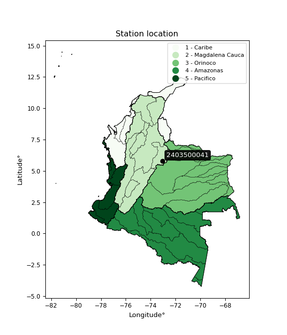</img>

</div>


## A. General information


### 1. General running parameters

• app_version: _v20260103_. • runtime: _2026-01-05 16:20:51.132608_. • Python version: _3.14.0_. • SciPy version: _1.16.3_. • Pandas version: _2.3.3_. • NumPy version: _2.3.5_. • Stations dataset (station_dataset_file): _dataset/pmax24h_in/automatic_colombia_2003_2024.csv_. • Stations catalog (station_catalog_file): _dataset/CNE.xls_. • Minimum year to eval til year_max (date_min): _1900_. • Maximum year to eval since year_min (date_max): _2024_. • Creates, save and include plots into reports (create_plot): _True_. • Plot only fit distributions with Δo > Δ (plot_only_fit): _True_. • Plot only simple graphs avoiding multiple CDFs and multiple Extreme values plots (plot_only_simple): _True_. • Eval low extreme values, if False, evaluates high extreme values (low_extreme): _False_. • Eval every SciPy distribution as logarithmic (pdist_logarithmic_on): _True_. • Standard deviation normalized (ddof): _1.0_. • Return periods to eval in years (Tr): _[2, 2.33, 5, 10, 15, 20, 25, 50, 75, 100, 200, 250, 500, 750, 1000]_. • Minimum data sample per station, 0 means any (minimum_sample): _5_. • Z-Score maximum threshold to adjust a value, 0 means disable (zscore_max): _3.5_. • Z-Score minimum threshold to adjust a value, 0 means disable (zscore_min): _-2.5_. • Avoid zeros, e.g. rain = 0 (avoid_zeros): _True_. • Avoid null values (avoid_nans): _True_. 

[:file_folder:Dataset file](../../dataset/pmax24h_in/automatic_colombia_2003_2024.csv)

> Delta Degrees of Freedom (DDOF): is a parameter used in the formulas for calculating variance and standard deviation. When ddof=0, the divisor is $N$ (the total number of observations) and this is used when your data set is the entire population. When ddof=1, the divisor is $N-1$ and this is used when your data set is a sample drawn from a larger population. Using $N-1$ provides an unbiased estimate of the population variance (known as Bessel´s correction).


### 2. Station info and location

|   id |     CODIGO | NOMBRE                      | CATEGORIA               | TECNOLOGIA                              | ESTADO   | FECHA_INSTALACION   |   FECHA_SUSPENSION |   ALTITUD |   LATITUD |   LONGITUD | DEPARTAMENTO   | MUNICIPIO   | AREA_OPERATIVA                              | ENTIDAD                                                     | AREA_HIDROGRAFICA   | ZONA_HIDROGRAFICA   | SUBZONA_HIDROGRAFICA   |   CORRIENTE | Catalogo   |   Version |
|-----:|-----------:|:----------------------------|:------------------------|:----------------------------------------|:---------|:--------------------|-------------------:|----------:|----------:|-----------:|:---------------|:------------|:--------------------------------------------|:------------------------------------------------------------|:--------------------|:--------------------|:-----------------------|------------:|:-----------|----------:|
|    0 | 2403500041 | DUITAMA - AUT  [2403500041] | Climatológica Principal | Automática con Telemetría, Convencional | Activa   | 16/10/2017          |                nan |      2492 |   5.78755 |   -73.0516 | Boyacá         | Paipa       | Area Operativa 06 - Boyacá-Casanare-Vichada | INSTITUTO DE HIDROLOGIA METEOROLOGIA Y ESTUDIOS AMBIENTALES | Magdalena Cauca     | Sogamoso            | Río Chicamocha         |         nan | CNE_IDEAM  |  20251226 |

<div align="center">

Dynamic map: [:earth_americas:Google](http://maps.google.com/maps?q=5.78755,-73.05155) [:earth_americas:OSM](https://www.openstreetmap.org/#map=18/5.78755/-73.05155&layers=P) [:earth_americas:Bing](https://www.bing.com/maps?cp=5.78755~-73.05155&lvl=18) [:earth_americas:Apple](https://maps.apple.com/frame?center=5.78755%2C-73.05155&span=0.003%2C0.006)

</div>


<div align="center">

```geojson
{
  "type": "Feature",
  "geometry": {
    "type": "Point", 
    "coordinates": [-73.05155, 5.78755]
  }, 
  "properties": {
    "Name": "2403500041"
  }
}
```

</div>


### 3. Discrete values table and plot

<div align="center">

|               |          0 |          1 |           2 |           3 |          4 |              5 |
|:--------------|-----------:|-----------:|------------:|------------:|-----------:|---------------:|
| Date          | 2019       | 2020       | 2021        | 2022        | 2023       | 2024           |
| Value         |   72       |   27.1     |   31.8      |   29.7      |   23.3     |   36.8         |
| Value_initial |   72       |   27.1     |   31.8      |   29.7      |   23.3     |   36.8         |
| count         |    6       |    6       |    6        |    6        |    6       |    6           |
| mean          |   36.7833  |   36.7833  |   36.7833   |   36.7833   |   36.7833  |   36.7833      |
| std           |   17.837   |   17.837   |   17.837    |   17.837    |   17.837   |   17.837       |
| zscore        |    1.97436 |   -0.54288 |   -0.279382 |   -0.397115 |   -0.75592 |    0.000934389 |


</div>


<div align="center">

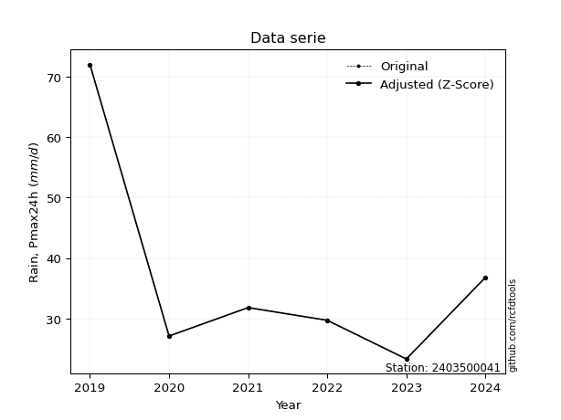</img>

</div>


> The initial value (value_initial) correspond to the initial obtained or null completed value, and value (value) is adjusted only when the initial value is outside the valid range (outlier) definite through the Z-Score value. If Z-Score is active, values out of range or outliers are replaced with the station mean value. A Z-Score (or standard score) measures how many standard deviations a data point is from the mean of a dataset, indicating its relative position; positive scores mean above the mean, negative mean below, and a score of zero is exactly at the mean, allowing for comparison of values from different distributions. It´s calculated using the formula $z=(x–μ)/σ$, where $x$ is the data point, $μ$ is the mean, and $σ$ is the standard deviation, helping identify outliers and understand probability.
>
> <sub>**Note**: In this study, "completing" (filling gaps in) and "extending" (forecasting or lengthening the historical record) rainfall data series are avoided for certain critical analyses because they introduce artificial bias and uncertainty, which can distort the statistics of rare events (extremes), alter day-to-day variability, and compromise the integrity and homogeneity of the original data. Some reasons against Completing/Extending rainfall data are: **Distortion of Extremes and Variability**: The primary issue is that most gap-filling or extension methods rely on averaging or regression with nearby stations, which inherently smooths the data. Rainfall is highly variable in space and time, with a large percentage of zero values and occasional large storms. Infilling methods often underestimate the highest values and overestimate the lowest (zero) values, which severely distorts analyses focused on flood frequency, drought severity, and intensity-duration-frequency (IDF) curves, **Loss of Data Homogeneity**: Infilled or extended data are synthetic estimates, not actual measurements. Combining these estimates with observed data can violate the assumption of data homogeneity, which requires that the data properties do not change over time. Inhomogeneity can lead to incorrect conclusions about long-term trends or changes in climate patterns, **Propagation of Errors**: Errors and biases from the original data (e.g., wind-induced undercatch, instrument errors, site changes) or the data used for imputation can propagate through the analysis, leading to unreliable hydrological models and inaccurate predictions, **Compromised Statistical Integrity**: For statistical analyses, especially those involving the frequency of events, using artificial data can introduce time bias or autocorrelation that doesn´t exist in reality, making it difficult to assess the true probability of events, **Difficulty in Validation**: It is difficult to accurately validate the quality of filled or extended data, especially for past periods where ground-truth measurements are unavailable. The reliability of imputation techniques heavily depends on the density of the surrounding station network and the complexity of the local topography.</sub>


### 4. Active continuous probability distributions from SciPy (44 of 104 available)

A Probability Density Function (PDF) describes the relative likelihood of a continuous random variable falling within a specific range, where the total area under its curve equals 1, and the area over any interval gives the actual probability for that range. Unlike discrete probabilities (like rolling a die), a PDF shows density, not direct probability for a single point (which is zero), with higher points indicating higher likelihood, often visualized as a bell curve for normal distributions.

A log of a probability density function (log-PDF) is simply the logarithm of the PDF´s value, denoted as $log(f(x))$, useful for converting multiplication of probabilities into addition, improving numerical stability with tiny numbers, and connecting to information theory concepts like entropy. Instead of dealing with very small probabilities (e.g., 0.000001), log-PDFs use negative numbers (e.g., $log(0.00001) ≈ -11.51$ that are easier for computers to handle, preventing underflow errors and simplifying complex calculations. In this study, each active probability distribution from SciPy is also evaluated in the $log$ form.

[scipy.stats](https://docs.scipy.org/doc/scipy/reference/stats.html) is a Python´s powerful submodule within the SciPy library for comprehensive statistical analysis, offering over 130 probability distributions (like Normal, Poisson), functions for descriptive stats (mean, variance), hypothesis testing (t-tests, chi-square), random variable generation, and statistical tests, making it essential for data science, modeling, and research. It provides tools to explore, model, and draw conclusions from data efficiently, working seamlessly with NumPy.

<div align="center">

|   id | p_dist             |   n_parameter | fit_method   | label                                                                       | active   | ref                                                                                                        |
|-----:|:-------------------|--------------:|:-------------|:----------------------------------------------------------------------------|:---------|:-----------------------------------------------------------------------------------------------------------|
|    0 | alpha              |             3 | MLE          | Alpha                                                                       | True     | [:mortar_board:](https://docs.scipy.org/doc/scipy/reference/generated/scipy.stats.alpha.html)              |
|    1 | betaprime          |             4 | MLE          | Beta prime                                                                  | True     | [:mortar_board:](https://docs.scipy.org/doc/scipy/reference/generated/scipy.stats.betaprime.html)          |
|    2 | chi2               |             3 | MLE          | Chi²                                                                        | True     | [:mortar_board:](https://docs.scipy.org/doc/scipy/reference/generated/scipy.stats.chi2.html)               |
|    3 | crystalball        |             4 | MLE          | Crystalball                                                                 | True     | [:mortar_board:](https://docs.scipy.org/doc/scipy/reference/generated/scipy.stats.crystalball.html)        |
|    4 | erlang             |             3 | MLE          | Erlang                                                                      | True     | [:mortar_board:](https://docs.scipy.org/doc/scipy/reference/generated/scipy.stats.erlang.html)             |
|    5 | expon              |             2 | MLE          | Exponential                                                                 | True     | [:mortar_board:](https://docs.scipy.org/doc/scipy/reference/generated/scipy.stats.expon.html)              |
|    6 | exponnorm          |             3 | MLE          | Exponentially modified Normal                                               | True     | [:mortar_board:](https://docs.scipy.org/doc/scipy/reference/generated/scipy.stats.exponnorm.html)          |
|    7 | f                  |             4 | MLE          | F                                                                           | True     | [:mortar_board:](https://docs.scipy.org/doc/scipy/reference/generated/scipy.stats.f.html)                  |
|    8 | fatiguelife        |             3 | MLE          | Fatigue-life (Birnbaum-Saunders)                                            | True     | [:mortar_board:](https://docs.scipy.org/doc/scipy/reference/generated/scipy.stats.fatiguelife.html)        |
|    9 | fisk               |             3 | MLE          | Fisk                                                                        | True     | [:mortar_board:](https://docs.scipy.org/doc/scipy/reference/generated/scipy.stats.fisk.html)               |
|   10 | gamma              |             3 | MLE          | Gamma                                                                       | True     | [:mortar_board:](https://docs.scipy.org/doc/scipy/reference/generated/scipy.stats.gamma.html)              |
|   11 | genexpon           |             5 | MLE          | Generalized exponential                                                     | True     | [:mortar_board:](https://docs.scipy.org/doc/scipy/reference/generated/scipy.stats.genexpon.html)           |
|   12 | genlogistic        |             3 | MLE          | Generalized logistic                                                        | True     | [:mortar_board:](https://docs.scipy.org/doc/scipy/reference/generated/scipy.stats.genlogistic.html)        |
|   13 | gibrat             |             2 | MM           | Gibrat                                                                      | True     | [:mortar_board:](https://docs.scipy.org/doc/scipy/reference/generated/scipy.stats.gibrat.html)             |
|   14 | gompertz           |             3 | MLE          | Gompertz (or truncated Gumbel)                                              | True     | [:mortar_board:](https://docs.scipy.org/doc/scipy/reference/generated/scipy.stats.gompertz.html)           |
|   15 | gumbel_l           |             2 | MM           | Gumbel Left Skew                                                            | True     | [:mortar_board:](https://docs.scipy.org/doc/scipy/reference/generated/scipy.stats.gumbel_l.html)           |
|   16 | gumbel_r           |             2 | MM           | Gumbel Right Skew                                                           | True     | [:mortar_board:](https://docs.scipy.org/doc/scipy/reference/generated/scipy.stats.gumbel_r.html)           |
|   17 | halflogistic       |             2 | MM           | Half-logistic                                                               | True     | [:mortar_board:](https://docs.scipy.org/doc/scipy/reference/generated/scipy.stats.halflogistic.html)       |
|   18 | halfnorm           |             2 | MM           | Half Normal                                                                 | True     | [:mortar_board:](https://docs.scipy.org/doc/scipy/reference/generated/scipy.stats.halfnorm.html)           |
|   19 | hypsecant          |             2 | MM           | hyperbolic secant                                                           | True     | [:mortar_board:](https://docs.scipy.org/doc/scipy/reference/generated/scipy.stats.hypsecant.html)          |
|   20 | invgamma           |             3 | MLE          | Inverted gamma                                                              | True     | [:mortar_board:](https://docs.scipy.org/doc/scipy/reference/generated/scipy.stats.invgamma.html)           |
|   21 | invgauss           |             3 | MLE          | Inverse Gaussian                                                            | True     | [:mortar_board:](https://docs.scipy.org/doc/scipy/reference/generated/scipy.stats.invgauss.html)           |
|   22 | invweibull         |             3 | MLE          | Inverted Weibull                                                            | True     | [:mortar_board:](https://docs.scipy.org/doc/scipy/reference/generated/scipy.stats.invweibull.html)         |
|   23 | johnsonsu          |             4 | MLE          | Johnson Su                                                                  | True     | [:mortar_board:](https://docs.scipy.org/doc/scipy/reference/generated/scipy.stats.johnsonsu.html)          |
|   24 | kstwobign          |             2 | MLE          | Limiting distribution of scaled Kolmogorov-Smirnov two-sided test statistic | True     | [:mortar_board:](https://docs.scipy.org/doc/scipy/reference/generated/scipy.stats.kstwobign.html)          |
|   25 | laplace            |             2 | MM           | Laplace                                                                     | True     | [:mortar_board:](https://docs.scipy.org/doc/scipy/reference/generated/scipy.stats.laplace.html)            |
|   26 | laplace_asymmetric |             3 | MLE          | Asymmetric Laplace                                                          | True     | [:mortar_board:](https://docs.scipy.org/doc/scipy/reference/generated/scipy.stats.laplace_asymmetric.html) |
|   27 | loggamma           |             3 | MLE          | Log gamma                                                                   | True     | [:mortar_board:](https://docs.scipy.org/doc/scipy/reference/generated/scipy.stats.loggamma.html)           |
|   28 | logistic           |             2 | MM           | Logistic (or Sech-squared)                                                  | True     | [:mortar_board:](https://docs.scipy.org/doc/scipy/reference/generated/scipy.stats.logistic.html)           |
|   29 | lognorm            |             3 | MLE          | Log Normal                                                                  | True     | [:mortar_board:](https://docs.scipy.org/doc/scipy/reference/generated/scipy.stats.lognorm.html)            |
|   30 | maxwell            |             2 | MM           | Maxwell                                                                     | True     | [:mortar_board:](https://docs.scipy.org/doc/scipy/reference/generated/scipy.stats.maxwell.html)            |
|   31 | mielke             |             4 | MLE          | Mielke Beta-Kappa / Dagum                                                   | True     | [:mortar_board:](https://docs.scipy.org/doc/scipy/reference/generated/scipy.stats.mielke.html)             |
|   32 | moyal              |             2 | MM           | Moyal                                                                       | True     | [:mortar_board:](https://docs.scipy.org/doc/scipy/reference/generated/scipy.stats.moyal.html)              |
|   33 | nakagami           |             3 | MLE          | Nakagami                                                                    | True     | [:mortar_board:](https://docs.scipy.org/doc/scipy/reference/generated/scipy.stats.nakagami.html)           |
|   34 | ncf                |             5 | MLE          | Non-central F distribution                                                  | True     | [:mortar_board:](https://docs.scipy.org/doc/scipy/reference/generated/scipy.stats.ncf.html)                |
|   35 | nct                |             4 | MLE          | Non-central Student’s t                                                     | True     | [:mortar_board:](https://docs.scipy.org/doc/scipy/reference/generated/scipy.stats.nct.html)                |
|   36 | norm               |             2 | MM           | Normal                                                                      | True     | [:mortar_board:](https://docs.scipy.org/doc/scipy/reference/generated/scipy.stats.norm.html)               |
|   37 | pearson3           |             3 | MM           | Pearson type III                                                            | True     | [:mortar_board:](https://docs.scipy.org/doc/scipy/reference/generated/scipy.stats.pearson3.html)           |
|   38 | rayleigh           |             2 | MM           | Rayleigh                                                                    | True     | [:mortar_board:](https://docs.scipy.org/doc/scipy/reference/generated/scipy.stats.rayleigh.html)           |
|   39 | rice               |             3 | MLE          | Rice                                                                        | True     | [:mortar_board:](https://docs.scipy.org/doc/scipy/reference/generated/scipy.stats.rice.html)               |
|   40 | t                  |             3 | MLE          | Student’s t                                                                 | True     | [:mortar_board:](https://docs.scipy.org/doc/scipy/reference/generated/scipy.stats.t.html)                  |
|   41 | truncnorm          |             4 | MLE          | Truncated normal                                                            | True     | [:mortar_board:](https://docs.scipy.org/doc/scipy/reference/generated/scipy.stats.truncnorm.html)          |
|   42 | wald               |             2 | MM           | Wald                                                                        | True     | [:mortar_board:](https://docs.scipy.org/doc/scipy/reference/generated/scipy.stats.wald.html)               |
|   43 | weibull_min        |             3 | MLE          | Weibull minimum                                                             | True     | [:mortar_board:](https://docs.scipy.org/doc/scipy/reference/generated/scipy.stats.weibull_min.html)        |

</div>

> **n_parameter:** # arguments & localization & scale.
>
> **Fit methods:** (MLE) maximum likelihood, (MM) L-moments.
>
>**Inactive** (With the only purpose of prevent loops, zero divisions, infinite values, over high estimated values or horizontal trending for recurrence intervals estimations, the follow distributions were disabled.)**:** foldnorm, gennorm, norminvgauss, powernorm, powerlognorm, skewnorm, genextreme, anglit, arcsine, argus, beta, bradford, burr, burr12, cauchy, cosine, halfcauchy, foldcauchy, skewcauchy, wrapcauchy, dgamma, gengamma, exponweib, exponpow, truncexpon, gausshyper, genhalflogistic, genhyperbolic, geninvgauss, halfgennorm, johnsonsb, kappa4, kappa3, ksone, kstwo, loglaplace, levy, levy_l, levy_stable, ncx2, pareto, genpareto, truncpareto, lomax, powerlaw, rdist, rel_breitwigner, recipinvgauss, semicircular, studentized_range, trapezoid, triang, truncweibull_min, tukeylambda, uniform, loguniform, vonmises, vonmises_line, weibull_max, dweibull, 


## B. Probability (PDF) vs. Empirical (EDF) distributions functions

A continuous probability distribution (CPD) describes probabilities for variables that can take any value within a range (like rain any time), unlike discrete variables with specific outcomes (like temperature). It uses a Probability Density Function (PDF), a curve where the total area under it equals 1, and the probability of the variable falling within an interval (a to b) is found by calculating the area under the curve between those points. A key feature is that the probability of hitting any single exact value is zero, so probabilities are always expressed for ranges, e.g., $P(a ≤ X ≤ b)$.

<div align="center">

Distributions parameters from station values
|    |    station | p_dist                |   n |          loc |          scale | shape                  | shape1                | shape2                 | shape3   |
|---:|-----------:|:----------------------|----:|-------------:|---------------:|:-----------------------|:----------------------|:-----------------------|:---------|
|  0 | 2403500041 | alpha                 |   6 |    15.177    |   28.2737      | 1.8026645755313182     |                       |                        |          |
|  1 | 2403500041 | betaprime             |   6 |    -0.89607  |    1.77952     | 181.3219888663911      | 9.669346684366449     |                        |          |
|  2 | 2403500041 | chi2                  |   6 |    23.3      |    3.27715     | 0.46421671624359195    |                       |                        |          |
|  3 | 2403500041 | crystalball           |   6 |    36.7833   |   16.2829      | 2917.1476410994187     | 3476.0672124357943    |                        |          |
|  4 | 2403500041 | erlang                |   6 |    23.3      |   15.9315      | 0.16646544415658548    |                       |                        |          |
|  5 | 2403500041 | expon                 |   6 |    23.3      |   13.4833      |                        |                       |                        |          |
|  6 | 2403500041 | exponnorm             |   6 |    23.2863   |    0.00449722  | 3006.5409396227096     |                       |                        |          |
|  7 | 2403500041 | f                     |   6 |    19.6992   |    8.91655     | 8541.745828714938      | 3.7311215059095595    |                        |          |
|  8 | 2403500041 | fatiguelife           |   6 |    22.2465   |    7.55558     | 1.338398148026148      |                       |                        |          |
|  9 | 2403500041 | fisk                  |   6 |    23.3      |   13.0367      | 0.9578633056713328     |                       |                        |          |
| 10 | 2403500041 | gamma                 |   6 |    23.3      |   14.1602      | 0.4889124897837971     |                       |                        |          |
| 11 | 2403500041 | genexpon              |   6 |    23.3      |   18.9748      | 1.4072920395345156     | 6.177650991174658e-11 | 1.5909926772383773     |          |
| 12 | 2403500041 | genlogistic           |   6 |   -39.5016   |    9.04947     | 2234.4413144474765     |                       |                        |          |
| 13 | 2403500041 | gibrat                |   6 |    24.3616   |    7.53418     |                        |                       |                        |          |
| 14 | 2403500041 | gompertz              |   6 |    23.3      |    1.0325e+13  | 838276316771.749       |                       |                        |          |
| 15 | 2403500041 | gumbel_l              |   6 |    44.1115   |   12.6957      |                        |                       |                        |          |
| 16 | 2403500041 | gumbel_r              |   6 |    29.4552   |   12.6957      |                        |                       |                        |          |
| 17 | 2403500041 | halflogistic          |   6 |    17.4844   |   13.9213      |                        |                       |                        |          |
| 18 | 2403500041 | halfnorm              |   6 |    15.2312   |   27.0116      |                        |                       |                        |          |
| 19 | 2403500041 | hypsecant             |   6 |    36.7833   |   10.366       |                        |                       |                        |          |
| 20 | 2403500041 | invgamma              |   6 |    19.6972   |   16.6361      | 1.8655660181240719     |                       |                        |          |
| 21 | 2403500041 | invgauss              |   6 |    21.3202   |   10.1834      | 1.5184555972679865     |                       |                        |          |
| 22 | 2403500041 | invweibull            |   6 |    18.243    |    9.82701     | 1.6799291827988942     |                       |                        |          |
| 23 | 2403500041 | johnsonsu             |   6 |    22.4761   |    0.0295099   | -5.04468603295258      | 0.8091756693050774    |                        |          |
| 24 | 2403500041 | kstwobign             |   6 |    -4.89448  |   48.6919      |                        |                       |                        |          |
| 25 | 2403500041 | laplace               |   6 |    36.7833   |   11.5137      |                        |                       |                        |          |
| 26 | 2403500041 | laplace_asymmetric    |   6 |    23.3      |    0.000713929 | 5.2947958836096234e-05 |                       |                        |          |
| 27 | 2403500041 | loggamma              |   6 | -4239.73     |  595.795       | 1310.495584486841      |                       |                        |          |
| 28 | 2403500041 | logistic              |   6 |    36.7833   |    8.97721     |                        |                       |                        |          |
| 29 | 2403500041 | lognorm               |   6 |    23.3      |    0.0280092   | 13.30382731542865      |                       |                        |          |
| 30 | 2403500041 | maxwell               |   6 |    -1.8002   |   24.1786      |                        |                       |                        |          |
| 31 | 2403500041 | mielke                |   6 |    10.0161   |    4.825       | 232.7472421202383      | 3.2018950413548133    |                        |          |
| 32 | 2403500041 | moyal                 |   6 |    27.4718   |    7.32986     |                        |                       |                        |          |
| 33 | 2403500041 | nakagami              |   6 |    23.3      |   24.1803      | 0.308937511998161      |                       |                        |          |
| 34 | 2403500041 | ncf                   |   6 |    -0.656454 |   33.7841      | 72.75014787678404      | 20.854360421811368    | 3.843853598569399e-10  |          |
| 35 | 2403500041 | nct                   |   6 |    -0.314492 |    0.757548    | 5.532638314866244      | 41.352079497999725    |                        |          |
| 36 | 2403500041 | norm                  |   6 |    36.7833   |   16.2829      |                        |                       |                        |          |
| 37 | 2403500041 | pearson3              |   6 |    36.7833   |   16.2829      | 1.5380079744752646     |                       |                        |          |
| 38 | 2403500041 | rayleigh              |   6 |     5.63328  |   24.8541      |                        |                       |                        |          |
| 39 | 2403500041 | rice                  |   6 |    13.1931   |   20.2686      | 0.0005425414719982058  |                       |                        |          |
| 40 | 2403500041 | t                     |   6 |    36.6484   |   16.339       | 14.239727068320533     |                       |                        |          |
| 41 | 2403500041 | truncnorm             |   6 | -8866.09     |  381.524       | 23.299677391352006     | 43.89560213872487     |                        |          |
| 42 | 2403500041 | wald                  |   6 |    20.5005   |   16.2829      |                        |                       |                        |          |
| 43 | 2403500041 | weibull_min           |   6 |    23.3      |    9.86903     | 0.16541706095252823    |                       |                        |          |
| 44 | 2403500041 | logalpha              |   6 |     2.62637  |    2.47342     | 3.1034299244043577     |                       |                        |          |
| 45 | 2403500041 | logbetaprime          |   6 |     2.49214  | 4474.3         | 11.824294598898653     | 51154.08473693306     |                        |          |
| 46 | 2403500041 | logchi2               |   6 |     3.14845  |    0.989028    | 1.0178982563819        |                       |                        |          |
| 47 | 2403500041 | logcrystalball        |   6 |     3.53013  |    0.361976    | 14.472960746542995     | 23.53147097622525     |                        |          |
| 48 | 2403500041 | logerlang             |   6 |     3.14845  |    0.484275    | 0.16905533595081584    |                       |                        |          |
| 49 | 2403500041 | logexpon              |   6 |     3.14845  |    0.381674    |                        |                       |                        |          |
| 50 | 2403500041 | logexponnorm          |   6 |     3.17497  |    0.0834223   | 4.257329136817436      |                       |                        |          |
| 51 | 2403500041 | logf                  |   6 |     3.14845  |    0.257933    | 1.2433244797145786     | 36.41036937689269     |                        |          |
| 52 | 2403500041 | logfatiguelife        |   6 |     3.05397  |    0.35379     | 0.8279639662589208     |                       |                        |          |
| 53 | 2403500041 | logfisk               |   6 |     3.0733   |    0.343751    | 2.095278582971925      |                       |                        |          |
| 54 | 2403500041 | loggamma              |   6 |     3.14845  |    0.398965    | 0.17360330219836273    |                       |                        |          |
| 55 | 2403500041 | loggenexpon           |   6 |     3.14845  |    0.40943     | 1.0726579627967587     | 4.53352607244365e-06  | 1.6064723990260599     |          |
| 56 | 2403500041 | loggenlogistic        |   6 |     1.70137  |    0.239088    | 1096.8262621748354     |                       |                        |          |
| 57 | 2403500041 | loggibrat             |   6 |     3.25395  |    0.167507    |                        |                       |                        |          |
| 58 | 2403500041 | loggompertz           |   6 |     3.14845  |    0.76855     | 1.1126815481719141     |                       |                        |          |
| 59 | 2403500041 | loggumbel_l           |   6 |     3.69304  |    0.282231    |                        |                       |                        |          |
| 60 | 2403500041 | loggumbel_r           |   6 |     3.36722  |    0.282231    |                        |                       |                        |          |
| 61 | 2403500041 | loghalflogistic       |   6 |     3.1011   |    0.309476    |                        |                       |                        |          |
| 62 | 2403500041 | loghalfnorm           |   6 |     3.05101  |    0.60048     |                        |                       |                        |          |
| 63 | 2403500041 | loghypsecant          |   6 |     3.53013  |    0.230441    |                        |                       |                        |          |
| 64 | 2403500041 | loginvgamma           |   6 |     2.20897  |   20.6956      | 16.6079415347508       |                       |                        |          |
| 65 | 2403500041 | loginvgauss           |   6 |     3.02345  |    0.820925    | 0.617205717914854      |                       |                        |          |
| 66 | 2403500041 | loginvweibull         |   6 |     2.64888  |    0.691733    | 3.3841585792069035     |                       |                        |          |
| 67 | 2403500041 | logjohnsonsu          |   6 |     3.05292  |    0.00461838  | -6.518927786795555     | 1.291032957458122     |                        |          |
| 68 | 2403500041 | logkstwobign          |   6 |     2.49554  |    1.19859     |                        |                       |                        |          |
| 69 | 2403500041 | loglaplace            |   6 |     3.53013  |    0.255955    |                        |                       |                        |          |
| 70 | 2403500041 | loglaplace_asymmetric |   6 |     3.29953  |    0.18894     | 0.5604234778071655     |                       |                        |          |
| 71 | 2403500041 | logloggamma           |   6 |  -106.514    |   14.9276      | 1590.8299413864052     |                       |                        |          |
| 72 | 2403500041 | loglogistic           |   6 |     3.53013  |    0.199568    |                        |                       |                        |          |
| 73 | 2403500041 | loglognorm            |   6 |     3.14845  |    0.00117348  | 12.806454969438866     |                       |                        |          |
| 74 | 2403500041 | logmaxwell            |   6 |     2.6724   |    0.537503    |                        |                       |                        |          |
| 75 | 2403500041 | logmielke             |   6 |     2.46549  |    0.235319    | 1088.0829764673636     | 4.217989279106503     |                        |          |
| 76 | 2403500041 | logmoyal              |   6 |     3.32313  |    0.162946    |                        |                       |                        |          |
| 77 | 2403500041 | lognakagami           |   6 |     3.14845  |    0.911276    | 0.0674295285518757     |                       |                        |          |
| 78 | 2403500041 | logncf                |   6 |    -3.44135  |    6.96263     | 463.60225421936127     | 518.4077743095147     | 1.2949347640631452e-05 |          |
| 79 | 2403500041 | lognct                |   6 |     0.864765 |    0.0277335   | 32.81108824453014      | 93.54306969366968     |                        |          |
| 80 | 2403500041 | lognorm               |   6 |     3.53013  |    0.361976    |                        |                       |                        |          |
| 81 | 2403500041 | logpearson3           |   6 |     3.53013  |    0.361975    | 1.2144514643109456     |                       |                        |          |
| 82 | 2403500041 | lograyleigh           |   6 |     2.83765  |    0.552519    |                        |                       |                        |          |
| 83 | 2403500041 | logrice               |   6 |     2.96308  |    0.475691    | 0.0003455499629535547  |                       |                        |          |
| 84 | 2403500041 | logt                  |   6 |     3.40569  |    0.162297    | 1.558352098328565      |                       |                        |          |
| 85 | 2403500041 | logtruncnorm          |   6 |    -1.83257  |    1.42227     | 3.5021592735080542     | 4.295426336038361     |                        |          |
| 86 | 2403500041 | logwald               |   6 |     3.16821  |    0.361922    |                        |                       |                        |          |
| 87 | 2403500041 | logweibull_min        |   6 |     3.14845  |    0.414039    | 0.17231370531446039    |                       |                        |          |

</div>

> **loc** (Location parameter): This shifts the distribution along the x-axis. For many common distributions, like the normal (Gaussian) distribution, loc represents the mean $μ$. For others, like the uniform distribution, it might represent the minimum value, or for the beta distribution, the left end of the support interval.
>
> **scale** (Scale parameter): This determines the width or spread of the distribution. For the normal distribution, scale represents the standard deviation $σ$. For a uniform distribution, it defines the length of the interval (from $loc$ to $loc + scale$).
>
> **shape** (Shape parameters): Refers to parameters that define the specific form of a probability distribution, distinct from its location (loc) and scale (scale). These parameters are required arguments for most distribution functions. For example, a normal (Gaussian) distribution is fully defined by its location (mean) and scale (standard deviation), so it has no specific shape parameters beyond loc and scale. However, other distributions have intrinsic properties that need specification, as Gamma distribution that takes a shape parameter, often named $a$ or $alpha$.


### 0. Cumulative distribution values - CDF (88 evaluated)

Cumulative Distribution Function (CDF), denoted as $F$<sub>$X$</sub>$(x)$, is a function that gives the probability that a random variable $X$ will take a value less than or equal to a specific value, $x$ (i.e., $(P(X≥x)$. It essentially "accumulates" probabilities from a given point up to the far right (positive infinity), providing a complete picture of the distribution´s probabilities for both discrete (like rain) and continuous (like temperature) variables, helping to find probabilities over ranges or above certain values. Each station is evaluated separately ordering the $x$ values ascending, calculating the CDF and PDF values for the activated distributions and their logarithmic forms.

<div align="center">

CDF ordered by x ascending and calculating $log(f(x))$ separately
|   id |    Station |   date |    x |   count |    mean |    std |       zscore |   Value_initial |    station |   m |     alpha |   alpha_pdf |   betaprime |   betaprime_pdf |       chi2 |    chi2_pdf |   crystalball |   crystalball_pdf |     erlang |   erlang_pdf |    expon |   expon_pdf |   exponnorm |   exponnorm_pdf |         f |      f_pdf |   fatiguelife |   fatiguelife_pdf |        fisk |   fisk_pdf |      gamma |   gamma_pdf |    genexpon |   genexpon_pdf |   genlogistic |   genlogistic_pdf |   gibrat |   gibrat_pdf |    gompertz |   gompertz_pdf |   gumbel_l |   gumbel_l_pdf |   gumbel_r |   gumbel_r_pdf |   halflogistic |   halflogistic_pdf |   halfnorm |   halfnorm_pdf |   hypsecant |   hypsecant_pdf |   invgamma |   invgamma_pdf |   invgauss |   invgauss_pdf |   invweibull |   invweibull_pdf |   johnsonsu |   johnsonsu_pdf |   kstwobign |   kstwobign_pdf |   laplace |   laplace_pdf |   laplace_asymmetric |   laplace_asymmetric_pdf |   loggamma |   loggamma_pdf |   logistic |   logistic_pdf |   lognorm |   lognorm_pdf |   maxwell |   maxwell_pdf |    mielke |   mielke_pdf |    moyal |   moyal_pdf |    nakagami |   nakagami_pdf |      ncf |   ncf_pdf |      nct |    nct_pdf |     norm |   norm_pdf |   pearson3 |   pearson3_pdf |   rayleigh |   rayleigh_pdf |     rice |   rice_pdf |        t |      t_pdf |   truncnorm |   truncnorm_pdf |      wald |   wald_pdf |   weibull_min |   weibull_min_pdf |   logalpha |   logalpha_pdf |   logbetaprime |   logbetaprime_pdf |     logchi2 |   logchi2_pdf |   logcrystalball |   logcrystalball_pdf |   logerlang |   logerlang_pdf |   logexpon |   logexpon_pdf |   logexponnorm |   logexponnorm_pdf |        logf |       logf_pdf |   logfatiguelife |   logfatiguelife_pdf |   logfisk |   logfisk_pdf |   loggenexpon |   loggenexpon_pdf |   loggenlogistic |   loggenlogistic_pdf |   loggibrat |   loggibrat_pdf |   loggompertz |   loggompertz_pdf |   loggumbel_l |   loggumbel_l_pdf |   loggumbel_r |   loggumbel_r_pdf |   loghalflogistic |   loghalflogistic_pdf |   loghalfnorm |   loghalfnorm_pdf |   loghypsecant |   loghypsecant_pdf |   loginvgamma |   loginvgamma_pdf |   loginvgauss |   loginvgauss_pdf |   loginvweibull |   loginvweibull_pdf |   logjohnsonsu |   logjohnsonsu_pdf |   logkstwobign |   logkstwobign_pdf |   loglaplace |   loglaplace_pdf |   loglaplace_asymmetric |   loglaplace_asymmetric_pdf |   logloggamma |   logloggamma_pdf |   loglogistic |   loglogistic_pdf |   loglognorm |   loglognorm_pdf |   logmaxwell |   logmaxwell_pdf |   logmielke |   logmielke_pdf |   logmoyal |   logmoyal_pdf |   lognakagami |   lognakagami_pdf |   logncf |   logncf_pdf |   lognct |   lognct_pdf |   logpearson3 |   logpearson3_pdf |   lograyleigh |   lograyleigh_pdf |   logrice |   logrice_pdf |     logt |   logt_pdf |   logtruncnorm |   logtruncnorm_pdf |   logwald |   logwald_pdf |   logweibull_min |   logweibull_min_pdf |
|-----:|-----------:|-------:|-----:|--------:|--------:|-------:|-------------:|----------------:|-----------:|----:|----------:|------------:|------------:|----------------:|-----------:|------------:|--------------:|------------------:|-----------:|-------------:|---------:|------------:|------------:|----------------:|----------:|-----------:|--------------:|------------------:|------------:|-----------:|-----------:|------------:|------------:|---------------:|--------------:|------------------:|---------:|-------------:|------------:|---------------:|-----------:|---------------:|-----------:|---------------:|---------------:|-------------------:|-----------:|---------------:|------------:|----------------:|-----------:|---------------:|-----------:|---------------:|-------------:|-----------------:|------------:|----------------:|------------:|----------------:|----------:|--------------:|---------------------:|-------------------------:|-----------:|---------------:|-----------:|---------------:|----------:|--------------:|----------:|--------------:|----------:|-------------:|---------:|------------:|------------:|---------------:|---------:|----------:|---------:|-----------:|---------:|-----------:|-----------:|---------------:|-----------:|---------------:|---------:|-----------:|---------:|-----------:|------------:|----------------:|----------:|-----------:|--------------:|------------------:|-----------:|---------------:|---------------:|-------------------:|------------:|--------------:|-----------------:|---------------------:|------------:|----------------:|-----------:|---------------:|---------------:|-------------------:|------------:|---------------:|-----------------:|---------------------:|----------:|--------------:|--------------:|------------------:|-----------------:|---------------------:|------------:|----------------:|--------------:|------------------:|--------------:|------------------:|--------------:|------------------:|------------------:|----------------------:|--------------:|------------------:|---------------:|-------------------:|--------------:|------------------:|--------------:|------------------:|----------------:|--------------------:|---------------:|-------------------:|---------------:|-------------------:|-------------:|-----------------:|------------------------:|----------------------------:|--------------:|------------------:|--------------:|------------------:|-------------:|-----------------:|-------------:|-----------------:|------------:|----------------:|-----------:|---------------:|--------------:|------------------:|---------:|-------------:|---------:|-------------:|--------------:|------------------:|--------------:|------------------:|----------:|--------------:|---------:|-----------:|---------------:|-------------------:|----------:|--------------:|-----------------:|---------------------:|
|    0 | 2403500041 |   2023 | 23.3 |       6 | 36.7833 | 17.837 | -0.75592     |            23.3 | 2403500041 |   1 | 0.0484002 |  0.0433731  |    0.131769 |      0.0293554  | 0.00031439 | 2.054e+10   |      0.203816 |        0.0173893  | 0.00267355 |  1.25271e+11 | 0        |  0.0741656  |  0.00100913 |      0.0737951  | 0.0462105 | 0.0500677  |     0.0425451 |        0.0980221  | 1.23377e-15 | 0.332643   | 2.6627e-08 | 3.66431e+06 | 5.76632e-11 |     0.0741662  |      0.114989 |        0.0274703  | 0        |   0          | 1.99024e-14 |     0.081189   |   0.176445 |    0.0125926   |   0.19713  |     0.0252147  |       0.20589  |          0.0343938 |   0.234843 |      0.0282497 |    0.169268 |      0.0155704  |  0.0462104 |     0.0500676  |  0.0436146 |      0.0646676 |    0.0472258 |       0.0478932  |   0.0367637 |      0.0789577  |    0.109238 |      0.024638   |  0.155018 |    0.0134638  |          2.90474e-09 |               0.0741641  | 0.00273905 |    1.07075e+12 |   0.182135 |     0.0165933  |  0.145845 |       0.63213 |  0.217536 |    0.0207483  | 0.0617223 |   0.040651   | 0.183784 |  0.0299059  | 1.28016e-10 |  22264.1       | 0.142873 | 0.0282593 | 0.110606 | 0.0318561  | 0.203816 | 0.0173893  |   0.196771 |      0.0340196 |   0.223244 |      0.0222148 | 0.116908 | 0.0217259  | 0.213703 | 0.0169232  |    0        |      0.0611821  | 0.0403044 | 0.0467861  |    0.00278446 |       1.29466e+11 |  0.0511604 |       0.953344 |      0.0879922 |          0.721491  | 1.22425e-08 |   1.40305e+07 |         0.145846 |             0.632129 |  0.00309554 |     1.17841e+12 |   0        |       2.62004  |      0.0538326 |           0.905118 | 5.47322e-10 | 766174         |        0.0433632 |             1.44162  | 0.0397132 |      1.06319  |   7.13255e-10 |          2.61988  |        0.0760283 |             0.818393 |    0        |        0        |   3.12357e-09 |          1.44777  |      0.135161 |         0.444972  |      0.114078 |          0.877468 |         0.0763531 |              1.60621  |      0.128907 |          1.31137  |       0.120054 |           0.508711 |     0.0988985 |          0.830127 |     0.0446431 |          1.26903  |       0.0493768 |            1.00622  |      0.0434342 |           1.2434   |      0.0719909 |           0.806589 |     0.112554 |         0.439741 |               0.0573787 |                    0.541889 |      0.155275 |          0.631983 |      0.1287   |          0.561895 |    0.0127593 |      5.79167e+12 |     0.146813 |         0.786642 |         nan |             nan |   0.087427 |       0.971241 |    0.00743659 |       2.25831e+12 | 0.272113 |     0.556246 | 0.124223 |     0.787491 |      0.11069  |          1.0541   |      0.146336 |          0.869124 | 0.0731154 |      0.759297 | 0.143412 |  0.618115  |    1.62968e-06 |           2.74265  |  0        |      0        |       0.00263006 |          1.01916e+12 |
|    1 | 2403500041 |   2020 | 27.1 |       6 | 36.7833 | 17.837 | -0.54288     |            27.1 | 2403500041 |   2 | 0.295333  |  0.0699987  |    0.259974 |      0.0368696  | 0.877169   | 0.0331126   |      0.276024 |        0.0205297  | 0.82191    |  0.0293012   | 0.245598 |  0.0559507  |  0.245766   |      0.0557821  | 0.306745  | 0.0680366  |     0.369423  |        0.0595222  | 0.234905    | 0.045303   | 0.544988   | 0.0583711   | 0.245599    |     0.0559511  |      0.241353 |        0.0378997  | 0.155752 |   0.0872951  | 0.265465    |     0.0596361  |   0.230382 |    0.0158741   |   0.300042 |     0.0284506  |       0.332252 |          0.0319514 |   0.339626 |      0.0268204 |    0.238344 |      0.0209037  |  0.306744  |     0.0680367  |  0.330256  |      0.0648568 |    0.303994  |       0.0686573  |   0.346787  |      0.0645989  |    0.219035 |      0.0322778  |  0.215634 |    0.0187284  |          0.245593    |               0.0559499  | 0.866438   |    0.718204    |   0.25376  |     0.0210941  |  0.262049 |       0.89972 |  0.301176 |    0.0230786  | 0.284302  |   0.0664402  | 0.305041 |  0.0329901  | 0.246982    |      0.0399254 | 0.264023 | 0.0344976 | 0.254992 | 0.0420543  | 0.276024 | 0.0205297  |   0.325567 |      0.0331458 |   0.311332 |      0.0239319 | 0.209736 | 0.026752   | 0.28405  | 0.0200279  |    0.207483 |      0.0485085  | 0.275932  | 0.0613801  |    0.574273   |       0.0158257   |  0.284307  |       1.85187  |      0.236181  |          1.20764   | 0.296968    |   0.950782    |         0.262049 |             0.899718 |  0.849106   |     0.725666    |   0.326883 |       1.76359  |      0.283819  |           1.82591  | 0.515761    |      1.67686   |        0.328718  |             1.8081   | 0.293898  |      1.92195  |   0.326867    |          1.76353  |        0.253993  |             1.45497  |    0.096543 |        3.75219  |   0.214715    |          1.38388  |      0.219654 |         0.685749  |      0.280544 |          1.26343  |         0.310043  |              1.46033  |      0.32103  |          1.21968  |       0.22428  |           0.894711 |     0.262145  |          1.27106  |     0.314924  |          1.83131  |       0.292229  |            1.86985  |      0.312607  |           1.85325  |      0.240837  |           1.34312  |     0.203099 |         0.793495 |               0.239006  |                    2.25719  |      0.269882 |          0.878663 |      0.239492 |          0.912651 |    0.647777  |      0.191879    |     0.285376 |         1.02309  |         nan |             nan |   0.282339 |       1.47682  |    0.677735   |       0.603918    | 0.360902 |     0.613748 | 0.272899 |     1.1472   |      0.296701 |          1.32097  |      0.294902 |          1.06682  | 0.221297  |      1.15782  | 0.298094 |  1.54773   |    0.345429    |           1.87999  |  0.232529 |      2.88242  |       0.56852    |          0.413645    |
|    2 | 2403500041 |   2022 | 29.7 |       6 | 36.7833 | 17.837 | -0.397115    |            29.7 | 2403500041 |   3 | 0.459088  |  0.0548862  |    0.357719 |      0.0378006  | 0.935487   | 0.0149234   |      0.331775 |        0.0222888  | 0.878187   |  0.0161176   | 0.377904 |  0.0461382  |  0.377707   |      0.0460239  | 0.462338  | 0.051502   |     0.495947  |        0.0399898  | 0.335929    | 0.0333876  | 0.665793   | 0.0372175   | 0.377906    |     0.0461384  |      0.344175 |        0.0405561  | 0.365228 |   0.0704244  | 0.405247    |     0.0482874  |   0.274848 |    0.0183563   |   0.374973 |     0.0289714  |       0.4126   |          0.029802  |   0.4078   |      0.0255909 |    0.297676 |      0.0247102  |  0.462338  |     0.051502   |  0.473213  |      0.0461994 |    0.461749  |       0.0523184  |   0.486839  |      0.0446623  |    0.30627  |      0.0344218  |  0.270264 |    0.0234732  |          0.377898    |               0.0461377  | 0.914693   |    0.385841    |   0.312376 |     0.0239269  |  0.350508 |       1.02381 |  0.362469 |    0.023972   | 0.448612  |   0.0581741  | 0.390346 |  0.0323279  | 0.339719    |      0.0322591 | 0.355413 | 0.035382  | 0.365675 | 0.0423228  | 0.331775 | 0.0222888  |   0.409135 |      0.0310073 |   0.37426  |      0.0243789 | 0.282248 | 0.0288399  | 0.3385   | 0.0217922  |    0.324097 |      0.0413828  | 0.419324  | 0.0487971  |    0.605787   |       0.00948457  |  0.448418  |       1.67434  |      0.354715  |          1.3561    | 0.37228     |   0.719256    |         0.350507 |             1.02381  |  0.898705   |     0.405068    |   0.470523 |       1.38725  |      0.441092  |           1.56024  | 0.641347    |      1.12193   |        0.476841  |             1.42702  | 0.459057  |      1.63696  |   0.470504    |          1.38722  |        0.392818  |             1.53456  |    0.42089  |        2.85047  |   0.338452    |          1.31342  |      0.290453 |         0.862647  |      0.399032 |          1.29892  |         0.437072  |              1.307    |      0.428902 |          1.1318   |       0.318705 |           1.16326  |     0.382798  |          1.33665  |     0.467683  |          1.49056  |       0.454879  |            1.63366  |      0.467839  |           1.51768  |      0.368142  |           1.4055   |     0.290505 |         1.13498  |               0.420082  |                    1.72012  |      0.35591  |          0.992472 |      0.332609 |          1.11231  |    0.661419  |      0.117702    |     0.382474 |         1.0856   |         nan |             nan |   0.417009 |       1.42948  |    0.722338   |       0.399591    | 0.418055 |     0.631669 | 0.383047 |     1.23863  |      0.416544 |          1.27695  |      0.394546 |          1.09775  | 0.332948  |      1.26188  | 0.469376 |  2.09701   |    0.49901     |           1.48701  |  0.458235 |      2.02282  |       0.598306   |          0.260125    |
|    3 | 2403500041 |   2021 | 31.8 |       6 | 36.7833 | 17.837 | -0.279382    |            31.8 | 2403500041 |   4 | 0.560561  |  0.0421134  |    0.436074 |      0.0365801  | 0.959597   | 0.00871133  |      0.379784 |        0.0233798  | 0.906342   |  0.0111514   | 0.467625 |  0.0394839  |  0.467226   |      0.0394032  | 0.557735  | 0.0398094  |     0.569737  |        0.0309341  | 0.398989    | 0.0270227  | 0.733298   | 0.0277559   | 0.467628    |     0.039484   |      0.429234 |        0.0401081  | 0.494897 |   0.0536283  | 0.498477    |     0.0407181  |   0.315579 |    0.0204416   |   0.435457 |     0.0285153  |       0.473184 |          0.0278745 |   0.460385 |      0.024473  |    0.352551 |      0.0274711  |  0.557735  |     0.0398094  |  0.558564  |      0.0356791 |    0.558542  |       0.0403109  |   0.568868  |      0.0341049  |    0.3789   |      0.0345358  |  0.32434  |    0.0281698  |          0.467619    |               0.0394836  | 0.936569   |    0.264862    |   0.36468  |     0.0258085  |  0.422614 |       1.08132 |  0.413185 |    0.024265   | 0.559728  |   0.0475523  | 0.456666 |  0.0307099  | 0.403263    |      0.0284694 | 0.428972 | 0.0344683 | 0.452262 | 0.0398423  | 0.379784 | 0.0233798  |   0.47204  |      0.0288615 |   0.425471 |      0.0243368 | 0.343858 | 0.0297184  | 0.385475 | 0.022891   |    0.405655 |      0.0363979  | 0.511856  | 0.0396165  |    0.623034   |       0.00715707  |  0.554018  |       1.41028  |      0.44836   |          1.37209   | 0.417656    |   0.61516     |         0.422614 |             1.08132  |  0.921987   |     0.286254    |   0.557301 |       1.15989  |      0.538605  |           1.29822  | 0.708764    |      0.866706  |        0.565484  |             1.17493  | 0.560651  |      1.33649  |   0.55728     |          1.15988  |        0.495475  |             1.45482  |    0.581016 |        1.90102  |   0.42594     |          1.24567  |      0.354096 |         1.00034   |      0.486172 |          1.24233  |         0.521927  |              1.17552  |      0.503629 |          1.05432  |       0.40389  |           1.31882  |     0.473023  |          1.29348  |     0.560554  |          1.2327   |       0.557248  |            1.3604   |      0.562299  |           1.25132  |      0.462698  |           1.35126  |     0.379381 |         1.48221  |               0.526457  |                    1.4046   |      0.425708 |          1.04567  |      0.412396 |          1.21425  |    0.668475  |      0.0910918   |     0.456976 |         1.08948  |         nan |             nan |   0.510457 |       1.29754  |    0.746764   |       0.321432    | 0.461404 |     0.636078 | 0.467866 |     1.23458  |      0.500936 |          1.18781  |      0.469158 |          1.08127  | 0.419834  |      1.27268  | 0.610265 |  1.93477   |    0.59211     |           1.24506  |  0.577296 |      1.49114  |       0.61399    |          0.203576    |
|    4 | 2403500041 |   2024 | 36.8 |       6 | 36.7833 | 17.837 |  0.000934389 |            36.8 | 2403500041 |   5 | 0.715282  |  0.0221325  |    0.603413 |      0.0297657  | 0.985464   | 0.00284773  |      0.500408 |        0.0245007  | 0.94586    |  0.00554064  | 0.632575 |  0.0272503  |  0.631918   |      0.0272228  | 0.70735   | 0.0220879  |     0.690976  |        0.0190674  | 0.508362    | 0.0177332  | 0.8372     | 0.0153929   | 0.632578    |     0.0272503  |      0.614609 |        0.0330561  | 0.691934 |   0.0282857  | 0.665812    |     0.0271324  |   0.430045 |    0.0252391   |   0.570796 |     0.02521    |       0.600383 |          0.0229699 |   0.575421 |      0.0214751 |    0.500512 |      0.0307071  |  0.707351  |     0.0220879  |  0.695533  |      0.0209031 |    0.709134  |       0.022065   |   0.698785  |      0.0196774  |    0.54419  |      0.0308692  |  0.500723 |    0.0433636  |          0.632568    |               0.0272503  | 0.964297   |    0.133629    |   0.500464 |     0.0278483  |  0.582471 |       1.07849 |  0.533442 |    0.0235171  | 0.740797  |   0.0265154  | 0.596641 |  0.0250405  | 0.529544    |      0.0225093 | 0.588592 | 0.028818  | 0.62797  | 0.0300299  | 0.500408 | 0.0245007  |   0.602536 |      0.0233166 |   0.544445 |      0.0229845 | 0.492505 | 0.0291624  | 0.503637 | 0.0239908  |    0.562458 |      0.0268102  | 0.66851   | 0.0244632  |    0.651177   |       0.00450151  |  0.718813  |       0.872127 |      0.637994  |          1.18373   | 0.496175    |   0.472968    |         0.58247  |             1.07849  |  0.952803   |     0.153771    |   0.698044 |       0.791136 |      0.694141  |           0.861195 | 0.808212    |      0.529896  |        0.70563   |             0.773513 | 0.714197  |      0.803621 |   0.698023    |          0.791146 |        0.682961  |             1.08905  |    0.770749 |        0.862172 |   0.595056    |          1.06258  |      0.519692 |         1.24799   |      0.650592 |          0.99093  |         0.672294  |              0.8854   |      0.644202 |          0.867534 |       0.602302 |           1.31058  |     0.645448  |          1.0441   |     0.70696   |          0.801396 |       0.716183  |            0.845763 |      0.709866  |           0.799894 |      0.642218  |           1.08628  |     0.627536 |         1.45519  |               0.692925  |                    0.910829 |      0.580379 |          1.04591  |      0.593311 |          1.20908  |    0.679308  |      0.0611527   |     0.610478 |         0.991391 |         nan |             nan |   0.674165 |       0.942289 |    0.786105   |       0.228297    | 0.553551 |     0.62042  | 0.637829 |     1.06333  |      0.656141 |          0.930141 |      0.619272 |          0.957628 | 0.598241  |      1.14059  | 0.813921 |  0.88519   |    0.742989    |           0.845252 |  0.73969  |      0.815218 |       0.638385   |          0.138677    |
|    5 | 2403500041 |   2019 | 72   |       6 | 36.7833 | 17.837 |  1.97436     |            72   | 2403500041 |   6 | 0.937559  |  0.00154591 |    0.97776  |      0.00175157 | 0.99997    | 4.94592e-06 |      0.984722 |        0.00236278 | 0.997278   |  0.000208718 | 0.972999 |  0.00200258 |  0.972752   |      0.00201519 | 0.945728  | 0.00172723 |     0.948041  |        0.00236012 | 0.779436    | 0.00338135 | 0.991602   | 0.000665212 | 0.972999    |     0.00200253 |      0.990093 |        0.00108926 | 0.967422 |   0.00152907 | 0.98082     |     0.00155718 |   0.999876 |    8.78592e-05 |   0.965562 |     0.00266532 |       0.960937 |          0.0027512 |   0.964416 |      0.0032454 |    0.978705 |      0.00205278 |  0.945728  |     0.00172722 |  0.949343  |      0.0020955 |    0.944057  |       0.00169841 |   0.936335  |      0.00203857 |    0.986358 |      0.00176973 |  0.976525 |    0.00203888 |          0.972997    |               0.00200268 | 0.996196   |    0.0117759   |   0.9806   |     0.00211909 |  0.980415 |       0.1314  |  0.974634 |    0.00291551 | 0.979734  |   0.00103606 | 0.961751 |  0.00260714 | 0.938927    |      0.0043354 | 0.974085 | 0.0020064 | 0.975042 | 0.00165274 | 0.984722 | 0.00236278 |   0.960464 |      0.0027575 |   0.971706 |      0.0030398 | 0.985139 | 0.00212732 | 0.976018 | 0.00275073 |    0.949597 |      0.00310061 | 0.95914   | 0.00207928 |    0.728066   |       0.00120279  |  0.946621  |       0.100084 |      0.984415  |          0.0909551 | 0.709093    |   0.216156    |         0.980415 |             0.131402 |  0.993124   |     0.0181503   |   0.947971 |       0.136317 |      0.953783  |           0.130131 | 0.964297    |      0.0827643 |        0.944713  |             0.132236 | 0.932473  |      0.109637 |   0.947962    |          0.136333 |        0.977238  |             0.094112 |    0.964789 |        0.075927 |   0.975689    |          0.152766 |      0.999632 |         0.0103024 |      0.960923 |          0.135717 |         0.956176  |              0.138505 |      0.958761 |          0.165489 |       0.975071 |           0.108071 |     0.96549   |          0.127875 |     0.946505  |          0.126541 |       0.946259  |            0.108671 |      0.942883  |           0.120906 |      0.975847  |           0.119781 |     0.972943 |         0.105708 |               0.958057  |                    0.124409 |      0.977923 |          0.143016 |      0.976815 |          0.113484 |    0.704133  |      0.0239127   |     0.969464 |         0.153797 |         nan |             nan |   0.957242 |       0.131077 |    0.883277   |       0.095823    | 0.873136 |     0.298328 | 0.974001 |     0.120069 |      0.958555 |          0.143756 |      0.966346 |          0.158638 | 0.977912  |      0.128223 | 0.972548 |  0.0472944 |    0.999997    |           0.12446  |  0.955588 |      0.102678 |       0.695337   |          0.0553052   |


</div>

An Empirical Distribution Function (EDF) is a step-function estimate of a true cumulative distribution function (CDF) based on observed sample data, representing the proportion of data points less than or equal to a given value. It is calculated by ordering your data and jumping up by $1/n$ (where $n$ is sample size) at each unique data point, allowing analysis without assuming an underlying population distribution, and it gets closer to the true CDF as the sample size grows. For the empirical probability calculations, the parameter $m$ correspond to the order number which means the position of the $x$ values in an ascending order list.

The Kolmogorov-Smirnov (K-S) test is a non-parametric statistical test used to determine if a sample data set comes from a specific theoretical distribution (one-sample) or if two different samples come from the same underlying distribution (two-sample), by comparing their cumulative distribution functions (CDFs). It calculates the maximum vertical difference (D statistic) between these functions, with a small p-value indicating a significant difference and rejection of the null hypothesis (that the data/samples match).


### 1. EDF California (1923)

California´s estimates the true probability distribution of water-related data (like rainfall, streamflow) using observed samples, crucial for risk assessment.

<div align="center">


$P=m/n$


</div>


**1.1. Empirical values**

<div align="center">

|                | 0                   | 1                  | 2              | 3                  | 4                  | 5              |
|:---------------|:--------------------|:-------------------|:---------------|:-------------------|:-------------------|:---------------|
| date           | 2023                | 2020               | 2022           | 2021               | 2024               | 2019           |
| x              | 23.3                | 27.1               | 29.7           | 31.8               | 36.8               | 72.0           |
| m              | 1                   | 2                  | 3              | 4                  | 5                  | 6              |
| empirical_dist | edf_california      | edf_california     | edf_california | edf_california     | edf_california     | edf_california |
| empirical      | 0.16666666666666666 | 0.3333333333333333 | 0.5            | 0.6666666666666666 | 0.8333333333333334 | 1.0            |
| empirical_tr   | 1.2                 | 1.4999999999999998 | 2.0            | 2.9999999999999996 | 6.000000000000002  | inf            |

</div>


**1.2. Kolmogorov-Smirnov fit test (sorted by Δ)**


<div align="center">

|                | 0                   | 1                   | 2                   | 3                   | 4                   | 5                   | 6                  | 7                   | 8                   | 9                  | 10                  | 11                  | 12                  | 13                  | 14                  | 15                    | 16                 | 17                  | 18                  | 19                  | 20                  | 21                  | 22                  | 23                  | 24                  | 25                  | 26                 | 27                  | 28                  | 29                  | 30                  | 31                  | 32                  | 33                 | 34                  | 35                  | 36                  | 37                 | 38                 | 39                  | 40                 | 41                  | 42                  | 43                  | 44                  | 45                  | 46                  | 47                  | 48                 | 49                 | 50                  | 51                 | 52                | 53                | 54                 | 55                 | 56                 | 57                | 58                  | 59                 | 60                 | 61                 | 62                  | 63                 | 64                  | 65                  | 66                  | 67                  | 68                  | 69                 | 70                  | 71                 | 72                 | 73                  | 74                 | 75                 | 76                  | 77                | 78                | 79                  | 80                  | 81                  | 82                  | 83                 | 84                 | 85                 | 86                 | 87             |
|:---------------|:--------------------|:--------------------|:--------------------|:--------------------|:--------------------|:--------------------|:-------------------|:--------------------|:--------------------|:-------------------|:--------------------|:--------------------|:--------------------|:--------------------|:--------------------|:----------------------|:-------------------|:--------------------|:--------------------|:--------------------|:--------------------|:--------------------|:--------------------|:--------------------|:--------------------|:--------------------|:-------------------|:--------------------|:--------------------|:--------------------|:--------------------|:--------------------|:--------------------|:-------------------|:--------------------|:--------------------|:--------------------|:-------------------|:-------------------|:--------------------|:-------------------|:--------------------|:--------------------|:--------------------|:--------------------|:--------------------|:--------------------|:--------------------|:-------------------|:-------------------|:--------------------|:-------------------|:------------------|:------------------|:-------------------|:-------------------|:-------------------|:------------------|:--------------------|:-------------------|:-------------------|:-------------------|:--------------------|:-------------------|:--------------------|:--------------------|:--------------------|:--------------------|:--------------------|:-------------------|:--------------------|:-------------------|:-------------------|:--------------------|:-------------------|:-------------------|:--------------------|:------------------|:------------------|:--------------------|:--------------------|:--------------------|:--------------------|:-------------------|:-------------------|:-------------------|:-------------------|:---------------|
| station        | 2403500041          | 2403500041          | 2403500041          | 2403500041          | 2403500041          | 2403500041          | 2403500041         | 2403500041          | 2403500041          | 2403500041         | 2403500041          | 2403500041          | 2403500041          | 2403500041          | 2403500041          | 2403500041            | 2403500041         | 2403500041          | 2403500041          | 2403500041          | 2403500041          | 2403500041          | 2403500041          | 2403500041          | 2403500041          | 2403500041          | 2403500041         | 2403500041          | 2403500041          | 2403500041          | 2403500041          | 2403500041          | 2403500041          | 2403500041         | 2403500041          | 2403500041          | 2403500041          | 2403500041         | 2403500041         | 2403500041          | 2403500041         | 2403500041          | 2403500041          | 2403500041          | 2403500041          | 2403500041          | 2403500041          | 2403500041          | 2403500041         | 2403500041         | 2403500041          | 2403500041         | 2403500041        | 2403500041        | 2403500041         | 2403500041         | 2403500041         | 2403500041        | 2403500041          | 2403500041         | 2403500041         | 2403500041         | 2403500041          | 2403500041         | 2403500041          | 2403500041          | 2403500041          | 2403500041          | 2403500041          | 2403500041         | 2403500041          | 2403500041         | 2403500041         | 2403500041          | 2403500041         | 2403500041         | 2403500041          | 2403500041        | 2403500041        | 2403500041          | 2403500041          | 2403500041          | 2403500041          | 2403500041         | 2403500041         | 2403500041         | 2403500041         | 2403500041     |
| empirical_dist | edf_california      | edf_california      | edf_california      | edf_california      | edf_california      | edf_california      | edf_california     | edf_california      | edf_california      | edf_california     | edf_california      | edf_california      | edf_california      | edf_california      | edf_california      | edf_california        | edf_california     | edf_california      | edf_california      | edf_california      | edf_california      | edf_california      | edf_california      | edf_california      | edf_california      | edf_california      | edf_california     | edf_california      | edf_california      | edf_california      | edf_california      | edf_california      | edf_california      | edf_california     | edf_california      | edf_california      | edf_california      | edf_california     | edf_california     | edf_california      | edf_california     | edf_california      | edf_california      | edf_california      | edf_california      | edf_california      | edf_california      | edf_california      | edf_california     | edf_california     | edf_california      | edf_california     | edf_california    | edf_california    | edf_california     | edf_california     | edf_california     | edf_california    | edf_california      | edf_california     | edf_california     | edf_california     | edf_california      | edf_california     | edf_california      | edf_california      | edf_california      | edf_california      | edf_california      | edf_california     | edf_california      | edf_california     | edf_california     | edf_california      | edf_california     | edf_california     | edf_california      | edf_california    | edf_california    | edf_california      | edf_california      | edf_california      | edf_california      | edf_california     | edf_california     | edf_california     | edf_california     | edf_california |
| p_dist         | logt                | mielke              | logalpha            | loginvweibull       | alpha               | logjohnsonsu        | invweibull         | invgamma            | f                   | loginvgauss        | logfisk             | logfatiguelife      | johnsonsu           | invgauss            | logexponnorm        | loglaplace_asymmetric | fatiguelife        | logmoyal            | loghalflogistic     | wald                | logtruncnorm        | loggenexpon         | logwald             | logexpon            | gompertz            | loggenlogistic      | logpearson3        | gibrat              | logf                | loggumbel_r         | loghalfnorm         | loginvgamma         | lognct              | genexpon           | expon               | laplace_asymmetric  | exponnorm           | logkstwobign       | gamma              | lograyleigh         | nct                | logbetaprime        | logmaxwell          | betaprime           | pearson3            | halflogistic        | moyal               | loggibrat           | genlogistic        | loggompertz        | ncf                 | logrice            | lognorm           | lognorm           | logcrystalball     | logloggamma        | loglogistic        | halfnorm          | gumbel_r            | loghypsecant       | truncnorm          | weibull_min        | logncf              | loglaplace         | rayleigh            | kstwobign           | maxwell             | nakagami            | logweibull_min      | loggumbel_l        | loglognorm          | fisk               | t                  | hypsecant           | logistic           | norm               | crystalball         | logchi2           | rice              | laplace             | lognakagami         | gumbel_l            | erlang              | logerlang          | loggamma           | loggamma           | chi2               | logmielke      |
| delta          | 0.05640208459082596 | 0.10693904547093969 | 0.11550626802274297 | 0.11728983702867057 | 0.11826644299245337 | 0.12346765603554033 | 0.1241989687899685 | 0.12598265882563964 | 0.12598288069330665 | 0.1263733463792368 | 0.12695341732228232 | 0.12770312821051077 | 0.13454783718321772 | 0.13780028117972776 | 0.13919212917712886 | 0.14040803182735617   | 0.1423575561066105 | 0.15916870310793108 | 0.16103890238644103 | 0.16482329945257712 | 0.16666503698874685 | 0.16666666595341126 | 0.16666666666666666 | 0.16666666666666666 | 0.16818942476954502 | 0.17119130894876744 | 0.1771924155748842 | 0.17758085174044624 | 0.18242805947332347 | 0.18274095752674335 | 0.18913132003831123 | 0.19364317468985215 | 0.19880083056129816 | 0.2007553418764917 | 0.20075832188666676 | 0.20076571024497913 | 0.20141515739295424 | 0.2039682989545249 | 0.2116548720024936 | 0.21406143586329485 | 0.2144045160084549 | 0.21830678200323805 | 0.22285565471112756 | 0.23059217527357873 | 0.23079736628135905 | 0.23295036391234825 | 0.23669250369144967 | 0.23679029921037864 | 0.2374324787984763 | 0.2407262004517069 | 0.24474141145355122 | 0.2468322350713003 | 0.250862040556321 | 0.250862040556321 | 0.2508630653138323 | 0.2529546522245899 | 0.2542711212030757 | 0.257912809842311 | 0.26253704363665975 | 0.2627769294096751 | 0.2708750027014074 | 0.2719341375558555 | 0.27978226787645133 | 0.2872860320150486 | 0.28888832826484434 | 0.28914364349175536 | 0.29989113390297417 | 0.30378978057375283 | 0.30466327981259345 | 0.3136416546009436 | 0.31444414241969393 | 0.3249709395217204 | 0.3296965504795907 | 0.33282154781426043 | 0.3328691951421162 | 0.3329249874645912 | 0.33292499494178096 | 0.337158329521673 | 0.340828108490033 | 0.34232708881531065 | 0.34440137101952367 | 0.40328880495399533 | 0.48857682706161815 | 0.5157722263694748 | 0.5331043494380987 | 0.5331043494380987 | 0.5438351929533012 | nan            |
| deltao         | 0.530385761606      | 0.530385761606      | 0.530385761606      | 0.530385761606      | 0.530385761606      | 0.530385761606      | 0.530385761606     | 0.530385761606      | 0.530385761606      | 0.530385761606     | 0.530385761606      | 0.530385761606      | 0.530385761606      | 0.530385761606      | 0.530385761606      | 0.530385761606        | 0.530385761606     | 0.530385761606      | 0.530385761606      | 0.530385761606      | 0.530385761606      | 0.530385761606      | 0.530385761606      | 0.530385761606      | 0.530385761606      | 0.530385761606      | 0.530385761606     | 0.530385761606      | 0.530385761606      | 0.530385761606      | 0.530385761606      | 0.530385761606      | 0.530385761606      | 0.530385761606     | 0.530385761606      | 0.530385761606      | 0.530385761606      | 0.530385761606     | 0.530385761606     | 0.530385761606      | 0.530385761606     | 0.530385761606      | 0.530385761606      | 0.530385761606      | 0.530385761606      | 0.530385761606      | 0.530385761606      | 0.530385761606      | 0.530385761606     | 0.530385761606     | 0.530385761606      | 0.530385761606     | 0.530385761606    | 0.530385761606    | 0.530385761606     | 0.530385761606     | 0.530385761606     | 0.530385761606    | 0.530385761606      | 0.530385761606     | 0.530385761606     | 0.530385761606     | 0.530385761606      | 0.530385761606     | 0.530385761606      | 0.530385761606      | 0.530385761606      | 0.530385761606      | 0.530385761606      | 0.530385761606     | 0.530385761606      | 0.530385761606     | 0.530385761606     | 0.530385761606      | 0.530385761606     | 0.530385761606     | 0.530385761606      | 0.530385761606    | 0.530385761606    | 0.530385761606      | 0.530385761606      | 0.530385761606      | 0.530385761606      | 0.530385761606     | 0.530385761606     | 0.530385761606     | 0.530385761606     | 0.530385761606 |
| eval           | Δo > Δ              | Δo > Δ              | Δo > Δ              | Δo > Δ              | Δo > Δ              | Δo > Δ              | Δo > Δ             | Δo > Δ              | Δo > Δ              | Δo > Δ             | Δo > Δ              | Δo > Δ              | Δo > Δ              | Δo > Δ              | Δo > Δ              | Δo > Δ                | Δo > Δ             | Δo > Δ              | Δo > Δ              | Δo > Δ              | Δo > Δ              | Δo > Δ              | Δo > Δ              | Δo > Δ              | Δo > Δ              | Δo > Δ              | Δo > Δ             | Δo > Δ              | Δo > Δ              | Δo > Δ              | Δo > Δ              | Δo > Δ              | Δo > Δ              | Δo > Δ             | Δo > Δ              | Δo > Δ              | Δo > Δ              | Δo > Δ             | Δo > Δ             | Δo > Δ              | Δo > Δ             | Δo > Δ              | Δo > Δ              | Δo > Δ              | Δo > Δ              | Δo > Δ              | Δo > Δ              | Δo > Δ              | Δo > Δ             | Δo > Δ             | Δo > Δ              | Δo > Δ             | Δo > Δ            | Δo > Δ            | Δo > Δ             | Δo > Δ             | Δo > Δ             | Δo > Δ            | Δo > Δ              | Δo > Δ             | Δo > Δ             | Δo > Δ             | Δo > Δ              | Δo > Δ             | Δo > Δ              | Δo > Δ              | Δo > Δ              | Δo > Δ              | Δo > Δ              | Δo > Δ             | Δo > Δ              | Δo > Δ             | Δo > Δ             | Δo > Δ              | Δo > Δ             | Δo > Δ             | Δo > Δ              | Δo > Δ            | Δo > Δ            | Δo > Δ              | Δo > Δ              | Δo > Δ              | Δo > Δ              | Δo > Δ             | Δo <= Δ            | Δo <= Δ            | Δo <= Δ            | Δo <= Δ        |
| fit            | 1                   | 1                   | 1                   | 1                   | 1                   | 1                   | 1                  | 1                   | 1                   | 1                  | 1                   | 1                   | 1                   | 1                   | 1                   | 1                     | 1                  | 1                   | 1                   | 1                   | 1                   | 1                   | 1                   | 1                   | 1                   | 1                   | 1                  | 1                   | 1                   | 1                   | 1                   | 1                   | 1                   | 1                  | 1                   | 1                   | 1                   | 1                  | 1                  | 1                   | 1                  | 1                   | 1                   | 1                   | 1                   | 1                   | 1                   | 1                   | 1                  | 1                  | 1                   | 1                  | 1                 | 1                 | 1                  | 1                  | 1                  | 1                 | 1                   | 1                  | 1                  | 1                  | 1                   | 1                  | 1                   | 1                   | 1                   | 1                   | 1                   | 1                  | 1                   | 1                  | 1                  | 1                   | 1                  | 1                  | 1                   | 1                 | 1                 | 1                   | 1                   | 1                   | 1                   | 1                  | 0                  | 0                  | 0                  | 0              |
| n              | 6                   | 6                   | 6                   | 6                   | 6                   | 6                   | 6                  | 6                   | 6                   | 6                  | 6                   | 6                   | 6                   | 6                   | 6                   | 6                     | 6                  | 6                   | 6                   | 6                   | 6                   | 6                   | 6                   | 6                   | 6                   | 6                   | 6                  | 6                   | 6                   | 6                   | 6                   | 6                   | 6                   | 6                  | 6                   | 6                   | 6                   | 6                  | 6                  | 6                   | 6                  | 6                   | 6                   | 6                   | 6                   | 6                   | 6                   | 6                   | 6                  | 6                  | 6                   | 6                  | 6                 | 6                 | 6                  | 6                  | 6                  | 6                 | 6                   | 6                  | 6                  | 6                  | 6                   | 6                  | 6                   | 6                   | 6                   | 6                   | 6                   | 6                  | 6                   | 6                  | 6                  | 6                   | 6                  | 6                  | 6                   | 6                 | 6                 | 6                   | 6                   | 6                   | 6                   | 6                  | 6                  | 6                  | 6                  | 6              |
| best_fit       | 1                   | 0                   | 0                   | 0                   | 0                   | 0                   | 0                  | 0                   | 0                   | 0                  | 0                   | 0                   | 0                   | 0                   | 0                   | 0                     | 0                  | 0                   | 0                   | 0                   | 0                   | 0                   | 0                   | 0                   | 0                   | 0                   | 0                  | 0                   | 0                   | 0                   | 0                   | 0                   | 0                   | 0                  | 0                   | 0                   | 0                   | 0                  | 0                  | 0                   | 0                  | 0                   | 0                   | 0                   | 0                   | 0                   | 0                   | 0                   | 0                  | 0                  | 0                   | 0                  | 0                 | 0                 | 0                  | 0                  | 0                  | 0                 | 0                   | 0                  | 0                  | 0                  | 0                   | 0                  | 0                   | 0                   | 0                   | 0                   | 0                   | 0                  | 0                   | 0                  | 0                  | 0                   | 0                  | 0                  | 0                   | 0                 | 0                 | 0                   | 0                   | 0                   | 0                   | 0                  | 0                  | 0                  | 0                  | 0              |
| best_fit_sort  | 1                   | 2                   | 3                   | 4                   | 5                   | 6                   | 7                  | 8                   | 9                   | 10                 | 11                  | 12                  | 13                  | 14                  | 15                  | 16                    | 17                 | 18                  | 19                  | 20                  | 21                  | 22                  | 23                  | 24                  | 25                  | 26                  | 27                 | 28                  | 29                  | 30                  | 31                  | 32                  | 33                  | 34                 | 35                  | 36                  | 37                  | 38                 | 39                 | 40                  | 41                 | 42                  | 43                  | 44                  | 45                  | 46                  | 47                  | 48                  | 49                 | 50                 | 51                  | 52                 | 53                | 54                | 55                 | 56                 | 57                 | 58                | 59                  | 60                 | 61                 | 62                 | 63                  | 64                 | 65                  | 66                  | 67                  | 68                  | 69                  | 70                 | 71                  | 72                 | 73                 | 74                  | 75                 | 76                 | 77                  | 78                | 79                | 80                  | 81                  | 82                  | 83                  | 84                 | 85                 | 86                 | 87                 | 88             |

</div>


**1.3. Best fit**

<div align="center">

|   id |    station | empirical_dist   | p_dist   |     delta |   deltao | eval   |   fit |   n |   best_fit |   best_fit_sort |
|-----:|-----------:|:-----------------|:---------|----------:|---------:|:-------|------:|----:|-----------:|----------------:|
|    0 | 2403500041 | edf_california   | logt     | 0.0564021 | 0.530386 | Δo > Δ |     1 |   6 |          1 |               1 |

</div>


<div align="center">

</img>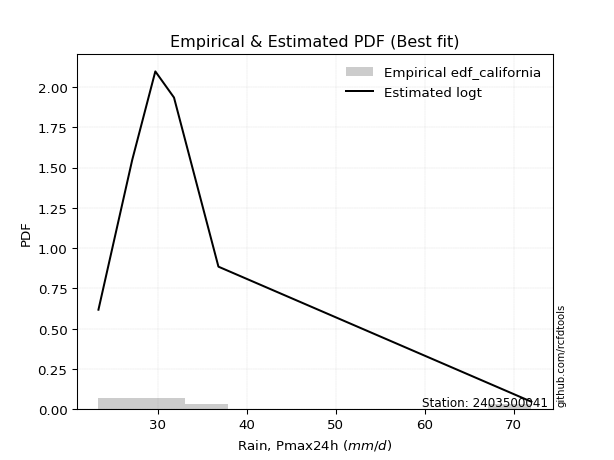</img>

</div>


### 2. EDF Hazen (1930)

Hazen method for plotting positions is a formula used to estimate the empirical cumulative probability distribution of flood events or other hydrological data. This formula often results in biased estimations, particularly when extrapolating to extreme events (high return periods).

<div align="center">


$P=(m-0.5)/n$


</div>


**2.1. Empirical values**

<div align="center">

|                | 0                   | 1                  | 2                  | 3                  | 4         | 5                  |
|:---------------|:--------------------|:-------------------|:-------------------|:-------------------|:----------|:-------------------|
| date           | 2023                | 2020               | 2022               | 2021               | 2024      | 2019               |
| x              | 23.3                | 27.1               | 29.7               | 31.8               | 36.8      | 72.0               |
| m              | 1                   | 2                  | 3                  | 4                  | 5         | 6                  |
| empirical_dist | edf_hazen           | edf_hazen          | edf_hazen          | edf_hazen          | edf_hazen | edf_hazen          |
| empirical      | 0.08333333333333333 | 0.25               | 0.4166666666666667 | 0.5833333333333334 | 0.75      | 0.9166666666666666 |
| empirical_tr   | 1.090909090909091   | 1.3333333333333333 | 1.7142857142857144 | 2.4000000000000004 | 4.0       | 11.999999999999995 |

</div>


**2.2. Kolmogorov-Smirnov fit test (sorted by Δ)**


<div align="center">

|                | 0                   | 1                    | 2                   | 3                    | 4                   | 5                    | 6                    | 7                   | 8                     | 9                   | 10                  | 11                  | 12                  | 13                 | 14                  | 15                 | 16                  | 17                  | 18                  | 19                  | 20                  | 21                  | 22                  | 23                  | 24                  | 25                  | 26                  | 27                  | 28                  | 29                  | 30                 | 31                  | 32                  | 33                  | 34                  | 35                  | 36                  | 37                  | 38                  | 39                 | 40                 | 41                  | 42                  | 43                  | 44                 | 45                  | 46                  | 47                  | 48                  | 49                  | 50                  | 51                  | 52                  | 53                  | 54                  | 55                  | 56                  | 57                  | 58                  | 59                  | 60                  | 61                  | 62                | 63                 | 64                  | 65                  | 66                  | 67                 | 68                  | 69                  | 70                  | 71                 | 72                  | 73                 | 74                 | 75                 | 76                 | 77                 | 78                  | 79                  | 80                  | 81                | 82                 | 83                 | 84                 | 85                 | 86                 | 87             |
|:---------------|:--------------------|:---------------------|:--------------------|:---------------------|:--------------------|:---------------------|:---------------------|:--------------------|:----------------------|:--------------------|:--------------------|:--------------------|:--------------------|:-------------------|:--------------------|:-------------------|:--------------------|:--------------------|:--------------------|:--------------------|:--------------------|:--------------------|:--------------------|:--------------------|:--------------------|:--------------------|:--------------------|:--------------------|:--------------------|:--------------------|:-------------------|:--------------------|:--------------------|:--------------------|:--------------------|:--------------------|:--------------------|:--------------------|:--------------------|:-------------------|:-------------------|:--------------------|:--------------------|:--------------------|:-------------------|:--------------------|:--------------------|:--------------------|:--------------------|:--------------------|:--------------------|:--------------------|:--------------------|:--------------------|:--------------------|:--------------------|:--------------------|:--------------------|:--------------------|:--------------------|:--------------------|:--------------------|:------------------|:-------------------|:--------------------|:--------------------|:--------------------|:-------------------|:--------------------|:--------------------|:--------------------|:-------------------|:--------------------|:-------------------|:-------------------|:-------------------|:-------------------|:-------------------|:--------------------|:--------------------|:--------------------|:------------------|:-------------------|:-------------------|:-------------------|:-------------------|:-------------------|:---------------|
| station        | 2403500041          | 2403500041           | 2403500041          | 2403500041           | 2403500041          | 2403500041           | 2403500041           | 2403500041          | 2403500041            | 2403500041          | 2403500041          | 2403500041          | 2403500041          | 2403500041         | 2403500041          | 2403500041         | 2403500041          | 2403500041          | 2403500041          | 2403500041          | 2403500041          | 2403500041          | 2403500041          | 2403500041          | 2403500041          | 2403500041          | 2403500041          | 2403500041          | 2403500041          | 2403500041          | 2403500041         | 2403500041          | 2403500041          | 2403500041          | 2403500041          | 2403500041          | 2403500041          | 2403500041          | 2403500041          | 2403500041         | 2403500041         | 2403500041          | 2403500041          | 2403500041          | 2403500041         | 2403500041          | 2403500041          | 2403500041          | 2403500041          | 2403500041          | 2403500041          | 2403500041          | 2403500041          | 2403500041          | 2403500041          | 2403500041          | 2403500041          | 2403500041          | 2403500041          | 2403500041          | 2403500041          | 2403500041          | 2403500041        | 2403500041         | 2403500041          | 2403500041          | 2403500041          | 2403500041         | 2403500041          | 2403500041          | 2403500041          | 2403500041         | 2403500041          | 2403500041         | 2403500041         | 2403500041         | 2403500041         | 2403500041         | 2403500041          | 2403500041          | 2403500041          | 2403500041        | 2403500041         | 2403500041         | 2403500041         | 2403500041         | 2403500041         | 2403500041     |
| empirical_dist | edf_hazen           | edf_hazen            | edf_hazen           | edf_hazen            | edf_hazen           | edf_hazen            | edf_hazen            | edf_hazen           | edf_hazen             | edf_hazen           | edf_hazen           | edf_hazen           | edf_hazen           | edf_hazen          | edf_hazen           | edf_hazen          | edf_hazen           | edf_hazen           | edf_hazen           | edf_hazen           | edf_hazen           | edf_hazen           | edf_hazen           | edf_hazen           | edf_hazen           | edf_hazen           | edf_hazen           | edf_hazen           | edf_hazen           | edf_hazen           | edf_hazen          | edf_hazen           | edf_hazen           | edf_hazen           | edf_hazen           | edf_hazen           | edf_hazen           | edf_hazen           | edf_hazen           | edf_hazen          | edf_hazen          | edf_hazen           | edf_hazen           | edf_hazen           | edf_hazen          | edf_hazen           | edf_hazen           | edf_hazen           | edf_hazen           | edf_hazen           | edf_hazen           | edf_hazen           | edf_hazen           | edf_hazen           | edf_hazen           | edf_hazen           | edf_hazen           | edf_hazen           | edf_hazen           | edf_hazen           | edf_hazen           | edf_hazen           | edf_hazen         | edf_hazen          | edf_hazen           | edf_hazen           | edf_hazen           | edf_hazen          | edf_hazen           | edf_hazen           | edf_hazen           | edf_hazen          | edf_hazen           | edf_hazen          | edf_hazen          | edf_hazen          | edf_hazen          | edf_hazen          | edf_hazen           | edf_hazen           | edf_hazen           | edf_hazen         | edf_hazen          | edf_hazen          | edf_hazen          | edf_hazen          | edf_hazen          | edf_hazen      |
| p_dist         | logalpha            | loginvweibull        | logfisk             | alpha                | invweibull          | logexponnorm         | invgamma             | f                   | loglaplace_asymmetric | logjohnsonsu        | mielke              | logt                | loginvgauss         | logmoyal           | loghalflogistic     | logfatiguelife     | invgauss            | wald                | loggenexpon         | logwald             | logexpon            | gompertz            | loggenlogistic      | logpearson3         | gibrat              | logtruncnorm        | johnsonsu           | loggumbel_r         | loghalfnorm         | loginvgamma         | lognct             | genexpon            | expon               | laplace_asymmetric  | exponnorm           | fatiguelife         | logkstwobign        | lograyleigh         | nct                 | logbetaprime       | logmaxwell         | betaprime           | pearson3            | halflogistic        | moyal              | loggibrat           | genlogistic         | loggompertz         | ncf                 | logrice             | lognorm             | lognorm             | logcrystalball      | logloggamma         | loglogistic         | halfnorm            | gumbel_r            | loghypsecant        | truncnorm           | logncf              | loglaplace          | rayleigh            | kstwobign         | maxwell            | nakagami            | loggumbel_l         | fisk                | t                  | hypsecant           | logistic            | norm                | crystalball        | logchi2             | rice               | laplace            | logf               | gamma              | logweibull_min     | gumbel_l            | weibull_min         | loglognorm          | lognakagami       | erlang             | logerlang          | loggamma           | loggamma           | chi2               | logmielke      |
| delta          | 0.03430745171670457 | 0.042228584976452654 | 0.04389765035978571 | 0.045333178261071194 | 0.05399438132604539 | 0.055858795843795495 | 0.056744429437931565 | 0.05674455527015865 | 0.0570746984940228    | 0.06260682183612576 | 0.06306706868566359 | 0.06392057951646923 | 0.06492404183409212 | 0.0758353697745977 | 0.07770556905310766 | 0.0787179161852225 | 0.08025572072086118 | 0.08148996611924375 | 0.08333333262007793 | 0.08333333333333333 | 0.08333333333333333 | 0.08485609143621176 | 0.08785797561543418 | 0.09385908224155082 | 0.09424751840711293 | 0.09542907298866604 | 0.09678692227891583 | 0.09940762419340998 | 0.10579798670497786 | 0.11030984135651889 | 0.1154674972279649 | 0.11742200854315832 | 0.11742498855333339 | 0.11743237691164576 | 0.11808182405962087 | 0.11942281487823958 | 0.12063496562119164 | 0.13072810252996148 | 0.13107118267512163 | 0.1349734486699048 | 0.1395223213777942 | 0.14725884194024547 | 0.14746403294802568 | 0.14961703057901488 | 0.1533591703581163 | 0.15345696587704533 | 0.15409914546514303 | 0.15739286711837364 | 0.16140807812021785 | 0.16349890173796705 | 0.16752870722298763 | 0.16752870722298763 | 0.16752973198049892 | 0.16962131889125653 | 0.17093778786974245 | 0.17457947650897765 | 0.17920371030332638 | 0.17944359607634186 | 0.18754166936807404 | 0.19644893454311796 | 0.20395269868171534 | 0.20555499493151097 | 0.205810310158422 | 0.2165578005696408 | 0.22045644724041946 | 0.23030832126761025 | 0.24163760618838703 | 0.2463632171462573 | 0.24948821448092706 | 0.24953586180878284 | 0.24959165413125783 | 0.2495916616084476 | 0.25382499618833965 | 0.2574947751566996 | 0.2589937554819774 | 0.2657613928066568 | 0.2949882053358269 | 0.3185200215109516 | 0.31995547162066196 | 0.32427314608087765 | 0.39777747575302724 | 0.427734704352857 | 0.5719101603949515 | 0.5991055597028081 | 0.6164376827714321 | 0.6164376827714321 | 0.6271685262866346 | nan            |
| deltao         | 0.530385761606      | 0.530385761606       | 0.530385761606      | 0.530385761606       | 0.530385761606      | 0.530385761606       | 0.530385761606       | 0.530385761606      | 0.530385761606        | 0.530385761606      | 0.530385761606      | 0.530385761606      | 0.530385761606      | 0.530385761606     | 0.530385761606      | 0.530385761606     | 0.530385761606      | 0.530385761606      | 0.530385761606      | 0.530385761606      | 0.530385761606      | 0.530385761606      | 0.530385761606      | 0.530385761606      | 0.530385761606      | 0.530385761606      | 0.530385761606      | 0.530385761606      | 0.530385761606      | 0.530385761606      | 0.530385761606     | 0.530385761606      | 0.530385761606      | 0.530385761606      | 0.530385761606      | 0.530385761606      | 0.530385761606      | 0.530385761606      | 0.530385761606      | 0.530385761606     | 0.530385761606     | 0.530385761606      | 0.530385761606      | 0.530385761606      | 0.530385761606     | 0.530385761606      | 0.530385761606      | 0.530385761606      | 0.530385761606      | 0.530385761606      | 0.530385761606      | 0.530385761606      | 0.530385761606      | 0.530385761606      | 0.530385761606      | 0.530385761606      | 0.530385761606      | 0.530385761606      | 0.530385761606      | 0.530385761606      | 0.530385761606      | 0.530385761606      | 0.530385761606    | 0.530385761606     | 0.530385761606      | 0.530385761606      | 0.530385761606      | 0.530385761606     | 0.530385761606      | 0.530385761606      | 0.530385761606      | 0.530385761606     | 0.530385761606      | 0.530385761606     | 0.530385761606     | 0.530385761606     | 0.530385761606     | 0.530385761606     | 0.530385761606      | 0.530385761606      | 0.530385761606      | 0.530385761606    | 0.530385761606     | 0.530385761606     | 0.530385761606     | 0.530385761606     | 0.530385761606     | 0.530385761606 |
| eval           | Δo > Δ              | Δo > Δ               | Δo > Δ              | Δo > Δ               | Δo > Δ              | Δo > Δ               | Δo > Δ               | Δo > Δ              | Δo > Δ                | Δo > Δ              | Δo > Δ              | Δo > Δ              | Δo > Δ              | Δo > Δ             | Δo > Δ              | Δo > Δ             | Δo > Δ              | Δo > Δ              | Δo > Δ              | Δo > Δ              | Δo > Δ              | Δo > Δ              | Δo > Δ              | Δo > Δ              | Δo > Δ              | Δo > Δ              | Δo > Δ              | Δo > Δ              | Δo > Δ              | Δo > Δ              | Δo > Δ             | Δo > Δ              | Δo > Δ              | Δo > Δ              | Δo > Δ              | Δo > Δ              | Δo > Δ              | Δo > Δ              | Δo > Δ              | Δo > Δ             | Δo > Δ             | Δo > Δ              | Δo > Δ              | Δo > Δ              | Δo > Δ             | Δo > Δ              | Δo > Δ              | Δo > Δ              | Δo > Δ              | Δo > Δ              | Δo > Δ              | Δo > Δ              | Δo > Δ              | Δo > Δ              | Δo > Δ              | Δo > Δ              | Δo > Δ              | Δo > Δ              | Δo > Δ              | Δo > Δ              | Δo > Δ              | Δo > Δ              | Δo > Δ            | Δo > Δ             | Δo > Δ              | Δo > Δ              | Δo > Δ              | Δo > Δ             | Δo > Δ              | Δo > Δ              | Δo > Δ              | Δo > Δ             | Δo > Δ              | Δo > Δ             | Δo > Δ             | Δo > Δ             | Δo > Δ             | Δo > Δ             | Δo > Δ              | Δo > Δ              | Δo > Δ              | Δo > Δ            | Δo <= Δ            | Δo <= Δ            | Δo <= Δ            | Δo <= Δ            | Δo <= Δ            | Δo <= Δ        |
| fit            | 1                   | 1                    | 1                   | 1                    | 1                   | 1                    | 1                    | 1                   | 1                     | 1                   | 1                   | 1                   | 1                   | 1                  | 1                   | 1                  | 1                   | 1                   | 1                   | 1                   | 1                   | 1                   | 1                   | 1                   | 1                   | 1                   | 1                   | 1                   | 1                   | 1                   | 1                  | 1                   | 1                   | 1                   | 1                   | 1                   | 1                   | 1                   | 1                   | 1                  | 1                  | 1                   | 1                   | 1                   | 1                  | 1                   | 1                   | 1                   | 1                   | 1                   | 1                   | 1                   | 1                   | 1                   | 1                   | 1                   | 1                   | 1                   | 1                   | 1                   | 1                   | 1                   | 1                 | 1                  | 1                   | 1                   | 1                   | 1                  | 1                   | 1                   | 1                   | 1                  | 1                   | 1                  | 1                  | 1                  | 1                  | 1                  | 1                   | 1                   | 1                   | 1                 | 0                  | 0                  | 0                  | 0                  | 0                  | 0              |
| n              | 6                   | 6                    | 6                   | 6                    | 6                   | 6                    | 6                    | 6                   | 6                     | 6                   | 6                   | 6                   | 6                   | 6                  | 6                   | 6                  | 6                   | 6                   | 6                   | 6                   | 6                   | 6                   | 6                   | 6                   | 6                   | 6                   | 6                   | 6                   | 6                   | 6                   | 6                  | 6                   | 6                   | 6                   | 6                   | 6                   | 6                   | 6                   | 6                   | 6                  | 6                  | 6                   | 6                   | 6                   | 6                  | 6                   | 6                   | 6                   | 6                   | 6                   | 6                   | 6                   | 6                   | 6                   | 6                   | 6                   | 6                   | 6                   | 6                   | 6                   | 6                   | 6                   | 6                 | 6                  | 6                   | 6                   | 6                   | 6                  | 6                   | 6                   | 6                   | 6                  | 6                   | 6                  | 6                  | 6                  | 6                  | 6                  | 6                   | 6                   | 6                   | 6                 | 6                  | 6                  | 6                  | 6                  | 6                  | 6              |
| best_fit       | 1                   | 0                    | 0                   | 0                    | 0                   | 0                    | 0                    | 0                   | 0                     | 0                   | 0                   | 0                   | 0                   | 0                  | 0                   | 0                  | 0                   | 0                   | 0                   | 0                   | 0                   | 0                   | 0                   | 0                   | 0                   | 0                   | 0                   | 0                   | 0                   | 0                   | 0                  | 0                   | 0                   | 0                   | 0                   | 0                   | 0                   | 0                   | 0                   | 0                  | 0                  | 0                   | 0                   | 0                   | 0                  | 0                   | 0                   | 0                   | 0                   | 0                   | 0                   | 0                   | 0                   | 0                   | 0                   | 0                   | 0                   | 0                   | 0                   | 0                   | 0                   | 0                   | 0                 | 0                  | 0                   | 0                   | 0                   | 0                  | 0                   | 0                   | 0                   | 0                  | 0                   | 0                  | 0                  | 0                  | 0                  | 0                  | 0                   | 0                   | 0                   | 0                 | 0                  | 0                  | 0                  | 0                  | 0                  | 0              |
| best_fit_sort  | 1                   | 2                    | 3                   | 4                    | 5                   | 6                    | 7                    | 8                   | 9                     | 10                  | 11                  | 12                  | 13                  | 14                 | 15                  | 16                 | 17                  | 18                  | 19                  | 20                  | 21                  | 22                  | 23                  | 24                  | 25                  | 26                  | 27                  | 28                  | 29                  | 30                  | 31                 | 32                  | 33                  | 34                  | 35                  | 36                  | 37                  | 38                  | 39                  | 40                 | 41                 | 42                  | 43                  | 44                  | 45                 | 46                  | 47                  | 48                  | 49                  | 50                  | 51                  | 52                  | 53                  | 54                  | 55                  | 56                  | 57                  | 58                  | 59                  | 60                  | 61                  | 62                  | 63                | 64                 | 65                  | 66                  | 67                  | 68                 | 69                  | 70                  | 71                  | 72                 | 73                  | 74                 | 75                 | 76                 | 77                 | 78                 | 79                  | 80                  | 81                  | 82                | 83                 | 84                 | 85                 | 86                 | 87                 | 88             |

</div>


**2.3. Best fit**

<div align="center">

|   id |    station | empirical_dist   | p_dist   |     delta |   deltao | eval   |   fit |   n |   best_fit |   best_fit_sort |
|-----:|-----------:|:-----------------|:---------|----------:|---------:|:-------|------:|----:|-----------:|----------------:|
|    0 | 2403500041 | edf_hazen        | logalpha | 0.0343075 | 0.530386 | Δo > Δ |     1 |   6 |          1 |               1 |

</div>


<div align="center">

</img></img>

</div>


### 3. EDF Weibull (1939)

Weibull plotting position formula is an empirical method used to estimate the non-exceedance probability or plotting position for a set of observed data, is often recommended or widely used in practice, particularly in flood frequency analysis.

<div align="center">


$P=m/(n+1)$


</div>


**3.1. Empirical values**

<div align="center">

|                | 0                   | 1                  | 2                   | 3                  | 4                  | 5                  |
|:---------------|:--------------------|:-------------------|:--------------------|:-------------------|:-------------------|:-------------------|
| date           | 2023                | 2020               | 2022                | 2021               | 2024               | 2019               |
| x              | 23.3                | 27.1               | 29.7                | 31.8               | 36.8               | 72.0               |
| m              | 1                   | 2                  | 3                   | 4                  | 5                  | 6                  |
| empirical_dist | edf_weibull         | edf_weibull        | edf_weibull         | edf_weibull        | edf_weibull        | edf_weibull        |
| empirical      | 0.14285714285714285 | 0.2857142857142857 | 0.42857142857142855 | 0.5714285714285714 | 0.7142857142857143 | 0.8571428571428571 |
| empirical_tr   | 1.1666666666666665  | 1.4                | 1.75                | 2.333333333333333  | 3.5                | 6.999999999999997  |

</div>


**3.2. Kolmogorov-Smirnov fit test (sorted by Δ)**


<div align="center">

|                | 0                   | 1                   | 2                   | 3                 | 4                   | 5                   | 6                   | 7                   | 8                   | 9                   | 10                  | 11                 | 12                 | 13                  | 14                    | 15                  | 16                  | 17                  | 18                 | 19                  | 20                  | 21                  | 22                 | 23                  | 24                  | 25                  | 26                  | 27                  | 28                 | 29                  | 30                  | 31                  | 32                  | 33                  | 34                 | 35                  | 36                  | 37                  | 38                  | 39                  | 40                 | 41                  | 42                 | 43                  | 44                  | 45                  | 46                  | 47                  | 48                  | 49                  | 50                  | 51                  | 52                  | 53                  | 54                  | 55                  | 56                  | 57                  | 58                 | 59                  | 60                 | 61                  | 62                  | 63                  | 64                  | 65                  | 66                 | 67                  | 68                  | 69                 | 70                 | 71                  | 72                  | 73                  | 74                  | 75                  | 76                 | 77                 | 78                  | 79                  | 80                  | 81                 | 82                 | 83                 | 84                 | 85                 | 86                 | 87             |
|:---------------|:--------------------|:--------------------|:--------------------|:------------------|:--------------------|:--------------------|:--------------------|:--------------------|:--------------------|:--------------------|:--------------------|:-------------------|:-------------------|:--------------------|:----------------------|:--------------------|:--------------------|:--------------------|:-------------------|:--------------------|:--------------------|:--------------------|:-------------------|:--------------------|:--------------------|:--------------------|:--------------------|:--------------------|:-------------------|:--------------------|:--------------------|:--------------------|:--------------------|:--------------------|:-------------------|:--------------------|:--------------------|:--------------------|:--------------------|:--------------------|:-------------------|:--------------------|:-------------------|:--------------------|:--------------------|:--------------------|:--------------------|:--------------------|:--------------------|:--------------------|:--------------------|:--------------------|:--------------------|:--------------------|:--------------------|:--------------------|:--------------------|:--------------------|:-------------------|:--------------------|:-------------------|:--------------------|:--------------------|:--------------------|:--------------------|:--------------------|:-------------------|:--------------------|:--------------------|:-------------------|:-------------------|:--------------------|:--------------------|:--------------------|:--------------------|:--------------------|:-------------------|:-------------------|:--------------------|:--------------------|:--------------------|:-------------------|:-------------------|:-------------------|:-------------------|:-------------------|:-------------------|:---------------|
| station        | 2403500041          | 2403500041          | 2403500041          | 2403500041        | 2403500041          | 2403500041          | 2403500041          | 2403500041          | 2403500041          | 2403500041          | 2403500041          | 2403500041         | 2403500041         | 2403500041          | 2403500041            | 2403500041          | 2403500041          | 2403500041          | 2403500041         | 2403500041          | 2403500041          | 2403500041          | 2403500041         | 2403500041          | 2403500041          | 2403500041          | 2403500041          | 2403500041          | 2403500041         | 2403500041          | 2403500041          | 2403500041          | 2403500041          | 2403500041          | 2403500041         | 2403500041          | 2403500041          | 2403500041          | 2403500041          | 2403500041          | 2403500041         | 2403500041          | 2403500041         | 2403500041          | 2403500041          | 2403500041          | 2403500041          | 2403500041          | 2403500041          | 2403500041          | 2403500041          | 2403500041          | 2403500041          | 2403500041          | 2403500041          | 2403500041          | 2403500041          | 2403500041          | 2403500041         | 2403500041          | 2403500041         | 2403500041          | 2403500041          | 2403500041          | 2403500041          | 2403500041          | 2403500041         | 2403500041          | 2403500041          | 2403500041         | 2403500041         | 2403500041          | 2403500041          | 2403500041          | 2403500041          | 2403500041          | 2403500041         | 2403500041         | 2403500041          | 2403500041          | 2403500041          | 2403500041         | 2403500041         | 2403500041         | 2403500041         | 2403500041         | 2403500041         | 2403500041     |
| empirical_dist | edf_weibull         | edf_weibull         | edf_weibull         | edf_weibull       | edf_weibull         | edf_weibull         | edf_weibull         | edf_weibull         | edf_weibull         | edf_weibull         | edf_weibull         | edf_weibull        | edf_weibull        | edf_weibull         | edf_weibull           | edf_weibull         | edf_weibull         | edf_weibull         | edf_weibull        | edf_weibull         | edf_weibull         | edf_weibull         | edf_weibull        | edf_weibull         | edf_weibull         | edf_weibull         | edf_weibull         | edf_weibull         | edf_weibull        | edf_weibull         | edf_weibull         | edf_weibull         | edf_weibull         | edf_weibull         | edf_weibull        | edf_weibull         | edf_weibull         | edf_weibull         | edf_weibull         | edf_weibull         | edf_weibull        | edf_weibull         | edf_weibull        | edf_weibull         | edf_weibull         | edf_weibull         | edf_weibull         | edf_weibull         | edf_weibull         | edf_weibull         | edf_weibull         | edf_weibull         | edf_weibull         | edf_weibull         | edf_weibull         | edf_weibull         | edf_weibull         | edf_weibull         | edf_weibull        | edf_weibull         | edf_weibull        | edf_weibull         | edf_weibull         | edf_weibull         | edf_weibull         | edf_weibull         | edf_weibull        | edf_weibull         | edf_weibull         | edf_weibull        | edf_weibull        | edf_weibull         | edf_weibull         | edf_weibull         | edf_weibull         | edf_weibull         | edf_weibull        | edf_weibull        | edf_weibull         | edf_weibull         | edf_weibull         | edf_weibull        | edf_weibull        | edf_weibull        | edf_weibull        | edf_weibull        | edf_weibull        | edf_weibull    |
| p_dist         | logalpha            | loginvweibull       | alpha               | invweibull        | logexponnorm        | f                   | invgamma            | loginvgauss         | loghalflogistic     | invgauss            | logjohnsonsu        | logfatiguelife     | logmoyal           | fatiguelife         | loglaplace_asymmetric | logpearson3         | loghalfnorm         | wald                | logfisk            | loggumbel_r         | johnsonsu           | loginvgamma         | lograyleigh        | pearson3            | halflogistic        | logmaxwell          | logt                | lognct              | moyal              | logkstwobign        | nct                 | loggenlogistic      | mielke              | logbetaprime        | betaprime          | halfnorm            | exponnorm           | genlogistic         | ncf                 | logtruncnorm        | laplace_asymmetric | loggenexpon         | genexpon           | gompertz            | gibrat              | logexpon            | logwald             | expon               | gumbel_r            | loggompertz         | logloggamma         | lognorm             | lognorm             | logcrystalball      | logrice             | loglogistic         | logncf              | truncnorm           | loghypsecant       | rayleigh            | maxwell            | nakagami            | loggibrat           | loglaplace          | kstwobign           | fisk                | t                  | logistic            | norm                | crystalball        | loggumbel_l        | logchi2             | hypsecant           | rice                | logf                | laplace             | gamma              | logweibull_min     | gumbel_l            | weibull_min         | loglognorm          | lognakagami        | erlang             | logerlang          | loggamma           | loggamma           | chi2               | logmielke      |
| delta          | 0.09169674421321916 | 0.09348031321914677 | 0.09445691918292956 | 0.095631294019329 | 0.09664048008666282 | 0.09664667231700017 | 0.09664669367271497 | 0.09821407727053089 | 0.09903289955035122 | 0.09924255806920809 | 0.09942289804149523 | 0.0994939628859741 | 0.1000993262633213 | 0.10031199560479698 | 0.10091431149357044   | 0.10141215925875202 | 0.10161834500179501 | 0.10255278880064396 | 0.1031438935127585 | 0.10377978710029523 | 0.10609343478040112 | 0.10834675607155009 | 0.1092032594719764 | 0.11174974723373998 | 0.11390274486472918 | 0.11445211960757312 | 0.11540525282002512 | 0.11685779470869351 | 0.1176448846438306 | 0.11870383675914498 | 0.11916642077035966 | 0.12009475686180693 | 0.12259087820947312 | 0.12727214776923879 | 0.1353540800354835 | 0.13886519079469195 | 0.14184801181645817 | 0.14219438356038105 | 0.14245667506029647 | 0.14285551317922304 | 0.1428571399524004 | 0.14285714214388745 | 0.1428571427994796 | 0.14285714285712295 | 0.14285714285714285 | 0.14285714285714285 | 0.14285714285714285 | 0.14285714285714285 | 0.14348942458904068 | 0.14548810521361166 | 0.14572029972599498 | 0.14881414512297592 | 0.14881414512297592 | 0.14881479494590505 | 0.15159413983320508 | 0.15903302596498048 | 0.16073464882883226 | 0.16577338353525484 | 0.1675388341715799 | 0.16984070921722527 | 0.1808435148553551 | 0.18474216152613376 | 0.18917125159133102 | 0.19204793677695337 | 0.19252850900776208 | 0.20592332047410133 | 0.2106489314319716 | 0.21382157609449715 | 0.21387736841697214 | 0.2138773758941619 | 0.2173321468221988 | 0.21811071047405395 | 0.21887752318232317 | 0.22757024513804458 | 0.23004710709237108 | 0.24708899357721542 | 0.2592739196215412 | 0.2828057357966659 | 0.28424118590637626 | 0.28855886036659195 | 0.36206319003874154 | 0.3920204186385713 | 0.5361958746806658 | 0.5633912739885224 | 0.5807233970571464 | 0.5807233970571464 | 0.5914542405723489 | nan            |
| deltao         | 0.530385761606      | 0.530385761606      | 0.530385761606      | 0.530385761606    | 0.530385761606      | 0.530385761606      | 0.530385761606      | 0.530385761606      | 0.530385761606      | 0.530385761606      | 0.530385761606      | 0.530385761606     | 0.530385761606     | 0.530385761606      | 0.530385761606        | 0.530385761606      | 0.530385761606      | 0.530385761606      | 0.530385761606     | 0.530385761606      | 0.530385761606      | 0.530385761606      | 0.530385761606     | 0.530385761606      | 0.530385761606      | 0.530385761606      | 0.530385761606      | 0.530385761606      | 0.530385761606     | 0.530385761606      | 0.530385761606      | 0.530385761606      | 0.530385761606      | 0.530385761606      | 0.530385761606     | 0.530385761606      | 0.530385761606      | 0.530385761606      | 0.530385761606      | 0.530385761606      | 0.530385761606     | 0.530385761606      | 0.530385761606     | 0.530385761606      | 0.530385761606      | 0.530385761606      | 0.530385761606      | 0.530385761606      | 0.530385761606      | 0.530385761606      | 0.530385761606      | 0.530385761606      | 0.530385761606      | 0.530385761606      | 0.530385761606      | 0.530385761606      | 0.530385761606      | 0.530385761606      | 0.530385761606     | 0.530385761606      | 0.530385761606     | 0.530385761606      | 0.530385761606      | 0.530385761606      | 0.530385761606      | 0.530385761606      | 0.530385761606     | 0.530385761606      | 0.530385761606      | 0.530385761606     | 0.530385761606     | 0.530385761606      | 0.530385761606      | 0.530385761606      | 0.530385761606      | 0.530385761606      | 0.530385761606     | 0.530385761606     | 0.530385761606      | 0.530385761606      | 0.530385761606      | 0.530385761606     | 0.530385761606     | 0.530385761606     | 0.530385761606     | 0.530385761606     | 0.530385761606     | 0.530385761606 |
| eval           | Δo > Δ              | Δo > Δ              | Δo > Δ              | Δo > Δ            | Δo > Δ              | Δo > Δ              | Δo > Δ              | Δo > Δ              | Δo > Δ              | Δo > Δ              | Δo > Δ              | Δo > Δ             | Δo > Δ             | Δo > Δ              | Δo > Δ                | Δo > Δ              | Δo > Δ              | Δo > Δ              | Δo > Δ             | Δo > Δ              | Δo > Δ              | Δo > Δ              | Δo > Δ             | Δo > Δ              | Δo > Δ              | Δo > Δ              | Δo > Δ              | Δo > Δ              | Δo > Δ             | Δo > Δ              | Δo > Δ              | Δo > Δ              | Δo > Δ              | Δo > Δ              | Δo > Δ             | Δo > Δ              | Δo > Δ              | Δo > Δ              | Δo > Δ              | Δo > Δ              | Δo > Δ             | Δo > Δ              | Δo > Δ             | Δo > Δ              | Δo > Δ              | Δo > Δ              | Δo > Δ              | Δo > Δ              | Δo > Δ              | Δo > Δ              | Δo > Δ              | Δo > Δ              | Δo > Δ              | Δo > Δ              | Δo > Δ              | Δo > Δ              | Δo > Δ              | Δo > Δ              | Δo > Δ             | Δo > Δ              | Δo > Δ             | Δo > Δ              | Δo > Δ              | Δo > Δ              | Δo > Δ              | Δo > Δ              | Δo > Δ             | Δo > Δ              | Δo > Δ              | Δo > Δ             | Δo > Δ             | Δo > Δ              | Δo > Δ              | Δo > Δ              | Δo > Δ              | Δo > Δ              | Δo > Δ             | Δo > Δ             | Δo > Δ              | Δo > Δ              | Δo > Δ              | Δo > Δ             | Δo <= Δ            | Δo <= Δ            | Δo <= Δ            | Δo <= Δ            | Δo <= Δ            | Δo <= Δ        |
| fit            | 1                   | 1                   | 1                   | 1                 | 1                   | 1                   | 1                   | 1                   | 1                   | 1                   | 1                   | 1                  | 1                  | 1                   | 1                     | 1                   | 1                   | 1                   | 1                  | 1                   | 1                   | 1                   | 1                  | 1                   | 1                   | 1                   | 1                   | 1                   | 1                  | 1                   | 1                   | 1                   | 1                   | 1                   | 1                  | 1                   | 1                   | 1                   | 1                   | 1                   | 1                  | 1                   | 1                  | 1                   | 1                   | 1                   | 1                   | 1                   | 1                   | 1                   | 1                   | 1                   | 1                   | 1                   | 1                   | 1                   | 1                   | 1                   | 1                  | 1                   | 1                  | 1                   | 1                   | 1                   | 1                   | 1                   | 1                  | 1                   | 1                   | 1                  | 1                  | 1                   | 1                   | 1                   | 1                   | 1                   | 1                  | 1                  | 1                   | 1                   | 1                   | 1                  | 0                  | 0                  | 0                  | 0                  | 0                  | 0              |
| n              | 6                   | 6                   | 6                   | 6                 | 6                   | 6                   | 6                   | 6                   | 6                   | 6                   | 6                   | 6                  | 6                  | 6                   | 6                     | 6                   | 6                   | 6                   | 6                  | 6                   | 6                   | 6                   | 6                  | 6                   | 6                   | 6                   | 6                   | 6                   | 6                  | 6                   | 6                   | 6                   | 6                   | 6                   | 6                  | 6                   | 6                   | 6                   | 6                   | 6                   | 6                  | 6                   | 6                  | 6                   | 6                   | 6                   | 6                   | 6                   | 6                   | 6                   | 6                   | 6                   | 6                   | 6                   | 6                   | 6                   | 6                   | 6                   | 6                  | 6                   | 6                  | 6                   | 6                   | 6                   | 6                   | 6                   | 6                  | 6                   | 6                   | 6                  | 6                  | 6                   | 6                   | 6                   | 6                   | 6                   | 6                  | 6                  | 6                   | 6                   | 6                   | 6                  | 6                  | 6                  | 6                  | 6                  | 6                  | 6              |
| best_fit       | 1                   | 0                   | 0                   | 0                 | 0                   | 0                   | 0                   | 0                   | 0                   | 0                   | 0                   | 0                  | 0                  | 0                   | 0                     | 0                   | 0                   | 0                   | 0                  | 0                   | 0                   | 0                   | 0                  | 0                   | 0                   | 0                   | 0                   | 0                   | 0                  | 0                   | 0                   | 0                   | 0                   | 0                   | 0                  | 0                   | 0                   | 0                   | 0                   | 0                   | 0                  | 0                   | 0                  | 0                   | 0                   | 0                   | 0                   | 0                   | 0                   | 0                   | 0                   | 0                   | 0                   | 0                   | 0                   | 0                   | 0                   | 0                   | 0                  | 0                   | 0                  | 0                   | 0                   | 0                   | 0                   | 0                   | 0                  | 0                   | 0                   | 0                  | 0                  | 0                   | 0                   | 0                   | 0                   | 0                   | 0                  | 0                  | 0                   | 0                   | 0                   | 0                  | 0                  | 0                  | 0                  | 0                  | 0                  | 0              |
| best_fit_sort  | 1                   | 2                   | 3                   | 4                 | 5                   | 6                   | 7                   | 8                   | 9                   | 10                  | 11                  | 12                 | 13                 | 14                  | 15                    | 16                  | 17                  | 18                  | 19                 | 20                  | 21                  | 22                  | 23                 | 24                  | 25                  | 26                  | 27                  | 28                  | 29                 | 30                  | 31                  | 32                  | 33                  | 34                  | 35                 | 36                  | 37                  | 38                  | 39                  | 40                  | 41                 | 42                  | 43                 | 44                  | 45                  | 46                  | 47                  | 48                  | 49                  | 50                  | 51                  | 52                  | 53                  | 54                  | 55                  | 56                  | 57                  | 58                  | 59                 | 60                  | 61                 | 62                  | 63                  | 64                  | 65                  | 66                  | 67                 | 68                  | 69                  | 70                 | 71                 | 72                  | 73                  | 74                  | 75                  | 76                  | 77                 | 78                 | 79                  | 80                  | 81                  | 82                 | 83                 | 84                 | 85                 | 86                 | 87                 | 88             |

</div>


**3.3. Best fit**

<div align="center">

|   id |    station | empirical_dist   | p_dist   |     delta |   deltao | eval   |   fit |   n |   best_fit |   best_fit_sort |
|-----:|-----------:|:-----------------|:---------|----------:|---------:|:-------|------:|----:|-----------:|----------------:|
|    0 | 2403500041 | edf_weibull      | logalpha | 0.0916967 | 0.530386 | Δo > Δ |     1 |   6 |          1 |               1 |

</div>


<div align="center">

</img></img>

</div>


### 4. EDF Beard (1943)

The Beard formula (or Beard´s plotting position formula) in hydrology is used to estimate the empirical non-exceedance probability _(P)_ of a flood event (or other extreme hydrological data point) within a given dataset.

<div align="center">


$P=(m-0.31)/(n+0.38)$


</div>


**4.1. Empirical values**

<div align="center">

|                | 0                   | 1                   | 2                  | 3                  | 4                  | 5                  |
|:---------------|:--------------------|:--------------------|:-------------------|:-------------------|:-------------------|:-------------------|
| date           | 2023                | 2020                | 2022               | 2021               | 2024               | 2019               |
| x              | 23.3                | 27.1                | 29.7               | 31.8               | 36.8               | 72.0               |
| m              | 1                   | 2                   | 3                  | 4                  | 5                  | 6                  |
| empirical_dist | edf_beard           | edf_beard           | edf_beard          | edf_beard          | edf_beard          | edf_beard          |
| empirical      | 0.10815047021943573 | 0.26489028213166144 | 0.4216300940438871 | 0.5783699059561128 | 0.7351097178683387 | 0.8918495297805643 |
| empirical_tr   | 1.1212653778558874  | 1.3603411513859276  | 1.7289972899728996 | 2.3717472118959106 | 3.7751479289940844 | 9.246376811594207  |

</div>


**4.2. Kolmogorov-Smirnov fit test (sorted by Δ)**


<div align="center">

|                | 0                   | 1                    | 2                   | 3                    | 4                  | 5                   | 6                   | 7                   | 8                 | 9                  | 10                  | 11                  | 12                    | 13                  | 14                  | 15                  | 16                  | 17                 | 18                 | 19                  | 20                 | 21                  | 22                  | 23                  | 24                  | 25                  | 26                  | 27                  | 28                  | 29                  | 30                  | 31                  | 32                  | 33                  | 34                  | 35                  | 36                  | 37                  | 38                  | 39                  | 40                  | 41                  | 42                  | 43                  | 44                 | 45                  | 46                 | 47                  | 48                 | 49                  | 50                  | 51                  | 52                 | 53                  | 54                  | 55                 | 56                  | 57                  | 58                 | 59                  | 60                  | 61                  | 62                 | 63                  | 64                  | 65                  | 66                 | 67                  | 68                  | 69                  | 70                 | 71                  | 72                  | 73                  | 74                  | 75                  | 76                 | 77                  | 78                  | 79                 | 80                 | 81                  | 82               | 83                 | 84                 | 85                 | 86                 | 87             |
|:---------------|:--------------------|:---------------------|:--------------------|:---------------------|:-------------------|:--------------------|:--------------------|:--------------------|:------------------|:-------------------|:--------------------|:--------------------|:----------------------|:--------------------|:--------------------|:--------------------|:--------------------|:-------------------|:-------------------|:--------------------|:-------------------|:--------------------|:--------------------|:--------------------|:--------------------|:--------------------|:--------------------|:--------------------|:--------------------|:--------------------|:--------------------|:--------------------|:--------------------|:--------------------|:--------------------|:--------------------|:--------------------|:--------------------|:--------------------|:--------------------|:--------------------|:--------------------|:--------------------|:--------------------|:-------------------|:--------------------|:-------------------|:--------------------|:-------------------|:--------------------|:--------------------|:--------------------|:-------------------|:--------------------|:--------------------|:-------------------|:--------------------|:--------------------|:-------------------|:--------------------|:--------------------|:--------------------|:-------------------|:--------------------|:--------------------|:--------------------|:-------------------|:--------------------|:--------------------|:--------------------|:-------------------|:--------------------|:--------------------|:--------------------|:--------------------|:--------------------|:-------------------|:--------------------|:--------------------|:-------------------|:-------------------|:--------------------|:-----------------|:-------------------|:-------------------|:-------------------|:-------------------|:---------------|
| station        | 2403500041          | 2403500041           | 2403500041          | 2403500041           | 2403500041         | 2403500041          | 2403500041          | 2403500041          | 2403500041        | 2403500041         | 2403500041          | 2403500041          | 2403500041            | 2403500041          | 2403500041          | 2403500041          | 2403500041          | 2403500041         | 2403500041         | 2403500041          | 2403500041         | 2403500041          | 2403500041          | 2403500041          | 2403500041          | 2403500041          | 2403500041          | 2403500041          | 2403500041          | 2403500041          | 2403500041          | 2403500041          | 2403500041          | 2403500041          | 2403500041          | 2403500041          | 2403500041          | 2403500041          | 2403500041          | 2403500041          | 2403500041          | 2403500041          | 2403500041          | 2403500041          | 2403500041         | 2403500041          | 2403500041         | 2403500041          | 2403500041         | 2403500041          | 2403500041          | 2403500041          | 2403500041         | 2403500041          | 2403500041          | 2403500041         | 2403500041          | 2403500041          | 2403500041         | 2403500041          | 2403500041          | 2403500041          | 2403500041         | 2403500041          | 2403500041          | 2403500041          | 2403500041         | 2403500041          | 2403500041          | 2403500041          | 2403500041         | 2403500041          | 2403500041          | 2403500041          | 2403500041          | 2403500041          | 2403500041         | 2403500041          | 2403500041          | 2403500041         | 2403500041         | 2403500041          | 2403500041       | 2403500041         | 2403500041         | 2403500041         | 2403500041         | 2403500041     |
| empirical_dist | edf_beard           | edf_beard            | edf_beard           | edf_beard            | edf_beard          | edf_beard           | edf_beard           | edf_beard           | edf_beard         | edf_beard          | edf_beard           | edf_beard           | edf_beard             | edf_beard           | edf_beard           | edf_beard           | edf_beard           | edf_beard          | edf_beard          | edf_beard           | edf_beard          | edf_beard           | edf_beard           | edf_beard           | edf_beard           | edf_beard           | edf_beard           | edf_beard           | edf_beard           | edf_beard           | edf_beard           | edf_beard           | edf_beard           | edf_beard           | edf_beard           | edf_beard           | edf_beard           | edf_beard           | edf_beard           | edf_beard           | edf_beard           | edf_beard           | edf_beard           | edf_beard           | edf_beard          | edf_beard           | edf_beard          | edf_beard           | edf_beard          | edf_beard           | edf_beard           | edf_beard           | edf_beard          | edf_beard           | edf_beard           | edf_beard          | edf_beard           | edf_beard           | edf_beard          | edf_beard           | edf_beard           | edf_beard           | edf_beard          | edf_beard           | edf_beard           | edf_beard           | edf_beard          | edf_beard           | edf_beard           | edf_beard           | edf_beard          | edf_beard           | edf_beard           | edf_beard           | edf_beard           | edf_beard           | edf_beard          | edf_beard           | edf_beard           | edf_beard          | edf_beard          | edf_beard           | edf_beard        | edf_beard          | edf_beard          | edf_beard          | edf_beard          | edf_beard      |
| p_dist         | logalpha            | loginvweibull        | alpha               | invweibull           | logexponnorm       | f                   | invgamma            | loginvgauss         | loghalflogistic   | logjohnsonsu       | logfatiguelife      | invgauss            | loglaplace_asymmetric | wald                | logmoyal            | logfisk             | logpearson3         | logt               | johnsonsu          | loggenlogistic      | mielke             | loghalfnorm         | loggumbel_r         | fatiguelife         | loginvgamma         | logtruncnorm        | loggenexpon         | gompertz            | logwald             | logexpon            | gibrat              | lognct              | genexpon            | expon               | laplace_asymmetric  | exponnorm           | logkstwobign        | lograyleigh         | logmaxwell          | nct                 | logbetaprime        | pearson3            | halflogistic        | moyal               | betaprime          | genlogistic         | ncf                | loggompertz         | logloggamma        | lognorm             | lognorm             | logcrystalball      | logrice            | halfnorm            | gumbel_r            | loglogistic        | loggibrat           | truncnorm           | loghypsecant       | logncf              | rayleigh            | loglaplace          | kstwobign          | maxwell             | nakagami            | loggumbel_l         | fisk               | t                   | hypsecant           | logistic            | norm               | crystalball         | logchi2             | rice                | logf                | laplace             | gamma              | logweibull_min      | gumbel_l            | weibull_min        | loglognorm         | lognakagami         | erlang           | logerlang          | loggamma           | loggamma           | chi2               | logmielke      |
| delta          | 0.05699007157551204 | 0.058773640581439655 | 0.05975024654522244 | 0.060924621381621885 | 0.0619338074489556 | 0.06193999967929305 | 0.06194002103500786 | 0.06350740463282376 | 0.064326226912644 | 0.0647162254037881 | 0.06478729024826699 | 0.06536543858919974 | 0.06620763885586323   | 0.06784611616293684 | 0.06791308261349271 | 0.06843722087505139 | 0.07896880010988949 | 0.0806985801823179 | 0.0818966401472544 | 0.08538808422409971 | 0.0878842055717659 | 0.09090770457331654 | 0.09219760884164752 | 0.10453253274657814 | 0.10534641397929834 | 0.10814884054151593 | 0.10815046950618033 | 0.10815047021941583 | 0.10815047021943573 | 0.10815047021943573 | 0.10913780053877437 | 0.11050406985074435 | 0.11074178255882561 | 0.11074450121153068 | 0.11075124095268596 | 0.11114428741921689 | 0.11567153824397108 | 0.11583782039830015 | 0.12463203924613286 | 0.12610775529790108 | 0.13001002129268424 | 0.13257375081636436 | 0.13472674844735355 | 0.13846888822645498 | 0.1422954145630249 | 0.14913571808792248 | 0.1493980095878379 | 0.15242943974115308 | 0.1547310367595952 | 0.15575547965051734 | 0.15575547965051734 | 0.15575612947344647 | 0.1585354743607465 | 0.15968919437731632 | 0.16431342817166505 | 0.1659743604925219 | 0.16834724800870676 | 0.17271471806279626 | 0.1744801686991213 | 0.18155865241145663 | 0.19066471279984964 | 0.19898927130449479 | 0.1994698435353035 | 0.20166751843797948 | 0.20556616510875814 | 0.22427348134974023 | 0.2267473240567257 | 0.23147293501459598 | 0.23459793234926574 | 0.23464557967712152 | 0.2347013719995965 | 0.23470137947678626 | 0.23893471405667832 | 0.24260449302503828 | 0.25087111067499535 | 0.25403032810475684 | 0.2800979232041655 | 0.30362973937929016 | 0.30506518948900063 | 0.3093828639492162 | 0.3828871936213658 | 0.41284442222119555 | 0.55701987826329 | 0.5842152775711467 | 0.6015474006397706 | 0.6015474006397706 | 0.6122782441549731 | nan            |
| deltao         | 0.530385761606      | 0.530385761606       | 0.530385761606      | 0.530385761606       | 0.530385761606     | 0.530385761606      | 0.530385761606      | 0.530385761606      | 0.530385761606    | 0.530385761606     | 0.530385761606      | 0.530385761606      | 0.530385761606        | 0.530385761606      | 0.530385761606      | 0.530385761606      | 0.530385761606      | 0.530385761606     | 0.530385761606     | 0.530385761606      | 0.530385761606     | 0.530385761606      | 0.530385761606      | 0.530385761606      | 0.530385761606      | 0.530385761606      | 0.530385761606      | 0.530385761606      | 0.530385761606      | 0.530385761606      | 0.530385761606      | 0.530385761606      | 0.530385761606      | 0.530385761606      | 0.530385761606      | 0.530385761606      | 0.530385761606      | 0.530385761606      | 0.530385761606      | 0.530385761606      | 0.530385761606      | 0.530385761606      | 0.530385761606      | 0.530385761606      | 0.530385761606     | 0.530385761606      | 0.530385761606     | 0.530385761606      | 0.530385761606     | 0.530385761606      | 0.530385761606      | 0.530385761606      | 0.530385761606     | 0.530385761606      | 0.530385761606      | 0.530385761606     | 0.530385761606      | 0.530385761606      | 0.530385761606     | 0.530385761606      | 0.530385761606      | 0.530385761606      | 0.530385761606     | 0.530385761606      | 0.530385761606      | 0.530385761606      | 0.530385761606     | 0.530385761606      | 0.530385761606      | 0.530385761606      | 0.530385761606     | 0.530385761606      | 0.530385761606      | 0.530385761606      | 0.530385761606      | 0.530385761606      | 0.530385761606     | 0.530385761606      | 0.530385761606      | 0.530385761606     | 0.530385761606     | 0.530385761606      | 0.530385761606   | 0.530385761606     | 0.530385761606     | 0.530385761606     | 0.530385761606     | 0.530385761606 |
| eval           | Δo > Δ              | Δo > Δ               | Δo > Δ              | Δo > Δ               | Δo > Δ             | Δo > Δ              | Δo > Δ              | Δo > Δ              | Δo > Δ            | Δo > Δ             | Δo > Δ              | Δo > Δ              | Δo > Δ                | Δo > Δ              | Δo > Δ              | Δo > Δ              | Δo > Δ              | Δo > Δ             | Δo > Δ             | Δo > Δ              | Δo > Δ             | Δo > Δ              | Δo > Δ              | Δo > Δ              | Δo > Δ              | Δo > Δ              | Δo > Δ              | Δo > Δ              | Δo > Δ              | Δo > Δ              | Δo > Δ              | Δo > Δ              | Δo > Δ              | Δo > Δ              | Δo > Δ              | Δo > Δ              | Δo > Δ              | Δo > Δ              | Δo > Δ              | Δo > Δ              | Δo > Δ              | Δo > Δ              | Δo > Δ              | Δo > Δ              | Δo > Δ             | Δo > Δ              | Δo > Δ             | Δo > Δ              | Δo > Δ             | Δo > Δ              | Δo > Δ              | Δo > Δ              | Δo > Δ             | Δo > Δ              | Δo > Δ              | Δo > Δ             | Δo > Δ              | Δo > Δ              | Δo > Δ             | Δo > Δ              | Δo > Δ              | Δo > Δ              | Δo > Δ             | Δo > Δ              | Δo > Δ              | Δo > Δ              | Δo > Δ             | Δo > Δ              | Δo > Δ              | Δo > Δ              | Δo > Δ             | Δo > Δ              | Δo > Δ              | Δo > Δ              | Δo > Δ              | Δo > Δ              | Δo > Δ             | Δo > Δ              | Δo > Δ              | Δo > Δ             | Δo > Δ             | Δo > Δ              | Δo <= Δ          | Δo <= Δ            | Δo <= Δ            | Δo <= Δ            | Δo <= Δ            | Δo <= Δ        |
| fit            | 1                   | 1                    | 1                   | 1                    | 1                  | 1                   | 1                   | 1                   | 1                 | 1                  | 1                   | 1                   | 1                     | 1                   | 1                   | 1                   | 1                   | 1                  | 1                  | 1                   | 1                  | 1                   | 1                   | 1                   | 1                   | 1                   | 1                   | 1                   | 1                   | 1                   | 1                   | 1                   | 1                   | 1                   | 1                   | 1                   | 1                   | 1                   | 1                   | 1                   | 1                   | 1                   | 1                   | 1                   | 1                  | 1                   | 1                  | 1                   | 1                  | 1                   | 1                   | 1                   | 1                  | 1                   | 1                   | 1                  | 1                   | 1                   | 1                  | 1                   | 1                   | 1                   | 1                  | 1                   | 1                   | 1                   | 1                  | 1                   | 1                   | 1                   | 1                  | 1                   | 1                   | 1                   | 1                   | 1                   | 1                  | 1                   | 1                   | 1                  | 1                  | 1                   | 0                | 0                  | 0                  | 0                  | 0                  | 0              |
| n              | 6                   | 6                    | 6                   | 6                    | 6                  | 6                   | 6                   | 6                   | 6                 | 6                  | 6                   | 6                   | 6                     | 6                   | 6                   | 6                   | 6                   | 6                  | 6                  | 6                   | 6                  | 6                   | 6                   | 6                   | 6                   | 6                   | 6                   | 6                   | 6                   | 6                   | 6                   | 6                   | 6                   | 6                   | 6                   | 6                   | 6                   | 6                   | 6                   | 6                   | 6                   | 6                   | 6                   | 6                   | 6                  | 6                   | 6                  | 6                   | 6                  | 6                   | 6                   | 6                   | 6                  | 6                   | 6                   | 6                  | 6                   | 6                   | 6                  | 6                   | 6                   | 6                   | 6                  | 6                   | 6                   | 6                   | 6                  | 6                   | 6                   | 6                   | 6                  | 6                   | 6                   | 6                   | 6                   | 6                   | 6                  | 6                   | 6                   | 6                  | 6                  | 6                   | 6                | 6                  | 6                  | 6                  | 6                  | 6              |
| best_fit       | 1                   | 0                    | 0                   | 0                    | 0                  | 0                   | 0                   | 0                   | 0                 | 0                  | 0                   | 0                   | 0                     | 0                   | 0                   | 0                   | 0                   | 0                  | 0                  | 0                   | 0                  | 0                   | 0                   | 0                   | 0                   | 0                   | 0                   | 0                   | 0                   | 0                   | 0                   | 0                   | 0                   | 0                   | 0                   | 0                   | 0                   | 0                   | 0                   | 0                   | 0                   | 0                   | 0                   | 0                   | 0                  | 0                   | 0                  | 0                   | 0                  | 0                   | 0                   | 0                   | 0                  | 0                   | 0                   | 0                  | 0                   | 0                   | 0                  | 0                   | 0                   | 0                   | 0                  | 0                   | 0                   | 0                   | 0                  | 0                   | 0                   | 0                   | 0                  | 0                   | 0                   | 0                   | 0                   | 0                   | 0                  | 0                   | 0                   | 0                  | 0                  | 0                   | 0                | 0                  | 0                  | 0                  | 0                  | 0              |
| best_fit_sort  | 1                   | 2                    | 3                   | 4                    | 5                  | 6                   | 7                   | 8                   | 9                 | 10                 | 11                  | 12                  | 13                    | 14                  | 15                  | 16                  | 17                  | 18                 | 19                 | 20                  | 21                 | 22                  | 23                  | 24                  | 25                  | 26                  | 27                  | 28                  | 29                  | 30                  | 31                  | 32                  | 33                  | 34                  | 35                  | 36                  | 37                  | 38                  | 39                  | 40                  | 41                  | 42                  | 43                  | 44                  | 45                 | 46                  | 47                 | 48                  | 49                 | 50                  | 51                  | 52                  | 53                 | 54                  | 55                  | 56                 | 57                  | 58                  | 59                 | 60                  | 61                  | 62                  | 63                 | 64                  | 65                  | 66                  | 67                 | 68                  | 69                  | 70                  | 71                 | 72                  | 73                  | 74                  | 75                  | 76                  | 77                 | 78                  | 79                  | 80                 | 81                 | 82                  | 83               | 84                 | 85                 | 86                 | 87                 | 88             |

</div>


**4.3. Best fit**

<div align="center">

|   id |    station | empirical_dist   | p_dist   |     delta |   deltao | eval   |   fit |   n |   best_fit |   best_fit_sort |
|-----:|-----------:|:-----------------|:---------|----------:|---------:|:-------|------:|----:|-----------:|----------------:|
|    0 | 2403500041 | edf_beard        | logalpha | 0.0569901 | 0.530386 | Δo > Δ |     1 |   6 |          1 |               1 |

</div>


<div align="center">

</img>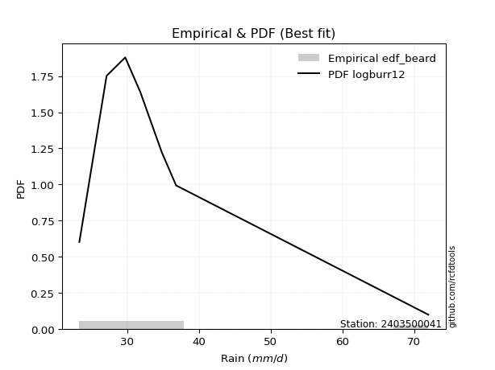</img>

</div>


### 5. EDF Chegodayev (1955)

The Chegodayev formula is an empirical plotting position formula used in hydrological frequency analysis to estimate the exceedance probability or return period of a specific event from a set of observed data. It is primarily used for plotting observed data points on probability paper to fit a theoretical distribution, particularly for analyzing extreme events like maximum flood flows or rainfall intensities. The constant _b_ value in the generalized plotting position formula is 0.3.

<div align="center">


$P=(m-b)/(n+1-2b)$


</div>


**5.1. Empirical values**

<div align="center">

|                | 0                   | 1                  | 2                  | 3                  | 4                 | 5                 |
|:---------------|:--------------------|:-------------------|:-------------------|:-------------------|:------------------|:------------------|
| date           | 2023                | 2020               | 2022               | 2021               | 2024              | 2019              |
| x              | 23.3                | 27.1               | 29.7               | 31.8               | 36.8              | 72.0              |
| m              | 1                   | 2                  | 3                  | 4                  | 5                 | 6                 |
| empirical_dist | edf_chegodayev      | edf_chegodayev     | edf_chegodayev     | edf_chegodayev     | edf_chegodayev    | edf_chegodayev    |
| empirical      | 0.10937499999999999 | 0.265625           | 0.421875           | 0.578125           | 0.734375          | 0.890625          |
| empirical_tr   | 1.1228070175438596  | 1.3617021276595744 | 1.7297297297297298 | 2.3703703703703702 | 3.764705882352941 | 9.142857142857142 |

</div>


**5.2. Kolmogorov-Smirnov fit test (sorted by Δ)**


<div align="center">

|                | 0                   | 1                   | 2                   | 3                   | 4                   | 5                  | 6                   | 7                   | 8                   | 9                   | 10                  | 11                  | 12                    | 13                 | 14                 | 15                  | 16                  | 17                  | 18                  | 19                  | 20                  | 21                  | 22                 | 23                  | 24                  | 25                  | 26                  | 27                  | 28                  | 29                  | 30                  | 31                  | 32                  | 33                  | 34                  | 35                  | 36                  | 37                  | 38                  | 39                  | 40                  | 41                  | 42                  | 43                 | 44                 | 45                  | 46                  | 47                  | 48                  | 49                  | 50                  | 51                  | 52                  | 53                  | 54                  | 55                  | 56                  | 57                  | 58                 | 59                  | 60                  | 61                  | 62                 | 63                 | 64                  | 65                  | 66                  | 67                 | 68                  | 69                  | 70                  | 71                 | 72                  | 73                 | 74                 | 75                | 76                 | 77                 | 78                  | 79                  | 80                  | 81                | 82                 | 83                 | 84                 | 85                 | 86                 | 87             |
|:---------------|:--------------------|:--------------------|:--------------------|:--------------------|:--------------------|:-------------------|:--------------------|:--------------------|:--------------------|:--------------------|:--------------------|:--------------------|:----------------------|:-------------------|:-------------------|:--------------------|:--------------------|:--------------------|:--------------------|:--------------------|:--------------------|:--------------------|:-------------------|:--------------------|:--------------------|:--------------------|:--------------------|:--------------------|:--------------------|:--------------------|:--------------------|:--------------------|:--------------------|:--------------------|:--------------------|:--------------------|:--------------------|:--------------------|:--------------------|:--------------------|:--------------------|:--------------------|:--------------------|:-------------------|:-------------------|:--------------------|:--------------------|:--------------------|:--------------------|:--------------------|:--------------------|:--------------------|:--------------------|:--------------------|:--------------------|:--------------------|:--------------------|:--------------------|:-------------------|:--------------------|:--------------------|:--------------------|:-------------------|:-------------------|:--------------------|:--------------------|:--------------------|:-------------------|:--------------------|:--------------------|:--------------------|:-------------------|:--------------------|:-------------------|:-------------------|:------------------|:-------------------|:-------------------|:--------------------|:--------------------|:--------------------|:------------------|:-------------------|:-------------------|:-------------------|:-------------------|:-------------------|:---------------|
| station        | 2403500041          | 2403500041          | 2403500041          | 2403500041          | 2403500041          | 2403500041         | 2403500041          | 2403500041          | 2403500041          | 2403500041          | 2403500041          | 2403500041          | 2403500041            | 2403500041         | 2403500041         | 2403500041          | 2403500041          | 2403500041          | 2403500041          | 2403500041          | 2403500041          | 2403500041          | 2403500041         | 2403500041          | 2403500041          | 2403500041          | 2403500041          | 2403500041          | 2403500041          | 2403500041          | 2403500041          | 2403500041          | 2403500041          | 2403500041          | 2403500041          | 2403500041          | 2403500041          | 2403500041          | 2403500041          | 2403500041          | 2403500041          | 2403500041          | 2403500041          | 2403500041         | 2403500041         | 2403500041          | 2403500041          | 2403500041          | 2403500041          | 2403500041          | 2403500041          | 2403500041          | 2403500041          | 2403500041          | 2403500041          | 2403500041          | 2403500041          | 2403500041          | 2403500041         | 2403500041          | 2403500041          | 2403500041          | 2403500041         | 2403500041         | 2403500041          | 2403500041          | 2403500041          | 2403500041         | 2403500041          | 2403500041          | 2403500041          | 2403500041         | 2403500041          | 2403500041         | 2403500041         | 2403500041        | 2403500041         | 2403500041         | 2403500041          | 2403500041          | 2403500041          | 2403500041        | 2403500041         | 2403500041         | 2403500041         | 2403500041         | 2403500041         | 2403500041     |
| empirical_dist | edf_chegodayev      | edf_chegodayev      | edf_chegodayev      | edf_chegodayev      | edf_chegodayev      | edf_chegodayev     | edf_chegodayev      | edf_chegodayev      | edf_chegodayev      | edf_chegodayev      | edf_chegodayev      | edf_chegodayev      | edf_chegodayev        | edf_chegodayev     | edf_chegodayev     | edf_chegodayev      | edf_chegodayev      | edf_chegodayev      | edf_chegodayev      | edf_chegodayev      | edf_chegodayev      | edf_chegodayev      | edf_chegodayev     | edf_chegodayev      | edf_chegodayev      | edf_chegodayev      | edf_chegodayev      | edf_chegodayev      | edf_chegodayev      | edf_chegodayev      | edf_chegodayev      | edf_chegodayev      | edf_chegodayev      | edf_chegodayev      | edf_chegodayev      | edf_chegodayev      | edf_chegodayev      | edf_chegodayev      | edf_chegodayev      | edf_chegodayev      | edf_chegodayev      | edf_chegodayev      | edf_chegodayev      | edf_chegodayev     | edf_chegodayev     | edf_chegodayev      | edf_chegodayev      | edf_chegodayev      | edf_chegodayev      | edf_chegodayev      | edf_chegodayev      | edf_chegodayev      | edf_chegodayev      | edf_chegodayev      | edf_chegodayev      | edf_chegodayev      | edf_chegodayev      | edf_chegodayev      | edf_chegodayev     | edf_chegodayev      | edf_chegodayev      | edf_chegodayev      | edf_chegodayev     | edf_chegodayev     | edf_chegodayev      | edf_chegodayev      | edf_chegodayev      | edf_chegodayev     | edf_chegodayev      | edf_chegodayev      | edf_chegodayev      | edf_chegodayev     | edf_chegodayev      | edf_chegodayev     | edf_chegodayev     | edf_chegodayev    | edf_chegodayev     | edf_chegodayev     | edf_chegodayev      | edf_chegodayev      | edf_chegodayev      | edf_chegodayev    | edf_chegodayev     | edf_chegodayev     | edf_chegodayev     | edf_chegodayev     | edf_chegodayev     | edf_chegodayev |
| p_dist         | logalpha            | loginvweibull       | alpha               | invweibull          | logexponnorm        | f                  | invgamma            | loginvgauss         | loghalflogistic     | invgauss            | logjohnsonsu        | logfatiguelife      | loglaplace_asymmetric | logmoyal           | wald               | logfisk             | logpearson3         | johnsonsu           | logt                | loggenlogistic      | mielke              | loghalfnorm         | loggumbel_r        | fatiguelife         | loginvgamma         | logtruncnorm        | loggenexpon         | gompertz            | logwald             | logexpon            | gibrat              | lognct              | genexpon            | expon               | laplace_asymmetric  | exponnorm           | lograyleigh         | logkstwobign        | logmaxwell          | nct                 | logbetaprime        | pearson3            | halflogistic        | moyal              | betaprime          | genlogistic         | ncf                 | loggompertz         | logloggamma         | lognorm             | lognorm             | logcrystalball      | logrice             | halfnorm            | gumbel_r            | loglogistic         | loggibrat           | truncnorm           | loghypsecant       | logncf              | rayleigh            | loglaplace          | kstwobign          | maxwell            | nakagami            | loggumbel_l         | fisk                | t                  | hypsecant           | logistic            | norm                | crystalball        | logchi2             | rice               | logf               | laplace           | gamma              | logweibull_min     | gumbel_l            | weibull_min         | loglognorm          | lognakagami       | erlang             | logerlang          | loggamma           | loggamma           | chi2               | logmielke      |
| delta          | 0.05821460135607629 | 0.05999817036200391 | 0.06097477632578669 | 0.06214915116218614 | 0.06315833722951991 | 0.0631645294598573 | 0.06316455081557212 | 0.06473193441338801 | 0.06555075669320831 | 0.06576041521206522 | 0.06594075518435236 | 0.06601182002883124 | 0.06743216863642754   | 0.0676681766573799 | 0.0690706459435011 | 0.06966175065561564 | 0.07823408224155082 | 0.08116192227891583 | 0.08192310996288221 | 0.08661261400466402 | 0.08910873535233022 | 0.09017298670497786 | 0.0919527028855347 | 0.10379781487823958 | 0.10510150802318552 | 0.10937337032208018 | 0.10937499928674459 | 0.10937499999998009 | 0.10937499999999999 | 0.10937499999999999 | 0.10987251840711293 | 0.11025916389463153 | 0.11049687660271279 | 0.11049959525541786 | 0.11050633499657314 | 0.11089938146310407 | 0.11510310252996148 | 0.11542663228785827 | 0.12389732137779419 | 0.12586284934178826 | 0.12976511533657142 | 0.13183903294802568 | 0.13399203057901488 | 0.1377341703581163 | 0.1420505086069121 | 0.14889081213180966 | 0.14915310363172507 | 0.15218453378504027 | 0.15399631889125653 | 0.15551057369440452 | 0.15551057369440452 | 0.15551122351733365 | 0.15829056840463368 | 0.15895447650897765 | 0.16357871030332638 | 0.16572945453640908 | 0.16908196587704533 | 0.17246981210668344 | 0.1742352627430085 | 0.18082393454311796 | 0.18992999493151097 | 0.19874436534838197 | 0.1992249375791907 | 0.2009328005696408 | 0.20483144724041946 | 0.22402857539362742 | 0.22601260618838703 | 0.2307382171462573 | 0.23386321448092706 | 0.23391086180878284 | 0.23396665413125783 | 0.2339666616084476 | 0.23819999618833965 | 0.2418697751566996 | 0.2501363928066568 | 0.253785422148644 | 0.2793632053358269 | 0.3028950215109516 | 0.30433047162066196 | 0.30864814608087765 | 0.38215247575302724 | 0.412109704352857 | 0.5562851603949515 | 0.5834805597028081 | 0.6008126827714321 | 0.6008126827714321 | 0.6115435262866346 | nan            |
| deltao         | 0.530385761606      | 0.530385761606      | 0.530385761606      | 0.530385761606      | 0.530385761606      | 0.530385761606     | 0.530385761606      | 0.530385761606      | 0.530385761606      | 0.530385761606      | 0.530385761606      | 0.530385761606      | 0.530385761606        | 0.530385761606     | 0.530385761606     | 0.530385761606      | 0.530385761606      | 0.530385761606      | 0.530385761606      | 0.530385761606      | 0.530385761606      | 0.530385761606      | 0.530385761606     | 0.530385761606      | 0.530385761606      | 0.530385761606      | 0.530385761606      | 0.530385761606      | 0.530385761606      | 0.530385761606      | 0.530385761606      | 0.530385761606      | 0.530385761606      | 0.530385761606      | 0.530385761606      | 0.530385761606      | 0.530385761606      | 0.530385761606      | 0.530385761606      | 0.530385761606      | 0.530385761606      | 0.530385761606      | 0.530385761606      | 0.530385761606     | 0.530385761606     | 0.530385761606      | 0.530385761606      | 0.530385761606      | 0.530385761606      | 0.530385761606      | 0.530385761606      | 0.530385761606      | 0.530385761606      | 0.530385761606      | 0.530385761606      | 0.530385761606      | 0.530385761606      | 0.530385761606      | 0.530385761606     | 0.530385761606      | 0.530385761606      | 0.530385761606      | 0.530385761606     | 0.530385761606     | 0.530385761606      | 0.530385761606      | 0.530385761606      | 0.530385761606     | 0.530385761606      | 0.530385761606      | 0.530385761606      | 0.530385761606     | 0.530385761606      | 0.530385761606     | 0.530385761606     | 0.530385761606    | 0.530385761606     | 0.530385761606     | 0.530385761606      | 0.530385761606      | 0.530385761606      | 0.530385761606    | 0.530385761606     | 0.530385761606     | 0.530385761606     | 0.530385761606     | 0.530385761606     | 0.530385761606 |
| eval           | Δo > Δ              | Δo > Δ              | Δo > Δ              | Δo > Δ              | Δo > Δ              | Δo > Δ             | Δo > Δ              | Δo > Δ              | Δo > Δ              | Δo > Δ              | Δo > Δ              | Δo > Δ              | Δo > Δ                | Δo > Δ             | Δo > Δ             | Δo > Δ              | Δo > Δ              | Δo > Δ              | Δo > Δ              | Δo > Δ              | Δo > Δ              | Δo > Δ              | Δo > Δ             | Δo > Δ              | Δo > Δ              | Δo > Δ              | Δo > Δ              | Δo > Δ              | Δo > Δ              | Δo > Δ              | Δo > Δ              | Δo > Δ              | Δo > Δ              | Δo > Δ              | Δo > Δ              | Δo > Δ              | Δo > Δ              | Δo > Δ              | Δo > Δ              | Δo > Δ              | Δo > Δ              | Δo > Δ              | Δo > Δ              | Δo > Δ             | Δo > Δ             | Δo > Δ              | Δo > Δ              | Δo > Δ              | Δo > Δ              | Δo > Δ              | Δo > Δ              | Δo > Δ              | Δo > Δ              | Δo > Δ              | Δo > Δ              | Δo > Δ              | Δo > Δ              | Δo > Δ              | Δo > Δ             | Δo > Δ              | Δo > Δ              | Δo > Δ              | Δo > Δ             | Δo > Δ             | Δo > Δ              | Δo > Δ              | Δo > Δ              | Δo > Δ             | Δo > Δ              | Δo > Δ              | Δo > Δ              | Δo > Δ             | Δo > Δ              | Δo > Δ             | Δo > Δ             | Δo > Δ            | Δo > Δ             | Δo > Δ             | Δo > Δ              | Δo > Δ              | Δo > Δ              | Δo > Δ            | Δo <= Δ            | Δo <= Δ            | Δo <= Δ            | Δo <= Δ            | Δo <= Δ            | Δo <= Δ        |
| fit            | 1                   | 1                   | 1                   | 1                   | 1                   | 1                  | 1                   | 1                   | 1                   | 1                   | 1                   | 1                   | 1                     | 1                  | 1                  | 1                   | 1                   | 1                   | 1                   | 1                   | 1                   | 1                   | 1                  | 1                   | 1                   | 1                   | 1                   | 1                   | 1                   | 1                   | 1                   | 1                   | 1                   | 1                   | 1                   | 1                   | 1                   | 1                   | 1                   | 1                   | 1                   | 1                   | 1                   | 1                  | 1                  | 1                   | 1                   | 1                   | 1                   | 1                   | 1                   | 1                   | 1                   | 1                   | 1                   | 1                   | 1                   | 1                   | 1                  | 1                   | 1                   | 1                   | 1                  | 1                  | 1                   | 1                   | 1                   | 1                  | 1                   | 1                   | 1                   | 1                  | 1                   | 1                  | 1                  | 1                 | 1                  | 1                  | 1                   | 1                   | 1                   | 1                 | 0                  | 0                  | 0                  | 0                  | 0                  | 0              |
| n              | 6                   | 6                   | 6                   | 6                   | 6                   | 6                  | 6                   | 6                   | 6                   | 6                   | 6                   | 6                   | 6                     | 6                  | 6                  | 6                   | 6                   | 6                   | 6                   | 6                   | 6                   | 6                   | 6                  | 6                   | 6                   | 6                   | 6                   | 6                   | 6                   | 6                   | 6                   | 6                   | 6                   | 6                   | 6                   | 6                   | 6                   | 6                   | 6                   | 6                   | 6                   | 6                   | 6                   | 6                  | 6                  | 6                   | 6                   | 6                   | 6                   | 6                   | 6                   | 6                   | 6                   | 6                   | 6                   | 6                   | 6                   | 6                   | 6                  | 6                   | 6                   | 6                   | 6                  | 6                  | 6                   | 6                   | 6                   | 6                  | 6                   | 6                   | 6                   | 6                  | 6                   | 6                  | 6                  | 6                 | 6                  | 6                  | 6                   | 6                   | 6                   | 6                 | 6                  | 6                  | 6                  | 6                  | 6                  | 6              |
| best_fit       | 1                   | 0                   | 0                   | 0                   | 0                   | 0                  | 0                   | 0                   | 0                   | 0                   | 0                   | 0                   | 0                     | 0                  | 0                  | 0                   | 0                   | 0                   | 0                   | 0                   | 0                   | 0                   | 0                  | 0                   | 0                   | 0                   | 0                   | 0                   | 0                   | 0                   | 0                   | 0                   | 0                   | 0                   | 0                   | 0                   | 0                   | 0                   | 0                   | 0                   | 0                   | 0                   | 0                   | 0                  | 0                  | 0                   | 0                   | 0                   | 0                   | 0                   | 0                   | 0                   | 0                   | 0                   | 0                   | 0                   | 0                   | 0                   | 0                  | 0                   | 0                   | 0                   | 0                  | 0                  | 0                   | 0                   | 0                   | 0                  | 0                   | 0                   | 0                   | 0                  | 0                   | 0                  | 0                  | 0                 | 0                  | 0                  | 0                   | 0                   | 0                   | 0                 | 0                  | 0                  | 0                  | 0                  | 0                  | 0              |
| best_fit_sort  | 1                   | 2                   | 3                   | 4                   | 5                   | 6                  | 7                   | 8                   | 9                   | 10                  | 11                  | 12                  | 13                    | 14                 | 15                 | 16                  | 17                  | 18                  | 19                  | 20                  | 21                  | 22                  | 23                 | 24                  | 25                  | 26                  | 27                  | 28                  | 29                  | 30                  | 31                  | 32                  | 33                  | 34                  | 35                  | 36                  | 37                  | 38                  | 39                  | 40                  | 41                  | 42                  | 43                  | 44                 | 45                 | 46                  | 47                  | 48                  | 49                  | 50                  | 51                  | 52                  | 53                  | 54                  | 55                  | 56                  | 57                  | 58                  | 59                 | 60                  | 61                  | 62                  | 63                 | 64                 | 65                  | 66                  | 67                  | 68                 | 69                  | 70                  | 71                  | 72                 | 73                  | 74                 | 75                 | 76                | 77                 | 78                 | 79                  | 80                  | 81                  | 82                | 83                 | 84                 | 85                 | 86                 | 87                 | 88             |

</div>


**5.3. Best fit**

<div align="center">

|   id |    station | empirical_dist   | p_dist   |     delta |   deltao | eval   |   fit |   n |   best_fit |   best_fit_sort |
|-----:|-----------:|:-----------------|:---------|----------:|---------:|:-------|------:|----:|-----------:|----------------:|
|    0 | 2403500041 | edf_chegodayev   | logalpha | 0.0582146 | 0.530386 | Δo > Δ |     1 |   6 |          1 |               1 |

</div>


<div align="center">

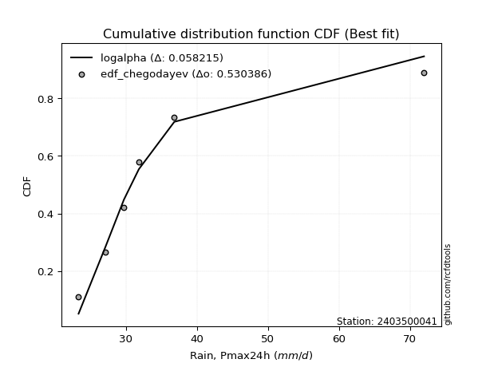</img></img>

</div>


### 6. EDF Blom (1958)

The Blom formula is a specific "plotting position" formula used in hydrology and statistical analysis to estimate the empirical cumulative probability (or non-exceedance probability) of a data series. It is particularly recommended for data that are approximately normally distributed. The constant _a_ is set to 0.375 (or 3/8).

<div align="center">


$P=(m-a)/(n+1-2a)$


</div>


**6.1. Empirical values**

<div align="center">

|                | 0                  | 1                  | 2                  | 3                 | 4                 | 5                  |
|:---------------|:-------------------|:-------------------|:-------------------|:------------------|:------------------|:-------------------|
| date           | 2023               | 2020               | 2022               | 2021              | 2024              | 2019               |
| x              | 23.3               | 27.1               | 29.7               | 31.8              | 36.8              | 72.0               |
| m              | 1                  | 2                  | 3                  | 4                 | 5                 | 6                  |
| empirical_dist | edf_blom           | edf_blom           | edf_blom           | edf_blom          | edf_blom          | edf_blom           |
| empirical      | 0.1                | 0.26               | 0.42               | 0.58              | 0.74              | 0.9                |
| empirical_tr   | 1.1111111111111112 | 1.3513513513513513 | 1.7241379310344827 | 2.380952380952381 | 3.846153846153846 | 10.000000000000002 |

</div>


**6.2. Kolmogorov-Smirnov fit test (sorted by Δ)**


<div align="center">

|                | 0                   | 1                   | 2                   | 3                   | 4                   | 5                   | 6                    | 7                    | 8                   | 9                     | 10                  | 11                  | 12                 | 13                  | 14                  | 15                  | 16                  | 17                  | 18                  | 19                  | 20                  | 21                  | 22                  | 23                 | 24                 | 25                 | 26             | 27             | 28                  | 29                  | 30                  | 31                  | 32                  | 33                  | 34                 | 35                  | 36                  | 37                  | 38                  | 39                  | 40                  | 41                  | 42                  | 43                 | 44                  | 45                  | 46                  | 47                  | 48                  | 49                  | 50                 | 51                  | 52                  | 53                  | 54                  | 55                  | 56                  | 57                  | 58                  | 59                  | 60                  | 61                  | 62                  | 63                 | 64                  | 65                  | 66                  | 67                 | 68                  | 69                  | 70                  | 71                  | 72                  | 73                 | 74                | 75                 | 76                 | 77                 | 78                  | 79                  | 80                  | 81                | 82                 | 83                 | 84                 | 85                 | 86                 | 87             |
|:---------------|:--------------------|:--------------------|:--------------------|:--------------------|:--------------------|:--------------------|:---------------------|:---------------------|:--------------------|:----------------------|:--------------------|:--------------------|:-------------------|:--------------------|:--------------------|:--------------------|:--------------------|:--------------------|:--------------------|:--------------------|:--------------------|:--------------------|:--------------------|:-------------------|:-------------------|:-------------------|:---------------|:---------------|:--------------------|:--------------------|:--------------------|:--------------------|:--------------------|:--------------------|:-------------------|:--------------------|:--------------------|:--------------------|:--------------------|:--------------------|:--------------------|:--------------------|:--------------------|:-------------------|:--------------------|:--------------------|:--------------------|:--------------------|:--------------------|:--------------------|:-------------------|:--------------------|:--------------------|:--------------------|:--------------------|:--------------------|:--------------------|:--------------------|:--------------------|:--------------------|:--------------------|:--------------------|:--------------------|:-------------------|:--------------------|:--------------------|:--------------------|:-------------------|:--------------------|:--------------------|:--------------------|:--------------------|:--------------------|:-------------------|:------------------|:-------------------|:-------------------|:-------------------|:--------------------|:--------------------|:--------------------|:------------------|:-------------------|:-------------------|:-------------------|:-------------------|:-------------------|:---------------|
| station        | 2403500041          | 2403500041          | 2403500041          | 2403500041          | 2403500041          | 2403500041          | 2403500041           | 2403500041           | 2403500041          | 2403500041            | 2403500041          | 2403500041          | 2403500041         | 2403500041          | 2403500041          | 2403500041          | 2403500041          | 2403500041          | 2403500041          | 2403500041          | 2403500041          | 2403500041          | 2403500041          | 2403500041         | 2403500041         | 2403500041         | 2403500041     | 2403500041     | 2403500041          | 2403500041          | 2403500041          | 2403500041          | 2403500041          | 2403500041          | 2403500041         | 2403500041          | 2403500041          | 2403500041          | 2403500041          | 2403500041          | 2403500041          | 2403500041          | 2403500041          | 2403500041         | 2403500041          | 2403500041          | 2403500041          | 2403500041          | 2403500041          | 2403500041          | 2403500041         | 2403500041          | 2403500041          | 2403500041          | 2403500041          | 2403500041          | 2403500041          | 2403500041          | 2403500041          | 2403500041          | 2403500041          | 2403500041          | 2403500041          | 2403500041         | 2403500041          | 2403500041          | 2403500041          | 2403500041         | 2403500041          | 2403500041          | 2403500041          | 2403500041          | 2403500041          | 2403500041         | 2403500041        | 2403500041         | 2403500041         | 2403500041         | 2403500041          | 2403500041          | 2403500041          | 2403500041        | 2403500041         | 2403500041         | 2403500041         | 2403500041         | 2403500041         | 2403500041     |
| empirical_dist | edf_blom            | edf_blom            | edf_blom            | edf_blom            | edf_blom            | edf_blom            | edf_blom             | edf_blom             | edf_blom            | edf_blom              | edf_blom            | edf_blom            | edf_blom           | edf_blom            | edf_blom            | edf_blom            | edf_blom            | edf_blom            | edf_blom            | edf_blom            | edf_blom            | edf_blom            | edf_blom            | edf_blom           | edf_blom           | edf_blom           | edf_blom       | edf_blom       | edf_blom            | edf_blom            | edf_blom            | edf_blom            | edf_blom            | edf_blom            | edf_blom           | edf_blom            | edf_blom            | edf_blom            | edf_blom            | edf_blom            | edf_blom            | edf_blom            | edf_blom            | edf_blom           | edf_blom            | edf_blom            | edf_blom            | edf_blom            | edf_blom            | edf_blom            | edf_blom           | edf_blom            | edf_blom            | edf_blom            | edf_blom            | edf_blom            | edf_blom            | edf_blom            | edf_blom            | edf_blom            | edf_blom            | edf_blom            | edf_blom            | edf_blom           | edf_blom            | edf_blom            | edf_blom            | edf_blom           | edf_blom            | edf_blom            | edf_blom            | edf_blom            | edf_blom            | edf_blom           | edf_blom          | edf_blom           | edf_blom           | edf_blom           | edf_blom            | edf_blom            | edf_blom            | edf_blom          | edf_blom           | edf_blom           | edf_blom           | edf_blom           | edf_blom           | edf_blom       |
| p_dist         | logalpha            | loginvweibull       | alpha               | invweibull          | logexponnorm        | f                   | invgamma             | loginvgauss          | logjohnsonsu        | loglaplace_asymmetric | logfisk             | loghalflogistic     | logfatiguelife     | logmoyal            | invgauss            | wald                | logt                | mielke              | logpearson3         | loggenlogistic      | johnsonsu           | loggumbel_r         | loghalfnorm         | logtruncnorm       | loggenexpon        | gompertz           | logexpon       | logwald        | gibrat              | loginvgamma         | fatiguelife         | lognct              | genexpon            | expon               | laplace_asymmetric | exponnorm           | logkstwobign        | lograyleigh         | nct                 | logmaxwell          | logbetaprime        | pearson3            | halflogistic        | moyal              | betaprime           | genlogistic         | ncf                 | loggompertz         | lognorm             | lognorm             | logcrystalball     | logloggamma         | logrice             | loggibrat           | halfnorm            | loglogistic         | gumbel_r            | loghypsecant        | truncnorm           | logncf              | rayleigh            | loglaplace          | kstwobign           | maxwell            | nakagami            | loggumbel_l         | fisk                | t                  | hypsecant           | logistic            | norm                | crystalball         | logchi2             | rice               | laplace           | logf               | gamma              | logweibull_min     | gumbel_l            | weibull_min         | loglognorm          | lognakagami       | erlang             | logerlang          | loggamma           | loggamma           | chi2               | logmielke      |
| delta          | 0.04883960135607631 | 0.05062317036200393 | 0.05159977632578671 | 0.05277415116218616 | 0.05378333722951989 | 0.05378952945985732 | 0.053789550815572136 | 0.055356934413388036 | 0.05656575518435238 | 0.058057168636427514  | 0.06028675065561566 | 0.06770556905310765 | 0.0687179161852225 | 0.06954317665737986 | 0.07025572072086117 | 0.07148996611924374 | 0.07392057951646924 | 0.07973373535233019 | 0.08385908224155081 | 0.08452464228210077 | 0.08678692227891582 | 0.09382770288553466 | 0.09579798670497786 | 0.0999983703220802 | 0.0999999992867446 | 0.0999999999999801 | 0.1            | 0.1            | 0.10424751840711294 | 0.10697650802318548 | 0.10942281487823957 | 0.11213416389463149 | 0.11237187660271275 | 0.11237459525541782 | 0.1123813349965731 | 0.11277438146310403 | 0.11730163228785823 | 0.12072810252996147 | 0.12773784934178822 | 0.12952232137779418 | 0.13164011533657138 | 0.13746403294802567 | 0.13961703057901487 | 0.1433591703581163 | 0.14392550860691206 | 0.15076581213180962 | 0.15140807812021784 | 0.15405953378504023 | 0.15752870722298762 | 0.15752870722298762 | 0.1575297319804989 | 0.15962131889125653 | 0.16016556840463364 | 0.16345696587704533 | 0.16457947650897764 | 0.16760445453640904 | 0.16920371030332637 | 0.17611026274300845 | 0.17754166936807403 | 0.18644893454311795 | 0.19555499493151096 | 0.20061936534838193 | 0.20109993757919065 | 0.2065578005696408 | 0.21045644724041945 | 0.22590357539362738 | 0.23163760618838702 | 0.2363632171462573 | 0.23948821448092705 | 0.23953586180878284 | 0.23959165413125783 | 0.23959166160844758 | 0.24382499618833964 | 0.2474947751566996 | 0.255660422148644 | 0.2557613928066568 | 0.2849882053358269 | 0.3085200215109516 | 0.30995547162066195 | 0.31427314608087764 | 0.38777747575302723 | 0.417734704352857 | 0.5619101603949515 | 0.5891055597028081 | 0.6064376827714321 | 0.6064376827714321 | 0.6171685262866345 | nan            |
| deltao         | 0.530385761606      | 0.530385761606      | 0.530385761606      | 0.530385761606      | 0.530385761606      | 0.530385761606      | 0.530385761606       | 0.530385761606       | 0.530385761606      | 0.530385761606        | 0.530385761606      | 0.530385761606      | 0.530385761606     | 0.530385761606      | 0.530385761606      | 0.530385761606      | 0.530385761606      | 0.530385761606      | 0.530385761606      | 0.530385761606      | 0.530385761606      | 0.530385761606      | 0.530385761606      | 0.530385761606     | 0.530385761606     | 0.530385761606     | 0.530385761606 | 0.530385761606 | 0.530385761606      | 0.530385761606      | 0.530385761606      | 0.530385761606      | 0.530385761606      | 0.530385761606      | 0.530385761606     | 0.530385761606      | 0.530385761606      | 0.530385761606      | 0.530385761606      | 0.530385761606      | 0.530385761606      | 0.530385761606      | 0.530385761606      | 0.530385761606     | 0.530385761606      | 0.530385761606      | 0.530385761606      | 0.530385761606      | 0.530385761606      | 0.530385761606      | 0.530385761606     | 0.530385761606      | 0.530385761606      | 0.530385761606      | 0.530385761606      | 0.530385761606      | 0.530385761606      | 0.530385761606      | 0.530385761606      | 0.530385761606      | 0.530385761606      | 0.530385761606      | 0.530385761606      | 0.530385761606     | 0.530385761606      | 0.530385761606      | 0.530385761606      | 0.530385761606     | 0.530385761606      | 0.530385761606      | 0.530385761606      | 0.530385761606      | 0.530385761606      | 0.530385761606     | 0.530385761606    | 0.530385761606     | 0.530385761606     | 0.530385761606     | 0.530385761606      | 0.530385761606      | 0.530385761606      | 0.530385761606    | 0.530385761606     | 0.530385761606     | 0.530385761606     | 0.530385761606     | 0.530385761606     | 0.530385761606 |
| eval           | Δo > Δ              | Δo > Δ              | Δo > Δ              | Δo > Δ              | Δo > Δ              | Δo > Δ              | Δo > Δ               | Δo > Δ               | Δo > Δ              | Δo > Δ                | Δo > Δ              | Δo > Δ              | Δo > Δ             | Δo > Δ              | Δo > Δ              | Δo > Δ              | Δo > Δ              | Δo > Δ              | Δo > Δ              | Δo > Δ              | Δo > Δ              | Δo > Δ              | Δo > Δ              | Δo > Δ             | Δo > Δ             | Δo > Δ             | Δo > Δ         | Δo > Δ         | Δo > Δ              | Δo > Δ              | Δo > Δ              | Δo > Δ              | Δo > Δ              | Δo > Δ              | Δo > Δ             | Δo > Δ              | Δo > Δ              | Δo > Δ              | Δo > Δ              | Δo > Δ              | Δo > Δ              | Δo > Δ              | Δo > Δ              | Δo > Δ             | Δo > Δ              | Δo > Δ              | Δo > Δ              | Δo > Δ              | Δo > Δ              | Δo > Δ              | Δo > Δ             | Δo > Δ              | Δo > Δ              | Δo > Δ              | Δo > Δ              | Δo > Δ              | Δo > Δ              | Δo > Δ              | Δo > Δ              | Δo > Δ              | Δo > Δ              | Δo > Δ              | Δo > Δ              | Δo > Δ             | Δo > Δ              | Δo > Δ              | Δo > Δ              | Δo > Δ             | Δo > Δ              | Δo > Δ              | Δo > Δ              | Δo > Δ              | Δo > Δ              | Δo > Δ             | Δo > Δ            | Δo > Δ             | Δo > Δ             | Δo > Δ             | Δo > Δ              | Δo > Δ              | Δo > Δ              | Δo > Δ            | Δo <= Δ            | Δo <= Δ            | Δo <= Δ            | Δo <= Δ            | Δo <= Δ            | Δo <= Δ        |
| fit            | 1                   | 1                   | 1                   | 1                   | 1                   | 1                   | 1                    | 1                    | 1                   | 1                     | 1                   | 1                   | 1                  | 1                   | 1                   | 1                   | 1                   | 1                   | 1                   | 1                   | 1                   | 1                   | 1                   | 1                  | 1                  | 1                  | 1              | 1              | 1                   | 1                   | 1                   | 1                   | 1                   | 1                   | 1                  | 1                   | 1                   | 1                   | 1                   | 1                   | 1                   | 1                   | 1                   | 1                  | 1                   | 1                   | 1                   | 1                   | 1                   | 1                   | 1                  | 1                   | 1                   | 1                   | 1                   | 1                   | 1                   | 1                   | 1                   | 1                   | 1                   | 1                   | 1                   | 1                  | 1                   | 1                   | 1                   | 1                  | 1                   | 1                   | 1                   | 1                   | 1                   | 1                  | 1                 | 1                  | 1                  | 1                  | 1                   | 1                   | 1                   | 1                 | 0                  | 0                  | 0                  | 0                  | 0                  | 0              |
| n              | 6                   | 6                   | 6                   | 6                   | 6                   | 6                   | 6                    | 6                    | 6                   | 6                     | 6                   | 6                   | 6                  | 6                   | 6                   | 6                   | 6                   | 6                   | 6                   | 6                   | 6                   | 6                   | 6                   | 6                  | 6                  | 6                  | 6              | 6              | 6                   | 6                   | 6                   | 6                   | 6                   | 6                   | 6                  | 6                   | 6                   | 6                   | 6                   | 6                   | 6                   | 6                   | 6                   | 6                  | 6                   | 6                   | 6                   | 6                   | 6                   | 6                   | 6                  | 6                   | 6                   | 6                   | 6                   | 6                   | 6                   | 6                   | 6                   | 6                   | 6                   | 6                   | 6                   | 6                  | 6                   | 6                   | 6                   | 6                  | 6                   | 6                   | 6                   | 6                   | 6                   | 6                  | 6                 | 6                  | 6                  | 6                  | 6                   | 6                   | 6                   | 6                 | 6                  | 6                  | 6                  | 6                  | 6                  | 6              |
| best_fit       | 1                   | 0                   | 0                   | 0                   | 0                   | 0                   | 0                    | 0                    | 0                   | 0                     | 0                   | 0                   | 0                  | 0                   | 0                   | 0                   | 0                   | 0                   | 0                   | 0                   | 0                   | 0                   | 0                   | 0                  | 0                  | 0                  | 0              | 0              | 0                   | 0                   | 0                   | 0                   | 0                   | 0                   | 0                  | 0                   | 0                   | 0                   | 0                   | 0                   | 0                   | 0                   | 0                   | 0                  | 0                   | 0                   | 0                   | 0                   | 0                   | 0                   | 0                  | 0                   | 0                   | 0                   | 0                   | 0                   | 0                   | 0                   | 0                   | 0                   | 0                   | 0                   | 0                   | 0                  | 0                   | 0                   | 0                   | 0                  | 0                   | 0                   | 0                   | 0                   | 0                   | 0                  | 0                 | 0                  | 0                  | 0                  | 0                   | 0                   | 0                   | 0                 | 0                  | 0                  | 0                  | 0                  | 0                  | 0              |
| best_fit_sort  | 1                   | 2                   | 3                   | 4                   | 5                   | 6                   | 7                    | 8                    | 9                   | 10                    | 11                  | 12                  | 13                 | 14                  | 15                  | 16                  | 17                  | 18                  | 19                  | 20                  | 21                  | 22                  | 23                  | 24                 | 25                 | 26                 | 27             | 28             | 29                  | 30                  | 31                  | 32                  | 33                  | 34                  | 35                 | 36                  | 37                  | 38                  | 39                  | 40                  | 41                  | 42                  | 43                  | 44                 | 45                  | 46                  | 47                  | 48                  | 49                  | 50                  | 51                 | 52                  | 53                  | 54                  | 55                  | 56                  | 57                  | 58                  | 59                  | 60                  | 61                  | 62                  | 63                  | 64                 | 65                  | 66                  | 67                  | 68                 | 69                  | 70                  | 71                  | 72                  | 73                  | 74                 | 75                | 76                 | 77                 | 78                 | 79                  | 80                  | 81                  | 82                | 83                 | 84                 | 85                 | 86                 | 87                 | 88             |

</div>


**6.3. Best fit**

<div align="center">

|   id |    station | empirical_dist   | p_dist   |     delta |   deltao | eval   |   fit |   n |   best_fit |   best_fit_sort |
|-----:|-----------:|:-----------------|:---------|----------:|---------:|:-------|------:|----:|-----------:|----------------:|
|    0 | 2403500041 | edf_blom         | logalpha | 0.0488396 | 0.530386 | Δo > Δ |     1 |   6 |          1 |               1 |

</div>


<div align="center">

</img></img>

</div>


### 7. EDF Tukey (1962)

In hydrology, the Tukey formula is used as a plotting position formula to estimate the empirical probability or frequency of a flood event (or other hydrological data). The formula parameter is given as _c=0.333_ (or 1/3).

<div align="center">


$P=(m-c)/(n+1-2c)$


</div>


**7.1. Empirical values**

<div align="center">

|                | 0                   | 1                  | 2                   | 3                  | 4                  | 5                  |
|:---------------|:--------------------|:-------------------|:--------------------|:-------------------|:-------------------|:-------------------|
| date           | 2023                | 2020               | 2022                | 2021               | 2024               | 2019               |
| x              | 23.3                | 27.1               | 29.7                | 31.8               | 36.8               | 72.0               |
| m              | 1                   | 2                  | 3                   | 4                  | 5                  | 6                  |
| empirical_dist | edf_tukey           | edf_tukey          | edf_tukey           | edf_tukey          | edf_tukey          | edf_tukey          |
| empirical      | 0.10526315789473684 | 0.2631578947368421 | 0.42105263157894735 | 0.5789473684210527 | 0.7368421052631579 | 0.8947368421052632 |
| empirical_tr   | 1.1176470588235294  | 1.357142857142857  | 1.7272727272727273  | 2.375              | 3.7999999999999994 | 9.5                |

</div>


**7.2. Kolmogorov-Smirnov fit test (sorted by Δ)**


<div align="center">

|                | 0                   | 1                   | 2                   | 3                   | 4                   | 5                   | 6                   | 7                    | 8                    | 9                     | 10                  | 11                  | 12                  | 13                  | 14                 | 15                  | 16                  | 17                  | 18                  | 19                  | 20                  | 21                  | 22                  | 23                  | 24                  | 25                  | 26                  | 27                  | 28                  | 29                  | 30                  | 31                  | 32                  | 33                  | 34                 | 35                  | 36                  | 37                  | 38                  | 39                  | 40                  | 41                  | 42                  | 43                  | 44                  | 45                 | 46                  | 47                  | 48                  | 49                  | 50                 | 51                 | 52                  | 53                 | 54                  | 55                  | 56                  | 57                 | 58                  | 59                 | 60                  | 61                  | 62                  | 63                  | 64                  | 65                  | 66                 | 67                  | 68                  | 69                 | 70                 | 71                  | 72                 | 73                  | 74                 | 75                 | 76                  | 77                 | 78                 | 79                  | 80                  | 81                 | 82                 | 83                 | 84                 | 85                 | 86                 | 87             |
|:---------------|:--------------------|:--------------------|:--------------------|:--------------------|:--------------------|:--------------------|:--------------------|:---------------------|:---------------------|:----------------------|:--------------------|:--------------------|:--------------------|:--------------------|:-------------------|:--------------------|:--------------------|:--------------------|:--------------------|:--------------------|:--------------------|:--------------------|:--------------------|:--------------------|:--------------------|:--------------------|:--------------------|:--------------------|:--------------------|:--------------------|:--------------------|:--------------------|:--------------------|:--------------------|:-------------------|:--------------------|:--------------------|:--------------------|:--------------------|:--------------------|:--------------------|:--------------------|:--------------------|:--------------------|:--------------------|:-------------------|:--------------------|:--------------------|:--------------------|:--------------------|:-------------------|:-------------------|:--------------------|:-------------------|:--------------------|:--------------------|:--------------------|:-------------------|:--------------------|:-------------------|:--------------------|:--------------------|:--------------------|:--------------------|:--------------------|:--------------------|:-------------------|:--------------------|:--------------------|:-------------------|:-------------------|:--------------------|:-------------------|:--------------------|:-------------------|:-------------------|:--------------------|:-------------------|:-------------------|:--------------------|:--------------------|:-------------------|:-------------------|:-------------------|:-------------------|:-------------------|:-------------------|:---------------|
| station        | 2403500041          | 2403500041          | 2403500041          | 2403500041          | 2403500041          | 2403500041          | 2403500041          | 2403500041           | 2403500041           | 2403500041            | 2403500041          | 2403500041          | 2403500041          | 2403500041          | 2403500041         | 2403500041          | 2403500041          | 2403500041          | 2403500041          | 2403500041          | 2403500041          | 2403500041          | 2403500041          | 2403500041          | 2403500041          | 2403500041          | 2403500041          | 2403500041          | 2403500041          | 2403500041          | 2403500041          | 2403500041          | 2403500041          | 2403500041          | 2403500041         | 2403500041          | 2403500041          | 2403500041          | 2403500041          | 2403500041          | 2403500041          | 2403500041          | 2403500041          | 2403500041          | 2403500041          | 2403500041         | 2403500041          | 2403500041          | 2403500041          | 2403500041          | 2403500041         | 2403500041         | 2403500041          | 2403500041         | 2403500041          | 2403500041          | 2403500041          | 2403500041         | 2403500041          | 2403500041         | 2403500041          | 2403500041          | 2403500041          | 2403500041          | 2403500041          | 2403500041          | 2403500041         | 2403500041          | 2403500041          | 2403500041         | 2403500041         | 2403500041          | 2403500041         | 2403500041          | 2403500041         | 2403500041         | 2403500041          | 2403500041         | 2403500041         | 2403500041          | 2403500041          | 2403500041         | 2403500041         | 2403500041         | 2403500041         | 2403500041         | 2403500041         | 2403500041     |
| empirical_dist | edf_tukey           | edf_tukey           | edf_tukey           | edf_tukey           | edf_tukey           | edf_tukey           | edf_tukey           | edf_tukey            | edf_tukey            | edf_tukey             | edf_tukey           | edf_tukey           | edf_tukey           | edf_tukey           | edf_tukey          | edf_tukey           | edf_tukey           | edf_tukey           | edf_tukey           | edf_tukey           | edf_tukey           | edf_tukey           | edf_tukey           | edf_tukey           | edf_tukey           | edf_tukey           | edf_tukey           | edf_tukey           | edf_tukey           | edf_tukey           | edf_tukey           | edf_tukey           | edf_tukey           | edf_tukey           | edf_tukey          | edf_tukey           | edf_tukey           | edf_tukey           | edf_tukey           | edf_tukey           | edf_tukey           | edf_tukey           | edf_tukey           | edf_tukey           | edf_tukey           | edf_tukey          | edf_tukey           | edf_tukey           | edf_tukey           | edf_tukey           | edf_tukey          | edf_tukey          | edf_tukey           | edf_tukey          | edf_tukey           | edf_tukey           | edf_tukey           | edf_tukey          | edf_tukey           | edf_tukey          | edf_tukey           | edf_tukey           | edf_tukey           | edf_tukey           | edf_tukey           | edf_tukey           | edf_tukey          | edf_tukey           | edf_tukey           | edf_tukey          | edf_tukey          | edf_tukey           | edf_tukey          | edf_tukey           | edf_tukey          | edf_tukey          | edf_tukey           | edf_tukey          | edf_tukey          | edf_tukey           | edf_tukey           | edf_tukey          | edf_tukey          | edf_tukey          | edf_tukey          | edf_tukey          | edf_tukey          | edf_tukey      |
| p_dist         | logalpha            | loginvweibull       | alpha               | invweibull          | logexponnorm        | f                   | invgamma            | loginvgauss          | logjohnsonsu         | loglaplace_asymmetric | loghalflogistic     | logfisk             | logfatiguelife      | invgauss            | wald               | logmoyal            | logt                | logpearson3         | loggenlogistic      | johnsonsu           | mielke              | loghalfnorm         | loggumbel_r         | logtruncnorm        | loggenexpon         | gompertz            | logexpon            | logwald             | loginvgamma         | fatiguelife         | gibrat              | lognct              | genexpon            | expon               | laplace_asymmetric | exponnorm           | logkstwobign        | lograyleigh         | logmaxwell          | nct                 | logbetaprime        | pearson3            | halflogistic        | moyal               | betaprime           | genlogistic        | ncf                 | loggompertz         | lognorm             | lognorm             | logcrystalball     | logloggamma        | logrice             | halfnorm           | gumbel_r            | loglogistic         | loggibrat           | truncnorm          | loghypsecant        | logncf             | rayleigh            | loglaplace          | kstwobign           | maxwell             | nakagami            | loggumbel_l         | fisk               | t                   | hypsecant           | logistic           | norm               | crystalball         | logchi2            | rice                | logf               | laplace            | gamma               | logweibull_min     | gumbel_l           | weibull_min         | loglognorm          | lognakagami        | erlang             | logerlang          | loggamma           | loggamma           | chi2               | logmielke      |
| delta          | 0.05410275925081314 | 0.05588632825674076 | 0.05686293422052354 | 0.05803730905692299 | 0.05904649512425675 | 0.05905268735459415 | 0.05905270871030897 | 0.060620092308124866 | 0.061828913079089214 | 0.06332032653116437   | 0.06454767431626551 | 0.06554990855035249 | 0.06556002144838041 | 0.06709782598401909 | 0.0683320713824016 | 0.06849054507843255 | 0.07781126785761905 | 0.08070118750470867 | 0.08347201070315347 | 0.08362902754207374 | 0.08499689324706705 | 0.09264009196813572 | 0.09277507130658735 | 0.10526152821681703 | 0.10526315718148144 | 0.10526315789471694 | 0.10526315789473684 | 0.10526315789473684 | 0.10592387644423817 | 0.10626492014139749 | 0.10740541314395502 | 0.11108153231568418 | 0.11131924502376545 | 0.11132196367647051 | 0.1113287034176258 | 0.11172174988415673 | 0.11624900070891092 | 0.11757020779311933 | 0.12636442664095204 | 0.12668521776284092 | 0.13058748375762408 | 0.13430613821118353 | 0.13645913584217273 | 0.14020127562127416 | 0.14287287702796475 | 0.1497131805528623 | 0.14997547205277773 | 0.15300690220609292 | 0.15633294211545717 | 0.15633294211545717 | 0.1563335919383863 | 0.1564634241544144 | 0.15911293682568634 | 0.1614215817721355 | 0.16604581556648423 | 0.16655182295746174 | 0.16661486061388742 | 0.1743837746312319 | 0.17505763116406114 | 0.1832910398062758 | 0.19239710019466882 | 0.19956673376943462 | 0.20004730600024334 | 0.20339990583279866 | 0.20729855250357732 | 0.22485094381468007 | 0.2284797114515449 | 0.23320532240941516 | 0.23633031974408492 | 0.2363779670719407 | 0.2364337593944157 | 0.23643376687160544 | 0.2406671014514975 | 0.24433688041985746 | 0.2526034980698147 | 0.2546077905696967 | 0.28183031059898483 | 0.3053621267741095 | 0.3067975768838198 | 0.31111525134403556 | 0.38461958101618515 | 0.4145768096160149 | 0.5587522656581094 | 0.5859476649659661 | 0.6032797880345899 | 0.6032797880345899 | 0.6140106315497924 | nan            |
| deltao         | 0.530385761606      | 0.530385761606      | 0.530385761606      | 0.530385761606      | 0.530385761606      | 0.530385761606      | 0.530385761606      | 0.530385761606       | 0.530385761606       | 0.530385761606        | 0.530385761606      | 0.530385761606      | 0.530385761606      | 0.530385761606      | 0.530385761606     | 0.530385761606      | 0.530385761606      | 0.530385761606      | 0.530385761606      | 0.530385761606      | 0.530385761606      | 0.530385761606      | 0.530385761606      | 0.530385761606      | 0.530385761606      | 0.530385761606      | 0.530385761606      | 0.530385761606      | 0.530385761606      | 0.530385761606      | 0.530385761606      | 0.530385761606      | 0.530385761606      | 0.530385761606      | 0.530385761606     | 0.530385761606      | 0.530385761606      | 0.530385761606      | 0.530385761606      | 0.530385761606      | 0.530385761606      | 0.530385761606      | 0.530385761606      | 0.530385761606      | 0.530385761606      | 0.530385761606     | 0.530385761606      | 0.530385761606      | 0.530385761606      | 0.530385761606      | 0.530385761606     | 0.530385761606     | 0.530385761606      | 0.530385761606     | 0.530385761606      | 0.530385761606      | 0.530385761606      | 0.530385761606     | 0.530385761606      | 0.530385761606     | 0.530385761606      | 0.530385761606      | 0.530385761606      | 0.530385761606      | 0.530385761606      | 0.530385761606      | 0.530385761606     | 0.530385761606      | 0.530385761606      | 0.530385761606     | 0.530385761606     | 0.530385761606      | 0.530385761606     | 0.530385761606      | 0.530385761606     | 0.530385761606     | 0.530385761606      | 0.530385761606     | 0.530385761606     | 0.530385761606      | 0.530385761606      | 0.530385761606     | 0.530385761606     | 0.530385761606     | 0.530385761606     | 0.530385761606     | 0.530385761606     | 0.530385761606 |
| eval           | Δo > Δ              | Δo > Δ              | Δo > Δ              | Δo > Δ              | Δo > Δ              | Δo > Δ              | Δo > Δ              | Δo > Δ               | Δo > Δ               | Δo > Δ                | Δo > Δ              | Δo > Δ              | Δo > Δ              | Δo > Δ              | Δo > Δ             | Δo > Δ              | Δo > Δ              | Δo > Δ              | Δo > Δ              | Δo > Δ              | Δo > Δ              | Δo > Δ              | Δo > Δ              | Δo > Δ              | Δo > Δ              | Δo > Δ              | Δo > Δ              | Δo > Δ              | Δo > Δ              | Δo > Δ              | Δo > Δ              | Δo > Δ              | Δo > Δ              | Δo > Δ              | Δo > Δ             | Δo > Δ              | Δo > Δ              | Δo > Δ              | Δo > Δ              | Δo > Δ              | Δo > Δ              | Δo > Δ              | Δo > Δ              | Δo > Δ              | Δo > Δ              | Δo > Δ             | Δo > Δ              | Δo > Δ              | Δo > Δ              | Δo > Δ              | Δo > Δ             | Δo > Δ             | Δo > Δ              | Δo > Δ             | Δo > Δ              | Δo > Δ              | Δo > Δ              | Δo > Δ             | Δo > Δ              | Δo > Δ             | Δo > Δ              | Δo > Δ              | Δo > Δ              | Δo > Δ              | Δo > Δ              | Δo > Δ              | Δo > Δ             | Δo > Δ              | Δo > Δ              | Δo > Δ             | Δo > Δ             | Δo > Δ              | Δo > Δ             | Δo > Δ              | Δo > Δ             | Δo > Δ             | Δo > Δ              | Δo > Δ             | Δo > Δ             | Δo > Δ              | Δo > Δ              | Δo > Δ             | Δo <= Δ            | Δo <= Δ            | Δo <= Δ            | Δo <= Δ            | Δo <= Δ            | Δo <= Δ        |
| fit            | 1                   | 1                   | 1                   | 1                   | 1                   | 1                   | 1                   | 1                    | 1                    | 1                     | 1                   | 1                   | 1                   | 1                   | 1                  | 1                   | 1                   | 1                   | 1                   | 1                   | 1                   | 1                   | 1                   | 1                   | 1                   | 1                   | 1                   | 1                   | 1                   | 1                   | 1                   | 1                   | 1                   | 1                   | 1                  | 1                   | 1                   | 1                   | 1                   | 1                   | 1                   | 1                   | 1                   | 1                   | 1                   | 1                  | 1                   | 1                   | 1                   | 1                   | 1                  | 1                  | 1                   | 1                  | 1                   | 1                   | 1                   | 1                  | 1                   | 1                  | 1                   | 1                   | 1                   | 1                   | 1                   | 1                   | 1                  | 1                   | 1                   | 1                  | 1                  | 1                   | 1                  | 1                   | 1                  | 1                  | 1                   | 1                  | 1                  | 1                   | 1                   | 1                  | 0                  | 0                  | 0                  | 0                  | 0                  | 0              |
| n              | 6                   | 6                   | 6                   | 6                   | 6                   | 6                   | 6                   | 6                    | 6                    | 6                     | 6                   | 6                   | 6                   | 6                   | 6                  | 6                   | 6                   | 6                   | 6                   | 6                   | 6                   | 6                   | 6                   | 6                   | 6                   | 6                   | 6                   | 6                   | 6                   | 6                   | 6                   | 6                   | 6                   | 6                   | 6                  | 6                   | 6                   | 6                   | 6                   | 6                   | 6                   | 6                   | 6                   | 6                   | 6                   | 6                  | 6                   | 6                   | 6                   | 6                   | 6                  | 6                  | 6                   | 6                  | 6                   | 6                   | 6                   | 6                  | 6                   | 6                  | 6                   | 6                   | 6                   | 6                   | 6                   | 6                   | 6                  | 6                   | 6                   | 6                  | 6                  | 6                   | 6                  | 6                   | 6                  | 6                  | 6                   | 6                  | 6                  | 6                   | 6                   | 6                  | 6                  | 6                  | 6                  | 6                  | 6                  | 6              |
| best_fit       | 1                   | 0                   | 0                   | 0                   | 0                   | 0                   | 0                   | 0                    | 0                    | 0                     | 0                   | 0                   | 0                   | 0                   | 0                  | 0                   | 0                   | 0                   | 0                   | 0                   | 0                   | 0                   | 0                   | 0                   | 0                   | 0                   | 0                   | 0                   | 0                   | 0                   | 0                   | 0                   | 0                   | 0                   | 0                  | 0                   | 0                   | 0                   | 0                   | 0                   | 0                   | 0                   | 0                   | 0                   | 0                   | 0                  | 0                   | 0                   | 0                   | 0                   | 0                  | 0                  | 0                   | 0                  | 0                   | 0                   | 0                   | 0                  | 0                   | 0                  | 0                   | 0                   | 0                   | 0                   | 0                   | 0                   | 0                  | 0                   | 0                   | 0                  | 0                  | 0                   | 0                  | 0                   | 0                  | 0                  | 0                   | 0                  | 0                  | 0                   | 0                   | 0                  | 0                  | 0                  | 0                  | 0                  | 0                  | 0              |
| best_fit_sort  | 1                   | 2                   | 3                   | 4                   | 5                   | 6                   | 7                   | 8                    | 9                    | 10                    | 11                  | 12                  | 13                  | 14                  | 15                 | 16                  | 17                  | 18                  | 19                  | 20                  | 21                  | 22                  | 23                  | 24                  | 25                  | 26                  | 27                  | 28                  | 29                  | 30                  | 31                  | 32                  | 33                  | 34                  | 35                 | 36                  | 37                  | 38                  | 39                  | 40                  | 41                  | 42                  | 43                  | 44                  | 45                  | 46                 | 47                  | 48                  | 49                  | 50                  | 51                 | 52                 | 53                  | 54                 | 55                  | 56                  | 57                  | 58                 | 59                  | 60                 | 61                  | 62                  | 63                  | 64                  | 65                  | 66                  | 67                 | 68                  | 69                  | 70                 | 71                 | 72                  | 73                 | 74                  | 75                 | 76                 | 77                  | 78                 | 79                 | 80                  | 81                  | 82                 | 83                 | 84                 | 85                 | 86                 | 87                 | 88             |

</div>


**7.3. Best fit**

<div align="center">

|   id |    station | empirical_dist   | p_dist   |     delta |   deltao | eval   |   fit |   n |   best_fit |   best_fit_sort |
|-----:|-----------:|:-----------------|:---------|----------:|---------:|:-------|------:|----:|-----------:|----------------:|
|    0 | 2403500041 | edf_tukey        | logalpha | 0.0541028 | 0.530386 | Δo > Δ |     1 |   6 |          1 |               1 |

</div>


<div align="center">

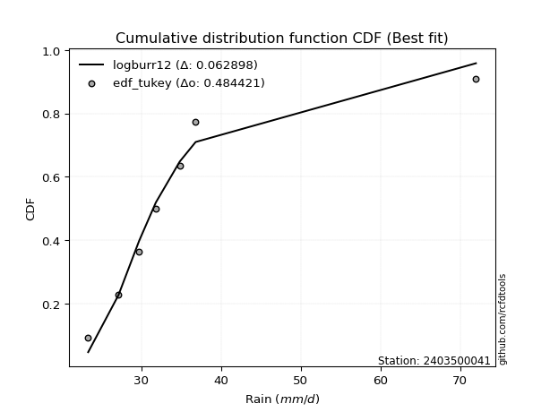</img>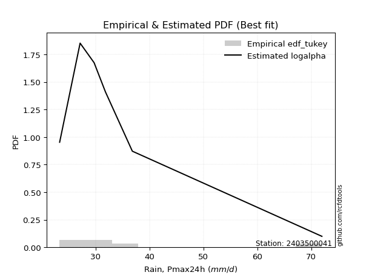</img>

</div>


### 8. EDF Gringorten (1963)

Gringorten plotting position formula is essential for estimating the probability and return periods of extreme events like floods and heavy rainfall. The constant _a=0.44_.

<div align="center">


$P=(m-a)/(n+1-2a)$


</div>


**8.1. Empirical values**

<div align="center">

|                | 0                   | 1                  | 2                   | 3                  | 4                  | 5                  |
|:---------------|:--------------------|:-------------------|:--------------------|:-------------------|:-------------------|:-------------------|
| date           | 2023                | 2020               | 2022                | 2021               | 2024               | 2019               |
| x              | 23.3                | 27.1               | 29.7                | 31.8               | 36.8               | 72.0               |
| m              | 1                   | 2                  | 3                   | 4                  | 5                  | 6                  |
| empirical_dist | edf_gringorten      | edf_gringorten     | edf_gringorten      | edf_gringorten     | edf_gringorten     | edf_gringorten     |
| empirical      | 0.09150326797385622 | 0.2549019607843137 | 0.41830065359477125 | 0.5816993464052288 | 0.7450980392156862 | 0.9084967320261437 |
| empirical_tr   | 1.1007194244604317  | 1.3421052631578947 | 1.7191011235955058  | 2.3906250000000004 | 3.9230769230769216 | 10.928571428571415 |

</div>


**8.2. Kolmogorov-Smirnov fit test (sorted by Δ)**


<div align="center">

|                | 0                   | 1                   | 2                   | 3                    | 4                    | 5                   | 6                   | 7                   | 8                     | 9                   | 10                  | 11                  | 12                  | 13                 | 14                  | 15                 | 16                  | 17                  | 18                  | 19                | 20                  | 21                  | 22                  | 23                  | 24                  | 25                  | 26                 | 27                  | 28                  | 29                  | 30                  | 31                  | 32                  | 33                  | 34                  | 35                  | 36                  | 37                  | 38                  | 39                  | 40                  | 41                  | 42                  | 43                 | 44                  | 45                  | 46                  | 47                  | 48                  | 49                  | 50                 | 51                 | 52                 | 53                  | 54                  | 55                  | 56                  | 57                 | 58                  | 59                  | 60                  | 61                  | 62                 | 63                  | 64                  | 65                  | 66                  | 67                 | 68                  | 69                  | 70                  | 71                  | 72                  | 73                 | 74                 | 75                 | 76                 | 77                 | 78                  | 79                  | 80                  | 81                 | 82                 | 83                 | 84                 | 85                 | 86                 | 87             |
|:---------------|:--------------------|:--------------------|:--------------------|:---------------------|:---------------------|:--------------------|:--------------------|:--------------------|:----------------------|:--------------------|:--------------------|:--------------------|:--------------------|:-------------------|:--------------------|:-------------------|:--------------------|:--------------------|:--------------------|:------------------|:--------------------|:--------------------|:--------------------|:--------------------|:--------------------|:--------------------|:-------------------|:--------------------|:--------------------|:--------------------|:--------------------|:--------------------|:--------------------|:--------------------|:--------------------|:--------------------|:--------------------|:--------------------|:--------------------|:--------------------|:--------------------|:--------------------|:--------------------|:-------------------|:--------------------|:--------------------|:--------------------|:--------------------|:--------------------|:--------------------|:-------------------|:-------------------|:-------------------|:--------------------|:--------------------|:--------------------|:--------------------|:-------------------|:--------------------|:--------------------|:--------------------|:--------------------|:-------------------|:--------------------|:--------------------|:--------------------|:--------------------|:-------------------|:--------------------|:--------------------|:--------------------|:--------------------|:--------------------|:-------------------|:-------------------|:-------------------|:-------------------|:-------------------|:--------------------|:--------------------|:--------------------|:-------------------|:-------------------|:-------------------|:-------------------|:-------------------|:-------------------|:---------------|
| station        | 2403500041          | 2403500041          | 2403500041          | 2403500041           | 2403500041           | 2403500041          | 2403500041          | 2403500041          | 2403500041            | 2403500041          | 2403500041          | 2403500041          | 2403500041          | 2403500041         | 2403500041          | 2403500041         | 2403500041          | 2403500041          | 2403500041          | 2403500041        | 2403500041          | 2403500041          | 2403500041          | 2403500041          | 2403500041          | 2403500041          | 2403500041         | 2403500041          | 2403500041          | 2403500041          | 2403500041          | 2403500041          | 2403500041          | 2403500041          | 2403500041          | 2403500041          | 2403500041          | 2403500041          | 2403500041          | 2403500041          | 2403500041          | 2403500041          | 2403500041          | 2403500041         | 2403500041          | 2403500041          | 2403500041          | 2403500041          | 2403500041          | 2403500041          | 2403500041         | 2403500041         | 2403500041         | 2403500041          | 2403500041          | 2403500041          | 2403500041          | 2403500041         | 2403500041          | 2403500041          | 2403500041          | 2403500041          | 2403500041         | 2403500041          | 2403500041          | 2403500041          | 2403500041          | 2403500041         | 2403500041          | 2403500041          | 2403500041          | 2403500041          | 2403500041          | 2403500041         | 2403500041         | 2403500041         | 2403500041         | 2403500041         | 2403500041          | 2403500041          | 2403500041          | 2403500041         | 2403500041         | 2403500041         | 2403500041         | 2403500041         | 2403500041         | 2403500041     |
| empirical_dist | edf_gringorten      | edf_gringorten      | edf_gringorten      | edf_gringorten       | edf_gringorten       | edf_gringorten      | edf_gringorten      | edf_gringorten      | edf_gringorten        | edf_gringorten      | edf_gringorten      | edf_gringorten      | edf_gringorten      | edf_gringorten     | edf_gringorten      | edf_gringorten     | edf_gringorten      | edf_gringorten      | edf_gringorten      | edf_gringorten    | edf_gringorten      | edf_gringorten      | edf_gringorten      | edf_gringorten      | edf_gringorten      | edf_gringorten      | edf_gringorten     | edf_gringorten      | edf_gringorten      | edf_gringorten      | edf_gringorten      | edf_gringorten      | edf_gringorten      | edf_gringorten      | edf_gringorten      | edf_gringorten      | edf_gringorten      | edf_gringorten      | edf_gringorten      | edf_gringorten      | edf_gringorten      | edf_gringorten      | edf_gringorten      | edf_gringorten     | edf_gringorten      | edf_gringorten      | edf_gringorten      | edf_gringorten      | edf_gringorten      | edf_gringorten      | edf_gringorten     | edf_gringorten     | edf_gringorten     | edf_gringorten      | edf_gringorten      | edf_gringorten      | edf_gringorten      | edf_gringorten     | edf_gringorten      | edf_gringorten      | edf_gringorten      | edf_gringorten      | edf_gringorten     | edf_gringorten      | edf_gringorten      | edf_gringorten      | edf_gringorten      | edf_gringorten     | edf_gringorten      | edf_gringorten      | edf_gringorten      | edf_gringorten      | edf_gringorten      | edf_gringorten     | edf_gringorten     | edf_gringorten     | edf_gringorten     | edf_gringorten     | edf_gringorten      | edf_gringorten      | edf_gringorten      | edf_gringorten     | edf_gringorten     | edf_gringorten     | edf_gringorten     | edf_gringorten     | edf_gringorten     | edf_gringorten |
| p_dist         | logalpha            | loginvweibull       | alpha               | invweibull           | logexponnorm         | logfisk             | invgamma            | f                   | loglaplace_asymmetric | logjohnsonsu        | loginvgauss         | logt                | mielke              | logmoyal           | loghalflogistic     | logfatiguelife     | invgauss            | wald                | loggenlogistic      | logpearson3       | logtruncnorm        | loggenexpon         | gompertz            | logwald             | logexpon            | johnsonsu           | loggumbel_r        | gibrat              | loghalfnorm         | loginvgamma         | lognct              | genexpon            | expon               | laplace_asymmetric  | exponnorm           | fatiguelife         | logkstwobign        | lograyleigh         | nct                 | logbetaprime        | logmaxwell          | pearson3            | halflogistic        | betaprime          | moyal               | genlogistic         | loggompertz         | ncf                 | loggibrat           | logrice             | lognorm            | lognorm            | logcrystalball     | logloggamma         | loglogistic         | halfnorm            | gumbel_r            | loghypsecant       | truncnorm           | logncf              | rayleigh            | loglaplace          | kstwobign          | maxwell             | nakagami            | loggumbel_l         | fisk                | t                  | hypsecant           | logistic            | norm                | crystalball         | logchi2             | rice               | laplace            | logf               | gamma              | logweibull_min     | gumbel_l            | weibull_min         | loglognorm          | lognakagami        | erlang             | logerlang          | loggamma           | loggamma           | chi2               | logmielke      |
| delta          | 0.04034286932993252 | 0.04212643833586014 | 0.04310304429964292 | 0.049092420541731685 | 0.050956835059481675 | 0.05179001862947187 | 0.05184246865361786 | 0.05184259448584494 | 0.055242023181779065  | 0.05770486105181205 | 0.06002208104977841 | 0.06882254030078305 | 0.07123700332618654 | 0.0712425230626087 | 0.07280360826879384 | 0.0738159554009088 | 0.07535375993654747 | 0.07658800533492993 | 0.08622398868732961 | 0.088957121457237 | 0.09150163829593641 | 0.09150326726060082 | 0.09150326797383632 | 0.09150326797385622 | 0.09150326797385622 | 0.09188496149460212 | 0.0955270492907635 | 0.09914947919142664 | 0.10089602592066405 | 0.10867585442841432 | 0.11383351029986033 | 0.11407122300794159 | 0.11407394166064666 | 0.11408068140180194 | 0.11447372786833288 | 0.11452085409392587 | 0.11900097869308707 | 0.12582614174564766 | 0.12943719574701706 | 0.13333946174180022 | 0.13462036059348037 | 0.14256207216371186 | 0.14471506979470106 | 0.1456248550121409 | 0.14845720957380248 | 0.15246515853703846 | 0.15575888019026907 | 0.15650611733590403 | 0.15835892666135903 | 0.16186491480986248 | 0.1626267464386738 | 0.1626267464386738 | 0.1626277711961851 | 0.16471935810694271 | 0.16930380094163788 | 0.16967751572466383 | 0.17430174951901256 | 0.1778096091482373 | 0.18263970858376022 | 0.19154697375880414 | 0.20065303414719715 | 0.20231871175361077 | 0.2027992839844195 | 0.21165583978532698 | 0.21555448645610564 | 0.22760292179885622 | 0.23673564540407321 | 0.2414612563619435 | 0.24458625369661324 | 0.24463390102446902 | 0.24468969334694401 | 0.24468970082413377 | 0.24892303540402583 | 0.2525928143723858 | 0.2573597685538728 | 0.2608594320223431 | 0.2900862445515132 | 0.3136180607266379 | 0.31505351083634814 | 0.31937118529656394 | 0.39287551496871354 | 0.4228327435685433 | 0.5670081996106378 | 0.5942035989184944 | 0.6115357219871184 | 0.6115357219871184 | 0.6222665655023208 | nan            |
| deltao         | 0.530385761606      | 0.530385761606      | 0.530385761606      | 0.530385761606       | 0.530385761606       | 0.530385761606      | 0.530385761606      | 0.530385761606      | 0.530385761606        | 0.530385761606      | 0.530385761606      | 0.530385761606      | 0.530385761606      | 0.530385761606     | 0.530385761606      | 0.530385761606     | 0.530385761606      | 0.530385761606      | 0.530385761606      | 0.530385761606    | 0.530385761606      | 0.530385761606      | 0.530385761606      | 0.530385761606      | 0.530385761606      | 0.530385761606      | 0.530385761606     | 0.530385761606      | 0.530385761606      | 0.530385761606      | 0.530385761606      | 0.530385761606      | 0.530385761606      | 0.530385761606      | 0.530385761606      | 0.530385761606      | 0.530385761606      | 0.530385761606      | 0.530385761606      | 0.530385761606      | 0.530385761606      | 0.530385761606      | 0.530385761606      | 0.530385761606     | 0.530385761606      | 0.530385761606      | 0.530385761606      | 0.530385761606      | 0.530385761606      | 0.530385761606      | 0.530385761606     | 0.530385761606     | 0.530385761606     | 0.530385761606      | 0.530385761606      | 0.530385761606      | 0.530385761606      | 0.530385761606     | 0.530385761606      | 0.530385761606      | 0.530385761606      | 0.530385761606      | 0.530385761606     | 0.530385761606      | 0.530385761606      | 0.530385761606      | 0.530385761606      | 0.530385761606     | 0.530385761606      | 0.530385761606      | 0.530385761606      | 0.530385761606      | 0.530385761606      | 0.530385761606     | 0.530385761606     | 0.530385761606     | 0.530385761606     | 0.530385761606     | 0.530385761606      | 0.530385761606      | 0.530385761606      | 0.530385761606     | 0.530385761606     | 0.530385761606     | 0.530385761606     | 0.530385761606     | 0.530385761606     | 0.530385761606 |
| eval           | Δo > Δ              | Δo > Δ              | Δo > Δ              | Δo > Δ               | Δo > Δ               | Δo > Δ              | Δo > Δ              | Δo > Δ              | Δo > Δ                | Δo > Δ              | Δo > Δ              | Δo > Δ              | Δo > Δ              | Δo > Δ             | Δo > Δ              | Δo > Δ             | Δo > Δ              | Δo > Δ              | Δo > Δ              | Δo > Δ            | Δo > Δ              | Δo > Δ              | Δo > Δ              | Δo > Δ              | Δo > Δ              | Δo > Δ              | Δo > Δ             | Δo > Δ              | Δo > Δ              | Δo > Δ              | Δo > Δ              | Δo > Δ              | Δo > Δ              | Δo > Δ              | Δo > Δ              | Δo > Δ              | Δo > Δ              | Δo > Δ              | Δo > Δ              | Δo > Δ              | Δo > Δ              | Δo > Δ              | Δo > Δ              | Δo > Δ             | Δo > Δ              | Δo > Δ              | Δo > Δ              | Δo > Δ              | Δo > Δ              | Δo > Δ              | Δo > Δ             | Δo > Δ             | Δo > Δ             | Δo > Δ              | Δo > Δ              | Δo > Δ              | Δo > Δ              | Δo > Δ             | Δo > Δ              | Δo > Δ              | Δo > Δ              | Δo > Δ              | Δo > Δ             | Δo > Δ              | Δo > Δ              | Δo > Δ              | Δo > Δ              | Δo > Δ             | Δo > Δ              | Δo > Δ              | Δo > Δ              | Δo > Δ              | Δo > Δ              | Δo > Δ             | Δo > Δ             | Δo > Δ             | Δo > Δ             | Δo > Δ             | Δo > Δ              | Δo > Δ              | Δo > Δ              | Δo > Δ             | Δo <= Δ            | Δo <= Δ            | Δo <= Δ            | Δo <= Δ            | Δo <= Δ            | Δo <= Δ        |
| fit            | 1                   | 1                   | 1                   | 1                    | 1                    | 1                   | 1                   | 1                   | 1                     | 1                   | 1                   | 1                   | 1                   | 1                  | 1                   | 1                  | 1                   | 1                   | 1                   | 1                 | 1                   | 1                   | 1                   | 1                   | 1                   | 1                   | 1                  | 1                   | 1                   | 1                   | 1                   | 1                   | 1                   | 1                   | 1                   | 1                   | 1                   | 1                   | 1                   | 1                   | 1                   | 1                   | 1                   | 1                  | 1                   | 1                   | 1                   | 1                   | 1                   | 1                   | 1                  | 1                  | 1                  | 1                   | 1                   | 1                   | 1                   | 1                  | 1                   | 1                   | 1                   | 1                   | 1                  | 1                   | 1                   | 1                   | 1                   | 1                  | 1                   | 1                   | 1                   | 1                   | 1                   | 1                  | 1                  | 1                  | 1                  | 1                  | 1                   | 1                   | 1                   | 1                  | 0                  | 0                  | 0                  | 0                  | 0                  | 0              |
| n              | 6                   | 6                   | 6                   | 6                    | 6                    | 6                   | 6                   | 6                   | 6                     | 6                   | 6                   | 6                   | 6                   | 6                  | 6                   | 6                  | 6                   | 6                   | 6                   | 6                 | 6                   | 6                   | 6                   | 6                   | 6                   | 6                   | 6                  | 6                   | 6                   | 6                   | 6                   | 6                   | 6                   | 6                   | 6                   | 6                   | 6                   | 6                   | 6                   | 6                   | 6                   | 6                   | 6                   | 6                  | 6                   | 6                   | 6                   | 6                   | 6                   | 6                   | 6                  | 6                  | 6                  | 6                   | 6                   | 6                   | 6                   | 6                  | 6                   | 6                   | 6                   | 6                   | 6                  | 6                   | 6                   | 6                   | 6                   | 6                  | 6                   | 6                   | 6                   | 6                   | 6                   | 6                  | 6                  | 6                  | 6                  | 6                  | 6                   | 6                   | 6                   | 6                  | 6                  | 6                  | 6                  | 6                  | 6                  | 6              |
| best_fit       | 1                   | 0                   | 0                   | 0                    | 0                    | 0                   | 0                   | 0                   | 0                     | 0                   | 0                   | 0                   | 0                   | 0                  | 0                   | 0                  | 0                   | 0                   | 0                   | 0                 | 0                   | 0                   | 0                   | 0                   | 0                   | 0                   | 0                  | 0                   | 0                   | 0                   | 0                   | 0                   | 0                   | 0                   | 0                   | 0                   | 0                   | 0                   | 0                   | 0                   | 0                   | 0                   | 0                   | 0                  | 0                   | 0                   | 0                   | 0                   | 0                   | 0                   | 0                  | 0                  | 0                  | 0                   | 0                   | 0                   | 0                   | 0                  | 0                   | 0                   | 0                   | 0                   | 0                  | 0                   | 0                   | 0                   | 0                   | 0                  | 0                   | 0                   | 0                   | 0                   | 0                   | 0                  | 0                  | 0                  | 0                  | 0                  | 0                   | 0                   | 0                   | 0                  | 0                  | 0                  | 0                  | 0                  | 0                  | 0              |
| best_fit_sort  | 1                   | 2                   | 3                   | 4                    | 5                    | 6                   | 7                   | 8                   | 9                     | 10                  | 11                  | 12                  | 13                  | 14                 | 15                  | 16                 | 17                  | 18                  | 19                  | 20                | 21                  | 22                  | 23                  | 24                  | 25                  | 26                  | 27                 | 28                  | 29                  | 30                  | 31                  | 32                  | 33                  | 34                  | 35                  | 36                  | 37                  | 38                  | 39                  | 40                  | 41                  | 42                  | 43                  | 44                 | 45                  | 46                  | 47                  | 48                  | 49                  | 50                  | 51                 | 52                 | 53                 | 54                  | 55                  | 56                  | 57                  | 58                 | 59                  | 60                  | 61                  | 62                  | 63                 | 64                  | 65                  | 66                  | 67                  | 68                 | 69                  | 70                  | 71                  | 72                  | 73                  | 74                 | 75                 | 76                 | 77                 | 78                 | 79                  | 80                  | 81                  | 82                 | 83                 | 84                 | 85                 | 86                 | 87                 | 88             |

</div>


**8.3. Best fit**

<div align="center">

|   id |    station | empirical_dist   | p_dist   |     delta |   deltao | eval   |   fit |   n |   best_fit |   best_fit_sort |
|-----:|-----------:|:-----------------|:---------|----------:|---------:|:-------|------:|----:|-----------:|----------------:|
|    0 | 2403500041 | edf_gringorten   | logalpha | 0.0403429 | 0.530386 | Δo > Δ |     1 |   6 |          1 |               1 |

</div>


<div align="center">

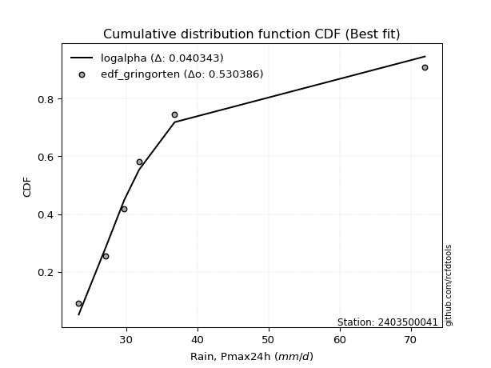</img></img>

</div>


### 9. EDF Filliben (1975)

The specific values of the constants (0.3175) (often denoted as $alpha$) and (0.365) are derived from a method proposed by James J. Filliben in a 1975 paper. This particular formula is the mean value of the $i$-th order statistic of the normal distribution and is considered a robust and effective plotting position formula for the normal probability plot correlation coefficient test for normality.

<div align="center">


$P=(m-0.3175)/(n+0.365)$


</div>


**9.1. Empirical values**

<div align="center">

|                | 0                   | 1                   | 2                  | 3                  | 4                  | 5                  |
|:---------------|:--------------------|:--------------------|:-------------------|:-------------------|:-------------------|:-------------------|
| date           | 2023                | 2020                | 2022               | 2021               | 2024               | 2019               |
| x              | 23.3                | 27.1                | 29.7               | 31.8               | 36.8               | 72.0               |
| m              | 1                   | 2                   | 3                  | 4                  | 5                  | 6                  |
| empirical_dist | edf_filliben        | edf_filliben        | edf_filliben       | edf_filliben       | edf_filliben       | edf_filliben       |
| empirical      | 0.10722702278083267 | 0.26433621366849963 | 0.4214454045561665 | 0.5785545954438335 | 0.7356637863315004 | 0.8927729772191673 |
| empirical_tr   | 1.1201055873295205  | 1.3593166043780034  | 1.7284453496266123 | 2.3727865796831313 | 3.783060921248143  | 9.326007326007321  |

</div>


**9.2. Kolmogorov-Smirnov fit test (sorted by Δ)**


<div align="center">

|                | 0                   | 1                   | 2                   | 3                   | 4                   | 5                    | 6                  | 7                   | 8                   | 9                   | 10                  | 11                    | 12                  | 13                  | 14                  | 15                  | 16                  | 17                  | 18                 | 19                  | 20                  | 21                  | 22                  | 23                  | 24                | 25                  | 26                  | 27                  | 28                  | 29                  | 30                  | 31                | 32                  | 33                  | 34                  | 35                  | 36                  | 37                 | 38                  | 39                  | 40                 | 41                 | 42                 | 43                  | 44                  | 45                  | 46                  | 47                  | 48                  | 49                | 50                | 51                  | 52                  | 53                  | 54                 | 55                  | 56                  | 57                  | 58                  | 59                  | 60                 | 61                  | 62                  | 63                  | 64                 | 65                 | 66                  | 67                  | 68                 | 69                  | 70                  | 71                  | 72                  | 73                  | 74                  | 75                 | 76                 | 77                  | 78                 | 79                | 80                 | 81                  | 82                 | 83                 | 84                 | 85                 | 86                | 87             |
|:---------------|:--------------------|:--------------------|:--------------------|:--------------------|:--------------------|:---------------------|:-------------------|:--------------------|:--------------------|:--------------------|:--------------------|:----------------------|:--------------------|:--------------------|:--------------------|:--------------------|:--------------------|:--------------------|:-------------------|:--------------------|:--------------------|:--------------------|:--------------------|:--------------------|:------------------|:--------------------|:--------------------|:--------------------|:--------------------|:--------------------|:--------------------|:------------------|:--------------------|:--------------------|:--------------------|:--------------------|:--------------------|:-------------------|:--------------------|:--------------------|:-------------------|:-------------------|:-------------------|:--------------------|:--------------------|:--------------------|:--------------------|:--------------------|:--------------------|:------------------|:------------------|:--------------------|:--------------------|:--------------------|:-------------------|:--------------------|:--------------------|:--------------------|:--------------------|:--------------------|:-------------------|:--------------------|:--------------------|:--------------------|:-------------------|:-------------------|:--------------------|:--------------------|:-------------------|:--------------------|:--------------------|:--------------------|:--------------------|:--------------------|:--------------------|:-------------------|:-------------------|:--------------------|:-------------------|:------------------|:-------------------|:--------------------|:-------------------|:-------------------|:-------------------|:-------------------|:------------------|:---------------|
| station        | 2403500041          | 2403500041          | 2403500041          | 2403500041          | 2403500041          | 2403500041           | 2403500041         | 2403500041          | 2403500041          | 2403500041          | 2403500041          | 2403500041            | 2403500041          | 2403500041          | 2403500041          | 2403500041          | 2403500041          | 2403500041          | 2403500041         | 2403500041          | 2403500041          | 2403500041          | 2403500041          | 2403500041          | 2403500041        | 2403500041          | 2403500041          | 2403500041          | 2403500041          | 2403500041          | 2403500041          | 2403500041        | 2403500041          | 2403500041          | 2403500041          | 2403500041          | 2403500041          | 2403500041         | 2403500041          | 2403500041          | 2403500041         | 2403500041         | 2403500041         | 2403500041          | 2403500041          | 2403500041          | 2403500041          | 2403500041          | 2403500041          | 2403500041        | 2403500041        | 2403500041          | 2403500041          | 2403500041          | 2403500041         | 2403500041          | 2403500041          | 2403500041          | 2403500041          | 2403500041          | 2403500041         | 2403500041          | 2403500041          | 2403500041          | 2403500041         | 2403500041         | 2403500041          | 2403500041          | 2403500041         | 2403500041          | 2403500041          | 2403500041          | 2403500041          | 2403500041          | 2403500041          | 2403500041         | 2403500041         | 2403500041          | 2403500041         | 2403500041        | 2403500041         | 2403500041          | 2403500041         | 2403500041         | 2403500041         | 2403500041         | 2403500041        | 2403500041     |
| empirical_dist | edf_filliben        | edf_filliben        | edf_filliben        | edf_filliben        | edf_filliben        | edf_filliben         | edf_filliben       | edf_filliben        | edf_filliben        | edf_filliben        | edf_filliben        | edf_filliben          | edf_filliben        | edf_filliben        | edf_filliben        | edf_filliben        | edf_filliben        | edf_filliben        | edf_filliben       | edf_filliben        | edf_filliben        | edf_filliben        | edf_filliben        | edf_filliben        | edf_filliben      | edf_filliben        | edf_filliben        | edf_filliben        | edf_filliben        | edf_filliben        | edf_filliben        | edf_filliben      | edf_filliben        | edf_filliben        | edf_filliben        | edf_filliben        | edf_filliben        | edf_filliben       | edf_filliben        | edf_filliben        | edf_filliben       | edf_filliben       | edf_filliben       | edf_filliben        | edf_filliben        | edf_filliben        | edf_filliben        | edf_filliben        | edf_filliben        | edf_filliben      | edf_filliben      | edf_filliben        | edf_filliben        | edf_filliben        | edf_filliben       | edf_filliben        | edf_filliben        | edf_filliben        | edf_filliben        | edf_filliben        | edf_filliben       | edf_filliben        | edf_filliben        | edf_filliben        | edf_filliben       | edf_filliben       | edf_filliben        | edf_filliben        | edf_filliben       | edf_filliben        | edf_filliben        | edf_filliben        | edf_filliben        | edf_filliben        | edf_filliben        | edf_filliben       | edf_filliben       | edf_filliben        | edf_filliben       | edf_filliben      | edf_filliben       | edf_filliben        | edf_filliben       | edf_filliben       | edf_filliben       | edf_filliben       | edf_filliben      | edf_filliben   |
| p_dist         | logalpha            | loginvweibull       | alpha               | invweibull          | logexponnorm        | f                    | invgamma           | loginvgauss         | loghalflogistic     | logjohnsonsu        | logfatiguelife      | loglaplace_asymmetric | invgauss            | wald                | logfisk             | logmoyal            | logpearson3         | logt                | johnsonsu          | loggenlogistic      | mielke              | loghalfnorm         | loggumbel_r         | fatiguelife         | loginvgamma       | logtruncnorm        | loggenexpon         | gompertz            | logwald             | logexpon            | gibrat              | lognct            | genexpon            | expon               | laplace_asymmetric  | exponnorm           | logkstwobign        | lograyleigh        | logmaxwell          | nct                 | logbetaprime       | pearson3           | halflogistic       | moyal               | betaprime           | genlogistic         | ncf                 | loggompertz         | logloggamma         | lognorm           | lognorm           | logcrystalball      | logrice             | halfnorm            | gumbel_r           | loglogistic         | loggibrat           | truncnorm           | loghypsecant        | logncf              | rayleigh           | loglaplace          | kstwobign           | maxwell             | nakagami           | loggumbel_l        | fisk                | t                   | hypsecant          | logistic            | norm                | crystalball         | logchi2             | rice                | logf                | laplace            | gamma              | logweibull_min      | gumbel_l           | weibull_min       | loglognorm         | lognakagami         | erlang             | logerlang          | loggamma           | loggamma           | chi2              | logmielke      |
| delta          | 0.05606662413690897 | 0.05785019314283659 | 0.05882679910661937 | 0.06000117394301882 | 0.06101036001035265 | 0.061016552240689984 | 0.0610165735964048 | 0.06258395719422069 | 0.06340277947404105 | 0.06379277796518504 | 0.06438170251672287 | 0.06528419141726027   | 0.06591950705236155 | 0.06715375245074418 | 0.06751377343644832 | 0.06809777210121337 | 0.07952286857305124 | 0.07977513274371495 | 0.0824507086104162 | 0.08446463678549676 | 0.08696075813316295 | 0.09146177303647829 | 0.09238229832936817 | 0.10508660120973995 | 0.105531103467019 | 0.10722539310291286 | 0.10722702206757727 | 0.10722702278081277 | 0.10722702278083267 | 0.10722702278083267 | 0.10858373207561256 | 0.110688759338465 | 0.11092647204654627 | 0.11092919069925133 | 0.11093593044040662 | 0.11132897690693755 | 0.11585622773169174 | 0.1163918888614619 | 0.12518610770929461 | 0.12629244478562174 | 0.1301947107804049 | 0.1331278192795261 | 0.1352808169105153 | 0.13902295668961673 | 0.14248010405074557 | 0.14932040757564313 | 0.14958269907555855 | 0.15261412922887374 | 0.15528510522275696 | 0.155940169138238 | 0.155940169138238 | 0.15594081896116713 | 0.15872016384846716 | 0.16024326284047807 | 0.1648674966348268 | 0.16615904998024256 | 0.16779317954554496 | 0.17320545569957446 | 0.17466485818684196 | 0.18211272087461838 | 0.1912187812630114 | 0.19917396079221544 | 0.19965453302302416 | 0.20222158690114123 | 0.2061202335719199 | 0.2244581708374609 | 0.22730139251988746 | 0.23202700347775773 | 0.2351520008124275 | 0.23519964814028327 | 0.23525544046275826 | 0.23525544793994801 | 0.23948878251984007 | 0.24315856148820003 | 0.25142517913815715 | 0.2542150175924775 | 0.2806519916673273 | 0.30418380784245197 | 0.3056192579521624 | 0.309936932412378 | 0.3834412620845276 | 0.41339849068435736 | 0.5575739467264518 | 0.5847693460343084 | 0.6021014691029325 | 0.6021014691029325 | 0.612832312618135 | nan            |
| deltao         | 0.530385761606      | 0.530385761606      | 0.530385761606      | 0.530385761606      | 0.530385761606      | 0.530385761606       | 0.530385761606     | 0.530385761606      | 0.530385761606      | 0.530385761606      | 0.530385761606      | 0.530385761606        | 0.530385761606      | 0.530385761606      | 0.530385761606      | 0.530385761606      | 0.530385761606      | 0.530385761606      | 0.530385761606     | 0.530385761606      | 0.530385761606      | 0.530385761606      | 0.530385761606      | 0.530385761606      | 0.530385761606    | 0.530385761606      | 0.530385761606      | 0.530385761606      | 0.530385761606      | 0.530385761606      | 0.530385761606      | 0.530385761606    | 0.530385761606      | 0.530385761606      | 0.530385761606      | 0.530385761606      | 0.530385761606      | 0.530385761606     | 0.530385761606      | 0.530385761606      | 0.530385761606     | 0.530385761606     | 0.530385761606     | 0.530385761606      | 0.530385761606      | 0.530385761606      | 0.530385761606      | 0.530385761606      | 0.530385761606      | 0.530385761606    | 0.530385761606    | 0.530385761606      | 0.530385761606      | 0.530385761606      | 0.530385761606     | 0.530385761606      | 0.530385761606      | 0.530385761606      | 0.530385761606      | 0.530385761606      | 0.530385761606     | 0.530385761606      | 0.530385761606      | 0.530385761606      | 0.530385761606     | 0.530385761606     | 0.530385761606      | 0.530385761606      | 0.530385761606     | 0.530385761606      | 0.530385761606      | 0.530385761606      | 0.530385761606      | 0.530385761606      | 0.530385761606      | 0.530385761606     | 0.530385761606     | 0.530385761606      | 0.530385761606     | 0.530385761606    | 0.530385761606     | 0.530385761606      | 0.530385761606     | 0.530385761606     | 0.530385761606     | 0.530385761606     | 0.530385761606    | 0.530385761606 |
| eval           | Δo > Δ              | Δo > Δ              | Δo > Δ              | Δo > Δ              | Δo > Δ              | Δo > Δ               | Δo > Δ             | Δo > Δ              | Δo > Δ              | Δo > Δ              | Δo > Δ              | Δo > Δ                | Δo > Δ              | Δo > Δ              | Δo > Δ              | Δo > Δ              | Δo > Δ              | Δo > Δ              | Δo > Δ             | Δo > Δ              | Δo > Δ              | Δo > Δ              | Δo > Δ              | Δo > Δ              | Δo > Δ            | Δo > Δ              | Δo > Δ              | Δo > Δ              | Δo > Δ              | Δo > Δ              | Δo > Δ              | Δo > Δ            | Δo > Δ              | Δo > Δ              | Δo > Δ              | Δo > Δ              | Δo > Δ              | Δo > Δ             | Δo > Δ              | Δo > Δ              | Δo > Δ             | Δo > Δ             | Δo > Δ             | Δo > Δ              | Δo > Δ              | Δo > Δ              | Δo > Δ              | Δo > Δ              | Δo > Δ              | Δo > Δ            | Δo > Δ            | Δo > Δ              | Δo > Δ              | Δo > Δ              | Δo > Δ             | Δo > Δ              | Δo > Δ              | Δo > Δ              | Δo > Δ              | Δo > Δ              | Δo > Δ             | Δo > Δ              | Δo > Δ              | Δo > Δ              | Δo > Δ             | Δo > Δ             | Δo > Δ              | Δo > Δ              | Δo > Δ             | Δo > Δ              | Δo > Δ              | Δo > Δ              | Δo > Δ              | Δo > Δ              | Δo > Δ              | Δo > Δ             | Δo > Δ             | Δo > Δ              | Δo > Δ             | Δo > Δ            | Δo > Δ             | Δo > Δ              | Δo <= Δ            | Δo <= Δ            | Δo <= Δ            | Δo <= Δ            | Δo <= Δ           | Δo <= Δ        |
| fit            | 1                   | 1                   | 1                   | 1                   | 1                   | 1                    | 1                  | 1                   | 1                   | 1                   | 1                   | 1                     | 1                   | 1                   | 1                   | 1                   | 1                   | 1                   | 1                  | 1                   | 1                   | 1                   | 1                   | 1                   | 1                 | 1                   | 1                   | 1                   | 1                   | 1                   | 1                   | 1                 | 1                   | 1                   | 1                   | 1                   | 1                   | 1                  | 1                   | 1                   | 1                  | 1                  | 1                  | 1                   | 1                   | 1                   | 1                   | 1                   | 1                   | 1                 | 1                 | 1                   | 1                   | 1                   | 1                  | 1                   | 1                   | 1                   | 1                   | 1                   | 1                  | 1                   | 1                   | 1                   | 1                  | 1                  | 1                   | 1                   | 1                  | 1                   | 1                   | 1                   | 1                   | 1                   | 1                   | 1                  | 1                  | 1                   | 1                  | 1                 | 1                  | 1                   | 0                  | 0                  | 0                  | 0                  | 0                 | 0              |
| n              | 6                   | 6                   | 6                   | 6                   | 6                   | 6                    | 6                  | 6                   | 6                   | 6                   | 6                   | 6                     | 6                   | 6                   | 6                   | 6                   | 6                   | 6                   | 6                  | 6                   | 6                   | 6                   | 6                   | 6                   | 6                 | 6                   | 6                   | 6                   | 6                   | 6                   | 6                   | 6                 | 6                   | 6                   | 6                   | 6                   | 6                   | 6                  | 6                   | 6                   | 6                  | 6                  | 6                  | 6                   | 6                   | 6                   | 6                   | 6                   | 6                   | 6                 | 6                 | 6                   | 6                   | 6                   | 6                  | 6                   | 6                   | 6                   | 6                   | 6                   | 6                  | 6                   | 6                   | 6                   | 6                  | 6                  | 6                   | 6                   | 6                  | 6                   | 6                   | 6                   | 6                   | 6                   | 6                   | 6                  | 6                  | 6                   | 6                  | 6                 | 6                  | 6                   | 6                  | 6                  | 6                  | 6                  | 6                 | 6              |
| best_fit       | 1                   | 0                   | 0                   | 0                   | 0                   | 0                    | 0                  | 0                   | 0                   | 0                   | 0                   | 0                     | 0                   | 0                   | 0                   | 0                   | 0                   | 0                   | 0                  | 0                   | 0                   | 0                   | 0                   | 0                   | 0                 | 0                   | 0                   | 0                   | 0                   | 0                   | 0                   | 0                 | 0                   | 0                   | 0                   | 0                   | 0                   | 0                  | 0                   | 0                   | 0                  | 0                  | 0                  | 0                   | 0                   | 0                   | 0                   | 0                   | 0                   | 0                 | 0                 | 0                   | 0                   | 0                   | 0                  | 0                   | 0                   | 0                   | 0                   | 0                   | 0                  | 0                   | 0                   | 0                   | 0                  | 0                  | 0                   | 0                   | 0                  | 0                   | 0                   | 0                   | 0                   | 0                   | 0                   | 0                  | 0                  | 0                   | 0                  | 0                 | 0                  | 0                   | 0                  | 0                  | 0                  | 0                  | 0                 | 0              |
| best_fit_sort  | 1                   | 2                   | 3                   | 4                   | 5                   | 6                    | 7                  | 8                   | 9                   | 10                  | 11                  | 12                    | 13                  | 14                  | 15                  | 16                  | 17                  | 18                  | 19                 | 20                  | 21                  | 22                  | 23                  | 24                  | 25                | 26                  | 27                  | 28                  | 29                  | 30                  | 31                  | 32                | 33                  | 34                  | 35                  | 36                  | 37                  | 38                 | 39                  | 40                  | 41                 | 42                 | 43                 | 44                  | 45                  | 46                  | 47                  | 48                  | 49                  | 50                | 51                | 52                  | 53                  | 54                  | 55                 | 56                  | 57                  | 58                  | 59                  | 60                  | 61                 | 62                  | 63                  | 64                  | 65                 | 66                 | 67                  | 68                  | 69                 | 70                  | 71                  | 72                  | 73                  | 74                  | 75                  | 76                 | 77                 | 78                  | 79                 | 80                | 81                 | 82                  | 83                 | 84                 | 85                 | 86                 | 87                | 88             |

</div>


**9.3. Best fit**

<div align="center">

|   id |    station | empirical_dist   | p_dist   |     delta |   deltao | eval   |   fit |   n |   best_fit |   best_fit_sort |
|-----:|-----------:|:-----------------|:---------|----------:|---------:|:-------|------:|----:|-----------:|----------------:|
|    0 | 2403500041 | edf_filliben     | logalpha | 0.0560666 | 0.530386 | Δo > Δ |     1 |   6 |          1 |               1 |

</div>


<div align="center">

</img></img>

</div>


### 10. EDF Jenkinson (1977)

The Jenkinson formula in hydrology is an empirical plotting position formula used to estimate the non-exceedance probability _(P)_ or return period _(T)_ of a given ordered observation within a sample. It is a widely used method in the frequency analysis of extreme events such as floods and rainfall, as it provides a distribution-free way to plot data. _a≈0.31_ and _b≈0.38_ are constants derived to approximate the median of the probability distribution for the given rank.

<div align="center">


$P=(m-a)/(n+b)$


</div>


**10.1. Empirical values**

<div align="center">

|                | 0                   | 1                   | 2                  | 3                  | 4                  | 5                  |
|:---------------|:--------------------|:--------------------|:-------------------|:-------------------|:-------------------|:-------------------|
| date           | 2023                | 2020                | 2022               | 2021               | 2024               | 2019               |
| x              | 23.3                | 27.1                | 29.7               | 31.8               | 36.8               | 72.0               |
| m              | 1                   | 2                   | 3                  | 4                  | 5                  | 6                  |
| empirical_dist | edf_jenkinson       | edf_jenkinson       | edf_jenkinson      | edf_jenkinson      | edf_jenkinson      | edf_jenkinson      |
| empirical      | 0.10815047021943573 | 0.26489028213166144 | 0.4216300940438871 | 0.5783699059561128 | 0.7351097178683387 | 0.8918495297805643 |
| empirical_tr   | 1.1212653778558874  | 1.3603411513859276  | 1.7289972899728996 | 2.3717472118959106 | 3.7751479289940844 | 9.246376811594207  |

</div>


**10.2. Kolmogorov-Smirnov fit test (sorted by Δ)**


<div align="center">

|                | 0                   | 1                    | 2                   | 3                    | 4                  | 5                   | 6                   | 7                   | 8                 | 9                  | 10                  | 11                  | 12                    | 13                  | 14                  | 15                  | 16                  | 17                 | 18                 | 19                  | 20                 | 21                  | 22                  | 23                  | 24                  | 25                  | 26                  | 27                  | 28                  | 29                  | 30                  | 31                  | 32                  | 33                  | 34                  | 35                  | 36                  | 37                  | 38                  | 39                  | 40                  | 41                  | 42                  | 43                  | 44                 | 45                  | 46                 | 47                  | 48                 | 49                  | 50                  | 51                  | 52                 | 53                  | 54                  | 55                 | 56                  | 57                  | 58                 | 59                  | 60                  | 61                  | 62                 | 63                  | 64                  | 65                  | 66                 | 67                  | 68                  | 69                  | 70                 | 71                  | 72                  | 73                  | 74                  | 75                  | 76                 | 77                  | 78                  | 79                 | 80                 | 81                  | 82               | 83                 | 84                 | 85                 | 86                 | 87             |
|:---------------|:--------------------|:---------------------|:--------------------|:---------------------|:-------------------|:--------------------|:--------------------|:--------------------|:------------------|:-------------------|:--------------------|:--------------------|:----------------------|:--------------------|:--------------------|:--------------------|:--------------------|:-------------------|:-------------------|:--------------------|:-------------------|:--------------------|:--------------------|:--------------------|:--------------------|:--------------------|:--------------------|:--------------------|:--------------------|:--------------------|:--------------------|:--------------------|:--------------------|:--------------------|:--------------------|:--------------------|:--------------------|:--------------------|:--------------------|:--------------------|:--------------------|:--------------------|:--------------------|:--------------------|:-------------------|:--------------------|:-------------------|:--------------------|:-------------------|:--------------------|:--------------------|:--------------------|:-------------------|:--------------------|:--------------------|:-------------------|:--------------------|:--------------------|:-------------------|:--------------------|:--------------------|:--------------------|:-------------------|:--------------------|:--------------------|:--------------------|:-------------------|:--------------------|:--------------------|:--------------------|:-------------------|:--------------------|:--------------------|:--------------------|:--------------------|:--------------------|:-------------------|:--------------------|:--------------------|:-------------------|:-------------------|:--------------------|:-----------------|:-------------------|:-------------------|:-------------------|:-------------------|:---------------|
| station        | 2403500041          | 2403500041           | 2403500041          | 2403500041           | 2403500041         | 2403500041          | 2403500041          | 2403500041          | 2403500041        | 2403500041         | 2403500041          | 2403500041          | 2403500041            | 2403500041          | 2403500041          | 2403500041          | 2403500041          | 2403500041         | 2403500041         | 2403500041          | 2403500041         | 2403500041          | 2403500041          | 2403500041          | 2403500041          | 2403500041          | 2403500041          | 2403500041          | 2403500041          | 2403500041          | 2403500041          | 2403500041          | 2403500041          | 2403500041          | 2403500041          | 2403500041          | 2403500041          | 2403500041          | 2403500041          | 2403500041          | 2403500041          | 2403500041          | 2403500041          | 2403500041          | 2403500041         | 2403500041          | 2403500041         | 2403500041          | 2403500041         | 2403500041          | 2403500041          | 2403500041          | 2403500041         | 2403500041          | 2403500041          | 2403500041         | 2403500041          | 2403500041          | 2403500041         | 2403500041          | 2403500041          | 2403500041          | 2403500041         | 2403500041          | 2403500041          | 2403500041          | 2403500041         | 2403500041          | 2403500041          | 2403500041          | 2403500041         | 2403500041          | 2403500041          | 2403500041          | 2403500041          | 2403500041          | 2403500041         | 2403500041          | 2403500041          | 2403500041         | 2403500041         | 2403500041          | 2403500041       | 2403500041         | 2403500041         | 2403500041         | 2403500041         | 2403500041     |
| empirical_dist | edf_jenkinson       | edf_jenkinson        | edf_jenkinson       | edf_jenkinson        | edf_jenkinson      | edf_jenkinson       | edf_jenkinson       | edf_jenkinson       | edf_jenkinson     | edf_jenkinson      | edf_jenkinson       | edf_jenkinson       | edf_jenkinson         | edf_jenkinson       | edf_jenkinson       | edf_jenkinson       | edf_jenkinson       | edf_jenkinson      | edf_jenkinson      | edf_jenkinson       | edf_jenkinson      | edf_jenkinson       | edf_jenkinson       | edf_jenkinson       | edf_jenkinson       | edf_jenkinson       | edf_jenkinson       | edf_jenkinson       | edf_jenkinson       | edf_jenkinson       | edf_jenkinson       | edf_jenkinson       | edf_jenkinson       | edf_jenkinson       | edf_jenkinson       | edf_jenkinson       | edf_jenkinson       | edf_jenkinson       | edf_jenkinson       | edf_jenkinson       | edf_jenkinson       | edf_jenkinson       | edf_jenkinson       | edf_jenkinson       | edf_jenkinson      | edf_jenkinson       | edf_jenkinson      | edf_jenkinson       | edf_jenkinson      | edf_jenkinson       | edf_jenkinson       | edf_jenkinson       | edf_jenkinson      | edf_jenkinson       | edf_jenkinson       | edf_jenkinson      | edf_jenkinson       | edf_jenkinson       | edf_jenkinson      | edf_jenkinson       | edf_jenkinson       | edf_jenkinson       | edf_jenkinson      | edf_jenkinson       | edf_jenkinson       | edf_jenkinson       | edf_jenkinson      | edf_jenkinson       | edf_jenkinson       | edf_jenkinson       | edf_jenkinson      | edf_jenkinson       | edf_jenkinson       | edf_jenkinson       | edf_jenkinson       | edf_jenkinson       | edf_jenkinson      | edf_jenkinson       | edf_jenkinson       | edf_jenkinson      | edf_jenkinson      | edf_jenkinson       | edf_jenkinson    | edf_jenkinson      | edf_jenkinson      | edf_jenkinson      | edf_jenkinson      | edf_jenkinson  |
| p_dist         | logalpha            | loginvweibull        | alpha               | invweibull           | logexponnorm       | f                   | invgamma            | loginvgauss         | loghalflogistic   | logjohnsonsu       | logfatiguelife      | invgauss            | loglaplace_asymmetric | wald                | logmoyal            | logfisk             | logpearson3         | logt               | johnsonsu          | loggenlogistic      | mielke             | loghalfnorm         | loggumbel_r         | fatiguelife         | loginvgamma         | logtruncnorm        | loggenexpon         | gompertz            | logwald             | logexpon            | gibrat              | lognct              | genexpon            | expon               | laplace_asymmetric  | exponnorm           | logkstwobign        | lograyleigh         | logmaxwell          | nct                 | logbetaprime        | pearson3            | halflogistic        | moyal               | betaprime          | genlogistic         | ncf                | loggompertz         | logloggamma        | lognorm             | lognorm             | logcrystalball      | logrice            | halfnorm            | gumbel_r            | loglogistic        | loggibrat           | truncnorm           | loghypsecant       | logncf              | rayleigh            | loglaplace          | kstwobign          | maxwell             | nakagami            | loggumbel_l         | fisk               | t                   | hypsecant           | logistic            | norm               | crystalball         | logchi2             | rice                | logf                | laplace             | gamma              | logweibull_min      | gumbel_l            | weibull_min        | loglognorm         | lognakagami         | erlang           | logerlang          | loggamma           | loggamma           | chi2               | logmielke      |
| delta          | 0.05699007157551204 | 0.058773640581439655 | 0.05975024654522244 | 0.060924621381621885 | 0.0619338074489556 | 0.06193999967929305 | 0.06194002103500786 | 0.06350740463282376 | 0.064326226912644 | 0.0647162254037881 | 0.06478729024826699 | 0.06536543858919974 | 0.06620763885586323   | 0.06784611616293684 | 0.06791308261349271 | 0.06843722087505139 | 0.07896880010988949 | 0.0806985801823179 | 0.0818966401472544 | 0.08538808422409971 | 0.0878842055717659 | 0.09090770457331654 | 0.09219760884164752 | 0.10453253274657814 | 0.10534641397929834 | 0.10814884054151593 | 0.10815046950618033 | 0.10815047021941583 | 0.10815047021943573 | 0.10815047021943573 | 0.10913780053877437 | 0.11050406985074435 | 0.11074178255882561 | 0.11074450121153068 | 0.11075124095268596 | 0.11114428741921689 | 0.11567153824397108 | 0.11583782039830015 | 0.12463203924613286 | 0.12610775529790108 | 0.13001002129268424 | 0.13257375081636436 | 0.13472674844735355 | 0.13846888822645498 | 0.1422954145630249 | 0.14913571808792248 | 0.1493980095878379 | 0.15242943974115308 | 0.1547310367595952 | 0.15575547965051734 | 0.15575547965051734 | 0.15575612947344647 | 0.1585354743607465 | 0.15968919437731632 | 0.16431342817166505 | 0.1659743604925219 | 0.16834724800870676 | 0.17271471806279626 | 0.1744801686991213 | 0.18155865241145663 | 0.19066471279984964 | 0.19898927130449479 | 0.1994698435353035 | 0.20166751843797948 | 0.20556616510875814 | 0.22427348134974023 | 0.2267473240567257 | 0.23147293501459598 | 0.23459793234926574 | 0.23464557967712152 | 0.2347013719995965 | 0.23470137947678626 | 0.23893471405667832 | 0.24260449302503828 | 0.25087111067499535 | 0.25403032810475684 | 0.2800979232041655 | 0.30362973937929016 | 0.30506518948900063 | 0.3093828639492162 | 0.3828871936213658 | 0.41284442222119555 | 0.55701987826329 | 0.5842152775711467 | 0.6015474006397706 | 0.6015474006397706 | 0.6122782441549731 | nan            |
| deltao         | 0.530385761606      | 0.530385761606       | 0.530385761606      | 0.530385761606       | 0.530385761606     | 0.530385761606      | 0.530385761606      | 0.530385761606      | 0.530385761606    | 0.530385761606     | 0.530385761606      | 0.530385761606      | 0.530385761606        | 0.530385761606      | 0.530385761606      | 0.530385761606      | 0.530385761606      | 0.530385761606     | 0.530385761606     | 0.530385761606      | 0.530385761606     | 0.530385761606      | 0.530385761606      | 0.530385761606      | 0.530385761606      | 0.530385761606      | 0.530385761606      | 0.530385761606      | 0.530385761606      | 0.530385761606      | 0.530385761606      | 0.530385761606      | 0.530385761606      | 0.530385761606      | 0.530385761606      | 0.530385761606      | 0.530385761606      | 0.530385761606      | 0.530385761606      | 0.530385761606      | 0.530385761606      | 0.530385761606      | 0.530385761606      | 0.530385761606      | 0.530385761606     | 0.530385761606      | 0.530385761606     | 0.530385761606      | 0.530385761606     | 0.530385761606      | 0.530385761606      | 0.530385761606      | 0.530385761606     | 0.530385761606      | 0.530385761606      | 0.530385761606     | 0.530385761606      | 0.530385761606      | 0.530385761606     | 0.530385761606      | 0.530385761606      | 0.530385761606      | 0.530385761606     | 0.530385761606      | 0.530385761606      | 0.530385761606      | 0.530385761606     | 0.530385761606      | 0.530385761606      | 0.530385761606      | 0.530385761606     | 0.530385761606      | 0.530385761606      | 0.530385761606      | 0.530385761606      | 0.530385761606      | 0.530385761606     | 0.530385761606      | 0.530385761606      | 0.530385761606     | 0.530385761606     | 0.530385761606      | 0.530385761606   | 0.530385761606     | 0.530385761606     | 0.530385761606     | 0.530385761606     | 0.530385761606 |
| eval           | Δo > Δ              | Δo > Δ               | Δo > Δ              | Δo > Δ               | Δo > Δ             | Δo > Δ              | Δo > Δ              | Δo > Δ              | Δo > Δ            | Δo > Δ             | Δo > Δ              | Δo > Δ              | Δo > Δ                | Δo > Δ              | Δo > Δ              | Δo > Δ              | Δo > Δ              | Δo > Δ             | Δo > Δ             | Δo > Δ              | Δo > Δ             | Δo > Δ              | Δo > Δ              | Δo > Δ              | Δo > Δ              | Δo > Δ              | Δo > Δ              | Δo > Δ              | Δo > Δ              | Δo > Δ              | Δo > Δ              | Δo > Δ              | Δo > Δ              | Δo > Δ              | Δo > Δ              | Δo > Δ              | Δo > Δ              | Δo > Δ              | Δo > Δ              | Δo > Δ              | Δo > Δ              | Δo > Δ              | Δo > Δ              | Δo > Δ              | Δo > Δ             | Δo > Δ              | Δo > Δ             | Δo > Δ              | Δo > Δ             | Δo > Δ              | Δo > Δ              | Δo > Δ              | Δo > Δ             | Δo > Δ              | Δo > Δ              | Δo > Δ             | Δo > Δ              | Δo > Δ              | Δo > Δ             | Δo > Δ              | Δo > Δ              | Δo > Δ              | Δo > Δ             | Δo > Δ              | Δo > Δ              | Δo > Δ              | Δo > Δ             | Δo > Δ              | Δo > Δ              | Δo > Δ              | Δo > Δ             | Δo > Δ              | Δo > Δ              | Δo > Δ              | Δo > Δ              | Δo > Δ              | Δo > Δ             | Δo > Δ              | Δo > Δ              | Δo > Δ             | Δo > Δ             | Δo > Δ              | Δo <= Δ          | Δo <= Δ            | Δo <= Δ            | Δo <= Δ            | Δo <= Δ            | Δo <= Δ        |
| fit            | 1                   | 1                    | 1                   | 1                    | 1                  | 1                   | 1                   | 1                   | 1                 | 1                  | 1                   | 1                   | 1                     | 1                   | 1                   | 1                   | 1                   | 1                  | 1                  | 1                   | 1                  | 1                   | 1                   | 1                   | 1                   | 1                   | 1                   | 1                   | 1                   | 1                   | 1                   | 1                   | 1                   | 1                   | 1                   | 1                   | 1                   | 1                   | 1                   | 1                   | 1                   | 1                   | 1                   | 1                   | 1                  | 1                   | 1                  | 1                   | 1                  | 1                   | 1                   | 1                   | 1                  | 1                   | 1                   | 1                  | 1                   | 1                   | 1                  | 1                   | 1                   | 1                   | 1                  | 1                   | 1                   | 1                   | 1                  | 1                   | 1                   | 1                   | 1                  | 1                   | 1                   | 1                   | 1                   | 1                   | 1                  | 1                   | 1                   | 1                  | 1                  | 1                   | 0                | 0                  | 0                  | 0                  | 0                  | 0              |
| n              | 6                   | 6                    | 6                   | 6                    | 6                  | 6                   | 6                   | 6                   | 6                 | 6                  | 6                   | 6                   | 6                     | 6                   | 6                   | 6                   | 6                   | 6                  | 6                  | 6                   | 6                  | 6                   | 6                   | 6                   | 6                   | 6                   | 6                   | 6                   | 6                   | 6                   | 6                   | 6                   | 6                   | 6                   | 6                   | 6                   | 6                   | 6                   | 6                   | 6                   | 6                   | 6                   | 6                   | 6                   | 6                  | 6                   | 6                  | 6                   | 6                  | 6                   | 6                   | 6                   | 6                  | 6                   | 6                   | 6                  | 6                   | 6                   | 6                  | 6                   | 6                   | 6                   | 6                  | 6                   | 6                   | 6                   | 6                  | 6                   | 6                   | 6                   | 6                  | 6                   | 6                   | 6                   | 6                   | 6                   | 6                  | 6                   | 6                   | 6                  | 6                  | 6                   | 6                | 6                  | 6                  | 6                  | 6                  | 6              |
| best_fit       | 1                   | 0                    | 0                   | 0                    | 0                  | 0                   | 0                   | 0                   | 0                 | 0                  | 0                   | 0                   | 0                     | 0                   | 0                   | 0                   | 0                   | 0                  | 0                  | 0                   | 0                  | 0                   | 0                   | 0                   | 0                   | 0                   | 0                   | 0                   | 0                   | 0                   | 0                   | 0                   | 0                   | 0                   | 0                   | 0                   | 0                   | 0                   | 0                   | 0                   | 0                   | 0                   | 0                   | 0                   | 0                  | 0                   | 0                  | 0                   | 0                  | 0                   | 0                   | 0                   | 0                  | 0                   | 0                   | 0                  | 0                   | 0                   | 0                  | 0                   | 0                   | 0                   | 0                  | 0                   | 0                   | 0                   | 0                  | 0                   | 0                   | 0                   | 0                  | 0                   | 0                   | 0                   | 0                   | 0                   | 0                  | 0                   | 0                   | 0                  | 0                  | 0                   | 0                | 0                  | 0                  | 0                  | 0                  | 0              |
| best_fit_sort  | 1                   | 2                    | 3                   | 4                    | 5                  | 6                   | 7                   | 8                   | 9                 | 10                 | 11                  | 12                  | 13                    | 14                  | 15                  | 16                  | 17                  | 18                 | 19                 | 20                  | 21                 | 22                  | 23                  | 24                  | 25                  | 26                  | 27                  | 28                  | 29                  | 30                  | 31                  | 32                  | 33                  | 34                  | 35                  | 36                  | 37                  | 38                  | 39                  | 40                  | 41                  | 42                  | 43                  | 44                  | 45                 | 46                  | 47                 | 48                  | 49                 | 50                  | 51                  | 52                  | 53                 | 54                  | 55                  | 56                 | 57                  | 58                  | 59                 | 60                  | 61                  | 62                  | 63                 | 64                  | 65                  | 66                  | 67                 | 68                  | 69                  | 70                  | 71                 | 72                  | 73                  | 74                  | 75                  | 76                  | 77                 | 78                  | 79                  | 80                 | 81                 | 82                  | 83               | 84                 | 85                 | 86                 | 87                 | 88             |

</div>


**10.3. Best fit**

<div align="center">

|   id |    station | empirical_dist   | p_dist   |     delta |   deltao | eval   |   fit |   n |   best_fit |   best_fit_sort |
|-----:|-----------:|:-----------------|:---------|----------:|---------:|:-------|------:|----:|-----------:|----------------:|
|    0 | 2403500041 | edf_jenkinson    | logalpha | 0.0569901 | 0.530386 | Δo > Δ |     1 |   6 |          1 |               1 |

</div>


<div align="center">

</img>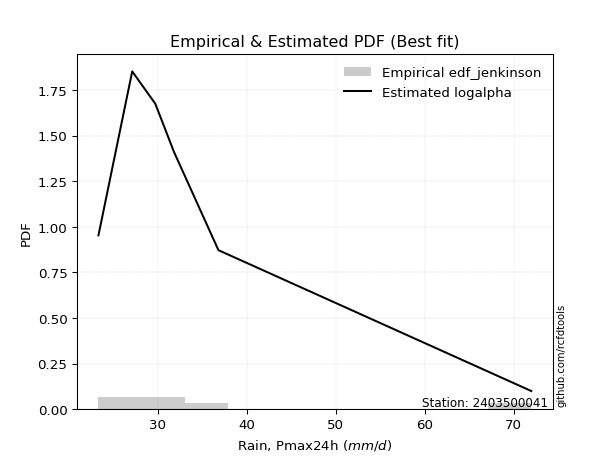</img>

</div>


### 11. EDF Cunnane (1978)

Cunnane´s work in statistical hydrology has focused on the performance and evaluation of different probability distributions (such as GEV, Gumbel, Lognormal) for flood frequency estimation. _b_ is a constant, typically set to 0.4.

<div align="center">


$P=(m-b)/(n+1-2b)$


</div>


**11.1. Empirical values**

<div align="center">

|                | 0                  | 1                   | 2                   | 3                  | 4                  | 5                  |
|:---------------|:-------------------|:--------------------|:--------------------|:-------------------|:-------------------|:-------------------|
| date           | 2023               | 2020                | 2022                | 2021               | 2024               | 2019               |
| x              | 23.3               | 27.1                | 29.7                | 31.8               | 36.8               | 72.0               |
| m              | 1                  | 2                   | 3                   | 4                  | 5                  | 6                  |
| empirical_dist | edf_cunnane        | edf_cunnane         | edf_cunnane         | edf_cunnane        | edf_cunnane        | edf_cunnane        |
| empirical      | 0.0967741935483871 | 0.25806451612903225 | 0.41935483870967744 | 0.5806451612903226 | 0.7419354838709676 | 0.9032258064516128 |
| empirical_tr   | 1.1071428571428572 | 1.3478260869565217  | 1.7222222222222225  | 2.384615384615385  | 3.8749999999999982 | 10.333333333333318 |

</div>


**11.2. Kolmogorov-Smirnov fit test (sorted by Δ)**


<div align="center">

|                | 0                  | 1                   | 2                  | 3                   | 4                    | 5                   | 6                    | 7                   | 8                     | 9                    | 10                  | 11                 | 12                  | 13                  | 14                 | 15                  | 16                  | 17                  | 18                  | 19                  | 20                  | 21                  | 22                  | 23                 | 24                 | 25                 | 26                 | 27                 | 28                  | 29                  | 30                  | 31                  | 32                  | 33                  | 34                  | 35                 | 36                  | 37                  | 38                  | 39                  | 40                  | 41                  | 42                 | 43                  | 44                  | 45                  | 46                  | 47                  | 48                  | 49                  | 50                  | 51                 | 52                  | 53                  | 54                 | 55                 | 56                  | 57                 | 58                  | 59                 | 60                 | 61                 | 62                 | 63                  | 64                 | 65                  | 66                  | 67                  | 68                 | 69                  | 70                  | 71                  | 72                  | 73                  | 74                  | 75                  | 76                 | 77                  | 78                 | 79                 | 80                | 81                  | 82                 | 83                 | 84                 | 85                 | 86                 | 87             |
|:---------------|:-------------------|:--------------------|:-------------------|:--------------------|:---------------------|:--------------------|:---------------------|:--------------------|:----------------------|:---------------------|:--------------------|:-------------------|:--------------------|:--------------------|:-------------------|:--------------------|:--------------------|:--------------------|:--------------------|:--------------------|:--------------------|:--------------------|:--------------------|:-------------------|:-------------------|:-------------------|:-------------------|:-------------------|:--------------------|:--------------------|:--------------------|:--------------------|:--------------------|:--------------------|:--------------------|:-------------------|:--------------------|:--------------------|:--------------------|:--------------------|:--------------------|:--------------------|:-------------------|:--------------------|:--------------------|:--------------------|:--------------------|:--------------------|:--------------------|:--------------------|:--------------------|:-------------------|:--------------------|:--------------------|:-------------------|:-------------------|:--------------------|:-------------------|:--------------------|:-------------------|:-------------------|:-------------------|:-------------------|:--------------------|:-------------------|:--------------------|:--------------------|:--------------------|:-------------------|:--------------------|:--------------------|:--------------------|:--------------------|:--------------------|:--------------------|:--------------------|:-------------------|:--------------------|:-------------------|:-------------------|:------------------|:--------------------|:-------------------|:-------------------|:-------------------|:-------------------|:-------------------|:---------------|
| station        | 2403500041         | 2403500041          | 2403500041         | 2403500041          | 2403500041           | 2403500041          | 2403500041           | 2403500041          | 2403500041            | 2403500041           | 2403500041          | 2403500041         | 2403500041          | 2403500041          | 2403500041         | 2403500041          | 2403500041          | 2403500041          | 2403500041          | 2403500041          | 2403500041          | 2403500041          | 2403500041          | 2403500041         | 2403500041         | 2403500041         | 2403500041         | 2403500041         | 2403500041          | 2403500041          | 2403500041          | 2403500041          | 2403500041          | 2403500041          | 2403500041          | 2403500041         | 2403500041          | 2403500041          | 2403500041          | 2403500041          | 2403500041          | 2403500041          | 2403500041         | 2403500041          | 2403500041          | 2403500041          | 2403500041          | 2403500041          | 2403500041          | 2403500041          | 2403500041          | 2403500041         | 2403500041          | 2403500041          | 2403500041         | 2403500041         | 2403500041          | 2403500041         | 2403500041          | 2403500041         | 2403500041         | 2403500041         | 2403500041         | 2403500041          | 2403500041         | 2403500041          | 2403500041          | 2403500041          | 2403500041         | 2403500041          | 2403500041          | 2403500041          | 2403500041          | 2403500041          | 2403500041          | 2403500041          | 2403500041         | 2403500041          | 2403500041         | 2403500041         | 2403500041        | 2403500041          | 2403500041         | 2403500041         | 2403500041         | 2403500041         | 2403500041         | 2403500041     |
| empirical_dist | edf_cunnane        | edf_cunnane         | edf_cunnane        | edf_cunnane         | edf_cunnane          | edf_cunnane         | edf_cunnane          | edf_cunnane         | edf_cunnane           | edf_cunnane          | edf_cunnane         | edf_cunnane        | edf_cunnane         | edf_cunnane         | edf_cunnane        | edf_cunnane         | edf_cunnane         | edf_cunnane         | edf_cunnane         | edf_cunnane         | edf_cunnane         | edf_cunnane         | edf_cunnane         | edf_cunnane        | edf_cunnane        | edf_cunnane        | edf_cunnane        | edf_cunnane        | edf_cunnane         | edf_cunnane         | edf_cunnane         | edf_cunnane         | edf_cunnane         | edf_cunnane         | edf_cunnane         | edf_cunnane        | edf_cunnane         | edf_cunnane         | edf_cunnane         | edf_cunnane         | edf_cunnane         | edf_cunnane         | edf_cunnane        | edf_cunnane         | edf_cunnane         | edf_cunnane         | edf_cunnane         | edf_cunnane         | edf_cunnane         | edf_cunnane         | edf_cunnane         | edf_cunnane        | edf_cunnane         | edf_cunnane         | edf_cunnane        | edf_cunnane        | edf_cunnane         | edf_cunnane        | edf_cunnane         | edf_cunnane        | edf_cunnane        | edf_cunnane        | edf_cunnane        | edf_cunnane         | edf_cunnane        | edf_cunnane         | edf_cunnane         | edf_cunnane         | edf_cunnane        | edf_cunnane         | edf_cunnane         | edf_cunnane         | edf_cunnane         | edf_cunnane         | edf_cunnane         | edf_cunnane         | edf_cunnane        | edf_cunnane         | edf_cunnane        | edf_cunnane        | edf_cunnane       | edf_cunnane         | edf_cunnane        | edf_cunnane        | edf_cunnane        | edf_cunnane        | edf_cunnane        | edf_cunnane    |
| p_dist         | logalpha           | loginvweibull       | alpha              | invweibull          | logexponnorm         | f                   | invgamma             | logjohnsonsu        | loglaplace_asymmetric | loginvgauss          | logfisk             | loghalflogistic    | logmoyal            | logfatiguelife      | logt               | invgauss            | wald                | mielke              | loggenlogistic      | logpearson3         | johnsonsu           | loggumbel_r         | logtruncnorm        | loggenexpon        | gompertz           | logexpon           | logwald            | loghalfnorm        | gibrat              | loginvgamma         | fatiguelife         | lognct              | genexpon            | expon               | laplace_asymmetric  | exponnorm          | logkstwobign        | lograyleigh         | nct                 | logmaxwell          | logbetaprime        | pearson3            | halflogistic       | betaprime           | moyal               | genlogistic         | ncf                 | loggompertz         | lognorm             | lognorm             | logcrystalball      | logrice            | loggibrat           | logloggamma         | halfnorm           | loglogistic        | gumbel_r            | loghypsecant       | truncnorm           | logncf             | rayleigh           | loglaplace         | kstwobign          | maxwell             | nakagami           | loggumbel_l         | fisk                | t                   | hypsecant          | logistic            | norm                | crystalball         | logchi2             | rice                | laplace             | logf                | gamma              | logweibull_min      | gumbel_l           | weibull_min        | loglognorm        | lognakagami         | erlang             | logerlang          | loggamma           | loggamma           | chi2               | logmielke      |
| delta          | 0.0456137949044634 | 0.04739736391039102 | 0.0483739698741738 | 0.04954834471057325 | 0.050557530777907145 | 0.05056372300824441 | 0.050563744363959225 | 0.05454230570709351 | 0.05483136218481477   | 0.056859525705059866 | 0.05706094420400275 | 0.0696410529240753 | 0.07018833794770252 | 0.07065340005619025 | 0.0719850956455016 | 0.07219120459182893 | 0.07342544999021139 | 0.07650792890071745 | 0.08516980357242343 | 0.08579456611251846 | 0.08872240614988358 | 0.09447286417585732 | 0.09677256387046729 | 0.0967741928351317 | 0.0967741935483672 | 0.0967741935483871 | 0.0967741935483871 | 0.0977334705759455 | 0.10231203453614518 | 0.10762166931350814 | 0.11135829874920733 | 0.11277932518495415 | 0.11301703789303541 | 0.11301975654574048 | 0.11302649628689576 | 0.1134195427534267 | 0.11794679357818089 | 0.12266358640092911 | 0.12838301063211088 | 0.13145780524876183 | 0.13228527662689404 | 0.13939951681899332 | 0.1415525144499825 | 0.14457066989723472 | 0.14529465422908394 | 0.15141097342213228 | 0.15334356199118548 | 0.15470469507536289 | 0.15946419109395527 | 0.15946419109395527 | 0.15946521585146656 | 0.1608107296949563 | 0.16152148200607758 | 0.16155680276222417 | 0.1665149603799453 | 0.1682496158267317 | 0.17113919417429402 | 0.1767554240333311 | 0.17947715323904168 | 0.1883844184140856 | 0.1974904788024786 | 0.2012645266387046 | 0.2017450988695133 | 0.20849328444060844 | 0.2123919311113871 | 0.22654873668395004 | 0.23357309005935467 | 0.23829870101722495 | 0.2414236983518947 | 0.24147134567975048 | 0.24152713800222547 | 0.24152714547941523 | 0.24576048005930728 | 0.24943025902766724 | 0.25630558343896664 | 0.25769687667762453 | 0.2869236892067947 | 0.31045550538191935 | 0.3118909554916296 | 0.3162086299518454 | 0.389712959623995 | 0.41967018822382474 | 0.5638456442659192 | 0.5910410435737758 | 0.6083731666423998 | 0.6083731666423998 | 0.6191040101576023 | nan            |
| deltao         | 0.530385761606     | 0.530385761606      | 0.530385761606     | 0.530385761606      | 0.530385761606       | 0.530385761606      | 0.530385761606       | 0.530385761606      | 0.530385761606        | 0.530385761606       | 0.530385761606      | 0.530385761606     | 0.530385761606      | 0.530385761606      | 0.530385761606     | 0.530385761606      | 0.530385761606      | 0.530385761606      | 0.530385761606      | 0.530385761606      | 0.530385761606      | 0.530385761606      | 0.530385761606      | 0.530385761606     | 0.530385761606     | 0.530385761606     | 0.530385761606     | 0.530385761606     | 0.530385761606      | 0.530385761606      | 0.530385761606      | 0.530385761606      | 0.530385761606      | 0.530385761606      | 0.530385761606      | 0.530385761606     | 0.530385761606      | 0.530385761606      | 0.530385761606      | 0.530385761606      | 0.530385761606      | 0.530385761606      | 0.530385761606     | 0.530385761606      | 0.530385761606      | 0.530385761606      | 0.530385761606      | 0.530385761606      | 0.530385761606      | 0.530385761606      | 0.530385761606      | 0.530385761606     | 0.530385761606      | 0.530385761606      | 0.530385761606     | 0.530385761606     | 0.530385761606      | 0.530385761606     | 0.530385761606      | 0.530385761606     | 0.530385761606     | 0.530385761606     | 0.530385761606     | 0.530385761606      | 0.530385761606     | 0.530385761606      | 0.530385761606      | 0.530385761606      | 0.530385761606     | 0.530385761606      | 0.530385761606      | 0.530385761606      | 0.530385761606      | 0.530385761606      | 0.530385761606      | 0.530385761606      | 0.530385761606     | 0.530385761606      | 0.530385761606     | 0.530385761606     | 0.530385761606    | 0.530385761606      | 0.530385761606     | 0.530385761606     | 0.530385761606     | 0.530385761606     | 0.530385761606     | 0.530385761606 |
| eval           | Δo > Δ             | Δo > Δ              | Δo > Δ             | Δo > Δ              | Δo > Δ               | Δo > Δ              | Δo > Δ               | Δo > Δ              | Δo > Δ                | Δo > Δ               | Δo > Δ              | Δo > Δ             | Δo > Δ              | Δo > Δ              | Δo > Δ             | Δo > Δ              | Δo > Δ              | Δo > Δ              | Δo > Δ              | Δo > Δ              | Δo > Δ              | Δo > Δ              | Δo > Δ              | Δo > Δ             | Δo > Δ             | Δo > Δ             | Δo > Δ             | Δo > Δ             | Δo > Δ              | Δo > Δ              | Δo > Δ              | Δo > Δ              | Δo > Δ              | Δo > Δ              | Δo > Δ              | Δo > Δ             | Δo > Δ              | Δo > Δ              | Δo > Δ              | Δo > Δ              | Δo > Δ              | Δo > Δ              | Δo > Δ             | Δo > Δ              | Δo > Δ              | Δo > Δ              | Δo > Δ              | Δo > Δ              | Δo > Δ              | Δo > Δ              | Δo > Δ              | Δo > Δ             | Δo > Δ              | Δo > Δ              | Δo > Δ             | Δo > Δ             | Δo > Δ              | Δo > Δ             | Δo > Δ              | Δo > Δ             | Δo > Δ             | Δo > Δ             | Δo > Δ             | Δo > Δ              | Δo > Δ             | Δo > Δ              | Δo > Δ              | Δo > Δ              | Δo > Δ             | Δo > Δ              | Δo > Δ              | Δo > Δ              | Δo > Δ              | Δo > Δ              | Δo > Δ              | Δo > Δ              | Δo > Δ             | Δo > Δ              | Δo > Δ             | Δo > Δ             | Δo > Δ            | Δo > Δ              | Δo <= Δ            | Δo <= Δ            | Δo <= Δ            | Δo <= Δ            | Δo <= Δ            | Δo <= Δ        |
| fit            | 1                  | 1                   | 1                  | 1                   | 1                    | 1                   | 1                    | 1                   | 1                     | 1                    | 1                   | 1                  | 1                   | 1                   | 1                  | 1                   | 1                   | 1                   | 1                   | 1                   | 1                   | 1                   | 1                   | 1                  | 1                  | 1                  | 1                  | 1                  | 1                   | 1                   | 1                   | 1                   | 1                   | 1                   | 1                   | 1                  | 1                   | 1                   | 1                   | 1                   | 1                   | 1                   | 1                  | 1                   | 1                   | 1                   | 1                   | 1                   | 1                   | 1                   | 1                   | 1                  | 1                   | 1                   | 1                  | 1                  | 1                   | 1                  | 1                   | 1                  | 1                  | 1                  | 1                  | 1                   | 1                  | 1                   | 1                   | 1                   | 1                  | 1                   | 1                   | 1                   | 1                   | 1                   | 1                   | 1                   | 1                  | 1                   | 1                  | 1                  | 1                 | 1                   | 0                  | 0                  | 0                  | 0                  | 0                  | 0              |
| n              | 6                  | 6                   | 6                  | 6                   | 6                    | 6                   | 6                    | 6                   | 6                     | 6                    | 6                   | 6                  | 6                   | 6                   | 6                  | 6                   | 6                   | 6                   | 6                   | 6                   | 6                   | 6                   | 6                   | 6                  | 6                  | 6                  | 6                  | 6                  | 6                   | 6                   | 6                   | 6                   | 6                   | 6                   | 6                   | 6                  | 6                   | 6                   | 6                   | 6                   | 6                   | 6                   | 6                  | 6                   | 6                   | 6                   | 6                   | 6                   | 6                   | 6                   | 6                   | 6                  | 6                   | 6                   | 6                  | 6                  | 6                   | 6                  | 6                   | 6                  | 6                  | 6                  | 6                  | 6                   | 6                  | 6                   | 6                   | 6                   | 6                  | 6                   | 6                   | 6                   | 6                   | 6                   | 6                   | 6                   | 6                  | 6                   | 6                  | 6                  | 6                 | 6                   | 6                  | 6                  | 6                  | 6                  | 6                  | 6              |
| best_fit       | 1                  | 0                   | 0                  | 0                   | 0                    | 0                   | 0                    | 0                   | 0                     | 0                    | 0                   | 0                  | 0                   | 0                   | 0                  | 0                   | 0                   | 0                   | 0                   | 0                   | 0                   | 0                   | 0                   | 0                  | 0                  | 0                  | 0                  | 0                  | 0                   | 0                   | 0                   | 0                   | 0                   | 0                   | 0                   | 0                  | 0                   | 0                   | 0                   | 0                   | 0                   | 0                   | 0                  | 0                   | 0                   | 0                   | 0                   | 0                   | 0                   | 0                   | 0                   | 0                  | 0                   | 0                   | 0                  | 0                  | 0                   | 0                  | 0                   | 0                  | 0                  | 0                  | 0                  | 0                   | 0                  | 0                   | 0                   | 0                   | 0                  | 0                   | 0                   | 0                   | 0                   | 0                   | 0                   | 0                   | 0                  | 0                   | 0                  | 0                  | 0                 | 0                   | 0                  | 0                  | 0                  | 0                  | 0                  | 0              |
| best_fit_sort  | 1                  | 2                   | 3                  | 4                   | 5                    | 6                   | 7                    | 8                   | 9                     | 10                   | 11                  | 12                 | 13                  | 14                  | 15                 | 16                  | 17                  | 18                  | 19                  | 20                  | 21                  | 22                  | 23                  | 24                 | 25                 | 26                 | 27                 | 28                 | 29                  | 30                  | 31                  | 32                  | 33                  | 34                  | 35                  | 36                 | 37                  | 38                  | 39                  | 40                  | 41                  | 42                  | 43                 | 44                  | 45                  | 46                  | 47                  | 48                  | 49                  | 50                  | 51                  | 52                 | 53                  | 54                  | 55                 | 56                 | 57                  | 58                 | 59                  | 60                 | 61                 | 62                 | 63                 | 64                  | 65                 | 66                  | 67                  | 68                  | 69                 | 70                  | 71                  | 72                  | 73                  | 74                  | 75                  | 76                  | 77                 | 78                  | 79                 | 80                 | 81                | 82                  | 83                 | 84                 | 85                 | 86                 | 87                 | 88             |

</div>


**11.3. Best fit**

<div align="center">

|   id |    station | empirical_dist   | p_dist   |     delta |   deltao | eval   |   fit |   n |   best_fit |   best_fit_sort |
|-----:|-----------:|:-----------------|:---------|----------:|---------:|:-------|------:|----:|-----------:|----------------:|
|    0 | 2403500041 | edf_cunnane      | logalpha | 0.0456138 | 0.530386 | Δo > Δ |     1 |   6 |          1 |               1 |

</div>


<div align="center">

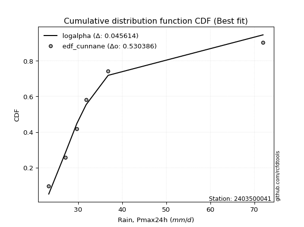</img>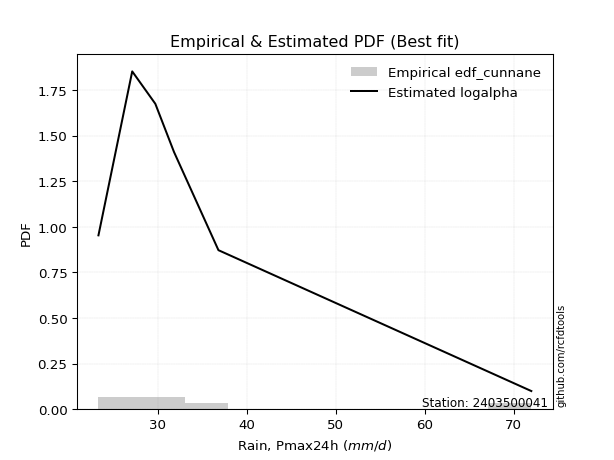</img>

</div>


### 12. EDF Adamowski (1981)

The Adamowski formula in hydrology refers to a specific plotting position formula used for estimating the non-parametric empirical distribution of hydrological events (like flood peaks) to calculate their return periods. This formula provides an alternative to traditional parametric methods (like the Gumbel or Log Pearson Type III distributions). 

<div align="center">


$P=(m-0.25)/(n+0.5)$


</div>


**12.1. Empirical values**

<div align="center">

|                | 0                   | 1                  | 2                  | 3                  | 4                  | 5                  |
|:---------------|:--------------------|:-------------------|:-------------------|:-------------------|:-------------------|:-------------------|
| date           | 2023                | 2020               | 2022               | 2021               | 2024               | 2019               |
| x              | 23.3                | 27.1               | 29.7               | 31.8               | 36.8               | 72.0               |
| m              | 1                   | 2                  | 3                  | 4                  | 5                  | 6                  |
| empirical_dist | edf_adamowski       | edf_adamowski      | edf_adamowski      | edf_adamowski      | edf_adamowski      | edf_adamowski      |
| empirical      | 0.11538461538461539 | 0.2692307692307692 | 0.4230769230769231 | 0.5769230769230769 | 0.7307692307692307 | 0.8846153846153846 |
| empirical_tr   | 1.1304347826086958  | 1.3684210526315788 | 1.7333333333333334 | 2.3636363636363633 | 3.7142857142857135 | 8.666666666666664  |

</div>


**12.2. Kolmogorov-Smirnov fit test (sorted by Δ)**


<div align="center">

|                | 0                  | 1                   | 2                  | 3                   | 4                   | 5                   | 6                   | 7                   | 8                   | 9                   | 10                  | 11                  | 12                  | 13                    | 14                 | 15                  | 16                  | 17                  | 18                  | 19                  | 20                  | 21                  | 22                  | 23                  | 24                  | 25                 | 26                 | 27                  | 28                  | 29                  | 30                  | 31                  | 32                  | 33                  | 34                  | 35                  | 36                  | 37                  | 38                  | 39                  | 40                 | 41                 | 42                 | 43                  | 44                  | 45                  | 46                  | 47                  | 48                  | 49                 | 50                 | 51                  | 52                  | 53                  | 54                 | 55                  | 56                 | 57                  | 58                  | 59                  | 60                 | 61                  | 62                  | 63                  | 64                 | 65                  | 66                 | 67                  | 68                 | 69                  | 70                  | 71                  | 72                  | 73                  | 74                  | 75                 | 76                 | 77                 | 78                 | 79                  | 80                | 81                  | 82                 | 83                 | 84                 | 85                 | 86                 | 87             |
|:---------------|:-------------------|:--------------------|:-------------------|:--------------------|:--------------------|:--------------------|:--------------------|:--------------------|:--------------------|:--------------------|:--------------------|:--------------------|:--------------------|:----------------------|:-------------------|:--------------------|:--------------------|:--------------------|:--------------------|:--------------------|:--------------------|:--------------------|:--------------------|:--------------------|:--------------------|:-------------------|:-------------------|:--------------------|:--------------------|:--------------------|:--------------------|:--------------------|:--------------------|:--------------------|:--------------------|:--------------------|:--------------------|:--------------------|:--------------------|:--------------------|:-------------------|:-------------------|:-------------------|:--------------------|:--------------------|:--------------------|:--------------------|:--------------------|:--------------------|:-------------------|:-------------------|:--------------------|:--------------------|:--------------------|:-------------------|:--------------------|:-------------------|:--------------------|:--------------------|:--------------------|:-------------------|:--------------------|:--------------------|:--------------------|:-------------------|:--------------------|:-------------------|:--------------------|:-------------------|:--------------------|:--------------------|:--------------------|:--------------------|:--------------------|:--------------------|:-------------------|:-------------------|:-------------------|:-------------------|:--------------------|:------------------|:--------------------|:-------------------|:-------------------|:-------------------|:-------------------|:-------------------|:---------------|
| station        | 2403500041         | 2403500041          | 2403500041         | 2403500041          | 2403500041          | 2403500041          | 2403500041          | 2403500041          | 2403500041          | 2403500041          | 2403500041          | 2403500041          | 2403500041          | 2403500041            | 2403500041         | 2403500041          | 2403500041          | 2403500041          | 2403500041          | 2403500041          | 2403500041          | 2403500041          | 2403500041          | 2403500041          | 2403500041          | 2403500041         | 2403500041         | 2403500041          | 2403500041          | 2403500041          | 2403500041          | 2403500041          | 2403500041          | 2403500041          | 2403500041          | 2403500041          | 2403500041          | 2403500041          | 2403500041          | 2403500041          | 2403500041         | 2403500041         | 2403500041         | 2403500041          | 2403500041          | 2403500041          | 2403500041          | 2403500041          | 2403500041          | 2403500041         | 2403500041         | 2403500041          | 2403500041          | 2403500041          | 2403500041         | 2403500041          | 2403500041         | 2403500041          | 2403500041          | 2403500041          | 2403500041         | 2403500041          | 2403500041          | 2403500041          | 2403500041         | 2403500041          | 2403500041         | 2403500041          | 2403500041         | 2403500041          | 2403500041          | 2403500041          | 2403500041          | 2403500041          | 2403500041          | 2403500041         | 2403500041         | 2403500041         | 2403500041         | 2403500041          | 2403500041        | 2403500041          | 2403500041         | 2403500041         | 2403500041         | 2403500041         | 2403500041         | 2403500041     |
| empirical_dist | edf_adamowski      | edf_adamowski       | edf_adamowski      | edf_adamowski       | edf_adamowski       | edf_adamowski       | edf_adamowski       | edf_adamowski       | edf_adamowski       | edf_adamowski       | edf_adamowski       | edf_adamowski       | edf_adamowski       | edf_adamowski         | edf_adamowski      | edf_adamowski       | edf_adamowski       | edf_adamowski       | edf_adamowski       | edf_adamowski       | edf_adamowski       | edf_adamowski       | edf_adamowski       | edf_adamowski       | edf_adamowski       | edf_adamowski      | edf_adamowski      | edf_adamowski       | edf_adamowski       | edf_adamowski       | edf_adamowski       | edf_adamowski       | edf_adamowski       | edf_adamowski       | edf_adamowski       | edf_adamowski       | edf_adamowski       | edf_adamowski       | edf_adamowski       | edf_adamowski       | edf_adamowski      | edf_adamowski      | edf_adamowski      | edf_adamowski       | edf_adamowski       | edf_adamowski       | edf_adamowski       | edf_adamowski       | edf_adamowski       | edf_adamowski      | edf_adamowski      | edf_adamowski       | edf_adamowski       | edf_adamowski       | edf_adamowski      | edf_adamowski       | edf_adamowski      | edf_adamowski       | edf_adamowski       | edf_adamowski       | edf_adamowski      | edf_adamowski       | edf_adamowski       | edf_adamowski       | edf_adamowski      | edf_adamowski       | edf_adamowski      | edf_adamowski       | edf_adamowski      | edf_adamowski       | edf_adamowski       | edf_adamowski       | edf_adamowski       | edf_adamowski       | edf_adamowski       | edf_adamowski      | edf_adamowski      | edf_adamowski      | edf_adamowski      | edf_adamowski       | edf_adamowski     | edf_adamowski       | edf_adamowski      | edf_adamowski      | edf_adamowski      | edf_adamowski      | edf_adamowski      | edf_adamowski  |
| p_dist         | logalpha           | loginvweibull       | alpha              | invweibull          | logexponnorm        | f                   | invgamma            | loginvgauss         | loghalflogistic     | invgauss            | logjohnsonsu        | logfatiguelife      | logmoyal            | loglaplace_asymmetric | wald               | logfisk             | logpearson3         | johnsonsu           | loghalfnorm         | logt                | loggumbel_r         | loggenlogistic      | mielke              | fatiguelife         | loginvgamma         | lognct             | lograyleigh        | logkstwobign        | exponnorm           | logtruncnorm        | laplace_asymmetric  | loggenexpon         | genexpon            | gompertz            | gibrat              | logwald             | expon               | logexpon            | logmaxwell          | nct                 | pearson3           | logbetaprime       | halflogistic       | moyal               | betaprime           | genlogistic         | ncf                 | loggompertz         | logloggamma         | lognorm            | lognorm            | logcrystalball      | halfnorm            | logrice             | gumbel_r           | loglogistic         | truncnorm          | loggibrat           | loghypsecant        | logncf              | rayleigh           | maxwell             | loglaplace          | kstwobign           | nakagami           | fisk                | loggumbel_l        | t                   | hypsecant          | logistic            | norm                | crystalball         | logchi2             | rice                | logf                | laplace            | gamma              | logweibull_min     | gumbel_l           | weibull_min         | loglognorm        | lognakagami         | erlang             | logerlang          | loggamma           | loggamma           | chi2               | logmielke      |
| delta          | 0.0642242167406917 | 0.06600778574661931 | 0.0669843917104021 | 0.06815876654680154 | 0.06916795261413533 | 0.06917414484447271 | 0.06917416620018751 | 0.07074154979800343 | 0.07156037207782373 | 0.07177003059668063 | 0.07195037056896778 | 0.07202143541344665 | 0.07262679879079381 | 0.07344178402104296   | 0.0750802613281165 | 0.07567136604023104 | 0.07598721251130514 | 0.07862090730787366 | 0.08656721747420859 | 0.08793272534749763 | 0.09075077980861157 | 0.09262222938927944 | 0.09511835073694563 | 0.10019204564747036 | 0.10389958494626239 | 0.1090572408177084 | 0.1114973332991922 | 0.11422470921093514 | 0.11437548434393072 | 0.11538298570669558 | 0.11538461247987294 | 0.11538461467135999 | 0.11538461532695214 | 0.11538461538459549 | 0.11538461538461539 | 0.11538461538461539 | 0.11538461538461539 | 0.11538461538461539 | 0.12029155214702492 | 0.12466092626486514 | 0.1282332637172564 | 0.1285631922596483 | 0.1303862613482456 | 0.13412840112734703 | 0.14084858552998897 | 0.14768888905488653 | 0.14795118055480194 | 0.15098261070811714 | 0.15121480522050046 | 0.1543086506174814 | 0.1543086506174814 | 0.15430930044041052 | 0.15534870727820838 | 0.15708864532771055 | 0.1599729410725571 | 0.16452753145948595 | 0.1712678890297603 | 0.17268773510781454 | 0.17303333966608536 | 0.17721816531234869 | 0.1863242257007417 | 0.19732703133887153 | 0.19754244227145884 | 0.19802301450226756 | 0.2012256780096502 | 0.22240683695761776 | 0.2228266523167043 | 0.22713244791548803 | 0.2302574452501578 | 0.23030509257801357 | 0.23036088490048856 | 0.23036089237767832 | 0.23459422695757037 | 0.23826400592593033 | 0.24653062357588756 | 0.2525834990717209 | 0.2757574361050577 | 0.2992892522801824 | 0.3007247023898927 | 0.30504237685010843 | 0.378546706522258 | 0.40850393512208777 | 0.5526793911641823 | 0.5798747904720389 | 0.5972069135406628 | 0.5972069135406628 | 0.6079377570558653 | nan            |
| deltao         | 0.530385761606     | 0.530385761606      | 0.530385761606     | 0.530385761606      | 0.530385761606      | 0.530385761606      | 0.530385761606      | 0.530385761606      | 0.530385761606      | 0.530385761606      | 0.530385761606      | 0.530385761606      | 0.530385761606      | 0.530385761606        | 0.530385761606     | 0.530385761606      | 0.530385761606      | 0.530385761606      | 0.530385761606      | 0.530385761606      | 0.530385761606      | 0.530385761606      | 0.530385761606      | 0.530385761606      | 0.530385761606      | 0.530385761606     | 0.530385761606     | 0.530385761606      | 0.530385761606      | 0.530385761606      | 0.530385761606      | 0.530385761606      | 0.530385761606      | 0.530385761606      | 0.530385761606      | 0.530385761606      | 0.530385761606      | 0.530385761606      | 0.530385761606      | 0.530385761606      | 0.530385761606     | 0.530385761606     | 0.530385761606     | 0.530385761606      | 0.530385761606      | 0.530385761606      | 0.530385761606      | 0.530385761606      | 0.530385761606      | 0.530385761606     | 0.530385761606     | 0.530385761606      | 0.530385761606      | 0.530385761606      | 0.530385761606     | 0.530385761606      | 0.530385761606     | 0.530385761606      | 0.530385761606      | 0.530385761606      | 0.530385761606     | 0.530385761606      | 0.530385761606      | 0.530385761606      | 0.530385761606     | 0.530385761606      | 0.530385761606     | 0.530385761606      | 0.530385761606     | 0.530385761606      | 0.530385761606      | 0.530385761606      | 0.530385761606      | 0.530385761606      | 0.530385761606      | 0.530385761606     | 0.530385761606     | 0.530385761606     | 0.530385761606     | 0.530385761606      | 0.530385761606    | 0.530385761606      | 0.530385761606     | 0.530385761606     | 0.530385761606     | 0.530385761606     | 0.530385761606     | 0.530385761606 |
| eval           | Δo > Δ             | Δo > Δ              | Δo > Δ             | Δo > Δ              | Δo > Δ              | Δo > Δ              | Δo > Δ              | Δo > Δ              | Δo > Δ              | Δo > Δ              | Δo > Δ              | Δo > Δ              | Δo > Δ              | Δo > Δ                | Δo > Δ             | Δo > Δ              | Δo > Δ              | Δo > Δ              | Δo > Δ              | Δo > Δ              | Δo > Δ              | Δo > Δ              | Δo > Δ              | Δo > Δ              | Δo > Δ              | Δo > Δ             | Δo > Δ             | Δo > Δ              | Δo > Δ              | Δo > Δ              | Δo > Δ              | Δo > Δ              | Δo > Δ              | Δo > Δ              | Δo > Δ              | Δo > Δ              | Δo > Δ              | Δo > Δ              | Δo > Δ              | Δo > Δ              | Δo > Δ             | Δo > Δ             | Δo > Δ             | Δo > Δ              | Δo > Δ              | Δo > Δ              | Δo > Δ              | Δo > Δ              | Δo > Δ              | Δo > Δ             | Δo > Δ             | Δo > Δ              | Δo > Δ              | Δo > Δ              | Δo > Δ             | Δo > Δ              | Δo > Δ             | Δo > Δ              | Δo > Δ              | Δo > Δ              | Δo > Δ             | Δo > Δ              | Δo > Δ              | Δo > Δ              | Δo > Δ             | Δo > Δ              | Δo > Δ             | Δo > Δ              | Δo > Δ             | Δo > Δ              | Δo > Δ              | Δo > Δ              | Δo > Δ              | Δo > Δ              | Δo > Δ              | Δo > Δ             | Δo > Δ             | Δo > Δ             | Δo > Δ             | Δo > Δ              | Δo > Δ            | Δo > Δ              | Δo <= Δ            | Δo <= Δ            | Δo <= Δ            | Δo <= Δ            | Δo <= Δ            | Δo <= Δ        |
| fit            | 1                  | 1                   | 1                  | 1                   | 1                   | 1                   | 1                   | 1                   | 1                   | 1                   | 1                   | 1                   | 1                   | 1                     | 1                  | 1                   | 1                   | 1                   | 1                   | 1                   | 1                   | 1                   | 1                   | 1                   | 1                   | 1                  | 1                  | 1                   | 1                   | 1                   | 1                   | 1                   | 1                   | 1                   | 1                   | 1                   | 1                   | 1                   | 1                   | 1                   | 1                  | 1                  | 1                  | 1                   | 1                   | 1                   | 1                   | 1                   | 1                   | 1                  | 1                  | 1                   | 1                   | 1                   | 1                  | 1                   | 1                  | 1                   | 1                   | 1                   | 1                  | 1                   | 1                   | 1                   | 1                  | 1                   | 1                  | 1                   | 1                  | 1                   | 1                   | 1                   | 1                   | 1                   | 1                   | 1                  | 1                  | 1                  | 1                  | 1                   | 1                 | 1                   | 0                  | 0                  | 0                  | 0                  | 0                  | 0              |
| n              | 6                  | 6                   | 6                  | 6                   | 6                   | 6                   | 6                   | 6                   | 6                   | 6                   | 6                   | 6                   | 6                   | 6                     | 6                  | 6                   | 6                   | 6                   | 6                   | 6                   | 6                   | 6                   | 6                   | 6                   | 6                   | 6                  | 6                  | 6                   | 6                   | 6                   | 6                   | 6                   | 6                   | 6                   | 6                   | 6                   | 6                   | 6                   | 6                   | 6                   | 6                  | 6                  | 6                  | 6                   | 6                   | 6                   | 6                   | 6                   | 6                   | 6                  | 6                  | 6                   | 6                   | 6                   | 6                  | 6                   | 6                  | 6                   | 6                   | 6                   | 6                  | 6                   | 6                   | 6                   | 6                  | 6                   | 6                  | 6                   | 6                  | 6                   | 6                   | 6                   | 6                   | 6                   | 6                   | 6                  | 6                  | 6                  | 6                  | 6                   | 6                 | 6                   | 6                  | 6                  | 6                  | 6                  | 6                  | 6              |
| best_fit       | 1                  | 0                   | 0                  | 0                   | 0                   | 0                   | 0                   | 0                   | 0                   | 0                   | 0                   | 0                   | 0                   | 0                     | 0                  | 0                   | 0                   | 0                   | 0                   | 0                   | 0                   | 0                   | 0                   | 0                   | 0                   | 0                  | 0                  | 0                   | 0                   | 0                   | 0                   | 0                   | 0                   | 0                   | 0                   | 0                   | 0                   | 0                   | 0                   | 0                   | 0                  | 0                  | 0                  | 0                   | 0                   | 0                   | 0                   | 0                   | 0                   | 0                  | 0                  | 0                   | 0                   | 0                   | 0                  | 0                   | 0                  | 0                   | 0                   | 0                   | 0                  | 0                   | 0                   | 0                   | 0                  | 0                   | 0                  | 0                   | 0                  | 0                   | 0                   | 0                   | 0                   | 0                   | 0                   | 0                  | 0                  | 0                  | 0                  | 0                   | 0                 | 0                   | 0                  | 0                  | 0                  | 0                  | 0                  | 0              |
| best_fit_sort  | 1                  | 2                   | 3                  | 4                   | 5                   | 6                   | 7                   | 8                   | 9                   | 10                  | 11                  | 12                  | 13                  | 14                    | 15                 | 16                  | 17                  | 18                  | 19                  | 20                  | 21                  | 22                  | 23                  | 24                  | 25                  | 26                 | 27                 | 28                  | 29                  | 30                  | 31                  | 32                  | 33                  | 34                  | 35                  | 36                  | 37                  | 38                  | 39                  | 40                  | 41                 | 42                 | 43                 | 44                  | 45                  | 46                  | 47                  | 48                  | 49                  | 50                 | 51                 | 52                  | 53                  | 54                  | 55                 | 56                  | 57                 | 58                  | 59                  | 60                  | 61                 | 62                  | 63                  | 64                  | 65                 | 66                  | 67                 | 68                  | 69                 | 70                  | 71                  | 72                  | 73                  | 74                  | 75                  | 76                 | 77                 | 78                 | 79                 | 80                  | 81                | 82                  | 83                 | 84                 | 85                 | 86                 | 87                 | 88             |

</div>


**12.3. Best fit**

<div align="center">

|   id |    station | empirical_dist   | p_dist   |     delta |   deltao | eval   |   fit |   n |   best_fit |   best_fit_sort |
|-----:|-----------:|:-----------------|:---------|----------:|---------:|:-------|------:|----:|-----------:|----------------:|
|    0 | 2403500041 | edf_adamowski    | logalpha | 0.0642242 | 0.530386 | Δo > Δ |     1 |   6 |          1 |               1 |

</div>


<div align="center">

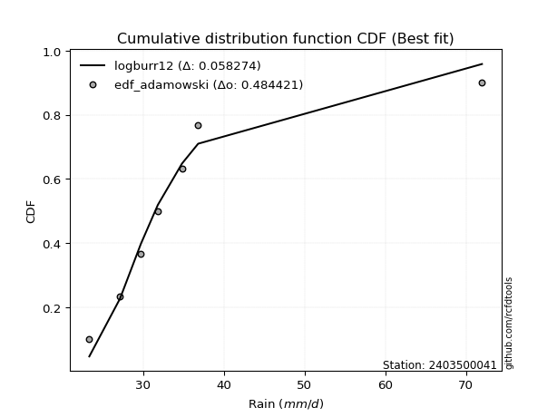</img></img>

</div>


## C. Best fit & Estimate extreme values for specific return periods - Tr

Best fit in probability distribution analysis means finding the theoretical distribution (like Normal, Poisson, Exponential) that most accurately mirrors your real-world data´s patterns (shape, center, spread) for better predictions, using methods like visual checks (Q-Q plots), goodness-of-fit tests (Kolmogorov-Smirnov, Chi-Squared), and information criteria (AIC) to score and select the simplest, most representative model.


### 1. Best fit (ordered by delta Δ)

<div align="center">

|   id |    station | empirical_dist   | p_dist   |     delta |   deltao | eval   |   fit |   n |   best_fit |   best_fit_sort |
|-----:|-----------:|:-----------------|:---------|----------:|---------:|:-------|------:|----:|-----------:|----------------:|
|    0 | 2403500041 | edf_hazen        | logalpha | 0.0343075 | 0.530386 | Δo > Δ |     1 |   6 |          1 |               1 |
|    1 | 2403500041 | edf_gringorten   | logalpha | 0.0403429 | 0.530386 | Δo > Δ |     1 |   6 |          1 |               2 |
|    2 | 2403500041 | edf_cunnane      | logalpha | 0.0456138 | 0.530386 | Δo > Δ |     1 |   6 |          1 |               3 |
|    3 | 2403500041 | edf_blom         | logalpha | 0.0488396 | 0.530386 | Δo > Δ |     1 |   6 |          1 |               4 |
|    4 | 2403500041 | edf_tukey        | logalpha | 0.0541028 | 0.530386 | Δo > Δ |     1 |   6 |          1 |               5 |
|    5 | 2403500041 | edf_filliben     | logalpha | 0.0560666 | 0.530386 | Δo > Δ |     1 |   6 |          1 |               6 |
|    6 | 2403500041 | edf_california   | logt     | 0.0564021 | 0.530386 | Δo > Δ |     1 |   6 |          1 |               7 |
|    7 | 2403500041 | edf_jenkinson    | logalpha | 0.0569901 | 0.530386 | Δo > Δ |     1 |   6 |          1 |               8 |
|    8 | 2403500041 | edf_beard        | logalpha | 0.0569901 | 0.530386 | Δo > Δ |     1 |   6 |          1 |               9 |
|    9 | 2403500041 | edf_chegodayev   | logalpha | 0.0582146 | 0.530386 | Δo > Δ |     1 |   6 |          1 |              10 |
|   10 | 2403500041 | edf_adamowski    | logalpha | 0.0642242 | 0.530386 | Δo > Δ |     1 |   6 |          1 |              11 |
|   11 | 2403500041 | edf_weibull      | logalpha | 0.0916967 | 0.530386 | Δo > Δ |     1 |   6 |          1 |              12 |

</div>

:file_folder:Tables: [bestfit_2403500041.csv](table/bestfit_2403500041.csv) | [extreme_2403500041.csv](table/extreme_2403500041.csv)


### 2. Extreme values

In hydrology, a return period (or recurrence interval $Tr$) is the statistical average time between extreme events like floods or droughts of a specific magnitude, indicating how rare an event is, with a 100-year flood, for example, having a 1% chance of occurring in any given year, not that it happens exactly every century. It is a key tool for infrastructure design (like bridges or dams) and risk assessment, calculated from historical data to determine the probability of future events, although it is important to remember it is statistical average, and events can cluster or be missed.

> risk_rate: assuming the return period as the project useful life.

|   id |      tr |   prob_l |     prob_g |     alpha |   betaprime |    chi2 |   crystalball |   erlang |    expon |   exponnorm |        f |   fatiguelife |       fisk |   gamma |   genexpon |   genlogistic |   gibrat |   gompertz |   gumbel_l |   gumbel_r |   halflogistic |   halfnorm |   hypsecant |   invgamma |   invgauss |   invweibull |   johnsonsu |   kstwobign |   laplace |   laplace_asymmetric |   loggamma |   logistic |   lognorm |   maxwell |   mielke |    moyal |   nakagami |      ncf |      nct |    norm |   pearson3 |   rayleigh |    rice |       t |   truncnorm |     wald |      weibull_min |         logalpha |   logbetaprime |          logchi2 |   logcrystalball |   logerlang |   logexpon |   logexponnorm |     logf |   logfatiguelife |     logfisk |   loggenexpon |   loggenlogistic |   loggibrat |   loggompertz |   loggumbel_l |   loggumbel_r |   loghalflogistic |   loghalfnorm |   loghypsecant |   loginvgamma |   loginvgauss |   loginvweibull |   logjohnsonsu |   logkstwobign |   loglaplace |   loglaplace_asymmetric |   logloggamma |   loglogistic |    loglognorm |   logmaxwell |   logmielke |   logmoyal |   lognakagami |   logncf |   lognct |   logpearson3 |   lograyleigh |   logrice |       logt |   logtruncnorm |   logwald |   logweibull_min |    station |   n |   risk_rate |
|-----:|--------:|---------:|-----------:|----------:|------------:|--------:|--------------:|---------:|---------:|------------:|---------:|--------------:|-----------:|--------:|-----------:|--------------:|---------:|-----------:|-----------:|-----------:|---------------:|-----------:|------------:|-----------:|-----------:|-------------:|------------:|------------:|----------:|---------------------:|-----------:|-----------:|----------:|----------:|---------:|---------:|-----------:|---------:|---------:|--------:|-----------:|-----------:|--------:|--------:|------------:|---------:|-----------------:|-----------------:|---------------:|-----------------:|-----------------:|------------:|-----------:|---------------:|---------:|-----------------:|------------:|--------------:|-----------------:|------------:|--------------:|--------------:|--------------:|------------------:|--------------:|---------------:|--------------:|--------------:|----------------:|---------------:|---------------:|-------------:|------------------------:|--------------:|--------------:|--------------:|-------------:|------------:|-----------:|--------------:|---------:|---------:|--------------:|--------------:|----------:|-----------:|---------------:|----------:|-----------------:|-----------:|----:|------------:|
|    0 |    2    | 0.5      | 0.5        |   30.4812 |     33.5939 | 23.5269 |       36.7833 |  23.4592 |  32.6459 |     32.6585 |  30.4657 |       29.802  |    36.3367 | 26.3867 |    32.6459 |       33.601  |  31.8958 |    31.8375 |    39.4584 |    34.1083 |        32.7784 |    33.4502 |     36.7833 |    30.4657 |    30.3023 |      30.4658 |     30.0007 |     35.4016 |   36.7833 |              32.6461 |    23.4113 |    36.7833 |   34.1283 |   35.3907 |  30.619  |  33.2447 |    35.5232 |  33.9167 |  33.03   | 36.7833 |    32.7871 |    34.8968 | 37.0575 | 36.6484 |     34.6221 |  31.5051 |     24.3765      |     30.6631      |        33.0288 |     37.1007      |          34.1283 |     23.4208 |    30.3565 |        30.9042 |  26.8522 |          30.1974 |     30.4793 |       30.3569 |          31.8992 |     30.614  |       33.8054 |       36.2194 |       32.158  |           31.2212 |       31.691  |        34.1283 |       32.4767 |       30.3709 |         30.5614 |        30.3552 |        32.7029 |      34.1283 |                 31.2225 |       34.1114 |       34.1283 |  23.3274      |      33.0879 |     30.6507 |    31.5465 |       23.6717 |  33.7917 |  32.6438 |       31.775  |       32.7266 |   33.8916 |    30.135  |        29.7198 |   30.3505 |     24.4787      | 2403500041 |   6 |    0.75     |
|    1 |    2.33 | 0.570815 | 0.429185   |   32.0475 |     35.7355 | 23.7105 |       39.689  |  23.6566 |  34.7051 |     34.7234 |  32.1354 |       31.8349 |    40.8576 | 27.5633 |    34.705  |       35.5205 |  33.3677 |    33.7185 |    41.9863 |    36.8008 |        35.5467 |    36.5862 |     39.1088 |    32.1354 |    32.1505 |      32.1104 |     31.8573 |     37.6765 |   38.5417 |              34.7054 |    23.5421 |    39.3434 |   36.4056 |   38.4095 |  32.0361 |  35.7935 |    38.708  |  36.192  |  35.0088 | 39.689  |    35.4809 |    37.9603 | 39.5558 | 39.6174 |     37.1147 |  33.4104 |     26.8875      |     32.1878      |        34.8517 |     44.0334      |          36.4056 |     23.5682 |    32.1785 |        32.6283 |  28.0851 |          31.9456 |     32.0459 |       32.1791 |          33.5589 |     31.6324 |       35.9819 |       38.3131 |       34.1415 |           33.2029 |       33.9791 |        35.939  |       34.4106 |       32.0691 |         32.1236 |        32.0194 |        34.5865 |      35.4888 |                 32.8721 |       36.4658 |       36.127  |  23.5703      |      35.3847 |     32.2034 |    33.3855 |       24.3058 |  37.8439 |  34.6463 |       33.8142 |       35.033  |   35.9382 |    31.1756 |        31.2723 |   31.6634 |     27.2535      | 2403500041 |   6 |    0.729209 |
|    2 |    5    | 0.8      | 0.2        |   41.8724 |     45.3827 | 25.4479 |       50.4873 |  26.4247 |  45.0006 |     45.0477 |  42.3338 |       44.3632 |    78.7257 | 34.6584 |    45.0004 |       43.8589 |  41.8418 |    43.1234 |    50.1532 |    48.498  |        48.0725 |    49.8479 |     48.4365 |    42.3338 |    43.4492 |      42.2415 |     43.7668 |     47.3397 |   47.3332 |              45.001  |    25.3409 |    49.2284 |   46.283  |   50.2913 |  39.3995 |  47.5995 |    53.3494 |  46.3746 |  44.333  | 50.4873 |    47.9338 |    50.2247 | 49.5574 | 50.8241 |     49.567  |  44.0762 |    198.562       |     41.2071      |        43.267  |    121.886       |          46.283  |     25.6861 |    43.066  |        42.7928 |  36.2476 |          42.7223 |     42.0756 |       43.0675 |          41.8304 |     38.1906 |       46.341  |       45.9404 |       44.2807 |           43.8639 |       45.6297 |        44.2203 |       44.1083 |       42.4179 |         41.5297 |        42.2641 |        43.8744 |      43.1489 |                 42.5234 |       46.6906 |       45.0056 |   6.47296e+25 |      46.0817 |     41.1819 |    43.405  |       39.2579 |  58.5857 |  44.134  |       44.461  |       46.0135 |   45.4464 |    36.2523 |        39.6446 |   40.1344 |  16343.2         | 2403500041 |   6 |    0.67232  |
|    3 |   10    | 0.9      | 0.1        |   56.3699 |     53.6495 | 27.8865 |       57.6507 |  31.2561 |  54.3465 |     54.4198 |  55.5899 |       57.989  |   152.537  | 42.1175 |    54.3463 |       50.6501 |  51.5014 |    51.6608 |    54.7001 |    58.0251 |        58.4747 |    59.6613 |     55.8851 |    55.5899 |    56.6389 |      55.7562 |     59.1458 |     54.697  |   55.3139 |              54.3471 |    28.7    |    56.5083 |   54.2725 |   58.6531 |  47.1695 |  57.8784 |    64.7516 |  55.0198 |  52.8805 | 57.6507 |    58.4684 |    58.9694 | 56.6888 | 58.6066 |     60.8559 |  55.3952 |   1550.82        |     53.5362      |        50.6911 |    351.482       |          54.2726 |     29.7959 |    56.1087 |        54.7373 |  47.0708 |          56.3668 |     57.6446 |       56.1115 |          50.0516 |     47.3397 |       55.1672 |       50.8269 |       54.7262 |           55.2759 |       56.7534 |        52.1836 |       53.8414 |       55.6096 |         54.2667 |        55.9528 |        52.5852 |      51.5252 |                 53.7175 |       54.9683 |       52.9116 | inf           |      55.4956 |     52.5607 |    54.548  |       87.0884 |  79.4427 |  52.8888 |       55.4394 |       55.8872 |   53.7262 |    42.6852 |        47.6831 |   51.6155 |      1.29692e+24 | 2403500041 |   6 |    0.651322 |
|    4 |   15    | 0.933333 | 0.0666667  |   69.4299 |     58.4884 | 29.5584 |       61.2253 |  34.814  |  59.8135 |     59.9021 |  65.8766 |       66.566  |   228.281  | 46.7422 |    59.8132 |       54.4816 |  58.1641 |    56.6549 |    56.7593 |    63.4003 |        64.3614 |    64.7681 |     60.1359 |    65.8765 |    65.5314 |      66.5086 |     70.5748 |     58.6028 |   59.9824 |              59.8143 |    31.4255 |    60.4747 |   58.7613 |   62.9435 |  52.4252 |  63.8439 |    70.7564 |  60.0491 |  58.1291 | 61.2253 |    64.4425 |    63.4751 | 60.3632 | 62.6602 |     67.4529 |  62.6637 |   4095.46        |     64.2903      |        55.1101 |    675.995       |          58.7614 |     33.2232 |    65.4997 |        63.2155 |  55.3795 |          66.5991 |     72.5727 |       65.5036 |          55.3837 |     54.8983 |       60.1349 |       53.2077 |       61.6723 |           63.0041 |       63.5764 |        57.3553 |       60.22   |       65.6511 |         64.9205 |        66.994  |        57.8921 |      57.1599 |                 61.5862 |       59.6194 |       57.789  | inf           |      61.0491 |     61.5595 |    62.2835 |      144.459  |  92.9047 |  58.288  |       62.6545 |       61.775  |   58.565  |    48.337  |        52.2419 |   60.6659 |      4.68256e+59 | 2403500041 |   6 |    0.644736 |
|    5 |   20    | 0.95     | 0.05       |   81.9262 |     61.9584 | 30.8255 |       63.5662 |  37.5839 |  63.6925 |     63.7919 |  74.6331 |       72.8473 |   305.25   | 50.1079 |    63.6921 |       57.1643 |  63.3905 |    60.1983 |    58.0411 |    67.1639 |        68.4858 |    68.1729 |     63.1346 |    74.633  |    72.3162 |      75.8234 |     79.9268 |     61.2339 |   63.2946 |              63.6933 |    33.7162 |    63.2162 |   61.9002 |   65.7908 |  56.5408 |  68.0687 |    74.7728 |  63.6424 |  62.0054 | 63.5662 |    68.6206 |    66.4699 | 62.8055 | 65.3923 |     72.1306 |  68.0802 |   7520.34        |     74.5924      |        58.308  |   1087.22        |          61.9004 |     36.1577 |    73.1013 |        70.0158 |  62.388  |          75.0959 |     87.7635 |       73.1061 |          59.4516 |     61.6628 |       63.5854 |       54.7456 |       67.0542 |           69.0539 |       68.5753 |        61.3091 |       65.1292 |       74.0913 |         74.6424 |        76.7281 |        61.7656 |      61.5276 |                 67.8586 |       62.8715 |       61.4204 | inf           |      65.0383 |     69.4414 |    68.4166 |      206.154  | 103.108  |  62.2865 |       68.1881 |       66.0277 |   62.0199 |    53.7951 |        55.2771 |   68.4275 |      1.3059e+106 | 2403500041 |   6 |    0.641514 |
|    6 |   25    | 0.96     | 0.04       |   94.1293 |     64.6799 | 31.8465 |       65.2895 |  39.8493 |  66.7012 |     66.809  |  82.4084 |       77.8118 |   383.127  | 52.7588 |    66.7008 |       59.2306 |  67.7475 |    62.9467 |    58.9532 |    70.0628 |        71.6634 |    70.7062 |     65.4554 |    82.4082 |    77.8307 |      84.2066 |     87.9544 |     63.2047 |   65.8639 |              66.702  |    35.7089 |    65.3134 |   64.3176 |   67.9047 |  59.981  |  71.3434 |    77.7652 |  66.4533 |  65.1119 | 65.2895 |    71.8325 |    68.695  | 64.62   | 67.4478 |     75.7572 |  72.4187 |  11598.1         |     84.8307      |        60.8318 |   1580.13        |          64.3177 |     38.7473 |    79.6    |        75.7905 |  68.5711 |          82.4975 |    103.538  |       79.6056 |          62.7876 |     67.9349 |       66.2233 |       55.867  |       71.5177 |           74.1083 |       72.548  |        64.5552 |       69.186  |       81.5172 |         83.8347 |        85.6479 |        64.8359 |      65.1441 |                 73.1605 |       65.3756 |       64.3517 | inf           |      68.1676 |     76.6484 |    73.583  |      270.175  | 111.426  |  65.4976 |       72.7397 |       69.3759 |   64.7182 |    59.2367 |        57.4702 |   75.3548 |      2.0073e+160 | 2403500041 |   6 |    0.639603 |
|    7 |   50    | 0.98     | 0.02       |  153.417  |     73.3529 | 35.1899 |       70.2242 |  47.4097 |  76.0471 |     76.1812 | 113.396  |       93.6445 |   781.379  | 61.1736 |    76.0467 |       65.5961 |  83.1061 |    71.4842 |    61.4291 |    78.993  |        81.4542 |    78.0695 |     72.6508 |   113.396  |    96.2249 |     118.508  |    117.702  |     68.9919 |   73.8446 |              76.0482 |    43.2297 |    71.721  |   71.7749 |   74.0353 |  72.2592 |  81.5093 |    86.4716 |  75.3702 |  75.3997 | 70.2242 |    81.679  |    75.154  | 69.8874 | 73.5732 |     87.0131 |  86.5839 |  37653.3         |    139.891       |        68.957  |   5169.34        |          71.775  |     48.7975 |   103.707  |        96.9454 |  92.9779 |         110.928  |    195.543  |      103.716  |          74.2869 |     95.5851 |       74.226  |       59.0281 |       87.223  |           92.1283 |       85.4507 |        75.753  |       83.4111 |      110.636  |        126.479  |       123.96   |        74.7625 |      77.7902 |                 92.4199 |       73.0981 |       74.2033 | inf           |      78.1207 |    107.693  |    92.2413 |      601.663  | 139.723  |  76.1751 |       88.4929 |       80.088  |   73.2343 |    88.2171 |        63.1503 |  103.24   |    inf           | 2403500041 |   6 |    0.63583  |
|    8 |   75    | 0.986667 | 0.0133333  |  211.714  |     78.612  | 37.242  |       72.872  |  52.1247 |  81.5141 |     81.6635 | 137.613  |      103.136  |  1189.11   | 66.1981 |    81.5137 |       69.296  |  93.4794 |    76.4783 |    62.6811 |    84.1836 |        87.1456 |    82.0778 |     76.8557 |   137.612  |   107.773  |     146.135  |    138.897  |     72.176  |   78.513  |              81.5153 |    48.6894 |    75.4218 |   76.1265 |   77.3684 |  80.7377 |  87.4542 |    91.2117 |  80.7487 |  81.9261 | 72.872  |    87.3642 |    78.668  | 72.753  | 77.0272 |     93.5909 |  95.3005 |  68328.4         |    207.056       |        73.9389 |  10480.9         |          76.1267 |     56.339  |   121.065  |       111.961  | 111.931  |         132.231  |    315.667  |      121.076  |          81.9153 |    120.379  |       78.7877 |       60.6942 |       97.8912 |          104.554  |       93.4144 |        83.1758 |       93.0752 |      133.016  |        167.578  |       157.143  |        80.8581 |      86.2972 |                105.958  |       77.6023 |       80.5662 | inf           |      84.129  |    134.911  |   105.274  |      933.4    | 158.172  |  82.984  |       98.98   |       86.5951 |   78.329  |   122.263  |        65.6154 |  125.312  |    inf           | 2403500041 |   6 |    0.634587 |
|    9 |  100    | 0.99     | 0.01       |  269.696  |     82.4394 | 38.7325 |       74.6629 |  55.5745 |  85.393  |     85.5533 | 158.274  |      109.953  |  1603.06   | 69.8001 |    85.3925 |       71.9146 | 101.515  |    80.0216 |    63.5001 |    87.8573 |        91.1739 |    84.8084 |     79.8385 |   158.274  |   116.278  |     170.175  |    155.847  |     74.3576 |   81.8253 |              85.3943 |    53.1115 |    78.0347 |   79.2184 |   79.6386 |  87.4273 |  91.6718 |    94.4397 |  84.6504 |  86.8122 | 74.6629 |    91.3706 |    81.062  | 74.7053 | 79.4387 |     98.255  | 101.656  | 100905           |    291.595       |        77.5879 |  17390.9         |          79.2186 |     62.5829 |   135.115  |       124.005  | 128.091  |         149.922  |    470.723  |      135.129  |          87.7832 |    143.927  |       81.9765 |       61.8093 |      106.221  |          114.349  |       99.2605 |        88.878  |      100.642  |      151.931  |        208.966  |       187.801  |        85.319  |      92.8914 |                116.749  |       80.8014 |       85.3845 | inf           |      88.484  |    160.425  |   115.622  |     1258.7    | 172.191  |  88.1002 |      107.061  |       91.3285 |   82.0015 |   163.043  |        67.0021 |  144.325  |    inf           | 2403500041 |   6 |    0.633968 |
|   10 |  200    | 0.995    | 0.005      |  500.712  |     92.0264 | 42.4205 |       78.7252 |  64.1773 |  94.739  |     94.9254 | 223.313  |      126.61   |  3297.81   | 78.5838 |    94.7384 |       78.21   | 123.377  |    88.5591 |    65.2801 |    96.6892 |       100.858  |    91.0536 |     87.0243 |   223.312  |   137.708  |     248.118  |    204.012  |     79.3823 |   89.806  |              94.7404 |    65.9538 |    84.3024 |   86.7053 |   84.8328 | 106.214  | 101.833  |   101.817  |  94.3795 |  99.5541 | 78.7252 |   100.945  |    86.5397 | 79.1724 | 85.162  |    109.483  | 117.486  | 235487           |    924.978       |        86.806  |  59735.5         |          86.7055 |     81.3285 |   176.035  |       158.618  | 179.214  |         203.44   |   1591.84   |      176.055  |         103.668  |    234.01   |       89.5119 |       64.3042 |      129.265  |          141.818  |      114.044  |       104.273  |      121.744  |      210.757  |        386.383  |       299.057  |        96.5524 |     110.924  |                147.483  |       88.5432 |       98.1502 | inf           |      99.3143 |    256.273  |   144.926  |     2487.41   | 209.438  | 101.52   |      128.98   |      103.155  |   91.0652 |   423.168  |        69.3224 |  205.188  |    inf           | 2403500041 |   6 |    0.633042 |
|   11 |  250    | 0.996    | 0.004      |  616.038  |     95.2317 | 43.6326 |       79.9666 |  67.021  |  97.7477 |     97.9425 | 249.937  |      132.031  |  4161.15   | 81.4387 |    97.7471 |       80.2339 | 131.222  |    91.3075 |    65.8039 |    99.5285 |       103.972  |    92.9749 |     89.3375 |   249.936  |   144.86   |     280.852  |    221.948  |     80.9373 |   92.3752 |              97.7492 |    70.8443 |    86.3147 |   89.1314 |   86.4317 | 113.174  | 105.105  |   104.084  |  97.619  | 103.974  | 79.9666 |   104.007  |    88.2258 | 80.5474 | 86.9879 |    113.094  | 122.723  | 302180           |   1546.64        |        89.9108 |  89190.5         |          89.1317 |     88.6838 |   191.685  |       171.7    | 200.329  |         224.609  |   2586.55   |      191.708  |         109.362  |    278.597  |       91.8968 |       65.0573 |      137.687  |          151.981  |      119.02   |       109.775  |      129.536  |      234.623  |        484.358  |       351.322  |       100.32   |     117.444  |                159.006  |       91.0504 |      102.64   | inf           |     102.908  |    303.081  |   155.858  |     3064      | 222.553  | 106.202  |      136.849  |      107.095  |   94.052  |   636.59   |        69.8266 |  230.519  |    inf           | 2403500041 |   6 |    0.632858 |
|   12 |  500    | 0.998    | 0.002      | 1192.27   |    105.594  | 47.4609 |       83.648  |  76.0421 | 107.094  |    107.315  | 356.194  |      149.024  |  8573.12   | 90.3769 |   107.093  |       86.5155 | 158.331  |    99.845  |    67.3053 |   108.341  |       113.635  |    98.7033 |     96.5228 |   356.192  |   167.764  |     415.215  |    286.247  |     85.5975 |  100.356  |             107.095  |    88.8784 |    92.5552 |   96.7327 |   91.2028 | 138.147  | 115.266  |   110.839  | 108.05   | 118.806  | 83.648  |   113.464  |    93.2568 | 84.6502 | 92.6408 |    124.304  | 139.375  | 617640           |  15998.7         |       100.018  | 312685           |          96.733  |    116.709  |   249.737  |       219.626  | 286.039  |         306.052  |  16993.4    |      249.771  |         129.106  |    509.021  |       99.1905 |       67.2653 |      167.485  |          188.402  |      135.184  |       128.787  |      157.519  |      329.144  |       1082.89   |       601.418  |       112.514  |     140.243  |                200.864  |       98.9008 |      117.915  | inf           |     114.423  |    541.918  |   195.359  |     5684.22   | 267.145  | 122.019  |      164.169  |      119.768  |  103.559  |  3530.98   |        70.8808 |  333.774  |    inf           | 2403500041 |   6 |    0.632489 |
|   13 |  750    | 0.998667 | 0.00133333 | 1768.33   |    111.96   | 49.7386 |       85.6931 |  81.432  | 112.561  |    112.797  | 439.311  |      159.055  | 13087.9    | 95.6482 |   112.56   |       90.1878 | 176.259  |   104.839  |    68.1077 |   113.493  |       119.284  |   101.903  |    100.726  |   439.308  |   181.594  |     523.68   |    330.537  |     88.2154 |  105.024  |             112.562  |   101.768  |    96.2011 |  101.232  |   93.8713 | 155.461  | 121.21   |   114.608  | 114.427  | 128.327  | 85.6931 |   118.964  |    96.0701 | 86.9444 | 95.9493 |    130.854  | 149.36   | 905041           | 140652           |       106.275  | 655010           |         101.232  |    137.514  |   291.536  |       253.643  | 354.839  |         367.205  |  70732.7    |      291.578  |         142.259  |    758.31   |      103.383  |       68.476  |      187.808  |          213.613  |      145.152  |       141.401  |      177.017  |      402.588  |       1882.03   |       846.577  |       120.003  |     155.579  |                230.287  |      103.544  |      127.87   | inf           |     121.416  |    797.799  |   222.956  |     8007.98   | 296.156  | 132.261  |      182.394  |      127.498  |  109.287  | 14568.2    |        71.2467 |  416.708  |    inf           | 2403500041 |   6 |    0.632366 |
|   14 | 1000    | 0.999    | 0.001      | 2344.33   |    116.623  | 51.3694 |       87.1011 |  85.2996 | 116.44   |    116.687  | 510.251  |      166.208  | 17670.8    | 99.4049 |   116.439  |       92.7927 | 189.979  |   108.382  |    68.6477 |   117.148  |       123.292  |   104.114  |    103.708  |   510.247  |   191.579  |     618.147  |    365.282  |     90.0291 |  108.337  |             116.441  |   112.15   |    98.7867 |  104.451  |   95.7157 | 169.142  | 125.427  |   117.209  | 119.085  | 135.496  | 87.1011 |   122.852  |    98.0142 | 88.5299 | 98.3035 |    135.499  | 156.542  |      1.17044e+06 |      1.15903e+06 |       110.878  |      1.10932e+06 |         104.451  |    154.689  |   325.37   |       280.929  | 414.821  |         418.064  | 233109      |      325.419  |         152.395  |   1028.78   |      106.326  |       69.303  |      203.703  |          233.515  |      152.461  |       151.093  |      192.515  |      465.081  |       2905.46   |      1093.02   |       125.482  |     167.468  |                253.742  |      106.863  |      135.435  | inf           |     126.497  |   1074.53   |   244.87   |    10135.9    | 318.163  | 140.018  |      196.446  |      133.129  |  113.431  | 51053.6    |        71.4326 |  488.833  |    inf           | 2403500041 |   6 |    0.632305 |

<div align="center">

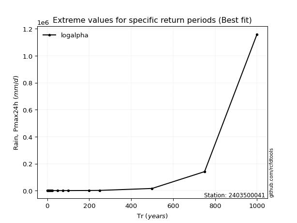</img>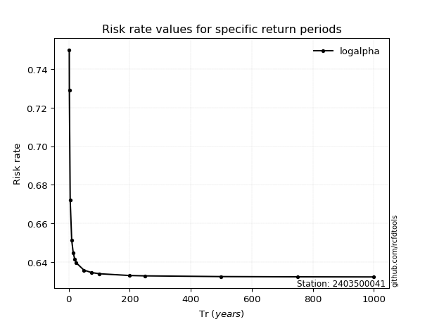</img>

</div>


<sub>**APP DISCLAIMER**: NO WARRANTY - This software is provided by [github.com/rcfdtools](https://github.com/rcfdtools) "as is", without any express or implied warranty, including warranties of merchantability, fitness for a particular purpose, or non-infringement. There is no guarantee that the software will be error-free or operate without interruption. LIMITATION OF LIABILITY - Neither the authors nor copyright holders will be liable for claims or damages arising from the software or its use. You are responsible for determining if the software is appropriate for your use and assume all associated risks, including errors, legal compliance, and data loss. NO PROFESSIONAL ADVICE - The software provides general information and does not offer professional advice. It should not replace consultation with professional advisors.</sub>