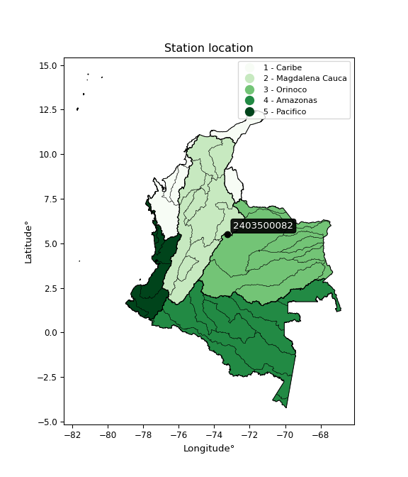

<div align="center">


</div>

# PMP Station (Rain, Pmax24h): 2403500082

Probable Maximum Precipitation (PMP) is the greatest amount of rainfall for a specific duration that is meteorologically possible for a given location, acting as a "worst-case" scenario for extreme storms, crucial for designing safety-critical infrastructure like bridges, river deviations, dams, spillways, and nuclear plants to prevent catastrophic failure. PMP is calculated by hydrologists using meteorological data to determine the upper limit of extreme rainfall, often leading to the Probable Maximum Flood (PMF) for flood control design, and is increasingly being studied for climate change impacts. Probable Maximum Precipitation (PMP) is the theoretical upper limit of rainfall, a deterministic estimate for extreme events, while probability distributions (like GEV, Gumbel) describe the likelihood and frequency of various precipitation amounts, including rare ones, showing how often events occur, with PMP representing the extreme end of these distributions, used for critical infrastructure design to ensure safety against the worst conceivable weather, unlike standard statistical forecasts which cover typical probabilities.

The most common probability distributions in hydrology, used for analyzing floods, rainfall, and streamflow, include the Normal, Log-Normal, Gumbel, Gamma (including Log-Pearson Type III), and Generalized Extreme Value (GEV) distributions, often chosen based on the data´s skewness and whether modeling extremes or general conditions, with Gumbel and GEV popular for extreme events like floods, while the Normal distribution serves as a baseline, though often requiring transformations for skewed hydrological data. These distributions help in designing water infrastructure, managing water resources, and forecasting hydrologic events.

> Hydrological data often isn´t perfectly normal (it´s skewed), so different distributions are needed for different applications, such as: **Flood Frequency Analysis**: Using Gumbel, GEV, or Log-Pearson Type III for predicting extreme flood magnitudes and their return periods, **Rainfall Analysis**: Normal for annual totals, but Log-Normal, Weibull, or GEV for intensity or extreme daily rainfall, **Streamflow Modeling**: Gamma and Log-Normal for maximum flows, GEV for minimum flows, and Kappa for daily flows.

<div align="center">

</img>

</div>


## A. General information


### 1. General running parameters

• app_version: _v20260113_. • runtime: _2026-01-13 16:28:34.738620_. • Python version: _3.14.0_. • SciPy version: _1.16.3_. • Pandas version: _2.3.3_. • NumPy version: _2.3.5_. • Stations dataset (station_dataset_file): _dataset/pmax24h_in/automatic_colombia_2003_2025.csv_. • Stations catalog (station_catalog_file): _dataset/CNE.xls_. • Minimum year to eval til year_max (date_min): _1900_. • Maximum year to eval since year_min (date_max): _2025_. • Creates, save and include plots into reports (create_plot): _False_. • Plot only fit distributions with Δo > Δ (plot_only_fit): _True_. • Plot only simple graphs avoiding multiple CDFs and multiple Extreme values plots (plot_only_simple): _True_. • Eval low extreme values, if False, evaluates high extreme values (low_extreme): _False_. • Eval every SciPy distribution as logarithmic (pdist_logarithmic_on): _True_. • Standard deviation normalized (ddof): _1.0_. • Return periods to eval in years (Tr): _[2, 2.33, 5, 10, 15, 20, 25, 50, 75, 100, 200, 250, 500, 750, 1000]_. • Minimum data sample per station, 0 means any (minimum_sample): _5_. • Z-Score maximum threshold to adjust a value, 0 means disable (zscore_max): _3.5_. • Z-Score minimum threshold to adjust a value, 0 means disable (zscore_min): _-2.5_. • Avoid zeros, e.g. rain = 0 (avoid_zeros): _True_. • Avoid null values (avoid_nans): _True_. 

:file_folder:Table: [dataset.csv](../../dataset/pmax24h_in/automatic_colombia_2003_2025.csv)

> Delta Degrees of Freedom (DDOF): is a parameter used in the formulas for calculating variance and standard deviation. When ddof=0, the divisor is $N$ (the total number of observations) and this is used when your data set is the entire population. When ddof=1, the divisor is $N-1$ and this is used when your data set is a sample drawn from a larger population. Using $N-1$ provides an unbiased estimate of the population variance (known as Bessel´s correction).


### 2. Station info and location

|   id |     CODIGO | NOMBRE                       | CATEGORIA               | TECNOLOGIA                | ESTADO     | FECHA_INSTALACION   | FECHA_SUSPENSION   |   ALTITUD |   LATITUD |   LONGITUD | DEPARTAMENTO   | MUNICIPIO   | AREA_OPERATIVA                              | ENTIDAD                                                     | AREA_HIDROGRAFICA   | ZONA_HIDROGRAFICA   | SUBZONA_HIDROGRAFICA   |   CORRIENTE | Catalogo   |   Version |
|-----:|-----------:|:-----------------------------|:------------------------|:--------------------------|:-----------|:--------------------|:-------------------|----------:|----------:|-----------:|:---------------|:------------|:--------------------------------------------|:------------------------------------------------------------|:--------------------|:--------------------|:-----------------------|------------:|:-----------|----------:|
|    0 | 2403500082 | SIACHOQUE - AUT [2403500082] | Climatológica Principal | Automática con Telemetría | Suspendida | 10/10/2017          | 26/08/2025         |      2720 |    5.5135 |   -73.2439 | Boyacá         | Siachoque   | Area Operativa 06 - Boyacá-Casanare-Vichada | INSTITUTO DE HIDROLOGIA METEOROLOGIA Y ESTUDIOS AMBIENTALES | Magdalena Cauca     | Sogamoso            | Río Chicamocha         |         nan | CNE_IDEAM  |  20251226 |

<div align="center">

Dynamic map: [:earth_americas:Google](http://maps.google.com/maps?q=5.5135,-73.243883333) [:earth_americas:OSM](https://www.openstreetmap.org/#map=18/5.5135/-73.243883333&layers=P) [:earth_americas:Bing](https://www.bing.com/maps?cp=5.5135~-73.243883333&lvl=18) [:earth_americas:Apple](https://maps.apple.com/frame?center=5.5135%2C-73.243883333&span=0.003%2C0.006)

</div>


<div align="center">

```geojson
{
  "type": "Feature",
  "geometry": {
    "type": "Point", 
    "coordinates": [-73.243883333, 5.5135]
  }, 
  "properties": {
    "Name": "2403500082"
  }
}
```

</div>


### 3. Discrete values table and plot

<div align="center">

|               |           0 |          1 |           2 |           3 |           4 |           5 |
|:--------------|------------:|-----------:|------------:|------------:|------------:|------------:|
| Date          | 2019        | 2020       | 2021        | 2022        | 2023        | 2025        |
| Value         |   26.6      |   42.8     |   11.6      |    6.4      |    4.4      |   20.6      |
| Value_initial |   26.6      |   42.8     |   11.6      |    6.4      |    4.4      |   20.6      |
| count         |    6        |    6       |    6        |    6        |    6        |    6        |
| mean          |   18.7333   |   18.7333  |   18.7333   |   18.7333   |   18.7333   |   18.7333   |
| std           |   14.5122   |   14.5122  |   14.5122   |   14.5122   |   14.5122   |   14.5122   |
| zscore        |    0.542074 |    1.65838 |   -0.491542 |   -0.849862 |   -0.987678 |    0.128628 |


</div>


> The initial value (value_initial) correspond to the initial obtained or null completed value, and value (value) is adjusted only when the initial value is outside the valid range (outlier) definite through the Z-Score value. If Z-Score is active, values out of range or outliers are replaced with the station mean value. A Z-Score (or standard score) measures how many standard deviations a data point is from the mean of a dataset, indicating its relative position; positive scores mean above the mean, negative mean below, and a score of zero is exactly at the mean, allowing for comparison of values from different distributions. It´s calculated using the formula $z=(x–μ)/σ$, where $x$ is the data point, $μ$ is the mean, and $σ$ is the standard deviation, helping identify outliers and understand probability.
>
> <sub>**Note**: In this study, "completing" (filling gaps in) and "extending" (forecasting or lengthening the historical record) rainfall data series are avoided for certain critical analyses because they introduce artificial bias and uncertainty, which can distort the statistics of rare events (extremes), alter day-to-day variability, and compromise the integrity and homogeneity of the original data. Some reasons against Completing/Extending rainfall data are: **Distortion of Extremes and Variability**: The primary issue is that most gap-filling or extension methods rely on averaging or regression with nearby stations, which inherently smooths the data. Rainfall is highly variable in space and time, with a large percentage of zero values and occasional large storms. Infilling methods often underestimate the highest values and overestimate the lowest (zero) values, which severely distorts analyses focused on flood frequency, drought severity, and intensity-duration-frequency (IDF) curves, **Loss of Data Homogeneity**: Infilled or extended data are synthetic estimates, not actual measurements. Combining these estimates with observed data can violate the assumption of data homogeneity, which requires that the data properties do not change over time. Inhomogeneity can lead to incorrect conclusions about long-term trends or changes in climate patterns, **Propagation of Errors**: Errors and biases from the original data (e.g., wind-induced undercatch, instrument errors, site changes) or the data used for imputation can propagate through the analysis, leading to unreliable hydrological models and inaccurate predictions, **Compromised Statistical Integrity**: For statistical analyses, especially those involving the frequency of events, using artificial data can introduce time bias or autocorrelation that doesn´t exist in reality, making it difficult to assess the true probability of events, **Difficulty in Validation**: It is difficult to accurately validate the quality of filled or extended data, especially for past periods where ground-truth measurements are unavailable. The reliability of imputation techniques heavily depends on the density of the surrounding station network and the complexity of the local topography.</sub>


### 4. Active continuous probability distributions from SciPy (45 of 104 available)

A Probability Density Function (PDF) describes the relative likelihood of a continuous random variable falling within a specific range, where the total area under its curve equals 1, and the area over any interval gives the actual probability for that range. Unlike discrete probabilities (like rolling a die), a PDF shows density, not direct probability for a single point (which is zero), with higher points indicating higher likelihood, often visualized as a bell curve for normal distributions.

A log of a probability density function (log-PDF) is simply the logarithm of the PDF´s value, denoted as $log(f(x))$, useful for converting multiplication of probabilities into addition, improving numerical stability with tiny numbers, and connecting to information theory concepts like entropy. Instead of dealing with very small probabilities (e.g., 0.000001), log-PDFs use negative numbers (e.g., $log(0.00001) ≈ -11.51$ that are easier for computers to handle, preventing underflow errors and simplifying complex calculations. In this study, each active probability distribution from SciPy is also evaluated in the $log$ form.

[scipy.stats](https://docs.scipy.org/doc/scipy/reference/stats.html) is a Python´s powerful submodule within the SciPy library for comprehensive statistical analysis, offering over 130 probability distributions (like Normal, Poisson), functions for descriptive stats (mean, variance), hypothesis testing (t-tests, chi-square), random variable generation, and statistical tests, making it essential for data science, modeling, and research. It provides tools to explore, model, and draw conclusions from data efficiently, working seamlessly with NumPy.

<div align="center">

|   id | p_dist             |   n_parameter | fit_method   | label                                                                       | active   | ref                                                                                                        |
|-----:|:-------------------|--------------:|:-------------|:----------------------------------------------------------------------------|:---------|:-----------------------------------------------------------------------------------------------------------|
|    0 | alpha              |             3 | MLE          | Alpha                                                                       | True     | [:mortar_board:](https://docs.scipy.org/doc/scipy/reference/generated/scipy.stats.alpha.html)              |
|    1 | betaprime          |             4 | MLE          | Beta prime                                                                  | True     | [:mortar_board:](https://docs.scipy.org/doc/scipy/reference/generated/scipy.stats.betaprime.html)          |
|    2 | chi2               |             3 | MLE          | Chi²                                                                        | True     | [:mortar_board:](https://docs.scipy.org/doc/scipy/reference/generated/scipy.stats.chi2.html)               |
|    3 | crystalball        |             4 | MLE          | Crystalball                                                                 | True     | [:mortar_board:](https://docs.scipy.org/doc/scipy/reference/generated/scipy.stats.crystalball.html)        |
|    4 | dweibull           |             3 | MLE          | Double Weibull                                                              | True     | [:mortar_board:](https://docs.scipy.org/doc/scipy/reference/generated/scipy.stats.dweibull.html)           |
|    5 | erlang             |             3 | MLE          | Erlang                                                                      | True     | [:mortar_board:](https://docs.scipy.org/doc/scipy/reference/generated/scipy.stats.erlang.html)             |
|    6 | expon              |             2 | MLE          | Exponential                                                                 | True     | [:mortar_board:](https://docs.scipy.org/doc/scipy/reference/generated/scipy.stats.expon.html)              |
|    7 | exponnorm          |             3 | MLE          | Exponentially modified Normal                                               | True     | [:mortar_board:](https://docs.scipy.org/doc/scipy/reference/generated/scipy.stats.exponnorm.html)          |
|    8 | f                  |             4 | MLE          | F                                                                           | True     | [:mortar_board:](https://docs.scipy.org/doc/scipy/reference/generated/scipy.stats.f.html)                  |
|    9 | fatiguelife        |             3 | MLE          | Fatigue-life (Birnbaum-Saunders)                                            | True     | [:mortar_board:](https://docs.scipy.org/doc/scipy/reference/generated/scipy.stats.fatiguelife.html)        |
|   10 | fisk               |             3 | MLE          | Fisk                                                                        | True     | [:mortar_board:](https://docs.scipy.org/doc/scipy/reference/generated/scipy.stats.fisk.html)               |
|   11 | gamma              |             3 | MLE          | Gamma                                                                       | True     | [:mortar_board:](https://docs.scipy.org/doc/scipy/reference/generated/scipy.stats.gamma.html)              |
|   12 | genexpon           |             5 | MLE          | Generalized exponential                                                     | True     | [:mortar_board:](https://docs.scipy.org/doc/scipy/reference/generated/scipy.stats.genexpon.html)           |
|   13 | genlogistic        |             3 | MLE          | Generalized logistic                                                        | True     | [:mortar_board:](https://docs.scipy.org/doc/scipy/reference/generated/scipy.stats.genlogistic.html)        |
|   14 | gibrat             |             2 | MM           | Gibrat                                                                      | True     | [:mortar_board:](https://docs.scipy.org/doc/scipy/reference/generated/scipy.stats.gibrat.html)             |
|   15 | gompertz           |             3 | MLE          | Gompertz (or truncated Gumbel)                                              | True     | [:mortar_board:](https://docs.scipy.org/doc/scipy/reference/generated/scipy.stats.gompertz.html)           |
|   16 | gumbel_l           |             2 | MM           | Gumbel Left Skew                                                            | True     | [:mortar_board:](https://docs.scipy.org/doc/scipy/reference/generated/scipy.stats.gumbel_l.html)           |
|   17 | gumbel_r           |             2 | MM           | Gumbel Right Skew                                                           | True     | [:mortar_board:](https://docs.scipy.org/doc/scipy/reference/generated/scipy.stats.gumbel_r.html)           |
|   18 | halflogistic       |             2 | MM           | Half-logistic                                                               | True     | [:mortar_board:](https://docs.scipy.org/doc/scipy/reference/generated/scipy.stats.halflogistic.html)       |
|   19 | halfnorm           |             2 | MM           | Half Normal                                                                 | True     | [:mortar_board:](https://docs.scipy.org/doc/scipy/reference/generated/scipy.stats.halfnorm.html)           |
|   20 | hypsecant          |             2 | MM           | hyperbolic secant                                                           | True     | [:mortar_board:](https://docs.scipy.org/doc/scipy/reference/generated/scipy.stats.hypsecant.html)          |
|   21 | invgamma           |             3 | MLE          | Inverted gamma                                                              | True     | [:mortar_board:](https://docs.scipy.org/doc/scipy/reference/generated/scipy.stats.invgamma.html)           |
|   22 | invgauss           |             3 | MLE          | Inverse Gaussian                                                            | True     | [:mortar_board:](https://docs.scipy.org/doc/scipy/reference/generated/scipy.stats.invgauss.html)           |
|   23 | invweibull         |             3 | MLE          | Inverted Weibull                                                            | True     | [:mortar_board:](https://docs.scipy.org/doc/scipy/reference/generated/scipy.stats.invweibull.html)         |
|   24 | kappa4             |             4 | MLE          | Kappa 4                                                                     | True     | [:mortar_board:](https://docs.scipy.org/doc/scipy/reference/generated/scipy.stats.kappa4.html)             |
|   25 | kstwobign          |             2 | MLE          | Limiting distribution of scaled Kolmogorov-Smirnov two-sided test statistic | True     | [:mortar_board:](https://docs.scipy.org/doc/scipy/reference/generated/scipy.stats.kstwobign.html)          |
|   26 | laplace            |             2 | MM           | Laplace                                                                     | True     | [:mortar_board:](https://docs.scipy.org/doc/scipy/reference/generated/scipy.stats.laplace.html)            |
|   27 | laplace_asymmetric |             3 | MLE          | Asymmetric Laplace                                                          | True     | [:mortar_board:](https://docs.scipy.org/doc/scipy/reference/generated/scipy.stats.laplace_asymmetric.html) |
|   28 | loggamma           |             3 | MLE          | Log gamma                                                                   | True     | [:mortar_board:](https://docs.scipy.org/doc/scipy/reference/generated/scipy.stats.loggamma.html)           |
|   29 | logistic           |             2 | MM           | Logistic (or Sech-squared)                                                  | True     | [:mortar_board:](https://docs.scipy.org/doc/scipy/reference/generated/scipy.stats.logistic.html)           |
|   30 | lognorm            |             3 | MLE          | Log Normal                                                                  | True     | [:mortar_board:](https://docs.scipy.org/doc/scipy/reference/generated/scipy.stats.lognorm.html)            |
|   31 | maxwell            |             2 | MM           | Maxwell                                                                     | True     | [:mortar_board:](https://docs.scipy.org/doc/scipy/reference/generated/scipy.stats.maxwell.html)            |
|   32 | mielke             |             4 | MLE          | Mielke Beta-Kappa / Dagum                                                   | True     | [:mortar_board:](https://docs.scipy.org/doc/scipy/reference/generated/scipy.stats.mielke.html)             |
|   33 | moyal              |             2 | MM           | Moyal                                                                       | True     | [:mortar_board:](https://docs.scipy.org/doc/scipy/reference/generated/scipy.stats.moyal.html)              |
|   34 | nakagami           |             3 | MLE          | Nakagami                                                                    | True     | [:mortar_board:](https://docs.scipy.org/doc/scipy/reference/generated/scipy.stats.nakagami.html)           |
|   35 | ncf                |             5 | MLE          | Non-central F distribution                                                  | True     | [:mortar_board:](https://docs.scipy.org/doc/scipy/reference/generated/scipy.stats.ncf.html)                |
|   36 | nct                |             4 | MLE          | Non-central Student’s t                                                     | True     | [:mortar_board:](https://docs.scipy.org/doc/scipy/reference/generated/scipy.stats.nct.html)                |
|   37 | norm               |             2 | MM           | Normal                                                                      | True     | [:mortar_board:](https://docs.scipy.org/doc/scipy/reference/generated/scipy.stats.norm.html)               |
|   38 | pearson3           |             3 | MM           | Pearson type III                                                            | True     | [:mortar_board:](https://docs.scipy.org/doc/scipy/reference/generated/scipy.stats.pearson3.html)           |
|   39 | rayleigh           |             2 | MM           | Rayleigh                                                                    | True     | [:mortar_board:](https://docs.scipy.org/doc/scipy/reference/generated/scipy.stats.rayleigh.html)           |
|   40 | rice               |             3 | MLE          | Rice                                                                        | True     | [:mortar_board:](https://docs.scipy.org/doc/scipy/reference/generated/scipy.stats.rice.html)               |
|   41 | t                  |             3 | MLE          | Student’s t                                                                 | True     | [:mortar_board:](https://docs.scipy.org/doc/scipy/reference/generated/scipy.stats.t.html)                  |
|   42 | truncnorm          |             4 | MLE          | Truncated normal                                                            | True     | [:mortar_board:](https://docs.scipy.org/doc/scipy/reference/generated/scipy.stats.truncnorm.html)          |
|   43 | wald               |             2 | MM           | Wald                                                                        | True     | [:mortar_board:](https://docs.scipy.org/doc/scipy/reference/generated/scipy.stats.wald.html)               |
|   44 | weibull_min        |             3 | MLE          | Weibull minimum                                                             | True     | [:mortar_board:](https://docs.scipy.org/doc/scipy/reference/generated/scipy.stats.weibull_min.html)        |

</div>

> **n_parameter:** # arguments & localization & scale.
>
> **Fit methods:** (MLE) maximum likelihood, (MM) L-moments.
>
>**Inactive** (With the only purpose of prevent loops, zero divisions, infinite values, over high estimated values or horizontal trending for recurrence intervals estimations, the follow distributions were disabled.)**:** foldnorm, gennorm, norminvgauss, powernorm, powerlognorm, skewnorm, genextreme, anglit, arcsine, argus, beta, bradford, burr, burr12, cauchy, cosine, halfcauchy, foldcauchy, skewcauchy, wrapcauchy, dgamma, gengamma, exponweib, exponpow, truncexpon, gausshyper, genhalflogistic, genhyperbolic, geninvgauss, halfgennorm, johnsonsb, johnsonsu, kappa3, ksone, kstwo, loglaplace, levy, levy_l, levy_stable, ncx2, pareto, genpareto, truncpareto, lomax, powerlaw, rdist, rel_breitwigner, recipinvgauss, semicircular, studentized_range, trapezoid, triang, truncweibull_min, tukeylambda, uniform, loguniform, vonmises, vonmises_line, weibull_max, 


## B. Probability (PDF) vs. Empirical (EDF) distributions functions

A continuous probability distribution (CPD) describes probabilities for variables that can take any value within a range (like rain any time), unlike discrete variables with specific outcomes (like temperature). It uses a Probability Density Function (PDF), a curve where the total area under it equals 1, and the probability of the variable falling within an interval (a to b) is found by calculating the area under the curve between those points. A key feature is that the probability of hitting any single exact value is zero, so probabilities are always expressed for ranges, e.g., $P(a ≤ X ≤ b)$.

<div align="center">

Distributions parameters from station values
|    |    station | p_dist                |   n |             loc |          scale | shape                  | shape1             | shape2                 | shape3   |
|---:|-----------:|:----------------------|----:|----------------:|---------------:|:-----------------------|:-------------------|:-----------------------|:---------|
|  0 | 2403500082 | alpha                 |   6 |     0.387839    |    7.66209     | 3.0742274658752293e-09 |                    |                        |          |
|  1 | 2403500082 | betaprime             |   6 |     4.39817     |   40.6572      | 0.9447025432435128     | 3.704837477959427  |                        |          |
|  2 | 2403500082 | chi2                  |   6 |     4.4         |    7.24652     | 1.169069230208967      |                    |                        |          |
|  3 | 2403500082 | crystalball           |   6 |    18.7333      |   13.2477      | 2483.3121554592935     | 149.899764310624   |                        |          |
|  4 | 2403500082 | dweibull              |   6 |    17.1118      |   12.7133      | 1.691741386927203      |                    |                        |          |
|  5 | 2403500082 | erlang                |   6 |     4.4         |   15.3349      | 0.7030241901102425     |                    |                        |          |
|  6 | 2403500082 | expon                 |   6 |     4.4         |   14.3333      |                        |                    |                        |          |
|  7 | 2403500082 | exponnorm             |   6 |     4.38581     |    0.00411582  | 3486.630819719632      |                    |                        |          |
|  8 | 2403500082 | f                     |   6 |     4.4         |   16.2563      | 0.7918099663976719     | 13.880485086262162 |                        |          |
|  9 | 2403500082 | fatiguelife           |   6 |     4.4         |    2.12554e-05 | 823.0201202427238      |                    |                        |          |
| 10 | 2403500082 | fisk                  |   6 |     4.4         |    9.34591     | 0.6470337423510981     |                    |                        |          |
| 11 | 2403500082 | gamma                 |   6 |     4.4         |   20.1317      | 0.5766848950575583     |                    |                        |          |
| 12 | 2403500082 | genexpon              |   6 |     4.4         |   26.1991      | 1.7761991375965889     | 0.2803894882662836 | 0.46204861511173645    |          |
| 13 | 2403500082 | genlogistic           |   6 |   -57.9888      |    9.95655     | 1201.0304119294747     |                    |                        |          |
| 14 | 2403500082 | gibrat                |   6 |     8.62699     |    6.12982     |                        |                    |                        |          |
| 15 | 2403500082 | gompertz              |   6 |     4.4         |  102.374       | 6.241330160494762      |                    |                        |          |
| 16 | 2403500082 | gumbel_l              |   6 |    24.6955      |   10.3292      |                        |                    |                        |          |
| 17 | 2403500082 | gumbel_r              |   6 |    12.7712      |   10.3292      |                        |                    |                        |          |
| 18 | 2403500082 | halflogistic          |   6 |     3.0317      |   11.3263      |                        |                    |                        |          |
| 19 | 2403500082 | halfnorm              |   6 |     1.19854     |   21.9766      |                        |                    |                        |          |
| 20 | 2403500082 | hypsecant             |   6 |    18.7333      |    8.43376     |                        |                    |                        |          |
| 21 | 2403500082 | invgamma              |   6 |    -1.11809     |   25.7064      | 2.1325788373723853     |                    |                        |          |
| 22 | 2403500082 | invgauss              |   6 |     2.04818     |   11.555       | 1.4439732931442917     |                    |                        |          |
| 23 | 2403500082 | invweibull            |   6 |    -1.95788     |   11.7926      | 1.639771279870467      |                    |                        |          |
| 24 | 2403500082 | kappa4                |   6 |     0.578598    |   43.1922      | 1.0971272335945326     | 1.0134472036156534 |                        |          |
| 25 | 2403500082 | kstwobign             |   6 |   -22.0633      |   46.7982      |                        |                    |                        |          |
| 26 | 2403500082 | laplace               |   6 |    18.7333      |    9.36756     |                        |                    |                        |          |
| 27 | 2403500082 | laplace_asymmetric    |   6 |     4.4         |    0.000927066 | 6.467558263783572e-05  |                    |                        |          |
| 28 | 2403500082 | loggamma              |   6 | -3317.64        |  468.313       | 1242.0069093639154     |                    |                        |          |
| 29 | 2403500082 | logistic              |   6 |    18.7333      |    7.30385     |                        |                    |                        |          |
| 30 | 2403500082 | lognorm               |   6 |     4.4         |    0.023687    | 13.85720380899794      |                    |                        |          |
| 31 | 2403500082 | maxwell               |   6 |   -12.6582      |   19.6717      |                        |                    |                        |          |
| 32 | 2403500082 | mielke                |   6 |    -0.374553    |    0.343027    | 177.750413585322       | 1.4336818440622903 |                        |          |
| 33 | 2403500082 | moyal                 |   6 |    11.1574      |    5.96357     |                        |                    |                        |          |
| 34 | 2403500082 | nakagami              |   6 |     4.4         |   23.8639      | 0.18675870964329458    |                    |                        |          |
| 35 | 2403500082 | ncf                   |   6 |    -0.0808034   |   17.5076      | 4.302886737683088      | 25.70665329694189  | 5.8053730298972946e-11 |          |
| 36 | 2403500082 | nct                   |   6 |    -0.773017    |    0.0736193   | 1.2941065801241094     | 127.83467236303579 |                        |          |
| 37 | 2403500082 | norm                  |   6 |    18.7333      |   13.2477      |                        |                    |                        |          |
| 38 | 2403500082 | pearson3              |   6 |    18.7333      |   13.2477      | 0.6630080933903272     |                    |                        |          |
| 39 | 2403500082 | rayleigh              |   6 |    -6.61034     |   20.2213      |                        |                    |                        |          |
| 40 | 2403500082 | rice                  |   6 |    -3.1912      |   18.1134      | 0.0005262023960957234  |                    |                        |          |
| 41 | 2403500082 | t                     |   6 |    18.7339      |   13.2481      | 13791038.542346615     |                    |                        |          |
| 42 | 2403500082 | truncnorm             |   6 |    20.9103      |   14.4508      | -1.1434193768918997    | 1.5147706756417423 |                        |          |
| 43 | 2403500082 | wald                  |   6 |     5.48564     |   13.2477      |                        |                    |                        |          |
| 44 | 2403500082 | weibull_min           |   6 |     4.4         |   12.3462      | 0.8436529672677442     |                    |                        |          |
| 45 | 2403500082 | logalpha              |   6 |   -13.9902      |  342.764       | 20.658094264540544     |                    |                        |          |
| 46 | 2403500082 | logbetaprime          |   6 |     0.358733    |   43.0275      | 7.661287889110447      | 145.3103720040413  |                        |          |
| 47 | 2403500082 | logchi2               |   6 |     1.4816      |    0.929935    | 1.0233953488697491     |                    |                        |          |
| 48 | 2403500082 | logcrystalball        |   6 |     2.64194     |    0.795575    | 7.743009926905655      | 1140.269357135046  |                        |          |
| 49 | 2403500082 | logdweibull           |   6 |     2.68221     |    0.806679    | 2.142195129675068      |                    |                        |          |
| 50 | 2403500082 | logerlang             |   6 |   -17.0603      |    0.0322411   | 611.0903270291026      |                    |                        |          |
| 51 | 2403500082 | logexpon              |   6 |     1.4816      |    1.16034     |                        |                    |                        |          |
| 52 | 2403500082 | logexponnorm          |   6 |     2.64112     |    0.795572    | 0.0010332321753018377  |                    |                        |          |
| 53 | 2403500082 | logf                  |   6 |   -58.9368      |   61.5765      | 15940.15699397498      | 47664.05511377196  |                        |          |
| 54 | 2403500082 | logfatiguelife        |   6 |   -73.4946      |   76.132       | 0.010462965702423877   |                    |                        |          |
| 55 | 2403500082 | logfisk               |   6 |    -3.33675e+07 |    3.33675e+07 | 68198493.20893511      |                    |                        |          |
| 56 | 2403500082 | loggamma              |   6 |   -15.6258      |    0.0348785   | 523.7395505677928      |                    |                        |          |
| 57 | 2403500082 | loggenexpon           |   6 |     1.48135     |    0.00775404  | 0.003861362737753564   | 1.4668128537923422 | 1.7379353165101585e-05 |          |
| 58 | 2403500082 | loggenlogistic        |   6 |    -1.29297     |    0.724436    | 132.0992512188688      |                    |                        |          |
| 59 | 2403500082 | loggibrat             |   6 |     2.03501     |    0.368118    |                        |                    |                        |          |
| 60 | 2403500082 | loggompertz           |   6 |     1.4816      |    1.1803      | 0.4344681146704763     |                    |                        |          |
| 61 | 2403500082 | loggumbel_l           |   6 |     2.99999     |    0.620307    |                        |                    |                        |          |
| 62 | 2403500082 | loggumbel_r           |   6 |     2.28389     |    0.620307    |                        |                    |                        |          |
| 63 | 2403500082 | loghalflogistic       |   6 |     1.69901     |    0.680181    |                        |                    |                        |          |
| 64 | 2403500082 | loghalfnorm           |   6 |     1.58893     |    1.31976     |                        |                    |                        |          |
| 65 | 2403500082 | loghypsecant          |   6 |     2.64194     |    0.506479    |                        |                    |                        |          |
| 66 | 2403500082 | loginvgamma           |   6 |    -6.81345     | 1281.19        | 136.5700799340094      |                    |                        |          |
| 67 | 2403500082 | loginvgauss           |   6 |    -2.38781     |  187.804       | 0.02671050456702829    |                    |                        |          |
| 68 | 2403500082 | loginvweibull         |   6 |    -3.32422e+07 |    3.32422e+07 | 45746404.82285205      |                    |                        |          |
| 69 | 2403500082 | logkappa4             |   6 |     1.26838     |    2.5906      | 1.0898573508884417     | 1.0407376844418987 |                        |          |
| 70 | 2403500082 | logkstwobign          |   6 |    -0.251908    |    3.29838     |                        |                    |                        |          |
| 71 | 2403500082 | loglaplace            |   6 |     2.64194     |    0.562557    |                        |                    |                        |          |
| 72 | 2403500082 | loglaplace_asymmetric |   6 |     2.45101     |    0.69285     | 0.8717051903930868     |                    |                        |          |
| 73 | 2403500082 | logloggamma           |   6 |    -1.11896     |    2.02889     | 6.876716528511528      |                    |                        |          |
| 74 | 2403500082 | loglogistic           |   6 |     2.64194     |    0.438624    |                        |                    |                        |          |
| 75 | 2403500082 | loglognorm            |   6 |     1.4816      |    0.00282624  | 13.507166022147109     |                    |                        |          |
| 76 | 2403500082 | logmaxwell            |   6 |     0.756762    |    1.18136     |                        |                    |                        |          |
| 77 | 2403500082 | logmielke             |   6 |     1.4816      |    2.29819     | 0.6839800762191579     | 324.37831280571777 |                        |          |
| 78 | 2403500082 | logmoyal              |   6 |     2.18698     |    0.358135    |                        |                    |                        |          |
| 79 | 2403500082 | lognakagami           |   6 |     1.8563      |    1.2547      | 0.1474353823781192     |                    |                        |          |
| 80 | 2403500082 | logncf                |   6 |  -167.39        |  169.914       | 455554.63233829243     | 114114.89329220721 | 305.153088558136       |          |
| 81 | 2403500082 | lognct                |   6 |   -30.8153      |    0.783363    | 27239.737774543053     | 42.70821643553018  |                        |          |
| 82 | 2403500082 | lognorm               |   6 |     2.64194     |    0.795575    |                        |                    |                        |          |
| 83 | 2403500082 | logpearson3           |   6 |     2.64194     |    0.795573    | -0.1165715118643253    |                    |                        |          |
| 84 | 2403500082 | lograyleigh           |   6 |     1.11996     |    1.21437     |                        |                    |                        |          |
| 85 | 2403500082 | logrice               |   6 |     1.0637      |    0.949279    | 1.2109854818361554     |                    |                        |          |
| 86 | 2403500082 | logt                  |   6 |     2.64194     |    0.795579    | 1018458955.5430379     |                    |                        |          |
| 87 | 2403500082 | logtruncnorm          |   6 |    -0.153936    |    1.91194     | 1.0514102728801071     | 2.0452981348479295 |                        |          |
| 88 | 2403500082 | logwald               |   6 |     1.84635     |    0.795591    |                        |                    |                        |          |
| 89 | 2403500082 | logweibull_min        |   6 |     1.09491     |    1.74562     | 2.037960686105704      |                    |                        |          |

</div>

> **loc** (Location parameter): This shifts the distribution along the x-axis. For many common distributions, like the normal (Gaussian) distribution, loc represents the mean $μ$. For others, like the uniform distribution, it might represent the minimum value, or for the beta distribution, the left end of the support interval.
>
> **scale** (Scale parameter): This determines the width or spread of the distribution. For the normal distribution, scale represents the standard deviation $σ$. For a uniform distribution, it defines the length of the interval (from $loc$ to $loc + scale$).
>
> **shape** (Shape parameters): Refers to parameters that define the specific form of a probability distribution, distinct from its location (loc) and scale (scale). These parameters are required arguments for most distribution functions. For example, a normal (Gaussian) distribution is fully defined by its location (mean) and scale (standard deviation), so it has no specific shape parameters beyond loc and scale. However, other distributions have intrinsic properties that need specification, as Gamma distribution that takes a shape parameter, often named $a$ or $alpha$.


### 0. Cumulative distribution values - CDF (90 evaluated)

Cumulative Distribution Function (CDF), denoted as $F$<sub>$X$</sub>$(x)$, is a function that gives the probability that a random variable $X$ will take a value less than or equal to a specific value, $x$ (i.e., $(P(X≥x)$. It essentially "accumulates" probabilities from a given point up to the far right (positive infinity), providing a complete picture of the distribution´s probabilities for both discrete (like rain) and continuous (like temperature) variables, helping to find probabilities over ranges or above certain values. Each station is evaluated separately ordering the $x$ values ascending, calculating the CDF and PDF values for the activated distributions and their logarithmic forms.

<div align="center">

CDF ordered by x ascending and calculating $log(f(x))$ separately
|   id |    Station |   date |    x |   count |    mean |     std |    zscore |   Value_initial |    station |   m |     alpha |   alpha_pdf |   betaprime |   betaprime_pdf |        chi2 |        chi2_pdf |   crystalball |   crystalball_pdf |   dweibull |   dweibull_pdf |      erlang |    erlang_pdf |    expon |   expon_pdf |   exponnorm |   exponnorm_pdf |           f |       f_pdf |   fatiguelife |   fatiguelife_pdf |        fisk |       fisk_pdf |       gamma |       gamma_pdf |    genexpon |   genexpon_pdf |   genlogistic |   genlogistic_pdf |   gibrat |   gibrat_pdf |    gompertz |   gompertz_pdf |   gumbel_l |   gumbel_l_pdf |   gumbel_r |   gumbel_r_pdf |   halflogistic |   halflogistic_pdf |   halfnorm |   halfnorm_pdf |   hypsecant |   hypsecant_pdf |   invgamma |   invgamma_pdf |   invgauss |   invgauss_pdf |   invweibull |   invweibull_pdf |      kappa4 |   kappa4_pdf |   kstwobign |   kstwobign_pdf |   laplace |   laplace_pdf |   laplace_asymmetric |   laplace_asymmetric_pdf |   loggamma |   loggamma_pdf |   logistic |   logistic_pdf |   lognorm |   lognorm_pdf |   maxwell |   maxwell_pdf |      mielke |   mielke_pdf |     moyal |   moyal_pdf |    nakagami |   nakagami_pdf |       ncf |   ncf_pdf |       nct |    nct_pdf |     norm |   norm_pdf |   pearson3 |   pearson3_pdf |   rayleigh |   rayleigh_pdf |      rice |   rice_pdf |        t |      t_pdf |   truncnorm |   truncnorm_pdf |        wald |   wald_pdf |   weibull_min |   weibull_min_pdf |   logalpha |   logalpha_pdf |   logbetaprime |   logbetaprime_pdf |     logchi2 |   logchi2_pdf |   logcrystalball |   logcrystalball_pdf |   logdweibull |   logdweibull_pdf |   logerlang |   logerlang_pdf |   logexpon |   logexpon_pdf |   logexponnorm |   logexponnorm_pdf |      logf |   logf_pdf |   logfatiguelife |   logfatiguelife_pdf |   logfisk |   logfisk_pdf |   loggenexpon |   loggenexpon_pdf |   loggenlogistic |   loggenlogistic_pdf |   loggibrat |   loggibrat_pdf |   loggompertz |   loggompertz_pdf |   loggumbel_l |   loggumbel_l_pdf |   loggumbel_r |   loggumbel_r_pdf |   loghalflogistic |   loghalflogistic_pdf |   loghalfnorm |   loghalfnorm_pdf |   loghypsecant |   loghypsecant_pdf |   loginvgamma |   loginvgamma_pdf |   loginvgauss |   loginvgauss_pdf |   loginvweibull |   loginvweibull_pdf |   logkappa4 |   logkappa4_pdf |   logkstwobign |   logkstwobign_pdf |   loglaplace |   loglaplace_pdf |   loglaplace_asymmetric |   loglaplace_asymmetric_pdf |   logloggamma |   logloggamma_pdf |   loglogistic |   loglogistic_pdf |   loglognorm |   loglognorm_pdf |   logmaxwell |   logmaxwell_pdf |   logmielke |   logmielke_pdf |   logmoyal |   logmoyal_pdf |   lognakagami |   lognakagami_pdf |    logncf |   logncf_pdf |    lognct |   lognct_pdf |   logpearson3 |   logpearson3_pdf |   lograyleigh |   lograyleigh_pdf |   logrice |   logrice_pdf |      logt |   logt_pdf |   logtruncnorm |   logtruncnorm_pdf |     logwald |   logwald_pdf |   logweibull_min |   logweibull_min_pdf |
|-----:|-----------:|-------:|-----:|--------:|--------:|--------:|----------:|----------------:|-----------:|----:|----------:|------------:|------------:|----------------:|------------:|----------------:|--------------:|------------------:|-----------:|---------------:|------------:|--------------:|---------:|------------:|------------:|----------------:|------------:|------------:|--------------:|------------------:|------------:|---------------:|------------:|----------------:|------------:|---------------:|--------------:|------------------:|---------:|-------------:|------------:|---------------:|-----------:|---------------:|-----------:|---------------:|---------------:|-------------------:|-----------:|---------------:|------------:|----------------:|-----------:|---------------:|-----------:|---------------:|-------------:|-----------------:|------------:|-------------:|------------:|----------------:|----------:|--------------:|---------------------:|-------------------------:|-----------:|---------------:|-----------:|---------------:|----------:|--------------:|----------:|--------------:|------------:|-------------:|----------:|------------:|------------:|---------------:|----------:|----------:|----------:|-----------:|---------:|-----------:|-----------:|---------------:|-----------:|---------------:|----------:|-----------:|---------:|-----------:|------------:|----------------:|------------:|-----------:|--------------:|------------------:|-----------:|---------------:|---------------:|-------------------:|------------:|--------------:|-----------------:|---------------------:|--------------:|------------------:|------------:|----------------:|-----------:|---------------:|---------------:|-------------------:|----------:|-----------:|-----------------:|---------------------:|----------:|--------------:|--------------:|------------------:|-----------------:|---------------------:|------------:|----------------:|--------------:|------------------:|--------------:|------------------:|--------------:|------------------:|------------------:|----------------------:|--------------:|------------------:|---------------:|-------------------:|--------------:|------------------:|--------------:|------------------:|----------------:|--------------------:|------------:|----------------:|---------------:|-------------------:|-------------:|-----------------:|------------------------:|----------------------------:|--------------:|------------------:|--------------:|------------------:|-------------:|-----------------:|-------------:|-----------------:|------------:|----------------:|-----------:|---------------:|--------------:|------------------:|----------:|-------------:|----------:|-------------:|--------------:|------------------:|--------------:|------------------:|----------:|--------------:|----------:|-----------:|---------------:|-------------------:|------------:|--------------:|-----------------:|---------------------:|
|    0 | 2403500082 |   2023 |  4.4 |       6 | 18.7333 | 14.5122 | -0.987678 |             4.4 | 2403500082 |   1 | 0.0561699 |  0.0613185  | 0.000273843 |      0.14143    | 3.73972e-10 | 246121          |      0.139638 |        0.0167716  |   0.183977 |      0.0244795 | 4.22866e-12 | 3347.13       | 0        |  0.0697674  | 0.000988391 |      0.0695962  | 2.79634e-07 | 1.24647e+08 |     0.0350552 |       7.32476e+09 | 4.29682e-11 | 31302.1        | 4.15118e-10 | 269532          | 2.08946e-14 |     0.0677961  |      0.102353 |        0.0234092  | 0        |   0          | 7.69453e-14 |     0.060966   |   0.130794 |     0.0117957  |   0.105517 |     0.0229732  |      0.0603301 |         0.0439842  |   0.115823 |     0.0359229  |    0.115086 |      0.0133505  |  0.0636078 |     0.0429916  |  0.0512941 |     0.0613567  |    0.0636795 |        0.045229  | 2.86978e-15 |    0.599205  |   0.0935609 |      0.0237456  |  0.108257 |    0.0115565  |          4.59515e-09 |               0.0697637  |  0.0707337 |       0.177158 |   0.123204 |     0.0147901  |  0.072353 |      0.173108 |  0.139075 |    0.020941   |   0.0601451 |    0.0501957 | 0.0780366 |  0.0249542  | 5.78981e-07 |    2.43486e+08 | 0.0862989 | 0.0336515 | 0.0575033 | 0.0534704  | 0.139638 | 0.0167716  |   0.128556 |      0.021363  |   0.137772 |     0.0232169  | 0.0840742 | 0.021192   | 0.139636 | 0.0167709  |   0.0002324 |       0.0177748 | 0           | 0          |   2.40371e-14 |       22.8321     |  0.0673262 |       0.186569 |      0.0553822 |           0.218223 | 1.14418e-08 |   1.31837e+07 |         0.072353 |             0.173108 |     0.0479724 |          0.200634 |   0.0705307 |        0.176454 |   0        |       0.861819 |      0.0723531 |           0.173108 | 0.0717607 |   0.174499 |        0.0718444 |             0.174616 | 0.0823423 |      0.154438 |   0.000124669 |          0.498025 |        0.0585901 |             0.227016 |    0        |       0         |   6.40455e-10 |          0.368098 |     0.0828495 |          0.12787  |     0.0261203 |          0.153488 |          0        |              0        |      0        |          0        |      0.0641862 |           0.125873 |     0.0672879 |          0.191206 |     0.0646295 |          0.202001 |       0.0580428 |            0.227373 | 2.29533e-15 |        8.00862  |      0.0547946 |           0.250747 |    0.0635607 |         0.112985 |               0.0867331 |                    0.143607 |     0.0811911 |          0.157917 |     0.0662728 |          0.141079 |    0.0127419 |      1.09695e+13 |    0.0549393 |         0.210636 | 1.11198e-11 |    34253        | 0.00742285 |      0.0828152 |   0           |       0           | 0.0723315 |     0.1744   | 0.0724977 |     0.173576 |     0.0751609 |          0.1688   |     0.0433753 |          0.234598 | 0.0459326 |      0.216816 | 0.0723544 |   0.173109 |    0           |           0        | 0           |   0           |        0.0452866 |             0.23318  |
|    1 | 2403500082 |   2022 |  6.4 |       6 | 18.7333 | 14.5122 | -0.849862 |             6.4 | 2403500082 |   2 | 0.202511  |  0.0750829  | 0.182848    |      0.0768277  | 0.335109    |      0.089696   |      0.175933 |        0.0195237  |   0.236559 |      0.0279609 | 0.249087    |    0.0810404  | 0.130237 |  0.0606811  | 0.130953    |      0.0605593  | 0.329954    | 0.0629524   |     0.645316  |       0.0346786   | 0.269415    |     0.063678   | 0.285861    |      0.0773583  | 0.127127    |     0.0595012  |      0.154919 |        0.0289937  | 0        |   0          | 0.115852    |     0.0549664  |   0.156438 |     0.0138934  |   0.156765 |     0.0281229  |      0.147607  |         0.0431831  |   0.187096 |     0.0353033  |    0.144938 |      0.0165977  |  0.166233  |     0.0563428  |  0.193961  |     0.0723197  |    0.172285  |        0.0594432 | 0.0662338   |    0.0301958 |   0.146775  |      0.0292385  |  0.134022 |    0.0143071  |          0.130231    |               0.0606783  |  0.162689  |       0.317314 |   0.155959 |     0.0180228  |  0.161695 |      0.307942 |  0.183895 |    0.0238102  |   0.180899  |    0.0650079 | 0.136186  |  0.0328435  | 0.314059    |    0.0585885   | 0.15992   | 0.0391874 | 0.188744  | 0.070585   | 0.175933 | 0.0195237  |   0.174905 |      0.0248999 |   0.186964 |     0.025869   | 0.130807  | 0.0254092  | 0.175929 | 0.0195229  |   0.0386193 |       0.0206214 | 0.000371668 | 0.00311506 |   0.193718    |        0.0732334  |  0.165483  |       0.339477 |      0.174188  |           0.407845 | 0.4649      |   0.55468     |         0.161695 |             0.307942 |     0.17466   |          0.476474 |   0.162175  |        0.316453 |   0.275967 |       0.623986 |      0.161695  |           0.307944 | 0.162     |   0.311159 |        0.162132  |             0.311298 | 0.16177   |      0.277147 |   0.194675    |          0.529006 |        0.182905  |             0.426163 |    0        |       0         |   0.149839    |          0.429867 |     0.14634   |          0.217744 |     0.136372  |          0.438015 |          0.11511  |              0.725358 |      0.160544 |          0.592287 |      0.132992  |           0.255008 |     0.167956  |          0.347466 |     0.172014  |          0.370144 |       0.18273   |            0.427426 | 0.184738    |        0.454031 |      0.191416  |           0.45758  |    0.123724  |         0.219931 |               0.161294  |                    0.26706  |     0.160497  |          0.270765 |     0.142931  |          0.279287 |    0.641257  |      0.0738316   |    0.166441  |         0.379405 | 0.289216    |        0.527945 | 0.112575   |      0.501942  |   1.82933e-05 |       2.42931e+10 | 0.162391  |     0.310356 | 0.162048  |     0.308528 |     0.161448  |          0.296369 |     0.167926  |          0.415471 | 0.159106  |      0.379368 | 0.161697  |   0.307943 |    3.20157e-06 |           0.951908 | 1.03278e-18 |   4.19983e-15 |        0.168353  |             0.410358 |
|    2 | 2403500082 |   2021 | 11.6 |       6 | 18.7333 | 14.5122 | -0.491542 |            11.6 | 2403500082 |   3 | 0.494371  |  0.0385036  | 0.478764    |      0.0419289  | 0.626922    |      0.0367982  |      0.295131 |        0.0260501  |   0.392059 |      0.029265  | 0.537704    |    0.0394662  | 0.394878 |  0.0422178  | 0.395116    |      0.0421512  | 0.528351    | 0.025453    |     0.760268  |       0.0152574   | 0.457904    |     0.0223072  | 0.547265    |      0.0347406  | 0.389101    |     0.0421962  |      0.330705 |        0.0367362  | 0.234659 |   0.103281   | 0.3654      |     0.0415081  |   0.245309 |     0.0205635  |   0.32626  |     0.0353784  |      0.361184  |         0.038386   |   0.363999 |     0.0324591  |    0.258106 |      0.0273588  |  0.438974  |     0.0439319  |  0.486324  |     0.0411294  |    0.451339  |        0.0434265 | 0.213067    |    0.0270109 |   0.321135  |      0.0359504  |  0.233484 |    0.0249248  |          0.394862    |               0.0422167  |  0.411056  |       0.490717 |   0.273556 |     0.027208   |  0.405166 |      0.487216 |  0.32249  |    0.0288352  |   0.468368  |    0.0424042 | 0.335259  |  0.0405203  | 0.505513    |    0.0258515   | 0.369167  | 0.0388682 | 0.488764  | 0.0423344  | 0.295131 | 0.0260501  |   0.322107 |      0.0308009 |   0.333354 |     0.0296889  | 0.283524  | 0.0323004  | 0.295122 | 0.026049   |   0.164801  |       0.0277408 | 0.330204    | 0.0701525  |   0.469787    |        0.0394182  |  0.424747  |       0.496841 |      0.458963  |           0.497115 | 0.685335    |   0.253273    |         0.405166 |             0.487216 |     0.46677   |          0.297428 |   0.410297  |        0.490999 |   0.56632  |       0.373754 |      0.405168  |           0.487218 | 0.407133  |   0.488317 |        0.407351  |             0.488457 | 0.394216  |      0.488093 |   0.494418    |          0.459399 |        0.472271  |             0.487682 |    0.548654 |       0.951873  |   0.424944    |          0.481244 |     0.338142  |          0.440349 |     0.465877  |          0.573671 |          0.502609 |              0.549401 |      0.486377 |          0.488419 |      0.382746  |           0.586317 |     0.430488  |          0.497547 |     0.444359  |          0.501302 |       0.472454  |            0.487507 | 0.444553    |        0.425788 |      0.487183  |           0.482029 |    0.356096  |         0.632996 |               0.431776  |                    0.714908 |     0.381797  |          0.464445 |     0.39286   |          0.543794 |    0.6672    |      0.0277512   |    0.439293  |         0.496731 | 0.554099    |        0.390955 | 0.489129   |      0.606577  |   0.645181    |       0.310786    | 0.40711   |     0.488187 | 0.405702  |     0.487064 |     0.398089  |          0.480487 |     0.451572  |          0.49501  | 0.429901  |      0.495755 | 0.405168  |   0.487214 |    0.475799    |           0.653964 | 0.552268    |   0.728678    |        0.449951  |             0.49411  |
|    3 | 2403500082 |   2025 | 20.6 |       6 | 18.7333 | 14.5122 |  0.128628 |            20.6 | 2403500082 |   4 | 0.704626  |  0.013927   | 0.729753    |      0.0179925  | 0.835218    |      0.0141194  |      0.556027 |        0.0298166  |   0.553048 |      0.0243118 | 0.775389    |    0.0172484  | 0.677042 |  0.022532   | 0.676929    |      0.0225132  | 0.686787    | 0.0124832   |     0.855598  |       0.00744127  | 0.588051    |     0.00967543 | 0.758446    |      0.0157616  | 0.674002    |     0.0229684  |      0.638751 |        0.028751   | 0.748409 |   0.0266304  | 0.65702     |     0.0244952  |   0.489657 |     0.0332352  |   0.625857 |     0.028395   |      0.650146  |         0.0254853  |   0.622668 |     0.0245889  |    0.569884 |      0.0368364  |  0.706657  |     0.0189905  |  0.726087  |     0.0169053  |    0.708064  |        0.0177686 | 0.446985    |    0.0252474 |   0.623143  |      0.0287598  |  0.590335 |    0.0437323  |          0.677022    |               0.0225321  |  0.688679  |       0.436686 |   0.563548 |     0.0336756  |  0.685045 |      0.446489 |  0.586013 |    0.0277671  | nan         |  nan         | 0.650491  |  0.0273528  | 0.677097    |    0.0145163   | 0.656382  | 0.0245155 | 0.723629  | 0.0154954  | 0.556027 | 0.0298166  |   0.598369 |      0.0282348 |   0.595602 |     0.0269107  | 0.577933  | 0.0306055  | 0.556009 | 0.0298158  |   0.451371  |       0.0341315 | 0.718851    | 0.0244972  |   0.715658    |        0.0186219  |  0.696327  |       0.413882 |      0.711001  |           0.361295 | 0.796944    |   0.148192    |         0.685045 |             0.446489 |     0.574004  |          0.426056 |   0.68844   |        0.437936 |   0.735623 |       0.227845 |      0.685047  |           0.446489 | 0.68612   |   0.442854 |        0.686389  |             0.442863 | 0.677899  |      0.44628  |   0.720179    |          0.322202 |        0.711718  |             0.333673 |    0.838811 |       0.246892  |   0.690353    |          0.421533 |     0.64712   |          0.59256  |     0.738866  |          0.360482 |          0.75087  |              0.320645 |      0.72356  |          0.334374 |      0.720752  |           0.483301 |     0.699686  |          0.406616 |     0.708387  |          0.389458 |       0.711631  |            0.333158 | 0.686468    |        0.418871 |      0.723054  |           0.331014 |    0.747057  |         0.449632 |               0.724116  |                    0.347102 |     0.667255  |          0.486121 |     0.705574  |          0.473617 |    0.679621  |      0.0171594   |    0.702745  |         0.394064 | 0.761709    |        0.3375   | 0.756373   |      0.32936   |   0.778224    |       0.17551     | 0.686509  |     0.444153 | 0.685229  |     0.445596 |     0.679737  |          0.458244 |     0.707962  |          0.377322 | 0.697365  |      0.407494 | 0.685045  |   0.446487 |    0.779892    |           0.415175 | 0.807098    |   0.257036    |        0.706995  |             0.379727 |
|    4 | 2403500082 |   2019 | 26.6 |       6 | 18.7333 | 14.5122 |  0.542074 |            26.6 | 2403500082 |   5 | 0.770049  |  0.00852564 | 0.814968    |      0.0110905  | 0.900307    |      0.00818785 |      0.723681 |        0.0252464  |   0.728208 |      0.02954   | 0.857197    |    0.0106215  | 0.787505 |  0.0148252  | 0.787325    |      0.0148202  | 0.750098    | 0.00892925  |     0.892834  |       0.00516101  | 0.636402    |     0.00674414 | 0.83499     |      0.0102385  | 0.786915    |     0.0151851  |      0.782409 |        0.0192803  | 0.858971 |   0.0124457  | 0.7794      |     0.016706   |   0.699549 |     0.0349769  |   0.76939  |     0.0195273  |      0.778054  |         0.017421   |   0.752254 |     0.0186156  |    0.761356 |      0.025719   |  0.795543  |     0.0114272  |  0.806559  |     0.0105792  |    0.790968  |        0.0106501 | 0.596546    |    0.0246502 |   0.770296  |      0.0203226  |  0.784097 |    0.023048   |          0.787488    |               0.0148257  |  0.790023  |       0.352843 |   0.745937 |     0.0259473  |  0.789057 |      0.363209 |  0.73666  |    0.0220518  | nan         |  nan         | 0.784109  |  0.0176525  | 0.753074    |    0.0110488   | 0.777551  | 0.0162917 | 0.795546  | 0.00922481 | 0.723681 | 0.0252464  |   0.747894 |      0.021328  |   0.740408 |     0.0210836  | 0.741416  | 0.0234797  | 0.723661 | 0.0252465  |   0.651302  |       0.0315931 | 0.82844     | 0.013399   |   0.806119    |        0.0120872  |  0.791607  |       0.329675 |      0.793317  |           0.283188 | 0.831042    |   0.119851    |         0.789057 |             0.363209 |     0.7051    |          0.557099 |   0.790086  |        0.353899 |   0.787896 |       0.182796 |      0.789059  |           0.363208 | 0.789153  |   0.359446 |        0.789413  |             0.359364 | 0.780158  |      0.350545 |   0.794384    |          0.25896  |        0.787372  |             0.259587 |    0.888617 |       0.152281  |   0.790045    |          0.354933 |     0.792541  |          0.526023 |     0.818381  |          0.264427 |          0.821968 |              0.238443 |      0.80017  |          0.265789 |      0.824308  |           0.329542 |     0.793103  |          0.32274  |     0.797368  |          0.306095 |       0.787173  |            0.259235 | 0.793661    |        0.420452 |      0.798567  |           0.26084  |    0.839423  |         0.285442 |               0.799989  |                    0.251643 |     0.782838  |          0.41056  |     0.811037  |          0.349402 |    0.683669  |      0.014643    |    0.793457  |         0.31455  | 0.845874    |        0.321546 | 0.828108   |      0.236235  |   0.818805    |       0.143475    | 0.789865  |     0.360567 | 0.789022  |     0.362427 |     0.787139  |          0.376986 |     0.794702  |          0.300837 | 0.791682  |      0.328545 | 0.789057  |   0.363207 |    0.874783    |           0.329458 | 0.861226    |   0.173179    |        0.794364  |             0.303217 |
|    5 | 2403500082 |   2020 | 42.8 |       6 | 18.7333 | 14.5122 |  1.65838  |            42.8 | 2403500082 |   6 | 0.856636  |  0.00334364 | 0.921776    |      0.00370489 | 0.972474    |      0.00213232 |      0.965366 |        0.00578262 |   0.981315 |      0.0040446 | 0.955902    |    0.00313847 | 0.931373 |  0.00478793 | 0.931223    |      0.00479272 | 0.852042    | 0.00439852  |     0.948779  |       0.0022357   | 0.713886    |     0.00344162 | 0.937165    |      0.00363095 | 0.933847    |     0.00483321 |      0.952923 |        0.00461511 | 0.957126 |   0.00266753 | 0.941611    |     0.00517994 |   0.996882 |     0.00174211 |   0.946836 |     0.00500768 |      0.942006  |         0.00497181 |   0.941641 |     0.00605136 |    0.963348 |      0.00433622 |  0.90466   |     0.00380514 |  0.912203  |     0.00388128 |    0.89383   |        0.0036755 | 0.990067    |    0.0246577 |   0.957104  |      0.00508169 |  0.9617   |    0.00408861 |          0.931363    |               0.00478835 |  0.916828  |       0.184372 |   0.964259 |     0.00471854 |  0.919392 |      0.187938 |  0.952897 |    0.00606042 | nan         |  nan         | 0.943843  |  0.00470054 | 0.883611    |    0.00568074  | 0.932007  | 0.0049086 | 0.885942  | 0.00332584 | 0.965366 | 0.00578262 |   0.950444 |      0.0056627 |   0.949475 |     0.00610526 | 0.960183  | 0.00558146 | 0.965358 | 0.00578348 |   1         |       0.0108394 | 0.945292    | 0.00354598 |   0.926071    |        0.00423055 |  0.910509  |       0.175989 |      0.897111  |           0.16003  | 0.878577    |   0.0827633   |         0.919392 |             0.187938 |     0.92118   |          0.290355 |   0.917193  |        0.184558 |   0.859223 |       0.121324 |      0.919394  |           0.187936 | 0.918252  |   0.186831 |        0.918441  |             0.186635 | 0.903671  |      0.177917 |   0.892311    |          0.157244 |        0.883348  |             0.151174 |    0.938531 |       0.0705173 |   0.922002    |          0.197294 |     0.966154  |          0.184748 |     0.911101  |          0.136747 |          0.907379 |              0.129865 |      0.899498 |          0.156919 |      0.929794  |           0.137494 |     0.909606  |          0.173135 |     0.907982  |          0.165743 |       0.883059  |            0.15113  | 0.999434    |        0.523478 |      0.895733  |           0.153602 |    0.931055  |         0.122556 |               0.890057  |                    0.138325 |     0.929807  |          0.204185 |     0.926975  |          0.154329 |    0.689823  |      0.0114841   |    0.908257  |         0.173319 | 0.99299     |        0.287931 | 0.911004   |      0.123732  |   0.876271    |       0.10098     | 0.919212  |     0.186683 | 0.91913   |     0.187797 |     0.922413  |          0.19327  |     0.905292  |          0.169327 | 0.911534  |      0.179447 | 0.919392  |   0.187938 |    0.999998    |           0.2043   | 0.921124    |   0.0895631   |        0.905804  |             0.170385 |


</div>

An Empirical Distribution Function (EDF) is a step-function estimate of a true cumulative distribution function (CDF) based on observed sample data, representing the proportion of data points less than or equal to a given value. It is calculated by ordering your data and jumping up by $1/n$ (where $n$ is sample size) at each unique data point, allowing analysis without assuming an underlying population distribution, and it gets closer to the true CDF as the sample size grows. For the empirical probability calculations, the parameter $m$ correspond to the order number which means the position of the $x$ values in an ascending order list.

The Kolmogorov-Smirnov (K-S) test is a non-parametric statistical test used to determine if a sample data set comes from a specific theoretical distribution (one-sample) or if two different samples come from the same underlying distribution (two-sample), by comparing their cumulative distribution functions (CDFs). It calculates the maximum vertical difference (D statistic) between these functions, with a small p-value indicating a significant difference and rejection of the null hypothesis (that the data/samples match).


### 1. EDF California (1923)

California´s estimates the true probability distribution of water-related data (like rainfall, streamflow) using observed samples, crucial for risk assessment.

<div align="center">


$P=m/n$


</div>


**1.1. Empirical values**

<div align="center">

|                | 0                   | 1                  | 2              | 3                  | 4                  | 5              |
|:---------------|:--------------------|:-------------------|:---------------|:-------------------|:-------------------|:---------------|
| date           | 2023                | 2022               | 2021           | 2025               | 2019               | 2020           |
| x              | 4.4                 | 6.4                | 11.6           | 20.6               | 26.6               | 42.8           |
| m              | 1                   | 2                  | 3              | 4                  | 5                  | 6              |
| empirical_dist | edf_california      | edf_california     | edf_california | edf_california     | edf_california     | edf_california |
| empirical      | 0.16666666666666666 | 0.3333333333333333 | 0.5            | 0.6666666666666666 | 0.8333333333333334 | 1.0            |
| empirical_tr   | 1.2                 | 1.4999999999999998 | 2.0            | 2.9999999999999996 | 6.000000000000002  | inf            |

</div>


**1.2. Kolmogorov-Smirnov fit test (sorted by Δ)**


<div align="center">

|                | 0                   | 1                   | 2                  | 3                  | 4                   | 5                  | 6                   | 7                   | 8                   | 9                  | 10                  | 11                  | 12                 | 13                  | 14                | 15                  | 16                  | 17                  | 18                  | 19                  | 20                  | 21                  | 22                  | 23                  | 24                  | 25                  | 26                  | 27                  | 28                  | 29                 | 30                  | 31                  | 32                  | 33                  | 34                  | 35                 | 36                  | 37                | 38                  | 39                  | 40                  | 41                 | 42                 | 43                 | 44                  | 45                    | 46                  | 47                  | 48                  | 49                  | 50                 | 51                  | 52                  | 53                | 54                  | 55                  | 56                 | 57                  | 58                 | 59                | 60                  | 61                  | 62                  | 63                 | 64                 | 65                  | 66                 | 67                  | 68                  | 69                  | 70                  | 71                  | 72                 | 73                  | 74                 | 75                  | 76                  | 77                  | 78                  | 79                  | 80                 | 81                 | 82                 | 83                | 84                  | 85                  | 86                 | 87                 | 88                 | 89                 |
|:---------------|:--------------------|:--------------------|:-------------------|:-------------------|:--------------------|:-------------------|:--------------------|:--------------------|:--------------------|:-------------------|:--------------------|:--------------------|:-------------------|:--------------------|:------------------|:--------------------|:--------------------|:--------------------|:--------------------|:--------------------|:--------------------|:--------------------|:--------------------|:--------------------|:--------------------|:--------------------|:--------------------|:--------------------|:--------------------|:-------------------|:--------------------|:--------------------|:--------------------|:--------------------|:--------------------|:-------------------|:--------------------|:------------------|:--------------------|:--------------------|:--------------------|:-------------------|:-------------------|:-------------------|:--------------------|:----------------------|:--------------------|:--------------------|:--------------------|:--------------------|:-------------------|:--------------------|:--------------------|:------------------|:--------------------|:--------------------|:-------------------|:--------------------|:-------------------|:------------------|:--------------------|:--------------------|:--------------------|:-------------------|:-------------------|:--------------------|:-------------------|:--------------------|:--------------------|:--------------------|:--------------------|:--------------------|:-------------------|:--------------------|:-------------------|:--------------------|:--------------------|:--------------------|:--------------------|:--------------------|:-------------------|:-------------------|:-------------------|:------------------|:--------------------|:--------------------|:-------------------|:-------------------|:-------------------|:-------------------|
| station        | 2403500082          | 2403500082          | 2403500082         | 2403500082         | 2403500082          | 2403500082         | 2403500082          | 2403500082          | 2403500082          | 2403500082         | 2403500082          | 2403500082          | 2403500082         | 2403500082          | 2403500082        | 2403500082          | 2403500082          | 2403500082          | 2403500082          | 2403500082          | 2403500082          | 2403500082          | 2403500082          | 2403500082          | 2403500082          | 2403500082          | 2403500082          | 2403500082          | 2403500082          | 2403500082         | 2403500082          | 2403500082          | 2403500082          | 2403500082          | 2403500082          | 2403500082         | 2403500082          | 2403500082        | 2403500082          | 2403500082          | 2403500082          | 2403500082         | 2403500082         | 2403500082         | 2403500082          | 2403500082            | 2403500082          | 2403500082          | 2403500082          | 2403500082          | 2403500082         | 2403500082          | 2403500082          | 2403500082        | 2403500082          | 2403500082          | 2403500082         | 2403500082          | 2403500082         | 2403500082        | 2403500082          | 2403500082          | 2403500082          | 2403500082         | 2403500082         | 2403500082          | 2403500082         | 2403500082          | 2403500082          | 2403500082          | 2403500082          | 2403500082          | 2403500082         | 2403500082          | 2403500082         | 2403500082          | 2403500082          | 2403500082          | 2403500082          | 2403500082          | 2403500082         | 2403500082         | 2403500082         | 2403500082        | 2403500082          | 2403500082          | 2403500082         | 2403500082         | 2403500082         | 2403500082         |
| empirical_dist | edf_california      | edf_california      | edf_california     | edf_california     | edf_california      | edf_california     | edf_california      | edf_california      | edf_california      | edf_california     | edf_california      | edf_california      | edf_california     | edf_california      | edf_california    | edf_california      | edf_california      | edf_california      | edf_california      | edf_california      | edf_california      | edf_california      | edf_california      | edf_california      | edf_california      | edf_california      | edf_california      | edf_california      | edf_california      | edf_california     | edf_california      | edf_california      | edf_california      | edf_california      | edf_california      | edf_california     | edf_california      | edf_california    | edf_california      | edf_california      | edf_california      | edf_california     | edf_california     | edf_california     | edf_california      | edf_california        | edf_california      | edf_california      | edf_california      | edf_california      | edf_california     | edf_california      | edf_california      | edf_california    | edf_california      | edf_california      | edf_california     | edf_california      | edf_california     | edf_california    | edf_california      | edf_california      | edf_california      | edf_california     | edf_california     | edf_california      | edf_california     | edf_california      | edf_california      | edf_california      | edf_california      | edf_california      | edf_california     | edf_california      | edf_california     | edf_california      | edf_california      | edf_california      | edf_california      | edf_california      | edf_california     | edf_california     | edf_california     | edf_california    | edf_california      | edf_california      | edf_california     | edf_california     | edf_california     | edf_california     |
| p_dist         | dweibull            | invgauss            | logkstwobign       | alpha              | nct                 | halfnorm           | loggenlogistic      | loginvweibull       | mielke              | logdweibull        | logbetaprime        | invweibull          | loginvgauss        | logweibull_min      | loginvgamma       | lograyleigh         | betaprime           | loggenexpon         | rayleigh            | nakagami            | f                   | gamma               | logmielke           | erlang              | weibull_min         | logkappa4           | logexpon            | logmaxwell          | invgamma            | logalpha           | chi2                | loggamma            | loggamma            | logncf              | logerlang           | logfatiguelife     | lognct              | logf              | logfisk             | logt                | logexponnorm        | logcrystalball     | lognorm            | lognorm            | logpearson3         | loglaplace_asymmetric | loghalfnorm         | logloggamma         | ncf                 | logrice             | gumbel_r           | maxwell             | pearson3            | genlogistic       | loggompertz         | logchi2             | halflogistic       | kstwobign           | loggumbel_l        | loglogistic       | loggumbel_r         | moyal               | loghypsecant        | exponnorm          | expon              | laplace_asymmetric  | crystalball        | norm                | t                   | genexpon            | loglaplace          | rice                | gompertz           | loghalflogistic     | logmoyal           | logistic            | hypsecant           | gumbel_l            | laplace             | fisk                | kappa4             | loglognorm         | fatiguelife        | wald              | lognakagami         | logtruncnorm        | gibrat             | loggibrat          | logwald            | truncnorm          |
| delta          | 0.11361877007004617 | 0.13937229899064185 | 0.1419177383019777 | 0.1433637735451051 | 0.14458892688407535 | 0.1462369955547667 | 0.15042800607064796 | 0.15060381887313182 | 0.15243449561835817 | 0.1586729301446872 | 0.15914499970099485 | 0.16104865090206477 | 0.1613191263172565 | 0.16498067416242143 | 0.165377582782017 | 0.16540723204003224 | 0.16639282409849077 | 0.16654199754156085 | 0.16664590490241749 | 0.16666608768587934 | 0.16666638703222308 | 0.16666666625154858 | 0.16666666665554689 | 0.16666666666243798 | 0.16666666666664262 | 0.16666666666666435 | 0.16666666666666666 | 0.16689222360509312 | 0.16710074537475447 | 0.1678498469213603 | 0.16855090777393678 | 0.17064449270242343 | 0.17064449270242343 | 0.17094235410782077 | 0.17115838318266802 | 0.1712015159242818 | 0.17128548639932603 | 0.171333380977672 | 0.17156369584095246 | 0.17163655431441588 | 0.17163804273493222 | 0.1716385037646352 | 0.1716385051016881 | 0.1716385051016881 | 0.17188508645321715 | 0.17203931583906534   | 0.17278920258952118 | 0.17283603457067734 | 0.17341324668938024 | 0.17422767316157284 | 0.1765681453319674 | 0.17751014008923632 | 0.17789272504560033 | 0.178414080070632 | 0.18349471200162462 | 0.18533491628024434 | 0.1857263021003367 | 0.18655803197265777 | 0.1869933387014458 | 0.190402306547563 | 0.19696099119445423 | 0.19714764934106263 | 0.20034133658674444 | 0.2023800331894216 | 0.2030960154498514 | 0.20310246154518347 | 0.2048692777755906 | 0.20486928574394409 | 0.20487777968219845 | 0.20620618372061433 | 0.20960982208483936 | 0.21647615841707712 | 0.2174812693256845 | 0.21822326503348183 | 0.2207587968883322 | 0.22644366779783837 | 0.24189397770654458 | 0.25469149971583743 | 0.26651575815576994 | 0.28611350761229526 | 0.2869329006645066 | 0.3101769369390319 | 0.3119828403127351 | 0.332961665741999 | 0.33331504003623075 | 0.33333013176224513 | 0.3333333333333333 | 0.3333333333333333 | 0.3333333333333333 | 0.3351988416849484 |
| deltao         | 0.530385761606      | 0.530385761606      | 0.530385761606     | 0.530385761606     | 0.530385761606      | 0.530385761606     | 0.530385761606      | 0.530385761606      | 0.530385761606      | 0.530385761606     | 0.530385761606      | 0.530385761606      | 0.530385761606     | 0.530385761606      | 0.530385761606    | 0.530385761606      | 0.530385761606      | 0.530385761606      | 0.530385761606      | 0.530385761606      | 0.530385761606      | 0.530385761606      | 0.530385761606      | 0.530385761606      | 0.530385761606      | 0.530385761606      | 0.530385761606      | 0.530385761606      | 0.530385761606      | 0.530385761606     | 0.530385761606      | 0.530385761606      | 0.530385761606      | 0.530385761606      | 0.530385761606      | 0.530385761606     | 0.530385761606      | 0.530385761606    | 0.530385761606      | 0.530385761606      | 0.530385761606      | 0.530385761606     | 0.530385761606     | 0.530385761606     | 0.530385761606      | 0.530385761606        | 0.530385761606      | 0.530385761606      | 0.530385761606      | 0.530385761606      | 0.530385761606     | 0.530385761606      | 0.530385761606      | 0.530385761606    | 0.530385761606      | 0.530385761606      | 0.530385761606     | 0.530385761606      | 0.530385761606     | 0.530385761606    | 0.530385761606      | 0.530385761606      | 0.530385761606      | 0.530385761606     | 0.530385761606     | 0.530385761606      | 0.530385761606     | 0.530385761606      | 0.530385761606      | 0.530385761606      | 0.530385761606      | 0.530385761606      | 0.530385761606     | 0.530385761606      | 0.530385761606     | 0.530385761606      | 0.530385761606      | 0.530385761606      | 0.530385761606      | 0.530385761606      | 0.530385761606     | 0.530385761606     | 0.530385761606     | 0.530385761606    | 0.530385761606      | 0.530385761606      | 0.530385761606     | 0.530385761606     | 0.530385761606     | 0.530385761606     |
| eval           | Δo > Δ              | Δo > Δ              | Δo > Δ             | Δo > Δ             | Δo > Δ              | Δo > Δ             | Δo > Δ              | Δo > Δ              | Δo > Δ              | Δo > Δ             | Δo > Δ              | Δo > Δ              | Δo > Δ             | Δo > Δ              | Δo > Δ            | Δo > Δ              | Δo > Δ              | Δo > Δ              | Δo > Δ              | Δo > Δ              | Δo > Δ              | Δo > Δ              | Δo > Δ              | Δo > Δ              | Δo > Δ              | Δo > Δ              | Δo > Δ              | Δo > Δ              | Δo > Δ              | Δo > Δ             | Δo > Δ              | Δo > Δ              | Δo > Δ              | Δo > Δ              | Δo > Δ              | Δo > Δ             | Δo > Δ              | Δo > Δ            | Δo > Δ              | Δo > Δ              | Δo > Δ              | Δo > Δ             | Δo > Δ             | Δo > Δ             | Δo > Δ              | Δo > Δ                | Δo > Δ              | Δo > Δ              | Δo > Δ              | Δo > Δ              | Δo > Δ             | Δo > Δ              | Δo > Δ              | Δo > Δ            | Δo > Δ              | Δo > Δ              | Δo > Δ             | Δo > Δ              | Δo > Δ             | Δo > Δ            | Δo > Δ              | Δo > Δ              | Δo > Δ              | Δo > Δ             | Δo > Δ             | Δo > Δ              | Δo > Δ             | Δo > Δ              | Δo > Δ              | Δo > Δ              | Δo > Δ              | Δo > Δ              | Δo > Δ             | Δo > Δ              | Δo > Δ             | Δo > Δ              | Δo > Δ              | Δo > Δ              | Δo > Δ              | Δo > Δ              | Δo > Δ             | Δo > Δ             | Δo > Δ             | Δo > Δ            | Δo > Δ              | Δo > Δ              | Δo > Δ             | Δo > Δ             | Δo > Δ             | Δo > Δ             |
| fit            | 1                   | 1                   | 1                  | 1                  | 1                   | 1                  | 1                   | 1                   | 1                   | 1                  | 1                   | 1                   | 1                  | 1                   | 1                 | 1                   | 1                   | 1                   | 1                   | 1                   | 1                   | 1                   | 1                   | 1                   | 1                   | 1                   | 1                   | 1                   | 1                   | 1                  | 1                   | 1                   | 1                   | 1                   | 1                   | 1                  | 1                   | 1                 | 1                   | 1                   | 1                   | 1                  | 1                  | 1                  | 1                   | 1                     | 1                   | 1                   | 1                   | 1                   | 1                  | 1                   | 1                   | 1                 | 1                   | 1                   | 1                  | 1                   | 1                  | 1                 | 1                   | 1                   | 1                   | 1                  | 1                  | 1                   | 1                  | 1                   | 1                   | 1                   | 1                   | 1                   | 1                  | 1                   | 1                  | 1                   | 1                   | 1                   | 1                   | 1                   | 1                  | 1                  | 1                  | 1                 | 1                   | 1                   | 1                  | 1                  | 1                  | 1                  |
| n              | 6                   | 6                   | 6                  | 6                  | 6                   | 6                  | 6                   | 6                   | 6                   | 6                  | 6                   | 6                   | 6                  | 6                   | 6                 | 6                   | 6                   | 6                   | 6                   | 6                   | 6                   | 6                   | 6                   | 6                   | 6                   | 6                   | 6                   | 6                   | 6                   | 6                  | 6                   | 6                   | 6                   | 6                   | 6                   | 6                  | 6                   | 6                 | 6                   | 6                   | 6                   | 6                  | 6                  | 6                  | 6                   | 6                     | 6                   | 6                   | 6                   | 6                   | 6                  | 6                   | 6                   | 6                 | 6                   | 6                   | 6                  | 6                   | 6                  | 6                 | 6                   | 6                   | 6                   | 6                  | 6                  | 6                   | 6                  | 6                   | 6                   | 6                   | 6                   | 6                   | 6                  | 6                   | 6                  | 6                   | 6                   | 6                   | 6                   | 6                   | 6                  | 6                  | 6                  | 6                 | 6                   | 6                   | 6                  | 6                  | 6                  | 6                  |
| best_fit       | 1                   | 0                   | 0                  | 0                  | 0                   | 0                  | 0                   | 0                   | 0                   | 0                  | 0                   | 0                   | 0                  | 0                   | 0                 | 0                   | 0                   | 0                   | 0                   | 0                   | 0                   | 0                   | 0                   | 0                   | 0                   | 0                   | 0                   | 0                   | 0                   | 0                  | 0                   | 0                   | 0                   | 0                   | 0                   | 0                  | 0                   | 0                 | 0                   | 0                   | 0                   | 0                  | 0                  | 0                  | 0                   | 0                     | 0                   | 0                   | 0                   | 0                   | 0                  | 0                   | 0                   | 0                 | 0                   | 0                   | 0                  | 0                   | 0                  | 0                 | 0                   | 0                   | 0                   | 0                  | 0                  | 0                   | 0                  | 0                   | 0                   | 0                   | 0                   | 0                   | 0                  | 0                   | 0                  | 0                   | 0                   | 0                   | 0                   | 0                   | 0                  | 0                  | 0                  | 0                 | 0                   | 0                   | 0                  | 0                  | 0                  | 0                  |
| best_fit_sort  | 1                   | 2                   | 3                  | 4                  | 5                   | 6                  | 7                   | 8                   | 9                   | 10                 | 11                  | 12                  | 13                 | 14                  | 15                | 16                  | 17                  | 18                  | 19                  | 20                  | 21                  | 22                  | 23                  | 24                  | 25                  | 26                  | 27                  | 28                  | 29                  | 30                 | 31                  | 32                  | 33                  | 34                  | 35                  | 36                 | 37                  | 38                | 39                  | 40                  | 41                  | 42                 | 43                 | 44                 | 45                  | 46                    | 47                  | 48                  | 49                  | 50                  | 51                 | 52                  | 53                  | 54                | 55                  | 56                  | 57                 | 58                  | 59                 | 60                | 61                  | 62                  | 63                  | 64                 | 65                 | 66                  | 67                 | 68                  | 69                  | 70                  | 71                  | 72                  | 73                 | 74                  | 75                 | 76                  | 77                  | 78                  | 79                  | 80                  | 81                 | 82                 | 83                 | 84                | 85                  | 86                  | 87                 | 88                 | 89                 | 90                 |

</div>


**1.3. Best fit**

<div align="center">

|   id |    station | empirical_dist   | p_dist   |    delta |   deltao | eval   |   fit |   n |   best_fit |   best_fit_sort |
|-----:|-----------:|:-----------------|:---------|---------:|---------:|:-------|------:|----:|-----------:|----------------:|
|    0 | 2403500082 | edf_california   | dweibull | 0.113619 | 0.530386 | Δo > Δ |     1 |   6 |          1 |               1 |

</div>


### 2. EDF Hazen (1930)

Hazen method for plotting positions is a formula used to estimate the empirical cumulative probability distribution of flood events or other hydrological data. This formula often results in biased estimations, particularly when extrapolating to extreme events (high return periods).

<div align="center">


$P=(m-0.5)/n$


</div>


**2.1. Empirical values**

<div align="center">

|                | 0                   | 1                  | 2                  | 3                  | 4         | 5                  |
|:---------------|:--------------------|:-------------------|:-------------------|:-------------------|:----------|:-------------------|
| date           | 2023                | 2022               | 2021               | 2025               | 2019      | 2020               |
| x              | 4.4                 | 6.4                | 11.6               | 20.6               | 26.6      | 42.8               |
| m              | 1                   | 2                  | 3                  | 4                  | 5         | 6                  |
| empirical_dist | edf_hazen           | edf_hazen          | edf_hazen          | edf_hazen          | edf_hazen | edf_hazen          |
| empirical      | 0.08333333333333333 | 0.25               | 0.4166666666666667 | 0.5833333333333334 | 0.75      | 0.9166666666666666 |
| empirical_tr   | 1.090909090909091   | 1.3333333333333333 | 1.7142857142857144 | 2.4000000000000004 | 4.0       | 11.999999999999995 |

</div>


**2.2. Kolmogorov-Smirnov fit test (sorted by Δ)**


<div align="center">

|                | 0                  | 1                   | 2                   | 3                   | 4                   | 5                   | 6                   | 7                   | 8                   | 9                   | 10                  | 11                  | 12                  | 13                  | 14                  | 15                  | 16                  | 17                  | 18                  | 19                  | 20                  | 21                  | 22                  | 23                  | 24                 | 25                  | 26                  | 27                  | 28                  | 29                  | 30                  | 31                 | 32               | 33                  | 34                  | 35                  | 36                  | 37                  | 38                  | 39                  | 40                  | 41                 | 42                  | 43                  | 44                  | 45                  | 46                  | 47                  | 48                  | 49                  | 50                  | 51                  | 52                  | 53                  | 54                 | 55                 | 56                 | 57                  | 58                  | 59                  | 60                  | 61                  | 62                    | 63                  | 64                  | 65                  | 66                  | 67                  | 68                  | 69                  | 70                  | 71                  | 72                 | 73                  | 74                 | 75                  | 76                  | 77                 | 78                  | 79                  | 80                  | 81                  | 82             | 83             | 84                 | 85                  | 86                 | 87                  | 88                  | 89                 |
|:---------------|:-------------------|:--------------------|:--------------------|:--------------------|:--------------------|:--------------------|:--------------------|:--------------------|:--------------------|:--------------------|:--------------------|:--------------------|:--------------------|:--------------------|:--------------------|:--------------------|:--------------------|:--------------------|:--------------------|:--------------------|:--------------------|:--------------------|:--------------------|:--------------------|:-------------------|:--------------------|:--------------------|:--------------------|:--------------------|:--------------------|:--------------------|:-------------------|:-----------------|:--------------------|:--------------------|:--------------------|:--------------------|:--------------------|:--------------------|:--------------------|:--------------------|:-------------------|:--------------------|:--------------------|:--------------------|:--------------------|:--------------------|:--------------------|:--------------------|:--------------------|:--------------------|:--------------------|:--------------------|:--------------------|:-------------------|:-------------------|:-------------------|:--------------------|:--------------------|:--------------------|:--------------------|:--------------------|:----------------------|:--------------------|:--------------------|:--------------------|:--------------------|:--------------------|:--------------------|:--------------------|:--------------------|:--------------------|:-------------------|:--------------------|:-------------------|:--------------------|:--------------------|:-------------------|:--------------------|:--------------------|:--------------------|:--------------------|:---------------|:---------------|:-------------------|:--------------------|:-------------------|:--------------------|:--------------------|:-------------------|
| station        | 2403500082         | 2403500082          | 2403500082          | 2403500082          | 2403500082          | 2403500082          | 2403500082          | 2403500082          | 2403500082          | 2403500082          | 2403500082          | 2403500082          | 2403500082          | 2403500082          | 2403500082          | 2403500082          | 2403500082          | 2403500082          | 2403500082          | 2403500082          | 2403500082          | 2403500082          | 2403500082          | 2403500082          | 2403500082         | 2403500082          | 2403500082          | 2403500082          | 2403500082          | 2403500082          | 2403500082          | 2403500082         | 2403500082       | 2403500082          | 2403500082          | 2403500082          | 2403500082          | 2403500082          | 2403500082          | 2403500082          | 2403500082          | 2403500082         | 2403500082          | 2403500082          | 2403500082          | 2403500082          | 2403500082          | 2403500082          | 2403500082          | 2403500082          | 2403500082          | 2403500082          | 2403500082          | 2403500082          | 2403500082         | 2403500082         | 2403500082         | 2403500082          | 2403500082          | 2403500082          | 2403500082          | 2403500082          | 2403500082            | 2403500082          | 2403500082          | 2403500082          | 2403500082          | 2403500082          | 2403500082          | 2403500082          | 2403500082          | 2403500082          | 2403500082         | 2403500082          | 2403500082         | 2403500082          | 2403500082          | 2403500082         | 2403500082          | 2403500082          | 2403500082          | 2403500082          | 2403500082     | 2403500082     | 2403500082         | 2403500082          | 2403500082         | 2403500082          | 2403500082          | 2403500082         |
| empirical_dist | edf_hazen          | edf_hazen           | edf_hazen           | edf_hazen           | edf_hazen           | edf_hazen           | edf_hazen           | edf_hazen           | edf_hazen           | edf_hazen           | edf_hazen           | edf_hazen           | edf_hazen           | edf_hazen           | edf_hazen           | edf_hazen           | edf_hazen           | edf_hazen           | edf_hazen           | edf_hazen           | edf_hazen           | edf_hazen           | edf_hazen           | edf_hazen           | edf_hazen          | edf_hazen           | edf_hazen           | edf_hazen           | edf_hazen           | edf_hazen           | edf_hazen           | edf_hazen          | edf_hazen        | edf_hazen           | edf_hazen           | edf_hazen           | edf_hazen           | edf_hazen           | edf_hazen           | edf_hazen           | edf_hazen           | edf_hazen          | edf_hazen           | edf_hazen           | edf_hazen           | edf_hazen           | edf_hazen           | edf_hazen           | edf_hazen           | edf_hazen           | edf_hazen           | edf_hazen           | edf_hazen           | edf_hazen           | edf_hazen          | edf_hazen          | edf_hazen          | edf_hazen           | edf_hazen           | edf_hazen           | edf_hazen           | edf_hazen           | edf_hazen             | edf_hazen           | edf_hazen           | edf_hazen           | edf_hazen           | edf_hazen           | edf_hazen           | edf_hazen           | edf_hazen           | edf_hazen           | edf_hazen          | edf_hazen           | edf_hazen          | edf_hazen           | edf_hazen           | edf_hazen          | edf_hazen           | edf_hazen           | edf_hazen           | edf_hazen           | edf_hazen      | edf_hazen      | edf_hazen          | edf_hazen           | edf_hazen          | edf_hazen           | edf_hazen           | edf_hazen          |
| p_dist         | halfnorm           | mielke              | logdweibull         | rayleigh            | logloggamma         | ncf                 | gumbel_r            | nakagami            | maxwell             | pearson3            | logfisk             | genlogistic         | logpearson3         | dweibull            | lognorm             | lognorm             | logcrystalball      | logt                | logexponnorm        | lognct              | halflogistic        | logf                | logfatiguelife      | logkappa4           | logncf             | kstwobign           | loggumbel_l         | logerlang           | loggamma            | loggamma            | loggompertz         | f                  | logalpha         | moyal               | logrice             | loginvgamma         | exponnorm           | logmaxwell          | expon               | laplace_asymmetric  | alpha               | crystalball        | norm                | t                   | loglogistic         | genexpon            | invgamma            | logweibull_min      | lograyleigh         | invweibull          | loginvgauss         | logbetaprime        | loginvweibull       | loggenlogistic      | weibull_min        | rice               | gompertz           | loggenexpon         | loghypsecant        | logkstwobign        | loghalfnorm         | nct                 | loglaplace_asymmetric | invgauss            | logistic            | betaprime           | logexpon            | loggumbel_r         | hypsecant           | loglaplace          | loghalflogistic     | gumbel_l            | logmoyal           | gamma               | logmielke          | laplace             | erlang              | fisk               | kappa4              | wald                | lognakagami         | logtruncnorm        | logwald        | gibrat         | truncnorm          | chi2                | loggibrat          | logchi2             | loglognorm          | fatiguelife        |
| delta          | 0.0629036622214334 | 0.06910116228502486 | 0.07533959681135388 | 0.08331257156908417 | 0.08950270123734402 | 0.09007991335604693 | 0.09323481199863409 | 0.09376339461567351 | 0.09417680675590301 | 0.09455939171226702 | 0.09456609260580551 | 0.09508074673729869 | 0.09640351494236488 | 0.10064358850267012 | 0.10171123656808778 | 0.10171123656808778 | 0.10171124017451227 | 0.10171166385261554 | 0.10171347139317566 | 0.10189577149831208 | 0.10239296876700338 | 0.10278635905345823 | 0.10305531786859834 | 0.10313430482222019 | 0.1031759417224476 | 0.10322469863932446 | 0.10366000536811248 | 0.10510646366457277 | 0.10534564133850144 | 0.10534564133850144 | 0.10701948363664215 | 0.1116841995243279 | 0.11299368891063 | 0.11381431600772932 | 0.11403141815762585 | 0.11635227705808282 | 0.11904669985608829 | 0.11941214345495432 | 0.11976268211651808 | 0.11976912821185015 | 0.12129294222762899 | 0.1215359444422573 | 0.12153595241061077 | 0.12154444634886513 | 0.12224055680410006 | 0.12287285038728102 | 0.12332386794491657 | 0.12366158484217427 | 0.12462818677280263 | 0.12473114533585872 | 0.12505349991213277 | 0.12766753910061635 | 0.12829808238848417 | 0.12838507035333868 | 0.1323247379833138 | 0.1331428250837438 | 0.1341479359923512 | 0.13684580637063704 | 0.13741867492424165 | 0.13972100183357472 | 0.14022619879527465 | 0.14029598180272407 | 0.14078258448269942   | 0.14275363663125562 | 0.14311033446450505 | 0.14642004929193664 | 0.15228935624367912 | 0.15553259553477894 | 0.15856064437321127 | 0.16372319931359425 | 0.16753706575231464 | 0.17135816638250412 | 0.1730393877451062 | 0.17511279154119197 | 0.1783760384018679 | 0.18318242482243663 | 0.19205543416187087 | 0.2027801742789619 | 0.20359956733117326 | 0.24962833240866564 | 0.24998170670289746 | 0.24999679842891184 | 0.25           | 0.25           | 0.2518655083516151 | 0.25188424110727003 | 0.2554773226703523 | 0.26866824961357766 | 0.39125669481370307 | 0.3953161736460684 |
| deltao         | 0.530385761606     | 0.530385761606      | 0.530385761606      | 0.530385761606      | 0.530385761606      | 0.530385761606      | 0.530385761606      | 0.530385761606      | 0.530385761606      | 0.530385761606      | 0.530385761606      | 0.530385761606      | 0.530385761606      | 0.530385761606      | 0.530385761606      | 0.530385761606      | 0.530385761606      | 0.530385761606      | 0.530385761606      | 0.530385761606      | 0.530385761606      | 0.530385761606      | 0.530385761606      | 0.530385761606      | 0.530385761606     | 0.530385761606      | 0.530385761606      | 0.530385761606      | 0.530385761606      | 0.530385761606      | 0.530385761606      | 0.530385761606     | 0.530385761606   | 0.530385761606      | 0.530385761606      | 0.530385761606      | 0.530385761606      | 0.530385761606      | 0.530385761606      | 0.530385761606      | 0.530385761606      | 0.530385761606     | 0.530385761606      | 0.530385761606      | 0.530385761606      | 0.530385761606      | 0.530385761606      | 0.530385761606      | 0.530385761606      | 0.530385761606      | 0.530385761606      | 0.530385761606      | 0.530385761606      | 0.530385761606      | 0.530385761606     | 0.530385761606     | 0.530385761606     | 0.530385761606      | 0.530385761606      | 0.530385761606      | 0.530385761606      | 0.530385761606      | 0.530385761606        | 0.530385761606      | 0.530385761606      | 0.530385761606      | 0.530385761606      | 0.530385761606      | 0.530385761606      | 0.530385761606      | 0.530385761606      | 0.530385761606      | 0.530385761606     | 0.530385761606      | 0.530385761606     | 0.530385761606      | 0.530385761606      | 0.530385761606     | 0.530385761606      | 0.530385761606      | 0.530385761606      | 0.530385761606      | 0.530385761606 | 0.530385761606 | 0.530385761606     | 0.530385761606      | 0.530385761606     | 0.530385761606      | 0.530385761606      | 0.530385761606     |
| eval           | Δo > Δ             | Δo > Δ              | Δo > Δ              | Δo > Δ              | Δo > Δ              | Δo > Δ              | Δo > Δ              | Δo > Δ              | Δo > Δ              | Δo > Δ              | Δo > Δ              | Δo > Δ              | Δo > Δ              | Δo > Δ              | Δo > Δ              | Δo > Δ              | Δo > Δ              | Δo > Δ              | Δo > Δ              | Δo > Δ              | Δo > Δ              | Δo > Δ              | Δo > Δ              | Δo > Δ              | Δo > Δ             | Δo > Δ              | Δo > Δ              | Δo > Δ              | Δo > Δ              | Δo > Δ              | Δo > Δ              | Δo > Δ             | Δo > Δ           | Δo > Δ              | Δo > Δ              | Δo > Δ              | Δo > Δ              | Δo > Δ              | Δo > Δ              | Δo > Δ              | Δo > Δ              | Δo > Δ             | Δo > Δ              | Δo > Δ              | Δo > Δ              | Δo > Δ              | Δo > Δ              | Δo > Δ              | Δo > Δ              | Δo > Δ              | Δo > Δ              | Δo > Δ              | Δo > Δ              | Δo > Δ              | Δo > Δ             | Δo > Δ             | Δo > Δ             | Δo > Δ              | Δo > Δ              | Δo > Δ              | Δo > Δ              | Δo > Δ              | Δo > Δ                | Δo > Δ              | Δo > Δ              | Δo > Δ              | Δo > Δ              | Δo > Δ              | Δo > Δ              | Δo > Δ              | Δo > Δ              | Δo > Δ              | Δo > Δ             | Δo > Δ              | Δo > Δ             | Δo > Δ              | Δo > Δ              | Δo > Δ             | Δo > Δ              | Δo > Δ              | Δo > Δ              | Δo > Δ              | Δo > Δ         | Δo > Δ         | Δo > Δ             | Δo > Δ              | Δo > Δ             | Δo > Δ              | Δo > Δ              | Δo > Δ             |
| fit            | 1                  | 1                   | 1                   | 1                   | 1                   | 1                   | 1                   | 1                   | 1                   | 1                   | 1                   | 1                   | 1                   | 1                   | 1                   | 1                   | 1                   | 1                   | 1                   | 1                   | 1                   | 1                   | 1                   | 1                   | 1                  | 1                   | 1                   | 1                   | 1                   | 1                   | 1                   | 1                  | 1                | 1                   | 1                   | 1                   | 1                   | 1                   | 1                   | 1                   | 1                   | 1                  | 1                   | 1                   | 1                   | 1                   | 1                   | 1                   | 1                   | 1                   | 1                   | 1                   | 1                   | 1                   | 1                  | 1                  | 1                  | 1                   | 1                   | 1                   | 1                   | 1                   | 1                     | 1                   | 1                   | 1                   | 1                   | 1                   | 1                   | 1                   | 1                   | 1                   | 1                  | 1                   | 1                  | 1                   | 1                   | 1                  | 1                   | 1                   | 1                   | 1                   | 1              | 1              | 1                  | 1                   | 1                  | 1                   | 1                   | 1                  |
| n              | 6                  | 6                   | 6                   | 6                   | 6                   | 6                   | 6                   | 6                   | 6                   | 6                   | 6                   | 6                   | 6                   | 6                   | 6                   | 6                   | 6                   | 6                   | 6                   | 6                   | 6                   | 6                   | 6                   | 6                   | 6                  | 6                   | 6                   | 6                   | 6                   | 6                   | 6                   | 6                  | 6                | 6                   | 6                   | 6                   | 6                   | 6                   | 6                   | 6                   | 6                   | 6                  | 6                   | 6                   | 6                   | 6                   | 6                   | 6                   | 6                   | 6                   | 6                   | 6                   | 6                   | 6                   | 6                  | 6                  | 6                  | 6                   | 6                   | 6                   | 6                   | 6                   | 6                     | 6                   | 6                   | 6                   | 6                   | 6                   | 6                   | 6                   | 6                   | 6                   | 6                  | 6                   | 6                  | 6                   | 6                   | 6                  | 6                   | 6                   | 6                   | 6                   | 6              | 6              | 6                  | 6                   | 6                  | 6                   | 6                   | 6                  |
| best_fit       | 1                  | 0                   | 0                   | 0                   | 0                   | 0                   | 0                   | 0                   | 0                   | 0                   | 0                   | 0                   | 0                   | 0                   | 0                   | 0                   | 0                   | 0                   | 0                   | 0                   | 0                   | 0                   | 0                   | 0                   | 0                  | 0                   | 0                   | 0                   | 0                   | 0                   | 0                   | 0                  | 0                | 0                   | 0                   | 0                   | 0                   | 0                   | 0                   | 0                   | 0                   | 0                  | 0                   | 0                   | 0                   | 0                   | 0                   | 0                   | 0                   | 0                   | 0                   | 0                   | 0                   | 0                   | 0                  | 0                  | 0                  | 0                   | 0                   | 0                   | 0                   | 0                   | 0                     | 0                   | 0                   | 0                   | 0                   | 0                   | 0                   | 0                   | 0                   | 0                   | 0                  | 0                   | 0                  | 0                   | 0                   | 0                  | 0                   | 0                   | 0                   | 0                   | 0              | 0              | 0                  | 0                   | 0                  | 0                   | 0                   | 0                  |
| best_fit_sort  | 1                  | 2                   | 3                   | 4                   | 5                   | 6                   | 7                   | 8                   | 9                   | 10                  | 11                  | 12                  | 13                  | 14                  | 15                  | 16                  | 17                  | 18                  | 19                  | 20                  | 21                  | 22                  | 23                  | 24                  | 25                 | 26                  | 27                  | 28                  | 29                  | 30                  | 31                  | 32                 | 33               | 34                  | 35                  | 36                  | 37                  | 38                  | 39                  | 40                  | 41                  | 42                 | 43                  | 44                  | 45                  | 46                  | 47                  | 48                  | 49                  | 50                  | 51                  | 52                  | 53                  | 54                  | 55                 | 56                 | 57                 | 58                  | 59                  | 60                  | 61                  | 62                  | 63                    | 64                  | 65                  | 66                  | 67                  | 68                  | 69                  | 70                  | 71                  | 72                  | 73                 | 74                  | 75                 | 76                  | 77                  | 78                 | 79                  | 80                  | 81                  | 82                  | 83             | 84             | 85                 | 86                  | 87                 | 88                  | 89                  | 90                 |

</div>


**2.3. Best fit**

<div align="center">

|   id |    station | empirical_dist   | p_dist   |     delta |   deltao | eval   |   fit |   n |   best_fit |   best_fit_sort |
|-----:|-----------:|:-----------------|:---------|----------:|---------:|:-------|------:|----:|-----------:|----------------:|
|    0 | 2403500082 | edf_hazen        | halfnorm | 0.0629037 | 0.530386 | Δo > Δ |     1 |   6 |          1 |               1 |

</div>


### 3. EDF Weibull (1939)

Weibull plotting position formula is an empirical method used to estimate the non-exceedance probability or plotting position for a set of observed data, is often recommended or widely used in practice, particularly in flood frequency analysis.

<div align="center">


$P=m/(n+1)$


</div>


**3.1. Empirical values**

<div align="center">

|                | 0                   | 1                  | 2                   | 3                  | 4                  | 5                  |
|:---------------|:--------------------|:-------------------|:--------------------|:-------------------|:-------------------|:-------------------|
| date           | 2023                | 2022               | 2021                | 2025               | 2019               | 2020               |
| x              | 4.4                 | 6.4                | 11.6                | 20.6               | 26.6               | 42.8               |
| m              | 1                   | 2                  | 3                   | 4                  | 5                  | 6                  |
| empirical_dist | edf_weibull         | edf_weibull        | edf_weibull         | edf_weibull        | edf_weibull        | edf_weibull        |
| empirical      | 0.14285714285714285 | 0.2857142857142857 | 0.42857142857142855 | 0.5714285714285714 | 0.7142857142857143 | 0.8571428571428571 |
| empirical_tr   | 1.1666666666666665  | 1.4                | 1.75                | 2.333333333333333  | 3.5                | 6.999999999999997  |

</div>


**3.2. Kolmogorov-Smirnov fit test (sorted by Δ)**


<div align="center">

|                | 0                  | 1                   | 2                   | 3                   | 4                   | 5                   | 6                   | 7                   | 8                   | 9                  | 10                  | 11                  | 12                  | 13                  | 14                  | 15                 | 16                  | 17                  | 18                  | 19                  | 20                  | 21                  | 22                  | 23                  | 24                  | 25                 | 26                 | 27                 | 28                 | 29                  | 30                  | 31                  | 32                | 33                  | 34                  | 35                 | 36                 | 37                  | 38                  | 39                  | 40                  | 41                  | 42                  | 43                  | 44                  | 45                  | 46                  | 47                  | 48                  | 49                  | 50                  | 51                | 52                  | 53                 | 54                  | 55                  | 56                    | 57                  | 58                 | 59                | 60                  | 61                 | 62                  | 63                  | 64                 | 65                  | 66                 | 67                 | 68                 | 69                  | 70                  | 71                 | 72                  | 73                  | 74                  | 75                  | 76                 | 77                  | 78                 | 79                 | 80                  | 81                | 82                  | 83                  | 84                 | 85                 | 86                 | 87                 | 88                  | 89                 |
|:---------------|:-------------------|:--------------------|:--------------------|:--------------------|:--------------------|:--------------------|:--------------------|:--------------------|:--------------------|:-------------------|:--------------------|:--------------------|:--------------------|:--------------------|:--------------------|:-------------------|:--------------------|:--------------------|:--------------------|:--------------------|:--------------------|:--------------------|:--------------------|:--------------------|:--------------------|:-------------------|:-------------------|:-------------------|:-------------------|:--------------------|:--------------------|:--------------------|:------------------|:--------------------|:--------------------|:-------------------|:-------------------|:--------------------|:--------------------|:--------------------|:--------------------|:--------------------|:--------------------|:--------------------|:--------------------|:--------------------|:--------------------|:--------------------|:--------------------|:--------------------|:--------------------|:------------------|:--------------------|:-------------------|:--------------------|:--------------------|:----------------------|:--------------------|:-------------------|:------------------|:--------------------|:-------------------|:--------------------|:--------------------|:-------------------|:--------------------|:-------------------|:-------------------|:-------------------|:--------------------|:--------------------|:-------------------|:--------------------|:--------------------|:--------------------|:--------------------|:-------------------|:--------------------|:-------------------|:-------------------|:--------------------|:------------------|:--------------------|:--------------------|:-------------------|:-------------------|:-------------------|:-------------------|:--------------------|:-------------------|
| station        | 2403500082         | 2403500082          | 2403500082          | 2403500082          | 2403500082          | 2403500082          | 2403500082          | 2403500082          | 2403500082          | 2403500082         | 2403500082          | 2403500082          | 2403500082          | 2403500082          | 2403500082          | 2403500082         | 2403500082          | 2403500082          | 2403500082          | 2403500082          | 2403500082          | 2403500082          | 2403500082          | 2403500082          | 2403500082          | 2403500082         | 2403500082         | 2403500082         | 2403500082         | 2403500082          | 2403500082          | 2403500082          | 2403500082        | 2403500082          | 2403500082          | 2403500082         | 2403500082         | 2403500082          | 2403500082          | 2403500082          | 2403500082          | 2403500082          | 2403500082          | 2403500082          | 2403500082          | 2403500082          | 2403500082          | 2403500082          | 2403500082          | 2403500082          | 2403500082          | 2403500082        | 2403500082          | 2403500082         | 2403500082          | 2403500082          | 2403500082            | 2403500082          | 2403500082         | 2403500082        | 2403500082          | 2403500082         | 2403500082          | 2403500082          | 2403500082         | 2403500082          | 2403500082         | 2403500082         | 2403500082         | 2403500082          | 2403500082          | 2403500082         | 2403500082          | 2403500082          | 2403500082          | 2403500082          | 2403500082         | 2403500082          | 2403500082         | 2403500082         | 2403500082          | 2403500082        | 2403500082          | 2403500082          | 2403500082         | 2403500082         | 2403500082         | 2403500082         | 2403500082          | 2403500082         |
| empirical_dist | edf_weibull        | edf_weibull         | edf_weibull         | edf_weibull         | edf_weibull         | edf_weibull         | edf_weibull         | edf_weibull         | edf_weibull         | edf_weibull        | edf_weibull         | edf_weibull         | edf_weibull         | edf_weibull         | edf_weibull         | edf_weibull        | edf_weibull         | edf_weibull         | edf_weibull         | edf_weibull         | edf_weibull         | edf_weibull         | edf_weibull         | edf_weibull         | edf_weibull         | edf_weibull        | edf_weibull        | edf_weibull        | edf_weibull        | edf_weibull         | edf_weibull         | edf_weibull         | edf_weibull       | edf_weibull         | edf_weibull         | edf_weibull        | edf_weibull        | edf_weibull         | edf_weibull         | edf_weibull         | edf_weibull         | edf_weibull         | edf_weibull         | edf_weibull         | edf_weibull         | edf_weibull         | edf_weibull         | edf_weibull         | edf_weibull         | edf_weibull         | edf_weibull         | edf_weibull       | edf_weibull         | edf_weibull        | edf_weibull         | edf_weibull         | edf_weibull           | edf_weibull         | edf_weibull        | edf_weibull       | edf_weibull         | edf_weibull        | edf_weibull         | edf_weibull         | edf_weibull        | edf_weibull         | edf_weibull        | edf_weibull        | edf_weibull        | edf_weibull         | edf_weibull         | edf_weibull        | edf_weibull         | edf_weibull         | edf_weibull         | edf_weibull         | edf_weibull        | edf_weibull         | edf_weibull        | edf_weibull        | edf_weibull         | edf_weibull       | edf_weibull         | edf_weibull         | edf_weibull        | edf_weibull        | edf_weibull        | edf_weibull        | edf_weibull         | edf_weibull        |
| p_dist         | halfnorm           | rayleigh            | mielke              | maxwell             | pearson3            | logdweibull         | loggamma            | loggamma            | logncf              | logerlang          | logfatiguelife      | lognct              | logf                | logfisk             | logt                | logexponnorm       | logcrystalball      | lognorm             | lognorm             | dweibull            | logpearson3         | logalpha            | logloggamma         | ncf                 | logrice             | loginvgamma        | gumbel_r           | genlogistic        | logmaxwell         | alpha               | crystalball         | norm                | t                 | invgamma            | logweibull_min      | lograyleigh        | invweibull         | loginvgauss         | halflogistic        | kstwobign           | loggumbel_l         | logbetaprime        | loginvweibull       | loggenlogistic      | loglogistic         | nakagami            | f                   | loggompertz         | logkappa4           | fisk                | weibull_min         | loggenexpon       | moyal               | logkstwobign       | loghalfnorm         | nct                 | loglaplace_asymmetric | loghypsecant        | invgauss           | exponnorm         | rice                | logistic           | expon               | laplace_asymmetric  | betaprime          | genexpon            | logexpon           | loggumbel_r        | gompertz           | hypsecant           | loglaplace          | loghalflogistic    | gumbel_l            | logmoyal            | gamma               | logmielke           | laplace            | erlang              | kappa4             | logchi2            | truncnorm           | chi2              | wald                | lognakagami         | logtruncnorm       | logwald            | gibrat             | loggibrat          | loglognorm          | fatiguelife        |
| delta          | 0.0986179479357191 | 0.09875034643324088 | 0.10481544799931056 | 0.10608156866066487 | 0.11080953477340766 | 0.11105388252563958 | 0.12302544508337582 | 0.12302544508337582 | 0.12332330648877315 | 0.1235393355636204 | 0.12358246830523417 | 0.12366643878027841 | 0.12371433335862439 | 0.12394464822190485 | 0.12401750669536826 | 0.1240189951158846 | 0.12401945614558757 | 0.12401945748264048 | 0.12401945748264048 | 0.12417226399678383 | 0.12426603883416953 | 0.12489845081539197 | 0.12521698695162972 | 0.12579419907033262 | 0.12660862554252522 | 0.1282570389628448 | 0.1289490977129198 | 0.1307950324515844 | 0.1313169053597163 | 0.13319770413239096 | 0.13344070634701916 | 0.13344071431537263 | 0.133449208253627 | 0.13522862984967854 | 0.13556634674693624 | 0.1365329486775646 | 0.1366359072406207 | 0.13695826181689474 | 0.13810725448128908 | 0.13893898435361016 | 0.13937429108239818 | 0.13957230100537832 | 0.14020284429324614 | 0.14028983225810066 | 0.14278325892851537 | 0.14285656387635554 | 0.14285686322269928 | 0.14285714221668738 | 0.14285714285714055 | 0.14325636475515235 | 0.14422949988807576 | 0.148750568275399 | 0.14952860172201501 | 0.1516257637383367 | 0.15213096070003662 | 0.15220074370748604 | 0.1526873463874614    | 0.15272228896769682 | 0.1546583985360176 | 0.154760985570374 | 0.15490703661634478 | 0.1550150963692669 | 0.15547696783080378 | 0.15548341392613585 | 0.1583248111966986 | 0.15858713610156672 | 0.1641941181484411 | 0.1674373574395409 | 0.1698622217066369 | 0.17046540627797313 | 0.17562796121835622 | 0.1794418276570766 | 0.18326292828726598 | 0.18494414964986816 | 0.18701755344595394 | 0.19028080030662986 | 0.1950871867271985 | 0.20396019606663285 | 0.2194804953665458 | 0.2567634877088158 | 0.26377027025637695 | 0.263789003012032 | 0.28534261812295136 | 0.28569599241718313 | 0.2857110841431975 | 0.2857142857142857 | 0.2857142857142857 | 0.2857142857142857 | 0.35554240909941737 | 0.3596018879317827 |
| deltao         | 0.530385761606     | 0.530385761606      | 0.530385761606      | 0.530385761606      | 0.530385761606      | 0.530385761606      | 0.530385761606      | 0.530385761606      | 0.530385761606      | 0.530385761606     | 0.530385761606      | 0.530385761606      | 0.530385761606      | 0.530385761606      | 0.530385761606      | 0.530385761606     | 0.530385761606      | 0.530385761606      | 0.530385761606      | 0.530385761606      | 0.530385761606      | 0.530385761606      | 0.530385761606      | 0.530385761606      | 0.530385761606      | 0.530385761606     | 0.530385761606     | 0.530385761606     | 0.530385761606     | 0.530385761606      | 0.530385761606      | 0.530385761606      | 0.530385761606    | 0.530385761606      | 0.530385761606      | 0.530385761606     | 0.530385761606     | 0.530385761606      | 0.530385761606      | 0.530385761606      | 0.530385761606      | 0.530385761606      | 0.530385761606      | 0.530385761606      | 0.530385761606      | 0.530385761606      | 0.530385761606      | 0.530385761606      | 0.530385761606      | 0.530385761606      | 0.530385761606      | 0.530385761606    | 0.530385761606      | 0.530385761606     | 0.530385761606      | 0.530385761606      | 0.530385761606        | 0.530385761606      | 0.530385761606     | 0.530385761606    | 0.530385761606      | 0.530385761606     | 0.530385761606      | 0.530385761606      | 0.530385761606     | 0.530385761606      | 0.530385761606     | 0.530385761606     | 0.530385761606     | 0.530385761606      | 0.530385761606      | 0.530385761606     | 0.530385761606      | 0.530385761606      | 0.530385761606      | 0.530385761606      | 0.530385761606     | 0.530385761606      | 0.530385761606     | 0.530385761606     | 0.530385761606      | 0.530385761606    | 0.530385761606      | 0.530385761606      | 0.530385761606     | 0.530385761606     | 0.530385761606     | 0.530385761606     | 0.530385761606      | 0.530385761606     |
| eval           | Δo > Δ             | Δo > Δ              | Δo > Δ              | Δo > Δ              | Δo > Δ              | Δo > Δ              | Δo > Δ              | Δo > Δ              | Δo > Δ              | Δo > Δ             | Δo > Δ              | Δo > Δ              | Δo > Δ              | Δo > Δ              | Δo > Δ              | Δo > Δ             | Δo > Δ              | Δo > Δ              | Δo > Δ              | Δo > Δ              | Δo > Δ              | Δo > Δ              | Δo > Δ              | Δo > Δ              | Δo > Δ              | Δo > Δ             | Δo > Δ             | Δo > Δ             | Δo > Δ             | Δo > Δ              | Δo > Δ              | Δo > Δ              | Δo > Δ            | Δo > Δ              | Δo > Δ              | Δo > Δ             | Δo > Δ             | Δo > Δ              | Δo > Δ              | Δo > Δ              | Δo > Δ              | Δo > Δ              | Δo > Δ              | Δo > Δ              | Δo > Δ              | Δo > Δ              | Δo > Δ              | Δo > Δ              | Δo > Δ              | Δo > Δ              | Δo > Δ              | Δo > Δ            | Δo > Δ              | Δo > Δ             | Δo > Δ              | Δo > Δ              | Δo > Δ                | Δo > Δ              | Δo > Δ             | Δo > Δ            | Δo > Δ              | Δo > Δ             | Δo > Δ              | Δo > Δ              | Δo > Δ             | Δo > Δ              | Δo > Δ             | Δo > Δ             | Δo > Δ             | Δo > Δ              | Δo > Δ              | Δo > Δ             | Δo > Δ              | Δo > Δ              | Δo > Δ              | Δo > Δ              | Δo > Δ             | Δo > Δ              | Δo > Δ             | Δo > Δ             | Δo > Δ              | Δo > Δ            | Δo > Δ              | Δo > Δ              | Δo > Δ             | Δo > Δ             | Δo > Δ             | Δo > Δ             | Δo > Δ              | Δo > Δ             |
| fit            | 1                  | 1                   | 1                   | 1                   | 1                   | 1                   | 1                   | 1                   | 1                   | 1                  | 1                   | 1                   | 1                   | 1                   | 1                   | 1                  | 1                   | 1                   | 1                   | 1                   | 1                   | 1                   | 1                   | 1                   | 1                   | 1                  | 1                  | 1                  | 1                  | 1                   | 1                   | 1                   | 1                 | 1                   | 1                   | 1                  | 1                  | 1                   | 1                   | 1                   | 1                   | 1                   | 1                   | 1                   | 1                   | 1                   | 1                   | 1                   | 1                   | 1                   | 1                   | 1                 | 1                   | 1                  | 1                   | 1                   | 1                     | 1                   | 1                  | 1                 | 1                   | 1                  | 1                   | 1                   | 1                  | 1                   | 1                  | 1                  | 1                  | 1                   | 1                   | 1                  | 1                   | 1                   | 1                   | 1                   | 1                  | 1                   | 1                  | 1                  | 1                   | 1                 | 1                   | 1                   | 1                  | 1                  | 1                  | 1                  | 1                   | 1                  |
| n              | 6                  | 6                   | 6                   | 6                   | 6                   | 6                   | 6                   | 6                   | 6                   | 6                  | 6                   | 6                   | 6                   | 6                   | 6                   | 6                  | 6                   | 6                   | 6                   | 6                   | 6                   | 6                   | 6                   | 6                   | 6                   | 6                  | 6                  | 6                  | 6                  | 6                   | 6                   | 6                   | 6                 | 6                   | 6                   | 6                  | 6                  | 6                   | 6                   | 6                   | 6                   | 6                   | 6                   | 6                   | 6                   | 6                   | 6                   | 6                   | 6                   | 6                   | 6                   | 6                 | 6                   | 6                  | 6                   | 6                   | 6                     | 6                   | 6                  | 6                 | 6                   | 6                  | 6                   | 6                   | 6                  | 6                   | 6                  | 6                  | 6                  | 6                   | 6                   | 6                  | 6                   | 6                   | 6                   | 6                   | 6                  | 6                   | 6                  | 6                  | 6                   | 6                 | 6                   | 6                   | 6                  | 6                  | 6                  | 6                  | 6                   | 6                  |
| best_fit       | 1                  | 0                   | 0                   | 0                   | 0                   | 0                   | 0                   | 0                   | 0                   | 0                  | 0                   | 0                   | 0                   | 0                   | 0                   | 0                  | 0                   | 0                   | 0                   | 0                   | 0                   | 0                   | 0                   | 0                   | 0                   | 0                  | 0                  | 0                  | 0                  | 0                   | 0                   | 0                   | 0                 | 0                   | 0                   | 0                  | 0                  | 0                   | 0                   | 0                   | 0                   | 0                   | 0                   | 0                   | 0                   | 0                   | 0                   | 0                   | 0                   | 0                   | 0                   | 0                 | 0                   | 0                  | 0                   | 0                   | 0                     | 0                   | 0                  | 0                 | 0                   | 0                  | 0                   | 0                   | 0                  | 0                   | 0                  | 0                  | 0                  | 0                   | 0                   | 0                  | 0                   | 0                   | 0                   | 0                   | 0                  | 0                   | 0                  | 0                  | 0                   | 0                 | 0                   | 0                   | 0                  | 0                  | 0                  | 0                  | 0                   | 0                  |
| best_fit_sort  | 1                  | 2                   | 3                   | 4                   | 5                   | 6                   | 7                   | 8                   | 9                   | 10                 | 11                  | 12                  | 13                  | 14                  | 15                  | 16                 | 17                  | 18                  | 19                  | 20                  | 21                  | 22                  | 23                  | 24                  | 25                  | 26                 | 27                 | 28                 | 29                 | 30                  | 31                  | 32                  | 33                | 34                  | 35                  | 36                 | 37                 | 38                  | 39                  | 40                  | 41                  | 42                  | 43                  | 44                  | 45                  | 46                  | 47                  | 48                  | 49                  | 50                  | 51                  | 52                | 53                  | 54                 | 55                  | 56                  | 57                    | 58                  | 59                 | 60                | 61                  | 62                 | 63                  | 64                  | 65                 | 66                  | 67                 | 68                 | 69                 | 70                  | 71                  | 72                 | 73                  | 74                  | 75                  | 76                  | 77                 | 78                  | 79                 | 80                 | 81                  | 82                | 83                  | 84                  | 85                 | 86                 | 87                 | 88                 | 89                  | 90                 |

</div>


**3.3. Best fit**

<div align="center">

|   id |    station | empirical_dist   | p_dist   |     delta |   deltao | eval   |   fit |   n |   best_fit |   best_fit_sort |
|-----:|-----------:|:-----------------|:---------|----------:|---------:|:-------|------:|----:|-----------:|----------------:|
|    0 | 2403500082 | edf_weibull      | halfnorm | 0.0986179 | 0.530386 | Δo > Δ |     1 |   6 |          1 |               1 |

</div>


### 4. EDF Beard (1943)

The Beard formula (or Beard´s plotting position formula) in hydrology is used to estimate the empirical non-exceedance probability _(P)_ of a flood event (or other extreme hydrological data point) within a given dataset.

<div align="center">


$P=(m-0.31)/(n+0.38)$


</div>


**4.1. Empirical values**

<div align="center">

|                | 0                   | 1                   | 2                  | 3                  | 4                  | 5                  |
|:---------------|:--------------------|:--------------------|:-------------------|:-------------------|:-------------------|:-------------------|
| date           | 2023                | 2022                | 2021               | 2025               | 2019               | 2020               |
| x              | 4.4                 | 6.4                 | 11.6               | 20.6               | 26.6               | 42.8               |
| m              | 1                   | 2                   | 3                  | 4                  | 5                  | 6                  |
| empirical_dist | edf_beard           | edf_beard           | edf_beard          | edf_beard          | edf_beard          | edf_beard          |
| empirical      | 0.10815047021943573 | 0.26489028213166144 | 0.4216300940438871 | 0.5783699059561128 | 0.7351097178683387 | 0.8918495297805643 |
| empirical_tr   | 1.1212653778558874  | 1.3603411513859276  | 1.7289972899728996 | 2.3717472118959106 | 3.7751479289940844 | 9.246376811594207  |

</div>


**4.2. Kolmogorov-Smirnov fit test (sorted by Δ)**


<div align="center">

|                | 0                   | 1                  | 2                   | 3                   | 4                   | 5                   | 6                   | 7                   | 8                   | 9                   | 10                  | 11                  | 12                  | 13                  | 14                 | 15                  | 16                  | 17                  | 18                  | 19                  | 20                  | 21                  | 22                  | 23                  | 24                  | 25                  | 26                  | 27                  | 28                  | 29                  | 30                  | 31                 | 32                  | 33                 | 34                  | 35                  | 36                  | 37                  | 38                 | 39                  | 40                  | 41                  | 42                  | 43                  | 44                  | 45                  | 46                  | 47                 | 48                  | 49                  | 50                  | 51                  | 52                 | 53                  | 54                  | 55                  | 56                 | 57                 | 58                  | 59                 | 60                  | 61                    | 62                  | 63                 | 64                  | 65                 | 66                  | 67                 | 68                 | 69                 | 70                 | 71                  | 72                  | 73                  | 74                  | 75                  | 76                  | 77                  | 78                 | 79                  | 80                 | 81                 | 82                 | 83                  | 84                  | 85                  | 86                  | 87                  | 88                  | 89                |
|:---------------|:--------------------|:-------------------|:--------------------|:--------------------|:--------------------|:--------------------|:--------------------|:--------------------|:--------------------|:--------------------|:--------------------|:--------------------|:--------------------|:--------------------|:-------------------|:--------------------|:--------------------|:--------------------|:--------------------|:--------------------|:--------------------|:--------------------|:--------------------|:--------------------|:--------------------|:--------------------|:--------------------|:--------------------|:--------------------|:--------------------|:--------------------|:-------------------|:--------------------|:-------------------|:--------------------|:--------------------|:--------------------|:--------------------|:-------------------|:--------------------|:--------------------|:--------------------|:--------------------|:--------------------|:--------------------|:--------------------|:--------------------|:-------------------|:--------------------|:--------------------|:--------------------|:--------------------|:-------------------|:--------------------|:--------------------|:--------------------|:-------------------|:-------------------|:--------------------|:-------------------|:--------------------|:----------------------|:--------------------|:-------------------|:--------------------|:-------------------|:--------------------|:-------------------|:-------------------|:-------------------|:-------------------|:--------------------|:--------------------|:--------------------|:--------------------|:--------------------|:--------------------|:--------------------|:-------------------|:--------------------|:-------------------|:-------------------|:-------------------|:--------------------|:--------------------|:--------------------|:--------------------|:--------------------|:--------------------|:------------------|
| station        | 2403500082          | 2403500082         | 2403500082          | 2403500082          | 2403500082          | 2403500082          | 2403500082          | 2403500082          | 2403500082          | 2403500082          | 2403500082          | 2403500082          | 2403500082          | 2403500082          | 2403500082         | 2403500082          | 2403500082          | 2403500082          | 2403500082          | 2403500082          | 2403500082          | 2403500082          | 2403500082          | 2403500082          | 2403500082          | 2403500082          | 2403500082          | 2403500082          | 2403500082          | 2403500082          | 2403500082          | 2403500082         | 2403500082          | 2403500082         | 2403500082          | 2403500082          | 2403500082          | 2403500082          | 2403500082         | 2403500082          | 2403500082          | 2403500082          | 2403500082          | 2403500082          | 2403500082          | 2403500082          | 2403500082          | 2403500082         | 2403500082          | 2403500082          | 2403500082          | 2403500082          | 2403500082         | 2403500082          | 2403500082          | 2403500082          | 2403500082         | 2403500082         | 2403500082          | 2403500082         | 2403500082          | 2403500082            | 2403500082          | 2403500082         | 2403500082          | 2403500082         | 2403500082          | 2403500082         | 2403500082         | 2403500082         | 2403500082         | 2403500082          | 2403500082          | 2403500082          | 2403500082          | 2403500082          | 2403500082          | 2403500082          | 2403500082         | 2403500082          | 2403500082         | 2403500082         | 2403500082         | 2403500082          | 2403500082          | 2403500082          | 2403500082          | 2403500082          | 2403500082          | 2403500082        |
| empirical_dist | edf_beard           | edf_beard          | edf_beard           | edf_beard           | edf_beard           | edf_beard           | edf_beard           | edf_beard           | edf_beard           | edf_beard           | edf_beard           | edf_beard           | edf_beard           | edf_beard           | edf_beard          | edf_beard           | edf_beard           | edf_beard           | edf_beard           | edf_beard           | edf_beard           | edf_beard           | edf_beard           | edf_beard           | edf_beard           | edf_beard           | edf_beard           | edf_beard           | edf_beard           | edf_beard           | edf_beard           | edf_beard          | edf_beard           | edf_beard          | edf_beard           | edf_beard           | edf_beard           | edf_beard           | edf_beard          | edf_beard           | edf_beard           | edf_beard           | edf_beard           | edf_beard           | edf_beard           | edf_beard           | edf_beard           | edf_beard          | edf_beard           | edf_beard           | edf_beard           | edf_beard           | edf_beard          | edf_beard           | edf_beard           | edf_beard           | edf_beard          | edf_beard          | edf_beard           | edf_beard          | edf_beard           | edf_beard             | edf_beard           | edf_beard          | edf_beard           | edf_beard          | edf_beard           | edf_beard          | edf_beard          | edf_beard          | edf_beard          | edf_beard           | edf_beard           | edf_beard           | edf_beard           | edf_beard           | edf_beard           | edf_beard           | edf_beard          | edf_beard           | edf_beard          | edf_beard          | edf_beard          | edf_beard           | edf_beard           | edf_beard           | edf_beard           | edf_beard           | edf_beard           | edf_beard         |
| p_dist         | halfnorm            | mielke             | rayleigh            | dweibull            | logdweibull         | maxwell             | pearson3            | logfisk             | logpearson3         | logloggamma         | ncf                 | lognorm             | lognorm             | logcrystalball      | logt               | logexponnorm        | lognct              | logf                | logfatiguelife      | gumbel_r            | logncf              | nakagami            | logkappa4           | f                   | genlogistic         | logerlang           | loggamma            | loggamma            | loggompertz         | halflogistic        | logalpha            | kstwobign          | loggumbel_l         | logrice            | loginvgamma         | logmaxwell          | alpha               | crystalball         | norm               | t                   | loglogistic         | invgamma            | logweibull_min      | moyal               | lograyleigh         | invweibull          | loginvgauss         | logbetaprime       | loginvweibull       | loggenlogistic      | exponnorm           | expon               | laplace_asymmetric | weibull_min         | genexpon            | rice                | loggenexpon        | loghypsecant       | logkstwobign        | loghalfnorm        | nct                 | loglaplace_asymmetric | invgauss            | logistic           | gompertz            | betaprime          | logexpon            | loggumbel_r        | hypsecant          | loglaplace         | loghalflogistic    | gumbel_l            | fisk                | logmoyal            | gamma               | logmielke           | laplace             | erlang              | kappa4             | truncnorm           | chi2               | logchi2            | wald               | lognakagami         | logtruncnorm        | logwald             | gibrat              | loggibrat           | loglognorm          | fatiguelife       |
| delta          | 0.07779394435309483 | 0.0839914444166863 | 0.08827599894630461 | 0.08946559135907661 | 0.09022987894301532 | 0.09914023413312345 | 0.09952281908948746 | 0.10312064463928058 | 0.10344203525154527 | 0.10439298336900546 | 0.10497019548770836 | 0.10667466394530833 | 0.10667466394530833 | 0.10667466755173283 | 0.1066750912298361 | 0.10667689877039621 | 0.10685919887553263 | 0.10774978643067878 | 0.10801874524581889 | 0.10812509413029553 | 0.10813936909966815 | 0.10814989123864842 | 0.10815047021943344 | 0.10841667125470467 | 0.10997102886896012 | 0.11006989104179332 | 0.11030906871572199 | 0.11030906871572199 | 0.11505166079995274 | 0.11728325089866481 | 0.11795711628785055 | 0.1181149807709859 | 0.11855028749977392 | 0.1189948455348464 | 0.12131570443530337 | 0.12437557083217488 | 0.12625636960484954 | 0.12649937181947774 | 0.1264993797878312 | 0.12650787372608557 | 0.12720398418132062 | 0.12828729532213712 | 0.12862501221939482 | 0.12870459813939075 | 0.12959161415002318 | 0.12969457271307927 | 0.13001692728935332 | 0.1326309664778369 | 0.13326150976570472 | 0.13334849773055923 | 0.13393698198774973 | 0.13465296424817952 | 0.1346594103435116 | 0.13728816536053434 | 0.13776313251894245 | 0.13810625246096425 | 0.1418092337478576 | 0.1423821023014622 | 0.14468442921079527 | 0.1451896261724952 | 0.14525940917994462 | 0.14574601185991998   | 0.14771706400847617 | 0.1480737618417255 | 0.14903821812401263 | 0.1513834766691572 | 0.15725278362089967 | 0.1604960229119995 | 0.1635240717504317 | 0.1686866266908148 | 0.1725004931295352 | 0.17632159375972456 | 0.17796303739285957 | 0.17800281512232674 | 0.18007621891841252 | 0.18333946577908844 | 0.18814585219965707 | 0.19701886153909143 | 0.2085629947083937 | 0.25682893572883553 | 0.2568476684844906 | 0.2637048222363572 | 0.2645186145403271 | 0.26487198883455887 | 0.26488708056057325 | 0.26489028213166144 | 0.26489028213166144 | 0.26489028213166144 | 0.37636641268204163 | 0.380425891514407 |
| deltao         | 0.530385761606      | 0.530385761606     | 0.530385761606      | 0.530385761606      | 0.530385761606      | 0.530385761606      | 0.530385761606      | 0.530385761606      | 0.530385761606      | 0.530385761606      | 0.530385761606      | 0.530385761606      | 0.530385761606      | 0.530385761606      | 0.530385761606     | 0.530385761606      | 0.530385761606      | 0.530385761606      | 0.530385761606      | 0.530385761606      | 0.530385761606      | 0.530385761606      | 0.530385761606      | 0.530385761606      | 0.530385761606      | 0.530385761606      | 0.530385761606      | 0.530385761606      | 0.530385761606      | 0.530385761606      | 0.530385761606      | 0.530385761606     | 0.530385761606      | 0.530385761606     | 0.530385761606      | 0.530385761606      | 0.530385761606      | 0.530385761606      | 0.530385761606     | 0.530385761606      | 0.530385761606      | 0.530385761606      | 0.530385761606      | 0.530385761606      | 0.530385761606      | 0.530385761606      | 0.530385761606      | 0.530385761606     | 0.530385761606      | 0.530385761606      | 0.530385761606      | 0.530385761606      | 0.530385761606     | 0.530385761606      | 0.530385761606      | 0.530385761606      | 0.530385761606     | 0.530385761606     | 0.530385761606      | 0.530385761606     | 0.530385761606      | 0.530385761606        | 0.530385761606      | 0.530385761606     | 0.530385761606      | 0.530385761606     | 0.530385761606      | 0.530385761606     | 0.530385761606     | 0.530385761606     | 0.530385761606     | 0.530385761606      | 0.530385761606      | 0.530385761606      | 0.530385761606      | 0.530385761606      | 0.530385761606      | 0.530385761606      | 0.530385761606     | 0.530385761606      | 0.530385761606     | 0.530385761606     | 0.530385761606     | 0.530385761606      | 0.530385761606      | 0.530385761606      | 0.530385761606      | 0.530385761606      | 0.530385761606      | 0.530385761606    |
| eval           | Δo > Δ              | Δo > Δ             | Δo > Δ              | Δo > Δ              | Δo > Δ              | Δo > Δ              | Δo > Δ              | Δo > Δ              | Δo > Δ              | Δo > Δ              | Δo > Δ              | Δo > Δ              | Δo > Δ              | Δo > Δ              | Δo > Δ             | Δo > Δ              | Δo > Δ              | Δo > Δ              | Δo > Δ              | Δo > Δ              | Δo > Δ              | Δo > Δ              | Δo > Δ              | Δo > Δ              | Δo > Δ              | Δo > Δ              | Δo > Δ              | Δo > Δ              | Δo > Δ              | Δo > Δ              | Δo > Δ              | Δo > Δ             | Δo > Δ              | Δo > Δ             | Δo > Δ              | Δo > Δ              | Δo > Δ              | Δo > Δ              | Δo > Δ             | Δo > Δ              | Δo > Δ              | Δo > Δ              | Δo > Δ              | Δo > Δ              | Δo > Δ              | Δo > Δ              | Δo > Δ              | Δo > Δ             | Δo > Δ              | Δo > Δ              | Δo > Δ              | Δo > Δ              | Δo > Δ             | Δo > Δ              | Δo > Δ              | Δo > Δ              | Δo > Δ             | Δo > Δ             | Δo > Δ              | Δo > Δ             | Δo > Δ              | Δo > Δ                | Δo > Δ              | Δo > Δ             | Δo > Δ              | Δo > Δ             | Δo > Δ              | Δo > Δ             | Δo > Δ             | Δo > Δ             | Δo > Δ             | Δo > Δ              | Δo > Δ              | Δo > Δ              | Δo > Δ              | Δo > Δ              | Δo > Δ              | Δo > Δ              | Δo > Δ             | Δo > Δ              | Δo > Δ             | Δo > Δ             | Δo > Δ             | Δo > Δ              | Δo > Δ              | Δo > Δ              | Δo > Δ              | Δo > Δ              | Δo > Δ              | Δo > Δ            |
| fit            | 1                   | 1                  | 1                   | 1                   | 1                   | 1                   | 1                   | 1                   | 1                   | 1                   | 1                   | 1                   | 1                   | 1                   | 1                  | 1                   | 1                   | 1                   | 1                   | 1                   | 1                   | 1                   | 1                   | 1                   | 1                   | 1                   | 1                   | 1                   | 1                   | 1                   | 1                   | 1                  | 1                   | 1                  | 1                   | 1                   | 1                   | 1                   | 1                  | 1                   | 1                   | 1                   | 1                   | 1                   | 1                   | 1                   | 1                   | 1                  | 1                   | 1                   | 1                   | 1                   | 1                  | 1                   | 1                   | 1                   | 1                  | 1                  | 1                   | 1                  | 1                   | 1                     | 1                   | 1                  | 1                   | 1                  | 1                   | 1                  | 1                  | 1                  | 1                  | 1                   | 1                   | 1                   | 1                   | 1                   | 1                   | 1                   | 1                  | 1                   | 1                  | 1                  | 1                  | 1                   | 1                   | 1                   | 1                   | 1                   | 1                   | 1                 |
| n              | 6                   | 6                  | 6                   | 6                   | 6                   | 6                   | 6                   | 6                   | 6                   | 6                   | 6                   | 6                   | 6                   | 6                   | 6                  | 6                   | 6                   | 6                   | 6                   | 6                   | 6                   | 6                   | 6                   | 6                   | 6                   | 6                   | 6                   | 6                   | 6                   | 6                   | 6                   | 6                  | 6                   | 6                  | 6                   | 6                   | 6                   | 6                   | 6                  | 6                   | 6                   | 6                   | 6                   | 6                   | 6                   | 6                   | 6                   | 6                  | 6                   | 6                   | 6                   | 6                   | 6                  | 6                   | 6                   | 6                   | 6                  | 6                  | 6                   | 6                  | 6                   | 6                     | 6                   | 6                  | 6                   | 6                  | 6                   | 6                  | 6                  | 6                  | 6                  | 6                   | 6                   | 6                   | 6                   | 6                   | 6                   | 6                   | 6                  | 6                   | 6                  | 6                  | 6                  | 6                   | 6                   | 6                   | 6                   | 6                   | 6                   | 6                 |
| best_fit       | 1                   | 0                  | 0                   | 0                   | 0                   | 0                   | 0                   | 0                   | 0                   | 0                   | 0                   | 0                   | 0                   | 0                   | 0                  | 0                   | 0                   | 0                   | 0                   | 0                   | 0                   | 0                   | 0                   | 0                   | 0                   | 0                   | 0                   | 0                   | 0                   | 0                   | 0                   | 0                  | 0                   | 0                  | 0                   | 0                   | 0                   | 0                   | 0                  | 0                   | 0                   | 0                   | 0                   | 0                   | 0                   | 0                   | 0                   | 0                  | 0                   | 0                   | 0                   | 0                   | 0                  | 0                   | 0                   | 0                   | 0                  | 0                  | 0                   | 0                  | 0                   | 0                     | 0                   | 0                  | 0                   | 0                  | 0                   | 0                  | 0                  | 0                  | 0                  | 0                   | 0                   | 0                   | 0                   | 0                   | 0                   | 0                   | 0                  | 0                   | 0                  | 0                  | 0                  | 0                   | 0                   | 0                   | 0                   | 0                   | 0                   | 0                 |
| best_fit_sort  | 1                   | 2                  | 3                   | 4                   | 5                   | 6                   | 7                   | 8                   | 9                   | 10                  | 11                  | 12                  | 13                  | 14                  | 15                 | 16                  | 17                  | 18                  | 19                  | 20                  | 21                  | 22                  | 23                  | 24                  | 25                  | 26                  | 27                  | 28                  | 29                  | 30                  | 31                  | 32                 | 33                  | 34                 | 35                  | 36                  | 37                  | 38                  | 39                 | 40                  | 41                  | 42                  | 43                  | 44                  | 45                  | 46                  | 47                  | 48                 | 49                  | 50                  | 51                  | 52                  | 53                 | 54                  | 55                  | 56                  | 57                 | 58                 | 59                  | 60                 | 61                  | 62                    | 63                  | 64                 | 65                  | 66                 | 67                  | 68                 | 69                 | 70                 | 71                 | 72                  | 73                  | 74                  | 75                  | 76                  | 77                  | 78                  | 79                 | 80                  | 81                 | 82                 | 83                 | 84                  | 85                  | 86                  | 87                  | 88                  | 89                  | 90                |

</div>


**4.3. Best fit**

<div align="center">

|   id |    station | empirical_dist   | p_dist   |     delta |   deltao | eval   |   fit |   n |   best_fit |   best_fit_sort |
|-----:|-----------:|:-----------------|:---------|----------:|---------:|:-------|------:|----:|-----------:|----------------:|
|    0 | 2403500082 | edf_beard        | halfnorm | 0.0777939 | 0.530386 | Δo > Δ |     1 |   6 |          1 |               1 |

</div>


### 5. EDF Chegodayev (1955)

The Chegodayev formula is an empirical plotting position formula used in hydrological frequency analysis to estimate the exceedance probability or return period of a specific event from a set of observed data. It is primarily used for plotting observed data points on probability paper to fit a theoretical distribution, particularly for analyzing extreme events like maximum flood flows or rainfall intensities. The constant _b_ value in the generalized plotting position formula is 0.3.

<div align="center">


$P=(m-b)/(n+1-2b)$


</div>


**5.1. Empirical values**

<div align="center">

|                | 0                   | 1                  | 2                  | 3                  | 4                 | 5                 |
|:---------------|:--------------------|:-------------------|:-------------------|:-------------------|:------------------|:------------------|
| date           | 2023                | 2022               | 2021               | 2025               | 2019              | 2020              |
| x              | 4.4                 | 6.4                | 11.6               | 20.6               | 26.6              | 42.8              |
| m              | 1                   | 2                  | 3                  | 4                  | 5                 | 6                 |
| empirical_dist | edf_chegodayev      | edf_chegodayev     | edf_chegodayev     | edf_chegodayev     | edf_chegodayev    | edf_chegodayev    |
| empirical      | 0.10937499999999999 | 0.265625           | 0.421875           | 0.578125           | 0.734375          | 0.890625          |
| empirical_tr   | 1.1228070175438596  | 1.3617021276595744 | 1.7297297297297298 | 2.3703703703703702 | 3.764705882352941 | 9.142857142857142 |

</div>


**5.2. Kolmogorov-Smirnov fit test (sorted by Δ)**


<div align="center">

|                | 0                  | 1                   | 2                   | 3                   | 4                   | 5                   | 6                   | 7                   | 8                   | 9                   | 10                  | 11                  | 12                  | 13                  | 14                  | 15                  | 16                  | 17                 | 18                  | 19                  | 20                  | 21                  | 22                  | 23                 | 24                  | 25                  | 26                  | 27                  | 28                 | 29                  | 30                  | 31                  | 32                  | 33                  | 34                  | 35                  | 36                  | 37                 | 38                  | 39                  | 40                  | 41                  | 42                  | 43                  | 44                | 45                 | 46                  | 47                  | 48                  | 49                  | 50                 | 51                  | 52                  | 53                  | 54                  | 55                  | 56                 | 57                  | 58                 | 59                  | 60                  | 61                    | 62                | 63                  | 64                 | 65               | 66                 | 67                 | 68                  | 69                  | 70                | 71                  | 72                  | 73                  | 74                  | 75                  | 76                  | 77                  | 78                  | 79                 | 80                 | 81                  | 82                  | 83                  | 84                 | 85             | 86             | 87             | 88                  | 89                 |
|:---------------|:-------------------|:--------------------|:--------------------|:--------------------|:--------------------|:--------------------|:--------------------|:--------------------|:--------------------|:--------------------|:--------------------|:--------------------|:--------------------|:--------------------|:--------------------|:--------------------|:--------------------|:-------------------|:--------------------|:--------------------|:--------------------|:--------------------|:--------------------|:-------------------|:--------------------|:--------------------|:--------------------|:--------------------|:-------------------|:--------------------|:--------------------|:--------------------|:--------------------|:--------------------|:--------------------|:--------------------|:--------------------|:-------------------|:--------------------|:--------------------|:--------------------|:--------------------|:--------------------|:--------------------|:------------------|:-------------------|:--------------------|:--------------------|:--------------------|:--------------------|:-------------------|:--------------------|:--------------------|:--------------------|:--------------------|:--------------------|:-------------------|:--------------------|:-------------------|:--------------------|:--------------------|:----------------------|:------------------|:--------------------|:-------------------|:-----------------|:-------------------|:-------------------|:--------------------|:--------------------|:------------------|:--------------------|:--------------------|:--------------------|:--------------------|:--------------------|:--------------------|:--------------------|:--------------------|:-------------------|:-------------------|:--------------------|:--------------------|:--------------------|:-------------------|:---------------|:---------------|:---------------|:--------------------|:-------------------|
| station        | 2403500082         | 2403500082          | 2403500082          | 2403500082          | 2403500082          | 2403500082          | 2403500082          | 2403500082          | 2403500082          | 2403500082          | 2403500082          | 2403500082          | 2403500082          | 2403500082          | 2403500082          | 2403500082          | 2403500082          | 2403500082         | 2403500082          | 2403500082          | 2403500082          | 2403500082          | 2403500082          | 2403500082         | 2403500082          | 2403500082          | 2403500082          | 2403500082          | 2403500082         | 2403500082          | 2403500082          | 2403500082          | 2403500082          | 2403500082          | 2403500082          | 2403500082          | 2403500082          | 2403500082         | 2403500082          | 2403500082          | 2403500082          | 2403500082          | 2403500082          | 2403500082          | 2403500082        | 2403500082         | 2403500082          | 2403500082          | 2403500082          | 2403500082          | 2403500082         | 2403500082          | 2403500082          | 2403500082          | 2403500082          | 2403500082          | 2403500082         | 2403500082          | 2403500082         | 2403500082          | 2403500082          | 2403500082            | 2403500082        | 2403500082          | 2403500082         | 2403500082       | 2403500082         | 2403500082         | 2403500082          | 2403500082          | 2403500082        | 2403500082          | 2403500082          | 2403500082          | 2403500082          | 2403500082          | 2403500082          | 2403500082          | 2403500082          | 2403500082         | 2403500082         | 2403500082          | 2403500082          | 2403500082          | 2403500082         | 2403500082     | 2403500082     | 2403500082     | 2403500082          | 2403500082         |
| empirical_dist | edf_chegodayev     | edf_chegodayev      | edf_chegodayev      | edf_chegodayev      | edf_chegodayev      | edf_chegodayev      | edf_chegodayev      | edf_chegodayev      | edf_chegodayev      | edf_chegodayev      | edf_chegodayev      | edf_chegodayev      | edf_chegodayev      | edf_chegodayev      | edf_chegodayev      | edf_chegodayev      | edf_chegodayev      | edf_chegodayev     | edf_chegodayev      | edf_chegodayev      | edf_chegodayev      | edf_chegodayev      | edf_chegodayev      | edf_chegodayev     | edf_chegodayev      | edf_chegodayev      | edf_chegodayev      | edf_chegodayev      | edf_chegodayev     | edf_chegodayev      | edf_chegodayev      | edf_chegodayev      | edf_chegodayev      | edf_chegodayev      | edf_chegodayev      | edf_chegodayev      | edf_chegodayev      | edf_chegodayev     | edf_chegodayev      | edf_chegodayev      | edf_chegodayev      | edf_chegodayev      | edf_chegodayev      | edf_chegodayev      | edf_chegodayev    | edf_chegodayev     | edf_chegodayev      | edf_chegodayev      | edf_chegodayev      | edf_chegodayev      | edf_chegodayev     | edf_chegodayev      | edf_chegodayev      | edf_chegodayev      | edf_chegodayev      | edf_chegodayev      | edf_chegodayev     | edf_chegodayev      | edf_chegodayev     | edf_chegodayev      | edf_chegodayev      | edf_chegodayev        | edf_chegodayev    | edf_chegodayev      | edf_chegodayev     | edf_chegodayev   | edf_chegodayev     | edf_chegodayev     | edf_chegodayev      | edf_chegodayev      | edf_chegodayev    | edf_chegodayev      | edf_chegodayev      | edf_chegodayev      | edf_chegodayev      | edf_chegodayev      | edf_chegodayev      | edf_chegodayev      | edf_chegodayev      | edf_chegodayev     | edf_chegodayev     | edf_chegodayev      | edf_chegodayev      | edf_chegodayev      | edf_chegodayev     | edf_chegodayev | edf_chegodayev | edf_chegodayev | edf_chegodayev      | edf_chegodayev     |
| p_dist         | halfnorm           | mielke              | rayleigh            | dweibull            | logdweibull         | maxwell             | pearson3            | logfisk             | logpearson3         | logloggamma         | ncf                 | lognorm             | lognorm             | logcrystalball      | logt                | logexponnorm        | lognct              | logf               | logfatiguelife      | logncf              | gumbel_r            | nakagami            | f                   | logkappa4          | logerlang           | loggamma            | loggamma            | genlogistic         | loggompertz        | halflogistic        | logalpha            | kstwobign           | logrice             | loggumbel_l         | loginvgamma         | logmaxwell          | alpha               | crystalball        | norm                | t                   | loglogistic         | invgamma            | logweibull_min      | moyal               | lograyleigh       | invweibull         | loginvgauss         | logbetaprime        | loginvweibull       | loggenlogistic      | exponnorm          | expon               | laplace_asymmetric  | weibull_min         | rice                | genexpon            | loggenexpon        | loghypsecant        | logkstwobign       | loghalfnorm         | nct                 | loglaplace_asymmetric | invgauss          | logistic            | gompertz           | betaprime        | logexpon           | loggumbel_r        | hypsecant           | loglaplace          | loghalflogistic   | gumbel_l            | fisk                | logmoyal            | gamma               | logmielke           | laplace             | erlang              | kappa4              | truncnorm          | chi2               | logchi2             | wald                | lognakagami         | logtruncnorm       | logwald        | gibrat         | loggibrat      | loglognorm          | fatiguelife        |
| delta          | 0.0785286622214334 | 0.08472616228502486 | 0.08852090490241749 | 0.09069012113964092 | 0.09096459681135388 | 0.09938514008923632 | 0.09976772504560033 | 0.10385536250761915 | 0.10417675311988384 | 0.10512770123734402 | 0.10570491335604693 | 0.10691956990142115 | 0.10691956990142115 | 0.10691957350784564 | 0.10691999718594891 | 0.10692180472650903 | 0.10710410483164545 | 0.1079946923867916 | 0.10826365120193171 | 0.10838427505578097 | 0.10885981199863409 | 0.10937442101921267 | 0.10937472036555641 | 0.1093749999999977 | 0.11031479699790614 | 0.11055397467183481 | 0.11055397467183481 | 0.11070574673729869 | 0.1157863786682913 | 0.11801796876700338 | 0.11820202224396337 | 0.11884969863932446 | 0.11923975149095922 | 0.11928500536811248 | 0.12156061039141619 | 0.12462047678828769 | 0.12650127556096236 | 0.1267442777755906 | 0.12674428574394409 | 0.12675277968219845 | 0.12744889013743343 | 0.12853220127824994 | 0.12886991817550764 | 0.12943931600772932 | 0.129836520106136 | 0.1299394786691921 | 0.13026183324546614 | 0.13287587243394972 | 0.13350641572181754 | 0.13359340368667205 | 0.1346716998560883 | 0.13538768211651808 | 0.13539412821185015 | 0.13753307131664716 | 0.13835115841707712 | 0.13849785038728102 | 0.1420541397039704 | 0.14262700825757502 | 0.1449293351669081 | 0.14543453212860802 | 0.14550431513605744 | 0.1459909178160328    | 0.147961969964589 | 0.14831866779783837 | 0.1497729359923512 | 0.15162838262527 | 0.1574976895770125 | 0.1607409288681123 | 0.16376897770654458 | 0.16893153264692762 | 0.172745399085648 | 0.17656649971583743 | 0.17673850761229526 | 0.17824772107843956 | 0.18032112487452534 | 0.18358437173520126 | 0.18839075815576994 | 0.19726376749520425 | 0.20880790066450658 | 0.2570738416849484 | 0.2570925744406034 | 0.26345991628024434 | 0.26525333240866567 | 0.26560670670289743 | 0.2656217984289118 | 0.265625       | 0.265625       | 0.265625       | 0.37563169481370307 | 0.3796911736460684 |
| deltao         | 0.530385761606     | 0.530385761606      | 0.530385761606      | 0.530385761606      | 0.530385761606      | 0.530385761606      | 0.530385761606      | 0.530385761606      | 0.530385761606      | 0.530385761606      | 0.530385761606      | 0.530385761606      | 0.530385761606      | 0.530385761606      | 0.530385761606      | 0.530385761606      | 0.530385761606      | 0.530385761606     | 0.530385761606      | 0.530385761606      | 0.530385761606      | 0.530385761606      | 0.530385761606      | 0.530385761606     | 0.530385761606      | 0.530385761606      | 0.530385761606      | 0.530385761606      | 0.530385761606     | 0.530385761606      | 0.530385761606      | 0.530385761606      | 0.530385761606      | 0.530385761606      | 0.530385761606      | 0.530385761606      | 0.530385761606      | 0.530385761606     | 0.530385761606      | 0.530385761606      | 0.530385761606      | 0.530385761606      | 0.530385761606      | 0.530385761606      | 0.530385761606    | 0.530385761606     | 0.530385761606      | 0.530385761606      | 0.530385761606      | 0.530385761606      | 0.530385761606     | 0.530385761606      | 0.530385761606      | 0.530385761606      | 0.530385761606      | 0.530385761606      | 0.530385761606     | 0.530385761606      | 0.530385761606     | 0.530385761606      | 0.530385761606      | 0.530385761606        | 0.530385761606    | 0.530385761606      | 0.530385761606     | 0.530385761606   | 0.530385761606     | 0.530385761606     | 0.530385761606      | 0.530385761606      | 0.530385761606    | 0.530385761606      | 0.530385761606      | 0.530385761606      | 0.530385761606      | 0.530385761606      | 0.530385761606      | 0.530385761606      | 0.530385761606      | 0.530385761606     | 0.530385761606     | 0.530385761606      | 0.530385761606      | 0.530385761606      | 0.530385761606     | 0.530385761606 | 0.530385761606 | 0.530385761606 | 0.530385761606      | 0.530385761606     |
| eval           | Δo > Δ             | Δo > Δ              | Δo > Δ              | Δo > Δ              | Δo > Δ              | Δo > Δ              | Δo > Δ              | Δo > Δ              | Δo > Δ              | Δo > Δ              | Δo > Δ              | Δo > Δ              | Δo > Δ              | Δo > Δ              | Δo > Δ              | Δo > Δ              | Δo > Δ              | Δo > Δ             | Δo > Δ              | Δo > Δ              | Δo > Δ              | Δo > Δ              | Δo > Δ              | Δo > Δ             | Δo > Δ              | Δo > Δ              | Δo > Δ              | Δo > Δ              | Δo > Δ             | Δo > Δ              | Δo > Δ              | Δo > Δ              | Δo > Δ              | Δo > Δ              | Δo > Δ              | Δo > Δ              | Δo > Δ              | Δo > Δ             | Δo > Δ              | Δo > Δ              | Δo > Δ              | Δo > Δ              | Δo > Δ              | Δo > Δ              | Δo > Δ            | Δo > Δ             | Δo > Δ              | Δo > Δ              | Δo > Δ              | Δo > Δ              | Δo > Δ             | Δo > Δ              | Δo > Δ              | Δo > Δ              | Δo > Δ              | Δo > Δ              | Δo > Δ             | Δo > Δ              | Δo > Δ             | Δo > Δ              | Δo > Δ              | Δo > Δ                | Δo > Δ            | Δo > Δ              | Δo > Δ             | Δo > Δ           | Δo > Δ             | Δo > Δ             | Δo > Δ              | Δo > Δ              | Δo > Δ            | Δo > Δ              | Δo > Δ              | Δo > Δ              | Δo > Δ              | Δo > Δ              | Δo > Δ              | Δo > Δ              | Δo > Δ              | Δo > Δ             | Δo > Δ             | Δo > Δ              | Δo > Δ              | Δo > Δ              | Δo > Δ             | Δo > Δ         | Δo > Δ         | Δo > Δ         | Δo > Δ              | Δo > Δ             |
| fit            | 1                  | 1                   | 1                   | 1                   | 1                   | 1                   | 1                   | 1                   | 1                   | 1                   | 1                   | 1                   | 1                   | 1                   | 1                   | 1                   | 1                   | 1                  | 1                   | 1                   | 1                   | 1                   | 1                   | 1                  | 1                   | 1                   | 1                   | 1                   | 1                  | 1                   | 1                   | 1                   | 1                   | 1                   | 1                   | 1                   | 1                   | 1                  | 1                   | 1                   | 1                   | 1                   | 1                   | 1                   | 1                 | 1                  | 1                   | 1                   | 1                   | 1                   | 1                  | 1                   | 1                   | 1                   | 1                   | 1                   | 1                  | 1                   | 1                  | 1                   | 1                   | 1                     | 1                 | 1                   | 1                  | 1                | 1                  | 1                  | 1                   | 1                   | 1                 | 1                   | 1                   | 1                   | 1                   | 1                   | 1                   | 1                   | 1                   | 1                  | 1                  | 1                   | 1                   | 1                   | 1                  | 1              | 1              | 1              | 1                   | 1                  |
| n              | 6                  | 6                   | 6                   | 6                   | 6                   | 6                   | 6                   | 6                   | 6                   | 6                   | 6                   | 6                   | 6                   | 6                   | 6                   | 6                   | 6                   | 6                  | 6                   | 6                   | 6                   | 6                   | 6                   | 6                  | 6                   | 6                   | 6                   | 6                   | 6                  | 6                   | 6                   | 6                   | 6                   | 6                   | 6                   | 6                   | 6                   | 6                  | 6                   | 6                   | 6                   | 6                   | 6                   | 6                   | 6                 | 6                  | 6                   | 6                   | 6                   | 6                   | 6                  | 6                   | 6                   | 6                   | 6                   | 6                   | 6                  | 6                   | 6                  | 6                   | 6                   | 6                     | 6                 | 6                   | 6                  | 6                | 6                  | 6                  | 6                   | 6                   | 6                 | 6                   | 6                   | 6                   | 6                   | 6                   | 6                   | 6                   | 6                   | 6                  | 6                  | 6                   | 6                   | 6                   | 6                  | 6              | 6              | 6              | 6                   | 6                  |
| best_fit       | 1                  | 0                   | 0                   | 0                   | 0                   | 0                   | 0                   | 0                   | 0                   | 0                   | 0                   | 0                   | 0                   | 0                   | 0                   | 0                   | 0                   | 0                  | 0                   | 0                   | 0                   | 0                   | 0                   | 0                  | 0                   | 0                   | 0                   | 0                   | 0                  | 0                   | 0                   | 0                   | 0                   | 0                   | 0                   | 0                   | 0                   | 0                  | 0                   | 0                   | 0                   | 0                   | 0                   | 0                   | 0                 | 0                  | 0                   | 0                   | 0                   | 0                   | 0                  | 0                   | 0                   | 0                   | 0                   | 0                   | 0                  | 0                   | 0                  | 0                   | 0                   | 0                     | 0                 | 0                   | 0                  | 0                | 0                  | 0                  | 0                   | 0                   | 0                 | 0                   | 0                   | 0                   | 0                   | 0                   | 0                   | 0                   | 0                   | 0                  | 0                  | 0                   | 0                   | 0                   | 0                  | 0              | 0              | 0              | 0                   | 0                  |
| best_fit_sort  | 1                  | 2                   | 3                   | 4                   | 5                   | 6                   | 7                   | 8                   | 9                   | 10                  | 11                  | 12                  | 13                  | 14                  | 15                  | 16                  | 17                  | 18                 | 19                  | 20                  | 21                  | 22                  | 23                  | 24                 | 25                  | 26                  | 27                  | 28                  | 29                 | 30                  | 31                  | 32                  | 33                  | 34                  | 35                  | 36                  | 37                  | 38                 | 39                  | 40                  | 41                  | 42                  | 43                  | 44                  | 45                | 46                 | 47                  | 48                  | 49                  | 50                  | 51                 | 52                  | 53                  | 54                  | 55                  | 56                  | 57                 | 58                  | 59                 | 60                  | 61                  | 62                    | 63                | 64                  | 65                 | 66               | 67                 | 68                 | 69                  | 70                  | 71                | 72                  | 73                  | 74                  | 75                  | 76                  | 77                  | 78                  | 79                  | 80                 | 81                 | 82                  | 83                  | 84                  | 85                 | 86             | 87             | 88             | 89                  | 90                 |

</div>


**5.3. Best fit**

<div align="center">

|   id |    station | empirical_dist   | p_dist   |     delta |   deltao | eval   |   fit |   n |   best_fit |   best_fit_sort |
|-----:|-----------:|:-----------------|:---------|----------:|---------:|:-------|------:|----:|-----------:|----------------:|
|    0 | 2403500082 | edf_chegodayev   | halfnorm | 0.0785287 | 0.530386 | Δo > Δ |     1 |   6 |          1 |               1 |

</div>


### 6. EDF Blom (1958)

The Blom formula is a specific "plotting position" formula used in hydrology and statistical analysis to estimate the empirical cumulative probability (or non-exceedance probability) of a data series. It is particularly recommended for data that are approximately normally distributed. The constant _a_ is set to 0.375 (or 3/8).

<div align="center">


$P=(m-a)/(n+1-2a)$


</div>


**6.1. Empirical values**

<div align="center">

|                | 0                  | 1                  | 2                  | 3                 | 4                 | 5                  |
|:---------------|:-------------------|:-------------------|:-------------------|:------------------|:------------------|:-------------------|
| date           | 2023               | 2022               | 2021               | 2025              | 2019              | 2020               |
| x              | 4.4                | 6.4                | 11.6               | 20.6              | 26.6              | 42.8               |
| m              | 1                  | 2                  | 3                  | 4                 | 5                 | 6                  |
| empirical_dist | edf_blom           | edf_blom           | edf_blom           | edf_blom          | edf_blom          | edf_blom           |
| empirical      | 0.1                | 0.26               | 0.42               | 0.58              | 0.74              | 0.9                |
| empirical_tr   | 1.1111111111111112 | 1.3513513513513513 | 1.7241379310344827 | 2.380952380952381 | 3.846153846153846 | 10.000000000000002 |

</div>


**6.2. Kolmogorov-Smirnov fit test (sorted by Δ)**


<div align="center">

|                | 0                   | 1                   | 2                   | 3                   | 4                   | 5                   | 6                   | 7                   | 8                   | 9                   | 10                  | 11                  | 12                 | 13                  | 14                  | 15                  | 16                  | 17                  | 18                 | 19                  | 20                  | 21                  | 22                 | 23                | 24                 | 25                  | 26                  | 27                  | 28                  | 29                  | 30                  | 31                 | 32                  | 33                  | 34                  | 35                  | 36                  | 37                 | 38                  | 39                  | 40                  | 41                  | 42                  | 43                  | 44                  | 45                  | 46                  | 47                 | 48                 | 49                  | 50                  | 51                  | 52                 | 53                  | 54                 | 55                 | 56                  | 57                  | 58                  | 59                  | 60                  | 61                    | 62                 | 63                  | 64                  | 65                  | 66                  | 67                  | 68                  | 69                  | 70                  | 71                  | 72                 | 73                  | 74                 | 75                  | 76                  | 77                  | 78                  | 79                 | 80                  | 81                 | 82                  | 83                 | 84             | 85             | 86             | 87                  | 88                  | 89                 |
|:---------------|:--------------------|:--------------------|:--------------------|:--------------------|:--------------------|:--------------------|:--------------------|:--------------------|:--------------------|:--------------------|:--------------------|:--------------------|:-------------------|:--------------------|:--------------------|:--------------------|:--------------------|:--------------------|:-------------------|:--------------------|:--------------------|:--------------------|:-------------------|:------------------|:-------------------|:--------------------|:--------------------|:--------------------|:--------------------|:--------------------|:--------------------|:-------------------|:--------------------|:--------------------|:--------------------|:--------------------|:--------------------|:-------------------|:--------------------|:--------------------|:--------------------|:--------------------|:--------------------|:--------------------|:--------------------|:--------------------|:--------------------|:-------------------|:-------------------|:--------------------|:--------------------|:--------------------|:-------------------|:--------------------|:-------------------|:-------------------|:--------------------|:--------------------|:--------------------|:--------------------|:--------------------|:----------------------|:-------------------|:--------------------|:--------------------|:--------------------|:--------------------|:--------------------|:--------------------|:--------------------|:--------------------|:--------------------|:-------------------|:--------------------|:-------------------|:--------------------|:--------------------|:--------------------|:--------------------|:-------------------|:--------------------|:-------------------|:--------------------|:-------------------|:---------------|:---------------|:---------------|:--------------------|:--------------------|:-------------------|
| station        | 2403500082          | 2403500082          | 2403500082          | 2403500082          | 2403500082          | 2403500082          | 2403500082          | 2403500082          | 2403500082          | 2403500082          | 2403500082          | 2403500082          | 2403500082         | 2403500082          | 2403500082          | 2403500082          | 2403500082          | 2403500082          | 2403500082         | 2403500082          | 2403500082          | 2403500082          | 2403500082         | 2403500082        | 2403500082         | 2403500082          | 2403500082          | 2403500082          | 2403500082          | 2403500082          | 2403500082          | 2403500082         | 2403500082          | 2403500082          | 2403500082          | 2403500082          | 2403500082          | 2403500082         | 2403500082          | 2403500082          | 2403500082          | 2403500082          | 2403500082          | 2403500082          | 2403500082          | 2403500082          | 2403500082          | 2403500082         | 2403500082         | 2403500082          | 2403500082          | 2403500082          | 2403500082         | 2403500082          | 2403500082         | 2403500082         | 2403500082          | 2403500082          | 2403500082          | 2403500082          | 2403500082          | 2403500082            | 2403500082         | 2403500082          | 2403500082          | 2403500082          | 2403500082          | 2403500082          | 2403500082          | 2403500082          | 2403500082          | 2403500082          | 2403500082         | 2403500082          | 2403500082         | 2403500082          | 2403500082          | 2403500082          | 2403500082          | 2403500082         | 2403500082          | 2403500082         | 2403500082          | 2403500082         | 2403500082     | 2403500082     | 2403500082     | 2403500082          | 2403500082          | 2403500082         |
| empirical_dist | edf_blom            | edf_blom            | edf_blom            | edf_blom            | edf_blom            | edf_blom            | edf_blom            | edf_blom            | edf_blom            | edf_blom            | edf_blom            | edf_blom            | edf_blom           | edf_blom            | edf_blom            | edf_blom            | edf_blom            | edf_blom            | edf_blom           | edf_blom            | edf_blom            | edf_blom            | edf_blom           | edf_blom          | edf_blom           | edf_blom            | edf_blom            | edf_blom            | edf_blom            | edf_blom            | edf_blom            | edf_blom           | edf_blom            | edf_blom            | edf_blom            | edf_blom            | edf_blom            | edf_blom           | edf_blom            | edf_blom            | edf_blom            | edf_blom            | edf_blom            | edf_blom            | edf_blom            | edf_blom            | edf_blom            | edf_blom           | edf_blom           | edf_blom            | edf_blom            | edf_blom            | edf_blom           | edf_blom            | edf_blom           | edf_blom           | edf_blom            | edf_blom            | edf_blom            | edf_blom            | edf_blom            | edf_blom              | edf_blom           | edf_blom            | edf_blom            | edf_blom            | edf_blom            | edf_blom            | edf_blom            | edf_blom            | edf_blom            | edf_blom            | edf_blom           | edf_blom            | edf_blom           | edf_blom            | edf_blom            | edf_blom            | edf_blom            | edf_blom           | edf_blom            | edf_blom           | edf_blom            | edf_blom           | edf_blom       | edf_blom       | edf_blom       | edf_blom            | edf_blom            | edf_blom           |
| p_dist         | halfnorm            | mielke              | dweibull            | logdweibull         | rayleigh            | maxwell             | pearson3            | logfisk             | logloggamma         | logpearson3         | nakagami            | ncf                 | gumbel_r           | lognorm             | lognorm             | logcrystalball      | logt                | logexponnorm        | genlogistic        | lognct              | logf                | logfatiguelife      | logkappa4          | logncf            | f                  | logerlang           | loggamma            | loggamma            | loggompertz         | halflogistic        | kstwobign           | loggumbel_l        | logalpha            | logrice             | loginvgamma         | logmaxwell          | moyal               | alpha              | crystalball         | norm                | t                   | loglogistic         | invgamma            | logweibull_min      | lograyleigh         | invweibull          | loginvgauss         | exponnorm          | expon              | laplace_asymmetric  | logbetaprime        | loginvweibull       | loggenlogistic     | genexpon            | weibull_min        | rice               | loggenexpon         | loghypsecant        | logkstwobign        | loghalfnorm         | nct                 | loglaplace_asymmetric | gompertz           | invgauss            | logistic            | betaprime           | logexpon            | loggumbel_r         | hypsecant           | loglaplace          | loghalflogistic     | gumbel_l            | logmoyal           | gamma               | logmielke          | fisk                | laplace             | erlang              | kappa4              | truncnorm          | chi2                | wald               | lognakagami         | logtruncnorm       | logwald        | loggibrat      | gibrat         | logchi2             | loglognorm          | fatiguelife        |
| delta          | 0.07290366222143341 | 0.07910116228502487 | 0.08397692183600344 | 0.08533959681135389 | 0.08664590490241747 | 0.09751014008923631 | 0.09789272504560032 | 0.09823036250761916 | 0.09950270123734403 | 0.09973684827569829 | 0.09999942101921269 | 0.10007991335604693 | 0.1032348119986341 | 0.10504456990142119 | 0.10504456990142119 | 0.10504457350784568 | 0.10504499718594895 | 0.10504680472650907 | 0.1050807467372987 | 0.10522910483164549 | 0.10611969238679164 | 0.10638865120193175 | 0.1064676381555536 | 0.106509275055781 | 0.1083508661909946 | 0.10843979699790618 | 0.10867897467183485 | 0.10867897467183485 | 0.11035281696997556 | 0.11239296876700339 | 0.11322469863932447 | 0.1136600053681125 | 0.11632702224396341 | 0.11736475149095926 | 0.11968561039141623 | 0.12274547678828773 | 0.12381431600772932 | 0.1246262755609624 | 0.12486927777559059 | 0.12486928574394407 | 0.12487777968219843 | 0.12557389013743347 | 0.12665720127824998 | 0.12699491817550768 | 0.12796152010613604 | 0.12806447866919213 | 0.12838683324546618 | 0.1290466998560883 | 0.1297626821165181 | 0.12976912821185016 | 0.13100087243394976 | 0.13163141572181758 | 0.1317184036866721 | 0.13287285038728103 | 0.1356580713166472 | 0.1364761584170771 | 0.14017913970397045 | 0.14075200825757506 | 0.14305433516690813 | 0.14355953212860806 | 0.14362931513605748 | 0.14411591781603283   | 0.1441479359923512 | 0.14608696996458903 | 0.14644366779783835 | 0.14975338262527005 | 0.15562268957701253 | 0.15886592886811235 | 0.16189397770654457 | 0.16705653264692766 | 0.17087039908564805 | 0.17469149971583742 | 0.1763727210784396 | 0.17844612487452538 | 0.1817093717352013 | 0.18611350761229528 | 0.18651575815576993 | 0.19538876749520429 | 0.20693290066450656 | 0.2551988416849484 | 0.25521757444060345 | 0.2596283324086657 | 0.25998170670289744 | 0.2599967984289118 | 0.26           | 0.26           | 0.26           | 0.26533491628024436 | 0.38125669481370306 | 0.3853161736460684 |
| deltao         | 0.530385761606      | 0.530385761606      | 0.530385761606      | 0.530385761606      | 0.530385761606      | 0.530385761606      | 0.530385761606      | 0.530385761606      | 0.530385761606      | 0.530385761606      | 0.530385761606      | 0.530385761606      | 0.530385761606     | 0.530385761606      | 0.530385761606      | 0.530385761606      | 0.530385761606      | 0.530385761606      | 0.530385761606     | 0.530385761606      | 0.530385761606      | 0.530385761606      | 0.530385761606     | 0.530385761606    | 0.530385761606     | 0.530385761606      | 0.530385761606      | 0.530385761606      | 0.530385761606      | 0.530385761606      | 0.530385761606      | 0.530385761606     | 0.530385761606      | 0.530385761606      | 0.530385761606      | 0.530385761606      | 0.530385761606      | 0.530385761606     | 0.530385761606      | 0.530385761606      | 0.530385761606      | 0.530385761606      | 0.530385761606      | 0.530385761606      | 0.530385761606      | 0.530385761606      | 0.530385761606      | 0.530385761606     | 0.530385761606     | 0.530385761606      | 0.530385761606      | 0.530385761606      | 0.530385761606     | 0.530385761606      | 0.530385761606     | 0.530385761606     | 0.530385761606      | 0.530385761606      | 0.530385761606      | 0.530385761606      | 0.530385761606      | 0.530385761606        | 0.530385761606     | 0.530385761606      | 0.530385761606      | 0.530385761606      | 0.530385761606      | 0.530385761606      | 0.530385761606      | 0.530385761606      | 0.530385761606      | 0.530385761606      | 0.530385761606     | 0.530385761606      | 0.530385761606     | 0.530385761606      | 0.530385761606      | 0.530385761606      | 0.530385761606      | 0.530385761606     | 0.530385761606      | 0.530385761606     | 0.530385761606      | 0.530385761606     | 0.530385761606 | 0.530385761606 | 0.530385761606 | 0.530385761606      | 0.530385761606      | 0.530385761606     |
| eval           | Δo > Δ              | Δo > Δ              | Δo > Δ              | Δo > Δ              | Δo > Δ              | Δo > Δ              | Δo > Δ              | Δo > Δ              | Δo > Δ              | Δo > Δ              | Δo > Δ              | Δo > Δ              | Δo > Δ             | Δo > Δ              | Δo > Δ              | Δo > Δ              | Δo > Δ              | Δo > Δ              | Δo > Δ             | Δo > Δ              | Δo > Δ              | Δo > Δ              | Δo > Δ             | Δo > Δ            | Δo > Δ             | Δo > Δ              | Δo > Δ              | Δo > Δ              | Δo > Δ              | Δo > Δ              | Δo > Δ              | Δo > Δ             | Δo > Δ              | Δo > Δ              | Δo > Δ              | Δo > Δ              | Δo > Δ              | Δo > Δ             | Δo > Δ              | Δo > Δ              | Δo > Δ              | Δo > Δ              | Δo > Δ              | Δo > Δ              | Δo > Δ              | Δo > Δ              | Δo > Δ              | Δo > Δ             | Δo > Δ             | Δo > Δ              | Δo > Δ              | Δo > Δ              | Δo > Δ             | Δo > Δ              | Δo > Δ             | Δo > Δ             | Δo > Δ              | Δo > Δ              | Δo > Δ              | Δo > Δ              | Δo > Δ              | Δo > Δ                | Δo > Δ             | Δo > Δ              | Δo > Δ              | Δo > Δ              | Δo > Δ              | Δo > Δ              | Δo > Δ              | Δo > Δ              | Δo > Δ              | Δo > Δ              | Δo > Δ             | Δo > Δ              | Δo > Δ             | Δo > Δ              | Δo > Δ              | Δo > Δ              | Δo > Δ              | Δo > Δ             | Δo > Δ              | Δo > Δ             | Δo > Δ              | Δo > Δ             | Δo > Δ         | Δo > Δ         | Δo > Δ         | Δo > Δ              | Δo > Δ              | Δo > Δ             |
| fit            | 1                   | 1                   | 1                   | 1                   | 1                   | 1                   | 1                   | 1                   | 1                   | 1                   | 1                   | 1                   | 1                  | 1                   | 1                   | 1                   | 1                   | 1                   | 1                  | 1                   | 1                   | 1                   | 1                  | 1                 | 1                  | 1                   | 1                   | 1                   | 1                   | 1                   | 1                   | 1                  | 1                   | 1                   | 1                   | 1                   | 1                   | 1                  | 1                   | 1                   | 1                   | 1                   | 1                   | 1                   | 1                   | 1                   | 1                   | 1                  | 1                  | 1                   | 1                   | 1                   | 1                  | 1                   | 1                  | 1                  | 1                   | 1                   | 1                   | 1                   | 1                   | 1                     | 1                  | 1                   | 1                   | 1                   | 1                   | 1                   | 1                   | 1                   | 1                   | 1                   | 1                  | 1                   | 1                  | 1                   | 1                   | 1                   | 1                   | 1                  | 1                   | 1                  | 1                   | 1                  | 1              | 1              | 1              | 1                   | 1                   | 1                  |
| n              | 6                   | 6                   | 6                   | 6                   | 6                   | 6                   | 6                   | 6                   | 6                   | 6                   | 6                   | 6                   | 6                  | 6                   | 6                   | 6                   | 6                   | 6                   | 6                  | 6                   | 6                   | 6                   | 6                  | 6                 | 6                  | 6                   | 6                   | 6                   | 6                   | 6                   | 6                   | 6                  | 6                   | 6                   | 6                   | 6                   | 6                   | 6                  | 6                   | 6                   | 6                   | 6                   | 6                   | 6                   | 6                   | 6                   | 6                   | 6                  | 6                  | 6                   | 6                   | 6                   | 6                  | 6                   | 6                  | 6                  | 6                   | 6                   | 6                   | 6                   | 6                   | 6                     | 6                  | 6                   | 6                   | 6                   | 6                   | 6                   | 6                   | 6                   | 6                   | 6                   | 6                  | 6                   | 6                  | 6                   | 6                   | 6                   | 6                   | 6                  | 6                   | 6                  | 6                   | 6                  | 6              | 6              | 6              | 6                   | 6                   | 6                  |
| best_fit       | 1                   | 0                   | 0                   | 0                   | 0                   | 0                   | 0                   | 0                   | 0                   | 0                   | 0                   | 0                   | 0                  | 0                   | 0                   | 0                   | 0                   | 0                   | 0                  | 0                   | 0                   | 0                   | 0                  | 0                 | 0                  | 0                   | 0                   | 0                   | 0                   | 0                   | 0                   | 0                  | 0                   | 0                   | 0                   | 0                   | 0                   | 0                  | 0                   | 0                   | 0                   | 0                   | 0                   | 0                   | 0                   | 0                   | 0                   | 0                  | 0                  | 0                   | 0                   | 0                   | 0                  | 0                   | 0                  | 0                  | 0                   | 0                   | 0                   | 0                   | 0                   | 0                     | 0                  | 0                   | 0                   | 0                   | 0                   | 0                   | 0                   | 0                   | 0                   | 0                   | 0                  | 0                   | 0                  | 0                   | 0                   | 0                   | 0                   | 0                  | 0                   | 0                  | 0                   | 0                  | 0              | 0              | 0              | 0                   | 0                   | 0                  |
| best_fit_sort  | 1                   | 2                   | 3                   | 4                   | 5                   | 6                   | 7                   | 8                   | 9                   | 10                  | 11                  | 12                  | 13                 | 14                  | 15                  | 16                  | 17                  | 18                  | 19                 | 20                  | 21                  | 22                  | 23                 | 24                | 25                 | 26                  | 27                  | 28                  | 29                  | 30                  | 31                  | 32                 | 33                  | 34                  | 35                  | 36                  | 37                  | 38                 | 39                  | 40                  | 41                  | 42                  | 43                  | 44                  | 45                  | 46                  | 47                  | 48                 | 49                 | 50                  | 51                  | 52                  | 53                 | 54                  | 55                 | 56                 | 57                  | 58                  | 59                  | 60                  | 61                  | 62                    | 63                 | 64                  | 65                  | 66                  | 67                  | 68                  | 69                  | 70                  | 71                  | 72                  | 73                 | 74                  | 75                 | 76                  | 77                  | 78                  | 79                  | 80                 | 81                  | 82                 | 83                  | 84                 | 85             | 86             | 87             | 88                  | 89                  | 90                 |

</div>


**6.3. Best fit**

<div align="center">

|   id |    station | empirical_dist   | p_dist   |     delta |   deltao | eval   |   fit |   n |   best_fit |   best_fit_sort |
|-----:|-----------:|:-----------------|:---------|----------:|---------:|:-------|------:|----:|-----------:|----------------:|
|    0 | 2403500082 | edf_blom         | halfnorm | 0.0729037 | 0.530386 | Δo > Δ |     1 |   6 |          1 |               1 |

</div>


### 7. EDF Tukey (1962)

In hydrology, the Tukey formula is used as a plotting position formula to estimate the empirical probability or frequency of a flood event (or other hydrological data). The formula parameter is given as _c=0.333_ (or 1/3).

<div align="center">


$P=(m-c)/(n+1-2c)$


</div>


**7.1. Empirical values**

<div align="center">

|                | 0                   | 1                  | 2                   | 3                  | 4                  | 5                  |
|:---------------|:--------------------|:-------------------|:--------------------|:-------------------|:-------------------|:-------------------|
| date           | 2023                | 2022               | 2021                | 2025               | 2019               | 2020               |
| x              | 4.4                 | 6.4                | 11.6                | 20.6               | 26.6               | 42.8               |
| m              | 1                   | 2                  | 3                   | 4                  | 5                  | 6                  |
| empirical_dist | edf_tukey           | edf_tukey          | edf_tukey           | edf_tukey          | edf_tukey          | edf_tukey          |
| empirical      | 0.10526315789473684 | 0.2631578947368421 | 0.42105263157894735 | 0.5789473684210527 | 0.7368421052631579 | 0.8947368421052632 |
| empirical_tr   | 1.1176470588235294  | 1.357142857142857  | 1.7272727272727273  | 2.375              | 3.7999999999999994 | 9.5                |

</div>


**7.2. Kolmogorov-Smirnov fit test (sorted by Δ)**


<div align="center">

|                | 0                   | 1                   | 2                   | 3                   | 4                   | 5                   | 6                   | 7                   | 8                   | 9                   | 10                  | 11                  | 12                 | 13                 | 14                  | 15                  | 16                  | 17                 | 18                  | 19                  | 20                  | 21                 | 22                  | 23                  | 24                  | 25                  | 26                  | 27                  | 28                 | 29                  | 30                  | 31                  | 32                  | 33                  | 34                  | 35                  | 36                 | 37                  | 38                  | 39                 | 40                  | 41                 | 42                  | 43                  | 44                  | 45                  | 46                  | 47                  | 48                  | 49                  | 50                 | 51                  | 52                  | 53                 | 54                 | 55                  | 56                  | 57                  | 58                  | 59                  | 60                  | 61                    | 62                  | 63                 | 64                 | 65                  | 66                  | 67                  | 68                  | 69                  | 70                  | 71                  | 72                 | 73                  | 74                  | 75                 | 76                 | 77                 | 78                  | 79                  | 80                  | 81                  | 82                 | 83                 | 84                 | 85                 | 86                 | 87                | 88                | 89                 |
|:---------------|:--------------------|:--------------------|:--------------------|:--------------------|:--------------------|:--------------------|:--------------------|:--------------------|:--------------------|:--------------------|:--------------------|:--------------------|:-------------------|:-------------------|:--------------------|:--------------------|:--------------------|:-------------------|:--------------------|:--------------------|:--------------------|:-------------------|:--------------------|:--------------------|:--------------------|:--------------------|:--------------------|:--------------------|:-------------------|:--------------------|:--------------------|:--------------------|:--------------------|:--------------------|:--------------------|:--------------------|:-------------------|:--------------------|:--------------------|:-------------------|:--------------------|:-------------------|:--------------------|:--------------------|:--------------------|:--------------------|:--------------------|:--------------------|:--------------------|:--------------------|:-------------------|:--------------------|:--------------------|:-------------------|:-------------------|:--------------------|:--------------------|:--------------------|:--------------------|:--------------------|:--------------------|:----------------------|:--------------------|:-------------------|:-------------------|:--------------------|:--------------------|:--------------------|:--------------------|:--------------------|:--------------------|:--------------------|:-------------------|:--------------------|:--------------------|:-------------------|:-------------------|:-------------------|:--------------------|:--------------------|:--------------------|:--------------------|:-------------------|:-------------------|:-------------------|:-------------------|:-------------------|:------------------|:------------------|:-------------------|
| station        | 2403500082          | 2403500082          | 2403500082          | 2403500082          | 2403500082          | 2403500082          | 2403500082          | 2403500082          | 2403500082          | 2403500082          | 2403500082          | 2403500082          | 2403500082         | 2403500082         | 2403500082          | 2403500082          | 2403500082          | 2403500082         | 2403500082          | 2403500082          | 2403500082          | 2403500082         | 2403500082          | 2403500082          | 2403500082          | 2403500082          | 2403500082          | 2403500082          | 2403500082         | 2403500082          | 2403500082          | 2403500082          | 2403500082          | 2403500082          | 2403500082          | 2403500082          | 2403500082         | 2403500082          | 2403500082          | 2403500082         | 2403500082          | 2403500082         | 2403500082          | 2403500082          | 2403500082          | 2403500082          | 2403500082          | 2403500082          | 2403500082          | 2403500082          | 2403500082         | 2403500082          | 2403500082          | 2403500082         | 2403500082         | 2403500082          | 2403500082          | 2403500082          | 2403500082          | 2403500082          | 2403500082          | 2403500082            | 2403500082          | 2403500082         | 2403500082         | 2403500082          | 2403500082          | 2403500082          | 2403500082          | 2403500082          | 2403500082          | 2403500082          | 2403500082         | 2403500082          | 2403500082          | 2403500082         | 2403500082         | 2403500082         | 2403500082          | 2403500082          | 2403500082          | 2403500082          | 2403500082         | 2403500082         | 2403500082         | 2403500082         | 2403500082         | 2403500082        | 2403500082        | 2403500082         |
| empirical_dist | edf_tukey           | edf_tukey           | edf_tukey           | edf_tukey           | edf_tukey           | edf_tukey           | edf_tukey           | edf_tukey           | edf_tukey           | edf_tukey           | edf_tukey           | edf_tukey           | edf_tukey          | edf_tukey          | edf_tukey           | edf_tukey           | edf_tukey           | edf_tukey          | edf_tukey           | edf_tukey           | edf_tukey           | edf_tukey          | edf_tukey           | edf_tukey           | edf_tukey           | edf_tukey           | edf_tukey           | edf_tukey           | edf_tukey          | edf_tukey           | edf_tukey           | edf_tukey           | edf_tukey           | edf_tukey           | edf_tukey           | edf_tukey           | edf_tukey          | edf_tukey           | edf_tukey           | edf_tukey          | edf_tukey           | edf_tukey          | edf_tukey           | edf_tukey           | edf_tukey           | edf_tukey           | edf_tukey           | edf_tukey           | edf_tukey           | edf_tukey           | edf_tukey          | edf_tukey           | edf_tukey           | edf_tukey          | edf_tukey          | edf_tukey           | edf_tukey           | edf_tukey           | edf_tukey           | edf_tukey           | edf_tukey           | edf_tukey             | edf_tukey           | edf_tukey          | edf_tukey          | edf_tukey           | edf_tukey           | edf_tukey           | edf_tukey           | edf_tukey           | edf_tukey           | edf_tukey           | edf_tukey          | edf_tukey           | edf_tukey           | edf_tukey          | edf_tukey          | edf_tukey          | edf_tukey           | edf_tukey           | edf_tukey           | edf_tukey           | edf_tukey          | edf_tukey          | edf_tukey          | edf_tukey          | edf_tukey          | edf_tukey         | edf_tukey         | edf_tukey          |
| p_dist         | halfnorm            | mielke              | dweibull            | rayleigh            | logdweibull         | maxwell             | pearson3            | logfisk             | logpearson3         | logloggamma         | ncf                 | nakagami            | lognorm            | lognorm            | logcrystalball      | logt                | logexponnorm        | lognct             | gumbel_r            | logf                | logfatiguelife      | logkappa4          | logncf              | f                   | genlogistic         | logerlang           | loggamma            | loggamma            | loggompertz        | halflogistic        | kstwobign           | loggumbel_l         | logalpha            | logrice             | loginvgamma         | logmaxwell          | alpha              | crystalball         | norm                | t                  | loglogistic         | moyal              | invgamma            | logweibull_min      | lograyleigh         | invweibull          | loginvgauss         | logbetaprime        | exponnorm           | loginvweibull       | loggenlogistic     | expon               | laplace_asymmetric  | genexpon           | weibull_min        | rice                | loggenexpon         | loghypsecant        | logkstwobign        | loghalfnorm         | nct                 | loglaplace_asymmetric | invgauss            | gompertz           | logistic           | betaprime           | logexpon            | loggumbel_r         | hypsecant           | loglaplace          | loghalflogistic     | gumbel_l            | logmoyal           | gamma               | fisk                | logmielke          | laplace            | erlang             | kappa4              | truncnorm           | chi2                | wald                | lognakagami        | logtruncnorm       | logwald            | loggibrat          | gibrat             | logchi2           | loglognorm        | fatiguelife        |
| delta          | 0.07606155695827549 | 0.08225905702186695 | 0.08657827903437776 | 0.08769853648136483 | 0.08849749154819597 | 0.09856277166818367 | 0.09894535662454768 | 0.10138825724446124 | 0.10170964785672593 | 0.10266059597418611 | 0.10323780809288902 | 0.10526257891394952 | 0.1060972014803685 | 0.1060972014803685 | 0.10609720508679299 | 0.10609762876489626 | 0.10609943630545637 | 0.1062817364105928 | 0.10639270673547618 | 0.10717232396573895 | 0.10744128278087905 | 0.1075202697345009 | 0.10756190663472831 | 0.10783920878976483 | 0.10823864147414078 | 0.10949242857685348 | 0.10973160625078215 | 0.10973160625078215 | 0.1133192734051334 | 0.11555086350384547 | 0.11638259337616655 | 0.11681790010495458 | 0.11737965382291071 | 0.11841738306990657 | 0.12073824197036354 | 0.12379810836723504 | 0.1256789071399097 | 0.12592190935453795 | 0.12592191732289143 | 0.1259304112611458 | 0.12662652171638078 | 0.1269722107445714 | 0.12770983285719728 | 0.12804754975445498 | 0.12901415168508334 | 0.12911711024813943 | 0.12943946482441349 | 0.13205350401289706 | 0.13220459459293038 | 0.13268404730076488 | 0.1327710352656194 | 0.13292057685336017 | 0.13292702294869224 | 0.1360307451241231 | 0.1367107028955945 | 0.13752878999602447 | 0.14123177128291775 | 0.14180463983652236 | 0.14410696674585544 | 0.14461216370755536 | 0.14468194671500478 | 0.14516854939498014   | 0.14713960154353634 | 0.1473058307291933 | 0.1474962993767857 | 0.15080601420421735 | 0.15667532115595983 | 0.15991856044705965 | 0.16294660928549193 | 0.16810916422587496 | 0.17192303066459536 | 0.17574413129478478 | 0.1774253526573869 | 0.17949875645347269 | 0.18085034971755842 | 0.1827620033141486 | 0.1875683897347173 | 0.1964413990741516 | 0.20798553224345392 | 0.25625147326389575 | 0.25627020601955075 | 0.26278622714550776 | 0.2631396014397395 | 0.2631546931657539 | 0.2631578947368421 | 0.2631578947368421 | 0.2631578947368421 | 0.264282284701297 | 0.378098800076861 | 0.3821582789092263 |
| deltao         | 0.530385761606      | 0.530385761606      | 0.530385761606      | 0.530385761606      | 0.530385761606      | 0.530385761606      | 0.530385761606      | 0.530385761606      | 0.530385761606      | 0.530385761606      | 0.530385761606      | 0.530385761606      | 0.530385761606     | 0.530385761606     | 0.530385761606      | 0.530385761606      | 0.530385761606      | 0.530385761606     | 0.530385761606      | 0.530385761606      | 0.530385761606      | 0.530385761606     | 0.530385761606      | 0.530385761606      | 0.530385761606      | 0.530385761606      | 0.530385761606      | 0.530385761606      | 0.530385761606     | 0.530385761606      | 0.530385761606      | 0.530385761606      | 0.530385761606      | 0.530385761606      | 0.530385761606      | 0.530385761606      | 0.530385761606     | 0.530385761606      | 0.530385761606      | 0.530385761606     | 0.530385761606      | 0.530385761606     | 0.530385761606      | 0.530385761606      | 0.530385761606      | 0.530385761606      | 0.530385761606      | 0.530385761606      | 0.530385761606      | 0.530385761606      | 0.530385761606     | 0.530385761606      | 0.530385761606      | 0.530385761606     | 0.530385761606     | 0.530385761606      | 0.530385761606      | 0.530385761606      | 0.530385761606      | 0.530385761606      | 0.530385761606      | 0.530385761606        | 0.530385761606      | 0.530385761606     | 0.530385761606     | 0.530385761606      | 0.530385761606      | 0.530385761606      | 0.530385761606      | 0.530385761606      | 0.530385761606      | 0.530385761606      | 0.530385761606     | 0.530385761606      | 0.530385761606      | 0.530385761606     | 0.530385761606     | 0.530385761606     | 0.530385761606      | 0.530385761606      | 0.530385761606      | 0.530385761606      | 0.530385761606     | 0.530385761606     | 0.530385761606     | 0.530385761606     | 0.530385761606     | 0.530385761606    | 0.530385761606    | 0.530385761606     |
| eval           | Δo > Δ              | Δo > Δ              | Δo > Δ              | Δo > Δ              | Δo > Δ              | Δo > Δ              | Δo > Δ              | Δo > Δ              | Δo > Δ              | Δo > Δ              | Δo > Δ              | Δo > Δ              | Δo > Δ             | Δo > Δ             | Δo > Δ              | Δo > Δ              | Δo > Δ              | Δo > Δ             | Δo > Δ              | Δo > Δ              | Δo > Δ              | Δo > Δ             | Δo > Δ              | Δo > Δ              | Δo > Δ              | Δo > Δ              | Δo > Δ              | Δo > Δ              | Δo > Δ             | Δo > Δ              | Δo > Δ              | Δo > Δ              | Δo > Δ              | Δo > Δ              | Δo > Δ              | Δo > Δ              | Δo > Δ             | Δo > Δ              | Δo > Δ              | Δo > Δ             | Δo > Δ              | Δo > Δ             | Δo > Δ              | Δo > Δ              | Δo > Δ              | Δo > Δ              | Δo > Δ              | Δo > Δ              | Δo > Δ              | Δo > Δ              | Δo > Δ             | Δo > Δ              | Δo > Δ              | Δo > Δ             | Δo > Δ             | Δo > Δ              | Δo > Δ              | Δo > Δ              | Δo > Δ              | Δo > Δ              | Δo > Δ              | Δo > Δ                | Δo > Δ              | Δo > Δ             | Δo > Δ             | Δo > Δ              | Δo > Δ              | Δo > Δ              | Δo > Δ              | Δo > Δ              | Δo > Δ              | Δo > Δ              | Δo > Δ             | Δo > Δ              | Δo > Δ              | Δo > Δ             | Δo > Δ             | Δo > Δ             | Δo > Δ              | Δo > Δ              | Δo > Δ              | Δo > Δ              | Δo > Δ             | Δo > Δ             | Δo > Δ             | Δo > Δ             | Δo > Δ             | Δo > Δ            | Δo > Δ            | Δo > Δ             |
| fit            | 1                   | 1                   | 1                   | 1                   | 1                   | 1                   | 1                   | 1                   | 1                   | 1                   | 1                   | 1                   | 1                  | 1                  | 1                   | 1                   | 1                   | 1                  | 1                   | 1                   | 1                   | 1                  | 1                   | 1                   | 1                   | 1                   | 1                   | 1                   | 1                  | 1                   | 1                   | 1                   | 1                   | 1                   | 1                   | 1                   | 1                  | 1                   | 1                   | 1                  | 1                   | 1                  | 1                   | 1                   | 1                   | 1                   | 1                   | 1                   | 1                   | 1                   | 1                  | 1                   | 1                   | 1                  | 1                  | 1                   | 1                   | 1                   | 1                   | 1                   | 1                   | 1                     | 1                   | 1                  | 1                  | 1                   | 1                   | 1                   | 1                   | 1                   | 1                   | 1                   | 1                  | 1                   | 1                   | 1                  | 1                  | 1                  | 1                   | 1                   | 1                   | 1                   | 1                  | 1                  | 1                  | 1                  | 1                  | 1                 | 1                 | 1                  |
| n              | 6                   | 6                   | 6                   | 6                   | 6                   | 6                   | 6                   | 6                   | 6                   | 6                   | 6                   | 6                   | 6                  | 6                  | 6                   | 6                   | 6                   | 6                  | 6                   | 6                   | 6                   | 6                  | 6                   | 6                   | 6                   | 6                   | 6                   | 6                   | 6                  | 6                   | 6                   | 6                   | 6                   | 6                   | 6                   | 6                   | 6                  | 6                   | 6                   | 6                  | 6                   | 6                  | 6                   | 6                   | 6                   | 6                   | 6                   | 6                   | 6                   | 6                   | 6                  | 6                   | 6                   | 6                  | 6                  | 6                   | 6                   | 6                   | 6                   | 6                   | 6                   | 6                     | 6                   | 6                  | 6                  | 6                   | 6                   | 6                   | 6                   | 6                   | 6                   | 6                   | 6                  | 6                   | 6                   | 6                  | 6                  | 6                  | 6                   | 6                   | 6                   | 6                   | 6                  | 6                  | 6                  | 6                  | 6                  | 6                 | 6                 | 6                  |
| best_fit       | 1                   | 0                   | 0                   | 0                   | 0                   | 0                   | 0                   | 0                   | 0                   | 0                   | 0                   | 0                   | 0                  | 0                  | 0                   | 0                   | 0                   | 0                  | 0                   | 0                   | 0                   | 0                  | 0                   | 0                   | 0                   | 0                   | 0                   | 0                   | 0                  | 0                   | 0                   | 0                   | 0                   | 0                   | 0                   | 0                   | 0                  | 0                   | 0                   | 0                  | 0                   | 0                  | 0                   | 0                   | 0                   | 0                   | 0                   | 0                   | 0                   | 0                   | 0                  | 0                   | 0                   | 0                  | 0                  | 0                   | 0                   | 0                   | 0                   | 0                   | 0                   | 0                     | 0                   | 0                  | 0                  | 0                   | 0                   | 0                   | 0                   | 0                   | 0                   | 0                   | 0                  | 0                   | 0                   | 0                  | 0                  | 0                  | 0                   | 0                   | 0                   | 0                   | 0                  | 0                  | 0                  | 0                  | 0                  | 0                 | 0                 | 0                  |
| best_fit_sort  | 1                   | 2                   | 3                   | 4                   | 5                   | 6                   | 7                   | 8                   | 9                   | 10                  | 11                  | 12                  | 13                 | 14                 | 15                  | 16                  | 17                  | 18                 | 19                  | 20                  | 21                  | 22                 | 23                  | 24                  | 25                  | 26                  | 27                  | 28                  | 29                 | 30                  | 31                  | 32                  | 33                  | 34                  | 35                  | 36                  | 37                 | 38                  | 39                  | 40                 | 41                  | 42                 | 43                  | 44                  | 45                  | 46                  | 47                  | 48                  | 49                  | 50                  | 51                 | 52                  | 53                  | 54                 | 55                 | 56                  | 57                  | 58                  | 59                  | 60                  | 61                  | 62                    | 63                  | 64                 | 65                 | 66                  | 67                  | 68                  | 69                  | 70                  | 71                  | 72                  | 73                 | 74                  | 75                  | 76                 | 77                 | 78                 | 79                  | 80                  | 81                  | 82                  | 83                 | 84                 | 85                 | 86                 | 87                 | 88                | 89                | 90                 |

</div>


**7.3. Best fit**

<div align="center">

|   id |    station | empirical_dist   | p_dist   |     delta |   deltao | eval   |   fit |   n |   best_fit |   best_fit_sort |
|-----:|-----------:|:-----------------|:---------|----------:|---------:|:-------|------:|----:|-----------:|----------------:|
|    0 | 2403500082 | edf_tukey        | halfnorm | 0.0760616 | 0.530386 | Δo > Δ |     1 |   6 |          1 |               1 |

</div>


### 8. EDF Gringorten (1963)

Gringorten plotting position formula is essential for estimating the probability and return periods of extreme events like floods and heavy rainfall. The constant _a=0.44_.

<div align="center">


$P=(m-a)/(n+1-2a)$


</div>


**8.1. Empirical values**

<div align="center">

|                | 0                   | 1                  | 2                   | 3                  | 4                  | 5                  |
|:---------------|:--------------------|:-------------------|:--------------------|:-------------------|:-------------------|:-------------------|
| date           | 2023                | 2022               | 2021                | 2025               | 2019               | 2020               |
| x              | 4.4                 | 6.4                | 11.6                | 20.6               | 26.6               | 42.8               |
| m              | 1                   | 2                  | 3                   | 4                  | 5                  | 6                  |
| empirical_dist | edf_gringorten      | edf_gringorten     | edf_gringorten      | edf_gringorten     | edf_gringorten     | edf_gringorten     |
| empirical      | 0.09150326797385622 | 0.2549019607843137 | 0.41830065359477125 | 0.5816993464052288 | 0.7450980392156862 | 0.9084967320261437 |
| empirical_tr   | 1.1007194244604317  | 1.3421052631578947 | 1.7191011235955058  | 2.3906250000000004 | 3.9230769230769216 | 10.928571428571415 |

</div>


**8.2. Kolmogorov-Smirnov fit test (sorted by Δ)**


<div align="center">

|                | 0                  | 1                   | 2                   | 3                   | 4                   | 5                   | 6                   | 7                   | 8                   | 9                   | 10                  | 11                  | 12                 | 13                 | 14                  | 15                  | 16                  | 17                  | 18                  | 19                  | 20                 | 21                  | 22                  | 23                  | 24                  | 25                  | 26                  | 27                  | 28                  | 29                  | 30                  | 31                  | 32                  | 33                  | 34                  | 35                  | 36                  | 37                  | 38                  | 39                  | 40                 | 41                  | 42                | 43                  | 44                  | 45                  | 46                  | 47                 | 48                 | 49                  | 50                  | 51                  | 52                  | 53                  | 54                  | 55                  | 56                 | 57                 | 58                  | 59                 | 60                  | 61                  | 62                    | 63                 | 64                  | 65                 | 66                 | 67                 | 68                  | 69                  | 70                 | 71                 | 72                  | 73                  | 74                  | 75                 | 76                  | 77                  | 78                  | 79                  | 80                 | 81                 | 82                  | 83                 | 84                 | 85                 | 86                  | 87                 | 88                  | 89                 |
|:---------------|:-------------------|:--------------------|:--------------------|:--------------------|:--------------------|:--------------------|:--------------------|:--------------------|:--------------------|:--------------------|:--------------------|:--------------------|:-------------------|:-------------------|:--------------------|:--------------------|:--------------------|:--------------------|:--------------------|:--------------------|:-------------------|:--------------------|:--------------------|:--------------------|:--------------------|:--------------------|:--------------------|:--------------------|:--------------------|:--------------------|:--------------------|:--------------------|:--------------------|:--------------------|:--------------------|:--------------------|:--------------------|:--------------------|:--------------------|:--------------------|:-------------------|:--------------------|:------------------|:--------------------|:--------------------|:--------------------|:--------------------|:-------------------|:-------------------|:--------------------|:--------------------|:--------------------|:--------------------|:--------------------|:--------------------|:--------------------|:-------------------|:-------------------|:--------------------|:-------------------|:--------------------|:--------------------|:----------------------|:-------------------|:--------------------|:-------------------|:-------------------|:-------------------|:--------------------|:--------------------|:-------------------|:-------------------|:--------------------|:--------------------|:--------------------|:-------------------|:--------------------|:--------------------|:--------------------|:--------------------|:-------------------|:-------------------|:--------------------|:-------------------|:-------------------|:-------------------|:--------------------|:-------------------|:--------------------|:-------------------|
| station        | 2403500082         | 2403500082          | 2403500082          | 2403500082          | 2403500082          | 2403500082          | 2403500082          | 2403500082          | 2403500082          | 2403500082          | 2403500082          | 2403500082          | 2403500082         | 2403500082         | 2403500082          | 2403500082          | 2403500082          | 2403500082          | 2403500082          | 2403500082          | 2403500082         | 2403500082          | 2403500082          | 2403500082          | 2403500082          | 2403500082          | 2403500082          | 2403500082          | 2403500082          | 2403500082          | 2403500082          | 2403500082          | 2403500082          | 2403500082          | 2403500082          | 2403500082          | 2403500082          | 2403500082          | 2403500082          | 2403500082          | 2403500082         | 2403500082          | 2403500082        | 2403500082          | 2403500082          | 2403500082          | 2403500082          | 2403500082         | 2403500082         | 2403500082          | 2403500082          | 2403500082          | 2403500082          | 2403500082          | 2403500082          | 2403500082          | 2403500082         | 2403500082         | 2403500082          | 2403500082         | 2403500082          | 2403500082          | 2403500082            | 2403500082         | 2403500082          | 2403500082         | 2403500082         | 2403500082         | 2403500082          | 2403500082          | 2403500082         | 2403500082         | 2403500082          | 2403500082          | 2403500082          | 2403500082         | 2403500082          | 2403500082          | 2403500082          | 2403500082          | 2403500082         | 2403500082         | 2403500082          | 2403500082         | 2403500082         | 2403500082         | 2403500082          | 2403500082         | 2403500082          | 2403500082         |
| empirical_dist | edf_gringorten     | edf_gringorten      | edf_gringorten      | edf_gringorten      | edf_gringorten      | edf_gringorten      | edf_gringorten      | edf_gringorten      | edf_gringorten      | edf_gringorten      | edf_gringorten      | edf_gringorten      | edf_gringorten     | edf_gringorten     | edf_gringorten      | edf_gringorten      | edf_gringorten      | edf_gringorten      | edf_gringorten      | edf_gringorten      | edf_gringorten     | edf_gringorten      | edf_gringorten      | edf_gringorten      | edf_gringorten      | edf_gringorten      | edf_gringorten      | edf_gringorten      | edf_gringorten      | edf_gringorten      | edf_gringorten      | edf_gringorten      | edf_gringorten      | edf_gringorten      | edf_gringorten      | edf_gringorten      | edf_gringorten      | edf_gringorten      | edf_gringorten      | edf_gringorten      | edf_gringorten     | edf_gringorten      | edf_gringorten    | edf_gringorten      | edf_gringorten      | edf_gringorten      | edf_gringorten      | edf_gringorten     | edf_gringorten     | edf_gringorten      | edf_gringorten      | edf_gringorten      | edf_gringorten      | edf_gringorten      | edf_gringorten      | edf_gringorten      | edf_gringorten     | edf_gringorten     | edf_gringorten      | edf_gringorten     | edf_gringorten      | edf_gringorten      | edf_gringorten        | edf_gringorten     | edf_gringorten      | edf_gringorten     | edf_gringorten     | edf_gringorten     | edf_gringorten      | edf_gringorten      | edf_gringorten     | edf_gringorten     | edf_gringorten      | edf_gringorten      | edf_gringorten      | edf_gringorten     | edf_gringorten      | edf_gringorten      | edf_gringorten      | edf_gringorten      | edf_gringorten     | edf_gringorten     | edf_gringorten      | edf_gringorten     | edf_gringorten     | edf_gringorten     | edf_gringorten      | edf_gringorten     | edf_gringorten      | edf_gringorten     |
| p_dist         | halfnorm           | mielke              | logdweibull         | rayleigh            | dweibull            | logloggamma         | ncf                 | nakagami            | maxwell             | pearson3            | logfisk             | logpearson3         | gumbel_r           | genlogistic        | lognorm             | lognorm             | logcrystalball      | logt                | logexponnorm        | lognct              | logf               | logfatiguelife      | logkappa4           | logncf              | logerlang           | loggamma            | loggamma            | halflogistic        | kstwobign           | loggumbel_l         | loggompertz         | f                   | logalpha            | logrice             | loginvgamma         | moyal               | logmaxwell          | alpha               | crystalball         | norm                | t                  | loglogistic         | exponnorm         | expon               | laplace_asymmetric  | invgamma            | logweibull_min      | lograyleigh        | invweibull         | loginvgauss         | genexpon            | logbetaprime        | loginvweibull       | loggenlogistic      | weibull_min         | rice                | loggenexpon        | gompertz           | loghypsecant        | logkstwobign       | loghalfnorm         | nct                 | loglaplace_asymmetric | invgauss           | logistic            | betaprime          | logexpon           | loggumbel_r        | hypsecant           | loglaplace          | loghalflogistic    | gumbel_l           | logmoyal            | gamma               | logmielke           | laplace            | erlang              | fisk                | kappa4              | truncnorm           | chi2               | wald               | lognakagami         | logtruncnorm       | logwald            | gibrat             | loggibrat           | logchi2            | loglognorm          | fatiguelife        |
| delta          | 0.0678056230057471 | 0.07400312306933857 | 0.08024155759566759 | 0.08494655849718874 | 0.09247365386214723 | 0.09440466202165773 | 0.09498187414036063 | 0.09539738154377808 | 0.09581079368400758 | 0.09619337864037159 | 0.09620007953391008 | 0.09803750187046945 | 0.0981367727829478 | 0.0999827075216124 | 0.10334522349619235 | 0.10334522349619235 | 0.10334522710261684 | 0.10334565078072011 | 0.10334745832128023 | 0.10352975842641665 | 0.1044203459815628 | 0.10468930479670291 | 0.10476829175032476 | 0.10480992865055216 | 0.10674045059267734 | 0.10697962826660601 | 0.10697962826660601 | 0.10729492955131709 | 0.10812665942363817 | 0.10856196615242619 | 0.10865347056474672 | 0.11005021259622333 | 0.11462767583873457 | 0.11566540508573042 | 0.11798626398618739 | 0.11871627679204302 | 0.12104613038305889 | 0.12292692915573356 | 0.12316993137036186 | 0.12316993933871534 | 0.1231784332769697 | 0.12387454373220463 | 0.123948660640402 | 0.12466464290083179 | 0.12467108899616386 | 0.12495785487302113 | 0.12529557177027884 | 0.1262621737009072 | 0.1263651322639633 | 0.12668748684023734 | 0.12777481117159473 | 0.12930152602872091 | 0.12993206931658874 | 0.13001905728144325 | 0.13395872491141836 | 0.13477681201184838 | 0.1384797932987416 | 0.1390498967766649 | 0.13905266185234622 | 0.1413549887616793 | 0.14186018572337922 | 0.14192996873082864 | 0.142416571410804     | 0.1443876235593602 | 0.14474432139260962 | 0.1480540362200412 | 0.1539233431717837 | 0.1571665824628835 | 0.16019463130131584 | 0.16535718624169882 | 0.1691710526804192 | 0.1729921533106087 | 0.17467337467321076 | 0.17674677846929654 | 0.18001002532997246 | 0.1848164117505412 | 0.19368942108997544 | 0.19461023963843893 | 0.20523355425927783 | 0.25349949527971966 | 0.2535182280353746 | 0.2545302931929794 | 0.25488366748721114 | 0.2548987592132255 | 0.2549019607843137 | 0.2549019607843137 | 0.25711130959845685 | 0.2670342626854731 | 0.38635473402938936 | 0.3904142128617547 |
| deltao         | 0.530385761606     | 0.530385761606      | 0.530385761606      | 0.530385761606      | 0.530385761606      | 0.530385761606      | 0.530385761606      | 0.530385761606      | 0.530385761606      | 0.530385761606      | 0.530385761606      | 0.530385761606      | 0.530385761606     | 0.530385761606     | 0.530385761606      | 0.530385761606      | 0.530385761606      | 0.530385761606      | 0.530385761606      | 0.530385761606      | 0.530385761606     | 0.530385761606      | 0.530385761606      | 0.530385761606      | 0.530385761606      | 0.530385761606      | 0.530385761606      | 0.530385761606      | 0.530385761606      | 0.530385761606      | 0.530385761606      | 0.530385761606      | 0.530385761606      | 0.530385761606      | 0.530385761606      | 0.530385761606      | 0.530385761606      | 0.530385761606      | 0.530385761606      | 0.530385761606      | 0.530385761606     | 0.530385761606      | 0.530385761606    | 0.530385761606      | 0.530385761606      | 0.530385761606      | 0.530385761606      | 0.530385761606     | 0.530385761606     | 0.530385761606      | 0.530385761606      | 0.530385761606      | 0.530385761606      | 0.530385761606      | 0.530385761606      | 0.530385761606      | 0.530385761606     | 0.530385761606     | 0.530385761606      | 0.530385761606     | 0.530385761606      | 0.530385761606      | 0.530385761606        | 0.530385761606     | 0.530385761606      | 0.530385761606     | 0.530385761606     | 0.530385761606     | 0.530385761606      | 0.530385761606      | 0.530385761606     | 0.530385761606     | 0.530385761606      | 0.530385761606      | 0.530385761606      | 0.530385761606     | 0.530385761606      | 0.530385761606      | 0.530385761606      | 0.530385761606      | 0.530385761606     | 0.530385761606     | 0.530385761606      | 0.530385761606     | 0.530385761606     | 0.530385761606     | 0.530385761606      | 0.530385761606     | 0.530385761606      | 0.530385761606     |
| eval           | Δo > Δ             | Δo > Δ              | Δo > Δ              | Δo > Δ              | Δo > Δ              | Δo > Δ              | Δo > Δ              | Δo > Δ              | Δo > Δ              | Δo > Δ              | Δo > Δ              | Δo > Δ              | Δo > Δ             | Δo > Δ             | Δo > Δ              | Δo > Δ              | Δo > Δ              | Δo > Δ              | Δo > Δ              | Δo > Δ              | Δo > Δ             | Δo > Δ              | Δo > Δ              | Δo > Δ              | Δo > Δ              | Δo > Δ              | Δo > Δ              | Δo > Δ              | Δo > Δ              | Δo > Δ              | Δo > Δ              | Δo > Δ              | Δo > Δ              | Δo > Δ              | Δo > Δ              | Δo > Δ              | Δo > Δ              | Δo > Δ              | Δo > Δ              | Δo > Δ              | Δo > Δ             | Δo > Δ              | Δo > Δ            | Δo > Δ              | Δo > Δ              | Δo > Δ              | Δo > Δ              | Δo > Δ             | Δo > Δ             | Δo > Δ              | Δo > Δ              | Δo > Δ              | Δo > Δ              | Δo > Δ              | Δo > Δ              | Δo > Δ              | Δo > Δ             | Δo > Δ             | Δo > Δ              | Δo > Δ             | Δo > Δ              | Δo > Δ              | Δo > Δ                | Δo > Δ             | Δo > Δ              | Δo > Δ             | Δo > Δ             | Δo > Δ             | Δo > Δ              | Δo > Δ              | Δo > Δ             | Δo > Δ             | Δo > Δ              | Δo > Δ              | Δo > Δ              | Δo > Δ             | Δo > Δ              | Δo > Δ              | Δo > Δ              | Δo > Δ              | Δo > Δ             | Δo > Δ             | Δo > Δ              | Δo > Δ             | Δo > Δ             | Δo > Δ             | Δo > Δ              | Δo > Δ             | Δo > Δ              | Δo > Δ             |
| fit            | 1                  | 1                   | 1                   | 1                   | 1                   | 1                   | 1                   | 1                   | 1                   | 1                   | 1                   | 1                   | 1                  | 1                  | 1                   | 1                   | 1                   | 1                   | 1                   | 1                   | 1                  | 1                   | 1                   | 1                   | 1                   | 1                   | 1                   | 1                   | 1                   | 1                   | 1                   | 1                   | 1                   | 1                   | 1                   | 1                   | 1                   | 1                   | 1                   | 1                   | 1                  | 1                   | 1                 | 1                   | 1                   | 1                   | 1                   | 1                  | 1                  | 1                   | 1                   | 1                   | 1                   | 1                   | 1                   | 1                   | 1                  | 1                  | 1                   | 1                  | 1                   | 1                   | 1                     | 1                  | 1                   | 1                  | 1                  | 1                  | 1                   | 1                   | 1                  | 1                  | 1                   | 1                   | 1                   | 1                  | 1                   | 1                   | 1                   | 1                   | 1                  | 1                  | 1                   | 1                  | 1                  | 1                  | 1                   | 1                  | 1                   | 1                  |
| n              | 6                  | 6                   | 6                   | 6                   | 6                   | 6                   | 6                   | 6                   | 6                   | 6                   | 6                   | 6                   | 6                  | 6                  | 6                   | 6                   | 6                   | 6                   | 6                   | 6                   | 6                  | 6                   | 6                   | 6                   | 6                   | 6                   | 6                   | 6                   | 6                   | 6                   | 6                   | 6                   | 6                   | 6                   | 6                   | 6                   | 6                   | 6                   | 6                   | 6                   | 6                  | 6                   | 6                 | 6                   | 6                   | 6                   | 6                   | 6                  | 6                  | 6                   | 6                   | 6                   | 6                   | 6                   | 6                   | 6                   | 6                  | 6                  | 6                   | 6                  | 6                   | 6                   | 6                     | 6                  | 6                   | 6                  | 6                  | 6                  | 6                   | 6                   | 6                  | 6                  | 6                   | 6                   | 6                   | 6                  | 6                   | 6                   | 6                   | 6                   | 6                  | 6                  | 6                   | 6                  | 6                  | 6                  | 6                   | 6                  | 6                   | 6                  |
| best_fit       | 1                  | 0                   | 0                   | 0                   | 0                   | 0                   | 0                   | 0                   | 0                   | 0                   | 0                   | 0                   | 0                  | 0                  | 0                   | 0                   | 0                   | 0                   | 0                   | 0                   | 0                  | 0                   | 0                   | 0                   | 0                   | 0                   | 0                   | 0                   | 0                   | 0                   | 0                   | 0                   | 0                   | 0                   | 0                   | 0                   | 0                   | 0                   | 0                   | 0                   | 0                  | 0                   | 0                 | 0                   | 0                   | 0                   | 0                   | 0                  | 0                  | 0                   | 0                   | 0                   | 0                   | 0                   | 0                   | 0                   | 0                  | 0                  | 0                   | 0                  | 0                   | 0                   | 0                     | 0                  | 0                   | 0                  | 0                  | 0                  | 0                   | 0                   | 0                  | 0                  | 0                   | 0                   | 0                   | 0                  | 0                   | 0                   | 0                   | 0                   | 0                  | 0                  | 0                   | 0                  | 0                  | 0                  | 0                   | 0                  | 0                   | 0                  |
| best_fit_sort  | 1                  | 2                   | 3                   | 4                   | 5                   | 6                   | 7                   | 8                   | 9                   | 10                  | 11                  | 12                  | 13                 | 14                 | 15                  | 16                  | 17                  | 18                  | 19                  | 20                  | 21                 | 22                  | 23                  | 24                  | 25                  | 26                  | 27                  | 28                  | 29                  | 30                  | 31                  | 32                  | 33                  | 34                  | 35                  | 36                  | 37                  | 38                  | 39                  | 40                  | 41                 | 42                  | 43                | 44                  | 45                  | 46                  | 47                  | 48                 | 49                 | 50                  | 51                  | 52                  | 53                  | 54                  | 55                  | 56                  | 57                 | 58                 | 59                  | 60                 | 61                  | 62                  | 63                    | 64                 | 65                  | 66                 | 67                 | 68                 | 69                  | 70                  | 71                 | 72                 | 73                  | 74                  | 75                  | 76                 | 77                  | 78                  | 79                  | 80                  | 81                 | 82                 | 83                  | 84                 | 85                 | 86                 | 87                  | 88                 | 89                  | 90                 |

</div>


**8.3. Best fit**

<div align="center">

|   id |    station | empirical_dist   | p_dist   |     delta |   deltao | eval   |   fit |   n |   best_fit |   best_fit_sort |
|-----:|-----------:|:-----------------|:---------|----------:|---------:|:-------|------:|----:|-----------:|----------------:|
|    0 | 2403500082 | edf_gringorten   | halfnorm | 0.0678056 | 0.530386 | Δo > Δ |     1 |   6 |          1 |               1 |

</div>


### 9. EDF Filliben (1975)

The specific values of the constants (0.3175) (often denoted as $alpha$) and (0.365) are derived from a method proposed by James J. Filliben in a 1975 paper. This particular formula is the mean value of the $i$-th order statistic of the normal distribution and is considered a robust and effective plotting position formula for the normal probability plot correlation coefficient test for normality.

<div align="center">


$P=(m-0.3175)/(n+0.365)$


</div>


**9.1. Empirical values**

<div align="center">

|                | 0                   | 1                   | 2                  | 3                  | 4                  | 5                  |
|:---------------|:--------------------|:--------------------|:-------------------|:-------------------|:-------------------|:-------------------|
| date           | 2023                | 2022                | 2021               | 2025               | 2019               | 2020               |
| x              | 4.4                 | 6.4                 | 11.6               | 20.6               | 26.6               | 42.8               |
| m              | 1                   | 2                   | 3                  | 4                  | 5                  | 6                  |
| empirical_dist | edf_filliben        | edf_filliben        | edf_filliben       | edf_filliben       | edf_filliben       | edf_filliben       |
| empirical      | 0.10722702278083267 | 0.26433621366849963 | 0.4214454045561665 | 0.5785545954438335 | 0.7356637863315004 | 0.8927729772191673 |
| empirical_tr   | 1.1201055873295205  | 1.3593166043780034  | 1.7284453496266123 | 2.3727865796831313 | 3.783060921248143  | 9.326007326007321  |

</div>


**9.2. Kolmogorov-Smirnov fit test (sorted by Δ)**


<div align="center">

|                | 0                   | 1                   | 2                   | 3                   | 4                   | 5                   | 6                   | 7                   | 8                   | 9                   | 10                  | 11                  | 12                  | 13                  | 14                  | 15                  | 16                  | 17                  | 18                  | 19                  | 20                  | 21                  | 22                  | 23                  | 24                  | 25                  | 26                  | 27                  | 28                  | 29                  | 30                  | 31                  | 32                  | 33                  | 34                  | 35                  | 36                  | 37                  | 38                 | 39                  | 40                  | 41                  | 42                  | 43                  | 44                  | 45                 | 46                  | 47                  | 48                  | 49                  | 50                  | 51                 | 52                  | 53                  | 54                  | 55                  | 56                  | 57                  | 58                  | 59                  | 60                  | 61                    | 62                  | 63                 | 64                  | 65                  | 66                  | 67                  | 68                 | 69                  | 70                  | 71                  | 72                  | 73                  | 74                  | 75                  | 76                  | 77                  | 78                 | 79                 | 80                  | 81                 | 82                 | 83                  | 84                  | 85                  | 86                  | 87                  | 88                  | 89                 |
|:---------------|:--------------------|:--------------------|:--------------------|:--------------------|:--------------------|:--------------------|:--------------------|:--------------------|:--------------------|:--------------------|:--------------------|:--------------------|:--------------------|:--------------------|:--------------------|:--------------------|:--------------------|:--------------------|:--------------------|:--------------------|:--------------------|:--------------------|:--------------------|:--------------------|:--------------------|:--------------------|:--------------------|:--------------------|:--------------------|:--------------------|:--------------------|:--------------------|:--------------------|:--------------------|:--------------------|:--------------------|:--------------------|:--------------------|:-------------------|:--------------------|:--------------------|:--------------------|:--------------------|:--------------------|:--------------------|:-------------------|:--------------------|:--------------------|:--------------------|:--------------------|:--------------------|:-------------------|:--------------------|:--------------------|:--------------------|:--------------------|:--------------------|:--------------------|:--------------------|:--------------------|:--------------------|:----------------------|:--------------------|:-------------------|:--------------------|:--------------------|:--------------------|:--------------------|:-------------------|:--------------------|:--------------------|:--------------------|:--------------------|:--------------------|:--------------------|:--------------------|:--------------------|:--------------------|:-------------------|:-------------------|:--------------------|:-------------------|:-------------------|:--------------------|:--------------------|:--------------------|:--------------------|:--------------------|:--------------------|:-------------------|
| station        | 2403500082          | 2403500082          | 2403500082          | 2403500082          | 2403500082          | 2403500082          | 2403500082          | 2403500082          | 2403500082          | 2403500082          | 2403500082          | 2403500082          | 2403500082          | 2403500082          | 2403500082          | 2403500082          | 2403500082          | 2403500082          | 2403500082          | 2403500082          | 2403500082          | 2403500082          | 2403500082          | 2403500082          | 2403500082          | 2403500082          | 2403500082          | 2403500082          | 2403500082          | 2403500082          | 2403500082          | 2403500082          | 2403500082          | 2403500082          | 2403500082          | 2403500082          | 2403500082          | 2403500082          | 2403500082         | 2403500082          | 2403500082          | 2403500082          | 2403500082          | 2403500082          | 2403500082          | 2403500082         | 2403500082          | 2403500082          | 2403500082          | 2403500082          | 2403500082          | 2403500082         | 2403500082          | 2403500082          | 2403500082          | 2403500082          | 2403500082          | 2403500082          | 2403500082          | 2403500082          | 2403500082          | 2403500082            | 2403500082          | 2403500082         | 2403500082          | 2403500082          | 2403500082          | 2403500082          | 2403500082         | 2403500082          | 2403500082          | 2403500082          | 2403500082          | 2403500082          | 2403500082          | 2403500082          | 2403500082          | 2403500082          | 2403500082         | 2403500082         | 2403500082          | 2403500082         | 2403500082         | 2403500082          | 2403500082          | 2403500082          | 2403500082          | 2403500082          | 2403500082          | 2403500082         |
| empirical_dist | edf_filliben        | edf_filliben        | edf_filliben        | edf_filliben        | edf_filliben        | edf_filliben        | edf_filliben        | edf_filliben        | edf_filliben        | edf_filliben        | edf_filliben        | edf_filliben        | edf_filliben        | edf_filliben        | edf_filliben        | edf_filliben        | edf_filliben        | edf_filliben        | edf_filliben        | edf_filliben        | edf_filliben        | edf_filliben        | edf_filliben        | edf_filliben        | edf_filliben        | edf_filliben        | edf_filliben        | edf_filliben        | edf_filliben        | edf_filliben        | edf_filliben        | edf_filliben        | edf_filliben        | edf_filliben        | edf_filliben        | edf_filliben        | edf_filliben        | edf_filliben        | edf_filliben       | edf_filliben        | edf_filliben        | edf_filliben        | edf_filliben        | edf_filliben        | edf_filliben        | edf_filliben       | edf_filliben        | edf_filliben        | edf_filliben        | edf_filliben        | edf_filliben        | edf_filliben       | edf_filliben        | edf_filliben        | edf_filliben        | edf_filliben        | edf_filliben        | edf_filliben        | edf_filliben        | edf_filliben        | edf_filliben        | edf_filliben          | edf_filliben        | edf_filliben       | edf_filliben        | edf_filliben        | edf_filliben        | edf_filliben        | edf_filliben       | edf_filliben        | edf_filliben        | edf_filliben        | edf_filliben        | edf_filliben        | edf_filliben        | edf_filliben        | edf_filliben        | edf_filliben        | edf_filliben       | edf_filliben       | edf_filliben        | edf_filliben       | edf_filliben       | edf_filliben        | edf_filliben        | edf_filliben        | edf_filliben        | edf_filliben        | edf_filliben        | edf_filliben       |
| p_dist         | halfnorm            | mielke              | rayleigh            | dweibull            | logdweibull         | maxwell             | pearson3            | logfisk             | logpearson3         | logloggamma         | ncf                 | lognorm             | lognorm             | logcrystalball      | logt                | logexponnorm        | lognct              | nakagami            | logf                | gumbel_r            | logfatiguelife      | logkappa4           | logncf              | f                   | genlogistic         | logerlang           | loggamma            | loggamma            | loggompertz         | halflogistic        | kstwobign           | logalpha            | loggumbel_l         | logrice             | loginvgamma         | logmaxwell          | alpha               | crystalball         | norm               | t                   | loglogistic         | invgamma            | moyal               | logweibull_min      | lograyleigh         | invweibull         | loginvgauss         | logbetaprime        | loginvweibull       | loggenlogistic      | exponnorm           | expon              | laplace_asymmetric  | weibull_min         | genexpon            | rice                | loggenexpon         | loghypsecant        | logkstwobign        | loghalfnorm         | nct                 | loglaplace_asymmetric | invgauss            | logistic           | gompertz            | betaprime           | logexpon            | loggumbel_r         | hypsecant          | loglaplace          | loghalflogistic     | gumbel_l            | logmoyal            | fisk                | gamma               | logmielke           | laplace             | erlang              | kappa4             | truncnorm          | chi2                | logchi2            | wald               | lognakagami         | logtruncnorm        | logwald             | gibrat              | loggibrat           | loglognorm          | fatiguelife        |
| delta          | 0.07723987588993303 | 0.08343737595352449 | 0.08809130945858401 | 0.08854214392047366 | 0.08967581047985351 | 0.09895554464540285 | 0.09933812960176686 | 0.10256657617611878 | 0.10288796678838347 | 0.10383891490584365 | 0.10441612702454656 | 0.10648997445758768 | 0.10648997445758768 | 0.10648997806401217 | 0.10649040174211544 | 0.10649220928267555 | 0.10667450938781198 | 0.10722644380004535 | 0.10756509694295813 | 0.10757102566713372 | 0.10783405575809824 | 0.10791304271172009 | 0.10795467961194749 | 0.10823198176698401 | 0.10941696040579832 | 0.10988520155407266 | 0.11012437922800133 | 0.11012437922800133 | 0.11449759233679094 | 0.11672918243550301 | 0.11756091230782409 | 0.11777242680012989 | 0.11799621903661212 | 0.11881015604712575 | 0.12113101494758272 | 0.12419088134445422 | 0.12607168011712888 | 0.12631468233175713 | 0.1263146903001106 | 0.12632318423836497 | 0.12701929469359996 | 0.12810260583441646 | 0.12815052967622895 | 0.12844032273167416 | 0.12940692466230252 | 0.1295098832253586 | 0.12983223780163267 | 0.13244627699011624 | 0.13307682027798406 | 0.13316380824283858 | 0.13338291352458792 | 0.1340988957850177 | 0.13410534188034978 | 0.13710347587281368 | 0.13720906405578065 | 0.13792156297324365 | 0.14162454426013693 | 0.14219741281374154 | 0.14449973972307462 | 0.14500493668477454 | 0.14507471969222396 | 0.14556132237219932   | 0.14753237452075552 | 0.1478890723540049 | 0.14848414966085083 | 0.15119878718143653 | 0.15706809413317901 | 0.16031133342427883 | 0.1633393822627111 | 0.16850193720309414 | 0.17231580364181454 | 0.17613690427200396 | 0.17781812563460608 | 0.17888648483146252 | 0.17989152943069187 | 0.18315477629136778 | 0.18796116271193647 | 0.19683417205137077 | 0.2083783052206731 | 0.2566442462411149 | 0.25666297899676993 | 0.2638895117240778 | 0.2639645460771653 | 0.26431792037139706 | 0.26433301209741145 | 0.26433621366849963 | 0.26433621366849963 | 0.26433621366849963 | 0.37692048114520343 | 0.3809799599775688 |
| deltao         | 0.530385761606      | 0.530385761606      | 0.530385761606      | 0.530385761606      | 0.530385761606      | 0.530385761606      | 0.530385761606      | 0.530385761606      | 0.530385761606      | 0.530385761606      | 0.530385761606      | 0.530385761606      | 0.530385761606      | 0.530385761606      | 0.530385761606      | 0.530385761606      | 0.530385761606      | 0.530385761606      | 0.530385761606      | 0.530385761606      | 0.530385761606      | 0.530385761606      | 0.530385761606      | 0.530385761606      | 0.530385761606      | 0.530385761606      | 0.530385761606      | 0.530385761606      | 0.530385761606      | 0.530385761606      | 0.530385761606      | 0.530385761606      | 0.530385761606      | 0.530385761606      | 0.530385761606      | 0.530385761606      | 0.530385761606      | 0.530385761606      | 0.530385761606     | 0.530385761606      | 0.530385761606      | 0.530385761606      | 0.530385761606      | 0.530385761606      | 0.530385761606      | 0.530385761606     | 0.530385761606      | 0.530385761606      | 0.530385761606      | 0.530385761606      | 0.530385761606      | 0.530385761606     | 0.530385761606      | 0.530385761606      | 0.530385761606      | 0.530385761606      | 0.530385761606      | 0.530385761606      | 0.530385761606      | 0.530385761606      | 0.530385761606      | 0.530385761606        | 0.530385761606      | 0.530385761606     | 0.530385761606      | 0.530385761606      | 0.530385761606      | 0.530385761606      | 0.530385761606     | 0.530385761606      | 0.530385761606      | 0.530385761606      | 0.530385761606      | 0.530385761606      | 0.530385761606      | 0.530385761606      | 0.530385761606      | 0.530385761606      | 0.530385761606     | 0.530385761606     | 0.530385761606      | 0.530385761606     | 0.530385761606     | 0.530385761606      | 0.530385761606      | 0.530385761606      | 0.530385761606      | 0.530385761606      | 0.530385761606      | 0.530385761606     |
| eval           | Δo > Δ              | Δo > Δ              | Δo > Δ              | Δo > Δ              | Δo > Δ              | Δo > Δ              | Δo > Δ              | Δo > Δ              | Δo > Δ              | Δo > Δ              | Δo > Δ              | Δo > Δ              | Δo > Δ              | Δo > Δ              | Δo > Δ              | Δo > Δ              | Δo > Δ              | Δo > Δ              | Δo > Δ              | Δo > Δ              | Δo > Δ              | Δo > Δ              | Δo > Δ              | Δo > Δ              | Δo > Δ              | Δo > Δ              | Δo > Δ              | Δo > Δ              | Δo > Δ              | Δo > Δ              | Δo > Δ              | Δo > Δ              | Δo > Δ              | Δo > Δ              | Δo > Δ              | Δo > Δ              | Δo > Δ              | Δo > Δ              | Δo > Δ             | Δo > Δ              | Δo > Δ              | Δo > Δ              | Δo > Δ              | Δo > Δ              | Δo > Δ              | Δo > Δ             | Δo > Δ              | Δo > Δ              | Δo > Δ              | Δo > Δ              | Δo > Δ              | Δo > Δ             | Δo > Δ              | Δo > Δ              | Δo > Δ              | Δo > Δ              | Δo > Δ              | Δo > Δ              | Δo > Δ              | Δo > Δ              | Δo > Δ              | Δo > Δ                | Δo > Δ              | Δo > Δ             | Δo > Δ              | Δo > Δ              | Δo > Δ              | Δo > Δ              | Δo > Δ             | Δo > Δ              | Δo > Δ              | Δo > Δ              | Δo > Δ              | Δo > Δ              | Δo > Δ              | Δo > Δ              | Δo > Δ              | Δo > Δ              | Δo > Δ             | Δo > Δ             | Δo > Δ              | Δo > Δ             | Δo > Δ             | Δo > Δ              | Δo > Δ              | Δo > Δ              | Δo > Δ              | Δo > Δ              | Δo > Δ              | Δo > Δ             |
| fit            | 1                   | 1                   | 1                   | 1                   | 1                   | 1                   | 1                   | 1                   | 1                   | 1                   | 1                   | 1                   | 1                   | 1                   | 1                   | 1                   | 1                   | 1                   | 1                   | 1                   | 1                   | 1                   | 1                   | 1                   | 1                   | 1                   | 1                   | 1                   | 1                   | 1                   | 1                   | 1                   | 1                   | 1                   | 1                   | 1                   | 1                   | 1                   | 1                  | 1                   | 1                   | 1                   | 1                   | 1                   | 1                   | 1                  | 1                   | 1                   | 1                   | 1                   | 1                   | 1                  | 1                   | 1                   | 1                   | 1                   | 1                   | 1                   | 1                   | 1                   | 1                   | 1                     | 1                   | 1                  | 1                   | 1                   | 1                   | 1                   | 1                  | 1                   | 1                   | 1                   | 1                   | 1                   | 1                   | 1                   | 1                   | 1                   | 1                  | 1                  | 1                   | 1                  | 1                  | 1                   | 1                   | 1                   | 1                   | 1                   | 1                   | 1                  |
| n              | 6                   | 6                   | 6                   | 6                   | 6                   | 6                   | 6                   | 6                   | 6                   | 6                   | 6                   | 6                   | 6                   | 6                   | 6                   | 6                   | 6                   | 6                   | 6                   | 6                   | 6                   | 6                   | 6                   | 6                   | 6                   | 6                   | 6                   | 6                   | 6                   | 6                   | 6                   | 6                   | 6                   | 6                   | 6                   | 6                   | 6                   | 6                   | 6                  | 6                   | 6                   | 6                   | 6                   | 6                   | 6                   | 6                  | 6                   | 6                   | 6                   | 6                   | 6                   | 6                  | 6                   | 6                   | 6                   | 6                   | 6                   | 6                   | 6                   | 6                   | 6                   | 6                     | 6                   | 6                  | 6                   | 6                   | 6                   | 6                   | 6                  | 6                   | 6                   | 6                   | 6                   | 6                   | 6                   | 6                   | 6                   | 6                   | 6                  | 6                  | 6                   | 6                  | 6                  | 6                   | 6                   | 6                   | 6                   | 6                   | 6                   | 6                  |
| best_fit       | 1                   | 0                   | 0                   | 0                   | 0                   | 0                   | 0                   | 0                   | 0                   | 0                   | 0                   | 0                   | 0                   | 0                   | 0                   | 0                   | 0                   | 0                   | 0                   | 0                   | 0                   | 0                   | 0                   | 0                   | 0                   | 0                   | 0                   | 0                   | 0                   | 0                   | 0                   | 0                   | 0                   | 0                   | 0                   | 0                   | 0                   | 0                   | 0                  | 0                   | 0                   | 0                   | 0                   | 0                   | 0                   | 0                  | 0                   | 0                   | 0                   | 0                   | 0                   | 0                  | 0                   | 0                   | 0                   | 0                   | 0                   | 0                   | 0                   | 0                   | 0                   | 0                     | 0                   | 0                  | 0                   | 0                   | 0                   | 0                   | 0                  | 0                   | 0                   | 0                   | 0                   | 0                   | 0                   | 0                   | 0                   | 0                   | 0                  | 0                  | 0                   | 0                  | 0                  | 0                   | 0                   | 0                   | 0                   | 0                   | 0                   | 0                  |
| best_fit_sort  | 1                   | 2                   | 3                   | 4                   | 5                   | 6                   | 7                   | 8                   | 9                   | 10                  | 11                  | 12                  | 13                  | 14                  | 15                  | 16                  | 17                  | 18                  | 19                  | 20                  | 21                  | 22                  | 23                  | 24                  | 25                  | 26                  | 27                  | 28                  | 29                  | 30                  | 31                  | 32                  | 33                  | 34                  | 35                  | 36                  | 37                  | 38                  | 39                 | 40                  | 41                  | 42                  | 43                  | 44                  | 45                  | 46                 | 47                  | 48                  | 49                  | 50                  | 51                  | 52                 | 53                  | 54                  | 55                  | 56                  | 57                  | 58                  | 59                  | 60                  | 61                  | 62                    | 63                  | 64                 | 65                  | 66                  | 67                  | 68                  | 69                 | 70                  | 71                  | 72                  | 73                  | 74                  | 75                  | 76                  | 77                  | 78                  | 79                 | 80                 | 81                  | 82                 | 83                 | 84                  | 85                  | 86                  | 87                  | 88                  | 89                  | 90                 |

</div>


**9.3. Best fit**

<div align="center">

|   id |    station | empirical_dist   | p_dist   |     delta |   deltao | eval   |   fit |   n |   best_fit |   best_fit_sort |
|-----:|-----------:|:-----------------|:---------|----------:|---------:|:-------|------:|----:|-----------:|----------------:|
|    0 | 2403500082 | edf_filliben     | halfnorm | 0.0772399 | 0.530386 | Δo > Δ |     1 |   6 |          1 |               1 |

</div>


### 10. EDF Jenkinson (1977)

The Jenkinson formula in hydrology is an empirical plotting position formula used to estimate the non-exceedance probability _(P)_ or return period _(T)_ of a given ordered observation within a sample. It is a widely used method in the frequency analysis of extreme events such as floods and rainfall, as it provides a distribution-free way to plot data. _a≈0.31_ and _b≈0.38_ are constants derived to approximate the median of the probability distribution for the given rank.

<div align="center">


$P=(m-a)/(n+b)$


</div>


**10.1. Empirical values**

<div align="center">

|                | 0                   | 1                   | 2                  | 3                  | 4                  | 5                  |
|:---------------|:--------------------|:--------------------|:-------------------|:-------------------|:-------------------|:-------------------|
| date           | 2023                | 2022                | 2021               | 2025               | 2019               | 2020               |
| x              | 4.4                 | 6.4                 | 11.6               | 20.6               | 26.6               | 42.8               |
| m              | 1                   | 2                   | 3                  | 4                  | 5                  | 6                  |
| empirical_dist | edf_jenkinson       | edf_jenkinson       | edf_jenkinson      | edf_jenkinson      | edf_jenkinson      | edf_jenkinson      |
| empirical      | 0.10815047021943573 | 0.26489028213166144 | 0.4216300940438871 | 0.5783699059561128 | 0.7351097178683387 | 0.8918495297805643 |
| empirical_tr   | 1.1212653778558874  | 1.3603411513859276  | 1.7289972899728996 | 2.3717472118959106 | 3.7751479289940844 | 9.246376811594207  |

</div>


**10.2. Kolmogorov-Smirnov fit test (sorted by Δ)**


<div align="center">

|                | 0                   | 1                  | 2                   | 3                   | 4                   | 5                   | 6                   | 7                   | 8                   | 9                   | 10                  | 11                  | 12                  | 13                  | 14                 | 15                  | 16                  | 17                  | 18                  | 19                  | 20                  | 21                  | 22                  | 23                  | 24                  | 25                  | 26                  | 27                  | 28                  | 29                  | 30                  | 31                 | 32                  | 33                 | 34                  | 35                  | 36                  | 37                  | 38                 | 39                  | 40                  | 41                  | 42                  | 43                  | 44                  | 45                  | 46                  | 47                 | 48                  | 49                  | 50                  | 51                  | 52                 | 53                  | 54                  | 55                  | 56                 | 57                 | 58                  | 59                 | 60                  | 61                    | 62                  | 63                 | 64                  | 65                 | 66                  | 67                 | 68                 | 69                 | 70                 | 71                  | 72                  | 73                  | 74                  | 75                  | 76                  | 77                  | 78                 | 79                  | 80                 | 81                 | 82                 | 83                  | 84                  | 85                  | 86                  | 87                  | 88                  | 89                |
|:---------------|:--------------------|:-------------------|:--------------------|:--------------------|:--------------------|:--------------------|:--------------------|:--------------------|:--------------------|:--------------------|:--------------------|:--------------------|:--------------------|:--------------------|:-------------------|:--------------------|:--------------------|:--------------------|:--------------------|:--------------------|:--------------------|:--------------------|:--------------------|:--------------------|:--------------------|:--------------------|:--------------------|:--------------------|:--------------------|:--------------------|:--------------------|:-------------------|:--------------------|:-------------------|:--------------------|:--------------------|:--------------------|:--------------------|:-------------------|:--------------------|:--------------------|:--------------------|:--------------------|:--------------------|:--------------------|:--------------------|:--------------------|:-------------------|:--------------------|:--------------------|:--------------------|:--------------------|:-------------------|:--------------------|:--------------------|:--------------------|:-------------------|:-------------------|:--------------------|:-------------------|:--------------------|:----------------------|:--------------------|:-------------------|:--------------------|:-------------------|:--------------------|:-------------------|:-------------------|:-------------------|:-------------------|:--------------------|:--------------------|:--------------------|:--------------------|:--------------------|:--------------------|:--------------------|:-------------------|:--------------------|:-------------------|:-------------------|:-------------------|:--------------------|:--------------------|:--------------------|:--------------------|:--------------------|:--------------------|:------------------|
| station        | 2403500082          | 2403500082         | 2403500082          | 2403500082          | 2403500082          | 2403500082          | 2403500082          | 2403500082          | 2403500082          | 2403500082          | 2403500082          | 2403500082          | 2403500082          | 2403500082          | 2403500082         | 2403500082          | 2403500082          | 2403500082          | 2403500082          | 2403500082          | 2403500082          | 2403500082          | 2403500082          | 2403500082          | 2403500082          | 2403500082          | 2403500082          | 2403500082          | 2403500082          | 2403500082          | 2403500082          | 2403500082         | 2403500082          | 2403500082         | 2403500082          | 2403500082          | 2403500082          | 2403500082          | 2403500082         | 2403500082          | 2403500082          | 2403500082          | 2403500082          | 2403500082          | 2403500082          | 2403500082          | 2403500082          | 2403500082         | 2403500082          | 2403500082          | 2403500082          | 2403500082          | 2403500082         | 2403500082          | 2403500082          | 2403500082          | 2403500082         | 2403500082         | 2403500082          | 2403500082         | 2403500082          | 2403500082            | 2403500082          | 2403500082         | 2403500082          | 2403500082         | 2403500082          | 2403500082         | 2403500082         | 2403500082         | 2403500082         | 2403500082          | 2403500082          | 2403500082          | 2403500082          | 2403500082          | 2403500082          | 2403500082          | 2403500082         | 2403500082          | 2403500082         | 2403500082         | 2403500082         | 2403500082          | 2403500082          | 2403500082          | 2403500082          | 2403500082          | 2403500082          | 2403500082        |
| empirical_dist | edf_jenkinson       | edf_jenkinson      | edf_jenkinson       | edf_jenkinson       | edf_jenkinson       | edf_jenkinson       | edf_jenkinson       | edf_jenkinson       | edf_jenkinson       | edf_jenkinson       | edf_jenkinson       | edf_jenkinson       | edf_jenkinson       | edf_jenkinson       | edf_jenkinson      | edf_jenkinson       | edf_jenkinson       | edf_jenkinson       | edf_jenkinson       | edf_jenkinson       | edf_jenkinson       | edf_jenkinson       | edf_jenkinson       | edf_jenkinson       | edf_jenkinson       | edf_jenkinson       | edf_jenkinson       | edf_jenkinson       | edf_jenkinson       | edf_jenkinson       | edf_jenkinson       | edf_jenkinson      | edf_jenkinson       | edf_jenkinson      | edf_jenkinson       | edf_jenkinson       | edf_jenkinson       | edf_jenkinson       | edf_jenkinson      | edf_jenkinson       | edf_jenkinson       | edf_jenkinson       | edf_jenkinson       | edf_jenkinson       | edf_jenkinson       | edf_jenkinson       | edf_jenkinson       | edf_jenkinson      | edf_jenkinson       | edf_jenkinson       | edf_jenkinson       | edf_jenkinson       | edf_jenkinson      | edf_jenkinson       | edf_jenkinson       | edf_jenkinson       | edf_jenkinson      | edf_jenkinson      | edf_jenkinson       | edf_jenkinson      | edf_jenkinson       | edf_jenkinson         | edf_jenkinson       | edf_jenkinson      | edf_jenkinson       | edf_jenkinson      | edf_jenkinson       | edf_jenkinson      | edf_jenkinson      | edf_jenkinson      | edf_jenkinson      | edf_jenkinson       | edf_jenkinson       | edf_jenkinson       | edf_jenkinson       | edf_jenkinson       | edf_jenkinson       | edf_jenkinson       | edf_jenkinson      | edf_jenkinson       | edf_jenkinson      | edf_jenkinson      | edf_jenkinson      | edf_jenkinson       | edf_jenkinson       | edf_jenkinson       | edf_jenkinson       | edf_jenkinson       | edf_jenkinson       | edf_jenkinson     |
| p_dist         | halfnorm            | mielke             | rayleigh            | dweibull            | logdweibull         | maxwell             | pearson3            | logfisk             | logpearson3         | logloggamma         | ncf                 | lognorm             | lognorm             | logcrystalball      | logt               | logexponnorm        | lognct              | logf                | logfatiguelife      | gumbel_r            | logncf              | nakagami            | logkappa4           | f                   | genlogistic         | logerlang           | loggamma            | loggamma            | loggompertz         | halflogistic        | logalpha            | kstwobign          | loggumbel_l         | logrice            | loginvgamma         | logmaxwell          | alpha               | crystalball         | norm               | t                   | loglogistic         | invgamma            | logweibull_min      | moyal               | lograyleigh         | invweibull          | loginvgauss         | logbetaprime       | loginvweibull       | loggenlogistic      | exponnorm           | expon               | laplace_asymmetric | weibull_min         | genexpon            | rice                | loggenexpon        | loghypsecant       | logkstwobign        | loghalfnorm        | nct                 | loglaplace_asymmetric | invgauss            | logistic           | gompertz            | betaprime          | logexpon            | loggumbel_r        | hypsecant          | loglaplace         | loghalflogistic    | gumbel_l            | fisk                | logmoyal            | gamma               | logmielke           | laplace             | erlang              | kappa4             | truncnorm           | chi2               | logchi2            | wald               | lognakagami         | logtruncnorm        | logwald             | gibrat              | loggibrat           | loglognorm          | fatiguelife       |
| delta          | 0.07779394435309483 | 0.0839914444166863 | 0.08827599894630461 | 0.08946559135907661 | 0.09022987894301532 | 0.09914023413312345 | 0.09952281908948746 | 0.10312064463928058 | 0.10344203525154527 | 0.10439298336900546 | 0.10497019548770836 | 0.10667466394530833 | 0.10667466394530833 | 0.10667466755173283 | 0.1066750912298361 | 0.10667689877039621 | 0.10685919887553263 | 0.10774978643067878 | 0.10801874524581889 | 0.10812509413029553 | 0.10813936909966815 | 0.10814989123864842 | 0.10815047021943344 | 0.10841667125470467 | 0.10997102886896012 | 0.11006989104179332 | 0.11030906871572199 | 0.11030906871572199 | 0.11505166079995274 | 0.11728325089866481 | 0.11795711628785055 | 0.1181149807709859 | 0.11855028749977392 | 0.1189948455348464 | 0.12131570443530337 | 0.12437557083217488 | 0.12625636960484954 | 0.12649937181947774 | 0.1264993797878312 | 0.12650787372608557 | 0.12720398418132062 | 0.12828729532213712 | 0.12862501221939482 | 0.12870459813939075 | 0.12959161415002318 | 0.12969457271307927 | 0.13001692728935332 | 0.1326309664778369 | 0.13326150976570472 | 0.13334849773055923 | 0.13393698198774973 | 0.13465296424817952 | 0.1346594103435116 | 0.13728816536053434 | 0.13776313251894245 | 0.13810625246096425 | 0.1418092337478576 | 0.1423821023014622 | 0.14468442921079527 | 0.1451896261724952 | 0.14525940917994462 | 0.14574601185991998   | 0.14771706400847617 | 0.1480737618417255 | 0.14903821812401263 | 0.1513834766691572 | 0.15725278362089967 | 0.1604960229119995 | 0.1635240717504317 | 0.1686866266908148 | 0.1725004931295352 | 0.17632159375972456 | 0.17796303739285957 | 0.17800281512232674 | 0.18007621891841252 | 0.18333946577908844 | 0.18814585219965707 | 0.19701886153909143 | 0.2085629947083937 | 0.25682893572883553 | 0.2568476684844906 | 0.2637048222363572 | 0.2645186145403271 | 0.26487198883455887 | 0.26488708056057325 | 0.26489028213166144 | 0.26489028213166144 | 0.26489028213166144 | 0.37636641268204163 | 0.380425891514407 |
| deltao         | 0.530385761606      | 0.530385761606     | 0.530385761606      | 0.530385761606      | 0.530385761606      | 0.530385761606      | 0.530385761606      | 0.530385761606      | 0.530385761606      | 0.530385761606      | 0.530385761606      | 0.530385761606      | 0.530385761606      | 0.530385761606      | 0.530385761606     | 0.530385761606      | 0.530385761606      | 0.530385761606      | 0.530385761606      | 0.530385761606      | 0.530385761606      | 0.530385761606      | 0.530385761606      | 0.530385761606      | 0.530385761606      | 0.530385761606      | 0.530385761606      | 0.530385761606      | 0.530385761606      | 0.530385761606      | 0.530385761606      | 0.530385761606     | 0.530385761606      | 0.530385761606     | 0.530385761606      | 0.530385761606      | 0.530385761606      | 0.530385761606      | 0.530385761606     | 0.530385761606      | 0.530385761606      | 0.530385761606      | 0.530385761606      | 0.530385761606      | 0.530385761606      | 0.530385761606      | 0.530385761606      | 0.530385761606     | 0.530385761606      | 0.530385761606      | 0.530385761606      | 0.530385761606      | 0.530385761606     | 0.530385761606      | 0.530385761606      | 0.530385761606      | 0.530385761606     | 0.530385761606     | 0.530385761606      | 0.530385761606     | 0.530385761606      | 0.530385761606        | 0.530385761606      | 0.530385761606     | 0.530385761606      | 0.530385761606     | 0.530385761606      | 0.530385761606     | 0.530385761606     | 0.530385761606     | 0.530385761606     | 0.530385761606      | 0.530385761606      | 0.530385761606      | 0.530385761606      | 0.530385761606      | 0.530385761606      | 0.530385761606      | 0.530385761606     | 0.530385761606      | 0.530385761606     | 0.530385761606     | 0.530385761606     | 0.530385761606      | 0.530385761606      | 0.530385761606      | 0.530385761606      | 0.530385761606      | 0.530385761606      | 0.530385761606    |
| eval           | Δo > Δ              | Δo > Δ             | Δo > Δ              | Δo > Δ              | Δo > Δ              | Δo > Δ              | Δo > Δ              | Δo > Δ              | Δo > Δ              | Δo > Δ              | Δo > Δ              | Δo > Δ              | Δo > Δ              | Δo > Δ              | Δo > Δ             | Δo > Δ              | Δo > Δ              | Δo > Δ              | Δo > Δ              | Δo > Δ              | Δo > Δ              | Δo > Δ              | Δo > Δ              | Δo > Δ              | Δo > Δ              | Δo > Δ              | Δo > Δ              | Δo > Δ              | Δo > Δ              | Δo > Δ              | Δo > Δ              | Δo > Δ             | Δo > Δ              | Δo > Δ             | Δo > Δ              | Δo > Δ              | Δo > Δ              | Δo > Δ              | Δo > Δ             | Δo > Δ              | Δo > Δ              | Δo > Δ              | Δo > Δ              | Δo > Δ              | Δo > Δ              | Δo > Δ              | Δo > Δ              | Δo > Δ             | Δo > Δ              | Δo > Δ              | Δo > Δ              | Δo > Δ              | Δo > Δ             | Δo > Δ              | Δo > Δ              | Δo > Δ              | Δo > Δ             | Δo > Δ             | Δo > Δ              | Δo > Δ             | Δo > Δ              | Δo > Δ                | Δo > Δ              | Δo > Δ             | Δo > Δ              | Δo > Δ             | Δo > Δ              | Δo > Δ             | Δo > Δ             | Δo > Δ             | Δo > Δ             | Δo > Δ              | Δo > Δ              | Δo > Δ              | Δo > Δ              | Δo > Δ              | Δo > Δ              | Δo > Δ              | Δo > Δ             | Δo > Δ              | Δo > Δ             | Δo > Δ             | Δo > Δ             | Δo > Δ              | Δo > Δ              | Δo > Δ              | Δo > Δ              | Δo > Δ              | Δo > Δ              | Δo > Δ            |
| fit            | 1                   | 1                  | 1                   | 1                   | 1                   | 1                   | 1                   | 1                   | 1                   | 1                   | 1                   | 1                   | 1                   | 1                   | 1                  | 1                   | 1                   | 1                   | 1                   | 1                   | 1                   | 1                   | 1                   | 1                   | 1                   | 1                   | 1                   | 1                   | 1                   | 1                   | 1                   | 1                  | 1                   | 1                  | 1                   | 1                   | 1                   | 1                   | 1                  | 1                   | 1                   | 1                   | 1                   | 1                   | 1                   | 1                   | 1                   | 1                  | 1                   | 1                   | 1                   | 1                   | 1                  | 1                   | 1                   | 1                   | 1                  | 1                  | 1                   | 1                  | 1                   | 1                     | 1                   | 1                  | 1                   | 1                  | 1                   | 1                  | 1                  | 1                  | 1                  | 1                   | 1                   | 1                   | 1                   | 1                   | 1                   | 1                   | 1                  | 1                   | 1                  | 1                  | 1                  | 1                   | 1                   | 1                   | 1                   | 1                   | 1                   | 1                 |
| n              | 6                   | 6                  | 6                   | 6                   | 6                   | 6                   | 6                   | 6                   | 6                   | 6                   | 6                   | 6                   | 6                   | 6                   | 6                  | 6                   | 6                   | 6                   | 6                   | 6                   | 6                   | 6                   | 6                   | 6                   | 6                   | 6                   | 6                   | 6                   | 6                   | 6                   | 6                   | 6                  | 6                   | 6                  | 6                   | 6                   | 6                   | 6                   | 6                  | 6                   | 6                   | 6                   | 6                   | 6                   | 6                   | 6                   | 6                   | 6                  | 6                   | 6                   | 6                   | 6                   | 6                  | 6                   | 6                   | 6                   | 6                  | 6                  | 6                   | 6                  | 6                   | 6                     | 6                   | 6                  | 6                   | 6                  | 6                   | 6                  | 6                  | 6                  | 6                  | 6                   | 6                   | 6                   | 6                   | 6                   | 6                   | 6                   | 6                  | 6                   | 6                  | 6                  | 6                  | 6                   | 6                   | 6                   | 6                   | 6                   | 6                   | 6                 |
| best_fit       | 1                   | 0                  | 0                   | 0                   | 0                   | 0                   | 0                   | 0                   | 0                   | 0                   | 0                   | 0                   | 0                   | 0                   | 0                  | 0                   | 0                   | 0                   | 0                   | 0                   | 0                   | 0                   | 0                   | 0                   | 0                   | 0                   | 0                   | 0                   | 0                   | 0                   | 0                   | 0                  | 0                   | 0                  | 0                   | 0                   | 0                   | 0                   | 0                  | 0                   | 0                   | 0                   | 0                   | 0                   | 0                   | 0                   | 0                   | 0                  | 0                   | 0                   | 0                   | 0                   | 0                  | 0                   | 0                   | 0                   | 0                  | 0                  | 0                   | 0                  | 0                   | 0                     | 0                   | 0                  | 0                   | 0                  | 0                   | 0                  | 0                  | 0                  | 0                  | 0                   | 0                   | 0                   | 0                   | 0                   | 0                   | 0                   | 0                  | 0                   | 0                  | 0                  | 0                  | 0                   | 0                   | 0                   | 0                   | 0                   | 0                   | 0                 |
| best_fit_sort  | 1                   | 2                  | 3                   | 4                   | 5                   | 6                   | 7                   | 8                   | 9                   | 10                  | 11                  | 12                  | 13                  | 14                  | 15                 | 16                  | 17                  | 18                  | 19                  | 20                  | 21                  | 22                  | 23                  | 24                  | 25                  | 26                  | 27                  | 28                  | 29                  | 30                  | 31                  | 32                 | 33                  | 34                 | 35                  | 36                  | 37                  | 38                  | 39                 | 40                  | 41                  | 42                  | 43                  | 44                  | 45                  | 46                  | 47                  | 48                 | 49                  | 50                  | 51                  | 52                  | 53                 | 54                  | 55                  | 56                  | 57                 | 58                 | 59                  | 60                 | 61                  | 62                    | 63                  | 64                 | 65                  | 66                 | 67                  | 68                 | 69                 | 70                 | 71                 | 72                  | 73                  | 74                  | 75                  | 76                  | 77                  | 78                  | 79                 | 80                  | 81                 | 82                 | 83                 | 84                  | 85                  | 86                  | 87                  | 88                  | 89                  | 90                |

</div>


**10.3. Best fit**

<div align="center">

|   id |    station | empirical_dist   | p_dist   |     delta |   deltao | eval   |   fit |   n |   best_fit |   best_fit_sort |
|-----:|-----------:|:-----------------|:---------|----------:|---------:|:-------|------:|----:|-----------:|----------------:|
|    0 | 2403500082 | edf_jenkinson    | halfnorm | 0.0777939 | 0.530386 | Δo > Δ |     1 |   6 |          1 |               1 |

</div>


### 11. EDF Cunnane (1978)

Cunnane´s work in statistical hydrology has focused on the performance and evaluation of different probability distributions (such as GEV, Gumbel, Lognormal) for flood frequency estimation. _b_ is a constant, typically set to 0.4.

<div align="center">


$P=(m-b)/(n+1-2b)$


</div>


**11.1. Empirical values**

<div align="center">

|                | 0                  | 1                   | 2                   | 3                  | 4                  | 5                  |
|:---------------|:-------------------|:--------------------|:--------------------|:-------------------|:-------------------|:-------------------|
| date           | 2023               | 2022                | 2021                | 2025               | 2019               | 2020               |
| x              | 4.4                | 6.4                 | 11.6                | 20.6               | 26.6               | 42.8               |
| m              | 1                  | 2                   | 3                   | 4                  | 5                  | 6                  |
| empirical_dist | edf_cunnane        | edf_cunnane         | edf_cunnane         | edf_cunnane        | edf_cunnane        | edf_cunnane        |
| empirical      | 0.0967741935483871 | 0.25806451612903225 | 0.41935483870967744 | 0.5806451612903226 | 0.7419354838709676 | 0.9032258064516128 |
| empirical_tr   | 1.1071428571428572 | 1.3478260869565217  | 1.7222222222222225  | 2.384615384615385  | 3.8749999999999982 | 10.333333333333318 |

</div>


**11.2. Kolmogorov-Smirnov fit test (sorted by Δ)**


<div align="center">

|                | 0                   | 1                   | 2                   | 3                   | 4                   | 5                   | 6                   | 7                   | 8                   | 9                   | 10                  | 11                  | 12                  | 13                  | 14                  | 15                  | 16                  | 17                  | 18                  | 19                  | 20                  | 21                  | 22                  | 23                  | 24                  | 25                  | 26                  | 27                  | 28                 | 29                  | 30                  | 31                  | 32                  | 33                 | 34                  | 35                  | 36                  | 37                  | 38                  | 39                  | 40                  | 41                  | 42                  | 43                  | 44                  | 45                  | 46                  | 47                  | 48                  | 49                 | 50                 | 51                  | 52                  | 53                  | 54                  | 55                  | 56                  | 57                 | 58                  | 59                  | 60                 | 61                  | 62                    | 63                  | 64                 | 65                 | 66                  | 67                 | 68                  | 69                | 70                 | 71                  | 72                  | 73                  | 74                  | 75                  | 76                  | 77                  | 78                  | 79                  | 80                 | 81                 | 82                 | 83                  | 84                  | 85                  | 86                  | 87                 | 88                 | 89                  |
|:---------------|:--------------------|:--------------------|:--------------------|:--------------------|:--------------------|:--------------------|:--------------------|:--------------------|:--------------------|:--------------------|:--------------------|:--------------------|:--------------------|:--------------------|:--------------------|:--------------------|:--------------------|:--------------------|:--------------------|:--------------------|:--------------------|:--------------------|:--------------------|:--------------------|:--------------------|:--------------------|:--------------------|:--------------------|:-------------------|:--------------------|:--------------------|:--------------------|:--------------------|:-------------------|:--------------------|:--------------------|:--------------------|:--------------------|:--------------------|:--------------------|:--------------------|:--------------------|:--------------------|:--------------------|:--------------------|:--------------------|:--------------------|:--------------------|:--------------------|:-------------------|:-------------------|:--------------------|:--------------------|:--------------------|:--------------------|:--------------------|:--------------------|:-------------------|:--------------------|:--------------------|:-------------------|:--------------------|:----------------------|:--------------------|:-------------------|:-------------------|:--------------------|:-------------------|:--------------------|:------------------|:-------------------|:--------------------|:--------------------|:--------------------|:--------------------|:--------------------|:--------------------|:--------------------|:--------------------|:--------------------|:-------------------|:-------------------|:-------------------|:--------------------|:--------------------|:--------------------|:--------------------|:-------------------|:-------------------|:--------------------|
| station        | 2403500082          | 2403500082          | 2403500082          | 2403500082          | 2403500082          | 2403500082          | 2403500082          | 2403500082          | 2403500082          | 2403500082          | 2403500082          | 2403500082          | 2403500082          | 2403500082          | 2403500082          | 2403500082          | 2403500082          | 2403500082          | 2403500082          | 2403500082          | 2403500082          | 2403500082          | 2403500082          | 2403500082          | 2403500082          | 2403500082          | 2403500082          | 2403500082          | 2403500082         | 2403500082          | 2403500082          | 2403500082          | 2403500082          | 2403500082         | 2403500082          | 2403500082          | 2403500082          | 2403500082          | 2403500082          | 2403500082          | 2403500082          | 2403500082          | 2403500082          | 2403500082          | 2403500082          | 2403500082          | 2403500082          | 2403500082          | 2403500082          | 2403500082         | 2403500082         | 2403500082          | 2403500082          | 2403500082          | 2403500082          | 2403500082          | 2403500082          | 2403500082         | 2403500082          | 2403500082          | 2403500082         | 2403500082          | 2403500082            | 2403500082          | 2403500082         | 2403500082         | 2403500082          | 2403500082         | 2403500082          | 2403500082        | 2403500082         | 2403500082          | 2403500082          | 2403500082          | 2403500082          | 2403500082          | 2403500082          | 2403500082          | 2403500082          | 2403500082          | 2403500082         | 2403500082         | 2403500082         | 2403500082          | 2403500082          | 2403500082          | 2403500082          | 2403500082         | 2403500082         | 2403500082          |
| empirical_dist | edf_cunnane         | edf_cunnane         | edf_cunnane         | edf_cunnane         | edf_cunnane         | edf_cunnane         | edf_cunnane         | edf_cunnane         | edf_cunnane         | edf_cunnane         | edf_cunnane         | edf_cunnane         | edf_cunnane         | edf_cunnane         | edf_cunnane         | edf_cunnane         | edf_cunnane         | edf_cunnane         | edf_cunnane         | edf_cunnane         | edf_cunnane         | edf_cunnane         | edf_cunnane         | edf_cunnane         | edf_cunnane         | edf_cunnane         | edf_cunnane         | edf_cunnane         | edf_cunnane        | edf_cunnane         | edf_cunnane         | edf_cunnane         | edf_cunnane         | edf_cunnane        | edf_cunnane         | edf_cunnane         | edf_cunnane         | edf_cunnane         | edf_cunnane         | edf_cunnane         | edf_cunnane         | edf_cunnane         | edf_cunnane         | edf_cunnane         | edf_cunnane         | edf_cunnane         | edf_cunnane         | edf_cunnane         | edf_cunnane         | edf_cunnane        | edf_cunnane        | edf_cunnane         | edf_cunnane         | edf_cunnane         | edf_cunnane         | edf_cunnane         | edf_cunnane         | edf_cunnane        | edf_cunnane         | edf_cunnane         | edf_cunnane        | edf_cunnane         | edf_cunnane           | edf_cunnane         | edf_cunnane        | edf_cunnane        | edf_cunnane         | edf_cunnane        | edf_cunnane         | edf_cunnane       | edf_cunnane        | edf_cunnane         | edf_cunnane         | edf_cunnane         | edf_cunnane         | edf_cunnane         | edf_cunnane         | edf_cunnane         | edf_cunnane         | edf_cunnane         | edf_cunnane        | edf_cunnane        | edf_cunnane        | edf_cunnane         | edf_cunnane         | edf_cunnane         | edf_cunnane         | edf_cunnane        | edf_cunnane        | edf_cunnane         |
| p_dist         | halfnorm            | mielke              | logdweibull         | rayleigh            | dweibull            | nakagami            | maxwell             | pearson3            | logfisk             | logloggamma         | ncf                 | logpearson3         | gumbel_r            | genlogistic         | lognorm             | lognorm             | logcrystalball      | logt                | logexponnorm        | lognct              | logf                | logfatiguelife      | logkappa4           | logncf              | logerlang           | loggamma            | loggamma            | f                   | loggompertz        | halflogistic        | kstwobign           | loggumbel_l         | logalpha            | logrice            | loginvgamma         | moyal               | logmaxwell          | alpha               | crystalball         | norm                | t                   | loglogistic         | invgamma            | logweibull_min      | exponnorm           | lograyleigh         | invweibull          | loginvgauss         | expon               | laplace_asymmetric | logbetaprime       | genexpon            | loginvweibull       | loggenlogistic      | weibull_min         | rice                | loggenexpon         | loghypsecant       | gompertz            | logkstwobign        | loghalfnorm        | nct                 | loglaplace_asymmetric | invgauss            | logistic           | betaprime          | logexpon            | loggumbel_r        | hypsecant           | loglaplace        | loghalflogistic    | gumbel_l            | logmoyal            | gamma               | logmielke           | laplace             | fisk                | erlang              | kappa4              | truncnorm           | chi2               | wald               | lognakagami        | logtruncnorm        | logwald             | gibrat              | loggibrat           | logchi2            | loglognorm         | fatiguelife         |
| delta          | 0.07096817835046565 | 0.07716567841405711 | 0.08340411294038613 | 0.08600074361209492 | 0.08720272828761635 | 0.09677361456759978 | 0.09686497879891376 | 0.09724756375527777 | 0.09725426464881626 | 0.09756721736637627 | 0.09814442948507918 | 0.09909168698537563 | 0.10129932812766634 | 0.10314526286633094 | 0.10439940861109853 | 0.10439940861109853 | 0.10439941221752302 | 0.10439983589562629 | 0.10440164343618641 | 0.10458394354132283 | 0.10547453109646898 | 0.10574348991160909 | 0.10582247686523094 | 0.10586411376545835 | 0.10779463570758352 | 0.10803381338151219 | 0.10803381338151219 | 0.10899602748131715 | 0.1097076556796529 | 0.11045748489603563 | 0.11128921476835671 | 0.11172452149714474 | 0.11568186095364075 | 0.1167195902006366 | 0.11904044910109357 | 0.12187883213676157 | 0.12210031549796507 | 0.12398111427063974 | 0.12422411648526804 | 0.12422412445362152 | 0.12423261839187588 | 0.12492872884711081 | 0.12601203998792732 | 0.12634975688518502 | 0.12711121598512054 | 0.12731635881581338 | 0.12741931737886947 | 0.12774167195514352 | 0.12782719824555033 | 0.1278336443408824 | 0.1303557111436271 | 0.13093736651631327 | 0.13098625443149492 | 0.13107324239634943 | 0.13501291002632454 | 0.13583099712675456 | 0.13953397841364779 | 0.1401068469672524 | 0.14221245212138345 | 0.14240917387658547 | 0.1429143708382854 | 0.14298415384573482 | 0.14347075652571017   | 0.14544180867426637 | 0.1457985065075158 | 0.1491082213349474 | 0.15497752828668987 | 0.1582207675777897 | 0.16124881641622202 | 0.166411371356605 | 0.1702252377953254 | 0.17404633842551487 | 0.17572755978811694 | 0.17780096358420272 | 0.18106421044487864 | 0.18587059686544738 | 0.18933931406390803 | 0.19474360620488163 | 0.20628773937418401 | 0.25455368039462584 | 0.2545724131502808 | 0.2576928485376979 | 0.2580462228319297 | 0.25806131455794407 | 0.25806451612903225 | 0.25806451612903225 | 0.25816549471336303 | 0.2659800775705669 | 0.3831921786846708 | 0.38725165751703616 |
| deltao         | 0.530385761606      | 0.530385761606      | 0.530385761606      | 0.530385761606      | 0.530385761606      | 0.530385761606      | 0.530385761606      | 0.530385761606      | 0.530385761606      | 0.530385761606      | 0.530385761606      | 0.530385761606      | 0.530385761606      | 0.530385761606      | 0.530385761606      | 0.530385761606      | 0.530385761606      | 0.530385761606      | 0.530385761606      | 0.530385761606      | 0.530385761606      | 0.530385761606      | 0.530385761606      | 0.530385761606      | 0.530385761606      | 0.530385761606      | 0.530385761606      | 0.530385761606      | 0.530385761606     | 0.530385761606      | 0.530385761606      | 0.530385761606      | 0.530385761606      | 0.530385761606     | 0.530385761606      | 0.530385761606      | 0.530385761606      | 0.530385761606      | 0.530385761606      | 0.530385761606      | 0.530385761606      | 0.530385761606      | 0.530385761606      | 0.530385761606      | 0.530385761606      | 0.530385761606      | 0.530385761606      | 0.530385761606      | 0.530385761606      | 0.530385761606     | 0.530385761606     | 0.530385761606      | 0.530385761606      | 0.530385761606      | 0.530385761606      | 0.530385761606      | 0.530385761606      | 0.530385761606     | 0.530385761606      | 0.530385761606      | 0.530385761606     | 0.530385761606      | 0.530385761606        | 0.530385761606      | 0.530385761606     | 0.530385761606     | 0.530385761606      | 0.530385761606     | 0.530385761606      | 0.530385761606    | 0.530385761606     | 0.530385761606      | 0.530385761606      | 0.530385761606      | 0.530385761606      | 0.530385761606      | 0.530385761606      | 0.530385761606      | 0.530385761606      | 0.530385761606      | 0.530385761606     | 0.530385761606     | 0.530385761606     | 0.530385761606      | 0.530385761606      | 0.530385761606      | 0.530385761606      | 0.530385761606     | 0.530385761606     | 0.530385761606      |
| eval           | Δo > Δ              | Δo > Δ              | Δo > Δ              | Δo > Δ              | Δo > Δ              | Δo > Δ              | Δo > Δ              | Δo > Δ              | Δo > Δ              | Δo > Δ              | Δo > Δ              | Δo > Δ              | Δo > Δ              | Δo > Δ              | Δo > Δ              | Δo > Δ              | Δo > Δ              | Δo > Δ              | Δo > Δ              | Δo > Δ              | Δo > Δ              | Δo > Δ              | Δo > Δ              | Δo > Δ              | Δo > Δ              | Δo > Δ              | Δo > Δ              | Δo > Δ              | Δo > Δ             | Δo > Δ              | Δo > Δ              | Δo > Δ              | Δo > Δ              | Δo > Δ             | Δo > Δ              | Δo > Δ              | Δo > Δ              | Δo > Δ              | Δo > Δ              | Δo > Δ              | Δo > Δ              | Δo > Δ              | Δo > Δ              | Δo > Δ              | Δo > Δ              | Δo > Δ              | Δo > Δ              | Δo > Δ              | Δo > Δ              | Δo > Δ             | Δo > Δ             | Δo > Δ              | Δo > Δ              | Δo > Δ              | Δo > Δ              | Δo > Δ              | Δo > Δ              | Δo > Δ             | Δo > Δ              | Δo > Δ              | Δo > Δ             | Δo > Δ              | Δo > Δ                | Δo > Δ              | Δo > Δ             | Δo > Δ             | Δo > Δ              | Δo > Δ             | Δo > Δ              | Δo > Δ            | Δo > Δ             | Δo > Δ              | Δo > Δ              | Δo > Δ              | Δo > Δ              | Δo > Δ              | Δo > Δ              | Δo > Δ              | Δo > Δ              | Δo > Δ              | Δo > Δ             | Δo > Δ             | Δo > Δ             | Δo > Δ              | Δo > Δ              | Δo > Δ              | Δo > Δ              | Δo > Δ             | Δo > Δ             | Δo > Δ              |
| fit            | 1                   | 1                   | 1                   | 1                   | 1                   | 1                   | 1                   | 1                   | 1                   | 1                   | 1                   | 1                   | 1                   | 1                   | 1                   | 1                   | 1                   | 1                   | 1                   | 1                   | 1                   | 1                   | 1                   | 1                   | 1                   | 1                   | 1                   | 1                   | 1                  | 1                   | 1                   | 1                   | 1                   | 1                  | 1                   | 1                   | 1                   | 1                   | 1                   | 1                   | 1                   | 1                   | 1                   | 1                   | 1                   | 1                   | 1                   | 1                   | 1                   | 1                  | 1                  | 1                   | 1                   | 1                   | 1                   | 1                   | 1                   | 1                  | 1                   | 1                   | 1                  | 1                   | 1                     | 1                   | 1                  | 1                  | 1                   | 1                  | 1                   | 1                 | 1                  | 1                   | 1                   | 1                   | 1                   | 1                   | 1                   | 1                   | 1                   | 1                   | 1                  | 1                  | 1                  | 1                   | 1                   | 1                   | 1                   | 1                  | 1                  | 1                   |
| n              | 6                   | 6                   | 6                   | 6                   | 6                   | 6                   | 6                   | 6                   | 6                   | 6                   | 6                   | 6                   | 6                   | 6                   | 6                   | 6                   | 6                   | 6                   | 6                   | 6                   | 6                   | 6                   | 6                   | 6                   | 6                   | 6                   | 6                   | 6                   | 6                  | 6                   | 6                   | 6                   | 6                   | 6                  | 6                   | 6                   | 6                   | 6                   | 6                   | 6                   | 6                   | 6                   | 6                   | 6                   | 6                   | 6                   | 6                   | 6                   | 6                   | 6                  | 6                  | 6                   | 6                   | 6                   | 6                   | 6                   | 6                   | 6                  | 6                   | 6                   | 6                  | 6                   | 6                     | 6                   | 6                  | 6                  | 6                   | 6                  | 6                   | 6                 | 6                  | 6                   | 6                   | 6                   | 6                   | 6                   | 6                   | 6                   | 6                   | 6                   | 6                  | 6                  | 6                  | 6                   | 6                   | 6                   | 6                   | 6                  | 6                  | 6                   |
| best_fit       | 1                   | 0                   | 0                   | 0                   | 0                   | 0                   | 0                   | 0                   | 0                   | 0                   | 0                   | 0                   | 0                   | 0                   | 0                   | 0                   | 0                   | 0                   | 0                   | 0                   | 0                   | 0                   | 0                   | 0                   | 0                   | 0                   | 0                   | 0                   | 0                  | 0                   | 0                   | 0                   | 0                   | 0                  | 0                   | 0                   | 0                   | 0                   | 0                   | 0                   | 0                   | 0                   | 0                   | 0                   | 0                   | 0                   | 0                   | 0                   | 0                   | 0                  | 0                  | 0                   | 0                   | 0                   | 0                   | 0                   | 0                   | 0                  | 0                   | 0                   | 0                  | 0                   | 0                     | 0                   | 0                  | 0                  | 0                   | 0                  | 0                   | 0                 | 0                  | 0                   | 0                   | 0                   | 0                   | 0                   | 0                   | 0                   | 0                   | 0                   | 0                  | 0                  | 0                  | 0                   | 0                   | 0                   | 0                   | 0                  | 0                  | 0                   |
| best_fit_sort  | 1                   | 2                   | 3                   | 4                   | 5                   | 6                   | 7                   | 8                   | 9                   | 10                  | 11                  | 12                  | 13                  | 14                  | 15                  | 16                  | 17                  | 18                  | 19                  | 20                  | 21                  | 22                  | 23                  | 24                  | 25                  | 26                  | 27                  | 28                  | 29                 | 30                  | 31                  | 32                  | 33                  | 34                 | 35                  | 36                  | 37                  | 38                  | 39                  | 40                  | 41                  | 42                  | 43                  | 44                  | 45                  | 46                  | 47                  | 48                  | 49                  | 50                 | 51                 | 52                  | 53                  | 54                  | 55                  | 56                  | 57                  | 58                 | 59                  | 60                  | 61                 | 62                  | 63                    | 64                  | 65                 | 66                 | 67                  | 68                 | 69                  | 70                | 71                 | 72                  | 73                  | 74                  | 75                  | 76                  | 77                  | 78                  | 79                  | 80                  | 81                 | 82                 | 83                 | 84                  | 85                  | 86                  | 87                  | 88                 | 89                 | 90                  |

</div>


**11.3. Best fit**

<div align="center">

|   id |    station | empirical_dist   | p_dist   |     delta |   deltao | eval   |   fit |   n |   best_fit |   best_fit_sort |
|-----:|-----------:|:-----------------|:---------|----------:|---------:|:-------|------:|----:|-----------:|----------------:|
|    0 | 2403500082 | edf_cunnane      | halfnorm | 0.0709682 | 0.530386 | Δo > Δ |     1 |   6 |          1 |               1 |

</div>


### 12. EDF Adamowski (1981)

The Adamowski formula in hydrology refers to a specific plotting position formula used for estimating the non-parametric empirical distribution of hydrological events (like flood peaks) to calculate their return periods. This formula provides an alternative to traditional parametric methods (like the Gumbel or Log Pearson Type III distributions). 

<div align="center">


$P=(m-0.25)/(n+0.5)$


</div>


**12.1. Empirical values**

<div align="center">

|                | 0                   | 1                  | 2                  | 3                  | 4                  | 5                  |
|:---------------|:--------------------|:-------------------|:-------------------|:-------------------|:-------------------|:-------------------|
| date           | 2023                | 2022               | 2021               | 2025               | 2019               | 2020               |
| x              | 4.4                 | 6.4                | 11.6               | 20.6               | 26.6               | 42.8               |
| m              | 1                   | 2                  | 3                  | 4                  | 5                  | 6                  |
| empirical_dist | edf_adamowski       | edf_adamowski      | edf_adamowski      | edf_adamowski      | edf_adamowski      | edf_adamowski      |
| empirical      | 0.11538461538461539 | 0.2692307692307692 | 0.4230769230769231 | 0.5769230769230769 | 0.7307692307692307 | 0.8846153846153846 |
| empirical_tr   | 1.1304347826086958  | 1.3684210526315788 | 1.7333333333333334 | 2.3636363636363633 | 3.7142857142857135 | 8.666666666666664  |

</div>


**12.2. Kolmogorov-Smirnov fit test (sorted by Δ)**


<div align="center">

|                | 0                   | 1                   | 2                   | 3                  | 4                   | 5                  | 6                  | 7                   | 8                   | 9                   | 10                  | 11                  | 12                  | 13                  | 14                  | 15                  | 16                  | 17                  | 18                  | 19                 | 20                  | 21                  | 22                  | 23                  | 24                 | 25                  | 26                  | 27                 | 28                  | 29                 | 30                  | 31                 | 32                  | 33                  | 34                 | 35                  | 36                  | 37                  | 38                  | 39                  | 40                  | 41                  | 42                  | 43                  | 44                  | 45                  | 46                  | 47                  | 48                  | 49                  | 50                 | 51                 | 52                 | 53                  | 54                 | 55                  | 56                  | 57                  | 58                  | 59                  | 60                  | 61                    | 62                  | 63                  | 64                  | 65                  | 66                  | 67                  | 68                  | 69                  | 70                  | 71                  | 72                 | 73                 | 74                  | 75                  | 76                  | 77                  | 78                  | 79                 | 80                  | 81                  | 82                 | 83                  | 84                  | 85                 | 86                 | 87                 | 88                  | 89                 |
|:---------------|:--------------------|:--------------------|:--------------------|:-------------------|:--------------------|:-------------------|:-------------------|:--------------------|:--------------------|:--------------------|:--------------------|:--------------------|:--------------------|:--------------------|:--------------------|:--------------------|:--------------------|:--------------------|:--------------------|:-------------------|:--------------------|:--------------------|:--------------------|:--------------------|:-------------------|:--------------------|:--------------------|:-------------------|:--------------------|:-------------------|:--------------------|:-------------------|:--------------------|:--------------------|:-------------------|:--------------------|:--------------------|:--------------------|:--------------------|:--------------------|:--------------------|:--------------------|:--------------------|:--------------------|:--------------------|:--------------------|:--------------------|:--------------------|:--------------------|:--------------------|:-------------------|:-------------------|:-------------------|:--------------------|:-------------------|:--------------------|:--------------------|:--------------------|:--------------------|:--------------------|:--------------------|:----------------------|:--------------------|:--------------------|:--------------------|:--------------------|:--------------------|:--------------------|:--------------------|:--------------------|:--------------------|:--------------------|:-------------------|:-------------------|:--------------------|:--------------------|:--------------------|:--------------------|:--------------------|:-------------------|:--------------------|:--------------------|:-------------------|:--------------------|:--------------------|:-------------------|:-------------------|:-------------------|:--------------------|:-------------------|
| station        | 2403500082          | 2403500082          | 2403500082          | 2403500082         | 2403500082          | 2403500082         | 2403500082         | 2403500082          | 2403500082          | 2403500082          | 2403500082          | 2403500082          | 2403500082          | 2403500082          | 2403500082          | 2403500082          | 2403500082          | 2403500082          | 2403500082          | 2403500082         | 2403500082          | 2403500082          | 2403500082          | 2403500082          | 2403500082         | 2403500082          | 2403500082          | 2403500082         | 2403500082          | 2403500082         | 2403500082          | 2403500082         | 2403500082          | 2403500082          | 2403500082         | 2403500082          | 2403500082          | 2403500082          | 2403500082          | 2403500082          | 2403500082          | 2403500082          | 2403500082          | 2403500082          | 2403500082          | 2403500082          | 2403500082          | 2403500082          | 2403500082          | 2403500082          | 2403500082         | 2403500082         | 2403500082         | 2403500082          | 2403500082         | 2403500082          | 2403500082          | 2403500082          | 2403500082          | 2403500082          | 2403500082          | 2403500082            | 2403500082          | 2403500082          | 2403500082          | 2403500082          | 2403500082          | 2403500082          | 2403500082          | 2403500082          | 2403500082          | 2403500082          | 2403500082         | 2403500082         | 2403500082          | 2403500082          | 2403500082          | 2403500082          | 2403500082          | 2403500082         | 2403500082          | 2403500082          | 2403500082         | 2403500082          | 2403500082          | 2403500082         | 2403500082         | 2403500082         | 2403500082          | 2403500082         |
| empirical_dist | edf_adamowski       | edf_adamowski       | edf_adamowski       | edf_adamowski      | edf_adamowski       | edf_adamowski      | edf_adamowski      | edf_adamowski       | edf_adamowski       | edf_adamowski       | edf_adamowski       | edf_adamowski       | edf_adamowski       | edf_adamowski       | edf_adamowski       | edf_adamowski       | edf_adamowski       | edf_adamowski       | edf_adamowski       | edf_adamowski      | edf_adamowski       | edf_adamowski       | edf_adamowski       | edf_adamowski       | edf_adamowski      | edf_adamowski       | edf_adamowski       | edf_adamowski      | edf_adamowski       | edf_adamowski      | edf_adamowski       | edf_adamowski      | edf_adamowski       | edf_adamowski       | edf_adamowski      | edf_adamowski       | edf_adamowski       | edf_adamowski       | edf_adamowski       | edf_adamowski       | edf_adamowski       | edf_adamowski       | edf_adamowski       | edf_adamowski       | edf_adamowski       | edf_adamowski       | edf_adamowski       | edf_adamowski       | edf_adamowski       | edf_adamowski       | edf_adamowski      | edf_adamowski      | edf_adamowski      | edf_adamowski       | edf_adamowski      | edf_adamowski       | edf_adamowski       | edf_adamowski       | edf_adamowski       | edf_adamowski       | edf_adamowski       | edf_adamowski         | edf_adamowski       | edf_adamowski       | edf_adamowski       | edf_adamowski       | edf_adamowski       | edf_adamowski       | edf_adamowski       | edf_adamowski       | edf_adamowski       | edf_adamowski       | edf_adamowski      | edf_adamowski      | edf_adamowski       | edf_adamowski       | edf_adamowski       | edf_adamowski       | edf_adamowski       | edf_adamowski      | edf_adamowski       | edf_adamowski       | edf_adamowski      | edf_adamowski       | edf_adamowski       | edf_adamowski      | edf_adamowski      | edf_adamowski      | edf_adamowski       | edf_adamowski      |
| p_dist         | halfnorm            | mielke              | rayleigh            | logdweibull        | dweibull            | maxwell            | pearson3           | logfisk             | logpearson3         | lognorm             | lognorm             | logcrystalball      | logt                | logexponnorm        | lognct              | logloggamma         | logf                | ncf                 | logfatiguelife      | logncf             | logerlang           | loggamma            | loggamma            | gumbel_r            | genlogistic        | nakagami            | f                   | logkappa4          | loggompertz         | logalpha           | logrice             | halflogistic       | kstwobign           | loginvgamma         | loggumbel_l        | logmaxwell          | alpha               | crystalball         | norm                | t                   | loglogistic         | invgamma            | logweibull_min      | lograyleigh         | invweibull          | loginvgauss         | moyal               | logbetaprime        | loginvweibull       | loggenlogistic      | exponnorm          | weibull_min        | expon              | laplace_asymmetric  | rice               | genexpon            | loggenexpon         | loghypsecant        | logkstwobign        | loghalfnorm         | nct                 | loglaplace_asymmetric | invgauss            | logistic            | betaprime           | gompertz            | logexpon            | loggumbel_r         | hypsecant           | loglaplace          | fisk                | loghalflogistic     | gumbel_l           | logmoyal           | gamma               | logmielke           | laplace             | erlang              | kappa4              | truncnorm          | chi2                | logchi2             | wald               | lognakagami         | logtruncnorm        | logwald            | gibrat             | loggibrat          | loglognorm          | fatiguelife        |
| delta          | 0.08213443145220262 | 0.08833193151579408 | 0.08972282797934056 | 0.0945703660421231 | 0.09669973652425634 | 0.1005870631661594 | 0.1009696481225234 | 0.10746113173838837 | 0.10778252235065305 | 0.10812149297834428 | 0.10812149297834428 | 0.10812149658476877 | 0.10812192026287204 | 0.10812372780343216 | 0.10830602790856858 | 0.10873347046811324 | 0.10919661546371473 | 0.10931068258681614 | 0.10946557427885484 | 0.1095861981327041 | 0.11151672007482927 | 0.11175589774875794 | 0.11175589774875794 | 0.11246558122940331 | 0.1143115159680679 | 0.11538403640382808 | 0.11538433575017182 | 0.1153846153846131 | 0.11939214789906052 | 0.1194039453208865 | 0.12044167456788235 | 0.1216237379977726 | 0.12245546787009368 | 0.12276253346833932 | 0.1228907745988817 | 0.12582239986521082 | 0.12770319863788548 | 0.12794620085251368 | 0.12794620882086716 | 0.12795470275912152 | 0.12865081321435656 | 0.12973412435517306 | 0.13007184125243076 | 0.13103844318305913 | 0.13114140174611522 | 0.13146375632238927 | 0.13304508523849853 | 0.13407779551087284 | 0.13470833879874067 | 0.13479532676359518 | 0.1382774690868575 | 0.1387349943935703 | 0.1389934513472873 | 0.13899989744261937 | 0.1395530814940002 | 0.14210361961805024 | 0.14325606278089353 | 0.14382893133449814 | 0.14613125824383122 | 0.14663645520553115 | 0.14670623821298057 | 0.14719284089295592   | 0.14916389304151212 | 0.14952059087476144 | 0.15283030570219314 | 0.15337870522312042 | 0.15869961265393562 | 0.16194285194503544 | 0.16497090078346766 | 0.17013345572385075 | 0.17072889222767984 | 0.17394732216257114 | 0.1777684227927605 | 0.1794496441553627 | 0.18152304795144847 | 0.18478629481212439 | 0.18959268123269302 | 0.19846569057212737 | 0.21000982374142965 | 0.2582757647618715 | 0.25829449751752653 | 0.26225799320332127 | 0.2688591016394349 | 0.26921247593366665 | 0.26922756765968103 | 0.2692307692307692 | 0.2692307692307692 | 0.2692307692307692 | 0.37202592558293385 | 0.3760854044152992 |
| deltao         | 0.530385761606      | 0.530385761606      | 0.530385761606      | 0.530385761606     | 0.530385761606      | 0.530385761606     | 0.530385761606     | 0.530385761606      | 0.530385761606      | 0.530385761606      | 0.530385761606      | 0.530385761606      | 0.530385761606      | 0.530385761606      | 0.530385761606      | 0.530385761606      | 0.530385761606      | 0.530385761606      | 0.530385761606      | 0.530385761606     | 0.530385761606      | 0.530385761606      | 0.530385761606      | 0.530385761606      | 0.530385761606     | 0.530385761606      | 0.530385761606      | 0.530385761606     | 0.530385761606      | 0.530385761606     | 0.530385761606      | 0.530385761606     | 0.530385761606      | 0.530385761606      | 0.530385761606     | 0.530385761606      | 0.530385761606      | 0.530385761606      | 0.530385761606      | 0.530385761606      | 0.530385761606      | 0.530385761606      | 0.530385761606      | 0.530385761606      | 0.530385761606      | 0.530385761606      | 0.530385761606      | 0.530385761606      | 0.530385761606      | 0.530385761606      | 0.530385761606     | 0.530385761606     | 0.530385761606     | 0.530385761606      | 0.530385761606     | 0.530385761606      | 0.530385761606      | 0.530385761606      | 0.530385761606      | 0.530385761606      | 0.530385761606      | 0.530385761606        | 0.530385761606      | 0.530385761606      | 0.530385761606      | 0.530385761606      | 0.530385761606      | 0.530385761606      | 0.530385761606      | 0.530385761606      | 0.530385761606      | 0.530385761606      | 0.530385761606     | 0.530385761606     | 0.530385761606      | 0.530385761606      | 0.530385761606      | 0.530385761606      | 0.530385761606      | 0.530385761606     | 0.530385761606      | 0.530385761606      | 0.530385761606     | 0.530385761606      | 0.530385761606      | 0.530385761606     | 0.530385761606     | 0.530385761606     | 0.530385761606      | 0.530385761606     |
| eval           | Δo > Δ              | Δo > Δ              | Δo > Δ              | Δo > Δ             | Δo > Δ              | Δo > Δ             | Δo > Δ             | Δo > Δ              | Δo > Δ              | Δo > Δ              | Δo > Δ              | Δo > Δ              | Δo > Δ              | Δo > Δ              | Δo > Δ              | Δo > Δ              | Δo > Δ              | Δo > Δ              | Δo > Δ              | Δo > Δ             | Δo > Δ              | Δo > Δ              | Δo > Δ              | Δo > Δ              | Δo > Δ             | Δo > Δ              | Δo > Δ              | Δo > Δ             | Δo > Δ              | Δo > Δ             | Δo > Δ              | Δo > Δ             | Δo > Δ              | Δo > Δ              | Δo > Δ             | Δo > Δ              | Δo > Δ              | Δo > Δ              | Δo > Δ              | Δo > Δ              | Δo > Δ              | Δo > Δ              | Δo > Δ              | Δo > Δ              | Δo > Δ              | Δo > Δ              | Δo > Δ              | Δo > Δ              | Δo > Δ              | Δo > Δ              | Δo > Δ             | Δo > Δ             | Δo > Δ             | Δo > Δ              | Δo > Δ             | Δo > Δ              | Δo > Δ              | Δo > Δ              | Δo > Δ              | Δo > Δ              | Δo > Δ              | Δo > Δ                | Δo > Δ              | Δo > Δ              | Δo > Δ              | Δo > Δ              | Δo > Δ              | Δo > Δ              | Δo > Δ              | Δo > Δ              | Δo > Δ              | Δo > Δ              | Δo > Δ             | Δo > Δ             | Δo > Δ              | Δo > Δ              | Δo > Δ              | Δo > Δ              | Δo > Δ              | Δo > Δ             | Δo > Δ              | Δo > Δ              | Δo > Δ             | Δo > Δ              | Δo > Δ              | Δo > Δ             | Δo > Δ             | Δo > Δ             | Δo > Δ              | Δo > Δ             |
| fit            | 1                   | 1                   | 1                   | 1                  | 1                   | 1                  | 1                  | 1                   | 1                   | 1                   | 1                   | 1                   | 1                   | 1                   | 1                   | 1                   | 1                   | 1                   | 1                   | 1                  | 1                   | 1                   | 1                   | 1                   | 1                  | 1                   | 1                   | 1                  | 1                   | 1                  | 1                   | 1                  | 1                   | 1                   | 1                  | 1                   | 1                   | 1                   | 1                   | 1                   | 1                   | 1                   | 1                   | 1                   | 1                   | 1                   | 1                   | 1                   | 1                   | 1                   | 1                  | 1                  | 1                  | 1                   | 1                  | 1                   | 1                   | 1                   | 1                   | 1                   | 1                   | 1                     | 1                   | 1                   | 1                   | 1                   | 1                   | 1                   | 1                   | 1                   | 1                   | 1                   | 1                  | 1                  | 1                   | 1                   | 1                   | 1                   | 1                   | 1                  | 1                   | 1                   | 1                  | 1                   | 1                   | 1                  | 1                  | 1                  | 1                   | 1                  |
| n              | 6                   | 6                   | 6                   | 6                  | 6                   | 6                  | 6                  | 6                   | 6                   | 6                   | 6                   | 6                   | 6                   | 6                   | 6                   | 6                   | 6                   | 6                   | 6                   | 6                  | 6                   | 6                   | 6                   | 6                   | 6                  | 6                   | 6                   | 6                  | 6                   | 6                  | 6                   | 6                  | 6                   | 6                   | 6                  | 6                   | 6                   | 6                   | 6                   | 6                   | 6                   | 6                   | 6                   | 6                   | 6                   | 6                   | 6                   | 6                   | 6                   | 6                   | 6                  | 6                  | 6                  | 6                   | 6                  | 6                   | 6                   | 6                   | 6                   | 6                   | 6                   | 6                     | 6                   | 6                   | 6                   | 6                   | 6                   | 6                   | 6                   | 6                   | 6                   | 6                   | 6                  | 6                  | 6                   | 6                   | 6                   | 6                   | 6                   | 6                  | 6                   | 6                   | 6                  | 6                   | 6                   | 6                  | 6                  | 6                  | 6                   | 6                  |
| best_fit       | 1                   | 0                   | 0                   | 0                  | 0                   | 0                  | 0                  | 0                   | 0                   | 0                   | 0                   | 0                   | 0                   | 0                   | 0                   | 0                   | 0                   | 0                   | 0                   | 0                  | 0                   | 0                   | 0                   | 0                   | 0                  | 0                   | 0                   | 0                  | 0                   | 0                  | 0                   | 0                  | 0                   | 0                   | 0                  | 0                   | 0                   | 0                   | 0                   | 0                   | 0                   | 0                   | 0                   | 0                   | 0                   | 0                   | 0                   | 0                   | 0                   | 0                   | 0                  | 0                  | 0                  | 0                   | 0                  | 0                   | 0                   | 0                   | 0                   | 0                   | 0                   | 0                     | 0                   | 0                   | 0                   | 0                   | 0                   | 0                   | 0                   | 0                   | 0                   | 0                   | 0                  | 0                  | 0                   | 0                   | 0                   | 0                   | 0                   | 0                  | 0                   | 0                   | 0                  | 0                   | 0                   | 0                  | 0                  | 0                  | 0                   | 0                  |
| best_fit_sort  | 1                   | 2                   | 3                   | 4                  | 5                   | 6                  | 7                  | 8                   | 9                   | 10                  | 11                  | 12                  | 13                  | 14                  | 15                  | 16                  | 17                  | 18                  | 19                  | 20                 | 21                  | 22                  | 23                  | 24                  | 25                 | 26                  | 27                  | 28                 | 29                  | 30                 | 31                  | 32                 | 33                  | 34                  | 35                 | 36                  | 37                  | 38                  | 39                  | 40                  | 41                  | 42                  | 43                  | 44                  | 45                  | 46                  | 47                  | 48                  | 49                  | 50                  | 51                 | 52                 | 53                 | 54                  | 55                 | 56                  | 57                  | 58                  | 59                  | 60                  | 61                  | 62                    | 63                  | 64                  | 65                  | 66                  | 67                  | 68                  | 69                  | 70                  | 71                  | 72                  | 73                 | 74                 | 75                  | 76                  | 77                  | 78                  | 79                  | 80                 | 81                  | 82                  | 83                 | 84                  | 85                  | 86                 | 87                 | 88                 | 89                  | 90                 |

</div>


**12.3. Best fit**

<div align="center">

|   id |    station | empirical_dist   | p_dist   |     delta |   deltao | eval   |   fit |   n |   best_fit |   best_fit_sort |
|-----:|-----------:|:-----------------|:---------|----------:|---------:|:-------|------:|----:|-----------:|----------------:|
|    0 | 2403500082 | edf_adamowski    | halfnorm | 0.0821344 | 0.530386 | Δo > Δ |     1 |   6 |          1 |               1 |

</div>


## C. Best fit & Estimate extreme values for specific return periods - Tr

Best fit in probability distribution analysis means finding the theoretical distribution (like Normal, Poisson, Exponential) that most accurately mirrors your real-world data´s patterns (shape, center, spread) for better predictions, using methods like visual checks (Q-Q plots), goodness-of-fit tests (Kolmogorov-Smirnov, Chi-Squared), and information criteria (AIC) to score and select the simplest, most representative model.


### 1. Best fit (ordered by delta Δ)

:file_folder:Table: [bestfit_2403500082.csv](table/bestfit_2403500082.csv)

<div align="center">

|   id |    station | empirical_dist   | p_dist   |     delta |   deltao | eval   |   fit |   n |   best_fit |   best_fit_sort |
|-----:|-----------:|:-----------------|:---------|----------:|---------:|:-------|------:|----:|-----------:|----------------:|
|    0 | 2403500082 | edf_hazen        | halfnorm | 0.0629037 | 0.530386 | Δo > Δ |     1 |   6 |          1 |               1 |
|    1 | 2403500082 | edf_gringorten   | halfnorm | 0.0678056 | 0.530386 | Δo > Δ |     1 |   6 |          1 |               2 |
|    2 | 2403500082 | edf_cunnane      | halfnorm | 0.0709682 | 0.530386 | Δo > Δ |     1 |   6 |          1 |               3 |
|    3 | 2403500082 | edf_blom         | halfnorm | 0.0729037 | 0.530386 | Δo > Δ |     1 |   6 |          1 |               4 |
|    4 | 2403500082 | edf_tukey        | halfnorm | 0.0760616 | 0.530386 | Δo > Δ |     1 |   6 |          1 |               5 |
|    5 | 2403500082 | edf_filliben     | halfnorm | 0.0772399 | 0.530386 | Δo > Δ |     1 |   6 |          1 |               6 |
|    6 | 2403500082 | edf_beard        | halfnorm | 0.0777939 | 0.530386 | Δo > Δ |     1 |   6 |          1 |               7 |
|    7 | 2403500082 | edf_jenkinson    | halfnorm | 0.0777939 | 0.530386 | Δo > Δ |     1 |   6 |          1 |               8 |
|    8 | 2403500082 | edf_chegodayev   | halfnorm | 0.0785287 | 0.530386 | Δo > Δ |     1 |   6 |          1 |               9 |
|    9 | 2403500082 | edf_adamowski    | halfnorm | 0.0821344 | 0.530386 | Δo > Δ |     1 |   6 |          1 |              10 |
|   10 | 2403500082 | edf_weibull      | halfnorm | 0.0986179 | 0.530386 | Δo > Δ |     1 |   6 |          1 |              11 |
|   11 | 2403500082 | edf_california   | dweibull | 0.113619  | 0.530386 | Δo > Δ |     1 |   6 |          1 |              12 |

</div>


### 2. Extreme values and % difference analysis

In hydrology, a return period (or recurrence interval $Tr$) is the statistical average time between extreme events like floods or droughts of a specific magnitude, indicating how rare an event is, with a 100-year flood, for example, having a 1% chance of occurring in any given year, not that it happens exactly every century. It is a key tool for infrastructure design (like bridges or dams) and risk assessment, calculated from historical data to determine the probability of future events, although it is important to remember it is statistical average, and events can cluster or be missed.

The extreme value porcentage difference is evaluated as $pdiff = 1 - (ETrBf / ETr) * 100$, where _ETrBf_ correspond to the bestfit extreme value for a specific recurrence interval and _ETr_ correspond to the extreme value for one of the most used PDFsused in hydrology.

> risk_rate: assuming the return period as the project useful life.

:file_folder:Table: [extreme_2403500082.csv](table/extreme_2403500082.csv), all PDFs.  
:file_folder:Table: [extremepdiff_2403500082.csv](table/extremepdiff_2403500082.csv), % difference between bestfit and most used PDFs in Hydrology.

<div align="center">

Extreme values table for only best fit PDFs
|   id |      tr |   prob_l |     prob_g |     alpha |   betaprime |     chi2 |   crystalball |   dweibull |   erlang |    expon |   exponnorm |        f |   fatiguelife |        fisk |    gamma |   genexpon |   genlogistic |   gibrat |   gompertz |   gumbel_l |   gumbel_r |   halflogistic |   halfnorm |   hypsecant |   invgamma |   invgauss |   invweibull |   kappa4 |   kstwobign |   laplace |   laplace_asymmetric |   loggamma |   logistic |   lognorm |   maxwell |    mielke |   moyal |   nakagami |      ncf |       nct |    norm |   pearson3 |   rayleigh |    rice |       t |   truncnorm |     wald |   weibull_min |   logalpha |   logbetaprime |      logchi2 |   logcrystalball |   logdweibull |   logerlang |    logexpon |   logexponnorm |     logf |   logfatiguelife |   logfisk |   loggenexpon |   loggenlogistic |   loggibrat |   loggompertz |   loggumbel_l |   loggumbel_r |   loghalflogistic |   loghalfnorm |   loghypsecant |   loginvgamma |   loginvgauss |   loginvweibull |   logkappa4 |   logkstwobign |   loglaplace |   loglaplace_asymmetric |   logloggamma |   loglogistic |     loglognorm |   logmaxwell |   logmielke |   logmoyal |   lognakagami |   logncf |   lognct |   logpearson3 |   lograyleigh |   logrice |     logt |   logtruncnorm |   logwald |   logweibull_min |    station |   n |   risk_rate |
|-----:|--------:|---------:|-----------:|----------:|------------:|---------:|--------------:|-----------:|---------:|---------:|------------:|---------:|--------------:|------------:|---------:|-----------:|--------------:|---------:|-----------:|-----------:|-----------:|---------------:|-----------:|------------:|-----------:|-----------:|-------------:|---------:|------------:|----------:|---------------------:|-----------:|-----------:|----------:|----------:|----------:|--------:|-----------:|---------:|----------:|--------:|-----------:|-----------:|--------:|--------:|------------:|---------:|--------------:|-----------:|---------------:|-------------:|-----------------:|--------------:|------------:|------------:|---------------:|---------:|-----------------:|----------:|--------------:|-----------------:|------------:|--------------:|--------------:|--------------:|------------------:|--------------:|---------------:|--------------:|--------------:|----------------:|------------:|---------------:|-------------:|------------------------:|--------------:|--------------:|---------------:|-------------:|------------:|-----------:|--------------:|---------:|---------:|--------------:|--------------:|----------:|---------:|---------------:|----------:|-----------------:|-----------:|----:|------------:|
|    0 |    2    | 0.5      | 0.5        |   11.7477 |     12.1203 |  8.77379 |       18.7333 |    17.1118 |  10.6909 |  14.3351 |     14.3327 |  10.5511 |       4.40002 |     13.7459 |  10.3339 |    14.4903 |       16.2588 |  14.7568 |    15.1812 |    20.9097 |    16.5569 |        15.475  |    16.0215 |     18.7333 |    13.0836 |    11.939  |      12.7884 |  22.7102 |     16.6657 |   18.7333 |              14.3356 |    13.8712 |    18.7333 |   14.0404 |   17.6003 |   12.3791 | 15.8543 |    11.3888 |  15.2009 |   11.8699 | 18.7333 |    17.2794 |    17.1985 | 18.1356 | 18.7339 |     22.0256 |  14.439  |       12.3958 |    13.4911 |        12.6089 |      6.84427 |          14.0404 |       14.6173 |     13.8896 |     9.83442 |        14.0404 |  13.9845 |          13.9777 |   14.3136 |       11.7422 |          12.286  |     11.0577 |       13.5625 |       16.0008 |       12.3202 |           11.5451 |       11.9304 |        14.0404 |       13.3388 |       12.9689 |         12.2817 |     13.2191 |        11.9143 |      14.0404 |                 12.8413 |       14.7783 |       14.0404 |   4.41245      |      13.1169 |     10.1331 |    11.8112 |       8.19784 |  13.9842 |  14.0272 |       14.2591 |       12.8041 |   13.3676 |  14.0404 |        12.0433 |   10.8487 |          12.8482 | 2403500082 |   6 |    0.75     |
|    1 |    2.33 | 0.570815 | 0.429185   |   13.9048 |     14.0871 | 10.2098  |       21.0974 |    21.2983 |  12.4782 |  16.5241 |     16.5243 |  13.4301 |       4.85853 |     18.9223 |  12.3036 |    16.6811 |       18.3709 |  15.9543 |    17.4114 |    22.9665 |    18.7475 |        17.7272 |    18.573  |     20.6253 |    15.1092 |    13.9341 |      14.8244 |  25.558  |     18.8521 |   20.164  |              16.5248 |    15.9997 |    20.8162 |   16.1822 |   20.0564 |   14.4178 | 17.928  |    14.4345 |  17.4404 |   13.8166 | 21.0974 |    19.6393 |    19.6909 | 20.3683 | 21.098  |     24.1251 |  15.9891 |       14.5243 |    15.5897 |        14.648  |      8.04758 |          16.1822 |       20.445  |     16.0172 |    11.7411  |        16.1821 |  16.1233 |          16.1149 |   16.4568 |       13.795  |          14.3315 |     11.8823 |       15.7561 |       18.1045 |       14.0524 |           13.2172 |       13.9059 |        15.7299 |       15.4237 |       15.0077 |         14.328  |     15.6361 |        13.8993 |      15.3    |                 14.4986 |       16.9871 |       15.9113 |   4.54071      |      15.2015 |     12.1103 |    13.3775 |       9.44692 |  16.1197 |  16.1696 |       16.4246 |       14.8715 |   15.4801 |  16.1822 |        13.5252 |   11.9071 |          14.9227 | 2403500082 |   6 |    0.729209 |
|    2 |    5    | 0.8      | 0.2        |   30.6313 |     25.316  | 18.3637  |       29.8829 |    29.1848 |  22.1187 |  27.4686 |     27.4818 |  33.1223 |      14.5982  |     84.0368 |  23.5346 |    27.4886 |       27.5458 |  22.8489 |    27.8864 |    29.611  |    28.2643 |        27.9182 |    29.3627 |     28.2144 |    26.9962 |    25.9936 |      27.4775 |  34.9439 |     28.1395 |   27.3167 |              27.4698 |    27.3744 |    28.8586 |   27.4266 |   29.7234 |   27.78   | 27.5333 |    31.2782 |  28.0506 |   27.0921 | 29.8829 |    29.2468 |    29.6692 | 29.3064 | 29.8838 |     31.7475 |  24.6668 |       26.1025 |    27.2955 |        27.2433 |     21.0331  |          27.4266 |       31.7099 |     27.367  |    28.4769  |        27.4265 |  27.428  |          27.4078 |   28.2045 |       27.1892 |          27.9621 |     17.977  |       27.366  |       26.9825 |       24.8862 |           24.3741 |       26.583  |        24.8117 |       27.1813 |       26.8307 |         27.9866 |     27.004  |        26.747  |      23.5096 |                 26.6012 |       27.7592 |       25.7904 |   6.56402e+106 |      27.1652 |     23.105  |    23.8174 |      23.4774  |  27.3697 |  27.4312 |       27.5395 |       27.0769 |   27.291  |  27.4266 |        21.6451 |   20.0509 |          27.1038 | 2403500082 |   6 |    0.67232  |
|    3 |   10    | 0.9      | 0.1        |   61.3619 |     37.7843 | 26.5625  |       35.711  |    33.955  |  31.4343 |  37.4037 |     37.4287 |  56.7094 |      28.0462  |    283.28   |  34.8629 |    37.1226 |       35.0179 |  30.708  |    36.5481 |    33.3104 |    36.0157 |        36.3814 |    37.3468 |     34.2745 |    41.6171 |    39.8993 |      44.5602 |  39.0867 |     35.2106 |   33.8098 |              37.4055 |    39.313  |    34.7815 |   38.9201 |   36.5266 |   47.1605 | 35.8963 |    45.8742 |  37.4909 |   47.544  | 35.711  |    36.3715 |    36.7839 | 35.6794 | 35.7121 |     36.1516 |  33.8759 |       37.58   |    40.4244 |        43.5894 |     57.0574  |          38.9201 |       40.0269 |     39.2498 |    63.6487  |        38.9199 |  39.0998 |          39.0628 |   41.9402 |       45.0108 |          48.1735 |     28.8197 |       38.6278 |       33.695  |       39.6389 |           40.5186 |       42.9374 |        35.7034 |       40.5804 |       40.8543 |         48.2808 |     34.1936 |        44.027  |      34.7209 |                 46.1494 |       37.639  |       36.8073 | inf            |      40.8739 |     31.5541 |    39.3557 |      55.3806  |  38.9279 |  38.9631 |       38.5157 |       41.5105 |   40.2544 |  38.9202 |        28.7997 |   34.8595 |          41.3995 | 2403500082 |   6 |    0.651322 |
|    4 |   15    | 0.933333 | 0.0666667  |   91.9829 |     46.25   | 31.5606  |       38.6193 |    36.3474 |  37.0254 |  43.2154 |     43.2472 |  72.5747 |      36.8415  |    556.451  |  41.7772 |    42.6941 |       39.2335 |  36.1288 |    41.2946 |    34.9858 |    40.3889 |        41.1708 |    41.5018 |     37.7329 |    52.5348 |    49.2153 |      58.2641 |  40.4672 |     38.9645 |   37.6081 |              43.2174 |    47.1758 |    38.0086 |   46.3475 |   40.0172 |   63.4975 | 40.7498 |    53.7452 |  43.0729 |   65.5531 | 38.6193 |    40.1577 |    40.4498 | 38.9631 | 38.6205 |     37.975  |  39.7896 |       44.6135 |    49.509  |        56.1363 |    105.638   |          46.3475 |       44.7436 |     47.0623 |   101.886   |        46.3472 |  46.6969 |          46.6468 |   52.0613 |       58.5979 |          65.4721 |     39.9088 |       45.4687 |       37.2615 |       51.5441 |           54.0214 |       55.106  |        43.945  |       49.9574 |       50.9481 |         65.6733 |     36.9453 |        57.362  |      43.6166 |                 63.6982 |       43.5595 |       44.6786 | inf            |      50.4063 |     35.1382 |    52.6734 |      88.7497  |  46.4246 |  46.4246 |       45.4341 |       51.7329 |   48.9898 |  46.3477 |        32.3208 |   49.7232 |          51.4702 | 2403500082 |   6 |    0.644736 |
|    5 |   20    | 0.95     | 0.05       |  122.577  |     52.8485 | 35.1721  |       40.5239 |    37.9263 |  41.038  |  47.3388 |     47.3756 |  84.7012 |      43.3533  |    889.421  |  46.7759 |    46.6222 |       42.1852 |  40.381  |    44.5337 |    36.0286 |    43.4509 |        44.5264 |    44.2719 |     40.1727 |    61.6078 |    56.3014 |      70.1975 |  41.156  |     41.4933 |   40.3029 |              47.3411 |    53.1914 |    40.2391 |   51.9637 |   42.3338 |   78.1728 | 44.1871 |    59.0424 |  47.0839 |   82.1829 | 40.5239 |    42.7218 |    42.8863 | 41.1457 | 40.5251 |     38.9978 |  44.1964 |       49.7256 |    56.6814 |        66.7076 |    165.25    |          51.9637 |       48.0799 |     53.0332 |   142.261   |        51.9633 |  52.467  |          52.406  |   60.4512 |       69.9099 |          81.1604 |     51.5194 |       50.4212 |       39.6697 |       61.9498 |           66.0819 |       65.0797 |        50.8793 |       57.4129 |       59.1143 |         81.4595 |     38.3854 |        68.5533 |      51.2787 |                 80.0629 |       47.8364 |       51.0825 | inf            |      57.9301 |     37.1052 |    64.7501 |     122.089   |  52.1062 |  52.0709 |       50.585  |       59.8846 |   55.7525 |  51.9639 |        34.4227 |   64.7884 |          59.4746 | 2403500082 |   6 |    0.641514 |
|    6 |   25    | 0.96     | 0.04       |  153.16   |     58.3335 | 38.0044  |       41.9259 |    39.096  |  44.1722 |  50.5372 |     50.5778 |  94.5973 |      48.5272  |   1274.27   |  50.6973 |    49.6562 |       44.4587 |  43.9259 |    46.9774 |    36.7707 |    45.8095 |        47.1118 |    46.333  |     42.0609 |    69.5235 |    62.0499 |      80.9783 |  41.5684 |     43.3875 |   42.3932 |              50.5397 |    58.1228 |    41.9454 |   56.5284 |   44.0536 |   91.7369 | 46.8514 |    62.9988 |  50.2302 |   97.8672 | 41.9259 |    44.6526 |    44.6967 | 42.7673 | 41.9272 |     39.6576 |  47.7262 |       53.7545 |    62.6995 |        76.0107 |    234.971   |          56.5284 |       50.6734 |     57.9242 |   184.304   |        56.528  |  57.172  |          57.1016 |   67.7712 |       79.7481 |          95.7627 |     63.7418 |       54.3149 |       41.4775 |       71.3762 |           77.1809 |       73.6546 |        56.9885 |       63.7007 |       66.089  |         96.1618 |     39.2681 |        78.3443 |      58.1373 |                 95.5999 |       51.2004 |       56.5944 | inf            |      64.2331 |     38.346  |    75.9849 |     155       |  56.7317 |  56.6626 |       54.7246 |       66.7622 |   61.3395 |  56.5286 |        35.821  |   80.0865 |          66.2117 | 2403500082 |   6 |    0.639603 |
|    7 |   50    | 0.98     | 0.02       |  306.029  |     77.649  | 46.9419  |       45.9408 |    42.4844 |  54.0058 |  60.4723 |     60.5247 | 128.074  |      65.1273  |   3831.27   |  63.077  |    59.0158 |       51.4622 |  56.4216 |    54.2162 |    38.7851 |    53.0751 |        55.0776 |    52.3238 |     47.9151 |   100.057  |    81.1713 |     125.405  |  42.3898 |     48.9496 |   48.8863 |              60.4753 |    75.0321 |    47.1586 |   71.9415 |   49.0415 |  150.084  | 55.1224 |    74.5316 |  60.2344 |  167.952  | 45.9408 |    50.3861 |    49.9517 | 47.4746 | 45.9423 |     41.1095 |  59.251  |       66.59   |    84.2397 |       112.365  |    717.033   |          71.9415 |       58.8158 |     74.6723 |   411.936   |        71.9408 |  73.1515 |          73.0455 |   96.0974 |      117.122  |         159.413  |    134.998  |       66.6762 |       46.8113 |      110.42   |          124.527  |      105.547  |        80.9972 |       86.4166 |       91.8698 |        160.32   |     41.0655 |       115.947  |      85.862  |                165.853  |       61.9225 |       77.3999 | inf            |      86.6657 |     40.9729 |   124.866  |     311.147   |  72.3968 |  72.1823 |       68.4221 |       91.5351 |   80.7348 |  71.9418 |        38.994  |  160.009  |          90.3746 | 2403500082 |   6 |    0.63583  |
|    8 |   75    | 0.986667 | 0.0133333  |  458.876  |     90.7464 | 52.2492  |       48.0951 |    44.3277 |  59.8138 |  66.284  |     66.3432 | 149.612  |      75.1247  |   7241.2    |  70.4314 |    64.4507 |       55.533  |  64.8613 |    58.2249 |    39.8038 |    57.2981 |        59.7081 |    55.5849 |     51.3362 |   123.062  |    93.1453 |     161.469  |  42.6618 |     52.0099 |   52.6846 |              66.2873 |    86.1278 |    50.1696 |   81.8775 |   51.7533 |  199.737  | 59.9591 |    80.8126 |  66.2703 |  230.102  | 48.0951 |    53.5889 |    52.8107 | 50.0355 | 48.0966 |     41.6418 |  66.3428 |       74.3016 |    99.0994 |       140.067  |   1394.55    |          81.8775 |       63.6684 |     85.6453 |   659.41    |        81.8768 |  83.5222 |          83.3904 |  117.573  |      144.526  |         214.37   |    224.1    |       74.0779 |       49.7644 |      142.295  |          164.449  |      128.38   |        99.4711 |      102.254  |      110.313  |        215.781  |     41.669  |       143.858  |     107.86   |                228.92   |       68.3924 |       92.7405 | inf            |     101.994  |     41.8943 |   166.952  |     454.851   |  82.5302 |  82.1985 |       77.0474 |      108.681  |   93.6219 |  81.878  |        40.1832 |  244.968  |         107.017  | 2403500082 |   6 |    0.634587 |
|    9 |  100    | 0.99     | 0.01       |  611.718  |    100.95   | 56.0436  |       49.5522 |    45.5846 |  63.9549 |  70.4074 |     70.4716 | 165.798  |      82.3182  |  11352      |  75.6903 |    68.2911 |       58.4141 |  71.3992 |    60.9769 |    40.4701 |    60.2871 |        62.9854 |    57.8065 |     53.763  |   142.239  |   101.952  |     193.01   |  42.7973 |     54.1066 |   55.3794 |              70.4109 |    94.5822 |    52.2954 |   89.3647 |   53.6004 |  244.493  | 63.3906 |    85.0879 |  70.644  |  287.611  | 49.5522 |    55.8056 |    54.7584 | 51.7802 | 49.5537 |     41.9188 |  71.5135 |       79.856  |   110.79   |       163.284  |   2245.92    |          89.3647 |       67.1617 |     93.9982 |   920.717   |        89.3639 |  91.3698 |          91.2173 |  135.567  |      166.848  |         264.367  |    331.862  |       79.3996 |       51.796  |      170.272  |          200.22   |      146.703  |       115.077  |      114.797  |      125.157  |        266.276  |     41.9699 |       166.768  |     126.808  |                287.732  |       73.0736 |      105.369  | inf            |     113.959  |     42.3656 |   205.157  |     588.969   |  90.1826 |  89.7515 |       83.4521 |      122.166  |  103.509  |  89.3652 |        40.8061 |  334.17   |         120.067  | 2403500082 |   6 |    0.633968 |
|   10 |  200    | 0.995    | 0.005      | 1223.07   |    129.052  | 65.2675  |       52.8572 |    48.4668 |  73.9902 |  80.3425 |     80.4184 | 208.017  |      99.9264  |  33387.9    |  88.4775 |    77.4966 |       65.3405 |  89.1863 |    67.3185 |    41.9183 |    67.4727 |        70.8647 |    62.8876 |     59.6094 |   200.57   |   124.111  |     296.038  |  42.9993 |     58.9359 |   61.8725 |              80.3466 |   117.089  |    57.3949 |  108.985  |   57.8263 |  397.43   | 71.6581 |    94.8475 |  81.5184 |  492      | 52.8572 |    60.9861 |    59.2151 | 55.7723 | 52.8588 |     42.3495 |  84.3929 |       93.4985 |   143.396  |       234.292  |   7172.52    |         108.985  |       75.7741 |    116.205  |  2057.89    |       108.984  | 112.057  |         111.846  |  190.77   |      232.005  |         437.604  |    965.746  |       92.4433 |       56.5026 |      262.151  |          321.368  |      199.047  |       163.481  |      150.116  |      167.93   |        441.441  |     42.417  |       234.389  |     187.281  |                499.175  |       84.6659 |      143.124  | inf            |     146.881  |     43.1078 |   337.063  |    1062       | 110.297  | 109.564  |       99.8897 |      159.656  |  130.063  | 108.985  |        41.7787 |  724.242  |         156.192  | 2403500082 |   6 |    0.633042 |
|   11 |  250    | 0.996    | 0.004      | 1528.75   |    139.278  | 68.2581  |       53.8672 |    49.3562 |  77.2358 |  83.5409 |     83.6206 | 222.619  |     105.665   |  47208.8    |  92.6241 |    80.4473 |       67.5672 |  95.5684 |    69.2793 |    42.3444 |    69.7828 |        73.3978 |    64.4508 |     61.4914 |   223.75   |   131.498  |     339.583  |  43.0394 |     60.4305 |   63.9628 |              83.5451 |   125.02   |    59.032  |  115.8    |   59.1272 |  464.588  | 74.3196 |    97.8436 |  85.1264 |  584.747  | 53.8672 |    62.6117 |    60.5869 | 57.0011 | 53.8689 |     42.4379 |  88.6538 |       97.9636 |   155.38   |       262.598  |  10458.5     |         115.8    |       78.6108 |    124.019  |  2666.06    |       115.799  | 119.282  |         119.048  |  212.882  |      256.853  |         514.572  |   1416.82   |       96.7051 |       57.9671 |      301.163  |          374.169  |      218.638  |       183.043  |      163.208  |      184.108  |        519.34   |     42.5053 |       260.426  |     212.33   |                596.044  |       88.4928 |      157.91   | inf            |     158.816  |     43.2723 |   395.481  |    1272.53    | 117.303  | 116.452  |      105.493  |      173.366  |  139.486  | 115.801  |        41.979  |  935.436  |         169.352  | 2403500082 |   6 |    0.632858 |
|   12 |  500    | 0.998    | 0.002      | 3057.11   |    175.274  | 77.6026  |       56.8624 |    52.0171 |  87.3564 |  93.476  |     93.5675 | 271.316  |     123.667   | 138226      | 105.583  |    89.5781 |       74.4786 | 117.625  |    75.1408 |    43.566  |    76.9528 |        81.2599 |    69.1114 |     67.3373 |   313.342  |   155.134  |     519.583  |  43.1193 |     64.9094 |   70.4559 |              93.4808 |   151.961  |    64.1093 |  138.62   |   63.009  |  754.186  | 82.5869 |   106.756  |  96.6913 |  999.624  | 56.8624 |    67.5503 |    64.6801 | 60.6676 | 56.8642 |     42.6172 | 102.202  |      112.043  |   197.935  |       372.164  |  34043.2     |         138.62   |       87.6388 |    150.535  |  5958.91    |       138.618  | 143.607  |         143.293  |  299.123  |      348.181  |         850.826  |   5327.98   |      110.124  |       62.3793 |      463.236  |          599.954  |      289.252  |       260.028  |      210.106  |      243.29   |        860.034  |     42.6792 |       357.093  |     313.587  |               1034.06   |      100.677  |      214.206  | inf            |     200.509  |     43.6648 |   649.748  |    2178.42    | 140.83   | 139.537  |      123.9    |      221.676  |  171.703  | 138.621  |        42.3855 | 2110.44   |         215.547  | 2403500082 |   6 |    0.632489 |
|   13 |  750    | 0.998667 | 0.00133333 | 4585.48   |    199.674  | 83.1023  |       58.5263 |    53.5103 |  93.3004 |  99.2877 |     99.3861 | 302.277  |     134.303   | 258930      | 113.211  |    94.8975 |       78.5189 | 132.211  |    78.4202 |    44.2188 |    81.1444 |        85.8561 |    71.715  |     70.7569 |   380.942  |   169.393  |     666.023  |  43.1457 |     67.4255 |   74.2541 |              99.2928 |   169.45   |    67.0756 |  153.187  |   65.1801 | 1001.06   | 87.4229 |   111.721  | 103.72   | 1367.74   | 58.5263 |    70.3703 |    66.969  | 62.7179 | 58.5281 |     42.6778 | 110.325  |      120.417  |   227.031  |       454.833  |  68258.3     |         153.187  |       93.0801 |    167.724  |  9538.76    |       153.185  | 159.233  |         158.865  |  364.879  |      412.906  |        1141.6    |  12793.7    |      118.093  |       64.8735 |      595.831  |          790.661  |      338.206  |       319.306  |      242.497  |      285.146  |       1154.99   |     42.7361 |       426.381  |     393.93   |               1427.27   |      108.012  |      255.974  | inf            |     228.433  |     43.846  |   868.709  |    2938.26    | 155.897  | 154.289  |      135.39   |      254.34   |  192.758  | 153.188  |        42.5229 | 3437.47   |         246.643  | 2403500082 |   6 |    0.632366 |
|   14 | 1000    | 0.999    | 0.001      | 6113.85   |    218.68   | 87.0175  |       59.6719 |    54.5444 |  97.527  | 103.411  |    103.514  | 325.418  |     141.89    | 404109      | 118.641  |    98.663  |       81.3849 | 143.374  |    80.6848 |    44.6582 |    84.1176 |        89.1164 |    73.5132 |     73.1832 |   437.323  |   179.683  |     794.204  |  43.1588 |     69.1687 |   76.949  |             103.416  |   182.689  |    69.1793 |  164.096  |   66.6807 | 1223.73   | 90.8542 |   115.144  | 108.831  | 1708.43   | 59.6719 |    72.3439 |    68.5508 | 64.1347 | 59.6737 |     42.7082 | 116.168  |      126.416  |   249.799  |       523.715  | 112050       |         164.096  |       97.0161 |    180.724  | 13318.7     |       164.094  | 170.984  |         170.572  |  420.096  |      464.605  |        1406.3    |  25010.6    |      123.798  |       66.6081 |      712.309  |          961.658  |      376.771  |       369.391  |      268.003  |      318.601  |       1423.71   |     42.7641 |       482.12   |     463.131  |               1793.94   |      113.31   |      290.443  | inf            |     249.974  |     43.9625 |  1067.49   |    3611.01    | 167.204  | 165.345  |      143.877  |      279.685  |  208.754  | 164.098  |        42.5919 | 4882.47   |         270.703  | 2403500082 |   6 |    0.632305 |


</div>


<sub>**APP DISCLAIMER**: NO WARRANTY - This software is provided by [github.com/rcfdtools](https://github.com/rcfdtools) "as is", without any express or implied warranty, including warranties of merchantability, fitness for a particular purpose, or non-infringement. There is no guarantee that the software will be error-free or operate without interruption. LIMITATION OF LIABILITY - Neither the authors nor copyright holders will be liable for claims or damages arising from the software or its use. You are responsible for determining if the software is appropriate for your use and assume all associated risks, including errors, legal compliance, and data loss. NO PROFESSIONAL ADVICE - The software provides general information and does not offer professional advice. It should not replace consultation with professional advisors.</sub>