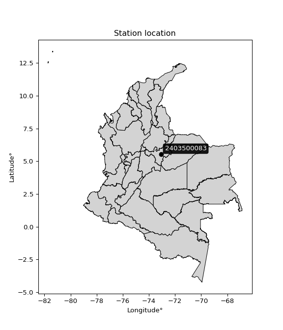

<div align="center">


</div>

# PMP Station (Rain, Pmax24h): 2403500083

Probable Maximum Precipitation (PMP) is the greatest amount of rainfall for a specific duration that is meteorologically possible for a given location, acting as a "worst-case" scenario for extreme storms, crucial for designing safety-critical infrastructure like bridges, river deviations, dams, spillways, and nuclear plants to prevent catastrophic failure. PMP is calculated by hydrologists using meteorological data to determine the upper limit of extreme rainfall, often leading to the Probable Maximum Flood (PMF) for flood control design, and is increasingly being studied for climate change impacts. Probable Maximum Precipitation (PMP) is the theoretical upper limit of rainfall, a deterministic estimate for extreme events, while probability distributions (like GEV, Gumbel) describe the likelihood and frequency of various precipitation amounts, including rare ones, showing how often events occur, with PMP representing the extreme end of these distributions, used for critical infrastructure design to ensure safety against the worst conceivable weather, unlike standard statistical forecasts which cover typical probabilities.

The most common probability distributions in hydrology, used for analyzing floods, rainfall, and streamflow, include the Normal, Log-Normal, Gumbel, Gamma (including Log-Pearson Type III), and Generalized Extreme Value (GEV) distributions, often chosen based on the data´s skewness and whether modeling extremes or general conditions, with Gumbel and GEV popular for extreme events like floods, while the Normal distribution serves as a baseline, though often requiring transformations for skewed hydrological data. These distributions help in designing water infrastructure, managing water resources, and forecasting hydrologic events.

> Hydrological data often isn´t perfectly normal (it´s skewed), so different distributions are needed for different applications, such as: **Flood Frequency Analysis**: Using Gumbel, GEV, or Log-Pearson Type III for predicting extreme flood magnitudes and their return periods, **Rainfall Analysis**: Normal for annual totals, but Log-Normal, Weibull, or GEV for intensity or extreme daily rainfall, **Streamflow Modeling**: Gamma and Log-Normal for maximum flows, GEV for minimum flows, and Kappa for daily flows.

<div align="center">

</img>

</div>


## A. General information


### 1. General running parameters

• app_version: _v20260108_. • runtime: _2026-01-08 13:24:42.400241_. • Python version: _3.14.0_. • SciPy version: _1.16.3_. • Pandas version: _2.3.3_. • NumPy version: _2.3.5_. • Stations dataset (station_dataset_file): _dataset/pmax24h_in/automatic_colombia_2003_2024.csv_. • Stations catalog (station_catalog_file): _dataset/CNE.xls_. • Minimum year to eval til year_max (date_min): _1900_. • Maximum year to eval since year_min (date_max): _2024_. • Creates, save and include plots into reports (create_plot): _False_. • Plot only fit distributions with Δo > Δ (plot_only_fit): _True_. • Plot only simple graphs avoiding multiple CDFs and multiple Extreme values plots (plot_only_simple): _True_. • Eval low extreme values, if False, evaluates high extreme values (low_extreme): _False_. • Eval every SciPy distribution as logarithmic (pdist_logarithmic_on): _True_. • Standard deviation normalized (ddof): _1.0_. • Return periods to eval in years (Tr): _[2, 2.33, 5, 10, 15, 20, 25, 50, 75, 100, 200, 250, 500, 750, 1000]_. • Minimum data sample per station, 0 means any (minimum_sample): _5_. • Z-Score maximum threshold to adjust a value, 0 means disable (zscore_max): _3.5_. • Z-Score minimum threshold to adjust a value, 0 means disable (zscore_min): _-2.5_. • Avoid zeros, e.g. rain = 0 (avoid_zeros): _True_. • Avoid null values (avoid_nans): _True_. 

:file_folder:Table: [dataset.csv](../../dataset/pmax24h_in/automatic_colombia_2003_2024.csv)

> Delta Degrees of Freedom (DDOF): is a parameter used in the formulas for calculating variance and standard deviation. When ddof=0, the divisor is $N$ (the total number of observations) and this is used when your data set is the entire population. When ddof=1, the divisor is $N-1$ and this is used when your data set is a sample drawn from a larger population. Using $N-1$ provides an unbiased estimate of the population variance (known as Bessel´s correction).


### 2. Station info and location

|   id |     CODIGO | NOMBRE                   | CATEGORIA               | TECNOLOGIA                | ESTADO           | FECHA_INSTALACION   |   FECHA_SUSPENSION |   ALTITUD |   LATITUD |   LONGITUD | DEPARTAMENTO   | MUNICIPIO   | AREA_OPERATIVA                              | ENTIDAD                                                     | AREA_HIDROGRAFICA   | ZONA_HIDROGRAFICA   | SUBZONA_HIDROGRAFICA   |   CORRIENTE | Catalogo   |   Version |
|-----:|-----------:|:-------------------------|:------------------------|:--------------------------|:-----------------|:--------------------|-------------------:|----------:|----------:|-----------:|:---------------|:------------|:--------------------------------------------|:------------------------------------------------------------|:--------------------|:--------------------|:-----------------------|------------:|:-----------|----------:|
|    0 | 2403500083 | PESCA - AUT [2403500083] | Climatológica Principal | Automática con Telemetría | En Mantenimiento | 13/10/2017          |                nan |      2764 |     5.524 |   -73.0765 | Boyacá         | Pesca       | Area Operativa 06 - Boyacá-Casanare-Vichada | INSTITUTO DE HIDROLOGIA METEOROLOGIA Y ESTUDIOS AMBIENTALES | Magdalena Cauca     | Sogamoso            | Río Chicamocha         |         nan | CNE_IDEAM  |  20251226 |

<div align="center">

Dynamic map: [:earth_americas:Google](http://maps.google.com/maps?q=5.524,-73.07655) [:earth_americas:OSM](https://www.openstreetmap.org/#map=18/5.524/-73.07655&layers=P) [:earth_americas:Bing](https://www.bing.com/maps?cp=5.524~-73.07655&lvl=18) [:earth_americas:Apple](https://maps.apple.com/frame?center=5.524%2C-73.07655&span=0.003%2C0.006)

</div>


<div align="center">

```geojson
{
  "type": "Feature",
  "geometry": {
    "type": "Point", 
    "coordinates": [-73.07655, 5.524]
  }, 
  "properties": {
    "Name": "2403500083"
  }
}
```

</div>


### 3. Discrete values table and plot

<div align="center">

|               |          0 |           1 |           2 |           3 |           4 |
|:--------------|-----------:|------------:|------------:|------------:|------------:|
| Date          | 2019       | 2020        | 2021        | 2022        | 2023        |
| Value         |   51.6     |   21        |    1        |    1        |    0.4      |
| Value_initial |   51.6     |   21        |    1        |    1        |    0.4      |
| count         |    5       |    5        |    5        |    5        |    5        |
| mean          |   15       |   15        |   15        |   15        |   15        |
| std           |   22.2526  |   22.2526   |   22.2526   |   22.2526   |   22.2526   |
| zscore        |    1.64475 |    0.269631 |   -0.629139 |   -0.629139 |   -0.656102 |


</div>


> The initial value (value_initial) correspond to the initial obtained or null completed value, and value (value) is adjusted only when the initial value is outside the valid range (outlier) definite through the Z-Score value. If Z-Score is active, values out of range or outliers are replaced with the station mean value. A Z-Score (or standard score) measures how many standard deviations a data point is from the mean of a dataset, indicating its relative position; positive scores mean above the mean, negative mean below, and a score of zero is exactly at the mean, allowing for comparison of values from different distributions. It´s calculated using the formula $z=(x–μ)/σ$, where $x$ is the data point, $μ$ is the mean, and $σ$ is the standard deviation, helping identify outliers and understand probability.
>
> <sub>**Note**: In this study, "completing" (filling gaps in) and "extending" (forecasting or lengthening the historical record) rainfall data series are avoided for certain critical analyses because they introduce artificial bias and uncertainty, which can distort the statistics of rare events (extremes), alter day-to-day variability, and compromise the integrity and homogeneity of the original data. Some reasons against Completing/Extending rainfall data are: **Distortion of Extremes and Variability**: The primary issue is that most gap-filling or extension methods rely on averaging or regression with nearby stations, which inherently smooths the data. Rainfall is highly variable in space and time, with a large percentage of zero values and occasional large storms. Infilling methods often underestimate the highest values and overestimate the lowest (zero) values, which severely distorts analyses focused on flood frequency, drought severity, and intensity-duration-frequency (IDF) curves, **Loss of Data Homogeneity**: Infilled or extended data are synthetic estimates, not actual measurements. Combining these estimates with observed data can violate the assumption of data homogeneity, which requires that the data properties do not change over time. Inhomogeneity can lead to incorrect conclusions about long-term trends or changes in climate patterns, **Propagation of Errors**: Errors and biases from the original data (e.g., wind-induced undercatch, instrument errors, site changes) or the data used for imputation can propagate through the analysis, leading to unreliable hydrological models and inaccurate predictions, **Compromised Statistical Integrity**: For statistical analyses, especially those involving the frequency of events, using artificial data can introduce time bias or autocorrelation that doesn´t exist in reality, making it difficult to assess the true probability of events, **Difficulty in Validation**: It is difficult to accurately validate the quality of filled or extended data, especially for past periods where ground-truth measurements are unavailable. The reliability of imputation techniques heavily depends on the density of the surrounding station network and the complexity of the local topography.</sub>


### 4. Active continuous probability distributions from SciPy (43 of 104 available)

A Probability Density Function (PDF) describes the relative likelihood of a continuous random variable falling within a specific range, where the total area under its curve equals 1, and the area over any interval gives the actual probability for that range. Unlike discrete probabilities (like rolling a die), a PDF shows density, not direct probability for a single point (which is zero), with higher points indicating higher likelihood, often visualized as a bell curve for normal distributions.

A log of a probability density function (log-PDF) is simply the logarithm of the PDF´s value, denoted as $log(f(x))$, useful for converting multiplication of probabilities into addition, improving numerical stability with tiny numbers, and connecting to information theory concepts like entropy. Instead of dealing with very small probabilities (e.g., 0.000001), log-PDFs use negative numbers (e.g., $log(0.00001) ≈ -11.51$ that are easier for computers to handle, preventing underflow errors and simplifying complex calculations. In this study, each active probability distribution from SciPy is also evaluated in the $log$ form.

[scipy.stats](https://docs.scipy.org/doc/scipy/reference/stats.html) is a Python´s powerful submodule within the SciPy library for comprehensive statistical analysis, offering over 130 probability distributions (like Normal, Poisson), functions for descriptive stats (mean, variance), hypothesis testing (t-tests, chi-square), random variable generation, and statistical tests, making it essential for data science, modeling, and research. It provides tools to explore, model, and draw conclusions from data efficiently, working seamlessly with NumPy.

<div align="center">

|   id | p_dist             |   n_parameter | fit_method   | label                                                                       | active   | ref                                                                                                        |
|-----:|:-------------------|--------------:|:-------------|:----------------------------------------------------------------------------|:---------|:-----------------------------------------------------------------------------------------------------------|
|    0 | alpha              |             3 | MLE          | Alpha                                                                       | True     | [:mortar_board:](https://docs.scipy.org/doc/scipy/reference/generated/scipy.stats.alpha.html)              |
|    1 | betaprime          |             4 | MLE          | Beta prime                                                                  | True     | [:mortar_board:](https://docs.scipy.org/doc/scipy/reference/generated/scipy.stats.betaprime.html)          |
|    2 | chi2               |             3 | MLE          | Chi²                                                                        | True     | [:mortar_board:](https://docs.scipy.org/doc/scipy/reference/generated/scipy.stats.chi2.html)               |
|    3 | crystalball        |             4 | MLE          | Crystalball                                                                 | True     | [:mortar_board:](https://docs.scipy.org/doc/scipy/reference/generated/scipy.stats.crystalball.html)        |
|    4 | erlang             |             3 | MLE          | Erlang                                                                      | True     | [:mortar_board:](https://docs.scipy.org/doc/scipy/reference/generated/scipy.stats.erlang.html)             |
|    5 | expon              |             2 | MLE          | Exponential                                                                 | True     | [:mortar_board:](https://docs.scipy.org/doc/scipy/reference/generated/scipy.stats.expon.html)              |
|    6 | exponnorm          |             3 | MLE          | Exponentially modified Normal                                               | True     | [:mortar_board:](https://docs.scipy.org/doc/scipy/reference/generated/scipy.stats.exponnorm.html)          |
|    7 | f                  |             4 | MLE          | F                                                                           | True     | [:mortar_board:](https://docs.scipy.org/doc/scipy/reference/generated/scipy.stats.f.html)                  |
|    8 | fatiguelife        |             3 | MLE          | Fatigue-life (Birnbaum-Saunders)                                            | True     | [:mortar_board:](https://docs.scipy.org/doc/scipy/reference/generated/scipy.stats.fatiguelife.html)        |
|    9 | fisk               |             3 | MLE          | Fisk                                                                        | True     | [:mortar_board:](https://docs.scipy.org/doc/scipy/reference/generated/scipy.stats.fisk.html)               |
|   10 | gamma              |             3 | MLE          | Gamma                                                                       | True     | [:mortar_board:](https://docs.scipy.org/doc/scipy/reference/generated/scipy.stats.gamma.html)              |
|   11 | genexpon           |             5 | MLE          | Generalized exponential                                                     | True     | [:mortar_board:](https://docs.scipy.org/doc/scipy/reference/generated/scipy.stats.genexpon.html)           |
|   12 | genlogistic        |             3 | MLE          | Generalized logistic                                                        | True     | [:mortar_board:](https://docs.scipy.org/doc/scipy/reference/generated/scipy.stats.genlogistic.html)        |
|   13 | gibrat             |             2 | MM           | Gibrat                                                                      | True     | [:mortar_board:](https://docs.scipy.org/doc/scipy/reference/generated/scipy.stats.gibrat.html)             |
|   14 | gompertz           |             3 | MLE          | Gompertz (or truncated Gumbel)                                              | True     | [:mortar_board:](https://docs.scipy.org/doc/scipy/reference/generated/scipy.stats.gompertz.html)           |
|   15 | gumbel_l           |             2 | MM           | Gumbel Left Skew                                                            | True     | [:mortar_board:](https://docs.scipy.org/doc/scipy/reference/generated/scipy.stats.gumbel_l.html)           |
|   16 | gumbel_r           |             2 | MM           | Gumbel Right Skew                                                           | True     | [:mortar_board:](https://docs.scipy.org/doc/scipy/reference/generated/scipy.stats.gumbel_r.html)           |
|   17 | halflogistic       |             2 | MM           | Half-logistic                                                               | True     | [:mortar_board:](https://docs.scipy.org/doc/scipy/reference/generated/scipy.stats.halflogistic.html)       |
|   18 | halfnorm           |             2 | MM           | Half Normal                                                                 | True     | [:mortar_board:](https://docs.scipy.org/doc/scipy/reference/generated/scipy.stats.halfnorm.html)           |
|   19 | hypsecant          |             2 | MM           | hyperbolic secant                                                           | True     | [:mortar_board:](https://docs.scipy.org/doc/scipy/reference/generated/scipy.stats.hypsecant.html)          |
|   20 | invgamma           |             3 | MLE          | Inverted gamma                                                              | True     | [:mortar_board:](https://docs.scipy.org/doc/scipy/reference/generated/scipy.stats.invgamma.html)           |
|   21 | invgauss           |             3 | MLE          | Inverse Gaussian                                                            | True     | [:mortar_board:](https://docs.scipy.org/doc/scipy/reference/generated/scipy.stats.invgauss.html)           |
|   22 | invweibull         |             3 | MLE          | Inverted Weibull                                                            | True     | [:mortar_board:](https://docs.scipy.org/doc/scipy/reference/generated/scipy.stats.invweibull.html)         |
|   23 | kstwobign          |             2 | MLE          | Limiting distribution of scaled Kolmogorov-Smirnov two-sided test statistic | True     | [:mortar_board:](https://docs.scipy.org/doc/scipy/reference/generated/scipy.stats.kstwobign.html)          |
|   24 | laplace            |             2 | MM           | Laplace                                                                     | True     | [:mortar_board:](https://docs.scipy.org/doc/scipy/reference/generated/scipy.stats.laplace.html)            |
|   25 | laplace_asymmetric |             3 | MLE          | Asymmetric Laplace                                                          | True     | [:mortar_board:](https://docs.scipy.org/doc/scipy/reference/generated/scipy.stats.laplace_asymmetric.html) |
|   26 | loggamma           |             3 | MLE          | Log gamma                                                                   | True     | [:mortar_board:](https://docs.scipy.org/doc/scipy/reference/generated/scipy.stats.loggamma.html)           |
|   27 | logistic           |             2 | MM           | Logistic (or Sech-squared)                                                  | True     | [:mortar_board:](https://docs.scipy.org/doc/scipy/reference/generated/scipy.stats.logistic.html)           |
|   28 | lognorm            |             3 | MLE          | Log Normal                                                                  | True     | [:mortar_board:](https://docs.scipy.org/doc/scipy/reference/generated/scipy.stats.lognorm.html)            |
|   29 | maxwell            |             2 | MM           | Maxwell                                                                     | True     | [:mortar_board:](https://docs.scipy.org/doc/scipy/reference/generated/scipy.stats.maxwell.html)            |
|   30 | mielke             |             4 | MLE          | Mielke Beta-Kappa / Dagum                                                   | True     | [:mortar_board:](https://docs.scipy.org/doc/scipy/reference/generated/scipy.stats.mielke.html)             |
|   31 | moyal              |             2 | MM           | Moyal                                                                       | True     | [:mortar_board:](https://docs.scipy.org/doc/scipy/reference/generated/scipy.stats.moyal.html)              |
|   32 | nakagami           |             3 | MLE          | Nakagami                                                                    | True     | [:mortar_board:](https://docs.scipy.org/doc/scipy/reference/generated/scipy.stats.nakagami.html)           |
|   33 | ncf                |             5 | MLE          | Non-central F distribution                                                  | True     | [:mortar_board:](https://docs.scipy.org/doc/scipy/reference/generated/scipy.stats.ncf.html)                |
|   34 | nct                |             4 | MLE          | Non-central Student’s t                                                     | True     | [:mortar_board:](https://docs.scipy.org/doc/scipy/reference/generated/scipy.stats.nct.html)                |
|   35 | norm               |             2 | MM           | Normal                                                                      | True     | [:mortar_board:](https://docs.scipy.org/doc/scipy/reference/generated/scipy.stats.norm.html)               |
|   36 | pearson3           |             3 | MM           | Pearson type III                                                            | True     | [:mortar_board:](https://docs.scipy.org/doc/scipy/reference/generated/scipy.stats.pearson3.html)           |
|   37 | rayleigh           |             2 | MM           | Rayleigh                                                                    | True     | [:mortar_board:](https://docs.scipy.org/doc/scipy/reference/generated/scipy.stats.rayleigh.html)           |
|   38 | rice               |             3 | MLE          | Rice                                                                        | True     | [:mortar_board:](https://docs.scipy.org/doc/scipy/reference/generated/scipy.stats.rice.html)               |
|   39 | t                  |             3 | MLE          | Student’s t                                                                 | True     | [:mortar_board:](https://docs.scipy.org/doc/scipy/reference/generated/scipy.stats.t.html)                  |
|   40 | truncnorm          |             4 | MLE          | Truncated normal                                                            | True     | [:mortar_board:](https://docs.scipy.org/doc/scipy/reference/generated/scipy.stats.truncnorm.html)          |
|   41 | wald               |             2 | MM           | Wald                                                                        | True     | [:mortar_board:](https://docs.scipy.org/doc/scipy/reference/generated/scipy.stats.wald.html)               |
|   42 | weibull_min        |             3 | MLE          | Weibull minimum                                                             | True     | [:mortar_board:](https://docs.scipy.org/doc/scipy/reference/generated/scipy.stats.weibull_min.html)        |

</div>

> **n_parameter:** # arguments & localization & scale.
>
> **Fit methods:** (MLE) maximum likelihood, (MM) L-moments.
>
>**Inactive** (With the only purpose of prevent loops, zero divisions, infinite values, over high estimated values or horizontal trending for recurrence intervals estimations, the follow distributions were disabled.)**:** foldnorm, gennorm, norminvgauss, powernorm, powerlognorm, skewnorm, genextreme, anglit, arcsine, argus, beta, bradford, burr, burr12, cauchy, cosine, halfcauchy, foldcauchy, skewcauchy, wrapcauchy, dgamma, gengamma, exponweib, exponpow, truncexpon, gausshyper, genhalflogistic, genhyperbolic, geninvgauss, halfgennorm, johnsonsb, johnsonsu, kappa4, kappa3, ksone, kstwo, loglaplace, levy, levy_l, levy_stable, ncx2, pareto, genpareto, truncpareto, lomax, powerlaw, rdist, rel_breitwigner, recipinvgauss, semicircular, studentized_range, trapezoid, triang, truncweibull_min, tukeylambda, uniform, loguniform, vonmises, vonmises_line, weibull_max, dweibull, 


## B. Probability (PDF) vs. Empirical (EDF) distributions functions

A continuous probability distribution (CPD) describes probabilities for variables that can take any value within a range (like rain any time), unlike discrete variables with specific outcomes (like temperature). It uses a Probability Density Function (PDF), a curve where the total area under it equals 1, and the probability of the variable falling within an interval (a to b) is found by calculating the area under the curve between those points. A key feature is that the probability of hitting any single exact value is zero, so probabilities are always expressed for ranges, e.g., $P(a ≤ X ≤ b)$.

<div align="center">

Distributions parameters from station values
|    |    station | p_dist                |   n |             loc |         scale | shape                  | shape1                | shape2               | shape3   |
|---:|-----------:|:----------------------|----:|----------------:|--------------:|:-----------------------|:----------------------|:---------------------|:---------|
|  0 | 2403500083 | alpha                 |   5 |     7.58746e-05 |   0.777174    | 3.8999005289223845e-07 |                       |                      |          |
|  1 | 2403500083 | betaprime             |   5 |     0.4         |   5.61856e-11 | 3.0589181605800615     | 0.20408662721662194   |                      |          |
|  2 | 2403500083 | chi2                  |   5 |     0.4         |   1.80948     | 1.453880061779901      |                       |                      |          |
|  3 | 2403500083 | crystalball           |   5 |    15           |  19.9034      | 425.284976018659       | 60.05343808476516     |                      |          |
|  4 | 2403500083 | erlang                |   5 |     0.4         |  12.0008      | 0.48418883205539154    |                       |                      |          |
|  5 | 2403500083 | expon                 |   5 |     0.4         |  14.6         |                        |                       |                      |          |
|  6 | 2403500083 | exponnorm             |   5 |     0.386886    |   0.004083    | 3564.1021176690183     |                       |                      |          |
|  7 | 2403500083 | f                     |   5 |     0.4         |   2.79731e-16 | 223.89750685073432     | 0.43508964607531886   |                      |          |
|  8 | 2403500083 | fatiguelife           |   5 |     0.4         |   2.22325e-06 | 2167.6240793487686     |                       |                      |          |
|  9 | 2403500083 | fisk                  |   5 |     0.4         |   0.743575    | 0.62161253134977       |                       |                      |          |
| 10 | 2403500083 | gamma                 |   5 |     0.4         |  12.9547      | 0.31603674619312283    |                       |                      |          |
| 11 | 2403500083 | genexpon              |   5 |     0.4         |  23.6834      | 1.6221476126297136     | 1.3802955767960121    | 8.18627899707088e-11 |          |
| 12 | 2403500083 | genlogistic           |   5 |   -89.1665      |  12.6859      | 1863.2033752368397     |                       |                      |          |
| 13 | 2403500083 | gibrat                |   5 |    -0.18376     |   9.20942     |                        |                       |                      |          |
| 14 | 2403500083 | gompertz              |   5 |     0.4         |   2.66755e+09 | 177886342.72529358     |                       |                      |          |
| 15 | 2403500083 | gumbel_l              |   5 |    23.9576      |  15.5186      |                        |                       |                      |          |
| 16 | 2403500083 | gumbel_r              |   5 |     6.04243     |  15.5186      |                        |                       |                      |          |
| 17 | 2403500083 | halflogistic          |   5 |    -8.59011     |  17.0167      |                        |                       |                      |          |
| 18 | 2403500083 | halfnorm              |   5 |   -11.3443      |  33.0176      |                        |                       |                      |          |
| 19 | 2403500083 | hypsecant             |   5 |    15           |  12.6709      |                        |                       |                      |          |
| 20 | 2403500083 | invgamma              |   5 |     0.4         |   3.28528e-16 | 0.05635499937208106    |                       |                      |          |
| 21 | 2403500083 | invgauss              |   5 |     0.276936    |   0.470809    | 31.27178068831626      |                       |                      |          |
| 22 | 2403500083 | invweibull            |   5 |     0.4         |   1.04403     | 0.06677522062187773    |                       |                      |          |
| 23 | 2403500083 | kstwobign             |   5 |   -39.1896      |  62.5834      |                        |                       |                      |          |
| 24 | 2403500083 | laplace               |   5 |    15           |  14.0738      |                        |                       |                      |          |
| 25 | 2403500083 | laplace_asymmetric    |   5 |     0.4         |   0.00423412  | 0.00029001171390889875 |                       |                      |          |
| 26 | 2403500083 | loggamma              |   5 | -5635.36        | 773.7         | 1485.3999673095122     |                       |                      |          |
| 27 | 2403500083 | logistic              |   5 |    15           |  10.9733      |                        |                       |                      |          |
| 28 | 2403500083 | lognorm               |   5 |     0.4         |   0.00183977  | 15.670571951747734     |                       |                      |          |
| 29 | 2403500083 | maxwell               |   5 |   -32.1626      |  29.5548      |                        |                       |                      |          |
| 30 | 2403500083 | mielke                |   5 |     0.4         |   0.000384403 | 0.7431747919216138     | 0.2808767030144209    |                      |          |
| 31 | 2403500083 | moyal                 |   5 |     3.61798     |   8.95966     |                        |                       |                      |          |
| 32 | 2403500083 | nakagami              |   5 |     0.4         |  29.2437      | 0.1399082221788178     |                       |                      |          |
| 33 | 2403500083 | ncf                   |   5 |     0.4         |   4.87203e-12 | 252.66653772585323     | 0.4151152184358158    | 7.608604568046669    |          |
| 34 | 2403500083 | nct                   |   5 |     0.4         |   2.23431e-14 | 0.21909626749913907    | 4.322227810238691     |                      |          |
| 35 | 2403500083 | norm                  |   5 |    15           |  19.9034      |                        |                       |                      |          |
| 36 | 2403500083 | pearson3              |   5 |    15           |  19.9034      | 1.0309692903422447     |                       |                      |          |
| 37 | 2403500083 | rayleigh              |   5 |   -23.0763      |  30.3805      |                        |                       |                      |          |
| 38 | 2403500083 | rice                  |   5 |   -15.1282      |  25.5329      | 0.00023158014668048983 |                       |                      |          |
| 39 | 2403500083 | t                     |   5 |     1           |   7.53196e-18 | 0.43710347845624564    |                       |                      |          |
| 40 | 2403500083 | truncnorm             |   5 |   -19.5173      |  29.2783      | 0.6802770921827895     | 2.4290174720795106    |                      |          |
| 41 | 2403500083 | wald                  |   5 |    -4.90337     |  19.9034      |                        |                       |                      |          |
| 42 | 2403500083 | weibull_min           |   5 |     0.4         |  23.3678      | 0.4071207272104237     |                       |                      |          |
| 43 | 2403500083 | logalpha              |   5 |    -1.56173     |   1.23061     | 1.1805608075557341e-07 |                       |                      |          |
| 44 | 2403500083 | logbetaprime          |   5 |    -0.916291    |   3.188       | 0.31982728522874154    | 1.774420456456431     |                      |          |
| 45 | 2403500083 | logchi2               |   5 |    -0.916291    |   1.10588     | 1.1953189488110016     |                       |                      |          |
| 46 | 2403500083 | logcrystalball        |   5 |     1.21435     |   1.91242     | 52.78770464112868      | 149.5412725383906     |                      |          |
| 47 | 2403500083 | logerlang             |   5 |    -0.916291    |   1.83484     | 0.9300225450576018     |                       |                      |          |
| 48 | 2403500083 | logexpon              |   5 |    -0.916291    |   2.13064     |                        |                       |                      |          |
| 49 | 2403500083 | logexponnorm          |   5 |    -0.919952    |   0.00116289  | 1829.0475716984593     |                       |                      |          |
| 50 | 2403500083 | logf                  |   5 |    -0.916291    |   1.11222     | 1.1471049422509392     | 1.0891108901218285    |                      |          |
| 51 | 2403500083 | logfatiguelife        |   5 |    -0.916291    |   1.17544e-07 | 3675.106545689606      |                       |                      |          |
| 52 | 2403500083 | logfisk               |   5 |    -0.916291    |   0.173068    | 0.5053410079737435     |                       |                      |          |
| 53 | 2403500083 | loggamma              |   5 |    -0.916291    |   2.00725     | 0.6702172393617616     |                       |                      |          |
| 54 | 2403500083 | loggenexpon           |   5 |    -0.916291    |   3.73073     | 1.7509754147824046     | 6.013606518190835e-08 | 1.8346571776713978   |          |
| 55 | 2403500083 | loggenlogistic        |   5 |   -10.2351      |   1.47166     | 1287.7645939211025     |                       |                      |          |
| 56 | 2403500083 | loggibrat             |   5 |    -0.24461     |   0.884888    |                        |                       |                      |          |
| 57 | 2403500083 | loggompertz           |   5 |    -0.916291    |   4.54828     | 1.3142871826146836     |                       |                      |          |
| 58 | 2403500083 | loggumbel_l           |   5 |     2.07504     |   1.49111     |                        |                       |                      |          |
| 59 | 2403500083 | loggumbel_r           |   5 |     0.353658    |   1.49111     |                        |                       |                      |          |
| 60 | 2403500083 | loghalflogistic       |   5 |    -1.05232     |   1.63505     |                        |                       |                      |          |
| 61 | 2403500083 | loghalfnorm           |   5 |    -1.31695     |   3.17251     |                        |                       |                      |          |
| 62 | 2403500083 | loghypsecant          |   5 |     1.21435     |   1.21749     |                        |                       |                      |          |
| 63 | 2403500083 | loginvgamma           |   5 |    -1.81686     |   4.55128     | 2.3580194542868855     |                       |                      |          |
| 64 | 2403500083 | loginvgauss           |   5 |    -1.3787      |   2.38211     | 1.0885428747351458     |                       |                      |          |
| 65 | 2403500083 | loginvweibull         |   5 |    -2.17013     |   2.12632     | 1.928590078637987      |                       |                      |          |
| 66 | 2403500083 | logkstwobign          |   5 |    -4.73506     |   6.79916     |                        |                       |                      |          |
| 67 | 2403500083 | loglaplace            |   5 |     1.21435     |   1.35229     |                        |                       |                      |          |
| 68 | 2403500083 | loglaplace_asymmetric |   5 |    -2.7689e-08  |   1.1456      | 0.6017694951809134     |                       |                      |          |
| 69 | 2403500083 | logloggamma           |   5 |  -590.265       |  79.479       | 1706.2914106222424     |                       |                      |          |
| 70 | 2403500083 | loglogistic           |   5 |     1.21435     |   1.05437     |                        |                       |                      |          |
| 71 | 2403500083 | loglognorm            |   5 |    -0.916291    |   2.40756     | 16.553752261656545     |                       |                      |          |
| 72 | 2403500083 | logmaxwell            |   5 |    -3.31729     |   2.83979     |                        |                       |                      |          |
| 73 | 2403500083 | logmielke             |   5 |    -0.916291    |   3.6955      | 0.11416392923434648    | 0.6598838917063267    |                      |          |
| 74 | 2403500083 | logmoyal              |   5 |     0.120704    |   0.860893    |                        |                       |                      |          |
| 75 | 2403500083 | lognakagami           |   5 |    -0.916291    |   3.04461     | 0.05522942702342484    |                       |                      |          |
| 76 | 2403500083 | logncf                |   5 |    -0.916291    |   1.02789     | 1.0787744552486012     | 1.1011177569295774    | 1.1124796884994592   |          |
| 77 | 2403500083 | lognct                |   5 |   -64.5482      |   1.79352     | 5111.639335456277      | 36.66119449306545     |                      |          |
| 78 | 2403500083 | lognorm               |   5 |     1.21435     |   1.91242     |                        |                       |                      |          |
| 79 | 2403500083 | logpearson3           |   5 |     1.21435     |   1.91242     | 0.3775851587182913     |                       |                      |          |
| 80 | 2403500083 | lograyleigh           |   5 |    -2.44423     |   2.91912     |                        |                       |                      |          |
| 81 | 2403500083 | logrice               |   5 |    -1.99254     |   2.60369     | 0.2377414168313214     |                       |                      |          |
| 82 | 2403500083 | logt                  |   5 |    -3.82525e-20 |   2.82682e-19 | 0.10083463091074393    |                       |                      |          |
| 83 | 2403500083 | logtruncnorm          |   5 |    -0.681426    |   2.77423     | -0.08465966473066165   | 35.00486884375947     |                      |          |
| 84 | 2403500083 | logwald               |   5 |    -0.698031    |   1.91239     |                        |                       |                      |          |
| 85 | 2403500083 | logweibull_min        |   5 |    -0.916291    |   2.15356     | 0.5986517765490029     |                       |                      |          |

</div>

> **loc** (Location parameter): This shifts the distribution along the x-axis. For many common distributions, like the normal (Gaussian) distribution, loc represents the mean $μ$. For others, like the uniform distribution, it might represent the minimum value, or for the beta distribution, the left end of the support interval.
>
> **scale** (Scale parameter): This determines the width or spread of the distribution. For the normal distribution, scale represents the standard deviation $σ$. For a uniform distribution, it defines the length of the interval (from $loc$ to $loc + scale$).
>
> **shape** (Shape parameters): Refers to parameters that define the specific form of a probability distribution, distinct from its location (loc) and scale (scale). These parameters are required arguments for most distribution functions. For example, a normal (Gaussian) distribution is fully defined by its location (mean) and scale (standard deviation), so it has no specific shape parameters beyond loc and scale. However, other distributions have intrinsic properties that need specification, as Gamma distribution that takes a shape parameter, often named $a$ or $alpha$.


### 0. Cumulative distribution values - CDF (86 evaluated)

Cumulative Distribution Function (CDF), denoted as $F$<sub>$X$</sub>$(x)$, is a function that gives the probability that a random variable $X$ will take a value less than or equal to a specific value, $x$ (i.e., $(P(X≥x)$. It essentially "accumulates" probabilities from a given point up to the far right (positive infinity), providing a complete picture of the distribution´s probabilities for both discrete (like rain) and continuous (like temperature) variables, helping to find probabilities over ranges or above certain values. Each station is evaluated separately ordering the $x$ values ascending, calculating the CDF and PDF values for the activated distributions and their logarithmic forms.

<div align="center">

CDF ordered by x ascending and calculating $log(f(x))$ separately
|   id |    Station |   date |    x |   count |   mean |     std |    zscore |   Value_initial |    station |   m |     alpha |   alpha_pdf |   betaprime |   betaprime_pdf |        chi2 |       chi2_pdf |   crystalball |   crystalball_pdf |      erlang |   erlang_pdf |     expon |   expon_pdf |   exponnorm |   exponnorm_pdf |        f |       f_pdf |   fatiguelife |   fatiguelife_pdf |       fisk |    fisk_pdf |       gamma |   gamma_pdf |    genexpon |   genexpon_pdf |   genlogistic |   genlogistic_pdf |     gibrat |   gibrat_pdf |    gompertz |   gompertz_pdf |   gumbel_l |   gumbel_l_pdf |   gumbel_r |   gumbel_r_pdf |   halflogistic |   halflogistic_pdf |   halfnorm |   halfnorm_pdf |   hypsecant |   hypsecant_pdf |   invgamma |   invgamma_pdf |   invgauss |   invgauss_pdf |   invweibull |   invweibull_pdf |   kstwobign |   kstwobign_pdf |   laplace |   laplace_pdf |   laplace_asymmetric |   laplace_asymmetric_pdf |    loggamma |   loggamma_pdf |   logistic |   logistic_pdf |   lognorm |   lognorm_pdf |   maxwell |   maxwell_pdf |      mielke |   mielke_pdf |    moyal |   moyal_pdf |    nakagami |   nakagami_pdf |       ncf |     ncf_pdf |      nct |     nct_pdf |     norm |   norm_pdf |   pearson3 |   pearson3_pdf |   rayleigh |   rayleigh_pdf |     rice |   rice_pdf |           t |       t_pdf |   truncnorm |   truncnorm_pdf |     wald |   wald_pdf |   weibull_min |   weibull_min_pdf |   logalpha |   logalpha_pdf |   logbetaprime |   logbetaprime_pdf |     logchi2 |   logchi2_pdf |   logcrystalball |   logcrystalball_pdf |   logerlang |   logerlang_pdf |   logexpon |   logexpon_pdf |   logexponnorm |   logexponnorm_pdf |        logf |    logf_pdf |   logfatiguelife |   logfatiguelife_pdf |     logfisk |   logfisk_pdf |   loggenexpon |   loggenexpon_pdf |   loggenlogistic |   loggenlogistic_pdf |   loggibrat |   loggibrat_pdf |   loggompertz |   loggompertz_pdf |   loggumbel_l |   loggumbel_l_pdf |   loggumbel_r |   loggumbel_r_pdf |   loghalflogistic |   loghalflogistic_pdf |   loghalfnorm |   loghalfnorm_pdf |   loghypsecant |   loghypsecant_pdf |   loginvgamma |   loginvgamma_pdf |   loginvgauss |   loginvgauss_pdf |   loginvweibull |   loginvweibull_pdf |   logkstwobign |   logkstwobign_pdf |   loglaplace |   loglaplace_pdf |   loglaplace_asymmetric |   loglaplace_asymmetric_pdf |   logloggamma |   logloggamma_pdf |   loglogistic |   loglogistic_pdf |   loglognorm |   loglognorm_pdf |   logmaxwell |   logmaxwell_pdf |   logmielke |   logmielke_pdf |   logmoyal |   logmoyal_pdf |   lognakagami |   lognakagami_pdf |      logncf |   logncf_pdf |   lognct |   lognct_pdf |   logpearson3 |   logpearson3_pdf |   lograyleigh |   lograyleigh_pdf |   logrice |   logrice_pdf |       logt |    logt_pdf |   logtruncnorm |   logtruncnorm_pdf |   logwald |   logwald_pdf |   logweibull_min |   logweibull_min_pdf |
|-----:|-----------:|-------:|-----:|--------:|-------:|--------:|----------:|----------------:|-----------:|----:|----------:|------------:|------------:|----------------:|------------:|---------------:|--------------:|------------------:|------------:|-------------:|----------:|------------:|------------:|----------------:|---------:|------------:|--------------:|------------------:|-----------:|------------:|------------:|------------:|------------:|---------------:|--------------:|------------------:|-----------:|-------------:|------------:|---------------:|-----------:|---------------:|-----------:|---------------:|---------------:|-------------------:|-----------:|---------------:|------------:|----------------:|-----------:|---------------:|-----------:|---------------:|-------------:|-----------------:|------------:|----------------:|----------:|--------------:|---------------------:|-------------------------:|------------:|---------------:|-----------:|---------------:|----------:|--------------:|----------:|--------------:|------------:|-------------:|---------:|------------:|------------:|---------------:|----------:|------------:|---------:|------------:|---------:|-----------:|-----------:|---------------:|-----------:|---------------:|---------:|-----------:|------------:|------------:|------------:|----------------:|---------:|-----------:|--------------:|------------------:|-----------:|---------------:|---------------:|-------------------:|------------:|--------------:|-----------------:|---------------------:|------------:|----------------:|-----------:|---------------:|---------------:|-------------------:|------------:|------------:|-----------------:|---------------------:|------------:|--------------:|--------------:|------------------:|-----------------:|---------------------:|------------:|----------------:|--------------:|------------------:|--------------:|------------------:|--------------:|------------------:|------------------:|----------------------:|--------------:|------------------:|---------------:|-------------------:|--------------:|------------------:|--------------:|------------------:|----------------:|--------------------:|---------------:|-------------------:|-------------:|-----------------:|------------------------:|----------------------------:|--------------:|------------------:|--------------:|------------------:|-------------:|-----------------:|-------------:|-----------------:|------------:|----------------:|-----------:|---------------:|--------------:|------------------:|------------:|-------------:|---------:|-------------:|--------------:|------------------:|--------------:|------------------:|----------:|--------------:|-----------:|------------:|---------------:|-------------------:|----------:|--------------:|-----------------:|---------------------:|
|    0 | 2403500083 |   2023 |  0.4 |       5 |     15 | 22.2526 | -0.656102 |             0.4 | 2403500083 |   1 | 0.0519794 | 0.586761    |   0.0728435 |     5.1352e+08  | 6.54827e-13 | 8575.22        |      0.231613 |        0.0153158  | 4.56377e-09 |  3.98069e+07 | 0         |   0.0684932 | 0.000900775 |      0.0686109  | 0.050658 | 1.4656e+15  |     0.0426278 |       4.88706e+11 | 9.4469e-11 | 1.05786e+06 | 3.62372e-06 | 2.06306e+10 | 4.49968e-11 |      0.068493  |      0.20213  |        0.0254643  | 0.00290344 |   0.0152175  | 4.34072e-10 |     0.0666854  |   0.196795 |     0.0113424  |   0.237287 |     0.0219951  |       0.258179 |         0.0274244  |   0.277932 |      0.0226841 |    0.194807 |      0.0144325  |  0.0204038 |    6.13517e+13 |  0.0521061 |    0.966539    |   4.9795e-06 |      7.31379e+10 |    0.181578 |      0.0236933  |  0.17719  |     0.01259   |          8.48858e-08 |               0.068494   | 1.40703e-11 |  84939.1       |   0.209076 |     0.0150696  |  0.132617 |     0.112149  |  0.250328 |    0.0178608  | 4.79409e-10 |  3.20816e+06 | 0.231417 |  0.0260391  | 8.91668e-06 |    4.49465e+10 | 0.0407902 | 8.18904e+10 | 0.08513  | 2.72744e+12 | 0.231613 | 0.0153158  |   0.249756 |     0.0218941  |   0.258118 |     0.0188701  | 0.16884  | 0.0197974  | 1.34041e-08 | 9.76494e-09 | 5.83525e-07 |      0.0449354  | 0.129924 | 0.0530925  |   6.68048e-08 |       4.89948e+08 |  0.0565692 |      0.382802  |    6.87141e-06 |        1.97948e+10 | 2.03038e-10 |     1.093e+06 |         0.132617 |            0.112149  | 8.48929e-16 |       7.11139   |   0        |      0.469342  |     0.00171978 |          0.468954  | 4.44993e-10 | 2.29888e+06 |        0.0934452 |          2.20554e+13 | 2.10112e-08 |    9.5637e+07 |   5.71288e-11 |         0.469338  |         0.101489 |            0.157632  |   0         |       0         |   8.10395e-10 |         0.288963  |      0.125857 |         0.0788551 |     0.0959834 |         0.150857  |         0.0415727 |             0.305272  |      0.100498 |         0.249501  |       0.109531 |          0.0881997 |     0.0612951 |         0.2675    |     0.0545959 |         0.344037  |       0.0626977 |           0.267078  |       0.089361 |          0.159633  |     0.103444 |        0.0764952 |               0.0703729 |                   0.10208   |      0.135872 |         0.112329  |      0.11704  |         0.0980123 |    0.0115336 |      1.64202e+13 |     0.130294 |        0.140489  |   0.0129943 |      1.3362e+13 |  0.0678089 |      0.159691  |     0.0134146 |       1.33465e+13 | 9.22928e-10 |  4.48392e+06 | 0.13191  |    0.112815  |      0.127286 |         0.12767   |      0.128018 |         0.156354  | 0.0796977 |     0.142039  | 0.00566956 | 0.000623915 |    8.51821e-11 |          0.268465  |  0        |     0         |      1.77546e-10 |       957361         |
|    1 | 2403500083 |   2022 |  1   |       5 |     15 | 22.2526 | -0.629139 |             1   | 2403500083 |   2 | 0.437021  | 0.458509    |   0.988029  |     0.00407187  | 0.276655    |    0.304131    |      0.240904 |        0.0156511  | 0.260412    |  0.203164    | 0.0402629 |   0.0657354 | 0.0412568   |      0.065883   | 1        | 0.000131486 |     0.594703  |       0.0774205   | 0.466709   | 0.257857    | 0.418428    | 0.212758    | 0.0402628   |      0.0657353 |      0.217618 |        0.02615    | 0.0201077  |   0.0410887  | 0.0392213   |     0.0640699  |   0.203703 |     0.0116881  |   0.250592 |     0.0223475  |       0.274557 |         0.027168   |   0.291498 |      0.0225342 |    0.203636 |      0.0149971  |  0.857781  |    0.0133579   |  0.433191  |    0.331683    |   0.354276   |      0.0409137   |    0.195979 |      0.0242997  |  0.184907 |     0.0131384 |          0.0402635   |               0.0657362  | 0.549974    |      0.303269  |   0.218262 |     0.015549   |  0.262721 |     0.170519  |  0.26112  |    0.0181115  | 0.729182    |  0.101623    | 0.247146 |  0.0263772  | 0.273346    |    0.127471    | 0.996048  | 0.00136841  | 0.998703 | 0.00047374  | 0.240904 | 0.0156511  |   0.262959 |     0.022108   |   0.269497 |     0.0190556  | 0.18086  | 0.020265   | 0.5         | 3.44163e+16 | 0.0267729   |      0.044304   | 0.162081 | 0.0538882  |   0.20161     |       0.121976    |  0.43071   |      0.295135  |    0.74756     |        0.174068    | 0.570536    |     0.28497   |         0.262721 |            0.170519  | 0.428324    |       0.332101  |   0.349526 |      0.305295  |     0.351124   |          0.305068  | 0.460225    | 0.186448    |        0.776285  |          0.123927    | 0.698934    |    0.116051   |   0.349523    |         0.305293  |         0.29288  |            0.244271  |   0.0992574 |       0.713564  |   0.254224    |         0.263599  |      0.220167 |         0.130054  |     0.281488  |         0.239307  |         0.311132  |             0.276198  |      0.32194  |         0.230737  |       0.224949 |          0.169765  |     0.37768   |         0.324108  |     0.407488  |         0.314706  |       0.382346  |           0.326683  |       0.282809 |          0.24413   |     0.203692 |        0.150628  |               0.265854  |                   0.385638  |      0.265597 |         0.169553  |      0.240174 |         0.173079  |    0.476732  |      0.0262567   |     0.28614  |        0.193793  |   0.804751  |      0.0716997  |  0.283442  |      0.279625  |     0.768417  |       0.0921945   | 0.338       |  0.171567    | 0.262909 |    0.171697  |      0.274701 |         0.189779  |      0.295699 |         0.20202   | 0.247747  |     0.214967  | 0.519494   | 4.79652e+17 |    0.24497     |          0.261422  |  0.234774 |     0.544508  |      0.450942    |            0.215073  |
|    2 | 2403500083 |   2021 |  1   |       5 |     15 | 22.2526 | -0.629139 |             1   | 2403500083 |   3 | 0.437021  | 0.458509    |   0.988029  |     0.00407187  | 0.276655    |    0.304131    |      0.240904 |        0.0156511  | 0.260412    |  0.203164    | 0.0402629 |   0.0657354 | 0.0412568   |      0.065883   | 1        | 0.000131486 |     0.594703  |       0.0774205   | 0.466709   | 0.257857    | 0.418428    | 0.212758    | 0.0402628   |      0.0657353 |      0.217618 |        0.02615    | 0.0201077  |   0.0410887  | 0.0392213   |     0.0640699  |   0.203703 |     0.0116881  |   0.250592 |     0.0223475  |       0.274557 |         0.027168   |   0.291498 |      0.0225342 |    0.203636 |      0.0149971  |  0.857781  |    0.0133579   |  0.433191  |    0.331683    |   0.354276   |      0.0409137   |    0.195979 |      0.0242997  |  0.184907 |     0.0131384 |          0.0402635   |               0.0657362  | 0.549974    |      0.303269  |   0.218262 |     0.015549   |  0.262721 |     0.170519  |  0.26112  |    0.0181115  | 0.729182    |  0.101623    | 0.247146 |  0.0263772  | 0.273346    |    0.127471    | 0.996048  | 0.00136841  | 0.998703 | 0.00047374  | 0.240904 | 0.0156511  |   0.262959 |     0.022108   |   0.269497 |     0.0190556  | 0.18086  | 0.020265   | 0.5         | 3.44163e+16 | 0.0267729   |      0.044304   | 0.162081 | 0.0538882  |   0.20161     |       0.121976    |  0.43071   |      0.295135  |    0.74756     |        0.174068    | 0.570536    |     0.28497   |         0.262721 |            0.170519  | 0.428324    |       0.332101  |   0.349526 |      0.305295  |     0.351124   |          0.305068  | 0.460225    | 0.186448    |        0.776285  |          0.123927    | 0.698934    |    0.116051   |   0.349523    |         0.305293  |         0.29288  |            0.244271  |   0.0992574 |       0.713564  |   0.254224    |         0.263599  |      0.220167 |         0.130054  |     0.281488  |         0.239307  |         0.311132  |             0.276198  |      0.32194  |         0.230737  |       0.224949 |          0.169765  |     0.37768   |         0.324108  |     0.407488  |         0.314706  |       0.382346  |           0.326683  |       0.282809 |          0.24413   |     0.203692 |        0.150628  |               0.265854  |                   0.385638  |      0.265597 |         0.169553  |      0.240174 |         0.173079  |    0.476732  |      0.0262567   |     0.28614  |        0.193793  |   0.804751  |      0.0716997  |  0.283442  |      0.279625  |     0.768417  |       0.0921945   | 0.338       |  0.171567    | 0.262909 |    0.171697  |      0.274701 |         0.189779  |      0.295699 |         0.20202   | 0.247747  |     0.214967  | 0.519494   | 4.79652e+17 |    0.24497     |          0.261422  |  0.234774 |     0.544508  |      0.450942    |            0.215073  |
|    3 | 2403500083 |   2020 | 21   |       5 |     15 | 22.2526 |  0.269631 |            21   | 2403500083 |   4 | 0.970478  | 0.00140516  |   0.994183  |     5.76314e-05 | 0.998399    |    0.000460906 |      0.618467 |        0.0191536  | 0.938966    |  0.00619343  | 0.756091  |   0.0167061 | 0.757437    |      0.0166685  | 1        | 1.77451e-06 |     0.919883  |       0.00507282  | 0.887428   | 0.00301451  | 0.960009    | 0.00404605  | 0.75609     |      0.0167061 |      0.72957  |        0.0181315  | 0.79758    |   0.0133115  | 0.746836    |     0.0168823  |   0.562412 |     0.0233047  |   0.68289  |     0.0167843  |       0.701092 |         0.0149404  |   0.672719 |      0.0149559 |    0.645392 |      0.0225461  |  0.883477  |    0.000318769 |  0.906503  |    0.00289623  |   0.44068    |      0.00117054  |    0.686726 |      0.0190315  |  0.673548 |     0.0231957 |          0.756095    |               0.016706   | 0.926611    |      0.0410627 |   0.633389 |     0.0211611  |  0.830714 |     0.131964  |  0.643295 |    0.0173246  | 0.885663    |  0.00143309  | 0.704631 |  0.0157088  | 0.729098    |    0.0093173   | 0.998103  | 2.15936e-05 | 0.999402 | 6.35849e-06 | 0.618467 | 0.0191536  |   0.676468 |     0.0162838  |   0.650909 |     0.0166707  | 0.632514 | 0.0203652  | 1           | 6.32609e-11 | 0.685658    |      0.021738   | 0.765493 | 0.013037   |   0.613247    |       0.00726105  |  0.789346  |      0.0446545 |    0.930939    |        0.0201183   | 0.924077    |     0.0399206 |         0.830714 |            0.131964  | 0.897791    |       0.0570382 |   0.844168 |      0.0731385 |     0.844932   |          0.0729049 | 0.696872    | 0.0351639   |        0.94289   |          0.0228491   | 0.829485    |    0.0180456  |   0.844165    |         0.0731391 |         0.856235 |            0.0902985 |   0.905395  |       0.0512295 |   0.838851    |         0.111242  |      0.852786 |         0.189149  |     0.848284  |         0.0936056 |         0.849071  |             0.0853423 |      0.830797 |         0.0977532 |       0.860678 |          0.110815  |     0.840958  |         0.0571045 |     0.845547  |         0.0578796 |       0.837556  |           0.0549105 |       0.854213 |          0.0980205 |     0.870818 |        0.0955282 |               0.851667  |                   0.0779174 |      0.830995 |         0.132028  |      0.850151 |         0.120824  |    0.511996  |      0.00608181  |     0.829567 |        0.11467   |   0.89047   |      0.0125396  |  0.854778  |      0.0834061 |     0.899197  |       0.0229486   | 0.590751    |  0.0427892   | 0.831367 |    0.1311    |      0.833191 |         0.116991  |      0.829277 |         0.109966  | 0.837947  |     0.117137  | 0.994977   | 0.000166363 |    0.832076    |          0.109333  |  0.880636 |     0.060301  |      0.763117    |            0.0515636 |
|    4 | 2403500083 |   2019 | 51.6 |       5 |     15 | 22.2526 |  1.64475  |            51.6 | 2403500083 |   5 | 0.987983  | 0.000232869 |   0.995169  |     1.92557e-05 | 1           |    7.64685e-08 |      0.967034 |        0.00369573 | 0.996707    |  0.000302413 | 0.970009  |   0.0020542 | 0.970379    |      0.00203551 | 1        | 5.85676e-07 |     0.986582  |       0.000743799 | 0.93281    | 0.000760933 | 0.997686    | 0.000204527 | 0.970009    |      0.0020542 |      0.972135 |        0.00216563 | 0.957903   |   0.00173453 | 0.9671      |     0.00219393 |   0.997361 |     0.00100976 |   0.94829  |     0.00324445 |       0.943452 |         0.00322915 |   0.9434   |      0.0039266 |    0.964603 |      0.00278782 |  0.889305  |    0.00012184  |  0.949862  |    0.000723692 |   0.462502   |      0.000465128 |    0.970279 |      0.00275572 |  0.962885 |     0.0026372 |          0.97001     |               0.00205413 | 0.955425    |      0.0245268 |   0.965622 |     0.00302514 |  0.923221 |     0.0753523 |  0.954653 |    0.00390792 | 0.909824    |  0.000463361 | 0.94521  |  0.00305278 | 0.903841    |    0.00337618  | 0.99843   | 8.34855e-06 | 0.99951  | 2.09566e-06 | 0.967034 | 0.00369573 |   0.947062 |     0.00349384 |   0.951246 |     0.00394461 | 0.967123 | 0.00336509 | 1           | 1.66652e-11 | 1           |      0.00296404 | 0.946324 | 0.00230999 |   0.747468    |       0.00276348  |  0.823121  |      0.0315976 |    0.945863    |        0.0136594   | 0.952426    |     0.0244867 |         0.923221 |            0.0753523 | 0.938054    |       0.0344479 |   0.897809 |      0.0479624 |     0.898384   |          0.0477745 | 0.724444    | 0.0268023   |        0.959906  |          0.0155414   | 0.843611    |    0.0137187  |   0.897807    |         0.0479629 |         0.91919  |            0.052628  |   0.939973  |       0.0284529 |   0.918861    |         0.0682517 |      0.969836 |         0.0708248 |     0.913895  |         0.0551847 |         0.910035  |             0.0525476 |      0.902711 |         0.0636072 |       0.932591 |          0.0549546 |     0.882642  |         0.0373825 |     0.888485  |         0.0391369 |       0.87771   |           0.036116  |       0.923111 |          0.0577279 |     0.933552 |        0.0491375 |               0.907498  |                   0.0485899 |      0.923615 |         0.0754601 |      0.930113 |         0.0616506 |    0.516922  |      0.00495454  |     0.911798 |        0.0699027 |   0.900333  |      0.00962202 |  0.913535  |      0.0500211 |     0.917592  |       0.018248    | 0.624754    |  0.0334846   | 0.923209 |    0.0748113 |      0.915837 |         0.0689299 |      0.908755 |         0.0683997 | 0.920161  |     0.0680282 | 0.995106   | 0.00012513  |    0.910543    |          0.0671326 |  0.922961 |     0.0362655 |      0.803639    |            0.0393741 |


</div>

An Empirical Distribution Function (EDF) is a step-function estimate of a true cumulative distribution function (CDF) based on observed sample data, representing the proportion of data points less than or equal to a given value. It is calculated by ordering your data and jumping up by $1/n$ (where $n$ is sample size) at each unique data point, allowing analysis without assuming an underlying population distribution, and it gets closer to the true CDF as the sample size grows. For the empirical probability calculations, the parameter $m$ correspond to the order number which means the position of the $x$ values in an ascending order list.

The Kolmogorov-Smirnov (K-S) test is a non-parametric statistical test used to determine if a sample data set comes from a specific theoretical distribution (one-sample) or if two different samples come from the same underlying distribution (two-sample), by comparing their cumulative distribution functions (CDFs). It calculates the maximum vertical difference (D statistic) between these functions, with a small p-value indicating a significant difference and rejection of the null hypothesis (that the data/samples match).


### 1. EDF California (1923)

California´s estimates the true probability distribution of water-related data (like rainfall, streamflow) using observed samples, crucial for risk assessment.

<div align="center">


$P=m/n$


</div>


**1.1. Empirical values**

<div align="center">

|                | 0              | 1                  | 2              | 3                 | 4              |
|:---------------|:---------------|:-------------------|:---------------|:------------------|:---------------|
| date           | 2023           | 2022               | 2021           | 2020              | 2019           |
| x              | 0.4            | 1.0                | 1.0            | 21.0              | 51.6           |
| m              | 1              | 2                  | 3              | 4                 | 5              |
| empirical_dist | edf_california | edf_california     | edf_california | edf_california    | edf_california |
| empirical      | 0.2            | 0.4                | 0.6            | 0.8               | 1.0            |
| empirical_tr   | 1.25           | 1.6666666666666667 | 2.5            | 5.000000000000001 | inf            |

</div>


**1.2. Kolmogorov-Smirnov fit test (sorted by Δ)**


<div align="center">

|                | 0                   | 1                   | 2                   | 3                   | 4                   | 5                   | 6                  | 7                  | 8                  | 9                  | 10                  | 11                  | 12                  | 13                  | 14                  | 15                  | 16                  | 17                 | 18                  | 19                  | 20                 | 21                 | 22                  | 23                 | 24                  | 25                  | 26                  | 27                  | 28                  | 29                 | 30                  | 31                 | 32                 | 33                  | 34                 | 35                 | 36                    | 37                  | 38                  | 39                  | 40                  | 41                 | 42                 | 43                  | 44                  | 45                  | 46                  | 47                 | 48                 | 49                 | 50                 | 51                  | 52                 | 53                 | 54                  | 55                 | 56                 | 57                  | 58                 | 59                 | 60                  | 61                 | 62                 | 63                  | 64                  | 65                  | 66                  | 67                 | 68                  | 69                  | 70                  | 71                 | 72                  | 73                 | 74                 | 75                 | 76                 | 77                 | 78                 | 79                 | 80                 | 81                 | 82                 | 83                 | 84                 | 85                 |
|:---------------|:--------------------|:--------------------|:--------------------|:--------------------|:--------------------|:--------------------|:-------------------|:-------------------|:-------------------|:-------------------|:--------------------|:--------------------|:--------------------|:--------------------|:--------------------|:--------------------|:--------------------|:-------------------|:--------------------|:--------------------|:-------------------|:-------------------|:--------------------|:-------------------|:--------------------|:--------------------|:--------------------|:--------------------|:--------------------|:-------------------|:--------------------|:-------------------|:-------------------|:--------------------|:-------------------|:-------------------|:----------------------|:--------------------|:--------------------|:--------------------|:--------------------|:-------------------|:-------------------|:--------------------|:--------------------|:--------------------|:--------------------|:-------------------|:-------------------|:-------------------|:-------------------|:--------------------|:-------------------|:-------------------|:--------------------|:-------------------|:-------------------|:--------------------|:-------------------|:-------------------|:--------------------|:-------------------|:-------------------|:--------------------|:--------------------|:--------------------|:--------------------|:-------------------|:--------------------|:--------------------|:--------------------|:-------------------|:--------------------|:-------------------|:-------------------|:-------------------|:-------------------|:-------------------|:-------------------|:-------------------|:-------------------|:-------------------|:-------------------|:-------------------|:-------------------|:-------------------|
| station        | 2403500083          | 2403500083          | 2403500083          | 2403500083          | 2403500083          | 2403500083          | 2403500083         | 2403500083         | 2403500083         | 2403500083         | 2403500083          | 2403500083          | 2403500083          | 2403500083          | 2403500083          | 2403500083          | 2403500083          | 2403500083         | 2403500083          | 2403500083          | 2403500083         | 2403500083         | 2403500083          | 2403500083         | 2403500083          | 2403500083          | 2403500083          | 2403500083          | 2403500083          | 2403500083         | 2403500083          | 2403500083         | 2403500083         | 2403500083          | 2403500083         | 2403500083         | 2403500083            | 2403500083          | 2403500083          | 2403500083          | 2403500083          | 2403500083         | 2403500083         | 2403500083          | 2403500083          | 2403500083          | 2403500083          | 2403500083         | 2403500083         | 2403500083         | 2403500083         | 2403500083          | 2403500083         | 2403500083         | 2403500083          | 2403500083         | 2403500083         | 2403500083          | 2403500083         | 2403500083         | 2403500083          | 2403500083         | 2403500083         | 2403500083          | 2403500083          | 2403500083          | 2403500083          | 2403500083         | 2403500083          | 2403500083          | 2403500083          | 2403500083         | 2403500083          | 2403500083         | 2403500083         | 2403500083         | 2403500083         | 2403500083         | 2403500083         | 2403500083         | 2403500083         | 2403500083         | 2403500083         | 2403500083         | 2403500083         | 2403500083         |
| empirical_dist | edf_california      | edf_california      | edf_california      | edf_california      | edf_california      | edf_california      | edf_california     | edf_california     | edf_california     | edf_california     | edf_california      | edf_california      | edf_california      | edf_california      | edf_california      | edf_california      | edf_california      | edf_california     | edf_california      | edf_california      | edf_california     | edf_california     | edf_california      | edf_california     | edf_california      | edf_california      | edf_california      | edf_california      | edf_california      | edf_california     | edf_california      | edf_california     | edf_california     | edf_california      | edf_california     | edf_california     | edf_california        | edf_california      | edf_california      | edf_california      | edf_california      | edf_california     | edf_california     | edf_california      | edf_california      | edf_california      | edf_california      | edf_california     | edf_california     | edf_california     | edf_california     | edf_california      | edf_california     | edf_california     | edf_california      | edf_california     | edf_california     | edf_california      | edf_california     | edf_california     | edf_california      | edf_california     | edf_california     | edf_california      | edf_california      | edf_california      | edf_california      | edf_california     | edf_california      | edf_california      | edf_california      | edf_california     | edf_california      | edf_california     | edf_california     | edf_california     | edf_california     | edf_california     | edf_california     | edf_california     | edf_california     | edf_california     | edf_california     | edf_california     | edf_california     | edf_california     |
| p_dist         | invgauss            | alpha               | logalpha            | loginvgauss         | fatiguelife         | logt                | gamma              | t                  | logchi2            | logweibull_min     | fisk                | loggamma            | loggamma            | logerlang           | loginvweibull       | loginvgamma         | logexponnorm        | logexpon           | loggenexpon         | logf                | loghalfnorm        | loghalflogistic    | logfisk             | lograyleigh        | loggenlogistic      | halfnorm            | logmaxwell          | logmoyal            | logkstwobign        | loggumbel_r        | chi2                | logpearson3        | halflogistic       | nakagami            | mielke             | rayleigh           | loglaplace_asymmetric | logloggamma         | pearson3            | lognct              | logcrystalball      | lognorm            | lognorm            | maxwell             | erlang              | loggompertz         | logbetaprime        | gumbel_r           | logrice            | moyal              | logtruncnorm       | crystalball         | norm               | loglogistic        | logwald             | lognakagami        | loghypsecant       | logncf              | logfatiguelife     | loggumbel_l        | logistic            | genlogistic        | gumbel_l           | loglaplace          | hypsecant           | weibull_min         | kstwobign           | logmielke          | laplace             | rice                | wald                | invgamma           | loglognorm          | loggibrat          | invweibull         | exponnorm          | laplace_asymmetric | expon              | genexpon           | gompertz           | truncnorm          | gibrat             | betaprime          | ncf                | nct                | f                  |
| delta          | 0.16680854190643202 | 0.17047828748119953 | 0.17687934208264589 | 0.19251184955456474 | 0.19470323751405139 | 0.19497697516372658 | 0.1999963762836765 | 0.1999999971054499 | 0.199999999796962  | 0.1999999998224537 | 0.19999999990553102 | 0.19999999998592974 | 0.19999999998592974 | 0.19999999999999915 | 0.21765362268321164 | 0.22232044052244415 | 0.24887567111006081 | 0.2504740072598114 | 0.25047652188315017 | 0.27555554099333224 | 0.2780597504639581 | 0.2888677447925982 | 0.29893369437020767 | 0.3043014197006599 | 0.30712004952087907 | 0.30850203232244144 | 0.31386006019175083 | 0.31655812677295503 | 0.31719058892369956 | 0.3185121979423282 | 0.32334492804982434 | 0.3252990377830775 | 0.3254428680167323 | 0.32665391408686406 | 0.3291820929514976 | 0.3305030375364234 | 0.33414618015227326   | 0.33440331266339285 | 0.33704137335607887 | 0.33709061501519466 | 0.33727918888596137 | 0.3372791986851019 | 0.3372791986851019 | 0.33887995905087326 | 0.33958815274295673 | 0.34577610494220695 | 0.34756003981436057 | 0.3494084883469538 | 0.3522533776304652 | 0.3528540962214931 | 0.3550303382642759 | 0.35909628148558315 | 0.3590963080165572 | 0.3598260222735946 | 0.36522581284349254 | 0.3684166585841654 | 0.375051062227279  | 0.37524561312264837 | 0.3762850326492678 | 0.3798334590804663 | 0.38173807649482616 | 0.3823819125789043 | 0.3962965934367104 | 0.39630758592936777 | 0.39636430711875514 | 0.39838981295607867 | 0.40402110578635897 | 0.4047505146061634 | 0.41509313417318383 | 0.41913990791622957 | 0.43791919937831836 | 0.4577813777765074 | 0.48307770340742195 | 0.5007426023028794 | 0.5374975767437586 | 0.558743248087318  | 0.5597365035940244 | 0.5597370959507373 | 0.5597371573268625 | 0.5607786588289492 | 0.5732271323777282 | 0.5798923336729657 | 0.5880289863207921 | 0.596048484770234  | 0.5987026532431975 | 0.6                |
| deltao         | 0.5865427407550001  | 0.5865427407550001  | 0.5865427407550001  | 0.5865427407550001  | 0.5865427407550001  | 0.5865427407550001  | 0.5865427407550001 | 0.5865427407550001 | 0.5865427407550001 | 0.5865427407550001 | 0.5865427407550001  | 0.5865427407550001  | 0.5865427407550001  | 0.5865427407550001  | 0.5865427407550001  | 0.5865427407550001  | 0.5865427407550001  | 0.5865427407550001 | 0.5865427407550001  | 0.5865427407550001  | 0.5865427407550001 | 0.5865427407550001 | 0.5865427407550001  | 0.5865427407550001 | 0.5865427407550001  | 0.5865427407550001  | 0.5865427407550001  | 0.5865427407550001  | 0.5865427407550001  | 0.5865427407550001 | 0.5865427407550001  | 0.5865427407550001 | 0.5865427407550001 | 0.5865427407550001  | 0.5865427407550001 | 0.5865427407550001 | 0.5865427407550001    | 0.5865427407550001  | 0.5865427407550001  | 0.5865427407550001  | 0.5865427407550001  | 0.5865427407550001 | 0.5865427407550001 | 0.5865427407550001  | 0.5865427407550001  | 0.5865427407550001  | 0.5865427407550001  | 0.5865427407550001 | 0.5865427407550001 | 0.5865427407550001 | 0.5865427407550001 | 0.5865427407550001  | 0.5865427407550001 | 0.5865427407550001 | 0.5865427407550001  | 0.5865427407550001 | 0.5865427407550001 | 0.5865427407550001  | 0.5865427407550001 | 0.5865427407550001 | 0.5865427407550001  | 0.5865427407550001 | 0.5865427407550001 | 0.5865427407550001  | 0.5865427407550001  | 0.5865427407550001  | 0.5865427407550001  | 0.5865427407550001 | 0.5865427407550001  | 0.5865427407550001  | 0.5865427407550001  | 0.5865427407550001 | 0.5865427407550001  | 0.5865427407550001 | 0.5865427407550001 | 0.5865427407550001 | 0.5865427407550001 | 0.5865427407550001 | 0.5865427407550001 | 0.5865427407550001 | 0.5865427407550001 | 0.5865427407550001 | 0.5865427407550001 | 0.5865427407550001 | 0.5865427407550001 | 0.5865427407550001 |
| eval           | Δo > Δ              | Δo > Δ              | Δo > Δ              | Δo > Δ              | Δo > Δ              | Δo > Δ              | Δo > Δ             | Δo > Δ             | Δo > Δ             | Δo > Δ             | Δo > Δ              | Δo > Δ              | Δo > Δ              | Δo > Δ              | Δo > Δ              | Δo > Δ              | Δo > Δ              | Δo > Δ             | Δo > Δ              | Δo > Δ              | Δo > Δ             | Δo > Δ             | Δo > Δ              | Δo > Δ             | Δo > Δ              | Δo > Δ              | Δo > Δ              | Δo > Δ              | Δo > Δ              | Δo > Δ             | Δo > Δ              | Δo > Δ             | Δo > Δ             | Δo > Δ              | Δo > Δ             | Δo > Δ             | Δo > Δ                | Δo > Δ              | Δo > Δ              | Δo > Δ              | Δo > Δ              | Δo > Δ             | Δo > Δ             | Δo > Δ              | Δo > Δ              | Δo > Δ              | Δo > Δ              | Δo > Δ             | Δo > Δ             | Δo > Δ             | Δo > Δ             | Δo > Δ              | Δo > Δ             | Δo > Δ             | Δo > Δ              | Δo > Δ             | Δo > Δ             | Δo > Δ              | Δo > Δ             | Δo > Δ             | Δo > Δ              | Δo > Δ             | Δo > Δ             | Δo > Δ              | Δo > Δ              | Δo > Δ              | Δo > Δ              | Δo > Δ             | Δo > Δ              | Δo > Δ              | Δo > Δ              | Δo > Δ             | Δo > Δ              | Δo > Δ             | Δo > Δ             | Δo > Δ             | Δo > Δ             | Δo > Δ             | Δo > Δ             | Δo > Δ             | Δo > Δ             | Δo > Δ             | Δo <= Δ            | Δo <= Δ            | Δo <= Δ            | Δo <= Δ            |
| fit            | 1                   | 1                   | 1                   | 1                   | 1                   | 1                   | 1                  | 1                  | 1                  | 1                  | 1                   | 1                   | 1                   | 1                   | 1                   | 1                   | 1                   | 1                  | 1                   | 1                   | 1                  | 1                  | 1                   | 1                  | 1                   | 1                   | 1                   | 1                   | 1                   | 1                  | 1                   | 1                  | 1                  | 1                   | 1                  | 1                  | 1                     | 1                   | 1                   | 1                   | 1                   | 1                  | 1                  | 1                   | 1                   | 1                   | 1                   | 1                  | 1                  | 1                  | 1                  | 1                   | 1                  | 1                  | 1                   | 1                  | 1                  | 1                   | 1                  | 1                  | 1                   | 1                  | 1                  | 1                   | 1                   | 1                   | 1                   | 1                  | 1                   | 1                   | 1                   | 1                  | 1                   | 1                  | 1                  | 1                  | 1                  | 1                  | 1                  | 1                  | 1                  | 1                  | 0                  | 0                  | 0                  | 0                  |
| n              | 5                   | 5                   | 5                   | 5                   | 5                   | 5                   | 5                  | 5                  | 5                  | 5                  | 5                   | 5                   | 5                   | 5                   | 5                   | 5                   | 5                   | 5                  | 5                   | 5                   | 5                  | 5                  | 5                   | 5                  | 5                   | 5                   | 5                   | 5                   | 5                   | 5                  | 5                   | 5                  | 5                  | 5                   | 5                  | 5                  | 5                     | 5                   | 5                   | 5                   | 5                   | 5                  | 5                  | 5                   | 5                   | 5                   | 5                   | 5                  | 5                  | 5                  | 5                  | 5                   | 5                  | 5                  | 5                   | 5                  | 5                  | 5                   | 5                  | 5                  | 5                   | 5                  | 5                  | 5                   | 5                   | 5                   | 5                   | 5                  | 5                   | 5                   | 5                   | 5                  | 5                   | 5                  | 5                  | 5                  | 5                  | 5                  | 5                  | 5                  | 5                  | 5                  | 5                  | 5                  | 5                  | 5                  |
| best_fit       | 1                   | 0                   | 0                   | 0                   | 0                   | 0                   | 0                  | 0                  | 0                  | 0                  | 0                   | 0                   | 0                   | 0                   | 0                   | 0                   | 0                   | 0                  | 0                   | 0                   | 0                  | 0                  | 0                   | 0                  | 0                   | 0                   | 0                   | 0                   | 0                   | 0                  | 0                   | 0                  | 0                  | 0                   | 0                  | 0                  | 0                     | 0                   | 0                   | 0                   | 0                   | 0                  | 0                  | 0                   | 0                   | 0                   | 0                   | 0                  | 0                  | 0                  | 0                  | 0                   | 0                  | 0                  | 0                   | 0                  | 0                  | 0                   | 0                  | 0                  | 0                   | 0                  | 0                  | 0                   | 0                   | 0                   | 0                   | 0                  | 0                   | 0                   | 0                   | 0                  | 0                   | 0                  | 0                  | 0                  | 0                  | 0                  | 0                  | 0                  | 0                  | 0                  | 0                  | 0                  | 0                  | 0                  |
| best_fit_sort  | 1                   | 2                   | 3                   | 4                   | 5                   | 6                   | 7                  | 8                  | 9                  | 10                 | 11                  | 12                  | 13                  | 14                  | 15                  | 16                  | 17                  | 18                 | 19                  | 20                  | 21                 | 22                 | 23                  | 24                 | 25                  | 26                  | 27                  | 28                  | 29                  | 30                 | 31                  | 32                 | 33                 | 34                  | 35                 | 36                 | 37                    | 38                  | 39                  | 40                  | 41                  | 42                 | 43                 | 44                  | 45                  | 46                  | 47                  | 48                 | 49                 | 50                 | 51                 | 52                  | 53                 | 54                 | 55                  | 56                 | 57                 | 58                  | 59                 | 60                 | 61                  | 62                 | 63                 | 64                  | 65                  | 66                  | 67                  | 68                 | 69                  | 70                  | 71                  | 72                 | 73                  | 74                 | 75                 | 76                 | 77                 | 78                 | 79                 | 80                 | 81                 | 82                 | 83                 | 84                 | 85                 | 86                 |

</div>


<div align="center">

</img>

</div>


**1.3. Best fit**

<div align="center">

|   id |    station | empirical_dist   | p_dist   |    delta |   deltao | eval   |   fit |   n |   best_fit |   best_fit_sort |
|-----:|-----------:|:-----------------|:---------|---------:|---------:|:-------|------:|----:|-----------:|----------------:|
|    0 | 2403500083 | edf_california   | invgauss | 0.166809 | 0.586543 | Δo > Δ |     1 |   5 |          1 |               1 |

</div>


### 2. EDF Hazen (1930)

Hazen method for plotting positions is a formula used to estimate the empirical cumulative probability distribution of flood events or other hydrological data. This formula often results in biased estimations, particularly when extrapolating to extreme events (high return periods).

<div align="center">


$P=(m-0.5)/n$


</div>


**2.1. Empirical values**

<div align="center">

|                | 0                  | 1                  | 2         | 3                 | 4                  |
|:---------------|:-------------------|:-------------------|:----------|:------------------|:-------------------|
| date           | 2023               | 2022               | 2021      | 2020              | 2019               |
| x              | 0.4                | 1.0                | 1.0       | 21.0              | 51.6               |
| m              | 1                  | 2                  | 3         | 4                 | 5                  |
| empirical_dist | edf_hazen          | edf_hazen          | edf_hazen | edf_hazen         | edf_hazen          |
| empirical      | 0.1                | 0.3                | 0.5       | 0.7               | 0.9                |
| empirical_tr   | 1.1111111111111112 | 1.4285714285714286 | 2.0       | 3.333333333333333 | 10.000000000000002 |

</div>


**2.2. Kolmogorov-Smirnov fit test (sorted by Δ)**


<div align="center">

|                | 0                  | 1                   | 2                   | 3                  | 4                   | 5                   | 6                  | 7                   | 8                   | 9                  | 10                  | 11                 | 12                  | 13                 | 14                 | 15                 | 16                  | 17                  | 18                  | 19                  | 20                  | 21                  | 22                 | 23                  | 24                  | 25                    | 26                  | 27                 | 28                  | 29                 | 30                  | 31                  | 32                  | 33                  | 34                  | 35                  | 36                  | 37                  | 38                  | 39                  | 40                 | 41                  | 42                 | 43                  | 44                 | 45                  | 46                 | 47                 | 48                  | 49                 | 50                 | 51                 | 52                 | 53                 | 54                 | 55                  | 56                 | 57                  | 58                 | 59                  | 60                 | 61                 | 62                  | 63                 | 64                 | 65                 | 66                 | 67                  | 68                 | 69                 | 70                 | 71                  | 72                 | 73                 | 74                 | 75                  | 76                 | 77                 | 78                  | 79                  | 80                 | 81                 | 82                 | 83                 | 84                 | 85                 |
|:---------------|:-------------------|:--------------------|:--------------------|:-------------------|:--------------------|:--------------------|:-------------------|:--------------------|:--------------------|:-------------------|:--------------------|:-------------------|:--------------------|:-------------------|:-------------------|:-------------------|:--------------------|:--------------------|:--------------------|:--------------------|:--------------------|:--------------------|:-------------------|:--------------------|:--------------------|:----------------------|:--------------------|:-------------------|:--------------------|:-------------------|:--------------------|:--------------------|:--------------------|:--------------------|:--------------------|:--------------------|:--------------------|:--------------------|:--------------------|:--------------------|:-------------------|:--------------------|:-------------------|:--------------------|:-------------------|:--------------------|:-------------------|:-------------------|:--------------------|:-------------------|:-------------------|:-------------------|:-------------------|:-------------------|:-------------------|:--------------------|:-------------------|:--------------------|:-------------------|:--------------------|:-------------------|:-------------------|:--------------------|:-------------------|:-------------------|:-------------------|:-------------------|:--------------------|:-------------------|:-------------------|:-------------------|:--------------------|:-------------------|:-------------------|:-------------------|:--------------------|:-------------------|:-------------------|:--------------------|:--------------------|:-------------------|:-------------------|:-------------------|:-------------------|:-------------------|:-------------------|
| station        | 2403500083         | 2403500083          | 2403500083          | 2403500083         | 2403500083          | 2403500083          | 2403500083         | 2403500083          | 2403500083          | 2403500083         | 2403500083          | 2403500083         | 2403500083          | 2403500083         | 2403500083         | 2403500083         | 2403500083          | 2403500083          | 2403500083          | 2403500083          | 2403500083          | 2403500083          | 2403500083         | 2403500083          | 2403500083          | 2403500083            | 2403500083          | 2403500083         | 2403500083          | 2403500083         | 2403500083          | 2403500083          | 2403500083          | 2403500083          | 2403500083          | 2403500083          | 2403500083          | 2403500083          | 2403500083          | 2403500083          | 2403500083         | 2403500083          | 2403500083         | 2403500083          | 2403500083         | 2403500083          | 2403500083         | 2403500083         | 2403500083          | 2403500083         | 2403500083         | 2403500083         | 2403500083         | 2403500083         | 2403500083         | 2403500083          | 2403500083         | 2403500083          | 2403500083         | 2403500083          | 2403500083         | 2403500083         | 2403500083          | 2403500083         | 2403500083         | 2403500083         | 2403500083         | 2403500083          | 2403500083         | 2403500083         | 2403500083         | 2403500083          | 2403500083         | 2403500083         | 2403500083         | 2403500083          | 2403500083         | 2403500083         | 2403500083          | 2403500083          | 2403500083         | 2403500083         | 2403500083         | 2403500083         | 2403500083         | 2403500083         |
| empirical_dist | edf_hazen          | edf_hazen           | edf_hazen           | edf_hazen          | edf_hazen           | edf_hazen           | edf_hazen          | edf_hazen           | edf_hazen           | edf_hazen          | edf_hazen           | edf_hazen          | edf_hazen           | edf_hazen          | edf_hazen          | edf_hazen          | edf_hazen           | edf_hazen           | edf_hazen           | edf_hazen           | edf_hazen           | edf_hazen           | edf_hazen          | edf_hazen           | edf_hazen           | edf_hazen             | edf_hazen           | edf_hazen          | edf_hazen           | edf_hazen          | edf_hazen           | edf_hazen           | edf_hazen           | edf_hazen           | edf_hazen           | edf_hazen           | edf_hazen           | edf_hazen           | edf_hazen           | edf_hazen           | edf_hazen          | edf_hazen           | edf_hazen          | edf_hazen           | edf_hazen          | edf_hazen           | edf_hazen          | edf_hazen          | edf_hazen           | edf_hazen          | edf_hazen          | edf_hazen          | edf_hazen          | edf_hazen          | edf_hazen          | edf_hazen           | edf_hazen          | edf_hazen           | edf_hazen          | edf_hazen           | edf_hazen          | edf_hazen          | edf_hazen           | edf_hazen          | edf_hazen          | edf_hazen          | edf_hazen          | edf_hazen           | edf_hazen          | edf_hazen          | edf_hazen          | edf_hazen           | edf_hazen          | edf_hazen          | edf_hazen          | edf_hazen           | edf_hazen          | edf_hazen          | edf_hazen           | edf_hazen           | edf_hazen          | edf_hazen          | edf_hazen          | edf_hazen          | edf_hazen          | edf_hazen          |
| p_dist         | logalpha           | loginvweibull       | loginvgamma         | loginvgauss        | logexponnorm        | logexpon            | loggenexpon        | logweibull_min      | logf                | loghalfnorm        | fisk                | loghalflogistic    | logerlang           | lograyleigh        | invgauss           | loggenlogistic     | halfnorm            | logmaxwell          | logmoyal            | logkstwobign        | loggumbel_r         | logpearson3         | halflogistic       | nakagami            | rayleigh            | loglaplace_asymmetric | logloggamma         | pearson3           | lognct              | logcrystalball     | lognorm             | lognorm             | maxwell             | erlang              | loggompertz         | gumbel_r            | loggamma            | loggamma            | logrice             | moyal               | logtruncnorm       | crystalball         | norm               | loglogistic         | gamma              | logwald             | alpha              | logchi2            | loghypsecant        | logncf             | loggumbel_l        | logistic           | genlogistic        | fatiguelife        | logt               | gumbel_l            | loglaplace         | hypsecant           | weibull_min        | chi2                | t                  | kstwobign          | laplace             | rice               | wald               | loglognorm         | logfisk            | loggibrat           | mielke             | invweibull         | logbetaprime       | exponnorm           | laplace_asymmetric | expon              | genexpon           | gompertz            | lognakagami        | truncnorm          | logfatiguelife      | gibrat              | logmielke          | invgamma           | betaprime          | ncf                | nct                | f                  |
| delta          | 0.130710131868628  | 0.13755633411665735 | 0.14095790248164874 | 0.1455474679236024 | 0.14887567111006084 | 0.15047400725981142 | 0.1504765218831502 | 0.15094204709158793 | 0.17555554099333226 | 0.1780597504639581 | 0.18742794936044171 | 0.1888677447925982 | 0.19779088611287854 | 0.2043014197006599 | 0.2065030538539805 | 0.2071200495208791 | 0.20850203232244147 | 0.21386006019175086 | 0.21655812677295505 | 0.21719058892369958 | 0.21851219794232823 | 0.22529903778307753 | 0.2254428680167323 | 0.22665391408686408 | 0.23050303753642343 | 0.2341461801522733    | 0.23440331266339287 | 0.2370413733560789 | 0.23709061501519468 | 0.2372791888859614 | 0.23727919868510194 | 0.23727919868510194 | 0.23887995905087328 | 0.23958815274295675 | 0.24577610494220697 | 0.24940848834695384 | 0.24997365507992025 | 0.24997365507992025 | 0.25225337763046524 | 0.25285409622149313 | 0.2550303382642759 | 0.25909628148558317 | 0.2590963080165572 | 0.25982602227359464 | 0.2600093385121116 | 0.26522581284349256 | 0.2704782874811996 | 0.2705355524960578 | 0.27505106222727904 | 0.2752456131226484 | 0.2798334590804663 | 0.2817380764948262 | 0.2823819125789043 | 0.2947032375140514 | 0.2949769751637267 | 0.29629659343671044 | 0.2963075859293678 | 0.29636430711875517 | 0.2983898129560787 | 0.29839882206330337 | 0.29999999710545   | 0.304021105786359  | 0.31509313417318385 | 0.3191399079162296 | 0.3379191993783184 | 0.383077703407422  | 0.3989336943702077 | 0.40074260230287945 | 0.4291820929514976 | 0.4374975767437587 | 0.4475600398143606 | 0.45874324808731803 | 0.4597365035940244 | 0.4597370959507373 | 0.4597371573268625 | 0.46077865882894914 | 0.4684166585841654 | 0.4732271323777282 | 0.47628503264926786 | 0.47989233367296574 | 0.5047505146061635 | 0.5577813777765075 | 0.6880289863207922 | 0.696048484770234  | 0.6987026532431975 | 0.7                |
| deltao         | 0.5865427407550001 | 0.5865427407550001  | 0.5865427407550001  | 0.5865427407550001 | 0.5865427407550001  | 0.5865427407550001  | 0.5865427407550001 | 0.5865427407550001  | 0.5865427407550001  | 0.5865427407550001 | 0.5865427407550001  | 0.5865427407550001 | 0.5865427407550001  | 0.5865427407550001 | 0.5865427407550001 | 0.5865427407550001 | 0.5865427407550001  | 0.5865427407550001  | 0.5865427407550001  | 0.5865427407550001  | 0.5865427407550001  | 0.5865427407550001  | 0.5865427407550001 | 0.5865427407550001  | 0.5865427407550001  | 0.5865427407550001    | 0.5865427407550001  | 0.5865427407550001 | 0.5865427407550001  | 0.5865427407550001 | 0.5865427407550001  | 0.5865427407550001  | 0.5865427407550001  | 0.5865427407550001  | 0.5865427407550001  | 0.5865427407550001  | 0.5865427407550001  | 0.5865427407550001  | 0.5865427407550001  | 0.5865427407550001  | 0.5865427407550001 | 0.5865427407550001  | 0.5865427407550001 | 0.5865427407550001  | 0.5865427407550001 | 0.5865427407550001  | 0.5865427407550001 | 0.5865427407550001 | 0.5865427407550001  | 0.5865427407550001 | 0.5865427407550001 | 0.5865427407550001 | 0.5865427407550001 | 0.5865427407550001 | 0.5865427407550001 | 0.5865427407550001  | 0.5865427407550001 | 0.5865427407550001  | 0.5865427407550001 | 0.5865427407550001  | 0.5865427407550001 | 0.5865427407550001 | 0.5865427407550001  | 0.5865427407550001 | 0.5865427407550001 | 0.5865427407550001 | 0.5865427407550001 | 0.5865427407550001  | 0.5865427407550001 | 0.5865427407550001 | 0.5865427407550001 | 0.5865427407550001  | 0.5865427407550001 | 0.5865427407550001 | 0.5865427407550001 | 0.5865427407550001  | 0.5865427407550001 | 0.5865427407550001 | 0.5865427407550001  | 0.5865427407550001  | 0.5865427407550001 | 0.5865427407550001 | 0.5865427407550001 | 0.5865427407550001 | 0.5865427407550001 | 0.5865427407550001 |
| eval           | Δo > Δ             | Δo > Δ              | Δo > Δ              | Δo > Δ             | Δo > Δ              | Δo > Δ              | Δo > Δ             | Δo > Δ              | Δo > Δ              | Δo > Δ             | Δo > Δ              | Δo > Δ             | Δo > Δ              | Δo > Δ             | Δo > Δ             | Δo > Δ             | Δo > Δ              | Δo > Δ              | Δo > Δ              | Δo > Δ              | Δo > Δ              | Δo > Δ              | Δo > Δ             | Δo > Δ              | Δo > Δ              | Δo > Δ                | Δo > Δ              | Δo > Δ             | Δo > Δ              | Δo > Δ             | Δo > Δ              | Δo > Δ              | Δo > Δ              | Δo > Δ              | Δo > Δ              | Δo > Δ              | Δo > Δ              | Δo > Δ              | Δo > Δ              | Δo > Δ              | Δo > Δ             | Δo > Δ              | Δo > Δ             | Δo > Δ              | Δo > Δ             | Δo > Δ              | Δo > Δ             | Δo > Δ             | Δo > Δ              | Δo > Δ             | Δo > Δ             | Δo > Δ             | Δo > Δ             | Δo > Δ             | Δo > Δ             | Δo > Δ              | Δo > Δ             | Δo > Δ              | Δo > Δ             | Δo > Δ              | Δo > Δ             | Δo > Δ             | Δo > Δ              | Δo > Δ             | Δo > Δ             | Δo > Δ             | Δo > Δ             | Δo > Δ              | Δo > Δ             | Δo > Δ             | Δo > Δ             | Δo > Δ              | Δo > Δ             | Δo > Δ             | Δo > Δ             | Δo > Δ              | Δo > Δ             | Δo > Δ             | Δo > Δ              | Δo > Δ              | Δo > Δ             | Δo > Δ             | Δo <= Δ            | Δo <= Δ            | Δo <= Δ            | Δo <= Δ            |
| fit            | 1                  | 1                   | 1                   | 1                  | 1                   | 1                   | 1                  | 1                   | 1                   | 1                  | 1                   | 1                  | 1                   | 1                  | 1                  | 1                  | 1                   | 1                   | 1                   | 1                   | 1                   | 1                   | 1                  | 1                   | 1                   | 1                     | 1                   | 1                  | 1                   | 1                  | 1                   | 1                   | 1                   | 1                   | 1                   | 1                   | 1                   | 1                   | 1                   | 1                   | 1                  | 1                   | 1                  | 1                   | 1                  | 1                   | 1                  | 1                  | 1                   | 1                  | 1                  | 1                  | 1                  | 1                  | 1                  | 1                   | 1                  | 1                   | 1                  | 1                   | 1                  | 1                  | 1                   | 1                  | 1                  | 1                  | 1                  | 1                   | 1                  | 1                  | 1                  | 1                   | 1                  | 1                  | 1                  | 1                   | 1                  | 1                  | 1                   | 1                   | 1                  | 1                  | 0                  | 0                  | 0                  | 0                  |
| n              | 5                  | 5                   | 5                   | 5                  | 5                   | 5                   | 5                  | 5                   | 5                   | 5                  | 5                   | 5                  | 5                   | 5                  | 5                  | 5                  | 5                   | 5                   | 5                   | 5                   | 5                   | 5                   | 5                  | 5                   | 5                   | 5                     | 5                   | 5                  | 5                   | 5                  | 5                   | 5                   | 5                   | 5                   | 5                   | 5                   | 5                   | 5                   | 5                   | 5                   | 5                  | 5                   | 5                  | 5                   | 5                  | 5                   | 5                  | 5                  | 5                   | 5                  | 5                  | 5                  | 5                  | 5                  | 5                  | 5                   | 5                  | 5                   | 5                  | 5                   | 5                  | 5                  | 5                   | 5                  | 5                  | 5                  | 5                  | 5                   | 5                  | 5                  | 5                  | 5                   | 5                  | 5                  | 5                  | 5                   | 5                  | 5                  | 5                   | 5                   | 5                  | 5                  | 5                  | 5                  | 5                  | 5                  |
| best_fit       | 1                  | 0                   | 0                   | 0                  | 0                   | 0                   | 0                  | 0                   | 0                   | 0                  | 0                   | 0                  | 0                   | 0                  | 0                  | 0                  | 0                   | 0                   | 0                   | 0                   | 0                   | 0                   | 0                  | 0                   | 0                   | 0                     | 0                   | 0                  | 0                   | 0                  | 0                   | 0                   | 0                   | 0                   | 0                   | 0                   | 0                   | 0                   | 0                   | 0                   | 0                  | 0                   | 0                  | 0                   | 0                  | 0                   | 0                  | 0                  | 0                   | 0                  | 0                  | 0                  | 0                  | 0                  | 0                  | 0                   | 0                  | 0                   | 0                  | 0                   | 0                  | 0                  | 0                   | 0                  | 0                  | 0                  | 0                  | 0                   | 0                  | 0                  | 0                  | 0                   | 0                  | 0                  | 0                  | 0                   | 0                  | 0                  | 0                   | 0                   | 0                  | 0                  | 0                  | 0                  | 0                  | 0                  |
| best_fit_sort  | 1                  | 2                   | 3                   | 4                  | 5                   | 6                   | 7                  | 8                   | 9                   | 10                 | 11                  | 12                 | 13                  | 14                 | 15                 | 16                 | 17                  | 18                  | 19                  | 20                  | 21                  | 22                  | 23                 | 24                  | 25                  | 26                    | 27                  | 28                 | 29                  | 30                 | 31                  | 32                  | 33                  | 34                  | 35                  | 36                  | 37                  | 38                  | 39                  | 40                  | 41                 | 42                  | 43                 | 44                  | 45                 | 46                  | 47                 | 48                 | 49                  | 50                 | 51                 | 52                 | 53                 | 54                 | 55                 | 56                  | 57                 | 58                  | 59                 | 60                  | 61                 | 62                 | 63                  | 64                 | 65                 | 66                 | 67                 | 68                  | 69                 | 70                 | 71                 | 72                  | 73                 | 74                 | 75                 | 76                  | 77                 | 78                 | 79                  | 80                  | 81                 | 82                 | 83                 | 84                 | 85                 | 86                 |

</div>


<div align="center">

</img>

</div>


**2.3. Best fit**

<div align="center">

|   id |    station | empirical_dist   | p_dist   |   delta |   deltao | eval   |   fit |   n |   best_fit |   best_fit_sort |
|-----:|-----------:|:-----------------|:---------|--------:|---------:|:-------|------:|----:|-----------:|----------------:|
|    0 | 2403500083 | edf_hazen        | logalpha | 0.13071 | 0.586543 | Δo > Δ |     1 |   5 |          1 |               1 |

</div>


### 3. EDF Weibull (1939)

Weibull plotting position formula is an empirical method used to estimate the non-exceedance probability or plotting position for a set of observed data, is often recommended or widely used in practice, particularly in flood frequency analysis.

<div align="center">


$P=m/(n+1)$


</div>


**3.1. Empirical values**

<div align="center">

|                | 0                   | 1                  | 2           | 3                  | 4                  |
|:---------------|:--------------------|:-------------------|:------------|:-------------------|:-------------------|
| date           | 2023                | 2022               | 2021        | 2020               | 2019               |
| x              | 0.4                 | 1.0                | 1.0         | 21.0               | 51.6               |
| m              | 1                   | 2                  | 3           | 4                  | 5                  |
| empirical_dist | edf_weibull         | edf_weibull        | edf_weibull | edf_weibull        | edf_weibull        |
| empirical      | 0.16666666666666666 | 0.3333333333333333 | 0.5         | 0.6666666666666666 | 0.8333333333333334 |
| empirical_tr   | 1.2                 | 1.4999999999999998 | 2.0         | 2.9999999999999996 | 6.000000000000002  |

</div>


**3.2. Kolmogorov-Smirnov fit test (sorted by Δ)**


<div align="center">

|                | 0                  | 1                   | 2                   | 3                   | 4                   | 5                   | 6                   | 7                  | 8                  | 9                   | 10                 | 11                 | 12                 | 13                  | 14                  | 15                  | 16                  | 17                  | 18                  | 19                  | 20                  | 21                 | 22                  | 23                  | 24                  | 25                    | 26                  | 27                 | 28                  | 29                 | 30                  | 31                  | 32                  | 33                  | 34                  | 35                  | 36                  | 37                  | 38                 | 39                 | 40                  | 41                 | 42                  | 43                  | 44                  | 45                 | 46                  | 47                  | 48                  | 49                 | 50                 | 51                 | 52                  | 53                  | 54                 | 55                  | 56                 | 57                  | 58                 | 59                  | 60                 | 61                 | 62                 | 63                 | 64                 | 65                 | 66                 | 67                  | 68                 | 69                  | 70                 | 71                 | 72                  | 73                  | 74                 | 75                 | 76                 | 77                  | 78                 | 79                 | 80                  | 81                 | 82                 | 83                 | 84                 | 85                 |
|:---------------|:-------------------|:--------------------|:--------------------|:--------------------|:--------------------|:--------------------|:--------------------|:-------------------|:-------------------|:--------------------|:-------------------|:-------------------|:-------------------|:--------------------|:--------------------|:--------------------|:--------------------|:--------------------|:--------------------|:--------------------|:--------------------|:-------------------|:--------------------|:--------------------|:--------------------|:----------------------|:--------------------|:-------------------|:--------------------|:-------------------|:--------------------|:--------------------|:--------------------|:--------------------|:--------------------|:--------------------|:--------------------|:--------------------|:-------------------|:-------------------|:--------------------|:-------------------|:--------------------|:--------------------|:--------------------|:-------------------|:--------------------|:--------------------|:--------------------|:-------------------|:-------------------|:-------------------|:--------------------|:--------------------|:-------------------|:--------------------|:-------------------|:--------------------|:-------------------|:--------------------|:-------------------|:-------------------|:-------------------|:-------------------|:-------------------|:-------------------|:-------------------|:--------------------|:-------------------|:--------------------|:-------------------|:-------------------|:--------------------|:--------------------|:-------------------|:-------------------|:-------------------|:--------------------|:-------------------|:-------------------|:--------------------|:-------------------|:-------------------|:-------------------|:-------------------|:-------------------|
| station        | 2403500083         | 2403500083          | 2403500083          | 2403500083          | 2403500083          | 2403500083          | 2403500083          | 2403500083         | 2403500083         | 2403500083          | 2403500083         | 2403500083         | 2403500083         | 2403500083          | 2403500083          | 2403500083          | 2403500083          | 2403500083          | 2403500083          | 2403500083          | 2403500083          | 2403500083         | 2403500083          | 2403500083          | 2403500083          | 2403500083            | 2403500083          | 2403500083         | 2403500083          | 2403500083         | 2403500083          | 2403500083          | 2403500083          | 2403500083          | 2403500083          | 2403500083          | 2403500083          | 2403500083          | 2403500083         | 2403500083         | 2403500083          | 2403500083         | 2403500083          | 2403500083          | 2403500083          | 2403500083         | 2403500083          | 2403500083          | 2403500083          | 2403500083         | 2403500083         | 2403500083         | 2403500083          | 2403500083          | 2403500083         | 2403500083          | 2403500083         | 2403500083          | 2403500083         | 2403500083          | 2403500083         | 2403500083         | 2403500083         | 2403500083         | 2403500083         | 2403500083         | 2403500083         | 2403500083          | 2403500083         | 2403500083          | 2403500083         | 2403500083         | 2403500083          | 2403500083          | 2403500083         | 2403500083         | 2403500083         | 2403500083          | 2403500083         | 2403500083         | 2403500083          | 2403500083         | 2403500083         | 2403500083         | 2403500083         | 2403500083         |
| empirical_dist | edf_weibull        | edf_weibull         | edf_weibull         | edf_weibull         | edf_weibull         | edf_weibull         | edf_weibull         | edf_weibull        | edf_weibull        | edf_weibull         | edf_weibull        | edf_weibull        | edf_weibull        | edf_weibull         | edf_weibull         | edf_weibull         | edf_weibull         | edf_weibull         | edf_weibull         | edf_weibull         | edf_weibull         | edf_weibull        | edf_weibull         | edf_weibull         | edf_weibull         | edf_weibull           | edf_weibull         | edf_weibull        | edf_weibull         | edf_weibull        | edf_weibull         | edf_weibull         | edf_weibull         | edf_weibull         | edf_weibull         | edf_weibull         | edf_weibull         | edf_weibull         | edf_weibull        | edf_weibull        | edf_weibull         | edf_weibull        | edf_weibull         | edf_weibull         | edf_weibull         | edf_weibull        | edf_weibull         | edf_weibull         | edf_weibull         | edf_weibull        | edf_weibull        | edf_weibull        | edf_weibull         | edf_weibull         | edf_weibull        | edf_weibull         | edf_weibull        | edf_weibull         | edf_weibull        | edf_weibull         | edf_weibull        | edf_weibull        | edf_weibull        | edf_weibull        | edf_weibull        | edf_weibull        | edf_weibull        | edf_weibull         | edf_weibull        | edf_weibull         | edf_weibull        | edf_weibull        | edf_weibull         | edf_weibull         | edf_weibull        | edf_weibull        | edf_weibull        | edf_weibull         | edf_weibull        | edf_weibull        | edf_weibull         | edf_weibull        | edf_weibull        | edf_weibull        | edf_weibull        | edf_weibull        |
| p_dist         | logalpha           | logf                | logweibull_min      | loginvweibull       | loginvgamma         | loggenexpon         | logexpon            | loghalfnorm        | logexponnorm       | loginvgauss         | loghalflogistic    | lograyleigh        | loggenlogistic     | halfnorm            | logncf              | logmaxwell          | logmoyal            | logkstwobign        | loggumbel_r         | fisk                | logpearson3         | halflogistic       | nakagami            | rayleigh            | logerlang           | loglaplace_asymmetric | logloggamma         | pearson3           | lognct              | logcrystalball     | lognorm             | lognorm             | maxwell             | invgauss            | loggompertz         | gumbel_r            | logrice             | moyal               | logtruncnorm       | logchi2            | crystalball         | norm               | loglogistic         | loggamma            | loggamma            | fatiguelife        | logwald             | erlang              | loghypsecant        | loggumbel_l        | logistic           | genlogistic        | gamma               | gumbel_l            | loglaplace         | hypsecant           | weibull_min        | alpha               | kstwobign          | laplace             | loglognorm         | rice               | logt               | chi2               | t                  | wald               | logfisk            | invweibull          | mielke             | loggibrat           | logbetaprime       | lognakagami        | logfatiguelife      | exponnorm           | laplace_asymmetric | expon              | genexpon           | gompertz            | logmielke          | truncnorm          | gibrat              | invgamma           | betaprime          | ncf                | nct                | f                  |
| delta          | 0.1226793952624311 | 0.16666666622167375 | 0.16666666648912035 | 0.17088966744999068 | 0.17429123581498207 | 0.17749875311073204 | 0.17750135358501506 | 0.1780597504639581 | 0.1782655273237309 | 0.17888080125693573 | 0.1888677447925982 | 0.2043014197006599 | 0.2071200495208791 | 0.20850203232244147 | 0.20857894645598174 | 0.21386006019175086 | 0.21655812677295505 | 0.21719058892369958 | 0.21851219794232823 | 0.22076128269377504 | 0.22529903778307753 | 0.2254428680167323 | 0.22665391408686408 | 0.23050303753642343 | 0.23112421944621186 | 0.2341461801522733    | 0.23440331266339287 | 0.2370413733560789 | 0.23709061501519468 | 0.2372791888859614 | 0.23727919868510194 | 0.23727919868510194 | 0.23887995905087328 | 0.23983638718731382 | 0.24577610494220697 | 0.24940848834695384 | 0.25225337763046524 | 0.25285409622149313 | 0.2550303382642759 | 0.2574105034275588 | 0.25909628148558317 | 0.2590963080165572 | 0.25982602227359464 | 0.25994457924403847 | 0.25994457924403847 | 0.2613699041807181 | 0.26522581284349256 | 0.27229886572314943 | 0.27505106222727904 | 0.2798334590804663 | 0.2817380764948262 | 0.2823819125789043 | 0.29334267184544494 | 0.29629659343671044 | 0.2963075859293678 | 0.29636430711875517 | 0.2983898129560787 | 0.30381162081453295 | 0.304021105786359  | 0.31509313417318385 | 0.3164110367407553 | 0.3191399079162296 | 0.32831030849706   | 0.3317321553966367 | 0.3333333304387833 | 0.3379191993783184 | 0.3656003610368744 | 0.37083091007709207 | 0.3958487596181643 | 0.40074260230287945 | 0.4142267064810273 | 0.4350833252508321 | 0.44295169931593453 | 0.45874324808731803 | 0.4597365035940244 | 0.4597370959507373 | 0.4597371573268625 | 0.46077865882894914 | 0.4714171812728301 | 0.4732271323777282 | 0.47989233367296574 | 0.524448044443174  | 0.6546956529874588 | 0.6627151514369007 | 0.6653693199098643 | 0.6666666666666667 |
| deltao         | 0.5865427407550001 | 0.5865427407550001  | 0.5865427407550001  | 0.5865427407550001  | 0.5865427407550001  | 0.5865427407550001  | 0.5865427407550001  | 0.5865427407550001 | 0.5865427407550001 | 0.5865427407550001  | 0.5865427407550001 | 0.5865427407550001 | 0.5865427407550001 | 0.5865427407550001  | 0.5865427407550001  | 0.5865427407550001  | 0.5865427407550001  | 0.5865427407550001  | 0.5865427407550001  | 0.5865427407550001  | 0.5865427407550001  | 0.5865427407550001 | 0.5865427407550001  | 0.5865427407550001  | 0.5865427407550001  | 0.5865427407550001    | 0.5865427407550001  | 0.5865427407550001 | 0.5865427407550001  | 0.5865427407550001 | 0.5865427407550001  | 0.5865427407550001  | 0.5865427407550001  | 0.5865427407550001  | 0.5865427407550001  | 0.5865427407550001  | 0.5865427407550001  | 0.5865427407550001  | 0.5865427407550001 | 0.5865427407550001 | 0.5865427407550001  | 0.5865427407550001 | 0.5865427407550001  | 0.5865427407550001  | 0.5865427407550001  | 0.5865427407550001 | 0.5865427407550001  | 0.5865427407550001  | 0.5865427407550001  | 0.5865427407550001 | 0.5865427407550001 | 0.5865427407550001 | 0.5865427407550001  | 0.5865427407550001  | 0.5865427407550001 | 0.5865427407550001  | 0.5865427407550001 | 0.5865427407550001  | 0.5865427407550001 | 0.5865427407550001  | 0.5865427407550001 | 0.5865427407550001 | 0.5865427407550001 | 0.5865427407550001 | 0.5865427407550001 | 0.5865427407550001 | 0.5865427407550001 | 0.5865427407550001  | 0.5865427407550001 | 0.5865427407550001  | 0.5865427407550001 | 0.5865427407550001 | 0.5865427407550001  | 0.5865427407550001  | 0.5865427407550001 | 0.5865427407550001 | 0.5865427407550001 | 0.5865427407550001  | 0.5865427407550001 | 0.5865427407550001 | 0.5865427407550001  | 0.5865427407550001 | 0.5865427407550001 | 0.5865427407550001 | 0.5865427407550001 | 0.5865427407550001 |
| eval           | Δo > Δ             | Δo > Δ              | Δo > Δ              | Δo > Δ              | Δo > Δ              | Δo > Δ              | Δo > Δ              | Δo > Δ             | Δo > Δ             | Δo > Δ              | Δo > Δ             | Δo > Δ             | Δo > Δ             | Δo > Δ              | Δo > Δ              | Δo > Δ              | Δo > Δ              | Δo > Δ              | Δo > Δ              | Δo > Δ              | Δo > Δ              | Δo > Δ             | Δo > Δ              | Δo > Δ              | Δo > Δ              | Δo > Δ                | Δo > Δ              | Δo > Δ             | Δo > Δ              | Δo > Δ             | Δo > Δ              | Δo > Δ              | Δo > Δ              | Δo > Δ              | Δo > Δ              | Δo > Δ              | Δo > Δ              | Δo > Δ              | Δo > Δ             | Δo > Δ             | Δo > Δ              | Δo > Δ             | Δo > Δ              | Δo > Δ              | Δo > Δ              | Δo > Δ             | Δo > Δ              | Δo > Δ              | Δo > Δ              | Δo > Δ             | Δo > Δ             | Δo > Δ             | Δo > Δ              | Δo > Δ              | Δo > Δ             | Δo > Δ              | Δo > Δ             | Δo > Δ              | Δo > Δ             | Δo > Δ              | Δo > Δ             | Δo > Δ             | Δo > Δ             | Δo > Δ             | Δo > Δ             | Δo > Δ             | Δo > Δ             | Δo > Δ              | Δo > Δ             | Δo > Δ              | Δo > Δ             | Δo > Δ             | Δo > Δ              | Δo > Δ              | Δo > Δ             | Δo > Δ             | Δo > Δ             | Δo > Δ              | Δo > Δ             | Δo > Δ             | Δo > Δ              | Δo > Δ             | Δo <= Δ            | Δo <= Δ            | Δo <= Δ            | Δo <= Δ            |
| fit            | 1                  | 1                   | 1                   | 1                   | 1                   | 1                   | 1                   | 1                  | 1                  | 1                   | 1                  | 1                  | 1                  | 1                   | 1                   | 1                   | 1                   | 1                   | 1                   | 1                   | 1                   | 1                  | 1                   | 1                   | 1                   | 1                     | 1                   | 1                  | 1                   | 1                  | 1                   | 1                   | 1                   | 1                   | 1                   | 1                   | 1                   | 1                   | 1                  | 1                  | 1                   | 1                  | 1                   | 1                   | 1                   | 1                  | 1                   | 1                   | 1                   | 1                  | 1                  | 1                  | 1                   | 1                   | 1                  | 1                   | 1                  | 1                   | 1                  | 1                   | 1                  | 1                  | 1                  | 1                  | 1                  | 1                  | 1                  | 1                   | 1                  | 1                   | 1                  | 1                  | 1                   | 1                   | 1                  | 1                  | 1                  | 1                   | 1                  | 1                  | 1                   | 1                  | 0                  | 0                  | 0                  | 0                  |
| n              | 5                  | 5                   | 5                   | 5                   | 5                   | 5                   | 5                   | 5                  | 5                  | 5                   | 5                  | 5                  | 5                  | 5                   | 5                   | 5                   | 5                   | 5                   | 5                   | 5                   | 5                   | 5                  | 5                   | 5                   | 5                   | 5                     | 5                   | 5                  | 5                   | 5                  | 5                   | 5                   | 5                   | 5                   | 5                   | 5                   | 5                   | 5                   | 5                  | 5                  | 5                   | 5                  | 5                   | 5                   | 5                   | 5                  | 5                   | 5                   | 5                   | 5                  | 5                  | 5                  | 5                   | 5                   | 5                  | 5                   | 5                  | 5                   | 5                  | 5                   | 5                  | 5                  | 5                  | 5                  | 5                  | 5                  | 5                  | 5                   | 5                  | 5                   | 5                  | 5                  | 5                   | 5                   | 5                  | 5                  | 5                  | 5                   | 5                  | 5                  | 5                   | 5                  | 5                  | 5                  | 5                  | 5                  |
| best_fit       | 1                  | 0                   | 0                   | 0                   | 0                   | 0                   | 0                   | 0                  | 0                  | 0                   | 0                  | 0                  | 0                  | 0                   | 0                   | 0                   | 0                   | 0                   | 0                   | 0                   | 0                   | 0                  | 0                   | 0                   | 0                   | 0                     | 0                   | 0                  | 0                   | 0                  | 0                   | 0                   | 0                   | 0                   | 0                   | 0                   | 0                   | 0                   | 0                  | 0                  | 0                   | 0                  | 0                   | 0                   | 0                   | 0                  | 0                   | 0                   | 0                   | 0                  | 0                  | 0                  | 0                   | 0                   | 0                  | 0                   | 0                  | 0                   | 0                  | 0                   | 0                  | 0                  | 0                  | 0                  | 0                  | 0                  | 0                  | 0                   | 0                  | 0                   | 0                  | 0                  | 0                   | 0                   | 0                  | 0                  | 0                  | 0                   | 0                  | 0                  | 0                   | 0                  | 0                  | 0                  | 0                  | 0                  |
| best_fit_sort  | 1                  | 2                   | 3                   | 4                   | 5                   | 6                   | 7                   | 8                  | 9                  | 10                  | 11                 | 12                 | 13                 | 14                  | 15                  | 16                  | 17                  | 18                  | 19                  | 20                  | 21                  | 22                 | 23                  | 24                  | 25                  | 26                    | 27                  | 28                 | 29                  | 30                 | 31                  | 32                  | 33                  | 34                  | 35                  | 36                  | 37                  | 38                  | 39                 | 40                 | 41                  | 42                 | 43                  | 44                  | 45                  | 46                 | 47                  | 48                  | 49                  | 50                 | 51                 | 52                 | 53                  | 54                  | 55                 | 56                  | 57                 | 58                  | 59                 | 60                  | 61                 | 62                 | 63                 | 64                 | 65                 | 66                 | 67                 | 68                  | 69                 | 70                  | 71                 | 72                 | 73                  | 74                  | 75                 | 76                 | 77                 | 78                  | 79                 | 80                 | 81                  | 82                 | 83                 | 84                 | 85                 | 86                 |

</div>


<div align="center">

</img>

</div>


**3.3. Best fit**

<div align="center">

|   id |    station | empirical_dist   | p_dist   |    delta |   deltao | eval   |   fit |   n |   best_fit |   best_fit_sort |
|-----:|-----------:|:-----------------|:---------|---------:|---------:|:-------|------:|----:|-----------:|----------------:|
|    0 | 2403500083 | edf_weibull      | logalpha | 0.122679 | 0.586543 | Δo > Δ |     1 |   5 |          1 |               1 |

</div>


### 4. EDF Beard (1943)

The Beard formula (or Beard´s plotting position formula) in hydrology is used to estimate the empirical non-exceedance probability _(P)_ of a flood event (or other extreme hydrological data point) within a given dataset.

<div align="center">


$P=(m-0.31)/(n+0.38)$


</div>


**4.1. Empirical values**

<div align="center">

|                | 0                   | 1                  | 2         | 3                  | 4                  |
|:---------------|:--------------------|:-------------------|:----------|:-------------------|:-------------------|
| date           | 2023                | 2022               | 2021      | 2020               | 2019               |
| x              | 0.4                 | 1.0                | 1.0       | 21.0               | 51.6               |
| m              | 1                   | 2                  | 3         | 4                  | 5                  |
| empirical_dist | edf_beard           | edf_beard          | edf_beard | edf_beard          | edf_beard          |
| empirical      | 0.12825278810408922 | 0.3141263940520446 | 0.5       | 0.6858736059479554 | 0.8717472118959109 |
| empirical_tr   | 1.1471215351812367  | 1.4579945799457996 | 2.0       | 3.183431952662722  | 7.797101449275368  |

</div>


**4.2. Kolmogorov-Smirnov fit test (sorted by Δ)**


<div align="center">

|                | 0                   | 1                  | 2                  | 3                   | 4                   | 5                   | 6                   | 7                  | 8                   | 9                  | 10                 | 11                  | 12                 | 13                 | 14                  | 15                  | 16                  | 17                  | 18                  | 19                  | 20                 | 21                  | 22                 | 23                  | 24                  | 25                    | 26                  | 27                 | 28                  | 29                 | 30                  | 31                  | 32                  | 33                  | 34                  | 35                  | 36                  | 37                  | 38                  | 39                  | 40                 | 41                 | 42                 | 43                  | 44                 | 45                  | 46                  | 47                  | 48                  | 49                 | 50                 | 51                 | 52                 | 53                  | 54                  | 55                 | 56                  | 57                 | 58                 | 59                 | 60                 | 61                 | 62                  | 63                 | 64                 | 65                 | 66                  | 67                  | 68                  | 69                 | 70                  | 71                 | 72                  | 73                 | 74                 | 75                 | 76                  | 77                 | 78                 | 79                  | 80                 | 81                 | 82                 | 83                 | 84                 | 85                 |
|:---------------|:--------------------|:-------------------|:-------------------|:--------------------|:--------------------|:--------------------|:--------------------|:-------------------|:--------------------|:-------------------|:-------------------|:--------------------|:-------------------|:-------------------|:--------------------|:--------------------|:--------------------|:--------------------|:--------------------|:--------------------|:-------------------|:--------------------|:-------------------|:--------------------|:--------------------|:----------------------|:--------------------|:-------------------|:--------------------|:-------------------|:--------------------|:--------------------|:--------------------|:--------------------|:--------------------|:--------------------|:--------------------|:--------------------|:--------------------|:--------------------|:-------------------|:-------------------|:-------------------|:--------------------|:-------------------|:--------------------|:--------------------|:--------------------|:--------------------|:-------------------|:-------------------|:-------------------|:-------------------|:--------------------|:--------------------|:-------------------|:--------------------|:-------------------|:-------------------|:-------------------|:-------------------|:-------------------|:--------------------|:-------------------|:-------------------|:-------------------|:--------------------|:--------------------|:--------------------|:-------------------|:--------------------|:-------------------|:--------------------|:-------------------|:-------------------|:-------------------|:--------------------|:-------------------|:-------------------|:--------------------|:-------------------|:-------------------|:-------------------|:-------------------|:-------------------|:-------------------|
| station        | 2403500083          | 2403500083         | 2403500083         | 2403500083          | 2403500083          | 2403500083          | 2403500083          | 2403500083         | 2403500083          | 2403500083         | 2403500083         | 2403500083          | 2403500083         | 2403500083         | 2403500083          | 2403500083          | 2403500083          | 2403500083          | 2403500083          | 2403500083          | 2403500083         | 2403500083          | 2403500083         | 2403500083          | 2403500083          | 2403500083            | 2403500083          | 2403500083         | 2403500083          | 2403500083         | 2403500083          | 2403500083          | 2403500083          | 2403500083          | 2403500083          | 2403500083          | 2403500083          | 2403500083          | 2403500083          | 2403500083          | 2403500083         | 2403500083         | 2403500083         | 2403500083          | 2403500083         | 2403500083          | 2403500083          | 2403500083          | 2403500083          | 2403500083         | 2403500083         | 2403500083         | 2403500083         | 2403500083          | 2403500083          | 2403500083         | 2403500083          | 2403500083         | 2403500083         | 2403500083         | 2403500083         | 2403500083         | 2403500083          | 2403500083         | 2403500083         | 2403500083         | 2403500083          | 2403500083          | 2403500083          | 2403500083         | 2403500083          | 2403500083         | 2403500083          | 2403500083         | 2403500083         | 2403500083         | 2403500083          | 2403500083         | 2403500083         | 2403500083          | 2403500083         | 2403500083         | 2403500083         | 2403500083         | 2403500083         | 2403500083         |
| empirical_dist | edf_beard           | edf_beard          | edf_beard          | edf_beard           | edf_beard           | edf_beard           | edf_beard           | edf_beard          | edf_beard           | edf_beard          | edf_beard          | edf_beard           | edf_beard          | edf_beard          | edf_beard           | edf_beard           | edf_beard           | edf_beard           | edf_beard           | edf_beard           | edf_beard          | edf_beard           | edf_beard          | edf_beard           | edf_beard           | edf_beard             | edf_beard           | edf_beard          | edf_beard           | edf_beard          | edf_beard           | edf_beard           | edf_beard           | edf_beard           | edf_beard           | edf_beard           | edf_beard           | edf_beard           | edf_beard           | edf_beard           | edf_beard          | edf_beard          | edf_beard          | edf_beard           | edf_beard          | edf_beard           | edf_beard           | edf_beard           | edf_beard           | edf_beard          | edf_beard          | edf_beard          | edf_beard          | edf_beard           | edf_beard           | edf_beard          | edf_beard           | edf_beard          | edf_beard          | edf_beard          | edf_beard          | edf_beard          | edf_beard           | edf_beard          | edf_beard          | edf_beard          | edf_beard           | edf_beard           | edf_beard           | edf_beard          | edf_beard           | edf_beard          | edf_beard           | edf_beard          | edf_beard          | edf_beard          | edf_beard           | edf_beard          | edf_beard          | edf_beard           | edf_beard          | edf_beard          | edf_beard          | edf_beard          | edf_beard          | edf_beard          |
| p_dist         | logalpha            | logweibull_min     | logf               | loginvweibull       | loginvgamma         | loggenexpon         | logexpon            | logexponnorm       | loginvgauss         | loghalfnorm        | loghalflogistic    | fisk                | lograyleigh        | loggenlogistic     | halfnorm            | logerlang           | logmaxwell          | logmoyal            | logkstwobign        | loggumbel_r         | invgauss           | logpearson3         | halflogistic       | nakagami            | rayleigh            | loglaplace_asymmetric | logloggamma         | pearson3           | lognct              | logcrystalball     | lognorm             | lognorm             | maxwell             | loggamma            | loggamma            | loggompertz         | logncf              | gumbel_r            | logrice             | moyal               | erlang             | logtruncnorm       | logchi2            | crystalball         | norm               | loglogistic         | logwald             | gamma               | loghypsecant        | loggumbel_l        | fatiguelife        | logistic           | genlogistic        | alpha               | gumbel_l            | loglaplace         | hypsecant           | weibull_min        | kstwobign          | logt               | chi2               | t                  | laplace             | rice               | wald               | loglognorm         | logfisk             | loggibrat           | invweibull          | mielke             | logbetaprime        | lognakagami        | exponnorm           | laplace_asymmetric | expon              | genexpon           | gompertz            | logfatiguelife     | truncnorm          | gibrat              | logmielke          | invgamma           | betaprime          | ncf                | nct                | f                  |
| delta          | 0.11658373781658338 | 0.1368156530395433 | 0.1473027528892431 | 0.15168272816870187 | 0.15508429653369327 | 0.15829181382944324 | 0.15829441430372626 | 0.1590585880424421 | 0.15967386197564692 | 0.1780597504639581 | 0.1888677447925982 | 0.20155434341248624 | 0.2043014197006599 | 0.2071200495208791 | 0.20850203232244147 | 0.21191728016492306 | 0.21386006019175086 | 0.21655812677295505 | 0.21719058892369958 | 0.21851219794232823 | 0.220629447906025  | 0.22529903778307753 | 0.2254428680167323 | 0.22665391408686408 | 0.23050303753642343 | 0.2341461801522733    | 0.23440331266339287 | 0.2370413733560789 | 0.23709061501519468 | 0.2372791888859614 | 0.23727919868510194 | 0.23727919868510194 | 0.23887995905087328 | 0.24073763996274966 | 0.24073763996274966 | 0.24577610494220697 | 0.24699282501855924 | 0.24940848834695384 | 0.25225337763046524 | 0.25285409622149313 | 0.2530919264418606 | 0.2550303382642759 | 0.2564091584440132 | 0.25909628148558317 | 0.2590963080165572 | 0.25982602227359464 | 0.26522581284349256 | 0.27413573256415613 | 0.27505106222727904 | 0.2798334590804663 | 0.2805768434620068 | 0.2817380764948262 | 0.2823819125789043 | 0.28460468153324414 | 0.29629659343671044 | 0.2963075859293678 | 0.29636430711875517 | 0.2983898129560787 | 0.304021105786359  | 0.3091033692157712 | 0.3125252161153479 | 0.3141263911574945 | 0.31509313417318385 | 0.3191399079162296 | 0.3379191993783184 | 0.3548249153033328 | 0.38480730031816307 | 0.40074260230287945 | 0.40924478863966957 | 0.415055698899453  | 0.43343364576231597 | 0.4542902645321208 | 0.45874324808731803 | 0.4597365035940244 | 0.4597370959507373 | 0.4597371573268625 | 0.46077865882894914 | 0.4621586385972232 | 0.4732271323777282 | 0.47989233367296574 | 0.4906241205541188 | 0.5436549837244629 | 0.6739025922687476 | 0.6819220907181893 | 0.6845762591911528 | 0.6858736059479553 |
| deltao         | 0.5865427407550001  | 0.5865427407550001 | 0.5865427407550001 | 0.5865427407550001  | 0.5865427407550001  | 0.5865427407550001  | 0.5865427407550001  | 0.5865427407550001 | 0.5865427407550001  | 0.5865427407550001 | 0.5865427407550001 | 0.5865427407550001  | 0.5865427407550001 | 0.5865427407550001 | 0.5865427407550001  | 0.5865427407550001  | 0.5865427407550001  | 0.5865427407550001  | 0.5865427407550001  | 0.5865427407550001  | 0.5865427407550001 | 0.5865427407550001  | 0.5865427407550001 | 0.5865427407550001  | 0.5865427407550001  | 0.5865427407550001    | 0.5865427407550001  | 0.5865427407550001 | 0.5865427407550001  | 0.5865427407550001 | 0.5865427407550001  | 0.5865427407550001  | 0.5865427407550001  | 0.5865427407550001  | 0.5865427407550001  | 0.5865427407550001  | 0.5865427407550001  | 0.5865427407550001  | 0.5865427407550001  | 0.5865427407550001  | 0.5865427407550001 | 0.5865427407550001 | 0.5865427407550001 | 0.5865427407550001  | 0.5865427407550001 | 0.5865427407550001  | 0.5865427407550001  | 0.5865427407550001  | 0.5865427407550001  | 0.5865427407550001 | 0.5865427407550001 | 0.5865427407550001 | 0.5865427407550001 | 0.5865427407550001  | 0.5865427407550001  | 0.5865427407550001 | 0.5865427407550001  | 0.5865427407550001 | 0.5865427407550001 | 0.5865427407550001 | 0.5865427407550001 | 0.5865427407550001 | 0.5865427407550001  | 0.5865427407550001 | 0.5865427407550001 | 0.5865427407550001 | 0.5865427407550001  | 0.5865427407550001  | 0.5865427407550001  | 0.5865427407550001 | 0.5865427407550001  | 0.5865427407550001 | 0.5865427407550001  | 0.5865427407550001 | 0.5865427407550001 | 0.5865427407550001 | 0.5865427407550001  | 0.5865427407550001 | 0.5865427407550001 | 0.5865427407550001  | 0.5865427407550001 | 0.5865427407550001 | 0.5865427407550001 | 0.5865427407550001 | 0.5865427407550001 | 0.5865427407550001 |
| eval           | Δo > Δ              | Δo > Δ             | Δo > Δ             | Δo > Δ              | Δo > Δ              | Δo > Δ              | Δo > Δ              | Δo > Δ             | Δo > Δ              | Δo > Δ             | Δo > Δ             | Δo > Δ              | Δo > Δ             | Δo > Δ             | Δo > Δ              | Δo > Δ              | Δo > Δ              | Δo > Δ              | Δo > Δ              | Δo > Δ              | Δo > Δ             | Δo > Δ              | Δo > Δ             | Δo > Δ              | Δo > Δ              | Δo > Δ                | Δo > Δ              | Δo > Δ             | Δo > Δ              | Δo > Δ             | Δo > Δ              | Δo > Δ              | Δo > Δ              | Δo > Δ              | Δo > Δ              | Δo > Δ              | Δo > Δ              | Δo > Δ              | Δo > Δ              | Δo > Δ              | Δo > Δ             | Δo > Δ             | Δo > Δ             | Δo > Δ              | Δo > Δ             | Δo > Δ              | Δo > Δ              | Δo > Δ              | Δo > Δ              | Δo > Δ             | Δo > Δ             | Δo > Δ             | Δo > Δ             | Δo > Δ              | Δo > Δ              | Δo > Δ             | Δo > Δ              | Δo > Δ             | Δo > Δ             | Δo > Δ             | Δo > Δ             | Δo > Δ             | Δo > Δ              | Δo > Δ             | Δo > Δ             | Δo > Δ             | Δo > Δ              | Δo > Δ              | Δo > Δ              | Δo > Δ             | Δo > Δ              | Δo > Δ             | Δo > Δ              | Δo > Δ             | Δo > Δ             | Δo > Δ             | Δo > Δ              | Δo > Δ             | Δo > Δ             | Δo > Δ              | Δo > Δ             | Δo > Δ             | Δo <= Δ            | Δo <= Δ            | Δo <= Δ            | Δo <= Δ            |
| fit            | 1                   | 1                  | 1                  | 1                   | 1                   | 1                   | 1                   | 1                  | 1                   | 1                  | 1                  | 1                   | 1                  | 1                  | 1                   | 1                   | 1                   | 1                   | 1                   | 1                   | 1                  | 1                   | 1                  | 1                   | 1                   | 1                     | 1                   | 1                  | 1                   | 1                  | 1                   | 1                   | 1                   | 1                   | 1                   | 1                   | 1                   | 1                   | 1                   | 1                   | 1                  | 1                  | 1                  | 1                   | 1                  | 1                   | 1                   | 1                   | 1                   | 1                  | 1                  | 1                  | 1                  | 1                   | 1                   | 1                  | 1                   | 1                  | 1                  | 1                  | 1                  | 1                  | 1                   | 1                  | 1                  | 1                  | 1                   | 1                   | 1                   | 1                  | 1                   | 1                  | 1                   | 1                  | 1                  | 1                  | 1                   | 1                  | 1                  | 1                   | 1                  | 1                  | 0                  | 0                  | 0                  | 0                  |
| n              | 5                   | 5                  | 5                  | 5                   | 5                   | 5                   | 5                   | 5                  | 5                   | 5                  | 5                  | 5                   | 5                  | 5                  | 5                   | 5                   | 5                   | 5                   | 5                   | 5                   | 5                  | 5                   | 5                  | 5                   | 5                   | 5                     | 5                   | 5                  | 5                   | 5                  | 5                   | 5                   | 5                   | 5                   | 5                   | 5                   | 5                   | 5                   | 5                   | 5                   | 5                  | 5                  | 5                  | 5                   | 5                  | 5                   | 5                   | 5                   | 5                   | 5                  | 5                  | 5                  | 5                  | 5                   | 5                   | 5                  | 5                   | 5                  | 5                  | 5                  | 5                  | 5                  | 5                   | 5                  | 5                  | 5                  | 5                   | 5                   | 5                   | 5                  | 5                   | 5                  | 5                   | 5                  | 5                  | 5                  | 5                   | 5                  | 5                  | 5                   | 5                  | 5                  | 5                  | 5                  | 5                  | 5                  |
| best_fit       | 1                   | 0                  | 0                  | 0                   | 0                   | 0                   | 0                   | 0                  | 0                   | 0                  | 0                  | 0                   | 0                  | 0                  | 0                   | 0                   | 0                   | 0                   | 0                   | 0                   | 0                  | 0                   | 0                  | 0                   | 0                   | 0                     | 0                   | 0                  | 0                   | 0                  | 0                   | 0                   | 0                   | 0                   | 0                   | 0                   | 0                   | 0                   | 0                   | 0                   | 0                  | 0                  | 0                  | 0                   | 0                  | 0                   | 0                   | 0                   | 0                   | 0                  | 0                  | 0                  | 0                  | 0                   | 0                   | 0                  | 0                   | 0                  | 0                  | 0                  | 0                  | 0                  | 0                   | 0                  | 0                  | 0                  | 0                   | 0                   | 0                   | 0                  | 0                   | 0                  | 0                   | 0                  | 0                  | 0                  | 0                   | 0                  | 0                  | 0                   | 0                  | 0                  | 0                  | 0                  | 0                  | 0                  |
| best_fit_sort  | 1                   | 2                  | 3                  | 4                   | 5                   | 6                   | 7                   | 8                  | 9                   | 10                 | 11                 | 12                  | 13                 | 14                 | 15                  | 16                  | 17                  | 18                  | 19                  | 20                  | 21                 | 22                  | 23                 | 24                  | 25                  | 26                    | 27                  | 28                 | 29                  | 30                 | 31                  | 32                  | 33                  | 34                  | 35                  | 36                  | 37                  | 38                  | 39                  | 40                  | 41                 | 42                 | 43                 | 44                  | 45                 | 46                  | 47                  | 48                  | 49                  | 50                 | 51                 | 52                 | 53                 | 54                  | 55                  | 56                 | 57                  | 58                 | 59                 | 60                 | 61                 | 62                 | 63                  | 64                 | 65                 | 66                 | 67                  | 68                  | 69                  | 70                 | 71                  | 72                 | 73                  | 74                 | 75                 | 76                 | 77                  | 78                 | 79                 | 80                  | 81                 | 82                 | 83                 | 84                 | 85                 | 86                 |

</div>


<div align="center">

</img>

</div>


**4.3. Best fit**

<div align="center">

|   id |    station | empirical_dist   | p_dist   |    delta |   deltao | eval   |   fit |   n |   best_fit |   best_fit_sort |
|-----:|-----------:|:-----------------|:---------|---------:|---------:|:-------|------:|----:|-----------:|----------------:|
|    0 | 2403500083 | edf_beard        | logalpha | 0.116584 | 0.586543 | Δo > Δ |     1 |   5 |          1 |               1 |

</div>


### 5. EDF Chegodayev (1955)

The Chegodayev formula is an empirical plotting position formula used in hydrological frequency analysis to estimate the exceedance probability or return period of a specific event from a set of observed data. It is primarily used for plotting observed data points on probability paper to fit a theoretical distribution, particularly for analyzing extreme events like maximum flood flows or rainfall intensities. The constant _b_ value in the generalized plotting position formula is 0.3.

<div align="center">


$P=(m-b)/(n+1-2b)$


</div>


**5.1. Empirical values**

<div align="center">

|                | 0                   | 1                   | 2              | 3                  | 4                  |
|:---------------|:--------------------|:--------------------|:---------------|:-------------------|:-------------------|
| date           | 2023                | 2022                | 2021           | 2020               | 2019               |
| x              | 0.4                 | 1.0                 | 1.0            | 21.0               | 51.6               |
| m              | 1                   | 2                   | 3              | 4                  | 5                  |
| empirical_dist | edf_chegodayev      | edf_chegodayev      | edf_chegodayev | edf_chegodayev     | edf_chegodayev     |
| empirical      | 0.12962962962962962 | 0.31481481481481477 | 0.5            | 0.6851851851851851 | 0.8703703703703703 |
| empirical_tr   | 1.148936170212766   | 1.4594594594594594  | 2.0            | 3.1764705882352935 | 7.714285714285713  |

</div>


**5.2. Kolmogorov-Smirnov fit test (sorted by Δ)**


<div align="center">

|                | 0                   | 1                   | 2                  | 3                  | 4                   | 5                   | 6                   | 7                   | 8                   | 9                  | 10                 | 11                  | 12                 | 13                 | 14                  | 15                  | 16                  | 17                  | 18                  | 19                  | 20                  | 21                  | 22                 | 23                  | 24                  | 25                    | 26                  | 27                 | 28                  | 29                 | 30                  | 31                  | 32                  | 33                  | 34                  | 35                  | 36                  | 37                  | 38                  | 39                  | 40                  | 41                 | 42                  | 43                  | 44                 | 45                  | 46                  | 47                  | 48                  | 49                 | 50                  | 51                 | 52                 | 53                  | 54                  | 55                 | 56                  | 57                 | 58                 | 59                 | 60                 | 61                  | 62                  | 63                 | 64                 | 65                 | 66                 | 67                  | 68                  | 69                  | 70                 | 71                  | 72                  | 73                 | 74                 | 75                 | 76                  | 77                 | 78                 | 79                  | 80                  | 81                 | 82                 | 83                 | 84                 | 85                 |
|:---------------|:--------------------|:--------------------|:-------------------|:-------------------|:--------------------|:--------------------|:--------------------|:--------------------|:--------------------|:-------------------|:-------------------|:--------------------|:-------------------|:-------------------|:--------------------|:--------------------|:--------------------|:--------------------|:--------------------|:--------------------|:--------------------|:--------------------|:-------------------|:--------------------|:--------------------|:----------------------|:--------------------|:-------------------|:--------------------|:-------------------|:--------------------|:--------------------|:--------------------|:--------------------|:--------------------|:--------------------|:--------------------|:--------------------|:--------------------|:--------------------|:--------------------|:-------------------|:--------------------|:--------------------|:-------------------|:--------------------|:--------------------|:--------------------|:--------------------|:-------------------|:--------------------|:-------------------|:-------------------|:--------------------|:--------------------|:-------------------|:--------------------|:-------------------|:-------------------|:-------------------|:-------------------|:--------------------|:--------------------|:-------------------|:-------------------|:-------------------|:-------------------|:--------------------|:--------------------|:--------------------|:-------------------|:--------------------|:--------------------|:-------------------|:-------------------|:-------------------|:--------------------|:-------------------|:-------------------|:--------------------|:--------------------|:-------------------|:-------------------|:-------------------|:-------------------|:-------------------|
| station        | 2403500083          | 2403500083          | 2403500083         | 2403500083         | 2403500083          | 2403500083          | 2403500083          | 2403500083          | 2403500083          | 2403500083         | 2403500083         | 2403500083          | 2403500083         | 2403500083         | 2403500083          | 2403500083          | 2403500083          | 2403500083          | 2403500083          | 2403500083          | 2403500083          | 2403500083          | 2403500083         | 2403500083          | 2403500083          | 2403500083            | 2403500083          | 2403500083         | 2403500083          | 2403500083         | 2403500083          | 2403500083          | 2403500083          | 2403500083          | 2403500083          | 2403500083          | 2403500083          | 2403500083          | 2403500083          | 2403500083          | 2403500083          | 2403500083         | 2403500083          | 2403500083          | 2403500083         | 2403500083          | 2403500083          | 2403500083          | 2403500083          | 2403500083         | 2403500083          | 2403500083         | 2403500083         | 2403500083          | 2403500083          | 2403500083         | 2403500083          | 2403500083         | 2403500083         | 2403500083         | 2403500083         | 2403500083          | 2403500083          | 2403500083         | 2403500083         | 2403500083         | 2403500083         | 2403500083          | 2403500083          | 2403500083          | 2403500083         | 2403500083          | 2403500083          | 2403500083         | 2403500083         | 2403500083         | 2403500083          | 2403500083         | 2403500083         | 2403500083          | 2403500083          | 2403500083         | 2403500083         | 2403500083         | 2403500083         | 2403500083         |
| empirical_dist | edf_chegodayev      | edf_chegodayev      | edf_chegodayev     | edf_chegodayev     | edf_chegodayev      | edf_chegodayev      | edf_chegodayev      | edf_chegodayev      | edf_chegodayev      | edf_chegodayev     | edf_chegodayev     | edf_chegodayev      | edf_chegodayev     | edf_chegodayev     | edf_chegodayev      | edf_chegodayev      | edf_chegodayev      | edf_chegodayev      | edf_chegodayev      | edf_chegodayev      | edf_chegodayev      | edf_chegodayev      | edf_chegodayev     | edf_chegodayev      | edf_chegodayev      | edf_chegodayev        | edf_chegodayev      | edf_chegodayev     | edf_chegodayev      | edf_chegodayev     | edf_chegodayev      | edf_chegodayev      | edf_chegodayev      | edf_chegodayev      | edf_chegodayev      | edf_chegodayev      | edf_chegodayev      | edf_chegodayev      | edf_chegodayev      | edf_chegodayev      | edf_chegodayev      | edf_chegodayev     | edf_chegodayev      | edf_chegodayev      | edf_chegodayev     | edf_chegodayev      | edf_chegodayev      | edf_chegodayev      | edf_chegodayev      | edf_chegodayev     | edf_chegodayev      | edf_chegodayev     | edf_chegodayev     | edf_chegodayev      | edf_chegodayev      | edf_chegodayev     | edf_chegodayev      | edf_chegodayev     | edf_chegodayev     | edf_chegodayev     | edf_chegodayev     | edf_chegodayev      | edf_chegodayev      | edf_chegodayev     | edf_chegodayev     | edf_chegodayev     | edf_chegodayev     | edf_chegodayev      | edf_chegodayev      | edf_chegodayev      | edf_chegodayev     | edf_chegodayev      | edf_chegodayev      | edf_chegodayev     | edf_chegodayev     | edf_chegodayev     | edf_chegodayev      | edf_chegodayev     | edf_chegodayev     | edf_chegodayev      | edf_chegodayev      | edf_chegodayev     | edf_chegodayev     | edf_chegodayev     | edf_chegodayev     | edf_chegodayev     |
| p_dist         | logalpha            | logweibull_min      | logf               | loginvweibull      | loginvgamma         | loggenexpon         | logexpon            | logexponnorm        | loginvgauss         | loghalfnorm        | loghalflogistic    | fisk                | lograyleigh        | loggenlogistic     | halfnorm            | logerlang           | logmaxwell          | logmoyal            | logkstwobign        | loggumbel_r         | invgauss            | logpearson3         | halflogistic       | nakagami            | rayleigh            | loglaplace_asymmetric | logloggamma         | pearson3           | lognct              | logcrystalball     | lognorm             | lognorm             | maxwell             | loggamma            | loggamma            | logncf              | loggompertz         | gumbel_r            | logrice             | moyal               | erlang              | logtruncnorm       | logchi2             | crystalball         | norm               | loglogistic         | logwald             | gamma               | loghypsecant        | loggumbel_l        | fatiguelife         | logistic           | genlogistic        | alpha               | gumbel_l            | loglaplace         | hypsecant           | weibull_min        | kstwobign          | logt               | chi2               | t                   | laplace             | rice               | wald               | loglognorm         | logfisk            | loggibrat           | invweibull          | mielke              | logbetaprime       | lognakagami         | exponnorm           | laplace_asymmetric | expon              | genexpon           | gompertz            | logfatiguelife     | truncnorm          | gibrat              | logmielke           | invgamma           | betaprime          | ncf                | nct                | f                  |
| delta          | 0.11589531705381323 | 0.13612723227677315 | 0.1459259113637026 | 0.1523711489314722 | 0.15577271729646358 | 0.15898023459221355 | 0.15898283506649658 | 0.15974700880521242 | 0.16036228273841724 | 0.1780597504639581 | 0.1888677447925982 | 0.20224276417525655 | 0.2043014197006599 | 0.2071200495208791 | 0.20850203232244147 | 0.21260570092769338 | 0.21386006019175086 | 0.21655812677295505 | 0.21719058892369958 | 0.21851219794232823 | 0.22131786866879533 | 0.22529903778307753 | 0.2254428680167323 | 0.22665391408686408 | 0.23050303753642343 | 0.2341461801522733    | 0.23440331266339287 | 0.2370413733560789 | 0.23709061501519468 | 0.2372791888859614 | 0.23727919868510194 | 0.23727919868510194 | 0.23887995905087328 | 0.24142606072551998 | 0.24142606072551998 | 0.24561598349301872 | 0.24577610494220697 | 0.24940848834695384 | 0.25225337763046524 | 0.25285409622149313 | 0.25378034720463094 | 0.2550303382642759 | 0.25572073768124304 | 0.25909628148558317 | 0.2590963080165572 | 0.25982602227359464 | 0.26522581284349256 | 0.27482415332692645 | 0.27505106222727904 | 0.2798334590804663 | 0.27988842269923664 | 0.2817380764948262 | 0.2823819125789043 | 0.28529310229601446 | 0.29629659343671044 | 0.2963075859293678 | 0.29636430711875517 | 0.2983898129560787 | 0.304021105786359  | 0.3097917899785415 | 0.3132136368781182 | 0.31481481192026484 | 0.31509313417318385 | 0.3191399079162296 | 0.3379191993783184 | 0.3534480737777923 | 0.3841188795553929 | 0.40074260230287945 | 0.40786794711412905 | 0.41436727813668284 | 0.4327452249995458 | 0.45360184376935064 | 0.45874324808731803 | 0.4597365035940244 | 0.4597370959507373 | 0.4597371573268625 | 0.46077865882894914 | 0.4614702178344531 | 0.4732271323777282 | 0.47989233367296574 | 0.48993569979134866 | 0.5429665629616927 | 0.6732141715059774 | 0.6812336699554192 | 0.6838878384283827 | 0.6851851851851852 |
| deltao         | 0.5865427407550001  | 0.5865427407550001  | 0.5865427407550001 | 0.5865427407550001 | 0.5865427407550001  | 0.5865427407550001  | 0.5865427407550001  | 0.5865427407550001  | 0.5865427407550001  | 0.5865427407550001 | 0.5865427407550001 | 0.5865427407550001  | 0.5865427407550001 | 0.5865427407550001 | 0.5865427407550001  | 0.5865427407550001  | 0.5865427407550001  | 0.5865427407550001  | 0.5865427407550001  | 0.5865427407550001  | 0.5865427407550001  | 0.5865427407550001  | 0.5865427407550001 | 0.5865427407550001  | 0.5865427407550001  | 0.5865427407550001    | 0.5865427407550001  | 0.5865427407550001 | 0.5865427407550001  | 0.5865427407550001 | 0.5865427407550001  | 0.5865427407550001  | 0.5865427407550001  | 0.5865427407550001  | 0.5865427407550001  | 0.5865427407550001  | 0.5865427407550001  | 0.5865427407550001  | 0.5865427407550001  | 0.5865427407550001  | 0.5865427407550001  | 0.5865427407550001 | 0.5865427407550001  | 0.5865427407550001  | 0.5865427407550001 | 0.5865427407550001  | 0.5865427407550001  | 0.5865427407550001  | 0.5865427407550001  | 0.5865427407550001 | 0.5865427407550001  | 0.5865427407550001 | 0.5865427407550001 | 0.5865427407550001  | 0.5865427407550001  | 0.5865427407550001 | 0.5865427407550001  | 0.5865427407550001 | 0.5865427407550001 | 0.5865427407550001 | 0.5865427407550001 | 0.5865427407550001  | 0.5865427407550001  | 0.5865427407550001 | 0.5865427407550001 | 0.5865427407550001 | 0.5865427407550001 | 0.5865427407550001  | 0.5865427407550001  | 0.5865427407550001  | 0.5865427407550001 | 0.5865427407550001  | 0.5865427407550001  | 0.5865427407550001 | 0.5865427407550001 | 0.5865427407550001 | 0.5865427407550001  | 0.5865427407550001 | 0.5865427407550001 | 0.5865427407550001  | 0.5865427407550001  | 0.5865427407550001 | 0.5865427407550001 | 0.5865427407550001 | 0.5865427407550001 | 0.5865427407550001 |
| eval           | Δo > Δ              | Δo > Δ              | Δo > Δ             | Δo > Δ             | Δo > Δ              | Δo > Δ              | Δo > Δ              | Δo > Δ              | Δo > Δ              | Δo > Δ             | Δo > Δ             | Δo > Δ              | Δo > Δ             | Δo > Δ             | Δo > Δ              | Δo > Δ              | Δo > Δ              | Δo > Δ              | Δo > Δ              | Δo > Δ              | Δo > Δ              | Δo > Δ              | Δo > Δ             | Δo > Δ              | Δo > Δ              | Δo > Δ                | Δo > Δ              | Δo > Δ             | Δo > Δ              | Δo > Δ             | Δo > Δ              | Δo > Δ              | Δo > Δ              | Δo > Δ              | Δo > Δ              | Δo > Δ              | Δo > Δ              | Δo > Δ              | Δo > Δ              | Δo > Δ              | Δo > Δ              | Δo > Δ             | Δo > Δ              | Δo > Δ              | Δo > Δ             | Δo > Δ              | Δo > Δ              | Δo > Δ              | Δo > Δ              | Δo > Δ             | Δo > Δ              | Δo > Δ             | Δo > Δ             | Δo > Δ              | Δo > Δ              | Δo > Δ             | Δo > Δ              | Δo > Δ             | Δo > Δ             | Δo > Δ             | Δo > Δ             | Δo > Δ              | Δo > Δ              | Δo > Δ             | Δo > Δ             | Δo > Δ             | Δo > Δ             | Δo > Δ              | Δo > Δ              | Δo > Δ              | Δo > Δ             | Δo > Δ              | Δo > Δ              | Δo > Δ             | Δo > Δ             | Δo > Δ             | Δo > Δ              | Δo > Δ             | Δo > Δ             | Δo > Δ              | Δo > Δ              | Δo > Δ             | Δo <= Δ            | Δo <= Δ            | Δo <= Δ            | Δo <= Δ            |
| fit            | 1                   | 1                   | 1                  | 1                  | 1                   | 1                   | 1                   | 1                   | 1                   | 1                  | 1                  | 1                   | 1                  | 1                  | 1                   | 1                   | 1                   | 1                   | 1                   | 1                   | 1                   | 1                   | 1                  | 1                   | 1                   | 1                     | 1                   | 1                  | 1                   | 1                  | 1                   | 1                   | 1                   | 1                   | 1                   | 1                   | 1                   | 1                   | 1                   | 1                   | 1                   | 1                  | 1                   | 1                   | 1                  | 1                   | 1                   | 1                   | 1                   | 1                  | 1                   | 1                  | 1                  | 1                   | 1                   | 1                  | 1                   | 1                  | 1                  | 1                  | 1                  | 1                   | 1                   | 1                  | 1                  | 1                  | 1                  | 1                   | 1                   | 1                   | 1                  | 1                   | 1                   | 1                  | 1                  | 1                  | 1                   | 1                  | 1                  | 1                   | 1                   | 1                  | 0                  | 0                  | 0                  | 0                  |
| n              | 5                   | 5                   | 5                  | 5                  | 5                   | 5                   | 5                   | 5                   | 5                   | 5                  | 5                  | 5                   | 5                  | 5                  | 5                   | 5                   | 5                   | 5                   | 5                   | 5                   | 5                   | 5                   | 5                  | 5                   | 5                   | 5                     | 5                   | 5                  | 5                   | 5                  | 5                   | 5                   | 5                   | 5                   | 5                   | 5                   | 5                   | 5                   | 5                   | 5                   | 5                   | 5                  | 5                   | 5                   | 5                  | 5                   | 5                   | 5                   | 5                   | 5                  | 5                   | 5                  | 5                  | 5                   | 5                   | 5                  | 5                   | 5                  | 5                  | 5                  | 5                  | 5                   | 5                   | 5                  | 5                  | 5                  | 5                  | 5                   | 5                   | 5                   | 5                  | 5                   | 5                   | 5                  | 5                  | 5                  | 5                   | 5                  | 5                  | 5                   | 5                   | 5                  | 5                  | 5                  | 5                  | 5                  |
| best_fit       | 1                   | 0                   | 0                  | 0                  | 0                   | 0                   | 0                   | 0                   | 0                   | 0                  | 0                  | 0                   | 0                  | 0                  | 0                   | 0                   | 0                   | 0                   | 0                   | 0                   | 0                   | 0                   | 0                  | 0                   | 0                   | 0                     | 0                   | 0                  | 0                   | 0                  | 0                   | 0                   | 0                   | 0                   | 0                   | 0                   | 0                   | 0                   | 0                   | 0                   | 0                   | 0                  | 0                   | 0                   | 0                  | 0                   | 0                   | 0                   | 0                   | 0                  | 0                   | 0                  | 0                  | 0                   | 0                   | 0                  | 0                   | 0                  | 0                  | 0                  | 0                  | 0                   | 0                   | 0                  | 0                  | 0                  | 0                  | 0                   | 0                   | 0                   | 0                  | 0                   | 0                   | 0                  | 0                  | 0                  | 0                   | 0                  | 0                  | 0                   | 0                   | 0                  | 0                  | 0                  | 0                  | 0                  |
| best_fit_sort  | 1                   | 2                   | 3                  | 4                  | 5                   | 6                   | 7                   | 8                   | 9                   | 10                 | 11                 | 12                  | 13                 | 14                 | 15                  | 16                  | 17                  | 18                  | 19                  | 20                  | 21                  | 22                  | 23                 | 24                  | 25                  | 26                    | 27                  | 28                 | 29                  | 30                 | 31                  | 32                  | 33                  | 34                  | 35                  | 36                  | 37                  | 38                  | 39                  | 40                  | 41                  | 42                 | 43                  | 44                  | 45                 | 46                  | 47                  | 48                  | 49                  | 50                 | 51                  | 52                 | 53                 | 54                  | 55                  | 56                 | 57                  | 58                 | 59                 | 60                 | 61                 | 62                  | 63                  | 64                 | 65                 | 66                 | 67                 | 68                  | 69                  | 70                  | 71                 | 72                  | 73                  | 74                 | 75                 | 76                 | 77                  | 78                 | 79                 | 80                  | 81                  | 82                 | 83                 | 84                 | 85                 | 86                 |

</div>


<div align="center">

</img>

</div>


**5.3. Best fit**

<div align="center">

|   id |    station | empirical_dist   | p_dist   |    delta |   deltao | eval   |   fit |   n |   best_fit |   best_fit_sort |
|-----:|-----------:|:-----------------|:---------|---------:|---------:|:-------|------:|----:|-----------:|----------------:|
|    0 | 2403500083 | edf_chegodayev   | logalpha | 0.115895 | 0.586543 | Δo > Δ |     1 |   5 |          1 |               1 |

</div>


### 6. EDF Blom (1958)

The Blom formula is a specific "plotting position" formula used in hydrology and statistical analysis to estimate the empirical cumulative probability (or non-exceedance probability) of a data series. It is particularly recommended for data that are approximately normally distributed. The constant _a_ is set to 0.375 (or 3/8).

<div align="center">


$P=(m-a)/(n+1-2a)$


</div>


**6.1. Empirical values**

<div align="center">

|                | 0                   | 1                   | 2        | 3                  | 4                  |
|:---------------|:--------------------|:--------------------|:---------|:-------------------|:-------------------|
| date           | 2023                | 2022                | 2021     | 2020               | 2019               |
| x              | 0.4                 | 1.0                 | 1.0      | 21.0               | 51.6               |
| m              | 1                   | 2                   | 3        | 4                  | 5                  |
| empirical_dist | edf_blom            | edf_blom            | edf_blom | edf_blom           | edf_blom           |
| empirical      | 0.11904761904761904 | 0.30952380952380953 | 0.5      | 0.6904761904761905 | 0.8809523809523809 |
| empirical_tr   | 1.135135135135135   | 1.4482758620689655  | 2.0      | 3.230769230769231  | 8.399999999999999  |

</div>


**6.2. Kolmogorov-Smirnov fit test (sorted by Δ)**


<div align="center">

|                | 0                   | 1                   | 2                   | 3                   | 4                  | 5                   | 6                   | 7                  | 8                   | 9                  | 10                 | 11                 | 12                 | 13                 | 14                  | 15                  | 16                  | 17                  | 18                  | 19                  | 20                  | 21                  | 22                 | 23                  | 24                  | 25                    | 26                  | 27                 | 28                  | 29                 | 30                  | 31                  | 32                  | 33                 | 34                 | 35                  | 36                 | 37                  | 38                  | 39                  | 40                 | 41                 | 42                  | 43                 | 44                  | 45                 | 46                  | 47                 | 48                  | 49                 | 50                 | 51                 | 52                 | 53                 | 54                  | 55                 | 56                  | 57                 | 58                 | 59                  | 60                  | 61                 | 62                  | 63                 | 64                 | 65                 | 66                  | 67                  | 68                  | 69                 | 70                  | 71                  | 72                 | 73                 | 74                 | 75                 | 76                  | 77                 | 78                 | 79                  | 80                 | 81                 | 82                 | 83                 | 84                 | 85                 |
|:---------------|:--------------------|:--------------------|:--------------------|:--------------------|:-------------------|:--------------------|:--------------------|:-------------------|:--------------------|:-------------------|:-------------------|:-------------------|:-------------------|:-------------------|:--------------------|:--------------------|:--------------------|:--------------------|:--------------------|:--------------------|:--------------------|:--------------------|:-------------------|:--------------------|:--------------------|:----------------------|:--------------------|:-------------------|:--------------------|:-------------------|:--------------------|:--------------------|:--------------------|:-------------------|:-------------------|:--------------------|:-------------------|:--------------------|:--------------------|:--------------------|:-------------------|:-------------------|:--------------------|:-------------------|:--------------------|:-------------------|:--------------------|:-------------------|:--------------------|:-------------------|:-------------------|:-------------------|:-------------------|:-------------------|:--------------------|:-------------------|:--------------------|:-------------------|:-------------------|:--------------------|:--------------------|:-------------------|:--------------------|:-------------------|:-------------------|:-------------------|:--------------------|:--------------------|:--------------------|:-------------------|:--------------------|:--------------------|:-------------------|:-------------------|:-------------------|:-------------------|:--------------------|:-------------------|:-------------------|:--------------------|:-------------------|:-------------------|:-------------------|:-------------------|:-------------------|:-------------------|
| station        | 2403500083          | 2403500083          | 2403500083          | 2403500083          | 2403500083         | 2403500083          | 2403500083          | 2403500083         | 2403500083          | 2403500083         | 2403500083         | 2403500083         | 2403500083         | 2403500083         | 2403500083          | 2403500083          | 2403500083          | 2403500083          | 2403500083          | 2403500083          | 2403500083          | 2403500083          | 2403500083         | 2403500083          | 2403500083          | 2403500083            | 2403500083          | 2403500083         | 2403500083          | 2403500083         | 2403500083          | 2403500083          | 2403500083          | 2403500083         | 2403500083         | 2403500083          | 2403500083         | 2403500083          | 2403500083          | 2403500083          | 2403500083         | 2403500083         | 2403500083          | 2403500083         | 2403500083          | 2403500083         | 2403500083          | 2403500083         | 2403500083          | 2403500083         | 2403500083         | 2403500083         | 2403500083         | 2403500083         | 2403500083          | 2403500083         | 2403500083          | 2403500083         | 2403500083         | 2403500083          | 2403500083          | 2403500083         | 2403500083          | 2403500083         | 2403500083         | 2403500083         | 2403500083          | 2403500083          | 2403500083          | 2403500083         | 2403500083          | 2403500083          | 2403500083         | 2403500083         | 2403500083         | 2403500083         | 2403500083          | 2403500083         | 2403500083         | 2403500083          | 2403500083         | 2403500083         | 2403500083         | 2403500083         | 2403500083         | 2403500083         |
| empirical_dist | edf_blom            | edf_blom            | edf_blom            | edf_blom            | edf_blom           | edf_blom            | edf_blom            | edf_blom           | edf_blom            | edf_blom           | edf_blom           | edf_blom           | edf_blom           | edf_blom           | edf_blom            | edf_blom            | edf_blom            | edf_blom            | edf_blom            | edf_blom            | edf_blom            | edf_blom            | edf_blom           | edf_blom            | edf_blom            | edf_blom              | edf_blom            | edf_blom           | edf_blom            | edf_blom           | edf_blom            | edf_blom            | edf_blom            | edf_blom           | edf_blom           | edf_blom            | edf_blom           | edf_blom            | edf_blom            | edf_blom            | edf_blom           | edf_blom           | edf_blom            | edf_blom           | edf_blom            | edf_blom           | edf_blom            | edf_blom           | edf_blom            | edf_blom           | edf_blom           | edf_blom           | edf_blom           | edf_blom           | edf_blom            | edf_blom           | edf_blom            | edf_blom           | edf_blom           | edf_blom            | edf_blom            | edf_blom           | edf_blom            | edf_blom           | edf_blom           | edf_blom           | edf_blom            | edf_blom            | edf_blom            | edf_blom           | edf_blom            | edf_blom            | edf_blom           | edf_blom           | edf_blom           | edf_blom           | edf_blom            | edf_blom           | edf_blom           | edf_blom            | edf_blom           | edf_blom           | edf_blom           | edf_blom           | edf_blom           | edf_blom           |
| p_dist         | logalpha            | logweibull_min      | loginvweibull       | loginvgamma         | loggenexpon        | logexpon            | logexponnorm        | loginvgauss        | logf                | loghalfnorm        | loghalflogistic    | fisk               | lograyleigh        | loggenlogistic     | logerlang           | halfnorm            | logmaxwell          | invgauss            | logmoyal            | logkstwobign        | loggumbel_r         | logpearson3         | halflogistic       | nakagami            | rayleigh            | loglaplace_asymmetric | logloggamma         | pearson3           | lognct              | logcrystalball     | lognorm             | lognorm             | maxwell             | loggamma           | loggamma           | loggompertz         | erlang             | gumbel_r            | logrice             | moyal               | logtruncnorm       | logncf             | crystalball         | norm               | loglogistic         | logchi2            | logwald             | gamma              | loghypsecant        | loggumbel_l        | alpha              | logistic           | genlogistic        | fatiguelife        | gumbel_l            | loglaplace         | hypsecant           | weibull_min        | kstwobign          | logt                | chi2                | t                  | laplace             | rice               | wald               | loglognorm         | logfisk             | loggibrat           | invweibull          | mielke             | logbetaprime        | exponnorm           | lognakagami        | laplace_asymmetric | expon              | genexpon           | gompertz            | logfatiguelife     | truncnorm          | gibrat              | logmielke          | invgamma           | betaprime          | ncf                | nct                | f                  |
| delta          | 0.12118632234481846 | 0.14141823756777838 | 0.14708014364046684 | 0.15048171200545823 | 0.1536892293012082 | 0.15369182977549123 | 0.15445600351420707 | 0.1550712774474119 | 0.15650792194571317 | 0.1780597504639581 | 0.1888677447925982 | 0.1969517588842512 | 0.2043014197006599 | 0.2071200495208791 | 0.20731469563668803 | 0.20850203232244147 | 0.21386006019175086 | 0.21602686337778998 | 0.21655812677295505 | 0.21719058892369958 | 0.21851219794232823 | 0.22529903778307753 | 0.2254428680167323 | 0.22665391408686408 | 0.23050303753642343 | 0.2341461801522733    | 0.23440331266339287 | 0.2370413733560789 | 0.23709061501519468 | 0.2372791888859614 | 0.23727919868510194 | 0.23727919868510194 | 0.23887995905087328 | 0.2404498455561107 | 0.2404498455561107 | 0.24577610494220697 | 0.2484893419136256 | 0.24940848834695384 | 0.25225337763046524 | 0.25285409622149313 | 0.2550303382642759 | 0.2561979940750293 | 0.25909628148558317 | 0.2590963080165572 | 0.25982602227359464 | 0.2610117429722483 | 0.26522581284349256 | 0.2695331480359211 | 0.27505106222727904 | 0.2798334590804663 | 0.2800020970050091 | 0.2817380764948262 | 0.2823819125789043 | 0.2851794279902419 | 0.29629659343671044 | 0.2963075859293678 | 0.29636430711875517 | 0.2983898129560787 | 0.304021105786359  | 0.30450078468753616 | 0.30792263158711286 | 0.3095238066292595 | 0.31509313417318385 | 0.3191399079162296 | 0.3379191993783184 | 0.3640300843598029 | 0.38940988484639816 | 0.40074260230287945 | 0.41844995769613963 | 0.4196582834276881 | 0.43803623029055105 | 0.45874324808731803 | 0.4588928490603559 | 0.4597365035940244 | 0.4597370959507373 | 0.4597371573268625 | 0.46077865882894914 | 0.4667612231254583 | 0.4732271323777282 | 0.47989233367296574 | 0.4952267050823539 | 0.5482575682526979 | 0.6785051767969826 | 0.6865246752464245 | 0.689178843719388  | 0.6904761904761905 |
| deltao         | 0.5865427407550001  | 0.5865427407550001  | 0.5865427407550001  | 0.5865427407550001  | 0.5865427407550001 | 0.5865427407550001  | 0.5865427407550001  | 0.5865427407550001 | 0.5865427407550001  | 0.5865427407550001 | 0.5865427407550001 | 0.5865427407550001 | 0.5865427407550001 | 0.5865427407550001 | 0.5865427407550001  | 0.5865427407550001  | 0.5865427407550001  | 0.5865427407550001  | 0.5865427407550001  | 0.5865427407550001  | 0.5865427407550001  | 0.5865427407550001  | 0.5865427407550001 | 0.5865427407550001  | 0.5865427407550001  | 0.5865427407550001    | 0.5865427407550001  | 0.5865427407550001 | 0.5865427407550001  | 0.5865427407550001 | 0.5865427407550001  | 0.5865427407550001  | 0.5865427407550001  | 0.5865427407550001 | 0.5865427407550001 | 0.5865427407550001  | 0.5865427407550001 | 0.5865427407550001  | 0.5865427407550001  | 0.5865427407550001  | 0.5865427407550001 | 0.5865427407550001 | 0.5865427407550001  | 0.5865427407550001 | 0.5865427407550001  | 0.5865427407550001 | 0.5865427407550001  | 0.5865427407550001 | 0.5865427407550001  | 0.5865427407550001 | 0.5865427407550001 | 0.5865427407550001 | 0.5865427407550001 | 0.5865427407550001 | 0.5865427407550001  | 0.5865427407550001 | 0.5865427407550001  | 0.5865427407550001 | 0.5865427407550001 | 0.5865427407550001  | 0.5865427407550001  | 0.5865427407550001 | 0.5865427407550001  | 0.5865427407550001 | 0.5865427407550001 | 0.5865427407550001 | 0.5865427407550001  | 0.5865427407550001  | 0.5865427407550001  | 0.5865427407550001 | 0.5865427407550001  | 0.5865427407550001  | 0.5865427407550001 | 0.5865427407550001 | 0.5865427407550001 | 0.5865427407550001 | 0.5865427407550001  | 0.5865427407550001 | 0.5865427407550001 | 0.5865427407550001  | 0.5865427407550001 | 0.5865427407550001 | 0.5865427407550001 | 0.5865427407550001 | 0.5865427407550001 | 0.5865427407550001 |
| eval           | Δo > Δ              | Δo > Δ              | Δo > Δ              | Δo > Δ              | Δo > Δ             | Δo > Δ              | Δo > Δ              | Δo > Δ             | Δo > Δ              | Δo > Δ             | Δo > Δ             | Δo > Δ             | Δo > Δ             | Δo > Δ             | Δo > Δ              | Δo > Δ              | Δo > Δ              | Δo > Δ              | Δo > Δ              | Δo > Δ              | Δo > Δ              | Δo > Δ              | Δo > Δ             | Δo > Δ              | Δo > Δ              | Δo > Δ                | Δo > Δ              | Δo > Δ             | Δo > Δ              | Δo > Δ             | Δo > Δ              | Δo > Δ              | Δo > Δ              | Δo > Δ             | Δo > Δ             | Δo > Δ              | Δo > Δ             | Δo > Δ              | Δo > Δ              | Δo > Δ              | Δo > Δ             | Δo > Δ             | Δo > Δ              | Δo > Δ             | Δo > Δ              | Δo > Δ             | Δo > Δ              | Δo > Δ             | Δo > Δ              | Δo > Δ             | Δo > Δ             | Δo > Δ             | Δo > Δ             | Δo > Δ             | Δo > Δ              | Δo > Δ             | Δo > Δ              | Δo > Δ             | Δo > Δ             | Δo > Δ              | Δo > Δ              | Δo > Δ             | Δo > Δ              | Δo > Δ             | Δo > Δ             | Δo > Δ             | Δo > Δ              | Δo > Δ              | Δo > Δ              | Δo > Δ             | Δo > Δ              | Δo > Δ              | Δo > Δ             | Δo > Δ             | Δo > Δ             | Δo > Δ             | Δo > Δ              | Δo > Δ             | Δo > Δ             | Δo > Δ              | Δo > Δ             | Δo > Δ             | Δo <= Δ            | Δo <= Δ            | Δo <= Δ            | Δo <= Δ            |
| fit            | 1                   | 1                   | 1                   | 1                   | 1                  | 1                   | 1                   | 1                  | 1                   | 1                  | 1                  | 1                  | 1                  | 1                  | 1                   | 1                   | 1                   | 1                   | 1                   | 1                   | 1                   | 1                   | 1                  | 1                   | 1                   | 1                     | 1                   | 1                  | 1                   | 1                  | 1                   | 1                   | 1                   | 1                  | 1                  | 1                   | 1                  | 1                   | 1                   | 1                   | 1                  | 1                  | 1                   | 1                  | 1                   | 1                  | 1                   | 1                  | 1                   | 1                  | 1                  | 1                  | 1                  | 1                  | 1                   | 1                  | 1                   | 1                  | 1                  | 1                   | 1                   | 1                  | 1                   | 1                  | 1                  | 1                  | 1                   | 1                   | 1                   | 1                  | 1                   | 1                   | 1                  | 1                  | 1                  | 1                  | 1                   | 1                  | 1                  | 1                   | 1                  | 1                  | 0                  | 0                  | 0                  | 0                  |
| n              | 5                   | 5                   | 5                   | 5                   | 5                  | 5                   | 5                   | 5                  | 5                   | 5                  | 5                  | 5                  | 5                  | 5                  | 5                   | 5                   | 5                   | 5                   | 5                   | 5                   | 5                   | 5                   | 5                  | 5                   | 5                   | 5                     | 5                   | 5                  | 5                   | 5                  | 5                   | 5                   | 5                   | 5                  | 5                  | 5                   | 5                  | 5                   | 5                   | 5                   | 5                  | 5                  | 5                   | 5                  | 5                   | 5                  | 5                   | 5                  | 5                   | 5                  | 5                  | 5                  | 5                  | 5                  | 5                   | 5                  | 5                   | 5                  | 5                  | 5                   | 5                   | 5                  | 5                   | 5                  | 5                  | 5                  | 5                   | 5                   | 5                   | 5                  | 5                   | 5                   | 5                  | 5                  | 5                  | 5                  | 5                   | 5                  | 5                  | 5                   | 5                  | 5                  | 5                  | 5                  | 5                  | 5                  |
| best_fit       | 1                   | 0                   | 0                   | 0                   | 0                  | 0                   | 0                   | 0                  | 0                   | 0                  | 0                  | 0                  | 0                  | 0                  | 0                   | 0                   | 0                   | 0                   | 0                   | 0                   | 0                   | 0                   | 0                  | 0                   | 0                   | 0                     | 0                   | 0                  | 0                   | 0                  | 0                   | 0                   | 0                   | 0                  | 0                  | 0                   | 0                  | 0                   | 0                   | 0                   | 0                  | 0                  | 0                   | 0                  | 0                   | 0                  | 0                   | 0                  | 0                   | 0                  | 0                  | 0                  | 0                  | 0                  | 0                   | 0                  | 0                   | 0                  | 0                  | 0                   | 0                   | 0                  | 0                   | 0                  | 0                  | 0                  | 0                   | 0                   | 0                   | 0                  | 0                   | 0                   | 0                  | 0                  | 0                  | 0                  | 0                   | 0                  | 0                  | 0                   | 0                  | 0                  | 0                  | 0                  | 0                  | 0                  |
| best_fit_sort  | 1                   | 2                   | 3                   | 4                   | 5                  | 6                   | 7                   | 8                  | 9                   | 10                 | 11                 | 12                 | 13                 | 14                 | 15                  | 16                  | 17                  | 18                  | 19                  | 20                  | 21                  | 22                  | 23                 | 24                  | 25                  | 26                    | 27                  | 28                 | 29                  | 30                 | 31                  | 32                  | 33                  | 34                 | 35                 | 36                  | 37                 | 38                  | 39                  | 40                  | 41                 | 42                 | 43                  | 44                 | 45                  | 46                 | 47                  | 48                 | 49                  | 50                 | 51                 | 52                 | 53                 | 54                 | 55                  | 56                 | 57                  | 58                 | 59                 | 60                  | 61                  | 62                 | 63                  | 64                 | 65                 | 66                 | 67                  | 68                  | 69                  | 70                 | 71                  | 72                  | 73                 | 74                 | 75                 | 76                 | 77                  | 78                 | 79                 | 80                  | 81                 | 82                 | 83                 | 84                 | 85                 | 86                 |

</div>


<div align="center">

</img>

</div>


**6.3. Best fit**

<div align="center">

|   id |    station | empirical_dist   | p_dist   |    delta |   deltao | eval   |   fit |   n |   best_fit |   best_fit_sort |
|-----:|-----------:|:-----------------|:---------|---------:|---------:|:-------|------:|----:|-----------:|----------------:|
|    0 | 2403500083 | edf_blom         | logalpha | 0.121186 | 0.586543 | Δo > Δ |     1 |   5 |          1 |               1 |

</div>


### 7. EDF Tukey (1962)

In hydrology, the Tukey formula is used as a plotting position formula to estimate the empirical probability or frequency of a flood event (or other hydrological data). The formula parameter is given as _c=0.333_ (or 1/3).

<div align="center">


$P=(m-c)/(n+1-2c)$


</div>


**7.1. Empirical values**

<div align="center">

|                | 0                  | 1                  | 2         | 3         | 4         |
|:---------------|:-------------------|:-------------------|:----------|:----------|:----------|
| date           | 2023               | 2022               | 2021      | 2020      | 2019      |
| x              | 0.4                | 1.0                | 1.0       | 21.0      | 51.6      |
| m              | 1                  | 2                  | 3         | 4         | 5         |
| empirical_dist | edf_tukey          | edf_tukey          | edf_tukey | edf_tukey | edf_tukey |
| empirical      | 0.125              | 0.3125             | 0.5       | 0.6875    | 0.875     |
| empirical_tr   | 1.1428571428571428 | 1.4545454545454546 | 2.0       | 3.2       | 8.0       |

</div>


**7.2. Kolmogorov-Smirnov fit test (sorted by Δ)**


<div align="center">

|                | 0                  | 1                   | 2                  | 3                   | 4                  | 5                   | 6                  | 7                   | 8                   | 9                  | 10                 | 11                  | 12                 | 13                 | 14                  | 15                 | 16                  | 17                  | 18                  | 19                  | 20                  | 21                  | 22                 | 23                  | 24                  | 25                    | 26                  | 27                 | 28                  | 29                 | 30                  | 31                  | 32                  | 33                 | 34                 | 35                  | 36                  | 37                  | 38                  | 39                  | 40                  | 41                 | 42                 | 43                  | 44                 | 45                  | 46                  | 47                  | 48                  | 49                 | 50                 | 51                 | 52                 | 53                 | 54                  | 55                 | 56                  | 57                 | 58                 | 59                  | 60                 | 61                  | 62                  | 63                 | 64                 | 65                  | 66                 | 67                  | 68                 | 69                 | 70                 | 71                 | 72                  | 73                 | 74                 | 75                 | 76                  | 77                  | 78                 | 79                  | 80                 | 81                 | 82                 | 83                 | 84                 | 85                 |
|:---------------|:-------------------|:--------------------|:-------------------|:--------------------|:-------------------|:--------------------|:-------------------|:--------------------|:--------------------|:-------------------|:-------------------|:--------------------|:-------------------|:-------------------|:--------------------|:-------------------|:--------------------|:--------------------|:--------------------|:--------------------|:--------------------|:--------------------|:-------------------|:--------------------|:--------------------|:----------------------|:--------------------|:-------------------|:--------------------|:-------------------|:--------------------|:--------------------|:--------------------|:-------------------|:-------------------|:--------------------|:--------------------|:--------------------|:--------------------|:--------------------|:--------------------|:-------------------|:-------------------|:--------------------|:-------------------|:--------------------|:--------------------|:--------------------|:--------------------|:-------------------|:-------------------|:-------------------|:-------------------|:-------------------|:--------------------|:-------------------|:--------------------|:-------------------|:-------------------|:--------------------|:-------------------|:--------------------|:--------------------|:-------------------|:-------------------|:--------------------|:-------------------|:--------------------|:-------------------|:-------------------|:-------------------|:-------------------|:--------------------|:-------------------|:-------------------|:-------------------|:--------------------|:--------------------|:-------------------|:--------------------|:-------------------|:-------------------|:-------------------|:-------------------|:-------------------|:-------------------|
| station        | 2403500083         | 2403500083          | 2403500083         | 2403500083          | 2403500083         | 2403500083          | 2403500083         | 2403500083          | 2403500083          | 2403500083         | 2403500083         | 2403500083          | 2403500083         | 2403500083         | 2403500083          | 2403500083         | 2403500083          | 2403500083          | 2403500083          | 2403500083          | 2403500083          | 2403500083          | 2403500083         | 2403500083          | 2403500083          | 2403500083            | 2403500083          | 2403500083         | 2403500083          | 2403500083         | 2403500083          | 2403500083          | 2403500083          | 2403500083         | 2403500083         | 2403500083          | 2403500083          | 2403500083          | 2403500083          | 2403500083          | 2403500083          | 2403500083         | 2403500083         | 2403500083          | 2403500083         | 2403500083          | 2403500083          | 2403500083          | 2403500083          | 2403500083         | 2403500083         | 2403500083         | 2403500083         | 2403500083         | 2403500083          | 2403500083         | 2403500083          | 2403500083         | 2403500083         | 2403500083          | 2403500083         | 2403500083          | 2403500083          | 2403500083         | 2403500083         | 2403500083          | 2403500083         | 2403500083          | 2403500083         | 2403500083         | 2403500083         | 2403500083         | 2403500083          | 2403500083         | 2403500083         | 2403500083         | 2403500083          | 2403500083          | 2403500083         | 2403500083          | 2403500083         | 2403500083         | 2403500083         | 2403500083         | 2403500083         | 2403500083         |
| empirical_dist | edf_tukey          | edf_tukey           | edf_tukey          | edf_tukey           | edf_tukey          | edf_tukey           | edf_tukey          | edf_tukey           | edf_tukey           | edf_tukey          | edf_tukey          | edf_tukey           | edf_tukey          | edf_tukey          | edf_tukey           | edf_tukey          | edf_tukey           | edf_tukey           | edf_tukey           | edf_tukey           | edf_tukey           | edf_tukey           | edf_tukey          | edf_tukey           | edf_tukey           | edf_tukey             | edf_tukey           | edf_tukey          | edf_tukey           | edf_tukey          | edf_tukey           | edf_tukey           | edf_tukey           | edf_tukey          | edf_tukey          | edf_tukey           | edf_tukey           | edf_tukey           | edf_tukey           | edf_tukey           | edf_tukey           | edf_tukey          | edf_tukey          | edf_tukey           | edf_tukey          | edf_tukey           | edf_tukey           | edf_tukey           | edf_tukey           | edf_tukey          | edf_tukey          | edf_tukey          | edf_tukey          | edf_tukey          | edf_tukey           | edf_tukey          | edf_tukey           | edf_tukey          | edf_tukey          | edf_tukey           | edf_tukey          | edf_tukey           | edf_tukey           | edf_tukey          | edf_tukey          | edf_tukey           | edf_tukey          | edf_tukey           | edf_tukey          | edf_tukey          | edf_tukey          | edf_tukey          | edf_tukey           | edf_tukey          | edf_tukey          | edf_tukey          | edf_tukey           | edf_tukey           | edf_tukey          | edf_tukey           | edf_tukey          | edf_tukey          | edf_tukey          | edf_tukey          | edf_tukey          | edf_tukey          |
| p_dist         | logalpha           | logweibull_min      | loginvweibull      | logf                | loginvgamma        | loggenexpon         | logexpon           | logexponnorm        | loginvgauss         | loghalfnorm        | loghalflogistic    | fisk                | lograyleigh        | loggenlogistic     | halfnorm            | logerlang          | logmaxwell          | logmoyal            | logkstwobign        | loggumbel_r         | invgauss            | logpearson3         | halflogistic       | nakagami            | rayleigh            | loglaplace_asymmetric | logloggamma         | pearson3           | lognct              | logcrystalball     | lognorm             | lognorm             | maxwell             | loggamma           | loggamma           | loggompertz         | gumbel_r            | logncf              | erlang              | logrice             | moyal               | logtruncnorm       | logchi2            | crystalball         | norm               | loglogistic         | logwald             | gamma               | loghypsecant        | loggumbel_l        | logistic           | fatiguelife        | genlogistic        | alpha              | gumbel_l            | loglaplace         | hypsecant           | weibull_min        | kstwobign          | logt                | chi2               | t                   | laplace             | rice               | wald               | loglognorm          | logfisk            | loggibrat           | invweibull         | mielke             | logbetaprime       | lognakagami        | exponnorm           | laplace_asymmetric | expon              | genexpon           | gompertz            | logfatiguelife      | truncnorm          | gibrat              | logmielke          | invgamma           | betaprime          | ncf                | nct                | f                  |
| delta          | 0.118210131868628  | 0.13844204709158792 | 0.1500563341166573 | 0.15055554099333224 | 0.1534579024816487 | 0.15666541977739867 | 0.1566680202516817 | 0.15743219399039754 | 0.15804746792360236 | 0.1780597504639581 | 0.1888677447925982 | 0.19992794936044167 | 0.2043014197006599 | 0.2071200495208791 | 0.20850203232244147 | 0.2102908861128785 | 0.21386006019175086 | 0.21655812677295505 | 0.21719058892369958 | 0.21851219794232823 | 0.21900305385398044 | 0.22529903778307753 | 0.2254428680167323 | 0.22665391408686408 | 0.23050303753642343 | 0.2341461801522733    | 0.23440331266339287 | 0.2370413733560789 | 0.23709061501519468 | 0.2372791888859614 | 0.23727919868510194 | 0.23727919868510194 | 0.23887995905087328 | 0.2391112459107051 | 0.2391112459107051 | 0.24577610494220697 | 0.24940848834695384 | 0.25024561312264837 | 0.25146553238981606 | 0.25225337763046524 | 0.25285409622149313 | 0.2550303382642759 | 0.2580355524960578 | 0.25909628148558317 | 0.2590963080165572 | 0.25982602227359464 | 0.26522581284349256 | 0.27250933851211157 | 0.27505106222727904 | 0.2798334590804663 | 0.2817380764948262 | 0.2822032375140514 | 0.2823819125789043 | 0.2829782874811996 | 0.29629659343671044 | 0.2963075859293678 | 0.29636430711875517 | 0.2983898129560787 | 0.304021105786359  | 0.30747697516372663 | 0.3108988220633033 | 0.31249999710544996 | 0.31509313417318385 | 0.3191399079162296 | 0.3379191993783184 | 0.35807770340742195 | 0.3864336943702077 | 0.40074260230287945 | 0.4124975767437587 | 0.4166820929514976 | 0.4350600398143606 | 0.4559166585841654 | 0.45874324808731803 | 0.4597365035940244 | 0.4597370959507373 | 0.4597371573268625 | 0.46077865882894914 | 0.46378503264926785 | 0.4732271323777282 | 0.47989233367296574 | 0.4922505146061634 | 0.5452813777765074 | 0.6755289863207922 | 0.683548484770234  | 0.6862026532431975 | 0.6875             |
| deltao         | 0.5865427407550001 | 0.5865427407550001  | 0.5865427407550001 | 0.5865427407550001  | 0.5865427407550001 | 0.5865427407550001  | 0.5865427407550001 | 0.5865427407550001  | 0.5865427407550001  | 0.5865427407550001 | 0.5865427407550001 | 0.5865427407550001  | 0.5865427407550001 | 0.5865427407550001 | 0.5865427407550001  | 0.5865427407550001 | 0.5865427407550001  | 0.5865427407550001  | 0.5865427407550001  | 0.5865427407550001  | 0.5865427407550001  | 0.5865427407550001  | 0.5865427407550001 | 0.5865427407550001  | 0.5865427407550001  | 0.5865427407550001    | 0.5865427407550001  | 0.5865427407550001 | 0.5865427407550001  | 0.5865427407550001 | 0.5865427407550001  | 0.5865427407550001  | 0.5865427407550001  | 0.5865427407550001 | 0.5865427407550001 | 0.5865427407550001  | 0.5865427407550001  | 0.5865427407550001  | 0.5865427407550001  | 0.5865427407550001  | 0.5865427407550001  | 0.5865427407550001 | 0.5865427407550001 | 0.5865427407550001  | 0.5865427407550001 | 0.5865427407550001  | 0.5865427407550001  | 0.5865427407550001  | 0.5865427407550001  | 0.5865427407550001 | 0.5865427407550001 | 0.5865427407550001 | 0.5865427407550001 | 0.5865427407550001 | 0.5865427407550001  | 0.5865427407550001 | 0.5865427407550001  | 0.5865427407550001 | 0.5865427407550001 | 0.5865427407550001  | 0.5865427407550001 | 0.5865427407550001  | 0.5865427407550001  | 0.5865427407550001 | 0.5865427407550001 | 0.5865427407550001  | 0.5865427407550001 | 0.5865427407550001  | 0.5865427407550001 | 0.5865427407550001 | 0.5865427407550001 | 0.5865427407550001 | 0.5865427407550001  | 0.5865427407550001 | 0.5865427407550001 | 0.5865427407550001 | 0.5865427407550001  | 0.5865427407550001  | 0.5865427407550001 | 0.5865427407550001  | 0.5865427407550001 | 0.5865427407550001 | 0.5865427407550001 | 0.5865427407550001 | 0.5865427407550001 | 0.5865427407550001 |
| eval           | Δo > Δ             | Δo > Δ              | Δo > Δ             | Δo > Δ              | Δo > Δ             | Δo > Δ              | Δo > Δ             | Δo > Δ              | Δo > Δ              | Δo > Δ             | Δo > Δ             | Δo > Δ              | Δo > Δ             | Δo > Δ             | Δo > Δ              | Δo > Δ             | Δo > Δ              | Δo > Δ              | Δo > Δ              | Δo > Δ              | Δo > Δ              | Δo > Δ              | Δo > Δ             | Δo > Δ              | Δo > Δ              | Δo > Δ                | Δo > Δ              | Δo > Δ             | Δo > Δ              | Δo > Δ             | Δo > Δ              | Δo > Δ              | Δo > Δ              | Δo > Δ             | Δo > Δ             | Δo > Δ              | Δo > Δ              | Δo > Δ              | Δo > Δ              | Δo > Δ              | Δo > Δ              | Δo > Δ             | Δo > Δ             | Δo > Δ              | Δo > Δ             | Δo > Δ              | Δo > Δ              | Δo > Δ              | Δo > Δ              | Δo > Δ             | Δo > Δ             | Δo > Δ             | Δo > Δ             | Δo > Δ             | Δo > Δ              | Δo > Δ             | Δo > Δ              | Δo > Δ             | Δo > Δ             | Δo > Δ              | Δo > Δ             | Δo > Δ              | Δo > Δ              | Δo > Δ             | Δo > Δ             | Δo > Δ              | Δo > Δ             | Δo > Δ              | Δo > Δ             | Δo > Δ             | Δo > Δ             | Δo > Δ             | Δo > Δ              | Δo > Δ             | Δo > Δ             | Δo > Δ             | Δo > Δ              | Δo > Δ              | Δo > Δ             | Δo > Δ              | Δo > Δ             | Δo > Δ             | Δo <= Δ            | Δo <= Δ            | Δo <= Δ            | Δo <= Δ            |
| fit            | 1                  | 1                   | 1                  | 1                   | 1                  | 1                   | 1                  | 1                   | 1                   | 1                  | 1                  | 1                   | 1                  | 1                  | 1                   | 1                  | 1                   | 1                   | 1                   | 1                   | 1                   | 1                   | 1                  | 1                   | 1                   | 1                     | 1                   | 1                  | 1                   | 1                  | 1                   | 1                   | 1                   | 1                  | 1                  | 1                   | 1                   | 1                   | 1                   | 1                   | 1                   | 1                  | 1                  | 1                   | 1                  | 1                   | 1                   | 1                   | 1                   | 1                  | 1                  | 1                  | 1                  | 1                  | 1                   | 1                  | 1                   | 1                  | 1                  | 1                   | 1                  | 1                   | 1                   | 1                  | 1                  | 1                   | 1                  | 1                   | 1                  | 1                  | 1                  | 1                  | 1                   | 1                  | 1                  | 1                  | 1                   | 1                   | 1                  | 1                   | 1                  | 1                  | 0                  | 0                  | 0                  | 0                  |
| n              | 5                  | 5                   | 5                  | 5                   | 5                  | 5                   | 5                  | 5                   | 5                   | 5                  | 5                  | 5                   | 5                  | 5                  | 5                   | 5                  | 5                   | 5                   | 5                   | 5                   | 5                   | 5                   | 5                  | 5                   | 5                   | 5                     | 5                   | 5                  | 5                   | 5                  | 5                   | 5                   | 5                   | 5                  | 5                  | 5                   | 5                   | 5                   | 5                   | 5                   | 5                   | 5                  | 5                  | 5                   | 5                  | 5                   | 5                   | 5                   | 5                   | 5                  | 5                  | 5                  | 5                  | 5                  | 5                   | 5                  | 5                   | 5                  | 5                  | 5                   | 5                  | 5                   | 5                   | 5                  | 5                  | 5                   | 5                  | 5                   | 5                  | 5                  | 5                  | 5                  | 5                   | 5                  | 5                  | 5                  | 5                   | 5                   | 5                  | 5                   | 5                  | 5                  | 5                  | 5                  | 5                  | 5                  |
| best_fit       | 1                  | 0                   | 0                  | 0                   | 0                  | 0                   | 0                  | 0                   | 0                   | 0                  | 0                  | 0                   | 0                  | 0                  | 0                   | 0                  | 0                   | 0                   | 0                   | 0                   | 0                   | 0                   | 0                  | 0                   | 0                   | 0                     | 0                   | 0                  | 0                   | 0                  | 0                   | 0                   | 0                   | 0                  | 0                  | 0                   | 0                   | 0                   | 0                   | 0                   | 0                   | 0                  | 0                  | 0                   | 0                  | 0                   | 0                   | 0                   | 0                   | 0                  | 0                  | 0                  | 0                  | 0                  | 0                   | 0                  | 0                   | 0                  | 0                  | 0                   | 0                  | 0                   | 0                   | 0                  | 0                  | 0                   | 0                  | 0                   | 0                  | 0                  | 0                  | 0                  | 0                   | 0                  | 0                  | 0                  | 0                   | 0                   | 0                  | 0                   | 0                  | 0                  | 0                  | 0                  | 0                  | 0                  |
| best_fit_sort  | 1                  | 2                   | 3                  | 4                   | 5                  | 6                   | 7                  | 8                   | 9                   | 10                 | 11                 | 12                  | 13                 | 14                 | 15                  | 16                 | 17                  | 18                  | 19                  | 20                  | 21                  | 22                  | 23                 | 24                  | 25                  | 26                    | 27                  | 28                 | 29                  | 30                 | 31                  | 32                  | 33                  | 34                 | 35                 | 36                  | 37                  | 38                  | 39                  | 40                  | 41                  | 42                 | 43                 | 44                  | 45                 | 46                  | 47                  | 48                  | 49                  | 50                 | 51                 | 52                 | 53                 | 54                 | 55                  | 56                 | 57                  | 58                 | 59                 | 60                  | 61                 | 62                  | 63                  | 64                 | 65                 | 66                  | 67                 | 68                  | 69                 | 70                 | 71                 | 72                 | 73                  | 74                 | 75                 | 76                 | 77                  | 78                  | 79                 | 80                  | 81                 | 82                 | 83                 | 84                 | 85                 | 86                 |

</div>


<div align="center">

</img>

</div>


**7.3. Best fit**

<div align="center">

|   id |    station | empirical_dist   | p_dist   |   delta |   deltao | eval   |   fit |   n |   best_fit |   best_fit_sort |
|-----:|-----------:|:-----------------|:---------|--------:|---------:|:-------|------:|----:|-----------:|----------------:|
|    0 | 2403500083 | edf_tukey        | logalpha | 0.11821 | 0.586543 | Δo > Δ |     1 |   5 |          1 |               1 |

</div>


### 8. EDF Gringorten (1963)

Gringorten plotting position formula is essential for estimating the probability and return periods of extreme events like floods and heavy rainfall. The constant _a=0.44_.

<div align="center">


$P=(m-a)/(n+1-2a)$


</div>


**8.1. Empirical values**

<div align="center">

|                | 0                   | 1                  | 2              | 3                 | 4                  |
|:---------------|:--------------------|:-------------------|:---------------|:------------------|:-------------------|
| date           | 2023                | 2022               | 2021           | 2020              | 2019               |
| x              | 0.4                 | 1.0                | 1.0            | 21.0              | 51.6               |
| m              | 1                   | 2                  | 3              | 4                 | 5                  |
| empirical_dist | edf_gringorten      | edf_gringorten     | edf_gringorten | edf_gringorten    | edf_gringorten     |
| empirical      | 0.10937500000000001 | 0.3046875          | 0.5            | 0.6953125         | 0.8906249999999999 |
| empirical_tr   | 1.1228070175438596  | 1.4382022471910112 | 2.0            | 3.282051282051282 | 9.142857142857133  |

</div>


**8.2. Kolmogorov-Smirnov fit test (sorted by Δ)**


<div align="center">

|                | 0                  | 1                  | 2                  | 3                   | 4                   | 5                   | 6                   | 7                  | 8                   | 9                  | 10                 | 11                  | 12                 | 13                 | 14                 | 15                  | 16                  | 17                  | 18                  | 19                  | 20                  | 21                  | 22                 | 23                  | 24                  | 25                    | 26                  | 27                 | 28                  | 29                 | 30                  | 31                  | 32                  | 33                  | 34                  | 35                  | 36                  | 37                  | 38                  | 39                  | 40                 | 41                  | 42                 | 43                  | 44                  | 45                  | 46                 | 47                  | 48                  | 49                 | 50                 | 51                 | 52                 | 53                 | 54                  | 55                 | 56                  | 57                 | 58                  | 59                 | 60                 | 61                  | 62                  | 63                 | 64                 | 65                  | 66                 | 67                  | 68                 | 69                 | 70                 | 71                  | 72                 | 73                 | 74                 | 75                  | 76                 | 77                  | 78                 | 79                  | 80                 | 81                 | 82                 | 83                 | 84                 | 85                 |
|:---------------|:-------------------|:-------------------|:-------------------|:--------------------|:--------------------|:--------------------|:--------------------|:-------------------|:--------------------|:-------------------|:-------------------|:--------------------|:-------------------|:-------------------|:-------------------|:--------------------|:--------------------|:--------------------|:--------------------|:--------------------|:--------------------|:--------------------|:-------------------|:--------------------|:--------------------|:----------------------|:--------------------|:-------------------|:--------------------|:-------------------|:--------------------|:--------------------|:--------------------|:--------------------|:--------------------|:--------------------|:--------------------|:--------------------|:--------------------|:--------------------|:-------------------|:--------------------|:-------------------|:--------------------|:--------------------|:--------------------|:-------------------|:--------------------|:--------------------|:-------------------|:-------------------|:-------------------|:-------------------|:-------------------|:--------------------|:-------------------|:--------------------|:-------------------|:--------------------|:-------------------|:-------------------|:--------------------|:--------------------|:-------------------|:-------------------|:--------------------|:-------------------|:--------------------|:-------------------|:-------------------|:-------------------|:--------------------|:-------------------|:-------------------|:-------------------|:--------------------|:-------------------|:--------------------|:-------------------|:--------------------|:-------------------|:-------------------|:-------------------|:-------------------|:-------------------|:-------------------|
| station        | 2403500083         | 2403500083         | 2403500083         | 2403500083          | 2403500083          | 2403500083          | 2403500083          | 2403500083         | 2403500083          | 2403500083         | 2403500083         | 2403500083          | 2403500083         | 2403500083         | 2403500083         | 2403500083          | 2403500083          | 2403500083          | 2403500083          | 2403500083          | 2403500083          | 2403500083          | 2403500083         | 2403500083          | 2403500083          | 2403500083            | 2403500083          | 2403500083         | 2403500083          | 2403500083         | 2403500083          | 2403500083          | 2403500083          | 2403500083          | 2403500083          | 2403500083          | 2403500083          | 2403500083          | 2403500083          | 2403500083          | 2403500083         | 2403500083          | 2403500083         | 2403500083          | 2403500083          | 2403500083          | 2403500083         | 2403500083          | 2403500083          | 2403500083         | 2403500083         | 2403500083         | 2403500083         | 2403500083         | 2403500083          | 2403500083         | 2403500083          | 2403500083         | 2403500083          | 2403500083         | 2403500083         | 2403500083          | 2403500083          | 2403500083         | 2403500083         | 2403500083          | 2403500083         | 2403500083          | 2403500083         | 2403500083         | 2403500083         | 2403500083          | 2403500083         | 2403500083         | 2403500083         | 2403500083          | 2403500083         | 2403500083          | 2403500083         | 2403500083          | 2403500083         | 2403500083         | 2403500083         | 2403500083         | 2403500083         | 2403500083         |
| empirical_dist | edf_gringorten     | edf_gringorten     | edf_gringorten     | edf_gringorten      | edf_gringorten      | edf_gringorten      | edf_gringorten      | edf_gringorten     | edf_gringorten      | edf_gringorten     | edf_gringorten     | edf_gringorten      | edf_gringorten     | edf_gringorten     | edf_gringorten     | edf_gringorten      | edf_gringorten      | edf_gringorten      | edf_gringorten      | edf_gringorten      | edf_gringorten      | edf_gringorten      | edf_gringorten     | edf_gringorten      | edf_gringorten      | edf_gringorten        | edf_gringorten      | edf_gringorten     | edf_gringorten      | edf_gringorten     | edf_gringorten      | edf_gringorten      | edf_gringorten      | edf_gringorten      | edf_gringorten      | edf_gringorten      | edf_gringorten      | edf_gringorten      | edf_gringorten      | edf_gringorten      | edf_gringorten     | edf_gringorten      | edf_gringorten     | edf_gringorten      | edf_gringorten      | edf_gringorten      | edf_gringorten     | edf_gringorten      | edf_gringorten      | edf_gringorten     | edf_gringorten     | edf_gringorten     | edf_gringorten     | edf_gringorten     | edf_gringorten      | edf_gringorten     | edf_gringorten      | edf_gringorten     | edf_gringorten      | edf_gringorten     | edf_gringorten     | edf_gringorten      | edf_gringorten      | edf_gringorten     | edf_gringorten     | edf_gringorten      | edf_gringorten     | edf_gringorten      | edf_gringorten     | edf_gringorten     | edf_gringorten     | edf_gringorten      | edf_gringorten     | edf_gringorten     | edf_gringorten     | edf_gringorten      | edf_gringorten     | edf_gringorten      | edf_gringorten     | edf_gringorten      | edf_gringorten     | edf_gringorten     | edf_gringorten     | edf_gringorten     | edf_gringorten     | edf_gringorten     |
| p_dist         | logalpha           | loginvweibull      | loginvgamma        | logweibull_min      | logexponnorm        | loginvgauss         | logexpon            | loggenexpon        | logf                | loghalfnorm        | loghalflogistic    | fisk                | logerlang          | lograyleigh        | loggenlogistic     | halfnorm            | invgauss            | logmaxwell          | logmoyal            | logkstwobign        | loggumbel_r         | logpearson3         | halflogistic       | nakagami            | rayleigh            | loglaplace_asymmetric | logloggamma         | pearson3           | lognct              | logcrystalball     | lognorm             | lognorm             | maxwell             | erlang              | loggamma            | loggamma            | loggompertz         | gumbel_r            | logrice             | moyal               | logtruncnorm       | crystalball         | norm               | loglogistic         | gamma               | logwald             | logchi2            | logncf              | loghypsecant        | alpha              | loggumbel_l        | logistic           | genlogistic        | fatiguelife        | gumbel_l            | loglaplace         | hypsecant           | weibull_min        | logt                | chi2               | kstwobign          | t                   | laplace             | rice               | wald               | loglognorm          | logfisk            | loggibrat           | mielke             | invweibull         | logbetaprime       | exponnorm           | laplace_asymmetric | expon              | genexpon           | gompertz            | lognakagami        | logfatiguelife      | truncnorm          | gibrat              | logmielke          | invgamma           | betaprime          | ncf                | nct                | f                  |
| delta          | 0.126022631868628  | 0.1422438341166573 | 0.1456454024816487 | 0.14625454709158792 | 0.14961969399039754 | 0.15023496792360236 | 0.15047400725981142 | 0.1504765218831502 | 0.16618054099333213 | 0.1780597504639581 | 0.1888677447925982 | 0.19211544936044167 | 0.2024783861128785 | 0.2043014197006599 | 0.2071200495208791 | 0.20850203232244147 | 0.21119055385398044 | 0.21386006019175086 | 0.21655812677295505 | 0.21719058892369958 | 0.21851219794232823 | 0.22529903778307753 | 0.2254428680167323 | 0.22665391408686408 | 0.23050303753642343 | 0.2341461801522733    | 0.23440331266339287 | 0.2370413733560789 | 0.23709061501519468 | 0.2372791888859614 | 0.23727919868510194 | 0.23727919868510194 | 0.23887995905087328 | 0.24365303238981606 | 0.24528615507992024 | 0.24528615507992024 | 0.24577610494220697 | 0.24940848834695384 | 0.25225337763046524 | 0.25285409622149313 | 0.2550303382642759 | 0.25909628148558317 | 0.2590963080165572 | 0.25982602227359464 | 0.26469683851211157 | 0.26522581284349256 | 0.2658480524960578 | 0.26587061312264826 | 0.27505106222727904 | 0.2751657874811996 | 0.2798334590804663 | 0.2817380764948262 | 0.2823819125789043 | 0.2900157375140514 | 0.29629659343671044 | 0.2963075859293678 | 0.29636430711875517 | 0.2983898129560787 | 0.29966447516372663 | 0.3030863220633033 | 0.304021105786359  | 0.30468749710544996 | 0.31509313417318385 | 0.3191399079162296 | 0.3379191993783184 | 0.37370270340742184 | 0.3942461943702077 | 0.40074260230287945 | 0.4244945929514976 | 0.4281225767437586 | 0.4428725398143606 | 0.45874324808731803 | 0.4597365035940244 | 0.4597370959507373 | 0.4597371573268625 | 0.46077865882894914 | 0.4637291585841654 | 0.47159753264926785 | 0.4732271323777282 | 0.47989233367296574 | 0.5000630146061634 | 0.5530938777765074 | 0.6833414863207922 | 0.691360984770234  | 0.6940151532431975 | 0.6953125          |
| deltao         | 0.5865427407550001 | 0.5865427407550001 | 0.5865427407550001 | 0.5865427407550001  | 0.5865427407550001  | 0.5865427407550001  | 0.5865427407550001  | 0.5865427407550001 | 0.5865427407550001  | 0.5865427407550001 | 0.5865427407550001 | 0.5865427407550001  | 0.5865427407550001 | 0.5865427407550001 | 0.5865427407550001 | 0.5865427407550001  | 0.5865427407550001  | 0.5865427407550001  | 0.5865427407550001  | 0.5865427407550001  | 0.5865427407550001  | 0.5865427407550001  | 0.5865427407550001 | 0.5865427407550001  | 0.5865427407550001  | 0.5865427407550001    | 0.5865427407550001  | 0.5865427407550001 | 0.5865427407550001  | 0.5865427407550001 | 0.5865427407550001  | 0.5865427407550001  | 0.5865427407550001  | 0.5865427407550001  | 0.5865427407550001  | 0.5865427407550001  | 0.5865427407550001  | 0.5865427407550001  | 0.5865427407550001  | 0.5865427407550001  | 0.5865427407550001 | 0.5865427407550001  | 0.5865427407550001 | 0.5865427407550001  | 0.5865427407550001  | 0.5865427407550001  | 0.5865427407550001 | 0.5865427407550001  | 0.5865427407550001  | 0.5865427407550001 | 0.5865427407550001 | 0.5865427407550001 | 0.5865427407550001 | 0.5865427407550001 | 0.5865427407550001  | 0.5865427407550001 | 0.5865427407550001  | 0.5865427407550001 | 0.5865427407550001  | 0.5865427407550001 | 0.5865427407550001 | 0.5865427407550001  | 0.5865427407550001  | 0.5865427407550001 | 0.5865427407550001 | 0.5865427407550001  | 0.5865427407550001 | 0.5865427407550001  | 0.5865427407550001 | 0.5865427407550001 | 0.5865427407550001 | 0.5865427407550001  | 0.5865427407550001 | 0.5865427407550001 | 0.5865427407550001 | 0.5865427407550001  | 0.5865427407550001 | 0.5865427407550001  | 0.5865427407550001 | 0.5865427407550001  | 0.5865427407550001 | 0.5865427407550001 | 0.5865427407550001 | 0.5865427407550001 | 0.5865427407550001 | 0.5865427407550001 |
| eval           | Δo > Δ             | Δo > Δ             | Δo > Δ             | Δo > Δ              | Δo > Δ              | Δo > Δ              | Δo > Δ              | Δo > Δ             | Δo > Δ              | Δo > Δ             | Δo > Δ             | Δo > Δ              | Δo > Δ             | Δo > Δ             | Δo > Δ             | Δo > Δ              | Δo > Δ              | Δo > Δ              | Δo > Δ              | Δo > Δ              | Δo > Δ              | Δo > Δ              | Δo > Δ             | Δo > Δ              | Δo > Δ              | Δo > Δ                | Δo > Δ              | Δo > Δ             | Δo > Δ              | Δo > Δ             | Δo > Δ              | Δo > Δ              | Δo > Δ              | Δo > Δ              | Δo > Δ              | Δo > Δ              | Δo > Δ              | Δo > Δ              | Δo > Δ              | Δo > Δ              | Δo > Δ             | Δo > Δ              | Δo > Δ             | Δo > Δ              | Δo > Δ              | Δo > Δ              | Δo > Δ             | Δo > Δ              | Δo > Δ              | Δo > Δ             | Δo > Δ             | Δo > Δ             | Δo > Δ             | Δo > Δ             | Δo > Δ              | Δo > Δ             | Δo > Δ              | Δo > Δ             | Δo > Δ              | Δo > Δ             | Δo > Δ             | Δo > Δ              | Δo > Δ              | Δo > Δ             | Δo > Δ             | Δo > Δ              | Δo > Δ             | Δo > Δ              | Δo > Δ             | Δo > Δ             | Δo > Δ             | Δo > Δ              | Δo > Δ             | Δo > Δ             | Δo > Δ             | Δo > Δ              | Δo > Δ             | Δo > Δ              | Δo > Δ             | Δo > Δ              | Δo > Δ             | Δo > Δ             | Δo <= Δ            | Δo <= Δ            | Δo <= Δ            | Δo <= Δ            |
| fit            | 1                  | 1                  | 1                  | 1                   | 1                   | 1                   | 1                   | 1                  | 1                   | 1                  | 1                  | 1                   | 1                  | 1                  | 1                  | 1                   | 1                   | 1                   | 1                   | 1                   | 1                   | 1                   | 1                  | 1                   | 1                   | 1                     | 1                   | 1                  | 1                   | 1                  | 1                   | 1                   | 1                   | 1                   | 1                   | 1                   | 1                   | 1                   | 1                   | 1                   | 1                  | 1                   | 1                  | 1                   | 1                   | 1                   | 1                  | 1                   | 1                   | 1                  | 1                  | 1                  | 1                  | 1                  | 1                   | 1                  | 1                   | 1                  | 1                   | 1                  | 1                  | 1                   | 1                   | 1                  | 1                  | 1                   | 1                  | 1                   | 1                  | 1                  | 1                  | 1                   | 1                  | 1                  | 1                  | 1                   | 1                  | 1                   | 1                  | 1                   | 1                  | 1                  | 0                  | 0                  | 0                  | 0                  |
| n              | 5                  | 5                  | 5                  | 5                   | 5                   | 5                   | 5                   | 5                  | 5                   | 5                  | 5                  | 5                   | 5                  | 5                  | 5                  | 5                   | 5                   | 5                   | 5                   | 5                   | 5                   | 5                   | 5                  | 5                   | 5                   | 5                     | 5                   | 5                  | 5                   | 5                  | 5                   | 5                   | 5                   | 5                   | 5                   | 5                   | 5                   | 5                   | 5                   | 5                   | 5                  | 5                   | 5                  | 5                   | 5                   | 5                   | 5                  | 5                   | 5                   | 5                  | 5                  | 5                  | 5                  | 5                  | 5                   | 5                  | 5                   | 5                  | 5                   | 5                  | 5                  | 5                   | 5                   | 5                  | 5                  | 5                   | 5                  | 5                   | 5                  | 5                  | 5                  | 5                   | 5                  | 5                  | 5                  | 5                   | 5                  | 5                   | 5                  | 5                   | 5                  | 5                  | 5                  | 5                  | 5                  | 5                  |
| best_fit       | 1                  | 0                  | 0                  | 0                   | 0                   | 0                   | 0                   | 0                  | 0                   | 0                  | 0                  | 0                   | 0                  | 0                  | 0                  | 0                   | 0                   | 0                   | 0                   | 0                   | 0                   | 0                   | 0                  | 0                   | 0                   | 0                     | 0                   | 0                  | 0                   | 0                  | 0                   | 0                   | 0                   | 0                   | 0                   | 0                   | 0                   | 0                   | 0                   | 0                   | 0                  | 0                   | 0                  | 0                   | 0                   | 0                   | 0                  | 0                   | 0                   | 0                  | 0                  | 0                  | 0                  | 0                  | 0                   | 0                  | 0                   | 0                  | 0                   | 0                  | 0                  | 0                   | 0                   | 0                  | 0                  | 0                   | 0                  | 0                   | 0                  | 0                  | 0                  | 0                   | 0                  | 0                  | 0                  | 0                   | 0                  | 0                   | 0                  | 0                   | 0                  | 0                  | 0                  | 0                  | 0                  | 0                  |
| best_fit_sort  | 1                  | 2                  | 3                  | 4                   | 5                   | 6                   | 7                   | 8                  | 9                   | 10                 | 11                 | 12                  | 13                 | 14                 | 15                 | 16                  | 17                  | 18                  | 19                  | 20                  | 21                  | 22                  | 23                 | 24                  | 25                  | 26                    | 27                  | 28                 | 29                  | 30                 | 31                  | 32                  | 33                  | 34                  | 35                  | 36                  | 37                  | 38                  | 39                  | 40                  | 41                 | 42                  | 43                 | 44                  | 45                  | 46                  | 47                 | 48                  | 49                  | 50                 | 51                 | 52                 | 53                 | 54                 | 55                  | 56                 | 57                  | 58                 | 59                  | 60                 | 61                 | 62                  | 63                  | 64                 | 65                 | 66                  | 67                 | 68                  | 69                 | 70                 | 71                 | 72                  | 73                 | 74                 | 75                 | 76                  | 77                 | 78                  | 79                 | 80                  | 81                 | 82                 | 83                 | 84                 | 85                 | 86                 |

</div>


<div align="center">

</img>

</div>


**8.3. Best fit**

<div align="center">

|   id |    station | empirical_dist   | p_dist   |    delta |   deltao | eval   |   fit |   n |   best_fit |   best_fit_sort |
|-----:|-----------:|:-----------------|:---------|---------:|---------:|:-------|------:|----:|-----------:|----------------:|
|    0 | 2403500083 | edf_gringorten   | logalpha | 0.126023 | 0.586543 | Δo > Δ |     1 |   5 |          1 |               1 |

</div>


### 9. EDF Filliben (1975)

The specific values of the constants (0.3175) (often denoted as $alpha$) and (0.365) are derived from a method proposed by James J. Filliben in a 1975 paper. This particular formula is the mean value of the $i$-th order statistic of the normal distribution and is considered a robust and effective plotting position formula for the normal probability plot correlation coefficient test for normality.

<div align="center">


$P=(m-0.3175)/(n+0.365)$


</div>


**9.1. Empirical values**

<div align="center">

|                | 0                   | 1                  | 2            | 3                  | 4                  |
|:---------------|:--------------------|:-------------------|:-------------|:-------------------|:-------------------|
| date           | 2023                | 2022               | 2021         | 2020               | 2019               |
| x              | 0.4                 | 1.0                | 1.0          | 21.0               | 51.6               |
| m              | 1                   | 2                  | 3            | 4                  | 5                  |
| empirical_dist | edf_filliben        | edf_filliben       | edf_filliben | edf_filliben       | edf_filliben       |
| empirical      | 0.12721342031686858 | 0.3136067101584343 | 0.5          | 0.6863932898415657 | 0.8727865796831314 |
| empirical_tr   | 1.1457554725040042  | 1.456890699253225  | 2.0          | 3.188707280832095  | 7.860805860805863  |

</div>


**9.2. Kolmogorov-Smirnov fit test (sorted by Δ)**


<div align="center">

|                | 0                   | 1                   | 2                   | 3                   | 4                   | 5                  | 6                   | 7                   | 8                  | 9                  | 10                 | 11                 | 12                 | 13                 | 14                  | 15                  | 16                  | 17                  | 18                  | 19                  | 20                  | 21                  | 22                 | 23                  | 24                  | 25                    | 26                  | 27                 | 28                  | 29                 | 30                  | 31                  | 32                  | 33                  | 34                  | 35                  | 36                  | 37                  | 38                  | 39                 | 40                  | 41                 | 42                  | 43                  | 44                 | 45                  | 46                  | 47                 | 48                  | 49                 | 50                  | 51                 | 52                 | 53                 | 54                  | 55                 | 56                  | 57                 | 58                 | 59                  | 60                  | 61                 | 62                  | 63                 | 64                 | 65                 | 66                 | 67                  | 68                  | 69                  | 70                 | 71                  | 72                  | 73                 | 74                 | 75                 | 76                  | 77                  | 78                 | 79                  | 80                  | 81                 | 82                 | 83                 | 84                 | 85                 |
|:---------------|:--------------------|:--------------------|:--------------------|:--------------------|:--------------------|:-------------------|:--------------------|:--------------------|:-------------------|:-------------------|:-------------------|:-------------------|:-------------------|:-------------------|:--------------------|:--------------------|:--------------------|:--------------------|:--------------------|:--------------------|:--------------------|:--------------------|:-------------------|:--------------------|:--------------------|:----------------------|:--------------------|:-------------------|:--------------------|:-------------------|:--------------------|:--------------------|:--------------------|:--------------------|:--------------------|:--------------------|:--------------------|:--------------------|:--------------------|:-------------------|:--------------------|:-------------------|:--------------------|:--------------------|:-------------------|:--------------------|:--------------------|:-------------------|:--------------------|:-------------------|:--------------------|:-------------------|:-------------------|:-------------------|:--------------------|:-------------------|:--------------------|:-------------------|:-------------------|:--------------------|:--------------------|:-------------------|:--------------------|:-------------------|:-------------------|:-------------------|:-------------------|:--------------------|:--------------------|:--------------------|:-------------------|:--------------------|:--------------------|:-------------------|:-------------------|:-------------------|:--------------------|:--------------------|:-------------------|:--------------------|:--------------------|:-------------------|:-------------------|:-------------------|:-------------------|:-------------------|
| station        | 2403500083          | 2403500083          | 2403500083          | 2403500083          | 2403500083          | 2403500083         | 2403500083          | 2403500083          | 2403500083         | 2403500083         | 2403500083         | 2403500083         | 2403500083         | 2403500083         | 2403500083          | 2403500083          | 2403500083          | 2403500083          | 2403500083          | 2403500083          | 2403500083          | 2403500083          | 2403500083         | 2403500083          | 2403500083          | 2403500083            | 2403500083          | 2403500083         | 2403500083          | 2403500083         | 2403500083          | 2403500083          | 2403500083          | 2403500083          | 2403500083          | 2403500083          | 2403500083          | 2403500083          | 2403500083          | 2403500083         | 2403500083          | 2403500083         | 2403500083          | 2403500083          | 2403500083         | 2403500083          | 2403500083          | 2403500083         | 2403500083          | 2403500083         | 2403500083          | 2403500083         | 2403500083         | 2403500083         | 2403500083          | 2403500083         | 2403500083          | 2403500083         | 2403500083         | 2403500083          | 2403500083          | 2403500083         | 2403500083          | 2403500083         | 2403500083         | 2403500083         | 2403500083         | 2403500083          | 2403500083          | 2403500083          | 2403500083         | 2403500083          | 2403500083          | 2403500083         | 2403500083         | 2403500083         | 2403500083          | 2403500083          | 2403500083         | 2403500083          | 2403500083          | 2403500083         | 2403500083         | 2403500083         | 2403500083         | 2403500083         |
| empirical_dist | edf_filliben        | edf_filliben        | edf_filliben        | edf_filliben        | edf_filliben        | edf_filliben       | edf_filliben        | edf_filliben        | edf_filliben       | edf_filliben       | edf_filliben       | edf_filliben       | edf_filliben       | edf_filliben       | edf_filliben        | edf_filliben        | edf_filliben        | edf_filliben        | edf_filliben        | edf_filliben        | edf_filliben        | edf_filliben        | edf_filliben       | edf_filliben        | edf_filliben        | edf_filliben          | edf_filliben        | edf_filliben       | edf_filliben        | edf_filliben       | edf_filliben        | edf_filliben        | edf_filliben        | edf_filliben        | edf_filliben        | edf_filliben        | edf_filliben        | edf_filliben        | edf_filliben        | edf_filliben       | edf_filliben        | edf_filliben       | edf_filliben        | edf_filliben        | edf_filliben       | edf_filliben        | edf_filliben        | edf_filliben       | edf_filliben        | edf_filliben       | edf_filliben        | edf_filliben       | edf_filliben       | edf_filliben       | edf_filliben        | edf_filliben       | edf_filliben        | edf_filliben       | edf_filliben       | edf_filliben        | edf_filliben        | edf_filliben       | edf_filliben        | edf_filliben       | edf_filliben       | edf_filliben       | edf_filliben       | edf_filliben        | edf_filliben        | edf_filliben        | edf_filliben       | edf_filliben        | edf_filliben        | edf_filliben       | edf_filliben       | edf_filliben       | edf_filliben        | edf_filliben        | edf_filliben       | edf_filliben        | edf_filliben        | edf_filliben       | edf_filliben       | edf_filliben       | edf_filliben       | edf_filliben       |
| p_dist         | logalpha            | logweibull_min      | logf                | loginvweibull       | loginvgamma         | loggenexpon        | logexpon            | logexponnorm        | loginvgauss        | loghalfnorm        | loghalflogistic    | fisk               | lograyleigh        | loggenlogistic     | halfnorm            | logerlang           | logmaxwell          | logmoyal            | logkstwobign        | loggumbel_r         | invgauss            | logpearson3         | halflogistic       | nakagami            | rayleigh            | loglaplace_asymmetric | logloggamma         | pearson3           | lognct              | logcrystalball     | lognorm             | lognorm             | maxwell             | loggamma            | loggamma            | loggompertz         | logncf              | gumbel_r            | logrice             | erlang             | moyal               | logtruncnorm       | logchi2             | crystalball         | norm               | loglogistic         | logwald             | gamma              | loghypsecant        | loggumbel_l        | fatiguelife         | logistic           | genlogistic        | alpha              | gumbel_l            | loglaplace         | hypsecant           | weibull_min        | kstwobign          | logt                | chi2                | t                  | laplace             | rice               | wald               | loglognorm         | logfisk            | loggibrat           | invweibull          | mielke              | logbetaprime       | lognakagami         | exponnorm           | laplace_asymmetric | expon              | genexpon           | gompertz            | logfatiguelife      | truncnorm          | gibrat              | logmielke           | invgamma           | betaprime          | ncf                | nct                | f                  |
| delta          | 0.11710342171019372 | 0.13733533693315364 | 0.14834212067646368 | 0.15116304427509164 | 0.15456461264008303 | 0.157772129935833  | 0.15777473041011603 | 0.15853890414883187 | 0.1591541780820367 | 0.1780597504639581 | 0.1888677447925982 | 0.201034659518876  | 0.2043014197006599 | 0.2071200495208791 | 0.20850203232244147 | 0.21139759627131283 | 0.21386006019175086 | 0.21655812677295505 | 0.21719058892369958 | 0.21851219794232823 | 0.22010976401241478 | 0.22529903778307753 | 0.2254428680167323 | 0.22665391408686408 | 0.23050303753642343 | 0.2341461801522733    | 0.23440331266339287 | 0.2370413733560789 | 0.23709061501519468 | 0.2372791888859614 | 0.23727919868510194 | 0.23727919868510194 | 0.23887995905087328 | 0.24021795606913943 | 0.24021795606913943 | 0.24577610494220697 | 0.24803219280577982 | 0.24940848834695384 | 0.25225337763046524 | 0.2525722425482504 | 0.25285409622149313 | 0.2550303382642759 | 0.25692884233762353 | 0.25909628148558317 | 0.2590963080165572 | 0.25982602227359464 | 0.26522581284349256 | 0.2736160486705459 | 0.27505106222727904 | 0.2798334590804663 | 0.28109652735561713 | 0.2817380764948262 | 0.2823819125789043 | 0.2840849976396339 | 0.29629659343671044 | 0.2963075859293678 | 0.29636430711875517 | 0.2983898129560787 | 0.304021105786359  | 0.30858368532216096 | 0.31200553222173766 | 0.3136067072638843 | 0.31509313417318385 | 0.3191399079162296 | 0.3379191993783184 | 0.3558642830905534 | 0.3853269842117734 | 0.40074260230287945 | 0.41028415642689015 | 0.41557538279306333 | 0.4339533296559263 | 0.45480994842573114 | 0.45874324808731803 | 0.4597365035940244 | 0.4597370959507373 | 0.4597371573268625 | 0.46077865882894914 | 0.46267832249083357 | 0.4732271323777282 | 0.47989233367296574 | 0.49114380444772915 | 0.5441746676180732 | 0.674422276162358  | 0.6824417746117997 | 0.6850959430847632 | 0.6863932898415657 |
| deltao         | 0.5865427407550001  | 0.5865427407550001  | 0.5865427407550001  | 0.5865427407550001  | 0.5865427407550001  | 0.5865427407550001 | 0.5865427407550001  | 0.5865427407550001  | 0.5865427407550001 | 0.5865427407550001 | 0.5865427407550001 | 0.5865427407550001 | 0.5865427407550001 | 0.5865427407550001 | 0.5865427407550001  | 0.5865427407550001  | 0.5865427407550001  | 0.5865427407550001  | 0.5865427407550001  | 0.5865427407550001  | 0.5865427407550001  | 0.5865427407550001  | 0.5865427407550001 | 0.5865427407550001  | 0.5865427407550001  | 0.5865427407550001    | 0.5865427407550001  | 0.5865427407550001 | 0.5865427407550001  | 0.5865427407550001 | 0.5865427407550001  | 0.5865427407550001  | 0.5865427407550001  | 0.5865427407550001  | 0.5865427407550001  | 0.5865427407550001  | 0.5865427407550001  | 0.5865427407550001  | 0.5865427407550001  | 0.5865427407550001 | 0.5865427407550001  | 0.5865427407550001 | 0.5865427407550001  | 0.5865427407550001  | 0.5865427407550001 | 0.5865427407550001  | 0.5865427407550001  | 0.5865427407550001 | 0.5865427407550001  | 0.5865427407550001 | 0.5865427407550001  | 0.5865427407550001 | 0.5865427407550001 | 0.5865427407550001 | 0.5865427407550001  | 0.5865427407550001 | 0.5865427407550001  | 0.5865427407550001 | 0.5865427407550001 | 0.5865427407550001  | 0.5865427407550001  | 0.5865427407550001 | 0.5865427407550001  | 0.5865427407550001 | 0.5865427407550001 | 0.5865427407550001 | 0.5865427407550001 | 0.5865427407550001  | 0.5865427407550001  | 0.5865427407550001  | 0.5865427407550001 | 0.5865427407550001  | 0.5865427407550001  | 0.5865427407550001 | 0.5865427407550001 | 0.5865427407550001 | 0.5865427407550001  | 0.5865427407550001  | 0.5865427407550001 | 0.5865427407550001  | 0.5865427407550001  | 0.5865427407550001 | 0.5865427407550001 | 0.5865427407550001 | 0.5865427407550001 | 0.5865427407550001 |
| eval           | Δo > Δ              | Δo > Δ              | Δo > Δ              | Δo > Δ              | Δo > Δ              | Δo > Δ             | Δo > Δ              | Δo > Δ              | Δo > Δ             | Δo > Δ             | Δo > Δ             | Δo > Δ             | Δo > Δ             | Δo > Δ             | Δo > Δ              | Δo > Δ              | Δo > Δ              | Δo > Δ              | Δo > Δ              | Δo > Δ              | Δo > Δ              | Δo > Δ              | Δo > Δ             | Δo > Δ              | Δo > Δ              | Δo > Δ                | Δo > Δ              | Δo > Δ             | Δo > Δ              | Δo > Δ             | Δo > Δ              | Δo > Δ              | Δo > Δ              | Δo > Δ              | Δo > Δ              | Δo > Δ              | Δo > Δ              | Δo > Δ              | Δo > Δ              | Δo > Δ             | Δo > Δ              | Δo > Δ             | Δo > Δ              | Δo > Δ              | Δo > Δ             | Δo > Δ              | Δo > Δ              | Δo > Δ             | Δo > Δ              | Δo > Δ             | Δo > Δ              | Δo > Δ             | Δo > Δ             | Δo > Δ             | Δo > Δ              | Δo > Δ             | Δo > Δ              | Δo > Δ             | Δo > Δ             | Δo > Δ              | Δo > Δ              | Δo > Δ             | Δo > Δ              | Δo > Δ             | Δo > Δ             | Δo > Δ             | Δo > Δ             | Δo > Δ              | Δo > Δ              | Δo > Δ              | Δo > Δ             | Δo > Δ              | Δo > Δ              | Δo > Δ             | Δo > Δ             | Δo > Δ             | Δo > Δ              | Δo > Δ              | Δo > Δ             | Δo > Δ              | Δo > Δ              | Δo > Δ             | Δo <= Δ            | Δo <= Δ            | Δo <= Δ            | Δo <= Δ            |
| fit            | 1                   | 1                   | 1                   | 1                   | 1                   | 1                  | 1                   | 1                   | 1                  | 1                  | 1                  | 1                  | 1                  | 1                  | 1                   | 1                   | 1                   | 1                   | 1                   | 1                   | 1                   | 1                   | 1                  | 1                   | 1                   | 1                     | 1                   | 1                  | 1                   | 1                  | 1                   | 1                   | 1                   | 1                   | 1                   | 1                   | 1                   | 1                   | 1                   | 1                  | 1                   | 1                  | 1                   | 1                   | 1                  | 1                   | 1                   | 1                  | 1                   | 1                  | 1                   | 1                  | 1                  | 1                  | 1                   | 1                  | 1                   | 1                  | 1                  | 1                   | 1                   | 1                  | 1                   | 1                  | 1                  | 1                  | 1                  | 1                   | 1                   | 1                   | 1                  | 1                   | 1                   | 1                  | 1                  | 1                  | 1                   | 1                   | 1                  | 1                   | 1                   | 1                  | 0                  | 0                  | 0                  | 0                  |
| n              | 5                   | 5                   | 5                   | 5                   | 5                   | 5                  | 5                   | 5                   | 5                  | 5                  | 5                  | 5                  | 5                  | 5                  | 5                   | 5                   | 5                   | 5                   | 5                   | 5                   | 5                   | 5                   | 5                  | 5                   | 5                   | 5                     | 5                   | 5                  | 5                   | 5                  | 5                   | 5                   | 5                   | 5                   | 5                   | 5                   | 5                   | 5                   | 5                   | 5                  | 5                   | 5                  | 5                   | 5                   | 5                  | 5                   | 5                   | 5                  | 5                   | 5                  | 5                   | 5                  | 5                  | 5                  | 5                   | 5                  | 5                   | 5                  | 5                  | 5                   | 5                   | 5                  | 5                   | 5                  | 5                  | 5                  | 5                  | 5                   | 5                   | 5                   | 5                  | 5                   | 5                   | 5                  | 5                  | 5                  | 5                   | 5                   | 5                  | 5                   | 5                   | 5                  | 5                  | 5                  | 5                  | 5                  |
| best_fit       | 1                   | 0                   | 0                   | 0                   | 0                   | 0                  | 0                   | 0                   | 0                  | 0                  | 0                  | 0                  | 0                  | 0                  | 0                   | 0                   | 0                   | 0                   | 0                   | 0                   | 0                   | 0                   | 0                  | 0                   | 0                   | 0                     | 0                   | 0                  | 0                   | 0                  | 0                   | 0                   | 0                   | 0                   | 0                   | 0                   | 0                   | 0                   | 0                   | 0                  | 0                   | 0                  | 0                   | 0                   | 0                  | 0                   | 0                   | 0                  | 0                   | 0                  | 0                   | 0                  | 0                  | 0                  | 0                   | 0                  | 0                   | 0                  | 0                  | 0                   | 0                   | 0                  | 0                   | 0                  | 0                  | 0                  | 0                  | 0                   | 0                   | 0                   | 0                  | 0                   | 0                   | 0                  | 0                  | 0                  | 0                   | 0                   | 0                  | 0                   | 0                   | 0                  | 0                  | 0                  | 0                  | 0                  |
| best_fit_sort  | 1                   | 2                   | 3                   | 4                   | 5                   | 6                  | 7                   | 8                   | 9                  | 10                 | 11                 | 12                 | 13                 | 14                 | 15                  | 16                  | 17                  | 18                  | 19                  | 20                  | 21                  | 22                  | 23                 | 24                  | 25                  | 26                    | 27                  | 28                 | 29                  | 30                 | 31                  | 32                  | 33                  | 34                  | 35                  | 36                  | 37                  | 38                  | 39                  | 40                 | 41                  | 42                 | 43                  | 44                  | 45                 | 46                  | 47                  | 48                 | 49                  | 50                 | 51                  | 52                 | 53                 | 54                 | 55                  | 56                 | 57                  | 58                 | 59                 | 60                  | 61                  | 62                 | 63                  | 64                 | 65                 | 66                 | 67                 | 68                  | 69                  | 70                  | 71                 | 72                  | 73                  | 74                 | 75                 | 76                 | 77                  | 78                  | 79                 | 80                  | 81                  | 82                 | 83                 | 84                 | 85                 | 86                 |

</div>


<div align="center">

</img>

</div>


**9.3. Best fit**

<div align="center">

|   id |    station | empirical_dist   | p_dist   |    delta |   deltao | eval   |   fit |   n |   best_fit |   best_fit_sort |
|-----:|-----------:|:-----------------|:---------|---------:|---------:|:-------|------:|----:|-----------:|----------------:|
|    0 | 2403500083 | edf_filliben     | logalpha | 0.117103 | 0.586543 | Δo > Δ |     1 |   5 |          1 |               1 |

</div>


### 10. EDF Jenkinson (1977)

The Jenkinson formula in hydrology is an empirical plotting position formula used to estimate the non-exceedance probability _(P)_ or return period _(T)_ of a given ordered observation within a sample. It is a widely used method in the frequency analysis of extreme events such as floods and rainfall, as it provides a distribution-free way to plot data. _a≈0.31_ and _b≈0.38_ are constants derived to approximate the median of the probability distribution for the given rank.

<div align="center">


$P=(m-a)/(n+b)$


</div>


**10.1. Empirical values**

<div align="center">

|                | 0                   | 1                  | 2             | 3                  | 4                  |
|:---------------|:--------------------|:-------------------|:--------------|:-------------------|:-------------------|
| date           | 2023                | 2022               | 2021          | 2020               | 2019               |
| x              | 0.4                 | 1.0                | 1.0           | 21.0               | 51.6               |
| m              | 1                   | 2                  | 3             | 4                  | 5                  |
| empirical_dist | edf_jenkinson       | edf_jenkinson      | edf_jenkinson | edf_jenkinson      | edf_jenkinson      |
| empirical      | 0.12825278810408922 | 0.3141263940520446 | 0.5           | 0.6858736059479554 | 0.8717472118959109 |
| empirical_tr   | 1.1471215351812367  | 1.4579945799457996 | 2.0           | 3.183431952662722  | 7.797101449275368  |

</div>


**10.2. Kolmogorov-Smirnov fit test (sorted by Δ)**


<div align="center">

|                | 0                   | 1                  | 2                  | 3                   | 4                   | 5                   | 6                   | 7                  | 8                   | 9                  | 10                 | 11                  | 12                 | 13                 | 14                  | 15                  | 16                  | 17                  | 18                  | 19                  | 20                 | 21                  | 22                 | 23                  | 24                  | 25                    | 26                  | 27                 | 28                  | 29                 | 30                  | 31                  | 32                  | 33                  | 34                  | 35                  | 36                  | 37                  | 38                  | 39                  | 40                 | 41                 | 42                 | 43                  | 44                 | 45                  | 46                  | 47                  | 48                  | 49                 | 50                 | 51                 | 52                 | 53                  | 54                  | 55                 | 56                  | 57                 | 58                 | 59                 | 60                 | 61                 | 62                  | 63                 | 64                 | 65                 | 66                  | 67                  | 68                  | 69                 | 70                  | 71                 | 72                  | 73                 | 74                 | 75                 | 76                  | 77                 | 78                 | 79                  | 80                 | 81                 | 82                 | 83                 | 84                 | 85                 |
|:---------------|:--------------------|:-------------------|:-------------------|:--------------------|:--------------------|:--------------------|:--------------------|:-------------------|:--------------------|:-------------------|:-------------------|:--------------------|:-------------------|:-------------------|:--------------------|:--------------------|:--------------------|:--------------------|:--------------------|:--------------------|:-------------------|:--------------------|:-------------------|:--------------------|:--------------------|:----------------------|:--------------------|:-------------------|:--------------------|:-------------------|:--------------------|:--------------------|:--------------------|:--------------------|:--------------------|:--------------------|:--------------------|:--------------------|:--------------------|:--------------------|:-------------------|:-------------------|:-------------------|:--------------------|:-------------------|:--------------------|:--------------------|:--------------------|:--------------------|:-------------------|:-------------------|:-------------------|:-------------------|:--------------------|:--------------------|:-------------------|:--------------------|:-------------------|:-------------------|:-------------------|:-------------------|:-------------------|:--------------------|:-------------------|:-------------------|:-------------------|:--------------------|:--------------------|:--------------------|:-------------------|:--------------------|:-------------------|:--------------------|:-------------------|:-------------------|:-------------------|:--------------------|:-------------------|:-------------------|:--------------------|:-------------------|:-------------------|:-------------------|:-------------------|:-------------------|:-------------------|
| station        | 2403500083          | 2403500083         | 2403500083         | 2403500083          | 2403500083          | 2403500083          | 2403500083          | 2403500083         | 2403500083          | 2403500083         | 2403500083         | 2403500083          | 2403500083         | 2403500083         | 2403500083          | 2403500083          | 2403500083          | 2403500083          | 2403500083          | 2403500083          | 2403500083         | 2403500083          | 2403500083         | 2403500083          | 2403500083          | 2403500083            | 2403500083          | 2403500083         | 2403500083          | 2403500083         | 2403500083          | 2403500083          | 2403500083          | 2403500083          | 2403500083          | 2403500083          | 2403500083          | 2403500083          | 2403500083          | 2403500083          | 2403500083         | 2403500083         | 2403500083         | 2403500083          | 2403500083         | 2403500083          | 2403500083          | 2403500083          | 2403500083          | 2403500083         | 2403500083         | 2403500083         | 2403500083         | 2403500083          | 2403500083          | 2403500083         | 2403500083          | 2403500083         | 2403500083         | 2403500083         | 2403500083         | 2403500083         | 2403500083          | 2403500083         | 2403500083         | 2403500083         | 2403500083          | 2403500083          | 2403500083          | 2403500083         | 2403500083          | 2403500083         | 2403500083          | 2403500083         | 2403500083         | 2403500083         | 2403500083          | 2403500083         | 2403500083         | 2403500083          | 2403500083         | 2403500083         | 2403500083         | 2403500083         | 2403500083         | 2403500083         |
| empirical_dist | edf_jenkinson       | edf_jenkinson      | edf_jenkinson      | edf_jenkinson       | edf_jenkinson       | edf_jenkinson       | edf_jenkinson       | edf_jenkinson      | edf_jenkinson       | edf_jenkinson      | edf_jenkinson      | edf_jenkinson       | edf_jenkinson      | edf_jenkinson      | edf_jenkinson       | edf_jenkinson       | edf_jenkinson       | edf_jenkinson       | edf_jenkinson       | edf_jenkinson       | edf_jenkinson      | edf_jenkinson       | edf_jenkinson      | edf_jenkinson       | edf_jenkinson       | edf_jenkinson         | edf_jenkinson       | edf_jenkinson      | edf_jenkinson       | edf_jenkinson      | edf_jenkinson       | edf_jenkinson       | edf_jenkinson       | edf_jenkinson       | edf_jenkinson       | edf_jenkinson       | edf_jenkinson       | edf_jenkinson       | edf_jenkinson       | edf_jenkinson       | edf_jenkinson      | edf_jenkinson      | edf_jenkinson      | edf_jenkinson       | edf_jenkinson      | edf_jenkinson       | edf_jenkinson       | edf_jenkinson       | edf_jenkinson       | edf_jenkinson      | edf_jenkinson      | edf_jenkinson      | edf_jenkinson      | edf_jenkinson       | edf_jenkinson       | edf_jenkinson      | edf_jenkinson       | edf_jenkinson      | edf_jenkinson      | edf_jenkinson      | edf_jenkinson      | edf_jenkinson      | edf_jenkinson       | edf_jenkinson      | edf_jenkinson      | edf_jenkinson      | edf_jenkinson       | edf_jenkinson       | edf_jenkinson       | edf_jenkinson      | edf_jenkinson       | edf_jenkinson      | edf_jenkinson       | edf_jenkinson      | edf_jenkinson      | edf_jenkinson      | edf_jenkinson       | edf_jenkinson      | edf_jenkinson      | edf_jenkinson       | edf_jenkinson      | edf_jenkinson      | edf_jenkinson      | edf_jenkinson      | edf_jenkinson      | edf_jenkinson      |
| p_dist         | logalpha            | logweibull_min     | logf               | loginvweibull       | loginvgamma         | loggenexpon         | logexpon            | logexponnorm       | loginvgauss         | loghalfnorm        | loghalflogistic    | fisk                | lograyleigh        | loggenlogistic     | halfnorm            | logerlang           | logmaxwell          | logmoyal            | logkstwobign        | loggumbel_r         | invgauss           | logpearson3         | halflogistic       | nakagami            | rayleigh            | loglaplace_asymmetric | logloggamma         | pearson3           | lognct              | logcrystalball     | lognorm             | lognorm             | maxwell             | loggamma            | loggamma            | loggompertz         | logncf              | gumbel_r            | logrice             | moyal               | erlang             | logtruncnorm       | logchi2            | crystalball         | norm               | loglogistic         | logwald             | gamma               | loghypsecant        | loggumbel_l        | fatiguelife        | logistic           | genlogistic        | alpha               | gumbel_l            | loglaplace         | hypsecant           | weibull_min        | kstwobign          | logt               | chi2               | t                  | laplace             | rice               | wald               | loglognorm         | logfisk             | loggibrat           | invweibull          | mielke             | logbetaprime        | lognakagami        | exponnorm           | laplace_asymmetric | expon              | genexpon           | gompertz            | logfatiguelife     | truncnorm          | gibrat              | logmielke          | invgamma           | betaprime          | ncf                | nct                | f                  |
| delta          | 0.11658373781658338 | 0.1368156530395433 | 0.1473027528892431 | 0.15168272816870187 | 0.15508429653369327 | 0.15829181382944324 | 0.15829441430372626 | 0.1590585880424421 | 0.15967386197564692 | 0.1780597504639581 | 0.1888677447925982 | 0.20155434341248624 | 0.2043014197006599 | 0.2071200495208791 | 0.20850203232244147 | 0.21191728016492306 | 0.21386006019175086 | 0.21655812677295505 | 0.21719058892369958 | 0.21851219794232823 | 0.220629447906025  | 0.22529903778307753 | 0.2254428680167323 | 0.22665391408686408 | 0.23050303753642343 | 0.2341461801522733    | 0.23440331266339287 | 0.2370413733560789 | 0.23709061501519468 | 0.2372791888859614 | 0.23727919868510194 | 0.23727919868510194 | 0.23887995905087328 | 0.24073763996274966 | 0.24073763996274966 | 0.24577610494220697 | 0.24699282501855924 | 0.24940848834695384 | 0.25225337763046524 | 0.25285409622149313 | 0.2530919264418606 | 0.2550303382642759 | 0.2564091584440132 | 0.25909628148558317 | 0.2590963080165572 | 0.25982602227359464 | 0.26522581284349256 | 0.27413573256415613 | 0.27505106222727904 | 0.2798334590804663 | 0.2805768434620068 | 0.2817380764948262 | 0.2823819125789043 | 0.28460468153324414 | 0.29629659343671044 | 0.2963075859293678 | 0.29636430711875517 | 0.2983898129560787 | 0.304021105786359  | 0.3091033692157712 | 0.3125252161153479 | 0.3141263911574945 | 0.31509313417318385 | 0.3191399079162296 | 0.3379191993783184 | 0.3548249153033328 | 0.38480730031816307 | 0.40074260230287945 | 0.40924478863966957 | 0.415055698899453  | 0.43343364576231597 | 0.4542902645321208 | 0.45874324808731803 | 0.4597365035940244 | 0.4597370959507373 | 0.4597371573268625 | 0.46077865882894914 | 0.4621586385972232 | 0.4732271323777282 | 0.47989233367296574 | 0.4906241205541188 | 0.5436549837244629 | 0.6739025922687476 | 0.6819220907181893 | 0.6845762591911528 | 0.6858736059479553 |
| deltao         | 0.5865427407550001  | 0.5865427407550001 | 0.5865427407550001 | 0.5865427407550001  | 0.5865427407550001  | 0.5865427407550001  | 0.5865427407550001  | 0.5865427407550001 | 0.5865427407550001  | 0.5865427407550001 | 0.5865427407550001 | 0.5865427407550001  | 0.5865427407550001 | 0.5865427407550001 | 0.5865427407550001  | 0.5865427407550001  | 0.5865427407550001  | 0.5865427407550001  | 0.5865427407550001  | 0.5865427407550001  | 0.5865427407550001 | 0.5865427407550001  | 0.5865427407550001 | 0.5865427407550001  | 0.5865427407550001  | 0.5865427407550001    | 0.5865427407550001  | 0.5865427407550001 | 0.5865427407550001  | 0.5865427407550001 | 0.5865427407550001  | 0.5865427407550001  | 0.5865427407550001  | 0.5865427407550001  | 0.5865427407550001  | 0.5865427407550001  | 0.5865427407550001  | 0.5865427407550001  | 0.5865427407550001  | 0.5865427407550001  | 0.5865427407550001 | 0.5865427407550001 | 0.5865427407550001 | 0.5865427407550001  | 0.5865427407550001 | 0.5865427407550001  | 0.5865427407550001  | 0.5865427407550001  | 0.5865427407550001  | 0.5865427407550001 | 0.5865427407550001 | 0.5865427407550001 | 0.5865427407550001 | 0.5865427407550001  | 0.5865427407550001  | 0.5865427407550001 | 0.5865427407550001  | 0.5865427407550001 | 0.5865427407550001 | 0.5865427407550001 | 0.5865427407550001 | 0.5865427407550001 | 0.5865427407550001  | 0.5865427407550001 | 0.5865427407550001 | 0.5865427407550001 | 0.5865427407550001  | 0.5865427407550001  | 0.5865427407550001  | 0.5865427407550001 | 0.5865427407550001  | 0.5865427407550001 | 0.5865427407550001  | 0.5865427407550001 | 0.5865427407550001 | 0.5865427407550001 | 0.5865427407550001  | 0.5865427407550001 | 0.5865427407550001 | 0.5865427407550001  | 0.5865427407550001 | 0.5865427407550001 | 0.5865427407550001 | 0.5865427407550001 | 0.5865427407550001 | 0.5865427407550001 |
| eval           | Δo > Δ              | Δo > Δ             | Δo > Δ             | Δo > Δ              | Δo > Δ              | Δo > Δ              | Δo > Δ              | Δo > Δ             | Δo > Δ              | Δo > Δ             | Δo > Δ             | Δo > Δ              | Δo > Δ             | Δo > Δ             | Δo > Δ              | Δo > Δ              | Δo > Δ              | Δo > Δ              | Δo > Δ              | Δo > Δ              | Δo > Δ             | Δo > Δ              | Δo > Δ             | Δo > Δ              | Δo > Δ              | Δo > Δ                | Δo > Δ              | Δo > Δ             | Δo > Δ              | Δo > Δ             | Δo > Δ              | Δo > Δ              | Δo > Δ              | Δo > Δ              | Δo > Δ              | Δo > Δ              | Δo > Δ              | Δo > Δ              | Δo > Δ              | Δo > Δ              | Δo > Δ             | Δo > Δ             | Δo > Δ             | Δo > Δ              | Δo > Δ             | Δo > Δ              | Δo > Δ              | Δo > Δ              | Δo > Δ              | Δo > Δ             | Δo > Δ             | Δo > Δ             | Δo > Δ             | Δo > Δ              | Δo > Δ              | Δo > Δ             | Δo > Δ              | Δo > Δ             | Δo > Δ             | Δo > Δ             | Δo > Δ             | Δo > Δ             | Δo > Δ              | Δo > Δ             | Δo > Δ             | Δo > Δ             | Δo > Δ              | Δo > Δ              | Δo > Δ              | Δo > Δ             | Δo > Δ              | Δo > Δ             | Δo > Δ              | Δo > Δ             | Δo > Δ             | Δo > Δ             | Δo > Δ              | Δo > Δ             | Δo > Δ             | Δo > Δ              | Δo > Δ             | Δo > Δ             | Δo <= Δ            | Δo <= Δ            | Δo <= Δ            | Δo <= Δ            |
| fit            | 1                   | 1                  | 1                  | 1                   | 1                   | 1                   | 1                   | 1                  | 1                   | 1                  | 1                  | 1                   | 1                  | 1                  | 1                   | 1                   | 1                   | 1                   | 1                   | 1                   | 1                  | 1                   | 1                  | 1                   | 1                   | 1                     | 1                   | 1                  | 1                   | 1                  | 1                   | 1                   | 1                   | 1                   | 1                   | 1                   | 1                   | 1                   | 1                   | 1                   | 1                  | 1                  | 1                  | 1                   | 1                  | 1                   | 1                   | 1                   | 1                   | 1                  | 1                  | 1                  | 1                  | 1                   | 1                   | 1                  | 1                   | 1                  | 1                  | 1                  | 1                  | 1                  | 1                   | 1                  | 1                  | 1                  | 1                   | 1                   | 1                   | 1                  | 1                   | 1                  | 1                   | 1                  | 1                  | 1                  | 1                   | 1                  | 1                  | 1                   | 1                  | 1                  | 0                  | 0                  | 0                  | 0                  |
| n              | 5                   | 5                  | 5                  | 5                   | 5                   | 5                   | 5                   | 5                  | 5                   | 5                  | 5                  | 5                   | 5                  | 5                  | 5                   | 5                   | 5                   | 5                   | 5                   | 5                   | 5                  | 5                   | 5                  | 5                   | 5                   | 5                     | 5                   | 5                  | 5                   | 5                  | 5                   | 5                   | 5                   | 5                   | 5                   | 5                   | 5                   | 5                   | 5                   | 5                   | 5                  | 5                  | 5                  | 5                   | 5                  | 5                   | 5                   | 5                   | 5                   | 5                  | 5                  | 5                  | 5                  | 5                   | 5                   | 5                  | 5                   | 5                  | 5                  | 5                  | 5                  | 5                  | 5                   | 5                  | 5                  | 5                  | 5                   | 5                   | 5                   | 5                  | 5                   | 5                  | 5                   | 5                  | 5                  | 5                  | 5                   | 5                  | 5                  | 5                   | 5                  | 5                  | 5                  | 5                  | 5                  | 5                  |
| best_fit       | 1                   | 0                  | 0                  | 0                   | 0                   | 0                   | 0                   | 0                  | 0                   | 0                  | 0                  | 0                   | 0                  | 0                  | 0                   | 0                   | 0                   | 0                   | 0                   | 0                   | 0                  | 0                   | 0                  | 0                   | 0                   | 0                     | 0                   | 0                  | 0                   | 0                  | 0                   | 0                   | 0                   | 0                   | 0                   | 0                   | 0                   | 0                   | 0                   | 0                   | 0                  | 0                  | 0                  | 0                   | 0                  | 0                   | 0                   | 0                   | 0                   | 0                  | 0                  | 0                  | 0                  | 0                   | 0                   | 0                  | 0                   | 0                  | 0                  | 0                  | 0                  | 0                  | 0                   | 0                  | 0                  | 0                  | 0                   | 0                   | 0                   | 0                  | 0                   | 0                  | 0                   | 0                  | 0                  | 0                  | 0                   | 0                  | 0                  | 0                   | 0                  | 0                  | 0                  | 0                  | 0                  | 0                  |
| best_fit_sort  | 1                   | 2                  | 3                  | 4                   | 5                   | 6                   | 7                   | 8                  | 9                   | 10                 | 11                 | 12                  | 13                 | 14                 | 15                  | 16                  | 17                  | 18                  | 19                  | 20                  | 21                 | 22                  | 23                 | 24                  | 25                  | 26                    | 27                  | 28                 | 29                  | 30                 | 31                  | 32                  | 33                  | 34                  | 35                  | 36                  | 37                  | 38                  | 39                  | 40                  | 41                 | 42                 | 43                 | 44                  | 45                 | 46                  | 47                  | 48                  | 49                  | 50                 | 51                 | 52                 | 53                 | 54                  | 55                  | 56                 | 57                  | 58                 | 59                 | 60                 | 61                 | 62                 | 63                  | 64                 | 65                 | 66                 | 67                  | 68                  | 69                  | 70                 | 71                  | 72                 | 73                  | 74                 | 75                 | 76                 | 77                  | 78                 | 79                 | 80                  | 81                 | 82                 | 83                 | 84                 | 85                 | 86                 |

</div>


<div align="center">

</img>

</div>


**10.3. Best fit**

<div align="center">

|   id |    station | empirical_dist   | p_dist   |    delta |   deltao | eval   |   fit |   n |   best_fit |   best_fit_sort |
|-----:|-----------:|:-----------------|:---------|---------:|---------:|:-------|------:|----:|-----------:|----------------:|
|    0 | 2403500083 | edf_jenkinson    | logalpha | 0.116584 | 0.586543 | Δo > Δ |     1 |   5 |          1 |               1 |

</div>


### 11. EDF Cunnane (1978)

Cunnane´s work in statistical hydrology has focused on the performance and evaluation of different probability distributions (such as GEV, Gumbel, Lognormal) for flood frequency estimation. _b_ is a constant, typically set to 0.4.

<div align="center">


$P=(m-b)/(n+1-2b)$


</div>


**11.1. Empirical values**

<div align="center">

|                | 0                   | 1                  | 2           | 3                  | 4                  |
|:---------------|:--------------------|:-------------------|:------------|:-------------------|:-------------------|
| date           | 2023                | 2022               | 2021        | 2020               | 2019               |
| x              | 0.4                 | 1.0                | 1.0         | 21.0               | 51.6               |
| m              | 1                   | 2                  | 3           | 4                  | 5                  |
| empirical_dist | edf_cunnane         | edf_cunnane        | edf_cunnane | edf_cunnane        | edf_cunnane        |
| empirical      | 0.11538461538461538 | 0.3076923076923077 | 0.5         | 0.6923076923076923 | 0.8846153846153845 |
| empirical_tr   | 1.1304347826086958  | 1.4444444444444444 | 2.0         | 3.25               | 8.666666666666655  |

</div>


**11.2. Kolmogorov-Smirnov fit test (sorted by Δ)**


<div align="center">

|                | 0                   | 1                  | 2                   | 3                  | 4                   | 5                  | 6                   | 7                   | 8                  | 9                  | 10                 | 11                  | 12                 | 13                 | 14                 | 15                  | 16                  | 17                  | 18                  | 19                  | 20                  | 21                  | 22                 | 23                  | 24                  | 25                    | 26                  | 27                 | 28                  | 29                 | 30                  | 31                  | 32                  | 33                  | 34                  | 35                  | 36                  | 37                  | 38                  | 39                  | 40                 | 41                  | 42                 | 43                  | 44                  | 45                 | 46                  | 47                 | 48                  | 49                 | 50                 | 51                 | 52                 | 53                 | 54                  | 55                 | 56                  | 57                 | 58                  | 59                 | 60                  | 61                  | 62                  | 63                 | 64                 | 65                 | 66                 | 67                  | 68                 | 69                  | 70                 | 71                  | 72                 | 73                 | 74                 | 75                 | 76                  | 77                  | 78                 | 79                  | 80                 | 81                 | 82                 | 83                 | 84                 | 85                 |
|:---------------|:--------------------|:-------------------|:--------------------|:-------------------|:--------------------|:-------------------|:--------------------|:--------------------|:-------------------|:-------------------|:-------------------|:--------------------|:-------------------|:-------------------|:-------------------|:--------------------|:--------------------|:--------------------|:--------------------|:--------------------|:--------------------|:--------------------|:-------------------|:--------------------|:--------------------|:----------------------|:--------------------|:-------------------|:--------------------|:-------------------|:--------------------|:--------------------|:--------------------|:--------------------|:--------------------|:--------------------|:--------------------|:--------------------|:--------------------|:--------------------|:-------------------|:--------------------|:-------------------|:--------------------|:--------------------|:-------------------|:--------------------|:-------------------|:--------------------|:-------------------|:-------------------|:-------------------|:-------------------|:-------------------|:--------------------|:-------------------|:--------------------|:-------------------|:--------------------|:-------------------|:--------------------|:--------------------|:--------------------|:-------------------|:-------------------|:-------------------|:-------------------|:--------------------|:-------------------|:--------------------|:-------------------|:--------------------|:-------------------|:-------------------|:-------------------|:-------------------|:--------------------|:--------------------|:-------------------|:--------------------|:-------------------|:-------------------|:-------------------|:-------------------|:-------------------|:-------------------|
| station        | 2403500083          | 2403500083         | 2403500083          | 2403500083         | 2403500083          | 2403500083         | 2403500083          | 2403500083          | 2403500083         | 2403500083         | 2403500083         | 2403500083          | 2403500083         | 2403500083         | 2403500083         | 2403500083          | 2403500083          | 2403500083          | 2403500083          | 2403500083          | 2403500083          | 2403500083          | 2403500083         | 2403500083          | 2403500083          | 2403500083            | 2403500083          | 2403500083         | 2403500083          | 2403500083         | 2403500083          | 2403500083          | 2403500083          | 2403500083          | 2403500083          | 2403500083          | 2403500083          | 2403500083          | 2403500083          | 2403500083          | 2403500083         | 2403500083          | 2403500083         | 2403500083          | 2403500083          | 2403500083         | 2403500083          | 2403500083         | 2403500083          | 2403500083         | 2403500083         | 2403500083         | 2403500083         | 2403500083         | 2403500083          | 2403500083         | 2403500083          | 2403500083         | 2403500083          | 2403500083         | 2403500083          | 2403500083          | 2403500083          | 2403500083         | 2403500083         | 2403500083         | 2403500083         | 2403500083          | 2403500083         | 2403500083          | 2403500083         | 2403500083          | 2403500083         | 2403500083         | 2403500083         | 2403500083         | 2403500083          | 2403500083          | 2403500083         | 2403500083          | 2403500083         | 2403500083         | 2403500083         | 2403500083         | 2403500083         | 2403500083         |
| empirical_dist | edf_cunnane         | edf_cunnane        | edf_cunnane         | edf_cunnane        | edf_cunnane         | edf_cunnane        | edf_cunnane         | edf_cunnane         | edf_cunnane        | edf_cunnane        | edf_cunnane        | edf_cunnane         | edf_cunnane        | edf_cunnane        | edf_cunnane        | edf_cunnane         | edf_cunnane         | edf_cunnane         | edf_cunnane         | edf_cunnane         | edf_cunnane         | edf_cunnane         | edf_cunnane        | edf_cunnane         | edf_cunnane         | edf_cunnane           | edf_cunnane         | edf_cunnane        | edf_cunnane         | edf_cunnane        | edf_cunnane         | edf_cunnane         | edf_cunnane         | edf_cunnane         | edf_cunnane         | edf_cunnane         | edf_cunnane         | edf_cunnane         | edf_cunnane         | edf_cunnane         | edf_cunnane        | edf_cunnane         | edf_cunnane        | edf_cunnane         | edf_cunnane         | edf_cunnane        | edf_cunnane         | edf_cunnane        | edf_cunnane         | edf_cunnane        | edf_cunnane        | edf_cunnane        | edf_cunnane        | edf_cunnane        | edf_cunnane         | edf_cunnane        | edf_cunnane         | edf_cunnane        | edf_cunnane         | edf_cunnane        | edf_cunnane         | edf_cunnane         | edf_cunnane         | edf_cunnane        | edf_cunnane        | edf_cunnane        | edf_cunnane        | edf_cunnane         | edf_cunnane        | edf_cunnane         | edf_cunnane        | edf_cunnane         | edf_cunnane        | edf_cunnane        | edf_cunnane        | edf_cunnane        | edf_cunnane         | edf_cunnane         | edf_cunnane        | edf_cunnane         | edf_cunnane        | edf_cunnane        | edf_cunnane        | edf_cunnane        | edf_cunnane        | edf_cunnane        |
| p_dist         | logalpha            | logweibull_min     | loginvweibull       | loginvgamma        | loggenexpon         | logexpon           | logexponnorm        | loginvgauss         | logf               | loghalfnorm        | loghalflogistic    | fisk                | lograyleigh        | logerlang          | loggenlogistic     | halfnorm            | logmaxwell          | invgauss            | logmoyal            | logkstwobign        | loggumbel_r         | logpearson3         | halflogistic       | nakagami            | rayleigh            | loglaplace_asymmetric | logloggamma         | pearson3           | lognct              | logcrystalball     | lognorm             | lognorm             | maxwell             | loggamma            | loggamma            | loggompertz         | erlang              | gumbel_r            | logrice             | moyal               | logtruncnorm       | crystalball         | norm               | loglogistic         | logncf              | logchi2            | logwald             | gamma              | loghypsecant        | alpha              | loggumbel_l        | logistic           | genlogistic        | fatiguelife        | gumbel_l            | loglaplace         | hypsecant           | weibull_min        | logt                | kstwobign          | chi2                | t                   | laplace             | rice               | wald               | loglognorm         | logfisk            | loggibrat           | mielke             | invweibull          | logbetaprime       | exponnorm           | laplace_asymmetric | expon              | genexpon           | lognakagami        | gompertz            | logfatiguelife      | truncnorm          | gibrat              | logmielke          | invgamma           | betaprime          | ncf                | nct                | f                  |
| delta          | 0.12301782417632029 | 0.1432497393992802 | 0.14524864180896502 | 0.1486502101739564 | 0.15185772746970638 | 0.1518603279439894 | 0.15262450168270525 | 0.15323977561591007 | 0.1601709256087167 | 0.1780597504639581 | 0.1888677447925982 | 0.19512025705274938 | 0.2043014197006599 | 0.2054831938051862 | 0.2071200495208791 | 0.20850203232244147 | 0.21386006019175086 | 0.21419536154628815 | 0.21655812677295505 | 0.21719058892369958 | 0.21851219794232823 | 0.22529903778307753 | 0.2254428680167323 | 0.22665391408686408 | 0.23050303753642343 | 0.2341461801522733    | 0.23440331266339287 | 0.2370413733560789 | 0.23709061501519468 | 0.2372791888859614 | 0.23727919868510194 | 0.23727919868510194 | 0.23887995905087328 | 0.24228134738761253 | 0.24228134738761253 | 0.24577610494220697 | 0.24665784008212377 | 0.24940848834695384 | 0.25225337763046524 | 0.25285409622149313 | 0.2550303382642759 | 0.25909628148558317 | 0.2590963080165572 | 0.25982602227359464 | 0.25986099773803284 | 0.2628432448037501 | 0.26522581284349256 | 0.2677016462044193 | 0.27505106222727904 | 0.2781705951735073 | 0.2798334590804663 | 0.2817380764948262 | 0.2823819125789043 | 0.2870109298217437 | 0.29629659343671044 | 0.2963075859293678 | 0.29636430711875517 | 0.2983898129560787 | 0.30266928285603434 | 0.304021105786359  | 0.30609112975561104 | 0.30769230479775767 | 0.31509313417318385 | 0.3191399079162296 | 0.3379191993783184 | 0.3676930880228064 | 0.3912413866779    | 0.40074260230287945 | 0.4214897852591899 | 0.42211296135914317 | 0.4398677321220529 | 0.45874324808731803 | 0.4597365035940244 | 0.4597370959507373 | 0.4597371573268625 | 0.4607243508918577 | 0.46077865882894914 | 0.46859272495696014 | 0.4732271323777282 | 0.47989233367296574 | 0.4970582069138557 | 0.5500890700841997 | 0.6803366786284845 | 0.6883561770779263 | 0.6910103455508898 | 0.6923076923076923 |
| deltao         | 0.5865427407550001  | 0.5865427407550001 | 0.5865427407550001  | 0.5865427407550001 | 0.5865427407550001  | 0.5865427407550001 | 0.5865427407550001  | 0.5865427407550001  | 0.5865427407550001 | 0.5865427407550001 | 0.5865427407550001 | 0.5865427407550001  | 0.5865427407550001 | 0.5865427407550001 | 0.5865427407550001 | 0.5865427407550001  | 0.5865427407550001  | 0.5865427407550001  | 0.5865427407550001  | 0.5865427407550001  | 0.5865427407550001  | 0.5865427407550001  | 0.5865427407550001 | 0.5865427407550001  | 0.5865427407550001  | 0.5865427407550001    | 0.5865427407550001  | 0.5865427407550001 | 0.5865427407550001  | 0.5865427407550001 | 0.5865427407550001  | 0.5865427407550001  | 0.5865427407550001  | 0.5865427407550001  | 0.5865427407550001  | 0.5865427407550001  | 0.5865427407550001  | 0.5865427407550001  | 0.5865427407550001  | 0.5865427407550001  | 0.5865427407550001 | 0.5865427407550001  | 0.5865427407550001 | 0.5865427407550001  | 0.5865427407550001  | 0.5865427407550001 | 0.5865427407550001  | 0.5865427407550001 | 0.5865427407550001  | 0.5865427407550001 | 0.5865427407550001 | 0.5865427407550001 | 0.5865427407550001 | 0.5865427407550001 | 0.5865427407550001  | 0.5865427407550001 | 0.5865427407550001  | 0.5865427407550001 | 0.5865427407550001  | 0.5865427407550001 | 0.5865427407550001  | 0.5865427407550001  | 0.5865427407550001  | 0.5865427407550001 | 0.5865427407550001 | 0.5865427407550001 | 0.5865427407550001 | 0.5865427407550001  | 0.5865427407550001 | 0.5865427407550001  | 0.5865427407550001 | 0.5865427407550001  | 0.5865427407550001 | 0.5865427407550001 | 0.5865427407550001 | 0.5865427407550001 | 0.5865427407550001  | 0.5865427407550001  | 0.5865427407550001 | 0.5865427407550001  | 0.5865427407550001 | 0.5865427407550001 | 0.5865427407550001 | 0.5865427407550001 | 0.5865427407550001 | 0.5865427407550001 |
| eval           | Δo > Δ              | Δo > Δ             | Δo > Δ              | Δo > Δ             | Δo > Δ              | Δo > Δ             | Δo > Δ              | Δo > Δ              | Δo > Δ             | Δo > Δ             | Δo > Δ             | Δo > Δ              | Δo > Δ             | Δo > Δ             | Δo > Δ             | Δo > Δ              | Δo > Δ              | Δo > Δ              | Δo > Δ              | Δo > Δ              | Δo > Δ              | Δo > Δ              | Δo > Δ             | Δo > Δ              | Δo > Δ              | Δo > Δ                | Δo > Δ              | Δo > Δ             | Δo > Δ              | Δo > Δ             | Δo > Δ              | Δo > Δ              | Δo > Δ              | Δo > Δ              | Δo > Δ              | Δo > Δ              | Δo > Δ              | Δo > Δ              | Δo > Δ              | Δo > Δ              | Δo > Δ             | Δo > Δ              | Δo > Δ             | Δo > Δ              | Δo > Δ              | Δo > Δ             | Δo > Δ              | Δo > Δ             | Δo > Δ              | Δo > Δ             | Δo > Δ             | Δo > Δ             | Δo > Δ             | Δo > Δ             | Δo > Δ              | Δo > Δ             | Δo > Δ              | Δo > Δ             | Δo > Δ              | Δo > Δ             | Δo > Δ              | Δo > Δ              | Δo > Δ              | Δo > Δ             | Δo > Δ             | Δo > Δ             | Δo > Δ             | Δo > Δ              | Δo > Δ             | Δo > Δ              | Δo > Δ             | Δo > Δ              | Δo > Δ             | Δo > Δ             | Δo > Δ             | Δo > Δ             | Δo > Δ              | Δo > Δ              | Δo > Δ             | Δo > Δ              | Δo > Δ             | Δo > Δ             | Δo <= Δ            | Δo <= Δ            | Δo <= Δ            | Δo <= Δ            |
| fit            | 1                   | 1                  | 1                   | 1                  | 1                   | 1                  | 1                   | 1                   | 1                  | 1                  | 1                  | 1                   | 1                  | 1                  | 1                  | 1                   | 1                   | 1                   | 1                   | 1                   | 1                   | 1                   | 1                  | 1                   | 1                   | 1                     | 1                   | 1                  | 1                   | 1                  | 1                   | 1                   | 1                   | 1                   | 1                   | 1                   | 1                   | 1                   | 1                   | 1                   | 1                  | 1                   | 1                  | 1                   | 1                   | 1                  | 1                   | 1                  | 1                   | 1                  | 1                  | 1                  | 1                  | 1                  | 1                   | 1                  | 1                   | 1                  | 1                   | 1                  | 1                   | 1                   | 1                   | 1                  | 1                  | 1                  | 1                  | 1                   | 1                  | 1                   | 1                  | 1                   | 1                  | 1                  | 1                  | 1                  | 1                   | 1                   | 1                  | 1                   | 1                  | 1                  | 0                  | 0                  | 0                  | 0                  |
| n              | 5                   | 5                  | 5                   | 5                  | 5                   | 5                  | 5                   | 5                   | 5                  | 5                  | 5                  | 5                   | 5                  | 5                  | 5                  | 5                   | 5                   | 5                   | 5                   | 5                   | 5                   | 5                   | 5                  | 5                   | 5                   | 5                     | 5                   | 5                  | 5                   | 5                  | 5                   | 5                   | 5                   | 5                   | 5                   | 5                   | 5                   | 5                   | 5                   | 5                   | 5                  | 5                   | 5                  | 5                   | 5                   | 5                  | 5                   | 5                  | 5                   | 5                  | 5                  | 5                  | 5                  | 5                  | 5                   | 5                  | 5                   | 5                  | 5                   | 5                  | 5                   | 5                   | 5                   | 5                  | 5                  | 5                  | 5                  | 5                   | 5                  | 5                   | 5                  | 5                   | 5                  | 5                  | 5                  | 5                  | 5                   | 5                   | 5                  | 5                   | 5                  | 5                  | 5                  | 5                  | 5                  | 5                  |
| best_fit       | 1                   | 0                  | 0                   | 0                  | 0                   | 0                  | 0                   | 0                   | 0                  | 0                  | 0                  | 0                   | 0                  | 0                  | 0                  | 0                   | 0                   | 0                   | 0                   | 0                   | 0                   | 0                   | 0                  | 0                   | 0                   | 0                     | 0                   | 0                  | 0                   | 0                  | 0                   | 0                   | 0                   | 0                   | 0                   | 0                   | 0                   | 0                   | 0                   | 0                   | 0                  | 0                   | 0                  | 0                   | 0                   | 0                  | 0                   | 0                  | 0                   | 0                  | 0                  | 0                  | 0                  | 0                  | 0                   | 0                  | 0                   | 0                  | 0                   | 0                  | 0                   | 0                   | 0                   | 0                  | 0                  | 0                  | 0                  | 0                   | 0                  | 0                   | 0                  | 0                   | 0                  | 0                  | 0                  | 0                  | 0                   | 0                   | 0                  | 0                   | 0                  | 0                  | 0                  | 0                  | 0                  | 0                  |
| best_fit_sort  | 1                   | 2                  | 3                   | 4                  | 5                   | 6                  | 7                   | 8                   | 9                  | 10                 | 11                 | 12                  | 13                 | 14                 | 15                 | 16                  | 17                  | 18                  | 19                  | 20                  | 21                  | 22                  | 23                 | 24                  | 25                  | 26                    | 27                  | 28                 | 29                  | 30                 | 31                  | 32                  | 33                  | 34                  | 35                  | 36                  | 37                  | 38                  | 39                  | 40                  | 41                 | 42                  | 43                 | 44                  | 45                  | 46                 | 47                  | 48                 | 49                  | 50                 | 51                 | 52                 | 53                 | 54                 | 55                  | 56                 | 57                  | 58                 | 59                  | 60                 | 61                  | 62                  | 63                  | 64                 | 65                 | 66                 | 67                 | 68                  | 69                 | 70                  | 71                 | 72                  | 73                 | 74                 | 75                 | 76                 | 77                  | 78                  | 79                 | 80                  | 81                 | 82                 | 83                 | 84                 | 85                 | 86                 |

</div>


<div align="center">

</img>

</div>


**11.3. Best fit**

<div align="center">

|   id |    station | empirical_dist   | p_dist   |    delta |   deltao | eval   |   fit |   n |   best_fit |   best_fit_sort |
|-----:|-----------:|:-----------------|:---------|---------:|---------:|:-------|------:|----:|-----------:|----------------:|
|    0 | 2403500083 | edf_cunnane      | logalpha | 0.123018 | 0.586543 | Δo > Δ |     1 |   5 |          1 |               1 |

</div>


### 12. EDF Adamowski (1981)

The Adamowski formula in hydrology refers to a specific plotting position formula used for estimating the non-parametric empirical distribution of hydrological events (like flood peaks) to calculate their return periods. This formula provides an alternative to traditional parametric methods (like the Gumbel or Log Pearson Type III distributions). 

<div align="center">


$P=(m-0.25)/(n+0.5)$


</div>


**12.1. Empirical values**

<div align="center">

|                | 0                   | 1                  | 2             | 3                  | 4                  |
|:---------------|:--------------------|:-------------------|:--------------|:-------------------|:-------------------|
| date           | 2023                | 2022               | 2021          | 2020               | 2019               |
| x              | 0.4                 | 1.0                | 1.0           | 21.0               | 51.6               |
| m              | 1                   | 2                  | 3             | 4                  | 5                  |
| empirical_dist | edf_adamowski       | edf_adamowski      | edf_adamowski | edf_adamowski      | edf_adamowski      |
| empirical      | 0.13636363636363635 | 0.3181818181818182 | 0.5           | 0.6818181818181818 | 0.8636363636363636 |
| empirical_tr   | 1.1578947368421053  | 1.4666666666666666 | 2.0           | 3.1428571428571423 | 7.333333333333334  |

</div>


**12.2. Kolmogorov-Smirnov fit test (sorted by Δ)**


<div align="center">

|                | 0                   | 1                   | 2                   | 3                   | 4                   | 5                  | 6                   | 7                   | 8                  | 9                  | 10                 | 11                 | 12                 | 13                 | 14                  | 15                  | 16                  | 17                  | 18                  | 19                  | 20                  | 21                  | 22                 | 23                  | 24                  | 25                    | 26                  | 27                 | 28                  | 29                 | 30                  | 31                  | 32                  | 33                  | 34                  | 35                  | 36                  | 37                  | 38                  | 39                  | 40                  | 41                 | 42                 | 43                  | 44                 | 45                  | 46                  | 47                  | 48                  | 49                 | 50                 | 51                 | 52                 | 53                 | 54                  | 55                 | 56                  | 57                 | 58                 | 59                  | 60                  | 61                  | 62                 | 63                 | 64                 | 65                 | 66                 | 67                  | 68                  | 69                  | 70                 | 71                  | 72                  | 73                  | 74                 | 75                 | 76                 | 77                  | 78                 | 79                  | 80                  | 81                 | 82                 | 83                 | 84                 | 85                 |
|:---------------|:--------------------|:--------------------|:--------------------|:--------------------|:--------------------|:-------------------|:--------------------|:--------------------|:-------------------|:-------------------|:-------------------|:-------------------|:-------------------|:-------------------|:--------------------|:--------------------|:--------------------|:--------------------|:--------------------|:--------------------|:--------------------|:--------------------|:-------------------|:--------------------|:--------------------|:----------------------|:--------------------|:-------------------|:--------------------|:-------------------|:--------------------|:--------------------|:--------------------|:--------------------|:--------------------|:--------------------|:--------------------|:--------------------|:--------------------|:--------------------|:--------------------|:-------------------|:-------------------|:--------------------|:-------------------|:--------------------|:--------------------|:--------------------|:--------------------|:-------------------|:-------------------|:-------------------|:-------------------|:-------------------|:--------------------|:-------------------|:--------------------|:-------------------|:-------------------|:--------------------|:--------------------|:--------------------|:-------------------|:-------------------|:-------------------|:-------------------|:-------------------|:--------------------|:--------------------|:--------------------|:-------------------|:--------------------|:--------------------|:--------------------|:-------------------|:-------------------|:-------------------|:--------------------|:-------------------|:--------------------|:--------------------|:-------------------|:-------------------|:-------------------|:-------------------|:-------------------|
| station        | 2403500083          | 2403500083          | 2403500083          | 2403500083          | 2403500083          | 2403500083         | 2403500083          | 2403500083          | 2403500083         | 2403500083         | 2403500083         | 2403500083         | 2403500083         | 2403500083         | 2403500083          | 2403500083          | 2403500083          | 2403500083          | 2403500083          | 2403500083          | 2403500083          | 2403500083          | 2403500083         | 2403500083          | 2403500083          | 2403500083            | 2403500083          | 2403500083         | 2403500083          | 2403500083         | 2403500083          | 2403500083          | 2403500083          | 2403500083          | 2403500083          | 2403500083          | 2403500083          | 2403500083          | 2403500083          | 2403500083          | 2403500083          | 2403500083         | 2403500083         | 2403500083          | 2403500083         | 2403500083          | 2403500083          | 2403500083          | 2403500083          | 2403500083         | 2403500083         | 2403500083         | 2403500083         | 2403500083         | 2403500083          | 2403500083         | 2403500083          | 2403500083         | 2403500083         | 2403500083          | 2403500083          | 2403500083          | 2403500083         | 2403500083         | 2403500083         | 2403500083         | 2403500083         | 2403500083          | 2403500083          | 2403500083          | 2403500083         | 2403500083          | 2403500083          | 2403500083          | 2403500083         | 2403500083         | 2403500083         | 2403500083          | 2403500083         | 2403500083          | 2403500083          | 2403500083         | 2403500083         | 2403500083         | 2403500083         | 2403500083         |
| empirical_dist | edf_adamowski       | edf_adamowski       | edf_adamowski       | edf_adamowski       | edf_adamowski       | edf_adamowski      | edf_adamowski       | edf_adamowski       | edf_adamowski      | edf_adamowski      | edf_adamowski      | edf_adamowski      | edf_adamowski      | edf_adamowski      | edf_adamowski       | edf_adamowski       | edf_adamowski       | edf_adamowski       | edf_adamowski       | edf_adamowski       | edf_adamowski       | edf_adamowski       | edf_adamowski      | edf_adamowski       | edf_adamowski       | edf_adamowski         | edf_adamowski       | edf_adamowski      | edf_adamowski       | edf_adamowski      | edf_adamowski       | edf_adamowski       | edf_adamowski       | edf_adamowski       | edf_adamowski       | edf_adamowski       | edf_adamowski       | edf_adamowski       | edf_adamowski       | edf_adamowski       | edf_adamowski       | edf_adamowski      | edf_adamowski      | edf_adamowski       | edf_adamowski      | edf_adamowski       | edf_adamowski       | edf_adamowski       | edf_adamowski       | edf_adamowski      | edf_adamowski      | edf_adamowski      | edf_adamowski      | edf_adamowski      | edf_adamowski       | edf_adamowski      | edf_adamowski       | edf_adamowski      | edf_adamowski      | edf_adamowski       | edf_adamowski       | edf_adamowski       | edf_adamowski      | edf_adamowski      | edf_adamowski      | edf_adamowski      | edf_adamowski      | edf_adamowski       | edf_adamowski       | edf_adamowski       | edf_adamowski      | edf_adamowski       | edf_adamowski       | edf_adamowski       | edf_adamowski      | edf_adamowski      | edf_adamowski      | edf_adamowski       | edf_adamowski      | edf_adamowski       | edf_adamowski       | edf_adamowski      | edf_adamowski      | edf_adamowski      | edf_adamowski      | edf_adamowski      |
| p_dist         | logalpha            | logweibull_min      | logf                | loginvweibull       | loginvgamma         | loggenexpon        | logexpon            | logexponnorm        | loginvgauss        | loghalfnorm        | loghalflogistic    | lograyleigh        | fisk               | loggenlogistic     | halfnorm            | logmaxwell          | logerlang           | logmoyal            | logkstwobign        | loggumbel_r         | invgauss            | logpearson3         | halflogistic       | nakagami            | rayleigh            | loglaplace_asymmetric | logloggamma         | pearson3           | lognct              | logcrystalball     | lognorm             | lognorm             | maxwell             | logncf              | loggamma            | loggamma            | loggompertz         | gumbel_r            | logrice             | logchi2             | moyal               | logtruncnorm       | erlang             | crystalball         | norm               | loglogistic         | logwald             | loghypsecant        | fatiguelife         | gamma              | loggumbel_l        | logistic           | genlogistic        | alpha              | gumbel_l            | loglaplace         | hypsecant           | weibull_min        | kstwobign          | logt                | laplace             | chi2                | t                  | rice               | wald               | loglognorm         | logfisk            | loggibrat           | invweibull          | mielke              | logbetaprime       | lognakagami         | logfatiguelife      | exponnorm           | laplace_asymmetric | expon              | genexpon           | gompertz            | truncnorm          | gibrat              | logmielke           | invgamma           | betaprime          | ncf                | nct                | f                  |
| delta          | 0.11252831368680982 | 0.13636363618609004 | 0.14204368136435397 | 0.15573815229847554 | 0.15913972066346693 | 0.1623472379592169 | 0.16234983843349993 | 0.16311401217221577 | 0.1637292861054206 | 0.1780597504639581 | 0.1888677447925982 | 0.2043014197006599 | 0.2056097675422599 | 0.2071200495208791 | 0.20850203232244147 | 0.21386006019175086 | 0.21597270429469673 | 0.21655812677295505 | 0.21719058892369958 | 0.21851219794232823 | 0.22468487203579868 | 0.22529903778307753 | 0.2254428680167323 | 0.22665391408686408 | 0.23050303753642343 | 0.2341461801522733    | 0.23440331266339287 | 0.2370413733560789 | 0.23709061501519468 | 0.2372791888859614 | 0.23727919868510194 | 0.23727919868510194 | 0.23887995905087328 | 0.23888197675901202 | 0.24479306409252333 | 0.24479306409252333 | 0.24577610494220697 | 0.24940848834695384 | 0.25225337763046524 | 0.25235373431423963 | 0.25285409622149313 | 0.2550303382642759 | 0.2571473505716343 | 0.25909628148558317 | 0.2590963080165572 | 0.25982602227359464 | 0.26522581284349256 | 0.27505106222727904 | 0.27652141933223323 | 0.2781911566939298 | 0.2798334590804663 | 0.2817380764948262 | 0.2823819125789043 | 0.2886601056630178 | 0.29629659343671044 | 0.2963075859293678 | 0.29636430711875517 | 0.2983898129560787 | 0.304021105786359  | 0.31315879334554486 | 0.31509313417318385 | 0.31658064024512156 | 0.3181818152872682 | 0.3191399079162296 | 0.3379191993783184 | 0.3467140670437856 | 0.3807518761883895 | 0.40074260230287945 | 0.40113394038012234 | 0.41100027476967943 | 0.4293782216325424 | 0.45023484040234724 | 0.45810321446744967 | 0.45874324808731803 | 0.4597365035940244 | 0.4597370959507373 | 0.4597371573268625 | 0.46077865882894914 | 0.4732271323777282 | 0.47989233367296574 | 0.48656869642434525 | 0.5395995595946892 | 0.6698471681389739 | 0.6778666665884159 | 0.6805208350613794 | 0.6818181818181819 |
| deltao         | 0.5865427407550001  | 0.5865427407550001  | 0.5865427407550001  | 0.5865427407550001  | 0.5865427407550001  | 0.5865427407550001 | 0.5865427407550001  | 0.5865427407550001  | 0.5865427407550001 | 0.5865427407550001 | 0.5865427407550001 | 0.5865427407550001 | 0.5865427407550001 | 0.5865427407550001 | 0.5865427407550001  | 0.5865427407550001  | 0.5865427407550001  | 0.5865427407550001  | 0.5865427407550001  | 0.5865427407550001  | 0.5865427407550001  | 0.5865427407550001  | 0.5865427407550001 | 0.5865427407550001  | 0.5865427407550001  | 0.5865427407550001    | 0.5865427407550001  | 0.5865427407550001 | 0.5865427407550001  | 0.5865427407550001 | 0.5865427407550001  | 0.5865427407550001  | 0.5865427407550001  | 0.5865427407550001  | 0.5865427407550001  | 0.5865427407550001  | 0.5865427407550001  | 0.5865427407550001  | 0.5865427407550001  | 0.5865427407550001  | 0.5865427407550001  | 0.5865427407550001 | 0.5865427407550001 | 0.5865427407550001  | 0.5865427407550001 | 0.5865427407550001  | 0.5865427407550001  | 0.5865427407550001  | 0.5865427407550001  | 0.5865427407550001 | 0.5865427407550001 | 0.5865427407550001 | 0.5865427407550001 | 0.5865427407550001 | 0.5865427407550001  | 0.5865427407550001 | 0.5865427407550001  | 0.5865427407550001 | 0.5865427407550001 | 0.5865427407550001  | 0.5865427407550001  | 0.5865427407550001  | 0.5865427407550001 | 0.5865427407550001 | 0.5865427407550001 | 0.5865427407550001 | 0.5865427407550001 | 0.5865427407550001  | 0.5865427407550001  | 0.5865427407550001  | 0.5865427407550001 | 0.5865427407550001  | 0.5865427407550001  | 0.5865427407550001  | 0.5865427407550001 | 0.5865427407550001 | 0.5865427407550001 | 0.5865427407550001  | 0.5865427407550001 | 0.5865427407550001  | 0.5865427407550001  | 0.5865427407550001 | 0.5865427407550001 | 0.5865427407550001 | 0.5865427407550001 | 0.5865427407550001 |
| eval           | Δo > Δ              | Δo > Δ              | Δo > Δ              | Δo > Δ              | Δo > Δ              | Δo > Δ             | Δo > Δ              | Δo > Δ              | Δo > Δ             | Δo > Δ             | Δo > Δ             | Δo > Δ             | Δo > Δ             | Δo > Δ             | Δo > Δ              | Δo > Δ              | Δo > Δ              | Δo > Δ              | Δo > Δ              | Δo > Δ              | Δo > Δ              | Δo > Δ              | Δo > Δ             | Δo > Δ              | Δo > Δ              | Δo > Δ                | Δo > Δ              | Δo > Δ             | Δo > Δ              | Δo > Δ             | Δo > Δ              | Δo > Δ              | Δo > Δ              | Δo > Δ              | Δo > Δ              | Δo > Δ              | Δo > Δ              | Δo > Δ              | Δo > Δ              | Δo > Δ              | Δo > Δ              | Δo > Δ             | Δo > Δ             | Δo > Δ              | Δo > Δ             | Δo > Δ              | Δo > Δ              | Δo > Δ              | Δo > Δ              | Δo > Δ             | Δo > Δ             | Δo > Δ             | Δo > Δ             | Δo > Δ             | Δo > Δ              | Δo > Δ             | Δo > Δ              | Δo > Δ             | Δo > Δ             | Δo > Δ              | Δo > Δ              | Δo > Δ              | Δo > Δ             | Δo > Δ             | Δo > Δ             | Δo > Δ             | Δo > Δ             | Δo > Δ              | Δo > Δ              | Δo > Δ              | Δo > Δ             | Δo > Δ              | Δo > Δ              | Δo > Δ              | Δo > Δ             | Δo > Δ             | Δo > Δ             | Δo > Δ              | Δo > Δ             | Δo > Δ              | Δo > Δ              | Δo > Δ             | Δo <= Δ            | Δo <= Δ            | Δo <= Δ            | Δo <= Δ            |
| fit            | 1                   | 1                   | 1                   | 1                   | 1                   | 1                  | 1                   | 1                   | 1                  | 1                  | 1                  | 1                  | 1                  | 1                  | 1                   | 1                   | 1                   | 1                   | 1                   | 1                   | 1                   | 1                   | 1                  | 1                   | 1                   | 1                     | 1                   | 1                  | 1                   | 1                  | 1                   | 1                   | 1                   | 1                   | 1                   | 1                   | 1                   | 1                   | 1                   | 1                   | 1                   | 1                  | 1                  | 1                   | 1                  | 1                   | 1                   | 1                   | 1                   | 1                  | 1                  | 1                  | 1                  | 1                  | 1                   | 1                  | 1                   | 1                  | 1                  | 1                   | 1                   | 1                   | 1                  | 1                  | 1                  | 1                  | 1                  | 1                   | 1                   | 1                   | 1                  | 1                   | 1                   | 1                   | 1                  | 1                  | 1                  | 1                   | 1                  | 1                   | 1                   | 1                  | 0                  | 0                  | 0                  | 0                  |
| n              | 5                   | 5                   | 5                   | 5                   | 5                   | 5                  | 5                   | 5                   | 5                  | 5                  | 5                  | 5                  | 5                  | 5                  | 5                   | 5                   | 5                   | 5                   | 5                   | 5                   | 5                   | 5                   | 5                  | 5                   | 5                   | 5                     | 5                   | 5                  | 5                   | 5                  | 5                   | 5                   | 5                   | 5                   | 5                   | 5                   | 5                   | 5                   | 5                   | 5                   | 5                   | 5                  | 5                  | 5                   | 5                  | 5                   | 5                   | 5                   | 5                   | 5                  | 5                  | 5                  | 5                  | 5                  | 5                   | 5                  | 5                   | 5                  | 5                  | 5                   | 5                   | 5                   | 5                  | 5                  | 5                  | 5                  | 5                  | 5                   | 5                   | 5                   | 5                  | 5                   | 5                   | 5                   | 5                  | 5                  | 5                  | 5                   | 5                  | 5                   | 5                   | 5                  | 5                  | 5                  | 5                  | 5                  |
| best_fit       | 1                   | 0                   | 0                   | 0                   | 0                   | 0                  | 0                   | 0                   | 0                  | 0                  | 0                  | 0                  | 0                  | 0                  | 0                   | 0                   | 0                   | 0                   | 0                   | 0                   | 0                   | 0                   | 0                  | 0                   | 0                   | 0                     | 0                   | 0                  | 0                   | 0                  | 0                   | 0                   | 0                   | 0                   | 0                   | 0                   | 0                   | 0                   | 0                   | 0                   | 0                   | 0                  | 0                  | 0                   | 0                  | 0                   | 0                   | 0                   | 0                   | 0                  | 0                  | 0                  | 0                  | 0                  | 0                   | 0                  | 0                   | 0                  | 0                  | 0                   | 0                   | 0                   | 0                  | 0                  | 0                  | 0                  | 0                  | 0                   | 0                   | 0                   | 0                  | 0                   | 0                   | 0                   | 0                  | 0                  | 0                  | 0                   | 0                  | 0                   | 0                   | 0                  | 0                  | 0                  | 0                  | 0                  |
| best_fit_sort  | 1                   | 2                   | 3                   | 4                   | 5                   | 6                  | 7                   | 8                   | 9                  | 10                 | 11                 | 12                 | 13                 | 14                 | 15                  | 16                  | 17                  | 18                  | 19                  | 20                  | 21                  | 22                  | 23                 | 24                  | 25                  | 26                    | 27                  | 28                 | 29                  | 30                 | 31                  | 32                  | 33                  | 34                  | 35                  | 36                  | 37                  | 38                  | 39                  | 40                  | 41                  | 42                 | 43                 | 44                  | 45                 | 46                  | 47                  | 48                  | 49                  | 50                 | 51                 | 52                 | 53                 | 54                 | 55                  | 56                 | 57                  | 58                 | 59                 | 60                  | 61                  | 62                  | 63                 | 64                 | 65                 | 66                 | 67                 | 68                  | 69                  | 70                  | 71                 | 72                  | 73                  | 74                  | 75                 | 76                 | 77                 | 78                  | 79                 | 80                  | 81                  | 82                 | 83                 | 84                 | 85                 | 86                 |

</div>


<div align="center">

</img>

</div>


**12.3. Best fit**

<div align="center">

|   id |    station | empirical_dist   | p_dist   |    delta |   deltao | eval   |   fit |   n |   best_fit |   best_fit_sort |
|-----:|-----------:|:-----------------|:---------|---------:|---------:|:-------|------:|----:|-----------:|----------------:|
|    0 | 2403500083 | edf_adamowski    | logalpha | 0.112528 | 0.586543 | Δo > Δ |     1 |   5 |          1 |               1 |

</div>


## C. Best fit & Estimate extreme values for specific return periods - Tr

Best fit in probability distribution analysis means finding the theoretical distribution (like Normal, Poisson, Exponential) that most accurately mirrors your real-world data´s patterns (shape, center, spread) for better predictions, using methods like visual checks (Q-Q plots), goodness-of-fit tests (Kolmogorov-Smirnov, Chi-Squared), and information criteria (AIC) to score and select the simplest, most representative model.


### 1. Best fit (ordered by delta Δ)

:file_folder:Table: [bestfit_2403500083.csv](table/bestfit_2403500083.csv)

<div align="center">

|   id |    station | empirical_dist   | p_dist   |    delta |   deltao | eval   |   fit |   n |   best_fit |   best_fit_sort |
|-----:|-----------:|:-----------------|:---------|---------:|---------:|:-------|------:|----:|-----------:|----------------:|
|    0 | 2403500083 | edf_adamowski    | logalpha | 0.112528 | 0.586543 | Δo > Δ |     1 |   5 |          1 |               1 |
|    1 | 2403500083 | edf_chegodayev   | logalpha | 0.115895 | 0.586543 | Δo > Δ |     1 |   5 |          1 |               2 |
|    2 | 2403500083 | edf_jenkinson    | logalpha | 0.116584 | 0.586543 | Δo > Δ |     1 |   5 |          1 |               3 |
|    3 | 2403500083 | edf_beard        | logalpha | 0.116584 | 0.586543 | Δo > Δ |     1 |   5 |          1 |               4 |
|    4 | 2403500083 | edf_filliben     | logalpha | 0.117103 | 0.586543 | Δo > Δ |     1 |   5 |          1 |               5 |
|    5 | 2403500083 | edf_tukey        | logalpha | 0.11821  | 0.586543 | Δo > Δ |     1 |   5 |          1 |               6 |
|    6 | 2403500083 | edf_blom         | logalpha | 0.121186 | 0.586543 | Δo > Δ |     1 |   5 |          1 |               7 |
|    7 | 2403500083 | edf_weibull      | logalpha | 0.122679 | 0.586543 | Δo > Δ |     1 |   5 |          1 |               8 |
|    8 | 2403500083 | edf_cunnane      | logalpha | 0.123018 | 0.586543 | Δo > Δ |     1 |   5 |          1 |               9 |
|    9 | 2403500083 | edf_gringorten   | logalpha | 0.126023 | 0.586543 | Δo > Δ |     1 |   5 |          1 |              10 |
|   10 | 2403500083 | edf_hazen        | logalpha | 0.13071  | 0.586543 | Δo > Δ |     1 |   5 |          1 |              11 |
|   11 | 2403500083 | edf_california   | invgauss | 0.166809 | 0.586543 | Δo > Δ |     1 |   5 |          1 |              12 |

</div>


### 2. Extreme values and % difference analysis

In hydrology, a return period (or recurrence interval $Tr$) is the statistical average time between extreme events like floods or droughts of a specific magnitude, indicating how rare an event is, with a 100-year flood, for example, having a 1% chance of occurring in any given year, not that it happens exactly every century. It is a key tool for infrastructure design (like bridges or dams) and risk assessment, calculated from historical data to determine the probability of future events, although it is important to remember it is statistical average, and events can cluster or be missed.

> risk_rate: assuming the return period as the project useful life.

:file_folder:Table: [extreme_2403500083.csv](table/extreme_2403500083.csv), all PDFs.  
:file_folder:Table: [extremepdiff_2403500083.csv](table/extremepdiff_2403500083.csv), % difference between bestfit and most used PDFs in Hydrology.

<div align="center">

Extreme values table for only best fit PDFs
|   id |      tr |   prob_l |     prob_g |     alpha |     betaprime |     chi2 |   crystalball |   erlang |    expon |   exponnorm |        f |   fatiguelife |        fisk |    gamma |   genexpon |   genlogistic |    gibrat |   gompertz |   gumbel_l |   gumbel_r |   halflogistic |   halfnorm |   hypsecant |         invgamma |   invgauss |     invweibull |   kstwobign |   laplace |   laplace_asymmetric |     loggamma |   logistic |    lognorm |   maxwell |           mielke |    moyal |   nakagami |        ncf |      nct |    norm |   pearson3 |   rayleigh |    rice |   t |   truncnorm |      wald |   weibull_min |          logalpha |     logbetaprime |       logchi2 |   logcrystalball |   logerlang |     logexpon |   logexponnorm |            logf |   logfatiguelife |           logfisk |   loggenexpon |   loggenlogistic |        loggibrat |   loggompertz |   loggumbel_l |   loggumbel_r |   loghalflogistic |   loghalfnorm |   loghypsecant |      loginvgamma |      loginvgauss |   loginvweibull |   logkstwobign |   loglaplace |   loglaplace_asymmetric |   logloggamma |   loglogistic |    loglognorm |   logmaxwell |        logmielke |     logmoyal |      lognakagami |         logncf |     lognct |   logpearson3 |   lograyleigh |    logrice |          logt |   logtruncnorm |          logwald |   logweibull_min |    station |   n |   risk_rate |
|-----:|--------:|---------:|-----------:|----------:|--------------:|---------:|--------------:|---------:|---------:|------------:|---------:|--------------:|------------:|---------:|-----------:|--------------:|----------:|-----------:|-----------:|-----------:|---------------:|-----------:|------------:|-----------------:|-----------:|---------------:|------------:|----------:|---------------------:|-------------:|-----------:|-----------:|----------:|-----------------:|---------:|-----------:|-----------:|---------:|--------:|-----------:|-----------:|--------:|----:|------------:|----------:|--------------:|------------------:|-----------------:|--------------:|-----------------:|------------:|-------------:|---------------:|----------------:|-----------------:|------------------:|--------------:|-----------------:|-----------------:|--------------:|--------------:|--------------:|------------------:|--------------:|---------------:|-----------------:|-----------------:|----------------:|---------------:|-------------:|------------------------:|--------------:|--------------:|--------------:|-------------:|-----------------:|-------------:|-----------------:|---------------:|-----------:|--------------:|--------------:|-----------:|--------------:|---------------:|-----------------:|-----------------:|-----------:|----:|------------:|
|    0 |    2    | 0.5      | 0.5        |   1.15232 |      0.4      |  1.96538 |       15      |  2.9678  |  10.5199 |     10.4737 | 0.4      |      0.400002 |     1.14357 |  1.48383 |    10.52   |       11.0058 |   9.02566 |    10.7943 |    18.2698 |    11.7302 |        10.1046 |    10.9258 |     15      |      0.4         |    1.24018 |  253.009       |     12.6027 |   15      |              10.5198 |     0.857381 |    15      |    3.36811 |   13.2977 |      0.428121    |  10.6746 |    5.60271 |   0.4      | 0.4      | 15      |    11.6392 |    12.694  | 14.9344 |   1 |     13.7583 |   8.54815 |       9.89821 |      1.30053      |      0.485575    |      0.800352 |          3.36811 |     1.26059 |      1.75165 |        1.74083 |    1.27022      |       0.4        |      0.475579     |       1.75167 |          2.32086 |      1.89701     |       2.74613 |       4.6114  |       2.46002 |           2.10428 |       2.27705 |        3.36811 |      1.52246     |      1.38539     |     1.49365     |         2.4394 |      3.36811 |                 2.07761 |       3.34674 |       3.36811 |   4.44273     |      2.8599  |     0.403523     |      2.22274 |      0.407543    |   4.22707      |    3.34629 |       2.98696 |       2.69872 |    3.05406 |   1           |        2.84346 |      1.81202     |      1.28562     | 2403500083 |   5 |    0.75     |
|    1 |    2.33 | 0.570815 | 0.429185   |   1.37111 |      0.4      |  2.399   |       18.5518 |  3.9548  |  12.7497 |     12.6961 | 0.4      |      0.732658 |     1.57643 |  2.10732 |    12.7497 |       13.6966 |  10.8248  |    13.0845 |    21.3599 |    15.0213 |        13.4884 |    14.7591 |     17.8425 |      0.4         |    1.61555 | 6050.34        |     15.5266 |   17.1494 |              12.7495 |     1.07338  |    18.1294 |    4.73804 |   16.9878 |      0.465641    |  13.79   |    8.77825 |   0.4      | 0.4      | 18.5518 |    15.1137 |    16.4386 | 18.0815 |   1 |     16.2645 |  10.8771  |      15.8901  |      1.839        |      0.544848    |      1.00098  |          4.73804 |     1.64466 |      2.42529 |        2.40897 |    2.3081       |       0.420743   |      0.542271     |       2.42533 |          3.17121 |      2.25501     |       3.83315 |       6.20555 |       3.37501 |           2.91278 |       3.29103 |        4.42589 |      2.05523     |      1.88143     |     2.01399     |         3.3515 |      4.14074 |                 2.77863 |       4.71677 |       4.54959 |   4.56738e+19 |      4.07694 |     0.411732     |      2.99844 |      0.425576    |  13.5833       |    4.70449 |       4.20804 |       3.8674  |    4.22867 |   1           |        3.96222 |      2.26645     |      2.03798     | 2403500083 |   5 |    0.729209 |
|    2 |    5    | 0.8      | 0.2        |   3.0677  |      0.400001 |  4.71854 |       31.7511 |  9.92851 |  23.8978 |     23.8078 | 0.4      |      7.79927  |     7.31624 |  6.75519 |    23.8978 |       25.3859 |  21.1832  |    24.5348 |    31.3426 |    29.3194 |        28.7993 |    30.9695 |     29.2443 |      0.401415    |    6.08158 |    5.94378e+09 |     27.9467 |   27.8957 |              23.8975 |     3.66136  |    30.2122 |   16.8422  |   31.5115 |      2.60211     |  28.2211 |   30.0073  |   0.4      | 0.4      | 31.7511 |    30.0037 |    31.43   | 30.6809 |   1 |     27.0946 |  23.9145  |      75.6084  |     26.9952       |      1.44838     |      3.53461  |         16.8422  |     6.33188 |     12.34    |       12.2228  | 4602.61         |       1.23152    |      5.88752      |      12.3404  |         12.3076  |      6.10093     |      15.1857  |      16.194   |      13.3329  |          12.683   |      15.6237  |       13.2371  |     11.3992      |     10.7444      |    11.6803      |        12.9195 |     11.6283  |                11.8886  |      16.8104  |      14.5272  | inf           |     16.4589  |     0.938299     |     11.9976  |      1.50166     |   2.77888e+07  |   16.745   |      16.1012  |      16.3305  |   15.5569  |   1           |       15.9547  |      7.93194     |     47.101       | 2403500083 |   5 |    0.67232  |
|    3 |   10    | 0.9      | 0.1        |   6.18475 |      0.400018 |  6.94511 |       40.5072 | 16.2251  |  34.0177 |     33.8946 | 0.4      |     17.5565   |    25.8937  | 12.3963  |    34.0179 |       34.9061 |  32.9906  |    34.9291 |    36.9006 |    40.965  |        41.5144 |    42.9649 |     38.349  |    311.078       |   18.9258  |    4.51557e+14 |     37.4029 |   37.6509 |              34.0173 |    12.1235   |    39.1108 |   39.0648  |   41.7326 |     34.9086      |  40.7856 |   50.4818  |   0.4      | 0.4      | 40.5072 |    41.6837 |    42.1192 | 39.6644 |   1 |     34.8632 |  37.7502  |     181.667   |   3756.72         |      6.72136     |     12.4875   |         39.0647  |    21.8386  |     54.0383  |       53.3895  |    8.86721e+14  |       5.42569    | 259375            |      54.0406  |         37.1386  |     18.9718      |      39.9651  |      27.6238  |      40.8214  |          43.0345  |      49.4703  |       31.7487  |     86.7027      |     70.6142      |   105.56        |        36.0925 |     29.6889  |                44.4843  |      38.9129  |      34.1598  | inf           |     43.946   |    49.8511       |     40.1239  |     21.7511      |   4.71556e+28  |   38.9964  |      41.6568  |      45.6093  |   39.3738  |   1           |       44.4059  |     29.9727      |   2339.05        | 2403500083 |   5 |    0.651322 |
|    4 |   15    | 0.933333 | 0.0666667  |   9.29067 |      0.400133 |  8.27791 |       44.8767 | 20.1328  |  39.9375 |     39.795  | 0.4      |     23.9378   |    52.2947  | 16.0785  |    39.9375 |       40.2773 |  41.1348  |    41.0094 |    39.4176 |    47.5353 |        48.71   |    49.2073 |     43.545  | 413990           |   34.7301  |    2.56055e+17 |     42.4231 |   43.3574 |              39.937  |    24.9415   |    43.9592 |   59.4457  |   46.9768 |    160.081       |  48.0775 |   61.7913  |   0.400001 | 0.4      | 44.8767 |    48.0726 |    47.6268 | 44.2932 |   1 |     38.5804 |  46.6349  |     270.386   | 513665            |     23.7342      |     26.9132   |         59.4457  |    45.2172  |    128.2     |      126.474   |    1.90133e+32  |      14.3104     |      3.42463e+13  |     128.207   |         69.2522  |     41.4916      |      64.7982  |      35.1819  |      76.7474  |          85.9183  |      90.1226  |       52.3059  |    379.305       |    239.244       |   564.448       |        62.2701 |     51.3713  |                96.2575  |      59.0899  |      54.4295  | inf           |     72.7378  | 21510            |     80.8517  |    135.23        |   8.85624e+60  |   59.5187  |      68.1811  |      77.4248  |   63.5281  |   1           |       75.5247  |     70.3839      |  34777           | 2403500083 |   5 |    0.644736 |
|    5 |   20    | 0.95     | 0.05       |  12.3939  |      0.400545 |  9.23334 |       47.7381 | 22.978   |  44.1377 |     43.9814 | 0.4      |     28.6625   |    85.2165  | 18.8156  |    44.1377 |       44.038  |  47.5233  |    45.3234 |    40.9844 |    52.1357 |        53.7515 |    53.3691 |     47.2105 |      6.82314e+07 |   51.7915  |    2.16945e+19 |     45.8048 |   47.4061 |              44.1371 |    41.8941   |    47.3102 |   78.2578  |   50.4573 |    464.711       |  53.2417 |   69.45    |   0.400003 | 0.4      | 47.7381 |    52.4632 |    51.2875 | 47.3697 |   1 |     40.857  |  53.2558  |     346.371   |      6.99315e+07  |     71.236       |     46.8524   |         78.2578  |    75.869   |    236.64    |      233.208   |    1.79369e+55  |      29.3424     |      1.25439e+25  |     236.654   |        107.128   |     76.6564      |      88.7187  |      40.8977  |     119.408   |         139.464   |     134.433   |       74.3894  |   1267.79        |    596.373       |  2319.57        |        89.9163 |     75.8008  |               166.45    |      77.6511  |      75.1054  | inf           |    101.624   |     4.45589e+07  |    132.797   |    501.482       |   2.77894e+103 |   78.5344  |      94.7761  |     110.062   |   87.3059  |   1           |      107.562   |    132.97        | 280951           | 2403500083 |   5 |    0.641514 |
|    6 |   25    | 0.96     | 0.04       |  15.496   |      0.401625 |  9.97907 |       49.8445 | 25.2193  |  47.3956 |     47.2287 | 0.4      |     32.4164   |   123.909   | 20.9977  |    47.3957 |       46.9347 |  52.8491  |    48.6696 |    42.0993 |    55.6792 |        57.6357 |    56.4657 |     50.0473 |      3.57782e+09 |   69.2863  |    6.62867e+20 |     48.3378 |   50.5466 |              47.395  |    62.8426   |    49.8737 |   95.8136  |   53.0412 |   1054.64        |  57.2445 |   75.1848  |   0.400009 | 0.4      | 49.8445 |    55.801  |    54.0073 | 49.6556 |   1 |     42.4208 |  58.5589  |     413.142   |      9.50426e+09  |    191.58        |     72.353    |         95.8136  |   113.407   |    380.688   |      374.86    |    4.05361e+83  |      51.912      |      1.21019e+40  |     380.711   |        149.915   |    127.876       |     111.615   |      45.5222  |     167.843   |         202.557   |     181.018   |       97.6989  |   3588.03        |   1242.02        |  8069.93        |       118.401  |    102.5     |               254.55    |      94.9274  |      96.0828  | inf           |    130.263   |     3.41859e+11  |    195.085   |   1370.48        |   4.24964e+155 |   96.3326  |     121.191   |     142.934   |  110.567   |   1           |      139.903   |    221.333       |      1.56354e+06 | 2403500083 |   5 |    0.639603 |
|    7 |   50    | 0.98     | 0.02       |  31.0016  |      0.448526 | 12.3165  |       55.8765 | 32.3366  |  57.5155 |     57.3155 | 0.4      |     44.4606   |   389.782   | 28.0409  |    57.5157 |       55.858  |  71.6228  |    59.0639 |    45.1258 |    66.595  |        69.6035 |    65.4662 |     58.8426 |      7.85764e+14 |  153.714   |    2.49027e+25 |     55.7761 |   60.3018 |              57.5148 |   224.691    |    57.7061 |  171.056   |   60.5349 |  13079.7         |  69.6709 |   91.9354  |   0.400243 | 0.400002 | 55.8765 |    65.8616 |    61.9025 | 56.291  |   1 |     46.2144 |  75.8738  |     666.774   |      4.37309e+20  |  10724.2         |    284.822    |        171.056   |   396.269   |   1667.08    |     1637.4     |    2.79554e+300 |     323.768      |      6.53902e+165 |    1667.2     |        422.104   |    776.604       |     213.196   |      60.8858  |     479.087   |         639.672   |     429.844   |      227.464   | 181894           |  13760.2         |     1.09939e+06 |       265.65   |    261.7     |               952.465   |     168.583   |     203.932   | inf           |    267.627   |     4.18998e+37  |    643.826   |  27513.3         | inf            |  173.054   |     249.002   |     305.209   |  219.466   |   1           |      300.109   |   1168.35        |      5.40355e+08 | 2403500083 |   5 |    0.63583  |
|    8 |   75    | 0.986667 | 0.0133333  |  46.5051  |      0.753833 | 13.6958  |       59.1131 | 36.5877  |  63.4353 |     63.2159 | 0.4      |     51.7142   |   756.177   | 32.31    |    63.4354 |       61.0446 |  84.3025  |    65.1442 |    46.6562 |    72.9397 |        76.5604 |    70.3658 |     63.9826 |      1.04706e+18 |  228       |    1.13581e+28 |     59.8686 |   66.0083 |              63.4345 |   477.357    |    62.2298 |  233.452   |   64.6091 |  56329           |  76.9376 |  101.064   |   0.401712 | 0.400014 | 59.1131 |    71.5706 |    66.1978 | 59.9009 |   1 |     47.7672 |  86.5286  |     849.424   |      2.00525e+31  | 265075           |    642.29     |        233.452   |   824.974   |   3954.97    |     3878.82    |  inf            |     974.986      |    inf            |    3955.3     |        770.419   |   2626.13        |     299.483   |      70.531   |     881.404   |        1248.14    |     688.281   |      372.733   |      3.25954e+06 |  60789.8         |     4.90062e+07 |       414.384  |    452.824   |              2061       |     229.297   |     314.961   | inf           |    395.863   |     2.58628e+72  |   1294.21    | 143556           | inf            |  237.09    |     370.084   |     461.145   |  318.66    |   1.00019     |      454.465   |   3252.23        |      2.33239e+10 | 2403500083 |   5 |    0.634587 |
|    9 |  100    | 0.99     | 0.01       |  62.008   |      1.84872  | 14.6787  |       61.3022 | 39.6357  |  67.6355 |     67.4023 | 0.4      |     56.9334   |  1207.49    | 35.3928  |    67.6356 |       64.7155 |  94.125   |    69.4582 |    47.6573 |    77.4303 |        81.4843 |    73.7035 |     67.6286 |      1.7257e+20  |  292.92    |    8.6554e+29  |     62.6726 |   70.0571 |              67.6346 |   817.221    |    65.4236 |  288.102   |   67.3842 | 158174           |  82.093  |  107.277   |   0.406846 | 0.400054 | 61.3022 |    75.5565 |    69.1241 | 62.3603 |   1 |     48.6206 |  94.2969  |     995.189   |      9.18703e+41  |      4.21914e+06 |   1148.5      |        288.102   |  1388.7     |   7300.34    |     7152.24    |  inf            |    2155.2        |    inf            |    7300.98    |       1179.43    |   6748.42        |     375.648   |      77.652   |    1356.95    |        2003.25    |     948.523   |      529.106   |      3.48104e+07 | 179953           |     1.22383e+09 |       561.956  |    668.163   |              3563.9     |     282.26    |     428.088   | inf           |    516.83    |     1.53521e+114 |   2123.91    | 442521           | inf            |  293.417   |     485.749   |     610.872   |  410.825   |   1.0033      |      602.839   |   6860.31        |      3.91411e+11 | 2403500083 |   5 |    0.633968 |
|   10 |  200    | 0.995    | 0.005      | 124.018   |     43.6508   | 17.0593  |       66.2677 | 47.0698  |  77.7554 |     77.4891 | 0.400003 |     69.709    |  3711.77    | 42.9721  |    77.7555 |       73.5406 | 120.848   |    79.8525 |    49.8331 |    88.226  |        93.3221 |    81.3373 |     76.4121 |      3.79e+25    |  491.449   |    2.89573e+34 |     69.1309 |   79.8123 |              77.7544 |  3010.49     |    73.085  |  464.253   |   73.7333 |      1.88907e+06 |  94.5141 |  121.448   |   0.591749 | 0.40127  | 66.2677 |    84.9737 |    75.8197 | 67.9875 |   1 |     50.0205 | 113.647   |    1404.18    |      4.039e+84    |      2.93359e+10 |   4714.89     |        464.252   |  4877.23    |  31969.1     |    31241.3     |  inf            |   15022.1        |    inf            |   31972.3     |       3283.16    |  87972.3         |     621.6     |      95.7084  |    3828.78    |        6247.66    |    1975.16    |     1230.48    |      3.97647e+10 |      2.70274e+06 |     2.78176e+13 |      1133.5    |   1705.93    |             13335.3     |     451.935   |     893.796   | inf           |    951.24    |   inf            |   7005.85    |      5.75099e+06 | inf            |  476.143   |     910.918   |    1162.4     |  734.636   |  24.2024      |     1149.85    |  44034.9         |      5.71544e+14 | 2403500083 |   5 |    0.633042 |
|   11 |  250    | 0.996    | 0.004      | 155.023   |    129.475    | 17.8289  |       67.7851 | 49.4864  |  81.0133 |     80.7364 | 0.40001  |     73.8726   |  5323.16    | 45.451   |    81.0134 |       76.3777 | 130.437   |    83.1987 |    50.4733 |    91.6966 |        97.1278 |    83.6858 |     79.2396 |      1.98735e+27 |  567.644   |    8.24726e+35 |     71.1295 |   82.9527 |              81.0123 |  4590.99     |    75.5447 |  537.126   |   75.6877 |      4.19127e+06 |  98.5127 |  125.794   |   0.963262 | 0.403518 | 67.7851 |    87.9565 |    77.8808 | 69.7197 |   1 |     50.3205 | 120.049   |    1553.88    |      8.46557e+105 |      1.14966e+12 |   7451.97     |        537.126   |  7310.92    |  51429.3     |    50217.5     |  inf            |   28284.2        |    inf            |   51434.7     |       4562.8     | 221036           |     722.882   |     101.781   |    5344.28    |        9005.89    |    2475.16    |     1614.61    |      6.174e+11   |      6.63351e+06 |     1.63396e+15 |      1408.39   |   2306.81    |             20393.5     |     521.755   |    1132.08    | inf           |   1147.75    |   inf            |  10287.8     |      1.26032e+07 | inf            |  552.161   |    1107.54    |    1416.98    |  878.541   |   4.49078e+12 |     1402.39    |  81456.3         |      6.88979e+15 | 2403500083 |   5 |    0.632858 |
|   12 |  500    | 0.998    | 0.002      | 310.047   |   3853.88     | 20.2279  |       72.2851 | 57.053   |  91.1333 |     90.8232 | 0.400234 |     86.9338   | 16286.3     | 53.2513  |    91.1334 |       85.1836 | 163.574   |    93.593  |    52.3085 |   102.469  |       108.94   |    90.6879 |     88.0225 |      4.36462e+32 |  839.398   |    2.69736e+40 |     77.1192 |   92.708  |              91.1321 | 17127.2      |    83.1728 |  827.672   |   81.5197 |      4.96859e+07 | 110.934  |  138.713   |  24.4325   | 0.483215 | 72.2851 |    97.0936 |    84.0304 | 74.8881 |   1 |     50.9434 | 140.403   |    2077.51    |      3.42162e+212 |      3.20729e+18 |  31138        |        827.671   | 25732.5     | 225215       |   219352       |  inf            |  205891          |    inf            |  225242       |      12673.2     |      5.33649e+06 |    1121.62    |     121.408   |   15045.5     |       28018.1     |    4850.59    |     3754.67    |      1.98101e+16 |      1.15704e+08 |     1.63034e+22 |      2699.78   |   5889.68    |             76307.6     |     798.477   |    2356.11    | inf           |   2010.07    |   inf            |  33933.8     |      1.28756e+08 | inf            |  857.119   |    1995.49    |    2558.48    | 1498.1     | inf           |     2534.21    | 575846           |      2.42266e+19 | 2403500083 |   5 |    0.632489 |
|   13 |  750    | 0.998667 | 0.00133333 | 465.071   |  28098.6      | 21.6363  |       74.7849 | 61.5159  |  97.0531 |     96.7236 | 0.40151  |     94.6509   | 31301.4     | 57.8748  |    97.0532 |       90.3315 | 185.489   |    99.6733 |    53.2894 |   108.766  |       115.845  |    94.5996 |     93.1602 |      5.81601e+35 | 1020.75    |    1.1754e+43  |     80.484  |   98.4144 |              97.0518 | 37126.3      |    87.6294 | 1052.38    |   84.7816 |      2.10804e+08 | 118.199  |  145.901   | inf        | 0.929561 | 74.7849 |   102.359  |    87.4692 | 77.7782 |   1 |     51.1584 | 152.608   |    2426.35    |    inf            |      4.21127e+23 |  72226.5      |       1052.38    | 53757       | 534299       |   519619       |  inf            |  665267          |    inf            |  534367       |      23027.4     |      4.38276e+07 |    1423.83    |     133.407   |   27554.7     |       54399.4     |    7063.66    |     6151.22    |      4.12801e+19 |      6.43903e+08 |     4.31333e+27 |      3891.25   |  10191       |            165119       |    1011.06    |    3615.49    | inf           |   2749.97    |   inf            |  68206.3     |      4.66656e+08 | inf            | 1094.63    |    2783.97    |    3560.27    | 2018.98    | inf           |     3526.42    |      1.86027e+06 |      3.86432e+21 | 2403500083 |   5 |    0.632366 |
|   14 | 1000    | 0.999    | 0.001      | 620.095   | 115044        | 22.6375  |       76.506  | 64.6967  | 101.253  |    100.91   | 0.405665 |    100.156    | 49749.3     | 61.1787  |   101.253  |       93.9831 | 202.259   |   103.987  |    53.9495 |   113.233  |       120.743  |    97.3011 |     96.8054 |      9.58562e+37 | 1158.37    |    8.75598e+44 |     82.8151 |  102.463  |             101.252  | 64368        |    90.7899 | 1241.64    |   87.0361 |      5.87558e+08 | 123.354  |  150.854   | inf        | 2.36862  | 76.506  |   106.064  |    89.8456 | 79.7754 |   1 |     51.2673 | 161.387   |    2693.54    |    inf            |      1.08344e+28 | 131458        |       1241.64    | 90687.7     | 986244       |   958139       |  inf            |       1.5358e+06 |    inf            |  986374       |      35173.7     |      2.19566e+08 |    1674.21    |     142.143   |   42325.4     |       87095.2     |    9157.18    |     8731.18    |      2.19475e+22 |      2.2154e+09  |     1.7172e+32  |      5012.76   |  15037.3     |            285525       |    1189.31    |    4898.37    | inf           |   3415.12    |   inf            | 111929       |      1.1304e+09  | inf            | 1295.57    |    3510       |    4473.5     | 2481.3     | inf           |     4430.01    |      4.32421e+06 |      1.60731e+23 | 2403500083 |   5 |    0.632305 |


</div>


<div align="center">

</img>

</div>


<sub>**APP DISCLAIMER**: NO WARRANTY - This software is provided by [github.com/rcfdtools](https://github.com/rcfdtools) "as is", without any express or implied warranty, including warranties of merchantability, fitness for a particular purpose, or non-infringement. There is no guarantee that the software will be error-free or operate without interruption. LIMITATION OF LIABILITY - Neither the authors nor copyright holders will be liable for claims or damages arising from the software or its use. You are responsible for determining if the software is appropriate for your use and assume all associated risks, including errors, legal compliance, and data loss. NO PROFESSIONAL ADVICE - The software provides general information and does not offer professional advice. It should not replace consultation with professional advisors.</sub>