<div align="center">


</div>

# PMP Station (Rain, Pmax24h): 2403500084

Probable Maximum Precipitation (PMP) is the greatest amount of rainfall for a specific duration that is meteorologically possible for a given location, acting as a "worst-case" scenario for extreme storms, crucial for designing safety-critical infrastructure like bridges, river deviations, dams, spillways, and nuclear plants to prevent catastrophic failure. PMP is calculated by hydrologists using meteorological data to determine the upper limit of extreme rainfall, often leading to the Probable Maximum Flood (PMF) for flood control design, and is increasingly being studied for climate change impacts. Probable Maximum Precipitation (PMP) is the theoretical upper limit of rainfall, a deterministic estimate for extreme events, while probability distributions (like GEV, Gumbel) describe the likelihood and frequency of various precipitation amounts, including rare ones, showing how often events occur, with PMP representing the extreme end of these distributions, used for critical infrastructure design to ensure safety against the worst conceivable weather, unlike standard statistical forecasts which cover typical probabilities.

The most common probability distributions in hydrology, used for analyzing floods, rainfall, and streamflow, include the Normal, Log-Normal, Gumbel, Gamma (including Log-Pearson Type III), and Generalized Extreme Value (GEV) distributions, often chosen based on the data´s skewness and whether modeling extremes or general conditions, with Gumbel and GEV popular for extreme events like floods, while the Normal distribution serves as a baseline, though often requiring transformations for skewed hydrological data. These distributions help in designing water infrastructure, managing water resources, and forecasting hydrologic events.

> Hydrological data often isn´t perfectly normal (it´s skewed), so different distributions are needed for different applications, such as: **Flood Frequency Analysis**: Using Gumbel, GEV, or Log-Pearson Type III for predicting extreme flood magnitudes and their return periods, **Rainfall Analysis**: Normal for annual totals, but Log-Normal, Weibull, or GEV for intensity or extreme daily rainfall, **Streamflow Modeling**: Gamma and Log-Normal for maximum flows, GEV for minimum flows, and Kappa for daily flows.

<div align="center">

</img>

</div>


## A. General information


### 1. General running parameters

• app_version: _v20260103_. • runtime: _2026-01-05 16:20:51.132608_. • Python version: _3.14.0_. • SciPy version: _1.16.3_. • Pandas version: _2.3.3_. • NumPy version: _2.3.5_. • Stations dataset (station_dataset_file): _dataset/pmax24h_in/automatic_colombia_2003_2024.csv_. • Stations catalog (station_catalog_file): _dataset/CNE.xls_. • Minimum year to eval til year_max (date_min): _1900_. • Maximum year to eval since year_min (date_max): _2024_. • Creates, save and include plots into reports (create_plot): _True_. • Plot only fit distributions with Δo > Δ (plot_only_fit): _True_. • Plot only simple graphs avoiding multiple CDFs and multiple Extreme values plots (plot_only_simple): _True_. • Eval low extreme values, if False, evaluates high extreme values (low_extreme): _False_. • Eval every SciPy distribution as logarithmic (pdist_logarithmic_on): _True_. • Standard deviation normalized (ddof): _1.0_. • Return periods to eval in years (Tr): _[2, 2.33, 5, 10, 15, 20, 25, 50, 75, 100, 200, 250, 500, 750, 1000]_. • Minimum data sample per station, 0 means any (minimum_sample): _5_. • Z-Score maximum threshold to adjust a value, 0 means disable (zscore_max): _3.5_. • Z-Score minimum threshold to adjust a value, 0 means disable (zscore_min): _-2.5_. • Avoid zeros, e.g. rain = 0 (avoid_zeros): _True_. • Avoid null values (avoid_nans): _True_. 

[:file_folder:Dataset file](../../dataset/pmax24h_in/automatic_colombia_2003_2024.csv)

> Delta Degrees of Freedom (DDOF): is a parameter used in the formulas for calculating variance and standard deviation. When ddof=0, the divisor is $N$ (the total number of observations) and this is used when your data set is the entire population. When ddof=1, the divisor is $N-1$ and this is used when your data set is a sample drawn from a larger population. Using $N-1$ provides an unbiased estimate of the population variance (known as Bessel´s correction).


### 2. Station info and location

|   id |     CODIGO | NOMBRE                    | CATEGORIA               | TECNOLOGIA                | ESTADO           | FECHA_INSTALACION   |   FECHA_SUSPENSION |   ALTITUD |   LATITUD |   LONGITUD | DEPARTAMENTO   | MUNICIPIO   | AREA_OPERATIVA                              | ENTIDAD                                                     | AREA_HIDROGRAFICA   | ZONA_HIDROGRAFICA   | SUBZONA_HIDROGRAFICA   |   CORRIENTE | Catalogo   |   Version |
|-----:|-----------:|:--------------------------|:------------------------|:--------------------------|:-----------------|:--------------------|-------------------:|----------:|----------:|-----------:|:---------------|:------------|:--------------------------------------------|:------------------------------------------------------------|:--------------------|:--------------------|:-----------------------|------------:|:-----------|----------:|
|    0 | 2403500084 | MONGUA - AUT [2403500084] | Climatológica Principal | Automática con Telemetría | En Mantenimiento | 15/12/2017          |                nan |      2932 |   5.75802 |   -72.7948 | Boyacá         | Mongua      | Area Operativa 06 - Boyacá-Casanare-Vichada | INSTITUTO DE HIDROLOGIA METEOROLOGIA Y ESTUDIOS AMBIENTALES | Magdalena Cauca     | Sogamoso            | Río Chicamocha         |         nan | CNE_IDEAM  |  20251226 |

<div align="center">

Dynamic map: [:earth_americas:Google](http://maps.google.com/maps?q=5.75802,-72.79485) [:earth_americas:OSM](https://www.openstreetmap.org/#map=18/5.75802/-72.79485&layers=P) [:earth_americas:Bing](https://www.bing.com/maps?cp=5.75802~-72.79485&lvl=18) [:earth_americas:Apple](https://maps.apple.com/frame?center=5.75802%2C-72.79485&span=0.003%2C0.006)

</div>


<div align="center">

```geojson
{
  "type": "Feature",
  "geometry": {
    "type": "Point", 
    "coordinates": [-72.79485, 5.75802]
  }, 
  "properties": {
    "Name": "2403500084"
  }
}
```

</div>


### 3. Discrete values table and plot

<div align="center">

|               |          0 |          1 |           2 |            3 |          4 |
|:--------------|-----------:|-----------:|------------:|-------------:|-----------:|
| Date          | 2019       | 2020       | 2021        | 2022         | 2023       |
| Value         |   36.6     |   26       |   41.4      |   38.6       |   52.6     |
| Value_initial |   36.6     |   26       |   41.4      |   38.6       |   52.6     |
| count         |    5       |    5       |    5        |    5         |    5       |
| mean          |   39.04    |   39.04    |   39.04     |   39.04      |   39.04    |
| std           |    9.56075 |    9.56075 |    9.56075  |    9.56075   |    9.56075 |
| zscore        |   -0.25521 |   -1.36391 |    0.246842 |   -0.0460215 |    1.4183  |


</div>


<div align="center">

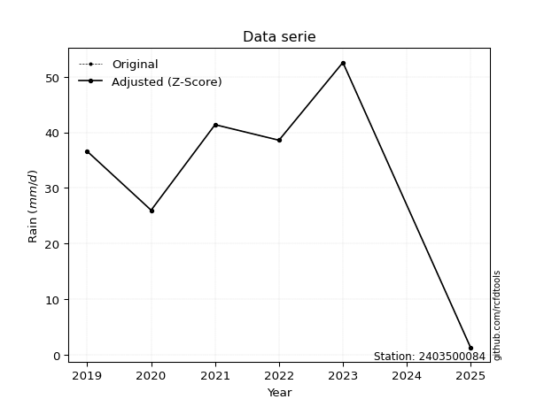</img>

</div>


> The initial value (value_initial) correspond to the initial obtained or null completed value, and value (value) is adjusted only when the initial value is outside the valid range (outlier) definite through the Z-Score value. If Z-Score is active, values out of range or outliers are replaced with the station mean value. A Z-Score (or standard score) measures how many standard deviations a data point is from the mean of a dataset, indicating its relative position; positive scores mean above the mean, negative mean below, and a score of zero is exactly at the mean, allowing for comparison of values from different distributions. It´s calculated using the formula $z=(x–μ)/σ$, where $x$ is the data point, $μ$ is the mean, and $σ$ is the standard deviation, helping identify outliers and understand probability.
>
> <sub>**Note**: In this study, "completing" (filling gaps in) and "extending" (forecasting or lengthening the historical record) rainfall data series are avoided for certain critical analyses because they introduce artificial bias and uncertainty, which can distort the statistics of rare events (extremes), alter day-to-day variability, and compromise the integrity and homogeneity of the original data. Some reasons against Completing/Extending rainfall data are: **Distortion of Extremes and Variability**: The primary issue is that most gap-filling or extension methods rely on averaging or regression with nearby stations, which inherently smooths the data. Rainfall is highly variable in space and time, with a large percentage of zero values and occasional large storms. Infilling methods often underestimate the highest values and overestimate the lowest (zero) values, which severely distorts analyses focused on flood frequency, drought severity, and intensity-duration-frequency (IDF) curves, **Loss of Data Homogeneity**: Infilled or extended data are synthetic estimates, not actual measurements. Combining these estimates with observed data can violate the assumption of data homogeneity, which requires that the data properties do not change over time. Inhomogeneity can lead to incorrect conclusions about long-term trends or changes in climate patterns, **Propagation of Errors**: Errors and biases from the original data (e.g., wind-induced undercatch, instrument errors, site changes) or the data used for imputation can propagate through the analysis, leading to unreliable hydrological models and inaccurate predictions, **Compromised Statistical Integrity**: For statistical analyses, especially those involving the frequency of events, using artificial data can introduce time bias or autocorrelation that doesn´t exist in reality, making it difficult to assess the true probability of events, **Difficulty in Validation**: It is difficult to accurately validate the quality of filled or extended data, especially for past periods where ground-truth measurements are unavailable. The reliability of imputation techniques heavily depends on the density of the surrounding station network and the complexity of the local topography.</sub>


### 4. Active continuous probability distributions from SciPy (44 of 104 available)

A Probability Density Function (PDF) describes the relative likelihood of a continuous random variable falling within a specific range, where the total area under its curve equals 1, and the area over any interval gives the actual probability for that range. Unlike discrete probabilities (like rolling a die), a PDF shows density, not direct probability for a single point (which is zero), with higher points indicating higher likelihood, often visualized as a bell curve for normal distributions.

A log of a probability density function (log-PDF) is simply the logarithm of the PDF´s value, denoted as $log(f(x))$, useful for converting multiplication of probabilities into addition, improving numerical stability with tiny numbers, and connecting to information theory concepts like entropy. Instead of dealing with very small probabilities (e.g., 0.000001), log-PDFs use negative numbers (e.g., $log(0.00001) ≈ -11.51$ that are easier for computers to handle, preventing underflow errors and simplifying complex calculations. In this study, each active probability distribution from SciPy is also evaluated in the $log$ form.

[scipy.stats](https://docs.scipy.org/doc/scipy/reference/stats.html) is a Python´s powerful submodule within the SciPy library for comprehensive statistical analysis, offering over 130 probability distributions (like Normal, Poisson), functions for descriptive stats (mean, variance), hypothesis testing (t-tests, chi-square), random variable generation, and statistical tests, making it essential for data science, modeling, and research. It provides tools to explore, model, and draw conclusions from data efficiently, working seamlessly with NumPy.

<div align="center">

|   id | p_dist             |   n_parameter | fit_method   | label                                                                       | active   | ref                                                                                                        |
|-----:|:-------------------|--------------:|:-------------|:----------------------------------------------------------------------------|:---------|:-----------------------------------------------------------------------------------------------------------|
|    0 | alpha              |             3 | MLE          | Alpha                                                                       | True     | [:mortar_board:](https://docs.scipy.org/doc/scipy/reference/generated/scipy.stats.alpha.html)              |
|    1 | betaprime          |             4 | MLE          | Beta prime                                                                  | True     | [:mortar_board:](https://docs.scipy.org/doc/scipy/reference/generated/scipy.stats.betaprime.html)          |
|    2 | chi2               |             3 | MLE          | Chi²                                                                        | True     | [:mortar_board:](https://docs.scipy.org/doc/scipy/reference/generated/scipy.stats.chi2.html)               |
|    3 | crystalball        |             4 | MLE          | Crystalball                                                                 | True     | [:mortar_board:](https://docs.scipy.org/doc/scipy/reference/generated/scipy.stats.crystalball.html)        |
|    4 | erlang             |             3 | MLE          | Erlang                                                                      | True     | [:mortar_board:](https://docs.scipy.org/doc/scipy/reference/generated/scipy.stats.erlang.html)             |
|    5 | expon              |             2 | MLE          | Exponential                                                                 | True     | [:mortar_board:](https://docs.scipy.org/doc/scipy/reference/generated/scipy.stats.expon.html)              |
|    6 | exponnorm          |             3 | MLE          | Exponentially modified Normal                                               | True     | [:mortar_board:](https://docs.scipy.org/doc/scipy/reference/generated/scipy.stats.exponnorm.html)          |
|    7 | f                  |             4 | MLE          | F                                                                           | True     | [:mortar_board:](https://docs.scipy.org/doc/scipy/reference/generated/scipy.stats.f.html)                  |
|    8 | fatiguelife        |             3 | MLE          | Fatigue-life (Birnbaum-Saunders)                                            | True     | [:mortar_board:](https://docs.scipy.org/doc/scipy/reference/generated/scipy.stats.fatiguelife.html)        |
|    9 | fisk               |             3 | MLE          | Fisk                                                                        | True     | [:mortar_board:](https://docs.scipy.org/doc/scipy/reference/generated/scipy.stats.fisk.html)               |
|   10 | gamma              |             3 | MLE          | Gamma                                                                       | True     | [:mortar_board:](https://docs.scipy.org/doc/scipy/reference/generated/scipy.stats.gamma.html)              |
|   11 | genexpon           |             5 | MLE          | Generalized exponential                                                     | True     | [:mortar_board:](https://docs.scipy.org/doc/scipy/reference/generated/scipy.stats.genexpon.html)           |
|   12 | genlogistic        |             3 | MLE          | Generalized logistic                                                        | True     | [:mortar_board:](https://docs.scipy.org/doc/scipy/reference/generated/scipy.stats.genlogistic.html)        |
|   13 | gibrat             |             2 | MM           | Gibrat                                                                      | True     | [:mortar_board:](https://docs.scipy.org/doc/scipy/reference/generated/scipy.stats.gibrat.html)             |
|   14 | gompertz           |             3 | MLE          | Gompertz (or truncated Gumbel)                                              | True     | [:mortar_board:](https://docs.scipy.org/doc/scipy/reference/generated/scipy.stats.gompertz.html)           |
|   15 | gumbel_l           |             2 | MM           | Gumbel Left Skew                                                            | True     | [:mortar_board:](https://docs.scipy.org/doc/scipy/reference/generated/scipy.stats.gumbel_l.html)           |
|   16 | gumbel_r           |             2 | MM           | Gumbel Right Skew                                                           | True     | [:mortar_board:](https://docs.scipy.org/doc/scipy/reference/generated/scipy.stats.gumbel_r.html)           |
|   17 | halflogistic       |             2 | MM           | Half-logistic                                                               | True     | [:mortar_board:](https://docs.scipy.org/doc/scipy/reference/generated/scipy.stats.halflogistic.html)       |
|   18 | halfnorm           |             2 | MM           | Half Normal                                                                 | True     | [:mortar_board:](https://docs.scipy.org/doc/scipy/reference/generated/scipy.stats.halfnorm.html)           |
|   19 | hypsecant          |             2 | MM           | hyperbolic secant                                                           | True     | [:mortar_board:](https://docs.scipy.org/doc/scipy/reference/generated/scipy.stats.hypsecant.html)          |
|   20 | invgamma           |             3 | MLE          | Inverted gamma                                                              | True     | [:mortar_board:](https://docs.scipy.org/doc/scipy/reference/generated/scipy.stats.invgamma.html)           |
|   21 | invgauss           |             3 | MLE          | Inverse Gaussian                                                            | True     | [:mortar_board:](https://docs.scipy.org/doc/scipy/reference/generated/scipy.stats.invgauss.html)           |
|   22 | invweibull         |             3 | MLE          | Inverted Weibull                                                            | True     | [:mortar_board:](https://docs.scipy.org/doc/scipy/reference/generated/scipy.stats.invweibull.html)         |
|   23 | johnsonsu          |             4 | MLE          | Johnson Su                                                                  | True     | [:mortar_board:](https://docs.scipy.org/doc/scipy/reference/generated/scipy.stats.johnsonsu.html)          |
|   24 | kstwobign          |             2 | MLE          | Limiting distribution of scaled Kolmogorov-Smirnov two-sided test statistic | True     | [:mortar_board:](https://docs.scipy.org/doc/scipy/reference/generated/scipy.stats.kstwobign.html)          |
|   25 | laplace            |             2 | MM           | Laplace                                                                     | True     | [:mortar_board:](https://docs.scipy.org/doc/scipy/reference/generated/scipy.stats.laplace.html)            |
|   26 | laplace_asymmetric |             3 | MLE          | Asymmetric Laplace                                                          | True     | [:mortar_board:](https://docs.scipy.org/doc/scipy/reference/generated/scipy.stats.laplace_asymmetric.html) |
|   27 | loggamma           |             3 | MLE          | Log gamma                                                                   | True     | [:mortar_board:](https://docs.scipy.org/doc/scipy/reference/generated/scipy.stats.loggamma.html)           |
|   28 | logistic           |             2 | MM           | Logistic (or Sech-squared)                                                  | True     | [:mortar_board:](https://docs.scipy.org/doc/scipy/reference/generated/scipy.stats.logistic.html)           |
|   29 | lognorm            |             3 | MLE          | Log Normal                                                                  | True     | [:mortar_board:](https://docs.scipy.org/doc/scipy/reference/generated/scipy.stats.lognorm.html)            |
|   30 | maxwell            |             2 | MM           | Maxwell                                                                     | True     | [:mortar_board:](https://docs.scipy.org/doc/scipy/reference/generated/scipy.stats.maxwell.html)            |
|   31 | mielke             |             4 | MLE          | Mielke Beta-Kappa / Dagum                                                   | True     | [:mortar_board:](https://docs.scipy.org/doc/scipy/reference/generated/scipy.stats.mielke.html)             |
|   32 | moyal              |             2 | MM           | Moyal                                                                       | True     | [:mortar_board:](https://docs.scipy.org/doc/scipy/reference/generated/scipy.stats.moyal.html)              |
|   33 | nakagami           |             3 | MLE          | Nakagami                                                                    | True     | [:mortar_board:](https://docs.scipy.org/doc/scipy/reference/generated/scipy.stats.nakagami.html)           |
|   34 | ncf                |             5 | MLE          | Non-central F distribution                                                  | True     | [:mortar_board:](https://docs.scipy.org/doc/scipy/reference/generated/scipy.stats.ncf.html)                |
|   35 | nct                |             4 | MLE          | Non-central Student’s t                                                     | True     | [:mortar_board:](https://docs.scipy.org/doc/scipy/reference/generated/scipy.stats.nct.html)                |
|   36 | norm               |             2 | MM           | Normal                                                                      | True     | [:mortar_board:](https://docs.scipy.org/doc/scipy/reference/generated/scipy.stats.norm.html)               |
|   37 | pearson3           |             3 | MM           | Pearson type III                                                            | True     | [:mortar_board:](https://docs.scipy.org/doc/scipy/reference/generated/scipy.stats.pearson3.html)           |
|   38 | rayleigh           |             2 | MM           | Rayleigh                                                                    | True     | [:mortar_board:](https://docs.scipy.org/doc/scipy/reference/generated/scipy.stats.rayleigh.html)           |
|   39 | rice               |             3 | MLE          | Rice                                                                        | True     | [:mortar_board:](https://docs.scipy.org/doc/scipy/reference/generated/scipy.stats.rice.html)               |
|   40 | t                  |             3 | MLE          | Student’s t                                                                 | True     | [:mortar_board:](https://docs.scipy.org/doc/scipy/reference/generated/scipy.stats.t.html)                  |
|   41 | truncnorm          |             4 | MLE          | Truncated normal                                                            | True     | [:mortar_board:](https://docs.scipy.org/doc/scipy/reference/generated/scipy.stats.truncnorm.html)          |
|   42 | wald               |             2 | MM           | Wald                                                                        | True     | [:mortar_board:](https://docs.scipy.org/doc/scipy/reference/generated/scipy.stats.wald.html)               |
|   43 | weibull_min        |             3 | MLE          | Weibull minimum                                                             | True     | [:mortar_board:](https://docs.scipy.org/doc/scipy/reference/generated/scipy.stats.weibull_min.html)        |

</div>

> **n_parameter:** # arguments & localization & scale.
>
> **Fit methods:** (MLE) maximum likelihood, (MM) L-moments.
>
>**Inactive** (With the only purpose of prevent loops, zero divisions, infinite values, over high estimated values or horizontal trending for recurrence intervals estimations, the follow distributions were disabled.)**:** foldnorm, gennorm, norminvgauss, powernorm, powerlognorm, skewnorm, genextreme, anglit, arcsine, argus, beta, bradford, burr, burr12, cauchy, cosine, halfcauchy, foldcauchy, skewcauchy, wrapcauchy, dgamma, gengamma, exponweib, exponpow, truncexpon, gausshyper, genhalflogistic, genhyperbolic, geninvgauss, halfgennorm, johnsonsb, kappa4, kappa3, ksone, kstwo, loglaplace, levy, levy_l, levy_stable, ncx2, pareto, genpareto, truncpareto, lomax, powerlaw, rdist, rel_breitwigner, recipinvgauss, semicircular, studentized_range, trapezoid, triang, truncweibull_min, tukeylambda, uniform, loguniform, vonmises, vonmises_line, weibull_max, dweibull, 


## B. Probability (PDF) vs. Empirical (EDF) distributions functions

A continuous probability distribution (CPD) describes probabilities for variables that can take any value within a range (like rain any time), unlike discrete variables with specific outcomes (like temperature). It uses a Probability Density Function (PDF), a curve where the total area under it equals 1, and the probability of the variable falling within an interval (a to b) is found by calculating the area under the curve between those points. A key feature is that the probability of hitting any single exact value is zero, so probabilities are always expressed for ranges, e.g., $P(a ≤ X ≤ b)$.

<div align="center">

Distributions parameters from station values
|    |    station | p_dist                |   n |             loc |          scale | shape                 | shape1                 | shape2                | shape3   |
|---:|-----------:|:----------------------|----:|----------------:|---------------:|:----------------------|:-----------------------|:----------------------|:---------|
|  0 | 2403500084 | alpha                 |   5 |   -91.1491      | 1970.99        | 15.206615301814985    |                        |                       |          |
|  1 | 2403500084 | betaprime             |   5 |    -1.93319     |  179.01        | 27.79561503698322     | 122.43713095791573     |                       |          |
|  2 | 2403500084 | chi2                  |   5 |    26           |    5.44759     | 1.769277815811047     |                        |                       |          |
|  3 | 2403500084 | crystalball           |   5 |    39.04        |    8.5514      | 3569.906050684962     | 2239.2186087531804     |                       |          |
|  4 | 2403500084 | erlang                |   5 |  -115.11        |    0.474655    | 324.74550869740324    |                        |                       |          |
|  5 | 2403500084 | expon                 |   5 |    26           |   13.04        |                       |                        |                       |          |
|  6 | 2403500084 | exponnorm             |   5 |    37.9561      |    8.48245     | 0.12777842420274999   |                        |                       |          |
|  7 | 2403500084 | f                     |   5 |   -63.5287      |  102.554       | 292.9443923265514     | 14341.420253558714     |                       |          |
|  8 | 2403500084 | fatiguelife           |   5 |    26           |    1.57404e-05 | 844.7594091252569     |                        |                       |          |
|  9 | 2403500084 | fisk                  |   5 |  -127.369       |  166.208       | 33.985884549581044    |                        |                       |          |
| 10 | 2403500084 | gamma                 |   5 |  -117.86        |    0.465465    | 337.0557200115909     |                        |                       |          |
| 11 | 2403500084 | genexpon              |   5 |    26           |    1.97776     | 0.1515808805318382    | 1.2123595102719123e-06 | 1.2128834609150068    |          |
| 12 | 2403500084 | genlogistic           |   5 |    37.0619      |    5.30446     | 1.2766645120575308    |                        |                       |          |
| 13 | 2403500084 | gibrat                |   5 |    32.5163      |    3.9568      |                       |                        |                       |          |
| 14 | 2403500084 | gompertz              |   5 |    26           |   15.3319      | 0.6459560872452798    |                        |                       |          |
| 15 | 2403500084 | gumbel_l              |   5 |    42.8886      |    6.6675      |                       |                        |                       |          |
| 16 | 2403500084 | gumbel_r              |   5 |    35.1914      |    6.6675      |                       |                        |                       |          |
| 17 | 2403500084 | halflogistic          |   5 |    28.9046      |    7.31114     |                       |                        |                       |          |
| 18 | 2403500084 | halfnorm              |   5 |    27.7214      |   14.1858      |                       |                        |                       |          |
| 19 | 2403500084 | hypsecant             |   5 |    39.04        |    5.44399     |                       |                        |                       |          |
| 20 | 2403500084 | invgamma              |   5 |   -44.2447      | 7681.08        | 93.3334061664712      |                        |                       |          |
| 21 | 2403500084 | invgauss              |   5 |    -5.62894     | 1088.98        | 0.041032238879478336  |                        |                       |          |
| 22 | 2403500084 | invweibull            |   5 |    26           |    1.56588     | 0.07957235308526582   |                        |                       |          |
| 23 | 2403500084 | johnsonsu             |   5 |     2.9851e+06  |    1.38033e+08 | 349114.85360294505    | 16144775.415860925     |                       |          |
| 24 | 2403500084 | kstwobign             |   5 |     7.0109      |   36.6562      |                       |                        |                       |          |
| 25 | 2403500084 | laplace               |   5 |    39.04        |    6.04675     |                       |                        |                       |          |
| 26 | 2403500084 | laplace_asymmetric    |   5 |    38.6         |    6.26845     | 0.9655276978639801    |                        |                       |          |
| 27 | 2403500084 | loggamma              |   5 | -1951.01        |  284.464       | 1092.488657147912     |                        |                       |          |
| 28 | 2403500084 | logistic              |   5 |    39.04        |    4.71463     |                       |                        |                       |          |
| 29 | 2403500084 | lognorm               |   5 |    26           |    0.0114216   | 14.402730102534514    |                        |                       |          |
| 30 | 2403500084 | maxwell               |   5 |    18.7768      |   12.6981      |                       |                        |                       |          |
| 31 | 2403500084 | mielke                |   5 |    -0.108332    |   42.286       | 5.796959075599894     | 9.826609233212888      |                       |          |
| 32 | 2403500084 | moyal                 |   5 |    34.1498      |    3.84948     |                       |                        |                       |          |
| 33 | 2403500084 | nakagami              |   5 |    36.6         |    7.66615     | 0.04850553856498483   |                        |                       |          |
| 34 | 2403500084 | ncf                   |   5 |     0.00489984  |    6.58268e-05 | 6.394043503095278e-06 | 2.7208913635323273     | 2.6175905615794415    |          |
| 35 | 2403500084 | nct                   |   5 |    -0.177785    |    8.41279     | 388.09185584757415    | 4.652585613809994      |                       |          |
| 36 | 2403500084 | norm                  |   5 |    39.04        |    8.5514      |                       |                        |                       |          |
| 37 | 2403500084 | pearson3              |   5 |    39.04        |    8.55139     | 0.08779475537256351   |                        |                       |          |
| 38 | 2403500084 | rayleigh              |   5 |    22.6807      |   13.0529      |                       |                        |                       |          |
| 39 | 2403500084 | rice                  |   5 |    21.2293      |    9.95747     | 1.3917264883546967    |                        |                       |          |
| 40 | 2403500084 | t                     |   5 |    39.0404      |    8.55136     | 26352086.926053256    |                        |                       |          |
| 41 | 2403500084 | truncnorm             |   5 |     5.11488     |   14.6807      | 2.144664566288534     | 185.54528850862647     |                       |          |
| 42 | 2403500084 | wald                  |   5 |    30.4886      |    8.55141     |                       |                        |                       |          |
| 43 | 2403500084 | weibull_min           |   5 |    19.7853      |   21.7202      | 2.4252132628761007    |                        |                       |          |
| 44 | 2403500084 | logalpha              |   5 |    -3.69032     |  230.555       | 31.484997982884337    |                        |                       |          |
| 45 | 2403500084 | logbetaprime          |   5 |    -2.06082     |   48.5053      | 695.6013686985466     | 5922.066226132769      |                       |          |
| 46 | 2403500084 | logchi2               |   5 |     3.2581      |    0.966176    | 1.0456155819164583    |                        |                       |          |
| 47 | 2403500084 | logcrystalball        |   5 |     3.63948     |    0.227466    | 14.545078430792467    | 107.75177615048497     |                       |          |
| 48 | 2403500084 | logerlang             |   5 |    -0.50269     |    0.0126944   | 326.18240061947733    |                        |                       |          |
| 49 | 2403500084 | logexpon              |   5 |     3.2581      |    0.381382    |                       |                        |                       |          |
| 50 | 2403500084 | logexponnorm          |   5 |     3.6393      |    0.227465    | 0.0008055644711609758 |                        |                       |          |
| 51 | 2403500084 | logf                  |   5 |  -264.579       |  268.218       | 9315761.57732532      | 3943558.3485186826     |                       |          |
| 52 | 2403500084 | logfatiguelife        |   5 |   -44.4206      |   48.0603      | 0.0047070475751386995 |                        |                       |          |
| 53 | 2403500084 | logfisk               |   5 |    -1.5927e+06  |    1.5927e+06  | 12313366.005382348    |                        |                       |          |
| 54 | 2403500084 | loggamma              |   5 |     0.110286    |    0.0152277   | 231.8144658232991     |                        |                       |          |
| 55 | 2403500084 | loggenexpon           |   5 |     3.24563     |    0.00669964  | 0.00717232031875608   | 4.351781734029236      | 5.761520177008996e-05 |          |
| 56 | 2403500084 | loggenlogistic        |   5 |     3.74213     |    0.101976    | 0.5889197911234181    |                        |                       |          |
| 57 | 2403500084 | loggibrat             |   5 |     3.46599     |    0.105227    |                       |                        |                       |          |
| 58 | 2403500084 | loggompertz           |   5 |     3.2581      |    0.740931    | 1.3542251156133958    |                        |                       |          |
| 59 | 2403500084 | loggumbel_l           |   5 |     3.74185     |    0.177354    |                       |                        |                       |          |
| 60 | 2403500084 | loggumbel_r           |   5 |     3.53711     |    0.177354    |                       |                        |                       |          |
| 61 | 2403500084 | loghalflogistic       |   5 |     3.36986     |    0.194488    |                       |                        |                       |          |
| 62 | 2403500084 | loghalfnorm           |   5 |     3.33846     |    0.377276    |                       |                        |                       |          |
| 63 | 2403500084 | loghypsecant          |   5 |     3.63948     |    0.144809    |                       |                        |                       |          |
| 64 | 2403500084 | loginvgamma           |   5 |    -0.902096    | 1722.29        | 380.3614462379236     |                        |                       |          |
| 65 | 2403500084 | loginvgauss           |   5 |     1.6439      |  142.094       | 0.014026340134525174  |                        |                       |          |
| 66 | 2403500084 | loginvweibull         |   5 |    -1.97284e+07 |    1.97284e+07 | 86156049.75852817     |                        |                       |          |
| 67 | 2403500084 | logjohnsonsu          |   5 |     4.68386     |    0.28893     | 9.421309620784523     | 4.767998899621903      |                       |          |
| 68 | 2403500084 | logkstwobign          |   5 |     2.71869     |    1.05173     |                       |                        |                       |          |
| 69 | 2403500084 | loglaplace            |   5 |     3.63948     |    0.160842    |                       |                        |                       |          |
| 70 | 2403500084 | loglaplace_asymmetric |   5 |     3.65325     |    0.165155    | 1.0426343765802746    |                        |                       |          |
| 71 | 2403500084 | logloggamma           |   5 |     3.22967     |    0.389581    | 3.3488060760106624    |                        |                       |          |
| 72 | 2403500084 | loglogistic           |   5 |     3.63948     |    0.125408    |                       |                        |                       |          |
| 73 | 2403500084 | loglognorm            |   5 |     3.2581      |    0.000455781 | 13.830622960530034    |                        |                       |          |
| 74 | 2403500084 | logmaxwell            |   5 |     3.10048     |    0.337766    |                       |                        |                       |          |
| 75 | 2403500084 | logmielke             |   5 |     3.2581      |    0.567787    | 0.8903200948442531    | 7.0885179826945794     |                       |          |
| 76 | 2403500084 | logmoyal              |   5 |     3.5094      |    0.102395    |                       |                        |                       |          |
| 77 | 2403500084 | lognakagami           |   5 |     3.60005     |    0.17825     | 0.284940503693243     |                        |                       |          |
| 78 | 2403500084 | logncf                |   5 |    -3.70499     |    7.34093     | 654.1298403825771     | 995.8197444519358      | 0.017024637657215257  |          |
| 79 | 2403500084 | lognct                |   5 |    -0.600483    |    0.0716752   | 188.52690824071806    | 58.933523583093034     |                       |          |
| 80 | 2403500084 | lognorm               |   5 |     3.63948     |    0.227465    |                       |                        |                       |          |
| 81 | 2403500084 | logpearson3           |   5 |     3.63948     |    0.227465    | -0.3597551809711159   |                        |                       |          |
| 82 | 2403500084 | lograyleigh           |   5 |     3.20432     |    0.347203    |                       |                        |                       |          |
| 83 | 2403500084 | logrice               |   5 |     3.11245     |    0.252286    | 1.7823873784061097    |                        |                       |          |
| 84 | 2403500084 | logt                  |   5 |     3.63948     |    0.227465    | 18910880982.093098    |                        |                       |          |
| 85 | 2403500084 | logtruncnorm          |   5 |    -0.0496341   |    0.970384    | 3.7609437249313977    | 4.134805788539806      |                       |          |
| 86 | 2403500084 | logwald               |   5 |     3.412       |    0.22748     |                       |                        |                       |          |
| 87 | 2403500084 | logweibull_min        |   5 |     2.52787     |    1.20251     | 5.793562295565097     |                        |                       |          |

</div>

> **loc** (Location parameter): This shifts the distribution along the x-axis. For many common distributions, like the normal (Gaussian) distribution, loc represents the mean $μ$. For others, like the uniform distribution, it might represent the minimum value, or for the beta distribution, the left end of the support interval.
>
> **scale** (Scale parameter): This determines the width or spread of the distribution. For the normal distribution, scale represents the standard deviation $σ$. For a uniform distribution, it defines the length of the interval (from $loc$ to $loc + scale$).
>
> **shape** (Shape parameters): Refers to parameters that define the specific form of a probability distribution, distinct from its location (loc) and scale (scale). These parameters are required arguments for most distribution functions. For example, a normal (Gaussian) distribution is fully defined by its location (mean) and scale (standard deviation), so it has no specific shape parameters beyond loc and scale. However, other distributions have intrinsic properties that need specification, as Gamma distribution that takes a shape parameter, often named $a$ or $alpha$.


### 0. Cumulative distribution values - CDF (88 evaluated)

Cumulative Distribution Function (CDF), denoted as $F$<sub>$X$</sub>$(x)$, is a function that gives the probability that a random variable $X$ will take a value less than or equal to a specific value, $x$ (i.e., $(P(X≥x)$. It essentially "accumulates" probabilities from a given point up to the far right (positive infinity), providing a complete picture of the distribution´s probabilities for both discrete (like rain) and continuous (like temperature) variables, helping to find probabilities over ranges or above certain values. Each station is evaluated separately ordering the $x$ values ascending, calculating the CDF and PDF values for the activated distributions and their logarithmic forms.

<div align="center">

CDF ordered by x ascending and calculating $log(f(x))$ separately
|   id |    Station |   date |    x |   count |   mean |     std |     zscore |   Value_initial |    station |   m |     alpha |   alpha_pdf |   betaprime |   betaprime_pdf |        chi2 |   chi2_pdf |   crystalball |   crystalball_pdf |    erlang |   erlang_pdf |    expon |   expon_pdf |   exponnorm |   exponnorm_pdf |         f |     f_pdf |   fatiguelife |   fatiguelife_pdf |      fisk |   fisk_pdf |     gamma |   gamma_pdf |   genexpon |   genexpon_pdf |   genlogistic |   genlogistic_pdf |   gibrat |   gibrat_pdf |    gompertz |   gompertz_pdf |   gumbel_l |   gumbel_l_pdf |   gumbel_r |   gumbel_r_pdf |   halflogistic |   halflogistic_pdf |   halfnorm |   halfnorm_pdf |   hypsecant |   hypsecant_pdf |   invgamma |   invgamma_pdf |   invgauss |   invgauss_pdf |   invweibull |   invweibull_pdf |   johnsonsu |   johnsonsu_pdf |   kstwobign |   kstwobign_pdf |   laplace |   laplace_pdf |   laplace_asymmetric |   laplace_asymmetric_pdf |   loggamma |   loggamma_pdf |   logistic |   logistic_pdf |   lognorm |   lognorm_pdf |   maxwell |   maxwell_pdf |    mielke |   mielke_pdf |      moyal |   moyal_pdf |   nakagami |   nakagami_pdf |      ncf |    ncf_pdf |       nct |   nct_pdf |      norm |   norm_pdf |   pearson3 |   pearson3_pdf |   rayleigh |   rayleigh_pdf |     rice |   rice_pdf |         t |     t_pdf |   truncnorm |   truncnorm_pdf |     wald |   wald_pdf |   weibull_min |   weibull_min_pdf |   logalpha |   logalpha_pdf |   logbetaprime |   logbetaprime_pdf |    logchi2 |   logchi2_pdf |   logcrystalball |   logcrystalball_pdf |   logerlang |   logerlang_pdf |   logexpon |   logexpon_pdf |   logexponnorm |   logexponnorm_pdf |      logf |   logf_pdf |   logfatiguelife |   logfatiguelife_pdf |   logfisk |   logfisk_pdf |   loggenexpon |   loggenexpon_pdf |   loggenlogistic |   loggenlogistic_pdf |   loggibrat |   loggibrat_pdf |   loggompertz |   loggompertz_pdf |   loggumbel_l |   loggumbel_l_pdf |   loggumbel_r |   loggumbel_r_pdf |   loghalflogistic |   loghalflogistic_pdf |   loghalfnorm |   loghalfnorm_pdf |   loghypsecant |   loghypsecant_pdf |   loginvgamma |   loginvgamma_pdf |   loginvgauss |   loginvgauss_pdf |   loginvweibull |   loginvweibull_pdf |   logjohnsonsu |   logjohnsonsu_pdf |   logkstwobign |   logkstwobign_pdf |   loglaplace |   loglaplace_pdf |   loglaplace_asymmetric |   loglaplace_asymmetric_pdf |   logloggamma |   logloggamma_pdf |   loglogistic |   loglogistic_pdf |   loglognorm |   loglognorm_pdf |   logmaxwell |   logmaxwell_pdf |   logmielke |   logmielke_pdf |    logmoyal |   logmoyal_pdf |   lognakagami |   lognakagami_pdf |   logncf |   logncf_pdf |   lognct |   lognct_pdf |   logpearson3 |   logpearson3_pdf |   lograyleigh |   lograyleigh_pdf |   logrice |   logrice_pdf |      logt |   logt_pdf |   logtruncnorm |   logtruncnorm_pdf |   logwald |   logwald_pdf |   logweibull_min |   logweibull_min_pdf |
|-----:|-----------:|-------:|-----:|--------:|-------:|--------:|-----------:|----------------:|-----------:|----:|----------:|------------:|------------:|----------------:|------------:|-----------:|--------------:|------------------:|----------:|-------------:|---------:|------------:|------------:|----------------:|----------:|----------:|--------------:|------------------:|----------:|-----------:|----------:|------------:|-----------:|---------------:|--------------:|------------------:|---------:|-------------:|------------:|---------------:|-----------:|---------------:|-----------:|---------------:|---------------:|-------------------:|-----------:|---------------:|------------:|----------------:|-----------:|---------------:|-----------:|---------------:|-------------:|-----------------:|------------:|----------------:|------------:|----------------:|----------:|--------------:|---------------------:|-------------------------:|-----------:|---------------:|-----------:|---------------:|----------:|--------------:|----------:|--------------:|----------:|-------------:|-----------:|------------:|-----------:|---------------:|---------:|-----------:|----------:|----------:|----------:|-----------:|-----------:|---------------:|-----------:|---------------:|---------:|-----------:|----------:|----------:|------------:|----------------:|---------:|-----------:|--------------:|------------------:|-----------:|---------------:|---------------:|-------------------:|-----------:|--------------:|-----------------:|---------------------:|------------:|----------------:|-----------:|---------------:|---------------:|-------------------:|----------:|-----------:|-----------------:|---------------------:|----------:|--------------:|--------------:|------------------:|-----------------:|---------------------:|------------:|----------------:|--------------:|------------------:|--------------:|------------------:|--------------:|------------------:|------------------:|----------------------:|--------------:|------------------:|---------------:|-------------------:|--------------:|------------------:|--------------:|------------------:|----------------:|--------------------:|---------------:|-------------------:|---------------:|-------------------:|-------------:|-----------------:|------------------------:|----------------------------:|--------------:|------------------:|--------------:|------------------:|-------------:|-----------------:|-------------:|-----------------:|------------:|----------------:|------------:|---------------:|--------------:|------------------:|---------:|-------------:|---------:|-------------:|--------------:|------------------:|--------------:|------------------:|----------:|--------------:|----------:|-----------:|---------------:|-------------------:|----------:|--------------:|-----------------:|---------------------:|
|    0 | 2403500084 |   2020 | 26   |       5 |  39.04 | 9.56075 | -1.36391   |            26   | 2403500084 |   1 | 0.0528256 |   0.0154741 |   0.0478255 |       0.0155947 | 3.84999e-14 | 4.79331    |     0.0636424 |         0.0145861 | 0.0605622 |    0.0148816 | 0        |  0.0766871  |   0.0635263 |       0.0145917 | 0.0587094 | 0.0150078 |     0.0424698 |       1.04841e+10 | 0.0611026 |  0.0127127 | 0.0605045 |   0.0148682 | 1.0104e-06 |     0.0766425  |     0.0600919 |         0.0128643 | 0        |   0          | 6.85002e-12 |      0.0421316 |  0.0763505 |     0.0110024  |  0.0188903 |      0.0112453 |       0        |         0          |   0        |      0         |   0.0578649 |       0.0105707 |  0.0542096 |      0.0159513 |  0.0523114 |      0.0170281 |  9.70117e-07 |      1.50423e+08 |   0.0636492 |       0.0145868 |   0.0487733 |       0.0210474 |  0.057863 |    0.00956927 |            0.0601644 |               0.00994065 |  0.0455185 |       0.445482 |  0.0591973 |      0.0118128 | 0.0468043 |      0.430082 | 0.0444661 |     0.017295  | 0.0607833 |    0.0133789 | 0.00394911 |  0.00469219 |  0         |    0           | 0.574133 | 0.00757486 | 0.0625903 | 0.014624  | 0.0636424 |  0.0145861 |  0.0611005 |      0.0147989 |  0.0318168 |      0.0188624 | 0.043454 |  0.0181485 | 0.0636365 | 0.0145851 |  0          |      0          | 0        | 0          |     0.0469493 |         0.0178845 |  0.0449457 |       0.452199 |       0.04562  |           0.441439 | 7.5162e-09 |   8.84851e+06 |        0.0468039 |             0.430079 |   0.0453219 |        0.443439 |   0        |       2.62204  |       0.046804 |           0.43008  | 0.0470531 |   0.431821 |        0.0452046 |             0.4239   | 0.0454084 |      0.335117 |      0.013681 |          1.12457  |         0.060785 |             0.348015 |    0        |        0        |   1.02187e-09 |          1.82773  |     0.0632837 |          0.345285 |    0.00805074 |          0.218888 |          0        |              0        |      0        |          0        |       0.045639 |           0.314089 |     0.0452242 |          0.458976 |     0.0420214 |          0.472627 |       0.0422313 |            0.58364  |      0.0614314 |           0.397699 |      0.0448955 |           0.697484 |    0.0466863 |         0.290261 |               0.0524934 |                    0.304846 |     0.0601895 |          0.395873 |      0.045602 |          0.347047 |    0.0227667 |       8.7958e+12 |     0.025326 |         0.461318 | 6.95187e-06 |        6.77283  | 0.000646308 |      0.0394896 |   0           |       0           | 0.230782 |     0.611329 | 0.040844 |     0.439322 |      0.055769 |          0.415183 |      0.011921 |          0.440738 | 0.0355644 |      0.507491 | 0.0468039 |   0.43008  |    0           |            0       |  0        |       0       |         0.054064 |             0.417131 |
|    1 | 2403500084 |   2019 | 36.6 |       5 |  39.04 | 9.56075 | -0.25521   |            36.6 | 2403500084 |   2 | 0.412148  |   0.0470084 |   0.417971  |       0.0475896 | 0.672684    | 0.0321848  |     0.387694  |         0.0447913 | 0.394634  |    0.04548   | 0.556423 |  0.0340167  |   0.387908  |       0.0448223 | 0.397849  | 0.0458002 |     0.834333  |       0.0114043   | 0.386782  |  0.0491606 | 0.394599  |   0.0455127 | 0.556216   |     0.034013   |     0.38996   |         0.0489692 | 0.512588 |   0.0976437  | 0.474635    |      0.0441903 |  0.322531  |     0.0395652  |  0.445053  |      0.054038  |       0.482531 |         0.0524654  |   0.468607 |      0.0462406 |   0.361883  |       0.0530516 |  0.418002  |      0.0469272 |  0.428613  |      0.0461435 |  0.423654    |      0.00273136  |   0.387699  |       0.0447899 |   0.467535  |       0.044034  |  0.333982 |    0.0552332  |            0.346701  |               0.0572836  |  0.439455  |       1.7137   |  0.373428  |      0.0496284 | 0.431189  |      1.72771  | 0.421371  |     0.0462262 | 0.38628   |    0.048837  | 0.466971   |  0.0578617  |  0.0308479 |    4.21169e+11 | 0.643464 | 0.00563441 | 0.389607  | 0.0450828 | 0.387694  |  0.0447913 |  0.392855  |      0.0453367 |  0.433674  |      0.0462673 | 0.410369 |  0.0452832 | 0.387678  | 0.0447909 |  3.5813e-09 |      0.170425   | 0.524997 | 0.0729422  |     0.415791  |         0.0452903 |  0.444476  |       1.71377  |       0.440483 |           1.73563  | 0.429526   |   0.583845    |        0.431187  |             1.7277   |   0.441337  |        1.73168  |   0.59205  |       1.06966  |       0.431187 |           1.7277   | 0.431629  |   1.72516  |        0.430538  |             1.73813  | 0.400852  |      1.85678  |      0.518038 |          1.46868  |         0.386306 |             1.78724  |    0.595674 |        2.88988  |   0.548068    |          1.31045  |     0.362075  |          1.61693  |    0.495964   |          1.96103  |          0.531174 |              1.84549  |      0.511921 |          1.66297  |       0.414378 |           2.11909  |     0.448673  |          1.71701  |     0.460524  |          1.71666  |       0.491233  |            1.52493  |      0.393697  |           1.63527  |      0.51629   |           1.47239  |    0.391293  |         2.43278  |               0.382418  |                    2.22083  |     0.395256  |          1.65015  |      0.422037 |          1.94502  |    0.683916  |       0.0752226  |     0.465591 |         1.73086  | 0.634535    |        1.60792  | 0.520654    |      2.0361    |   3.69967e-09 |       4.74763e+06 | 0.474368 |     0.765208 | 0.446301 |     1.74018  |      0.408491 |          1.67146  |      0.4777   |          1.71453  | 0.446319  |      1.70266  | 0.431188  |   1.72771  |    0.000635724 |            5.21221 |  0.588922 |       2.29128 |         0.402172 |             1.66188  |
|    2 | 2403500084 |   2022 | 38.6 |       5 |  39.04 | 9.56075 | -0.0460215 |            38.6 | 2403500084 |   3 | 0.506303  |   0.0467017 |   0.512695  |       0.0466951 | 0.73091     | 0.0262585  |     0.479482  |         0.0465906 | 0.487236  |    0.0466996 | 0.619496 |  0.0291798  |   0.479741  |       0.0466035 | 0.490793  | 0.0467157 |     0.855226  |       0.00956917  | 0.487795  |  0.0511625 | 0.487277  |   0.0467418 | 0.619285   |     0.0291792  |     0.490076  |         0.0504843 | 0.666465 |   0.0597809  | 0.561043    |      0.0420668 |  0.408802  |     0.0466046  |  0.548943  |      0.049379  |       0.580393 |         0.0453516  |   0.55684  |      0.0419165 |   0.474301  |       0.0582795 |  0.511749  |      0.046386  |  0.519834  |      0.0447    |  0.428653    |      0.00229317  |   0.479484  |       0.046589  |   0.552379  |       0.0406123 |  0.464909 |    0.0768858  |            0.482467  |               0.0797155  |  0.530964  |       1.71112  |  0.476685  |      0.0529111 | 0.524142  |      1.75065  | 0.513232  |     0.0452758 | 0.487186  |    0.0513988 | 0.574796   |  0.0496742  |  0.777884  |    0.0376131   | 0.654441 | 0.00534585 | 0.481823  | 0.0467182 | 0.479482  |  0.0465906 |  0.485299  |      0.0466885 |  0.524657  |      0.0444141 | 0.501224 |  0.0452298 | 0.479465  | 0.0465907 |  0.294725   |      0.12607    | 0.646757 | 0.0504287  |     0.506339  |         0.0449189 |  0.535653  |       1.69876  |       0.533284 |           1.73708  | 0.459112   |   0.530116    |        0.524139  |             1.75065  |   0.533825  |        1.72942  |   0.645169 |       0.930381 |       0.52414  |           1.75065  | 0.524428  |   1.74727  |        0.524019  |             1.7598   | 0.502352  |      1.93274  |      0.593389 |          1.35951  |         0.487201 |             1.98379  |    0.717827 |        1.80432  |   0.614869    |          1.19989  |     0.454908  |          1.86498  |    0.594814   |          1.74233  |          0.622183 |              1.57564  |      0.595938 |          1.49314  |       0.53023  |           2.18823  |     0.539861  |          1.69594  |     0.550874  |          1.66568  |       0.569236  |            1.40071  |      0.484767  |           1.77586  |      0.591336  |           1.34453  |    0.541035  |         2.85351  |               0.520863  |                    3.02482  |     0.486992  |          1.78525  |      0.52743  |          1.98749  |    0.687626  |       0.064766   |     0.55607  |         1.65805  | 0.717504    |        1.50159  | 0.620335    |      1.70717   |   0.387958    |       4.07412     | 0.515006 |     0.76109  | 0.538612 |     1.71448  |      0.500285 |          1.76514  |      0.566517 |          1.61429  | 0.536926  |      1.68964  | 0.524141  |   1.75065  |    0.251103    |            4.2346  |  0.691201 |       1.60294 |         0.493933 |             1.77442  |
|    3 | 2403500084 |   2021 | 41.4 |       5 |  39.04 | 9.56075 |  0.246842  |            41.4 | 2403500084 |   4 | 0.631826  |   0.0422888 |   0.637249  |       0.0416629 | 0.795008    | 0.0198429  |     0.608718  |         0.0449091 | 0.615606  |    0.0442127 | 0.693023 |  0.0235412  |   0.608971  |       0.0448923 | 0.618626  | 0.0438336 |     0.87918   |       0.00764135  | 0.627089  |  0.0470911 | 0.61577   |   0.0442562 | 0.692815   |     0.0235436  |     0.62703   |         0.0462133 | 0.790679 |   0.03238    | 0.672987    |      0.0376182 |  0.550629  |     0.0539115  |  0.674292  |      0.039855  |       0.693436 |         0.0355038  |   0.665078 |      0.0353337 |   0.63386   |       0.0533756 |  0.636084  |      0.0417876 |  0.638451  |      0.039538  |  0.434444    |      0.00187145  |   0.608715  |       0.0449076 |   0.657749  |       0.0344999 |  0.66157  |    0.0559688  |            0.663772  |               0.0517891  |  0.646914  |       1.57786  |  0.622593  |      0.0498387 | 0.643719  |      1.63878  | 0.634459  |     0.0407914 | 0.628039  |    0.0478436 | 0.696568   |  0.0374546  |  0.846225  |    0.0167953   | 0.668881 | 0.00497473 | 0.611032  | 0.0447639 | 0.608718  |  0.0449091 |  0.613897  |      0.044378  |  0.642402  |      0.0392893 | 0.624028 |  0.0419012 | 0.608702  | 0.0449098 |  0.579419   |      0.0801277  | 0.758765 | 0.0314156  |     0.627776  |         0.041274  |  0.65027   |       1.55333  |       0.651044 |           1.60222  | 0.494159   |   0.472955    |        0.643716  |             1.63878  |   0.650942  |        1.59208  |   0.704691 |       0.774313 |       0.643717 |           1.63878  | 0.643748  |   1.63515  |        0.644118  |             1.64428  | 0.634323  |      1.79329  |      0.68263  |          1.18481  |         0.628042 |             1.98062  |    0.814365 |        1.03967  |   0.693639    |          1.04909  |     0.593671  |          2.06331  |    0.704665   |          1.39075  |          0.720456 |              1.23643  |      0.692274 |          1.25707  |       0.674712 |           1.87526  |     0.654038  |          1.54405  |     0.661901  |          1.48754  |       0.660342  |            1.19676  |      0.611795  |           1.82135  |      0.678836  |           1.15199  |    0.703043  |         1.84626  |               0.692064  |                    1.94402  |     0.614242  |          1.8174   |      0.661108 |          1.78652  |    0.69179   |       0.0546958  |     0.666018 |         1.46728  | 0.814796    |        1.25412  | 0.724908    |      1.28874   |   0.611341    |       2.54104     | 0.567781 |     0.744014 | 0.653779 |     1.55355  |      0.624205 |          1.74485  |      0.67275  |          1.40878  | 0.651237  |      1.55447  | 0.643718  |   1.63879  |    0.510109    |            3.20691 |  0.782102 |       1.04259 |         0.619495 |             1.78189  |
|    4 | 2403500084 |   2023 | 52.6 |       5 |  39.04 | 9.56075 |  1.4183    |            52.6 | 2403500084 |   5 | 0.932577  |   0.0124419 |   0.931048  |       0.0122619 | 0.929904    | 0.00666465 |     0.943597  |         0.0132698 | 0.940662  |    0.0130525 | 0.869955 |  0.00997275 |   0.94349   |       0.0132578 | 0.938929  | 0.0129679 |     0.938081  |       0.00353162  | 0.937231  |  0.0111095 | 0.940936  |   0.0130295 | 0.869803   |     0.00997869 |     0.9357    |         0.0114237 | 0.947862 |   0.00530928 | 0.95099     |      0.011705  |  0.986309  |     0.00881094 |  0.92917   |      0.0102378 |       0.924697 |         0.00991202 |   0.92053  |      0.0120838 |   0.947381  |       0.0096215 |  0.932677  |      0.0123164 |  0.921863  |      0.012546  |  0.450135    |      0.00107483  |   0.943591  |       0.0132705 |   0.909327  |       0.0123022 |  0.946905 |    0.00878074 |            0.940101  |               0.00922621 |  0.914992  |       0.633276 |  0.946655  |      0.0107112 | 0.922348  |      0.638995 | 0.93107   |     0.0128379 | 0.937925  |    0.0106187 | 0.927461   |  0.00939593 |  0.943075  |    0.0046723   | 0.717602 | 0.00379832 | 0.942661  | 0.0131597 | 0.943597  |  0.0132698 |  0.941196  |      0.0131116 |  0.927706  |      0.0126953 | 0.935424 |  0.0132703 | 0.943593  | 0.0132706 |  0.9619     |      0.00908828 | 0.933114 | 0.00689986 |     0.934142  |         0.0132404 |  0.91293   |       0.623678 |       0.920662 |           0.620902 | 0.590315   |   0.342732    |        0.922346  |             0.639001 |   0.919129  |        0.621723 |   0.842376 |       0.413297 |       0.922347 |           0.638999 | 0.921947  |   0.639447 |        0.922696  |             0.636044 | 0.916973  |      0.588598 |      0.889297 |          0.560582 |         0.937921 |             0.558516 |    0.93966  |        0.240879 |   0.883619    |          0.550563 |     0.969011  |          0.607036 |    0.913256   |          0.467245 |          0.909417 |              0.444655 |      0.902004 |          0.537976 |       0.931954 |           0.466334 |     0.91394   |          0.614811 |     0.909981  |          0.594081 |       0.86428   |            0.550527 |      0.942324  |           0.7088   |      0.878192  |           0.547601 |    0.932983  |         0.416666 |               0.932081  |                    0.428779 |     0.940486  |          0.698834 |      0.929398 |          0.523229 |    0.702274  |       0.0355547  |     0.910988 |         0.591957 | 0.975693    |        0.219345 | 0.912956    |      0.423349  |   0.938762    |       0.562675    | 0.731429 |     0.605808 | 0.913541 |     0.610988 |      0.933552 |          0.691431 |      0.907963 |          0.579017 | 0.916463  |      0.630711 | 0.922348  |   0.638996 |    1           |            1.19186 |  0.922533 |       0.30682 |         0.938124 |             0.695214 |


</div>

An Empirical Distribution Function (EDF) is a step-function estimate of a true cumulative distribution function (CDF) based on observed sample data, representing the proportion of data points less than or equal to a given value. It is calculated by ordering your data and jumping up by $1/n$ (where $n$ is sample size) at each unique data point, allowing analysis without assuming an underlying population distribution, and it gets closer to the true CDF as the sample size grows. For the empirical probability calculations, the parameter $m$ correspond to the order number which means the position of the $x$ values in an ascending order list.

The Kolmogorov-Smirnov (K-S) test is a non-parametric statistical test used to determine if a sample data set comes from a specific theoretical distribution (one-sample) or if two different samples come from the same underlying distribution (two-sample), by comparing their cumulative distribution functions (CDFs). It calculates the maximum vertical difference (D statistic) between these functions, with a small p-value indicating a significant difference and rejection of the null hypothesis (that the data/samples match).


### 1. EDF California (1923)

California´s estimates the true probability distribution of water-related data (like rainfall, streamflow) using observed samples, crucial for risk assessment.

<div align="center">


$P=m/n$


</div>


**1.1. Empirical values**

<div align="center">

|                | 0              | 1                  | 2              | 3                 | 4              |
|:---------------|:---------------|:-------------------|:---------------|:------------------|:---------------|
| date           | 2020           | 2019               | 2022           | 2021              | 2023           |
| x              | 26.0           | 36.6               | 38.6           | 41.4              | 52.6           |
| m              | 1              | 2                  | 3              | 4                 | 5              |
| empirical_dist | edf_california | edf_california     | edf_california | edf_california    | edf_california |
| empirical      | 0.2            | 0.4                | 0.6            | 0.8               | 1.0            |
| empirical_tr   | 1.25           | 1.6666666666666667 | 2.5            | 5.000000000000001 | inf            |

</div>


**1.2. Kolmogorov-Smirnov fit test (sorted by Δ)**


<div align="center">

|                | 0                   | 1                   | 2                     | 3                   | 4                  | 5                   | 6                   | 7                   | 8                  | 9                  | 10                  | 11                  | 12                 | 13                  | 14                 | 15                 | 16                  | 17                  | 18                  | 19                  | 20                  | 21                  | 22                  | 23                  | 24                  | 25                  | 26                  | 27                  | 28                  | 29                  | 30                  | 31                  | 32                 | 33                  | 34                 | 35                  | 36                  | 37                  | 38                  | 39                 | 40                  | 41                  | 42                  | 43                  | 44                  | 45                  | 46                  | 47                  | 48                  | 49                 | 50                  | 51                 | 52                  | 53                  | 54                  | 55                  | 56                  | 57                  | 58                  | 59                  | 60                  | 61                  | 62                  | 63                 | 64                 | 65                 | 66                 | 67                 | 68                 | 69                 | 70                 | 71                 | 72                 | 73                 | 74                 | 75                 | 76                  | 77                 | 78                  | 79                 | 80                  | 81                  | 82                  | 83                  | 84                 | 85                 | 86                 | 87                 |
|:---------------|:--------------------|:--------------------|:----------------------|:--------------------|:-------------------|:--------------------|:--------------------|:--------------------|:-------------------|:-------------------|:--------------------|:--------------------|:-------------------|:--------------------|:-------------------|:-------------------|:--------------------|:--------------------|:--------------------|:--------------------|:--------------------|:--------------------|:--------------------|:--------------------|:--------------------|:--------------------|:--------------------|:--------------------|:--------------------|:--------------------|:--------------------|:--------------------|:-------------------|:--------------------|:-------------------|:--------------------|:--------------------|:--------------------|:--------------------|:-------------------|:--------------------|:--------------------|:--------------------|:--------------------|:--------------------|:--------------------|:--------------------|:--------------------|:--------------------|:-------------------|:--------------------|:-------------------|:--------------------|:--------------------|:--------------------|:--------------------|:--------------------|:--------------------|:--------------------|:--------------------|:--------------------|:--------------------|:--------------------|:-------------------|:-------------------|:-------------------|:-------------------|:-------------------|:-------------------|:-------------------|:-------------------|:-------------------|:-------------------|:-------------------|:-------------------|:-------------------|:--------------------|:-------------------|:--------------------|:-------------------|:--------------------|:--------------------|:--------------------|:--------------------|:-------------------|:-------------------|:-------------------|:-------------------|
| station        | 2403500084          | 2403500084          | 2403500084            | 2403500084          | 2403500084         | 2403500084          | 2403500084          | 2403500084          | 2403500084         | 2403500084         | 2403500084          | 2403500084          | 2403500084         | 2403500084          | 2403500084         | 2403500084         | 2403500084          | 2403500084          | 2403500084          | 2403500084          | 2403500084          | 2403500084          | 2403500084          | 2403500084          | 2403500084          | 2403500084          | 2403500084          | 2403500084          | 2403500084          | 2403500084          | 2403500084          | 2403500084          | 2403500084         | 2403500084          | 2403500084         | 2403500084          | 2403500084          | 2403500084          | 2403500084          | 2403500084         | 2403500084          | 2403500084          | 2403500084          | 2403500084          | 2403500084          | 2403500084          | 2403500084          | 2403500084          | 2403500084          | 2403500084         | 2403500084          | 2403500084         | 2403500084          | 2403500084          | 2403500084          | 2403500084          | 2403500084          | 2403500084          | 2403500084          | 2403500084          | 2403500084          | 2403500084          | 2403500084          | 2403500084         | 2403500084         | 2403500084         | 2403500084         | 2403500084         | 2403500084         | 2403500084         | 2403500084         | 2403500084         | 2403500084         | 2403500084         | 2403500084         | 2403500084         | 2403500084          | 2403500084         | 2403500084          | 2403500084         | 2403500084          | 2403500084          | 2403500084          | 2403500084          | 2403500084         | 2403500084         | 2403500084         | 2403500084         |
| empirical_dist | edf_california      | edf_california      | edf_california        | edf_california      | edf_california     | edf_california      | edf_california      | edf_california      | edf_california     | edf_california     | edf_california      | edf_california      | edf_california     | edf_california      | edf_california     | edf_california     | edf_california      | edf_california      | edf_california      | edf_california      | edf_california      | edf_california      | edf_california      | edf_california      | edf_california      | edf_california      | edf_california      | edf_california      | edf_california      | edf_california      | edf_california      | edf_california      | edf_california     | edf_california      | edf_california     | edf_california      | edf_california      | edf_california      | edf_california      | edf_california     | edf_california      | edf_california      | edf_california      | edf_california      | edf_california      | edf_california      | edf_california      | edf_california      | edf_california      | edf_california     | edf_california      | edf_california     | edf_california      | edf_california      | edf_california      | edf_california      | edf_california      | edf_california      | edf_california      | edf_california      | edf_california      | edf_california      | edf_california      | edf_california     | edf_california     | edf_california     | edf_california     | edf_california     | edf_california     | edf_california     | edf_california     | edf_california     | edf_california     | edf_california     | edf_california     | edf_california     | edf_california      | edf_california     | edf_california      | edf_california     | edf_california      | edf_california      | edf_california      | edf_california      | edf_california     | edf_california     | edf_california     | edf_california     |
| p_dist         | laplace_asymmetric  | laplace             | loglaplace_asymmetric | kstwobign           | loglaplace         | loghypsecant        | logbetaprime        | loglogistic         | loggamma           | loggamma           | logerlang           | loginvgamma         | logalpha           | logkstwobign        | logfatiguelife     | logf               | lognorm             | lognorm             | logt                | logexponnorm        | logcrystalball      | loginvweibull       | loginvgauss         | lognct              | invgauss            | betaprime           | invgamma            | logrice             | maxwell             | logfisk             | hypsecant           | alpha               | rayleigh           | loggenlogistic      | mielke             | weibull_min         | fisk                | genlogistic         | logmaxwell          | logpearson3        | rice                | logistic            | logweibull_min      | gumbel_r            | f                   | gamma               | erlang              | logloggamma         | pearson3            | loggenexpon        | lograyleigh         | logjohnsonsu       | nct                 | exponnorm           | norm                | crystalball         | johnsonsu           | t                   | loggumbel_r         | moyal               | logmoyal            | genexpon            | loggompertz         | gompertz           | expon              | halflogistic       | logwald            | gibrat             | logexpon           | loghalfnorm        | loggibrat          | loghalflogistic    | halfnorm           | wald               | loggumbel_l        | logmielke          | gumbel_l            | logncf             | chi2                | loglognorm         | nakagami            | ncf                 | logtruncnorm        | lognakagami         | truncnorm          | logchi2            | fatiguelife        | invweibull         |
| delta          | 0.13983557116677578 | 0.14213699947098637 | 0.14750661542283963   | 0.15122672383021346 | 0.1533137473727868 | 0.15436099897332406 | 0.15438001853601196 | 0.15439798012730122 | 0.1544814780636138 | 0.1544814780636138 | 0.15467814011927278 | 0.15477579001922365 | 0.1550542649105604 | 0.15510450012004998 | 0.1558819987721194 | 0.1562515955977677 | 0.15628111711750625 | 0.15628111711750625 | 0.15628166039353797 | 0.15628287082647074 | 0.15628362983673993 | 0.15776874169922636 | 0.15797855330382707 | 0.15915599404980102 | 0.16154933989242937 | 0.16275060305138545 | 0.16391562138659366 | 0.16443559070573863 | 0.16554129477180723 | 0.16567663972655755 | 0.16614025533163268 | 0.16817406799963486 | 0.1681832436279057 | 0.17195776199012358 | 0.171961485752801  | 0.17222446506630518 | 0.17291057335353366 | 0.17297001778141508 | 0.17467398489154454 | 0.1757950836697354 | 0.17597212628013847 | 0.17740690657084046 | 0.18050473457771543 | 0.18110966947792667 | 0.18137438764331537 | 0.18422974280389537 | 0.18439401121617105 | 0.18575843861647723 | 0.18610332739947733 | 0.1863190123149858 | 0.18807899253533142 | 0.1882046748746038 | 0.18896765201533117 | 0.19102904793369802 | 0.19128237373453272 | 0.19128237503861545 | 0.19128531737873966 | 0.19129797066507914 | 0.19194926479371657 | 0.19605088634819265 | 0.19935369173240003 | 0.19999898959817045 | 0.19999999897812834 | 0.19999999999315   | 0.2                | 0.2                | 0.2                | 0.2                | 0.2                | 0.2                | 0.2                | 0.2                | 0.2                | 0.2                | 0.2063288209473475 | 0.234535247181066  | 0.24937073879553562 | 0.2685706446154992 | 0.27268423546847564 | 0.2977259442829453 | 0.36915210095868867 | 0.37413279530078053 | 0.39936427557772747 | 0.39999999630032756 | 0.399999996418703  | 0.4096852173929364 | 0.4343326323243205 | 0.5498651906508661 |
| deltao         | 0.5865427407550001  | 0.5865427407550001  | 0.5865427407550001    | 0.5865427407550001  | 0.5865427407550001 | 0.5865427407550001  | 0.5865427407550001  | 0.5865427407550001  | 0.5865427407550001 | 0.5865427407550001 | 0.5865427407550001  | 0.5865427407550001  | 0.5865427407550001 | 0.5865427407550001  | 0.5865427407550001 | 0.5865427407550001 | 0.5865427407550001  | 0.5865427407550001  | 0.5865427407550001  | 0.5865427407550001  | 0.5865427407550001  | 0.5865427407550001  | 0.5865427407550001  | 0.5865427407550001  | 0.5865427407550001  | 0.5865427407550001  | 0.5865427407550001  | 0.5865427407550001  | 0.5865427407550001  | 0.5865427407550001  | 0.5865427407550001  | 0.5865427407550001  | 0.5865427407550001 | 0.5865427407550001  | 0.5865427407550001 | 0.5865427407550001  | 0.5865427407550001  | 0.5865427407550001  | 0.5865427407550001  | 0.5865427407550001 | 0.5865427407550001  | 0.5865427407550001  | 0.5865427407550001  | 0.5865427407550001  | 0.5865427407550001  | 0.5865427407550001  | 0.5865427407550001  | 0.5865427407550001  | 0.5865427407550001  | 0.5865427407550001 | 0.5865427407550001  | 0.5865427407550001 | 0.5865427407550001  | 0.5865427407550001  | 0.5865427407550001  | 0.5865427407550001  | 0.5865427407550001  | 0.5865427407550001  | 0.5865427407550001  | 0.5865427407550001  | 0.5865427407550001  | 0.5865427407550001  | 0.5865427407550001  | 0.5865427407550001 | 0.5865427407550001 | 0.5865427407550001 | 0.5865427407550001 | 0.5865427407550001 | 0.5865427407550001 | 0.5865427407550001 | 0.5865427407550001 | 0.5865427407550001 | 0.5865427407550001 | 0.5865427407550001 | 0.5865427407550001 | 0.5865427407550001 | 0.5865427407550001  | 0.5865427407550001 | 0.5865427407550001  | 0.5865427407550001 | 0.5865427407550001  | 0.5865427407550001  | 0.5865427407550001  | 0.5865427407550001  | 0.5865427407550001 | 0.5865427407550001 | 0.5865427407550001 | 0.5865427407550001 |
| eval           | Δo > Δ              | Δo > Δ              | Δo > Δ                | Δo > Δ              | Δo > Δ             | Δo > Δ              | Δo > Δ              | Δo > Δ              | Δo > Δ             | Δo > Δ             | Δo > Δ              | Δo > Δ              | Δo > Δ             | Δo > Δ              | Δo > Δ             | Δo > Δ             | Δo > Δ              | Δo > Δ              | Δo > Δ              | Δo > Δ              | Δo > Δ              | Δo > Δ              | Δo > Δ              | Δo > Δ              | Δo > Δ              | Δo > Δ              | Δo > Δ              | Δo > Δ              | Δo > Δ              | Δo > Δ              | Δo > Δ              | Δo > Δ              | Δo > Δ             | Δo > Δ              | Δo > Δ             | Δo > Δ              | Δo > Δ              | Δo > Δ              | Δo > Δ              | Δo > Δ             | Δo > Δ              | Δo > Δ              | Δo > Δ              | Δo > Δ              | Δo > Δ              | Δo > Δ              | Δo > Δ              | Δo > Δ              | Δo > Δ              | Δo > Δ             | Δo > Δ              | Δo > Δ             | Δo > Δ              | Δo > Δ              | Δo > Δ              | Δo > Δ              | Δo > Δ              | Δo > Δ              | Δo > Δ              | Δo > Δ              | Δo > Δ              | Δo > Δ              | Δo > Δ              | Δo > Δ             | Δo > Δ             | Δo > Δ             | Δo > Δ             | Δo > Δ             | Δo > Δ             | Δo > Δ             | Δo > Δ             | Δo > Δ             | Δo > Δ             | Δo > Δ             | Δo > Δ             | Δo > Δ             | Δo > Δ              | Δo > Δ             | Δo > Δ              | Δo > Δ             | Δo > Δ              | Δo > Δ              | Δo > Δ              | Δo > Δ              | Δo > Δ             | Δo > Δ             | Δo > Δ             | Δo > Δ             |
| fit            | 1                   | 1                   | 1                     | 1                   | 1                  | 1                   | 1                   | 1                   | 1                  | 1                  | 1                   | 1                   | 1                  | 1                   | 1                  | 1                  | 1                   | 1                   | 1                   | 1                   | 1                   | 1                   | 1                   | 1                   | 1                   | 1                   | 1                   | 1                   | 1                   | 1                   | 1                   | 1                   | 1                  | 1                   | 1                  | 1                   | 1                   | 1                   | 1                   | 1                  | 1                   | 1                   | 1                   | 1                   | 1                   | 1                   | 1                   | 1                   | 1                   | 1                  | 1                   | 1                  | 1                   | 1                   | 1                   | 1                   | 1                   | 1                   | 1                   | 1                   | 1                   | 1                   | 1                   | 1                  | 1                  | 1                  | 1                  | 1                  | 1                  | 1                  | 1                  | 1                  | 1                  | 1                  | 1                  | 1                  | 1                   | 1                  | 1                   | 1                  | 1                   | 1                   | 1                   | 1                   | 1                  | 1                  | 1                  | 1                  |
| n              | 5                   | 5                   | 5                     | 5                   | 5                  | 5                   | 5                   | 5                   | 5                  | 5                  | 5                   | 5                   | 5                  | 5                   | 5                  | 5                  | 5                   | 5                   | 5                   | 5                   | 5                   | 5                   | 5                   | 5                   | 5                   | 5                   | 5                   | 5                   | 5                   | 5                   | 5                   | 5                   | 5                  | 5                   | 5                  | 5                   | 5                   | 5                   | 5                   | 5                  | 5                   | 5                   | 5                   | 5                   | 5                   | 5                   | 5                   | 5                   | 5                   | 5                  | 5                   | 5                  | 5                   | 5                   | 5                   | 5                   | 5                   | 5                   | 5                   | 5                   | 5                   | 5                   | 5                   | 5                  | 5                  | 5                  | 5                  | 5                  | 5                  | 5                  | 5                  | 5                  | 5                  | 5                  | 5                  | 5                  | 5                   | 5                  | 5                   | 5                  | 5                   | 5                   | 5                   | 5                   | 5                  | 5                  | 5                  | 5                  |
| best_fit       | 1                   | 0                   | 0                     | 0                   | 0                  | 0                   | 0                   | 0                   | 0                  | 0                  | 0                   | 0                   | 0                  | 0                   | 0                  | 0                  | 0                   | 0                   | 0                   | 0                   | 0                   | 0                   | 0                   | 0                   | 0                   | 0                   | 0                   | 0                   | 0                   | 0                   | 0                   | 0                   | 0                  | 0                   | 0                  | 0                   | 0                   | 0                   | 0                   | 0                  | 0                   | 0                   | 0                   | 0                   | 0                   | 0                   | 0                   | 0                   | 0                   | 0                  | 0                   | 0                  | 0                   | 0                   | 0                   | 0                   | 0                   | 0                   | 0                   | 0                   | 0                   | 0                   | 0                   | 0                  | 0                  | 0                  | 0                  | 0                  | 0                  | 0                  | 0                  | 0                  | 0                  | 0                  | 0                  | 0                  | 0                   | 0                  | 0                   | 0                  | 0                   | 0                   | 0                   | 0                   | 0                  | 0                  | 0                  | 0                  |
| best_fit_sort  | 1                   | 2                   | 3                     | 4                   | 5                  | 6                   | 7                   | 8                   | 9                  | 10                 | 11                  | 12                  | 13                 | 14                  | 15                 | 16                 | 17                  | 18                  | 19                  | 20                  | 21                  | 22                  | 23                  | 24                  | 25                  | 26                  | 27                  | 28                  | 29                  | 30                  | 31                  | 32                  | 33                 | 34                  | 35                 | 36                  | 37                  | 38                  | 39                  | 40                 | 41                  | 42                  | 43                  | 44                  | 45                  | 46                  | 47                  | 48                  | 49                  | 50                 | 51                  | 52                 | 53                  | 54                  | 55                  | 56                  | 57                  | 58                  | 59                  | 60                  | 61                  | 62                  | 63                  | 64                 | 65                 | 66                 | 67                 | 68                 | 69                 | 70                 | 71                 | 72                 | 73                 | 74                 | 75                 | 76                 | 77                  | 78                 | 79                  | 80                 | 81                  | 82                  | 83                  | 84                  | 85                 | 86                 | 87                 | 88                 |

</div>


**1.3. Best fit**

<div align="center">

|   id |    station | empirical_dist   | p_dist             |    delta |   deltao | eval   |   fit |   n |   best_fit |   best_fit_sort |
|-----:|-----------:|:-----------------|:-------------------|---------:|---------:|:-------|------:|----:|-----------:|----------------:|
|    0 | 2403500084 | edf_california   | laplace_asymmetric | 0.139836 | 0.586543 | Δo > Δ |     1 |   5 |          1 |               1 |

</div>


<div align="center">

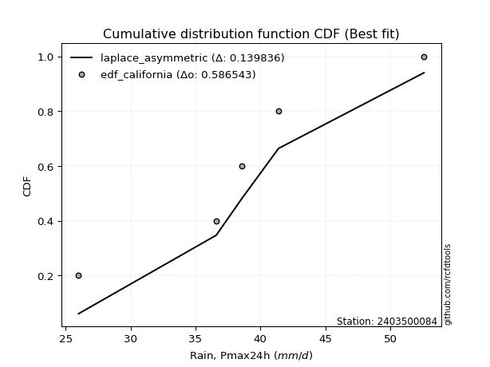</img>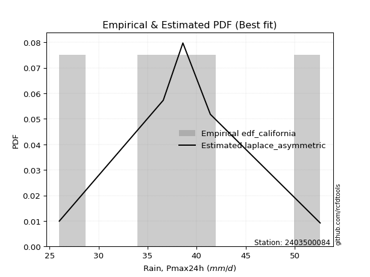</img>

</div>


### 2. EDF Hazen (1930)

Hazen method for plotting positions is a formula used to estimate the empirical cumulative probability distribution of flood events or other hydrological data. This formula often results in biased estimations, particularly when extrapolating to extreme events (high return periods).

<div align="center">


$P=(m-0.5)/n$


</div>


**2.1. Empirical values**

<div align="center">

|                | 0                  | 1                  | 2         | 3                 | 4                  |
|:---------------|:-------------------|:-------------------|:----------|:------------------|:-------------------|
| date           | 2020               | 2019               | 2022      | 2021              | 2023               |
| x              | 26.0               | 36.6               | 38.6      | 41.4              | 52.6               |
| m              | 1                  | 2                  | 3         | 4                 | 5                  |
| empirical_dist | edf_hazen          | edf_hazen          | edf_hazen | edf_hazen         | edf_hazen          |
| empirical      | 0.1                | 0.3                | 0.5       | 0.7               | 0.9                |
| empirical_tr   | 1.1111111111111112 | 1.4285714285714286 | 2.0       | 3.333333333333333 | 10.000000000000002 |

</div>


**2.2. Kolmogorov-Smirnov fit test (sorted by Δ)**


<div align="center">

|                | 0                   | 1                   | 2                   | 3                   | 4                     | 5                   | 6                   | 7                   | 8                  | 9                   | 10                  | 11                  | 12                  | 13                  | 14                  | 15                  | 16                  | 17                  | 18                  | 19                  | 20                  | 21                  | 22                  | 23                  | 24                  | 25                  | 26                  | 27                  | 28                  | 29                  | 30                  | 31                 | 32                  | 33                  | 34                  | 35                 | 36                  | 37                  | 38                  | 39                  | 40                  | 41                  | 42                  | 43                  | 44                  | 45                 | 46                  | 47                  | 48                  | 49                  | 50                 | 51                 | 52                  | 53                  | 54                  | 55                  | 56                  | 57                  | 58                  | 59                  | 60                  | 61                  | 62                  | 63                 | 64                 | 65                 | 66                 | 67                  | 68                  | 69                  | 70                  | 71                  | 72                  | 73                  | 74                 | 75                 | 76                  | 77                 | 78                  | 79                  | 80                  | 81                 | 82                  | 83                 | 84                 | 85                  | 86                  | 87                 |
|:---------------|:--------------------|:--------------------|:--------------------|:--------------------|:----------------------|:--------------------|:--------------------|:--------------------|:-------------------|:--------------------|:--------------------|:--------------------|:--------------------|:--------------------|:--------------------|:--------------------|:--------------------|:--------------------|:--------------------|:--------------------|:--------------------|:--------------------|:--------------------|:--------------------|:--------------------|:--------------------|:--------------------|:--------------------|:--------------------|:--------------------|:--------------------|:-------------------|:--------------------|:--------------------|:--------------------|:-------------------|:--------------------|:--------------------|:--------------------|:--------------------|:--------------------|:--------------------|:--------------------|:--------------------|:--------------------|:-------------------|:--------------------|:--------------------|:--------------------|:--------------------|:-------------------|:-------------------|:--------------------|:--------------------|:--------------------|:--------------------|:--------------------|:--------------------|:--------------------|:--------------------|:--------------------|:--------------------|:--------------------|:-------------------|:-------------------|:-------------------|:-------------------|:--------------------|:--------------------|:--------------------|:--------------------|:--------------------|:--------------------|:--------------------|:-------------------|:-------------------|:--------------------|:-------------------|:--------------------|:--------------------|:--------------------|:-------------------|:--------------------|:-------------------|:-------------------|:--------------------|:--------------------|:-------------------|
| station        | 2403500084          | 2403500084          | 2403500084          | 2403500084          | 2403500084            | 2403500084          | 2403500084          | 2403500084          | 2403500084         | 2403500084          | 2403500084          | 2403500084          | 2403500084          | 2403500084          | 2403500084          | 2403500084          | 2403500084          | 2403500084          | 2403500084          | 2403500084          | 2403500084          | 2403500084          | 2403500084          | 2403500084          | 2403500084          | 2403500084          | 2403500084          | 2403500084          | 2403500084          | 2403500084          | 2403500084          | 2403500084         | 2403500084          | 2403500084          | 2403500084          | 2403500084         | 2403500084          | 2403500084          | 2403500084          | 2403500084          | 2403500084          | 2403500084          | 2403500084          | 2403500084          | 2403500084          | 2403500084         | 2403500084          | 2403500084          | 2403500084          | 2403500084          | 2403500084         | 2403500084         | 2403500084          | 2403500084          | 2403500084          | 2403500084          | 2403500084          | 2403500084          | 2403500084          | 2403500084          | 2403500084          | 2403500084          | 2403500084          | 2403500084         | 2403500084         | 2403500084         | 2403500084         | 2403500084          | 2403500084          | 2403500084          | 2403500084          | 2403500084          | 2403500084          | 2403500084          | 2403500084         | 2403500084         | 2403500084          | 2403500084         | 2403500084          | 2403500084          | 2403500084          | 2403500084         | 2403500084          | 2403500084         | 2403500084         | 2403500084          | 2403500084          | 2403500084         |
| empirical_dist | edf_hazen           | edf_hazen           | edf_hazen           | edf_hazen           | edf_hazen             | edf_hazen           | edf_hazen           | edf_hazen           | edf_hazen          | edf_hazen           | edf_hazen           | edf_hazen           | edf_hazen           | edf_hazen           | edf_hazen           | edf_hazen           | edf_hazen           | edf_hazen           | edf_hazen           | edf_hazen           | edf_hazen           | edf_hazen           | edf_hazen           | edf_hazen           | edf_hazen           | edf_hazen           | edf_hazen           | edf_hazen           | edf_hazen           | edf_hazen           | edf_hazen           | edf_hazen          | edf_hazen           | edf_hazen           | edf_hazen           | edf_hazen          | edf_hazen           | edf_hazen           | edf_hazen           | edf_hazen           | edf_hazen           | edf_hazen           | edf_hazen           | edf_hazen           | edf_hazen           | edf_hazen          | edf_hazen           | edf_hazen           | edf_hazen           | edf_hazen           | edf_hazen          | edf_hazen          | edf_hazen           | edf_hazen           | edf_hazen           | edf_hazen           | edf_hazen           | edf_hazen           | edf_hazen           | edf_hazen           | edf_hazen           | edf_hazen           | edf_hazen           | edf_hazen          | edf_hazen          | edf_hazen          | edf_hazen          | edf_hazen           | edf_hazen           | edf_hazen           | edf_hazen           | edf_hazen           | edf_hazen           | edf_hazen           | edf_hazen          | edf_hazen          | edf_hazen           | edf_hazen          | edf_hazen           | edf_hazen           | edf_hazen           | edf_hazen          | edf_hazen           | edf_hazen          | edf_hazen          | edf_hazen           | edf_hazen           | edf_hazen          |
| p_dist         | laplace_asymmetric  | laplace             | hypsecant           | logistic            | loglaplace_asymmetric | mielke              | loggenlogistic      | fisk                | nct                | genlogistic         | exponnorm           | norm                | crystalball         | johnsonsu           | loglaplace          | t                   | pearson3            | logjohnsonsu        | gamma               | erlang              | logloggamma         | f                   | logfisk             | logweibull_min      | loggumbel_l         | logpearson3         | rice                | alpha               | loghypsecant        | weibull_min         | betaprime           | invgamma           | maxwell             | loglogistic         | invgauss            | logfatiguelife     | logcrystalball      | logexponnorm        | logt                | lognorm             | lognorm             | logf                | rayleigh            | loggamma            | loggamma            | logbetaprime       | logerlang           | logalpha            | gumbel_r            | lognct              | logrice            | loginvgamma        | gumbel_l            | loginvgauss         | logmaxwell          | moyal               | kstwobign           | halfnorm            | logncf              | gompertz            | lograyleigh         | halflogistic        | loginvweibull       | loggumbel_r        | loghalfnorm        | gibrat             | logkstwobign       | loggenexpon         | logmoyal            | wald                | loghalflogistic     | loggompertz         | genexpon            | expon               | nakagami           | logwald            | logexpon            | loggibrat          | logtruncnorm        | lognakagami         | truncnorm           | logchi2            | logmielke           | chi2               | loglognorm         | invweibull          | ncf                 | fatiguelife        |
| delta          | 0.04670110161458607 | 0.04690506360716551 | 0.06614025533163259 | 0.07740690657084037 | 0.08241784123130919   | 0.08628030673954767 | 0.08630635274600984 | 0.08678186947577932 | 0.089606726409039  | 0.08995997921452586 | 0.09102904793369793 | 0.09128237373453263 | 0.09128237503861536 | 0.09128531737873957 | 0.09129330103274691 | 0.09129797066507905 | 0.09285487343940674 | 0.09369720511112045 | 0.09459878056840215 | 0.09463392711041996 | 0.09525589805110574 | 0.09784858495472731 | 0.10085193051888552 | 0.10217186718485943 | 0.10632882094734741 | 0.10849057827069208 | 0.11036913488681138 | 0.11214760844319277 | 0.11437776505388664 | 0.11579138534046357 | 0.11797123042046648 | 0.1180015496422861 | 0.12137119883311931 | 0.12203672928657999 | 0.12861299429622025 | 0.1305379485639639 | 0.13118674872734698 | 0.13118744120376685 | 0.13118820187892571 | 0.13118906022368676 | 0.13118906022368676 | 0.13162888470545403 | 0.13367381482282287 | 0.13945469723544945 | 0.13945469723544945 | 0.1404831753773138 | 0.14133716147235126 | 0.14447568925752036 | 0.14505272016345466 | 0.14630101035363857 | 0.1463190842279406 | 0.1486734164252373 | 0.14937073879553553 | 0.16052372701638667 | 0.16559114549301512 | 0.16697064917627585 | 0.16753536166267036 | 0.16860713731211874 | 0.17436813761171166 | 0.17463517420883906 | 0.17769964264894927 | 0.18253094560907512 | 0.19123306297646675 | 0.1959641811448754 | 0.2119207361040149 | 0.2125880511404727 | 0.216290349890853  | 0.21803792865670474 | 0.22065369940573248 | 0.22499690694023128 | 0.23117418382798355 | 0.24806773095350604 | 0.25621621507736886 | 0.25642280581105953 | 0.2778843448576489 | 0.2889222913147342 | 0.29205031061985715 | 0.2956740689596992 | 0.29936427557772743 | 0.29999999630032753 | 0.29999999641870295 | 0.3096852173929364 | 0.33453524718106603 | 0.3726842354684757 | 0.383916050351264  | 0.44986519065086616 | 0.47413279530078056 | 0.5343326323243205 |
| deltao         | 0.5865427407550001  | 0.5865427407550001  | 0.5865427407550001  | 0.5865427407550001  | 0.5865427407550001    | 0.5865427407550001  | 0.5865427407550001  | 0.5865427407550001  | 0.5865427407550001 | 0.5865427407550001  | 0.5865427407550001  | 0.5865427407550001  | 0.5865427407550001  | 0.5865427407550001  | 0.5865427407550001  | 0.5865427407550001  | 0.5865427407550001  | 0.5865427407550001  | 0.5865427407550001  | 0.5865427407550001  | 0.5865427407550001  | 0.5865427407550001  | 0.5865427407550001  | 0.5865427407550001  | 0.5865427407550001  | 0.5865427407550001  | 0.5865427407550001  | 0.5865427407550001  | 0.5865427407550001  | 0.5865427407550001  | 0.5865427407550001  | 0.5865427407550001 | 0.5865427407550001  | 0.5865427407550001  | 0.5865427407550001  | 0.5865427407550001 | 0.5865427407550001  | 0.5865427407550001  | 0.5865427407550001  | 0.5865427407550001  | 0.5865427407550001  | 0.5865427407550001  | 0.5865427407550001  | 0.5865427407550001  | 0.5865427407550001  | 0.5865427407550001 | 0.5865427407550001  | 0.5865427407550001  | 0.5865427407550001  | 0.5865427407550001  | 0.5865427407550001 | 0.5865427407550001 | 0.5865427407550001  | 0.5865427407550001  | 0.5865427407550001  | 0.5865427407550001  | 0.5865427407550001  | 0.5865427407550001  | 0.5865427407550001  | 0.5865427407550001  | 0.5865427407550001  | 0.5865427407550001  | 0.5865427407550001  | 0.5865427407550001 | 0.5865427407550001 | 0.5865427407550001 | 0.5865427407550001 | 0.5865427407550001  | 0.5865427407550001  | 0.5865427407550001  | 0.5865427407550001  | 0.5865427407550001  | 0.5865427407550001  | 0.5865427407550001  | 0.5865427407550001 | 0.5865427407550001 | 0.5865427407550001  | 0.5865427407550001 | 0.5865427407550001  | 0.5865427407550001  | 0.5865427407550001  | 0.5865427407550001 | 0.5865427407550001  | 0.5865427407550001 | 0.5865427407550001 | 0.5865427407550001  | 0.5865427407550001  | 0.5865427407550001 |
| eval           | Δo > Δ              | Δo > Δ              | Δo > Δ              | Δo > Δ              | Δo > Δ                | Δo > Δ              | Δo > Δ              | Δo > Δ              | Δo > Δ             | Δo > Δ              | Δo > Δ              | Δo > Δ              | Δo > Δ              | Δo > Δ              | Δo > Δ              | Δo > Δ              | Δo > Δ              | Δo > Δ              | Δo > Δ              | Δo > Δ              | Δo > Δ              | Δo > Δ              | Δo > Δ              | Δo > Δ              | Δo > Δ              | Δo > Δ              | Δo > Δ              | Δo > Δ              | Δo > Δ              | Δo > Δ              | Δo > Δ              | Δo > Δ             | Δo > Δ              | Δo > Δ              | Δo > Δ              | Δo > Δ             | Δo > Δ              | Δo > Δ              | Δo > Δ              | Δo > Δ              | Δo > Δ              | Δo > Δ              | Δo > Δ              | Δo > Δ              | Δo > Δ              | Δo > Δ             | Δo > Δ              | Δo > Δ              | Δo > Δ              | Δo > Δ              | Δo > Δ             | Δo > Δ             | Δo > Δ              | Δo > Δ              | Δo > Δ              | Δo > Δ              | Δo > Δ              | Δo > Δ              | Δo > Δ              | Δo > Δ              | Δo > Δ              | Δo > Δ              | Δo > Δ              | Δo > Δ             | Δo > Δ             | Δo > Δ             | Δo > Δ             | Δo > Δ              | Δo > Δ              | Δo > Δ              | Δo > Δ              | Δo > Δ              | Δo > Δ              | Δo > Δ              | Δo > Δ             | Δo > Δ             | Δo > Δ              | Δo > Δ             | Δo > Δ              | Δo > Δ              | Δo > Δ              | Δo > Δ             | Δo > Δ              | Δo > Δ             | Δo > Δ             | Δo > Δ              | Δo > Δ              | Δo > Δ             |
| fit            | 1                   | 1                   | 1                   | 1                   | 1                     | 1                   | 1                   | 1                   | 1                  | 1                   | 1                   | 1                   | 1                   | 1                   | 1                   | 1                   | 1                   | 1                   | 1                   | 1                   | 1                   | 1                   | 1                   | 1                   | 1                   | 1                   | 1                   | 1                   | 1                   | 1                   | 1                   | 1                  | 1                   | 1                   | 1                   | 1                  | 1                   | 1                   | 1                   | 1                   | 1                   | 1                   | 1                   | 1                   | 1                   | 1                  | 1                   | 1                   | 1                   | 1                   | 1                  | 1                  | 1                   | 1                   | 1                   | 1                   | 1                   | 1                   | 1                   | 1                   | 1                   | 1                   | 1                   | 1                  | 1                  | 1                  | 1                  | 1                   | 1                   | 1                   | 1                   | 1                   | 1                   | 1                   | 1                  | 1                  | 1                   | 1                  | 1                   | 1                   | 1                   | 1                  | 1                   | 1                  | 1                  | 1                   | 1                   | 1                  |
| n              | 5                   | 5                   | 5                   | 5                   | 5                     | 5                   | 5                   | 5                   | 5                  | 5                   | 5                   | 5                   | 5                   | 5                   | 5                   | 5                   | 5                   | 5                   | 5                   | 5                   | 5                   | 5                   | 5                   | 5                   | 5                   | 5                   | 5                   | 5                   | 5                   | 5                   | 5                   | 5                  | 5                   | 5                   | 5                   | 5                  | 5                   | 5                   | 5                   | 5                   | 5                   | 5                   | 5                   | 5                   | 5                   | 5                  | 5                   | 5                   | 5                   | 5                   | 5                  | 5                  | 5                   | 5                   | 5                   | 5                   | 5                   | 5                   | 5                   | 5                   | 5                   | 5                   | 5                   | 5                  | 5                  | 5                  | 5                  | 5                   | 5                   | 5                   | 5                   | 5                   | 5                   | 5                   | 5                  | 5                  | 5                   | 5                  | 5                   | 5                   | 5                   | 5                  | 5                   | 5                  | 5                  | 5                   | 5                   | 5                  |
| best_fit       | 1                   | 0                   | 0                   | 0                   | 0                     | 0                   | 0                   | 0                   | 0                  | 0                   | 0                   | 0                   | 0                   | 0                   | 0                   | 0                   | 0                   | 0                   | 0                   | 0                   | 0                   | 0                   | 0                   | 0                   | 0                   | 0                   | 0                   | 0                   | 0                   | 0                   | 0                   | 0                  | 0                   | 0                   | 0                   | 0                  | 0                   | 0                   | 0                   | 0                   | 0                   | 0                   | 0                   | 0                   | 0                   | 0                  | 0                   | 0                   | 0                   | 0                   | 0                  | 0                  | 0                   | 0                   | 0                   | 0                   | 0                   | 0                   | 0                   | 0                   | 0                   | 0                   | 0                   | 0                  | 0                  | 0                  | 0                  | 0                   | 0                   | 0                   | 0                   | 0                   | 0                   | 0                   | 0                  | 0                  | 0                   | 0                  | 0                   | 0                   | 0                   | 0                  | 0                   | 0                  | 0                  | 0                   | 0                   | 0                  |
| best_fit_sort  | 1                   | 2                   | 3                   | 4                   | 5                     | 6                   | 7                   | 8                   | 9                  | 10                  | 11                  | 12                  | 13                  | 14                  | 15                  | 16                  | 17                  | 18                  | 19                  | 20                  | 21                  | 22                  | 23                  | 24                  | 25                  | 26                  | 27                  | 28                  | 29                  | 30                  | 31                  | 32                 | 33                  | 34                  | 35                  | 36                 | 37                  | 38                  | 39                  | 40                  | 41                  | 42                  | 43                  | 44                  | 45                  | 46                 | 47                  | 48                  | 49                  | 50                  | 51                 | 52                 | 53                  | 54                  | 55                  | 56                  | 57                  | 58                  | 59                  | 60                  | 61                  | 62                  | 63                  | 64                 | 65                 | 66                 | 67                 | 68                  | 69                  | 70                  | 71                  | 72                  | 73                  | 74                  | 75                 | 76                 | 77                  | 78                 | 79                  | 80                  | 81                  | 82                 | 83                  | 84                 | 85                 | 86                  | 87                  | 88                 |

</div>


**2.3. Best fit**

<div align="center">

|   id |    station | empirical_dist   | p_dist             |     delta |   deltao | eval   |   fit |   n |   best_fit |   best_fit_sort |
|-----:|-----------:|:-----------------|:-------------------|----------:|---------:|:-------|------:|----:|-----------:|----------------:|
|    0 | 2403500084 | edf_hazen        | laplace_asymmetric | 0.0467011 | 0.586543 | Δo > Δ |     1 |   5 |          1 |               1 |

</div>


<div align="center">

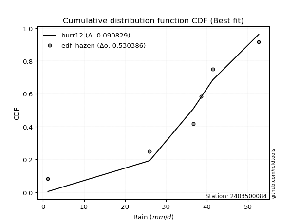</img>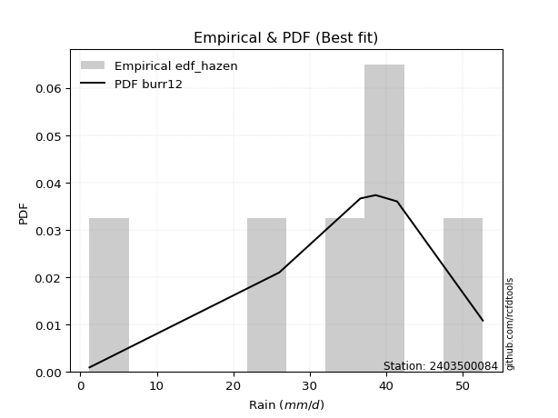</img>

</div>


### 3. EDF Weibull (1939)

Weibull plotting position formula is an empirical method used to estimate the non-exceedance probability or plotting position for a set of observed data, is often recommended or widely used in practice, particularly in flood frequency analysis.

<div align="center">


$P=m/(n+1)$


</div>


**3.1. Empirical values**

<div align="center">

|                | 0                   | 1                  | 2           | 3                  | 4                  |
|:---------------|:--------------------|:-------------------|:------------|:-------------------|:-------------------|
| date           | 2020                | 2019               | 2022        | 2021               | 2023               |
| x              | 26.0                | 36.6               | 38.6        | 41.4               | 52.6               |
| m              | 1                   | 2                  | 3           | 4                  | 5                  |
| empirical_dist | edf_weibull         | edf_weibull        | edf_weibull | edf_weibull        | edf_weibull        |
| empirical      | 0.16666666666666666 | 0.3333333333333333 | 0.5         | 0.6666666666666666 | 0.8333333333333334 |
| empirical_tr   | 1.2                 | 1.4999999999999998 | 2.0         | 2.9999999999999996 | 6.000000000000002  |

</div>


**3.2. Kolmogorov-Smirnov fit test (sorted by Δ)**


<div align="center">

|                | 0                   | 1                   | 2                   | 3                  | 4                   | 5                   | 6                   | 7                   | 8                   | 9                   | 10                  | 11                  | 12                  | 13                  | 14                  | 15                  | 16                  | 17                  | 18                 | 19                  | 20                  | 21                  | 22                 | 23                  | 24                    | 25                  | 26                  | 27                  | 28                  | 29                  | 30                  | 31                 | 32                  | 33                  | 34                  | 35                 | 36                  | 37                  | 38                  | 39                  | 40                 | 41                  | 42                  | 43                  | 44                  | 45                  | 46                  | 47                 | 48                  | 49                  | 50                  | 51                  | 52                 | 53                  | 54                  | 55                  | 56                  | 57                  | 58                  | 59                  | 60                 | 61                  | 62                  | 63                  | 64                  | 65                  | 66                  | 67                 | 68                  | 69                  | 70                  | 71                 | 72                  | 73                 | 74                  | 75                  | 76                 | 77                 | 78                 | 79                  | 80                  | 81                  | 82                 | 83                  | 84                 | 85                 | 86                 | 87                 |
|:---------------|:--------------------|:--------------------|:--------------------|:-------------------|:--------------------|:--------------------|:--------------------|:--------------------|:--------------------|:--------------------|:--------------------|:--------------------|:--------------------|:--------------------|:--------------------|:--------------------|:--------------------|:--------------------|:-------------------|:--------------------|:--------------------|:--------------------|:-------------------|:--------------------|:----------------------|:--------------------|:--------------------|:--------------------|:--------------------|:--------------------|:--------------------|:-------------------|:--------------------|:--------------------|:--------------------|:-------------------|:--------------------|:--------------------|:--------------------|:--------------------|:-------------------|:--------------------|:--------------------|:--------------------|:--------------------|:--------------------|:--------------------|:-------------------|:--------------------|:--------------------|:--------------------|:--------------------|:-------------------|:--------------------|:--------------------|:--------------------|:--------------------|:--------------------|:--------------------|:--------------------|:-------------------|:--------------------|:--------------------|:--------------------|:--------------------|:--------------------|:--------------------|:-------------------|:--------------------|:--------------------|:--------------------|:-------------------|:--------------------|:-------------------|:--------------------|:--------------------|:-------------------|:-------------------|:-------------------|:--------------------|:--------------------|:--------------------|:-------------------|:--------------------|:-------------------|:-------------------|:-------------------|:-------------------|
| station        | 2403500084          | 2403500084          | 2403500084          | 2403500084         | 2403500084          | 2403500084          | 2403500084          | 2403500084          | 2403500084          | 2403500084          | 2403500084          | 2403500084          | 2403500084          | 2403500084          | 2403500084          | 2403500084          | 2403500084          | 2403500084          | 2403500084         | 2403500084          | 2403500084          | 2403500084          | 2403500084         | 2403500084          | 2403500084            | 2403500084          | 2403500084          | 2403500084          | 2403500084          | 2403500084          | 2403500084          | 2403500084         | 2403500084          | 2403500084          | 2403500084          | 2403500084         | 2403500084          | 2403500084          | 2403500084          | 2403500084          | 2403500084         | 2403500084          | 2403500084          | 2403500084          | 2403500084          | 2403500084          | 2403500084          | 2403500084         | 2403500084          | 2403500084          | 2403500084          | 2403500084          | 2403500084         | 2403500084          | 2403500084          | 2403500084          | 2403500084          | 2403500084          | 2403500084          | 2403500084          | 2403500084         | 2403500084          | 2403500084          | 2403500084          | 2403500084          | 2403500084          | 2403500084          | 2403500084         | 2403500084          | 2403500084          | 2403500084          | 2403500084         | 2403500084          | 2403500084         | 2403500084          | 2403500084          | 2403500084         | 2403500084         | 2403500084         | 2403500084          | 2403500084          | 2403500084          | 2403500084         | 2403500084          | 2403500084         | 2403500084         | 2403500084         | 2403500084         |
| empirical_dist | edf_weibull         | edf_weibull         | edf_weibull         | edf_weibull        | edf_weibull         | edf_weibull         | edf_weibull         | edf_weibull         | edf_weibull         | edf_weibull         | edf_weibull         | edf_weibull         | edf_weibull         | edf_weibull         | edf_weibull         | edf_weibull         | edf_weibull         | edf_weibull         | edf_weibull        | edf_weibull         | edf_weibull         | edf_weibull         | edf_weibull        | edf_weibull         | edf_weibull           | edf_weibull         | edf_weibull         | edf_weibull         | edf_weibull         | edf_weibull         | edf_weibull         | edf_weibull        | edf_weibull         | edf_weibull         | edf_weibull         | edf_weibull        | edf_weibull         | edf_weibull         | edf_weibull         | edf_weibull         | edf_weibull        | edf_weibull         | edf_weibull         | edf_weibull         | edf_weibull         | edf_weibull         | edf_weibull         | edf_weibull        | edf_weibull         | edf_weibull         | edf_weibull         | edf_weibull         | edf_weibull        | edf_weibull         | edf_weibull         | edf_weibull         | edf_weibull         | edf_weibull         | edf_weibull         | edf_weibull         | edf_weibull        | edf_weibull         | edf_weibull         | edf_weibull         | edf_weibull         | edf_weibull         | edf_weibull         | edf_weibull        | edf_weibull         | edf_weibull         | edf_weibull         | edf_weibull        | edf_weibull         | edf_weibull        | edf_weibull         | edf_weibull         | edf_weibull        | edf_weibull        | edf_weibull        | edf_weibull         | edf_weibull         | edf_weibull         | edf_weibull        | edf_weibull         | edf_weibull        | edf_weibull        | edf_weibull        | edf_weibull        |
| p_dist         | fisk                | loggenlogistic      | mielke              | genlogistic        | laplace_asymmetric  | logloggamma         | erlang              | gamma               | pearson3            | f                   | logjohnsonsu        | nct                 | exponnorm           | johnsonsu           | t                   | norm                | crystalball         | logpearson3         | invgamma           | logweibull_min      | logistic            | laplace             | alpha              | hypsecant           | loglaplace_asymmetric | invgauss            | betaprime           | logf                | weibull_min         | lognorm             | lognorm             | logexponnorm       | logcrystalball      | logt                | loglaplace          | loghypsecant       | logbetaprime        | loglogistic         | loggamma            | loggamma            | logfisk            | logerlang           | loginvgamma         | logfatiguelife      | logalpha            | maxwell             | rice                | lognct             | loginvgauss         | logrice             | kstwobign           | rayleigh            | loggumbel_l        | logncf              | logmaxwell          | gumbel_r            | gumbel_l            | lograyleigh         | loginvweibull       | loggumbel_r         | moyal              | gompertz            | halflogistic        | halfnorm            | loghalfnorm         | gibrat              | logkstwobign        | loggenexpon        | logmoyal            | wald                | loghalflogistic     | loggompertz        | genexpon            | expon              | logchi2             | logwald             | logexpon           | loggibrat          | logmielke          | nakagami            | logtruncnorm        | lognakagami         | truncnorm          | chi2                | loglognorm         | invweibull         | ncf                | fatiguelife        |
| delta          | 0.10556402814223345 | 0.10588168716244341 | 0.10588335481922598 | 0.1065747583221687 | 0.10676778606708415 | 0.10715278916540105 | 0.10732872854408293 | 0.10760306636915906 | 0.10786219709770639 | 0.10795727843251596 | 0.10899020268986903 | 0.10932766477225064 | 0.11015668048211014 | 0.11025761456162453 | 0.11025958960170446 | 0.11026362611039464 | 0.11026363193573963 | 0.11089763826137139 | 0.1124570911216036 | 0.11260264253664909 | 0.11332154345845624 | 0.11357173027383216 | 0.1138411091784548 | 0.11404799494764173 | 0.11417328208950628   | 0.11435530977968417 | 0.11884117011967307 | 0.11961357516265117 | 0.11971734367062989 | 0.11986238374333816 | 0.11986238374333816 | 0.1198626280557929 | 0.11986272597759157 | 0.11986279467712277 | 0.11998041403945345 | 0.1210276656399907 | 0.12104668520267861 | 0.12106464679396786 | 0.12114814473028043 | 0.12114814473028043 | 0.1212582428151715 | 0.12134480678593942 | 0.12144245668589028 | 0.12146205776743532 | 0.12172093157722705 | 0.12220058321662547 | 0.12321267230133767 | 0.1258226607164677 | 0.12719039368305335 | 0.13110225737240527 | 0.13420202832933703 | 0.13484991029457236 | 0.1356774378327117 | 0.14103480427837833 | 0.14134065155821118 | 0.14777633614459332 | 0.15297609333388607 | 0.15474565920199806 | 0.15789972964313342 | 0.16263084781154208 | 0.1627175530148593 | 0.16666666665981664 | 0.16666666666666666 | 0.16666666666666666 | 0.17858740277068158 | 0.17925471780713936 | 0.18295701655751967 | 0.1847045953233714 | 0.18732036607239916 | 0.19166357360689795 | 0.19784085049465022 | 0.2147343976201727 | 0.22288288174403553 | 0.2230894724777262 | 0.24301855072626977 | 0.25558895798140085 | 0.2587169772865238 | 0.2623407356263659 | 0.3012019138477327 | 0.30248543429202196 | 0.33269760891106076 | 0.33333332963366086 | 0.3333333297520363 | 0.33935090213514235 | 0.3505827170179307 | 0.3831985239841995 | 0.4074661286341139 | 0.5009992989909873 |
| deltao         | 0.5865427407550001  | 0.5865427407550001  | 0.5865427407550001  | 0.5865427407550001 | 0.5865427407550001  | 0.5865427407550001  | 0.5865427407550001  | 0.5865427407550001  | 0.5865427407550001  | 0.5865427407550001  | 0.5865427407550001  | 0.5865427407550001  | 0.5865427407550001  | 0.5865427407550001  | 0.5865427407550001  | 0.5865427407550001  | 0.5865427407550001  | 0.5865427407550001  | 0.5865427407550001 | 0.5865427407550001  | 0.5865427407550001  | 0.5865427407550001  | 0.5865427407550001 | 0.5865427407550001  | 0.5865427407550001    | 0.5865427407550001  | 0.5865427407550001  | 0.5865427407550001  | 0.5865427407550001  | 0.5865427407550001  | 0.5865427407550001  | 0.5865427407550001 | 0.5865427407550001  | 0.5865427407550001  | 0.5865427407550001  | 0.5865427407550001 | 0.5865427407550001  | 0.5865427407550001  | 0.5865427407550001  | 0.5865427407550001  | 0.5865427407550001 | 0.5865427407550001  | 0.5865427407550001  | 0.5865427407550001  | 0.5865427407550001  | 0.5865427407550001  | 0.5865427407550001  | 0.5865427407550001 | 0.5865427407550001  | 0.5865427407550001  | 0.5865427407550001  | 0.5865427407550001  | 0.5865427407550001 | 0.5865427407550001  | 0.5865427407550001  | 0.5865427407550001  | 0.5865427407550001  | 0.5865427407550001  | 0.5865427407550001  | 0.5865427407550001  | 0.5865427407550001 | 0.5865427407550001  | 0.5865427407550001  | 0.5865427407550001  | 0.5865427407550001  | 0.5865427407550001  | 0.5865427407550001  | 0.5865427407550001 | 0.5865427407550001  | 0.5865427407550001  | 0.5865427407550001  | 0.5865427407550001 | 0.5865427407550001  | 0.5865427407550001 | 0.5865427407550001  | 0.5865427407550001  | 0.5865427407550001 | 0.5865427407550001 | 0.5865427407550001 | 0.5865427407550001  | 0.5865427407550001  | 0.5865427407550001  | 0.5865427407550001 | 0.5865427407550001  | 0.5865427407550001 | 0.5865427407550001 | 0.5865427407550001 | 0.5865427407550001 |
| eval           | Δo > Δ              | Δo > Δ              | Δo > Δ              | Δo > Δ             | Δo > Δ              | Δo > Δ              | Δo > Δ              | Δo > Δ              | Δo > Δ              | Δo > Δ              | Δo > Δ              | Δo > Δ              | Δo > Δ              | Δo > Δ              | Δo > Δ              | Δo > Δ              | Δo > Δ              | Δo > Δ              | Δo > Δ             | Δo > Δ              | Δo > Δ              | Δo > Δ              | Δo > Δ             | Δo > Δ              | Δo > Δ                | Δo > Δ              | Δo > Δ              | Δo > Δ              | Δo > Δ              | Δo > Δ              | Δo > Δ              | Δo > Δ             | Δo > Δ              | Δo > Δ              | Δo > Δ              | Δo > Δ             | Δo > Δ              | Δo > Δ              | Δo > Δ              | Δo > Δ              | Δo > Δ             | Δo > Δ              | Δo > Δ              | Δo > Δ              | Δo > Δ              | Δo > Δ              | Δo > Δ              | Δo > Δ             | Δo > Δ              | Δo > Δ              | Δo > Δ              | Δo > Δ              | Δo > Δ             | Δo > Δ              | Δo > Δ              | Δo > Δ              | Δo > Δ              | Δo > Δ              | Δo > Δ              | Δo > Δ              | Δo > Δ             | Δo > Δ              | Δo > Δ              | Δo > Δ              | Δo > Δ              | Δo > Δ              | Δo > Δ              | Δo > Δ             | Δo > Δ              | Δo > Δ              | Δo > Δ              | Δo > Δ             | Δo > Δ              | Δo > Δ             | Δo > Δ              | Δo > Δ              | Δo > Δ             | Δo > Δ             | Δo > Δ             | Δo > Δ              | Δo > Δ              | Δo > Δ              | Δo > Δ             | Δo > Δ              | Δo > Δ             | Δo > Δ             | Δo > Δ             | Δo > Δ             |
| fit            | 1                   | 1                   | 1                   | 1                  | 1                   | 1                   | 1                   | 1                   | 1                   | 1                   | 1                   | 1                   | 1                   | 1                   | 1                   | 1                   | 1                   | 1                   | 1                  | 1                   | 1                   | 1                   | 1                  | 1                   | 1                     | 1                   | 1                   | 1                   | 1                   | 1                   | 1                   | 1                  | 1                   | 1                   | 1                   | 1                  | 1                   | 1                   | 1                   | 1                   | 1                  | 1                   | 1                   | 1                   | 1                   | 1                   | 1                   | 1                  | 1                   | 1                   | 1                   | 1                   | 1                  | 1                   | 1                   | 1                   | 1                   | 1                   | 1                   | 1                   | 1                  | 1                   | 1                   | 1                   | 1                   | 1                   | 1                   | 1                  | 1                   | 1                   | 1                   | 1                  | 1                   | 1                  | 1                   | 1                   | 1                  | 1                  | 1                  | 1                   | 1                   | 1                   | 1                  | 1                   | 1                  | 1                  | 1                  | 1                  |
| n              | 5                   | 5                   | 5                   | 5                  | 5                   | 5                   | 5                   | 5                   | 5                   | 5                   | 5                   | 5                   | 5                   | 5                   | 5                   | 5                   | 5                   | 5                   | 5                  | 5                   | 5                   | 5                   | 5                  | 5                   | 5                     | 5                   | 5                   | 5                   | 5                   | 5                   | 5                   | 5                  | 5                   | 5                   | 5                   | 5                  | 5                   | 5                   | 5                   | 5                   | 5                  | 5                   | 5                   | 5                   | 5                   | 5                   | 5                   | 5                  | 5                   | 5                   | 5                   | 5                   | 5                  | 5                   | 5                   | 5                   | 5                   | 5                   | 5                   | 5                   | 5                  | 5                   | 5                   | 5                   | 5                   | 5                   | 5                   | 5                  | 5                   | 5                   | 5                   | 5                  | 5                   | 5                  | 5                   | 5                   | 5                  | 5                  | 5                  | 5                   | 5                   | 5                   | 5                  | 5                   | 5                  | 5                  | 5                  | 5                  |
| best_fit       | 1                   | 0                   | 0                   | 0                  | 0                   | 0                   | 0                   | 0                   | 0                   | 0                   | 0                   | 0                   | 0                   | 0                   | 0                   | 0                   | 0                   | 0                   | 0                  | 0                   | 0                   | 0                   | 0                  | 0                   | 0                     | 0                   | 0                   | 0                   | 0                   | 0                   | 0                   | 0                  | 0                   | 0                   | 0                   | 0                  | 0                   | 0                   | 0                   | 0                   | 0                  | 0                   | 0                   | 0                   | 0                   | 0                   | 0                   | 0                  | 0                   | 0                   | 0                   | 0                   | 0                  | 0                   | 0                   | 0                   | 0                   | 0                   | 0                   | 0                   | 0                  | 0                   | 0                   | 0                   | 0                   | 0                   | 0                   | 0                  | 0                   | 0                   | 0                   | 0                  | 0                   | 0                  | 0                   | 0                   | 0                  | 0                  | 0                  | 0                   | 0                   | 0                   | 0                  | 0                   | 0                  | 0                  | 0                  | 0                  |
| best_fit_sort  | 1                   | 2                   | 3                   | 4                  | 5                   | 6                   | 7                   | 8                   | 9                   | 10                  | 11                  | 12                  | 13                  | 14                  | 15                  | 16                  | 17                  | 18                  | 19                 | 20                  | 21                  | 22                  | 23                 | 24                  | 25                    | 26                  | 27                  | 28                  | 29                  | 30                  | 31                  | 32                 | 33                  | 34                  | 35                  | 36                 | 37                  | 38                  | 39                  | 40                  | 41                 | 42                  | 43                  | 44                  | 45                  | 46                  | 47                  | 48                 | 49                  | 50                  | 51                  | 52                  | 53                 | 54                  | 55                  | 56                  | 57                  | 58                  | 59                  | 60                  | 61                 | 62                  | 63                  | 64                  | 65                  | 66                  | 67                  | 68                 | 69                  | 70                  | 71                  | 72                 | 73                  | 74                 | 75                  | 76                  | 77                 | 78                 | 79                 | 80                  | 81                  | 82                  | 83                 | 84                  | 85                 | 86                 | 87                 | 88                 |

</div>


**3.3. Best fit**

<div align="center">

|   id |    station | empirical_dist   | p_dist   |    delta |   deltao | eval   |   fit |   n |   best_fit |   best_fit_sort |
|-----:|-----------:|:-----------------|:---------|---------:|---------:|:-------|------:|----:|-----------:|----------------:|
|    0 | 2403500084 | edf_weibull      | fisk     | 0.105564 | 0.586543 | Δo > Δ |     1 |   5 |          1 |               1 |

</div>


<div align="center">

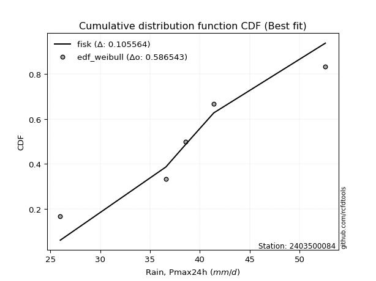</img>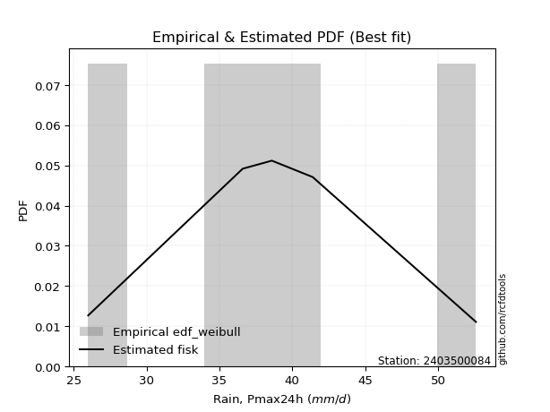</img>

</div>


### 4. EDF Beard (1943)

The Beard formula (or Beard´s plotting position formula) in hydrology is used to estimate the empirical non-exceedance probability _(P)_ of a flood event (or other extreme hydrological data point) within a given dataset.

<div align="center">


$P=(m-0.31)/(n+0.38)$


</div>


**4.1. Empirical values**

<div align="center">

|                | 0                   | 1                  | 2         | 3                  | 4                  |
|:---------------|:--------------------|:-------------------|:----------|:-------------------|:-------------------|
| date           | 2020                | 2019               | 2022      | 2021               | 2023               |
| x              | 26.0                | 36.6               | 38.6      | 41.4               | 52.6               |
| m              | 1                   | 2                  | 3         | 4                  | 5                  |
| empirical_dist | edf_beard           | edf_beard          | edf_beard | edf_beard          | edf_beard          |
| empirical      | 0.12825278810408922 | 0.3141263940520446 | 0.5       | 0.6858736059479554 | 0.8717472118959109 |
| empirical_tr   | 1.1471215351812367  | 1.4579945799457996 | 2.0       | 3.183431952662722  | 7.797101449275368  |

</div>


**4.2. Kolmogorov-Smirnov fit test (sorted by Δ)**


<div align="center">

|                | 0                   | 1                   | 2                   | 3                   | 4                   | 5                   | 6                   | 7                   | 8                     | 9                   | 10                 | 11                  | 12                  | 13                  | 14                  | 15                 | 16                  | 17                  | 18                  | 19                 | 20                 | 21                  | 22                  | 23                 | 24                  | 25                  | 26                  | 27                  | 28                 | 29                  | 30                  | 31                  | 32                  | 33                  | 34                  | 35                  | 36                  | 37                  | 38                  | 39                  | 40                  | 41                 | 42                  | 43                  | 44                  | 45                  | 46                  | 47                  | 48                  | 49                  | 50                  | 51                  | 52                 | 53                  | 54                 | 55                  | 56                  | 57                 | 58                  | 59                  | 60                  | 61                 | 62                  | 63                  | 64                  | 65                  | 66                  | 67                 | 68                  | 69                  | 70                  | 71                 | 72                  | 73                 | 74                  | 75                 | 76                  | 77                 | 78                  | 79                  | 80                  | 81                 | 82                 | 83                  | 84                 | 85                 | 86                 | 87                 |
|:---------------|:--------------------|:--------------------|:--------------------|:--------------------|:--------------------|:--------------------|:--------------------|:--------------------|:----------------------|:--------------------|:-------------------|:--------------------|:--------------------|:--------------------|:--------------------|:-------------------|:--------------------|:--------------------|:--------------------|:-------------------|:-------------------|:--------------------|:--------------------|:-------------------|:--------------------|:--------------------|:--------------------|:--------------------|:-------------------|:--------------------|:--------------------|:--------------------|:--------------------|:--------------------|:--------------------|:--------------------|:--------------------|:--------------------|:--------------------|:--------------------|:--------------------|:-------------------|:--------------------|:--------------------|:--------------------|:--------------------|:--------------------|:--------------------|:--------------------|:--------------------|:--------------------|:--------------------|:-------------------|:--------------------|:-------------------|:--------------------|:--------------------|:-------------------|:--------------------|:--------------------|:--------------------|:-------------------|:--------------------|:--------------------|:--------------------|:--------------------|:--------------------|:-------------------|:--------------------|:--------------------|:--------------------|:-------------------|:--------------------|:-------------------|:--------------------|:-------------------|:--------------------|:-------------------|:--------------------|:--------------------|:--------------------|:-------------------|:-------------------|:--------------------|:-------------------|:-------------------|:-------------------|:-------------------|
| station        | 2403500084          | 2403500084          | 2403500084          | 2403500084          | 2403500084          | 2403500084          | 2403500084          | 2403500084          | 2403500084            | 2403500084          | 2403500084         | 2403500084          | 2403500084          | 2403500084          | 2403500084          | 2403500084         | 2403500084          | 2403500084          | 2403500084          | 2403500084         | 2403500084         | 2403500084          | 2403500084          | 2403500084         | 2403500084          | 2403500084          | 2403500084          | 2403500084          | 2403500084         | 2403500084          | 2403500084          | 2403500084          | 2403500084          | 2403500084          | 2403500084          | 2403500084          | 2403500084          | 2403500084          | 2403500084          | 2403500084          | 2403500084          | 2403500084         | 2403500084          | 2403500084          | 2403500084          | 2403500084          | 2403500084          | 2403500084          | 2403500084          | 2403500084          | 2403500084          | 2403500084          | 2403500084         | 2403500084          | 2403500084         | 2403500084          | 2403500084          | 2403500084         | 2403500084          | 2403500084          | 2403500084          | 2403500084         | 2403500084          | 2403500084          | 2403500084          | 2403500084          | 2403500084          | 2403500084         | 2403500084          | 2403500084          | 2403500084          | 2403500084         | 2403500084          | 2403500084         | 2403500084          | 2403500084         | 2403500084          | 2403500084         | 2403500084          | 2403500084          | 2403500084          | 2403500084         | 2403500084         | 2403500084          | 2403500084         | 2403500084         | 2403500084         | 2403500084         |
| empirical_dist | edf_beard           | edf_beard           | edf_beard           | edf_beard           | edf_beard           | edf_beard           | edf_beard           | edf_beard           | edf_beard             | edf_beard           | edf_beard          | edf_beard           | edf_beard           | edf_beard           | edf_beard           | edf_beard          | edf_beard           | edf_beard           | edf_beard           | edf_beard          | edf_beard          | edf_beard           | edf_beard           | edf_beard          | edf_beard           | edf_beard           | edf_beard           | edf_beard           | edf_beard          | edf_beard           | edf_beard           | edf_beard           | edf_beard           | edf_beard           | edf_beard           | edf_beard           | edf_beard           | edf_beard           | edf_beard           | edf_beard           | edf_beard           | edf_beard          | edf_beard           | edf_beard           | edf_beard           | edf_beard           | edf_beard           | edf_beard           | edf_beard           | edf_beard           | edf_beard           | edf_beard           | edf_beard          | edf_beard           | edf_beard          | edf_beard           | edf_beard           | edf_beard          | edf_beard           | edf_beard           | edf_beard           | edf_beard          | edf_beard           | edf_beard           | edf_beard           | edf_beard           | edf_beard           | edf_beard          | edf_beard           | edf_beard           | edf_beard           | edf_beard          | edf_beard           | edf_beard          | edf_beard           | edf_beard          | edf_beard           | edf_beard          | edf_beard           | edf_beard           | edf_beard           | edf_beard          | edf_beard          | edf_beard           | edf_beard          | edf_beard          | edf_beard          | edf_beard          |
| p_dist         | laplace_asymmetric  | mielke              | loggenlogistic      | fisk                | logistic            | laplace             | nct                 | hypsecant           | loglaplace_asymmetric | genlogistic         | exponnorm          | norm                | crystalball         | johnsonsu           | t                   | pearson3           | logjohnsonsu        | gamma               | erlang              | logloggamma        | loglaplace         | f                   | logfisk             | logweibull_min     | logpearson3         | rice                | loggumbel_l         | alpha               | loghypsecant       | weibull_min         | betaprime           | invgamma            | maxwell             | loglogistic         | invgauss            | logfatiguelife      | logcrystalball      | logexponnorm        | logt                | lognorm             | lognorm             | logf               | rayleigh            | loggamma            | loggamma            | logbetaprime        | logerlang           | logalpha            | gumbel_r            | lognct              | logrice             | loginvgamma         | gumbel_l           | loginvgauss         | logmaxwell         | moyal               | kstwobign           | halfnorm           | logncf              | gompertz            | lograyleigh         | halflogistic       | loginvweibull       | loggumbel_r         | loghalfnorm         | gibrat              | logkstwobign        | loggenexpon        | logmoyal            | wald                | loghalflogistic     | loggompertz        | genexpon            | expon              | logwald             | logexpon           | logchi2             | loggibrat          | nakagami            | logtruncnorm        | lognakagami         | truncnorm          | logmielke          | chi2                | loglognorm         | invweibull         | ncf                | fatiguelife        |
| delta          | 0.06835390750450665 | 0.07215391268750304 | 0.07217995869396521 | 0.07265547542373468 | 0.07490766489587874 | 0.07515785171125466 | 0.07548033235699436 | 0.07563411638506423 | 0.07575940352692884   | 0.07583358516248123 | 0.0769026538816534 | 0.07715597968248811 | 0.07715598098657084 | 0.07715892332669505 | 0.07717157661303453 | 0.0787284793873621 | 0.07957081105907582 | 0.08047238651635752 | 0.08050753305837532 | 0.0811295039990611 | 0.081566535476876  | 0.08372219090268268 | 0.08672553646684089 | 0.0880454731328148 | 0.09436418421864745 | 0.09624274083476675 | 0.09726355927013419 | 0.09802121439114814 | 0.100251371001842  | 0.10166499128841894 | 0.10384483636842184 | 0.10387515559024146 | 0.10724480478107468 | 0.10791033523453536 | 0.11448660024417562 | 0.11641155451191926 | 0.11706035467530235 | 0.11706104715172222 | 0.11706180782688108 | 0.11706266617164213 | 0.11706266617164213 | 0.1175024906534094 | 0.11954742077077823 | 0.12532830318340482 | 0.12532830318340482 | 0.12635678132526917 | 0.12721076742030663 | 0.13034929520547572 | 0.13092632611141003 | 0.13217461630159394 | 0.13219269017589597 | 0.13454702237319266 | 0.135244344743491  | 0.14639733296434204 | 0.1514647514409705 | 0.15284425512423122 | 0.15340896761062572 | 0.1544807432600741 | 0.16024174355966703 | 0.16050878015679443 | 0.16357324859690464 | 0.1684045515570305 | 0.17710666892442212 | 0.18183778709283077 | 0.19779434205197027 | 0.19846165708842806 | 0.20216395583880836 | 0.2039115346046601 | 0.20652730535368785 | 0.21087051288818665 | 0.21704778977593892 | 0.2339413369014614 | 0.24208982102532423 | 0.2422964117590149 | 0.27479589726268955 | 0.2779239165678125 | 0.28143242928884726 | 0.2815476749076546 | 0.28327849501073327 | 0.31349066962977207 | 0.31412639035237216 | 0.3141263904707476 | 0.3204088531290214 | 0.35855784141643104 | 0.3697896562992194 | 0.421612402546777  | 0.4458800071966913 | 0.5202062382722759 |
| deltao         | 0.5865427407550001  | 0.5865427407550001  | 0.5865427407550001  | 0.5865427407550001  | 0.5865427407550001  | 0.5865427407550001  | 0.5865427407550001  | 0.5865427407550001  | 0.5865427407550001    | 0.5865427407550001  | 0.5865427407550001 | 0.5865427407550001  | 0.5865427407550001  | 0.5865427407550001  | 0.5865427407550001  | 0.5865427407550001 | 0.5865427407550001  | 0.5865427407550001  | 0.5865427407550001  | 0.5865427407550001 | 0.5865427407550001 | 0.5865427407550001  | 0.5865427407550001  | 0.5865427407550001 | 0.5865427407550001  | 0.5865427407550001  | 0.5865427407550001  | 0.5865427407550001  | 0.5865427407550001 | 0.5865427407550001  | 0.5865427407550001  | 0.5865427407550001  | 0.5865427407550001  | 0.5865427407550001  | 0.5865427407550001  | 0.5865427407550001  | 0.5865427407550001  | 0.5865427407550001  | 0.5865427407550001  | 0.5865427407550001  | 0.5865427407550001  | 0.5865427407550001 | 0.5865427407550001  | 0.5865427407550001  | 0.5865427407550001  | 0.5865427407550001  | 0.5865427407550001  | 0.5865427407550001  | 0.5865427407550001  | 0.5865427407550001  | 0.5865427407550001  | 0.5865427407550001  | 0.5865427407550001 | 0.5865427407550001  | 0.5865427407550001 | 0.5865427407550001  | 0.5865427407550001  | 0.5865427407550001 | 0.5865427407550001  | 0.5865427407550001  | 0.5865427407550001  | 0.5865427407550001 | 0.5865427407550001  | 0.5865427407550001  | 0.5865427407550001  | 0.5865427407550001  | 0.5865427407550001  | 0.5865427407550001 | 0.5865427407550001  | 0.5865427407550001  | 0.5865427407550001  | 0.5865427407550001 | 0.5865427407550001  | 0.5865427407550001 | 0.5865427407550001  | 0.5865427407550001 | 0.5865427407550001  | 0.5865427407550001 | 0.5865427407550001  | 0.5865427407550001  | 0.5865427407550001  | 0.5865427407550001 | 0.5865427407550001 | 0.5865427407550001  | 0.5865427407550001 | 0.5865427407550001 | 0.5865427407550001 | 0.5865427407550001 |
| eval           | Δo > Δ              | Δo > Δ              | Δo > Δ              | Δo > Δ              | Δo > Δ              | Δo > Δ              | Δo > Δ              | Δo > Δ              | Δo > Δ                | Δo > Δ              | Δo > Δ             | Δo > Δ              | Δo > Δ              | Δo > Δ              | Δo > Δ              | Δo > Δ             | Δo > Δ              | Δo > Δ              | Δo > Δ              | Δo > Δ             | Δo > Δ             | Δo > Δ              | Δo > Δ              | Δo > Δ             | Δo > Δ              | Δo > Δ              | Δo > Δ              | Δo > Δ              | Δo > Δ             | Δo > Δ              | Δo > Δ              | Δo > Δ              | Δo > Δ              | Δo > Δ              | Δo > Δ              | Δo > Δ              | Δo > Δ              | Δo > Δ              | Δo > Δ              | Δo > Δ              | Δo > Δ              | Δo > Δ             | Δo > Δ              | Δo > Δ              | Δo > Δ              | Δo > Δ              | Δo > Δ              | Δo > Δ              | Δo > Δ              | Δo > Δ              | Δo > Δ              | Δo > Δ              | Δo > Δ             | Δo > Δ              | Δo > Δ             | Δo > Δ              | Δo > Δ              | Δo > Δ             | Δo > Δ              | Δo > Δ              | Δo > Δ              | Δo > Δ             | Δo > Δ              | Δo > Δ              | Δo > Δ              | Δo > Δ              | Δo > Δ              | Δo > Δ             | Δo > Δ              | Δo > Δ              | Δo > Δ              | Δo > Δ             | Δo > Δ              | Δo > Δ             | Δo > Δ              | Δo > Δ             | Δo > Δ              | Δo > Δ             | Δo > Δ              | Δo > Δ              | Δo > Δ              | Δo > Δ             | Δo > Δ             | Δo > Δ              | Δo > Δ             | Δo > Δ             | Δo > Δ             | Δo > Δ             |
| fit            | 1                   | 1                   | 1                   | 1                   | 1                   | 1                   | 1                   | 1                   | 1                     | 1                   | 1                  | 1                   | 1                   | 1                   | 1                   | 1                  | 1                   | 1                   | 1                   | 1                  | 1                  | 1                   | 1                   | 1                  | 1                   | 1                   | 1                   | 1                   | 1                  | 1                   | 1                   | 1                   | 1                   | 1                   | 1                   | 1                   | 1                   | 1                   | 1                   | 1                   | 1                   | 1                  | 1                   | 1                   | 1                   | 1                   | 1                   | 1                   | 1                   | 1                   | 1                   | 1                   | 1                  | 1                   | 1                  | 1                   | 1                   | 1                  | 1                   | 1                   | 1                   | 1                  | 1                   | 1                   | 1                   | 1                   | 1                   | 1                  | 1                   | 1                   | 1                   | 1                  | 1                   | 1                  | 1                   | 1                  | 1                   | 1                  | 1                   | 1                   | 1                   | 1                  | 1                  | 1                   | 1                  | 1                  | 1                  | 1                  |
| n              | 5                   | 5                   | 5                   | 5                   | 5                   | 5                   | 5                   | 5                   | 5                     | 5                   | 5                  | 5                   | 5                   | 5                   | 5                   | 5                  | 5                   | 5                   | 5                   | 5                  | 5                  | 5                   | 5                   | 5                  | 5                   | 5                   | 5                   | 5                   | 5                  | 5                   | 5                   | 5                   | 5                   | 5                   | 5                   | 5                   | 5                   | 5                   | 5                   | 5                   | 5                   | 5                  | 5                   | 5                   | 5                   | 5                   | 5                   | 5                   | 5                   | 5                   | 5                   | 5                   | 5                  | 5                   | 5                  | 5                   | 5                   | 5                  | 5                   | 5                   | 5                   | 5                  | 5                   | 5                   | 5                   | 5                   | 5                   | 5                  | 5                   | 5                   | 5                   | 5                  | 5                   | 5                  | 5                   | 5                  | 5                   | 5                  | 5                   | 5                   | 5                   | 5                  | 5                  | 5                   | 5                  | 5                  | 5                  | 5                  |
| best_fit       | 1                   | 0                   | 0                   | 0                   | 0                   | 0                   | 0                   | 0                   | 0                     | 0                   | 0                  | 0                   | 0                   | 0                   | 0                   | 0                  | 0                   | 0                   | 0                   | 0                  | 0                  | 0                   | 0                   | 0                  | 0                   | 0                   | 0                   | 0                   | 0                  | 0                   | 0                   | 0                   | 0                   | 0                   | 0                   | 0                   | 0                   | 0                   | 0                   | 0                   | 0                   | 0                  | 0                   | 0                   | 0                   | 0                   | 0                   | 0                   | 0                   | 0                   | 0                   | 0                   | 0                  | 0                   | 0                  | 0                   | 0                   | 0                  | 0                   | 0                   | 0                   | 0                  | 0                   | 0                   | 0                   | 0                   | 0                   | 0                  | 0                   | 0                   | 0                   | 0                  | 0                   | 0                  | 0                   | 0                  | 0                   | 0                  | 0                   | 0                   | 0                   | 0                  | 0                  | 0                   | 0                  | 0                  | 0                  | 0                  |
| best_fit_sort  | 1                   | 2                   | 3                   | 4                   | 5                   | 6                   | 7                   | 8                   | 9                     | 10                  | 11                 | 12                  | 13                  | 14                  | 15                  | 16                 | 17                  | 18                  | 19                  | 20                 | 21                 | 22                  | 23                  | 24                 | 25                  | 26                  | 27                  | 28                  | 29                 | 30                  | 31                  | 32                  | 33                  | 34                  | 35                  | 36                  | 37                  | 38                  | 39                  | 40                  | 41                  | 42                 | 43                  | 44                  | 45                  | 46                  | 47                  | 48                  | 49                  | 50                  | 51                  | 52                  | 53                 | 54                  | 55                 | 56                  | 57                  | 58                 | 59                  | 60                  | 61                  | 62                 | 63                  | 64                  | 65                  | 66                  | 67                  | 68                 | 69                  | 70                  | 71                  | 72                 | 73                  | 74                 | 75                  | 76                 | 77                  | 78                 | 79                  | 80                  | 81                  | 82                 | 83                 | 84                  | 85                 | 86                 | 87                 | 88                 |

</div>


**4.3. Best fit**

<div align="center">

|   id |    station | empirical_dist   | p_dist             |     delta |   deltao | eval   |   fit |   n |   best_fit |   best_fit_sort |
|-----:|-----------:|:-----------------|:-------------------|----------:|---------:|:-------|------:|----:|-----------:|----------------:|
|    0 | 2403500084 | edf_beard        | laplace_asymmetric | 0.0683539 | 0.586543 | Δo > Δ |     1 |   5 |          1 |               1 |

</div>


<div align="center">

</img>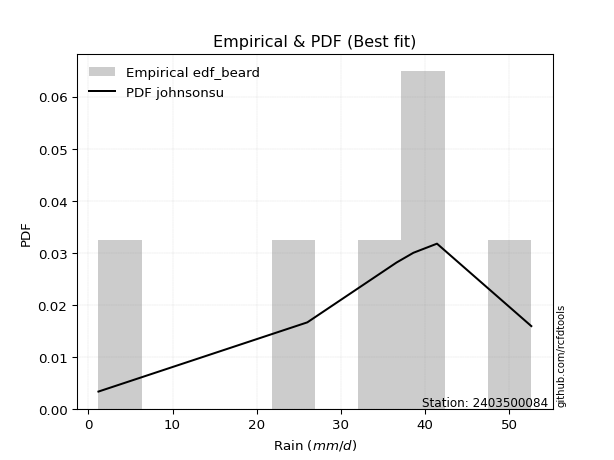</img>

</div>


### 5. EDF Chegodayev (1955)

The Chegodayev formula is an empirical plotting position formula used in hydrological frequency analysis to estimate the exceedance probability or return period of a specific event from a set of observed data. It is primarily used for plotting observed data points on probability paper to fit a theoretical distribution, particularly for analyzing extreme events like maximum flood flows or rainfall intensities. The constant _b_ value in the generalized plotting position formula is 0.3.

<div align="center">


$P=(m-b)/(n+1-2b)$


</div>


**5.1. Empirical values**

<div align="center">

|                | 0                   | 1                   | 2              | 3                  | 4                  |
|:---------------|:--------------------|:--------------------|:---------------|:-------------------|:-------------------|
| date           | 2020                | 2019                | 2022           | 2021               | 2023               |
| x              | 26.0                | 36.6                | 38.6           | 41.4               | 52.6               |
| m              | 1                   | 2                   | 3              | 4                  | 5                  |
| empirical_dist | edf_chegodayev      | edf_chegodayev      | edf_chegodayev | edf_chegodayev     | edf_chegodayev     |
| empirical      | 0.12962962962962962 | 0.31481481481481477 | 0.5            | 0.6851851851851851 | 0.8703703703703703 |
| empirical_tr   | 1.148936170212766   | 1.4594594594594594  | 2.0            | 3.1764705882352935 | 7.714285714285713  |

</div>


**5.2. Kolmogorov-Smirnov fit test (sorted by Δ)**


<div align="center">

|                | 0                   | 1                  | 2                   | 3                   | 4                   | 5                   | 6                   | 7                   | 8                   | 9                   | 10                  | 11                  | 12                  | 13                  | 14                    | 15                  | 16                  | 17                  | 18                  | 19                  | 20                  | 21                  | 22                  | 23                  | 24                 | 25                 | 26                  | 27                  | 28                  | 29                  | 30                 | 31                  | 32                  | 33                  | 34                  | 35                  | 36                 | 37                  | 38                  | 39                  | 40                  | 41                  | 42                  | 43                  | 44                  | 45                  | 46                  | 47                  | 48                  | 49                 | 50                  | 51                 | 52                 | 53                 | 54                  | 55                  | 56                  | 57                  | 58                  | 59                  | 60                 | 61                  | 62                  | 63                  | 64                  | 65                 | 66                  | 67                  | 68                 | 69                 | 70                  | 71                  | 72                  | 73                  | 74                 | 75                  | 76                  | 77                  | 78                 | 79                 | 80                 | 81                  | 82                  | 83                 | 84                  | 85                 | 86                 | 87                 |
|:---------------|:--------------------|:-------------------|:--------------------|:--------------------|:--------------------|:--------------------|:--------------------|:--------------------|:--------------------|:--------------------|:--------------------|:--------------------|:--------------------|:--------------------|:----------------------|:--------------------|:--------------------|:--------------------|:--------------------|:--------------------|:--------------------|:--------------------|:--------------------|:--------------------|:-------------------|:-------------------|:--------------------|:--------------------|:--------------------|:--------------------|:-------------------|:--------------------|:--------------------|:--------------------|:--------------------|:--------------------|:-------------------|:--------------------|:--------------------|:--------------------|:--------------------|:--------------------|:--------------------|:--------------------|:--------------------|:--------------------|:--------------------|:--------------------|:--------------------|:-------------------|:--------------------|:-------------------|:-------------------|:-------------------|:--------------------|:--------------------|:--------------------|:--------------------|:--------------------|:--------------------|:-------------------|:--------------------|:--------------------|:--------------------|:--------------------|:-------------------|:--------------------|:--------------------|:-------------------|:-------------------|:--------------------|:--------------------|:--------------------|:--------------------|:-------------------|:--------------------|:--------------------|:--------------------|:-------------------|:-------------------|:-------------------|:--------------------|:--------------------|:-------------------|:--------------------|:-------------------|:-------------------|:-------------------|
| station        | 2403500084          | 2403500084         | 2403500084          | 2403500084          | 2403500084          | 2403500084          | 2403500084          | 2403500084          | 2403500084          | 2403500084          | 2403500084          | 2403500084          | 2403500084          | 2403500084          | 2403500084            | 2403500084          | 2403500084          | 2403500084          | 2403500084          | 2403500084          | 2403500084          | 2403500084          | 2403500084          | 2403500084          | 2403500084         | 2403500084         | 2403500084          | 2403500084          | 2403500084          | 2403500084          | 2403500084         | 2403500084          | 2403500084          | 2403500084          | 2403500084          | 2403500084          | 2403500084         | 2403500084          | 2403500084          | 2403500084          | 2403500084          | 2403500084          | 2403500084          | 2403500084          | 2403500084          | 2403500084          | 2403500084          | 2403500084          | 2403500084          | 2403500084         | 2403500084          | 2403500084         | 2403500084         | 2403500084         | 2403500084          | 2403500084          | 2403500084          | 2403500084          | 2403500084          | 2403500084          | 2403500084         | 2403500084          | 2403500084          | 2403500084          | 2403500084          | 2403500084         | 2403500084          | 2403500084          | 2403500084         | 2403500084         | 2403500084          | 2403500084          | 2403500084          | 2403500084          | 2403500084         | 2403500084          | 2403500084          | 2403500084          | 2403500084         | 2403500084         | 2403500084         | 2403500084          | 2403500084          | 2403500084         | 2403500084          | 2403500084         | 2403500084         | 2403500084         |
| empirical_dist | edf_chegodayev      | edf_chegodayev     | edf_chegodayev      | edf_chegodayev      | edf_chegodayev      | edf_chegodayev      | edf_chegodayev      | edf_chegodayev      | edf_chegodayev      | edf_chegodayev      | edf_chegodayev      | edf_chegodayev      | edf_chegodayev      | edf_chegodayev      | edf_chegodayev        | edf_chegodayev      | edf_chegodayev      | edf_chegodayev      | edf_chegodayev      | edf_chegodayev      | edf_chegodayev      | edf_chegodayev      | edf_chegodayev      | edf_chegodayev      | edf_chegodayev     | edf_chegodayev     | edf_chegodayev      | edf_chegodayev      | edf_chegodayev      | edf_chegodayev      | edf_chegodayev     | edf_chegodayev      | edf_chegodayev      | edf_chegodayev      | edf_chegodayev      | edf_chegodayev      | edf_chegodayev     | edf_chegodayev      | edf_chegodayev      | edf_chegodayev      | edf_chegodayev      | edf_chegodayev      | edf_chegodayev      | edf_chegodayev      | edf_chegodayev      | edf_chegodayev      | edf_chegodayev      | edf_chegodayev      | edf_chegodayev      | edf_chegodayev     | edf_chegodayev      | edf_chegodayev     | edf_chegodayev     | edf_chegodayev     | edf_chegodayev      | edf_chegodayev      | edf_chegodayev      | edf_chegodayev      | edf_chegodayev      | edf_chegodayev      | edf_chegodayev     | edf_chegodayev      | edf_chegodayev      | edf_chegodayev      | edf_chegodayev      | edf_chegodayev     | edf_chegodayev      | edf_chegodayev      | edf_chegodayev     | edf_chegodayev     | edf_chegodayev      | edf_chegodayev      | edf_chegodayev      | edf_chegodayev      | edf_chegodayev     | edf_chegodayev      | edf_chegodayev      | edf_chegodayev      | edf_chegodayev     | edf_chegodayev     | edf_chegodayev     | edf_chegodayev      | edf_chegodayev      | edf_chegodayev     | edf_chegodayev      | edf_chegodayev     | edf_chegodayev     | edf_chegodayev     |
| p_dist         | laplace_asymmetric  | mielke             | loggenlogistic      | fisk                | nct                 | genlogistic         | exponnorm           | logistic            | norm                | crystalball         | johnsonsu           | t                   | laplace             | hypsecant           | loglaplace_asymmetric | pearson3            | logjohnsonsu        | gamma               | erlang              | logloggamma         | loglaplace          | f                   | logfisk             | logweibull_min      | logpearson3        | rice               | alpha               | loggumbel_l         | loghypsecant        | weibull_min         | betaprime          | invgamma            | maxwell             | loglogistic         | invgauss            | logfatiguelife      | logcrystalball     | logexponnorm        | logt                | lognorm             | lognorm             | logf                | rayleigh            | loggamma            | loggamma            | logbetaprime        | logerlang           | logalpha            | gumbel_r            | lognct             | logrice             | loginvgamma        | gumbel_l           | loginvgauss        | logmaxwell          | moyal               | kstwobign           | halfnorm            | logncf              | gompertz            | lograyleigh        | halflogistic        | loginvweibull       | loggumbel_r         | loghalfnorm         | gibrat             | logkstwobign        | loggenexpon         | logmoyal           | wald               | loghalflogistic     | loggompertz         | genexpon            | expon               | logwald            | logexpon            | logchi2             | loggibrat           | nakagami           | logtruncnorm       | lognakagami        | truncnorm           | logmielke           | chi2               | loglognorm          | invweibull         | ncf                | fatiguelife        |
| delta          | 0.06973074903004717 | 0.0714654919247329 | 0.07149153793119506 | 0.07196705466096454 | 0.07479191159422421 | 0.07514516439971108 | 0.07621423311888309 | 0.07628450642141926 | 0.07646755891971779 | 0.07646756022380052 | 0.07647050256392474 | 0.07648315585026422 | 0.07653469323679518 | 0.07701095791060475 | 0.07713624505246924   | 0.07804005862459196 | 0.07888239029630567 | 0.07978396575358737 | 0.07981911229560518 | 0.08044108323629096 | 0.08294337700241641 | 0.08303377013991253 | 0.08603711570407074 | 0.08735705237004465 | 0.0936757634558773 | 0.0955543200719966 | 0.09733279362837799 | 0.09864040079567471 | 0.09956295023907186 | 0.10097657052564879 | 0.1031564156056517 | 0.10318673482747132 | 0.10655638401830453 | 0.10722191447176521 | 0.11379817948140547 | 0.11572313374914911 | 0.1163719339125322 | 0.11637262638895207 | 0.11637338706411093 | 0.11637424540887198 | 0.11637424540887198 | 0.11681406989063925 | 0.11885900000800809 | 0.12463988242063467 | 0.12463988242063467 | 0.12566836056249903 | 0.12652234665753648 | 0.12966087444270558 | 0.13023790534863988 | 0.1314861955388238 | 0.13150426941312582 | 0.1338586016104225 | 0.1345559239807207 | 0.1457089122015719 | 0.15077633067820034 | 0.15215583436146107 | 0.15272054684785558 | 0.15379232249730396 | 0.15955332279689688 | 0.15982035939402428 | 0.1628848278341345 | 0.16771613079426034 | 0.17641824816165197 | 0.18114936633006062 | 0.19710592128920013 | 0.1977732363256579 | 0.20147553507603821 | 0.20322311384188996 | 0.2058388845909177 | 0.2101820921254165 | 0.21635936901316877 | 0.23325291613869126 | 0.24140140026255408 | 0.24160799099624475 | 0.2741074764999194 | 0.27723549580504236 | 0.28005558776330675 | 0.28085925414488444 | 0.2839669157735034 | 0.3141790903925422 | 0.3148148111151423 | 0.31481481123351773 | 0.31972043236625125 | 0.3578694206536609 | 0.36910123553644925 | 0.4202355610212365 | 0.4445031656711509 | 0.5195178175095058 |
| deltao         | 0.5865427407550001  | 0.5865427407550001 | 0.5865427407550001  | 0.5865427407550001  | 0.5865427407550001  | 0.5865427407550001  | 0.5865427407550001  | 0.5865427407550001  | 0.5865427407550001  | 0.5865427407550001  | 0.5865427407550001  | 0.5865427407550001  | 0.5865427407550001  | 0.5865427407550001  | 0.5865427407550001    | 0.5865427407550001  | 0.5865427407550001  | 0.5865427407550001  | 0.5865427407550001  | 0.5865427407550001  | 0.5865427407550001  | 0.5865427407550001  | 0.5865427407550001  | 0.5865427407550001  | 0.5865427407550001 | 0.5865427407550001 | 0.5865427407550001  | 0.5865427407550001  | 0.5865427407550001  | 0.5865427407550001  | 0.5865427407550001 | 0.5865427407550001  | 0.5865427407550001  | 0.5865427407550001  | 0.5865427407550001  | 0.5865427407550001  | 0.5865427407550001 | 0.5865427407550001  | 0.5865427407550001  | 0.5865427407550001  | 0.5865427407550001  | 0.5865427407550001  | 0.5865427407550001  | 0.5865427407550001  | 0.5865427407550001  | 0.5865427407550001  | 0.5865427407550001  | 0.5865427407550001  | 0.5865427407550001  | 0.5865427407550001 | 0.5865427407550001  | 0.5865427407550001 | 0.5865427407550001 | 0.5865427407550001 | 0.5865427407550001  | 0.5865427407550001  | 0.5865427407550001  | 0.5865427407550001  | 0.5865427407550001  | 0.5865427407550001  | 0.5865427407550001 | 0.5865427407550001  | 0.5865427407550001  | 0.5865427407550001  | 0.5865427407550001  | 0.5865427407550001 | 0.5865427407550001  | 0.5865427407550001  | 0.5865427407550001 | 0.5865427407550001 | 0.5865427407550001  | 0.5865427407550001  | 0.5865427407550001  | 0.5865427407550001  | 0.5865427407550001 | 0.5865427407550001  | 0.5865427407550001  | 0.5865427407550001  | 0.5865427407550001 | 0.5865427407550001 | 0.5865427407550001 | 0.5865427407550001  | 0.5865427407550001  | 0.5865427407550001 | 0.5865427407550001  | 0.5865427407550001 | 0.5865427407550001 | 0.5865427407550001 |
| eval           | Δo > Δ              | Δo > Δ             | Δo > Δ              | Δo > Δ              | Δo > Δ              | Δo > Δ              | Δo > Δ              | Δo > Δ              | Δo > Δ              | Δo > Δ              | Δo > Δ              | Δo > Δ              | Δo > Δ              | Δo > Δ              | Δo > Δ                | Δo > Δ              | Δo > Δ              | Δo > Δ              | Δo > Δ              | Δo > Δ              | Δo > Δ              | Δo > Δ              | Δo > Δ              | Δo > Δ              | Δo > Δ             | Δo > Δ             | Δo > Δ              | Δo > Δ              | Δo > Δ              | Δo > Δ              | Δo > Δ             | Δo > Δ              | Δo > Δ              | Δo > Δ              | Δo > Δ              | Δo > Δ              | Δo > Δ             | Δo > Δ              | Δo > Δ              | Δo > Δ              | Δo > Δ              | Δo > Δ              | Δo > Δ              | Δo > Δ              | Δo > Δ              | Δo > Δ              | Δo > Δ              | Δo > Δ              | Δo > Δ              | Δo > Δ             | Δo > Δ              | Δo > Δ             | Δo > Δ             | Δo > Δ             | Δo > Δ              | Δo > Δ              | Δo > Δ              | Δo > Δ              | Δo > Δ              | Δo > Δ              | Δo > Δ             | Δo > Δ              | Δo > Δ              | Δo > Δ              | Δo > Δ              | Δo > Δ             | Δo > Δ              | Δo > Δ              | Δo > Δ             | Δo > Δ             | Δo > Δ              | Δo > Δ              | Δo > Δ              | Δo > Δ              | Δo > Δ             | Δo > Δ              | Δo > Δ              | Δo > Δ              | Δo > Δ             | Δo > Δ             | Δo > Δ             | Δo > Δ              | Δo > Δ              | Δo > Δ             | Δo > Δ              | Δo > Δ             | Δo > Δ             | Δo > Δ             |
| fit            | 1                   | 1                  | 1                   | 1                   | 1                   | 1                   | 1                   | 1                   | 1                   | 1                   | 1                   | 1                   | 1                   | 1                   | 1                     | 1                   | 1                   | 1                   | 1                   | 1                   | 1                   | 1                   | 1                   | 1                   | 1                  | 1                  | 1                   | 1                   | 1                   | 1                   | 1                  | 1                   | 1                   | 1                   | 1                   | 1                   | 1                  | 1                   | 1                   | 1                   | 1                   | 1                   | 1                   | 1                   | 1                   | 1                   | 1                   | 1                   | 1                   | 1                  | 1                   | 1                  | 1                  | 1                  | 1                   | 1                   | 1                   | 1                   | 1                   | 1                   | 1                  | 1                   | 1                   | 1                   | 1                   | 1                  | 1                   | 1                   | 1                  | 1                  | 1                   | 1                   | 1                   | 1                   | 1                  | 1                   | 1                   | 1                   | 1                  | 1                  | 1                  | 1                   | 1                   | 1                  | 1                   | 1                  | 1                  | 1                  |
| n              | 5                   | 5                  | 5                   | 5                   | 5                   | 5                   | 5                   | 5                   | 5                   | 5                   | 5                   | 5                   | 5                   | 5                   | 5                     | 5                   | 5                   | 5                   | 5                   | 5                   | 5                   | 5                   | 5                   | 5                   | 5                  | 5                  | 5                   | 5                   | 5                   | 5                   | 5                  | 5                   | 5                   | 5                   | 5                   | 5                   | 5                  | 5                   | 5                   | 5                   | 5                   | 5                   | 5                   | 5                   | 5                   | 5                   | 5                   | 5                   | 5                   | 5                  | 5                   | 5                  | 5                  | 5                  | 5                   | 5                   | 5                   | 5                   | 5                   | 5                   | 5                  | 5                   | 5                   | 5                   | 5                   | 5                  | 5                   | 5                   | 5                  | 5                  | 5                   | 5                   | 5                   | 5                   | 5                  | 5                   | 5                   | 5                   | 5                  | 5                  | 5                  | 5                   | 5                   | 5                  | 5                   | 5                  | 5                  | 5                  |
| best_fit       | 1                   | 0                  | 0                   | 0                   | 0                   | 0                   | 0                   | 0                   | 0                   | 0                   | 0                   | 0                   | 0                   | 0                   | 0                     | 0                   | 0                   | 0                   | 0                   | 0                   | 0                   | 0                   | 0                   | 0                   | 0                  | 0                  | 0                   | 0                   | 0                   | 0                   | 0                  | 0                   | 0                   | 0                   | 0                   | 0                   | 0                  | 0                   | 0                   | 0                   | 0                   | 0                   | 0                   | 0                   | 0                   | 0                   | 0                   | 0                   | 0                   | 0                  | 0                   | 0                  | 0                  | 0                  | 0                   | 0                   | 0                   | 0                   | 0                   | 0                   | 0                  | 0                   | 0                   | 0                   | 0                   | 0                  | 0                   | 0                   | 0                  | 0                  | 0                   | 0                   | 0                   | 0                   | 0                  | 0                   | 0                   | 0                   | 0                  | 0                  | 0                  | 0                   | 0                   | 0                  | 0                   | 0                  | 0                  | 0                  |
| best_fit_sort  | 1                   | 2                  | 3                   | 4                   | 5                   | 6                   | 7                   | 8                   | 9                   | 10                  | 11                  | 12                  | 13                  | 14                  | 15                    | 16                  | 17                  | 18                  | 19                  | 20                  | 21                  | 22                  | 23                  | 24                  | 25                 | 26                 | 27                  | 28                  | 29                  | 30                  | 31                 | 32                  | 33                  | 34                  | 35                  | 36                  | 37                 | 38                  | 39                  | 40                  | 41                  | 42                  | 43                  | 44                  | 45                  | 46                  | 47                  | 48                  | 49                  | 50                 | 51                  | 52                 | 53                 | 54                 | 55                  | 56                  | 57                  | 58                  | 59                  | 60                  | 61                 | 62                  | 63                  | 64                  | 65                  | 66                 | 67                  | 68                  | 69                 | 70                 | 71                  | 72                  | 73                  | 74                  | 75                 | 76                  | 77                  | 78                  | 79                 | 80                 | 81                 | 82                  | 83                  | 84                 | 85                  | 86                 | 87                 | 88                 |

</div>


**5.3. Best fit**

<div align="center">

|   id |    station | empirical_dist   | p_dist             |     delta |   deltao | eval   |   fit |   n |   best_fit |   best_fit_sort |
|-----:|-----------:|:-----------------|:-------------------|----------:|---------:|:-------|------:|----:|-----------:|----------------:|
|    0 | 2403500084 | edf_chegodayev   | laplace_asymmetric | 0.0697307 | 0.586543 | Δo > Δ |     1 |   5 |          1 |               1 |

</div>


<div align="center">

</img>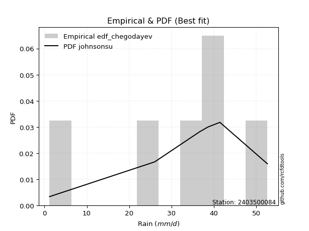</img>

</div>


### 6. EDF Blom (1958)

The Blom formula is a specific "plotting position" formula used in hydrology and statistical analysis to estimate the empirical cumulative probability (or non-exceedance probability) of a data series. It is particularly recommended for data that are approximately normally distributed. The constant _a_ is set to 0.375 (or 3/8).

<div align="center">


$P=(m-a)/(n+1-2a)$


</div>


**6.1. Empirical values**

<div align="center">

|                | 0                   | 1                   | 2        | 3                  | 4                  |
|:---------------|:--------------------|:--------------------|:---------|:-------------------|:-------------------|
| date           | 2020                | 2019                | 2022     | 2021               | 2023               |
| x              | 26.0                | 36.6                | 38.6     | 41.4               | 52.6               |
| m              | 1                   | 2                   | 3        | 4                  | 5                  |
| empirical_dist | edf_blom            | edf_blom            | edf_blom | edf_blom           | edf_blom           |
| empirical      | 0.11904761904761904 | 0.30952380952380953 | 0.5      | 0.6904761904761905 | 0.8809523809523809 |
| empirical_tr   | 1.135135135135135   | 1.4482758620689655  | 2.0      | 3.230769230769231  | 8.399999999999999  |

</div>


**6.2. Kolmogorov-Smirnov fit test (sorted by Δ)**


<div align="center">

|                | 0                    | 1                  | 2                   | 3                   | 4                     | 5                   | 6                  | 7                   | 8                   | 9                   | 10                  | 11                  | 12                  | 13                  | 14                  | 15                  | 16                  | 17                 | 18                 | 19                  | 20                  | 21                  | 22                  | 23                  | 24                  | 25                  | 26                  | 27                  | 28                  | 29                  | 30                  | 31                  | 32                  | 33                  | 34                 | 35                  | 36                  | 37                  | 38                  | 39                  | 40                  | 41                  | 42                  | 43                 | 44                 | 45                  | 46                 | 47                 | 48                  | 49                  | 50                  | 51                  | 52                  | 53                  | 54                  | 55                 | 56                 | 57                 | 58                  | 59                  | 60                  | 61                  | 62                 | 63                  | 64                  | 65                  | 66                  | 67                 | 68                  | 69                  | 70                 | 71                 | 72                 | 73                  | 74                 | 75                  | 76                 | 77                 | 78                 | 79                 | 80                 | 81                 | 82                 | 83                  | 84                 | 85                 | 86                  | 87                 |
|:---------------|:---------------------|:-------------------|:--------------------|:--------------------|:----------------------|:--------------------|:-------------------|:--------------------|:--------------------|:--------------------|:--------------------|:--------------------|:--------------------|:--------------------|:--------------------|:--------------------|:--------------------|:-------------------|:-------------------|:--------------------|:--------------------|:--------------------|:--------------------|:--------------------|:--------------------|:--------------------|:--------------------|:--------------------|:--------------------|:--------------------|:--------------------|:--------------------|:--------------------|:--------------------|:-------------------|:--------------------|:--------------------|:--------------------|:--------------------|:--------------------|:--------------------|:--------------------|:--------------------|:-------------------|:-------------------|:--------------------|:-------------------|:-------------------|:--------------------|:--------------------|:--------------------|:--------------------|:--------------------|:--------------------|:--------------------|:-------------------|:-------------------|:-------------------|:--------------------|:--------------------|:--------------------|:--------------------|:-------------------|:--------------------|:--------------------|:--------------------|:--------------------|:-------------------|:--------------------|:--------------------|:-------------------|:-------------------|:-------------------|:--------------------|:-------------------|:--------------------|:-------------------|:-------------------|:-------------------|:-------------------|:-------------------|:-------------------|:-------------------|:--------------------|:-------------------|:-------------------|:--------------------|:-------------------|
| station        | 2403500084           | 2403500084         | 2403500084          | 2403500084          | 2403500084            | 2403500084          | 2403500084         | 2403500084          | 2403500084          | 2403500084          | 2403500084          | 2403500084          | 2403500084          | 2403500084          | 2403500084          | 2403500084          | 2403500084          | 2403500084         | 2403500084         | 2403500084          | 2403500084          | 2403500084          | 2403500084          | 2403500084          | 2403500084          | 2403500084          | 2403500084          | 2403500084          | 2403500084          | 2403500084          | 2403500084          | 2403500084          | 2403500084          | 2403500084          | 2403500084         | 2403500084          | 2403500084          | 2403500084          | 2403500084          | 2403500084          | 2403500084          | 2403500084          | 2403500084          | 2403500084         | 2403500084         | 2403500084          | 2403500084         | 2403500084         | 2403500084          | 2403500084          | 2403500084          | 2403500084          | 2403500084          | 2403500084          | 2403500084          | 2403500084         | 2403500084         | 2403500084         | 2403500084          | 2403500084          | 2403500084          | 2403500084          | 2403500084         | 2403500084          | 2403500084          | 2403500084          | 2403500084          | 2403500084         | 2403500084          | 2403500084          | 2403500084         | 2403500084         | 2403500084         | 2403500084          | 2403500084         | 2403500084          | 2403500084         | 2403500084         | 2403500084         | 2403500084         | 2403500084         | 2403500084         | 2403500084         | 2403500084          | 2403500084         | 2403500084         | 2403500084          | 2403500084         |
| empirical_dist | edf_blom             | edf_blom           | edf_blom            | edf_blom            | edf_blom              | edf_blom            | edf_blom           | edf_blom            | edf_blom            | edf_blom            | edf_blom            | edf_blom            | edf_blom            | edf_blom            | edf_blom            | edf_blom            | edf_blom            | edf_blom           | edf_blom           | edf_blom            | edf_blom            | edf_blom            | edf_blom            | edf_blom            | edf_blom            | edf_blom            | edf_blom            | edf_blom            | edf_blom            | edf_blom            | edf_blom            | edf_blom            | edf_blom            | edf_blom            | edf_blom           | edf_blom            | edf_blom            | edf_blom            | edf_blom            | edf_blom            | edf_blom            | edf_blom            | edf_blom            | edf_blom           | edf_blom           | edf_blom            | edf_blom           | edf_blom           | edf_blom            | edf_blom            | edf_blom            | edf_blom            | edf_blom            | edf_blom            | edf_blom            | edf_blom           | edf_blom           | edf_blom           | edf_blom            | edf_blom            | edf_blom            | edf_blom            | edf_blom           | edf_blom            | edf_blom            | edf_blom            | edf_blom            | edf_blom           | edf_blom            | edf_blom            | edf_blom           | edf_blom           | edf_blom           | edf_blom            | edf_blom           | edf_blom            | edf_blom           | edf_blom           | edf_blom           | edf_blom           | edf_blom           | edf_blom           | edf_blom           | edf_blom            | edf_blom           | edf_blom           | edf_blom            | edf_blom           |
| p_dist         | laplace_asymmetric   | laplace            | hypsecant           | logistic            | loglaplace_asymmetric | mielke              | loggenlogistic     | fisk                | nct                 | genlogistic         | exponnorm           | norm                | crystalball         | johnsonsu           | loglaplace          | t                   | pearson3            | logjohnsonsu       | gamma              | erlang              | logloggamma         | f                   | logfisk             | logweibull_min      | loggumbel_l         | logpearson3         | rice                | alpha               | loghypsecant        | weibull_min         | betaprime           | invgamma            | maxwell             | loglogistic         | invgauss           | logfatiguelife      | logcrystalball      | logexponnorm        | logt                | lognorm             | lognorm             | logf                | rayleigh            | loggamma           | loggamma           | logbetaprime        | logerlang          | logalpha           | gumbel_r            | lognct              | logrice             | loginvgamma         | gumbel_l            | loginvgauss         | logmaxwell          | moyal              | kstwobign          | halfnorm           | logncf              | gompertz            | lograyleigh         | halflogistic        | loginvweibull      | loggumbel_r         | loghalfnorm         | gibrat              | logkstwobign        | loggenexpon        | logmoyal            | wald                | loghalflogistic    | loggompertz        | genexpon           | expon               | nakagami           | logwald             | logexpon           | loggibrat          | logchi2            | logtruncnorm       | lognakagami        | truncnorm          | logmielke          | chi2                | loglognorm         | invweibull         | ncf                 | fatiguelife        |
| delta          | 0.059148738448036586 | 0.0659526826547846 | 0.06642894732859417 | 0.06788309704703088 | 0.07289403170749964   | 0.07675649721573813 | 0.0767825432222003 | 0.07725805995196977 | 0.08008291688522945 | 0.08043616969071632 | 0.08150523840988844 | 0.08175856421072314 | 0.08175856551480587 | 0.08176150785493008 | 0.08176949150893736 | 0.08177416114126956 | 0.08333106391559719 | 0.0841733955873109 | 0.0850749710445926 | 0.08511011758661041 | 0.08573208852729619 | 0.08832477543091777 | 0.09132812099507598 | 0.09264805766104989 | 0.09680501142353792 | 0.09896676874688254 | 0.10084532536300184 | 0.10262379891938322 | 0.10485395553007709 | 0.10626757581665403 | 0.10844742089665693 | 0.10847774011847655 | 0.11184738930930976 | 0.11251291976277045 | 0.1190891847724107 | 0.12101413904015434 | 0.12166293920353743 | 0.12166363167995731 | 0.12166439235511617 | 0.12166525069987721 | 0.12166525069987721 | 0.12210507518164448 | 0.12415000529901332 | 0.1299308877116399 | 0.1299308877116399 | 0.13095936585350426 | 0.1318133519485417 | 0.1349518797337108 | 0.13552891063964512 | 0.13677720082982903 | 0.13679527470413105 | 0.13914960690142775 | 0.13984692927172604 | 0.15099991749257713 | 0.15606733596920558 | 0.1574468396524663 | 0.1580115521388608 | 0.1590833277883092 | 0.16484432808790211 | 0.16511136468502952 | 0.16817583312513973 | 0.17300713608526558 | 0.1817092534526572 | 0.18644037162106586 | 0.20239692658020536 | 0.20306424161666314 | 0.20676654036704345 | 0.2085141191328952 | 0.21112988988192294 | 0.21547309741642173 | 0.221650374304174  | 0.2385439214296965 | 0.2466924055535593 | 0.24689899628724998 | 0.2786759104824982 | 0.27939848179092464 | 0.2825265010960476 | 0.2861502594358897 | 0.2906375983453173 | 0.308888085101537  | 0.3095238058241371 | 0.3095238059425125 | 0.3250114376572565 | 0.36316042594466613 | 0.3743922408274545 | 0.4308175716032471 | 0.45508517625316147 | 0.524808822800511  |
| deltao         | 0.5865427407550001   | 0.5865427407550001 | 0.5865427407550001  | 0.5865427407550001  | 0.5865427407550001    | 0.5865427407550001  | 0.5865427407550001 | 0.5865427407550001  | 0.5865427407550001  | 0.5865427407550001  | 0.5865427407550001  | 0.5865427407550001  | 0.5865427407550001  | 0.5865427407550001  | 0.5865427407550001  | 0.5865427407550001  | 0.5865427407550001  | 0.5865427407550001 | 0.5865427407550001 | 0.5865427407550001  | 0.5865427407550001  | 0.5865427407550001  | 0.5865427407550001  | 0.5865427407550001  | 0.5865427407550001  | 0.5865427407550001  | 0.5865427407550001  | 0.5865427407550001  | 0.5865427407550001  | 0.5865427407550001  | 0.5865427407550001  | 0.5865427407550001  | 0.5865427407550001  | 0.5865427407550001  | 0.5865427407550001 | 0.5865427407550001  | 0.5865427407550001  | 0.5865427407550001  | 0.5865427407550001  | 0.5865427407550001  | 0.5865427407550001  | 0.5865427407550001  | 0.5865427407550001  | 0.5865427407550001 | 0.5865427407550001 | 0.5865427407550001  | 0.5865427407550001 | 0.5865427407550001 | 0.5865427407550001  | 0.5865427407550001  | 0.5865427407550001  | 0.5865427407550001  | 0.5865427407550001  | 0.5865427407550001  | 0.5865427407550001  | 0.5865427407550001 | 0.5865427407550001 | 0.5865427407550001 | 0.5865427407550001  | 0.5865427407550001  | 0.5865427407550001  | 0.5865427407550001  | 0.5865427407550001 | 0.5865427407550001  | 0.5865427407550001  | 0.5865427407550001  | 0.5865427407550001  | 0.5865427407550001 | 0.5865427407550001  | 0.5865427407550001  | 0.5865427407550001 | 0.5865427407550001 | 0.5865427407550001 | 0.5865427407550001  | 0.5865427407550001 | 0.5865427407550001  | 0.5865427407550001 | 0.5865427407550001 | 0.5865427407550001 | 0.5865427407550001 | 0.5865427407550001 | 0.5865427407550001 | 0.5865427407550001 | 0.5865427407550001  | 0.5865427407550001 | 0.5865427407550001 | 0.5865427407550001  | 0.5865427407550001 |
| eval           | Δo > Δ               | Δo > Δ             | Δo > Δ              | Δo > Δ              | Δo > Δ                | Δo > Δ              | Δo > Δ             | Δo > Δ              | Δo > Δ              | Δo > Δ              | Δo > Δ              | Δo > Δ              | Δo > Δ              | Δo > Δ              | Δo > Δ              | Δo > Δ              | Δo > Δ              | Δo > Δ             | Δo > Δ             | Δo > Δ              | Δo > Δ              | Δo > Δ              | Δo > Δ              | Δo > Δ              | Δo > Δ              | Δo > Δ              | Δo > Δ              | Δo > Δ              | Δo > Δ              | Δo > Δ              | Δo > Δ              | Δo > Δ              | Δo > Δ              | Δo > Δ              | Δo > Δ             | Δo > Δ              | Δo > Δ              | Δo > Δ              | Δo > Δ              | Δo > Δ              | Δo > Δ              | Δo > Δ              | Δo > Δ              | Δo > Δ             | Δo > Δ             | Δo > Δ              | Δo > Δ             | Δo > Δ             | Δo > Δ              | Δo > Δ              | Δo > Δ              | Δo > Δ              | Δo > Δ              | Δo > Δ              | Δo > Δ              | Δo > Δ             | Δo > Δ             | Δo > Δ             | Δo > Δ              | Δo > Δ              | Δo > Δ              | Δo > Δ              | Δo > Δ             | Δo > Δ              | Δo > Δ              | Δo > Δ              | Δo > Δ              | Δo > Δ             | Δo > Δ              | Δo > Δ              | Δo > Δ             | Δo > Δ             | Δo > Δ             | Δo > Δ              | Δo > Δ             | Δo > Δ              | Δo > Δ             | Δo > Δ             | Δo > Δ             | Δo > Δ             | Δo > Δ             | Δo > Δ             | Δo > Δ             | Δo > Δ              | Δo > Δ             | Δo > Δ             | Δo > Δ              | Δo > Δ             |
| fit            | 1                    | 1                  | 1                   | 1                   | 1                     | 1                   | 1                  | 1                   | 1                   | 1                   | 1                   | 1                   | 1                   | 1                   | 1                   | 1                   | 1                   | 1                  | 1                  | 1                   | 1                   | 1                   | 1                   | 1                   | 1                   | 1                   | 1                   | 1                   | 1                   | 1                   | 1                   | 1                   | 1                   | 1                   | 1                  | 1                   | 1                   | 1                   | 1                   | 1                   | 1                   | 1                   | 1                   | 1                  | 1                  | 1                   | 1                  | 1                  | 1                   | 1                   | 1                   | 1                   | 1                   | 1                   | 1                   | 1                  | 1                  | 1                  | 1                   | 1                   | 1                   | 1                   | 1                  | 1                   | 1                   | 1                   | 1                   | 1                  | 1                   | 1                   | 1                  | 1                  | 1                  | 1                   | 1                  | 1                   | 1                  | 1                  | 1                  | 1                  | 1                  | 1                  | 1                  | 1                   | 1                  | 1                  | 1                   | 1                  |
| n              | 5                    | 5                  | 5                   | 5                   | 5                     | 5                   | 5                  | 5                   | 5                   | 5                   | 5                   | 5                   | 5                   | 5                   | 5                   | 5                   | 5                   | 5                  | 5                  | 5                   | 5                   | 5                   | 5                   | 5                   | 5                   | 5                   | 5                   | 5                   | 5                   | 5                   | 5                   | 5                   | 5                   | 5                   | 5                  | 5                   | 5                   | 5                   | 5                   | 5                   | 5                   | 5                   | 5                   | 5                  | 5                  | 5                   | 5                  | 5                  | 5                   | 5                   | 5                   | 5                   | 5                   | 5                   | 5                   | 5                  | 5                  | 5                  | 5                   | 5                   | 5                   | 5                   | 5                  | 5                   | 5                   | 5                   | 5                   | 5                  | 5                   | 5                   | 5                  | 5                  | 5                  | 5                   | 5                  | 5                   | 5                  | 5                  | 5                  | 5                  | 5                  | 5                  | 5                  | 5                   | 5                  | 5                  | 5                   | 5                  |
| best_fit       | 1                    | 0                  | 0                   | 0                   | 0                     | 0                   | 0                  | 0                   | 0                   | 0                   | 0                   | 0                   | 0                   | 0                   | 0                   | 0                   | 0                   | 0                  | 0                  | 0                   | 0                   | 0                   | 0                   | 0                   | 0                   | 0                   | 0                   | 0                   | 0                   | 0                   | 0                   | 0                   | 0                   | 0                   | 0                  | 0                   | 0                   | 0                   | 0                   | 0                   | 0                   | 0                   | 0                   | 0                  | 0                  | 0                   | 0                  | 0                  | 0                   | 0                   | 0                   | 0                   | 0                   | 0                   | 0                   | 0                  | 0                  | 0                  | 0                   | 0                   | 0                   | 0                   | 0                  | 0                   | 0                   | 0                   | 0                   | 0                  | 0                   | 0                   | 0                  | 0                  | 0                  | 0                   | 0                  | 0                   | 0                  | 0                  | 0                  | 0                  | 0                  | 0                  | 0                  | 0                   | 0                  | 0                  | 0                   | 0                  |
| best_fit_sort  | 1                    | 2                  | 3                   | 4                   | 5                     | 6                   | 7                  | 8                   | 9                   | 10                  | 11                  | 12                  | 13                  | 14                  | 15                  | 16                  | 17                  | 18                 | 19                 | 20                  | 21                  | 22                  | 23                  | 24                  | 25                  | 26                  | 27                  | 28                  | 29                  | 30                  | 31                  | 32                  | 33                  | 34                  | 35                 | 36                  | 37                  | 38                  | 39                  | 40                  | 41                  | 42                  | 43                  | 44                 | 45                 | 46                  | 47                 | 48                 | 49                  | 50                  | 51                  | 52                  | 53                  | 54                  | 55                  | 56                 | 57                 | 58                 | 59                  | 60                  | 61                  | 62                  | 63                 | 64                  | 65                  | 66                  | 67                  | 68                 | 69                  | 70                  | 71                 | 72                 | 73                 | 74                  | 75                 | 76                  | 77                 | 78                 | 79                 | 80                 | 81                 | 82                 | 83                 | 84                  | 85                 | 86                 | 87                  | 88                 |

</div>


**6.3. Best fit**

<div align="center">

|   id |    station | empirical_dist   | p_dist             |     delta |   deltao | eval   |   fit |   n |   best_fit |   best_fit_sort |
|-----:|-----------:|:-----------------|:-------------------|----------:|---------:|:-------|------:|----:|-----------:|----------------:|
|    0 | 2403500084 | edf_blom         | laplace_asymmetric | 0.0591487 | 0.586543 | Δo > Δ |     1 |   5 |          1 |               1 |

</div>


<div align="center">

</img></img>

</div>


### 7. EDF Tukey (1962)

In hydrology, the Tukey formula is used as a plotting position formula to estimate the empirical probability or frequency of a flood event (or other hydrological data). The formula parameter is given as _c=0.333_ (or 1/3).

<div align="center">


$P=(m-c)/(n+1-2c)$


</div>


**7.1. Empirical values**

<div align="center">

|                | 0                  | 1                  | 2         | 3         | 4         |
|:---------------|:-------------------|:-------------------|:----------|:----------|:----------|
| date           | 2020               | 2019               | 2022      | 2021      | 2023      |
| x              | 26.0               | 36.6               | 38.6      | 41.4      | 52.6      |
| m              | 1                  | 2                  | 3         | 4         | 5         |
| empirical_dist | edf_tukey          | edf_tukey          | edf_tukey | edf_tukey | edf_tukey |
| empirical      | 0.125              | 0.3125             | 0.5       | 0.6875    | 0.875     |
| empirical_tr   | 1.1428571428571428 | 1.4545454545454546 | 2.0       | 3.2       | 8.0       |

</div>


**7.2. Kolmogorov-Smirnov fit test (sorted by Δ)**


<div align="center">

|                | 0                   | 1                   | 2                   | 3                  | 4                     | 5                   | 6                   | 7                  | 8                   | 9                   | 10                  | 11                  | 12                 | 13                  | 14                 | 15                 | 16                  | 17                  | 18                  | 19                  | 20                  | 21                 | 22                  | 23                  | 24                  | 25                  | 26                  | 27                  | 28                  | 29                  | 30                  | 31                  | 32                 | 33                  | 34                  | 35                  | 36                  | 37                  | 38                 | 39                  | 40                  | 41                  | 42                  | 43                  | 44                  | 45                 | 46                  | 47                  | 48                  | 49                  | 50                 | 51                  | 52                  | 53                  | 54                 | 55                  | 56                  | 57                  | 58                  | 59                  | 60                  | 61                 | 62                  | 63                 | 64                 | 65                  | 66                  | 67                  | 68                  | 69                  | 70                  | 71                  | 72                  | 73                  | 74                  | 75                  | 76                  | 77                 | 78                 | 79                  | 80                  | 81                  | 82                 | 83                  | 84                 | 85                  | 86                  | 87                 |
|:---------------|:--------------------|:--------------------|:--------------------|:-------------------|:----------------------|:--------------------|:--------------------|:-------------------|:--------------------|:--------------------|:--------------------|:--------------------|:-------------------|:--------------------|:-------------------|:-------------------|:--------------------|:--------------------|:--------------------|:--------------------|:--------------------|:-------------------|:--------------------|:--------------------|:--------------------|:--------------------|:--------------------|:--------------------|:--------------------|:--------------------|:--------------------|:--------------------|:-------------------|:--------------------|:--------------------|:--------------------|:--------------------|:--------------------|:-------------------|:--------------------|:--------------------|:--------------------|:--------------------|:--------------------|:--------------------|:-------------------|:--------------------|:--------------------|:--------------------|:--------------------|:-------------------|:--------------------|:--------------------|:--------------------|:-------------------|:--------------------|:--------------------|:--------------------|:--------------------|:--------------------|:--------------------|:-------------------|:--------------------|:-------------------|:-------------------|:--------------------|:--------------------|:--------------------|:--------------------|:--------------------|:--------------------|:--------------------|:--------------------|:--------------------|:--------------------|:--------------------|:--------------------|:-------------------|:-------------------|:--------------------|:--------------------|:--------------------|:-------------------|:--------------------|:-------------------|:--------------------|:--------------------|:-------------------|
| station        | 2403500084          | 2403500084          | 2403500084          | 2403500084         | 2403500084            | 2403500084          | 2403500084          | 2403500084         | 2403500084          | 2403500084          | 2403500084          | 2403500084          | 2403500084         | 2403500084          | 2403500084         | 2403500084         | 2403500084          | 2403500084          | 2403500084          | 2403500084          | 2403500084          | 2403500084         | 2403500084          | 2403500084          | 2403500084          | 2403500084          | 2403500084          | 2403500084          | 2403500084          | 2403500084          | 2403500084          | 2403500084          | 2403500084         | 2403500084          | 2403500084          | 2403500084          | 2403500084          | 2403500084          | 2403500084         | 2403500084          | 2403500084          | 2403500084          | 2403500084          | 2403500084          | 2403500084          | 2403500084         | 2403500084          | 2403500084          | 2403500084          | 2403500084          | 2403500084         | 2403500084          | 2403500084          | 2403500084          | 2403500084         | 2403500084          | 2403500084          | 2403500084          | 2403500084          | 2403500084          | 2403500084          | 2403500084         | 2403500084          | 2403500084         | 2403500084         | 2403500084          | 2403500084          | 2403500084          | 2403500084          | 2403500084          | 2403500084          | 2403500084          | 2403500084          | 2403500084          | 2403500084          | 2403500084          | 2403500084          | 2403500084         | 2403500084         | 2403500084          | 2403500084          | 2403500084          | 2403500084         | 2403500084          | 2403500084         | 2403500084          | 2403500084          | 2403500084         |
| empirical_dist | edf_tukey           | edf_tukey           | edf_tukey           | edf_tukey          | edf_tukey             | edf_tukey           | edf_tukey           | edf_tukey          | edf_tukey           | edf_tukey           | edf_tukey           | edf_tukey           | edf_tukey          | edf_tukey           | edf_tukey          | edf_tukey          | edf_tukey           | edf_tukey           | edf_tukey           | edf_tukey           | edf_tukey           | edf_tukey          | edf_tukey           | edf_tukey           | edf_tukey           | edf_tukey           | edf_tukey           | edf_tukey           | edf_tukey           | edf_tukey           | edf_tukey           | edf_tukey           | edf_tukey          | edf_tukey           | edf_tukey           | edf_tukey           | edf_tukey           | edf_tukey           | edf_tukey          | edf_tukey           | edf_tukey           | edf_tukey           | edf_tukey           | edf_tukey           | edf_tukey           | edf_tukey          | edf_tukey           | edf_tukey           | edf_tukey           | edf_tukey           | edf_tukey          | edf_tukey           | edf_tukey           | edf_tukey           | edf_tukey          | edf_tukey           | edf_tukey           | edf_tukey           | edf_tukey           | edf_tukey           | edf_tukey           | edf_tukey          | edf_tukey           | edf_tukey          | edf_tukey          | edf_tukey           | edf_tukey           | edf_tukey           | edf_tukey           | edf_tukey           | edf_tukey           | edf_tukey           | edf_tukey           | edf_tukey           | edf_tukey           | edf_tukey           | edf_tukey           | edf_tukey          | edf_tukey          | edf_tukey           | edf_tukey           | edf_tukey           | edf_tukey          | edf_tukey           | edf_tukey          | edf_tukey           | edf_tukey           | edf_tukey          |
| p_dist         | laplace_asymmetric  | logistic            | laplace             | hypsecant          | loglaplace_asymmetric | mielke              | loggenlogistic      | fisk               | nct                 | genlogistic         | exponnorm           | norm                | crystalball        | johnsonsu           | loglaplace         | t                  | pearson3            | logjohnsonsu        | gamma               | erlang              | logloggamma         | f                  | logfisk             | logweibull_min      | loggumbel_l         | logpearson3         | rice                | alpha               | loghypsecant        | weibull_min         | betaprime           | invgamma            | maxwell            | loglogistic         | invgauss            | logfatiguelife      | logcrystalball      | logexponnorm        | logt               | lognorm             | lognorm             | logf                | rayleigh            | loggamma            | loggamma            | logbetaprime       | logerlang           | logalpha            | gumbel_r            | lognct              | logrice            | loginvgamma         | gumbel_l            | loginvgauss         | logmaxwell         | moyal               | kstwobign           | halfnorm            | logncf              | gompertz            | lograyleigh         | halflogistic       | loginvweibull       | loggumbel_r        | loghalfnorm        | gibrat              | logkstwobign        | loggenexpon         | logmoyal            | wald                | loghalflogistic     | loggompertz         | genexpon            | expon               | logwald             | logexpon            | nakagami            | loggibrat          | logchi2            | logtruncnorm        | lognakagami         | truncnorm           | logmielke          | chi2                | loglognorm         | invweibull          | ncf                 | fatiguelife        |
| delta          | 0.06510111940041752 | 0.07165487679178961 | 0.07190506360716553 | 0.0723813282809751 | 0.07250661542283962   | 0.07378030673954766 | 0.07380635274600983 | 0.0742818694757793 | 0.07710672640903898 | 0.07745997921452585 | 0.07852904793369797 | 0.07878237373453267 | 0.0787823750386154 | 0.07878531737873962 | 0.0787933010327469 | 0.0787979706650791 | 0.08035487343940673 | 0.08119720511112044 | 0.08209878056840214 | 0.08213392711041995 | 0.08275589805110573 | 0.0853485849547273 | 0.08835193051888551 | 0.08967186718485942 | 0.09401077116604506 | 0.09599057827069207 | 0.09786913488681137 | 0.09964760844319276 | 0.10187776505388663 | 0.10329138534046356 | 0.10547123042046647 | 0.10550154964228609 | 0.1088711988331193 | 0.10953672928657998 | 0.11611299429622024 | 0.11803794856396388 | 0.11868674872734697 | 0.11868744120376684 | 0.1186882018789257 | 0.11868906022368675 | 0.11868906022368675 | 0.11912888470545402 | 0.12117381482282286 | 0.12695469723544944 | 0.12695469723544944 | 0.1279831753773138 | 0.12883716147235125 | 0.13197568925752035 | 0.13255272016345465 | 0.13380101035363856 | 0.1338190842279406 | 0.13617341642523728 | 0.13687073879553557 | 0.14802372701638666 | 0.1530911454930151 | 0.15447064917627584 | 0.15503536166267035 | 0.15610713731211873 | 0.16186813761171165 | 0.16213517420883905 | 0.16519964264894926 | 0.1700309456090751 | 0.17873306297646674 | 0.1834641811448754 | 0.1994207361040149 | 0.20008805114047268 | 0.20379034989085298 | 0.20553792865670473 | 0.20815369940573247 | 0.21249690694023127 | 0.21867418382798354 | 0.23556773095350603 | 0.24371621507736885 | 0.24392280581105952 | 0.27642229131473417 | 0.27955031061985713 | 0.28165210095868864 | 0.2831740689596992 | 0.2846852173929364 | 0.31186427557772745 | 0.31249999630032754 | 0.31249999641870296 | 0.322035247181066  | 0.36018423546847567 | 0.371416050351264  | 0.42486519065086614 | 0.44913279530078054 | 0.5218326323243205 |
| deltao         | 0.5865427407550001  | 0.5865427407550001  | 0.5865427407550001  | 0.5865427407550001 | 0.5865427407550001    | 0.5865427407550001  | 0.5865427407550001  | 0.5865427407550001 | 0.5865427407550001  | 0.5865427407550001  | 0.5865427407550001  | 0.5865427407550001  | 0.5865427407550001 | 0.5865427407550001  | 0.5865427407550001 | 0.5865427407550001 | 0.5865427407550001  | 0.5865427407550001  | 0.5865427407550001  | 0.5865427407550001  | 0.5865427407550001  | 0.5865427407550001 | 0.5865427407550001  | 0.5865427407550001  | 0.5865427407550001  | 0.5865427407550001  | 0.5865427407550001  | 0.5865427407550001  | 0.5865427407550001  | 0.5865427407550001  | 0.5865427407550001  | 0.5865427407550001  | 0.5865427407550001 | 0.5865427407550001  | 0.5865427407550001  | 0.5865427407550001  | 0.5865427407550001  | 0.5865427407550001  | 0.5865427407550001 | 0.5865427407550001  | 0.5865427407550001  | 0.5865427407550001  | 0.5865427407550001  | 0.5865427407550001  | 0.5865427407550001  | 0.5865427407550001 | 0.5865427407550001  | 0.5865427407550001  | 0.5865427407550001  | 0.5865427407550001  | 0.5865427407550001 | 0.5865427407550001  | 0.5865427407550001  | 0.5865427407550001  | 0.5865427407550001 | 0.5865427407550001  | 0.5865427407550001  | 0.5865427407550001  | 0.5865427407550001  | 0.5865427407550001  | 0.5865427407550001  | 0.5865427407550001 | 0.5865427407550001  | 0.5865427407550001 | 0.5865427407550001 | 0.5865427407550001  | 0.5865427407550001  | 0.5865427407550001  | 0.5865427407550001  | 0.5865427407550001  | 0.5865427407550001  | 0.5865427407550001  | 0.5865427407550001  | 0.5865427407550001  | 0.5865427407550001  | 0.5865427407550001  | 0.5865427407550001  | 0.5865427407550001 | 0.5865427407550001 | 0.5865427407550001  | 0.5865427407550001  | 0.5865427407550001  | 0.5865427407550001 | 0.5865427407550001  | 0.5865427407550001 | 0.5865427407550001  | 0.5865427407550001  | 0.5865427407550001 |
| eval           | Δo > Δ              | Δo > Δ              | Δo > Δ              | Δo > Δ             | Δo > Δ                | Δo > Δ              | Δo > Δ              | Δo > Δ             | Δo > Δ              | Δo > Δ              | Δo > Δ              | Δo > Δ              | Δo > Δ             | Δo > Δ              | Δo > Δ             | Δo > Δ             | Δo > Δ              | Δo > Δ              | Δo > Δ              | Δo > Δ              | Δo > Δ              | Δo > Δ             | Δo > Δ              | Δo > Δ              | Δo > Δ              | Δo > Δ              | Δo > Δ              | Δo > Δ              | Δo > Δ              | Δo > Δ              | Δo > Δ              | Δo > Δ              | Δo > Δ             | Δo > Δ              | Δo > Δ              | Δo > Δ              | Δo > Δ              | Δo > Δ              | Δo > Δ             | Δo > Δ              | Δo > Δ              | Δo > Δ              | Δo > Δ              | Δo > Δ              | Δo > Δ              | Δo > Δ             | Δo > Δ              | Δo > Δ              | Δo > Δ              | Δo > Δ              | Δo > Δ             | Δo > Δ              | Δo > Δ              | Δo > Δ              | Δo > Δ             | Δo > Δ              | Δo > Δ              | Δo > Δ              | Δo > Δ              | Δo > Δ              | Δo > Δ              | Δo > Δ             | Δo > Δ              | Δo > Δ             | Δo > Δ             | Δo > Δ              | Δo > Δ              | Δo > Δ              | Δo > Δ              | Δo > Δ              | Δo > Δ              | Δo > Δ              | Δo > Δ              | Δo > Δ              | Δo > Δ              | Δo > Δ              | Δo > Δ              | Δo > Δ             | Δo > Δ             | Δo > Δ              | Δo > Δ              | Δo > Δ              | Δo > Δ             | Δo > Δ              | Δo > Δ             | Δo > Δ              | Δo > Δ              | Δo > Δ             |
| fit            | 1                   | 1                   | 1                   | 1                  | 1                     | 1                   | 1                   | 1                  | 1                   | 1                   | 1                   | 1                   | 1                  | 1                   | 1                  | 1                  | 1                   | 1                   | 1                   | 1                   | 1                   | 1                  | 1                   | 1                   | 1                   | 1                   | 1                   | 1                   | 1                   | 1                   | 1                   | 1                   | 1                  | 1                   | 1                   | 1                   | 1                   | 1                   | 1                  | 1                   | 1                   | 1                   | 1                   | 1                   | 1                   | 1                  | 1                   | 1                   | 1                   | 1                   | 1                  | 1                   | 1                   | 1                   | 1                  | 1                   | 1                   | 1                   | 1                   | 1                   | 1                   | 1                  | 1                   | 1                  | 1                  | 1                   | 1                   | 1                   | 1                   | 1                   | 1                   | 1                   | 1                   | 1                   | 1                   | 1                   | 1                   | 1                  | 1                  | 1                   | 1                   | 1                   | 1                  | 1                   | 1                  | 1                   | 1                   | 1                  |
| n              | 5                   | 5                   | 5                   | 5                  | 5                     | 5                   | 5                   | 5                  | 5                   | 5                   | 5                   | 5                   | 5                  | 5                   | 5                  | 5                  | 5                   | 5                   | 5                   | 5                   | 5                   | 5                  | 5                   | 5                   | 5                   | 5                   | 5                   | 5                   | 5                   | 5                   | 5                   | 5                   | 5                  | 5                   | 5                   | 5                   | 5                   | 5                   | 5                  | 5                   | 5                   | 5                   | 5                   | 5                   | 5                   | 5                  | 5                   | 5                   | 5                   | 5                   | 5                  | 5                   | 5                   | 5                   | 5                  | 5                   | 5                   | 5                   | 5                   | 5                   | 5                   | 5                  | 5                   | 5                  | 5                  | 5                   | 5                   | 5                   | 5                   | 5                   | 5                   | 5                   | 5                   | 5                   | 5                   | 5                   | 5                   | 5                  | 5                  | 5                   | 5                   | 5                   | 5                  | 5                   | 5                  | 5                   | 5                   | 5                  |
| best_fit       | 1                   | 0                   | 0                   | 0                  | 0                     | 0                   | 0                   | 0                  | 0                   | 0                   | 0                   | 0                   | 0                  | 0                   | 0                  | 0                  | 0                   | 0                   | 0                   | 0                   | 0                   | 0                  | 0                   | 0                   | 0                   | 0                   | 0                   | 0                   | 0                   | 0                   | 0                   | 0                   | 0                  | 0                   | 0                   | 0                   | 0                   | 0                   | 0                  | 0                   | 0                   | 0                   | 0                   | 0                   | 0                   | 0                  | 0                   | 0                   | 0                   | 0                   | 0                  | 0                   | 0                   | 0                   | 0                  | 0                   | 0                   | 0                   | 0                   | 0                   | 0                   | 0                  | 0                   | 0                  | 0                  | 0                   | 0                   | 0                   | 0                   | 0                   | 0                   | 0                   | 0                   | 0                   | 0                   | 0                   | 0                   | 0                  | 0                  | 0                   | 0                   | 0                   | 0                  | 0                   | 0                  | 0                   | 0                   | 0                  |
| best_fit_sort  | 1                   | 2                   | 3                   | 4                  | 5                     | 6                   | 7                   | 8                  | 9                   | 10                  | 11                  | 12                  | 13                 | 14                  | 15                 | 16                 | 17                  | 18                  | 19                  | 20                  | 21                  | 22                 | 23                  | 24                  | 25                  | 26                  | 27                  | 28                  | 29                  | 30                  | 31                  | 32                  | 33                 | 34                  | 35                  | 36                  | 37                  | 38                  | 39                 | 40                  | 41                  | 42                  | 43                  | 44                  | 45                  | 46                 | 47                  | 48                  | 49                  | 50                  | 51                 | 52                  | 53                  | 54                  | 55                 | 56                  | 57                  | 58                  | 59                  | 60                  | 61                  | 62                 | 63                  | 64                 | 65                 | 66                  | 67                  | 68                  | 69                  | 70                  | 71                  | 72                  | 73                  | 74                  | 75                  | 76                  | 77                  | 78                 | 79                 | 80                  | 81                  | 82                  | 83                 | 84                  | 85                 | 86                  | 87                  | 88                 |

</div>


**7.3. Best fit**

<div align="center">

|   id |    station | empirical_dist   | p_dist             |     delta |   deltao | eval   |   fit |   n |   best_fit |   best_fit_sort |
|-----:|-----------:|:-----------------|:-------------------|----------:|---------:|:-------|------:|----:|-----------:|----------------:|
|    0 | 2403500084 | edf_tukey        | laplace_asymmetric | 0.0651011 | 0.586543 | Δo > Δ |     1 |   5 |          1 |               1 |

</div>


<div align="center">

</img>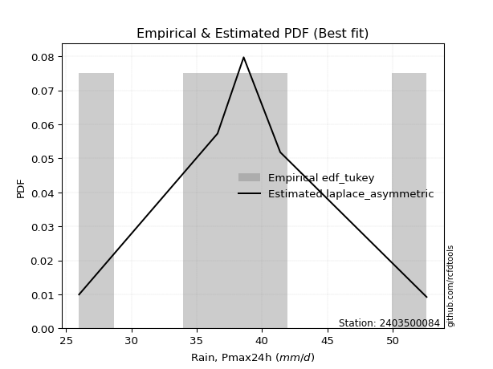</img>

</div>


### 8. EDF Gringorten (1963)

Gringorten plotting position formula is essential for estimating the probability and return periods of extreme events like floods and heavy rainfall. The constant _a=0.44_.

<div align="center">


$P=(m-a)/(n+1-2a)$


</div>


**8.1. Empirical values**

<div align="center">

|                | 0                   | 1                  | 2              | 3                 | 4                  |
|:---------------|:--------------------|:-------------------|:---------------|:------------------|:-------------------|
| date           | 2020                | 2019               | 2022           | 2021              | 2023               |
| x              | 26.0                | 36.6               | 38.6           | 41.4              | 52.6               |
| m              | 1                   | 2                  | 3              | 4                 | 5                  |
| empirical_dist | edf_gringorten      | edf_gringorten     | edf_gringorten | edf_gringorten    | edf_gringorten     |
| empirical      | 0.10937500000000001 | 0.3046875          | 0.5            | 0.6953125         | 0.8906249999999999 |
| empirical_tr   | 1.1228070175438596  | 1.4382022471910112 | 2.0            | 3.282051282051282 | 9.142857142857133  |

</div>


**8.2. Kolmogorov-Smirnov fit test (sorted by Δ)**


<div align="center">

|                | 0                   | 1                   | 2                    | 3                   | 4                     | 5                   | 6                   | 7                  | 8                   | 9                   | 10                  | 11                  | 12                 | 13                  | 14                 | 15                 | 16                  | 17                  | 18                  | 19                  | 20                  | 21                 | 22                  | 23                  | 24                  | 25                  | 26                  | 27                  | 28                  | 29                  | 30                  | 31                  | 32                 | 33                  | 34                  | 35                  | 36                  | 37                  | 38                 | 39                  | 40                  | 41                  | 42                  | 43                  | 44                  | 45                 | 46                  | 47                  | 48                  | 49                  | 50                 | 51                  | 52                  | 53                  | 54                 | 55                  | 56                  | 57                  | 58                  | 59                  | 60                  | 61                 | 62                  | 63                 | 64                 | 65                  | 66                  | 67                  | 68                  | 69                  | 70                  | 71                  | 72                  | 73                 | 74                 | 75                  | 76                  | 77                 | 78                 | 79                  | 80                  | 81                  | 82                 | 83                  | 84                 | 85                  | 86                  | 87                 |
|:---------------|:--------------------|:--------------------|:---------------------|:--------------------|:----------------------|:--------------------|:--------------------|:-------------------|:--------------------|:--------------------|:--------------------|:--------------------|:-------------------|:--------------------|:-------------------|:-------------------|:--------------------|:--------------------|:--------------------|:--------------------|:--------------------|:-------------------|:--------------------|:--------------------|:--------------------|:--------------------|:--------------------|:--------------------|:--------------------|:--------------------|:--------------------|:--------------------|:-------------------|:--------------------|:--------------------|:--------------------|:--------------------|:--------------------|:-------------------|:--------------------|:--------------------|:--------------------|:--------------------|:--------------------|:--------------------|:-------------------|:--------------------|:--------------------|:--------------------|:--------------------|:-------------------|:--------------------|:--------------------|:--------------------|:-------------------|:--------------------|:--------------------|:--------------------|:--------------------|:--------------------|:--------------------|:-------------------|:--------------------|:-------------------|:-------------------|:--------------------|:--------------------|:--------------------|:--------------------|:--------------------|:--------------------|:--------------------|:--------------------|:-------------------|:-------------------|:--------------------|:--------------------|:-------------------|:-------------------|:--------------------|:--------------------|:--------------------|:-------------------|:--------------------|:-------------------|:--------------------|:--------------------|:-------------------|
| station        | 2403500084          | 2403500084          | 2403500084           | 2403500084          | 2403500084            | 2403500084          | 2403500084          | 2403500084         | 2403500084          | 2403500084          | 2403500084          | 2403500084          | 2403500084         | 2403500084          | 2403500084         | 2403500084         | 2403500084          | 2403500084          | 2403500084          | 2403500084          | 2403500084          | 2403500084         | 2403500084          | 2403500084          | 2403500084          | 2403500084          | 2403500084          | 2403500084          | 2403500084          | 2403500084          | 2403500084          | 2403500084          | 2403500084         | 2403500084          | 2403500084          | 2403500084          | 2403500084          | 2403500084          | 2403500084         | 2403500084          | 2403500084          | 2403500084          | 2403500084          | 2403500084          | 2403500084          | 2403500084         | 2403500084          | 2403500084          | 2403500084          | 2403500084          | 2403500084         | 2403500084          | 2403500084          | 2403500084          | 2403500084         | 2403500084          | 2403500084          | 2403500084          | 2403500084          | 2403500084          | 2403500084          | 2403500084         | 2403500084          | 2403500084         | 2403500084         | 2403500084          | 2403500084          | 2403500084          | 2403500084          | 2403500084          | 2403500084          | 2403500084          | 2403500084          | 2403500084         | 2403500084         | 2403500084          | 2403500084          | 2403500084         | 2403500084         | 2403500084          | 2403500084          | 2403500084          | 2403500084         | 2403500084          | 2403500084         | 2403500084          | 2403500084          | 2403500084         |
| empirical_dist | edf_gringorten      | edf_gringorten      | edf_gringorten       | edf_gringorten      | edf_gringorten        | edf_gringorten      | edf_gringorten      | edf_gringorten     | edf_gringorten      | edf_gringorten      | edf_gringorten      | edf_gringorten      | edf_gringorten     | edf_gringorten      | edf_gringorten     | edf_gringorten     | edf_gringorten      | edf_gringorten      | edf_gringorten      | edf_gringorten      | edf_gringorten      | edf_gringorten     | edf_gringorten      | edf_gringorten      | edf_gringorten      | edf_gringorten      | edf_gringorten      | edf_gringorten      | edf_gringorten      | edf_gringorten      | edf_gringorten      | edf_gringorten      | edf_gringorten     | edf_gringorten      | edf_gringorten      | edf_gringorten      | edf_gringorten      | edf_gringorten      | edf_gringorten     | edf_gringorten      | edf_gringorten      | edf_gringorten      | edf_gringorten      | edf_gringorten      | edf_gringorten      | edf_gringorten     | edf_gringorten      | edf_gringorten      | edf_gringorten      | edf_gringorten      | edf_gringorten     | edf_gringorten      | edf_gringorten      | edf_gringorten      | edf_gringorten     | edf_gringorten      | edf_gringorten      | edf_gringorten      | edf_gringorten      | edf_gringorten      | edf_gringorten      | edf_gringorten     | edf_gringorten      | edf_gringorten     | edf_gringorten     | edf_gringorten      | edf_gringorten      | edf_gringorten      | edf_gringorten      | edf_gringorten      | edf_gringorten      | edf_gringorten      | edf_gringorten      | edf_gringorten     | edf_gringorten     | edf_gringorten      | edf_gringorten      | edf_gringorten     | edf_gringorten     | edf_gringorten      | edf_gringorten      | edf_gringorten      | edf_gringorten     | edf_gringorten      | edf_gringorten     | edf_gringorten      | edf_gringorten      | edf_gringorten     |
| p_dist         | laplace_asymmetric  | laplace             | hypsecant            | logistic            | loglaplace_asymmetric | mielke              | loggenlogistic      | fisk               | nct                 | genlogistic         | exponnorm           | norm                | crystalball        | johnsonsu           | loglaplace         | t                  | pearson3            | logjohnsonsu        | gamma               | erlang              | logloggamma         | f                  | logfisk             | logweibull_min      | loggumbel_l         | logpearson3         | rice                | alpha               | loghypsecant        | weibull_min         | betaprime           | invgamma            | maxwell            | loglogistic         | invgauss            | logfatiguelife      | logcrystalball      | logexponnorm        | logt               | lognorm             | lognorm             | logf                | rayleigh            | loggamma            | loggamma            | logbetaprime       | logerlang           | logalpha            | gumbel_r            | lognct              | logrice            | loginvgamma         | gumbel_l            | loginvgauss         | logmaxwell         | moyal               | kstwobign           | halfnorm            | logncf              | gompertz            | lograyleigh         | halflogistic       | loginvweibull       | loggumbel_r        | loghalfnorm        | gibrat              | logkstwobign        | loggenexpon         | logmoyal            | wald                | loghalflogistic     | loggompertz         | genexpon            | expon              | nakagami           | logwald             | logexpon            | loggibrat          | logchi2            | logtruncnorm        | lognakagami         | truncnorm           | logmielke          | chi2                | loglognorm         | invweibull          | ncf                 | fatiguelife        |
| delta          | 0.04947611940041763 | 0.05628006360716564 | 0.061452755331632636 | 0.07271940657084042 | 0.07773034123130917   | 0.08159280673954766 | 0.08161885274600983 | 0.0820943694757793 | 0.08491922640903898 | 0.08527247921452585 | 0.08634154793369797 | 0.08659487373453267 | 0.0865948750386154 | 0.08659781737873962 | 0.0866058010327469 | 0.0866104706650791 | 0.08816737343940673 | 0.08900970511112044 | 0.08991128056840214 | 0.08994642711041995 | 0.09056839805110573 | 0.0931610849547273 | 0.09616443051888551 | 0.09748436718485942 | 0.10164132094734746 | 0.10380307827069207 | 0.10568163488681137 | 0.10746010844319276 | 0.10969026505388663 | 0.11110388534046356 | 0.11328373042046647 | 0.11331404964228609 | 0.1166836988331193 | 0.11734922928657998 | 0.12392549429622024 | 0.12585044856396388 | 0.12649924872734697 | 0.12649994120376684 | 0.1265007018789257 | 0.12650156022368675 | 0.12650156022368675 | 0.12694138470545402 | 0.12898631482282286 | 0.13476719723544944 | 0.13476719723544944 | 0.1357956753773138 | 0.13664966147235125 | 0.13978818925752035 | 0.14036522016345465 | 0.14161351035363856 | 0.1416315842279406 | 0.14398591642523728 | 0.14468323879553557 | 0.15583622701638666 | 0.1609036454930151 | 0.16228314917627584 | 0.16284786166267035 | 0.16391963731211873 | 0.16968063761171165 | 0.16994767420883905 | 0.17301214264894926 | 0.1778434456090751 | 0.18654556297646674 | 0.1912766811448754 | 0.2072332361040149 | 0.20790055114047268 | 0.21160284989085298 | 0.21335042865670473 | 0.21596619940573247 | 0.22030940694023127 | 0.22648668382798354 | 0.24338023095350603 | 0.25152871507736885 | 0.2517353058110595 | 0.2778843448576489 | 0.28423479131473417 | 0.28736281061985713 | 0.2909865689596992 | 0.3003102173929363 | 0.30405177557772745 | 0.30468749630032754 | 0.30468749641870296 | 0.329847747181066  | 0.36799673546847567 | 0.379228550351264  | 0.44049019065086603 | 0.46475779530078054 | 0.5296451323243205 |
| deltao         | 0.5865427407550001  | 0.5865427407550001  | 0.5865427407550001   | 0.5865427407550001  | 0.5865427407550001    | 0.5865427407550001  | 0.5865427407550001  | 0.5865427407550001 | 0.5865427407550001  | 0.5865427407550001  | 0.5865427407550001  | 0.5865427407550001  | 0.5865427407550001 | 0.5865427407550001  | 0.5865427407550001 | 0.5865427407550001 | 0.5865427407550001  | 0.5865427407550001  | 0.5865427407550001  | 0.5865427407550001  | 0.5865427407550001  | 0.5865427407550001 | 0.5865427407550001  | 0.5865427407550001  | 0.5865427407550001  | 0.5865427407550001  | 0.5865427407550001  | 0.5865427407550001  | 0.5865427407550001  | 0.5865427407550001  | 0.5865427407550001  | 0.5865427407550001  | 0.5865427407550001 | 0.5865427407550001  | 0.5865427407550001  | 0.5865427407550001  | 0.5865427407550001  | 0.5865427407550001  | 0.5865427407550001 | 0.5865427407550001  | 0.5865427407550001  | 0.5865427407550001  | 0.5865427407550001  | 0.5865427407550001  | 0.5865427407550001  | 0.5865427407550001 | 0.5865427407550001  | 0.5865427407550001  | 0.5865427407550001  | 0.5865427407550001  | 0.5865427407550001 | 0.5865427407550001  | 0.5865427407550001  | 0.5865427407550001  | 0.5865427407550001 | 0.5865427407550001  | 0.5865427407550001  | 0.5865427407550001  | 0.5865427407550001  | 0.5865427407550001  | 0.5865427407550001  | 0.5865427407550001 | 0.5865427407550001  | 0.5865427407550001 | 0.5865427407550001 | 0.5865427407550001  | 0.5865427407550001  | 0.5865427407550001  | 0.5865427407550001  | 0.5865427407550001  | 0.5865427407550001  | 0.5865427407550001  | 0.5865427407550001  | 0.5865427407550001 | 0.5865427407550001 | 0.5865427407550001  | 0.5865427407550001  | 0.5865427407550001 | 0.5865427407550001 | 0.5865427407550001  | 0.5865427407550001  | 0.5865427407550001  | 0.5865427407550001 | 0.5865427407550001  | 0.5865427407550001 | 0.5865427407550001  | 0.5865427407550001  | 0.5865427407550001 |
| eval           | Δo > Δ              | Δo > Δ              | Δo > Δ               | Δo > Δ              | Δo > Δ                | Δo > Δ              | Δo > Δ              | Δo > Δ             | Δo > Δ              | Δo > Δ              | Δo > Δ              | Δo > Δ              | Δo > Δ             | Δo > Δ              | Δo > Δ             | Δo > Δ             | Δo > Δ              | Δo > Δ              | Δo > Δ              | Δo > Δ              | Δo > Δ              | Δo > Δ             | Δo > Δ              | Δo > Δ              | Δo > Δ              | Δo > Δ              | Δo > Δ              | Δo > Δ              | Δo > Δ              | Δo > Δ              | Δo > Δ              | Δo > Δ              | Δo > Δ             | Δo > Δ              | Δo > Δ              | Δo > Δ              | Δo > Δ              | Δo > Δ              | Δo > Δ             | Δo > Δ              | Δo > Δ              | Δo > Δ              | Δo > Δ              | Δo > Δ              | Δo > Δ              | Δo > Δ             | Δo > Δ              | Δo > Δ              | Δo > Δ              | Δo > Δ              | Δo > Δ             | Δo > Δ              | Δo > Δ              | Δo > Δ              | Δo > Δ             | Δo > Δ              | Δo > Δ              | Δo > Δ              | Δo > Δ              | Δo > Δ              | Δo > Δ              | Δo > Δ             | Δo > Δ              | Δo > Δ             | Δo > Δ             | Δo > Δ              | Δo > Δ              | Δo > Δ              | Δo > Δ              | Δo > Δ              | Δo > Δ              | Δo > Δ              | Δo > Δ              | Δo > Δ             | Δo > Δ             | Δo > Δ              | Δo > Δ              | Δo > Δ             | Δo > Δ             | Δo > Δ              | Δo > Δ              | Δo > Δ              | Δo > Δ             | Δo > Δ              | Δo > Δ             | Δo > Δ              | Δo > Δ              | Δo > Δ             |
| fit            | 1                   | 1                   | 1                    | 1                   | 1                     | 1                   | 1                   | 1                  | 1                   | 1                   | 1                   | 1                   | 1                  | 1                   | 1                  | 1                  | 1                   | 1                   | 1                   | 1                   | 1                   | 1                  | 1                   | 1                   | 1                   | 1                   | 1                   | 1                   | 1                   | 1                   | 1                   | 1                   | 1                  | 1                   | 1                   | 1                   | 1                   | 1                   | 1                  | 1                   | 1                   | 1                   | 1                   | 1                   | 1                   | 1                  | 1                   | 1                   | 1                   | 1                   | 1                  | 1                   | 1                   | 1                   | 1                  | 1                   | 1                   | 1                   | 1                   | 1                   | 1                   | 1                  | 1                   | 1                  | 1                  | 1                   | 1                   | 1                   | 1                   | 1                   | 1                   | 1                   | 1                   | 1                  | 1                  | 1                   | 1                   | 1                  | 1                  | 1                   | 1                   | 1                   | 1                  | 1                   | 1                  | 1                   | 1                   | 1                  |
| n              | 5                   | 5                   | 5                    | 5                   | 5                     | 5                   | 5                   | 5                  | 5                   | 5                   | 5                   | 5                   | 5                  | 5                   | 5                  | 5                  | 5                   | 5                   | 5                   | 5                   | 5                   | 5                  | 5                   | 5                   | 5                   | 5                   | 5                   | 5                   | 5                   | 5                   | 5                   | 5                   | 5                  | 5                   | 5                   | 5                   | 5                   | 5                   | 5                  | 5                   | 5                   | 5                   | 5                   | 5                   | 5                   | 5                  | 5                   | 5                   | 5                   | 5                   | 5                  | 5                   | 5                   | 5                   | 5                  | 5                   | 5                   | 5                   | 5                   | 5                   | 5                   | 5                  | 5                   | 5                  | 5                  | 5                   | 5                   | 5                   | 5                   | 5                   | 5                   | 5                   | 5                   | 5                  | 5                  | 5                   | 5                   | 5                  | 5                  | 5                   | 5                   | 5                   | 5                  | 5                   | 5                  | 5                   | 5                   | 5                  |
| best_fit       | 1                   | 0                   | 0                    | 0                   | 0                     | 0                   | 0                   | 0                  | 0                   | 0                   | 0                   | 0                   | 0                  | 0                   | 0                  | 0                  | 0                   | 0                   | 0                   | 0                   | 0                   | 0                  | 0                   | 0                   | 0                   | 0                   | 0                   | 0                   | 0                   | 0                   | 0                   | 0                   | 0                  | 0                   | 0                   | 0                   | 0                   | 0                   | 0                  | 0                   | 0                   | 0                   | 0                   | 0                   | 0                   | 0                  | 0                   | 0                   | 0                   | 0                   | 0                  | 0                   | 0                   | 0                   | 0                  | 0                   | 0                   | 0                   | 0                   | 0                   | 0                   | 0                  | 0                   | 0                  | 0                  | 0                   | 0                   | 0                   | 0                   | 0                   | 0                   | 0                   | 0                   | 0                  | 0                  | 0                   | 0                   | 0                  | 0                  | 0                   | 0                   | 0                   | 0                  | 0                   | 0                  | 0                   | 0                   | 0                  |
| best_fit_sort  | 1                   | 2                   | 3                    | 4                   | 5                     | 6                   | 7                   | 8                  | 9                   | 10                  | 11                  | 12                  | 13                 | 14                  | 15                 | 16                 | 17                  | 18                  | 19                  | 20                  | 21                  | 22                 | 23                  | 24                  | 25                  | 26                  | 27                  | 28                  | 29                  | 30                  | 31                  | 32                  | 33                 | 34                  | 35                  | 36                  | 37                  | 38                  | 39                 | 40                  | 41                  | 42                  | 43                  | 44                  | 45                  | 46                 | 47                  | 48                  | 49                  | 50                  | 51                 | 52                  | 53                  | 54                  | 55                 | 56                  | 57                  | 58                  | 59                  | 60                  | 61                  | 62                 | 63                  | 64                 | 65                 | 66                  | 67                  | 68                  | 69                  | 70                  | 71                  | 72                  | 73                  | 74                 | 75                 | 76                  | 77                  | 78                 | 79                 | 80                  | 81                  | 82                  | 83                 | 84                  | 85                 | 86                  | 87                  | 88                 |

</div>


**8.3. Best fit**

<div align="center">

|   id |    station | empirical_dist   | p_dist             |     delta |   deltao | eval   |   fit |   n |   best_fit |   best_fit_sort |
|-----:|-----------:|:-----------------|:-------------------|----------:|---------:|:-------|------:|----:|-----------:|----------------:|
|    0 | 2403500084 | edf_gringorten   | laplace_asymmetric | 0.0494761 | 0.586543 | Δo > Δ |     1 |   5 |          1 |               1 |

</div>


<div align="center">

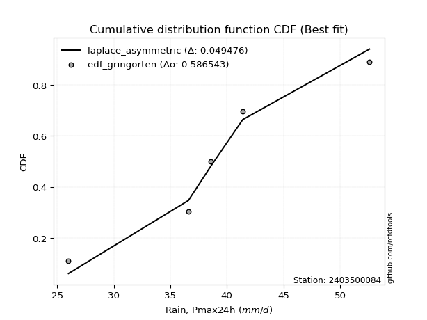</img></img>

</div>


### 9. EDF Filliben (1975)

The specific values of the constants (0.3175) (often denoted as $alpha$) and (0.365) are derived from a method proposed by James J. Filliben in a 1975 paper. This particular formula is the mean value of the $i$-th order statistic of the normal distribution and is considered a robust and effective plotting position formula for the normal probability plot correlation coefficient test for normality.

<div align="center">


$P=(m-0.3175)/(n+0.365)$


</div>


**9.1. Empirical values**

<div align="center">

|                | 0                   | 1                  | 2            | 3                  | 4                  |
|:---------------|:--------------------|:-------------------|:-------------|:-------------------|:-------------------|
| date           | 2020                | 2019               | 2022         | 2021               | 2023               |
| x              | 26.0                | 36.6               | 38.6         | 41.4               | 52.6               |
| m              | 1                   | 2                  | 3            | 4                  | 5                  |
| empirical_dist | edf_filliben        | edf_filliben       | edf_filliben | edf_filliben       | edf_filliben       |
| empirical      | 0.12721342031686858 | 0.3136067101584343 | 0.5          | 0.6863932898415657 | 0.8727865796831314 |
| empirical_tr   | 1.1457554725040042  | 1.456890699253225  | 2.0          | 3.188707280832095  | 7.860805860805863  |

</div>


**9.2. Kolmogorov-Smirnov fit test (sorted by Δ)**


<div align="center">

|                | 0                   | 1                   | 2                   | 3                   | 4                   | 5                   | 6                   | 7                     | 8                   | 9                   | 10                  | 11                  | 12                  | 13                  | 14                  | 15                  | 16                  | 17                  | 18                  | 19                  | 20                  | 21                  | 22                  | 23                  | 24                 | 25                  | 26                 | 27                  | 28                  | 29                  | 30                  | 31                  | 32                  | 33                 | 34                  | 35                 | 36                  | 37                  | 38                  | 39                  | 40                  | 41                  | 42                  | 43                  | 44                  | 45                  | 46                  | 47                  | 48                  | 49                  | 50                 | 51                 | 52                  | 53                 | 54                  | 55                  | 56                  | 57                  | 58                  | 59                  | 60                 | 61                  | 62                  | 63                  | 64                  | 65                 | 66                 | 67                  | 68                 | 69                 | 70                  | 71                  | 72                  | 73                  | 74                 | 75                  | 76                  | 77                  | 78                 | 79                 | 80                 | 81                  | 82                  | 83                 | 84                  | 85                 | 86                 | 87                 |
|:---------------|:--------------------|:--------------------|:--------------------|:--------------------|:--------------------|:--------------------|:--------------------|:----------------------|:--------------------|:--------------------|:--------------------|:--------------------|:--------------------|:--------------------|:--------------------|:--------------------|:--------------------|:--------------------|:--------------------|:--------------------|:--------------------|:--------------------|:--------------------|:--------------------|:-------------------|:--------------------|:-------------------|:--------------------|:--------------------|:--------------------|:--------------------|:--------------------|:--------------------|:-------------------|:--------------------|:-------------------|:--------------------|:--------------------|:--------------------|:--------------------|:--------------------|:--------------------|:--------------------|:--------------------|:--------------------|:--------------------|:--------------------|:--------------------|:--------------------|:--------------------|:-------------------|:-------------------|:--------------------|:-------------------|:--------------------|:--------------------|:--------------------|:--------------------|:--------------------|:--------------------|:-------------------|:--------------------|:--------------------|:--------------------|:--------------------|:-------------------|:-------------------|:--------------------|:-------------------|:-------------------|:--------------------|:--------------------|:--------------------|:--------------------|:-------------------|:--------------------|:--------------------|:--------------------|:-------------------|:-------------------|:-------------------|:--------------------|:--------------------|:-------------------|:--------------------|:-------------------|:-------------------|:-------------------|
| station        | 2403500084          | 2403500084          | 2403500084          | 2403500084          | 2403500084          | 2403500084          | 2403500084          | 2403500084            | 2403500084          | 2403500084          | 2403500084          | 2403500084          | 2403500084          | 2403500084          | 2403500084          | 2403500084          | 2403500084          | 2403500084          | 2403500084          | 2403500084          | 2403500084          | 2403500084          | 2403500084          | 2403500084          | 2403500084         | 2403500084          | 2403500084         | 2403500084          | 2403500084          | 2403500084          | 2403500084          | 2403500084          | 2403500084          | 2403500084         | 2403500084          | 2403500084         | 2403500084          | 2403500084          | 2403500084          | 2403500084          | 2403500084          | 2403500084          | 2403500084          | 2403500084          | 2403500084          | 2403500084          | 2403500084          | 2403500084          | 2403500084          | 2403500084          | 2403500084         | 2403500084         | 2403500084          | 2403500084         | 2403500084          | 2403500084          | 2403500084          | 2403500084          | 2403500084          | 2403500084          | 2403500084         | 2403500084          | 2403500084          | 2403500084          | 2403500084          | 2403500084         | 2403500084         | 2403500084          | 2403500084         | 2403500084         | 2403500084          | 2403500084          | 2403500084          | 2403500084          | 2403500084         | 2403500084          | 2403500084          | 2403500084          | 2403500084         | 2403500084         | 2403500084         | 2403500084          | 2403500084          | 2403500084         | 2403500084          | 2403500084         | 2403500084         | 2403500084         |
| empirical_dist | edf_filliben        | edf_filliben        | edf_filliben        | edf_filliben        | edf_filliben        | edf_filliben        | edf_filliben        | edf_filliben          | edf_filliben        | edf_filliben        | edf_filliben        | edf_filliben        | edf_filliben        | edf_filliben        | edf_filliben        | edf_filliben        | edf_filliben        | edf_filliben        | edf_filliben        | edf_filliben        | edf_filliben        | edf_filliben        | edf_filliben        | edf_filliben        | edf_filliben       | edf_filliben        | edf_filliben       | edf_filliben        | edf_filliben        | edf_filliben        | edf_filliben        | edf_filliben        | edf_filliben        | edf_filliben       | edf_filliben        | edf_filliben       | edf_filliben        | edf_filliben        | edf_filliben        | edf_filliben        | edf_filliben        | edf_filliben        | edf_filliben        | edf_filliben        | edf_filliben        | edf_filliben        | edf_filliben        | edf_filliben        | edf_filliben        | edf_filliben        | edf_filliben       | edf_filliben       | edf_filliben        | edf_filliben       | edf_filliben        | edf_filliben        | edf_filliben        | edf_filliben        | edf_filliben        | edf_filliben        | edf_filliben       | edf_filliben        | edf_filliben        | edf_filliben        | edf_filliben        | edf_filliben       | edf_filliben       | edf_filliben        | edf_filliben       | edf_filliben       | edf_filliben        | edf_filliben        | edf_filliben        | edf_filliben        | edf_filliben       | edf_filliben        | edf_filliben        | edf_filliben        | edf_filliben       | edf_filliben       | edf_filliben       | edf_filliben        | edf_filliben        | edf_filliben       | edf_filliben        | edf_filliben       | edf_filliben       | edf_filliben       |
| p_dist         | laplace_asymmetric  | mielke              | loggenlogistic      | fisk                | logistic            | laplace             | hypsecant           | loglaplace_asymmetric | nct                 | genlogistic         | exponnorm           | norm                | crystalball         | johnsonsu           | t                   | pearson3            | logjohnsonsu        | loglaplace          | gamma               | erlang              | logloggamma         | f                   | logfisk             | logweibull_min      | logpearson3        | loggumbel_l         | rice               | alpha               | loghypsecant        | weibull_min         | betaprime           | invgamma            | maxwell             | loglogistic        | invgauss            | logfatiguelife     | logcrystalball      | logexponnorm        | logt                | lognorm             | lognorm             | logf                | rayleigh            | loggamma            | loggamma            | logbetaprime        | logerlang           | logalpha            | gumbel_r            | lognct              | logrice            | loginvgamma        | gumbel_l            | loginvgauss        | logmaxwell          | moyal               | kstwobign           | halfnorm            | logncf              | gompertz            | lograyleigh        | halflogistic        | loginvweibull       | loggumbel_r         | loghalfnorm         | gibrat             | logkstwobign       | loggenexpon         | logmoyal           | wald               | loghalflogistic     | loggompertz         | genexpon            | expon               | logwald            | logexpon            | loggibrat           | logchi2             | nakagami           | logtruncnorm       | lognakagami        | truncnorm           | logmielke           | chi2               | loglognorm          | invweibull         | ncf                | fatiguelife        |
| delta          | 0.06731453971728607 | 0.07267359658111339 | 0.07269964258757555 | 0.07317515931734503 | 0.07386829710865817 | 0.07411848392403408 | 0.07459474859784365 | 0.0747200357397082    | 0.07600001625060471 | 0.07635326905609158 | 0.07742233777526364 | 0.07767566357609834 | 0.07767566488018107 | 0.07767860722030528 | 0.07769126050664477 | 0.07924816328097245 | 0.08009049495268616 | 0.08052716768965537 | 0.08099207040996786 | 0.08102721695198567 | 0.08164918789267145 | 0.08424187479629303 | 0.08724522036045124 | 0.08856515702642515 | 0.0948838681122578 | 0.09622419148291361 | 0.0967624247283771 | 0.09854089828475848 | 0.10077105489545235 | 0.10218467518202928 | 0.10436452026203219 | 0.10439483948385181 | 0.10776448867468502 | 0.1084300191281457 | 0.11500628413778596 | 0.1169312384055296 | 0.11758003856891269 | 0.11758073104533256 | 0.11758149172049143 | 0.11758235006525247 | 0.11758235006525247 | 0.11802217454701974 | 0.12006710466438858 | 0.12584798707701517 | 0.12584798707701517 | 0.12687646521887952 | 0.12773045131391697 | 0.13086897909908607 | 0.13144601000502038 | 0.13269430019520428 | 0.1327123740695063 | 0.135066706266803  | 0.13576402863710124 | 0.1469170168579524 | 0.15198443533458084 | 0.15336393901784157 | 0.15392865150423607 | 0.15500042715368445 | 0.16076142745327737 | 0.16102846405040477 | 0.164092932490515  | 0.16892423545064084 | 0.17762635281803246 | 0.18235747098644112 | 0.19831402594558062 | 0.1989813409820384 | 0.2026836397324187 | 0.20443121849827045 | 0.2070469892472982 | 0.211390196781797  | 0.21756747366954926 | 0.23446102079507175 | 0.24260950491893457 | 0.24281609565262524 | 0.2753155811562999 | 0.27844360046142286 | 0.28206735880126493 | 0.28247179707606784 | 0.2827588111171229 | 0.3129709857361617 | 0.3136067064587618 | 0.31360670657713724 | 0.32092853702263174 | 0.3590775253100414 | 0.37030934019282974 | 0.4226517703339976 | 0.446919374983912  | 0.5207259221658862 |
| deltao         | 0.5865427407550001  | 0.5865427407550001  | 0.5865427407550001  | 0.5865427407550001  | 0.5865427407550001  | 0.5865427407550001  | 0.5865427407550001  | 0.5865427407550001    | 0.5865427407550001  | 0.5865427407550001  | 0.5865427407550001  | 0.5865427407550001  | 0.5865427407550001  | 0.5865427407550001  | 0.5865427407550001  | 0.5865427407550001  | 0.5865427407550001  | 0.5865427407550001  | 0.5865427407550001  | 0.5865427407550001  | 0.5865427407550001  | 0.5865427407550001  | 0.5865427407550001  | 0.5865427407550001  | 0.5865427407550001 | 0.5865427407550001  | 0.5865427407550001 | 0.5865427407550001  | 0.5865427407550001  | 0.5865427407550001  | 0.5865427407550001  | 0.5865427407550001  | 0.5865427407550001  | 0.5865427407550001 | 0.5865427407550001  | 0.5865427407550001 | 0.5865427407550001  | 0.5865427407550001  | 0.5865427407550001  | 0.5865427407550001  | 0.5865427407550001  | 0.5865427407550001  | 0.5865427407550001  | 0.5865427407550001  | 0.5865427407550001  | 0.5865427407550001  | 0.5865427407550001  | 0.5865427407550001  | 0.5865427407550001  | 0.5865427407550001  | 0.5865427407550001 | 0.5865427407550001 | 0.5865427407550001  | 0.5865427407550001 | 0.5865427407550001  | 0.5865427407550001  | 0.5865427407550001  | 0.5865427407550001  | 0.5865427407550001  | 0.5865427407550001  | 0.5865427407550001 | 0.5865427407550001  | 0.5865427407550001  | 0.5865427407550001  | 0.5865427407550001  | 0.5865427407550001 | 0.5865427407550001 | 0.5865427407550001  | 0.5865427407550001 | 0.5865427407550001 | 0.5865427407550001  | 0.5865427407550001  | 0.5865427407550001  | 0.5865427407550001  | 0.5865427407550001 | 0.5865427407550001  | 0.5865427407550001  | 0.5865427407550001  | 0.5865427407550001 | 0.5865427407550001 | 0.5865427407550001 | 0.5865427407550001  | 0.5865427407550001  | 0.5865427407550001 | 0.5865427407550001  | 0.5865427407550001 | 0.5865427407550001 | 0.5865427407550001 |
| eval           | Δo > Δ              | Δo > Δ              | Δo > Δ              | Δo > Δ              | Δo > Δ              | Δo > Δ              | Δo > Δ              | Δo > Δ                | Δo > Δ              | Δo > Δ              | Δo > Δ              | Δo > Δ              | Δo > Δ              | Δo > Δ              | Δo > Δ              | Δo > Δ              | Δo > Δ              | Δo > Δ              | Δo > Δ              | Δo > Δ              | Δo > Δ              | Δo > Δ              | Δo > Δ              | Δo > Δ              | Δo > Δ             | Δo > Δ              | Δo > Δ             | Δo > Δ              | Δo > Δ              | Δo > Δ              | Δo > Δ              | Δo > Δ              | Δo > Δ              | Δo > Δ             | Δo > Δ              | Δo > Δ             | Δo > Δ              | Δo > Δ              | Δo > Δ              | Δo > Δ              | Δo > Δ              | Δo > Δ              | Δo > Δ              | Δo > Δ              | Δo > Δ              | Δo > Δ              | Δo > Δ              | Δo > Δ              | Δo > Δ              | Δo > Δ              | Δo > Δ             | Δo > Δ             | Δo > Δ              | Δo > Δ             | Δo > Δ              | Δo > Δ              | Δo > Δ              | Δo > Δ              | Δo > Δ              | Δo > Δ              | Δo > Δ             | Δo > Δ              | Δo > Δ              | Δo > Δ              | Δo > Δ              | Δo > Δ             | Δo > Δ             | Δo > Δ              | Δo > Δ             | Δo > Δ             | Δo > Δ              | Δo > Δ              | Δo > Δ              | Δo > Δ              | Δo > Δ             | Δo > Δ              | Δo > Δ              | Δo > Δ              | Δo > Δ             | Δo > Δ             | Δo > Δ             | Δo > Δ              | Δo > Δ              | Δo > Δ             | Δo > Δ              | Δo > Δ             | Δo > Δ             | Δo > Δ             |
| fit            | 1                   | 1                   | 1                   | 1                   | 1                   | 1                   | 1                   | 1                     | 1                   | 1                   | 1                   | 1                   | 1                   | 1                   | 1                   | 1                   | 1                   | 1                   | 1                   | 1                   | 1                   | 1                   | 1                   | 1                   | 1                  | 1                   | 1                  | 1                   | 1                   | 1                   | 1                   | 1                   | 1                   | 1                  | 1                   | 1                  | 1                   | 1                   | 1                   | 1                   | 1                   | 1                   | 1                   | 1                   | 1                   | 1                   | 1                   | 1                   | 1                   | 1                   | 1                  | 1                  | 1                   | 1                  | 1                   | 1                   | 1                   | 1                   | 1                   | 1                   | 1                  | 1                   | 1                   | 1                   | 1                   | 1                  | 1                  | 1                   | 1                  | 1                  | 1                   | 1                   | 1                   | 1                   | 1                  | 1                   | 1                   | 1                   | 1                  | 1                  | 1                  | 1                   | 1                   | 1                  | 1                   | 1                  | 1                  | 1                  |
| n              | 5                   | 5                   | 5                   | 5                   | 5                   | 5                   | 5                   | 5                     | 5                   | 5                   | 5                   | 5                   | 5                   | 5                   | 5                   | 5                   | 5                   | 5                   | 5                   | 5                   | 5                   | 5                   | 5                   | 5                   | 5                  | 5                   | 5                  | 5                   | 5                   | 5                   | 5                   | 5                   | 5                   | 5                  | 5                   | 5                  | 5                   | 5                   | 5                   | 5                   | 5                   | 5                   | 5                   | 5                   | 5                   | 5                   | 5                   | 5                   | 5                   | 5                   | 5                  | 5                  | 5                   | 5                  | 5                   | 5                   | 5                   | 5                   | 5                   | 5                   | 5                  | 5                   | 5                   | 5                   | 5                   | 5                  | 5                  | 5                   | 5                  | 5                  | 5                   | 5                   | 5                   | 5                   | 5                  | 5                   | 5                   | 5                   | 5                  | 5                  | 5                  | 5                   | 5                   | 5                  | 5                   | 5                  | 5                  | 5                  |
| best_fit       | 1                   | 0                   | 0                   | 0                   | 0                   | 0                   | 0                   | 0                     | 0                   | 0                   | 0                   | 0                   | 0                   | 0                   | 0                   | 0                   | 0                   | 0                   | 0                   | 0                   | 0                   | 0                   | 0                   | 0                   | 0                  | 0                   | 0                  | 0                   | 0                   | 0                   | 0                   | 0                   | 0                   | 0                  | 0                   | 0                  | 0                   | 0                   | 0                   | 0                   | 0                   | 0                   | 0                   | 0                   | 0                   | 0                   | 0                   | 0                   | 0                   | 0                   | 0                  | 0                  | 0                   | 0                  | 0                   | 0                   | 0                   | 0                   | 0                   | 0                   | 0                  | 0                   | 0                   | 0                   | 0                   | 0                  | 0                  | 0                   | 0                  | 0                  | 0                   | 0                   | 0                   | 0                   | 0                  | 0                   | 0                   | 0                   | 0                  | 0                  | 0                  | 0                   | 0                   | 0                  | 0                   | 0                  | 0                  | 0                  |
| best_fit_sort  | 1                   | 2                   | 3                   | 4                   | 5                   | 6                   | 7                   | 8                     | 9                   | 10                  | 11                  | 12                  | 13                  | 14                  | 15                  | 16                  | 17                  | 18                  | 19                  | 20                  | 21                  | 22                  | 23                  | 24                  | 25                 | 26                  | 27                 | 28                  | 29                  | 30                  | 31                  | 32                  | 33                  | 34                 | 35                  | 36                 | 37                  | 38                  | 39                  | 40                  | 41                  | 42                  | 43                  | 44                  | 45                  | 46                  | 47                  | 48                  | 49                  | 50                  | 51                 | 52                 | 53                  | 54                 | 55                  | 56                  | 57                  | 58                  | 59                  | 60                  | 61                 | 62                  | 63                  | 64                  | 65                  | 66                 | 67                 | 68                  | 69                 | 70                 | 71                  | 72                  | 73                  | 74                  | 75                 | 76                  | 77                  | 78                  | 79                 | 80                 | 81                 | 82                  | 83                  | 84                 | 85                  | 86                 | 87                 | 88                 |

</div>


**9.3. Best fit**

<div align="center">

|   id |    station | empirical_dist   | p_dist             |     delta |   deltao | eval   |   fit |   n |   best_fit |   best_fit_sort |
|-----:|-----------:|:-----------------|:-------------------|----------:|---------:|:-------|------:|----:|-----------:|----------------:|
|    0 | 2403500084 | edf_filliben     | laplace_asymmetric | 0.0673145 | 0.586543 | Δo > Δ |     1 |   5 |          1 |               1 |

</div>


<div align="center">

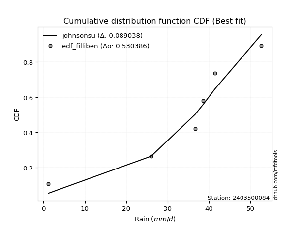</img></img>

</div>


### 10. EDF Jenkinson (1977)

The Jenkinson formula in hydrology is an empirical plotting position formula used to estimate the non-exceedance probability _(P)_ or return period _(T)_ of a given ordered observation within a sample. It is a widely used method in the frequency analysis of extreme events such as floods and rainfall, as it provides a distribution-free way to plot data. _a≈0.31_ and _b≈0.38_ are constants derived to approximate the median of the probability distribution for the given rank.

<div align="center">


$P=(m-a)/(n+b)$


</div>


**10.1. Empirical values**

<div align="center">

|                | 0                   | 1                  | 2             | 3                  | 4                  |
|:---------------|:--------------------|:-------------------|:--------------|:-------------------|:-------------------|
| date           | 2020                | 2019               | 2022          | 2021               | 2023               |
| x              | 26.0                | 36.6               | 38.6          | 41.4               | 52.6               |
| m              | 1                   | 2                  | 3             | 4                  | 5                  |
| empirical_dist | edf_jenkinson       | edf_jenkinson      | edf_jenkinson | edf_jenkinson      | edf_jenkinson      |
| empirical      | 0.12825278810408922 | 0.3141263940520446 | 0.5           | 0.6858736059479554 | 0.8717472118959109 |
| empirical_tr   | 1.1471215351812367  | 1.4579945799457996 | 2.0           | 3.183431952662722  | 7.797101449275368  |

</div>


**10.2. Kolmogorov-Smirnov fit test (sorted by Δ)**


<div align="center">

|                | 0                   | 1                   | 2                   | 3                   | 4                   | 5                   | 6                   | 7                   | 8                     | 9                   | 10                 | 11                  | 12                  | 13                  | 14                  | 15                 | 16                  | 17                  | 18                  | 19                 | 20                 | 21                  | 22                  | 23                 | 24                  | 25                  | 26                  | 27                  | 28                 | 29                  | 30                  | 31                  | 32                  | 33                  | 34                  | 35                  | 36                  | 37                  | 38                  | 39                  | 40                  | 41                 | 42                  | 43                  | 44                  | 45                  | 46                  | 47                  | 48                  | 49                  | 50                  | 51                  | 52                 | 53                  | 54                 | 55                  | 56                  | 57                 | 58                  | 59                  | 60                  | 61                 | 62                  | 63                  | 64                  | 65                  | 66                  | 67                 | 68                  | 69                  | 70                  | 71                 | 72                  | 73                 | 74                  | 75                 | 76                  | 77                 | 78                  | 79                  | 80                  | 81                 | 82                 | 83                  | 84                 | 85                 | 86                 | 87                 |
|:---------------|:--------------------|:--------------------|:--------------------|:--------------------|:--------------------|:--------------------|:--------------------|:--------------------|:----------------------|:--------------------|:-------------------|:--------------------|:--------------------|:--------------------|:--------------------|:-------------------|:--------------------|:--------------------|:--------------------|:-------------------|:-------------------|:--------------------|:--------------------|:-------------------|:--------------------|:--------------------|:--------------------|:--------------------|:-------------------|:--------------------|:--------------------|:--------------------|:--------------------|:--------------------|:--------------------|:--------------------|:--------------------|:--------------------|:--------------------|:--------------------|:--------------------|:-------------------|:--------------------|:--------------------|:--------------------|:--------------------|:--------------------|:--------------------|:--------------------|:--------------------|:--------------------|:--------------------|:-------------------|:--------------------|:-------------------|:--------------------|:--------------------|:-------------------|:--------------------|:--------------------|:--------------------|:-------------------|:--------------------|:--------------------|:--------------------|:--------------------|:--------------------|:-------------------|:--------------------|:--------------------|:--------------------|:-------------------|:--------------------|:-------------------|:--------------------|:-------------------|:--------------------|:-------------------|:--------------------|:--------------------|:--------------------|:-------------------|:-------------------|:--------------------|:-------------------|:-------------------|:-------------------|:-------------------|
| station        | 2403500084          | 2403500084          | 2403500084          | 2403500084          | 2403500084          | 2403500084          | 2403500084          | 2403500084          | 2403500084            | 2403500084          | 2403500084         | 2403500084          | 2403500084          | 2403500084          | 2403500084          | 2403500084         | 2403500084          | 2403500084          | 2403500084          | 2403500084         | 2403500084         | 2403500084          | 2403500084          | 2403500084         | 2403500084          | 2403500084          | 2403500084          | 2403500084          | 2403500084         | 2403500084          | 2403500084          | 2403500084          | 2403500084          | 2403500084          | 2403500084          | 2403500084          | 2403500084          | 2403500084          | 2403500084          | 2403500084          | 2403500084          | 2403500084         | 2403500084          | 2403500084          | 2403500084          | 2403500084          | 2403500084          | 2403500084          | 2403500084          | 2403500084          | 2403500084          | 2403500084          | 2403500084         | 2403500084          | 2403500084         | 2403500084          | 2403500084          | 2403500084         | 2403500084          | 2403500084          | 2403500084          | 2403500084         | 2403500084          | 2403500084          | 2403500084          | 2403500084          | 2403500084          | 2403500084         | 2403500084          | 2403500084          | 2403500084          | 2403500084         | 2403500084          | 2403500084         | 2403500084          | 2403500084         | 2403500084          | 2403500084         | 2403500084          | 2403500084          | 2403500084          | 2403500084         | 2403500084         | 2403500084          | 2403500084         | 2403500084         | 2403500084         | 2403500084         |
| empirical_dist | edf_jenkinson       | edf_jenkinson       | edf_jenkinson       | edf_jenkinson       | edf_jenkinson       | edf_jenkinson       | edf_jenkinson       | edf_jenkinson       | edf_jenkinson         | edf_jenkinson       | edf_jenkinson      | edf_jenkinson       | edf_jenkinson       | edf_jenkinson       | edf_jenkinson       | edf_jenkinson      | edf_jenkinson       | edf_jenkinson       | edf_jenkinson       | edf_jenkinson      | edf_jenkinson      | edf_jenkinson       | edf_jenkinson       | edf_jenkinson      | edf_jenkinson       | edf_jenkinson       | edf_jenkinson       | edf_jenkinson       | edf_jenkinson      | edf_jenkinson       | edf_jenkinson       | edf_jenkinson       | edf_jenkinson       | edf_jenkinson       | edf_jenkinson       | edf_jenkinson       | edf_jenkinson       | edf_jenkinson       | edf_jenkinson       | edf_jenkinson       | edf_jenkinson       | edf_jenkinson      | edf_jenkinson       | edf_jenkinson       | edf_jenkinson       | edf_jenkinson       | edf_jenkinson       | edf_jenkinson       | edf_jenkinson       | edf_jenkinson       | edf_jenkinson       | edf_jenkinson       | edf_jenkinson      | edf_jenkinson       | edf_jenkinson      | edf_jenkinson       | edf_jenkinson       | edf_jenkinson      | edf_jenkinson       | edf_jenkinson       | edf_jenkinson       | edf_jenkinson      | edf_jenkinson       | edf_jenkinson       | edf_jenkinson       | edf_jenkinson       | edf_jenkinson       | edf_jenkinson      | edf_jenkinson       | edf_jenkinson       | edf_jenkinson       | edf_jenkinson      | edf_jenkinson       | edf_jenkinson      | edf_jenkinson       | edf_jenkinson      | edf_jenkinson       | edf_jenkinson      | edf_jenkinson       | edf_jenkinson       | edf_jenkinson       | edf_jenkinson      | edf_jenkinson      | edf_jenkinson       | edf_jenkinson      | edf_jenkinson      | edf_jenkinson      | edf_jenkinson      |
| p_dist         | laplace_asymmetric  | mielke              | loggenlogistic      | fisk                | logistic            | laplace             | nct                 | hypsecant           | loglaplace_asymmetric | genlogistic         | exponnorm          | norm                | crystalball         | johnsonsu           | t                   | pearson3           | logjohnsonsu        | gamma               | erlang              | logloggamma        | loglaplace         | f                   | logfisk             | logweibull_min     | logpearson3         | rice                | loggumbel_l         | alpha               | loghypsecant       | weibull_min         | betaprime           | invgamma            | maxwell             | loglogistic         | invgauss            | logfatiguelife      | logcrystalball      | logexponnorm        | logt                | lognorm             | lognorm             | logf               | rayleigh            | loggamma            | loggamma            | logbetaprime        | logerlang           | logalpha            | gumbel_r            | lognct              | logrice             | loginvgamma         | gumbel_l           | loginvgauss         | logmaxwell         | moyal               | kstwobign           | halfnorm           | logncf              | gompertz            | lograyleigh         | halflogistic       | loginvweibull       | loggumbel_r         | loghalfnorm         | gibrat              | logkstwobign        | loggenexpon        | logmoyal            | wald                | loghalflogistic     | loggompertz        | genexpon            | expon              | logwald             | logexpon           | logchi2             | loggibrat          | nakagami            | logtruncnorm        | lognakagami         | truncnorm          | logmielke          | chi2                | loglognorm         | invweibull         | ncf                | fatiguelife        |
| delta          | 0.06835390750450665 | 0.07215391268750304 | 0.07217995869396521 | 0.07265547542373468 | 0.07490766489587874 | 0.07515785171125466 | 0.07548033235699436 | 0.07563411638506423 | 0.07575940352692884   | 0.07583358516248123 | 0.0769026538816534 | 0.07715597968248811 | 0.07715598098657084 | 0.07715892332669505 | 0.07717157661303453 | 0.0787284793873621 | 0.07957081105907582 | 0.08047238651635752 | 0.08050753305837532 | 0.0811295039990611 | 0.081566535476876  | 0.08372219090268268 | 0.08672553646684089 | 0.0880454731328148 | 0.09436418421864745 | 0.09624274083476675 | 0.09726355927013419 | 0.09802121439114814 | 0.100251371001842  | 0.10166499128841894 | 0.10384483636842184 | 0.10387515559024146 | 0.10724480478107468 | 0.10791033523453536 | 0.11448660024417562 | 0.11641155451191926 | 0.11706035467530235 | 0.11706104715172222 | 0.11706180782688108 | 0.11706266617164213 | 0.11706266617164213 | 0.1175024906534094 | 0.11954742077077823 | 0.12532830318340482 | 0.12532830318340482 | 0.12635678132526917 | 0.12721076742030663 | 0.13034929520547572 | 0.13092632611141003 | 0.13217461630159394 | 0.13219269017589597 | 0.13454702237319266 | 0.135244344743491  | 0.14639733296434204 | 0.1514647514409705 | 0.15284425512423122 | 0.15340896761062572 | 0.1544807432600741 | 0.16024174355966703 | 0.16050878015679443 | 0.16357324859690464 | 0.1684045515570305 | 0.17710666892442212 | 0.18183778709283077 | 0.19779434205197027 | 0.19846165708842806 | 0.20216395583880836 | 0.2039115346046601 | 0.20652730535368785 | 0.21087051288818665 | 0.21704778977593892 | 0.2339413369014614 | 0.24208982102532423 | 0.2422964117590149 | 0.27479589726268955 | 0.2779239165678125 | 0.28143242928884726 | 0.2815476749076546 | 0.28327849501073327 | 0.31349066962977207 | 0.31412639035237216 | 0.3141263904707476 | 0.3204088531290214 | 0.35855784141643104 | 0.3697896562992194 | 0.421612402546777  | 0.4458800071966913 | 0.5202062382722759 |
| deltao         | 0.5865427407550001  | 0.5865427407550001  | 0.5865427407550001  | 0.5865427407550001  | 0.5865427407550001  | 0.5865427407550001  | 0.5865427407550001  | 0.5865427407550001  | 0.5865427407550001    | 0.5865427407550001  | 0.5865427407550001 | 0.5865427407550001  | 0.5865427407550001  | 0.5865427407550001  | 0.5865427407550001  | 0.5865427407550001 | 0.5865427407550001  | 0.5865427407550001  | 0.5865427407550001  | 0.5865427407550001 | 0.5865427407550001 | 0.5865427407550001  | 0.5865427407550001  | 0.5865427407550001 | 0.5865427407550001  | 0.5865427407550001  | 0.5865427407550001  | 0.5865427407550001  | 0.5865427407550001 | 0.5865427407550001  | 0.5865427407550001  | 0.5865427407550001  | 0.5865427407550001  | 0.5865427407550001  | 0.5865427407550001  | 0.5865427407550001  | 0.5865427407550001  | 0.5865427407550001  | 0.5865427407550001  | 0.5865427407550001  | 0.5865427407550001  | 0.5865427407550001 | 0.5865427407550001  | 0.5865427407550001  | 0.5865427407550001  | 0.5865427407550001  | 0.5865427407550001  | 0.5865427407550001  | 0.5865427407550001  | 0.5865427407550001  | 0.5865427407550001  | 0.5865427407550001  | 0.5865427407550001 | 0.5865427407550001  | 0.5865427407550001 | 0.5865427407550001  | 0.5865427407550001  | 0.5865427407550001 | 0.5865427407550001  | 0.5865427407550001  | 0.5865427407550001  | 0.5865427407550001 | 0.5865427407550001  | 0.5865427407550001  | 0.5865427407550001  | 0.5865427407550001  | 0.5865427407550001  | 0.5865427407550001 | 0.5865427407550001  | 0.5865427407550001  | 0.5865427407550001  | 0.5865427407550001 | 0.5865427407550001  | 0.5865427407550001 | 0.5865427407550001  | 0.5865427407550001 | 0.5865427407550001  | 0.5865427407550001 | 0.5865427407550001  | 0.5865427407550001  | 0.5865427407550001  | 0.5865427407550001 | 0.5865427407550001 | 0.5865427407550001  | 0.5865427407550001 | 0.5865427407550001 | 0.5865427407550001 | 0.5865427407550001 |
| eval           | Δo > Δ              | Δo > Δ              | Δo > Δ              | Δo > Δ              | Δo > Δ              | Δo > Δ              | Δo > Δ              | Δo > Δ              | Δo > Δ                | Δo > Δ              | Δo > Δ             | Δo > Δ              | Δo > Δ              | Δo > Δ              | Δo > Δ              | Δo > Δ             | Δo > Δ              | Δo > Δ              | Δo > Δ              | Δo > Δ             | Δo > Δ             | Δo > Δ              | Δo > Δ              | Δo > Δ             | Δo > Δ              | Δo > Δ              | Δo > Δ              | Δo > Δ              | Δo > Δ             | Δo > Δ              | Δo > Δ              | Δo > Δ              | Δo > Δ              | Δo > Δ              | Δo > Δ              | Δo > Δ              | Δo > Δ              | Δo > Δ              | Δo > Δ              | Δo > Δ              | Δo > Δ              | Δo > Δ             | Δo > Δ              | Δo > Δ              | Δo > Δ              | Δo > Δ              | Δo > Δ              | Δo > Δ              | Δo > Δ              | Δo > Δ              | Δo > Δ              | Δo > Δ              | Δo > Δ             | Δo > Δ              | Δo > Δ             | Δo > Δ              | Δo > Δ              | Δo > Δ             | Δo > Δ              | Δo > Δ              | Δo > Δ              | Δo > Δ             | Δo > Δ              | Δo > Δ              | Δo > Δ              | Δo > Δ              | Δo > Δ              | Δo > Δ             | Δo > Δ              | Δo > Δ              | Δo > Δ              | Δo > Δ             | Δo > Δ              | Δo > Δ             | Δo > Δ              | Δo > Δ             | Δo > Δ              | Δo > Δ             | Δo > Δ              | Δo > Δ              | Δo > Δ              | Δo > Δ             | Δo > Δ             | Δo > Δ              | Δo > Δ             | Δo > Δ             | Δo > Δ             | Δo > Δ             |
| fit            | 1                   | 1                   | 1                   | 1                   | 1                   | 1                   | 1                   | 1                   | 1                     | 1                   | 1                  | 1                   | 1                   | 1                   | 1                   | 1                  | 1                   | 1                   | 1                   | 1                  | 1                  | 1                   | 1                   | 1                  | 1                   | 1                   | 1                   | 1                   | 1                  | 1                   | 1                   | 1                   | 1                   | 1                   | 1                   | 1                   | 1                   | 1                   | 1                   | 1                   | 1                   | 1                  | 1                   | 1                   | 1                   | 1                   | 1                   | 1                   | 1                   | 1                   | 1                   | 1                   | 1                  | 1                   | 1                  | 1                   | 1                   | 1                  | 1                   | 1                   | 1                   | 1                  | 1                   | 1                   | 1                   | 1                   | 1                   | 1                  | 1                   | 1                   | 1                   | 1                  | 1                   | 1                  | 1                   | 1                  | 1                   | 1                  | 1                   | 1                   | 1                   | 1                  | 1                  | 1                   | 1                  | 1                  | 1                  | 1                  |
| n              | 5                   | 5                   | 5                   | 5                   | 5                   | 5                   | 5                   | 5                   | 5                     | 5                   | 5                  | 5                   | 5                   | 5                   | 5                   | 5                  | 5                   | 5                   | 5                   | 5                  | 5                  | 5                   | 5                   | 5                  | 5                   | 5                   | 5                   | 5                   | 5                  | 5                   | 5                   | 5                   | 5                   | 5                   | 5                   | 5                   | 5                   | 5                   | 5                   | 5                   | 5                   | 5                  | 5                   | 5                   | 5                   | 5                   | 5                   | 5                   | 5                   | 5                   | 5                   | 5                   | 5                  | 5                   | 5                  | 5                   | 5                   | 5                  | 5                   | 5                   | 5                   | 5                  | 5                   | 5                   | 5                   | 5                   | 5                   | 5                  | 5                   | 5                   | 5                   | 5                  | 5                   | 5                  | 5                   | 5                  | 5                   | 5                  | 5                   | 5                   | 5                   | 5                  | 5                  | 5                   | 5                  | 5                  | 5                  | 5                  |
| best_fit       | 1                   | 0                   | 0                   | 0                   | 0                   | 0                   | 0                   | 0                   | 0                     | 0                   | 0                  | 0                   | 0                   | 0                   | 0                   | 0                  | 0                   | 0                   | 0                   | 0                  | 0                  | 0                   | 0                   | 0                  | 0                   | 0                   | 0                   | 0                   | 0                  | 0                   | 0                   | 0                   | 0                   | 0                   | 0                   | 0                   | 0                   | 0                   | 0                   | 0                   | 0                   | 0                  | 0                   | 0                   | 0                   | 0                   | 0                   | 0                   | 0                   | 0                   | 0                   | 0                   | 0                  | 0                   | 0                  | 0                   | 0                   | 0                  | 0                   | 0                   | 0                   | 0                  | 0                   | 0                   | 0                   | 0                   | 0                   | 0                  | 0                   | 0                   | 0                   | 0                  | 0                   | 0                  | 0                   | 0                  | 0                   | 0                  | 0                   | 0                   | 0                   | 0                  | 0                  | 0                   | 0                  | 0                  | 0                  | 0                  |
| best_fit_sort  | 1                   | 2                   | 3                   | 4                   | 5                   | 6                   | 7                   | 8                   | 9                     | 10                  | 11                 | 12                  | 13                  | 14                  | 15                  | 16                 | 17                  | 18                  | 19                  | 20                 | 21                 | 22                  | 23                  | 24                 | 25                  | 26                  | 27                  | 28                  | 29                 | 30                  | 31                  | 32                  | 33                  | 34                  | 35                  | 36                  | 37                  | 38                  | 39                  | 40                  | 41                  | 42                 | 43                  | 44                  | 45                  | 46                  | 47                  | 48                  | 49                  | 50                  | 51                  | 52                  | 53                 | 54                  | 55                 | 56                  | 57                  | 58                 | 59                  | 60                  | 61                  | 62                 | 63                  | 64                  | 65                  | 66                  | 67                  | 68                 | 69                  | 70                  | 71                  | 72                 | 73                  | 74                 | 75                  | 76                 | 77                  | 78                 | 79                  | 80                  | 81                  | 82                 | 83                 | 84                  | 85                 | 86                 | 87                 | 88                 |

</div>


**10.3. Best fit**

<div align="center">

|   id |    station | empirical_dist   | p_dist             |     delta |   deltao | eval   |   fit |   n |   best_fit |   best_fit_sort |
|-----:|-----------:|:-----------------|:-------------------|----------:|---------:|:-------|------:|----:|-----------:|----------------:|
|    0 | 2403500084 | edf_jenkinson    | laplace_asymmetric | 0.0683539 | 0.586543 | Δo > Δ |     1 |   5 |          1 |               1 |

</div>


<div align="center">

</img></img>

</div>


### 11. EDF Cunnane (1978)

Cunnane´s work in statistical hydrology has focused on the performance and evaluation of different probability distributions (such as GEV, Gumbel, Lognormal) for flood frequency estimation. _b_ is a constant, typically set to 0.4.

<div align="center">


$P=(m-b)/(n+1-2b)$


</div>


**11.1. Empirical values**

<div align="center">

|                | 0                   | 1                  | 2           | 3                  | 4                  |
|:---------------|:--------------------|:-------------------|:------------|:-------------------|:-------------------|
| date           | 2020                | 2019               | 2022        | 2021               | 2023               |
| x              | 26.0                | 36.6               | 38.6        | 41.4               | 52.6               |
| m              | 1                   | 2                  | 3           | 4                  | 5                  |
| empirical_dist | edf_cunnane         | edf_cunnane        | edf_cunnane | edf_cunnane        | edf_cunnane        |
| empirical      | 0.11538461538461538 | 0.3076923076923077 | 0.5         | 0.6923076923076923 | 0.8846153846153845 |
| empirical_tr   | 1.1304347826086958  | 1.4444444444444444 | 2.0         | 3.25               | 8.666666666666655  |

</div>


**11.2. Kolmogorov-Smirnov fit test (sorted by Δ)**


<div align="center">

|                | 0                   | 1                   | 2                   | 3                   | 4                     | 5                   | 6                   | 7                  | 8                   | 9                   | 10                  | 11                  | 12                 | 13                  | 14                  | 15                  | 16                  | 17                  | 18                  | 19                  | 20                  | 21                  | 22                 | 23                  | 24                  | 25                  | 26                  | 27                  | 28                  | 29                  | 30                  | 31                  | 32                  | 33                  | 34                  | 35                  | 36                  | 37                  | 38                 | 39                  | 40                  | 41                  | 42                  | 43                  | 44                  | 45                 | 46                  | 47                  | 48                  | 49                  | 50                  | 51                  | 52                  | 53                  | 54                 | 55                  | 56                  | 57                  | 58                  | 59                  | 60                  | 61                 | 62                  | 63                  | 64                  | 65                  | 66                  | 67                  | 68                  | 69                  | 70                  | 71                  | 72                  | 73                 | 74                 | 75                  | 76                 | 77                 | 78                  | 79                  | 80                  | 81                 | 82                 | 83                  | 84                 | 85                 | 86                 | 87                 |
|:---------------|:--------------------|:--------------------|:--------------------|:--------------------|:----------------------|:--------------------|:--------------------|:-------------------|:--------------------|:--------------------|:--------------------|:--------------------|:-------------------|:--------------------|:--------------------|:--------------------|:--------------------|:--------------------|:--------------------|:--------------------|:--------------------|:--------------------|:-------------------|:--------------------|:--------------------|:--------------------|:--------------------|:--------------------|:--------------------|:--------------------|:--------------------|:--------------------|:--------------------|:--------------------|:--------------------|:--------------------|:--------------------|:--------------------|:-------------------|:--------------------|:--------------------|:--------------------|:--------------------|:--------------------|:--------------------|:-------------------|:--------------------|:--------------------|:--------------------|:--------------------|:--------------------|:--------------------|:--------------------|:--------------------|:-------------------|:--------------------|:--------------------|:--------------------|:--------------------|:--------------------|:--------------------|:-------------------|:--------------------|:--------------------|:--------------------|:--------------------|:--------------------|:--------------------|:--------------------|:--------------------|:--------------------|:--------------------|:--------------------|:-------------------|:-------------------|:--------------------|:-------------------|:-------------------|:--------------------|:--------------------|:--------------------|:-------------------|:-------------------|:--------------------|:-------------------|:-------------------|:-------------------|:-------------------|
| station        | 2403500084          | 2403500084          | 2403500084          | 2403500084          | 2403500084            | 2403500084          | 2403500084          | 2403500084         | 2403500084          | 2403500084          | 2403500084          | 2403500084          | 2403500084         | 2403500084          | 2403500084          | 2403500084          | 2403500084          | 2403500084          | 2403500084          | 2403500084          | 2403500084          | 2403500084          | 2403500084         | 2403500084          | 2403500084          | 2403500084          | 2403500084          | 2403500084          | 2403500084          | 2403500084          | 2403500084          | 2403500084          | 2403500084          | 2403500084          | 2403500084          | 2403500084          | 2403500084          | 2403500084          | 2403500084         | 2403500084          | 2403500084          | 2403500084          | 2403500084          | 2403500084          | 2403500084          | 2403500084         | 2403500084          | 2403500084          | 2403500084          | 2403500084          | 2403500084          | 2403500084          | 2403500084          | 2403500084          | 2403500084         | 2403500084          | 2403500084          | 2403500084          | 2403500084          | 2403500084          | 2403500084          | 2403500084         | 2403500084          | 2403500084          | 2403500084          | 2403500084          | 2403500084          | 2403500084          | 2403500084          | 2403500084          | 2403500084          | 2403500084          | 2403500084          | 2403500084         | 2403500084         | 2403500084          | 2403500084         | 2403500084         | 2403500084          | 2403500084          | 2403500084          | 2403500084         | 2403500084         | 2403500084          | 2403500084         | 2403500084         | 2403500084         | 2403500084         |
| empirical_dist | edf_cunnane         | edf_cunnane         | edf_cunnane         | edf_cunnane         | edf_cunnane           | edf_cunnane         | edf_cunnane         | edf_cunnane        | edf_cunnane         | edf_cunnane         | edf_cunnane         | edf_cunnane         | edf_cunnane        | edf_cunnane         | edf_cunnane         | edf_cunnane         | edf_cunnane         | edf_cunnane         | edf_cunnane         | edf_cunnane         | edf_cunnane         | edf_cunnane         | edf_cunnane        | edf_cunnane         | edf_cunnane         | edf_cunnane         | edf_cunnane         | edf_cunnane         | edf_cunnane         | edf_cunnane         | edf_cunnane         | edf_cunnane         | edf_cunnane         | edf_cunnane         | edf_cunnane         | edf_cunnane         | edf_cunnane         | edf_cunnane         | edf_cunnane        | edf_cunnane         | edf_cunnane         | edf_cunnane         | edf_cunnane         | edf_cunnane         | edf_cunnane         | edf_cunnane        | edf_cunnane         | edf_cunnane         | edf_cunnane         | edf_cunnane         | edf_cunnane         | edf_cunnane         | edf_cunnane         | edf_cunnane         | edf_cunnane        | edf_cunnane         | edf_cunnane         | edf_cunnane         | edf_cunnane         | edf_cunnane         | edf_cunnane         | edf_cunnane        | edf_cunnane         | edf_cunnane         | edf_cunnane         | edf_cunnane         | edf_cunnane         | edf_cunnane         | edf_cunnane         | edf_cunnane         | edf_cunnane         | edf_cunnane         | edf_cunnane         | edf_cunnane        | edf_cunnane        | edf_cunnane         | edf_cunnane        | edf_cunnane        | edf_cunnane         | edf_cunnane         | edf_cunnane         | edf_cunnane        | edf_cunnane        | edf_cunnane         | edf_cunnane        | edf_cunnane        | edf_cunnane        | edf_cunnane        |
| p_dist         | laplace_asymmetric  | laplace             | hypsecant           | logistic            | loglaplace_asymmetric | mielke              | loggenlogistic      | fisk               | nct                 | genlogistic         | exponnorm           | norm                | crystalball        | johnsonsu           | loglaplace          | t                   | pearson3            | logjohnsonsu        | gamma               | erlang              | logloggamma         | f                   | logfisk            | logweibull_min      | loggumbel_l         | logpearson3         | rice                | alpha               | loghypsecant        | weibull_min         | betaprime           | invgamma            | maxwell             | loglogistic         | invgauss            | logfatiguelife      | logcrystalball      | logexponnorm        | logt               | lognorm             | lognorm             | logf                | rayleigh            | loggamma            | loggamma            | logbetaprime       | logerlang           | logalpha            | gumbel_r            | lognct              | logrice             | loginvgamma         | gumbel_l            | loginvgauss         | logmaxwell         | moyal               | kstwobign           | halfnorm            | logncf              | gompertz            | lograyleigh         | halflogistic       | loginvweibull       | loggumbel_r         | loghalfnorm         | gibrat              | logkstwobign        | loggenexpon         | logmoyal            | wald                | loghalflogistic     | loggompertz         | genexpon            | expon              | nakagami           | logwald             | logexpon           | loggibrat          | logchi2             | logtruncnorm        | lognakagami         | truncnorm          | logmielke          | chi2                | loglognorm         | invweibull         | ncf                | fatiguelife        |
| delta          | 0.05548573478503305 | 0.06228967899178106 | 0.06276594366559063 | 0.06971459887853271 | 0.07472553353900147   | 0.07858799904723995 | 0.07861404505370212 | 0.0790895617834716 | 0.08191441871673127 | 0.08226767152221814 | 0.08333674024139026 | 0.08359006604222496 | 0.0835900673463077 | 0.08359300968643191 | 0.08360099334043919 | 0.08360566297277139 | 0.08516256574709902 | 0.08600489741881273 | 0.08690647287609443 | 0.08694161941811224 | 0.08756359035879802 | 0.09015627726241959 | 0.0931596228265778 | 0.09447955949255171 | 0.09863651325503975 | 0.10079827057838436 | 0.10267682719450366 | 0.10445530075088505 | 0.10668545736157892 | 0.10809907764815585 | 0.11027892272815876 | 0.11030924194997838 | 0.11367889114081159 | 0.11434442159427227 | 0.12092068660391253 | 0.12284564087165617 | 0.12349444103503926 | 0.12349513351145913 | 0.123495894186618  | 0.12349675253137904 | 0.12349675253137904 | 0.12393657701314631 | 0.12598150713051515 | 0.13176238954314173 | 0.13176238954314173 | 0.1327908676850061 | 0.13364485378004354 | 0.13678338156521264 | 0.13736041247114694 | 0.13860870266133085 | 0.13862677653563288 | 0.14098110873292957 | 0.14167843110322786 | 0.15283141932407895 | 0.1578988378007074 | 0.15927834148396813 | 0.15984305397036264 | 0.16091482961981102 | 0.16667582991940394 | 0.16694286651653134 | 0.17000733495664155 | 0.1748386379167674 | 0.18354075528415903 | 0.18827187345256768 | 0.20422842841170719 | 0.20489574344816497 | 0.20859804219854527 | 0.21034562096439702 | 0.21296139171342476 | 0.21730459924792356 | 0.22348187613567583 | 0.24037542326119832 | 0.24852390738506114 | 0.2487304981187518 | 0.2778843448576489 | 0.28122998362242646 | 0.2843580029275494 | 0.2879817612673915 | 0.29430060200832087 | 0.30705658327003515 | 0.30769230399263525 | 0.3076923041110107 | 0.3268429394887583 | 0.36499192777616796 | 0.3762237426589563 | 0.4344805752662506 | 0.4587481799161652 | 0.5266403246320128 |
| deltao         | 0.5865427407550001  | 0.5865427407550001  | 0.5865427407550001  | 0.5865427407550001  | 0.5865427407550001    | 0.5865427407550001  | 0.5865427407550001  | 0.5865427407550001 | 0.5865427407550001  | 0.5865427407550001  | 0.5865427407550001  | 0.5865427407550001  | 0.5865427407550001 | 0.5865427407550001  | 0.5865427407550001  | 0.5865427407550001  | 0.5865427407550001  | 0.5865427407550001  | 0.5865427407550001  | 0.5865427407550001  | 0.5865427407550001  | 0.5865427407550001  | 0.5865427407550001 | 0.5865427407550001  | 0.5865427407550001  | 0.5865427407550001  | 0.5865427407550001  | 0.5865427407550001  | 0.5865427407550001  | 0.5865427407550001  | 0.5865427407550001  | 0.5865427407550001  | 0.5865427407550001  | 0.5865427407550001  | 0.5865427407550001  | 0.5865427407550001  | 0.5865427407550001  | 0.5865427407550001  | 0.5865427407550001 | 0.5865427407550001  | 0.5865427407550001  | 0.5865427407550001  | 0.5865427407550001  | 0.5865427407550001  | 0.5865427407550001  | 0.5865427407550001 | 0.5865427407550001  | 0.5865427407550001  | 0.5865427407550001  | 0.5865427407550001  | 0.5865427407550001  | 0.5865427407550001  | 0.5865427407550001  | 0.5865427407550001  | 0.5865427407550001 | 0.5865427407550001  | 0.5865427407550001  | 0.5865427407550001  | 0.5865427407550001  | 0.5865427407550001  | 0.5865427407550001  | 0.5865427407550001 | 0.5865427407550001  | 0.5865427407550001  | 0.5865427407550001  | 0.5865427407550001  | 0.5865427407550001  | 0.5865427407550001  | 0.5865427407550001  | 0.5865427407550001  | 0.5865427407550001  | 0.5865427407550001  | 0.5865427407550001  | 0.5865427407550001 | 0.5865427407550001 | 0.5865427407550001  | 0.5865427407550001 | 0.5865427407550001 | 0.5865427407550001  | 0.5865427407550001  | 0.5865427407550001  | 0.5865427407550001 | 0.5865427407550001 | 0.5865427407550001  | 0.5865427407550001 | 0.5865427407550001 | 0.5865427407550001 | 0.5865427407550001 |
| eval           | Δo > Δ              | Δo > Δ              | Δo > Δ              | Δo > Δ              | Δo > Δ                | Δo > Δ              | Δo > Δ              | Δo > Δ             | Δo > Δ              | Δo > Δ              | Δo > Δ              | Δo > Δ              | Δo > Δ             | Δo > Δ              | Δo > Δ              | Δo > Δ              | Δo > Δ              | Δo > Δ              | Δo > Δ              | Δo > Δ              | Δo > Δ              | Δo > Δ              | Δo > Δ             | Δo > Δ              | Δo > Δ              | Δo > Δ              | Δo > Δ              | Δo > Δ              | Δo > Δ              | Δo > Δ              | Δo > Δ              | Δo > Δ              | Δo > Δ              | Δo > Δ              | Δo > Δ              | Δo > Δ              | Δo > Δ              | Δo > Δ              | Δo > Δ             | Δo > Δ              | Δo > Δ              | Δo > Δ              | Δo > Δ              | Δo > Δ              | Δo > Δ              | Δo > Δ             | Δo > Δ              | Δo > Δ              | Δo > Δ              | Δo > Δ              | Δo > Δ              | Δo > Δ              | Δo > Δ              | Δo > Δ              | Δo > Δ             | Δo > Δ              | Δo > Δ              | Δo > Δ              | Δo > Δ              | Δo > Δ              | Δo > Δ              | Δo > Δ             | Δo > Δ              | Δo > Δ              | Δo > Δ              | Δo > Δ              | Δo > Δ              | Δo > Δ              | Δo > Δ              | Δo > Δ              | Δo > Δ              | Δo > Δ              | Δo > Δ              | Δo > Δ             | Δo > Δ             | Δo > Δ              | Δo > Δ             | Δo > Δ             | Δo > Δ              | Δo > Δ              | Δo > Δ              | Δo > Δ             | Δo > Δ             | Δo > Δ              | Δo > Δ             | Δo > Δ             | Δo > Δ             | Δo > Δ             |
| fit            | 1                   | 1                   | 1                   | 1                   | 1                     | 1                   | 1                   | 1                  | 1                   | 1                   | 1                   | 1                   | 1                  | 1                   | 1                   | 1                   | 1                   | 1                   | 1                   | 1                   | 1                   | 1                   | 1                  | 1                   | 1                   | 1                   | 1                   | 1                   | 1                   | 1                   | 1                   | 1                   | 1                   | 1                   | 1                   | 1                   | 1                   | 1                   | 1                  | 1                   | 1                   | 1                   | 1                   | 1                   | 1                   | 1                  | 1                   | 1                   | 1                   | 1                   | 1                   | 1                   | 1                   | 1                   | 1                  | 1                   | 1                   | 1                   | 1                   | 1                   | 1                   | 1                  | 1                   | 1                   | 1                   | 1                   | 1                   | 1                   | 1                   | 1                   | 1                   | 1                   | 1                   | 1                  | 1                  | 1                   | 1                  | 1                  | 1                   | 1                   | 1                   | 1                  | 1                  | 1                   | 1                  | 1                  | 1                  | 1                  |
| n              | 5                   | 5                   | 5                   | 5                   | 5                     | 5                   | 5                   | 5                  | 5                   | 5                   | 5                   | 5                   | 5                  | 5                   | 5                   | 5                   | 5                   | 5                   | 5                   | 5                   | 5                   | 5                   | 5                  | 5                   | 5                   | 5                   | 5                   | 5                   | 5                   | 5                   | 5                   | 5                   | 5                   | 5                   | 5                   | 5                   | 5                   | 5                   | 5                  | 5                   | 5                   | 5                   | 5                   | 5                   | 5                   | 5                  | 5                   | 5                   | 5                   | 5                   | 5                   | 5                   | 5                   | 5                   | 5                  | 5                   | 5                   | 5                   | 5                   | 5                   | 5                   | 5                  | 5                   | 5                   | 5                   | 5                   | 5                   | 5                   | 5                   | 5                   | 5                   | 5                   | 5                   | 5                  | 5                  | 5                   | 5                  | 5                  | 5                   | 5                   | 5                   | 5                  | 5                  | 5                   | 5                  | 5                  | 5                  | 5                  |
| best_fit       | 1                   | 0                   | 0                   | 0                   | 0                     | 0                   | 0                   | 0                  | 0                   | 0                   | 0                   | 0                   | 0                  | 0                   | 0                   | 0                   | 0                   | 0                   | 0                   | 0                   | 0                   | 0                   | 0                  | 0                   | 0                   | 0                   | 0                   | 0                   | 0                   | 0                   | 0                   | 0                   | 0                   | 0                   | 0                   | 0                   | 0                   | 0                   | 0                  | 0                   | 0                   | 0                   | 0                   | 0                   | 0                   | 0                  | 0                   | 0                   | 0                   | 0                   | 0                   | 0                   | 0                   | 0                   | 0                  | 0                   | 0                   | 0                   | 0                   | 0                   | 0                   | 0                  | 0                   | 0                   | 0                   | 0                   | 0                   | 0                   | 0                   | 0                   | 0                   | 0                   | 0                   | 0                  | 0                  | 0                   | 0                  | 0                  | 0                   | 0                   | 0                   | 0                  | 0                  | 0                   | 0                  | 0                  | 0                  | 0                  |
| best_fit_sort  | 1                   | 2                   | 3                   | 4                   | 5                     | 6                   | 7                   | 8                  | 9                   | 10                  | 11                  | 12                  | 13                 | 14                  | 15                  | 16                  | 17                  | 18                  | 19                  | 20                  | 21                  | 22                  | 23                 | 24                  | 25                  | 26                  | 27                  | 28                  | 29                  | 30                  | 31                  | 32                  | 33                  | 34                  | 35                  | 36                  | 37                  | 38                  | 39                 | 40                  | 41                  | 42                  | 43                  | 44                  | 45                  | 46                 | 47                  | 48                  | 49                  | 50                  | 51                  | 52                  | 53                  | 54                  | 55                 | 56                  | 57                  | 58                  | 59                  | 60                  | 61                  | 62                 | 63                  | 64                  | 65                  | 66                  | 67                  | 68                  | 69                  | 70                  | 71                  | 72                  | 73                  | 74                 | 75                 | 76                  | 77                 | 78                 | 79                  | 80                  | 81                  | 82                 | 83                 | 84                  | 85                 | 86                 | 87                 | 88                 |

</div>


**11.3. Best fit**

<div align="center">

|   id |    station | empirical_dist   | p_dist             |     delta |   deltao | eval   |   fit |   n |   best_fit |   best_fit_sort |
|-----:|-----------:|:-----------------|:-------------------|----------:|---------:|:-------|------:|----:|-----------:|----------------:|
|    0 | 2403500084 | edf_cunnane      | laplace_asymmetric | 0.0554857 | 0.586543 | Δo > Δ |     1 |   5 |          1 |               1 |

</div>


<div align="center">

</img></img>

</div>


### 12. EDF Adamowski (1981)

The Adamowski formula in hydrology refers to a specific plotting position formula used for estimating the non-parametric empirical distribution of hydrological events (like flood peaks) to calculate their return periods. This formula provides an alternative to traditional parametric methods (like the Gumbel or Log Pearson Type III distributions). 

<div align="center">


$P=(m-0.25)/(n+0.5)$


</div>


**12.1. Empirical values**

<div align="center">

|                | 0                   | 1                  | 2             | 3                  | 4                  |
|:---------------|:--------------------|:-------------------|:--------------|:-------------------|:-------------------|
| date           | 2020                | 2019               | 2022          | 2021               | 2023               |
| x              | 26.0                | 36.6               | 38.6          | 41.4               | 52.6               |
| m              | 1                   | 2                  | 3             | 4                  | 5                  |
| empirical_dist | edf_adamowski       | edf_adamowski      | edf_adamowski | edf_adamowski      | edf_adamowski      |
| empirical      | 0.13636363636363635 | 0.3181818181818182 | 0.5           | 0.6818181818181818 | 0.8636363636363636 |
| empirical_tr   | 1.1578947368421053  | 1.4666666666666666 | 2.0           | 3.1428571428571423 | 7.333333333333334  |

</div>


**12.2. Kolmogorov-Smirnov fit test (sorted by Δ)**


<div align="center">

|                | 0                   | 1                  | 2                   | 3                  | 4                   | 5                   | 6                   | 7                   | 8                   | 9                   | 10                  | 11                  | 12                  | 13                  | 14                  | 15                  | 16                  | 17                  | 18                  | 19                  | 20                    | 21                  | 22                  | 23                 | 24                 | 25                  | 26                  | 27                  | 28                  | 29                  | 30                  | 31                  | 32                 | 33                  | 34                  | 35                 | 36                  | 37                  | 38                  | 39                  | 40                  | 41                  | 42                  | 43                  | 44                  | 45                  | 46                  | 47                  | 48                  | 49                  | 50                 | 51                 | 52                  | 53                 | 54                  | 55                  | 56                  | 57                  | 58                  | 59                  | 60                 | 61                  | 62                  | 63                  | 64                  | 65                 | 66                 | 67                  | 68                 | 69                 | 70                  | 71                  | 72                  | 73                  | 74                 | 75                  | 76                  | 77                  | 78                 | 79                  | 80                 | 81                 | 82                  | 83                 | 84                  | 85                 | 86                 | 87                 |
|:---------------|:--------------------|:-------------------|:--------------------|:-------------------|:--------------------|:--------------------|:--------------------|:--------------------|:--------------------|:--------------------|:--------------------|:--------------------|:--------------------|:--------------------|:--------------------|:--------------------|:--------------------|:--------------------|:--------------------|:--------------------|:----------------------|:--------------------|:--------------------|:-------------------|:-------------------|:--------------------|:--------------------|:--------------------|:--------------------|:--------------------|:--------------------|:--------------------|:-------------------|:--------------------|:--------------------|:-------------------|:--------------------|:--------------------|:--------------------|:--------------------|:--------------------|:--------------------|:--------------------|:--------------------|:--------------------|:--------------------|:--------------------|:--------------------|:--------------------|:--------------------|:-------------------|:-------------------|:--------------------|:-------------------|:--------------------|:--------------------|:--------------------|:--------------------|:--------------------|:--------------------|:-------------------|:--------------------|:--------------------|:--------------------|:--------------------|:-------------------|:-------------------|:--------------------|:-------------------|:-------------------|:--------------------|:--------------------|:--------------------|:--------------------|:-------------------|:--------------------|:--------------------|:--------------------|:-------------------|:--------------------|:-------------------|:-------------------|:--------------------|:-------------------|:--------------------|:-------------------|:-------------------|:-------------------|
| station        | 2403500084          | 2403500084         | 2403500084          | 2403500084         | 2403500084          | 2403500084          | 2403500084          | 2403500084          | 2403500084          | 2403500084          | 2403500084          | 2403500084          | 2403500084          | 2403500084          | 2403500084          | 2403500084          | 2403500084          | 2403500084          | 2403500084          | 2403500084          | 2403500084            | 2403500084          | 2403500084          | 2403500084         | 2403500084         | 2403500084          | 2403500084          | 2403500084          | 2403500084          | 2403500084          | 2403500084          | 2403500084          | 2403500084         | 2403500084          | 2403500084          | 2403500084         | 2403500084          | 2403500084          | 2403500084          | 2403500084          | 2403500084          | 2403500084          | 2403500084          | 2403500084          | 2403500084          | 2403500084          | 2403500084          | 2403500084          | 2403500084          | 2403500084          | 2403500084         | 2403500084         | 2403500084          | 2403500084         | 2403500084          | 2403500084          | 2403500084          | 2403500084          | 2403500084          | 2403500084          | 2403500084         | 2403500084          | 2403500084          | 2403500084          | 2403500084          | 2403500084         | 2403500084         | 2403500084          | 2403500084         | 2403500084         | 2403500084          | 2403500084          | 2403500084          | 2403500084          | 2403500084         | 2403500084          | 2403500084          | 2403500084          | 2403500084         | 2403500084          | 2403500084         | 2403500084         | 2403500084          | 2403500084         | 2403500084          | 2403500084         | 2403500084         | 2403500084         |
| empirical_dist | edf_adamowski       | edf_adamowski      | edf_adamowski       | edf_adamowski      | edf_adamowski       | edf_adamowski       | edf_adamowski       | edf_adamowski       | edf_adamowski       | edf_adamowski       | edf_adamowski       | edf_adamowski       | edf_adamowski       | edf_adamowski       | edf_adamowski       | edf_adamowski       | edf_adamowski       | edf_adamowski       | edf_adamowski       | edf_adamowski       | edf_adamowski         | edf_adamowski       | edf_adamowski       | edf_adamowski      | edf_adamowski      | edf_adamowski       | edf_adamowski       | edf_adamowski       | edf_adamowski       | edf_adamowski       | edf_adamowski       | edf_adamowski       | edf_adamowski      | edf_adamowski       | edf_adamowski       | edf_adamowski      | edf_adamowski       | edf_adamowski       | edf_adamowski       | edf_adamowski       | edf_adamowski       | edf_adamowski       | edf_adamowski       | edf_adamowski       | edf_adamowski       | edf_adamowski       | edf_adamowski       | edf_adamowski       | edf_adamowski       | edf_adamowski       | edf_adamowski      | edf_adamowski      | edf_adamowski       | edf_adamowski      | edf_adamowski       | edf_adamowski       | edf_adamowski       | edf_adamowski       | edf_adamowski       | edf_adamowski       | edf_adamowski      | edf_adamowski       | edf_adamowski       | edf_adamowski       | edf_adamowski       | edf_adamowski      | edf_adamowski      | edf_adamowski       | edf_adamowski      | edf_adamowski      | edf_adamowski       | edf_adamowski       | edf_adamowski       | edf_adamowski       | edf_adamowski      | edf_adamowski       | edf_adamowski       | edf_adamowski       | edf_adamowski      | edf_adamowski       | edf_adamowski      | edf_adamowski      | edf_adamowski       | edf_adamowski      | edf_adamowski       | edf_adamowski      | edf_adamowski      | edf_adamowski      |
| p_dist         | fisk                | loggenlogistic     | mielke              | genlogistic        | laplace_asymmetric  | erlang              | logloggamma         | gamma               | pearson3            | logjohnsonsu        | nct                 | f                   | exponnorm           | johnsonsu           | t                   | norm                | crystalball         | logistic            | laplace             | hypsecant           | loglaplace_asymmetric | logweibull_min      | loglaplace          | logpearson3        | logfisk            | rice                | alpha               | loghypsecant        | weibull_min         | betaprime           | invgamma            | maxwell             | loglogistic        | loggumbel_l         | invgauss            | logfatiguelife     | logcrystalball      | logexponnorm        | logt                | lognorm             | lognorm             | logf                | rayleigh            | loggamma            | loggamma            | logbetaprime        | logerlang           | logalpha            | gumbel_r            | lognct              | logrice            | loginvgamma        | gumbel_l            | loginvgauss        | logmaxwell          | moyal               | kstwobign           | halfnorm            | logncf              | gompertz            | lograyleigh        | halflogistic        | loginvweibull       | loggumbel_r         | loghalfnorm         | gibrat             | logkstwobign       | loggenexpon         | logmoyal           | wald               | loghalflogistic     | loggompertz         | genexpon            | expon               | logwald            | logchi2             | logexpon            | loggibrat           | nakagami           | logmielke           | logtruncnorm       | lognakagami        | truncnorm           | chi2               | loglognorm          | invweibull         | ncf                | fatiguelife        |
| delta          | 0.07526099783920315 | 0.0755786568594131 | 0.07558032451619567 | 0.0762717280191384 | 0.07646475576405387 | 0.07702569824105265 | 0.07707407986928755 | 0.07730003606612879 | 0.07755916679467612 | 0.07868717238683876 | 0.07902463446922037 | 0.07966676677290913 | 0.07985365017907986 | 0.07995458425859425 | 0.07995655929867418 | 0.07996059580736437 | 0.07996060163270935 | 0.08301851315542597 | 0.08326869997080188 | 0.08374496464461145 | 0.08387025178647597   | 0.08399004900304124 | 0.08967738373642314 | 0.0903087600888739 | 0.0909552125121412 | 0.09290964199830737 | 0.09396579026137458 | 0.09619594687206845 | 0.09760956715864538 | 0.09978941223864829 | 0.09981973146046791 | 0.10318938065130112 | 0.1038549111047618 | 0.10537440752968141 | 0.11043117611440206 | 0.1123561303821457 | 0.11300493054552879 | 0.11300562302194866 | 0.11300638369710753 | 0.11300724204186857 | 0.11300724204186857 | 0.11344706652363584 | 0.11549199664100468 | 0.12127287905363127 | 0.12127287905363127 | 0.12230135719549562 | 0.12315534329053307 | 0.12629387107570217 | 0.12687090198163647 | 0.12811919217182038 | 0.1281372660461224 | 0.1304915982434191 | 0.13118892061371734 | 0.1423419088345685 | 0.14740932731119694 | 0.14878883099445767 | 0.14935354348085217 | 0.15042531913030055 | 0.15618631942989347 | 0.15645335602702087 | 0.1595178244671311 | 0.16434912742725694 | 0.17305124479464856 | 0.17778236296305722 | 0.19373891792219672 | 0.1944062329586545 | 0.1981085317090348 | 0.19985611047488655 | 0.2024718812239143 | 0.2068150887584131 | 0.21299236564616536 | 0.22988591277168785 | 0.23803439689555067 | 0.23824098762924134 | 0.270740473132916  | 0.27332158102930004 | 0.27386849243803896 | 0.27749225077788103 | 0.2873339191405068 | 0.31635342899924784 | 0.3175460937595456 | 0.3181818144821457 | 0.31818181460052114 | 0.3545024172866575 | 0.36573423216944584 | 0.4135015542872298 | 0.4377691589371442 | 0.5161508141425024 |
| deltao         | 0.5865427407550001  | 0.5865427407550001 | 0.5865427407550001  | 0.5865427407550001 | 0.5865427407550001  | 0.5865427407550001  | 0.5865427407550001  | 0.5865427407550001  | 0.5865427407550001  | 0.5865427407550001  | 0.5865427407550001  | 0.5865427407550001  | 0.5865427407550001  | 0.5865427407550001  | 0.5865427407550001  | 0.5865427407550001  | 0.5865427407550001  | 0.5865427407550001  | 0.5865427407550001  | 0.5865427407550001  | 0.5865427407550001    | 0.5865427407550001  | 0.5865427407550001  | 0.5865427407550001 | 0.5865427407550001 | 0.5865427407550001  | 0.5865427407550001  | 0.5865427407550001  | 0.5865427407550001  | 0.5865427407550001  | 0.5865427407550001  | 0.5865427407550001  | 0.5865427407550001 | 0.5865427407550001  | 0.5865427407550001  | 0.5865427407550001 | 0.5865427407550001  | 0.5865427407550001  | 0.5865427407550001  | 0.5865427407550001  | 0.5865427407550001  | 0.5865427407550001  | 0.5865427407550001  | 0.5865427407550001  | 0.5865427407550001  | 0.5865427407550001  | 0.5865427407550001  | 0.5865427407550001  | 0.5865427407550001  | 0.5865427407550001  | 0.5865427407550001 | 0.5865427407550001 | 0.5865427407550001  | 0.5865427407550001 | 0.5865427407550001  | 0.5865427407550001  | 0.5865427407550001  | 0.5865427407550001  | 0.5865427407550001  | 0.5865427407550001  | 0.5865427407550001 | 0.5865427407550001  | 0.5865427407550001  | 0.5865427407550001  | 0.5865427407550001  | 0.5865427407550001 | 0.5865427407550001 | 0.5865427407550001  | 0.5865427407550001 | 0.5865427407550001 | 0.5865427407550001  | 0.5865427407550001  | 0.5865427407550001  | 0.5865427407550001  | 0.5865427407550001 | 0.5865427407550001  | 0.5865427407550001  | 0.5865427407550001  | 0.5865427407550001 | 0.5865427407550001  | 0.5865427407550001 | 0.5865427407550001 | 0.5865427407550001  | 0.5865427407550001 | 0.5865427407550001  | 0.5865427407550001 | 0.5865427407550001 | 0.5865427407550001 |
| eval           | Δo > Δ              | Δo > Δ             | Δo > Δ              | Δo > Δ             | Δo > Δ              | Δo > Δ              | Δo > Δ              | Δo > Δ              | Δo > Δ              | Δo > Δ              | Δo > Δ              | Δo > Δ              | Δo > Δ              | Δo > Δ              | Δo > Δ              | Δo > Δ              | Δo > Δ              | Δo > Δ              | Δo > Δ              | Δo > Δ              | Δo > Δ                | Δo > Δ              | Δo > Δ              | Δo > Δ             | Δo > Δ             | Δo > Δ              | Δo > Δ              | Δo > Δ              | Δo > Δ              | Δo > Δ              | Δo > Δ              | Δo > Δ              | Δo > Δ             | Δo > Δ              | Δo > Δ              | Δo > Δ             | Δo > Δ              | Δo > Δ              | Δo > Δ              | Δo > Δ              | Δo > Δ              | Δo > Δ              | Δo > Δ              | Δo > Δ              | Δo > Δ              | Δo > Δ              | Δo > Δ              | Δo > Δ              | Δo > Δ              | Δo > Δ              | Δo > Δ             | Δo > Δ             | Δo > Δ              | Δo > Δ             | Δo > Δ              | Δo > Δ              | Δo > Δ              | Δo > Δ              | Δo > Δ              | Δo > Δ              | Δo > Δ             | Δo > Δ              | Δo > Δ              | Δo > Δ              | Δo > Δ              | Δo > Δ             | Δo > Δ             | Δo > Δ              | Δo > Δ             | Δo > Δ             | Δo > Δ              | Δo > Δ              | Δo > Δ              | Δo > Δ              | Δo > Δ             | Δo > Δ              | Δo > Δ              | Δo > Δ              | Δo > Δ             | Δo > Δ              | Δo > Δ             | Δo > Δ             | Δo > Δ              | Δo > Δ             | Δo > Δ              | Δo > Δ             | Δo > Δ             | Δo > Δ             |
| fit            | 1                   | 1                  | 1                   | 1                  | 1                   | 1                   | 1                   | 1                   | 1                   | 1                   | 1                   | 1                   | 1                   | 1                   | 1                   | 1                   | 1                   | 1                   | 1                   | 1                   | 1                     | 1                   | 1                   | 1                  | 1                  | 1                   | 1                   | 1                   | 1                   | 1                   | 1                   | 1                   | 1                  | 1                   | 1                   | 1                  | 1                   | 1                   | 1                   | 1                   | 1                   | 1                   | 1                   | 1                   | 1                   | 1                   | 1                   | 1                   | 1                   | 1                   | 1                  | 1                  | 1                   | 1                  | 1                   | 1                   | 1                   | 1                   | 1                   | 1                   | 1                  | 1                   | 1                   | 1                   | 1                   | 1                  | 1                  | 1                   | 1                  | 1                  | 1                   | 1                   | 1                   | 1                   | 1                  | 1                   | 1                   | 1                   | 1                  | 1                   | 1                  | 1                  | 1                   | 1                  | 1                   | 1                  | 1                  | 1                  |
| n              | 5                   | 5                  | 5                   | 5                  | 5                   | 5                   | 5                   | 5                   | 5                   | 5                   | 5                   | 5                   | 5                   | 5                   | 5                   | 5                   | 5                   | 5                   | 5                   | 5                   | 5                     | 5                   | 5                   | 5                  | 5                  | 5                   | 5                   | 5                   | 5                   | 5                   | 5                   | 5                   | 5                  | 5                   | 5                   | 5                  | 5                   | 5                   | 5                   | 5                   | 5                   | 5                   | 5                   | 5                   | 5                   | 5                   | 5                   | 5                   | 5                   | 5                   | 5                  | 5                  | 5                   | 5                  | 5                   | 5                   | 5                   | 5                   | 5                   | 5                   | 5                  | 5                   | 5                   | 5                   | 5                   | 5                  | 5                  | 5                   | 5                  | 5                  | 5                   | 5                   | 5                   | 5                   | 5                  | 5                   | 5                   | 5                   | 5                  | 5                   | 5                  | 5                  | 5                   | 5                  | 5                   | 5                  | 5                  | 5                  |
| best_fit       | 1                   | 0                  | 0                   | 0                  | 0                   | 0                   | 0                   | 0                   | 0                   | 0                   | 0                   | 0                   | 0                   | 0                   | 0                   | 0                   | 0                   | 0                   | 0                   | 0                   | 0                     | 0                   | 0                   | 0                  | 0                  | 0                   | 0                   | 0                   | 0                   | 0                   | 0                   | 0                   | 0                  | 0                   | 0                   | 0                  | 0                   | 0                   | 0                   | 0                   | 0                   | 0                   | 0                   | 0                   | 0                   | 0                   | 0                   | 0                   | 0                   | 0                   | 0                  | 0                  | 0                   | 0                  | 0                   | 0                   | 0                   | 0                   | 0                   | 0                   | 0                  | 0                   | 0                   | 0                   | 0                   | 0                  | 0                  | 0                   | 0                  | 0                  | 0                   | 0                   | 0                   | 0                   | 0                  | 0                   | 0                   | 0                   | 0                  | 0                   | 0                  | 0                  | 0                   | 0                  | 0                   | 0                  | 0                  | 0                  |
| best_fit_sort  | 1                   | 2                  | 3                   | 4                  | 5                   | 6                   | 7                   | 8                   | 9                   | 10                  | 11                  | 12                  | 13                  | 14                  | 15                  | 16                  | 17                  | 18                  | 19                  | 20                  | 21                    | 22                  | 23                  | 24                 | 25                 | 26                  | 27                  | 28                  | 29                  | 30                  | 31                  | 32                  | 33                 | 34                  | 35                  | 36                 | 37                  | 38                  | 39                  | 40                  | 41                  | 42                  | 43                  | 44                  | 45                  | 46                  | 47                  | 48                  | 49                  | 50                  | 51                 | 52                 | 53                  | 54                 | 55                  | 56                  | 57                  | 58                  | 59                  | 60                  | 61                 | 62                  | 63                  | 64                  | 65                  | 66                 | 67                 | 68                  | 69                 | 70                 | 71                  | 72                  | 73                  | 74                  | 75                 | 76                  | 77                  | 78                  | 79                 | 80                  | 81                 | 82                 | 83                  | 84                 | 85                  | 86                 | 87                 | 88                 |

</div>


**12.3. Best fit**

<div align="center">

|   id |    station | empirical_dist   | p_dist   |    delta |   deltao | eval   |   fit |   n |   best_fit |   best_fit_sort |
|-----:|-----------:|:-----------------|:---------|---------:|---------:|:-------|------:|----:|-----------:|----------------:|
|    0 | 2403500084 | edf_adamowski    | fisk     | 0.075261 | 0.586543 | Δo > Δ |     1 |   5 |          1 |               1 |

</div>


<div align="center">

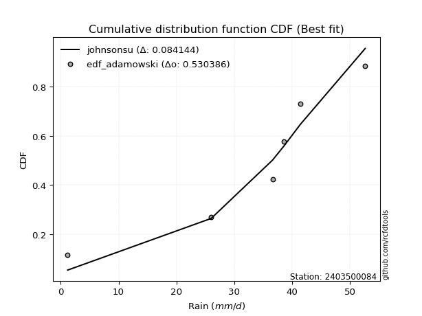</img>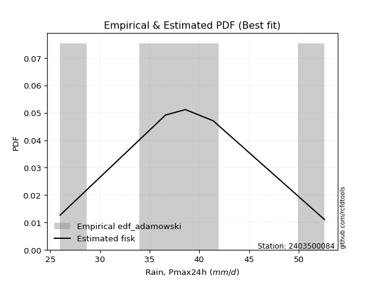</img>

</div>


## C. Best fit & Estimate extreme values for specific return periods - Tr

Best fit in probability distribution analysis means finding the theoretical distribution (like Normal, Poisson, Exponential) that most accurately mirrors your real-world data´s patterns (shape, center, spread) for better predictions, using methods like visual checks (Q-Q plots), goodness-of-fit tests (Kolmogorov-Smirnov, Chi-Squared), and information criteria (AIC) to score and select the simplest, most representative model.


### 1. Best fit (ordered by delta Δ)

<div align="center">

|   id |    station | empirical_dist   | p_dist             |     delta |   deltao | eval   |   fit |   n |   best_fit |   best_fit_sort |
|-----:|-----------:|:-----------------|:-------------------|----------:|---------:|:-------|------:|----:|-----------:|----------------:|
|    0 | 2403500084 | edf_hazen        | laplace_asymmetric | 0.0467011 | 0.586543 | Δo > Δ |     1 |   5 |          1 |               1 |
|    1 | 2403500084 | edf_gringorten   | laplace_asymmetric | 0.0494761 | 0.586543 | Δo > Δ |     1 |   5 |          1 |               2 |
|    2 | 2403500084 | edf_cunnane      | laplace_asymmetric | 0.0554857 | 0.586543 | Δo > Δ |     1 |   5 |          1 |               3 |
|    3 | 2403500084 | edf_blom         | laplace_asymmetric | 0.0591487 | 0.586543 | Δo > Δ |     1 |   5 |          1 |               4 |
|    4 | 2403500084 | edf_tukey        | laplace_asymmetric | 0.0651011 | 0.586543 | Δo > Δ |     1 |   5 |          1 |               5 |
|    5 | 2403500084 | edf_filliben     | laplace_asymmetric | 0.0673145 | 0.586543 | Δo > Δ |     1 |   5 |          1 |               6 |
|    6 | 2403500084 | edf_beard        | laplace_asymmetric | 0.0683539 | 0.586543 | Δo > Δ |     1 |   5 |          1 |               7 |
|    7 | 2403500084 | edf_jenkinson    | laplace_asymmetric | 0.0683539 | 0.586543 | Δo > Δ |     1 |   5 |          1 |               8 |
|    8 | 2403500084 | edf_chegodayev   | laplace_asymmetric | 0.0697307 | 0.586543 | Δo > Δ |     1 |   5 |          1 |               9 |
|    9 | 2403500084 | edf_adamowski    | fisk               | 0.075261  | 0.586543 | Δo > Δ |     1 |   5 |          1 |              10 |
|   10 | 2403500084 | edf_weibull      | fisk               | 0.105564  | 0.586543 | Δo > Δ |     1 |   5 |          1 |              11 |
|   11 | 2403500084 | edf_california   | laplace_asymmetric | 0.139836  | 0.586543 | Δo > Δ |     1 |   5 |          1 |              12 |

</div>

:file_folder:Tables: [bestfit_2403500084.csv](table/bestfit_2403500084.csv) | [extreme_2403500084.csv](table/extreme_2403500084.csv)


### 2. Extreme values

In hydrology, a return period (or recurrence interval $Tr$) is the statistical average time between extreme events like floods or droughts of a specific magnitude, indicating how rare an event is, with a 100-year flood, for example, having a 1% chance of occurring in any given year, not that it happens exactly every century. It is a key tool for infrastructure design (like bridges or dams) and risk assessment, calculated from historical data to determine the probability of future events, although it is important to remember it is statistical average, and events can cluster or be missed.

> risk_rate: assuming the return period as the project useful life.

|   id |      tr |   prob_l |     prob_g |   alpha |   betaprime |    chi2 |   crystalball |   erlang |    expon |   exponnorm |       f |   fatiguelife |    fisk |   gamma |   genexpon |   genlogistic |   gibrat |   gompertz |   gumbel_l |   gumbel_r |   halflogistic |   halfnorm |   hypsecant |   invgamma |   invgauss |     invweibull |   johnsonsu |   kstwobign |   laplace |   laplace_asymmetric |   loggamma |   logistic |   lognorm |   maxwell |   mielke |   moyal |   nakagami |       ncf |     nct |    norm |   pearson3 |   rayleigh |    rice |       t |   truncnorm |     wald |   weibull_min |   logalpha |   logbetaprime |          logchi2 |   logcrystalball |   logerlang |   logexpon |   logexponnorm |    logf |   logfatiguelife |   logfisk |   loggenexpon |   loggenlogistic |   loggibrat |   loggompertz |   loggumbel_l |   loggumbel_r |   loghalflogistic |   loghalfnorm |   loghypsecant |   loginvgamma |   loginvgauss |   loginvweibull |   logjohnsonsu |   logkstwobign |   loglaplace |   loglaplace_asymmetric |   logloggamma |   loglogistic |    loglognorm |   logmaxwell |   logmielke |   logmoyal |   lognakagami |   logncf |   lognct |   logpearson3 |   lograyleigh |   logrice |    logt |   logtruncnorm |   logwald |   logweibull_min |    station |   n |   risk_rate |
|-----:|--------:|---------:|-----------:|--------:|------------:|--------:|--------------:|---------:|---------:|------------:|--------:|--------------:|--------:|--------:|-----------:|--------------:|---------:|-----------:|-----------:|-----------:|---------------:|-----------:|------------:|-----------:|-----------:|---------------:|------------:|------------:|----------:|---------------------:|-----------:|-----------:|----------:|----------:|---------:|--------:|-----------:|----------:|--------:|--------:|-----------:|-----------:|--------:|--------:|------------:|---------:|--------------:|-----------:|---------------:|-----------------:|-----------------:|------------:|-----------:|---------------:|--------:|-----------------:|----------:|--------------:|-----------------:|------------:|--------------:|--------------:|--------------:|------------------:|--------------:|---------------:|--------------:|--------------:|----------------:|---------------:|---------------:|-------------:|------------------------:|--------------:|--------------:|--------------:|-------------:|------------:|-----------:|--------------:|---------:|---------:|--------------:|--------------:|----------:|--------:|---------------:|----------:|-----------------:|-----------:|----:|------------:|
|    0 |    2    | 0.5      | 0.5        | 38.4652 |     38.3289 | 32.3412 |       39.04   |  38.8734 |  35.0386 |     39.0344 | 38.7972 |       26      | 38.8386 | 38.8723 |    35.0438 |       38.7967 |  36.4731 |    37.1773 |    40.4449 |    37.6351 |        36.9367 |    37.2896 |     39.04   |    38.3473 |    38.1589 |  182.723       |     39.04   |     37.3466 |   39.04   |              38.8238 |    37.9103 |    39.04   |   38.072  |   38.3086 |  38.8492 | 37.1816 |    36.621  |   17.4227 | 38.9889 | 39.04   |    38.9149 |    38.0492 | 38.5729 | 39.0404 |     40.4828 |  36.268  |       38.459  |    37.8027 |        37.87   |     41.9194      |          38.072  |     37.8553 |    33.8673 |        38.072  | 38.0639 |          38.0774 |   38.553  |       36.1564 |          38.849  |     35.5598 |       35.3163 |       39.5216 |       36.6755 |           36.0003 |       36.3403 |        38.072  |       37.7093 |       37.4537 |         36.8118 |        38.9311 |        36.2004 |      38.072  |                 38.3292 |       38.8813 |       38.072  |  26.0119      |      37.3385 |     33.7473 |    36.2357 |       39.8179 |  37.8477 |  37.7465 |       38.5938 |       37.0817 |   37.7698 | 38.072  |        41.2705 |   35.3655 |          38.732  | 2403500084 |   5 |    0.75     |
|    1 |    2.33 | 0.570815 | 0.429185   | 40.0043 |     39.8674 | 33.8631 |       40.566  |  40.4039 |  37.0301 |     40.5603 | 40.3305 |       26.3577 | 40.2392 | 40.4013 |    37.0364 |       40.2192 |  37.2462 |    38.8331 |    41.7725 |    39.0492 |        38.3905 |    38.9365 |     40.2613 |    39.8942 |    39.7624 | 2278.22        |     40.566  |     39.0592 |   39.9635 |              39.8153 |    39.5167 |    40.3845 |   39.6492 |   39.894  |  40.2366 | 38.5201 |    36.6822 |   25.5649 | 40.5136 | 40.566  |    40.4443 |    39.6581 | 40.1598 | 40.5664 |     41.2936 |  37.2686 |       40.0569 |    39.414  |        39.4489 |     49.7843      |          39.6492 |     39.4406 |    35.8985 |        39.6492 | 39.6449 |          39.6467 |   40.0017 |       37.9728 |          40.2364 |     36.2984 |       37.2499 |       40.9423 |       38.0813 |           37.4198 |       37.9674 |        39.3291 |       39.3165 |       39.068  |         38.6436 |        40.4812 |        38.0236 |      39.0188 |                 39.2791 |       40.4263 |       39.4582 |  26.1402      |      38.9468 |     35.2005 |    37.5492 |       40.7731 |  41.5694 |  39.3382 |       40.1649 |       38.7031 |   39.3877 | 39.6492 |        42.2231 |   36.3195 |          40.2914 | 2403500084 |   5 |    0.729209 |
|    2 |    5    | 0.8      | 0.2        | 46.0591 |     45.9987 | 41.6548 |       46.237  |  46.1805 |  46.9871 |     46.2343 | 46.1652 |       33.9564 | 45.7585 | 46.1705 |    46.9991 |       45.8436 |  41.6966 |    45.1702 |    46.0615 |    45.1923 |        44.9688 |    45.9012 |     45.16   |    45.9928 |    46.2473 |    2.40555e+08 |     46.2373 |     46.3338 |   44.5806 |              44.7726 |    46.2379 |    45.5759 |   46.1049 |   46.1341 |  45.6574 | 44.7204 |    39.2734 |   81.6566 | 46.2111 | 46.237  |    46.1981 |    46.0991 | 46.2337 | 46.2374 |     45.1456 |  42.8701 |       46.2145 |    46.224  |        46.0028 |    137.013       |          46.1049 |     46.0451 |    48.0339 |        46.1049 | 46.116  |          46.0806 |   46.1247 |       46.3994 |          45.6575 |     40.859  |       46.4507 |       45.8901 |       44.8412 |           44.5759 |       45.6935 |        44.8028 |       46.1232 |       46.0673 |         47.7203 |        46.2603 |        46.849  |      44.1175 |                 44.3292 |       46.2361 |       45.3011 |   7.84792e+23 |      45.9788 |     40.924  |    44.2819 |       45.573  |  59.4911 |  46.1195 |       46.2378 |       45.936  |   46.1464 | 46.1049 |        46.3306 |   42.1554 |          46.2161 | 2403500084 |   5 |    0.67232  |
|    3 |   10    | 0.9      | 0.1        | 50.3939 |     50.4478 | 48.8709 |       49.9991 |  50.0901 |  56.0257 |     50.0017 | 50.1559 |       44.4483 | 49.9391 | 50.0737 |    56.0429 |       50.0741 |  46.7696 |    49.2789 |    48.4495 |    50.1957 |        50.4318 |    51.0549 |     49.0718 |    50.3659 |    51.0352 |    2.99875e+12 |     49.9994 |     51.8725 |   48.7719 |              49.2726 |    51.444  |    49.3991 |   50.9573 |   50.5255 |  49.8172 | 50.1187 |    45.8815 |  167.189  | 50.0213 | 49.9991 |    50.0763 |    50.6917 | 50.3637 | 49.9994 |     48.3941 |  48.8146 |       50.4203 |    51.5776 |        51.0252 |    389.911       |          50.9574 |     51.1317 |    62.5685 |        50.9573 | 50.9842 |          50.928  |   51.2257 |       53.6553 |          49.8174 |     46.7605 |       54.2775 |       48.8996 |       51.2245 |           51.5483 |       52.406  |        49.7158 |       51.4882 |       51.7599 |         56.667  |        50.0779 |        54.9182 |      49.3207 |                 49.4736 |       50.1326 |       50.1505 | inf           |      51.6759 |     44.9002 |    51.1197 |       49.7528 |  76.1339 |  51.5118 |       50.4422 |       51.9047 |   51.334  | 50.9573 |        48.9561 |   49.3775 |          50.2282 | 2403500084 |   5 |    0.651322 |
|    4 |   15    | 0.933333 | 0.0666667  | 52.6611 |     52.789  | 53.1277 |       51.8764 |  52.0643 |  61.313  |     51.8828 | 52.1836 |       51.3101 | 52.2593 | 52.0443 |    61.3332 |       52.3964 |  50.2687 |    51.2543 |    49.5309 |    53.0187 |        53.5234 |    53.7369 |     51.3042 |    52.6535 |    53.5781 |    6.13357e+14 |     51.8768 |     54.8129 |   51.2236 |              51.905  |    54.2979 |    51.4822 |   53.5665 |   52.7787 |  52.1831 | 53.2516 |    50.6791 |  241.346  | 51.9328 | 51.8764 |    52.0299 |    53.0579 | 52.4444 | 51.8767 |     50.2022 |  52.6318 |       52.5392 |    54.5423 |        53.7599 |    742.556       |          53.5666 |     53.91   |    73.0321 |        53.5666 | 53.6033 |          53.5386 |   54.2385 |       57.8528 |          52.1835 |     51.3207 |       58.6753 |       50.3267 |       55.219  |           55.9668 |       56.2806 |        52.7574 |       54.4638 |       54.9807 |         62.436  |        51.9694 |        59.7524 |      52.6444 |                 52.7553 |       52.0853 |       53.0077 | inf           |      54.8677 |     47.06   |    55.5623 |       52.1126 |  86.3421 |  54.5207 |       52.5834 |       55.2768 |   54.1535 | 53.5665 |        50.0251 |   54.655  |          52.2481 | 2403500084 |   5 |    0.644736 |
|    5 |   20    | 0.95     | 0.05       | 54.1856 |     54.3676 | 56.1595 |       53.1058 |  53.3656 |  65.0643 |     53.1151 | 53.5246 |       56.3905 | 53.8806 | 53.3431 |    65.0867 |       54.0059 |  53.0135 |    52.516  |    50.2041 |    54.9952 |        55.6894 |    55.525  |     52.8791 |    54.1915 |    55.3007 |    2.54482e+16 |     53.1063 |     56.7937 |   52.9632 |              53.7727 |    56.2674 |    52.9219 |   55.3472 |   54.2741 |  53.8684 | 55.4704 |    54.1801 |  309.04   | 53.1886 | 53.1058 |    53.3159 |    54.6308 | 53.8128 | 53.1061 |     51.4484 |  55.4765 |       53.9315 |    56.6008 |        55.6398 |   1185.15        |          55.3473 |     55.8233 |    81.501  |        55.3473 | 55.3913 |          55.3218 |   56.4238 |       60.8308 |          53.8689 |     55.207  |       61.7267 |       51.2359 |       58.1999 |           59.2864 |       59.0217 |        55.0145 |       56.5317 |       57.2446 |         66.8213 |        53.2016 |        63.2465 |      55.1376 |                 55.215  |       53.3663 |       55.0772 | inf           |      57.0942 |     48.5909 |    58.9402 |       53.7544 |  93.8521 |  56.6193 |       53.999  |       57.6384 |   56.0884 | 55.3472 |        50.608  |   58.9513 |          53.5764 | 2403500084 |   5 |    0.641514 |
|    6 |   25    | 0.96     | 0.04       | 55.3287 |     55.5531 | 58.5165 |       54.0108 |  54.3279 |  67.9741 |     54.0225 | 54.5184 |       60.427  | 55.1308 | 54.3034 |    67.9982 |       55.239  |  55.3018 |    53.4278 |    50.6831 |    56.5176 |        57.3582 |    56.8554 |     54.0979 |    55.3443 |    56.5983 |    4.48641e+17 |     54.0113 |     58.2773 |   54.3125 |              55.2214 |    57.7707 |    54.0234 |   56.6957 |   55.3842 |  55.1879 | 57.1902 |    56.8857 |  372.319  | 54.1151 | 54.0108 |    54.266  |    55.7993 | 54.8226 | 54.0111 |     52.3956 |  57.7549 |       54.9582 |    58.1789 |        57.0708 |   1711.69        |          56.6958 |     57.2816 |    88.7407 |        56.6958 | 56.7457 |          56.6732 |   58.1548 |       63.146  |          55.1887 |     58.6708 |       64.0575 |       51.8929 |       60.6051 |           61.9776 |       61.1474 |        56.8273 |       58.1179 |       58.9952 |         70.4081 |        54.1049 |        65.9969 |      57.1525 |                 57.2015 |       54.3102 |       56.7147 | inf           |      58.8053 |     49.7968 |    61.6991 |       55.0116 |  99.8461 |  58.2334 |       55.0471 |       59.4582 |   57.5592 | 56.6957 |        50.9754 |   62.6349 |          54.5568 | 2403500084 |   5 |    0.639603 |
|    7 |   50    | 0.98     | 0.02       | 58.7038 |     59.0607 | 65.8629 |       56.6024 |  57.1034 |  77.0128 |     56.6221 | 57.3959 |       73.3781 | 59.0042 | 57.0729 |    77.042  |       59.0132 |  63.3678 |    55.957  |    51.9834 |    61.2076 |        62.5002 |    60.7225 |     57.8768 |    58.7459 |    60.4558 |    3.09727e+21 |     56.603  |     62.634  |   58.5037 |              59.7215 |    62.3416 |    57.3885 |   60.742  |   58.6039 |  59.3978 | 62.5291 |    65.0122 |  650.145  | 56.7782 | 56.6024 |    57.0024 |    59.1915 | 57.725  | 56.6027 |     55.2383 |  65.1942 |       57.9035 |    63.0146 |        61.402  |   5483.68        |          60.7421 |     61.7048 |   115.593  |        60.7421 | 60.8109 |          60.7323 |   63.7795 |       70.3946 |          59.3997 |     72.7078 |       71.1184 |       53.7192 |       68.6576 |           71.0623 |       67.7709 |        62.8363 |       62.9829 |       64.4386 |         82.7131 |        56.6717 |        74.7845 |      63.893  |                 63.8397 |       57.0163 |       62.0254 | inf           |      64.0634 |     53.7554 |    71.114  |       58.8397 | 119.505  |  63.2071 |       58.073  |       65.0726 |   61.9985 | 60.742  |        51.7543 |   76.3415 |          57.3753 | 2403500084 |   5 |    0.63583  |
|    8 |   75    | 0.986667 | 0.0133333  | 60.5797 |     61.0136 | 70.1742 |       57.993  |  58.6049 |  82.3    |     58.0178 | 58.9591 |       81.1778 | 61.2786 | 58.5709 |    82.3323 |       61.196  |  68.8156 |    57.2636 |    52.641  |    63.9336 |        65.4892 |    62.8275 |     60.0851 |    60.6345 |    62.6139 |    5.27714e+23 |     57.9936 |     65.0311 |   60.9555 |              62.3539 |    64.9672 |    59.3321 |   63.0308 |   60.3544 |  61.9623 | 65.6512 |    69.5046 |  891.732  | 58.2136 | 57.993  |    58.4803 |    61.0369 | 59.2879 | 57.9933 |     56.8376 |  69.772  |       59.4854 |    65.8178 |        63.8769 |  10973.9         |          63.031  |     64.2385 |   134.924  |        63.0309 | 63.1115 |          63.0315 |   67.2727 |       74.6913 |          61.9651 |     84.0429 |       75.1363 |       54.667  |       73.8209 |           76.9433 |       71.6733 |        66.638  |       65.8061 |       67.6471 |         90.8307 |        58.0356 |        80.1088 |      68.1987 |                 68.0745 |       58.4697 |       65.3164 | inf           |      67.1169 |     56.293  |    77.272  |       61.0348 | 131.803  |  66.1091 |       59.7091 |       68.3466 |   64.526  | 63.0308 |        52.0283 |   86.2278 |          58.894  | 2403500084 |   5 |    0.634587 |
|    9 |  100    | 0.99     | 0.01       | 61.8753 |     62.3634 | 73.2383 |       58.9335 |  59.6254 |  86.0514 |     58.9621 | 60.0241 |       86.79   | 62.9011 | 59.589  |    86.0858 |       62.7379 |  73.0358 |    58.1274 |    53.071  |    65.8629 |        67.6047 |    64.2616 |     61.6516 |    61.9378 |    64.1094 |    2.00314e+25 |     58.9342 |     66.6734 |   62.695  |              64.2216 |    66.8161 |    60.7043 |   64.6276 |   61.5467 |  63.8359 | 67.8662 |    72.5682 | 1112.45   | 59.187  | 58.9335 |    59.4838 |    62.2942 | 60.347  | 58.9338 |     57.9464 |  73.1096 |       60.5556 |    67.8028 |        65.614  |  18035.4         |          64.6278 |     66.0195 |   150.57   |        64.6277 | 64.7168 |          64.6367 |   69.8536 |       77.7713 |          63.8396 |     94.0248 |       77.9419 |       55.2961 |       77.7083 |           81.3976 |       74.4596 |        69.4733 |       67.8064 |       69.942  |         97.053  |        58.9524 |        83.974  |      71.4285 |                 71.2483 |       59.453  |       67.7446 | inf           |      69.2796 |     58.2245 |    81.9615 |       62.5763 | 140.916  |  68.1723 |       60.8197 |       70.6709 |   66.2959 | 64.6276 |        52.1682 |   94.2338 |          59.9236 | 2403500084 |   5 |    0.633968 |
|   10 |  200    | 0.995    | 0.005      | 64.8978 |     65.5136 | 80.6355 |       61.0669 |  61.9548 |  95.0901 |     61.105  | 62.4628 |      100.528  | 66.8504 | 61.9125 |    95.1297 |       66.4385 |  84.5174 |    60.0284 |    54.0059 |    70.5012 |        72.6907 |    67.5414 |     65.4255 |    64.9744 |    67.6102 |    1.2547e+29  |     61.0677 |     70.4562 |   66.8863 |              68.7217 |    71.2408 |    63.996  |   68.4012 |   64.2745 |  68.5568 | 73.2029 |    79.5488 | 1881.87   | 61.4032 | 61.0669 |    61.7714 |    65.1709 | 62.7546 | 61.0672 |     60.5369 |  81.4233 |       62.9821 |    72.5908 |        69.7537 |  60486.9         |          68.4014 |     70.2721 |   196.131  |        68.4013 | 68.5119 |          68.4343 |   76.4556 |       85.3149 |          68.5629 |    127.6    |       84.5622 |       56.6883 |       87.9123 |           93.1902 |       81.2462 |        76.8093 |       72.6353 |       75.5538 |        113.813  |        61.0136 |        93.6009 |      79.8528 |                 79.5167 |       61.6837 |       73.9436 | inf           |      74.4934 |     63.433  |    94.4626 |       66.2461 | 164.293  |  73.1771 |       63.3478 |       76.291  |   70.4991 | 68.4012 |        52.3817 |  117.558  |          62.2657 | 2403500084 |   5 |    0.633042 |
|   11 |  250    | 0.996    | 0.004      | 65.8454 |     66.5013 | 83.0207 |       61.7189 |  62.6707 |  97.9999 |     61.7602 | 63.2145 |      105.005  | 68.1355 | 62.6266 |    98.0411 |       67.6269 |  88.637  |    60.5934 |    54.281  |    71.9924 |        74.3258 |    68.5504 |     66.6403 |    65.9252 |    68.7107 |    2.08528e+30 |     61.7197 |     71.6268 |   68.2356 |              70.1704 |    72.6601 |    65.0528 |   69.5978 |   65.1142 |  70.1436 | 74.9209 |    81.6839 | 2225.39   | 62.0828 | 61.7189 |    62.4737 |    66.0565 | 63.4917 | 61.7192 |     61.3482 |  84.1737 |       63.7232 |    74.1379 |        71.0763 |  89601           |          69.5979 |     71.6333 |   213.553  |        69.5979 | 69.7157 |          69.6397 |   78.7047 |       87.7837 |          70.1506 |    142.374  |       86.6548 |       57.1046 |       91.4694 |           97.3331 |       83.456  |        79.3319 |       74.1966 |       77.3896 |        119.793  |        61.6382 |        96.7982 |      82.7708 |                 82.3776 |       62.3654 |       76.0516 | inf           |      76.176  |     65.3067 |    98.8795 |       67.4166 | 172.272  |  74.8025 |       64.1222 |       78.1094 |   71.8377 | 69.5977 |        52.425  |  126.482  |          62.9833 | 2403500084 |   5 |    0.632858 |
|   12 |  500    | 0.998    | 0.002      | 68.7245 |     69.5011 | 90.4396 |       63.6523 |  64.8049 | 107.038  |     63.704  | 65.4613 |      119.049  | 72.1756 | 64.7551 |   107.085  |       71.3132 | 102.874  |    62.2264 |    55.0695 |    76.6206 |        79.4008 |    71.5588 |     70.4138 |    68.8095 |    72.0596 |    1.28155e+34 |     63.6531 |     75.1351 |   72.4269 |              74.6705 |    77.0653 |    68.3302 |   73.2707 |   67.6199 |  75.2987 | 80.2574 |    88.0051 | 3734.26   | 64.1048 | 63.6523 |    64.5652 |    68.6986 | 65.6809 | 63.6526 |     63.8039 |  92.9191 |       65.9188 |    78.9744 |        75.1663 | 306334           |          73.2709 |     75.8496 |   278.172  |        73.2708 | 73.4119 |          73.3433 |   86.1095 |       95.59   |          75.3095 |    207.905  |       93.0463 |       58.315  |      103.453  |          111.402  |       90.4076 |        87.7082 |       79.0809 |       83.1974 |        140.431  |        63.4752 |       107.049  |      92.5327 |                 91.9375 |       64.3866 |       82.9792 | inf           |      81.4263 |     71.88   |   113.961  |       71.0264 | 198.57   |  79.9096 |       66.4217 |       83.7965 |   75.9628 | 73.2706 |        52.5121 |  159.611  |          65.1163 | 2403500084 |   5 |    0.632489 |
|   13 |  750    | 0.998667 | 0.00133333 | 70.37   |     71.2142 | 94.7855 |       64.7263 |  65.9978 | 112.326  |     64.7844 | 66.7209 |      127.347  | 74.5745 | 65.9446 |   112.375  |       73.4671 | 112.29   |    63.1067 |    55.4909 |    79.3263 |        82.3677 |    73.2394 |     72.6212 |    70.4549 |    73.9761 |    2.10149e+36 |     64.7272 |     77.1059 |   74.8786 |              77.3029 |    79.6455 |    70.2449 |   75.3941 |   69.0214 |  78.4824 | 83.3791 |    91.5053 | 5046.61   | 65.2324 | 64.7263 |    65.7327 |    70.1761 | 66.8991 | 64.7266 |     65.1983 |  98.1627 |       67.1369 |    81.8317 |        77.5514 | 632136           |          75.3943 |     78.3134 |   324.691  |        75.3943 | 75.5495 |          75.4869 |   90.754  |      100.258  |          78.4958 |    267.062  |       96.7144 |       58.9723 |      111.173  |          120.55   |       94.5403 |        93.0122 |       81.9684 |       86.6762 |        154.105  |        64.4855 |       113.277  |      98.7685 |                 98.036  |       65.509  |       87.315  | inf           |      84.519  |     76.3491 |   123.827  |       73.1236 | 215.077  |  82.9448 |       67.6997 |       87.1553 |   78.3586 | 75.3941 |        52.5413 |  183.502  |          66.3043 | 2403500084 |   5 |    0.632366 |
|   14 | 1000    | 0.999    | 0.001      | 71.5228 |     72.4135 | 97.8713 |       65.4658 |  66.8221 | 116.077  |     65.5285 | 67.5929 |      133.267  | 76.2931 | 66.7665 |   116.129  |       74.9947 | 119.495  |    63.702  |    55.7745 |    81.2455 |        84.4722 |    74.4001 |     74.1873 |    71.606  |    75.3193 |    7.82645e+37 |     65.4667 |     78.4713 |   76.6182 |              79.1706 |    81.4799 |    71.6028 |   76.8918 |   69.99   |  80.8209 | 85.594  |    93.9093 | 6245.69   | 66.0107 | 65.4658 |    66.5389 |    71.1971 | 67.7385 | 65.4661 |     66.1702 | 101.934  |       67.9747 |    83.8741 |        79.2425 |      1.05909e+06 |          76.892  |     80.0625 |   362.343  |        76.8919 | 77.0575 |          76.9998 |   94.1987 |      103.619  |          80.8365 |    323.467  |       99.2877 |       59.4189 |      116.996  |          127.491  |       97.5042 |        96.9688 |       84.0333 |       89.1842 |        164.605  |        65.1768 |       117.802  |     103.446  |                102.607  |       66.2815 |       90.5264 | inf           |      86.7249 |     79.8516 |   131.342  |       74.6067 | 227.323  |  85.1226 |       68.5795 |       89.5548 |   80.053  | 76.8917 |        52.556  |  202.869  |          67.1236 | 2403500084 |   5 |    0.632305 |

<div align="center">

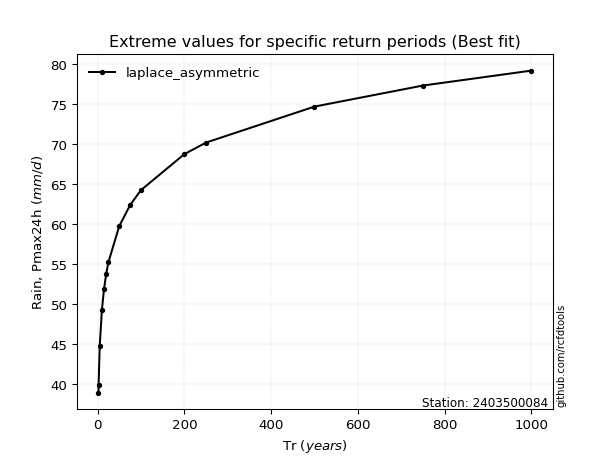</img>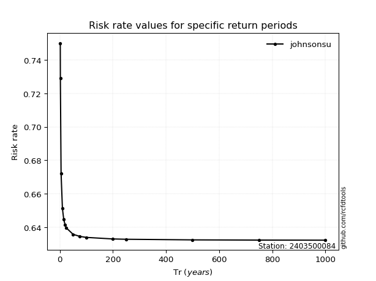</img>

</div>


<sub>**APP DISCLAIMER**: NO WARRANTY - This software is provided by [github.com/rcfdtools](https://github.com/rcfdtools) "as is", without any express or implied warranty, including warranties of merchantability, fitness for a particular purpose, or non-infringement. There is no guarantee that the software will be error-free or operate without interruption. LIMITATION OF LIABILITY - Neither the authors nor copyright holders will be liable for claims or damages arising from the software or its use. You are responsible for determining if the software is appropriate for your use and assume all associated risks, including errors, legal compliance, and data loss. NO PROFESSIONAL ADVICE - The software provides general information and does not offer professional advice. It should not replace consultation with professional advisors.</sub>