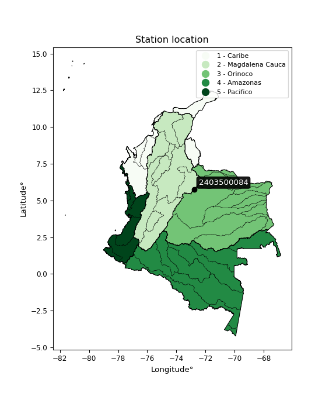

<div align="center">


</div>

# PMax24h Station (Rain, Pmax24h): 2403500084

Maximum Precipitation in 24 hours (PMax24h) is the greatest amount of rainfall for a specific duration that is meteorologically possible for a given location, acting as a "worst-case" scenario for extreme storms, crucial for designing safety-critical infrastructure like bridges, river deviations, dams, spillways, and nuclear plants to prevent catastrophic failure. The PMax24h is related with the Probable Maximum Precipitation (PMP) and it is calculated by hydrologists using meteorological data to determine the upper limit of extreme rainfall, often leading to the Probable Maximum Flood (PMF) for flood control design, and is increasingly being studied for climate change impacts. Probable Maximum Precipitation (PMP) is the theoretical upper limit of rainfall, a deterministic estimate for extreme events, while probability distributions (like GEV, Gumbel) describe the likelihood and frequency of various precipitation amounts, including rare ones, showing how often events occur, with PMP representing the extreme end of these distributions, used for critical infrastructure design to ensure safety against the worst conceivable weather, unlike standard statistical forecasts which cover typical probabilities.

The most common probability distributions in hydrology, used for analyzing floods, rainfall, and streamflow, include the Normal, Log-Normal, Gumbel, Gamma (including Log-Pearson Type III), and Generalized Extreme Value (GEV) distributions, often chosen based on the data´s skewness and whether modeling extremes or general conditions, with Gumbel and GEV popular for extreme events like floods, while the Normal distribution serves as a baseline, though often requiring transformations for skewed hydrological data. These distributions help in designing water infrastructure, managing water resources, and forecasting hydrologic events.

> Hydrological data often isn´t perfectly normal (it´s skewed), so different distributions are needed for different applications, such as: **Flood Frequency Analysis**: Using Gumbel, GEV, or Log-Pearson Type III for predicting extreme flood magnitudes and their return periods, **Rainfall Analysis**: Normal for annual totals, but Log-Normal, Weibull, or GEV for intensity or extreme daily rainfall, **Streamflow Modeling**: Gamma and Log-Normal for maximum flows, GEV for minimum flows, and Kappa for daily flows.

<div align="center">

</img>

</div>


## A. General information


### 1. General running parameters

• app_version: _v20260225_. • runtime: _2026-02-27 14:50:08.749431_. • Python version: _3.14.0_. • SciPy version: _1.16.3_. • Pandas version: _2.3.3_. • NumPy version: _2.3.5_. • Stations dataset (station_dataset_file): _dataset/pmax24h_in/automatic_colombia_2003_2025.csv_. • Stations catalog (station_catalog_file): _dataset/CNE.xls_. • Minimum year to eval til year_max (date_min): _1900_. • Maximum year to eval since year_min (date_max): _2025_. • Creates, save and include plots into reports (create_plot): _False_. • Plot only fit distributions with Δo > Δ (plot_only_fit): _True_. • Plot only simple graphs avoiding multiple CDFs and multiple Extreme values plots (plot_only_simple): _False_. • Eval low extreme values, if False, evaluates high extreme values (low_extreme): _False_. • Eval every SciPy distribution as logarithmic (pdist_logarithmic_on): _True_. • Standard deviation normalized (ddof): _1.0_. • Return periods to eval in years (Tr): _[2, 2.33, 5, 10, 15, 20, 25, 50, 75, 100, 200, 250, 500, 750, 1000]_. • Minimum data sample per station, 0 means any (minimum_sample): _5_. • Z-Score maximum threshold to adjust a value, 0 means disable (zscore_max): _3.5_. • Z-Score minimum threshold to adjust a value, 0 means disable (zscore_min): _-2.5_. • Avoid zeros, e.g. rain = 0 (avoid_zeros): _True_. • Avoid null values (avoid_nans): _True_. 

:file_folder:Table: [dataset.csv](../../dataset/pmax24h_in/automatic_colombia_2003_2025.csv)

> Delta Degrees of Freedom (DDOF): is a parameter used in the formulas for calculating variance and standard deviation. When ddof=0, the divisor is $N$ (the total number of observations) and this is used when your data set is the entire population. When ddof=1, the divisor is $N-1$ and this is used when your data set is a sample drawn from a larger population. Using $N-1$ provides an unbiased estimate of the population variance (known as Bessel´s correction).


### 2. Station info and location

|   id |     CODIGO | NOMBRE                    | CATEGORIA               | TECNOLOGIA                | ESTADO           | FECHA_INSTALACION   |   FECHA_SUSPENSION |   ALTITUD |   LATITUD |   LONGITUD | DEPARTAMENTO   | MUNICIPIO   | AREA_OPERATIVA                              | ENTIDAD                                                     | AREA_HIDROGRAFICA   | ZONA_HIDROGRAFICA   | SUBZONA_HIDROGRAFICA   |   CORRIENTE | Catalogo   |   Version |
|-----:|-----------:|:--------------------------|:------------------------|:--------------------------|:-----------------|:--------------------|-------------------:|----------:|----------:|-----------:|:---------------|:------------|:--------------------------------------------|:------------------------------------------------------------|:--------------------|:--------------------|:-----------------------|------------:|:-----------|----------:|
|    0 | 2403500084 | MONGUA - AUT [2403500084] | Climatológica Principal | Automática con Telemetría | En Mantenimiento | 15/12/2017          |                nan |      2932 |   5.75802 |   -72.7948 | Boyacá         | Mongua      | Area Operativa 06 - Boyacá-Casanare-Vichada | INSTITUTO DE HIDROLOGIA METEOROLOGIA Y ESTUDIOS AMBIENTALES | Magdalena Cauca     | Sogamoso            | Río Chicamocha         |         nan | CNE_IDEAM  |  20251226 |

<div align="center">

Dynamic map: [:earth_americas:Google](http://maps.google.com/maps?q=5.75802,-72.79485) [:earth_americas:OSM](https://www.openstreetmap.org/#map=18/5.75802/-72.79485&layers=P) [:earth_americas:Bing](https://www.bing.com/maps?cp=5.75802~-72.79485&lvl=18) [:earth_americas:Apple](https://maps.apple.com/frame?center=5.75802%2C-72.79485&span=0.003%2C0.006)

</div>


<div align="center">

```geojson
{
  "type": "Feature",
  "geometry": {
    "type": "Point", 
    "coordinates": [-72.79485, 5.75802]
  }, 
  "properties": {
    "Name": "2403500084"
  }
}
```

</div>


### 3. Discrete values table and plot

<div align="center">

|               |           0 |          1 |           2 |           3 |          4 |          5 |
|:--------------|------------:|-----------:|------------:|------------:|-----------:|-----------:|
| Date          | 2019        | 2020       | 2021        | 2022        | 2023       | 2025       |
| Value         |   36.6      |   26       |   41.4      |   38.6      |   52.6     |    1.2     |
| Value_initial |   36.6      |   26       |   41.4      |   38.6      |   52.6     |    1.2     |
| count         |    6        |    6       |    6        |    6        |    6       |    6       |
| mean          |   32.7333   |   32.7333  |   32.7333   |   32.7333   |   32.7333  |   32.7333  |
| std           |   17.657    |   17.657   |   17.657    |   17.657    |   17.657   |   17.657   |
| zscore        |    0.218987 |   -0.38134 |    0.490834 |    0.332257 |    1.12514 |   -1.78588 |


</div>


> The initial value (value_initial) correspond to the initial obtained or null completed value, and value (value) is adjusted only when the initial value is outside the valid range (outlier) definite through the Z-Score value. If Z-Score is active, values out of range or outliers are replaced with the station mean value. A Z-Score (or standard score) measures how many standard deviations a data point is from the mean of a dataset, indicating its relative position; positive scores mean above the mean, negative mean below, and a score of zero is exactly at the mean, allowing for comparison of values from different distributions. It´s calculated using the formula $z=(x–μ)/σ$, where $x$ is the data point, $μ$ is the mean, and $σ$ is the standard deviation, helping identify outliers and understand probability.
>
> <sub>**Note**: In this study, "completing" (filling gaps in) and "extending" (forecasting or lengthening the historical record) rainfall data series are avoided for certain critical analyses because they introduce artificial bias and uncertainty, which can distort the statistics of rare events (extremes), alter day-to-day variability, and compromise the integrity and homogeneity of the original data. Some reasons against Completing/Extending rainfall data are: **Distortion of Extremes and Variability**: The primary issue is that most gap-filling or extension methods rely on averaging or regression with nearby stations, which inherently smooths the data. Rainfall is highly variable in space and time, with a large percentage of zero values and occasional large storms. Infilling methods often underestimate the highest values and overestimate the lowest (zero) values, which severely distorts analyses focused on flood frequency, drought severity, and intensity-duration-frequency (IDF) curves, **Loss of Data Homogeneity**: Infilled or extended data are synthetic estimates, not actual measurements. Combining these estimates with observed data can violate the assumption of data homogeneity, which requires that the data properties do not change over time. Inhomogeneity can lead to incorrect conclusions about long-term trends or changes in climate patterns, **Propagation of Errors**: Errors and biases from the original data (e.g., wind-induced undercatch, instrument errors, site changes) or the data used for imputation can propagate through the analysis, leading to unreliable hydrological models and inaccurate predictions, **Compromised Statistical Integrity**: For statistical analyses, especially those involving the frequency of events, using artificial data can introduce time bias or autocorrelation that doesn´t exist in reality, making it difficult to assess the true probability of events, **Difficulty in Validation**: It is difficult to accurately validate the quality of filled or extended data, especially for past periods where ground-truth measurements are unavailable. The reliability of imputation techniques heavily depends on the density of the surrounding station network and the complexity of the local topography.</sub>


### 4. Active continuous probability distributions from SciPy (80 of 104 available)

A Probability Density Function (PDF) describes the relative likelihood of a continuous random variable falling within a specific range, where the total area under its curve equals 1, and the area over any interval gives the actual probability for that range. Unlike discrete probabilities (like rolling a die), a PDF shows density, not direct probability for a single point (which is zero), with higher points indicating higher likelihood, often visualized as a bell curve for normal distributions.

A log of a probability density function (log-PDF) is simply the logarithm of the PDF´s value, denoted as $log(f(x))$, useful for converting multiplication of probabilities into addition, improving numerical stability with tiny numbers, and connecting to information theory concepts like entropy. Instead of dealing with very small probabilities (e.g., 0.000001), log-PDFs use negative numbers (e.g., $log(0.00001) ≈ -11.51$ that are easier for computers to handle, preventing underflow errors and simplifying complex calculations. In this study, each active probability distribution from SciPy is also evaluated in the $log$ form.

[scipy.stats](https://docs.scipy.org/doc/scipy/reference/stats.html) is a Python´s powerful submodule within the SciPy library for comprehensive statistical analysis, offering over 130 probability distributions (like Normal, Poisson, etc.), functions for descriptive stats (mean, variance), hypothesis testing (t-tests, chi-square), random variable generation, and statistical tests, making it essential for data science, modeling, and research. It provides tools to explore, model, and draw conclusions from data efficiently, working seamlessly with [NumPy](https://numpy.org/).

<div align="center">

|   id | p_dist           |   n_parameter | fit_method   | label                                                                       | active   | ref                                                                                                      |
|-----:|:-----------------|--------------:|:-------------|:----------------------------------------------------------------------------|:---------|:---------------------------------------------------------------------------------------------------------|
|    0 | alpha            |             3 | MLE          | Alpha                                                                       | True     | [:mortar_board:](https://docs.scipy.org/doc/scipy/reference/generated/scipy.stats.alpha.html)            |
|    1 | anglit           |             2 | MM           | Anglit                                                                      | True     | [:mortar_board:](https://docs.scipy.org/doc/scipy/reference/generated/scipy.stats.anglit.html)           |
|    2 | arcsine          |             2 | MM           | Arcsine                                                                     | True     | [:mortar_board:](https://docs.scipy.org/doc/scipy/reference/generated/scipy.stats.arcsine.html)          |
|    3 | argus            |             3 | MLE          | Argus                                                                       | True     | [:mortar_board:](https://docs.scipy.org/doc/scipy/reference/generated/scipy.stats.argus.html)            |
|    4 | beta             |             4 | MLE          | Beta                                                                        | True     | [:mortar_board:](https://docs.scipy.org/doc/scipy/reference/generated/scipy.stats.beta.html)             |
|    5 | betaprime        |             4 | MLE          | Beta prime                                                                  | True     | [:mortar_board:](https://docs.scipy.org/doc/scipy/reference/generated/scipy.stats.betaprime.html)        |
|    6 | bradford         |             3 | MLE          | Bradford                                                                    | True     | [:mortar_board:](https://docs.scipy.org/doc/scipy/reference/generated/scipy.stats.bradford.html)         |
|    7 | burr             |             4 | MLE          | Burr (Type III)                                                             | True     | [:mortar_board:](https://docs.scipy.org/doc/scipy/reference/generated/scipy.stats.burr.html)             |
|    8 | burr12           |             4 | MLE          | Burr (Type III) 12                                                          | True     | [:mortar_board:](https://docs.scipy.org/doc/scipy/reference/generated/scipy.stats.burr12.html)           |
|    9 | cosine           |             2 | MLE          | Cosine                                                                      | True     | [:mortar_board:](https://docs.scipy.org/doc/scipy/reference/generated/scipy.stats.cosine.html)           |
|   10 | crystalball      |             4 | MLE          | Crystalball                                                                 | True     | [:mortar_board:](https://docs.scipy.org/doc/scipy/reference/generated/scipy.stats.crystalball.html)      |
|   11 | dgamma           |             3 | MLE          | Double gamma                                                                | True     | [:mortar_board:](https://docs.scipy.org/doc/scipy/reference/generated/scipy.stats.dgamma.html)           |
|   12 | dweibull         |             3 | MLE          | Double Weibull                                                              | True     | [:mortar_board:](https://docs.scipy.org/doc/scipy/reference/generated/scipy.stats.dweibull.html)         |
|   13 | erlang           |             3 | MLE          | Erlang                                                                      | True     | [:mortar_board:](https://docs.scipy.org/doc/scipy/reference/generated/scipy.stats.erlang.html)           |
|   14 | exponnorm        |             3 | MLE          | Exponentially modified Normal                                               | True     | [:mortar_board:](https://docs.scipy.org/doc/scipy/reference/generated/scipy.stats.exponnorm.html)        |
|   15 | exponpow         |             3 | MLE          | Exponential power                                                           | True     | [:mortar_board:](https://docs.scipy.org/doc/scipy/reference/generated/scipy.stats.exponpow.html)         |
|   16 | exponweib        |             4 | MLE          | Exponentiated Weibull                                                       | True     | [:mortar_board:](https://docs.scipy.org/doc/scipy/reference/generated/scipy.stats.exponweib.html)        |
|   17 | f                |             4 | MLE          | F                                                                           | True     | [:mortar_board:](https://docs.scipy.org/doc/scipy/reference/generated/scipy.stats.f.html)                |
|   18 | fatiguelife      |             3 | MLE          | Fatigue-life (Birnbaum-Saunders)                                            | True     | [:mortar_board:](https://docs.scipy.org/doc/scipy/reference/generated/scipy.stats.fatiguelife.html)      |
|   19 | foldnorm         |             3 | MM           | Fold Normal                                                                 | True     | [:mortar_board:](https://docs.scipy.org/doc/scipy/reference/generated/scipy.stats.foldnorm.html)         |
|   20 | gamma            |             3 | MLE          | Gamma                                                                       | True     | [:mortar_board:](https://docs.scipy.org/doc/scipy/reference/generated/scipy.stats.gamma.html)            |
|   21 | gausshyper       |             6 | MLE          | Gauss hypergeometric                                                        | True     | [:mortar_board:](https://docs.scipy.org/doc/scipy/reference/generated/scipy.stats.gausshyper.html)       |
|   22 | genexpon         |             5 | MLE          | Generalized exponential                                                     | True     | [:mortar_board:](https://docs.scipy.org/doc/scipy/reference/generated/scipy.stats.genexpon.html)         |
|   23 | genextreme       |             3 | MLE          | Generalized exponential                                                     | True     | [:mortar_board:](https://docs.scipy.org/doc/scipy/reference/generated/scipy.stats.genextreme.html)       |
|   24 | gengamma         |             4 | MLE          | Generalized gamma                                                           | True     | [:mortar_board:](https://docs.scipy.org/doc/scipy/reference/generated/scipy.stats.gengamma.html)         |
|   25 | genhalflogistic  |             3 | MLE          | Generalized half-logistic                                                   | True     | [:mortar_board:](https://docs.scipy.org/doc/scipy/reference/generated/scipy.stats.genhalflogistic.html)  |
|   26 | genlogistic      |             3 | MLE          | Generalized logistic                                                        | True     | [:mortar_board:](https://docs.scipy.org/doc/scipy/reference/generated/scipy.stats.genlogistic.html)      |
|   27 | gennorm          |             3 | MLE          | Generalized Normal                                                          | True     | [:mortar_board:](https://docs.scipy.org/doc/scipy/reference/generated/scipy.stats.gennorm.html)          |
|   28 | genpareto        |             3 | MLE          | Generalized Pareto                                                          | True     | [:mortar_board:](https://docs.scipy.org/doc/scipy/reference/generated/scipy.stats.genpareto.html)        |
|   29 | gompertz         |             3 | MLE          | Gompertz (or truncated Gumbel)                                              | True     | [:mortar_board:](https://docs.scipy.org/doc/scipy/reference/generated/scipy.stats.gompertz.html)         |
|   30 | gumbel_l         |             2 | MM           | Gumbel Left Skew                                                            | True     | [:mortar_board:](https://docs.scipy.org/doc/scipy/reference/generated/scipy.stats.gumbel_l.html)         |
|   31 | gumbel_r         |             2 | MM           | Gumbel Right Skew                                                           | True     | [:mortar_board:](https://docs.scipy.org/doc/scipy/reference/generated/scipy.stats.gumbel_r.html)         |
|   32 | halfgennorm      |             3 | MLE          | Upper half of a generalized normal                                          | True     | [:mortar_board:](https://docs.scipy.org/doc/scipy/reference/generated/scipy.stats.halfgennorm.html)      |
|   33 | halflogistic     |             2 | MM           | Half-logistic                                                               | True     | [:mortar_board:](https://docs.scipy.org/doc/scipy/reference/generated/scipy.stats.halflogistic.html)     |
|   34 | halfnorm         |             2 | MM           | Half Normal                                                                 | True     | [:mortar_board:](https://docs.scipy.org/doc/scipy/reference/generated/scipy.stats.halfnorm.html)         |
|   35 | hypsecant        |             2 | MM           | hyperbolic secant                                                           | True     | [:mortar_board:](https://docs.scipy.org/doc/scipy/reference/generated/scipy.stats.hypsecant.html)        |
|   36 | invgamma         |             3 | MLE          | Inverted gamma                                                              | True     | [:mortar_board:](https://docs.scipy.org/doc/scipy/reference/generated/scipy.stats.invgamma.html)         |
|   37 | invgauss         |             3 | MLE          | Inverse Gaussian                                                            | True     | [:mortar_board:](https://docs.scipy.org/doc/scipy/reference/generated/scipy.stats.invgauss.html)         |
|   38 | invweibull       |             3 | MLE          | Inverted Weibull                                                            | True     | [:mortar_board:](https://docs.scipy.org/doc/scipy/reference/generated/scipy.stats.invweibull.html)       |
|   39 | johnsonsb        |             4 | MLE          | Johnson SB                                                                  | True     | [:mortar_board:](https://docs.scipy.org/doc/scipy/reference/generated/scipy.stats.johnsonsb.html)        |
|   40 | johnsonsu        |             4 | MLE          | Johnson Su                                                                  | True     | [:mortar_board:](https://docs.scipy.org/doc/scipy/reference/generated/scipy.stats.johnsonsu.html)        |
|   41 | kappa3           |             3 | MLE          | Kappa 3                                                                     | True     | [:mortar_board:](https://docs.scipy.org/doc/scipy/reference/generated/scipy.stats.kappa3.html)           |
|   42 | kappa4           |             4 | MLE          | Kappa 4                                                                     | True     | [:mortar_board:](https://docs.scipy.org/doc/scipy/reference/generated/scipy.stats.kappa4.html)           |
|   43 | ksone            |             3 | MLE          | Kolmogorov-Smirnov one-sided test statistic distribution                    | True     | [:mortar_board:](https://docs.scipy.org/doc/scipy/reference/generated/scipy.stats.ksone.html)            |
|   44 | kstwobign        |             2 | MLE          | Limiting distribution of scaled Kolmogorov-Smirnov two-sided test statistic | True     | [:mortar_board:](https://docs.scipy.org/doc/scipy/reference/generated/scipy.stats.kstwobign.html)        |
|   45 | laplace          |             2 | MM           | Laplace                                                                     | True     | [:mortar_board:](https://docs.scipy.org/doc/scipy/reference/generated/scipy.stats.laplace.html)          |
|   46 | levy_l           |             2 | MLE          | Left-skewed Levy                                                            | True     | [:mortar_board:](https://docs.scipy.org/doc/scipy/reference/generated/scipy.stats.levy_l.html)           |
|   47 | loggamma         |             3 | MLE          | Log gamma                                                                   | True     | [:mortar_board:](https://docs.scipy.org/doc/scipy/reference/generated/scipy.stats.loggamma.html)         |
|   48 | logistic         |             2 | MM           | Logistic (or Sech-squared)                                                  | True     | [:mortar_board:](https://docs.scipy.org/doc/scipy/reference/generated/scipy.stats.logistic.html)         |
|   49 | loglaplace       |             3 | MLE          | Log-Laplace                                                                 | True     | [:mortar_board:](https://docs.scipy.org/doc/scipy/reference/generated/scipy.stats.loglaplace.html)       |
|   50 | lomax            |             3 | MLE          | Lomax (Pareto of the second kind)                                           | True     | [:mortar_board:](https://docs.scipy.org/doc/scipy/reference/generated/scipy.stats.lomax.html)            |
|   51 | maxwell          |             2 | MM           | Maxwell                                                                     | True     | [:mortar_board:](https://docs.scipy.org/doc/scipy/reference/generated/scipy.stats.maxwell.html)          |
|   52 | mielke           |             4 | MLE          | Mielke Beta-Kappa / Dagum                                                   | True     | [:mortar_board:](https://docs.scipy.org/doc/scipy/reference/generated/scipy.stats.mielke.html)           |
|   53 | moyal            |             2 | MM           | Moyal                                                                       | True     | [:mortar_board:](https://docs.scipy.org/doc/scipy/reference/generated/scipy.stats.moyal.html)            |
|   54 | nakagami         |             3 | MLE          | Nakagami                                                                    | True     | [:mortar_board:](https://docs.scipy.org/doc/scipy/reference/generated/scipy.stats.nakagami.html)         |
|   55 | ncf              |             5 | MLE          | Non-central F distribution                                                  | True     | [:mortar_board:](https://docs.scipy.org/doc/scipy/reference/generated/scipy.stats.ncf.html)              |
|   56 | nct              |             4 | MLE          | Non-central Student’s t                                                     | True     | [:mortar_board:](https://docs.scipy.org/doc/scipy/reference/generated/scipy.stats.nct.html)              |
|   57 | norm             |             2 | MM           | Normal                                                                      | True     | [:mortar_board:](https://docs.scipy.org/doc/scipy/reference/generated/scipy.stats.norm.html)             |
|   58 | pearson3         |             3 | MM           | Pearson type III                                                            | True     | [:mortar_board:](https://docs.scipy.org/doc/scipy/reference/generated/scipy.stats.pearson3.html)         |
|   59 | powerlaw         |             3 | MLE          | Power-function                                                              | True     | [:mortar_board:](https://docs.scipy.org/doc/scipy/reference/generated/scipy.stats.powerlaw.html)         |
|   60 | rayleigh         |             2 | MM           | Rayleigh                                                                    | True     | [:mortar_board:](https://docs.scipy.org/doc/scipy/reference/generated/scipy.stats.rayleigh.html)         |
|   61 | rdist            |             3 | MLE          | R-distributed (symmetric beta)                                              | True     | [:mortar_board:](https://docs.scipy.org/doc/scipy/reference/generated/scipy.stats.rdist.html)            |
|   62 | rice             |             3 | MLE          | Rice                                                                        | True     | [:mortar_board:](https://docs.scipy.org/doc/scipy/reference/generated/scipy.stats.rice.html)             |
|   63 | semicircular     |             2 | MM           | Semicircular                                                                | True     | [:mortar_board:](https://docs.scipy.org/doc/scipy/reference/generated/scipy.stats.semicircular.html)     |
|   64 | skewnorm         |             3 | MLE          | Skew normal                                                                 | True     | [:mortar_board:](https://docs.scipy.org/doc/scipy/reference/generated/scipy.stats.skewnorm.html)         |
|   65 | t                |             3 | MLE          | Student’s t                                                                 | True     | [:mortar_board:](https://docs.scipy.org/doc/scipy/reference/generated/scipy.stats.t.html)                |
|   66 | trapezoid        |             4 | MLE          | Trapezoid                                                                   | True     | [:mortar_board:](https://docs.scipy.org/doc/scipy/reference/generated/scipy.stats.trapezoid.html)        |
|   67 | triang           |             3 | MLE          | Triangular                                                                  | True     | [:mortar_board:](https://docs.scipy.org/doc/scipy/reference/generated/scipy.stats.triang.html)           |
|   68 | truncexpon       |             3 | MLE          | Truncated exponential                                                       | True     | [:mortar_board:](https://docs.scipy.org/doc/scipy/reference/generated/scipy.stats.truncexpon.html)       |
|   69 | truncnorm        |             4 | MLE          | Truncated normal                                                            | True     | [:mortar_board:](https://docs.scipy.org/doc/scipy/reference/generated/scipy.stats.truncnorm.html)        |
|   70 | truncpareto      |             4 | MLE          | Upper truncated Pareto                                                      | True     | [:mortar_board:](https://docs.scipy.org/doc/scipy/reference/generated/scipy.stats.truncpareto.html)      |
|   71 | truncweibull_min |             5 | MLE          | Doubly truncated Weibull minimum                                            | True     | [:mortar_board:](https://docs.scipy.org/doc/scipy/reference/generated/scipy.stats.truncweibull_min.html) |
|   72 | tukeylambda      |             3 | MLE          | Tukey-Lamdba                                                                | True     | [:mortar_board:](https://docs.scipy.org/doc/scipy/reference/generated/scipy.stats.tukeylambda.html)      |
|   73 | uniform          |             2 | MLE          | Uniform                                                                     | True     | [:mortar_board:](https://docs.scipy.org/doc/scipy/reference/generated/scipy.stats.uniform.html)          |
|   74 | vonmises         |             3 | MLE          | Von Mises                                                                   | True     | [:mortar_board:](https://docs.scipy.org/doc/scipy/reference/generated/scipy.stats.vonmises.html)         |
|   75 | vonmises_line    |             3 | MLE          | Von Mises line                                                              | True     | [:mortar_board:](https://docs.scipy.org/doc/scipy/reference/generated/scipy.stats.vonmises_line.html)    |
|   76 | wald             |             2 | MM           | Wald                                                                        | True     | [:mortar_board:](https://docs.scipy.org/doc/scipy/reference/generated/scipy.stats.wald.html)             |
|   77 | weibull_max      |             3 | MLE          | Weibull maximum                                                             | True     | [:mortar_board:](https://docs.scipy.org/doc/scipy/reference/generated/scipy.stats.weibull_max.html)      |
|   78 | weibull_min      |             3 | MLE          | Weibull minimum                                                             | True     | [:mortar_board:](https://docs.scipy.org/doc/scipy/reference/generated/scipy.stats.weibull_min.html)      |
|   79 | wrapcauchy       |             3 | MLE          | Wrapped  Cauchy                                                             | True     | [:mortar_board:](https://docs.scipy.org/doc/scipy/reference/generated/scipy.stats.wrapcauchy.html)       |

</div>

> **n_parameter:** # arguments & localization & scale.
>
> **Fit methods:** (MLE) maximum likelihood, (MM) L-moments.
>
>**Inactive** (With the only purpose of prevent loops, zero divisions, infinite values, over high estimated values or horizontal trending for recurrence intervals estimations, the follow distributions were disabled.)**:** lognorm, norminvgauss, powernorm, powerlognorm, cauchy, halfcauchy, foldcauchy, skewcauchy, chi2, expon, fisk, genhyperbolic, geninvgauss, gibrat, kstwo, laplace_asymmetric, levy, levy_stable, ncx2, pareto, rel_breitwigner, recipinvgauss, studentized_range, loguniform, 


## B. Probability (PDF) vs. Empirical (EDF) distributions functions

A continuous probability distribution (CPD) describes probabilities for variables that can take any value within a range (like rain any time), unlike discrete variables with specific outcomes (like temperature). It uses a Probability Density Function (PDF), a curve where the total area under it equals 1, and the probability of the variable falling within an interval (a to b) is found by calculating the area under the curve between those points. A key feature is that the probability of hitting any single exact value is zero, so probabilities are always expressed for ranges, e.g., $P(a ≤ X ≤ b)$.

<div align="center">

Distributions parameters from station values
|     |    station | p_dist              |   n |             loc |           scale | shape                  | shape1                | shape2                 | shape3             |
|----:|-----------:|:--------------------|----:|----------------:|----------------:|:-----------------------|:----------------------|:-----------------------|:-------------------|
|   0 | 2403500084 | alpha               |   6 |    -0.00277165  |     2.94252     | 2.6915553975976714e-09 |                       |                        |                    |
|   1 | 2403500084 | anglit              |   6 |    32.7333      |    47.1533      |                        |                       |                        |                    |
|   2 | 2403500084 | arcsine             |   6 |     9.93818     |    45.5903      |                        |                       |                        |                    |
|   3 | 2403500084 | argus               |   6 |   -14.5364      |    69.0018      | 1.8641838231846304     |                       |                        |                    |
|   4 | 2403500084 | beta                |   6 |    -4.0978      |    56.6978      | 1.601050427327435      | 0.6320296681031246    |                        |                    |
|   5 | 2403500084 | betaprime           |   6 |  -466.802       | 22768.2         | 937.205182597254       | 42708.754575319705    |                        |                    |
|   6 | 2403500084 | bradford            |   6 |    -5.31884     |    57.9198      | 4.855510216048345e-06  |                       |                        |                    |
|   7 | 2403500084 | burr                |   6 |     0.00192336  |    53.5406      | 186.79859675843954     | 0.005834836324327507  |                        |                    |
|   8 | 2403500084 | burr12              |   6 |   -41.3143      |   321.625       | 8.186177522737605      | 77747.04954908774     |                        |                    |
|   9 | 2403500084 | cosine              |   6 |    30.585       |    13.8929      |                        |                       |                        |                    |
|  10 | 2403500084 | crystalball         |   6 |    32.7333      |    16.1186      | 3394.974305369864      | 302.8790197659827     |                        |                    |
|  11 | 2403500084 | dgamma              |   6 |    38.6         |    13.6901      | 0.8305868097426264     |                       |                        |                    |
|  12 | 2403500084 | dweibull            |   6 |    38.6         |    13.5155      | 0.8488893348758542     |                       |                        |                    |
|  13 | 2403500084 | erlang              |   6 |  -203.279       |     1.17513     | 200.53570407000757     |                       |                        |                    |
|  14 | 2403500084 | exponnorm           |   6 |    32.7217      |    16.1187      | 0.0007152451963171784  |                       |                        |                    |
|  15 | 2403500084 | exponpow            |   6 |     1.2         |     3.05741     | 0.12141165792182547    |                       |                        |                    |
|  16 | 2403500084 | exponweib           |   6 |     1.2         |     2.59817     | 1.822223392818894      | 0.3027589471580509    |                        |                    |
|  17 | 2403500084 | f                   |   6 | -8728.46        |  8761.25        | 803465.0608323533      | 2158876.876498443     |                        |                    |
|  18 | 2403500084 | fatiguelife         |   6 |     1.2         |     8.02229e-06 | 1738.5420831288566     |                       |                        |                    |
|  19 | 2403500084 | foldnorm            |   6 |   -46.2797      |    14.4907      | 5.479625158627208      |                       |                        |                    |
|  20 | 2403500084 | gamma               |   6 |  -188.326       |     1.25472     | 176.01519264264738     |                       |                        |                    |
|  21 | 2403500084 | gausshyper          |   6 |    -3.91915     |    56.5191      | 1.2154907145455955     | 0.6549750087183368    | 1.166668367924892      | 1.0029630465496822 |
|  22 | 2403500084 | genexpon            |   6 |     1.19999     |     1.83827     | 0.058307614806546615   | 8.140137539264746e-08 | 1.3301451867216867     |                    |
|  23 | 2403500084 | genextreme          |   6 |    35.2522      |    18.9215      | 1.0907149800329923     |                       |                        |                    |
|  24 | 2403500084 | gengamma            |   6 |    -2.67421e+07 |     2.67422e+07 | 1.5965340244260577     | 1602202.3757363574    |                        |                    |
|  25 | 2403500084 | genhalflogistic     |   6 |    -2.80992     |    55.6871      | 1.0050019144937385     |                       |                        |                    |
|  26 | 2403500084 | genlogistic         |   6 |    46.1857      |     4.1639      | 0.2771712844120101     |                       |                        |                    |
|  27 | 2403500084 | gennorm             |   6 |    38.6         |     7.02163e-11 | 0.0969891097070455     |                       |                        |                    |
|  28 | 2403500084 | genpareto           |   6 |    -0.0597651   |    84.7184      | -1.608788497919336     |                       |                        |                    |
|  29 | 2403500084 | gompertz            |   6 |    26           |     9.5347      | 0.20751725078352318    |                       |                        |                    |
|  30 | 2403500084 | gumbel_l            |   6 |    39.9876      |    12.5676      |                        |                       |                        |                    |
|  31 | 2403500084 | gumbel_r            |   6 |    25.4791      |    12.5676      |                        |                       |                        |                    |
|  32 | 2403500084 | halfgennorm         |   6 |     1.2         |     1.04378     | 0.3459536498771967     |                       |                        |                    |
|  33 | 2403500084 | halflogistic        |   6 |    13.6291      |    13.7808      |                        |                       |                        |                    |
|  34 | 2403500084 | halfnorm            |   6 |    11.3986      |    26.7391      |                        |                       |                        |                    |
|  35 | 2403500084 | hypsecant           |   6 |    32.7333      |    10.2614      |                        |                       |                        |                    |
|  36 | 2403500084 | invgamma            |   6 |  -221.477       | 55085.6         | 218.1342377055483      |                       |                        |                    |
|  37 | 2403500084 | invgauss            |   6 |   -90.3851      |  6011.27        | 0.020444379287927694   |                       |                        |                    |
|  38 | 2403500084 | invweibull          |   6 |     1.2         |     3.63034     | 0.04203118235100721    |                       |                        |                    |
|  39 | 2403500084 | johnsonsb           |   6 |    -9.57304     |    62.173       | -0.27221429721074686   | 0.14459667469947063   |                        |                    |
|  40 | 2403500084 | johnsonsu           |   6 |    64.1112      |     0.91988     | 7.9580401556896465     | 1.9440900783983968    |                        |                    |
|  41 | 2403500084 | kappa3              |   6 |     1.19996     |    51.4         | 3511546.0395664866     |                       |                        |                    |
|  42 | 2403500084 | kappa4              |   6 |    -3.84774     |    58.7187      | 1.094209511904335      | 1.0350098866108608    |                        |                    |
|  43 | 2403500084 | ksone               |   6 |    -3.94        |    61.68        | 1.0                    |                       |                        |                    |
|  44 | 2403500084 | kstwobign           |   6 |   -39.2982      |    82.2702      |                        |                       |                        |                    |
|  45 | 2403500084 | laplace             |   6 |    32.7333      |    11.3976      |                        |                       |                        |                    |
|  46 | 2403500084 | levy_l              |   6 |    54.3829      |     7.39334     |                        |                       |                        |                    |
|  47 | 2403500084 | loggamma            |   6 |    48.2041      |     7.04786     | 0.4565786830779581     |                       |                        |                    |
|  48 | 2403500084 | logistic            |   6 |    32.7333      |     8.88664     |                        |                       |                        |                    |
|  49 | 2403500084 | loglaplace          |   6 |    -0.623847    |    37.2238      | 1.5480885678299146     |                       |                        |                    |
|  50 | 2403500084 | lomax               |   6 |     1.2         |     1.21493e+10 | 431349749.9255763      |                       |                        |                    |
|  51 | 2403500084 | maxwell             |   6 |    -5.46095     |    23.9347      |                        |                       |                        |                    |
|  52 | 2403500084 | mielke              |   6 |   -12.779       |    65.3863      | 2.163293117930224      | 75682.91133958873     |                        |                    |
|  53 | 2403500084 | moyal               |   6 |    23.5157      |     7.25591     |                        |                       |                        |                    |
|  54 | 2403500084 | nakagami            |   6 |     1.2         |    50.4693      | 0.06418537218088294    |                       |                        |                    |
|  55 | 2403500084 | ncf                 |   6 |    -3.49492     |     0.683103    | 0.20732494342792998    | 2747.084823398399     | 10.95445391689179      |                    |
|  56 | 2403500084 | nct                 |   6 | -1304.45        |    16.0809      | 645693.7656983808      | 83.1537566119286      |                        |                    |
|  57 | 2403500084 | norm                |   6 |    32.7333      |    16.1186      |                        |                       |                        |                    |
|  58 | 2403500084 | pearson3            |   6 |    32.7333      |    16.1186      | -0.9117203145574846    |                       |                        |                    |
|  59 | 2403500084 | powerlaw            |   6 |     1.2         |    51.4         | 0.14406194290804955    |                       |                        |                    |
|  60 | 2403500084 | rayleigh            |   6 |     1.89751     |    24.6034      |                        |                       |                        |                    |
|  61 | 2403500084 | rdist               |   6 |    -3.08026     |    29.0803      | 1.0242715391286306     |                       |                        |                    |
|  62 | 2403500084 | rice                |   6 |   -10.7464      |    17.305       | 2.2760779027969074     |                       |                        |                    |
|  63 | 2403500084 | semicircular        |   6 |    32.7333      |    32.2372      |                        |                       |                        |                    |
|  64 | 2403500084 | skewnorm            |   6 |    52.6         |    25.5838      | -61149443.99990009     |                       |                        |                    |
|  65 | 2403500084 | t                   |   6 |    32.7337      |    16.1182      | 41622.645461115986     |                       |                        |                    |
|  66 | 2403500084 | trapezoid           |   6 |   -13.4998      |    68.3854      | 1.0                    | 1.0                   |                        |                    |
|  67 | 2403500084 | triang              |   6 |   -10.4107      |    63.0107      | 0.999999973957951      |                       |                        |                    |
|  68 | 2403500084 | truncexpon          |   6 |     1.14925     |    81.0004      | 0.6351912074739414     |                       |                        |                    |
|  69 | 2403500084 | truncnorm           |   6 |   -11.6565      |    16.7615      | -9.035142286276447     | 3.8335852448306458    |                        |                    |
|  70 | 2403500084 | truncpareto         |   6 |     1.09879     |     0.101207    | 0.20339121942628052    | 508.8719467219656     |                        |                    |
|  71 | 2403500084 | truncweibull_min    |   6 |    -7.22449     |   109.086       | 1.9966819322357559     | 4.168451168729511e-14 | 0.5484135196485793     |                    |
|  72 | 2403500084 | tukeylambda         |   6 |    -2.63684     |    29.1849      | 1.0191372081078969     |                       |                        |                    |
|  73 | 2403500084 | uniform             |   6 |     1.2         |    51.4         |                        |                       |                        |                    |
|  74 | 2403500084 | vonmises            |   6 |     1.27341     |     1           | 0.6528230770088794     |                       |                        |                    |
|  75 | 2403500084 | vonmises_line       |   6 |    36.2753      |    11.1648      | 1.0449604601326314     |                       |                        |                    |
|  76 | 2403500084 | wald                |   6 |    16.6148      |    16.1186      |                        |                       |                        |                    |
|  77 | 2403500084 | weibull_max         |   6 |    52.6         |     1.61191     | 0.29320032559959797    |                       |                        |                    |
|  78 | 2403500084 | weibull_min         |   6 |    -7.58559e+08 |     7.58559e+08 | 63443900.305383384     |                       |                        |                    |
|  79 | 2403500084 | wrapcauchy          |   6 |     1.19763     |     8.18094     | 0.1276823337991757     |                       |                        |                    |
|  80 | 2403500084 | logalpha            |   6 |     0.00219391  |     0.439752    | 2.8259972947202687e-08 |                       |                        |                    |
|  81 | 2403500084 | loganglit           |   6 |     3.06329     |     3.81774     |                        |                       |                        |                    |
|  82 | 2403500084 | logarcsine          |   6 |     1.21771     |     3.69116     |                        |                       |                        |                    |
|  83 | 2403500084 | logargus            |   6 |    -1.32542     |     5.36127     | 3.2499768105356264     |                       |                        |                    |
|  84 | 2403500084 | logbeta             |   6 |    -0.203117    |     4.16583     | 0.12406078451445177    | 0.029221722899032916  |                        |                    |
|  85 | 2403500084 | logbetaprime        |   6 |   -43.8292      |  2051.64        | 1264.6620724511727     | 55347.4139093784      |                        |                    |
|  86 | 2403500084 | logbradford         |   6 |    -0.262444    |     4.22523     | 2.5690355013064417e-05 |                       |                        |                    |
|  87 | 2403500084 | logburr             |   6 |    -1.39298     |     5.38503     | 577.4455746623087      | 0.0066055870455066085 |                        |                    |
|  88 | 2403500084 | logburr12           |   6 | -6189.48        |  6202.04        | 9654.20541699692       | 1216555.141573384     |                        |                    |
|  89 | 2403500084 | logcosine           |   6 |     2.7634      |     1.16778     |                        |                       |                        |                    |
|  90 | 2403500084 | logcrystalball      |   6 |     3.06329     |     1.30503     | 17.81288367479576      | 2098.393830469026     |                        |                    |
|  91 | 2403500084 | logdgamma           |   6 |     3.60005     |     0.882486    | 0.775623794023597      |                       |                        |                    |
|  92 | 2403500084 | logdweibull         |   6 |     3.65325     |     0.923592    | 0.8772783802039982     |                       |                        |                    |
|  93 | 2403500084 | logerlang           |   6 |   -21.5915      |     0.0803819   | 306.4812491116657      |                       |                        |                    |
|  94 | 2403500084 | logexponnorm        |   6 |     3.06272     |     1.30503     | 0.00044566261586954166 |                       |                        |                    |
|  95 | 2403500084 | logexponpow         |   6 |     0.182322    |     4.55753     | 0.8238423428566084     |                       |                        |                    |
|  96 | 2403500084 | logexponweib        |   6 |     0.182322    |     3.96758     | 0.010911129088135935   | 13.690864018558523    |                        |                    |
|  97 | 2403500084 | logf                |   6 |  -417.68        |   420.735       | 259993.6765846173      | 988251.9142783575     |                        |                    |
|  98 | 2403500084 | logfatiguelife      |   6 | -1174.39        |  1177.45        | 0.0011092774262355717  |                       |                        |                    |
|  99 | 2403500084 | logfoldnorm         |   6 |    -4.70285     |     1.07612     | 7.263030689668266      |                       |                        |                    |
| 100 | 2403500084 | loggamma            |   6 |   -20.2796      |     0.0829352   | 281.475665286512       |                       |                        |                    |
| 101 | 2403500084 | loggausshyper       |   6 |    -0.240609    |     4.20333     | 1.3665061643904108     | 0.6262460244462885    | 1.003336438871799      | 0.834903031924919  |
| 102 | 2403500084 | loggenexpon         |   6 |     0.0680026   |     0.129661    | 0.01194090797825989    | 7.686907683296258     | 0.00029708203881765845 |                    |
| 103 | 2403500084 | loggenextreme       |   6 |     3.41859     |     0.693613    | 1.2747249321571823     |                       |                        |                    |
| 104 | 2403500084 | loggengamma         |   6 |     0.182322    |     4.88292     | 0.20433720196965355    | 2.889683857815214     |                        |                    |
| 105 | 2403500084 | loggenhalflogistic  |   6 |    -0.19181     |     6.09753     | 1.4676840388904044     |                       |                        |                    |
| 106 | 2403500084 | loggenlogistic      |   6 |     3.96276     |     3.6725e-06  | 4.095079688353097e-06  |                       |                        |                    |
| 107 | 2403500084 | loggennorm          |   6 |     3.72328     |     0.00771559  | 0.3170431429143694     |                       |                        |                    |
| 108 | 2403500084 | loggenpareto        |   6 |    -0.00386769  |    10.8717      | -2.7408124289814695    |                       |                        |                    |
| 109 | 2403500084 | loggompertz         |   6 |     0.181976    |     0.667203    | 0.006410245100847062   |                       |                        |                    |
| 110 | 2403500084 | loggumbel_l         |   6 |     3.65062     |     1.01753     |                        |                       |                        |                    |
| 111 | 2403500084 | loggumbel_r         |   6 |     2.47595     |     1.01753     |                        |                       |                        |                    |
| 112 | 2403500084 | loghalfgennorm      |   6 |     0.182322    |     3.36639     | 1.7727365547101437     |                       |                        |                    |
| 113 | 2403500084 | loghalflogistic     |   6 |     1.51651     |     1.11576     |                        |                       |                        |                    |
| 114 | 2403500084 | loghalfnorm         |   6 |     1.33597     |     2.16487     |                        |                       |                        |                    |
| 115 | 2403500084 | loghypsecant        |   6 |     3.06329     |     0.830809    |                        |                       |                        |                    |
| 116 | 2403500084 | loginvgamma         |   6 |   -28.3518      | 16661.7         | 531.8621494326986      |                       |                        |                    |
| 117 | 2403500084 | loginvgauss         |   6 |   -12.6316      |  1806.48        | 0.008660067680375687   |                       |                        |                    |
| 118 | 2403500084 | loginvweibull       |   6 |    -1.13576e+08 |     1.13576e+08 | 70539756.9614062       |                       |                        |                    |
| 119 | 2403500084 | logjohnsonsb        |   6 |    -0.501277    |     4.46399     | 0.012896425745410544   | 0.13881448908137684   |                        |                    |
| 120 | 2403500084 | logjohnsonsu        |   6 |     3.96272     |     1.30967e-14 | 2.1953647166958383     | 0.12016008466081801   |                        |                    |
| 121 | 2403500084 | logkappa3           |   6 |     0.1779      |     3.78356     | 6015.331294232354      |                       |                        |                    |
| 122 | 2403500084 | logkappa4           |   6 |    -0.163216    |     4.65164     | 1.0806673311181718     | 1.127413699392867     |                        |                    |
| 123 | 2403500084 | logksone            |   6 |    -0.195718    |     4.53647     | 1.0                    |                       |                        |                    |
| 124 | 2403500084 | logkstwobign        |   6 |    -3.41922     |     7.4035      |                        |                       |                        |                    |
| 125 | 2403500084 | loglaplace          |   6 |     3.06329     |     0.922797    |                        |                       |                        |                    |
| 126 | 2403500084 | loglevy_l           |   6 |     4.00598     |     0.178867    |                        |                       |                        |                    |
| 127 | 2403500084 | logloggamma         |   6 |     3.96273     |     1.26149e-06 | 1.4008221119014417e-06 |                       |                        |                    |
| 128 | 2403500084 | loglogistic         |   6 |     3.06329     |     0.719502    |                        |                       |                        |                    |
| 129 | 2403500084 | logloglaplace       |   6 |  -444.347       |   448           | 599.7065280203731      |                       |                        |                    |
| 130 | 2403500084 | loglomax            |   6 |     0.182322    |     6.85055e+12 | 2313770261493.8555     |                       |                        |                    |
| 131 | 2403500084 | logmaxwell          |   6 |    -0.0290916   |     1.93786     |                        |                       |                        |                    |
| 132 | 2403500084 | logmielke           |   6 |    -1.27531e+08 |     1.27531e+08 | 141721030.8929101      | 61318207478.07536     |                        |                    |
| 133 | 2403500084 | logmoyal            |   6 |     2.31698     |     0.587471    |                        |                       |                        |                    |
| 134 | 2403500084 | lognakagami         |   6 | -1383.93        |  1387           | 282359.03123551136     |                       |                        |                    |
| 135 | 2403500084 | logncf              |   6 |    -0.237512    |     2.52362e-06 | 1.3048711051285967e-05 | 33.75661123219106     | 16.946648090755637     |                    |
| 136 | 2403500084 | lognct              |   6 |   -72.5458      |     1.2322      | 13621.889793379232     | 61.35668068804745     |                        |                    |
| 137 | 2403500084 | lognorm             |   6 |     3.06329     |     1.30503     |                        |                       |                        |                    |
| 138 | 2403500084 | logpearson3         |   6 |     3.06329     |     1.30501     | -1.6894005382840114    |                       |                        |                    |
| 139 | 2403500084 | logpowerlaw         |   6 |     0.182322    |     3.78039     | 0.15033493163032471    |                       |                        |                    |
| 140 | 2403500084 | lograyleigh         |   6 |     0.566673    |     1.99201     |                        |                       |                        |                    |
| 141 | 2403500084 | logrdist            |   6 |     0.922657    |     0.740336    | 1.441881561685962      |                       |                        |                    |
| 142 | 2403500084 | logrice             |   6 |  -278.205       |     1.30503     | 215.52432155341455     |                       |                        |                    |
| 143 | 2403500084 | logsemicircular     |   6 |     3.06328     |     2.61008     |                        |                       |                        |                    |
| 144 | 2403500084 | logskewnorm         |   6 |     3.96272     |     1.58488     | -5884461.20595644      |                       |                        |                    |
| 145 | 2403500084 | logt                |   6 |     3.65632     |     0.0940995   | 0.6025459031491374     |                       |                        |                    |
| 146 | 2403500084 | logtrapezoid        |   6 |    -0.659297    |     5.53678     | 1.0                    | 1.0                   |                        |                    |
| 147 | 2403500084 | logtriang           |   6 |    -0.715151    |     4.67793     | 0.999988220875263      |                       |                        |                    |
| 148 | 2403500084 | logtruncexpon       |   6 |    -0.203199    |     5.48316     | 0.7597647479393541     |                       |                        |                    |
| 149 | 2403500084 | logtruncnorm        |   6 |    -0.098808    |     3.3256      | 0.08453493158813846    | 4.199599643265447     |                        |                    |
| 150 | 2403500084 | logtruncpareto      |   6 |     0.172872    |     0.00944959  | 0.20329465806566954    | 401.05914404846135    |                        |                    |
| 151 | 2403500084 | logtruncweibull_min |   6 |    -0.0310396   |     6.47109     | 1.9020792765085366     | 0.0038804356828928735 | 0.6171687465844572     |                    |
| 152 | 2403500084 | logtukeylambda      |   6 |     0.182322    |     1.03056e-10 | 2.4067422671644967     |                       |                        |                    |
| 153 | 2403500084 | loguniform          |   6 |     0.182322    |     3.78039     |                        |                       |                        |                    |
| 154 | 2403500084 | logvonmises         |   6 |    -2.56384     |     1           | 1.7674867194955342     |                       |                        |                    |
| 155 | 2403500084 | logvonmises_line    |   6 |     3.29516     |     0.990847    | 1.0159704071859466     |                       |                        |                    |
| 156 | 2403500084 | logwald             |   6 |     1.75822     |     1.30506     |                        |                       |                        |                    |
| 157 | 2403500084 | logweibull_max      |   6 |     3.96272     |     1.26627     | 0.550518386872934      |                       |                        |                    |
| 158 | 2403500084 | logweibull_min      |   6 |    -1.11892e+06 |     1.11892e+06 | 1727418.3494169882     |                       |                        |                    |
| 159 | 2403500084 | logwrapcauchy       |   6 |     0.182319    |     0.601669    | 0.7097997507508547     |                       |                        |                    |

</div>

> **loc** (Location parameter): This shifts the distribution along the x-axis. For many common distributions, like the normal (Gaussian) distribution, loc represents the mean $μ$. For others, like the uniform distribution, it might represent the minimum value, or for the beta distribution, the left end of the support interval.
>
> **scale** (Scale parameter): This determines the width or spread of the distribution. For the normal distribution, scale represents the standard deviation $σ$. For a uniform distribution, it defines the length of the interval (from $loc$ to $loc + scale$).
>
> **shape** (Shape parameters): Refers to parameters that define the specific form of a probability distribution, distinct from its location (loc) and scale (scale). These parameters are required arguments for most distribution functions. For example, a normal (Gaussian) distribution is fully defined by its location (mean) and scale (standard deviation), so it has no specific shape parameters beyond loc and scale. However, other distributions have intrinsic properties that need specification, as Gamma distribution that takes a shape parameter, often named $a$ or $alpha$.


### 0. Cumulative distribution values - CDF (160 evaluated)

Cumulative Distribution Function (CDF), denoted as $F$<sub>$X$</sub>$(x)$, is a function that gives the probability that a random variable $X$ will take a value less than or equal to a specific value, $x$ (i.e., $(P(X≥x)$. It essentially "accumulates" probabilities from a given point up to the far right (positive infinity), providing a complete picture of the distribution´s probabilities for both discrete (like rain) and continuous (like temperature) variables, helping to find probabilities over ranges or above certain values. Each station is evaluated separately ordering the $x$ values ascending, calculating the CDF and PDF values for the activated distributions and their logarithmic forms.

<div align="center">

CDF ordered by x ascending and calculating $log(f(x))$ separately
|   id |    Station |   date |    x |   count |    mean |    std |    zscore |   Value_initial |    station |   m |     alpha |   alpha_pdf |    anglit |   anglit_pdf |   arcsine |   arcsine_pdf |     argus |   argus_pdf |      beta |      beta_pdf |   betaprime |   betaprime_pdf |   bradford |   bradford_pdf |      burr |    burr_pdf |    burr12 |   burr12_pdf |    cosine |   cosine_pdf |   crystalball |   crystalball_pdf |    dgamma |   dgamma_pdf |   dweibull |   dweibull_pdf |   erlang |   erlang_pdf |   exponnorm |   exponnorm_pdf |   exponpow |   exponpow_pdf |   exponweib |   exponweib_pdf |         f |      f_pdf |   fatiguelife |   fatiguelife_pdf |   foldnorm |   foldnorm_pdf |     gamma |   gamma_pdf |   gausshyper |   gausshyper_pdf |    genexpon |   genexpon_pdf |   genextreme |   genextreme_pdf |   gengamma |   gengamma_pdf |   genhalflogistic |   genhalflogistic_pdf |   genlogistic |   genlogistic_pdf |   gennorm |   gennorm_pdf |   genpareto |   genpareto_pdf |    gompertz |   gompertz_pdf |   gumbel_l |   gumbel_l_pdf |   gumbel_r |   gumbel_r_pdf |   halfgennorm |   halfgennorm_pdf |   halflogistic |   halflogistic_pdf |   halfnorm |   halfnorm_pdf |   hypsecant |   hypsecant_pdf |   invgamma |   invgamma_pdf |   invgauss |   invgauss_pdf |   invweibull |   invweibull_pdf |   johnsonsb |   johnsonsb_pdf |   johnsonsu |   johnsonsu_pdf |      kappa3 |   kappa3_pdf |      kappa4 |   kappa4_pdf |     ksone |   ksone_pdf |   kstwobign |   kstwobign_pdf |   laplace |   laplace_pdf |   levy_l |   levy_l_pdf |   loggamma |   loggamma_pdf |   logistic |   logistic_pdf |   loglaplace |   loglaplace_pdf |       lomax |   lomax_pdf |    maxwell |   maxwell_pdf |    mielke |   mielke_pdf |       moyal |   moyal_pdf |   nakagami |   nakagami_pdf |      ncf |    ncf_pdf |       nct |    nct_pdf |      norm |   norm_pdf |   pearson3 |   pearson3_pdf |   powerlaw |   powerlaw_pdf |   rayleigh |   rayleigh_pdf |    rdist |      rdist_pdf |      rice |   rice_pdf |   semicircular |   semicircular_pdf |   skewnorm |   skewnorm_pdf |         t |      t_pdf |   trapezoid |   trapezoid_pdf |    triang |   triang_pdf |   truncexpon |   truncexpon_pdf |   truncnorm |   truncnorm_pdf |   truncpareto |   truncpareto_pdf |   truncweibull_min |   truncweibull_min_pdf |   tukeylambda |   tukeylambda_pdf |   uniform |   uniform_pdf |   vonmises |   vonmises_pdf |   vonmises_line |   vonmises_line_pdf |     wald |   wald_pdf |   weibull_max |   weibull_max_pdf |   weibull_min |   weibull_min_pdf |   wrapcauchy |   wrapcauchy_pdf |   logalpha |   logalpha_pdf |   loganglit |   loganglit_pdf |   logarcsine |   logarcsine_pdf |   logargus |   logargus_pdf |   logbeta |   logbeta_pdf |   logbetaprime |   logbetaprime_pdf |   logbradford |   logbradford_pdf |    logburr |   logburr_pdf |   logburr12 |   logburr12_pdf |   logcosine |   logcosine_pdf |   logcrystalball |   logcrystalball_pdf |   logdgamma |   logdgamma_pdf |   logdweibull |   logdweibull_pdf |   logerlang |   logerlang_pdf |   logexponnorm |   logexponnorm_pdf |   logexponpow |   logexponpow_pdf |   logexponweib |   logexponweib_pdf |      logf |   logf_pdf |   logfatiguelife |   logfatiguelife_pdf |   logfoldnorm |   logfoldnorm_pdf |   loggausshyper |   loggausshyper_pdf |   loggenexpon |   loggenexpon_pdf |   loggenextreme |   loggenextreme_pdf |   loggengamma |   loggengamma_pdf |   loggenhalflogistic |   loggenhalflogistic_pdf |   loggenlogistic |   loggenlogistic_pdf |   loggennorm |   loggennorm_pdf |   loggenpareto |   loggenpareto_pdf |   loggompertz |   loggompertz_pdf |   loggumbel_l |   loggumbel_l_pdf |   loggumbel_r |   loggumbel_r_pdf |   loghalfgennorm |   loghalfgennorm_pdf |   loghalflogistic |   loghalflogistic_pdf |   loghalfnorm |   loghalfnorm_pdf |   loghypsecant |   loghypsecant_pdf |   loginvgamma |   loginvgamma_pdf |   loginvgauss |   loginvgauss_pdf |   loginvweibull |   loginvweibull_pdf |   logjohnsonsb |   logjohnsonsb_pdf |   logjohnsonsu |   logjohnsonsu_pdf |   logkappa3 |   logkappa3_pdf |   logkappa4 |   logkappa4_pdf |   logksone |   logksone_pdf |   logkstwobign |   logkstwobign_pdf |   loglevy_l |   loglevy_l_pdf |   logloggamma |   logloggamma_pdf |   loglogistic |   loglogistic_pdf |   logloglaplace |   logloglaplace_pdf |    loglomax |   loglomax_pdf |   logmaxwell |   logmaxwell_pdf |   logmielke |   logmielke_pdf |    logmoyal |   logmoyal_pdf |   lognakagami |   lognakagami_pdf |     logncf |   logncf_pdf |    lognct |   lognct_pdf |   lognorm |   lognorm_pdf |   logpearson3 |   logpearson3_pdf |   logpowerlaw |   logpowerlaw_pdf |   lograyleigh |   lograyleigh_pdf |   logrdist |   logrdist_pdf |   logrice |   logrice_pdf |   logsemicircular |   logsemicircular_pdf |   logskewnorm |   logskewnorm_pdf |      logt |   logt_pdf |   logtrapezoid |   logtrapezoid_pdf |   logtriang |   logtriang_pdf |   logtruncexpon |   logtruncexpon_pdf |   logtruncnorm |   logtruncnorm_pdf |   logtruncpareto |   logtruncpareto_pdf |   logtruncweibull_min |   logtruncweibull_min_pdf |   logtukeylambda |   logtukeylambda_pdf |   loguniform |   loguniform_pdf |   logvonmises |   logvonmises_pdf |   logvonmises_line |   logvonmises_line_pdf |   logwald |   logwald_pdf |   logweibull_max |   logweibull_max_pdf |   logweibull_min |   logweibull_min_pdf |   logwrapcauchy |   logwrapcauchy_pdf |
|-----:|-----------:|-------:|-----:|--------:|--------:|-------:|----------:|----------------:|-----------:|----:|----------:|------------:|----------:|-------------:|----------:|--------------:|----------:|------------:|----------:|--------------:|------------:|----------------:|-----------:|---------------:|----------:|------------:|----------:|-------------:|----------:|-------------:|--------------:|------------------:|----------:|-------------:|-----------:|---------------:|---------:|-------------:|------------:|----------------:|-----------:|---------------:|------------:|----------------:|----------:|-----------:|--------------:|------------------:|-----------:|---------------:|----------:|------------:|-------------:|-----------------:|------------:|---------------:|-------------:|-----------------:|-----------:|---------------:|------------------:|----------------------:|--------------:|------------------:|----------:|--------------:|------------:|----------------:|------------:|---------------:|-----------:|---------------:|-----------:|---------------:|--------------:|------------------:|---------------:|-------------------:|-----------:|---------------:|------------:|----------------:|-----------:|---------------:|-----------:|---------------:|-------------:|-----------------:|------------:|----------------:|------------:|----------------:|------------:|-------------:|------------:|-------------:|----------:|------------:|------------:|----------------:|----------:|--------------:|---------:|-------------:|-----------:|---------------:|-----------:|---------------:|-------------:|-----------------:|------------:|------------:|-----------:|--------------:|----------:|-------------:|------------:|------------:|-----------:|---------------:|---------:|-----------:|----------:|-----------:|----------:|-----------:|-----------:|---------------:|-----------:|---------------:|-----------:|---------------:|---------:|---------------:|----------:|-----------:|---------------:|-------------------:|-----------:|---------------:|----------:|-----------:|------------:|----------------:|----------:|-------------:|-------------:|-----------------:|------------:|----------------:|--------------:|------------------:|-------------------:|-----------------------:|--------------:|------------------:|----------:|--------------:|-----------:|---------------:|----------------:|--------------------:|---------:|-----------:|--------------:|------------------:|--------------:|------------------:|-------------:|-----------------:|-----------:|---------------:|------------:|----------------:|-------------:|-----------------:|-----------:|---------------:|----------:|--------------:|---------------:|-------------------:|--------------:|------------------:|-----------:|--------------:|------------:|----------------:|------------:|----------------:|-----------------:|---------------------:|------------:|----------------:|--------------:|------------------:|------------:|----------------:|---------------:|-------------------:|--------------:|------------------:|---------------:|-------------------:|----------:|-----------:|-----------------:|---------------------:|--------------:|------------------:|----------------:|--------------------:|--------------:|------------------:|----------------:|--------------------:|--------------:|------------------:|---------------------:|-------------------------:|-----------------:|---------------------:|-------------:|-----------------:|---------------:|-------------------:|--------------:|------------------:|--------------:|------------------:|--------------:|------------------:|-----------------:|---------------------:|------------------:|----------------------:|--------------:|------------------:|---------------:|-------------------:|--------------:|------------------:|--------------:|------------------:|----------------:|--------------------:|---------------:|-------------------:|---------------:|-------------------:|------------:|----------------:|------------:|----------------:|-----------:|---------------:|---------------:|-------------------:|------------:|----------------:|--------------:|------------------:|--------------:|------------------:|----------------:|--------------------:|------------:|---------------:|-------------:|-----------------:|------------:|----------------:|------------:|---------------:|--------------:|------------------:|-----------:|-------------:|----------:|-------------:|----------:|--------------:|--------------:|------------------:|--------------:|------------------:|--------------:|------------------:|-----------:|---------------:|----------:|--------------:|------------------:|----------------------:|--------------:|------------------:|----------:|-----------:|---------------:|-------------------:|------------:|----------------:|----------------:|--------------------:|---------------:|-------------------:|-----------------:|---------------------:|----------------------:|--------------------------:|-----------------:|---------------------:|-------------:|-----------------:|--------------:|------------------:|-------------------:|-----------------------:|----------:|--------------:|-----------------:|---------------------:|-----------------:|---------------------:|----------------:|--------------------:|
|    0 | 2403500084 |   2025 |  1.2 |       6 | 32.7333 | 17.657 | -1.78588  |             1.2 | 2403500084 |   1 | 0.0144271 | 0.0814034   | 0.0135473 |   0.00490324 |  0        |     0         | 0.0361279 |  0.00473878 | 0.0126908 |     0.0038899 |   0.0256339 |       0.0037825 |   0.11255  |      0.0172653 | 0.0158995 | nan         | 0.0049599 |  0.000952662 | 0.0272161 |   0.00552372 |     0.0252129 |        0.00365181 | 0.0231434 |   0.00177212 |  0.0466146 |      0.0025104 | 0.026231 |    0.0040208 |   0.0252142 |      0.00365194 |  0.0109784 |    6.00263e+12 | 1.36535e-09 |     3.39233e+06 | 0.0253449 | 0.00366238 |     0.0463985 |       8.69043e+10 |  0.0137954 |     0.00243167 | 0.0253832 |   0.0039397 |    0.0556504 |        0.012821  | 1.67658e-07 |     0.0317188  |    0.0667374 |       0.00322242 |  0.0376743 |     0.00337075 |         0.0373559 |             0.0096657 |      0.050062 |        0.00333233 | 0.0717716 |    0.00103623 |   0.0149381 |       0.0119125 | 0           |      0         |  0.0446429 |     0.00347172 |  0.0010053 |    0.000552137 |   2.33374e-13 |        0.182878   |       0        |         0          |   0        |      0         |    0.029443 |      0.00286521 |  0.0274114 |     0.00436739 |  0.0228385 |     0.00419253 |    0.0082087 |      7.4624e+12  |    0.309186 |     0.00572112  |   0.0543741 |      0.00340627 | 7.78757e-07 |    0.0194552 | 2.62466e-15 |    0.403882  | 0.0833333 |   0.0162127 |   0.0313183 |      0.00710105 | 0.0314354 |    0.00275808 | 0.29074  |   0.00260907 |  0.0160424 |      0.0314926 |  0.0279661 |     0.00305898 |    0.0220346 |        0.0238781 | 2.11231e-10 |  0.0355041  | 0.00560112 |    0.00248376 | 0.0355281 |   0.00549808 | 3.25324e-06 | 5.06306e-06 | 0.00512908 |    2.96528e+12 | 0.02765  | 0.00746201 | 0.0252343 | 0.00365411 | 0.0252129 | 0.00365181 |  0.0438051 |     0.00378253 | 0.00315089 |    2.04429e+12 |   0        |      0         | 0.547804 |      0.0112485 | 0.0211147 | 0.00405334 |     0.00192999 |         0.00410406 |  0.0445282 |     0.00414455 | 0.0252124 | 0.00365155 |   0.0462056 |      0.00628657 | 0.0339537 |    0.0058487 |   0.00133222 |        0.0262416 |    0.778516 |     0.0177367   |      0        |        2.79708    |          0.0230486 |             0.00544633 |      0.566615 |         0.0173639 |  0        |     0.0194553 |   0.479783 |      0.275093  |     2.83201e-12 |          0.00387991 | 0        | 0          |     0.0633105 |       0.000996643 |     0.0383139 |        0.00314229 |  5.95523e-05 |        0.0251495 |  0.0146331 |      0.549242  |  0.00094664 |       0.0161106 |     0        |         0        | 0.00678888 |      0.0108036 |  0.144146 |   0.0504557   |      0.0143274 |          0.0285081 |      0.105266 |          0.236676 | 0.00920019 |    nan        |   0.0051258 |      0.00797434 |   0.0205182 |       0.0549572 |        0.0136367 |            0.0267325 |  0.00614056 |      0.00729144 |     0.0204932 |         0.0165465 |   0.0179126 |       0.0340271 |      0.0136362 |          0.0267316 |    6.5651e-15 |        194.866    |     0.00273724 |         1.4732e+13 | 0.0140425 |  0.0274334 |        0.0135548 |            0.0266369 |    0.00323054 |        0.00908805 |       0.0372769 |            0.118461 |     0.0113507 |          0.106399 |       0.0103046 |           0.0097833 |   7.15762e-11 |       1.52271e+06 |            0.0321382 |                0.0900226 |         0        |            0.0164648 |    0.0179536 |       0.00824704 |      0.0173881 |        0.0948343   |   3.32102e-06 |        0.00961258 |     0.0325477 |         0.0314607 |   7.28663e-05 |        0.00068223 |      3.58844e-11 |            0.333776  |          0        |              0        |      0        |          0        |      0.0198497 |          0.0238765 |     0.0138339 |          0.029456 |     0.0176875 |         0.0367969 |       0.0229691 |           0.0538331 |       0.411182 |        0.0932794   |      0.0294591 |        0.00213031  |  0.00116698 |        0.263919 | 1.72327e-15 |        3.37     |  0.0833333 |       0.220436 |      0.0280518 |          0.0734211 |    0.171234 |       0.0220444 |     0.0150263 |          0.016686 |     0.0179138 |         0.0244514 |      0.00471511 |          0.00636106 | 1.78677e-14 |       0.33775  |   0.00034411 |       0.00487138 |   0.0148333 |       0.0164837 | 7.63694e-10 |    2.52219e-08 |     0.0134909 |         0.0265025 | 0.00778393 |    0.0363992 | 0.0139634 |    0.0273265 | 0.0136367 |     0.0267325 |     0.0386957 |         0.0322375 |    0.00265542 |       1.43828e+13 |      0        |          0        | 1.4627e-12 |        12829.7 | 0.0136339 |      0.026728 |          0        |              0        |      0.017066 |          0.029273 | 0.0356714 | 0.00618532 |      0.0231055 |          0.0549073 |   0.0368078 |       0.0820255 |        0.127569 |            0.319403 |    2.76041e-10 |           0.256342 |         0        |           30.544     |            0.00452999 |                 0.0410552 |          0.43045 |          1.27928e+10 |     0        |         0.264523 |      0.994219 |         0.0159953 |        3.98823e-09 |              0.0456049 |  0        |      0        |         0.161055 |            0.0428265 |       0.00541907 |           0.00834342 |     3.37241e-06 |            1.55851  |
|    1 | 2403500084 |   2020 | 26   |       6 | 32.7333 | 17.657 | -0.38134  |            26   | 2403500084 |   2 | 0.909902  | 0.00345016  | 0.359137  |   0.0203484  |  0.404552 |     0.0146161 | 0.285756  |  0.0168839  | 0.234139  |     0.014082  |   0.342685  |       0.0224843 |   0.540728 |      0.0172652 | 0.455031  |   0.0190766 | 0.192601  |  0.0210062   | 0.395899  |   0.0222934  |     0.33807   |        0.0226824  | 0.160868  |   0.01304    |  0.194886  |      0.0123709 | 0.358258 |    0.0228553 |   0.338074  |      0.0226824  |  0.927956  |    0.001651    | 0.762782    |     0.00538235  | 0.337378  | 0.0225765  |     0.84407   |       0.00487782  |  0.311496  |     0.0243972  | 0.355438  |   0.0228231 |    0.420379  |        0.0158536 | 0.544622    |     0.0144441  |    0.227687  |       0.011613   |  0.28715   |     0.0201419  |         0.349696  |             0.0164162 |      0.260323 |        0.0171936  | 0.121176  |    0.00409399 |   0.345907  |       0.0152848 | 1.23158e-09 |      0.0217644 |  0.280052  |     0.0188228  |  0.383123  |    0.0292472   |   0.600991    |        0.00917779 |       0.42095  |         0.0298532  |   0.414981 |      0.0257065 |    0.304685 |      0.0253614  |  0.373681  |     0.0227553  |  0.378064  |     0.0229119  |    0.397559  |      0.000621508 |    0.408975 |     0.00369116  |   0.264473  |      0.0166865  | 0.482489    |    0.0194552 | 0.499815    |    0.0186453 | 0.485409  |   0.0162127 |   0.44558   |      0.0199031  | 0.27695   |    0.0242991  | 0.390213 |   0.0062977  |  0.562984  |      0.281553  |  0.319148  |     0.0244516  |    0.595157  |        0.438713  | 0.585425    |  0.0147191  | 0.369223   |    0.0242782  | 0.322977  |   0.0180173  | 0.399419    | 0.0324847   | 0.790862   |    0.00403449  | 0.424743 | 0.0194257  | 0.338102  | 0.0226771  | 0.33807   | 0.0226824  |  0.29314   |     0.01891    | 0.900332   |    0.00522998  |   0.381122 |      0.024642  | 1        | 343879         | 0.34861   | 0.0226682  |     0.368003   |         0.0193124  |  0.29847   |     0.018165   | 0.338059  | 0.0226825  |   0.333628  |      0.0168927  | 0.33391   |    0.0183413 |   0.561931   |        0.0193206 |    0.98773  |     0.00190822  |      0.93759  |        0.00371007 |          0.341772  |             0.0195978  |      1        |         0.0223062 |  0.48249  |     0.0194553 |   4.39004  |      0.261324  |     0.218088    |          0.020771   | 0.432867 | 0.0479541  |     0.102796  |       0.00257776  |     0.267217  |        0.0190548  |  0.486468    |        0.0150671 |  0.892562  |      0.0327977 |  0.550939   |       0.260572  |     0.533662 |         0.17344  | 0.408104   |      0.55499   |  0.223914 |   0.0376846   |      0.565548  |          0.29429   |      0.833221 |          0.236672 | 0.57184    |      0.468968 |   0.463165  |      0.520607   |   0.632844  |       0.260531  |        0.559332  |            0.302308  |  0.279831   |      0.398849   |     0.310996  |         0.327839  |   0.567778  |       0.277765  |      0.559327  |          0.302309  |    0.653956   |          0.138181 |     0.962521   |         0.0460349  | 0.561671  |  0.300436  |        0.55869   |            0.30208   |    0.553613   |        0.36737    |       0.656512  |            0.307475 |     0.625919  |          0.195959 |       0.29382   |           0.400655  |   0.795501    |       0.122494    |            0.540211  |                0.34239   |         0        |            0.508224  |    0.161115  |       0.226447   |      0.467659  |        0.275649    |   0.471663    |        0.510305   |     0.493349  |         0.338554  |   0.628997    |        0.286597   |      0.778806    |            0.142362  |          0.652965 |              0.257061 |      0.62539  |          0.248501 |      0.573964  |          0.372836  |     0.576328  |          0.28485  |     0.584698  |         0.263983  |       0.571996  |           0.198455  |       0.596896 |        0.0905586   |      0.0458071 |        0.0163969   |  0.812922   |        0.263919 | 0.789549    |        0.267558 |  0.761343  |       0.220436 |      0.609906  |          0.18573   |    0.37519  |       0.231468  |     0.457279  |          0.507785 |     0.567279  |         0.341172  |      0.294698   |          0.394839   | 0.646136    |       0.11952  |   0.589088   |       0.281058   |   0.452539  |       0.502891  | 0.653514    |    0.275616    |     0.557923  |         0.302436  | 0.578805   |    0.204966  | 0.560063  |    0.299835  | 0.559332  |     0.302308  |     0.447729  |         0.325917  |    0.969466   |       0.0473847   |      0.598582 |          0.272269 | 1          |            0   | 0.559309  |      0.302314 |          0.547473 |              0.243228 |      0.656617 |          0.456059 | 0.130767  | 0.193874   |      0.500587  |          0.255572  |   0.721422  |       0.36314   |        0.879477 |            0.182273 |    0.664649    |           0.154567 |         0.982075 |            0.02884   |            0.732671   |                 0.367944  |          1       |          0           |     0.813612 |         0.264523 |      1.29221  |         0.397887  |        0.487109    |              0.347667  |  0.721553 |      0.245714 |         0.484716 |            0.274257  |       0.465863   |           0.517119   |     0.579758    |            0.137956 |
|    2 | 2403500084 |   2019 | 36.6 |       6 | 32.7333 | 17.657 |  0.218987 |            36.6 | 2403500084 |   3 | 0.935927  | 0.00174674  | 0.581635  |   0.0209228  |  0.554256 |     0.0141693 | 0.50739   |  0.0251928  | 0.414003  |     0.0203543 |   0.594319  |       0.0233807 |   0.72374  |      0.0172652 | 0.660565  |   0.0196725 | 0.507496  |  0.0366488   | 0.635682  |   0.0218546  |     0.594792  |        0.0240484  | 0.399151  |   0.0386333  |  0.410386  |      0.0344035 | 0.608642 |    0.0228041 |   0.594795  |      0.0240483  |  0.941758  |    0.00103352  | 0.808286    |     0.00344152  | 0.592938  | 0.0239577  |     0.88653   |       0.00328112  |  0.594792  |     0.0267501  | 0.605815  |   0.022834  |    0.596368  |        0.0176182 | 0.674648    |     0.0103198  |    0.395133  |       0.0210237  |  0.551116  |     0.0284019  |         0.54973   |             0.0216976 |      0.514528 |        0.0311347  | 0.228254  |    0.0308104  |   0.523111  |       0.0185267 | 0.345088    |      0.0433259 |  0.534073  |     0.0283141  |  0.66182   |    0.0217363   |   0.680864    |        0.00620143 |       0.682318 |         0.0193908  |   0.654059 |      0.0191383 |    0.617203 |      0.028941   |  0.616799  |     0.0216852  |  0.618161  |     0.0210566  |    0.403041  |      0.000434857 |    0.45265  |     0.00482046  |   0.501488  |      0.0281754  | 0.688714    |    0.0194552 | 0.695745    |    0.0183824 | 0.657263  |   0.0162127 |   0.637639  |      0.0159565  | 0.643849  |    0.031248   | 0.480938 |   0.0117502  |  0.656067  |      0.260495  |  0.607093  |     0.0268415  |    0.720518  |        0.302864  | 0.71545     |  0.0101027  | 0.62177    |    0.0219799  | 0.544752  |   0.0238656  | 0.684811    | 0.0205526   | 0.827035   |    0.00291135  | 0.616555 | 0.0162941  | 0.594746  | 0.0240405  | 0.594792  | 0.0240484  |  0.537924  |     0.0264777  | 0.947693   |    0.00385668  |   0.630172 |      0.0212016 | 1        |      0         | 0.600281  | 0.0232463  |     0.576175   |         0.0196054  |  0.531711  |     0.0256475  | 0.594785  | 0.0240489  |   0.536716  |      0.0214259  | 0.556628  |    0.0236809 |   0.753895   |        0.0169507 |    0.998068 |     0.000377357 |      0.969201 |        0.00242121 |          0.574437  |             0.0241106  |      1        |         0         |  0.688716 |     0.0194553 |   6.06123  |      0.0897435 |     0.510183    |          0.0313524  | 0.748826 | 0.0175158  |     0.140858  |       0.00505922  |     0.529751  |        0.0296745  |  0.652937    |        0.0172066 |  0.90272   |      0.026904  |  0.638751   |       0.251648  |     0.593933 |         0.180264 | 0.643588   |      0.825207  |  0.240594 |   0.066121    |      0.662804  |          0.271782  |      0.914151 |          0.236671 | 0.749544   |      0.572606 |   0.653578  |      0.572481   |   0.718543  |       0.239071  |        0.659574  |            0.280902  |  0.5        |   1286.08       |     0.460743  |         0.621204  |   0.659537  |       0.256648  |      0.659569  |          0.280903  |    0.699104   |          0.125941 |     0.977277   |         0.0400045  | 0.661207  |  0.278717  |        0.658868  |            0.280762  |    0.674567   |        0.334638   |       0.773927  |            0.392048 |     0.689724  |          0.176837 |       0.483158  |           0.760228  |   0.834694    |       0.106829    |            0.680862  |                0.503894  |         0        |            0.744134  |    0.302545  |       0.798865   |      0.582219  |        0.420301    |   0.656806    |        0.553403   |     0.613844  |         0.361103  |   0.71799     |        0.233772   |      0.823516    |            0.119496  |          0.732308 |              0.207807 |      0.704359 |          0.213306 |      0.692677  |          0.315059  |     0.669834  |          0.259718 |     0.671115  |         0.239723  |       0.636523  |           0.178586  |       0.636681 |        0.156349    |      0.0540122 |        0.0363324   |  0.90317    |        0.263919 | 0.883733    |        0.285803 |  0.836722  |       0.220436 |      0.670178  |          0.166636  |    0.493183 |       0.523376  |     0.668485  |          0.742318 |     0.678311  |         0.303273  |      0.465879   |          0.623714   | 0.684733    |       0.106472 |   0.680173   |       0.250033   |   0.66174   |       0.735369  | 0.73722     |    0.215386    |     0.65825   |         0.281265  | 0.645131   |    0.182666  | 0.659443  |    0.278421  | 0.659574  |     0.280902  |     0.571006  |         0.395277  |    0.984953   |       0.0433249   |      0.686332 |          0.239781 | 1          |            0   | 0.659553  |      0.280911 |          0.629993 |              0.238695 |      0.819001 |          0.490424 | 0.350965  | 2.07608    |      0.591794  |          0.27788   |   0.850941  |       0.394393  |        0.939901 |            0.171253 |    0.714767    |           0.138594 |         0.991328 |            0.0254135 |            0.860679   |                 0.37994   |          1       |          0           |     0.904066 |         0.264523 |      1.44314  |         0.472629  |        0.604407    |              0.331702  |  0.791994 |      0.17172  |         0.60507  |            0.461453  |       0.654646   |           0.566855   |     0.659082    |            0.392506 |
|    3 | 2403500084 |   2022 | 38.6 |       6 | 32.7333 | 17.657 |  0.332257 |            38.6 | 2403500084 |   4 | 0.93924   | 0.00157094  | 0.623137  |   0.0205542  |  0.582854 |     0.0144507 | 0.559431  |  0.0268408  | 0.456322  |     0.0220049 |   0.640243  |       0.0224933 |   0.75827  |      0.0172652 | 0.700005  |   0.0197669 | 0.5817    |  0.0373455   | 0.678628  |   0.0210575  |     0.642059  |        0.0231642  | 0.5       |  12.5411     |  0.5       |      6.39506   | 0.653286 |    0.0217964 |   0.642062  |      0.023164   |  0.94375   |    0.000959735 | 0.814927    |     0.00320364  | 0.640041  | 0.0230912  |     0.892871  |       0.00306322  |  0.647251  |     0.0256336  | 0.650529  |   0.0218369 |    0.632167  |        0.0182023 | 0.694646    |     0.00968546 |    0.439754  |       0.0236592  |  0.608303  |     0.0286817  |         0.59439   |             0.0229815 |      0.578974 |        0.0331741  | 0.500363  |   47.1408     |   0.561095  |       0.0194869 | 0.434737    |      0.0461225 |  0.591584  |     0.0291005  |  0.703255  |    0.0196991   |   0.692871    |        0.0058114  |       0.719208 |         0.0175149  |   0.690984 |      0.0177858 |    0.672811 |      0.0265598  |  0.659141  |     0.0206224  |  0.659187  |     0.019941   |    0.403887  |      0.000411515 |    0.462741 |     0.00529467  |   0.559765  |      0.0300402  | 0.727624    |    0.0194552 | 0.732499    |    0.0183747 | 0.689689  |   0.0162127 |   0.668641  |      0.0150427  | 0.701169  |    0.0262188  | 0.506295 |   0.0136877  |  0.669808  |      0.256025  |  0.659298  |     0.0252766  |    0.736176  |        0.285897  | 0.734954    |  0.00941021 | 0.664532   |    0.0207532  | 0.59361   |   0.0249937  | 0.723602    | 0.0182655   | 0.832709   |    0.00276501  | 0.648318 | 0.0154621  | 0.641998  | 0.0231569  | 0.642059  | 0.0231642  |  0.591541  |     0.0270683  | 0.955226   |    0.00367946  |   0.671323 |      0.0199285 | 1        |      0         | 0.645906  | 0.0223317  |     0.615212   |         0.0194182  |  0.584227  |     0.0268504  | 0.642053  | 0.0231646  |   0.580424  |      0.0222812  | 0.604997  |    0.0246884 |   0.787381   |        0.0165373 |    0.998706 |     0.000265747 |      0.973886 |        0.00226668 |          0.623384  |             0.0248297  |      1        |         0         |  0.727626 |     0.0194553 |   6.39886  |      0.26351   |     0.572371    |          0.0306662  | 0.781048 | 0.0148008  |     0.151868  |       0.00599452  |     0.590111  |        0.0305751  |  0.688305    |        0.0181902 |  0.904131  |      0.0261312 |  0.652084   |       0.249524  |     0.60357  |         0.182022 | 0.688524   |      0.863223  |  0.244366 |   0.0761975   |      0.677135  |          0.266888  |      0.926743 |          0.236671 | 0.780468   |      0.589944 |   0.683923  |      0.567498   |   0.731153  |       0.234888  |        0.674391  |            0.276001  |  0.55961    |      0.839864   |     0.5       |        36.0146    |   0.673076  |       0.25222   |      0.674386  |          0.276003  |    0.705755   |          0.12407  |     0.979375   |         0.0388632  | 0.675907  |  0.273808  |        0.673678  |            0.27588   |    0.692166   |        0.326834   |       0.795389  |            0.415601 |     0.699048  |          0.17368  |       0.526087  |           0.856567  |   0.840314    |       0.104441    |            0.708799  |                0.547787  |         0        |            0.789617  |    0.354008  |       1.1857     |      0.605714  |        0.464859    |   0.686126    |        0.548136   |     0.633072  |         0.361541  |   0.730211    |        0.225639   |      0.829784    |            0.116136  |          0.743172 |              0.200623 |      0.715562 |          0.207831 |      0.70913   |          0.303374  |     0.683519  |          0.254654 |     0.683747  |         0.235103  |       0.645938  |           0.175337  |       0.64558  |        0.179332    |      0.0561348 |        0.0438955   |  0.917211   |        0.263919 | 0.899061    |        0.29057  |  0.84845   |       0.220436 |      0.678963  |          0.163606  |    0.523602 |       0.625031  |     0.709169  |          0.787496 |     0.694229  |         0.295031  |      0.500272   |          0.668951   | 0.690348    |       0.104575 |   0.693327   |       0.244425   |   0.702044  |       0.780157  | 0.748451    |    0.206856    |     0.673087  |         0.276396  | 0.654754   |    0.179078  | 0.674128  |    0.273567  | 0.674391  |     0.276001  |     0.592319  |         0.40589   |    0.987243   |       0.04276     |      0.698941 |          0.234179 | 1          |            0   | 0.67437   |      0.276011 |          0.642664 |              0.237596 |      0.845189 |          0.493928 | 0.490753  | 3.0114     |      0.606671  |          0.281352  |   0.872054  |       0.399255  |        0.948969 |            0.169599 |    0.722075    |           0.136133 |         0.992668 |            0.0249468 |            0.880932   |                 0.381376  |          1       |          0           |     0.91814  |         0.264523 |      1.46841  |         0.476761  |        0.621902    |              0.325814  |  0.800891 |      0.162831 |         0.631035 |            0.516826  |       0.684691   |           0.561845   |     0.682427    |            0.489949 |
|    4 | 2403500084 |   2021 | 41.4 |       6 | 32.7333 | 17.657 |  0.490834 |            41.4 | 2403500084 |   5 | 0.943342  | 0.00136617  | 0.679686  |   0.0197906  |  0.624144 |     0.0150977 | 0.637661  |  0.0289908  | 0.521708  |     0.0248175 |   0.700965  |       0.0208005 |   0.806613 |      0.0172652 | 0.755529  |   0.0198918 | 0.685065  |  0.036012    | 0.735651  |   0.0196124  |     0.704602  |        0.0214193  | 0.629992  |   0.0344213  |  0.615555  |      0.0306311 | 0.71189  |    0.0199973 |   0.704604  |      0.0214191  |  0.946308  |    0.000870101 | 0.823479    |     0.00291279  | 0.70242   | 0.0213764  |     0.901056  |       0.00278885  |  0.716046  |     0.0233877  | 0.709266  |   0.0200514 |    0.68457   |        0.0192922 | 0.720596    |     0.00886236 |    0.511942  |       0.0280589  |  0.687913  |     0.0279529  |         0.661482  |             0.024984  |      0.673781 |        0.0340589  | 0.792436  |    0.0218734  |   0.617939  |       0.0212039 | 0.566566    |      0.0474375 |  0.673376  |     0.0290807  |  0.75448   |    0.0169131   |   0.708448    |        0.00532595 |       0.764765 |         0.0150621  |   0.738139 |      0.0159011 |    0.741613 |      0.0225048  |  0.714453  |     0.0188364  |  0.712561  |     0.0181461  |    0.404998  |      0.000382742 |    0.478828 |     0.00627335  |   0.646626  |      0.0317902  | 0.782098    |    0.0194552 | 0.783965    |    0.0183928 | 0.735084  |   0.0162127 |   0.708952  |      0.0137505  | 0.766259  |    0.0205079  | 0.54953  |   0.0174428  |  0.68752   |      0.249731  |  0.726164  |     0.0223763  |    0.755456  |        0.265003  | 0.760036    |  0.00851972 | 0.719956   |    0.0187975  | 0.665818  |   0.0265852  | 0.770598    | 0.015365    | 0.84019    |    0.00258219  | 0.689919 | 0.0142458  | 0.704522  | 0.0214135  | 0.704602  | 0.0214193  |  0.667602  |     0.0270895  | 0.965213   |    0.00345897  |   0.724433 |      0.0179829 | 1        |      0         | 0.706141  | 0.0206176  |     0.669065   |         0.019021   |  0.661548  |     0.0283373  | 0.704596  | 0.0214197  |   0.644487  |      0.0234787  | 0.676099  |    0.0260988 |   0.832895   |        0.0159754 |    0.999289 |     0.000158812 |      0.979962 |        0.00207853 |          0.694233  |             0.0257621  |      1        |         0         |  0.782101 |     0.0194553 |   6.94364  |      0.0875947 |     0.655091    |          0.0281507  | 0.818119 | 0.0118156  |     0.171121  |       0.00790842  |     0.676066  |        0.0305396  |  0.74147     |        0.0198286 |  0.905926  |      0.0251638 |  0.669452   |       0.246434  |     0.616407 |         0.184684 | 0.750461   |      0.903211  |  0.250344 |   0.0962189   |      0.695586  |          0.259965  |      0.943317 |          0.236671 | 0.822595   |      0.613276 |   0.723244  |      0.554207   |   0.7474    |       0.229072  |        0.693477  |            0.268999  |  0.610535   |      0.642536   |     0.549413  |         0.587367  |   0.690523  |       0.246     |      0.693472  |          0.269001  |    0.714357   |          0.121621 |     0.98204    |         0.0372186  | 0.69484   |  0.26681   |        0.692756  |            0.268903  |    0.714668   |        0.315661   |       0.825852  |            0.456829 |     0.711064  |          0.169471 |       0.591439  |           1.01772   |   0.847519    |       0.10132     |            0.749655  |                0.623218  |         0        |            0.853746  |    0.5       |       8.86501    |      0.640947  |        0.54713     |   0.724097    |        0.535145   |     0.658368  |         0.360599  |   0.745641    |        0.215084   |      0.837765    |            0.1118    |          0.756897 |              0.191397 |      0.729864 |          0.200653 |      0.729823  |          0.287533  |     0.701108  |          0.247609 |     0.69999   |         0.228751  |       0.658066  |           0.171026  |       0.659591 |        0.224572    |      0.059706  |        0.0595521   |  0.935693   |        0.263919 | 0.919676    |        0.298572 |  0.863887  |       0.220436 |      0.69028   |          0.159612  |    0.573638 |       0.818083  |     0.766517  |          0.851178 |     0.71449   |         0.283521  |      0.544985   |          0.609001   | 0.697586    |       0.102133 |   0.710178   |       0.236812   |   0.75886   |       0.843294  | 0.762555    |    0.196016    |     0.692202  |         0.269433  | 0.667129   |    0.174338  | 0.693047  |    0.266644  | 0.693477  |     0.268999  |     0.621222  |         0.419487  |    0.990212   |       0.0420404   |      0.715078 |          0.226655 | 1          |            0   | 0.693457  |      0.269009 |          0.659247 |              0.235982 |      0.879916 |          0.497722 | 0.67      | 1.84977    |      0.626534  |          0.28592   |   0.900237  |       0.405656  |        0.96077  |            0.167447 |    0.731495    |           0.132907 |         0.994394 |            0.0243559 |            0.9077     |                 0.383095  |          1       |          0           |     0.936664 |         0.264523 |      1.50188  |         0.478597  |        0.644413    |              0.3169    |  0.811908 |      0.151976 |         0.670487 |            0.616259  |       0.72362    |           0.548705   |     0.722711    |            0.672575 |
|    5 | 2403500084 |   2023 | 52.6 |       6 | 32.7333 | 17.657 |  1.12514  |            52.6 | 2403500084 |   6 | 0.955391  | 0.000847155 | 0.873202  |   0.0141134  |  0.836872 |     0.028478  | 0.970294  |  0.0226964  | 1         | 11583.5       |   0.883609  |       0.0115562 |   0.999983 |      0.0172652 | 0.980625  |   0.0196098 | 0.961894  |  0.0108527   | 0.91134   |   0.0112974  |     0.891125  |        0.01158    | 0.856332  |   0.0115641  |  0.821559  |      0.0111481 | 0.885996 |    0.0109734 |   0.891125  |      0.0115799  |  0.954518  |    0.000619031 | 0.851066    |     0.00208672  | 0.889169  | 0.0116533  |     0.927297  |       0.00195775  |  0.910533  |     0.0111571  | 0.884194  |   0.0110585 |    1         |     3275.57      | 0.804139    |     0.00621249 |    1         |       1.122      |  0.931758  |     0.0132522  |         1         |             0.0431203 |      0.947608 |        0.0111313  | 0.884202  |    0.00360642 |   1         |   12866.7       | 0.958014    |      0.0148746 |  0.93465   |     0.0141853  |  0.890871  |    0.00819134  |   0.759431    |        0.00389137 |       0.888331 |         0.00765077 |   0.876651 |      0.0091039 |    0.908783 |      0.00876815 |  0.879049  |     0.0105486  |  0.87153   |     0.0103167  |    0.408777  |      0.000299031 |    1        |     2.55033e+07 |   0.954963  |      0.0159679  | 0.999996    |    0.0194551 | 0.993994    |    0.0203819 | 0.916667  |   0.0162127 |   0.835183  |      0.00893619 | 0.912508  |    0.00767636 | 0.958288 |   0.057302   |  0.744467  |      0.225275  |  0.903398  |     0.00982035 |    0.811343  |        0.20444   | 0.838768    |  0.0057244  | 0.882635   |    0.010347   | 0.99976   |   0.0330731  | 0.892793    | 0.00734294  | 0.865802   |    0.00203108  | 0.822013 | 0.00942726 | 0.891024  | 0.011582   | 0.891125  | 0.01158    |  0.923773  |     0.0156341  | 1          |    0.00280276  |   0.880379 |      0.0100195 | 1        |      0         | 0.88676   | 0.0113932  |     0.865842   |         0.0155523  |  1         |     0.0311871  | 0.891122  | 0.01158    |   0.934272  |      0.0282685  | 1         |    0.0317406 |   1          |        0.0139124 |    1        |     1.53232e-05 |      1        |        0.00154738 |          1         |             0.0285989  |      1        |         0         |  1        |     0.0194553 |   8.76175  |      0.197267  |     0.880848    |          0.0123552  | 0.907996 | 0.00527993 |     0.999938  |       2.54939e+09 |     0.943655  |        0.0135546  |  1           |        0.0251495 |  0.91159   |      0.0222314 |  0.726971   |       0.233392  |     0.662033 |         0.197514 | 0.962062   |      0.729324  |  0.716175 |   8.96632e+12 |      0.754681  |          0.232876  |      0.999984 |          0.236671 | 0.979111   |      0.668787 |   0.845229  |      0.450132   |   0.79965   |       0.206803  |        0.754652  |            0.241071  |  0.728282   |      0.384487   |     0.659156  |         0.370246  |   0.74662   |       0.221931  |      0.754647  |          0.241073  |    0.742486   |          0.113375 |     0.990135   |         0.0298954  | 0.755504  |  0.239023  |        0.753919  |            0.241072  |    0.785112   |        0.27144    |       1         |       110440        |     0.749888  |          0.154764 |       1         |        3957.02      |   0.870519    |       0.0908537   |            1         |            39799.4       |         0.999951 |            1.11501   |    0.766908  |       0.454385   |      0.999998  |        1.25077e+09 |   0.842193    |        0.438223   |     0.743072  |         0.34314   |   0.792971    |        0.180776   |      0.862825    |            0.0977285 |          0.799132 |              0.161947 |      0.775004 |          0.176531 |      0.792089  |          0.232833  |     0.757269  |          0.220928 |     0.751991  |         0.205211  |       0.697238  |           0.156168  |       1        |        1.91909e+08 |      0.984735  |        3.40413e+11 |  0.998885   |        0.263598 | 0.999991    |        0.950597 |  0.916667  |       0.220436 |      0.726865  |          0.146005  |    0.957979 |       2.37262   |     0.999982  |          1.11043  |     0.777313  |         0.24058   |      0.669717   |          0.441821   | 0.721079    |       0.094218 |   0.763629   |       0.209368   |   0.990154  |       1.08511   | 0.805352    |    0.16234     |     0.753494  |         0.241614  | 0.706931   |    0.158156  | 0.753703  |    0.239126  | 0.754652  |     0.241071  |     0.7267    |         0.459239  |    1          |       0.039767    |      0.766187 |          0.200106 | 1          |            0   | 0.754634  |      0.241082 |          0.714957 |              0.228969 |      0.999999 |          0.503434 | 0.847492  | 0.289894   |      0.696863  |          0.301541  |   0.999985  |       0.427539  |        1        |            0.160292 |    0.762011    |           0.122036 |         1        |            0.0225164 |            1          |                 0.387513  |          1       |          0           |     1        |         0.264523 |      1.61448  |         0.454313  |        0.715913    |              0.278654  |  0.844413 |      0.120976 |         1        |            3.846e+06 |       0.844498   |           0.44679    |     1           |            1.55851  |


</div>

An Empirical Distribution Function (EDF) is a step-function estimate of a true cumulative distribution function (CDF) based on observed sample data, representing the proportion of data points less than or equal to a given value. It is calculated by ordering your data and jumping up by $1/n$ (where $n$ is sample size) at each unique data point, allowing analysis without assuming an underlying population distribution, and it gets closer to the true CDF as the sample size grows. For the empirical probability calculations, the parameter $m$ correspond to the order number which means the position of the $x$ values in an ascending order list.

The Kolmogorov-Smirnov (K-S) test is a non-parametric statistical test used to determine if a sample data set comes from a specific theoretical distribution (one-sample) or if two different samples come from the same underlying distribution (two-sample), by comparing their cumulative distribution functions (CDFs). It calculates the maximum vertical difference (D statistic) between these functions, with a small p-value indicating a significant difference and rejection of the null hypothesis (that the data/samples match).


### 1. EDF California (1923)

California´s estimates the true probability distribution of water-related data (like rainfall, streamflow) using observed samples, crucial for risk assessment.

<div align="center">


$P=m/n$


</div>


**1.1. Empirical values**

<div align="center">

|                | 0                   | 1                  | 2              | 3                  | 4                  | 5              |
|:---------------|:--------------------|:-------------------|:---------------|:-------------------|:-------------------|:---------------|
| date           | 2025                | 2020               | 2019           | 2022               | 2021               | 2023           |
| x              | 1.2                 | 26.0               | 36.6           | 38.6               | 41.4               | 52.6           |
| m              | 1                   | 2                  | 3              | 4                  | 5                  | 6              |
| empirical_dist | edf_california      | edf_california     | edf_california | edf_california     | edf_california     | edf_california |
| empirical      | 0.16666666666666666 | 0.3333333333333333 | 0.5            | 0.6666666666666666 | 0.8333333333333334 | 1.0            |
| empirical_tr   | 1.2                 | 1.4999999999999998 | 2.0            | 2.9999999999999996 | 6.000000000000002  | inf            |

</div>


**1.2. Kolmogorov-Smirnov fit test (sorted by Δ)**


<div align="center">

|                | 0                  | 1                   | 2                   | 3                  | 4                 | 5                   | 6                   | 7                  | 8                  | 9                   | 10                  | 11                 | 12                  | 13                 | 14                  | 15                  | 16                  | 17                  | 18                  | 19                  | 20                  | 21                 | 22                 | 23                  | 24                  | 25                  | 26                  | 27                | 28                  | 29                  | 30                  | 31                  | 32                  | 33                  | 34                  | 35                 | 36                 | 37                 | 38                 | 39                  | 40                  | 41                  | 42                  | 43                  | 44                  | 45                  | 46                  | 47                  | 48                  | 49                  | 50                  | 51                  | 52                | 53                  | 54                 | 55                  | 56                  | 57                  | 58                  | 59                  | 60                 | 61                  | 62                  | 63                  | 64                 | 65                  | 66                  | 67                  | 68                  | 69                  | 70                 | 71                  | 72                  | 73                 | 74                  | 75                  | 76                 | 77                  | 78                  | 79                | 80                  | 81                  | 82                  | 83                  | 84                 | 85                  | 86                  | 87                  | 88                 | 89                  | 90                  | 91                  | 92                  | 93                  | 94                  | 95                  | 96                 | 97                 | 98                  | 99                 | 100                 | 101                | 102                 | 103                | 104                 | 105                 | 106                 | 107                | 108                 | 109                 | 110                 | 111                | 112                 | 113                 | 114                | 115                 | 116                 | 117                | 118                | 119               | 120                | 121                 | 122                | 123                | 124                 | 125                | 126                | 127                 | 128                 | 129                | 130                | 131                | 132                 | 133                | 134                 | 135                 | 136                 | 137               | 138                | 139                | 140                | 141               | 142                | 143                | 144                | 145                | 146                | 147                | 148                | 149                | 150               | 151                | 152                | 153                | 154                | 155                | 156                | 157                | 158                | 159               |
|:---------------|:-------------------|:--------------------|:--------------------|:-------------------|:------------------|:--------------------|:--------------------|:-------------------|:-------------------|:--------------------|:--------------------|:-------------------|:--------------------|:-------------------|:--------------------|:--------------------|:--------------------|:--------------------|:--------------------|:--------------------|:--------------------|:-------------------|:-------------------|:--------------------|:--------------------|:--------------------|:--------------------|:------------------|:--------------------|:--------------------|:--------------------|:--------------------|:--------------------|:--------------------|:--------------------|:-------------------|:-------------------|:-------------------|:-------------------|:--------------------|:--------------------|:--------------------|:--------------------|:--------------------|:--------------------|:--------------------|:--------------------|:--------------------|:--------------------|:--------------------|:--------------------|:--------------------|:------------------|:--------------------|:-------------------|:--------------------|:--------------------|:--------------------|:--------------------|:--------------------|:-------------------|:--------------------|:--------------------|:--------------------|:-------------------|:--------------------|:--------------------|:--------------------|:--------------------|:--------------------|:-------------------|:--------------------|:--------------------|:-------------------|:--------------------|:--------------------|:-------------------|:--------------------|:--------------------|:------------------|:--------------------|:--------------------|:--------------------|:--------------------|:-------------------|:--------------------|:--------------------|:--------------------|:-------------------|:--------------------|:--------------------|:--------------------|:--------------------|:--------------------|:--------------------|:--------------------|:-------------------|:-------------------|:--------------------|:-------------------|:--------------------|:-------------------|:--------------------|:-------------------|:--------------------|:--------------------|:--------------------|:-------------------|:--------------------|:--------------------|:--------------------|:-------------------|:--------------------|:--------------------|:-------------------|:--------------------|:--------------------|:-------------------|:-------------------|:------------------|:-------------------|:--------------------|:-------------------|:-------------------|:--------------------|:-------------------|:-------------------|:--------------------|:--------------------|:-------------------|:-------------------|:-------------------|:--------------------|:-------------------|:--------------------|:--------------------|:--------------------|:------------------|:-------------------|:-------------------|:-------------------|:------------------|:-------------------|:-------------------|:-------------------|:-------------------|:-------------------|:-------------------|:-------------------|:-------------------|:------------------|:-------------------|:-------------------|:-------------------|:-------------------|:-------------------|:-------------------|:-------------------|:-------------------|:------------------|
| station        | 2403500084         | 2403500084          | 2403500084          | 2403500084         | 2403500084        | 2403500084          | 2403500084          | 2403500084         | 2403500084         | 2403500084          | 2403500084          | 2403500084         | 2403500084          | 2403500084         | 2403500084          | 2403500084          | 2403500084          | 2403500084          | 2403500084          | 2403500084          | 2403500084          | 2403500084         | 2403500084         | 2403500084          | 2403500084          | 2403500084          | 2403500084          | 2403500084        | 2403500084          | 2403500084          | 2403500084          | 2403500084          | 2403500084          | 2403500084          | 2403500084          | 2403500084         | 2403500084         | 2403500084         | 2403500084         | 2403500084          | 2403500084          | 2403500084          | 2403500084          | 2403500084          | 2403500084          | 2403500084          | 2403500084          | 2403500084          | 2403500084          | 2403500084          | 2403500084          | 2403500084          | 2403500084        | 2403500084          | 2403500084         | 2403500084          | 2403500084          | 2403500084          | 2403500084          | 2403500084          | 2403500084         | 2403500084          | 2403500084          | 2403500084          | 2403500084         | 2403500084          | 2403500084          | 2403500084          | 2403500084          | 2403500084          | 2403500084         | 2403500084          | 2403500084          | 2403500084         | 2403500084          | 2403500084          | 2403500084         | 2403500084          | 2403500084          | 2403500084        | 2403500084          | 2403500084          | 2403500084          | 2403500084          | 2403500084         | 2403500084          | 2403500084          | 2403500084          | 2403500084         | 2403500084          | 2403500084          | 2403500084          | 2403500084          | 2403500084          | 2403500084          | 2403500084          | 2403500084         | 2403500084         | 2403500084          | 2403500084         | 2403500084          | 2403500084         | 2403500084          | 2403500084         | 2403500084          | 2403500084          | 2403500084          | 2403500084         | 2403500084          | 2403500084          | 2403500084          | 2403500084         | 2403500084          | 2403500084          | 2403500084         | 2403500084          | 2403500084          | 2403500084         | 2403500084         | 2403500084        | 2403500084         | 2403500084          | 2403500084         | 2403500084         | 2403500084          | 2403500084         | 2403500084         | 2403500084          | 2403500084          | 2403500084         | 2403500084         | 2403500084         | 2403500084          | 2403500084         | 2403500084          | 2403500084          | 2403500084          | 2403500084        | 2403500084         | 2403500084         | 2403500084         | 2403500084        | 2403500084         | 2403500084         | 2403500084         | 2403500084         | 2403500084         | 2403500084         | 2403500084         | 2403500084         | 2403500084        | 2403500084         | 2403500084         | 2403500084         | 2403500084         | 2403500084         | 2403500084         | 2403500084         | 2403500084         | 2403500084        |
| empirical_dist | edf_california     | edf_california      | edf_california      | edf_california     | edf_california    | edf_california      | edf_california      | edf_california     | edf_california     | edf_california      | edf_california      | edf_california     | edf_california      | edf_california     | edf_california      | edf_california      | edf_california      | edf_california      | edf_california      | edf_california      | edf_california      | edf_california     | edf_california     | edf_california      | edf_california      | edf_california      | edf_california      | edf_california    | edf_california      | edf_california      | edf_california      | edf_california      | edf_california      | edf_california      | edf_california      | edf_california     | edf_california     | edf_california     | edf_california     | edf_california      | edf_california      | edf_california      | edf_california      | edf_california      | edf_california      | edf_california      | edf_california      | edf_california      | edf_california      | edf_california      | edf_california      | edf_california      | edf_california    | edf_california      | edf_california     | edf_california      | edf_california      | edf_california      | edf_california      | edf_california      | edf_california     | edf_california      | edf_california      | edf_california      | edf_california     | edf_california      | edf_california      | edf_california      | edf_california      | edf_california      | edf_california     | edf_california      | edf_california      | edf_california     | edf_california      | edf_california      | edf_california     | edf_california      | edf_california      | edf_california    | edf_california      | edf_california      | edf_california      | edf_california      | edf_california     | edf_california      | edf_california      | edf_california      | edf_california     | edf_california      | edf_california      | edf_california      | edf_california      | edf_california      | edf_california      | edf_california      | edf_california     | edf_california     | edf_california      | edf_california     | edf_california      | edf_california     | edf_california      | edf_california     | edf_california      | edf_california      | edf_california      | edf_california     | edf_california      | edf_california      | edf_california      | edf_california     | edf_california      | edf_california      | edf_california     | edf_california      | edf_california      | edf_california     | edf_california     | edf_california    | edf_california     | edf_california      | edf_california     | edf_california     | edf_california      | edf_california     | edf_california     | edf_california      | edf_california      | edf_california     | edf_california     | edf_california     | edf_california      | edf_california     | edf_california      | edf_california      | edf_california      | edf_california    | edf_california     | edf_california     | edf_california     | edf_california    | edf_california     | edf_california     | edf_california     | edf_california     | edf_california     | edf_california     | edf_california     | edf_california     | edf_california    | edf_california     | edf_california     | edf_california     | edf_california     | edf_california     | edf_california     | edf_california     | edf_california     | edf_california    |
| p_dist         | hypsecant          | logistic            | invgamma            | cosine             | erlang            | betaprime           | gamma               | f                  | nct                | exponnorm           | crystalball         | norm               | t                   | truncweibull_min   | invgauss            | laplace             | gengamma            | rice                | gausshyper          | foldnorm            | anglit              | triang             | ksone              | weibull_min         | genlogistic         | logargus            | gumbel_l            | burr              | maxwell             | logweibull_min      | logburr12           | burr12              | logmielke           | logweibull_max      | semicircular        | kstwobign          | gumbel_r           | pearson3           | wrapcauchy         | loggompertz         | halfnorm            | rayleigh            | mielke              | logloggamma         | skewnorm            | genhalflogistic     | ncf                 | vonmises_line       | halflogistic        | moyal               | johnsonsu           | kappa3              | uniform           | trapezoid           | loggenpareto       | argus               | kappa4              | logt                | dgamma              | loggenhalflogistic  | arcsine            | genexpon            | genpareto           | dweibull            | logfoldnorm        | bradford            | loglogistic         | loghypsecant        | loggenextreme       | loginvgamma         | logf               | logbetaprime        | lognorm             | logcrystalball     | logexponnorm        | logrice             | logfatiguelife     | lognct              | logwrapcauchy       | lognakagami       | wald                | logburr             | loginvgauss         | lomax               | logerlang          | truncexpon          | loggamma            | loggamma            | logmaxwell         | loggumbel_l         | loglevy_l           | loglaplace          | loglaplace          | logjohnsonsb        | lograyleigh         | halfgennorm         | logdgamma          | gennorm            | loganglit           | logpearson3        | logkstwobign        | levy_l             | logvonmises_line    | logsemicircular    | loghalfnorm         | loggenexpon         | logncf              | loggumbel_r        | logcosine           | loginvweibull       | logtrapezoid        | beta               | loglomax            | loghalflogistic     | logmoyal           | logexponpow         | genextreme          | loggausshyper      | logskewnorm        | logloglaplace     | logtruncnorm       | gompertz            | loggennorm         | logarcsine         | logdweibull         | johnsonsb          | logtriang          | logwald             | logtruncweibull_min | logksone           | exponweib          | loghalfgennorm     | logkappa4           | nakagami           | loggengamma         | logkappa3           | loguniform          | logbradford       | fatiguelife        | logtruncexpon      | logalpha           | powerlaw          | alpha              | logbeta            | invweibull         | exponpow           | truncpareto        | logexponweib       | logpowerlaw        | logtruncpareto     | truncnorm         | weibull_max        | rdist              | tukeylambda        | logtukeylambda     | logrdist           | logjohnsonsu       | loggenlogistic     | logvonmises        | vonmises          |
| delta          | 0.1372236180472552 | 0.13870053228109389 | 0.13925522093446321 | 0.1394505872465545 | 0.140435699199208 | 0.14103273869023414 | 0.14128342232597157 | 0.1413217250528911 | 0.1414323316077963 | 0.14145251285867155 | 0.14145372203194556 | 0.1414537230875359 | 0.14145425706455234 | 0.1436180414482947 | 0.14382817162162242 | 0.14384918040678296 | 0.14542060941644086 | 0.14555201224906567 | 0.14876368217759584 | 0.15287131238976262 | 0.15364712056755236 | 0.1572343809246849 | 0.1572632944228275 | 0.15726755727828612 | 0.15955253790168133 | 0.15987778817550005 | 0.15995703447221998 | 0.160564532502513 | 0.16106555065570133 | 0.16124759436438965 | 0.16154086970020357 | 0.16170677112861645 | 0.16174004661110508 | 0.16284616668714702 | 0.16473667749764223 | 0.1648170417822452 | 0.1656613683684467 | 0.1657311472503208 | 0.1666071143627588 | 0.16666334564824692 | 0.16666666666666666 | 0.16666666666666666 | 0.16751568213836454 | 0.16848487939441525 | 0.17178554062409945 | 0.17185149529552912 | 0.17798678560434922 | 0.17824223455363397 | 0.18231810554794037 | 0.18481079428450886 | 0.18670762045121314 | 0.18871351380157342 | 0.188715953307393 | 0.18884589048424205 | 0.1923858453039523 | 0.19567210573431304 | 0.19574490250685028 | 0.20256617290390513 | 0.20334154168040952 | 0.20687815302657225 | 0.2091891285171995 | 0.21128857184919397 | 0.21539389482170768 | 0.21777881335426963 | 0.2202797063591227 | 0.22373969934607973 | 0.23394556172106878 | 0.24063021236438892 | 0.24189431862295208 | 0.24299504462506333 | 0.2444962588956371 | 0.24531875781611823 | 0.24534817197851733 | 0.2453481775833195 | 0.24535267957807505 | 0.24536562965991893 | 0.2460807176825477 | 0.24629712552188132 | 0.24642490030564618 | 0.246505587298129 | 0.24882564880556735 | 0.24954372885453713 | 0.25136471344348427 | 0.25209166567865066 | 0.2533804442733797 | 0.25389494720714534 | 0.25553309830185045 | 0.25553309830185045 | 0.2557544248921549 | 0.25692778589139587 | 0.25969557495050133 | 0.26182370923191994 | 0.26182370923191994 | 0.26356248227413254 | 0.26524893248538245 | 0.26765750917223124 | 0.2717181999863424 | 0.2717464269676564 | 0.27302888206751075 | 0.2732999358392867 | 0.27657233743414605 | 0.2838035778975442 | 0.28408689772564344 | 0.2850430210289826 | 0.29205672947068556 | 0.29258554832327793 | 0.29306874390125615 | 0.2956634227628762 | 0.29951053811891776 | 0.30276237438470455 | 0.30313677087944624 | 0.3116250726887796 | 0.31280245284540026 | 0.31963117436944605 | 0.3201804385821137 | 0.32062243388106887 | 0.32139119364403856 | 0.3231781951871617 | 0.3232839768747779 | 0.330283279468768 | 0.3313154456259266 | 0.33333333210175264 | 0.3333333333368022 | 0.3379666489968488 | 0.34084391867351127 | 0.3545052010527966 | 0.3880882914099066 | 0.38821999453248074 | 0.39933791717768813 | 0.4280101322782755 | 0.4294491565826956 | 0.4454723873744532 | 0.45621521500784973 | 0.4575289449908046 | 0.46216723786724917 | 0.47958903365275146 | 0.48027882540059735 | 0.499887826901033 | 0.5107365350151392 | 0.5461433182034467 | 0.5592287306042596 | 0.566998793039106 | 0.5765689836471686 | 0.5829897218513855 | 0.5912226388605507 | 0.5946222376678818 | 0.6042569854036106 | 0.6291875344091793 | 0.6361327288986645 | 0.6487412954259235 | 0.654396574431942 | 0.6622119056210308 | 0.6666666623309745 | 0.6666666666666596 | 0.6666666666666667 | 0.6666666666666667 | 0.7736272854373535 | 0.8333333333333334 | 0.9588723904853025 | 7.761751455747124 |
| deltao         | 0.530385761606     | 0.530385761606      | 0.530385761606      | 0.530385761606     | 0.530385761606    | 0.530385761606      | 0.530385761606      | 0.530385761606     | 0.530385761606     | 0.530385761606      | 0.530385761606      | 0.530385761606     | 0.530385761606      | 0.530385761606     | 0.530385761606      | 0.530385761606      | 0.530385761606      | 0.530385761606      | 0.530385761606      | 0.530385761606      | 0.530385761606      | 0.530385761606     | 0.530385761606     | 0.530385761606      | 0.530385761606      | 0.530385761606      | 0.530385761606      | 0.530385761606    | 0.530385761606      | 0.530385761606      | 0.530385761606      | 0.530385761606      | 0.530385761606      | 0.530385761606      | 0.530385761606      | 0.530385761606     | 0.530385761606     | 0.530385761606     | 0.530385761606     | 0.530385761606      | 0.530385761606      | 0.530385761606      | 0.530385761606      | 0.530385761606      | 0.530385761606      | 0.530385761606      | 0.530385761606      | 0.530385761606      | 0.530385761606      | 0.530385761606      | 0.530385761606      | 0.530385761606      | 0.530385761606    | 0.530385761606      | 0.530385761606     | 0.530385761606      | 0.530385761606      | 0.530385761606      | 0.530385761606      | 0.530385761606      | 0.530385761606     | 0.530385761606      | 0.530385761606      | 0.530385761606      | 0.530385761606     | 0.530385761606      | 0.530385761606      | 0.530385761606      | 0.530385761606      | 0.530385761606      | 0.530385761606     | 0.530385761606      | 0.530385761606      | 0.530385761606     | 0.530385761606      | 0.530385761606      | 0.530385761606     | 0.530385761606      | 0.530385761606      | 0.530385761606    | 0.530385761606      | 0.530385761606      | 0.530385761606      | 0.530385761606      | 0.530385761606     | 0.530385761606      | 0.530385761606      | 0.530385761606      | 0.530385761606     | 0.530385761606      | 0.530385761606      | 0.530385761606      | 0.530385761606      | 0.530385761606      | 0.530385761606      | 0.530385761606      | 0.530385761606     | 0.530385761606     | 0.530385761606      | 0.530385761606     | 0.530385761606      | 0.530385761606     | 0.530385761606      | 0.530385761606     | 0.530385761606      | 0.530385761606      | 0.530385761606      | 0.530385761606     | 0.530385761606      | 0.530385761606      | 0.530385761606      | 0.530385761606     | 0.530385761606      | 0.530385761606      | 0.530385761606     | 0.530385761606      | 0.530385761606      | 0.530385761606     | 0.530385761606     | 0.530385761606    | 0.530385761606     | 0.530385761606      | 0.530385761606     | 0.530385761606     | 0.530385761606      | 0.530385761606     | 0.530385761606     | 0.530385761606      | 0.530385761606      | 0.530385761606     | 0.530385761606     | 0.530385761606     | 0.530385761606      | 0.530385761606     | 0.530385761606      | 0.530385761606      | 0.530385761606      | 0.530385761606    | 0.530385761606     | 0.530385761606     | 0.530385761606     | 0.530385761606    | 0.530385761606     | 0.530385761606     | 0.530385761606     | 0.530385761606     | 0.530385761606     | 0.530385761606     | 0.530385761606     | 0.530385761606     | 0.530385761606    | 0.530385761606     | 0.530385761606     | 0.530385761606     | 0.530385761606     | 0.530385761606     | 0.530385761606     | 0.530385761606     | 0.530385761606     | 0.530385761606    |
| eval           | Δo > Δ             | Δo > Δ              | Δo > Δ              | Δo > Δ             | Δo > Δ            | Δo > Δ              | Δo > Δ              | Δo > Δ             | Δo > Δ             | Δo > Δ              | Δo > Δ              | Δo > Δ             | Δo > Δ              | Δo > Δ             | Δo > Δ              | Δo > Δ              | Δo > Δ              | Δo > Δ              | Δo > Δ              | Δo > Δ              | Δo > Δ              | Δo > Δ             | Δo > Δ             | Δo > Δ              | Δo > Δ              | Δo > Δ              | Δo > Δ              | Δo > Δ            | Δo > Δ              | Δo > Δ              | Δo > Δ              | Δo > Δ              | Δo > Δ              | Δo > Δ              | Δo > Δ              | Δo > Δ             | Δo > Δ             | Δo > Δ             | Δo > Δ             | Δo > Δ              | Δo > Δ              | Δo > Δ              | Δo > Δ              | Δo > Δ              | Δo > Δ              | Δo > Δ              | Δo > Δ              | Δo > Δ              | Δo > Δ              | Δo > Δ              | Δo > Δ              | Δo > Δ              | Δo > Δ            | Δo > Δ              | Δo > Δ             | Δo > Δ              | Δo > Δ              | Δo > Δ              | Δo > Δ              | Δo > Δ              | Δo > Δ             | Δo > Δ              | Δo > Δ              | Δo > Δ              | Δo > Δ             | Δo > Δ              | Δo > Δ              | Δo > Δ              | Δo > Δ              | Δo > Δ              | Δo > Δ             | Δo > Δ              | Δo > Δ              | Δo > Δ             | Δo > Δ              | Δo > Δ              | Δo > Δ             | Δo > Δ              | Δo > Δ              | Δo > Δ            | Δo > Δ              | Δo > Δ              | Δo > Δ              | Δo > Δ              | Δo > Δ             | Δo > Δ              | Δo > Δ              | Δo > Δ              | Δo > Δ             | Δo > Δ              | Δo > Δ              | Δo > Δ              | Δo > Δ              | Δo > Δ              | Δo > Δ              | Δo > Δ              | Δo > Δ             | Δo > Δ             | Δo > Δ              | Δo > Δ             | Δo > Δ              | Δo > Δ             | Δo > Δ              | Δo > Δ             | Δo > Δ              | Δo > Δ              | Δo > Δ              | Δo > Δ             | Δo > Δ              | Δo > Δ              | Δo > Δ              | Δo > Δ             | Δo > Δ              | Δo > Δ              | Δo > Δ             | Δo > Δ              | Δo > Δ              | Δo > Δ             | Δo > Δ             | Δo > Δ            | Δo > Δ             | Δo > Δ              | Δo > Δ             | Δo > Δ             | Δo > Δ              | Δo > Δ             | Δo > Δ             | Δo > Δ              | Δo > Δ              | Δo > Δ             | Δo > Δ             | Δo > Δ             | Δo > Δ              | Δo > Δ             | Δo > Δ              | Δo > Δ              | Δo > Δ              | Δo > Δ            | Δo > Δ             | Δo <= Δ            | Δo <= Δ            | Δo <= Δ           | Δo <= Δ            | Δo <= Δ            | Δo <= Δ            | Δo <= Δ            | Δo <= Δ            | Δo <= Δ            | Δo <= Δ            | Δo <= Δ            | Δo <= Δ           | Δo <= Δ            | Δo <= Δ            | Δo <= Δ            | Δo <= Δ            | Δo <= Δ            | Δo <= Δ            | Δo <= Δ            | Δo <= Δ            | Δo <= Δ           |
| fit            | 1                  | 1                   | 1                   | 1                  | 1                 | 1                   | 1                   | 1                  | 1                  | 1                   | 1                   | 1                  | 1                   | 1                  | 1                   | 1                   | 1                   | 1                   | 1                   | 1                   | 1                   | 1                  | 1                  | 1                   | 1                   | 1                   | 1                   | 1                 | 1                   | 1                   | 1                   | 1                   | 1                   | 1                   | 1                   | 1                  | 1                  | 1                  | 1                  | 1                   | 1                   | 1                   | 1                   | 1                   | 1                   | 1                   | 1                   | 1                   | 1                   | 1                   | 1                   | 1                   | 1                 | 1                   | 1                  | 1                   | 1                   | 1                   | 1                   | 1                   | 1                  | 1                   | 1                   | 1                   | 1                  | 1                   | 1                   | 1                   | 1                   | 1                   | 1                  | 1                   | 1                   | 1                  | 1                   | 1                   | 1                  | 1                   | 1                   | 1                 | 1                   | 1                   | 1                   | 1                   | 1                  | 1                   | 1                   | 1                   | 1                  | 1                   | 1                   | 1                   | 1                   | 1                   | 1                   | 1                   | 1                  | 1                  | 1                   | 1                  | 1                   | 1                  | 1                   | 1                  | 1                   | 1                   | 1                   | 1                  | 1                   | 1                   | 1                   | 1                  | 1                   | 1                   | 1                  | 1                   | 1                   | 1                  | 1                  | 1                 | 1                  | 1                   | 1                  | 1                  | 1                   | 1                  | 1                  | 1                   | 1                   | 1                  | 1                  | 1                  | 1                   | 1                  | 1                   | 1                   | 1                   | 1                 | 1                  | 0                  | 0                  | 0                 | 0                  | 0                  | 0                  | 0                  | 0                  | 0                  | 0                  | 0                  | 0                 | 0                  | 0                  | 0                  | 0                  | 0                  | 0                  | 0                  | 0                  | 0                 |
| n              | 6                  | 6                   | 6                   | 6                  | 6                 | 6                   | 6                   | 6                  | 6                  | 6                   | 6                   | 6                  | 6                   | 6                  | 6                   | 6                   | 6                   | 6                   | 6                   | 6                   | 6                   | 6                  | 6                  | 6                   | 6                   | 6                   | 6                   | 6                 | 6                   | 6                   | 6                   | 6                   | 6                   | 6                   | 6                   | 6                  | 6                  | 6                  | 6                  | 6                   | 6                   | 6                   | 6                   | 6                   | 6                   | 6                   | 6                   | 6                   | 6                   | 6                   | 6                   | 6                   | 6                 | 6                   | 6                  | 6                   | 6                   | 6                   | 6                   | 6                   | 6                  | 6                   | 6                   | 6                   | 6                  | 6                   | 6                   | 6                   | 6                   | 6                   | 6                  | 6                   | 6                   | 6                  | 6                   | 6                   | 6                  | 6                   | 6                   | 6                 | 6                   | 6                   | 6                   | 6                   | 6                  | 6                   | 6                   | 6                   | 6                  | 6                   | 6                   | 6                   | 6                   | 6                   | 6                   | 6                   | 6                  | 6                  | 6                   | 6                  | 6                   | 6                  | 6                   | 6                  | 6                   | 6                   | 6                   | 6                  | 6                   | 6                   | 6                   | 6                  | 6                   | 6                   | 6                  | 6                   | 6                   | 6                  | 6                  | 6                 | 6                  | 6                   | 6                  | 6                  | 6                   | 6                  | 6                  | 6                   | 6                   | 6                  | 6                  | 6                  | 6                   | 6                  | 6                   | 6                   | 6                   | 6                 | 6                  | 6                  | 6                  | 6                 | 6                  | 6                  | 6                  | 6                  | 6                  | 6                  | 6                  | 6                  | 6                 | 6                  | 6                  | 6                  | 6                  | 6                  | 6                  | 6                  | 6                  | 6                 |
| best_fit       | 1                  | 0                   | 0                   | 0                  | 0                 | 0                   | 0                   | 0                  | 0                  | 0                   | 0                   | 0                  | 0                   | 0                  | 0                   | 0                   | 0                   | 0                   | 0                   | 0                   | 0                   | 0                  | 0                  | 0                   | 0                   | 0                   | 0                   | 0                 | 0                   | 0                   | 0                   | 0                   | 0                   | 0                   | 0                   | 0                  | 0                  | 0                  | 0                  | 0                   | 0                   | 0                   | 0                   | 0                   | 0                   | 0                   | 0                   | 0                   | 0                   | 0                   | 0                   | 0                   | 0                 | 0                   | 0                  | 0                   | 0                   | 0                   | 0                   | 0                   | 0                  | 0                   | 0                   | 0                   | 0                  | 0                   | 0                   | 0                   | 0                   | 0                   | 0                  | 0                   | 0                   | 0                  | 0                   | 0                   | 0                  | 0                   | 0                   | 0                 | 0                   | 0                   | 0                   | 0                   | 0                  | 0                   | 0                   | 0                   | 0                  | 0                   | 0                   | 0                   | 0                   | 0                   | 0                   | 0                   | 0                  | 0                  | 0                   | 0                  | 0                   | 0                  | 0                   | 0                  | 0                   | 0                   | 0                   | 0                  | 0                   | 0                   | 0                   | 0                  | 0                   | 0                   | 0                  | 0                   | 0                   | 0                  | 0                  | 0                 | 0                  | 0                   | 0                  | 0                  | 0                   | 0                  | 0                  | 0                   | 0                   | 0                  | 0                  | 0                  | 0                   | 0                  | 0                   | 0                   | 0                   | 0                 | 0                  | 0                  | 0                  | 0                 | 0                  | 0                  | 0                  | 0                  | 0                  | 0                  | 0                  | 0                  | 0                 | 0                  | 0                  | 0                  | 0                  | 0                  | 0                  | 0                  | 0                  | 0                 |
| best_fit_sort  | 1                  | 2                   | 3                   | 4                  | 5                 | 6                   | 7                   | 8                  | 9                  | 10                  | 11                  | 12                 | 13                  | 14                 | 15                  | 16                  | 17                  | 18                  | 19                  | 20                  | 21                  | 22                 | 23                 | 24                  | 25                  | 26                  | 27                  | 28                | 29                  | 30                  | 31                  | 32                  | 33                  | 34                  | 35                  | 36                 | 37                 | 38                 | 39                 | 40                  | 41                  | 42                  | 43                  | 44                  | 45                  | 46                  | 47                  | 48                  | 49                  | 50                  | 51                  | 52                  | 53                | 54                  | 55                 | 56                  | 57                  | 58                  | 59                  | 60                  | 61                 | 62                  | 63                  | 64                  | 65                 | 66                  | 67                  | 68                  | 69                  | 70                  | 71                 | 72                  | 73                  | 74                 | 75                  | 76                  | 77                 | 78                  | 79                  | 80                | 81                  | 82                  | 83                  | 84                  | 85                 | 86                  | 87                  | 88                  | 89                 | 90                  | 91                  | 92                  | 93                  | 94                  | 95                  | 96                  | 97                 | 98                 | 99                  | 100                | 101                 | 102                | 103                 | 104                | 105                 | 106                 | 107                 | 108                | 109                 | 110                 | 111                 | 112                | 113                 | 114                 | 115                | 116                 | 117                 | 118                | 119                | 120               | 121                | 122                 | 123                | 124                | 125                 | 126                | 127                | 128                 | 129                 | 130                | 131                | 132                | 133                 | 134                | 135                 | 136                 | 137                 | 138               | 139                | 140                | 141                | 142               | 143                | 144                | 145                | 146                | 147                | 148                | 149                | 150                | 151               | 152                | 153                | 154                | 155                | 156                | 157                | 158                | 159                | 160               |

</div>


**1.3. Best fit**

<div align="center">

|   id |    station | empirical_dist   | p_dist    |    delta |   deltao | eval   |   fit |   n |   best_fit |   best_fit_sort |
|-----:|-----------:|:-----------------|:----------|---------:|---------:|:-------|------:|----:|-----------:|----------------:|
|    0 | 2403500084 | edf_california   | hypsecant | 0.137224 | 0.530386 | Δo > Δ |     1 |   6 |          1 |               1 |

</div>


### 2. EDF Hazen (1930)

Hazen method for plotting positions is a formula used to estimate the empirical cumulative probability distribution of flood events or other hydrological data. This formula often results in biased estimations, particularly when extrapolating to extreme events (high return periods).

<div align="center">


$P=(m-0.5)/n$


</div>


**2.1. Empirical values**

<div align="center">

|                | 0                   | 1                  | 2                  | 3                  | 4         | 5                  |
|:---------------|:--------------------|:-------------------|:-------------------|:-------------------|:----------|:-------------------|
| date           | 2025                | 2020               | 2019               | 2022               | 2021      | 2023               |
| x              | 1.2                 | 26.0               | 36.6               | 38.6               | 41.4      | 52.6               |
| m              | 1                   | 2                  | 3                  | 4                  | 5         | 6                  |
| empirical_dist | edf_hazen           | edf_hazen          | edf_hazen          | edf_hazen          | edf_hazen | edf_hazen          |
| empirical      | 0.08333333333333333 | 0.25               | 0.4166666666666667 | 0.5833333333333334 | 0.75      | 0.9166666666666666 |
| empirical_tr   | 1.090909090909091   | 1.3333333333333333 | 1.7142857142857144 | 2.4000000000000004 | 4.0       | 11.999999999999995 |

</div>


**2.2. Kolmogorov-Smirnov fit test (sorted by Δ)**


<div align="center">

|                | 0                   | 1                  | 2                   | 3                   | 4                   | 5                   | 6                   | 7                   | 8                   | 9                   | 10                  | 11                  | 12                 | 13                 | 14                  | 15                  | 16                  | 17                  | 18                  | 19                 | 20                 | 21                  | 22                  | 23                  | 24                  | 25                  | 26                  | 27                  | 28                  | 29                | 30                  | 31                 | 32                  | 33                  | 34                  | 35                  | 36                  | 37                  | 38                 | 39                  | 40                  | 41                  | 42                 | 43                 | 44                  | 45                  | 46                  | 47                  | 48                  | 49                 | 50                  | 51                  | 52                  | 53                 | 54                 | 55                  | 56                  | 57                  | 58                  | 59                 | 60                 | 61                 | 62                  | 63                  | 64                 | 65                  | 66                  | 67                  | 68                  | 69                  | 70                  | 71                 | 72                 | 73                 | 74                 | 75                  | 76                 | 77                 | 78                  | 79                  | 80                 | 81                  | 82                  | 83                | 84                  | 85                 | 86                | 87                 | 88                | 89                  | 90                 | 91                  | 92                  | 93                 | 94                 | 95                  | 96                 | 97                  | 98                  | 99                  | 100                 | 101                 | 102                | 103                 | 104                 | 105                | 106                 | 107                 | 108                | 109                 | 110                 | 111                 | 112                 | 113                 | 114                 | 115                | 116                 | 117                 | 118                 | 119                | 120                 | 121               | 122                | 123               | 124                | 125                | 126                | 127                 | 128                 | 129                 | 130                | 131                | 132                | 133                | 134               | 135                | 136                | 137                | 138                | 139                | 140                | 141                | 142                | 143                | 144                | 145               | 146                | 147               | 148                | 149                | 150                | 151                | 152                | 153                | 154                | 155            | 156            | 157            | 158                | 159               |
|:---------------|:--------------------|:-------------------|:--------------------|:--------------------|:--------------------|:--------------------|:--------------------|:--------------------|:--------------------|:--------------------|:--------------------|:--------------------|:-------------------|:-------------------|:--------------------|:--------------------|:--------------------|:--------------------|:--------------------|:-------------------|:-------------------|:--------------------|:--------------------|:--------------------|:--------------------|:--------------------|:--------------------|:--------------------|:--------------------|:------------------|:--------------------|:-------------------|:--------------------|:--------------------|:--------------------|:--------------------|:--------------------|:--------------------|:-------------------|:--------------------|:--------------------|:--------------------|:-------------------|:-------------------|:--------------------|:--------------------|:--------------------|:--------------------|:--------------------|:-------------------|:--------------------|:--------------------|:--------------------|:-------------------|:-------------------|:--------------------|:--------------------|:--------------------|:--------------------|:-------------------|:-------------------|:-------------------|:--------------------|:--------------------|:-------------------|:--------------------|:--------------------|:--------------------|:--------------------|:--------------------|:--------------------|:-------------------|:-------------------|:-------------------|:-------------------|:--------------------|:-------------------|:-------------------|:--------------------|:--------------------|:-------------------|:--------------------|:--------------------|:------------------|:--------------------|:-------------------|:------------------|:-------------------|:------------------|:--------------------|:-------------------|:--------------------|:--------------------|:-------------------|:-------------------|:--------------------|:-------------------|:--------------------|:--------------------|:--------------------|:--------------------|:--------------------|:-------------------|:--------------------|:--------------------|:-------------------|:--------------------|:--------------------|:-------------------|:--------------------|:--------------------|:--------------------|:--------------------|:--------------------|:--------------------|:-------------------|:--------------------|:--------------------|:--------------------|:-------------------|:--------------------|:------------------|:-------------------|:------------------|:-------------------|:-------------------|:-------------------|:--------------------|:--------------------|:--------------------|:-------------------|:-------------------|:-------------------|:-------------------|:------------------|:-------------------|:-------------------|:-------------------|:-------------------|:-------------------|:-------------------|:-------------------|:-------------------|:-------------------|:-------------------|:------------------|:-------------------|:------------------|:-------------------|:-------------------|:-------------------|:-------------------|:-------------------|:-------------------|:-------------------|:---------------|:---------------|:---------------|:-------------------|:------------------|
| station        | 2403500084          | 2403500084         | 2403500084          | 2403500084          | 2403500084          | 2403500084          | 2403500084          | 2403500084          | 2403500084          | 2403500084          | 2403500084          | 2403500084          | 2403500084         | 2403500084         | 2403500084          | 2403500084          | 2403500084          | 2403500084          | 2403500084          | 2403500084         | 2403500084         | 2403500084          | 2403500084          | 2403500084          | 2403500084          | 2403500084          | 2403500084          | 2403500084          | 2403500084          | 2403500084        | 2403500084          | 2403500084         | 2403500084          | 2403500084          | 2403500084          | 2403500084          | 2403500084          | 2403500084          | 2403500084         | 2403500084          | 2403500084          | 2403500084          | 2403500084         | 2403500084         | 2403500084          | 2403500084          | 2403500084          | 2403500084          | 2403500084          | 2403500084         | 2403500084          | 2403500084          | 2403500084          | 2403500084         | 2403500084         | 2403500084          | 2403500084          | 2403500084          | 2403500084          | 2403500084         | 2403500084         | 2403500084         | 2403500084          | 2403500084          | 2403500084         | 2403500084          | 2403500084          | 2403500084          | 2403500084          | 2403500084          | 2403500084          | 2403500084         | 2403500084         | 2403500084         | 2403500084         | 2403500084          | 2403500084         | 2403500084         | 2403500084          | 2403500084          | 2403500084         | 2403500084          | 2403500084          | 2403500084        | 2403500084          | 2403500084         | 2403500084        | 2403500084         | 2403500084        | 2403500084          | 2403500084         | 2403500084          | 2403500084          | 2403500084         | 2403500084         | 2403500084          | 2403500084         | 2403500084          | 2403500084          | 2403500084          | 2403500084          | 2403500084          | 2403500084         | 2403500084          | 2403500084          | 2403500084         | 2403500084          | 2403500084          | 2403500084         | 2403500084          | 2403500084          | 2403500084          | 2403500084          | 2403500084          | 2403500084          | 2403500084         | 2403500084          | 2403500084          | 2403500084          | 2403500084         | 2403500084          | 2403500084        | 2403500084         | 2403500084        | 2403500084         | 2403500084         | 2403500084         | 2403500084          | 2403500084          | 2403500084          | 2403500084         | 2403500084         | 2403500084         | 2403500084         | 2403500084        | 2403500084         | 2403500084         | 2403500084         | 2403500084         | 2403500084         | 2403500084         | 2403500084         | 2403500084         | 2403500084         | 2403500084         | 2403500084        | 2403500084         | 2403500084        | 2403500084         | 2403500084         | 2403500084         | 2403500084         | 2403500084         | 2403500084         | 2403500084         | 2403500084     | 2403500084     | 2403500084     | 2403500084         | 2403500084        |
| empirical_dist | edf_hazen           | edf_hazen          | edf_hazen           | edf_hazen           | edf_hazen           | edf_hazen           | edf_hazen           | edf_hazen           | edf_hazen           | edf_hazen           | edf_hazen           | edf_hazen           | edf_hazen          | edf_hazen          | edf_hazen           | edf_hazen           | edf_hazen           | edf_hazen           | edf_hazen           | edf_hazen          | edf_hazen          | edf_hazen           | edf_hazen           | edf_hazen           | edf_hazen           | edf_hazen           | edf_hazen           | edf_hazen           | edf_hazen           | edf_hazen         | edf_hazen           | edf_hazen          | edf_hazen           | edf_hazen           | edf_hazen           | edf_hazen           | edf_hazen           | edf_hazen           | edf_hazen          | edf_hazen           | edf_hazen           | edf_hazen           | edf_hazen          | edf_hazen          | edf_hazen           | edf_hazen           | edf_hazen           | edf_hazen           | edf_hazen           | edf_hazen          | edf_hazen           | edf_hazen           | edf_hazen           | edf_hazen          | edf_hazen          | edf_hazen           | edf_hazen           | edf_hazen           | edf_hazen           | edf_hazen          | edf_hazen          | edf_hazen          | edf_hazen           | edf_hazen           | edf_hazen          | edf_hazen           | edf_hazen           | edf_hazen           | edf_hazen           | edf_hazen           | edf_hazen           | edf_hazen          | edf_hazen          | edf_hazen          | edf_hazen          | edf_hazen           | edf_hazen          | edf_hazen          | edf_hazen           | edf_hazen           | edf_hazen          | edf_hazen           | edf_hazen           | edf_hazen         | edf_hazen           | edf_hazen          | edf_hazen         | edf_hazen          | edf_hazen         | edf_hazen           | edf_hazen          | edf_hazen           | edf_hazen           | edf_hazen          | edf_hazen          | edf_hazen           | edf_hazen          | edf_hazen           | edf_hazen           | edf_hazen           | edf_hazen           | edf_hazen           | edf_hazen          | edf_hazen           | edf_hazen           | edf_hazen          | edf_hazen           | edf_hazen           | edf_hazen          | edf_hazen           | edf_hazen           | edf_hazen           | edf_hazen           | edf_hazen           | edf_hazen           | edf_hazen          | edf_hazen           | edf_hazen           | edf_hazen           | edf_hazen          | edf_hazen           | edf_hazen         | edf_hazen          | edf_hazen         | edf_hazen          | edf_hazen          | edf_hazen          | edf_hazen           | edf_hazen           | edf_hazen           | edf_hazen          | edf_hazen          | edf_hazen          | edf_hazen          | edf_hazen         | edf_hazen          | edf_hazen          | edf_hazen          | edf_hazen          | edf_hazen          | edf_hazen          | edf_hazen          | edf_hazen          | edf_hazen          | edf_hazen          | edf_hazen         | edf_hazen          | edf_hazen         | edf_hazen          | edf_hazen          | edf_hazen          | edf_hazen          | edf_hazen          | edf_hazen          | edf_hazen          | edf_hazen      | edf_hazen      | edf_hazen      | edf_hazen          | edf_hazen         |
| p_dist         | burr12              | vonmises_line      | genlogistic         | johnsonsu           | argus               | weibull_min         | skewnorm            | gumbel_l            | logt                | dgamma              | trapezoid           | pearson3            | mielke             | genpareto          | genhalflogistic     | dweibull            | gengamma            | triang              | arcsine             | truncweibull_min   | loggenextreme      | semicircular        | anglit              | f                   | loglevy_l           | betaprime           | nct                 | t                   | norm                | crystalball       | foldnorm            | exponnorm          | gausshyper          | rice                | logdgamma           | gennorm             | gamma               | logistic            | erlang             | logpearson3         | ncf                 | invgamma            | hypsecant          | invgauss           | maxwell             | levy_l              | rayleigh            | loggenpareto        | cosine              | kstwobign          | logargus            | laplace             | beta                | logweibull_max     | wrapcauchy         | logburr12           | logvonmises_line    | halfnorm            | logweibull_min      | genextreme         | loggompertz        | ksone              | loggumbel_l         | burr                | logmielke          | gumbel_r            | logloglaplace       | gompertz            | loggennorm          | logtrapezoid        | logloggamma         | logdweibull        | halflogistic       | moyal              | johnsonsb          | kappa3              | uniform            | kappa4             | logarcsine          | loggenhalflogistic  | genexpon           | logsemicircular     | loganglit           | logfoldnorm       | bradford            | lognakagami        | logfatiguelife    | logrice            | logexponnorm      | logcrystalball      | lognorm            | lognct              | logf                | loggamma           | loggamma           | logbetaprime        | loglogistic        | logerlang           | loginvweibull       | loghypsecant        | loginvgamma         | logncf              | logwrapcauchy      | wald                | logburr             | loginvgauss        | lomax               | truncexpon          | logmaxwell         | loglaplace          | loglaplace          | logjohnsonsb        | lograyleigh         | halfgennorm         | logkstwobign        | loghalfnorm        | loggenexpon         | loggumbel_r         | logcosine           | loglomax           | loghalflogistic     | logmoyal          | logexponpow        | loggausshyper     | logskewnorm        | logtruncnorm       | logtriang          | logwald             | logtruncweibull_min | logbeta             | invweibull         | logksone           | exponweib          | loghalfgennorm     | logkappa4         | nakagami           | loggengamma        | logkappa3          | loguniform         | weibull_max        | logbradford        | fatiguelife        | logtruncexpon      | logalpha           | powerlaw           | alpha             | exponpow           | truncpareto       | logjohnsonsu       | logexponweib       | logpowerlaw        | logtruncpareto     | truncnorm          | rdist              | tukeylambda        | loggenlogistic | logtukeylambda | logrdist       | logvonmises        | vonmises          |
| delta          | 0.09082902974449453 | 0.0949089012203006 | 0.09786179356620889 | 0.10337428711787977 | 0.11233877240097967 | 0.11308423122953665 | 0.11504453642768225 | 0.11740608148371195 | 0.11923283957057182 | 0.12000820834707615 | 0.12004973424472626 | 0.12125738161054006 | 0.1280856604406831 | 0.1320605614883743 | 0.13306300100757779 | 0.13444548002093626 | 0.13444912125686254 | 0.13996096040730194 | 0.15455230810217463 | 0.1577701639543762 | 0.1585609852896187 | 0.15950877910322486 | 0.16496825097657758 | 0.17627121902539217 | 0.17636224161716796 | 0.17765282688046874 | 0.17807895793354006 | 0.17811786422400472 | 0.17812505004670237 | 0.178125063749552 | 0.17812535336965923 | 0.1781280899076299 | 0.17970176528020337 | 0.18361385611277442 | 0.18838486665300902 | 0.18841309363432307 | 0.18914800139923676 | 0.19042653919002478 | 0.1919753232517754 | 0.19772892514005003 | 0.19988875942700107 | 0.20013258396798667 | 0.2005359564129981 | 0.2014946187663355 | 0.20510382457462267 | 0.20740675836522832 | 0.21350565571022623 | 0.21765893065942032 | 0.21901507951134164 | 0.2209724547200807 | 0.22692118529657263 | 0.22718251374011628 | 0.22829173935544622 | 0.2347159139567877 | 0.2364683408084216 | 0.23691125934972573 | 0.23710866933789632 | 0.23739239234044857 | 0.23797974209403266 | 0.2380578603107052 | 0.2401390707180276 | 0.2405966277561608 | 0.24334903338957947 | 0.24389786583584633 | 0.2450733799444384 | 0.24515330477339342 | 0.24694994613543464 | 0.24999999876841933 | 0.25000000000346884 | 0.25058703217193556 | 0.25181821272774857 | 0.2575105853401779 | 0.2656514388812737 | 0.2681441276178422 | 0.2711718677194632 | 0.27204684713490673 | 0.2720492866407263 | 0.2790782358401836 | 0.28366161335035656 | 0.29021148635990557 | 0.2946219051825273 | 0.29747280207122084 | 0.30093920895477655 | 0.303613039692456 | 0.30707303267941305 | 0.3079225011251978 | 0.308690485784864 | 0.3093085024268195 | 0.309326513553706 | 0.30933227478915826 | 0.3093322753216434 | 0.31006315419748076 | 0.31167131701164563 | 0.3129842955791349 | 0.3129842955791349 | 0.31554778941049355 | 0.3172788950544021 | 0.31777792048716313 | 0.32199561239097707 | 0.32396354569772223 | 0.32632837795839664 | 0.32880532472492363 | 0.3297582336389795 | 0.33215898213890066 | 0.33287706218787044 | 0.3346980467768176 | 0.33542499901198397 | 0.33722828054047865 | 0.3390877582254882 | 0.34515704256525326 | 0.34515704256525326 | 0.34689581560746585 | 0.34858226581871576 | 0.35099084250556456 | 0.35990567076747937 | 0.3753900628040189 | 0.37591888165661125 | 0.37899675609620953 | 0.38284387145225107 | 0.3961357861787336 | 0.40296450770277936 | 0.403513771915447 | 0.4039557672144022 | 0.406511528520495 | 0.4066173102081112 | 0.4146487789592599 | 0.4714216247432399 | 0.47155332786581405 | 0.48267125051102144 | 0.49965638851805216 | 0.5078893055272173 | 0.5113434656116088 | 0.5127824899160289 | 0.5288057207077865 | 0.539548548341183 | 0.5408622783241379 | 0.5455005712005825 | 0.5629223669860848 | 0.5636121587339307 | 0.5788785722876975 | 0.5832211602343663 | 0.5940698683484725 | 0.6294766515367801 | 0.6425620639375929 | 0.6503321263724394 | 0.659902316980502 | 0.6779555710012152 | 0.687590318736944 | 0.6902939521040201 | 0.7125208677425127 | 0.7194660622319977 | 0.7320746287592569 | 0.7377299077652753 | 0.7499999956643078 | 0.7499999999999929 | 0.75           | 0.75           | 0.75           | 1.0422057238186357 | 7.845084789080457 |
| deltao         | 0.530385761606      | 0.530385761606     | 0.530385761606      | 0.530385761606      | 0.530385761606      | 0.530385761606      | 0.530385761606      | 0.530385761606      | 0.530385761606      | 0.530385761606      | 0.530385761606      | 0.530385761606      | 0.530385761606     | 0.530385761606     | 0.530385761606      | 0.530385761606      | 0.530385761606      | 0.530385761606      | 0.530385761606      | 0.530385761606     | 0.530385761606     | 0.530385761606      | 0.530385761606      | 0.530385761606      | 0.530385761606      | 0.530385761606      | 0.530385761606      | 0.530385761606      | 0.530385761606      | 0.530385761606    | 0.530385761606      | 0.530385761606     | 0.530385761606      | 0.530385761606      | 0.530385761606      | 0.530385761606      | 0.530385761606      | 0.530385761606      | 0.530385761606     | 0.530385761606      | 0.530385761606      | 0.530385761606      | 0.530385761606     | 0.530385761606     | 0.530385761606      | 0.530385761606      | 0.530385761606      | 0.530385761606      | 0.530385761606      | 0.530385761606     | 0.530385761606      | 0.530385761606      | 0.530385761606      | 0.530385761606     | 0.530385761606     | 0.530385761606      | 0.530385761606      | 0.530385761606      | 0.530385761606      | 0.530385761606     | 0.530385761606     | 0.530385761606     | 0.530385761606      | 0.530385761606      | 0.530385761606     | 0.530385761606      | 0.530385761606      | 0.530385761606      | 0.530385761606      | 0.530385761606      | 0.530385761606      | 0.530385761606     | 0.530385761606     | 0.530385761606     | 0.530385761606     | 0.530385761606      | 0.530385761606     | 0.530385761606     | 0.530385761606      | 0.530385761606      | 0.530385761606     | 0.530385761606      | 0.530385761606      | 0.530385761606    | 0.530385761606      | 0.530385761606     | 0.530385761606    | 0.530385761606     | 0.530385761606    | 0.530385761606      | 0.530385761606     | 0.530385761606      | 0.530385761606      | 0.530385761606     | 0.530385761606     | 0.530385761606      | 0.530385761606     | 0.530385761606      | 0.530385761606      | 0.530385761606      | 0.530385761606      | 0.530385761606      | 0.530385761606     | 0.530385761606      | 0.530385761606      | 0.530385761606     | 0.530385761606      | 0.530385761606      | 0.530385761606     | 0.530385761606      | 0.530385761606      | 0.530385761606      | 0.530385761606      | 0.530385761606      | 0.530385761606      | 0.530385761606     | 0.530385761606      | 0.530385761606      | 0.530385761606      | 0.530385761606     | 0.530385761606      | 0.530385761606    | 0.530385761606     | 0.530385761606    | 0.530385761606     | 0.530385761606     | 0.530385761606     | 0.530385761606      | 0.530385761606      | 0.530385761606      | 0.530385761606     | 0.530385761606     | 0.530385761606     | 0.530385761606     | 0.530385761606    | 0.530385761606     | 0.530385761606     | 0.530385761606     | 0.530385761606     | 0.530385761606     | 0.530385761606     | 0.530385761606     | 0.530385761606     | 0.530385761606     | 0.530385761606     | 0.530385761606    | 0.530385761606     | 0.530385761606    | 0.530385761606     | 0.530385761606     | 0.530385761606     | 0.530385761606     | 0.530385761606     | 0.530385761606     | 0.530385761606     | 0.530385761606 | 0.530385761606 | 0.530385761606 | 0.530385761606     | 0.530385761606    |
| eval           | Δo > Δ              | Δo > Δ             | Δo > Δ              | Δo > Δ              | Δo > Δ              | Δo > Δ              | Δo > Δ              | Δo > Δ              | Δo > Δ              | Δo > Δ              | Δo > Δ              | Δo > Δ              | Δo > Δ             | Δo > Δ             | Δo > Δ              | Δo > Δ              | Δo > Δ              | Δo > Δ              | Δo > Δ              | Δo > Δ             | Δo > Δ             | Δo > Δ              | Δo > Δ              | Δo > Δ              | Δo > Δ              | Δo > Δ              | Δo > Δ              | Δo > Δ              | Δo > Δ              | Δo > Δ            | Δo > Δ              | Δo > Δ             | Δo > Δ              | Δo > Δ              | Δo > Δ              | Δo > Δ              | Δo > Δ              | Δo > Δ              | Δo > Δ             | Δo > Δ              | Δo > Δ              | Δo > Δ              | Δo > Δ             | Δo > Δ             | Δo > Δ              | Δo > Δ              | Δo > Δ              | Δo > Δ              | Δo > Δ              | Δo > Δ             | Δo > Δ              | Δo > Δ              | Δo > Δ              | Δo > Δ             | Δo > Δ             | Δo > Δ              | Δo > Δ              | Δo > Δ              | Δo > Δ              | Δo > Δ             | Δo > Δ             | Δo > Δ             | Δo > Δ              | Δo > Δ              | Δo > Δ             | Δo > Δ              | Δo > Δ              | Δo > Δ              | Δo > Δ              | Δo > Δ              | Δo > Δ              | Δo > Δ             | Δo > Δ             | Δo > Δ             | Δo > Δ             | Δo > Δ              | Δo > Δ             | Δo > Δ             | Δo > Δ              | Δo > Δ              | Δo > Δ             | Δo > Δ              | Δo > Δ              | Δo > Δ            | Δo > Δ              | Δo > Δ             | Δo > Δ            | Δo > Δ             | Δo > Δ            | Δo > Δ              | Δo > Δ             | Δo > Δ              | Δo > Δ              | Δo > Δ             | Δo > Δ             | Δo > Δ              | Δo > Δ             | Δo > Δ              | Δo > Δ              | Δo > Δ              | Δo > Δ              | Δo > Δ              | Δo > Δ             | Δo > Δ              | Δo > Δ              | Δo > Δ             | Δo > Δ              | Δo > Δ              | Δo > Δ             | Δo > Δ              | Δo > Δ              | Δo > Δ              | Δo > Δ              | Δo > Δ              | Δo > Δ              | Δo > Δ             | Δo > Δ              | Δo > Δ              | Δo > Δ              | Δo > Δ             | Δo > Δ              | Δo > Δ            | Δo > Δ             | Δo > Δ            | Δo > Δ             | Δo > Δ             | Δo > Δ             | Δo > Δ              | Δo > Δ              | Δo > Δ              | Δo > Δ             | Δo > Δ             | Δo > Δ             | Δo > Δ             | Δo <= Δ           | Δo <= Δ            | Δo <= Δ            | Δo <= Δ            | Δo <= Δ            | Δo <= Δ            | Δo <= Δ            | Δo <= Δ            | Δo <= Δ            | Δo <= Δ            | Δo <= Δ            | Δo <= Δ           | Δo <= Δ            | Δo <= Δ           | Δo <= Δ            | Δo <= Δ            | Δo <= Δ            | Δo <= Δ            | Δo <= Δ            | Δo <= Δ            | Δo <= Δ            | Δo <= Δ        | Δo <= Δ        | Δo <= Δ        | Δo <= Δ            | Δo <= Δ           |
| fit            | 1                   | 1                  | 1                   | 1                   | 1                   | 1                   | 1                   | 1                   | 1                   | 1                   | 1                   | 1                   | 1                  | 1                  | 1                   | 1                   | 1                   | 1                   | 1                   | 1                  | 1                  | 1                   | 1                   | 1                   | 1                   | 1                   | 1                   | 1                   | 1                   | 1                 | 1                   | 1                  | 1                   | 1                   | 1                   | 1                   | 1                   | 1                   | 1                  | 1                   | 1                   | 1                   | 1                  | 1                  | 1                   | 1                   | 1                   | 1                   | 1                   | 1                  | 1                   | 1                   | 1                   | 1                  | 1                  | 1                   | 1                   | 1                   | 1                   | 1                  | 1                  | 1                  | 1                   | 1                   | 1                  | 1                   | 1                   | 1                   | 1                   | 1                   | 1                   | 1                  | 1                  | 1                  | 1                  | 1                   | 1                  | 1                  | 1                   | 1                   | 1                  | 1                   | 1                   | 1                 | 1                   | 1                  | 1                 | 1                  | 1                 | 1                   | 1                  | 1                   | 1                   | 1                  | 1                  | 1                   | 1                  | 1                   | 1                   | 1                   | 1                   | 1                   | 1                  | 1                   | 1                   | 1                  | 1                   | 1                   | 1                  | 1                   | 1                   | 1                   | 1                   | 1                   | 1                   | 1                  | 1                   | 1                   | 1                   | 1                  | 1                   | 1                 | 1                  | 1                 | 1                  | 1                  | 1                  | 1                   | 1                   | 1                   | 1                  | 1                  | 1                  | 1                  | 0                 | 0                  | 0                  | 0                  | 0                  | 0                  | 0                  | 0                  | 0                  | 0                  | 0                  | 0                 | 0                  | 0                 | 0                  | 0                  | 0                  | 0                  | 0                  | 0                  | 0                  | 0              | 0              | 0              | 0                  | 0                 |
| n              | 6                   | 6                  | 6                   | 6                   | 6                   | 6                   | 6                   | 6                   | 6                   | 6                   | 6                   | 6                   | 6                  | 6                  | 6                   | 6                   | 6                   | 6                   | 6                   | 6                  | 6                  | 6                   | 6                   | 6                   | 6                   | 6                   | 6                   | 6                   | 6                   | 6                 | 6                   | 6                  | 6                   | 6                   | 6                   | 6                   | 6                   | 6                   | 6                  | 6                   | 6                   | 6                   | 6                  | 6                  | 6                   | 6                   | 6                   | 6                   | 6                   | 6                  | 6                   | 6                   | 6                   | 6                  | 6                  | 6                   | 6                   | 6                   | 6                   | 6                  | 6                  | 6                  | 6                   | 6                   | 6                  | 6                   | 6                   | 6                   | 6                   | 6                   | 6                   | 6                  | 6                  | 6                  | 6                  | 6                   | 6                  | 6                  | 6                   | 6                   | 6                  | 6                   | 6                   | 6                 | 6                   | 6                  | 6                 | 6                  | 6                 | 6                   | 6                  | 6                   | 6                   | 6                  | 6                  | 6                   | 6                  | 6                   | 6                   | 6                   | 6                   | 6                   | 6                  | 6                   | 6                   | 6                  | 6                   | 6                   | 6                  | 6                   | 6                   | 6                   | 6                   | 6                   | 6                   | 6                  | 6                   | 6                   | 6                   | 6                  | 6                   | 6                 | 6                  | 6                 | 6                  | 6                  | 6                  | 6                   | 6                   | 6                   | 6                  | 6                  | 6                  | 6                  | 6                 | 6                  | 6                  | 6                  | 6                  | 6                  | 6                  | 6                  | 6                  | 6                  | 6                  | 6                 | 6                  | 6                 | 6                  | 6                  | 6                  | 6                  | 6                  | 6                  | 6                  | 6              | 6              | 6              | 6                  | 6                 |
| best_fit       | 1                   | 0                  | 0                   | 0                   | 0                   | 0                   | 0                   | 0                   | 0                   | 0                   | 0                   | 0                   | 0                  | 0                  | 0                   | 0                   | 0                   | 0                   | 0                   | 0                  | 0                  | 0                   | 0                   | 0                   | 0                   | 0                   | 0                   | 0                   | 0                   | 0                 | 0                   | 0                  | 0                   | 0                   | 0                   | 0                   | 0                   | 0                   | 0                  | 0                   | 0                   | 0                   | 0                  | 0                  | 0                   | 0                   | 0                   | 0                   | 0                   | 0                  | 0                   | 0                   | 0                   | 0                  | 0                  | 0                   | 0                   | 0                   | 0                   | 0                  | 0                  | 0                  | 0                   | 0                   | 0                  | 0                   | 0                   | 0                   | 0                   | 0                   | 0                   | 0                  | 0                  | 0                  | 0                  | 0                   | 0                  | 0                  | 0                   | 0                   | 0                  | 0                   | 0                   | 0                 | 0                   | 0                  | 0                 | 0                  | 0                 | 0                   | 0                  | 0                   | 0                   | 0                  | 0                  | 0                   | 0                  | 0                   | 0                   | 0                   | 0                   | 0                   | 0                  | 0                   | 0                   | 0                  | 0                   | 0                   | 0                  | 0                   | 0                   | 0                   | 0                   | 0                   | 0                   | 0                  | 0                   | 0                   | 0                   | 0                  | 0                   | 0                 | 0                  | 0                 | 0                  | 0                  | 0                  | 0                   | 0                   | 0                   | 0                  | 0                  | 0                  | 0                  | 0                 | 0                  | 0                  | 0                  | 0                  | 0                  | 0                  | 0                  | 0                  | 0                  | 0                  | 0                 | 0                  | 0                 | 0                  | 0                  | 0                  | 0                  | 0                  | 0                  | 0                  | 0              | 0              | 0              | 0                  | 0                 |
| best_fit_sort  | 1                   | 2                  | 3                   | 4                   | 5                   | 6                   | 7                   | 8                   | 9                   | 10                  | 11                  | 12                  | 13                 | 14                 | 15                  | 16                  | 17                  | 18                  | 19                  | 20                 | 21                 | 22                  | 23                  | 24                  | 25                  | 26                  | 27                  | 28                  | 29                  | 30                | 31                  | 32                 | 33                  | 34                  | 35                  | 36                  | 37                  | 38                  | 39                 | 40                  | 41                  | 42                  | 43                 | 44                 | 45                  | 46                  | 47                  | 48                  | 49                  | 50                 | 51                  | 52                  | 53                  | 54                 | 55                 | 56                  | 57                  | 58                  | 59                  | 60                 | 61                 | 62                 | 63                  | 64                  | 65                 | 66                  | 67                  | 68                  | 69                  | 70                  | 71                  | 72                 | 73                 | 74                 | 75                 | 76                  | 77                 | 78                 | 79                  | 80                  | 81                 | 82                  | 83                  | 84                | 85                  | 86                 | 87                | 88                 | 89                | 90                  | 91                 | 92                  | 93                  | 94                 | 95                 | 96                  | 97                 | 98                  | 99                  | 100                 | 101                 | 102                 | 103                | 104                 | 105                 | 106                | 107                 | 108                 | 109                | 110                 | 111                 | 112                 | 113                 | 114                 | 115                 | 116                | 117                 | 118                 | 119                 | 120                | 121                 | 122               | 123                | 124               | 125                | 126                | 127                | 128                 | 129                 | 130                 | 131                | 132                | 133                | 134                | 135               | 136                | 137                | 138                | 139                | 140                | 141                | 142                | 143                | 144                | 145                | 146               | 147                | 148               | 149                | 150                | 151                | 152                | 153                | 154                | 155                | 156            | 157            | 158            | 159                | 160               |

</div>


**2.3. Best fit**

<div align="center">

|   id |    station | empirical_dist   | p_dist   |    delta |   deltao | eval   |   fit |   n |   best_fit |   best_fit_sort |
|-----:|-----------:|:-----------------|:---------|---------:|---------:|:-------|------:|----:|-----------:|----------------:|
|    0 | 2403500084 | edf_hazen        | burr12   | 0.090829 | 0.530386 | Δo > Δ |     1 |   6 |          1 |               1 |

</div>


### 3. EDF Weibull (1939)

Weibull plotting position formula is an empirical method used to estimate the non-exceedance probability or plotting position for a set of observed data, is often recommended or widely used in practice, particularly in flood frequency analysis.

<div align="center">


$P=m/(n+1)$


</div>


**3.1. Empirical values**

<div align="center">

|                | 0                   | 1                  | 2                   | 3                  | 4                  | 5                  |
|:---------------|:--------------------|:-------------------|:--------------------|:-------------------|:-------------------|:-------------------|
| date           | 2025                | 2020               | 2019                | 2022               | 2021               | 2023               |
| x              | 1.2                 | 26.0               | 36.6                | 38.6               | 41.4               | 52.6               |
| m              | 1                   | 2                  | 3                   | 4                  | 5                  | 6                  |
| empirical_dist | edf_weibull         | edf_weibull        | edf_weibull         | edf_weibull        | edf_weibull        | edf_weibull        |
| empirical      | 0.14285714285714285 | 0.2857142857142857 | 0.42857142857142855 | 0.5714285714285714 | 0.7142857142857143 | 0.8571428571428571 |
| empirical_tr   | 1.1666666666666665  | 1.4                | 1.75                | 2.333333333333333  | 3.5                | 6.999999999999997  |

</div>


**3.2. Kolmogorov-Smirnov fit test (sorted by Δ)**


<div align="center">

|                | 0                   | 1                   | 2                   | 3                   | 4                   | 5                  | 6                  | 7                   | 8                   | 9                   | 10                  | 11                  | 12                  | 13                  | 14                  | 15                  | 16                  | 17                  | 18                  | 19                  | 20                 | 21                  | 22                | 23                  | 24                  | 25                  | 26                 | 27                 | 28                  | 29                 | 30                  | 31                 | 32                  | 33                  | 34                  | 35                 | 36                  | 37                 | 38                  | 39                  | 40                  | 41                 | 42                 | 43                 | 44                  | 45                  | 46                  | 47                 | 48                  | 49                | 50                  | 51                  | 52                  | 53                 | 54                  | 55                  | 56                  | 57                  | 58                  | 59                  | 60                 | 61                  | 62                  | 63                 | 64                 | 65                  | 66                  | 67                  | 68                  | 69                  | 70                  | 71                 | 72                  | 73                 | 74                  | 75                 | 76                 | 77                  | 78                  | 79                  | 80                  | 81                  | 82                 | 83                 | 84                 | 85                 | 86                 | 87                  | 88                 | 89                  | 90                  | 91                 | 92                 | 93                  | 94                 | 95                  | 96                | 97                  | 98                  | 99                  | 100                 | 101                | 102                | 103                | 104                | 105                | 106                 | 107                 | 108                 | 109                 | 110                 | 111                | 112                | 113                 | 114                | 115                | 116                 | 117                 | 118                | 119                | 120                 | 121                | 122                | 123                | 124                | 125                 | 126                | 127                 | 128                 | 129                | 130                 | 131                | 132                 | 133                 | 134                | 135                | 136                | 137                | 138               | 139                | 140                | 141                | 142                | 143                | 144                | 145                | 146                | 147                | 148                | 149               | 150               | 151                | 152                | 153               | 154                | 155                | 156                | 157                | 158               | 159               |
|:---------------|:--------------------|:--------------------|:--------------------|:--------------------|:--------------------|:-------------------|:-------------------|:--------------------|:--------------------|:--------------------|:--------------------|:--------------------|:--------------------|:--------------------|:--------------------|:--------------------|:--------------------|:--------------------|:--------------------|:--------------------|:-------------------|:--------------------|:------------------|:--------------------|:--------------------|:--------------------|:-------------------|:-------------------|:--------------------|:-------------------|:--------------------|:-------------------|:--------------------|:--------------------|:--------------------|:-------------------|:--------------------|:-------------------|:--------------------|:--------------------|:--------------------|:-------------------|:-------------------|:-------------------|:--------------------|:--------------------|:--------------------|:-------------------|:--------------------|:------------------|:--------------------|:--------------------|:--------------------|:-------------------|:--------------------|:--------------------|:--------------------|:--------------------|:--------------------|:--------------------|:-------------------|:--------------------|:--------------------|:-------------------|:-------------------|:--------------------|:--------------------|:--------------------|:--------------------|:--------------------|:--------------------|:-------------------|:--------------------|:-------------------|:--------------------|:-------------------|:-------------------|:--------------------|:--------------------|:--------------------|:--------------------|:--------------------|:-------------------|:-------------------|:-------------------|:-------------------|:-------------------|:--------------------|:-------------------|:--------------------|:--------------------|:-------------------|:-------------------|:--------------------|:-------------------|:--------------------|:------------------|:--------------------|:--------------------|:--------------------|:--------------------|:-------------------|:-------------------|:-------------------|:-------------------|:-------------------|:--------------------|:--------------------|:--------------------|:--------------------|:--------------------|:-------------------|:-------------------|:--------------------|:-------------------|:-------------------|:--------------------|:--------------------|:-------------------|:-------------------|:--------------------|:-------------------|:-------------------|:-------------------|:-------------------|:--------------------|:-------------------|:--------------------|:--------------------|:-------------------|:--------------------|:-------------------|:--------------------|:--------------------|:-------------------|:-------------------|:-------------------|:-------------------|:------------------|:-------------------|:-------------------|:-------------------|:-------------------|:-------------------|:-------------------|:-------------------|:-------------------|:-------------------|:-------------------|:------------------|:------------------|:-------------------|:-------------------|:------------------|:-------------------|:-------------------|:-------------------|:-------------------|:------------------|:------------------|
| station        | 2403500084          | 2403500084          | 2403500084          | 2403500084          | 2403500084          | 2403500084         | 2403500084         | 2403500084          | 2403500084          | 2403500084          | 2403500084          | 2403500084          | 2403500084          | 2403500084          | 2403500084          | 2403500084          | 2403500084          | 2403500084          | 2403500084          | 2403500084          | 2403500084         | 2403500084          | 2403500084        | 2403500084          | 2403500084          | 2403500084          | 2403500084         | 2403500084         | 2403500084          | 2403500084         | 2403500084          | 2403500084         | 2403500084          | 2403500084          | 2403500084          | 2403500084         | 2403500084          | 2403500084         | 2403500084          | 2403500084          | 2403500084          | 2403500084         | 2403500084         | 2403500084         | 2403500084          | 2403500084          | 2403500084          | 2403500084         | 2403500084          | 2403500084        | 2403500084          | 2403500084          | 2403500084          | 2403500084         | 2403500084          | 2403500084          | 2403500084          | 2403500084          | 2403500084          | 2403500084          | 2403500084         | 2403500084          | 2403500084          | 2403500084         | 2403500084         | 2403500084          | 2403500084          | 2403500084          | 2403500084          | 2403500084          | 2403500084          | 2403500084         | 2403500084          | 2403500084         | 2403500084          | 2403500084         | 2403500084         | 2403500084          | 2403500084          | 2403500084          | 2403500084          | 2403500084          | 2403500084         | 2403500084         | 2403500084         | 2403500084         | 2403500084         | 2403500084          | 2403500084         | 2403500084          | 2403500084          | 2403500084         | 2403500084         | 2403500084          | 2403500084         | 2403500084          | 2403500084        | 2403500084          | 2403500084          | 2403500084          | 2403500084          | 2403500084         | 2403500084         | 2403500084         | 2403500084         | 2403500084         | 2403500084          | 2403500084          | 2403500084          | 2403500084          | 2403500084          | 2403500084         | 2403500084         | 2403500084          | 2403500084         | 2403500084         | 2403500084          | 2403500084          | 2403500084         | 2403500084         | 2403500084          | 2403500084         | 2403500084         | 2403500084         | 2403500084         | 2403500084          | 2403500084         | 2403500084          | 2403500084          | 2403500084         | 2403500084          | 2403500084         | 2403500084          | 2403500084          | 2403500084         | 2403500084         | 2403500084         | 2403500084         | 2403500084        | 2403500084         | 2403500084         | 2403500084         | 2403500084         | 2403500084         | 2403500084         | 2403500084         | 2403500084         | 2403500084         | 2403500084         | 2403500084        | 2403500084        | 2403500084         | 2403500084         | 2403500084        | 2403500084         | 2403500084         | 2403500084         | 2403500084         | 2403500084        | 2403500084        |
| empirical_dist | edf_weibull         | edf_weibull         | edf_weibull         | edf_weibull         | edf_weibull         | edf_weibull        | edf_weibull        | edf_weibull         | edf_weibull         | edf_weibull         | edf_weibull         | edf_weibull         | edf_weibull         | edf_weibull         | edf_weibull         | edf_weibull         | edf_weibull         | edf_weibull         | edf_weibull         | edf_weibull         | edf_weibull        | edf_weibull         | edf_weibull       | edf_weibull         | edf_weibull         | edf_weibull         | edf_weibull        | edf_weibull        | edf_weibull         | edf_weibull        | edf_weibull         | edf_weibull        | edf_weibull         | edf_weibull         | edf_weibull         | edf_weibull        | edf_weibull         | edf_weibull        | edf_weibull         | edf_weibull         | edf_weibull         | edf_weibull        | edf_weibull        | edf_weibull        | edf_weibull         | edf_weibull         | edf_weibull         | edf_weibull        | edf_weibull         | edf_weibull       | edf_weibull         | edf_weibull         | edf_weibull         | edf_weibull        | edf_weibull         | edf_weibull         | edf_weibull         | edf_weibull         | edf_weibull         | edf_weibull         | edf_weibull        | edf_weibull         | edf_weibull         | edf_weibull        | edf_weibull        | edf_weibull         | edf_weibull         | edf_weibull         | edf_weibull         | edf_weibull         | edf_weibull         | edf_weibull        | edf_weibull         | edf_weibull        | edf_weibull         | edf_weibull        | edf_weibull        | edf_weibull         | edf_weibull         | edf_weibull         | edf_weibull         | edf_weibull         | edf_weibull        | edf_weibull        | edf_weibull        | edf_weibull        | edf_weibull        | edf_weibull         | edf_weibull        | edf_weibull         | edf_weibull         | edf_weibull        | edf_weibull        | edf_weibull         | edf_weibull        | edf_weibull         | edf_weibull       | edf_weibull         | edf_weibull         | edf_weibull         | edf_weibull         | edf_weibull        | edf_weibull        | edf_weibull        | edf_weibull        | edf_weibull        | edf_weibull         | edf_weibull         | edf_weibull         | edf_weibull         | edf_weibull         | edf_weibull        | edf_weibull        | edf_weibull         | edf_weibull        | edf_weibull        | edf_weibull         | edf_weibull         | edf_weibull        | edf_weibull        | edf_weibull         | edf_weibull        | edf_weibull        | edf_weibull        | edf_weibull        | edf_weibull         | edf_weibull        | edf_weibull         | edf_weibull         | edf_weibull        | edf_weibull         | edf_weibull        | edf_weibull         | edf_weibull         | edf_weibull        | edf_weibull        | edf_weibull        | edf_weibull        | edf_weibull       | edf_weibull        | edf_weibull        | edf_weibull        | edf_weibull        | edf_weibull        | edf_weibull        | edf_weibull        | edf_weibull        | edf_weibull        | edf_weibull        | edf_weibull       | edf_weibull       | edf_weibull        | edf_weibull        | edf_weibull       | edf_weibull        | edf_weibull        | edf_weibull        | edf_weibull        | edf_weibull       | edf_weibull       |
| p_dist         | genlogistic         | johnsonsu           | dweibull            | weibull_min         | gumbel_l            | trapezoid          | pearson3           | argus               | gengamma            | dgamma              | logdgamma           | burr12              | loglevy_l           | mielke              | skewnorm            | triang              | vonmises_line       | loggenextreme       | genhalflogistic     | arcsine             | genpareto          | truncweibull_min    | semicircular      | anglit              | logt                | logpearson3         | f                  | levy_l             | betaprime           | nct                | t                   | norm               | crystalball         | foldnorm            | exponnorm           | gausshyper         | rice                | gamma              | logistic            | erlang              | loggenpareto        | logloglaplace      | ncf                | invgamma           | hypsecant           | invgauss            | beta                | maxwell            | logdweibull         | logweibull_max    | gennorm             | logvonmises_line    | rayleigh            | genextreme         | cosine              | loggumbel_l         | kstwobign           | logtrapezoid        | logargus            | laplace             | loggennorm         | wrapcauchy          | logburr12           | halfnorm           | logweibull_min     | loggompertz         | ksone               | burr                | logmielke           | gumbel_r            | johnsonsb           | logloggamma        | logarcsine          | halflogistic       | loggenhalflogistic  | moyal              | genexpon           | kappa3              | uniform             | logsemicircular     | loganglit           | kappa4              | logfoldnorm        | lognakagami        | logfatiguelife     | logrice            | logexponnorm       | logcrystalball      | lognorm            | lognct              | logf                | loggamma           | loggamma           | logbetaprime        | loglogistic        | logerlang           | gompertz          | loginvweibull       | loghypsecant        | loginvgamma         | logncf              | logwrapcauchy      | bradford           | loginvgauss        | lomax              | logmaxwell         | loglaplace          | loglaplace          | logjohnsonsb        | lograyleigh         | halfgennorm         | wald               | logburr            | logkstwobign        | truncexpon         | loghalfnorm        | loggenexpon         | loggumbel_r         | logcosine          | loglomax           | loghalflogistic     | logmoyal           | logexponpow        | loggausshyper      | logtruncnorm       | logskewnorm         | logtriang          | logwald             | logtruncweibull_min | invweibull         | logbeta             | logksone           | exponweib           | loghalfgennorm      | logkappa4          | nakagami           | loggengamma        | logkappa3          | loguniform        | weibull_max        | logbradford        | fatiguelife        | logtruncexpon      | logalpha           | powerlaw           | alpha              | exponpow           | truncpareto        | logjohnsonsu       | logexponweib      | logpowerlaw       | logtruncpareto     | truncnorm          | rdist             | tukeylambda        | loggenlogistic     | logtukeylambda     | logrdist           | logvonmises       | vonmises          |
| delta          | 0.09279510545799047 | 0.09781997841785472 | 0.09873119430665056 | 0.10454327186398425 | 0.10550131957895009 | 0.1081449723399644 | 0.1093526197057782 | 0.11315096037380235 | 0.12254435935210067 | 0.12484659377223781 | 0.13671658507013842 | 0.13789724731909264 | 0.14064795590288226 | 0.14261703165515793 | 0.14285706851341418 | 0.14285711669737233 | 0.14285714285431084 | 0.14285714285683815 | 0.14285714285714257 | 0.14285714285714285 | 0.1428571428571429 | 0.14586540204961435 | 0.147604017198463 | 0.15306348907181572 | 0.15494712528485752 | 0.16201463942576433 | 0.1643664571206303 | 0.1647559588499251 | 0.16574806497570688 | 0.1661741960287782 | 0.16621310231924286 | 0.1662202881419405 | 0.16622030184479014 | 0.16622059146489737 | 0.16622332800286804 | 0.1677970033754415 | 0.17170909420801256 | 0.1772432394944749 | 0.17852177728526292 | 0.18007056134701355 | 0.18194464494513463 | 0.1874261366116251 | 0.1879839975222392 | 0.1882278220632248 | 0.18863119450823623 | 0.18958985686157365 | 0.19257745364116052 | 0.1931990626698608 | 0.19798677581636837 | 0.199001628242502 | 0.20031785553908493 | 0.20139438362361062 | 0.20160089380546437 | 0.2023435745964195 | 0.20711031760657977 | 0.20763474767529377 | 0.20906769281531884 | 0.21487274645764987 | 0.21501642339181076 | 0.21527775183535441 | 0.2174208170618236 | 0.22436604673796517 | 0.22500649744496387 | 0.2254876304356867 | 0.2260749801892708 | 0.22823430881326573 | 0.22869186585139895 | 0.23199310393108447 | 0.23316861803967653 | 0.23324854286863156 | 0.23545758200517752 | 0.2399134508229867 | 0.24794732763607086 | 0.2537466769765118 | 0.25449720064561987 | 0.2562393657130803 | 0.2589076194682416 | 0.26014208523014487 | 0.26014452473596444 | 0.26175851635693514 | 0.26522492324049085 | 0.26717347393542173 | 0.2678987539781703 | 0.2722082154109121 | 0.2729762000705783 | 0.2735942167125338 | 0.2736122278394203 | 0.27361798907487256 | 0.2736179896073577 | 0.27434886848319506 | 0.27595703129735993 | 0.2772700098648492 | 0.2772700098648492 | 0.27983350369620785 | 0.2815646093401164 | 0.28206363477287744 | 0.285714284482705 | 0.28628132667669137 | 0.28824925998343653 | 0.29061409224411094 | 0.29309103901063793 | 0.2940439479246938 | 0.2951682707746512 | 0.2989837610625319 | 0.2997107132976983 | 0.3033734725112025 | 0.30944275685096756 | 0.30944275685096756 | 0.31118152989318015 | 0.31286798010443007 | 0.31527655679127886 | 0.3202542202341388 | 0.3209723002831086 | 0.32419138505319367 | 0.3253235186357168 | 0.3396757770897332 | 0.34020459594232555 | 0.34328247038192383 | 0.3471295857379654 | 0.3604215004644479 | 0.36725022198849366 | 0.3677994862011613 | 0.3682414815001165 | 0.3707972428062093 | 0.3789344932449742 | 0.39042952778204615 | 0.4357073390289542 | 0.43583904215152836 | 0.44695696479673575 | 0.4483654960034078 | 0.46394210280376647 | 0.4756291798973231 | 0.47706820420174323 | 0.49309143499350083 | 0.5038342626268973 | 0.5051479926098522 | 0.5097862854862968 | 0.5272080812717991 | 0.527897873019645 | 0.5431642865734118 | 0.5475068745200806 | 0.5583555826341868 | 0.5937623658224944 | 0.6068477782233072 | 0.6146178406581537 | 0.6241880312662162 | 0.6422412852869295 | 0.6518760330226583 | 0.6545796663897344 | 0.676806582028227 | 0.683751776517712 | 0.6963603430449712 | 0.7020156220509896 | 0.714285709950022 | 0.7142857142857072 | 0.7142857142857143 | 0.7142857142857143 | 0.7142857142857143 | 1.014571890351464 | 7.904608598604267 |
| deltao         | 0.530385761606      | 0.530385761606      | 0.530385761606      | 0.530385761606      | 0.530385761606      | 0.530385761606     | 0.530385761606     | 0.530385761606      | 0.530385761606      | 0.530385761606      | 0.530385761606      | 0.530385761606      | 0.530385761606      | 0.530385761606      | 0.530385761606      | 0.530385761606      | 0.530385761606      | 0.530385761606      | 0.530385761606      | 0.530385761606      | 0.530385761606     | 0.530385761606      | 0.530385761606    | 0.530385761606      | 0.530385761606      | 0.530385761606      | 0.530385761606     | 0.530385761606     | 0.530385761606      | 0.530385761606     | 0.530385761606      | 0.530385761606     | 0.530385761606      | 0.530385761606      | 0.530385761606      | 0.530385761606     | 0.530385761606      | 0.530385761606     | 0.530385761606      | 0.530385761606      | 0.530385761606      | 0.530385761606     | 0.530385761606     | 0.530385761606     | 0.530385761606      | 0.530385761606      | 0.530385761606      | 0.530385761606     | 0.530385761606      | 0.530385761606    | 0.530385761606      | 0.530385761606      | 0.530385761606      | 0.530385761606     | 0.530385761606      | 0.530385761606      | 0.530385761606      | 0.530385761606      | 0.530385761606      | 0.530385761606      | 0.530385761606     | 0.530385761606      | 0.530385761606      | 0.530385761606     | 0.530385761606     | 0.530385761606      | 0.530385761606      | 0.530385761606      | 0.530385761606      | 0.530385761606      | 0.530385761606      | 0.530385761606     | 0.530385761606      | 0.530385761606     | 0.530385761606      | 0.530385761606     | 0.530385761606     | 0.530385761606      | 0.530385761606      | 0.530385761606      | 0.530385761606      | 0.530385761606      | 0.530385761606     | 0.530385761606     | 0.530385761606     | 0.530385761606     | 0.530385761606     | 0.530385761606      | 0.530385761606     | 0.530385761606      | 0.530385761606      | 0.530385761606     | 0.530385761606     | 0.530385761606      | 0.530385761606     | 0.530385761606      | 0.530385761606    | 0.530385761606      | 0.530385761606      | 0.530385761606      | 0.530385761606      | 0.530385761606     | 0.530385761606     | 0.530385761606     | 0.530385761606     | 0.530385761606     | 0.530385761606      | 0.530385761606      | 0.530385761606      | 0.530385761606      | 0.530385761606      | 0.530385761606     | 0.530385761606     | 0.530385761606      | 0.530385761606     | 0.530385761606     | 0.530385761606      | 0.530385761606      | 0.530385761606     | 0.530385761606     | 0.530385761606      | 0.530385761606     | 0.530385761606     | 0.530385761606     | 0.530385761606     | 0.530385761606      | 0.530385761606     | 0.530385761606      | 0.530385761606      | 0.530385761606     | 0.530385761606      | 0.530385761606     | 0.530385761606      | 0.530385761606      | 0.530385761606     | 0.530385761606     | 0.530385761606     | 0.530385761606     | 0.530385761606    | 0.530385761606     | 0.530385761606     | 0.530385761606     | 0.530385761606     | 0.530385761606     | 0.530385761606     | 0.530385761606     | 0.530385761606     | 0.530385761606     | 0.530385761606     | 0.530385761606    | 0.530385761606    | 0.530385761606     | 0.530385761606     | 0.530385761606    | 0.530385761606     | 0.530385761606     | 0.530385761606     | 0.530385761606     | 0.530385761606    | 0.530385761606    |
| eval           | Δo > Δ              | Δo > Δ              | Δo > Δ              | Δo > Δ              | Δo > Δ              | Δo > Δ             | Δo > Δ             | Δo > Δ              | Δo > Δ              | Δo > Δ              | Δo > Δ              | Δo > Δ              | Δo > Δ              | Δo > Δ              | Δo > Δ              | Δo > Δ              | Δo > Δ              | Δo > Δ              | Δo > Δ              | Δo > Δ              | Δo > Δ             | Δo > Δ              | Δo > Δ            | Δo > Δ              | Δo > Δ              | Δo > Δ              | Δo > Δ             | Δo > Δ             | Δo > Δ              | Δo > Δ             | Δo > Δ              | Δo > Δ             | Δo > Δ              | Δo > Δ              | Δo > Δ              | Δo > Δ             | Δo > Δ              | Δo > Δ             | Δo > Δ              | Δo > Δ              | Δo > Δ              | Δo > Δ             | Δo > Δ             | Δo > Δ             | Δo > Δ              | Δo > Δ              | Δo > Δ              | Δo > Δ             | Δo > Δ              | Δo > Δ            | Δo > Δ              | Δo > Δ              | Δo > Δ              | Δo > Δ             | Δo > Δ              | Δo > Δ              | Δo > Δ              | Δo > Δ              | Δo > Δ              | Δo > Δ              | Δo > Δ             | Δo > Δ              | Δo > Δ              | Δo > Δ             | Δo > Δ             | Δo > Δ              | Δo > Δ              | Δo > Δ              | Δo > Δ              | Δo > Δ              | Δo > Δ              | Δo > Δ             | Δo > Δ              | Δo > Δ             | Δo > Δ              | Δo > Δ             | Δo > Δ             | Δo > Δ              | Δo > Δ              | Δo > Δ              | Δo > Δ              | Δo > Δ              | Δo > Δ             | Δo > Δ             | Δo > Δ             | Δo > Δ             | Δo > Δ             | Δo > Δ              | Δo > Δ             | Δo > Δ              | Δo > Δ              | Δo > Δ             | Δo > Δ             | Δo > Δ              | Δo > Δ             | Δo > Δ              | Δo > Δ            | Δo > Δ              | Δo > Δ              | Δo > Δ              | Δo > Δ              | Δo > Δ             | Δo > Δ             | Δo > Δ             | Δo > Δ             | Δo > Δ             | Δo > Δ              | Δo > Δ              | Δo > Δ              | Δo > Δ              | Δo > Δ              | Δo > Δ             | Δo > Δ             | Δo > Δ              | Δo > Δ             | Δo > Δ             | Δo > Δ              | Δo > Δ              | Δo > Δ             | Δo > Δ             | Δo > Δ              | Δo > Δ             | Δo > Δ             | Δo > Δ             | Δo > Δ             | Δo > Δ              | Δo > Δ             | Δo > Δ              | Δo > Δ              | Δo > Δ             | Δo > Δ              | Δo > Δ             | Δo > Δ              | Δo > Δ              | Δo > Δ             | Δo > Δ             | Δo > Δ             | Δo > Δ             | Δo > Δ            | Δo <= Δ            | Δo <= Δ            | Δo <= Δ            | Δo <= Δ            | Δo <= Δ            | Δo <= Δ            | Δo <= Δ            | Δo <= Δ            | Δo <= Δ            | Δo <= Δ            | Δo <= Δ           | Δo <= Δ           | Δo <= Δ            | Δo <= Δ            | Δo <= Δ           | Δo <= Δ            | Δo <= Δ            | Δo <= Δ            | Δo <= Δ            | Δo <= Δ           | Δo <= Δ           |
| fit            | 1                   | 1                   | 1                   | 1                   | 1                   | 1                  | 1                  | 1                   | 1                   | 1                   | 1                   | 1                   | 1                   | 1                   | 1                   | 1                   | 1                   | 1                   | 1                   | 1                   | 1                  | 1                   | 1                 | 1                   | 1                   | 1                   | 1                  | 1                  | 1                   | 1                  | 1                   | 1                  | 1                   | 1                   | 1                   | 1                  | 1                   | 1                  | 1                   | 1                   | 1                   | 1                  | 1                  | 1                  | 1                   | 1                   | 1                   | 1                  | 1                   | 1                 | 1                   | 1                   | 1                   | 1                  | 1                   | 1                   | 1                   | 1                   | 1                   | 1                   | 1                  | 1                   | 1                   | 1                  | 1                  | 1                   | 1                   | 1                   | 1                   | 1                   | 1                   | 1                  | 1                   | 1                  | 1                   | 1                  | 1                  | 1                   | 1                   | 1                   | 1                   | 1                   | 1                  | 1                  | 1                  | 1                  | 1                  | 1                   | 1                  | 1                   | 1                   | 1                  | 1                  | 1                   | 1                  | 1                   | 1                 | 1                   | 1                   | 1                   | 1                   | 1                  | 1                  | 1                  | 1                  | 1                  | 1                   | 1                   | 1                   | 1                   | 1                   | 1                  | 1                  | 1                   | 1                  | 1                  | 1                   | 1                   | 1                  | 1                  | 1                   | 1                  | 1                  | 1                  | 1                  | 1                   | 1                  | 1                   | 1                   | 1                  | 1                   | 1                  | 1                   | 1                   | 1                  | 1                  | 1                  | 1                  | 1                 | 0                  | 0                  | 0                  | 0                  | 0                  | 0                  | 0                  | 0                  | 0                  | 0                  | 0                 | 0                 | 0                  | 0                  | 0                 | 0                  | 0                  | 0                  | 0                  | 0                 | 0                 |
| n              | 6                   | 6                   | 6                   | 6                   | 6                   | 6                  | 6                  | 6                   | 6                   | 6                   | 6                   | 6                   | 6                   | 6                   | 6                   | 6                   | 6                   | 6                   | 6                   | 6                   | 6                  | 6                   | 6                 | 6                   | 6                   | 6                   | 6                  | 6                  | 6                   | 6                  | 6                   | 6                  | 6                   | 6                   | 6                   | 6                  | 6                   | 6                  | 6                   | 6                   | 6                   | 6                  | 6                  | 6                  | 6                   | 6                   | 6                   | 6                  | 6                   | 6                 | 6                   | 6                   | 6                   | 6                  | 6                   | 6                   | 6                   | 6                   | 6                   | 6                   | 6                  | 6                   | 6                   | 6                  | 6                  | 6                   | 6                   | 6                   | 6                   | 6                   | 6                   | 6                  | 6                   | 6                  | 6                   | 6                  | 6                  | 6                   | 6                   | 6                   | 6                   | 6                   | 6                  | 6                  | 6                  | 6                  | 6                  | 6                   | 6                  | 6                   | 6                   | 6                  | 6                  | 6                   | 6                  | 6                   | 6                 | 6                   | 6                   | 6                   | 6                   | 6                  | 6                  | 6                  | 6                  | 6                  | 6                   | 6                   | 6                   | 6                   | 6                   | 6                  | 6                  | 6                   | 6                  | 6                  | 6                   | 6                   | 6                  | 6                  | 6                   | 6                  | 6                  | 6                  | 6                  | 6                   | 6                  | 6                   | 6                   | 6                  | 6                   | 6                  | 6                   | 6                   | 6                  | 6                  | 6                  | 6                  | 6                 | 6                  | 6                  | 6                  | 6                  | 6                  | 6                  | 6                  | 6                  | 6                  | 6                  | 6                 | 6                 | 6                  | 6                  | 6                 | 6                  | 6                  | 6                  | 6                  | 6                 | 6                 |
| best_fit       | 1                   | 0                   | 0                   | 0                   | 0                   | 0                  | 0                  | 0                   | 0                   | 0                   | 0                   | 0                   | 0                   | 0                   | 0                   | 0                   | 0                   | 0                   | 0                   | 0                   | 0                  | 0                   | 0                 | 0                   | 0                   | 0                   | 0                  | 0                  | 0                   | 0                  | 0                   | 0                  | 0                   | 0                   | 0                   | 0                  | 0                   | 0                  | 0                   | 0                   | 0                   | 0                  | 0                  | 0                  | 0                   | 0                   | 0                   | 0                  | 0                   | 0                 | 0                   | 0                   | 0                   | 0                  | 0                   | 0                   | 0                   | 0                   | 0                   | 0                   | 0                  | 0                   | 0                   | 0                  | 0                  | 0                   | 0                   | 0                   | 0                   | 0                   | 0                   | 0                  | 0                   | 0                  | 0                   | 0                  | 0                  | 0                   | 0                   | 0                   | 0                   | 0                   | 0                  | 0                  | 0                  | 0                  | 0                  | 0                   | 0                  | 0                   | 0                   | 0                  | 0                  | 0                   | 0                  | 0                   | 0                 | 0                   | 0                   | 0                   | 0                   | 0                  | 0                  | 0                  | 0                  | 0                  | 0                   | 0                   | 0                   | 0                   | 0                   | 0                  | 0                  | 0                   | 0                  | 0                  | 0                   | 0                   | 0                  | 0                  | 0                   | 0                  | 0                  | 0                  | 0                  | 0                   | 0                  | 0                   | 0                   | 0                  | 0                   | 0                  | 0                   | 0                   | 0                  | 0                  | 0                  | 0                  | 0                 | 0                  | 0                  | 0                  | 0                  | 0                  | 0                  | 0                  | 0                  | 0                  | 0                  | 0                 | 0                 | 0                  | 0                  | 0                 | 0                  | 0                  | 0                  | 0                  | 0                 | 0                 |
| best_fit_sort  | 1                   | 2                   | 3                   | 4                   | 5                   | 6                  | 7                  | 8                   | 9                   | 10                  | 11                  | 12                  | 13                  | 14                  | 15                  | 16                  | 17                  | 18                  | 19                  | 20                  | 21                 | 22                  | 23                | 24                  | 25                  | 26                  | 27                 | 28                 | 29                  | 30                 | 31                  | 32                 | 33                  | 34                  | 35                  | 36                 | 37                  | 38                 | 39                  | 40                  | 41                  | 42                 | 43                 | 44                 | 45                  | 46                  | 47                  | 48                 | 49                  | 50                | 51                  | 52                  | 53                  | 54                 | 55                  | 56                  | 57                  | 58                  | 59                  | 60                  | 61                 | 62                  | 63                  | 64                 | 65                 | 66                  | 67                  | 68                  | 69                  | 70                  | 71                  | 72                 | 73                  | 74                 | 75                  | 76                 | 77                 | 78                  | 79                  | 80                  | 81                  | 82                  | 83                 | 84                 | 85                 | 86                 | 87                 | 88                  | 89                 | 90                  | 91                  | 92                 | 93                 | 94                  | 95                 | 96                  | 97                | 98                  | 99                  | 100                 | 101                 | 102                | 103                | 104                | 105                | 106                | 107                 | 108                 | 109                 | 110                 | 111                 | 112                | 113                | 114                 | 115                | 116                | 117                 | 118                 | 119                | 120                | 121                 | 122                | 123                | 124                | 125                | 126                 | 127                | 128                 | 129                 | 130                | 131                 | 132                | 133                 | 134                 | 135                | 136                | 137                | 138                | 139               | 140                | 141                | 142                | 143                | 144                | 145                | 146                | 147                | 148                | 149                | 150               | 151               | 152                | 153                | 154               | 155                | 156                | 157                | 158                | 159               | 160               |

</div>


**3.3. Best fit**

<div align="center">

|   id |    station | empirical_dist   | p_dist      |     delta |   deltao | eval   |   fit |   n |   best_fit |   best_fit_sort |
|-----:|-----------:|:-----------------|:------------|----------:|---------:|:-------|------:|----:|-----------:|----------------:|
|    0 | 2403500084 | edf_weibull      | genlogistic | 0.0927951 | 0.530386 | Δo > Δ |     1 |   6 |          1 |               1 |

</div>


### 4. EDF Beard (1943)

The Beard formula (or Beard´s plotting position formula) in hydrology is used to estimate the empirical non-exceedance probability _(P)_ of a flood event (or other extreme hydrological data point) within a given dataset.

<div align="center">


$P=(m-0.31)/(n+0.38)$


</div>


**4.1. Empirical values**

<div align="center">

|                | 0                   | 1                   | 2                  | 3                  | 4                  | 5                  |
|:---------------|:--------------------|:--------------------|:-------------------|:-------------------|:-------------------|:-------------------|
| date           | 2025                | 2020                | 2019               | 2022               | 2021               | 2023               |
| x              | 1.2                 | 26.0                | 36.6               | 38.6               | 41.4               | 52.6               |
| m              | 1                   | 2                   | 3                  | 4                  | 5                  | 6                  |
| empirical_dist | edf_beard           | edf_beard           | edf_beard          | edf_beard          | edf_beard          | edf_beard          |
| empirical      | 0.10815047021943573 | 0.26489028213166144 | 0.4216300940438871 | 0.5783699059561128 | 0.7351097178683387 | 0.8918495297805643 |
| empirical_tr   | 1.1212653778558874  | 1.3603411513859276  | 1.7289972899728996 | 2.3717472118959106 | 3.7751479289940844 | 9.246376811594207  |

</div>


**4.2. Kolmogorov-Smirnov fit test (sorted by Δ)**


<div align="center">

|                | 0                   | 1                   | 2                   | 3                   | 4                   | 5                  | 6                   | 7                   | 8                   | 9                   | 10                  | 11                  | 12                  | 13                  | 14                  | 15                 | 16                  | 17                 | 18                 | 19                  | 20                  | 21                  | 22                  | 23                  | 24                 | 25                  | 26                 | 27                  | 28                  | 29                  | 30                  | 31                 | 32                  | 33                  | 34                  | 35                 | 36                  | 37                  | 38                  | 39                  | 40                 | 41                  | 42                  | 43                  | 44                  | 45                  | 46                 | 47                  | 48                 | 49                 | 50                  | 51                  | 52                  | 53                  | 54                  | 55                  | 56                  | 57                  | 58                 | 59                 | 60                  | 61                  | 62                  | 63                 | 64                  | 65                  | 66                  | 67                 | 68                  | 69                  | 70                  | 71                 | 72                  | 73                  | 74                  | 75                 | 76                  | 77                 | 78                  | 79                  | 80                  | 81                 | 82                 | 83                 | 84                 | 85                 | 86                 | 87                  | 88                 | 89                | 90                 | 91                 | 92                  | 93                  | 94                 | 95                 | 96                  | 97                 | 98                  | 99                 | 100                | 101                | 102                 | 103                 | 104                 | 105                 | 106                | 107              | 108                | 109                | 110                | 111                | 112                | 113                | 114                 | 115                 | 116                | 117                | 118                 | 119                 | 120                | 121                | 122                 | 123                 | 124                 | 125                 | 126                 | 127                | 128                 | 129               | 130                 | 131                | 132                | 133                | 134                | 135                | 136               | 137                | 138                | 139                | 140                | 141                | 142                | 143                | 144               | 145                | 146                | 147                | 148                | 149                | 150                | 151                | 152                | 153                | 154                | 155                | 156                | 157                | 158                | 159              |
|:---------------|:--------------------|:--------------------|:--------------------|:--------------------|:--------------------|:-------------------|:--------------------|:--------------------|:--------------------|:--------------------|:--------------------|:--------------------|:--------------------|:--------------------|:--------------------|:-------------------|:--------------------|:-------------------|:-------------------|:--------------------|:--------------------|:--------------------|:--------------------|:--------------------|:-------------------|:--------------------|:-------------------|:--------------------|:--------------------|:--------------------|:--------------------|:-------------------|:--------------------|:--------------------|:--------------------|:-------------------|:--------------------|:--------------------|:--------------------|:--------------------|:-------------------|:--------------------|:--------------------|:--------------------|:--------------------|:--------------------|:-------------------|:--------------------|:-------------------|:-------------------|:--------------------|:--------------------|:--------------------|:--------------------|:--------------------|:--------------------|:--------------------|:--------------------|:-------------------|:-------------------|:--------------------|:--------------------|:--------------------|:-------------------|:--------------------|:--------------------|:--------------------|:-------------------|:--------------------|:--------------------|:--------------------|:-------------------|:--------------------|:--------------------|:--------------------|:-------------------|:--------------------|:-------------------|:--------------------|:--------------------|:--------------------|:-------------------|:-------------------|:-------------------|:-------------------|:-------------------|:-------------------|:--------------------|:-------------------|:------------------|:-------------------|:-------------------|:--------------------|:--------------------|:-------------------|:-------------------|:--------------------|:-------------------|:--------------------|:-------------------|:-------------------|:-------------------|:--------------------|:--------------------|:--------------------|:--------------------|:-------------------|:-----------------|:-------------------|:-------------------|:-------------------|:-------------------|:-------------------|:-------------------|:--------------------|:--------------------|:-------------------|:-------------------|:--------------------|:--------------------|:-------------------|:-------------------|:--------------------|:--------------------|:--------------------|:--------------------|:--------------------|:-------------------|:--------------------|:------------------|:--------------------|:-------------------|:-------------------|:-------------------|:-------------------|:-------------------|:------------------|:-------------------|:-------------------|:-------------------|:-------------------|:-------------------|:-------------------|:-------------------|:------------------|:-------------------|:-------------------|:-------------------|:-------------------|:-------------------|:-------------------|:-------------------|:-------------------|:-------------------|:-------------------|:-------------------|:-------------------|:-------------------|:-------------------|:-----------------|
| station        | 2403500084          | 2403500084          | 2403500084          | 2403500084          | 2403500084          | 2403500084         | 2403500084          | 2403500084          | 2403500084          | 2403500084          | 2403500084          | 2403500084          | 2403500084          | 2403500084          | 2403500084          | 2403500084         | 2403500084          | 2403500084         | 2403500084         | 2403500084          | 2403500084          | 2403500084          | 2403500084          | 2403500084          | 2403500084         | 2403500084          | 2403500084         | 2403500084          | 2403500084          | 2403500084          | 2403500084          | 2403500084         | 2403500084          | 2403500084          | 2403500084          | 2403500084         | 2403500084          | 2403500084          | 2403500084          | 2403500084          | 2403500084         | 2403500084          | 2403500084          | 2403500084          | 2403500084          | 2403500084          | 2403500084         | 2403500084          | 2403500084         | 2403500084         | 2403500084          | 2403500084          | 2403500084          | 2403500084          | 2403500084          | 2403500084          | 2403500084          | 2403500084          | 2403500084         | 2403500084         | 2403500084          | 2403500084          | 2403500084          | 2403500084         | 2403500084          | 2403500084          | 2403500084          | 2403500084         | 2403500084          | 2403500084          | 2403500084          | 2403500084         | 2403500084          | 2403500084          | 2403500084          | 2403500084         | 2403500084          | 2403500084         | 2403500084          | 2403500084          | 2403500084          | 2403500084         | 2403500084         | 2403500084         | 2403500084         | 2403500084         | 2403500084         | 2403500084          | 2403500084         | 2403500084        | 2403500084         | 2403500084         | 2403500084          | 2403500084          | 2403500084         | 2403500084         | 2403500084          | 2403500084         | 2403500084          | 2403500084         | 2403500084         | 2403500084         | 2403500084          | 2403500084          | 2403500084          | 2403500084          | 2403500084         | 2403500084       | 2403500084         | 2403500084         | 2403500084         | 2403500084         | 2403500084         | 2403500084         | 2403500084          | 2403500084          | 2403500084         | 2403500084         | 2403500084          | 2403500084          | 2403500084         | 2403500084         | 2403500084          | 2403500084          | 2403500084          | 2403500084          | 2403500084          | 2403500084         | 2403500084          | 2403500084        | 2403500084          | 2403500084         | 2403500084         | 2403500084         | 2403500084         | 2403500084         | 2403500084        | 2403500084         | 2403500084         | 2403500084         | 2403500084         | 2403500084         | 2403500084         | 2403500084         | 2403500084        | 2403500084         | 2403500084         | 2403500084         | 2403500084         | 2403500084         | 2403500084         | 2403500084         | 2403500084         | 2403500084         | 2403500084         | 2403500084         | 2403500084         | 2403500084         | 2403500084         | 2403500084       |
| empirical_dist | edf_beard           | edf_beard           | edf_beard           | edf_beard           | edf_beard           | edf_beard          | edf_beard           | edf_beard           | edf_beard           | edf_beard           | edf_beard           | edf_beard           | edf_beard           | edf_beard           | edf_beard           | edf_beard          | edf_beard           | edf_beard          | edf_beard          | edf_beard           | edf_beard           | edf_beard           | edf_beard           | edf_beard           | edf_beard          | edf_beard           | edf_beard          | edf_beard           | edf_beard           | edf_beard           | edf_beard           | edf_beard          | edf_beard           | edf_beard           | edf_beard           | edf_beard          | edf_beard           | edf_beard           | edf_beard           | edf_beard           | edf_beard          | edf_beard           | edf_beard           | edf_beard           | edf_beard           | edf_beard           | edf_beard          | edf_beard           | edf_beard          | edf_beard          | edf_beard           | edf_beard           | edf_beard           | edf_beard           | edf_beard           | edf_beard           | edf_beard           | edf_beard           | edf_beard          | edf_beard          | edf_beard           | edf_beard           | edf_beard           | edf_beard          | edf_beard           | edf_beard           | edf_beard           | edf_beard          | edf_beard           | edf_beard           | edf_beard           | edf_beard          | edf_beard           | edf_beard           | edf_beard           | edf_beard          | edf_beard           | edf_beard          | edf_beard           | edf_beard           | edf_beard           | edf_beard          | edf_beard          | edf_beard          | edf_beard          | edf_beard          | edf_beard          | edf_beard           | edf_beard          | edf_beard         | edf_beard          | edf_beard          | edf_beard           | edf_beard           | edf_beard          | edf_beard          | edf_beard           | edf_beard          | edf_beard           | edf_beard          | edf_beard          | edf_beard          | edf_beard           | edf_beard           | edf_beard           | edf_beard           | edf_beard          | edf_beard        | edf_beard          | edf_beard          | edf_beard          | edf_beard          | edf_beard          | edf_beard          | edf_beard           | edf_beard           | edf_beard          | edf_beard          | edf_beard           | edf_beard           | edf_beard          | edf_beard          | edf_beard           | edf_beard           | edf_beard           | edf_beard           | edf_beard           | edf_beard          | edf_beard           | edf_beard         | edf_beard           | edf_beard          | edf_beard          | edf_beard          | edf_beard          | edf_beard          | edf_beard         | edf_beard          | edf_beard          | edf_beard          | edf_beard          | edf_beard          | edf_beard          | edf_beard          | edf_beard         | edf_beard          | edf_beard          | edf_beard          | edf_beard          | edf_beard          | edf_beard          | edf_beard          | edf_beard          | edf_beard          | edf_beard          | edf_beard          | edf_beard          | edf_beard          | edf_beard          | edf_beard        |
| p_dist         | johnsonsu           | genlogistic         | argus               | burr12              | dgamma              | weibull_min        | vonmises_line       | skewnorm            | gumbel_l            | trapezoid           | pearson3            | genpareto           | dweibull            | mielke              | genhalflogistic     | gengamma           | logt                | triang             | arcsine            | loggenextreme       | truncweibull_min    | semicircular        | anglit              | loglevy_l           | logdgamma          | f                   | betaprime          | nct                 | t                   | norm                | crystalball         | foldnorm           | exponnorm           | gausshyper          | rice                | logpearson3        | gamma               | logistic            | levy_l              | erlang              | gennorm            | ncf                 | invgamma            | hypsecant           | invgauss            | maxwell             | loggenpareto       | rayleigh            | beta               | cosine             | kstwobign           | logweibull_max      | logargus            | logloglaplace       | logvonmises_line    | laplace             | genextreme          | loggumbel_l         | wrapcauchy         | logburr12          | halfnorm            | logdweibull         | logweibull_min      | loggennorm         | loggompertz         | ksone               | logtrapezoid        | burr               | logmielke           | gumbel_r            | logloggamma         | johnsonsb          | halflogistic        | moyal               | gompertz            | kappa3             | uniform             | logarcsine         | kappa4              | loggenhalflogistic  | genexpon            | logsemicircular    | loganglit          | logfoldnorm        | lognakagami        | logfatiguelife     | logrice            | logexponnorm        | logcrystalball     | lognorm           | lognct             | logf               | loggamma            | loggamma            | logbetaprime       | bradford           | loglogistic         | logerlang          | loginvweibull       | loghypsecant       | loginvgamma        | logncf             | logwrapcauchy       | loginvgauss         | lomax               | logmaxwell          | wald               | logburr          | loglaplace         | loglaplace         | logjohnsonsb       | truncexpon         | lograyleigh        | halfgennorm        | logkstwobign        | loghalfnorm         | loggenexpon        | loggumbel_r        | logcosine           | loglomax            | loghalflogistic    | logmoyal           | logexponpow         | loggausshyper       | logskewnorm         | logtruncnorm        | logtriang           | logwald            | logtruncweibull_min | invweibull        | logbeta             | logksone           | exponweib          | loghalfgennorm     | logkappa4          | nakagami           | loggengamma       | logkappa3          | loguniform         | weibull_max        | logbradford        | fatiguelife        | logtruncexpon      | logalpha           | powerlaw          | alpha              | exponpow           | truncpareto        | logjohnsonsu       | logexponweib       | logpowerlaw        | logtruncpareto     | truncnorm          | rdist              | tukeylambda        | logrdist           | logtukeylambda     | loggenlogistic     | logvonmises        | vonmises         |
| delta          | 0.08848400498621845 | 0.09289836618898845 | 0.09744849026931834 | 0.10319057468138551 | 0.10511792621541483 | 0.1081208038523162 | 0.10815047021660373 | 0.11008110905046181 | 0.11244265410649151 | 0.11508630686750582 | 0.11629395423331962 | 0.11717027935671298 | 0.11955519788927493 | 0.12312223306346265 | 0.12809957363035734 | 0.1294856938796421 | 0.13412312170223326 | 0.1349975330300815 | 0.1396620259705132 | 0.14367070315795738 | 0.15280673657715577 | 0.15454535172600442 | 0.16000482359935714 | 0.16147195948550663 | 0.1635677297669067 | 0.17130779164817173 | 0.1726893995032483 | 0.17311553055631962 | 0.17315443684678428 | 0.17316162266948193 | 0.17316163637233156 | 0.1731619259924388 | 0.17316466253040946 | 0.17473833790298293 | 0.17865042873555398 | 0.1828386430083886 | 0.18418457402201632 | 0.18546311181280434 | 0.18557996243254948 | 0.18701189587455497 | 0.1933765210115435 | 0.19492533204978063 | 0.19516915659076622 | 0.19557252903577765 | 0.19653119138911507 | 0.20014039719740223 | 0.2027686485277589 | 0.20854222833300579 | 0.2134014572237849 | 0.2140516521341212 | 0.21600902734286026 | 0.21982563182512627 | 0.22195775791935218 | 0.22213280924933232 | 0.22221838720623488 | 0.22221908636289583 | 0.22316757817904387 | 0.22845875125791804 | 0.2313073812655066 | 0.2319478319725053 | 0.23242896496322812 | 0.23269344845407558 | 0.23301631471681222 | 0.2351097178718075 | 0.23517564334080715 | 0.23563320037894037 | 0.23569675004027413 | 0.2389344384586259 | 0.24010995256721795 | 0.24018987739617298 | 0.24685478535052813 | 0.2562815855878019 | 0.26068801150405324 | 0.26318070024062173 | 0.26489028090008077 | 0.2670834197576863 | 0.26708585926350586 | 0.2687713312186951 | 0.27411480846296316 | 0.27532120422824413 | 0.27973162305086585 | 0.2825825199395594 | 0.2860489268231151 | 0.2887227575607946 | 0.2930322189935364 | 0.2938002036532026 | 0.2944182202951581 | 0.29443623142204456 | 0.2944419926574968 | 0.294441993189982 | 0.2951728720658193 | 0.2967810348799842 | 0.29809401344747344 | 0.29809401344747344 | 0.3006575072788321 | 0.3021096053021926 | 0.30238861292274066 | 0.3028876383555017 | 0.30710533025931563 | 0.3090732635660608 | 0.3114380958267352 | 0.3139150425932622 | 0.31486795150731806 | 0.31980776464515615 | 0.32053471688032253 | 0.32419747609382676 | 0.3271955547616802 | 0.32791363481065 | 0.3302667604335918 | 0.3302667604335918 | 0.3320055334758044 | 0.3322648531632582 | 0.3336919836870543 | 0.3361005603739031 | 0.34501538863581793 | 0.36049978067235744 | 0.3610285995249498 | 0.3641064739645481 | 0.36795358932058964 | 0.38124550404707214 | 0.3880742255711179 | 0.3886234897837856 | 0.38906548508274075 | 0.39162124638883355 | 0.39737086230958757 | 0.39975849682759845 | 0.45653134261157846 | 0.4566630457341526 | 0.46778096837936    | 0.483072168641115 | 0.48476610638639084 | 0.4964531834799474 | 0.4978922077843675 | 0.5139154385761251 | 0.5246582662095216 | 0.5259719961924765 | 0.530610289068921 | 0.5480320848544233 | 0.5487218766022692 | 0.5639882901560361 | 0.5683308781027049 | 0.5791795862168111 | 0.6145863694051187 | 0.6276717818059314 | 0.635441844240778 | 0.6450120348488405 | 0.6630652888695537 | 0.6727000366052825 | 0.6754036699723588 | 0.6976305856108512 | 0.7045757801003363 | 0.7171843466275954 | 0.7228396256336138 | 0.7351097135326463 | 0.7351097178683315 | 0.7351097178683386 | 0.7351097178683386 | 0.7351097178683387 | 1.0273154416869743 | 7.86990192596656 |
| deltao         | 0.530385761606      | 0.530385761606      | 0.530385761606      | 0.530385761606      | 0.530385761606      | 0.530385761606     | 0.530385761606      | 0.530385761606      | 0.530385761606      | 0.530385761606      | 0.530385761606      | 0.530385761606      | 0.530385761606      | 0.530385761606      | 0.530385761606      | 0.530385761606     | 0.530385761606      | 0.530385761606     | 0.530385761606     | 0.530385761606      | 0.530385761606      | 0.530385761606      | 0.530385761606      | 0.530385761606      | 0.530385761606     | 0.530385761606      | 0.530385761606     | 0.530385761606      | 0.530385761606      | 0.530385761606      | 0.530385761606      | 0.530385761606     | 0.530385761606      | 0.530385761606      | 0.530385761606      | 0.530385761606     | 0.530385761606      | 0.530385761606      | 0.530385761606      | 0.530385761606      | 0.530385761606     | 0.530385761606      | 0.530385761606      | 0.530385761606      | 0.530385761606      | 0.530385761606      | 0.530385761606     | 0.530385761606      | 0.530385761606     | 0.530385761606     | 0.530385761606      | 0.530385761606      | 0.530385761606      | 0.530385761606      | 0.530385761606      | 0.530385761606      | 0.530385761606      | 0.530385761606      | 0.530385761606     | 0.530385761606     | 0.530385761606      | 0.530385761606      | 0.530385761606      | 0.530385761606     | 0.530385761606      | 0.530385761606      | 0.530385761606      | 0.530385761606     | 0.530385761606      | 0.530385761606      | 0.530385761606      | 0.530385761606     | 0.530385761606      | 0.530385761606      | 0.530385761606      | 0.530385761606     | 0.530385761606      | 0.530385761606     | 0.530385761606      | 0.530385761606      | 0.530385761606      | 0.530385761606     | 0.530385761606     | 0.530385761606     | 0.530385761606     | 0.530385761606     | 0.530385761606     | 0.530385761606      | 0.530385761606     | 0.530385761606    | 0.530385761606     | 0.530385761606     | 0.530385761606      | 0.530385761606      | 0.530385761606     | 0.530385761606     | 0.530385761606      | 0.530385761606     | 0.530385761606      | 0.530385761606     | 0.530385761606     | 0.530385761606     | 0.530385761606      | 0.530385761606      | 0.530385761606      | 0.530385761606      | 0.530385761606     | 0.530385761606   | 0.530385761606     | 0.530385761606     | 0.530385761606     | 0.530385761606     | 0.530385761606     | 0.530385761606     | 0.530385761606      | 0.530385761606      | 0.530385761606     | 0.530385761606     | 0.530385761606      | 0.530385761606      | 0.530385761606     | 0.530385761606     | 0.530385761606      | 0.530385761606      | 0.530385761606      | 0.530385761606      | 0.530385761606      | 0.530385761606     | 0.530385761606      | 0.530385761606    | 0.530385761606      | 0.530385761606     | 0.530385761606     | 0.530385761606     | 0.530385761606     | 0.530385761606     | 0.530385761606    | 0.530385761606     | 0.530385761606     | 0.530385761606     | 0.530385761606     | 0.530385761606     | 0.530385761606     | 0.530385761606     | 0.530385761606    | 0.530385761606     | 0.530385761606     | 0.530385761606     | 0.530385761606     | 0.530385761606     | 0.530385761606     | 0.530385761606     | 0.530385761606     | 0.530385761606     | 0.530385761606     | 0.530385761606     | 0.530385761606     | 0.530385761606     | 0.530385761606     | 0.530385761606   |
| eval           | Δo > Δ              | Δo > Δ              | Δo > Δ              | Δo > Δ              | Δo > Δ              | Δo > Δ             | Δo > Δ              | Δo > Δ              | Δo > Δ              | Δo > Δ              | Δo > Δ              | Δo > Δ              | Δo > Δ              | Δo > Δ              | Δo > Δ              | Δo > Δ             | Δo > Δ              | Δo > Δ             | Δo > Δ             | Δo > Δ              | Δo > Δ              | Δo > Δ              | Δo > Δ              | Δo > Δ              | Δo > Δ             | Δo > Δ              | Δo > Δ             | Δo > Δ              | Δo > Δ              | Δo > Δ              | Δo > Δ              | Δo > Δ             | Δo > Δ              | Δo > Δ              | Δo > Δ              | Δo > Δ             | Δo > Δ              | Δo > Δ              | Δo > Δ              | Δo > Δ              | Δo > Δ             | Δo > Δ              | Δo > Δ              | Δo > Δ              | Δo > Δ              | Δo > Δ              | Δo > Δ             | Δo > Δ              | Δo > Δ             | Δo > Δ             | Δo > Δ              | Δo > Δ              | Δo > Δ              | Δo > Δ              | Δo > Δ              | Δo > Δ              | Δo > Δ              | Δo > Δ              | Δo > Δ             | Δo > Δ             | Δo > Δ              | Δo > Δ              | Δo > Δ              | Δo > Δ             | Δo > Δ              | Δo > Δ              | Δo > Δ              | Δo > Δ             | Δo > Δ              | Δo > Δ              | Δo > Δ              | Δo > Δ             | Δo > Δ              | Δo > Δ              | Δo > Δ              | Δo > Δ             | Δo > Δ              | Δo > Δ             | Δo > Δ              | Δo > Δ              | Δo > Δ              | Δo > Δ             | Δo > Δ             | Δo > Δ             | Δo > Δ             | Δo > Δ             | Δo > Δ             | Δo > Δ              | Δo > Δ             | Δo > Δ            | Δo > Δ             | Δo > Δ             | Δo > Δ              | Δo > Δ              | Δo > Δ             | Δo > Δ             | Δo > Δ              | Δo > Δ             | Δo > Δ              | Δo > Δ             | Δo > Δ             | Δo > Δ             | Δo > Δ              | Δo > Δ              | Δo > Δ              | Δo > Δ              | Δo > Δ             | Δo > Δ           | Δo > Δ             | Δo > Δ             | Δo > Δ             | Δo > Δ             | Δo > Δ             | Δo > Δ             | Δo > Δ              | Δo > Δ              | Δo > Δ             | Δo > Δ             | Δo > Δ              | Δo > Δ              | Δo > Δ             | Δo > Δ             | Δo > Δ              | Δo > Δ              | Δo > Δ              | Δo > Δ              | Δo > Δ              | Δo > Δ             | Δo > Δ              | Δo > Δ            | Δo > Δ              | Δo > Δ             | Δo > Δ             | Δo > Δ             | Δo > Δ             | Δo > Δ             | Δo <= Δ           | Δo <= Δ            | Δo <= Δ            | Δo <= Δ            | Δo <= Δ            | Δo <= Δ            | Δo <= Δ            | Δo <= Δ            | Δo <= Δ           | Δo <= Δ            | Δo <= Δ            | Δo <= Δ            | Δo <= Δ            | Δo <= Δ            | Δo <= Δ            | Δo <= Δ            | Δo <= Δ            | Δo <= Δ            | Δo <= Δ            | Δo <= Δ            | Δo <= Δ            | Δo <= Δ            | Δo <= Δ            | Δo <= Δ          |
| fit            | 1                   | 1                   | 1                   | 1                   | 1                   | 1                  | 1                   | 1                   | 1                   | 1                   | 1                   | 1                   | 1                   | 1                   | 1                   | 1                  | 1                   | 1                  | 1                  | 1                   | 1                   | 1                   | 1                   | 1                   | 1                  | 1                   | 1                  | 1                   | 1                   | 1                   | 1                   | 1                  | 1                   | 1                   | 1                   | 1                  | 1                   | 1                   | 1                   | 1                   | 1                  | 1                   | 1                   | 1                   | 1                   | 1                   | 1                  | 1                   | 1                  | 1                  | 1                   | 1                   | 1                   | 1                   | 1                   | 1                   | 1                   | 1                   | 1                  | 1                  | 1                   | 1                   | 1                   | 1                  | 1                   | 1                   | 1                   | 1                  | 1                   | 1                   | 1                   | 1                  | 1                   | 1                   | 1                   | 1                  | 1                   | 1                  | 1                   | 1                   | 1                   | 1                  | 1                  | 1                  | 1                  | 1                  | 1                  | 1                   | 1                  | 1                 | 1                  | 1                  | 1                   | 1                   | 1                  | 1                  | 1                   | 1                  | 1                   | 1                  | 1                  | 1                  | 1                   | 1                   | 1                   | 1                   | 1                  | 1                | 1                  | 1                  | 1                  | 1                  | 1                  | 1                  | 1                   | 1                   | 1                  | 1                  | 1                   | 1                   | 1                  | 1                  | 1                   | 1                   | 1                   | 1                   | 1                   | 1                  | 1                   | 1                 | 1                   | 1                  | 1                  | 1                  | 1                  | 1                  | 0                 | 0                  | 0                  | 0                  | 0                  | 0                  | 0                  | 0                  | 0                 | 0                  | 0                  | 0                  | 0                  | 0                  | 0                  | 0                  | 0                  | 0                  | 0                  | 0                  | 0                  | 0                  | 0                  | 0                |
| n              | 6                   | 6                   | 6                   | 6                   | 6                   | 6                  | 6                   | 6                   | 6                   | 6                   | 6                   | 6                   | 6                   | 6                   | 6                   | 6                  | 6                   | 6                  | 6                  | 6                   | 6                   | 6                   | 6                   | 6                   | 6                  | 6                   | 6                  | 6                   | 6                   | 6                   | 6                   | 6                  | 6                   | 6                   | 6                   | 6                  | 6                   | 6                   | 6                   | 6                   | 6                  | 6                   | 6                   | 6                   | 6                   | 6                   | 6                  | 6                   | 6                  | 6                  | 6                   | 6                   | 6                   | 6                   | 6                   | 6                   | 6                   | 6                   | 6                  | 6                  | 6                   | 6                   | 6                   | 6                  | 6                   | 6                   | 6                   | 6                  | 6                   | 6                   | 6                   | 6                  | 6                   | 6                   | 6                   | 6                  | 6                   | 6                  | 6                   | 6                   | 6                   | 6                  | 6                  | 6                  | 6                  | 6                  | 6                  | 6                   | 6                  | 6                 | 6                  | 6                  | 6                   | 6                   | 6                  | 6                  | 6                   | 6                  | 6                   | 6                  | 6                  | 6                  | 6                   | 6                   | 6                   | 6                   | 6                  | 6                | 6                  | 6                  | 6                  | 6                  | 6                  | 6                  | 6                   | 6                   | 6                  | 6                  | 6                   | 6                   | 6                  | 6                  | 6                   | 6                   | 6                   | 6                   | 6                   | 6                  | 6                   | 6                 | 6                   | 6                  | 6                  | 6                  | 6                  | 6                  | 6                 | 6                  | 6                  | 6                  | 6                  | 6                  | 6                  | 6                  | 6                 | 6                  | 6                  | 6                  | 6                  | 6                  | 6                  | 6                  | 6                  | 6                  | 6                  | 6                  | 6                  | 6                  | 6                  | 6                |
| best_fit       | 1                   | 0                   | 0                   | 0                   | 0                   | 0                  | 0                   | 0                   | 0                   | 0                   | 0                   | 0                   | 0                   | 0                   | 0                   | 0                  | 0                   | 0                  | 0                  | 0                   | 0                   | 0                   | 0                   | 0                   | 0                  | 0                   | 0                  | 0                   | 0                   | 0                   | 0                   | 0                  | 0                   | 0                   | 0                   | 0                  | 0                   | 0                   | 0                   | 0                   | 0                  | 0                   | 0                   | 0                   | 0                   | 0                   | 0                  | 0                   | 0                  | 0                  | 0                   | 0                   | 0                   | 0                   | 0                   | 0                   | 0                   | 0                   | 0                  | 0                  | 0                   | 0                   | 0                   | 0                  | 0                   | 0                   | 0                   | 0                  | 0                   | 0                   | 0                   | 0                  | 0                   | 0                   | 0                   | 0                  | 0                   | 0                  | 0                   | 0                   | 0                   | 0                  | 0                  | 0                  | 0                  | 0                  | 0                  | 0                   | 0                  | 0                 | 0                  | 0                  | 0                   | 0                   | 0                  | 0                  | 0                   | 0                  | 0                   | 0                  | 0                  | 0                  | 0                   | 0                   | 0                   | 0                   | 0                  | 0                | 0                  | 0                  | 0                  | 0                  | 0                  | 0                  | 0                   | 0                   | 0                  | 0                  | 0                   | 0                   | 0                  | 0                  | 0                   | 0                   | 0                   | 0                   | 0                   | 0                  | 0                   | 0                 | 0                   | 0                  | 0                  | 0                  | 0                  | 0                  | 0                 | 0                  | 0                  | 0                  | 0                  | 0                  | 0                  | 0                  | 0                 | 0                  | 0                  | 0                  | 0                  | 0                  | 0                  | 0                  | 0                  | 0                  | 0                  | 0                  | 0                  | 0                  | 0                  | 0                |
| best_fit_sort  | 1                   | 2                   | 3                   | 4                   | 5                   | 6                  | 7                   | 8                   | 9                   | 10                  | 11                  | 12                  | 13                  | 14                  | 15                  | 16                 | 17                  | 18                 | 19                 | 20                  | 21                  | 22                  | 23                  | 24                  | 25                 | 26                  | 27                 | 28                  | 29                  | 30                  | 31                  | 32                 | 33                  | 34                  | 35                  | 36                 | 37                  | 38                  | 39                  | 40                  | 41                 | 42                  | 43                  | 44                  | 45                  | 46                  | 47                 | 48                  | 49                 | 50                 | 51                  | 52                  | 53                  | 54                  | 55                  | 56                  | 57                  | 58                  | 59                 | 60                 | 61                  | 62                  | 63                  | 64                 | 65                  | 66                  | 67                  | 68                 | 69                  | 70                  | 71                  | 72                 | 73                  | 74                  | 75                  | 76                 | 77                  | 78                 | 79                  | 80                  | 81                  | 82                 | 83                 | 84                 | 85                 | 86                 | 87                 | 88                  | 89                 | 90                | 91                 | 92                 | 93                  | 94                  | 95                 | 96                 | 97                  | 98                 | 99                  | 100                | 101                | 102                | 103                 | 104                 | 105                 | 106                 | 107                | 108              | 109                | 110                | 111                | 112                | 113                | 114                | 115                 | 116                 | 117                | 118                | 119                 | 120                 | 121                | 122                | 123                 | 124                 | 125                 | 126                 | 127                 | 128                | 129                 | 130               | 131                 | 132                | 133                | 134                | 135                | 136                | 137               | 138                | 139                | 140                | 141                | 142                | 143                | 144                | 145               | 146                | 147                | 148                | 149                | 150                | 151                | 152                | 153                | 154                | 155                | 156                | 157                | 158                | 159                | 160              |

</div>


**4.3. Best fit**

<div align="center">

|   id |    station | empirical_dist   | p_dist    |    delta |   deltao | eval   |   fit |   n |   best_fit |   best_fit_sort |
|-----:|-----------:|:-----------------|:----------|---------:|---------:|:-------|------:|----:|-----------:|----------------:|
|    0 | 2403500084 | edf_beard        | johnsonsu | 0.088484 | 0.530386 | Δo > Δ |     1 |   6 |          1 |               1 |

</div>


### 5. EDF Chegodayev (1955)

The Chegodayev formula is an empirical plotting position formula used in hydrological frequency analysis to estimate the exceedance probability or return period of a specific event from a set of observed data. It is primarily used for plotting observed data points on probability paper to fit a theoretical distribution, particularly for analyzing extreme events like maximum flood flows or rainfall intensities. The constant _b_ value in the generalized plotting position formula is 0.3.

<div align="center">


$P=(m-b)/(n+1-2b)$


</div>


**5.1. Empirical values**

<div align="center">

|                | 0                   | 1                  | 2                  | 3                  | 4                 | 5                 |
|:---------------|:--------------------|:-------------------|:-------------------|:-------------------|:------------------|:------------------|
| date           | 2025                | 2020               | 2019               | 2022               | 2021              | 2023              |
| x              | 1.2                 | 26.0               | 36.6               | 38.6               | 41.4              | 52.6              |
| m              | 1                   | 2                  | 3                  | 4                  | 5                 | 6                 |
| empirical_dist | edf_chegodayev      | edf_chegodayev     | edf_chegodayev     | edf_chegodayev     | edf_chegodayev    | edf_chegodayev    |
| empirical      | 0.10937499999999999 | 0.265625           | 0.421875           | 0.578125           | 0.734375          | 0.890625          |
| empirical_tr   | 1.1228070175438596  | 1.3617021276595744 | 1.7297297297297298 | 2.3703703703703702 | 3.764705882352941 | 9.142857142857142 |

</div>


**5.2. Kolmogorov-Smirnov fit test (sorted by Δ)**


<div align="center">

|                | 0                   | 1                   | 2                   | 3                   | 4                   | 5                   | 6                   | 7                   | 8                   | 9                   | 10                  | 11                 | 12                  | 13                  | 14                  | 15                  | 16                  | 17                  | 18                  | 19                 | 20                 | 21                  | 22                  | 23                  | 24                 | 25                  | 26                  | 27                  | 28                 | 29                  | 30                 | 31                  | 32                 | 33                  | 34                 | 35                  | 36                  | 37                 | 38                  | 39                 | 40                  | 41                  | 42                  | 43                  | 44                 | 45                  | 46                  | 47                 | 48                  | 49                  | 50                 | 51                 | 52                | 53                  | 54                 | 55                  | 56                 | 57                  | 58                  | 59                  | 60                  | 61                  | 62                  | 63                  | 64                  | 65                  | 66                 | 67                | 68                  | 69                 | 70                  | 71                 | 72                  | 73                  | 74                  | 75                 | 76                | 77                  | 78                 | 79                  | 80                 | 81                  | 82                  | 83                | 84                 | 85                | 86                 | 87                | 88                  | 89                 | 90                  | 91                  | 92                 | 93                 | 94                  | 95                 | 96                  | 97                  | 98                  | 99                  | 100                 | 101                 | 102                | 103                | 104                 | 105                | 106                 | 107                 | 108                 | 109                 | 110                 | 111                 | 112                 | 113                 | 114                 | 115                | 116                 | 117                 | 118                 | 119                | 120                 | 121               | 122                | 123               | 124                | 125                | 126                | 127                 | 128                 | 129                | 130                 | 131                | 132                | 133                | 134               | 135                | 136                | 137                | 138                | 139                | 140                | 141                | 142                | 143                | 144                | 145               | 146                | 147               | 148                | 149                | 150                | 151                | 152                | 153                | 154                | 155            | 156            | 157            | 158                | 159               |
|:---------------|:--------------------|:--------------------|:--------------------|:--------------------|:--------------------|:--------------------|:--------------------|:--------------------|:--------------------|:--------------------|:--------------------|:-------------------|:--------------------|:--------------------|:--------------------|:--------------------|:--------------------|:--------------------|:--------------------|:-------------------|:-------------------|:--------------------|:--------------------|:--------------------|:-------------------|:--------------------|:--------------------|:--------------------|:-------------------|:--------------------|:-------------------|:--------------------|:-------------------|:--------------------|:-------------------|:--------------------|:--------------------|:-------------------|:--------------------|:-------------------|:--------------------|:--------------------|:--------------------|:--------------------|:-------------------|:--------------------|:--------------------|:-------------------|:--------------------|:--------------------|:-------------------|:-------------------|:------------------|:--------------------|:-------------------|:--------------------|:-------------------|:--------------------|:--------------------|:--------------------|:--------------------|:--------------------|:--------------------|:--------------------|:--------------------|:--------------------|:-------------------|:------------------|:--------------------|:-------------------|:--------------------|:-------------------|:--------------------|:--------------------|:--------------------|:-------------------|:------------------|:--------------------|:-------------------|:--------------------|:-------------------|:--------------------|:--------------------|:------------------|:-------------------|:------------------|:-------------------|:------------------|:--------------------|:-------------------|:--------------------|:--------------------|:-------------------|:-------------------|:--------------------|:-------------------|:--------------------|:--------------------|:--------------------|:--------------------|:--------------------|:--------------------|:-------------------|:-------------------|:--------------------|:-------------------|:--------------------|:--------------------|:--------------------|:--------------------|:--------------------|:--------------------|:--------------------|:--------------------|:--------------------|:-------------------|:--------------------|:--------------------|:--------------------|:-------------------|:--------------------|:------------------|:-------------------|:------------------|:-------------------|:-------------------|:-------------------|:--------------------|:--------------------|:-------------------|:--------------------|:-------------------|:-------------------|:-------------------|:------------------|:-------------------|:-------------------|:-------------------|:-------------------|:-------------------|:-------------------|:-------------------|:-------------------|:-------------------|:-------------------|:------------------|:-------------------|:------------------|:-------------------|:-------------------|:-------------------|:-------------------|:-------------------|:-------------------|:-------------------|:---------------|:---------------|:---------------|:-------------------|:------------------|
| station        | 2403500084          | 2403500084          | 2403500084          | 2403500084          | 2403500084          | 2403500084          | 2403500084          | 2403500084          | 2403500084          | 2403500084          | 2403500084          | 2403500084         | 2403500084          | 2403500084          | 2403500084          | 2403500084          | 2403500084          | 2403500084          | 2403500084          | 2403500084         | 2403500084         | 2403500084          | 2403500084          | 2403500084          | 2403500084         | 2403500084          | 2403500084          | 2403500084          | 2403500084         | 2403500084          | 2403500084         | 2403500084          | 2403500084         | 2403500084          | 2403500084         | 2403500084          | 2403500084          | 2403500084         | 2403500084          | 2403500084         | 2403500084          | 2403500084          | 2403500084          | 2403500084          | 2403500084         | 2403500084          | 2403500084          | 2403500084         | 2403500084          | 2403500084          | 2403500084         | 2403500084         | 2403500084        | 2403500084          | 2403500084         | 2403500084          | 2403500084         | 2403500084          | 2403500084          | 2403500084          | 2403500084          | 2403500084          | 2403500084          | 2403500084          | 2403500084          | 2403500084          | 2403500084         | 2403500084        | 2403500084          | 2403500084         | 2403500084          | 2403500084         | 2403500084          | 2403500084          | 2403500084          | 2403500084         | 2403500084        | 2403500084          | 2403500084         | 2403500084          | 2403500084         | 2403500084          | 2403500084          | 2403500084        | 2403500084         | 2403500084        | 2403500084         | 2403500084        | 2403500084          | 2403500084         | 2403500084          | 2403500084          | 2403500084         | 2403500084         | 2403500084          | 2403500084         | 2403500084          | 2403500084          | 2403500084          | 2403500084          | 2403500084          | 2403500084          | 2403500084         | 2403500084         | 2403500084          | 2403500084         | 2403500084          | 2403500084          | 2403500084          | 2403500084          | 2403500084          | 2403500084          | 2403500084          | 2403500084          | 2403500084          | 2403500084         | 2403500084          | 2403500084          | 2403500084          | 2403500084         | 2403500084          | 2403500084        | 2403500084         | 2403500084        | 2403500084         | 2403500084         | 2403500084         | 2403500084          | 2403500084          | 2403500084         | 2403500084          | 2403500084         | 2403500084         | 2403500084         | 2403500084        | 2403500084         | 2403500084         | 2403500084         | 2403500084         | 2403500084         | 2403500084         | 2403500084         | 2403500084         | 2403500084         | 2403500084         | 2403500084        | 2403500084         | 2403500084        | 2403500084         | 2403500084         | 2403500084         | 2403500084         | 2403500084         | 2403500084         | 2403500084         | 2403500084     | 2403500084     | 2403500084     | 2403500084         | 2403500084        |
| empirical_dist | edf_chegodayev      | edf_chegodayev      | edf_chegodayev      | edf_chegodayev      | edf_chegodayev      | edf_chegodayev      | edf_chegodayev      | edf_chegodayev      | edf_chegodayev      | edf_chegodayev      | edf_chegodayev      | edf_chegodayev     | edf_chegodayev      | edf_chegodayev      | edf_chegodayev      | edf_chegodayev      | edf_chegodayev      | edf_chegodayev      | edf_chegodayev      | edf_chegodayev     | edf_chegodayev     | edf_chegodayev      | edf_chegodayev      | edf_chegodayev      | edf_chegodayev     | edf_chegodayev      | edf_chegodayev      | edf_chegodayev      | edf_chegodayev     | edf_chegodayev      | edf_chegodayev     | edf_chegodayev      | edf_chegodayev     | edf_chegodayev      | edf_chegodayev     | edf_chegodayev      | edf_chegodayev      | edf_chegodayev     | edf_chegodayev      | edf_chegodayev     | edf_chegodayev      | edf_chegodayev      | edf_chegodayev      | edf_chegodayev      | edf_chegodayev     | edf_chegodayev      | edf_chegodayev      | edf_chegodayev     | edf_chegodayev      | edf_chegodayev      | edf_chegodayev     | edf_chegodayev     | edf_chegodayev    | edf_chegodayev      | edf_chegodayev     | edf_chegodayev      | edf_chegodayev     | edf_chegodayev      | edf_chegodayev      | edf_chegodayev      | edf_chegodayev      | edf_chegodayev      | edf_chegodayev      | edf_chegodayev      | edf_chegodayev      | edf_chegodayev      | edf_chegodayev     | edf_chegodayev    | edf_chegodayev      | edf_chegodayev     | edf_chegodayev      | edf_chegodayev     | edf_chegodayev      | edf_chegodayev      | edf_chegodayev      | edf_chegodayev     | edf_chegodayev    | edf_chegodayev      | edf_chegodayev     | edf_chegodayev      | edf_chegodayev     | edf_chegodayev      | edf_chegodayev      | edf_chegodayev    | edf_chegodayev     | edf_chegodayev    | edf_chegodayev     | edf_chegodayev    | edf_chegodayev      | edf_chegodayev     | edf_chegodayev      | edf_chegodayev      | edf_chegodayev     | edf_chegodayev     | edf_chegodayev      | edf_chegodayev     | edf_chegodayev      | edf_chegodayev      | edf_chegodayev      | edf_chegodayev      | edf_chegodayev      | edf_chegodayev      | edf_chegodayev     | edf_chegodayev     | edf_chegodayev      | edf_chegodayev     | edf_chegodayev      | edf_chegodayev      | edf_chegodayev      | edf_chegodayev      | edf_chegodayev      | edf_chegodayev      | edf_chegodayev      | edf_chegodayev      | edf_chegodayev      | edf_chegodayev     | edf_chegodayev      | edf_chegodayev      | edf_chegodayev      | edf_chegodayev     | edf_chegodayev      | edf_chegodayev    | edf_chegodayev     | edf_chegodayev    | edf_chegodayev     | edf_chegodayev     | edf_chegodayev     | edf_chegodayev      | edf_chegodayev      | edf_chegodayev     | edf_chegodayev      | edf_chegodayev     | edf_chegodayev     | edf_chegodayev     | edf_chegodayev    | edf_chegodayev     | edf_chegodayev     | edf_chegodayev     | edf_chegodayev     | edf_chegodayev     | edf_chegodayev     | edf_chegodayev     | edf_chegodayev     | edf_chegodayev     | edf_chegodayev     | edf_chegodayev    | edf_chegodayev     | edf_chegodayev    | edf_chegodayev     | edf_chegodayev     | edf_chegodayev     | edf_chegodayev     | edf_chegodayev     | edf_chegodayev     | edf_chegodayev     | edf_chegodayev | edf_chegodayev | edf_chegodayev | edf_chegodayev     | edf_chegodayev    |
| p_dist         | johnsonsu           | genlogistic         | argus               | burr12              | dgamma              | weibull_min         | vonmises_line       | skewnorm            | gumbel_l            | trapezoid           | pearson3            | genpareto          | dweibull            | mielke              | genhalflogistic     | gengamma            | triang              | logt                | arcsine             | loggenextreme      | truncweibull_min   | semicircular        | anglit              | loglevy_l           | logdgamma          | f                   | betaprime           | nct                 | t                  | norm                | crystalball        | foldnorm            | exponnorm          | gausshyper          | rice               | logpearson3         | gamma               | levy_l             | logistic            | erlang             | gennorm             | ncf                 | invgamma            | hypsecant           | invgauss           | maxwell             | loggenpareto        | rayleigh           | beta                | cosine              | kstwobign          | logweibull_max     | logloglaplace     | logvonmises_line    | logargus           | laplace             | genextreme         | loggumbel_l         | wrapcauchy          | logdweibull         | logburr12           | halfnorm            | logweibull_min      | loggennorm          | loggompertz         | logtrapezoid        | ksone              | burr              | logmielke           | gumbel_r           | logloggamma         | johnsonsb          | halflogistic        | moyal               | gompertz            | kappa3             | uniform           | logarcsine          | kappa4             | loggenhalflogistic  | genexpon           | logsemicircular     | loganglit           | logfoldnorm       | lognakagami        | logfatiguelife    | logrice            | logexponnorm      | logcrystalball      | lognorm            | lognct              | logf                | loggamma           | loggamma           | logbetaprime        | loglogistic        | bradford            | logerlang           | loginvweibull       | loghypsecant        | loginvgamma         | logncf              | logwrapcauchy      | loginvgauss        | lomax               | logmaxwell         | wald                | logburr             | loglaplace          | loglaplace          | logjohnsonsb        | truncexpon          | lograyleigh         | halfgennorm         | logkstwobign        | loghalfnorm        | loggenexpon         | loggumbel_r         | logcosine           | loglomax           | loghalflogistic     | logmoyal          | logexponpow        | loggausshyper     | logskewnorm        | logtruncnorm       | logtriang          | logwald             | logtruncweibull_min | invweibull         | logbeta             | logksone           | exponweib          | loghalfgennorm     | logkappa4         | nakagami           | loggengamma        | logkappa3          | loguniform         | weibull_max        | logbradford        | fatiguelife        | logtruncexpon      | logalpha           | powerlaw           | alpha             | exponpow           | truncpareto       | logjohnsonsu       | logexponweib       | logpowerlaw        | logtruncpareto     | truncnorm          | rdist              | tukeylambda        | loggenlogistic | logtukeylambda | logrdist       | logvonmises        | vonmises          |
| delta          | 0.08774928711787977 | 0.09265346023287557 | 0.09671377240097967 | 0.10441510446194976 | 0.10475730805795211 | 0.10787589789620333 | 0.10937499999716799 | 0.10983620309434894 | 0.11219774815037864 | 0.11484140091139294 | 0.11604904827720675 | 0.1164355614883743 | 0.11882048002093626 | 0.12287732710734978 | 0.12785466767424447 | 0.12924078792352922 | 0.13475262707396862 | 0.13485783957057182 | 0.13892730810217463 | 0.1429359852896187 | 0.1525618306210429 | 0.15430044576989155 | 0.15975991764324426 | 0.16073724161716796 | 0.1623431999863424 | 0.17106288569205885 | 0.17244449354713542 | 0.17287062460020675 | 0.1729095308906714 | 0.17291671671336906 | 0.1729167304162187 | 0.17291702003632592 | 0.1729197565742966 | 0.17449343194687006 | 0.1784055227794411 | 0.18210392514005003 | 0.18393966806590345 | 0.1848452445642108 | 0.18521820585669146 | 0.1867669899184421 | 0.19362142696765638 | 0.19468042609366776 | 0.19492425063465335 | 0.19532762307966478 | 0.1962862854330022 | 0.19989549124128936 | 0.20203393065942032 | 0.2082973223768929 | 0.21266673935544622 | 0.21380674617800832 | 0.2157641213867474 | 0.2190909139567877 | 0.220908279468768 | 0.22148366933789632 | 0.2217128519632393 | 0.22197418040678296 | 0.2224328603107052 | 0.22772403338957947 | 0.23106247530939372 | 0.23146891867351127 | 0.23170292601639242 | 0.23218405900711525 | 0.23277140876069935 | 0.23437500000346884 | 0.23493073738469428 | 0.23496203217193556 | 0.2353882944228275 | 0.238689532502513 | 0.23986504661110508 | 0.2399449714400601 | 0.24660987939441525 | 0.2555468677194632 | 0.26044310554794037 | 0.26293579428450886 | 0.26562499876841933 | 0.2668385138015734 | 0.266840953307393 | 0.26803661335035656 | 0.2738699025068503 | 0.27458648635990557 | 0.2789969051825273 | 0.28184780207122084 | 0.28531420895477655 | 0.287988039692456 | 0.2922975011251978 | 0.293065485784864 | 0.2936835024268195 | 0.293701513553706 | 0.29370727478915826 | 0.2937072753216434 | 0.29443815419748076 | 0.29604631701164563 | 0.2973592955791349 | 0.2973592955791349 | 0.29992278941049355 | 0.3016538950544021 | 0.30186469934607973 | 0.30215292048716313 | 0.30637061239097707 | 0.30833854569772223 | 0.31070337795839664 | 0.31318032472492363 | 0.3141332336389795 | 0.3190730467768176 | 0.31979999901198397 | 0.3234627582254882 | 0.32695064880556735 | 0.32766872885453713 | 0.32953204256525326 | 0.32953204256525326 | 0.33127081560746585 | 0.33201994720714534 | 0.33295726581871576 | 0.33536584250556456 | 0.34428067076747937 | 0.3597650628040189 | 0.36029388165661125 | 0.36337175609620953 | 0.36721887145225107 | 0.3805107861787336 | 0.38733950770277936 | 0.387888771915447 | 0.3883307672144022 | 0.390886528520495 | 0.3971259563534747 | 0.3990237789592599 | 0.4557966247432399 | 0.45592832786581405 | 0.46704625051102144 | 0.4818476388605507 | 0.48403138851805216 | 0.4957184656116088 | 0.4971574899160289 | 0.5131807207077865 | 0.523923548341183 | 0.5252372783241379 | 0.5298755712005825 | 0.5472973669860848 | 0.5479871587339307 | 0.5632535722876975 | 0.5675961602343663 | 0.5784448683484725 | 0.6138516515367801 | 0.6269370639375929 | 0.6347071263724394 | 0.644277316980502 | 0.6623305710012152 | 0.671965318736944 | 0.6746689521040201 | 0.6968958677425127 | 0.7038410622319977 | 0.7164496287592569 | 0.7221049077652753 | 0.7343749956643078 | 0.7343749999999929 | 0.734375       | 0.734375       | 0.734375       | 1.0265807238186357 | 7.871126455747124 |
| deltao         | 0.530385761606      | 0.530385761606      | 0.530385761606      | 0.530385761606      | 0.530385761606      | 0.530385761606      | 0.530385761606      | 0.530385761606      | 0.530385761606      | 0.530385761606      | 0.530385761606      | 0.530385761606     | 0.530385761606      | 0.530385761606      | 0.530385761606      | 0.530385761606      | 0.530385761606      | 0.530385761606      | 0.530385761606      | 0.530385761606     | 0.530385761606     | 0.530385761606      | 0.530385761606      | 0.530385761606      | 0.530385761606     | 0.530385761606      | 0.530385761606      | 0.530385761606      | 0.530385761606     | 0.530385761606      | 0.530385761606     | 0.530385761606      | 0.530385761606     | 0.530385761606      | 0.530385761606     | 0.530385761606      | 0.530385761606      | 0.530385761606     | 0.530385761606      | 0.530385761606     | 0.530385761606      | 0.530385761606      | 0.530385761606      | 0.530385761606      | 0.530385761606     | 0.530385761606      | 0.530385761606      | 0.530385761606     | 0.530385761606      | 0.530385761606      | 0.530385761606     | 0.530385761606     | 0.530385761606    | 0.530385761606      | 0.530385761606     | 0.530385761606      | 0.530385761606     | 0.530385761606      | 0.530385761606      | 0.530385761606      | 0.530385761606      | 0.530385761606      | 0.530385761606      | 0.530385761606      | 0.530385761606      | 0.530385761606      | 0.530385761606     | 0.530385761606    | 0.530385761606      | 0.530385761606     | 0.530385761606      | 0.530385761606     | 0.530385761606      | 0.530385761606      | 0.530385761606      | 0.530385761606     | 0.530385761606    | 0.530385761606      | 0.530385761606     | 0.530385761606      | 0.530385761606     | 0.530385761606      | 0.530385761606      | 0.530385761606    | 0.530385761606     | 0.530385761606    | 0.530385761606     | 0.530385761606    | 0.530385761606      | 0.530385761606     | 0.530385761606      | 0.530385761606      | 0.530385761606     | 0.530385761606     | 0.530385761606      | 0.530385761606     | 0.530385761606      | 0.530385761606      | 0.530385761606      | 0.530385761606      | 0.530385761606      | 0.530385761606      | 0.530385761606     | 0.530385761606     | 0.530385761606      | 0.530385761606     | 0.530385761606      | 0.530385761606      | 0.530385761606      | 0.530385761606      | 0.530385761606      | 0.530385761606      | 0.530385761606      | 0.530385761606      | 0.530385761606      | 0.530385761606     | 0.530385761606      | 0.530385761606      | 0.530385761606      | 0.530385761606     | 0.530385761606      | 0.530385761606    | 0.530385761606     | 0.530385761606    | 0.530385761606     | 0.530385761606     | 0.530385761606     | 0.530385761606      | 0.530385761606      | 0.530385761606     | 0.530385761606      | 0.530385761606     | 0.530385761606     | 0.530385761606     | 0.530385761606    | 0.530385761606     | 0.530385761606     | 0.530385761606     | 0.530385761606     | 0.530385761606     | 0.530385761606     | 0.530385761606     | 0.530385761606     | 0.530385761606     | 0.530385761606     | 0.530385761606    | 0.530385761606     | 0.530385761606    | 0.530385761606     | 0.530385761606     | 0.530385761606     | 0.530385761606     | 0.530385761606     | 0.530385761606     | 0.530385761606     | 0.530385761606 | 0.530385761606 | 0.530385761606 | 0.530385761606     | 0.530385761606    |
| eval           | Δo > Δ              | Δo > Δ              | Δo > Δ              | Δo > Δ              | Δo > Δ              | Δo > Δ              | Δo > Δ              | Δo > Δ              | Δo > Δ              | Δo > Δ              | Δo > Δ              | Δo > Δ             | Δo > Δ              | Δo > Δ              | Δo > Δ              | Δo > Δ              | Δo > Δ              | Δo > Δ              | Δo > Δ              | Δo > Δ             | Δo > Δ             | Δo > Δ              | Δo > Δ              | Δo > Δ              | Δo > Δ             | Δo > Δ              | Δo > Δ              | Δo > Δ              | Δo > Δ             | Δo > Δ              | Δo > Δ             | Δo > Δ              | Δo > Δ             | Δo > Δ              | Δo > Δ             | Δo > Δ              | Δo > Δ              | Δo > Δ             | Δo > Δ              | Δo > Δ             | Δo > Δ              | Δo > Δ              | Δo > Δ              | Δo > Δ              | Δo > Δ             | Δo > Δ              | Δo > Δ              | Δo > Δ             | Δo > Δ              | Δo > Δ              | Δo > Δ             | Δo > Δ             | Δo > Δ            | Δo > Δ              | Δo > Δ             | Δo > Δ              | Δo > Δ             | Δo > Δ              | Δo > Δ              | Δo > Δ              | Δo > Δ              | Δo > Δ              | Δo > Δ              | Δo > Δ              | Δo > Δ              | Δo > Δ              | Δo > Δ             | Δo > Δ            | Δo > Δ              | Δo > Δ             | Δo > Δ              | Δo > Δ             | Δo > Δ              | Δo > Δ              | Δo > Δ              | Δo > Δ             | Δo > Δ            | Δo > Δ              | Δo > Δ             | Δo > Δ              | Δo > Δ             | Δo > Δ              | Δo > Δ              | Δo > Δ            | Δo > Δ             | Δo > Δ            | Δo > Δ             | Δo > Δ            | Δo > Δ              | Δo > Δ             | Δo > Δ              | Δo > Δ              | Δo > Δ             | Δo > Δ             | Δo > Δ              | Δo > Δ             | Δo > Δ              | Δo > Δ              | Δo > Δ              | Δo > Δ              | Δo > Δ              | Δo > Δ              | Δo > Δ             | Δo > Δ             | Δo > Δ              | Δo > Δ             | Δo > Δ              | Δo > Δ              | Δo > Δ              | Δo > Δ              | Δo > Δ              | Δo > Δ              | Δo > Δ              | Δo > Δ              | Δo > Δ              | Δo > Δ             | Δo > Δ              | Δo > Δ              | Δo > Δ              | Δo > Δ             | Δo > Δ              | Δo > Δ            | Δo > Δ             | Δo > Δ            | Δo > Δ             | Δo > Δ             | Δo > Δ             | Δo > Δ              | Δo > Δ              | Δo > Δ             | Δo > Δ              | Δo > Δ             | Δo > Δ             | Δo > Δ             | Δo > Δ            | Δo > Δ             | Δo > Δ             | Δo <= Δ            | Δo <= Δ            | Δo <= Δ            | Δo <= Δ            | Δo <= Δ            | Δo <= Δ            | Δo <= Δ            | Δo <= Δ            | Δo <= Δ           | Δo <= Δ            | Δo <= Δ           | Δo <= Δ            | Δo <= Δ            | Δo <= Δ            | Δo <= Δ            | Δo <= Δ            | Δo <= Δ            | Δo <= Δ            | Δo <= Δ        | Δo <= Δ        | Δo <= Δ        | Δo <= Δ            | Δo <= Δ           |
| fit            | 1                   | 1                   | 1                   | 1                   | 1                   | 1                   | 1                   | 1                   | 1                   | 1                   | 1                   | 1                  | 1                   | 1                   | 1                   | 1                   | 1                   | 1                   | 1                   | 1                  | 1                  | 1                   | 1                   | 1                   | 1                  | 1                   | 1                   | 1                   | 1                  | 1                   | 1                  | 1                   | 1                  | 1                   | 1                  | 1                   | 1                   | 1                  | 1                   | 1                  | 1                   | 1                   | 1                   | 1                   | 1                  | 1                   | 1                   | 1                  | 1                   | 1                   | 1                  | 1                  | 1                 | 1                   | 1                  | 1                   | 1                  | 1                   | 1                   | 1                   | 1                   | 1                   | 1                   | 1                   | 1                   | 1                   | 1                  | 1                 | 1                   | 1                  | 1                   | 1                  | 1                   | 1                   | 1                   | 1                  | 1                 | 1                   | 1                  | 1                   | 1                  | 1                   | 1                   | 1                 | 1                  | 1                 | 1                  | 1                 | 1                   | 1                  | 1                   | 1                   | 1                  | 1                  | 1                   | 1                  | 1                   | 1                   | 1                   | 1                   | 1                   | 1                   | 1                  | 1                  | 1                   | 1                  | 1                   | 1                   | 1                   | 1                   | 1                   | 1                   | 1                   | 1                   | 1                   | 1                  | 1                   | 1                   | 1                   | 1                  | 1                   | 1                 | 1                  | 1                 | 1                  | 1                  | 1                  | 1                   | 1                   | 1                  | 1                   | 1                  | 1                  | 1                  | 1                 | 1                  | 1                  | 0                  | 0                  | 0                  | 0                  | 0                  | 0                  | 0                  | 0                  | 0                 | 0                  | 0                 | 0                  | 0                  | 0                  | 0                  | 0                  | 0                  | 0                  | 0              | 0              | 0              | 0                  | 0                 |
| n              | 6                   | 6                   | 6                   | 6                   | 6                   | 6                   | 6                   | 6                   | 6                   | 6                   | 6                   | 6                  | 6                   | 6                   | 6                   | 6                   | 6                   | 6                   | 6                   | 6                  | 6                  | 6                   | 6                   | 6                   | 6                  | 6                   | 6                   | 6                   | 6                  | 6                   | 6                  | 6                   | 6                  | 6                   | 6                  | 6                   | 6                   | 6                  | 6                   | 6                  | 6                   | 6                   | 6                   | 6                   | 6                  | 6                   | 6                   | 6                  | 6                   | 6                   | 6                  | 6                  | 6                 | 6                   | 6                  | 6                   | 6                  | 6                   | 6                   | 6                   | 6                   | 6                   | 6                   | 6                   | 6                   | 6                   | 6                  | 6                 | 6                   | 6                  | 6                   | 6                  | 6                   | 6                   | 6                   | 6                  | 6                 | 6                   | 6                  | 6                   | 6                  | 6                   | 6                   | 6                 | 6                  | 6                 | 6                  | 6                 | 6                   | 6                  | 6                   | 6                   | 6                  | 6                  | 6                   | 6                  | 6                   | 6                   | 6                   | 6                   | 6                   | 6                   | 6                  | 6                  | 6                   | 6                  | 6                   | 6                   | 6                   | 6                   | 6                   | 6                   | 6                   | 6                   | 6                   | 6                  | 6                   | 6                   | 6                   | 6                  | 6                   | 6                 | 6                  | 6                 | 6                  | 6                  | 6                  | 6                   | 6                   | 6                  | 6                   | 6                  | 6                  | 6                  | 6                 | 6                  | 6                  | 6                  | 6                  | 6                  | 6                  | 6                  | 6                  | 6                  | 6                  | 6                 | 6                  | 6                 | 6                  | 6                  | 6                  | 6                  | 6                  | 6                  | 6                  | 6              | 6              | 6              | 6                  | 6                 |
| best_fit       | 1                   | 0                   | 0                   | 0                   | 0                   | 0                   | 0                   | 0                   | 0                   | 0                   | 0                   | 0                  | 0                   | 0                   | 0                   | 0                   | 0                   | 0                   | 0                   | 0                  | 0                  | 0                   | 0                   | 0                   | 0                  | 0                   | 0                   | 0                   | 0                  | 0                   | 0                  | 0                   | 0                  | 0                   | 0                  | 0                   | 0                   | 0                  | 0                   | 0                  | 0                   | 0                   | 0                   | 0                   | 0                  | 0                   | 0                   | 0                  | 0                   | 0                   | 0                  | 0                  | 0                 | 0                   | 0                  | 0                   | 0                  | 0                   | 0                   | 0                   | 0                   | 0                   | 0                   | 0                   | 0                   | 0                   | 0                  | 0                 | 0                   | 0                  | 0                   | 0                  | 0                   | 0                   | 0                   | 0                  | 0                 | 0                   | 0                  | 0                   | 0                  | 0                   | 0                   | 0                 | 0                  | 0                 | 0                  | 0                 | 0                   | 0                  | 0                   | 0                   | 0                  | 0                  | 0                   | 0                  | 0                   | 0                   | 0                   | 0                   | 0                   | 0                   | 0                  | 0                  | 0                   | 0                  | 0                   | 0                   | 0                   | 0                   | 0                   | 0                   | 0                   | 0                   | 0                   | 0                  | 0                   | 0                   | 0                   | 0                  | 0                   | 0                 | 0                  | 0                 | 0                  | 0                  | 0                  | 0                   | 0                   | 0                  | 0                   | 0                  | 0                  | 0                  | 0                 | 0                  | 0                  | 0                  | 0                  | 0                  | 0                  | 0                  | 0                  | 0                  | 0                  | 0                 | 0                  | 0                 | 0                  | 0                  | 0                  | 0                  | 0                  | 0                  | 0                  | 0              | 0              | 0              | 0                  | 0                 |
| best_fit_sort  | 1                   | 2                   | 3                   | 4                   | 5                   | 6                   | 7                   | 8                   | 9                   | 10                  | 11                  | 12                 | 13                  | 14                  | 15                  | 16                  | 17                  | 18                  | 19                  | 20                 | 21                 | 22                  | 23                  | 24                  | 25                 | 26                  | 27                  | 28                  | 29                 | 30                  | 31                 | 32                  | 33                 | 34                  | 35                 | 36                  | 37                  | 38                 | 39                  | 40                 | 41                  | 42                  | 43                  | 44                  | 45                 | 46                  | 47                  | 48                 | 49                  | 50                  | 51                 | 52                 | 53                | 54                  | 55                 | 56                  | 57                 | 58                  | 59                  | 60                  | 61                  | 62                  | 63                  | 64                  | 65                  | 66                  | 67                 | 68                | 69                  | 70                 | 71                  | 72                 | 73                  | 74                  | 75                  | 76                 | 77                | 78                  | 79                 | 80                  | 81                 | 82                  | 83                  | 84                | 85                 | 86                | 87                 | 88                | 89                  | 90                 | 91                  | 92                  | 93                 | 94                 | 95                  | 96                 | 97                  | 98                  | 99                  | 100                 | 101                 | 102                 | 103                | 104                | 105                 | 106                | 107                 | 108                 | 109                 | 110                 | 111                 | 112                 | 113                 | 114                 | 115                 | 116                | 117                 | 118                 | 119                 | 120                | 121                 | 122               | 123                | 124               | 125                | 126                | 127                | 128                 | 129                 | 130                | 131                 | 132                | 133                | 134                | 135               | 136                | 137                | 138                | 139                | 140                | 141                | 142                | 143                | 144                | 145                | 146               | 147                | 148               | 149                | 150                | 151                | 152                | 153                | 154                | 155                | 156            | 157            | 158            | 159                | 160               |

</div>


**5.3. Best fit**

<div align="center">

|   id |    station | empirical_dist   | p_dist    |     delta |   deltao | eval   |   fit |   n |   best_fit |   best_fit_sort |
|-----:|-----------:|:-----------------|:----------|----------:|---------:|:-------|------:|----:|-----------:|----------------:|
|    0 | 2403500084 | edf_chegodayev   | johnsonsu | 0.0877493 | 0.530386 | Δo > Δ |     1 |   6 |          1 |               1 |

</div>


### 6. EDF Blom (1958)

The Blom formula is a specific "plotting position" formula used in hydrology and statistical analysis to estimate the empirical cumulative probability (or non-exceedance probability) of a data series. It is particularly recommended for data that are approximately normally distributed. The constant _a_ is set to 0.375 (or 3/8).

<div align="center">


$P=(m-a)/(n+1-2a)$


</div>


**6.1. Empirical values**

<div align="center">

|                | 0                  | 1                  | 2                  | 3                 | 4                 | 5                  |
|:---------------|:-------------------|:-------------------|:-------------------|:------------------|:------------------|:-------------------|
| date           | 2025               | 2020               | 2019               | 2022              | 2021              | 2023               |
| x              | 1.2                | 26.0               | 36.6               | 38.6              | 41.4              | 52.6               |
| m              | 1                  | 2                  | 3                  | 4                 | 5                 | 6                  |
| empirical_dist | edf_blom           | edf_blom           | edf_blom           | edf_blom          | edf_blom          | edf_blom           |
| empirical      | 0.1                | 0.26               | 0.42               | 0.58              | 0.74              | 0.9                |
| empirical_tr   | 1.1111111111111112 | 1.3513513513513513 | 1.7241379310344827 | 2.380952380952381 | 3.846153846153846 | 10.000000000000002 |

</div>


**6.2. Kolmogorov-Smirnov fit test (sorted by Δ)**


<div align="center">

|                | 0                   | 1                   | 2                  | 3                   | 4                   | 5                   | 6                   | 7                   | 8                   | 9                   | 10                  | 11                 | 12                  | 13                  | 14                  | 15                 | 16                  | 17                  | 18                  | 19                 | 20                 | 21                  | 22                  | 23                  | 24                 | 25                  | 26                  | 27                  | 28                  | 29                  | 30                 | 31                  | 32                 | 33                  | 34                  | 35                  | 36                  | 37                  | 38                 | 39                  | 40                  | 41                  | 42                  | 43                 | 44                 | 45                  | 46                  | 47                  | 48                  | 49                 | 50                 | 51                  | 52                  | 53                 | 54                 | 55                  | 56                  | 57                  | 58                  | 59                  | 60                  | 61                  | 62                 | 63                 | 64                  | 65                  | 66                  | 67                 | 68                 | 69                  | 70                  | 71                  | 72                 | 73                 | 74                 | 75                  | 76                | 77                  | 78                 | 79                  | 80                 | 81                  | 82                  | 83                | 84                 | 85                | 86                 | 87                | 88                  | 89                 | 90                  | 91                 | 92                  | 93                  | 94                  | 95                  | 96                 | 97                 | 98                  | 99                 | 100                 | 101                | 102                | 103                | 104                 | 105                 | 106                | 107                 | 108                 | 109                 | 110                 | 111                 | 112                 | 113                 | 114                 | 115                 | 116                 | 117                | 118                 | 119                 | 120                 | 121               | 122                | 123               | 124                | 125                | 126                | 127                 | 128                 | 129                 | 130                 | 131                | 132                | 133                | 134               | 135                | 136                | 137                | 138                | 139                | 140                | 141                | 142                | 143                | 144                | 145                | 146                | 147               | 148                | 149                | 150                | 151                | 152                | 153                | 154                | 155            | 156            | 157            | 158                | 159                |
|:---------------|:--------------------|:--------------------|:-------------------|:--------------------|:--------------------|:--------------------|:--------------------|:--------------------|:--------------------|:--------------------|:--------------------|:-------------------|:--------------------|:--------------------|:--------------------|:-------------------|:--------------------|:--------------------|:--------------------|:-------------------|:-------------------|:--------------------|:--------------------|:--------------------|:-------------------|:--------------------|:--------------------|:--------------------|:--------------------|:--------------------|:-------------------|:--------------------|:-------------------|:--------------------|:--------------------|:--------------------|:--------------------|:--------------------|:-------------------|:--------------------|:--------------------|:--------------------|:--------------------|:-------------------|:-------------------|:--------------------|:--------------------|:--------------------|:--------------------|:-------------------|:-------------------|:--------------------|:--------------------|:-------------------|:-------------------|:--------------------|:--------------------|:--------------------|:--------------------|:--------------------|:--------------------|:--------------------|:-------------------|:-------------------|:--------------------|:--------------------|:--------------------|:-------------------|:-------------------|:--------------------|:--------------------|:--------------------|:-------------------|:-------------------|:-------------------|:--------------------|:------------------|:--------------------|:-------------------|:--------------------|:-------------------|:--------------------|:--------------------|:------------------|:-------------------|:------------------|:-------------------|:------------------|:--------------------|:-------------------|:--------------------|:-------------------|:--------------------|:--------------------|:--------------------|:--------------------|:-------------------|:-------------------|:--------------------|:-------------------|:--------------------|:-------------------|:-------------------|:-------------------|:--------------------|:--------------------|:-------------------|:--------------------|:--------------------|:--------------------|:--------------------|:--------------------|:--------------------|:--------------------|:--------------------|:--------------------|:--------------------|:-------------------|:--------------------|:--------------------|:--------------------|:------------------|:-------------------|:------------------|:-------------------|:-------------------|:-------------------|:--------------------|:--------------------|:--------------------|:--------------------|:-------------------|:-------------------|:-------------------|:------------------|:-------------------|:-------------------|:-------------------|:-------------------|:-------------------|:-------------------|:-------------------|:-------------------|:-------------------|:-------------------|:-------------------|:-------------------|:------------------|:-------------------|:-------------------|:-------------------|:-------------------|:-------------------|:-------------------|:-------------------|:---------------|:---------------|:---------------|:-------------------|:-------------------|
| station        | 2403500084          | 2403500084          | 2403500084         | 2403500084          | 2403500084          | 2403500084          | 2403500084          | 2403500084          | 2403500084          | 2403500084          | 2403500084          | 2403500084         | 2403500084          | 2403500084          | 2403500084          | 2403500084         | 2403500084          | 2403500084          | 2403500084          | 2403500084         | 2403500084         | 2403500084          | 2403500084          | 2403500084          | 2403500084         | 2403500084          | 2403500084          | 2403500084          | 2403500084          | 2403500084          | 2403500084         | 2403500084          | 2403500084         | 2403500084          | 2403500084          | 2403500084          | 2403500084          | 2403500084          | 2403500084         | 2403500084          | 2403500084          | 2403500084          | 2403500084          | 2403500084         | 2403500084         | 2403500084          | 2403500084          | 2403500084          | 2403500084          | 2403500084         | 2403500084         | 2403500084          | 2403500084          | 2403500084         | 2403500084         | 2403500084          | 2403500084          | 2403500084          | 2403500084          | 2403500084          | 2403500084          | 2403500084          | 2403500084         | 2403500084         | 2403500084          | 2403500084          | 2403500084          | 2403500084         | 2403500084         | 2403500084          | 2403500084          | 2403500084          | 2403500084         | 2403500084         | 2403500084         | 2403500084          | 2403500084        | 2403500084          | 2403500084         | 2403500084          | 2403500084         | 2403500084          | 2403500084          | 2403500084        | 2403500084         | 2403500084        | 2403500084         | 2403500084        | 2403500084          | 2403500084         | 2403500084          | 2403500084         | 2403500084          | 2403500084          | 2403500084          | 2403500084          | 2403500084         | 2403500084         | 2403500084          | 2403500084         | 2403500084          | 2403500084         | 2403500084         | 2403500084         | 2403500084          | 2403500084          | 2403500084         | 2403500084          | 2403500084          | 2403500084          | 2403500084          | 2403500084          | 2403500084          | 2403500084          | 2403500084          | 2403500084          | 2403500084          | 2403500084         | 2403500084          | 2403500084          | 2403500084          | 2403500084        | 2403500084         | 2403500084        | 2403500084         | 2403500084         | 2403500084         | 2403500084          | 2403500084          | 2403500084          | 2403500084          | 2403500084         | 2403500084         | 2403500084         | 2403500084        | 2403500084         | 2403500084         | 2403500084         | 2403500084         | 2403500084         | 2403500084         | 2403500084         | 2403500084         | 2403500084         | 2403500084         | 2403500084         | 2403500084         | 2403500084        | 2403500084         | 2403500084         | 2403500084         | 2403500084         | 2403500084         | 2403500084         | 2403500084         | 2403500084     | 2403500084     | 2403500084     | 2403500084         | 2403500084         |
| empirical_dist | edf_blom            | edf_blom            | edf_blom           | edf_blom            | edf_blom            | edf_blom            | edf_blom            | edf_blom            | edf_blom            | edf_blom            | edf_blom            | edf_blom           | edf_blom            | edf_blom            | edf_blom            | edf_blom           | edf_blom            | edf_blom            | edf_blom            | edf_blom           | edf_blom           | edf_blom            | edf_blom            | edf_blom            | edf_blom           | edf_blom            | edf_blom            | edf_blom            | edf_blom            | edf_blom            | edf_blom           | edf_blom            | edf_blom           | edf_blom            | edf_blom            | edf_blom            | edf_blom            | edf_blom            | edf_blom           | edf_blom            | edf_blom            | edf_blom            | edf_blom            | edf_blom           | edf_blom           | edf_blom            | edf_blom            | edf_blom            | edf_blom            | edf_blom           | edf_blom           | edf_blom            | edf_blom            | edf_blom           | edf_blom           | edf_blom            | edf_blom            | edf_blom            | edf_blom            | edf_blom            | edf_blom            | edf_blom            | edf_blom           | edf_blom           | edf_blom            | edf_blom            | edf_blom            | edf_blom           | edf_blom           | edf_blom            | edf_blom            | edf_blom            | edf_blom           | edf_blom           | edf_blom           | edf_blom            | edf_blom          | edf_blom            | edf_blom           | edf_blom            | edf_blom           | edf_blom            | edf_blom            | edf_blom          | edf_blom           | edf_blom          | edf_blom           | edf_blom          | edf_blom            | edf_blom           | edf_blom            | edf_blom           | edf_blom            | edf_blom            | edf_blom            | edf_blom            | edf_blom           | edf_blom           | edf_blom            | edf_blom           | edf_blom            | edf_blom           | edf_blom           | edf_blom           | edf_blom            | edf_blom            | edf_blom           | edf_blom            | edf_blom            | edf_blom            | edf_blom            | edf_blom            | edf_blom            | edf_blom            | edf_blom            | edf_blom            | edf_blom            | edf_blom           | edf_blom            | edf_blom            | edf_blom            | edf_blom          | edf_blom           | edf_blom          | edf_blom           | edf_blom           | edf_blom           | edf_blom            | edf_blom            | edf_blom            | edf_blom            | edf_blom           | edf_blom           | edf_blom           | edf_blom          | edf_blom           | edf_blom           | edf_blom           | edf_blom           | edf_blom           | edf_blom           | edf_blom           | edf_blom           | edf_blom           | edf_blom           | edf_blom           | edf_blom           | edf_blom          | edf_blom           | edf_blom           | edf_blom           | edf_blom           | edf_blom           | edf_blom           | edf_blom           | edf_blom       | edf_blom       | edf_blom       | edf_blom           | edf_blom           |
| p_dist         | johnsonsu           | genlogistic         | burr12             | vonmises_line       | argus               | weibull_min         | dgamma              | skewnorm            | gumbel_l            | trapezoid           | pearson3            | genpareto          | dweibull            | mielke              | logt                | genhalflogistic    | gengamma            | triang              | arcsine             | loggenextreme      | truncweibull_min   | semicircular        | anglit              | loglevy_l           | logdgamma          | f                   | betaprime           | nct                 | t                   | norm                | crystalball        | foldnorm            | exponnorm          | gausshyper          | rice                | gamma               | logistic            | logpearson3         | erlang             | levy_l              | gennorm             | ncf                 | invgamma            | hypsecant          | invgauss           | maxwell             | loggenpareto        | rayleigh            | cosine              | kstwobign          | beta               | logargus            | laplace             | logweibull_max     | logvonmises_line   | genextreme          | logloglaplace       | wrapcauchy          | loggumbel_l         | logburr12           | halfnorm            | logweibull_min      | loggompertz        | ksone              | loggennorm          | burr                | logtrapezoid        | logdweibull        | logmielke          | gumbel_r            | logloggamma         | gompertz            | johnsonsb          | halflogistic       | moyal              | kappa3              | uniform           | logarcsine          | kappa4             | loggenhalflogistic  | genexpon           | logsemicircular     | loganglit           | logfoldnorm       | lognakagami        | logfatiguelife    | logrice            | logexponnorm      | logcrystalball      | lognorm            | lognct              | logf               | loggamma            | loggamma            | bradford            | logbetaprime        | loglogistic        | logerlang          | loginvweibull       | loghypsecant       | loginvgamma         | logncf             | logwrapcauchy      | loginvgauss        | lomax               | wald                | logmaxwell         | logburr             | truncexpon          | loglaplace          | loglaplace          | logjohnsonsb        | lograyleigh         | halfgennorm         | logkstwobign        | loghalfnorm         | loggenexpon         | loggumbel_r        | logcosine           | loglomax            | loghalflogistic     | logmoyal          | logexponpow        | loggausshyper     | logskewnorm        | logtruncnorm       | logtriang          | logwald             | logtruncweibull_min | logbeta             | invweibull          | logksone           | exponweib          | loghalfgennorm     | logkappa4         | nakagami           | loggengamma        | logkappa3          | loguniform         | weibull_max        | logbradford        | fatiguelife        | logtruncexpon      | logalpha           | powerlaw           | alpha              | exponpow           | truncpareto       | logjohnsonsu       | logexponweib       | logpowerlaw        | logtruncpareto     | truncnorm          | rdist              | tukeylambda        | loggenlogistic | logtukeylambda | logrdist       | logvonmises        | vonmises           |
| delta          | 0.09337428711787976 | 0.09452846023287559 | 0.0950401044619498 | 0.09999999999716801 | 0.10233877240097966 | 0.10975089789620335 | 0.11000820834707614 | 0.11171120309434895 | 0.11407274815037866 | 0.11671640091139296 | 0.11792404827720676 | 0.1220605614883743 | 0.12444548002093625 | 0.12475232710734979 | 0.12923283957057183 | 0.1297296676742445 | 0.13111578792352924 | 0.13662762707396864 | 0.14455230810217462 | 0.1485609852896187 | 0.1544368306210429 | 0.15617544576989156 | 0.16163491764324428 | 0.16636224161716795 | 0.1717181999863424 | 0.17293788569205887 | 0.17431949354713544 | 0.17474562460020676 | 0.17478453089067142 | 0.17479171671336907 | 0.1747917304162187 | 0.17479202003632593 | 0.1747947565742966 | 0.17636843194687007 | 0.18028052277944112 | 0.18581466806590347 | 0.18709320585669148 | 0.18772892514005002 | 0.1886419899184421 | 0.19074009169856163 | 0.19174642696765637 | 0.19655542609366777 | 0.19679925063465337 | 0.1972026230796648 | 0.1981612854330022 | 0.20177049124128937 | 0.20765893065942032 | 0.21017232237689293 | 0.21568174617800834 | 0.2176391213867474 | 0.2182917393554462 | 0.22358785196323933 | 0.22384918040678298 | 0.2247159139567877 | 0.2271086693378963 | 0.22805786031070518 | 0.23028327946876803 | 0.23293747530939374 | 0.23334903338957946 | 0.23357792601639243 | 0.23405905900711527 | 0.23464640876069937 | 0.2368057373846943 | 0.2372632944228275 | 0.24000000000346883 | 0.24056453250251303 | 0.24058703217193556 | 0.2408439186735113 | 0.2417400466111051 | 0.24181997144006012 | 0.24848487939441527 | 0.25999999876841934 | 0.2611718677194632 | 0.2623181055479404 | 0.2648107942845089 | 0.26871351380157343 | 0.268715953307393 | 0.27366161335035655 | 0.2757449025068503 | 0.28021148635990556 | 0.2846219051825273 | 0.28747280207122083 | 0.29093920895477654 | 0.293613039692456 | 0.2979225011251978 | 0.298690485784864 | 0.2993085024268195 | 0.299326513553706 | 0.29933227478915825 | 0.2993322753216434 | 0.30006315419748075 | 0.3016713170116456 | 0.30298429557913487 | 0.30298429557913487 | 0.30373969934607975 | 0.30554778941049354 | 0.3072788950544021 | 0.3077779204871631 | 0.31199561239097706 | 0.3139635456977222 | 0.31632837795839663 | 0.3188053247249236 | 0.3197582336389795 | 0.3246980467768176 | 0.32542499901198396 | 0.32882564880556736 | 0.3290877582254882 | 0.32954372885453714 | 0.33389494720714535 | 0.33515704256525325 | 0.33515704256525325 | 0.33689581560746584 | 0.33858226581871576 | 0.34099084250556455 | 0.34990567076747936 | 0.36539006280401887 | 0.36591888165661124 | 0.3689967560962095 | 0.37284387145225106 | 0.38613578617873356 | 0.39296450770277935 | 0.393513771915447 | 0.3939557672144022 | 0.396511528520495 | 0.3990009563534747 | 0.4046487789592599 | 0.4614216247432399 | 0.46155332786581404 | 0.47267125051102143 | 0.48965638851805215 | 0.49122263886055073 | 0.5013434656116088 | 0.5027824899160289 | 0.5188057207077865 | 0.529548548341183 | 0.5308622783241379 | 0.5355005712005825 | 0.5529223669860848 | 0.5536121587339307 | 0.5688785722876974 | 0.5732211602343663 | 0.5840698683484725 | 0.6194766515367801 | 0.6325620639375928 | 0.6403321263724394 | 0.6499023169805019 | 0.6679555710012152 | 0.677590318736944 | 0.6802939521040201 | 0.7025208677425127 | 0.7094660622319977 | 0.7220746287592569 | 0.7277299077652752 | 0.7399999956643077 | 0.7399999999999929 | 0.74           | 0.74           | 0.74           | 1.0322057238186357 | 7.8617514557471235 |
| deltao         | 0.530385761606      | 0.530385761606      | 0.530385761606     | 0.530385761606      | 0.530385761606      | 0.530385761606      | 0.530385761606      | 0.530385761606      | 0.530385761606      | 0.530385761606      | 0.530385761606      | 0.530385761606     | 0.530385761606      | 0.530385761606      | 0.530385761606      | 0.530385761606     | 0.530385761606      | 0.530385761606      | 0.530385761606      | 0.530385761606     | 0.530385761606     | 0.530385761606      | 0.530385761606      | 0.530385761606      | 0.530385761606     | 0.530385761606      | 0.530385761606      | 0.530385761606      | 0.530385761606      | 0.530385761606      | 0.530385761606     | 0.530385761606      | 0.530385761606     | 0.530385761606      | 0.530385761606      | 0.530385761606      | 0.530385761606      | 0.530385761606      | 0.530385761606     | 0.530385761606      | 0.530385761606      | 0.530385761606      | 0.530385761606      | 0.530385761606     | 0.530385761606     | 0.530385761606      | 0.530385761606      | 0.530385761606      | 0.530385761606      | 0.530385761606     | 0.530385761606     | 0.530385761606      | 0.530385761606      | 0.530385761606     | 0.530385761606     | 0.530385761606      | 0.530385761606      | 0.530385761606      | 0.530385761606      | 0.530385761606      | 0.530385761606      | 0.530385761606      | 0.530385761606     | 0.530385761606     | 0.530385761606      | 0.530385761606      | 0.530385761606      | 0.530385761606     | 0.530385761606     | 0.530385761606      | 0.530385761606      | 0.530385761606      | 0.530385761606     | 0.530385761606     | 0.530385761606     | 0.530385761606      | 0.530385761606    | 0.530385761606      | 0.530385761606     | 0.530385761606      | 0.530385761606     | 0.530385761606      | 0.530385761606      | 0.530385761606    | 0.530385761606     | 0.530385761606    | 0.530385761606     | 0.530385761606    | 0.530385761606      | 0.530385761606     | 0.530385761606      | 0.530385761606     | 0.530385761606      | 0.530385761606      | 0.530385761606      | 0.530385761606      | 0.530385761606     | 0.530385761606     | 0.530385761606      | 0.530385761606     | 0.530385761606      | 0.530385761606     | 0.530385761606     | 0.530385761606     | 0.530385761606      | 0.530385761606      | 0.530385761606     | 0.530385761606      | 0.530385761606      | 0.530385761606      | 0.530385761606      | 0.530385761606      | 0.530385761606      | 0.530385761606      | 0.530385761606      | 0.530385761606      | 0.530385761606      | 0.530385761606     | 0.530385761606      | 0.530385761606      | 0.530385761606      | 0.530385761606    | 0.530385761606     | 0.530385761606    | 0.530385761606     | 0.530385761606     | 0.530385761606     | 0.530385761606      | 0.530385761606      | 0.530385761606      | 0.530385761606      | 0.530385761606     | 0.530385761606     | 0.530385761606     | 0.530385761606    | 0.530385761606     | 0.530385761606     | 0.530385761606     | 0.530385761606     | 0.530385761606     | 0.530385761606     | 0.530385761606     | 0.530385761606     | 0.530385761606     | 0.530385761606     | 0.530385761606     | 0.530385761606     | 0.530385761606    | 0.530385761606     | 0.530385761606     | 0.530385761606     | 0.530385761606     | 0.530385761606     | 0.530385761606     | 0.530385761606     | 0.530385761606 | 0.530385761606 | 0.530385761606 | 0.530385761606     | 0.530385761606     |
| eval           | Δo > Δ              | Δo > Δ              | Δo > Δ             | Δo > Δ              | Δo > Δ              | Δo > Δ              | Δo > Δ              | Δo > Δ              | Δo > Δ              | Δo > Δ              | Δo > Δ              | Δo > Δ             | Δo > Δ              | Δo > Δ              | Δo > Δ              | Δo > Δ             | Δo > Δ              | Δo > Δ              | Δo > Δ              | Δo > Δ             | Δo > Δ             | Δo > Δ              | Δo > Δ              | Δo > Δ              | Δo > Δ             | Δo > Δ              | Δo > Δ              | Δo > Δ              | Δo > Δ              | Δo > Δ              | Δo > Δ             | Δo > Δ              | Δo > Δ             | Δo > Δ              | Δo > Δ              | Δo > Δ              | Δo > Δ              | Δo > Δ              | Δo > Δ             | Δo > Δ              | Δo > Δ              | Δo > Δ              | Δo > Δ              | Δo > Δ             | Δo > Δ             | Δo > Δ              | Δo > Δ              | Δo > Δ              | Δo > Δ              | Δo > Δ             | Δo > Δ             | Δo > Δ              | Δo > Δ              | Δo > Δ             | Δo > Δ             | Δo > Δ              | Δo > Δ              | Δo > Δ              | Δo > Δ              | Δo > Δ              | Δo > Δ              | Δo > Δ              | Δo > Δ             | Δo > Δ             | Δo > Δ              | Δo > Δ              | Δo > Δ              | Δo > Δ             | Δo > Δ             | Δo > Δ              | Δo > Δ              | Δo > Δ              | Δo > Δ             | Δo > Δ             | Δo > Δ             | Δo > Δ              | Δo > Δ            | Δo > Δ              | Δo > Δ             | Δo > Δ              | Δo > Δ             | Δo > Δ              | Δo > Δ              | Δo > Δ            | Δo > Δ             | Δo > Δ            | Δo > Δ             | Δo > Δ            | Δo > Δ              | Δo > Δ             | Δo > Δ              | Δo > Δ             | Δo > Δ              | Δo > Δ              | Δo > Δ              | Δo > Δ              | Δo > Δ             | Δo > Δ             | Δo > Δ              | Δo > Δ             | Δo > Δ              | Δo > Δ             | Δo > Δ             | Δo > Δ             | Δo > Δ              | Δo > Δ              | Δo > Δ             | Δo > Δ              | Δo > Δ              | Δo > Δ              | Δo > Δ              | Δo > Δ              | Δo > Δ              | Δo > Δ              | Δo > Δ              | Δo > Δ              | Δo > Δ              | Δo > Δ             | Δo > Δ              | Δo > Δ              | Δo > Δ              | Δo > Δ            | Δo > Δ             | Δo > Δ            | Δo > Δ             | Δo > Δ             | Δo > Δ             | Δo > Δ              | Δo > Δ              | Δo > Δ              | Δo > Δ              | Δo > Δ             | Δo > Δ             | Δo > Δ             | Δo > Δ            | Δo <= Δ            | Δo <= Δ            | Δo <= Δ            | Δo <= Δ            | Δo <= Δ            | Δo <= Δ            | Δo <= Δ            | Δo <= Δ            | Δo <= Δ            | Δo <= Δ            | Δo <= Δ            | Δo <= Δ            | Δo <= Δ           | Δo <= Δ            | Δo <= Δ            | Δo <= Δ            | Δo <= Δ            | Δo <= Δ            | Δo <= Δ            | Δo <= Δ            | Δo <= Δ        | Δo <= Δ        | Δo <= Δ        | Δo <= Δ            | Δo <= Δ            |
| fit            | 1                   | 1                   | 1                  | 1                   | 1                   | 1                   | 1                   | 1                   | 1                   | 1                   | 1                   | 1                  | 1                   | 1                   | 1                   | 1                  | 1                   | 1                   | 1                   | 1                  | 1                  | 1                   | 1                   | 1                   | 1                  | 1                   | 1                   | 1                   | 1                   | 1                   | 1                  | 1                   | 1                  | 1                   | 1                   | 1                   | 1                   | 1                   | 1                  | 1                   | 1                   | 1                   | 1                   | 1                  | 1                  | 1                   | 1                   | 1                   | 1                   | 1                  | 1                  | 1                   | 1                   | 1                  | 1                  | 1                   | 1                   | 1                   | 1                   | 1                   | 1                   | 1                   | 1                  | 1                  | 1                   | 1                   | 1                   | 1                  | 1                  | 1                   | 1                   | 1                   | 1                  | 1                  | 1                  | 1                   | 1                 | 1                   | 1                  | 1                   | 1                  | 1                   | 1                   | 1                 | 1                  | 1                 | 1                  | 1                 | 1                   | 1                  | 1                   | 1                  | 1                   | 1                   | 1                   | 1                   | 1                  | 1                  | 1                   | 1                  | 1                   | 1                  | 1                  | 1                  | 1                   | 1                   | 1                  | 1                   | 1                   | 1                   | 1                   | 1                   | 1                   | 1                   | 1                   | 1                   | 1                   | 1                  | 1                   | 1                   | 1                   | 1                 | 1                  | 1                 | 1                  | 1                  | 1                  | 1                   | 1                   | 1                   | 1                   | 1                  | 1                  | 1                  | 1                 | 0                  | 0                  | 0                  | 0                  | 0                  | 0                  | 0                  | 0                  | 0                  | 0                  | 0                  | 0                  | 0                 | 0                  | 0                  | 0                  | 0                  | 0                  | 0                  | 0                  | 0              | 0              | 0              | 0                  | 0                  |
| n              | 6                   | 6                   | 6                  | 6                   | 6                   | 6                   | 6                   | 6                   | 6                   | 6                   | 6                   | 6                  | 6                   | 6                   | 6                   | 6                  | 6                   | 6                   | 6                   | 6                  | 6                  | 6                   | 6                   | 6                   | 6                  | 6                   | 6                   | 6                   | 6                   | 6                   | 6                  | 6                   | 6                  | 6                   | 6                   | 6                   | 6                   | 6                   | 6                  | 6                   | 6                   | 6                   | 6                   | 6                  | 6                  | 6                   | 6                   | 6                   | 6                   | 6                  | 6                  | 6                   | 6                   | 6                  | 6                  | 6                   | 6                   | 6                   | 6                   | 6                   | 6                   | 6                   | 6                  | 6                  | 6                   | 6                   | 6                   | 6                  | 6                  | 6                   | 6                   | 6                   | 6                  | 6                  | 6                  | 6                   | 6                 | 6                   | 6                  | 6                   | 6                  | 6                   | 6                   | 6                 | 6                  | 6                 | 6                  | 6                 | 6                   | 6                  | 6                   | 6                  | 6                   | 6                   | 6                   | 6                   | 6                  | 6                  | 6                   | 6                  | 6                   | 6                  | 6                  | 6                  | 6                   | 6                   | 6                  | 6                   | 6                   | 6                   | 6                   | 6                   | 6                   | 6                   | 6                   | 6                   | 6                   | 6                  | 6                   | 6                   | 6                   | 6                 | 6                  | 6                 | 6                  | 6                  | 6                  | 6                   | 6                   | 6                   | 6                   | 6                  | 6                  | 6                  | 6                 | 6                  | 6                  | 6                  | 6                  | 6                  | 6                  | 6                  | 6                  | 6                  | 6                  | 6                  | 6                  | 6                 | 6                  | 6                  | 6                  | 6                  | 6                  | 6                  | 6                  | 6              | 6              | 6              | 6                  | 6                  |
| best_fit       | 1                   | 0                   | 0                  | 0                   | 0                   | 0                   | 0                   | 0                   | 0                   | 0                   | 0                   | 0                  | 0                   | 0                   | 0                   | 0                  | 0                   | 0                   | 0                   | 0                  | 0                  | 0                   | 0                   | 0                   | 0                  | 0                   | 0                   | 0                   | 0                   | 0                   | 0                  | 0                   | 0                  | 0                   | 0                   | 0                   | 0                   | 0                   | 0                  | 0                   | 0                   | 0                   | 0                   | 0                  | 0                  | 0                   | 0                   | 0                   | 0                   | 0                  | 0                  | 0                   | 0                   | 0                  | 0                  | 0                   | 0                   | 0                   | 0                   | 0                   | 0                   | 0                   | 0                  | 0                  | 0                   | 0                   | 0                   | 0                  | 0                  | 0                   | 0                   | 0                   | 0                  | 0                  | 0                  | 0                   | 0                 | 0                   | 0                  | 0                   | 0                  | 0                   | 0                   | 0                 | 0                  | 0                 | 0                  | 0                 | 0                   | 0                  | 0                   | 0                  | 0                   | 0                   | 0                   | 0                   | 0                  | 0                  | 0                   | 0                  | 0                   | 0                  | 0                  | 0                  | 0                   | 0                   | 0                  | 0                   | 0                   | 0                   | 0                   | 0                   | 0                   | 0                   | 0                   | 0                   | 0                   | 0                  | 0                   | 0                   | 0                   | 0                 | 0                  | 0                 | 0                  | 0                  | 0                  | 0                   | 0                   | 0                   | 0                   | 0                  | 0                  | 0                  | 0                 | 0                  | 0                  | 0                  | 0                  | 0                  | 0                  | 0                  | 0                  | 0                  | 0                  | 0                  | 0                  | 0                 | 0                  | 0                  | 0                  | 0                  | 0                  | 0                  | 0                  | 0              | 0              | 0              | 0                  | 0                  |
| best_fit_sort  | 1                   | 2                   | 3                  | 4                   | 5                   | 6                   | 7                   | 8                   | 9                   | 10                  | 11                  | 12                 | 13                  | 14                  | 15                  | 16                 | 17                  | 18                  | 19                  | 20                 | 21                 | 22                  | 23                  | 24                  | 25                 | 26                  | 27                  | 28                  | 29                  | 30                  | 31                 | 32                  | 33                 | 34                  | 35                  | 36                  | 37                  | 38                  | 39                 | 40                  | 41                  | 42                  | 43                  | 44                 | 45                 | 46                  | 47                  | 48                  | 49                  | 50                 | 51                 | 52                  | 53                  | 54                 | 55                 | 56                  | 57                  | 58                  | 59                  | 60                  | 61                  | 62                  | 63                 | 64                 | 65                  | 66                  | 67                  | 68                 | 69                 | 70                  | 71                  | 72                  | 73                 | 74                 | 75                 | 76                  | 77                | 78                  | 79                 | 80                  | 81                 | 82                  | 83                  | 84                | 85                 | 86                | 87                 | 88                | 89                  | 90                 | 91                  | 92                 | 93                  | 94                  | 95                  | 96                  | 97                 | 98                 | 99                  | 100                | 101                 | 102                | 103                | 104                | 105                 | 106                 | 107                | 108                 | 109                 | 110                 | 111                 | 112                 | 113                 | 114                 | 115                 | 116                 | 117                 | 118                | 119                 | 120                 | 121                 | 122               | 123                | 124               | 125                | 126                | 127                | 128                 | 129                 | 130                 | 131                 | 132                | 133                | 134                | 135               | 136                | 137                | 138                | 139                | 140                | 141                | 142                | 143                | 144                | 145                | 146                | 147                | 148               | 149                | 150                | 151                | 152                | 153                | 154                | 155                | 156            | 157            | 158            | 159                | 160                |

</div>


**6.3. Best fit**

<div align="center">

|   id |    station | empirical_dist   | p_dist    |     delta |   deltao | eval   |   fit |   n |   best_fit |   best_fit_sort |
|-----:|-----------:|:-----------------|:----------|----------:|---------:|:-------|------:|----:|-----------:|----------------:|
|    0 | 2403500084 | edf_blom         | johnsonsu | 0.0933743 | 0.530386 | Δo > Δ |     1 |   6 |          1 |               1 |

</div>


### 7. EDF Tukey (1962)

In hydrology, the Tukey formula is used as a plotting position formula to estimate the empirical probability or frequency of a flood event (or other hydrological data). The formula parameter is given as _c=0.333_ (or 1/3).

<div align="center">


$P=(m-c)/(n+1-2c)$


</div>


**7.1. Empirical values**

<div align="center">

|                | 0                   | 1                  | 2                   | 3                  | 4                  | 5                  |
|:---------------|:--------------------|:-------------------|:--------------------|:-------------------|:-------------------|:-------------------|
| date           | 2025                | 2020               | 2019                | 2022               | 2021               | 2023               |
| x              | 1.2                 | 26.0               | 36.6                | 38.6               | 41.4               | 52.6               |
| m              | 1                   | 2                  | 3                   | 4                  | 5                  | 6                  |
| empirical_dist | edf_tukey           | edf_tukey          | edf_tukey           | edf_tukey          | edf_tukey          | edf_tukey          |
| empirical      | 0.10526315789473684 | 0.2631578947368421 | 0.42105263157894735 | 0.5789473684210527 | 0.7368421052631579 | 0.8947368421052632 |
| empirical_tr   | 1.1176470588235294  | 1.357142857142857  | 1.7272727272727273  | 2.375              | 3.7999999999999994 | 9.5                |

</div>


**7.2. Kolmogorov-Smirnov fit test (sorted by Δ)**


<div align="center">

|                | 0                   | 1                   | 2                   | 3                   | 4                   | 5                 | 6                   | 7                  | 8                  | 9                  | 10                 | 11                  | 12                  | 13                  | 14                  | 15                  | 16                 | 17                  | 18                  | 19                  | 20                  | 21                 | 22                  | 23                 | 24                  | 25                 | 26                  | 27                 | 28                  | 29                 | 30                  | 31                  | 32                  | 33                  | 34                  | 35                  | 36                 | 37                  | 38                  | 39                  | 40                  | 41                 | 42                | 43                  | 44                  | 45                | 46                  | 47                  | 48                  | 49                  | 50                  | 51                 | 52                  | 53                  | 54                  | 55                  | 56                  | 57                  | 58                  | 59                  | 60                 | 61                | 62                  | 63                  | 64                  | 65                 | 66                  | 67                  | 68                  | 69                  | 70                 | 71                 | 72                | 73                 | 74                 | 75                 | 76                  | 77                  | 78                  | 79                 | 80                 | 81                  | 82                  | 83                 | 84                 | 85                  | 86                 | 87                 | 88                  | 89                  | 90                  | 91                  | 92                 | 93                 | 94                  | 95                 | 96               | 97                  | 98                | 99                  | 100                 | 101                 | 102                | 103                | 104                | 105                | 106              | 107                | 108                 | 109                 | 110               | 111                 | 112                | 113                 | 114                | 115                | 116                 | 117                 | 118               | 119                | 120                 | 121                | 122                | 123                | 124                 | 125                | 126                | 127                 | 128                 | 129                | 130              | 131                | 132                 | 133                | 134               | 135                | 136                | 137                | 138                | 139                | 140                | 141                | 142               | 143                | 144                | 145                | 146               | 147                | 148               | 149                | 150                | 151                | 152                | 153                | 154                | 155                | 156               | 157               | 158                | 159               |
|:---------------|:--------------------|:--------------------|:--------------------|:--------------------|:--------------------|:------------------|:--------------------|:-------------------|:-------------------|:-------------------|:-------------------|:--------------------|:--------------------|:--------------------|:--------------------|:--------------------|:-------------------|:--------------------|:--------------------|:--------------------|:--------------------|:-------------------|:--------------------|:-------------------|:--------------------|:-------------------|:--------------------|:-------------------|:--------------------|:-------------------|:--------------------|:--------------------|:--------------------|:--------------------|:--------------------|:--------------------|:-------------------|:--------------------|:--------------------|:--------------------|:--------------------|:-------------------|:------------------|:--------------------|:--------------------|:------------------|:--------------------|:--------------------|:--------------------|:--------------------|:--------------------|:-------------------|:--------------------|:--------------------|:--------------------|:--------------------|:--------------------|:--------------------|:--------------------|:--------------------|:-------------------|:------------------|:--------------------|:--------------------|:--------------------|:-------------------|:--------------------|:--------------------|:--------------------|:--------------------|:-------------------|:-------------------|:------------------|:-------------------|:-------------------|:-------------------|:--------------------|:--------------------|:--------------------|:-------------------|:-------------------|:--------------------|:--------------------|:-------------------|:-------------------|:--------------------|:-------------------|:-------------------|:--------------------|:--------------------|:--------------------|:--------------------|:-------------------|:-------------------|:--------------------|:-------------------|:-----------------|:--------------------|:------------------|:--------------------|:--------------------|:--------------------|:-------------------|:-------------------|:-------------------|:-------------------|:-----------------|:-------------------|:--------------------|:--------------------|:------------------|:--------------------|:-------------------|:--------------------|:-------------------|:-------------------|:--------------------|:--------------------|:------------------|:-------------------|:--------------------|:-------------------|:-------------------|:-------------------|:--------------------|:-------------------|:-------------------|:--------------------|:--------------------|:-------------------|:-----------------|:-------------------|:--------------------|:-------------------|:------------------|:-------------------|:-------------------|:-------------------|:-------------------|:-------------------|:-------------------|:-------------------|:------------------|:-------------------|:-------------------|:-------------------|:------------------|:-------------------|:------------------|:-------------------|:-------------------|:-------------------|:-------------------|:-------------------|:-------------------|:-------------------|:------------------|:------------------|:-------------------|:------------------|
| station        | 2403500084          | 2403500084          | 2403500084          | 2403500084          | 2403500084          | 2403500084        | 2403500084          | 2403500084         | 2403500084         | 2403500084         | 2403500084         | 2403500084          | 2403500084          | 2403500084          | 2403500084          | 2403500084          | 2403500084         | 2403500084          | 2403500084          | 2403500084          | 2403500084          | 2403500084         | 2403500084          | 2403500084         | 2403500084          | 2403500084         | 2403500084          | 2403500084         | 2403500084          | 2403500084         | 2403500084          | 2403500084          | 2403500084          | 2403500084          | 2403500084          | 2403500084          | 2403500084         | 2403500084          | 2403500084          | 2403500084          | 2403500084          | 2403500084         | 2403500084        | 2403500084          | 2403500084          | 2403500084        | 2403500084          | 2403500084          | 2403500084          | 2403500084          | 2403500084          | 2403500084         | 2403500084          | 2403500084          | 2403500084          | 2403500084          | 2403500084          | 2403500084          | 2403500084          | 2403500084          | 2403500084         | 2403500084        | 2403500084          | 2403500084          | 2403500084          | 2403500084         | 2403500084          | 2403500084          | 2403500084          | 2403500084          | 2403500084         | 2403500084         | 2403500084        | 2403500084         | 2403500084         | 2403500084         | 2403500084          | 2403500084          | 2403500084          | 2403500084         | 2403500084         | 2403500084          | 2403500084          | 2403500084         | 2403500084         | 2403500084          | 2403500084         | 2403500084         | 2403500084          | 2403500084          | 2403500084          | 2403500084          | 2403500084         | 2403500084         | 2403500084          | 2403500084         | 2403500084       | 2403500084          | 2403500084        | 2403500084          | 2403500084          | 2403500084          | 2403500084         | 2403500084         | 2403500084         | 2403500084         | 2403500084       | 2403500084         | 2403500084          | 2403500084          | 2403500084        | 2403500084          | 2403500084         | 2403500084          | 2403500084         | 2403500084         | 2403500084          | 2403500084          | 2403500084        | 2403500084         | 2403500084          | 2403500084         | 2403500084         | 2403500084         | 2403500084          | 2403500084         | 2403500084         | 2403500084          | 2403500084          | 2403500084         | 2403500084       | 2403500084         | 2403500084          | 2403500084         | 2403500084        | 2403500084         | 2403500084         | 2403500084         | 2403500084         | 2403500084         | 2403500084         | 2403500084         | 2403500084        | 2403500084         | 2403500084         | 2403500084         | 2403500084        | 2403500084         | 2403500084        | 2403500084         | 2403500084         | 2403500084         | 2403500084         | 2403500084         | 2403500084         | 2403500084         | 2403500084        | 2403500084        | 2403500084         | 2403500084        |
| empirical_dist | edf_tukey           | edf_tukey           | edf_tukey           | edf_tukey           | edf_tukey           | edf_tukey         | edf_tukey           | edf_tukey          | edf_tukey          | edf_tukey          | edf_tukey          | edf_tukey           | edf_tukey           | edf_tukey           | edf_tukey           | edf_tukey           | edf_tukey          | edf_tukey           | edf_tukey           | edf_tukey           | edf_tukey           | edf_tukey          | edf_tukey           | edf_tukey          | edf_tukey           | edf_tukey          | edf_tukey           | edf_tukey          | edf_tukey           | edf_tukey          | edf_tukey           | edf_tukey           | edf_tukey           | edf_tukey           | edf_tukey           | edf_tukey           | edf_tukey          | edf_tukey           | edf_tukey           | edf_tukey           | edf_tukey           | edf_tukey          | edf_tukey         | edf_tukey           | edf_tukey           | edf_tukey         | edf_tukey           | edf_tukey           | edf_tukey           | edf_tukey           | edf_tukey           | edf_tukey          | edf_tukey           | edf_tukey           | edf_tukey           | edf_tukey           | edf_tukey           | edf_tukey           | edf_tukey           | edf_tukey           | edf_tukey          | edf_tukey         | edf_tukey           | edf_tukey           | edf_tukey           | edf_tukey          | edf_tukey           | edf_tukey           | edf_tukey           | edf_tukey           | edf_tukey          | edf_tukey          | edf_tukey         | edf_tukey          | edf_tukey          | edf_tukey          | edf_tukey           | edf_tukey           | edf_tukey           | edf_tukey          | edf_tukey          | edf_tukey           | edf_tukey           | edf_tukey          | edf_tukey          | edf_tukey           | edf_tukey          | edf_tukey          | edf_tukey           | edf_tukey           | edf_tukey           | edf_tukey           | edf_tukey          | edf_tukey          | edf_tukey           | edf_tukey          | edf_tukey        | edf_tukey           | edf_tukey         | edf_tukey           | edf_tukey           | edf_tukey           | edf_tukey          | edf_tukey          | edf_tukey          | edf_tukey          | edf_tukey        | edf_tukey          | edf_tukey           | edf_tukey           | edf_tukey         | edf_tukey           | edf_tukey          | edf_tukey           | edf_tukey          | edf_tukey          | edf_tukey           | edf_tukey           | edf_tukey         | edf_tukey          | edf_tukey           | edf_tukey          | edf_tukey          | edf_tukey          | edf_tukey           | edf_tukey          | edf_tukey          | edf_tukey           | edf_tukey           | edf_tukey          | edf_tukey        | edf_tukey          | edf_tukey           | edf_tukey          | edf_tukey         | edf_tukey          | edf_tukey          | edf_tukey          | edf_tukey          | edf_tukey          | edf_tukey          | edf_tukey          | edf_tukey         | edf_tukey          | edf_tukey          | edf_tukey          | edf_tukey         | edf_tukey          | edf_tukey         | edf_tukey          | edf_tukey          | edf_tukey          | edf_tukey          | edf_tukey          | edf_tukey          | edf_tukey          | edf_tukey         | edf_tukey         | edf_tukey          | edf_tukey         |
| p_dist         | johnsonsu           | genlogistic         | argus               | burr12              | vonmises_line       | dgamma            | weibull_min         | skewnorm           | gumbel_l           | trapezoid          | pearson3           | genpareto           | dweibull            | mielke              | genhalflogistic     | gengamma            | logt               | triang              | arcsine             | loggenextreme       | truncweibull_min    | semicircular       | anglit              | loglevy_l          | logdgamma           | f                  | betaprime           | nct                | t                   | norm               | crystalball         | foldnorm            | exponnorm           | gausshyper          | rice                | logpearson3         | gamma              | logistic            | levy_l              | erlang              | gennorm             | ncf                | invgamma          | hypsecant           | invgauss            | maxwell           | loggenpareto        | rayleigh            | cosine              | beta                | kstwobign           | logweibull_max     | logargus            | laplace             | logvonmises_line    | genextreme          | logloglaplace       | loggumbel_l         | wrapcauchy          | logburr12           | halfnorm           | logweibull_min    | logdweibull         | loggompertz         | ksone               | loggennorm         | logtrapezoid        | burr                | logmielke           | gumbel_r            | logloggamma        | johnsonsb          | halflogistic      | gompertz           | moyal              | kappa3             | uniform             | logarcsine          | kappa4              | loggenhalflogistic | genexpon           | logsemicircular     | loganglit           | logfoldnorm        | lognakagami        | logfatiguelife      | logrice            | logexponnorm       | logcrystalball      | lognorm             | lognct              | logf                | loggamma           | loggamma           | logbetaprime        | bradford           | loglogistic      | logerlang           | loginvweibull     | loghypsecant        | loginvgamma         | logncf              | logwrapcauchy      | loginvgauss        | lomax              | logmaxwell         | wald             | logburr            | loglaplace          | loglaplace          | truncexpon        | logjohnsonsb        | lograyleigh        | halfgennorm         | logkstwobign       | loghalfnorm        | loggenexpon         | loggumbel_r         | logcosine         | loglomax           | loghalflogistic     | logmoyal           | logexponpow        | loggausshyper      | logskewnorm         | logtruncnorm       | logtriang          | logwald             | logtruncweibull_min | invweibull         | logbeta          | logksone           | exponweib           | loghalfgennorm     | logkappa4         | nakagami           | loggengamma        | logkappa3          | loguniform         | weibull_max        | logbradford        | fatiguelife        | logtruncexpon     | logalpha           | powerlaw           | alpha              | exponpow          | truncpareto        | logjohnsonsu      | logexponweib       | logpowerlaw        | logtruncpareto     | truncnorm          | rdist              | tukeylambda        | loggenlogistic     | logtukeylambda    | logrdist          | logvonmises        | vonmises          |
| delta          | 0.09021639238103762 | 0.09347582865392823 | 0.09918087766413752 | 0.10030326235668663 | 0.10526315789190484 | 0.106850313610234 | 0.10869826631725599 | 0.1106585715154016 | 0.1130201165714313 | 0.1156637693324456 | 0.1168714166982594 | 0.11890266675153216 | 0.12128758528409411 | 0.12369969552840243 | 0.12867703609529713 | 0.13006315634458188 | 0.1323907343074139 | 0.13557499549502128 | 0.14139441336533254 | 0.14540309055277656 | 0.15338419904209555 | 0.1551228141909442 | 0.16058228606429692 | 0.1632043468803258 | 0.16645504209160555 | 0.1718852541131115 | 0.17326686196818808 | 0.1736929930212594 | 0.17373189931172406 | 0.1737390851344217 | 0.17373909883727134 | 0.17373938845737857 | 0.17374212499534925 | 0.17531580036792271 | 0.17922789120049376 | 0.18457103040320794 | 0.1847620364869561 | 0.18604057427774412 | 0.18731234982736866 | 0.18758935833949475 | 0.19279905854660373 | 0.1955027945147204 | 0.195746619055706 | 0.19614999150071744 | 0.19710865385405485 | 0.200717859662342 | 0.20450103592257823 | 0.20911969079794557 | 0.21462911459906098 | 0.21513384461860408 | 0.21658648980780004 | 0.2215580192199456 | 0.22253522038429197 | 0.22279654882783562 | 0.22395077460105423 | 0.22489996557386305 | 0.22502012157403117 | 0.23019113865273738 | 0.23188484373044638 | 0.23252529443744507 | 0.2330064274281679 | 0.233593777181752 | 0.23558076077877443 | 0.23575310580574693 | 0.23621066284388015 | 0.2368421052666267 | 0.23742913743509347 | 0.23951190092356567 | 0.24068741503215774 | 0.24076733986111276 | 0.2474322478154679 | 0.2580139729826211 | 0.261265473968993 | 0.2631578935052614 | 0.2637581627055615 | 0.2676608822226261 | 0.26766332172844565 | 0.27050371861351447 | 0.27469227092790294 | 0.2770535916230635 | 0.2814640104456852 | 0.28431490733437875 | 0.28778131421793446 | 0.2904551449556139 | 0.2947646063883557 | 0.29553259104802193 | 0.2961506076899774 | 0.2961686188168639 | 0.29617438005231617 | 0.29617438058480133 | 0.29690525946063867 | 0.29851342227480354 | 0.2998264008422928 | 0.2998264008422928 | 0.30238989467365146 | 0.3026870677671324 | 0.30412100031756 | 0.30462002575032104 | 0.308837717654135 | 0.31080565096088014 | 0.31317048322155455 | 0.31564742998808154 | 0.3166003389021374 | 0.3215401520399755 | 0.3222671042751419 | 0.3259298634886461 | 0.32777301722662 | 0.3284910972755898 | 0.33199914782841117 | 0.33199914782841117 | 0.332842315628198 | 0.33373792087062376 | 0.3354243710818737 | 0.33783294776872247 | 0.3467477760306373 | 0.3622321680671768 | 0.36276098691976916 | 0.36583886135936744 | 0.369685976715409 | 0.3829778914418915 | 0.38980661296593727 | 0.3903558771786049 | 0.3907978724775601 | 0.3933536337836529 | 0.39794832477452735 | 0.4014908842224178 | 0.4582637300063978 | 0.45839543312897196 | 0.46951335577417935 | 0.4859594809658139 | 0.48649849378121 | 0.4981855708747667 | 0.49962459517918684 | 0.5156478259709445 | 0.526390653604341 | 0.5277043835872959 | 0.5323426764637404 | 0.5497644722492427 | 0.5504542639970886 | 0.5657206775508553 | 0.5700632654975242 | 0.5809119736116304 | 0.616318756799938 | 0.6294041692007508 | 0.6371742316355973 | 0.6467444222436598 | 0.664797676264373 | 0.6744324240001018 | 0.677136057367178 | 0.6993629730056705 | 0.7063081674951557 | 0.7189167340224147 | 0.7245720130284332 | 0.7368421009274657 | 0.7368421052631509 | 0.7368421052631579 | 0.736842105263158 | 0.736842105263158 | 1.0290478290817937 | 7.867014613641861 |
| deltao         | 0.530385761606      | 0.530385761606      | 0.530385761606      | 0.530385761606      | 0.530385761606      | 0.530385761606    | 0.530385761606      | 0.530385761606     | 0.530385761606     | 0.530385761606     | 0.530385761606     | 0.530385761606      | 0.530385761606      | 0.530385761606      | 0.530385761606      | 0.530385761606      | 0.530385761606     | 0.530385761606      | 0.530385761606      | 0.530385761606      | 0.530385761606      | 0.530385761606     | 0.530385761606      | 0.530385761606     | 0.530385761606      | 0.530385761606     | 0.530385761606      | 0.530385761606     | 0.530385761606      | 0.530385761606     | 0.530385761606      | 0.530385761606      | 0.530385761606      | 0.530385761606      | 0.530385761606      | 0.530385761606      | 0.530385761606     | 0.530385761606      | 0.530385761606      | 0.530385761606      | 0.530385761606      | 0.530385761606     | 0.530385761606    | 0.530385761606      | 0.530385761606      | 0.530385761606    | 0.530385761606      | 0.530385761606      | 0.530385761606      | 0.530385761606      | 0.530385761606      | 0.530385761606     | 0.530385761606      | 0.530385761606      | 0.530385761606      | 0.530385761606      | 0.530385761606      | 0.530385761606      | 0.530385761606      | 0.530385761606      | 0.530385761606     | 0.530385761606    | 0.530385761606      | 0.530385761606      | 0.530385761606      | 0.530385761606     | 0.530385761606      | 0.530385761606      | 0.530385761606      | 0.530385761606      | 0.530385761606     | 0.530385761606     | 0.530385761606    | 0.530385761606     | 0.530385761606     | 0.530385761606     | 0.530385761606      | 0.530385761606      | 0.530385761606      | 0.530385761606     | 0.530385761606     | 0.530385761606      | 0.530385761606      | 0.530385761606     | 0.530385761606     | 0.530385761606      | 0.530385761606     | 0.530385761606     | 0.530385761606      | 0.530385761606      | 0.530385761606      | 0.530385761606      | 0.530385761606     | 0.530385761606     | 0.530385761606      | 0.530385761606     | 0.530385761606   | 0.530385761606      | 0.530385761606    | 0.530385761606      | 0.530385761606      | 0.530385761606      | 0.530385761606     | 0.530385761606     | 0.530385761606     | 0.530385761606     | 0.530385761606   | 0.530385761606     | 0.530385761606      | 0.530385761606      | 0.530385761606    | 0.530385761606      | 0.530385761606     | 0.530385761606      | 0.530385761606     | 0.530385761606     | 0.530385761606      | 0.530385761606      | 0.530385761606    | 0.530385761606     | 0.530385761606      | 0.530385761606     | 0.530385761606     | 0.530385761606     | 0.530385761606      | 0.530385761606     | 0.530385761606     | 0.530385761606      | 0.530385761606      | 0.530385761606     | 0.530385761606   | 0.530385761606     | 0.530385761606      | 0.530385761606     | 0.530385761606    | 0.530385761606     | 0.530385761606     | 0.530385761606     | 0.530385761606     | 0.530385761606     | 0.530385761606     | 0.530385761606     | 0.530385761606    | 0.530385761606     | 0.530385761606     | 0.530385761606     | 0.530385761606    | 0.530385761606     | 0.530385761606    | 0.530385761606     | 0.530385761606     | 0.530385761606     | 0.530385761606     | 0.530385761606     | 0.530385761606     | 0.530385761606     | 0.530385761606    | 0.530385761606    | 0.530385761606     | 0.530385761606    |
| eval           | Δo > Δ              | Δo > Δ              | Δo > Δ              | Δo > Δ              | Δo > Δ              | Δo > Δ            | Δo > Δ              | Δo > Δ             | Δo > Δ             | Δo > Δ             | Δo > Δ             | Δo > Δ              | Δo > Δ              | Δo > Δ              | Δo > Δ              | Δo > Δ              | Δo > Δ             | Δo > Δ              | Δo > Δ              | Δo > Δ              | Δo > Δ              | Δo > Δ             | Δo > Δ              | Δo > Δ             | Δo > Δ              | Δo > Δ             | Δo > Δ              | Δo > Δ             | Δo > Δ              | Δo > Δ             | Δo > Δ              | Δo > Δ              | Δo > Δ              | Δo > Δ              | Δo > Δ              | Δo > Δ              | Δo > Δ             | Δo > Δ              | Δo > Δ              | Δo > Δ              | Δo > Δ              | Δo > Δ             | Δo > Δ            | Δo > Δ              | Δo > Δ              | Δo > Δ            | Δo > Δ              | Δo > Δ              | Δo > Δ              | Δo > Δ              | Δo > Δ              | Δo > Δ             | Δo > Δ              | Δo > Δ              | Δo > Δ              | Δo > Δ              | Δo > Δ              | Δo > Δ              | Δo > Δ              | Δo > Δ              | Δo > Δ             | Δo > Δ            | Δo > Δ              | Δo > Δ              | Δo > Δ              | Δo > Δ             | Δo > Δ              | Δo > Δ              | Δo > Δ              | Δo > Δ              | Δo > Δ             | Δo > Δ             | Δo > Δ            | Δo > Δ             | Δo > Δ             | Δo > Δ             | Δo > Δ              | Δo > Δ              | Δo > Δ              | Δo > Δ             | Δo > Δ             | Δo > Δ              | Δo > Δ              | Δo > Δ             | Δo > Δ             | Δo > Δ              | Δo > Δ             | Δo > Δ             | Δo > Δ              | Δo > Δ              | Δo > Δ              | Δo > Δ              | Δo > Δ             | Δo > Δ             | Δo > Δ              | Δo > Δ             | Δo > Δ           | Δo > Δ              | Δo > Δ            | Δo > Δ              | Δo > Δ              | Δo > Δ              | Δo > Δ             | Δo > Δ             | Δo > Δ             | Δo > Δ             | Δo > Δ           | Δo > Δ             | Δo > Δ              | Δo > Δ              | Δo > Δ            | Δo > Δ              | Δo > Δ             | Δo > Δ              | Δo > Δ             | Δo > Δ             | Δo > Δ              | Δo > Δ              | Δo > Δ            | Δo > Δ             | Δo > Δ              | Δo > Δ             | Δo > Δ             | Δo > Δ             | Δo > Δ              | Δo > Δ             | Δo > Δ             | Δo > Δ              | Δo > Δ              | Δo > Δ             | Δo > Δ           | Δo > Δ             | Δo > Δ              | Δo > Δ             | Δo > Δ            | Δo > Δ             | Δo <= Δ            | Δo <= Δ            | Δo <= Δ            | Δo <= Δ            | Δo <= Δ            | Δo <= Δ            | Δo <= Δ           | Δo <= Δ            | Δo <= Δ            | Δo <= Δ            | Δo <= Δ           | Δo <= Δ            | Δo <= Δ           | Δo <= Δ            | Δo <= Δ            | Δo <= Δ            | Δo <= Δ            | Δo <= Δ            | Δo <= Δ            | Δo <= Δ            | Δo <= Δ           | Δo <= Δ           | Δo <= Δ            | Δo <= Δ           |
| fit            | 1                   | 1                   | 1                   | 1                   | 1                   | 1                 | 1                   | 1                  | 1                  | 1                  | 1                  | 1                   | 1                   | 1                   | 1                   | 1                   | 1                  | 1                   | 1                   | 1                   | 1                   | 1                  | 1                   | 1                  | 1                   | 1                  | 1                   | 1                  | 1                   | 1                  | 1                   | 1                   | 1                   | 1                   | 1                   | 1                   | 1                  | 1                   | 1                   | 1                   | 1                   | 1                  | 1                 | 1                   | 1                   | 1                 | 1                   | 1                   | 1                   | 1                   | 1                   | 1                  | 1                   | 1                   | 1                   | 1                   | 1                   | 1                   | 1                   | 1                   | 1                  | 1                 | 1                   | 1                   | 1                   | 1                  | 1                   | 1                   | 1                   | 1                   | 1                  | 1                  | 1                 | 1                  | 1                  | 1                  | 1                   | 1                   | 1                   | 1                  | 1                  | 1                   | 1                   | 1                  | 1                  | 1                   | 1                  | 1                  | 1                   | 1                   | 1                   | 1                   | 1                  | 1                  | 1                   | 1                  | 1                | 1                   | 1                 | 1                   | 1                   | 1                   | 1                  | 1                  | 1                  | 1                  | 1                | 1                  | 1                   | 1                   | 1                 | 1                   | 1                  | 1                   | 1                  | 1                  | 1                   | 1                   | 1                 | 1                  | 1                   | 1                  | 1                  | 1                  | 1                   | 1                  | 1                  | 1                   | 1                   | 1                  | 1                | 1                  | 1                   | 1                  | 1                 | 1                  | 0                  | 0                  | 0                  | 0                  | 0                  | 0                  | 0                 | 0                  | 0                  | 0                  | 0                 | 0                  | 0                 | 0                  | 0                  | 0                  | 0                  | 0                  | 0                  | 0                  | 0                 | 0                 | 0                  | 0                 |
| n              | 6                   | 6                   | 6                   | 6                   | 6                   | 6                 | 6                   | 6                  | 6                  | 6                  | 6                  | 6                   | 6                   | 6                   | 6                   | 6                   | 6                  | 6                   | 6                   | 6                   | 6                   | 6                  | 6                   | 6                  | 6                   | 6                  | 6                   | 6                  | 6                   | 6                  | 6                   | 6                   | 6                   | 6                   | 6                   | 6                   | 6                  | 6                   | 6                   | 6                   | 6                   | 6                  | 6                 | 6                   | 6                   | 6                 | 6                   | 6                   | 6                   | 6                   | 6                   | 6                  | 6                   | 6                   | 6                   | 6                   | 6                   | 6                   | 6                   | 6                   | 6                  | 6                 | 6                   | 6                   | 6                   | 6                  | 6                   | 6                   | 6                   | 6                   | 6                  | 6                  | 6                 | 6                  | 6                  | 6                  | 6                   | 6                   | 6                   | 6                  | 6                  | 6                   | 6                   | 6                  | 6                  | 6                   | 6                  | 6                  | 6                   | 6                   | 6                   | 6                   | 6                  | 6                  | 6                   | 6                  | 6                | 6                   | 6                 | 6                   | 6                   | 6                   | 6                  | 6                  | 6                  | 6                  | 6                | 6                  | 6                   | 6                   | 6                 | 6                   | 6                  | 6                   | 6                  | 6                  | 6                   | 6                   | 6                 | 6                  | 6                   | 6                  | 6                  | 6                  | 6                   | 6                  | 6                  | 6                   | 6                   | 6                  | 6                | 6                  | 6                   | 6                  | 6                 | 6                  | 6                  | 6                  | 6                  | 6                  | 6                  | 6                  | 6                 | 6                  | 6                  | 6                  | 6                 | 6                  | 6                 | 6                  | 6                  | 6                  | 6                  | 6                  | 6                  | 6                  | 6                 | 6                 | 6                  | 6                 |
| best_fit       | 1                   | 0                   | 0                   | 0                   | 0                   | 0                 | 0                   | 0                  | 0                  | 0                  | 0                  | 0                   | 0                   | 0                   | 0                   | 0                   | 0                  | 0                   | 0                   | 0                   | 0                   | 0                  | 0                   | 0                  | 0                   | 0                  | 0                   | 0                  | 0                   | 0                  | 0                   | 0                   | 0                   | 0                   | 0                   | 0                   | 0                  | 0                   | 0                   | 0                   | 0                   | 0                  | 0                 | 0                   | 0                   | 0                 | 0                   | 0                   | 0                   | 0                   | 0                   | 0                  | 0                   | 0                   | 0                   | 0                   | 0                   | 0                   | 0                   | 0                   | 0                  | 0                 | 0                   | 0                   | 0                   | 0                  | 0                   | 0                   | 0                   | 0                   | 0                  | 0                  | 0                 | 0                  | 0                  | 0                  | 0                   | 0                   | 0                   | 0                  | 0                  | 0                   | 0                   | 0                  | 0                  | 0                   | 0                  | 0                  | 0                   | 0                   | 0                   | 0                   | 0                  | 0                  | 0                   | 0                  | 0                | 0                   | 0                 | 0                   | 0                   | 0                   | 0                  | 0                  | 0                  | 0                  | 0                | 0                  | 0                   | 0                   | 0                 | 0                   | 0                  | 0                   | 0                  | 0                  | 0                   | 0                   | 0                 | 0                  | 0                   | 0                  | 0                  | 0                  | 0                   | 0                  | 0                  | 0                   | 0                   | 0                  | 0                | 0                  | 0                   | 0                  | 0                 | 0                  | 0                  | 0                  | 0                  | 0                  | 0                  | 0                  | 0                 | 0                  | 0                  | 0                  | 0                 | 0                  | 0                 | 0                  | 0                  | 0                  | 0                  | 0                  | 0                  | 0                  | 0                 | 0                 | 0                  | 0                 |
| best_fit_sort  | 1                   | 2                   | 3                   | 4                   | 5                   | 6                 | 7                   | 8                  | 9                  | 10                 | 11                 | 12                  | 13                  | 14                  | 15                  | 16                  | 17                 | 18                  | 19                  | 20                  | 21                  | 22                 | 23                  | 24                 | 25                  | 26                 | 27                  | 28                 | 29                  | 30                 | 31                  | 32                  | 33                  | 34                  | 35                  | 36                  | 37                 | 38                  | 39                  | 40                  | 41                  | 42                 | 43                | 44                  | 45                  | 46                | 47                  | 48                  | 49                  | 50                  | 51                  | 52                 | 53                  | 54                  | 55                  | 56                  | 57                  | 58                  | 59                  | 60                  | 61                 | 62                | 63                  | 64                  | 65                  | 66                 | 67                  | 68                  | 69                  | 70                  | 71                 | 72                 | 73                | 74                 | 75                 | 76                 | 77                  | 78                  | 79                  | 80                 | 81                 | 82                  | 83                  | 84                 | 85                 | 86                  | 87                 | 88                 | 89                  | 90                  | 91                  | 92                  | 93                 | 94                 | 95                  | 96                 | 97               | 98                  | 99                | 100                 | 101                 | 102                 | 103                | 104                | 105                | 106                | 107              | 108                | 109                 | 110                 | 111               | 112                 | 113                | 114                 | 115                | 116                | 117                 | 118                 | 119               | 120                | 121                 | 122                | 123                | 124                | 125                 | 126                | 127                | 128                 | 129                 | 130                | 131              | 132                | 133                 | 134                | 135               | 136                | 137                | 138                | 139                | 140                | 141                | 142                | 143               | 144                | 145                | 146                | 147               | 148                | 149               | 150                | 151                | 152                | 153                | 154                | 155                | 156                | 157               | 158               | 159                | 160               |

</div>


**7.3. Best fit**

<div align="center">

|   id |    station | empirical_dist   | p_dist    |     delta |   deltao | eval   |   fit |   n |   best_fit |   best_fit_sort |
|-----:|-----------:|:-----------------|:----------|----------:|---------:|:-------|------:|----:|-----------:|----------------:|
|    0 | 2403500084 | edf_tukey        | johnsonsu | 0.0902164 | 0.530386 | Δo > Δ |     1 |   6 |          1 |               1 |

</div>


### 8. EDF Gringorten (1963)

Gringorten plotting position formula is essential for estimating the probability and return periods of extreme events like floods and heavy rainfall. The constant _a=0.44_.

<div align="center">


$P=(m-a)/(n+1-2a)$


</div>


**8.1. Empirical values**

<div align="center">

|                | 0                   | 1                  | 2                   | 3                  | 4                  | 5                  |
|:---------------|:--------------------|:-------------------|:--------------------|:-------------------|:-------------------|:-------------------|
| date           | 2025                | 2020               | 2019                | 2022               | 2021               | 2023               |
| x              | 1.2                 | 26.0               | 36.6                | 38.6               | 41.4               | 52.6               |
| m              | 1                   | 2                  | 3                   | 4                  | 5                  | 6                  |
| empirical_dist | edf_gringorten      | edf_gringorten     | edf_gringorten      | edf_gringorten     | edf_gringorten     | edf_gringorten     |
| empirical      | 0.09150326797385622 | 0.2549019607843137 | 0.41830065359477125 | 0.5816993464052288 | 0.7450980392156862 | 0.9084967320261437 |
| empirical_tr   | 1.1007194244604317  | 1.3421052631578947 | 1.7191011235955058  | 2.3906250000000004 | 3.9230769230769216 | 10.928571428571415 |

</div>


**8.2. Kolmogorov-Smirnov fit test (sorted by Δ)**


<div align="center">

|                | 0                   | 1                   | 2                   | 3                   | 4                   | 5                   | 6                   | 7                   | 8                   | 9                   | 10                  | 11                  | 12                  | 13                 | 14                  | 15                  | 16                  | 17                  | 18                  | 19                 | 20                  | 21                 | 22                | 23                  | 24                 | 25                  | 26                 | 27                  | 28                 | 29                  | 30                  | 31                  | 32                 | 33                  | 34                  | 35                 | 36                 | 37                  | 38                  | 39                  | 40                 | 41                 | 42                  | 43                  | 44                  | 45                 | 46                  | 47                  | 48                  | 49                  | 50                 | 51                  | 52                 | 53                | 54                 | 55                  | 56                  | 57                  | 58                | 59                 | 60                  | 61                  | 62                  | 63                  | 64                  | 65                  | 66                  | 67                  | 68                  | 69                  | 70                | 71                  | 72                 | 73                 | 74                 | 75                  | 76                  | 77                  | 78                  | 79                  | 80                 | 81                  | 82                  | 83                 | 84                 | 85                 | 86                 | 87                 | 88                  | 89                 | 90                  | 91                 | 92                 | 93                  | 94                  | 95                  | 96                 | 97                 | 98                  | 99                 | 100                 | 101                | 102                | 103                | 104                 | 105                | 106                | 107                | 108                | 109                 | 110                 | 111                 | 112                 | 113                 | 114                 | 115                 | 116                 | 117                | 118                 | 119                 | 120                 | 121                | 122                | 123                | 124                | 125                | 126                | 127                 | 128                 | 129                 | 130                | 131                | 132                | 133                | 134                | 135                | 136                | 137                | 138               | 139                | 140                | 141                | 142                | 143                | 144                | 145                | 146                | 147                | 148                | 149               | 150               | 151                | 152                | 153               | 154                | 155                | 156                | 157                | 158               | 159              |
|:---------------|:--------------------|:--------------------|:--------------------|:--------------------|:--------------------|:--------------------|:--------------------|:--------------------|:--------------------|:--------------------|:--------------------|:--------------------|:--------------------|:-------------------|:--------------------|:--------------------|:--------------------|:--------------------|:--------------------|:-------------------|:--------------------|:-------------------|:------------------|:--------------------|:-------------------|:--------------------|:-------------------|:--------------------|:-------------------|:--------------------|:--------------------|:--------------------|:-------------------|:--------------------|:--------------------|:-------------------|:-------------------|:--------------------|:--------------------|:--------------------|:-------------------|:-------------------|:--------------------|:--------------------|:--------------------|:-------------------|:--------------------|:--------------------|:--------------------|:--------------------|:-------------------|:--------------------|:-------------------|:------------------|:-------------------|:--------------------|:--------------------|:--------------------|:------------------|:-------------------|:--------------------|:--------------------|:--------------------|:--------------------|:--------------------|:--------------------|:--------------------|:--------------------|:--------------------|:--------------------|:------------------|:--------------------|:-------------------|:-------------------|:-------------------|:--------------------|:--------------------|:--------------------|:--------------------|:--------------------|:-------------------|:--------------------|:--------------------|:-------------------|:-------------------|:-------------------|:-------------------|:-------------------|:--------------------|:-------------------|:--------------------|:-------------------|:-------------------|:--------------------|:--------------------|:--------------------|:-------------------|:-------------------|:--------------------|:-------------------|:--------------------|:-------------------|:-------------------|:-------------------|:--------------------|:-------------------|:-------------------|:-------------------|:-------------------|:--------------------|:--------------------|:--------------------|:--------------------|:--------------------|:--------------------|:--------------------|:--------------------|:-------------------|:--------------------|:--------------------|:--------------------|:-------------------|:-------------------|:-------------------|:-------------------|:-------------------|:-------------------|:--------------------|:--------------------|:--------------------|:-------------------|:-------------------|:-------------------|:-------------------|:-------------------|:-------------------|:-------------------|:-------------------|:------------------|:-------------------|:-------------------|:-------------------|:-------------------|:-------------------|:-------------------|:-------------------|:-------------------|:-------------------|:-------------------|:------------------|:------------------|:-------------------|:-------------------|:------------------|:-------------------|:-------------------|:-------------------|:-------------------|:------------------|:-----------------|
| station        | 2403500084          | 2403500084          | 2403500084          | 2403500084          | 2403500084          | 2403500084          | 2403500084          | 2403500084          | 2403500084          | 2403500084          | 2403500084          | 2403500084          | 2403500084          | 2403500084         | 2403500084          | 2403500084          | 2403500084          | 2403500084          | 2403500084          | 2403500084         | 2403500084          | 2403500084         | 2403500084        | 2403500084          | 2403500084         | 2403500084          | 2403500084         | 2403500084          | 2403500084         | 2403500084          | 2403500084          | 2403500084          | 2403500084         | 2403500084          | 2403500084          | 2403500084         | 2403500084         | 2403500084          | 2403500084          | 2403500084          | 2403500084         | 2403500084         | 2403500084          | 2403500084          | 2403500084          | 2403500084         | 2403500084          | 2403500084          | 2403500084          | 2403500084          | 2403500084         | 2403500084          | 2403500084         | 2403500084        | 2403500084         | 2403500084          | 2403500084          | 2403500084          | 2403500084        | 2403500084         | 2403500084          | 2403500084          | 2403500084          | 2403500084          | 2403500084          | 2403500084          | 2403500084          | 2403500084          | 2403500084          | 2403500084          | 2403500084        | 2403500084          | 2403500084         | 2403500084         | 2403500084         | 2403500084          | 2403500084          | 2403500084          | 2403500084          | 2403500084          | 2403500084         | 2403500084          | 2403500084          | 2403500084         | 2403500084         | 2403500084         | 2403500084         | 2403500084         | 2403500084          | 2403500084         | 2403500084          | 2403500084         | 2403500084         | 2403500084          | 2403500084          | 2403500084          | 2403500084         | 2403500084         | 2403500084          | 2403500084         | 2403500084          | 2403500084         | 2403500084         | 2403500084         | 2403500084          | 2403500084         | 2403500084         | 2403500084         | 2403500084         | 2403500084          | 2403500084          | 2403500084          | 2403500084          | 2403500084          | 2403500084          | 2403500084          | 2403500084          | 2403500084         | 2403500084          | 2403500084          | 2403500084          | 2403500084         | 2403500084         | 2403500084         | 2403500084         | 2403500084         | 2403500084         | 2403500084          | 2403500084          | 2403500084          | 2403500084         | 2403500084         | 2403500084         | 2403500084         | 2403500084         | 2403500084         | 2403500084         | 2403500084         | 2403500084        | 2403500084         | 2403500084         | 2403500084         | 2403500084         | 2403500084         | 2403500084         | 2403500084         | 2403500084         | 2403500084         | 2403500084         | 2403500084        | 2403500084        | 2403500084         | 2403500084         | 2403500084        | 2403500084         | 2403500084         | 2403500084         | 2403500084         | 2403500084        | 2403500084       |
| empirical_dist | edf_gringorten      | edf_gringorten      | edf_gringorten      | edf_gringorten      | edf_gringorten      | edf_gringorten      | edf_gringorten      | edf_gringorten      | edf_gringorten      | edf_gringorten      | edf_gringorten      | edf_gringorten      | edf_gringorten      | edf_gringorten     | edf_gringorten      | edf_gringorten      | edf_gringorten      | edf_gringorten      | edf_gringorten      | edf_gringorten     | edf_gringorten      | edf_gringorten     | edf_gringorten    | edf_gringorten      | edf_gringorten     | edf_gringorten      | edf_gringorten     | edf_gringorten      | edf_gringorten     | edf_gringorten      | edf_gringorten      | edf_gringorten      | edf_gringorten     | edf_gringorten      | edf_gringorten      | edf_gringorten     | edf_gringorten     | edf_gringorten      | edf_gringorten      | edf_gringorten      | edf_gringorten     | edf_gringorten     | edf_gringorten      | edf_gringorten      | edf_gringorten      | edf_gringorten     | edf_gringorten      | edf_gringorten      | edf_gringorten      | edf_gringorten      | edf_gringorten     | edf_gringorten      | edf_gringorten     | edf_gringorten    | edf_gringorten     | edf_gringorten      | edf_gringorten      | edf_gringorten      | edf_gringorten    | edf_gringorten     | edf_gringorten      | edf_gringorten      | edf_gringorten      | edf_gringorten      | edf_gringorten      | edf_gringorten      | edf_gringorten      | edf_gringorten      | edf_gringorten      | edf_gringorten      | edf_gringorten    | edf_gringorten      | edf_gringorten     | edf_gringorten     | edf_gringorten     | edf_gringorten      | edf_gringorten      | edf_gringorten      | edf_gringorten      | edf_gringorten      | edf_gringorten     | edf_gringorten      | edf_gringorten      | edf_gringorten     | edf_gringorten     | edf_gringorten     | edf_gringorten     | edf_gringorten     | edf_gringorten      | edf_gringorten     | edf_gringorten      | edf_gringorten     | edf_gringorten     | edf_gringorten      | edf_gringorten      | edf_gringorten      | edf_gringorten     | edf_gringorten     | edf_gringorten      | edf_gringorten     | edf_gringorten      | edf_gringorten     | edf_gringorten     | edf_gringorten     | edf_gringorten      | edf_gringorten     | edf_gringorten     | edf_gringorten     | edf_gringorten     | edf_gringorten      | edf_gringorten      | edf_gringorten      | edf_gringorten      | edf_gringorten      | edf_gringorten      | edf_gringorten      | edf_gringorten      | edf_gringorten     | edf_gringorten      | edf_gringorten      | edf_gringorten      | edf_gringorten     | edf_gringorten     | edf_gringorten     | edf_gringorten     | edf_gringorten     | edf_gringorten     | edf_gringorten      | edf_gringorten      | edf_gringorten      | edf_gringorten     | edf_gringorten     | edf_gringorten     | edf_gringorten     | edf_gringorten     | edf_gringorten     | edf_gringorten     | edf_gringorten     | edf_gringorten    | edf_gringorten     | edf_gringorten     | edf_gringorten     | edf_gringorten     | edf_gringorten     | edf_gringorten     | edf_gringorten     | edf_gringorten     | edf_gringorten     | edf_gringorten     | edf_gringorten    | edf_gringorten    | edf_gringorten     | edf_gringorten     | edf_gringorten    | edf_gringorten     | edf_gringorten     | edf_gringorten     | edf_gringorten     | edf_gringorten    | edf_gringorten   |
| p_dist         | burr12              | vonmises_line       | genlogistic         | johnsonsu           | argus               | weibull_min         | skewnorm            | dgamma              | gumbel_l            | trapezoid           | pearson3            | logt                | mielke              | genpareto          | dweibull            | genhalflogistic     | gengamma            | triang              | arcsine             | loggenextreme      | truncweibull_min    | semicircular       | anglit            | loglevy_l           | f                  | betaprime           | nct                | t                   | norm               | crystalball         | foldnorm            | exponnorm           | gausshyper         | logdgamma           | rice                | gamma              | logistic           | gennorm             | erlang              | logpearson3         | ncf                | invgamma           | hypsecant           | levy_l              | invgauss            | maxwell            | rayleigh            | loggenpareto        | cosine              | kstwobign           | beta               | logargus            | laplace            | logweibull_max    | logvonmises_line   | genextreme          | wrapcauchy          | logburr12           | halfnorm          | logweibull_min     | loggumbel_l         | loggompertz         | logloglaplace       | ksone               | burr                | logmielke           | gumbel_r            | loggennorm          | logtrapezoid        | logdweibull         | logloggamma       | gompertz            | halflogistic       | johnsonsb          | moyal              | kappa3              | uniform             | kappa4              | logarcsine          | loggenhalflogistic  | genexpon           | logsemicircular     | loganglit           | logfoldnorm        | lognakagami        | logfatiguelife     | logrice            | logexponnorm       | logcrystalball      | lognorm            | lognct              | bradford           | logf               | loggamma            | loggamma            | logbetaprime        | loglogistic        | logerlang          | loginvweibull       | loghypsecant       | loginvgamma         | logncf             | logwrapcauchy      | loginvgauss        | lomax               | wald               | logburr            | logmaxwell         | truncexpon         | loglaplace          | loglaplace          | logjohnsonsb        | lograyleigh         | halfgennorm         | logkstwobign        | loghalfnorm         | loggenexpon         | loggumbel_r        | logcosine           | loglomax            | loghalflogistic     | logmoyal           | logexponpow        | loggausshyper      | logskewnorm        | logtruncnorm       | logtriang          | logwald             | logtruncweibull_min | logbeta             | invweibull         | logksone           | exponweib          | loghalfgennorm     | logkappa4          | nakagami           | loggengamma        | logkappa3          | loguniform        | weibull_max        | logbradford        | fatiguelife        | logtruncexpon      | logalpha           | powerlaw           | alpha              | exponpow           | truncpareto        | logjohnsonsu       | logexponweib      | logpowerlaw       | logtruncpareto     | truncnorm          | rdist             | tukeylambda        | loggenlogistic     | logtukeylambda     | logrdist           | logvonmises       | vonmises         |
| delta          | 0.08919504281638996 | 0.09188211048467038 | 0.09622780663810432 | 0.09847232633356595 | 0.10743681161666585 | 0.11145024430143208 | 0.11341054949957768 | 0.11510624756276233 | 0.11577209455560739 | 0.11841574731662169 | 0.11962339468243549 | 0.12413480035488553 | 0.12645167351257852 | 0.1271586007040605 | 0.12954351923662244 | 0.13142901407947322 | 0.13281513432875797 | 0.13832697347919737 | 0.14965034731786092 | 0.1536590245053049 | 0.15613617702627164 | 0.1578747921751203 | 0.163334264048473 | 0.17146028083285414 | 0.1746372320972876 | 0.17601883995236417 | 0.1764449710054355 | 0.17648387729590015 | 0.1764910631185978 | 0.17649107682144743 | 0.17649136644155466 | 0.17649410297952534 | 0.1780677783520988 | 0.18021493201248606 | 0.18197986918466985 | 0.1875140144711322 | 0.1887925522619202 | 0.19004708056242764 | 0.19034133632367084 | 0.19282696435573632 | 0.1982547724988965 | 0.1984985970398821 | 0.19890196948489353 | 0.19923682372470541 | 0.19986063183823094 | 0.2034698376465181 | 0.21187166878212166 | 0.21275696987510662 | 0.21738109258323707 | 0.21933846779197613 | 0.2233897785711324 | 0.22528719836846806 | 0.2255485268120117 | 0.229813953172474 | 0.2322067085535826 | 0.23315589952639137 | 0.23463682171462247 | 0.23527727242162116 | 0.235758405412344 | 0.2363457551659281 | 0.23844707260526576 | 0.23850508378992302 | 0.23878001149491168 | 0.23896264082805624 | 0.24226387890774176 | 0.24343939301633383 | 0.24351931784528885 | 0.24509803921915502 | 0.24568507138762186 | 0.24934065069965494 | 0.250184225799644 | 0.25490195955273304 | 0.2640174519531691 | 0.2662699069351494 | 0.2665101406897376 | 0.27041286020680216 | 0.27041529971262174 | 0.27744424891207903 | 0.27875965256604285 | 0.28530952557559186 | 0.2897199443982136 | 0.29257084128690714 | 0.29603724817046284 | 0.2987110789081423 | 0.3030205403408841 | 0.3037885250005503 | 0.3044065416425058 | 0.3044245527693923 | 0.30443031400484455 | 0.3044303145373297 | 0.30516119341316705 | 0.3054390457513085 | 0.3067693562273319 | 0.30808233479482117 | 0.30808233479482117 | 0.31064582862617984 | 0.3123769342700884 | 0.3128759597028494 | 0.31709365160666336 | 0.3190615849134085 | 0.32142641717408293 | 0.3239033639406099 | 0.3248562728546658 | 0.3297960859925039 | 0.33052303822767026 | 0.3305249952107961 | 0.3312430752597659 | 0.3341857974411745 | 0.3355942936123741 | 0.34025508178093955 | 0.34025508178093955 | 0.34199385482315214 | 0.34368030503440206 | 0.34608888172125085 | 0.35500370998316566 | 0.37048810201970517 | 0.37101692087229754 | 0.3740947953118958 | 0.37794191066793736 | 0.39123382539441987 | 0.39806254691846565 | 0.3986118111311333 | 0.3990538064300885 | 0.4016095677361813 | 0.4017153494237975 | 0.4097468181749462 | 0.4665196639589262 | 0.46665136708150035 | 0.47776928972670774 | 0.49475442773373834 | 0.4997193708866944 | 0.5064415048272951 | 0.5078805291317152 | 0.5239037599234728 | 0.5346465875568693 | 0.5359603175398242 | 0.5405986104162688 | 0.5580204062017711 | 0.558710197949617 | 0.5739766115033836 | 0.5783191994500526 | 0.5891679075641588 | 0.6245746907524664 | 0.6376601031532791 | 0.6454301655881257 | 0.6550003561961882 | 0.6730536102169015 | 0.6826883579526303 | 0.6853919913197063 | 0.707618906958199 | 0.714564101447684 | 0.7271726679749432 | 0.7328279469809615 | 0.745098034879994 | 0.7450980392156792 | 0.7450980392156862 | 0.7450980392156863 | 0.7450980392156863 | 1.037303763034322 | 7.85325472372098 |
| deltao         | 0.530385761606      | 0.530385761606      | 0.530385761606      | 0.530385761606      | 0.530385761606      | 0.530385761606      | 0.530385761606      | 0.530385761606      | 0.530385761606      | 0.530385761606      | 0.530385761606      | 0.530385761606      | 0.530385761606      | 0.530385761606     | 0.530385761606      | 0.530385761606      | 0.530385761606      | 0.530385761606      | 0.530385761606      | 0.530385761606     | 0.530385761606      | 0.530385761606     | 0.530385761606    | 0.530385761606      | 0.530385761606     | 0.530385761606      | 0.530385761606     | 0.530385761606      | 0.530385761606     | 0.530385761606      | 0.530385761606      | 0.530385761606      | 0.530385761606     | 0.530385761606      | 0.530385761606      | 0.530385761606     | 0.530385761606     | 0.530385761606      | 0.530385761606      | 0.530385761606      | 0.530385761606     | 0.530385761606     | 0.530385761606      | 0.530385761606      | 0.530385761606      | 0.530385761606     | 0.530385761606      | 0.530385761606      | 0.530385761606      | 0.530385761606      | 0.530385761606     | 0.530385761606      | 0.530385761606     | 0.530385761606    | 0.530385761606     | 0.530385761606      | 0.530385761606      | 0.530385761606      | 0.530385761606    | 0.530385761606     | 0.530385761606      | 0.530385761606      | 0.530385761606      | 0.530385761606      | 0.530385761606      | 0.530385761606      | 0.530385761606      | 0.530385761606      | 0.530385761606      | 0.530385761606      | 0.530385761606    | 0.530385761606      | 0.530385761606     | 0.530385761606     | 0.530385761606     | 0.530385761606      | 0.530385761606      | 0.530385761606      | 0.530385761606      | 0.530385761606      | 0.530385761606     | 0.530385761606      | 0.530385761606      | 0.530385761606     | 0.530385761606     | 0.530385761606     | 0.530385761606     | 0.530385761606     | 0.530385761606      | 0.530385761606     | 0.530385761606      | 0.530385761606     | 0.530385761606     | 0.530385761606      | 0.530385761606      | 0.530385761606      | 0.530385761606     | 0.530385761606     | 0.530385761606      | 0.530385761606     | 0.530385761606      | 0.530385761606     | 0.530385761606     | 0.530385761606     | 0.530385761606      | 0.530385761606     | 0.530385761606     | 0.530385761606     | 0.530385761606     | 0.530385761606      | 0.530385761606      | 0.530385761606      | 0.530385761606      | 0.530385761606      | 0.530385761606      | 0.530385761606      | 0.530385761606      | 0.530385761606     | 0.530385761606      | 0.530385761606      | 0.530385761606      | 0.530385761606     | 0.530385761606     | 0.530385761606     | 0.530385761606     | 0.530385761606     | 0.530385761606     | 0.530385761606      | 0.530385761606      | 0.530385761606      | 0.530385761606     | 0.530385761606     | 0.530385761606     | 0.530385761606     | 0.530385761606     | 0.530385761606     | 0.530385761606     | 0.530385761606     | 0.530385761606    | 0.530385761606     | 0.530385761606     | 0.530385761606     | 0.530385761606     | 0.530385761606     | 0.530385761606     | 0.530385761606     | 0.530385761606     | 0.530385761606     | 0.530385761606     | 0.530385761606    | 0.530385761606    | 0.530385761606     | 0.530385761606     | 0.530385761606    | 0.530385761606     | 0.530385761606     | 0.530385761606     | 0.530385761606     | 0.530385761606    | 0.530385761606   |
| eval           | Δo > Δ              | Δo > Δ              | Δo > Δ              | Δo > Δ              | Δo > Δ              | Δo > Δ              | Δo > Δ              | Δo > Δ              | Δo > Δ              | Δo > Δ              | Δo > Δ              | Δo > Δ              | Δo > Δ              | Δo > Δ             | Δo > Δ              | Δo > Δ              | Δo > Δ              | Δo > Δ              | Δo > Δ              | Δo > Δ             | Δo > Δ              | Δo > Δ             | Δo > Δ            | Δo > Δ              | Δo > Δ             | Δo > Δ              | Δo > Δ             | Δo > Δ              | Δo > Δ             | Δo > Δ              | Δo > Δ              | Δo > Δ              | Δo > Δ             | Δo > Δ              | Δo > Δ              | Δo > Δ             | Δo > Δ             | Δo > Δ              | Δo > Δ              | Δo > Δ              | Δo > Δ             | Δo > Δ             | Δo > Δ              | Δo > Δ              | Δo > Δ              | Δo > Δ             | Δo > Δ              | Δo > Δ              | Δo > Δ              | Δo > Δ              | Δo > Δ             | Δo > Δ              | Δo > Δ             | Δo > Δ            | Δo > Δ             | Δo > Δ              | Δo > Δ              | Δo > Δ              | Δo > Δ            | Δo > Δ             | Δo > Δ              | Δo > Δ              | Δo > Δ              | Δo > Δ              | Δo > Δ              | Δo > Δ              | Δo > Δ              | Δo > Δ              | Δo > Δ              | Δo > Δ              | Δo > Δ            | Δo > Δ              | Δo > Δ             | Δo > Δ             | Δo > Δ             | Δo > Δ              | Δo > Δ              | Δo > Δ              | Δo > Δ              | Δo > Δ              | Δo > Δ             | Δo > Δ              | Δo > Δ              | Δo > Δ             | Δo > Δ             | Δo > Δ             | Δo > Δ             | Δo > Δ             | Δo > Δ              | Δo > Δ             | Δo > Δ              | Δo > Δ             | Δo > Δ             | Δo > Δ              | Δo > Δ              | Δo > Δ              | Δo > Δ             | Δo > Δ             | Δo > Δ              | Δo > Δ             | Δo > Δ              | Δo > Δ             | Δo > Δ             | Δo > Δ             | Δo > Δ              | Δo > Δ             | Δo > Δ             | Δo > Δ             | Δo > Δ             | Δo > Δ              | Δo > Δ              | Δo > Δ              | Δo > Δ              | Δo > Δ              | Δo > Δ              | Δo > Δ              | Δo > Δ              | Δo > Δ             | Δo > Δ              | Δo > Δ              | Δo > Δ              | Δo > Δ             | Δo > Δ             | Δo > Δ             | Δo > Δ             | Δo > Δ             | Δo > Δ             | Δo > Δ              | Δo > Δ              | Δo > Δ              | Δo > Δ             | Δo > Δ             | Δo > Δ             | Δo > Δ             | Δo <= Δ            | Δo <= Δ            | Δo <= Δ            | Δo <= Δ            | Δo <= Δ           | Δo <= Δ            | Δo <= Δ            | Δo <= Δ            | Δo <= Δ            | Δo <= Δ            | Δo <= Δ            | Δo <= Δ            | Δo <= Δ            | Δo <= Δ            | Δo <= Δ            | Δo <= Δ           | Δo <= Δ           | Δo <= Δ            | Δo <= Δ            | Δo <= Δ           | Δo <= Δ            | Δo <= Δ            | Δo <= Δ            | Δo <= Δ            | Δo <= Δ           | Δo <= Δ          |
| fit            | 1                   | 1                   | 1                   | 1                   | 1                   | 1                   | 1                   | 1                   | 1                   | 1                   | 1                   | 1                   | 1                   | 1                  | 1                   | 1                   | 1                   | 1                   | 1                   | 1                  | 1                   | 1                  | 1                 | 1                   | 1                  | 1                   | 1                  | 1                   | 1                  | 1                   | 1                   | 1                   | 1                  | 1                   | 1                   | 1                  | 1                  | 1                   | 1                   | 1                   | 1                  | 1                  | 1                   | 1                   | 1                   | 1                  | 1                   | 1                   | 1                   | 1                   | 1                  | 1                   | 1                  | 1                 | 1                  | 1                   | 1                   | 1                   | 1                 | 1                  | 1                   | 1                   | 1                   | 1                   | 1                   | 1                   | 1                   | 1                   | 1                   | 1                   | 1                 | 1                   | 1                  | 1                  | 1                  | 1                   | 1                   | 1                   | 1                   | 1                   | 1                  | 1                   | 1                   | 1                  | 1                  | 1                  | 1                  | 1                  | 1                   | 1                  | 1                   | 1                  | 1                  | 1                   | 1                   | 1                   | 1                  | 1                  | 1                   | 1                  | 1                   | 1                  | 1                  | 1                  | 1                   | 1                  | 1                  | 1                  | 1                  | 1                   | 1                   | 1                   | 1                   | 1                   | 1                   | 1                   | 1                   | 1                  | 1                   | 1                   | 1                   | 1                  | 1                  | 1                  | 1                  | 1                  | 1                  | 1                   | 1                   | 1                   | 1                  | 1                  | 1                  | 1                  | 0                  | 0                  | 0                  | 0                  | 0                 | 0                  | 0                  | 0                  | 0                  | 0                  | 0                  | 0                  | 0                  | 0                  | 0                  | 0                 | 0                 | 0                  | 0                  | 0                 | 0                  | 0                  | 0                  | 0                  | 0                 | 0                |
| n              | 6                   | 6                   | 6                   | 6                   | 6                   | 6                   | 6                   | 6                   | 6                   | 6                   | 6                   | 6                   | 6                   | 6                  | 6                   | 6                   | 6                   | 6                   | 6                   | 6                  | 6                   | 6                  | 6                 | 6                   | 6                  | 6                   | 6                  | 6                   | 6                  | 6                   | 6                   | 6                   | 6                  | 6                   | 6                   | 6                  | 6                  | 6                   | 6                   | 6                   | 6                  | 6                  | 6                   | 6                   | 6                   | 6                  | 6                   | 6                   | 6                   | 6                   | 6                  | 6                   | 6                  | 6                 | 6                  | 6                   | 6                   | 6                   | 6                 | 6                  | 6                   | 6                   | 6                   | 6                   | 6                   | 6                   | 6                   | 6                   | 6                   | 6                   | 6                 | 6                   | 6                  | 6                  | 6                  | 6                   | 6                   | 6                   | 6                   | 6                   | 6                  | 6                   | 6                   | 6                  | 6                  | 6                  | 6                  | 6                  | 6                   | 6                  | 6                   | 6                  | 6                  | 6                   | 6                   | 6                   | 6                  | 6                  | 6                   | 6                  | 6                   | 6                  | 6                  | 6                  | 6                   | 6                  | 6                  | 6                  | 6                  | 6                   | 6                   | 6                   | 6                   | 6                   | 6                   | 6                   | 6                   | 6                  | 6                   | 6                   | 6                   | 6                  | 6                  | 6                  | 6                  | 6                  | 6                  | 6                   | 6                   | 6                   | 6                  | 6                  | 6                  | 6                  | 6                  | 6                  | 6                  | 6                  | 6                 | 6                  | 6                  | 6                  | 6                  | 6                  | 6                  | 6                  | 6                  | 6                  | 6                  | 6                 | 6                 | 6                  | 6                  | 6                 | 6                  | 6                  | 6                  | 6                  | 6                 | 6                |
| best_fit       | 1                   | 0                   | 0                   | 0                   | 0                   | 0                   | 0                   | 0                   | 0                   | 0                   | 0                   | 0                   | 0                   | 0                  | 0                   | 0                   | 0                   | 0                   | 0                   | 0                  | 0                   | 0                  | 0                 | 0                   | 0                  | 0                   | 0                  | 0                   | 0                  | 0                   | 0                   | 0                   | 0                  | 0                   | 0                   | 0                  | 0                  | 0                   | 0                   | 0                   | 0                  | 0                  | 0                   | 0                   | 0                   | 0                  | 0                   | 0                   | 0                   | 0                   | 0                  | 0                   | 0                  | 0                 | 0                  | 0                   | 0                   | 0                   | 0                 | 0                  | 0                   | 0                   | 0                   | 0                   | 0                   | 0                   | 0                   | 0                   | 0                   | 0                   | 0                 | 0                   | 0                  | 0                  | 0                  | 0                   | 0                   | 0                   | 0                   | 0                   | 0                  | 0                   | 0                   | 0                  | 0                  | 0                  | 0                  | 0                  | 0                   | 0                  | 0                   | 0                  | 0                  | 0                   | 0                   | 0                   | 0                  | 0                  | 0                   | 0                  | 0                   | 0                  | 0                  | 0                  | 0                   | 0                  | 0                  | 0                  | 0                  | 0                   | 0                   | 0                   | 0                   | 0                   | 0                   | 0                   | 0                   | 0                  | 0                   | 0                   | 0                   | 0                  | 0                  | 0                  | 0                  | 0                  | 0                  | 0                   | 0                   | 0                   | 0                  | 0                  | 0                  | 0                  | 0                  | 0                  | 0                  | 0                  | 0                 | 0                  | 0                  | 0                  | 0                  | 0                  | 0                  | 0                  | 0                  | 0                  | 0                  | 0                 | 0                 | 0                  | 0                  | 0                 | 0                  | 0                  | 0                  | 0                  | 0                 | 0                |
| best_fit_sort  | 1                   | 2                   | 3                   | 4                   | 5                   | 6                   | 7                   | 8                   | 9                   | 10                  | 11                  | 12                  | 13                  | 14                 | 15                  | 16                  | 17                  | 18                  | 19                  | 20                 | 21                  | 22                 | 23                | 24                  | 25                 | 26                  | 27                 | 28                  | 29                 | 30                  | 31                  | 32                  | 33                 | 34                  | 35                  | 36                 | 37                 | 38                  | 39                  | 40                  | 41                 | 42                 | 43                  | 44                  | 45                  | 46                 | 47                  | 48                  | 49                  | 50                  | 51                 | 52                  | 53                 | 54                | 55                 | 56                  | 57                  | 58                  | 59                | 60                 | 61                  | 62                  | 63                  | 64                  | 65                  | 66                  | 67                  | 68                  | 69                  | 70                  | 71                | 72                  | 73                 | 74                 | 75                 | 76                  | 77                  | 78                  | 79                  | 80                  | 81                 | 82                  | 83                  | 84                 | 85                 | 86                 | 87                 | 88                 | 89                  | 90                 | 91                  | 92                 | 93                 | 94                  | 95                  | 96                  | 97                 | 98                 | 99                  | 100                | 101                 | 102                | 103                | 104                | 105                 | 106                | 107                | 108                | 109                | 110                 | 111                 | 112                 | 113                 | 114                 | 115                 | 116                 | 117                 | 118                | 119                 | 120                 | 121                 | 122                | 123                | 124                | 125                | 126                | 127                | 128                 | 129                 | 130                 | 131                | 132                | 133                | 134                | 135                | 136                | 137                | 138                | 139               | 140                | 141                | 142                | 143                | 144                | 145                | 146                | 147                | 148                | 149                | 150               | 151               | 152                | 153                | 154               | 155                | 156                | 157                | 158                | 159               | 160              |

</div>


**8.3. Best fit**

<div align="center">

|   id |    station | empirical_dist   | p_dist   |    delta |   deltao | eval   |   fit |   n |   best_fit |   best_fit_sort |
|-----:|-----------:|:-----------------|:---------|---------:|---------:|:-------|------:|----:|-----------:|----------------:|
|    0 | 2403500084 | edf_gringorten   | burr12   | 0.089195 | 0.530386 | Δo > Δ |     1 |   6 |          1 |               1 |

</div>


### 9. EDF Filliben (1975)

The specific values of the constants (0.3175) (often denoted as $alpha$) and (0.365) are derived from a method proposed by James J. Filliben in a 1975 paper. This particular formula is the mean value of the $i$-th order statistic of the normal distribution and is considered a robust and effective plotting position formula for the normal probability plot correlation coefficient test for normality.

<div align="center">


$P=(m-0.3175)/(n+0.365)$


</div>


**9.1. Empirical values**

<div align="center">

|                | 0                   | 1                   | 2                  | 3                  | 4                  | 5                  |
|:---------------|:--------------------|:--------------------|:-------------------|:-------------------|:-------------------|:-------------------|
| date           | 2025                | 2020                | 2019               | 2022               | 2021               | 2023               |
| x              | 1.2                 | 26.0                | 36.6               | 38.6               | 41.4               | 52.6               |
| m              | 1                   | 2                   | 3                  | 4                  | 5                  | 6                  |
| empirical_dist | edf_filliben        | edf_filliben        | edf_filliben       | edf_filliben       | edf_filliben       | edf_filliben       |
| empirical      | 0.10722702278083267 | 0.26433621366849963 | 0.4214454045561665 | 0.5785545954438335 | 0.7356637863315004 | 0.8927729772191673 |
| empirical_tr   | 1.1201055873295205  | 1.3593166043780034  | 1.7284453496266123 | 2.3727865796831313 | 3.783060921248143  | 9.326007326007321  |

</div>


**9.2. Kolmogorov-Smirnov fit test (sorted by Δ)**


<div align="center">

|                | 0                  | 1                   | 2                  | 3                   | 4                   | 5                   | 6                   | 7                   | 8                   | 9                   | 10                  | 11                  | 12                  | 13                  | 14                  | 15                 | 16                  | 17                 | 18                | 19                  | 20                  | 21                  | 22                  | 23                  | 24                  | 25                  | 26                 | 27                  | 28                  | 29                  | 30                  | 31                 | 32                  | 33                  | 34                  | 35                 | 36                  | 37                  | 38                  | 39                  | 40                 | 41                  | 42                  | 43                  | 44                  | 45                  | 46                 | 47                 | 48                  | 49                 | 50                  | 51                  | 52                  | 53                  | 54                  | 55                  | 56                  | 57                  | 58                 | 59                 | 60                  | 61                  | 62                  | 63                  | 64                  | 65                  | 66                  | 67                 | 68                  | 69                  | 70                  | 71                  | 72                  | 73                  | 74                  | 75                 | 76                  | 77                 | 78                  | 79                  | 80                  | 81                 | 82                 | 83                 | 84                 | 85                 | 86                 | 87                  | 88                 | 89                 | 90                  | 91                | 92                  | 93                  | 94                 | 95                 | 96                  | 97                 | 98                  | 99                 | 100               | 101               | 102                 | 103                 | 104                 | 105                 | 106                | 107                | 108                | 109                | 110                | 111                | 112                 | 113                 | 114                 | 115                 | 116                | 117                | 118                 | 119                 | 120                 | 121                | 122                 | 123                 | 124                 | 125                 | 126                 | 127                | 128                 | 129                 | 130                | 131                | 132                | 133                | 134                | 135                | 136                | 137                | 138               | 139                | 140                | 141               | 142                | 143                | 144                | 145                | 146                | 147                | 148                | 149                | 150               | 151                | 152                | 153                | 154                | 155                | 156                | 157                | 158               | 159               |
|:---------------|:-------------------|:--------------------|:-------------------|:--------------------|:--------------------|:--------------------|:--------------------|:--------------------|:--------------------|:--------------------|:--------------------|:--------------------|:--------------------|:--------------------|:--------------------|:-------------------|:--------------------|:-------------------|:------------------|:--------------------|:--------------------|:--------------------|:--------------------|:--------------------|:--------------------|:--------------------|:-------------------|:--------------------|:--------------------|:--------------------|:--------------------|:-------------------|:--------------------|:--------------------|:--------------------|:-------------------|:--------------------|:--------------------|:--------------------|:--------------------|:-------------------|:--------------------|:--------------------|:--------------------|:--------------------|:--------------------|:-------------------|:-------------------|:--------------------|:-------------------|:--------------------|:--------------------|:--------------------|:--------------------|:--------------------|:--------------------|:--------------------|:--------------------|:-------------------|:-------------------|:--------------------|:--------------------|:--------------------|:--------------------|:--------------------|:--------------------|:--------------------|:-------------------|:--------------------|:--------------------|:--------------------|:--------------------|:--------------------|:--------------------|:--------------------|:-------------------|:--------------------|:-------------------|:--------------------|:--------------------|:--------------------|:-------------------|:-------------------|:-------------------|:-------------------|:-------------------|:-------------------|:--------------------|:-------------------|:-------------------|:--------------------|:------------------|:--------------------|:--------------------|:-------------------|:-------------------|:--------------------|:-------------------|:--------------------|:-------------------|:------------------|:------------------|:--------------------|:--------------------|:--------------------|:--------------------|:-------------------|:-------------------|:-------------------|:-------------------|:-------------------|:-------------------|:--------------------|:--------------------|:--------------------|:--------------------|:-------------------|:-------------------|:--------------------|:--------------------|:--------------------|:-------------------|:--------------------|:--------------------|:--------------------|:--------------------|:--------------------|:-------------------|:--------------------|:--------------------|:-------------------|:-------------------|:-------------------|:-------------------|:-------------------|:-------------------|:-------------------|:-------------------|:------------------|:-------------------|:-------------------|:------------------|:-------------------|:-------------------|:-------------------|:-------------------|:-------------------|:-------------------|:-------------------|:-------------------|:------------------|:-------------------|:-------------------|:-------------------|:-------------------|:-------------------|:-------------------|:-------------------|:------------------|:------------------|
| station        | 2403500084         | 2403500084          | 2403500084         | 2403500084          | 2403500084          | 2403500084          | 2403500084          | 2403500084          | 2403500084          | 2403500084          | 2403500084          | 2403500084          | 2403500084          | 2403500084          | 2403500084          | 2403500084         | 2403500084          | 2403500084         | 2403500084        | 2403500084          | 2403500084          | 2403500084          | 2403500084          | 2403500084          | 2403500084          | 2403500084          | 2403500084         | 2403500084          | 2403500084          | 2403500084          | 2403500084          | 2403500084         | 2403500084          | 2403500084          | 2403500084          | 2403500084         | 2403500084          | 2403500084          | 2403500084          | 2403500084          | 2403500084         | 2403500084          | 2403500084          | 2403500084          | 2403500084          | 2403500084          | 2403500084         | 2403500084         | 2403500084          | 2403500084         | 2403500084          | 2403500084          | 2403500084          | 2403500084          | 2403500084          | 2403500084          | 2403500084          | 2403500084          | 2403500084         | 2403500084         | 2403500084          | 2403500084          | 2403500084          | 2403500084          | 2403500084          | 2403500084          | 2403500084          | 2403500084         | 2403500084          | 2403500084          | 2403500084          | 2403500084          | 2403500084          | 2403500084          | 2403500084          | 2403500084         | 2403500084          | 2403500084         | 2403500084          | 2403500084          | 2403500084          | 2403500084         | 2403500084         | 2403500084         | 2403500084         | 2403500084         | 2403500084         | 2403500084          | 2403500084         | 2403500084         | 2403500084          | 2403500084        | 2403500084          | 2403500084          | 2403500084         | 2403500084         | 2403500084          | 2403500084         | 2403500084          | 2403500084         | 2403500084        | 2403500084        | 2403500084          | 2403500084          | 2403500084          | 2403500084          | 2403500084         | 2403500084         | 2403500084         | 2403500084         | 2403500084         | 2403500084         | 2403500084          | 2403500084          | 2403500084          | 2403500084          | 2403500084         | 2403500084         | 2403500084          | 2403500084          | 2403500084          | 2403500084         | 2403500084          | 2403500084          | 2403500084          | 2403500084          | 2403500084          | 2403500084         | 2403500084          | 2403500084          | 2403500084         | 2403500084         | 2403500084         | 2403500084         | 2403500084         | 2403500084         | 2403500084         | 2403500084         | 2403500084        | 2403500084         | 2403500084         | 2403500084        | 2403500084         | 2403500084         | 2403500084         | 2403500084         | 2403500084         | 2403500084         | 2403500084         | 2403500084         | 2403500084        | 2403500084         | 2403500084         | 2403500084         | 2403500084         | 2403500084         | 2403500084         | 2403500084         | 2403500084        | 2403500084        |
| empirical_dist | edf_filliben       | edf_filliben        | edf_filliben       | edf_filliben        | edf_filliben        | edf_filliben        | edf_filliben        | edf_filliben        | edf_filliben        | edf_filliben        | edf_filliben        | edf_filliben        | edf_filliben        | edf_filliben        | edf_filliben        | edf_filliben       | edf_filliben        | edf_filliben       | edf_filliben      | edf_filliben        | edf_filliben        | edf_filliben        | edf_filliben        | edf_filliben        | edf_filliben        | edf_filliben        | edf_filliben       | edf_filliben        | edf_filliben        | edf_filliben        | edf_filliben        | edf_filliben       | edf_filliben        | edf_filliben        | edf_filliben        | edf_filliben       | edf_filliben        | edf_filliben        | edf_filliben        | edf_filliben        | edf_filliben       | edf_filliben        | edf_filliben        | edf_filliben        | edf_filliben        | edf_filliben        | edf_filliben       | edf_filliben       | edf_filliben        | edf_filliben       | edf_filliben        | edf_filliben        | edf_filliben        | edf_filliben        | edf_filliben        | edf_filliben        | edf_filliben        | edf_filliben        | edf_filliben       | edf_filliben       | edf_filliben        | edf_filliben        | edf_filliben        | edf_filliben        | edf_filliben        | edf_filliben        | edf_filliben        | edf_filliben       | edf_filliben        | edf_filliben        | edf_filliben        | edf_filliben        | edf_filliben        | edf_filliben        | edf_filliben        | edf_filliben       | edf_filliben        | edf_filliben       | edf_filliben        | edf_filliben        | edf_filliben        | edf_filliben       | edf_filliben       | edf_filliben       | edf_filliben       | edf_filliben       | edf_filliben       | edf_filliben        | edf_filliben       | edf_filliben       | edf_filliben        | edf_filliben      | edf_filliben        | edf_filliben        | edf_filliben       | edf_filliben       | edf_filliben        | edf_filliben       | edf_filliben        | edf_filliben       | edf_filliben      | edf_filliben      | edf_filliben        | edf_filliben        | edf_filliben        | edf_filliben        | edf_filliben       | edf_filliben       | edf_filliben       | edf_filliben       | edf_filliben       | edf_filliben       | edf_filliben        | edf_filliben        | edf_filliben        | edf_filliben        | edf_filliben       | edf_filliben       | edf_filliben        | edf_filliben        | edf_filliben        | edf_filliben       | edf_filliben        | edf_filliben        | edf_filliben        | edf_filliben        | edf_filliben        | edf_filliben       | edf_filliben        | edf_filliben        | edf_filliben       | edf_filliben       | edf_filliben       | edf_filliben       | edf_filliben       | edf_filliben       | edf_filliben       | edf_filliben       | edf_filliben      | edf_filliben       | edf_filliben       | edf_filliben      | edf_filliben       | edf_filliben       | edf_filliben       | edf_filliben       | edf_filliben       | edf_filliben       | edf_filliben       | edf_filliben       | edf_filliben      | edf_filliben       | edf_filliben       | edf_filliben       | edf_filliben       | edf_filliben       | edf_filliben       | edf_filliben       | edf_filliben      | edf_filliben      |
| p_dist         | johnsonsu          | genlogistic         | argus              | burr12              | dgamma              | vonmises_line       | weibull_min         | skewnorm            | gumbel_l            | trapezoid           | pearson3            | genpareto           | dweibull            | mielke              | genhalflogistic     | gengamma           | logt                | triang             | arcsine           | loggenextreme       | truncweibull_min    | semicircular        | anglit              | loglevy_l           | logdgamma           | f                   | betaprime          | nct                 | t                   | norm                | crystalball         | foldnorm           | exponnorm           | gausshyper          | rice                | logpearson3        | gamma               | logistic            | levy_l              | erlang              | gennorm            | ncf                 | invgamma            | hypsecant           | invgauss            | maxwell             | loggenpareto       | rayleigh           | beta                | cosine             | kstwobign           | logweibull_max      | logargus            | laplace             | logvonmises_line    | logloglaplace       | genextreme          | loggumbel_l         | wrapcauchy         | logburr12          | halfnorm            | logweibull_min      | logdweibull         | loggompertz         | loggennorm          | ksone               | logtrapezoid        | burr               | logmielke           | gumbel_r            | logloggamma         | johnsonsb           | halflogistic        | moyal               | gompertz            | kappa3             | uniform             | logarcsine         | kappa4              | loggenhalflogistic  | genexpon            | logsemicircular    | loganglit          | logfoldnorm        | lognakagami        | logfatiguelife     | logrice            | logexponnorm        | logcrystalball     | lognorm            | lognct              | logf              | loggamma            | loggamma            | logbetaprime       | bradford           | loglogistic         | logerlang          | loginvweibull       | loghypsecant       | loginvgamma       | logncf            | logwrapcauchy       | loginvgauss         | lomax               | logmaxwell          | wald               | logburr            | loglaplace         | loglaplace         | truncexpon         | logjohnsonsb       | lograyleigh         | halfgennorm         | logkstwobign        | loghalfnorm         | loggenexpon        | loggumbel_r        | logcosine           | loglomax            | loghalflogistic     | logmoyal           | logexponpow         | loggausshyper       | logskewnorm         | logtruncnorm        | logtriang           | logwald            | logtruncweibull_min | invweibull          | logbeta            | logksone           | exponweib          | loghalfgennorm     | logkappa4          | nakagami           | loggengamma        | logkappa3          | loguniform        | weibull_max        | logbradford        | fatiguelife       | logtruncexpon      | logalpha           | powerlaw           | alpha              | exponpow           | truncpareto        | logjohnsonsu       | logexponweib       | logpowerlaw       | logtruncpareto     | truncnorm          | rdist              | tukeylambda        | logrdist           | logtukeylambda     | loggenlogistic     | logvonmises       | vonmises          |
| delta          | 0.0890380734493802 | 0.09308305567670905 | 0.0980025587324801 | 0.10226712724278245 | 0.10567199467857658 | 0.10722702277800067 | 0.10830549334003681 | 0.11026579853818241 | 0.11262734359421211 | 0.11527099635522642 | 0.11647864372104022 | 0.11772434781987473 | 0.12010926635243668 | 0.12330692255118325 | 0.12828426311807795 | 0.1296703833673627 | 0.13356905323907145 | 0.1351822225178021 | 0.140216094433675 | 0.14422477162111913 | 0.15299142606487637 | 0.15473004121372502 | 0.16018951308707774 | 0.16202602794866838 | 0.16449117720550965 | 0.17149248113589233 | 0.1728740889909689 | 0.17330022004404022 | 0.17333912633450488 | 0.17334631215720253 | 0.17334632586005216 | 0.1733466154801594 | 0.17334935201813007 | 0.17492302739070353 | 0.17883511822327458 | 0.1833927114715504 | 0.18436926350973692 | 0.18564780130052494 | 0.18613403089571123 | 0.18719658536227557 | 0.1931918315238229 | 0.19511002153750123 | 0.19535384607848683 | 0.19575721852349826 | 0.19671588087683567 | 0.20032508668512283 | 0.2033227169909207 | 0.2087269178207264 | 0.21395552568694665 | 0.2142363416218418 | 0.21619371683058086 | 0.22037970028828807 | 0.22214244740707279 | 0.22240377585061644 | 0.22277245566939669 | 0.22305625668793527 | 0.22372164664220562 | 0.22901281972107984 | 0.2314920707532272 | 0.2321325214602259 | 0.23261365445094873 | 0.23320100420453282 | 0.23361689589267853 | 0.23536033282852775 | 0.23566378633496926 | 0.23581788986666097 | 0.23625081850343593 | 0.2391191279463465 | 0.24029464205493856 | 0.24037456688389358 | 0.24703947483824873 | 0.25683565405096365 | 0.26087270099177384 | 0.26336538972834234 | 0.26433621243691896 | 0.2672681092454069 | 0.26727054875122647 | 0.2693253996818569 | 0.27429949795068376 | 0.27587527269140594 | 0.28028569151402766 | 0.2831365884027212 | 0.2866029952862769 | 0.2892768260239564 | 0.2935862874566982 | 0.2943542721163644 | 0.2949722887583199 | 0.29499029988520636 | 0.2949960611206586 | 0.2949960616531438 | 0.29572694052898113 | 0.297335103343146 | 0.29864808191063524 | 0.29864808191063524 | 0.3012115757419939 | 0.3022942947899132 | 0.30294268138590247 | 0.3034417068186635 | 0.30765939872247744 | 0.3096273320292226 | 0.311992164289897 | 0.314469111056424 | 0.31542201997047986 | 0.32036183310831795 | 0.32108878534348434 | 0.32475154455698857 | 0.3273802442494008 | 0.3280983242983706 | 0.3308208288967536 | 0.3308208288967536 | 0.3324495426509788 | 0.3325596019389662 | 0.33424605215021613 | 0.33665462883706493 | 0.34556945709897974 | 0.36105384913551924 | 0.3615826679881116 | 0.3646605424277099 | 0.36850765778375144 | 0.38179957251023394 | 0.38862829403427973 | 0.3891775582469474 | 0.38961955354590255 | 0.39217531485199536 | 0.39755555179730817 | 0.40031256529076026 | 0.45708541107474027 | 0.4572171141973144 | 0.4683350368425218  | 0.48399561607971797 | 0.4853201748495526 | 0.4970072519431092 | 0.4984462762475293 | 0.5144695070392868 | 0.5252123346726834 | 0.5265260646556382 | 0.5311643575320828 | 0.5485861533175851 | 0.549275945065431 | 0.5645423586191979 | 0.5688849465658667 | 0.579733654679973 | 0.6151404378682805 | 0.6282258502690932 | 0.6359959127039398 | 0.6455661033120024 | 0.6636193573327156 | 0.6732541050684444 | 0.6759577384355205 | 0.6981846540740131 | 0.705129848563498 | 0.7177384150907573 | 0.7233936940967756 | 0.7356637819958081 | 0.7356637863314932 | 0.7356637863315003 | 0.7356637863315003 | 0.7356637863315004 | 1.027869510150136 | 7.868978478527957 |
| deltao         | 0.530385761606     | 0.530385761606      | 0.530385761606     | 0.530385761606      | 0.530385761606      | 0.530385761606      | 0.530385761606      | 0.530385761606      | 0.530385761606      | 0.530385761606      | 0.530385761606      | 0.530385761606      | 0.530385761606      | 0.530385761606      | 0.530385761606      | 0.530385761606     | 0.530385761606      | 0.530385761606     | 0.530385761606    | 0.530385761606      | 0.530385761606      | 0.530385761606      | 0.530385761606      | 0.530385761606      | 0.530385761606      | 0.530385761606      | 0.530385761606     | 0.530385761606      | 0.530385761606      | 0.530385761606      | 0.530385761606      | 0.530385761606     | 0.530385761606      | 0.530385761606      | 0.530385761606      | 0.530385761606     | 0.530385761606      | 0.530385761606      | 0.530385761606      | 0.530385761606      | 0.530385761606     | 0.530385761606      | 0.530385761606      | 0.530385761606      | 0.530385761606      | 0.530385761606      | 0.530385761606     | 0.530385761606     | 0.530385761606      | 0.530385761606     | 0.530385761606      | 0.530385761606      | 0.530385761606      | 0.530385761606      | 0.530385761606      | 0.530385761606      | 0.530385761606      | 0.530385761606      | 0.530385761606     | 0.530385761606     | 0.530385761606      | 0.530385761606      | 0.530385761606      | 0.530385761606      | 0.530385761606      | 0.530385761606      | 0.530385761606      | 0.530385761606     | 0.530385761606      | 0.530385761606      | 0.530385761606      | 0.530385761606      | 0.530385761606      | 0.530385761606      | 0.530385761606      | 0.530385761606     | 0.530385761606      | 0.530385761606     | 0.530385761606      | 0.530385761606      | 0.530385761606      | 0.530385761606     | 0.530385761606     | 0.530385761606     | 0.530385761606     | 0.530385761606     | 0.530385761606     | 0.530385761606      | 0.530385761606     | 0.530385761606     | 0.530385761606      | 0.530385761606    | 0.530385761606      | 0.530385761606      | 0.530385761606     | 0.530385761606     | 0.530385761606      | 0.530385761606     | 0.530385761606      | 0.530385761606     | 0.530385761606    | 0.530385761606    | 0.530385761606      | 0.530385761606      | 0.530385761606      | 0.530385761606      | 0.530385761606     | 0.530385761606     | 0.530385761606     | 0.530385761606     | 0.530385761606     | 0.530385761606     | 0.530385761606      | 0.530385761606      | 0.530385761606      | 0.530385761606      | 0.530385761606     | 0.530385761606     | 0.530385761606      | 0.530385761606      | 0.530385761606      | 0.530385761606     | 0.530385761606      | 0.530385761606      | 0.530385761606      | 0.530385761606      | 0.530385761606      | 0.530385761606     | 0.530385761606      | 0.530385761606      | 0.530385761606     | 0.530385761606     | 0.530385761606     | 0.530385761606     | 0.530385761606     | 0.530385761606     | 0.530385761606     | 0.530385761606     | 0.530385761606    | 0.530385761606     | 0.530385761606     | 0.530385761606    | 0.530385761606     | 0.530385761606     | 0.530385761606     | 0.530385761606     | 0.530385761606     | 0.530385761606     | 0.530385761606     | 0.530385761606     | 0.530385761606    | 0.530385761606     | 0.530385761606     | 0.530385761606     | 0.530385761606     | 0.530385761606     | 0.530385761606     | 0.530385761606     | 0.530385761606    | 0.530385761606    |
| eval           | Δo > Δ             | Δo > Δ              | Δo > Δ             | Δo > Δ              | Δo > Δ              | Δo > Δ              | Δo > Δ              | Δo > Δ              | Δo > Δ              | Δo > Δ              | Δo > Δ              | Δo > Δ              | Δo > Δ              | Δo > Δ              | Δo > Δ              | Δo > Δ             | Δo > Δ              | Δo > Δ             | Δo > Δ            | Δo > Δ              | Δo > Δ              | Δo > Δ              | Δo > Δ              | Δo > Δ              | Δo > Δ              | Δo > Δ              | Δo > Δ             | Δo > Δ              | Δo > Δ              | Δo > Δ              | Δo > Δ              | Δo > Δ             | Δo > Δ              | Δo > Δ              | Δo > Δ              | Δo > Δ             | Δo > Δ              | Δo > Δ              | Δo > Δ              | Δo > Δ              | Δo > Δ             | Δo > Δ              | Δo > Δ              | Δo > Δ              | Δo > Δ              | Δo > Δ              | Δo > Δ             | Δo > Δ             | Δo > Δ              | Δo > Δ             | Δo > Δ              | Δo > Δ              | Δo > Δ              | Δo > Δ              | Δo > Δ              | Δo > Δ              | Δo > Δ              | Δo > Δ              | Δo > Δ             | Δo > Δ             | Δo > Δ              | Δo > Δ              | Δo > Δ              | Δo > Δ              | Δo > Δ              | Δo > Δ              | Δo > Δ              | Δo > Δ             | Δo > Δ              | Δo > Δ              | Δo > Δ              | Δo > Δ              | Δo > Δ              | Δo > Δ              | Δo > Δ              | Δo > Δ             | Δo > Δ              | Δo > Δ             | Δo > Δ              | Δo > Δ              | Δo > Δ              | Δo > Δ             | Δo > Δ             | Δo > Δ             | Δo > Δ             | Δo > Δ             | Δo > Δ             | Δo > Δ              | Δo > Δ             | Δo > Δ             | Δo > Δ              | Δo > Δ            | Δo > Δ              | Δo > Δ              | Δo > Δ             | Δo > Δ             | Δo > Δ              | Δo > Δ             | Δo > Δ              | Δo > Δ             | Δo > Δ            | Δo > Δ            | Δo > Δ              | Δo > Δ              | Δo > Δ              | Δo > Δ              | Δo > Δ             | Δo > Δ             | Δo > Δ             | Δo > Δ             | Δo > Δ             | Δo > Δ             | Δo > Δ              | Δo > Δ              | Δo > Δ              | Δo > Δ              | Δo > Δ             | Δo > Δ             | Δo > Δ              | Δo > Δ              | Δo > Δ              | Δo > Δ             | Δo > Δ              | Δo > Δ              | Δo > Δ              | Δo > Δ              | Δo > Δ              | Δo > Δ             | Δo > Δ              | Δo > Δ              | Δo > Δ             | Δo > Δ             | Δo > Δ             | Δo > Δ             | Δo > Δ             | Δo > Δ             | Δo <= Δ            | Δo <= Δ            | Δo <= Δ           | Δo <= Δ            | Δo <= Δ            | Δo <= Δ           | Δo <= Δ            | Δo <= Δ            | Δo <= Δ            | Δo <= Δ            | Δo <= Δ            | Δo <= Δ            | Δo <= Δ            | Δo <= Δ            | Δo <= Δ           | Δo <= Δ            | Δo <= Δ            | Δo <= Δ            | Δo <= Δ            | Δo <= Δ            | Δo <= Δ            | Δo <= Δ            | Δo <= Δ           | Δo <= Δ           |
| fit            | 1                  | 1                   | 1                  | 1                   | 1                   | 1                   | 1                   | 1                   | 1                   | 1                   | 1                   | 1                   | 1                   | 1                   | 1                   | 1                  | 1                   | 1                  | 1                 | 1                   | 1                   | 1                   | 1                   | 1                   | 1                   | 1                   | 1                  | 1                   | 1                   | 1                   | 1                   | 1                  | 1                   | 1                   | 1                   | 1                  | 1                   | 1                   | 1                   | 1                   | 1                  | 1                   | 1                   | 1                   | 1                   | 1                   | 1                  | 1                  | 1                   | 1                  | 1                   | 1                   | 1                   | 1                   | 1                   | 1                   | 1                   | 1                   | 1                  | 1                  | 1                   | 1                   | 1                   | 1                   | 1                   | 1                   | 1                   | 1                  | 1                   | 1                   | 1                   | 1                   | 1                   | 1                   | 1                   | 1                  | 1                   | 1                  | 1                   | 1                   | 1                   | 1                  | 1                  | 1                  | 1                  | 1                  | 1                  | 1                   | 1                  | 1                  | 1                   | 1                 | 1                   | 1                   | 1                  | 1                  | 1                   | 1                  | 1                   | 1                  | 1                 | 1                 | 1                   | 1                   | 1                   | 1                   | 1                  | 1                  | 1                  | 1                  | 1                  | 1                  | 1                   | 1                   | 1                   | 1                   | 1                  | 1                  | 1                   | 1                   | 1                   | 1                  | 1                   | 1                   | 1                   | 1                   | 1                   | 1                  | 1                   | 1                   | 1                  | 1                  | 1                  | 1                  | 1                  | 1                  | 0                  | 0                  | 0                 | 0                  | 0                  | 0                 | 0                  | 0                  | 0                  | 0                  | 0                  | 0                  | 0                  | 0                  | 0                 | 0                  | 0                  | 0                  | 0                  | 0                  | 0                  | 0                  | 0                 | 0                 |
| n              | 6                  | 6                   | 6                  | 6                   | 6                   | 6                   | 6                   | 6                   | 6                   | 6                   | 6                   | 6                   | 6                   | 6                   | 6                   | 6                  | 6                   | 6                  | 6                 | 6                   | 6                   | 6                   | 6                   | 6                   | 6                   | 6                   | 6                  | 6                   | 6                   | 6                   | 6                   | 6                  | 6                   | 6                   | 6                   | 6                  | 6                   | 6                   | 6                   | 6                   | 6                  | 6                   | 6                   | 6                   | 6                   | 6                   | 6                  | 6                  | 6                   | 6                  | 6                   | 6                   | 6                   | 6                   | 6                   | 6                   | 6                   | 6                   | 6                  | 6                  | 6                   | 6                   | 6                   | 6                   | 6                   | 6                   | 6                   | 6                  | 6                   | 6                   | 6                   | 6                   | 6                   | 6                   | 6                   | 6                  | 6                   | 6                  | 6                   | 6                   | 6                   | 6                  | 6                  | 6                  | 6                  | 6                  | 6                  | 6                   | 6                  | 6                  | 6                   | 6                 | 6                   | 6                   | 6                  | 6                  | 6                   | 6                  | 6                   | 6                  | 6                 | 6                 | 6                   | 6                   | 6                   | 6                   | 6                  | 6                  | 6                  | 6                  | 6                  | 6                  | 6                   | 6                   | 6                   | 6                   | 6                  | 6                  | 6                   | 6                   | 6                   | 6                  | 6                   | 6                   | 6                   | 6                   | 6                   | 6                  | 6                   | 6                   | 6                  | 6                  | 6                  | 6                  | 6                  | 6                  | 6                  | 6                  | 6                 | 6                  | 6                  | 6                 | 6                  | 6                  | 6                  | 6                  | 6                  | 6                  | 6                  | 6                  | 6                 | 6                  | 6                  | 6                  | 6                  | 6                  | 6                  | 6                  | 6                 | 6                 |
| best_fit       | 1                  | 0                   | 0                  | 0                   | 0                   | 0                   | 0                   | 0                   | 0                   | 0                   | 0                   | 0                   | 0                   | 0                   | 0                   | 0                  | 0                   | 0                  | 0                 | 0                   | 0                   | 0                   | 0                   | 0                   | 0                   | 0                   | 0                  | 0                   | 0                   | 0                   | 0                   | 0                  | 0                   | 0                   | 0                   | 0                  | 0                   | 0                   | 0                   | 0                   | 0                  | 0                   | 0                   | 0                   | 0                   | 0                   | 0                  | 0                  | 0                   | 0                  | 0                   | 0                   | 0                   | 0                   | 0                   | 0                   | 0                   | 0                   | 0                  | 0                  | 0                   | 0                   | 0                   | 0                   | 0                   | 0                   | 0                   | 0                  | 0                   | 0                   | 0                   | 0                   | 0                   | 0                   | 0                   | 0                  | 0                   | 0                  | 0                   | 0                   | 0                   | 0                  | 0                  | 0                  | 0                  | 0                  | 0                  | 0                   | 0                  | 0                  | 0                   | 0                 | 0                   | 0                   | 0                  | 0                  | 0                   | 0                  | 0                   | 0                  | 0                 | 0                 | 0                   | 0                   | 0                   | 0                   | 0                  | 0                  | 0                  | 0                  | 0                  | 0                  | 0                   | 0                   | 0                   | 0                   | 0                  | 0                  | 0                   | 0                   | 0                   | 0                  | 0                   | 0                   | 0                   | 0                   | 0                   | 0                  | 0                   | 0                   | 0                  | 0                  | 0                  | 0                  | 0                  | 0                  | 0                  | 0                  | 0                 | 0                  | 0                  | 0                 | 0                  | 0                  | 0                  | 0                  | 0                  | 0                  | 0                  | 0                  | 0                 | 0                  | 0                  | 0                  | 0                  | 0                  | 0                  | 0                  | 0                 | 0                 |
| best_fit_sort  | 1                  | 2                   | 3                  | 4                   | 5                   | 6                   | 7                   | 8                   | 9                   | 10                  | 11                  | 12                  | 13                  | 14                  | 15                  | 16                 | 17                  | 18                 | 19                | 20                  | 21                  | 22                  | 23                  | 24                  | 25                  | 26                  | 27                 | 28                  | 29                  | 30                  | 31                  | 32                 | 33                  | 34                  | 35                  | 36                 | 37                  | 38                  | 39                  | 40                  | 41                 | 42                  | 43                  | 44                  | 45                  | 46                  | 47                 | 48                 | 49                  | 50                 | 51                  | 52                  | 53                  | 54                  | 55                  | 56                  | 57                  | 58                  | 59                 | 60                 | 61                  | 62                  | 63                  | 64                  | 65                  | 66                  | 67                  | 68                 | 69                  | 70                  | 71                  | 72                  | 73                  | 74                  | 75                  | 76                 | 77                  | 78                 | 79                  | 80                  | 81                  | 82                 | 83                 | 84                 | 85                 | 86                 | 87                 | 88                  | 89                 | 90                 | 91                  | 92                | 93                  | 94                  | 95                 | 96                 | 97                  | 98                 | 99                  | 100                | 101               | 102               | 103                 | 104                 | 105                 | 106                 | 107                | 108                | 109                | 110                | 111                | 112                | 113                 | 114                 | 115                 | 116                 | 117                | 118                | 119                 | 120                 | 121                 | 122                | 123                 | 124                 | 125                 | 126                 | 127                 | 128                | 129                 | 130                 | 131                | 132                | 133                | 134                | 135                | 136                | 137                | 138                | 139               | 140                | 141                | 142               | 143                | 144                | 145                | 146                | 147                | 148                | 149                | 150                | 151               | 152                | 153                | 154                | 155                | 156                | 157                | 158                | 159               | 160               |

</div>


**9.3. Best fit**

<div align="center">

|   id |    station | empirical_dist   | p_dist    |     delta |   deltao | eval   |   fit |   n |   best_fit |   best_fit_sort |
|-----:|-----------:|:-----------------|:----------|----------:|---------:|:-------|------:|----:|-----------:|----------------:|
|    0 | 2403500084 | edf_filliben     | johnsonsu | 0.0890381 | 0.530386 | Δo > Δ |     1 |   6 |          1 |               1 |

</div>


### 10. EDF Jenkinson (1977)

The Jenkinson formula in hydrology is an empirical plotting position formula used to estimate the non-exceedance probability _(P)_ or return period _(T)_ of a given ordered observation within a sample. It is a widely used method in the frequency analysis of extreme events such as floods and rainfall, as it provides a distribution-free way to plot data. _a≈0.31_ and _b≈0.38_ are constants derived to approximate the median of the probability distribution for the given rank.

<div align="center">


$P=(m-a)/(n+b)$


</div>


**10.1. Empirical values**

<div align="center">

|                | 0                   | 1                   | 2                  | 3                  | 4                  | 5                  |
|:---------------|:--------------------|:--------------------|:-------------------|:-------------------|:-------------------|:-------------------|
| date           | 2025                | 2020                | 2019               | 2022               | 2021               | 2023               |
| x              | 1.2                 | 26.0                | 36.6               | 38.6               | 41.4               | 52.6               |
| m              | 1                   | 2                   | 3                  | 4                  | 5                  | 6                  |
| empirical_dist | edf_jenkinson       | edf_jenkinson       | edf_jenkinson      | edf_jenkinson      | edf_jenkinson      | edf_jenkinson      |
| empirical      | 0.10815047021943573 | 0.26489028213166144 | 0.4216300940438871 | 0.5783699059561128 | 0.7351097178683387 | 0.8918495297805643 |
| empirical_tr   | 1.1212653778558874  | 1.3603411513859276  | 1.7289972899728996 | 2.3717472118959106 | 3.7751479289940844 | 9.246376811594207  |

</div>


**10.2. Kolmogorov-Smirnov fit test (sorted by Δ)**


<div align="center">

|                | 0                   | 1                   | 2                   | 3                   | 4                   | 5                  | 6                   | 7                   | 8                   | 9                   | 10                  | 11                  | 12                  | 13                  | 14                  | 15                 | 16                  | 17                 | 18                 | 19                  | 20                  | 21                  | 22                  | 23                  | 24                 | 25                  | 26                 | 27                  | 28                  | 29                  | 30                  | 31                 | 32                  | 33                  | 34                  | 35                 | 36                  | 37                  | 38                  | 39                  | 40                 | 41                  | 42                  | 43                  | 44                  | 45                  | 46                 | 47                  | 48                 | 49                 | 50                  | 51                  | 52                  | 53                  | 54                  | 55                  | 56                  | 57                  | 58                 | 59                 | 60                  | 61                  | 62                  | 63                 | 64                  | 65                  | 66                  | 67                 | 68                  | 69                  | 70                  | 71                 | 72                  | 73                  | 74                  | 75                 | 76                  | 77                 | 78                  | 79                  | 80                  | 81                 | 82                 | 83                 | 84                 | 85                 | 86                 | 87                  | 88                 | 89                | 90                 | 91                 | 92                  | 93                  | 94                 | 95                 | 96                  | 97                 | 98                  | 99                 | 100                | 101                | 102                 | 103                 | 104                 | 105                 | 106                | 107              | 108                | 109                | 110                | 111                | 112                | 113                | 114                 | 115                 | 116                | 117                | 118                 | 119                 | 120                | 121                | 122                 | 123                 | 124                 | 125                 | 126                 | 127                | 128                 | 129               | 130                 | 131                | 132                | 133                | 134                | 135                | 136               | 137                | 138                | 139                | 140                | 141                | 142                | 143                | 144               | 145                | 146                | 147                | 148                | 149                | 150                | 151                | 152                | 153                | 154                | 155                | 156                | 157                | 158                | 159              |
|:---------------|:--------------------|:--------------------|:--------------------|:--------------------|:--------------------|:-------------------|:--------------------|:--------------------|:--------------------|:--------------------|:--------------------|:--------------------|:--------------------|:--------------------|:--------------------|:-------------------|:--------------------|:-------------------|:-------------------|:--------------------|:--------------------|:--------------------|:--------------------|:--------------------|:-------------------|:--------------------|:-------------------|:--------------------|:--------------------|:--------------------|:--------------------|:-------------------|:--------------------|:--------------------|:--------------------|:-------------------|:--------------------|:--------------------|:--------------------|:--------------------|:-------------------|:--------------------|:--------------------|:--------------------|:--------------------|:--------------------|:-------------------|:--------------------|:-------------------|:-------------------|:--------------------|:--------------------|:--------------------|:--------------------|:--------------------|:--------------------|:--------------------|:--------------------|:-------------------|:-------------------|:--------------------|:--------------------|:--------------------|:-------------------|:--------------------|:--------------------|:--------------------|:-------------------|:--------------------|:--------------------|:--------------------|:-------------------|:--------------------|:--------------------|:--------------------|:-------------------|:--------------------|:-------------------|:--------------------|:--------------------|:--------------------|:-------------------|:-------------------|:-------------------|:-------------------|:-------------------|:-------------------|:--------------------|:-------------------|:------------------|:-------------------|:-------------------|:--------------------|:--------------------|:-------------------|:-------------------|:--------------------|:-------------------|:--------------------|:-------------------|:-------------------|:-------------------|:--------------------|:--------------------|:--------------------|:--------------------|:-------------------|:-----------------|:-------------------|:-------------------|:-------------------|:-------------------|:-------------------|:-------------------|:--------------------|:--------------------|:-------------------|:-------------------|:--------------------|:--------------------|:-------------------|:-------------------|:--------------------|:--------------------|:--------------------|:--------------------|:--------------------|:-------------------|:--------------------|:------------------|:--------------------|:-------------------|:-------------------|:-------------------|:-------------------|:-------------------|:------------------|:-------------------|:-------------------|:-------------------|:-------------------|:-------------------|:-------------------|:-------------------|:------------------|:-------------------|:-------------------|:-------------------|:-------------------|:-------------------|:-------------------|:-------------------|:-------------------|:-------------------|:-------------------|:-------------------|:-------------------|:-------------------|:-------------------|:-----------------|
| station        | 2403500084          | 2403500084          | 2403500084          | 2403500084          | 2403500084          | 2403500084         | 2403500084          | 2403500084          | 2403500084          | 2403500084          | 2403500084          | 2403500084          | 2403500084          | 2403500084          | 2403500084          | 2403500084         | 2403500084          | 2403500084         | 2403500084         | 2403500084          | 2403500084          | 2403500084          | 2403500084          | 2403500084          | 2403500084         | 2403500084          | 2403500084         | 2403500084          | 2403500084          | 2403500084          | 2403500084          | 2403500084         | 2403500084          | 2403500084          | 2403500084          | 2403500084         | 2403500084          | 2403500084          | 2403500084          | 2403500084          | 2403500084         | 2403500084          | 2403500084          | 2403500084          | 2403500084          | 2403500084          | 2403500084         | 2403500084          | 2403500084         | 2403500084         | 2403500084          | 2403500084          | 2403500084          | 2403500084          | 2403500084          | 2403500084          | 2403500084          | 2403500084          | 2403500084         | 2403500084         | 2403500084          | 2403500084          | 2403500084          | 2403500084         | 2403500084          | 2403500084          | 2403500084          | 2403500084         | 2403500084          | 2403500084          | 2403500084          | 2403500084         | 2403500084          | 2403500084          | 2403500084          | 2403500084         | 2403500084          | 2403500084         | 2403500084          | 2403500084          | 2403500084          | 2403500084         | 2403500084         | 2403500084         | 2403500084         | 2403500084         | 2403500084         | 2403500084          | 2403500084         | 2403500084        | 2403500084         | 2403500084         | 2403500084          | 2403500084          | 2403500084         | 2403500084         | 2403500084          | 2403500084         | 2403500084          | 2403500084         | 2403500084         | 2403500084         | 2403500084          | 2403500084          | 2403500084          | 2403500084          | 2403500084         | 2403500084       | 2403500084         | 2403500084         | 2403500084         | 2403500084         | 2403500084         | 2403500084         | 2403500084          | 2403500084          | 2403500084         | 2403500084         | 2403500084          | 2403500084          | 2403500084         | 2403500084         | 2403500084          | 2403500084          | 2403500084          | 2403500084          | 2403500084          | 2403500084         | 2403500084          | 2403500084        | 2403500084          | 2403500084         | 2403500084         | 2403500084         | 2403500084         | 2403500084         | 2403500084        | 2403500084         | 2403500084         | 2403500084         | 2403500084         | 2403500084         | 2403500084         | 2403500084         | 2403500084        | 2403500084         | 2403500084         | 2403500084         | 2403500084         | 2403500084         | 2403500084         | 2403500084         | 2403500084         | 2403500084         | 2403500084         | 2403500084         | 2403500084         | 2403500084         | 2403500084         | 2403500084       |
| empirical_dist | edf_jenkinson       | edf_jenkinson       | edf_jenkinson       | edf_jenkinson       | edf_jenkinson       | edf_jenkinson      | edf_jenkinson       | edf_jenkinson       | edf_jenkinson       | edf_jenkinson       | edf_jenkinson       | edf_jenkinson       | edf_jenkinson       | edf_jenkinson       | edf_jenkinson       | edf_jenkinson      | edf_jenkinson       | edf_jenkinson      | edf_jenkinson      | edf_jenkinson       | edf_jenkinson       | edf_jenkinson       | edf_jenkinson       | edf_jenkinson       | edf_jenkinson      | edf_jenkinson       | edf_jenkinson      | edf_jenkinson       | edf_jenkinson       | edf_jenkinson       | edf_jenkinson       | edf_jenkinson      | edf_jenkinson       | edf_jenkinson       | edf_jenkinson       | edf_jenkinson      | edf_jenkinson       | edf_jenkinson       | edf_jenkinson       | edf_jenkinson       | edf_jenkinson      | edf_jenkinson       | edf_jenkinson       | edf_jenkinson       | edf_jenkinson       | edf_jenkinson       | edf_jenkinson      | edf_jenkinson       | edf_jenkinson      | edf_jenkinson      | edf_jenkinson       | edf_jenkinson       | edf_jenkinson       | edf_jenkinson       | edf_jenkinson       | edf_jenkinson       | edf_jenkinson       | edf_jenkinson       | edf_jenkinson      | edf_jenkinson      | edf_jenkinson       | edf_jenkinson       | edf_jenkinson       | edf_jenkinson      | edf_jenkinson       | edf_jenkinson       | edf_jenkinson       | edf_jenkinson      | edf_jenkinson       | edf_jenkinson       | edf_jenkinson       | edf_jenkinson      | edf_jenkinson       | edf_jenkinson       | edf_jenkinson       | edf_jenkinson      | edf_jenkinson       | edf_jenkinson      | edf_jenkinson       | edf_jenkinson       | edf_jenkinson       | edf_jenkinson      | edf_jenkinson      | edf_jenkinson      | edf_jenkinson      | edf_jenkinson      | edf_jenkinson      | edf_jenkinson       | edf_jenkinson      | edf_jenkinson     | edf_jenkinson      | edf_jenkinson      | edf_jenkinson       | edf_jenkinson       | edf_jenkinson      | edf_jenkinson      | edf_jenkinson       | edf_jenkinson      | edf_jenkinson       | edf_jenkinson      | edf_jenkinson      | edf_jenkinson      | edf_jenkinson       | edf_jenkinson       | edf_jenkinson       | edf_jenkinson       | edf_jenkinson      | edf_jenkinson    | edf_jenkinson      | edf_jenkinson      | edf_jenkinson      | edf_jenkinson      | edf_jenkinson      | edf_jenkinson      | edf_jenkinson       | edf_jenkinson       | edf_jenkinson      | edf_jenkinson      | edf_jenkinson       | edf_jenkinson       | edf_jenkinson      | edf_jenkinson      | edf_jenkinson       | edf_jenkinson       | edf_jenkinson       | edf_jenkinson       | edf_jenkinson       | edf_jenkinson      | edf_jenkinson       | edf_jenkinson     | edf_jenkinson       | edf_jenkinson      | edf_jenkinson      | edf_jenkinson      | edf_jenkinson      | edf_jenkinson      | edf_jenkinson     | edf_jenkinson      | edf_jenkinson      | edf_jenkinson      | edf_jenkinson      | edf_jenkinson      | edf_jenkinson      | edf_jenkinson      | edf_jenkinson     | edf_jenkinson      | edf_jenkinson      | edf_jenkinson      | edf_jenkinson      | edf_jenkinson      | edf_jenkinson      | edf_jenkinson      | edf_jenkinson      | edf_jenkinson      | edf_jenkinson      | edf_jenkinson      | edf_jenkinson      | edf_jenkinson      | edf_jenkinson      | edf_jenkinson    |
| p_dist         | johnsonsu           | genlogistic         | argus               | burr12              | dgamma              | weibull_min        | vonmises_line       | skewnorm            | gumbel_l            | trapezoid           | pearson3            | genpareto           | dweibull            | mielke              | genhalflogistic     | gengamma           | logt                | triang             | arcsine            | loggenextreme       | truncweibull_min    | semicircular        | anglit              | loglevy_l           | logdgamma          | f                   | betaprime          | nct                 | t                   | norm                | crystalball         | foldnorm           | exponnorm           | gausshyper          | rice                | logpearson3        | gamma               | logistic            | levy_l              | erlang              | gennorm            | ncf                 | invgamma            | hypsecant           | invgauss            | maxwell             | loggenpareto       | rayleigh            | beta               | cosine             | kstwobign           | logweibull_max      | logargus            | logloglaplace       | logvonmises_line    | laplace             | genextreme          | loggumbel_l         | wrapcauchy         | logburr12          | halfnorm            | logdweibull         | logweibull_min      | loggennorm         | loggompertz         | ksone               | logtrapezoid        | burr               | logmielke           | gumbel_r            | logloggamma         | johnsonsb          | halflogistic        | moyal               | gompertz            | kappa3             | uniform             | logarcsine         | kappa4              | loggenhalflogistic  | genexpon            | logsemicircular    | loganglit          | logfoldnorm        | lognakagami        | logfatiguelife     | logrice            | logexponnorm        | logcrystalball     | lognorm           | lognct             | logf               | loggamma            | loggamma            | logbetaprime       | bradford           | loglogistic         | logerlang          | loginvweibull       | loghypsecant       | loginvgamma        | logncf             | logwrapcauchy       | loginvgauss         | lomax               | logmaxwell          | wald               | logburr          | loglaplace         | loglaplace         | logjohnsonsb       | truncexpon         | lograyleigh        | halfgennorm        | logkstwobign        | loghalfnorm         | loggenexpon        | loggumbel_r        | logcosine           | loglomax            | loghalflogistic    | logmoyal           | logexponpow         | loggausshyper       | logskewnorm         | logtruncnorm        | logtriang           | logwald            | logtruncweibull_min | invweibull        | logbeta             | logksone           | exponweib          | loghalfgennorm     | logkappa4          | nakagami           | loggengamma       | logkappa3          | loguniform         | weibull_max        | logbradford        | fatiguelife        | logtruncexpon      | logalpha           | powerlaw          | alpha              | exponpow           | truncpareto        | logjohnsonsu       | logexponweib       | logpowerlaw        | logtruncpareto     | truncnorm          | rdist              | tukeylambda        | logrdist           | logtukeylambda     | loggenlogistic     | logvonmises        | vonmises         |
| delta          | 0.08848400498621845 | 0.09289836618898845 | 0.09744849026931834 | 0.10319057468138551 | 0.10511792621541483 | 0.1081208038523162 | 0.10815047021660373 | 0.11008110905046181 | 0.11244265410649151 | 0.11508630686750582 | 0.11629395423331962 | 0.11717027935671298 | 0.11955519788927493 | 0.12312223306346265 | 0.12809957363035734 | 0.1294856938796421 | 0.13412312170223326 | 0.1349975330300815 | 0.1396620259705132 | 0.14367070315795738 | 0.15280673657715577 | 0.15454535172600442 | 0.16000482359935714 | 0.16147195948550663 | 0.1635677297669067 | 0.17130779164817173 | 0.1726893995032483 | 0.17311553055631962 | 0.17315443684678428 | 0.17316162266948193 | 0.17316163637233156 | 0.1731619259924388 | 0.17316466253040946 | 0.17473833790298293 | 0.17865042873555398 | 0.1828386430083886 | 0.18418457402201632 | 0.18546311181280434 | 0.18557996243254948 | 0.18701189587455497 | 0.1933765210115435 | 0.19492533204978063 | 0.19516915659076622 | 0.19557252903577765 | 0.19653119138911507 | 0.20014039719740223 | 0.2027686485277589 | 0.20854222833300579 | 0.2134014572237849 | 0.2140516521341212 | 0.21600902734286026 | 0.21982563182512627 | 0.22195775791935218 | 0.22213280924933232 | 0.22221838720623488 | 0.22221908636289583 | 0.22316757817904387 | 0.22845875125791804 | 0.2313073812655066 | 0.2319478319725053 | 0.23242896496322812 | 0.23269344845407558 | 0.23301631471681222 | 0.2351097178718075 | 0.23517564334080715 | 0.23563320037894037 | 0.23569675004027413 | 0.2389344384586259 | 0.24010995256721795 | 0.24018987739617298 | 0.24685478535052813 | 0.2562815855878019 | 0.26068801150405324 | 0.26318070024062173 | 0.26489028090008077 | 0.2670834197576863 | 0.26708585926350586 | 0.2687713312186951 | 0.27411480846296316 | 0.27532120422824413 | 0.27973162305086585 | 0.2825825199395594 | 0.2860489268231151 | 0.2887227575607946 | 0.2930322189935364 | 0.2938002036532026 | 0.2944182202951581 | 0.29443623142204456 | 0.2944419926574968 | 0.294441993189982 | 0.2951728720658193 | 0.2967810348799842 | 0.29809401344747344 | 0.29809401344747344 | 0.3006575072788321 | 0.3021096053021926 | 0.30238861292274066 | 0.3028876383555017 | 0.30710533025931563 | 0.3090732635660608 | 0.3114380958267352 | 0.3139150425932622 | 0.31486795150731806 | 0.31980776464515615 | 0.32053471688032253 | 0.32419747609382676 | 0.3271955547616802 | 0.32791363481065 | 0.3302667604335918 | 0.3302667604335918 | 0.3320055334758044 | 0.3322648531632582 | 0.3336919836870543 | 0.3361005603739031 | 0.34501538863581793 | 0.36049978067235744 | 0.3610285995249498 | 0.3641064739645481 | 0.36795358932058964 | 0.38124550404707214 | 0.3880742255711179 | 0.3886234897837856 | 0.38906548508274075 | 0.39162124638883355 | 0.39737086230958757 | 0.39975849682759845 | 0.45653134261157846 | 0.4566630457341526 | 0.46778096837936    | 0.483072168641115 | 0.48476610638639084 | 0.4964531834799474 | 0.4978922077843675 | 0.5139154385761251 | 0.5246582662095216 | 0.5259719961924765 | 0.530610289068921 | 0.5480320848544233 | 0.5487218766022692 | 0.5639882901560361 | 0.5683308781027049 | 0.5791795862168111 | 0.6145863694051187 | 0.6276717818059314 | 0.635441844240778 | 0.6450120348488405 | 0.6630652888695537 | 0.6727000366052825 | 0.6754036699723588 | 0.6976305856108512 | 0.7045757801003363 | 0.7171843466275954 | 0.7228396256336138 | 0.7351097135326463 | 0.7351097178683315 | 0.7351097178683386 | 0.7351097178683386 | 0.7351097178683387 | 1.0273154416869743 | 7.86990192596656 |
| deltao         | 0.530385761606      | 0.530385761606      | 0.530385761606      | 0.530385761606      | 0.530385761606      | 0.530385761606     | 0.530385761606      | 0.530385761606      | 0.530385761606      | 0.530385761606      | 0.530385761606      | 0.530385761606      | 0.530385761606      | 0.530385761606      | 0.530385761606      | 0.530385761606     | 0.530385761606      | 0.530385761606     | 0.530385761606     | 0.530385761606      | 0.530385761606      | 0.530385761606      | 0.530385761606      | 0.530385761606      | 0.530385761606     | 0.530385761606      | 0.530385761606     | 0.530385761606      | 0.530385761606      | 0.530385761606      | 0.530385761606      | 0.530385761606     | 0.530385761606      | 0.530385761606      | 0.530385761606      | 0.530385761606     | 0.530385761606      | 0.530385761606      | 0.530385761606      | 0.530385761606      | 0.530385761606     | 0.530385761606      | 0.530385761606      | 0.530385761606      | 0.530385761606      | 0.530385761606      | 0.530385761606     | 0.530385761606      | 0.530385761606     | 0.530385761606     | 0.530385761606      | 0.530385761606      | 0.530385761606      | 0.530385761606      | 0.530385761606      | 0.530385761606      | 0.530385761606      | 0.530385761606      | 0.530385761606     | 0.530385761606     | 0.530385761606      | 0.530385761606      | 0.530385761606      | 0.530385761606     | 0.530385761606      | 0.530385761606      | 0.530385761606      | 0.530385761606     | 0.530385761606      | 0.530385761606      | 0.530385761606      | 0.530385761606     | 0.530385761606      | 0.530385761606      | 0.530385761606      | 0.530385761606     | 0.530385761606      | 0.530385761606     | 0.530385761606      | 0.530385761606      | 0.530385761606      | 0.530385761606     | 0.530385761606     | 0.530385761606     | 0.530385761606     | 0.530385761606     | 0.530385761606     | 0.530385761606      | 0.530385761606     | 0.530385761606    | 0.530385761606     | 0.530385761606     | 0.530385761606      | 0.530385761606      | 0.530385761606     | 0.530385761606     | 0.530385761606      | 0.530385761606     | 0.530385761606      | 0.530385761606     | 0.530385761606     | 0.530385761606     | 0.530385761606      | 0.530385761606      | 0.530385761606      | 0.530385761606      | 0.530385761606     | 0.530385761606   | 0.530385761606     | 0.530385761606     | 0.530385761606     | 0.530385761606     | 0.530385761606     | 0.530385761606     | 0.530385761606      | 0.530385761606      | 0.530385761606     | 0.530385761606     | 0.530385761606      | 0.530385761606      | 0.530385761606     | 0.530385761606     | 0.530385761606      | 0.530385761606      | 0.530385761606      | 0.530385761606      | 0.530385761606      | 0.530385761606     | 0.530385761606      | 0.530385761606    | 0.530385761606      | 0.530385761606     | 0.530385761606     | 0.530385761606     | 0.530385761606     | 0.530385761606     | 0.530385761606    | 0.530385761606     | 0.530385761606     | 0.530385761606     | 0.530385761606     | 0.530385761606     | 0.530385761606     | 0.530385761606     | 0.530385761606    | 0.530385761606     | 0.530385761606     | 0.530385761606     | 0.530385761606     | 0.530385761606     | 0.530385761606     | 0.530385761606     | 0.530385761606     | 0.530385761606     | 0.530385761606     | 0.530385761606     | 0.530385761606     | 0.530385761606     | 0.530385761606     | 0.530385761606   |
| eval           | Δo > Δ              | Δo > Δ              | Δo > Δ              | Δo > Δ              | Δo > Δ              | Δo > Δ             | Δo > Δ              | Δo > Δ              | Δo > Δ              | Δo > Δ              | Δo > Δ              | Δo > Δ              | Δo > Δ              | Δo > Δ              | Δo > Δ              | Δo > Δ             | Δo > Δ              | Δo > Δ             | Δo > Δ             | Δo > Δ              | Δo > Δ              | Δo > Δ              | Δo > Δ              | Δo > Δ              | Δo > Δ             | Δo > Δ              | Δo > Δ             | Δo > Δ              | Δo > Δ              | Δo > Δ              | Δo > Δ              | Δo > Δ             | Δo > Δ              | Δo > Δ              | Δo > Δ              | Δo > Δ             | Δo > Δ              | Δo > Δ              | Δo > Δ              | Δo > Δ              | Δo > Δ             | Δo > Δ              | Δo > Δ              | Δo > Δ              | Δo > Δ              | Δo > Δ              | Δo > Δ             | Δo > Δ              | Δo > Δ             | Δo > Δ             | Δo > Δ              | Δo > Δ              | Δo > Δ              | Δo > Δ              | Δo > Δ              | Δo > Δ              | Δo > Δ              | Δo > Δ              | Δo > Δ             | Δo > Δ             | Δo > Δ              | Δo > Δ              | Δo > Δ              | Δo > Δ             | Δo > Δ              | Δo > Δ              | Δo > Δ              | Δo > Δ             | Δo > Δ              | Δo > Δ              | Δo > Δ              | Δo > Δ             | Δo > Δ              | Δo > Δ              | Δo > Δ              | Δo > Δ             | Δo > Δ              | Δo > Δ             | Δo > Δ              | Δo > Δ              | Δo > Δ              | Δo > Δ             | Δo > Δ             | Δo > Δ             | Δo > Δ             | Δo > Δ             | Δo > Δ             | Δo > Δ              | Δo > Δ             | Δo > Δ            | Δo > Δ             | Δo > Δ             | Δo > Δ              | Δo > Δ              | Δo > Δ             | Δo > Δ             | Δo > Δ              | Δo > Δ             | Δo > Δ              | Δo > Δ             | Δo > Δ             | Δo > Δ             | Δo > Δ              | Δo > Δ              | Δo > Δ              | Δo > Δ              | Δo > Δ             | Δo > Δ           | Δo > Δ             | Δo > Δ             | Δo > Δ             | Δo > Δ             | Δo > Δ             | Δo > Δ             | Δo > Δ              | Δo > Δ              | Δo > Δ             | Δo > Δ             | Δo > Δ              | Δo > Δ              | Δo > Δ             | Δo > Δ             | Δo > Δ              | Δo > Δ              | Δo > Δ              | Δo > Δ              | Δo > Δ              | Δo > Δ             | Δo > Δ              | Δo > Δ            | Δo > Δ              | Δo > Δ             | Δo > Δ             | Δo > Δ             | Δo > Δ             | Δo > Δ             | Δo <= Δ           | Δo <= Δ            | Δo <= Δ            | Δo <= Δ            | Δo <= Δ            | Δo <= Δ            | Δo <= Δ            | Δo <= Δ            | Δo <= Δ           | Δo <= Δ            | Δo <= Δ            | Δo <= Δ            | Δo <= Δ            | Δo <= Δ            | Δo <= Δ            | Δo <= Δ            | Δo <= Δ            | Δo <= Δ            | Δo <= Δ            | Δo <= Δ            | Δo <= Δ            | Δo <= Δ            | Δo <= Δ            | Δo <= Δ          |
| fit            | 1                   | 1                   | 1                   | 1                   | 1                   | 1                  | 1                   | 1                   | 1                   | 1                   | 1                   | 1                   | 1                   | 1                   | 1                   | 1                  | 1                   | 1                  | 1                  | 1                   | 1                   | 1                   | 1                   | 1                   | 1                  | 1                   | 1                  | 1                   | 1                   | 1                   | 1                   | 1                  | 1                   | 1                   | 1                   | 1                  | 1                   | 1                   | 1                   | 1                   | 1                  | 1                   | 1                   | 1                   | 1                   | 1                   | 1                  | 1                   | 1                  | 1                  | 1                   | 1                   | 1                   | 1                   | 1                   | 1                   | 1                   | 1                   | 1                  | 1                  | 1                   | 1                   | 1                   | 1                  | 1                   | 1                   | 1                   | 1                  | 1                   | 1                   | 1                   | 1                  | 1                   | 1                   | 1                   | 1                  | 1                   | 1                  | 1                   | 1                   | 1                   | 1                  | 1                  | 1                  | 1                  | 1                  | 1                  | 1                   | 1                  | 1                 | 1                  | 1                  | 1                   | 1                   | 1                  | 1                  | 1                   | 1                  | 1                   | 1                  | 1                  | 1                  | 1                   | 1                   | 1                   | 1                   | 1                  | 1                | 1                  | 1                  | 1                  | 1                  | 1                  | 1                  | 1                   | 1                   | 1                  | 1                  | 1                   | 1                   | 1                  | 1                  | 1                   | 1                   | 1                   | 1                   | 1                   | 1                  | 1                   | 1                 | 1                   | 1                  | 1                  | 1                  | 1                  | 1                  | 0                 | 0                  | 0                  | 0                  | 0                  | 0                  | 0                  | 0                  | 0                 | 0                  | 0                  | 0                  | 0                  | 0                  | 0                  | 0                  | 0                  | 0                  | 0                  | 0                  | 0                  | 0                  | 0                  | 0                |
| n              | 6                   | 6                   | 6                   | 6                   | 6                   | 6                  | 6                   | 6                   | 6                   | 6                   | 6                   | 6                   | 6                   | 6                   | 6                   | 6                  | 6                   | 6                  | 6                  | 6                   | 6                   | 6                   | 6                   | 6                   | 6                  | 6                   | 6                  | 6                   | 6                   | 6                   | 6                   | 6                  | 6                   | 6                   | 6                   | 6                  | 6                   | 6                   | 6                   | 6                   | 6                  | 6                   | 6                   | 6                   | 6                   | 6                   | 6                  | 6                   | 6                  | 6                  | 6                   | 6                   | 6                   | 6                   | 6                   | 6                   | 6                   | 6                   | 6                  | 6                  | 6                   | 6                   | 6                   | 6                  | 6                   | 6                   | 6                   | 6                  | 6                   | 6                   | 6                   | 6                  | 6                   | 6                   | 6                   | 6                  | 6                   | 6                  | 6                   | 6                   | 6                   | 6                  | 6                  | 6                  | 6                  | 6                  | 6                  | 6                   | 6                  | 6                 | 6                  | 6                  | 6                   | 6                   | 6                  | 6                  | 6                   | 6                  | 6                   | 6                  | 6                  | 6                  | 6                   | 6                   | 6                   | 6                   | 6                  | 6                | 6                  | 6                  | 6                  | 6                  | 6                  | 6                  | 6                   | 6                   | 6                  | 6                  | 6                   | 6                   | 6                  | 6                  | 6                   | 6                   | 6                   | 6                   | 6                   | 6                  | 6                   | 6                 | 6                   | 6                  | 6                  | 6                  | 6                  | 6                  | 6                 | 6                  | 6                  | 6                  | 6                  | 6                  | 6                  | 6                  | 6                 | 6                  | 6                  | 6                  | 6                  | 6                  | 6                  | 6                  | 6                  | 6                  | 6                  | 6                  | 6                  | 6                  | 6                  | 6                |
| best_fit       | 1                   | 0                   | 0                   | 0                   | 0                   | 0                  | 0                   | 0                   | 0                   | 0                   | 0                   | 0                   | 0                   | 0                   | 0                   | 0                  | 0                   | 0                  | 0                  | 0                   | 0                   | 0                   | 0                   | 0                   | 0                  | 0                   | 0                  | 0                   | 0                   | 0                   | 0                   | 0                  | 0                   | 0                   | 0                   | 0                  | 0                   | 0                   | 0                   | 0                   | 0                  | 0                   | 0                   | 0                   | 0                   | 0                   | 0                  | 0                   | 0                  | 0                  | 0                   | 0                   | 0                   | 0                   | 0                   | 0                   | 0                   | 0                   | 0                  | 0                  | 0                   | 0                   | 0                   | 0                  | 0                   | 0                   | 0                   | 0                  | 0                   | 0                   | 0                   | 0                  | 0                   | 0                   | 0                   | 0                  | 0                   | 0                  | 0                   | 0                   | 0                   | 0                  | 0                  | 0                  | 0                  | 0                  | 0                  | 0                   | 0                  | 0                 | 0                  | 0                  | 0                   | 0                   | 0                  | 0                  | 0                   | 0                  | 0                   | 0                  | 0                  | 0                  | 0                   | 0                   | 0                   | 0                   | 0                  | 0                | 0                  | 0                  | 0                  | 0                  | 0                  | 0                  | 0                   | 0                   | 0                  | 0                  | 0                   | 0                   | 0                  | 0                  | 0                   | 0                   | 0                   | 0                   | 0                   | 0                  | 0                   | 0                 | 0                   | 0                  | 0                  | 0                  | 0                  | 0                  | 0                 | 0                  | 0                  | 0                  | 0                  | 0                  | 0                  | 0                  | 0                 | 0                  | 0                  | 0                  | 0                  | 0                  | 0                  | 0                  | 0                  | 0                  | 0                  | 0                  | 0                  | 0                  | 0                  | 0                |
| best_fit_sort  | 1                   | 2                   | 3                   | 4                   | 5                   | 6                  | 7                   | 8                   | 9                   | 10                  | 11                  | 12                  | 13                  | 14                  | 15                  | 16                 | 17                  | 18                 | 19                 | 20                  | 21                  | 22                  | 23                  | 24                  | 25                 | 26                  | 27                 | 28                  | 29                  | 30                  | 31                  | 32                 | 33                  | 34                  | 35                  | 36                 | 37                  | 38                  | 39                  | 40                  | 41                 | 42                  | 43                  | 44                  | 45                  | 46                  | 47                 | 48                  | 49                 | 50                 | 51                  | 52                  | 53                  | 54                  | 55                  | 56                  | 57                  | 58                  | 59                 | 60                 | 61                  | 62                  | 63                  | 64                 | 65                  | 66                  | 67                  | 68                 | 69                  | 70                  | 71                  | 72                 | 73                  | 74                  | 75                  | 76                 | 77                  | 78                 | 79                  | 80                  | 81                  | 82                 | 83                 | 84                 | 85                 | 86                 | 87                 | 88                  | 89                 | 90                | 91                 | 92                 | 93                  | 94                  | 95                 | 96                 | 97                  | 98                 | 99                  | 100                | 101                | 102                | 103                 | 104                 | 105                 | 106                 | 107                | 108              | 109                | 110                | 111                | 112                | 113                | 114                | 115                 | 116                 | 117                | 118                | 119                 | 120                 | 121                | 122                | 123                 | 124                 | 125                 | 126                 | 127                 | 128                | 129                 | 130               | 131                 | 132                | 133                | 134                | 135                | 136                | 137               | 138                | 139                | 140                | 141                | 142                | 143                | 144                | 145               | 146                | 147                | 148                | 149                | 150                | 151                | 152                | 153                | 154                | 155                | 156                | 157                | 158                | 159                | 160              |

</div>


**10.3. Best fit**

<div align="center">

|   id |    station | empirical_dist   | p_dist    |    delta |   deltao | eval   |   fit |   n |   best_fit |   best_fit_sort |
|-----:|-----------:|:-----------------|:----------|---------:|---------:|:-------|------:|----:|-----------:|----------------:|
|    0 | 2403500084 | edf_jenkinson    | johnsonsu | 0.088484 | 0.530386 | Δo > Δ |     1 |   6 |          1 |               1 |

</div>


### 11. EDF Cunnane (1978)

Cunnane´s work in statistical hydrology has focused on the performance and evaluation of different probability distributions (such as GEV, Gumbel, Lognormal) for flood frequency estimation. _b_ is a constant, typically set to 0.4.

<div align="center">


$P=(m-b)/(n+1-2b)$


</div>


**11.1. Empirical values**

<div align="center">

|                | 0                  | 1                   | 2                   | 3                  | 4                  | 5                  |
|:---------------|:-------------------|:--------------------|:--------------------|:-------------------|:-------------------|:-------------------|
| date           | 2025               | 2020                | 2019                | 2022               | 2021               | 2023               |
| x              | 1.2                | 26.0                | 36.6                | 38.6               | 41.4               | 52.6               |
| m              | 1                  | 2                   | 3                   | 4                  | 5                  | 6                  |
| empirical_dist | edf_cunnane        | edf_cunnane         | edf_cunnane         | edf_cunnane        | edf_cunnane        | edf_cunnane        |
| empirical      | 0.0967741935483871 | 0.25806451612903225 | 0.41935483870967744 | 0.5806451612903226 | 0.7419354838709676 | 0.9032258064516128 |
| empirical_tr   | 1.1071428571428572 | 1.3478260869565217  | 1.7222222222222225  | 2.384615384615385  | 3.8749999999999982 | 10.333333333333318 |

</div>


**11.2. Kolmogorov-Smirnov fit test (sorted by Δ)**


<div align="center">

|                | 0                   | 1                   | 2                   | 3                  | 4                   | 5                  | 6                   | 7                  | 8                  | 9                   | 10                  | 11                  | 12                  | 13                 | 14                  | 15                  | 16                  | 17                 | 18                  | 19                  | 20                  | 21                 | 22                  | 23                 | 24                  | 25                  | 26                | 27                 | 28                  | 29                  | 30                  | 31                  | 32                  | 33                  | 34                  | 35                  | 36                  | 37                  | 38                  | 39                  | 40                  | 41                  | 42                  | 43                  | 44                  | 45                  | 46                  | 47                  | 48                 | 49                  | 50                  | 51                  | 52                  | 53                  | 54                  | 55                  | 56                  | 57                 | 58                  | 59                  | 60                  | 61                  | 62                  | 63                  | 64                  | 65                  | 66                  | 67                  | 68                 | 69                  | 70                  | 71                 | 72                  | 73                  | 74                 | 75                | 76                  | 77                 | 78                  | 79                 | 80                  | 81                 | 82                 | 83                  | 84                  | 85                  | 86                  | 87                  | 88                | 89                 | 90                 | 91                 | 92                 | 93                 | 94                 | 95                 | 96                  | 97                 | 98                 | 99               | 100                | 101                | 102                 | 103                 | 104                | 105                | 106                | 107                 | 108                | 109               | 110               | 111                | 112                | 113                | 114                | 115                | 116               | 117                | 118                | 119                | 120                | 121                 | 122                 | 123                 | 124                 | 125                 | 126                 | 127                | 128                 | 129                | 130                | 131                | 132                | 133                | 134                | 135                | 136                | 137                | 138                | 139                | 140                | 141                | 142                | 143                | 144                | 145                | 146                | 147                | 148                | 149                | 150                | 151                | 152               | 153                | 154                | 155                | 156                | 157                | 158                | 159               |
|:---------------|:--------------------|:--------------------|:--------------------|:-------------------|:--------------------|:-------------------|:--------------------|:-------------------|:-------------------|:--------------------|:--------------------|:--------------------|:--------------------|:-------------------|:--------------------|:--------------------|:--------------------|:-------------------|:--------------------|:--------------------|:--------------------|:-------------------|:--------------------|:-------------------|:--------------------|:--------------------|:------------------|:-------------------|:--------------------|:--------------------|:--------------------|:--------------------|:--------------------|:--------------------|:--------------------|:--------------------|:--------------------|:--------------------|:--------------------|:--------------------|:--------------------|:--------------------|:--------------------|:--------------------|:--------------------|:--------------------|:--------------------|:--------------------|:-------------------|:--------------------|:--------------------|:--------------------|:--------------------|:--------------------|:--------------------|:--------------------|:--------------------|:-------------------|:--------------------|:--------------------|:--------------------|:--------------------|:--------------------|:--------------------|:--------------------|:--------------------|:--------------------|:--------------------|:-------------------|:--------------------|:--------------------|:-------------------|:--------------------|:--------------------|:-------------------|:------------------|:--------------------|:-------------------|:--------------------|:-------------------|:--------------------|:-------------------|:-------------------|:--------------------|:--------------------|:--------------------|:--------------------|:--------------------|:------------------|:-------------------|:-------------------|:-------------------|:-------------------|:-------------------|:-------------------|:-------------------|:--------------------|:-------------------|:-------------------|:-----------------|:-------------------|:-------------------|:--------------------|:--------------------|:-------------------|:-------------------|:-------------------|:--------------------|:-------------------|:------------------|:------------------|:-------------------|:-------------------|:-------------------|:-------------------|:-------------------|:------------------|:-------------------|:-------------------|:-------------------|:-------------------|:--------------------|:--------------------|:--------------------|:--------------------|:--------------------|:--------------------|:-------------------|:--------------------|:-------------------|:-------------------|:-------------------|:-------------------|:-------------------|:-------------------|:-------------------|:-------------------|:-------------------|:-------------------|:-------------------|:-------------------|:-------------------|:-------------------|:-------------------|:-------------------|:-------------------|:-------------------|:-------------------|:-------------------|:-------------------|:-------------------|:-------------------|:------------------|:-------------------|:-------------------|:-------------------|:-------------------|:-------------------|:-------------------|:------------------|
| station        | 2403500084          | 2403500084          | 2403500084          | 2403500084         | 2403500084          | 2403500084         | 2403500084          | 2403500084         | 2403500084         | 2403500084          | 2403500084          | 2403500084          | 2403500084          | 2403500084         | 2403500084          | 2403500084          | 2403500084          | 2403500084         | 2403500084          | 2403500084          | 2403500084          | 2403500084         | 2403500084          | 2403500084         | 2403500084          | 2403500084          | 2403500084        | 2403500084         | 2403500084          | 2403500084          | 2403500084          | 2403500084          | 2403500084          | 2403500084          | 2403500084          | 2403500084          | 2403500084          | 2403500084          | 2403500084          | 2403500084          | 2403500084          | 2403500084          | 2403500084          | 2403500084          | 2403500084          | 2403500084          | 2403500084          | 2403500084          | 2403500084         | 2403500084          | 2403500084          | 2403500084          | 2403500084          | 2403500084          | 2403500084          | 2403500084          | 2403500084          | 2403500084         | 2403500084          | 2403500084          | 2403500084          | 2403500084          | 2403500084          | 2403500084          | 2403500084          | 2403500084          | 2403500084          | 2403500084          | 2403500084         | 2403500084          | 2403500084          | 2403500084         | 2403500084          | 2403500084          | 2403500084         | 2403500084        | 2403500084          | 2403500084         | 2403500084          | 2403500084         | 2403500084          | 2403500084         | 2403500084         | 2403500084          | 2403500084          | 2403500084          | 2403500084          | 2403500084          | 2403500084        | 2403500084         | 2403500084         | 2403500084         | 2403500084         | 2403500084         | 2403500084         | 2403500084         | 2403500084          | 2403500084         | 2403500084         | 2403500084       | 2403500084         | 2403500084         | 2403500084          | 2403500084          | 2403500084         | 2403500084         | 2403500084         | 2403500084          | 2403500084         | 2403500084        | 2403500084        | 2403500084         | 2403500084         | 2403500084         | 2403500084         | 2403500084         | 2403500084        | 2403500084         | 2403500084         | 2403500084         | 2403500084         | 2403500084          | 2403500084          | 2403500084          | 2403500084          | 2403500084          | 2403500084          | 2403500084         | 2403500084          | 2403500084         | 2403500084         | 2403500084         | 2403500084         | 2403500084         | 2403500084         | 2403500084         | 2403500084         | 2403500084         | 2403500084         | 2403500084         | 2403500084         | 2403500084         | 2403500084         | 2403500084         | 2403500084         | 2403500084         | 2403500084         | 2403500084         | 2403500084         | 2403500084         | 2403500084         | 2403500084         | 2403500084        | 2403500084         | 2403500084         | 2403500084         | 2403500084         | 2403500084         | 2403500084         | 2403500084        |
| empirical_dist | edf_cunnane         | edf_cunnane         | edf_cunnane         | edf_cunnane        | edf_cunnane         | edf_cunnane        | edf_cunnane         | edf_cunnane        | edf_cunnane        | edf_cunnane         | edf_cunnane         | edf_cunnane         | edf_cunnane         | edf_cunnane        | edf_cunnane         | edf_cunnane         | edf_cunnane         | edf_cunnane        | edf_cunnane         | edf_cunnane         | edf_cunnane         | edf_cunnane        | edf_cunnane         | edf_cunnane        | edf_cunnane         | edf_cunnane         | edf_cunnane       | edf_cunnane        | edf_cunnane         | edf_cunnane         | edf_cunnane         | edf_cunnane         | edf_cunnane         | edf_cunnane         | edf_cunnane         | edf_cunnane         | edf_cunnane         | edf_cunnane         | edf_cunnane         | edf_cunnane         | edf_cunnane         | edf_cunnane         | edf_cunnane         | edf_cunnane         | edf_cunnane         | edf_cunnane         | edf_cunnane         | edf_cunnane         | edf_cunnane        | edf_cunnane         | edf_cunnane         | edf_cunnane         | edf_cunnane         | edf_cunnane         | edf_cunnane         | edf_cunnane         | edf_cunnane         | edf_cunnane        | edf_cunnane         | edf_cunnane         | edf_cunnane         | edf_cunnane         | edf_cunnane         | edf_cunnane         | edf_cunnane         | edf_cunnane         | edf_cunnane         | edf_cunnane         | edf_cunnane        | edf_cunnane         | edf_cunnane         | edf_cunnane        | edf_cunnane         | edf_cunnane         | edf_cunnane        | edf_cunnane       | edf_cunnane         | edf_cunnane        | edf_cunnane         | edf_cunnane        | edf_cunnane         | edf_cunnane        | edf_cunnane        | edf_cunnane         | edf_cunnane         | edf_cunnane         | edf_cunnane         | edf_cunnane         | edf_cunnane       | edf_cunnane        | edf_cunnane        | edf_cunnane        | edf_cunnane        | edf_cunnane        | edf_cunnane        | edf_cunnane        | edf_cunnane         | edf_cunnane        | edf_cunnane        | edf_cunnane      | edf_cunnane        | edf_cunnane        | edf_cunnane         | edf_cunnane         | edf_cunnane        | edf_cunnane        | edf_cunnane        | edf_cunnane         | edf_cunnane        | edf_cunnane       | edf_cunnane       | edf_cunnane        | edf_cunnane        | edf_cunnane        | edf_cunnane        | edf_cunnane        | edf_cunnane       | edf_cunnane        | edf_cunnane        | edf_cunnane        | edf_cunnane        | edf_cunnane         | edf_cunnane         | edf_cunnane         | edf_cunnane         | edf_cunnane         | edf_cunnane         | edf_cunnane        | edf_cunnane         | edf_cunnane        | edf_cunnane        | edf_cunnane        | edf_cunnane        | edf_cunnane        | edf_cunnane        | edf_cunnane        | edf_cunnane        | edf_cunnane        | edf_cunnane        | edf_cunnane        | edf_cunnane        | edf_cunnane        | edf_cunnane        | edf_cunnane        | edf_cunnane        | edf_cunnane        | edf_cunnane        | edf_cunnane        | edf_cunnane        | edf_cunnane        | edf_cunnane        | edf_cunnane        | edf_cunnane       | edf_cunnane        | edf_cunnane        | edf_cunnane        | edf_cunnane        | edf_cunnane        | edf_cunnane        | edf_cunnane       |
| p_dist         | burr12              | genlogistic         | johnsonsu           | vonmises_line      | argus               | weibull_min        | dgamma              | skewnorm           | gumbel_l           | trapezoid           | pearson3            | genpareto           | mielke              | dweibull           | logt                | genhalflogistic     | gengamma            | triang             | arcsine             | loggenextreme       | truncweibull_min    | semicircular       | anglit              | loglevy_l          | f                   | logdgamma           | betaprime         | nct                | t                   | norm                | crystalball         | foldnorm            | exponnorm           | gausshyper          | rice                | gamma               | logistic            | erlang              | logpearson3         | gennorm             | levy_l              | ncf                 | invgamma            | hypsecant           | invgauss            | maxwell             | loggenpareto        | rayleigh            | cosine             | kstwobign           | beta                | logargus            | laplace             | logweibull_max      | logvonmises_line    | genextreme          | logloglaplace       | wrapcauchy         | logburr12           | halfnorm            | loggumbel_l         | logweibull_min      | loggompertz         | ksone               | burr                | loggennorm          | logmielke           | gumbel_r            | logtrapezoid       | logdweibull         | logloggamma         | gompertz           | halflogistic        | johnsonsb           | moyal              | kappa3            | uniform             | logarcsine         | kappa4              | loggenhalflogistic | genexpon            | logsemicircular    | loganglit          | logfoldnorm         | lognakagami         | logfatiguelife      | logrice             | logexponnorm        | logcrystalball    | lognorm            | lognct             | logf               | bradford           | loggamma           | loggamma           | logbetaprime       | loglogistic         | logerlang          | loginvweibull      | loghypsecant     | loginvgamma        | logncf             | logwrapcauchy       | loginvgauss         | lomax              | wald               | logburr            | logmaxwell          | truncexpon         | loglaplace        | loglaplace        | logjohnsonsb       | lograyleigh        | halfgennorm        | logkstwobign       | loghalfnorm        | loggenexpon       | loggumbel_r        | logcosine          | loglomax           | loghalflogistic    | logmoyal            | logexponpow         | loggausshyper       | logskewnorm         | logtruncnorm        | logtriang           | logwald            | logtruncweibull_min | logbeta            | invweibull         | logksone           | exponweib          | loghalfgennorm     | logkappa4          | nakagami           | loggengamma        | logkappa3          | loguniform         | weibull_max        | logbradford        | fatiguelife        | logtruncexpon      | logalpha           | powerlaw           | alpha              | exponpow           | truncpareto        | logjohnsonsu       | logexponweib       | logpowerlaw        | logtruncpareto     | truncnorm         | rdist              | tukeylambda        | loggenlogistic     | logtukeylambda     | logrdist           | logvonmises        | vonmises          |
| delta          | 0.09181429801033689 | 0.09517362152319814 | 0.09530977098884741 | 0.0967741935455551 | 0.10427425627194731 | 0.1103960591865259 | 0.11194369221804379 | 0.1123563643846715 | 0.1147179094407012 | 0.11736156220171551 | 0.11856920956752931 | 0.12399604535934194 | 0.12539748839767234 | 0.1263809638919039 | 0.12729735569960407 | 0.13037482896456704 | 0.13176094921385179 | 0.1372727883642912 | 0.14648779197314238 | 0.15049646916058634 | 0.15508199191136546 | 0.1568206070602141 | 0.16228007893356683 | 0.1682977254881356 | 0.17358304698238142 | 0.17494400643795516 | 0.174964654837458 | 0.1753907858905293 | 0.17542969218099397 | 0.17543687800369162 | 0.17543689170654125 | 0.17543718132664848 | 0.17543991786461915 | 0.17701359323719262 | 0.18092568406976367 | 0.18645982935622601 | 0.18773836714701403 | 0.18928715120876466 | 0.18966440901101778 | 0.19110126567733382 | 0.19396589815017454 | 0.19720058738399032 | 0.19744441192497592 | 0.19784778436998735 | 0.19880644672332476 | 0.20241565253161192 | 0.20959441453038807 | 0.21081748366721548 | 0.2163269074683309 | 0.21828428267706995 | 0.22022722322641386 | 0.22423301325356187 | 0.22449434169710553 | 0.22665139782775545 | 0.22904415320886407 | 0.22999334418167283 | 0.23350908592038078 | 0.2335826365997163 | 0.23422308730671498 | 0.23470422029743782 | 0.23528451726054722 | 0.23529157005102191 | 0.23745089867501684 | 0.23790845571315006 | 0.24120969379283558 | 0.24193548387443647 | 0.24238520790142765 | 0.24246513273038267 | 0.2425225160429033 | 0.24406972512512404 | 0.24913004068473782 | 0.2580645148974516 | 0.26296326683826293 | 0.26310735159043086 | 0.2654559555748314 | 0.269358675091896 | 0.26936111459771556 | 0.2755970972213243 | 0.27639006379717285 | 0.2821469702308733 | 0.28655738905349504 | 0.2894082859421886 | 0.2928746928257443 | 0.29554852356342376 | 0.29985798499616556 | 0.30062596965583177 | 0.30124398629778726 | 0.30126199742467374 | 0.301267758660126 | 0.3012677591926112 | 0.3019986380684485 | 0.3036068008826134 | 0.3043848606364023 | 0.3049197794501026 | 0.3049197794501026 | 0.3074832732814613 | 0.30921437892536985 | 0.3097134043581309 | 0.3139310962619448 | 0.31589902956869 | 0.3182638618293644 | 0.3207408085958914 | 0.32169371750994724 | 0.32663353064778533 | 0.3273604828829517 | 0.3294708100958899 | 0.3301888901448597 | 0.33102324209645595 | 0.3345401084974679 | 0.337092526436221 | 0.337092526436221 | 0.3388312994784336 | 0.3405177496896835 | 0.3429263263765323 | 0.3518411546384471 | 0.3673255466749866 | 0.367854365527579 | 0.3709322399671773 | 0.3747793553232188 | 0.3880712700497013 | 0.3948999915737471 | 0.39544925578641477 | 0.39589125108536993 | 0.39844701239146274 | 0.39964611764379726 | 0.40658426283022764 | 0.46335710861420765 | 0.4634888117367818 | 0.4746067343819892  | 0.4915918723890198 | 0.4944484453121635 | 0.5032789494825766 | 0.5047179737869967 | 0.5207412045787543 | 0.5314840322121508 | 0.5327977621951057 | 0.5374360550715502 | 0.5548578508570525 | 0.5555476426048984 | 0.5708140561586651 | 0.5751566441053341 | 0.5860053522194403 | 0.6214121354077479 | 0.6344975478085606 | 0.6422676102434072 | 0.6518378008514697 | 0.6698910548721829 | 0.6795258026079117 | 0.6822294359749878 | 0.7044563516134804 | 0.7114015461029655 | 0.7240101126302246 | 0.729665391636243 | 0.7419354795352755 | 0.7419354838709606 | 0.7419354838709676 | 0.7419354838709677 | 0.7419354838709677 | 1.0341412076896035 | 7.858525649295511 |
| deltao         | 0.530385761606      | 0.530385761606      | 0.530385761606      | 0.530385761606     | 0.530385761606      | 0.530385761606     | 0.530385761606      | 0.530385761606     | 0.530385761606     | 0.530385761606      | 0.530385761606      | 0.530385761606      | 0.530385761606      | 0.530385761606     | 0.530385761606      | 0.530385761606      | 0.530385761606      | 0.530385761606     | 0.530385761606      | 0.530385761606      | 0.530385761606      | 0.530385761606     | 0.530385761606      | 0.530385761606     | 0.530385761606      | 0.530385761606      | 0.530385761606    | 0.530385761606     | 0.530385761606      | 0.530385761606      | 0.530385761606      | 0.530385761606      | 0.530385761606      | 0.530385761606      | 0.530385761606      | 0.530385761606      | 0.530385761606      | 0.530385761606      | 0.530385761606      | 0.530385761606      | 0.530385761606      | 0.530385761606      | 0.530385761606      | 0.530385761606      | 0.530385761606      | 0.530385761606      | 0.530385761606      | 0.530385761606      | 0.530385761606     | 0.530385761606      | 0.530385761606      | 0.530385761606      | 0.530385761606      | 0.530385761606      | 0.530385761606      | 0.530385761606      | 0.530385761606      | 0.530385761606     | 0.530385761606      | 0.530385761606      | 0.530385761606      | 0.530385761606      | 0.530385761606      | 0.530385761606      | 0.530385761606      | 0.530385761606      | 0.530385761606      | 0.530385761606      | 0.530385761606     | 0.530385761606      | 0.530385761606      | 0.530385761606     | 0.530385761606      | 0.530385761606      | 0.530385761606     | 0.530385761606    | 0.530385761606      | 0.530385761606     | 0.530385761606      | 0.530385761606     | 0.530385761606      | 0.530385761606     | 0.530385761606     | 0.530385761606      | 0.530385761606      | 0.530385761606      | 0.530385761606      | 0.530385761606      | 0.530385761606    | 0.530385761606     | 0.530385761606     | 0.530385761606     | 0.530385761606     | 0.530385761606     | 0.530385761606     | 0.530385761606     | 0.530385761606      | 0.530385761606     | 0.530385761606     | 0.530385761606   | 0.530385761606     | 0.530385761606     | 0.530385761606      | 0.530385761606      | 0.530385761606     | 0.530385761606     | 0.530385761606     | 0.530385761606      | 0.530385761606     | 0.530385761606    | 0.530385761606    | 0.530385761606     | 0.530385761606     | 0.530385761606     | 0.530385761606     | 0.530385761606     | 0.530385761606    | 0.530385761606     | 0.530385761606     | 0.530385761606     | 0.530385761606     | 0.530385761606      | 0.530385761606      | 0.530385761606      | 0.530385761606      | 0.530385761606      | 0.530385761606      | 0.530385761606     | 0.530385761606      | 0.530385761606     | 0.530385761606     | 0.530385761606     | 0.530385761606     | 0.530385761606     | 0.530385761606     | 0.530385761606     | 0.530385761606     | 0.530385761606     | 0.530385761606     | 0.530385761606     | 0.530385761606     | 0.530385761606     | 0.530385761606     | 0.530385761606     | 0.530385761606     | 0.530385761606     | 0.530385761606     | 0.530385761606     | 0.530385761606     | 0.530385761606     | 0.530385761606     | 0.530385761606     | 0.530385761606    | 0.530385761606     | 0.530385761606     | 0.530385761606     | 0.530385761606     | 0.530385761606     | 0.530385761606     | 0.530385761606    |
| eval           | Δo > Δ              | Δo > Δ              | Δo > Δ              | Δo > Δ             | Δo > Δ              | Δo > Δ             | Δo > Δ              | Δo > Δ             | Δo > Δ             | Δo > Δ              | Δo > Δ              | Δo > Δ              | Δo > Δ              | Δo > Δ             | Δo > Δ              | Δo > Δ              | Δo > Δ              | Δo > Δ             | Δo > Δ              | Δo > Δ              | Δo > Δ              | Δo > Δ             | Δo > Δ              | Δo > Δ             | Δo > Δ              | Δo > Δ              | Δo > Δ            | Δo > Δ             | Δo > Δ              | Δo > Δ              | Δo > Δ              | Δo > Δ              | Δo > Δ              | Δo > Δ              | Δo > Δ              | Δo > Δ              | Δo > Δ              | Δo > Δ              | Δo > Δ              | Δo > Δ              | Δo > Δ              | Δo > Δ              | Δo > Δ              | Δo > Δ              | Δo > Δ              | Δo > Δ              | Δo > Δ              | Δo > Δ              | Δo > Δ             | Δo > Δ              | Δo > Δ              | Δo > Δ              | Δo > Δ              | Δo > Δ              | Δo > Δ              | Δo > Δ              | Δo > Δ              | Δo > Δ             | Δo > Δ              | Δo > Δ              | Δo > Δ              | Δo > Δ              | Δo > Δ              | Δo > Δ              | Δo > Δ              | Δo > Δ              | Δo > Δ              | Δo > Δ              | Δo > Δ             | Δo > Δ              | Δo > Δ              | Δo > Δ             | Δo > Δ              | Δo > Δ              | Δo > Δ             | Δo > Δ            | Δo > Δ              | Δo > Δ             | Δo > Δ              | Δo > Δ             | Δo > Δ              | Δo > Δ             | Δo > Δ             | Δo > Δ              | Δo > Δ              | Δo > Δ              | Δo > Δ              | Δo > Δ              | Δo > Δ            | Δo > Δ             | Δo > Δ             | Δo > Δ             | Δo > Δ             | Δo > Δ             | Δo > Δ             | Δo > Δ             | Δo > Δ              | Δo > Δ             | Δo > Δ             | Δo > Δ           | Δo > Δ             | Δo > Δ             | Δo > Δ              | Δo > Δ              | Δo > Δ             | Δo > Δ             | Δo > Δ             | Δo > Δ              | Δo > Δ             | Δo > Δ            | Δo > Δ            | Δo > Δ             | Δo > Δ             | Δo > Δ             | Δo > Δ             | Δo > Δ             | Δo > Δ            | Δo > Δ             | Δo > Δ             | Δo > Δ             | Δo > Δ             | Δo > Δ              | Δo > Δ              | Δo > Δ              | Δo > Δ              | Δo > Δ              | Δo > Δ              | Δo > Δ             | Δo > Δ              | Δo > Δ             | Δo > Δ             | Δo > Δ             | Δo > Δ             | Δo > Δ             | Δo <= Δ            | Δo <= Δ            | Δo <= Δ            | Δo <= Δ            | Δo <= Δ            | Δo <= Δ            | Δo <= Δ            | Δo <= Δ            | Δo <= Δ            | Δo <= Δ            | Δo <= Δ            | Δo <= Δ            | Δo <= Δ            | Δo <= Δ            | Δo <= Δ            | Δo <= Δ            | Δo <= Δ            | Δo <= Δ            | Δo <= Δ           | Δo <= Δ            | Δo <= Δ            | Δo <= Δ            | Δo <= Δ            | Δo <= Δ            | Δo <= Δ            | Δo <= Δ           |
| fit            | 1                   | 1                   | 1                   | 1                  | 1                   | 1                  | 1                   | 1                  | 1                  | 1                   | 1                   | 1                   | 1                   | 1                  | 1                   | 1                   | 1                   | 1                  | 1                   | 1                   | 1                   | 1                  | 1                   | 1                  | 1                   | 1                   | 1                 | 1                  | 1                   | 1                   | 1                   | 1                   | 1                   | 1                   | 1                   | 1                   | 1                   | 1                   | 1                   | 1                   | 1                   | 1                   | 1                   | 1                   | 1                   | 1                   | 1                   | 1                   | 1                  | 1                   | 1                   | 1                   | 1                   | 1                   | 1                   | 1                   | 1                   | 1                  | 1                   | 1                   | 1                   | 1                   | 1                   | 1                   | 1                   | 1                   | 1                   | 1                   | 1                  | 1                   | 1                   | 1                  | 1                   | 1                   | 1                  | 1                 | 1                   | 1                  | 1                   | 1                  | 1                   | 1                  | 1                  | 1                   | 1                   | 1                   | 1                   | 1                   | 1                 | 1                  | 1                  | 1                  | 1                  | 1                  | 1                  | 1                  | 1                   | 1                  | 1                  | 1                | 1                  | 1                  | 1                   | 1                   | 1                  | 1                  | 1                  | 1                   | 1                  | 1                 | 1                 | 1                  | 1                  | 1                  | 1                  | 1                  | 1                 | 1                  | 1                  | 1                  | 1                  | 1                   | 1                   | 1                   | 1                   | 1                   | 1                   | 1                  | 1                   | 1                  | 1                  | 1                  | 1                  | 1                  | 0                  | 0                  | 0                  | 0                  | 0                  | 0                  | 0                  | 0                  | 0                  | 0                  | 0                  | 0                  | 0                  | 0                  | 0                  | 0                  | 0                  | 0                  | 0                 | 0                  | 0                  | 0                  | 0                  | 0                  | 0                  | 0                 |
| n              | 6                   | 6                   | 6                   | 6                  | 6                   | 6                  | 6                   | 6                  | 6                  | 6                   | 6                   | 6                   | 6                   | 6                  | 6                   | 6                   | 6                   | 6                  | 6                   | 6                   | 6                   | 6                  | 6                   | 6                  | 6                   | 6                   | 6                 | 6                  | 6                   | 6                   | 6                   | 6                   | 6                   | 6                   | 6                   | 6                   | 6                   | 6                   | 6                   | 6                   | 6                   | 6                   | 6                   | 6                   | 6                   | 6                   | 6                   | 6                   | 6                  | 6                   | 6                   | 6                   | 6                   | 6                   | 6                   | 6                   | 6                   | 6                  | 6                   | 6                   | 6                   | 6                   | 6                   | 6                   | 6                   | 6                   | 6                   | 6                   | 6                  | 6                   | 6                   | 6                  | 6                   | 6                   | 6                  | 6                 | 6                   | 6                  | 6                   | 6                  | 6                   | 6                  | 6                  | 6                   | 6                   | 6                   | 6                   | 6                   | 6                 | 6                  | 6                  | 6                  | 6                  | 6                  | 6                  | 6                  | 6                   | 6                  | 6                  | 6                | 6                  | 6                  | 6                   | 6                   | 6                  | 6                  | 6                  | 6                   | 6                  | 6                 | 6                 | 6                  | 6                  | 6                  | 6                  | 6                  | 6                 | 6                  | 6                  | 6                  | 6                  | 6                   | 6                   | 6                   | 6                   | 6                   | 6                   | 6                  | 6                   | 6                  | 6                  | 6                  | 6                  | 6                  | 6                  | 6                  | 6                  | 6                  | 6                  | 6                  | 6                  | 6                  | 6                  | 6                  | 6                  | 6                  | 6                  | 6                  | 6                  | 6                  | 6                  | 6                  | 6                 | 6                  | 6                  | 6                  | 6                  | 6                  | 6                  | 6                 |
| best_fit       | 1                   | 0                   | 0                   | 0                  | 0                   | 0                  | 0                   | 0                  | 0                  | 0                   | 0                   | 0                   | 0                   | 0                  | 0                   | 0                   | 0                   | 0                  | 0                   | 0                   | 0                   | 0                  | 0                   | 0                  | 0                   | 0                   | 0                 | 0                  | 0                   | 0                   | 0                   | 0                   | 0                   | 0                   | 0                   | 0                   | 0                   | 0                   | 0                   | 0                   | 0                   | 0                   | 0                   | 0                   | 0                   | 0                   | 0                   | 0                   | 0                  | 0                   | 0                   | 0                   | 0                   | 0                   | 0                   | 0                   | 0                   | 0                  | 0                   | 0                   | 0                   | 0                   | 0                   | 0                   | 0                   | 0                   | 0                   | 0                   | 0                  | 0                   | 0                   | 0                  | 0                   | 0                   | 0                  | 0                 | 0                   | 0                  | 0                   | 0                  | 0                   | 0                  | 0                  | 0                   | 0                   | 0                   | 0                   | 0                   | 0                 | 0                  | 0                  | 0                  | 0                  | 0                  | 0                  | 0                  | 0                   | 0                  | 0                  | 0                | 0                  | 0                  | 0                   | 0                   | 0                  | 0                  | 0                  | 0                   | 0                  | 0                 | 0                 | 0                  | 0                  | 0                  | 0                  | 0                  | 0                 | 0                  | 0                  | 0                  | 0                  | 0                   | 0                   | 0                   | 0                   | 0                   | 0                   | 0                  | 0                   | 0                  | 0                  | 0                  | 0                  | 0                  | 0                  | 0                  | 0                  | 0                  | 0                  | 0                  | 0                  | 0                  | 0                  | 0                  | 0                  | 0                  | 0                  | 0                  | 0                  | 0                  | 0                  | 0                  | 0                 | 0                  | 0                  | 0                  | 0                  | 0                  | 0                  | 0                 |
| best_fit_sort  | 1                   | 2                   | 3                   | 4                  | 5                   | 6                  | 7                   | 8                  | 9                  | 10                  | 11                  | 12                  | 13                  | 14                 | 15                  | 16                  | 17                  | 18                 | 19                  | 20                  | 21                  | 22                 | 23                  | 24                 | 25                  | 26                  | 27                | 28                 | 29                  | 30                  | 31                  | 32                  | 33                  | 34                  | 35                  | 36                  | 37                  | 38                  | 39                  | 40                  | 41                  | 42                  | 43                  | 44                  | 45                  | 46                  | 47                  | 48                  | 49                 | 50                  | 51                  | 52                  | 53                  | 54                  | 55                  | 56                  | 57                  | 58                 | 59                  | 60                  | 61                  | 62                  | 63                  | 64                  | 65                  | 66                  | 67                  | 68                  | 69                 | 70                  | 71                  | 72                 | 73                  | 74                  | 75                 | 76                | 77                  | 78                 | 79                  | 80                 | 81                  | 82                 | 83                 | 84                  | 85                  | 86                  | 87                  | 88                  | 89                | 90                 | 91                 | 92                 | 93                 | 94                 | 95                 | 96                 | 97                  | 98                 | 99                 | 100              | 101                | 102                | 103                 | 104                 | 105                | 106                | 107                | 108                 | 109                | 110               | 111               | 112                | 113                | 114                | 115                | 116                | 117               | 118                | 119                | 120                | 121                | 122                 | 123                 | 124                 | 125                 | 126                 | 127                 | 128                | 129                 | 130                | 131                | 132                | 133                | 134                | 135                | 136                | 137                | 138                | 139                | 140                | 141                | 142                | 143                | 144                | 145                | 146                | 147                | 148                | 149                | 150                | 151                | 152                | 153               | 154                | 155                | 156                | 157                | 158                | 159                | 160               |

</div>


**11.3. Best fit**

<div align="center">

|   id |    station | empirical_dist   | p_dist   |     delta |   deltao | eval   |   fit |   n |   best_fit |   best_fit_sort |
|-----:|-----------:|:-----------------|:---------|----------:|---------:|:-------|------:|----:|-----------:|----------------:|
|    0 | 2403500084 | edf_cunnane      | burr12   | 0.0918143 | 0.530386 | Δo > Δ |     1 |   6 |          1 |               1 |

</div>


### 12. EDF Adamowski (1981)

The Adamowski formula in hydrology refers to a specific plotting position formula used for estimating the non-parametric empirical distribution of hydrological events (like flood peaks) to calculate their return periods. This formula provides an alternative to traditional parametric methods (like the Gumbel or Log Pearson Type III distributions). 

<div align="center">


$P=(m-0.25)/(n+0.5)$


</div>


**12.1. Empirical values**

<div align="center">

|                | 0                   | 1                  | 2                  | 3                  | 4                  | 5                  |
|:---------------|:--------------------|:-------------------|:-------------------|:-------------------|:-------------------|:-------------------|
| date           | 2025                | 2020               | 2019               | 2022               | 2021               | 2023               |
| x              | 1.2                 | 26.0               | 36.6               | 38.6               | 41.4               | 52.6               |
| m              | 1                   | 2                  | 3                  | 4                  | 5                  | 6                  |
| empirical_dist | edf_adamowski       | edf_adamowski      | edf_adamowski      | edf_adamowski      | edf_adamowski      | edf_adamowski      |
| empirical      | 0.11538461538461539 | 0.2692307692307692 | 0.4230769230769231 | 0.5769230769230769 | 0.7307692307692307 | 0.8846153846153846 |
| empirical_tr   | 1.1304347826086958  | 1.3684210526315788 | 1.7333333333333334 | 2.3636363636363633 | 3.7142857142857135 | 8.666666666666664  |

</div>


**12.2. Kolmogorov-Smirnov fit test (sorted by Δ)**


<div align="center">

|                | 0                  | 1                  | 2                  | 3                   | 4                   | 5                   | 6                   | 7                   | 8                   | 9                   | 10                  | 11                  | 12                  | 13                 | 14                 | 15                  | 16                  | 17                 | 18                  | 19                  | 20                  | 21                  | 22                  | 23                  | 24                 | 25                  | 26                  | 27                  | 28                  | 29                  | 30                  | 31                  | 32                  | 33                | 34                  | 35                 | 36                  | 37                  | 38                 | 39                  | 40                  | 41                  | 42                 | 43                  | 44                  | 45                 | 46                  | 47                  | 48                  | 49                  | 50                  | 51                 | 52                  | 53                 | 54                  | 55                  | 56                 | 57                  | 58                  | 59                  | 60                  | 61                  | 62                  | 63                  | 64                  | 65                 | 66                  | 67                  | 68                | 69                  | 70                  | 71                  | 72                 | 73                 | 74                  | 75                  | 76                 | 77                  | 78                  | 79                 | 80                  | 81                 | 82                  | 83                 | 84                 | 85                 | 86                 | 87                 | 88                  | 89                 | 90                  | 91                 | 92                  | 93                  | 94                  | 95                 | 96                 | 97                  | 98                  | 99                | 100                | 101                | 102                | 103                 | 104                 | 105               | 106                | 107                 | 108                 | 109                 | 110                 | 111                 | 112                 | 113                 | 114                 | 115                 | 116                 | 117                | 118                 | 119                 | 120                 | 121                | 122                 | 123                | 124                 | 125                | 126                | 127                 | 128                 | 129                | 130                | 131                | 132                | 133                | 134                | 135                | 136                | 137                | 138                | 139                | 140               | 141                | 142                | 143                | 144                | 145                | 146                | 147                | 148                | 149                | 150                | 151                | 152                | 153                | 154                | 155                | 156                | 157                | 158                | 159               |
|:---------------|:-------------------|:-------------------|:-------------------|:--------------------|:--------------------|:--------------------|:--------------------|:--------------------|:--------------------|:--------------------|:--------------------|:--------------------|:--------------------|:-------------------|:-------------------|:--------------------|:--------------------|:-------------------|:--------------------|:--------------------|:--------------------|:--------------------|:--------------------|:--------------------|:-------------------|:--------------------|:--------------------|:--------------------|:--------------------|:--------------------|:--------------------|:--------------------|:--------------------|:------------------|:--------------------|:-------------------|:--------------------|:--------------------|:-------------------|:--------------------|:--------------------|:--------------------|:-------------------|:--------------------|:--------------------|:-------------------|:--------------------|:--------------------|:--------------------|:--------------------|:--------------------|:-------------------|:--------------------|:-------------------|:--------------------|:--------------------|:-------------------|:--------------------|:--------------------|:--------------------|:--------------------|:--------------------|:--------------------|:--------------------|:--------------------|:-------------------|:--------------------|:--------------------|:------------------|:--------------------|:--------------------|:--------------------|:-------------------|:-------------------|:--------------------|:--------------------|:-------------------|:--------------------|:--------------------|:-------------------|:--------------------|:-------------------|:--------------------|:-------------------|:-------------------|:-------------------|:-------------------|:-------------------|:--------------------|:-------------------|:--------------------|:-------------------|:--------------------|:--------------------|:--------------------|:-------------------|:-------------------|:--------------------|:--------------------|:------------------|:-------------------|:-------------------|:-------------------|:--------------------|:--------------------|:------------------|:-------------------|:--------------------|:--------------------|:--------------------|:--------------------|:--------------------|:--------------------|:--------------------|:--------------------|:--------------------|:--------------------|:-------------------|:--------------------|:--------------------|:--------------------|:-------------------|:--------------------|:-------------------|:--------------------|:-------------------|:-------------------|:--------------------|:--------------------|:-------------------|:-------------------|:-------------------|:-------------------|:-------------------|:-------------------|:-------------------|:-------------------|:-------------------|:-------------------|:-------------------|:------------------|:-------------------|:-------------------|:-------------------|:-------------------|:-------------------|:-------------------|:-------------------|:-------------------|:-------------------|:-------------------|:-------------------|:-------------------|:-------------------|:-------------------|:-------------------|:-------------------|:-------------------|:-------------------|:------------------|
| station        | 2403500084         | 2403500084         | 2403500084         | 2403500084          | 2403500084          | 2403500084          | 2403500084          | 2403500084          | 2403500084          | 2403500084          | 2403500084          | 2403500084          | 2403500084          | 2403500084         | 2403500084         | 2403500084          | 2403500084          | 2403500084         | 2403500084          | 2403500084          | 2403500084          | 2403500084          | 2403500084          | 2403500084          | 2403500084         | 2403500084          | 2403500084          | 2403500084          | 2403500084          | 2403500084          | 2403500084          | 2403500084          | 2403500084          | 2403500084        | 2403500084          | 2403500084         | 2403500084          | 2403500084          | 2403500084         | 2403500084          | 2403500084          | 2403500084          | 2403500084         | 2403500084          | 2403500084          | 2403500084         | 2403500084          | 2403500084          | 2403500084          | 2403500084          | 2403500084          | 2403500084         | 2403500084          | 2403500084         | 2403500084          | 2403500084          | 2403500084         | 2403500084          | 2403500084          | 2403500084          | 2403500084          | 2403500084          | 2403500084          | 2403500084          | 2403500084          | 2403500084         | 2403500084          | 2403500084          | 2403500084        | 2403500084          | 2403500084          | 2403500084          | 2403500084         | 2403500084         | 2403500084          | 2403500084          | 2403500084         | 2403500084          | 2403500084          | 2403500084         | 2403500084          | 2403500084         | 2403500084          | 2403500084         | 2403500084         | 2403500084         | 2403500084         | 2403500084         | 2403500084          | 2403500084         | 2403500084          | 2403500084         | 2403500084          | 2403500084          | 2403500084          | 2403500084         | 2403500084         | 2403500084          | 2403500084          | 2403500084        | 2403500084         | 2403500084         | 2403500084         | 2403500084          | 2403500084          | 2403500084        | 2403500084         | 2403500084          | 2403500084          | 2403500084          | 2403500084          | 2403500084          | 2403500084          | 2403500084          | 2403500084          | 2403500084          | 2403500084          | 2403500084         | 2403500084          | 2403500084          | 2403500084          | 2403500084         | 2403500084          | 2403500084         | 2403500084          | 2403500084         | 2403500084         | 2403500084          | 2403500084          | 2403500084         | 2403500084         | 2403500084         | 2403500084         | 2403500084         | 2403500084         | 2403500084         | 2403500084         | 2403500084         | 2403500084         | 2403500084         | 2403500084        | 2403500084         | 2403500084         | 2403500084         | 2403500084         | 2403500084         | 2403500084         | 2403500084         | 2403500084         | 2403500084         | 2403500084         | 2403500084         | 2403500084         | 2403500084         | 2403500084         | 2403500084         | 2403500084         | 2403500084         | 2403500084         | 2403500084        |
| empirical_dist | edf_adamowski      | edf_adamowski      | edf_adamowski      | edf_adamowski       | edf_adamowski       | edf_adamowski       | edf_adamowski       | edf_adamowski       | edf_adamowski       | edf_adamowski       | edf_adamowski       | edf_adamowski       | edf_adamowski       | edf_adamowski      | edf_adamowski      | edf_adamowski       | edf_adamowski       | edf_adamowski      | edf_adamowski       | edf_adamowski       | edf_adamowski       | edf_adamowski       | edf_adamowski       | edf_adamowski       | edf_adamowski      | edf_adamowski       | edf_adamowski       | edf_adamowski       | edf_adamowski       | edf_adamowski       | edf_adamowski       | edf_adamowski       | edf_adamowski       | edf_adamowski     | edf_adamowski       | edf_adamowski      | edf_adamowski       | edf_adamowski       | edf_adamowski      | edf_adamowski       | edf_adamowski       | edf_adamowski       | edf_adamowski      | edf_adamowski       | edf_adamowski       | edf_adamowski      | edf_adamowski       | edf_adamowski       | edf_adamowski       | edf_adamowski       | edf_adamowski       | edf_adamowski      | edf_adamowski       | edf_adamowski      | edf_adamowski       | edf_adamowski       | edf_adamowski      | edf_adamowski       | edf_adamowski       | edf_adamowski       | edf_adamowski       | edf_adamowski       | edf_adamowski       | edf_adamowski       | edf_adamowski       | edf_adamowski      | edf_adamowski       | edf_adamowski       | edf_adamowski     | edf_adamowski       | edf_adamowski       | edf_adamowski       | edf_adamowski      | edf_adamowski      | edf_adamowski       | edf_adamowski       | edf_adamowski      | edf_adamowski       | edf_adamowski       | edf_adamowski      | edf_adamowski       | edf_adamowski      | edf_adamowski       | edf_adamowski      | edf_adamowski      | edf_adamowski      | edf_adamowski      | edf_adamowski      | edf_adamowski       | edf_adamowski      | edf_adamowski       | edf_adamowski      | edf_adamowski       | edf_adamowski       | edf_adamowski       | edf_adamowski      | edf_adamowski      | edf_adamowski       | edf_adamowski       | edf_adamowski     | edf_adamowski      | edf_adamowski      | edf_adamowski      | edf_adamowski       | edf_adamowski       | edf_adamowski     | edf_adamowski      | edf_adamowski       | edf_adamowski       | edf_adamowski       | edf_adamowski       | edf_adamowski       | edf_adamowski       | edf_adamowski       | edf_adamowski       | edf_adamowski       | edf_adamowski       | edf_adamowski      | edf_adamowski       | edf_adamowski       | edf_adamowski       | edf_adamowski      | edf_adamowski       | edf_adamowski      | edf_adamowski       | edf_adamowski      | edf_adamowski      | edf_adamowski       | edf_adamowski       | edf_adamowski      | edf_adamowski      | edf_adamowski      | edf_adamowski      | edf_adamowski      | edf_adamowski      | edf_adamowski      | edf_adamowski      | edf_adamowski      | edf_adamowski      | edf_adamowski      | edf_adamowski     | edf_adamowski      | edf_adamowski      | edf_adamowski      | edf_adamowski      | edf_adamowski      | edf_adamowski      | edf_adamowski      | edf_adamowski      | edf_adamowski      | edf_adamowski      | edf_adamowski      | edf_adamowski      | edf_adamowski      | edf_adamowski      | edf_adamowski      | edf_adamowski      | edf_adamowski      | edf_adamowski      | edf_adamowski     |
| p_dist         | johnsonsu          | genlogistic        | argus              | weibull_min         | dgamma              | burr12              | gumbel_l            | trapezoid           | pearson3            | dweibull            | skewnorm            | vonmises_line       | genpareto           | mielke             | genhalflogistic    | gengamma            | triang              | arcsine            | logt                | loggenextreme       | truncweibull_min    | semicircular        | logdgamma           | loglevy_l           | anglit             | f                   | betaprime           | nct                 | t                   | norm                | crystalball         | foldnorm            | exponnorm           | gausshyper        | rice                | logpearson3        | levy_l              | gamma               | logistic           | erlang              | ncf                 | invgamma            | hypsecant          | gennorm             | invgauss            | loggenpareto       | maxwell             | rayleigh            | beta                | cosine              | kstwobign           | logloglaplace      | logweibull_max      | logvonmises_line   | genextreme          | logargus            | laplace            | loggumbel_l         | logdweibull         | wrapcauchy          | logburr12           | loggennorm          | halfnorm            | logtrapezoid        | logweibull_min      | loggompertz        | ksone               | burr                | logmielke         | gumbel_r            | logloggamma         | johnsonsb           | halflogistic       | moyal              | logarcsine          | kappa3              | uniform            | gompertz            | loggenhalflogistic  | kappa4             | genexpon            | logsemicircular    | loganglit           | logfoldnorm        | lognakagami        | logfatiguelife     | logrice            | logexponnorm       | logcrystalball      | lognorm            | lognct              | logf               | loggamma            | loggamma            | logbetaprime        | loglogistic        | logerlang          | bradford            | loginvweibull       | loghypsecant      | loginvgamma        | logncf             | logwrapcauchy      | loginvgauss         | lomax               | logmaxwell        | wald               | loglaplace          | loglaplace          | logburr             | logjohnsonsb        | lograyleigh         | truncexpon          | halfgennorm         | logkstwobign        | loghalfnorm         | loggenexpon         | loggumbel_r        | logcosine           | loglomax            | loghalflogistic     | logmoyal           | logexponpow         | loggausshyper      | logtruncnorm        | logskewnorm        | logtriang          | logwald             | logtruncweibull_min | invweibull         | logbeta            | logksone           | exponweib          | loghalfgennorm     | logkappa4          | nakagami           | loggengamma        | logkappa3          | loguniform         | weibull_max        | logbradford       | fatiguelife        | logtruncexpon      | logalpha           | powerlaw           | alpha              | exponpow           | truncpareto        | logjohnsonsu       | logexponweib       | logpowerlaw        | logtruncpareto     | truncnorm          | rdist              | tukeylambda        | loggenlogistic     | logtukeylambda     | logrdist           | logvonmises        | vonmises          |
| delta          | 0.0841435178871105 | 0.0914515371559525 | 0.0931080031702104 | 0.10667397481928026 | 0.10836307728872133 | 0.11042471984656518 | 0.11099582507345557 | 0.11363947783446987 | 0.11484712520028367 | 0.11521471079016699 | 0.11538454104088669 | 0.11538461538178339 | 0.11538461538461542 | 0.1216754040304267 | 0.1266527445973214 | 0.12803886484660615 | 0.13355070399704555 | 0.1353215388714054 | 0.13846360880134104 | 0.13933021605884943 | 0.15135990754411982 | 0.15309852269296848 | 0.15633358460172697 | 0.15713147238639869 | 0.1585579945663212 | 0.16986096261513578 | 0.17124257047021235 | 0.17166870152328367 | 0.17170760781374833 | 0.17171479363644598 | 0.17171480733929562 | 0.17171509695940285 | 0.17171783349737352 | 0.173291508869947 | 0.17720359970251803 | 0.1784981559092808 | 0.18123947533344154 | 0.18273774498898038 | 0.1840162827797684 | 0.18556506684151902 | 0.19347850301674469 | 0.19372232755773028 | 0.1941257000027417 | 0.19482335004457946 | 0.19508436235607912 | 0.1984281614286511 | 0.19869356816436629 | 0.20709539929996984 | 0.20906097012467695 | 0.21260482310108525 | 0.21456219830982431 | 0.2148986640841526 | 0.21548514472601848 | 0.2178779001071271 | 0.21882709107993592 | 0.22051092888631624 | 0.2207722573298599 | 0.22411826415881025 | 0.22545930328889585 | 0.22986055223247065 | 0.23050100293946935 | 0.23076923077269956 | 0.23098213593019218 | 0.23135626294116635 | 0.23156948568377628 | 0.2337288143077712 | 0.23418637134590442 | 0.23748760942558994 | 0.238663123534182 | 0.23874304836313703 | 0.24540795631749218 | 0.25194109848869395 | 0.2592411824710173 | 0.2617338712075858 | 0.26443084411958734 | 0.26563659072465035 | 0.2656390302304699 | 0.26923076799918855 | 0.27098071712913635 | 0.2726679794299272 | 0.27539113595175807 | 0.2782420328404516 | 0.28170843972400733 | 0.2843822704616868 | 0.2886917318944286 | 0.2894597165540948 | 0.2900777331960503 | 0.2900957443229368 | 0.29010150555838904 | 0.2901015060908742 | 0.29083238496671154 | 0.2924405477808764 | 0.29375352634836566 | 0.29375352634836566 | 0.29631702017972433 | 0.2980481258236329 | 0.2985471512563939 | 0.30066277626915666 | 0.30276484316020785 | 0.304732776466953 | 0.3070976087276274 | 0.3095745554941544 | 0.3105274644082103 | 0.31546727754604836 | 0.31619422978121475 | 0.319856988994719 | 0.3257487257286443 | 0.32592627333448404 | 0.32592627333448404 | 0.32646680577761406 | 0.32766504637669663 | 0.32935149658794655 | 0.33081802413022227 | 0.33176007327479534 | 0.34067490153671015 | 0.35615929357324966 | 0.35668811242584203 | 0.3597659868654403 | 0.36361310222148185 | 0.37690501694796436 | 0.38373373847201014 | 0.3842830026846778 | 0.38472499798363297 | 0.3872807592897258 | 0.39541800972849067 | 0.3959240332765516 | 0.4521908555124707 | 0.45232255863504484 | 0.4634404812802522  | 0.4758380234759353 | 0.4804256192872829 | 0.4921126963808396 | 0.4935517206852597 | 0.5095749514770174 | 0.5203177791104139 | 0.5216315090933688 | 0.5262698019698133 | 0.5436915977553156 | 0.5443813895031615 | 0.5596478030569282 | 0.563990391003597 | 0.5748390991177033 | 0.6102458823060108 | 0.6233312947068237 | 0.6311013571416701 | 0.6406715477497327 | 0.6587248017704459 | 0.6683595495061747 | 0.6710631828732508 | 0.6932900985117434 | 0.7002352930012286 | 0.7128438595284876 | 0.7184991385345061 | 0.7307692264335386 | 0.7307692307692237 | 0.7307692307692307 | 0.7307692307692308 | 0.7307692307692308 | 1.0229749545878666 | 7.877136071131739 |
| deltao         | 0.530385761606     | 0.530385761606     | 0.530385761606     | 0.530385761606      | 0.530385761606      | 0.530385761606      | 0.530385761606      | 0.530385761606      | 0.530385761606      | 0.530385761606      | 0.530385761606      | 0.530385761606      | 0.530385761606      | 0.530385761606     | 0.530385761606     | 0.530385761606      | 0.530385761606      | 0.530385761606     | 0.530385761606      | 0.530385761606      | 0.530385761606      | 0.530385761606      | 0.530385761606      | 0.530385761606      | 0.530385761606     | 0.530385761606      | 0.530385761606      | 0.530385761606      | 0.530385761606      | 0.530385761606      | 0.530385761606      | 0.530385761606      | 0.530385761606      | 0.530385761606    | 0.530385761606      | 0.530385761606     | 0.530385761606      | 0.530385761606      | 0.530385761606     | 0.530385761606      | 0.530385761606      | 0.530385761606      | 0.530385761606     | 0.530385761606      | 0.530385761606      | 0.530385761606     | 0.530385761606      | 0.530385761606      | 0.530385761606      | 0.530385761606      | 0.530385761606      | 0.530385761606     | 0.530385761606      | 0.530385761606     | 0.530385761606      | 0.530385761606      | 0.530385761606     | 0.530385761606      | 0.530385761606      | 0.530385761606      | 0.530385761606      | 0.530385761606      | 0.530385761606      | 0.530385761606      | 0.530385761606      | 0.530385761606     | 0.530385761606      | 0.530385761606      | 0.530385761606    | 0.530385761606      | 0.530385761606      | 0.530385761606      | 0.530385761606     | 0.530385761606     | 0.530385761606      | 0.530385761606      | 0.530385761606     | 0.530385761606      | 0.530385761606      | 0.530385761606     | 0.530385761606      | 0.530385761606     | 0.530385761606      | 0.530385761606     | 0.530385761606     | 0.530385761606     | 0.530385761606     | 0.530385761606     | 0.530385761606      | 0.530385761606     | 0.530385761606      | 0.530385761606     | 0.530385761606      | 0.530385761606      | 0.530385761606      | 0.530385761606     | 0.530385761606     | 0.530385761606      | 0.530385761606      | 0.530385761606    | 0.530385761606     | 0.530385761606     | 0.530385761606     | 0.530385761606      | 0.530385761606      | 0.530385761606    | 0.530385761606     | 0.530385761606      | 0.530385761606      | 0.530385761606      | 0.530385761606      | 0.530385761606      | 0.530385761606      | 0.530385761606      | 0.530385761606      | 0.530385761606      | 0.530385761606      | 0.530385761606     | 0.530385761606      | 0.530385761606      | 0.530385761606      | 0.530385761606     | 0.530385761606      | 0.530385761606     | 0.530385761606      | 0.530385761606     | 0.530385761606     | 0.530385761606      | 0.530385761606      | 0.530385761606     | 0.530385761606     | 0.530385761606     | 0.530385761606     | 0.530385761606     | 0.530385761606     | 0.530385761606     | 0.530385761606     | 0.530385761606     | 0.530385761606     | 0.530385761606     | 0.530385761606    | 0.530385761606     | 0.530385761606     | 0.530385761606     | 0.530385761606     | 0.530385761606     | 0.530385761606     | 0.530385761606     | 0.530385761606     | 0.530385761606     | 0.530385761606     | 0.530385761606     | 0.530385761606     | 0.530385761606     | 0.530385761606     | 0.530385761606     | 0.530385761606     | 0.530385761606     | 0.530385761606     | 0.530385761606    |
| eval           | Δo > Δ             | Δo > Δ             | Δo > Δ             | Δo > Δ              | Δo > Δ              | Δo > Δ              | Δo > Δ              | Δo > Δ              | Δo > Δ              | Δo > Δ              | Δo > Δ              | Δo > Δ              | Δo > Δ              | Δo > Δ             | Δo > Δ             | Δo > Δ              | Δo > Δ              | Δo > Δ             | Δo > Δ              | Δo > Δ              | Δo > Δ              | Δo > Δ              | Δo > Δ              | Δo > Δ              | Δo > Δ             | Δo > Δ              | Δo > Δ              | Δo > Δ              | Δo > Δ              | Δo > Δ              | Δo > Δ              | Δo > Δ              | Δo > Δ              | Δo > Δ            | Δo > Δ              | Δo > Δ             | Δo > Δ              | Δo > Δ              | Δo > Δ             | Δo > Δ              | Δo > Δ              | Δo > Δ              | Δo > Δ             | Δo > Δ              | Δo > Δ              | Δo > Δ             | Δo > Δ              | Δo > Δ              | Δo > Δ              | Δo > Δ              | Δo > Δ              | Δo > Δ             | Δo > Δ              | Δo > Δ             | Δo > Δ              | Δo > Δ              | Δo > Δ             | Δo > Δ              | Δo > Δ              | Δo > Δ              | Δo > Δ              | Δo > Δ              | Δo > Δ              | Δo > Δ              | Δo > Δ              | Δo > Δ             | Δo > Δ              | Δo > Δ              | Δo > Δ            | Δo > Δ              | Δo > Δ              | Δo > Δ              | Δo > Δ             | Δo > Δ             | Δo > Δ              | Δo > Δ              | Δo > Δ             | Δo > Δ              | Δo > Δ              | Δo > Δ             | Δo > Δ              | Δo > Δ             | Δo > Δ              | Δo > Δ             | Δo > Δ             | Δo > Δ             | Δo > Δ             | Δo > Δ             | Δo > Δ              | Δo > Δ             | Δo > Δ              | Δo > Δ             | Δo > Δ              | Δo > Δ              | Δo > Δ              | Δo > Δ             | Δo > Δ             | Δo > Δ              | Δo > Δ              | Δo > Δ            | Δo > Δ             | Δo > Δ             | Δo > Δ             | Δo > Δ              | Δo > Δ              | Δo > Δ            | Δo > Δ             | Δo > Δ              | Δo > Δ              | Δo > Δ              | Δo > Δ              | Δo > Δ              | Δo > Δ              | Δo > Δ              | Δo > Δ              | Δo > Δ              | Δo > Δ              | Δo > Δ             | Δo > Δ              | Δo > Δ              | Δo > Δ              | Δo > Δ             | Δo > Δ              | Δo > Δ             | Δo > Δ              | Δo > Δ             | Δo > Δ             | Δo > Δ              | Δo > Δ              | Δo > Δ             | Δo > Δ             | Δo > Δ             | Δo > Δ             | Δo > Δ             | Δo > Δ             | Δo > Δ             | Δo > Δ             | Δo <= Δ            | Δo <= Δ            | Δo <= Δ            | Δo <= Δ           | Δo <= Δ            | Δo <= Δ            | Δo <= Δ            | Δo <= Δ            | Δo <= Δ            | Δo <= Δ            | Δo <= Δ            | Δo <= Δ            | Δo <= Δ            | Δo <= Δ            | Δo <= Δ            | Δo <= Δ            | Δo <= Δ            | Δo <= Δ            | Δo <= Δ            | Δo <= Δ            | Δo <= Δ            | Δo <= Δ            | Δo <= Δ           |
| fit            | 1                  | 1                  | 1                  | 1                   | 1                   | 1                   | 1                   | 1                   | 1                   | 1                   | 1                   | 1                   | 1                   | 1                  | 1                  | 1                   | 1                   | 1                  | 1                   | 1                   | 1                   | 1                   | 1                   | 1                   | 1                  | 1                   | 1                   | 1                   | 1                   | 1                   | 1                   | 1                   | 1                   | 1                 | 1                   | 1                  | 1                   | 1                   | 1                  | 1                   | 1                   | 1                   | 1                  | 1                   | 1                   | 1                  | 1                   | 1                   | 1                   | 1                   | 1                   | 1                  | 1                   | 1                  | 1                   | 1                   | 1                  | 1                   | 1                   | 1                   | 1                   | 1                   | 1                   | 1                   | 1                   | 1                  | 1                   | 1                   | 1                 | 1                   | 1                   | 1                   | 1                  | 1                  | 1                   | 1                   | 1                  | 1                   | 1                   | 1                  | 1                   | 1                  | 1                   | 1                  | 1                  | 1                  | 1                  | 1                  | 1                   | 1                  | 1                   | 1                  | 1                   | 1                   | 1                   | 1                  | 1                  | 1                   | 1                   | 1                 | 1                  | 1                  | 1                  | 1                   | 1                   | 1                 | 1                  | 1                   | 1                   | 1                   | 1                   | 1                   | 1                   | 1                   | 1                   | 1                   | 1                   | 1                  | 1                   | 1                   | 1                   | 1                  | 1                   | 1                  | 1                   | 1                  | 1                  | 1                   | 1                   | 1                  | 1                  | 1                  | 1                  | 1                  | 1                  | 1                  | 1                  | 0                  | 0                  | 0                  | 0                 | 0                  | 0                  | 0                  | 0                  | 0                  | 0                  | 0                  | 0                  | 0                  | 0                  | 0                  | 0                  | 0                  | 0                  | 0                  | 0                  | 0                  | 0                  | 0                 |
| n              | 6                  | 6                  | 6                  | 6                   | 6                   | 6                   | 6                   | 6                   | 6                   | 6                   | 6                   | 6                   | 6                   | 6                  | 6                  | 6                   | 6                   | 6                  | 6                   | 6                   | 6                   | 6                   | 6                   | 6                   | 6                  | 6                   | 6                   | 6                   | 6                   | 6                   | 6                   | 6                   | 6                   | 6                 | 6                   | 6                  | 6                   | 6                   | 6                  | 6                   | 6                   | 6                   | 6                  | 6                   | 6                   | 6                  | 6                   | 6                   | 6                   | 6                   | 6                   | 6                  | 6                   | 6                  | 6                   | 6                   | 6                  | 6                   | 6                   | 6                   | 6                   | 6                   | 6                   | 6                   | 6                   | 6                  | 6                   | 6                   | 6                 | 6                   | 6                   | 6                   | 6                  | 6                  | 6                   | 6                   | 6                  | 6                   | 6                   | 6                  | 6                   | 6                  | 6                   | 6                  | 6                  | 6                  | 6                  | 6                  | 6                   | 6                  | 6                   | 6                  | 6                   | 6                   | 6                   | 6                  | 6                  | 6                   | 6                   | 6                 | 6                  | 6                  | 6                  | 6                   | 6                   | 6                 | 6                  | 6                   | 6                   | 6                   | 6                   | 6                   | 6                   | 6                   | 6                   | 6                   | 6                   | 6                  | 6                   | 6                   | 6                   | 6                  | 6                   | 6                  | 6                   | 6                  | 6                  | 6                   | 6                   | 6                  | 6                  | 6                  | 6                  | 6                  | 6                  | 6                  | 6                  | 6                  | 6                  | 6                  | 6                 | 6                  | 6                  | 6                  | 6                  | 6                  | 6                  | 6                  | 6                  | 6                  | 6                  | 6                  | 6                  | 6                  | 6                  | 6                  | 6                  | 6                  | 6                  | 6                 |
| best_fit       | 1                  | 0                  | 0                  | 0                   | 0                   | 0                   | 0                   | 0                   | 0                   | 0                   | 0                   | 0                   | 0                   | 0                  | 0                  | 0                   | 0                   | 0                  | 0                   | 0                   | 0                   | 0                   | 0                   | 0                   | 0                  | 0                   | 0                   | 0                   | 0                   | 0                   | 0                   | 0                   | 0                   | 0                 | 0                   | 0                  | 0                   | 0                   | 0                  | 0                   | 0                   | 0                   | 0                  | 0                   | 0                   | 0                  | 0                   | 0                   | 0                   | 0                   | 0                   | 0                  | 0                   | 0                  | 0                   | 0                   | 0                  | 0                   | 0                   | 0                   | 0                   | 0                   | 0                   | 0                   | 0                   | 0                  | 0                   | 0                   | 0                 | 0                   | 0                   | 0                   | 0                  | 0                  | 0                   | 0                   | 0                  | 0                   | 0                   | 0                  | 0                   | 0                  | 0                   | 0                  | 0                  | 0                  | 0                  | 0                  | 0                   | 0                  | 0                   | 0                  | 0                   | 0                   | 0                   | 0                  | 0                  | 0                   | 0                   | 0                 | 0                  | 0                  | 0                  | 0                   | 0                   | 0                 | 0                  | 0                   | 0                   | 0                   | 0                   | 0                   | 0                   | 0                   | 0                   | 0                   | 0                   | 0                  | 0                   | 0                   | 0                   | 0                  | 0                   | 0                  | 0                   | 0                  | 0                  | 0                   | 0                   | 0                  | 0                  | 0                  | 0                  | 0                  | 0                  | 0                  | 0                  | 0                  | 0                  | 0                  | 0                 | 0                  | 0                  | 0                  | 0                  | 0                  | 0                  | 0                  | 0                  | 0                  | 0                  | 0                  | 0                  | 0                  | 0                  | 0                  | 0                  | 0                  | 0                  | 0                 |
| best_fit_sort  | 1                  | 2                  | 3                  | 4                   | 5                   | 6                   | 7                   | 8                   | 9                   | 10                  | 11                  | 12                  | 13                  | 14                 | 15                 | 16                  | 17                  | 18                 | 19                  | 20                  | 21                  | 22                  | 23                  | 24                  | 25                 | 26                  | 27                  | 28                  | 29                  | 30                  | 31                  | 32                  | 33                  | 34                | 35                  | 36                 | 37                  | 38                  | 39                 | 40                  | 41                  | 42                  | 43                 | 44                  | 45                  | 46                 | 47                  | 48                  | 49                  | 50                  | 51                  | 52                 | 53                  | 54                 | 55                  | 56                  | 57                 | 58                  | 59                  | 60                  | 61                  | 62                  | 63                  | 64                  | 65                  | 66                 | 67                  | 68                  | 69                | 70                  | 71                  | 72                  | 73                 | 74                 | 75                  | 76                  | 77                 | 78                  | 79                  | 80                 | 81                  | 82                 | 83                  | 84                 | 85                 | 86                 | 87                 | 88                 | 89                  | 90                 | 91                  | 92                 | 93                  | 94                  | 95                  | 96                 | 97                 | 98                  | 99                  | 100               | 101                | 102                | 103                | 104                 | 105                 | 106               | 107                | 108                 | 109                 | 110                 | 111                 | 112                 | 113                 | 114                 | 115                 | 116                 | 117                 | 118                | 119                 | 120                 | 121                 | 122                | 123                 | 124                | 125                 | 126                | 127                | 128                 | 129                 | 130                | 131                | 132                | 133                | 134                | 135                | 136                | 137                | 138                | 139                | 140                | 141               | 142                | 143                | 144                | 145                | 146                | 147                | 148                | 149                | 150                | 151                | 152                | 153                | 154                | 155                | 156                | 157                | 158                | 159                | 160               |

</div>


**12.3. Best fit**

<div align="center">

|   id |    station | empirical_dist   | p_dist    |     delta |   deltao | eval   |   fit |   n |   best_fit |   best_fit_sort |
|-----:|-----------:|:-----------------|:----------|----------:|---------:|:-------|------:|----:|-----------:|----------------:|
|    0 | 2403500084 | edf_adamowski    | johnsonsu | 0.0841435 | 0.530386 | Δo > Δ |     1 |   6 |          1 |               1 |

</div>


## C. Best fit & Estimate extreme values for specific return periods - Tr

Best fit in probability distribution analysis means finding the theoretical distribution (like Normal, Poisson, Exponential, etc.) that most accurately mirrors your real-world data´s patterns (shape, center, spread) for better predictions, using methods like visual checks (Q-Q plots), goodness-of-fit tests (Kolmogorov-Smirnov, Chi-Squared), and information criteria (AIC) to score and select the simplest, most representative model.


### 1. Best fit (ordered by delta Δ)

:file_folder:Table: [bestfit_2403500084.csv](table/bestfit_2403500084.csv)

<div align="center">

|   id |    station | empirical_dist   | p_dist      |     delta |   deltao | eval   |   fit |   n |   best_fit |   best_fit_sort |
|-----:|-----------:|:-----------------|:------------|----------:|---------:|:-------|------:|----:|-----------:|----------------:|
|    0 | 2403500084 | edf_adamowski    | johnsonsu   | 0.0841435 | 0.530386 | Δo > Δ |     1 |   6 |          1 |               1 |
|    1 | 2403500084 | edf_chegodayev   | johnsonsu   | 0.0877493 | 0.530386 | Δo > Δ |     1 |   6 |          1 |               2 |
|    2 | 2403500084 | edf_jenkinson    | johnsonsu   | 0.088484  | 0.530386 | Δo > Δ |     1 |   6 |          1 |               3 |
|    3 | 2403500084 | edf_beard        | johnsonsu   | 0.088484  | 0.530386 | Δo > Δ |     1 |   6 |          1 |               4 |
|    4 | 2403500084 | edf_filliben     | johnsonsu   | 0.0890381 | 0.530386 | Δo > Δ |     1 |   6 |          1 |               5 |
|    5 | 2403500084 | edf_gringorten   | burr12      | 0.089195  | 0.530386 | Δo > Δ |     1 |   6 |          1 |               6 |
|    6 | 2403500084 | edf_tukey        | johnsonsu   | 0.0902164 | 0.530386 | Δo > Δ |     1 |   6 |          1 |               7 |
|    7 | 2403500084 | edf_hazen        | burr12      | 0.090829  | 0.530386 | Δo > Δ |     1 |   6 |          1 |               8 |
|    8 | 2403500084 | edf_cunnane      | burr12      | 0.0918143 | 0.530386 | Δo > Δ |     1 |   6 |          1 |               9 |
|    9 | 2403500084 | edf_weibull      | genlogistic | 0.0927951 | 0.530386 | Δo > Δ |     1 |   6 |          1 |              10 |
|   10 | 2403500084 | edf_blom         | johnsonsu   | 0.0933743 | 0.530386 | Δo > Δ |     1 |   6 |          1 |              11 |
|   11 | 2403500084 | edf_california   | hypsecant   | 0.137224  | 0.530386 | Δo > Δ |     1 |   6 |          1 |              12 |

</div>


### 2. Extreme values and % difference analysis

In hydrology, a return period (or recurrence interval $Tr$) is the statistical average time between extreme events like floods or droughts of a specific magnitude, indicating how rare an event is, with a 100-year flood, for example, having a 1% chance of occurring in any given year, not that it happens exactly every century. It is a key tool for infrastructure design (like bridges or dams) and risk assessment, calculated from historical data to determine the probability of future events, although it is important to remember it is statistical average, and events can cluster or be missed.

The extreme value porcentage difference is evaluated as $pdiff = 1 - (ETrBf / ETr) * 100$, where _ETrBf_ correspond to the bestfit extreme value for a specific recurrence interval and _ETr_ correspond to the extreme value for one of the most used PDFsused in hydrology.

> risk_rate: assuming the return period as the project useful life.

:file_folder:Table: [extreme_2403500084.csv](table/extreme_2403500084.csv), all PDFs.  
:file_folder:Table: [extremepdiff_2403500084.csv](table/extremepdiff_2403500084.csv), % difference between bestfit and most used PDFs in Hydrology.

<div align="center">

Extreme values table for only best fit PDFs
|   id |      tr |   prob_l |     prob_g |      alpha |   anglit |   arcsine |   argus |    beta |   betaprime |   bradford |    burr |   burr12 |   cosine |   crystalball |   dgamma |   dweibull |   erlang |   exponnorm |   exponpow |   exponweib |       f |   fatiguelife |   foldnorm |   gamma |   gausshyper |   genexpon |   genextreme |   gengamma |   genhalflogistic |   genlogistic |   gennorm |   genpareto |   gompertz |   gumbel_l |   gumbel_r |   halfgennorm |   halflogistic |   halfnorm |   hypsecant |   invgamma |   invgauss |      invweibull |   johnsonsb |   johnsonsu |   kappa3 |   kappa4 |   ksone |   kstwobign |   laplace |   levy_l |   loggamma |   logistic |   loglaplace |    lomax |   maxwell |   mielke |    moyal |   nakagami |      ncf |     nct |    norm |   pearson3 |   powerlaw |   rayleigh |    rdist |    rice |   semicircular |   skewnorm |       t |   trapezoid |   triang |   truncexpon |   truncnorm |   truncpareto |   truncweibull_min |   tukeylambda |   uniform |   vonmises |   vonmises_line |     wald |   weibull_max |   weibull_min |   wrapcauchy |        logalpha |   loganglit |   logarcsine |   logargus |   logbeta |   logbetaprime |   logbradford |   logburr |   logburr12 |   logcosine |   logcrystalball |   logdgamma |   logdweibull |   logerlang |   logexponnorm |   logexponpow |   logexponweib |      logf |   logfatiguelife |   logfoldnorm |   loggausshyper |   loggenexpon |   loggenextreme |   loggengamma |   loggenhalflogistic |   loggenlogistic |      loggennorm |   loggenpareto |   loggompertz |   loggumbel_l |   loggumbel_r |   loghalfgennorm |   loghalflogistic |   loghalfnorm |   loghypsecant |   loginvgamma |   loginvgauss |   loginvweibull |   logjohnsonsb |   logjohnsonsu |   logkappa3 |   logkappa4 |   logksone |   logkstwobign |   loglevy_l |   logloggamma |   loglogistic |   logloglaplace |         loglomax |   logmaxwell |   logmielke |   logmoyal |   lognakagami |      logncf |    lognct |   lognorm |   logpearson3 |   logpowerlaw |   lograyleigh |   logrdist |   logrice |   logsemicircular |   logskewnorm |              logt |   logtrapezoid |   logtriang |   logtruncexpon |   logtruncnorm |   logtruncpareto |   logtruncweibull_min |   logtukeylambda |   loguniform |   logvonmises |   logvonmises_line |     logwald |   logweibull_max |   logweibull_min |   logwrapcauchy |    station |   n |   risk_rate |
|-----:|--------:|---------:|-----------:|-----------:|---------:|----------:|--------:|--------:|------------:|-----------:|--------:|---------:|---------:|--------------:|---------:|-----------:|---------:|------------:|-----------:|------------:|--------:|--------------:|-----------:|--------:|-------------:|-----------:|-------------:|-----------:|------------------:|--------------:|----------:|------------:|-----------:|-----------:|-----------:|--------------:|---------------:|-----------:|------------:|-----------:|-----------:|----------------:|------------:|------------:|---------:|---------:|--------:|------------:|----------:|---------:|-----------:|-----------:|-------------:|---------:|----------:|---------:|---------:|-----------:|---------:|--------:|--------:|-----------:|-----------:|-----------:|---------:|--------:|---------------:|-----------:|--------:|------------:|---------:|-------------:|------------:|--------------:|-------------------:|--------------:|----------:|-----------:|----------------:|---------:|--------------:|--------------:|-------------:|----------------:|------------:|-------------:|-----------:|----------:|---------------:|--------------:|----------:|------------:|------------:|-----------------:|------------:|--------------:|------------:|---------------:|--------------:|---------------:|----------:|-----------------:|--------------:|----------------:|--------------:|----------------:|--------------:|---------------------:|-----------------:|----------------:|---------------:|--------------:|--------------:|--------------:|-----------------:|------------------:|--------------:|---------------:|--------------:|--------------:|----------------:|---------------:|---------------:|------------:|------------:|-----------:|---------------:|------------:|--------------:|--------------:|----------------:|-----------------:|-------------:|------------:|-----------:|--------------:|------------:|----------:|----------:|--------------:|--------------:|--------------:|-----------:|----------:|------------------:|--------------:|------------------:|---------------:|------------:|----------------:|---------------:|-----------------:|----------------------:|-----------------:|-------------:|--------------:|-------------------:|------------:|-----------------:|-----------------:|----------------:|-----------:|----:|------------:|
|    0 |    2    | 0.5      | 0.5        |    4.35981 |  32.7333 |   32.7333 | 36.3052 | 40.5075 |     32.6525 |    23.641  | 28.348  |  36.3951 |  30.585  |       32.7333 |  38.6    |    38.6    |  31.9853 |     32.7332 |    1.21553 |     5.33119 | 32.7924 |       1.20001 |    33.1238 | 32.1064 |      30.9309 |    23.0529 |      40.9687 |    34.7785 |           34.2312 |       36.129  |   38.6    |     35.3343 |    39.9962 |    35.3814 |    30.0853 |       17.088  |        28.7688 |    29.4339 |     32.7333 |    31.4403 |    31.2701 | 22234.6         |     44.3874 |     36.5471 |  1.19996 |  26.0099 | 26.9    |     28.7865 |   32.7333 |  38.1315 |    20.8417 |    32.7333 |      21.3978 |  20.723  |   31.3548 | -12.779  |  29.2304 |    1.89197 |  29.9486 | 32.7339 | 32.7333 |    35.1501 |    1.61819 |    30.8658 | -3.08026 | 32.3902 |        32.7333 |    35.344  | 32.7337 |     34.856  |  34.1446 |      22.8564 |   -11.6578  |       2.00167 |            33.4333 |      -2.63684 |   26.9    |    1.27341 |         36.2753 |  27.5084 |       52.1382 |       35.5861 |      26.8988 |    1.92355      |     21.3978 |      21.3978 |    30.2133 |      52.6 |        20.8579 |       6.36081 |   22.1369 |     27.8686 |     15.8537 |          21.3978 |     36.6    |       38.6    |     20.4346 |        21.3982 |       9.72524 |        1.24687 |   21.2107 |          21.4394 |       22.4893 |         14.6674 |       14.2654 |         37.4005 |       4.45648 |              22.9721 |         inf      |    41.4         |        29.0586 |       27.4636 |       26.5142 |       17.2686 |          6.26967 |           15.5226 |       16.3815 |        21.3978 |       19.9834 |       19.015  |         18.3695 |        5.08916 |           52.6 |     1.19471 |      8.38   |    7.94481 |        14.9951 |     37.0701 |       28.1776 |       21.3978 |         38.5843 |      9.34249     |      19.1379 |     28.4414 |    16.1138 |       21.4974 |     18.0409 |   21.3139 |   21.3978 |       30.3031 |       1.24597 |       18.395  |    2.51597 |   21.3995 |           21.3977 |       18.0605 |     38.7186       |        25.9403 |     13.3648 |         4.45169 |        10.2142 |          1.28766 |               13.3957 |              1.2 |      7.94481 |     0.0770083 |            26.9817 |     14.0164 |          27.44   |          27.7422 |          7.9448 | 2403500084 |   6 |    0.75     |
|    1 |    2.33 | 0.570815 | 0.429185   |    5.18822 |  36.0838 |   37.7629 | 39.0215 | 43.2905 |     35.602  |    27.7426 | 32.0109 |  38.3085 |  33.6886 |       35.6097 |  39.87   |    40.0773 |  34.9645 |     35.6096 |    1.25426 |     7.84021 | 35.6823 |       1.97217 |    35.7097 | 35.087  |      35.1345 |    27.8677 |      43.3706 |    37.2914 |           37.5586 |       38.3533 |   38.6347 |     39.0954 |    41.4896 |    37.8838 |    32.7506 |       22.9245 |        31.5092 |    32.5382 |     35.0353 |    34.5229 |    34.4061 |     3.45391e+06 |     49.9624 |     38.966  |  1.19996 |  29.8227 | 31.2679 |     32.6301 |   34.474  |  42.5541 |    26.7348 |    35.2676 |      24.6362 |  25.0245 |   34.3431 | -12.779  |  31.7535 |    3.14189 |  33.8819 | 35.6113 | 35.6097 |    37.832  |    2.24879 |    33.8984 |  3.23346 | 35.3444 |        36.3267 |    38.0978 | 35.61   |     38.167  |  37.1954 |      26.4612 |    -8.6669  |       2.45489 |            36.4496 |       1.44191 |   30.5399 |    1.53224 |         38.5493 |  29.3944 |       52.376  |       37.9668 |      31.5539 |    2.17706      |     28.0658 |      32.1529 |    33.3757 |      52.6 |        26.4702 |       8.57943 |   25.9432 |     31.6656 |     20.5793 |          27.009  |     39.1368 |       43.0214 |     26.2861 |        27.0095 |      14.8539  |        1.31695 |   26.8051 |          27.0675 |       27.2506 |         19.2967 |       19.8115 |         40.5472 |       6.26025 |              28.3315 |         inf      |    42.3313      |        35.5972 |       31.331  |       32.4693 |       21.4277 |          8.42204 |           19.3785 |       21.0624 |        25.7816 |       25.5025 |       24.6748 |         25.846  |       18.6072  |           52.6 |     1.19471 |     11.1234 |   10.9547  |        21.1918 |     41.2564 |       31.7474 |       26.2712 |         43.2479 |     14.6838      |      24.3765 |     32.0418 |    19.7658 |       27.1353 |     25.0116 |   26.9515 |   27.009  |       36.5824 |       1.31398 |       23.5143 |    2.861   |   27.0111 |           28.6233 |       21.42   |     39.665        |        33.9154 |     16.762  |         5.9439  |        14.8558 |          1.33837 |               16.521  |              1.2 |     10.3836  |     0.0893751 |            33.1212 |     16.3289 |          33.7857 |          31.5614 |         24.2435 | 2403500084 |   6 |    0.729209 |
|    2 |    5    | 0.8      | 0.2        |   11.6118  |  47.9049 |   51.175  | 46.7287 | 49.9426 |     46.6669 |    41.017  | 43.6304 |  44.8178 |  44.8732 |       46.2991 |  48.5356 |    50.7929 |  46.256  |     46.299  |    3.36824 |    34.2943  | 46.429  |      18.3752  |    45.3195 | 46.3987 |      46.888  |    51.9408 |      49.2214 |    45.6575 |           46.5106 |       45.3005 |   41.769  |     48.6465 |    46.6875 |    45.9683 |    44.3298 |       64.657  |        43.9086 |    45.6661 |     44.269  |    46.4273 |    46.7785 |     1.14377e+16 |     52.5719 |     46.2395 |  1.19996 |  42.2715 | 45.404  |     48.9571 |   43.1768 |  49.8813 |    68.5019 |    45.0528 |      49.8409 |  46.5311 |   46.1051 | -12.779  |  43.4404 |   28.3608  |  50.3714 | 46.3049 | 46.2991 |    46.4985 |   12.1211  |    46.0391 | 20.2408  | 46.4142 |        48.5896 |    46.1184 | 46.2993 |     47.666  |  45.9478 |      39.3667 |     2.44731 |       7.87871 |            45.4112 |      14.6214  |   42.32   |    2.54041 |         47.4516 |  39.9527 |       52.5903 |       45.6581 |      44.2224 |    5.68575      |     73.0866 |      95.2394 |    43.7078 |      52.6 |        64.6372 |      22.595   |   39.8873 |     47.8414 |     52.689  |          64.1759 |     65.748  |       89.0541 |     68.0247 |        64.1771 |      91.3579  |        2.92455 |   64.0352 |          64.393  |       55.6302 |         39.0278 |       74.5056 |         48.5359 |      26.9798  |              44.5905 |         inf      |    57.2502      |        50.1269 |       48.0105 |       62.48   |       54.7176 |         30.3493  |           52.8831 |       60.9689 |        54.4489 |       64.5577 |       67.5305 |        113.934  |       52.0052  |           52.6 |     1.19471 |     27.0329 |   30.9837  |        92.1005 |     49.258  |       43.0251 |       58.0165 |         76.5442 |    140.823       |      63.1757 |     43.4143 |    50.9158 |       64.4883 |    104.251  |   64.5669 |   64.1759 |       61.5284 |       2.8269  |       62.8389 |    4.21721 |   64.1805 |           77.2524 |       35.2051 |     46.8409       |        73.1821 |     32.1011 |        17.0907  |        73.248  |          2.07576 |               31.1656 |              1.2 |     24.6959  |     0.158485  |            73.9308 |     38.3899 |          48.4089 |          47.8758 |         45.3801 | 2403500084 |   6 |    0.67232  |
|    3 |   10    | 0.9      | 0.1        |   23.4135  |  54.5959 |   54.4128 | 49.9763 | 51.7228 |     54.0978 |    46.809  | 48.6092 |  48.6698 |  51.6305 |       53.3901 |  57.1429 |    62.2754 |  53.9391 |     53.3901 |   14.4345  |    86.6321  | 53.5642 |      41.0237  |    51.6944 | 54.1084 |      50.5881 |    73.7936 |      51.1097 |    50.4893 |           49.7263 |       49.3968 |   57.9631 |     51.3037 |    49.7687 |    50.4694 |    53.7609 |      121.697  |        54.2058 |    55.3805 |     51.6423 |    54.7335 |    55.6385 |     6.49019e+23 |     52.5987 |     49.8642 |  1.19996 |  47.6773 | 51.572  |     61.388  |   51.077  |  51.6502 |   129.618  |    52.2593 |      94.4878 |  66.0541 |   54.3825 | -12.779  |  53.6156 |   72.6756  |  62.9399 | 53.3992 | 53.3901 |    51.1871 |   25.9366  |    54.6956 | 24.475   | 53.815  |        54.8818 |    49.3851 | 53.3904 |     51.3763 |  49.3665 |      45.7134 |     9.81878 |      17.9427  |            49.059  |      20.3442  |   47.46   |    3.2555  |         54.2745 |  51.1574 |       52.5993 |       49.9402 |      48.571  |   33.1716       |    125.634  |     123.784  |    48.7679 |      52.6 |       117.606  |      34.4757  |   46.7746 |     60.1989 |     92.9812 |         113.949  |    112.216  |      189.055  |    129.511  |       113.951  |     343.209   |        8.51767 |  114.197  |         114.467  |       89.3127 |         47.6462 |      192.683  |         50.9998 |      74.9052  |              49.7766 |         inf      |    98.7494      |        52.2224 |       60.9212 |       89.9516 |      117.421  |         80.942   |          121.729  |      133.869  |        98.9132 |      121.977  |      136.309  |        381.409  |       52.5748  |           52.6 |    36.163   |     38.7248 |   48.7697  |       281.896  |     51.4118 |       47.8395 |      103.979  |        128.607  |   1096.36        |     123.482  |     48.2685 |   116.048  |      114.529  |    334.33   |  115.424  |  113.949  |       76.1156 |       7.83058 |      126.653  |    4.83568 |  113.957  |          128.577  |       43.1015 |     72.3581       |        98.8255 |     41.3758 |        29.1328  |       240.465  |          4.47094 |               40.5757 |              1.2 |     36.0417  |     0.24238   |           136.674  |     95.1068 |          51.4943 |          60.3764 |         49.226  | 2403500084 |   6 |    0.651322 |
|    4 |   15    | 0.933333 | 0.0666667  |   35.1731  |  57.453  |   55.0303 | 51.142  | 52.1394 |     57.8331 |    48.7396 | 50.2584 |  50.4705 |  54.7086 |       56.9287 |  62.3027 |    69.4495 |  57.831  |     56.9287 |   29.5553  |   134.28    | 57.1266 |      55.8361  |    54.8756 | 58.0176 |      51.5127 |    86.5767 |      51.6609 |    52.7198 |           50.7212 |       51.4472 |   81.3942 |     51.9249 |    51.1965 |    52.5078 |    59.0818 |      164.124  |        60.0331 |    60.4358 |     55.8503 |    59.0066 |    60.263  |     1.53799e+28 |     52.5997 |     51.3889 |  1.19996 |  49.4561 | 53.628  |     67.9874 |   55.6983 |  52.1846 |   178.914  |    56.1857 |     137.364  |  77.4743 |   58.6295 | -12.779  |  59.5209 |  101.283   |  69.699  | 56.9396 | 56.9287 |    53.2337 |   33.0401  |    59.1559 | 25.3058  | 57.5208 |        57.3356 |    50.4599 | 56.929  |     52.5668 |  50.4634 |      47.9445 |    13.4963  |      24.8837  |            50.2498 |      22.2429  |   49.1733 |    3.5862  |         58.0032 |  58.3526 |       52.5998 |       51.8795 |      49.9336 |  192.314        |    158.333  |     130.131  |    50.7019 |      52.6 |       158.844  |      39.6899  |   49.1818 |     66.8005 |    120.437  |         151.753  |    155.101  |      300.61   |    179.295  |       151.755  |     672.177   |       14.6219  |  152.452  |         152.546  |      113.113  |         49.9447 |      314.753  |         51.6612 |     123.829   |              51.0628 |         inf      |   154.992       |        52.4754 |       67.865  |      106.093  |      180.652  |        136.187   |          195.118  |      201.574  |       139.064  |      168.604  |      195.585  |        754.128  |       52.5948  |           52.6 |    41.0314  |     43.3164 |   56.7312  |       510.511  |     52.0808 |       49.4322 |      142.892  |        174.265  |   3641.83        |     174.157  |     49.8743 |   187.19   |      152.547  |    646.186  |  154.302  |  151.753  |       82.0396 |      13.0839  |      181.739  |    5.01897 |  151.762  |          156.836  |       46.0689 |    132.381        |       108.825  |     44.8862 |        35.2275  |       447.193  |          7.45018 |               44.2591 |              1.2 |     40.882   |     0.307703  |           190.736  |    170.301  |          52.0847 |          67.0648 |         50.3663 | 2403500084 |   6 |    0.644736 |
|    5 |   20    | 0.95     | 0.05       |   46.9223  |  59.1337 |   55.2478 | 51.7668 | 52.3082 |     60.2891 |    49.705  | 51.0812 |  51.6095 |  56.6015 |       59.2461 |  65.9993 |    74.7016 |  60.4007 |     59.2461 |   45.9695  |   177.333   | 59.4603 |      66.803   |    56.9589 | 60.6001 |      51.8981 |    95.6465 |      51.9203 |    54.1215 |           51.205  |       52.8193 |  108.619  |     52.175  |    52.0937 |    53.7766 |    62.8074 |      198.496  |        64.1159 |    63.8063 |     58.8188 |    61.8526 |    63.3666 |     1.7783e+31  |     52.5999 |     52.2982 |  1.19996 |  50.3369 | 54.656  |     72.4329 |   58.9772 |  52.4583 |   221.286  |    58.8995 |     179.129  |  85.5771 |   61.4482 | -12.779  |  63.7031 |  121.475   |  74.3014 | 59.2582 | 59.2461 |    54.4738 |   37.2025  |    62.1205 | 25.6035  | 59.9515 |        58.6966 |    50.9957 | 59.2464 |     53.1541 |  51.0045 |      49.0835 |    15.9039  |      29.6332  |            50.8411 |      23.1894  |   50.03   |    3.7746  |         60.4561 |  63.7145 |       52.5999 |       53.0866 |      50.6053 | 1113.23         |    181.414  |     132.442  |    51.7657 |      52.6 |       193.534  |      42.5857  |   50.4067 |     71.2705 |    141.208  |         183.071  |    195.75   |      421.186  |    222.176  |       183.074  |    1044.31    |       20.0408  |  184.222  |         184.117  |      132.039  |         50.9063 |      436.294  |         51.9548 |     171.299   |              51.5996 |         inf      |   227.476       |        52.5433 |       72.583  |      117.571  |      244.255  |        193.331   |          271.556  |      264.817  |       176.846  |      208.893  |      248.722  |       1215.44   |       52.5982  |           52.6 |    43.7062  |     45.7051 |   61.1868  |       761.634  |     52.4268 |       50.2264 |      178.006  |        216.212  |   8535.62        |     218.801  |     50.675  |   262.627  |      184.048  |   1026.38   |  186.636  |  183.071  |       85.3615 |      17.635   |      231.042  |    5.10152 |  183.082  |          175.106  |       47.6239 |    281.272        |       114.125  |     46.7261 |        38.8356  |       676.645  |         10.5024  |               46.2173 |              1.2 |     43.5407  |     0.364795  |           237.011  |    262.88   |          52.2986 |          71.5971 |         50.9261 | 2403500084 |   6 |    0.641514 |
|    6 |   25    | 0.96     | 0.04       |   58.6674  |  60.2728 |   55.3487 | 52.1642 | 52.3951 |     62.1021 |    50.2842 | 51.5745 |  52.4286 |  57.9289 |       60.9519 |  68.8826 |    78.8577 |  62.303  |     60.9519 |   62.6646  |   216.653   | 61.1785 |      75.5165  |    58.4925 | 62.5125 |      52.1004 |   102.682  |      52.0702 |    55.1253 |           51.491  |       53.8509 |  138.064  |     52.3032 |    52.7358 |    54.6795 |    65.677  |      227.677  |        67.2615 |    66.314  |     61.1162 |    63.9722 |    65.6898 |     4.06778e+33 |     52.5999 |     52.9261 |  1.19996 |  50.8613 | 55.2728 |     75.7628 |   61.5205 |  52.63   |   258.959  |    60.9756 |     220.086  |  91.8621 |   63.5407 | -12.779  |  66.9447 |  136.86    |  77.7786 | 60.965  | 60.9519 |    55.3376 |   39.9168  |    64.3231 | 25.7434  | 61.7426 |        59.5796 |    51.3169 | 60.9523 |     53.5039 |  51.3269 |      49.7747 |    17.6758  |      33.0328  |            51.1946 |      23.756   |   50.544  |    3.89489 |         62.1922 |  68.0092 |       52.6    |       53.9456 |      51.0061 | 6440.11         |    198.939  |     133.529  |    52.4525 |      52.6 |       223.901  |      44.4236  |   51.1491 |     74.6324 |    157.877  |         210.185  |    234.814  |      549.392  |    260.355  |       210.189  |    1443.42    |       24.627   |  211.776  |         211.466  |      147.967  |         51.408  |      556.175  |         52.117  |     216.934   |              51.8824 |         inf      |   318.296       |        52.5693 |       76.1394 |      126.488  |      308.14   |        251.344   |          350.321  |      324.43   |       212.998  |      244.869  |      297.448  |       1755.5    |       52.5991  |           52.6 |    45.394   |     47.1537 |   64.0265  |      1027.74   |     52.6451 |       50.7022 |      210.588  |        255.603  |  16525.8         |     259.196  |     51.1548 |   341.447  |      211.324  |   1467.4    |  214.71   |  210.185  |       87.5242 |      21.4078  |      276.147  |    5.14703 |  210.197  |          188.083  |       48.5809 |    684.555        |       117.404  |     47.858  |        41.2101  |       921.051  |         13.3946  |               47.4314 |              1.2 |     45.2182  |     0.416974  |           276.049  |    372.197  |          52.4007 |          75.0077 |         51.2604 | 2403500084 |   6 |    0.639603 |
|    7 |   50    | 0.98     | 0.02       |  117.374   |  63.0765 |   55.4835 | 53.0496 | 52.5316 |     67.317  |    51.4426 | 52.5682 |  54.6887 |  61.4049 |       65.8369 |  77.9082 |    92.169  |  67.8004 |     65.8369 |  141.785   |   376.692   | 66.1003 |     103.474   |    62.8841 | 68.0425 |      52.4264 |   124.534  |      52.354  |    57.876  |           52.053  |       56.9375 |  298.421  |     52.5027 |    54.4924 |    57.1305 |    74.5172 |      332.96   |        76.9535 |    73.603  |     68.239  |    70.1594 |    72.5263 |     7.54058e+40 |     52.6    |     54.5465 |  1.19996 |  51.8963 | 56.5064 |     85.5409 |   69.4207 |  53.0168 |   407.638  |    67.3186 |     417.237  | 111.385  |   69.6094 |  51.9995 |  77.0081 |  182.482   |  88.1543 | 65.8527 | 65.8369 |    57.5909 |   45.8745  |    70.717  | 25.9336  | 66.8791 |        61.5966 |    51.9586 | 65.8375 |     54.1983 |  51.9667 |      51.175  |    22.746   |      41.4182  |            51.899  |      24.885   |   51.572  |    4.14924 |         66.372  |  82.0315 |       52.6    |       56.2774 |      51.8043 |    4.1613e+07   |    249.636  |     134.993  |    54.0117 |      52.6 |       340.429  |      48.3408  |   52.6702 |     84.5798 |    211.45   |         312.153  |    415.738  |     1279.68   |    411.394  |       312.159  |    3620.88    |       39.2283  |  315.73   |         314.422  |      205.022  |         52.2028 |     1126.07   |         52.4024 |     420.886   |              52.3433 |         inf      |  1134.34        |        52.5954 |       86.6997 |      154.252  |      630.358  |        543.261   |          767.826  |      585.351  |       379.167  |      388.114  |      501.179  |       5448.28   |       52.5999  |           52.6 |    48.9677  |     50.031  |   70.1072  |      2477.62   |     53.1399 |       51.6525 |      351.939  |        430.056  | 128660           |     423.663  |     52.1128 |   771.216  |      313.927  |   4448.95   |  320.831  |  312.153  |       92.4611 |      32.699   |      463.409  |    5.22566 |  312.171  |          221.449  |       50.5512 | 338743            |       124.193  |     50.1859 |        46.4949  |      2258.84   |         24.2195  |               49.9516 |              1.2 |     48.7697  |     0.636622  |           396.605  |   1158.35   |          52.5444 |          85.1075 |         51.9285 | 2403500084 |   6 |    0.63583  |
|    8 |   75    | 0.986667 | 0.0133333  |  176.073   |  64.3105 |   55.5085 | 53.395  | 52.564  |     70.1295 |    51.8287 | 52.917  |  55.8523 |  63.0649 |       68.458  |  83.2253 |   100.204  |  70.7808 |     68.458  |  211.04    |   500.776   | 68.7422 |     120.311   |    65.2405 | 71.0425 |      52.5065 |   137.317  |      52.4425 |    59.2814 |           52.2373 |       58.6914 |  463.462  |     52.5493 |    55.3875 |    58.3699 |    79.6554 |      405.264  |        82.5875 |    77.5709 |     72.4015 |    73.5526 |    76.3087 |     1.26436e+45 |     52.6    |     55.3177 |  1.19996 |  52.2349 | 56.9176 |     90.9207 |   74.042  |  53.1757 |   521.121  |    70.982  |     606.568  | 122.805  |   72.9089 |  52.2028 |  82.893  |  207.527   |  93.9777 | 68.4754 | 68.458  |    58.6714 |   48.0271  |    74.1955 | 25.9699  | 69.6393 |        62.4024 |    52.1725 | 68.4588 |     54.4282 |  52.1785 |      51.6472 |    25.4625  |      44.787   |            52.1331 |      25.2594  |   51.9147 |    4.23707 |         67.9687 |  90.6602 |       52.6    |       57.4565 |      52.0697 |    2.68554e+11  |    275.865  |     135.267  |    54.6309 |      52.6 |       426.677  |      49.7219  |   53.2202 |     90.1043 |    243.112  |         385.951  |    582.61   |     2124.64   |    526.958  |       385.958  |    5893.73    |       47.166   |  391.231  |         389.02   |      244.23   |         52.3917 |     1653.48   |         52.4826 |     595.545   |              52.4589 |         inf      |  2827.52        |        52.5985 |       92.5868 |      170.534  |      955.563  |        830.414   |         1211.62   |      807.111  |       531.123  |      498.63   |      666.954  |      10523.2    |       52.6     |           52.6 |    50.2204  |     50.9583 |   72.2599  |      4020.6    |     53.3446 |       51.9688 |      473.46   |        583.208  | 427377           |     553.398  |     52.4321 |  1241.95   |      388.204  |   8539.13   |  398.071  |  385.951  |       94.4175 |      38.0844  |      614.155  |    5.24685 |  385.972  |          236.377  |       51.2252 |      2.06095e+09  |       126.526  |     50.9813 |        48.4319  |      3681.98   |         30.6425  |               50.8198 |              1.2 |     50.0144  |     0.809146  |           454.771  |   2329.44   |          52.5735 |          90.7216 |         52.1517 | 2403500084 |   6 |    0.634587 |
|    9 |  100    | 0.99     | 0.01       |  234.77    |  65.0442 |   55.5172 | 53.5863 | 52.5772 |     72.0375 |    52.0218 | 53.107  |  56.621  |  64.1053 |       70.2308 |  87.011  |   106.004  |  72.8088 |     70.2308 |  272.178   |   604.334   | 70.5294 |     132.425   |    66.8342 | 73.0846 |      52.5397 |   146.387  |      52.4851 |    60.2059 |           52.3288 |       59.9218 |  626.374  |     52.5681 |    55.9752 |    59.1806 |    83.292  |      461.573  |        86.5751 |    80.2739 |     75.3542 |    75.8774 |    78.913  |     1.23534e+48 |     52.6    |     55.8041 |  1.19996 |  52.4022 | 57.1232 |     94.6068 |   77.3209 |  53.2686 |   615.818  |    73.5685 |     790.993  | 130.908  |   75.1563 |  52.3042 |  87.0681 |  224.582   |  98.0181 | 70.2494 | 70.2308 |    59.354  |   49.1364  |    76.5653 | 25.9828  | 71.5078 |        62.8536 |    52.2793 | 70.2317 |     54.5428 |  52.2842 |      51.8844 |    27.2973  |      46.5981  |            52.2499 |      25.446   |   52.086  |    4.28135 |         68.7966 |  96.9513 |       52.6    |       58.2278 |      52.2023 |    1.73261e+15  |    292.75   |     135.363  |    54.9767 |      52.6 |       497.281  |      50.4271  |   53.5262 |     93.9116 |    265.33   |         445.521  |    741.079  |     3059.4    |    623.528  |       445.529  |    8168.4     |       52.3632  |  452.308  |         449.281  |      274.917  |         52.4684 |     2148.44   |         52.5188 |     750.615   |              52.5077 |         inf      |  5861.95        |        52.5993 |       96.6527 |      182.102  |     1282.72   |       1110.79    |         1673.33   |     1004.56   |       674.557  |      591.531  |      811.046  |      16768.2    |       52.6     |           52.6 |    50.8587  |     51.4078 |   73.3609  |      5602.09   |     53.4647 |       52.1269 |      583.756  |        724.011  |      1.00167e+06 |     663.837  |     52.5925 |  1741.44   |      448.171  |  13600.9    |  460.641  |  445.521  |       95.5038 |      41.1922  |      744.058  |    5.25612 |  445.545  |          245.172  |       51.5655 |      1.10184e+14  |       127.706  |     51.3827 |        49.4362  |      5136.05   |         34.753   |               51.2594 |              1.2 |     50.6486  |     0.944853  |           488.092  |   3876.75   |          52.5844 |          94.5925 |         52.2635 | 2403500084 |   6 |    0.633968 |
|   10 |  200    | 0.995    | 0.005      |  469.552   |  66.4304 |   55.5257 | 53.9165 | 52.5924 |     76.3823 |    52.3114 | 53.4542 |  58.3129 |  66.2208 |       74.2521 |  96.1689 |   120.285  |  77.4455 |     74.2522 |  465.779   |   913.399   | 74.5846 |     162.08    |    70.4494 | 77.7559 |      52.5791 |   168.24   |      52.5462 |    62.2292 |           52.4652 |       62.8564 | 1239.83   |     52.5895 |    57.2581 |    60.9427 |    92.0348 |      615.03   |        96.1618 |    86.4561 |     82.4675 |    81.2413 |    84.9596 |     1.90478e+55 |     52.6    |     56.8111 |  1.19996 |  52.6492 | 57.4316 |    103.097  |   85.2211 |  53.4446 |   901.676  |    79.773  |    1499.55   | 150.431  |   80.298  |  52.4559 |  97.1272 |  263.436   | 107.487  | 74.2733 | 74.2521 |    60.7647 |   50.8423  |    81.9877 | 25.9956  | 75.75   |        63.6402 |    52.4397 | 74.2534 |     54.7144 |  52.4423 |      52.2414 |    31.4458  |      49.4872  |            52.4251 |      25.7247  |   52.343  |    4.34808 |         70.0649 | 112.622  |       52.6    |       59.9042 |      52.4012 |    2.9995e+30   |    327.521  |     135.455  |    55.5781 |      52.6 |       704.638  |      51.5038  |   54.1015 |    102.751  |    316.966  |         616.973  |   1327.41   |     7476.82   |    915.592  |       616.984  |   16946.4     |       63.4051  |  628.647  |         622.901  |      359.581  |         52.5564 |     3912.97   |         52.5665 |    1256.39    |              52.5667 |         inf      | 45529.3         |        52.5999 |      106.118  |      210.027  |     2603.46   |       2172.19    |         3636.43   |     1657.12   |      1199.88   |      875.183  |     1272.91   |      51396.3    |       52.6     |           52.6 |    51.8314  |     52.051  |   75.0439  |     12026.9    |     53.6928 |       52.3639 |      964.711  |       1219.63   |      7.79844e+06 |    1006.6    |     52.8434 |  3931.98   |      620.81   |  42321.2    |  641.638  |  616.973  |       97.371  |      46.4672  |     1154.18   |    5.26782 |  617.004  |          261.296  |       52.0802 |      8.61139e+40  |       129.493  |     51.9894 |        50.9891  |     10989.3    |         42.4478  |               51.9255 |              1.2 |     51.6151  |     1.26109   |           543.802  |  13787.7    |          52.5956 |         103.586  |         52.4315 | 2403500084 |   6 |    0.633042 |
|   11 |  250    | 0.996    | 0.004      |  586.942   |  66.7832 |   55.5267 | 53.9934 | 52.5946 |     77.7148 |    52.3693 | 53.5461 |  58.8162 |  66.8008 |       75.481  |  99.1264 |   124.968  |  78.8726 |     75.4811 |  543.326   |  1032.58    | 75.8241 |     171.745   |    71.5542 | 79.1943 |      52.5851 |   175.275  |      52.5579 |    62.8281 |           52.4924 |       63.7952 | 1524.92   |     52.5927 |    57.6369 |    61.4611 |    94.8455 |      669.966  |        99.2438 |    88.358  |     84.7573 |    82.906  |    86.8464 |     3.89672e+57 |     52.6    |     57.0941 |  1.19996 |  52.6978 | 57.4933 |    105.724  |   87.7643 |  53.4904 |  1013.83   |    81.765  |    1842.43   | 156.716  |   81.8808 |  52.4862 | 100.365  |  275.327   | 110.465  | 75.503  | 75.481  |    61.1593 |   51.1897  |    83.6569 | 25.9971  | 77.0475 |        63.8248 |    52.4717 | 75.4824 |     54.7487 |  52.4739 |      52.313  |    32.7077  |      50.0912  |            52.4601 |      25.7802  |   52.3944 |    4.36145 |         70.3212 | 117.806  |       52.6    |       60.3974 |      52.4409 |    1.24785e+38  |    337.011  |     135.466  |    55.7189 |      52.6 |       784.088  |      51.7219  |   54.2573 |    105.507  |    332.8    |         681.517  |   1602.7    |    10010.7    |   1030.36   |       681.529  |   21113.9     |       66.5561  |  695.211  |         688.322  |      390.327  |         52.5695 |     4706.56   |         52.5748 |    1466.68    |              52.576  |         inf      | 96627.1         |        52.5999 |      109.076  |      219.031  |     3268.74   |       2673.81    |         4667.1    |     1932.98   |      1444.29   |      987.631  |     1463.76   |      73674.4    |       52.6     |           52.6 |    52.0282  |     52.1727 |   75.3851  |     15234.8    |     53.7523 |       52.4113 |     1133.54   |       1442.76   |      1.50986e+07 |    1144.22   |     52.8992 |  5110.65   |      685.816  |  61292.2    |  710.077  |  681.517  |       97.8018 |      47.6203  |     1321.19   |    5.26975 |  681.551  |          265.229  |       52.1838 |      3.72581e+58  |       129.853  |     52.1115 |        51.3065  |     13881.7    |         44.2551  |               52.0597 |              1.2 |     51.8106  |     1.34677   |           555.796  |  20979      |          52.5971 |         106.391  |         52.4652 | 2403500084 |   6 |    0.632858 |
|   12 |  500    | 0.998    | 0.002      | 1173.89    |  67.658  |   55.528  | 54.1695 | 52.5982 |     81.6793 |    52.4851 | 53.7991 |  60.2733 |  68.3441 |       79.1252 | 108.337  |   139.753  |  83.1326 |     79.1254 |  836.381   |  1471.5     | 79.5009 |     202.063   |    74.8304 | 83.4898 |      52.5948 |   197.128  |      52.5802 |    64.554  |           52.5464 |       66.7007 | 2795.72   |     52.5976 |    58.7259 |    62.9474 |   103.569  |      858.556  |       108.81   |    94.0286 |     91.8701 |    87.9144 |    92.551  |     5.79591e+64 |     52.6    |     57.8715 |  1.19996 |  52.7935 | 57.6166 |    113.598  |   95.6645 |  53.6087 |  1438.16   |    87.9425 |    3492.85   | 176.239  |   86.6038 |  52.5468 | 110.424  |  310.565   | 119.529  | 79.1498 | 79.1252 |    62.2351 |   51.8906  |    88.6371 | 25.9993  | 80.8978 |        64.2497 |    52.5359 | 79.1272 |     54.8172 |  52.537  |      52.4564 |    36.4215  |      51.3268  |            52.5301 |      25.8908  |   52.4972 |    4.38822 |         70.8353 | 134.29   |       52.6    |       61.8114 |      52.5205 |    1.55457e+76  |    361.745  |     135.481  |    56.0427 |      52.6 |      1077.34   |      52.1608  |   54.6933 |    113.824  |    378.896  |         915.416  |   2883.94   |    25077.7    |   1465.22   |       915.432  |   40155.1     |       75.308   |  937.102  |         925.623  |      497.844  |         52.5899 |     8167.88   |         52.5896 |    2304.69    |              52.5913 |          52.508  |     1.35864e+06 |        52.6    |      118.021  |      247.039  |     6624.16   |       4986.89    |        10125.3    |     3059.24   |      2568.96   |     1418.04   |     2227.3    |     225270      |       52.6     |           52.6 |    52.4239  |     52.4042 |   76.0722  |     30943      |     53.9064 |       52.5061 |     1869.2    |       2432.33   |      1.17549e+08 |    1677.19   |     53.0335 | 11539.1    |      921.441  | 197222      |  959.221  |  915.416  |       98.7774 |      50.0342  |     1977.34   |    5.27304 |  915.459  |          274.513  |       52.3915 |      4.14698e+181 |       130.575  |     52.3562 |        51.9485  |     27800.4    |         48.189   |               52.3292 |              1.2 |     52.2038  |     1.54542   |           580.654  |  79693.4    |          52.5992 |         114.861  |         52.5325 | 2403500084 |   6 |    0.632489 |
|   13 |  750    | 0.998667 | 0.00133333 | 1760.84    |  68.0453 |   55.5283 | 54.24   | 52.5991 |     83.8901 |    52.5237 | 53.9334 |  61.0607 |  69.0919 |       81.1497 | 113.739  |   148.56   |  85.5173 |     81.1498 | 1046.91    |  1780.9     | 81.5439 |     219.976   |    76.6504 | 85.8954 |      52.5972 |   209.911  |      52.5873 |    65.4818 |           52.5644 |       68.3954 | 3892.91   |     52.5988 |    59.3096 |    63.7417 |   108.669  |      981.892  |       114.402  |    97.1965 |     96.0307 |    90.7438 |    95.7913 |     9.03877e+68 |     52.6    |     58.2662 |  1.19996 |  52.8248 | 57.6578 |    118.021  |  100.286  |  53.6648 |  1748.67   |    91.5517 |    5077.81   | 187.659  |   89.2454 |  52.5669 | 116.308  |  330.105   | 124.715  | 81.1757 | 81.1497 |    62.7746 |   52.1262  |    91.422  | 25.9997  | 83.0384 |        64.4207 |    52.5572 | 81.1519 |     54.84   |  52.558  |      52.5042 |    38.4548  |      51.7469  |            52.5534 |      25.9274  |   52.5315 |    4.39714 |         71.007  | 144.174  |       52.6    |       62.567  |      52.547  |    1.93645e+114 |    373.268  |     135.484  |    56.1729 |      52.6 |      1286.06   |      52.308   |   54.9282 |    118.535  |    403.479  |        1078.46   |   4071.65   |    43243      |   1783.96   |      1078.48   |   57036       |       79.8182  | 1106.25   |        1091.22   |      569.89   |         52.5947 |    11118.8    |         52.5938 |    2949.51    |              52.5952 |          52.5394 |     7.98709e+06 |        52.6    |      123.099  |      263.449  |    10010.5    |       7081.29    |        15923.8    |     3953.69   |      3597.96   |     1737.32   |     2822.27   |     432973      |       52.6     |           52.6 |    52.5565  |     52.4761 |   76.3026  |     46071.7    |     53.9796 |       52.5377 |     2503.59   |       3302.4    |      3.90467e+08 |    2077.15   |     53.0962 | 18580.9    |     1085.73   | 396299      | 1133.79   | 1078.46   |       99.1612 |      50.872   |     2477.45   |    5.27391 | 1078.51   |          278.34   |       52.4609 |    inf            |       130.816  |     52.4379 |        52.1646  |     40878.7    |         49.6031  |               52.4193 |              1.2 |     52.3355  |     1.62007   |           589.199  | 177402      |          52.5996 |         119.661  |         52.555  | 2403500084 |   6 |    0.632366 |
|   14 | 1000    | 0.999    | 0.001      | 2347.79    |  68.2761 |   55.5284 | 54.2795 | 52.5994 |     85.4157 |    52.5431 | 54.0251 |  61.5941 |  69.5637 |       82.5435 | 117.577  |   154.874  |  87.1666 |     82.5437 | 1214.86    |  2026.12    | 82.9508 |     232.753   |    77.9035 | 87.5598 |      52.5982 |   218.981  |      52.5907 |    66.1082 |           52.5733 |       69.5965 | 4877.26   |     52.5992 |    59.7031 |    64.2763 |   112.287  |     1075.43   |       118.369  |    99.3843 |     98.9828 |    92.7117 |    98.0521 |     8.5184e+71  |     52.6    |     58.5237 |  1.19996 |  52.8402 | 57.6783 |    121.086  |  103.565  |  53.7001 |  2001.67   |    94.1112 |    6621.7    | 195.762  |   91.0712 |  52.577  | 120.483  |  343.537   | 128.348  | 82.5705 | 82.5435 |    63.1231 |   52.2443  |    93.3465 | 25.9998  | 84.5128 |        64.5168 |    52.5679 | 82.5459 |     54.8514 |  52.5685 |      52.5282 |    39.835   |      51.9586  |            52.565  |      25.9457  |   52.5486 |    4.40161 |         71.0929 | 151.283  |       52.6    |       63.0757 |      52.5602 |    2.41206e+152 |    380.309  |     135.485  |    56.246  |      52.6 |      1453.17   |      52.3817  |   55.0897 |    121.815  |    419.801  |        1207.3    |   5202.98   |    63854.9    |   2043.9    |      1207.32   |   72434.4     |       82.7933  | 1240.17   |        1222.16   |      625.467  |         52.5967 |    13761.1    |         52.5957 |    3489.44    |              52.5969 |          52.5552 |     3.11963e+07 |        52.6    |      126.639  |      275.102  |    13417.1    |       9030.39    |        21954.8    |     4719.86   |      4569.38   |     1999.81   |     3326.9    |     688240      |       52.6     |           52.6 |    52.623   |     52.5105 |   76.4181  |     60701.3    |     54.0257 |       52.5535 |     3080.07   |       4103.1    |      9.15164e+08 |    2408.05   |     53.1366 | 26053.3    |     1215.57   | 654756      | 1272.19   | 1207.29   |       99.3736 |      51.2974  |     2895.18   |    5.27429 | 1207.35   |          280.514  |       52.4957 |    inf            |       130.937  |     52.4789 |        52.2731  |     53260.4    |         50.3307  |               52.4644 |              1.2 |     52.4015  |     1.65898   |           593.519  | 315465      |          52.5998 |         123.004  |         52.5663 | 2403500084 |   6 |    0.632305 |


</div>


<sub>**APP DISCLAIMER**: NO WARRANTY - This software is provided by [github.com/rcfdtools](https://github.com/rcfdtools) "as is", without any express or implied warranty, including warranties of merchantability, fitness for a particular purpose, or non-infringement. There is no guarantee that the software will be error-free or operate without interruption. LIMITATION OF LIABILITY - Neither the authors nor copyright holders will be liable for claims or damages arising from the software or its use. You are responsible for determining if the software is appropriate for your use and assume all associated risks, including errors, legal compliance, and data loss. NO PROFESSIONAL ADVICE - The software provides general information and does not offer professional advice. It should not replace consultation with professional advisors.</sub>