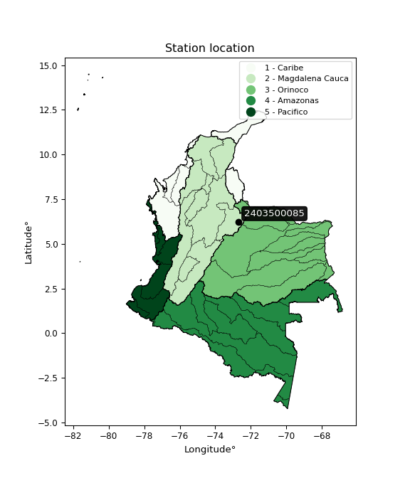

<div align="center">


</div>

# PMax24h Station (Rain, Pmax24h): 2403500085

Maximum Precipitation in 24 hours (PMax24h) is the greatest amount of rainfall for a specific duration that is meteorologically possible for a given location, acting as a "worst-case" scenario for extreme storms, crucial for designing safety-critical infrastructure like bridges, river deviations, dams, spillways, and nuclear plants to prevent catastrophic failure. The PMax24h is related with the Probable Maximum Precipitation (PMP) and it is calculated by hydrologists using meteorological data to determine the upper limit of extreme rainfall, often leading to the Probable Maximum Flood (PMF) for flood control design, and is increasingly being studied for climate change impacts. Probable Maximum Precipitation (PMP) is the theoretical upper limit of rainfall, a deterministic estimate for extreme events, while probability distributions (like GEV, Gumbel) describe the likelihood and frequency of various precipitation amounts, including rare ones, showing how often events occur, with PMP representing the extreme end of these distributions, used for critical infrastructure design to ensure safety against the worst conceivable weather, unlike standard statistical forecasts which cover typical probabilities.

The most common probability distributions in hydrology, used for analyzing floods, rainfall, and streamflow, include the Normal, Log-Normal, Gumbel, Gamma (including Log-Pearson Type III), and Generalized Extreme Value (GEV) distributions, often chosen based on the data´s skewness and whether modeling extremes or general conditions, with Gumbel and GEV popular for extreme events like floods, while the Normal distribution serves as a baseline, though often requiring transformations for skewed hydrological data. These distributions help in designing water infrastructure, managing water resources, and forecasting hydrologic events.

> Hydrological data often isn´t perfectly normal (it´s skewed), so different distributions are needed for different applications, such as: **Flood Frequency Analysis**: Using Gumbel, GEV, or Log-Pearson Type III for predicting extreme flood magnitudes and their return periods, **Rainfall Analysis**: Normal for annual totals, but Log-Normal, Weibull, or GEV for intensity or extreme daily rainfall, **Streamflow Modeling**: Gamma and Log-Normal for maximum flows, GEV for minimum flows, and Kappa for daily flows.

<div align="center">

</img>

</div>


## A. General information


### 1. General running parameters

• app_version: _v20260225_. • runtime: _2026-02-27 14:50:08.749431_. • Python version: _3.14.0_. • SciPy version: _1.16.3_. • Pandas version: _2.3.3_. • NumPy version: _2.3.5_. • Stations dataset (station_dataset_file): _dataset/pmax24h_in/automatic_colombia_2003_2025.csv_. • Stations catalog (station_catalog_file): _dataset/CNE.xls_. • Minimum year to eval til year_max (date_min): _1900_. • Maximum year to eval since year_min (date_max): _2025_. • Creates, save and include plots into reports (create_plot): _False_. • Plot only fit distributions with Δo > Δ (plot_only_fit): _True_. • Plot only simple graphs avoiding multiple CDFs and multiple Extreme values plots (plot_only_simple): _False_. • Eval low extreme values, if False, evaluates high extreme values (low_extreme): _False_. • Eval every SciPy distribution as logarithmic (pdist_logarithmic_on): _True_. • Standard deviation normalized (ddof): _1.0_. • Return periods to eval in years (Tr): _[2, 2.33, 5, 10, 15, 20, 25, 50, 75, 100, 200, 250, 500, 750, 1000]_. • Minimum data sample per station, 0 means any (minimum_sample): _5_. • Z-Score maximum threshold to adjust a value, 0 means disable (zscore_max): _3.5_. • Z-Score minimum threshold to adjust a value, 0 means disable (zscore_min): _-2.5_. • Avoid zeros, e.g. rain = 0 (avoid_zeros): _True_. • Avoid null values (avoid_nans): _True_. 

:file_folder:Table: [dataset.csv](../../dataset/pmax24h_in/automatic_colombia_2003_2025.csv)

> Delta Degrees of Freedom (DDOF): is a parameter used in the formulas for calculating variance and standard deviation. When ddof=0, the divisor is $N$ (the total number of observations) and this is used when your data set is the entire population. When ddof=1, the divisor is $N-1$ and this is used when your data set is a sample drawn from a larger population. Using $N-1$ provides an unbiased estimate of the population variance (known as Bessel´s correction).


### 2. Station info and location

|   id |     CODIGO | NOMBRE                  | CATEGORIA               | TECNOLOGIA                | ESTADO           | FECHA_INSTALACION   |   FECHA_SUSPENSION |   ALTITUD |   LATITUD |   LONGITUD | DEPARTAMENTO   | MUNICIPIO   | AREA_OPERATIVA                              | ENTIDAD                                                     | AREA_HIDROGRAFICA   | ZONA_HIDROGRAFICA   | SUBZONA_HIDROGRAFICA   |   CORRIENTE | Catalogo   |   Version |
|-----:|-----------:|:------------------------|:------------------------|:--------------------------|:-----------------|:--------------------|-------------------:|----------:|----------:|-----------:|:---------------|:------------|:--------------------------------------------|:------------------------------------------------------------|:--------------------|:--------------------|:-----------------------|------------:|:-----------|----------:|
|    0 | 2403500085 | SUSA - AUT [2403500085] | Climatológica Principal | Automática con Telemetría | En Mantenimiento | 27/10/2017          |                nan |      2467 |   6.23262 |    -72.692 | Santander      | Onzaga      | Area Operativa 06 - Boyacá-Casanare-Vichada | INSTITUTO DE HIDROLOGIA METEOROLOGIA Y ESTUDIOS AMBIENTALES | Magdalena Cauca     | Sogamoso            | Río Chicamocha         |         nan | CNE_IDEAM  |  20251226 |

<div align="center">

Dynamic map: [:earth_americas:Google](http://maps.google.com/maps?q=6.23262,-72.69197) [:earth_americas:OSM](https://www.openstreetmap.org/#map=18/6.23262/-72.69197&layers=P) [:earth_americas:Bing](https://www.bing.com/maps?cp=6.23262~-72.69197&lvl=18) [:earth_americas:Apple](https://maps.apple.com/frame?center=6.23262%2C-72.69197&span=0.003%2C0.006)

</div>


<div align="center">

```geojson
{
  "type": "Feature",
  "geometry": {
    "type": "Point", 
    "coordinates": [-72.69197, 6.23262]
  }, 
  "properties": {
    "Name": "2403500085"
  }
}
```

</div>


### 3. Discrete values table and plot

<div align="center">

|               |           0 |           1 |           2 |          3 |            4 |          5 |
|:--------------|------------:|------------:|------------:|-----------:|-------------:|-----------:|
| Date          | 2019        | 2020        | 2021        | 2022       | 2023         | 2025       |
| Value         |   48        |   36.4      |   43.2      |   49.4     |   42.2       |   33.6     |
| Value_initial |   48        |   36.4      |   43.2      |   49.4     |   42.2       |   33.6     |
| count         |    6        |    6        |    6        |    6       |    6         |    6       |
| mean          |   42.1333   |   42.1333   |   42.1333   |   42.1333  |   42.1333    |   42.1333  |
| std           |    6.22982  |    6.22982  |    6.22982  |    6.22982 |    6.22982   |    6.22982 |
| zscore        |    0.941707 |   -0.920305 |    0.171219 |    1.16643 |    0.0107012 |   -1.36976 |


</div>


> The initial value (value_initial) correspond to the initial obtained or null completed value, and value (value) is adjusted only when the initial value is outside the valid range (outlier) definite through the Z-Score value. If Z-Score is active, values out of range or outliers are replaced with the station mean value. A Z-Score (or standard score) measures how many standard deviations a data point is from the mean of a dataset, indicating its relative position; positive scores mean above the mean, negative mean below, and a score of zero is exactly at the mean, allowing for comparison of values from different distributions. It´s calculated using the formula $z=(x–μ)/σ$, where $x$ is the data point, $μ$ is the mean, and $σ$ is the standard deviation, helping identify outliers and understand probability.
>
> <sub>**Note**: In this study, "completing" (filling gaps in) and "extending" (forecasting or lengthening the historical record) rainfall data series are avoided for certain critical analyses because they introduce artificial bias and uncertainty, which can distort the statistics of rare events (extremes), alter day-to-day variability, and compromise the integrity and homogeneity of the original data. Some reasons against Completing/Extending rainfall data are: **Distortion of Extremes and Variability**: The primary issue is that most gap-filling or extension methods rely on averaging or regression with nearby stations, which inherently smooths the data. Rainfall is highly variable in space and time, with a large percentage of zero values and occasional large storms. Infilling methods often underestimate the highest values and overestimate the lowest (zero) values, which severely distorts analyses focused on flood frequency, drought severity, and intensity-duration-frequency (IDF) curves, **Loss of Data Homogeneity**: Infilled or extended data are synthetic estimates, not actual measurements. Combining these estimates with observed data can violate the assumption of data homogeneity, which requires that the data properties do not change over time. Inhomogeneity can lead to incorrect conclusions about long-term trends or changes in climate patterns, **Propagation of Errors**: Errors and biases from the original data (e.g., wind-induced undercatch, instrument errors, site changes) or the data used for imputation can propagate through the analysis, leading to unreliable hydrological models and inaccurate predictions, **Compromised Statistical Integrity**: For statistical analyses, especially those involving the frequency of events, using artificial data can introduce time bias or autocorrelation that doesn´t exist in reality, making it difficult to assess the true probability of events, **Difficulty in Validation**: It is difficult to accurately validate the quality of filled or extended data, especially for past periods where ground-truth measurements are unavailable. The reliability of imputation techniques heavily depends on the density of the surrounding station network and the complexity of the local topography.</sub>


### 4. Active continuous probability distributions from SciPy (80 of 104 available)

A Probability Density Function (PDF) describes the relative likelihood of a continuous random variable falling within a specific range, where the total area under its curve equals 1, and the area over any interval gives the actual probability for that range. Unlike discrete probabilities (like rolling a die), a PDF shows density, not direct probability for a single point (which is zero), with higher points indicating higher likelihood, often visualized as a bell curve for normal distributions.

A log of a probability density function (log-PDF) is simply the logarithm of the PDF´s value, denoted as $log(f(x))$, useful for converting multiplication of probabilities into addition, improving numerical stability with tiny numbers, and connecting to information theory concepts like entropy. Instead of dealing with very small probabilities (e.g., 0.000001), log-PDFs use negative numbers (e.g., $log(0.00001) ≈ -11.51$ that are easier for computers to handle, preventing underflow errors and simplifying complex calculations. In this study, each active probability distribution from SciPy is also evaluated in the $log$ form.

[scipy.stats](https://docs.scipy.org/doc/scipy/reference/stats.html) is a Python´s powerful submodule within the SciPy library for comprehensive statistical analysis, offering over 130 probability distributions (like Normal, Poisson, etc.), functions for descriptive stats (mean, variance), hypothesis testing (t-tests, chi-square), random variable generation, and statistical tests, making it essential for data science, modeling, and research. It provides tools to explore, model, and draw conclusions from data efficiently, working seamlessly with [NumPy](https://numpy.org/).

<div align="center">

|   id | p_dist           |   n_parameter | fit_method   | label                                                                       | active   | ref                                                                                                      |
|-----:|:-----------------|--------------:|:-------------|:----------------------------------------------------------------------------|:---------|:---------------------------------------------------------------------------------------------------------|
|    0 | alpha            |             3 | MLE          | Alpha                                                                       | True     | [:mortar_board:](https://docs.scipy.org/doc/scipy/reference/generated/scipy.stats.alpha.html)            |
|    1 | anglit           |             2 | MM           | Anglit                                                                      | True     | [:mortar_board:](https://docs.scipy.org/doc/scipy/reference/generated/scipy.stats.anglit.html)           |
|    2 | arcsine          |             2 | MM           | Arcsine                                                                     | True     | [:mortar_board:](https://docs.scipy.org/doc/scipy/reference/generated/scipy.stats.arcsine.html)          |
|    3 | argus            |             3 | MLE          | Argus                                                                       | True     | [:mortar_board:](https://docs.scipy.org/doc/scipy/reference/generated/scipy.stats.argus.html)            |
|    4 | beta             |             4 | MLE          | Beta                                                                        | True     | [:mortar_board:](https://docs.scipy.org/doc/scipy/reference/generated/scipy.stats.beta.html)             |
|    5 | betaprime        |             4 | MLE          | Beta prime                                                                  | True     | [:mortar_board:](https://docs.scipy.org/doc/scipy/reference/generated/scipy.stats.betaprime.html)        |
|    6 | bradford         |             3 | MLE          | Bradford                                                                    | True     | [:mortar_board:](https://docs.scipy.org/doc/scipy/reference/generated/scipy.stats.bradford.html)         |
|    7 | burr             |             4 | MLE          | Burr (Type III)                                                             | True     | [:mortar_board:](https://docs.scipy.org/doc/scipy/reference/generated/scipy.stats.burr.html)             |
|    8 | burr12           |             4 | MLE          | Burr (Type III) 12                                                          | True     | [:mortar_board:](https://docs.scipy.org/doc/scipy/reference/generated/scipy.stats.burr12.html)           |
|    9 | cosine           |             2 | MLE          | Cosine                                                                      | True     | [:mortar_board:](https://docs.scipy.org/doc/scipy/reference/generated/scipy.stats.cosine.html)           |
|   10 | crystalball      |             4 | MLE          | Crystalball                                                                 | True     | [:mortar_board:](https://docs.scipy.org/doc/scipy/reference/generated/scipy.stats.crystalball.html)      |
|   11 | dgamma           |             3 | MLE          | Double gamma                                                                | True     | [:mortar_board:](https://docs.scipy.org/doc/scipy/reference/generated/scipy.stats.dgamma.html)           |
|   12 | dweibull         |             3 | MLE          | Double Weibull                                                              | True     | [:mortar_board:](https://docs.scipy.org/doc/scipy/reference/generated/scipy.stats.dweibull.html)         |
|   13 | erlang           |             3 | MLE          | Erlang                                                                      | True     | [:mortar_board:](https://docs.scipy.org/doc/scipy/reference/generated/scipy.stats.erlang.html)           |
|   14 | exponnorm        |             3 | MLE          | Exponentially modified Normal                                               | True     | [:mortar_board:](https://docs.scipy.org/doc/scipy/reference/generated/scipy.stats.exponnorm.html)        |
|   15 | exponpow         |             3 | MLE          | Exponential power                                                           | True     | [:mortar_board:](https://docs.scipy.org/doc/scipy/reference/generated/scipy.stats.exponpow.html)         |
|   16 | exponweib        |             4 | MLE          | Exponentiated Weibull                                                       | True     | [:mortar_board:](https://docs.scipy.org/doc/scipy/reference/generated/scipy.stats.exponweib.html)        |
|   17 | f                |             4 | MLE          | F                                                                           | True     | [:mortar_board:](https://docs.scipy.org/doc/scipy/reference/generated/scipy.stats.f.html)                |
|   18 | fatiguelife      |             3 | MLE          | Fatigue-life (Birnbaum-Saunders)                                            | True     | [:mortar_board:](https://docs.scipy.org/doc/scipy/reference/generated/scipy.stats.fatiguelife.html)      |
|   19 | foldnorm         |             3 | MM           | Fold Normal                                                                 | True     | [:mortar_board:](https://docs.scipy.org/doc/scipy/reference/generated/scipy.stats.foldnorm.html)         |
|   20 | gamma            |             3 | MLE          | Gamma                                                                       | True     | [:mortar_board:](https://docs.scipy.org/doc/scipy/reference/generated/scipy.stats.gamma.html)            |
|   21 | gausshyper       |             6 | MLE          | Gauss hypergeometric                                                        | True     | [:mortar_board:](https://docs.scipy.org/doc/scipy/reference/generated/scipy.stats.gausshyper.html)       |
|   22 | genexpon         |             5 | MLE          | Generalized exponential                                                     | True     | [:mortar_board:](https://docs.scipy.org/doc/scipy/reference/generated/scipy.stats.genexpon.html)         |
|   23 | genextreme       |             3 | MLE          | Generalized exponential                                                     | True     | [:mortar_board:](https://docs.scipy.org/doc/scipy/reference/generated/scipy.stats.genextreme.html)       |
|   24 | gengamma         |             4 | MLE          | Generalized gamma                                                           | True     | [:mortar_board:](https://docs.scipy.org/doc/scipy/reference/generated/scipy.stats.gengamma.html)         |
|   25 | genhalflogistic  |             3 | MLE          | Generalized half-logistic                                                   | True     | [:mortar_board:](https://docs.scipy.org/doc/scipy/reference/generated/scipy.stats.genhalflogistic.html)  |
|   26 | genlogistic      |             3 | MLE          | Generalized logistic                                                        | True     | [:mortar_board:](https://docs.scipy.org/doc/scipy/reference/generated/scipy.stats.genlogistic.html)      |
|   27 | gennorm          |             3 | MLE          | Generalized Normal                                                          | True     | [:mortar_board:](https://docs.scipy.org/doc/scipy/reference/generated/scipy.stats.gennorm.html)          |
|   28 | genpareto        |             3 | MLE          | Generalized Pareto                                                          | True     | [:mortar_board:](https://docs.scipy.org/doc/scipy/reference/generated/scipy.stats.genpareto.html)        |
|   29 | gompertz         |             3 | MLE          | Gompertz (or truncated Gumbel)                                              | True     | [:mortar_board:](https://docs.scipy.org/doc/scipy/reference/generated/scipy.stats.gompertz.html)         |
|   30 | gumbel_l         |             2 | MM           | Gumbel Left Skew                                                            | True     | [:mortar_board:](https://docs.scipy.org/doc/scipy/reference/generated/scipy.stats.gumbel_l.html)         |
|   31 | gumbel_r         |             2 | MM           | Gumbel Right Skew                                                           | True     | [:mortar_board:](https://docs.scipy.org/doc/scipy/reference/generated/scipy.stats.gumbel_r.html)         |
|   32 | halfgennorm      |             3 | MLE          | Upper half of a generalized normal                                          | True     | [:mortar_board:](https://docs.scipy.org/doc/scipy/reference/generated/scipy.stats.halfgennorm.html)      |
|   33 | halflogistic     |             2 | MM           | Half-logistic                                                               | True     | [:mortar_board:](https://docs.scipy.org/doc/scipy/reference/generated/scipy.stats.halflogistic.html)     |
|   34 | halfnorm         |             2 | MM           | Half Normal                                                                 | True     | [:mortar_board:](https://docs.scipy.org/doc/scipy/reference/generated/scipy.stats.halfnorm.html)         |
|   35 | hypsecant        |             2 | MM           | hyperbolic secant                                                           | True     | [:mortar_board:](https://docs.scipy.org/doc/scipy/reference/generated/scipy.stats.hypsecant.html)        |
|   36 | invgamma         |             3 | MLE          | Inverted gamma                                                              | True     | [:mortar_board:](https://docs.scipy.org/doc/scipy/reference/generated/scipy.stats.invgamma.html)         |
|   37 | invgauss         |             3 | MLE          | Inverse Gaussian                                                            | True     | [:mortar_board:](https://docs.scipy.org/doc/scipy/reference/generated/scipy.stats.invgauss.html)         |
|   38 | invweibull       |             3 | MLE          | Inverted Weibull                                                            | True     | [:mortar_board:](https://docs.scipy.org/doc/scipy/reference/generated/scipy.stats.invweibull.html)       |
|   39 | johnsonsb        |             4 | MLE          | Johnson SB                                                                  | True     | [:mortar_board:](https://docs.scipy.org/doc/scipy/reference/generated/scipy.stats.johnsonsb.html)        |
|   40 | johnsonsu        |             4 | MLE          | Johnson Su                                                                  | True     | [:mortar_board:](https://docs.scipy.org/doc/scipy/reference/generated/scipy.stats.johnsonsu.html)        |
|   41 | kappa3           |             3 | MLE          | Kappa 3                                                                     | True     | [:mortar_board:](https://docs.scipy.org/doc/scipy/reference/generated/scipy.stats.kappa3.html)           |
|   42 | kappa4           |             4 | MLE          | Kappa 4                                                                     | True     | [:mortar_board:](https://docs.scipy.org/doc/scipy/reference/generated/scipy.stats.kappa4.html)           |
|   43 | ksone            |             3 | MLE          | Kolmogorov-Smirnov one-sided test statistic distribution                    | True     | [:mortar_board:](https://docs.scipy.org/doc/scipy/reference/generated/scipy.stats.ksone.html)            |
|   44 | kstwobign        |             2 | MLE          | Limiting distribution of scaled Kolmogorov-Smirnov two-sided test statistic | True     | [:mortar_board:](https://docs.scipy.org/doc/scipy/reference/generated/scipy.stats.kstwobign.html)        |
|   45 | laplace          |             2 | MM           | Laplace                                                                     | True     | [:mortar_board:](https://docs.scipy.org/doc/scipy/reference/generated/scipy.stats.laplace.html)          |
|   46 | levy_l           |             2 | MLE          | Left-skewed Levy                                                            | True     | [:mortar_board:](https://docs.scipy.org/doc/scipy/reference/generated/scipy.stats.levy_l.html)           |
|   47 | loggamma         |             3 | MLE          | Log gamma                                                                   | True     | [:mortar_board:](https://docs.scipy.org/doc/scipy/reference/generated/scipy.stats.loggamma.html)         |
|   48 | logistic         |             2 | MM           | Logistic (or Sech-squared)                                                  | True     | [:mortar_board:](https://docs.scipy.org/doc/scipy/reference/generated/scipy.stats.logistic.html)         |
|   49 | loglaplace       |             3 | MLE          | Log-Laplace                                                                 | True     | [:mortar_board:](https://docs.scipy.org/doc/scipy/reference/generated/scipy.stats.loglaplace.html)       |
|   50 | lomax            |             3 | MLE          | Lomax (Pareto of the second kind)                                           | True     | [:mortar_board:](https://docs.scipy.org/doc/scipy/reference/generated/scipy.stats.lomax.html)            |
|   51 | maxwell          |             2 | MM           | Maxwell                                                                     | True     | [:mortar_board:](https://docs.scipy.org/doc/scipy/reference/generated/scipy.stats.maxwell.html)          |
|   52 | mielke           |             4 | MLE          | Mielke Beta-Kappa / Dagum                                                   | True     | [:mortar_board:](https://docs.scipy.org/doc/scipy/reference/generated/scipy.stats.mielke.html)           |
|   53 | moyal            |             2 | MM           | Moyal                                                                       | True     | [:mortar_board:](https://docs.scipy.org/doc/scipy/reference/generated/scipy.stats.moyal.html)            |
|   54 | nakagami         |             3 | MLE          | Nakagami                                                                    | True     | [:mortar_board:](https://docs.scipy.org/doc/scipy/reference/generated/scipy.stats.nakagami.html)         |
|   55 | ncf              |             5 | MLE          | Non-central F distribution                                                  | True     | [:mortar_board:](https://docs.scipy.org/doc/scipy/reference/generated/scipy.stats.ncf.html)              |
|   56 | nct              |             4 | MLE          | Non-central Student’s t                                                     | True     | [:mortar_board:](https://docs.scipy.org/doc/scipy/reference/generated/scipy.stats.nct.html)              |
|   57 | norm             |             2 | MM           | Normal                                                                      | True     | [:mortar_board:](https://docs.scipy.org/doc/scipy/reference/generated/scipy.stats.norm.html)             |
|   58 | pearson3         |             3 | MM           | Pearson type III                                                            | True     | [:mortar_board:](https://docs.scipy.org/doc/scipy/reference/generated/scipy.stats.pearson3.html)         |
|   59 | powerlaw         |             3 | MLE          | Power-function                                                              | True     | [:mortar_board:](https://docs.scipy.org/doc/scipy/reference/generated/scipy.stats.powerlaw.html)         |
|   60 | rayleigh         |             2 | MM           | Rayleigh                                                                    | True     | [:mortar_board:](https://docs.scipy.org/doc/scipy/reference/generated/scipy.stats.rayleigh.html)         |
|   61 | rdist            |             3 | MLE          | R-distributed (symmetric beta)                                              | True     | [:mortar_board:](https://docs.scipy.org/doc/scipy/reference/generated/scipy.stats.rdist.html)            |
|   62 | rice             |             3 | MLE          | Rice                                                                        | True     | [:mortar_board:](https://docs.scipy.org/doc/scipy/reference/generated/scipy.stats.rice.html)             |
|   63 | semicircular     |             2 | MM           | Semicircular                                                                | True     | [:mortar_board:](https://docs.scipy.org/doc/scipy/reference/generated/scipy.stats.semicircular.html)     |
|   64 | skewnorm         |             3 | MLE          | Skew normal                                                                 | True     | [:mortar_board:](https://docs.scipy.org/doc/scipy/reference/generated/scipy.stats.skewnorm.html)         |
|   65 | t                |             3 | MLE          | Student’s t                                                                 | True     | [:mortar_board:](https://docs.scipy.org/doc/scipy/reference/generated/scipy.stats.t.html)                |
|   66 | trapezoid        |             4 | MLE          | Trapezoid                                                                   | True     | [:mortar_board:](https://docs.scipy.org/doc/scipy/reference/generated/scipy.stats.trapezoid.html)        |
|   67 | triang           |             3 | MLE          | Triangular                                                                  | True     | [:mortar_board:](https://docs.scipy.org/doc/scipy/reference/generated/scipy.stats.triang.html)           |
|   68 | truncexpon       |             3 | MLE          | Truncated exponential                                                       | True     | [:mortar_board:](https://docs.scipy.org/doc/scipy/reference/generated/scipy.stats.truncexpon.html)       |
|   69 | truncnorm        |             4 | MLE          | Truncated normal                                                            | True     | [:mortar_board:](https://docs.scipy.org/doc/scipy/reference/generated/scipy.stats.truncnorm.html)        |
|   70 | truncpareto      |             4 | MLE          | Upper truncated Pareto                                                      | True     | [:mortar_board:](https://docs.scipy.org/doc/scipy/reference/generated/scipy.stats.truncpareto.html)      |
|   71 | truncweibull_min |             5 | MLE          | Doubly truncated Weibull minimum                                            | True     | [:mortar_board:](https://docs.scipy.org/doc/scipy/reference/generated/scipy.stats.truncweibull_min.html) |
|   72 | tukeylambda      |             3 | MLE          | Tukey-Lamdba                                                                | True     | [:mortar_board:](https://docs.scipy.org/doc/scipy/reference/generated/scipy.stats.tukeylambda.html)      |
|   73 | uniform          |             2 | MLE          | Uniform                                                                     | True     | [:mortar_board:](https://docs.scipy.org/doc/scipy/reference/generated/scipy.stats.uniform.html)          |
|   74 | vonmises         |             3 | MLE          | Von Mises                                                                   | True     | [:mortar_board:](https://docs.scipy.org/doc/scipy/reference/generated/scipy.stats.vonmises.html)         |
|   75 | vonmises_line    |             3 | MLE          | Von Mises line                                                              | True     | [:mortar_board:](https://docs.scipy.org/doc/scipy/reference/generated/scipy.stats.vonmises_line.html)    |
|   76 | wald             |             2 | MM           | Wald                                                                        | True     | [:mortar_board:](https://docs.scipy.org/doc/scipy/reference/generated/scipy.stats.wald.html)             |
|   77 | weibull_max      |             3 | MLE          | Weibull maximum                                                             | True     | [:mortar_board:](https://docs.scipy.org/doc/scipy/reference/generated/scipy.stats.weibull_max.html)      |
|   78 | weibull_min      |             3 | MLE          | Weibull minimum                                                             | True     | [:mortar_board:](https://docs.scipy.org/doc/scipy/reference/generated/scipy.stats.weibull_min.html)      |
|   79 | wrapcauchy       |             3 | MLE          | Wrapped  Cauchy                                                             | True     | [:mortar_board:](https://docs.scipy.org/doc/scipy/reference/generated/scipy.stats.wrapcauchy.html)       |

</div>

> **n_parameter:** # arguments & localization & scale.
>
> **Fit methods:** (MLE) maximum likelihood, (MM) L-moments.
>
>**Inactive** (With the only purpose of prevent loops, zero divisions, infinite values, over high estimated values or horizontal trending for recurrence intervals estimations, the follow distributions were disabled.)**:** lognorm, norminvgauss, powernorm, powerlognorm, cauchy, halfcauchy, foldcauchy, skewcauchy, chi2, expon, fisk, genhyperbolic, geninvgauss, gibrat, kstwo, laplace_asymmetric, levy, levy_stable, ncx2, pareto, rel_breitwigner, recipinvgauss, studentized_range, loguniform, 


## B. Probability (PDF) vs. Empirical (EDF) distributions functions

A continuous probability distribution (CPD) describes probabilities for variables that can take any value within a range (like rain any time), unlike discrete variables with specific outcomes (like temperature). It uses a Probability Density Function (PDF), a curve where the total area under it equals 1, and the probability of the variable falling within an interval (a to b) is found by calculating the area under the curve between those points. A key feature is that the probability of hitting any single exact value is zero, so probabilities are always expressed for ranges, e.g., $P(a ≤ X ≤ b)$.

<div align="center">

Distributions parameters from station values
|     |    station | p_dist              |   n |             loc |           scale | shape                  | shape1                 | shape2                | shape3             |
|----:|-----------:|:--------------------|----:|----------------:|----------------:|:-----------------------|:-----------------------|:----------------------|:-------------------|
|   0 | 2403500085 | alpha               |   6 |   -84.4187      |  2788.74        | 22.08117194110033      |                        |                       |                    |
|   1 | 2403500085 | anglit              |   6 |    42.1333      |    16.6368      |                        |                        |                       |                    |
|   2 | 2403500085 | arcsine             |   6 |    34.0907      |    16.0854      |                        |                        |                       |                    |
|   3 | 2403500085 | argus               |   6 |    28.9528      |    21.4069      | 1.1886701182453154     |                        |                       |                    |
|   4 | 2403500085 | beta                |   6 |    33.6         |    15.8218      | 0.7548432091421164     | 0.5899595331975946     |                       |                    |
|   5 | 2403500085 | betaprime           |   6 |    -1.60198     |    67.2         | 96.92019240282343      | 149.96097923860316     |                       |                    |
|   6 | 2403500085 | bradford            |   6 |    33.5996      |    15.8008      | 1.0215361123257514e-05 |                        |                       |                    |
|   7 | 2403500085 | burr                |   6 |   -35.1932      |    36.765       | 13.875356464496939     | 17122.827422623028     |                       |                    |
|   8 | 2403500085 | burr12              |   6 |   -13.2289      |    46.7486      | 2427.0808476739417     | 0.0025165662123436835  |                       |                    |
|   9 | 2403500085 | cosine              |   6 |    41.9639      |     4.57386     |                        |                        |                       |                    |
|  10 | 2403500085 | crystalball         |   6 |    42.1333      |     5.68702     | 2610.1809318881874     | 4795.085792481273      |                       |                    |
|  11 | 2403500085 | dgamma              |   6 |    42.6915      |     4.2791      | 1.106148910689094      |                        |                       |                    |
|  12 | 2403500085 | dweibull            |   6 |    42.2         |     4.61562     | 0.9203614238813778     |                        |                       |                    |
|  13 | 2403500085 | erlang              |   6 |   -57.385       |     0.329522    | 301.9014626701162      |                        |                       |                    |
|  14 | 2403500085 | exponnorm           |   6 |    42.1287      |     5.68701     | 0.000802315323442463   |                        |                       |                    |
|  15 | 2403500085 | exponpow            |   6 |    36.4         |     1.44046     | 0.16029777157149294    |                        |                       |                    |
|  16 | 2403500085 | exponweib           |   6 |    33.6         |     1.26224     | 1.13075030855351       | 0.3639095182812527     |                       |                    |
|  17 | 2403500085 | f                   |   6 |  -751.501       |   793.618       | 50262.135183360166     | 166965.76658973092     |                       |                    |
|  18 | 2403500085 | fatiguelife         |   6 |    33.6         |     1.6698e-06  | 2004.4843759321784     |                        |                       |                    |
|  19 | 2403500085 | foldnorm            |   6 |    40.3343      |     2.91676     | 2.191823537604879e-06  |                        |                       |                    |
|  20 | 2403500085 | gamma               |   6 |   -64.0798      |     0.311966    | 340.44808257839895     |                        |                       |                    |
|  21 | 2403500085 | gausshyper          |   6 |    33.2921      |    16.1079      | 1.1588594058147805     | 0.8988823901333481     | 1.0817977568985573    | 1.0418061065244357 |
|  22 | 2403500085 | genexpon            |   6 |    33.6         |     2.13734     | 0.24845547111463517    | 1.911303634689863e-05  | 1.8132671227677257    |                    |
|  23 | 2403500085 | genextreme          |   6 |    42.8564      |     6.97797     | 1.0663817812316039     |                        |                       |                    |
|  24 | 2403500085 | gengamma            |   6 |    33.6         |     1.38053     | 1.10913437905567       | 0.15414928067322953    |                       |                    |
|  25 | 2403500085 | genhalflogistic     |   6 |    31.9382      |    18.6824      | 1.0699002462811078     |                        |                       |                    |
|  26 | 2403500085 | genlogistic         |   6 |    49.4003      |     2.50336e-05 | 3.4535720221248677e-06 |                        |                       |                    |
|  27 | 2403500085 | gennorm             |   6 |    41.5         |     7.90006     | 1666081.7994992612     |                        |                       |                    |
|  28 | 2403500085 | genpareto           |   6 |    -0.267668    |   125.985       | -2.5365582523782617    |                        |                       |                    |
|  29 | 2403500085 | gompertz            |   6 |    42.2         |     2.06361     | 0.08257193753951758    |                        |                       |                    |
|  30 | 2403500085 | gumbel_l            |   6 |    44.6928      |     4.43415     |                        |                        |                       |                    |
|  31 | 2403500085 | gumbel_r            |   6 |    39.5739      |     4.43415     |                        |                        |                       |                    |
|  32 | 2403500085 | halfgennorm         |   6 |    33.6         |     1.21238     | 0.46234928806784936    |                        |                       |                    |
|  33 | 2403500085 | halflogistic        |   6 |    35.3929      |     4.8622      |                        |                        |                       |                    |
|  34 | 2403500085 | halfnorm            |   6 |    34.6059      |     9.43422     |                        |                        |                       |                    |
|  35 | 2403500085 | hypsecant           |   6 |    42.1333      |     3.62047     |                        |                        |                       |                    |
|  36 | 2403500085 | invgamma            |   6 |   -49.5724      | 23102.2         | 253.0719369496852      |                        |                       |                    |
|  37 | 2403500085 | invgauss            |   6 |     9.38792     |   969.451       | 0.033696206586014105   |                        |                       |                    |
|  38 | 2403500085 | invweibull          |   6 |    -1.60952e+08 |     1.60952e+08 | 30321393.035447888     |                        |                       |                    |
|  39 | 2403500085 | johnsonsb           |   6 |    29.8453      |    19.5547      | -0.047401963020429316  | 0.1254170660977557     |                       |                    |
|  40 | 2403500085 | johnsonsu           |   6 |    55.0376      |     0.33547     | 8.838133280394665      | 2.0873578530917705     |                       |                    |
|  41 | 2403500085 | kappa3              |   6 |    33.6         |    19.4575      | 193.55616632539326     |                        |                       |                    |
|  42 | 2403500085 | kappa4              |   6 |    31.7588      |    18.6378      | 1.1097925399511566     | 1.0279238891597353     |                       |                    |
|  43 | 2403500085 | ksone               |   6 |    32.2831      |    19.7004      | 1.0                    |                        |                       |                    |
|  44 | 2403500085 | kstwobign           |   6 |    21.0256      |    24.0542      |                        |                        |                       |                    |
|  45 | 2403500085 | laplace             |   6 |    42.1333      |     4.02133     |                        |                        |                       |                    |
|  46 | 2403500085 | levy_l              |   6 |    49.9003      |     2.04108     |                        |                        |                       |                    |
|  47 | 2403500085 | loggamma            |   6 |    43.271       |     5.57494     | 1.2697414980356183     |                        |                       |                    |
|  48 | 2403500085 | logistic            |   6 |    42.1333      |     3.13542     |                        |                        |                       |                    |
|  49 | 2403500085 | loglaplace          |   6 |    -0.138342    |    43.3383      | 8.782596785900264      |                        |                       |                    |
|  50 | 2403500085 | lomax               |   6 |    33.6         |   448.807       | 52.994766125645086     |                        |                       |                    |
|  51 | 2403500085 | maxwell             |   6 |    28.6575      |     8.44474     |                        |                        |                       |                    |
|  52 | 2403500085 | mielke              |   6 |   -16.9799      |    66.4521      | 8.21345090639202       | 4050.383093745324      |                       |                    |
|  53 | 2403500085 | moyal               |   6 |    38.8811      |     2.56006     |                        |                        |                       |                    |
|  54 | 2403500085 | nakagami            |   6 |    33.6         |     9.38078     | 0.21248681480330486    |                        |                       |                    |
|  55 | 2403500085 | ncf                 |   6 |    -5.10147     |     9.44337e-08 | 6.21157364297151e-07   | 1041.807495505495      | 310.1188510737936     |                    |
|  56 | 2403500085 | nct                 |   6 |  -134.157       |     5.64249     | 28885.886327359876     | 31.24176886687188      |                       |                    |
|  57 | 2403500085 | norm                |   6 |    42.1333      |     5.68702     |                        |                        |                       |                    |
|  58 | 2403500085 | pearson3            |   6 |    42.1333      |     5.68702     | -0.20203689514501483   |                        |                       |                    |
|  59 | 2403500085 | powerlaw            |   6 |    33.6         |    15.8         | 0.15679062444009137    |                        |                       |                    |
|  60 | 2403500085 | rayleigh            |   6 |    31.2537      |     8.68067     |                        |                        |                       |                    |
|  61 | 2403500085 | rdist               |   6 |    33.9862      |     9.21377     | 1.0508502897743988     |                        |                       |                    |
|  62 | 2403500085 | rice                |   6 |    30.5384      |     6.67025     | 1.32236005589096       |                        |                       |                    |
|  63 | 2403500085 | semicircular        |   6 |    42.1333      |    11.374       |                        |                        |                       |                    |
|  64 | 2403500085 | skewnorm            |   6 |    49.4         |     9.22695     | -38282171.103025824    |                        |                       |                    |
|  65 | 2403500085 | t                   |   6 |    42.1333      |     5.68719     | 43303632.22495811      |                        |                       |                    |
|  66 | 2403500085 | trapezoid           |   6 |    26.048       |    24.128       | 0.9999999999999999     | 1.0                    |                       |                    |
|  67 | 2403500085 | triang              |   6 |    28.7579      |    20.6421      | 0.9999999962390067     |                        |                       |                    |
|  68 | 2403500085 | truncexpon          |   6 |    33.6         |    20.7046      | 0.763117293190547      |                        |                       |                    |
|  69 | 2403500085 | truncnorm           |   6 |    -1.20985     |     2.48555     | 17.346239873966894     | 20.361630821180857     |                       |                    |
|  70 | 2403500085 | truncpareto         |   6 |    33.5752      |     0.0247564   | 0.2042116758444669     | 639.2191626903156      |                       |                    |
|  71 | 2403500085 | truncweibull_min    |   6 |    33.5883      |    23.3317      | 0.9722379974325983     | 0.0005029954292372034  | 0.6776925840842536    |                    |
|  72 | 2403500085 | tukeylambda         |   6 |    41.5055      |     8.48929     | 1.073849170101005      |                        |                       |                    |
|  73 | 2403500085 | uniform             |   6 |    33.6         |    15.8         |                        |                        |                       |                    |
|  74 | 2403500085 | vonmises            |   6 |    -1.51122     |     1           | 1.3638698628348764     |                        |                       |                    |
|  75 | 2403500085 | vonmises_line       |   6 |    41.5074      |     2.51703     | 0.010039683498358647   |                        |                       |                    |
|  76 | 2403500085 | wald                |   6 |    36.4464      |     5.68697     |                        |                        |                       |                    |
|  77 | 2403500085 | weibull_max         |   6 |    49.4         |     1.36361     | 0.36278561352435257    |                        |                       |                    |
|  78 | 2403500085 | weibull_min         |   6 |    24.0633      |    20.111       | 3.704896245880947      |                        |                       |                    |
|  79 | 2403500085 | wrapcauchy          |   6 |    33.6         |     2.51465     | 0.4173330961390191     |                        |                       |                    |
|  80 | 2403500085 | logalpha            |   6 |    -2.85554     |   308.351       | 46.83885717152084      |                        |                       |                    |
|  81 | 2403500085 | loganglit           |   6 |     3.73142     |     0.405035    |                        |                        |                       |                    |
|  82 | 2403500085 | logarcsine          |   6 |     3.5356      |     0.391642    |                        |                        |                       |                    |
|  83 | 2403500085 | logargus            |   6 |     3.39425     |     0.526603    | 1.4930272350410523     |                        |                       |                    |
|  84 | 2403500085 | logbeta             |   6 |     3.50099     |     0.398961    | 0.7604117652479052     | 0.5075589427139606     |                       |                    |
|  85 | 2403500085 | logbetaprime        |   6 |   -54.8267      |   178.603       | 235905.33035276772     | 719515.1042246954      |                       |                    |
|  86 | 2403500085 | logbradford         |   6 |     3.51452     |     0.385433    | 1.0803168265556935     |                        |                       |                    |
|  87 | 2403500085 | logburr             |   6 |   -53.2493      |    57.1578      | 4803.252480114719      | 0.06411421220971203    |                       |                    |
|  88 | 2403500085 | logburr12           |   6 |    -6.09499     |    10.8245      | 87.11195443838858      | 2558.3550263667803     |                       |                    |
|  89 | 2403500085 | logcosine           |   6 |     3.72476     |     0.111749    |                        |                        |                       |                    |
|  90 | 2403500085 | logcrystalball      |   6 |     3.73142     |     0.138455    | 254.57167478814216     | 1807.5172707542467     |                       |                    |
|  91 | 2403500085 | logdgamma           |   6 |     3.75379     |     0.106778    | 1.0699366649374493     |                        |                       |                    |
|  92 | 2403500085 | logdweibull         |   6 |     3.75333     |     0.118693    | 1.129898375689578      |                        |                       |                    |
|  93 | 2403500085 | logerlang           |   6 |     1.52695     |     0.00902077  | 244.35592354085497     |                        |                       |                    |
|  94 | 2403500085 | logexponnorm        |   6 |     3.73136     |     0.138455    | 0.00040623764220629015 |                        |                       |                    |
|  95 | 2403500085 | logexponpow         |   6 |     3.51453     |     0.352087    | 0.4178777860513514     |                        |                       |                    |
|  96 | 2403500085 | logexponweib        |   6 |     3.51453     |     0.664526    | 0.35814130402885785    | 1.2000213253059269     |                       |                    |
|  97 | 2403500085 | logf                |   6 |   -45.1588      |    48.89        | 2432322.9081222927     | 276539.9133034171      |                       |                    |
|  98 | 2403500085 | logfatiguelife      |   6 |   -18.2623      |    21.9941      | 0.006271588788485466   |                        |                       |                    |
|  99 | 2403500085 | logfoldnorm         |   6 |     3.46421     |     0.145317    | 1.8111521829708326     |                        |                       |                    |
| 100 | 2403500085 | loggamma            |   6 |     1.41705     |     0.00842517  | 274.62580977442735     |                        |                       |                    |
| 101 | 2403500085 | loggausshyper       |   6 |     3.49864     |     0.401311    | 1.2923028291507324     | 0.47161189452735774    | 1.4775386323324837    | 0.9256066058298439 |
| 102 | 2403500085 | loggenexpon         |   6 |     3.51386     |     0.0138678   | 0.03226089737404006    | 3.968038792884272      | 0.0007140356746189549 |                    |
| 103 | 2403500085 | loggenextreme       |   6 |     3.78836     |     0.119622    | 1.0719452204650661     |                        |                       |                    |
| 104 | 2403500085 | loggengamma         |   6 |     3.51453     |     1.23096     | 0.3170481026954484     | 1.275158562373009      |                       |                    |
| 105 | 2403500085 | loggenhalflogistic  |   6 |     3.43423     |     0.473308    | 1.0162847479619386     |                        |                       |                    |
| 106 | 2403500085 | loggenlogistic      |   6 |     3.89996     |     6.6208e-07  | 3.927842933665431e-06  |                        |                       |                    |
| 107 | 2403500085 | loggennorm          |   6 |     3.70724     |     0.192712    | 10909233.1795608       |                        |                       |                    |
| 108 | 2403500085 | loggenpareto        |   6 |    -0.00637397  |    17.4708      | -4.472430454625523     |                        |                       |                    |
| 109 | 2403500085 | loggompertz         |   6 |     3.51453     |     0.402007    | 1.304599510579468      |                        |                       |                    |
| 110 | 2403500085 | loggumbel_l         |   6 |     3.79373     |     0.107953    |                        |                        |                       |                    |
| 111 | 2403500085 | loggumbel_r         |   6 |     3.66911     |     0.107953    |                        |                        |                       |                    |
| 112 | 2403500085 | loghalfgennorm      |   6 |     3.51453     |     0.385516    | 35242.367250920324     |                        |                       |                    |
| 113 | 2403500085 | loghalflogistic     |   6 |     3.56729     |     0.118392    |                        |                        |                       |                    |
| 114 | 2403500085 | loghalfnorm         |   6 |     3.54818     |     0.229655    |                        |                        |                       |                    |
| 115 | 2403500085 | loghypsecant        |   6 |     3.73142     |     0.088143    |                        |                        |                       |                    |
| 116 | 2403500085 | loginvgamma         |   6 |     1.23513     |   777.672       | 312.64120008025407     |                        |                       |                    |
| 117 | 2403500085 | loginvgauss         |   6 |     2.74897     |    44.1158      | 0.02225061812178232    |                        |                       |                    |
| 118 | 2403500085 | loginvweibull       |   6 | -1866.59        |  1870.25        | 14115.882509189876     |                        |                       |                    |
| 119 | 2403500085 | logjohnsonsb        |   6 |     3.51453     |     0.396021    | 0.01851752939635378    | 0.06766976165653066    |                       |                    |
| 120 | 2403500085 | logjohnsonsu        |   6 |     3.9377      |     0.000924797 | 6.758353705562843      | 1.1664453036400313     |                       |                    |
| 121 | 2403500085 | logkappa3           |   6 |     3.51452     |     0.385421    | 66532.23385589098      |                        |                       |                    |
| 122 | 2403500085 | logkappa4           |   6 |     3.45338     |     0.451021    | 1.1568598076536103     | 1.0030484053959468     |                       |                    |
| 123 | 2403500085 | logksone            |   6 |     3.49161     |     0.479621    | 1.0                    |                        |                       |                    |
| 124 | 2403500085 | logkstwobign        |   6 |     3.20306     |     0.601966    |                        |                        |                       |                    |
| 125 | 2403500085 | loglaplace          |   6 |     3.73142     |     0.0979023   |                        |                        |                       |                    |
| 126 | 2403500085 | loglevy_l           |   6 |     3.91078     |     0.0440957   |                        |                        |                       |                    |
| 127 | 2403500085 | logloggamma         |   6 |     3.90005     |     1.28756e-05 | 7.698017539442128e-05  |                        |                       |                    |
| 128 | 2403500085 | loglogistic         |   6 |     3.73142     |     0.0763341   |                        |                        |                       |                    |
| 129 | 2403500085 | logloglaplace       |   6 |    -0.430627    |     4.19647     | 36.31606059811443      |                        |                       |                    |
| 130 | 2403500085 | loglomax            |   6 |     3.51453     |    18.5045      | 85.7163370159787       |                        |                       |                    |
| 131 | 2403500085 | logmaxwell          |   6 |     3.40334     |     0.205593    |                        |                        |                       |                    |
| 132 | 2403500085 | logmielke           |   6 |    -1.58109e+07 |     1.58109e+07 | 90472987.42526887      | 5692013345.622955      |                       |                    |
| 133 | 2403500085 | logmoyal            |   6 |     3.65224     |     0.0623265   |                        |                        |                       |                    |
| 134 | 2403500085 | lognakagami         |   6 |     3.51453     |     0.225851    | 0.3013169616466489     |                        |                       |                    |
| 135 | 2403500085 | logncf              |   6 |    -3.82282     |     7.53732     | 553.7843265252841      | 711.4570181354491      | 0.9992473992764708    |                    |
| 136 | 2403500085 | lognct              |   6 |    -2.66293     |     0.00682635  | 877.0799870519672      | 936.0145200076947      |                       |                    |
| 137 | 2403500085 | lognorm             |   6 |     3.73142     |     0.138455    |                        |                        |                       |                    |
| 138 | 2403500085 | logpearson3         |   6 |     3.73142     |     0.138455    | -0.326858456251409     |                        |                       |                    |
| 139 | 2403500085 | logpowerlaw         |   6 |     3.51453     |     0.385424    | 0.16216433440736175    |                        |                       |                    |
| 140 | 2403500085 | lograyleigh         |   6 |     3.46655     |     0.211337    |                        |                        |                       |                    |
| 141 | 2403500085 | logrdist            |   6 |     5.4026      |     6.90275e-30 | 1.3053444042401794     |                        |                       |                    |
| 142 | 2403500085 | logrice             |   6 |     3.43775     |     0.159228    | 1.468883845998059      |                        |                       |                    |
| 143 | 2403500085 | logsemicircular     |   6 |     3.73142     |     0.276909    |                        |                        |                       |                    |
| 144 | 2403500085 | logskewnorm         |   6 |     3.89995     |     0.218113    | -9188667.893228056     |                        |                       |                    |
| 145 | 2403500085 | logt                |   6 |     3.73142     |     0.138454    | 10515334436.439045     |                        |                       |                    |
| 146 | 2403500085 | logtrapezoid        |   6 |     3.33981     |     0.587414    | 1.0                    | 1.0                    |                       |                    |
| 147 | 2403500085 | logtriang           |   6 |     3.40465     |     0.495301    | 0.9999997260414188     |                        |                       |                    |
| 148 | 2403500085 | logtruncexpon       |   6 |     3.51452     |     0.393795    | 0.9787685650375509     |                        |                       |                    |
| 149 | 2403500085 | logtruncnorm        |   6 |    -0.040534    |     0.965897    | 3.6805795708799494     | 4.0796137349174995     |                       |                    |
| 150 | 2403500085 | logtruncpareto      |   6 |     3.51388     |     0.000641397 | 0.20403547175034814    | 601.9140870801427      |                       |                    |
| 151 | 2403500085 | logtruncweibull_min |   6 |     3.50936     |     0.461283    | 1.1089281117137464     | 1.0366882710338821e-08 | 0.8467476321520302    |                    |
| 152 | 2403500085 | logtukeylambda      |   6 |     3.70724     |     0.217166    | 1.1268862465339664     |                        |                       |                    |
| 153 | 2403500085 | loguniform          |   6 |     3.51453     |     0.385424    |                        |                        |                       |                    |
| 154 | 2403500085 | logvonmises         |   6 |    -2.55162     |     1           | 52.561444432381556     |                        |                       |                    |
| 155 | 2403500085 | logvonmises_line    |   6 |     3.70724     |     0.0613444   | 0.010150004725435459   |                        |                       |                    |
| 156 | 2403500085 | logwald             |   6 |     3.59297     |     0.138446    |                        |                        |                       |                    |
| 157 | 2403500085 | logweibull_max      |   6 |     3.89995     |     0.160177    | 0.9766786131099929     |                        |                       |                    |
| 158 | 2403500085 | logweibull_min      |   6 |    -6.00946     |     9.80658     | 86.43244561279076      |                        |                       |                    |
| 159 | 2403500085 | logwrapcauchy       |   6 |     3.51453     |     0.0613422   | 0.5                    |                        |                       |                    |

</div>

> **loc** (Location parameter): This shifts the distribution along the x-axis. For many common distributions, like the normal (Gaussian) distribution, loc represents the mean $μ$. For others, like the uniform distribution, it might represent the minimum value, or for the beta distribution, the left end of the support interval.
>
> **scale** (Scale parameter): This determines the width or spread of the distribution. For the normal distribution, scale represents the standard deviation $σ$. For a uniform distribution, it defines the length of the interval (from $loc$ to $loc + scale$).
>
> **shape** (Shape parameters): Refers to parameters that define the specific form of a probability distribution, distinct from its location (loc) and scale (scale). These parameters are required arguments for most distribution functions. For example, a normal (Gaussian) distribution is fully defined by its location (mean) and scale (standard deviation), so it has no specific shape parameters beyond loc and scale. However, other distributions have intrinsic properties that need specification, as Gamma distribution that takes a shape parameter, often named $a$ or $alpha$.


### 0. Cumulative distribution values - CDF (160 evaluated)

Cumulative Distribution Function (CDF), denoted as $F$<sub>$X$</sub>$(x)$, is a function that gives the probability that a random variable $X$ will take a value less than or equal to a specific value, $x$ (i.e., $(P(X≥x)$. It essentially "accumulates" probabilities from a given point up to the far right (positive infinity), providing a complete picture of the distribution´s probabilities for both discrete (like rain) and continuous (like temperature) variables, helping to find probabilities over ranges or above certain values. Each station is evaluated separately ordering the $x$ values ascending, calculating the CDF and PDF values for the activated distributions and their logarithmic forms.

<div align="center">

CDF ordered by x ascending and calculating $log(f(x))$ separately
|   id |    Station |   date |    x |   count |    mean |     std |     zscore |   Value_initial |    station |   m |     alpha |   alpha_pdf |    anglit |   anglit_pdf |   arcsine |   arcsine_pdf |     argus |   argus_pdf |        beta |    beta_pdf |   betaprime |   betaprime_pdf |    bradford |   bradford_pdf |      burr |   burr_pdf |    burr12 |   burr12_pdf |    cosine |   cosine_pdf |   crystalball |   crystalball_pdf |   dgamma |   dgamma_pdf |   dweibull |   dweibull_pdf |    erlang |   erlang_pdf |   exponnorm |   exponnorm_pdf |   exponpow |   exponpow_pdf |   exponweib |   exponweib_pdf |         f |     f_pdf |   fatiguelife |   fatiguelife_pdf |   foldnorm |   foldnorm_pdf |     gamma |   gamma_pdf |   gausshyper |   gausshyper_pdf |   genexpon |   genexpon_pdf |   genextreme |   genextreme_pdf |   gengamma |   gengamma_pdf |   genhalflogistic |   genhalflogistic_pdf |   genlogistic |   genlogistic_pdf |     gennorm |   gennorm_pdf |   genpareto |   genpareto_pdf |    gompertz |   gompertz_pdf |   gumbel_l |   gumbel_l_pdf |   gumbel_r |   gumbel_r_pdf |   halfgennorm |   halfgennorm_pdf |   halflogistic |   halflogistic_pdf |   halfnorm |   halfnorm_pdf |   hypsecant |   hypsecant_pdf |   invgamma |   invgamma_pdf |   invgauss |   invgauss_pdf |   invweibull |   invweibull_pdf |   johnsonsb |   johnsonsb_pdf |   johnsonsu |   johnsonsu_pdf |     kappa3 |   kappa3_pdf |      kappa4 |   kappa4_pdf |     ksone |   ksone_pdf |   kstwobign |   kstwobign_pdf |   laplace |   laplace_pdf |   levy_l |   levy_l_pdf |   loggamma |   loggamma_pdf |   logistic |   logistic_pdf |   loglaplace |   loglaplace_pdf |       lomax |   lomax_pdf |   maxwell |   maxwell_pdf |   mielke |   mielke_pdf |      moyal |   moyal_pdf |   nakagami |   nakagami_pdf |       ncf |   ncf_pdf |       nct |   nct_pdf |      norm |   norm_pdf |   pearson3 |   pearson3_pdf |   powerlaw |   powerlaw_pdf |   rayleigh |   rayleigh_pdf |    rdist |      rdist_pdf |      rice |   rice_pdf |   semicircular |   semicircular_pdf |   skewnorm |   skewnorm_pdf |         t |     t_pdf |   trapezoid |   trapezoid_pdf |    triang |   triang_pdf |   truncexpon |   truncexpon_pdf |   truncnorm |   truncnorm_pdf |   truncpareto |   truncpareto_pdf |   truncweibull_min |   truncweibull_min_pdf |   tukeylambda |   tukeylambda_pdf |   uniform |   uniform_pdf |   vonmises |   vonmises_pdf |   vonmises_line |   vonmises_line_pdf |     wald |   wald_pdf |   weibull_max |   weibull_max_pdf |   weibull_min |   weibull_min_pdf |   wrapcauchy |   wrapcauchy_pdf |   logalpha |   logalpha_pdf |   loganglit |   loganglit_pdf |   logarcsine |   logarcsine_pdf |   logargus |   logargus_pdf |   logbeta |   logbeta_pdf |   logbetaprime |   logbetaprime_pdf |   logbradford |   logbradford_pdf |   logburr |   logburr_pdf |   logburr12 |   logburr12_pdf |   logcosine |   logcosine_pdf |   logcrystalball |   logcrystalball_pdf |   logdgamma |   logdgamma_pdf |   logdweibull |   logdweibull_pdf |   logerlang |   logerlang_pdf |   logexponnorm |   logexponnorm_pdf |   logexponpow |   logexponpow_pdf |   logexponweib |   logexponweib_pdf |     logf |   logf_pdf |   logfatiguelife |   logfatiguelife_pdf |   logfoldnorm |   logfoldnorm_pdf |   loggausshyper |   loggausshyper_pdf |   loggenexpon |   loggenexpon_pdf |   loggenextreme |   loggenextreme_pdf |   loggengamma |   loggengamma_pdf |   loggenhalflogistic |   loggenhalflogistic_pdf |   loggenlogistic |   loggenlogistic_pdf |   loggennorm |   loggennorm_pdf |   loggenpareto |   loggenpareto_pdf |   loggompertz |   loggompertz_pdf |   loggumbel_l |   loggumbel_l_pdf |   loggumbel_r |   loggumbel_r_pdf |   loghalfgennorm |   loghalfgennorm_pdf |   loghalflogistic |   loghalflogistic_pdf |   loghalfnorm |   loghalfnorm_pdf |   loghypsecant |   loghypsecant_pdf |   loginvgamma |   loginvgamma_pdf |   loginvgauss |   loginvgauss_pdf |   loginvweibull |   loginvweibull_pdf |   logjohnsonsb |   logjohnsonsb_pdf |   logjohnsonsu |   logjohnsonsu_pdf |   logkappa3 |   logkappa3_pdf |   logkappa4 |   logkappa4_pdf |   logksone |   logksone_pdf |   logkstwobign |   logkstwobign_pdf |   loglevy_l |   loglevy_l_pdf |   logloggamma |   logloggamma_pdf |   loglogistic |   loglogistic_pdf |   logloglaplace |   logloglaplace_pdf |    loglomax |   loglomax_pdf |   logmaxwell |   logmaxwell_pdf |   logmielke |   logmielke_pdf |   logmoyal |   logmoyal_pdf |   lognakagami |   lognakagami_pdf |   logncf |   logncf_pdf |    lognct |   lognct_pdf |   lognorm |   lognorm_pdf |   logpearson3 |   logpearson3_pdf |   logpowerlaw |   logpowerlaw_pdf |   lograyleigh |   lograyleigh_pdf |   logrdist |   logrdist_pdf |   logrice |   logrice_pdf |   logsemicircular |   logsemicircular_pdf |   logskewnorm |   logskewnorm_pdf |      logt |   logt_pdf |   logtrapezoid |   logtrapezoid_pdf |   logtriang |   logtriang_pdf |   logtruncexpon |   logtruncexpon_pdf |   logtruncnorm |   logtruncnorm_pdf |   logtruncpareto |   logtruncpareto_pdf |   logtruncweibull_min |   logtruncweibull_min_pdf |   logtukeylambda |   logtukeylambda_pdf |   loguniform |   loguniform_pdf |   logvonmises |   logvonmises_pdf |   logvonmises_line |   logvonmises_line_pdf |     logwald |   logwald_pdf |   logweibull_max |   logweibull_max_pdf |   logweibull_min |   logweibull_min_pdf |   logwrapcauchy |   logwrapcauchy_pdf |
|-----:|-----------:|-------:|-----:|--------:|--------:|--------:|-----------:|----------------:|-----------:|----:|----------:|------------:|----------:|-------------:|----------:|--------------:|----------:|------------:|------------:|------------:|------------:|----------------:|------------:|---------------:|----------:|-----------:|----------:|-------------:|----------:|-------------:|--------------:|------------------:|---------:|-------------:|-----------:|---------------:|----------:|-------------:|------------:|----------------:|-----------:|---------------:|------------:|----------------:|----------:|----------:|--------------:|------------------:|-----------:|---------------:|----------:|------------:|-------------:|-----------------:|-----------:|---------------:|-------------:|-----------------:|-----------:|---------------:|------------------:|----------------------:|--------------:|------------------:|------------:|--------------:|------------:|----------------:|------------:|---------------:|-----------:|---------------:|-----------:|---------------:|--------------:|------------------:|---------------:|-------------------:|-----------:|---------------:|------------:|----------------:|-----------:|---------------:|-----------:|---------------:|-------------:|-----------------:|------------:|----------------:|------------:|----------------:|-----------:|-------------:|------------:|-------------:|----------:|------------:|------------:|----------------:|----------:|--------------:|---------:|-------------:|-----------:|---------------:|-----------:|---------------:|-------------:|-----------------:|------------:|------------:|----------:|--------------:|---------:|-------------:|-----------:|------------:|-----------:|---------------:|----------:|----------:|----------:|----------:|----------:|-----------:|-----------:|---------------:|-----------:|---------------:|-----------:|---------------:|---------:|---------------:|----------:|-----------:|---------------:|-------------------:|-----------:|---------------:|----------:|----------:|------------:|----------------:|----------:|-------------:|-------------:|-----------------:|------------:|----------------:|--------------:|------------------:|-------------------:|-----------------------:|--------------:|------------------:|----------:|--------------:|-----------:|---------------:|----------------:|--------------------:|---------:|-----------:|--------------:|------------------:|--------------:|------------------:|-------------:|-----------------:|-----------:|---------------:|------------:|----------------:|-------------:|-----------------:|-----------:|---------------:|----------:|--------------:|---------------:|-------------------:|--------------:|------------------:|----------:|--------------:|------------:|----------------:|------------:|----------------:|-----------------:|---------------------:|------------:|----------------:|--------------:|------------------:|------------:|----------------:|---------------:|-------------------:|--------------:|------------------:|---------------:|-------------------:|---------:|-----------:|-----------------:|---------------------:|--------------:|------------------:|----------------:|--------------------:|--------------:|------------------:|----------------:|--------------------:|--------------:|------------------:|---------------------:|-------------------------:|-----------------:|---------------------:|-------------:|-----------------:|---------------:|-------------------:|--------------:|------------------:|--------------:|------------------:|--------------:|------------------:|-----------------:|---------------------:|------------------:|----------------------:|--------------:|------------------:|---------------:|-------------------:|--------------:|------------------:|--------------:|------------------:|----------------:|--------------------:|---------------:|-------------------:|---------------:|-------------------:|------------:|----------------:|------------:|----------------:|-----------:|---------------:|---------------:|-------------------:|------------:|----------------:|--------------:|------------------:|--------------:|------------------:|----------------:|--------------------:|------------:|---------------:|-------------:|-----------------:|------------:|----------------:|-----------:|---------------:|--------------:|------------------:|---------:|-------------:|----------:|-------------:|----------:|--------------:|--------------:|------------------:|--------------:|------------------:|--------------:|------------------:|-----------:|---------------:|----------:|--------------:|------------------:|----------------------:|--------------:|------------------:|----------:|-----------:|---------------:|-------------------:|------------:|----------------:|----------------:|--------------------:|---------------:|-------------------:|-----------------:|---------------------:|----------------------:|--------------------------:|-----------------:|---------------------:|-------------:|-----------------:|--------------:|------------------:|-------------------:|-----------------------:|------------:|--------------:|-----------------:|---------------------:|-----------------:|---------------------:|----------------:|--------------------:|
|    0 | 2403500085 |   2025 | 33.6 |       6 | 42.1333 | 6.22982 | -1.36976   |            33.6 | 2403500085 |   1 | 0.0607561 |   0.0240856 | 0.0724256 |    0.0311588 |  0        |     0         | 0.0526152 |   0.0227453 | 1.66539e-12 | 176.922     |   0.0561955 |       0.0242079 | 2.36953e-05 |      0.0632884 | 0.0566908 |  0.0328155 | 0.0104697 |    0.127095  | 0.0550704 |    0.025924  |     0.0667435 |         0.0227574 | 0.070772 |    0.0159378 |  0.0848989 |      0.0161104 | 0.0655971 |    0.0236741 |   0.0667439 |       0.0227576 |   0        |    0           | 1.36911e-06 |      7.9288e+07 | 0.0672211 | 0.0229931 |     0.0592508 |       5.39905e+11 |   0        |     0          | 0.0661522 |   0.0236139 |    0.0141687 |        0.0528531 | 2.5499e-06 |      0.116245  |     0.101708 |        0.0137974 | 0.00341955 |    8.20375e+10 |         0.0467021 |             0.0295135 |      0        |         0.0155985 | 3.42961e-06 |     0.0632903 |    0.36335  |     0.0158854   | 0           |      0         |   0.07868  |      0.017027  |   0.021348 |      0.0185202 |   7.60088e-13 |         0.353045  |       0        |          0         |   0        |      0         |    0.060113 |       0.0165051 |   0.063619 |      0.0246052 |  0.0601345 |      0.0272713 |    0.0550391 |        0.0300662 |    0.409969 |     0.0160706   |   0.0990892 |       0.0169721 | 1.3977e-12 |    0.0500148 | 4.20541e-15 |    2.0383    | 0.0668452 |   0.0507603 |   0.0524978 |       0.0335214 | 0.0598949 |     0.0148943 | 0.276557 |   0.00813498 |  0.0570591 |       0.875783 |  0.0617112 |      0.0184674 |    0.0545554 |         0.557244 | 2.70998e-13 |   0.118079  | 0.0481631 |     0.0272706 | 0.106282 |    0.0172586 | 0.00502978 |  0.00854958 | 2.9498e-07 |    1.76427e+07 | 0.0620507 | 0.0240273 | 0.0668643 | 0.0228126 | 0.0667435 |  0.0227574 |  0.0715937 |      0.0218702 | 0.00392395 |    8.65872e+10 |  0.0358685 |      0.0300198 | 0.486189 |      0.0357797 | 0.0436214 |  0.0282694 |      0.0720432 |          0.0370059 |  0.0868276 |      0.0199598 | 0.0667508 | 0.0227587 |   0.0979673 |       0.0259447 | 0.0550254 |    0.0227278 |  1.57459e-09 |        0.0904824 |    0        |     0           |      0        |       11.2587     |        4.01974e-08 |              0.103811  |   7.10543e-15 |         0.10805   |  0        |     0.0632911 |    6.01588 |      0.0327787 |     4.05241e-06 |           0.0625979 | 0        |  0         |     0.0878471 |       0.00490583  |     0.0610749 |         0.0229872 |  3.45971e-07 |        0.153955  |  0.0585014 |       0.887442 |   0.0611654 |         1.18327 |     0        |          0       |  0.0487251 |       0.822907 | 0.0431292 |   2.44632     |      0.0591166 |            0.85014 |   2.27837e-05 |           3.82626 |  0.118824 |      0.644648 |   0.0769748 |        0.670206 |   0.0490351 |         0.98903 |        0.0586137 |             0.844749 |   0.0597439 |        0.546624 |     0.0552225 |          0.575667 |   0.0583557 |        0.885764 |      0.0586156 |           0.844766 |   5.94243e-07 |       5.59169e+08 |    3.00686e-07 |        2.90995e+08 | 0.058591 |   0.847433 |        0.0566901 |             0.834206 |     0.0559862 |           1.20674 |        0.013088 |         1.05019     |    0.00154476 |           2.33248 |        0.041663 |            0.320488 |   6.38049e-07 |       5.80862e+08 |            0.0928392 |                  1.26548 |         0        |             0.602816 |  6.73479e-07 |          2.59454 |       0.404194 |        0.345638    |    2.7229e-09 |           3.24522 |     0.0725294 |          0.646886 |     0.0151958 |          0.58934  |          0       |              2.59397 |          0        |              0        |      0        |           0       |      0.0542211 |           0.612179 |     0.0563926 |          0.906228 |     0.0546562 |          0.979668 |       0.0506658 |             1.14061 |      0.0104175 |        4.20873e+12 |       0.115892 |           0.537969 | 6.24332e-06 |         2.59413 |   1.617e-14 |       323.069   |  0.0477853 |        2.08498 |      0.0482947 |            1.27404 |    0.261309 |        0.317671 |     0.0997651 |          0.596471 |     0.0551302 |          0.682407 |       0.0530852 |            0.488661 | 4.31992e-14 |       4.63218  |    0.0385634 |         0.980654 |    0.1063   |        0.608265 | 0.00253973 |       0.202977 |   1.06549e-09 |       1.44589e+06 | 0.361541 |     0.636118 | 0.0743181 |     0.973758 | 0.0586137 |      0.844749 |     0.0663868 |          0.800208 |    0.00378019 |       1.38038e+12 |     0.0254424 |           1.04693 |          0 |              0 | 0.0396582 |       1.03524 |         0.0585554 |               1.42929 |     0.0772143 |           0.76771 | 0.0586132 |   0.844746 |      0.0884675 |            1.01269 |   0.0492122 |        0.895771 |     3.51554e-05 |             4.06797 |     2.2391e-06 |            5.03697 |         0        |           436.332    |             0.0121164 |                   2.59234 |      7.10543e-15 |              4.53214 |     0        |          2.59454 |       1.0586  |          0.840755 |        1.69919e-06 |                2.56818 | 0           |   0           |        0.0946591 |             0.565486 |        0.0767695 |             0.669247 |        0        |            7.78363  |
|    1 | 2403500085 |   2020 | 36.4 |       6 | 42.1333 | 6.22982 | -0.920305  |            36.4 | 2403500085 |   2 | 0.158453  |   0.0461891 | 0.182027  |    0.0463871 |  0.247398 |     0.0564344 | 0.136004  |   0.0368839 | 0.179224    |   0.050613  |   0.156473  |       0.0478531 | 0.177231    |      0.0632883 | 0.19203   |  0.061409  | 0.305935  |    0.0854197 | 0.157128  |    0.0468701 |     0.156693  |         0.0422014 | 0.132508 |    0.0294872 |  0.14557   |      0.0285036 | 0.159727  |    0.0441511 |   0.156694  |       0.0422017 |   0.005089 |    1.14806e+11 | 0.708385    |      0.0495952  | 0.157973  | 0.042507  |     0.740866  |       0.0373545   |   0        |     0          | 0.159738  |   0.0438147 |    0.189369  |        0.0652158 | 0.277838   |      0.0839539 |     0.149036 |        0.0204646 | 0.627768   |    0.0214928   |         0.137027  |             0.0352737 |      0        |         0.0229531 | 0.5         |     0.0632907 |    0.410473 |     0.0178779   | 0           |      0         |   0.142806 |      0.0297884 |   0.12928  |      0.0596455 |   0.383423    |         0.080967  |       0.103196 |          0.101739  |   0.150823 |      0.0830579 |    0.128869 |       0.03463   |   0.162384 |      0.0463762 |  0.170978  |      0.0516785 |    0.18067   |        0.0582384 |    0.446985 |     0.0113805   |   0.159955  |       0.0272408 | 0.140042   |    0.0500148 | 0.200024    |    0.0645402 | 0.208974  |   0.0507603 |   0.191404  |       0.0627433 | 0.120166  |     0.0298823 | 0.302597 |   0.0106536  |  0.164662  |       1.84887  |  0.138409  |      0.0380338 |    0.123568  |         1.26216  | 0.280785    |   0.0843978 | 0.160268  |     0.0521688 | 0.165444 |    0.0254565 | 0.104483   |  0.0677277  | 0.468908   |    0.0700658   | 0.158835  | 0.0456027 | 0.157009  | 0.0422797 | 0.156693  |  0.0422014 |  0.156434  |      0.0395152 | 0.762381   |    0.0426908   |  0.161157  |      0.0572885 | 0.587259 |      0.0369767 | 0.155901  |  0.0510687 |      0.193259  |          0.0483403 |  0.15886   |      0.0320505 | 0.156703  | 0.0422019 |   0.18408   |       0.0355641 | 0.137063  |    0.0358703 |  0.236966    |        0.0790373 |    0        |     0           |      0.846113 |        0.0375033  |        0.240962    |              0.078515  |   0.181828    |         0.0630934 |  0.177215 |     0.0632911 |    6.58588 |      0.396698  |     0.17562     |           0.0629493 | 0        |  0         |     0.103727  |       0.00655929  |     0.150888  |         0.0417091 |  0.314197    |        0.0648788 |  0.166827  |       1.85295  |   0.187263  |         1.92636 |     0.253696 |          2.27259 |  0.138862  |       1.44338  | 0.196754  |   1.72633     |      0.162399  |            1.77186 |   0.276337    |           3.12515 |  0.183385 |      0.993505 |   0.152091  |        1.25761  |   0.168343  |         1.98635 |        0.161478  |             1.76792  |   0.123923  |        1.12428  |     0.124649  |          1.23229  |   0.1664    |        1.84718  |      0.161481  |           1.76793  |   0.510023    |       2.36009     |    0.397063    |        2.04899     | 0.161775 |   1.77252  |        0.159096  |             1.76844  |     0.176952  |           1.87795 |        0.124073 |         1.57682     |    0.209952   |           2.77533 |        0.077477 |            0.605368 |   0.36738     |       1.81284     |            0.2047    |                  1.54355 |         0        |             0.969201 |  0.5         |          2.59454 |       0.434412 |        0.414108    |    0.249804   |           2.97091 |     0.146186  |          1.24998  |     0.136063  |          2.51403  |          0       |              2.59397 |          0.114694 |              4.16771  |      0.160077 |           3.40412 |      0.132812  |           1.46344  |     0.168254  |          1.9173   |     0.176359  |          2.06531  |       0.195923  |             2.41049 |      0.470346  |        0.421543    |       0.170749 |           0.862651 | 0.207648    |         2.59413 |   0.254642  |         2.75097 |  0.214673  |        2.08498 |      0.208574  |            2.57488 |    0.29117  |        0.439394 |     0.160995  |          0.96255  |     0.142734  |          1.60297  |       0.110094  |            0.993288 | 0.309247    |       3.18591  |    0.166174  |         2.17851  |    0.168053 |        0.96163  | 0.112221   |       2.8799   |   0.411935    |       3.01235     | 0.413268 |     0.654442 | 0.185171  |     1.81076  | 0.161478  |      1.76792  |     0.160231  |          1.59168  |    0.775004   |       1.57014     |     0.167633  |           2.38589 |          0 |              0 | 0.164834  |       2.06625 |         0.198704  |               1.99865 |     0.161482  |           1.37273 | 0.161477  |   1.76792  |      0.188094  |            1.47664 |   0.147028  |        1.54832  |     0.294687    |             3.31973 |     0.347124   |            3.70012 |         0.860148 |             1.29345  |             0.252298  |                   3.03765 |      0.21485     |              2.5689  |     0.207674 |          2.59454 |       1.16108 |          1.76332  |        0.206111    |                2.58747 | 3.31102e-20 |   9.10145e-16 |        0.152887  |             0.918308 |        0.151814  |             1.25687  |        0.369053 |            1.97117  |
|    2 | 2403500085 |   2023 | 42.2 |       6 | 42.1333 | 6.22982 |  0.0107012 |            42.2 | 2403500085 |   3 | 0.522519  |   0.0692834 | 0.504007  |    0.0601057 |  0.502639 |     0.0395789 | 0.436006  |   0.0661457 | 0.457476    |   0.0489517 |   0.529675  |       0.0696591 | 0.544302    |      0.0632881 | 0.571269  |  0.0573432 | 0.646645  |    0.0389374 | 0.516428  |    0.0695469 |     0.504677  |         0.0701448 | 0.459043 |    0.0872474 |  0.5       |      1.42686   | 0.514752  |    0.0695761 |   0.504679  |       0.0701449 |   0.917167 |    0.00999107  | 0.849923    |      0.0126441  | 0.506333  | 0.06985   |     0.87122   |       0.0138341   |   0.477605 |     0.222941   | 0.512155  |   0.0692381 |    0.557011  |        0.0609881 | 0.632039   |      0.042777  |     0.334947 |        0.0477158 | 0.694873   |    0.0068678   |         0.391886  |             0.0549392 |      0        |         0.0510911 | 0.5         |     0.0632907 |    0.532976 |     0.0255718   | 8.01076e-08 |      0.0400133 |   0.434455 |      0.072695  |   0.575175 |      0.0717428 |   0.665787    |         0.0297441 |       0.60437  |          0.0652727 |   0.579152 |      0.0611694 |    0.505861 |       0.0879046 |   0.525241 |      0.0688866 |  0.545945  |      0.0660687 |    0.563396  |        0.0608984 |    0.508105 |     0.0109967   |   0.414237  |       0.0633404 | 0.430128   |    0.0500148 | 0.55302     |    0.0586097 | 0.503384  |   0.0507603 |   0.579472  |       0.059776  | 0.508221  |     0.122293  | 0.393339 |   0.0233626  |  0.541046  |       2.83245  |  0.505315  |      0.0797251 |    0.553148  |         4.56426  | 0.634275    |   0.0423725 | 0.537534  |     0.0671637 | 0.385997 |    0.0535717 | 0.600984   |  0.0710815  | 0.735326   |    0.0313281   | 0.519647  | 0.0692078 | 0.505201  | 0.0701059 | 0.504677  |  0.0701448 |  0.491241  |      0.0701683 | 0.909039   |    0.0165731   |  0.548443  |      0.0655953 | 0.858247 |      0.0757898 | 0.526411  |  0.0677011 |      0.503731  |          0.0559703 |  0.435201  |      0.0637764 | 0.504681  | 0.0701427 |   0.448136  |       0.0554899 | 0.42406   |    0.0630942 |  0.636772    |        0.0597272 |    0.874053 |     0.887856    |      0.951853 |        0.00977933 |        0.636252    |              0.0591787 |   0.543058    |         0.0620069 |  0.544304 |     0.0632911 |    7.39094 |      0.389137  |     0.544227    |           0.0638435 | 0.672737 |  0.0689301 |     0.160608  |       0.0147995   |     0.494358  |         0.0704368 |  0.518312    |        0.026442  |  0.541606  |       2.81039  |   0.527151  |         2.46528 |     0.517894 |          1.62809 |  0.451027  |       2.81935  | 0.455714  |   1.90578     |      0.532089  |            2.8618  |   0.674313    |           2.33487 |  0.408114 |      2.20526  |   0.460463  |        2.94769  |   0.550191  |         2.83068 |        0.531669  |             2.87231  |   0.458221  |        3.733    |     0.467398  |          3.26332  |   0.540045  |        2.80507  |      0.531672  |           2.87229  |   0.728019    |       0.957238    |    0.60147     |        0.984508    | 0.531932 |   2.86517  |        0.530606  |             2.88229  |     0.541061  |           2.73336 |        0.388536 |         2.04201     |    0.599482   |           2.27247 |        0.25174  |            2.05633  |   0.549638    |       0.89212     |            0.487902  |                  2.37968 |         0        |             2.32997  |  0.5         |          2.59454 |       0.512222 |        0.692333    |    0.630321   |           2.11479 |     0.462969  |          3.09276  |     0.602266  |          2.82886  |          0       |              2.59397 |          0.628914 |              2.55283  |      0.60233  |           2.42955 |      0.53963   |           3.58334  |     0.54839   |          2.78502  |     0.561551  |          2.66736  |       0.586241  |             2.36279 |      0.515595  |        0.278818    |       0.384487 |           2.2823   | 0.591194    |         2.59413 |   0.629553  |         2.39159 |  0.52294   |        2.08498 |      0.601713  |            2.31332 |    0.391188 |        1.06381  |     0.389686  |          2.32984  |     0.535971  |          3.25813  |       0.408039  |            3.55097  | 0.649782    |       1.60254  |    0.563184  |         2.70926  |    0.391628 |        2.24097  | 0.627621   |       2.76028  |   0.729678    |       1.51892     | 0.51075  |     0.657559 | 0.534757  |     2.59165  | 0.531669  |      2.87231  |     0.510069  |          2.90355  |    0.918318   |       0.653454    |     0.57344   |           2.63475 |          0 |              0 | 0.54964   |       2.74612 |         0.525288  |               2.2972  |     0.470147  |           2.8183  | 0.531669  |   2.87232  |      0.469769  |            2.33361 |   0.465056  |        2.75368  |     0.703899    |             2.28058 |     0.761583   |            2.05561 |         0.958039 |             0.369255 |             0.663084  |                   2.47276 |      0.588497    |              2.51848 |     0.591281 |          2.59454 |       1.53129 |          2.87644  |        0.592139    |                2.6166  | 0.698003    |   2.56181     |        0.373865  |             2.28053  |        0.460256  |             2.95     |        0.531189 |            0.931062 |
|    3 | 2403500085 |   2021 | 43.2 |       6 | 42.1333 | 6.22982 |  0.171219  |            43.2 | 2403500085 |   4 | 0.590589  |   0.066542  | 0.563939  |    0.0596142 |  0.542341 |     0.0399303 | 0.504378  |   0.0705185 | 0.507223    |   0.0506521 |   0.597822  |       0.0663335 | 0.60759     |      0.063288  | 0.625917  |  0.0519064 | 0.683203  |    0.0342903 | 0.585503  |    0.0683303 |     0.57439   |         0.0689265 | 0.542449 |    0.0872155 |  0.608538  |      0.0881691 | 0.583528  |    0.0676402 |   0.574392  |       0.0689265 |   0.926132 |    0.00805154  | 0.861649    |      0.0108775  | 0.575696  | 0.0685266 |     0.884189  |       0.0121534   |   0.674148 |     0.16882    | 0.580653  |   0.0674276 |    0.617639  |        0.0602918 | 0.672424   |      0.0380822 |     0.386479 |        0.0555718 | 0.701358   |    0.00612867  |         0.449368  |             0.0601555 |      0        |         0.0586488 | 0.5         |     0.0632907 |    0.559712 |     0.0279963   | 0.0501812   |      0.0617019 |   0.510393 |      0.0788547 |   0.643127 |      0.0640223 |   0.693674    |         0.0261423 |       0.66562  |          0.0572735 |   0.637677 |      0.0558521 |    0.592453 |       0.084237  |   0.592929 |      0.0661807 |  0.610129  |      0.0620745 |    0.621728  |        0.0556643 |    0.519474 |     0.0118025   |   0.48108   |       0.0702391 | 0.480142   |    0.0500148 | 0.61141     |    0.0581872 | 0.554144  |   0.0507603 |   0.636725  |       0.0546631 | 0.616494  |     0.095368  | 0.419003 |   0.0282196  |  0.606296  |       2.72758  |  0.584239  |      0.0774709 |    0.64822   |         3.59317  | 0.674244    |   0.0376595 | 0.603035  |     0.0636059 | 0.442951 |    0.0604546 | 0.667052   |  0.061114   | 0.765028   |    0.0281435   | 0.587772  | 0.0667256 | 0.574861  | 0.0688608 | 0.57439   |  0.0689265 |  0.561599  |      0.0701822 | 0.924853   |    0.015105    |  0.612079  |      0.0614992 | 1        | 690557         | 0.592865  |  0.0649535 |      0.559615  |          0.0557246 |  0.501619  |      0.0689982 | 0.574392  | 0.0689243 |   0.505344  |       0.0589254 | 0.489501  |    0.0677879 |  0.69508     |        0.056911  |    0.999899 |     0.000727099 |      0.961003 |        0.00856914 |        0.694093    |              0.0565282 |   0.605099    |         0.0620869 |  0.607595 |     0.0632911 |    7.76646 |      0.289216  |     0.608021    |           0.0637281 | 0.733501 |  0.0534087 |     0.17689   |       0.0179294   |     0.564798  |         0.0700963 |  0.545682    |        0.028636  |  0.606337  |       2.70554  |   0.584578  |         2.43334 |     0.556247 |          1.65123 |  0.519678  |       3.04109  | 0.50159   |   2.01772     |      0.598337  |            2.78249 |   0.727929    |           2.24495 |  0.46316  |      2.50166  |   0.531885  |        3.13847  |   0.615698  |         2.75328 |        0.598173  |             2.7937   |   0.544324  |        3.72437  |     0.53783   |          3.28456  |   0.604679  |        2.70267  |      0.598175  |           2.79368  |   0.749306    |       0.862988    |    0.623623    |        0.909052    | 0.59825  |   2.78508  |        0.597317  |             2.80137  |     0.604259  |           2.65238 |        0.437812 |         2.17184     |    0.650717   |           2.10081 |        0.305122 |            2.51946  |   0.569771    |       0.828703    |            0.545879  |                  2.57538 |         0        |             2.67728  |  0.5         |          2.59454 |       0.529464 |        0.784491    |    0.67796    |           1.95278 |     0.538063  |          3.30484  |     0.664869  |          2.51384  |          0       |              2.59397 |          0.685028 |              2.24144  |      0.656753 |           2.21722 |      0.621266  |           3.35238  |     0.612288  |          2.66063  |     0.622309  |          2.51273  |       0.639222  |             2.15889 |      0.522278  |        0.293521    |       0.442473 |           2.67942  | 0.651949    |         2.59413 |   0.685201  |         2.36115 |  0.571771  |        2.08498 |      0.65362   |            2.11758 |    0.418756 |        1.30392  |     0.448257  |          2.68002  |     0.610864  |          3.11406  |       0.5       |            4.32698  | 0.685352    |       1.43798  |    0.624858  |         2.54947  |    0.447791 |        2.56234  | 0.687692   |       2.37335  |   0.763452    |       1.36729     | 0.526116 |     0.654445 | 0.59464   |     2.51268  | 0.598173  |      2.7937   |     0.578232  |          2.90304  |    0.933002   |       0.602033    |     0.63315   |           2.4583  |          0 |              0 | 0.612666  |       2.62643 |         0.578934  |               2.28119 |     0.538645  |           3.02805 | 0.598173  |   2.79371  |      0.526012  |            2.46936 |   0.531784  |        2.94461  |     0.755754    |             2.14891 |     0.807506   |            1.86883 |         0.96619  |             0.32833  |             0.719801  |                   2.37079 |      0.647569    |              2.52675 |     0.652046 |          2.59454 |       1.59789 |          2.79764  |        0.653345    |                2.60963 | 0.751279    |   2.01479     |        0.431392  |             2.64134  |        0.531739  |             3.14139  |        0.554389 |            1.06489  |
|    4 | 2403500085 |   2019 | 48   |       6 | 42.1333 | 6.22982 |  0.941707  |            48   | 2403500085 |   5 | 0.846413  |   0.0376687 | 0.824117  |    0.0457684 |  0.76022  |     0.0578583 | 0.869214  |   0.0737582 | 0.800496    |   0.0840028 |   0.848981  |       0.0365    | 0.911372    |      0.0632878 | 0.814309  |  0.0278982 | 0.807591  |    0.0191938 | 0.8642    |    0.0434426 |     0.848868  |         0.0412043 | 0.835205 |    0.0364384 |  0.85443   |      0.0285036 | 0.848542  |    0.0394409 |   0.848869  |       0.041204  |   0.952327 |    0.00372142  | 0.900559    |      0.00605697 | 0.848138  | 0.0409197 |     0.928543  |       0.00693903  |   0.991415 |     0.00865265 | 0.846088  |   0.0397527 |    0.905388  |        0.0618657 | 0.812515   |      0.021796  |     0.790172 |        0.124647  | 0.725015   |    0.00401431  |         0.827242  |             0.105374  |      0        |         0.113723  | 0.5         |     0.0632907 |    0.755118 |     0.0689579   | 0.724666    |      0.183102  |   0.878547 |      0.0577451 |   0.861115 |      0.0290382 |   0.789839    |         0.0152844 |       0.860804 |          0.0266357 |   0.844315 |      0.0308704 |    0.875671 |       0.033474  |   0.847686 |      0.0375609 |  0.842977  |      0.0341588 |    0.824975  |        0.0299021 |    0.607948 |     0.0370767   |   0.850188  |       0.0690184 | 0.720214   |    0.0500148 | 0.888436    |    0.057799  | 0.797794  |   0.0507603 |   0.838373  |       0.0300923 | 0.883752  |     0.0289077 | 0.699975 |   0.127166   |  0.842753  |       1.65659  |  0.866585  |      0.036874  |    0.88008   |         1.2249   | 0.812435    |   0.021459  | 0.845375  |     0.0359738 | 0.831936 |    0.105156  | 0.866212   |  0.0258835  | 0.870928   |    0.0168777   | 0.846149  | 0.0382714 | 0.848915  | 0.0411276 | 0.848868  |  0.0412043 |  0.84985   |      0.0441513 | 0.985558   |    0.010731    |  0.844452  |      0.0345682 | 1        |      0         | 0.845614  |  0.0380147 |      0.81316   |          0.0479513 |  0.8794    |      0.0854836 | 0.848863  | 0.0412039 |   0.827762  |       0.0754157 | 0.868955  |    0.090318  |  0.9389      |        0.0451349 |    1        |     1.1659e-19  |      0.993032 |        0.00526423 |        0.938101    |              0.0455913 |   0.906529    |         0.0642914 |  0.911392 |     0.0632911 |    8.22629 |      0.28254   |     0.911383    |           0.0626947 | 0.888886 |  0.0186435 |     0.364365  |       0.0953252   |     0.851377  |         0.043853  |  0.806632    |        0.112271  |  0.841149  |       1.65025  |   0.818356  |         1.90379 |     0.753042 |          2.32111 |  0.873625  |       3.34479  | 0.777504  |   3.97534     |      0.842908  |            1.72696 |   0.946064    |           1.91342 |  0.815588 |      4.21416  |   0.852711  |        2.46494  |   0.862349  |         1.79087 |        0.843655  |             1.73088  |   0.81916   |        1.62805  |     0.814613  |          1.7632   |   0.839786  |        1.65752  |      0.843656  |           1.73087  |   0.823259    |       0.569003    |    0.705429    |        0.664441    | 0.842901 |   1.7264   |        0.84309   |             1.73054  |     0.838803  |           1.68258 |        0.737738 |         4.39084     |    0.82901    |           1.28973 |        0.754139 |            6.90516  |   0.645408    |       0.624584    |            0.878732  |                  3.89885 |         0        |             5.00211  |  0.5         |          2.59454 |       0.666538 |        2.59343     |    0.844872   |           1.22252 |     0.871212  |          2.44516  |     0.857439  |          1.22163  |          0       |              2.59397 |          0.857413 |              1.11851  |      0.840438 |           1.29201 |      0.871417  |           1.41945  |     0.840737  |          1.59594  |     0.835197  |          1.48894  |       0.817051  |             1.24588 |      0.566586  |        0.751171    |       0.832164 |           4.40179  | 0.925269    |         2.59413 |   0.928218  |         2.26138 |  0.791445  |        2.08498 |      0.829896  |            1.25226 |    0.70879  |        6.09461  |     0.841588  |          5.03165  |     0.861905  |          1.55926  |       0.796822  |            1.71523  | 0.805333    |       0.884683 |    0.840828  |         1.50874  |    0.818292 |        4.6824   | 0.862936   |       1.08868  |   0.876682    |       0.814894    | 0.593895 |     0.629217 | 0.819441  |     1.65869  | 0.843655  |      1.73088  |     0.845154  |          1.93996  |    0.987508   |       0.448976    |     0.840084  |           1.44885 |          0 |              0 | 0.8404    |       1.61382 |         0.80714   |               1.9846  |     0.895135  |           3.62648 | 0.843656  |   1.73089  |      0.818356  |            3.08005 |   0.88728   |        3.80357  |     0.954405    |             1.64445 |     0.967268   |            1.20865 |         0.994086 |             0.215588 |             0.946075  |                   1.93158 |      0.91925     |              2.68338 |     0.925408 |          2.59454 |       1.84354 |          1.72987  |        0.926105    |                2.571   | 0.88653     |   0.784874    |        0.829592  |             5.26519  |        0.852878  |             2.46647  |        0.802172 |            5.43806  |
|    5 | 2403500085 |   2022 | 49.4 |       6 | 42.1333 | 6.22982 |  1.16643   |            49.4 | 2403500085 |   6 | 0.892789  |   0.0287469 | 0.883311  |    0.038595  |  0.859021 |     0.09235   | 0.962453  |   0.0559315 | 0.983169    |   0.455257  |   0.893873  |       0.0278151 | 0.999975    |      0.0632878 | 0.849629  |  0.0227094 | 0.832407  |    0.0163446 | 0.917666  |    0.0328843 |     0.899333  |         0.0310094 | 0.879251 |    0.0269315 |  0.889064  |      0.0213513 | 0.896969  |    0.0298822 |   0.899335  |       0.0310091 |   0.9571   |    0.0031227   | 0.90846     |      0.0052589  | 0.898313  | 0.0308788 |     0.937558  |       0.00596815  |   0.998117 |     0.00218408 | 0.894984  |   0.03023   |    1         |        1.78643   | 0.840675   |      0.0185222 |     1        |        1.41071   | 0.730365   |    0.00364105  |         1         |             1.18023   |      0.999958 |         0.137951  | 0.999997    |     0.0632901 |    0.999999 |     3.66787e+07 | 0.927342    |      0.0952253 |   0.944476 |      0.0362002 |   0.896692 |      0.0220512 |   0.809819    |         0.0133193 |       0.89378  |          0.0206858 |   0.883149 |      0.0247321 |    0.914962 |       0.0232096 |   0.89393  |      0.0286616 |  0.885392  |      0.0266001 |    0.862606  |        0.0240177 |    0.999996 |     5.20933e+08 |   0.933137  |       0.0479004 | 0.790235   |    0.0500148 | 0.970125    |    0.059381  | 0.868858  |   0.0507603 |   0.876315  |       0.0242445 | 0.91793   |     0.0204088 | 0.956599 |   0.209457   |  0.885522  |       1.3221   |  0.910325  |      0.026036  |    0.910595  |         0.913202 | 0.840157    |   0.0182323 | 0.889996  |     0.0279128 | 0.991095 |    0.121143  | 0.898017   |  0.0198093  | 0.89282    |    0.0144479   | 0.893274  | 0.029203  | 0.899291  | 0.030959  | 0.899333  |  0.0310094 |  0.903753  |      0.032911  | 1          |    0.00992346  |  0.887515  |      0.0270879 | 1        |      0         | 0.89267   |  0.0293253 |      0.87705   |          0.043059  |  1         |      0.0864732 | 0.899329  | 0.0310095 |   0.936711  |       0.0802253 | 1         |    0.0968893 |  0.999999    |        0.0421839 |    1        |     1.42795e-24 |      1        |        0.00470859 |        1           |              0.0428668 |   0.999168    |         0.0739796 |  1        |     0.0632911 |    8.7415  |      0.310796  |     0.999066    |           0.062598  | 0.911755 |  0.0142598 |     0.999993  |       3.36011e+08 |     0.904936  |         0.0327117 |  1           |        0.153955  |  0.883814  |       1.32108  |   0.869703  |         1.66223 |     0.829941 |          3.19228 |  0.961488  |       2.61443  | 1         |   7.68725e+07 |      0.887428  |            1.37275 |   0.999994    |           1.83931 |  0.930913 |      3.37404  |   0.914684  |        1.82936  |   0.908659  |         1.42865 |        0.888244  |             1.3736   |   0.860507  |        1.26296  |     0.859535  |          1.37437  |   0.882675  |        1.32925  |      0.888244  |           1.37359  |   0.838791    |       0.512795    |    0.723812    |        0.615321    | 0.887402 |   1.37203  |        0.887668  |             1.37334  |     0.882464  |           1.35657 |        1        |         2.84962e+08 |    0.863164   |           1.08897 |        1        |           98.4027   |   0.662767    |       0.583763    |            1         |                  7.61272 |         0.999959 |             5.93217  |  0.999999    |          2.59454 |       0.999729 |        1.39623e+11 |    0.877343   |           1.03828 |     0.931094  |          1.70745  |     0.888834  |          0.970281 |          0.99978 |              2.59334 |          0.886408 |              0.904964 |      0.874411 |           1.07496 |      0.906597  |           1.04454  |     0.882046  |          1.28158  |     0.873976  |          1.2128   |       0.849892  |             1.04318 |      0.603226  |        2.52945     |       0.947711 |           3.30119  | 0.999848    |         2.59403 |   0.993031  |         2.25349 |  0.851387  |        2.08498 |      0.862983  |            1.05301 |    0.95636  |        9.70714  |     0.999421  |          5.97348  |     0.90095   |          1.16906  |       0.840477  |            1.33775  | 0.829158    |       0.775224 |    0.880063  |         1.22452  |    0.963103 |        4.9934   | 0.890968   |       0.869219 |   0.898378    |       0.69661     | 0.611846 |     0.619397 | 0.863013  |     1.37352  | 0.888244  |      1.3736   |     0.894966  |          1.52396  |    1          |       0.420742    |     0.87789   |           1.18493 |          0 |              0 | 0.882302  |       1.30383 |         0.861994  |               1.82418 |     1         |           3.65812 | 0.888244  |   1.3736   |      0.909301  |            3.24668 |   1         |        4.03795  |     0.999998    |             1.52867 |     0.999999   |            1.07092 |         1        |             0.196408 |             0.999999  |                   1.82043 |      0.999989    |              3.73016 |     1        |          2.59454 |       1.88809 |          1.37196  |        0.999965    |                2.56818 | 0.906691    |   0.624839    |        1         |            13.3243   |        0.914871  |             1.82925  |        1        |            7.78363  |


</div>

An Empirical Distribution Function (EDF) is a step-function estimate of a true cumulative distribution function (CDF) based on observed sample data, representing the proportion of data points less than or equal to a given value. It is calculated by ordering your data and jumping up by $1/n$ (where $n$ is sample size) at each unique data point, allowing analysis without assuming an underlying population distribution, and it gets closer to the true CDF as the sample size grows. For the empirical probability calculations, the parameter $m$ correspond to the order number which means the position of the $x$ values in an ascending order list.

The Kolmogorov-Smirnov (K-S) test is a non-parametric statistical test used to determine if a sample data set comes from a specific theoretical distribution (one-sample) or if two different samples come from the same underlying distribution (two-sample), by comparing their cumulative distribution functions (CDFs). It calculates the maximum vertical difference (D statistic) between these functions, with a small p-value indicating a significant difference and rejection of the null hypothesis (that the data/samples match).


### 1. EDF California (1923)

California´s estimates the true probability distribution of water-related data (like rainfall, streamflow) using observed samples, crucial for risk assessment.

<div align="center">


$P=m/n$


</div>


**1.1. Empirical values**

<div align="center">

|                | 0                   | 1                  | 2              | 3                  | 4                  | 5              |
|:---------------|:--------------------|:-------------------|:---------------|:-------------------|:-------------------|:---------------|
| date           | 2025                | 2020               | 2023           | 2021               | 2019               | 2022           |
| x              | 33.6                | 36.4               | 42.2           | 43.2               | 48.0               | 49.4           |
| m              | 1                   | 2                  | 3              | 4                  | 5                  | 6              |
| empirical_dist | edf_california      | edf_california     | edf_california | edf_california     | edf_california     | edf_california |
| empirical      | 0.16666666666666666 | 0.3333333333333333 | 0.5            | 0.6666666666666666 | 0.8333333333333334 | 1.0            |
| empirical_tr   | 1.2                 | 1.4999999999999998 | 2.0            | 2.9999999999999996 | 6.000000000000002  | inf            |

</div>


**1.2. Kolmogorov-Smirnov fit test (sorted by Δ)**


<div align="center">

|                | 0                   | 1                   | 2                  | 3                   | 4                   | 5                   | 6                   | 7                   | 8                   | 9                   | 10                  | 11                  | 12                 | 13                  | 14                  | 15                  | 16                  | 17                  | 18                  | 19                  | 20                  | 21                  | 22                  | 23                 | 24                 | 25                 | 26                  | 27                  | 28                  | 29                  | 30                  | 31                  | 32                  | 33                  | 34                  | 35                  | 36                  | 37                  | 38                  | 39                  | 40                  | 41                  | 42                  | 43                  | 44                  | 45                  | 46                 | 47                  | 48                  | 49                  | 50                  | 51                 | 52                  | 53                  | 54                  | 55                  | 56                  | 57                  | 58                  | 59                 | 60                  | 61                  | 62                 | 63                  | 64                  | 65                  | 66                 | 67                 | 68                  | 69                  | 70                  | 71                  | 72                 | 73                  | 74                  | 75                 | 76                  | 77                  | 78                  | 79                  | 80                  | 81                 | 82                  | 83                 | 84                  | 85                  | 86                  | 87                  | 88                  | 89                  | 90                 | 91                  | 92                  | 93                  | 94                  | 95                  | 96                 | 97                 | 98                  | 99                  | 100                 | 101                 | 102                | 103                | 104                 | 105                | 106                 | 107                 | 108                 | 109                 | 110                 | 111                 | 112                | 113                 | 114                | 115                | 116                 | 117                 | 118                 | 119                 | 120                 | 121                 | 122                 | 123                 | 124                 | 125                 | 126                 | 127                 | 128                 | 129                 | 130                 | 131                 | 132                 | 133                | 134                | 135                | 136                | 137                 | 138                 | 139                | 140                | 141                 | 142                | 143                | 144                | 145                 | 146                | 147                | 148                | 149                | 150                | 151                | 152                | 153                | 154                | 155                | 156                | 157            | 158                | 159               |
|:---------------|:--------------------|:--------------------|:-------------------|:--------------------|:--------------------|:--------------------|:--------------------|:--------------------|:--------------------|:--------------------|:--------------------|:--------------------|:-------------------|:--------------------|:--------------------|:--------------------|:--------------------|:--------------------|:--------------------|:--------------------|:--------------------|:--------------------|:--------------------|:-------------------|:-------------------|:-------------------|:--------------------|:--------------------|:--------------------|:--------------------|:--------------------|:--------------------|:--------------------|:--------------------|:--------------------|:--------------------|:--------------------|:--------------------|:--------------------|:--------------------|:--------------------|:--------------------|:--------------------|:--------------------|:--------------------|:--------------------|:-------------------|:--------------------|:--------------------|:--------------------|:--------------------|:-------------------|:--------------------|:--------------------|:--------------------|:--------------------|:--------------------|:--------------------|:--------------------|:-------------------|:--------------------|:--------------------|:-------------------|:--------------------|:--------------------|:--------------------|:-------------------|:-------------------|:--------------------|:--------------------|:--------------------|:--------------------|:-------------------|:--------------------|:--------------------|:-------------------|:--------------------|:--------------------|:--------------------|:--------------------|:--------------------|:-------------------|:--------------------|:-------------------|:--------------------|:--------------------|:--------------------|:--------------------|:--------------------|:--------------------|:-------------------|:--------------------|:--------------------|:--------------------|:--------------------|:--------------------|:-------------------|:-------------------|:--------------------|:--------------------|:--------------------|:--------------------|:-------------------|:-------------------|:--------------------|:-------------------|:--------------------|:--------------------|:--------------------|:--------------------|:--------------------|:--------------------|:-------------------|:--------------------|:-------------------|:-------------------|:--------------------|:--------------------|:--------------------|:--------------------|:--------------------|:--------------------|:--------------------|:--------------------|:--------------------|:--------------------|:--------------------|:--------------------|:--------------------|:--------------------|:--------------------|:--------------------|:--------------------|:-------------------|:-------------------|:-------------------|:-------------------|:--------------------|:--------------------|:-------------------|:-------------------|:--------------------|:-------------------|:-------------------|:-------------------|:--------------------|:-------------------|:-------------------|:-------------------|:-------------------|:-------------------|:-------------------|:-------------------|:-------------------|:-------------------|:-------------------|:-------------------|:---------------|:-------------------|:------------------|
| station        | 2403500085          | 2403500085          | 2403500085         | 2403500085          | 2403500085          | 2403500085          | 2403500085          | 2403500085          | 2403500085          | 2403500085          | 2403500085          | 2403500085          | 2403500085         | 2403500085          | 2403500085          | 2403500085          | 2403500085          | 2403500085          | 2403500085          | 2403500085          | 2403500085          | 2403500085          | 2403500085          | 2403500085         | 2403500085         | 2403500085         | 2403500085          | 2403500085          | 2403500085          | 2403500085          | 2403500085          | 2403500085          | 2403500085          | 2403500085          | 2403500085          | 2403500085          | 2403500085          | 2403500085          | 2403500085          | 2403500085          | 2403500085          | 2403500085          | 2403500085          | 2403500085          | 2403500085          | 2403500085          | 2403500085         | 2403500085          | 2403500085          | 2403500085          | 2403500085          | 2403500085         | 2403500085          | 2403500085          | 2403500085          | 2403500085          | 2403500085          | 2403500085          | 2403500085          | 2403500085         | 2403500085          | 2403500085          | 2403500085         | 2403500085          | 2403500085          | 2403500085          | 2403500085         | 2403500085         | 2403500085          | 2403500085          | 2403500085          | 2403500085          | 2403500085         | 2403500085          | 2403500085          | 2403500085         | 2403500085          | 2403500085          | 2403500085          | 2403500085          | 2403500085          | 2403500085         | 2403500085          | 2403500085         | 2403500085          | 2403500085          | 2403500085          | 2403500085          | 2403500085          | 2403500085          | 2403500085         | 2403500085          | 2403500085          | 2403500085          | 2403500085          | 2403500085          | 2403500085         | 2403500085         | 2403500085          | 2403500085          | 2403500085          | 2403500085          | 2403500085         | 2403500085         | 2403500085          | 2403500085         | 2403500085          | 2403500085          | 2403500085          | 2403500085          | 2403500085          | 2403500085          | 2403500085         | 2403500085          | 2403500085         | 2403500085         | 2403500085          | 2403500085          | 2403500085          | 2403500085          | 2403500085          | 2403500085          | 2403500085          | 2403500085          | 2403500085          | 2403500085          | 2403500085          | 2403500085          | 2403500085          | 2403500085          | 2403500085          | 2403500085          | 2403500085          | 2403500085         | 2403500085         | 2403500085         | 2403500085         | 2403500085          | 2403500085          | 2403500085         | 2403500085         | 2403500085          | 2403500085         | 2403500085         | 2403500085         | 2403500085          | 2403500085         | 2403500085         | 2403500085         | 2403500085         | 2403500085         | 2403500085         | 2403500085         | 2403500085         | 2403500085         | 2403500085         | 2403500085         | 2403500085     | 2403500085         | 2403500085        |
| empirical_dist | edf_california      | edf_california      | edf_california     | edf_california      | edf_california      | edf_california      | edf_california      | edf_california      | edf_california      | edf_california      | edf_california      | edf_california      | edf_california     | edf_california      | edf_california      | edf_california      | edf_california      | edf_california      | edf_california      | edf_california      | edf_california      | edf_california      | edf_california      | edf_california     | edf_california     | edf_california     | edf_california      | edf_california      | edf_california      | edf_california      | edf_california      | edf_california      | edf_california      | edf_california      | edf_california      | edf_california      | edf_california      | edf_california      | edf_california      | edf_california      | edf_california      | edf_california      | edf_california      | edf_california      | edf_california      | edf_california      | edf_california     | edf_california      | edf_california      | edf_california      | edf_california      | edf_california     | edf_california      | edf_california      | edf_california      | edf_california      | edf_california      | edf_california      | edf_california      | edf_california     | edf_california      | edf_california      | edf_california     | edf_california      | edf_california      | edf_california      | edf_california     | edf_california     | edf_california      | edf_california      | edf_california      | edf_california      | edf_california     | edf_california      | edf_california      | edf_california     | edf_california      | edf_california      | edf_california      | edf_california      | edf_california      | edf_california     | edf_california      | edf_california     | edf_california      | edf_california      | edf_california      | edf_california      | edf_california      | edf_california      | edf_california     | edf_california      | edf_california      | edf_california      | edf_california      | edf_california      | edf_california     | edf_california     | edf_california      | edf_california      | edf_california      | edf_california      | edf_california     | edf_california     | edf_california      | edf_california     | edf_california      | edf_california      | edf_california      | edf_california      | edf_california      | edf_california      | edf_california     | edf_california      | edf_california     | edf_california     | edf_california      | edf_california      | edf_california      | edf_california      | edf_california      | edf_california      | edf_california      | edf_california      | edf_california      | edf_california      | edf_california      | edf_california      | edf_california      | edf_california      | edf_california      | edf_california      | edf_california      | edf_california     | edf_california     | edf_california     | edf_california     | edf_california      | edf_california      | edf_california     | edf_california     | edf_california      | edf_california     | edf_california     | edf_california     | edf_california      | edf_california     | edf_california     | edf_california     | edf_california     | edf_california     | edf_california     | edf_california     | edf_california     | edf_california     | edf_california     | edf_california     | edf_california | edf_california     | edf_california    |
| p_dist         | loggenhalflogistic  | ksone               | logkstwobign       | logsemicircular     | semicircular        | kstwobign           | logtrapezoid        | loganglit           | lognct              | logksone            | loginvweibull       | burr                | anglit             | gausshyper          | invweibull          | logfoldnorm         | loginvgauss         | trapezoid           | invgauss            | logtruncweibull_min | logcosine           | logbeta             | loginvgamma         | loggenexpon        | lograyleigh        | logalpha           | bradford            | logkappa3           | vonmises_line       | genexpon            | logvonmises_line    | wrapcauchy          | truncweibull_min    | loggompertz         | truncexpon          | beta                | lomax               | logkappa4           | tukeylambda         | logtukeylambda      | kappa4              | logwrapcauchy       | uniform             | arcsine             | loguniform          | logerlang           | logmaxwell         | burr12              | logrice             | loggamma            | loggamma            | logarcsine         | loglomax            | logbetaprime        | invgamma            | logf                | logskewnorm         | logexponnorm        | logcrystalball      | lognorm            | logt                | rayleigh            | maxwell            | logpearson3         | loghalfnorm         | gamma               | erlang             | logfatiguelife     | logbradford         | skewnorm            | ncf                 | alpha               | f                  | cosine              | nct                 | t                  | exponnorm           | crystalball         | norm                | betaprime           | pearson3            | rice               | logburr12           | logweibull_min     | weibull_min         | halfnorm            | johnsonsu           | logtriang           | loggumbel_l         | dweibull            | halfgennorm        | gumbel_l            | loglogistic         | logargus            | logistic            | triang              | genpareto          | loggumbel_r        | argus               | loghypsecant        | dgamma              | logburr             | logtruncexpon      | gumbel_r           | hypsecant           | logdweibull        | logdgamma           | loglaplace          | loglaplace          | kappa3              | laplace             | genhalflogistic     | logloggamma        | loghalflogistic     | logmielke          | logmoyal           | logloglaplace       | mielke              | logjohnsonsu        | logexponpow         | moyal               | loggausshyper       | lognakagami         | halflogistic        | logweibull_max      | nakagami            | loggenpareto        | johnsonsb           | levy_l              | loglevy_l           | logtruncnorm        | logexponweib        | genextreme          | gengamma           | wald               | foldnorm           | logwald            | loggennorm          | gennorm             | loggengamma        | rdist              | loggenextreme       | truncnorm          | exponweib          | logncf             | logjohnsonsb        | fatiguelife        | exponpow           | powerlaw           | logpowerlaw        | weibull_max        | truncpareto        | logtruncpareto     | gompertz           | loggenlogistic     | genlogistic        | loghalfgennorm     | logrdist       | logvonmises        | vonmises          |
| delta          | 0.12863298264316475 | 0.13114159203723919 | 0.1370173562095508 | 0.13800627533756238 | 0.14007398158155715 | 0.14192970235464314 | 0.14523951704458238 | 0.14607034457835952 | 0.14816232595139112 | 0.14861312824403594 | 0.15010753223558804 | 0.15037139270444033 | 0.1513067107968153 | 0.15249792683735783 | 0.15266313224416508 | 0.15638083390136948 | 0.15697398141241342 | 0.16132290890949763 | 0.16235498216457525 | 0.16308387461813767 | 0.16499049679574984 | 0.16507674238377912 | 0.16507947515610033 | 0.1651219050279741 | 0.1657002798063139 | 0.1665062390652075 | 0.16664297137059206 | 0.16666042334614103 | 0.16666261425860862 | 0.16666411676558773 | 0.16666496747659135 | 0.16666632069521117 | 0.16666662646927627 | 0.16666666394376267 | 0.16666666509207453 | 0.16666666666500127 | 0.16666666666639565 | 0.16666666666665048 | 0.16666666666665955 | 0.16666666666665955 | 0.16666666666666244 | 0.16666666666666666 | 0.16666666666666666 | 0.16666666666666666 | 0.16666666666666666 | 0.16693286926614825 | 0.1671598164508971 | 0.16759328144676577 | 0.16849911332541898 | 0.16867144285096367 | 0.16867144285096367 | 0.1700593750809809 | 0.17084173190808905 | 0.17093409700851886 | 0.17094934942192078 | 0.17155786124823702 | 0.17185170512462544 | 0.17185248433481526 | 0.17185566555820175 | 0.1718556796545524 | 0.17185638031811068 | 0.17217669245939746 | 0.1730653775631317 | 0.17310255093114116 | 0.17325679215736553 | 0.17359510600594982 | 0.1736060987004223 | 0.1742370021792367 | 0.17431251062900532 | 0.17447333063503695 | 0.17449852159085819 | 0.17488013098168842 | 0.1753602632132615 | 0.17620581912641486 | 0.17632453714143326 | 0.1766304069141636 | 0.17663950087837732 | 0.17664048384928116 | 0.17664049428943646 | 0.17686080307929983 | 0.17689976095167542 | 0.1774320251634577 | 0.18124191574103507 | 0.1815197815148743 | 0.18244552352601465 | 0.18251055110451428 | 0.18558646953467023 | 0.18630529863147544 | 0.18714689493040887 | 0.18776341961048584 | 0.1901810399842243 | 0.19052704603540044 | 0.19059924502599312 | 0.19447108746032432 | 0.19492457754662162 | 0.19627061073177648 | 0.1966830418480364 | 0.1972698592436117 | 0.19732977079490538 | 0.20052114409729438 | 0.20082553464388445 | 0.20350650754515764 | 0.2038990659976777 | 0.2040538103728911 | 0.20446465895281088 | 0.2086845627283903 | 0.20941060762123054 | 0.20976489767099335 | 0.20976489767099335 | 0.20976547647916344 | 0.21316684485206072 | 0.21729872513252002 | 0.2184100952614148 | 0.21863980306021072 | 0.2188751949802334 | 0.2211126790229883 | 0.22323935196730343 | 0.22371595463481164 | 0.22419361576004188 | 0.22801915168608977 | 0.22885074223811552 | 0.22885501000651043 | 0.22967792571568524 | 0.23013762383030262 | 0.23527479463634565 | 0.23532591263844027 | 0.23752774177291872 | 0.24330214195174935 | 0.24766371113282626 | 0.24791066432187991 | 0.26158293050630554 | 0.27618780125644804 | 0.28018761954573645 | 0.2944346199809808 | 0.3333333333333333 | 0.3333333333333333 | 0.3333333333333333 | 0.33333333333333337 | 0.33333333333333337 | 0.3372330596690284 | 0.3582473103802587 | 0.36154450120194725 | 0.3740533143395186 | 0.3750512219254411 | 0.3881538401759752 | 0.39677371355845437 | 0.4075323897412679 | 0.4171670119766048 | 0.4290475428946518 | 0.4416704204606479 | 0.4897763432846899 | 0.5127797457764196 | 0.5268150844025152 | 0.6164854533615538 | 0.8333333333333334 | 0.8333333333333334 | 0.8333333333333334 | 1.0            | 1.0312937147833345 | 7.741500081427601 |
| deltao         | 0.530385761606      | 0.530385761606      | 0.530385761606     | 0.530385761606      | 0.530385761606      | 0.530385761606      | 0.530385761606      | 0.530385761606      | 0.530385761606      | 0.530385761606      | 0.530385761606      | 0.530385761606      | 0.530385761606     | 0.530385761606      | 0.530385761606      | 0.530385761606      | 0.530385761606      | 0.530385761606      | 0.530385761606      | 0.530385761606      | 0.530385761606      | 0.530385761606      | 0.530385761606      | 0.530385761606     | 0.530385761606     | 0.530385761606     | 0.530385761606      | 0.530385761606      | 0.530385761606      | 0.530385761606      | 0.530385761606      | 0.530385761606      | 0.530385761606      | 0.530385761606      | 0.530385761606      | 0.530385761606      | 0.530385761606      | 0.530385761606      | 0.530385761606      | 0.530385761606      | 0.530385761606      | 0.530385761606      | 0.530385761606      | 0.530385761606      | 0.530385761606      | 0.530385761606      | 0.530385761606     | 0.530385761606      | 0.530385761606      | 0.530385761606      | 0.530385761606      | 0.530385761606     | 0.530385761606      | 0.530385761606      | 0.530385761606      | 0.530385761606      | 0.530385761606      | 0.530385761606      | 0.530385761606      | 0.530385761606     | 0.530385761606      | 0.530385761606      | 0.530385761606     | 0.530385761606      | 0.530385761606      | 0.530385761606      | 0.530385761606     | 0.530385761606     | 0.530385761606      | 0.530385761606      | 0.530385761606      | 0.530385761606      | 0.530385761606     | 0.530385761606      | 0.530385761606      | 0.530385761606     | 0.530385761606      | 0.530385761606      | 0.530385761606      | 0.530385761606      | 0.530385761606      | 0.530385761606     | 0.530385761606      | 0.530385761606     | 0.530385761606      | 0.530385761606      | 0.530385761606      | 0.530385761606      | 0.530385761606      | 0.530385761606      | 0.530385761606     | 0.530385761606      | 0.530385761606      | 0.530385761606      | 0.530385761606      | 0.530385761606      | 0.530385761606     | 0.530385761606     | 0.530385761606      | 0.530385761606      | 0.530385761606      | 0.530385761606      | 0.530385761606     | 0.530385761606     | 0.530385761606      | 0.530385761606     | 0.530385761606      | 0.530385761606      | 0.530385761606      | 0.530385761606      | 0.530385761606      | 0.530385761606      | 0.530385761606     | 0.530385761606      | 0.530385761606     | 0.530385761606     | 0.530385761606      | 0.530385761606      | 0.530385761606      | 0.530385761606      | 0.530385761606      | 0.530385761606      | 0.530385761606      | 0.530385761606      | 0.530385761606      | 0.530385761606      | 0.530385761606      | 0.530385761606      | 0.530385761606      | 0.530385761606      | 0.530385761606      | 0.530385761606      | 0.530385761606      | 0.530385761606     | 0.530385761606     | 0.530385761606     | 0.530385761606     | 0.530385761606      | 0.530385761606      | 0.530385761606     | 0.530385761606     | 0.530385761606      | 0.530385761606     | 0.530385761606     | 0.530385761606     | 0.530385761606      | 0.530385761606     | 0.530385761606     | 0.530385761606     | 0.530385761606     | 0.530385761606     | 0.530385761606     | 0.530385761606     | 0.530385761606     | 0.530385761606     | 0.530385761606     | 0.530385761606     | 0.530385761606 | 0.530385761606     | 0.530385761606    |
| eval           | Δo > Δ              | Δo > Δ              | Δo > Δ             | Δo > Δ              | Δo > Δ              | Δo > Δ              | Δo > Δ              | Δo > Δ              | Δo > Δ              | Δo > Δ              | Δo > Δ              | Δo > Δ              | Δo > Δ             | Δo > Δ              | Δo > Δ              | Δo > Δ              | Δo > Δ              | Δo > Δ              | Δo > Δ              | Δo > Δ              | Δo > Δ              | Δo > Δ              | Δo > Δ              | Δo > Δ             | Δo > Δ             | Δo > Δ             | Δo > Δ              | Δo > Δ              | Δo > Δ              | Δo > Δ              | Δo > Δ              | Δo > Δ              | Δo > Δ              | Δo > Δ              | Δo > Δ              | Δo > Δ              | Δo > Δ              | Δo > Δ              | Δo > Δ              | Δo > Δ              | Δo > Δ              | Δo > Δ              | Δo > Δ              | Δo > Δ              | Δo > Δ              | Δo > Δ              | Δo > Δ             | Δo > Δ              | Δo > Δ              | Δo > Δ              | Δo > Δ              | Δo > Δ             | Δo > Δ              | Δo > Δ              | Δo > Δ              | Δo > Δ              | Δo > Δ              | Δo > Δ              | Δo > Δ              | Δo > Δ             | Δo > Δ              | Δo > Δ              | Δo > Δ             | Δo > Δ              | Δo > Δ              | Δo > Δ              | Δo > Δ             | Δo > Δ             | Δo > Δ              | Δo > Δ              | Δo > Δ              | Δo > Δ              | Δo > Δ             | Δo > Δ              | Δo > Δ              | Δo > Δ             | Δo > Δ              | Δo > Δ              | Δo > Δ              | Δo > Δ              | Δo > Δ              | Δo > Δ             | Δo > Δ              | Δo > Δ             | Δo > Δ              | Δo > Δ              | Δo > Δ              | Δo > Δ              | Δo > Δ              | Δo > Δ              | Δo > Δ             | Δo > Δ              | Δo > Δ              | Δo > Δ              | Δo > Δ              | Δo > Δ              | Δo > Δ             | Δo > Δ             | Δo > Δ              | Δo > Δ              | Δo > Δ              | Δo > Δ              | Δo > Δ             | Δo > Δ             | Δo > Δ              | Δo > Δ             | Δo > Δ              | Δo > Δ              | Δo > Δ              | Δo > Δ              | Δo > Δ              | Δo > Δ              | Δo > Δ             | Δo > Δ              | Δo > Δ             | Δo > Δ             | Δo > Δ              | Δo > Δ              | Δo > Δ              | Δo > Δ              | Δo > Δ              | Δo > Δ              | Δo > Δ              | Δo > Δ              | Δo > Δ              | Δo > Δ              | Δo > Δ              | Δo > Δ              | Δo > Δ              | Δo > Δ              | Δo > Δ              | Δo > Δ              | Δo > Δ              | Δo > Δ             | Δo > Δ             | Δo > Δ             | Δo > Δ             | Δo > Δ              | Δo > Δ              | Δo > Δ             | Δo > Δ             | Δo > Δ              | Δo > Δ             | Δo > Δ             | Δo > Δ             | Δo > Δ              | Δo > Δ             | Δo > Δ             | Δo > Δ             | Δo > Δ             | Δo > Δ             | Δo > Δ             | Δo > Δ             | Δo <= Δ            | Δo <= Δ            | Δo <= Δ            | Δo <= Δ            | Δo <= Δ        | Δo <= Δ            | Δo <= Δ           |
| fit            | 1                   | 1                   | 1                  | 1                   | 1                   | 1                   | 1                   | 1                   | 1                   | 1                   | 1                   | 1                   | 1                  | 1                   | 1                   | 1                   | 1                   | 1                   | 1                   | 1                   | 1                   | 1                   | 1                   | 1                  | 1                  | 1                  | 1                   | 1                   | 1                   | 1                   | 1                   | 1                   | 1                   | 1                   | 1                   | 1                   | 1                   | 1                   | 1                   | 1                   | 1                   | 1                   | 1                   | 1                   | 1                   | 1                   | 1                  | 1                   | 1                   | 1                   | 1                   | 1                  | 1                   | 1                   | 1                   | 1                   | 1                   | 1                   | 1                   | 1                  | 1                   | 1                   | 1                  | 1                   | 1                   | 1                   | 1                  | 1                  | 1                   | 1                   | 1                   | 1                   | 1                  | 1                   | 1                   | 1                  | 1                   | 1                   | 1                   | 1                   | 1                   | 1                  | 1                   | 1                  | 1                   | 1                   | 1                   | 1                   | 1                   | 1                   | 1                  | 1                   | 1                   | 1                   | 1                   | 1                   | 1                  | 1                  | 1                   | 1                   | 1                   | 1                   | 1                  | 1                  | 1                   | 1                  | 1                   | 1                   | 1                   | 1                   | 1                   | 1                   | 1                  | 1                   | 1                  | 1                  | 1                   | 1                   | 1                   | 1                   | 1                   | 1                   | 1                   | 1                   | 1                   | 1                   | 1                   | 1                   | 1                   | 1                   | 1                   | 1                   | 1                   | 1                  | 1                  | 1                  | 1                  | 1                   | 1                   | 1                  | 1                  | 1                   | 1                  | 1                  | 1                  | 1                   | 1                  | 1                  | 1                  | 1                  | 1                  | 1                  | 1                  | 0                  | 0                  | 0                  | 0                  | 0              | 0                  | 0                 |
| n              | 6                   | 6                   | 6                  | 6                   | 6                   | 6                   | 6                   | 6                   | 6                   | 6                   | 6                   | 6                   | 6                  | 6                   | 6                   | 6                   | 6                   | 6                   | 6                   | 6                   | 6                   | 6                   | 6                   | 6                  | 6                  | 6                  | 6                   | 6                   | 6                   | 6                   | 6                   | 6                   | 6                   | 6                   | 6                   | 6                   | 6                   | 6                   | 6                   | 6                   | 6                   | 6                   | 6                   | 6                   | 6                   | 6                   | 6                  | 6                   | 6                   | 6                   | 6                   | 6                  | 6                   | 6                   | 6                   | 6                   | 6                   | 6                   | 6                   | 6                  | 6                   | 6                   | 6                  | 6                   | 6                   | 6                   | 6                  | 6                  | 6                   | 6                   | 6                   | 6                   | 6                  | 6                   | 6                   | 6                  | 6                   | 6                   | 6                   | 6                   | 6                   | 6                  | 6                   | 6                  | 6                   | 6                   | 6                   | 6                   | 6                   | 6                   | 6                  | 6                   | 6                   | 6                   | 6                   | 6                   | 6                  | 6                  | 6                   | 6                   | 6                   | 6                   | 6                  | 6                  | 6                   | 6                  | 6                   | 6                   | 6                   | 6                   | 6                   | 6                   | 6                  | 6                   | 6                  | 6                  | 6                   | 6                   | 6                   | 6                   | 6                   | 6                   | 6                   | 6                   | 6                   | 6                   | 6                   | 6                   | 6                   | 6                   | 6                   | 6                   | 6                   | 6                  | 6                  | 6                  | 6                  | 6                   | 6                   | 6                  | 6                  | 6                   | 6                  | 6                  | 6                  | 6                   | 6                  | 6                  | 6                  | 6                  | 6                  | 6                  | 6                  | 6                  | 6                  | 6                  | 6                  | 6              | 6                  | 6                 |
| best_fit       | 1                   | 0                   | 0                  | 0                   | 0                   | 0                   | 0                   | 0                   | 0                   | 0                   | 0                   | 0                   | 0                  | 0                   | 0                   | 0                   | 0                   | 0                   | 0                   | 0                   | 0                   | 0                   | 0                   | 0                  | 0                  | 0                  | 0                   | 0                   | 0                   | 0                   | 0                   | 0                   | 0                   | 0                   | 0                   | 0                   | 0                   | 0                   | 0                   | 0                   | 0                   | 0                   | 0                   | 0                   | 0                   | 0                   | 0                  | 0                   | 0                   | 0                   | 0                   | 0                  | 0                   | 0                   | 0                   | 0                   | 0                   | 0                   | 0                   | 0                  | 0                   | 0                   | 0                  | 0                   | 0                   | 0                   | 0                  | 0                  | 0                   | 0                   | 0                   | 0                   | 0                  | 0                   | 0                   | 0                  | 0                   | 0                   | 0                   | 0                   | 0                   | 0                  | 0                   | 0                  | 0                   | 0                   | 0                   | 0                   | 0                   | 0                   | 0                  | 0                   | 0                   | 0                   | 0                   | 0                   | 0                  | 0                  | 0                   | 0                   | 0                   | 0                   | 0                  | 0                  | 0                   | 0                  | 0                   | 0                   | 0                   | 0                   | 0                   | 0                   | 0                  | 0                   | 0                  | 0                  | 0                   | 0                   | 0                   | 0                   | 0                   | 0                   | 0                   | 0                   | 0                   | 0                   | 0                   | 0                   | 0                   | 0                   | 0                   | 0                   | 0                   | 0                  | 0                  | 0                  | 0                  | 0                   | 0                   | 0                  | 0                  | 0                   | 0                  | 0                  | 0                  | 0                   | 0                  | 0                  | 0                  | 0                  | 0                  | 0                  | 0                  | 0                  | 0                  | 0                  | 0                  | 0              | 0                  | 0                 |
| best_fit_sort  | 1                   | 2                   | 3                  | 4                   | 5                   | 6                   | 7                   | 8                   | 9                   | 10                  | 11                  | 12                  | 13                 | 14                  | 15                  | 16                  | 17                  | 18                  | 19                  | 20                  | 21                  | 22                  | 23                  | 24                 | 25                 | 26                 | 27                  | 28                  | 29                  | 30                  | 31                  | 32                  | 33                  | 34                  | 35                  | 36                  | 37                  | 38                  | 39                  | 40                  | 41                  | 42                  | 43                  | 44                  | 45                  | 46                  | 47                 | 48                  | 49                  | 50                  | 51                  | 52                 | 53                  | 54                  | 55                  | 56                  | 57                  | 58                  | 59                  | 60                 | 61                  | 62                  | 63                 | 64                  | 65                  | 66                  | 67                 | 68                 | 69                  | 70                  | 71                  | 72                  | 73                 | 74                  | 75                  | 76                 | 77                  | 78                  | 79                  | 80                  | 81                  | 82                 | 83                  | 84                 | 85                  | 86                  | 87                  | 88                  | 89                  | 90                  | 91                 | 92                  | 93                  | 94                  | 95                  | 96                  | 97                 | 98                 | 99                  | 100                 | 101                 | 102                 | 103                | 104                | 105                 | 106                | 107                 | 108                 | 109                 | 110                 | 111                 | 112                 | 113                | 114                 | 115                | 116                | 117                 | 118                 | 119                 | 120                 | 121                 | 122                 | 123                 | 124                 | 125                 | 126                 | 127                 | 128                 | 129                 | 130                 | 131                 | 132                 | 133                 | 134                | 135                | 136                | 137                | 138                 | 139                 | 140                | 141                | 142                 | 143                | 144                | 145                | 146                 | 147                | 148                | 149                | 150                | 151                | 152                | 153                | 154                | 155                | 156                | 157                | 158            | 159                | 160               |

</div>


**1.3. Best fit**

<div align="center">

|   id |    station | empirical_dist   | p_dist             |    delta |   deltao | eval   |   fit |   n |   best_fit |   best_fit_sort |
|-----:|-----------:|:-----------------|:-------------------|---------:|---------:|:-------|------:|----:|-----------:|----------------:|
|    0 | 2403500085 | edf_california   | loggenhalflogistic | 0.128633 | 0.530386 | Δo > Δ |     1 |   6 |          1 |               1 |

</div>


### 2. EDF Hazen (1930)

Hazen method for plotting positions is a formula used to estimate the empirical cumulative probability distribution of flood events or other hydrological data. This formula often results in biased estimations, particularly when extrapolating to extreme events (high return periods).

<div align="center">


$P=(m-0.5)/n$


</div>


**2.1. Empirical values**

<div align="center">

|                | 0                   | 1                  | 2                  | 3                  | 4         | 5                  |
|:---------------|:--------------------|:-------------------|:-------------------|:-------------------|:----------|:-------------------|
| date           | 2025                | 2020               | 2023               | 2021               | 2019      | 2022               |
| x              | 33.6                | 36.4               | 42.2               | 43.2               | 48.0      | 49.4               |
| m              | 1                   | 2                  | 3                  | 4                  | 5         | 6                  |
| empirical_dist | edf_hazen           | edf_hazen          | edf_hazen          | edf_hazen          | edf_hazen | edf_hazen          |
| empirical      | 0.08333333333333333 | 0.25               | 0.4166666666666667 | 0.5833333333333334 | 0.75      | 0.9166666666666666 |
| empirical_tr   | 1.090909090909091   | 1.3333333333333333 | 1.7142857142857144 | 2.4000000000000004 | 4.0       | 11.999999999999995 |

</div>


**2.2. Kolmogorov-Smirnov fit test (sorted by Δ)**


<div align="center">

|                | 0                   | 1                   | 2                   | 3                   | 4                   | 5                   | 6                   | 7                  | 8                   | 9                   | 10                  | 11                  | 12                  | 13                  | 14                  | 15                  | 16                  | 17                 | 18                  | 19                  | 20                  | 21                  | 22                 | 23                  | 24                  | 25                  | 26                  | 27                 | 28                  | 29                  | 30                  | 31                  | 32                  | 33                  | 34                  | 35                  | 36                 | 37                  | 38                  | 39                  | 40                  | 41                | 42                  | 43                  | 44                  | 45                  | 46                  | 47                  | 48                  | 49                  | 50                  | 51                  | 52                  | 53                  | 54                  | 55                  | 56                  | 57                | 58                | 59                 | 60                  | 61                  | 62               | 63                  | 64                  | 65                 | 66                  | 67                  | 68                  | 69                  | 70                 | 71                  | 72                  | 73                  | 74                 | 75                 | 76                  | 77                  | 78                  | 79                  | 80                  | 81                  | 82                 | 83                  | 84                  | 85                  | 86                 | 87                  | 88                 | 89                 | 90                  | 91                  | 92                | 93                  | 94                  | 95                  | 96                  | 97                | 98                  | 99                  | 100                | 101                 | 102                 | 103                | 104                 | 105                 | 106                 | 107                | 108                | 109                 | 110                | 111                | 112                 | 113                 | 114                | 115                 | 116              | 117                 | 118                 | 119                 | 120                 | 121                 | 122                 | 123                | 124            | 125            | 126            | 127               | 128                | 129                 | 130               | 131                 | 132                 | 133               | 134                 | 135                | 136                 | 137               | 138                | 139                 | 140                | 141                 | 142                | 143                | 144               | 145                | 146                | 147                | 148                | 149                | 150                | 151                | 152                | 153                | 154            | 155            | 156            | 157                | 158                | 159               |
|:---------------|:--------------------|:--------------------|:--------------------|:--------------------|:--------------------|:--------------------|:--------------------|:-------------------|:--------------------|:--------------------|:--------------------|:--------------------|:--------------------|:--------------------|:--------------------|:--------------------|:--------------------|:-------------------|:--------------------|:--------------------|:--------------------|:--------------------|:-------------------|:--------------------|:--------------------|:--------------------|:--------------------|:-------------------|:--------------------|:--------------------|:--------------------|:--------------------|:--------------------|:--------------------|:--------------------|:--------------------|:-------------------|:--------------------|:--------------------|:--------------------|:--------------------|:------------------|:--------------------|:--------------------|:--------------------|:--------------------|:--------------------|:--------------------|:--------------------|:--------------------|:--------------------|:--------------------|:--------------------|:--------------------|:--------------------|:--------------------|:--------------------|:------------------|:------------------|:-------------------|:--------------------|:--------------------|:-----------------|:--------------------|:--------------------|:-------------------|:--------------------|:--------------------|:--------------------|:--------------------|:-------------------|:--------------------|:--------------------|:--------------------|:-------------------|:-------------------|:--------------------|:--------------------|:--------------------|:--------------------|:--------------------|:--------------------|:-------------------|:--------------------|:--------------------|:--------------------|:-------------------|:--------------------|:-------------------|:-------------------|:--------------------|:--------------------|:------------------|:--------------------|:--------------------|:--------------------|:--------------------|:------------------|:--------------------|:--------------------|:-------------------|:--------------------|:--------------------|:-------------------|:--------------------|:--------------------|:--------------------|:-------------------|:-------------------|:--------------------|:-------------------|:-------------------|:--------------------|:--------------------|:-------------------|:--------------------|:-----------------|:--------------------|:--------------------|:--------------------|:--------------------|:--------------------|:--------------------|:-------------------|:---------------|:---------------|:---------------|:------------------|:-------------------|:--------------------|:------------------|:--------------------|:--------------------|:------------------|:--------------------|:-------------------|:--------------------|:------------------|:-------------------|:--------------------|:-------------------|:--------------------|:-------------------|:-------------------|:------------------|:-------------------|:-------------------|:-------------------|:-------------------|:-------------------|:-------------------|:-------------------|:-------------------|:-------------------|:---------------|:---------------|:---------------|:-------------------|:-------------------|:------------------|
| station        | 2403500085          | 2403500085          | 2403500085          | 2403500085          | 2403500085          | 2403500085          | 2403500085          | 2403500085         | 2403500085          | 2403500085          | 2403500085          | 2403500085          | 2403500085          | 2403500085          | 2403500085          | 2403500085          | 2403500085          | 2403500085         | 2403500085          | 2403500085          | 2403500085          | 2403500085          | 2403500085         | 2403500085          | 2403500085          | 2403500085          | 2403500085          | 2403500085         | 2403500085          | 2403500085          | 2403500085          | 2403500085          | 2403500085          | 2403500085          | 2403500085          | 2403500085          | 2403500085         | 2403500085          | 2403500085          | 2403500085          | 2403500085          | 2403500085        | 2403500085          | 2403500085          | 2403500085          | 2403500085          | 2403500085          | 2403500085          | 2403500085          | 2403500085          | 2403500085          | 2403500085          | 2403500085          | 2403500085          | 2403500085          | 2403500085          | 2403500085          | 2403500085        | 2403500085        | 2403500085         | 2403500085          | 2403500085          | 2403500085       | 2403500085          | 2403500085          | 2403500085         | 2403500085          | 2403500085          | 2403500085          | 2403500085          | 2403500085         | 2403500085          | 2403500085          | 2403500085          | 2403500085         | 2403500085         | 2403500085          | 2403500085          | 2403500085          | 2403500085          | 2403500085          | 2403500085          | 2403500085         | 2403500085          | 2403500085          | 2403500085          | 2403500085         | 2403500085          | 2403500085         | 2403500085         | 2403500085          | 2403500085          | 2403500085        | 2403500085          | 2403500085          | 2403500085          | 2403500085          | 2403500085        | 2403500085          | 2403500085          | 2403500085         | 2403500085          | 2403500085          | 2403500085         | 2403500085          | 2403500085          | 2403500085          | 2403500085         | 2403500085         | 2403500085          | 2403500085         | 2403500085         | 2403500085          | 2403500085          | 2403500085         | 2403500085          | 2403500085       | 2403500085          | 2403500085          | 2403500085          | 2403500085          | 2403500085          | 2403500085          | 2403500085         | 2403500085     | 2403500085     | 2403500085     | 2403500085        | 2403500085         | 2403500085          | 2403500085        | 2403500085          | 2403500085          | 2403500085        | 2403500085          | 2403500085         | 2403500085          | 2403500085        | 2403500085         | 2403500085          | 2403500085         | 2403500085          | 2403500085         | 2403500085         | 2403500085        | 2403500085         | 2403500085         | 2403500085         | 2403500085         | 2403500085         | 2403500085         | 2403500085         | 2403500085         | 2403500085         | 2403500085     | 2403500085     | 2403500085     | 2403500085         | 2403500085         | 2403500085        |
| empirical_dist | edf_hazen           | edf_hazen           | edf_hazen           | edf_hazen           | edf_hazen           | edf_hazen           | edf_hazen           | edf_hazen          | edf_hazen           | edf_hazen           | edf_hazen           | edf_hazen           | edf_hazen           | edf_hazen           | edf_hazen           | edf_hazen           | edf_hazen           | edf_hazen          | edf_hazen           | edf_hazen           | edf_hazen           | edf_hazen           | edf_hazen          | edf_hazen           | edf_hazen           | edf_hazen           | edf_hazen           | edf_hazen          | edf_hazen           | edf_hazen           | edf_hazen           | edf_hazen           | edf_hazen           | edf_hazen           | edf_hazen           | edf_hazen           | edf_hazen          | edf_hazen           | edf_hazen           | edf_hazen           | edf_hazen           | edf_hazen         | edf_hazen           | edf_hazen           | edf_hazen           | edf_hazen           | edf_hazen           | edf_hazen           | edf_hazen           | edf_hazen           | edf_hazen           | edf_hazen           | edf_hazen           | edf_hazen           | edf_hazen           | edf_hazen           | edf_hazen           | edf_hazen         | edf_hazen         | edf_hazen          | edf_hazen           | edf_hazen           | edf_hazen        | edf_hazen           | edf_hazen           | edf_hazen          | edf_hazen           | edf_hazen           | edf_hazen           | edf_hazen           | edf_hazen          | edf_hazen           | edf_hazen           | edf_hazen           | edf_hazen          | edf_hazen          | edf_hazen           | edf_hazen           | edf_hazen           | edf_hazen           | edf_hazen           | edf_hazen           | edf_hazen          | edf_hazen           | edf_hazen           | edf_hazen           | edf_hazen          | edf_hazen           | edf_hazen          | edf_hazen          | edf_hazen           | edf_hazen           | edf_hazen         | edf_hazen           | edf_hazen           | edf_hazen           | edf_hazen           | edf_hazen         | edf_hazen           | edf_hazen           | edf_hazen          | edf_hazen           | edf_hazen           | edf_hazen          | edf_hazen           | edf_hazen           | edf_hazen           | edf_hazen          | edf_hazen          | edf_hazen           | edf_hazen          | edf_hazen          | edf_hazen           | edf_hazen           | edf_hazen          | edf_hazen           | edf_hazen        | edf_hazen           | edf_hazen           | edf_hazen           | edf_hazen           | edf_hazen           | edf_hazen           | edf_hazen          | edf_hazen      | edf_hazen      | edf_hazen      | edf_hazen         | edf_hazen          | edf_hazen           | edf_hazen         | edf_hazen           | edf_hazen           | edf_hazen         | edf_hazen           | edf_hazen          | edf_hazen           | edf_hazen         | edf_hazen          | edf_hazen           | edf_hazen          | edf_hazen           | edf_hazen          | edf_hazen          | edf_hazen         | edf_hazen          | edf_hazen          | edf_hazen          | edf_hazen          | edf_hazen          | edf_hazen          | edf_hazen          | edf_hazen          | edf_hazen          | edf_hazen      | edf_hazen      | edf_hazen      | edf_hazen          | edf_hazen          | edf_hazen         |
| p_dist         | logtrapezoid        | trapezoid           | logbeta             | beta                | arcsine             | ksone               | semicircular        | anglit             | logpearson3         | gamma               | f                   | erlang              | t                   | crystalball         | norm                | exponnorm           | nct                 | pearson3           | logarcsine          | weibull_min         | wrapcauchy          | johnsonsu           | logburr12          | logweibull_min      | ncf                 | dweibull            | alpha               | logksone           | invgamma            | logsemicircular     | rice                | loganglit           | betaprime           | logfatiguelife      | cosine              | logt                | lognorm            | logcrystalball      | logexponnorm        | logf                | logbetaprime        | logistic          | dgamma              | lognct              | triang              | logwrapcauchy       | argus               | loglogistic         | logburr             | maxwell             | loggumbel_l         | loghypsecant        | logerlang           | logargus            | loggamma            | loggamma            | logfoldnorm         | logalpha          | logdweibull       | hypsecant          | logdgamma           | kappa3              | gumbel_l         | loggenhalflogistic  | invgauss            | skewnorm           | loginvgamma         | rayleigh            | logrice             | logcosine           | laplace            | genhalflogistic     | logloggamma         | logmielke           | loglaplace         | loglaplace         | logtriang           | kappa4              | logloglaplace       | mielke              | logjohnsonsu        | loginvgauss         | logskewnorm        | loggausshyper       | logmaxwell          | invweibull          | logweibull_max     | burr                | gausshyper         | tukeylambda        | lograyleigh         | gumbel_r            | bradford          | vonmises_line       | uniform             | halfnorm            | kstwobign           | loginvweibull     | logtukeylambda      | logkappa3           | loguniform         | logvonmises_line    | loglevy_l           | loggenexpon        | moyal               | logkstwobign        | loggumbel_r         | loghalfnorm        | halflogistic       | logexponweib        | levy_l             | genextreme         | logmoyal            | loghalflogistic     | logkappa4          | loggompertz         | genexpon         | lomax               | truncweibull_min    | truncexpon          | burr12              | loglomax            | logtruncweibull_min | halfgennorm        | loggennorm     | foldnorm       | gennorm        | loggengamma       | wald               | logbradford         | loggenextreme     | genpareto           | logwald             | logtruncexpon     | logncf              | logexponpow        | lognakagami         | logjohnsonsb      | nakagami           | loggenpareto        | johnsonsb          | logtruncnorm        | gengamma           | weibull_max        | rdist             | truncnorm          | exponweib          | fatiguelife        | exponpow           | powerlaw           | logpowerlaw        | gompertz           | truncpareto        | logtruncpareto     | loggenlogistic | genlogistic    | loghalfgennorm | logrdist           | logvonmises        | vonmises          |
| delta          | 0.06835629979779134 | 0.07798957557616437 | 0.08333332662483817 | 0.08333333333166794 | 0.08597186067287882 | 0.08671735542473485 | 0.08706473029132872 | 0.0873404688770461 | 0.09515410798176471 | 0.09608752123311848 | 0.09813796365333827 | 0.09854155320841884 | 0.09886305050485755 | 0.09886751287545459 | 0.09886753092927059 | 0.09886941240160596 | 0.09891473717851063 | 0.0998498424406471 | 0.10122741257539952 | 0.10137695359166643 | 0.10164498049974685 | 0.10225313620133697 | 0.1027112134337308 | 0.10287751042788784 | 0.10298034508496995 | 0.10443008627715253 | 0.10585280160736871 | 0.1062730802506549 | 0.10857443520159465 | 0.10862136697708863 | 0.10974416917734414 | 0.11048399728290664 | 0.11300818738419821 | 0.11393905649473474 | 0.11419989068983272 | 0.11500200629420504 | 0.1150021928984944 | 0.11500231737362471 | 0.11500518053082193 | 0.11526526464410997 | 0.11542271387372666 | 0.116584873353201 | 0.11749220131055113 | 0.11809048632822855 | 0.11895492230618776 | 0.11905285602756283 | 0.11921411497831713 | 0.11930475014607117 | 0.12017317421182439 | 0.12086733950605916 | 0.12121240597711003 | 0.12296336044089357 | 0.12337833619278388 | 0.12362477550579154 | 0.12437925939448019 | 0.12437925939448019 | 0.12439408187360318 | 0.124939554334691 | 0.125351229395057 | 0.1256712329470938 | 0.12607727428789722 | 0.12643214314583007 | 0.12854705653609 | 0.12873192844952797 | 0.12927844471841604 | 0.1294002544005478 | 0.13172326200223622 | 0.13177602265718397 | 0.13297379970107265 | 0.13352467889862235 | 0.1337524841010439 | 0.13396539179918676 | 0.13507676192808155 | 0.13554186164690013 | 0.1364816437711875 | 0.1364816437711875 | 0.13728016178366154 | 0.13843589788079924 | 0.13990601863397012 | 0.14038262130147838 | 0.14086028242670862 | 0.14488429537890274 | 0.1451345138383181 | 0.14552167667317717 | 0.14651762231823967 | 0.14672922962299023 | 0.1519414613030124 | 0.15460201799978418 | 0.1553880696858062 | 0.1565291945541034 | 0.15677318007645785 | 0.15850819017708756 | 0.161372455630739 | 0.16138265934848228 | 0.16139240506329122 | 0.16248557652020573 | 0.16280553250879032 | 0.169574344802157 | 0.17183066991335966 | 0.17526865026632477 | 0.1754084160819559 | 0.17610454855099078 | 0.17797566632239964 | 0.1828158241425884 | 0.18431782764532384 | 0.18504641242512737 | 0.18559951255434232 | 0.1856629960943808 | 0.1877029031544169 | 0.19285446792311467 | 0.1932234868680615 | 0.1968542862124032 | 0.21095433395926205 | 0.21224692806233586 | 0.2128863592634888 | 0.21365459925259406 | 0.21537280815552 | 0.21760856420577251 | 0.21958526260422856 | 0.22010573569898023 | 0.22997856585332116 | 0.23311559624716455 | 0.24641720795147098 | 0.2491207913036932 | 0.25           | 0.25           | 0.25           | 0.253899726335695 | 0.2560706597397912 | 0.25764584396233864 | 0.278211167868614 | 0.28001637518136974 | 0.28133611368357775 | 0.287232399331011 | 0.30482050684264184 | 0.3113524850194231 | 0.31301125904901855 | 0.313440380225121 | 0.3186592459717736 | 0.32086107510625206 | 0.3266354752850827 | 0.34491626383963886 | 0.3777679533143141 | 0.4064430099513566 | 0.441580643713592 | 0.4573866476728519 | 0.4583845552587744 | 0.4908657230746012 | 0.5005003453099381 | 0.5123808762279851 | 0.5250037537939812 | 0.5331521200282205 | 0.5961130791097529 | 0.6101484177358486 | 0.75           | 0.75           | 0.75           | 0.9166666666666666 | 1.1146270481166678 | 7.824833414760934 |
| deltao         | 0.530385761606      | 0.530385761606      | 0.530385761606      | 0.530385761606      | 0.530385761606      | 0.530385761606      | 0.530385761606      | 0.530385761606     | 0.530385761606      | 0.530385761606      | 0.530385761606      | 0.530385761606      | 0.530385761606      | 0.530385761606      | 0.530385761606      | 0.530385761606      | 0.530385761606      | 0.530385761606     | 0.530385761606      | 0.530385761606      | 0.530385761606      | 0.530385761606      | 0.530385761606     | 0.530385761606      | 0.530385761606      | 0.530385761606      | 0.530385761606      | 0.530385761606     | 0.530385761606      | 0.530385761606      | 0.530385761606      | 0.530385761606      | 0.530385761606      | 0.530385761606      | 0.530385761606      | 0.530385761606      | 0.530385761606     | 0.530385761606      | 0.530385761606      | 0.530385761606      | 0.530385761606      | 0.530385761606    | 0.530385761606      | 0.530385761606      | 0.530385761606      | 0.530385761606      | 0.530385761606      | 0.530385761606      | 0.530385761606      | 0.530385761606      | 0.530385761606      | 0.530385761606      | 0.530385761606      | 0.530385761606      | 0.530385761606      | 0.530385761606      | 0.530385761606      | 0.530385761606    | 0.530385761606    | 0.530385761606     | 0.530385761606      | 0.530385761606      | 0.530385761606   | 0.530385761606      | 0.530385761606      | 0.530385761606     | 0.530385761606      | 0.530385761606      | 0.530385761606      | 0.530385761606      | 0.530385761606     | 0.530385761606      | 0.530385761606      | 0.530385761606      | 0.530385761606     | 0.530385761606     | 0.530385761606      | 0.530385761606      | 0.530385761606      | 0.530385761606      | 0.530385761606      | 0.530385761606      | 0.530385761606     | 0.530385761606      | 0.530385761606      | 0.530385761606      | 0.530385761606     | 0.530385761606      | 0.530385761606     | 0.530385761606     | 0.530385761606      | 0.530385761606      | 0.530385761606    | 0.530385761606      | 0.530385761606      | 0.530385761606      | 0.530385761606      | 0.530385761606    | 0.530385761606      | 0.530385761606      | 0.530385761606     | 0.530385761606      | 0.530385761606      | 0.530385761606     | 0.530385761606      | 0.530385761606      | 0.530385761606      | 0.530385761606     | 0.530385761606     | 0.530385761606      | 0.530385761606     | 0.530385761606     | 0.530385761606      | 0.530385761606      | 0.530385761606     | 0.530385761606      | 0.530385761606   | 0.530385761606      | 0.530385761606      | 0.530385761606      | 0.530385761606      | 0.530385761606      | 0.530385761606      | 0.530385761606     | 0.530385761606 | 0.530385761606 | 0.530385761606 | 0.530385761606    | 0.530385761606     | 0.530385761606      | 0.530385761606    | 0.530385761606      | 0.530385761606      | 0.530385761606    | 0.530385761606      | 0.530385761606     | 0.530385761606      | 0.530385761606    | 0.530385761606     | 0.530385761606      | 0.530385761606     | 0.530385761606      | 0.530385761606     | 0.530385761606     | 0.530385761606    | 0.530385761606     | 0.530385761606     | 0.530385761606     | 0.530385761606     | 0.530385761606     | 0.530385761606     | 0.530385761606     | 0.530385761606     | 0.530385761606     | 0.530385761606 | 0.530385761606 | 0.530385761606 | 0.530385761606     | 0.530385761606     | 0.530385761606    |
| eval           | Δo > Δ              | Δo > Δ              | Δo > Δ              | Δo > Δ              | Δo > Δ              | Δo > Δ              | Δo > Δ              | Δo > Δ             | Δo > Δ              | Δo > Δ              | Δo > Δ              | Δo > Δ              | Δo > Δ              | Δo > Δ              | Δo > Δ              | Δo > Δ              | Δo > Δ              | Δo > Δ             | Δo > Δ              | Δo > Δ              | Δo > Δ              | Δo > Δ              | Δo > Δ             | Δo > Δ              | Δo > Δ              | Δo > Δ              | Δo > Δ              | Δo > Δ             | Δo > Δ              | Δo > Δ              | Δo > Δ              | Δo > Δ              | Δo > Δ              | Δo > Δ              | Δo > Δ              | Δo > Δ              | Δo > Δ             | Δo > Δ              | Δo > Δ              | Δo > Δ              | Δo > Δ              | Δo > Δ            | Δo > Δ              | Δo > Δ              | Δo > Δ              | Δo > Δ              | Δo > Δ              | Δo > Δ              | Δo > Δ              | Δo > Δ              | Δo > Δ              | Δo > Δ              | Δo > Δ              | Δo > Δ              | Δo > Δ              | Δo > Δ              | Δo > Δ              | Δo > Δ            | Δo > Δ            | Δo > Δ             | Δo > Δ              | Δo > Δ              | Δo > Δ           | Δo > Δ              | Δo > Δ              | Δo > Δ             | Δo > Δ              | Δo > Δ              | Δo > Δ              | Δo > Δ              | Δo > Δ             | Δo > Δ              | Δo > Δ              | Δo > Δ              | Δo > Δ             | Δo > Δ             | Δo > Δ              | Δo > Δ              | Δo > Δ              | Δo > Δ              | Δo > Δ              | Δo > Δ              | Δo > Δ             | Δo > Δ              | Δo > Δ              | Δo > Δ              | Δo > Δ             | Δo > Δ              | Δo > Δ             | Δo > Δ             | Δo > Δ              | Δo > Δ              | Δo > Δ            | Δo > Δ              | Δo > Δ              | Δo > Δ              | Δo > Δ              | Δo > Δ            | Δo > Δ              | Δo > Δ              | Δo > Δ             | Δo > Δ              | Δo > Δ              | Δo > Δ             | Δo > Δ              | Δo > Δ              | Δo > Δ              | Δo > Δ             | Δo > Δ             | Δo > Δ              | Δo > Δ             | Δo > Δ             | Δo > Δ              | Δo > Δ              | Δo > Δ             | Δo > Δ              | Δo > Δ           | Δo > Δ              | Δo > Δ              | Δo > Δ              | Δo > Δ              | Δo > Δ              | Δo > Δ              | Δo > Δ             | Δo > Δ         | Δo > Δ         | Δo > Δ         | Δo > Δ            | Δo > Δ             | Δo > Δ              | Δo > Δ            | Δo > Δ              | Δo > Δ              | Δo > Δ            | Δo > Δ              | Δo > Δ             | Δo > Δ              | Δo > Δ            | Δo > Δ             | Δo > Δ              | Δo > Δ             | Δo > Δ              | Δo > Δ             | Δo > Δ             | Δo > Δ            | Δo > Δ             | Δo > Δ             | Δo > Δ             | Δo > Δ             | Δo > Δ             | Δo > Δ             | Δo <= Δ            | Δo <= Δ            | Δo <= Δ            | Δo <= Δ        | Δo <= Δ        | Δo <= Δ        | Δo <= Δ            | Δo <= Δ            | Δo <= Δ           |
| fit            | 1                   | 1                   | 1                   | 1                   | 1                   | 1                   | 1                   | 1                  | 1                   | 1                   | 1                   | 1                   | 1                   | 1                   | 1                   | 1                   | 1                   | 1                  | 1                   | 1                   | 1                   | 1                   | 1                  | 1                   | 1                   | 1                   | 1                   | 1                  | 1                   | 1                   | 1                   | 1                   | 1                   | 1                   | 1                   | 1                   | 1                  | 1                   | 1                   | 1                   | 1                   | 1                 | 1                   | 1                   | 1                   | 1                   | 1                   | 1                   | 1                   | 1                   | 1                   | 1                   | 1                   | 1                   | 1                   | 1                   | 1                   | 1                 | 1                 | 1                  | 1                   | 1                   | 1                | 1                   | 1                   | 1                  | 1                   | 1                   | 1                   | 1                   | 1                  | 1                   | 1                   | 1                   | 1                  | 1                  | 1                   | 1                   | 1                   | 1                   | 1                   | 1                   | 1                  | 1                   | 1                   | 1                   | 1                  | 1                   | 1                  | 1                  | 1                   | 1                   | 1                 | 1                   | 1                   | 1                   | 1                   | 1                 | 1                   | 1                   | 1                  | 1                   | 1                   | 1                  | 1                   | 1                   | 1                   | 1                  | 1                  | 1                   | 1                  | 1                  | 1                   | 1                   | 1                  | 1                   | 1                | 1                   | 1                   | 1                   | 1                   | 1                   | 1                   | 1                  | 1              | 1              | 1              | 1                 | 1                  | 1                   | 1                 | 1                   | 1                   | 1                 | 1                   | 1                  | 1                   | 1                 | 1                  | 1                   | 1                  | 1                   | 1                  | 1                  | 1                 | 1                  | 1                  | 1                  | 1                  | 1                  | 1                  | 0                  | 0                  | 0                  | 0              | 0              | 0              | 0                  | 0                  | 0                 |
| n              | 6                   | 6                   | 6                   | 6                   | 6                   | 6                   | 6                   | 6                  | 6                   | 6                   | 6                   | 6                   | 6                   | 6                   | 6                   | 6                   | 6                   | 6                  | 6                   | 6                   | 6                   | 6                   | 6                  | 6                   | 6                   | 6                   | 6                   | 6                  | 6                   | 6                   | 6                   | 6                   | 6                   | 6                   | 6                   | 6                   | 6                  | 6                   | 6                   | 6                   | 6                   | 6                 | 6                   | 6                   | 6                   | 6                   | 6                   | 6                   | 6                   | 6                   | 6                   | 6                   | 6                   | 6                   | 6                   | 6                   | 6                   | 6                 | 6                 | 6                  | 6                   | 6                   | 6                | 6                   | 6                   | 6                  | 6                   | 6                   | 6                   | 6                   | 6                  | 6                   | 6                   | 6                   | 6                  | 6                  | 6                   | 6                   | 6                   | 6                   | 6                   | 6                   | 6                  | 6                   | 6                   | 6                   | 6                  | 6                   | 6                  | 6                  | 6                   | 6                   | 6                 | 6                   | 6                   | 6                   | 6                   | 6                 | 6                   | 6                   | 6                  | 6                   | 6                   | 6                  | 6                   | 6                   | 6                   | 6                  | 6                  | 6                   | 6                  | 6                  | 6                   | 6                   | 6                  | 6                   | 6                | 6                   | 6                   | 6                   | 6                   | 6                   | 6                   | 6                  | 6              | 6              | 6              | 6                 | 6                  | 6                   | 6                 | 6                   | 6                   | 6                 | 6                   | 6                  | 6                   | 6                 | 6                  | 6                   | 6                  | 6                   | 6                  | 6                  | 6                 | 6                  | 6                  | 6                  | 6                  | 6                  | 6                  | 6                  | 6                  | 6                  | 6              | 6              | 6              | 6                  | 6                  | 6                 |
| best_fit       | 1                   | 0                   | 0                   | 0                   | 0                   | 0                   | 0                   | 0                  | 0                   | 0                   | 0                   | 0                   | 0                   | 0                   | 0                   | 0                   | 0                   | 0                  | 0                   | 0                   | 0                   | 0                   | 0                  | 0                   | 0                   | 0                   | 0                   | 0                  | 0                   | 0                   | 0                   | 0                   | 0                   | 0                   | 0                   | 0                   | 0                  | 0                   | 0                   | 0                   | 0                   | 0                 | 0                   | 0                   | 0                   | 0                   | 0                   | 0                   | 0                   | 0                   | 0                   | 0                   | 0                   | 0                   | 0                   | 0                   | 0                   | 0                 | 0                 | 0                  | 0                   | 0                   | 0                | 0                   | 0                   | 0                  | 0                   | 0                   | 0                   | 0                   | 0                  | 0                   | 0                   | 0                   | 0                  | 0                  | 0                   | 0                   | 0                   | 0                   | 0                   | 0                   | 0                  | 0                   | 0                   | 0                   | 0                  | 0                   | 0                  | 0                  | 0                   | 0                   | 0                 | 0                   | 0                   | 0                   | 0                   | 0                 | 0                   | 0                   | 0                  | 0                   | 0                   | 0                  | 0                   | 0                   | 0                   | 0                  | 0                  | 0                   | 0                  | 0                  | 0                   | 0                   | 0                  | 0                   | 0                | 0                   | 0                   | 0                   | 0                   | 0                   | 0                   | 0                  | 0              | 0              | 0              | 0                 | 0                  | 0                   | 0                 | 0                   | 0                   | 0                 | 0                   | 0                  | 0                   | 0                 | 0                  | 0                   | 0                  | 0                   | 0                  | 0                  | 0                 | 0                  | 0                  | 0                  | 0                  | 0                  | 0                  | 0                  | 0                  | 0                  | 0              | 0              | 0              | 0                  | 0                  | 0                 |
| best_fit_sort  | 1                   | 2                   | 3                   | 4                   | 5                   | 6                   | 7                   | 8                  | 9                   | 10                  | 11                  | 12                  | 13                  | 14                  | 15                  | 16                  | 17                  | 18                 | 19                  | 20                  | 21                  | 22                  | 23                 | 24                  | 25                  | 26                  | 27                  | 28                 | 29                  | 30                  | 31                  | 32                  | 33                  | 34                  | 35                  | 36                  | 37                 | 38                  | 39                  | 40                  | 41                  | 42                | 43                  | 44                  | 45                  | 46                  | 47                  | 48                  | 49                  | 50                  | 51                  | 52                  | 53                  | 54                  | 55                  | 56                  | 57                  | 58                | 59                | 60                 | 61                  | 62                  | 63               | 64                  | 65                  | 66                 | 67                  | 68                  | 69                  | 70                  | 71                 | 72                  | 73                  | 74                  | 75                 | 76                 | 77                  | 78                  | 79                  | 80                  | 81                  | 82                  | 83                 | 84                  | 85                  | 86                  | 87                 | 88                  | 89                 | 90                 | 91                  | 92                  | 93                | 94                  | 95                  | 96                  | 97                  | 98                | 99                  | 100                 | 101                | 102                 | 103                 | 104                | 105                 | 106                 | 107                 | 108                | 109                | 110                 | 111                | 112                | 113                 | 114                 | 115                | 116                 | 117              | 118                 | 119                 | 120                 | 121                 | 122                 | 123                 | 124                | 125            | 126            | 127            | 128               | 129                | 130                 | 131               | 132                 | 133                 | 134               | 135                 | 136                | 137                 | 138               | 139                | 140                 | 141                | 142                 | 143                | 144                | 145               | 146                | 147                | 148                | 149                | 150                | 151                | 152                | 153                | 154                | 155            | 156            | 157            | 158                | 159                | 160               |

</div>


**2.3. Best fit**

<div align="center">

|   id |    station | empirical_dist   | p_dist       |     delta |   deltao | eval   |   fit |   n |   best_fit |   best_fit_sort |
|-----:|-----------:|:-----------------|:-------------|----------:|---------:|:-------|------:|----:|-----------:|----------------:|
|    0 | 2403500085 | edf_hazen        | logtrapezoid | 0.0683563 | 0.530386 | Δo > Δ |     1 |   6 |          1 |               1 |

</div>


### 3. EDF Weibull (1939)

Weibull plotting position formula is an empirical method used to estimate the non-exceedance probability or plotting position for a set of observed data, is often recommended or widely used in practice, particularly in flood frequency analysis.

<div align="center">


$P=m/(n+1)$


</div>


**3.1. Empirical values**

<div align="center">

|                | 0                   | 1                  | 2                   | 3                  | 4                  | 5                  |
|:---------------|:--------------------|:-------------------|:--------------------|:-------------------|:-------------------|:-------------------|
| date           | 2025                | 2020               | 2023                | 2021               | 2019               | 2022               |
| x              | 33.6                | 36.4               | 42.2                | 43.2               | 48.0               | 49.4               |
| m              | 1                   | 2                  | 3                   | 4                  | 5                  | 6                  |
| empirical_dist | edf_weibull         | edf_weibull        | edf_weibull         | edf_weibull        | edf_weibull        | edf_weibull        |
| empirical      | 0.14285714285714285 | 0.2857142857142857 | 0.42857142857142855 | 0.5714285714285714 | 0.7142857142857143 | 0.8571428571428571 |
| empirical_tr   | 1.1666666666666665  | 1.4                | 1.75                | 2.333333333333333  | 3.5                | 6.999999999999997  |

</div>


**3.2. Kolmogorov-Smirnov fit test (sorted by Δ)**


<div align="center">

|                | 0                   | 1                   | 2                   | 3                   | 4                   | 5                   | 6                   | 7                   | 8                   | 9                   | 10                  | 11                  | 12                 | 13                  | 14                 | 15                  | 16                  | 17                  | 18                | 19                  | 20                  | 21                  | 22                  | 23                 | 24                  | 25                  | 26                 | 27                 | 28                 | 29                 | 30                  | 31                  | 32                  | 33                  | 34                  | 35                  | 36                  | 37                  | 38                  | 39                  | 40                 | 41                  | 42                  | 43                 | 44                  | 45                 | 46                  | 47                 | 48                  | 49                  | 50                 | 51                  | 52                  | 53                 | 54                  | 55                  | 56                 | 57                  | 58                 | 59                  | 60                  | 61                 | 62                | 63                  | 64                  | 65                  | 66                  | 67                  | 68                  | 69                  | 70                 | 71                  | 72                  | 73                  | 74                  | 75                  | 76                 | 77                  | 78                 | 79                  | 80                  | 81                 | 82                 | 83                  | 84                  | 85                 | 86                  | 87                 | 88                 | 89                 | 90                 | 91                  | 92                 | 93                  | 94                 | 95                  | 96                  | 97                  | 98                  | 99                 | 100                | 101               | 102                 | 103                | 104                | 105                 | 106                 | 107                 | 108                 | 109                | 110               | 111                | 112                 | 113                | 114                 | 115                 | 116                | 117                 | 118                | 119                | 120                | 121                | 122                | 123                 | 124                 | 125                 | 126                 | 127                 | 128                | 129                 | 130                 | 131                | 132               | 133                 | 134                 | 135                | 136                | 137                | 138                | 139                | 140                | 141               | 142                | 143                 | 144                | 145                 | 146                 | 147                | 148                | 149                | 150                 | 151                | 152                | 153                | 154                | 155                | 156                | 157                | 158                | 159               |
|:---------------|:--------------------|:--------------------|:--------------------|:--------------------|:--------------------|:--------------------|:--------------------|:--------------------|:--------------------|:--------------------|:--------------------|:--------------------|:-------------------|:--------------------|:-------------------|:--------------------|:--------------------|:--------------------|:------------------|:--------------------|:--------------------|:--------------------|:--------------------|:-------------------|:--------------------|:--------------------|:-------------------|:-------------------|:-------------------|:-------------------|:--------------------|:--------------------|:--------------------|:--------------------|:--------------------|:--------------------|:--------------------|:--------------------|:--------------------|:--------------------|:-------------------|:--------------------|:--------------------|:-------------------|:--------------------|:-------------------|:--------------------|:-------------------|:--------------------|:--------------------|:-------------------|:--------------------|:--------------------|:-------------------|:--------------------|:--------------------|:-------------------|:--------------------|:-------------------|:--------------------|:--------------------|:-------------------|:------------------|:--------------------|:--------------------|:--------------------|:--------------------|:--------------------|:--------------------|:--------------------|:-------------------|:--------------------|:--------------------|:--------------------|:--------------------|:--------------------|:-------------------|:--------------------|:-------------------|:--------------------|:--------------------|:-------------------|:-------------------|:--------------------|:--------------------|:-------------------|:--------------------|:-------------------|:-------------------|:-------------------|:-------------------|:--------------------|:-------------------|:--------------------|:-------------------|:--------------------|:--------------------|:--------------------|:--------------------|:-------------------|:-------------------|:------------------|:--------------------|:-------------------|:-------------------|:--------------------|:--------------------|:--------------------|:--------------------|:-------------------|:------------------|:-------------------|:--------------------|:-------------------|:--------------------|:--------------------|:-------------------|:--------------------|:-------------------|:-------------------|:-------------------|:-------------------|:-------------------|:--------------------|:--------------------|:--------------------|:--------------------|:--------------------|:-------------------|:--------------------|:--------------------|:-------------------|:------------------|:--------------------|:--------------------|:-------------------|:-------------------|:-------------------|:-------------------|:-------------------|:-------------------|:------------------|:-------------------|:--------------------|:-------------------|:--------------------|:--------------------|:-------------------|:-------------------|:-------------------|:--------------------|:-------------------|:-------------------|:-------------------|:-------------------|:-------------------|:-------------------|:-------------------|:-------------------|:------------------|
| station        | 2403500085          | 2403500085          | 2403500085          | 2403500085          | 2403500085          | 2403500085          | 2403500085          | 2403500085          | 2403500085          | 2403500085          | 2403500085          | 2403500085          | 2403500085         | 2403500085          | 2403500085         | 2403500085          | 2403500085          | 2403500085          | 2403500085        | 2403500085          | 2403500085          | 2403500085          | 2403500085          | 2403500085         | 2403500085          | 2403500085          | 2403500085         | 2403500085         | 2403500085         | 2403500085         | 2403500085          | 2403500085          | 2403500085          | 2403500085          | 2403500085          | 2403500085          | 2403500085          | 2403500085          | 2403500085          | 2403500085          | 2403500085         | 2403500085          | 2403500085          | 2403500085         | 2403500085          | 2403500085         | 2403500085          | 2403500085         | 2403500085          | 2403500085          | 2403500085         | 2403500085          | 2403500085          | 2403500085         | 2403500085          | 2403500085          | 2403500085         | 2403500085          | 2403500085         | 2403500085          | 2403500085          | 2403500085         | 2403500085        | 2403500085          | 2403500085          | 2403500085          | 2403500085          | 2403500085          | 2403500085          | 2403500085          | 2403500085         | 2403500085          | 2403500085          | 2403500085          | 2403500085          | 2403500085          | 2403500085         | 2403500085          | 2403500085         | 2403500085          | 2403500085          | 2403500085         | 2403500085         | 2403500085          | 2403500085          | 2403500085         | 2403500085          | 2403500085         | 2403500085         | 2403500085         | 2403500085         | 2403500085          | 2403500085         | 2403500085          | 2403500085         | 2403500085          | 2403500085          | 2403500085          | 2403500085          | 2403500085         | 2403500085         | 2403500085        | 2403500085          | 2403500085         | 2403500085         | 2403500085          | 2403500085          | 2403500085          | 2403500085          | 2403500085         | 2403500085        | 2403500085         | 2403500085          | 2403500085         | 2403500085          | 2403500085          | 2403500085         | 2403500085          | 2403500085         | 2403500085         | 2403500085         | 2403500085         | 2403500085         | 2403500085          | 2403500085          | 2403500085          | 2403500085          | 2403500085          | 2403500085         | 2403500085          | 2403500085          | 2403500085         | 2403500085        | 2403500085          | 2403500085          | 2403500085         | 2403500085         | 2403500085         | 2403500085         | 2403500085         | 2403500085         | 2403500085        | 2403500085         | 2403500085          | 2403500085         | 2403500085          | 2403500085          | 2403500085         | 2403500085         | 2403500085         | 2403500085          | 2403500085         | 2403500085         | 2403500085         | 2403500085         | 2403500085         | 2403500085         | 2403500085         | 2403500085         | 2403500085        |
| empirical_dist | edf_weibull         | edf_weibull         | edf_weibull         | edf_weibull         | edf_weibull         | edf_weibull         | edf_weibull         | edf_weibull         | edf_weibull         | edf_weibull         | edf_weibull         | edf_weibull         | edf_weibull        | edf_weibull         | edf_weibull        | edf_weibull         | edf_weibull         | edf_weibull         | edf_weibull       | edf_weibull         | edf_weibull         | edf_weibull         | edf_weibull         | edf_weibull        | edf_weibull         | edf_weibull         | edf_weibull        | edf_weibull        | edf_weibull        | edf_weibull        | edf_weibull         | edf_weibull         | edf_weibull         | edf_weibull         | edf_weibull         | edf_weibull         | edf_weibull         | edf_weibull         | edf_weibull         | edf_weibull         | edf_weibull        | edf_weibull         | edf_weibull         | edf_weibull        | edf_weibull         | edf_weibull        | edf_weibull         | edf_weibull        | edf_weibull         | edf_weibull         | edf_weibull        | edf_weibull         | edf_weibull         | edf_weibull        | edf_weibull         | edf_weibull         | edf_weibull        | edf_weibull         | edf_weibull        | edf_weibull         | edf_weibull         | edf_weibull        | edf_weibull       | edf_weibull         | edf_weibull         | edf_weibull         | edf_weibull         | edf_weibull         | edf_weibull         | edf_weibull         | edf_weibull        | edf_weibull         | edf_weibull         | edf_weibull         | edf_weibull         | edf_weibull         | edf_weibull        | edf_weibull         | edf_weibull        | edf_weibull         | edf_weibull         | edf_weibull        | edf_weibull        | edf_weibull         | edf_weibull         | edf_weibull        | edf_weibull         | edf_weibull        | edf_weibull        | edf_weibull        | edf_weibull        | edf_weibull         | edf_weibull        | edf_weibull         | edf_weibull        | edf_weibull         | edf_weibull         | edf_weibull         | edf_weibull         | edf_weibull        | edf_weibull        | edf_weibull       | edf_weibull         | edf_weibull        | edf_weibull        | edf_weibull         | edf_weibull         | edf_weibull         | edf_weibull         | edf_weibull        | edf_weibull       | edf_weibull        | edf_weibull         | edf_weibull        | edf_weibull         | edf_weibull         | edf_weibull        | edf_weibull         | edf_weibull        | edf_weibull        | edf_weibull        | edf_weibull        | edf_weibull        | edf_weibull         | edf_weibull         | edf_weibull         | edf_weibull         | edf_weibull         | edf_weibull        | edf_weibull         | edf_weibull         | edf_weibull        | edf_weibull       | edf_weibull         | edf_weibull         | edf_weibull        | edf_weibull        | edf_weibull        | edf_weibull        | edf_weibull        | edf_weibull        | edf_weibull       | edf_weibull        | edf_weibull         | edf_weibull        | edf_weibull         | edf_weibull         | edf_weibull        | edf_weibull        | edf_weibull        | edf_weibull         | edf_weibull        | edf_weibull        | edf_weibull        | edf_weibull        | edf_weibull        | edf_weibull        | edf_weibull        | edf_weibull        | edf_weibull       |
| p_dist         | ksone               | logksone            | logsemicircular     | semicircular        | loganglit           | logtrapezoid        | lognct              | logburr             | anglit              | trapezoid           | logmielke           | logfoldnorm         | logerlang          | logrice             | loginvgamma        | logalpha            | loggamma            | loggamma            | logf              | logbetaprime        | invgauss            | logfatiguelife      | logjohnsonsu        | lognorm            | logcrystalball      | logt                | logexponnorm       | rayleigh           | logpearson3        | maxwell            | rice                | gamma               | ncf                 | alpha               | loginvgauss         | invgamma            | f                   | mielke              | erlang              | t                   | crystalball        | norm                | exponnorm           | logmaxwell         | nct                 | betaprime          | invweibull          | pearson3           | johnsonsu           | weibull_min         | logburr12          | logweibull_min      | dweibull            | logloggamma        | burr                | wrapcauchy          | logbeta            | beta                | logweibull_max     | arcsine             | logarcsine          | logwrapcauchy      | lograyleigh       | kappa3              | loglogistic         | logcosine           | genhalflogistic     | cosine              | halfnorm            | kstwobign           | logistic           | levy_l              | loglevy_l           | dgamma              | triang              | argus               | gumbel_r           | loggumbel_l         | loghypsecant       | loginvweibull       | logargus            | logdweibull        | hypsecant          | loggausshyper       | logdgamma           | gumbel_l           | loggenhalflogistic  | skewnorm           | loglaplace         | loglaplace         | laplace            | loggenexpon         | logexponweib       | logtriang           | logkstwobign       | loggumbel_r         | loghalfnorm         | kappa4              | logloglaplace       | logskewnorm        | moyal              | halflogistic      | genextreme          | gausshyper         | tukeylambda        | loggengamma         | bradford            | vonmises_line       | uniform             | logmoyal           | loghalflogistic   | loggompertz        | genexpon            | logtukeylambda     | lomax               | logkappa3           | loguniform         | logvonmises_line    | logkappa4          | gennorm            | loggennorm         | burr12             | genpareto          | loglomax            | truncweibull_min    | truncexpon          | logtruncweibull_min | halfgennorm         | logncf             | logbradford         | logjohnsonsb        | loggenpareto       | loggenextreme     | johnsonsb           | logtruncexpon       | wald               | foldnorm           | logwald            | logexponpow        | lognakagami        | nakagami           | logtruncnorm      | gengamma           | weibull_max         | exponweib          | rdist               | truncnorm           | fatiguelife        | powerlaw           | exponpow           | logpowerlaw         | gompertz           | truncpareto        | logtruncpareto     | loggenlogistic     | genlogistic        | loghalfgennorm     | logrdist           | logvonmises        | vonmises          |
| delta          | 0.08350822975761563 | 0.09507186267130333 | 0.09671660507232677 | 0.09887450455556612 | 0.10407045905204582 | 0.10407058551207704 | 0.10618572442346669 | 0.10826841230706241 | 0.10983149557773086 | 0.11347653507446698 | 0.12363709974213816 | 0.12451734743798282 | 0.1254999185610186 | 0.12611457558943895 | 0.1264512005234515 | 0.12686359639241485 | 0.12846685786607237 | 0.12846685786607237 | 0.128615166172247 | 0.12862201391210915 | 0.12869164591661264 | 0.12880446158255598 | 0.12895552052194664 | 0.1293695891160619 | 0.12936971744004955 | 0.12936997622420077 | 0.1293702327927424 | 0.1301662608622426 | 0.1308683936960504 | 0.1310895992784048 | 0.13132792027654172 | 0.13180180694740418 | 0.13186300680670404 | 0.13212725128955238 | 0.13297953347414088 | 0.13340059018606598 | 0.13385224936762397 | 0.13395224870535416 | 0.13425583892270454 | 0.13457733621914325 | 0.1345817985897403 | 0.13458181664355628 | 0.13458369811589166 | 0.1346128604134778 | 0.13462902289279632 | 0.1346947978709605 | 0.13482446771822837 | 0.1355641281549328 | 0.13590274418545756 | 0.13709123930595213 | 0.1384254991480165 | 0.13859179614217354 | 0.14014437199143823 | 0.1422780148664623 | 0.14269725609502232 | 0.14285699757413806 | 0.1428571361486477 | 0.14285714285547746 | 0.1428571428571368 | 0.14285714285714285 | 0.14285714285714285 | 0.1428571428571429 | 0.144868418171696 | 0.14567272458286099 | 0.14761922203557043 | 0.14806372402277213 | 0.14868728940396236 | 0.14991417640411842 | 0.15058081461544387 | 0.15090077060402846 | 0.1522991590674867 | 0.15242561589473103 | 0.15267256908378468 | 0.15320648702483683 | 0.15466920802047346 | 0.15492840069260283 | 0.1564347627538435 | 0.15692669169139573 | 0.1571312031598321 | 0.15766958289739513 | 0.15933906122007724 | 0.1610655151093427 | 0.1613855186613795 | 0.16164144257886698 | 0.16179156000218292 | 0.1642613422503757 | 0.16444621416381366 | 0.1651145401148335 | 0.1657942397820391 | 0.1657942397820391 | 0.1694667698153296 | 0.17091106223782654 | 0.1728987310452042 | 0.17299444749794723 | 0.1731416505203655 | 0.17369475064958045 | 0.17375823418961894 | 0.17415018359508494 | 0.17562030434825582 | 0.1808487995526038 | 0.1812316946190679 | 0.182518576211255 | 0.18494952430764122 | 0.1911023554000919 | 0.1922434802683891 | 0.19437591681188549 | 0.19708674134502469 | 0.19709694506276798 | 0.19710669077757692 | 0.1990495720545002 | 0.200342166157574 | 0.2017498373478322 | 0.20346804625075815 | 0.2049640133094509 | 0.20570380230101065 | 0.21098293598061046 | 0.2111227017962416 | 0.21181883426527648 | 0.2139323396706052 | 0.2142857142857143 | 0.2142857142857143 | 0.2180738039485593 | 0.2204925656575602 | 0.22121083434240268 | 0.22381517779671967 | 0.22461379584111663 | 0.23451244604670912 | 0.23721602939893133 | 0.2452966973188323 | 0.24574108205757678 | 0.25391657070131146 | 0.2613372655824425 | 0.266306405963852 | 0.26711166576127315 | 0.27532763742624916 | 0.2857142857142857 | 0.2857142857142857 | 0.2857142857142857 | 0.2994477231146612 | 0.3011064971442567 | 0.3067544840670117 | 0.333011501934877 | 0.3420536676000284 | 0.39453824804659465 | 0.4226702695444887 | 0.42967588180883015 | 0.44548188576809006 | 0.4551514373603155 | 0.4804673341436149 | 0.4885955834051762 | 0.48974664208981816 | 0.5212473581234586 | 0.5603987933954672 | 0.5744341320215629 | 0.7142857142857143 | 0.7142857142857143 | 0.7142857142857143 | 0.8571428571428571 | 1.1292544242250209 | 7.884357224284744 |
| deltao         | 0.530385761606      | 0.530385761606      | 0.530385761606      | 0.530385761606      | 0.530385761606      | 0.530385761606      | 0.530385761606      | 0.530385761606      | 0.530385761606      | 0.530385761606      | 0.530385761606      | 0.530385761606      | 0.530385761606     | 0.530385761606      | 0.530385761606     | 0.530385761606      | 0.530385761606      | 0.530385761606      | 0.530385761606    | 0.530385761606      | 0.530385761606      | 0.530385761606      | 0.530385761606      | 0.530385761606     | 0.530385761606      | 0.530385761606      | 0.530385761606     | 0.530385761606     | 0.530385761606     | 0.530385761606     | 0.530385761606      | 0.530385761606      | 0.530385761606      | 0.530385761606      | 0.530385761606      | 0.530385761606      | 0.530385761606      | 0.530385761606      | 0.530385761606      | 0.530385761606      | 0.530385761606     | 0.530385761606      | 0.530385761606      | 0.530385761606     | 0.530385761606      | 0.530385761606     | 0.530385761606      | 0.530385761606     | 0.530385761606      | 0.530385761606      | 0.530385761606     | 0.530385761606      | 0.530385761606      | 0.530385761606     | 0.530385761606      | 0.530385761606      | 0.530385761606     | 0.530385761606      | 0.530385761606     | 0.530385761606      | 0.530385761606      | 0.530385761606     | 0.530385761606    | 0.530385761606      | 0.530385761606      | 0.530385761606      | 0.530385761606      | 0.530385761606      | 0.530385761606      | 0.530385761606      | 0.530385761606     | 0.530385761606      | 0.530385761606      | 0.530385761606      | 0.530385761606      | 0.530385761606      | 0.530385761606     | 0.530385761606      | 0.530385761606     | 0.530385761606      | 0.530385761606      | 0.530385761606     | 0.530385761606     | 0.530385761606      | 0.530385761606      | 0.530385761606     | 0.530385761606      | 0.530385761606     | 0.530385761606     | 0.530385761606     | 0.530385761606     | 0.530385761606      | 0.530385761606     | 0.530385761606      | 0.530385761606     | 0.530385761606      | 0.530385761606      | 0.530385761606      | 0.530385761606      | 0.530385761606     | 0.530385761606     | 0.530385761606    | 0.530385761606      | 0.530385761606     | 0.530385761606     | 0.530385761606      | 0.530385761606      | 0.530385761606      | 0.530385761606      | 0.530385761606     | 0.530385761606    | 0.530385761606     | 0.530385761606      | 0.530385761606     | 0.530385761606      | 0.530385761606      | 0.530385761606     | 0.530385761606      | 0.530385761606     | 0.530385761606     | 0.530385761606     | 0.530385761606     | 0.530385761606     | 0.530385761606      | 0.530385761606      | 0.530385761606      | 0.530385761606      | 0.530385761606      | 0.530385761606     | 0.530385761606      | 0.530385761606      | 0.530385761606     | 0.530385761606    | 0.530385761606      | 0.530385761606      | 0.530385761606     | 0.530385761606     | 0.530385761606     | 0.530385761606     | 0.530385761606     | 0.530385761606     | 0.530385761606    | 0.530385761606     | 0.530385761606      | 0.530385761606     | 0.530385761606      | 0.530385761606      | 0.530385761606     | 0.530385761606     | 0.530385761606     | 0.530385761606      | 0.530385761606     | 0.530385761606     | 0.530385761606     | 0.530385761606     | 0.530385761606     | 0.530385761606     | 0.530385761606     | 0.530385761606     | 0.530385761606    |
| eval           | Δo > Δ              | Δo > Δ              | Δo > Δ              | Δo > Δ              | Δo > Δ              | Δo > Δ              | Δo > Δ              | Δo > Δ              | Δo > Δ              | Δo > Δ              | Δo > Δ              | Δo > Δ              | Δo > Δ             | Δo > Δ              | Δo > Δ             | Δo > Δ              | Δo > Δ              | Δo > Δ              | Δo > Δ            | Δo > Δ              | Δo > Δ              | Δo > Δ              | Δo > Δ              | Δo > Δ             | Δo > Δ              | Δo > Δ              | Δo > Δ             | Δo > Δ             | Δo > Δ             | Δo > Δ             | Δo > Δ              | Δo > Δ              | Δo > Δ              | Δo > Δ              | Δo > Δ              | Δo > Δ              | Δo > Δ              | Δo > Δ              | Δo > Δ              | Δo > Δ              | Δo > Δ             | Δo > Δ              | Δo > Δ              | Δo > Δ             | Δo > Δ              | Δo > Δ             | Δo > Δ              | Δo > Δ             | Δo > Δ              | Δo > Δ              | Δo > Δ             | Δo > Δ              | Δo > Δ              | Δo > Δ             | Δo > Δ              | Δo > Δ              | Δo > Δ             | Δo > Δ              | Δo > Δ             | Δo > Δ              | Δo > Δ              | Δo > Δ             | Δo > Δ            | Δo > Δ              | Δo > Δ              | Δo > Δ              | Δo > Δ              | Δo > Δ              | Δo > Δ              | Δo > Δ              | Δo > Δ             | Δo > Δ              | Δo > Δ              | Δo > Δ              | Δo > Δ              | Δo > Δ              | Δo > Δ             | Δo > Δ              | Δo > Δ             | Δo > Δ              | Δo > Δ              | Δo > Δ             | Δo > Δ             | Δo > Δ              | Δo > Δ              | Δo > Δ             | Δo > Δ              | Δo > Δ             | Δo > Δ             | Δo > Δ             | Δo > Δ             | Δo > Δ              | Δo > Δ             | Δo > Δ              | Δo > Δ             | Δo > Δ              | Δo > Δ              | Δo > Δ              | Δo > Δ              | Δo > Δ             | Δo > Δ             | Δo > Δ            | Δo > Δ              | Δo > Δ             | Δo > Δ             | Δo > Δ              | Δo > Δ              | Δo > Δ              | Δo > Δ              | Δo > Δ             | Δo > Δ            | Δo > Δ             | Δo > Δ              | Δo > Δ             | Δo > Δ              | Δo > Δ              | Δo > Δ             | Δo > Δ              | Δo > Δ             | Δo > Δ             | Δo > Δ             | Δo > Δ             | Δo > Δ             | Δo > Δ              | Δo > Δ              | Δo > Δ              | Δo > Δ              | Δo > Δ              | Δo > Δ             | Δo > Δ              | Δo > Δ              | Δo > Δ             | Δo > Δ            | Δo > Δ              | Δo > Δ              | Δo > Δ             | Δo > Δ             | Δo > Δ             | Δo > Δ             | Δo > Δ             | Δo > Δ             | Δo > Δ            | Δo > Δ             | Δo > Δ              | Δo > Δ             | Δo > Δ              | Δo > Δ              | Δo > Δ             | Δo > Δ             | Δo > Δ             | Δo > Δ              | Δo > Δ             | Δo <= Δ            | Δo <= Δ            | Δo <= Δ            | Δo <= Δ            | Δo <= Δ            | Δo <= Δ            | Δo <= Δ            | Δo <= Δ           |
| fit            | 1                   | 1                   | 1                   | 1                   | 1                   | 1                   | 1                   | 1                   | 1                   | 1                   | 1                   | 1                   | 1                  | 1                   | 1                  | 1                   | 1                   | 1                   | 1                 | 1                   | 1                   | 1                   | 1                   | 1                  | 1                   | 1                   | 1                  | 1                  | 1                  | 1                  | 1                   | 1                   | 1                   | 1                   | 1                   | 1                   | 1                   | 1                   | 1                   | 1                   | 1                  | 1                   | 1                   | 1                  | 1                   | 1                  | 1                   | 1                  | 1                   | 1                   | 1                  | 1                   | 1                   | 1                  | 1                   | 1                   | 1                  | 1                   | 1                  | 1                   | 1                   | 1                  | 1                 | 1                   | 1                   | 1                   | 1                   | 1                   | 1                   | 1                   | 1                  | 1                   | 1                   | 1                   | 1                   | 1                   | 1                  | 1                   | 1                  | 1                   | 1                   | 1                  | 1                  | 1                   | 1                   | 1                  | 1                   | 1                  | 1                  | 1                  | 1                  | 1                   | 1                  | 1                   | 1                  | 1                   | 1                   | 1                   | 1                   | 1                  | 1                  | 1                 | 1                   | 1                  | 1                  | 1                   | 1                   | 1                   | 1                   | 1                  | 1                 | 1                  | 1                   | 1                  | 1                   | 1                   | 1                  | 1                   | 1                  | 1                  | 1                  | 1                  | 1                  | 1                   | 1                   | 1                   | 1                   | 1                   | 1                  | 1                   | 1                   | 1                  | 1                 | 1                   | 1                   | 1                  | 1                  | 1                  | 1                  | 1                  | 1                  | 1                 | 1                  | 1                   | 1                  | 1                   | 1                   | 1                  | 1                  | 1                  | 1                   | 1                  | 0                  | 0                  | 0                  | 0                  | 0                  | 0                  | 0                  | 0                 |
| n              | 6                   | 6                   | 6                   | 6                   | 6                   | 6                   | 6                   | 6                   | 6                   | 6                   | 6                   | 6                   | 6                  | 6                   | 6                  | 6                   | 6                   | 6                   | 6                 | 6                   | 6                   | 6                   | 6                   | 6                  | 6                   | 6                   | 6                  | 6                  | 6                  | 6                  | 6                   | 6                   | 6                   | 6                   | 6                   | 6                   | 6                   | 6                   | 6                   | 6                   | 6                  | 6                   | 6                   | 6                  | 6                   | 6                  | 6                   | 6                  | 6                   | 6                   | 6                  | 6                   | 6                   | 6                  | 6                   | 6                   | 6                  | 6                   | 6                  | 6                   | 6                   | 6                  | 6                 | 6                   | 6                   | 6                   | 6                   | 6                   | 6                   | 6                   | 6                  | 6                   | 6                   | 6                   | 6                   | 6                   | 6                  | 6                   | 6                  | 6                   | 6                   | 6                  | 6                  | 6                   | 6                   | 6                  | 6                   | 6                  | 6                  | 6                  | 6                  | 6                   | 6                  | 6                   | 6                  | 6                   | 6                   | 6                   | 6                   | 6                  | 6                  | 6                 | 6                   | 6                  | 6                  | 6                   | 6                   | 6                   | 6                   | 6                  | 6                 | 6                  | 6                   | 6                  | 6                   | 6                   | 6                  | 6                   | 6                  | 6                  | 6                  | 6                  | 6                  | 6                   | 6                   | 6                   | 6                   | 6                   | 6                  | 6                   | 6                   | 6                  | 6                 | 6                   | 6                   | 6                  | 6                  | 6                  | 6                  | 6                  | 6                  | 6                 | 6                  | 6                   | 6                  | 6                   | 6                   | 6                  | 6                  | 6                  | 6                   | 6                  | 6                  | 6                  | 6                  | 6                  | 6                  | 6                  | 6                  | 6                 |
| best_fit       | 1                   | 0                   | 0                   | 0                   | 0                   | 0                   | 0                   | 0                   | 0                   | 0                   | 0                   | 0                   | 0                  | 0                   | 0                  | 0                   | 0                   | 0                   | 0                 | 0                   | 0                   | 0                   | 0                   | 0                  | 0                   | 0                   | 0                  | 0                  | 0                  | 0                  | 0                   | 0                   | 0                   | 0                   | 0                   | 0                   | 0                   | 0                   | 0                   | 0                   | 0                  | 0                   | 0                   | 0                  | 0                   | 0                  | 0                   | 0                  | 0                   | 0                   | 0                  | 0                   | 0                   | 0                  | 0                   | 0                   | 0                  | 0                   | 0                  | 0                   | 0                   | 0                  | 0                 | 0                   | 0                   | 0                   | 0                   | 0                   | 0                   | 0                   | 0                  | 0                   | 0                   | 0                   | 0                   | 0                   | 0                  | 0                   | 0                  | 0                   | 0                   | 0                  | 0                  | 0                   | 0                   | 0                  | 0                   | 0                  | 0                  | 0                  | 0                  | 0                   | 0                  | 0                   | 0                  | 0                   | 0                   | 0                   | 0                   | 0                  | 0                  | 0                 | 0                   | 0                  | 0                  | 0                   | 0                   | 0                   | 0                   | 0                  | 0                 | 0                  | 0                   | 0                  | 0                   | 0                   | 0                  | 0                   | 0                  | 0                  | 0                  | 0                  | 0                  | 0                   | 0                   | 0                   | 0                   | 0                   | 0                  | 0                   | 0                   | 0                  | 0                 | 0                   | 0                   | 0                  | 0                  | 0                  | 0                  | 0                  | 0                  | 0                 | 0                  | 0                   | 0                  | 0                   | 0                   | 0                  | 0                  | 0                  | 0                   | 0                  | 0                  | 0                  | 0                  | 0                  | 0                  | 0                  | 0                  | 0                 |
| best_fit_sort  | 1                   | 2                   | 3                   | 4                   | 5                   | 6                   | 7                   | 8                   | 9                   | 10                  | 11                  | 12                  | 13                 | 14                  | 15                 | 16                  | 17                  | 18                  | 19                | 20                  | 21                  | 22                  | 23                  | 24                 | 25                  | 26                  | 27                 | 28                 | 29                 | 30                 | 31                  | 32                  | 33                  | 34                  | 35                  | 36                  | 37                  | 38                  | 39                  | 40                  | 41                 | 42                  | 43                  | 44                 | 45                  | 46                 | 47                  | 48                 | 49                  | 50                  | 51                 | 52                  | 53                  | 54                 | 55                  | 56                  | 57                 | 58                  | 59                 | 60                  | 61                  | 62                 | 63                | 64                  | 65                  | 66                  | 67                  | 68                  | 69                  | 70                  | 71                 | 72                  | 73                  | 74                  | 75                  | 76                  | 77                 | 78                  | 79                 | 80                  | 81                  | 82                 | 83                 | 84                  | 85                  | 86                 | 87                  | 88                 | 89                 | 90                 | 91                 | 92                  | 93                 | 94                  | 95                 | 96                  | 97                  | 98                  | 99                  | 100                | 101                | 102               | 103                 | 104                | 105                | 106                 | 107                 | 108                 | 109                 | 110                | 111               | 112                | 113                 | 114                | 115                 | 116                 | 117                | 118                 | 119                | 120                | 121                | 122                | 123                | 124                 | 125                 | 126                 | 127                 | 128                 | 129                | 130                 | 131                 | 132                | 133               | 134                 | 135                 | 136                | 137                | 138                | 139                | 140                | 141                | 142               | 143                | 144                 | 145                | 146                 | 147                 | 148                | 149                | 150                | 151                 | 152                | 153                | 154                | 155                | 156                | 157                | 158                | 159                | 160               |

</div>


**3.3. Best fit**

<div align="center">

|   id |    station | empirical_dist   | p_dist   |     delta |   deltao | eval   |   fit |   n |   best_fit |   best_fit_sort |
|-----:|-----------:|:-----------------|:---------|----------:|---------:|:-------|------:|----:|-----------:|----------------:|
|    0 | 2403500085 | edf_weibull      | ksone    | 0.0835082 | 0.530386 | Δo > Δ |     1 |   6 |          1 |               1 |

</div>


### 4. EDF Beard (1943)

The Beard formula (or Beard´s plotting position formula) in hydrology is used to estimate the empirical non-exceedance probability _(P)_ of a flood event (or other extreme hydrological data point) within a given dataset.

<div align="center">


$P=(m-0.31)/(n+0.38)$


</div>


**4.1. Empirical values**

<div align="center">

|                | 0                   | 1                   | 2                  | 3                  | 4                  | 5                  |
|:---------------|:--------------------|:--------------------|:-------------------|:-------------------|:-------------------|:-------------------|
| date           | 2025                | 2020                | 2023               | 2021               | 2019               | 2022               |
| x              | 33.6                | 36.4                | 42.2               | 43.2               | 48.0               | 49.4               |
| m              | 1                   | 2                   | 3                  | 4                  | 5                  | 6                  |
| empirical_dist | edf_beard           | edf_beard           | edf_beard          | edf_beard          | edf_beard          | edf_beard          |
| empirical      | 0.10815047021943573 | 0.26489028213166144 | 0.4216300940438871 | 0.5783699059561128 | 0.7351097178683387 | 0.8918495297805643 |
| empirical_tr   | 1.1212653778558874  | 1.3603411513859276  | 1.7289972899728996 | 2.3717472118959106 | 3.7751479289940844 | 9.246376811594207  |

</div>


**4.2. Kolmogorov-Smirnov fit test (sorted by Δ)**


<div align="center">

|                | 0                   | 1                   | 2                   | 3                   | 4                  | 5                   | 6                   | 7                  | 8                   | 9                   | 10                  | 11                  | 12                  | 13                 | 14                  | 15                 | 16                  | 17                  | 18                  | 19                  | 20                  | 21                  | 22                  | 23                 | 24                  | 25                  | 26                  | 27                  | 28                  | 29                  | 30                  | 31                  | 32                  | 33                  | 34                  | 35                  | 36                  | 37                  | 38                  | 39                  | 40                  | 41                  | 42                  | 43                  | 44                  | 45                  | 46                  | 47                  | 48                  | 49                 | 50                  | 51                  | 52                  | 53                  | 54                 | 55                 | 56                 | 57                  | 58                | 59                  | 60                  | 61                  | 62                  | 63                  | 64                  | 65                  | 66                  | 67                  | 68                  | 69                 | 70                  | 71                  | 72                  | 73                  | 74                  | 75                 | 76                  | 77                 | 78                  | 79                  | 80                  | 81                  | 82                  | 83                  | 84                 | 85                  | 86                  | 87                  | 88                  | 89                 | 90                  | 91                 | 92                  | 93                  | 94                  | 95                  | 96                  | 97                 | 98                 | 99                  | 100                 | 101                | 102                 | 103                 | 104                 | 105                 | 106                 | 107                 | 108                | 109                 | 110                | 111                 | 112                | 113                 | 114                 | 115                 | 116                 | 117                 | 118                 | 119                | 120                 | 121                | 122                | 123                 | 124                 | 125                 | 126                 | 127                | 128                | 129                 | 130                 | 131                 | 132                | 133                | 134                | 135                | 136                | 137                 | 138                 | 139                | 140                 | 141                | 142                | 143                | 144                 | 145               | 146                | 147                 | 148                 | 149                | 150                | 151            | 152                | 153                | 154                | 155                | 156                | 157                | 158                | 159               |
|:---------------|:--------------------|:--------------------|:--------------------|:--------------------|:-------------------|:--------------------|:--------------------|:-------------------|:--------------------|:--------------------|:--------------------|:--------------------|:--------------------|:-------------------|:--------------------|:-------------------|:--------------------|:--------------------|:--------------------|:--------------------|:--------------------|:--------------------|:--------------------|:-------------------|:--------------------|:--------------------|:--------------------|:--------------------|:--------------------|:--------------------|:--------------------|:--------------------|:--------------------|:--------------------|:--------------------|:--------------------|:--------------------|:--------------------|:--------------------|:--------------------|:--------------------|:--------------------|:--------------------|:--------------------|:--------------------|:--------------------|:--------------------|:--------------------|:--------------------|:-------------------|:--------------------|:--------------------|:--------------------|:--------------------|:-------------------|:-------------------|:-------------------|:--------------------|:------------------|:--------------------|:--------------------|:--------------------|:--------------------|:--------------------|:--------------------|:--------------------|:--------------------|:--------------------|:--------------------|:-------------------|:--------------------|:--------------------|:--------------------|:--------------------|:--------------------|:-------------------|:--------------------|:-------------------|:--------------------|:--------------------|:--------------------|:--------------------|:--------------------|:--------------------|:-------------------|:--------------------|:--------------------|:--------------------|:--------------------|:-------------------|:--------------------|:-------------------|:--------------------|:--------------------|:--------------------|:--------------------|:--------------------|:-------------------|:-------------------|:--------------------|:--------------------|:-------------------|:--------------------|:--------------------|:--------------------|:--------------------|:--------------------|:--------------------|:-------------------|:--------------------|:-------------------|:--------------------|:-------------------|:--------------------|:--------------------|:--------------------|:--------------------|:--------------------|:--------------------|:-------------------|:--------------------|:-------------------|:-------------------|:--------------------|:--------------------|:--------------------|:--------------------|:-------------------|:-------------------|:--------------------|:--------------------|:--------------------|:-------------------|:-------------------|:-------------------|:-------------------|:-------------------|:--------------------|:--------------------|:-------------------|:--------------------|:-------------------|:-------------------|:-------------------|:--------------------|:------------------|:-------------------|:--------------------|:--------------------|:-------------------|:-------------------|:---------------|:-------------------|:-------------------|:-------------------|:-------------------|:-------------------|:-------------------|:-------------------|:------------------|
| station        | 2403500085          | 2403500085          | 2403500085          | 2403500085          | 2403500085         | 2403500085          | 2403500085          | 2403500085         | 2403500085          | 2403500085          | 2403500085          | 2403500085          | 2403500085          | 2403500085         | 2403500085          | 2403500085         | 2403500085          | 2403500085          | 2403500085          | 2403500085          | 2403500085          | 2403500085          | 2403500085          | 2403500085         | 2403500085          | 2403500085          | 2403500085          | 2403500085          | 2403500085          | 2403500085          | 2403500085          | 2403500085          | 2403500085          | 2403500085          | 2403500085          | 2403500085          | 2403500085          | 2403500085          | 2403500085          | 2403500085          | 2403500085          | 2403500085          | 2403500085          | 2403500085          | 2403500085          | 2403500085          | 2403500085          | 2403500085          | 2403500085          | 2403500085         | 2403500085          | 2403500085          | 2403500085          | 2403500085          | 2403500085         | 2403500085         | 2403500085         | 2403500085          | 2403500085        | 2403500085          | 2403500085          | 2403500085          | 2403500085          | 2403500085          | 2403500085          | 2403500085          | 2403500085          | 2403500085          | 2403500085          | 2403500085         | 2403500085          | 2403500085          | 2403500085          | 2403500085          | 2403500085          | 2403500085         | 2403500085          | 2403500085         | 2403500085          | 2403500085          | 2403500085          | 2403500085          | 2403500085          | 2403500085          | 2403500085         | 2403500085          | 2403500085          | 2403500085          | 2403500085          | 2403500085         | 2403500085          | 2403500085         | 2403500085          | 2403500085          | 2403500085          | 2403500085          | 2403500085          | 2403500085         | 2403500085         | 2403500085          | 2403500085          | 2403500085         | 2403500085          | 2403500085          | 2403500085          | 2403500085          | 2403500085          | 2403500085          | 2403500085         | 2403500085          | 2403500085         | 2403500085          | 2403500085         | 2403500085          | 2403500085          | 2403500085          | 2403500085          | 2403500085          | 2403500085          | 2403500085         | 2403500085          | 2403500085         | 2403500085         | 2403500085          | 2403500085          | 2403500085          | 2403500085          | 2403500085         | 2403500085         | 2403500085          | 2403500085          | 2403500085          | 2403500085         | 2403500085         | 2403500085         | 2403500085         | 2403500085         | 2403500085          | 2403500085          | 2403500085         | 2403500085          | 2403500085         | 2403500085         | 2403500085         | 2403500085          | 2403500085        | 2403500085         | 2403500085          | 2403500085          | 2403500085         | 2403500085         | 2403500085     | 2403500085         | 2403500085         | 2403500085         | 2403500085         | 2403500085         | 2403500085         | 2403500085         | 2403500085        |
| empirical_dist | edf_beard           | edf_beard           | edf_beard           | edf_beard           | edf_beard          | edf_beard           | edf_beard           | edf_beard          | edf_beard           | edf_beard           | edf_beard           | edf_beard           | edf_beard           | edf_beard          | edf_beard           | edf_beard          | edf_beard           | edf_beard           | edf_beard           | edf_beard           | edf_beard           | edf_beard           | edf_beard           | edf_beard          | edf_beard           | edf_beard           | edf_beard           | edf_beard           | edf_beard           | edf_beard           | edf_beard           | edf_beard           | edf_beard           | edf_beard           | edf_beard           | edf_beard           | edf_beard           | edf_beard           | edf_beard           | edf_beard           | edf_beard           | edf_beard           | edf_beard           | edf_beard           | edf_beard           | edf_beard           | edf_beard           | edf_beard           | edf_beard           | edf_beard          | edf_beard           | edf_beard           | edf_beard           | edf_beard           | edf_beard          | edf_beard          | edf_beard          | edf_beard           | edf_beard         | edf_beard           | edf_beard           | edf_beard           | edf_beard           | edf_beard           | edf_beard           | edf_beard           | edf_beard           | edf_beard           | edf_beard           | edf_beard          | edf_beard           | edf_beard           | edf_beard           | edf_beard           | edf_beard           | edf_beard          | edf_beard           | edf_beard          | edf_beard           | edf_beard           | edf_beard           | edf_beard           | edf_beard           | edf_beard           | edf_beard          | edf_beard           | edf_beard           | edf_beard           | edf_beard           | edf_beard          | edf_beard           | edf_beard          | edf_beard           | edf_beard           | edf_beard           | edf_beard           | edf_beard           | edf_beard          | edf_beard          | edf_beard           | edf_beard           | edf_beard          | edf_beard           | edf_beard           | edf_beard           | edf_beard           | edf_beard           | edf_beard           | edf_beard          | edf_beard           | edf_beard          | edf_beard           | edf_beard          | edf_beard           | edf_beard           | edf_beard           | edf_beard           | edf_beard           | edf_beard           | edf_beard          | edf_beard           | edf_beard          | edf_beard          | edf_beard           | edf_beard           | edf_beard           | edf_beard           | edf_beard          | edf_beard          | edf_beard           | edf_beard           | edf_beard           | edf_beard          | edf_beard          | edf_beard          | edf_beard          | edf_beard          | edf_beard           | edf_beard           | edf_beard          | edf_beard           | edf_beard          | edf_beard          | edf_beard          | edf_beard           | edf_beard         | edf_beard          | edf_beard           | edf_beard           | edf_beard          | edf_beard          | edf_beard      | edf_beard          | edf_beard          | edf_beard          | edf_beard          | edf_beard          | edf_beard          | edf_beard          | edf_beard         |
| p_dist         | ksone               | semicircular        | logtrapezoid        | anglit              | trapezoid          | logksone            | logsemicircular     | loganglit          | wrapcauchy          | logbeta             | beta                | arcsine             | logarcsine          | logfatiguelife     | logwrapcauchy       | logt               | lognorm             | logcrystalball      | logexponnorm        | logpearson3         | logf                | logbetaprime        | rice                | gamma              | ncf                 | alpha               | invgamma            | f                   | lognct              | erlang              | t                   | crystalball         | norm                | exponnorm           | nct                 | betaprime           | pearson3            | johnsonsu           | logburr             | maxwell             | weibull_min         | logburr12           | logweibull_min      | logerlang           | dweibull            | loggamma            | loggamma            | logfoldnorm         | logalpha            | invgauss           | kappa3              | loginvgamma         | loglogistic         | rayleigh            | logrice            | logcosine          | genhalflogistic    | cosine              | logloggamma       | logmielke           | logistic            | dgamma              | triang              | argus               | mielke              | logjohnsonsu        | loggumbel_l         | loghypsecant        | logargus            | loginvgauss        | logdweibull         | hypsecant           | loggausshyper       | logdgamma           | logmaxwell          | invweibull         | gumbel_l            | loggenhalflogistic | skewnorm            | loglaplace          | loglaplace          | logweibull_max      | laplace             | burr                | lograyleigh        | logtriang           | kappa4              | gumbel_r            | logloglaplace       | halfnorm           | kstwobign           | loglevy_l          | logskewnorm         | loginvweibull       | levy_l              | gausshyper          | tukeylambda         | bradford           | vonmises_line      | uniform             | loggenexpon         | moyal              | logexponweib        | logkstwobign        | loggumbel_r         | loghalfnorm         | halflogistic        | logtukeylambda      | logkappa3          | loguniform          | logvonmises_line   | genextreme          | logmoyal           | loghalflogistic     | logkappa4           | loggompertz         | genexpon            | lomax               | truncweibull_min    | truncexpon         | burr12              | loglomax           | loggengamma        | gennorm             | loggennorm          | logtruncweibull_min | halfgennorm         | logbradford        | genpareto          | foldnorm            | wald                | loggenextreme       | logwald            | logncf             | logtruncexpon      | logjohnsonsb       | loggenpareto       | johnsonsb           | logexponpow         | lognakagami        | nakagami            | logtruncnorm       | gengamma           | weibull_max        | rdist               | exponweib         | truncnorm          | fatiguelife         | exponpow            | powerlaw           | logpowerlaw        | gompertz       | truncpareto        | logtruncpareto     | loggenlogistic     | genlogistic        | loghalfgennorm     | logrdist           | logvonmises        | vonmises          |
| delta          | 0.08175392804751441 | 0.08210130291410828 | 0.08324658192945267 | 0.08900749199510649 | 0.0926525314918426 | 0.10130965287343446 | 0.10365793959986819 | 0.1055205699056862 | 0.10815032493643084 | 0.10815046351094049 | 0.10815047021777034 | 0.10815047021943573 | 0.10815047021943573 | 0.1089756291175143 | 0.10955920044200224 | 0.1100385789169846 | 0.11003876552127395 | 0.11003888999640427 | 0.11004175315360148 | 0.11004439011342604 | 0.11030183726688952 | 0.11045928649650621 | 0.11050391669391735 | 0.1109778033647798 | 0.11103900322407967 | 0.11130324770692801 | 0.11257658660344161 | 0.11302824578499959 | 0.11312705895100811 | 0.11343183534008017 | 0.11375333263651888 | 0.11375779500711591 | 0.11375781306093191 | 0.11375969453326729 | 0.11380501931017195 | 0.11387079428833613 | 0.11474012457230842 | 0.11507874060283318 | 0.11520974683460383 | 0.11590391212883872 | 0.11626723572332776 | 0.11760149556539212 | 0.11776779255954917 | 0.11841490881556344 | 0.11932036840881396 | 0.11941583201725975 | 0.11941583201725975 | 0.11943065449638274 | 0.11997612695747056 | 0.1243150173411956 | 0.12484872100023672 | 0.12675983462501578 | 0.12679521845294606 | 0.12681259527996352 | 0.1280103723238522 | 0.1285612515214019 | 0.1290019644219662 | 0.12909017282149404 | 0.130113334550861 | 0.13057843426967958 | 0.13147515548486233 | 0.13238248344221257 | 0.13384520443784909 | 0.13410439710997846 | 0.13541919392425783 | 0.13589685504948806 | 0.13610268810877135 | 0.13630719957720772 | 0.13851505763745287 | 0.1399208680016823 | 0.14024151152671843 | 0.14056151507875514 | 0.14081743899624272 | 0.14096755641955866 | 0.14155419494101923 | 0.1417658022457698 | 0.14343733866775132 | 0.1436222105811893 | 0.14429053653220913 | 0.14497023619941474 | 0.14497023619941474 | 0.14697803392579184 | 0.14864276623270523 | 0.14963859062256374 | 0.1518097526992374 | 0.15217044391532286 | 0.15332618001246057 | 0.15354476279986712 | 0.15479630076563156 | 0.1575221491429853 | 0.15784210513156988 | 0.1596139036113261 | 0.16002479596997943 | 0.16461091742493655 | 0.16840634998195908 | 0.17027835181746753 | 0.17141947668576474 | 0.1762627377624003 | 0.1762729414801436 | 0.17628268719495255 | 0.17785239676536796 | 0.1793544002681034 | 0.17984006557274562 | 0.18008298504790693 | 0.18063608517712187 | 0.18069956871716036 | 0.18273947577719646 | 0.18414000972682654 | 0.1901589323979861 | 0.19029869821361722 | 0.1909948306826521 | 0.19189085883518264 | 0.2059909065820416 | 0.20728350068511542 | 0.20792293188626837 | 0.20869117187537362 | 0.21040938077829957 | 0.21264513682855207 | 0.21462183522700812 | 0.2151423083217598 | 0.22501513847610072 | 0.2281521688699441 | 0.2290825894495927 | 0.23510971786833867 | 0.23510971786833867 | 0.24145378057425054 | 0.24415736392647275 | 0.2526824165851182 | 0.2551992382952673 | 0.26489028213166144 | 0.26489028213166144 | 0.27324774049139344 | 0.2763726863063573 | 0.2800033699565395 | 0.2822689719537906 | 0.2886232433390187 | 0.2960439382201496 | 0.30181833839898026 | 0.30638905764220264 | 0.3080478316717981 | 0.31369581859455314 | 0.3399528364624184 | 0.3628776711826527 | 0.4014795825741361 | 0.43661721633637157 | 0.443494273127113 | 0.4524232202956315 | 0.47597544094293975 | 0.49553691793271765 | 0.4974905940963237 | 0.5101134716623198 | 0.528188692651 | 0.5812227969780914 | 0.5952581356041872 | 0.7351097178683387 | 0.7351097178683387 | 0.7351097178683387 | 0.8918495297805643 | 1.1096636207394475 | 7.849650551647037 |
| deltao         | 0.530385761606      | 0.530385761606      | 0.530385761606      | 0.530385761606      | 0.530385761606     | 0.530385761606      | 0.530385761606      | 0.530385761606     | 0.530385761606      | 0.530385761606      | 0.530385761606      | 0.530385761606      | 0.530385761606      | 0.530385761606     | 0.530385761606      | 0.530385761606     | 0.530385761606      | 0.530385761606      | 0.530385761606      | 0.530385761606      | 0.530385761606      | 0.530385761606      | 0.530385761606      | 0.530385761606     | 0.530385761606      | 0.530385761606      | 0.530385761606      | 0.530385761606      | 0.530385761606      | 0.530385761606      | 0.530385761606      | 0.530385761606      | 0.530385761606      | 0.530385761606      | 0.530385761606      | 0.530385761606      | 0.530385761606      | 0.530385761606      | 0.530385761606      | 0.530385761606      | 0.530385761606      | 0.530385761606      | 0.530385761606      | 0.530385761606      | 0.530385761606      | 0.530385761606      | 0.530385761606      | 0.530385761606      | 0.530385761606      | 0.530385761606     | 0.530385761606      | 0.530385761606      | 0.530385761606      | 0.530385761606      | 0.530385761606     | 0.530385761606     | 0.530385761606     | 0.530385761606      | 0.530385761606    | 0.530385761606      | 0.530385761606      | 0.530385761606      | 0.530385761606      | 0.530385761606      | 0.530385761606      | 0.530385761606      | 0.530385761606      | 0.530385761606      | 0.530385761606      | 0.530385761606     | 0.530385761606      | 0.530385761606      | 0.530385761606      | 0.530385761606      | 0.530385761606      | 0.530385761606     | 0.530385761606      | 0.530385761606     | 0.530385761606      | 0.530385761606      | 0.530385761606      | 0.530385761606      | 0.530385761606      | 0.530385761606      | 0.530385761606     | 0.530385761606      | 0.530385761606      | 0.530385761606      | 0.530385761606      | 0.530385761606     | 0.530385761606      | 0.530385761606     | 0.530385761606      | 0.530385761606      | 0.530385761606      | 0.530385761606      | 0.530385761606      | 0.530385761606     | 0.530385761606     | 0.530385761606      | 0.530385761606      | 0.530385761606     | 0.530385761606      | 0.530385761606      | 0.530385761606      | 0.530385761606      | 0.530385761606      | 0.530385761606      | 0.530385761606     | 0.530385761606      | 0.530385761606     | 0.530385761606      | 0.530385761606     | 0.530385761606      | 0.530385761606      | 0.530385761606      | 0.530385761606      | 0.530385761606      | 0.530385761606      | 0.530385761606     | 0.530385761606      | 0.530385761606     | 0.530385761606     | 0.530385761606      | 0.530385761606      | 0.530385761606      | 0.530385761606      | 0.530385761606     | 0.530385761606     | 0.530385761606      | 0.530385761606      | 0.530385761606      | 0.530385761606     | 0.530385761606     | 0.530385761606     | 0.530385761606     | 0.530385761606     | 0.530385761606      | 0.530385761606      | 0.530385761606     | 0.530385761606      | 0.530385761606     | 0.530385761606     | 0.530385761606     | 0.530385761606      | 0.530385761606    | 0.530385761606     | 0.530385761606      | 0.530385761606      | 0.530385761606     | 0.530385761606     | 0.530385761606 | 0.530385761606     | 0.530385761606     | 0.530385761606     | 0.530385761606     | 0.530385761606     | 0.530385761606     | 0.530385761606     | 0.530385761606    |
| eval           | Δo > Δ              | Δo > Δ              | Δo > Δ              | Δo > Δ              | Δo > Δ             | Δo > Δ              | Δo > Δ              | Δo > Δ             | Δo > Δ              | Δo > Δ              | Δo > Δ              | Δo > Δ              | Δo > Δ              | Δo > Δ             | Δo > Δ              | Δo > Δ             | Δo > Δ              | Δo > Δ              | Δo > Δ              | Δo > Δ              | Δo > Δ              | Δo > Δ              | Δo > Δ              | Δo > Δ             | Δo > Δ              | Δo > Δ              | Δo > Δ              | Δo > Δ              | Δo > Δ              | Δo > Δ              | Δo > Δ              | Δo > Δ              | Δo > Δ              | Δo > Δ              | Δo > Δ              | Δo > Δ              | Δo > Δ              | Δo > Δ              | Δo > Δ              | Δo > Δ              | Δo > Δ              | Δo > Δ              | Δo > Δ              | Δo > Δ              | Δo > Δ              | Δo > Δ              | Δo > Δ              | Δo > Δ              | Δo > Δ              | Δo > Δ             | Δo > Δ              | Δo > Δ              | Δo > Δ              | Δo > Δ              | Δo > Δ             | Δo > Δ             | Δo > Δ             | Δo > Δ              | Δo > Δ            | Δo > Δ              | Δo > Δ              | Δo > Δ              | Δo > Δ              | Δo > Δ              | Δo > Δ              | Δo > Δ              | Δo > Δ              | Δo > Δ              | Δo > Δ              | Δo > Δ             | Δo > Δ              | Δo > Δ              | Δo > Δ              | Δo > Δ              | Δo > Δ              | Δo > Δ             | Δo > Δ              | Δo > Δ             | Δo > Δ              | Δo > Δ              | Δo > Δ              | Δo > Δ              | Δo > Δ              | Δo > Δ              | Δo > Δ             | Δo > Δ              | Δo > Δ              | Δo > Δ              | Δo > Δ              | Δo > Δ             | Δo > Δ              | Δo > Δ             | Δo > Δ              | Δo > Δ              | Δo > Δ              | Δo > Δ              | Δo > Δ              | Δo > Δ             | Δo > Δ             | Δo > Δ              | Δo > Δ              | Δo > Δ             | Δo > Δ              | Δo > Δ              | Δo > Δ              | Δo > Δ              | Δo > Δ              | Δo > Δ              | Δo > Δ             | Δo > Δ              | Δo > Δ             | Δo > Δ              | Δo > Δ             | Δo > Δ              | Δo > Δ              | Δo > Δ              | Δo > Δ              | Δo > Δ              | Δo > Δ              | Δo > Δ             | Δo > Δ              | Δo > Δ             | Δo > Δ             | Δo > Δ              | Δo > Δ              | Δo > Δ              | Δo > Δ              | Δo > Δ             | Δo > Δ             | Δo > Δ              | Δo > Δ              | Δo > Δ              | Δo > Δ             | Δo > Δ             | Δo > Δ             | Δo > Δ             | Δo > Δ             | Δo > Δ              | Δo > Δ              | Δo > Δ             | Δo > Δ              | Δo > Δ             | Δo > Δ             | Δo > Δ             | Δo > Δ              | Δo > Δ            | Δo > Δ             | Δo > Δ              | Δo > Δ              | Δo > Δ             | Δo > Δ             | Δo > Δ         | Δo <= Δ            | Δo <= Δ            | Δo <= Δ            | Δo <= Δ            | Δo <= Δ            | Δo <= Δ            | Δo <= Δ            | Δo <= Δ           |
| fit            | 1                   | 1                   | 1                   | 1                   | 1                  | 1                   | 1                   | 1                  | 1                   | 1                   | 1                   | 1                   | 1                   | 1                  | 1                   | 1                  | 1                   | 1                   | 1                   | 1                   | 1                   | 1                   | 1                   | 1                  | 1                   | 1                   | 1                   | 1                   | 1                   | 1                   | 1                   | 1                   | 1                   | 1                   | 1                   | 1                   | 1                   | 1                   | 1                   | 1                   | 1                   | 1                   | 1                   | 1                   | 1                   | 1                   | 1                   | 1                   | 1                   | 1                  | 1                   | 1                   | 1                   | 1                   | 1                  | 1                  | 1                  | 1                   | 1                 | 1                   | 1                   | 1                   | 1                   | 1                   | 1                   | 1                   | 1                   | 1                   | 1                   | 1                  | 1                   | 1                   | 1                   | 1                   | 1                   | 1                  | 1                   | 1                  | 1                   | 1                   | 1                   | 1                   | 1                   | 1                   | 1                  | 1                   | 1                   | 1                   | 1                   | 1                  | 1                   | 1                  | 1                   | 1                   | 1                   | 1                   | 1                   | 1                  | 1                  | 1                   | 1                   | 1                  | 1                   | 1                   | 1                   | 1                   | 1                   | 1                   | 1                  | 1                   | 1                  | 1                   | 1                  | 1                   | 1                   | 1                   | 1                   | 1                   | 1                   | 1                  | 1                   | 1                  | 1                  | 1                   | 1                   | 1                   | 1                   | 1                  | 1                  | 1                   | 1                   | 1                   | 1                  | 1                  | 1                  | 1                  | 1                  | 1                   | 1                   | 1                  | 1                   | 1                  | 1                  | 1                  | 1                   | 1                 | 1                  | 1                   | 1                   | 1                  | 1                  | 1              | 0                  | 0                  | 0                  | 0                  | 0                  | 0                  | 0                  | 0                 |
| n              | 6                   | 6                   | 6                   | 6                   | 6                  | 6                   | 6                   | 6                  | 6                   | 6                   | 6                   | 6                   | 6                   | 6                  | 6                   | 6                  | 6                   | 6                   | 6                   | 6                   | 6                   | 6                   | 6                   | 6                  | 6                   | 6                   | 6                   | 6                   | 6                   | 6                   | 6                   | 6                   | 6                   | 6                   | 6                   | 6                   | 6                   | 6                   | 6                   | 6                   | 6                   | 6                   | 6                   | 6                   | 6                   | 6                   | 6                   | 6                   | 6                   | 6                  | 6                   | 6                   | 6                   | 6                   | 6                  | 6                  | 6                  | 6                   | 6                 | 6                   | 6                   | 6                   | 6                   | 6                   | 6                   | 6                   | 6                   | 6                   | 6                   | 6                  | 6                   | 6                   | 6                   | 6                   | 6                   | 6                  | 6                   | 6                  | 6                   | 6                   | 6                   | 6                   | 6                   | 6                   | 6                  | 6                   | 6                   | 6                   | 6                   | 6                  | 6                   | 6                  | 6                   | 6                   | 6                   | 6                   | 6                   | 6                  | 6                  | 6                   | 6                   | 6                  | 6                   | 6                   | 6                   | 6                   | 6                   | 6                   | 6                  | 6                   | 6                  | 6                   | 6                  | 6                   | 6                   | 6                   | 6                   | 6                   | 6                   | 6                  | 6                   | 6                  | 6                  | 6                   | 6                   | 6                   | 6                   | 6                  | 6                  | 6                   | 6                   | 6                   | 6                  | 6                  | 6                  | 6                  | 6                  | 6                   | 6                   | 6                  | 6                   | 6                  | 6                  | 6                  | 6                   | 6                 | 6                  | 6                   | 6                   | 6                  | 6                  | 6              | 6                  | 6                  | 6                  | 6                  | 6                  | 6                  | 6                  | 6                 |
| best_fit       | 1                   | 0                   | 0                   | 0                   | 0                  | 0                   | 0                   | 0                  | 0                   | 0                   | 0                   | 0                   | 0                   | 0                  | 0                   | 0                  | 0                   | 0                   | 0                   | 0                   | 0                   | 0                   | 0                   | 0                  | 0                   | 0                   | 0                   | 0                   | 0                   | 0                   | 0                   | 0                   | 0                   | 0                   | 0                   | 0                   | 0                   | 0                   | 0                   | 0                   | 0                   | 0                   | 0                   | 0                   | 0                   | 0                   | 0                   | 0                   | 0                   | 0                  | 0                   | 0                   | 0                   | 0                   | 0                  | 0                  | 0                  | 0                   | 0                 | 0                   | 0                   | 0                   | 0                   | 0                   | 0                   | 0                   | 0                   | 0                   | 0                   | 0                  | 0                   | 0                   | 0                   | 0                   | 0                   | 0                  | 0                   | 0                  | 0                   | 0                   | 0                   | 0                   | 0                   | 0                   | 0                  | 0                   | 0                   | 0                   | 0                   | 0                  | 0                   | 0                  | 0                   | 0                   | 0                   | 0                   | 0                   | 0                  | 0                  | 0                   | 0                   | 0                  | 0                   | 0                   | 0                   | 0                   | 0                   | 0                   | 0                  | 0                   | 0                  | 0                   | 0                  | 0                   | 0                   | 0                   | 0                   | 0                   | 0                   | 0                  | 0                   | 0                  | 0                  | 0                   | 0                   | 0                   | 0                   | 0                  | 0                  | 0                   | 0                   | 0                   | 0                  | 0                  | 0                  | 0                  | 0                  | 0                   | 0                   | 0                  | 0                   | 0                  | 0                  | 0                  | 0                   | 0                 | 0                  | 0                   | 0                   | 0                  | 0                  | 0              | 0                  | 0                  | 0                  | 0                  | 0                  | 0                  | 0                  | 0                 |
| best_fit_sort  | 1                   | 2                   | 3                   | 4                   | 5                  | 6                   | 7                   | 8                  | 9                   | 10                  | 11                  | 12                  | 13                  | 14                 | 15                  | 16                 | 17                  | 18                  | 19                  | 20                  | 21                  | 22                  | 23                  | 24                 | 25                  | 26                  | 27                  | 28                  | 29                  | 30                  | 31                  | 32                  | 33                  | 34                  | 35                  | 36                  | 37                  | 38                  | 39                  | 40                  | 41                  | 42                  | 43                  | 44                  | 45                  | 46                  | 47                  | 48                  | 49                  | 50                 | 51                  | 52                  | 53                  | 54                  | 55                 | 56                 | 57                 | 58                  | 59                | 60                  | 61                  | 62                  | 63                  | 64                  | 65                  | 66                  | 67                  | 68                  | 69                  | 70                 | 71                  | 72                  | 73                  | 74                  | 75                  | 76                 | 77                  | 78                 | 79                  | 80                  | 81                  | 82                  | 83                  | 84                  | 85                 | 86                  | 87                  | 88                  | 89                  | 90                 | 91                  | 92                 | 93                  | 94                  | 95                  | 96                  | 97                  | 98                 | 99                 | 100                 | 101                 | 102                | 103                 | 104                 | 105                 | 106                 | 107                 | 108                 | 109                | 110                 | 111                | 112                 | 113                | 114                 | 115                 | 116                 | 117                 | 118                 | 119                 | 120                | 121                 | 122                | 123                | 124                 | 125                 | 126                 | 127                 | 128                | 129                | 130                 | 131                 | 132                 | 133                | 134                | 135                | 136                | 137                | 138                 | 139                 | 140                | 141                 | 142                | 143                | 144                | 145                 | 146               | 147                | 148                 | 149                 | 150                | 151                | 152            | 153                | 154                | 155                | 156                | 157                | 158                | 159                | 160               |

</div>


**4.3. Best fit**

<div align="center">

|   id |    station | empirical_dist   | p_dist   |     delta |   deltao | eval   |   fit |   n |   best_fit |   best_fit_sort |
|-----:|-----------:|:-----------------|:---------|----------:|---------:|:-------|------:|----:|-----------:|----------------:|
|    0 | 2403500085 | edf_beard        | ksone    | 0.0817539 | 0.530386 | Δo > Δ |     1 |   6 |          1 |               1 |

</div>


### 5. EDF Chegodayev (1955)

The Chegodayev formula is an empirical plotting position formula used in hydrological frequency analysis to estimate the exceedance probability or return period of a specific event from a set of observed data. It is primarily used for plotting observed data points on probability paper to fit a theoretical distribution, particularly for analyzing extreme events like maximum flood flows or rainfall intensities. The constant _b_ value in the generalized plotting position formula is 0.3.

<div align="center">


$P=(m-b)/(n+1-2b)$


</div>


**5.1. Empirical values**

<div align="center">

|                | 0                   | 1                  | 2                  | 3                  | 4                 | 5                 |
|:---------------|:--------------------|:-------------------|:-------------------|:-------------------|:------------------|:------------------|
| date           | 2025                | 2020               | 2023               | 2021               | 2019              | 2022              |
| x              | 33.6                | 36.4               | 42.2               | 43.2               | 48.0              | 49.4              |
| m              | 1                   | 2                  | 3                  | 4                  | 5                 | 6                 |
| empirical_dist | edf_chegodayev      | edf_chegodayev     | edf_chegodayev     | edf_chegodayev     | edf_chegodayev    | edf_chegodayev    |
| empirical      | 0.10937499999999999 | 0.265625           | 0.421875           | 0.578125           | 0.734375          | 0.890625          |
| empirical_tr   | 1.1228070175438596  | 1.3617021276595744 | 1.7297297297297298 | 2.3703703703703702 | 3.764705882352941 | 9.142857142857142 |

</div>


**5.2. Kolmogorov-Smirnov fit test (sorted by Δ)**


<div align="center">

|                | 0                   | 1                  | 2                   | 3                   | 4                   | 5                   | 6                   | 7                   | 8                   | 9                   | 10                 | 11                 | 12                  | 13                  | 14             | 15                  | 16                  | 17                  | 18                  | 19                  | 20                  | 21                  | 22                  | 23                  | 24                  | 25                  | 26                  | 27                  | 28                  | 29                  | 30                  | 31                  | 32                  | 33                  | 34                  | 35                 | 36                  | 37                 | 38                  | 39                  | 40                  | 41                  | 42                 | 43                  | 44                  | 45                  | 46                  | 47                  | 48                  | 49                  | 50                 | 51                 | 52                  | 53                  | 54                  | 55                  | 56                 | 57                  | 58                  | 59                  | 60                | 61                  | 62                  | 63                  | 64                | 65                  | 66                  | 67                 | 68                  | 69                  | 70                | 71                 | 72                  | 73                  | 74                  | 75                  | 76               | 77                  | 78                 | 79                 | 80                 | 81                  | 82                 | 83                  | 84                  | 85                  | 86                  | 87                  | 88                  | 89                  | 90                | 91                  | 92                 | 93                  | 94                  | 95                 | 96                 | 97                | 98                  | 99                  | 100                | 101                 | 102                 | 103                 | 104               | 105                | 106                 | 107                | 108                 | 109                | 110                 | 111                 | 112                 | 113                 | 114                | 115                 | 116                | 117                | 118                 | 119                 | 120                 | 121                | 122                 | 123            | 124            | 125                 | 126                 | 127                | 128                 | 129            | 130            | 131                | 132                 | 133                | 134                | 135                 | 136                | 137               | 138                 | 139                 | 140                 | 141                 | 142                | 143                 | 144                | 145                | 146                | 147                | 148                | 149                | 150                | 151                | 152                | 153                | 154            | 155            | 156            | 157            | 158                | 159               |
|:---------------|:--------------------|:-------------------|:--------------------|:--------------------|:--------------------|:--------------------|:--------------------|:--------------------|:--------------------|:--------------------|:-------------------|:-------------------|:--------------------|:--------------------|:---------------|:--------------------|:--------------------|:--------------------|:--------------------|:--------------------|:--------------------|:--------------------|:--------------------|:--------------------|:--------------------|:--------------------|:--------------------|:--------------------|:--------------------|:--------------------|:--------------------|:--------------------|:--------------------|:--------------------|:--------------------|:-------------------|:--------------------|:-------------------|:--------------------|:--------------------|:--------------------|:--------------------|:-------------------|:--------------------|:--------------------|:--------------------|:--------------------|:--------------------|:--------------------|:--------------------|:-------------------|:-------------------|:--------------------|:--------------------|:--------------------|:--------------------|:-------------------|:--------------------|:--------------------|:--------------------|:------------------|:--------------------|:--------------------|:--------------------|:------------------|:--------------------|:--------------------|:-------------------|:--------------------|:--------------------|:------------------|:-------------------|:--------------------|:--------------------|:--------------------|:--------------------|:-----------------|:--------------------|:-------------------|:-------------------|:-------------------|:--------------------|:-------------------|:--------------------|:--------------------|:--------------------|:--------------------|:--------------------|:--------------------|:--------------------|:------------------|:--------------------|:-------------------|:--------------------|:--------------------|:-------------------|:-------------------|:------------------|:--------------------|:--------------------|:-------------------|:--------------------|:--------------------|:--------------------|:------------------|:-------------------|:--------------------|:-------------------|:--------------------|:-------------------|:--------------------|:--------------------|:--------------------|:--------------------|:-------------------|:--------------------|:-------------------|:-------------------|:--------------------|:--------------------|:--------------------|:-------------------|:--------------------|:---------------|:---------------|:--------------------|:--------------------|:-------------------|:--------------------|:---------------|:---------------|:-------------------|:--------------------|:-------------------|:-------------------|:--------------------|:-------------------|:------------------|:--------------------|:--------------------|:--------------------|:--------------------|:-------------------|:--------------------|:-------------------|:-------------------|:-------------------|:-------------------|:-------------------|:-------------------|:-------------------|:-------------------|:-------------------|:-------------------|:---------------|:---------------|:---------------|:---------------|:-------------------|:------------------|
| station        | 2403500085          | 2403500085         | 2403500085          | 2403500085          | 2403500085          | 2403500085          | 2403500085          | 2403500085          | 2403500085          | 2403500085          | 2403500085         | 2403500085         | 2403500085          | 2403500085          | 2403500085     | 2403500085          | 2403500085          | 2403500085          | 2403500085          | 2403500085          | 2403500085          | 2403500085          | 2403500085          | 2403500085          | 2403500085          | 2403500085          | 2403500085          | 2403500085          | 2403500085          | 2403500085          | 2403500085          | 2403500085          | 2403500085          | 2403500085          | 2403500085          | 2403500085         | 2403500085          | 2403500085         | 2403500085          | 2403500085          | 2403500085          | 2403500085          | 2403500085         | 2403500085          | 2403500085          | 2403500085          | 2403500085          | 2403500085          | 2403500085          | 2403500085          | 2403500085         | 2403500085         | 2403500085          | 2403500085          | 2403500085          | 2403500085          | 2403500085         | 2403500085          | 2403500085          | 2403500085          | 2403500085        | 2403500085          | 2403500085          | 2403500085          | 2403500085        | 2403500085          | 2403500085          | 2403500085         | 2403500085          | 2403500085          | 2403500085        | 2403500085         | 2403500085          | 2403500085          | 2403500085          | 2403500085          | 2403500085       | 2403500085          | 2403500085         | 2403500085         | 2403500085         | 2403500085          | 2403500085         | 2403500085          | 2403500085          | 2403500085          | 2403500085          | 2403500085          | 2403500085          | 2403500085          | 2403500085        | 2403500085          | 2403500085         | 2403500085          | 2403500085          | 2403500085         | 2403500085         | 2403500085        | 2403500085          | 2403500085          | 2403500085         | 2403500085          | 2403500085          | 2403500085          | 2403500085        | 2403500085         | 2403500085          | 2403500085         | 2403500085          | 2403500085         | 2403500085          | 2403500085          | 2403500085          | 2403500085          | 2403500085         | 2403500085          | 2403500085         | 2403500085         | 2403500085          | 2403500085          | 2403500085          | 2403500085         | 2403500085          | 2403500085     | 2403500085     | 2403500085          | 2403500085          | 2403500085         | 2403500085          | 2403500085     | 2403500085     | 2403500085         | 2403500085          | 2403500085         | 2403500085         | 2403500085          | 2403500085         | 2403500085        | 2403500085          | 2403500085          | 2403500085          | 2403500085          | 2403500085         | 2403500085          | 2403500085         | 2403500085         | 2403500085         | 2403500085         | 2403500085         | 2403500085         | 2403500085         | 2403500085         | 2403500085         | 2403500085         | 2403500085     | 2403500085     | 2403500085     | 2403500085     | 2403500085         | 2403500085        |
| empirical_dist | edf_chegodayev      | edf_chegodayev     | edf_chegodayev      | edf_chegodayev      | edf_chegodayev      | edf_chegodayev      | edf_chegodayev      | edf_chegodayev      | edf_chegodayev      | edf_chegodayev      | edf_chegodayev     | edf_chegodayev     | edf_chegodayev      | edf_chegodayev      | edf_chegodayev | edf_chegodayev      | edf_chegodayev      | edf_chegodayev      | edf_chegodayev      | edf_chegodayev      | edf_chegodayev      | edf_chegodayev      | edf_chegodayev      | edf_chegodayev      | edf_chegodayev      | edf_chegodayev      | edf_chegodayev      | edf_chegodayev      | edf_chegodayev      | edf_chegodayev      | edf_chegodayev      | edf_chegodayev      | edf_chegodayev      | edf_chegodayev      | edf_chegodayev      | edf_chegodayev     | edf_chegodayev      | edf_chegodayev     | edf_chegodayev      | edf_chegodayev      | edf_chegodayev      | edf_chegodayev      | edf_chegodayev     | edf_chegodayev      | edf_chegodayev      | edf_chegodayev      | edf_chegodayev      | edf_chegodayev      | edf_chegodayev      | edf_chegodayev      | edf_chegodayev     | edf_chegodayev     | edf_chegodayev      | edf_chegodayev      | edf_chegodayev      | edf_chegodayev      | edf_chegodayev     | edf_chegodayev      | edf_chegodayev      | edf_chegodayev      | edf_chegodayev    | edf_chegodayev      | edf_chegodayev      | edf_chegodayev      | edf_chegodayev    | edf_chegodayev      | edf_chegodayev      | edf_chegodayev     | edf_chegodayev      | edf_chegodayev      | edf_chegodayev    | edf_chegodayev     | edf_chegodayev      | edf_chegodayev      | edf_chegodayev      | edf_chegodayev      | edf_chegodayev   | edf_chegodayev      | edf_chegodayev     | edf_chegodayev     | edf_chegodayev     | edf_chegodayev      | edf_chegodayev     | edf_chegodayev      | edf_chegodayev      | edf_chegodayev      | edf_chegodayev      | edf_chegodayev      | edf_chegodayev      | edf_chegodayev      | edf_chegodayev    | edf_chegodayev      | edf_chegodayev     | edf_chegodayev      | edf_chegodayev      | edf_chegodayev     | edf_chegodayev     | edf_chegodayev    | edf_chegodayev      | edf_chegodayev      | edf_chegodayev     | edf_chegodayev      | edf_chegodayev      | edf_chegodayev      | edf_chegodayev    | edf_chegodayev     | edf_chegodayev      | edf_chegodayev     | edf_chegodayev      | edf_chegodayev     | edf_chegodayev      | edf_chegodayev      | edf_chegodayev      | edf_chegodayev      | edf_chegodayev     | edf_chegodayev      | edf_chegodayev     | edf_chegodayev     | edf_chegodayev      | edf_chegodayev      | edf_chegodayev      | edf_chegodayev     | edf_chegodayev      | edf_chegodayev | edf_chegodayev | edf_chegodayev      | edf_chegodayev      | edf_chegodayev     | edf_chegodayev      | edf_chegodayev | edf_chegodayev | edf_chegodayev     | edf_chegodayev      | edf_chegodayev     | edf_chegodayev     | edf_chegodayev      | edf_chegodayev     | edf_chegodayev    | edf_chegodayev      | edf_chegodayev      | edf_chegodayev      | edf_chegodayev      | edf_chegodayev     | edf_chegodayev      | edf_chegodayev     | edf_chegodayev     | edf_chegodayev     | edf_chegodayev     | edf_chegodayev     | edf_chegodayev     | edf_chegodayev     | edf_chegodayev     | edf_chegodayev     | edf_chegodayev     | edf_chegodayev | edf_chegodayev | edf_chegodayev | edf_chegodayev | edf_chegodayev     | edf_chegodayev    |
| p_dist         | ksone               | semicircular       | logtrapezoid        | anglit              | trapezoid           | logksone            | logsemicircular     | loganglit           | logfatiguelife      | wrapcauchy          | logbeta            | beta               | arcsine             | logarcsine          | logwrapcauchy  | logt                | lognorm             | logcrystalball      | logexponnorm        | logf                | logbetaprime        | logpearson3         | rice                | gamma               | ncf                 | alpha               | lognct              | invgamma            | f                   | erlang              | t                   | crystalball         | norm                | exponnorm           | nct                 | betaprime          | logburr             | pearson3           | maxwell             | johnsonsu           | weibull_min         | logerlang           | logburr12          | logweibull_min      | loggamma            | loggamma            | logfoldnorm         | logalpha            | dweibull            | invgauss            | kappa3             | loginvgamma        | rayleigh            | loglogistic         | logrice             | logcosine           | genhalflogistic    | cosine              | logloggamma         | logmielke           | logistic          | dgamma              | triang              | argus               | mielke            | logjohnsonsu        | loggumbel_l         | loghypsecant       | logargus            | loginvgauss         | logdweibull       | hypsecant          | logmaxwell          | invweibull          | loggausshyper       | logdgamma           | gumbel_l         | loggenhalflogistic  | skewnorm           | loglaplace         | loglaplace         | logweibull_max      | laplace            | burr                | lograyleigh         | logtriang           | gumbel_r            | kappa4              | logloglaplace       | halfnorm            | kstwobign         | loglevy_l           | logskewnorm        | loginvweibull       | levy_l              | gausshyper         | tukeylambda        | bradford          | vonmises_line       | uniform             | loggenexpon        | moyal               | logexponweib        | logkstwobign        | loggumbel_r       | loghalfnorm        | halflogistic        | logtukeylambda     | logkappa3           | loguniform         | genextreme          | logvonmises_line    | logmoyal            | loghalflogistic     | logkappa4          | loggompertz         | genexpon           | lomax              | truncweibull_min    | truncexpon          | burr12              | loggengamma        | loglomax            | gennorm        | loggennorm     | logtruncweibull_min | halfgennorm         | logbradford        | genpareto           | foldnorm       | wald           | loggenextreme      | logwald             | logncf             | logtruncexpon      | logjohnsonsb        | loggenpareto       | johnsonsb         | logexponpow         | lognakagami         | nakagami            | logtruncnorm        | gengamma           | weibull_max         | rdist              | exponweib          | truncnorm          | fatiguelife        | exponpow           | powerlaw           | logpowerlaw        | gompertz           | truncpareto        | logtruncpareto     | loggenlogistic | genlogistic    | loghalfgennorm | logrdist       | logvonmises        | vonmises          |
| delta          | 0.08150902209140154 | 0.0818563969579954 | 0.08398129979779134 | 0.08974220986344517 | 0.09338724936018128 | 0.10106474691732159 | 0.10341303364375531 | 0.10527566394957333 | 0.10873072316140142 | 0.10937485471699515 | 0.1093749932915048 | 0.1093749999983346 | 0.10937499999999999 | 0.10937499999999999 | 0.109375       | 0.10979367296087172 | 0.10979385956516108 | 0.10979398404029139 | 0.10979684719748861 | 0.11005693131077665 | 0.11021438054039334 | 0.11077910798176471 | 0.11123863456225602 | 0.11171252123311848 | 0.11177372109241834 | 0.11203796557526668 | 0.11288215299489524 | 0.11331130447178028 | 0.11376296365333827 | 0.11416655320841884 | 0.11448805050485755 | 0.11449251287545459 | 0.11449253092927059 | 0.11449441240160596 | 0.11453973717851063 | 0.1146055121566748 | 0.11496484087849101 | 0.1154748424406471 | 0.11565900617272584 | 0.11581345847117186 | 0.11700195359166643 | 0.11817000285945056 | 0.1183362134337308 | 0.11850251042788784 | 0.11917092606114688 | 0.11917092606114688 | 0.11918574854026986 | 0.11973122100135769 | 0.12005508627715253 | 0.12407011138508273 | 0.1255834388685753 | 0.1265149286689029 | 0.12656768932385065 | 0.12752993632128473 | 0.12776546636773933 | 0.12831634556528904 | 0.1287570584658534 | 0.12982489068983272 | 0.12986842859474818 | 0.13033352831356676 | 0.132209873353201 | 0.13311720131055113 | 0.13457992230618776 | 0.13483911497831713 | 0.135174287968145 | 0.13565194909337525 | 0.13683740597711003 | 0.1370419174455464 | 0.13924977550579154 | 0.13967596204556942 | 0.140976229395057 | 0.1412962329470938 | 0.14130928898490636 | 0.14152089628965692 | 0.14155215686458128 | 0.14170227428789722 | 0.14417205653609 | 0.14435692844952797 | 0.1450252544005478 | 0.1457049540677534 | 0.1457049540677534 | 0.14673312796967902 | 0.1493774841010439 | 0.14939368466645087 | 0.15156484674312454 | 0.15290516178366154 | 0.15329985684375425 | 0.15406089788079924 | 0.15553101863397012 | 0.15727724318687242 | 0.157597199175457 | 0.15936899765521328 | 0.1607595138383181 | 0.16436601146882368 | 0.16718182020139483 | 0.1710130696858062 | 0.1721541945541034 | 0.176997455630739 | 0.17700765934848228 | 0.17701740506329122 | 0.1776074908092551 | 0.17910949431199052 | 0.17959515961663275 | 0.17983807909179406 | 0.180391179221009 | 0.1804546627610475 | 0.18249456982108359 | 0.1848747275951652 | 0.19089365026632477 | 0.1910334160819559 | 0.19164595287906983 | 0.19172954855099078 | 0.20574600062592874 | 0.20703859472900255 | 0.2076780259301555 | 0.20844626591926074 | 0.2101644748221867 | 0.2124002308724392 | 0.21437692927089524 | 0.21489740236564692 | 0.22477023251998784 | 0.2278580596690284 | 0.22790726291383123 | 0.234375       | 0.234375       | 0.24120887461813767 | 0.24391245797035987 | 0.2524375106290053 | 0.25397470851470305 | 0.265625       | 0.265625       | 0.2730028345352806 | 0.27612778035024443 | 0.2787788401759752 | 0.2820240659976777 | 0.28739871355845437 | 0.2948194084395854 | 0.300593808618416 | 0.30614415168608977 | 0.30780292571568524 | 0.31345091263844027 | 0.33970793050630554 | 0.3621429533143141 | 0.40123467661802326 | 0.4363723103802587 | 0.4427595552587744 | 0.4521783143395186 | 0.4752407230746012 | 0.4952920119766048 | 0.4967558762279851 | 0.5093787537939812 | 0.5279437866948872 | 0.5804880791097529 | 0.5945234177358486 | 0.734375       | 0.734375       | 0.734375       | 0.890625       | 1.1094187147833345 | 7.850875081427601 |
| deltao         | 0.530385761606      | 0.530385761606     | 0.530385761606      | 0.530385761606      | 0.530385761606      | 0.530385761606      | 0.530385761606      | 0.530385761606      | 0.530385761606      | 0.530385761606      | 0.530385761606     | 0.530385761606     | 0.530385761606      | 0.530385761606      | 0.530385761606 | 0.530385761606      | 0.530385761606      | 0.530385761606      | 0.530385761606      | 0.530385761606      | 0.530385761606      | 0.530385761606      | 0.530385761606      | 0.530385761606      | 0.530385761606      | 0.530385761606      | 0.530385761606      | 0.530385761606      | 0.530385761606      | 0.530385761606      | 0.530385761606      | 0.530385761606      | 0.530385761606      | 0.530385761606      | 0.530385761606      | 0.530385761606     | 0.530385761606      | 0.530385761606     | 0.530385761606      | 0.530385761606      | 0.530385761606      | 0.530385761606      | 0.530385761606     | 0.530385761606      | 0.530385761606      | 0.530385761606      | 0.530385761606      | 0.530385761606      | 0.530385761606      | 0.530385761606      | 0.530385761606     | 0.530385761606     | 0.530385761606      | 0.530385761606      | 0.530385761606      | 0.530385761606      | 0.530385761606     | 0.530385761606      | 0.530385761606      | 0.530385761606      | 0.530385761606    | 0.530385761606      | 0.530385761606      | 0.530385761606      | 0.530385761606    | 0.530385761606      | 0.530385761606      | 0.530385761606     | 0.530385761606      | 0.530385761606      | 0.530385761606    | 0.530385761606     | 0.530385761606      | 0.530385761606      | 0.530385761606      | 0.530385761606      | 0.530385761606   | 0.530385761606      | 0.530385761606     | 0.530385761606     | 0.530385761606     | 0.530385761606      | 0.530385761606     | 0.530385761606      | 0.530385761606      | 0.530385761606      | 0.530385761606      | 0.530385761606      | 0.530385761606      | 0.530385761606      | 0.530385761606    | 0.530385761606      | 0.530385761606     | 0.530385761606      | 0.530385761606      | 0.530385761606     | 0.530385761606     | 0.530385761606    | 0.530385761606      | 0.530385761606      | 0.530385761606     | 0.530385761606      | 0.530385761606      | 0.530385761606      | 0.530385761606    | 0.530385761606     | 0.530385761606      | 0.530385761606     | 0.530385761606      | 0.530385761606     | 0.530385761606      | 0.530385761606      | 0.530385761606      | 0.530385761606      | 0.530385761606     | 0.530385761606      | 0.530385761606     | 0.530385761606     | 0.530385761606      | 0.530385761606      | 0.530385761606      | 0.530385761606     | 0.530385761606      | 0.530385761606 | 0.530385761606 | 0.530385761606      | 0.530385761606      | 0.530385761606     | 0.530385761606      | 0.530385761606 | 0.530385761606 | 0.530385761606     | 0.530385761606      | 0.530385761606     | 0.530385761606     | 0.530385761606      | 0.530385761606     | 0.530385761606    | 0.530385761606      | 0.530385761606      | 0.530385761606      | 0.530385761606      | 0.530385761606     | 0.530385761606      | 0.530385761606     | 0.530385761606     | 0.530385761606     | 0.530385761606     | 0.530385761606     | 0.530385761606     | 0.530385761606     | 0.530385761606     | 0.530385761606     | 0.530385761606     | 0.530385761606 | 0.530385761606 | 0.530385761606 | 0.530385761606 | 0.530385761606     | 0.530385761606    |
| eval           | Δo > Δ              | Δo > Δ             | Δo > Δ              | Δo > Δ              | Δo > Δ              | Δo > Δ              | Δo > Δ              | Δo > Δ              | Δo > Δ              | Δo > Δ              | Δo > Δ             | Δo > Δ             | Δo > Δ              | Δo > Δ              | Δo > Δ         | Δo > Δ              | Δo > Δ              | Δo > Δ              | Δo > Δ              | Δo > Δ              | Δo > Δ              | Δo > Δ              | Δo > Δ              | Δo > Δ              | Δo > Δ              | Δo > Δ              | Δo > Δ              | Δo > Δ              | Δo > Δ              | Δo > Δ              | Δo > Δ              | Δo > Δ              | Δo > Δ              | Δo > Δ              | Δo > Δ              | Δo > Δ             | Δo > Δ              | Δo > Δ             | Δo > Δ              | Δo > Δ              | Δo > Δ              | Δo > Δ              | Δo > Δ             | Δo > Δ              | Δo > Δ              | Δo > Δ              | Δo > Δ              | Δo > Δ              | Δo > Δ              | Δo > Δ              | Δo > Δ             | Δo > Δ             | Δo > Δ              | Δo > Δ              | Δo > Δ              | Δo > Δ              | Δo > Δ             | Δo > Δ              | Δo > Δ              | Δo > Δ              | Δo > Δ            | Δo > Δ              | Δo > Δ              | Δo > Δ              | Δo > Δ            | Δo > Δ              | Δo > Δ              | Δo > Δ             | Δo > Δ              | Δo > Δ              | Δo > Δ            | Δo > Δ             | Δo > Δ              | Δo > Δ              | Δo > Δ              | Δo > Δ              | Δo > Δ           | Δo > Δ              | Δo > Δ             | Δo > Δ             | Δo > Δ             | Δo > Δ              | Δo > Δ             | Δo > Δ              | Δo > Δ              | Δo > Δ              | Δo > Δ              | Δo > Δ              | Δo > Δ              | Δo > Δ              | Δo > Δ            | Δo > Δ              | Δo > Δ             | Δo > Δ              | Δo > Δ              | Δo > Δ             | Δo > Δ             | Δo > Δ            | Δo > Δ              | Δo > Δ              | Δo > Δ             | Δo > Δ              | Δo > Δ              | Δo > Δ              | Δo > Δ            | Δo > Δ             | Δo > Δ              | Δo > Δ             | Δo > Δ              | Δo > Δ             | Δo > Δ              | Δo > Δ              | Δo > Δ              | Δo > Δ              | Δo > Δ             | Δo > Δ              | Δo > Δ             | Δo > Δ             | Δo > Δ              | Δo > Δ              | Δo > Δ              | Δo > Δ             | Δo > Δ              | Δo > Δ         | Δo > Δ         | Δo > Δ              | Δo > Δ              | Δo > Δ             | Δo > Δ              | Δo > Δ         | Δo > Δ         | Δo > Δ             | Δo > Δ              | Δo > Δ             | Δo > Δ             | Δo > Δ              | Δo > Δ             | Δo > Δ            | Δo > Δ              | Δo > Δ              | Δo > Δ              | Δo > Δ              | Δo > Δ             | Δo > Δ              | Δo > Δ             | Δo > Δ             | Δo > Δ             | Δo > Δ             | Δo > Δ             | Δo > Δ             | Δo > Δ             | Δo > Δ             | Δo <= Δ            | Δo <= Δ            | Δo <= Δ        | Δo <= Δ        | Δo <= Δ        | Δo <= Δ        | Δo <= Δ            | Δo <= Δ           |
| fit            | 1                   | 1                  | 1                   | 1                   | 1                   | 1                   | 1                   | 1                   | 1                   | 1                   | 1                  | 1                  | 1                   | 1                   | 1              | 1                   | 1                   | 1                   | 1                   | 1                   | 1                   | 1                   | 1                   | 1                   | 1                   | 1                   | 1                   | 1                   | 1                   | 1                   | 1                   | 1                   | 1                   | 1                   | 1                   | 1                  | 1                   | 1                  | 1                   | 1                   | 1                   | 1                   | 1                  | 1                   | 1                   | 1                   | 1                   | 1                   | 1                   | 1                   | 1                  | 1                  | 1                   | 1                   | 1                   | 1                   | 1                  | 1                   | 1                   | 1                   | 1                 | 1                   | 1                   | 1                   | 1                 | 1                   | 1                   | 1                  | 1                   | 1                   | 1                 | 1                  | 1                   | 1                   | 1                   | 1                   | 1                | 1                   | 1                  | 1                  | 1                  | 1                   | 1                  | 1                   | 1                   | 1                   | 1                   | 1                   | 1                   | 1                   | 1                 | 1                   | 1                  | 1                   | 1                   | 1                  | 1                  | 1                 | 1                   | 1                   | 1                  | 1                   | 1                   | 1                   | 1                 | 1                  | 1                   | 1                  | 1                   | 1                  | 1                   | 1                   | 1                   | 1                   | 1                  | 1                   | 1                  | 1                  | 1                   | 1                   | 1                   | 1                  | 1                   | 1              | 1              | 1                   | 1                   | 1                  | 1                   | 1              | 1              | 1                  | 1                   | 1                  | 1                  | 1                   | 1                  | 1                 | 1                   | 1                   | 1                   | 1                   | 1                  | 1                   | 1                  | 1                  | 1                  | 1                  | 1                  | 1                  | 1                  | 1                  | 0                  | 0                  | 0              | 0              | 0              | 0              | 0                  | 0                 |
| n              | 6                   | 6                  | 6                   | 6                   | 6                   | 6                   | 6                   | 6                   | 6                   | 6                   | 6                  | 6                  | 6                   | 6                   | 6              | 6                   | 6                   | 6                   | 6                   | 6                   | 6                   | 6                   | 6                   | 6                   | 6                   | 6                   | 6                   | 6                   | 6                   | 6                   | 6                   | 6                   | 6                   | 6                   | 6                   | 6                  | 6                   | 6                  | 6                   | 6                   | 6                   | 6                   | 6                  | 6                   | 6                   | 6                   | 6                   | 6                   | 6                   | 6                   | 6                  | 6                  | 6                   | 6                   | 6                   | 6                   | 6                  | 6                   | 6                   | 6                   | 6                 | 6                   | 6                   | 6                   | 6                 | 6                   | 6                   | 6                  | 6                   | 6                   | 6                 | 6                  | 6                   | 6                   | 6                   | 6                   | 6                | 6                   | 6                  | 6                  | 6                  | 6                   | 6                  | 6                   | 6                   | 6                   | 6                   | 6                   | 6                   | 6                   | 6                 | 6                   | 6                  | 6                   | 6                   | 6                  | 6                  | 6                 | 6                   | 6                   | 6                  | 6                   | 6                   | 6                   | 6                 | 6                  | 6                   | 6                  | 6                   | 6                  | 6                   | 6                   | 6                   | 6                   | 6                  | 6                   | 6                  | 6                  | 6                   | 6                   | 6                   | 6                  | 6                   | 6              | 6              | 6                   | 6                   | 6                  | 6                   | 6              | 6              | 6                  | 6                   | 6                  | 6                  | 6                   | 6                  | 6                 | 6                   | 6                   | 6                   | 6                   | 6                  | 6                   | 6                  | 6                  | 6                  | 6                  | 6                  | 6                  | 6                  | 6                  | 6                  | 6                  | 6              | 6              | 6              | 6              | 6                  | 6                 |
| best_fit       | 1                   | 0                  | 0                   | 0                   | 0                   | 0                   | 0                   | 0                   | 0                   | 0                   | 0                  | 0                  | 0                   | 0                   | 0              | 0                   | 0                   | 0                   | 0                   | 0                   | 0                   | 0                   | 0                   | 0                   | 0                   | 0                   | 0                   | 0                   | 0                   | 0                   | 0                   | 0                   | 0                   | 0                   | 0                   | 0                  | 0                   | 0                  | 0                   | 0                   | 0                   | 0                   | 0                  | 0                   | 0                   | 0                   | 0                   | 0                   | 0                   | 0                   | 0                  | 0                  | 0                   | 0                   | 0                   | 0                   | 0                  | 0                   | 0                   | 0                   | 0                 | 0                   | 0                   | 0                   | 0                 | 0                   | 0                   | 0                  | 0                   | 0                   | 0                 | 0                  | 0                   | 0                   | 0                   | 0                   | 0                | 0                   | 0                  | 0                  | 0                  | 0                   | 0                  | 0                   | 0                   | 0                   | 0                   | 0                   | 0                   | 0                   | 0                 | 0                   | 0                  | 0                   | 0                   | 0                  | 0                  | 0                 | 0                   | 0                   | 0                  | 0                   | 0                   | 0                   | 0                 | 0                  | 0                   | 0                  | 0                   | 0                  | 0                   | 0                   | 0                   | 0                   | 0                  | 0                   | 0                  | 0                  | 0                   | 0                   | 0                   | 0                  | 0                   | 0              | 0              | 0                   | 0                   | 0                  | 0                   | 0              | 0              | 0                  | 0                   | 0                  | 0                  | 0                   | 0                  | 0                 | 0                   | 0                   | 0                   | 0                   | 0                  | 0                   | 0                  | 0                  | 0                  | 0                  | 0                  | 0                  | 0                  | 0                  | 0                  | 0                  | 0              | 0              | 0              | 0              | 0                  | 0                 |
| best_fit_sort  | 1                   | 2                  | 3                   | 4                   | 5                   | 6                   | 7                   | 8                   | 9                   | 10                  | 11                 | 12                 | 13                  | 14                  | 15             | 16                  | 17                  | 18                  | 19                  | 20                  | 21                  | 22                  | 23                  | 24                  | 25                  | 26                  | 27                  | 28                  | 29                  | 30                  | 31                  | 32                  | 33                  | 34                  | 35                  | 36                 | 37                  | 38                 | 39                  | 40                  | 41                  | 42                  | 43                 | 44                  | 45                  | 46                  | 47                  | 48                  | 49                  | 50                  | 51                 | 52                 | 53                  | 54                  | 55                  | 56                  | 57                 | 58                  | 59                  | 60                  | 61                | 62                  | 63                  | 64                  | 65                | 66                  | 67                  | 68                 | 69                  | 70                  | 71                | 72                 | 73                  | 74                  | 75                  | 76                  | 77               | 78                  | 79                 | 80                 | 81                 | 82                  | 83                 | 84                  | 85                  | 86                  | 87                  | 88                  | 89                  | 90                  | 91                | 92                  | 93                 | 94                  | 95                  | 96                 | 97                 | 98                | 99                  | 100                 | 101                | 102                 | 103                 | 104                 | 105               | 106                | 107                 | 108                | 109                 | 110                | 111                 | 112                 | 113                 | 114                 | 115                | 116                 | 117                | 118                | 119                 | 120                 | 121                 | 122                | 123                 | 124            | 125            | 126                 | 127                 | 128                | 129                 | 130            | 131            | 132                | 133                 | 134                | 135                | 136                 | 137                | 138               | 139                 | 140                 | 141                 | 142                 | 143                | 144                 | 145                | 146                | 147                | 148                | 149                | 150                | 151                | 152                | 153                | 154                | 155            | 156            | 157            | 158            | 159                | 160               |

</div>


**5.3. Best fit**

<div align="center">

|   id |    station | empirical_dist   | p_dist   |    delta |   deltao | eval   |   fit |   n |   best_fit |   best_fit_sort |
|-----:|-----------:|:-----------------|:---------|---------:|---------:|:-------|------:|----:|-----------:|----------------:|
|    0 | 2403500085 | edf_chegodayev   | ksone    | 0.081509 | 0.530386 | Δo > Δ |     1 |   6 |          1 |               1 |

</div>


### 6. EDF Blom (1958)

The Blom formula is a specific "plotting position" formula used in hydrology and statistical analysis to estimate the empirical cumulative probability (or non-exceedance probability) of a data series. It is particularly recommended for data that are approximately normally distributed. The constant _a_ is set to 0.375 (or 3/8).

<div align="center">


$P=(m-a)/(n+1-2a)$


</div>


**6.1. Empirical values**

<div align="center">

|                | 0                  | 1                  | 2                  | 3                 | 4                 | 5                  |
|:---------------|:-------------------|:-------------------|:-------------------|:------------------|:------------------|:-------------------|
| date           | 2025               | 2020               | 2023               | 2021              | 2019              | 2022               |
| x              | 33.6               | 36.4               | 42.2               | 43.2              | 48.0              | 49.4               |
| m              | 1                  | 2                  | 3                  | 4                 | 5                 | 6                  |
| empirical_dist | edf_blom           | edf_blom           | edf_blom           | edf_blom          | edf_blom          | edf_blom           |
| empirical      | 0.1                | 0.26               | 0.42               | 0.58              | 0.74              | 0.9                |
| empirical_tr   | 1.1111111111111112 | 1.3513513513513513 | 1.7241379310344827 | 2.380952380952381 | 3.846153846153846 | 10.000000000000002 |

</div>


**6.2. Kolmogorov-Smirnov fit test (sorted by Δ)**


<div align="center">

|                | 0                   | 1                   | 2                   | 3                   | 4                   | 5                   | 6                   | 7                   | 8              | 9              | 10                 | 11                  | 12                  | 13                  | 14                  | 15                  | 16                 | 17                  | 18                  | 19                  | 20                  | 21                  | 22                 | 23                 | 24                  | 25                  | 26                  | 27                 | 28                  | 29                  | 30                  | 31                  | 32                  | 33                 | 34                  | 35                  | 36                  | 37                  | 38                 | 39                  | 40                  | 41                  | 42                  | 43                  | 44                 | 45                  | 46                  | 47                  | 48                  | 49                 | 50                  | 51                  | 52                  | 53                | 54                  | 55                  | 56                  | 57                  | 58                  | 59                  | 60                  | 61                  | 62                  | 63                 | 64                  | 65                  | 66                  | 67                | 68                  | 69                  | 70                  | 71                 | 72               | 73                  | 74                  | 75                  | 76                  | 77                  | 78                  | 79                  | 80                  | 81                 | 82                  | 83                  | 84                  | 85                  | 86                  | 87                  | 88                 | 89                  | 90                  | 91                  | 92                  | 93                  | 94                 | 95                  | 96                | 97                 | 98                  | 99                  | 100                 | 101                | 102                 | 103                 | 104                 | 105                 | 106                | 107                | 108                 | 109                | 110                | 111                 | 112                 | 113                 | 114                | 115                 | 116                | 117                 | 118                 | 119                 | 120                 | 121                 | 122                | 123            | 124            | 125                 | 126                | 127                 | 128            | 129            | 130                | 131                | 132                 | 133                | 134                 | 135                | 136                 | 137                | 138                 | 139               | 140                | 141                 | 142                | 143                | 144                | 145                | 146                | 147                | 148                | 149                | 150                | 151                | 152                | 153                | 154            | 155            | 156            | 157            | 158                | 159               |
|:---------------|:--------------------|:--------------------|:--------------------|:--------------------|:--------------------|:--------------------|:--------------------|:--------------------|:---------------|:---------------|:-------------------|:--------------------|:--------------------|:--------------------|:--------------------|:--------------------|:-------------------|:--------------------|:--------------------|:--------------------|:--------------------|:--------------------|:-------------------|:-------------------|:--------------------|:--------------------|:--------------------|:-------------------|:--------------------|:--------------------|:--------------------|:--------------------|:--------------------|:-------------------|:--------------------|:--------------------|:--------------------|:--------------------|:-------------------|:--------------------|:--------------------|:--------------------|:--------------------|:--------------------|:-------------------|:--------------------|:--------------------|:--------------------|:--------------------|:-------------------|:--------------------|:--------------------|:--------------------|:------------------|:--------------------|:--------------------|:--------------------|:--------------------|:--------------------|:--------------------|:--------------------|:--------------------|:--------------------|:-------------------|:--------------------|:--------------------|:--------------------|:------------------|:--------------------|:--------------------|:--------------------|:-------------------|:-----------------|:--------------------|:--------------------|:--------------------|:--------------------|:--------------------|:--------------------|:--------------------|:--------------------|:-------------------|:--------------------|:--------------------|:--------------------|:--------------------|:--------------------|:--------------------|:-------------------|:--------------------|:--------------------|:--------------------|:--------------------|:--------------------|:-------------------|:--------------------|:------------------|:-------------------|:--------------------|:--------------------|:--------------------|:-------------------|:--------------------|:--------------------|:--------------------|:--------------------|:-------------------|:-------------------|:--------------------|:-------------------|:-------------------|:--------------------|:--------------------|:--------------------|:-------------------|:--------------------|:-------------------|:--------------------|:--------------------|:--------------------|:--------------------|:--------------------|:-------------------|:---------------|:---------------|:--------------------|:-------------------|:--------------------|:---------------|:---------------|:-------------------|:-------------------|:--------------------|:-------------------|:--------------------|:-------------------|:--------------------|:-------------------|:--------------------|:------------------|:-------------------|:--------------------|:-------------------|:-------------------|:-------------------|:-------------------|:-------------------|:-------------------|:-------------------|:-------------------|:-------------------|:-------------------|:-------------------|:-------------------|:---------------|:---------------|:---------------|:---------------|:-------------------|:------------------|
| station        | 2403500085          | 2403500085          | 2403500085          | 2403500085          | 2403500085          | 2403500085          | 2403500085          | 2403500085          | 2403500085     | 2403500085     | 2403500085         | 2403500085          | 2403500085          | 2403500085          | 2403500085          | 2403500085          | 2403500085         | 2403500085          | 2403500085          | 2403500085          | 2403500085          | 2403500085          | 2403500085         | 2403500085         | 2403500085          | 2403500085          | 2403500085          | 2403500085         | 2403500085          | 2403500085          | 2403500085          | 2403500085          | 2403500085          | 2403500085         | 2403500085          | 2403500085          | 2403500085          | 2403500085          | 2403500085         | 2403500085          | 2403500085          | 2403500085          | 2403500085          | 2403500085          | 2403500085         | 2403500085          | 2403500085          | 2403500085          | 2403500085          | 2403500085         | 2403500085          | 2403500085          | 2403500085          | 2403500085        | 2403500085          | 2403500085          | 2403500085          | 2403500085          | 2403500085          | 2403500085          | 2403500085          | 2403500085          | 2403500085          | 2403500085         | 2403500085          | 2403500085          | 2403500085          | 2403500085        | 2403500085          | 2403500085          | 2403500085          | 2403500085         | 2403500085       | 2403500085          | 2403500085          | 2403500085          | 2403500085          | 2403500085          | 2403500085          | 2403500085          | 2403500085          | 2403500085         | 2403500085          | 2403500085          | 2403500085          | 2403500085          | 2403500085          | 2403500085          | 2403500085         | 2403500085          | 2403500085          | 2403500085          | 2403500085          | 2403500085          | 2403500085         | 2403500085          | 2403500085        | 2403500085         | 2403500085          | 2403500085          | 2403500085          | 2403500085         | 2403500085          | 2403500085          | 2403500085          | 2403500085          | 2403500085         | 2403500085         | 2403500085          | 2403500085         | 2403500085         | 2403500085          | 2403500085          | 2403500085          | 2403500085         | 2403500085          | 2403500085         | 2403500085          | 2403500085          | 2403500085          | 2403500085          | 2403500085          | 2403500085         | 2403500085     | 2403500085     | 2403500085          | 2403500085         | 2403500085          | 2403500085     | 2403500085     | 2403500085         | 2403500085         | 2403500085          | 2403500085         | 2403500085          | 2403500085         | 2403500085          | 2403500085         | 2403500085          | 2403500085        | 2403500085         | 2403500085          | 2403500085         | 2403500085         | 2403500085         | 2403500085         | 2403500085         | 2403500085         | 2403500085         | 2403500085         | 2403500085         | 2403500085         | 2403500085         | 2403500085         | 2403500085     | 2403500085     | 2403500085     | 2403500085     | 2403500085         | 2403500085        |
| empirical_dist | edf_blom            | edf_blom            | edf_blom            | edf_blom            | edf_blom            | edf_blom            | edf_blom            | edf_blom            | edf_blom       | edf_blom       | edf_blom           | edf_blom            | edf_blom            | edf_blom            | edf_blom            | edf_blom            | edf_blom           | edf_blom            | edf_blom            | edf_blom            | edf_blom            | edf_blom            | edf_blom           | edf_blom           | edf_blom            | edf_blom            | edf_blom            | edf_blom           | edf_blom            | edf_blom            | edf_blom            | edf_blom            | edf_blom            | edf_blom           | edf_blom            | edf_blom            | edf_blom            | edf_blom            | edf_blom           | edf_blom            | edf_blom            | edf_blom            | edf_blom            | edf_blom            | edf_blom           | edf_blom            | edf_blom            | edf_blom            | edf_blom            | edf_blom           | edf_blom            | edf_blom            | edf_blom            | edf_blom          | edf_blom            | edf_blom            | edf_blom            | edf_blom            | edf_blom            | edf_blom            | edf_blom            | edf_blom            | edf_blom            | edf_blom           | edf_blom            | edf_blom            | edf_blom            | edf_blom          | edf_blom            | edf_blom            | edf_blom            | edf_blom           | edf_blom         | edf_blom            | edf_blom            | edf_blom            | edf_blom            | edf_blom            | edf_blom            | edf_blom            | edf_blom            | edf_blom           | edf_blom            | edf_blom            | edf_blom            | edf_blom            | edf_blom            | edf_blom            | edf_blom           | edf_blom            | edf_blom            | edf_blom            | edf_blom            | edf_blom            | edf_blom           | edf_blom            | edf_blom          | edf_blom           | edf_blom            | edf_blom            | edf_blom            | edf_blom           | edf_blom            | edf_blom            | edf_blom            | edf_blom            | edf_blom           | edf_blom           | edf_blom            | edf_blom           | edf_blom           | edf_blom            | edf_blom            | edf_blom            | edf_blom           | edf_blom            | edf_blom           | edf_blom            | edf_blom            | edf_blom            | edf_blom            | edf_blom            | edf_blom           | edf_blom       | edf_blom       | edf_blom            | edf_blom           | edf_blom            | edf_blom       | edf_blom       | edf_blom           | edf_blom           | edf_blom            | edf_blom           | edf_blom            | edf_blom           | edf_blom            | edf_blom           | edf_blom            | edf_blom          | edf_blom           | edf_blom            | edf_blom           | edf_blom           | edf_blom           | edf_blom           | edf_blom           | edf_blom           | edf_blom           | edf_blom           | edf_blom           | edf_blom           | edf_blom           | edf_blom           | edf_blom       | edf_blom       | edf_blom       | edf_blom       | edf_blom           | edf_blom          |
| p_dist         | logtrapezoid        | ksone               | semicircular        | anglit              | trapezoid           | wrapcauchy          | logbeta             | beta                | logarcsine     | arcsine        | logksone           | logpearson3         | logsemicircular     | gamma               | ncf                 | rice                | alpha              | loganglit           | invgamma            | f                   | erlang              | t                   | crystalball        | norm               | exponnorm           | nct                 | betaprime           | pearson3           | johnsonsu           | logfatiguelife      | logwrapcauchy       | weibull_min         | logt                | lognorm            | logcrystalball      | logexponnorm        | logf                | logbetaprime        | logburr12          | logweibull_min      | dweibull            | lognct              | logburr             | maxwell             | kappa3             | logerlang           | loggamma            | loggamma            | logfoldnorm         | logalpha           | loglogistic         | cosine              | invgauss            | logistic          | dgamma              | loginvgamma         | rayleigh            | triang              | argus               | logrice             | logcosine           | genhalflogistic     | loggumbel_l         | loghypsecant       | logloggamma         | logmielke           | logargus            | logdweibull       | hypsecant           | logdgamma           | mielke              | logjohnsonsu       | gumbel_l         | loggenhalflogistic  | skewnorm            | loglaplace          | loglaplace          | loginvgauss         | loggausshyper       | logmaxwell          | invweibull          | laplace            | logtriang           | kappa4              | logweibull_max      | logloglaplace       | burr                | lograyleigh         | logskewnorm        | gumbel_r            | halfnorm            | kstwobign           | loglevy_l           | gausshyper          | loginvweibull      | tukeylambda         | bradford          | vonmises_line      | uniform             | levy_l              | logtukeylambda      | loggenexpon        | moyal               | logexponweib        | logkstwobign        | loggumbel_r         | loghalfnorm        | halflogistic       | logkappa3           | loguniform         | logvonmises_line   | genextreme          | logmoyal            | loghalflogistic     | logkappa4          | loggompertz         | genexpon           | lomax               | truncweibull_min    | truncexpon          | burr12              | loglomax            | loggengamma        | gennorm        | loggennorm     | logtruncweibull_min | halfgennorm        | logbradford         | wald           | foldnorm       | genpareto          | loggenextreme      | logwald             | logtruncexpon      | logncf              | logjohnsonsb       | loggenpareto        | logexponpow        | lognakagami         | johnsonsb         | nakagami           | logtruncnorm        | gengamma           | weibull_max        | rdist              | exponweib          | truncnorm          | fatiguelife        | exponpow           | powerlaw           | logpowerlaw        | gompertz           | truncpareto        | logtruncpareto     | loggenlogistic | genlogistic    | loghalfgennorm | logrdist       | logvonmises        | vonmises          |
| delta          | 0.07835629979779135 | 0.08338402209140156 | 0.08373139695799542 | 0.08411720986344517 | 0.08776224936018129 | 0.09999985471699513 | 0.09999999329150477 | 0.09999999999833462 | 0.1            | 0.1            | 0.1029397469173216 | 0.10515410798176472 | 0.10528803364375533 | 0.10608752123311849 | 0.10614872109241835 | 0.10641083584401084 | 0.1064129655752667 | 0.10715066394957334 | 0.10768630447178029 | 0.10813796365333828 | 0.10854155320841885 | 0.10886305050485756 | 0.1088675128754546 | 0.1088675309292706 | 0.10886941240160597 | 0.10891473717851063 | 0.10967485405086491 | 0.1098498424406471 | 0.11018845847117187 | 0.11060572316140144 | 0.11118929448588938 | 0.11137695359166644 | 0.11166867296087174 | 0.1116688595651611 | 0.11166898404029141 | 0.11167184719748863 | 0.11193193131077667 | 0.11208938054039336 | 0.1127112134337308 | 0.11287751042788785 | 0.11443008627715254 | 0.11475715299489525 | 0.11683984087849097 | 0.11753400617272586 | 0.1199584388685753 | 0.12004500285945058 | 0.12104592606114689 | 0.12104592606114689 | 0.12106074854026988 | 0.1216062210013577 | 0.12190493632128474 | 0.12419989068983273 | 0.12594511138508274 | 0.126584873353201 | 0.12749220131055114 | 0.12838992866890292 | 0.12844268932385067 | 0.12895492230618777 | 0.12921411497831714 | 0.12964046636773935 | 0.13019134556528905 | 0.13063205846585335 | 0.13121240597711004 | 0.1314169174455464 | 0.13174342859474814 | 0.13220852831356672 | 0.13362477550579155 | 0.135351229395057 | 0.13567123294709382 | 0.13607727428789723 | 0.13704928796814497 | 0.1375269490933752 | 0.13854705653609 | 0.13873192844952797 | 0.13940025440054782 | 0.14007995406775342 | 0.14007995406775342 | 0.14155096204556944 | 0.14218834333984376 | 0.14318428898490637 | 0.14339589628965693 | 0.1437524841010439 | 0.14728016178366155 | 0.14843589788079925 | 0.14860812796967898 | 0.14990601863397013 | 0.15126868466645088 | 0.15343984674312455 | 0.1551345138383181 | 0.15517485684375426 | 0.15915224318687243 | 0.15947219917545702 | 0.16130899965573295 | 0.16538806968580622 | 0.1662410114688237 | 0.16652919455410342 | 0.171372455630739 | 0.1713826593484823 | 0.17139240506329123 | 0.17655682020139482 | 0.17924972759516522 | 0.1794824908092551 | 0.18098449431199054 | 0.18147015961663276 | 0.18171307909179407 | 0.18226617922100902 | 0.1823296627610475 | 0.1843695698210836 | 0.18526865026632477 | 0.1854084160819559 | 0.1861045485509908 | 0.19352095287906979 | 0.20762100062592875 | 0.20891359472900256 | 0.2095530259301555 | 0.21032126591926076 | 0.2120394748221867 | 0.21427523087243922 | 0.21625192927089526 | 0.21677240236564693 | 0.22664523251998786 | 0.22978226291383125 | 0.2372330596690284 | 0.24           | 0.24           | 0.24308387461813769 | 0.2457874579703599 | 0.25431251062900534 | 0.26           | 0.26           | 0.2633497085147031 | 0.2748778345352806 | 0.27800278035024445 | 0.2838990659976777 | 0.28815384017597523 | 0.2967737135584544 | 0.30419440843958534 | 0.3080191516860898 | 0.30967792571568525 | 0.309968808618416 | 0.3153259126384403 | 0.34158293050630556 | 0.3677679533143141 | 0.4031096766180232 | 0.4382473103802587 | 0.4483845552587744 | 0.4540533143395186 | 0.4808657230746012 | 0.4971670119766048 | 0.5023808762279851 | 0.5150037537939812 | 0.5298187866948871 | 0.5861130791097529 | 0.6001484177358486 | 0.74           | 0.74           | 0.74           | 0.9            | 1.1112937147833346 | 7.841500081427601 |
| deltao         | 0.530385761606      | 0.530385761606      | 0.530385761606      | 0.530385761606      | 0.530385761606      | 0.530385761606      | 0.530385761606      | 0.530385761606      | 0.530385761606 | 0.530385761606 | 0.530385761606     | 0.530385761606      | 0.530385761606      | 0.530385761606      | 0.530385761606      | 0.530385761606      | 0.530385761606     | 0.530385761606      | 0.530385761606      | 0.530385761606      | 0.530385761606      | 0.530385761606      | 0.530385761606     | 0.530385761606     | 0.530385761606      | 0.530385761606      | 0.530385761606      | 0.530385761606     | 0.530385761606      | 0.530385761606      | 0.530385761606      | 0.530385761606      | 0.530385761606      | 0.530385761606     | 0.530385761606      | 0.530385761606      | 0.530385761606      | 0.530385761606      | 0.530385761606     | 0.530385761606      | 0.530385761606      | 0.530385761606      | 0.530385761606      | 0.530385761606      | 0.530385761606     | 0.530385761606      | 0.530385761606      | 0.530385761606      | 0.530385761606      | 0.530385761606     | 0.530385761606      | 0.530385761606      | 0.530385761606      | 0.530385761606    | 0.530385761606      | 0.530385761606      | 0.530385761606      | 0.530385761606      | 0.530385761606      | 0.530385761606      | 0.530385761606      | 0.530385761606      | 0.530385761606      | 0.530385761606     | 0.530385761606      | 0.530385761606      | 0.530385761606      | 0.530385761606    | 0.530385761606      | 0.530385761606      | 0.530385761606      | 0.530385761606     | 0.530385761606   | 0.530385761606      | 0.530385761606      | 0.530385761606      | 0.530385761606      | 0.530385761606      | 0.530385761606      | 0.530385761606      | 0.530385761606      | 0.530385761606     | 0.530385761606      | 0.530385761606      | 0.530385761606      | 0.530385761606      | 0.530385761606      | 0.530385761606      | 0.530385761606     | 0.530385761606      | 0.530385761606      | 0.530385761606      | 0.530385761606      | 0.530385761606      | 0.530385761606     | 0.530385761606      | 0.530385761606    | 0.530385761606     | 0.530385761606      | 0.530385761606      | 0.530385761606      | 0.530385761606     | 0.530385761606      | 0.530385761606      | 0.530385761606      | 0.530385761606      | 0.530385761606     | 0.530385761606     | 0.530385761606      | 0.530385761606     | 0.530385761606     | 0.530385761606      | 0.530385761606      | 0.530385761606      | 0.530385761606     | 0.530385761606      | 0.530385761606     | 0.530385761606      | 0.530385761606      | 0.530385761606      | 0.530385761606      | 0.530385761606      | 0.530385761606     | 0.530385761606 | 0.530385761606 | 0.530385761606      | 0.530385761606     | 0.530385761606      | 0.530385761606 | 0.530385761606 | 0.530385761606     | 0.530385761606     | 0.530385761606      | 0.530385761606     | 0.530385761606      | 0.530385761606     | 0.530385761606      | 0.530385761606     | 0.530385761606      | 0.530385761606    | 0.530385761606     | 0.530385761606      | 0.530385761606     | 0.530385761606     | 0.530385761606     | 0.530385761606     | 0.530385761606     | 0.530385761606     | 0.530385761606     | 0.530385761606     | 0.530385761606     | 0.530385761606     | 0.530385761606     | 0.530385761606     | 0.530385761606 | 0.530385761606 | 0.530385761606 | 0.530385761606 | 0.530385761606     | 0.530385761606    |
| eval           | Δo > Δ              | Δo > Δ              | Δo > Δ              | Δo > Δ              | Δo > Δ              | Δo > Δ              | Δo > Δ              | Δo > Δ              | Δo > Δ         | Δo > Δ         | Δo > Δ             | Δo > Δ              | Δo > Δ              | Δo > Δ              | Δo > Δ              | Δo > Δ              | Δo > Δ             | Δo > Δ              | Δo > Δ              | Δo > Δ              | Δo > Δ              | Δo > Δ              | Δo > Δ             | Δo > Δ             | Δo > Δ              | Δo > Δ              | Δo > Δ              | Δo > Δ             | Δo > Δ              | Δo > Δ              | Δo > Δ              | Δo > Δ              | Δo > Δ              | Δo > Δ             | Δo > Δ              | Δo > Δ              | Δo > Δ              | Δo > Δ              | Δo > Δ             | Δo > Δ              | Δo > Δ              | Δo > Δ              | Δo > Δ              | Δo > Δ              | Δo > Δ             | Δo > Δ              | Δo > Δ              | Δo > Δ              | Δo > Δ              | Δo > Δ             | Δo > Δ              | Δo > Δ              | Δo > Δ              | Δo > Δ            | Δo > Δ              | Δo > Δ              | Δo > Δ              | Δo > Δ              | Δo > Δ              | Δo > Δ              | Δo > Δ              | Δo > Δ              | Δo > Δ              | Δo > Δ             | Δo > Δ              | Δo > Δ              | Δo > Δ              | Δo > Δ            | Δo > Δ              | Δo > Δ              | Δo > Δ              | Δo > Δ             | Δo > Δ           | Δo > Δ              | Δo > Δ              | Δo > Δ              | Δo > Δ              | Δo > Δ              | Δo > Δ              | Δo > Δ              | Δo > Δ              | Δo > Δ             | Δo > Δ              | Δo > Δ              | Δo > Δ              | Δo > Δ              | Δo > Δ              | Δo > Δ              | Δo > Δ             | Δo > Δ              | Δo > Δ              | Δo > Δ              | Δo > Δ              | Δo > Δ              | Δo > Δ             | Δo > Δ              | Δo > Δ            | Δo > Δ             | Δo > Δ              | Δo > Δ              | Δo > Δ              | Δo > Δ             | Δo > Δ              | Δo > Δ              | Δo > Δ              | Δo > Δ              | Δo > Δ             | Δo > Δ             | Δo > Δ              | Δo > Δ             | Δo > Δ             | Δo > Δ              | Δo > Δ              | Δo > Δ              | Δo > Δ             | Δo > Δ              | Δo > Δ             | Δo > Δ              | Δo > Δ              | Δo > Δ              | Δo > Δ              | Δo > Δ              | Δo > Δ             | Δo > Δ         | Δo > Δ         | Δo > Δ              | Δo > Δ             | Δo > Δ              | Δo > Δ         | Δo > Δ         | Δo > Δ             | Δo > Δ             | Δo > Δ              | Δo > Δ             | Δo > Δ              | Δo > Δ             | Δo > Δ              | Δo > Δ             | Δo > Δ              | Δo > Δ            | Δo > Δ             | Δo > Δ              | Δo > Δ             | Δo > Δ             | Δo > Δ             | Δo > Δ             | Δo > Δ             | Δo > Δ             | Δo > Δ             | Δo > Δ             | Δo > Δ             | Δo > Δ             | Δo <= Δ            | Δo <= Δ            | Δo <= Δ        | Δo <= Δ        | Δo <= Δ        | Δo <= Δ        | Δo <= Δ            | Δo <= Δ           |
| fit            | 1                   | 1                   | 1                   | 1                   | 1                   | 1                   | 1                   | 1                   | 1              | 1              | 1                  | 1                   | 1                   | 1                   | 1                   | 1                   | 1                  | 1                   | 1                   | 1                   | 1                   | 1                   | 1                  | 1                  | 1                   | 1                   | 1                   | 1                  | 1                   | 1                   | 1                   | 1                   | 1                   | 1                  | 1                   | 1                   | 1                   | 1                   | 1                  | 1                   | 1                   | 1                   | 1                   | 1                   | 1                  | 1                   | 1                   | 1                   | 1                   | 1                  | 1                   | 1                   | 1                   | 1                 | 1                   | 1                   | 1                   | 1                   | 1                   | 1                   | 1                   | 1                   | 1                   | 1                  | 1                   | 1                   | 1                   | 1                 | 1                   | 1                   | 1                   | 1                  | 1                | 1                   | 1                   | 1                   | 1                   | 1                   | 1                   | 1                   | 1                   | 1                  | 1                   | 1                   | 1                   | 1                   | 1                   | 1                   | 1                  | 1                   | 1                   | 1                   | 1                   | 1                   | 1                  | 1                   | 1                 | 1                  | 1                   | 1                   | 1                   | 1                  | 1                   | 1                   | 1                   | 1                   | 1                  | 1                  | 1                   | 1                  | 1                  | 1                   | 1                   | 1                   | 1                  | 1                   | 1                  | 1                   | 1                   | 1                   | 1                   | 1                   | 1                  | 1              | 1              | 1                   | 1                  | 1                   | 1              | 1              | 1                  | 1                  | 1                   | 1                  | 1                   | 1                  | 1                   | 1                  | 1                   | 1                 | 1                  | 1                   | 1                  | 1                  | 1                  | 1                  | 1                  | 1                  | 1                  | 1                  | 1                  | 1                  | 0                  | 0                  | 0              | 0              | 0              | 0              | 0                  | 0                 |
| n              | 6                   | 6                   | 6                   | 6                   | 6                   | 6                   | 6                   | 6                   | 6              | 6              | 6                  | 6                   | 6                   | 6                   | 6                   | 6                   | 6                  | 6                   | 6                   | 6                   | 6                   | 6                   | 6                  | 6                  | 6                   | 6                   | 6                   | 6                  | 6                   | 6                   | 6                   | 6                   | 6                   | 6                  | 6                   | 6                   | 6                   | 6                   | 6                  | 6                   | 6                   | 6                   | 6                   | 6                   | 6                  | 6                   | 6                   | 6                   | 6                   | 6                  | 6                   | 6                   | 6                   | 6                 | 6                   | 6                   | 6                   | 6                   | 6                   | 6                   | 6                   | 6                   | 6                   | 6                  | 6                   | 6                   | 6                   | 6                 | 6                   | 6                   | 6                   | 6                  | 6                | 6                   | 6                   | 6                   | 6                   | 6                   | 6                   | 6                   | 6                   | 6                  | 6                   | 6                   | 6                   | 6                   | 6                   | 6                   | 6                  | 6                   | 6                   | 6                   | 6                   | 6                   | 6                  | 6                   | 6                 | 6                  | 6                   | 6                   | 6                   | 6                  | 6                   | 6                   | 6                   | 6                   | 6                  | 6                  | 6                   | 6                  | 6                  | 6                   | 6                   | 6                   | 6                  | 6                   | 6                  | 6                   | 6                   | 6                   | 6                   | 6                   | 6                  | 6              | 6              | 6                   | 6                  | 6                   | 6              | 6              | 6                  | 6                  | 6                   | 6                  | 6                   | 6                  | 6                   | 6                  | 6                   | 6                 | 6                  | 6                   | 6                  | 6                  | 6                  | 6                  | 6                  | 6                  | 6                  | 6                  | 6                  | 6                  | 6                  | 6                  | 6              | 6              | 6              | 6              | 6                  | 6                 |
| best_fit       | 1                   | 0                   | 0                   | 0                   | 0                   | 0                   | 0                   | 0                   | 0              | 0              | 0                  | 0                   | 0                   | 0                   | 0                   | 0                   | 0                  | 0                   | 0                   | 0                   | 0                   | 0                   | 0                  | 0                  | 0                   | 0                   | 0                   | 0                  | 0                   | 0                   | 0                   | 0                   | 0                   | 0                  | 0                   | 0                   | 0                   | 0                   | 0                  | 0                   | 0                   | 0                   | 0                   | 0                   | 0                  | 0                   | 0                   | 0                   | 0                   | 0                  | 0                   | 0                   | 0                   | 0                 | 0                   | 0                   | 0                   | 0                   | 0                   | 0                   | 0                   | 0                   | 0                   | 0                  | 0                   | 0                   | 0                   | 0                 | 0                   | 0                   | 0                   | 0                  | 0                | 0                   | 0                   | 0                   | 0                   | 0                   | 0                   | 0                   | 0                   | 0                  | 0                   | 0                   | 0                   | 0                   | 0                   | 0                   | 0                  | 0                   | 0                   | 0                   | 0                   | 0                   | 0                  | 0                   | 0                 | 0                  | 0                   | 0                   | 0                   | 0                  | 0                   | 0                   | 0                   | 0                   | 0                  | 0                  | 0                   | 0                  | 0                  | 0                   | 0                   | 0                   | 0                  | 0                   | 0                  | 0                   | 0                   | 0                   | 0                   | 0                   | 0                  | 0              | 0              | 0                   | 0                  | 0                   | 0              | 0              | 0                  | 0                  | 0                   | 0                  | 0                   | 0                  | 0                   | 0                  | 0                   | 0                 | 0                  | 0                   | 0                  | 0                  | 0                  | 0                  | 0                  | 0                  | 0                  | 0                  | 0                  | 0                  | 0                  | 0                  | 0              | 0              | 0              | 0              | 0                  | 0                 |
| best_fit_sort  | 1                   | 2                   | 3                   | 4                   | 5                   | 6                   | 7                   | 8                   | 9              | 10             | 11                 | 12                  | 13                  | 14                  | 15                  | 16                  | 17                 | 18                  | 19                  | 20                  | 21                  | 22                  | 23                 | 24                 | 25                  | 26                  | 27                  | 28                 | 29                  | 30                  | 31                  | 32                  | 33                  | 34                 | 35                  | 36                  | 37                  | 38                  | 39                 | 40                  | 41                  | 42                  | 43                  | 44                  | 45                 | 46                  | 47                  | 48                  | 49                  | 50                 | 51                  | 52                  | 53                  | 54                | 55                  | 56                  | 57                  | 58                  | 59                  | 60                  | 61                  | 62                  | 63                  | 64                 | 65                  | 66                  | 67                  | 68                | 69                  | 70                  | 71                  | 72                 | 73               | 74                  | 75                  | 76                  | 77                  | 78                  | 79                  | 80                  | 81                  | 82                 | 83                  | 84                  | 85                  | 86                  | 87                  | 88                  | 89                 | 90                  | 91                  | 92                  | 93                  | 94                  | 95                 | 96                  | 97                | 98                 | 99                  | 100                 | 101                 | 102                | 103                 | 104                 | 105                 | 106                 | 107                | 108                | 109                 | 110                | 111                | 112                 | 113                 | 114                 | 115                | 116                 | 117                | 118                 | 119                 | 120                 | 121                 | 122                 | 123                | 124            | 125            | 126                 | 127                | 128                 | 129            | 130            | 131                | 132                | 133                 | 134                | 135                 | 136                | 137                 | 138                | 139                 | 140               | 141                | 142                 | 143                | 144                | 145                | 146                | 147                | 148                | 149                | 150                | 151                | 152                | 153                | 154                | 155            | 156            | 157            | 158            | 159                | 160               |

</div>


**6.3. Best fit**

<div align="center">

|   id |    station | empirical_dist   | p_dist       |     delta |   deltao | eval   |   fit |   n |   best_fit |   best_fit_sort |
|-----:|-----------:|:-----------------|:-------------|----------:|---------:|:-------|------:|----:|-----------:|----------------:|
|    0 | 2403500085 | edf_blom         | logtrapezoid | 0.0783563 | 0.530386 | Δo > Δ |     1 |   6 |          1 |               1 |

</div>


### 7. EDF Tukey (1962)

In hydrology, the Tukey formula is used as a plotting position formula to estimate the empirical probability or frequency of a flood event (or other hydrological data). The formula parameter is given as _c=0.333_ (or 1/3).

<div align="center">


$P=(m-c)/(n+1-2c)$


</div>


**7.1. Empirical values**

<div align="center">

|                | 0                   | 1                  | 2                   | 3                  | 4                  | 5                  |
|:---------------|:--------------------|:-------------------|:--------------------|:-------------------|:-------------------|:-------------------|
| date           | 2025                | 2020               | 2023                | 2021               | 2019               | 2022               |
| x              | 33.6                | 36.4               | 42.2                | 43.2               | 48.0               | 49.4               |
| m              | 1                   | 2                  | 3                   | 4                  | 5                  | 6                  |
| empirical_dist | edf_tukey           | edf_tukey          | edf_tukey           | edf_tukey          | edf_tukey          | edf_tukey          |
| empirical      | 0.10526315789473684 | 0.2631578947368421 | 0.42105263157894735 | 0.5789473684210527 | 0.7368421052631579 | 0.8947368421052632 |
| empirical_tr   | 1.1176470588235294  | 1.357142857142857  | 1.7272727272727273  | 2.375              | 3.7999999999999994 | 9.5                |

</div>


**7.2. Kolmogorov-Smirnov fit test (sorted by Δ)**


<div align="center">

|                | 0                   | 1                  | 2                   | 3                   | 4                   | 5                   | 6                   | 7                   | 8                   | 9                   | 10                  | 11                  | 12                  | 13                  | 14                  | 15                  | 16                  | 17                  | 18                  | 19                  | 20                  | 21                  | 22                  | 23                  | 24                  | 25                 | 26                | 27                  | 28                  | 29                 | 30                  | 31                  | 32                 | 33                  | 34                  | 35                  | 36                | 37                  | 38                  | 39                  | 40                  | 41                  | 42                 | 43                  | 44                  | 45                  | 46                  | 47                  | 48                  | 49                  | 50                  | 51                  | 52                  | 53                  | 54                 | 55                | 56                 | 57                  | 58                  | 59                  | 60                  | 61                  | 62                 | 63                  | 64                  | 65                  | 66                  | 67                 | 68                  | 69                 | 70                  | 71                 | 72                  | 73                  | 74                  | 75                 | 76                | 77                  | 78                  | 79                  | 80                  | 81                  | 82                  | 83                  | 84                  | 85                 | 86                 | 87                 | 88                 | 89                  | 90                  | 91                  | 92                  | 93                  | 94                  | 95                  | 96                | 97                  | 98                  | 99                  | 100                 | 101                 | 102                | 103                | 104                 | 105                 | 106                 | 107                 | 108                | 109                 | 110                 | 111                 | 112                | 113                | 114                 | 115                | 116                 | 117                 | 118                | 119                 | 120                | 121                | 122                 | 123                | 124                | 125                 | 126                 | 127               | 128                | 129                | 130                | 131                | 132                | 133                 | 134                 | 135                 | 136                 | 137                 | 138                | 139                | 140                | 141                | 142                 | 143                | 144                 | 145                | 146                 | 147                | 148                 | 149               | 150                | 151                | 152                | 153                | 154                | 155                | 156                | 157                | 158                | 159               |
|:---------------|:--------------------|:-------------------|:--------------------|:--------------------|:--------------------|:--------------------|:--------------------|:--------------------|:--------------------|:--------------------|:--------------------|:--------------------|:--------------------|:--------------------|:--------------------|:--------------------|:--------------------|:--------------------|:--------------------|:--------------------|:--------------------|:--------------------|:--------------------|:--------------------|:--------------------|:-------------------|:------------------|:--------------------|:--------------------|:-------------------|:--------------------|:--------------------|:-------------------|:--------------------|:--------------------|:--------------------|:------------------|:--------------------|:--------------------|:--------------------|:--------------------|:--------------------|:-------------------|:--------------------|:--------------------|:--------------------|:--------------------|:--------------------|:--------------------|:--------------------|:--------------------|:--------------------|:--------------------|:--------------------|:-------------------|:------------------|:-------------------|:--------------------|:--------------------|:--------------------|:--------------------|:--------------------|:-------------------|:--------------------|:--------------------|:--------------------|:--------------------|:-------------------|:--------------------|:-------------------|:--------------------|:-------------------|:--------------------|:--------------------|:--------------------|:-------------------|:------------------|:--------------------|:--------------------|:--------------------|:--------------------|:--------------------|:--------------------|:--------------------|:--------------------|:-------------------|:-------------------|:-------------------|:-------------------|:--------------------|:--------------------|:--------------------|:--------------------|:--------------------|:--------------------|:--------------------|:------------------|:--------------------|:--------------------|:--------------------|:--------------------|:--------------------|:-------------------|:-------------------|:--------------------|:--------------------|:--------------------|:--------------------|:-------------------|:--------------------|:--------------------|:--------------------|:-------------------|:-------------------|:--------------------|:-------------------|:--------------------|:--------------------|:-------------------|:--------------------|:-------------------|:-------------------|:--------------------|:-------------------|:-------------------|:--------------------|:--------------------|:------------------|:-------------------|:-------------------|:-------------------|:-------------------|:-------------------|:--------------------|:--------------------|:--------------------|:--------------------|:--------------------|:-------------------|:-------------------|:-------------------|:-------------------|:--------------------|:-------------------|:--------------------|:-------------------|:--------------------|:-------------------|:--------------------|:------------------|:-------------------|:-------------------|:-------------------|:-------------------|:-------------------|:-------------------|:-------------------|:-------------------|:-------------------|:------------------|
| station        | 2403500085          | 2403500085         | 2403500085          | 2403500085          | 2403500085          | 2403500085          | 2403500085          | 2403500085          | 2403500085          | 2403500085          | 2403500085          | 2403500085          | 2403500085          | 2403500085          | 2403500085          | 2403500085          | 2403500085          | 2403500085          | 2403500085          | 2403500085          | 2403500085          | 2403500085          | 2403500085          | 2403500085          | 2403500085          | 2403500085         | 2403500085        | 2403500085          | 2403500085          | 2403500085         | 2403500085          | 2403500085          | 2403500085         | 2403500085          | 2403500085          | 2403500085          | 2403500085        | 2403500085          | 2403500085          | 2403500085          | 2403500085          | 2403500085          | 2403500085         | 2403500085          | 2403500085          | 2403500085          | 2403500085          | 2403500085          | 2403500085          | 2403500085          | 2403500085          | 2403500085          | 2403500085          | 2403500085          | 2403500085         | 2403500085        | 2403500085         | 2403500085          | 2403500085          | 2403500085          | 2403500085          | 2403500085          | 2403500085         | 2403500085          | 2403500085          | 2403500085          | 2403500085          | 2403500085         | 2403500085          | 2403500085         | 2403500085          | 2403500085         | 2403500085          | 2403500085          | 2403500085          | 2403500085         | 2403500085        | 2403500085          | 2403500085          | 2403500085          | 2403500085          | 2403500085          | 2403500085          | 2403500085          | 2403500085          | 2403500085         | 2403500085         | 2403500085         | 2403500085         | 2403500085          | 2403500085          | 2403500085          | 2403500085          | 2403500085          | 2403500085          | 2403500085          | 2403500085        | 2403500085          | 2403500085          | 2403500085          | 2403500085          | 2403500085          | 2403500085         | 2403500085         | 2403500085          | 2403500085          | 2403500085          | 2403500085          | 2403500085         | 2403500085          | 2403500085          | 2403500085          | 2403500085         | 2403500085         | 2403500085          | 2403500085         | 2403500085          | 2403500085          | 2403500085         | 2403500085          | 2403500085         | 2403500085         | 2403500085          | 2403500085         | 2403500085         | 2403500085          | 2403500085          | 2403500085        | 2403500085         | 2403500085         | 2403500085         | 2403500085         | 2403500085         | 2403500085          | 2403500085          | 2403500085          | 2403500085          | 2403500085          | 2403500085         | 2403500085         | 2403500085         | 2403500085         | 2403500085          | 2403500085         | 2403500085          | 2403500085         | 2403500085          | 2403500085         | 2403500085          | 2403500085        | 2403500085         | 2403500085         | 2403500085         | 2403500085         | 2403500085         | 2403500085         | 2403500085         | 2403500085         | 2403500085         | 2403500085        |
| empirical_dist | edf_tukey           | edf_tukey          | edf_tukey           | edf_tukey           | edf_tukey           | edf_tukey           | edf_tukey           | edf_tukey           | edf_tukey           | edf_tukey           | edf_tukey           | edf_tukey           | edf_tukey           | edf_tukey           | edf_tukey           | edf_tukey           | edf_tukey           | edf_tukey           | edf_tukey           | edf_tukey           | edf_tukey           | edf_tukey           | edf_tukey           | edf_tukey           | edf_tukey           | edf_tukey          | edf_tukey         | edf_tukey           | edf_tukey           | edf_tukey          | edf_tukey           | edf_tukey           | edf_tukey          | edf_tukey           | edf_tukey           | edf_tukey           | edf_tukey         | edf_tukey           | edf_tukey           | edf_tukey           | edf_tukey           | edf_tukey           | edf_tukey          | edf_tukey           | edf_tukey           | edf_tukey           | edf_tukey           | edf_tukey           | edf_tukey           | edf_tukey           | edf_tukey           | edf_tukey           | edf_tukey           | edf_tukey           | edf_tukey          | edf_tukey         | edf_tukey          | edf_tukey           | edf_tukey           | edf_tukey           | edf_tukey           | edf_tukey           | edf_tukey          | edf_tukey           | edf_tukey           | edf_tukey           | edf_tukey           | edf_tukey          | edf_tukey           | edf_tukey          | edf_tukey           | edf_tukey          | edf_tukey           | edf_tukey           | edf_tukey           | edf_tukey          | edf_tukey         | edf_tukey           | edf_tukey           | edf_tukey           | edf_tukey           | edf_tukey           | edf_tukey           | edf_tukey           | edf_tukey           | edf_tukey          | edf_tukey          | edf_tukey          | edf_tukey          | edf_tukey           | edf_tukey           | edf_tukey           | edf_tukey           | edf_tukey           | edf_tukey           | edf_tukey           | edf_tukey         | edf_tukey           | edf_tukey           | edf_tukey           | edf_tukey           | edf_tukey           | edf_tukey          | edf_tukey          | edf_tukey           | edf_tukey           | edf_tukey           | edf_tukey           | edf_tukey          | edf_tukey           | edf_tukey           | edf_tukey           | edf_tukey          | edf_tukey          | edf_tukey           | edf_tukey          | edf_tukey           | edf_tukey           | edf_tukey          | edf_tukey           | edf_tukey          | edf_tukey          | edf_tukey           | edf_tukey          | edf_tukey          | edf_tukey           | edf_tukey           | edf_tukey         | edf_tukey          | edf_tukey          | edf_tukey          | edf_tukey          | edf_tukey          | edf_tukey           | edf_tukey           | edf_tukey           | edf_tukey           | edf_tukey           | edf_tukey          | edf_tukey          | edf_tukey          | edf_tukey          | edf_tukey           | edf_tukey          | edf_tukey           | edf_tukey          | edf_tukey           | edf_tukey          | edf_tukey           | edf_tukey         | edf_tukey          | edf_tukey          | edf_tukey          | edf_tukey          | edf_tukey          | edf_tukey          | edf_tukey          | edf_tukey          | edf_tukey          | edf_tukey         |
| p_dist         | logtrapezoid        | ksone              | semicircular        | anglit              | trapezoid           | logksone            | logsemicircular     | wrapcauchy          | logbeta             | beta                | arcsine             | logarcsine          | loganglit           | logpearson3         | rice                | gamma               | ncf                 | logfatiguelife      | alpha               | logwrapcauchy       | logt                | lognorm             | logcrystalball      | logexponnorm        | invgamma            | logf               | logbetaprime      | f                   | erlang              | t                  | crystalball         | norm                | exponnorm          | nct                 | betaprime           | pearson3            | johnsonsu         | lognct              | weibull_min         | logburr             | logburr12           | logweibull_min      | maxwell            | dweibull            | logerlang           | loggamma            | loggamma            | logfoldnorm         | logalpha            | kappa3              | invgauss            | loglogistic         | loginvgamma         | cosine              | rayleigh           | logrice           | logcosine          | genhalflogistic     | logistic            | dgamma              | logloggamma         | logmielke           | triang             | argus               | loggumbel_l         | loghypsecant        | mielke              | logjohnsonsu       | logargus            | logdweibull        | hypsecant           | logdgamma          | loginvgauss         | loggausshyper       | gumbel_l            | loggenhalflogistic | logmaxwell        | invweibull          | skewnorm            | loglaplace          | loglaplace          | laplace             | logweibull_max      | burr                | logtriang           | kappa4             | lograyleigh        | logloglaplace      | gumbel_r           | halfnorm            | logskewnorm         | kstwobign           | loglevy_l           | loginvweibull       | gausshyper          | tukeylambda         | levy_l            | bradford            | vonmises_line       | uniform             | loggenexpon         | moyal               | logexponweib       | logkstwobign       | loggumbel_r         | loghalfnorm         | logtukeylambda      | halflogistic        | logkappa3          | loguniform          | logvonmises_line    | genextreme          | logmoyal           | loghalflogistic    | logkappa4           | loggompertz        | genexpon            | lomax               | truncweibull_min   | truncexpon          | burr12             | loglomax           | loggengamma         | gennorm            | loggennorm         | logtruncweibull_min | halfgennorm         | logbradford       | genpareto          | foldnorm           | wald               | loggenextreme      | logwald            | logtruncexpon       | logncf              | logjohnsonsb        | loggenpareto        | johnsonsb           | logexponpow        | lognakagami        | nakagami           | logtruncnorm       | gengamma            | weibull_max        | rdist               | exponweib          | truncnorm           | fatiguelife        | exponpow            | powerlaw          | logpowerlaw        | gompertz           | truncpareto        | logtruncpareto     | loggenlogistic     | genlogistic        | loghalfgennorm     | logrdist           | logvonmises        | vonmises          |
| delta          | 0.08151419453463349 | 0.0823313905124542 | 0.08267876537904806 | 0.08727510460028731 | 0.09092014409702343 | 0.10188711533837425 | 0.10423540206480797 | 0.10526301261173199 | 0.10526315118624163 | 0.10526315789307145 | 0.10526315789473684 | 0.10526315789473684 | 0.10609803237062598 | 0.10831200271860686 | 0.10877152929909817 | 0.10924541596996062 | 0.10930661582926049 | 0.10955309158245408 | 0.10957086031210883 | 0.11013666290694202 | 0.11061604138192438 | 0.11061622798621373 | 0.11061635246134405 | 0.11061921561854127 | 0.11084419920862243 | 0.1108792997318293 | 0.111036748961446 | 0.11129585839018041 | 0.11169944794526099 | 0.1120209452416997 | 0.11202540761229673 | 0.11202542566611273 | 0.1120273071384481 | 0.11207263191535277 | 0.11213840689351695 | 0.11300773717748924 | 0.113346353208014 | 0.11370452141594789 | 0.11453484832850858 | 0.11578720929954367 | 0.11586910817057294 | 0.11603540516472999 | 0.1164813745937785 | 0.11758798101399462 | 0.11899237128050322 | 0.11999329448219953 | 0.11999329448219953 | 0.12000811696132252 | 0.12055358942241035 | 0.12311633360541738 | 0.12489247980613538 | 0.12506283105812688 | 0.12733729708995556 | 0.12735778542667486 | 0.1273900577449033 | 0.128587834788792 | 0.1291387139863417 | 0.12957942688690605 | 0.12974276809004315 | 0.13065009604739322 | 0.13069079701580083 | 0.13115589673461941 | 0.1321128170430299 | 0.13237200971515928 | 0.13437030071395217 | 0.13457481218238854 | 0.13599665638919767 | 0.1364743175144279 | 0.13678267024263369 | 0.1385091241318991 | 0.13882912768393596 | 0.1392351690247393 | 0.14049833046662208 | 0.14113571176089645 | 0.14170495127293214 | 0.1418898231863701 | 0.142131657405959 | 0.14234326471070957 | 0.14255814913738996 | 0.14323784880459556 | 0.14323784880459556 | 0.14691037883788605 | 0.14755549639073168 | 0.15021605308750352 | 0.15043805652050368 | 0.1515937926176414 | 0.1523872151641772 | 0.1530639133708122 | 0.1541222252648069 | 0.15809961160792507 | 0.15829240857516025 | 0.15841956759650966 | 0.16019136607626594 | 0.16518837988987634 | 0.16854596442264835 | 0.16968708929094556 | 0.171293662306658 | 0.17453035036758113 | 0.17454055408532443 | 0.17455029980013337 | 0.17842985923030774 | 0.17993186273304318 | 0.1804175280376854 | 0.1806604475128467 | 0.18121354764206166 | 0.18127703118210015 | 0.18240762233200736 | 0.18331693824213624 | 0.1884265450031669 | 0.18856631081879804 | 0.18926244328783293 | 0.19246832130012248 | 0.2065683690469814 | 0.2078609631500552 | 0.20850039435120815 | 0.2092686343403134 | 0.21098684324323935 | 0.21322259929349185 | 0.2151992976919479 | 0.21571977078669957 | 0.2255926009410405 | 0.2287296313348839 | 0.23196990177429155 | 0.2368421052631579 | 0.2368421052631579 | 0.24203124303919032 | 0.24473482639141253 | 0.253259879050058 | 0.2580865506199662 | 0.2631578947368421 | 0.2631578947368421 | 0.2738252029563333 | 0.2769501487712971 | 0.28284643441873036 | 0.28289068228123837 | 0.29151055566371753 | 0.29893125054484854 | 0.30470565072367917 | 0.3069665201071424 | 0.3086252941367379 | 0.3142732810594929 | 0.3405302989273582 | 0.36461005857747203 | 0.4020570450390759 | 0.43719467880131135 | 0.4452266605219323 | 0.45300068276057126 | 0.4777078283377591 | 0.49611438039765743 | 0.499222981491143 | 0.5118458590571391 | 0.5287661551159398 | 0.5829551843729108 | 0.5969905229990065 | 0.7368421052631579 | 0.7368421052631579 | 0.7368421052631579 | 0.8947368421052632 | 1.1102410832043872 | 7.846763239322338 |
| deltao         | 0.530385761606      | 0.530385761606     | 0.530385761606      | 0.530385761606      | 0.530385761606      | 0.530385761606      | 0.530385761606      | 0.530385761606      | 0.530385761606      | 0.530385761606      | 0.530385761606      | 0.530385761606      | 0.530385761606      | 0.530385761606      | 0.530385761606      | 0.530385761606      | 0.530385761606      | 0.530385761606      | 0.530385761606      | 0.530385761606      | 0.530385761606      | 0.530385761606      | 0.530385761606      | 0.530385761606      | 0.530385761606      | 0.530385761606     | 0.530385761606    | 0.530385761606      | 0.530385761606      | 0.530385761606     | 0.530385761606      | 0.530385761606      | 0.530385761606     | 0.530385761606      | 0.530385761606      | 0.530385761606      | 0.530385761606    | 0.530385761606      | 0.530385761606      | 0.530385761606      | 0.530385761606      | 0.530385761606      | 0.530385761606     | 0.530385761606      | 0.530385761606      | 0.530385761606      | 0.530385761606      | 0.530385761606      | 0.530385761606      | 0.530385761606      | 0.530385761606      | 0.530385761606      | 0.530385761606      | 0.530385761606      | 0.530385761606     | 0.530385761606    | 0.530385761606     | 0.530385761606      | 0.530385761606      | 0.530385761606      | 0.530385761606      | 0.530385761606      | 0.530385761606     | 0.530385761606      | 0.530385761606      | 0.530385761606      | 0.530385761606      | 0.530385761606     | 0.530385761606      | 0.530385761606     | 0.530385761606      | 0.530385761606     | 0.530385761606      | 0.530385761606      | 0.530385761606      | 0.530385761606     | 0.530385761606    | 0.530385761606      | 0.530385761606      | 0.530385761606      | 0.530385761606      | 0.530385761606      | 0.530385761606      | 0.530385761606      | 0.530385761606      | 0.530385761606     | 0.530385761606     | 0.530385761606     | 0.530385761606     | 0.530385761606      | 0.530385761606      | 0.530385761606      | 0.530385761606      | 0.530385761606      | 0.530385761606      | 0.530385761606      | 0.530385761606    | 0.530385761606      | 0.530385761606      | 0.530385761606      | 0.530385761606      | 0.530385761606      | 0.530385761606     | 0.530385761606     | 0.530385761606      | 0.530385761606      | 0.530385761606      | 0.530385761606      | 0.530385761606     | 0.530385761606      | 0.530385761606      | 0.530385761606      | 0.530385761606     | 0.530385761606     | 0.530385761606      | 0.530385761606     | 0.530385761606      | 0.530385761606      | 0.530385761606     | 0.530385761606      | 0.530385761606     | 0.530385761606     | 0.530385761606      | 0.530385761606     | 0.530385761606     | 0.530385761606      | 0.530385761606      | 0.530385761606    | 0.530385761606     | 0.530385761606     | 0.530385761606     | 0.530385761606     | 0.530385761606     | 0.530385761606      | 0.530385761606      | 0.530385761606      | 0.530385761606      | 0.530385761606      | 0.530385761606     | 0.530385761606     | 0.530385761606     | 0.530385761606     | 0.530385761606      | 0.530385761606     | 0.530385761606      | 0.530385761606     | 0.530385761606      | 0.530385761606     | 0.530385761606      | 0.530385761606    | 0.530385761606     | 0.530385761606     | 0.530385761606     | 0.530385761606     | 0.530385761606     | 0.530385761606     | 0.530385761606     | 0.530385761606     | 0.530385761606     | 0.530385761606    |
| eval           | Δo > Δ              | Δo > Δ             | Δo > Δ              | Δo > Δ              | Δo > Δ              | Δo > Δ              | Δo > Δ              | Δo > Δ              | Δo > Δ              | Δo > Δ              | Δo > Δ              | Δo > Δ              | Δo > Δ              | Δo > Δ              | Δo > Δ              | Δo > Δ              | Δo > Δ              | Δo > Δ              | Δo > Δ              | Δo > Δ              | Δo > Δ              | Δo > Δ              | Δo > Δ              | Δo > Δ              | Δo > Δ              | Δo > Δ             | Δo > Δ            | Δo > Δ              | Δo > Δ              | Δo > Δ             | Δo > Δ              | Δo > Δ              | Δo > Δ             | Δo > Δ              | Δo > Δ              | Δo > Δ              | Δo > Δ            | Δo > Δ              | Δo > Δ              | Δo > Δ              | Δo > Δ              | Δo > Δ              | Δo > Δ             | Δo > Δ              | Δo > Δ              | Δo > Δ              | Δo > Δ              | Δo > Δ              | Δo > Δ              | Δo > Δ              | Δo > Δ              | Δo > Δ              | Δo > Δ              | Δo > Δ              | Δo > Δ             | Δo > Δ            | Δo > Δ             | Δo > Δ              | Δo > Δ              | Δo > Δ              | Δo > Δ              | Δo > Δ              | Δo > Δ             | Δo > Δ              | Δo > Δ              | Δo > Δ              | Δo > Δ              | Δo > Δ             | Δo > Δ              | Δo > Δ             | Δo > Δ              | Δo > Δ             | Δo > Δ              | Δo > Δ              | Δo > Δ              | Δo > Δ             | Δo > Δ            | Δo > Δ              | Δo > Δ              | Δo > Δ              | Δo > Δ              | Δo > Δ              | Δo > Δ              | Δo > Δ              | Δo > Δ              | Δo > Δ             | Δo > Δ             | Δo > Δ             | Δo > Δ             | Δo > Δ              | Δo > Δ              | Δo > Δ              | Δo > Δ              | Δo > Δ              | Δo > Δ              | Δo > Δ              | Δo > Δ            | Δo > Δ              | Δo > Δ              | Δo > Δ              | Δo > Δ              | Δo > Δ              | Δo > Δ             | Δo > Δ             | Δo > Δ              | Δo > Δ              | Δo > Δ              | Δo > Δ              | Δo > Δ             | Δo > Δ              | Δo > Δ              | Δo > Δ              | Δo > Δ             | Δo > Δ             | Δo > Δ              | Δo > Δ             | Δo > Δ              | Δo > Δ              | Δo > Δ             | Δo > Δ              | Δo > Δ             | Δo > Δ             | Δo > Δ              | Δo > Δ             | Δo > Δ             | Δo > Δ              | Δo > Δ              | Δo > Δ            | Δo > Δ             | Δo > Δ             | Δo > Δ             | Δo > Δ             | Δo > Δ             | Δo > Δ              | Δo > Δ              | Δo > Δ              | Δo > Δ              | Δo > Δ              | Δo > Δ             | Δo > Δ             | Δo > Δ             | Δo > Δ             | Δo > Δ              | Δo > Δ             | Δo > Δ              | Δo > Δ             | Δo > Δ              | Δo > Δ             | Δo > Δ              | Δo > Δ            | Δo > Δ             | Δo > Δ             | Δo <= Δ            | Δo <= Δ            | Δo <= Δ            | Δo <= Δ            | Δo <= Δ            | Δo <= Δ            | Δo <= Δ            | Δo <= Δ           |
| fit            | 1                   | 1                  | 1                   | 1                   | 1                   | 1                   | 1                   | 1                   | 1                   | 1                   | 1                   | 1                   | 1                   | 1                   | 1                   | 1                   | 1                   | 1                   | 1                   | 1                   | 1                   | 1                   | 1                   | 1                   | 1                   | 1                  | 1                 | 1                   | 1                   | 1                  | 1                   | 1                   | 1                  | 1                   | 1                   | 1                   | 1                 | 1                   | 1                   | 1                   | 1                   | 1                   | 1                  | 1                   | 1                   | 1                   | 1                   | 1                   | 1                   | 1                   | 1                   | 1                   | 1                   | 1                   | 1                  | 1                 | 1                  | 1                   | 1                   | 1                   | 1                   | 1                   | 1                  | 1                   | 1                   | 1                   | 1                   | 1                  | 1                   | 1                  | 1                   | 1                  | 1                   | 1                   | 1                   | 1                  | 1                 | 1                   | 1                   | 1                   | 1                   | 1                   | 1                   | 1                   | 1                   | 1                  | 1                  | 1                  | 1                  | 1                   | 1                   | 1                   | 1                   | 1                   | 1                   | 1                   | 1                 | 1                   | 1                   | 1                   | 1                   | 1                   | 1                  | 1                  | 1                   | 1                   | 1                   | 1                   | 1                  | 1                   | 1                   | 1                   | 1                  | 1                  | 1                   | 1                  | 1                   | 1                   | 1                  | 1                   | 1                  | 1                  | 1                   | 1                  | 1                  | 1                   | 1                   | 1                 | 1                  | 1                  | 1                  | 1                  | 1                  | 1                   | 1                   | 1                   | 1                   | 1                   | 1                  | 1                  | 1                  | 1                  | 1                   | 1                  | 1                   | 1                  | 1                   | 1                  | 1                   | 1                 | 1                  | 1                  | 0                  | 0                  | 0                  | 0                  | 0                  | 0                  | 0                  | 0                 |
| n              | 6                   | 6                  | 6                   | 6                   | 6                   | 6                   | 6                   | 6                   | 6                   | 6                   | 6                   | 6                   | 6                   | 6                   | 6                   | 6                   | 6                   | 6                   | 6                   | 6                   | 6                   | 6                   | 6                   | 6                   | 6                   | 6                  | 6                 | 6                   | 6                   | 6                  | 6                   | 6                   | 6                  | 6                   | 6                   | 6                   | 6                 | 6                   | 6                   | 6                   | 6                   | 6                   | 6                  | 6                   | 6                   | 6                   | 6                   | 6                   | 6                   | 6                   | 6                   | 6                   | 6                   | 6                   | 6                  | 6                 | 6                  | 6                   | 6                   | 6                   | 6                   | 6                   | 6                  | 6                   | 6                   | 6                   | 6                   | 6                  | 6                   | 6                  | 6                   | 6                  | 6                   | 6                   | 6                   | 6                  | 6                 | 6                   | 6                   | 6                   | 6                   | 6                   | 6                   | 6                   | 6                   | 6                  | 6                  | 6                  | 6                  | 6                   | 6                   | 6                   | 6                   | 6                   | 6                   | 6                   | 6                 | 6                   | 6                   | 6                   | 6                   | 6                   | 6                  | 6                  | 6                   | 6                   | 6                   | 6                   | 6                  | 6                   | 6                   | 6                   | 6                  | 6                  | 6                   | 6                  | 6                   | 6                   | 6                  | 6                   | 6                  | 6                  | 6                   | 6                  | 6                  | 6                   | 6                   | 6                 | 6                  | 6                  | 6                  | 6                  | 6                  | 6                   | 6                   | 6                   | 6                   | 6                   | 6                  | 6                  | 6                  | 6                  | 6                   | 6                  | 6                   | 6                  | 6                   | 6                  | 6                   | 6                 | 6                  | 6                  | 6                  | 6                  | 6                  | 6                  | 6                  | 6                  | 6                  | 6                 |
| best_fit       | 1                   | 0                  | 0                   | 0                   | 0                   | 0                   | 0                   | 0                   | 0                   | 0                   | 0                   | 0                   | 0                   | 0                   | 0                   | 0                   | 0                   | 0                   | 0                   | 0                   | 0                   | 0                   | 0                   | 0                   | 0                   | 0                  | 0                 | 0                   | 0                   | 0                  | 0                   | 0                   | 0                  | 0                   | 0                   | 0                   | 0                 | 0                   | 0                   | 0                   | 0                   | 0                   | 0                  | 0                   | 0                   | 0                   | 0                   | 0                   | 0                   | 0                   | 0                   | 0                   | 0                   | 0                   | 0                  | 0                 | 0                  | 0                   | 0                   | 0                   | 0                   | 0                   | 0                  | 0                   | 0                   | 0                   | 0                   | 0                  | 0                   | 0                  | 0                   | 0                  | 0                   | 0                   | 0                   | 0                  | 0                 | 0                   | 0                   | 0                   | 0                   | 0                   | 0                   | 0                   | 0                   | 0                  | 0                  | 0                  | 0                  | 0                   | 0                   | 0                   | 0                   | 0                   | 0                   | 0                   | 0                 | 0                   | 0                   | 0                   | 0                   | 0                   | 0                  | 0                  | 0                   | 0                   | 0                   | 0                   | 0                  | 0                   | 0                   | 0                   | 0                  | 0                  | 0                   | 0                  | 0                   | 0                   | 0                  | 0                   | 0                  | 0                  | 0                   | 0                  | 0                  | 0                   | 0                   | 0                 | 0                  | 0                  | 0                  | 0                  | 0                  | 0                   | 0                   | 0                   | 0                   | 0                   | 0                  | 0                  | 0                  | 0                  | 0                   | 0                  | 0                   | 0                  | 0                   | 0                  | 0                   | 0                 | 0                  | 0                  | 0                  | 0                  | 0                  | 0                  | 0                  | 0                  | 0                  | 0                 |
| best_fit_sort  | 1                   | 2                  | 3                   | 4                   | 5                   | 6                   | 7                   | 8                   | 9                   | 10                  | 11                  | 12                  | 13                  | 14                  | 15                  | 16                  | 17                  | 18                  | 19                  | 20                  | 21                  | 22                  | 23                  | 24                  | 25                  | 26                 | 27                | 28                  | 29                  | 30                 | 31                  | 32                  | 33                 | 34                  | 35                  | 36                  | 37                | 38                  | 39                  | 40                  | 41                  | 42                  | 43                 | 44                  | 45                  | 46                  | 47                  | 48                  | 49                  | 50                  | 51                  | 52                  | 53                  | 54                  | 55                 | 56                | 57                 | 58                  | 59                  | 60                  | 61                  | 62                  | 63                 | 64                  | 65                  | 66                  | 67                  | 68                 | 69                  | 70                 | 71                  | 72                 | 73                  | 74                  | 75                  | 76                 | 77                | 78                  | 79                  | 80                  | 81                  | 82                  | 83                  | 84                  | 85                  | 86                 | 87                 | 88                 | 89                 | 90                  | 91                  | 92                  | 93                  | 94                  | 95                  | 96                  | 97                | 98                  | 99                  | 100                 | 101                 | 102                 | 103                | 104                | 105                 | 106                 | 107                 | 108                 | 109                | 110                 | 111                 | 112                 | 113                | 114                | 115                 | 116                | 117                 | 118                 | 119                | 120                 | 121                | 122                | 123                 | 124                | 125                | 126                 | 127                 | 128               | 129                | 130                | 131                | 132                | 133                | 134                 | 135                 | 136                 | 137                 | 138                 | 139                | 140                | 141                | 142                | 143                 | 144                | 145                 | 146                | 147                 | 148                | 149                 | 150               | 151                | 152                | 153                | 154                | 155                | 156                | 157                | 158                | 159                | 160               |

</div>


**7.3. Best fit**

<div align="center">

|   id |    station | empirical_dist   | p_dist       |     delta |   deltao | eval   |   fit |   n |   best_fit |   best_fit_sort |
|-----:|-----------:|:-----------------|:-------------|----------:|---------:|:-------|------:|----:|-----------:|----------------:|
|    0 | 2403500085 | edf_tukey        | logtrapezoid | 0.0815142 | 0.530386 | Δo > Δ |     1 |   6 |          1 |               1 |

</div>


### 8. EDF Gringorten (1963)

Gringorten plotting position formula is essential for estimating the probability and return periods of extreme events like floods and heavy rainfall. The constant _a=0.44_.

<div align="center">


$P=(m-a)/(n+1-2a)$


</div>


**8.1. Empirical values**

<div align="center">

|                | 0                   | 1                  | 2                   | 3                  | 4                  | 5                  |
|:---------------|:--------------------|:-------------------|:--------------------|:-------------------|:-------------------|:-------------------|
| date           | 2025                | 2020               | 2023                | 2021               | 2019               | 2022               |
| x              | 33.6                | 36.4               | 42.2                | 43.2               | 48.0               | 49.4               |
| m              | 1                   | 2                  | 3                   | 4                  | 5                  | 6                  |
| empirical_dist | edf_gringorten      | edf_gringorten     | edf_gringorten      | edf_gringorten     | edf_gringorten     | edf_gringorten     |
| empirical      | 0.09150326797385622 | 0.2549019607843137 | 0.41830065359477125 | 0.5816993464052288 | 0.7450980392156862 | 0.9084967320261437 |
| empirical_tr   | 1.1007194244604317  | 1.3421052631578947 | 1.7191011235955058  | 2.3906250000000004 | 3.9230769230769216 | 10.928571428571415 |

</div>


**8.2. Kolmogorov-Smirnov fit test (sorted by Δ)**


<div align="center">

|                | 0                   | 1                  | 2                   | 3                   | 4                   | 5                   | 6                   | 7                   | 8                   | 9                   | 10                  | 11                 | 12                  | 13                  | 14                  | 15                  | 16                  | 17                 | 18                  | 19                  | 20                  | 21                  | 22                  | 23                  | 24                  | 25                  | 26                  | 27                  | 28                  | 29                  | 30                  | 31                  | 32                  | 33                  | 34                  | 35                  | 36                  | 37                  | 38                 | 39                  | 40                  | 41                  | 42                 | 43                  | 44                  | 45                  | 46                  | 47                  | 48                  | 49                  | 50                  | 51                  | 52                  | 53                  | 54                  | 55                  | 56                  | 57                 | 58                  | 59                  | 60                  | 61                 | 62                 | 63                  | 64                  | 65                  | 66                  | 67                 | 68                  | 69                  | 70                  | 71                  | 72                  | 73                  | 74                  | 75                  | 76                 | 77                  | 78                  | 79                  | 80                  | 81                 | 82                  | 83                 | 84                  | 85                  | 86                  | 87                 | 88                  | 89                | 90                  | 91                  | 92                  | 93                  | 94                 | 95                 | 96                  | 97                  | 98                  | 99                  | 100                 | 101                 | 102                | 103                 | 104                 | 105                | 106                 | 107                 | 108                | 109                | 110                 | 111                 | 112                 | 113                | 114                 | 115                | 116                 | 117                 | 118               | 119                 | 120                | 121                 | 122                 | 123                | 124                | 125                 | 126                 | 127                | 128                | 129                 | 130                 | 131                | 132                | 133                 | 134                | 135                 | 136                | 137               | 138                 | 139               | 140                | 141                | 142                | 143                 | 144                 | 145                | 146                 | 147                | 148                | 149                | 150                | 151               | 152                | 153                | 154                | 155                | 156                | 157                | 158                | 159               |
|:---------------|:--------------------|:-------------------|:--------------------|:--------------------|:--------------------|:--------------------|:--------------------|:--------------------|:--------------------|:--------------------|:--------------------|:-------------------|:--------------------|:--------------------|:--------------------|:--------------------|:--------------------|:-------------------|:--------------------|:--------------------|:--------------------|:--------------------|:--------------------|:--------------------|:--------------------|:--------------------|:--------------------|:--------------------|:--------------------|:--------------------|:--------------------|:--------------------|:--------------------|:--------------------|:--------------------|:--------------------|:--------------------|:--------------------|:-------------------|:--------------------|:--------------------|:--------------------|:-------------------|:--------------------|:--------------------|:--------------------|:--------------------|:--------------------|:--------------------|:--------------------|:--------------------|:--------------------|:--------------------|:--------------------|:--------------------|:--------------------|:--------------------|:-------------------|:--------------------|:--------------------|:--------------------|:-------------------|:-------------------|:--------------------|:--------------------|:--------------------|:--------------------|:-------------------|:--------------------|:--------------------|:--------------------|:--------------------|:--------------------|:--------------------|:--------------------|:--------------------|:-------------------|:--------------------|:--------------------|:--------------------|:--------------------|:-------------------|:--------------------|:-------------------|:--------------------|:--------------------|:--------------------|:-------------------|:--------------------|:------------------|:--------------------|:--------------------|:--------------------|:--------------------|:-------------------|:-------------------|:--------------------|:--------------------|:--------------------|:--------------------|:--------------------|:--------------------|:-------------------|:--------------------|:--------------------|:-------------------|:--------------------|:--------------------|:-------------------|:-------------------|:--------------------|:--------------------|:--------------------|:-------------------|:--------------------|:-------------------|:--------------------|:--------------------|:------------------|:--------------------|:-------------------|:--------------------|:--------------------|:-------------------|:-------------------|:--------------------|:--------------------|:-------------------|:-------------------|:--------------------|:--------------------|:-------------------|:-------------------|:--------------------|:-------------------|:--------------------|:-------------------|:------------------|:--------------------|:------------------|:-------------------|:-------------------|:-------------------|:--------------------|:--------------------|:-------------------|:--------------------|:-------------------|:-------------------|:-------------------|:-------------------|:------------------|:-------------------|:-------------------|:-------------------|:-------------------|:-------------------|:-------------------|:-------------------|:------------------|
| station        | 2403500085          | 2403500085         | 2403500085          | 2403500085          | 2403500085          | 2403500085          | 2403500085          | 2403500085          | 2403500085          | 2403500085          | 2403500085          | 2403500085         | 2403500085          | 2403500085          | 2403500085          | 2403500085          | 2403500085          | 2403500085         | 2403500085          | 2403500085          | 2403500085          | 2403500085          | 2403500085          | 2403500085          | 2403500085          | 2403500085          | 2403500085          | 2403500085          | 2403500085          | 2403500085          | 2403500085          | 2403500085          | 2403500085          | 2403500085          | 2403500085          | 2403500085          | 2403500085          | 2403500085          | 2403500085         | 2403500085          | 2403500085          | 2403500085          | 2403500085         | 2403500085          | 2403500085          | 2403500085          | 2403500085          | 2403500085          | 2403500085          | 2403500085          | 2403500085          | 2403500085          | 2403500085          | 2403500085          | 2403500085          | 2403500085          | 2403500085          | 2403500085         | 2403500085          | 2403500085          | 2403500085          | 2403500085         | 2403500085         | 2403500085          | 2403500085          | 2403500085          | 2403500085          | 2403500085         | 2403500085          | 2403500085          | 2403500085          | 2403500085          | 2403500085          | 2403500085          | 2403500085          | 2403500085          | 2403500085         | 2403500085          | 2403500085          | 2403500085          | 2403500085          | 2403500085         | 2403500085          | 2403500085         | 2403500085          | 2403500085          | 2403500085          | 2403500085         | 2403500085          | 2403500085        | 2403500085          | 2403500085          | 2403500085          | 2403500085          | 2403500085         | 2403500085         | 2403500085          | 2403500085          | 2403500085          | 2403500085          | 2403500085          | 2403500085          | 2403500085         | 2403500085          | 2403500085          | 2403500085         | 2403500085          | 2403500085          | 2403500085         | 2403500085         | 2403500085          | 2403500085          | 2403500085          | 2403500085         | 2403500085          | 2403500085         | 2403500085          | 2403500085          | 2403500085        | 2403500085          | 2403500085         | 2403500085          | 2403500085          | 2403500085         | 2403500085         | 2403500085          | 2403500085          | 2403500085         | 2403500085         | 2403500085          | 2403500085          | 2403500085         | 2403500085         | 2403500085          | 2403500085         | 2403500085          | 2403500085         | 2403500085        | 2403500085          | 2403500085        | 2403500085         | 2403500085         | 2403500085         | 2403500085          | 2403500085          | 2403500085         | 2403500085          | 2403500085         | 2403500085         | 2403500085         | 2403500085         | 2403500085        | 2403500085         | 2403500085         | 2403500085         | 2403500085         | 2403500085         | 2403500085         | 2403500085         | 2403500085        |
| empirical_dist | edf_gringorten      | edf_gringorten     | edf_gringorten      | edf_gringorten      | edf_gringorten      | edf_gringorten      | edf_gringorten      | edf_gringorten      | edf_gringorten      | edf_gringorten      | edf_gringorten      | edf_gringorten     | edf_gringorten      | edf_gringorten      | edf_gringorten      | edf_gringorten      | edf_gringorten      | edf_gringorten     | edf_gringorten      | edf_gringorten      | edf_gringorten      | edf_gringorten      | edf_gringorten      | edf_gringorten      | edf_gringorten      | edf_gringorten      | edf_gringorten      | edf_gringorten      | edf_gringorten      | edf_gringorten      | edf_gringorten      | edf_gringorten      | edf_gringorten      | edf_gringorten      | edf_gringorten      | edf_gringorten      | edf_gringorten      | edf_gringorten      | edf_gringorten     | edf_gringorten      | edf_gringorten      | edf_gringorten      | edf_gringorten     | edf_gringorten      | edf_gringorten      | edf_gringorten      | edf_gringorten      | edf_gringorten      | edf_gringorten      | edf_gringorten      | edf_gringorten      | edf_gringorten      | edf_gringorten      | edf_gringorten      | edf_gringorten      | edf_gringorten      | edf_gringorten      | edf_gringorten     | edf_gringorten      | edf_gringorten      | edf_gringorten      | edf_gringorten     | edf_gringorten     | edf_gringorten      | edf_gringorten      | edf_gringorten      | edf_gringorten      | edf_gringorten     | edf_gringorten      | edf_gringorten      | edf_gringorten      | edf_gringorten      | edf_gringorten      | edf_gringorten      | edf_gringorten      | edf_gringorten      | edf_gringorten     | edf_gringorten      | edf_gringorten      | edf_gringorten      | edf_gringorten      | edf_gringorten     | edf_gringorten      | edf_gringorten     | edf_gringorten      | edf_gringorten      | edf_gringorten      | edf_gringorten     | edf_gringorten      | edf_gringorten    | edf_gringorten      | edf_gringorten      | edf_gringorten      | edf_gringorten      | edf_gringorten     | edf_gringorten     | edf_gringorten      | edf_gringorten      | edf_gringorten      | edf_gringorten      | edf_gringorten      | edf_gringorten      | edf_gringorten     | edf_gringorten      | edf_gringorten      | edf_gringorten     | edf_gringorten      | edf_gringorten      | edf_gringorten     | edf_gringorten     | edf_gringorten      | edf_gringorten      | edf_gringorten      | edf_gringorten     | edf_gringorten      | edf_gringorten     | edf_gringorten      | edf_gringorten      | edf_gringorten    | edf_gringorten      | edf_gringorten     | edf_gringorten      | edf_gringorten      | edf_gringorten     | edf_gringorten     | edf_gringorten      | edf_gringorten      | edf_gringorten     | edf_gringorten     | edf_gringorten      | edf_gringorten      | edf_gringorten     | edf_gringorten     | edf_gringorten      | edf_gringorten     | edf_gringorten      | edf_gringorten     | edf_gringorten    | edf_gringorten      | edf_gringorten    | edf_gringorten     | edf_gringorten     | edf_gringorten     | edf_gringorten      | edf_gringorten      | edf_gringorten     | edf_gringorten      | edf_gringorten     | edf_gringorten     | edf_gringorten     | edf_gringorten     | edf_gringorten    | edf_gringorten     | edf_gringorten     | edf_gringorten     | edf_gringorten     | edf_gringorten     | edf_gringorten     | edf_gringorten     | edf_gringorten    |
| p_dist         | logtrapezoid        | trapezoid          | ksone               | semicircular        | anglit              | logbeta             | beta                | arcsine             | logarcsine          | wrapcauchy          | logpearson3         | gamma              | ncf                 | f                   | erlang              | t                   | crystalball         | norm               | exponnorm           | nct                 | alpha               | logksone            | pearson3            | johnsonsu           | weibull_min         | invgamma            | logsemicircular     | logburr12           | logweibull_min      | rice                | loganglit           | dweibull            | betaprime           | logfatiguelife      | logt                | lognorm             | logcrystalball      | logexponnorm        | logf               | logbetaprime        | logwrapcauchy       | lognct              | loglogistic        | kappa3              | logburr             | cosine              | maxwell             | logistic            | logerlang           | dgamma              | loggamma            | loggamma            | logfoldnorm         | logalpha            | triang              | argus               | loggumbel_l         | loghypsecant       | invgauss            | logargus            | loginvgamma         | rayleigh           | logdweibull        | hypsecant           | logdgamma           | logrice             | logcosine           | genhalflogistic    | logloggamma         | gumbel_l            | loggenhalflogistic  | logmielke           | skewnorm            | loglaplace          | loglaplace          | laplace             | mielke             | logjohnsonsu        | logtriang           | loginvgauss         | kappa4              | loggausshyper      | logloglaplace       | logmaxwell         | invweibull          | logskewnorm         | logweibull_max      | burr               | lograyleigh         | gumbel_r          | gausshyper          | halfnorm            | kstwobign           | tukeylambda         | bradford           | vonmises_line      | uniform             | loginvweibull       | loglevy_l           | logtukeylambda      | logkappa3           | loguniform          | logvonmises_line   | loggenexpon         | moyal               | logkstwobign       | loggumbel_r         | loghalfnorm         | logexponweib       | levy_l             | halflogistic        | genextreme          | logmoyal            | loghalflogistic    | logkappa4           | loggompertz        | genexpon            | lomax               | truncweibull_min  | truncexpon          | burr12             | loglomax            | logtruncweibull_min | loggennorm         | gennorm            | loggengamma         | halfgennorm         | wald               | foldnorm           | logbradford         | genpareto           | loggenextreme      | logwald            | logtruncexpon       | logncf             | logjohnsonsb        | logexponpow        | lognakagami       | loggenpareto        | nakagami          | johnsonsb          | logtruncnorm       | gengamma           | weibull_max         | rdist               | exponweib          | truncnorm           | fatiguelife        | exponpow           | powerlaw           | logpowerlaw        | gompertz          | truncpareto        | logtruncpareto     | loggenlogistic     | genlogistic        | loghalfgennorm     | logrdist           | logvonmises        | vonmises          |
| delta          | 0.07325826058210516 | 0.0826642101444951 | 0.08508336849663029 | 0.08543074336322415 | 0.08570648194894154 | 0.09150326126536112 | 0.09150326797219083 | 0.09150326797385622 | 0.09959342564729495 | 0.10001099357164228 | 0.10005606876607853 | 0.1009894820174323 | 0.10134635815686538 | 0.10303992443765209 | 0.10344351399273266 | 0.10376501128917137 | 0.10376947365976841 | 0.1037694917135844 | 0.10377137318591978 | 0.10381669796282444 | 0.10421881467926414 | 0.10463909332255034 | 0.10475180322496092 | 0.10509041925548568 | 0.10627891437598025 | 0.10694044827349009 | 0.10698738004898406 | 0.10761317421804462 | 0.10777947121220166 | 0.10811018224923957 | 0.10885001035480207 | 0.10933204706146624 | 0.11137420045609364 | 0.11230506956663017 | 0.11336801936610047 | 0.11336820597038982 | 0.11336833044552014 | 0.11337119360271736 | 0.1136312777160054 | 0.11378872694562209 | 0.11415089524324912 | 0.11645649940012398 | 0.1176707632179666 | 0.11826220850530711 | 0.11853918728371982 | 0.11910185147414654 | 0.11923335257795459 | 0.12148683413751482 | 0.12174434926467931 | 0.12239416209486484 | 0.12274527246637562 | 0.12274527246637562 | 0.12276009494549861 | 0.12330556740658644 | 0.12385688309050158 | 0.12411607576263095 | 0.12611436676142385 | 0.1263188782298602 | 0.12764445779031147 | 0.12852673629010536 | 0.13008927507413165 | 0.1301420357290794 | 0.1302531901793707 | 0.13057319373140763 | 0.13097923507221093 | 0.13133981277296808 | 0.13189069197051778 | 0.1323314048710822 | 0.13344277499997698 | 0.13344901732040382 | 0.13363388923384178 | 0.13390787471879556 | 0.13430221518486163 | 0.13498191485206723 | 0.13498191485206723 | 0.13865444488535772 | 0.1387486343733738 | 0.13922629549860405 | 0.14218212256797536 | 0.14325030845079817 | 0.14333785866511306 | 0.1438876897450726 | 0.14480797941828383 | 0.1448836353901351 | 0.14509524269488566 | 0.15003647462263192 | 0.15030747437490782 | 0.1529680310716796 | 0.15513919314835328 | 0.156874203248983 | 0.16029003047012003 | 0.16085158959210116 | 0.16117154558068575 | 0.16143115533841723 | 0.1662744164150528 | 0.1662846201327961 | 0.16629436584760504 | 0.16794035787405243 | 0.16980573168187674 | 0.17415168837947903 | 0.18017061105063858 | 0.18031037686626972 | 0.1810065093353046 | 0.18118183721448383 | 0.18268384071721927 | 0.1834124254970228 | 0.18396552562623775 | 0.18402900916627624 | 0.1846845332825917 | 0.1850535522275386 | 0.18606891622631233 | 0.19522029928429863 | 0.20932034703115748 | 0.2106129411342313 | 0.21125237233538424 | 0.2120206123244895 | 0.21373882122741544 | 0.21597457727766795 | 0.217951275676124 | 0.21847174877087566 | 0.2283445789252166 | 0.23148160931905998 | 0.24478322102336642 | 0.2450980392156863 | 0.2450980392156863 | 0.24572979169517206 | 0.24748680437558862 | 0.2549019607843137 | 0.2549019607843137 | 0.25601185703423407 | 0.27184644054084683 | 0.2765771809405094 | 0.2797021267554732 | 0.28559841240290645 | 0.2966505722021189 | 0.30527044558459804 | 0.3097184980913185 | 0.311377272120914 | 0.31269114046572916 | 0.317025259043669 | 0.3184655406445598 | 0.3432822769115343 | 0.3728659925300004 | 0.40480902302325206 | 0.43994665678548744 | 0.4534825944744607 | 0.45575266074474735 | 0.4859637622902875 | 0.4988663583818335 | 0.5074789154436714 | 0.5201017930096675 | 0.531518133100116 | 0.5912111183254392 | 0.6052464569515349 | 0.7450980392156862 | 0.7450980392156862 | 0.7450980392156862 | 0.9084967320261437 | 1.1129930611885632 | 7.833003349401457 |
| deltao         | 0.530385761606      | 0.530385761606     | 0.530385761606      | 0.530385761606      | 0.530385761606      | 0.530385761606      | 0.530385761606      | 0.530385761606      | 0.530385761606      | 0.530385761606      | 0.530385761606      | 0.530385761606     | 0.530385761606      | 0.530385761606      | 0.530385761606      | 0.530385761606      | 0.530385761606      | 0.530385761606     | 0.530385761606      | 0.530385761606      | 0.530385761606      | 0.530385761606      | 0.530385761606      | 0.530385761606      | 0.530385761606      | 0.530385761606      | 0.530385761606      | 0.530385761606      | 0.530385761606      | 0.530385761606      | 0.530385761606      | 0.530385761606      | 0.530385761606      | 0.530385761606      | 0.530385761606      | 0.530385761606      | 0.530385761606      | 0.530385761606      | 0.530385761606     | 0.530385761606      | 0.530385761606      | 0.530385761606      | 0.530385761606     | 0.530385761606      | 0.530385761606      | 0.530385761606      | 0.530385761606      | 0.530385761606      | 0.530385761606      | 0.530385761606      | 0.530385761606      | 0.530385761606      | 0.530385761606      | 0.530385761606      | 0.530385761606      | 0.530385761606      | 0.530385761606      | 0.530385761606     | 0.530385761606      | 0.530385761606      | 0.530385761606      | 0.530385761606     | 0.530385761606     | 0.530385761606      | 0.530385761606      | 0.530385761606      | 0.530385761606      | 0.530385761606     | 0.530385761606      | 0.530385761606      | 0.530385761606      | 0.530385761606      | 0.530385761606      | 0.530385761606      | 0.530385761606      | 0.530385761606      | 0.530385761606     | 0.530385761606      | 0.530385761606      | 0.530385761606      | 0.530385761606      | 0.530385761606     | 0.530385761606      | 0.530385761606     | 0.530385761606      | 0.530385761606      | 0.530385761606      | 0.530385761606     | 0.530385761606      | 0.530385761606    | 0.530385761606      | 0.530385761606      | 0.530385761606      | 0.530385761606      | 0.530385761606     | 0.530385761606     | 0.530385761606      | 0.530385761606      | 0.530385761606      | 0.530385761606      | 0.530385761606      | 0.530385761606      | 0.530385761606     | 0.530385761606      | 0.530385761606      | 0.530385761606     | 0.530385761606      | 0.530385761606      | 0.530385761606     | 0.530385761606     | 0.530385761606      | 0.530385761606      | 0.530385761606      | 0.530385761606     | 0.530385761606      | 0.530385761606     | 0.530385761606      | 0.530385761606      | 0.530385761606    | 0.530385761606      | 0.530385761606     | 0.530385761606      | 0.530385761606      | 0.530385761606     | 0.530385761606     | 0.530385761606      | 0.530385761606      | 0.530385761606     | 0.530385761606     | 0.530385761606      | 0.530385761606      | 0.530385761606     | 0.530385761606     | 0.530385761606      | 0.530385761606     | 0.530385761606      | 0.530385761606     | 0.530385761606    | 0.530385761606      | 0.530385761606    | 0.530385761606     | 0.530385761606     | 0.530385761606     | 0.530385761606      | 0.530385761606      | 0.530385761606     | 0.530385761606      | 0.530385761606     | 0.530385761606     | 0.530385761606     | 0.530385761606     | 0.530385761606    | 0.530385761606     | 0.530385761606     | 0.530385761606     | 0.530385761606     | 0.530385761606     | 0.530385761606     | 0.530385761606     | 0.530385761606    |
| eval           | Δo > Δ              | Δo > Δ             | Δo > Δ              | Δo > Δ              | Δo > Δ              | Δo > Δ              | Δo > Δ              | Δo > Δ              | Δo > Δ              | Δo > Δ              | Δo > Δ              | Δo > Δ             | Δo > Δ              | Δo > Δ              | Δo > Δ              | Δo > Δ              | Δo > Δ              | Δo > Δ             | Δo > Δ              | Δo > Δ              | Δo > Δ              | Δo > Δ              | Δo > Δ              | Δo > Δ              | Δo > Δ              | Δo > Δ              | Δo > Δ              | Δo > Δ              | Δo > Δ              | Δo > Δ              | Δo > Δ              | Δo > Δ              | Δo > Δ              | Δo > Δ              | Δo > Δ              | Δo > Δ              | Δo > Δ              | Δo > Δ              | Δo > Δ             | Δo > Δ              | Δo > Δ              | Δo > Δ              | Δo > Δ             | Δo > Δ              | Δo > Δ              | Δo > Δ              | Δo > Δ              | Δo > Δ              | Δo > Δ              | Δo > Δ              | Δo > Δ              | Δo > Δ              | Δo > Δ              | Δo > Δ              | Δo > Δ              | Δo > Δ              | Δo > Δ              | Δo > Δ             | Δo > Δ              | Δo > Δ              | Δo > Δ              | Δo > Δ             | Δo > Δ             | Δo > Δ              | Δo > Δ              | Δo > Δ              | Δo > Δ              | Δo > Δ             | Δo > Δ              | Δo > Δ              | Δo > Δ              | Δo > Δ              | Δo > Δ              | Δo > Δ              | Δo > Δ              | Δo > Δ              | Δo > Δ             | Δo > Δ              | Δo > Δ              | Δo > Δ              | Δo > Δ              | Δo > Δ             | Δo > Δ              | Δo > Δ             | Δo > Δ              | Δo > Δ              | Δo > Δ              | Δo > Δ             | Δo > Δ              | Δo > Δ            | Δo > Δ              | Δo > Δ              | Δo > Δ              | Δo > Δ              | Δo > Δ             | Δo > Δ             | Δo > Δ              | Δo > Δ              | Δo > Δ              | Δo > Δ              | Δo > Δ              | Δo > Δ              | Δo > Δ             | Δo > Δ              | Δo > Δ              | Δo > Δ             | Δo > Δ              | Δo > Δ              | Δo > Δ             | Δo > Δ             | Δo > Δ              | Δo > Δ              | Δo > Δ              | Δo > Δ             | Δo > Δ              | Δo > Δ             | Δo > Δ              | Δo > Δ              | Δo > Δ            | Δo > Δ              | Δo > Δ             | Δo > Δ              | Δo > Δ              | Δo > Δ             | Δo > Δ             | Δo > Δ              | Δo > Δ              | Δo > Δ             | Δo > Δ             | Δo > Δ              | Δo > Δ              | Δo > Δ             | Δo > Δ             | Δo > Δ              | Δo > Δ             | Δo > Δ              | Δo > Δ             | Δo > Δ            | Δo > Δ              | Δo > Δ            | Δo > Δ             | Δo > Δ             | Δo > Δ             | Δo > Δ              | Δo > Δ              | Δo > Δ             | Δo > Δ              | Δo > Δ             | Δo > Δ             | Δo > Δ             | Δo > Δ             | Δo <= Δ           | Δo <= Δ            | Δo <= Δ            | Δo <= Δ            | Δo <= Δ            | Δo <= Δ            | Δo <= Δ            | Δo <= Δ            | Δo <= Δ           |
| fit            | 1                   | 1                  | 1                   | 1                   | 1                   | 1                   | 1                   | 1                   | 1                   | 1                   | 1                   | 1                  | 1                   | 1                   | 1                   | 1                   | 1                   | 1                  | 1                   | 1                   | 1                   | 1                   | 1                   | 1                   | 1                   | 1                   | 1                   | 1                   | 1                   | 1                   | 1                   | 1                   | 1                   | 1                   | 1                   | 1                   | 1                   | 1                   | 1                  | 1                   | 1                   | 1                   | 1                  | 1                   | 1                   | 1                   | 1                   | 1                   | 1                   | 1                   | 1                   | 1                   | 1                   | 1                   | 1                   | 1                   | 1                   | 1                  | 1                   | 1                   | 1                   | 1                  | 1                  | 1                   | 1                   | 1                   | 1                   | 1                  | 1                   | 1                   | 1                   | 1                   | 1                   | 1                   | 1                   | 1                   | 1                  | 1                   | 1                   | 1                   | 1                   | 1                  | 1                   | 1                  | 1                   | 1                   | 1                   | 1                  | 1                   | 1                 | 1                   | 1                   | 1                   | 1                   | 1                  | 1                  | 1                   | 1                   | 1                   | 1                   | 1                   | 1                   | 1                  | 1                   | 1                   | 1                  | 1                   | 1                   | 1                  | 1                  | 1                   | 1                   | 1                   | 1                  | 1                   | 1                  | 1                   | 1                   | 1                 | 1                   | 1                  | 1                   | 1                   | 1                  | 1                  | 1                   | 1                   | 1                  | 1                  | 1                   | 1                   | 1                  | 1                  | 1                   | 1                  | 1                   | 1                  | 1                 | 1                   | 1                 | 1                  | 1                  | 1                  | 1                   | 1                   | 1                  | 1                   | 1                  | 1                  | 1                  | 1                  | 0                 | 0                  | 0                  | 0                  | 0                  | 0                  | 0                  | 0                  | 0                 |
| n              | 6                   | 6                  | 6                   | 6                   | 6                   | 6                   | 6                   | 6                   | 6                   | 6                   | 6                   | 6                  | 6                   | 6                   | 6                   | 6                   | 6                   | 6                  | 6                   | 6                   | 6                   | 6                   | 6                   | 6                   | 6                   | 6                   | 6                   | 6                   | 6                   | 6                   | 6                   | 6                   | 6                   | 6                   | 6                   | 6                   | 6                   | 6                   | 6                  | 6                   | 6                   | 6                   | 6                  | 6                   | 6                   | 6                   | 6                   | 6                   | 6                   | 6                   | 6                   | 6                   | 6                   | 6                   | 6                   | 6                   | 6                   | 6                  | 6                   | 6                   | 6                   | 6                  | 6                  | 6                   | 6                   | 6                   | 6                   | 6                  | 6                   | 6                   | 6                   | 6                   | 6                   | 6                   | 6                   | 6                   | 6                  | 6                   | 6                   | 6                   | 6                   | 6                  | 6                   | 6                  | 6                   | 6                   | 6                   | 6                  | 6                   | 6                 | 6                   | 6                   | 6                   | 6                   | 6                  | 6                  | 6                   | 6                   | 6                   | 6                   | 6                   | 6                   | 6                  | 6                   | 6                   | 6                  | 6                   | 6                   | 6                  | 6                  | 6                   | 6                   | 6                   | 6                  | 6                   | 6                  | 6                   | 6                   | 6                 | 6                   | 6                  | 6                   | 6                   | 6                  | 6                  | 6                   | 6                   | 6                  | 6                  | 6                   | 6                   | 6                  | 6                  | 6                   | 6                  | 6                   | 6                  | 6                 | 6                   | 6                 | 6                  | 6                  | 6                  | 6                   | 6                   | 6                  | 6                   | 6                  | 6                  | 6                  | 6                  | 6                 | 6                  | 6                  | 6                  | 6                  | 6                  | 6                  | 6                  | 6                 |
| best_fit       | 1                   | 0                  | 0                   | 0                   | 0                   | 0                   | 0                   | 0                   | 0                   | 0                   | 0                   | 0                  | 0                   | 0                   | 0                   | 0                   | 0                   | 0                  | 0                   | 0                   | 0                   | 0                   | 0                   | 0                   | 0                   | 0                   | 0                   | 0                   | 0                   | 0                   | 0                   | 0                   | 0                   | 0                   | 0                   | 0                   | 0                   | 0                   | 0                  | 0                   | 0                   | 0                   | 0                  | 0                   | 0                   | 0                   | 0                   | 0                   | 0                   | 0                   | 0                   | 0                   | 0                   | 0                   | 0                   | 0                   | 0                   | 0                  | 0                   | 0                   | 0                   | 0                  | 0                  | 0                   | 0                   | 0                   | 0                   | 0                  | 0                   | 0                   | 0                   | 0                   | 0                   | 0                   | 0                   | 0                   | 0                  | 0                   | 0                   | 0                   | 0                   | 0                  | 0                   | 0                  | 0                   | 0                   | 0                   | 0                  | 0                   | 0                 | 0                   | 0                   | 0                   | 0                   | 0                  | 0                  | 0                   | 0                   | 0                   | 0                   | 0                   | 0                   | 0                  | 0                   | 0                   | 0                  | 0                   | 0                   | 0                  | 0                  | 0                   | 0                   | 0                   | 0                  | 0                   | 0                  | 0                   | 0                   | 0                 | 0                   | 0                  | 0                   | 0                   | 0                  | 0                  | 0                   | 0                   | 0                  | 0                  | 0                   | 0                   | 0                  | 0                  | 0                   | 0                  | 0                   | 0                  | 0                 | 0                   | 0                 | 0                  | 0                  | 0                  | 0                   | 0                   | 0                  | 0                   | 0                  | 0                  | 0                  | 0                  | 0                 | 0                  | 0                  | 0                  | 0                  | 0                  | 0                  | 0                  | 0                 |
| best_fit_sort  | 1                   | 2                  | 3                   | 4                   | 5                   | 6                   | 7                   | 8                   | 9                   | 10                  | 11                  | 12                 | 13                  | 14                  | 15                  | 16                  | 17                  | 18                 | 19                  | 20                  | 21                  | 22                  | 23                  | 24                  | 25                  | 26                  | 27                  | 28                  | 29                  | 30                  | 31                  | 32                  | 33                  | 34                  | 35                  | 36                  | 37                  | 38                  | 39                 | 40                  | 41                  | 42                  | 43                 | 44                  | 45                  | 46                  | 47                  | 48                  | 49                  | 50                  | 51                  | 52                  | 53                  | 54                  | 55                  | 56                  | 57                  | 58                 | 59                  | 60                  | 61                  | 62                 | 63                 | 64                  | 65                  | 66                  | 67                  | 68                 | 69                  | 70                  | 71                  | 72                  | 73                  | 74                  | 75                  | 76                  | 77                 | 78                  | 79                  | 80                  | 81                  | 82                 | 83                  | 84                 | 85                  | 86                  | 87                  | 88                 | 89                  | 90                | 91                  | 92                  | 93                  | 94                  | 95                 | 96                 | 97                  | 98                  | 99                  | 100                 | 101                 | 102                 | 103                | 104                 | 105                 | 106                | 107                 | 108                 | 109                | 110                | 111                 | 112                 | 113                 | 114                | 115                 | 116                | 117                 | 118                 | 119               | 120                 | 121                | 122                 | 123                 | 124                | 125                | 126                 | 127                 | 128                | 129                | 130                 | 131                 | 132                | 133                | 134                 | 135                | 136                 | 137                | 138               | 139                 | 140               | 141                | 142                | 143                | 144                 | 145                 | 146                | 147                 | 148                | 149                | 150                | 151                | 152               | 153                | 154                | 155                | 156                | 157                | 158                | 159                | 160               |

</div>


**8.3. Best fit**

<div align="center">

|   id |    station | empirical_dist   | p_dist       |     delta |   deltao | eval   |   fit |   n |   best_fit |   best_fit_sort |
|-----:|-----------:|:-----------------|:-------------|----------:|---------:|:-------|------:|----:|-----------:|----------------:|
|    0 | 2403500085 | edf_gringorten   | logtrapezoid | 0.0732583 | 0.530386 | Δo > Δ |     1 |   6 |          1 |               1 |

</div>


### 9. EDF Filliben (1975)

The specific values of the constants (0.3175) (often denoted as $alpha$) and (0.365) are derived from a method proposed by James J. Filliben in a 1975 paper. This particular formula is the mean value of the $i$-th order statistic of the normal distribution and is considered a robust and effective plotting position formula for the normal probability plot correlation coefficient test for normality.

<div align="center">


$P=(m-0.3175)/(n+0.365)$


</div>


**9.1. Empirical values**

<div align="center">

|                | 0                   | 1                   | 2                  | 3                  | 4                  | 5                  |
|:---------------|:--------------------|:--------------------|:-------------------|:-------------------|:-------------------|:-------------------|
| date           | 2025                | 2020                | 2023               | 2021               | 2019               | 2022               |
| x              | 33.6                | 36.4                | 42.2               | 43.2               | 48.0               | 49.4               |
| m              | 1                   | 2                   | 3                  | 4                  | 5                  | 6                  |
| empirical_dist | edf_filliben        | edf_filliben        | edf_filliben       | edf_filliben       | edf_filliben       | edf_filliben       |
| empirical      | 0.10722702278083267 | 0.26433621366849963 | 0.4214454045561665 | 0.5785545954438335 | 0.7356637863315004 | 0.8927729772191673 |
| empirical_tr   | 1.1201055873295205  | 1.3593166043780034  | 1.7284453496266123 | 2.3727865796831313 | 3.783060921248143  | 9.326007326007321  |

</div>


**9.2. Kolmogorov-Smirnov fit test (sorted by Δ)**


<div align="center">

|                | 0                   | 1                   | 2                   | 3                   | 4                   | 5                   | 6                   | 7                  | 8                   | 9                   | 10                  | 11                  | 12                  | 13                 | 14                  | 15                  | 16                 | 17                 | 18                  | 19                  | 20                  | 21                  | 22                  | 23                  | 24                  | 25                  | 26                  | 27                  | 28                  | 29                  | 30                  | 31                  | 32                  | 33                 | 34                  | 35                  | 36                  | 37                  | 38                  | 39                | 40                  | 41                  | 42                  | 43                  | 44                  | 45                  | 46                  | 47                  | 48                  | 49                  | 50                 | 51                 | 52                  | 53                  | 54                 | 55                 | 56                 | 57                  | 58                  | 59                  | 60                  | 61                  | 62                  | 63                 | 64                 | 65                 | 66                  | 67                  | 68                  | 69                  | 70                 | 71                 | 72                  | 73                  | 74                  | 75                 | 76                  | 77                  | 78                  | 79                | 80                | 81                 | 82                  | 83                  | 84                 | 85                | 86                  | 87                  | 88                  | 89                 | 90                  | 91                  | 92                  | 93                  | 94                  | 95                  | 96                | 97                  | 98                  | 99                 | 100                 | 101               | 102                 | 103                 | 104                 | 105                 | 106                 | 107                | 108                 | 109                 | 110                 | 111                | 112                | 113                 | 114                 | 115                 | 116                 | 117                 | 118                 | 119                | 120                 | 121                | 122                 | 123                 | 124                 | 125                 | 126                 | 127                | 128                 | 129                 | 130                 | 131                | 132                | 133                 | 134                | 135                 | 136                | 137                | 138                 | 139                | 140                 | 141               | 142                | 143                 | 144                | 145                | 146                | 147                 | 148                 | 149                | 150                | 151                | 152                | 153               | 154                | 155                | 156                | 157                | 158               | 159               |
|:---------------|:--------------------|:--------------------|:--------------------|:--------------------|:--------------------|:--------------------|:--------------------|:-------------------|:--------------------|:--------------------|:--------------------|:--------------------|:--------------------|:-------------------|:--------------------|:--------------------|:-------------------|:-------------------|:--------------------|:--------------------|:--------------------|:--------------------|:--------------------|:--------------------|:--------------------|:--------------------|:--------------------|:--------------------|:--------------------|:--------------------|:--------------------|:--------------------|:--------------------|:-------------------|:--------------------|:--------------------|:--------------------|:--------------------|:--------------------|:------------------|:--------------------|:--------------------|:--------------------|:--------------------|:--------------------|:--------------------|:--------------------|:--------------------|:--------------------|:--------------------|:-------------------|:-------------------|:--------------------|:--------------------|:-------------------|:-------------------|:-------------------|:--------------------|:--------------------|:--------------------|:--------------------|:--------------------|:--------------------|:-------------------|:-------------------|:-------------------|:--------------------|:--------------------|:--------------------|:--------------------|:-------------------|:-------------------|:--------------------|:--------------------|:--------------------|:-------------------|:--------------------|:--------------------|:--------------------|:------------------|:------------------|:-------------------|:--------------------|:--------------------|:-------------------|:------------------|:--------------------|:--------------------|:--------------------|:-------------------|:--------------------|:--------------------|:--------------------|:--------------------|:--------------------|:--------------------|:------------------|:--------------------|:--------------------|:-------------------|:--------------------|:------------------|:--------------------|:--------------------|:--------------------|:--------------------|:--------------------|:-------------------|:--------------------|:--------------------|:--------------------|:-------------------|:-------------------|:--------------------|:--------------------|:--------------------|:--------------------|:--------------------|:--------------------|:-------------------|:--------------------|:-------------------|:--------------------|:--------------------|:--------------------|:--------------------|:--------------------|:-------------------|:--------------------|:--------------------|:--------------------|:-------------------|:-------------------|:--------------------|:-------------------|:--------------------|:-------------------|:-------------------|:--------------------|:-------------------|:--------------------|:------------------|:-------------------|:--------------------|:-------------------|:-------------------|:-------------------|:--------------------|:--------------------|:-------------------|:-------------------|:-------------------|:-------------------|:------------------|:-------------------|:-------------------|:-------------------|:-------------------|:------------------|:------------------|
| station        | 2403500085          | 2403500085          | 2403500085          | 2403500085          | 2403500085          | 2403500085          | 2403500085          | 2403500085         | 2403500085          | 2403500085          | 2403500085          | 2403500085          | 2403500085          | 2403500085         | 2403500085          | 2403500085          | 2403500085         | 2403500085         | 2403500085          | 2403500085          | 2403500085          | 2403500085          | 2403500085          | 2403500085          | 2403500085          | 2403500085          | 2403500085          | 2403500085          | 2403500085          | 2403500085          | 2403500085          | 2403500085          | 2403500085          | 2403500085         | 2403500085          | 2403500085          | 2403500085          | 2403500085          | 2403500085          | 2403500085        | 2403500085          | 2403500085          | 2403500085          | 2403500085          | 2403500085          | 2403500085          | 2403500085          | 2403500085          | 2403500085          | 2403500085          | 2403500085         | 2403500085         | 2403500085          | 2403500085          | 2403500085         | 2403500085         | 2403500085         | 2403500085          | 2403500085          | 2403500085          | 2403500085          | 2403500085          | 2403500085          | 2403500085         | 2403500085         | 2403500085         | 2403500085          | 2403500085          | 2403500085          | 2403500085          | 2403500085         | 2403500085         | 2403500085          | 2403500085          | 2403500085          | 2403500085         | 2403500085          | 2403500085          | 2403500085          | 2403500085        | 2403500085        | 2403500085         | 2403500085          | 2403500085          | 2403500085         | 2403500085        | 2403500085          | 2403500085          | 2403500085          | 2403500085         | 2403500085          | 2403500085          | 2403500085          | 2403500085          | 2403500085          | 2403500085          | 2403500085        | 2403500085          | 2403500085          | 2403500085         | 2403500085          | 2403500085        | 2403500085          | 2403500085          | 2403500085          | 2403500085          | 2403500085          | 2403500085         | 2403500085          | 2403500085          | 2403500085          | 2403500085         | 2403500085         | 2403500085          | 2403500085          | 2403500085          | 2403500085          | 2403500085          | 2403500085          | 2403500085         | 2403500085          | 2403500085         | 2403500085          | 2403500085          | 2403500085          | 2403500085          | 2403500085          | 2403500085         | 2403500085          | 2403500085          | 2403500085          | 2403500085         | 2403500085         | 2403500085          | 2403500085         | 2403500085          | 2403500085         | 2403500085         | 2403500085          | 2403500085         | 2403500085          | 2403500085        | 2403500085         | 2403500085          | 2403500085         | 2403500085         | 2403500085         | 2403500085          | 2403500085          | 2403500085         | 2403500085         | 2403500085         | 2403500085         | 2403500085        | 2403500085         | 2403500085         | 2403500085         | 2403500085         | 2403500085        | 2403500085        |
| empirical_dist | edf_filliben        | edf_filliben        | edf_filliben        | edf_filliben        | edf_filliben        | edf_filliben        | edf_filliben        | edf_filliben       | edf_filliben        | edf_filliben        | edf_filliben        | edf_filliben        | edf_filliben        | edf_filliben       | edf_filliben        | edf_filliben        | edf_filliben       | edf_filliben       | edf_filliben        | edf_filliben        | edf_filliben        | edf_filliben        | edf_filliben        | edf_filliben        | edf_filliben        | edf_filliben        | edf_filliben        | edf_filliben        | edf_filliben        | edf_filliben        | edf_filliben        | edf_filliben        | edf_filliben        | edf_filliben       | edf_filliben        | edf_filliben        | edf_filliben        | edf_filliben        | edf_filliben        | edf_filliben      | edf_filliben        | edf_filliben        | edf_filliben        | edf_filliben        | edf_filliben        | edf_filliben        | edf_filliben        | edf_filliben        | edf_filliben        | edf_filliben        | edf_filliben       | edf_filliben       | edf_filliben        | edf_filliben        | edf_filliben       | edf_filliben       | edf_filliben       | edf_filliben        | edf_filliben        | edf_filliben        | edf_filliben        | edf_filliben        | edf_filliben        | edf_filliben       | edf_filliben       | edf_filliben       | edf_filliben        | edf_filliben        | edf_filliben        | edf_filliben        | edf_filliben       | edf_filliben       | edf_filliben        | edf_filliben        | edf_filliben        | edf_filliben       | edf_filliben        | edf_filliben        | edf_filliben        | edf_filliben      | edf_filliben      | edf_filliben       | edf_filliben        | edf_filliben        | edf_filliben       | edf_filliben      | edf_filliben        | edf_filliben        | edf_filliben        | edf_filliben       | edf_filliben        | edf_filliben        | edf_filliben        | edf_filliben        | edf_filliben        | edf_filliben        | edf_filliben      | edf_filliben        | edf_filliben        | edf_filliben       | edf_filliben        | edf_filliben      | edf_filliben        | edf_filliben        | edf_filliben        | edf_filliben        | edf_filliben        | edf_filliben       | edf_filliben        | edf_filliben        | edf_filliben        | edf_filliben       | edf_filliben       | edf_filliben        | edf_filliben        | edf_filliben        | edf_filliben        | edf_filliben        | edf_filliben        | edf_filliben       | edf_filliben        | edf_filliben       | edf_filliben        | edf_filliben        | edf_filliben        | edf_filliben        | edf_filliben        | edf_filliben       | edf_filliben        | edf_filliben        | edf_filliben        | edf_filliben       | edf_filliben       | edf_filliben        | edf_filliben       | edf_filliben        | edf_filliben       | edf_filliben       | edf_filliben        | edf_filliben       | edf_filliben        | edf_filliben      | edf_filliben       | edf_filliben        | edf_filliben       | edf_filliben       | edf_filliben       | edf_filliben        | edf_filliben        | edf_filliben       | edf_filliben       | edf_filliben       | edf_filliben       | edf_filliben      | edf_filliben       | edf_filliben       | edf_filliben       | edf_filliben       | edf_filliben      | edf_filliben      |
| p_dist         | ksone               | semicircular        | logtrapezoid        | anglit              | trapezoid           | logksone            | logsemicircular     | loganglit          | wrapcauchy          | logbeta             | beta                | arcsine             | logarcsine          | logfatiguelife     | logpearson3         | logwrapcauchy       | rice               | logt               | lognorm             | logcrystalball      | logexponnorm        | gamma               | ncf                 | logf                | logbetaprime        | alpha               | invgamma            | f                   | erlang              | t                   | crystalball         | norm                | exponnorm           | nct                | lognct              | betaprime           | pearson3            | johnsonsu           | logburr             | weibull_min       | maxwell             | logburr12           | logweibull_min      | logerlang           | dweibull            | loggamma            | loggamma            | logfoldnorm         | logalpha            | kappa3              | invgauss           | loglogistic        | loginvgamma         | rayleigh            | logrice            | cosine             | logcosine          | genhalflogistic     | logloggamma         | logmielke           | logistic            | dgamma              | triang              | argus              | loggumbel_l        | mielke             | loghypsecant        | logjohnsonsu        | logargus            | logdweibull         | hypsecant          | loginvgauss        | logdgamma           | loggausshyper       | logmaxwell          | invweibull         | gumbel_l            | loggenhalflogistic  | skewnorm            | loglaplace        | loglaplace        | logweibull_max     | laplace             | burr                | logtriang          | lograyleigh       | kappa4              | gumbel_r            | logloglaplace       | halfnorm           | kstwobign           | logskewnorm         | loglevy_l           | loginvweibull       | levy_l              | gausshyper          | tukeylambda       | bradford            | vonmises_line       | uniform            | loggenexpon         | moyal             | logexponweib        | logkstwobign        | loggumbel_r         | loghalfnorm         | halflogistic        | logtukeylambda     | logkappa3           | loguniform          | logvonmises_line    | genextreme         | logmoyal           | loghalflogistic     | logkappa4           | loggompertz         | genexpon            | lomax               | truncweibull_min    | truncexpon         | burr12              | loglomax           | loggengamma         | gennorm             | loggennorm          | logtruncweibull_min | halfgennorm         | logbradford        | genpareto           | foldnorm            | wald                | loggenextreme      | logwald            | logncf              | logtruncexpon      | logjohnsonsb        | loggenpareto       | johnsonsb          | logexponpow         | lognakagami        | nakagami            | logtruncnorm      | gengamma           | weibull_max         | rdist              | exponweib          | truncnorm          | fatiguelife         | exponpow            | powerlaw           | logpowerlaw        | gompertz           | truncpareto        | logtruncpareto    | loggenlogistic     | genlogistic        | loghalfgennorm     | logrdist           | logvonmises       | vonmises          |
| delta          | 0.08193861753523501 | 0.08228599240182888 | 0.08269251346629092 | 0.08845342353194474 | 0.09209846302868085 | 0.10149434236115507 | 0.10384262908758879 | 0.1057052593934068 | 0.10722687749782789 | 0.10722701607233753 | 0.10722702277916728 | 0.10722702278083267 | 0.10722702278083267 | 0.1091603186052349 | 0.10949032165026429 | 0.10974388992972284 | 0.1099498482307556 | 0.1102232684047052 | 0.11022345500899455 | 0.11022357948412487 | 0.11022644264132209 | 0.11042373490161805 | 0.11048493476091792 | 0.11048652675461013 | 0.11064397598422682 | 0.11074917924376626 | 0.11202251814027986 | 0.11247417732183784 | 0.11287776687691842 | 0.11319926417335713 | 0.11320372654395416 | 0.11320374459777016 | 0.11320562607010554 | 0.1132509508470102 | 0.11331174843872871 | 0.11331672582517438 | 0.11418605610914667 | 0.11452467213967144 | 0.11539443632232449 | 0.115713167260166 | 0.11608860161655932 | 0.11704742710223037 | 0.11721372409638742 | 0.11859959830328404 | 0.11876629994565216 | 0.11960052150498035 | 0.11960052150498035 | 0.11961534398410334 | 0.12016081644519117 | 0.12429465253707492 | 0.1244997068289162 | 0.1262411499897843 | 0.12694452411273638 | 0.12699728476768413 | 0.1281950618115728 | 0.1285361043583323 | 0.1287459410091225 | 0.12918665390968687 | 0.13029802403858165 | 0.13076312375740023 | 0.13092108702170058 | 0.13182841497905076 | 0.13329113597468734 | 0.1335503286468167 | 0.1355486196456096 | 0.1356038834119785 | 0.13575313111404597 | 0.13608154453720872 | 0.13796098917429112 | 0.13968744306355663 | 0.1400074466155934 | 0.1401055574894029 | 0.14041348795639685 | 0.14074293878367727 | 0.14173888442873983 | 0.1419504917334904 | 0.14288327020458957 | 0.14306814211802754 | 0.14373646806904739 | 0.144416167736253 | 0.144416167736253 | 0.1471627234135125 | 0.14808869776954348 | 0.14982328011028434 | 0.1516163754521611 | 0.151994442186958 | 0.15277211154929882 | 0.15372945228758772 | 0.15424223230246975 | 0.1577068386307059 | 0.15802679461929048 | 0.15947072750681768 | 0.15979859309904676 | 0.16479560691265716 | 0.16932979742056214 | 0.16972428335430578 | 0.170865408222603 | 0.17570866929923856 | 0.17571887301698186 | 0.1757286187317908 | 0.17803708625308856 | 0.179539089755824 | 0.18002475506046622 | 0.18026767453562753 | 0.18082077466484248 | 0.18088425820488097 | 0.18292416526491706 | 0.1835859412636648 | 0.18960486393482434 | 0.18974462975045547 | 0.19044076221949036 | 0.1920755483229033 | 0.2061755960697622 | 0.20746819017283602 | 0.20810762137398897 | 0.20887586136309422 | 0.21059407026602017 | 0.21282982631627267 | 0.21480652471472872 | 0.2153269978094804 | 0.22519982796382132 | 0.2283368583576647 | 0.23000603688819565 | 0.23566378633150042 | 0.23566378633150042 | 0.24163847006197114 | 0.24434205341419335 | 0.2528671060728388 | 0.25612268573387037 | 0.26433621366849963 | 0.26433621366849963 | 0.2734324299791141 | 0.2765573757940779 | 0.28092681739514247 | 0.2824536614415112 | 0.28954669077762163 | 0.2969673856587527 | 0.3027417858375833 | 0.30657374712992325 | 0.3082325211595187 | 0.31388050808227375 | 0.340137525950139 | 0.3634317396458145 | 0.40166427206185673 | 0.4368019058240922 | 0.4440483415902748 | 0.4526079097833521 | 0.47652950940610156 | 0.49572160742043825 | 0.4980446625594855 | 0.5106675401254817 | 0.5283733821387206 | 0.5817768654412532 | 0.595812204067349 | 0.7356637863315004 | 0.7356637863315004 | 0.7356637863315004 | 0.8927729772191673 | 1.109848310227168 | 7.848727104208434 |
| deltao         | 0.530385761606      | 0.530385761606      | 0.530385761606      | 0.530385761606      | 0.530385761606      | 0.530385761606      | 0.530385761606      | 0.530385761606     | 0.530385761606      | 0.530385761606      | 0.530385761606      | 0.530385761606      | 0.530385761606      | 0.530385761606     | 0.530385761606      | 0.530385761606      | 0.530385761606     | 0.530385761606     | 0.530385761606      | 0.530385761606      | 0.530385761606      | 0.530385761606      | 0.530385761606      | 0.530385761606      | 0.530385761606      | 0.530385761606      | 0.530385761606      | 0.530385761606      | 0.530385761606      | 0.530385761606      | 0.530385761606      | 0.530385761606      | 0.530385761606      | 0.530385761606     | 0.530385761606      | 0.530385761606      | 0.530385761606      | 0.530385761606      | 0.530385761606      | 0.530385761606    | 0.530385761606      | 0.530385761606      | 0.530385761606      | 0.530385761606      | 0.530385761606      | 0.530385761606      | 0.530385761606      | 0.530385761606      | 0.530385761606      | 0.530385761606      | 0.530385761606     | 0.530385761606     | 0.530385761606      | 0.530385761606      | 0.530385761606     | 0.530385761606     | 0.530385761606     | 0.530385761606      | 0.530385761606      | 0.530385761606      | 0.530385761606      | 0.530385761606      | 0.530385761606      | 0.530385761606     | 0.530385761606     | 0.530385761606     | 0.530385761606      | 0.530385761606      | 0.530385761606      | 0.530385761606      | 0.530385761606     | 0.530385761606     | 0.530385761606      | 0.530385761606      | 0.530385761606      | 0.530385761606     | 0.530385761606      | 0.530385761606      | 0.530385761606      | 0.530385761606    | 0.530385761606    | 0.530385761606     | 0.530385761606      | 0.530385761606      | 0.530385761606     | 0.530385761606    | 0.530385761606      | 0.530385761606      | 0.530385761606      | 0.530385761606     | 0.530385761606      | 0.530385761606      | 0.530385761606      | 0.530385761606      | 0.530385761606      | 0.530385761606      | 0.530385761606    | 0.530385761606      | 0.530385761606      | 0.530385761606     | 0.530385761606      | 0.530385761606    | 0.530385761606      | 0.530385761606      | 0.530385761606      | 0.530385761606      | 0.530385761606      | 0.530385761606     | 0.530385761606      | 0.530385761606      | 0.530385761606      | 0.530385761606     | 0.530385761606     | 0.530385761606      | 0.530385761606      | 0.530385761606      | 0.530385761606      | 0.530385761606      | 0.530385761606      | 0.530385761606     | 0.530385761606      | 0.530385761606     | 0.530385761606      | 0.530385761606      | 0.530385761606      | 0.530385761606      | 0.530385761606      | 0.530385761606     | 0.530385761606      | 0.530385761606      | 0.530385761606      | 0.530385761606     | 0.530385761606     | 0.530385761606      | 0.530385761606     | 0.530385761606      | 0.530385761606     | 0.530385761606     | 0.530385761606      | 0.530385761606     | 0.530385761606      | 0.530385761606    | 0.530385761606     | 0.530385761606      | 0.530385761606     | 0.530385761606     | 0.530385761606     | 0.530385761606      | 0.530385761606      | 0.530385761606     | 0.530385761606     | 0.530385761606     | 0.530385761606     | 0.530385761606    | 0.530385761606     | 0.530385761606     | 0.530385761606     | 0.530385761606     | 0.530385761606    | 0.530385761606    |
| eval           | Δo > Δ              | Δo > Δ              | Δo > Δ              | Δo > Δ              | Δo > Δ              | Δo > Δ              | Δo > Δ              | Δo > Δ             | Δo > Δ              | Δo > Δ              | Δo > Δ              | Δo > Δ              | Δo > Δ              | Δo > Δ             | Δo > Δ              | Δo > Δ              | Δo > Δ             | Δo > Δ             | Δo > Δ              | Δo > Δ              | Δo > Δ              | Δo > Δ              | Δo > Δ              | Δo > Δ              | Δo > Δ              | Δo > Δ              | Δo > Δ              | Δo > Δ              | Δo > Δ              | Δo > Δ              | Δo > Δ              | Δo > Δ              | Δo > Δ              | Δo > Δ             | Δo > Δ              | Δo > Δ              | Δo > Δ              | Δo > Δ              | Δo > Δ              | Δo > Δ            | Δo > Δ              | Δo > Δ              | Δo > Δ              | Δo > Δ              | Δo > Δ              | Δo > Δ              | Δo > Δ              | Δo > Δ              | Δo > Δ              | Δo > Δ              | Δo > Δ             | Δo > Δ             | Δo > Δ              | Δo > Δ              | Δo > Δ             | Δo > Δ             | Δo > Δ             | Δo > Δ              | Δo > Δ              | Δo > Δ              | Δo > Δ              | Δo > Δ              | Δo > Δ              | Δo > Δ             | Δo > Δ             | Δo > Δ             | Δo > Δ              | Δo > Δ              | Δo > Δ              | Δo > Δ              | Δo > Δ             | Δo > Δ             | Δo > Δ              | Δo > Δ              | Δo > Δ              | Δo > Δ             | Δo > Δ              | Δo > Δ              | Δo > Δ              | Δo > Δ            | Δo > Δ            | Δo > Δ             | Δo > Δ              | Δo > Δ              | Δo > Δ             | Δo > Δ            | Δo > Δ              | Δo > Δ              | Δo > Δ              | Δo > Δ             | Δo > Δ              | Δo > Δ              | Δo > Δ              | Δo > Δ              | Δo > Δ              | Δo > Δ              | Δo > Δ            | Δo > Δ              | Δo > Δ              | Δo > Δ             | Δo > Δ              | Δo > Δ            | Δo > Δ              | Δo > Δ              | Δo > Δ              | Δo > Δ              | Δo > Δ              | Δo > Δ             | Δo > Δ              | Δo > Δ              | Δo > Δ              | Δo > Δ             | Δo > Δ             | Δo > Δ              | Δo > Δ              | Δo > Δ              | Δo > Δ              | Δo > Δ              | Δo > Δ              | Δo > Δ             | Δo > Δ              | Δo > Δ             | Δo > Δ              | Δo > Δ              | Δo > Δ              | Δo > Δ              | Δo > Δ              | Δo > Δ             | Δo > Δ              | Δo > Δ              | Δo > Δ              | Δo > Δ             | Δo > Δ             | Δo > Δ              | Δo > Δ             | Δo > Δ              | Δo > Δ             | Δo > Δ             | Δo > Δ              | Δo > Δ             | Δo > Δ              | Δo > Δ            | Δo > Δ             | Δo > Δ              | Δo > Δ             | Δo > Δ             | Δo > Δ             | Δo > Δ              | Δo > Δ              | Δo > Δ             | Δo > Δ             | Δo > Δ             | Δo <= Δ            | Δo <= Δ           | Δo <= Δ            | Δo <= Δ            | Δo <= Δ            | Δo <= Δ            | Δo <= Δ           | Δo <= Δ           |
| fit            | 1                   | 1                   | 1                   | 1                   | 1                   | 1                   | 1                   | 1                  | 1                   | 1                   | 1                   | 1                   | 1                   | 1                  | 1                   | 1                   | 1                  | 1                  | 1                   | 1                   | 1                   | 1                   | 1                   | 1                   | 1                   | 1                   | 1                   | 1                   | 1                   | 1                   | 1                   | 1                   | 1                   | 1                  | 1                   | 1                   | 1                   | 1                   | 1                   | 1                 | 1                   | 1                   | 1                   | 1                   | 1                   | 1                   | 1                   | 1                   | 1                   | 1                   | 1                  | 1                  | 1                   | 1                   | 1                  | 1                  | 1                  | 1                   | 1                   | 1                   | 1                   | 1                   | 1                   | 1                  | 1                  | 1                  | 1                   | 1                   | 1                   | 1                   | 1                  | 1                  | 1                   | 1                   | 1                   | 1                  | 1                   | 1                   | 1                   | 1                 | 1                 | 1                  | 1                   | 1                   | 1                  | 1                 | 1                   | 1                   | 1                   | 1                  | 1                   | 1                   | 1                   | 1                   | 1                   | 1                   | 1                 | 1                   | 1                   | 1                  | 1                   | 1                 | 1                   | 1                   | 1                   | 1                   | 1                   | 1                  | 1                   | 1                   | 1                   | 1                  | 1                  | 1                   | 1                   | 1                   | 1                   | 1                   | 1                   | 1                  | 1                   | 1                  | 1                   | 1                   | 1                   | 1                   | 1                   | 1                  | 1                   | 1                   | 1                   | 1                  | 1                  | 1                   | 1                  | 1                   | 1                  | 1                  | 1                   | 1                  | 1                   | 1                 | 1                  | 1                   | 1                  | 1                  | 1                  | 1                   | 1                   | 1                  | 1                  | 1                  | 0                  | 0                 | 0                  | 0                  | 0                  | 0                  | 0                 | 0                 |
| n              | 6                   | 6                   | 6                   | 6                   | 6                   | 6                   | 6                   | 6                  | 6                   | 6                   | 6                   | 6                   | 6                   | 6                  | 6                   | 6                   | 6                  | 6                  | 6                   | 6                   | 6                   | 6                   | 6                   | 6                   | 6                   | 6                   | 6                   | 6                   | 6                   | 6                   | 6                   | 6                   | 6                   | 6                  | 6                   | 6                   | 6                   | 6                   | 6                   | 6                 | 6                   | 6                   | 6                   | 6                   | 6                   | 6                   | 6                   | 6                   | 6                   | 6                   | 6                  | 6                  | 6                   | 6                   | 6                  | 6                  | 6                  | 6                   | 6                   | 6                   | 6                   | 6                   | 6                   | 6                  | 6                  | 6                  | 6                   | 6                   | 6                   | 6                   | 6                  | 6                  | 6                   | 6                   | 6                   | 6                  | 6                   | 6                   | 6                   | 6                 | 6                 | 6                  | 6                   | 6                   | 6                  | 6                 | 6                   | 6                   | 6                   | 6                  | 6                   | 6                   | 6                   | 6                   | 6                   | 6                   | 6                 | 6                   | 6                   | 6                  | 6                   | 6                 | 6                   | 6                   | 6                   | 6                   | 6                   | 6                  | 6                   | 6                   | 6                   | 6                  | 6                  | 6                   | 6                   | 6                   | 6                   | 6                   | 6                   | 6                  | 6                   | 6                  | 6                   | 6                   | 6                   | 6                   | 6                   | 6                  | 6                   | 6                   | 6                   | 6                  | 6                  | 6                   | 6                  | 6                   | 6                  | 6                  | 6                   | 6                  | 6                   | 6                 | 6                  | 6                   | 6                  | 6                  | 6                  | 6                   | 6                   | 6                  | 6                  | 6                  | 6                  | 6                 | 6                  | 6                  | 6                  | 6                  | 6                 | 6                 |
| best_fit       | 1                   | 0                   | 0                   | 0                   | 0                   | 0                   | 0                   | 0                  | 0                   | 0                   | 0                   | 0                   | 0                   | 0                  | 0                   | 0                   | 0                  | 0                  | 0                   | 0                   | 0                   | 0                   | 0                   | 0                   | 0                   | 0                   | 0                   | 0                   | 0                   | 0                   | 0                   | 0                   | 0                   | 0                  | 0                   | 0                   | 0                   | 0                   | 0                   | 0                 | 0                   | 0                   | 0                   | 0                   | 0                   | 0                   | 0                   | 0                   | 0                   | 0                   | 0                  | 0                  | 0                   | 0                   | 0                  | 0                  | 0                  | 0                   | 0                   | 0                   | 0                   | 0                   | 0                   | 0                  | 0                  | 0                  | 0                   | 0                   | 0                   | 0                   | 0                  | 0                  | 0                   | 0                   | 0                   | 0                  | 0                   | 0                   | 0                   | 0                 | 0                 | 0                  | 0                   | 0                   | 0                  | 0                 | 0                   | 0                   | 0                   | 0                  | 0                   | 0                   | 0                   | 0                   | 0                   | 0                   | 0                 | 0                   | 0                   | 0                  | 0                   | 0                 | 0                   | 0                   | 0                   | 0                   | 0                   | 0                  | 0                   | 0                   | 0                   | 0                  | 0                  | 0                   | 0                   | 0                   | 0                   | 0                   | 0                   | 0                  | 0                   | 0                  | 0                   | 0                   | 0                   | 0                   | 0                   | 0                  | 0                   | 0                   | 0                   | 0                  | 0                  | 0                   | 0                  | 0                   | 0                  | 0                  | 0                   | 0                  | 0                   | 0                 | 0                  | 0                   | 0                  | 0                  | 0                  | 0                   | 0                   | 0                  | 0                  | 0                  | 0                  | 0                 | 0                  | 0                  | 0                  | 0                  | 0                 | 0                 |
| best_fit_sort  | 1                   | 2                   | 3                   | 4                   | 5                   | 6                   | 7                   | 8                  | 9                   | 10                  | 11                  | 12                  | 13                  | 14                 | 15                  | 16                  | 17                 | 18                 | 19                  | 20                  | 21                  | 22                  | 23                  | 24                  | 25                  | 26                  | 27                  | 28                  | 29                  | 30                  | 31                  | 32                  | 33                  | 34                 | 35                  | 36                  | 37                  | 38                  | 39                  | 40                | 41                  | 42                  | 43                  | 44                  | 45                  | 46                  | 47                  | 48                  | 49                  | 50                  | 51                 | 52                 | 53                  | 54                  | 55                 | 56                 | 57                 | 58                  | 59                  | 60                  | 61                  | 62                  | 63                  | 64                 | 65                 | 66                 | 67                  | 68                  | 69                  | 70                  | 71                 | 72                 | 73                  | 74                  | 75                  | 76                 | 77                  | 78                  | 79                  | 80                | 81                | 82                 | 83                  | 84                  | 85                 | 86                | 87                  | 88                  | 89                  | 90                 | 91                  | 92                  | 93                  | 94                  | 95                  | 96                  | 97                | 98                  | 99                  | 100                | 101                 | 102               | 103                 | 104                 | 105                 | 106                 | 107                 | 108                | 109                 | 110                 | 111                 | 112                | 113                | 114                 | 115                 | 116                 | 117                 | 118                 | 119                 | 120                | 121                 | 122                | 123                 | 124                 | 125                 | 126                 | 127                 | 128                | 129                 | 130                 | 131                 | 132                | 133                | 134                 | 135                | 136                 | 137                | 138                | 139                 | 140                | 141                 | 142               | 143                | 144                 | 145                | 146                | 147                | 148                 | 149                 | 150                | 151                | 152                | 153                | 154               | 155                | 156                | 157                | 158                | 159               | 160               |

</div>


**9.3. Best fit**

<div align="center">

|   id |    station | empirical_dist   | p_dist   |     delta |   deltao | eval   |   fit |   n |   best_fit |   best_fit_sort |
|-----:|-----------:|:-----------------|:---------|----------:|---------:|:-------|------:|----:|-----------:|----------------:|
|    0 | 2403500085 | edf_filliben     | ksone    | 0.0819386 | 0.530386 | Δo > Δ |     1 |   6 |          1 |               1 |

</div>


### 10. EDF Jenkinson (1977)

The Jenkinson formula in hydrology is an empirical plotting position formula used to estimate the non-exceedance probability _(P)_ or return period _(T)_ of a given ordered observation within a sample. It is a widely used method in the frequency analysis of extreme events such as floods and rainfall, as it provides a distribution-free way to plot data. _a≈0.31_ and _b≈0.38_ are constants derived to approximate the median of the probability distribution for the given rank.

<div align="center">


$P=(m-a)/(n+b)$


</div>


**10.1. Empirical values**

<div align="center">

|                | 0                   | 1                   | 2                  | 3                  | 4                  | 5                  |
|:---------------|:--------------------|:--------------------|:-------------------|:-------------------|:-------------------|:-------------------|
| date           | 2025                | 2020                | 2023               | 2021               | 2019               | 2022               |
| x              | 33.6                | 36.4                | 42.2               | 43.2               | 48.0               | 49.4               |
| m              | 1                   | 2                   | 3                  | 4                  | 5                  | 6                  |
| empirical_dist | edf_jenkinson       | edf_jenkinson       | edf_jenkinson      | edf_jenkinson      | edf_jenkinson      | edf_jenkinson      |
| empirical      | 0.10815047021943573 | 0.26489028213166144 | 0.4216300940438871 | 0.5783699059561128 | 0.7351097178683387 | 0.8918495297805643 |
| empirical_tr   | 1.1212653778558874  | 1.3603411513859276  | 1.7289972899728996 | 2.3717472118959106 | 3.7751479289940844 | 9.246376811594207  |

</div>


**10.2. Kolmogorov-Smirnov fit test (sorted by Δ)**


<div align="center">

|                | 0                   | 1                   | 2                   | 3                   | 4                  | 5                   | 6                   | 7                  | 8                   | 9                   | 10                  | 11                  | 12                  | 13                 | 14                  | 15                 | 16                  | 17                  | 18                  | 19                  | 20                  | 21                  | 22                  | 23                 | 24                  | 25                  | 26                  | 27                  | 28                  | 29                  | 30                  | 31                  | 32                  | 33                  | 34                  | 35                  | 36                  | 37                  | 38                  | 39                  | 40                  | 41                  | 42                  | 43                  | 44                  | 45                  | 46                  | 47                  | 48                  | 49                 | 50                  | 51                  | 52                  | 53                  | 54                 | 55                 | 56                 | 57                  | 58                | 59                  | 60                  | 61                  | 62                  | 63                  | 64                  | 65                  | 66                  | 67                  | 68                  | 69                 | 70                  | 71                  | 72                  | 73                  | 74                  | 75                 | 76                  | 77                 | 78                  | 79                  | 80                  | 81                  | 82                  | 83                  | 84                 | 85                  | 86                  | 87                  | 88                  | 89                 | 90                  | 91                 | 92                  | 93                  | 94                  | 95                  | 96                  | 97                 | 98                 | 99                  | 100                 | 101                | 102                 | 103                 | 104                 | 105                 | 106                 | 107                 | 108                | 109                 | 110                | 111                 | 112                | 113                 | 114                 | 115                 | 116                 | 117                 | 118                 | 119                | 120                 | 121                | 122                | 123                 | 124                 | 125                 | 126                 | 127                | 128                | 129                 | 130                 | 131                 | 132                | 133                | 134                | 135                | 136                | 137                 | 138                 | 139                | 140                 | 141                | 142                | 143                | 144                 | 145               | 146                | 147                 | 148                 | 149                | 150                | 151            | 152                | 153                | 154                | 155                | 156                | 157                | 158                | 159               |
|:---------------|:--------------------|:--------------------|:--------------------|:--------------------|:-------------------|:--------------------|:--------------------|:-------------------|:--------------------|:--------------------|:--------------------|:--------------------|:--------------------|:-------------------|:--------------------|:-------------------|:--------------------|:--------------------|:--------------------|:--------------------|:--------------------|:--------------------|:--------------------|:-------------------|:--------------------|:--------------------|:--------------------|:--------------------|:--------------------|:--------------------|:--------------------|:--------------------|:--------------------|:--------------------|:--------------------|:--------------------|:--------------------|:--------------------|:--------------------|:--------------------|:--------------------|:--------------------|:--------------------|:--------------------|:--------------------|:--------------------|:--------------------|:--------------------|:--------------------|:-------------------|:--------------------|:--------------------|:--------------------|:--------------------|:-------------------|:-------------------|:-------------------|:--------------------|:------------------|:--------------------|:--------------------|:--------------------|:--------------------|:--------------------|:--------------------|:--------------------|:--------------------|:--------------------|:--------------------|:-------------------|:--------------------|:--------------------|:--------------------|:--------------------|:--------------------|:-------------------|:--------------------|:-------------------|:--------------------|:--------------------|:--------------------|:--------------------|:--------------------|:--------------------|:-------------------|:--------------------|:--------------------|:--------------------|:--------------------|:-------------------|:--------------------|:-------------------|:--------------------|:--------------------|:--------------------|:--------------------|:--------------------|:-------------------|:-------------------|:--------------------|:--------------------|:-------------------|:--------------------|:--------------------|:--------------------|:--------------------|:--------------------|:--------------------|:-------------------|:--------------------|:-------------------|:--------------------|:-------------------|:--------------------|:--------------------|:--------------------|:--------------------|:--------------------|:--------------------|:-------------------|:--------------------|:-------------------|:-------------------|:--------------------|:--------------------|:--------------------|:--------------------|:-------------------|:-------------------|:--------------------|:--------------------|:--------------------|:-------------------|:-------------------|:-------------------|:-------------------|:-------------------|:--------------------|:--------------------|:-------------------|:--------------------|:-------------------|:-------------------|:-------------------|:--------------------|:------------------|:-------------------|:--------------------|:--------------------|:-------------------|:-------------------|:---------------|:-------------------|:-------------------|:-------------------|:-------------------|:-------------------|:-------------------|:-------------------|:------------------|
| station        | 2403500085          | 2403500085          | 2403500085          | 2403500085          | 2403500085         | 2403500085          | 2403500085          | 2403500085         | 2403500085          | 2403500085          | 2403500085          | 2403500085          | 2403500085          | 2403500085         | 2403500085          | 2403500085         | 2403500085          | 2403500085          | 2403500085          | 2403500085          | 2403500085          | 2403500085          | 2403500085          | 2403500085         | 2403500085          | 2403500085          | 2403500085          | 2403500085          | 2403500085          | 2403500085          | 2403500085          | 2403500085          | 2403500085          | 2403500085          | 2403500085          | 2403500085          | 2403500085          | 2403500085          | 2403500085          | 2403500085          | 2403500085          | 2403500085          | 2403500085          | 2403500085          | 2403500085          | 2403500085          | 2403500085          | 2403500085          | 2403500085          | 2403500085         | 2403500085          | 2403500085          | 2403500085          | 2403500085          | 2403500085         | 2403500085         | 2403500085         | 2403500085          | 2403500085        | 2403500085          | 2403500085          | 2403500085          | 2403500085          | 2403500085          | 2403500085          | 2403500085          | 2403500085          | 2403500085          | 2403500085          | 2403500085         | 2403500085          | 2403500085          | 2403500085          | 2403500085          | 2403500085          | 2403500085         | 2403500085          | 2403500085         | 2403500085          | 2403500085          | 2403500085          | 2403500085          | 2403500085          | 2403500085          | 2403500085         | 2403500085          | 2403500085          | 2403500085          | 2403500085          | 2403500085         | 2403500085          | 2403500085         | 2403500085          | 2403500085          | 2403500085          | 2403500085          | 2403500085          | 2403500085         | 2403500085         | 2403500085          | 2403500085          | 2403500085         | 2403500085          | 2403500085          | 2403500085          | 2403500085          | 2403500085          | 2403500085          | 2403500085         | 2403500085          | 2403500085         | 2403500085          | 2403500085         | 2403500085          | 2403500085          | 2403500085          | 2403500085          | 2403500085          | 2403500085          | 2403500085         | 2403500085          | 2403500085         | 2403500085         | 2403500085          | 2403500085          | 2403500085          | 2403500085          | 2403500085         | 2403500085         | 2403500085          | 2403500085          | 2403500085          | 2403500085         | 2403500085         | 2403500085         | 2403500085         | 2403500085         | 2403500085          | 2403500085          | 2403500085         | 2403500085          | 2403500085         | 2403500085         | 2403500085         | 2403500085          | 2403500085        | 2403500085         | 2403500085          | 2403500085          | 2403500085         | 2403500085         | 2403500085     | 2403500085         | 2403500085         | 2403500085         | 2403500085         | 2403500085         | 2403500085         | 2403500085         | 2403500085        |
| empirical_dist | edf_jenkinson       | edf_jenkinson       | edf_jenkinson       | edf_jenkinson       | edf_jenkinson      | edf_jenkinson       | edf_jenkinson       | edf_jenkinson      | edf_jenkinson       | edf_jenkinson       | edf_jenkinson       | edf_jenkinson       | edf_jenkinson       | edf_jenkinson      | edf_jenkinson       | edf_jenkinson      | edf_jenkinson       | edf_jenkinson       | edf_jenkinson       | edf_jenkinson       | edf_jenkinson       | edf_jenkinson       | edf_jenkinson       | edf_jenkinson      | edf_jenkinson       | edf_jenkinson       | edf_jenkinson       | edf_jenkinson       | edf_jenkinson       | edf_jenkinson       | edf_jenkinson       | edf_jenkinson       | edf_jenkinson       | edf_jenkinson       | edf_jenkinson       | edf_jenkinson       | edf_jenkinson       | edf_jenkinson       | edf_jenkinson       | edf_jenkinson       | edf_jenkinson       | edf_jenkinson       | edf_jenkinson       | edf_jenkinson       | edf_jenkinson       | edf_jenkinson       | edf_jenkinson       | edf_jenkinson       | edf_jenkinson       | edf_jenkinson      | edf_jenkinson       | edf_jenkinson       | edf_jenkinson       | edf_jenkinson       | edf_jenkinson      | edf_jenkinson      | edf_jenkinson      | edf_jenkinson       | edf_jenkinson     | edf_jenkinson       | edf_jenkinson       | edf_jenkinson       | edf_jenkinson       | edf_jenkinson       | edf_jenkinson       | edf_jenkinson       | edf_jenkinson       | edf_jenkinson       | edf_jenkinson       | edf_jenkinson      | edf_jenkinson       | edf_jenkinson       | edf_jenkinson       | edf_jenkinson       | edf_jenkinson       | edf_jenkinson      | edf_jenkinson       | edf_jenkinson      | edf_jenkinson       | edf_jenkinson       | edf_jenkinson       | edf_jenkinson       | edf_jenkinson       | edf_jenkinson       | edf_jenkinson      | edf_jenkinson       | edf_jenkinson       | edf_jenkinson       | edf_jenkinson       | edf_jenkinson      | edf_jenkinson       | edf_jenkinson      | edf_jenkinson       | edf_jenkinson       | edf_jenkinson       | edf_jenkinson       | edf_jenkinson       | edf_jenkinson      | edf_jenkinson      | edf_jenkinson       | edf_jenkinson       | edf_jenkinson      | edf_jenkinson       | edf_jenkinson       | edf_jenkinson       | edf_jenkinson       | edf_jenkinson       | edf_jenkinson       | edf_jenkinson      | edf_jenkinson       | edf_jenkinson      | edf_jenkinson       | edf_jenkinson      | edf_jenkinson       | edf_jenkinson       | edf_jenkinson       | edf_jenkinson       | edf_jenkinson       | edf_jenkinson       | edf_jenkinson      | edf_jenkinson       | edf_jenkinson      | edf_jenkinson      | edf_jenkinson       | edf_jenkinson       | edf_jenkinson       | edf_jenkinson       | edf_jenkinson      | edf_jenkinson      | edf_jenkinson       | edf_jenkinson       | edf_jenkinson       | edf_jenkinson      | edf_jenkinson      | edf_jenkinson      | edf_jenkinson      | edf_jenkinson      | edf_jenkinson       | edf_jenkinson       | edf_jenkinson      | edf_jenkinson       | edf_jenkinson      | edf_jenkinson      | edf_jenkinson      | edf_jenkinson       | edf_jenkinson     | edf_jenkinson      | edf_jenkinson       | edf_jenkinson       | edf_jenkinson      | edf_jenkinson      | edf_jenkinson  | edf_jenkinson      | edf_jenkinson      | edf_jenkinson      | edf_jenkinson      | edf_jenkinson      | edf_jenkinson      | edf_jenkinson      | edf_jenkinson     |
| p_dist         | ksone               | semicircular        | logtrapezoid        | anglit              | trapezoid          | logksone            | logsemicircular     | loganglit          | wrapcauchy          | logbeta             | beta                | arcsine             | logarcsine          | logfatiguelife     | logwrapcauchy       | logt               | lognorm             | logcrystalball      | logexponnorm        | logpearson3         | logf                | logbetaprime        | rice                | gamma              | ncf                 | alpha               | invgamma            | f                   | lognct              | erlang              | t                   | crystalball         | norm                | exponnorm           | nct                 | betaprime           | pearson3            | johnsonsu           | logburr             | maxwell             | weibull_min         | logburr12           | logweibull_min      | logerlang           | dweibull            | loggamma            | loggamma            | logfoldnorm         | logalpha            | invgauss           | kappa3              | loginvgamma         | loglogistic         | rayleigh            | logrice            | logcosine          | genhalflogistic    | cosine              | logloggamma       | logmielke           | logistic            | dgamma              | triang              | argus               | mielke              | logjohnsonsu        | loggumbel_l         | loghypsecant        | logargus            | loginvgauss        | logdweibull         | hypsecant           | loggausshyper       | logdgamma           | logmaxwell          | invweibull         | gumbel_l            | loggenhalflogistic | skewnorm            | loglaplace          | loglaplace          | logweibull_max      | laplace             | burr                | lograyleigh        | logtriang           | kappa4              | gumbel_r            | logloglaplace       | halfnorm           | kstwobign           | loglevy_l          | logskewnorm         | loginvweibull       | levy_l              | gausshyper          | tukeylambda         | bradford           | vonmises_line      | uniform             | loggenexpon         | moyal              | logexponweib        | logkstwobign        | loggumbel_r         | loghalfnorm         | halflogistic        | logtukeylambda      | logkappa3          | loguniform          | logvonmises_line   | genextreme          | logmoyal           | loghalflogistic     | logkappa4           | loggompertz         | genexpon            | lomax               | truncweibull_min    | truncexpon         | burr12              | loglomax           | loggengamma        | gennorm             | loggennorm          | logtruncweibull_min | halfgennorm         | logbradford        | genpareto          | foldnorm            | wald                | loggenextreme       | logwald            | logncf             | logtruncexpon      | logjohnsonsb       | loggenpareto       | johnsonsb           | logexponpow         | lognakagami        | nakagami            | logtruncnorm       | gengamma           | weibull_max        | rdist               | exponweib         | truncnorm          | fatiguelife         | exponpow            | powerlaw           | logpowerlaw        | gompertz       | truncpareto        | logtruncpareto     | loggenlogistic     | genlogistic        | loghalfgennorm     | logrdist           | logvonmises        | vonmises          |
| delta          | 0.08175392804751441 | 0.08210130291410828 | 0.08324658192945267 | 0.08900749199510649 | 0.0926525314918426 | 0.10130965287343446 | 0.10365793959986819 | 0.1055205699056862 | 0.10815032493643084 | 0.10815046351094049 | 0.10815047021777034 | 0.10815047021943573 | 0.10815047021943573 | 0.1089756291175143 | 0.10955920044200224 | 0.1100385789169846 | 0.11003876552127395 | 0.11003888999640427 | 0.11004175315360148 | 0.11004439011342604 | 0.11030183726688952 | 0.11045928649650621 | 0.11050391669391735 | 0.1109778033647798 | 0.11103900322407967 | 0.11130324770692801 | 0.11257658660344161 | 0.11302824578499959 | 0.11312705895100811 | 0.11343183534008017 | 0.11375333263651888 | 0.11375779500711591 | 0.11375781306093191 | 0.11375969453326729 | 0.11380501931017195 | 0.11387079428833613 | 0.11474012457230842 | 0.11507874060283318 | 0.11520974683460383 | 0.11590391212883872 | 0.11626723572332776 | 0.11760149556539212 | 0.11776779255954917 | 0.11841490881556344 | 0.11932036840881396 | 0.11941583201725975 | 0.11941583201725975 | 0.11943065449638274 | 0.11997612695747056 | 0.1243150173411956 | 0.12484872100023672 | 0.12675983462501578 | 0.12679521845294606 | 0.12681259527996352 | 0.1280103723238522 | 0.1285612515214019 | 0.1290019644219662 | 0.12909017282149404 | 0.130113334550861 | 0.13057843426967958 | 0.13147515548486233 | 0.13238248344221257 | 0.13384520443784909 | 0.13410439710997846 | 0.13541919392425783 | 0.13589685504948806 | 0.13610268810877135 | 0.13630719957720772 | 0.13851505763745287 | 0.1399208680016823 | 0.14024151152671843 | 0.14056151507875514 | 0.14081743899624272 | 0.14096755641955866 | 0.14155419494101923 | 0.1417658022457698 | 0.14343733866775132 | 0.1436222105811893 | 0.14429053653220913 | 0.14497023619941474 | 0.14497023619941474 | 0.14697803392579184 | 0.14864276623270523 | 0.14963859062256374 | 0.1518097526992374 | 0.15217044391532286 | 0.15332618001246057 | 0.15354476279986712 | 0.15479630076563156 | 0.1575221491429853 | 0.15784210513156988 | 0.1596139036113261 | 0.16002479596997943 | 0.16461091742493655 | 0.16840634998195908 | 0.17027835181746753 | 0.17141947668576474 | 0.1762627377624003 | 0.1762729414801436 | 0.17628268719495255 | 0.17785239676536796 | 0.1793544002681034 | 0.17984006557274562 | 0.18008298504790693 | 0.18063608517712187 | 0.18069956871716036 | 0.18273947577719646 | 0.18414000972682654 | 0.1901589323979861 | 0.19029869821361722 | 0.1909948306826521 | 0.19189085883518264 | 0.2059909065820416 | 0.20728350068511542 | 0.20792293188626837 | 0.20869117187537362 | 0.21040938077829957 | 0.21264513682855207 | 0.21462183522700812 | 0.2151423083217598 | 0.22501513847610072 | 0.2281521688699441 | 0.2290825894495927 | 0.23510971786833867 | 0.23510971786833867 | 0.24145378057425054 | 0.24415736392647275 | 0.2526824165851182 | 0.2551992382952673 | 0.26489028213166144 | 0.26489028213166144 | 0.27324774049139344 | 0.2763726863063573 | 0.2800033699565395 | 0.2822689719537906 | 0.2886232433390187 | 0.2960439382201496 | 0.30181833839898026 | 0.30638905764220264 | 0.3080478316717981 | 0.31369581859455314 | 0.3399528364624184 | 0.3628776711826527 | 0.4014795825741361 | 0.43661721633637157 | 0.443494273127113 | 0.4524232202956315 | 0.47597544094293975 | 0.49553691793271765 | 0.4974905940963237 | 0.5101134716623198 | 0.528188692651 | 0.5812227969780914 | 0.5952581356041872 | 0.7351097178683387 | 0.7351097178683387 | 0.7351097178683387 | 0.8918495297805643 | 1.1096636207394475 | 7.849650551647037 |
| deltao         | 0.530385761606      | 0.530385761606      | 0.530385761606      | 0.530385761606      | 0.530385761606     | 0.530385761606      | 0.530385761606      | 0.530385761606     | 0.530385761606      | 0.530385761606      | 0.530385761606      | 0.530385761606      | 0.530385761606      | 0.530385761606     | 0.530385761606      | 0.530385761606     | 0.530385761606      | 0.530385761606      | 0.530385761606      | 0.530385761606      | 0.530385761606      | 0.530385761606      | 0.530385761606      | 0.530385761606     | 0.530385761606      | 0.530385761606      | 0.530385761606      | 0.530385761606      | 0.530385761606      | 0.530385761606      | 0.530385761606      | 0.530385761606      | 0.530385761606      | 0.530385761606      | 0.530385761606      | 0.530385761606      | 0.530385761606      | 0.530385761606      | 0.530385761606      | 0.530385761606      | 0.530385761606      | 0.530385761606      | 0.530385761606      | 0.530385761606      | 0.530385761606      | 0.530385761606      | 0.530385761606      | 0.530385761606      | 0.530385761606      | 0.530385761606     | 0.530385761606      | 0.530385761606      | 0.530385761606      | 0.530385761606      | 0.530385761606     | 0.530385761606     | 0.530385761606     | 0.530385761606      | 0.530385761606    | 0.530385761606      | 0.530385761606      | 0.530385761606      | 0.530385761606      | 0.530385761606      | 0.530385761606      | 0.530385761606      | 0.530385761606      | 0.530385761606      | 0.530385761606      | 0.530385761606     | 0.530385761606      | 0.530385761606      | 0.530385761606      | 0.530385761606      | 0.530385761606      | 0.530385761606     | 0.530385761606      | 0.530385761606     | 0.530385761606      | 0.530385761606      | 0.530385761606      | 0.530385761606      | 0.530385761606      | 0.530385761606      | 0.530385761606     | 0.530385761606      | 0.530385761606      | 0.530385761606      | 0.530385761606      | 0.530385761606     | 0.530385761606      | 0.530385761606     | 0.530385761606      | 0.530385761606      | 0.530385761606      | 0.530385761606      | 0.530385761606      | 0.530385761606     | 0.530385761606     | 0.530385761606      | 0.530385761606      | 0.530385761606     | 0.530385761606      | 0.530385761606      | 0.530385761606      | 0.530385761606      | 0.530385761606      | 0.530385761606      | 0.530385761606     | 0.530385761606      | 0.530385761606     | 0.530385761606      | 0.530385761606     | 0.530385761606      | 0.530385761606      | 0.530385761606      | 0.530385761606      | 0.530385761606      | 0.530385761606      | 0.530385761606     | 0.530385761606      | 0.530385761606     | 0.530385761606     | 0.530385761606      | 0.530385761606      | 0.530385761606      | 0.530385761606      | 0.530385761606     | 0.530385761606     | 0.530385761606      | 0.530385761606      | 0.530385761606      | 0.530385761606     | 0.530385761606     | 0.530385761606     | 0.530385761606     | 0.530385761606     | 0.530385761606      | 0.530385761606      | 0.530385761606     | 0.530385761606      | 0.530385761606     | 0.530385761606     | 0.530385761606     | 0.530385761606      | 0.530385761606    | 0.530385761606     | 0.530385761606      | 0.530385761606      | 0.530385761606     | 0.530385761606     | 0.530385761606 | 0.530385761606     | 0.530385761606     | 0.530385761606     | 0.530385761606     | 0.530385761606     | 0.530385761606     | 0.530385761606     | 0.530385761606    |
| eval           | Δo > Δ              | Δo > Δ              | Δo > Δ              | Δo > Δ              | Δo > Δ             | Δo > Δ              | Δo > Δ              | Δo > Δ             | Δo > Δ              | Δo > Δ              | Δo > Δ              | Δo > Δ              | Δo > Δ              | Δo > Δ             | Δo > Δ              | Δo > Δ             | Δo > Δ              | Δo > Δ              | Δo > Δ              | Δo > Δ              | Δo > Δ              | Δo > Δ              | Δo > Δ              | Δo > Δ             | Δo > Δ              | Δo > Δ              | Δo > Δ              | Δo > Δ              | Δo > Δ              | Δo > Δ              | Δo > Δ              | Δo > Δ              | Δo > Δ              | Δo > Δ              | Δo > Δ              | Δo > Δ              | Δo > Δ              | Δo > Δ              | Δo > Δ              | Δo > Δ              | Δo > Δ              | Δo > Δ              | Δo > Δ              | Δo > Δ              | Δo > Δ              | Δo > Δ              | Δo > Δ              | Δo > Δ              | Δo > Δ              | Δo > Δ             | Δo > Δ              | Δo > Δ              | Δo > Δ              | Δo > Δ              | Δo > Δ             | Δo > Δ             | Δo > Δ             | Δo > Δ              | Δo > Δ            | Δo > Δ              | Δo > Δ              | Δo > Δ              | Δo > Δ              | Δo > Δ              | Δo > Δ              | Δo > Δ              | Δo > Δ              | Δo > Δ              | Δo > Δ              | Δo > Δ             | Δo > Δ              | Δo > Δ              | Δo > Δ              | Δo > Δ              | Δo > Δ              | Δo > Δ             | Δo > Δ              | Δo > Δ             | Δo > Δ              | Δo > Δ              | Δo > Δ              | Δo > Δ              | Δo > Δ              | Δo > Δ              | Δo > Δ             | Δo > Δ              | Δo > Δ              | Δo > Δ              | Δo > Δ              | Δo > Δ             | Δo > Δ              | Δo > Δ             | Δo > Δ              | Δo > Δ              | Δo > Δ              | Δo > Δ              | Δo > Δ              | Δo > Δ             | Δo > Δ             | Δo > Δ              | Δo > Δ              | Δo > Δ             | Δo > Δ              | Δo > Δ              | Δo > Δ              | Δo > Δ              | Δo > Δ              | Δo > Δ              | Δo > Δ             | Δo > Δ              | Δo > Δ             | Δo > Δ              | Δo > Δ             | Δo > Δ              | Δo > Δ              | Δo > Δ              | Δo > Δ              | Δo > Δ              | Δo > Δ              | Δo > Δ             | Δo > Δ              | Δo > Δ             | Δo > Δ             | Δo > Δ              | Δo > Δ              | Δo > Δ              | Δo > Δ              | Δo > Δ             | Δo > Δ             | Δo > Δ              | Δo > Δ              | Δo > Δ              | Δo > Δ             | Δo > Δ             | Δo > Δ             | Δo > Δ             | Δo > Δ             | Δo > Δ              | Δo > Δ              | Δo > Δ             | Δo > Δ              | Δo > Δ             | Δo > Δ             | Δo > Δ             | Δo > Δ              | Δo > Δ            | Δo > Δ             | Δo > Δ              | Δo > Δ              | Δo > Δ             | Δo > Δ             | Δo > Δ         | Δo <= Δ            | Δo <= Δ            | Δo <= Δ            | Δo <= Δ            | Δo <= Δ            | Δo <= Δ            | Δo <= Δ            | Δo <= Δ           |
| fit            | 1                   | 1                   | 1                   | 1                   | 1                  | 1                   | 1                   | 1                  | 1                   | 1                   | 1                   | 1                   | 1                   | 1                  | 1                   | 1                  | 1                   | 1                   | 1                   | 1                   | 1                   | 1                   | 1                   | 1                  | 1                   | 1                   | 1                   | 1                   | 1                   | 1                   | 1                   | 1                   | 1                   | 1                   | 1                   | 1                   | 1                   | 1                   | 1                   | 1                   | 1                   | 1                   | 1                   | 1                   | 1                   | 1                   | 1                   | 1                   | 1                   | 1                  | 1                   | 1                   | 1                   | 1                   | 1                  | 1                  | 1                  | 1                   | 1                 | 1                   | 1                   | 1                   | 1                   | 1                   | 1                   | 1                   | 1                   | 1                   | 1                   | 1                  | 1                   | 1                   | 1                   | 1                   | 1                   | 1                  | 1                   | 1                  | 1                   | 1                   | 1                   | 1                   | 1                   | 1                   | 1                  | 1                   | 1                   | 1                   | 1                   | 1                  | 1                   | 1                  | 1                   | 1                   | 1                   | 1                   | 1                   | 1                  | 1                  | 1                   | 1                   | 1                  | 1                   | 1                   | 1                   | 1                   | 1                   | 1                   | 1                  | 1                   | 1                  | 1                   | 1                  | 1                   | 1                   | 1                   | 1                   | 1                   | 1                   | 1                  | 1                   | 1                  | 1                  | 1                   | 1                   | 1                   | 1                   | 1                  | 1                  | 1                   | 1                   | 1                   | 1                  | 1                  | 1                  | 1                  | 1                  | 1                   | 1                   | 1                  | 1                   | 1                  | 1                  | 1                  | 1                   | 1                 | 1                  | 1                   | 1                   | 1                  | 1                  | 1              | 0                  | 0                  | 0                  | 0                  | 0                  | 0                  | 0                  | 0                 |
| n              | 6                   | 6                   | 6                   | 6                   | 6                  | 6                   | 6                   | 6                  | 6                   | 6                   | 6                   | 6                   | 6                   | 6                  | 6                   | 6                  | 6                   | 6                   | 6                   | 6                   | 6                   | 6                   | 6                   | 6                  | 6                   | 6                   | 6                   | 6                   | 6                   | 6                   | 6                   | 6                   | 6                   | 6                   | 6                   | 6                   | 6                   | 6                   | 6                   | 6                   | 6                   | 6                   | 6                   | 6                   | 6                   | 6                   | 6                   | 6                   | 6                   | 6                  | 6                   | 6                   | 6                   | 6                   | 6                  | 6                  | 6                  | 6                   | 6                 | 6                   | 6                   | 6                   | 6                   | 6                   | 6                   | 6                   | 6                   | 6                   | 6                   | 6                  | 6                   | 6                   | 6                   | 6                   | 6                   | 6                  | 6                   | 6                  | 6                   | 6                   | 6                   | 6                   | 6                   | 6                   | 6                  | 6                   | 6                   | 6                   | 6                   | 6                  | 6                   | 6                  | 6                   | 6                   | 6                   | 6                   | 6                   | 6                  | 6                  | 6                   | 6                   | 6                  | 6                   | 6                   | 6                   | 6                   | 6                   | 6                   | 6                  | 6                   | 6                  | 6                   | 6                  | 6                   | 6                   | 6                   | 6                   | 6                   | 6                   | 6                  | 6                   | 6                  | 6                  | 6                   | 6                   | 6                   | 6                   | 6                  | 6                  | 6                   | 6                   | 6                   | 6                  | 6                  | 6                  | 6                  | 6                  | 6                   | 6                   | 6                  | 6                   | 6                  | 6                  | 6                  | 6                   | 6                 | 6                  | 6                   | 6                   | 6                  | 6                  | 6              | 6                  | 6                  | 6                  | 6                  | 6                  | 6                  | 6                  | 6                 |
| best_fit       | 1                   | 0                   | 0                   | 0                   | 0                  | 0                   | 0                   | 0                  | 0                   | 0                   | 0                   | 0                   | 0                   | 0                  | 0                   | 0                  | 0                   | 0                   | 0                   | 0                   | 0                   | 0                   | 0                   | 0                  | 0                   | 0                   | 0                   | 0                   | 0                   | 0                   | 0                   | 0                   | 0                   | 0                   | 0                   | 0                   | 0                   | 0                   | 0                   | 0                   | 0                   | 0                   | 0                   | 0                   | 0                   | 0                   | 0                   | 0                   | 0                   | 0                  | 0                   | 0                   | 0                   | 0                   | 0                  | 0                  | 0                  | 0                   | 0                 | 0                   | 0                   | 0                   | 0                   | 0                   | 0                   | 0                   | 0                   | 0                   | 0                   | 0                  | 0                   | 0                   | 0                   | 0                   | 0                   | 0                  | 0                   | 0                  | 0                   | 0                   | 0                   | 0                   | 0                   | 0                   | 0                  | 0                   | 0                   | 0                   | 0                   | 0                  | 0                   | 0                  | 0                   | 0                   | 0                   | 0                   | 0                   | 0                  | 0                  | 0                   | 0                   | 0                  | 0                   | 0                   | 0                   | 0                   | 0                   | 0                   | 0                  | 0                   | 0                  | 0                   | 0                  | 0                   | 0                   | 0                   | 0                   | 0                   | 0                   | 0                  | 0                   | 0                  | 0                  | 0                   | 0                   | 0                   | 0                   | 0                  | 0                  | 0                   | 0                   | 0                   | 0                  | 0                  | 0                  | 0                  | 0                  | 0                   | 0                   | 0                  | 0                   | 0                  | 0                  | 0                  | 0                   | 0                 | 0                  | 0                   | 0                   | 0                  | 0                  | 0              | 0                  | 0                  | 0                  | 0                  | 0                  | 0                  | 0                  | 0                 |
| best_fit_sort  | 1                   | 2                   | 3                   | 4                   | 5                  | 6                   | 7                   | 8                  | 9                   | 10                  | 11                  | 12                  | 13                  | 14                 | 15                  | 16                 | 17                  | 18                  | 19                  | 20                  | 21                  | 22                  | 23                  | 24                 | 25                  | 26                  | 27                  | 28                  | 29                  | 30                  | 31                  | 32                  | 33                  | 34                  | 35                  | 36                  | 37                  | 38                  | 39                  | 40                  | 41                  | 42                  | 43                  | 44                  | 45                  | 46                  | 47                  | 48                  | 49                  | 50                 | 51                  | 52                  | 53                  | 54                  | 55                 | 56                 | 57                 | 58                  | 59                | 60                  | 61                  | 62                  | 63                  | 64                  | 65                  | 66                  | 67                  | 68                  | 69                  | 70                 | 71                  | 72                  | 73                  | 74                  | 75                  | 76                 | 77                  | 78                 | 79                  | 80                  | 81                  | 82                  | 83                  | 84                  | 85                 | 86                  | 87                  | 88                  | 89                  | 90                 | 91                  | 92                 | 93                  | 94                  | 95                  | 96                  | 97                  | 98                 | 99                 | 100                 | 101                 | 102                | 103                 | 104                 | 105                 | 106                 | 107                 | 108                 | 109                | 110                 | 111                | 112                 | 113                | 114                 | 115                 | 116                 | 117                 | 118                 | 119                 | 120                | 121                 | 122                | 123                | 124                 | 125                 | 126                 | 127                 | 128                | 129                | 130                 | 131                 | 132                 | 133                | 134                | 135                | 136                | 137                | 138                 | 139                 | 140                | 141                 | 142                | 143                | 144                | 145                 | 146               | 147                | 148                 | 149                 | 150                | 151                | 152            | 153                | 154                | 155                | 156                | 157                | 158                | 159                | 160               |

</div>


**10.3. Best fit**

<div align="center">

|   id |    station | empirical_dist   | p_dist   |     delta |   deltao | eval   |   fit |   n |   best_fit |   best_fit_sort |
|-----:|-----------:|:-----------------|:---------|----------:|---------:|:-------|------:|----:|-----------:|----------------:|
|    0 | 2403500085 | edf_jenkinson    | ksone    | 0.0817539 | 0.530386 | Δo > Δ |     1 |   6 |          1 |               1 |

</div>


### 11. EDF Cunnane (1978)

Cunnane´s work in statistical hydrology has focused on the performance and evaluation of different probability distributions (such as GEV, Gumbel, Lognormal) for flood frequency estimation. _b_ is a constant, typically set to 0.4.

<div align="center">


$P=(m-b)/(n+1-2b)$


</div>


**11.1. Empirical values**

<div align="center">

|                | 0                  | 1                   | 2                   | 3                  | 4                  | 5                  |
|:---------------|:-------------------|:--------------------|:--------------------|:-------------------|:-------------------|:-------------------|
| date           | 2025               | 2020                | 2023                | 2021               | 2019               | 2022               |
| x              | 33.6               | 36.4                | 42.2                | 43.2               | 48.0               | 49.4               |
| m              | 1                  | 2                   | 3                   | 4                  | 5                  | 6                  |
| empirical_dist | edf_cunnane        | edf_cunnane         | edf_cunnane         | edf_cunnane        | edf_cunnane        | edf_cunnane        |
| empirical      | 0.0967741935483871 | 0.25806451612903225 | 0.41935483870967744 | 0.5806451612903226 | 0.7419354838709676 | 0.9032258064516128 |
| empirical_tr   | 1.1071428571428572 | 1.3478260869565217  | 1.7222222222222225  | 2.384615384615385  | 3.8749999999999982 | 10.333333333333318 |

</div>


**11.2. Kolmogorov-Smirnov fit test (sorted by Δ)**


<div align="center">

|                | 0                  | 1                  | 2                   | 3                   | 4                   | 5                   | 6                  | 7                  | 8                   | 9                  | 10                  | 11                  | 12                  | 13                 | 14                  | 15                 | 16                  | 17                  | 18                 | 19                  | 20                  | 21                  | 22                  | 23                  | 24                  | 25                  | 26                  | 27                  | 28                  | 29                  | 30                  | 31                 | 32                  | 33                  | 34                  | 35                  | 36                  | 37                  | 38                  | 39                  | 40                 | 41                 | 42                  | 43                  | 44                 | 45                 | 46                  | 47                  | 48                  | 49                  | 50                  | 51                  | 52                  | 53                  | 54                 | 55                  | 56                 | 57                  | 58                  | 59                 | 60                  | 61                 | 62                 | 63                | 64                 | 65                 | 66                  | 67                  | 68                  | 69                  | 70                  | 71                  | 72                  | 73                  | 74                  | 75                  | 76                  | 77                  | 78                | 79                  | 80                  | 81                  | 82                 | 83                 | 84                  | 85                  | 86                  | 87                  | 88                 | 89                 | 90                  | 91                  | 92                  | 93                  | 94                  | 95                  | 96                  | 97                  | 98                  | 99                  | 100                 | 101                 | 102                | 103                | 104                 | 105                 | 106                 | 107                 | 108                 | 109                 | 110                 | 111                 | 112                | 113                | 114                 | 115                | 116                 | 117                 | 118                | 119                 | 120                | 121                | 122                 | 123                 | 124                 | 125                 | 126                 | 127                | 128                 | 129                 | 130                 | 131                 | 132               | 133                | 134               | 135                 | 136                | 137                 | 138                | 139                | 140                 | 141                | 142                 | 143                | 144                 | 145                 | 146                 | 147                 | 148                 | 149                | 150               | 151                | 152                | 153                | 154                | 155                | 156                | 157                | 158               | 159               |
|:---------------|:-------------------|:-------------------|:--------------------|:--------------------|:--------------------|:--------------------|:-------------------|:-------------------|:--------------------|:-------------------|:--------------------|:--------------------|:--------------------|:-------------------|:--------------------|:-------------------|:--------------------|:--------------------|:-------------------|:--------------------|:--------------------|:--------------------|:--------------------|:--------------------|:--------------------|:--------------------|:--------------------|:--------------------|:--------------------|:--------------------|:--------------------|:-------------------|:--------------------|:--------------------|:--------------------|:--------------------|:--------------------|:--------------------|:--------------------|:--------------------|:-------------------|:-------------------|:--------------------|:--------------------|:-------------------|:-------------------|:--------------------|:--------------------|:--------------------|:--------------------|:--------------------|:--------------------|:--------------------|:--------------------|:-------------------|:--------------------|:-------------------|:--------------------|:--------------------|:-------------------|:--------------------|:-------------------|:-------------------|:------------------|:-------------------|:-------------------|:--------------------|:--------------------|:--------------------|:--------------------|:--------------------|:--------------------|:--------------------|:--------------------|:--------------------|:--------------------|:--------------------|:--------------------|:------------------|:--------------------|:--------------------|:--------------------|:-------------------|:-------------------|:--------------------|:--------------------|:--------------------|:--------------------|:-------------------|:-------------------|:--------------------|:--------------------|:--------------------|:--------------------|:--------------------|:--------------------|:--------------------|:--------------------|:--------------------|:--------------------|:--------------------|:--------------------|:-------------------|:-------------------|:--------------------|:--------------------|:--------------------|:--------------------|:--------------------|:--------------------|:--------------------|:--------------------|:-------------------|:-------------------|:--------------------|:-------------------|:--------------------|:--------------------|:-------------------|:--------------------|:-------------------|:-------------------|:--------------------|:--------------------|:--------------------|:--------------------|:--------------------|:-------------------|:--------------------|:--------------------|:--------------------|:--------------------|:------------------|:-------------------|:------------------|:--------------------|:-------------------|:--------------------|:-------------------|:-------------------|:--------------------|:-------------------|:--------------------|:-------------------|:--------------------|:--------------------|:--------------------|:--------------------|:--------------------|:-------------------|:------------------|:-------------------|:-------------------|:-------------------|:-------------------|:-------------------|:-------------------|:-------------------|:------------------|:------------------|
| station        | 2403500085         | 2403500085         | 2403500085          | 2403500085          | 2403500085          | 2403500085          | 2403500085         | 2403500085         | 2403500085          | 2403500085         | 2403500085          | 2403500085          | 2403500085          | 2403500085         | 2403500085          | 2403500085         | 2403500085          | 2403500085          | 2403500085         | 2403500085          | 2403500085          | 2403500085          | 2403500085          | 2403500085          | 2403500085          | 2403500085          | 2403500085          | 2403500085          | 2403500085          | 2403500085          | 2403500085          | 2403500085         | 2403500085          | 2403500085          | 2403500085          | 2403500085          | 2403500085          | 2403500085          | 2403500085          | 2403500085          | 2403500085         | 2403500085         | 2403500085          | 2403500085          | 2403500085         | 2403500085         | 2403500085          | 2403500085          | 2403500085          | 2403500085          | 2403500085          | 2403500085          | 2403500085          | 2403500085          | 2403500085         | 2403500085          | 2403500085         | 2403500085          | 2403500085          | 2403500085         | 2403500085          | 2403500085         | 2403500085         | 2403500085        | 2403500085         | 2403500085         | 2403500085          | 2403500085          | 2403500085          | 2403500085          | 2403500085          | 2403500085          | 2403500085          | 2403500085          | 2403500085          | 2403500085          | 2403500085          | 2403500085          | 2403500085        | 2403500085          | 2403500085          | 2403500085          | 2403500085         | 2403500085         | 2403500085          | 2403500085          | 2403500085          | 2403500085          | 2403500085         | 2403500085         | 2403500085          | 2403500085          | 2403500085          | 2403500085          | 2403500085          | 2403500085          | 2403500085          | 2403500085          | 2403500085          | 2403500085          | 2403500085          | 2403500085          | 2403500085         | 2403500085         | 2403500085          | 2403500085          | 2403500085          | 2403500085          | 2403500085          | 2403500085          | 2403500085          | 2403500085          | 2403500085         | 2403500085         | 2403500085          | 2403500085         | 2403500085          | 2403500085          | 2403500085         | 2403500085          | 2403500085         | 2403500085         | 2403500085          | 2403500085          | 2403500085          | 2403500085          | 2403500085          | 2403500085         | 2403500085          | 2403500085          | 2403500085          | 2403500085          | 2403500085        | 2403500085         | 2403500085        | 2403500085          | 2403500085         | 2403500085          | 2403500085         | 2403500085         | 2403500085          | 2403500085         | 2403500085          | 2403500085         | 2403500085          | 2403500085          | 2403500085          | 2403500085          | 2403500085          | 2403500085         | 2403500085        | 2403500085         | 2403500085         | 2403500085         | 2403500085         | 2403500085         | 2403500085         | 2403500085         | 2403500085        | 2403500085        |
| empirical_dist | edf_cunnane        | edf_cunnane        | edf_cunnane         | edf_cunnane         | edf_cunnane         | edf_cunnane         | edf_cunnane        | edf_cunnane        | edf_cunnane         | edf_cunnane        | edf_cunnane         | edf_cunnane         | edf_cunnane         | edf_cunnane        | edf_cunnane         | edf_cunnane        | edf_cunnane         | edf_cunnane         | edf_cunnane        | edf_cunnane         | edf_cunnane         | edf_cunnane         | edf_cunnane         | edf_cunnane         | edf_cunnane         | edf_cunnane         | edf_cunnane         | edf_cunnane         | edf_cunnane         | edf_cunnane         | edf_cunnane         | edf_cunnane        | edf_cunnane         | edf_cunnane         | edf_cunnane         | edf_cunnane         | edf_cunnane         | edf_cunnane         | edf_cunnane         | edf_cunnane         | edf_cunnane        | edf_cunnane        | edf_cunnane         | edf_cunnane         | edf_cunnane        | edf_cunnane        | edf_cunnane         | edf_cunnane         | edf_cunnane         | edf_cunnane         | edf_cunnane         | edf_cunnane         | edf_cunnane         | edf_cunnane         | edf_cunnane        | edf_cunnane         | edf_cunnane        | edf_cunnane         | edf_cunnane         | edf_cunnane        | edf_cunnane         | edf_cunnane        | edf_cunnane        | edf_cunnane       | edf_cunnane        | edf_cunnane        | edf_cunnane         | edf_cunnane         | edf_cunnane         | edf_cunnane         | edf_cunnane         | edf_cunnane         | edf_cunnane         | edf_cunnane         | edf_cunnane         | edf_cunnane         | edf_cunnane         | edf_cunnane         | edf_cunnane       | edf_cunnane         | edf_cunnane         | edf_cunnane         | edf_cunnane        | edf_cunnane        | edf_cunnane         | edf_cunnane         | edf_cunnane         | edf_cunnane         | edf_cunnane        | edf_cunnane        | edf_cunnane         | edf_cunnane         | edf_cunnane         | edf_cunnane         | edf_cunnane         | edf_cunnane         | edf_cunnane         | edf_cunnane         | edf_cunnane         | edf_cunnane         | edf_cunnane         | edf_cunnane         | edf_cunnane        | edf_cunnane        | edf_cunnane         | edf_cunnane         | edf_cunnane         | edf_cunnane         | edf_cunnane         | edf_cunnane         | edf_cunnane         | edf_cunnane         | edf_cunnane        | edf_cunnane        | edf_cunnane         | edf_cunnane        | edf_cunnane         | edf_cunnane         | edf_cunnane        | edf_cunnane         | edf_cunnane        | edf_cunnane        | edf_cunnane         | edf_cunnane         | edf_cunnane         | edf_cunnane         | edf_cunnane         | edf_cunnane        | edf_cunnane         | edf_cunnane         | edf_cunnane         | edf_cunnane         | edf_cunnane       | edf_cunnane        | edf_cunnane       | edf_cunnane         | edf_cunnane        | edf_cunnane         | edf_cunnane        | edf_cunnane        | edf_cunnane         | edf_cunnane        | edf_cunnane         | edf_cunnane        | edf_cunnane         | edf_cunnane         | edf_cunnane         | edf_cunnane         | edf_cunnane         | edf_cunnane        | edf_cunnane       | edf_cunnane        | edf_cunnane        | edf_cunnane        | edf_cunnane        | edf_cunnane        | edf_cunnane        | edf_cunnane        | edf_cunnane       | edf_cunnane       |
| p_dist         | logtrapezoid       | ksone              | semicircular        | anglit              | trapezoid           | logbeta             | beta               | arcsine            | logarcsine          | wrapcauchy         | logpearson3         | logksone            | gamma               | ncf                | alpha               | invgamma           | logsemicircular     | f                   | erlang             | t                   | crystalball         | norm                | exponnorm           | nct                 | rice                | loganglit           | pearson3            | johnsonsu           | weibull_min         | betaprime           | logburr12           | logweibull_min     | logfatiguelife      | logwrapcauchy       | logt                | lognorm             | logcrystalball      | logexponnorm        | dweibull            | logf                | logbetaprime       | lognct             | logburr             | kappa3              | maxwell            | loglogistic        | logerlang           | loggamma            | loggamma            | logfoldnorm         | logalpha            | cosine              | logistic            | dgamma              | invgauss           | triang              | argus              | loginvgamma         | rayleigh            | loggumbel_l        | loghypsecant        | logrice            | logcosine          | genhalflogistic   | logargus           | logloggamma        | logmielke           | logdweibull         | hypsecant           | logdgamma           | gumbel_l            | loggenhalflogistic  | skewnorm            | mielke              | loglaplace          | loglaplace          | logjohnsonsu        | laplace             | loginvgauss       | loggausshyper       | logmaxwell          | invweibull          | logtriang          | kappa4             | logloglaplace       | logweibull_max      | burr                | logskewnorm         | lograyleigh        | gumbel_r           | halfnorm            | kstwobign           | gausshyper          | loglevy_l           | tukeylambda         | loginvweibull       | bradford            | vonmises_line       | uniform             | logtukeylambda      | levy_l              | loggenexpon         | moyal              | logexponweib       | logkstwobign        | loggumbel_r         | loghalfnorm         | logkappa3           | loguniform          | logvonmises_line    | halflogistic        | genextreme          | logmoyal           | loghalflogistic    | logkappa4           | loggompertz        | genexpon            | lomax               | truncweibull_min   | truncexpon          | burr12             | loglomax           | loggengamma         | gennorm             | loggennorm          | logtruncweibull_min | halfgennorm         | logbradford        | wald                | foldnorm            | genpareto           | loggenextreme       | logwald           | logtruncexpon      | logncf            | logjohnsonsb        | loggenpareto       | logexponpow         | lognakagami        | johnsonsb          | nakagami            | logtruncnorm       | gengamma            | weibull_max        | rdist               | exponweib           | truncnorm           | fatiguelife         | exponpow            | powerlaw           | logpowerlaw       | gompertz           | truncpareto        | logtruncpareto     | loggenlogistic     | genlogistic        | loghalfgennorm     | logrdist           | logvonmises       | vonmises          |
| delta          | 0.0764208159268237 | 0.0840291833817241 | 0.08437655824831797 | 0.08465229683403536 | 0.08582676548921364 | 0.09677418683989203 | 0.0967741935467217 | 0.0967741935483871 | 0.09853924053238877 | 0.0989568084567361 | 0.10321862411079707 | 0.10358490820764416 | 0.10415203736215084 | 0.1042132372214507 | 0.10447748170429905 | 0.1058862631585839 | 0.10593319493407788 | 0.10620247978237063 | 0.1066060693374512 | 0.10692756663388991 | 0.10693202900448695 | 0.10693204705830295 | 0.10693392853063832 | 0.10697925330754299 | 0.10705599713433339 | 0.10779582523989589 | 0.10791435856967946 | 0.10825297460020422 | 0.10944146972069879 | 0.11032001534118746 | 0.11077572956276316 | 0.1109420265569202 | 0.11125088445172399 | 0.11183445577621193 | 0.11231383425119429 | 0.11231402085548364 | 0.11231414533061396 | 0.11231700848781118 | 0.11249460240618478 | 0.11257709260109922 | 0.1127345418307159 | 0.1154023142852178 | 0.11748500216881363 | 0.11802295499760754 | 0.1181791674630484 | 0.1199694524503171 | 0.12069016414977313 | 0.12169108735146944 | 0.12169108735146944 | 0.12170590983059243 | 0.12225138229168026 | 0.12226440681886508 | 0.12464938948223336 | 0.12555671743958338 | 0.1265902726754053 | 0.12701943843522012 | 0.1272786311073495 | 0.12903508995922547 | 0.12908785061417322 | 0.1292769221061424 | 0.12948143357457875 | 0.1302856276580619 | 0.1308365068556116 | 0.131277219756176 | 0.1316892916348239 | 0.1323885898850708 | 0.13285368960388938 | 0.13341574552408925 | 0.13373574907612618 | 0.13414179041692947 | 0.13661157266512236 | 0.13679644457856033 | 0.13746477052958017 | 0.13769444925846763 | 0.13814447019678577 | 0.13814447019678577 | 0.13817211038369787 | 0.14181700023007626 | 0.142196123335892 | 0.14283350463016642 | 0.14382945027522892 | 0.14404105757997948 | 0.1453446779126939 | 0.1465004140098316 | 0.14797053476300237 | 0.14925328926000164 | 0.15191384595677343 | 0.15319902996735046 | 0.1540850080334471 | 0.1558200181340768 | 0.15979740447719498 | 0.16011736046577957 | 0.16345258581483857 | 0.16453480610734586 | 0.16459371068313577 | 0.16688617275914625 | 0.16943697175977135 | 0.16944717547751464 | 0.16945692119232358 | 0.17731424372419757 | 0.17978262665300773 | 0.18012765209957765 | 0.1816296556023131 | 0.1821153209069553 | 0.18235824038211662 | 0.18291134051133157 | 0.18297482405137006 | 0.18333316639535713 | 0.18347293221098826 | 0.18416906468002314 | 0.18501473111140615 | 0.19416611416939245 | 0.2082661619162513 | 0.2095587560193251 | 0.21019818722047806 | 0.2109664272095833 | 0.21268463611250926 | 0.21492039216276176 | 0.2168970905612178 | 0.21741756365596948 | 0.2272903938103104 | 0.2304274242041538 | 0.24045886612064116 | 0.24193548387096775 | 0.24193548387096775 | 0.24372903590846023 | 0.24643261926068244 | 0.2549576719193279 | 0.25806451612903225 | 0.25806451612903225 | 0.26657551496631593 | 0.27552299582560325 | 0.278647941640567 | 0.2845442272880003 | 0.291379646627588 | 0.29999952001006713 | 0.3074202148911983 | 0.30866431297641234 | 0.3103230870060078 | 0.3131946150700289 | 0.31597107392876284 | 0.3422280917966281 | 0.36970343718528187 | 0.4037548379083459 | 0.43889247167058126 | 0.45032003912974217 | 0.45469847562984117 | 0.48280120694556894 | 0.49781217326692734 | 0.5043163600989529 | 0.516939237664949 | 0.5304639479852098 | 0.5880485629807206 | 0.6020839016068164 | 0.7419354838709676 | 0.7419354838709676 | 0.7419354838709676 | 0.9032258064516128 | 1.111938876073657 | 7.838274274975988 |
| deltao         | 0.530385761606     | 0.530385761606     | 0.530385761606      | 0.530385761606      | 0.530385761606      | 0.530385761606      | 0.530385761606     | 0.530385761606     | 0.530385761606      | 0.530385761606     | 0.530385761606      | 0.530385761606      | 0.530385761606      | 0.530385761606     | 0.530385761606      | 0.530385761606     | 0.530385761606      | 0.530385761606      | 0.530385761606     | 0.530385761606      | 0.530385761606      | 0.530385761606      | 0.530385761606      | 0.530385761606      | 0.530385761606      | 0.530385761606      | 0.530385761606      | 0.530385761606      | 0.530385761606      | 0.530385761606      | 0.530385761606      | 0.530385761606     | 0.530385761606      | 0.530385761606      | 0.530385761606      | 0.530385761606      | 0.530385761606      | 0.530385761606      | 0.530385761606      | 0.530385761606      | 0.530385761606     | 0.530385761606     | 0.530385761606      | 0.530385761606      | 0.530385761606     | 0.530385761606     | 0.530385761606      | 0.530385761606      | 0.530385761606      | 0.530385761606      | 0.530385761606      | 0.530385761606      | 0.530385761606      | 0.530385761606      | 0.530385761606     | 0.530385761606      | 0.530385761606     | 0.530385761606      | 0.530385761606      | 0.530385761606     | 0.530385761606      | 0.530385761606     | 0.530385761606     | 0.530385761606    | 0.530385761606     | 0.530385761606     | 0.530385761606      | 0.530385761606      | 0.530385761606      | 0.530385761606      | 0.530385761606      | 0.530385761606      | 0.530385761606      | 0.530385761606      | 0.530385761606      | 0.530385761606      | 0.530385761606      | 0.530385761606      | 0.530385761606    | 0.530385761606      | 0.530385761606      | 0.530385761606      | 0.530385761606     | 0.530385761606     | 0.530385761606      | 0.530385761606      | 0.530385761606      | 0.530385761606      | 0.530385761606     | 0.530385761606     | 0.530385761606      | 0.530385761606      | 0.530385761606      | 0.530385761606      | 0.530385761606      | 0.530385761606      | 0.530385761606      | 0.530385761606      | 0.530385761606      | 0.530385761606      | 0.530385761606      | 0.530385761606      | 0.530385761606     | 0.530385761606     | 0.530385761606      | 0.530385761606      | 0.530385761606      | 0.530385761606      | 0.530385761606      | 0.530385761606      | 0.530385761606      | 0.530385761606      | 0.530385761606     | 0.530385761606     | 0.530385761606      | 0.530385761606     | 0.530385761606      | 0.530385761606      | 0.530385761606     | 0.530385761606      | 0.530385761606     | 0.530385761606     | 0.530385761606      | 0.530385761606      | 0.530385761606      | 0.530385761606      | 0.530385761606      | 0.530385761606     | 0.530385761606      | 0.530385761606      | 0.530385761606      | 0.530385761606      | 0.530385761606    | 0.530385761606     | 0.530385761606    | 0.530385761606      | 0.530385761606     | 0.530385761606      | 0.530385761606     | 0.530385761606     | 0.530385761606      | 0.530385761606     | 0.530385761606      | 0.530385761606     | 0.530385761606      | 0.530385761606      | 0.530385761606      | 0.530385761606      | 0.530385761606      | 0.530385761606     | 0.530385761606    | 0.530385761606     | 0.530385761606     | 0.530385761606     | 0.530385761606     | 0.530385761606     | 0.530385761606     | 0.530385761606     | 0.530385761606    | 0.530385761606    |
| eval           | Δo > Δ             | Δo > Δ             | Δo > Δ              | Δo > Δ              | Δo > Δ              | Δo > Δ              | Δo > Δ             | Δo > Δ             | Δo > Δ              | Δo > Δ             | Δo > Δ              | Δo > Δ              | Δo > Δ              | Δo > Δ             | Δo > Δ              | Δo > Δ             | Δo > Δ              | Δo > Δ              | Δo > Δ             | Δo > Δ              | Δo > Δ              | Δo > Δ              | Δo > Δ              | Δo > Δ              | Δo > Δ              | Δo > Δ              | Δo > Δ              | Δo > Δ              | Δo > Δ              | Δo > Δ              | Δo > Δ              | Δo > Δ             | Δo > Δ              | Δo > Δ              | Δo > Δ              | Δo > Δ              | Δo > Δ              | Δo > Δ              | Δo > Δ              | Δo > Δ              | Δo > Δ             | Δo > Δ             | Δo > Δ              | Δo > Δ              | Δo > Δ             | Δo > Δ             | Δo > Δ              | Δo > Δ              | Δo > Δ              | Δo > Δ              | Δo > Δ              | Δo > Δ              | Δo > Δ              | Δo > Δ              | Δo > Δ             | Δo > Δ              | Δo > Δ             | Δo > Δ              | Δo > Δ              | Δo > Δ             | Δo > Δ              | Δo > Δ             | Δo > Δ             | Δo > Δ            | Δo > Δ             | Δo > Δ             | Δo > Δ              | Δo > Δ              | Δo > Δ              | Δo > Δ              | Δo > Δ              | Δo > Δ              | Δo > Δ              | Δo > Δ              | Δo > Δ              | Δo > Δ              | Δo > Δ              | Δo > Δ              | Δo > Δ            | Δo > Δ              | Δo > Δ              | Δo > Δ              | Δo > Δ             | Δo > Δ             | Δo > Δ              | Δo > Δ              | Δo > Δ              | Δo > Δ              | Δo > Δ             | Δo > Δ             | Δo > Δ              | Δo > Δ              | Δo > Δ              | Δo > Δ              | Δo > Δ              | Δo > Δ              | Δo > Δ              | Δo > Δ              | Δo > Δ              | Δo > Δ              | Δo > Δ              | Δo > Δ              | Δo > Δ             | Δo > Δ             | Δo > Δ              | Δo > Δ              | Δo > Δ              | Δo > Δ              | Δo > Δ              | Δo > Δ              | Δo > Δ              | Δo > Δ              | Δo > Δ             | Δo > Δ             | Δo > Δ              | Δo > Δ             | Δo > Δ              | Δo > Δ              | Δo > Δ             | Δo > Δ              | Δo > Δ             | Δo > Δ             | Δo > Δ              | Δo > Δ              | Δo > Δ              | Δo > Δ              | Δo > Δ              | Δo > Δ             | Δo > Δ              | Δo > Δ              | Δo > Δ              | Δo > Δ              | Δo > Δ            | Δo > Δ             | Δo > Δ            | Δo > Δ              | Δo > Δ             | Δo > Δ              | Δo > Δ             | Δo > Δ             | Δo > Δ              | Δo > Δ             | Δo > Δ              | Δo > Δ             | Δo > Δ              | Δo > Δ              | Δo > Δ              | Δo > Δ              | Δo > Δ              | Δo > Δ             | Δo > Δ            | Δo <= Δ            | Δo <= Δ            | Δo <= Δ            | Δo <= Δ            | Δo <= Δ            | Δo <= Δ            | Δo <= Δ            | Δo <= Δ           | Δo <= Δ           |
| fit            | 1                  | 1                  | 1                   | 1                   | 1                   | 1                   | 1                  | 1                  | 1                   | 1                  | 1                   | 1                   | 1                   | 1                  | 1                   | 1                  | 1                   | 1                   | 1                  | 1                   | 1                   | 1                   | 1                   | 1                   | 1                   | 1                   | 1                   | 1                   | 1                   | 1                   | 1                   | 1                  | 1                   | 1                   | 1                   | 1                   | 1                   | 1                   | 1                   | 1                   | 1                  | 1                  | 1                   | 1                   | 1                  | 1                  | 1                   | 1                   | 1                   | 1                   | 1                   | 1                   | 1                   | 1                   | 1                  | 1                   | 1                  | 1                   | 1                   | 1                  | 1                   | 1                  | 1                  | 1                 | 1                  | 1                  | 1                   | 1                   | 1                   | 1                   | 1                   | 1                   | 1                   | 1                   | 1                   | 1                   | 1                   | 1                   | 1                 | 1                   | 1                   | 1                   | 1                  | 1                  | 1                   | 1                   | 1                   | 1                   | 1                  | 1                  | 1                   | 1                   | 1                   | 1                   | 1                   | 1                   | 1                   | 1                   | 1                   | 1                   | 1                   | 1                   | 1                  | 1                  | 1                   | 1                   | 1                   | 1                   | 1                   | 1                   | 1                   | 1                   | 1                  | 1                  | 1                   | 1                  | 1                   | 1                   | 1                  | 1                   | 1                  | 1                  | 1                   | 1                   | 1                   | 1                   | 1                   | 1                  | 1                   | 1                   | 1                   | 1                   | 1                 | 1                  | 1                 | 1                   | 1                  | 1                   | 1                  | 1                  | 1                   | 1                  | 1                   | 1                  | 1                   | 1                   | 1                   | 1                   | 1                   | 1                  | 1                 | 0                  | 0                  | 0                  | 0                  | 0                  | 0                  | 0                  | 0                 | 0                 |
| n              | 6                  | 6                  | 6                   | 6                   | 6                   | 6                   | 6                  | 6                  | 6                   | 6                  | 6                   | 6                   | 6                   | 6                  | 6                   | 6                  | 6                   | 6                   | 6                  | 6                   | 6                   | 6                   | 6                   | 6                   | 6                   | 6                   | 6                   | 6                   | 6                   | 6                   | 6                   | 6                  | 6                   | 6                   | 6                   | 6                   | 6                   | 6                   | 6                   | 6                   | 6                  | 6                  | 6                   | 6                   | 6                  | 6                  | 6                   | 6                   | 6                   | 6                   | 6                   | 6                   | 6                   | 6                   | 6                  | 6                   | 6                  | 6                   | 6                   | 6                  | 6                   | 6                  | 6                  | 6                 | 6                  | 6                  | 6                   | 6                   | 6                   | 6                   | 6                   | 6                   | 6                   | 6                   | 6                   | 6                   | 6                   | 6                   | 6                 | 6                   | 6                   | 6                   | 6                  | 6                  | 6                   | 6                   | 6                   | 6                   | 6                  | 6                  | 6                   | 6                   | 6                   | 6                   | 6                   | 6                   | 6                   | 6                   | 6                   | 6                   | 6                   | 6                   | 6                  | 6                  | 6                   | 6                   | 6                   | 6                   | 6                   | 6                   | 6                   | 6                   | 6                  | 6                  | 6                   | 6                  | 6                   | 6                   | 6                  | 6                   | 6                  | 6                  | 6                   | 6                   | 6                   | 6                   | 6                   | 6                  | 6                   | 6                   | 6                   | 6                   | 6                 | 6                  | 6                 | 6                   | 6                  | 6                   | 6                  | 6                  | 6                   | 6                  | 6                   | 6                  | 6                   | 6                   | 6                   | 6                   | 6                   | 6                  | 6                 | 6                  | 6                  | 6                  | 6                  | 6                  | 6                  | 6                  | 6                 | 6                 |
| best_fit       | 1                  | 0                  | 0                   | 0                   | 0                   | 0                   | 0                  | 0                  | 0                   | 0                  | 0                   | 0                   | 0                   | 0                  | 0                   | 0                  | 0                   | 0                   | 0                  | 0                   | 0                   | 0                   | 0                   | 0                   | 0                   | 0                   | 0                   | 0                   | 0                   | 0                   | 0                   | 0                  | 0                   | 0                   | 0                   | 0                   | 0                   | 0                   | 0                   | 0                   | 0                  | 0                  | 0                   | 0                   | 0                  | 0                  | 0                   | 0                   | 0                   | 0                   | 0                   | 0                   | 0                   | 0                   | 0                  | 0                   | 0                  | 0                   | 0                   | 0                  | 0                   | 0                  | 0                  | 0                 | 0                  | 0                  | 0                   | 0                   | 0                   | 0                   | 0                   | 0                   | 0                   | 0                   | 0                   | 0                   | 0                   | 0                   | 0                 | 0                   | 0                   | 0                   | 0                  | 0                  | 0                   | 0                   | 0                   | 0                   | 0                  | 0                  | 0                   | 0                   | 0                   | 0                   | 0                   | 0                   | 0                   | 0                   | 0                   | 0                   | 0                   | 0                   | 0                  | 0                  | 0                   | 0                   | 0                   | 0                   | 0                   | 0                   | 0                   | 0                   | 0                  | 0                  | 0                   | 0                  | 0                   | 0                   | 0                  | 0                   | 0                  | 0                  | 0                   | 0                   | 0                   | 0                   | 0                   | 0                  | 0                   | 0                   | 0                   | 0                   | 0                 | 0                  | 0                 | 0                   | 0                  | 0                   | 0                  | 0                  | 0                   | 0                  | 0                   | 0                  | 0                   | 0                   | 0                   | 0                   | 0                   | 0                  | 0                 | 0                  | 0                  | 0                  | 0                  | 0                  | 0                  | 0                  | 0                 | 0                 |
| best_fit_sort  | 1                  | 2                  | 3                   | 4                   | 5                   | 6                   | 7                  | 8                  | 9                   | 10                 | 11                  | 12                  | 13                  | 14                 | 15                  | 16                 | 17                  | 18                  | 19                 | 20                  | 21                  | 22                  | 23                  | 24                  | 25                  | 26                  | 27                  | 28                  | 29                  | 30                  | 31                  | 32                 | 33                  | 34                  | 35                  | 36                  | 37                  | 38                  | 39                  | 40                  | 41                 | 42                 | 43                  | 44                  | 45                 | 46                 | 47                  | 48                  | 49                  | 50                  | 51                  | 52                  | 53                  | 54                  | 55                 | 56                  | 57                 | 58                  | 59                  | 60                 | 61                  | 62                 | 63                 | 64                | 65                 | 66                 | 67                  | 68                  | 69                  | 70                  | 71                  | 72                  | 73                  | 74                  | 75                  | 76                  | 77                  | 78                  | 79                | 80                  | 81                  | 82                  | 83                 | 84                 | 85                  | 86                  | 87                  | 88                  | 89                 | 90                 | 91                  | 92                  | 93                  | 94                  | 95                  | 96                  | 97                  | 98                  | 99                  | 100                 | 101                 | 102                 | 103                | 104                | 105                 | 106                 | 107                 | 108                 | 109                 | 110                 | 111                 | 112                 | 113                | 114                | 115                 | 116                | 117                 | 118                 | 119                | 120                 | 121                | 122                | 123                 | 124                 | 125                 | 126                 | 127                 | 128                | 129                 | 130                 | 131                 | 132                 | 133               | 134                | 135               | 136                 | 137                | 138                 | 139                | 140                | 141                 | 142                | 143                 | 144                | 145                 | 146                 | 147                 | 148                 | 149                 | 150                | 151               | 152                | 153                | 154                | 155                | 156                | 157                | 158                | 159               | 160               |

</div>


**11.3. Best fit**

<div align="center">

|   id |    station | empirical_dist   | p_dist       |     delta |   deltao | eval   |   fit |   n |   best_fit |   best_fit_sort |
|-----:|-----------:|:-----------------|:-------------|----------:|---------:|:-------|------:|----:|-----------:|----------------:|
|    0 | 2403500085 | edf_cunnane      | logtrapezoid | 0.0764208 | 0.530386 | Δo > Δ |     1 |   6 |          1 |               1 |

</div>


### 12. EDF Adamowski (1981)

The Adamowski formula in hydrology refers to a specific plotting position formula used for estimating the non-parametric empirical distribution of hydrological events (like flood peaks) to calculate their return periods. This formula provides an alternative to traditional parametric methods (like the Gumbel or Log Pearson Type III distributions). 

<div align="center">


$P=(m-0.25)/(n+0.5)$


</div>


**12.1. Empirical values**

<div align="center">

|                | 0                   | 1                  | 2                  | 3                  | 4                  | 5                  |
|:---------------|:--------------------|:-------------------|:-------------------|:-------------------|:-------------------|:-------------------|
| date           | 2025                | 2020               | 2023               | 2021               | 2019               | 2022               |
| x              | 33.6                | 36.4               | 42.2               | 43.2               | 48.0               | 49.4               |
| m              | 1                   | 2                  | 3                  | 4                  | 5                  | 6                  |
| empirical_dist | edf_adamowski       | edf_adamowski      | edf_adamowski      | edf_adamowski      | edf_adamowski      | edf_adamowski      |
| empirical      | 0.11538461538461539 | 0.2692307692307692 | 0.4230769230769231 | 0.5769230769230769 | 0.7307692307692307 | 0.8846153846153846 |
| empirical_tr   | 1.1304347826086958  | 1.3684210526315788 | 1.7333333333333334 | 2.3636363636363633 | 3.7142857142857135 | 8.666666666666664  |

</div>


**12.2. Kolmogorov-Smirnov fit test (sorted by Δ)**


<div align="center">

|                | 0                   | 1                  | 2                   | 3                   | 4                   | 5                   | 6                   | 7                   | 8                   | 9                   | 10                  | 11                  | 12                  | 13                  | 14                  | 15                  | 16                  | 17                  | 18                  | 19                 | 20                  | 21                  | 22                  | 23                  | 24               | 25                  | 26                  | 27                  | 28                  | 29                  | 30                  | 31                  | 32                  | 33                 | 34                 | 35                  | 36                  | 37                  | 38                  | 39                  | 40                 | 41                  | 42                  | 43                  | 44                  | 45                 | 46                  | 47                  | 48                  | 49                  | 50                  | 51                  | 52                  | 53                  | 54                  | 55                 | 56                | 57                 | 58                  | 59                | 60                  | 61                  | 62                  | 63                  | 64                  | 65                 | 66                  | 67                  | 68                  | 69                 | 70                  | 71                 | 72                 | 73                 | 74                 | 75                  | 76                 | 77                  | 78                  | 79                 | 80                  | 81                  | 82                  | 83                  | 84                  | 85                  | 86                  | 87                  | 88                 | 89                  | 90                  | 91                  | 92                  | 93                 | 94                  | 95                  | 96                  | 97                | 98                  | 99                  | 100                 | 101                 | 102                 | 103                 | 104                 | 105                | 106                | 107                 | 108                | 109                 | 110                 | 111                 | 112                 | 113                 | 114                 | 115                 | 116                 | 117                 | 118                 | 119                 | 120                 | 121                 | 122                 | 123                 | 124                 | 125                 | 126                | 127                 | 128                 | 129                | 130                | 131                | 132                | 133                 | 134                 | 135                 | 136              | 137                | 138                | 139                 | 140                | 141                 | 142                | 143                 | 144                | 145                | 146                 | 147                 | 148                | 149                | 150               | 151               | 152                | 153                | 154                | 155                | 156                | 157                | 158                | 159               |
|:---------------|:--------------------|:-------------------|:--------------------|:--------------------|:--------------------|:--------------------|:--------------------|:--------------------|:--------------------|:--------------------|:--------------------|:--------------------|:--------------------|:--------------------|:--------------------|:--------------------|:--------------------|:--------------------|:--------------------|:-------------------|:--------------------|:--------------------|:--------------------|:--------------------|:-----------------|:--------------------|:--------------------|:--------------------|:--------------------|:--------------------|:--------------------|:--------------------|:--------------------|:-------------------|:-------------------|:--------------------|:--------------------|:--------------------|:--------------------|:--------------------|:-------------------|:--------------------|:--------------------|:--------------------|:--------------------|:-------------------|:--------------------|:--------------------|:--------------------|:--------------------|:--------------------|:--------------------|:--------------------|:--------------------|:--------------------|:-------------------|:------------------|:-------------------|:--------------------|:------------------|:--------------------|:--------------------|:--------------------|:--------------------|:--------------------|:-------------------|:--------------------|:--------------------|:--------------------|:-------------------|:--------------------|:-------------------|:-------------------|:-------------------|:-------------------|:--------------------|:-------------------|:--------------------|:--------------------|:-------------------|:--------------------|:--------------------|:--------------------|:--------------------|:--------------------|:--------------------|:--------------------|:--------------------|:-------------------|:--------------------|:--------------------|:--------------------|:--------------------|:-------------------|:--------------------|:--------------------|:--------------------|:------------------|:--------------------|:--------------------|:--------------------|:--------------------|:--------------------|:--------------------|:--------------------|:-------------------|:-------------------|:--------------------|:-------------------|:--------------------|:--------------------|:--------------------|:--------------------|:--------------------|:--------------------|:--------------------|:--------------------|:--------------------|:--------------------|:--------------------|:--------------------|:--------------------|:--------------------|:--------------------|:--------------------|:--------------------|:-------------------|:--------------------|:--------------------|:-------------------|:-------------------|:-------------------|:-------------------|:--------------------|:--------------------|:--------------------|:-----------------|:-------------------|:-------------------|:--------------------|:-------------------|:--------------------|:-------------------|:--------------------|:-------------------|:-------------------|:--------------------|:--------------------|:-------------------|:-------------------|:------------------|:------------------|:-------------------|:-------------------|:-------------------|:-------------------|:-------------------|:-------------------|:-------------------|:------------------|
| station        | 2403500085          | 2403500085         | 2403500085          | 2403500085          | 2403500085          | 2403500085          | 2403500085          | 2403500085          | 2403500085          | 2403500085          | 2403500085          | 2403500085          | 2403500085          | 2403500085          | 2403500085          | 2403500085          | 2403500085          | 2403500085          | 2403500085          | 2403500085         | 2403500085          | 2403500085          | 2403500085          | 2403500085          | 2403500085       | 2403500085          | 2403500085          | 2403500085          | 2403500085          | 2403500085          | 2403500085          | 2403500085          | 2403500085          | 2403500085         | 2403500085         | 2403500085          | 2403500085          | 2403500085          | 2403500085          | 2403500085          | 2403500085         | 2403500085          | 2403500085          | 2403500085          | 2403500085          | 2403500085         | 2403500085          | 2403500085          | 2403500085          | 2403500085          | 2403500085          | 2403500085          | 2403500085          | 2403500085          | 2403500085          | 2403500085         | 2403500085        | 2403500085         | 2403500085          | 2403500085        | 2403500085          | 2403500085          | 2403500085          | 2403500085          | 2403500085          | 2403500085         | 2403500085          | 2403500085          | 2403500085          | 2403500085         | 2403500085          | 2403500085         | 2403500085         | 2403500085         | 2403500085         | 2403500085          | 2403500085         | 2403500085          | 2403500085          | 2403500085         | 2403500085          | 2403500085          | 2403500085          | 2403500085          | 2403500085          | 2403500085          | 2403500085          | 2403500085          | 2403500085         | 2403500085          | 2403500085          | 2403500085          | 2403500085          | 2403500085         | 2403500085          | 2403500085          | 2403500085          | 2403500085        | 2403500085          | 2403500085          | 2403500085          | 2403500085          | 2403500085          | 2403500085          | 2403500085          | 2403500085         | 2403500085         | 2403500085          | 2403500085         | 2403500085          | 2403500085          | 2403500085          | 2403500085          | 2403500085          | 2403500085          | 2403500085          | 2403500085          | 2403500085          | 2403500085          | 2403500085          | 2403500085          | 2403500085          | 2403500085          | 2403500085          | 2403500085          | 2403500085          | 2403500085         | 2403500085          | 2403500085          | 2403500085         | 2403500085         | 2403500085         | 2403500085         | 2403500085          | 2403500085          | 2403500085          | 2403500085       | 2403500085         | 2403500085         | 2403500085          | 2403500085         | 2403500085          | 2403500085         | 2403500085          | 2403500085         | 2403500085         | 2403500085          | 2403500085          | 2403500085         | 2403500085         | 2403500085        | 2403500085        | 2403500085         | 2403500085         | 2403500085         | 2403500085         | 2403500085         | 2403500085         | 2403500085         | 2403500085        |
| empirical_dist | edf_adamowski       | edf_adamowski      | edf_adamowski       | edf_adamowski       | edf_adamowski       | edf_adamowski       | edf_adamowski       | edf_adamowski       | edf_adamowski       | edf_adamowski       | edf_adamowski       | edf_adamowski       | edf_adamowski       | edf_adamowski       | edf_adamowski       | edf_adamowski       | edf_adamowski       | edf_adamowski       | edf_adamowski       | edf_adamowski      | edf_adamowski       | edf_adamowski       | edf_adamowski       | edf_adamowski       | edf_adamowski    | edf_adamowski       | edf_adamowski       | edf_adamowski       | edf_adamowski       | edf_adamowski       | edf_adamowski       | edf_adamowski       | edf_adamowski       | edf_adamowski      | edf_adamowski      | edf_adamowski       | edf_adamowski       | edf_adamowski       | edf_adamowski       | edf_adamowski       | edf_adamowski      | edf_adamowski       | edf_adamowski       | edf_adamowski       | edf_adamowski       | edf_adamowski      | edf_adamowski       | edf_adamowski       | edf_adamowski       | edf_adamowski       | edf_adamowski       | edf_adamowski       | edf_adamowski       | edf_adamowski       | edf_adamowski       | edf_adamowski      | edf_adamowski     | edf_adamowski      | edf_adamowski       | edf_adamowski     | edf_adamowski       | edf_adamowski       | edf_adamowski       | edf_adamowski       | edf_adamowski       | edf_adamowski      | edf_adamowski       | edf_adamowski       | edf_adamowski       | edf_adamowski      | edf_adamowski       | edf_adamowski      | edf_adamowski      | edf_adamowski      | edf_adamowski      | edf_adamowski       | edf_adamowski      | edf_adamowski       | edf_adamowski       | edf_adamowski      | edf_adamowski       | edf_adamowski       | edf_adamowski       | edf_adamowski       | edf_adamowski       | edf_adamowski       | edf_adamowski       | edf_adamowski       | edf_adamowski      | edf_adamowski       | edf_adamowski       | edf_adamowski       | edf_adamowski       | edf_adamowski      | edf_adamowski       | edf_adamowski       | edf_adamowski       | edf_adamowski     | edf_adamowski       | edf_adamowski       | edf_adamowski       | edf_adamowski       | edf_adamowski       | edf_adamowski       | edf_adamowski       | edf_adamowski      | edf_adamowski      | edf_adamowski       | edf_adamowski      | edf_adamowski       | edf_adamowski       | edf_adamowski       | edf_adamowski       | edf_adamowski       | edf_adamowski       | edf_adamowski       | edf_adamowski       | edf_adamowski       | edf_adamowski       | edf_adamowski       | edf_adamowski       | edf_adamowski       | edf_adamowski       | edf_adamowski       | edf_adamowski       | edf_adamowski       | edf_adamowski      | edf_adamowski       | edf_adamowski       | edf_adamowski      | edf_adamowski      | edf_adamowski      | edf_adamowski      | edf_adamowski       | edf_adamowski       | edf_adamowski       | edf_adamowski    | edf_adamowski      | edf_adamowski      | edf_adamowski       | edf_adamowski      | edf_adamowski       | edf_adamowski      | edf_adamowski       | edf_adamowski      | edf_adamowski      | edf_adamowski       | edf_adamowski       | edf_adamowski      | edf_adamowski      | edf_adamowski     | edf_adamowski     | edf_adamowski      | edf_adamowski      | edf_adamowski      | edf_adamowski      | edf_adamowski      | edf_adamowski      | edf_adamowski      | edf_adamowski     |
| p_dist         | ksone               | semicircular       | logtrapezoid        | anglit              | trapezoid           | logksone            | logsemicircular     | loganglit           | lognct              | logf                | logbetaprime        | logfatiguelife      | lognorm             | logcrystalball      | logt                | logexponnorm        | logburr             | logpearson3         | maxwell             | rice               | gamma               | ncf                 | wrapcauchy          | logbeta             | beta             | arcsine             | logarcsine          | logwrapcauchy       | alpha               | invgamma            | logerlang           | f                   | erlang              | loggamma           | loggamma           | logfoldnorm         | t                   | crystalball         | norm                | exponnorm           | nct                | betaprime           | logalpha            | pearson3            | johnsonsu           | weibull_min        | logburr12           | logweibull_min      | invgauss            | dweibull            | loginvgamma         | rayleigh            | logrice             | logloggamma         | logmielke           | kappa3             | loglogistic       | logcosine          | genhalflogistic     | cosine            | mielke              | logjohnsonsu        | logistic            | dgamma              | triang              | argus              | loginvgauss         | logmaxwell          | invweibull          | loggumbel_l        | loghypsecant        | logargus           | logdweibull        | hypsecant          | loggausshyper      | logdgamma           | logweibull_max     | gumbel_l            | loggenhalflogistic  | burr               | skewnorm            | loglaplace          | loglaplace          | lograyleigh         | gumbel_r            | laplace             | halfnorm            | kstwobign           | logtriang          | kappa4              | loglevy_l           | logloglaplace       | levy_l              | loginvweibull      | logskewnorm         | gausshyper          | tukeylambda         | loggenexpon       | moyal               | logexponweib        | logkstwobign        | loggumbel_r         | loghalfnorm         | bradford            | vonmises_line       | uniform            | halflogistic       | logtukeylambda      | genextreme         | logkappa3           | loguniform          | logvonmises_line    | logmoyal            | loghalflogistic     | logkappa4           | loggompertz         | genexpon            | lomax               | truncweibull_min    | truncexpon          | loggengamma         | burr12              | loglomax            | gennorm             | loggennorm          | logtruncweibull_min | halfgennorm        | genpareto           | logbradford         | foldnorm           | wald               | loggenextreme      | logncf             | logwald             | logtruncexpon       | logjohnsonsb        | loggenpareto     | johnsonsb          | logexponpow        | lognakagami         | nakagami           | logtruncnorm        | gengamma           | weibull_max         | rdist              | exponweib          | truncnorm           | fatiguelife         | powerlaw           | exponpow           | logpowerlaw       | gompertz          | truncpareto        | logtruncpareto     | loggenlogistic     | genlogistic        | loghalfgennorm     | logrdist           | logvonmises        | vonmises          |
| delta          | 0.08030709901447847 | 0.0823909880720497 | 0.08758706902856062 | 0.09334797909421444 | 0.09699301859095055 | 0.09986282384039852 | 0.10221111056683224 | 0.10407374087265026 | 0.11168022991797216 | 0.11213164968873057 | 0.11213849742859272 | 0.11232094509903956 | 0.11288607263254546 | 0.11288620095653312 | 0.11288645974068434 | 0.11288671630922598 | 0.11376291780156789 | 0.11438487721253399 | 0.11460608279488838 | 0.1148444037930253 | 0.11531829046388775 | 0.11537949032318762 | 0.11538447010161057 | 0.11538460867612021 | 0.11538461538295 | 0.11538461538461539 | 0.11538461538461539 | 0.11538461538461542 | 0.11564373480603596 | 0.11691707370254956 | 0.11696807978252749 | 0.11736873288410754 | 0.11777232243918812 | 0.1179690029842238 | 0.1179690029842238 | 0.11798382546334679 | 0.11809381973562683 | 0.11809828210622386 | 0.11809830016003986 | 0.11810018163237523 | 0.1181455064092799 | 0.11821128138744408 | 0.11852929792443462 | 0.11908061167141637 | 0.11941922770194113 | 0.1206077228224357 | 0.12194198266450007 | 0.12210827965865712 | 0.12286818830815965 | 0.12366085550792175 | 0.12531300559197983 | 0.12536576624692758 | 0.12656354329081626 | 0.12866650551782505 | 0.12913160523664363 | 0.1291892080993445 | 0.131135705552054 | 0.1315802075392557 | 0.13220377292044588 | 0.133430659920602 | 0.13397236489122188 | 0.13445002601645212 | 0.13581564258397028 | 0.13672297054132035 | 0.13818569153695703 | 0.1384448842090864 | 0.13847403896864635 | 0.14010736590798328 | 0.14031897321273384 | 0.1404431752078793 | 0.14064768667631566 | 0.1428555447365608 | 0.1445819986258262 | 0.1449020021778631 | 0.1451579260953505 | 0.14530804351866644 | 0.1455312048927559 | 0.14777782576685927 | 0.14796269768029724 | 0.1481917615895278 | 0.14863102363131708 | 0.14931072329852269 | 0.14931072329852269 | 0.15036292366620146 | 0.15209793376683117 | 0.15298325333181317 | 0.15607532010994934 | 0.15639527609853393 | 0.1565109310144308 | 0.15766666711156851 | 0.15816707457829016 | 0.15913678786473934 | 0.16117220481677944 | 0.1631640883919006 | 0.16436528306908738 | 0.17461883891657548 | 0.17575996378487269 | 0.176405567732332 | 0.17790757123506745 | 0.17839323653970968 | 0.17863615601487098 | 0.17918925614408593 | 0.17925273968412442 | 0.18060322486150826 | 0.18061342857925156 | 0.1806231742940605 | 0.1812926467441605 | 0.18848049682593448 | 0.1904440298021467 | 0.19449941949709404 | 0.19463918531272517 | 0.19533531778176005 | 0.20454407754900567 | 0.20583667165207947 | 0.20647610285323242 | 0.20724434284233767 | 0.20896255174526362 | 0.21119830779551613 | 0.21317500619397217 | 0.21369547928872384 | 0.22184844428441297 | 0.22356830944306477 | 0.22670533983690816 | 0.23076923076923078 | 0.23076923076923078 | 0.2400069515412146  | 0.2427105348934368 | 0.24796509313008766 | 0.25123558755208225 | 0.2692307692307692 | 0.2692307692307692 | 0.2718009114583575 | 0.2727692247913598 | 0.27492585727332136 | 0.28082214292075464 | 0.28138909817383895 | 0.28880979305497 | 0.2945841932338006 | 0.3049422286091667 | 0.30660100263876217 | 0.3122489895615172 | 0.33850600742938247 | 0.3585371840835449 | 0.40003275354110013 | 0.4351703873033356 | 0.4391537860280052 | 0.45097639126259553 | 0.47163495384383197 | 0.4931501069972159 | 0.4940900888996817 | 0.505772984563212 | 0.526741863617964 | 0.5768823098789837 | 0.5909176485050793 | 0.7307692307692307 | 0.7307692307692307 | 0.7307692307692307 | 0.8846153846153846 | 1.1127709077415044 | 7.856884696812216 |
| deltao         | 0.530385761606      | 0.530385761606     | 0.530385761606      | 0.530385761606      | 0.530385761606      | 0.530385761606      | 0.530385761606      | 0.530385761606      | 0.530385761606      | 0.530385761606      | 0.530385761606      | 0.530385761606      | 0.530385761606      | 0.530385761606      | 0.530385761606      | 0.530385761606      | 0.530385761606      | 0.530385761606      | 0.530385761606      | 0.530385761606     | 0.530385761606      | 0.530385761606      | 0.530385761606      | 0.530385761606      | 0.530385761606   | 0.530385761606      | 0.530385761606      | 0.530385761606      | 0.530385761606      | 0.530385761606      | 0.530385761606      | 0.530385761606      | 0.530385761606      | 0.530385761606     | 0.530385761606     | 0.530385761606      | 0.530385761606      | 0.530385761606      | 0.530385761606      | 0.530385761606      | 0.530385761606     | 0.530385761606      | 0.530385761606      | 0.530385761606      | 0.530385761606      | 0.530385761606     | 0.530385761606      | 0.530385761606      | 0.530385761606      | 0.530385761606      | 0.530385761606      | 0.530385761606      | 0.530385761606      | 0.530385761606      | 0.530385761606      | 0.530385761606     | 0.530385761606    | 0.530385761606     | 0.530385761606      | 0.530385761606    | 0.530385761606      | 0.530385761606      | 0.530385761606      | 0.530385761606      | 0.530385761606      | 0.530385761606     | 0.530385761606      | 0.530385761606      | 0.530385761606      | 0.530385761606     | 0.530385761606      | 0.530385761606     | 0.530385761606     | 0.530385761606     | 0.530385761606     | 0.530385761606      | 0.530385761606     | 0.530385761606      | 0.530385761606      | 0.530385761606     | 0.530385761606      | 0.530385761606      | 0.530385761606      | 0.530385761606      | 0.530385761606      | 0.530385761606      | 0.530385761606      | 0.530385761606      | 0.530385761606     | 0.530385761606      | 0.530385761606      | 0.530385761606      | 0.530385761606      | 0.530385761606     | 0.530385761606      | 0.530385761606      | 0.530385761606      | 0.530385761606    | 0.530385761606      | 0.530385761606      | 0.530385761606      | 0.530385761606      | 0.530385761606      | 0.530385761606      | 0.530385761606      | 0.530385761606     | 0.530385761606     | 0.530385761606      | 0.530385761606     | 0.530385761606      | 0.530385761606      | 0.530385761606      | 0.530385761606      | 0.530385761606      | 0.530385761606      | 0.530385761606      | 0.530385761606      | 0.530385761606      | 0.530385761606      | 0.530385761606      | 0.530385761606      | 0.530385761606      | 0.530385761606      | 0.530385761606      | 0.530385761606      | 0.530385761606      | 0.530385761606     | 0.530385761606      | 0.530385761606      | 0.530385761606     | 0.530385761606     | 0.530385761606     | 0.530385761606     | 0.530385761606      | 0.530385761606      | 0.530385761606      | 0.530385761606   | 0.530385761606     | 0.530385761606     | 0.530385761606      | 0.530385761606     | 0.530385761606      | 0.530385761606     | 0.530385761606      | 0.530385761606     | 0.530385761606     | 0.530385761606      | 0.530385761606      | 0.530385761606     | 0.530385761606     | 0.530385761606    | 0.530385761606    | 0.530385761606     | 0.530385761606     | 0.530385761606     | 0.530385761606     | 0.530385761606     | 0.530385761606     | 0.530385761606     | 0.530385761606    |
| eval           | Δo > Δ              | Δo > Δ             | Δo > Δ              | Δo > Δ              | Δo > Δ              | Δo > Δ              | Δo > Δ              | Δo > Δ              | Δo > Δ              | Δo > Δ              | Δo > Δ              | Δo > Δ              | Δo > Δ              | Δo > Δ              | Δo > Δ              | Δo > Δ              | Δo > Δ              | Δo > Δ              | Δo > Δ              | Δo > Δ             | Δo > Δ              | Δo > Δ              | Δo > Δ              | Δo > Δ              | Δo > Δ           | Δo > Δ              | Δo > Δ              | Δo > Δ              | Δo > Δ              | Δo > Δ              | Δo > Δ              | Δo > Δ              | Δo > Δ              | Δo > Δ             | Δo > Δ             | Δo > Δ              | Δo > Δ              | Δo > Δ              | Δo > Δ              | Δo > Δ              | Δo > Δ             | Δo > Δ              | Δo > Δ              | Δo > Δ              | Δo > Δ              | Δo > Δ             | Δo > Δ              | Δo > Δ              | Δo > Δ              | Δo > Δ              | Δo > Δ              | Δo > Δ              | Δo > Δ              | Δo > Δ              | Δo > Δ              | Δo > Δ             | Δo > Δ            | Δo > Δ             | Δo > Δ              | Δo > Δ            | Δo > Δ              | Δo > Δ              | Δo > Δ              | Δo > Δ              | Δo > Δ              | Δo > Δ             | Δo > Δ              | Δo > Δ              | Δo > Δ              | Δo > Δ             | Δo > Δ              | Δo > Δ             | Δo > Δ             | Δo > Δ             | Δo > Δ             | Δo > Δ              | Δo > Δ             | Δo > Δ              | Δo > Δ              | Δo > Δ             | Δo > Δ              | Δo > Δ              | Δo > Δ              | Δo > Δ              | Δo > Δ              | Δo > Δ              | Δo > Δ              | Δo > Δ              | Δo > Δ             | Δo > Δ              | Δo > Δ              | Δo > Δ              | Δo > Δ              | Δo > Δ             | Δo > Δ              | Δo > Δ              | Δo > Δ              | Δo > Δ            | Δo > Δ              | Δo > Δ              | Δo > Δ              | Δo > Δ              | Δo > Δ              | Δo > Δ              | Δo > Δ              | Δo > Δ             | Δo > Δ             | Δo > Δ              | Δo > Δ             | Δo > Δ              | Δo > Δ              | Δo > Δ              | Δo > Δ              | Δo > Δ              | Δo > Δ              | Δo > Δ              | Δo > Δ              | Δo > Δ              | Δo > Δ              | Δo > Δ              | Δo > Δ              | Δo > Δ              | Δo > Δ              | Δo > Δ              | Δo > Δ              | Δo > Δ              | Δo > Δ             | Δo > Δ              | Δo > Δ              | Δo > Δ             | Δo > Δ             | Δo > Δ             | Δo > Δ             | Δo > Δ              | Δo > Δ              | Δo > Δ              | Δo > Δ           | Δo > Δ             | Δo > Δ             | Δo > Δ              | Δo > Δ             | Δo > Δ              | Δo > Δ             | Δo > Δ              | Δo > Δ             | Δo > Δ             | Δo > Δ              | Δo > Δ              | Δo > Δ             | Δo > Δ             | Δo > Δ            | Δo > Δ            | Δo <= Δ            | Δo <= Δ            | Δo <= Δ            | Δo <= Δ            | Δo <= Δ            | Δo <= Δ            | Δo <= Δ            | Δo <= Δ           |
| fit            | 1                   | 1                  | 1                   | 1                   | 1                   | 1                   | 1                   | 1                   | 1                   | 1                   | 1                   | 1                   | 1                   | 1                   | 1                   | 1                   | 1                   | 1                   | 1                   | 1                  | 1                   | 1                   | 1                   | 1                   | 1                | 1                   | 1                   | 1                   | 1                   | 1                   | 1                   | 1                   | 1                   | 1                  | 1                  | 1                   | 1                   | 1                   | 1                   | 1                   | 1                  | 1                   | 1                   | 1                   | 1                   | 1                  | 1                   | 1                   | 1                   | 1                   | 1                   | 1                   | 1                   | 1                   | 1                   | 1                  | 1                 | 1                  | 1                   | 1                 | 1                   | 1                   | 1                   | 1                   | 1                   | 1                  | 1                   | 1                   | 1                   | 1                  | 1                   | 1                  | 1                  | 1                  | 1                  | 1                   | 1                  | 1                   | 1                   | 1                  | 1                   | 1                   | 1                   | 1                   | 1                   | 1                   | 1                   | 1                   | 1                  | 1                   | 1                   | 1                   | 1                   | 1                  | 1                   | 1                   | 1                   | 1                 | 1                   | 1                   | 1                   | 1                   | 1                   | 1                   | 1                   | 1                  | 1                  | 1                   | 1                  | 1                   | 1                   | 1                   | 1                   | 1                   | 1                   | 1                   | 1                   | 1                   | 1                   | 1                   | 1                   | 1                   | 1                   | 1                   | 1                   | 1                   | 1                  | 1                   | 1                   | 1                  | 1                  | 1                  | 1                  | 1                   | 1                   | 1                   | 1                | 1                  | 1                  | 1                   | 1                  | 1                   | 1                  | 1                   | 1                  | 1                  | 1                   | 1                   | 1                  | 1                  | 1                 | 1                 | 0                  | 0                  | 0                  | 0                  | 0                  | 0                  | 0                  | 0                 |
| n              | 6                   | 6                  | 6                   | 6                   | 6                   | 6                   | 6                   | 6                   | 6                   | 6                   | 6                   | 6                   | 6                   | 6                   | 6                   | 6                   | 6                   | 6                   | 6                   | 6                  | 6                   | 6                   | 6                   | 6                   | 6                | 6                   | 6                   | 6                   | 6                   | 6                   | 6                   | 6                   | 6                   | 6                  | 6                  | 6                   | 6                   | 6                   | 6                   | 6                   | 6                  | 6                   | 6                   | 6                   | 6                   | 6                  | 6                   | 6                   | 6                   | 6                   | 6                   | 6                   | 6                   | 6                   | 6                   | 6                  | 6                 | 6                  | 6                   | 6                 | 6                   | 6                   | 6                   | 6                   | 6                   | 6                  | 6                   | 6                   | 6                   | 6                  | 6                   | 6                  | 6                  | 6                  | 6                  | 6                   | 6                  | 6                   | 6                   | 6                  | 6                   | 6                   | 6                   | 6                   | 6                   | 6                   | 6                   | 6                   | 6                  | 6                   | 6                   | 6                   | 6                   | 6                  | 6                   | 6                   | 6                   | 6                 | 6                   | 6                   | 6                   | 6                   | 6                   | 6                   | 6                   | 6                  | 6                  | 6                   | 6                  | 6                   | 6                   | 6                   | 6                   | 6                   | 6                   | 6                   | 6                   | 6                   | 6                   | 6                   | 6                   | 6                   | 6                   | 6                   | 6                   | 6                   | 6                  | 6                   | 6                   | 6                  | 6                  | 6                  | 6                  | 6                   | 6                   | 6                   | 6                | 6                  | 6                  | 6                   | 6                  | 6                   | 6                  | 6                   | 6                  | 6                  | 6                   | 6                   | 6                  | 6                  | 6                 | 6                 | 6                  | 6                  | 6                  | 6                  | 6                  | 6                  | 6                  | 6                 |
| best_fit       | 1                   | 0                  | 0                   | 0                   | 0                   | 0                   | 0                   | 0                   | 0                   | 0                   | 0                   | 0                   | 0                   | 0                   | 0                   | 0                   | 0                   | 0                   | 0                   | 0                  | 0                   | 0                   | 0                   | 0                   | 0                | 0                   | 0                   | 0                   | 0                   | 0                   | 0                   | 0                   | 0                   | 0                  | 0                  | 0                   | 0                   | 0                   | 0                   | 0                   | 0                  | 0                   | 0                   | 0                   | 0                   | 0                  | 0                   | 0                   | 0                   | 0                   | 0                   | 0                   | 0                   | 0                   | 0                   | 0                  | 0                 | 0                  | 0                   | 0                 | 0                   | 0                   | 0                   | 0                   | 0                   | 0                  | 0                   | 0                   | 0                   | 0                  | 0                   | 0                  | 0                  | 0                  | 0                  | 0                   | 0                  | 0                   | 0                   | 0                  | 0                   | 0                   | 0                   | 0                   | 0                   | 0                   | 0                   | 0                   | 0                  | 0                   | 0                   | 0                   | 0                   | 0                  | 0                   | 0                   | 0                   | 0                 | 0                   | 0                   | 0                   | 0                   | 0                   | 0                   | 0                   | 0                  | 0                  | 0                   | 0                  | 0                   | 0                   | 0                   | 0                   | 0                   | 0                   | 0                   | 0                   | 0                   | 0                   | 0                   | 0                   | 0                   | 0                   | 0                   | 0                   | 0                   | 0                  | 0                   | 0                   | 0                  | 0                  | 0                  | 0                  | 0                   | 0                   | 0                   | 0                | 0                  | 0                  | 0                   | 0                  | 0                   | 0                  | 0                   | 0                  | 0                  | 0                   | 0                   | 0                  | 0                  | 0                 | 0                 | 0                  | 0                  | 0                  | 0                  | 0                  | 0                  | 0                  | 0                 |
| best_fit_sort  | 1                   | 2                  | 3                   | 4                   | 5                   | 6                   | 7                   | 8                   | 9                   | 10                  | 11                  | 12                  | 13                  | 14                  | 15                  | 16                  | 17                  | 18                  | 19                  | 20                 | 21                  | 22                  | 23                  | 24                  | 25               | 26                  | 27                  | 28                  | 29                  | 30                  | 31                  | 32                  | 33                  | 34                 | 35                 | 36                  | 37                  | 38                  | 39                  | 40                  | 41                 | 42                  | 43                  | 44                  | 45                  | 46                 | 47                  | 48                  | 49                  | 50                  | 51                  | 52                  | 53                  | 54                  | 55                  | 56                 | 57                | 58                 | 59                  | 60                | 61                  | 62                  | 63                  | 64                  | 65                  | 66                 | 67                  | 68                  | 69                  | 70                 | 71                  | 72                 | 73                 | 74                 | 75                 | 76                  | 77                 | 78                  | 79                  | 80                 | 81                  | 82                  | 83                  | 84                  | 85                  | 86                  | 87                  | 88                  | 89                 | 90                  | 91                  | 92                  | 93                  | 94                 | 95                  | 96                  | 97                  | 98                | 99                  | 100                 | 101                 | 102                 | 103                 | 104                 | 105                 | 106                | 107                | 108                 | 109                | 110                 | 111                 | 112                 | 113                 | 114                 | 115                 | 116                 | 117                 | 118                 | 119                 | 120                 | 121                 | 122                 | 123                 | 124                 | 125                 | 126                 | 127                | 128                 | 129                 | 130                | 131                | 132                | 133                | 134                 | 135                 | 136                 | 137              | 138                | 139                | 140                 | 141                | 142                 | 143                | 144                 | 145                | 146                | 147                 | 148                 | 149                | 150                | 151               | 152               | 153                | 154                | 155                | 156                | 157                | 158                | 159                | 160               |

</div>


**12.3. Best fit**

<div align="center">

|   id |    station | empirical_dist   | p_dist   |     delta |   deltao | eval   |   fit |   n |   best_fit |   best_fit_sort |
|-----:|-----------:|:-----------------|:---------|----------:|---------:|:-------|------:|----:|-----------:|----------------:|
|    0 | 2403500085 | edf_adamowski    | ksone    | 0.0803071 | 0.530386 | Δo > Δ |     1 |   6 |          1 |               1 |

</div>


## C. Best fit & Estimate extreme values for specific return periods - Tr

Best fit in probability distribution analysis means finding the theoretical distribution (like Normal, Poisson, Exponential, etc.) that most accurately mirrors your real-world data´s patterns (shape, center, spread) for better predictions, using methods like visual checks (Q-Q plots), goodness-of-fit tests (Kolmogorov-Smirnov, Chi-Squared), and information criteria (AIC) to score and select the simplest, most representative model.


### 1. Best fit (ordered by delta Δ)

:file_folder:Table: [bestfit_2403500085.csv](table/bestfit_2403500085.csv)

<div align="center">

|   id |    station | empirical_dist   | p_dist             |     delta |   deltao | eval   |   fit |   n |   best_fit |   best_fit_sort |
|-----:|-----------:|:-----------------|:-------------------|----------:|---------:|:-------|------:|----:|-----------:|----------------:|
|    0 | 2403500085 | edf_hazen        | logtrapezoid       | 0.0683563 | 0.530386 | Δo > Δ |     1 |   6 |          1 |               1 |
|    1 | 2403500085 | edf_gringorten   | logtrapezoid       | 0.0732583 | 0.530386 | Δo > Δ |     1 |   6 |          1 |               2 |
|    2 | 2403500085 | edf_cunnane      | logtrapezoid       | 0.0764208 | 0.530386 | Δo > Δ |     1 |   6 |          1 |               3 |
|    3 | 2403500085 | edf_blom         | logtrapezoid       | 0.0783563 | 0.530386 | Δo > Δ |     1 |   6 |          1 |               4 |
|    4 | 2403500085 | edf_adamowski    | ksone              | 0.0803071 | 0.530386 | Δo > Δ |     1 |   6 |          1 |               5 |
|    5 | 2403500085 | edf_chegodayev   | ksone              | 0.081509  | 0.530386 | Δo > Δ |     1 |   6 |          1 |               6 |
|    6 | 2403500085 | edf_tukey        | logtrapezoid       | 0.0815142 | 0.530386 | Δo > Δ |     1 |   6 |          1 |               7 |
|    7 | 2403500085 | edf_jenkinson    | ksone              | 0.0817539 | 0.530386 | Δo > Δ |     1 |   6 |          1 |               8 |
|    8 | 2403500085 | edf_beard        | ksone              | 0.0817539 | 0.530386 | Δo > Δ |     1 |   6 |          1 |               9 |
|    9 | 2403500085 | edf_filliben     | ksone              | 0.0819386 | 0.530386 | Δo > Δ |     1 |   6 |          1 |              10 |
|   10 | 2403500085 | edf_weibull      | ksone              | 0.0835082 | 0.530386 | Δo > Δ |     1 |   6 |          1 |              11 |
|   11 | 2403500085 | edf_california   | loggenhalflogistic | 0.128633  | 0.530386 | Δo > Δ |     1 |   6 |          1 |              12 |

</div>


### 2. Extreme values and % difference analysis

In hydrology, a return period (or recurrence interval $Tr$) is the statistical average time between extreme events like floods or droughts of a specific magnitude, indicating how rare an event is, with a 100-year flood, for example, having a 1% chance of occurring in any given year, not that it happens exactly every century. It is a key tool for infrastructure design (like bridges or dams) and risk assessment, calculated from historical data to determine the probability of future events, although it is important to remember it is statistical average, and events can cluster or be missed.

The extreme value porcentage difference is evaluated as $pdiff = 1 - (ETrBf / ETr) * 100$, where _ETrBf_ correspond to the bestfit extreme value for a specific recurrence interval and _ETr_ correspond to the extreme value for one of the most used PDFsused in hydrology.

> risk_rate: assuming the return period as the project useful life.

:file_folder:Table: [extreme_2403500085.csv](table/extreme_2403500085.csv), all PDFs.  
:file_folder:Table: [extremepdiff_2403500085.csv](table/extremepdiff_2403500085.csv), % difference between bestfit and most used PDFs in Hydrology.

<div align="center">

Extreme values table for only best fit PDFs
|   id |      tr |   prob_l |     prob_g |   alpha |   anglit |   arcsine |   argus |    beta |   betaprime |   bradford |    burr |   burr12 |   cosine |   crystalball |   dgamma |   dweibull |   erlang |   exponnorm |   exponpow |   exponweib |       f |   fatiguelife |   foldnorm |   gamma |   gausshyper |   genexpon |   genextreme |    gengamma |   genhalflogistic |   genlogistic |   gennorm |   genpareto |   gompertz |   gumbel_l |   gumbel_r |   halfgennorm |   halflogistic |   halfnorm |   hypsecant |   invgamma |   invgauss |   invweibull |   johnsonsb |   johnsonsu |   kappa3 |   kappa4 |   ksone |   kstwobign |   laplace |   levy_l |   loggamma |   logistic |   loglaplace |   lomax |   maxwell |   mielke |   moyal |   nakagami |     ncf |     nct |    norm |   pearson3 |   powerlaw |   rayleigh |   rdist |    rice |   semicircular |   skewnorm |       t |   trapezoid |   triang |   truncexpon |   truncnorm |   truncpareto |   truncweibull_min |   tukeylambda |   uniform |   vonmises |   vonmises_line |    wald |   weibull_max |   weibull_min |   wrapcauchy |   logalpha |   loganglit |   logarcsine |   logargus |   logbeta |   logbetaprime |   logbradford |   logburr |   logburr12 |   logcosine |   logcrystalball |   logdgamma |   logdweibull |   logerlang |   logexponnorm |   logexponpow |   logexponweib |    logf |   logfatiguelife |   logfoldnorm |   loggausshyper |   loggenexpon |   loggenextreme |   loggengamma |   loggenhalflogistic |   loggenlogistic |   loggennorm |   loggenpareto |   loggompertz |   loggumbel_l |   loggumbel_r |   loghalfgennorm |   loghalflogistic |   loghalfnorm |   loghypsecant |   loginvgamma |   loginvgauss |   loginvweibull |   logjohnsonsb |   logjohnsonsu |   logkappa3 |   logkappa4 |   logksone |   logkstwobign |   loglevy_l |   logloggamma |   loglogistic |   logloglaplace |   loglomax |   logmaxwell |   logmielke |   logmoyal |   lognakagami |   logncf |   lognct |   lognorm |   logpearson3 |   logpowerlaw |   lograyleigh |   logrdist |   logrice |   logsemicircular |   logskewnorm |    logt |   logtrapezoid |   logtriang |   logtruncexpon |   logtruncnorm |   logtruncpareto |   logtruncweibull_min |   logtukeylambda |   loguniform |   logvonmises |   logvonmises_line |   logwald |   logweibull_max |   logweibull_min |   logwrapcauchy |    station |   n |   risk_rate |
|-----:|--------:|---------:|-----------:|--------:|---------:|----------:|--------:|--------:|------------:|-----------:|--------:|---------:|---------:|--------------:|---------:|-----------:|---------:|------------:|-----------:|------------:|--------:|--------------:|-----------:|--------:|-------------:|-----------:|-------------:|------------:|------------------:|--------------:|----------:|------------:|-----------:|-----------:|-----------:|--------------:|---------------:|-----------:|------------:|-----------:|-----------:|-------------:|------------:|------------:|---------:|---------:|--------:|------------:|----------:|---------:|-----------:|-----------:|-------------:|--------:|----------:|---------:|--------:|-----------:|--------:|--------:|--------:|-----------:|-----------:|-----------:|--------:|--------:|---------------:|-----------:|--------:|------------:|---------:|-------------:|------------:|--------------:|-------------------:|--------------:|----------:|-----------:|----------------:|--------:|--------------:|--------------:|-------------:|-----------:|------------:|-------------:|-----------:|----------:|---------------:|--------------:|----------:|------------:|------------:|-----------------:|------------:|--------------:|------------:|---------------:|--------------:|---------------:|--------:|-----------------:|--------------:|----------------:|--------------:|----------------:|--------------:|---------------------:|-----------------:|-------------:|---------------:|--------------:|--------------:|--------------:|-----------------:|------------------:|--------------:|---------------:|--------------:|--------------:|----------------:|---------------:|---------------:|------------:|------------:|-----------:|---------------:|------------:|--------------:|--------------:|----------------:|-----------:|-------------:|------------:|-----------:|--------------:|---------:|---------:|----------:|--------------:|--------------:|--------------:|-----------:|----------:|------------------:|--------------:|--------:|---------------:|------------:|----------------:|---------------:|-----------------:|----------------------:|-----------------:|-------------:|--------------:|-------------------:|----------:|-----------------:|-----------------:|----------------:|-----------:|----:|------------:|
|    0 |    2    | 0.5      | 0.5        | 41.8761 |  42.1333 |   42.1333 | 43.1378 | 43.057  |     41.7767 |    41.5    | 41.0183 |  39.1376 |  41.9639 |       42.1333 |  42.6915 |    42.2    |  41.9882 |     42.1333 |    36.4264 |     34.2384 | 42.1093 |       33.6    |    42.3016 | 42.0246 |      41.2708 |    39.5624 |      44.9733 |     33.9225 |           44.0096 |      inf      |      41.5 |     40.8396 |    46.8227 |    43.0676 |    41.199  |       38.1343 |        40.7346 |    40.9692 |     42.1333 |    41.835  |    41.5149 |      41.1967 |     41.4486 |     43.4661 |  43.597  |  41.2989 | 42.1333 |     40.9322 |   42.1333 |  45.4138 |    41.5962 |    42.1333 |      41.7382 | 39.5087 |   41.6469 |  44.0942 | 40.8974 |    36.8657 | 41.9169 | 42.1258 | 42.1333 |    42.3247 |    33.79   |    41.4744 | 33.9862 | 41.8118 |        42.1333 |    43.1765 | 42.1333 |     43.1091 |  43.3541 |      40.0281 |     42.004  |       33.8064 |            40.0127 |       41.5055 |   41.5    |  -1.51122  |         41.5074 | 40.2899 |       48.9035 |       42.2801 |      41.5    |    41.5835 |     41.7382 |      41.7382 |    42.9186 |   43.1659 |        41.7305 |       39.3436 |   43.8166 |     42.7584 |     41.4614 |          41.7382 |     42.6825 |       42.663  |     41.6051 |        41.7382 |       36.2487 |        38.6968 | 41.7334 |          41.7552 |       41.5732 |         44.3996 |       40.4931 |         45.8151 |       40.107  |              42.4133 |         inf      |      40.7411 |        41.4291 |       39.8782 |       42.6985 |       40.7996 |          33.6    |           40.3406 |       40.5721 |        41.7382 |       41.4799 |       41.2557 |         40.7667 |        39.8695 |        44.0749 |     33.5999 |     40.0111 |    41.7382 |        40.4972 |     45.3249 |       43.9966 |       41.7382 |         43.2    |    39.0472 |      41.2469 |     44.0406 |    40.5011 |       37.5786 |  41.5166 |  41.6402 |   41.7382 |       42.0537 |       33.7808 |       41.074  |    221.982 |   41.4517 |           41.7382 |       42.6418 | 41.7382 |        42.7416 |     42.7291 |         38.9332 |        38.0779 |          33.7778 |               39.6422 |          40.7412 |      40.7411 |     0.0779551 |            40.7414 |   39.9065 |          44.2516 |          42.7608 |         40.7411 | 2403500085 |   6 |    0.75     |
|    1 |    2.33 | 0.570815 | 0.429185   | 42.9051 |  43.3155 |   43.9079 | 44.1188 | 44.4204 |     42.7977 |    42.6189 | 42.1921 |  40.4635 |  42.9857 |       43.1482 |  43.5284 |    42.7991 |  43.0128 |     43.1481 |    36.468  |     34.6623 | 43.1289 |       33.8137 |    42.6402 | 43.0545 |      42.4267 |    40.8761 |      45.8693 |     34.6833 |           45.0427 |      inf      |      41.5 |     43.589  |    47.1936 |    43.9506 |    42.1394 |       39.5657 |        41.7014 |    42.0645 |     42.9455 |    42.8687 |    42.5802 |      42.3224 |     46.6281 |     44.4147 |  45.0129 |  42.504  | 43.5284 |     42.056  |   42.7475 |  46.6347 |    42.6487 |    43.0275 |      42.367  | 40.821  |   42.7013 |  45.0872 | 41.7876 |    38.1023 | 42.9474 | 43.1413 | 43.1482 |    43.3315 |    34.0422 |    42.5444 | 35.9526 | 42.8634 |        43.4012 |    44.1697 | 43.1481 |     44.2773 |  44.3535 |      41.1241 |     42.0257 |       33.9265 |            41.1216 |       42.6476 |   42.6189 |  -1.33688  |         42.6166 | 40.9553 |       49.1233 |       43.2859 |      44.03   |    42.6437 |     42.9569 |      43.5811 |    43.9152 |   44.6307 |        42.7782 |       40.4365 |   44.905  |     43.7333 |     42.5095 |          42.7823 |     43.5134 |       43.6337 |     42.6686 |        42.7823 |       37.4744 |        40.9731 | 42.7799 |          42.7964 |       42.6642 |         45.6571 |       41.6808 |         46.5223 |       43.2546 |              43.6134 |         inf      |      40.7411 |        45.1989 |       41.0768 |       43.6263 |       41.7444 |          33.6    |           41.3016 |       41.6684 |        42.5718 |       42.5433 |       42.3474 |         41.9284 |        48.2545 |        45.0344 |     33.5999 |     41.1836 |    43.1802 |        41.6523 |     46.5364 |       44.9822 |       42.6568 |         43.9708 |    40.368  |      42.3194 |     45.072  |    41.3884 |       38.7172 |  46.286  |  42.7955 |   42.7823 |       43.0899 |       34.0105 |       42.158  |    221.982 |   42.5286 |           43.0466 |       43.6548 | 42.7823 |        43.9747 |     43.7662 |         39.965  |        39.0003 |          33.8808 |               40.7012 |          41.9047 |      41.8684 |     0.0799025 |            41.8576 |   40.5583 |          45.2125 |          43.7348 |         43.8331 | 2403500085 |   6 |    0.729209 |
|    2 |    5    | 0.8      | 0.2        | 46.8806 |  47.4862 |   48.64   | 47.0892 | 47.9941 |     46.792  |    46.2402 | 47.5051 |  47.6134 |  46.6679 |       46.9197 |  47.1212 |    46.3974 |  46.882  |     46.9196 |    37.5104 |     39.201  | 46.9271 |       38.3523 |    44.0723 | 46.9403 |      46.2547 |    47.4442 |      48.0782 |     89.5089 |           47.736  |      inf      |      41.5 |     48.5623 |    48.4321 |    46.8029 |    46.2248 |       48.6879 |        46.0762 |    46.6964 |     46.2034 |    46.8493 |    46.8547 |      47.2132 |     49.3837 |     47.3078 |  49.5953 |  46.465  | 48.0435 |     46.8297 |   45.818  |  48.6575 |    46.8725 |    46.4799 |      45.6555 | 47.4392 |   46.8512 |  47.6911 | 45.911  |    44.5323 | 46.9018 | 46.9168 | 46.9197 |    46.9669 |    37.4069 |    46.8279 | 41.3052 | 46.9024 |        47.7278 |    47.0624 | 46.9197 |     47.6287 |  47.2208 |      45.1309 |     42.1343 |       35.4368 |            45.1579 |       46.3226 |   46.24   |  -0.659442 |         46.2278 | 44.6805 |       49.3782 |       46.9308 |      47.9403 |    46.9066 |     47.5479 |      48.9031 |    46.982  |   48.2596 |        46.9112 |       44.6479 |   47.8221 |     47.0544 |     46.5111 |          46.8966 |     47.4653 |       47.6169 |     46.9436 |        46.8965 |       46.2082 |        57.2907 | 46.9111 |          46.9096 |       46.9792 |         48.6    |       46.9927 |         48.308  |       68.0926 |              46.9941 |         inf      |      40.7411 |        49.2559 |       46.4138 |       46.7635 |       46.1099 |          33.6    |           45.9441 |       46.6417 |        46.0859 |       46.8828 |       46.9559 |         47.3727 |        49.9262 |        47.6519 |     33.5999 |     45.3786 |    48.1974 |        46.9377 |     48.6151 |       47.5948 |       46.3972 |         48.0897 |    47.7155 |      46.8185 |     47.8107 |    45.759  |       44.45   |  70.269  |  47.459  |   46.8966 |       46.9739 |       37.0355 |       46.7919 |    221.982 |   46.8995 |           47.8284 |       46.7443 | 46.8965 |        47.7132 |     46.8832 |         44.1233 |        43.0282 |          35.1869 |               44.736  |          45.8641 |      45.7351 |     0.0875811 |            45.7084 |   44.4083 |          47.7255 |          47.0523 |         47.9807 | 2403500085 |   6 |    0.67232  |
|    3 |   10    | 0.9      | 0.1        | 49.6577 |  49.847  |   49.7824 | 48.4266 | 48.9764 |     49.6255 |    47.8203 | 52.1009 | inf      |  48.8926 |       49.4215 |  50.2436 |    49.9408 |  49.5026 |     49.4215 |    40.77   |     47.9081 | 49.455  |       44.619  |    45.1319 | 49.569  |      47.9127 |    53.4065 |      48.8062 |    545.993  |           48.6519 |      inf      |      41.5 |     49.2556 |    49.1407 |    48.391  |    49.5523 |       59.656  |        49.7093 |    50.1238 |     48.8049 |    49.6166 |    49.9803 |      51.1966 |     49.3995 |     48.7783 |  51.5947 |  48.1999 | 50.0135 |     50.4643 |   48.6054 |  49.1459 |    49.9716 |    49.0226 |      48.8613 | 53.5302 |   49.7717 |  48.6251 | 49.5011 |    49.9114 | 49.6361 | 49.423  | 49.4215 |    49.2875 |    41.669  |    49.8821 | 42.6809 | 49.6566 |        49.9479 |    48.2405 | 49.4217 |     48.9378 |  48.3407 |      47.1556 |     42.2327 |       38.4084 |            47.1794 |       47.8983 |   47.82   |  -0.142927 |         47.8185 | 48.6337 |       49.3972 |       49.2517 |      48.7322 |    50.0435 |     50.3607 |      50.2824 |    48.3865 |   49.1043 |        49.8742 |       46.8771 |   48.9854 |     49.0234 |     49.1091 |          49.8418 |     51.2448 |       51.1207 |     50.0871 |        49.8418 |       57.5966 |        79.585  | 49.8755 |          49.8646 |       50.0806 |         49.2132 |       51.318  |         48.9085 |      107.341  |              48.2592 |         inf      |      40.7411 |        49.3935 |       50.5711 |       48.6069 |       50.0008 |          33.6    |           50.1936 |       50.7002 |        49.0991 |       50.1416 |       50.5731 |         52.3256 |        49.9263 |        48.7695 |     33.5999 |     47.4059 |    50.5653 |        51.4072 |     49.1308 |       48.5418 |       49.36   |         52.2479 |    55.6091 |      50.2685 |     48.8052 |    49.9385 |       49.5159 |  93.8149 |  50.9078 |   49.8418 |       49.5661 |       41.0911 |       50.4039 |    221.982 |   50.1161 |           50.4846 |       48.0644 | 49.8418 |        49.2583 |     48.1602 |         46.4991 |        45.657  |          37.8624 |               46.8948 |          47.6551 |      47.5322 |     0.0930892 |            47.5153 |   48.8946 |          48.6162 |          49.0188 |         48.7505 | 2403500085 |   6 |    0.651322 |
|    4 |   15    | 0.933333 | 0.0666667  | 51.0879 |  50.855  |   50.0003 | 48.9191 | 49.1973 |     51.0976 |    48.347  | 54.8056 | inf      |  49.9059 |       50.67   |  52.0482 |    52.0812 |  50.8265 |     50.67   |    44.1827 |     55.5457 | 50.7189 |       48.7175 |    45.6834 | 50.896  |      48.446  |    56.8942 |      49.022  |   1437.53   |           48.9242 |      inf      |      41.5 |     49.3484 |    49.4646 |    49.1102 |    51.4297 |       67.2184 |        51.7653 |    51.9075 |     50.2895 |    51.0371 |    51.6313 |      53.444  |     49.3999 |     49.4041 |  52.2611 |  48.7738 | 50.6702 |     52.3938 |   50.2359 |  49.2934 |    51.6153 |    50.4079 |      50.8399 | 57.1303 |   51.2701 |  48.9163 | 51.5846 |    52.7897 | 51.0346 | 50.674  | 50.67   |    50.4187 |    43.7755 |    51.4558 | 42.9589 | 51.0456 |        50.8136 |    48.6282 | 50.6702 |     49.3579 |  48.7001 |      47.877  |     42.2901 |       40.5329 |            47.8957 |       48.4149 |   48.3467 |   0.15065  |         48.3502 | 51.1723 |       49.3991 |       50.3789 |      48.9616 |    51.7108 |     51.612  |      50.5498 |    48.9076 |   49.2666 |        51.423  |       47.6832 |   49.4358 |     49.9448 |     50.3402 |          51.3801 |     53.574  |       53.1958 |     51.7567 |        51.3801 |       65.8262 |        96.5141 | 51.4259 |          51.4113 |       51.704  |         49.3207 |       53.7271 |         49.0872 |      140.734  |              48.6547 |         inf      |      40.7411 |        49.3989 |       52.7837 |       49.4655 |       52.3391 |          33.6    |           52.7704 |       52.95   |        50.9063 |       51.8963 |       52.5743 |         55.3452 |        49.9263 |        49.1948 |     33.5999 |     48.1087 |    51.3802 |        53.9504 |     49.2876 |       48.8379 |       51.0532 |         54.8856 |    60.8539 |      52.1362 |     49.118  |    52.5369 |       52.4143 | 108.773  |  52.7462 |   51.3801 |       50.86   |       43.2238 |       52.3725 |    221.982 |   51.8176 |           51.56   |       48.5068 | 51.38   |        49.7646 |     48.5773 |         47.3985 |        46.7425 |          39.8794 |               47.6865 |          48.2515 |      48.1468 |     0.0959717 |            48.1352 |   52.0116 |          48.8905 |          49.939  |         48.9732 | 2403500085 |   6 |    0.644736 |
|    5 |   20    | 0.95     | 0.05       | 52.0412 |  51.448  |   50.077  | 49.1859 | 49.2838 |     52.0833 |    48.6103 | 56.7491 | inf      |  50.5291 |       51.4877 |  53.3223 |    53.6232 |  51.6993 |     51.4876 |    47.3993 |     62.2675 | 51.5475 |       51.752  |    46.051  | 51.7706 |      48.705  |    59.3688 |      49.1244 |   2666.58   |           49.0534 |      inf      |      41.5 |     49.3751 |    49.6671 |    49.5579 |    52.7442 |       73.0905 |        53.2059 |    53.0966 |     51.3369 |    51.982  |    52.7464 |      55.0176 |     49.4    |     49.7797 |  52.5944 |  49.0588 | 50.9985 |     53.6936 |   51.3928 |  49.369  |    52.7288 |    51.3654 |      52.2921 | 59.7013 |   52.2646 |  49.0584 | 53.0602 |    54.7229 | 51.9628 | 51.4935 | 51.4877 |    51.1498 |    44.9915 |    52.5018 | 43.0603 | 51.9594 |        51.2938 |    48.8214 | 51.4879 |     49.5651 |  48.8773 |      48.2474 |     42.3309 |       42.013  |            48.2625 |       48.6705 |   48.61   |   0.35732  |         48.6163 | 53.0641 |       49.3996 |       51.1059 |      49.073  |    52.8418 |     52.3625 |      50.6444 |    49.1906 |   49.3242 |        52.4637 |       48.099  |   49.7046 |     50.5281 |     51.1125 |          52.413  |     55.2848 |       54.688  |     52.8885 |        52.4131 |       72.4173 |       110.557  | 52.468  |          52.4513 |       52.7955 |         49.3569 |       55.3989 |         49.1722 |      170.585  |              48.8474 |         inf      |      40.7411 |        49.3997 |       54.2736 |       50.0076 |       54.0412 |          33.6    |           54.6542 |       54.5052 |        52.221  |       53.0954 |       53.9629 |         57.5627 |        49.9263 |        49.4346 |     33.5999 |     48.4652 |    51.7926 |        55.7341 |     49.3681 |       48.9827 |       52.2573 |         56.8565 |    64.8892 |      53.4139 |     49.2739 |    54.4586 |       54.4475 | 120.004  |  53.9952 |   52.413  |       51.7066 |       44.4977 |       53.7233 |    221.982 |   52.9675 |           52.1663 |       48.729  | 52.413  |        50.0163 |     48.7843 |         47.872  |        47.3385 |          41.3406 |               48.0978 |          48.5474 |      48.4571 |     0.0979102 |            48.4483 |   54.463  |          49.0234 |          50.5214 |         49.0814 | 2403500085 |   6 |    0.641514 |
|    6 |   25    | 0.96     | 0.04       | 52.7516 |  51.8499 |   50.1126 | 49.3565 | 49.3273 |     52.8202 |    48.7684 | 58.2747 | inf      |  50.9661 |       52.0895 |  54.3077 |    54.8309 |  52.3448 |     52.0895 |    50.3835 |     68.2859 | 52.1579 |       54.163  |    46.3246 | 52.4173 |      48.8567 |    61.2883 |      49.184  |   4155.32   |           49.1285 |      inf      |      41.5 |     49.3859 |    49.8115 |    49.8765 |    53.7567 |       77.9333 |        54.3157 |    53.9814 |     52.1475 |    52.6851 |    53.5848 |      56.2297 |     49.4    |     50.0402 |  52.7943 |  49.2289 | 51.1955 |     54.6672 |   52.2901 |  49.4164 |    53.5679 |    52.0979 |      53.4471 | 61.7052 |   53.0029 |  49.1427 | 54.2039 |    56.1656 | 52.6525 | 52.0968 | 52.0895 |    51.6832 |    45.7782 |    53.279  | 43.1086 | 52.6339 |        51.6053 |    48.9372 | 52.0898 |     49.6885 |  48.9829 |      48.4729 |     42.3624 |       43.0838 |            48.4855 |       48.8226 |   48.768  |   0.514873 |         48.776  | 54.5794 |       49.3998 |       51.6354 |      49.139  |    53.6948 |     52.8773 |      50.6883 |    49.372  |   49.3512 |        53.2434 |       48.3527 |   49.894  |     50.9477 |     51.6612 |          53.1867 |     56.6467 |       55.8588 |     53.7419 |        53.1867 |       77.985  |       122.744  | 53.2489 |          53.231  |       53.6138 |         49.3731 |       56.6784 |         49.2215 |      197.979  |              48.9613 |         inf      |      40.7411 |        49.3999 |       55.3887 |       50.3969 |       55.3898 |          33.6    |           56.1513 |       55.6919 |        53.2618 |       54.0046 |       55.0271 |         59.3312 |        49.9263 |        49.5937 |     33.5999 |     48.6806 |    52.0416 |        57.1087 |     49.4187 |       49.0686 |       53.1975 |         58.4451 |    68.2128 |      54.3827 |     49.3696 |    55.9963 |       56.0136 | 129.097  |  54.9383 |   53.1867 |       52.3292 |       45.3394 |       54.7494 |    221.982 |   53.8322 |           52.5634 |       48.8626 | 53.1867 |        50.1668 |     48.9081 |         48.1643 |        47.7158 |          42.4279 |               48.3499 |          48.7237 |      48.6442 |     0.0993635 |            48.6373 |   56.5095 |          49.1016 |          50.9404 |         49.1456 | 2403500085 |   6 |    0.639603 |
|    7 |   50    | 0.98     | 0.02       | 54.8273 |  52.8391 |   50.1601 | 49.7395 | 49.3926 |     54.9841 |    49.0844 | 63.1352 | inf      |  52.1105 |       53.813  |  57.3569 |    58.6386 |  54.2072 |     53.813  |    62.5678 |     91.8892 | 53.908  |       61.8986 |    47.1197 | 54.2822 |      49.1478 |    67.2506 |      49.298  |  13984.7    |           49.2721 |      inf      |      41.5 |     49.3976 |    50.2048 |    50.7412 |    56.8757 |       94.5732 |        57.7353 |    56.5532 |     54.6606 |    54.7346 |    56.0691 |      59.9635 |     49.4    |     50.7172 |  53.1962 |  49.5655 | 51.5895 |     57.5261 |   55.0775 |  49.5232 |    56.0653 |    54.3358 |      57.2    | 67.984  |   55.1441 |  49.3089 | 57.7545 |    60.3684 | 54.6576 | 53.8249 | 53.813  |    53.1881 |    47.4899 |    55.5349 | 43.1755 | 54.5733 |        52.317  |    49.1687 | 53.8133 |     49.9335 |  49.1925 |      48.9312 |     42.4603 |       45.7609 |            48.9382 |       49.1229 |   49.084  |   0.956794 |         49.0954 | 59.5267 |       49.4    |       53.1257 |      49.27   |    56.2382 |     54.1663 |      50.747  |    49.78   |   49.3875 |        55.5419 |       48.8698 |   50.4174 |     52.1063 |     53.126  |          55.4659 |     61.0826 |       59.5814 |     56.2842 |        55.466  |       98.0339 |       168.976  | 55.5519 |          55.5312 |       56.0277 |         49.3938 |       60.5796 |         49.316  |      313.46   |              49.1848 |         inf      |      40.7411 |        49.4    |       58.6559 |       51.4692 |       59.7596 |          49.0247 |           61.0269 |       59.2898 |        56.6223 |       56.7396 |       58.2854 |         65.128  |        49.9263 |        49.9794 |     33.5999 |     49.1149 |    52.5432 |        61.3443 |     49.5328 |       49.2381 |       56.1764 |         63.7377 |    79.7284 |      57.2928 |     49.5821 |    61.0521 |       60.8313 | 159.665  |  57.7551 |   55.4659 |       54.1071 |       47.2194 |       57.8404 |    221.982 |   56.3959 |           53.4821 |       49.1306 | 55.4659 |        50.4669 |     49.1547 |         48.7683 |        48.5199 |          45.2627 |               48.8663 |          49.0711 |      49.0207 |     0.103654  |            49.0175 |   63.7424 |          49.2546 |          52.0972 |         49.2731 | 2403500085 |   6 |    0.63583  |
|    8 |   75    | 0.986667 | 0.0133333  | 55.9672 |  53.2745 |   50.169  | 49.8899 | 49.4071 |     56.179  |    49.1897 | 66.0756 | inf      |  52.657  |       54.7378 |  59.134  |    60.9003 |  55.2151 |     54.7378 |    71.8419 |    109.458  | 54.8483 |       66.5573 |    47.5525 | 55.2909 |      49.2392 |    70.7384 |      49.334  |  25917.9    |           49.3174 |      inf      |      41.5 |     49.3991 |    50.4043 |    51.1785 |    58.6885 |      105.423  |        59.7231 |    57.9532 |     56.1292 |    55.8568 |    57.4543 |      62.1337 |     49.4    |     51.042  |  53.3354 |  49.6761 | 51.7209 |     59.0991 |   56.708  |  49.567  |    57.4656 |    55.6284 |      59.5162 | 71.6951 |   56.3082 |  49.3636 | 59.8309 |    62.657  | 55.7522 | 54.7524 | 54.7378 |    53.9819 |    48.1036 |    56.7622 | 43.1887 | 55.6181 |        52.6013 |    49.2458 | 54.7381 |     50.0146 |  49.2619 |      49.0863 |     42.5174 |       46.8495 |            49.0911 |       49.2212 |   49.1893 |   1.15668  |         49.2019 | 62.5711 |       49.4    |       53.9097 |      49.3134 |    57.6671 |     54.7435 |      50.7579 |    49.9406 |   49.3944 |        56.8164 |       49.0451 |   50.6967 |     52.7032 |     53.8401 |          56.7289 |     63.8298 |       61.8259 |     57.711  |        56.7289 |      111.884  |       202.945  | 56.8294 |          56.808  |       57.3674 |         49.3974 |       62.8233 |         49.3458 |      408.958  |              49.2579 |         inf      |      40.7411 |        49.4    |       60.4478 |       52.0201 |       62.4563 |          49.1509 |           64.0534 |       61.3452 |        58.6834 |       58.292  |       60.1727 |         68.7543 |        49.9263 |        50.1495 |     33.5999 |     49.2606 |    52.7115 |        63.8072 |     49.5798 |       49.294  |       57.9723 |         67.105  |    87.3971 |      58.9398 |     49.673  |    64.2176 |       63.6263 | 179.325  |  59.3408 |   56.7289 |       55.0573 |       47.9104 |       59.5947 |    221.982 |   57.8263 |           53.8535 |       49.2203 | 56.7289 |        50.5667 |     49.2366 |         48.9757 |        48.8042 |          46.4649 |               49.0422 |          49.1843 |      49.1468 |     0.106037  |            49.1449 |   68.646  |          49.3043 |          52.6931 |         49.3154 | 2403500085 |   6 |    0.634587 |
|    9 |  100    | 0.99     | 0.01       | 56.7487 |  53.5334 |   50.172  | 49.9735 | 49.4128 |     57.0009 |    49.2424 | 68.2097 | inf      |  52.9995 |       55.3633 |  60.3926 |    62.5185 |  55.9002 |     55.3633 |    79.4155 |    123.753  | 55.4848 |       69.9094 |    47.8474 | 55.9763 |      49.2831 |    73.2129 |      49.3515 |  38834.7    |           49.3394 |      inf      |      41.5 |     49.3996 |    50.535  |    51.4645 |    59.9716 |      113.62   |        61.13   |    58.9069 |     57.171  |    56.6249 |    58.4122 |      63.6697 |     49.4    |     51.2479 |  53.4099 |  49.7309 | 51.7865 |     60.1768 |   57.8649 |  49.5927 |    58.4375 |    56.541  |      61.2163 | 74.3454 |   57.1012 |  49.391  | 61.3039 |    64.2149 | 56.4999 | 55.3798 | 55.3633 |    54.5133 |    48.419  |    57.5983 | 43.1935 | 56.3261 |        52.7605 |    49.2844 | 55.3637 |     50.0551 |  49.2965 |      49.1643 |     42.5579 |       47.4376 |            49.1679 |       49.2698 |   49.242  |   1.26744  |         49.2552 | 64.7908 |       49.4    |       54.4339 |      49.335  |    58.6602 |     55.0896 |      50.7617 |    50.03   |   49.3968 |        57.6952 |       49.1333 |   50.888  |     53.0978 |     54.2926 |          57.5994 |     65.8511 |       63.451  |     58.702  |        57.5994 |      122.76   |       230.723  | 57.7105 |          57.689  |       58.2917 |         49.3986 |       64.4028 |         49.3602 |      493.172  |              49.2941 |         inf      |      40.7411 |        49.4    |       61.6727 |       52.3836 |       64.4381 |          49.2141 |           66.2857 |       62.786  |        60.1908 |       59.3776 |       61.5084 |         71.4423 |        49.9263 |        50.2521 |     49.2128 |     49.3336 |    52.7958 |        65.5516 |     49.6073 |       49.3218 |       59.2747 |         69.6259 |    93.3061 |      60.0886 |     49.7294 |    66.5624 |       65.6027 | 194.14   |  60.4441 |   57.5994 |       55.698  |       48.2689 |       60.8203 |    221.982 |   58.816  |           54.0626 |       49.2651 | 57.5993 |        50.6165 |     49.2775 |         49.0806 |        48.9497 |          47.1267 |               49.1309 |          49.2401 |      49.21   |     0.107682  |            49.2087 |   72.4574 |          49.3288 |          53.0869 |         49.3366 | 2403500085 |   6 |    0.633968 |
|   10 |  200    | 0.995    | 0.005      | 58.5543 |  54.0225 |   50.175  | 50.1181 | 49.419  |     58.9072 |    49.3214 | 73.5261 | inf      |  53.696  |       56.7821 |  63.4186 |    66.4586 |  57.4643 |     56.7821 |   101.107  |    164.918  | 56.9301 |       78.1148 |    48.5217 | 57.5408 |      49.3459 |    79.1753 |      49.3769 |  93703.2    |           49.3712 |      inf      |      41.5 |     49.3999 |    50.8196 |    52.0863 |    63.0563 |      135.07   |        64.5124 |    61.0881 |     59.6807 |    58.3948 |    60.649  |      67.3624 |     49.4    |     51.6766 |  53.5431 |  49.8121 | 51.885  |     62.6591 |   60.6523 |  49.6413 |    60.7193 |    58.7301 |      65.5147 | 80.7906 |   58.9153 |  49.433  | 64.853  |    67.7725 | 58.2187 | 56.8033 | 56.7821 |    55.7028 |    48.9029 |    59.5115 | 43.1983 | 57.936  |        53.038  |    49.3422 | 56.7825 |     50.1156 |  49.3483 |      49.2818 |     42.6553 |       48.3797 |            49.2837 |       49.3418 |   49.321  |   1.44482  |         49.335  | 70.3196 |       49.4    |       55.6053 |      49.3675 |    60.9958 |     55.7495 |      50.7654 |    50.1847 |   49.3992 |        59.74   |       49.2663 |   51.3357 |     53.9667 |     55.2244 |          59.6237 |     70.9804 |       67.4858 |     61.0304 |        59.6238 |      152.923  |       312.572  | 59.7615 |          59.7405 |       60.4437 |         49.3997 |       68.1781 |         49.3811 |      770.378  |              49.3477 |         inf      |      40.7411 |        49.4    |       64.4846 |       53.1825 |       69.4636 |          49.3091 |           71.9761 |       66.2099 |        63.9833 |       61.9525 |       64.7281 |         78.3427 |        49.9263 |        50.4525 |     49.3078 |     49.4432 |    52.9226 |        69.7527 |     49.6594 |       49.3634 |       62.5194 |         76.1876 |   109.336  |      62.802  |     49.8492 |    72.5696 |       70.353  | 233.034  |  63.0428 |   59.6237 |       57.1448 |       48.8239 |       63.7202 |    221.982 |   61.1288 |           54.4292 |       49.3325 | 59.6237 |        50.6912 |     49.3388 |         49.2394 |        49.1722 |          48.2055 |               49.2649 |          49.3223 |      49.3049 |     0.111518  |            49.3046 |   82.8967 |          49.3651 |          53.9542 |         49.3683 | 2403500085 |   6 |    0.633042 |
|   11 |  250    | 0.996    | 0.004      | 59.1154 |  54.1469 |   50.1754 | 50.1518 | 49.4199 |     59.5017 |    49.3372 | 75.2927 | inf      |  53.8869 |       57.2157 |  64.3912 |    67.7384 |  57.9451 |     57.2157 |   109.133  |    180.316  | 57.3722 |       80.7889 |    48.7292 | 58.0216 |      49.3578 |    81.0947 |      49.3818 | 121477      |           49.3773 |      inf      |      41.5 |     49.4    |    50.9034 |    52.2692 |    64.048  |      142.486  |        65.5998 |    61.7591 |     60.4886 |    58.9435 |    61.3505 |      68.5496 |     49.4    |     51.7977 |  53.5777 |  49.8281 | 51.9047 |     63.4273 |   61.5496 |  49.6539 |    61.4387 |    59.4329 |      66.9617 | 82.8835 |   59.4737 |  49.4422 | 65.9956 |    68.8651 | 58.7502 | 57.2384 | 57.2157 |    56.0618 |    49.0012 |    60.1004 | 43.1989 | 58.4289 |        53.1031 |    49.3537 | 57.2161 |     50.1277 |  49.3587 |      49.3054 |     42.6866 |       48.5773 |            49.3069 |       49.356  |   49.3368 |   1.48152  |         49.351  | 72.1487 |       49.4    |       55.9584 |      49.374  |    61.7334 |     55.9187 |      50.7658 |    50.2208 |   49.3995 |        60.3794 |       49.293  |   51.4774 |     54.2253 |     55.4826 |          60.2564 |     72.7133 |       68.8224 |     61.765  |        60.2565 |      163.932  |       344.132  | 60.4031 |          60.3826 |       61.1171 |         49.3998 |       69.3868 |         49.3851 |      887.951  |              49.3583 |         inf      |      40.7411 |        49.4    |       65.352  |       53.4198 |       71.1611 |          49.3281 |           73.9074 |       67.3003 |        65.2542 |       62.7719 |       65.7678 |         80.6997 |        49.9263 |        50.5058 |     49.3268 |     49.4651 |    52.948  |        71.1067 |     49.6729 |       49.3717 |       63.5984 |         78.4578 |   115.092  |      63.6617 |     49.8848 |    74.6165 |       71.881  | 246.585  |  63.8645 |   60.2564 |       57.5849 |       48.9374 |       64.6403 |    221.982 |   61.8548 |           54.5155 |       49.346  | 60.2564 |        50.7061 |     49.351  |         49.2714 |        49.2173 |          48.4347 |               49.2918 |          49.3384 |      49.3239 |     0.11272   |            49.3238 |   86.6714 |          49.3722 |          54.2123 |         49.3746 | 2403500085 |   6 |    0.632858 |
|   12 |  500    | 0.998    | 0.002      | 60.8053 |  54.4556 |   50.1759 | 50.2293 | 49.4212 |     61.2981 |    49.3688 | 80.9606 | inf      |  54.395  |       58.5015 |  67.408  |    71.7457 |  59.3788 |     58.5014 |   137.298  |    235.315  | 58.6845 |       89.1777 |    49.3477 | 59.4546 |      49.3805 |    87.0571 |      49.3913 | 255924      |           49.3892 |       49.3858 |      41.5 |     49.4    |    51.1441 |    52.7936 |    67.126  |      167.113  |        68.9749 |    63.7599 |     62.9982 |    60.5925 |    63.4812 |      72.2343 |     49.4    |     52.1322 |  53.6715 |  49.8598 | 51.9441 |     65.7294 |   64.337  |  49.6866 |    63.6352 |    61.6125 |      71.6635 | 89.4411 |   61.1401 |  49.4636 | 69.5446 |    72.1163 | 60.3441 | 58.529  | 58.5015 |    57.1145 |    49.1995 |    61.8575 | 43.1997 | 59.8932 |        53.2531 |    49.3769 | 58.5019 |     50.1519 |  49.3793 |      49.3527 |     42.7838 |       48.982  |            49.3534 |       49.384  |   49.3684 |   1.55567  |         49.383  | 77.9647 |       49.4    |       56.9929 |      49.387  |    63.9893 |     56.3404 |      50.7664 |    50.3037 |   49.3999 |        62.3168 |       49.3465 |   51.9144 |     54.9745 |     56.1756 |          62.1725 |     78.3652 |       73.0987 |     64.0096 |        62.1726 |      202.651  |       461.919  | 62.3476 |          62.3293 |       63.1585 |         49.4    |       73.1292 |         49.3929 |     1373.85   |              49.3794 |          49.3837 |      40.7411 |        49.4    |       67.9428 |       54.1062 |       76.6985 |          49.3661 |           80.2377 |       70.6592 |        69.3654 |       65.2968 |       69.0161 |         88.4771 |        49.9263 |        50.6453 |     49.3648 |     49.5089 |    52.9988 |        75.3236 |     49.708  |       49.3882 |       67.0643 |         86.0497 |   135.094  |      66.2975 |     49.9901 |    81.3503 |       76.6319 | 292.166  |  66.3808 |   62.1725 |       58.8833 |       49.1669 |       67.4656 |    221.982 |   64.062  |           54.7149 |       49.373  | 62.1725 |        50.7359 |     49.3755 |         49.3356 |        49.3082 |          48.9073 |               49.3458 |          49.37   |      49.3619 |     0.116367  |            49.3622 |   99.8541 |          49.3863 |          54.9599 |         49.3873 | 2403500085 |   6 |    0.632489 |
|   13 |  750    | 0.998667 | 0.00133333 | 61.7614 |  54.5922 |   50.1759 | 50.2603 | 49.4215 |     62.3181 |    49.3793 | 84.4078 | inf      |  54.6412 |       59.2158 |  69.1702 |    74.1104 |  60.1802 |     59.2157 |   156.027  |    272.797  | 59.4142 |       94.1341 |    49.6933 | 60.2555 |      49.3876 |    90.5448 |      49.3944 | 381341      |           49.393  |       49.3906 |      41.5 |     49.4    |    51.2729 |    53.0738 |    68.9253 |      182.635  |        70.948  |    64.8776 |     64.4662 |    61.5228 |    64.6978 |      74.3884 |     49.4    |     52.303  |  53.7207 |  49.8702 | 51.9573 |     67.0227 |   65.9675 |  49.7021 |    64.8975 |    62.8859 |      74.5655 | 93.317  |   62.0721 |  49.4733 | 71.6206 |    73.9284 | 61.241  | 59.246  | 59.2158 |    57.6915 |    49.2661 |    62.8401 | 43.1999 | 60.708  |        53.3134 |    49.3846 | 59.2162 |     50.1599 |  49.3862 |      49.3684 |     42.8405 |       49.1199 |            49.3689 |       49.3932 |   49.3789 |   1.58053  |         49.3936 | 81.4518 |       49.4    |       57.5595 |      49.3913 |    65.2883 |     56.5281 |      50.7665 |    50.337  |   49.3999 |        63.4201 |       49.3644 |   52.1692 |     55.3795 |     56.5145 |          63.2631 |     81.8694 |       75.6913 |     65.3007 |        63.2632 |      228.782  |       547.138  | 63.4554 |          63.4389 |       64.3218 |         49.4    |       75.3137 |         49.3954 |     1767.71   |              49.3864 |          49.3892 |      40.7411 |        49.4    |       69.3926 |       54.4766 |       80.1331 |          49.3788 |           84.1867 |       72.6081 |        71.8893 |       66.7634 |       70.9337 |         93.3666 |        49.9263 |        50.7119 |     49.3775 |     49.5235 |    53.0157 |        77.8013 |     49.7246 |       49.3938 |       69.1759 |         90.9015 |   148.459  |      67.819  |     50.0494 |    85.5676 |       79.4179 | 321.454  |  67.8319 |   63.2631 |       59.6    |       49.2442 |       69.0989 |    221.982 |   65.324  |           54.7953 |       49.382  | 63.2631 |        50.7459 |     49.3837 |         49.3571 |        49.3387 |          49.0693 |               49.3639 |          49.3804 |      49.3746 |     0.11845   |            49.375  |  108.701  |          49.391  |          55.364  |         49.3915 | 2403500085 |   6 |    0.632366 |
|   14 | 1000    | 0.999    | 0.001      | 62.427  |  54.6737 |   50.176  | 50.2777 | 49.4216 |     63.0298 |    49.3846 | 86.9149 | inf      |  54.7966 |       59.7076 |  70.4196 |    75.7968 |  60.7341 |     59.7075 |   170.314  |    301.899  | 59.917  |       97.6696 |    49.932  | 60.8089 |      49.391  |    93.0194 |      49.3959 | 498859      |           49.3949 |       49.3931 |      41.5 |     49.4    |    51.3596 |    53.2624 |    70.2017 |      194.149  |        72.3475 |    65.6495 |     65.5077 |    62.1694 |    65.5492 |      75.9163 |     49.4    |     52.4148 |  53.7541 |  49.8753 | 51.9638 |     67.9187 |   67.1243 |  49.7118 |    65.7847 |    63.7889 |      76.6954 | 96.085  |   62.7163 |  49.4795 | 73.0936 |    75.178  | 61.8633 | 59.7398 | 59.7076 |    58.0855 |    49.2995 |    63.5191 | 43.1999 | 61.2696 |        53.3473 |    49.3884 | 59.708  |     50.1639 |  49.3897 |      49.3763 |     42.8807 |       49.1893 |            49.3767 |       49.3977 |   49.3842 |   1.59299  |         49.3989 | 83.9602 |       49.4    |       57.9463 |      49.3935 |    66.2024 |     56.6403 |      50.7665 |    50.3557 |   49.4    |        64.1913 |       49.3733 |   52.35   |     55.654  |     56.7294 |          64.0251 |     84.449  |       77.5734 |     66.2084 |        64.0252 |      249.038  |       616.242  | 64.2298 |          64.2149 |       65.1351 |         49.4    |       76.8631 |         49.3966 |     2110.92   |              49.3898 |          49.392  |      40.7411 |        49.4    |       70.3945 |       54.7274 |       82.6622 |          49.3852 |           87.1051 |       73.9853 |        73.7355 |       67.8011 |       72.3038 |         96.9979 |        49.9263 |        50.7539 |     49.3838 |     49.5308 |    53.0242 |        79.5655 |     49.7351 |       49.3965 |       70.7137 |         94.5443 |   158.779  |      68.891  |     50.0909 |    88.6918 |       81.3993 | 343.498  |  68.8538 |   64.0251 |       60.0913 |       49.283  |       70.2507 |    221.982 |   66.2079 |           54.8406 |       49.3865 | 64.025  |        50.7509 |     49.3878 |         49.3678 |        49.354  |          49.1511 |               49.3729 |          49.3855 |      49.381  |     0.119907  |            49.3814 |  115.546  |          49.3933 |          55.6379 |         49.3937 | 2403500085 |   6 |    0.632305 |


</div>


<sub>**APP DISCLAIMER**: NO WARRANTY - This software is provided by [github.com/rcfdtools](https://github.com/rcfdtools) "as is", without any express or implied warranty, including warranties of merchantability, fitness for a particular purpose, or non-infringement. There is no guarantee that the software will be error-free or operate without interruption. LIMITATION OF LIABILITY - Neither the authors nor copyright holders will be liable for claims or damages arising from the software or its use. You are responsible for determining if the software is appropriate for your use and assume all associated risks, including errors, legal compliance, and data loss. NO PROFESSIONAL ADVICE - The software provides general information and does not offer professional advice. It should not replace consultation with professional advisors.</sub>