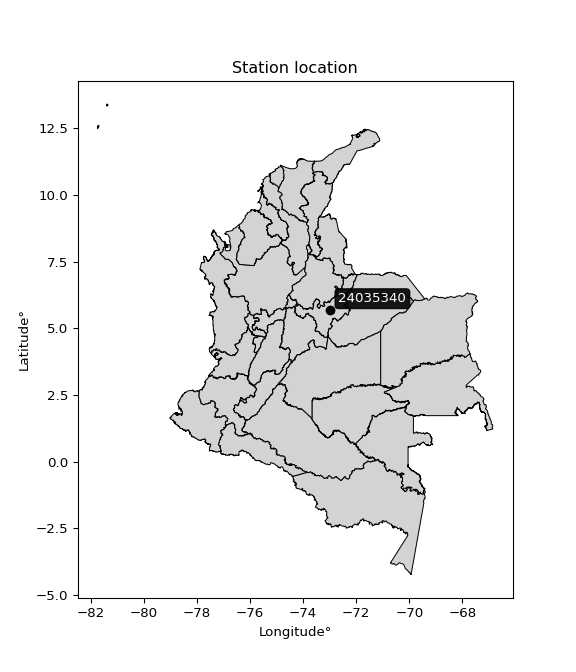

<div align="center">


</div>

# PMP Station (Rain, Pmax24h): 24035340

Probable Maximum Precipitation (PMP) is the greatest amount of rainfall for a specific duration that is meteorologically possible for a given location, acting as a "worst-case" scenario for extreme storms, crucial for designing safety-critical infrastructure like bridges, river deviations, dams, spillways, and nuclear plants to prevent catastrophic failure. PMP is calculated by hydrologists using meteorological data to determine the upper limit of extreme rainfall, often leading to the Probable Maximum Flood (PMF) for flood control design, and is increasingly being studied for climate change impacts. Probable Maximum Precipitation (PMP) is the theoretical upper limit of rainfall, a deterministic estimate for extreme events, while probability distributions (like GEV, Gumbel) describe the likelihood and frequency of various precipitation amounts, including rare ones, showing how often events occur, with PMP representing the extreme end of these distributions, used for critical infrastructure design to ensure safety against the worst conceivable weather, unlike standard statistical forecasts which cover typical probabilities.

The most common probability distributions in hydrology, used for analyzing floods, rainfall, and streamflow, include the Normal, Log-Normal, Gumbel, Gamma (including Log-Pearson Type III), and Generalized Extreme Value (GEV) distributions, often chosen based on the data´s skewness and whether modeling extremes or general conditions, with Gumbel and GEV popular for extreme events like floods, while the Normal distribution serves as a baseline, though often requiring transformations for skewed hydrological data. These distributions help in designing water infrastructure, managing water resources, and forecasting hydrologic events.

> Hydrological data often isn´t perfectly normal (it´s skewed), so different distributions are needed for different applications, such as: **Flood Frequency Analysis**: Using Gumbel, GEV, or Log-Pearson Type III for predicting extreme flood magnitudes and their return periods, **Rainfall Analysis**: Normal for annual totals, but Log-Normal, Weibull, or GEV for intensity or extreme daily rainfall, **Streamflow Modeling**: Gamma and Log-Normal for maximum flows, GEV for minimum flows, and Kappa for daily flows.

<div align="center">

</img>

</div>


## A. General information


### 1. General running parameters

• app_version: _v20260108_. • runtime: _2026-01-08 18:05:13.093906_. • Python version: _3.14.0_. • SciPy version: _1.16.3_. • Pandas version: _2.3.3_. • NumPy version: _2.3.5_. • Stations dataset (station_dataset_file): _dataset/pmax24h_in/automatic_colombia_2003_2024.csv_. • Stations catalog (station_catalog_file): _dataset/CNE.xls_. • Minimum year to eval til year_max (date_min): _1900_. • Maximum year to eval since year_min (date_max): _2024_. • Creates, save and include plots into reports (create_plot): _False_. • Plot only fit distributions with Δo > Δ (plot_only_fit): _True_. • Plot only simple graphs avoiding multiple CDFs and multiple Extreme values plots (plot_only_simple): _False_. • Eval low extreme values, if False, evaluates high extreme values (low_extreme): _False_. • Eval every SciPy distribution as logarithmic (pdist_logarithmic_on): _True_. • Standard deviation normalized (ddof): _1.0_. • Return periods to eval in years (Tr): _[2, 2.33, 5, 10, 15, 20, 25, 50, 75, 100, 200, 250, 500, 750, 1000]_. • Minimum data sample per station, 0 means any (minimum_sample): _5_. • Z-Score maximum threshold to adjust a value, 0 means disable (zscore_max): _3.5_. • Z-Score minimum threshold to adjust a value, 0 means disable (zscore_min): _-2.5_. • Avoid zeros, e.g. rain = 0 (avoid_zeros): _True_. • Avoid null values (avoid_nans): _True_. 

:file_folder:Table: [dataset.csv](../../dataset/pmax24h_in/automatic_colombia_2003_2024.csv)

> Delta Degrees of Freedom (DDOF): is a parameter used in the formulas for calculating variance and standard deviation. When ddof=0, the divisor is $N$ (the total number of observations) and this is used when your data set is the entire population. When ddof=1, the divisor is $N-1$ and this is used when your data set is a sample drawn from a larger population. Using $N-1$ provides an unbiased estimate of the population variance (known as Bessel´s correction).


### 2. Station info and location

|   id |   CODIGO | NOMBRE                               | CATEGORIA               | TECNOLOGIA                              | ESTADO   | FECHA_INSTALACION   |   FECHA_SUSPENSION |   ALTITUD |   LATITUD |   LONGITUD | DEPARTAMENTO   | MUNICIPIO   | AREA_OPERATIVA                              | ENTIDAD                                                     | AREA_HIDROGRAFICA   | ZONA_HIDROGRAFICA   | SUBZONA_HIDROGRAFICA   |   CORRIENTE | Catalogo   |   Version |
|-----:|---------:|:-------------------------------------|:------------------------|:----------------------------------------|:---------|:--------------------|-------------------:|----------:|----------:|-----------:|:---------------|:------------|:--------------------------------------------|:------------------------------------------------------------|:--------------------|:--------------------|:-----------------------|------------:|:-----------|----------:|
|    0 | 24035340 | AEROPUERTO A LLERAS C AUT [24035340] | Climatológica Principal | Automática con Telemetría, Convencional | Activa   | 15/01/1974          |                nan |      2500 |   5.67694 |   -72.9679 | Boyacá         | Sogamoso    | Area Operativa 06 - Boyacá-Casanare-Vichada | INSTITUTO DE HIDROLOGIA METEOROLOGIA Y ESTUDIOS AMBIENTALES | Magdalena Cauca     | Sogamoso            | Río Chicamocha         |         nan | CNE_IDEAM  |  20251226 |

<div align="center">

Dynamic map: [:earth_americas:Google](http://maps.google.com/maps?q=5.676944444,-72.96791667) [:earth_americas:OSM](https://www.openstreetmap.org/#map=18/5.676944444/-72.96791667&layers=P) [:earth_americas:Bing](https://www.bing.com/maps?cp=5.676944444~-72.96791667&lvl=18) [:earth_americas:Apple](https://maps.apple.com/frame?center=5.676944444%2C-72.96791667&span=0.003%2C0.006)

</div>


<div align="center">

```geojson
{
  "type": "Feature",
  "geometry": {
    "type": "Point", 
    "coordinates": [-72.96791667, 5.676944444]
  }, 
  "properties": {
    "Name": "24035340"
  }
}
```

</div>


### 3. Discrete values table and plot

<div align="center">

|               |           0 |           1 |           2 |           3 |          4 |
|:--------------|------------:|------------:|------------:|------------:|-----------:|
| Date          | 2020        | 2021        | 2022        | 2023        | 2024       |
| Value         |   42.7      |   19.7      |   30.1      |  106.6      |  135       |
| Value_initial |   42.7      |   19.7      |   30.1      |  106.6      |  135       |
| count         |    5        |    5        |    5        |    5        |    5       |
| mean          |   66.82     |   66.82     |   66.82     |   66.82     |   66.82    |
| std           |   50.9445   |   50.9445   |   50.9445   |   50.9445   |   50.9445  |
| zscore        |   -0.473456 |   -0.924927 |   -0.720784 |    0.780849 |    1.33832 |


</div>


> The initial value (value_initial) correspond to the initial obtained or null completed value, and value (value) is adjusted only when the initial value is outside the valid range (outlier) definite through the Z-Score value. If Z-Score is active, values out of range or outliers are replaced with the station mean value. A Z-Score (or standard score) measures how many standard deviations a data point is from the mean of a dataset, indicating its relative position; positive scores mean above the mean, negative mean below, and a score of zero is exactly at the mean, allowing for comparison of values from different distributions. It´s calculated using the formula $z=(x–μ)/σ$, where $x$ is the data point, $μ$ is the mean, and $σ$ is the standard deviation, helping identify outliers and understand probability.
>
> <sub>**Note**: In this study, "completing" (filling gaps in) and "extending" (forecasting or lengthening the historical record) rainfall data series are avoided for certain critical analyses because they introduce artificial bias and uncertainty, which can distort the statistics of rare events (extremes), alter day-to-day variability, and compromise the integrity and homogeneity of the original data. Some reasons against Completing/Extending rainfall data are: **Distortion of Extremes and Variability**: The primary issue is that most gap-filling or extension methods rely on averaging or regression with nearby stations, which inherently smooths the data. Rainfall is highly variable in space and time, with a large percentage of zero values and occasional large storms. Infilling methods often underestimate the highest values and overestimate the lowest (zero) values, which severely distorts analyses focused on flood frequency, drought severity, and intensity-duration-frequency (IDF) curves, **Loss of Data Homogeneity**: Infilled or extended data are synthetic estimates, not actual measurements. Combining these estimates with observed data can violate the assumption of data homogeneity, which requires that the data properties do not change over time. Inhomogeneity can lead to incorrect conclusions about long-term trends or changes in climate patterns, **Propagation of Errors**: Errors and biases from the original data (e.g., wind-induced undercatch, instrument errors, site changes) or the data used for imputation can propagate through the analysis, leading to unreliable hydrological models and inaccurate predictions, **Compromised Statistical Integrity**: For statistical analyses, especially those involving the frequency of events, using artificial data can introduce time bias or autocorrelation that doesn´t exist in reality, making it difficult to assess the true probability of events, **Difficulty in Validation**: It is difficult to accurately validate the quality of filled or extended data, especially for past periods where ground-truth measurements are unavailable. The reliability of imputation techniques heavily depends on the density of the surrounding station network and the complexity of the local topography.</sub>


### 4. Active continuous probability distributions from SciPy (43 of 104 available)

A Probability Density Function (PDF) describes the relative likelihood of a continuous random variable falling within a specific range, where the total area under its curve equals 1, and the area over any interval gives the actual probability for that range. Unlike discrete probabilities (like rolling a die), a PDF shows density, not direct probability for a single point (which is zero), with higher points indicating higher likelihood, often visualized as a bell curve for normal distributions.

A log of a probability density function (log-PDF) is simply the logarithm of the PDF´s value, denoted as $log(f(x))$, useful for converting multiplication of probabilities into addition, improving numerical stability with tiny numbers, and connecting to information theory concepts like entropy. Instead of dealing with very small probabilities (e.g., 0.000001), log-PDFs use negative numbers (e.g., $log(0.00001) ≈ -11.51$ that are easier for computers to handle, preventing underflow errors and simplifying complex calculations. In this study, each active probability distribution from SciPy is also evaluated in the $log$ form.

[scipy.stats](https://docs.scipy.org/doc/scipy/reference/stats.html) is a Python´s powerful submodule within the SciPy library for comprehensive statistical analysis, offering over 130 probability distributions (like Normal, Poisson), functions for descriptive stats (mean, variance), hypothesis testing (t-tests, chi-square), random variable generation, and statistical tests, making it essential for data science, modeling, and research. It provides tools to explore, model, and draw conclusions from data efficiently, working seamlessly with NumPy.

<div align="center">

|   id | p_dist             |   n_parameter | fit_method   | label                                                                       | active   | ref                                                                                                        |
|-----:|:-------------------|--------------:|:-------------|:----------------------------------------------------------------------------|:---------|:-----------------------------------------------------------------------------------------------------------|
|    0 | alpha              |             3 | MLE          | Alpha                                                                       | True     | [:mortar_board:](https://docs.scipy.org/doc/scipy/reference/generated/scipy.stats.alpha.html)              |
|    1 | betaprime          |             4 | MLE          | Beta prime                                                                  | True     | [:mortar_board:](https://docs.scipy.org/doc/scipy/reference/generated/scipy.stats.betaprime.html)          |
|    2 | chi2               |             3 | MLE          | Chi²                                                                        | True     | [:mortar_board:](https://docs.scipy.org/doc/scipy/reference/generated/scipy.stats.chi2.html)               |
|    3 | crystalball        |             4 | MLE          | Crystalball                                                                 | True     | [:mortar_board:](https://docs.scipy.org/doc/scipy/reference/generated/scipy.stats.crystalball.html)        |
|    4 | erlang             |             3 | MLE          | Erlang                                                                      | True     | [:mortar_board:](https://docs.scipy.org/doc/scipy/reference/generated/scipy.stats.erlang.html)             |
|    5 | expon              |             2 | MLE          | Exponential                                                                 | True     | [:mortar_board:](https://docs.scipy.org/doc/scipy/reference/generated/scipy.stats.expon.html)              |
|    6 | exponnorm          |             3 | MLE          | Exponentially modified Normal                                               | True     | [:mortar_board:](https://docs.scipy.org/doc/scipy/reference/generated/scipy.stats.exponnorm.html)          |
|    7 | f                  |             4 | MLE          | F                                                                           | True     | [:mortar_board:](https://docs.scipy.org/doc/scipy/reference/generated/scipy.stats.f.html)                  |
|    8 | fatiguelife        |             3 | MLE          | Fatigue-life (Birnbaum-Saunders)                                            | True     | [:mortar_board:](https://docs.scipy.org/doc/scipy/reference/generated/scipy.stats.fatiguelife.html)        |
|    9 | fisk               |             3 | MLE          | Fisk                                                                        | True     | [:mortar_board:](https://docs.scipy.org/doc/scipy/reference/generated/scipy.stats.fisk.html)               |
|   10 | gamma              |             3 | MLE          | Gamma                                                                       | True     | [:mortar_board:](https://docs.scipy.org/doc/scipy/reference/generated/scipy.stats.gamma.html)              |
|   11 | genexpon           |             5 | MLE          | Generalized exponential                                                     | True     | [:mortar_board:](https://docs.scipy.org/doc/scipy/reference/generated/scipy.stats.genexpon.html)           |
|   12 | genlogistic        |             3 | MLE          | Generalized logistic                                                        | True     | [:mortar_board:](https://docs.scipy.org/doc/scipy/reference/generated/scipy.stats.genlogistic.html)        |
|   13 | gibrat             |             2 | MM           | Gibrat                                                                      | True     | [:mortar_board:](https://docs.scipy.org/doc/scipy/reference/generated/scipy.stats.gibrat.html)             |
|   14 | gompertz           |             3 | MLE          | Gompertz (or truncated Gumbel)                                              | True     | [:mortar_board:](https://docs.scipy.org/doc/scipy/reference/generated/scipy.stats.gompertz.html)           |
|   15 | gumbel_l           |             2 | MM           | Gumbel Left Skew                                                            | True     | [:mortar_board:](https://docs.scipy.org/doc/scipy/reference/generated/scipy.stats.gumbel_l.html)           |
|   16 | gumbel_r           |             2 | MM           | Gumbel Right Skew                                                           | True     | [:mortar_board:](https://docs.scipy.org/doc/scipy/reference/generated/scipy.stats.gumbel_r.html)           |
|   17 | halflogistic       |             2 | MM           | Half-logistic                                                               | True     | [:mortar_board:](https://docs.scipy.org/doc/scipy/reference/generated/scipy.stats.halflogistic.html)       |
|   18 | halfnorm           |             2 | MM           | Half Normal                                                                 | True     | [:mortar_board:](https://docs.scipy.org/doc/scipy/reference/generated/scipy.stats.halfnorm.html)           |
|   19 | hypsecant          |             2 | MM           | hyperbolic secant                                                           | True     | [:mortar_board:](https://docs.scipy.org/doc/scipy/reference/generated/scipy.stats.hypsecant.html)          |
|   20 | invgamma           |             3 | MLE          | Inverted gamma                                                              | True     | [:mortar_board:](https://docs.scipy.org/doc/scipy/reference/generated/scipy.stats.invgamma.html)           |
|   21 | invgauss           |             3 | MLE          | Inverse Gaussian                                                            | True     | [:mortar_board:](https://docs.scipy.org/doc/scipy/reference/generated/scipy.stats.invgauss.html)           |
|   22 | invweibull         |             3 | MLE          | Inverted Weibull                                                            | True     | [:mortar_board:](https://docs.scipy.org/doc/scipy/reference/generated/scipy.stats.invweibull.html)         |
|   23 | kstwobign          |             2 | MLE          | Limiting distribution of scaled Kolmogorov-Smirnov two-sided test statistic | True     | [:mortar_board:](https://docs.scipy.org/doc/scipy/reference/generated/scipy.stats.kstwobign.html)          |
|   24 | laplace            |             2 | MM           | Laplace                                                                     | True     | [:mortar_board:](https://docs.scipy.org/doc/scipy/reference/generated/scipy.stats.laplace.html)            |
|   25 | laplace_asymmetric |             3 | MLE          | Asymmetric Laplace                                                          | True     | [:mortar_board:](https://docs.scipy.org/doc/scipy/reference/generated/scipy.stats.laplace_asymmetric.html) |
|   26 | loggamma           |             3 | MLE          | Log gamma                                                                   | True     | [:mortar_board:](https://docs.scipy.org/doc/scipy/reference/generated/scipy.stats.loggamma.html)           |
|   27 | logistic           |             2 | MM           | Logistic (or Sech-squared)                                                  | True     | [:mortar_board:](https://docs.scipy.org/doc/scipy/reference/generated/scipy.stats.logistic.html)           |
|   28 | lognorm            |             3 | MLE          | Log Normal                                                                  | True     | [:mortar_board:](https://docs.scipy.org/doc/scipy/reference/generated/scipy.stats.lognorm.html)            |
|   29 | maxwell            |             2 | MM           | Maxwell                                                                     | True     | [:mortar_board:](https://docs.scipy.org/doc/scipy/reference/generated/scipy.stats.maxwell.html)            |
|   30 | mielke             |             4 | MLE          | Mielke Beta-Kappa / Dagum                                                   | True     | [:mortar_board:](https://docs.scipy.org/doc/scipy/reference/generated/scipy.stats.mielke.html)             |
|   31 | moyal              |             2 | MM           | Moyal                                                                       | True     | [:mortar_board:](https://docs.scipy.org/doc/scipy/reference/generated/scipy.stats.moyal.html)              |
|   32 | nakagami           |             3 | MLE          | Nakagami                                                                    | True     | [:mortar_board:](https://docs.scipy.org/doc/scipy/reference/generated/scipy.stats.nakagami.html)           |
|   33 | ncf                |             5 | MLE          | Non-central F distribution                                                  | True     | [:mortar_board:](https://docs.scipy.org/doc/scipy/reference/generated/scipy.stats.ncf.html)                |
|   34 | nct                |             4 | MLE          | Non-central Student’s t                                                     | True     | [:mortar_board:](https://docs.scipy.org/doc/scipy/reference/generated/scipy.stats.nct.html)                |
|   35 | norm               |             2 | MM           | Normal                                                                      | True     | [:mortar_board:](https://docs.scipy.org/doc/scipy/reference/generated/scipy.stats.norm.html)               |
|   36 | pearson3           |             3 | MM           | Pearson type III                                                            | True     | [:mortar_board:](https://docs.scipy.org/doc/scipy/reference/generated/scipy.stats.pearson3.html)           |
|   37 | rayleigh           |             2 | MM           | Rayleigh                                                                    | True     | [:mortar_board:](https://docs.scipy.org/doc/scipy/reference/generated/scipy.stats.rayleigh.html)           |
|   38 | rice               |             3 | MLE          | Rice                                                                        | True     | [:mortar_board:](https://docs.scipy.org/doc/scipy/reference/generated/scipy.stats.rice.html)               |
|   39 | t                  |             3 | MLE          | Student’s t                                                                 | True     | [:mortar_board:](https://docs.scipy.org/doc/scipy/reference/generated/scipy.stats.t.html)                  |
|   40 | truncnorm          |             4 | MLE          | Truncated normal                                                            | True     | [:mortar_board:](https://docs.scipy.org/doc/scipy/reference/generated/scipy.stats.truncnorm.html)          |
|   41 | wald               |             2 | MM           | Wald                                                                        | True     | [:mortar_board:](https://docs.scipy.org/doc/scipy/reference/generated/scipy.stats.wald.html)               |
|   42 | weibull_min        |             3 | MLE          | Weibull minimum                                                             | True     | [:mortar_board:](https://docs.scipy.org/doc/scipy/reference/generated/scipy.stats.weibull_min.html)        |

</div>

> **n_parameter:** # arguments & localization & scale.
>
> **Fit methods:** (MLE) maximum likelihood, (MM) L-moments.
>
>**Inactive** (With the only purpose of prevent loops, zero divisions, infinite values, over high estimated values or horizontal trending for recurrence intervals estimations, the follow distributions were disabled.)**:** foldnorm, gennorm, norminvgauss, powernorm, powerlognorm, skewnorm, genextreme, anglit, arcsine, argus, beta, bradford, burr, burr12, cauchy, cosine, halfcauchy, foldcauchy, skewcauchy, wrapcauchy, dgamma, gengamma, exponweib, exponpow, truncexpon, gausshyper, genhalflogistic, genhyperbolic, geninvgauss, halfgennorm, johnsonsb, johnsonsu, kappa4, kappa3, ksone, kstwo, loglaplace, levy, levy_l, levy_stable, ncx2, pareto, genpareto, truncpareto, lomax, powerlaw, rdist, rel_breitwigner, recipinvgauss, semicircular, studentized_range, trapezoid, triang, truncweibull_min, tukeylambda, uniform, loguniform, vonmises, vonmises_line, weibull_max, dweibull, 


## B. Probability (PDF) vs. Empirical (EDF) distributions functions

A continuous probability distribution (CPD) describes probabilities for variables that can take any value within a range (like rain any time), unlike discrete variables with specific outcomes (like temperature). It uses a Probability Density Function (PDF), a curve where the total area under it equals 1, and the probability of the variable falling within an interval (a to b) is found by calculating the area under the curve between those points. A key feature is that the probability of hitting any single exact value is zero, so probabilities are always expressed for ranges, e.g., $P(a ≤ X ≤ b)$.

<div align="center">

Distributions parameters from station values
|    |   station | p_dist                |   n |              loc |          scale | shape                  | shape1              | shape2              | shape3   |
|---:|----------:|:----------------------|----:|-----------------:|---------------:|:-----------------------|:--------------------|:--------------------|:---------|
|  0 |  24035340 | alpha                 |   5 |      7.69103     |   22.4672      | 7.855512679908098e-10  |                     |                     |          |
|  1 |  24035340 | betaprime             |   5 |     -0.404629    |    0.951877    | 97.18941140336308      | 2.244390890993289   |                     |          |
|  2 |  24035340 | chi2                  |   5 |     19.7         |   17.5383      | 1.5038504061223699     |                     |                     |          |
|  3 |  24035340 | crystalball           |   5 |      0.444687    |   80.7075      | 8.681421004027609      | 1.0000002919736124  |                     |          |
|  4 |  24035340 | erlang                |   5 |     19.7         |   53.0719      | 0.1309182458530405     |                     |                     |          |
|  5 |  24035340 | expon                 |   5 |     19.7         |   47.12        |                        |                     |                     |          |
|  6 |  24035340 | exponnorm             |   5 |     19.6654      |    0.0102477   | 4605.664375761387      |                     |                     |          |
|  7 |  24035340 | f                     |   5 |     10.6447      |   23.6757      | 1385.0910015646461     | 2.5469250862892014  |                     |          |
|  8 |  24035340 | fatiguelife           |   5 |     19.7         |    0.000191462 | 535.4583559214136      |                     |                     |          |
|  9 |  24035340 | fisk                  |   5 |     19.7         |   57.5595      | 0.29359603777020227    |                     |                     |          |
| 10 |  24035340 | gamma                 |   5 |     19.7         |   31.2069      | 0.9240589525712382     |                     |                     |          |
| 11 |  24035340 | genexpon              |   5 |     19.7         |   74.1279      | 1.5588885576462475     | 0.26135215393630723 | 0.09117307633344976 |          |
| 12 |  24035340 | genlogistic           |   5 |   -209.717       |   34.2425      | 1717.8556959549012     |                     |                     |          |
| 13 |  24035340 | gibrat                |   5 |     32.0588      |   21.0838      |                        |                     |                     |          |
| 14 |  24035340 | gompertz              |   5 |     19.7         |  684.146       | 13.568024633643798     |                     |                     |          |
| 15 |  24035340 | gumbel_l              |   5 |     87.3272      |   35.5278      |                        |                     |                     |          |
| 16 |  24035340 | gumbel_r              |   5 |     46.3128      |   35.5278      |                        |                     |                     |          |
| 17 |  24035340 | halflogistic          |   5 |     12.8135      |   38.9575      |                        |                     |                     |          |
| 18 |  24035340 | halfnorm              |   5 |      6.50822     |   75.5896      |                        |                     |                     |          |
| 19 |  24035340 | hypsecant             |   5 |     66.82        |   29.0083      |                        |                     |                     |          |
| 20 |  24035340 | invgamma              |   5 |     10.623       |   30.1558      | 1.2734538475958561     |                     |                     |          |
| 21 |  24035340 | invgauss              |   5 |     14.151       |   24.7402      | 2.1288811322152954     |                     |                     |          |
| 22 |  24035340 | invweibull            |   5 |     19.7         |    5.76826e-11 | 0.16616371194529087    |                     |                     |          |
| 23 |  24035340 | kstwobign             |   5 |    -71.9195      |  158.636       |                        |                     |                     |          |
| 24 |  24035340 | laplace               |   5 |     66.82        |   32.2202      |                        |                     |                     |          |
| 25 |  24035340 | laplace_asymmetric    |   5 |     19.7         |    0.000745371 | 1.5818690727282035e-05 |                     |                     |          |
| 26 |  24035340 | loggamma              |   5 | -13269.8         | 1816.83        | 1542.1010558545331     |                     |                     |          |
| 27 |  24035340 | logistic              |   5 |     66.82        |   25.122       |                        |                     |                     |          |
| 28 |  24035340 | lognorm               |   5 |     19.7         |    0.0243239   | 14.803365151025373     |                     |                     |          |
| 29 |  24035340 | maxwell               |   5 |    -41.1527      |   67.6619      |                        |                     |                     |          |
| 30 |  24035340 | mielke                |   5 |      0.490196    |    0.765049    | 641.9042428765879      | 1.5685792824973204  |                     |          |
| 31 |  24035340 | moyal                 |   5 |     40.7623      |   20.512       |                        |                     |                     |          |
| 32 |  24035340 | nakagami              |   5 |     19.7         |   73.4074      | 0.21569711417140808    |                     |                     |          |
| 33 |  24035340 | ncf                   |   5 |     -0.028564    |    8.64242e-06 | 1.2990784489510085e-06 | 14.11594376336879   | 8.616788071925615   |          |
| 34 |  24035340 | nct                   |   5 |     -0.231277    |    0.703245    | 1.441234494011292      | 48.57319734391613   |                     |          |
| 35 |  24035340 | norm                  |   5 |     66.82        |   45.5662      |                        |                     |                     |          |
| 36 |  24035340 | pearson3              |   5 |     66.82        |   45.5662      | 0.4475801296676167     |                     |                     |          |
| 37 |  24035340 | rayleigh              |   5 |    -20.3508      |   69.5522      |                        |                     |                     |          |
| 38 |  24035340 | rice                  |   5 |     -8.15637     |   62.0392      | 0.0012577512080181924  |                     |                     |          |
| 39 |  24035340 | t                     |   5 |     66.8225      |   45.5678      | 27045031.03787005      |                     |                     |          |
| 40 |  24035340 | truncnorm             |   5 |     66.82        |   45.5662      | -790.7027790006942     | 831.9574704645559   |                     |          |
| 41 |  24035340 | wald                  |   5 |     21.2538      |   45.5662      |                        |                     |                     |          |
| 42 |  24035340 | weibull_min           |   5 |     19.7         |   45.6053      | 0.7529788503193092     |                     |                     |          |
| 43 |  24035340 | logalpha              |   5 |     -4.77293     |  103.041       | 11.907193600838117     |                     |                     |          |
| 44 |  24035340 | logbetaprime          |   5 |      0.0696494   |    9.53971     | 38.57549077848455      | 96.05784411083164   |                     |          |
| 45 |  24035340 | logchi2               |   5 |      2.98062     |    0.926903    | 1.047653112058141      |                     |                     |          |
| 46 |  24035340 | logcrystalball        |   5 |      3.94274     |    0.73552     | 11310.533817395288     | 130.98391267157962  |                     |          |
| 47 |  24035340 | logerlang             |   5 |     -3.63027     |    0.070544    | 107.29186341068834     |                     |                     |          |
| 48 |  24035340 | logexpon              |   5 |      2.98062     |    0.962122    |                        |                     |                     |          |
| 49 |  24035340 | logexponnorm          |   5 |      3.89082     |    0.733685    | 0.07076499210890078    |                     |                     |          |
| 50 |  24035340 | logf                  |   5 |      2.98062     |    1.04734     | 0.9351000939644236     | 1040.4900799183988  |                     |          |
| 51 |  24035340 | logfatiguelife        |   5 |      2.45222     |    1.27577     | 0.5781238824033061     |                     |                     |          |
| 52 |  24035340 | logfisk               |   5 |      2.49036     |    1.28409     | 2.81392607349415       |                     |                     |          |
| 53 |  24035340 | loggamma              |   5 |     -2.92441     |    0.0778354   | 88.13416687820646      |                     |                     |          |
| 54 |  24035340 | loggenexpon           |   5 |      2.98062     |    1.07688     | 0.9234749332078379     | 1.0117886412368977  | 0.32191645362063204 |          |
| 55 |  24035340 | loggenlogistic        |   5 |     -0.446063    |    0.625282    | 627.2152255634334      |                     |                     |          |
| 56 |  24035340 | loggibrat             |   5 |      3.38162     |    0.340336    |                        |                     |                     |          |
| 57 |  24035340 | loggompertz           |   5 |      2.98062     |    1.49081     | 0.8696876212227533     |                     |                     |          |
| 58 |  24035340 | loggumbel_l           |   5 |      4.27376     |    0.573483    |                        |                     |                     |          |
| 59 |  24035340 | loggumbel_r           |   5 |      3.61172     |    0.573483    |                        |                     |                     |          |
| 60 |  24035340 | loghalflogistic       |   5 |      3.07101     |    0.628822    |                        |                     |                     |          |
| 61 |  24035340 | loghalfnorm           |   5 |      2.9692      |    1.22015     |                        |                     |                     |          |
| 62 |  24035340 | loghypsecant          |   5 |      3.94274     |    0.468247    |                        |                     |                     |          |
| 63 |  24035340 | loginvgamma           |   5 |      0.175683    |   94.133       | 25.97415257174719      |                     |                     |          |
| 64 |  24035340 | loginvgauss           |   5 |      2.19125     |    7.71383     | 0.22705879592379172    |                     |                     |          |
| 65 |  24035340 | loginvweibull         |   5 |     -2.04573e+07 |    2.04573e+07 | 32681379.668816775     |                     |                     |          |
| 66 |  24035340 | logkstwobign          |   5 |      1.43554     |    2.86083     |                        |                     |                     |          |
| 67 |  24035340 | loglaplace            |   5 |      3.94274     |    0.520091    |                        |                     |                     |          |
| 68 |  24035340 | loglaplace_asymmetric |   5 |      3.7542      |    0.616361    | 0.8586797157623556     |                     |                     |          |
| 69 |  24035340 | logloggamma           |   5 |   -157.81        |   23.4065      | 1003.2428271189378     |                     |                     |          |
| 70 |  24035340 | loglogistic           |   5 |      3.94274     |    0.405513    |                        |                     |                     |          |
| 71 |  24035340 | loglognorm            |   5 |      2.98062     |    0.00086103  | 14.157193888769914     |                     |                     |          |
| 72 |  24035340 | logmaxwell            |   5 |      2.19987     |    1.09218     |                        |                     |                     |          |
| 73 |  24035340 | logmielke             |   5 |      2.98062     |    1.93512     | 0.6091097967622809     | 232.84894904904672  |                     |          |
| 74 |  24035340 | logmoyal              |   5 |      3.52212     |    0.3311      |                        |                     |                     |          |
| 75 |  24035340 | lognakagami           |   5 |      3.40453     |    1.0631      | 0.15266107199636214    |                     |                     |          |
| 76 |  24035340 | logncf                |   5 |     -0.855589    |    4.75102     | 142.80026623940194     | 206.87531324678912  | 0.04466799443643743 |          |
| 77 |  24035340 | lognct                |   5 |     -0.218048    |    0.118347    | 16.782217107030306     | 33.578497580765195  |                     |          |
| 78 |  24035340 | lognorm               |   5 |      3.94274     |    0.73552     |                        |                     |                     |          |
| 79 |  24035340 | logpearson3           |   5 |      3.94274     |    0.735522    | 0.11143133965585725    |                     |                     |          |
| 80 |  24035340 | lograyleigh           |   5 |      2.53565     |    1.1227      |                        |                     |                     |          |
| 81 |  24035340 | logrice               |   5 |      2.59657     |    0.937421    | 0.8232866646136695     |                     |                     |          |
| 82 |  24035340 | logt                  |   5 |      3.94274     |    0.735521    | 47546991934.92529      |                     |                     |          |
| 83 |  24035340 | logtruncnorm          |   5 |      0.0485011   |    1.38659     | 2.4203321614399393     | 3.5026630195559063  |                     |          |
| 84 |  24035340 | logwald               |   5 |      3.20722     |    0.735521    |                        |                     |                     |          |
| 85 |  24035340 | logweibull_min        |   5 |      2.98062     |    1.15524     | 0.7035147980566205     |                     |                     |          |

</div>

> **loc** (Location parameter): This shifts the distribution along the x-axis. For many common distributions, like the normal (Gaussian) distribution, loc represents the mean $μ$. For others, like the uniform distribution, it might represent the minimum value, or for the beta distribution, the left end of the support interval.
>
> **scale** (Scale parameter): This determines the width or spread of the distribution. For the normal distribution, scale represents the standard deviation $σ$. For a uniform distribution, it defines the length of the interval (from $loc$ to $loc + scale$).
>
> **shape** (Shape parameters): Refers to parameters that define the specific form of a probability distribution, distinct from its location (loc) and scale (scale). These parameters are required arguments for most distribution functions. For example, a normal (Gaussian) distribution is fully defined by its location (mean) and scale (standard deviation), so it has no specific shape parameters beyond loc and scale. However, other distributions have intrinsic properties that need specification, as Gamma distribution that takes a shape parameter, often named $a$ or $alpha$.


### 0. Cumulative distribution values - CDF (86 evaluated)

Cumulative Distribution Function (CDF), denoted as $F$<sub>$X$</sub>$(x)$, is a function that gives the probability that a random variable $X$ will take a value less than or equal to a specific value, $x$ (i.e., $(P(X≥x)$. It essentially "accumulates" probabilities from a given point up to the far right (positive infinity), providing a complete picture of the distribution´s probabilities for both discrete (like rain) and continuous (like temperature) variables, helping to find probabilities over ranges or above certain values. Each station is evaluated separately ordering the $x$ values ascending, calculating the CDF and PDF values for the activated distributions and their logarithmic forms.

<div align="center">

CDF ordered by x ascending and calculating $log(f(x))$ separately
|   id |   Station |   date |     x |   count |   mean |     std |    zscore |   Value_initial |   station |   m |     alpha |   alpha_pdf |   betaprime |   betaprime_pdf |        chi2 |      chi2_pdf |   crystalball |   crystalball_pdf |     erlang |   erlang_pdf |    expon |   expon_pdf |   exponnorm |   exponnorm_pdf |         f |      f_pdf |   fatiguelife |   fatiguelife_pdf |        fisk |    fisk_pdf |       gamma |   gamma_pdf |    genexpon |   genexpon_pdf |   genlogistic |   genlogistic_pdf |   gibrat |   gibrat_pdf |    gompertz |   gompertz_pdf |   gumbel_l |   gumbel_l_pdf |   gumbel_r |   gumbel_r_pdf |   halflogistic |   halflogistic_pdf |   halfnorm |   halfnorm_pdf |   hypsecant |   hypsecant_pdf |   invgamma |   invgamma_pdf |   invgauss |   invgauss_pdf |   invweibull |   invweibull_pdf |   kstwobign |   kstwobign_pdf |   laplace |   laplace_pdf |   laplace_asymmetric |   laplace_asymmetric_pdf |   loggamma |   loggamma_pdf |   logistic |   logistic_pdf |   lognorm |   lognorm_pdf |   maxwell |   maxwell_pdf |   mielke |   mielke_pdf |     moyal |   moyal_pdf |    nakagami |   nakagami_pdf |      ncf |    ncf_pdf |       nct |    nct_pdf |     norm |   norm_pdf |   pearson3 |   pearson3_pdf |   rayleigh |   rayleigh_pdf |      rice |   rice_pdf |        t |      t_pdf |   truncnorm |   truncnorm_pdf |     wald |   wald_pdf |   weibull_min |   weibull_min_pdf |   logalpha |   logalpha_pdf |   logbetaprime |   logbetaprime_pdf |     logchi2 |   logchi2_pdf |   logcrystalball |   logcrystalball_pdf |   logerlang |   logerlang_pdf |   logexpon |   logexpon_pdf |   logexponnorm |   logexponnorm_pdf |        logf |    logf_pdf |   logfatiguelife |   logfatiguelife_pdf |   logfisk |   logfisk_pdf |   loggenexpon |   loggenexpon_pdf |   loggenlogistic |   loggenlogistic_pdf |   loggibrat |   loggibrat_pdf |   loggompertz |   loggompertz_pdf |   loggumbel_l |   loggumbel_l_pdf |   loggumbel_r |   loggumbel_r_pdf |   loghalflogistic |   loghalflogistic_pdf |   loghalfnorm |   loghalfnorm_pdf |   loghypsecant |   loghypsecant_pdf |   loginvgamma |   loginvgamma_pdf |   loginvgauss |   loginvgauss_pdf |   loginvweibull |   loginvweibull_pdf |   logkstwobign |   logkstwobign_pdf |   loglaplace |   loglaplace_pdf |   loglaplace_asymmetric |   loglaplace_asymmetric_pdf |   logloggamma |   logloggamma_pdf |   loglogistic |   loglogistic_pdf |   loglognorm |   loglognorm_pdf |   logmaxwell |   logmaxwell_pdf |   logmielke |   logmielke_pdf |   logmoyal |   logmoyal_pdf |   lognakagami |   lognakagami_pdf |    logncf |   logncf_pdf |    lognct |   lognct_pdf |   logpearson3 |   logpearson3_pdf |   lograyleigh |   lograyleigh_pdf |   logrice |   logrice_pdf |      logt |   logt_pdf |   logtruncnorm |   logtruncnorm_pdf |   logwald |   logwald_pdf |   logweibull_min |   logweibull_min_pdf |
|-----:|----------:|-------:|------:|--------:|-------:|--------:|----------:|----------------:|----------:|----:|----------:|------------:|------------:|----------------:|------------:|--------------:|--------------:|------------------:|-----------:|-------------:|---------:|------------:|------------:|----------------:|----------:|-----------:|--------------:|------------------:|------------:|------------:|------------:|------------:|------------:|---------------:|--------------:|------------------:|---------:|-------------:|------------:|---------------:|-----------:|---------------:|-----------:|---------------:|---------------:|-------------------:|-----------:|---------------:|------------:|----------------:|-----------:|---------------:|-----------:|---------------:|-------------:|-----------------:|------------:|----------------:|----------:|--------------:|---------------------:|-------------------------:|-----------:|---------------:|-----------:|---------------:|----------:|--------------:|----------:|--------------:|---------:|-------------:|----------:|------------:|------------:|---------------:|---------:|-----------:|----------:|-----------:|---------:|-----------:|-----------:|---------------:|-----------:|---------------:|----------:|-----------:|---------:|-----------:|------------:|----------------:|---------:|-----------:|--------------:|------------------:|-----------:|---------------:|---------------:|-------------------:|------------:|--------------:|-----------------:|---------------------:|------------:|----------------:|-----------:|---------------:|---------------:|-------------------:|------------:|------------:|-----------------:|---------------------:|----------:|--------------:|--------------:|------------------:|-----------------:|---------------------:|------------:|----------------:|--------------:|------------------:|--------------:|------------------:|--------------:|------------------:|------------------:|----------------------:|--------------:|------------------:|---------------:|-------------------:|--------------:|------------------:|--------------:|------------------:|----------------:|--------------------:|---------------:|-------------------:|-------------:|-----------------:|------------------------:|----------------------------:|--------------:|------------------:|--------------:|------------------:|-------------:|-----------------:|-------------:|-----------------:|------------:|----------------:|-----------:|---------------:|--------------:|------------------:|----------:|-------------:|----------:|-------------:|--------------:|------------------:|--------------:|------------------:|----------:|--------------:|----------:|-----------:|---------------:|-------------------:|----------:|--------------:|-----------------:|---------------------:|
|    0 |  24035340 |   2021 |  19.7 |       5 |  66.82 | 50.9445 | -0.924927 |            19.7 |  24035340 |   1 | 0.0613632 |  0.0215988  |   0.0808909 |      0.0138112  | 1.02285e-12 | 216.485       |      0.594285 |        0.00480436 | 0.00811978 |  2.99216e+11 | 0        |  0.0212224  | 0.000732351 |      0.0211642  | 0.0594171 | 0.0203283  |     0.0580129 |       3.37249e+08 | 1.74153e-05 | 1.43917e+09 | 1.90639e-15 | 0.495852    | 8.74136e-14 |     0.0210297  |      0.120787 |        0.00745137 | 0        |   0          | 3.59989e-12 |      0.0198321 |   0.13847  |     0.00361428 |   0.12063  |     0.00718128 |      0.0881557 |         0.0127348  |   0.138542 |     0.010396   |    0.123852 |      0.0041626  |  0.0594174 |     0.0203284  |  0.0545119 |     0.0254914  |   0.00668692 |      1.56615e+12 |    0.107452 |      0.00750274 |  0.115835 |    0.00359512 |          2.57083e-10 |               0.0212226  |  0.0906132 |       0.246909 |   0.132889 |     0.00458681 | 0.0954225 |      0.230547 |  0.152653 |    0.00636542 |      nan |          nan | 0.0947241 |  0.00804557 | 7.19479e-08 |     8.7364e+06 | 0.166291 | 0.0100968  | 0.0704769 | 0.0163867  | 0.150545 | 0.0051293  |   0.14674  |     0.00601292 |   0.15278  |     0.00701432 | 0.0958915 | 0.00654353 | 0.150541 | 0.00512903 |    0.150545 |      0.0051293  | 0        | 0          |   7.42461e-13 |      157.361      |  0.0834399 |       0.263029 |      0.0835635 |           0.264874 | 7.40425e-09 |    8.7337e+06 |        0.0954225 |             0.230547 |   0.0904187 |        0.24412  |   0        |       1.03937  |      0.0954066 |           0.230586 | 1.06014e-06 | 1.72244e+06 |        0.0576845 |             0.415412 |  0.06242  |      0.335904 |    4.0116e-10 |          0.857547 |         0.073604 |             0.306483 |   0         |        0        |    2.7632e-11 |          0.583365 |     0.0995713 |          0.164679 |     0.0495106 |          0.259481 |          0        |              0        |    0.00746683 |          0.653894 |      0.0811262 |           0.171386 |     0.0766331 |          0.284979 |     0.0622494 |          0.361676 |       0.0731797 |            0.305694 |      0.0675722 |           0.326214 |    0.0786257 |         0.151177 |                0.098401 |                    0.185923 |     0.0975864 |          0.230077 |      0.085286 |          0.192379 |    0.0228313 |      8.61346e+12 |    0.0835354 |         0.289143 | 2.06389e-09 |   117951        |  0.0234906 |       0.209758 |   0           |       0           | 0.0852837 |     0.25979  | 0.0753772 |     0.290442 |     0.0929854 |          0.237909 |     0.0755378 |          0.326359 | 0.0581653 |      0.294544 | 0.0954226 |   0.230547 |    0           |          0         |  0        |      0        |      1.42948e-11 |         22645.4      |
|    1 |  24035340 |   2022 |  30.1 |       5 |  66.82 | 50.9445 | -0.720784 |            30.1 |  24035340 |   2 | 0.316054  |  0.0215957  |   0.248659  |      0.0167303  | 0.385357    |   0.0234325   |      0.643355 |        0.00462039 | 0.841247   |  0.00889713  | 0.198053 |  0.0170192  | 0.19835     |      0.016985   | 0.300744  | 0.0211197  |     0.66831   |       0.00759393  | 0.376989    | 0.00663043  | 0.31966     | 0.0237727   | 0.196632    |     0.0169306  |      0.210066 |        0.00956777 | 0        |   0          | 0.187654    |      0.0163573 |   0.181051 |     0.00460404 |   0.206328 |     0.00916592 |      0.218294  |         0.0122229  |   0.245038 |     0.0100537  |    0.174984 |      0.00573292 |  0.300745  |     0.0211197  |  0.326512  |     0.0213691  |   0.986611   |      0.000212477 |    0.197389 |      0.00960816 |  0.159964 |    0.00496472 |          0.198055    |               0.0170193  |  0.238663  |       0.447484 |   0.188212 |     0.00608186 | 0.232161  |      0.414995 |  0.225088 |    0.00751111 |      nan |          nan | 0.194698  |  0.0108793  | 0.337934    |     0.0139677  | 0.275678 | 0.0107094  | 0.274129  | 0.0195497  | 0.210162 | 0.00632775 |   0.216439 |     0.00734798 |   0.231318 |     0.00801665 | 0.173146  | 0.00821863 | 0.210154 | 0.0063274  |    0.210162 |      0.00632775 | 0.058548 | 0.0192187  |   0.280033    |        0.0171263  |  0.244032  |       0.48337  |      0.244577  |           0.48303  | 0.482126    |    0.511571   |        0.232161  |             0.414995 |   0.236886  |        0.443477 |   0.356347 |       0.668993 |      0.232174  |           0.415082 | 0.488751    | 0.473074    |        0.305865  |             0.643854 |  0.277653 |      0.617354 |    0.321399   |          0.657817 |         0.265572 |             0.562534 |   0.0034834 |        0.45683  |    0.248763   |          0.582381 |     0.197201  |          0.307481 |     0.238074  |          0.595794 |          0.259142 |              0.74174  |    0.278743   |          0.6136   |      0.195324  |           0.391449 |     0.253047  |          0.524251 |     0.285153  |          0.614102 |       0.264894  |            0.562162 |      0.269315  |           0.575675 |    0.17764   |         0.341556 |                0.219203 |                    0.414172 |     0.233318  |          0.41097  |      0.209616 |          0.408561 |    0.669263  |      0.0603987   |    0.250967  |         0.483734 | 0.396579    |        0.569843 |  0.232349  |       0.70523  |   1.62298e-05 |       1.11584e+10 | 0.242618  |     0.472887 | 0.256169  |     0.536006 |     0.234749  |          0.429287 |     0.258793  |          0.510943 | 0.234392  |      0.510579 | 0.232161  |   0.414995 |    8.75123e-06 |          2.04421   |  0.131823 |      1.43898  |      0.389793    |             0.500229 |
|    2 |  24035340 |   2020 |  42.7 |       5 |  66.82 | 50.9445 | -0.473456 |            42.7 |  24035340 |   3 | 0.521032  |  0.0119041  |   0.439619  |      0.0131828  | 0.608905    |   0.0134371   |      0.699708 |        0.00430995 | 0.911072   |  0.00352026  | 0.386218 |  0.0130259  | 0.386176    |      0.0130055  | 0.508383  | 0.0124802  |     0.741275  |       0.00455275  | 0.433073    | 0.00313408  | 0.558358    | 0.014947    | 0.384192    |     0.0130108  |      0.339554 |        0.0107073  | 0.247062 |   0.0296752  | 0.371168    |      0.0128974 |   0.247803 |     0.00602889 |   0.330536 |     0.0102994  |      0.365811  |         0.011117   |   0.367914 |     0.00941236 |    0.261427 |      0.0080326  |  0.508384  |     0.0124802  |  0.528299  |     0.0118785  |   0.988256   |      8.43461e-05 |    0.326524 |      0.0106156  |  0.236514 |    0.00734057 |          0.38622     |               0.013026   |  0.414959  |       0.542963 |   0.276855 |     0.00796937 | 0.398845  |      0.524864 |  0.325977 |    0.00840308 |      nan |          nan | 0.340152  |  0.0117711  | 0.474504    |     0.00874611 | 0.407597 | 0.0100464  | 0.481185  | 0.0132342  | 0.298285 | 0.00761066 |   0.316904 |     0.0084936  |   0.336942 |     0.00864211 | 0.285371  | 0.00944264 | 0.298273 | 0.00761025 |    0.298285 |      0.00761066 | 0.338625 | 0.020134   |   0.449671    |        0.0107603  |  0.429881  |       0.55659  |      0.430007  |           0.555002 | 0.622493    |    0.318122   |        0.398845  |             0.524864 |   0.412123  |        0.541365 |   0.552481 |       0.465138 |      0.398885  |           0.524919 | 0.618252    | 0.293775    |        0.514033  |             0.529711 |  0.488824 |      0.556343 |    0.523506   |          0.501046 |         0.468473 |             0.567772 |   0.536065  |        1.06637  |    0.446526   |          0.542491 |     0.332453  |          0.470434 |     0.458402  |          0.623485 |          0.495427 |              0.599973 |    0.480011   |          0.531675 |      0.375161  |           0.628176 |     0.448265  |          0.565167 |     0.493202  |          0.551072 |       0.467733  |            0.567783 |      0.472819  |           0.562046 |    0.347962  |         0.66904  |                0.424404 |                    0.801888 |     0.398475  |          0.520792 |      0.385813 |          0.584349 |    0.684517  |      0.0324579   |    0.432834  |         0.537459 | 0.572072    |        0.450444 |  0.481207  |       0.662238 |   0.572142    |       0.492462    | 0.425327  |     0.550731 | 0.454106  |     0.567708 |     0.405564  |          0.532162 |     0.445131  |          0.536425 | 0.424843  |      0.558574 | 0.398845  |   0.524864 |    0.530243    |          1.07557   |  0.542664 |      0.809218 |      0.529601    |             0.322631 |
|    3 |  24035340 |   2023 | 106.6 |       5 |  66.82 | 50.9445 |  0.780849 |           106.6 |  24035340 |   4 | 0.820307  |  0.00178572 |   0.839911  |      0.00250993 | 0.94909     |   0.00156288  |      0.905797 |        0.00208125 | 0.987305   |  0.000332628 | 0.841853 |  0.00335627 | 0.84149     |      0.00335846 | 0.832209  | 0.00193172 |     0.895836  |       0.00130875  | 0.530199    | 0.000841556 | 0.946719    | 0.00174358  | 0.841704    |     0.0033855  |      0.846058 |        0.00413014 | 0.896678 |   0.00241107 | 0.840808    |      0.0035847 |   0.820979 |     0.00866818 |   0.83256  |     0.00429429 |      0.834781  |         0.00389066 |   0.814546 |     0.00439278 |    0.841785 |      0.00523229 |  0.832208  |     0.00193172 |  0.849086  |     0.00206828 |   0.990572   |      1.79418e-05 |    0.841202 |      0.00449915 |  0.854529 |    0.00451491 |          0.841855    |               0.00335625 |  0.842639  |       0.307788 |   0.829696 |     0.00562458 | 0.838307  |      0.333083 |  0.810446 |    0.00518214 |      nan |          nan | 0.840763  |  0.00382962 | 0.803282    |     0.00310086 | 0.822903 | 0.0034268  | 0.837752  | 0.00209645 | 0.808673 | 0.00598091 |   0.814718 |     0.00520324 |   0.810958 |     0.00496104 | 0.819273  | 0.0053885  | 0.808649 | 0.00598114 |    0.808673 |      0.00598091 | 0.87047  | 0.00278673 |   0.803076    |        0.00277267 |  0.839935  |       0.281293 |      0.84044   |           0.28329  | 0.812634    |    0.13392    |        0.838307  |             0.333083 |   0.841649  |        0.311017 |   0.827082 |       0.179725 |      0.838311  |           0.333002 | 0.796473    | 0.128877    |        0.833469  |             0.20233  |  0.815734 |      0.194135 |    0.832814   |          0.205627 |         0.838932 |             0.235602 |   0.908323  |        0.127872 |    0.83951    |          0.290577 |     0.86363   |          0.473774 |     0.853661  |          0.235521 |          0.853983 |              0.215254 |    0.836433   |          0.247775 |      0.867009  |           0.275827 |     0.839225  |          0.257756 |     0.836043  |          0.21736  |       0.838458  |            0.236002 |      0.8447    |           0.245084 |    0.876278  |         0.237886 |                0.839091 |                    0.224169 |     0.837762  |          0.335659 |      0.857071 |          0.302088 |    0.703849  |      0.0144601   |    0.83617   |         0.28992  | 0.920303    |        0.331997 |  0.859569  |       0.209863 |   0.826044    |       0.165164    | 0.839044  |     0.289192 | 0.839364  |     0.250225 |     0.838536  |          0.3211   |     0.835612  |          0.278243 | 0.839157  |      0.294185 | 0.838307  |   0.333084 |    0.973374    |          0.148352  |  0.884095 |      0.151462 |      0.729107    |             0.147412 |
|    4 |  24035340 |   2024 | 135   |       5 |  66.82 | 50.9445 |  1.33832  |           135   |  24035340 |   5 | 0.859919  |  0.00108895 |   0.89359   |      0.00140578 | 0.978562    |   0.000648378 |      0.952262 |        0.00123148 | 0.993824   |  0.000152344 | 0.913442 |  0.00183696 | 0.913158    |      0.00183998 | 0.874626  | 0.00115126 |     0.926368  |       0.000877227 | 0.550816    | 0.000630016 | 0.978918    | 0.000686887 | 0.913899    |     0.00185082 |      0.929656 |        0.00198023 | 0.943591 |   0.00110242 | 0.917141    |      0.0019449 |   0.978205 |     0.00234712 |   0.920912 |     0.00213565 |      0.91674   |         0.00204824 |   0.910843 |     0.002489   |    0.939491 |      0.00207339 |  0.874625  |     0.00115126 |  0.895025  |     0.00125821 |   0.991003   |      1.29074e-05 |    0.933438 |      0.00218895 |  0.939748 |    0.00187002 |          0.913444    |               0.00183694 |  0.903946  |       0.213551 |   0.937845 |     0.00232034 | 0.904673  |      0.230377 |  0.920673 |    0.00269712 |      nan |          nan | 0.919911  |  0.00194569 | 0.876298    |     0.0020981  | 0.896992 | 0.00193142 | 0.883156  | 0.00121227 | 0.93271  | 0.00285827 |   0.923444 |     0.00260524 |   0.917458 |     0.00265073 | 0.930213  | 0.00259568 | 0.932696 | 0.00285863 |    0.93271  |      0.00285827 | 0.927592 | 0.00141766 |   0.866082    |        0.00175834 |  0.896258  |       0.198291 |      0.897198  |           0.199877 | 0.841425    |    0.110774   |        0.904673  |             0.230377 |   0.903612  |        0.215816 |   0.864723 |       0.140603 |      0.904661  |           0.230326 | 0.824375    | 0.108178    |        0.87516   |             0.152842 |  0.855367 |      0.144155 |    0.87554    |          0.15789  |         0.886582 |             0.170672 |   0.933055  |        0.08514  |    0.899027   |          0.214203 |     0.950596  |          0.259106 |     0.900497  |          0.164573 |          0.897359 |              0.154851 |    0.887431   |          0.185694 |      0.918945  |           0.17124  |     0.891097  |          0.184257 |     0.880482  |          0.161336 |       0.8862    |            0.171039 |      0.894493  |           0.17884  |    0.921437  |         0.151057 |                0.884209 |                    0.161314 |     0.904689  |          0.232405 |      0.914793 |          0.192217 |    0.707037  |      0.0126224   |    0.894815  |         0.208515 | 0.996053    |        0.245712 |  0.901438  |       0.148081 |   0.861263    |       0.134257    | 0.896993  |     0.203953 | 0.889746  |     0.179228 |     0.902614  |          0.223309 |     0.892195  |          0.202672 | 0.898425  |      0.209633 | 0.904672  |   0.230378 |    1           |          0.0828849 |  0.914218 |      0.106709 |      0.76118     |             0.125011 |


</div>

An Empirical Distribution Function (EDF) is a step-function estimate of a true cumulative distribution function (CDF) based on observed sample data, representing the proportion of data points less than or equal to a given value. It is calculated by ordering your data and jumping up by $1/n$ (where $n$ is sample size) at each unique data point, allowing analysis without assuming an underlying population distribution, and it gets closer to the true CDF as the sample size grows. For the empirical probability calculations, the parameter $m$ correspond to the order number which means the position of the $x$ values in an ascending order list.

The Kolmogorov-Smirnov (K-S) test is a non-parametric statistical test used to determine if a sample data set comes from a specific theoretical distribution (one-sample) or if two different samples come from the same underlying distribution (two-sample), by comparing their cumulative distribution functions (CDFs). It calculates the maximum vertical difference (D statistic) between these functions, with a small p-value indicating a significant difference and rejection of the null hypothesis (that the data/samples match).


### 1. EDF California (1923)

California´s estimates the true probability distribution of water-related data (like rainfall, streamflow) using observed samples, crucial for risk assessment.

<div align="center">


$P=m/n$


</div>


**1.1. Empirical values**

<div align="center">

|                | 0              | 1                  | 2              | 3                 | 4              |
|:---------------|:---------------|:-------------------|:---------------|:------------------|:---------------|
| date           | 2021           | 2022               | 2020           | 2023              | 2024           |
| x              | 19.7           | 30.1               | 42.7           | 106.6             | 135.0          |
| m              | 1              | 2                  | 3              | 4                 | 5              |
| empirical_dist | edf_california | edf_california     | edf_california | edf_california    | edf_california |
| empirical      | 0.2            | 0.4                | 0.6            | 0.8               | 1.0            |
| empirical_tr   | 1.25           | 1.6666666666666667 | 2.5            | 5.000000000000001 | inf            |

</div>


**1.2. Kolmogorov-Smirnov fit test (sorted by Δ)**


<div align="center">

|                | 0                   | 1                   | 2                  | 3                   | 4                   | 5                   | 6                   | 7                  | 8                   | 9                   | 10                  | 11                  | 12                  | 13                  | 14                  | 15                 | 16                  | 17                  | 18                  | 19                  | 20                  | 21                  | 22                    | 23                 | 24                 | 25                  | 26                  | 27                  | 28                  | 29                  | 30                  | 31                 | 32                 | 33                  | 34                 | 35                  | 36                  | 37                 | 38                 | 39                 | 40                  | 41                  | 42                  | 43                  | 44                  | 45                  | 46                  | 47                  | 48                 | 49                  | 50                  | 51                  | 52                 | 53                 | 54                  | 55                 | 56                 | 57                 | 58                 | 59                 | 60                 | 61                 | 62                 | 63                 | 64                 | 65                 | 66                 | 67                  | 68                  | 69                  | 70                  | 71                 | 72                  | 73                  | 74                  | 75                 | 76                  | 77                  | 78                 | 79                 | 80                 | 81                 | 82                  | 83                 | 84                 | 85                 |
|:---------------|:--------------------|:--------------------|:-------------------|:--------------------|:--------------------|:--------------------|:--------------------|:-------------------|:--------------------|:--------------------|:--------------------|:--------------------|:--------------------|:--------------------|:--------------------|:-------------------|:--------------------|:--------------------|:--------------------|:--------------------|:--------------------|:--------------------|:----------------------|:-------------------|:-------------------|:--------------------|:--------------------|:--------------------|:--------------------|:--------------------|:--------------------|:-------------------|:-------------------|:--------------------|:-------------------|:--------------------|:--------------------|:-------------------|:-------------------|:-------------------|:--------------------|:--------------------|:--------------------|:--------------------|:--------------------|:--------------------|:--------------------|:--------------------|:-------------------|:--------------------|:--------------------|:--------------------|:-------------------|:-------------------|:--------------------|:-------------------|:-------------------|:-------------------|:-------------------|:-------------------|:-------------------|:-------------------|:-------------------|:-------------------|:-------------------|:-------------------|:-------------------|:--------------------|:--------------------|:--------------------|:--------------------|:-------------------|:--------------------|:--------------------|:--------------------|:-------------------|:--------------------|:--------------------|:-------------------|:-------------------|:-------------------|:-------------------|:--------------------|:-------------------|:-------------------|:-------------------|
| station        | 24035340            | 24035340            | 24035340           | 24035340            | 24035340            | 24035340            | 24035340            | 24035340           | 24035340            | 24035340            | 24035340            | 24035340            | 24035340            | 24035340            | 24035340            | 24035340           | 24035340            | 24035340            | 24035340            | 24035340            | 24035340            | 24035340            | 24035340              | 24035340           | 24035340           | 24035340            | 24035340            | 24035340            | 24035340            | 24035340            | 24035340            | 24035340           | 24035340           | 24035340            | 24035340           | 24035340            | 24035340            | 24035340           | 24035340           | 24035340           | 24035340            | 24035340            | 24035340            | 24035340            | 24035340            | 24035340            | 24035340            | 24035340            | 24035340           | 24035340            | 24035340            | 24035340            | 24035340           | 24035340           | 24035340            | 24035340           | 24035340           | 24035340           | 24035340           | 24035340           | 24035340           | 24035340           | 24035340           | 24035340           | 24035340           | 24035340           | 24035340           | 24035340            | 24035340            | 24035340            | 24035340            | 24035340           | 24035340            | 24035340            | 24035340            | 24035340           | 24035340            | 24035340            | 24035340           | 24035340           | 24035340           | 24035340           | 24035340            | 24035340           | 24035340           | 24035340           |
| empirical_dist | edf_california      | edf_california      | edf_california     | edf_california      | edf_california      | edf_california      | edf_california      | edf_california     | edf_california      | edf_california      | edf_california      | edf_california      | edf_california      | edf_california      | edf_california      | edf_california     | edf_california      | edf_california      | edf_california      | edf_california      | edf_california      | edf_california      | edf_california        | edf_california     | edf_california     | edf_california      | edf_california      | edf_california      | edf_california      | edf_california      | edf_california      | edf_california     | edf_california     | edf_california      | edf_california     | edf_california      | edf_california      | edf_california     | edf_california     | edf_california     | edf_california      | edf_california      | edf_california      | edf_california      | edf_california      | edf_california      | edf_california      | edf_california      | edf_california     | edf_california      | edf_california      | edf_california      | edf_california     | edf_california     | edf_california      | edf_california     | edf_california     | edf_california     | edf_california     | edf_california     | edf_california     | edf_california     | edf_california     | edf_california     | edf_california     | edf_california     | edf_california     | edf_california      | edf_california      | edf_california      | edf_california      | edf_california     | edf_california      | edf_california      | edf_california      | edf_california     | edf_california      | edf_california      | edf_california     | edf_california     | edf_california     | edf_california     | edf_california      | edf_california     | edf_california     | edf_california     |
| p_dist         | nct                 | logkstwobign        | loggenlogistic     | loginvweibull       | loginvgauss         | alpha               | invgamma            | f                  | logfatiguelife      | logfisk             | invgauss            | lognct              | loginvgamma         | lograyleigh         | betaprime           | loggumbel_r        | logmaxwell          | logbetaprime        | logalpha            | logncf              | logrice             | logmoyal            | loglaplace_asymmetric | loggamma           | loggamma           | logerlang           | ncf                 | loghalfnorm         | logpearson3         | logf                | nakagami            | logchi2            | logmielke          | loggenexpon         | loggompertz        | chi2                | weibull_min         | gamma              | loghalflogistic    | logexpon           | logexponnorm        | lognorm             | lognorm             | logcrystalball      | logt                | logloggamma         | laplace_asymmetric  | expon               | exponnorm          | loglogistic         | genexpon            | loghypsecant        | gompertz           | halfnorm           | halflogistic        | logweibull_min     | loglaplace         | moyal              | genlogistic        | rayleigh           | loggumbel_l        | logwald            | fatiguelife        | gumbel_r           | kstwobign          | maxwell            | pearson3           | loglognorm          | truncnorm           | norm                | t                   | rice               | logistic            | hypsecant           | wald                | gumbel_l           | laplace             | crystalball         | loggibrat          | lognakagami        | logtruncnorm       | gibrat             | erlang              | fisk               | invweibull         | mielke             |
| delta          | 0.12952306648105016 | 0.13242780310509183 | 0.1344275409024982 | 0.13510568385880584 | 0.13775062722036127 | 0.14008146942399347 | 0.14058257214141032 | 0.1405828680580345 | 0.14231552408673254 | 0.14463338853936492 | 0.14548810565904755 | 0.14589378620446836 | 0.15173502817681622 | 0.15486917899203034 | 0.16038140737653972 | 0.1619264157573494 | 0.16716576818366852 | 0.16999292847648978 | 0.17011910456042295 | 0.17467342380769768 | 0.17515651084694916 | 0.17650944334155821 | 0.18079698018363063   | 0.1850409945586714 | 0.1850409945586714 | 0.18787730124722696 | 0.19240334813317528 | 0.19253316786468488 | 0.19443616859625434 | 0.19999893986423958 | 0.19999992805207545 | 0.199999992595749  | 0.1999999979361069 | 0.19999999959884035 | 0.199999999972368  | 0.19999999999897716 | 0.19999999999925755 | 0.1999999999999981 | 0.2                | 0.2                | 0.20111478056838705 | 0.20115483532910766 | 0.20115483532910766 | 0.20115484265537203 | 0.20115506303910463 | 0.20152471822743884 | 0.21377969675918718 | 0.21378200787150164 | 0.2138238165013312 | 0.21418651350559403 | 0.21580842567277464 | 0.22483944779832576 | 0.2288317965462886 | 0.232085856337365  | 0.23418856102581276 | 0.2388202231113984 | 0.2520383451071153 | 0.2598482386512948 | 0.2604460550052572 | 0.2630577480630638 | 0.2675472078933171 | 0.2681773990344003 | 0.2683104548947761 | 0.2694638393010669 | 0.273476214126763  | 0.274023192753073  | 0.2830955197279946 | 0.29296279883106235 | 0.30171513915547143 | 0.30171514366176944 | 0.30172715387486726 | 0.3146294436121827 | 0.32314508825314575 | 0.33857317191346403 | 0.34145203782188066 | 0.3521972970516021 | 0.36348574139395345 | 0.39428489366820835 | 0.3965166017921934 | 0.3999837702096759 | 0.3999912487713959 | 0.4                | 0.44124743127955013 | 0.4491843984536983 | 0.5866112667328749 | nan                |
| deltao         | 0.5865427407550001  | 0.5865427407550001  | 0.5865427407550001 | 0.5865427407550001  | 0.5865427407550001  | 0.5865427407550001  | 0.5865427407550001  | 0.5865427407550001 | 0.5865427407550001  | 0.5865427407550001  | 0.5865427407550001  | 0.5865427407550001  | 0.5865427407550001  | 0.5865427407550001  | 0.5865427407550001  | 0.5865427407550001 | 0.5865427407550001  | 0.5865427407550001  | 0.5865427407550001  | 0.5865427407550001  | 0.5865427407550001  | 0.5865427407550001  | 0.5865427407550001    | 0.5865427407550001 | 0.5865427407550001 | 0.5865427407550001  | 0.5865427407550001  | 0.5865427407550001  | 0.5865427407550001  | 0.5865427407550001  | 0.5865427407550001  | 0.5865427407550001 | 0.5865427407550001 | 0.5865427407550001  | 0.5865427407550001 | 0.5865427407550001  | 0.5865427407550001  | 0.5865427407550001 | 0.5865427407550001 | 0.5865427407550001 | 0.5865427407550001  | 0.5865427407550001  | 0.5865427407550001  | 0.5865427407550001  | 0.5865427407550001  | 0.5865427407550001  | 0.5865427407550001  | 0.5865427407550001  | 0.5865427407550001 | 0.5865427407550001  | 0.5865427407550001  | 0.5865427407550001  | 0.5865427407550001 | 0.5865427407550001 | 0.5865427407550001  | 0.5865427407550001 | 0.5865427407550001 | 0.5865427407550001 | 0.5865427407550001 | 0.5865427407550001 | 0.5865427407550001 | 0.5865427407550001 | 0.5865427407550001 | 0.5865427407550001 | 0.5865427407550001 | 0.5865427407550001 | 0.5865427407550001 | 0.5865427407550001  | 0.5865427407550001  | 0.5865427407550001  | 0.5865427407550001  | 0.5865427407550001 | 0.5865427407550001  | 0.5865427407550001  | 0.5865427407550001  | 0.5865427407550001 | 0.5865427407550001  | 0.5865427407550001  | 0.5865427407550001 | 0.5865427407550001 | 0.5865427407550001 | 0.5865427407550001 | 0.5865427407550001  | 0.5865427407550001 | 0.5865427407550001 | 0.5865427407550001 |
| eval           | Δo > Δ              | Δo > Δ              | Δo > Δ             | Δo > Δ              | Δo > Δ              | Δo > Δ              | Δo > Δ              | Δo > Δ             | Δo > Δ              | Δo > Δ              | Δo > Δ              | Δo > Δ              | Δo > Δ              | Δo > Δ              | Δo > Δ              | Δo > Δ             | Δo > Δ              | Δo > Δ              | Δo > Δ              | Δo > Δ              | Δo > Δ              | Δo > Δ              | Δo > Δ                | Δo > Δ             | Δo > Δ             | Δo > Δ              | Δo > Δ              | Δo > Δ              | Δo > Δ              | Δo > Δ              | Δo > Δ              | Δo > Δ             | Δo > Δ             | Δo > Δ              | Δo > Δ             | Δo > Δ              | Δo > Δ              | Δo > Δ             | Δo > Δ             | Δo > Δ             | Δo > Δ              | Δo > Δ              | Δo > Δ              | Δo > Δ              | Δo > Δ              | Δo > Δ              | Δo > Δ              | Δo > Δ              | Δo > Δ             | Δo > Δ              | Δo > Δ              | Δo > Δ              | Δo > Δ             | Δo > Δ             | Δo > Δ              | Δo > Δ             | Δo > Δ             | Δo > Δ             | Δo > Δ             | Δo > Δ             | Δo > Δ             | Δo > Δ             | Δo > Δ             | Δo > Δ             | Δo > Δ             | Δo > Δ             | Δo > Δ             | Δo > Δ              | Δo > Δ              | Δo > Δ              | Δo > Δ              | Δo > Δ             | Δo > Δ              | Δo > Δ              | Δo > Δ              | Δo > Δ             | Δo > Δ              | Δo > Δ              | Δo > Δ             | Δo > Δ             | Δo > Δ             | Δo > Δ             | Δo > Δ              | Δo > Δ             | Δo <= Δ            | Δo <= Δ            |
| fit            | 1                   | 1                   | 1                  | 1                   | 1                   | 1                   | 1                   | 1                  | 1                   | 1                   | 1                   | 1                   | 1                   | 1                   | 1                   | 1                  | 1                   | 1                   | 1                   | 1                   | 1                   | 1                   | 1                     | 1                  | 1                  | 1                   | 1                   | 1                   | 1                   | 1                   | 1                   | 1                  | 1                  | 1                   | 1                  | 1                   | 1                   | 1                  | 1                  | 1                  | 1                   | 1                   | 1                   | 1                   | 1                   | 1                   | 1                   | 1                   | 1                  | 1                   | 1                   | 1                   | 1                  | 1                  | 1                   | 1                  | 1                  | 1                  | 1                  | 1                  | 1                  | 1                  | 1                  | 1                  | 1                  | 1                  | 1                  | 1                   | 1                   | 1                   | 1                   | 1                  | 1                   | 1                   | 1                   | 1                  | 1                   | 1                   | 1                  | 1                  | 1                  | 1                  | 1                   | 1                  | 0                  | 0                  |
| n              | 5                   | 5                   | 5                  | 5                   | 5                   | 5                   | 5                   | 5                  | 5                   | 5                   | 5                   | 5                   | 5                   | 5                   | 5                   | 5                  | 5                   | 5                   | 5                   | 5                   | 5                   | 5                   | 5                     | 5                  | 5                  | 5                   | 5                   | 5                   | 5                   | 5                   | 5                   | 5                  | 5                  | 5                   | 5                  | 5                   | 5                   | 5                  | 5                  | 5                  | 5                   | 5                   | 5                   | 5                   | 5                   | 5                   | 5                   | 5                   | 5                  | 5                   | 5                   | 5                   | 5                  | 5                  | 5                   | 5                  | 5                  | 5                  | 5                  | 5                  | 5                  | 5                  | 5                  | 5                  | 5                  | 5                  | 5                  | 5                   | 5                   | 5                   | 5                   | 5                  | 5                   | 5                   | 5                   | 5                  | 5                   | 5                   | 5                  | 5                  | 5                  | 5                  | 5                   | 5                  | 5                  | 5                  |
| best_fit       | 1                   | 0                   | 0                  | 0                   | 0                   | 0                   | 0                   | 0                  | 0                   | 0                   | 0                   | 0                   | 0                   | 0                   | 0                   | 0                  | 0                   | 0                   | 0                   | 0                   | 0                   | 0                   | 0                     | 0                  | 0                  | 0                   | 0                   | 0                   | 0                   | 0                   | 0                   | 0                  | 0                  | 0                   | 0                  | 0                   | 0                   | 0                  | 0                  | 0                  | 0                   | 0                   | 0                   | 0                   | 0                   | 0                   | 0                   | 0                   | 0                  | 0                   | 0                   | 0                   | 0                  | 0                  | 0                   | 0                  | 0                  | 0                  | 0                  | 0                  | 0                  | 0                  | 0                  | 0                  | 0                  | 0                  | 0                  | 0                   | 0                   | 0                   | 0                   | 0                  | 0                   | 0                   | 0                   | 0                  | 0                   | 0                   | 0                  | 0                  | 0                  | 0                  | 0                   | 0                  | 0                  | 0                  |
| best_fit_sort  | 1                   | 2                   | 3                  | 4                   | 5                   | 6                   | 7                   | 8                  | 9                   | 10                  | 11                  | 12                  | 13                  | 14                  | 15                  | 16                 | 17                  | 18                  | 19                  | 20                  | 21                  | 22                  | 23                    | 24                 | 25                 | 26                  | 27                  | 28                  | 29                  | 30                  | 31                  | 32                 | 33                 | 34                  | 35                 | 36                  | 37                  | 38                 | 39                 | 40                 | 41                  | 42                  | 43                  | 44                  | 45                  | 46                  | 47                  | 48                  | 49                 | 50                  | 51                  | 52                  | 53                 | 54                 | 55                  | 56                 | 57                 | 58                 | 59                 | 60                 | 61                 | 62                 | 63                 | 64                 | 65                 | 66                 | 67                 | 68                  | 69                  | 70                  | 71                  | 72                 | 73                  | 74                  | 75                  | 76                 | 77                  | 78                  | 79                 | 80                 | 81                 | 82                 | 83                  | 84                 | 85                 | 86                 |

</div>


**1.3. Best fit**

<div align="center">

|   id |   station | empirical_dist   | p_dist   |    delta |   deltao | eval   |   fit |   n |   best_fit |   best_fit_sort |
|-----:|----------:|:-----------------|:---------|---------:|---------:|:-------|------:|----:|-----------:|----------------:|
|    0 |  24035340 | edf_california   | nct      | 0.129523 | 0.586543 | Δo > Δ |     1 |   5 |          1 |               1 |

</div>


### 2. EDF Hazen (1930)

Hazen method for plotting positions is a formula used to estimate the empirical cumulative probability distribution of flood events or other hydrological data. This formula often results in biased estimations, particularly when extrapolating to extreme events (high return periods).

<div align="center">


$P=(m-0.5)/n$


</div>


**2.1. Empirical values**

<div align="center">

|                | 0                  | 1                  | 2         | 3                 | 4                  |
|:---------------|:-------------------|:-------------------|:----------|:------------------|:-------------------|
| date           | 2021               | 2022               | 2020      | 2023              | 2024               |
| x              | 19.7               | 30.1               | 42.7      | 106.6             | 135.0              |
| m              | 1                  | 2                  | 3         | 4                 | 5                  |
| empirical_dist | edf_hazen          | edf_hazen          | edf_hazen | edf_hazen         | edf_hazen          |
| empirical      | 0.1                | 0.3                | 0.5       | 0.7               | 0.9                |
| empirical_tr   | 1.1111111111111112 | 1.4285714285714286 | 2.0       | 3.333333333333333 | 10.000000000000002 |

</div>


**2.2. Kolmogorov-Smirnov fit test (sorted by Δ)**


<div align="center">

|                | 0                   | 1                  | 2                   | 3                   | 4                   | 5                   | 6                   | 7                   | 8                  | 9                   | 10                  | 11                  | 12                  | 13                  | 14                  | 15                  | 16                  | 17                  | 18                  | 19                  | 20                 | 21                 | 22                  | 23                  | 24                  | 25                 | 26                  | 27                  | 28                    | 29                 | 30                  | 31                  | 32                  | 33                  | 34                 | 35                  | 36                  | 37                  | 38                  | 39                 | 40                 | 41                  | 42                  | 43                  | 44                 | 45                  | 46                 | 47                  | 48                  | 49                 | 50                  | 51                  | 52                  | 53                  | 54                  | 55                 | 56                 | 57                  | 58                 | 59                  | 60                  | 61                  | 62                 | 63                  | 64                  | 65                  | 66                  | 67                 | 68                  | 69                  | 70                  | 71                  | 72                  | 73                 | 74                 | 75                  | 76                  | 77                 | 78                 | 79                 | 80                  | 81                  | 82                 | 83                 | 84                 | 85                 |
|:---------------|:--------------------|:-------------------|:--------------------|:--------------------|:--------------------|:--------------------|:--------------------|:--------------------|:-------------------|:--------------------|:--------------------|:--------------------|:--------------------|:--------------------|:--------------------|:--------------------|:--------------------|:--------------------|:--------------------|:--------------------|:-------------------|:-------------------|:--------------------|:--------------------|:--------------------|:-------------------|:--------------------|:--------------------|:----------------------|:-------------------|:--------------------|:--------------------|:--------------------|:--------------------|:-------------------|:--------------------|:--------------------|:--------------------|:--------------------|:-------------------|:-------------------|:--------------------|:--------------------|:--------------------|:-------------------|:--------------------|:-------------------|:--------------------|:--------------------|:-------------------|:--------------------|:--------------------|:--------------------|:--------------------|:--------------------|:-------------------|:-------------------|:--------------------|:-------------------|:--------------------|:--------------------|:--------------------|:-------------------|:--------------------|:--------------------|:--------------------|:--------------------|:-------------------|:--------------------|:--------------------|:--------------------|:--------------------|:--------------------|:-------------------|:-------------------|:--------------------|:--------------------|:-------------------|:-------------------|:-------------------|:--------------------|:--------------------|:-------------------|:-------------------|:-------------------|:-------------------|
| station        | 24035340            | 24035340           | 24035340            | 24035340            | 24035340            | 24035340            | 24035340            | 24035340            | 24035340           | 24035340            | 24035340            | 24035340            | 24035340            | 24035340            | 24035340            | 24035340            | 24035340            | 24035340            | 24035340            | 24035340            | 24035340           | 24035340           | 24035340            | 24035340            | 24035340            | 24035340           | 24035340            | 24035340            | 24035340              | 24035340           | 24035340            | 24035340            | 24035340            | 24035340            | 24035340           | 24035340            | 24035340            | 24035340            | 24035340            | 24035340           | 24035340           | 24035340            | 24035340            | 24035340            | 24035340           | 24035340            | 24035340           | 24035340            | 24035340            | 24035340           | 24035340            | 24035340            | 24035340            | 24035340            | 24035340            | 24035340           | 24035340           | 24035340            | 24035340           | 24035340            | 24035340            | 24035340            | 24035340           | 24035340            | 24035340            | 24035340            | 24035340            | 24035340           | 24035340            | 24035340            | 24035340            | 24035340            | 24035340            | 24035340           | 24035340           | 24035340            | 24035340            | 24035340           | 24035340           | 24035340           | 24035340            | 24035340            | 24035340           | 24035340           | 24035340           | 24035340           |
| empirical_dist | edf_hazen           | edf_hazen          | edf_hazen           | edf_hazen           | edf_hazen           | edf_hazen           | edf_hazen           | edf_hazen           | edf_hazen          | edf_hazen           | edf_hazen           | edf_hazen           | edf_hazen           | edf_hazen           | edf_hazen           | edf_hazen           | edf_hazen           | edf_hazen           | edf_hazen           | edf_hazen           | edf_hazen          | edf_hazen          | edf_hazen           | edf_hazen           | edf_hazen           | edf_hazen          | edf_hazen           | edf_hazen           | edf_hazen             | edf_hazen          | edf_hazen           | edf_hazen           | edf_hazen           | edf_hazen           | edf_hazen          | edf_hazen           | edf_hazen           | edf_hazen           | edf_hazen           | edf_hazen          | edf_hazen          | edf_hazen           | edf_hazen           | edf_hazen           | edf_hazen          | edf_hazen           | edf_hazen          | edf_hazen           | edf_hazen           | edf_hazen          | edf_hazen           | edf_hazen           | edf_hazen           | edf_hazen           | edf_hazen           | edf_hazen          | edf_hazen          | edf_hazen           | edf_hazen          | edf_hazen           | edf_hazen           | edf_hazen           | edf_hazen          | edf_hazen           | edf_hazen           | edf_hazen           | edf_hazen           | edf_hazen          | edf_hazen           | edf_hazen           | edf_hazen           | edf_hazen           | edf_hazen           | edf_hazen          | edf_hazen          | edf_hazen           | edf_hazen           | edf_hazen          | edf_hazen          | edf_hazen          | edf_hazen           | edf_hazen           | edf_hazen          | edf_hazen          | edf_hazen          | edf_hazen          |
| p_dist         | weibull_min         | nakagami           | logfisk             | alpha               | ncf                 | logexpon            | halfnorm            | invgamma            | f                  | loggenexpon         | logfatiguelife      | halflogistic        | lograyleigh         | loginvgauss         | logmaxwell          | loghalfnorm         | nct                 | logloggamma         | logt                | logcrystalball      | lognorm            | lognorm            | logexponnorm        | loginvweibull       | logpearson3         | logweibull_min     | loggenlogistic      | logncf              | loglaplace_asymmetric | logrice            | loginvgamma         | lognct              | loggompertz         | betaprime           | logalpha           | logbetaprime        | gompertz            | exponnorm           | logerlang           | genexpon           | expon              | laplace_asymmetric  | loggamma            | loggamma            | logkstwobign       | invgauss            | loggumbel_r        | loghalflogistic     | loglogistic         | logmoyal           | moyal               | genlogistic         | rayleigh            | loghypsecant        | loggumbel_l         | gumbel_r           | kstwobign          | maxwell             | loglaplace         | logchi2             | pearson3            | logwald             | logf               | truncnorm           | norm                | t                   | rice                | logmielke          | logistic            | hypsecant           | wald                | gamma               | chi2                | gumbel_l           | laplace            | loggibrat           | lognakagami         | logtruncnorm       | gibrat             | fisk               | fatiguelife         | loglognorm          | crystalball        | erlang             | invweibull         | mielke             |
| delta          | 0.10307636048975932 | 0.1032821858915316 | 0.11573366140781005 | 0.12030676286451891 | 0.12290306987578281 | 0.12708224847908545 | 0.13208585633736503 | 0.13220824559123923 | 0.1322088735989443 | 0.13281409571347036 | 0.13346877794988243 | 0.13478089751843692 | 0.13561199686137249 | 0.13604277728783198 | 0.13616995128529652 | 0.13643278068306863 | 0.13775238335545892 | 0.13776188108407794 | 0.13830656153204857 | 0.13830696280611543 | 0.138306964526842  | 0.138306964526842  | 0.13831106273915683 | 0.13845846562102693 | 0.13853629387638067 | 0.1388202231113984 | 0.13893155567843918 | 0.13904430800736767 | 0.13909107191350745   | 0.1391567822781724 | 0.13922527855770228 | 0.13936423930674868 | 0.13951007727412468 | 0.13991145218481238 | 0.1399348976667858 | 0.14043999043368594 | 0.14080810101179397 | 0.14148955719220535 | 0.14164864657229137 | 0.1417036422080754 | 0.1418525580577762 | 0.14185480782162707 | 0.14263903997432392 | 0.14263903997432392 | 0.144700148897959  | 0.14908606788898027 | 0.1536612730136605 | 0.15398333747606774 | 0.15707059914553012 | 0.1595693689947678 | 0.15984823865129483 | 0.16044605500525722 | 0.16305774806306383 | 0.16700948784235992 | 0.16754720789331712 | 0.1694638393010669 | 0.173476214126763  | 0.17402319275307304 | 0.1762777691280364 | 0.18212608211755893 | 0.18309551972799465 | 0.18409486165121391 | 0.1887505728430252 | 0.20171513915547146 | 0.20171514366176946 | 0.20172715387486728 | 0.21462944361218272 | 0.220303197852179  | 0.22314508825314577 | 0.23857317191346405 | 0.24145203782188066 | 0.24671850468077106 | 0.24909047855137179 | 0.2521972970516021 | 0.2634857413939535 | 0.29651660179219336 | 0.29998377020967587 | 0.2999912487713959 | 0.3                | 0.3491843984536983 | 0.36831045489477615 | 0.36926303259277743 | 0.4942848936682084 | 0.5412474312795501 | 0.686611266732875  | nan                |
| deltao         | 0.5865427407550001  | 0.5865427407550001 | 0.5865427407550001  | 0.5865427407550001  | 0.5865427407550001  | 0.5865427407550001  | 0.5865427407550001  | 0.5865427407550001  | 0.5865427407550001 | 0.5865427407550001  | 0.5865427407550001  | 0.5865427407550001  | 0.5865427407550001  | 0.5865427407550001  | 0.5865427407550001  | 0.5865427407550001  | 0.5865427407550001  | 0.5865427407550001  | 0.5865427407550001  | 0.5865427407550001  | 0.5865427407550001 | 0.5865427407550001 | 0.5865427407550001  | 0.5865427407550001  | 0.5865427407550001  | 0.5865427407550001 | 0.5865427407550001  | 0.5865427407550001  | 0.5865427407550001    | 0.5865427407550001 | 0.5865427407550001  | 0.5865427407550001  | 0.5865427407550001  | 0.5865427407550001  | 0.5865427407550001 | 0.5865427407550001  | 0.5865427407550001  | 0.5865427407550001  | 0.5865427407550001  | 0.5865427407550001 | 0.5865427407550001 | 0.5865427407550001  | 0.5865427407550001  | 0.5865427407550001  | 0.5865427407550001 | 0.5865427407550001  | 0.5865427407550001 | 0.5865427407550001  | 0.5865427407550001  | 0.5865427407550001 | 0.5865427407550001  | 0.5865427407550001  | 0.5865427407550001  | 0.5865427407550001  | 0.5865427407550001  | 0.5865427407550001 | 0.5865427407550001 | 0.5865427407550001  | 0.5865427407550001 | 0.5865427407550001  | 0.5865427407550001  | 0.5865427407550001  | 0.5865427407550001 | 0.5865427407550001  | 0.5865427407550001  | 0.5865427407550001  | 0.5865427407550001  | 0.5865427407550001 | 0.5865427407550001  | 0.5865427407550001  | 0.5865427407550001  | 0.5865427407550001  | 0.5865427407550001  | 0.5865427407550001 | 0.5865427407550001 | 0.5865427407550001  | 0.5865427407550001  | 0.5865427407550001 | 0.5865427407550001 | 0.5865427407550001 | 0.5865427407550001  | 0.5865427407550001  | 0.5865427407550001 | 0.5865427407550001 | 0.5865427407550001 | 0.5865427407550001 |
| eval           | Δo > Δ              | Δo > Δ             | Δo > Δ              | Δo > Δ              | Δo > Δ              | Δo > Δ              | Δo > Δ              | Δo > Δ              | Δo > Δ             | Δo > Δ              | Δo > Δ              | Δo > Δ              | Δo > Δ              | Δo > Δ              | Δo > Δ              | Δo > Δ              | Δo > Δ              | Δo > Δ              | Δo > Δ              | Δo > Δ              | Δo > Δ             | Δo > Δ             | Δo > Δ              | Δo > Δ              | Δo > Δ              | Δo > Δ             | Δo > Δ              | Δo > Δ              | Δo > Δ                | Δo > Δ             | Δo > Δ              | Δo > Δ              | Δo > Δ              | Δo > Δ              | Δo > Δ             | Δo > Δ              | Δo > Δ              | Δo > Δ              | Δo > Δ              | Δo > Δ             | Δo > Δ             | Δo > Δ              | Δo > Δ              | Δo > Δ              | Δo > Δ             | Δo > Δ              | Δo > Δ             | Δo > Δ              | Δo > Δ              | Δo > Δ             | Δo > Δ              | Δo > Δ              | Δo > Δ              | Δo > Δ              | Δo > Δ              | Δo > Δ             | Δo > Δ             | Δo > Δ              | Δo > Δ             | Δo > Δ              | Δo > Δ              | Δo > Δ              | Δo > Δ             | Δo > Δ              | Δo > Δ              | Δo > Δ              | Δo > Δ              | Δo > Δ             | Δo > Δ              | Δo > Δ              | Δo > Δ              | Δo > Δ              | Δo > Δ              | Δo > Δ             | Δo > Δ             | Δo > Δ              | Δo > Δ              | Δo > Δ             | Δo > Δ             | Δo > Δ             | Δo > Δ              | Δo > Δ              | Δo > Δ             | Δo > Δ             | Δo <= Δ            | Δo <= Δ            |
| fit            | 1                   | 1                  | 1                   | 1                   | 1                   | 1                   | 1                   | 1                   | 1                  | 1                   | 1                   | 1                   | 1                   | 1                   | 1                   | 1                   | 1                   | 1                   | 1                   | 1                   | 1                  | 1                  | 1                   | 1                   | 1                   | 1                  | 1                   | 1                   | 1                     | 1                  | 1                   | 1                   | 1                   | 1                   | 1                  | 1                   | 1                   | 1                   | 1                   | 1                  | 1                  | 1                   | 1                   | 1                   | 1                  | 1                   | 1                  | 1                   | 1                   | 1                  | 1                   | 1                   | 1                   | 1                   | 1                   | 1                  | 1                  | 1                   | 1                  | 1                   | 1                   | 1                   | 1                  | 1                   | 1                   | 1                   | 1                   | 1                  | 1                   | 1                   | 1                   | 1                   | 1                   | 1                  | 1                  | 1                   | 1                   | 1                  | 1                  | 1                  | 1                   | 1                   | 1                  | 1                  | 0                  | 0                  |
| n              | 5                   | 5                  | 5                   | 5                   | 5                   | 5                   | 5                   | 5                   | 5                  | 5                   | 5                   | 5                   | 5                   | 5                   | 5                   | 5                   | 5                   | 5                   | 5                   | 5                   | 5                  | 5                  | 5                   | 5                   | 5                   | 5                  | 5                   | 5                   | 5                     | 5                  | 5                   | 5                   | 5                   | 5                   | 5                  | 5                   | 5                   | 5                   | 5                   | 5                  | 5                  | 5                   | 5                   | 5                   | 5                  | 5                   | 5                  | 5                   | 5                   | 5                  | 5                   | 5                   | 5                   | 5                   | 5                   | 5                  | 5                  | 5                   | 5                  | 5                   | 5                   | 5                   | 5                  | 5                   | 5                   | 5                   | 5                   | 5                  | 5                   | 5                   | 5                   | 5                   | 5                   | 5                  | 5                  | 5                   | 5                   | 5                  | 5                  | 5                  | 5                   | 5                   | 5                  | 5                  | 5                  | 5                  |
| best_fit       | 1                   | 0                  | 0                   | 0                   | 0                   | 0                   | 0                   | 0                   | 0                  | 0                   | 0                   | 0                   | 0                   | 0                   | 0                   | 0                   | 0                   | 0                   | 0                   | 0                   | 0                  | 0                  | 0                   | 0                   | 0                   | 0                  | 0                   | 0                   | 0                     | 0                  | 0                   | 0                   | 0                   | 0                   | 0                  | 0                   | 0                   | 0                   | 0                   | 0                  | 0                  | 0                   | 0                   | 0                   | 0                  | 0                   | 0                  | 0                   | 0                   | 0                  | 0                   | 0                   | 0                   | 0                   | 0                   | 0                  | 0                  | 0                   | 0                  | 0                   | 0                   | 0                   | 0                  | 0                   | 0                   | 0                   | 0                   | 0                  | 0                   | 0                   | 0                   | 0                   | 0                   | 0                  | 0                  | 0                   | 0                   | 0                  | 0                  | 0                  | 0                   | 0                   | 0                  | 0                  | 0                  | 0                  |
| best_fit_sort  | 1                   | 2                  | 3                   | 4                   | 5                   | 6                   | 7                   | 8                   | 9                  | 10                  | 11                  | 12                  | 13                  | 14                  | 15                  | 16                  | 17                  | 18                  | 19                  | 20                  | 21                 | 22                 | 23                  | 24                  | 25                  | 26                 | 27                  | 28                  | 29                    | 30                 | 31                  | 32                  | 33                  | 34                  | 35                 | 36                  | 37                  | 38                  | 39                  | 40                 | 41                 | 42                  | 43                  | 44                  | 45                 | 46                  | 47                 | 48                  | 49                  | 50                 | 51                  | 52                  | 53                  | 54                  | 55                  | 56                 | 57                 | 58                  | 59                 | 60                  | 61                  | 62                  | 63                 | 64                  | 65                  | 66                  | 67                  | 68                 | 69                  | 70                  | 71                  | 72                  | 73                  | 74                 | 75                 | 76                  | 77                  | 78                 | 79                 | 80                 | 81                  | 82                  | 83                 | 84                 | 85                 | 86                 |

</div>


**2.3. Best fit**

<div align="center">

|   id |   station | empirical_dist   | p_dist      |    delta |   deltao | eval   |   fit |   n |   best_fit |   best_fit_sort |
|-----:|----------:|:-----------------|:------------|---------:|---------:|:-------|------:|----:|-----------:|----------------:|
|    0 |  24035340 | edf_hazen        | weibull_min | 0.103076 | 0.586543 | Δo > Δ |     1 |   5 |          1 |               1 |

</div>


### 3. EDF Weibull (1939)

Weibull plotting position formula is an empirical method used to estimate the non-exceedance probability or plotting position for a set of observed data, is often recommended or widely used in practice, particularly in flood frequency analysis.

<div align="center">


$P=m/(n+1)$


</div>


**3.1. Empirical values**

<div align="center">

|                | 0                   | 1                  | 2           | 3                  | 4                  |
|:---------------|:--------------------|:-------------------|:------------|:-------------------|:-------------------|
| date           | 2021                | 2022               | 2020        | 2023               | 2024               |
| x              | 19.7                | 30.1               | 42.7        | 106.6              | 135.0              |
| m              | 1                   | 2                  | 3           | 4                  | 5                  |
| empirical_dist | edf_weibull         | edf_weibull        | edf_weibull | edf_weibull        | edf_weibull        |
| empirical      | 0.16666666666666666 | 0.3333333333333333 | 0.5         | 0.6666666666666666 | 0.8333333333333334 |
| empirical_tr   | 1.2                 | 1.4999999999999998 | 2.0         | 2.9999999999999996 | 6.000000000000002  |

</div>


**3.2. Kolmogorov-Smirnov fit test (sorted by Δ)**


<div align="center">

|                | 0                   | 1                   | 2                   | 3                   | 4                   | 5                   | 6                  | 7                   | 8                  | 9                   | 10                 | 11                  | 12                 | 13                  | 14                  | 15                  | 16                 | 17                 | 18                 | 19                  | 20                  | 21                  | 22                  | 23                 | 24                  | 25                  | 26                  | 27                  | 28                  | 29                 | 30                 | 31                 | 32                    | 33                  | 34                 | 35                 | 36                 | 37                 | 38                  | 39                  | 40                  | 41                  | 42                 | 43                 | 44                  | 45                 | 46                  | 47                  | 48                 | 49                  | 50                  | 51                  | 52                  | 53                 | 54                  | 55                  | 56                  | 57                  | 58                  | 59                  | 60                  | 61                  | 62                  | 63                  | 64                 | 65                  | 66                  | 67                  | 68                  | 69                 | 70                 | 71                 | 72                  | 73                 | 74                 | 75                  | 76                 | 77                 | 78                 | 79                 | 80                 | 81                 | 82                  | 83                 | 84                 | 85                 |
|:---------------|:--------------------|:--------------------|:--------------------|:--------------------|:--------------------|:--------------------|:-------------------|:--------------------|:-------------------|:--------------------|:-------------------|:--------------------|:-------------------|:--------------------|:--------------------|:--------------------|:-------------------|:-------------------|:-------------------|:--------------------|:--------------------|:--------------------|:--------------------|:-------------------|:--------------------|:--------------------|:--------------------|:--------------------|:--------------------|:-------------------|:-------------------|:-------------------|:----------------------|:--------------------|:-------------------|:-------------------|:-------------------|:-------------------|:--------------------|:--------------------|:--------------------|:--------------------|:-------------------|:-------------------|:--------------------|:-------------------|:--------------------|:--------------------|:-------------------|:--------------------|:--------------------|:--------------------|:--------------------|:-------------------|:--------------------|:--------------------|:--------------------|:--------------------|:--------------------|:--------------------|:--------------------|:--------------------|:--------------------|:--------------------|:-------------------|:--------------------|:--------------------|:--------------------|:--------------------|:-------------------|:-------------------|:-------------------|:--------------------|:-------------------|:-------------------|:--------------------|:-------------------|:-------------------|:-------------------|:-------------------|:-------------------|:-------------------|:--------------------|:-------------------|:-------------------|:-------------------|
| station        | 24035340            | 24035340            | 24035340            | 24035340            | 24035340            | 24035340            | 24035340           | 24035340            | 24035340           | 24035340            | 24035340           | 24035340            | 24035340           | 24035340            | 24035340            | 24035340            | 24035340           | 24035340           | 24035340           | 24035340            | 24035340            | 24035340            | 24035340            | 24035340           | 24035340            | 24035340            | 24035340            | 24035340            | 24035340            | 24035340           | 24035340           | 24035340           | 24035340              | 24035340            | 24035340           | 24035340           | 24035340           | 24035340           | 24035340            | 24035340            | 24035340            | 24035340            | 24035340           | 24035340           | 24035340            | 24035340           | 24035340            | 24035340            | 24035340           | 24035340            | 24035340            | 24035340            | 24035340            | 24035340           | 24035340            | 24035340            | 24035340            | 24035340            | 24035340            | 24035340            | 24035340            | 24035340            | 24035340            | 24035340            | 24035340           | 24035340            | 24035340            | 24035340            | 24035340            | 24035340           | 24035340           | 24035340           | 24035340            | 24035340           | 24035340           | 24035340            | 24035340           | 24035340           | 24035340           | 24035340           | 24035340           | 24035340           | 24035340            | 24035340           | 24035340           | 24035340           |
| empirical_dist | edf_weibull         | edf_weibull         | edf_weibull         | edf_weibull         | edf_weibull         | edf_weibull         | edf_weibull        | edf_weibull         | edf_weibull        | edf_weibull         | edf_weibull        | edf_weibull         | edf_weibull        | edf_weibull         | edf_weibull         | edf_weibull         | edf_weibull        | edf_weibull        | edf_weibull        | edf_weibull         | edf_weibull         | edf_weibull         | edf_weibull         | edf_weibull        | edf_weibull         | edf_weibull         | edf_weibull         | edf_weibull         | edf_weibull         | edf_weibull        | edf_weibull        | edf_weibull        | edf_weibull           | edf_weibull         | edf_weibull        | edf_weibull        | edf_weibull        | edf_weibull        | edf_weibull         | edf_weibull         | edf_weibull         | edf_weibull         | edf_weibull        | edf_weibull        | edf_weibull         | edf_weibull        | edf_weibull         | edf_weibull         | edf_weibull        | edf_weibull         | edf_weibull         | edf_weibull         | edf_weibull         | edf_weibull        | edf_weibull         | edf_weibull         | edf_weibull         | edf_weibull         | edf_weibull         | edf_weibull         | edf_weibull         | edf_weibull         | edf_weibull         | edf_weibull         | edf_weibull        | edf_weibull         | edf_weibull         | edf_weibull         | edf_weibull         | edf_weibull        | edf_weibull        | edf_weibull        | edf_weibull         | edf_weibull        | edf_weibull        | edf_weibull         | edf_weibull        | edf_weibull        | edf_weibull        | edf_weibull        | edf_weibull        | edf_weibull        | edf_weibull         | edf_weibull        | edf_weibull        | edf_weibull        |
| p_dist         | halfnorm            | logfisk             | alpha               | ncf                 | rayleigh            | invgamma            | f                  | logf                | nakagami           | logchi2             | loggenexpon        | logweibull_min      | weibull_min        | logexpon            | logfatiguelife      | halflogistic        | lograyleigh        | loginvgauss        | gumbel_r           | logmaxwell          | loghalfnorm         | nct                 | logloggamma         | logt               | logcrystalball      | lognorm             | lognorm             | logexponnorm        | loginvweibull       | logpearson3        | loggenlogistic     | logncf             | loglaplace_asymmetric | logrice             | loginvgamma        | lognct             | loggompertz        | betaprime          | logalpha            | logbetaprime        | maxwell             | moyal               | gompertz           | kstwobign          | exponnorm           | logerlang          | genexpon            | expon               | laplace_asymmetric | loggamma            | loggamma            | logkstwobign        | genlogistic         | invgauss           | pearson3            | loggumbel_r         | loghalflogistic     | loglogistic         | logmoyal            | loggumbel_l         | loghypsecant        | truncnorm           | norm                | t                   | loglaplace         | rice                | logwald             | logistic            | hypsecant           | gumbel_l           | logmielke          | laplace            | wald                | gamma              | chi2               | fisk                | loggibrat          | lognakagami        | logtruncnorm       | gibrat             | fatiguelife        | loglognorm         | crystalball         | erlang             | invweibull         | mielke             |
| delta          | 0.14787924191457147 | 0.14906699474114338 | 0.15364009619785224 | 0.15623640320911614 | 0.16305774806306383 | 0.16554157892457255 | 0.1655422069322776 | 0.16666560653090623 | 0.1666665947187421 | 0.16666665926241564 | 0.166666666265507  | 0.16666666665237187 | 0.1666666666659242 | 0.16666666666666666 | 0.16680211128321576 | 0.16811423085177024 | 0.1689453301947058 | 0.1693761106211653 | 0.1694638393010669 | 0.16950328461862985 | 0.16976611401640196 | 0.17108571668879224 | 0.17109521441741127 | 0.1716398948653819 | 0.17164029613944876 | 0.17164029786017532 | 0.17164029786017532 | 0.17164439607249016 | 0.17179179895436025 | 0.171869627209714  | 0.1722648890117725 | 0.172377641340701  | 0.17242440524684077   | 0.17249011561150573 | 0.1725586118910356 | 0.172697572640082  | 0.172843410607458  | 0.1732447855181457 | 0.17326823100011912 | 0.17377332376701926 | 0.17402319275307304 | 0.17409597620906325 | 0.1741414343451273 | 0.174535644207803  | 0.17482289052553868 | 0.1749819799056247 | 0.17503697554140873 | 0.17518589139110952 | 0.1751881411549604 | 0.17597237330765725 | 0.17597237330765725 | 0.17803348223129234 | 0.17939143403334978 | 0.1824194012223136 | 0.18309551972799465 | 0.18699460634699383 | 0.18731667080940106 | 0.19040393247886345 | 0.19290270232810114 | 0.19696354119594606 | 0.20034282117569324 | 0.20171513915547146 | 0.20171514366176946 | 0.20172715387486728 | 0.2096111024613697 | 0.21462944361218272 | 0.21742819498454724 | 0.22314508825314577 | 0.23857317191346405 | 0.2521972970516021 | 0.2536365311855123 | 0.2634857413939535 | 0.27478537115521395 | 0.2800518380141044 | 0.2824238118847051 | 0.28251773178703166 | 0.3298499351255267 | 0.3333171035430092 | 0.3333245821047292 | 0.3333333333333333 | 0.3349771215614428 | 0.3359296992594441 | 0.42761822700154173 | 0.5079140979462169 | 0.6532779333995415 | nan                |
| deltao         | 0.5865427407550001  | 0.5865427407550001  | 0.5865427407550001  | 0.5865427407550001  | 0.5865427407550001  | 0.5865427407550001  | 0.5865427407550001 | 0.5865427407550001  | 0.5865427407550001 | 0.5865427407550001  | 0.5865427407550001 | 0.5865427407550001  | 0.5865427407550001 | 0.5865427407550001  | 0.5865427407550001  | 0.5865427407550001  | 0.5865427407550001 | 0.5865427407550001 | 0.5865427407550001 | 0.5865427407550001  | 0.5865427407550001  | 0.5865427407550001  | 0.5865427407550001  | 0.5865427407550001 | 0.5865427407550001  | 0.5865427407550001  | 0.5865427407550001  | 0.5865427407550001  | 0.5865427407550001  | 0.5865427407550001 | 0.5865427407550001 | 0.5865427407550001 | 0.5865427407550001    | 0.5865427407550001  | 0.5865427407550001 | 0.5865427407550001 | 0.5865427407550001 | 0.5865427407550001 | 0.5865427407550001  | 0.5865427407550001  | 0.5865427407550001  | 0.5865427407550001  | 0.5865427407550001 | 0.5865427407550001 | 0.5865427407550001  | 0.5865427407550001 | 0.5865427407550001  | 0.5865427407550001  | 0.5865427407550001 | 0.5865427407550001  | 0.5865427407550001  | 0.5865427407550001  | 0.5865427407550001  | 0.5865427407550001 | 0.5865427407550001  | 0.5865427407550001  | 0.5865427407550001  | 0.5865427407550001  | 0.5865427407550001  | 0.5865427407550001  | 0.5865427407550001  | 0.5865427407550001  | 0.5865427407550001  | 0.5865427407550001  | 0.5865427407550001 | 0.5865427407550001  | 0.5865427407550001  | 0.5865427407550001  | 0.5865427407550001  | 0.5865427407550001 | 0.5865427407550001 | 0.5865427407550001 | 0.5865427407550001  | 0.5865427407550001 | 0.5865427407550001 | 0.5865427407550001  | 0.5865427407550001 | 0.5865427407550001 | 0.5865427407550001 | 0.5865427407550001 | 0.5865427407550001 | 0.5865427407550001 | 0.5865427407550001  | 0.5865427407550001 | 0.5865427407550001 | 0.5865427407550001 |
| eval           | Δo > Δ              | Δo > Δ              | Δo > Δ              | Δo > Δ              | Δo > Δ              | Δo > Δ              | Δo > Δ             | Δo > Δ              | Δo > Δ             | Δo > Δ              | Δo > Δ             | Δo > Δ              | Δo > Δ             | Δo > Δ              | Δo > Δ              | Δo > Δ              | Δo > Δ             | Δo > Δ             | Δo > Δ             | Δo > Δ              | Δo > Δ              | Δo > Δ              | Δo > Δ              | Δo > Δ             | Δo > Δ              | Δo > Δ              | Δo > Δ              | Δo > Δ              | Δo > Δ              | Δo > Δ             | Δo > Δ             | Δo > Δ             | Δo > Δ                | Δo > Δ              | Δo > Δ             | Δo > Δ             | Δo > Δ             | Δo > Δ             | Δo > Δ              | Δo > Δ              | Δo > Δ              | Δo > Δ              | Δo > Δ             | Δo > Δ             | Δo > Δ              | Δo > Δ             | Δo > Δ              | Δo > Δ              | Δo > Δ             | Δo > Δ              | Δo > Δ              | Δo > Δ              | Δo > Δ              | Δo > Δ             | Δo > Δ              | Δo > Δ              | Δo > Δ              | Δo > Δ              | Δo > Δ              | Δo > Δ              | Δo > Δ              | Δo > Δ              | Δo > Δ              | Δo > Δ              | Δo > Δ             | Δo > Δ              | Δo > Δ              | Δo > Δ              | Δo > Δ              | Δo > Δ             | Δo > Δ             | Δo > Δ             | Δo > Δ              | Δo > Δ             | Δo > Δ             | Δo > Δ              | Δo > Δ             | Δo > Δ             | Δo > Δ             | Δo > Δ             | Δo > Δ             | Δo > Δ             | Δo > Δ              | Δo > Δ             | Δo <= Δ            | Δo <= Δ            |
| fit            | 1                   | 1                   | 1                   | 1                   | 1                   | 1                   | 1                  | 1                   | 1                  | 1                   | 1                  | 1                   | 1                  | 1                   | 1                   | 1                   | 1                  | 1                  | 1                  | 1                   | 1                   | 1                   | 1                   | 1                  | 1                   | 1                   | 1                   | 1                   | 1                   | 1                  | 1                  | 1                  | 1                     | 1                   | 1                  | 1                  | 1                  | 1                  | 1                   | 1                   | 1                   | 1                   | 1                  | 1                  | 1                   | 1                  | 1                   | 1                   | 1                  | 1                   | 1                   | 1                   | 1                   | 1                  | 1                   | 1                   | 1                   | 1                   | 1                   | 1                   | 1                   | 1                   | 1                   | 1                   | 1                  | 1                   | 1                   | 1                   | 1                   | 1                  | 1                  | 1                  | 1                   | 1                  | 1                  | 1                   | 1                  | 1                  | 1                  | 1                  | 1                  | 1                  | 1                   | 1                  | 0                  | 0                  |
| n              | 5                   | 5                   | 5                   | 5                   | 5                   | 5                   | 5                  | 5                   | 5                  | 5                   | 5                  | 5                   | 5                  | 5                   | 5                   | 5                   | 5                  | 5                  | 5                  | 5                   | 5                   | 5                   | 5                   | 5                  | 5                   | 5                   | 5                   | 5                   | 5                   | 5                  | 5                  | 5                  | 5                     | 5                   | 5                  | 5                  | 5                  | 5                  | 5                   | 5                   | 5                   | 5                   | 5                  | 5                  | 5                   | 5                  | 5                   | 5                   | 5                  | 5                   | 5                   | 5                   | 5                   | 5                  | 5                   | 5                   | 5                   | 5                   | 5                   | 5                   | 5                   | 5                   | 5                   | 5                   | 5                  | 5                   | 5                   | 5                   | 5                   | 5                  | 5                  | 5                  | 5                   | 5                  | 5                  | 5                   | 5                  | 5                  | 5                  | 5                  | 5                  | 5                  | 5                   | 5                  | 5                  | 5                  |
| best_fit       | 1                   | 0                   | 0                   | 0                   | 0                   | 0                   | 0                  | 0                   | 0                  | 0                   | 0                  | 0                   | 0                  | 0                   | 0                   | 0                   | 0                  | 0                  | 0                  | 0                   | 0                   | 0                   | 0                   | 0                  | 0                   | 0                   | 0                   | 0                   | 0                   | 0                  | 0                  | 0                  | 0                     | 0                   | 0                  | 0                  | 0                  | 0                  | 0                   | 0                   | 0                   | 0                   | 0                  | 0                  | 0                   | 0                  | 0                   | 0                   | 0                  | 0                   | 0                   | 0                   | 0                   | 0                  | 0                   | 0                   | 0                   | 0                   | 0                   | 0                   | 0                   | 0                   | 0                   | 0                   | 0                  | 0                   | 0                   | 0                   | 0                   | 0                  | 0                  | 0                  | 0                   | 0                  | 0                  | 0                   | 0                  | 0                  | 0                  | 0                  | 0                  | 0                  | 0                   | 0                  | 0                  | 0                  |
| best_fit_sort  | 1                   | 2                   | 3                   | 4                   | 5                   | 6                   | 7                  | 8                   | 9                  | 10                  | 11                 | 12                  | 13                 | 14                  | 15                  | 16                  | 17                 | 18                 | 19                 | 20                  | 21                  | 22                  | 23                  | 24                 | 25                  | 26                  | 27                  | 28                  | 29                  | 30                 | 31                 | 32                 | 33                    | 34                  | 35                 | 36                 | 37                 | 38                 | 39                  | 40                  | 41                  | 42                  | 43                 | 44                 | 45                  | 46                 | 47                  | 48                  | 49                 | 50                  | 51                  | 52                  | 53                  | 54                 | 55                  | 56                  | 57                  | 58                  | 59                  | 60                  | 61                  | 62                  | 63                  | 64                  | 65                 | 66                  | 67                  | 68                  | 69                  | 70                 | 71                 | 72                 | 73                  | 74                 | 75                 | 76                  | 77                 | 78                 | 79                 | 80                 | 81                 | 82                 | 83                  | 84                 | 85                 | 86                 |

</div>


**3.3. Best fit**

<div align="center">

|   id |   station | empirical_dist   | p_dist   |    delta |   deltao | eval   |   fit |   n |   best_fit |   best_fit_sort |
|-----:|----------:|:-----------------|:---------|---------:|---------:|:-------|------:|----:|-----------:|----------------:|
|    0 |  24035340 | edf_weibull      | halfnorm | 0.147879 | 0.586543 | Δo > Δ |     1 |   5 |          1 |               1 |

</div>


### 4. EDF Beard (1943)

The Beard formula (or Beard´s plotting position formula) in hydrology is used to estimate the empirical non-exceedance probability _(P)_ of a flood event (or other extreme hydrological data point) within a given dataset.

<div align="center">


$P=(m-0.31)/(n+0.38)$


</div>


**4.1. Empirical values**

<div align="center">

|                | 0                   | 1                  | 2         | 3                  | 4                  |
|:---------------|:--------------------|:-------------------|:----------|:-------------------|:-------------------|
| date           | 2021                | 2022               | 2020      | 2023               | 2024               |
| x              | 19.7                | 30.1               | 42.7      | 106.6              | 135.0              |
| m              | 1                   | 2                  | 3         | 4                  | 5                  |
| empirical_dist | edf_beard           | edf_beard          | edf_beard | edf_beard          | edf_beard          |
| empirical      | 0.12825278810408922 | 0.3141263940520446 | 0.5       | 0.6858736059479554 | 0.8717472118959109 |
| empirical_tr   | 1.1471215351812367  | 1.4579945799457996 | 2.0       | 3.183431952662722  | 7.797101449275368  |

</div>


**4.2. Kolmogorov-Smirnov fit test (sorted by Δ)**


<div align="center">

|                | 0                   | 1                   | 2                   | 3                   | 4                   | 5                   | 6                   | 7                   | 8                   | 9                  | 10                  | 11                  | 12                  | 13                 | 14                 | 15                  | 16                  | 17                  | 18                  | 19                 | 20                  | 21                 | 22                 | 23                  | 24                  | 25                 | 26                 | 27                 | 28                    | 29                  | 30                 | 31                 | 32                 | 33                 | 34                  | 35                  | 36                 | 37                  | 38                 | 39                  | 40                 | 41                 | 42                  | 43                  | 44                  | 45                  | 46                  | 47                  | 48                 | 49                  | 50                 | 51                  | 52                 | 53                  | 54                 | 55                  | 56                  | 57                  | 58                  | 59                  | 60                  | 61                 | 62                  | 63                  | 64                  | 65                  | 66                  | 67                  | 68                  | 69                  | 70                 | 71                  | 72                 | 73                 | 74                 | 75                 | 76                 | 77                 | 78                 | 79                  | 80                 | 81                 | 82                 | 83                 | 84                 | 85                 |
|:---------------|:--------------------|:--------------------|:--------------------|:--------------------|:--------------------|:--------------------|:--------------------|:--------------------|:--------------------|:-------------------|:--------------------|:--------------------|:--------------------|:-------------------|:-------------------|:--------------------|:--------------------|:--------------------|:--------------------|:-------------------|:--------------------|:-------------------|:-------------------|:--------------------|:--------------------|:-------------------|:-------------------|:-------------------|:----------------------|:--------------------|:-------------------|:-------------------|:-------------------|:-------------------|:--------------------|:--------------------|:-------------------|:--------------------|:-------------------|:--------------------|:-------------------|:-------------------|:--------------------|:--------------------|:--------------------|:--------------------|:--------------------|:--------------------|:-------------------|:--------------------|:-------------------|:--------------------|:-------------------|:--------------------|:-------------------|:--------------------|:--------------------|:--------------------|:--------------------|:--------------------|:--------------------|:-------------------|:--------------------|:--------------------|:--------------------|:--------------------|:--------------------|:--------------------|:--------------------|:--------------------|:-------------------|:--------------------|:-------------------|:-------------------|:-------------------|:-------------------|:-------------------|:-------------------|:-------------------|:--------------------|:-------------------|:-------------------|:-------------------|:-------------------|:-------------------|:-------------------|
| station        | 24035340            | 24035340            | 24035340            | 24035340            | 24035340            | 24035340            | 24035340            | 24035340            | 24035340            | 24035340           | 24035340            | 24035340            | 24035340            | 24035340           | 24035340           | 24035340            | 24035340            | 24035340            | 24035340            | 24035340           | 24035340            | 24035340           | 24035340           | 24035340            | 24035340            | 24035340           | 24035340           | 24035340           | 24035340              | 24035340            | 24035340           | 24035340           | 24035340           | 24035340           | 24035340            | 24035340            | 24035340           | 24035340            | 24035340           | 24035340            | 24035340           | 24035340           | 24035340            | 24035340            | 24035340            | 24035340            | 24035340            | 24035340            | 24035340           | 24035340            | 24035340           | 24035340            | 24035340           | 24035340            | 24035340           | 24035340            | 24035340            | 24035340            | 24035340            | 24035340            | 24035340            | 24035340           | 24035340            | 24035340            | 24035340            | 24035340            | 24035340            | 24035340            | 24035340            | 24035340            | 24035340           | 24035340            | 24035340           | 24035340           | 24035340           | 24035340           | 24035340           | 24035340           | 24035340           | 24035340            | 24035340           | 24035340           | 24035340           | 24035340           | 24035340           | 24035340           |
| empirical_dist | edf_beard           | edf_beard           | edf_beard           | edf_beard           | edf_beard           | edf_beard           | edf_beard           | edf_beard           | edf_beard           | edf_beard          | edf_beard           | edf_beard           | edf_beard           | edf_beard          | edf_beard          | edf_beard           | edf_beard           | edf_beard           | edf_beard           | edf_beard          | edf_beard           | edf_beard          | edf_beard          | edf_beard           | edf_beard           | edf_beard          | edf_beard          | edf_beard          | edf_beard             | edf_beard           | edf_beard          | edf_beard          | edf_beard          | edf_beard          | edf_beard           | edf_beard           | edf_beard          | edf_beard           | edf_beard          | edf_beard           | edf_beard          | edf_beard          | edf_beard           | edf_beard           | edf_beard           | edf_beard           | edf_beard           | edf_beard           | edf_beard          | edf_beard           | edf_beard          | edf_beard           | edf_beard          | edf_beard           | edf_beard          | edf_beard           | edf_beard           | edf_beard           | edf_beard           | edf_beard           | edf_beard           | edf_beard          | edf_beard           | edf_beard           | edf_beard           | edf_beard           | edf_beard           | edf_beard           | edf_beard           | edf_beard           | edf_beard          | edf_beard           | edf_beard          | edf_beard          | edf_beard          | edf_beard          | edf_beard          | edf_beard          | edf_beard          | edf_beard           | edf_beard          | edf_beard          | edf_beard          | edf_beard          | edf_beard          | edf_beard          |
| p_dist         | nakagami            | logweibull_min      | weibull_min         | logfisk             | halfnorm            | alpha               | ncf                 | logexpon            | invgamma            | f                  | loggenexpon         | logfatiguelife      | halflogistic        | lograyleigh        | loginvgauss        | logmaxwell          | loghalfnorm         | nct                 | logloggamma         | logt               | logcrystalball      | lognorm            | lognorm            | logexponnorm        | loginvweibull       | logpearson3        | loggenlogistic     | logncf             | loglaplace_asymmetric | logrice             | loginvgamma        | lognct             | loggompertz        | betaprime          | logalpha            | logbetaprime        | gompertz           | exponnorm           | logerlang          | genexpon            | expon              | laplace_asymmetric | loggamma            | loggamma            | logkstwobign        | moyal               | genlogistic         | rayleigh            | invgauss           | loggumbel_r         | logchi2            | loghalflogistic     | gumbel_r           | loglogistic         | kstwobign          | logmoyal            | maxwell             | logf                | loggumbel_l         | loghypsecant        | pearson3            | loglaplace         | logwald             | truncnorm           | norm                | t                   | rice                | logistic            | logmielke           | hypsecant           | gumbel_l           | wald                | gamma              | chi2               | laplace            | loggibrat          | lognakagami        | logtruncnorm       | gibrat             | fisk                | fatiguelife        | loglognorm         | crystalball        | erlang             | invweibull         | mielke             |
| delta          | 0.12825271615616465 | 0.12825278808979443 | 0.12825278810334675 | 0.12986005545985457 | 0.13208585633736503 | 0.13443315691656343 | 0.13702946392782733 | 0.14120864253112997 | 0.14633463964328375 | 0.1463352676509888 | 0.14694048976551488 | 0.14759517200192696 | 0.14890729157048144 | 0.149738390913417  | 0.1501691713398765 | 0.15029634533734104 | 0.15055917473511315 | 0.15187877740750344 | 0.15188827513612246 | 0.1524329555840931 | 0.15243335685815995 | 0.1524333585788865 | 0.1524333585788865 | 0.15243745679120135 | 0.15258485967307145 | 0.1526626879284252 | 0.1530579497304837 | 0.1531707020594122 | 0.15321746596555197   | 0.15328317633021693 | 0.1533516726097468 | 0.1534906333587932 | 0.1536364713261692 | 0.1540378462368569 | 0.15406129171883032 | 0.15456638448573046 | 0.1549344950638385 | 0.15561595124424987 | 0.1557750406243359 | 0.15583003626011993 | 0.1559789521098207 | 0.1559812018736716 | 0.15676543402636844 | 0.15676543402636844 | 0.15882654295000354 | 0.15984823865129483 | 0.16044605500525722 | 0.16305774806306383 | 0.1632124619410248 | 0.16778766706570503 | 0.1679996880655143 | 0.16810973152811226 | 0.1694638393010669 | 0.17119699319757464 | 0.173476214126763  | 0.17369576304681233 | 0.17402319275307304 | 0.17462417879098058 | 0.17775660191465725 | 0.18113588189440444 | 0.18309551972799465 | 0.1904041631800809 | 0.19822125570325844 | 0.20171513915547146 | 0.20171514366176946 | 0.20172715387486728 | 0.21462944361218272 | 0.22314508825314577 | 0.23442959190422352 | 0.23857317191346405 | 0.2521972970516021 | 0.25557843187392526 | 0.2608448987328156 | 0.2632168726034163 | 0.2634857413939535 | 0.310642995844238  | 0.3141101642617205 | 0.3141176428234405 | 0.3141263940520446 | 0.32093161034960915 | 0.3541840608427315 | 0.3551366385407328 | 0.4660321055641191 | 0.5271210372275055 | 0.6724848726808303 | nan                |
| deltao         | 0.5865427407550001  | 0.5865427407550001  | 0.5865427407550001  | 0.5865427407550001  | 0.5865427407550001  | 0.5865427407550001  | 0.5865427407550001  | 0.5865427407550001  | 0.5865427407550001  | 0.5865427407550001 | 0.5865427407550001  | 0.5865427407550001  | 0.5865427407550001  | 0.5865427407550001 | 0.5865427407550001 | 0.5865427407550001  | 0.5865427407550001  | 0.5865427407550001  | 0.5865427407550001  | 0.5865427407550001 | 0.5865427407550001  | 0.5865427407550001 | 0.5865427407550001 | 0.5865427407550001  | 0.5865427407550001  | 0.5865427407550001 | 0.5865427407550001 | 0.5865427407550001 | 0.5865427407550001    | 0.5865427407550001  | 0.5865427407550001 | 0.5865427407550001 | 0.5865427407550001 | 0.5865427407550001 | 0.5865427407550001  | 0.5865427407550001  | 0.5865427407550001 | 0.5865427407550001  | 0.5865427407550001 | 0.5865427407550001  | 0.5865427407550001 | 0.5865427407550001 | 0.5865427407550001  | 0.5865427407550001  | 0.5865427407550001  | 0.5865427407550001  | 0.5865427407550001  | 0.5865427407550001  | 0.5865427407550001 | 0.5865427407550001  | 0.5865427407550001 | 0.5865427407550001  | 0.5865427407550001 | 0.5865427407550001  | 0.5865427407550001 | 0.5865427407550001  | 0.5865427407550001  | 0.5865427407550001  | 0.5865427407550001  | 0.5865427407550001  | 0.5865427407550001  | 0.5865427407550001 | 0.5865427407550001  | 0.5865427407550001  | 0.5865427407550001  | 0.5865427407550001  | 0.5865427407550001  | 0.5865427407550001  | 0.5865427407550001  | 0.5865427407550001  | 0.5865427407550001 | 0.5865427407550001  | 0.5865427407550001 | 0.5865427407550001 | 0.5865427407550001 | 0.5865427407550001 | 0.5865427407550001 | 0.5865427407550001 | 0.5865427407550001 | 0.5865427407550001  | 0.5865427407550001 | 0.5865427407550001 | 0.5865427407550001 | 0.5865427407550001 | 0.5865427407550001 | 0.5865427407550001 |
| eval           | Δo > Δ              | Δo > Δ              | Δo > Δ              | Δo > Δ              | Δo > Δ              | Δo > Δ              | Δo > Δ              | Δo > Δ              | Δo > Δ              | Δo > Δ             | Δo > Δ              | Δo > Δ              | Δo > Δ              | Δo > Δ             | Δo > Δ             | Δo > Δ              | Δo > Δ              | Δo > Δ              | Δo > Δ              | Δo > Δ             | Δo > Δ              | Δo > Δ             | Δo > Δ             | Δo > Δ              | Δo > Δ              | Δo > Δ             | Δo > Δ             | Δo > Δ             | Δo > Δ                | Δo > Δ              | Δo > Δ             | Δo > Δ             | Δo > Δ             | Δo > Δ             | Δo > Δ              | Δo > Δ              | Δo > Δ             | Δo > Δ              | Δo > Δ             | Δo > Δ              | Δo > Δ             | Δo > Δ             | Δo > Δ              | Δo > Δ              | Δo > Δ              | Δo > Δ              | Δo > Δ              | Δo > Δ              | Δo > Δ             | Δo > Δ              | Δo > Δ             | Δo > Δ              | Δo > Δ             | Δo > Δ              | Δo > Δ             | Δo > Δ              | Δo > Δ              | Δo > Δ              | Δo > Δ              | Δo > Δ              | Δo > Δ              | Δo > Δ             | Δo > Δ              | Δo > Δ              | Δo > Δ              | Δo > Δ              | Δo > Δ              | Δo > Δ              | Δo > Δ              | Δo > Δ              | Δo > Δ             | Δo > Δ              | Δo > Δ             | Δo > Δ             | Δo > Δ             | Δo > Δ             | Δo > Δ             | Δo > Δ             | Δo > Δ             | Δo > Δ              | Δo > Δ             | Δo > Δ             | Δo > Δ             | Δo > Δ             | Δo <= Δ            | Δo <= Δ            |
| fit            | 1                   | 1                   | 1                   | 1                   | 1                   | 1                   | 1                   | 1                   | 1                   | 1                  | 1                   | 1                   | 1                   | 1                  | 1                  | 1                   | 1                   | 1                   | 1                   | 1                  | 1                   | 1                  | 1                  | 1                   | 1                   | 1                  | 1                  | 1                  | 1                     | 1                   | 1                  | 1                  | 1                  | 1                  | 1                   | 1                   | 1                  | 1                   | 1                  | 1                   | 1                  | 1                  | 1                   | 1                   | 1                   | 1                   | 1                   | 1                   | 1                  | 1                   | 1                  | 1                   | 1                  | 1                   | 1                  | 1                   | 1                   | 1                   | 1                   | 1                   | 1                   | 1                  | 1                   | 1                   | 1                   | 1                   | 1                   | 1                   | 1                   | 1                   | 1                  | 1                   | 1                  | 1                  | 1                  | 1                  | 1                  | 1                  | 1                  | 1                   | 1                  | 1                  | 1                  | 1                  | 0                  | 0                  |
| n              | 5                   | 5                   | 5                   | 5                   | 5                   | 5                   | 5                   | 5                   | 5                   | 5                  | 5                   | 5                   | 5                   | 5                  | 5                  | 5                   | 5                   | 5                   | 5                   | 5                  | 5                   | 5                  | 5                  | 5                   | 5                   | 5                  | 5                  | 5                  | 5                     | 5                   | 5                  | 5                  | 5                  | 5                  | 5                   | 5                   | 5                  | 5                   | 5                  | 5                   | 5                  | 5                  | 5                   | 5                   | 5                   | 5                   | 5                   | 5                   | 5                  | 5                   | 5                  | 5                   | 5                  | 5                   | 5                  | 5                   | 5                   | 5                   | 5                   | 5                   | 5                   | 5                  | 5                   | 5                   | 5                   | 5                   | 5                   | 5                   | 5                   | 5                   | 5                  | 5                   | 5                  | 5                  | 5                  | 5                  | 5                  | 5                  | 5                  | 5                   | 5                  | 5                  | 5                  | 5                  | 5                  | 5                  |
| best_fit       | 1                   | 0                   | 0                   | 0                   | 0                   | 0                   | 0                   | 0                   | 0                   | 0                  | 0                   | 0                   | 0                   | 0                  | 0                  | 0                   | 0                   | 0                   | 0                   | 0                  | 0                   | 0                  | 0                  | 0                   | 0                   | 0                  | 0                  | 0                  | 0                     | 0                   | 0                  | 0                  | 0                  | 0                  | 0                   | 0                   | 0                  | 0                   | 0                  | 0                   | 0                  | 0                  | 0                   | 0                   | 0                   | 0                   | 0                   | 0                   | 0                  | 0                   | 0                  | 0                   | 0                  | 0                   | 0                  | 0                   | 0                   | 0                   | 0                   | 0                   | 0                   | 0                  | 0                   | 0                   | 0                   | 0                   | 0                   | 0                   | 0                   | 0                   | 0                  | 0                   | 0                  | 0                  | 0                  | 0                  | 0                  | 0                  | 0                  | 0                   | 0                  | 0                  | 0                  | 0                  | 0                  | 0                  |
| best_fit_sort  | 1                   | 2                   | 3                   | 4                   | 5                   | 6                   | 7                   | 8                   | 9                   | 10                 | 11                  | 12                  | 13                  | 14                 | 15                 | 16                  | 17                  | 18                  | 19                  | 20                 | 21                  | 22                 | 23                 | 24                  | 25                  | 26                 | 27                 | 28                 | 29                    | 30                  | 31                 | 32                 | 33                 | 34                 | 35                  | 36                  | 37                 | 38                  | 39                 | 40                  | 41                 | 42                 | 43                  | 44                  | 45                  | 46                  | 47                  | 48                  | 49                 | 50                  | 51                 | 52                  | 53                 | 54                  | 55                 | 56                  | 57                  | 58                  | 59                  | 60                  | 61                  | 62                 | 63                  | 64                  | 65                  | 66                  | 67                  | 68                  | 69                  | 70                  | 71                 | 72                  | 73                 | 74                 | 75                 | 76                 | 77                 | 78                 | 79                 | 80                  | 81                 | 82                 | 83                 | 84                 | 85                 | 86                 |

</div>


**4.3. Best fit**

<div align="center">

|   id |   station | empirical_dist   | p_dist   |    delta |   deltao | eval   |   fit |   n |   best_fit |   best_fit_sort |
|-----:|----------:|:-----------------|:---------|---------:|---------:|:-------|------:|----:|-----------:|----------------:|
|    0 |  24035340 | edf_beard        | nakagami | 0.128253 | 0.586543 | Δo > Δ |     1 |   5 |          1 |               1 |

</div>


### 5. EDF Chegodayev (1955)

The Chegodayev formula is an empirical plotting position formula used in hydrological frequency analysis to estimate the exceedance probability or return period of a specific event from a set of observed data. It is primarily used for plotting observed data points on probability paper to fit a theoretical distribution, particularly for analyzing extreme events like maximum flood flows or rainfall intensities. The constant _b_ value in the generalized plotting position formula is 0.3.

<div align="center">


$P=(m-b)/(n+1-2b)$


</div>


**5.1. Empirical values**

<div align="center">

|                | 0                   | 1                   | 2              | 3                  | 4                  |
|:---------------|:--------------------|:--------------------|:---------------|:-------------------|:-------------------|
| date           | 2021                | 2022                | 2020           | 2023               | 2024               |
| x              | 19.7                | 30.1                | 42.7           | 106.6              | 135.0              |
| m              | 1                   | 2                   | 3              | 4                  | 5                  |
| empirical_dist | edf_chegodayev      | edf_chegodayev      | edf_chegodayev | edf_chegodayev     | edf_chegodayev     |
| empirical      | 0.12962962962962962 | 0.31481481481481477 | 0.5            | 0.6851851851851851 | 0.8703703703703703 |
| empirical_tr   | 1.148936170212766   | 1.4594594594594594  | 2.0            | 3.1764705882352935 | 7.714285714285713  |

</div>


**5.2. Kolmogorov-Smirnov fit test (sorted by Δ)**


<div align="center">

|                | 0                   | 1                   | 2                   | 3                  | 4                   | 5                   | 6                   | 7                   | 8                   | 9                   | 10                 | 11                  | 12                  | 13                  | 14                  | 15                  | 16                  | 17                  | 18                  | 19                 | 20                  | 21                  | 22                  | 23                  | 24                  | 25                 | 26                  | 27                 | 28                    | 29                  | 30                  | 31                  | 32                 | 33                  | 34                  | 35                  | 36                 | 37                 | 38                 | 39                  | 40                  | 41                 | 42                  | 43                  | 44                  | 45                  | 46                 | 47                  | 48                 | 49                  | 50                  | 51                  | 52                 | 53                  | 54                 | 55                  | 56                  | 57                  | 58                  | 59                  | 60                  | 61                  | 62                  | 63                  | 64                  | 65                  | 66                  | 67                  | 68                  | 69                  | 70                 | 71                 | 72                 | 73                 | 74                 | 75                  | 76                  | 77                  | 78                  | 79                  | 80                  | 81                  | 82                 | 83                 | 84                 | 85                 |
|:---------------|:--------------------|:--------------------|:--------------------|:-------------------|:--------------------|:--------------------|:--------------------|:--------------------|:--------------------|:--------------------|:-------------------|:--------------------|:--------------------|:--------------------|:--------------------|:--------------------|:--------------------|:--------------------|:--------------------|:-------------------|:--------------------|:--------------------|:--------------------|:--------------------|:--------------------|:-------------------|:--------------------|:-------------------|:----------------------|:--------------------|:--------------------|:--------------------|:-------------------|:--------------------|:--------------------|:--------------------|:-------------------|:-------------------|:-------------------|:--------------------|:--------------------|:-------------------|:--------------------|:--------------------|:--------------------|:--------------------|:-------------------|:--------------------|:-------------------|:--------------------|:--------------------|:--------------------|:-------------------|:--------------------|:-------------------|:--------------------|:--------------------|:--------------------|:--------------------|:--------------------|:--------------------|:--------------------|:--------------------|:--------------------|:--------------------|:--------------------|:--------------------|:--------------------|:--------------------|:--------------------|:-------------------|:-------------------|:-------------------|:-------------------|:-------------------|:--------------------|:--------------------|:--------------------|:--------------------|:--------------------|:--------------------|:--------------------|:-------------------|:-------------------|:-------------------|:-------------------|
| station        | 24035340            | 24035340            | 24035340            | 24035340           | 24035340            | 24035340            | 24035340            | 24035340            | 24035340            | 24035340            | 24035340           | 24035340            | 24035340            | 24035340            | 24035340            | 24035340            | 24035340            | 24035340            | 24035340            | 24035340           | 24035340            | 24035340            | 24035340            | 24035340            | 24035340            | 24035340           | 24035340            | 24035340           | 24035340              | 24035340            | 24035340            | 24035340            | 24035340           | 24035340            | 24035340            | 24035340            | 24035340           | 24035340           | 24035340           | 24035340            | 24035340            | 24035340           | 24035340            | 24035340            | 24035340            | 24035340            | 24035340           | 24035340            | 24035340           | 24035340            | 24035340            | 24035340            | 24035340           | 24035340            | 24035340           | 24035340            | 24035340            | 24035340            | 24035340            | 24035340            | 24035340            | 24035340            | 24035340            | 24035340            | 24035340            | 24035340            | 24035340            | 24035340            | 24035340            | 24035340            | 24035340           | 24035340           | 24035340           | 24035340           | 24035340           | 24035340            | 24035340            | 24035340            | 24035340            | 24035340            | 24035340            | 24035340            | 24035340           | 24035340           | 24035340           | 24035340           |
| empirical_dist | edf_chegodayev      | edf_chegodayev      | edf_chegodayev      | edf_chegodayev     | edf_chegodayev      | edf_chegodayev      | edf_chegodayev      | edf_chegodayev      | edf_chegodayev      | edf_chegodayev      | edf_chegodayev     | edf_chegodayev      | edf_chegodayev      | edf_chegodayev      | edf_chegodayev      | edf_chegodayev      | edf_chegodayev      | edf_chegodayev      | edf_chegodayev      | edf_chegodayev     | edf_chegodayev      | edf_chegodayev      | edf_chegodayev      | edf_chegodayev      | edf_chegodayev      | edf_chegodayev     | edf_chegodayev      | edf_chegodayev     | edf_chegodayev        | edf_chegodayev      | edf_chegodayev      | edf_chegodayev      | edf_chegodayev     | edf_chegodayev      | edf_chegodayev      | edf_chegodayev      | edf_chegodayev     | edf_chegodayev     | edf_chegodayev     | edf_chegodayev      | edf_chegodayev      | edf_chegodayev     | edf_chegodayev      | edf_chegodayev      | edf_chegodayev      | edf_chegodayev      | edf_chegodayev     | edf_chegodayev      | edf_chegodayev     | edf_chegodayev      | edf_chegodayev      | edf_chegodayev      | edf_chegodayev     | edf_chegodayev      | edf_chegodayev     | edf_chegodayev      | edf_chegodayev      | edf_chegodayev      | edf_chegodayev      | edf_chegodayev      | edf_chegodayev      | edf_chegodayev      | edf_chegodayev      | edf_chegodayev      | edf_chegodayev      | edf_chegodayev      | edf_chegodayev      | edf_chegodayev      | edf_chegodayev      | edf_chegodayev      | edf_chegodayev     | edf_chegodayev     | edf_chegodayev     | edf_chegodayev     | edf_chegodayev     | edf_chegodayev      | edf_chegodayev      | edf_chegodayev      | edf_chegodayev      | edf_chegodayev      | edf_chegodayev      | edf_chegodayev      | edf_chegodayev     | edf_chegodayev     | edf_chegodayev     | edf_chegodayev     |
| p_dist         | nakagami            | logweibull_min      | weibull_min         | logfisk            | halfnorm            | alpha               | ncf                 | logexpon            | invgamma            | f                   | loggenexpon        | logfatiguelife      | halflogistic        | lograyleigh         | loginvgauss         | logmaxwell          | loghalfnorm         | nct                 | logloggamma         | logt               | logcrystalball      | lognorm             | lognorm             | logexponnorm        | loginvweibull       | logpearson3        | loggenlogistic      | logncf             | loglaplace_asymmetric | logrice             | loginvgamma         | lognct              | loggompertz        | betaprime           | logalpha            | logbetaprime        | gompertz           | exponnorm          | logerlang          | genexpon            | expon               | laplace_asymmetric | loggamma            | loggamma            | logkstwobign        | moyal               | genlogistic        | rayleigh            | invgauss           | logchi2             | loggumbel_r         | loghalflogistic     | gumbel_r           | loglogistic         | kstwobign          | logf                | maxwell             | logmoyal            | loggumbel_l         | loghypsecant        | pearson3            | loglaplace          | logwald             | truncnorm           | norm                | t                   | rice                | logistic            | logmielke           | hypsecant           | gumbel_l           | wald               | gamma              | laplace            | chi2               | loggibrat           | lognakagami         | logtruncnorm        | gibrat              | fisk                | fatiguelife         | loglognorm          | crystalball        | erlang             | invweibull         | mielke             |
| delta          | 0.12962955768170506 | 0.12962962961533483 | 0.12962962962888716 | 0.1305484762226249 | 0.13208585633736503 | 0.13512157767933375 | 0.13771788469059765 | 0.14189706329390028 | 0.14702306040605406 | 0.14702368841375912 | 0.1476289105282852 | 0.14828359276469727 | 0.14959571233325175 | 0.15042681167618732 | 0.15085759210264682 | 0.15098476610011136 | 0.15124759549788347 | 0.15256719817027375 | 0.15257669589889278 | 0.1531213763468634 | 0.15312177762093027 | 0.15312177934165683 | 0.15312177934165683 | 0.15312587755397167 | 0.15327328043584176 | 0.1533511086911955 | 0.15374637049325401 | 0.1538591228221825 | 0.15390588672832228   | 0.15397159709298724 | 0.15404009337251712 | 0.15417905412156352 | 0.1543248920889395 | 0.15472626699962722 | 0.15474971248160063 | 0.15525480524850077 | 0.1556229158266088 | 0.1563043720070202 | 0.1564634613871062 | 0.15651845702289024 | 0.15666737287259103 | 0.1566696226364419 | 0.15745385478913876 | 0.15745385478913876 | 0.15951496371277385 | 0.15984823865129483 | 0.1608729155148313 | 0.16305774806306383 | 0.1639008827037951 | 0.16731126730274415 | 0.16847608782847534 | 0.16879815229088257 | 0.1694638393010669 | 0.17188541396034496 | 0.173476214126763  | 0.17393575802821043 | 0.17402319275307304 | 0.17438418380958265 | 0.17844502267742757 | 0.18182430265717475 | 0.18309551972799465 | 0.19109258394285122 | 0.19890967646602875 | 0.20171513915547146 | 0.20171514366176946 | 0.20172715387486728 | 0.21462944361218272 | 0.22314508825314577 | 0.23511801266699384 | 0.23857317191346405 | 0.2521972970516021 | 0.2562668526366954 | 0.2615333194955859 | 0.2634857413939535 | 0.2639052933661866 | 0.31133141660700814 | 0.31479858502449065 | 0.31480606358621066 | 0.31481481481481477 | 0.31955476882406864 | 0.35349564007996137 | 0.35444821777796265 | 0.4646552640385787 | 0.5264326164647354 | 0.6717964519180601 | nan                |
| deltao         | 0.5865427407550001  | 0.5865427407550001  | 0.5865427407550001  | 0.5865427407550001 | 0.5865427407550001  | 0.5865427407550001  | 0.5865427407550001  | 0.5865427407550001  | 0.5865427407550001  | 0.5865427407550001  | 0.5865427407550001 | 0.5865427407550001  | 0.5865427407550001  | 0.5865427407550001  | 0.5865427407550001  | 0.5865427407550001  | 0.5865427407550001  | 0.5865427407550001  | 0.5865427407550001  | 0.5865427407550001 | 0.5865427407550001  | 0.5865427407550001  | 0.5865427407550001  | 0.5865427407550001  | 0.5865427407550001  | 0.5865427407550001 | 0.5865427407550001  | 0.5865427407550001 | 0.5865427407550001    | 0.5865427407550001  | 0.5865427407550001  | 0.5865427407550001  | 0.5865427407550001 | 0.5865427407550001  | 0.5865427407550001  | 0.5865427407550001  | 0.5865427407550001 | 0.5865427407550001 | 0.5865427407550001 | 0.5865427407550001  | 0.5865427407550001  | 0.5865427407550001 | 0.5865427407550001  | 0.5865427407550001  | 0.5865427407550001  | 0.5865427407550001  | 0.5865427407550001 | 0.5865427407550001  | 0.5865427407550001 | 0.5865427407550001  | 0.5865427407550001  | 0.5865427407550001  | 0.5865427407550001 | 0.5865427407550001  | 0.5865427407550001 | 0.5865427407550001  | 0.5865427407550001  | 0.5865427407550001  | 0.5865427407550001  | 0.5865427407550001  | 0.5865427407550001  | 0.5865427407550001  | 0.5865427407550001  | 0.5865427407550001  | 0.5865427407550001  | 0.5865427407550001  | 0.5865427407550001  | 0.5865427407550001  | 0.5865427407550001  | 0.5865427407550001  | 0.5865427407550001 | 0.5865427407550001 | 0.5865427407550001 | 0.5865427407550001 | 0.5865427407550001 | 0.5865427407550001  | 0.5865427407550001  | 0.5865427407550001  | 0.5865427407550001  | 0.5865427407550001  | 0.5865427407550001  | 0.5865427407550001  | 0.5865427407550001 | 0.5865427407550001 | 0.5865427407550001 | 0.5865427407550001 |
| eval           | Δo > Δ              | Δo > Δ              | Δo > Δ              | Δo > Δ             | Δo > Δ              | Δo > Δ              | Δo > Δ              | Δo > Δ              | Δo > Δ              | Δo > Δ              | Δo > Δ             | Δo > Δ              | Δo > Δ              | Δo > Δ              | Δo > Δ              | Δo > Δ              | Δo > Δ              | Δo > Δ              | Δo > Δ              | Δo > Δ             | Δo > Δ              | Δo > Δ              | Δo > Δ              | Δo > Δ              | Δo > Δ              | Δo > Δ             | Δo > Δ              | Δo > Δ             | Δo > Δ                | Δo > Δ              | Δo > Δ              | Δo > Δ              | Δo > Δ             | Δo > Δ              | Δo > Δ              | Δo > Δ              | Δo > Δ             | Δo > Δ             | Δo > Δ             | Δo > Δ              | Δo > Δ              | Δo > Δ             | Δo > Δ              | Δo > Δ              | Δo > Δ              | Δo > Δ              | Δo > Δ             | Δo > Δ              | Δo > Δ             | Δo > Δ              | Δo > Δ              | Δo > Δ              | Δo > Δ             | Δo > Δ              | Δo > Δ             | Δo > Δ              | Δo > Δ              | Δo > Δ              | Δo > Δ              | Δo > Δ              | Δo > Δ              | Δo > Δ              | Δo > Δ              | Δo > Δ              | Δo > Δ              | Δo > Δ              | Δo > Δ              | Δo > Δ              | Δo > Δ              | Δo > Δ              | Δo > Δ             | Δo > Δ             | Δo > Δ             | Δo > Δ             | Δo > Δ             | Δo > Δ              | Δo > Δ              | Δo > Δ              | Δo > Δ              | Δo > Δ              | Δo > Δ              | Δo > Δ              | Δo > Δ             | Δo > Δ             | Δo <= Δ            | Δo <= Δ            |
| fit            | 1                   | 1                   | 1                   | 1                  | 1                   | 1                   | 1                   | 1                   | 1                   | 1                   | 1                  | 1                   | 1                   | 1                   | 1                   | 1                   | 1                   | 1                   | 1                   | 1                  | 1                   | 1                   | 1                   | 1                   | 1                   | 1                  | 1                   | 1                  | 1                     | 1                   | 1                   | 1                   | 1                  | 1                   | 1                   | 1                   | 1                  | 1                  | 1                  | 1                   | 1                   | 1                  | 1                   | 1                   | 1                   | 1                   | 1                  | 1                   | 1                  | 1                   | 1                   | 1                   | 1                  | 1                   | 1                  | 1                   | 1                   | 1                   | 1                   | 1                   | 1                   | 1                   | 1                   | 1                   | 1                   | 1                   | 1                   | 1                   | 1                   | 1                   | 1                  | 1                  | 1                  | 1                  | 1                  | 1                   | 1                   | 1                   | 1                   | 1                   | 1                   | 1                   | 1                  | 1                  | 0                  | 0                  |
| n              | 5                   | 5                   | 5                   | 5                  | 5                   | 5                   | 5                   | 5                   | 5                   | 5                   | 5                  | 5                   | 5                   | 5                   | 5                   | 5                   | 5                   | 5                   | 5                   | 5                  | 5                   | 5                   | 5                   | 5                   | 5                   | 5                  | 5                   | 5                  | 5                     | 5                   | 5                   | 5                   | 5                  | 5                   | 5                   | 5                   | 5                  | 5                  | 5                  | 5                   | 5                   | 5                  | 5                   | 5                   | 5                   | 5                   | 5                  | 5                   | 5                  | 5                   | 5                   | 5                   | 5                  | 5                   | 5                  | 5                   | 5                   | 5                   | 5                   | 5                   | 5                   | 5                   | 5                   | 5                   | 5                   | 5                   | 5                   | 5                   | 5                   | 5                   | 5                  | 5                  | 5                  | 5                  | 5                  | 5                   | 5                   | 5                   | 5                   | 5                   | 5                   | 5                   | 5                  | 5                  | 5                  | 5                  |
| best_fit       | 1                   | 0                   | 0                   | 0                  | 0                   | 0                   | 0                   | 0                   | 0                   | 0                   | 0                  | 0                   | 0                   | 0                   | 0                   | 0                   | 0                   | 0                   | 0                   | 0                  | 0                   | 0                   | 0                   | 0                   | 0                   | 0                  | 0                   | 0                  | 0                     | 0                   | 0                   | 0                   | 0                  | 0                   | 0                   | 0                   | 0                  | 0                  | 0                  | 0                   | 0                   | 0                  | 0                   | 0                   | 0                   | 0                   | 0                  | 0                   | 0                  | 0                   | 0                   | 0                   | 0                  | 0                   | 0                  | 0                   | 0                   | 0                   | 0                   | 0                   | 0                   | 0                   | 0                   | 0                   | 0                   | 0                   | 0                   | 0                   | 0                   | 0                   | 0                  | 0                  | 0                  | 0                  | 0                  | 0                   | 0                   | 0                   | 0                   | 0                   | 0                   | 0                   | 0                  | 0                  | 0                  | 0                  |
| best_fit_sort  | 1                   | 2                   | 3                   | 4                  | 5                   | 6                   | 7                   | 8                   | 9                   | 10                  | 11                 | 12                  | 13                  | 14                  | 15                  | 16                  | 17                  | 18                  | 19                  | 20                 | 21                  | 22                  | 23                  | 24                  | 25                  | 26                 | 27                  | 28                 | 29                    | 30                  | 31                  | 32                  | 33                 | 34                  | 35                  | 36                  | 37                 | 38                 | 39                 | 40                  | 41                  | 42                 | 43                  | 44                  | 45                  | 46                  | 47                 | 48                  | 49                 | 50                  | 51                  | 52                  | 53                 | 54                  | 55                 | 56                  | 57                  | 58                  | 59                  | 60                  | 61                  | 62                  | 63                  | 64                  | 65                  | 66                  | 67                  | 68                  | 69                  | 70                  | 71                 | 72                 | 73                 | 74                 | 75                 | 76                  | 77                  | 78                  | 79                  | 80                  | 81                  | 82                  | 83                 | 84                 | 85                 | 86                 |

</div>


**5.3. Best fit**

<div align="center">

|   id |   station | empirical_dist   | p_dist   |   delta |   deltao | eval   |   fit |   n |   best_fit |   best_fit_sort |
|-----:|----------:|:-----------------|:---------|--------:|---------:|:-------|------:|----:|-----------:|----------------:|
|    0 |  24035340 | edf_chegodayev   | nakagami | 0.12963 | 0.586543 | Δo > Δ |     1 |   5 |          1 |               1 |

</div>


### 6. EDF Blom (1958)

The Blom formula is a specific "plotting position" formula used in hydrology and statistical analysis to estimate the empirical cumulative probability (or non-exceedance probability) of a data series. It is particularly recommended for data that are approximately normally distributed. The constant _a_ is set to 0.375 (or 3/8).

<div align="center">


$P=(m-a)/(n+1-2a)$


</div>


**6.1. Empirical values**

<div align="center">

|                | 0                   | 1                   | 2        | 3                  | 4                  |
|:---------------|:--------------------|:--------------------|:---------|:-------------------|:-------------------|
| date           | 2021                | 2022                | 2020     | 2023               | 2024               |
| x              | 19.7                | 30.1                | 42.7     | 106.6              | 135.0              |
| m              | 1                   | 2                   | 3        | 4                  | 5                  |
| empirical_dist | edf_blom            | edf_blom            | edf_blom | edf_blom           | edf_blom           |
| empirical      | 0.11904761904761904 | 0.30952380952380953 | 0.5      | 0.6904761904761905 | 0.8809523809523809 |
| empirical_tr   | 1.135135135135135   | 1.4482758620689655  | 2.0      | 3.230769230769231  | 8.399999999999999  |

</div>


**6.2. Kolmogorov-Smirnov fit test (sorted by Δ)**


<div align="center">

|                | 0                   | 1                   | 2                   | 3                   | 4                  | 5                   | 6                  | 7                   | 8                   | 9                   | 10                  | 11                  | 12                 | 13                  | 14                  | 15                 | 16                  | 17                 | 18                  | 19                  | 20                  | 21                  | 22                  | 23                  | 24                  | 25                  | 26                  | 27                  | 28                    | 29                 | 30                  | 31                  | 32                  | 33                  | 34                  | 35                  | 36                  | 37                  | 38                  | 39                 | 40                  | 41                  | 42                 | 43                 | 44                 | 45                  | 46                  | 47                  | 48                  | 49                 | 50                  | 51                 | 52                 | 53                 | 54                  | 55                  | 56                 | 57                  | 58                 | 59                  | 60                  | 61                  | 62                 | 63                  | 64                  | 65                  | 66                  | 67                  | 68                 | 69                  | 70                 | 71                 | 72                  | 73                 | 74                 | 75                 | 76                 | 77                 | 78                  | 79                 | 80                 | 81                 | 82                 | 83                 | 84                 | 85                 |
|:---------------|:--------------------|:--------------------|:--------------------|:--------------------|:-------------------|:--------------------|:-------------------|:--------------------|:--------------------|:--------------------|:--------------------|:--------------------|:-------------------|:--------------------|:--------------------|:-------------------|:--------------------|:-------------------|:--------------------|:--------------------|:--------------------|:--------------------|:--------------------|:--------------------|:--------------------|:--------------------|:--------------------|:--------------------|:----------------------|:-------------------|:--------------------|:--------------------|:--------------------|:--------------------|:--------------------|:--------------------|:--------------------|:--------------------|:--------------------|:-------------------|:--------------------|:--------------------|:-------------------|:-------------------|:-------------------|:--------------------|:--------------------|:--------------------|:--------------------|:-------------------|:--------------------|:-------------------|:-------------------|:-------------------|:--------------------|:--------------------|:-------------------|:--------------------|:-------------------|:--------------------|:--------------------|:--------------------|:-------------------|:--------------------|:--------------------|:--------------------|:--------------------|:--------------------|:-------------------|:--------------------|:-------------------|:-------------------|:--------------------|:-------------------|:-------------------|:-------------------|:-------------------|:-------------------|:--------------------|:-------------------|:-------------------|:-------------------|:-------------------|:-------------------|:-------------------|:-------------------|
| station        | 24035340            | 24035340            | 24035340            | 24035340            | 24035340           | 24035340            | 24035340           | 24035340            | 24035340            | 24035340            | 24035340            | 24035340            | 24035340           | 24035340            | 24035340            | 24035340           | 24035340            | 24035340           | 24035340            | 24035340            | 24035340            | 24035340            | 24035340            | 24035340            | 24035340            | 24035340            | 24035340            | 24035340            | 24035340              | 24035340           | 24035340            | 24035340            | 24035340            | 24035340            | 24035340            | 24035340            | 24035340            | 24035340            | 24035340            | 24035340           | 24035340            | 24035340            | 24035340           | 24035340           | 24035340           | 24035340            | 24035340            | 24035340            | 24035340            | 24035340           | 24035340            | 24035340           | 24035340           | 24035340           | 24035340            | 24035340            | 24035340           | 24035340            | 24035340           | 24035340            | 24035340            | 24035340            | 24035340           | 24035340            | 24035340            | 24035340            | 24035340            | 24035340            | 24035340           | 24035340            | 24035340           | 24035340           | 24035340            | 24035340           | 24035340           | 24035340           | 24035340           | 24035340           | 24035340            | 24035340           | 24035340           | 24035340           | 24035340           | 24035340           | 24035340           | 24035340           |
| empirical_dist | edf_blom            | edf_blom            | edf_blom            | edf_blom            | edf_blom           | edf_blom            | edf_blom           | edf_blom            | edf_blom            | edf_blom            | edf_blom            | edf_blom            | edf_blom           | edf_blom            | edf_blom            | edf_blom           | edf_blom            | edf_blom           | edf_blom            | edf_blom            | edf_blom            | edf_blom            | edf_blom            | edf_blom            | edf_blom            | edf_blom            | edf_blom            | edf_blom            | edf_blom              | edf_blom           | edf_blom            | edf_blom            | edf_blom            | edf_blom            | edf_blom            | edf_blom            | edf_blom            | edf_blom            | edf_blom            | edf_blom           | edf_blom            | edf_blom            | edf_blom           | edf_blom           | edf_blom           | edf_blom            | edf_blom            | edf_blom            | edf_blom            | edf_blom           | edf_blom            | edf_blom           | edf_blom           | edf_blom           | edf_blom            | edf_blom            | edf_blom           | edf_blom            | edf_blom           | edf_blom            | edf_blom            | edf_blom            | edf_blom           | edf_blom            | edf_blom            | edf_blom            | edf_blom            | edf_blom            | edf_blom           | edf_blom            | edf_blom           | edf_blom           | edf_blom            | edf_blom           | edf_blom           | edf_blom           | edf_blom           | edf_blom           | edf_blom            | edf_blom           | edf_blom           | edf_blom           | edf_blom           | edf_blom           | edf_blom           | edf_blom           |
| p_dist         | nakagami            | weibull_min         | logweibull_min      | logfisk             | alpha              | halfnorm            | ncf                | logexpon            | invgamma            | f                   | loggenexpon         | logfatiguelife      | halflogistic       | lograyleigh         | loginvgauss         | logmaxwell         | loghalfnorm         | nct                | logloggamma         | logt                | logcrystalball      | lognorm             | lognorm             | logexponnorm        | loginvweibull       | logpearson3         | loggenlogistic      | logncf              | loglaplace_asymmetric | logrice            | loginvgamma         | lognct              | loggompertz         | betaprime           | logalpha            | logbetaprime        | gompertz            | exponnorm           | logerlang           | genexpon           | expon               | laplace_asymmetric  | loggamma           | loggamma           | logkstwobign       | invgauss            | moyal               | genlogistic         | rayleigh            | loggumbel_r        | loghalflogistic     | loglogistic        | logmoyal           | gumbel_r           | logchi2             | loggumbel_l         | kstwobign          | maxwell             | loghypsecant       | logf                | pearson3            | loglaplace          | logwald            | truncnorm           | norm                | t                   | rice                | logistic            | logmielke          | hypsecant           | wald               | gumbel_l           | gamma               | chi2               | laplace            | loggibrat          | lognakagami        | logtruncnorm       | gibrat              | fisk               | fatiguelife        | loglognorm         | crystalball        | erlang             | invweibull         | mielke             |
| delta          | 0.11904754709969449 | 0.11904761904687658 | 0.11977260406377932 | 0.12525747093161954 | 0.1298305723883284 | 0.13208585633736503 | 0.1324268793995923 | 0.13660605800289494 | 0.14173205511504872 | 0.14173268312275378 | 0.14233790523727985 | 0.14299258747369192 | 0.1443047070422464 | 0.14513580638518198 | 0.14556658681164147 | 0.145693760809106  | 0.14595659020687812 | 0.1472761928792684 | 0.14728569060788743 | 0.14783037105585806 | 0.14783077232992492 | 0.14783077405065148 | 0.14783077405065148 | 0.14783487226296632 | 0.14798227514483642 | 0.14806010340019016 | 0.14845536520224867 | 0.14856811753117716 | 0.14861488143731694   | 0.1486805918019819 | 0.14874908808151177 | 0.14888804883055817 | 0.14903388679793417 | 0.14943526170862187 | 0.14945870719059529 | 0.14996379995749543 | 0.15033191053560346 | 0.15101336671601484 | 0.15117245609610086 | 0.1512274517318849 | 0.15137636758158568 | 0.15137861734543656 | 0.1521628494981334 | 0.1521628494981334 | 0.1542239584217685 | 0.15860987741278976 | 0.15984823865129483 | 0.16044605500525722 | 0.16305774806306383 | 0.16318508253747   | 0.16350714699987723 | 0.1665944086693396 | 0.1690931785185773 | 0.1694638393010669 | 0.17260227259374938 | 0.17315401738642222 | 0.173476214126763  | 0.17402319275307304 | 0.1765332973661694 | 0.17922676331921567 | 0.18309551972799465 | 0.18580157865184588 | 0.1936186711750234 | 0.20171513915547146 | 0.20171514366176946 | 0.20172715387486728 | 0.21462944361218272 | 0.22314508825314577 | 0.2298270073759885 | 0.23857317191346405 | 0.2509758473456902 | 0.2521972970516021 | 0.25624231420458055 | 0.2586142880751813 | 0.2634857413939535 | 0.3060404113160029 | 0.3095075797334854 | 0.3095150582952054 | 0.30952380952380953 | 0.3301367794060792 | 0.3587866453709666 | 0.3597392230689679 | 0.4752372746205893 | 0.5317236217557406 | 0.6770874572090654 | nan                |
| deltao         | 0.5865427407550001  | 0.5865427407550001  | 0.5865427407550001  | 0.5865427407550001  | 0.5865427407550001 | 0.5865427407550001  | 0.5865427407550001 | 0.5865427407550001  | 0.5865427407550001  | 0.5865427407550001  | 0.5865427407550001  | 0.5865427407550001  | 0.5865427407550001 | 0.5865427407550001  | 0.5865427407550001  | 0.5865427407550001 | 0.5865427407550001  | 0.5865427407550001 | 0.5865427407550001  | 0.5865427407550001  | 0.5865427407550001  | 0.5865427407550001  | 0.5865427407550001  | 0.5865427407550001  | 0.5865427407550001  | 0.5865427407550001  | 0.5865427407550001  | 0.5865427407550001  | 0.5865427407550001    | 0.5865427407550001 | 0.5865427407550001  | 0.5865427407550001  | 0.5865427407550001  | 0.5865427407550001  | 0.5865427407550001  | 0.5865427407550001  | 0.5865427407550001  | 0.5865427407550001  | 0.5865427407550001  | 0.5865427407550001 | 0.5865427407550001  | 0.5865427407550001  | 0.5865427407550001 | 0.5865427407550001 | 0.5865427407550001 | 0.5865427407550001  | 0.5865427407550001  | 0.5865427407550001  | 0.5865427407550001  | 0.5865427407550001 | 0.5865427407550001  | 0.5865427407550001 | 0.5865427407550001 | 0.5865427407550001 | 0.5865427407550001  | 0.5865427407550001  | 0.5865427407550001 | 0.5865427407550001  | 0.5865427407550001 | 0.5865427407550001  | 0.5865427407550001  | 0.5865427407550001  | 0.5865427407550001 | 0.5865427407550001  | 0.5865427407550001  | 0.5865427407550001  | 0.5865427407550001  | 0.5865427407550001  | 0.5865427407550001 | 0.5865427407550001  | 0.5865427407550001 | 0.5865427407550001 | 0.5865427407550001  | 0.5865427407550001 | 0.5865427407550001 | 0.5865427407550001 | 0.5865427407550001 | 0.5865427407550001 | 0.5865427407550001  | 0.5865427407550001 | 0.5865427407550001 | 0.5865427407550001 | 0.5865427407550001 | 0.5865427407550001 | 0.5865427407550001 | 0.5865427407550001 |
| eval           | Δo > Δ              | Δo > Δ              | Δo > Δ              | Δo > Δ              | Δo > Δ             | Δo > Δ              | Δo > Δ             | Δo > Δ              | Δo > Δ              | Δo > Δ              | Δo > Δ              | Δo > Δ              | Δo > Δ             | Δo > Δ              | Δo > Δ              | Δo > Δ             | Δo > Δ              | Δo > Δ             | Δo > Δ              | Δo > Δ              | Δo > Δ              | Δo > Δ              | Δo > Δ              | Δo > Δ              | Δo > Δ              | Δo > Δ              | Δo > Δ              | Δo > Δ              | Δo > Δ                | Δo > Δ             | Δo > Δ              | Δo > Δ              | Δo > Δ              | Δo > Δ              | Δo > Δ              | Δo > Δ              | Δo > Δ              | Δo > Δ              | Δo > Δ              | Δo > Δ             | Δo > Δ              | Δo > Δ              | Δo > Δ             | Δo > Δ             | Δo > Δ             | Δo > Δ              | Δo > Δ              | Δo > Δ              | Δo > Δ              | Δo > Δ             | Δo > Δ              | Δo > Δ             | Δo > Δ             | Δo > Δ             | Δo > Δ              | Δo > Δ              | Δo > Δ             | Δo > Δ              | Δo > Δ             | Δo > Δ              | Δo > Δ              | Δo > Δ              | Δo > Δ             | Δo > Δ              | Δo > Δ              | Δo > Δ              | Δo > Δ              | Δo > Δ              | Δo > Δ             | Δo > Δ              | Δo > Δ             | Δo > Δ             | Δo > Δ              | Δo > Δ             | Δo > Δ             | Δo > Δ             | Δo > Δ             | Δo > Δ             | Δo > Δ              | Δo > Δ             | Δo > Δ             | Δo > Δ             | Δo > Δ             | Δo > Δ             | Δo <= Δ            | Δo <= Δ            |
| fit            | 1                   | 1                   | 1                   | 1                   | 1                  | 1                   | 1                  | 1                   | 1                   | 1                   | 1                   | 1                   | 1                  | 1                   | 1                   | 1                  | 1                   | 1                  | 1                   | 1                   | 1                   | 1                   | 1                   | 1                   | 1                   | 1                   | 1                   | 1                   | 1                     | 1                  | 1                   | 1                   | 1                   | 1                   | 1                   | 1                   | 1                   | 1                   | 1                   | 1                  | 1                   | 1                   | 1                  | 1                  | 1                  | 1                   | 1                   | 1                   | 1                   | 1                  | 1                   | 1                  | 1                  | 1                  | 1                   | 1                   | 1                  | 1                   | 1                  | 1                   | 1                   | 1                   | 1                  | 1                   | 1                   | 1                   | 1                   | 1                   | 1                  | 1                   | 1                  | 1                  | 1                   | 1                  | 1                  | 1                  | 1                  | 1                  | 1                   | 1                  | 1                  | 1                  | 1                  | 1                  | 0                  | 0                  |
| n              | 5                   | 5                   | 5                   | 5                   | 5                  | 5                   | 5                  | 5                   | 5                   | 5                   | 5                   | 5                   | 5                  | 5                   | 5                   | 5                  | 5                   | 5                  | 5                   | 5                   | 5                   | 5                   | 5                   | 5                   | 5                   | 5                   | 5                   | 5                   | 5                     | 5                  | 5                   | 5                   | 5                   | 5                   | 5                   | 5                   | 5                   | 5                   | 5                   | 5                  | 5                   | 5                   | 5                  | 5                  | 5                  | 5                   | 5                   | 5                   | 5                   | 5                  | 5                   | 5                  | 5                  | 5                  | 5                   | 5                   | 5                  | 5                   | 5                  | 5                   | 5                   | 5                   | 5                  | 5                   | 5                   | 5                   | 5                   | 5                   | 5                  | 5                   | 5                  | 5                  | 5                   | 5                  | 5                  | 5                  | 5                  | 5                  | 5                   | 5                  | 5                  | 5                  | 5                  | 5                  | 5                  | 5                  |
| best_fit       | 1                   | 0                   | 0                   | 0                   | 0                  | 0                   | 0                  | 0                   | 0                   | 0                   | 0                   | 0                   | 0                  | 0                   | 0                   | 0                  | 0                   | 0                  | 0                   | 0                   | 0                   | 0                   | 0                   | 0                   | 0                   | 0                   | 0                   | 0                   | 0                     | 0                  | 0                   | 0                   | 0                   | 0                   | 0                   | 0                   | 0                   | 0                   | 0                   | 0                  | 0                   | 0                   | 0                  | 0                  | 0                  | 0                   | 0                   | 0                   | 0                   | 0                  | 0                   | 0                  | 0                  | 0                  | 0                   | 0                   | 0                  | 0                   | 0                  | 0                   | 0                   | 0                   | 0                  | 0                   | 0                   | 0                   | 0                   | 0                   | 0                  | 0                   | 0                  | 0                  | 0                   | 0                  | 0                  | 0                  | 0                  | 0                  | 0                   | 0                  | 0                  | 0                  | 0                  | 0                  | 0                  | 0                  |
| best_fit_sort  | 1                   | 2                   | 3                   | 4                   | 5                  | 6                   | 7                  | 8                   | 9                   | 10                  | 11                  | 12                  | 13                 | 14                  | 15                  | 16                 | 17                  | 18                 | 19                  | 20                  | 21                  | 22                  | 23                  | 24                  | 25                  | 26                  | 27                  | 28                  | 29                    | 30                 | 31                  | 32                  | 33                  | 34                  | 35                  | 36                  | 37                  | 38                  | 39                  | 40                 | 41                  | 42                  | 43                 | 44                 | 45                 | 46                  | 47                  | 48                  | 49                  | 50                 | 51                  | 52                 | 53                 | 54                 | 55                  | 56                  | 57                 | 58                  | 59                 | 60                  | 61                  | 62                  | 63                 | 64                  | 65                  | 66                  | 67                  | 68                  | 69                 | 70                  | 71                 | 72                 | 73                  | 74                 | 75                 | 76                 | 77                 | 78                 | 79                  | 80                 | 81                 | 82                 | 83                 | 84                 | 85                 | 86                 |

</div>


**6.3. Best fit**

<div align="center">

|   id |   station | empirical_dist   | p_dist   |    delta |   deltao | eval   |   fit |   n |   best_fit |   best_fit_sort |
|-----:|----------:|:-----------------|:---------|---------:|---------:|:-------|------:|----:|-----------:|----------------:|
|    0 |  24035340 | edf_blom         | nakagami | 0.119048 | 0.586543 | Δo > Δ |     1 |   5 |          1 |               1 |

</div>


### 7. EDF Tukey (1962)

In hydrology, the Tukey formula is used as a plotting position formula to estimate the empirical probability or frequency of a flood event (or other hydrological data). The formula parameter is given as _c=0.333_ (or 1/3).

<div align="center">


$P=(m-c)/(n+1-2c)$


</div>


**7.1. Empirical values**

<div align="center">

|                | 0                  | 1                  | 2         | 3         | 4         |
|:---------------|:-------------------|:-------------------|:----------|:----------|:----------|
| date           | 2021               | 2022               | 2020      | 2023      | 2024      |
| x              | 19.7               | 30.1               | 42.7      | 106.6     | 135.0     |
| m              | 1                  | 2                  | 3         | 4         | 5         |
| empirical_dist | edf_tukey          | edf_tukey          | edf_tukey | edf_tukey | edf_tukey |
| empirical      | 0.125              | 0.3125             | 0.5       | 0.6875    | 0.875     |
| empirical_tr   | 1.1428571428571428 | 1.4545454545454546 | 2.0       | 3.2       | 8.0       |

</div>


**7.2. Kolmogorov-Smirnov fit test (sorted by Δ)**


<div align="center">

|                | 0                   | 1                   | 2                   | 3                  | 4                   | 5                   | 6                   | 7                  | 8                   | 9                   | 10                  | 11                 | 12                  | 13                  | 14                  | 15                  | 16                 | 17                  | 18                 | 19                  | 20                  | 21                  | 22                  | 23                 | 24                  | 25                  | 26                  | 27                  | 28                    | 29                  | 30                  | 31                  | 32                  | 33                  | 34                  | 35                 | 36                  | 37                 | 38                  | 39                  | 40                  | 41                  | 42                  | 43                  | 44                  | 45                  | 46                  | 47                  | 48                  | 49                  | 50                 | 51                 | 52                  | 53                  | 54                  | 55                 | 56                  | 57                 | 58                 | 59                  | 60                  | 61                  | 62                  | 63                  | 64                  | 65                  | 66                  | 67                  | 68                  | 69                  | 70                 | 71                  | 72                 | 73                  | 74                 | 75                  | 76                 | 77                 | 78                 | 79                 | 80                  | 81                 | 82                  | 83                 | 84                 | 85                 |
|:---------------|:--------------------|:--------------------|:--------------------|:-------------------|:--------------------|:--------------------|:--------------------|:-------------------|:--------------------|:--------------------|:--------------------|:-------------------|:--------------------|:--------------------|:--------------------|:--------------------|:-------------------|:--------------------|:-------------------|:--------------------|:--------------------|:--------------------|:--------------------|:-------------------|:--------------------|:--------------------|:--------------------|:--------------------|:----------------------|:--------------------|:--------------------|:--------------------|:--------------------|:--------------------|:--------------------|:-------------------|:--------------------|:-------------------|:--------------------|:--------------------|:--------------------|:--------------------|:--------------------|:--------------------|:--------------------|:--------------------|:--------------------|:--------------------|:--------------------|:--------------------|:-------------------|:-------------------|:--------------------|:--------------------|:--------------------|:-------------------|:--------------------|:-------------------|:-------------------|:--------------------|:--------------------|:--------------------|:--------------------|:--------------------|:--------------------|:--------------------|:--------------------|:--------------------|:--------------------|:--------------------|:-------------------|:--------------------|:-------------------|:--------------------|:-------------------|:--------------------|:-------------------|:-------------------|:-------------------|:-------------------|:--------------------|:-------------------|:--------------------|:-------------------|:-------------------|:-------------------|
| station        | 24035340            | 24035340            | 24035340            | 24035340           | 24035340            | 24035340            | 24035340            | 24035340           | 24035340            | 24035340            | 24035340            | 24035340           | 24035340            | 24035340            | 24035340            | 24035340            | 24035340           | 24035340            | 24035340           | 24035340            | 24035340            | 24035340            | 24035340            | 24035340           | 24035340            | 24035340            | 24035340            | 24035340            | 24035340              | 24035340            | 24035340            | 24035340            | 24035340            | 24035340            | 24035340            | 24035340           | 24035340            | 24035340           | 24035340            | 24035340            | 24035340            | 24035340            | 24035340            | 24035340            | 24035340            | 24035340            | 24035340            | 24035340            | 24035340            | 24035340            | 24035340           | 24035340           | 24035340            | 24035340            | 24035340            | 24035340           | 24035340            | 24035340           | 24035340           | 24035340            | 24035340            | 24035340            | 24035340            | 24035340            | 24035340            | 24035340            | 24035340            | 24035340            | 24035340            | 24035340            | 24035340           | 24035340            | 24035340           | 24035340            | 24035340           | 24035340            | 24035340           | 24035340           | 24035340           | 24035340           | 24035340            | 24035340           | 24035340            | 24035340           | 24035340           | 24035340           |
| empirical_dist | edf_tukey           | edf_tukey           | edf_tukey           | edf_tukey          | edf_tukey           | edf_tukey           | edf_tukey           | edf_tukey          | edf_tukey           | edf_tukey           | edf_tukey           | edf_tukey          | edf_tukey           | edf_tukey           | edf_tukey           | edf_tukey           | edf_tukey          | edf_tukey           | edf_tukey          | edf_tukey           | edf_tukey           | edf_tukey           | edf_tukey           | edf_tukey          | edf_tukey           | edf_tukey           | edf_tukey           | edf_tukey           | edf_tukey             | edf_tukey           | edf_tukey           | edf_tukey           | edf_tukey           | edf_tukey           | edf_tukey           | edf_tukey          | edf_tukey           | edf_tukey          | edf_tukey           | edf_tukey           | edf_tukey           | edf_tukey           | edf_tukey           | edf_tukey           | edf_tukey           | edf_tukey           | edf_tukey           | edf_tukey           | edf_tukey           | edf_tukey           | edf_tukey          | edf_tukey          | edf_tukey           | edf_tukey           | edf_tukey           | edf_tukey          | edf_tukey           | edf_tukey          | edf_tukey          | edf_tukey           | edf_tukey           | edf_tukey           | edf_tukey           | edf_tukey           | edf_tukey           | edf_tukey           | edf_tukey           | edf_tukey           | edf_tukey           | edf_tukey           | edf_tukey          | edf_tukey           | edf_tukey          | edf_tukey           | edf_tukey          | edf_tukey           | edf_tukey          | edf_tukey          | edf_tukey          | edf_tukey          | edf_tukey           | edf_tukey          | edf_tukey           | edf_tukey          | edf_tukey          | edf_tukey          |
| p_dist         | nakagami            | logweibull_min      | weibull_min         | logfisk            | halfnorm            | alpha               | ncf                 | logexpon           | invgamma            | f                   | loggenexpon         | logfatiguelife     | halflogistic        | lograyleigh         | loginvgauss         | logmaxwell          | loghalfnorm        | nct                 | logloggamma        | logt                | logcrystalball      | lognorm             | lognorm             | logexponnorm       | loginvweibull       | logpearson3         | loggenlogistic      | logncf              | loglaplace_asymmetric | logrice             | loginvgamma         | lognct              | loggompertz         | betaprime           | logalpha            | logbetaprime       | gompertz            | exponnorm          | logerlang           | genexpon            | expon               | laplace_asymmetric  | loggamma            | loggamma            | logkstwobign        | moyal               | genlogistic         | invgauss            | rayleigh            | loggumbel_r         | loghalflogistic    | gumbel_r           | loglogistic         | logchi2             | logmoyal            | kstwobign          | maxwell             | loggumbel_l        | logf               | loghypsecant        | pearson3            | loglaplace          | logwald             | truncnorm           | norm                | t                   | rice                | logistic            | logmielke           | hypsecant           | gumbel_l           | wald                | gamma              | chi2                | laplace            | loggibrat           | lognakagami        | logtruncnorm       | gibrat             | fisk               | fatiguelife         | loglognorm         | crystalball         | erlang             | invweibull         | mielke             |
| delta          | 0.12499992805207545 | 0.12499999998570521 | 0.12499999999925754 | 0.12823366140781   | 0.13208585633736503 | 0.13280676286451887 | 0.13540306987578277 | 0.1395822484790854 | 0.14470824559123918 | 0.14470887359894424 | 0.14531409571347031 | 0.1459687779498824 | 0.14728089751843687 | 0.14811199686137244 | 0.14854277728783194 | 0.14866995128529648 | 0.1489327806830686 | 0.15025238335545887 | 0.1502618810840779 | 0.15080656153204852 | 0.15080696280611539 | 0.15080696452684195 | 0.15080696452684195 | 0.1508110627391568 | 0.15095846562102688 | 0.15103629387638062 | 0.15143155567843913 | 0.15154430800736762 | 0.1515910719135074    | 0.15165678227817236 | 0.15172527855770224 | 0.15186423930674864 | 0.15201007727412463 | 0.15241145218481233 | 0.15243489766678575 | 0.1529399904336859 | 0.15330810101179393 | 0.1539895571922053 | 0.15414864657229133 | 0.15420364220807536 | 0.15435255805777615 | 0.15435480782162703 | 0.15513903997432388 | 0.15513903997432388 | 0.15720014889795897 | 0.15984823865129483 | 0.16044605500525722 | 0.16158606788898022 | 0.16305774806306383 | 0.16616127301366046 | 0.1664833374760677 | 0.1694638393010669 | 0.16957059914553008 | 0.16962608211755892 | 0.17206936899476777 | 0.173476214126763  | 0.17402319275307304 | 0.1761302078626127 | 0.1762505728430252 | 0.17950948784235987 | 0.18309551972799465 | 0.18877776912803634 | 0.19659486165121387 | 0.20171513915547146 | 0.20171514366176946 | 0.20172715387486728 | 0.21462944361218272 | 0.22314508825314577 | 0.23280319785217896 | 0.23857317191346405 | 0.2521972970516021 | 0.25395203782188064 | 0.259218504680771  | 0.26159047855137174 | 0.2634857413939535 | 0.30901660179219337 | 0.3124837702096759 | 0.3124912487713959 | 0.3125             | 0.3241843984536983 | 0.35581045489477614 | 0.3567630325927774 | 0.46928489366820836 | 0.5287474312795502 | 0.6741112667328749 | nan                |
| deltao         | 0.5865427407550001  | 0.5865427407550001  | 0.5865427407550001  | 0.5865427407550001 | 0.5865427407550001  | 0.5865427407550001  | 0.5865427407550001  | 0.5865427407550001 | 0.5865427407550001  | 0.5865427407550001  | 0.5865427407550001  | 0.5865427407550001 | 0.5865427407550001  | 0.5865427407550001  | 0.5865427407550001  | 0.5865427407550001  | 0.5865427407550001 | 0.5865427407550001  | 0.5865427407550001 | 0.5865427407550001  | 0.5865427407550001  | 0.5865427407550001  | 0.5865427407550001  | 0.5865427407550001 | 0.5865427407550001  | 0.5865427407550001  | 0.5865427407550001  | 0.5865427407550001  | 0.5865427407550001    | 0.5865427407550001  | 0.5865427407550001  | 0.5865427407550001  | 0.5865427407550001  | 0.5865427407550001  | 0.5865427407550001  | 0.5865427407550001 | 0.5865427407550001  | 0.5865427407550001 | 0.5865427407550001  | 0.5865427407550001  | 0.5865427407550001  | 0.5865427407550001  | 0.5865427407550001  | 0.5865427407550001  | 0.5865427407550001  | 0.5865427407550001  | 0.5865427407550001  | 0.5865427407550001  | 0.5865427407550001  | 0.5865427407550001  | 0.5865427407550001 | 0.5865427407550001 | 0.5865427407550001  | 0.5865427407550001  | 0.5865427407550001  | 0.5865427407550001 | 0.5865427407550001  | 0.5865427407550001 | 0.5865427407550001 | 0.5865427407550001  | 0.5865427407550001  | 0.5865427407550001  | 0.5865427407550001  | 0.5865427407550001  | 0.5865427407550001  | 0.5865427407550001  | 0.5865427407550001  | 0.5865427407550001  | 0.5865427407550001  | 0.5865427407550001  | 0.5865427407550001 | 0.5865427407550001  | 0.5865427407550001 | 0.5865427407550001  | 0.5865427407550001 | 0.5865427407550001  | 0.5865427407550001 | 0.5865427407550001 | 0.5865427407550001 | 0.5865427407550001 | 0.5865427407550001  | 0.5865427407550001 | 0.5865427407550001  | 0.5865427407550001 | 0.5865427407550001 | 0.5865427407550001 |
| eval           | Δo > Δ              | Δo > Δ              | Δo > Δ              | Δo > Δ             | Δo > Δ              | Δo > Δ              | Δo > Δ              | Δo > Δ             | Δo > Δ              | Δo > Δ              | Δo > Δ              | Δo > Δ             | Δo > Δ              | Δo > Δ              | Δo > Δ              | Δo > Δ              | Δo > Δ             | Δo > Δ              | Δo > Δ             | Δo > Δ              | Δo > Δ              | Δo > Δ              | Δo > Δ              | Δo > Δ             | Δo > Δ              | Δo > Δ              | Δo > Δ              | Δo > Δ              | Δo > Δ                | Δo > Δ              | Δo > Δ              | Δo > Δ              | Δo > Δ              | Δo > Δ              | Δo > Δ              | Δo > Δ             | Δo > Δ              | Δo > Δ             | Δo > Δ              | Δo > Δ              | Δo > Δ              | Δo > Δ              | Δo > Δ              | Δo > Δ              | Δo > Δ              | Δo > Δ              | Δo > Δ              | Δo > Δ              | Δo > Δ              | Δo > Δ              | Δo > Δ             | Δo > Δ             | Δo > Δ              | Δo > Δ              | Δo > Δ              | Δo > Δ             | Δo > Δ              | Δo > Δ             | Δo > Δ             | Δo > Δ              | Δo > Δ              | Δo > Δ              | Δo > Δ              | Δo > Δ              | Δo > Δ              | Δo > Δ              | Δo > Δ              | Δo > Δ              | Δo > Δ              | Δo > Δ              | Δo > Δ             | Δo > Δ              | Δo > Δ             | Δo > Δ              | Δo > Δ             | Δo > Δ              | Δo > Δ             | Δo > Δ             | Δo > Δ             | Δo > Δ             | Δo > Δ              | Δo > Δ             | Δo > Δ              | Δo > Δ             | Δo <= Δ            | Δo <= Δ            |
| fit            | 1                   | 1                   | 1                   | 1                  | 1                   | 1                   | 1                   | 1                  | 1                   | 1                   | 1                   | 1                  | 1                   | 1                   | 1                   | 1                   | 1                  | 1                   | 1                  | 1                   | 1                   | 1                   | 1                   | 1                  | 1                   | 1                   | 1                   | 1                   | 1                     | 1                   | 1                   | 1                   | 1                   | 1                   | 1                   | 1                  | 1                   | 1                  | 1                   | 1                   | 1                   | 1                   | 1                   | 1                   | 1                   | 1                   | 1                   | 1                   | 1                   | 1                   | 1                  | 1                  | 1                   | 1                   | 1                   | 1                  | 1                   | 1                  | 1                  | 1                   | 1                   | 1                   | 1                   | 1                   | 1                   | 1                   | 1                   | 1                   | 1                   | 1                   | 1                  | 1                   | 1                  | 1                   | 1                  | 1                   | 1                  | 1                  | 1                  | 1                  | 1                   | 1                  | 1                   | 1                  | 0                  | 0                  |
| n              | 5                   | 5                   | 5                   | 5                  | 5                   | 5                   | 5                   | 5                  | 5                   | 5                   | 5                   | 5                  | 5                   | 5                   | 5                   | 5                   | 5                  | 5                   | 5                  | 5                   | 5                   | 5                   | 5                   | 5                  | 5                   | 5                   | 5                   | 5                   | 5                     | 5                   | 5                   | 5                   | 5                   | 5                   | 5                   | 5                  | 5                   | 5                  | 5                   | 5                   | 5                   | 5                   | 5                   | 5                   | 5                   | 5                   | 5                   | 5                   | 5                   | 5                   | 5                  | 5                  | 5                   | 5                   | 5                   | 5                  | 5                   | 5                  | 5                  | 5                   | 5                   | 5                   | 5                   | 5                   | 5                   | 5                   | 5                   | 5                   | 5                   | 5                   | 5                  | 5                   | 5                  | 5                   | 5                  | 5                   | 5                  | 5                  | 5                  | 5                  | 5                   | 5                  | 5                   | 5                  | 5                  | 5                  |
| best_fit       | 1                   | 0                   | 0                   | 0                  | 0                   | 0                   | 0                   | 0                  | 0                   | 0                   | 0                   | 0                  | 0                   | 0                   | 0                   | 0                   | 0                  | 0                   | 0                  | 0                   | 0                   | 0                   | 0                   | 0                  | 0                   | 0                   | 0                   | 0                   | 0                     | 0                   | 0                   | 0                   | 0                   | 0                   | 0                   | 0                  | 0                   | 0                  | 0                   | 0                   | 0                   | 0                   | 0                   | 0                   | 0                   | 0                   | 0                   | 0                   | 0                   | 0                   | 0                  | 0                  | 0                   | 0                   | 0                   | 0                  | 0                   | 0                  | 0                  | 0                   | 0                   | 0                   | 0                   | 0                   | 0                   | 0                   | 0                   | 0                   | 0                   | 0                   | 0                  | 0                   | 0                  | 0                   | 0                  | 0                   | 0                  | 0                  | 0                  | 0                  | 0                   | 0                  | 0                   | 0                  | 0                  | 0                  |
| best_fit_sort  | 1                   | 2                   | 3                   | 4                  | 5                   | 6                   | 7                   | 8                  | 9                   | 10                  | 11                  | 12                 | 13                  | 14                  | 15                  | 16                  | 17                 | 18                  | 19                 | 20                  | 21                  | 22                  | 23                  | 24                 | 25                  | 26                  | 27                  | 28                  | 29                    | 30                  | 31                  | 32                  | 33                  | 34                  | 35                  | 36                 | 37                  | 38                 | 39                  | 40                  | 41                  | 42                  | 43                  | 44                  | 45                  | 46                  | 47                  | 48                  | 49                  | 50                  | 51                 | 52                 | 53                  | 54                  | 55                  | 56                 | 57                  | 58                 | 59                 | 60                  | 61                  | 62                  | 63                  | 64                  | 65                  | 66                  | 67                  | 68                  | 69                  | 70                  | 71                 | 72                  | 73                 | 74                  | 75                 | 76                  | 77                 | 78                 | 79                 | 80                 | 81                  | 82                 | 83                  | 84                 | 85                 | 86                 |

</div>


**7.3. Best fit**

<div align="center">

|   id |   station | empirical_dist   | p_dist   |   delta |   deltao | eval   |   fit |   n |   best_fit |   best_fit_sort |
|-----:|----------:|:-----------------|:---------|--------:|---------:|:-------|------:|----:|-----------:|----------------:|
|    0 |  24035340 | edf_tukey        | nakagami |   0.125 | 0.586543 | Δo > Δ |     1 |   5 |          1 |               1 |

</div>


### 8. EDF Gringorten (1963)

Gringorten plotting position formula is essential for estimating the probability and return periods of extreme events like floods and heavy rainfall. The constant _a=0.44_.

<div align="center">


$P=(m-a)/(n+1-2a)$


</div>


**8.1. Empirical values**

<div align="center">

|                | 0                   | 1                  | 2              | 3                 | 4                  |
|:---------------|:--------------------|:-------------------|:---------------|:------------------|:-------------------|
| date           | 2021                | 2022               | 2020           | 2023              | 2024               |
| x              | 19.7                | 30.1               | 42.7           | 106.6             | 135.0              |
| m              | 1                   | 2                  | 3              | 4                 | 5                  |
| empirical_dist | edf_gringorten      | edf_gringorten     | edf_gringorten | edf_gringorten    | edf_gringorten     |
| empirical      | 0.10937500000000001 | 0.3046875          | 0.5            | 0.6953125         | 0.8906249999999999 |
| empirical_tr   | 1.1228070175438596  | 1.4382022471910112 | 2.0            | 3.282051282051282 | 9.142857142857133  |

</div>


**8.2. Kolmogorov-Smirnov fit test (sorted by Δ)**


<div align="center">

|                | 0                   | 1                   | 2                  | 3                   | 4                   | 5                   | 6                  | 7                   | 8                   | 9                   | 10                  | 11                 | 12                  | 13                  | 14                  | 15                  | 16                 | 17                  | 18                 | 19                  | 20                  | 21                  | 22                  | 23                 | 24                  | 25                  | 26                  | 27                  | 28                    | 29                  | 30                  | 31                  | 32                  | 33                  | 34                  | 35                 | 36                  | 37                 | 38                  | 39                  | 40                  | 41                  | 42                  | 43                  | 44                  | 45                  | 46                  | 47                 | 48                  | 49                  | 50                  | 51                  | 52                  | 53                 | 54                 | 55                  | 56                 | 57                  | 58                  | 59                  | 60                  | 61                 | 62                  | 63                  | 64                  | 65                  | 66                  | 67                  | 68                  | 69                  | 70                  | 71                 | 72                 | 73                  | 74                 | 75                  | 76                 | 77                 | 78                 | 79                 | 80                  | 81                 | 82                  | 83                 | 84                 | 85                 |
|:---------------|:--------------------|:--------------------|:-------------------|:--------------------|:--------------------|:--------------------|:-------------------|:--------------------|:--------------------|:--------------------|:--------------------|:-------------------|:--------------------|:--------------------|:--------------------|:--------------------|:-------------------|:--------------------|:-------------------|:--------------------|:--------------------|:--------------------|:--------------------|:-------------------|:--------------------|:--------------------|:--------------------|:--------------------|:----------------------|:--------------------|:--------------------|:--------------------|:--------------------|:--------------------|:--------------------|:-------------------|:--------------------|:-------------------|:--------------------|:--------------------|:--------------------|:--------------------|:--------------------|:--------------------|:--------------------|:--------------------|:--------------------|:-------------------|:--------------------|:--------------------|:--------------------|:--------------------|:--------------------|:-------------------|:-------------------|:--------------------|:-------------------|:--------------------|:--------------------|:--------------------|:--------------------|:-------------------|:--------------------|:--------------------|:--------------------|:--------------------|:--------------------|:--------------------|:--------------------|:--------------------|:--------------------|:-------------------|:-------------------|:--------------------|:-------------------|:--------------------|:-------------------|:-------------------|:-------------------|:-------------------|:--------------------|:-------------------|:--------------------|:-------------------|:-------------------|:-------------------|
| station        | 24035340            | 24035340            | 24035340           | 24035340            | 24035340            | 24035340            | 24035340           | 24035340            | 24035340            | 24035340            | 24035340            | 24035340           | 24035340            | 24035340            | 24035340            | 24035340            | 24035340           | 24035340            | 24035340           | 24035340            | 24035340            | 24035340            | 24035340            | 24035340           | 24035340            | 24035340            | 24035340            | 24035340            | 24035340              | 24035340            | 24035340            | 24035340            | 24035340            | 24035340            | 24035340            | 24035340           | 24035340            | 24035340           | 24035340            | 24035340            | 24035340            | 24035340            | 24035340            | 24035340            | 24035340            | 24035340            | 24035340            | 24035340           | 24035340            | 24035340            | 24035340            | 24035340            | 24035340            | 24035340           | 24035340           | 24035340            | 24035340           | 24035340            | 24035340            | 24035340            | 24035340            | 24035340           | 24035340            | 24035340            | 24035340            | 24035340            | 24035340            | 24035340            | 24035340            | 24035340            | 24035340            | 24035340           | 24035340           | 24035340            | 24035340           | 24035340            | 24035340           | 24035340           | 24035340           | 24035340           | 24035340            | 24035340           | 24035340            | 24035340           | 24035340           | 24035340           |
| empirical_dist | edf_gringorten      | edf_gringorten      | edf_gringorten     | edf_gringorten      | edf_gringorten      | edf_gringorten      | edf_gringorten     | edf_gringorten      | edf_gringorten      | edf_gringorten      | edf_gringorten      | edf_gringorten     | edf_gringorten      | edf_gringorten      | edf_gringorten      | edf_gringorten      | edf_gringorten     | edf_gringorten      | edf_gringorten     | edf_gringorten      | edf_gringorten      | edf_gringorten      | edf_gringorten      | edf_gringorten     | edf_gringorten      | edf_gringorten      | edf_gringorten      | edf_gringorten      | edf_gringorten        | edf_gringorten      | edf_gringorten      | edf_gringorten      | edf_gringorten      | edf_gringorten      | edf_gringorten      | edf_gringorten     | edf_gringorten      | edf_gringorten     | edf_gringorten      | edf_gringorten      | edf_gringorten      | edf_gringorten      | edf_gringorten      | edf_gringorten      | edf_gringorten      | edf_gringorten      | edf_gringorten      | edf_gringorten     | edf_gringorten      | edf_gringorten      | edf_gringorten      | edf_gringorten      | edf_gringorten      | edf_gringorten     | edf_gringorten     | edf_gringorten      | edf_gringorten     | edf_gringorten      | edf_gringorten      | edf_gringorten      | edf_gringorten      | edf_gringorten     | edf_gringorten      | edf_gringorten      | edf_gringorten      | edf_gringorten      | edf_gringorten      | edf_gringorten      | edf_gringorten      | edf_gringorten      | edf_gringorten      | edf_gringorten     | edf_gringorten     | edf_gringorten      | edf_gringorten     | edf_gringorten      | edf_gringorten     | edf_gringorten     | edf_gringorten     | edf_gringorten     | edf_gringorten      | edf_gringorten     | edf_gringorten      | edf_gringorten     | edf_gringorten     | edf_gringorten     |
| p_dist         | nakagami            | weibull_min         | logfisk            | alpha               | ncf                 | logweibull_min      | logexpon           | halfnorm            | invgamma            | f                   | loggenexpon         | logfatiguelife     | halflogistic        | lograyleigh         | loginvgauss         | logmaxwell          | loghalfnorm        | nct                 | logloggamma        | logt                | logcrystalball      | lognorm             | lognorm             | logexponnorm       | loginvweibull       | logpearson3         | loggenlogistic      | logncf              | loglaplace_asymmetric | logrice             | loginvgamma         | lognct              | loggompertz         | betaprime           | logalpha            | logbetaprime       | gompertz            | exponnorm          | logerlang           | genexpon            | expon               | laplace_asymmetric  | loggamma            | loggamma            | logkstwobign        | invgauss            | loggumbel_r         | loghalflogistic    | moyal               | genlogistic         | loglogistic         | rayleigh            | logmoyal            | loggumbel_l        | gumbel_r           | loghypsecant        | kstwobign          | maxwell             | logchi2             | loglaplace          | pearson3            | logf               | logwald             | truncnorm           | norm                | t                   | rice                | logistic            | logmielke           | hypsecant           | wald                | gamma              | gumbel_l           | chi2                | laplace            | loggibrat           | lognakagami        | logtruncnorm       | gibrat             | fisk               | fatiguelife         | loglognorm         | crystalball         | erlang             | invweibull         | mielke             |
| delta          | 0.10937492805207547 | 0.10937499999925755 | 0.12042116140781   | 0.12499426286451887 | 0.12759056987578277 | 0.12944522311139828 | 0.1317697484790854 | 0.13208585633736503 | 0.13689574559123918 | 0.13689637359894424 | 0.13750159571347031 | 0.1381562779498824 | 0.13946839751843687 | 0.14029949686137244 | 0.14073027728783194 | 0.14085745128529648 | 0.1411202806830686 | 0.14243988335545887 | 0.1424493810840779 | 0.14299406153204852 | 0.14299446280611539 | 0.14299446452684195 | 0.14299446452684195 | 0.1429985627391568 | 0.14314596562102688 | 0.14322379387638062 | 0.14361905567843913 | 0.14373180800736762 | 0.1437785719135074    | 0.14384428227817236 | 0.14391277855770224 | 0.14405173930674864 | 0.14419757727412463 | 0.14459895218481233 | 0.14462239766678575 | 0.1451274904336859 | 0.14549560101179393 | 0.1461770571922053 | 0.14633614657229133 | 0.14639114220807536 | 0.14654005805777615 | 0.14654230782162703 | 0.14732653997432388 | 0.14732653997432388 | 0.14938764889795897 | 0.15377356788898022 | 0.15834877301366046 | 0.1586708374760677 | 0.15984823865129483 | 0.16044605500525722 | 0.16175809914553008 | 0.16305774806306383 | 0.16425686899476777 | 0.1683177078626127 | 0.1694638393010669 | 0.17169698784235987 | 0.173476214126763  | 0.17402319275307304 | 0.17743858211755892 | 0.18096526912803634 | 0.18309551972799465 | 0.1840630728430252 | 0.18878236165121387 | 0.20171513915547146 | 0.20171514366176946 | 0.20172715387486728 | 0.21462944361218272 | 0.22314508825314577 | 0.22499069785217896 | 0.23857317191346405 | 0.24613953782188067 | 0.251406004680771  | 0.2521972970516021 | 0.25377797855137174 | 0.2634857413939535 | 0.30120410179219337 | 0.3046712702096759 | 0.3046787487713959 | 0.3046875          | 0.3398093984536982 | 0.36362295489477614 | 0.3645755325927774 | 0.48490989366820836 | 0.5365599312795502 | 0.6819237667328749 | nan                |
| deltao         | 0.5865427407550001  | 0.5865427407550001  | 0.5865427407550001 | 0.5865427407550001  | 0.5865427407550001  | 0.5865427407550001  | 0.5865427407550001 | 0.5865427407550001  | 0.5865427407550001  | 0.5865427407550001  | 0.5865427407550001  | 0.5865427407550001 | 0.5865427407550001  | 0.5865427407550001  | 0.5865427407550001  | 0.5865427407550001  | 0.5865427407550001 | 0.5865427407550001  | 0.5865427407550001 | 0.5865427407550001  | 0.5865427407550001  | 0.5865427407550001  | 0.5865427407550001  | 0.5865427407550001 | 0.5865427407550001  | 0.5865427407550001  | 0.5865427407550001  | 0.5865427407550001  | 0.5865427407550001    | 0.5865427407550001  | 0.5865427407550001  | 0.5865427407550001  | 0.5865427407550001  | 0.5865427407550001  | 0.5865427407550001  | 0.5865427407550001 | 0.5865427407550001  | 0.5865427407550001 | 0.5865427407550001  | 0.5865427407550001  | 0.5865427407550001  | 0.5865427407550001  | 0.5865427407550001  | 0.5865427407550001  | 0.5865427407550001  | 0.5865427407550001  | 0.5865427407550001  | 0.5865427407550001 | 0.5865427407550001  | 0.5865427407550001  | 0.5865427407550001  | 0.5865427407550001  | 0.5865427407550001  | 0.5865427407550001 | 0.5865427407550001 | 0.5865427407550001  | 0.5865427407550001 | 0.5865427407550001  | 0.5865427407550001  | 0.5865427407550001  | 0.5865427407550001  | 0.5865427407550001 | 0.5865427407550001  | 0.5865427407550001  | 0.5865427407550001  | 0.5865427407550001  | 0.5865427407550001  | 0.5865427407550001  | 0.5865427407550001  | 0.5865427407550001  | 0.5865427407550001  | 0.5865427407550001 | 0.5865427407550001 | 0.5865427407550001  | 0.5865427407550001 | 0.5865427407550001  | 0.5865427407550001 | 0.5865427407550001 | 0.5865427407550001 | 0.5865427407550001 | 0.5865427407550001  | 0.5865427407550001 | 0.5865427407550001  | 0.5865427407550001 | 0.5865427407550001 | 0.5865427407550001 |
| eval           | Δo > Δ              | Δo > Δ              | Δo > Δ             | Δo > Δ              | Δo > Δ              | Δo > Δ              | Δo > Δ             | Δo > Δ              | Δo > Δ              | Δo > Δ              | Δo > Δ              | Δo > Δ             | Δo > Δ              | Δo > Δ              | Δo > Δ              | Δo > Δ              | Δo > Δ             | Δo > Δ              | Δo > Δ             | Δo > Δ              | Δo > Δ              | Δo > Δ              | Δo > Δ              | Δo > Δ             | Δo > Δ              | Δo > Δ              | Δo > Δ              | Δo > Δ              | Δo > Δ                | Δo > Δ              | Δo > Δ              | Δo > Δ              | Δo > Δ              | Δo > Δ              | Δo > Δ              | Δo > Δ             | Δo > Δ              | Δo > Δ             | Δo > Δ              | Δo > Δ              | Δo > Δ              | Δo > Δ              | Δo > Δ              | Δo > Δ              | Δo > Δ              | Δo > Δ              | Δo > Δ              | Δo > Δ             | Δo > Δ              | Δo > Δ              | Δo > Δ              | Δo > Δ              | Δo > Δ              | Δo > Δ             | Δo > Δ             | Δo > Δ              | Δo > Δ             | Δo > Δ              | Δo > Δ              | Δo > Δ              | Δo > Δ              | Δo > Δ             | Δo > Δ              | Δo > Δ              | Δo > Δ              | Δo > Δ              | Δo > Δ              | Δo > Δ              | Δo > Δ              | Δo > Δ              | Δo > Δ              | Δo > Δ             | Δo > Δ             | Δo > Δ              | Δo > Δ             | Δo > Δ              | Δo > Δ             | Δo > Δ             | Δo > Δ             | Δo > Δ             | Δo > Δ              | Δo > Δ             | Δo > Δ              | Δo > Δ             | Δo <= Δ            | Δo <= Δ            |
| fit            | 1                   | 1                   | 1                  | 1                   | 1                   | 1                   | 1                  | 1                   | 1                   | 1                   | 1                   | 1                  | 1                   | 1                   | 1                   | 1                   | 1                  | 1                   | 1                  | 1                   | 1                   | 1                   | 1                   | 1                  | 1                   | 1                   | 1                   | 1                   | 1                     | 1                   | 1                   | 1                   | 1                   | 1                   | 1                   | 1                  | 1                   | 1                  | 1                   | 1                   | 1                   | 1                   | 1                   | 1                   | 1                   | 1                   | 1                   | 1                  | 1                   | 1                   | 1                   | 1                   | 1                   | 1                  | 1                  | 1                   | 1                  | 1                   | 1                   | 1                   | 1                   | 1                  | 1                   | 1                   | 1                   | 1                   | 1                   | 1                   | 1                   | 1                   | 1                   | 1                  | 1                  | 1                   | 1                  | 1                   | 1                  | 1                  | 1                  | 1                  | 1                   | 1                  | 1                   | 1                  | 0                  | 0                  |
| n              | 5                   | 5                   | 5                  | 5                   | 5                   | 5                   | 5                  | 5                   | 5                   | 5                   | 5                   | 5                  | 5                   | 5                   | 5                   | 5                   | 5                  | 5                   | 5                  | 5                   | 5                   | 5                   | 5                   | 5                  | 5                   | 5                   | 5                   | 5                   | 5                     | 5                   | 5                   | 5                   | 5                   | 5                   | 5                   | 5                  | 5                   | 5                  | 5                   | 5                   | 5                   | 5                   | 5                   | 5                   | 5                   | 5                   | 5                   | 5                  | 5                   | 5                   | 5                   | 5                   | 5                   | 5                  | 5                  | 5                   | 5                  | 5                   | 5                   | 5                   | 5                   | 5                  | 5                   | 5                   | 5                   | 5                   | 5                   | 5                   | 5                   | 5                   | 5                   | 5                  | 5                  | 5                   | 5                  | 5                   | 5                  | 5                  | 5                  | 5                  | 5                   | 5                  | 5                   | 5                  | 5                  | 5                  |
| best_fit       | 1                   | 0                   | 0                  | 0                   | 0                   | 0                   | 0                  | 0                   | 0                   | 0                   | 0                   | 0                  | 0                   | 0                   | 0                   | 0                   | 0                  | 0                   | 0                  | 0                   | 0                   | 0                   | 0                   | 0                  | 0                   | 0                   | 0                   | 0                   | 0                     | 0                   | 0                   | 0                   | 0                   | 0                   | 0                   | 0                  | 0                   | 0                  | 0                   | 0                   | 0                   | 0                   | 0                   | 0                   | 0                   | 0                   | 0                   | 0                  | 0                   | 0                   | 0                   | 0                   | 0                   | 0                  | 0                  | 0                   | 0                  | 0                   | 0                   | 0                   | 0                   | 0                  | 0                   | 0                   | 0                   | 0                   | 0                   | 0                   | 0                   | 0                   | 0                   | 0                  | 0                  | 0                   | 0                  | 0                   | 0                  | 0                  | 0                  | 0                  | 0                   | 0                  | 0                   | 0                  | 0                  | 0                  |
| best_fit_sort  | 1                   | 2                   | 3                  | 4                   | 5                   | 6                   | 7                  | 8                   | 9                   | 10                  | 11                  | 12                 | 13                  | 14                  | 15                  | 16                  | 17                 | 18                  | 19                 | 20                  | 21                  | 22                  | 23                  | 24                 | 25                  | 26                  | 27                  | 28                  | 29                    | 30                  | 31                  | 32                  | 33                  | 34                  | 35                  | 36                 | 37                  | 38                 | 39                  | 40                  | 41                  | 42                  | 43                  | 44                  | 45                  | 46                  | 47                  | 48                 | 49                  | 50                  | 51                  | 52                  | 53                  | 54                 | 55                 | 56                  | 57                 | 58                  | 59                  | 60                  | 61                  | 62                 | 63                  | 64                  | 65                  | 66                  | 67                  | 68                  | 69                  | 70                  | 71                  | 72                 | 73                 | 74                  | 75                 | 76                  | 77                 | 78                 | 79                 | 80                 | 81                  | 82                 | 83                  | 84                 | 85                 | 86                 |

</div>


**8.3. Best fit**

<div align="center">

|   id |   station | empirical_dist   | p_dist   |    delta |   deltao | eval   |   fit |   n |   best_fit |   best_fit_sort |
|-----:|----------:|:-----------------|:---------|---------:|---------:|:-------|------:|----:|-----------:|----------------:|
|    0 |  24035340 | edf_gringorten   | nakagami | 0.109375 | 0.586543 | Δo > Δ |     1 |   5 |          1 |               1 |

</div>


### 9. EDF Filliben (1975)

The specific values of the constants (0.3175) (often denoted as $alpha$) and (0.365) are derived from a method proposed by James J. Filliben in a 1975 paper. This particular formula is the mean value of the $i$-th order statistic of the normal distribution and is considered a robust and effective plotting position formula for the normal probability plot correlation coefficient test for normality.

<div align="center">


$P=(m-0.3175)/(n+0.365)$


</div>


**9.1. Empirical values**

<div align="center">

|                | 0                   | 1                  | 2            | 3                  | 4                  |
|:---------------|:--------------------|:-------------------|:-------------|:-------------------|:-------------------|
| date           | 2021                | 2022               | 2020         | 2023               | 2024               |
| x              | 19.7                | 30.1               | 42.7         | 106.6              | 135.0              |
| m              | 1                   | 2                  | 3            | 4                  | 5                  |
| empirical_dist | edf_filliben        | edf_filliben       | edf_filliben | edf_filliben       | edf_filliben       |
| empirical      | 0.12721342031686858 | 0.3136067101584343 | 0.5          | 0.6863932898415657 | 0.8727865796831314 |
| empirical_tr   | 1.1457554725040042  | 1.456890699253225  | 2.0          | 3.188707280832095  | 7.860805860805863  |

</div>


**9.2. Kolmogorov-Smirnov fit test (sorted by Δ)**


<div align="center">

|                | 0                   | 1                  | 2                   | 3                   | 4                   | 5                  | 6                  | 7                   | 8                  | 9                   | 10                  | 11                  | 12                 | 13                  | 14                  | 15                 | 16                  | 17                 | 18                  | 19                  | 20                  | 21                  | 22                  | 23                  | 24                  | 25                  | 26                  | 27                  | 28                    | 29                 | 30                  | 31                  | 32                  | 33                  | 34                  | 35                  | 36                  | 37                  | 38                  | 39                 | 40                  | 41                  | 42                 | 43                 | 44                 | 45                  | 46                  | 47                  | 48                  | 49                 | 50                  | 51                  | 52                 | 53                 | 54                 | 55                 | 56                  | 57                  | 58                  | 59                 | 60                  | 61                  | 62                 | 63                  | 64                  | 65                  | 66                  | 67                  | 68                 | 69                  | 70                 | 71                 | 72                  | 73                 | 74                 | 75                  | 76                  | 77                  | 78                 | 79                  | 80                  | 81                  | 82                 | 83                 | 84                 | 85                 |
|:---------------|:--------------------|:-------------------|:--------------------|:--------------------|:--------------------|:-------------------|:-------------------|:--------------------|:-------------------|:--------------------|:--------------------|:--------------------|:-------------------|:--------------------|:--------------------|:-------------------|:--------------------|:-------------------|:--------------------|:--------------------|:--------------------|:--------------------|:--------------------|:--------------------|:--------------------|:--------------------|:--------------------|:--------------------|:----------------------|:-------------------|:--------------------|:--------------------|:--------------------|:--------------------|:--------------------|:--------------------|:--------------------|:--------------------|:--------------------|:-------------------|:--------------------|:--------------------|:-------------------|:-------------------|:-------------------|:--------------------|:--------------------|:--------------------|:--------------------|:-------------------|:--------------------|:--------------------|:-------------------|:-------------------|:-------------------|:-------------------|:--------------------|:--------------------|:--------------------|:-------------------|:--------------------|:--------------------|:-------------------|:--------------------|:--------------------|:--------------------|:--------------------|:--------------------|:-------------------|:--------------------|:-------------------|:-------------------|:--------------------|:-------------------|:-------------------|:--------------------|:--------------------|:--------------------|:-------------------|:--------------------|:--------------------|:--------------------|:-------------------|:-------------------|:-------------------|:-------------------|
| station        | 24035340            | 24035340           | 24035340            | 24035340            | 24035340            | 24035340           | 24035340           | 24035340            | 24035340           | 24035340            | 24035340            | 24035340            | 24035340           | 24035340            | 24035340            | 24035340           | 24035340            | 24035340           | 24035340            | 24035340            | 24035340            | 24035340            | 24035340            | 24035340            | 24035340            | 24035340            | 24035340            | 24035340            | 24035340              | 24035340           | 24035340            | 24035340            | 24035340            | 24035340            | 24035340            | 24035340            | 24035340            | 24035340            | 24035340            | 24035340           | 24035340            | 24035340            | 24035340           | 24035340           | 24035340           | 24035340            | 24035340            | 24035340            | 24035340            | 24035340           | 24035340            | 24035340            | 24035340           | 24035340           | 24035340           | 24035340           | 24035340            | 24035340            | 24035340            | 24035340           | 24035340            | 24035340            | 24035340           | 24035340            | 24035340            | 24035340            | 24035340            | 24035340            | 24035340           | 24035340            | 24035340           | 24035340           | 24035340            | 24035340           | 24035340           | 24035340            | 24035340            | 24035340            | 24035340           | 24035340            | 24035340            | 24035340            | 24035340           | 24035340           | 24035340           | 24035340           |
| empirical_dist | edf_filliben        | edf_filliben       | edf_filliben        | edf_filliben        | edf_filliben        | edf_filliben       | edf_filliben       | edf_filliben        | edf_filliben       | edf_filliben        | edf_filliben        | edf_filliben        | edf_filliben       | edf_filliben        | edf_filliben        | edf_filliben       | edf_filliben        | edf_filliben       | edf_filliben        | edf_filliben        | edf_filliben        | edf_filliben        | edf_filliben        | edf_filliben        | edf_filliben        | edf_filliben        | edf_filliben        | edf_filliben        | edf_filliben          | edf_filliben       | edf_filliben        | edf_filliben        | edf_filliben        | edf_filliben        | edf_filliben        | edf_filliben        | edf_filliben        | edf_filliben        | edf_filliben        | edf_filliben       | edf_filliben        | edf_filliben        | edf_filliben       | edf_filliben       | edf_filliben       | edf_filliben        | edf_filliben        | edf_filliben        | edf_filliben        | edf_filliben       | edf_filliben        | edf_filliben        | edf_filliben       | edf_filliben       | edf_filliben       | edf_filliben       | edf_filliben        | edf_filliben        | edf_filliben        | edf_filliben       | edf_filliben        | edf_filliben        | edf_filliben       | edf_filliben        | edf_filliben        | edf_filliben        | edf_filliben        | edf_filliben        | edf_filliben       | edf_filliben        | edf_filliben       | edf_filliben       | edf_filliben        | edf_filliben       | edf_filliben       | edf_filliben        | edf_filliben        | edf_filliben        | edf_filliben       | edf_filliben        | edf_filliben        | edf_filliben        | edf_filliben       | edf_filliben       | edf_filliben       | edf_filliben       |
| p_dist         | nakagami            | logweibull_min     | weibull_min         | logfisk             | halfnorm            | alpha              | ncf                | logexpon            | invgamma           | f                   | loggenexpon         | logfatiguelife      | halflogistic       | lograyleigh         | loginvgauss         | logmaxwell         | loghalfnorm         | nct                | logloggamma         | logt                | logcrystalball      | lognorm             | lognorm             | logexponnorm        | loginvweibull       | logpearson3         | loggenlogistic      | logncf              | loglaplace_asymmetric | logrice            | loginvgamma         | lognct              | loggompertz         | betaprime           | logalpha            | logbetaprime        | gompertz            | exponnorm           | logerlang           | genexpon           | expon               | laplace_asymmetric  | loggamma           | loggamma           | logkstwobign       | moyal               | genlogistic         | invgauss            | rayleigh            | loggumbel_r        | loghalflogistic     | logchi2             | gumbel_r           | loglogistic        | logmoyal           | kstwobign          | maxwell             | logf                | loggumbel_l         | loghypsecant       | pearson3            | loglaplace          | logwald            | truncnorm           | norm                | t                   | rice                | logistic            | logmielke          | hypsecant           | gumbel_l           | wald               | gamma               | chi2               | laplace            | loggibrat           | lognakagami         | logtruncnorm        | gibrat             | fisk                | fatiguelife         | loglognorm          | crystalball        | erlang             | invweibull         | mielke             |
| delta          | 0.12721334836894402 | 0.1272134203025738 | 0.12721342031612612 | 0.12934037156624434 | 0.13208585633736503 | 0.1339134730229532 | 0.1365097800342171 | 0.14068895863751973 | 0.1458149557496735 | 0.14581558375737858 | 0.14642080587190465 | 0.14707548810831672 | 0.1483876076768712 | 0.14921870701980677 | 0.14964948744626627 | 0.1497766614437308 | 0.15003949084150292 | 0.1513590935138932 | 0.15136859124251223 | 0.15191327169048285 | 0.15191367296454972 | 0.15191367468527628 | 0.15191367468527628 | 0.15191777289759112 | 0.15206517577946121 | 0.15214300403481495 | 0.15253826583687347 | 0.15265101816580195 | 0.15269778207194173   | 0.1527634924366067 | 0.15283198871613657 | 0.15297094946518297 | 0.15311678743255897 | 0.15351816234324667 | 0.15354160782522008 | 0.15404670059212022 | 0.15441481117022826 | 0.15509626735063964 | 0.15525535673072566 | 0.1553103523665097 | 0.15545926821621048 | 0.15546151798006136 | 0.1562457501327582 | 0.1562457501327582 | 0.1583068590563933 | 0.15984823865129483 | 0.16044605500525722 | 0.16269277804741455 | 0.16305774806306383 | 0.1672679831720948 | 0.16759004763450203 | 0.16851937195912464 | 0.1694638393010669 | 0.1706773093039644 | 0.1731760791532021 | 0.173476214126763  | 0.17402319275307304 | 0.17514386268459092 | 0.17723691802104702 | 0.1806161980007942 | 0.18309551972799465 | 0.18988447928647068 | 0.1977015718096482 | 0.20171513915547146 | 0.20171514366176946 | 0.20172715387486728 | 0.21462944361218272 | 0.22314508825314577 | 0.2339099080106133 | 0.23857317191346405 | 0.2521972970516021 | 0.2550587479803149 | 0.26032521483920534 | 0.2626971887098061 | 0.2634857413939535 | 0.31012331195062764 | 0.31359048036811016 | 0.31359795892983017 | 0.3136067101584343 | 0.32197097813682973 | 0.35470374473634186 | 0.35565632243434314 | 0.4670714733513398 | 0.5276407211211158 | 0.6730045565744407 | nan                |
| deltao         | 0.5865427407550001  | 0.5865427407550001 | 0.5865427407550001  | 0.5865427407550001  | 0.5865427407550001  | 0.5865427407550001 | 0.5865427407550001 | 0.5865427407550001  | 0.5865427407550001 | 0.5865427407550001  | 0.5865427407550001  | 0.5865427407550001  | 0.5865427407550001 | 0.5865427407550001  | 0.5865427407550001  | 0.5865427407550001 | 0.5865427407550001  | 0.5865427407550001 | 0.5865427407550001  | 0.5865427407550001  | 0.5865427407550001  | 0.5865427407550001  | 0.5865427407550001  | 0.5865427407550001  | 0.5865427407550001  | 0.5865427407550001  | 0.5865427407550001  | 0.5865427407550001  | 0.5865427407550001    | 0.5865427407550001 | 0.5865427407550001  | 0.5865427407550001  | 0.5865427407550001  | 0.5865427407550001  | 0.5865427407550001  | 0.5865427407550001  | 0.5865427407550001  | 0.5865427407550001  | 0.5865427407550001  | 0.5865427407550001 | 0.5865427407550001  | 0.5865427407550001  | 0.5865427407550001 | 0.5865427407550001 | 0.5865427407550001 | 0.5865427407550001  | 0.5865427407550001  | 0.5865427407550001  | 0.5865427407550001  | 0.5865427407550001 | 0.5865427407550001  | 0.5865427407550001  | 0.5865427407550001 | 0.5865427407550001 | 0.5865427407550001 | 0.5865427407550001 | 0.5865427407550001  | 0.5865427407550001  | 0.5865427407550001  | 0.5865427407550001 | 0.5865427407550001  | 0.5865427407550001  | 0.5865427407550001 | 0.5865427407550001  | 0.5865427407550001  | 0.5865427407550001  | 0.5865427407550001  | 0.5865427407550001  | 0.5865427407550001 | 0.5865427407550001  | 0.5865427407550001 | 0.5865427407550001 | 0.5865427407550001  | 0.5865427407550001 | 0.5865427407550001 | 0.5865427407550001  | 0.5865427407550001  | 0.5865427407550001  | 0.5865427407550001 | 0.5865427407550001  | 0.5865427407550001  | 0.5865427407550001  | 0.5865427407550001 | 0.5865427407550001 | 0.5865427407550001 | 0.5865427407550001 |
| eval           | Δo > Δ              | Δo > Δ             | Δo > Δ              | Δo > Δ              | Δo > Δ              | Δo > Δ             | Δo > Δ             | Δo > Δ              | Δo > Δ             | Δo > Δ              | Δo > Δ              | Δo > Δ              | Δo > Δ             | Δo > Δ              | Δo > Δ              | Δo > Δ             | Δo > Δ              | Δo > Δ             | Δo > Δ              | Δo > Δ              | Δo > Δ              | Δo > Δ              | Δo > Δ              | Δo > Δ              | Δo > Δ              | Δo > Δ              | Δo > Δ              | Δo > Δ              | Δo > Δ                | Δo > Δ             | Δo > Δ              | Δo > Δ              | Δo > Δ              | Δo > Δ              | Δo > Δ              | Δo > Δ              | Δo > Δ              | Δo > Δ              | Δo > Δ              | Δo > Δ             | Δo > Δ              | Δo > Δ              | Δo > Δ             | Δo > Δ             | Δo > Δ             | Δo > Δ              | Δo > Δ              | Δo > Δ              | Δo > Δ              | Δo > Δ             | Δo > Δ              | Δo > Δ              | Δo > Δ             | Δo > Δ             | Δo > Δ             | Δo > Δ             | Δo > Δ              | Δo > Δ              | Δo > Δ              | Δo > Δ             | Δo > Δ              | Δo > Δ              | Δo > Δ             | Δo > Δ              | Δo > Δ              | Δo > Δ              | Δo > Δ              | Δo > Δ              | Δo > Δ             | Δo > Δ              | Δo > Δ             | Δo > Δ             | Δo > Δ              | Δo > Δ             | Δo > Δ             | Δo > Δ              | Δo > Δ              | Δo > Δ              | Δo > Δ             | Δo > Δ              | Δo > Δ              | Δo > Δ              | Δo > Δ             | Δo > Δ             | Δo <= Δ            | Δo <= Δ            |
| fit            | 1                   | 1                  | 1                   | 1                   | 1                   | 1                  | 1                  | 1                   | 1                  | 1                   | 1                   | 1                   | 1                  | 1                   | 1                   | 1                  | 1                   | 1                  | 1                   | 1                   | 1                   | 1                   | 1                   | 1                   | 1                   | 1                   | 1                   | 1                   | 1                     | 1                  | 1                   | 1                   | 1                   | 1                   | 1                   | 1                   | 1                   | 1                   | 1                   | 1                  | 1                   | 1                   | 1                  | 1                  | 1                  | 1                   | 1                   | 1                   | 1                   | 1                  | 1                   | 1                   | 1                  | 1                  | 1                  | 1                  | 1                   | 1                   | 1                   | 1                  | 1                   | 1                   | 1                  | 1                   | 1                   | 1                   | 1                   | 1                   | 1                  | 1                   | 1                  | 1                  | 1                   | 1                  | 1                  | 1                   | 1                   | 1                   | 1                  | 1                   | 1                   | 1                   | 1                  | 1                  | 0                  | 0                  |
| n              | 5                   | 5                  | 5                   | 5                   | 5                   | 5                  | 5                  | 5                   | 5                  | 5                   | 5                   | 5                   | 5                  | 5                   | 5                   | 5                  | 5                   | 5                  | 5                   | 5                   | 5                   | 5                   | 5                   | 5                   | 5                   | 5                   | 5                   | 5                   | 5                     | 5                  | 5                   | 5                   | 5                   | 5                   | 5                   | 5                   | 5                   | 5                   | 5                   | 5                  | 5                   | 5                   | 5                  | 5                  | 5                  | 5                   | 5                   | 5                   | 5                   | 5                  | 5                   | 5                   | 5                  | 5                  | 5                  | 5                  | 5                   | 5                   | 5                   | 5                  | 5                   | 5                   | 5                  | 5                   | 5                   | 5                   | 5                   | 5                   | 5                  | 5                   | 5                  | 5                  | 5                   | 5                  | 5                  | 5                   | 5                   | 5                   | 5                  | 5                   | 5                   | 5                   | 5                  | 5                  | 5                  | 5                  |
| best_fit       | 1                   | 0                  | 0                   | 0                   | 0                   | 0                  | 0                  | 0                   | 0                  | 0                   | 0                   | 0                   | 0                  | 0                   | 0                   | 0                  | 0                   | 0                  | 0                   | 0                   | 0                   | 0                   | 0                   | 0                   | 0                   | 0                   | 0                   | 0                   | 0                     | 0                  | 0                   | 0                   | 0                   | 0                   | 0                   | 0                   | 0                   | 0                   | 0                   | 0                  | 0                   | 0                   | 0                  | 0                  | 0                  | 0                   | 0                   | 0                   | 0                   | 0                  | 0                   | 0                   | 0                  | 0                  | 0                  | 0                  | 0                   | 0                   | 0                   | 0                  | 0                   | 0                   | 0                  | 0                   | 0                   | 0                   | 0                   | 0                   | 0                  | 0                   | 0                  | 0                  | 0                   | 0                  | 0                  | 0                   | 0                   | 0                   | 0                  | 0                   | 0                   | 0                   | 0                  | 0                  | 0                  | 0                  |
| best_fit_sort  | 1                   | 2                  | 3                   | 4                   | 5                   | 6                  | 7                  | 8                   | 9                  | 10                  | 11                  | 12                  | 13                 | 14                  | 15                  | 16                 | 17                  | 18                 | 19                  | 20                  | 21                  | 22                  | 23                  | 24                  | 25                  | 26                  | 27                  | 28                  | 29                    | 30                 | 31                  | 32                  | 33                  | 34                  | 35                  | 36                  | 37                  | 38                  | 39                  | 40                 | 41                  | 42                  | 43                 | 44                 | 45                 | 46                  | 47                  | 48                  | 49                  | 50                 | 51                  | 52                  | 53                 | 54                 | 55                 | 56                 | 57                  | 58                  | 59                  | 60                 | 61                  | 62                  | 63                 | 64                  | 65                  | 66                  | 67                  | 68                  | 69                 | 70                  | 71                 | 72                 | 73                  | 74                 | 75                 | 76                  | 77                  | 78                  | 79                 | 80                  | 81                  | 82                  | 83                 | 84                 | 85                 | 86                 |

</div>


**9.3. Best fit**

<div align="center">

|   id |   station | empirical_dist   | p_dist   |    delta |   deltao | eval   |   fit |   n |   best_fit |   best_fit_sort |
|-----:|----------:|:-----------------|:---------|---------:|---------:|:-------|------:|----:|-----------:|----------------:|
|    0 |  24035340 | edf_filliben     | nakagami | 0.127213 | 0.586543 | Δo > Δ |     1 |   5 |          1 |               1 |

</div>


### 10. EDF Jenkinson (1977)

The Jenkinson formula in hydrology is an empirical plotting position formula used to estimate the non-exceedance probability _(P)_ or return period _(T)_ of a given ordered observation within a sample. It is a widely used method in the frequency analysis of extreme events such as floods and rainfall, as it provides a distribution-free way to plot data. _a≈0.31_ and _b≈0.38_ are constants derived to approximate the median of the probability distribution for the given rank.

<div align="center">


$P=(m-a)/(n+b)$


</div>


**10.1. Empirical values**

<div align="center">

|                | 0                   | 1                  | 2             | 3                  | 4                  |
|:---------------|:--------------------|:-------------------|:--------------|:-------------------|:-------------------|
| date           | 2021                | 2022               | 2020          | 2023               | 2024               |
| x              | 19.7                | 30.1               | 42.7          | 106.6              | 135.0              |
| m              | 1                   | 2                  | 3             | 4                  | 5                  |
| empirical_dist | edf_jenkinson       | edf_jenkinson      | edf_jenkinson | edf_jenkinson      | edf_jenkinson      |
| empirical      | 0.12825278810408922 | 0.3141263940520446 | 0.5           | 0.6858736059479554 | 0.8717472118959109 |
| empirical_tr   | 1.1471215351812367  | 1.4579945799457996 | 2.0           | 3.183431952662722  | 7.797101449275368  |

</div>


**10.2. Kolmogorov-Smirnov fit test (sorted by Δ)**


<div align="center">

|                | 0                   | 1                   | 2                   | 3                   | 4                   | 5                   | 6                   | 7                   | 8                   | 9                  | 10                  | 11                  | 12                  | 13                 | 14                 | 15                  | 16                  | 17                  | 18                  | 19                 | 20                  | 21                 | 22                 | 23                  | 24                  | 25                 | 26                 | 27                 | 28                    | 29                  | 30                 | 31                 | 32                 | 33                 | 34                  | 35                  | 36                 | 37                  | 38                 | 39                  | 40                 | 41                 | 42                  | 43                  | 44                  | 45                  | 46                  | 47                  | 48                 | 49                  | 50                 | 51                  | 52                 | 53                  | 54                 | 55                  | 56                  | 57                  | 58                  | 59                  | 60                  | 61                 | 62                  | 63                  | 64                  | 65                  | 66                  | 67                  | 68                  | 69                  | 70                 | 71                  | 72                 | 73                 | 74                 | 75                 | 76                 | 77                 | 78                 | 79                  | 80                 | 81                 | 82                 | 83                 | 84                 | 85                 |
|:---------------|:--------------------|:--------------------|:--------------------|:--------------------|:--------------------|:--------------------|:--------------------|:--------------------|:--------------------|:-------------------|:--------------------|:--------------------|:--------------------|:-------------------|:-------------------|:--------------------|:--------------------|:--------------------|:--------------------|:-------------------|:--------------------|:-------------------|:-------------------|:--------------------|:--------------------|:-------------------|:-------------------|:-------------------|:----------------------|:--------------------|:-------------------|:-------------------|:-------------------|:-------------------|:--------------------|:--------------------|:-------------------|:--------------------|:-------------------|:--------------------|:-------------------|:-------------------|:--------------------|:--------------------|:--------------------|:--------------------|:--------------------|:--------------------|:-------------------|:--------------------|:-------------------|:--------------------|:-------------------|:--------------------|:-------------------|:--------------------|:--------------------|:--------------------|:--------------------|:--------------------|:--------------------|:-------------------|:--------------------|:--------------------|:--------------------|:--------------------|:--------------------|:--------------------|:--------------------|:--------------------|:-------------------|:--------------------|:-------------------|:-------------------|:-------------------|:-------------------|:-------------------|:-------------------|:-------------------|:--------------------|:-------------------|:-------------------|:-------------------|:-------------------|:-------------------|:-------------------|
| station        | 24035340            | 24035340            | 24035340            | 24035340            | 24035340            | 24035340            | 24035340            | 24035340            | 24035340            | 24035340           | 24035340            | 24035340            | 24035340            | 24035340           | 24035340           | 24035340            | 24035340            | 24035340            | 24035340            | 24035340           | 24035340            | 24035340           | 24035340           | 24035340            | 24035340            | 24035340           | 24035340           | 24035340           | 24035340              | 24035340            | 24035340           | 24035340           | 24035340           | 24035340           | 24035340            | 24035340            | 24035340           | 24035340            | 24035340           | 24035340            | 24035340           | 24035340           | 24035340            | 24035340            | 24035340            | 24035340            | 24035340            | 24035340            | 24035340           | 24035340            | 24035340           | 24035340            | 24035340           | 24035340            | 24035340           | 24035340            | 24035340            | 24035340            | 24035340            | 24035340            | 24035340            | 24035340           | 24035340            | 24035340            | 24035340            | 24035340            | 24035340            | 24035340            | 24035340            | 24035340            | 24035340           | 24035340            | 24035340           | 24035340           | 24035340           | 24035340           | 24035340           | 24035340           | 24035340           | 24035340            | 24035340           | 24035340           | 24035340           | 24035340           | 24035340           | 24035340           |
| empirical_dist | edf_jenkinson       | edf_jenkinson       | edf_jenkinson       | edf_jenkinson       | edf_jenkinson       | edf_jenkinson       | edf_jenkinson       | edf_jenkinson       | edf_jenkinson       | edf_jenkinson      | edf_jenkinson       | edf_jenkinson       | edf_jenkinson       | edf_jenkinson      | edf_jenkinson      | edf_jenkinson       | edf_jenkinson       | edf_jenkinson       | edf_jenkinson       | edf_jenkinson      | edf_jenkinson       | edf_jenkinson      | edf_jenkinson      | edf_jenkinson       | edf_jenkinson       | edf_jenkinson      | edf_jenkinson      | edf_jenkinson      | edf_jenkinson         | edf_jenkinson       | edf_jenkinson      | edf_jenkinson      | edf_jenkinson      | edf_jenkinson      | edf_jenkinson       | edf_jenkinson       | edf_jenkinson      | edf_jenkinson       | edf_jenkinson      | edf_jenkinson       | edf_jenkinson      | edf_jenkinson      | edf_jenkinson       | edf_jenkinson       | edf_jenkinson       | edf_jenkinson       | edf_jenkinson       | edf_jenkinson       | edf_jenkinson      | edf_jenkinson       | edf_jenkinson      | edf_jenkinson       | edf_jenkinson      | edf_jenkinson       | edf_jenkinson      | edf_jenkinson       | edf_jenkinson       | edf_jenkinson       | edf_jenkinson       | edf_jenkinson       | edf_jenkinson       | edf_jenkinson      | edf_jenkinson       | edf_jenkinson       | edf_jenkinson       | edf_jenkinson       | edf_jenkinson       | edf_jenkinson       | edf_jenkinson       | edf_jenkinson       | edf_jenkinson      | edf_jenkinson       | edf_jenkinson      | edf_jenkinson      | edf_jenkinson      | edf_jenkinson      | edf_jenkinson      | edf_jenkinson      | edf_jenkinson      | edf_jenkinson       | edf_jenkinson      | edf_jenkinson      | edf_jenkinson      | edf_jenkinson      | edf_jenkinson      | edf_jenkinson      |
| p_dist         | nakagami            | logweibull_min      | weibull_min         | logfisk             | halfnorm            | alpha               | ncf                 | logexpon            | invgamma            | f                  | loggenexpon         | logfatiguelife      | halflogistic        | lograyleigh        | loginvgauss        | logmaxwell          | loghalfnorm         | nct                 | logloggamma         | logt               | logcrystalball      | lognorm            | lognorm            | logexponnorm        | loginvweibull       | logpearson3        | loggenlogistic     | logncf             | loglaplace_asymmetric | logrice             | loginvgamma        | lognct             | loggompertz        | betaprime          | logalpha            | logbetaprime        | gompertz           | exponnorm           | logerlang          | genexpon            | expon              | laplace_asymmetric | loggamma            | loggamma            | logkstwobign        | moyal               | genlogistic         | rayleigh            | invgauss           | loggumbel_r         | logchi2            | loghalflogistic     | gumbel_r           | loglogistic         | kstwobign          | logmoyal            | maxwell             | logf                | loggumbel_l         | loghypsecant        | pearson3            | loglaplace         | logwald             | truncnorm           | norm                | t                   | rice                | logistic            | logmielke           | hypsecant           | gumbel_l           | wald                | gamma              | chi2               | laplace            | loggibrat          | lognakagami        | logtruncnorm       | gibrat             | fisk                | fatiguelife        | loglognorm         | crystalball        | erlang             | invweibull         | mielke             |
| delta          | 0.12825271615616465 | 0.12825278808979443 | 0.12825278810334675 | 0.12986005545985457 | 0.13208585633736503 | 0.13443315691656343 | 0.13702946392782733 | 0.14120864253112997 | 0.14633463964328375 | 0.1463352676509888 | 0.14694048976551488 | 0.14759517200192696 | 0.14890729157048144 | 0.149738390913417  | 0.1501691713398765 | 0.15029634533734104 | 0.15055917473511315 | 0.15187877740750344 | 0.15188827513612246 | 0.1524329555840931 | 0.15243335685815995 | 0.1524333585788865 | 0.1524333585788865 | 0.15243745679120135 | 0.15258485967307145 | 0.1526626879284252 | 0.1530579497304837 | 0.1531707020594122 | 0.15321746596555197   | 0.15328317633021693 | 0.1533516726097468 | 0.1534906333587932 | 0.1536364713261692 | 0.1540378462368569 | 0.15406129171883032 | 0.15456638448573046 | 0.1549344950638385 | 0.15561595124424987 | 0.1557750406243359 | 0.15583003626011993 | 0.1559789521098207 | 0.1559812018736716 | 0.15676543402636844 | 0.15676543402636844 | 0.15882654295000354 | 0.15984823865129483 | 0.16044605500525722 | 0.16305774806306383 | 0.1632124619410248 | 0.16778766706570503 | 0.1679996880655143 | 0.16810973152811226 | 0.1694638393010669 | 0.17119699319757464 | 0.173476214126763  | 0.17369576304681233 | 0.17402319275307304 | 0.17462417879098058 | 0.17775660191465725 | 0.18113588189440444 | 0.18309551972799465 | 0.1904041631800809 | 0.19822125570325844 | 0.20171513915547146 | 0.20171514366176946 | 0.20172715387486728 | 0.21462944361218272 | 0.22314508825314577 | 0.23442959190422352 | 0.23857317191346405 | 0.2521972970516021 | 0.25557843187392526 | 0.2608448987328156 | 0.2632168726034163 | 0.2634857413939535 | 0.310642995844238  | 0.3141101642617205 | 0.3141176428234405 | 0.3141263940520446 | 0.32093161034960915 | 0.3541840608427315 | 0.3551366385407328 | 0.4660321055641191 | 0.5271210372275055 | 0.6724848726808303 | nan                |
| deltao         | 0.5865427407550001  | 0.5865427407550001  | 0.5865427407550001  | 0.5865427407550001  | 0.5865427407550001  | 0.5865427407550001  | 0.5865427407550001  | 0.5865427407550001  | 0.5865427407550001  | 0.5865427407550001 | 0.5865427407550001  | 0.5865427407550001  | 0.5865427407550001  | 0.5865427407550001 | 0.5865427407550001 | 0.5865427407550001  | 0.5865427407550001  | 0.5865427407550001  | 0.5865427407550001  | 0.5865427407550001 | 0.5865427407550001  | 0.5865427407550001 | 0.5865427407550001 | 0.5865427407550001  | 0.5865427407550001  | 0.5865427407550001 | 0.5865427407550001 | 0.5865427407550001 | 0.5865427407550001    | 0.5865427407550001  | 0.5865427407550001 | 0.5865427407550001 | 0.5865427407550001 | 0.5865427407550001 | 0.5865427407550001  | 0.5865427407550001  | 0.5865427407550001 | 0.5865427407550001  | 0.5865427407550001 | 0.5865427407550001  | 0.5865427407550001 | 0.5865427407550001 | 0.5865427407550001  | 0.5865427407550001  | 0.5865427407550001  | 0.5865427407550001  | 0.5865427407550001  | 0.5865427407550001  | 0.5865427407550001 | 0.5865427407550001  | 0.5865427407550001 | 0.5865427407550001  | 0.5865427407550001 | 0.5865427407550001  | 0.5865427407550001 | 0.5865427407550001  | 0.5865427407550001  | 0.5865427407550001  | 0.5865427407550001  | 0.5865427407550001  | 0.5865427407550001  | 0.5865427407550001 | 0.5865427407550001  | 0.5865427407550001  | 0.5865427407550001  | 0.5865427407550001  | 0.5865427407550001  | 0.5865427407550001  | 0.5865427407550001  | 0.5865427407550001  | 0.5865427407550001 | 0.5865427407550001  | 0.5865427407550001 | 0.5865427407550001 | 0.5865427407550001 | 0.5865427407550001 | 0.5865427407550001 | 0.5865427407550001 | 0.5865427407550001 | 0.5865427407550001  | 0.5865427407550001 | 0.5865427407550001 | 0.5865427407550001 | 0.5865427407550001 | 0.5865427407550001 | 0.5865427407550001 |
| eval           | Δo > Δ              | Δo > Δ              | Δo > Δ              | Δo > Δ              | Δo > Δ              | Δo > Δ              | Δo > Δ              | Δo > Δ              | Δo > Δ              | Δo > Δ             | Δo > Δ              | Δo > Δ              | Δo > Δ              | Δo > Δ             | Δo > Δ             | Δo > Δ              | Δo > Δ              | Δo > Δ              | Δo > Δ              | Δo > Δ             | Δo > Δ              | Δo > Δ             | Δo > Δ             | Δo > Δ              | Δo > Δ              | Δo > Δ             | Δo > Δ             | Δo > Δ             | Δo > Δ                | Δo > Δ              | Δo > Δ             | Δo > Δ             | Δo > Δ             | Δo > Δ             | Δo > Δ              | Δo > Δ              | Δo > Δ             | Δo > Δ              | Δo > Δ             | Δo > Δ              | Δo > Δ             | Δo > Δ             | Δo > Δ              | Δo > Δ              | Δo > Δ              | Δo > Δ              | Δo > Δ              | Δo > Δ              | Δo > Δ             | Δo > Δ              | Δo > Δ             | Δo > Δ              | Δo > Δ             | Δo > Δ              | Δo > Δ             | Δo > Δ              | Δo > Δ              | Δo > Δ              | Δo > Δ              | Δo > Δ              | Δo > Δ              | Δo > Δ             | Δo > Δ              | Δo > Δ              | Δo > Δ              | Δo > Δ              | Δo > Δ              | Δo > Δ              | Δo > Δ              | Δo > Δ              | Δo > Δ             | Δo > Δ              | Δo > Δ             | Δo > Δ             | Δo > Δ             | Δo > Δ             | Δo > Δ             | Δo > Δ             | Δo > Δ             | Δo > Δ              | Δo > Δ             | Δo > Δ             | Δo > Δ             | Δo > Δ             | Δo <= Δ            | Δo <= Δ            |
| fit            | 1                   | 1                   | 1                   | 1                   | 1                   | 1                   | 1                   | 1                   | 1                   | 1                  | 1                   | 1                   | 1                   | 1                  | 1                  | 1                   | 1                   | 1                   | 1                   | 1                  | 1                   | 1                  | 1                  | 1                   | 1                   | 1                  | 1                  | 1                  | 1                     | 1                   | 1                  | 1                  | 1                  | 1                  | 1                   | 1                   | 1                  | 1                   | 1                  | 1                   | 1                  | 1                  | 1                   | 1                   | 1                   | 1                   | 1                   | 1                   | 1                  | 1                   | 1                  | 1                   | 1                  | 1                   | 1                  | 1                   | 1                   | 1                   | 1                   | 1                   | 1                   | 1                  | 1                   | 1                   | 1                   | 1                   | 1                   | 1                   | 1                   | 1                   | 1                  | 1                   | 1                  | 1                  | 1                  | 1                  | 1                  | 1                  | 1                  | 1                   | 1                  | 1                  | 1                  | 1                  | 0                  | 0                  |
| n              | 5                   | 5                   | 5                   | 5                   | 5                   | 5                   | 5                   | 5                   | 5                   | 5                  | 5                   | 5                   | 5                   | 5                  | 5                  | 5                   | 5                   | 5                   | 5                   | 5                  | 5                   | 5                  | 5                  | 5                   | 5                   | 5                  | 5                  | 5                  | 5                     | 5                   | 5                  | 5                  | 5                  | 5                  | 5                   | 5                   | 5                  | 5                   | 5                  | 5                   | 5                  | 5                  | 5                   | 5                   | 5                   | 5                   | 5                   | 5                   | 5                  | 5                   | 5                  | 5                   | 5                  | 5                   | 5                  | 5                   | 5                   | 5                   | 5                   | 5                   | 5                   | 5                  | 5                   | 5                   | 5                   | 5                   | 5                   | 5                   | 5                   | 5                   | 5                  | 5                   | 5                  | 5                  | 5                  | 5                  | 5                  | 5                  | 5                  | 5                   | 5                  | 5                  | 5                  | 5                  | 5                  | 5                  |
| best_fit       | 1                   | 0                   | 0                   | 0                   | 0                   | 0                   | 0                   | 0                   | 0                   | 0                  | 0                   | 0                   | 0                   | 0                  | 0                  | 0                   | 0                   | 0                   | 0                   | 0                  | 0                   | 0                  | 0                  | 0                   | 0                   | 0                  | 0                  | 0                  | 0                     | 0                   | 0                  | 0                  | 0                  | 0                  | 0                   | 0                   | 0                  | 0                   | 0                  | 0                   | 0                  | 0                  | 0                   | 0                   | 0                   | 0                   | 0                   | 0                   | 0                  | 0                   | 0                  | 0                   | 0                  | 0                   | 0                  | 0                   | 0                   | 0                   | 0                   | 0                   | 0                   | 0                  | 0                   | 0                   | 0                   | 0                   | 0                   | 0                   | 0                   | 0                   | 0                  | 0                   | 0                  | 0                  | 0                  | 0                  | 0                  | 0                  | 0                  | 0                   | 0                  | 0                  | 0                  | 0                  | 0                  | 0                  |
| best_fit_sort  | 1                   | 2                   | 3                   | 4                   | 5                   | 6                   | 7                   | 8                   | 9                   | 10                 | 11                  | 12                  | 13                  | 14                 | 15                 | 16                  | 17                  | 18                  | 19                  | 20                 | 21                  | 22                 | 23                 | 24                  | 25                  | 26                 | 27                 | 28                 | 29                    | 30                  | 31                 | 32                 | 33                 | 34                 | 35                  | 36                  | 37                 | 38                  | 39                 | 40                  | 41                 | 42                 | 43                  | 44                  | 45                  | 46                  | 47                  | 48                  | 49                 | 50                  | 51                 | 52                  | 53                 | 54                  | 55                 | 56                  | 57                  | 58                  | 59                  | 60                  | 61                  | 62                 | 63                  | 64                  | 65                  | 66                  | 67                  | 68                  | 69                  | 70                  | 71                 | 72                  | 73                 | 74                 | 75                 | 76                 | 77                 | 78                 | 79                 | 80                  | 81                 | 82                 | 83                 | 84                 | 85                 | 86                 |

</div>


**10.3. Best fit**

<div align="center">

|   id |   station | empirical_dist   | p_dist   |    delta |   deltao | eval   |   fit |   n |   best_fit |   best_fit_sort |
|-----:|----------:|:-----------------|:---------|---------:|---------:|:-------|------:|----:|-----------:|----------------:|
|    0 |  24035340 | edf_jenkinson    | nakagami | 0.128253 | 0.586543 | Δo > Δ |     1 |   5 |          1 |               1 |

</div>


### 11. EDF Cunnane (1978)

Cunnane´s work in statistical hydrology has focused on the performance and evaluation of different probability distributions (such as GEV, Gumbel, Lognormal) for flood frequency estimation. _b_ is a constant, typically set to 0.4.

<div align="center">


$P=(m-b)/(n+1-2b)$


</div>


**11.1. Empirical values**

<div align="center">

|                | 0                   | 1                  | 2           | 3                  | 4                  |
|:---------------|:--------------------|:-------------------|:------------|:-------------------|:-------------------|
| date           | 2021                | 2022               | 2020        | 2023               | 2024               |
| x              | 19.7                | 30.1               | 42.7        | 106.6              | 135.0              |
| m              | 1                   | 2                  | 3           | 4                  | 5                  |
| empirical_dist | edf_cunnane         | edf_cunnane        | edf_cunnane | edf_cunnane        | edf_cunnane        |
| empirical      | 0.11538461538461538 | 0.3076923076923077 | 0.5         | 0.6923076923076923 | 0.8846153846153845 |
| empirical_tr   | 1.1304347826086958  | 1.4444444444444444 | 2.0         | 3.25               | 8.666666666666655  |

</div>


**11.2. Kolmogorov-Smirnov fit test (sorted by Δ)**


<div align="center">

|                | 0                   | 1                   | 2                   | 3                   | 4                   | 5                   | 6                   | 7                  | 8                  | 9                   | 10                  | 11                 | 12                  | 13                  | 14                  | 15                  | 16                 | 17                  | 18                 | 19                  | 20                 | 21                  | 22                  | 23                 | 24                 | 25                  | 26                  | 27                  | 28                    | 29                  | 30                  | 31                  | 32                  | 33                  | 34                  | 35                 | 36                  | 37                  | 38                  | 39                  | 40                  | 41                  | 42                 | 43                 | 44                  | 45                  | 46                  | 47                  | 48                  | 49                 | 50                  | 51                  | 52                  | 53                 | 54                 | 55                 | 56                  | 57                 | 58                  | 59                 | 60                  | 61                  | 62                  | 63                  | 64                  | 65                  | 66                  | 67                  | 68                  | 69                  | 70                  | 71                 | 72                 | 73                  | 74                 | 75                 | 76                 | 77                 | 78                 | 79                  | 80                  | 81                 | 82                 | 83                 | 84                 | 85                 |
|:---------------|:--------------------|:--------------------|:--------------------|:--------------------|:--------------------|:--------------------|:--------------------|:-------------------|:-------------------|:--------------------|:--------------------|:-------------------|:--------------------|:--------------------|:--------------------|:--------------------|:-------------------|:--------------------|:-------------------|:--------------------|:-------------------|:--------------------|:--------------------|:-------------------|:-------------------|:--------------------|:--------------------|:--------------------|:----------------------|:--------------------|:--------------------|:--------------------|:--------------------|:--------------------|:--------------------|:-------------------|:--------------------|:--------------------|:--------------------|:--------------------|:--------------------|:--------------------|:-------------------|:-------------------|:--------------------|:--------------------|:--------------------|:--------------------|:--------------------|:-------------------|:--------------------|:--------------------|:--------------------|:-------------------|:-------------------|:-------------------|:--------------------|:-------------------|:--------------------|:-------------------|:--------------------|:--------------------|:--------------------|:--------------------|:--------------------|:--------------------|:--------------------|:--------------------|:--------------------|:--------------------|:--------------------|:-------------------|:-------------------|:--------------------|:-------------------|:-------------------|:-------------------|:-------------------|:-------------------|:--------------------|:--------------------|:-------------------|:-------------------|:-------------------|:-------------------|:-------------------|
| station        | 24035340            | 24035340            | 24035340            | 24035340            | 24035340            | 24035340            | 24035340            | 24035340           | 24035340           | 24035340            | 24035340            | 24035340           | 24035340            | 24035340            | 24035340            | 24035340            | 24035340           | 24035340            | 24035340           | 24035340            | 24035340           | 24035340            | 24035340            | 24035340           | 24035340           | 24035340            | 24035340            | 24035340            | 24035340              | 24035340            | 24035340            | 24035340            | 24035340            | 24035340            | 24035340            | 24035340           | 24035340            | 24035340            | 24035340            | 24035340            | 24035340            | 24035340            | 24035340           | 24035340           | 24035340            | 24035340            | 24035340            | 24035340            | 24035340            | 24035340           | 24035340            | 24035340            | 24035340            | 24035340           | 24035340           | 24035340           | 24035340            | 24035340           | 24035340            | 24035340           | 24035340            | 24035340            | 24035340            | 24035340            | 24035340            | 24035340            | 24035340            | 24035340            | 24035340            | 24035340            | 24035340            | 24035340           | 24035340           | 24035340            | 24035340           | 24035340           | 24035340           | 24035340           | 24035340           | 24035340            | 24035340            | 24035340           | 24035340           | 24035340           | 24035340           | 24035340           |
| empirical_dist | edf_cunnane         | edf_cunnane         | edf_cunnane         | edf_cunnane         | edf_cunnane         | edf_cunnane         | edf_cunnane         | edf_cunnane        | edf_cunnane        | edf_cunnane         | edf_cunnane         | edf_cunnane        | edf_cunnane         | edf_cunnane         | edf_cunnane         | edf_cunnane         | edf_cunnane        | edf_cunnane         | edf_cunnane        | edf_cunnane         | edf_cunnane        | edf_cunnane         | edf_cunnane         | edf_cunnane        | edf_cunnane        | edf_cunnane         | edf_cunnane         | edf_cunnane         | edf_cunnane           | edf_cunnane         | edf_cunnane         | edf_cunnane         | edf_cunnane         | edf_cunnane         | edf_cunnane         | edf_cunnane        | edf_cunnane         | edf_cunnane         | edf_cunnane         | edf_cunnane         | edf_cunnane         | edf_cunnane         | edf_cunnane        | edf_cunnane        | edf_cunnane         | edf_cunnane         | edf_cunnane         | edf_cunnane         | edf_cunnane         | edf_cunnane        | edf_cunnane         | edf_cunnane         | edf_cunnane         | edf_cunnane        | edf_cunnane        | edf_cunnane        | edf_cunnane         | edf_cunnane        | edf_cunnane         | edf_cunnane        | edf_cunnane         | edf_cunnane         | edf_cunnane         | edf_cunnane         | edf_cunnane         | edf_cunnane         | edf_cunnane         | edf_cunnane         | edf_cunnane         | edf_cunnane         | edf_cunnane         | edf_cunnane        | edf_cunnane        | edf_cunnane         | edf_cunnane        | edf_cunnane        | edf_cunnane        | edf_cunnane        | edf_cunnane        | edf_cunnane         | edf_cunnane         | edf_cunnane        | edf_cunnane        | edf_cunnane        | edf_cunnane        | edf_cunnane        |
| p_dist         | nakagami            | weibull_min         | logfisk             | logweibull_min      | alpha               | ncf                 | halfnorm            | logexpon           | invgamma           | f                   | loggenexpon         | logfatiguelife     | halflogistic        | lograyleigh         | loginvgauss         | logmaxwell          | loghalfnorm        | nct                 | logloggamma        | logt                | logcrystalball     | lognorm             | lognorm             | logexponnorm       | loginvweibull      | logpearson3         | loggenlogistic      | logncf              | loglaplace_asymmetric | logrice             | loginvgamma         | lognct              | loggompertz         | betaprime           | logalpha            | logbetaprime       | gompertz            | exponnorm           | logerlang           | genexpon            | expon               | laplace_asymmetric  | loggamma           | loggamma           | logkstwobign        | invgauss            | moyal               | genlogistic         | loggumbel_r         | loghalflogistic    | rayleigh            | loglogistic         | logmoyal            | gumbel_r           | loggumbel_l        | kstwobign          | maxwell             | logchi2            | loghypsecant        | logf               | pearson3            | loglaplace          | logwald             | truncnorm           | norm                | t                   | rice                | logistic            | logmielke           | hypsecant           | wald                | gumbel_l           | gamma              | chi2                | laplace            | loggibrat          | lognakagami        | logtruncnorm       | gibrat             | fisk                | fatiguelife         | loglognorm         | crystalball        | erlang             | invweibull         | mielke             |
| delta          | 0.11538454343669083 | 0.11538461538387292 | 0.12342596910011772 | 0.12343560772678286 | 0.12799907055682658 | 0.13059537756809048 | 0.13208585633736503 | 0.1347745561713931 | 0.1399005532835469 | 0.13990118129125195 | 0.14050640340577802 | 0.1411610856421901 | 0.14247320521074458 | 0.14330430455368015 | 0.14373508498013965 | 0.14386225897760418 | 0.1441250883753763 | 0.14544469104776658 | 0.1454541887763856 | 0.14599886922435623 | 0.1459992704984231 | 0.14599927221914966 | 0.14599927221914966 | 0.1460033704314645 | 0.1461507733133346 | 0.14622860156868833 | 0.14662386337074684 | 0.14673661569967533 | 0.1467833796058151    | 0.14684908997048007 | 0.14691758625000995 | 0.14705654699905635 | 0.14720238496643234 | 0.14760375987712004 | 0.14762720535909346 | 0.1481322981259936 | 0.14850040870410164 | 0.14918186488451302 | 0.14934095426459904 | 0.14939594990038307 | 0.14954486575008386 | 0.14954711551393474 | 0.1503313476666316 | 0.1503313476666316 | 0.15239245659026668 | 0.15677837558128793 | 0.15984823865129483 | 0.16044605500525722 | 0.16135358070596817 | 0.1616756451683754 | 0.16305774806306383 | 0.16476290683783779 | 0.16726167668707548 | 0.1694638393010669 | 0.1713225155549204 | 0.173476214126763  | 0.17402319275307304 | 0.1744337744252512 | 0.17470179553466758 | 0.1810582651507175 | 0.18309551972799465 | 0.18397007682034405 | 0.19178716934352158 | 0.20171513915547146 | 0.20171514366176946 | 0.20172715387486728 | 0.21462944361218272 | 0.22314508825314577 | 0.22799550554448667 | 0.23857317191346405 | 0.24914434551418838 | 0.2521972970516021 | 0.2544108123730787 | 0.25678278624367945 | 0.2634857413939535 | 0.3042089094845011 | 0.3076760779019836 | 0.3076835564637036 | 0.3076923076923077 | 0.33379978306908276 | 0.36061814720246843 | 0.3615707249004697 | 0.478900278283593  | 0.5335551235872424 | 0.6789189590405672 | nan                |
| deltao         | 0.5865427407550001  | 0.5865427407550001  | 0.5865427407550001  | 0.5865427407550001  | 0.5865427407550001  | 0.5865427407550001  | 0.5865427407550001  | 0.5865427407550001 | 0.5865427407550001 | 0.5865427407550001  | 0.5865427407550001  | 0.5865427407550001 | 0.5865427407550001  | 0.5865427407550001  | 0.5865427407550001  | 0.5865427407550001  | 0.5865427407550001 | 0.5865427407550001  | 0.5865427407550001 | 0.5865427407550001  | 0.5865427407550001 | 0.5865427407550001  | 0.5865427407550001  | 0.5865427407550001 | 0.5865427407550001 | 0.5865427407550001  | 0.5865427407550001  | 0.5865427407550001  | 0.5865427407550001    | 0.5865427407550001  | 0.5865427407550001  | 0.5865427407550001  | 0.5865427407550001  | 0.5865427407550001  | 0.5865427407550001  | 0.5865427407550001 | 0.5865427407550001  | 0.5865427407550001  | 0.5865427407550001  | 0.5865427407550001  | 0.5865427407550001  | 0.5865427407550001  | 0.5865427407550001 | 0.5865427407550001 | 0.5865427407550001  | 0.5865427407550001  | 0.5865427407550001  | 0.5865427407550001  | 0.5865427407550001  | 0.5865427407550001 | 0.5865427407550001  | 0.5865427407550001  | 0.5865427407550001  | 0.5865427407550001 | 0.5865427407550001 | 0.5865427407550001 | 0.5865427407550001  | 0.5865427407550001 | 0.5865427407550001  | 0.5865427407550001 | 0.5865427407550001  | 0.5865427407550001  | 0.5865427407550001  | 0.5865427407550001  | 0.5865427407550001  | 0.5865427407550001  | 0.5865427407550001  | 0.5865427407550001  | 0.5865427407550001  | 0.5865427407550001  | 0.5865427407550001  | 0.5865427407550001 | 0.5865427407550001 | 0.5865427407550001  | 0.5865427407550001 | 0.5865427407550001 | 0.5865427407550001 | 0.5865427407550001 | 0.5865427407550001 | 0.5865427407550001  | 0.5865427407550001  | 0.5865427407550001 | 0.5865427407550001 | 0.5865427407550001 | 0.5865427407550001 | 0.5865427407550001 |
| eval           | Δo > Δ              | Δo > Δ              | Δo > Δ              | Δo > Δ              | Δo > Δ              | Δo > Δ              | Δo > Δ              | Δo > Δ             | Δo > Δ             | Δo > Δ              | Δo > Δ              | Δo > Δ             | Δo > Δ              | Δo > Δ              | Δo > Δ              | Δo > Δ              | Δo > Δ             | Δo > Δ              | Δo > Δ             | Δo > Δ              | Δo > Δ             | Δo > Δ              | Δo > Δ              | Δo > Δ             | Δo > Δ             | Δo > Δ              | Δo > Δ              | Δo > Δ              | Δo > Δ                | Δo > Δ              | Δo > Δ              | Δo > Δ              | Δo > Δ              | Δo > Δ              | Δo > Δ              | Δo > Δ             | Δo > Δ              | Δo > Δ              | Δo > Δ              | Δo > Δ              | Δo > Δ              | Δo > Δ              | Δo > Δ             | Δo > Δ             | Δo > Δ              | Δo > Δ              | Δo > Δ              | Δo > Δ              | Δo > Δ              | Δo > Δ             | Δo > Δ              | Δo > Δ              | Δo > Δ              | Δo > Δ             | Δo > Δ             | Δo > Δ             | Δo > Δ              | Δo > Δ             | Δo > Δ              | Δo > Δ             | Δo > Δ              | Δo > Δ              | Δo > Δ              | Δo > Δ              | Δo > Δ              | Δo > Δ              | Δo > Δ              | Δo > Δ              | Δo > Δ              | Δo > Δ              | Δo > Δ              | Δo > Δ             | Δo > Δ             | Δo > Δ              | Δo > Δ             | Δo > Δ             | Δo > Δ             | Δo > Δ             | Δo > Δ             | Δo > Δ              | Δo > Δ              | Δo > Δ             | Δo > Δ             | Δo > Δ             | Δo <= Δ            | Δo <= Δ            |
| fit            | 1                   | 1                   | 1                   | 1                   | 1                   | 1                   | 1                   | 1                  | 1                  | 1                   | 1                   | 1                  | 1                   | 1                   | 1                   | 1                   | 1                  | 1                   | 1                  | 1                   | 1                  | 1                   | 1                   | 1                  | 1                  | 1                   | 1                   | 1                   | 1                     | 1                   | 1                   | 1                   | 1                   | 1                   | 1                   | 1                  | 1                   | 1                   | 1                   | 1                   | 1                   | 1                   | 1                  | 1                  | 1                   | 1                   | 1                   | 1                   | 1                   | 1                  | 1                   | 1                   | 1                   | 1                  | 1                  | 1                  | 1                   | 1                  | 1                   | 1                  | 1                   | 1                   | 1                   | 1                   | 1                   | 1                   | 1                   | 1                   | 1                   | 1                   | 1                   | 1                  | 1                  | 1                   | 1                  | 1                  | 1                  | 1                  | 1                  | 1                   | 1                   | 1                  | 1                  | 1                  | 0                  | 0                  |
| n              | 5                   | 5                   | 5                   | 5                   | 5                   | 5                   | 5                   | 5                  | 5                  | 5                   | 5                   | 5                  | 5                   | 5                   | 5                   | 5                   | 5                  | 5                   | 5                  | 5                   | 5                  | 5                   | 5                   | 5                  | 5                  | 5                   | 5                   | 5                   | 5                     | 5                   | 5                   | 5                   | 5                   | 5                   | 5                   | 5                  | 5                   | 5                   | 5                   | 5                   | 5                   | 5                   | 5                  | 5                  | 5                   | 5                   | 5                   | 5                   | 5                   | 5                  | 5                   | 5                   | 5                   | 5                  | 5                  | 5                  | 5                   | 5                  | 5                   | 5                  | 5                   | 5                   | 5                   | 5                   | 5                   | 5                   | 5                   | 5                   | 5                   | 5                   | 5                   | 5                  | 5                  | 5                   | 5                  | 5                  | 5                  | 5                  | 5                  | 5                   | 5                   | 5                  | 5                  | 5                  | 5                  | 5                  |
| best_fit       | 1                   | 0                   | 0                   | 0                   | 0                   | 0                   | 0                   | 0                  | 0                  | 0                   | 0                   | 0                  | 0                   | 0                   | 0                   | 0                   | 0                  | 0                   | 0                  | 0                   | 0                  | 0                   | 0                   | 0                  | 0                  | 0                   | 0                   | 0                   | 0                     | 0                   | 0                   | 0                   | 0                   | 0                   | 0                   | 0                  | 0                   | 0                   | 0                   | 0                   | 0                   | 0                   | 0                  | 0                  | 0                   | 0                   | 0                   | 0                   | 0                   | 0                  | 0                   | 0                   | 0                   | 0                  | 0                  | 0                  | 0                   | 0                  | 0                   | 0                  | 0                   | 0                   | 0                   | 0                   | 0                   | 0                   | 0                   | 0                   | 0                   | 0                   | 0                   | 0                  | 0                  | 0                   | 0                  | 0                  | 0                  | 0                  | 0                  | 0                   | 0                   | 0                  | 0                  | 0                  | 0                  | 0                  |
| best_fit_sort  | 1                   | 2                   | 3                   | 4                   | 5                   | 6                   | 7                   | 8                  | 9                  | 10                  | 11                  | 12                 | 13                  | 14                  | 15                  | 16                  | 17                 | 18                  | 19                 | 20                  | 21                 | 22                  | 23                  | 24                 | 25                 | 26                  | 27                  | 28                  | 29                    | 30                  | 31                  | 32                  | 33                  | 34                  | 35                  | 36                 | 37                  | 38                  | 39                  | 40                  | 41                  | 42                  | 43                 | 44                 | 45                  | 46                  | 47                  | 48                  | 49                  | 50                 | 51                  | 52                  | 53                  | 54                 | 55                 | 56                 | 57                  | 58                 | 59                  | 60                 | 61                  | 62                  | 63                  | 64                  | 65                  | 66                  | 67                  | 68                  | 69                  | 70                  | 71                  | 72                 | 73                 | 74                  | 75                 | 76                 | 77                 | 78                 | 79                 | 80                  | 81                  | 82                 | 83                 | 84                 | 85                 | 86                 |

</div>


**11.3. Best fit**

<div align="center">

|   id |   station | empirical_dist   | p_dist   |    delta |   deltao | eval   |   fit |   n |   best_fit |   best_fit_sort |
|-----:|----------:|:-----------------|:---------|---------:|---------:|:-------|------:|----:|-----------:|----------------:|
|    0 |  24035340 | edf_cunnane      | nakagami | 0.115385 | 0.586543 | Δo > Δ |     1 |   5 |          1 |               1 |

</div>


### 12. EDF Adamowski (1981)

The Adamowski formula in hydrology refers to a specific plotting position formula used for estimating the non-parametric empirical distribution of hydrological events (like flood peaks) to calculate their return periods. This formula provides an alternative to traditional parametric methods (like the Gumbel or Log Pearson Type III distributions). 

<div align="center">


$P=(m-0.25)/(n+0.5)$


</div>


**12.1. Empirical values**

<div align="center">

|                | 0                   | 1                  | 2             | 3                  | 4                  |
|:---------------|:--------------------|:-------------------|:--------------|:-------------------|:-------------------|
| date           | 2021                | 2022               | 2020          | 2023               | 2024               |
| x              | 19.7                | 30.1               | 42.7          | 106.6              | 135.0              |
| m              | 1                   | 2                  | 3             | 4                  | 5                  |
| empirical_dist | edf_adamowski       | edf_adamowski      | edf_adamowski | edf_adamowski      | edf_adamowski      |
| empirical      | 0.13636363636363635 | 0.3181818181818182 | 0.5           | 0.6818181818181818 | 0.8636363636363636 |
| empirical_tr   | 1.1578947368421053  | 1.4666666666666666 | 2.0           | 3.1428571428571423 | 7.333333333333334  |

</div>


**12.2. Kolmogorov-Smirnov fit test (sorted by Δ)**


<div align="center">

|                | 0                   | 1                   | 2                  | 3                   | 4                  | 5                  | 6                  | 7                   | 8                   | 9                   | 10                  | 11                  | 12                 | 13                  | 14                  | 15                 | 16                  | 17                 | 18                  | 19                  | 20                  | 21                  | 22                  | 23                  | 24                  | 25                  | 26                  | 27                  | 28                    | 29                 | 30                  | 31                  | 32                  | 33                  | 34                  | 35                  | 36                  | 37                  | 38                  | 39                  | 40                 | 41                  | 42                  | 43                 | 44                 | 45                 | 46                  | 47                  | 48                  | 49                  | 50                 | 51                  | 52                 | 53                  | 54                 | 55                  | 56                 | 57                 | 58                  | 59                  | 60                 | 61                  | 62                  | 63                  | 64                  | 65                 | 66                  | 67                  | 68                 | 69                  | 70                 | 71                 | 72                 | 73                  | 74                 | 75                  | 76                  | 77                  | 78                  | 79                 | 80                  | 81                  | 82                 | 83                 | 84                 | 85                 |
|:---------------|:--------------------|:--------------------|:-------------------|:--------------------|:-------------------|:-------------------|:-------------------|:--------------------|:--------------------|:--------------------|:--------------------|:--------------------|:-------------------|:--------------------|:--------------------|:-------------------|:--------------------|:-------------------|:--------------------|:--------------------|:--------------------|:--------------------|:--------------------|:--------------------|:--------------------|:--------------------|:--------------------|:--------------------|:----------------------|:-------------------|:--------------------|:--------------------|:--------------------|:--------------------|:--------------------|:--------------------|:--------------------|:--------------------|:--------------------|:--------------------|:-------------------|:--------------------|:--------------------|:-------------------|:-------------------|:-------------------|:--------------------|:--------------------|:--------------------|:--------------------|:-------------------|:--------------------|:-------------------|:--------------------|:-------------------|:--------------------|:-------------------|:-------------------|:--------------------|:--------------------|:-------------------|:--------------------|:--------------------|:--------------------|:--------------------|:-------------------|:--------------------|:--------------------|:-------------------|:--------------------|:-------------------|:-------------------|:-------------------|:--------------------|:-------------------|:--------------------|:--------------------|:--------------------|:--------------------|:-------------------|:--------------------|:--------------------|:-------------------|:-------------------|:-------------------|:-------------------|
| station        | 24035340            | 24035340            | 24035340           | 24035340            | 24035340           | 24035340           | 24035340           | 24035340            | 24035340            | 24035340            | 24035340            | 24035340            | 24035340           | 24035340            | 24035340            | 24035340           | 24035340            | 24035340           | 24035340            | 24035340            | 24035340            | 24035340            | 24035340            | 24035340            | 24035340            | 24035340            | 24035340            | 24035340            | 24035340              | 24035340           | 24035340            | 24035340            | 24035340            | 24035340            | 24035340            | 24035340            | 24035340            | 24035340            | 24035340            | 24035340            | 24035340           | 24035340            | 24035340            | 24035340           | 24035340           | 24035340           | 24035340            | 24035340            | 24035340            | 24035340            | 24035340           | 24035340            | 24035340           | 24035340            | 24035340           | 24035340            | 24035340           | 24035340           | 24035340            | 24035340            | 24035340           | 24035340            | 24035340            | 24035340            | 24035340            | 24035340           | 24035340            | 24035340            | 24035340           | 24035340            | 24035340           | 24035340           | 24035340           | 24035340            | 24035340           | 24035340            | 24035340            | 24035340            | 24035340            | 24035340           | 24035340            | 24035340            | 24035340           | 24035340           | 24035340           | 24035340           |
| empirical_dist | edf_adamowski       | edf_adamowski       | edf_adamowski      | edf_adamowski       | edf_adamowski      | edf_adamowski      | edf_adamowski      | edf_adamowski       | edf_adamowski       | edf_adamowski       | edf_adamowski       | edf_adamowski       | edf_adamowski      | edf_adamowski       | edf_adamowski       | edf_adamowski      | edf_adamowski       | edf_adamowski      | edf_adamowski       | edf_adamowski       | edf_adamowski       | edf_adamowski       | edf_adamowski       | edf_adamowski       | edf_adamowski       | edf_adamowski       | edf_adamowski       | edf_adamowski       | edf_adamowski         | edf_adamowski      | edf_adamowski       | edf_adamowski       | edf_adamowski       | edf_adamowski       | edf_adamowski       | edf_adamowski       | edf_adamowski       | edf_adamowski       | edf_adamowski       | edf_adamowski       | edf_adamowski      | edf_adamowski       | edf_adamowski       | edf_adamowski      | edf_adamowski      | edf_adamowski      | edf_adamowski       | edf_adamowski       | edf_adamowski       | edf_adamowski       | edf_adamowski      | edf_adamowski       | edf_adamowski      | edf_adamowski       | edf_adamowski      | edf_adamowski       | edf_adamowski      | edf_adamowski      | edf_adamowski       | edf_adamowski       | edf_adamowski      | edf_adamowski       | edf_adamowski       | edf_adamowski       | edf_adamowski       | edf_adamowski      | edf_adamowski       | edf_adamowski       | edf_adamowski      | edf_adamowski       | edf_adamowski      | edf_adamowski      | edf_adamowski      | edf_adamowski       | edf_adamowski      | edf_adamowski       | edf_adamowski       | edf_adamowski       | edf_adamowski       | edf_adamowski      | edf_adamowski       | edf_adamowski       | edf_adamowski      | edf_adamowski      | edf_adamowski      | edf_adamowski      |
| p_dist         | halfnorm            | logfisk             | nakagami           | logweibull_min      | weibull_min        | alpha              | ncf                | logexpon            | invgamma            | f                   | loggenexpon         | logfatiguelife      | halflogistic       | lograyleigh         | loginvgauss         | logmaxwell         | loghalfnorm         | nct                | logloggamma         | logt                | logcrystalball      | lognorm             | lognorm             | logexponnorm        | loginvweibull       | logpearson3         | loggenlogistic      | logncf              | loglaplace_asymmetric | logrice            | loginvgamma         | lognct              | loggompertz         | betaprime           | logalpha            | logbetaprime        | gompertz            | exponnorm           | logerlang           | moyal               | genexpon           | expon               | laplace_asymmetric  | loggamma           | loggamma           | logkstwobign       | rayleigh            | logchi2             | genlogistic         | invgauss            | gumbel_r           | logf                | loggumbel_r        | loghalflogistic     | kstwobign          | maxwell             | loglogistic        | logmoyal           | loggumbel_l         | pearson3            | loghypsecant       | loglaplace          | truncnorm           | norm                | t                   | logwald            | rice                | logistic            | logmielke          | hypsecant           | gumbel_l           | wald               | laplace            | gamma               | chi2               | fisk                | loggibrat           | lognakagami         | logtruncnorm        | gibrat             | fatiguelife         | loglognorm          | crystalball        | erlang             | invweibull         | mielke             |
| delta          | 0.13272772676305633 | 0.13391547958962824 | 0.1363635644157118 | 0.13636363634934157 | 0.1363636363628939 | 0.1384885810463371 | 0.141084888057601  | 0.14526406666090363 | 0.15039006377305741 | 0.15039069178076248 | 0.15099591389528855 | 0.15165059613170062 | 0.1529627157002551 | 0.15379381504319067 | 0.15422459546965017 | 0.1543517694671147 | 0.15461459886488682 | 0.1559342015372771 | 0.15594369926589613 | 0.15648837971386675 | 0.15648878098793362 | 0.15648878270866018 | 0.15648878270866018 | 0.15649288092097502 | 0.15664028380284511 | 0.15671811205819886 | 0.15711337386025737 | 0.15722612618918586 | 0.15727289009532563   | 0.1573386004599906 | 0.15740709673952047 | 0.15754605748856687 | 0.15769189545594287 | 0.15809327036663057 | 0.15811671584860398 | 0.15862180861550412 | 0.15898991919361216 | 0.15967137537402354 | 0.15983046475410956 | 0.15984823865129483 | 0.1598854603898936 | 0.16003437623959438 | 0.16003662600344526 | 0.1608208581561421 | 0.1608208581561421 | 0.1628819670797772 | 0.16305774806306383 | 0.16394426393574074 | 0.16423991888183465 | 0.16726788607079845 | 0.1694638393010669 | 0.17056875466120702 | 0.1718430911954787 | 0.17216515565788593 | 0.173476214126763  | 0.17402319275307304 | 0.1752524173273483 | 0.177751187176586  | 0.18181202604443092 | 0.18309551972799465 | 0.1851913060241781 | 0.19445958730985458 | 0.20171513915547146 | 0.20171514366176946 | 0.20172715387486728 | 0.2022766798330321 | 0.21462944361218272 | 0.22314508825314577 | 0.2384850160339972 | 0.23857317191346405 | 0.2521972970516021 | 0.2596338560036988 | 0.2634857413939535 | 0.26490032286258924 | 0.26727229673319   | 0.31282076209006193 | 0.31469841997401155 | 0.31816558839149406 | 0.31817306695321407 | 0.3181818181818182 | 0.35012863671295796 | 0.35108121441095924 | 0.457921257304572  | 0.523065613097732  | 0.6684294485510567 | nan                |
| deltao         | 0.5865427407550001  | 0.5865427407550001  | 0.5865427407550001 | 0.5865427407550001  | 0.5865427407550001 | 0.5865427407550001 | 0.5865427407550001 | 0.5865427407550001  | 0.5865427407550001  | 0.5865427407550001  | 0.5865427407550001  | 0.5865427407550001  | 0.5865427407550001 | 0.5865427407550001  | 0.5865427407550001  | 0.5865427407550001 | 0.5865427407550001  | 0.5865427407550001 | 0.5865427407550001  | 0.5865427407550001  | 0.5865427407550001  | 0.5865427407550001  | 0.5865427407550001  | 0.5865427407550001  | 0.5865427407550001  | 0.5865427407550001  | 0.5865427407550001  | 0.5865427407550001  | 0.5865427407550001    | 0.5865427407550001 | 0.5865427407550001  | 0.5865427407550001  | 0.5865427407550001  | 0.5865427407550001  | 0.5865427407550001  | 0.5865427407550001  | 0.5865427407550001  | 0.5865427407550001  | 0.5865427407550001  | 0.5865427407550001  | 0.5865427407550001 | 0.5865427407550001  | 0.5865427407550001  | 0.5865427407550001 | 0.5865427407550001 | 0.5865427407550001 | 0.5865427407550001  | 0.5865427407550001  | 0.5865427407550001  | 0.5865427407550001  | 0.5865427407550001 | 0.5865427407550001  | 0.5865427407550001 | 0.5865427407550001  | 0.5865427407550001 | 0.5865427407550001  | 0.5865427407550001 | 0.5865427407550001 | 0.5865427407550001  | 0.5865427407550001  | 0.5865427407550001 | 0.5865427407550001  | 0.5865427407550001  | 0.5865427407550001  | 0.5865427407550001  | 0.5865427407550001 | 0.5865427407550001  | 0.5865427407550001  | 0.5865427407550001 | 0.5865427407550001  | 0.5865427407550001 | 0.5865427407550001 | 0.5865427407550001 | 0.5865427407550001  | 0.5865427407550001 | 0.5865427407550001  | 0.5865427407550001  | 0.5865427407550001  | 0.5865427407550001  | 0.5865427407550001 | 0.5865427407550001  | 0.5865427407550001  | 0.5865427407550001 | 0.5865427407550001 | 0.5865427407550001 | 0.5865427407550001 |
| eval           | Δo > Δ              | Δo > Δ              | Δo > Δ             | Δo > Δ              | Δo > Δ             | Δo > Δ             | Δo > Δ             | Δo > Δ              | Δo > Δ              | Δo > Δ              | Δo > Δ              | Δo > Δ              | Δo > Δ             | Δo > Δ              | Δo > Δ              | Δo > Δ             | Δo > Δ              | Δo > Δ             | Δo > Δ              | Δo > Δ              | Δo > Δ              | Δo > Δ              | Δo > Δ              | Δo > Δ              | Δo > Δ              | Δo > Δ              | Δo > Δ              | Δo > Δ              | Δo > Δ                | Δo > Δ             | Δo > Δ              | Δo > Δ              | Δo > Δ              | Δo > Δ              | Δo > Δ              | Δo > Δ              | Δo > Δ              | Δo > Δ              | Δo > Δ              | Δo > Δ              | Δo > Δ             | Δo > Δ              | Δo > Δ              | Δo > Δ             | Δo > Δ             | Δo > Δ             | Δo > Δ              | Δo > Δ              | Δo > Δ              | Δo > Δ              | Δo > Δ             | Δo > Δ              | Δo > Δ             | Δo > Δ              | Δo > Δ             | Δo > Δ              | Δo > Δ             | Δo > Δ             | Δo > Δ              | Δo > Δ              | Δo > Δ             | Δo > Δ              | Δo > Δ              | Δo > Δ              | Δo > Δ              | Δo > Δ             | Δo > Δ              | Δo > Δ              | Δo > Δ             | Δo > Δ              | Δo > Δ             | Δo > Δ             | Δo > Δ             | Δo > Δ              | Δo > Δ             | Δo > Δ              | Δo > Δ              | Δo > Δ              | Δo > Δ              | Δo > Δ             | Δo > Δ              | Δo > Δ              | Δo > Δ             | Δo > Δ             | Δo <= Δ            | Δo <= Δ            |
| fit            | 1                   | 1                   | 1                  | 1                   | 1                  | 1                  | 1                  | 1                   | 1                   | 1                   | 1                   | 1                   | 1                  | 1                   | 1                   | 1                  | 1                   | 1                  | 1                   | 1                   | 1                   | 1                   | 1                   | 1                   | 1                   | 1                   | 1                   | 1                   | 1                     | 1                  | 1                   | 1                   | 1                   | 1                   | 1                   | 1                   | 1                   | 1                   | 1                   | 1                   | 1                  | 1                   | 1                   | 1                  | 1                  | 1                  | 1                   | 1                   | 1                   | 1                   | 1                  | 1                   | 1                  | 1                   | 1                  | 1                   | 1                  | 1                  | 1                   | 1                   | 1                  | 1                   | 1                   | 1                   | 1                   | 1                  | 1                   | 1                   | 1                  | 1                   | 1                  | 1                  | 1                  | 1                   | 1                  | 1                   | 1                   | 1                   | 1                   | 1                  | 1                   | 1                   | 1                  | 1                  | 0                  | 0                  |
| n              | 5                   | 5                   | 5                  | 5                   | 5                  | 5                  | 5                  | 5                   | 5                   | 5                   | 5                   | 5                   | 5                  | 5                   | 5                   | 5                  | 5                   | 5                  | 5                   | 5                   | 5                   | 5                   | 5                   | 5                   | 5                   | 5                   | 5                   | 5                   | 5                     | 5                  | 5                   | 5                   | 5                   | 5                   | 5                   | 5                   | 5                   | 5                   | 5                   | 5                   | 5                  | 5                   | 5                   | 5                  | 5                  | 5                  | 5                   | 5                   | 5                   | 5                   | 5                  | 5                   | 5                  | 5                   | 5                  | 5                   | 5                  | 5                  | 5                   | 5                   | 5                  | 5                   | 5                   | 5                   | 5                   | 5                  | 5                   | 5                   | 5                  | 5                   | 5                  | 5                  | 5                  | 5                   | 5                  | 5                   | 5                   | 5                   | 5                   | 5                  | 5                   | 5                   | 5                  | 5                  | 5                  | 5                  |
| best_fit       | 1                   | 0                   | 0                  | 0                   | 0                  | 0                  | 0                  | 0                   | 0                   | 0                   | 0                   | 0                   | 0                  | 0                   | 0                   | 0                  | 0                   | 0                  | 0                   | 0                   | 0                   | 0                   | 0                   | 0                   | 0                   | 0                   | 0                   | 0                   | 0                     | 0                  | 0                   | 0                   | 0                   | 0                   | 0                   | 0                   | 0                   | 0                   | 0                   | 0                   | 0                  | 0                   | 0                   | 0                  | 0                  | 0                  | 0                   | 0                   | 0                   | 0                   | 0                  | 0                   | 0                  | 0                   | 0                  | 0                   | 0                  | 0                  | 0                   | 0                   | 0                  | 0                   | 0                   | 0                   | 0                   | 0                  | 0                   | 0                   | 0                  | 0                   | 0                  | 0                  | 0                  | 0                   | 0                  | 0                   | 0                   | 0                   | 0                   | 0                  | 0                   | 0                   | 0                  | 0                  | 0                  | 0                  |
| best_fit_sort  | 1                   | 2                   | 3                  | 4                   | 5                  | 6                  | 7                  | 8                   | 9                   | 10                  | 11                  | 12                  | 13                 | 14                  | 15                  | 16                 | 17                  | 18                 | 19                  | 20                  | 21                  | 22                  | 23                  | 24                  | 25                  | 26                  | 27                  | 28                  | 29                    | 30                 | 31                  | 32                  | 33                  | 34                  | 35                  | 36                  | 37                  | 38                  | 39                  | 40                  | 41                 | 42                  | 43                  | 44                 | 45                 | 46                 | 47                  | 48                  | 49                  | 50                  | 51                 | 52                  | 53                 | 54                  | 55                 | 56                  | 57                 | 58                 | 59                  | 60                  | 61                 | 62                  | 63                  | 64                  | 65                  | 66                 | 67                  | 68                  | 69                 | 70                  | 71                 | 72                 | 73                 | 74                  | 75                 | 76                  | 77                  | 78                  | 79                  | 80                 | 81                  | 82                  | 83                 | 84                 | 85                 | 86                 |

</div>


**12.3. Best fit**

<div align="center">

|   id |   station | empirical_dist   | p_dist   |    delta |   deltao | eval   |   fit |   n |   best_fit |   best_fit_sort |
|-----:|----------:|:-----------------|:---------|---------:|---------:|:-------|------:|----:|-----------:|----------------:|
|    0 |  24035340 | edf_adamowski    | halfnorm | 0.132728 | 0.586543 | Δo > Δ |     1 |   5 |          1 |               1 |

</div>


## C. Best fit & Estimate extreme values for specific return periods - Tr

Best fit in probability distribution analysis means finding the theoretical distribution (like Normal, Poisson, Exponential) that most accurately mirrors your real-world data´s patterns (shape, center, spread) for better predictions, using methods like visual checks (Q-Q plots), goodness-of-fit tests (Kolmogorov-Smirnov, Chi-Squared), and information criteria (AIC) to score and select the simplest, most representative model.


### 1. Best fit (ordered by delta Δ)

:file_folder:Table: [bestfit_24035340.csv](table/bestfit_24035340.csv)

<div align="center">

|   id |   station | empirical_dist   | p_dist      |    delta |   deltao | eval   |   fit |   n |   best_fit |   best_fit_sort |
|-----:|----------:|:-----------------|:------------|---------:|---------:|:-------|------:|----:|-----------:|----------------:|
|    0 |  24035340 | edf_hazen        | weibull_min | 0.103076 | 0.586543 | Δo > Δ |     1 |   5 |          1 |               1 |
|    1 |  24035340 | edf_gringorten   | nakagami    | 0.109375 | 0.586543 | Δo > Δ |     1 |   5 |          1 |               2 |
|    2 |  24035340 | edf_cunnane      | nakagami    | 0.115385 | 0.586543 | Δo > Δ |     1 |   5 |          1 |               3 |
|    3 |  24035340 | edf_blom         | nakagami    | 0.119048 | 0.586543 | Δo > Δ |     1 |   5 |          1 |               4 |
|    4 |  24035340 | edf_tukey        | nakagami    | 0.125    | 0.586543 | Δo > Δ |     1 |   5 |          1 |               5 |
|    5 |  24035340 | edf_filliben     | nakagami    | 0.127213 | 0.586543 | Δo > Δ |     1 |   5 |          1 |               6 |
|    6 |  24035340 | edf_beard        | nakagami    | 0.128253 | 0.586543 | Δo > Δ |     1 |   5 |          1 |               7 |
|    7 |  24035340 | edf_jenkinson    | nakagami    | 0.128253 | 0.586543 | Δo > Δ |     1 |   5 |          1 |               8 |
|    8 |  24035340 | edf_california   | nct         | 0.129523 | 0.586543 | Δo > Δ |     1 |   5 |          1 |               9 |
|    9 |  24035340 | edf_chegodayev   | nakagami    | 0.12963  | 0.586543 | Δo > Δ |     1 |   5 |          1 |              10 |
|   10 |  24035340 | edf_adamowski    | halfnorm    | 0.132728 | 0.586543 | Δo > Δ |     1 |   5 |          1 |              11 |
|   11 |  24035340 | edf_weibull      | halfnorm    | 0.147879 | 0.586543 | Δo > Δ |     1 |   5 |          1 |              12 |

</div>


### 2. Extreme values and % difference analysis

In hydrology, a return period (or recurrence interval $Tr$) is the statistical average time between extreme events like floods or droughts of a specific magnitude, indicating how rare an event is, with a 100-year flood, for example, having a 1% chance of occurring in any given year, not that it happens exactly every century. It is a key tool for infrastructure design (like bridges or dams) and risk assessment, calculated from historical data to determine the probability of future events, although it is important to remember it is statistical average, and events can cluster or be missed.

> risk_rate: assuming the return period as the project useful life.

:file_folder:Table: [extreme_24035340.csv](table/extreme_24035340.csv), all PDFs.  
:file_folder:Table: [extremepdiff_24035340.csv](table/extremepdiff_24035340.csv), % difference between bestfit and most used PDFs in Hydrology.

<div align="center">

Extreme values table for only best fit PDFs
|   id |      tr |   prob_l |     prob_g |      alpha |   betaprime |     chi2 |   crystalball |   erlang |    expon |   exponnorm |         f |   fatiguelife |             fisk |    gamma |   genexpon |   genlogistic |   gibrat |   gompertz |   gumbel_l |   gumbel_r |   halflogistic |   halfnorm |   hypsecant |   invgamma |   invgauss |      invweibull |   kstwobign |   laplace |   laplace_asymmetric |   loggamma |   logistic |   lognorm |   maxwell |    mielke |    moyal |   nakagami |      ncf |       nct |     norm |   pearson3 |   rayleigh |     rice |        t |   truncnorm |     wald |   weibull_min |   logalpha |   logbetaprime |     logchi2 |   logcrystalball |   logerlang |   logexpon |   logexponnorm |             logf |   logfatiguelife |          logfisk |   loggenexpon |   loggenlogistic |   loggibrat |   loggompertz |   loggumbel_l |   loggumbel_r |   loghalflogistic |   loghalfnorm |   loghypsecant |   loginvgamma |   loginvgauss |   loginvweibull |   logkstwobign |   loglaplace |   loglaplace_asymmetric |   logloggamma |   loglogistic |   loglognorm |   logmaxwell |   logmielke |   logmoyal |   lognakagami |   logncf |    lognct |   logpearson3 |   lograyleigh |   logrice |     logt |   logtruncnorm |    logwald |   logweibull_min |   station |   n |   risk_rate |
|-----:|--------:|---------:|-----------:|-----------:|------------:|---------:|--------------:|---------:|---------:|------------:|----------:|--------------:|-----------------:|---------:|-----------:|--------------:|---------:|-----------:|-----------:|-----------:|---------------:|-----------:|------------:|-----------:|-----------:|----------------:|------------:|----------:|---------------------:|-----------:|-----------:|----------:|----------:|----------:|---------:|-----------:|---------:|----------:|---------:|-----------:|-----------:|---------:|---------:|------------:|---------:|--------------:|-----------:|---------------:|------------:|-----------------:|------------:|-----------:|---------------:|-----------------:|-----------------:|-----------------:|--------------:|-----------------:|------------:|--------------:|--------------:|--------------:|------------------:|--------------:|---------------:|--------------:|--------------:|----------------:|---------------:|-------------:|------------------------:|--------------:|--------------:|-------------:|-------------:|------------:|-----------:|--------------:|---------:|----------:|--------------:|--------------:|----------:|---------:|---------------:|-----------:|-----------------:|----------:|----:|------------:|
|    0 |    2    | 0.5      | 0.5        |    41.001  |     47.5789 |  35.6941 |      0.444687 |  19.866  |  52.3611 |     52.3802 |   42.0375 |       19.7002 |     77.2595      |  39.0439 |    52.5506 |       57.8934 |  53.1425 |    53.7874 |    74.3058 |    59.3342 |        55.6126 |    57.4926 |     66.82   |    42.0375 |    40.4305 |    19.7         |     59.3638 |   66.82   |              52.3608 |    49.88   |    66.82   |   51.5597 |   62.9229 |   45.1698 |  56.9175 |    45.7298 |  52.3721 |   44.159  |  66.82   |    63.4312 |    61.5407 |  64.8892 |  66.8225 |     66.82   |  52.0493 |       47.73   |    48.4593 |        48.4645 |     31.2026 |          51.5597 |     50.1505 |    38.379  |        51.5553 |     30.8394      |          41.5952 |     43.5732      |       40.7795 |          45.1679 |     41.345  |       47.2011 |       58.1819 |       45.6912 |           43.0277 |       44.353  |        51.5597 |       46.8424 |       43.2322 |         45.228  |        44.8394 |      51.5597 |                 47.241  |       51.6567 |       51.5597 |  19.717      |      48.4162 |     36.6263 |    43.9431 |       37.6549 |  48.9125 |   46.3411 |       50.8603 |       47.3479 |   48.9069 |  51.5597 |        41.5466 |    40.6223 |     39.125       |  24035340 |   5 |    0.75     |
|    1 |    2.33 | 0.570815 | 0.429185   |    47.3262 |     54.2767 |  40.014  |     14.847    |  20.1587 |  59.5573 |     59.5882 |   48.2953 |       21.4485 |    171.741       |  43.546  |    59.7598 |       65.1567 |  57.2615 |    61.0748 |    81.3802 |    66.8688 |        63.3594 |    66.2684 |     73.3275 |    48.2952 |    46.5697 |    19.7         |     66.7752 |   71.7407 |              59.557  |    56.858  |    73.9843 |   58.7913 |   71.3708 |   51.6433 |  64.05   |    55.4307 |  60.6872 |   50.4532 |  74.9513 |    71.5916 |    70.1135 |  72.5361 |  74.9541 |     74.9513 |  57.3811 |       56.2148 |    55.2787 |        55.2987 |     36.8105 |          58.7913 |     57.1647 |    44.4536 |        58.7863 |     36.8347      |          47.778  |     49.9689      |       47.1167 |          51.5761 |     44.1875 |       54.2397 |       65.2201 |       51.6003 |           48.7588 |       51.1027 |        57.2703 |       53.4695 |       49.5259 |         51.6489 |        51.2514 |      55.8221 |                 52.7143 |       58.9321 |       57.8807 |  19.9133     |      55.4897 |     42.5811 |    49.3051 |       42.5855 |  55.8256 |   52.8892 |       58.0145 |       54.375  |   55.834  |  58.7914 |        44.4057 |    44.2733 |     48.9715      |  24035340 |   5 |    0.729209 |
|    2 |    5    | 0.8      | 0.2        |    96.3726 |     93.0274 |  62.9345 |     68.3699   |  26.385  |  95.5367 |     95.6267 |   92.3357 |       58.5841 |   6487.52        |  66.3948 |    95.6549 |       96.7095 |  80.9757 |    96.3898 |   104.234  |    99.6024 |        98.4118 |   103.38   |     99.4305 |    92.3359 |    87.2288 |    19.7         |     98.2575 |   96.343  |              95.5361 |    93.8557 |   101.646  |   95.7528 |  104.621  |   92.5525 |  97.088  |   105.549  | 100.327  |   91.4746 | 105.169  |   103.848  |   104.434  | 103.15   | 105.173  |    105.169  |  87.2285 |      105.501  |    93.5878 |        93.5185 |     97.3432 |          95.7528 |     94.2222 |    92.6745 |        95.7495 |    109.59        |          91.6377 |     98.6879      |       92.0065 |          91.7742 |     64.7956 |       93.9051 |       94.3183 |       87.5234 |           85.8564 |       93.0268 |        87.281  |       92.7836 |       91.6586 |         91.9458 |        90.4223 |      83.0377 |                 91.1929 |       95.9575 |       90.4594 |   1.5682e+57 |      94.9087 |     75.3519 |    84.0423 |       91.9859 |  94.1288 |   92.3934 |       95.3402 |       94.6234 |   94.2442 |  95.7529 |        60.4093 |    71.6772 |    191.103       |  24035340 |   5 |    0.67232  |
|    3 |   10    | 0.9      | 0.1        |   186.483  |    139.766  |  84.7932 |    103.876    |  39.8122 | 128.198  |    128.342  |  161.929  |      109.859  | 102421           |  87.4018 |   128.034  |      122.407  | 108.007  |   126.942  |   116.959  |   126.263  |       127.521  |   130.842  |    120.275  |   161.93   |   139.084  |    19.7         |    122.227  |  118.676  |             128.197  |   132.566  |   122.019  |  132.336  |  128.021  |  149.047  | 125.853  |   147.323  | 136.582  |  150.822  | 125.215  |   126.961  |   128.906  | 124.978  | 125.22   |    125.215  | 118.904  |      157.757  |   137.611  |       136.927  |    265.698  |         132.336  |    132.791  |   180.546  |       132.342  |    350.09        |         161.76   |    199.12        |      160.129  |         146.734  |    100.242  |      135.617  |      115.823  |      134.594  |          137.351  |      144.918  |       122.192  |      141.945  |      153.982  |        147.074  |       139.318  |     119.08   |                149.982  |      132.35   |      125.681  | inf          |     138.467  |    100.32   |   133.705  |      188.171  | 137.03   |  143.318  |      133.445  |      140.459  |  136.024  | 132.337  |        76.7554 |   119.518  |    863.517       |  24035340 |   5 |    0.651322 |
|    4 |   15    | 0.933333 | 0.0666667  |   276.271  |    174.194  |  97.8432 |    121.594    |  50.4057 | 147.303  |    147.478  |  223.899  |      143.394  | 461205           |  99.7561 |   146.888  |      136.905  | 126.652  |   144.201  |   122.721  |   141.305  |       143.995  |   145.133  |    132.17   |   223.9    |   175.703  |    19.7006      |    134.952  |  131.741  |             147.302  |   158.108  |   133.118  |  155.527  |  140.027  |  195.084  | 142.547  |   169.657  | 158.627  |  200.83   | 135.219  |   139.018  |   141.515  | 136.225  | 135.224  |    135.219  | 139.244  |      190.942  |   168.851  |       167.371  |    493.105  |         155.527  |    158.142  |   266.691  |       155.543  |    722.099       |         224.805  |    320.715       |      217.844  |         191.21   |    135.443  |      162.252  |      127.114  |      171.583  |          179.189  |      182.519  |       148.058  |      179.141  |      207.048  |        191.706  |       175.255  |     147.035  |                200.65   |      155.299  |      150.342  | inf          |     168.078  |    110.887  |   175.056  |      278.491  | 166.812  |  182.867  |      158.141  |      172.164  |  164.028  | 155.527  |        86.5182 |   165.968  |   2301.34        |  24035340 |   5 |    0.644736 |
|    5 |   20    | 0.95     | 0.05       |   365.981  |    202.565  | 107.187  |    133.197    |  58.8642 | 160.859  |    161.056  |  281.451  |      168.222  |      1.305e+06   | 108.543  |   160.229  |      147.056  | 141.278  |   156.188  |   126.308  |   151.837  |       155.537  |   154.661  |    140.562  |   281.453  |   204.279  |    19.7033      |    143.524  |  141.01   |             160.858  |   177.695  |   140.79   |  172.874  |  147.995  |  235.568  | 154.369  |   184.655  | 174.775  |  245.741  | 141.77   |   147.105  |   149.895  | 143.7    | 141.775  |    141.77   | 154.402  |      215.512  |   193.976  |       191.643  |    772.378  |         172.874  |    177.538  |   351.735  |       172.899  |   1224.58        |         283.755  |    467.113       |      269.444  |         230.152  |    171.51   |      182.081  |      134.691  |      203.379  |          215.884  |      212.864  |       169.536  |      210.337  |      254.982  |        230.793  |       204.553  |     170.766  |                246.672  |      172.409  |      170.162  | inf          |     191.148  |    116.682  |   211.864  |      362.959  | 190.404  |  216.651  |      176.869  |      197.103  |  185.642  | 172.874  |        93.2495 |   211.975  |   4797.68        |  24035340 |   5 |    0.641514 |
|    6 |   25    | 0.96     | 0.04       |   455.659  |    227.165  | 114.476  |    141.738    |  65.8764 | 171.373  |    171.588  |  335.94   |      187.949  |      2.89185e+06 | 115.369  |   170.556  |      154.875  | 153.471  |   165.343  |   128.86   |   159.95   |       164.429  |   161.75   |    147.056  |   335.943  |   227.831  |    19.7132      |    149.945  |  148.199  |             171.372  |   193.787  |   146.659  |  186.868  |  153.91   |  272.407  | 163.533  |   195.846  | 187.63   |  287.241  | 146.592  |   153.155  |   156.122  | 149.254  | 146.597  |    146.592  | 166.543  |      235.115  |   215.371  |       212.168  |   1099.17   |         186.868  |    193.445  |   435.968  |       186.901  |   1857.49        |         339.868  |    641.025       |      316.827  |         265.475  |    208.817  |      197.971  |      140.356  |      231.834  |          249.205  |      238.671  |       188.274  |      237.752  |      299.459  |        266.255  |       229.664  |     191.78   |                289.522  |      186.18   |      187.07   | inf          |     210.3    |    120.337  |   245.64   |      442.514  | 210.258  |  246.772  |      192.13   |      217.944  |  203.46   | 186.869  |        98.2425 |   257.867  |   8662.2         |  24035340 |   5 |    0.639603 |
|    7 |   50    | 0.98     | 0.02       |   903.909  |    320.976  | 137.297  |    166.198    |  89.6799 | 204.035  |    204.303  |  581.087  |      251.242  |      3.28847e+07 | 136.617  |   202.522  |      178.962  | 196.45   |   193.024  |   135.789  |   184.94   |       191.828  |   182.356  |    167.192  |   581.095  |   308.006  |    20.6107      |    168.8    |  170.533  |             204.033  |   249.227  |   164.59   |  233.531  |  171.066  |  426.28   | 191.982  |   228.447  | 229.645  |  465.634  | 160.402  |   170.939  |   174.197  | 165.377  | 160.407  |    160.402  | 206.183  |      298.8    |   294.241  |       286.762  |   3360.11   |         233.531  |    248.081  |   849.341  |       233.598  |   6992.31        |         595.134  |   2018.48        |      516.888  |         412.138  |    417.899  |      250.032  |      156.965  |      347.03   |          387.814  |      332.852  |       260.584  |      345.086  |      492.193  |        413.542  |       322.673  |     275.021  |                476.169  |      231.895  |      249.866  | inf          |     277.401  |    128.075  |   388.805  |      789.117  | 281.778  |  368.195  |      243.935  |      291.78   |  265.097  | 233.531  |       111.759  |   488.974  |  60530.6         |  24035340 |   5 |    0.63583  |
|    8 |   75    | 0.986667 | 0.0133333  |  1352.1    |    390.758  | 150.751  |    179.322    | 104.732  | 223.14   |    223.44   |  800.009  |      289.36   |      1.33905e+08 | 149.072  |   221.146  |      192.962  | 225.479  |   208.712  |   139.293  |   199.466  |       207.755  |   193.573  |    178.959  |   800.021  |   359.295  |    30.3646      |    179.173  |  183.597  |             223.138  |   285.839  |   174.947  |  263.201  |  180.394  |  553.07   | 208.618  |   246.199  | 255.856  |  617.291  | 167.811  |   180.765  |   184.031  | 174.148  | 167.817  |    167.811  | 230.575  |      337.856  |   350.681  |       339.192  |   6538.73   |         263.201  |    284.034  |  1254.59   |       263.295  |  15458.7         |         826.05   |   4527.28        |      682.66   |         532.192  |    667.69   |      282.287  |      166.099  |      438.727  |          501.501  |      398.919  |       315.093  |      427.477  |      657.568  |        534.152  |       389.053  |     339.586  |                637.03   |      260.815  |      295.331  | inf          |     322.474  |    130.792  |   508.577  |     1081.47   | 331.536  |  464.764  |      277.566  |      341.973  |  305.892  | 263.202  |       117.929  |   724.913  | 202666           |  24035340 |   5 |    0.634587 |
|    9 |  100    | 0.99     | 0.01       |  1800.27   |    448.456  | 160.334  |    188.198    | 115.812  | 236.696  |    237.018  | 1003.48   |      316.788  |      3.60854e+08 | 157.919  |   234.326  |      202.871  | 247.966  |   219.629  |   141.585  |   209.746  |       219.027  |   201.214  |    187.306  |  1003.5    |   397.419  |    80.5477      |    186.281  |  192.866  |             236.694  |   313.862  |   182.258  |  285.378  |  186.747  |  665.018  | 220.421  |   258.284  | 275.262  |  753.876  | 172.823  |   187.523  |   190.73   | 180.124  | 172.829  |    172.823  | 248.36   |      366.313  |   396.207  |       380.961  |  10533      |         285.378  |    311.491  |  1654.66   |       285.494  |  27320.9         |        1042.58   |   8637.01        |      829.042  |         637.747  |    959.887  |      305.942  |      172.358  |      517.921  |          601.581  |      451.287  |       360.541  |      497.071  |      807.463  |        640.22   |       442.257  |     394.393  |                783.143  |      282.363  |      332.328  | inf          |     357.3    |    132.191  |   615.314  |     1340.18   | 370.917  |  548.355  |      303.031  |      381.027  |  337.12   | 285.379  |       121.494  |   965.964  | 492115           |  24035340 |   5 |    0.633968 |
|   10 |  200    | 0.995    | 0.005      |  3592.92   |    621.878  | 183.531  |    208.334    | 143.623  | 269.357  |    269.732  | 1731.39   |      383.925  |      3.89138e+09 | 179.261  |   265.977  |      226.692  | 309.146  |   245.238  |   146.566  |   234.461  |       246.128  |   218.691  |    207.415  |  1731.42   |   494.493  |  4023.45        |    202.651  |  215.199  |             269.355  |   388.995  |   199.798  |  342.857  |  201.282  | 1035.93   | 248.857  |   285.88   | 325.034  | 1219.93   | 184.191  |   203.193  |   206.059  | 193.797  | 184.197  |    184.191  | 292.66   |      437.255  |   528.201  |       499.696  |  33640.8    |         342.857  |    384.871  |  3223.57   |       343.038  | 109798           |        1828.25   |  54993.4         |     1311.98   |         985.284  |   2577      |      365.444  |      186.789  |      771.837  |          931.694  |      598.369  |       498.796  |      713.399  |     1324.27   |        989.57   |       594.139  |     565.578  |               1288.01   |      337.956  |      441.089  | inf          |     451.783  |    134.45   |   973.744  |     2186.24   | 481.796  |  818.563  |      370.26   |      487.995  |  420.725  | 342.858  |       127.627  |  1974.76   |      4.59137e+06 |  24035340 |   5 |    0.633042 |
|   11 |  250    | 0.996    | 0.004      |  4489.23   |    690.079  | 191.026  |    214.487    | 152.858  | 279.871  |    280.264  | 2063.49   |      405.805  |      8.34966e+09 | 186.139  |   276.135  |      234.35   | 331.097  |   253.282  |   148.032  |   242.407  |       254.841  |   224.067  |    213.888  |  2063.53   |   527.152  | 15401.2         |    207.718  |  222.389  |             279.869  |   415.647  |   205.429  |  362.633  |  205.757  | 1194.6    | 258.012  |   294.355  | 342.031  | 1424.32   | 187.665  |   208.077  |   210.777  | 198.006  | 187.672  |    187.665  | 307.315  |      460.769  |   578.501  |       544.108  |  49048.2    |         362.633  |    410.826  |  3995.55   |       362.839  | 172669           |        2191.16   | 110580           |     1517.26   |        1133.17   |   3672.85   |      385.328  |      191.261  |      877.459  |         1072.38   |      652.619  |       553.736  |      801.155  |     1553.04   |       1138.27   |       650.98   |     635.177  |               1511.76   |      357.003  |      483.06   | inf          |     485.62   |    134.971  |  1128.81   |     2540.42   | 522.913  |  932.176  |      393.779  |      526.616  |  450.313  | 362.634  |       128.989  |  2501.81   |      9.68491e+06 |  24035340 |   5 |    0.632858 |
|   12 |  500    | 0.998    | 0.002      |  8970.8    |    950.77   | 214.383  |    232.734    | 182.258  | 312.532  |    312.979  | 3558.17   |      474.442  |      8.91162e+10 | 207.522  |   307.596  |      258.12   | 406.961  |   277.684  |   152.233  |   267.069  |       281.883  |   240.098  |    233.996  |  3558.26   |   632.392  |     1.00294e+06 |    222.9    |  244.722  |             312.53   |   506.866  |   222.893  |  428.241  |  219.108  | 1859.3    | 286.447  |   319.578  | 398.143  | 2304.29   | 197.967  |   222.821  |   224.856  | 210.564  | 197.974  |    197.967  | 353.915  |      535.778  |   764.503  |       704.867  | 159559      |         428.241  |    499.401  |  7784.01   |       428.541  | 713849           |        3848.63   |      1.42557e+06 |     2368.09   |        1749.02   |  12497.9    |      449.259  |      204.683  |     1306.51   |         1659.27   |      845.351  |       766.056  |     1148.92   |     2549.18   |       1757.72   |       856.006  |     910.873  |               2486.35   |      419.929  |      640.363  | inf          |     602.415  |    136.262  |  1786.33   |     3969.68   | 670.395  | 1401.9    |      473.136  |      660.983  |  551.215  | 428.242  |       131.875  |  5308.02   |      1.06652e+08 |  24035340 |   5 |    0.632489 |
|   13 |  750    | 0.998667 | 0.00133333 | 13452.4    |   1145      | 228.09   |    242.871    | 199.882  | 331.638  |    332.116  | 4893.2    |      514.996  |      3.55401e+11 | 220.041  |   325.935  |      272.015  | 457.132  |   291.564  |   154.479  |   281.486  |       297.692  |   249.053  |    245.758  |  4893.34   |   696.329  |     1.15315e+07 |    231.429  |  257.787  |             331.635  |   566.623  |   233.096  |  469.686  |  226.576  | 2408.12   | 303.081  |   333.636  | 433.462  | 3053.07   | 203.69   |   231.181  |   232.729  | 217.586  | 203.697  |    203.69   | 381.855  |      580.967  |   898.038  |       817.311  | 319750      |         469.686  |    557.227  | 11498.1    |       470.053  |      1.65066e+06 |        5353.84   |      8.74098e+06 |     3060.39   |        2254.2    |  28090.5    |      488.125  |      212.238  |     1648.85   |         2141.6    |      976.827  |       926.222  |     1419.53   |     3408.13   |       2266.04   |       998.337  |    1124.71   |               3326.29   |      459.485  |      755.008  | inf          |     679.588  |    136.883  |  2336.53   |     5089.4    | 772.464  | 1786.32   |      524.266  |      750.552  |  616.966  | 469.687  |       132.888  |  8333      |      4.58051e+08 |  24035340 |   5 |    0.632366 |
|   14 | 1000    | 0.999    | 0.001      | 17933.9    |   1305.71   | 237.832  |    249.85     | 212.549  | 345.193  |    345.694  | 6134.1    |      543.924  |      9.47891e+11 | 228.928  |   338.92   |      281.872  | 495.526  |   301.244  |   155.99   |   291.712  |       308.906  |   255.238  |    254.103  |  6134.27   |   742.638  |     6.5196e+07  |    237.338  |  267.056  |             345.191  |   612.124  |   240.331  |  500.53   |  231.737  | 2893.08   | 314.883  |   343.331  | 459.722  | 3727.65   | 207.63   |   237.009  |   238.169  | 222.439  | 207.638  |    207.63   | 401.953  |      613.588  |  1005.98   |       906.614  | 524646      |         500.53   |    601.163  | 15164.6    |       500.949  |      3.00147e+06 |        6768.51   |      3.74218e+07 |     3665.41   |        2698.73   |  52205.3    |      516.338  |      217.479  |     1944.79   |         2566.54   |     1079.38   |      1059.78   |     1650.15   |     4189      |       2713.44   |      1110.6    |    1306.23   |               4089.23   |      488.83   |      848.544  | inf          |     738.632  |    137.29   |  2826.86   |     6039.85   | 852.977  | 2125.43   |      562.792  |      819.445  |  666.835  | 500.531  |       133.405  | 11526.4    |      1.31847e+09 |  24035340 |   5 |    0.632305 |


</div>


<sub>**APP DISCLAIMER**: NO WARRANTY - This software is provided by [github.com/rcfdtools](https://github.com/rcfdtools) "as is", without any express or implied warranty, including warranties of merchantability, fitness for a particular purpose, or non-infringement. There is no guarantee that the software will be error-free or operate without interruption. LIMITATION OF LIABILITY - Neither the authors nor copyright holders will be liable for claims or damages arising from the software or its use. You are responsible for determining if the software is appropriate for your use and assume all associated risks, including errors, legal compliance, and data loss. NO PROFESSIONAL ADVICE - The software provides general information and does not offer professional advice. It should not replace consultation with professional advisors.</sub>