<div align="center">


</div>

# Station (rain, Pmax24h): 24035340

Probable Maximum Precipitation (PMP) is the greatest amount of rainfall for a specific duration that is meteorologically possible for a given location, acting as a "worst-case" scenario for extreme storms, crucial for designing safety-critical infrastructure like bridges, river deviations, dams, spillways, and nuclear plants to prevent catastrophic failure. PMP is calculated by hydrologists using meteorological data to determine the upper limit of extreme rainfall, often leading to the Probable Maximum Flood (PMF) for flood control design, and is increasingly being studied for climate change impacts.

<div align="center">

</img>

</div>


## A. General information


### 1. General running parameters

• app_version: _v20251225_. • runtime: _2025-12-26 14:29:50.888910_. • Python version: _3.14.0_. • SciPy version: _1.16.3_. • Pandas version: _2.3.3_. • NumPy version: _2.3.5_. • Stations dataset (station_dataset_file): _dataset/pmax24h_in/automatic_colombia.csv_. • Stations catalog (station_catalog_file): _dataset/CNE_IDEAM.xls_. • Plot only fit distributions with Δo > Δ (plot_only_fit): _True_. • Eval low extreme values, if False, evaluates high extreme values (low_extreme): _False_. • Eval every SciPy distribution as logarithmic (pdist_logarithmic_on): _True_. • Standard deviation normalized (ddof): _1.0_. • Return periods to eval in years (Tr): _[2, 2.33, 5, 10, 15, 20, 25, 50, 75, 100, 200, 250, 500, 750, 1000]_. • Minimum data sample per station, 0 means any (minimum_sample): _5_. • Z-Score threshold to adjust a value, 0 means disable (zscore): _3.5_. • Avoid zeros, e.g. rain = 0 (avoid_zeros): _True_. • Avoid null values (avoid_nans): _True_. [:file_folder:Dataset file.](../../dataset/pmax24h_in/automatic_colombia.csv)


### 2. Station info and location

|   id |   CODIGO | NOMBRE                               | CATEGORIA               | TECNOLOGIA                              | ESTADO   | FECHA_INSTALACION   |   FECHA_SUSPENSION |   ALTITUD |   LATITUD |   LONGITUD | DEPARTAMENTO   | MUNICIPIO   | AREA_OPERATIVA                              | ENTIDAD                                                     | AREA_HIDROGRAFICA   | ZONA_HIDROGRAFICA   | SUBZONA_HIDROGRAFICA   |   CORRIENTE | OBSERVACION                                                                                     | SUBRED                                                                          | Catalogo   |
|-----:|---------:|:-------------------------------------|:------------------------|:----------------------------------------|:---------|:--------------------|-------------------:|----------:|----------:|-----------:|:---------------|:------------|:--------------------------------------------|:------------------------------------------------------------|:--------------------|:--------------------|:-----------------------|------------:|:------------------------------------------------------------------------------------------------|:--------------------------------------------------------------------------------|:-----------|
|    0 | 24035340 | AEROPUERTO A LLERAS C AUT [24035340] | Climatológica Principal | Automática con Telemetría, Convencional | Activa   | 15/01/1974          |                nan |      2500 |   5.67694 |   -72.9679 | Boyacá         | Sogamoso    | Area Operativa 06 - Boyacá-Casanare-Vichada | INSTITUTO DE HIDROLOGIA METEOROLOGIA Y ESTUDIOS AMBIENTALES | Magdalena Cauca     | Sogamoso            | Río Chicamocha         |         nan | Actualizada Tecnologia y Tipo de Transmision por solicitud del Coordinador del AO. (07/02/2023) | Altiplano Cundiboyacense y oriente de Santander,RED ALERTAS - AREA OPERATIVA 06 | CNE_IDEAM  |

<div align="center">

Map location in: [:earth_americas:Google](http://maps.google.com/maps?q=5.676944444,-72.96791667) [:earth_americas:OSM](https://www.openstreetmap.org/#map=18/5.676944444/-72.96791667&layers=P) [:earth_americas:Bing](https://www.bing.com/maps?cp=5.676944444~-72.96791667&lvl=18) [:earth_americas:Apple](https://maps.apple.com/frame?center=5.676944444%2C-72.96791667&span=0.003%2C0.006)

</div>


<div align="center">

```geojson
{
  "type": "Feature",
  "geometry": {
    "type": "Point", 
    "coordinates": [-72.96791667, 5.676944444]
  }, 
  "properties": {
    "Name": "24035340"
  }
}
```

</div>


### 3. Discrete values table and plot

|               |           0 |          1 |           2 |           3 |          4 |            5 |
|:--------------|------------:|-----------:|------------:|------------:|-----------:|-------------:|
| Date          | 2020        | 2021       | 2022        | 2023        | 2024       | 2025         |
| Value         |   42.7      |   19.7     |   30.1      |  106.6      |  135       |   61.7       |
| Value_initial |   42.7      |   19.7     |   30.1      |  106.6      |  135       |   61.7       |
| count         |    6        |    6       |    6        |    6        |    6       |    6         |
| mean          |   65.9667   |   65.9667  |   65.9667   |   65.9667   |   65.9667  |   65.9667    |
| std           |   45.6141   |   45.6141  |   45.6141   |   45.6141   |   45.6141  |   45.6141    |
| zscore        |   -0.510076 |   -1.01431 |   -0.786306 |    0.890806 |    1.51342 |   -0.0935383 |

<div align="center">

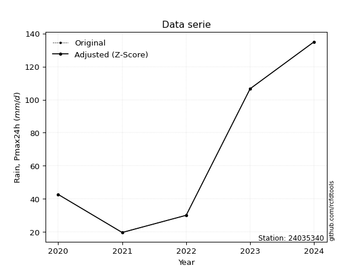</img>

</div>

> If Z-Score is active, values out of range or outliers are replaced with the station mean value.


### 4. Active continuous probability distributions from SciPy (45 of 104 available)

[scipy.stats](https://docs.scipy.org/doc/scipy/reference/stats.html) is a Python´s powerful submodule within the SciPy library for comprehensive statistical analysis, offering over 130 probability distributions (like Normal, Poisson), functions for descriptive stats (mean, variance), hypothesis testing (t-tests, chi-square), random variable generation, and statistical tests, making it essential for data science, modeling, and research. It provides tools to explore, model, and draw conclusions from data efficiently, working seamlessly with NumPy.

<div align="center">

|   id | p_dist             |   n_parameter | fit_method   | label                                                                       | active   | ref                                                                                                        |
|-----:|:-------------------|--------------:|:-------------|:----------------------------------------------------------------------------|:---------|:-----------------------------------------------------------------------------------------------------------|
|    0 | alpha              |             3 | MLE          | Alpha                                                                       | True     | [:mortar_board:](https://docs.scipy.org/doc/scipy/reference/generated/scipy.stats.alpha.html)              |
|    1 | betaprime          |             4 | MLE          | Beta prime                                                                  | True     | [:mortar_board:](https://docs.scipy.org/doc/scipy/reference/generated/scipy.stats.betaprime.html)          |
|    2 | chi2               |             3 | MLE          | Chi²                                                                        | True     | [:mortar_board:](https://docs.scipy.org/doc/scipy/reference/generated/scipy.stats.chi2.html)               |
|    3 | crystalball        |             4 | MLE          | Crystalball                                                                 | True     | [:mortar_board:](https://docs.scipy.org/doc/scipy/reference/generated/scipy.stats.crystalball.html)        |
|    4 | erlang             |             3 | MLE          | Erlang                                                                      | True     | [:mortar_board:](https://docs.scipy.org/doc/scipy/reference/generated/scipy.stats.erlang.html)             |
|    5 | expon              |             2 | MLE          | Exponential                                                                 | True     | [:mortar_board:](https://docs.scipy.org/doc/scipy/reference/generated/scipy.stats.expon.html)              |
|    6 | exponnorm          |             3 | MLE          | Exponentially modified Normal                                               | True     | [:mortar_board:](https://docs.scipy.org/doc/scipy/reference/generated/scipy.stats.exponnorm.html)          |
|    7 | f                  |             4 | MLE          | F                                                                           | True     | [:mortar_board:](https://docs.scipy.org/doc/scipy/reference/generated/scipy.stats.f.html)                  |
|    8 | fatiguelife        |             3 | MLE          | Fatigue-life (Birnbaum-Saunders)                                            | True     | [:mortar_board:](https://docs.scipy.org/doc/scipy/reference/generated/scipy.stats.fatiguelife.html)        |
|    9 | fisk               |             3 | MLE          | Fisk                                                                        | True     | [:mortar_board:](https://docs.scipy.org/doc/scipy/reference/generated/scipy.stats.fisk.html)               |
|   10 | gamma              |             3 | MLE          | Gamma                                                                       | True     | [:mortar_board:](https://docs.scipy.org/doc/scipy/reference/generated/scipy.stats.gamma.html)              |
|   11 | genexpon           |             5 | MLE          | Generalized exponential                                                     | True     | [:mortar_board:](https://docs.scipy.org/doc/scipy/reference/generated/scipy.stats.genexpon.html)           |
|   12 | genlogistic        |             3 | MLE          | Generalized logistic                                                        | True     | [:mortar_board:](https://docs.scipy.org/doc/scipy/reference/generated/scipy.stats.genlogistic.html)        |
|   13 | gibrat             |             2 | MM           | Gibrat                                                                      | True     | [:mortar_board:](https://docs.scipy.org/doc/scipy/reference/generated/scipy.stats.gibrat.html)             |
|   14 | gompertz           |             3 | MLE          | Gompertz (or truncated Gumbel)                                              | True     | [:mortar_board:](https://docs.scipy.org/doc/scipy/reference/generated/scipy.stats.gompertz.html)           |
|   15 | gumbel_l           |             2 | MM           | Gumbel Left Skew                                                            | True     | [:mortar_board:](https://docs.scipy.org/doc/scipy/reference/generated/scipy.stats.gumbel_l.html)           |
|   16 | gumbel_r           |             2 | MM           | Gumbel Right Skew                                                           | True     | [:mortar_board:](https://docs.scipy.org/doc/scipy/reference/generated/scipy.stats.gumbel_r.html)           |
|   17 | halflogistic       |             2 | MM           | Half-logistic                                                               | True     | [:mortar_board:](https://docs.scipy.org/doc/scipy/reference/generated/scipy.stats.halflogistic.html)       |
|   18 | halfnorm           |             2 | MM           | Half Normal                                                                 | True     | [:mortar_board:](https://docs.scipy.org/doc/scipy/reference/generated/scipy.stats.halfnorm.html)           |
|   19 | hypsecant          |             2 | MM           | hyperbolic secant                                                           | True     | [:mortar_board:](https://docs.scipy.org/doc/scipy/reference/generated/scipy.stats.hypsecant.html)          |
|   20 | invgamma           |             3 | MLE          | Inverted gamma                                                              | True     | [:mortar_board:](https://docs.scipy.org/doc/scipy/reference/generated/scipy.stats.invgamma.html)           |
|   21 | invgauss           |             3 | MLE          | Inverse Gaussian                                                            | True     | [:mortar_board:](https://docs.scipy.org/doc/scipy/reference/generated/scipy.stats.invgauss.html)           |
|   22 | invweibull         |             3 | MLE          | Inverted Weibull                                                            | True     | [:mortar_board:](https://docs.scipy.org/doc/scipy/reference/generated/scipy.stats.invweibull.html)         |
|   23 | johnsonsu          |             4 | MLE          | Johnson Su                                                                  | True     | [:mortar_board:](https://docs.scipy.org/doc/scipy/reference/generated/scipy.stats.johnsonsu.html)          |
|   24 | kstwobign          |             2 | MLE          | Limiting distribution of scaled Kolmogorov-Smirnov two-sided test statistic | True     | [:mortar_board:](https://docs.scipy.org/doc/scipy/reference/generated/scipy.stats.kstwobign.html)          |
|   25 | laplace            |             2 | MM           | Laplace                                                                     | True     | [:mortar_board:](https://docs.scipy.org/doc/scipy/reference/generated/scipy.stats.laplace.html)            |
|   26 | laplace_asymmetric |             3 | MLE          | Asymmetric Laplace                                                          | True     | [:mortar_board:](https://docs.scipy.org/doc/scipy/reference/generated/scipy.stats.laplace_asymmetric.html) |
|   27 | loggamma           |             3 | MLE          | Log gamma                                                                   | True     | [:mortar_board:](https://docs.scipy.org/doc/scipy/reference/generated/scipy.stats.loggamma.html)           |
|   28 | logistic           |             2 | MM           | Logistic (or Sech-squared)                                                  | True     | [:mortar_board:](https://docs.scipy.org/doc/scipy/reference/generated/scipy.stats.logistic.html)           |
|   29 | lognorm            |             3 | MLE          | Log Normal                                                                  | True     | [:mortar_board:](https://docs.scipy.org/doc/scipy/reference/generated/scipy.stats.lognorm.html)            |
|   30 | maxwell            |             2 | MM           | Maxwell                                                                     | True     | [:mortar_board:](https://docs.scipy.org/doc/scipy/reference/generated/scipy.stats.maxwell.html)            |
|   31 | mielke             |             4 | MLE          | Mielke Beta-Kappa / Dagum                                                   | True     | [:mortar_board:](https://docs.scipy.org/doc/scipy/reference/generated/scipy.stats.mielke.html)             |
|   32 | moyal              |             2 | MM           | Moyal                                                                       | True     | [:mortar_board:](https://docs.scipy.org/doc/scipy/reference/generated/scipy.stats.moyal.html)              |
|   33 | nakagami           |             3 | MLE          | Nakagami                                                                    | True     | [:mortar_board:](https://docs.scipy.org/doc/scipy/reference/generated/scipy.stats.nakagami.html)           |
|   34 | ncf                |             5 | MLE          | Non-central F distribution                                                  | True     | [:mortar_board:](https://docs.scipy.org/doc/scipy/reference/generated/scipy.stats.ncf.html)                |
|   35 | nct                |             4 | MLE          | Non-central Student’s t                                                     | True     | [:mortar_board:](https://docs.scipy.org/doc/scipy/reference/generated/scipy.stats.nct.html)                |
|   36 | norm               |             2 | MM           | Normal                                                                      | True     | [:mortar_board:](https://docs.scipy.org/doc/scipy/reference/generated/scipy.stats.norm.html)               |
|   37 | pareto             |             3 | MLE          | Pareto                                                                      | True     | [:mortar_board:](https://docs.scipy.org/doc/scipy/reference/generated/scipy.stats.pareto.html)             |
|   38 | pearson3           |             3 | MM           | Pearson type III                                                            | True     | [:mortar_board:](https://docs.scipy.org/doc/scipy/reference/generated/scipy.stats.pearson3.html)           |
|   39 | rayleigh           |             2 | MM           | Rayleigh                                                                    | True     | [:mortar_board:](https://docs.scipy.org/doc/scipy/reference/generated/scipy.stats.rayleigh.html)           |
|   40 | rice               |             3 | MLE          | Rice                                                                        | True     | [:mortar_board:](https://docs.scipy.org/doc/scipy/reference/generated/scipy.stats.rice.html)               |
|   41 | t                  |             3 | MLE          | Student’s t                                                                 | True     | [:mortar_board:](https://docs.scipy.org/doc/scipy/reference/generated/scipy.stats.t.html)                  |
|   42 | truncnorm          |             4 | MLE          | Truncated normal                                                            | True     | [:mortar_board:](https://docs.scipy.org/doc/scipy/reference/generated/scipy.stats.truncnorm.html)          |
|   43 | wald               |             2 | MM           | Wald                                                                        | True     | [:mortar_board:](https://docs.scipy.org/doc/scipy/reference/generated/scipy.stats.wald.html)               |
|   44 | weibull_min        |             3 | MLE          | Weibull minimum                                                             | True     | [:mortar_board:](https://docs.scipy.org/doc/scipy/reference/generated/scipy.stats.weibull_min.html)        |

</div>

> **n_parameter:** # arguments & localization & scale.
>
> **Fit methods:** (MLE) maximum likelihood, (MM) L-moments.
>
>**Inactive:** foldnorm, gennorm, norminvgauss, powernorm, powerlognorm, skewnorm, genextreme, anglit, arcsine, argus, beta, bradford, burr, burr12, cauchy, cosine, halfcauchy, foldcauchy, skewcauchy, wrapcauchy, dgamma, gengamma, exponweib, exponpow, truncexpon, gausshyper, genhalflogistic, genhyperbolic, geninvgauss, halfgennorm, johnsonsb, kappa4, kappa3, ksone, kstwo, loglaplace, levy, levy_l, levy_stable, ncx2, genpareto, truncpareto, lomax, powerlaw, rdist, rel_breitwigner, recipinvgauss, semicircular, studentized_range, trapezoid, triang, truncweibull_min, tukeylambda, uniform, loguniform, vonmises, vonmises_line, weibull_max, dweibull, 


## B. Probability distributions vs. Empirical distributions

A continuous probability distribution (CPD) describes probabilities for variables that can take any value within a range (like rain any time), unlike discrete variables with specific outcomes (like temperature). It uses a Probability Density Function (PDF), a curve where the total area under it equals 1, and the probability of the variable falling within an interval (a to b) is found by calculating the area under the curve between those points. A key feature is that the probability of hitting any single exact value is zero, so probabilities are always expressed for ranges, e.g., $P(a ≤ X ≤ b)$.

<div align="center">

Distributions parameters
|    |   station | p_dist                |   n |              loc |          scale | shape                  | shape1                 | shape2                 | shape3   |
|---:|----------:|:----------------------|----:|-----------------:|---------------:|:-----------------------|:-----------------------|:-----------------------|:---------|
|  0 |  24035340 | alpha                 |   6 |    -44.2051      |  277.502       | 2.8734178163867545     |                        |                        |          |
|  1 |  24035340 | betaprime             |   6 |     -0.1162      |   15.0824      | 9.997323337504799      | 3.1760018984819425     |                        |          |
|  2 |  24035340 | chi2                  |   6 |     19.7         |   24.6686      | 0.31798915631963726    |                        |                        |          |
|  3 |  24035340 | crystalball           |   6 |     65.9667      |   41.6398      | 4915.155762485841      | 2277.0080867545507     |                        |          |
|  4 |  24035340 | erlang                |   6 |     19.7         |   38.671       | 0.771739272369434      |                        |                        |          |
|  5 |  24035340 | expon                 |   6 |     19.7         |   46.2667      |                        |                        |                        |          |
|  6 |  24035340 | exponnorm             |   6 |     19.6659      |    0.0103342   | 4469.315313295241      |                        |                        |          |
|  7 |  24035340 | f                     |   6 |     -0.245994    |   48.8572      | 16.1128516749297       | 6.9238990686615445     |                        |          |
|  8 |  24035340 | fatiguelife           |   6 |     19.7         |    5.39819e-05 | 760.1744874593396      |                        |                        |          |
|  9 |  24035340 | fisk                  |   6 |     19.7         |   29.9266      | 0.7271303051597117     |                        |                        |          |
| 10 |  24035340 | gamma                 |   6 |     19.7         |   55.3558      | 0.15373456735932137    |                        |                        |          |
| 11 |  24035340 | genexpon              |   6 |     19.7         |   98.9298      | 2.138252316845562      | 1.6426950961258356e-11 | 1.531644580237383      |          |
| 12 |  24035340 | genlogistic           |   6 |   -177.113       |   31.3566      | 1253.6842212214278     |                        |                        |          |
| 13 |  24035340 | gibrat                |   6 |     34.2008      |   19.267       |                        |                        |                        |          |
| 14 |  24035340 | gompertz              |   6 |     19.7         |  230.8         | 4.1218208504077865     |                        |                        |          |
| 15 |  24035340 | gumbel_l              |   6 |     84.7068      |   32.4664      |                        |                        |                        |          |
| 16 |  24035340 | gumbel_r              |   6 |     47.2265      |   32.4664      |                        |                        |                        |          |
| 17 |  24035340 | halflogistic          |   6 |     16.6138      |   35.6005      |                        |                        |                        |          |
| 18 |  24035340 | halfnorm              |   6 |     10.8519      |   69.0761      |                        |                        |                        |          |
| 19 |  24035340 | hypsecant             |   6 |     65.9667      |   26.5087      |                        |                        |                        |          |
| 20 |  24035340 | invgamma              |   6 |     -0.984207    |  112.576       | 2.551905475544982      |                        |                        |          |
| 21 |  24035340 | invgauss              |   6 |      9.61287     |   54.9526      | 1.025497726822103      |                        |                        |          |
| 22 |  24035340 | invweibull            |   6 |     19.7         |    1.88873     | 0.04614108786944413    |                        |                        |          |
| 23 |  24035340 | johnsonsu             |   6 |     15.2194      |    0.157061    | -5.369575138215749     | 0.897228975388402      |                        |          |
| 24 |  24035340 | kstwobign             |   6 |    -62.2528      |  146.91        |                        |                        |                        |          |
| 25 |  24035340 | laplace               |   6 |     65.9667      |   29.4438      |                        |                        |                        |          |
| 26 |  24035340 | laplace_asymmetric    |   6 |     19.7         |    0.00681192  | 0.00014722119675093312 |                        |                        |          |
| 27 |  24035340 | loggamma              |   6 | -13395.9         | 1792.56        | 1826.454939629204      |                        |                        |          |
| 28 |  24035340 | logistic              |   6 |     65.9667      |   22.9572      |                        |                        |                        |          |
| 29 |  24035340 | lognorm               |   6 |     19.7         |    0.08425     | 13.796131150319187     |                        |                        |          |
| 30 |  24035340 | maxwell               |   6 |    -32.7022      |   61.8315      |                        |                        |                        |          |
| 31 |  24035340 | mielke                |   6 |     -0.962712    |    1.7489      | 318.37851815940803     | 1.6859307994397446     |                        |          |
| 32 |  24035340 | moyal                 |   6 |     42.1544      |   18.7445      |                        |                        |                        |          |
| 33 |  24035340 | nakagami              |   6 |     19.7         |   49.9929      | 0.28292467395771925    |                        |                        |          |
| 34 |  24035340 | ncf                   |   6 |     -0.410763    |   62.0335      | 5.293453742343488      | 76.44268272083288      | 0.22424870210122752    |          |
| 35 |  24035340 | nct                   |   6 |     -0.294031    |    0.698544    | 1.5517662834116366     | 52.03737117939799      |                        |          |
| 36 |  24035340 | norm                  |   6 |     65.9667      |   41.6398      |                        |                        |                        |          |
| 37 |  24035340 | pareto                |   6 |     19.585       |    0.115041    | 0.20505348136170554    |                        |                        |          |
| 38 |  24035340 | pearson3              |   6 |     65.9667      |   41.6398      | 0.5499231987635742     |                        |                        |          |
| 39 |  24035340 | rayleigh              |   6 |    -13.6927      |   63.559       |                        |                        |                        |          |
| 40 |  24035340 | rice                  |   6 |     -3.16238     |   57.0644      | 0.0008993403785423188  |                        |                        |          |
| 41 |  24035340 | t                     |   6 |     65.9643      |   41.6438      | 5695169.580034521      |                        |                        |          |
| 42 |  24035340 | truncnorm             |   6 |     65.9667      |   41.6398      | -657.5802243687701     | 206.10627362147332     |                        |          |
| 43 |  24035340 | wald                  |   6 |     24.3269      |   41.6398      |                        |                        |                        |          |
| 44 |  24035340 | weibull_min           |   6 |     19.7         |   15.1365      | 0.1600407961532106     |                        |                        |          |
| 45 |  24035340 | logalpha              |   6 |     -5.99813     |  144.971       | 14.601290732214196     |                        |                        |          |
| 46 |  24035340 | logbetaprime          |   6 |     -0.37841     |    4.84589     | 76.24468632289086      | 85.99160037385494      |                        |          |
| 47 |  24035340 | logchi2               |   6 |      2.98062     |    0.945088    | 1.073385106486506      |                        |                        |          |
| 48 |  24035340 | logcrystalball        |   6 |      3.97266     |    0.67476     | 24.573017215917766     | 787.0978650577724      |                        |          |
| 49 |  24035340 | logerlang             |   6 |   -137.237       |    0.00322469  | 43790.34233303729      |                        |                        |          |
| 50 |  24035340 | logexpon              |   6 |      2.98062     |    0.992046    |                        |                        |                        |          |
| 51 |  24035340 | logexponnorm          |   6 |      3.97145     |    0.674759    | 0.0017991449263622472  |                        |                        |          |
| 52 |  24035340 | logf                  |   6 |    -66.4958      |   70.4638      | 82781.67594446713      | 29647.93753767303      |                        |          |
| 53 |  24035340 | logfatiguelife        |   6 |    -24.1098      |   28.0736      | 0.02405146417778653    |                        |                        |          |
| 54 |  24035340 | logfisk               |   6 |    -16.4593      |   20.422       | 49.385652322242876     |                        |                        |          |
| 55 |  24035340 | loggamma              |   6 |   -137.29        |    0.00322364  | 43820.77596679161      |                        |                        |          |
| 56 |  24035340 | loggenexpon           |   6 |      2.97086     |    0.0243844   | 0.013157622742398161   | 2.750122096946227      | 0.00013583677405931867 |          |
| 57 |  24035340 | loggenlogistic        |   6 |      0.371966    |    0.604272    | 222.5976237284026      |                        |                        |          |
| 58 |  24035340 | loggibrat             |   6 |      3.45792     |    0.312208    |                        |                        |                        |          |
| 59 |  24035340 | loggompertz           |   6 |      2.98062     |    1.04026     | 0.4603627022738557     |                        |                        |          |
| 60 |  24035340 | loggumbel_l           |   6 |      4.27634     |    0.526109    |                        |                        |                        |          |
| 61 |  24035340 | loggumbel_r           |   6 |      3.66899     |    0.526109    |                        |                        |                        |          |
| 62 |  24035340 | loghalflogistic       |   6 |      3.17296     |    0.576869    |                        |                        |                        |          |
| 63 |  24035340 | loghalfnorm           |   6 |      3.07956     |    1.11934     |                        |                        |                        |          |
| 64 |  24035340 | loghypsecant          |   6 |      3.97266     |    0.429566    |                        |                        |                        |          |
| 65 |  24035340 | loginvgamma           |   6 |     -6.49011     | 2470.22        | 237.08455356574166     |                        |                        |          |
| 66 |  24035340 | loginvgauss           |   6 |      0.155375    |  115.739       | 0.032931048882998415   |                        |                        |          |
| 67 |  24035340 | loginvweibull         |   6 |     -3.23622e+07 |    3.23622e+07 | 53396264.448477104     |                        |                        |          |
| 68 |  24035340 | logjohnsonsu          |   6 |     41.6286      |    1.65358     | 213.30593014825774     | 55.85363228079879      |                        |          |
| 69 |  24035340 | logkstwobign          |   6 |      1.53998     |    2.77695     |                        |                        |                        |          |
| 70 |  24035340 | loglaplace            |   6 |      3.97266     |    0.477128    |                        |                        |                        |          |
| 71 |  24035340 | loglaplace_asymmetric |   6 |      3.7542      |    0.562258    | 0.8225470258397065     |                        |                        |          |
| 72 |  24035340 | logloggamma           |   6 |    -74.463       |   13.1946      | 382.1397979163453      |                        |                        |          |
| 73 |  24035340 | loglogistic           |   6 |      3.97266     |    0.372015    |                        |                        |                        |          |
| 74 |  24035340 | loglognorm            |   6 |      2.98062     |    0.0028539   | 13.198542928876208     |                        |                        |          |
| 75 |  24035340 | logmaxwell            |   6 |      2.37376     |    1.00196     |                        |                        |                        |          |
| 76 |  24035340 | logmielke             |   6 |     -0.0197643   |    4.08306     | 8.417770455282357      | 10.255370246291438     |                        |          |
| 77 |  24035340 | logmoyal              |   6 |      3.58679     |    0.303749    |                        |                        |                        |          |
| 78 |  24035340 | lognakagami           |   6 |      3.40453     |    0.809236    | 0.23819326054325       |                        |                        |          |
| 79 |  24035340 | logncf                |   6 |     -4.54741     |    0.403304    | 37.25175424179011      | 1432.314944343615      | 748.6429036156383      |          |
| 80 |  24035340 | lognct                |   6 |    -23.6474      |    0.610435    | 4586.534941211712      | 45.23874477049981      |                        |          |
| 81 |  24035340 | lognorm               |   6 |      3.97266     |    0.674761    |                        |                        |                        |          |
| 82 |  24035340 | logpareto             |   6 |      2.97772     |    0.00290289  | 0.2039244065422601     |                        |                        |          |
| 83 |  24035340 | logpearson3           |   6 |      3.97266     |    0.674761    | -0.009699579567438082  |                        |                        |          |
| 84 |  24035340 | lograyleigh           |   6 |      2.68181     |    1.02995     |                        |                        |                        |          |
| 85 |  24035340 | logrice               |   6 |      2.64497     |    0.818422    | 1.1452039315166602     |                        |                        |          |
| 86 |  24035340 | logt                  |   6 |      3.97266     |    0.67476     | 12671297572.990124     |                        |                        |          |
| 87 |  24035340 | logtruncnorm          |   6 |      0.473915    |    1.7009      | 1.7229809116896226     | 4.837540276775689      |                        |          |
| 88 |  24035340 | logwald               |   6 |      3.2979      |    0.674759    |                        |                        |                        |          |
| 89 |  24035340 | logweibull_min        |   6 |      2.71189     |    1.41918     | 1.9243945572751202     |                        |                        |          |

</div>

> **loc** (Location parameter): This shifts the distribution along the x-axis. For many common distributions, like the normal (Gaussian) distribution, loc represents the mean $μ$. For others, like the uniform distribution, it might represent the minimum value, or for the beta distribution, the left end of the support interval.
>
> **scale** (Scale parameter): This determines the width or spread of the distribution. For the normal distribution, scale represents the standard deviation $σ$. For a uniform distribution, it defines the length of the interval (from $loc$ to $loc + scale$).
>
> **shape** (Shape parameters): Refers to parameters that define the specific form of a probability distribution, distinct from its location (loc) and scale (scale). These parameters are required arguments for most distribution functions. For example, a normal (Gaussian) distribution is fully defined by its location (mean) and scale (standard deviation), so it has no specific shape parameters beyond loc and scale. However, other distributions have intrinsic properties that need specification, as Gamma distribution that takes a shape parameter, often named $a$ or $alpha$.


### 0. Cumulative distribution values - CDF (90 evaluated)

> Ordered by x ascending and calculating $log(f(x))$ separately. 

|   id |   Station |   date |     x |   count |    mean |     std |     zscore |   Value_initial |   station |   m |     alpha |   alpha_pdf |   betaprime |   betaprime_pdf |       chi2 |    chi2_pdf |   crystalball |   crystalball_pdf |     erlang |   erlang_pdf |    expon |   expon_pdf |   exponnorm |   exponnorm_pdf |         f |      f_pdf |   fatiguelife |   fatiguelife_pdf |       fisk |     fisk_pdf |      gamma |   gamma_pdf |    genexpon |   genexpon_pdf |   genlogistic |   genlogistic_pdf |   gibrat |   gibrat_pdf |    gompertz |   gompertz_pdf |   gumbel_l |   gumbel_l_pdf |   gumbel_r |   gumbel_r_pdf |   halflogistic |   halflogistic_pdf |   halfnorm |   halfnorm_pdf |   hypsecant |   hypsecant_pdf |   invgamma |   invgamma_pdf |   invgauss |   invgauss_pdf |   invweibull |   invweibull_pdf |   johnsonsu |   johnsonsu_pdf |   kstwobign |   kstwobign_pdf |   laplace |   laplace_pdf |   laplace_asymmetric |   laplace_asymmetric_pdf |   loggamma |   loggamma_pdf |   logistic |   logistic_pdf |   lognorm |   lognorm_pdf |   maxwell |   maxwell_pdf |   mielke |   mielke_pdf |     moyal |   moyal_pdf |    nakagami |   nakagami_pdf |       ncf |    ncf_pdf |       nct |    nct_pdf |     norm |   norm_pdf |   pareto |   pareto_pdf |   pearson3 |   pearson3_pdf |   rayleigh |   rayleigh_pdf |      rice |   rice_pdf |        t |      t_pdf |   truncnorm |   truncnorm_pdf |      wald |   wald_pdf |   weibull_min |   weibull_min_pdf |   logalpha |   logalpha_pdf |   logbetaprime |   logbetaprime_pdf |     logchi2 |   logchi2_pdf |   logcrystalball |   logcrystalball_pdf |   logerlang |   logerlang_pdf |   logexpon |   logexpon_pdf |   logexponnorm |   logexponnorm_pdf |      logf |   logf_pdf |   logfatiguelife |   logfatiguelife_pdf |   logfisk |   logfisk_pdf |   loggenexpon |   loggenexpon_pdf |   loggenlogistic |   loggenlogistic_pdf |   loggibrat |   loggibrat_pdf |   loggompertz |   loggompertz_pdf |   loggumbel_l |   loggumbel_l_pdf |   loggumbel_r |   loggumbel_r_pdf |   loghalflogistic |   loghalflogistic_pdf |   loghalfnorm |   loghalfnorm_pdf |   loghypsecant |   loghypsecant_pdf |   loginvgamma |   loginvgamma_pdf |   loginvgauss |   loginvgauss_pdf |   loginvweibull |   loginvweibull_pdf |   logjohnsonsu |   logjohnsonsu_pdf |   logkstwobign |   logkstwobign_pdf |   loglaplace |   loglaplace_pdf |   loglaplace_asymmetric |   loglaplace_asymmetric_pdf |   logloggamma |   logloggamma_pdf |   loglogistic |   loglogistic_pdf |   loglognorm |   loglognorm_pdf |   logmaxwell |   logmaxwell_pdf |   logmielke |   logmielke_pdf |   logmoyal |   logmoyal_pdf |   lognakagami |   lognakagami_pdf |    logncf |   logncf_pdf |    lognct |   lognct_pdf |   logpareto |   logpareto_pdf |   logpearson3 |   logpearson3_pdf |   lograyleigh |   lograyleigh_pdf |   logrice |   logrice_pdf |      logt |   logt_pdf |   logtruncnorm |   logtruncnorm_pdf |   logwald |   logwald_pdf |   logweibull_min |   logweibull_min_pdf |
|-----:|----------:|-------:|------:|--------:|--------:|--------:|-----------:|----------------:|----------:|----:|----------:|------------:|------------:|----------------:|-----------:|------------:|--------------:|------------------:|-----------:|-------------:|---------:|------------:|------------:|----------------:|----------:|-----------:|--------------:|------------------:|-----------:|-------------:|-----------:|------------:|------------:|---------------:|--------------:|------------------:|---------:|-------------:|------------:|---------------:|-----------:|---------------:|-----------:|---------------:|---------------:|-------------------:|-----------:|---------------:|------------:|----------------:|-----------:|---------------:|-----------:|---------------:|-------------:|-----------------:|------------:|----------------:|------------:|----------------:|----------:|--------------:|---------------------:|-------------------------:|-----------:|---------------:|-----------:|---------------:|----------:|--------------:|----------:|--------------:|---------:|-------------:|----------:|------------:|------------:|---------------:|----------:|-----------:|----------:|-----------:|---------:|-----------:|---------:|-------------:|-----------:|---------------:|-----------:|---------------:|----------:|-----------:|---------:|-----------:|------------:|----------------:|----------:|-----------:|--------------:|------------------:|-----------:|---------------:|---------------:|-------------------:|------------:|--------------:|-----------------:|---------------------:|------------:|----------------:|-----------:|---------------:|---------------:|-------------------:|----------:|-----------:|-----------------:|---------------------:|----------:|--------------:|--------------:|------------------:|-----------------:|---------------------:|------------:|----------------:|--------------:|------------------:|--------------:|------------------:|--------------:|------------------:|------------------:|----------------------:|--------------:|------------------:|---------------:|-------------------:|--------------:|------------------:|--------------:|------------------:|----------------:|--------------------:|---------------:|-------------------:|---------------:|-------------------:|-------------:|-----------------:|------------------------:|----------------------------:|--------------:|------------------:|--------------:|------------------:|-------------:|-----------------:|-------------:|-----------------:|------------:|----------------:|-----------:|---------------:|--------------:|------------------:|----------:|-------------:|----------:|-------------:|------------:|----------------:|--------------:|------------------:|--------------:|------------------:|----------:|--------------:|----------:|-----------:|---------------:|-------------------:|----------:|--------------:|-----------------:|---------------------:|
|    0 |  24035340 |   2021 |  19.7 |       6 | 65.9667 | 45.6141 | -1.01431   |            19.7 |  24035340 |   1 | 0.0710618 |  0.00923417 |   0.0633475 |      0.0106738  | 0.00291657 | 1.30525e+11 |      0.133259 |        0.00516792 | 4.5498e-13 | 98.8332      | 0        |  0.0216138  | 0.000738406 |      0.0216247  | 0.0653802 | 0.0104548  |     0.0401921 |       2.47504e+09 | 2.6308e-12 | 538.444      | 0.00347782 | 1.50494e+11 | 6.54999e-14 |     0.0216138  |     0.0949434 |        0.00712232 | 0        |   0          | 1.58618e-15 |     0.0178588  |   0.126308 |     0.00363367 |  0.0968478 |     0.00696419 |      0.0433172 |         0.0140184  |   0.101924 |     0.0114564  |    0.110036 |      0.00406875 |  0.0570713 |     0.0114448  |   0.048498 |     0.0147188  |   0.00839343 |      5.21102e+11 |   0.0408523 |      0.0175432  |   0.0852789 |      0.00721009 |  0.103882 |    0.00352813 |          2.16854e-08 |               0.0216123  |  0.0705226 |       0.201053 |   0.117601 |     0.0045202  | 0.0707513 |      0.200626 |  0.131098 |    0.00647205 |      nan |          nan | 0.0687251 |  0.00739105 | 5.66219e-10 | 90183.1        | 0.0868718 | 0.00886977 | 0.0491807 | 0.0134199  | 0.133259 | 0.00516792 | 0        |  1.78244     |   0.12391  |     0.00627606 |   0.128912 |     0.00720045 | 0.0771207 | 0.00647941 | 0.133294 | 0.00516836 |    0.133259 |      0.00516792 | 0         | 0          |    0.00314748 |       1.41563e+11 |   0.061199 |       0.217555 |       0.060136 |           0.223555 | 6.68619e-09 |   4.04021e+06 |        0.0707512 |             0.200626 |   0.0705186 |        0.201049 |   0        |       1.00802  |       0.070751 |           0.200626 | 0.0697788 |   0.201858 |        0.0691227 |             0.204111 | 0.0806271 |      0.188312 |    0.00528217 |          0.54284  |        0.0523536 |             0.253877 |    0        |       0         |   1.28066e-09 |          0.442547 |     0.0816644 |          0.148705 |     0.0247162 |          0.173837 |          0        |              0        |      0        |          0        |      0.0630221 |           0.145754 |      0.064914 |          0.212616 |     0.0578698 |          0.229374 |       0.0521446 |            0.254128 |      0.0721442 |           0.198409 |      0.0493548 |           0.279823 |    0.0625149 |         0.131023 |                0.075765 |                    0.163822 |     0.0723733 |          0.198966 |     0.0649683 |          0.163293 |    0.0127269 |      5.60727e+12 |    0.0529941 |         0.243164 |   0.0722456 |        0.194439 | 0.00668052 |       0.089993 |   0           |        0          | 0.0673789 |     0.20927  | 0.0702444 |     0.201907 |    0        |      70.2488    |     0.0710043 |          0.200226 |     0.0412117 |          0.270074 | 0.0430152 |      0.252493 | 0.0707509 |   0.200625 |    0           |           0        | 0         |      0        |        0.0398476 |             0.279589 |
|    1 |  24035340 |   2022 |  30.1 |       6 | 65.9667 | 45.6141 | -0.786306  |            30.1 |  24035340 |   2 | 0.194956  |  0.0138665  |   0.204963  |      0.0152957  | 0.816414   | 0.0103934   |      0.194521 |        0.00661139 | 0.350418   |  0.0222699   | 0.201311 |  0.0172627  | 0.20221     |      0.017273   | 0.203057  | 0.014893   |     0.718165  |       0.00937418  | 0.316796   |   0.0151324  | 0.81015    | 0.0101668   | 0.201311    |     0.0172627  |     0.184462  |        0.00993691 | 0        |   0          | 0.173024    |     0.0154495  |   0.169736 |     0.00475687 |  0.183651  |     0.00958642 |      0.187176  |         0.0135527  |   0.219487 |     0.011111   |    0.161017 |      0.00581837 |  0.212459  |     0.0166381  |   0.238391 |     0.0185244  |   0.396807   |      0.00162723  |   0.253285  |      0.0192919  |   0.17575   |      0.00997885 |  0.14789  |    0.00502279 |          0.201298    |               0.0172618  |  0.20006   |       0.416061 |   0.173313 |     0.00624099 | 0.199898  |      0.414778 |  0.206404 |    0.00794769 |      nan |          nan | 0.167816  |  0.0113394  | 0.318793    |     0.0171802  | 0.193798  | 0.0113181  | 0.239562  | 0.0197088  | 0.194521 | 0.00661139 | 0.603815 |  0.007726    |   0.198529 |     0.00801523 |   0.211298 |     0.0085499  | 0.156235  | 0.00861874 | 0.19456  | 0.00661155 |    0.194521 |      0.00661139 | 0.0185852 | 0.0127796  |    0.610037   |       0.00565113  |   0.207004 |       0.468596 |       0.210772 |           0.482891 | 0.467858    |   0.510766    |        0.199898  |             0.414778 |   0.200056  |        0.416066 |   0.347736 |       0.657494 |       0.199898 |           0.414778 | 0.200221  |   0.419241 |        0.201372  |             0.424817 | 0.202858  |      0.402036 |    0.254002   |          0.605542 |        0.23051   |             0.557947 |    0        |       0         |   0.206728    |          0.527664 |     0.173612  |          0.299528 |     0.191449  |          0.601569 |          0.198056 |              0.832748 |      0.228426 |          0.683404 |      0.165773  |           0.368698 |      0.205025 |          0.449834 |     0.213605  |          0.497358 |       0.230473  |            0.558093 |      0.199176  |           0.407689 |      0.241892  |           0.580305 |    0.151997  |         0.318566 |                0.189469 |                    0.409677 |     0.199672  |          0.408284 |     0.178405  |          0.394007 |    0.647616  |      0.0663652   |    0.212854  |         0.49647  |   0.200654  |        0.423555 | 0.177048   |       0.712861 |   4.19874e-08 |        4.5041e+07 | 0.203799  |     0.437383 | 0.200481  |     0.418254 |    0.638579 |       0.172683  |     0.199766  |          0.413488 |     0.218227  |          0.532615 | 0.206544  |      0.498566 | 0.199897  |   0.414778 |    1.29018e-09 |           1.25246  | 0.0303005 |      0.998802 |        0.222346  |             0.543334 |
|    2 |  24035340 |   2020 |  42.7 |       6 | 65.9667 | 45.6141 | -0.510076  |            42.7 |  24035340 |   3 | 0.375343  |  0.0139562  |   0.393273  |      0.013881   | 0.898251   | 0.00413006  |      0.288163 |        0.00819606 | 0.567911   |  0.0134132   | 0.391719 |  0.0131473  | 0.392689    |      0.013149   | 0.38814   | 0.0137835  |     0.804738  |       0.0051508   | 0.452291   |   0.00783163 | 0.890987   | 0.00413644  | 0.391719    |     0.0131473  |     0.322635  |        0.0116343  | 0.206559 |   0.0335802  | 0.350736    |     0.0128101  |   0.239829 |     0.00642042 |  0.31676   |     0.0112162  |      0.350815  |         0.0123162  |   0.355243 |     0.0103861  |    0.250828 |      0.00851282 |  0.410692  |     0.0141206  |   0.440815 |     0.0134878  |   0.410217   |      0.000733306 |   0.454688  |      0.012941   |   0.312858  |      0.0114304  |  0.226876 |    0.00770538 |          0.391697    |               0.0131468  |  0.373625  |       0.561848 |   0.2663   |     0.00851079 | 0.373057  |      0.561045 |  0.314755 |    0.00912331 |      nan |          nan | 0.324354  |  0.0129062  | 0.494363    |     0.0116062  | 0.341559  | 0.0117707  | 0.455898  | 0.0141738  | 0.288163 | 0.00819606 | 0.662905 |  0.00299037  |   0.309519 |     0.00945053 |   0.32538  |     0.00941734 | 0.275999  | 0.0101968  | 0.2882   | 0.00819578 |    0.288163 |      0.00819606 | 0.31107   | 0.0229478  |    0.656735   |       0.00255395  |   0.395876 |       0.58727  |       0.403698 |           0.594278 | 0.608795    |   0.321253    |        0.373057  |             0.561045 |   0.373624  |        0.561861 |   0.541495 |       0.462182 |       0.373057 |           0.561046 | 0.374843  |   0.564123 |        0.377654  |             0.567071 | 0.375961  |      0.57321  |    0.459447   |          0.55713  |        0.438711  |             0.597069 |    0.479117 |       1.34467   |   0.398333    |          0.560115 |     0.309723  |          0.486325 |     0.427215  |          0.690604 |          0.46509  |              0.679262 |      0.453298 |          0.594427 |      0.344675  |           0.654519 |      0.388608 |          0.579291 |     0.410033  |          0.597978 |       0.438572  |            0.596434 |      0.370039  |           0.556292 |      0.451548  |           0.587514 |    0.316313  |         0.662952 |                0.403551 |                    0.872567 |     0.370665  |          0.556363 |     0.357266  |          0.617252 |    0.664387  |      0.0357071   |    0.406186  |         0.585115 |   0.38083   |        0.587415 | 0.447768   |       0.747441 |   0.51973     |        0.683039   | 0.38356   |     0.572144 | 0.374709  |     0.563053 |    0.6801   |       0.0840139 |     0.37251   |          0.560195 |     0.418446  |          0.587905 | 0.399342  |      0.582988 | 0.373057  |   0.561046 |    0.366434    |           0.860508 | 0.500262  |      0.983907 |        0.424288  |             0.586891 |
|    3 |  24035340 |   2025 |  61.7 |       6 | 65.9667 | 45.6141 | -0.0935383 |            61.7 |  24035340 |   4 | 0.601135  |  0.00957882 |   0.609954  |      0.00899133 | 0.948881   | 0.00169343  |      0.459193 |        0.00953063 | 0.755794   |  0.00715251  | 0.596582 |  0.00871942 | 0.59751     |      0.00871435 | 0.60582   | 0.00913065 |     0.877046  |       0.00281094  | 0.5613     |   0.0042631  | 0.942534   | 0.00176297  | 0.596581    |     0.00871942 |     0.539405  |        0.0106161  | 0.638991 |   0.0136178  | 0.560735    |     0.00941044 |   0.388791 |     0.00926829 |  0.527127  |     0.0103962  |      0.560268  |         0.00963609 |   0.53834  |     0.00880941 |    0.448987 |      0.0118539  |  0.623462  |     0.00855122 |   0.638082 |     0.00784324 |   0.420357   |      0.000400222 |   0.639721  |      0.00722359 |   0.525115  |      0.010447   |  0.432551 |    0.0146907  |          0.596556    |               0.00871936 |  0.58834   |       0.576224 |   0.45367  |     0.0107963  | 0.587741  |      0.576878 |  0.493394 |    0.00937782 |      nan |          nan | 0.552708  |  0.0105942  | 0.674866    |     0.00777022 | 0.549205  | 0.00977825 | 0.653868  | 0.00743081 | 0.459193 | 0.00953063 | 0.701923 |  0.0014513   |   0.495446 |     0.00974437 |   0.505158 |     0.00923511 | 0.475856  | 0.0104403  | 0.45922  | 0.00952978 |    0.459193 |      0.00953063 | 0.623875  | 0.0112017  |    0.691929   |       0.00138218  |   0.608966 |       0.543476 |       0.617073 |           0.53865  | 0.706825    |   0.22078     |        0.587741  |             0.576878 |   0.588345  |        0.576236 |   0.683623 |       0.318914 |       0.587741 |           0.576878 | 0.589772  |   0.574997 |        0.592507  |             0.571659 | 0.594955  |      0.578242 |    0.645441   |          0.446984 |        0.638625  |             0.473455 |    0.774924 |       0.451515  |   0.60115     |          0.528934 |     0.525812  |          0.672515 |     0.655417  |          0.526322 |          0.676604 |              0.469956 |      0.648432 |          0.461893 |      0.608693  |           0.698221 |      0.602722 |          0.556054 |     0.622255  |          0.530181 |       0.638236  |            0.472874 |      0.584414  |           0.580183 |      0.647215  |           0.46459  |    0.634589  |         0.765856 |                0.651893 |                    0.509258 |     0.584923  |          0.579514 |     0.599213  |          0.645557 |    0.67507   |      0.0238834   |    0.615316  |         0.528976 |   0.60002   |        0.564938 | 0.678747   |       0.499262 |   0.713031    |        0.4063     | 0.597503  |     0.562124 | 0.5894    |     0.574865 |    0.704437 |       0.0526597 |     0.587142  |          0.577487 |     0.623944  |          0.510649 | 0.609303  |      0.536503 | 0.587741  |   0.576879 |    0.623587    |           0.553772 | 0.743637  |      0.429095 |        0.627727  |             0.501912 |
|    4 |  24035340 |   2023 | 106.6 |       6 | 65.9667 | 45.6141 |  0.890806  |           106.6 |  24035340 |   5 | 0.850991  |  0.00286013 |   0.848329  |      0.00285965 | 0.986539   | 0.000369799 |      0.835426 |        0.00595147 | 0.931836   |  0.00189728  | 0.847141 |  0.00330386 | 0.847748    |      0.00329642 | 0.84964   | 0.00292922 |     0.952447  |       0.000951507 | 0.684629   |   0.00180663 | 0.983174   | 0.000423406 | 0.847141    |     0.00330386 |     0.86289   |        0.00405787 | 0.907216 |   0.00229423 | 0.848093    |     0.00395319 |   0.859525 |     0.00849228 |  0.851623  |     0.00421299 |      0.852117  |         0.00384681 |   0.834291 |     0.00441976 |    0.864617 |      0.00495452 |  0.845738  |     0.00265643 |   0.84886  |     0.00267219 |   0.43255    |      0.000192477 |   0.832536  |      0.00246074 |   0.857626  |      0.0044507  |  0.874215 |    0.00427205 |          0.847121    |               0.00330407 |  0.848954  |       0.345981 |   0.854453 |     0.00541718 | 0.848987  |      0.347096 |  0.833663 |    0.00517669 |      nan |          nan | 0.857753  |  0.00375391 | 0.902257    |     0.0029431  | 0.847969  | 0.00395062 | 0.839854  | 0.00220932 | 0.835425 | 0.00595147 | 0.743136 |  0.000605308 |   0.838919 |     0.00500626 |   0.833206 |     0.00496667 | 0.842746  | 0.0053006  | 0.835416 | 0.00595112 |    0.835426 |      0.00595147 | 0.882784  | 0.00271097 |    0.733592   |       0.000648975 |   0.843969 |       0.304917 |       0.847686 |           0.296679 | 0.802552    |   0.137906    |        0.848987  |             0.347096 |   0.848961  |        0.345978 |   0.817682 |       0.18378  |       0.848987 |           0.347096 | 0.848968  |   0.343318 |        0.84887   |             0.338564 | 0.842827  |      0.309636 |    0.837885   |          0.259627 |        0.833984  |             0.250451 |    0.912398 |       0.131409  |   0.846364    |          0.34464  |     0.878714  |          0.486335 |     0.861199  |          0.244604 |          0.860887 |              0.224378 |      0.844408 |          0.26007  |      0.875768  |           0.281917 |      0.846803 |          0.318883 |     0.847762  |          0.289596 |       0.833461  |            0.250514 |      0.84912   |           0.353374 |      0.842251  |           0.255663 |    0.883836  |         0.243465 |                0.843575 |                    0.22884  |     0.849185  |          0.352691 |     0.866692  |          0.310571 |    0.685667  |      0.015926    |    0.84548   |         0.303047 |   0.837023  |        0.292814 | 0.866287   |       0.218032 |   0.874097    |        0.203627   | 0.847015  |     0.328283 | 0.848836  |     0.343996 |    0.727061 |       0.0329077 |     0.849012  |          0.348219 |     0.844552  |          0.29121  | 0.845737  |      0.314229 | 0.848987  |   0.347096 |    0.839267    |           0.263887 | 0.888939  |      0.157041 |        0.843745  |             0.285189 |
|    5 |  24035340 |   2024 | 135   |       6 | 65.9667 | 45.6141 |  1.51342   |           135   |  24035340 |   6 | 0.909244  |  0.00143611 |   0.907984  |      0.00151095 | 0.993686   | 0.000163941 |      0.951328 |        0.00242418 | 0.968886   |  0.000853401 | 0.917262 |  0.00178829 | 0.917678    |      0.00178237 | 0.910518  | 0.00153303 |     0.972732  |       0.000523976 | 0.727256   |   0.00125091 | 0.991578   | 0.000199533 | 0.917262    |     0.00178829 |     0.942126  |        0.00179117 | 0.951011 |   0.00100663 | 0.930814    |     0.00203623 |   0.99097  |     0.00130928 |  0.935224  |     0.00192912 |      0.93058   |         0.00188228 |   0.927706 |     0.00229716 |    0.952999 |      0.00176662 |  0.901694  |     0.00143826 |   0.906473 |     0.00151605 |   0.437274   |      0.000144751 |   0.886294  |      0.00144228 |   0.945658  |      0.00198651 |  0.952056 |    0.00162831 |          0.917247    |               0.00178848 |  0.916303  |       0.226939 |   0.952891 |     0.00195535 | 0.916535  |      0.227481 |  0.938631 |    0.0023988  |      nan |          nan | 0.933035  |  0.00178207 | 0.96119     |     0.00135885 | 0.928605  | 0.00193618 | 0.887269  | 0.0012526  | 0.951328 | 0.00242418 | 0.75759  |  0.00043068  |   0.938933 |     0.00226208 |   0.935203 |     0.002385   | 0.946657  | 0.00226325 | 0.951318 | 0.00242436 |    0.951328 |      0.00242418 | 0.937222  | 0.0013184  |    0.749417   |       0.000481369 |   0.904105 |       0.207535 |       0.906129 |           0.201557 | 0.83226     |   0.114544    |        0.916535  |             0.227481 |   0.916308  |        0.226932 |   0.856309 |       0.144843 |       0.916535 |           0.22748  | 0.915829  |   0.225546 |        0.914886  |             0.223236 | 0.902773  |      0.202895 |    0.890853   |          0.190832 |        0.88442   |             0.179716 |    0.937464 |       0.0850102 |   0.915244    |          0.23859  |     0.963301  |          0.230541 |     0.909026  |          0.164803 |          0.905415 |              0.156208 |      0.897123 |          0.188489 |      0.927701  |           0.166863 |      0.909379 |          0.214082 |     0.904961  |          0.198066 |       0.883932  |            0.179936 |      0.917794  |           0.230567 |      0.893992  |           0.184966 |    0.929192  |         0.148405 |                0.889276 |                    0.161983 |     0.917737  |          0.230221 |     0.924625  |          0.18734  |    0.689179  |      0.013904    |    0.905627  |         0.208926 |   0.894038  |        0.194916 | 0.909128   |       0.148935 |   0.915202    |        0.146798   | 0.911316  |     0.219107 | 0.915836  |     0.226013 |    0.73424  |       0.0281158 |     0.916762  |          0.228035 |     0.902725  |          0.20389  | 0.908006  |      0.215434 | 0.916535  |   0.227481 |    0.891887    |           0.18556  | 0.919769  |      0.107689 |        0.900871  |             0.201022 |

An Empirical Distribution Function (EDF) is a step-function estimate of a true cumulative distribution function (CDF) based on observed sample data, representing the proportion of data points less than or equal to a given value. It is calculated by ordering your data and jumping up by $1/n$ (where $n$ is sample size) at each unique data point, allowing analysis without assuming an underlying population distribution, and it gets closer to the true CDF as the sample size grows.


### 1. Empirical - EDF California (1923)

California´s estimates the true probability distribution of water-related data (like rainfall, streamflow) using observed samples, crucial for risk assessment.

<div align="center">


$P=m/n$


</div>


**1.1. Empirical values**

<div align="center">

|                | 0                   | 1                  | 2              | 3                  | 4                  | 5              |
|:---------------|:--------------------|:-------------------|:---------------|:-------------------|:-------------------|:---------------|
| date           | 2021                | 2022               | 2020           | 2025               | 2023               | 2024           |
| x              | 19.7                | 30.1               | 42.7           | 61.7               | 106.6              | 135.0          |
| m              | 1                   | 2                  | 3              | 4                  | 5                  | 6              |
| empirical_dist | edf_california      | edf_california     | edf_california | edf_california     | edf_california     | edf_california |
| empirical      | 0.16666666666666666 | 0.3333333333333333 | 0.5            | 0.6666666666666666 | 0.8333333333333334 | 1.0            |
| empirical_tr   | 1.2                 | 1.4999999999999998 | 2.0            | 2.9999999999999996 | 6.000000000000002  | inf            |

</div>


**1.2. Kolmogorov-Smirnov fit test (sorted by Δ)**


<div align="center">

|                | 0                   | 1                   | 2                   | 3                   | 4                   | 5                   | 6                   | 7                   | 8                   | 9                  | 10                 | 11                  | 12                  | 13                  | 14                  | 15                  | 16                 | 17                  | 18                  | 19                 | 20                 | 21                  | 22                 | 23                 | 24                 | 25                  | 26                  | 27                  | 28                  | 29                  | 30                 | 31                 | 32                  | 33                  | 34                  | 35                  | 36                    | 37                 | 38                 | 39                 | 40                  | 41                  | 42                 | 43                  | 44                  | 45                 | 46                  | 47                 | 48                  | 49                  | 50                  | 51                  | 52                  | 53                  | 54                  | 55                  | 56                  | 57                  | 58                  | 59                  | 60                  | 61                  | 62                  | 63                  | 64                | 65                 | 66                  | 67                 | 68                 | 69                 | 70                 | 71                  | 72                  | 73                  | 74                 | 75                 | 76                 | 77                 | 78                  | 79                 | 80                 | 81                  | 82                  | 83                 | 84                 | 85                | 86                 | 87                 | 88                 | 89             |
|:---------------|:--------------------|:--------------------|:--------------------|:--------------------|:--------------------|:--------------------|:--------------------|:--------------------|:--------------------|:-------------------|:-------------------|:--------------------|:--------------------|:--------------------|:--------------------|:--------------------|:-------------------|:--------------------|:--------------------|:-------------------|:-------------------|:--------------------|:-------------------|:-------------------|:-------------------|:--------------------|:--------------------|:--------------------|:--------------------|:--------------------|:-------------------|:-------------------|:--------------------|:--------------------|:--------------------|:--------------------|:----------------------|:-------------------|:-------------------|:-------------------|:--------------------|:--------------------|:-------------------|:--------------------|:--------------------|:-------------------|:--------------------|:-------------------|:--------------------|:--------------------|:--------------------|:--------------------|:--------------------|:--------------------|:--------------------|:--------------------|:--------------------|:--------------------|:--------------------|:--------------------|:--------------------|:--------------------|:--------------------|:--------------------|:------------------|:-------------------|:--------------------|:-------------------|:-------------------|:-------------------|:-------------------|:--------------------|:--------------------|:--------------------|:-------------------|:-------------------|:-------------------|:-------------------|:--------------------|:-------------------|:-------------------|:--------------------|:--------------------|:-------------------|:-------------------|:------------------|:-------------------|:-------------------|:-------------------|:---------------|
| station        | 24035340            | 24035340            | 24035340            | 24035340            | 24035340            | 24035340            | 24035340            | 24035340            | 24035340            | 24035340           | 24035340           | 24035340            | 24035340            | 24035340            | 24035340            | 24035340            | 24035340           | 24035340            | 24035340            | 24035340           | 24035340           | 24035340            | 24035340           | 24035340           | 24035340           | 24035340            | 24035340            | 24035340            | 24035340            | 24035340            | 24035340           | 24035340           | 24035340            | 24035340            | 24035340            | 24035340            | 24035340              | 24035340           | 24035340           | 24035340           | 24035340            | 24035340            | 24035340           | 24035340            | 24035340            | 24035340           | 24035340            | 24035340           | 24035340            | 24035340            | 24035340            | 24035340            | 24035340            | 24035340            | 24035340            | 24035340            | 24035340            | 24035340            | 24035340            | 24035340            | 24035340            | 24035340            | 24035340            | 24035340            | 24035340          | 24035340           | 24035340            | 24035340           | 24035340           | 24035340           | 24035340           | 24035340            | 24035340            | 24035340            | 24035340           | 24035340           | 24035340           | 24035340           | 24035340            | 24035340           | 24035340           | 24035340            | 24035340            | 24035340           | 24035340           | 24035340          | 24035340           | 24035340           | 24035340           | 24035340       |
| empirical_dist | edf_california      | edf_california      | edf_california      | edf_california      | edf_california      | edf_california      | edf_california      | edf_california      | edf_california      | edf_california     | edf_california     | edf_california      | edf_california      | edf_california      | edf_california      | edf_california      | edf_california     | edf_california      | edf_california      | edf_california     | edf_california     | edf_california      | edf_california     | edf_california     | edf_california     | edf_california      | edf_california      | edf_california      | edf_california      | edf_california      | edf_california     | edf_california     | edf_california      | edf_california      | edf_california      | edf_california      | edf_california        | edf_california     | edf_california     | edf_california     | edf_california      | edf_california      | edf_california     | edf_california      | edf_california      | edf_california     | edf_california      | edf_california     | edf_california      | edf_california      | edf_california      | edf_california      | edf_california      | edf_california      | edf_california      | edf_california      | edf_california      | edf_california      | edf_california      | edf_california      | edf_california      | edf_california      | edf_california      | edf_california      | edf_california    | edf_california     | edf_california      | edf_california     | edf_california     | edf_california     | edf_california     | edf_california      | edf_california      | edf_california      | edf_california     | edf_california     | edf_california     | edf_california     | edf_california      | edf_california     | edf_california     | edf_california      | edf_california      | edf_california     | edf_california     | edf_california    | edf_california     | edf_california     | edf_california     | edf_california |
| p_dist         | loggenlogistic      | loginvweibull       | logkstwobign        | nct                 | invgauss            | loginvgauss         | logmaxwell          | invgamma            | logbetaprime        | lograyleigh        | johnsonsu          | logalpha            | logrice             | logweibull_min      | loginvgamma         | betaprime           | logncf             | f                   | logfisk             | logfatiguelife     | logmielke          | lognct              | logf               | loggamma           | loggamma           | logerlang           | lognorm             | lognorm             | logcrystalball      | logexponnorm        | logt               | logpearson3        | logloggamma         | logjohnsonsu        | alpha               | loggumbel_r         | loglaplace_asymmetric | halfnorm           | halflogistic       | loglogistic        | ncf                 | logmoyal            | loggenexpon        | exponnorm           | laplace_asymmetric  | loggompertz        | nakagami            | erlang             | genexpon            | gompertz            | loghalfnorm         | expon               | logexpon            | loghalflogistic     | loghypsecant        | logchi2             | rayleigh            | moyal               | genlogistic         | gumbel_r            | loglaplace          | maxwell             | kstwobign           | loggumbel_l         | pearson3          | t                  | truncnorm           | crystalball        | norm               | rice               | logistic           | hypsecant           | pareto              | fisk                | laplace            | weibull_min        | gumbel_l           | logwald            | logpareto           | loglognorm         | wald               | lognakagami         | logtruncnorm        | gibrat             | loggibrat          | fatiguelife       | gamma              | chi2               | invweibull         | mielke         |
| delta          | 0.11557977887003268 | 0.11606779112000853 | 0.11731183510431947 | 0.11748599479176042 | 0.11816869635547489 | 0.11972788922963407 | 0.12047960987600945 | 0.12087402211786188 | 0.12256176553040535 | 0.1254549581850699 | 0.1258143166789835 | 0.12632928315601233 | 0.12678967091293566 | 0.12681902121621028 | 0.12830817155095003 | 0.12837055951233367 | 0.1295346311913482 | 0.13027620983428254 | 0.13047557185200256 | 0.1319617896214489 | 0.1326798157166854 | 0.13285199292900077 | 0.1331120749203217 | 0.1332734225438591 | 0.1332734225438591 | 0.13327746815919997 | 0.13343541382881918 | 0.13343541382881918 | 0.13343551233974504 | 0.13343578936454795 | 0.1334360766888228 | 0.1335673419993423 | 0.13366163215661933 | 0.13415685117059217 | 0.13837718962749299 | 0.14195043840740543 | 0.1438646194706906    | 0.1447569595116523 | 0.1491847489296786 | 0.1549286537818817 | 0.15844112127731896 | 0.15998614705492878 | 0.1613844989073497 | 0.16592826106368477 | 0.16666664498123365 | 0.1666666653860087 | 0.16666666610044745 | 0.1666666666662117 | 0.16666666666660115 | 0.16666666666666508 | 0.16666666666666666 | 0.16666666666666666 | 0.16666666666666666 | 0.16666666666666666 | 0.16756060317816282 | 0.16773996646313083 | 0.17461969234421393 | 0.17564638488767492 | 0.17736479327571392 | 0.18323958824458814 | 0.18368693906157796 | 0.18524482897917366 | 0.18714170808711228 | 0.19027677758089956 | 0.190481054072628 | 0.2117996099550033 | 0.21183733932200188 | 0.2118373704048367 | 0.2118373758170311 | 0.2240008878042763 | 0.2337004951702601 | 0.24917180581892096 | 0.27048131962024996 | 0.27274383099126487 | 0.2731244667028627 | 0.2767040231825138 | 0.2778755712584523 | 0.3030328569392037 | 0.30524558613362757 | 0.3142827822074891 | 0.3147481345053121 | 0.33333329134598033 | 0.33333333204315513 | 0.3333333333333333 | 0.3333333333333333 | 0.384832155895344 | 0.4768170010401645 | 0.4830811484314856 | 0.5627257574147471 | nan            |
| deltao         | 0.530385761606      | 0.530385761606      | 0.530385761606      | 0.530385761606      | 0.530385761606      | 0.530385761606      | 0.530385761606      | 0.530385761606      | 0.530385761606      | 0.530385761606     | 0.530385761606     | 0.530385761606      | 0.530385761606      | 0.530385761606      | 0.530385761606      | 0.530385761606      | 0.530385761606     | 0.530385761606      | 0.530385761606      | 0.530385761606     | 0.530385761606     | 0.530385761606      | 0.530385761606     | 0.530385761606     | 0.530385761606     | 0.530385761606      | 0.530385761606      | 0.530385761606      | 0.530385761606      | 0.530385761606      | 0.530385761606     | 0.530385761606     | 0.530385761606      | 0.530385761606      | 0.530385761606      | 0.530385761606      | 0.530385761606        | 0.530385761606     | 0.530385761606     | 0.530385761606     | 0.530385761606      | 0.530385761606      | 0.530385761606     | 0.530385761606      | 0.530385761606      | 0.530385761606     | 0.530385761606      | 0.530385761606     | 0.530385761606      | 0.530385761606      | 0.530385761606      | 0.530385761606      | 0.530385761606      | 0.530385761606      | 0.530385761606      | 0.530385761606      | 0.530385761606      | 0.530385761606      | 0.530385761606      | 0.530385761606      | 0.530385761606      | 0.530385761606      | 0.530385761606      | 0.530385761606      | 0.530385761606    | 0.530385761606     | 0.530385761606      | 0.530385761606     | 0.530385761606     | 0.530385761606     | 0.530385761606     | 0.530385761606      | 0.530385761606      | 0.530385761606      | 0.530385761606     | 0.530385761606     | 0.530385761606     | 0.530385761606     | 0.530385761606      | 0.530385761606     | 0.530385761606     | 0.530385761606      | 0.530385761606      | 0.530385761606     | 0.530385761606     | 0.530385761606    | 0.530385761606     | 0.530385761606     | 0.530385761606     | 0.530385761606 |
| eval           | Δo > Δ              | Δo > Δ              | Δo > Δ              | Δo > Δ              | Δo > Δ              | Δo > Δ              | Δo > Δ              | Δo > Δ              | Δo > Δ              | Δo > Δ             | Δo > Δ             | Δo > Δ              | Δo > Δ              | Δo > Δ              | Δo > Δ              | Δo > Δ              | Δo > Δ             | Δo > Δ              | Δo > Δ              | Δo > Δ             | Δo > Δ             | Δo > Δ              | Δo > Δ             | Δo > Δ             | Δo > Δ             | Δo > Δ              | Δo > Δ              | Δo > Δ              | Δo > Δ              | Δo > Δ              | Δo > Δ             | Δo > Δ             | Δo > Δ              | Δo > Δ              | Δo > Δ              | Δo > Δ              | Δo > Δ                | Δo > Δ             | Δo > Δ             | Δo > Δ             | Δo > Δ              | Δo > Δ              | Δo > Δ             | Δo > Δ              | Δo > Δ              | Δo > Δ             | Δo > Δ              | Δo > Δ             | Δo > Δ              | Δo > Δ              | Δo > Δ              | Δo > Δ              | Δo > Δ              | Δo > Δ              | Δo > Δ              | Δo > Δ              | Δo > Δ              | Δo > Δ              | Δo > Δ              | Δo > Δ              | Δo > Δ              | Δo > Δ              | Δo > Δ              | Δo > Δ              | Δo > Δ            | Δo > Δ             | Δo > Δ              | Δo > Δ             | Δo > Δ             | Δo > Δ             | Δo > Δ             | Δo > Δ              | Δo > Δ              | Δo > Δ              | Δo > Δ             | Δo > Δ             | Δo > Δ             | Δo > Δ             | Δo > Δ              | Δo > Δ             | Δo > Δ             | Δo > Δ              | Δo > Δ              | Δo > Δ             | Δo > Δ             | Δo > Δ            | Δo > Δ             | Δo > Δ             | Δo <= Δ            | Δo <= Δ        |
| fit            | 1                   | 1                   | 1                   | 1                   | 1                   | 1                   | 1                   | 1                   | 1                   | 1                  | 1                  | 1                   | 1                   | 1                   | 1                   | 1                   | 1                  | 1                   | 1                   | 1                  | 1                  | 1                   | 1                  | 1                  | 1                  | 1                   | 1                   | 1                   | 1                   | 1                   | 1                  | 1                  | 1                   | 1                   | 1                   | 1                   | 1                     | 1                  | 1                  | 1                  | 1                   | 1                   | 1                  | 1                   | 1                   | 1                  | 1                   | 1                  | 1                   | 1                   | 1                   | 1                   | 1                   | 1                   | 1                   | 1                   | 1                   | 1                   | 1                   | 1                   | 1                   | 1                   | 1                   | 1                   | 1                 | 1                  | 1                   | 1                  | 1                  | 1                  | 1                  | 1                   | 1                   | 1                   | 1                  | 1                  | 1                  | 1                  | 1                   | 1                  | 1                  | 1                   | 1                   | 1                  | 1                  | 1                 | 1                  | 1                  | 0                  | 0              |
| n              | 6                   | 6                   | 6                   | 6                   | 6                   | 6                   | 6                   | 6                   | 6                   | 6                  | 6                  | 6                   | 6                   | 6                   | 6                   | 6                   | 6                  | 6                   | 6                   | 6                  | 6                  | 6                   | 6                  | 6                  | 6                  | 6                   | 6                   | 6                   | 6                   | 6                   | 6                  | 6                  | 6                   | 6                   | 6                   | 6                   | 6                     | 6                  | 6                  | 6                  | 6                   | 6                   | 6                  | 6                   | 6                   | 6                  | 6                   | 6                  | 6                   | 6                   | 6                   | 6                   | 6                   | 6                   | 6                   | 6                   | 6                   | 6                   | 6                   | 6                   | 6                   | 6                   | 6                   | 6                   | 6                 | 6                  | 6                   | 6                  | 6                  | 6                  | 6                  | 6                   | 6                   | 6                   | 6                  | 6                  | 6                  | 6                  | 6                   | 6                  | 6                  | 6                   | 6                   | 6                  | 6                  | 6                 | 6                  | 6                  | 6                  | 6              |
| best_fit       | 1                   | 0                   | 0                   | 0                   | 0                   | 0                   | 0                   | 0                   | 0                   | 0                  | 0                  | 0                   | 0                   | 0                   | 0                   | 0                   | 0                  | 0                   | 0                   | 0                  | 0                  | 0                   | 0                  | 0                  | 0                  | 0                   | 0                   | 0                   | 0                   | 0                   | 0                  | 0                  | 0                   | 0                   | 0                   | 0                   | 0                     | 0                  | 0                  | 0                  | 0                   | 0                   | 0                  | 0                   | 0                   | 0                  | 0                   | 0                  | 0                   | 0                   | 0                   | 0                   | 0                   | 0                   | 0                   | 0                   | 0                   | 0                   | 0                   | 0                   | 0                   | 0                   | 0                   | 0                   | 0                 | 0                  | 0                   | 0                  | 0                  | 0                  | 0                  | 0                   | 0                   | 0                   | 0                  | 0                  | 0                  | 0                  | 0                   | 0                  | 0                  | 0                   | 0                   | 0                  | 0                  | 0                 | 0                  | 0                  | 0                  | 0              |
| best_fit_sort  | 1                   | 2                   | 3                   | 4                   | 5                   | 6                   | 7                   | 8                   | 9                   | 10                 | 11                 | 12                  | 13                  | 14                  | 15                  | 16                  | 17                 | 18                  | 19                  | 20                 | 21                 | 22                  | 23                 | 24                 | 25                 | 26                  | 27                  | 28                  | 29                  | 30                  | 31                 | 32                 | 33                  | 34                  | 35                  | 36                  | 37                    | 38                 | 39                 | 40                 | 41                  | 42                  | 43                 | 44                  | 45                  | 46                 | 47                  | 48                 | 49                  | 50                  | 51                  | 52                  | 53                  | 54                  | 55                  | 56                  | 57                  | 58                  | 59                  | 60                  | 61                  | 62                  | 63                  | 64                  | 65                | 66                 | 67                  | 68                 | 69                 | 70                 | 71                 | 72                  | 73                  | 74                  | 75                 | 76                 | 77                 | 78                 | 79                  | 80                 | 81                 | 82                  | 83                  | 84                 | 85                 | 86                | 87                 | 88                 | 89                 | 90             |

</div>


<div align="center">

</img>

</div>


**1.3. Best fit**

<div align="center">

|   id |   station | empirical_dist   | p_dist         |   delta |   deltao | eval   |   fit |   n |   best_fit |   best_fit_sort |
|-----:|----------:|:-----------------|:---------------|--------:|---------:|:-------|------:|----:|-----------:|----------------:|
|    0 |  24035340 | edf_california   | loggenlogistic | 0.11558 | 0.530386 | Δo > Δ |     1 |   6 |          1 |               1 |

</div>


<div align="center">

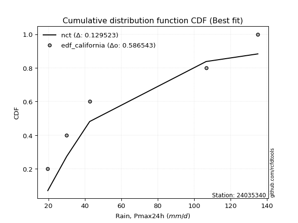</img>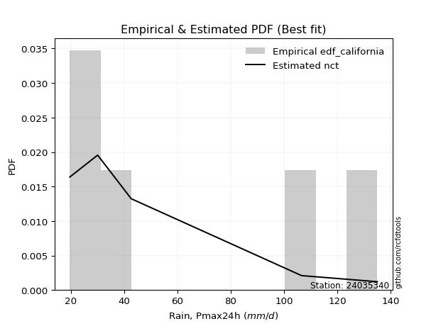</img>

</div>


### 2. Empirical - EDF Hazen (1930)

Hazen method for plotting positions is a formula used to estimate the empirical cumulative probability distribution of flood events or other hydrological data. This formula often results in biased estimations, particularly when extrapolating to extreme events (high return periods).

<div align="center">


$P=(m-0.5)/n$


</div>


**2.1. Empirical values**

<div align="center">

|                | 0                   | 1                  | 2                  | 3                  | 4         | 5                  |
|:---------------|:--------------------|:-------------------|:-------------------|:-------------------|:----------|:-------------------|
| date           | 2021                | 2022               | 2020               | 2025               | 2023      | 2024               |
| x              | 19.7                | 30.1               | 42.7               | 61.7               | 106.6     | 135.0              |
| m              | 1                   | 2                  | 3                  | 4                  | 5         | 6                  |
| empirical_dist | edf_hazen           | edf_hazen          | edf_hazen          | edf_hazen          | edf_hazen | edf_hazen          |
| empirical      | 0.08333333333333333 | 0.25               | 0.4166666666666667 | 0.5833333333333334 | 0.75      | 0.9166666666666666 |
| empirical_tr   | 1.090909090909091   | 1.3333333333333333 | 1.7142857142857144 | 2.4000000000000004 | 4.0       | 11.999999999999995 |

</div>


**2.2. Kolmogorov-Smirnov fit test (sorted by Δ)**


<div align="center">

|                | 0                   | 1                   | 2                   | 3                   | 4                   | 5                   | 6                   | 7                   | 8                   | 9                   | 10                    | 11                  | 12                  | 13                  | 14                  | 15                  | 16                  | 17                  | 18                  | 19                 | 20                  | 21                  | 22                  | 23                  | 24                  | 25                  | 26                 | 27                  | 28                  | 29                  | 30                  | 31                  | 32                  | 33                  | 34                  | 35                  | 36                  | 37                  | 38                  | 39                  | 40                  | 41                  | 42                  | 43                  | 44                  | 45                  | 46                  | 47                  | 48                  | 49                  | 50                  | 51                  | 52                 | 53                  | 54                  | 55                 | 56                 | 57                  | 58                | 59                  | 60                  | 61                  | 62                  | 63                 | 64                  | 65                  | 66                  | 67                  | 68                 | 69                  | 70                  | 71                 | 72                 | 73                  | 74                  | 75                  | 76                  | 77                | 78                 | 79             | 80             | 81                 | 82                 | 83                 | 84                  | 85                 | 86                  | 87                 | 88                 | 89             |
|:---------------|:--------------------|:--------------------|:--------------------|:--------------------|:--------------------|:--------------------|:--------------------|:--------------------|:--------------------|:--------------------|:----------------------|:--------------------|:--------------------|:--------------------|:--------------------|:--------------------|:--------------------|:--------------------|:--------------------|:-------------------|:--------------------|:--------------------|:--------------------|:--------------------|:--------------------|:--------------------|:-------------------|:--------------------|:--------------------|:--------------------|:--------------------|:--------------------|:--------------------|:--------------------|:--------------------|:--------------------|:--------------------|:--------------------|:--------------------|:--------------------|:--------------------|:--------------------|:--------------------|:--------------------|:--------------------|:--------------------|:--------------------|:--------------------|:--------------------|:--------------------|:--------------------|:--------------------|:-------------------|:--------------------|:--------------------|:-------------------|:-------------------|:--------------------|:------------------|:--------------------|:--------------------|:--------------------|:--------------------|:-------------------|:--------------------|:--------------------|:--------------------|:--------------------|:-------------------|:--------------------|:--------------------|:-------------------|:-------------------|:--------------------|:--------------------|:--------------------|:--------------------|:------------------|:-------------------|:---------------|:---------------|:-------------------|:-------------------|:-------------------|:--------------------|:-------------------|:--------------------|:-------------------|:-------------------|:---------------|
| station        | 24035340            | 24035340            | 24035340            | 24035340            | 24035340            | 24035340            | 24035340            | 24035340            | 24035340            | 24035340            | 24035340              | 24035340            | 24035340            | 24035340            | 24035340            | 24035340            | 24035340            | 24035340            | 24035340            | 24035340           | 24035340            | 24035340            | 24035340            | 24035340            | 24035340            | 24035340            | 24035340           | 24035340            | 24035340            | 24035340            | 24035340            | 24035340            | 24035340            | 24035340            | 24035340            | 24035340            | 24035340            | 24035340            | 24035340            | 24035340            | 24035340            | 24035340            | 24035340            | 24035340            | 24035340            | 24035340            | 24035340            | 24035340            | 24035340            | 24035340            | 24035340            | 24035340            | 24035340           | 24035340            | 24035340            | 24035340           | 24035340           | 24035340            | 24035340          | 24035340            | 24035340            | 24035340            | 24035340            | 24035340           | 24035340            | 24035340            | 24035340            | 24035340            | 24035340           | 24035340            | 24035340            | 24035340           | 24035340           | 24035340            | 24035340            | 24035340            | 24035340            | 24035340          | 24035340           | 24035340       | 24035340       | 24035340           | 24035340           | 24035340           | 24035340            | 24035340           | 24035340            | 24035340           | 24035340           | 24035340       |
| empirical_dist | edf_hazen           | edf_hazen           | edf_hazen           | edf_hazen           | edf_hazen           | edf_hazen           | edf_hazen           | edf_hazen           | edf_hazen           | edf_hazen           | edf_hazen             | edf_hazen           | edf_hazen           | edf_hazen           | edf_hazen           | edf_hazen           | edf_hazen           | edf_hazen           | edf_hazen           | edf_hazen          | edf_hazen           | edf_hazen           | edf_hazen           | edf_hazen           | edf_hazen           | edf_hazen           | edf_hazen          | edf_hazen           | edf_hazen           | edf_hazen           | edf_hazen           | edf_hazen           | edf_hazen           | edf_hazen           | edf_hazen           | edf_hazen           | edf_hazen           | edf_hazen           | edf_hazen           | edf_hazen           | edf_hazen           | edf_hazen           | edf_hazen           | edf_hazen           | edf_hazen           | edf_hazen           | edf_hazen           | edf_hazen           | edf_hazen           | edf_hazen           | edf_hazen           | edf_hazen           | edf_hazen          | edf_hazen           | edf_hazen           | edf_hazen          | edf_hazen          | edf_hazen           | edf_hazen         | edf_hazen           | edf_hazen           | edf_hazen           | edf_hazen           | edf_hazen          | edf_hazen           | edf_hazen           | edf_hazen           | edf_hazen           | edf_hazen          | edf_hazen           | edf_hazen           | edf_hazen          | edf_hazen          | edf_hazen           | edf_hazen           | edf_hazen           | edf_hazen           | edf_hazen         | edf_hazen          | edf_hazen      | edf_hazen      | edf_hazen          | edf_hazen          | edf_hazen          | edf_hazen           | edf_hazen          | edf_hazen           | edf_hazen          | edf_hazen          | edf_hazen      |
| p_dist         | johnsonsu           | loginvweibull       | loggenlogistic      | halfnorm            | logmielke           | loggenexpon         | nct                 | rayleigh            | logkstwobign        | logfisk             | loglaplace_asymmetric | logweibull_min      | logalpha            | loghalfnorm         | lograyleigh         | logmaxwell          | logrice             | invgamma            | loggompertz         | loginvgamma        | logncf              | laplace_asymmetric  | genexpon            | expon               | logbetaprime        | exponnorm           | loginvgauss        | ncf                 | gompertz            | betaprime           | lognct              | invgauss            | logfatiguelife      | loggamma            | loggamma            | logerlang           | logf                | lognorm             | lognorm             | logcrystalball      | logt                | logexponnorm        | logpearson3         | logjohnsonsu        | logloggamma         | f                   | alpha               | gumbel_r            | maxwell             | halflogistic        | pearson3            | kstwobign           | moyal              | loghalflogistic     | loggumbel_r         | genlogistic        | logmoyal           | loglogistic         | logexpon          | loghypsecant        | t                   | truncnorm           | crystalball         | norm               | loggumbel_l         | loglaplace          | rice                | logistic            | nakagami           | hypsecant           | erlang              | fisk               | laplace            | gumbel_l            | logchi2             | logwald             | wald                | lognakagami       | logtruncnorm       | gibrat         | loggibrat      | pareto             | weibull_min        | logpareto          | loglognorm          | fatiguelife        | invweibull          | gamma              | chi2               | mielke         |
| delta          | 0.08253621851454862 | 0.08346075879844417 | 0.08398407926419205 | 0.08429112804830596 | 0.08702339865617903 | 0.08788468877891409 | 0.08985432451445075 | 0.09128635901088061 | 0.09225139719381914 | 0.09282650159165728 | 0.09357486534713277   | 0.09374539486386568 | 0.09396891739413482 | 0.09440832656205689 | 0.09455217745343025 | 0.09547958963172487 | 0.09573656546359832 | 0.09573842174370417 | 0.09636426072273419 | 0.0968029138181088 | 0.09701467757131488 | 0.09712108189111301 | 0.09714133326516572 | 0.09714141635759665 | 0.09768577297984904 | 0.09774845763929574 | 0.0977624992999947 | 0.09796894283405666 | 0.09809347568523175 | 0.09832913594183013 | 0.09883583727221312 | 0.09885969477022694 | 0.09886987620147303 | 0.09895374356738262 | 0.09895374356738262 | 0.09896050433899617 | 0.09896827522377771 | 0.09898696606794499 | 0.09898696606794499 | 0.09898700527080262 | 0.09898713097008183 | 0.09898719808329048 | 0.09901246006977826 | 0.09911988092454438 | 0.09918526079646561 | 0.09963969761149616 | 0.10099131456304611 | 0.10162267704708838 | 0.10191149564584034 | 0.10211694862028609 | 0.10714772073929468 | 0.10762607622966547 | 0.1077528878923264 | 0.11088702010654683 | 0.11119948517617484 | 0.1128903088242813 | 0.1162873162292195 | 0.11669174858923415 | 0.124827860656537 | 0.12576825046762952 | 0.12846627662166998 | 0.12850400598866857 | 0.12850403707150337 | 0.1285040424836978 | 0.12871442029851798 | 0.13383626808678117 | 0.14066755447094298 | 0.15036716183692678 | 0.1522569876425799 | 0.16583847248558764 | 0.18183583626645938 | 0.1894104976579315 | 0.1897911333695294 | 0.19454223792511904 | 0.21785836101344935 | 0.21969952360587036 | 0.23141480117197877 | 0.249999958012647 | 0.2499999987098218 | 0.25           | 0.25           | 0.3538146529535833 | 0.3600373565158471 | 0.3885789194669609 | 0.39761611554082243 | 0.4681654892286773 | 0.47939242408141375 | 0.5601503343734978 | 0.5664144817648189 | nan            |
| deltao         | 0.530385761606      | 0.530385761606      | 0.530385761606      | 0.530385761606      | 0.530385761606      | 0.530385761606      | 0.530385761606      | 0.530385761606      | 0.530385761606      | 0.530385761606      | 0.530385761606        | 0.530385761606      | 0.530385761606      | 0.530385761606      | 0.530385761606      | 0.530385761606      | 0.530385761606      | 0.530385761606      | 0.530385761606      | 0.530385761606     | 0.530385761606      | 0.530385761606      | 0.530385761606      | 0.530385761606      | 0.530385761606      | 0.530385761606      | 0.530385761606     | 0.530385761606      | 0.530385761606      | 0.530385761606      | 0.530385761606      | 0.530385761606      | 0.530385761606      | 0.530385761606      | 0.530385761606      | 0.530385761606      | 0.530385761606      | 0.530385761606      | 0.530385761606      | 0.530385761606      | 0.530385761606      | 0.530385761606      | 0.530385761606      | 0.530385761606      | 0.530385761606      | 0.530385761606      | 0.530385761606      | 0.530385761606      | 0.530385761606      | 0.530385761606      | 0.530385761606      | 0.530385761606      | 0.530385761606     | 0.530385761606      | 0.530385761606      | 0.530385761606     | 0.530385761606     | 0.530385761606      | 0.530385761606    | 0.530385761606      | 0.530385761606      | 0.530385761606      | 0.530385761606      | 0.530385761606     | 0.530385761606      | 0.530385761606      | 0.530385761606      | 0.530385761606      | 0.530385761606     | 0.530385761606      | 0.530385761606      | 0.530385761606     | 0.530385761606     | 0.530385761606      | 0.530385761606      | 0.530385761606      | 0.530385761606      | 0.530385761606    | 0.530385761606     | 0.530385761606 | 0.530385761606 | 0.530385761606     | 0.530385761606     | 0.530385761606     | 0.530385761606      | 0.530385761606     | 0.530385761606      | 0.530385761606     | 0.530385761606     | 0.530385761606 |
| eval           | Δo > Δ              | Δo > Δ              | Δo > Δ              | Δo > Δ              | Δo > Δ              | Δo > Δ              | Δo > Δ              | Δo > Δ              | Δo > Δ              | Δo > Δ              | Δo > Δ                | Δo > Δ              | Δo > Δ              | Δo > Δ              | Δo > Δ              | Δo > Δ              | Δo > Δ              | Δo > Δ              | Δo > Δ              | Δo > Δ             | Δo > Δ              | Δo > Δ              | Δo > Δ              | Δo > Δ              | Δo > Δ              | Δo > Δ              | Δo > Δ             | Δo > Δ              | Δo > Δ              | Δo > Δ              | Δo > Δ              | Δo > Δ              | Δo > Δ              | Δo > Δ              | Δo > Δ              | Δo > Δ              | Δo > Δ              | Δo > Δ              | Δo > Δ              | Δo > Δ              | Δo > Δ              | Δo > Δ              | Δo > Δ              | Δo > Δ              | Δo > Δ              | Δo > Δ              | Δo > Δ              | Δo > Δ              | Δo > Δ              | Δo > Δ              | Δo > Δ              | Δo > Δ              | Δo > Δ             | Δo > Δ              | Δo > Δ              | Δo > Δ             | Δo > Δ             | Δo > Δ              | Δo > Δ            | Δo > Δ              | Δo > Δ              | Δo > Δ              | Δo > Δ              | Δo > Δ             | Δo > Δ              | Δo > Δ              | Δo > Δ              | Δo > Δ              | Δo > Δ             | Δo > Δ              | Δo > Δ              | Δo > Δ             | Δo > Δ             | Δo > Δ              | Δo > Δ              | Δo > Δ              | Δo > Δ              | Δo > Δ            | Δo > Δ             | Δo > Δ         | Δo > Δ         | Δo > Δ             | Δo > Δ             | Δo > Δ             | Δo > Δ              | Δo > Δ             | Δo > Δ              | Δo <= Δ            | Δo <= Δ            | Δo <= Δ        |
| fit            | 1                   | 1                   | 1                   | 1                   | 1                   | 1                   | 1                   | 1                   | 1                   | 1                   | 1                     | 1                   | 1                   | 1                   | 1                   | 1                   | 1                   | 1                   | 1                   | 1                  | 1                   | 1                   | 1                   | 1                   | 1                   | 1                   | 1                  | 1                   | 1                   | 1                   | 1                   | 1                   | 1                   | 1                   | 1                   | 1                   | 1                   | 1                   | 1                   | 1                   | 1                   | 1                   | 1                   | 1                   | 1                   | 1                   | 1                   | 1                   | 1                   | 1                   | 1                   | 1                   | 1                  | 1                   | 1                   | 1                  | 1                  | 1                   | 1                 | 1                   | 1                   | 1                   | 1                   | 1                  | 1                   | 1                   | 1                   | 1                   | 1                  | 1                   | 1                   | 1                  | 1                  | 1                   | 1                   | 1                   | 1                   | 1                 | 1                  | 1              | 1              | 1                  | 1                  | 1                  | 1                   | 1                  | 1                   | 0                  | 0                  | 0              |
| n              | 6                   | 6                   | 6                   | 6                   | 6                   | 6                   | 6                   | 6                   | 6                   | 6                   | 6                     | 6                   | 6                   | 6                   | 6                   | 6                   | 6                   | 6                   | 6                   | 6                  | 6                   | 6                   | 6                   | 6                   | 6                   | 6                   | 6                  | 6                   | 6                   | 6                   | 6                   | 6                   | 6                   | 6                   | 6                   | 6                   | 6                   | 6                   | 6                   | 6                   | 6                   | 6                   | 6                   | 6                   | 6                   | 6                   | 6                   | 6                   | 6                   | 6                   | 6                   | 6                   | 6                  | 6                   | 6                   | 6                  | 6                  | 6                   | 6                 | 6                   | 6                   | 6                   | 6                   | 6                  | 6                   | 6                   | 6                   | 6                   | 6                  | 6                   | 6                   | 6                  | 6                  | 6                   | 6                   | 6                   | 6                   | 6                 | 6                  | 6              | 6              | 6                  | 6                  | 6                  | 6                   | 6                  | 6                   | 6                  | 6                  | 6              |
| best_fit       | 1                   | 0                   | 0                   | 0                   | 0                   | 0                   | 0                   | 0                   | 0                   | 0                   | 0                     | 0                   | 0                   | 0                   | 0                   | 0                   | 0                   | 0                   | 0                   | 0                  | 0                   | 0                   | 0                   | 0                   | 0                   | 0                   | 0                  | 0                   | 0                   | 0                   | 0                   | 0                   | 0                   | 0                   | 0                   | 0                   | 0                   | 0                   | 0                   | 0                   | 0                   | 0                   | 0                   | 0                   | 0                   | 0                   | 0                   | 0                   | 0                   | 0                   | 0                   | 0                   | 0                  | 0                   | 0                   | 0                  | 0                  | 0                   | 0                 | 0                   | 0                   | 0                   | 0                   | 0                  | 0                   | 0                   | 0                   | 0                   | 0                  | 0                   | 0                   | 0                  | 0                  | 0                   | 0                   | 0                   | 0                   | 0                 | 0                  | 0              | 0              | 0                  | 0                  | 0                  | 0                   | 0                  | 0                   | 0                  | 0                  | 0              |
| best_fit_sort  | 1                   | 2                   | 3                   | 4                   | 5                   | 6                   | 7                   | 8                   | 9                   | 10                  | 11                    | 12                  | 13                  | 14                  | 15                  | 16                  | 17                  | 18                  | 19                  | 20                 | 21                  | 22                  | 23                  | 24                  | 25                  | 26                  | 27                 | 28                  | 29                  | 30                  | 31                  | 32                  | 33                  | 34                  | 35                  | 36                  | 37                  | 38                  | 39                  | 40                  | 41                  | 42                  | 43                  | 44                  | 45                  | 46                  | 47                  | 48                  | 49                  | 50                  | 51                  | 52                  | 53                 | 54                  | 55                  | 56                 | 57                 | 58                  | 59                | 60                  | 61                  | 62                  | 63                  | 64                 | 65                  | 66                  | 67                  | 68                  | 69                 | 70                  | 71                  | 72                 | 73                 | 74                  | 75                  | 76                  | 77                  | 78                | 79                 | 80             | 81             | 82                 | 83                 | 84                 | 85                  | 86                 | 87                  | 88                 | 89                 | 90             |

</div>


<div align="center">

</img>

</div>


**2.3. Best fit**

<div align="center">

|   id |   station | empirical_dist   | p_dist    |     delta |   deltao | eval   |   fit |   n |   best_fit |   best_fit_sort |
|-----:|----------:|:-----------------|:----------|----------:|---------:|:-------|------:|----:|-----------:|----------------:|
|    0 |  24035340 | edf_hazen        | johnsonsu | 0.0825362 | 0.530386 | Δo > Δ |     1 |   6 |          1 |               1 |

</div>


<div align="center">

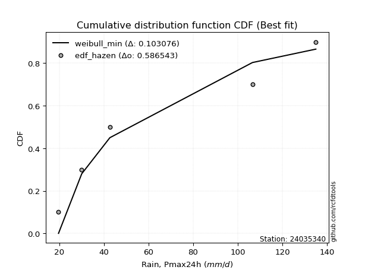</img>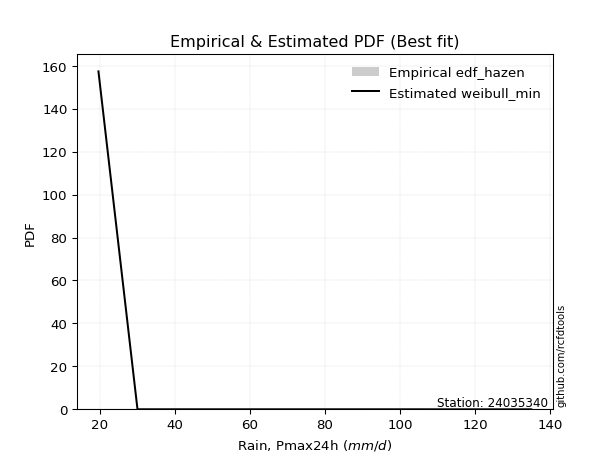</img>

</div>


### 3. Empirical - EDF Weibull (1939)

Weibull plotting position formula is an empirical method used to estimate the non-exceedance probability or plotting position for a set of observed data, is often recommended or widely used in practice, particularly in flood frequency analysis.

<div align="center">


$P=m/(n+1)$


</div>


**3.1. Empirical values**

<div align="center">

|                | 0                   | 1                  | 2                   | 3                  | 4                  | 5                  |
|:---------------|:--------------------|:-------------------|:--------------------|:-------------------|:-------------------|:-------------------|
| date           | 2021                | 2022               | 2020                | 2025               | 2023               | 2024               |
| x              | 19.7                | 30.1               | 42.7                | 61.7               | 106.6              | 135.0              |
| m              | 1                   | 2                  | 3                   | 4                  | 5                  | 6                  |
| empirical_dist | edf_weibull         | edf_weibull        | edf_weibull         | edf_weibull        | edf_weibull        | edf_weibull        |
| empirical      | 0.14285714285714285 | 0.2857142857142857 | 0.42857142857142855 | 0.5714285714285714 | 0.7142857142857143 | 0.8571428571428571 |
| empirical_tr   | 1.1666666666666665  | 1.4                | 1.75                | 2.333333333333333  | 3.5                | 6.999999999999997  |

</div>


**3.2. Kolmogorov-Smirnov fit test (sorted by Δ)**


<div align="center">

|                | 0                   | 1                   | 2                   | 3                   | 4                   | 5                   | 6                   | 7                   | 8                   | 9                   | 10                  | 11                    | 12                  | 13                  | 14                  | 15                  | 16                  | 17                  | 18                 | 19                  | 20                  | 21                 | 22                  | 23                  | 24                  | 25                  | 26                  | 27                  | 28                  | 29                  | 30                 | 31                 | 32                 | 33                  | 34                  | 35                  | 36                  | 37                  | 38                 | 39                  | 40                 | 41                  | 42                 | 43                  | 44                  | 45                  | 46                  | 47                  | 48                  | 49                  | 50                  | 51                  | 52                  | 53                  | 54                  | 55                  | 56                  | 57                  | 58                 | 59                  | 60                  | 61                | 62                 | 63                  | 64                  | 65                  | 66                  | 67                  | 68                  | 69                 | 70                  | 71                 | 72                  | 73                  | 74                  | 75                  | 76                  | 77                 | 78                 | 79                 | 80                 | 81                 | 82                 | 83                 | 84                  | 85                 | 86                 | 87                 | 88                 | 89             |
|:---------------|:--------------------|:--------------------|:--------------------|:--------------------|:--------------------|:--------------------|:--------------------|:--------------------|:--------------------|:--------------------|:--------------------|:----------------------|:--------------------|:--------------------|:--------------------|:--------------------|:--------------------|:--------------------|:-------------------|:--------------------|:--------------------|:-------------------|:--------------------|:--------------------|:--------------------|:--------------------|:--------------------|:--------------------|:--------------------|:--------------------|:-------------------|:-------------------|:-------------------|:--------------------|:--------------------|:--------------------|:--------------------|:--------------------|:-------------------|:--------------------|:-------------------|:--------------------|:-------------------|:--------------------|:--------------------|:--------------------|:--------------------|:--------------------|:--------------------|:--------------------|:--------------------|:--------------------|:--------------------|:--------------------|:--------------------|:--------------------|:--------------------|:--------------------|:-------------------|:--------------------|:--------------------|:------------------|:-------------------|:--------------------|:--------------------|:--------------------|:--------------------|:--------------------|:--------------------|:-------------------|:--------------------|:-------------------|:--------------------|:--------------------|:--------------------|:--------------------|:--------------------|:-------------------|:-------------------|:-------------------|:-------------------|:-------------------|:-------------------|:-------------------|:--------------------|:-------------------|:-------------------|:-------------------|:-------------------|:---------------|
| station        | 24035340            | 24035340            | 24035340            | 24035340            | 24035340            | 24035340            | 24035340            | 24035340            | 24035340            | 24035340            | 24035340            | 24035340              | 24035340            | 24035340            | 24035340            | 24035340            | 24035340            | 24035340            | 24035340           | 24035340            | 24035340            | 24035340           | 24035340            | 24035340            | 24035340            | 24035340            | 24035340            | 24035340            | 24035340            | 24035340            | 24035340           | 24035340           | 24035340           | 24035340            | 24035340            | 24035340            | 24035340            | 24035340            | 24035340           | 24035340            | 24035340           | 24035340            | 24035340           | 24035340            | 24035340            | 24035340            | 24035340            | 24035340            | 24035340            | 24035340            | 24035340            | 24035340            | 24035340            | 24035340            | 24035340            | 24035340            | 24035340            | 24035340            | 24035340           | 24035340            | 24035340            | 24035340          | 24035340           | 24035340            | 24035340            | 24035340            | 24035340            | 24035340            | 24035340            | 24035340           | 24035340            | 24035340           | 24035340            | 24035340            | 24035340            | 24035340            | 24035340            | 24035340           | 24035340           | 24035340           | 24035340           | 24035340           | 24035340           | 24035340           | 24035340            | 24035340           | 24035340           | 24035340           | 24035340           | 24035340       |
| empirical_dist | edf_weibull         | edf_weibull         | edf_weibull         | edf_weibull         | edf_weibull         | edf_weibull         | edf_weibull         | edf_weibull         | edf_weibull         | edf_weibull         | edf_weibull         | edf_weibull           | edf_weibull         | edf_weibull         | edf_weibull         | edf_weibull         | edf_weibull         | edf_weibull         | edf_weibull        | edf_weibull         | edf_weibull         | edf_weibull        | edf_weibull         | edf_weibull         | edf_weibull         | edf_weibull         | edf_weibull         | edf_weibull         | edf_weibull         | edf_weibull         | edf_weibull        | edf_weibull        | edf_weibull        | edf_weibull         | edf_weibull         | edf_weibull         | edf_weibull         | edf_weibull         | edf_weibull        | edf_weibull         | edf_weibull        | edf_weibull         | edf_weibull        | edf_weibull         | edf_weibull         | edf_weibull         | edf_weibull         | edf_weibull         | edf_weibull         | edf_weibull         | edf_weibull         | edf_weibull         | edf_weibull         | edf_weibull         | edf_weibull         | edf_weibull         | edf_weibull         | edf_weibull         | edf_weibull        | edf_weibull         | edf_weibull         | edf_weibull       | edf_weibull        | edf_weibull         | edf_weibull         | edf_weibull         | edf_weibull         | edf_weibull         | edf_weibull         | edf_weibull        | edf_weibull         | edf_weibull        | edf_weibull         | edf_weibull         | edf_weibull         | edf_weibull         | edf_weibull         | edf_weibull        | edf_weibull        | edf_weibull        | edf_weibull        | edf_weibull        | edf_weibull        | edf_weibull        | edf_weibull         | edf_weibull        | edf_weibull        | edf_weibull        | edf_weibull        | edf_weibull    |
| p_dist         | johnsonsu           | rayleigh            | loginvweibull       | maxwell             | loggenlogistic      | halfnorm            | logmielke           | pearson3            | nct                 | logkstwobign        | logfisk             | loglaplace_asymmetric | logweibull_min      | logalpha            | lograyleigh         | logmaxwell          | logrice             | invgamma            | loginvgamma        | logncf              | logbetaprime        | loginvgauss        | ncf                 | betaprime           | lognct              | invgauss            | logfatiguelife      | loggamma            | loggamma            | logerlang           | logf               | lognorm            | lognorm            | logcrystalball      | logt                | logexponnorm        | logpearson3         | logjohnsonsu        | logloggamma        | f                   | alpha              | gumbel_r            | loggenexpon        | halflogistic        | t                   | truncnorm           | crystalball         | norm                | exponnorm           | laplace_asymmetric  | loggompertz         | fisk                | genexpon            | gompertz            | loghalfnorm         | expon               | logexpon            | kstwobign           | moyal              | loghalflogistic     | loggumbel_r         | genlogistic       | logmoyal           | loglogistic         | rice                | loghypsecant        | logistic            | loggumbel_l         | loglaplace          | hypsecant          | logchi2             | nakagami           | gumbel_l            | laplace             | erlang              | logwald             | wald                | lognakagami        | logtruncnorm       | gibrat             | loggibrat          | pareto             | weibull_min        | logpareto          | loglognorm          | invweibull         | fatiguelife        | gamma              | chi2               | mielke         |
| delta          | 0.11825050422883432 | 0.11892044088047193 | 0.11917504451272987 | 0.11937704459082499 | 0.11969836497847774 | 0.12000541376259166 | 0.12273768437046473 | 0.12463332918700143 | 0.12556861022873644 | 0.12796568290810484 | 0.12854078730594298 | 0.12928915106141847   | 0.12945968057815138 | 0.12968320310842052 | 0.13026646316771595 | 0.13119387534601057 | 0.13145085117788402 | 0.13145270745798987 | 0.1325171995323945 | 0.13272896328560058 | 0.13340005869413474 | 0.1334767850142804 | 0.13368322854834236 | 0.13404342165611582 | 0.13455012298649882 | 0.13457398048451263 | 0.13458416191575873 | 0.13466802928166832 | 0.13466802928166832 | 0.13467479005328187 | 0.1346825609380634 | 0.1347012517822307 | 0.1347012517822307 | 0.13470129098508832 | 0.13470141668436753 | 0.13470148379757618 | 0.13472674578406396 | 0.13483416663883008 | 0.1348995465107513 | 0.13535398332578186 | 0.1367056002773318 | 0.13733696276137408 | 0.1375749750978259 | 0.13783123433457178 | 0.14037103852643185 | 0.14040876789343043 | 0.14040879897626524 | 0.14040880438845965 | 0.14211873725416097 | 0.14285712117170984 | 0.14285714157648488 | 0.14285714285451204 | 0.14285714285707735 | 0.14285714285714127 | 0.14285714285714285 | 0.14285714285714285 | 0.14285714285714285 | 0.14334036194395117 | 0.1434671736066121 | 0.14660130582083253 | 0.14691377089046054 | 0.148604594538567 | 0.1520016019435052 | 0.15240603430351984 | 0.15257231637570484 | 0.16148253618191521 | 0.16227192374168864 | 0.16442870601280368 | 0.16955055380106687 | 0.1777432343903495 | 0.18214407529916365 | 0.1879712733568656 | 0.18874232597829113 | 0.20169589527429127 | 0.21755012198074508 | 0.25541380932015606 | 0.26712908688626447 | 0.2857142437269327 | 0.2857142844241075 | 0.2857142857142857 | 0.2857142857142857 | 0.3181003672392976 | 0.3243230708015614 | 0.3528646337526752 | 0.36190182982653674 | 0.4198686145576042 | 0.4324512035143916 | 0.5244360486592121 | 0.5307001960505332 | nan            |
| deltao         | 0.530385761606      | 0.530385761606      | 0.530385761606      | 0.530385761606      | 0.530385761606      | 0.530385761606      | 0.530385761606      | 0.530385761606      | 0.530385761606      | 0.530385761606      | 0.530385761606      | 0.530385761606        | 0.530385761606      | 0.530385761606      | 0.530385761606      | 0.530385761606      | 0.530385761606      | 0.530385761606      | 0.530385761606     | 0.530385761606      | 0.530385761606      | 0.530385761606     | 0.530385761606      | 0.530385761606      | 0.530385761606      | 0.530385761606      | 0.530385761606      | 0.530385761606      | 0.530385761606      | 0.530385761606      | 0.530385761606     | 0.530385761606     | 0.530385761606     | 0.530385761606      | 0.530385761606      | 0.530385761606      | 0.530385761606      | 0.530385761606      | 0.530385761606     | 0.530385761606      | 0.530385761606     | 0.530385761606      | 0.530385761606     | 0.530385761606      | 0.530385761606      | 0.530385761606      | 0.530385761606      | 0.530385761606      | 0.530385761606      | 0.530385761606      | 0.530385761606      | 0.530385761606      | 0.530385761606      | 0.530385761606      | 0.530385761606      | 0.530385761606      | 0.530385761606      | 0.530385761606      | 0.530385761606     | 0.530385761606      | 0.530385761606      | 0.530385761606    | 0.530385761606     | 0.530385761606      | 0.530385761606      | 0.530385761606      | 0.530385761606      | 0.530385761606      | 0.530385761606      | 0.530385761606     | 0.530385761606      | 0.530385761606     | 0.530385761606      | 0.530385761606      | 0.530385761606      | 0.530385761606      | 0.530385761606      | 0.530385761606     | 0.530385761606     | 0.530385761606     | 0.530385761606     | 0.530385761606     | 0.530385761606     | 0.530385761606     | 0.530385761606      | 0.530385761606     | 0.530385761606     | 0.530385761606     | 0.530385761606     | 0.530385761606 |
| eval           | Δo > Δ              | Δo > Δ              | Δo > Δ              | Δo > Δ              | Δo > Δ              | Δo > Δ              | Δo > Δ              | Δo > Δ              | Δo > Δ              | Δo > Δ              | Δo > Δ              | Δo > Δ                | Δo > Δ              | Δo > Δ              | Δo > Δ              | Δo > Δ              | Δo > Δ              | Δo > Δ              | Δo > Δ             | Δo > Δ              | Δo > Δ              | Δo > Δ             | Δo > Δ              | Δo > Δ              | Δo > Δ              | Δo > Δ              | Δo > Δ              | Δo > Δ              | Δo > Δ              | Δo > Δ              | Δo > Δ             | Δo > Δ             | Δo > Δ             | Δo > Δ              | Δo > Δ              | Δo > Δ              | Δo > Δ              | Δo > Δ              | Δo > Δ             | Δo > Δ              | Δo > Δ             | Δo > Δ              | Δo > Δ             | Δo > Δ              | Δo > Δ              | Δo > Δ              | Δo > Δ              | Δo > Δ              | Δo > Δ              | Δo > Δ              | Δo > Δ              | Δo > Δ              | Δo > Δ              | Δo > Δ              | Δo > Δ              | Δo > Δ              | Δo > Δ              | Δo > Δ              | Δo > Δ             | Δo > Δ              | Δo > Δ              | Δo > Δ            | Δo > Δ             | Δo > Δ              | Δo > Δ              | Δo > Δ              | Δo > Δ              | Δo > Δ              | Δo > Δ              | Δo > Δ             | Δo > Δ              | Δo > Δ             | Δo > Δ              | Δo > Δ              | Δo > Δ              | Δo > Δ              | Δo > Δ              | Δo > Δ             | Δo > Δ             | Δo > Δ             | Δo > Δ             | Δo > Δ             | Δo > Δ             | Δo > Δ             | Δo > Δ              | Δo > Δ             | Δo > Δ             | Δo > Δ             | Δo <= Δ            | Δo <= Δ        |
| fit            | 1                   | 1                   | 1                   | 1                   | 1                   | 1                   | 1                   | 1                   | 1                   | 1                   | 1                   | 1                     | 1                   | 1                   | 1                   | 1                   | 1                   | 1                   | 1                  | 1                   | 1                   | 1                  | 1                   | 1                   | 1                   | 1                   | 1                   | 1                   | 1                   | 1                   | 1                  | 1                  | 1                  | 1                   | 1                   | 1                   | 1                   | 1                   | 1                  | 1                   | 1                  | 1                   | 1                  | 1                   | 1                   | 1                   | 1                   | 1                   | 1                   | 1                   | 1                   | 1                   | 1                   | 1                   | 1                   | 1                   | 1                   | 1                   | 1                  | 1                   | 1                   | 1                 | 1                  | 1                   | 1                   | 1                   | 1                   | 1                   | 1                   | 1                  | 1                   | 1                  | 1                   | 1                   | 1                   | 1                   | 1                   | 1                  | 1                  | 1                  | 1                  | 1                  | 1                  | 1                  | 1                   | 1                  | 1                  | 1                  | 0                  | 0              |
| n              | 6                   | 6                   | 6                   | 6                   | 6                   | 6                   | 6                   | 6                   | 6                   | 6                   | 6                   | 6                     | 6                   | 6                   | 6                   | 6                   | 6                   | 6                   | 6                  | 6                   | 6                   | 6                  | 6                   | 6                   | 6                   | 6                   | 6                   | 6                   | 6                   | 6                   | 6                  | 6                  | 6                  | 6                   | 6                   | 6                   | 6                   | 6                   | 6                  | 6                   | 6                  | 6                   | 6                  | 6                   | 6                   | 6                   | 6                   | 6                   | 6                   | 6                   | 6                   | 6                   | 6                   | 6                   | 6                   | 6                   | 6                   | 6                   | 6                  | 6                   | 6                   | 6                 | 6                  | 6                   | 6                   | 6                   | 6                   | 6                   | 6                   | 6                  | 6                   | 6                  | 6                   | 6                   | 6                   | 6                   | 6                   | 6                  | 6                  | 6                  | 6                  | 6                  | 6                  | 6                  | 6                   | 6                  | 6                  | 6                  | 6                  | 6              |
| best_fit       | 1                   | 0                   | 0                   | 0                   | 0                   | 0                   | 0                   | 0                   | 0                   | 0                   | 0                   | 0                     | 0                   | 0                   | 0                   | 0                   | 0                   | 0                   | 0                  | 0                   | 0                   | 0                  | 0                   | 0                   | 0                   | 0                   | 0                   | 0                   | 0                   | 0                   | 0                  | 0                  | 0                  | 0                   | 0                   | 0                   | 0                   | 0                   | 0                  | 0                   | 0                  | 0                   | 0                  | 0                   | 0                   | 0                   | 0                   | 0                   | 0                   | 0                   | 0                   | 0                   | 0                   | 0                   | 0                   | 0                   | 0                   | 0                   | 0                  | 0                   | 0                   | 0                 | 0                  | 0                   | 0                   | 0                   | 0                   | 0                   | 0                   | 0                  | 0                   | 0                  | 0                   | 0                   | 0                   | 0                   | 0                   | 0                  | 0                  | 0                  | 0                  | 0                  | 0                  | 0                  | 0                   | 0                  | 0                  | 0                  | 0                  | 0              |
| best_fit_sort  | 1                   | 2                   | 3                   | 4                   | 5                   | 6                   | 7                   | 8                   | 9                   | 10                  | 11                  | 12                    | 13                  | 14                  | 15                  | 16                  | 17                  | 18                  | 19                 | 20                  | 21                  | 22                 | 23                  | 24                  | 25                  | 26                  | 27                  | 28                  | 29                  | 30                  | 31                 | 32                 | 33                 | 34                  | 35                  | 36                  | 37                  | 38                  | 39                 | 40                  | 41                 | 42                  | 43                 | 44                  | 45                  | 46                  | 47                  | 48                  | 49                  | 50                  | 51                  | 52                  | 53                  | 54                  | 55                  | 56                  | 57                  | 58                  | 59                 | 60                  | 61                  | 62                | 63                 | 64                  | 65                  | 66                  | 67                  | 68                  | 69                  | 70                 | 71                  | 72                 | 73                  | 74                  | 75                  | 76                  | 77                  | 78                 | 79                 | 80                 | 81                 | 82                 | 83                 | 84                 | 85                  | 86                 | 87                 | 88                 | 89                 | 90             |

</div>


<div align="center">

</img>

</div>


**3.3. Best fit**

<div align="center">

|   id |   station | empirical_dist   | p_dist    |    delta |   deltao | eval   |   fit |   n |   best_fit |   best_fit_sort |
|-----:|----------:|:-----------------|:----------|---------:|---------:|:-------|------:|----:|-----------:|----------------:|
|    0 |  24035340 | edf_weibull      | johnsonsu | 0.118251 | 0.530386 | Δo > Δ |     1 |   6 |          1 |               1 |

</div>


<div align="center">

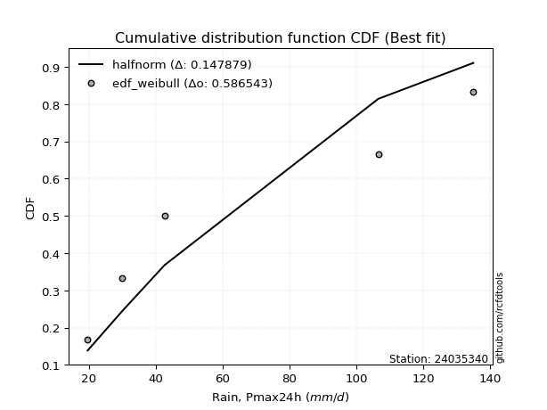</img>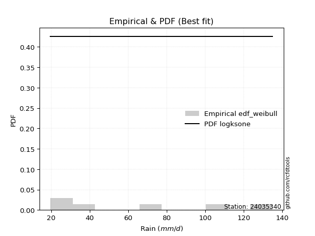</img>

</div>


### 4. Empirical - EDF Beard (1943)

The Beard formula (or Beard´s plotting position formula) in hydrology is used to estimate the empirical non-exceedance probability _(P)_ of a flood event (or other extreme hydrological data point) within a given dataset.

<div align="center">


$P=(m-0.31)/(n+0.38)$


</div>


**4.1. Empirical values**

<div align="center">

|                | 0                   | 1                   | 2                  | 3                  | 4                  | 5                  |
|:---------------|:--------------------|:--------------------|:-------------------|:-------------------|:-------------------|:-------------------|
| date           | 2021                | 2022                | 2020               | 2025               | 2023               | 2024               |
| x              | 19.7                | 30.1                | 42.7               | 61.7               | 106.6              | 135.0              |
| m              | 1                   | 2                   | 3                  | 4                  | 5                  | 6                  |
| empirical_dist | edf_beard           | edf_beard           | edf_beard          | edf_beard          | edf_beard          | edf_beard          |
| empirical      | 0.10815047021943573 | 0.26489028213166144 | 0.4216300940438871 | 0.5783699059561128 | 0.7351097178683387 | 0.8918495297805643 |
| empirical_tr   | 1.1212653778558874  | 1.3603411513859276  | 1.7289972899728996 | 2.3717472118959106 | 3.7751479289940844 | 9.246376811594207  |

</div>


**4.2. Kolmogorov-Smirnov fit test (sorted by Δ)**


<div align="center">

|                | 0                   | 1                   | 2                  | 3                   | 4                   | 5                   | 6                   | 7                   | 8                   | 9                   | 10                  | 11                    | 12                  | 13                  | 14                  | 15                  | 16                 | 17                  | 18                 | 19                  | 20                  | 21                 | 22                  | 23                  | 24                  | 25                  | 26                  | 27                  | 28                  | 29                  | 30                  | 31                  | 32                  | 33                  | 34                  | 35                  | 36                  | 37                 | 38                  | 39                  | 40                  | 41                  | 42                  | 43                  | 44                  | 45                 | 46                  | 47                  | 48                  | 49                  | 50                  | 51                  | 52                 | 53                  | 54                  | 55                  | 56                  | 57                  | 58                  | 59                  | 60                | 61                  | 62                  | 63                  | 64                 | 65                  | 66                 | 67                  | 68                  | 69                  | 70                  | 71                 | 72                  | 73                 | 74                  | 75                 | 76                 | 77                  | 78                  | 79                  | 80                  | 81                  | 82                 | 83                  | 84                | 85                  | 86                  | 87                 | 88                 | 89             |
|:---------------|:--------------------|:--------------------|:-------------------|:--------------------|:--------------------|:--------------------|:--------------------|:--------------------|:--------------------|:--------------------|:--------------------|:----------------------|:--------------------|:--------------------|:--------------------|:--------------------|:-------------------|:--------------------|:-------------------|:--------------------|:--------------------|:-------------------|:--------------------|:--------------------|:--------------------|:--------------------|:--------------------|:--------------------|:--------------------|:--------------------|:--------------------|:--------------------|:--------------------|:--------------------|:--------------------|:--------------------|:--------------------|:-------------------|:--------------------|:--------------------|:--------------------|:--------------------|:--------------------|:--------------------|:--------------------|:-------------------|:--------------------|:--------------------|:--------------------|:--------------------|:--------------------|:--------------------|:-------------------|:--------------------|:--------------------|:--------------------|:--------------------|:--------------------|:--------------------|:--------------------|:------------------|:--------------------|:--------------------|:--------------------|:-------------------|:--------------------|:-------------------|:--------------------|:--------------------|:--------------------|:--------------------|:-------------------|:--------------------|:-------------------|:--------------------|:-------------------|:-------------------|:--------------------|:--------------------|:--------------------|:--------------------|:--------------------|:-------------------|:--------------------|:------------------|:--------------------|:--------------------|:-------------------|:-------------------|:---------------|
| station        | 24035340            | 24035340            | 24035340           | 24035340            | 24035340            | 24035340            | 24035340            | 24035340            | 24035340            | 24035340            | 24035340            | 24035340              | 24035340            | 24035340            | 24035340            | 24035340            | 24035340           | 24035340            | 24035340           | 24035340            | 24035340            | 24035340           | 24035340            | 24035340            | 24035340            | 24035340            | 24035340            | 24035340            | 24035340            | 24035340            | 24035340            | 24035340            | 24035340            | 24035340            | 24035340            | 24035340            | 24035340            | 24035340           | 24035340            | 24035340            | 24035340            | 24035340            | 24035340            | 24035340            | 24035340            | 24035340           | 24035340            | 24035340            | 24035340            | 24035340            | 24035340            | 24035340            | 24035340           | 24035340            | 24035340            | 24035340            | 24035340            | 24035340            | 24035340            | 24035340            | 24035340          | 24035340            | 24035340            | 24035340            | 24035340           | 24035340            | 24035340           | 24035340            | 24035340            | 24035340            | 24035340            | 24035340           | 24035340            | 24035340           | 24035340            | 24035340           | 24035340           | 24035340            | 24035340            | 24035340            | 24035340            | 24035340            | 24035340           | 24035340            | 24035340          | 24035340            | 24035340            | 24035340           | 24035340           | 24035340       |
| empirical_dist | edf_beard           | edf_beard           | edf_beard          | edf_beard           | edf_beard           | edf_beard           | edf_beard           | edf_beard           | edf_beard           | edf_beard           | edf_beard           | edf_beard             | edf_beard           | edf_beard           | edf_beard           | edf_beard           | edf_beard          | edf_beard           | edf_beard          | edf_beard           | edf_beard           | edf_beard          | edf_beard           | edf_beard           | edf_beard           | edf_beard           | edf_beard           | edf_beard           | edf_beard           | edf_beard           | edf_beard           | edf_beard           | edf_beard           | edf_beard           | edf_beard           | edf_beard           | edf_beard           | edf_beard          | edf_beard           | edf_beard           | edf_beard           | edf_beard           | edf_beard           | edf_beard           | edf_beard           | edf_beard          | edf_beard           | edf_beard           | edf_beard           | edf_beard           | edf_beard           | edf_beard           | edf_beard          | edf_beard           | edf_beard           | edf_beard           | edf_beard           | edf_beard           | edf_beard           | edf_beard           | edf_beard         | edf_beard           | edf_beard           | edf_beard           | edf_beard          | edf_beard           | edf_beard          | edf_beard           | edf_beard           | edf_beard           | edf_beard           | edf_beard          | edf_beard           | edf_beard          | edf_beard           | edf_beard          | edf_beard          | edf_beard           | edf_beard           | edf_beard           | edf_beard           | edf_beard           | edf_beard          | edf_beard           | edf_beard         | edf_beard           | edf_beard           | edf_beard          | edf_beard          | edf_beard      |
| p_dist         | johnsonsu           | rayleigh            | loginvweibull      | loggenlogistic      | halfnorm            | logmielke           | loggenexpon         | nct                 | maxwell             | logkstwobign        | logfisk             | loglaplace_asymmetric | logweibull_min      | logalpha            | loghalfnorm         | lograyleigh         | logmaxwell         | logrice             | invgamma           | loggompertz         | loginvgamma         | logncf             | laplace_asymmetric  | genexpon            | expon               | pearson3            | logbetaprime        | exponnorm           | loginvgauss         | ncf                 | gompertz            | betaprime           | lognct              | invgauss            | logfatiguelife      | loggamma            | loggamma            | logerlang          | logf                | lognorm             | lognorm             | logcrystalball      | logt                | logexponnorm        | logpearson3         | logjohnsonsu       | logloggamma         | f                   | alpha               | gumbel_r            | halflogistic        | logexpon            | kstwobign          | moyal               | loghalflogistic     | loggumbel_r         | genlogistic         | logmoyal            | loglogistic         | t                   | truncnorm         | crystalball         | norm                | loghypsecant        | loggumbel_l        | rice                | loglaplace         | logistic            | fisk                | nakagami            | hypsecant           | gumbel_l           | laplace             | erlang             | logchi2             | logwald            | wald               | lognakagami         | logtruncnorm        | gibrat              | loggibrat           | pareto              | weibull_min        | logpareto           | loglognorm        | fatiguelife         | invweibull          | gamma              | chi2               | mielke         |
| delta          | 0.09742650064620995 | 0.09809643729784756 | 0.0983510409301055 | 0.09887436139585337 | 0.09918141017996729 | 0.10191368078784036 | 0.10286830246011879 | 0.10474460664611207 | 0.10687492302306079 | 0.10714167932548047 | 0.10771678372331861 | 0.1084651474787941    | 0.10863567699552701 | 0.10885919952579615 | 0.10929860869371821 | 0.10944245958509158 | 0.1103698717633862 | 0.11062684759525965 | 0.1106287038753655 | 0.11125454285439551 | 0.11169319594977012 | 0.1119049597029762 | 0.11201136402277434 | 0.11203161539682704 | 0.11203169848925798 | 0.11211114811651512 | 0.11257605511151036 | 0.11263873977095706 | 0.11265278143165602 | 0.11285922496571799 | 0.11298375781689307 | 0.11321941807349145 | 0.11372611940387445 | 0.11374997690188826 | 0.11376015833313435 | 0.11384402569904395 | 0.11384402569904395 | 0.1138507864706575 | 0.11385855735543904 | 0.11387724819960632 | 0.11387724819960632 | 0.11387728740246394 | 0.11387741310174315 | 0.11387748021495181 | 0.11390274220143959 | 0.1140101630562057 | 0.11407554292812694 | 0.11452997974315748 | 0.11588159669470743 | 0.11651295917874971 | 0.11700723075194741 | 0.11986443327931656 | 0.1225163583613268 | 0.12264317002398772 | 0.12577730223820816 | 0.12608976730783616 | 0.12778059095594263 | 0.13117759836088083 | 0.13158203072089547 | 0.13342970399889043 | 0.133467433365889 | 0.13346746444872382 | 0.13346746986091823 | 0.14065853259929084 | 0.1436047024301793 | 0.14563098184816342 | 0.1487265502184425 | 0.15533058921414722 | 0.16459336077182918 | 0.16714726977424121 | 0.17080189986280808 | 0.1895788105478985 | 0.19475456074674985 | 0.1967261183981207 | 0.20296807888178792 | 0.2345898057375318 | 0.2463050833036402 | 0.26489024014430845 | 0.26489028084148325 | 0.26489028213166144 | 0.26489028213166144 | 0.33892437082192184 | 0.3451470743841857 | 0.37368863733529945 | 0.382725833409161 | 0.45327520709701585 | 0.45457528719531143 | 0.5452600522418364 | 0.5515241996331575 | nan            |
| deltao         | 0.530385761606      | 0.530385761606      | 0.530385761606     | 0.530385761606      | 0.530385761606      | 0.530385761606      | 0.530385761606      | 0.530385761606      | 0.530385761606      | 0.530385761606      | 0.530385761606      | 0.530385761606        | 0.530385761606      | 0.530385761606      | 0.530385761606      | 0.530385761606      | 0.530385761606     | 0.530385761606      | 0.530385761606     | 0.530385761606      | 0.530385761606      | 0.530385761606     | 0.530385761606      | 0.530385761606      | 0.530385761606      | 0.530385761606      | 0.530385761606      | 0.530385761606      | 0.530385761606      | 0.530385761606      | 0.530385761606      | 0.530385761606      | 0.530385761606      | 0.530385761606      | 0.530385761606      | 0.530385761606      | 0.530385761606      | 0.530385761606     | 0.530385761606      | 0.530385761606      | 0.530385761606      | 0.530385761606      | 0.530385761606      | 0.530385761606      | 0.530385761606      | 0.530385761606     | 0.530385761606      | 0.530385761606      | 0.530385761606      | 0.530385761606      | 0.530385761606      | 0.530385761606      | 0.530385761606     | 0.530385761606      | 0.530385761606      | 0.530385761606      | 0.530385761606      | 0.530385761606      | 0.530385761606      | 0.530385761606      | 0.530385761606    | 0.530385761606      | 0.530385761606      | 0.530385761606      | 0.530385761606     | 0.530385761606      | 0.530385761606     | 0.530385761606      | 0.530385761606      | 0.530385761606      | 0.530385761606      | 0.530385761606     | 0.530385761606      | 0.530385761606     | 0.530385761606      | 0.530385761606     | 0.530385761606     | 0.530385761606      | 0.530385761606      | 0.530385761606      | 0.530385761606      | 0.530385761606      | 0.530385761606     | 0.530385761606      | 0.530385761606    | 0.530385761606      | 0.530385761606      | 0.530385761606     | 0.530385761606     | 0.530385761606 |
| eval           | Δo > Δ              | Δo > Δ              | Δo > Δ             | Δo > Δ              | Δo > Δ              | Δo > Δ              | Δo > Δ              | Δo > Δ              | Δo > Δ              | Δo > Δ              | Δo > Δ              | Δo > Δ                | Δo > Δ              | Δo > Δ              | Δo > Δ              | Δo > Δ              | Δo > Δ             | Δo > Δ              | Δo > Δ             | Δo > Δ              | Δo > Δ              | Δo > Δ             | Δo > Δ              | Δo > Δ              | Δo > Δ              | Δo > Δ              | Δo > Δ              | Δo > Δ              | Δo > Δ              | Δo > Δ              | Δo > Δ              | Δo > Δ              | Δo > Δ              | Δo > Δ              | Δo > Δ              | Δo > Δ              | Δo > Δ              | Δo > Δ             | Δo > Δ              | Δo > Δ              | Δo > Δ              | Δo > Δ              | Δo > Δ              | Δo > Δ              | Δo > Δ              | Δo > Δ             | Δo > Δ              | Δo > Δ              | Δo > Δ              | Δo > Δ              | Δo > Δ              | Δo > Δ              | Δo > Δ             | Δo > Δ              | Δo > Δ              | Δo > Δ              | Δo > Δ              | Δo > Δ              | Δo > Δ              | Δo > Δ              | Δo > Δ            | Δo > Δ              | Δo > Δ              | Δo > Δ              | Δo > Δ             | Δo > Δ              | Δo > Δ             | Δo > Δ              | Δo > Δ              | Δo > Δ              | Δo > Δ              | Δo > Δ             | Δo > Δ              | Δo > Δ             | Δo > Δ              | Δo > Δ             | Δo > Δ             | Δo > Δ              | Δo > Δ              | Δo > Δ              | Δo > Δ              | Δo > Δ              | Δo > Δ             | Δo > Δ              | Δo > Δ            | Δo > Δ              | Δo > Δ              | Δo <= Δ            | Δo <= Δ            | Δo <= Δ        |
| fit            | 1                   | 1                   | 1                  | 1                   | 1                   | 1                   | 1                   | 1                   | 1                   | 1                   | 1                   | 1                     | 1                   | 1                   | 1                   | 1                   | 1                  | 1                   | 1                  | 1                   | 1                   | 1                  | 1                   | 1                   | 1                   | 1                   | 1                   | 1                   | 1                   | 1                   | 1                   | 1                   | 1                   | 1                   | 1                   | 1                   | 1                   | 1                  | 1                   | 1                   | 1                   | 1                   | 1                   | 1                   | 1                   | 1                  | 1                   | 1                   | 1                   | 1                   | 1                   | 1                   | 1                  | 1                   | 1                   | 1                   | 1                   | 1                   | 1                   | 1                   | 1                 | 1                   | 1                   | 1                   | 1                  | 1                   | 1                  | 1                   | 1                   | 1                   | 1                   | 1                  | 1                   | 1                  | 1                   | 1                  | 1                  | 1                   | 1                   | 1                   | 1                   | 1                   | 1                  | 1                   | 1                 | 1                   | 1                   | 0                  | 0                  | 0              |
| n              | 6                   | 6                   | 6                  | 6                   | 6                   | 6                   | 6                   | 6                   | 6                   | 6                   | 6                   | 6                     | 6                   | 6                   | 6                   | 6                   | 6                  | 6                   | 6                  | 6                   | 6                   | 6                  | 6                   | 6                   | 6                   | 6                   | 6                   | 6                   | 6                   | 6                   | 6                   | 6                   | 6                   | 6                   | 6                   | 6                   | 6                   | 6                  | 6                   | 6                   | 6                   | 6                   | 6                   | 6                   | 6                   | 6                  | 6                   | 6                   | 6                   | 6                   | 6                   | 6                   | 6                  | 6                   | 6                   | 6                   | 6                   | 6                   | 6                   | 6                   | 6                 | 6                   | 6                   | 6                   | 6                  | 6                   | 6                  | 6                   | 6                   | 6                   | 6                   | 6                  | 6                   | 6                  | 6                   | 6                  | 6                  | 6                   | 6                   | 6                   | 6                   | 6                   | 6                  | 6                   | 6                 | 6                   | 6                   | 6                  | 6                  | 6              |
| best_fit       | 1                   | 0                   | 0                  | 0                   | 0                   | 0                   | 0                   | 0                   | 0                   | 0                   | 0                   | 0                     | 0                   | 0                   | 0                   | 0                   | 0                  | 0                   | 0                  | 0                   | 0                   | 0                  | 0                   | 0                   | 0                   | 0                   | 0                   | 0                   | 0                   | 0                   | 0                   | 0                   | 0                   | 0                   | 0                   | 0                   | 0                   | 0                  | 0                   | 0                   | 0                   | 0                   | 0                   | 0                   | 0                   | 0                  | 0                   | 0                   | 0                   | 0                   | 0                   | 0                   | 0                  | 0                   | 0                   | 0                   | 0                   | 0                   | 0                   | 0                   | 0                 | 0                   | 0                   | 0                   | 0                  | 0                   | 0                  | 0                   | 0                   | 0                   | 0                   | 0                  | 0                   | 0                  | 0                   | 0                  | 0                  | 0                   | 0                   | 0                   | 0                   | 0                   | 0                  | 0                   | 0                 | 0                   | 0                   | 0                  | 0                  | 0              |
| best_fit_sort  | 1                   | 2                   | 3                  | 4                   | 5                   | 6                   | 7                   | 8                   | 9                   | 10                  | 11                  | 12                    | 13                  | 14                  | 15                  | 16                  | 17                 | 18                  | 19                 | 20                  | 21                  | 22                 | 23                  | 24                  | 25                  | 26                  | 27                  | 28                  | 29                  | 30                  | 31                  | 32                  | 33                  | 34                  | 35                  | 36                  | 37                  | 38                 | 39                  | 40                  | 41                  | 42                  | 43                  | 44                  | 45                  | 46                 | 47                  | 48                  | 49                  | 50                  | 51                  | 52                  | 53                 | 54                  | 55                  | 56                  | 57                  | 58                  | 59                  | 60                  | 61                | 62                  | 63                  | 64                  | 65                 | 66                  | 67                 | 68                  | 69                  | 70                  | 71                  | 72                 | 73                  | 74                 | 75                  | 76                 | 77                 | 78                  | 79                  | 80                  | 81                  | 82                  | 83                 | 84                  | 85                | 86                  | 87                  | 88                 | 89                 | 90             |

</div>


<div align="center">

</img>

</div>


**4.3. Best fit**

<div align="center">

|   id |   station | empirical_dist   | p_dist    |     delta |   deltao | eval   |   fit |   n |   best_fit |   best_fit_sort |
|-----:|----------:|:-----------------|:----------|----------:|---------:|:-------|------:|----:|-----------:|----------------:|
|    0 |  24035340 | edf_beard        | johnsonsu | 0.0974265 | 0.530386 | Δo > Δ |     1 |   6 |          1 |               1 |

</div>


<div align="center">

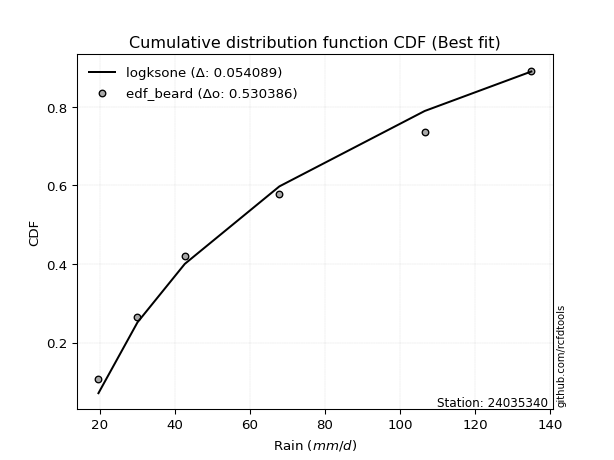</img>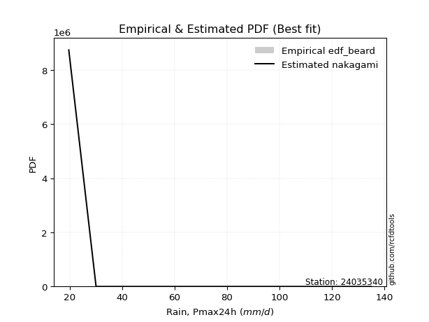</img>

</div>


### 5. Empirical - EDF Chegodayev (1955)

The Chegodayev formula is an empirical plotting position formula used in hydrological frequency analysis to estimate the exceedance probability or return period of a specific event from a set of observed data. It is primarily used for plotting observed data points on probability paper to fit a theoretical distribution, particularly for analyzing extreme events like maximum flood flows or rainfall intensities. The constant _b_ value in the generalized plotting position formula is 0.3.

<div align="center">


$P=(m-b)/(n+1-2b)$


</div>


**5.1. Empirical values**

<div align="center">

|                | 0                   | 1                  | 2                  | 3                  | 4                 | 5                 |
|:---------------|:--------------------|:-------------------|:-------------------|:-------------------|:------------------|:------------------|
| date           | 2021                | 2022               | 2020               | 2025               | 2023              | 2024              |
| x              | 19.7                | 30.1               | 42.7               | 61.7               | 106.6             | 135.0             |
| m              | 1                   | 2                  | 3                  | 4                  | 5                 | 6                 |
| empirical_dist | edf_chegodayev      | edf_chegodayev     | edf_chegodayev     | edf_chegodayev     | edf_chegodayev    | edf_chegodayev    |
| empirical      | 0.10937499999999999 | 0.265625           | 0.421875           | 0.578125           | 0.734375          | 0.890625          |
| empirical_tr   | 1.1228070175438596  | 1.3617021276595744 | 1.7297297297297298 | 2.3703703703703702 | 3.764705882352941 | 9.142857142857142 |

</div>


**5.2. Kolmogorov-Smirnov fit test (sorted by Δ)**


<div align="center">

|                | 0                   | 1                   | 2                   | 3                   | 4                   | 5                   | 6                   | 7                   | 8                   | 9                   | 10                  | 11                    | 12                  | 13                  | 14                  | 15                  | 16                  | 17                  | 18                  | 19                  | 20                | 21                 | 22                  | 23                  | 24                  | 25                  | 26                  | 27                  | 28                 | 29                  | 30                  | 31                  | 32                  | 33                  | 34                  | 35                  | 36                  | 37                  | 38                  | 39                  | 40                  | 41                  | 42                  | 43                  | 44                  | 45                  | 46                  | 47                  | 48                  | 49                  | 50                  | 51                  | 52                  | 53                 | 54                  | 55                  | 56                 | 57                 | 58                  | 59                 | 60                  | 61                 | 62                 | 63                  | 64                  | 65                 | 66                  | 67                 | 68                  | 69                 | 70                  | 71                  | 72                  | 73                  | 74                  | 75                  | 76                  | 77                | 78                 | 79             | 80             | 81                 | 82                 | 83                 | 84                  | 85                 | 86                 | 87                 | 88                 | 89             |
|:---------------|:--------------------|:--------------------|:--------------------|:--------------------|:--------------------|:--------------------|:--------------------|:--------------------|:--------------------|:--------------------|:--------------------|:----------------------|:--------------------|:--------------------|:--------------------|:--------------------|:--------------------|:--------------------|:--------------------|:--------------------|:------------------|:-------------------|:--------------------|:--------------------|:--------------------|:--------------------|:--------------------|:--------------------|:-------------------|:--------------------|:--------------------|:--------------------|:--------------------|:--------------------|:--------------------|:--------------------|:--------------------|:--------------------|:--------------------|:--------------------|:--------------------|:--------------------|:--------------------|:--------------------|:--------------------|:--------------------|:--------------------|:--------------------|:--------------------|:--------------------|:--------------------|:--------------------|:--------------------|:-------------------|:--------------------|:--------------------|:-------------------|:-------------------|:--------------------|:-------------------|:--------------------|:-------------------|:-------------------|:--------------------|:--------------------|:-------------------|:--------------------|:-------------------|:--------------------|:-------------------|:--------------------|:--------------------|:--------------------|:--------------------|:--------------------|:--------------------|:--------------------|:------------------|:-------------------|:---------------|:---------------|:-------------------|:-------------------|:-------------------|:--------------------|:-------------------|:-------------------|:-------------------|:-------------------|:---------------|
| station        | 24035340            | 24035340            | 24035340            | 24035340            | 24035340            | 24035340            | 24035340            | 24035340            | 24035340            | 24035340            | 24035340            | 24035340              | 24035340            | 24035340            | 24035340            | 24035340            | 24035340            | 24035340            | 24035340            | 24035340            | 24035340          | 24035340           | 24035340            | 24035340            | 24035340            | 24035340            | 24035340            | 24035340            | 24035340           | 24035340            | 24035340            | 24035340            | 24035340            | 24035340            | 24035340            | 24035340            | 24035340            | 24035340            | 24035340            | 24035340            | 24035340            | 24035340            | 24035340            | 24035340            | 24035340            | 24035340            | 24035340            | 24035340            | 24035340            | 24035340            | 24035340            | 24035340            | 24035340            | 24035340           | 24035340            | 24035340            | 24035340           | 24035340           | 24035340            | 24035340           | 24035340            | 24035340           | 24035340           | 24035340            | 24035340            | 24035340           | 24035340            | 24035340           | 24035340            | 24035340           | 24035340            | 24035340            | 24035340            | 24035340            | 24035340            | 24035340            | 24035340            | 24035340          | 24035340           | 24035340       | 24035340       | 24035340           | 24035340           | 24035340           | 24035340            | 24035340           | 24035340           | 24035340           | 24035340           | 24035340       |
| empirical_dist | edf_chegodayev      | edf_chegodayev      | edf_chegodayev      | edf_chegodayev      | edf_chegodayev      | edf_chegodayev      | edf_chegodayev      | edf_chegodayev      | edf_chegodayev      | edf_chegodayev      | edf_chegodayev      | edf_chegodayev        | edf_chegodayev      | edf_chegodayev      | edf_chegodayev      | edf_chegodayev      | edf_chegodayev      | edf_chegodayev      | edf_chegodayev      | edf_chegodayev      | edf_chegodayev    | edf_chegodayev     | edf_chegodayev      | edf_chegodayev      | edf_chegodayev      | edf_chegodayev      | edf_chegodayev      | edf_chegodayev      | edf_chegodayev     | edf_chegodayev      | edf_chegodayev      | edf_chegodayev      | edf_chegodayev      | edf_chegodayev      | edf_chegodayev      | edf_chegodayev      | edf_chegodayev      | edf_chegodayev      | edf_chegodayev      | edf_chegodayev      | edf_chegodayev      | edf_chegodayev      | edf_chegodayev      | edf_chegodayev      | edf_chegodayev      | edf_chegodayev      | edf_chegodayev      | edf_chegodayev      | edf_chegodayev      | edf_chegodayev      | edf_chegodayev      | edf_chegodayev      | edf_chegodayev      | edf_chegodayev     | edf_chegodayev      | edf_chegodayev      | edf_chegodayev     | edf_chegodayev     | edf_chegodayev      | edf_chegodayev     | edf_chegodayev      | edf_chegodayev     | edf_chegodayev     | edf_chegodayev      | edf_chegodayev      | edf_chegodayev     | edf_chegodayev      | edf_chegodayev     | edf_chegodayev      | edf_chegodayev     | edf_chegodayev      | edf_chegodayev      | edf_chegodayev      | edf_chegodayev      | edf_chegodayev      | edf_chegodayev      | edf_chegodayev      | edf_chegodayev    | edf_chegodayev     | edf_chegodayev | edf_chegodayev | edf_chegodayev     | edf_chegodayev     | edf_chegodayev     | edf_chegodayev      | edf_chegodayev     | edf_chegodayev     | edf_chegodayev     | edf_chegodayev     | edf_chegodayev |
| p_dist         | johnsonsu           | rayleigh            | loginvweibull       | loggenlogistic      | halfnorm            | logmielke           | loggenexpon         | nct                 | maxwell             | logkstwobign        | logfisk             | loglaplace_asymmetric | logweibull_min      | logalpha            | loghalfnorm         | lograyleigh         | logmaxwell          | logrice             | invgamma            | loggompertz         | pearson3          | loginvgamma        | logncf              | laplace_asymmetric  | genexpon            | expon               | logbetaprime        | exponnorm           | loginvgauss        | ncf                 | gompertz            | betaprime           | lognct              | invgauss            | logfatiguelife      | loggamma            | loggamma            | logerlang           | logf                | lognorm             | lognorm             | logcrystalball      | logt                | logexponnorm        | logpearson3         | logjohnsonsu        | logloggamma         | f                   | alpha               | gumbel_r            | halflogistic        | logexpon            | kstwobign           | moyal              | loghalflogistic     | loggumbel_r         | genlogistic        | logmoyal           | loglogistic         | t                  | truncnorm           | crystalball        | norm               | loghypsecant        | loggumbel_l         | rice               | loglaplace          | logistic           | fisk                | nakagami           | hypsecant           | gumbel_l            | laplace             | erlang              | logchi2             | logwald             | wald                | lognakagami       | logtruncnorm       | gibrat         | loggibrat      | pareto             | weibull_min        | logpareto          | loglognorm          | fatiguelife        | invweibull         | gamma              | chi2               | mielke         |
| delta          | 0.09816121851454862 | 0.09883115516618624 | 0.09908575879844417 | 0.09960907926419205 | 0.09991612804830596 | 0.10264839865617903 | 0.10409283224068304 | 0.10547932451445075 | 0.10711982897917366 | 0.10787639719381914 | 0.10845150159165728 | 0.10919986534713277   | 0.10937039486386568 | 0.10959391739413482 | 0.11003332656205689 | 0.11017717745343025 | 0.11110458963172487 | 0.11136156546359832 | 0.11136342174370417 | 0.11198926072273419 | 0.112356054072628 | 0.1124279138181088 | 0.11263967757131488 | 0.11274608189111301 | 0.11276633326516572 | 0.11276641635759665 | 0.11331077297984904 | 0.11337345763929574 | 0.1133874992999947 | 0.11359394283405666 | 0.11371847568523175 | 0.11395413594183013 | 0.11446083727221312 | 0.11448469477022694 | 0.11449487620147303 | 0.11457874356738262 | 0.11457874356738262 | 0.11458550433899617 | 0.11459327522377771 | 0.11461196606794499 | 0.11461196606794499 | 0.11461200527080262 | 0.11461213097008183 | 0.11461219808329048 | 0.11463746006977826 | 0.11474488092454438 | 0.11481026079646561 | 0.11526469761149616 | 0.11661631456304611 | 0.11724767704708838 | 0.11774194862028609 | 0.11961952732320369 | 0.12325107622966547 | 0.1233778878923264 | 0.12651202010654683 | 0.12682448517617484 | 0.1285153088242813 | 0.1319123162292195 | 0.13231674858923415 | 0.1336746099550033 | 0.13371233932200188 | 0.1337123704048367 | 0.1337123758170311 | 0.14139325046762952 | 0.14433942029851798 | 0.1458758878042763 | 0.14946126808678117 | 0.1555754951702601 | 0.16336883099126487 | 0.1678819876425799 | 0.17104680581892096 | 0.18933390459178567 | 0.19499946670286272 | 0.19746083626645938 | 0.20223336101344935 | 0.23532452360587036 | 0.24703980117197877 | 0.265624958012647 | 0.2656249987098218 | 0.265625       | 0.265625       | 0.3381896529535833 | 0.3444123565158471 | 0.3729539194669609 | 0.38199111554082243 | 0.4525404892286773 | 0.4533507574147471 | 0.5445253343734978 | 0.5507894817648189 | nan            |
| deltao         | 0.530385761606      | 0.530385761606      | 0.530385761606      | 0.530385761606      | 0.530385761606      | 0.530385761606      | 0.530385761606      | 0.530385761606      | 0.530385761606      | 0.530385761606      | 0.530385761606      | 0.530385761606        | 0.530385761606      | 0.530385761606      | 0.530385761606      | 0.530385761606      | 0.530385761606      | 0.530385761606      | 0.530385761606      | 0.530385761606      | 0.530385761606    | 0.530385761606     | 0.530385761606      | 0.530385761606      | 0.530385761606      | 0.530385761606      | 0.530385761606      | 0.530385761606      | 0.530385761606     | 0.530385761606      | 0.530385761606      | 0.530385761606      | 0.530385761606      | 0.530385761606      | 0.530385761606      | 0.530385761606      | 0.530385761606      | 0.530385761606      | 0.530385761606      | 0.530385761606      | 0.530385761606      | 0.530385761606      | 0.530385761606      | 0.530385761606      | 0.530385761606      | 0.530385761606      | 0.530385761606      | 0.530385761606      | 0.530385761606      | 0.530385761606      | 0.530385761606      | 0.530385761606      | 0.530385761606      | 0.530385761606     | 0.530385761606      | 0.530385761606      | 0.530385761606     | 0.530385761606     | 0.530385761606      | 0.530385761606     | 0.530385761606      | 0.530385761606     | 0.530385761606     | 0.530385761606      | 0.530385761606      | 0.530385761606     | 0.530385761606      | 0.530385761606     | 0.530385761606      | 0.530385761606     | 0.530385761606      | 0.530385761606      | 0.530385761606      | 0.530385761606      | 0.530385761606      | 0.530385761606      | 0.530385761606      | 0.530385761606    | 0.530385761606     | 0.530385761606 | 0.530385761606 | 0.530385761606     | 0.530385761606     | 0.530385761606     | 0.530385761606      | 0.530385761606     | 0.530385761606     | 0.530385761606     | 0.530385761606     | 0.530385761606 |
| eval           | Δo > Δ              | Δo > Δ              | Δo > Δ              | Δo > Δ              | Δo > Δ              | Δo > Δ              | Δo > Δ              | Δo > Δ              | Δo > Δ              | Δo > Δ              | Δo > Δ              | Δo > Δ                | Δo > Δ              | Δo > Δ              | Δo > Δ              | Δo > Δ              | Δo > Δ              | Δo > Δ              | Δo > Δ              | Δo > Δ              | Δo > Δ            | Δo > Δ             | Δo > Δ              | Δo > Δ              | Δo > Δ              | Δo > Δ              | Δo > Δ              | Δo > Δ              | Δo > Δ             | Δo > Δ              | Δo > Δ              | Δo > Δ              | Δo > Δ              | Δo > Δ              | Δo > Δ              | Δo > Δ              | Δo > Δ              | Δo > Δ              | Δo > Δ              | Δo > Δ              | Δo > Δ              | Δo > Δ              | Δo > Δ              | Δo > Δ              | Δo > Δ              | Δo > Δ              | Δo > Δ              | Δo > Δ              | Δo > Δ              | Δo > Δ              | Δo > Δ              | Δo > Δ              | Δo > Δ              | Δo > Δ             | Δo > Δ              | Δo > Δ              | Δo > Δ             | Δo > Δ             | Δo > Δ              | Δo > Δ             | Δo > Δ              | Δo > Δ             | Δo > Δ             | Δo > Δ              | Δo > Δ              | Δo > Δ             | Δo > Δ              | Δo > Δ             | Δo > Δ              | Δo > Δ             | Δo > Δ              | Δo > Δ              | Δo > Δ              | Δo > Δ              | Δo > Δ              | Δo > Δ              | Δo > Δ              | Δo > Δ            | Δo > Δ             | Δo > Δ         | Δo > Δ         | Δo > Δ             | Δo > Δ             | Δo > Δ             | Δo > Δ              | Δo > Δ             | Δo > Δ             | Δo <= Δ            | Δo <= Δ            | Δo <= Δ        |
| fit            | 1                   | 1                   | 1                   | 1                   | 1                   | 1                   | 1                   | 1                   | 1                   | 1                   | 1                   | 1                     | 1                   | 1                   | 1                   | 1                   | 1                   | 1                   | 1                   | 1                   | 1                 | 1                  | 1                   | 1                   | 1                   | 1                   | 1                   | 1                   | 1                  | 1                   | 1                   | 1                   | 1                   | 1                   | 1                   | 1                   | 1                   | 1                   | 1                   | 1                   | 1                   | 1                   | 1                   | 1                   | 1                   | 1                   | 1                   | 1                   | 1                   | 1                   | 1                   | 1                   | 1                   | 1                  | 1                   | 1                   | 1                  | 1                  | 1                   | 1                  | 1                   | 1                  | 1                  | 1                   | 1                   | 1                  | 1                   | 1                  | 1                   | 1                  | 1                   | 1                   | 1                   | 1                   | 1                   | 1                   | 1                   | 1                 | 1                  | 1              | 1              | 1                  | 1                  | 1                  | 1                   | 1                  | 1                  | 0                  | 0                  | 0              |
| n              | 6                   | 6                   | 6                   | 6                   | 6                   | 6                   | 6                   | 6                   | 6                   | 6                   | 6                   | 6                     | 6                   | 6                   | 6                   | 6                   | 6                   | 6                   | 6                   | 6                   | 6                 | 6                  | 6                   | 6                   | 6                   | 6                   | 6                   | 6                   | 6                  | 6                   | 6                   | 6                   | 6                   | 6                   | 6                   | 6                   | 6                   | 6                   | 6                   | 6                   | 6                   | 6                   | 6                   | 6                   | 6                   | 6                   | 6                   | 6                   | 6                   | 6                   | 6                   | 6                   | 6                   | 6                  | 6                   | 6                   | 6                  | 6                  | 6                   | 6                  | 6                   | 6                  | 6                  | 6                   | 6                   | 6                  | 6                   | 6                  | 6                   | 6                  | 6                   | 6                   | 6                   | 6                   | 6                   | 6                   | 6                   | 6                 | 6                  | 6              | 6              | 6                  | 6                  | 6                  | 6                   | 6                  | 6                  | 6                  | 6                  | 6              |
| best_fit       | 1                   | 0                   | 0                   | 0                   | 0                   | 0                   | 0                   | 0                   | 0                   | 0                   | 0                   | 0                     | 0                   | 0                   | 0                   | 0                   | 0                   | 0                   | 0                   | 0                   | 0                 | 0                  | 0                   | 0                   | 0                   | 0                   | 0                   | 0                   | 0                  | 0                   | 0                   | 0                   | 0                   | 0                   | 0                   | 0                   | 0                   | 0                   | 0                   | 0                   | 0                   | 0                   | 0                   | 0                   | 0                   | 0                   | 0                   | 0                   | 0                   | 0                   | 0                   | 0                   | 0                   | 0                  | 0                   | 0                   | 0                  | 0                  | 0                   | 0                  | 0                   | 0                  | 0                  | 0                   | 0                   | 0                  | 0                   | 0                  | 0                   | 0                  | 0                   | 0                   | 0                   | 0                   | 0                   | 0                   | 0                   | 0                 | 0                  | 0              | 0              | 0                  | 0                  | 0                  | 0                   | 0                  | 0                  | 0                  | 0                  | 0              |
| best_fit_sort  | 1                   | 2                   | 3                   | 4                   | 5                   | 6                   | 7                   | 8                   | 9                   | 10                  | 11                  | 12                    | 13                  | 14                  | 15                  | 16                  | 17                  | 18                  | 19                  | 20                  | 21                | 22                 | 23                  | 24                  | 25                  | 26                  | 27                  | 28                  | 29                 | 30                  | 31                  | 32                  | 33                  | 34                  | 35                  | 36                  | 37                  | 38                  | 39                  | 40                  | 41                  | 42                  | 43                  | 44                  | 45                  | 46                  | 47                  | 48                  | 49                  | 50                  | 51                  | 52                  | 53                  | 54                 | 55                  | 56                  | 57                 | 58                 | 59                  | 60                 | 61                  | 62                 | 63                 | 64                  | 65                  | 66                 | 67                  | 68                 | 69                  | 70                 | 71                  | 72                  | 73                  | 74                  | 75                  | 76                  | 77                  | 78                | 79                 | 80             | 81             | 82                 | 83                 | 84                 | 85                  | 86                 | 87                 | 88                 | 89                 | 90             |

</div>


<div align="center">

</img>

</div>


**5.3. Best fit**

<div align="center">

|   id |   station | empirical_dist   | p_dist    |     delta |   deltao | eval   |   fit |   n |   best_fit |   best_fit_sort |
|-----:|----------:|:-----------------|:----------|----------:|---------:|:-------|------:|----:|-----------:|----------------:|
|    0 |  24035340 | edf_chegodayev   | johnsonsu | 0.0981612 | 0.530386 | Δo > Δ |     1 |   6 |          1 |               1 |

</div>


<div align="center">

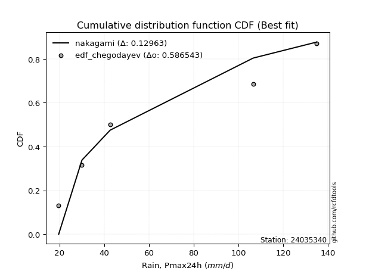</img>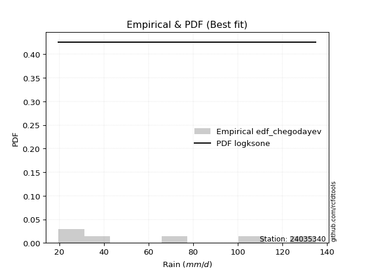</img>

</div>


### 6. Empirical - EDF Blom (1958)

The Blom formula is a specific "plotting position" formula used in hydrology and statistical analysis to estimate the empirical cumulative probability (or non-exceedance probability) of a data series. It is particularly recommended for data that are approximately normally distributed. The constant _a_ is set to 0.375 (or 3/8).

<div align="center">


$P=(m-a)/(n+1-2a)$


</div>


**6.1. Empirical values**

<div align="center">

|                | 0                  | 1                  | 2                  | 3                 | 4                 | 5                  |
|:---------------|:-------------------|:-------------------|:-------------------|:------------------|:------------------|:-------------------|
| date           | 2021               | 2022               | 2020               | 2025              | 2023              | 2024               |
| x              | 19.7               | 30.1               | 42.7               | 61.7              | 106.6             | 135.0              |
| m              | 1                  | 2                  | 3                  | 4                 | 5                 | 6                  |
| empirical_dist | edf_blom           | edf_blom           | edf_blom           | edf_blom          | edf_blom          | edf_blom           |
| empirical      | 0.1                | 0.26               | 0.42               | 0.58              | 0.74              | 0.9                |
| empirical_tr   | 1.1111111111111112 | 1.3513513513513513 | 1.7241379310344827 | 2.380952380952381 | 3.846153846153846 | 10.000000000000002 |

</div>


**6.2. Kolmogorov-Smirnov fit test (sorted by Δ)**


<div align="center">

|                | 0                   | 1                   | 2                   | 3                   | 4                   | 5                   | 6                  | 7                   | 8                   | 9                  | 10                    | 11                  | 12                  | 13                 | 14                  | 15                  | 16                  | 17                  | 18                  | 19                 | 20                 | 21                  | 22                  | 23                  | 24                  | 25                  | 26                  | 27                  | 28                  | 29                  | 30                  | 31                  | 32                  | 33                  | 34                  | 35                  | 36                  | 37                  | 38                | 39                | 40                  | 41                  | 42                  | 43                  | 44                  | 45                  | 46                  | 47                  | 48                  | 49                  | 50                 | 51                  | 52                  | 53                  | 54                  | 55                 | 56                  | 57                  | 58                  | 59                  | 60                  | 61                  | 62                 | 63                  | 64                | 65                  | 66                  | 67                  | 68                 | 69                  | 70                 | 71                  | 72                 | 73                 | 74                  | 75                  | 76                  | 77                | 78                 | 79             | 80             | 81                  | 82                 | 83                 | 84                 | 85                 | 86                  | 87                 | 88                 | 89             |
|:---------------|:--------------------|:--------------------|:--------------------|:--------------------|:--------------------|:--------------------|:-------------------|:--------------------|:--------------------|:-------------------|:----------------------|:--------------------|:--------------------|:-------------------|:--------------------|:--------------------|:--------------------|:--------------------|:--------------------|:-------------------|:-------------------|:--------------------|:--------------------|:--------------------|:--------------------|:--------------------|:--------------------|:--------------------|:--------------------|:--------------------|:--------------------|:--------------------|:--------------------|:--------------------|:--------------------|:--------------------|:--------------------|:--------------------|:------------------|:------------------|:--------------------|:--------------------|:--------------------|:--------------------|:--------------------|:--------------------|:--------------------|:--------------------|:--------------------|:--------------------|:-------------------|:--------------------|:--------------------|:--------------------|:--------------------|:-------------------|:--------------------|:--------------------|:--------------------|:--------------------|:--------------------|:--------------------|:-------------------|:--------------------|:------------------|:--------------------|:--------------------|:--------------------|:-------------------|:--------------------|:-------------------|:--------------------|:-------------------|:-------------------|:--------------------|:--------------------|:--------------------|:------------------|:-------------------|:---------------|:---------------|:--------------------|:-------------------|:-------------------|:-------------------|:-------------------|:--------------------|:-------------------|:-------------------|:---------------|
| station        | 24035340            | 24035340            | 24035340            | 24035340            | 24035340            | 24035340            | 24035340           | 24035340            | 24035340            | 24035340           | 24035340              | 24035340            | 24035340            | 24035340           | 24035340            | 24035340            | 24035340            | 24035340            | 24035340            | 24035340           | 24035340           | 24035340            | 24035340            | 24035340            | 24035340            | 24035340            | 24035340            | 24035340            | 24035340            | 24035340            | 24035340            | 24035340            | 24035340            | 24035340            | 24035340            | 24035340            | 24035340            | 24035340            | 24035340          | 24035340          | 24035340            | 24035340            | 24035340            | 24035340            | 24035340            | 24035340            | 24035340            | 24035340            | 24035340            | 24035340            | 24035340           | 24035340            | 24035340            | 24035340            | 24035340            | 24035340           | 24035340            | 24035340            | 24035340            | 24035340            | 24035340            | 24035340            | 24035340           | 24035340            | 24035340          | 24035340            | 24035340            | 24035340            | 24035340           | 24035340            | 24035340           | 24035340            | 24035340           | 24035340           | 24035340            | 24035340            | 24035340            | 24035340          | 24035340           | 24035340       | 24035340       | 24035340            | 24035340           | 24035340           | 24035340           | 24035340           | 24035340            | 24035340           | 24035340           | 24035340       |
| empirical_dist | edf_blom            | edf_blom            | edf_blom            | edf_blom            | edf_blom            | edf_blom            | edf_blom           | edf_blom            | edf_blom            | edf_blom           | edf_blom              | edf_blom            | edf_blom            | edf_blom           | edf_blom            | edf_blom            | edf_blom            | edf_blom            | edf_blom            | edf_blom           | edf_blom           | edf_blom            | edf_blom            | edf_blom            | edf_blom            | edf_blom            | edf_blom            | edf_blom            | edf_blom            | edf_blom            | edf_blom            | edf_blom            | edf_blom            | edf_blom            | edf_blom            | edf_blom            | edf_blom            | edf_blom            | edf_blom          | edf_blom          | edf_blom            | edf_blom            | edf_blom            | edf_blom            | edf_blom            | edf_blom            | edf_blom            | edf_blom            | edf_blom            | edf_blom            | edf_blom           | edf_blom            | edf_blom            | edf_blom            | edf_blom            | edf_blom           | edf_blom            | edf_blom            | edf_blom            | edf_blom            | edf_blom            | edf_blom            | edf_blom           | edf_blom            | edf_blom          | edf_blom            | edf_blom            | edf_blom            | edf_blom           | edf_blom            | edf_blom           | edf_blom            | edf_blom           | edf_blom           | edf_blom            | edf_blom            | edf_blom            | edf_blom          | edf_blom           | edf_blom       | edf_blom       | edf_blom            | edf_blom           | edf_blom           | edf_blom           | edf_blom           | edf_blom            | edf_blom           | edf_blom           | edf_blom       |
| p_dist         | johnsonsu           | loginvweibull       | loggenlogistic      | halfnorm            | rayleigh            | logmielke           | loggenexpon        | nct                 | logkstwobign        | logfisk            | loglaplace_asymmetric | logweibull_min      | logalpha            | loghalfnorm        | lograyleigh         | maxwell             | logmaxwell          | logrice             | invgamma            | loggompertz        | loginvgamma        | logncf              | laplace_asymmetric  | genexpon            | expon               | logbetaprime        | exponnorm           | loginvgauss         | ncf                 | gompertz            | betaprime           | lognct              | invgauss            | logfatiguelife      | loggamma            | loggamma            | logerlang           | logf                | lognorm           | lognorm           | logcrystalball      | logt                | logexponnorm        | logpearson3         | logjohnsonsu        | logloggamma         | f                   | pearson3            | alpha               | gumbel_r            | halflogistic       | kstwobign           | moyal               | loghalflogistic     | loggumbel_r         | logexpon           | genlogistic         | logmoyal            | loglogistic         | t                   | truncnorm           | crystalball         | norm               | loghypsecant        | loggumbel_l       | loglaplace          | rice                | logistic            | nakagami           | hypsecant           | fisk               | gumbel_l            | erlang             | laplace            | logchi2             | logwald             | wald                | lognakagami       | logtruncnorm       | gibrat         | loggibrat      | pareto              | weibull_min        | logpareto          | loglognorm         | fatiguelife        | invweibull          | gamma              | chi2               | mielke         |
| delta          | 0.09253621851454863 | 0.09346075879844418 | 0.09398407926419206 | 0.09429112804830597 | 0.09461969234421391 | 0.09702339865617904 | 0.0978846887789141 | 0.09985432451445075 | 0.10225139719381915 | 0.1028265015916573 | 0.10357486534713278   | 0.10374539486386569 | 0.10396891739413483 | 0.1044083265620569 | 0.10455217745343026 | 0.10524482897917364 | 0.10547958963172488 | 0.10573656546359833 | 0.10573842174370418 | 0.1063642607227342 | 0.1068029138181088 | 0.10701467757131489 | 0.10712108189111302 | 0.10714133326516573 | 0.10714141635759666 | 0.10768577297984905 | 0.10774845763929575 | 0.10776249929999471 | 0.10796894283405667 | 0.10809347568523175 | 0.10832913594183013 | 0.10883583727221313 | 0.10885969477022694 | 0.10886987620147304 | 0.10895374356738263 | 0.10895374356738263 | 0.10896050433899618 | 0.10896827522377772 | 0.108986966067945 | 0.108986966067945 | 0.10898700527080263 | 0.10898713097008184 | 0.10898719808329049 | 0.10901246006977827 | 0.10911988092454439 | 0.10918526079646562 | 0.10963969761149617 | 0.11048105407262798 | 0.11099131456304612 | 0.11162267704708839 | 0.1121169486202861 | 0.11762607622966548 | 0.11775288789232641 | 0.12088702010654684 | 0.12119948517617485 | 0.1214945273232037 | 0.12289030882428131 | 0.12628731622921952 | 0.12669174858923415 | 0.13179960995500328 | 0.13183733932200187 | 0.13183737040483667 | 0.1318373758170311 | 0.13576825046762953 | 0.138714420298518 | 0.14383626808678118 | 0.14400088780427628 | 0.15370049517026008 | 0.1622569876425799 | 0.16917180581892094 | 0.1727438309912649 | 0.19120890459178563 | 0.1918358362664594 | 0.1931244667028627 | 0.20785836101344934 | 0.22969952360587037 | 0.24141480117197878 | 0.259999958012647 | 0.2599999987098218 | 0.26           | 0.26           | 0.34381465295358327 | 0.3500373565158471 | 0.3785789194669609 | 0.3876161155408224 | 0.4581654892286773 | 0.46272575741474714 | 0.5501503343734978 | 0.5564144817648189 | nan            |
| deltao         | 0.530385761606      | 0.530385761606      | 0.530385761606      | 0.530385761606      | 0.530385761606      | 0.530385761606      | 0.530385761606     | 0.530385761606      | 0.530385761606      | 0.530385761606     | 0.530385761606        | 0.530385761606      | 0.530385761606      | 0.530385761606     | 0.530385761606      | 0.530385761606      | 0.530385761606      | 0.530385761606      | 0.530385761606      | 0.530385761606     | 0.530385761606     | 0.530385761606      | 0.530385761606      | 0.530385761606      | 0.530385761606      | 0.530385761606      | 0.530385761606      | 0.530385761606      | 0.530385761606      | 0.530385761606      | 0.530385761606      | 0.530385761606      | 0.530385761606      | 0.530385761606      | 0.530385761606      | 0.530385761606      | 0.530385761606      | 0.530385761606      | 0.530385761606    | 0.530385761606    | 0.530385761606      | 0.530385761606      | 0.530385761606      | 0.530385761606      | 0.530385761606      | 0.530385761606      | 0.530385761606      | 0.530385761606      | 0.530385761606      | 0.530385761606      | 0.530385761606     | 0.530385761606      | 0.530385761606      | 0.530385761606      | 0.530385761606      | 0.530385761606     | 0.530385761606      | 0.530385761606      | 0.530385761606      | 0.530385761606      | 0.530385761606      | 0.530385761606      | 0.530385761606     | 0.530385761606      | 0.530385761606    | 0.530385761606      | 0.530385761606      | 0.530385761606      | 0.530385761606     | 0.530385761606      | 0.530385761606     | 0.530385761606      | 0.530385761606     | 0.530385761606     | 0.530385761606      | 0.530385761606      | 0.530385761606      | 0.530385761606    | 0.530385761606     | 0.530385761606 | 0.530385761606 | 0.530385761606      | 0.530385761606     | 0.530385761606     | 0.530385761606     | 0.530385761606     | 0.530385761606      | 0.530385761606     | 0.530385761606     | 0.530385761606 |
| eval           | Δo > Δ              | Δo > Δ              | Δo > Δ              | Δo > Δ              | Δo > Δ              | Δo > Δ              | Δo > Δ             | Δo > Δ              | Δo > Δ              | Δo > Δ             | Δo > Δ                | Δo > Δ              | Δo > Δ              | Δo > Δ             | Δo > Δ              | Δo > Δ              | Δo > Δ              | Δo > Δ              | Δo > Δ              | Δo > Δ             | Δo > Δ             | Δo > Δ              | Δo > Δ              | Δo > Δ              | Δo > Δ              | Δo > Δ              | Δo > Δ              | Δo > Δ              | Δo > Δ              | Δo > Δ              | Δo > Δ              | Δo > Δ              | Δo > Δ              | Δo > Δ              | Δo > Δ              | Δo > Δ              | Δo > Δ              | Δo > Δ              | Δo > Δ            | Δo > Δ            | Δo > Δ              | Δo > Δ              | Δo > Δ              | Δo > Δ              | Δo > Δ              | Δo > Δ              | Δo > Δ              | Δo > Δ              | Δo > Δ              | Δo > Δ              | Δo > Δ             | Δo > Δ              | Δo > Δ              | Δo > Δ              | Δo > Δ              | Δo > Δ             | Δo > Δ              | Δo > Δ              | Δo > Δ              | Δo > Δ              | Δo > Δ              | Δo > Δ              | Δo > Δ             | Δo > Δ              | Δo > Δ            | Δo > Δ              | Δo > Δ              | Δo > Δ              | Δo > Δ             | Δo > Δ              | Δo > Δ             | Δo > Δ              | Δo > Δ             | Δo > Δ             | Δo > Δ              | Δo > Δ              | Δo > Δ              | Δo > Δ            | Δo > Δ             | Δo > Δ         | Δo > Δ         | Δo > Δ              | Δo > Δ             | Δo > Δ             | Δo > Δ             | Δo > Δ             | Δo > Δ              | Δo <= Δ            | Δo <= Δ            | Δo <= Δ        |
| fit            | 1                   | 1                   | 1                   | 1                   | 1                   | 1                   | 1                  | 1                   | 1                   | 1                  | 1                     | 1                   | 1                   | 1                  | 1                   | 1                   | 1                   | 1                   | 1                   | 1                  | 1                  | 1                   | 1                   | 1                   | 1                   | 1                   | 1                   | 1                   | 1                   | 1                   | 1                   | 1                   | 1                   | 1                   | 1                   | 1                   | 1                   | 1                   | 1                 | 1                 | 1                   | 1                   | 1                   | 1                   | 1                   | 1                   | 1                   | 1                   | 1                   | 1                   | 1                  | 1                   | 1                   | 1                   | 1                   | 1                  | 1                   | 1                   | 1                   | 1                   | 1                   | 1                   | 1                  | 1                   | 1                 | 1                   | 1                   | 1                   | 1                  | 1                   | 1                  | 1                   | 1                  | 1                  | 1                   | 1                   | 1                   | 1                 | 1                  | 1              | 1              | 1                   | 1                  | 1                  | 1                  | 1                  | 1                   | 0                  | 0                  | 0              |
| n              | 6                   | 6                   | 6                   | 6                   | 6                   | 6                   | 6                  | 6                   | 6                   | 6                  | 6                     | 6                   | 6                   | 6                  | 6                   | 6                   | 6                   | 6                   | 6                   | 6                  | 6                  | 6                   | 6                   | 6                   | 6                   | 6                   | 6                   | 6                   | 6                   | 6                   | 6                   | 6                   | 6                   | 6                   | 6                   | 6                   | 6                   | 6                   | 6                 | 6                 | 6                   | 6                   | 6                   | 6                   | 6                   | 6                   | 6                   | 6                   | 6                   | 6                   | 6                  | 6                   | 6                   | 6                   | 6                   | 6                  | 6                   | 6                   | 6                   | 6                   | 6                   | 6                   | 6                  | 6                   | 6                 | 6                   | 6                   | 6                   | 6                  | 6                   | 6                  | 6                   | 6                  | 6                  | 6                   | 6                   | 6                   | 6                 | 6                  | 6              | 6              | 6                   | 6                  | 6                  | 6                  | 6                  | 6                   | 6                  | 6                  | 6              |
| best_fit       | 1                   | 0                   | 0                   | 0                   | 0                   | 0                   | 0                  | 0                   | 0                   | 0                  | 0                     | 0                   | 0                   | 0                  | 0                   | 0                   | 0                   | 0                   | 0                   | 0                  | 0                  | 0                   | 0                   | 0                   | 0                   | 0                   | 0                   | 0                   | 0                   | 0                   | 0                   | 0                   | 0                   | 0                   | 0                   | 0                   | 0                   | 0                   | 0                 | 0                 | 0                   | 0                   | 0                   | 0                   | 0                   | 0                   | 0                   | 0                   | 0                   | 0                   | 0                  | 0                   | 0                   | 0                   | 0                   | 0                  | 0                   | 0                   | 0                   | 0                   | 0                   | 0                   | 0                  | 0                   | 0                 | 0                   | 0                   | 0                   | 0                  | 0                   | 0                  | 0                   | 0                  | 0                  | 0                   | 0                   | 0                   | 0                 | 0                  | 0              | 0              | 0                   | 0                  | 0                  | 0                  | 0                  | 0                   | 0                  | 0                  | 0              |
| best_fit_sort  | 1                   | 2                   | 3                   | 4                   | 5                   | 6                   | 7                  | 8                   | 9                   | 10                 | 11                    | 12                  | 13                  | 14                 | 15                  | 16                  | 17                  | 18                  | 19                  | 20                 | 21                 | 22                  | 23                  | 24                  | 25                  | 26                  | 27                  | 28                  | 29                  | 30                  | 31                  | 32                  | 33                  | 34                  | 35                  | 36                  | 37                  | 38                  | 39                | 40                | 41                  | 42                  | 43                  | 44                  | 45                  | 46                  | 47                  | 48                  | 49                  | 50                  | 51                 | 52                  | 53                  | 54                  | 55                  | 56                 | 57                  | 58                  | 59                  | 60                  | 61                  | 62                  | 63                 | 64                  | 65                | 66                  | 67                  | 68                  | 69                 | 70                  | 71                 | 72                  | 73                 | 74                 | 75                  | 76                  | 77                  | 78                | 79                 | 80             | 81             | 82                  | 83                 | 84                 | 85                 | 86                 | 87                  | 88                 | 89                 | 90             |

</div>


<div align="center">

</img>

</div>


**6.3. Best fit**

<div align="center">

|   id |   station | empirical_dist   | p_dist    |     delta |   deltao | eval   |   fit |   n |   best_fit |   best_fit_sort |
|-----:|----------:|:-----------------|:----------|----------:|---------:|:-------|------:|----:|-----------:|----------------:|
|    0 |  24035340 | edf_blom         | johnsonsu | 0.0925362 | 0.530386 | Δo > Δ |     1 |   6 |          1 |               1 |

</div>


<div align="center">

</img>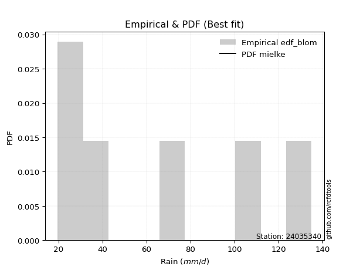</img>

</div>


### 7. Empirical - EDF Tukey (1962)

In hydrology, the Tukey formula is used as a plotting position formula to estimate the empirical probability or frequency of a flood event (or other hydrological data). The formula parameter is given as _c=0.333_ (or 1/3).

<div align="center">


$P=(m-c)/(n+1-2c)$


</div>


**7.1. Empirical values**

<div align="center">

|                | 0                   | 1                  | 2                   | 3                  | 4                  | 5                  |
|:---------------|:--------------------|:-------------------|:--------------------|:-------------------|:-------------------|:-------------------|
| date           | 2021                | 2022               | 2020                | 2025               | 2023               | 2024               |
| x              | 19.7                | 30.1               | 42.7                | 61.7               | 106.6              | 135.0              |
| m              | 1                   | 2                  | 3                   | 4                  | 5                  | 6                  |
| empirical_dist | edf_tukey           | edf_tukey          | edf_tukey           | edf_tukey          | edf_tukey          | edf_tukey          |
| empirical      | 0.10526315789473684 | 0.2631578947368421 | 0.42105263157894735 | 0.5789473684210527 | 0.7368421052631579 | 0.8947368421052632 |
| empirical_tr   | 1.1176470588235294  | 1.357142857142857  | 1.7272727272727273  | 2.375              | 3.7999999999999994 | 9.5                |

</div>


**7.2. Kolmogorov-Smirnov fit test (sorted by Δ)**


<div align="center">

|                | 0                   | 1                   | 2                   | 3                   | 4                   | 5                   | 6                   | 7                   | 8                   | 9                   | 10                | 11                    | 12                  | 13                  | 14                  | 15                 | 16                  | 17                  | 18                  | 19                  | 20                  | 21                  | 22                  | 23                  | 24                 | 25                  | 26                  | 27                  | 28                 | 29                  | 30                  | 31                  | 32                  | 33                  | 34                  | 35                  | 36                  | 37                  | 38                  | 39                  | 40                  | 41                  | 42                  | 43                  | 44                  | 45                  | 46                  | 47                 | 48                  | 49                  | 50                  | 51                  | 52                  | 53                  | 54                  | 55                  | 56                  | 57                  | 58                 | 59                  | 60                  | 61                  | 62                  | 63                  | 64                  | 65                  | 66                  | 67                  | 68                  | 69                  | 70                 | 71                  | 72                  | 73                  | 74                  | 75                  | 76                  | 77                 | 78                 | 79                 | 80                 | 81                 | 82                | 83                 | 84                  | 85                 | 86                 | 87                 | 88                 | 89             |
|:---------------|:--------------------|:--------------------|:--------------------|:--------------------|:--------------------|:--------------------|:--------------------|:--------------------|:--------------------|:--------------------|:------------------|:----------------------|:--------------------|:--------------------|:--------------------|:-------------------|:--------------------|:--------------------|:--------------------|:--------------------|:--------------------|:--------------------|:--------------------|:--------------------|:-------------------|:--------------------|:--------------------|:--------------------|:-------------------|:--------------------|:--------------------|:--------------------|:--------------------|:--------------------|:--------------------|:--------------------|:--------------------|:--------------------|:--------------------|:--------------------|:--------------------|:--------------------|:--------------------|:--------------------|:--------------------|:--------------------|:--------------------|:-------------------|:--------------------|:--------------------|:--------------------|:--------------------|:--------------------|:--------------------|:--------------------|:--------------------|:--------------------|:--------------------|:-------------------|:--------------------|:--------------------|:--------------------|:--------------------|:--------------------|:--------------------|:--------------------|:--------------------|:--------------------|:--------------------|:--------------------|:-------------------|:--------------------|:--------------------|:--------------------|:--------------------|:--------------------|:--------------------|:-------------------|:-------------------|:-------------------|:-------------------|:-------------------|:------------------|:-------------------|:--------------------|:-------------------|:-------------------|:-------------------|:-------------------|:---------------|
| station        | 24035340            | 24035340            | 24035340            | 24035340            | 24035340            | 24035340            | 24035340            | 24035340            | 24035340            | 24035340            | 24035340          | 24035340              | 24035340            | 24035340            | 24035340            | 24035340           | 24035340            | 24035340            | 24035340            | 24035340            | 24035340            | 24035340            | 24035340            | 24035340            | 24035340           | 24035340            | 24035340            | 24035340            | 24035340           | 24035340            | 24035340            | 24035340            | 24035340            | 24035340            | 24035340            | 24035340            | 24035340            | 24035340            | 24035340            | 24035340            | 24035340            | 24035340            | 24035340            | 24035340            | 24035340            | 24035340            | 24035340            | 24035340           | 24035340            | 24035340            | 24035340            | 24035340            | 24035340            | 24035340            | 24035340            | 24035340            | 24035340            | 24035340            | 24035340           | 24035340            | 24035340            | 24035340            | 24035340            | 24035340            | 24035340            | 24035340            | 24035340            | 24035340            | 24035340            | 24035340            | 24035340           | 24035340            | 24035340            | 24035340            | 24035340            | 24035340            | 24035340            | 24035340           | 24035340           | 24035340           | 24035340           | 24035340           | 24035340          | 24035340           | 24035340            | 24035340           | 24035340           | 24035340           | 24035340           | 24035340       |
| empirical_dist | edf_tukey           | edf_tukey           | edf_tukey           | edf_tukey           | edf_tukey           | edf_tukey           | edf_tukey           | edf_tukey           | edf_tukey           | edf_tukey           | edf_tukey         | edf_tukey             | edf_tukey           | edf_tukey           | edf_tukey           | edf_tukey          | edf_tukey           | edf_tukey           | edf_tukey           | edf_tukey           | edf_tukey           | edf_tukey           | edf_tukey           | edf_tukey           | edf_tukey          | edf_tukey           | edf_tukey           | edf_tukey           | edf_tukey          | edf_tukey           | edf_tukey           | edf_tukey           | edf_tukey           | edf_tukey           | edf_tukey           | edf_tukey           | edf_tukey           | edf_tukey           | edf_tukey           | edf_tukey           | edf_tukey           | edf_tukey           | edf_tukey           | edf_tukey           | edf_tukey           | edf_tukey           | edf_tukey           | edf_tukey          | edf_tukey           | edf_tukey           | edf_tukey           | edf_tukey           | edf_tukey           | edf_tukey           | edf_tukey           | edf_tukey           | edf_tukey           | edf_tukey           | edf_tukey          | edf_tukey           | edf_tukey           | edf_tukey           | edf_tukey           | edf_tukey           | edf_tukey           | edf_tukey           | edf_tukey           | edf_tukey           | edf_tukey           | edf_tukey           | edf_tukey          | edf_tukey           | edf_tukey           | edf_tukey           | edf_tukey           | edf_tukey           | edf_tukey           | edf_tukey          | edf_tukey          | edf_tukey          | edf_tukey          | edf_tukey          | edf_tukey         | edf_tukey          | edf_tukey           | edf_tukey          | edf_tukey          | edf_tukey          | edf_tukey          | edf_tukey      |
| p_dist         | johnsonsu           | rayleigh            | loginvweibull       | loggenlogistic      | halfnorm            | logmielke           | loggenexpon         | nct                 | logkstwobign        | logfisk             | maxwell           | loglaplace_asymmetric | logweibull_min      | logalpha            | loghalfnorm         | lograyleigh        | logmaxwell          | logrice             | invgamma            | loggompertz         | loginvgamma         | logncf              | laplace_asymmetric  | genexpon            | expon              | logbetaprime        | exponnorm           | loginvgauss         | ncf                | gompertz            | betaprime           | pearson3            | lognct              | invgauss            | logfatiguelife      | loggamma            | loggamma            | logerlang           | logf                | lognorm             | lognorm             | logcrystalball      | logt                | logexponnorm        | logpearson3         | logjohnsonsu        | logloggamma         | f                  | alpha               | gumbel_r            | halflogistic        | logexpon            | kstwobign           | moyal               | loghalflogistic     | loggumbel_r         | genlogistic         | logmoyal            | loglogistic        | t                   | truncnorm           | crystalball         | norm                | loghypsecant        | loggumbel_l         | rice                | loglaplace          | logistic            | nakagami            | fisk                | hypsecant          | gumbel_l            | laplace             | erlang              | logchi2             | logwald             | wald                | lognakagami        | logtruncnorm       | gibrat             | loggibrat          | pareto             | weibull_min       | logpareto          | loglognorm          | fatiguelife        | invweibull         | gamma              | chi2               | mielke         |
| delta          | 0.09569411325139077 | 0.09636404990302838 | 0.09661865353528631 | 0.09714197400103419 | 0.09744902278514811 | 0.10018129339302118 | 0.10104258351575623 | 0.10301221925129289 | 0.10540929193066129 | 0.10598439632849943 | 0.106297460558121 | 0.10673276008397492   | 0.10690328960070783 | 0.10712681213097697 | 0.10756622129889903 | 0.1077100721902724 | 0.10863748436856702 | 0.10889446020044047 | 0.10889631648054632 | 0.10952215545957633 | 0.10996080855495094 | 0.11017257230815702 | 0.11027897662795516 | 0.11029922800200787 | 0.1102993110944388 | 0.11084366771669119 | 0.11090635237613788 | 0.11092039403683684 | 0.1111268375708988 | 0.11125137042207389 | 0.11148703067867227 | 0.11153368565157534 | 0.11199373200905527 | 0.11201758950706908 | 0.11202777093831517 | 0.11211163830422477 | 0.11211163830422477 | 0.11211839907583832 | 0.11212616996061986 | 0.11214486080478714 | 0.11214486080478714 | 0.11214490000764477 | 0.11214502570692397 | 0.11214509282013263 | 0.11217035480662041 | 0.11227777566138653 | 0.11234315553330776 | 0.1127975923483383 | 0.11414920929988825 | 0.11478057178393053 | 0.11527484335712823 | 0.12044189574425634 | 0.12078397096650761 | 0.12091078262916855 | 0.12404491484338898 | 0.12435737991301699 | 0.12604820356112345 | 0.12944521096606165 | 0.1298496433260763 | 0.13285224153395064 | 0.13288997090094923 | 0.13289000198378403 | 0.13289000739597845 | 0.13892614520447166 | 0.14187231503536013 | 0.14505351938322364 | 0.14699416282362332 | 0.15475312674920744 | 0.16541488237942203 | 0.16748067309652803 | 0.1702244373978683 | 0.19015627301283833 | 0.19417709828181007 | 0.19499373100330153 | 0.20470046627660726 | 0.23285741834271245 | 0.24457269590882086 | 0.2631578527494891 | 0.2631578934466639 | 0.2631578947368421 | 0.2631578947368421 | 0.3406567582167412 | 0.346879461779005 | 0.3754210247301188 | 0.38445822080398034 | 0.4550075944918352 | 0.4574625995200103 | 0.5469924396366557 | 0.5532565870279769 | nan            |
| deltao         | 0.530385761606      | 0.530385761606      | 0.530385761606      | 0.530385761606      | 0.530385761606      | 0.530385761606      | 0.530385761606      | 0.530385761606      | 0.530385761606      | 0.530385761606      | 0.530385761606    | 0.530385761606        | 0.530385761606      | 0.530385761606      | 0.530385761606      | 0.530385761606     | 0.530385761606      | 0.530385761606      | 0.530385761606      | 0.530385761606      | 0.530385761606      | 0.530385761606      | 0.530385761606      | 0.530385761606      | 0.530385761606     | 0.530385761606      | 0.530385761606      | 0.530385761606      | 0.530385761606     | 0.530385761606      | 0.530385761606      | 0.530385761606      | 0.530385761606      | 0.530385761606      | 0.530385761606      | 0.530385761606      | 0.530385761606      | 0.530385761606      | 0.530385761606      | 0.530385761606      | 0.530385761606      | 0.530385761606      | 0.530385761606      | 0.530385761606      | 0.530385761606      | 0.530385761606      | 0.530385761606      | 0.530385761606     | 0.530385761606      | 0.530385761606      | 0.530385761606      | 0.530385761606      | 0.530385761606      | 0.530385761606      | 0.530385761606      | 0.530385761606      | 0.530385761606      | 0.530385761606      | 0.530385761606     | 0.530385761606      | 0.530385761606      | 0.530385761606      | 0.530385761606      | 0.530385761606      | 0.530385761606      | 0.530385761606      | 0.530385761606      | 0.530385761606      | 0.530385761606      | 0.530385761606      | 0.530385761606     | 0.530385761606      | 0.530385761606      | 0.530385761606      | 0.530385761606      | 0.530385761606      | 0.530385761606      | 0.530385761606     | 0.530385761606     | 0.530385761606     | 0.530385761606     | 0.530385761606     | 0.530385761606    | 0.530385761606     | 0.530385761606      | 0.530385761606     | 0.530385761606     | 0.530385761606     | 0.530385761606     | 0.530385761606 |
| eval           | Δo > Δ              | Δo > Δ              | Δo > Δ              | Δo > Δ              | Δo > Δ              | Δo > Δ              | Δo > Δ              | Δo > Δ              | Δo > Δ              | Δo > Δ              | Δo > Δ            | Δo > Δ                | Δo > Δ              | Δo > Δ              | Δo > Δ              | Δo > Δ             | Δo > Δ              | Δo > Δ              | Δo > Δ              | Δo > Δ              | Δo > Δ              | Δo > Δ              | Δo > Δ              | Δo > Δ              | Δo > Δ             | Δo > Δ              | Δo > Δ              | Δo > Δ              | Δo > Δ             | Δo > Δ              | Δo > Δ              | Δo > Δ              | Δo > Δ              | Δo > Δ              | Δo > Δ              | Δo > Δ              | Δo > Δ              | Δo > Δ              | Δo > Δ              | Δo > Δ              | Δo > Δ              | Δo > Δ              | Δo > Δ              | Δo > Δ              | Δo > Δ              | Δo > Δ              | Δo > Δ              | Δo > Δ             | Δo > Δ              | Δo > Δ              | Δo > Δ              | Δo > Δ              | Δo > Δ              | Δo > Δ              | Δo > Δ              | Δo > Δ              | Δo > Δ              | Δo > Δ              | Δo > Δ             | Δo > Δ              | Δo > Δ              | Δo > Δ              | Δo > Δ              | Δo > Δ              | Δo > Δ              | Δo > Δ              | Δo > Δ              | Δo > Δ              | Δo > Δ              | Δo > Δ              | Δo > Δ             | Δo > Δ              | Δo > Δ              | Δo > Δ              | Δo > Δ              | Δo > Δ              | Δo > Δ              | Δo > Δ             | Δo > Δ             | Δo > Δ             | Δo > Δ             | Δo > Δ             | Δo > Δ            | Δo > Δ             | Δo > Δ              | Δo > Δ             | Δo > Δ             | Δo <= Δ            | Δo <= Δ            | Δo <= Δ        |
| fit            | 1                   | 1                   | 1                   | 1                   | 1                   | 1                   | 1                   | 1                   | 1                   | 1                   | 1                 | 1                     | 1                   | 1                   | 1                   | 1                  | 1                   | 1                   | 1                   | 1                   | 1                   | 1                   | 1                   | 1                   | 1                  | 1                   | 1                   | 1                   | 1                  | 1                   | 1                   | 1                   | 1                   | 1                   | 1                   | 1                   | 1                   | 1                   | 1                   | 1                   | 1                   | 1                   | 1                   | 1                   | 1                   | 1                   | 1                   | 1                  | 1                   | 1                   | 1                   | 1                   | 1                   | 1                   | 1                   | 1                   | 1                   | 1                   | 1                  | 1                   | 1                   | 1                   | 1                   | 1                   | 1                   | 1                   | 1                   | 1                   | 1                   | 1                   | 1                  | 1                   | 1                   | 1                   | 1                   | 1                   | 1                   | 1                  | 1                  | 1                  | 1                  | 1                  | 1                 | 1                  | 1                   | 1                  | 1                  | 0                  | 0                  | 0              |
| n              | 6                   | 6                   | 6                   | 6                   | 6                   | 6                   | 6                   | 6                   | 6                   | 6                   | 6                 | 6                     | 6                   | 6                   | 6                   | 6                  | 6                   | 6                   | 6                   | 6                   | 6                   | 6                   | 6                   | 6                   | 6                  | 6                   | 6                   | 6                   | 6                  | 6                   | 6                   | 6                   | 6                   | 6                   | 6                   | 6                   | 6                   | 6                   | 6                   | 6                   | 6                   | 6                   | 6                   | 6                   | 6                   | 6                   | 6                   | 6                  | 6                   | 6                   | 6                   | 6                   | 6                   | 6                   | 6                   | 6                   | 6                   | 6                   | 6                  | 6                   | 6                   | 6                   | 6                   | 6                   | 6                   | 6                   | 6                   | 6                   | 6                   | 6                   | 6                  | 6                   | 6                   | 6                   | 6                   | 6                   | 6                   | 6                  | 6                  | 6                  | 6                  | 6                  | 6                 | 6                  | 6                   | 6                  | 6                  | 6                  | 6                  | 6              |
| best_fit       | 1                   | 0                   | 0                   | 0                   | 0                   | 0                   | 0                   | 0                   | 0                   | 0                   | 0                 | 0                     | 0                   | 0                   | 0                   | 0                  | 0                   | 0                   | 0                   | 0                   | 0                   | 0                   | 0                   | 0                   | 0                  | 0                   | 0                   | 0                   | 0                  | 0                   | 0                   | 0                   | 0                   | 0                   | 0                   | 0                   | 0                   | 0                   | 0                   | 0                   | 0                   | 0                   | 0                   | 0                   | 0                   | 0                   | 0                   | 0                  | 0                   | 0                   | 0                   | 0                   | 0                   | 0                   | 0                   | 0                   | 0                   | 0                   | 0                  | 0                   | 0                   | 0                   | 0                   | 0                   | 0                   | 0                   | 0                   | 0                   | 0                   | 0                   | 0                  | 0                   | 0                   | 0                   | 0                   | 0                   | 0                   | 0                  | 0                  | 0                  | 0                  | 0                  | 0                 | 0                  | 0                   | 0                  | 0                  | 0                  | 0                  | 0              |
| best_fit_sort  | 1                   | 2                   | 3                   | 4                   | 5                   | 6                   | 7                   | 8                   | 9                   | 10                  | 11                | 12                    | 13                  | 14                  | 15                  | 16                 | 17                  | 18                  | 19                  | 20                  | 21                  | 22                  | 23                  | 24                  | 25                 | 26                  | 27                  | 28                  | 29                 | 30                  | 31                  | 32                  | 33                  | 34                  | 35                  | 36                  | 37                  | 38                  | 39                  | 40                  | 41                  | 42                  | 43                  | 44                  | 45                  | 46                  | 47                  | 48                 | 49                  | 50                  | 51                  | 52                  | 53                  | 54                  | 55                  | 56                  | 57                  | 58                  | 59                 | 60                  | 61                  | 62                  | 63                  | 64                  | 65                  | 66                  | 67                  | 68                  | 69                  | 70                  | 71                 | 72                  | 73                  | 74                  | 75                  | 76                  | 77                  | 78                 | 79                 | 80                 | 81                 | 82                 | 83                | 84                 | 85                  | 86                 | 87                 | 88                 | 89                 | 90             |

</div>


<div align="center">

</img>

</div>


**7.3. Best fit**

<div align="center">

|   id |   station | empirical_dist   | p_dist    |     delta |   deltao | eval   |   fit |   n |   best_fit |   best_fit_sort |
|-----:|----------:|:-----------------|:----------|----------:|---------:|:-------|------:|----:|-----------:|----------------:|
|    0 |  24035340 | edf_tukey        | johnsonsu | 0.0956941 | 0.530386 | Δo > Δ |     1 |   6 |          1 |               1 |

</div>


<div align="center">

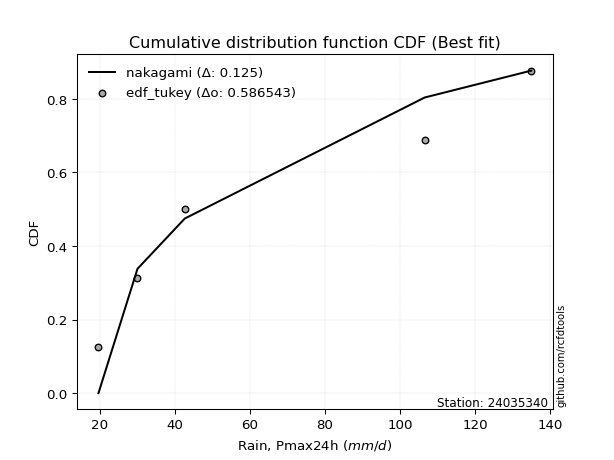</img></img>

</div>


### 8. Empirical - EDF Gringorten (1963)

Gringorten plotting position formula is essential for estimating the probability and return periods of extreme events like floods and heavy rainfall. The constant _a=0.44_.

<div align="center">


$P=(m-a)/(n+1-2a)$


</div>


**8.1. Empirical values**

<div align="center">

|                | 0                   | 1                  | 2                   | 3                  | 4                  | 5                  |
|:---------------|:--------------------|:-------------------|:--------------------|:-------------------|:-------------------|:-------------------|
| date           | 2021                | 2022               | 2020                | 2025               | 2023               | 2024               |
| x              | 19.7                | 30.1               | 42.7                | 61.7               | 106.6              | 135.0              |
| m              | 1                   | 2                  | 3                   | 4                  | 5                  | 6                  |
| empirical_dist | edf_gringorten      | edf_gringorten     | edf_gringorten      | edf_gringorten     | edf_gringorten     | edf_gringorten     |
| empirical      | 0.09150326797385622 | 0.2549019607843137 | 0.41830065359477125 | 0.5816993464052288 | 0.7450980392156862 | 0.9084967320261437 |
| empirical_tr   | 1.1007194244604317  | 1.3421052631578947 | 1.7191011235955058  | 2.3906250000000004 | 3.9230769230769216 | 10.928571428571415 |

</div>


**8.2. Kolmogorov-Smirnov fit test (sorted by Δ)**


<div align="center">

|                | 0                   | 1                   | 2                   | 3                   | 4                   | 5                   | 6                   | 7                   | 8                   | 9                  | 10                    | 11                 | 12                  | 13                  | 14                  | 15                  | 16                  | 17                  | 18                | 19                  | 20                 | 21                  | 22                  | 23                  | 24                  | 25                  | 26                  | 27                  | 28                  | 29                  | 30                  | 31                  | 32                  | 33                  | 34                  | 35                  | 36                  | 37                  | 38                  | 39                  | 40                  | 41                  | 42                 | 43                  | 44                 | 45                  | 46                  | 47                  | 48                 | 49                 | 50                  | 51                  | 52                  | 53                  | 54                  | 55                  | 56                  | 57                  | 58                  | 59                  | 60                  | 61                  | 62                  | 63                  | 64                 | 65                | 66                  | 67                  | 68                 | 69                 | 70                  | 71                 | 72                  | 73                  | 74                  | 75                  | 76                  | 77                 | 78                 | 79                 | 80                 | 81                  | 82                 | 83                 | 84                 | 85                 | 86                 | 87                 | 88                 | 89             |
|:---------------|:--------------------|:--------------------|:--------------------|:--------------------|:--------------------|:--------------------|:--------------------|:--------------------|:--------------------|:-------------------|:----------------------|:-------------------|:--------------------|:--------------------|:--------------------|:--------------------|:--------------------|:--------------------|:------------------|:--------------------|:-------------------|:--------------------|:--------------------|:--------------------|:--------------------|:--------------------|:--------------------|:--------------------|:--------------------|:--------------------|:--------------------|:--------------------|:--------------------|:--------------------|:--------------------|:--------------------|:--------------------|:--------------------|:--------------------|:--------------------|:--------------------|:--------------------|:-------------------|:--------------------|:-------------------|:--------------------|:--------------------|:--------------------|:-------------------|:-------------------|:--------------------|:--------------------|:--------------------|:--------------------|:--------------------|:--------------------|:--------------------|:--------------------|:--------------------|:--------------------|:--------------------|:--------------------|:--------------------|:--------------------|:-------------------|:------------------|:--------------------|:--------------------|:-------------------|:-------------------|:--------------------|:-------------------|:--------------------|:--------------------|:--------------------|:--------------------|:--------------------|:-------------------|:-------------------|:-------------------|:-------------------|:--------------------|:-------------------|:-------------------|:-------------------|:-------------------|:-------------------|:-------------------|:-------------------|:---------------|
| station        | 24035340            | 24035340            | 24035340            | 24035340            | 24035340            | 24035340            | 24035340            | 24035340            | 24035340            | 24035340           | 24035340              | 24035340           | 24035340            | 24035340            | 24035340            | 24035340            | 24035340            | 24035340            | 24035340          | 24035340            | 24035340           | 24035340            | 24035340            | 24035340            | 24035340            | 24035340            | 24035340            | 24035340            | 24035340            | 24035340            | 24035340            | 24035340            | 24035340            | 24035340            | 24035340            | 24035340            | 24035340            | 24035340            | 24035340            | 24035340            | 24035340            | 24035340            | 24035340           | 24035340            | 24035340           | 24035340            | 24035340            | 24035340            | 24035340           | 24035340           | 24035340            | 24035340            | 24035340            | 24035340            | 24035340            | 24035340            | 24035340            | 24035340            | 24035340            | 24035340            | 24035340            | 24035340            | 24035340            | 24035340            | 24035340           | 24035340          | 24035340            | 24035340            | 24035340           | 24035340           | 24035340            | 24035340           | 24035340            | 24035340            | 24035340            | 24035340            | 24035340            | 24035340           | 24035340           | 24035340           | 24035340           | 24035340            | 24035340           | 24035340           | 24035340           | 24035340           | 24035340           | 24035340           | 24035340           | 24035340       |
| empirical_dist | edf_gringorten      | edf_gringorten      | edf_gringorten      | edf_gringorten      | edf_gringorten      | edf_gringorten      | edf_gringorten      | edf_gringorten      | edf_gringorten      | edf_gringorten     | edf_gringorten        | edf_gringorten     | edf_gringorten      | edf_gringorten      | edf_gringorten      | edf_gringorten      | edf_gringorten      | edf_gringorten      | edf_gringorten    | edf_gringorten      | edf_gringorten     | edf_gringorten      | edf_gringorten      | edf_gringorten      | edf_gringorten      | edf_gringorten      | edf_gringorten      | edf_gringorten      | edf_gringorten      | edf_gringorten      | edf_gringorten      | edf_gringorten      | edf_gringorten      | edf_gringorten      | edf_gringorten      | edf_gringorten      | edf_gringorten      | edf_gringorten      | edf_gringorten      | edf_gringorten      | edf_gringorten      | edf_gringorten      | edf_gringorten     | edf_gringorten      | edf_gringorten     | edf_gringorten      | edf_gringorten      | edf_gringorten      | edf_gringorten     | edf_gringorten     | edf_gringorten      | edf_gringorten      | edf_gringorten      | edf_gringorten      | edf_gringorten      | edf_gringorten      | edf_gringorten      | edf_gringorten      | edf_gringorten      | edf_gringorten      | edf_gringorten      | edf_gringorten      | edf_gringorten      | edf_gringorten      | edf_gringorten     | edf_gringorten    | edf_gringorten      | edf_gringorten      | edf_gringorten     | edf_gringorten     | edf_gringorten      | edf_gringorten     | edf_gringorten      | edf_gringorten      | edf_gringorten      | edf_gringorten      | edf_gringorten      | edf_gringorten     | edf_gringorten     | edf_gringorten     | edf_gringorten     | edf_gringorten      | edf_gringorten     | edf_gringorten     | edf_gringorten     | edf_gringorten     | edf_gringorten     | edf_gringorten     | edf_gringorten     | edf_gringorten |
| p_dist         | johnsonsu           | loginvweibull       | loggenlogistic      | halfnorm            | logmielke           | loggenexpon         | rayleigh            | nct                 | logkstwobign        | logfisk            | loglaplace_asymmetric | logweibull_min     | logalpha            | loghalfnorm         | lograyleigh         | logmaxwell          | logrice             | invgamma            | loggompertz       | loginvgamma         | logncf             | laplace_asymmetric  | genexpon            | expon               | logbetaprime        | exponnorm           | loginvgauss         | ncf                 | gompertz            | betaprime           | maxwell             | lognct              | invgauss            | logfatiguelife      | loggamma            | loggamma            | logerlang           | logf                | lognorm             | lognorm             | logcrystalball      | logt                | logexponnorm       | logpearson3         | logjohnsonsu       | logloggamma         | f                   | alpha               | gumbel_r           | halflogistic       | pearson3            | kstwobign           | moyal               | loghalflogistic     | loggumbel_r         | genlogistic         | logmoyal            | loglogistic         | logexpon            | t                   | truncnorm           | crystalball         | norm                | loghypsecant        | loggumbel_l        | loglaplace        | rice                | logistic            | nakagami           | hypsecant          | fisk                | erlang             | laplace             | gumbel_l            | logchi2             | logwald             | wald                | lognakagami        | logtruncnorm       | gibrat             | loggibrat          | pareto              | weibull_min        | logpareto          | loglognorm         | fatiguelife        | invweibull         | gamma              | chi2               | mielke         |
| delta          | 0.08743817929886244 | 0.08836271958275799 | 0.08888604004850587 | 0.08919308883261978 | 0.09192535944049285 | 0.09278664956322791 | 0.09292034593898518 | 0.09475628529876456 | 0.09715335797813296 | 0.0977284623759711 | 0.0984768261314466    | 0.0986473556481795 | 0.09887087817844864 | 0.09931028734637071 | 0.09945413823774407 | 0.10038155041603869 | 0.10063852624791214 | 0.10064038252801799 | 0.101266221507048 | 0.10170487460242261 | 0.1019166383556287 | 0.10202304267542683 | 0.10204329404947954 | 0.10204337714191047 | 0.10258773376416286 | 0.10265041842360956 | 0.10266446008430852 | 0.10287090361837048 | 0.10299543646954556 | 0.10323109672614394 | 0.10354548257394491 | 0.10373779805652694 | 0.10376165555454075 | 0.10377183698578685 | 0.10385570435169644 | 0.10385570435169644 | 0.10386246512330999 | 0.10387023600809153 | 0.10388892685225881 | 0.10388892685225881 | 0.10388896605511644 | 0.10388909175439565 | 0.1038891588676043 | 0.10391442085409208 | 0.1040218417088582 | 0.10408722158077943 | 0.10454165839580998 | 0.10589327534735993 | 0.1065246378314022 | 0.1070189094045999 | 0.10878170766739925 | 0.11252803701397929 | 0.11265484867664022 | 0.11578898089086065 | 0.11610144596048866 | 0.11779226960859512 | 0.12118927701353333 | 0.12159370937354796 | 0.12319387372843243 | 0.13010026354977455 | 0.13013799291677314 | 0.13013802399960794 | 0.13013802941180236 | 0.13067021125194334 | 0.1336163810828318 | 0.138738228871095 | 0.14230154139904755 | 0.15200114876503135 | 0.1571589484268937 | 0.1674724594136922 | 0.18124056301740854 | 0.1867377970507732 | 0.19142512029763398 | 0.19290825099701447 | 0.21295640022913565 | 0.22460148439018407 | 0.23631676195629248 | 0.2549019187969607 | 0.2549019594941355 | 0.2549019607843137 | 0.2549019607843137 | 0.34891269216926957 | 0.3551353957315334 | 0.3836769586826472 | 0.3927141547565087 | 0.4632635284443636 | 0.4712224894408908 | 0.5552483735891841 | 0.5615125209805052 | nan            |
| deltao         | 0.530385761606      | 0.530385761606      | 0.530385761606      | 0.530385761606      | 0.530385761606      | 0.530385761606      | 0.530385761606      | 0.530385761606      | 0.530385761606      | 0.530385761606     | 0.530385761606        | 0.530385761606     | 0.530385761606      | 0.530385761606      | 0.530385761606      | 0.530385761606      | 0.530385761606      | 0.530385761606      | 0.530385761606    | 0.530385761606      | 0.530385761606     | 0.530385761606      | 0.530385761606      | 0.530385761606      | 0.530385761606      | 0.530385761606      | 0.530385761606      | 0.530385761606      | 0.530385761606      | 0.530385761606      | 0.530385761606      | 0.530385761606      | 0.530385761606      | 0.530385761606      | 0.530385761606      | 0.530385761606      | 0.530385761606      | 0.530385761606      | 0.530385761606      | 0.530385761606      | 0.530385761606      | 0.530385761606      | 0.530385761606     | 0.530385761606      | 0.530385761606     | 0.530385761606      | 0.530385761606      | 0.530385761606      | 0.530385761606     | 0.530385761606     | 0.530385761606      | 0.530385761606      | 0.530385761606      | 0.530385761606      | 0.530385761606      | 0.530385761606      | 0.530385761606      | 0.530385761606      | 0.530385761606      | 0.530385761606      | 0.530385761606      | 0.530385761606      | 0.530385761606      | 0.530385761606      | 0.530385761606     | 0.530385761606    | 0.530385761606      | 0.530385761606      | 0.530385761606     | 0.530385761606     | 0.530385761606      | 0.530385761606     | 0.530385761606      | 0.530385761606      | 0.530385761606      | 0.530385761606      | 0.530385761606      | 0.530385761606     | 0.530385761606     | 0.530385761606     | 0.530385761606     | 0.530385761606      | 0.530385761606     | 0.530385761606     | 0.530385761606     | 0.530385761606     | 0.530385761606     | 0.530385761606     | 0.530385761606     | 0.530385761606 |
| eval           | Δo > Δ              | Δo > Δ              | Δo > Δ              | Δo > Δ              | Δo > Δ              | Δo > Δ              | Δo > Δ              | Δo > Δ              | Δo > Δ              | Δo > Δ             | Δo > Δ                | Δo > Δ             | Δo > Δ              | Δo > Δ              | Δo > Δ              | Δo > Δ              | Δo > Δ              | Δo > Δ              | Δo > Δ            | Δo > Δ              | Δo > Δ             | Δo > Δ              | Δo > Δ              | Δo > Δ              | Δo > Δ              | Δo > Δ              | Δo > Δ              | Δo > Δ              | Δo > Δ              | Δo > Δ              | Δo > Δ              | Δo > Δ              | Δo > Δ              | Δo > Δ              | Δo > Δ              | Δo > Δ              | Δo > Δ              | Δo > Δ              | Δo > Δ              | Δo > Δ              | Δo > Δ              | Δo > Δ              | Δo > Δ             | Δo > Δ              | Δo > Δ             | Δo > Δ              | Δo > Δ              | Δo > Δ              | Δo > Δ             | Δo > Δ             | Δo > Δ              | Δo > Δ              | Δo > Δ              | Δo > Δ              | Δo > Δ              | Δo > Δ              | Δo > Δ              | Δo > Δ              | Δo > Δ              | Δo > Δ              | Δo > Δ              | Δo > Δ              | Δo > Δ              | Δo > Δ              | Δo > Δ             | Δo > Δ            | Δo > Δ              | Δo > Δ              | Δo > Δ             | Δo > Δ             | Δo > Δ              | Δo > Δ             | Δo > Δ              | Δo > Δ              | Δo > Δ              | Δo > Δ              | Δo > Δ              | Δo > Δ             | Δo > Δ             | Δo > Δ             | Δo > Δ             | Δo > Δ              | Δo > Δ             | Δo > Δ             | Δo > Δ             | Δo > Δ             | Δo > Δ             | Δo <= Δ            | Δo <= Δ            | Δo <= Δ        |
| fit            | 1                   | 1                   | 1                   | 1                   | 1                   | 1                   | 1                   | 1                   | 1                   | 1                  | 1                     | 1                  | 1                   | 1                   | 1                   | 1                   | 1                   | 1                   | 1                 | 1                   | 1                  | 1                   | 1                   | 1                   | 1                   | 1                   | 1                   | 1                   | 1                   | 1                   | 1                   | 1                   | 1                   | 1                   | 1                   | 1                   | 1                   | 1                   | 1                   | 1                   | 1                   | 1                   | 1                  | 1                   | 1                  | 1                   | 1                   | 1                   | 1                  | 1                  | 1                   | 1                   | 1                   | 1                   | 1                   | 1                   | 1                   | 1                   | 1                   | 1                   | 1                   | 1                   | 1                   | 1                   | 1                  | 1                 | 1                   | 1                   | 1                  | 1                  | 1                   | 1                  | 1                   | 1                   | 1                   | 1                   | 1                   | 1                  | 1                  | 1                  | 1                  | 1                   | 1                  | 1                  | 1                  | 1                  | 1                  | 0                  | 0                  | 0              |
| n              | 6                   | 6                   | 6                   | 6                   | 6                   | 6                   | 6                   | 6                   | 6                   | 6                  | 6                     | 6                  | 6                   | 6                   | 6                   | 6                   | 6                   | 6                   | 6                 | 6                   | 6                  | 6                   | 6                   | 6                   | 6                   | 6                   | 6                   | 6                   | 6                   | 6                   | 6                   | 6                   | 6                   | 6                   | 6                   | 6                   | 6                   | 6                   | 6                   | 6                   | 6                   | 6                   | 6                  | 6                   | 6                  | 6                   | 6                   | 6                   | 6                  | 6                  | 6                   | 6                   | 6                   | 6                   | 6                   | 6                   | 6                   | 6                   | 6                   | 6                   | 6                   | 6                   | 6                   | 6                   | 6                  | 6                 | 6                   | 6                   | 6                  | 6                  | 6                   | 6                  | 6                   | 6                   | 6                   | 6                   | 6                   | 6                  | 6                  | 6                  | 6                  | 6                   | 6                  | 6                  | 6                  | 6                  | 6                  | 6                  | 6                  | 6              |
| best_fit       | 1                   | 0                   | 0                   | 0                   | 0                   | 0                   | 0                   | 0                   | 0                   | 0                  | 0                     | 0                  | 0                   | 0                   | 0                   | 0                   | 0                   | 0                   | 0                 | 0                   | 0                  | 0                   | 0                   | 0                   | 0                   | 0                   | 0                   | 0                   | 0                   | 0                   | 0                   | 0                   | 0                   | 0                   | 0                   | 0                   | 0                   | 0                   | 0                   | 0                   | 0                   | 0                   | 0                  | 0                   | 0                  | 0                   | 0                   | 0                   | 0                  | 0                  | 0                   | 0                   | 0                   | 0                   | 0                   | 0                   | 0                   | 0                   | 0                   | 0                   | 0                   | 0                   | 0                   | 0                   | 0                  | 0                 | 0                   | 0                   | 0                  | 0                  | 0                   | 0                  | 0                   | 0                   | 0                   | 0                   | 0                   | 0                  | 0                  | 0                  | 0                  | 0                   | 0                  | 0                  | 0                  | 0                  | 0                  | 0                  | 0                  | 0              |
| best_fit_sort  | 1                   | 2                   | 3                   | 4                   | 5                   | 6                   | 7                   | 8                   | 9                   | 10                 | 11                    | 12                 | 13                  | 14                  | 15                  | 16                  | 17                  | 18                  | 19                | 20                  | 21                 | 22                  | 23                  | 24                  | 25                  | 26                  | 27                  | 28                  | 29                  | 30                  | 31                  | 32                  | 33                  | 34                  | 35                  | 36                  | 37                  | 38                  | 39                  | 40                  | 41                  | 42                  | 43                 | 44                  | 45                 | 46                  | 47                  | 48                  | 49                 | 50                 | 51                  | 52                  | 53                  | 54                  | 55                  | 56                  | 57                  | 58                  | 59                  | 60                  | 61                  | 62                  | 63                  | 64                  | 65                 | 66                | 67                  | 68                  | 69                 | 70                 | 71                  | 72                 | 73                  | 74                  | 75                  | 76                  | 77                  | 78                 | 79                 | 80                 | 81                 | 82                  | 83                 | 84                 | 85                 | 86                 | 87                 | 88                 | 89                 | 90             |

</div>


<div align="center">

</img>

</div>


**8.3. Best fit**

<div align="center">

|   id |   station | empirical_dist   | p_dist    |     delta |   deltao | eval   |   fit |   n |   best_fit |   best_fit_sort |
|-----:|----------:|:-----------------|:----------|----------:|---------:|:-------|------:|----:|-----------:|----------------:|
|    0 |  24035340 | edf_gringorten   | johnsonsu | 0.0874382 | 0.530386 | Δo > Δ |     1 |   6 |          1 |               1 |

</div>


<div align="center">

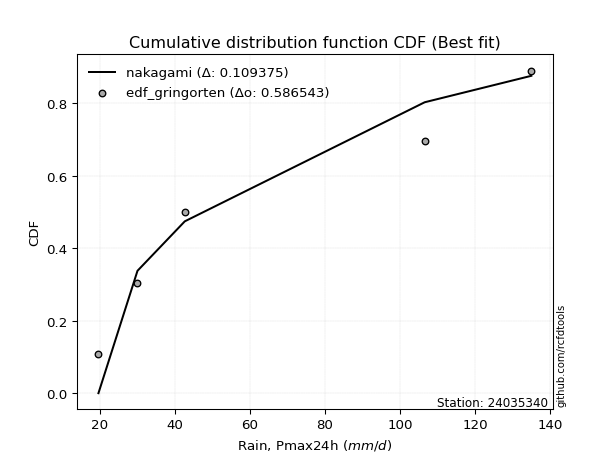</img></img>

</div>


### 9. Empirical - EDF Filliben (1975)

The specific values of the constants (0.3175) (often denoted as $alpha$) and (0.365) are derived from a method proposed by James J. Filliben in a 1975 paper. This particular formula is the mean value of the $i$-th order statistic of the normal distribution and is considered a robust and effective plotting position formula for the normal probability plot correlation coefficient test for normality.

<div align="center">


$P=(m-0.3175)/(n+0.365)$


</div>


**9.1. Empirical values**

<div align="center">

|                | 0                   | 1                   | 2                  | 3                  | 4                  | 5                  |
|:---------------|:--------------------|:--------------------|:-------------------|:-------------------|:-------------------|:-------------------|
| date           | 2021                | 2022                | 2020               | 2025               | 2023               | 2024               |
| x              | 19.7                | 30.1                | 42.7               | 61.7               | 106.6              | 135.0              |
| m              | 1                   | 2                   | 3                  | 4                  | 5                  | 6                  |
| empirical_dist | edf_filliben        | edf_filliben        | edf_filliben       | edf_filliben       | edf_filliben       | edf_filliben       |
| empirical      | 0.10722702278083267 | 0.26433621366849963 | 0.4214454045561665 | 0.5785545954438335 | 0.7356637863315004 | 0.8927729772191673 |
| empirical_tr   | 1.1201055873295205  | 1.3593166043780034  | 1.7284453496266123 | 2.3727865796831313 | 3.783060921248143  | 9.326007326007321  |

</div>


**9.2. Kolmogorov-Smirnov fit test (sorted by Δ)**


<div align="center">

|                | 0                  | 1                   | 2                   | 3                   | 4                   | 5                  | 6                   | 7                   | 8                   | 9                   | 10                  | 11                    | 12                  | 13                 | 14                  | 15                  | 16                  | 17                 | 18                  | 19                  | 20                  | 21                  | 22                  | 23                 | 24                  | 25                  | 26                  | 27                  | 28                  | 29                  | 30                  | 31                 | 32                 | 33                  | 34                 | 35                 | 36                 | 37                  | 38                  | 39                  | 40                  | 41                 | 42                 | 43                  | 44                  | 45                  | 46                  | 47                  | 48                  | 49                  | 50                  | 51                  | 52                  | 53                  | 54                 | 55                  | 56                  | 57                  | 58                  | 59                  | 60                 | 61                  | 62                  | 63                 | 64                  | 65                  | 66                  | 67                  | 68                  | 69                  | 70                  | 71                  | 72                  | 73                  | 74                  | 75               | 76                 | 77                  | 78                  | 79                  | 80                  | 81                  | 82                 | 83                  | 84                 | 85                  | 86                 | 87                 | 88                 | 89             |
|:---------------|:-------------------|:--------------------|:--------------------|:--------------------|:--------------------|:-------------------|:--------------------|:--------------------|:--------------------|:--------------------|:--------------------|:----------------------|:--------------------|:-------------------|:--------------------|:--------------------|:--------------------|:-------------------|:--------------------|:--------------------|:--------------------|:--------------------|:--------------------|:-------------------|:--------------------|:--------------------|:--------------------|:--------------------|:--------------------|:--------------------|:--------------------|:-------------------|:-------------------|:--------------------|:-------------------|:-------------------|:-------------------|:--------------------|:--------------------|:--------------------|:--------------------|:-------------------|:-------------------|:--------------------|:--------------------|:--------------------|:--------------------|:--------------------|:--------------------|:--------------------|:--------------------|:--------------------|:--------------------|:--------------------|:-------------------|:--------------------|:--------------------|:--------------------|:--------------------|:--------------------|:-------------------|:--------------------|:--------------------|:-------------------|:--------------------|:--------------------|:--------------------|:--------------------|:--------------------|:--------------------|:--------------------|:--------------------|:--------------------|:--------------------|:--------------------|:-----------------|:-------------------|:--------------------|:--------------------|:--------------------|:--------------------|:--------------------|:-------------------|:--------------------|:-------------------|:--------------------|:-------------------|:-------------------|:-------------------|:---------------|
| station        | 24035340           | 24035340            | 24035340            | 24035340            | 24035340            | 24035340           | 24035340            | 24035340            | 24035340            | 24035340            | 24035340            | 24035340              | 24035340            | 24035340           | 24035340            | 24035340            | 24035340            | 24035340           | 24035340            | 24035340            | 24035340            | 24035340            | 24035340            | 24035340           | 24035340            | 24035340            | 24035340            | 24035340            | 24035340            | 24035340            | 24035340            | 24035340           | 24035340           | 24035340            | 24035340           | 24035340           | 24035340           | 24035340            | 24035340            | 24035340            | 24035340            | 24035340           | 24035340           | 24035340            | 24035340            | 24035340            | 24035340            | 24035340            | 24035340            | 24035340            | 24035340            | 24035340            | 24035340            | 24035340            | 24035340           | 24035340            | 24035340            | 24035340            | 24035340            | 24035340            | 24035340           | 24035340            | 24035340            | 24035340           | 24035340            | 24035340            | 24035340            | 24035340            | 24035340            | 24035340            | 24035340            | 24035340            | 24035340            | 24035340            | 24035340            | 24035340         | 24035340           | 24035340            | 24035340            | 24035340            | 24035340            | 24035340            | 24035340           | 24035340            | 24035340           | 24035340            | 24035340           | 24035340           | 24035340           | 24035340       |
| empirical_dist | edf_filliben       | edf_filliben        | edf_filliben        | edf_filliben        | edf_filliben        | edf_filliben       | edf_filliben        | edf_filliben        | edf_filliben        | edf_filliben        | edf_filliben        | edf_filliben          | edf_filliben        | edf_filliben       | edf_filliben        | edf_filliben        | edf_filliben        | edf_filliben       | edf_filliben        | edf_filliben        | edf_filliben        | edf_filliben        | edf_filliben        | edf_filliben       | edf_filliben        | edf_filliben        | edf_filliben        | edf_filliben        | edf_filliben        | edf_filliben        | edf_filliben        | edf_filliben       | edf_filliben       | edf_filliben        | edf_filliben       | edf_filliben       | edf_filliben       | edf_filliben        | edf_filliben        | edf_filliben        | edf_filliben        | edf_filliben       | edf_filliben       | edf_filliben        | edf_filliben        | edf_filliben        | edf_filliben        | edf_filliben        | edf_filliben        | edf_filliben        | edf_filliben        | edf_filliben        | edf_filliben        | edf_filliben        | edf_filliben       | edf_filliben        | edf_filliben        | edf_filliben        | edf_filliben        | edf_filliben        | edf_filliben       | edf_filliben        | edf_filliben        | edf_filliben       | edf_filliben        | edf_filliben        | edf_filliben        | edf_filliben        | edf_filliben        | edf_filliben        | edf_filliben        | edf_filliben        | edf_filliben        | edf_filliben        | edf_filliben        | edf_filliben     | edf_filliben       | edf_filliben        | edf_filliben        | edf_filliben        | edf_filliben        | edf_filliben        | edf_filliben       | edf_filliben        | edf_filliben       | edf_filliben        | edf_filliben       | edf_filliben       | edf_filliben       | edf_filliben   |
| p_dist         | johnsonsu          | rayleigh            | loginvweibull       | loggenlogistic      | halfnorm            | logmielke          | loggenexpon         | nct                 | logkstwobign        | maxwell             | logfisk             | loglaplace_asymmetric | logweibull_min      | logalpha           | loghalfnorm         | lograyleigh         | logmaxwell          | logrice            | invgamma            | loggompertz         | loginvgamma         | logncf              | laplace_asymmetric  | genexpon           | expon               | pearson3            | logbetaprime        | exponnorm           | loginvgauss         | ncf                 | gompertz            | betaprime          | lognct             | invgauss            | logfatiguelife     | loggamma           | loggamma           | logerlang           | logf                | lognorm             | lognorm             | logcrystalball     | logt               | logexponnorm        | logpearson3         | logjohnsonsu        | logloggamma         | f                   | alpha               | gumbel_r            | halflogistic        | logexpon            | kstwobign           | moyal               | loghalflogistic    | loggumbel_r         | genlogistic         | logmoyal            | loglogistic         | t                   | truncnorm          | crystalball         | norm                | loghypsecant       | loggumbel_l         | rice                | loglaplace          | logistic            | fisk                | nakagami            | hypsecant           | gumbel_l            | laplace             | erlang              | logchi2             | logwald          | wald               | lognakagami         | logtruncnorm        | gibrat              | loggibrat           | pareto              | weibull_min        | logpareto           | loglognorm         | fatiguelife         | invweibull         | gamma              | chi2               | mielke         |
| delta          | 0.0968724321830482 | 0.09754236883468581 | 0.09779697246694374 | 0.09832029293269162 | 0.09862734171680554 | 0.1013596123246786 | 0.10222090244741366 | 0.10419053818295032 | 0.10658761086231872 | 0.10669023353534018 | 0.10716271526015686 | 0.10791107901563235   | 0.10808160853236526 | 0.1083051310626344 | 0.10874454023055646 | 0.10888839112192983 | 0.10981580330022445 | 0.1100727791320979 | 0.11007463541220375 | 0.11070047439123376 | 0.11113912748660837 | 0.11135089123981445 | 0.11145729555961259 | 0.1114775469336653 | 0.11147763002609623 | 0.11192645862879452 | 0.11202198664834861 | 0.11208467130779531 | 0.11209871296849427 | 0.11230515650255624 | 0.11242968935373132 | 0.1126653496103297 | 0.1131720509407127 | 0.11319590843872651 | 0.1132060898699726 | 0.1132899572358822 | 0.1132899572358822 | 0.11329671800749574 | 0.11330448889227729 | 0.11332317973644457 | 0.11332317973644457 | 0.1133232189393022 | 0.1133233446385814 | 0.11332341175179006 | 0.11334867373827784 | 0.11345609459304395 | 0.11352147446496519 | 0.11397591127999573 | 0.11532752823154568 | 0.11595889071558796 | 0.11645316228878566 | 0.12004912276703716 | 0.12196228989816504 | 0.12208910156082597 | 0.1252232337750464 | 0.12553569884467441 | 0.12722652249278088 | 0.13062352989771908 | 0.13102796225773372 | 0.13324501451116982 | 0.1332827438781684 | 0.13328277496100321 | 0.13328278037319763 | 0.1401044641361291 | 0.14305063396701756 | 0.14544629236044282 | 0.14817248175528075 | 0.15514589972642662 | 0.16551680821043213 | 0.16659320131107946 | 0.17061721037508748 | 0.18976350003561915 | 0.19456987125902925 | 0.19617204993495896 | 0.20352214734494972 | 0.23403573727437 | 0.2457510148404784 | 0.26433617168114665 | 0.26433621237832144 | 0.26433621366849963 | 0.26433621366849963 | 0.33947843928508364 | 0.3457011428473475 | 0.37424270579846125 | 0.3832799018723228 | 0.45382927556017766 | 0.4554987346339144 | 0.5458141207049982 | 0.5520782680963192 | nan            |
| deltao         | 0.530385761606     | 0.530385761606      | 0.530385761606      | 0.530385761606      | 0.530385761606      | 0.530385761606     | 0.530385761606      | 0.530385761606      | 0.530385761606      | 0.530385761606      | 0.530385761606      | 0.530385761606        | 0.530385761606      | 0.530385761606     | 0.530385761606      | 0.530385761606      | 0.530385761606      | 0.530385761606     | 0.530385761606      | 0.530385761606      | 0.530385761606      | 0.530385761606      | 0.530385761606      | 0.530385761606     | 0.530385761606      | 0.530385761606      | 0.530385761606      | 0.530385761606      | 0.530385761606      | 0.530385761606      | 0.530385761606      | 0.530385761606     | 0.530385761606     | 0.530385761606      | 0.530385761606     | 0.530385761606     | 0.530385761606     | 0.530385761606      | 0.530385761606      | 0.530385761606      | 0.530385761606      | 0.530385761606     | 0.530385761606     | 0.530385761606      | 0.530385761606      | 0.530385761606      | 0.530385761606      | 0.530385761606      | 0.530385761606      | 0.530385761606      | 0.530385761606      | 0.530385761606      | 0.530385761606      | 0.530385761606      | 0.530385761606     | 0.530385761606      | 0.530385761606      | 0.530385761606      | 0.530385761606      | 0.530385761606      | 0.530385761606     | 0.530385761606      | 0.530385761606      | 0.530385761606     | 0.530385761606      | 0.530385761606      | 0.530385761606      | 0.530385761606      | 0.530385761606      | 0.530385761606      | 0.530385761606      | 0.530385761606      | 0.530385761606      | 0.530385761606      | 0.530385761606      | 0.530385761606   | 0.530385761606     | 0.530385761606      | 0.530385761606      | 0.530385761606      | 0.530385761606      | 0.530385761606      | 0.530385761606     | 0.530385761606      | 0.530385761606     | 0.530385761606      | 0.530385761606     | 0.530385761606     | 0.530385761606     | 0.530385761606 |
| eval           | Δo > Δ             | Δo > Δ              | Δo > Δ              | Δo > Δ              | Δo > Δ              | Δo > Δ             | Δo > Δ              | Δo > Δ              | Δo > Δ              | Δo > Δ              | Δo > Δ              | Δo > Δ                | Δo > Δ              | Δo > Δ             | Δo > Δ              | Δo > Δ              | Δo > Δ              | Δo > Δ             | Δo > Δ              | Δo > Δ              | Δo > Δ              | Δo > Δ              | Δo > Δ              | Δo > Δ             | Δo > Δ              | Δo > Δ              | Δo > Δ              | Δo > Δ              | Δo > Δ              | Δo > Δ              | Δo > Δ              | Δo > Δ             | Δo > Δ             | Δo > Δ              | Δo > Δ             | Δo > Δ             | Δo > Δ             | Δo > Δ              | Δo > Δ              | Δo > Δ              | Δo > Δ              | Δo > Δ             | Δo > Δ             | Δo > Δ              | Δo > Δ              | Δo > Δ              | Δo > Δ              | Δo > Δ              | Δo > Δ              | Δo > Δ              | Δo > Δ              | Δo > Δ              | Δo > Δ              | Δo > Δ              | Δo > Δ             | Δo > Δ              | Δo > Δ              | Δo > Δ              | Δo > Δ              | Δo > Δ              | Δo > Δ             | Δo > Δ              | Δo > Δ              | Δo > Δ             | Δo > Δ              | Δo > Δ              | Δo > Δ              | Δo > Δ              | Δo > Δ              | Δo > Δ              | Δo > Δ              | Δo > Δ              | Δo > Δ              | Δo > Δ              | Δo > Δ              | Δo > Δ           | Δo > Δ             | Δo > Δ              | Δo > Δ              | Δo > Δ              | Δo > Δ              | Δo > Δ              | Δo > Δ             | Δo > Δ              | Δo > Δ             | Δo > Δ              | Δo > Δ             | Δo <= Δ            | Δo <= Δ            | Δo <= Δ        |
| fit            | 1                  | 1                   | 1                   | 1                   | 1                   | 1                  | 1                   | 1                   | 1                   | 1                   | 1                   | 1                     | 1                   | 1                  | 1                   | 1                   | 1                   | 1                  | 1                   | 1                   | 1                   | 1                   | 1                   | 1                  | 1                   | 1                   | 1                   | 1                   | 1                   | 1                   | 1                   | 1                  | 1                  | 1                   | 1                  | 1                  | 1                  | 1                   | 1                   | 1                   | 1                   | 1                  | 1                  | 1                   | 1                   | 1                   | 1                   | 1                   | 1                   | 1                   | 1                   | 1                   | 1                   | 1                   | 1                  | 1                   | 1                   | 1                   | 1                   | 1                   | 1                  | 1                   | 1                   | 1                  | 1                   | 1                   | 1                   | 1                   | 1                   | 1                   | 1                   | 1                   | 1                   | 1                   | 1                   | 1                | 1                  | 1                   | 1                   | 1                   | 1                   | 1                   | 1                  | 1                   | 1                  | 1                   | 1                  | 0                  | 0                  | 0              |
| n              | 6                  | 6                   | 6                   | 6                   | 6                   | 6                  | 6                   | 6                   | 6                   | 6                   | 6                   | 6                     | 6                   | 6                  | 6                   | 6                   | 6                   | 6                  | 6                   | 6                   | 6                   | 6                   | 6                   | 6                  | 6                   | 6                   | 6                   | 6                   | 6                   | 6                   | 6                   | 6                  | 6                  | 6                   | 6                  | 6                  | 6                  | 6                   | 6                   | 6                   | 6                   | 6                  | 6                  | 6                   | 6                   | 6                   | 6                   | 6                   | 6                   | 6                   | 6                   | 6                   | 6                   | 6                   | 6                  | 6                   | 6                   | 6                   | 6                   | 6                   | 6                  | 6                   | 6                   | 6                  | 6                   | 6                   | 6                   | 6                   | 6                   | 6                   | 6                   | 6                   | 6                   | 6                   | 6                   | 6                | 6                  | 6                   | 6                   | 6                   | 6                   | 6                   | 6                  | 6                   | 6                  | 6                   | 6                  | 6                  | 6                  | 6              |
| best_fit       | 1                  | 0                   | 0                   | 0                   | 0                   | 0                  | 0                   | 0                   | 0                   | 0                   | 0                   | 0                     | 0                   | 0                  | 0                   | 0                   | 0                   | 0                  | 0                   | 0                   | 0                   | 0                   | 0                   | 0                  | 0                   | 0                   | 0                   | 0                   | 0                   | 0                   | 0                   | 0                  | 0                  | 0                   | 0                  | 0                  | 0                  | 0                   | 0                   | 0                   | 0                   | 0                  | 0                  | 0                   | 0                   | 0                   | 0                   | 0                   | 0                   | 0                   | 0                   | 0                   | 0                   | 0                   | 0                  | 0                   | 0                   | 0                   | 0                   | 0                   | 0                  | 0                   | 0                   | 0                  | 0                   | 0                   | 0                   | 0                   | 0                   | 0                   | 0                   | 0                   | 0                   | 0                   | 0                   | 0                | 0                  | 0                   | 0                   | 0                   | 0                   | 0                   | 0                  | 0                   | 0                  | 0                   | 0                  | 0                  | 0                  | 0              |
| best_fit_sort  | 1                  | 2                   | 3                   | 4                   | 5                   | 6                  | 7                   | 8                   | 9                   | 10                  | 11                  | 12                    | 13                  | 14                 | 15                  | 16                  | 17                  | 18                 | 19                  | 20                  | 21                  | 22                  | 23                  | 24                 | 25                  | 26                  | 27                  | 28                  | 29                  | 30                  | 31                  | 32                 | 33                 | 34                  | 35                 | 36                 | 37                 | 38                  | 39                  | 40                  | 41                  | 42                 | 43                 | 44                  | 45                  | 46                  | 47                  | 48                  | 49                  | 50                  | 51                  | 52                  | 53                  | 54                  | 55                 | 56                  | 57                  | 58                  | 59                  | 60                  | 61                 | 62                  | 63                  | 64                 | 65                  | 66                  | 67                  | 68                  | 69                  | 70                  | 71                  | 72                  | 73                  | 74                  | 75                  | 76               | 77                 | 78                  | 79                  | 80                  | 81                  | 82                  | 83                 | 84                  | 85                 | 86                  | 87                 | 88                 | 89                 | 90             |

</div>


<div align="center">

</img>

</div>


**9.3. Best fit**

<div align="center">

|   id |   station | empirical_dist   | p_dist    |     delta |   deltao | eval   |   fit |   n |   best_fit |   best_fit_sort |
|-----:|----------:|:-----------------|:----------|----------:|---------:|:-------|------:|----:|-----------:|----------------:|
|    0 |  24035340 | edf_filliben     | johnsonsu | 0.0968724 | 0.530386 | Δo > Δ |     1 |   6 |          1 |               1 |

</div>


<div align="center">

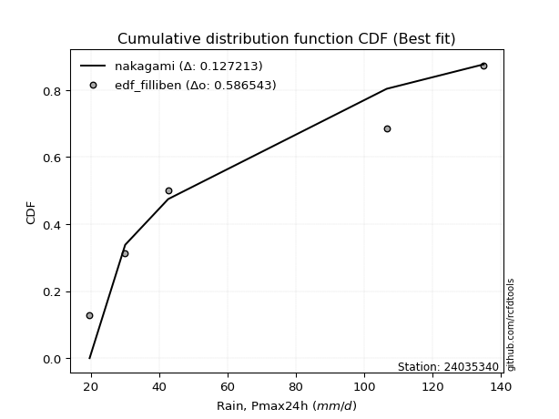</img>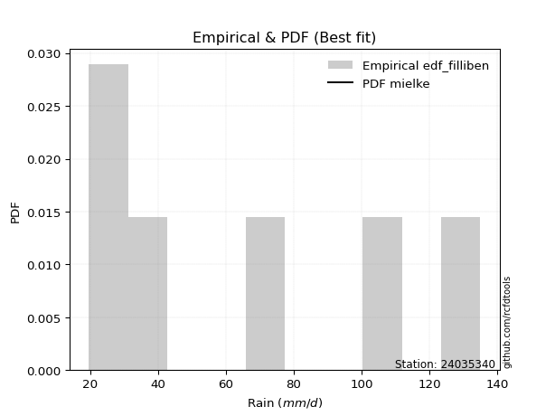</img>

</div>


### 10. Empirical - EDF Jenkinson (1977)

The Jenkinson formula in hydrology is an empirical plotting position formula used to estimate the non-exceedance probability _(P)_ or return period _(T)_ of a given ordered observation within a sample. It is a widely used method in the frequency analysis of extreme events such as floods and rainfall, as it provides a distribution-free way to plot data. _a≈0.31_ and _b≈0.38_ are constants derived to approximate the median of the probability distribution for the given rank.

<div align="center">


$P=(m-a)/(n+b)$


</div>


**10.1. Empirical values**

<div align="center">

|                | 0                   | 1                   | 2                  | 3                  | 4                  | 5                  |
|:---------------|:--------------------|:--------------------|:-------------------|:-------------------|:-------------------|:-------------------|
| date           | 2021                | 2022                | 2020               | 2025               | 2023               | 2024               |
| x              | 19.7                | 30.1                | 42.7               | 61.7               | 106.6              | 135.0              |
| m              | 1                   | 2                   | 3                  | 4                  | 5                  | 6                  |
| empirical_dist | edf_jenkinson       | edf_jenkinson       | edf_jenkinson      | edf_jenkinson      | edf_jenkinson      | edf_jenkinson      |
| empirical      | 0.10815047021943573 | 0.26489028213166144 | 0.4216300940438871 | 0.5783699059561128 | 0.7351097178683387 | 0.8918495297805643 |
| empirical_tr   | 1.1212653778558874  | 1.3603411513859276  | 1.7289972899728996 | 2.3717472118959106 | 3.7751479289940844 | 9.246376811594207  |

</div>


**10.2. Kolmogorov-Smirnov fit test (sorted by Δ)**


<div align="center">

|                | 0                   | 1                   | 2                  | 3                   | 4                   | 5                   | 6                   | 7                   | 8                   | 9                   | 10                  | 11                    | 12                  | 13                  | 14                  | 15                  | 16                 | 17                  | 18                 | 19                  | 20                  | 21                 | 22                  | 23                  | 24                  | 25                  | 26                  | 27                  | 28                  | 29                  | 30                  | 31                  | 32                  | 33                  | 34                  | 35                  | 36                  | 37                 | 38                  | 39                  | 40                  | 41                  | 42                  | 43                  | 44                  | 45                 | 46                  | 47                  | 48                  | 49                  | 50                  | 51                  | 52                 | 53                  | 54                  | 55                  | 56                  | 57                  | 58                  | 59                  | 60                | 61                  | 62                  | 63                  | 64                 | 65                  | 66                 | 67                  | 68                  | 69                  | 70                  | 71                 | 72                  | 73                 | 74                  | 75                 | 76                 | 77                  | 78                  | 79                  | 80                  | 81                  | 82                 | 83                  | 84                | 85                  | 86                  | 87                 | 88                 | 89             |
|:---------------|:--------------------|:--------------------|:-------------------|:--------------------|:--------------------|:--------------------|:--------------------|:--------------------|:--------------------|:--------------------|:--------------------|:----------------------|:--------------------|:--------------------|:--------------------|:--------------------|:-------------------|:--------------------|:-------------------|:--------------------|:--------------------|:-------------------|:--------------------|:--------------------|:--------------------|:--------------------|:--------------------|:--------------------|:--------------------|:--------------------|:--------------------|:--------------------|:--------------------|:--------------------|:--------------------|:--------------------|:--------------------|:-------------------|:--------------------|:--------------------|:--------------------|:--------------------|:--------------------|:--------------------|:--------------------|:-------------------|:--------------------|:--------------------|:--------------------|:--------------------|:--------------------|:--------------------|:-------------------|:--------------------|:--------------------|:--------------------|:--------------------|:--------------------|:--------------------|:--------------------|:------------------|:--------------------|:--------------------|:--------------------|:-------------------|:--------------------|:-------------------|:--------------------|:--------------------|:--------------------|:--------------------|:-------------------|:--------------------|:-------------------|:--------------------|:-------------------|:-------------------|:--------------------|:--------------------|:--------------------|:--------------------|:--------------------|:-------------------|:--------------------|:------------------|:--------------------|:--------------------|:-------------------|:-------------------|:---------------|
| station        | 24035340            | 24035340            | 24035340           | 24035340            | 24035340            | 24035340            | 24035340            | 24035340            | 24035340            | 24035340            | 24035340            | 24035340              | 24035340            | 24035340            | 24035340            | 24035340            | 24035340           | 24035340            | 24035340           | 24035340            | 24035340            | 24035340           | 24035340            | 24035340            | 24035340            | 24035340            | 24035340            | 24035340            | 24035340            | 24035340            | 24035340            | 24035340            | 24035340            | 24035340            | 24035340            | 24035340            | 24035340            | 24035340           | 24035340            | 24035340            | 24035340            | 24035340            | 24035340            | 24035340            | 24035340            | 24035340           | 24035340            | 24035340            | 24035340            | 24035340            | 24035340            | 24035340            | 24035340           | 24035340            | 24035340            | 24035340            | 24035340            | 24035340            | 24035340            | 24035340            | 24035340          | 24035340            | 24035340            | 24035340            | 24035340           | 24035340            | 24035340           | 24035340            | 24035340            | 24035340            | 24035340            | 24035340           | 24035340            | 24035340           | 24035340            | 24035340           | 24035340           | 24035340            | 24035340            | 24035340            | 24035340            | 24035340            | 24035340           | 24035340            | 24035340          | 24035340            | 24035340            | 24035340           | 24035340           | 24035340       |
| empirical_dist | edf_jenkinson       | edf_jenkinson       | edf_jenkinson      | edf_jenkinson       | edf_jenkinson       | edf_jenkinson       | edf_jenkinson       | edf_jenkinson       | edf_jenkinson       | edf_jenkinson       | edf_jenkinson       | edf_jenkinson         | edf_jenkinson       | edf_jenkinson       | edf_jenkinson       | edf_jenkinson       | edf_jenkinson      | edf_jenkinson       | edf_jenkinson      | edf_jenkinson       | edf_jenkinson       | edf_jenkinson      | edf_jenkinson       | edf_jenkinson       | edf_jenkinson       | edf_jenkinson       | edf_jenkinson       | edf_jenkinson       | edf_jenkinson       | edf_jenkinson       | edf_jenkinson       | edf_jenkinson       | edf_jenkinson       | edf_jenkinson       | edf_jenkinson       | edf_jenkinson       | edf_jenkinson       | edf_jenkinson      | edf_jenkinson       | edf_jenkinson       | edf_jenkinson       | edf_jenkinson       | edf_jenkinson       | edf_jenkinson       | edf_jenkinson       | edf_jenkinson      | edf_jenkinson       | edf_jenkinson       | edf_jenkinson       | edf_jenkinson       | edf_jenkinson       | edf_jenkinson       | edf_jenkinson      | edf_jenkinson       | edf_jenkinson       | edf_jenkinson       | edf_jenkinson       | edf_jenkinson       | edf_jenkinson       | edf_jenkinson       | edf_jenkinson     | edf_jenkinson       | edf_jenkinson       | edf_jenkinson       | edf_jenkinson      | edf_jenkinson       | edf_jenkinson      | edf_jenkinson       | edf_jenkinson       | edf_jenkinson       | edf_jenkinson       | edf_jenkinson      | edf_jenkinson       | edf_jenkinson      | edf_jenkinson       | edf_jenkinson      | edf_jenkinson      | edf_jenkinson       | edf_jenkinson       | edf_jenkinson       | edf_jenkinson       | edf_jenkinson       | edf_jenkinson      | edf_jenkinson       | edf_jenkinson     | edf_jenkinson       | edf_jenkinson       | edf_jenkinson      | edf_jenkinson      | edf_jenkinson  |
| p_dist         | johnsonsu           | rayleigh            | loginvweibull      | loggenlogistic      | halfnorm            | logmielke           | loggenexpon         | nct                 | maxwell             | logkstwobign        | logfisk             | loglaplace_asymmetric | logweibull_min      | logalpha            | loghalfnorm         | lograyleigh         | logmaxwell         | logrice             | invgamma           | loggompertz         | loginvgamma         | logncf             | laplace_asymmetric  | genexpon            | expon               | pearson3            | logbetaprime        | exponnorm           | loginvgauss         | ncf                 | gompertz            | betaprime           | lognct              | invgauss            | logfatiguelife      | loggamma            | loggamma            | logerlang          | logf                | lognorm             | lognorm             | logcrystalball      | logt                | logexponnorm        | logpearson3         | logjohnsonsu       | logloggamma         | f                   | alpha               | gumbel_r            | halflogistic        | logexpon            | kstwobign          | moyal               | loghalflogistic     | loggumbel_r         | genlogistic         | logmoyal            | loglogistic         | t                   | truncnorm         | crystalball         | norm                | loghypsecant        | loggumbel_l        | rice                | loglaplace         | logistic            | fisk                | nakagami            | hypsecant           | gumbel_l           | laplace             | erlang             | logchi2             | logwald            | wald               | lognakagami         | logtruncnorm        | gibrat              | loggibrat           | pareto              | weibull_min        | logpareto           | loglognorm        | fatiguelife         | invweibull          | gamma              | chi2               | mielke         |
| delta          | 0.09742650064620995 | 0.09809643729784756 | 0.0983510409301055 | 0.09887436139585337 | 0.09918141017996729 | 0.10191368078784036 | 0.10286830246011879 | 0.10474460664611207 | 0.10687492302306079 | 0.10714167932548047 | 0.10771678372331861 | 0.1084651474787941    | 0.10863567699552701 | 0.10885919952579615 | 0.10929860869371821 | 0.10944245958509158 | 0.1103698717633862 | 0.11062684759525965 | 0.1106287038753655 | 0.11125454285439551 | 0.11169319594977012 | 0.1119049597029762 | 0.11201136402277434 | 0.11203161539682704 | 0.11203169848925798 | 0.11211114811651512 | 0.11257605511151036 | 0.11263873977095706 | 0.11265278143165602 | 0.11285922496571799 | 0.11298375781689307 | 0.11321941807349145 | 0.11372611940387445 | 0.11374997690188826 | 0.11376015833313435 | 0.11384402569904395 | 0.11384402569904395 | 0.1138507864706575 | 0.11385855735543904 | 0.11387724819960632 | 0.11387724819960632 | 0.11387728740246394 | 0.11387741310174315 | 0.11387748021495181 | 0.11390274220143959 | 0.1140101630562057 | 0.11407554292812694 | 0.11452997974315748 | 0.11588159669470743 | 0.11651295917874971 | 0.11700723075194741 | 0.11986443327931656 | 0.1225163583613268 | 0.12264317002398772 | 0.12577730223820816 | 0.12608976730783616 | 0.12778059095594263 | 0.13117759836088083 | 0.13158203072089547 | 0.13342970399889043 | 0.133467433365889 | 0.13346746444872382 | 0.13346746986091823 | 0.14065853259929084 | 0.1436047024301793 | 0.14563098184816342 | 0.1487265502184425 | 0.15533058921414722 | 0.16459336077182918 | 0.16714726977424121 | 0.17080189986280808 | 0.1895788105478985 | 0.19475456074674985 | 0.1967261183981207 | 0.20296807888178792 | 0.2345898057375318 | 0.2463050833036402 | 0.26489024014430845 | 0.26489028084148325 | 0.26489028213166144 | 0.26489028213166144 | 0.33892437082192184 | 0.3451470743841857 | 0.37368863733529945 | 0.382725833409161 | 0.45327520709701585 | 0.45457528719531143 | 0.5452600522418364 | 0.5515241996331575 | nan            |
| deltao         | 0.530385761606      | 0.530385761606      | 0.530385761606     | 0.530385761606      | 0.530385761606      | 0.530385761606      | 0.530385761606      | 0.530385761606      | 0.530385761606      | 0.530385761606      | 0.530385761606      | 0.530385761606        | 0.530385761606      | 0.530385761606      | 0.530385761606      | 0.530385761606      | 0.530385761606     | 0.530385761606      | 0.530385761606     | 0.530385761606      | 0.530385761606      | 0.530385761606     | 0.530385761606      | 0.530385761606      | 0.530385761606      | 0.530385761606      | 0.530385761606      | 0.530385761606      | 0.530385761606      | 0.530385761606      | 0.530385761606      | 0.530385761606      | 0.530385761606      | 0.530385761606      | 0.530385761606      | 0.530385761606      | 0.530385761606      | 0.530385761606     | 0.530385761606      | 0.530385761606      | 0.530385761606      | 0.530385761606      | 0.530385761606      | 0.530385761606      | 0.530385761606      | 0.530385761606     | 0.530385761606      | 0.530385761606      | 0.530385761606      | 0.530385761606      | 0.530385761606      | 0.530385761606      | 0.530385761606     | 0.530385761606      | 0.530385761606      | 0.530385761606      | 0.530385761606      | 0.530385761606      | 0.530385761606      | 0.530385761606      | 0.530385761606    | 0.530385761606      | 0.530385761606      | 0.530385761606      | 0.530385761606     | 0.530385761606      | 0.530385761606     | 0.530385761606      | 0.530385761606      | 0.530385761606      | 0.530385761606      | 0.530385761606     | 0.530385761606      | 0.530385761606     | 0.530385761606      | 0.530385761606     | 0.530385761606     | 0.530385761606      | 0.530385761606      | 0.530385761606      | 0.530385761606      | 0.530385761606      | 0.530385761606     | 0.530385761606      | 0.530385761606    | 0.530385761606      | 0.530385761606      | 0.530385761606     | 0.530385761606     | 0.530385761606 |
| eval           | Δo > Δ              | Δo > Δ              | Δo > Δ             | Δo > Δ              | Δo > Δ              | Δo > Δ              | Δo > Δ              | Δo > Δ              | Δo > Δ              | Δo > Δ              | Δo > Δ              | Δo > Δ                | Δo > Δ              | Δo > Δ              | Δo > Δ              | Δo > Δ              | Δo > Δ             | Δo > Δ              | Δo > Δ             | Δo > Δ              | Δo > Δ              | Δo > Δ             | Δo > Δ              | Δo > Δ              | Δo > Δ              | Δo > Δ              | Δo > Δ              | Δo > Δ              | Δo > Δ              | Δo > Δ              | Δo > Δ              | Δo > Δ              | Δo > Δ              | Δo > Δ              | Δo > Δ              | Δo > Δ              | Δo > Δ              | Δo > Δ             | Δo > Δ              | Δo > Δ              | Δo > Δ              | Δo > Δ              | Δo > Δ              | Δo > Δ              | Δo > Δ              | Δo > Δ             | Δo > Δ              | Δo > Δ              | Δo > Δ              | Δo > Δ              | Δo > Δ              | Δo > Δ              | Δo > Δ             | Δo > Δ              | Δo > Δ              | Δo > Δ              | Δo > Δ              | Δo > Δ              | Δo > Δ              | Δo > Δ              | Δo > Δ            | Δo > Δ              | Δo > Δ              | Δo > Δ              | Δo > Δ             | Δo > Δ              | Δo > Δ             | Δo > Δ              | Δo > Δ              | Δo > Δ              | Δo > Δ              | Δo > Δ             | Δo > Δ              | Δo > Δ             | Δo > Δ              | Δo > Δ             | Δo > Δ             | Δo > Δ              | Δo > Δ              | Δo > Δ              | Δo > Δ              | Δo > Δ              | Δo > Δ             | Δo > Δ              | Δo > Δ            | Δo > Δ              | Δo > Δ              | Δo <= Δ            | Δo <= Δ            | Δo <= Δ        |
| fit            | 1                   | 1                   | 1                  | 1                   | 1                   | 1                   | 1                   | 1                   | 1                   | 1                   | 1                   | 1                     | 1                   | 1                   | 1                   | 1                   | 1                  | 1                   | 1                  | 1                   | 1                   | 1                  | 1                   | 1                   | 1                   | 1                   | 1                   | 1                   | 1                   | 1                   | 1                   | 1                   | 1                   | 1                   | 1                   | 1                   | 1                   | 1                  | 1                   | 1                   | 1                   | 1                   | 1                   | 1                   | 1                   | 1                  | 1                   | 1                   | 1                   | 1                   | 1                   | 1                   | 1                  | 1                   | 1                   | 1                   | 1                   | 1                   | 1                   | 1                   | 1                 | 1                   | 1                   | 1                   | 1                  | 1                   | 1                  | 1                   | 1                   | 1                   | 1                   | 1                  | 1                   | 1                  | 1                   | 1                  | 1                  | 1                   | 1                   | 1                   | 1                   | 1                   | 1                  | 1                   | 1                 | 1                   | 1                   | 0                  | 0                  | 0              |
| n              | 6                   | 6                   | 6                  | 6                   | 6                   | 6                   | 6                   | 6                   | 6                   | 6                   | 6                   | 6                     | 6                   | 6                   | 6                   | 6                   | 6                  | 6                   | 6                  | 6                   | 6                   | 6                  | 6                   | 6                   | 6                   | 6                   | 6                   | 6                   | 6                   | 6                   | 6                   | 6                   | 6                   | 6                   | 6                   | 6                   | 6                   | 6                  | 6                   | 6                   | 6                   | 6                   | 6                   | 6                   | 6                   | 6                  | 6                   | 6                   | 6                   | 6                   | 6                   | 6                   | 6                  | 6                   | 6                   | 6                   | 6                   | 6                   | 6                   | 6                   | 6                 | 6                   | 6                   | 6                   | 6                  | 6                   | 6                  | 6                   | 6                   | 6                   | 6                   | 6                  | 6                   | 6                  | 6                   | 6                  | 6                  | 6                   | 6                   | 6                   | 6                   | 6                   | 6                  | 6                   | 6                 | 6                   | 6                   | 6                  | 6                  | 6              |
| best_fit       | 1                   | 0                   | 0                  | 0                   | 0                   | 0                   | 0                   | 0                   | 0                   | 0                   | 0                   | 0                     | 0                   | 0                   | 0                   | 0                   | 0                  | 0                   | 0                  | 0                   | 0                   | 0                  | 0                   | 0                   | 0                   | 0                   | 0                   | 0                   | 0                   | 0                   | 0                   | 0                   | 0                   | 0                   | 0                   | 0                   | 0                   | 0                  | 0                   | 0                   | 0                   | 0                   | 0                   | 0                   | 0                   | 0                  | 0                   | 0                   | 0                   | 0                   | 0                   | 0                   | 0                  | 0                   | 0                   | 0                   | 0                   | 0                   | 0                   | 0                   | 0                 | 0                   | 0                   | 0                   | 0                  | 0                   | 0                  | 0                   | 0                   | 0                   | 0                   | 0                  | 0                   | 0                  | 0                   | 0                  | 0                  | 0                   | 0                   | 0                   | 0                   | 0                   | 0                  | 0                   | 0                 | 0                   | 0                   | 0                  | 0                  | 0              |
| best_fit_sort  | 1                   | 2                   | 3                  | 4                   | 5                   | 6                   | 7                   | 8                   | 9                   | 10                  | 11                  | 12                    | 13                  | 14                  | 15                  | 16                  | 17                 | 18                  | 19                 | 20                  | 21                  | 22                 | 23                  | 24                  | 25                  | 26                  | 27                  | 28                  | 29                  | 30                  | 31                  | 32                  | 33                  | 34                  | 35                  | 36                  | 37                  | 38                 | 39                  | 40                  | 41                  | 42                  | 43                  | 44                  | 45                  | 46                 | 47                  | 48                  | 49                  | 50                  | 51                  | 52                  | 53                 | 54                  | 55                  | 56                  | 57                  | 58                  | 59                  | 60                  | 61                | 62                  | 63                  | 64                  | 65                 | 66                  | 67                 | 68                  | 69                  | 70                  | 71                  | 72                 | 73                  | 74                 | 75                  | 76                 | 77                 | 78                  | 79                  | 80                  | 81                  | 82                  | 83                 | 84                  | 85                | 86                  | 87                  | 88                 | 89                 | 90             |

</div>


<div align="center">

</img>

</div>


**10.3. Best fit**

<div align="center">

|   id |   station | empirical_dist   | p_dist    |     delta |   deltao | eval   |   fit |   n |   best_fit |   best_fit_sort |
|-----:|----------:|:-----------------|:----------|----------:|---------:|:-------|------:|----:|-----------:|----------------:|
|    0 |  24035340 | edf_jenkinson    | johnsonsu | 0.0974265 | 0.530386 | Δo > Δ |     1 |   6 |          1 |               1 |

</div>


<div align="center">

</img>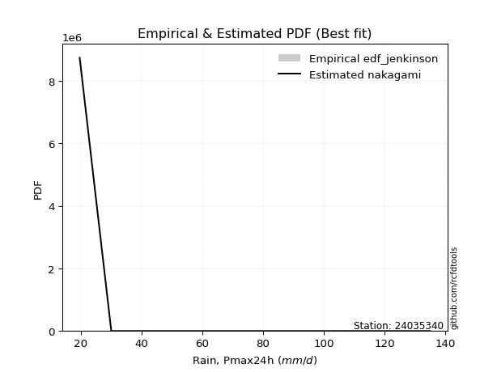</img>

</div>


### 11. Empirical - EDF Cunnane (1978)

Cunnane´s work in statistical hydrology has focused on the performance and evaluation of different probability distributions (such as GEV, Gumbel, Lognormal) for flood frequency estimation. _b_ is a constant, typically set to 0.4.

<div align="center">


$P=(m-b)/(n+1-2b)$


</div>


**11.1. Empirical values**

<div align="center">

|                | 0                  | 1                   | 2                   | 3                  | 4                  | 5                  |
|:---------------|:-------------------|:--------------------|:--------------------|:-------------------|:-------------------|:-------------------|
| date           | 2021               | 2022                | 2020                | 2025               | 2023               | 2024               |
| x              | 19.7               | 30.1                | 42.7                | 61.7               | 106.6              | 135.0              |
| m              | 1                  | 2                   | 3                   | 4                  | 5                  | 6                  |
| empirical_dist | edf_cunnane        | edf_cunnane         | edf_cunnane         | edf_cunnane        | edf_cunnane        | edf_cunnane        |
| empirical      | 0.0967741935483871 | 0.25806451612903225 | 0.41935483870967744 | 0.5806451612903226 | 0.7419354838709676 | 0.9032258064516128 |
| empirical_tr   | 1.1071428571428572 | 1.3478260869565217  | 1.7222222222222225  | 2.384615384615385  | 3.8749999999999982 | 10.333333333333318 |

</div>


**11.2. Kolmogorov-Smirnov fit test (sorted by Δ)**


<div align="center">

|                | 0                   | 1                   | 2                   | 3                   | 4                   | 5                   | 6                   | 7                   | 8                  | 9                   | 10                    | 11                  | 12                  | 13                  | 14                  | 15                  | 16                  | 17                  | 18                  | 19                 | 20                  | 21                  | 22                  | 23                  | 24                  | 25                 | 26                 | 27                  | 28                  | 29                  | 30                  | 31                  | 32                 | 33                  | 34                  | 35                  | 36                  | 37                  | 38                  | 39                  | 40                  | 41                  | 42                  | 43                  | 44                  | 45                  | 46                  | 47                  | 48                  | 49                  | 50                  | 51                  | 52                  | 53                  | 54                 | 55                  | 56                  | 57                  | 58                  | 59                  | 60                  | 61                  | 62                  | 63                  | 64                  | 65                  | 66                  | 67                  | 68                  | 69                 | 70                  | 71                  | 72                 | 73                  | 74                 | 75                 | 76                  | 77                  | 78                  | 79                  | 80                  | 81                | 82                  | 83                  | 84                 | 85                  | 86                 | 87                 | 88                 | 89             |
|:---------------|:--------------------|:--------------------|:--------------------|:--------------------|:--------------------|:--------------------|:--------------------|:--------------------|:-------------------|:--------------------|:----------------------|:--------------------|:--------------------|:--------------------|:--------------------|:--------------------|:--------------------|:--------------------|:--------------------|:-------------------|:--------------------|:--------------------|:--------------------|:--------------------|:--------------------|:-------------------|:-------------------|:--------------------|:--------------------|:--------------------|:--------------------|:--------------------|:-------------------|:--------------------|:--------------------|:--------------------|:--------------------|:--------------------|:--------------------|:--------------------|:--------------------|:--------------------|:--------------------|:--------------------|:--------------------|:--------------------|:--------------------|:--------------------|:--------------------|:--------------------|:--------------------|:--------------------|:--------------------|:--------------------|:-------------------|:--------------------|:--------------------|:--------------------|:--------------------|:--------------------|:--------------------|:--------------------|:--------------------|:--------------------|:--------------------|:--------------------|:--------------------|:--------------------|:--------------------|:-------------------|:--------------------|:--------------------|:-------------------|:--------------------|:-------------------|:-------------------|:--------------------|:--------------------|:--------------------|:--------------------|:--------------------|:------------------|:--------------------|:--------------------|:-------------------|:--------------------|:-------------------|:-------------------|:-------------------|:---------------|
| station        | 24035340            | 24035340            | 24035340            | 24035340            | 24035340            | 24035340            | 24035340            | 24035340            | 24035340           | 24035340            | 24035340              | 24035340            | 24035340            | 24035340            | 24035340            | 24035340            | 24035340            | 24035340            | 24035340            | 24035340           | 24035340            | 24035340            | 24035340            | 24035340            | 24035340            | 24035340           | 24035340           | 24035340            | 24035340            | 24035340            | 24035340            | 24035340            | 24035340           | 24035340            | 24035340            | 24035340            | 24035340            | 24035340            | 24035340            | 24035340            | 24035340            | 24035340            | 24035340            | 24035340            | 24035340            | 24035340            | 24035340            | 24035340            | 24035340            | 24035340            | 24035340            | 24035340            | 24035340            | 24035340            | 24035340           | 24035340            | 24035340            | 24035340            | 24035340            | 24035340            | 24035340            | 24035340            | 24035340            | 24035340            | 24035340            | 24035340            | 24035340            | 24035340            | 24035340            | 24035340           | 24035340            | 24035340            | 24035340           | 24035340            | 24035340           | 24035340           | 24035340            | 24035340            | 24035340            | 24035340            | 24035340            | 24035340          | 24035340            | 24035340            | 24035340           | 24035340            | 24035340           | 24035340           | 24035340           | 24035340       |
| empirical_dist | edf_cunnane         | edf_cunnane         | edf_cunnane         | edf_cunnane         | edf_cunnane         | edf_cunnane         | edf_cunnane         | edf_cunnane         | edf_cunnane        | edf_cunnane         | edf_cunnane           | edf_cunnane         | edf_cunnane         | edf_cunnane         | edf_cunnane         | edf_cunnane         | edf_cunnane         | edf_cunnane         | edf_cunnane         | edf_cunnane        | edf_cunnane         | edf_cunnane         | edf_cunnane         | edf_cunnane         | edf_cunnane         | edf_cunnane        | edf_cunnane        | edf_cunnane         | edf_cunnane         | edf_cunnane         | edf_cunnane         | edf_cunnane         | edf_cunnane        | edf_cunnane         | edf_cunnane         | edf_cunnane         | edf_cunnane         | edf_cunnane         | edf_cunnane         | edf_cunnane         | edf_cunnane         | edf_cunnane         | edf_cunnane         | edf_cunnane         | edf_cunnane         | edf_cunnane         | edf_cunnane         | edf_cunnane         | edf_cunnane         | edf_cunnane         | edf_cunnane         | edf_cunnane         | edf_cunnane         | edf_cunnane         | edf_cunnane        | edf_cunnane         | edf_cunnane         | edf_cunnane         | edf_cunnane         | edf_cunnane         | edf_cunnane         | edf_cunnane         | edf_cunnane         | edf_cunnane         | edf_cunnane         | edf_cunnane         | edf_cunnane         | edf_cunnane         | edf_cunnane         | edf_cunnane        | edf_cunnane         | edf_cunnane         | edf_cunnane        | edf_cunnane         | edf_cunnane        | edf_cunnane        | edf_cunnane         | edf_cunnane         | edf_cunnane         | edf_cunnane         | edf_cunnane         | edf_cunnane       | edf_cunnane         | edf_cunnane         | edf_cunnane        | edf_cunnane         | edf_cunnane        | edf_cunnane        | edf_cunnane        | edf_cunnane    |
| p_dist         | johnsonsu           | loginvweibull       | loggenlogistic      | halfnorm            | rayleigh            | logmielke           | loggenexpon         | nct                 | logkstwobign       | logfisk             | loglaplace_asymmetric | logweibull_min      | logalpha            | loghalfnorm         | lograyleigh         | logmaxwell          | logrice             | invgamma            | loggompertz         | maxwell            | loginvgamma         | logncf              | laplace_asymmetric  | genexpon            | expon               | logbetaprime       | exponnorm          | loginvgauss         | ncf                 | gompertz            | betaprime           | lognct              | invgauss           | logfatiguelife      | loggamma            | loggamma            | logerlang           | logf                | lognorm             | lognorm             | logcrystalball      | logt                | logexponnorm        | logpearson3         | logjohnsonsu        | logloggamma         | f                   | alpha               | gumbel_r            | pearson3            | halflogistic        | kstwobign           | moyal               | loghalflogistic     | loggumbel_r        | genlogistic         | logexpon            | logmoyal            | loglogistic         | t                   | truncnorm           | crystalball         | norm                | loghypsecant        | loggumbel_l         | loglaplace          | rice                | logistic            | nakagami            | hypsecant          | fisk                | erlang              | gumbel_l           | laplace             | logchi2            | logwald            | wald                | lognakagami         | logtruncnorm        | gibrat              | loggibrat           | pareto            | weibull_min         | logpareto           | loglognorm         | fatiguelife         | invweibull         | gamma              | chi2               | mielke         |
| delta          | 0.09060073464358098 | 0.09152527492747653 | 0.09204859539322441 | 0.09235564417733833 | 0.09397453105389136 | 0.09508791478521139 | 0.09594920490794645 | 0.09791884064348311 | 0.1003159133228515 | 0.10089101772068965 | 0.10163938147616514   | 0.10180991099289805 | 0.10203343352316718 | 0.10247284269108925 | 0.10261669358246261 | 0.10354410576075723 | 0.10380108159263068 | 0.10380293787273653 | 0.10442877685176655 | 0.1045996676888511 | 0.10486742994714116 | 0.10507919370034724 | 0.10518559802014538 | 0.10520584939419808 | 0.10520593248662902 | 0.1057502891088814 | 0.1058129737683281 | 0.10582701542902706 | 0.10603345896308902 | 0.10615799181426411 | 0.10639365207086249 | 0.10690035340124548 | 0.1069242108992593 | 0.10693439233050539 | 0.10701825969641499 | 0.10701825969641499 | 0.10702502046802853 | 0.10703279135281007 | 0.10705148219697735 | 0.10705148219697735 | 0.10705152139983498 | 0.10705164709911419 | 0.10705171421232285 | 0.10707697619881063 | 0.10718439705357674 | 0.10724977692549797 | 0.10770421374052852 | 0.10905583069207847 | 0.10968719317612075 | 0.10983589278230543 | 0.11018146474931845 | 0.11569059235869783 | 0.11581740402135876 | 0.11895153623557919 | 0.1192640013052072 | 0.12095482495331367 | 0.12213968861352625 | 0.12435183235825187 | 0.12475626471826651 | 0.13115444866468073 | 0.13119217803167932 | 0.13119220911451412 | 0.13119221452670854 | 0.13383276659666188 | 0.13677893642755035 | 0.14190078421581354 | 0.14335572651395373 | 0.15305533387993753 | 0.16032150377161225 | 0.1685266445285984 | 0.17596963744287764 | 0.18990035239549174 | 0.1918540658821083 | 0.19247930541254016 | 0.2097938448844171 | 0.2277640397349026 | 0.23947931730101102 | 0.25806447414167927 | 0.25806451483885406 | 0.25806451612903225 | 0.25806451612903225 | 0.345750136824551 | 0.35197284038681487 | 0.38051440333792863 | 0.3895515994117902 | 0.46010097309964504 | 0.4659515638663599 | 0.5520858182444656 | 0.5583499656357866 | nan            |
| deltao         | 0.530385761606      | 0.530385761606      | 0.530385761606      | 0.530385761606      | 0.530385761606      | 0.530385761606      | 0.530385761606      | 0.530385761606      | 0.530385761606     | 0.530385761606      | 0.530385761606        | 0.530385761606      | 0.530385761606      | 0.530385761606      | 0.530385761606      | 0.530385761606      | 0.530385761606      | 0.530385761606      | 0.530385761606      | 0.530385761606     | 0.530385761606      | 0.530385761606      | 0.530385761606      | 0.530385761606      | 0.530385761606      | 0.530385761606     | 0.530385761606     | 0.530385761606      | 0.530385761606      | 0.530385761606      | 0.530385761606      | 0.530385761606      | 0.530385761606     | 0.530385761606      | 0.530385761606      | 0.530385761606      | 0.530385761606      | 0.530385761606      | 0.530385761606      | 0.530385761606      | 0.530385761606      | 0.530385761606      | 0.530385761606      | 0.530385761606      | 0.530385761606      | 0.530385761606      | 0.530385761606      | 0.530385761606      | 0.530385761606      | 0.530385761606      | 0.530385761606      | 0.530385761606      | 0.530385761606      | 0.530385761606      | 0.530385761606     | 0.530385761606      | 0.530385761606      | 0.530385761606      | 0.530385761606      | 0.530385761606      | 0.530385761606      | 0.530385761606      | 0.530385761606      | 0.530385761606      | 0.530385761606      | 0.530385761606      | 0.530385761606      | 0.530385761606      | 0.530385761606      | 0.530385761606     | 0.530385761606      | 0.530385761606      | 0.530385761606     | 0.530385761606      | 0.530385761606     | 0.530385761606     | 0.530385761606      | 0.530385761606      | 0.530385761606      | 0.530385761606      | 0.530385761606      | 0.530385761606    | 0.530385761606      | 0.530385761606      | 0.530385761606     | 0.530385761606      | 0.530385761606     | 0.530385761606     | 0.530385761606     | 0.530385761606 |
| eval           | Δo > Δ              | Δo > Δ              | Δo > Δ              | Δo > Δ              | Δo > Δ              | Δo > Δ              | Δo > Δ              | Δo > Δ              | Δo > Δ             | Δo > Δ              | Δo > Δ                | Δo > Δ              | Δo > Δ              | Δo > Δ              | Δo > Δ              | Δo > Δ              | Δo > Δ              | Δo > Δ              | Δo > Δ              | Δo > Δ             | Δo > Δ              | Δo > Δ              | Δo > Δ              | Δo > Δ              | Δo > Δ              | Δo > Δ             | Δo > Δ             | Δo > Δ              | Δo > Δ              | Δo > Δ              | Δo > Δ              | Δo > Δ              | Δo > Δ             | Δo > Δ              | Δo > Δ              | Δo > Δ              | Δo > Δ              | Δo > Δ              | Δo > Δ              | Δo > Δ              | Δo > Δ              | Δo > Δ              | Δo > Δ              | Δo > Δ              | Δo > Δ              | Δo > Δ              | Δo > Δ              | Δo > Δ              | Δo > Δ              | Δo > Δ              | Δo > Δ              | Δo > Δ              | Δo > Δ              | Δo > Δ              | Δo > Δ             | Δo > Δ              | Δo > Δ              | Δo > Δ              | Δo > Δ              | Δo > Δ              | Δo > Δ              | Δo > Δ              | Δo > Δ              | Δo > Δ              | Δo > Δ              | Δo > Δ              | Δo > Δ              | Δo > Δ              | Δo > Δ              | Δo > Δ             | Δo > Δ              | Δo > Δ              | Δo > Δ             | Δo > Δ              | Δo > Δ             | Δo > Δ             | Δo > Δ              | Δo > Δ              | Δo > Δ              | Δo > Δ              | Δo > Δ              | Δo > Δ            | Δo > Δ              | Δo > Δ              | Δo > Δ             | Δo > Δ              | Δo > Δ             | Δo <= Δ            | Δo <= Δ            | Δo <= Δ        |
| fit            | 1                   | 1                   | 1                   | 1                   | 1                   | 1                   | 1                   | 1                   | 1                  | 1                   | 1                     | 1                   | 1                   | 1                   | 1                   | 1                   | 1                   | 1                   | 1                   | 1                  | 1                   | 1                   | 1                   | 1                   | 1                   | 1                  | 1                  | 1                   | 1                   | 1                   | 1                   | 1                   | 1                  | 1                   | 1                   | 1                   | 1                   | 1                   | 1                   | 1                   | 1                   | 1                   | 1                   | 1                   | 1                   | 1                   | 1                   | 1                   | 1                   | 1                   | 1                   | 1                   | 1                   | 1                   | 1                  | 1                   | 1                   | 1                   | 1                   | 1                   | 1                   | 1                   | 1                   | 1                   | 1                   | 1                   | 1                   | 1                   | 1                   | 1                  | 1                   | 1                   | 1                  | 1                   | 1                  | 1                  | 1                   | 1                   | 1                   | 1                   | 1                   | 1                 | 1                   | 1                   | 1                  | 1                   | 1                  | 0                  | 0                  | 0              |
| n              | 6                   | 6                   | 6                   | 6                   | 6                   | 6                   | 6                   | 6                   | 6                  | 6                   | 6                     | 6                   | 6                   | 6                   | 6                   | 6                   | 6                   | 6                   | 6                   | 6                  | 6                   | 6                   | 6                   | 6                   | 6                   | 6                  | 6                  | 6                   | 6                   | 6                   | 6                   | 6                   | 6                  | 6                   | 6                   | 6                   | 6                   | 6                   | 6                   | 6                   | 6                   | 6                   | 6                   | 6                   | 6                   | 6                   | 6                   | 6                   | 6                   | 6                   | 6                   | 6                   | 6                   | 6                   | 6                  | 6                   | 6                   | 6                   | 6                   | 6                   | 6                   | 6                   | 6                   | 6                   | 6                   | 6                   | 6                   | 6                   | 6                   | 6                  | 6                   | 6                   | 6                  | 6                   | 6                  | 6                  | 6                   | 6                   | 6                   | 6                   | 6                   | 6                 | 6                   | 6                   | 6                  | 6                   | 6                  | 6                  | 6                  | 6              |
| best_fit       | 1                   | 0                   | 0                   | 0                   | 0                   | 0                   | 0                   | 0                   | 0                  | 0                   | 0                     | 0                   | 0                   | 0                   | 0                   | 0                   | 0                   | 0                   | 0                   | 0                  | 0                   | 0                   | 0                   | 0                   | 0                   | 0                  | 0                  | 0                   | 0                   | 0                   | 0                   | 0                   | 0                  | 0                   | 0                   | 0                   | 0                   | 0                   | 0                   | 0                   | 0                   | 0                   | 0                   | 0                   | 0                   | 0                   | 0                   | 0                   | 0                   | 0                   | 0                   | 0                   | 0                   | 0                   | 0                  | 0                   | 0                   | 0                   | 0                   | 0                   | 0                   | 0                   | 0                   | 0                   | 0                   | 0                   | 0                   | 0                   | 0                   | 0                  | 0                   | 0                   | 0                  | 0                   | 0                  | 0                  | 0                   | 0                   | 0                   | 0                   | 0                   | 0                 | 0                   | 0                   | 0                  | 0                   | 0                  | 0                  | 0                  | 0              |
| best_fit_sort  | 1                   | 2                   | 3                   | 4                   | 5                   | 6                   | 7                   | 8                   | 9                  | 10                  | 11                    | 12                  | 13                  | 14                  | 15                  | 16                  | 17                  | 18                  | 19                  | 20                 | 21                  | 22                  | 23                  | 24                  | 25                  | 26                 | 27                 | 28                  | 29                  | 30                  | 31                  | 32                  | 33                 | 34                  | 35                  | 36                  | 37                  | 38                  | 39                  | 40                  | 41                  | 42                  | 43                  | 44                  | 45                  | 46                  | 47                  | 48                  | 49                  | 50                  | 51                  | 52                  | 53                  | 54                  | 55                 | 56                  | 57                  | 58                  | 59                  | 60                  | 61                  | 62                  | 63                  | 64                  | 65                  | 66                  | 67                  | 68                  | 69                  | 70                 | 71                  | 72                  | 73                 | 74                  | 75                 | 76                 | 77                  | 78                  | 79                  | 80                  | 81                  | 82                | 83                  | 84                  | 85                 | 86                  | 87                 | 88                 | 89                 | 90             |

</div>


<div align="center">

</img>

</div>


**11.3. Best fit**

<div align="center">

|   id |   station | empirical_dist   | p_dist    |     delta |   deltao | eval   |   fit |   n |   best_fit |   best_fit_sort |
|-----:|----------:|:-----------------|:----------|----------:|---------:|:-------|------:|----:|-----------:|----------------:|
|    0 |  24035340 | edf_cunnane      | johnsonsu | 0.0906007 | 0.530386 | Δo > Δ |     1 |   6 |          1 |               1 |

</div>


<div align="center">

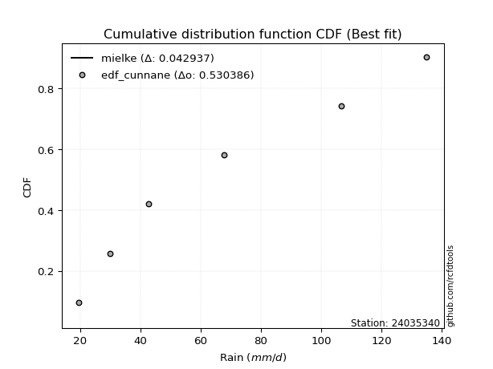</img></img>

</div>


### 12. Empirical - EDF Adamowski (1981)

The Adamowski formula in hydrology refers to a specific plotting position formula used for estimating the non-parametric empirical distribution of hydrological events (like flood peaks) to calculate their return periods. This formula provides an alternative to traditional parametric methods (like the Gumbel or Log Pearson Type III distributions). 

<div align="center">


$P=(m-0.25)/(n+0.5)$


</div>


**12.1. Empirical values**

<div align="center">

|                | 0                   | 1                  | 2                  | 3                  | 4                  | 5                  |
|:---------------|:--------------------|:-------------------|:-------------------|:-------------------|:-------------------|:-------------------|
| date           | 2021                | 2022               | 2020               | 2025               | 2023               | 2024               |
| x              | 19.7                | 30.1               | 42.7               | 61.7               | 106.6              | 135.0              |
| m              | 1                   | 2                  | 3                  | 4                  | 5                  | 6                  |
| empirical_dist | edf_adamowski       | edf_adamowski      | edf_adamowski      | edf_adamowski      | edf_adamowski      | edf_adamowski      |
| empirical      | 0.11538461538461539 | 0.2692307692307692 | 0.4230769230769231 | 0.5769230769230769 | 0.7307692307692307 | 0.8846153846153846 |
| empirical_tr   | 1.1304347826086958  | 1.3684210526315788 | 1.7333333333333334 | 2.3636363636363633 | 3.7142857142857135 | 8.666666666666664  |

</div>


**12.2. Kolmogorov-Smirnov fit test (sorted by Δ)**


<div align="center">

|                | 0                  | 1                   | 2                   | 3                   | 4                   | 5                  | 6                   | 7                   | 8                   | 9                   | 10                  | 11                    | 12                  | 13                 | 14                  | 15                  | 16                  | 17                 | 18                  | 19                  | 20                  | 21                  | 22                  | 23                  | 24                  | 25                  | 26                  | 27                  | 28                  | 29                  | 30                  | 31                 | 32                 | 33                  | 34                 | 35                 | 36                 | 37                  | 38                  | 39                  | 40                  | 41                  | 42                 | 43                  | 44                  | 45                  | 46                  | 47                  | 48                  | 49                  | 50                  | 51                  | 52                  | 53                  | 54                 | 55                 | 56                  | 57                  | 58                  | 59                  | 60                  | 61                  | 62                  | 63                 | 64                  | 65                  | 66                  | 67                  | 68                  | 69                  | 70                  | 71                  | 72                 | 73                  | 74                  | 75                  | 76                | 77                  | 78                  | 79                 | 80                 | 81                  | 82                 | 83                  | 84                 | 85                 | 86                  | 87                 | 88                 | 89             |
|:---------------|:-------------------|:--------------------|:--------------------|:--------------------|:--------------------|:-------------------|:--------------------|:--------------------|:--------------------|:--------------------|:--------------------|:----------------------|:--------------------|:-------------------|:--------------------|:--------------------|:--------------------|:-------------------|:--------------------|:--------------------|:--------------------|:--------------------|:--------------------|:--------------------|:--------------------|:--------------------|:--------------------|:--------------------|:--------------------|:--------------------|:--------------------|:-------------------|:-------------------|:--------------------|:-------------------|:-------------------|:-------------------|:--------------------|:--------------------|:--------------------|:--------------------|:--------------------|:-------------------|:--------------------|:--------------------|:--------------------|:--------------------|:--------------------|:--------------------|:--------------------|:--------------------|:--------------------|:--------------------|:--------------------|:-------------------|:-------------------|:--------------------|:--------------------|:--------------------|:--------------------|:--------------------|:--------------------|:--------------------|:-------------------|:--------------------|:--------------------|:--------------------|:--------------------|:--------------------|:--------------------|:--------------------|:--------------------|:-------------------|:--------------------|:--------------------|:--------------------|:------------------|:--------------------|:--------------------|:-------------------|:-------------------|:--------------------|:-------------------|:--------------------|:-------------------|:-------------------|:--------------------|:-------------------|:-------------------|:---------------|
| station        | 24035340           | 24035340            | 24035340            | 24035340            | 24035340            | 24035340           | 24035340            | 24035340            | 24035340            | 24035340            | 24035340            | 24035340              | 24035340            | 24035340           | 24035340            | 24035340            | 24035340            | 24035340           | 24035340            | 24035340            | 24035340            | 24035340            | 24035340            | 24035340            | 24035340            | 24035340            | 24035340            | 24035340            | 24035340            | 24035340            | 24035340            | 24035340           | 24035340           | 24035340            | 24035340           | 24035340           | 24035340           | 24035340            | 24035340            | 24035340            | 24035340            | 24035340            | 24035340           | 24035340            | 24035340            | 24035340            | 24035340            | 24035340            | 24035340            | 24035340            | 24035340            | 24035340            | 24035340            | 24035340            | 24035340           | 24035340           | 24035340            | 24035340            | 24035340            | 24035340            | 24035340            | 24035340            | 24035340            | 24035340           | 24035340            | 24035340            | 24035340            | 24035340            | 24035340            | 24035340            | 24035340            | 24035340            | 24035340           | 24035340            | 24035340            | 24035340            | 24035340          | 24035340            | 24035340            | 24035340           | 24035340           | 24035340            | 24035340           | 24035340            | 24035340           | 24035340           | 24035340            | 24035340           | 24035340           | 24035340       |
| empirical_dist | edf_adamowski      | edf_adamowski       | edf_adamowski       | edf_adamowski       | edf_adamowski       | edf_adamowski      | edf_adamowski       | edf_adamowski       | edf_adamowski       | edf_adamowski       | edf_adamowski       | edf_adamowski         | edf_adamowski       | edf_adamowski      | edf_adamowski       | edf_adamowski       | edf_adamowski       | edf_adamowski      | edf_adamowski       | edf_adamowski       | edf_adamowski       | edf_adamowski       | edf_adamowski       | edf_adamowski       | edf_adamowski       | edf_adamowski       | edf_adamowski       | edf_adamowski       | edf_adamowski       | edf_adamowski       | edf_adamowski       | edf_adamowski      | edf_adamowski      | edf_adamowski       | edf_adamowski      | edf_adamowski      | edf_adamowski      | edf_adamowski       | edf_adamowski       | edf_adamowski       | edf_adamowski       | edf_adamowski       | edf_adamowski      | edf_adamowski       | edf_adamowski       | edf_adamowski       | edf_adamowski       | edf_adamowski       | edf_adamowski       | edf_adamowski       | edf_adamowski       | edf_adamowski       | edf_adamowski       | edf_adamowski       | edf_adamowski      | edf_adamowski      | edf_adamowski       | edf_adamowski       | edf_adamowski       | edf_adamowski       | edf_adamowski       | edf_adamowski       | edf_adamowski       | edf_adamowski      | edf_adamowski       | edf_adamowski       | edf_adamowski       | edf_adamowski       | edf_adamowski       | edf_adamowski       | edf_adamowski       | edf_adamowski       | edf_adamowski      | edf_adamowski       | edf_adamowski       | edf_adamowski       | edf_adamowski     | edf_adamowski       | edf_adamowski       | edf_adamowski      | edf_adamowski      | edf_adamowski       | edf_adamowski      | edf_adamowski       | edf_adamowski      | edf_adamowski      | edf_adamowski       | edf_adamowski      | edf_adamowski      | edf_adamowski  |
| p_dist         | johnsonsu          | rayleigh            | loginvweibull       | loggenlogistic      | halfnorm            | logmielke          | maxwell             | nct                 | loggenexpon         | logkstwobign        | logfisk             | loglaplace_asymmetric | logweibull_min      | logalpha           | pearson3            | lograyleigh         | logmaxwell          | logrice            | invgamma            | loghalfnorm         | loggompertz         | loginvgamma         | logncf              | laplace_asymmetric  | genexpon            | expon               | logbetaprime        | exponnorm           | loginvgauss         | ncf                 | gompertz            | betaprime          | lognct             | invgauss            | logfatiguelife     | loggamma           | loggamma           | logerlang           | logf                | lognorm             | lognorm             | logcrystalball      | logt               | logexponnorm        | logpearson3         | logjohnsonsu        | logloggamma         | logexpon            | f                   | alpha               | gumbel_r            | halflogistic        | kstwobign           | moyal               | loghalflogistic    | loggumbel_r        | genlogistic         | t                   | truncnorm           | crystalball         | norm                | logmoyal            | loglogistic         | loghypsecant       | rice                | loggumbel_l         | loglaplace          | logistic            | fisk                | nakagami            | hypsecant           | gumbel_l            | laplace            | logchi2             | erlang              | logwald             | wald              | lognakagami         | logtruncnorm        | gibrat             | loggibrat          | pareto              | weibull_min        | logpareto           | loglognorm         | invweibull         | fatiguelife         | gamma              | chi2               | mielke         |
| delta          | 0.1017669877453179 | 0.10243692439695551 | 0.10269152802921344 | 0.10321484849496132 | 0.10352189727907524 | 0.1062541678869483 | 0.10832175205609673 | 0.10908509374522002 | 0.11010244762529844 | 0.11148216642458841 | 0.11205727082242656 | 0.11280563457790205   | 0.11297616409463496 | 0.1131996866249041 | 0.11355797714955107 | 0.11378294668419953 | 0.11471035886249414 | 0.1149673346943676 | 0.11496919097447345 | 0.11538461538461539 | 0.11559502995350346 | 0.11603368304887807 | 0.11624544680208415 | 0.11635185112188229 | 0.11637210249593499 | 0.11637218558836593 | 0.11691654221061831 | 0.11697922687006501 | 0.11699326853076397 | 0.11719971206482593 | 0.11732424491600102 | 0.1175599051725994 | 0.1180666065029824 | 0.11809046400099621 | 0.1181006454322423 | 0.1181845127981519 | 0.1181845127981519 | 0.11819127356976544 | 0.11819904445454699 | 0.11821773529871427 | 0.11821773529871427 | 0.11821777450157189 | 0.1182179002008511 | 0.11821796731405976 | 0.11824322930054754 | 0.11835065015531365 | 0.11841603002723489 | 0.11841760424628062 | 0.11887046684226543 | 0.12022208379381538 | 0.12085344627785766 | 0.12134771785105536 | 0.12685684546043474 | 0.12698365712309567 | 0.1301177893373161 | 0.1304302544069441 | 0.13212107805505058 | 0.13487653303192637 | 0.13491426239892496 | 0.13491429348175976 | 0.13491429889395418 | 0.13551808545998878 | 0.13592251782000342 | 0.1449990196983988 | 0.14707781088119937 | 0.14794518952928726 | 0.15306703731755045 | 0.15677741824718316 | 0.15735921560664945 | 0.17148775687334916 | 0.17224872889584403 | 0.18813198151486255 | 0.1962013897797858 | 0.19862759178268014 | 0.20106660549722866 | 0.23893029283663958 | 0.250645570402748 | 0.26923072724341623 | 0.26923076794059103 | 0.2692307692307692 | 0.2692307692307692 | 0.33458388372281406 | 0.3408065872850779 | 0.36934815023619166 | 0.3783853463100532 | 0.4473411420301317 | 0.44893471999790807 | 0.5409195651427285 | 0.5471837125340497 | nan            |
| deltao         | 0.530385761606     | 0.530385761606      | 0.530385761606      | 0.530385761606      | 0.530385761606      | 0.530385761606     | 0.530385761606      | 0.530385761606      | 0.530385761606      | 0.530385761606      | 0.530385761606      | 0.530385761606        | 0.530385761606      | 0.530385761606     | 0.530385761606      | 0.530385761606      | 0.530385761606      | 0.530385761606     | 0.530385761606      | 0.530385761606      | 0.530385761606      | 0.530385761606      | 0.530385761606      | 0.530385761606      | 0.530385761606      | 0.530385761606      | 0.530385761606      | 0.530385761606      | 0.530385761606      | 0.530385761606      | 0.530385761606      | 0.530385761606     | 0.530385761606     | 0.530385761606      | 0.530385761606     | 0.530385761606     | 0.530385761606     | 0.530385761606      | 0.530385761606      | 0.530385761606      | 0.530385761606      | 0.530385761606      | 0.530385761606     | 0.530385761606      | 0.530385761606      | 0.530385761606      | 0.530385761606      | 0.530385761606      | 0.530385761606      | 0.530385761606      | 0.530385761606      | 0.530385761606      | 0.530385761606      | 0.530385761606      | 0.530385761606     | 0.530385761606     | 0.530385761606      | 0.530385761606      | 0.530385761606      | 0.530385761606      | 0.530385761606      | 0.530385761606      | 0.530385761606      | 0.530385761606     | 0.530385761606      | 0.530385761606      | 0.530385761606      | 0.530385761606      | 0.530385761606      | 0.530385761606      | 0.530385761606      | 0.530385761606      | 0.530385761606     | 0.530385761606      | 0.530385761606      | 0.530385761606      | 0.530385761606    | 0.530385761606      | 0.530385761606      | 0.530385761606     | 0.530385761606     | 0.530385761606      | 0.530385761606     | 0.530385761606      | 0.530385761606     | 0.530385761606     | 0.530385761606      | 0.530385761606     | 0.530385761606     | 0.530385761606 |
| eval           | Δo > Δ             | Δo > Δ              | Δo > Δ              | Δo > Δ              | Δo > Δ              | Δo > Δ             | Δo > Δ              | Δo > Δ              | Δo > Δ              | Δo > Δ              | Δo > Δ              | Δo > Δ                | Δo > Δ              | Δo > Δ             | Δo > Δ              | Δo > Δ              | Δo > Δ              | Δo > Δ             | Δo > Δ              | Δo > Δ              | Δo > Δ              | Δo > Δ              | Δo > Δ              | Δo > Δ              | Δo > Δ              | Δo > Δ              | Δo > Δ              | Δo > Δ              | Δo > Δ              | Δo > Δ              | Δo > Δ              | Δo > Δ             | Δo > Δ             | Δo > Δ              | Δo > Δ             | Δo > Δ             | Δo > Δ             | Δo > Δ              | Δo > Δ              | Δo > Δ              | Δo > Δ              | Δo > Δ              | Δo > Δ             | Δo > Δ              | Δo > Δ              | Δo > Δ              | Δo > Δ              | Δo > Δ              | Δo > Δ              | Δo > Δ              | Δo > Δ              | Δo > Δ              | Δo > Δ              | Δo > Δ              | Δo > Δ             | Δo > Δ             | Δo > Δ              | Δo > Δ              | Δo > Δ              | Δo > Δ              | Δo > Δ              | Δo > Δ              | Δo > Δ              | Δo > Δ             | Δo > Δ              | Δo > Δ              | Δo > Δ              | Δo > Δ              | Δo > Δ              | Δo > Δ              | Δo > Δ              | Δo > Δ              | Δo > Δ             | Δo > Δ              | Δo > Δ              | Δo > Δ              | Δo > Δ            | Δo > Δ              | Δo > Δ              | Δo > Δ             | Δo > Δ             | Δo > Δ              | Δo > Δ             | Δo > Δ              | Δo > Δ             | Δo > Δ             | Δo > Δ              | Δo <= Δ            | Δo <= Δ            | Δo <= Δ        |
| fit            | 1                  | 1                   | 1                   | 1                   | 1                   | 1                  | 1                   | 1                   | 1                   | 1                   | 1                   | 1                     | 1                   | 1                  | 1                   | 1                   | 1                   | 1                  | 1                   | 1                   | 1                   | 1                   | 1                   | 1                   | 1                   | 1                   | 1                   | 1                   | 1                   | 1                   | 1                   | 1                  | 1                  | 1                   | 1                  | 1                  | 1                  | 1                   | 1                   | 1                   | 1                   | 1                   | 1                  | 1                   | 1                   | 1                   | 1                   | 1                   | 1                   | 1                   | 1                   | 1                   | 1                   | 1                   | 1                  | 1                  | 1                   | 1                   | 1                   | 1                   | 1                   | 1                   | 1                   | 1                  | 1                   | 1                   | 1                   | 1                   | 1                   | 1                   | 1                   | 1                   | 1                  | 1                   | 1                   | 1                   | 1                 | 1                   | 1                   | 1                  | 1                  | 1                   | 1                  | 1                   | 1                  | 1                  | 1                   | 0                  | 0                  | 0              |
| n              | 6                  | 6                   | 6                   | 6                   | 6                   | 6                  | 6                   | 6                   | 6                   | 6                   | 6                   | 6                     | 6                   | 6                  | 6                   | 6                   | 6                   | 6                  | 6                   | 6                   | 6                   | 6                   | 6                   | 6                   | 6                   | 6                   | 6                   | 6                   | 6                   | 6                   | 6                   | 6                  | 6                  | 6                   | 6                  | 6                  | 6                  | 6                   | 6                   | 6                   | 6                   | 6                   | 6                  | 6                   | 6                   | 6                   | 6                   | 6                   | 6                   | 6                   | 6                   | 6                   | 6                   | 6                   | 6                  | 6                  | 6                   | 6                   | 6                   | 6                   | 6                   | 6                   | 6                   | 6                  | 6                   | 6                   | 6                   | 6                   | 6                   | 6                   | 6                   | 6                   | 6                  | 6                   | 6                   | 6                   | 6                 | 6                   | 6                   | 6                  | 6                  | 6                   | 6                  | 6                   | 6                  | 6                  | 6                   | 6                  | 6                  | 6              |
| best_fit       | 1                  | 0                   | 0                   | 0                   | 0                   | 0                  | 0                   | 0                   | 0                   | 0                   | 0                   | 0                     | 0                   | 0                  | 0                   | 0                   | 0                   | 0                  | 0                   | 0                   | 0                   | 0                   | 0                   | 0                   | 0                   | 0                   | 0                   | 0                   | 0                   | 0                   | 0                   | 0                  | 0                  | 0                   | 0                  | 0                  | 0                  | 0                   | 0                   | 0                   | 0                   | 0                   | 0                  | 0                   | 0                   | 0                   | 0                   | 0                   | 0                   | 0                   | 0                   | 0                   | 0                   | 0                   | 0                  | 0                  | 0                   | 0                   | 0                   | 0                   | 0                   | 0                   | 0                   | 0                  | 0                   | 0                   | 0                   | 0                   | 0                   | 0                   | 0                   | 0                   | 0                  | 0                   | 0                   | 0                   | 0                 | 0                   | 0                   | 0                  | 0                  | 0                   | 0                  | 0                   | 0                  | 0                  | 0                   | 0                  | 0                  | 0              |
| best_fit_sort  | 1                  | 2                   | 3                   | 4                   | 5                   | 6                  | 7                   | 8                   | 9                   | 10                  | 11                  | 12                    | 13                  | 14                 | 15                  | 16                  | 17                  | 18                 | 19                  | 20                  | 21                  | 22                  | 23                  | 24                  | 25                  | 26                  | 27                  | 28                  | 29                  | 30                  | 31                  | 32                 | 33                 | 34                  | 35                 | 36                 | 37                 | 38                  | 39                  | 40                  | 41                  | 42                  | 43                 | 44                  | 45                  | 46                  | 47                  | 48                  | 49                  | 50                  | 51                  | 52                  | 53                  | 54                  | 55                 | 56                 | 57                  | 58                  | 59                  | 60                  | 61                  | 62                  | 63                  | 64                 | 65                  | 66                  | 67                  | 68                  | 69                  | 70                  | 71                  | 72                  | 73                 | 74                  | 75                  | 76                  | 77                | 78                  | 79                  | 80                 | 81                 | 82                  | 83                 | 84                  | 85                 | 86                 | 87                  | 88                 | 89                 | 90             |

</div>


<div align="center">

</img>

</div>


**12.3. Best fit**

<div align="center">

|   id |   station | empirical_dist   | p_dist    |    delta |   deltao | eval   |   fit |   n |   best_fit |   best_fit_sort |
|-----:|----------:|:-----------------|:----------|---------:|---------:|:-------|------:|----:|-----------:|----------------:|
|    0 |  24035340 | edf_adamowski    | johnsonsu | 0.101767 | 0.530386 | Δo > Δ |     1 |   6 |          1 |               1 |

</div>


<div align="center">

</img>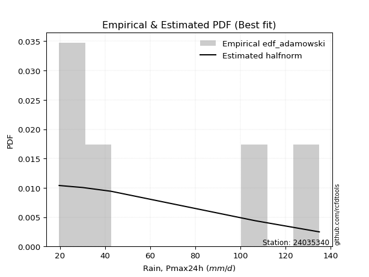</img>

</div>


## C. Best fit & Estimate extreme values for specific return periods - Tr


### 1. Best fit (ordered by delta Δ)

<div align="center">

|   id |   station | empirical_dist   | p_dist         |     delta |   deltao | eval   |   fit |   n |   best_fit |   best_fit_sort |
|-----:|----------:|:-----------------|:---------------|----------:|---------:|:-------|------:|----:|-----------:|----------------:|
|    0 |  24035340 | edf_hazen        | johnsonsu      | 0.0825362 | 0.530386 | Δo > Δ |     1 |   6 |          1 |               1 |
|    1 |  24035340 | edf_gringorten   | johnsonsu      | 0.0874382 | 0.530386 | Δo > Δ |     1 |   6 |          1 |               2 |
|    2 |  24035340 | edf_cunnane      | johnsonsu      | 0.0906007 | 0.530386 | Δo > Δ |     1 |   6 |          1 |               3 |
|    3 |  24035340 | edf_blom         | johnsonsu      | 0.0925362 | 0.530386 | Δo > Δ |     1 |   6 |          1 |               4 |
|    4 |  24035340 | edf_tukey        | johnsonsu      | 0.0956941 | 0.530386 | Δo > Δ |     1 |   6 |          1 |               5 |
|    5 |  24035340 | edf_filliben     | johnsonsu      | 0.0968724 | 0.530386 | Δo > Δ |     1 |   6 |          1 |               6 |
|    6 |  24035340 | edf_beard        | johnsonsu      | 0.0974265 | 0.530386 | Δo > Δ |     1 |   6 |          1 |               7 |
|    7 |  24035340 | edf_jenkinson    | johnsonsu      | 0.0974265 | 0.530386 | Δo > Δ |     1 |   6 |          1 |               8 |
|    8 |  24035340 | edf_chegodayev   | johnsonsu      | 0.0981612 | 0.530386 | Δo > Δ |     1 |   6 |          1 |               9 |
|    9 |  24035340 | edf_adamowski    | johnsonsu      | 0.101767  | 0.530386 | Δo > Δ |     1 |   6 |          1 |              10 |
|   10 |  24035340 | edf_california   | loggenlogistic | 0.11558   | 0.530386 | Δo > Δ |     1 |   6 |          1 |              11 |
|   11 |  24035340 | edf_weibull      | johnsonsu      | 0.118251  | 0.530386 | Δo > Δ |     1 |   6 |          1 |              12 |

</div>

:file_folder:Tables: [bestfit_24035340.csv](table/bestfit_24035340.csv) | [extreme_24035340.csv](table/extreme_24035340.csv)


### 2. Extreme values

In hydrology, a return period (or recurrence interval $Tr$) is the statistical average time between extreme events like floods or droughts of a specific magnitude, indicating how rare an event is, with a 100-year flood, for example, having a 1% chance of occurring in any given year, not that it happens exactly every century. It is a key tool for infrastructure design (like bridges or dams) and risk assessment, calculated from historical data to determine the probability of future events, although it is important to remember it is statistical average, and events can cluster or be missed.

> risk_rate: assuming the return period as the project useful life.

|   id |      tr |   prob_l |     prob_g |     alpha |   betaprime |     chi2 |   crystalball |   erlang |    expon |   exponnorm |        f |   fatiguelife |        fisk |    gamma |   genexpon |   genlogistic |   gibrat |   gompertz |   gumbel_l |   gumbel_r |   halflogistic |   halfnorm |   hypsecant |   invgamma |   invgauss |       invweibull |   johnsonsu |   kstwobign |   laplace |   laplace_asymmetric |   loggamma |   logistic |   lognorm |   maxwell |    mielke |    moyal |   nakagami |      ncf |       nct |     norm |           pareto |   pearson3 |   rayleigh |     rice |        t |   truncnorm |     wald |      weibull_min |   logalpha |   logbetaprime |     logchi2 |   logcrystalball |   logerlang |   logexpon |   logexponnorm |     logf |   logfatiguelife |   logfisk |   loggenexpon |   loggenlogistic |   loggibrat |   loggompertz |   loggumbel_l |   loggumbel_r |   loghalflogistic |   loghalfnorm |   loghypsecant |   loginvgamma |   loginvgauss |   loginvweibull |   logjohnsonsu |   logkstwobign |   loglaplace |   loglaplace_asymmetric |   logloggamma |   loglogistic |    loglognorm |   logmaxwell |   logmielke |   logmoyal |   lognakagami |   logncf |   lognct |        logpareto |   logpearson3 |   lograyleigh |   logrice |     logt |   logtruncnorm |   logwald |   logweibull_min |   station |   n |   risk_rate |
|-----:|--------:|---------:|-----------:|----------:|------------:|---------:|--------------:|---------:|---------:|------------:|---------:|--------------:|------------:|---------:|-----------:|--------------:|---------:|-----------:|-----------:|-----------:|---------------:|-----------:|------------:|-----------:|-----------:|-----------------:|------------:|------------:|----------:|---------------------:|-----------:|-----------:|----------:|----------:|----------:|---------:|-----------:|---------:|----------:|---------:|-----------------:|-----------:|-----------:|---------:|---------:|------------:|---------:|-----------------:|-----------:|---------------:|------------:|-----------------:|------------:|-----------:|---------------:|---------:|-----------------:|----------:|--------------:|-----------------:|------------:|--------------:|--------------:|--------------:|------------------:|--------------:|---------------:|--------------:|--------------:|----------------:|---------------:|---------------:|-------------:|------------------------:|--------------:|--------------:|--------------:|-------------:|------------:|-----------:|--------------:|---------:|---------:|-----------------:|--------------:|--------------:|----------:|---------:|---------------:|----------:|-----------------:|----------:|----:|------------:|
|    0 |    2    | 0.5      | 0.5        |   52.2851 |     51.0341 |  20.1027 |       65.9667 |  38.0545 |  51.7696 |     51.6803 |  51.4836 |       19.7001 |     49.6266 |  20.0874 |    51.7696 |       58.0646 |  53.4678 |    55.5743 |    72.8074 |    59.1259 |        55.725  |    57.443  |     65.9667 |    49.5564 |    47.3938 |   5339.63        |     46.4171 |     59.3256 |   65.9667 |              51.7719 |    53.0672 |    65.9667 |   53.1259 |   62.4054 |   47.6516 |  56.9175 |    43.1885 |  56.8355 |   45.9882 |  65.9667 |     22.9649      |    62.1678 |    61.1423 |  64.0258 |  65.9643 |     65.9667 |  52.4688 |     21.2326      |    50.935  |        50.2033 |     32.1619 |          53.1259 |     53.067  |    39.1834 |        53.1259 |  52.9323 |          52.6592 |   52.5976 |       45.9798 |          47.4089 |     43.3856 |       51.2208 |       59.3538 |       47.5514 |           45.0024 |       46.2724 |        53.1259 |       51.6101 |       49.6596 |         47.4263 |        53.4479 |        46.4378 |      53.1259 |                 48.1716 |       53.3948 |       53.1259 |  19.7563      |      50.1468 |     52.0536 |    45.8798 |       41.5141 |  52.1184 |  52.9607 |    21.4262       |       53.1839 |       49.1308 |   50.7522 |  53.1259 |        50.6645 |   42.6886 |          48.6647 |  24035340 |   6 |    0.75     |
|    1 |    2.33 | 0.570815 | 0.429185   |   58.6528 |     57.5726 |  20.6351 |       73.3973 |  42.9173 |  58.8355 |     58.734  |  58.0373 |       20.6935 |     63.9983 |  20.6247 |    58.8355 |       64.7162 |  57.2318 |    62.7812 |    79.2722 |    66.0112 |        62.8042 |    65.4626 |     71.9134 |    56.0192 |    54.0063 | 527281           |     53.2822 |     66.1892 |   70.4634 |              58.8383 |    59.8604 |    72.5136 |   59.9239 |   70.1253 |   54.1796 |  63.4353 |    49.8415 |  63.947  |   52.1977 |  73.3973 |     26.7031      |    69.6105 |    68.9764 |  71.0595 |  73.3957 |     73.3973 |  57.3411 |     25.0184      |    57.5927 |        56.7412 |     38.2217 |          59.9239 |     59.86   |    45.5932 |        59.9239 |  59.7096 |          59.4177 |   59.201  |       52.6998 |          53.9005 |     46.1143 |       58.2933 |       65.9091 |       53.1643 |           50.4724 |       52.6938 |        58.5002 |       58.3029 |       56.1542 |         53.9313 |        60.2752 |        52.8709 |      57.1416 |                 53.4722 |       60.2211 |       59.0719 |  20.3016      |      56.8294 |     58.6363 |    50.9908 |       46.2512 |  58.8659 |  59.7473 |    23.6055       |       59.9872 |       55.7812 |   57.5008 |  59.9239 |        56.3878 |   46.1957 |          55.3035 |  24035340 |   6 |    0.729209 |
|    2 |    5    | 0.8      | 0.2        |   91.9867 |     92.4419 |  28.639  |      101.012  |  68.5616 |  94.1633 |     94.001  |  92.4229 |       41.7958 |    221.097  |  29.1493 |    94.1633 |       93.6109 |  78.9026 |    95.7811 |   100.157  |    95.9242 |        94.8362 |    99.3765 |     95.7672 |    92.1811 |    91.2061 |      2.47787e+14 |     94.9277 |     95.3443 |   92.9457 |              94.1686 |    93.7151 |    97.7921 |   93.743  |  100.51   |   94.329  |  93.6265 |    81.1364 |  95.9168 |   91.5259 | 101.012  |    314.415       |    99.4446 |   100.34   |  99.2182 | 101.013  |    101.012  |  84.6166 |    315.781       |    93.4892 |        92.2375 |    104.66   |          93.743  |     93.7135 |    97.247  |        93.743  |  93.6275 |          93.4937 |   94.0713 |       93.1701 |          94.0988 |     65.5152 |       94.0968 |       92.4539 |       86.3248 |           84.8149 |       91.2909 |        86.1054 |       93.2977 |       91.913  |         94.2661 |        93.9086 |        91.7397 |      82.2573 |                 90.1168 |       93.8726 |       88.9778 |   9.59914e+83 |      92.9847 |     94.9945 |    83.1698 |       79.126  |  93.5716 |  93.6778 | 46526.1          |       93.7727 |       92.7282 |   93.3291 |  93.743  |        93.15   |   71.8714 |          92.686  |  24035340 |   6 |    0.67232  |
|    3 |   10    | 0.9      | 0.1        |  128.995  |    129.993  |  43.1286 |      119.33   |  92.898  | 126.233  |    126.015  | 128.605  |       70.9328 |    634.025  |  45.0173 |   126.233  |      117.143  | 103.605  |   122.131  |   111.785  |   120.288  |       121.437  |   124.472  |    114.815  |   133.836  |   130.894  |      2.86641e+21 |    145.37   |    117.542  |  113.355  |             126.24   |   126.234  |   116.409  |  126.142  |  121.894  |  147.783  | 119.913  |   105.84   | 122.486  |  146.198  | 119.33   |   8681.78        |   121.178  |   122.703  | 119.296  | 119.333  |    119.33   | 113.562  |   2794.92        |   132.401  |       131.06   |    294.275  |         126.142  |    126.231  |   193.425  |       126.141  | 126.414  |         126.798  |  133.191  |      141.868  |         148.112  |     97.7646 |      127.078  |      111.624  |      128.114  |          130.519  |      137.1    |       117.242  |      129.431  |      131.73   |        148.552  |       125.659  |       139.568  |     114.5    |                144.736  |      125.673  |      120.309  | inf           |     131.492  |    139.315  |   127.338  |      122.57   | 128.509  | 126.427  |     2.04054e+102 |      126.053  |      133.227  |  130.227  | 126.141  |       141.251  |  114.885  |         134.419  |  24035340 |   6 |    0.651322 |
|    4 |   15    | 0.933333 | 0.0666667  |  155.893  |    155.568  |  53.9263 |      128.472  | 107.398  | 144.992  |    144.743  | 152.856  |       89.9889 |   1147.66   |  56.9499 |   144.992  |      130.42   | 120.643  |   136.257  |   117.051  |   134.034  |       136.491  |   137.532  |    125.686  |   163.561  |   156.449  |      2.76929e+25 |    181.45   |    129.326  |  125.293  |             145.001  |   146.487  |   126.552  |  146.282  |  132.865  |  190.257  | 135.168  |   118.89   | 137.523  |  190.996  | 128.472  |  62592.4         |   132.617  |   134.225  | 129.641  | 128.475  |    128.472  | 132.15   |   7665.82        |   158.892  |       157.637  |    555.399  |         146.282  |    146.483  |   289.203  |       146.282  | 146.927  |         147.799  |  161.363  |      176.687  |         191.303  |    128.851  |      146.532  |      121.567  |      160.079  |          166.576  |      169.412  |       139.825  |      153.138  |      159.294  |        192.009  |       145.193  |       174.391  |     138.938  |                190.961  |      145.25   |      141.802  | inf           |     157.077  |    173.645  |   163.049  |      154.703  | 151.006  | 146.894  |   inf            |      146.082  |      160.577  |  154.138  | 146.282  |       177.679  |  155.266  |         162.953  |  24035340 |   6 |    0.644736 |
|    5 |   20    | 0.95     | 0.05       |  178.333  |    175.648  |  62.3694 |      134.458  | 117.772  | 158.303  |    158.03   | 171.709  |      104.098  |   1736.37   |  66.3117 |   158.303  |      139.715  | 134.009  |   145.779  |   120.329  |   143.658  |       147.039  |   146.239  |    133.354  |   187.579  |   175.517  |      1.70838e+28 |    210.339  |    137.265  |  133.763  |             158.312  |   161.489  |   133.563  |  161.184  |  140.147  |  227.024  | 145.972  |   127.625  | 148.056  |  230.527  | 134.458  | 254517           |   140.325  |   141.884  | 136.517  | 134.462  |    134.458  | 146.002  |  14388.2         |   179.652  |       178.528  |    880.234  |         161.184  |    161.485  |   384.722  |       161.184  | 162.165  |         163.474  |  184.433  |      204.604  |         228.838  |    160.01   |      160.397  |      128.199  |      187.098  |          197.622  |      195.083  |       158.327  |      171.277  |      181.098  |        229.8    |       159.553  |       202.625  |     159.38   |                232.46   |      159.65   |      158.863  | inf           |     176.749  |    203.265  |   194.247  |      180.847  | 168.017  | 162.088  |   inf            |      160.884  |      181.794  |  172.241  | 161.184  |       207.945  |  194.338  |         185.257  |  24035340 |   6 |    0.641514 |
|    6 |   25    | 0.96     | 0.04       |  198.173  |    192.455  |  69.2913 |      138.865  | 125.859  | 168.627  |    168.336  | 187.375  |      115.307  |   2386.82   |  74.0005 |   168.627  |      146.875  | 145.151  |   152.904  |   122.661  |   151.071  |       155.165  |   152.717  |    139.289  |   208.107  |   190.802  |      2.40871e+30 |    234.766  |    143.211  |  140.334  |             168.637  |   173.512  |   138.926  |  173.115  |  145.553  |  260.095  | 154.346  |   134.135  | 156.169  |  266.588  | 138.865  | 755620           |   146.111  |   147.574  | 141.626  | 138.87   |    138.865  | 157.096  |  22529.3         |   196.994  |       196.016  |   1264.02   |         173.115  |    173.506  |   480.05   |       173.115  | 174.4    |         176.104  |  204.397  |      228.249  |         262.698  |    191.672  |      171.183  |      133.137  |      210.98   |          225.435  |      216.675  |       174.31   |      186.161  |      199.431  |        263.908  |       170.997  |       226.728  |     177.285  |                270.764  |      171.129  |      173.287  | inf           |     192.931  |    229.991  |   222.479  |      203.183  | 181.854  | 174.282  |   inf            |      172.726  |      199.354  |  186.968  | 173.115  |       234.252  |  232.616  |         203.815  |  24035340 |   6 |    0.639603 |
|    7 |   50    | 0.98     | 0.02       |  278.799  |    252.547  |  92.461  |      151.484  | 151.161  | 200.696  |    200.35   | 242.668  |      151.274  |   6337.01   |  99.796  |   200.696  |      168.932  | 184.427  |   173.729  |   128.993  |   173.908  |       180.203  |   171.547  |    157.69   |   284.357  |   240.769  |      1.00565e+37 |    322.986  |    160.672  |  160.743  |             200.709  |   213.15   |   155.312  |  212.396  |  161.23   |  395.267  | 180.344  |   153.082  | 181.166  |  417.876  | 151.484  |      2.21998e+07 |   163.203  |   164.091  | 156.455  | 151.49   |    151.484  | 193.321  |  76155.8         |   258.695  |       258.454  |   3972.42   |         212.396  |    213.143  |   954.821  |       212.396  | 214.889  |         218.16   |  280.655  |      314.004  |         401.851  |    362.211  |      204.852  |      147.523  |      305.463  |          338.236  |      293.986  |       234.865  |      237.378  |      265.368  |        404.203  |       208.365  |       315.388  |     246.776  |                434.873  |      208.631  |      225.988  | inf           |     248.733  |    341.288  |   339.036  |      285.205  | 228.718  | 214.601  |   inf            |      211.652  |      260.537  |  236.766  | 212.396  |       334.25   |  418.381  |         269.101  |  24035340 |   6 |    0.63583  |
|    8 |   75    | 0.986667 | 0.0133333  |  345.474  |    294.104  | 106.947  |      158.256  | 166.067  | 219.456  |    219.078  | 280.342  |      172.935  |  11156.3    | 115.953  |   219.456  |      181.752  | 210.954  |   185.093  |   132.195  |   187.182  |       194.757  |   181.797  |    168.443  |   339.417  |   271.551  |      7.08975e+40 |    384.14   |    170.278  |  172.681  |             219.47   |   238.049  |   164.776  |  237.028  |  169.754  |  504.012  | 195.546  |   163.397  | 195.709  |  543.111  | 158.256  |      1.60364e+08 |   172.697  |   173.077  | 164.523  | 158.262  |    158.256  | 215.611  | 141016           |   301.073  |       301.489  |   7854.74   |         237.028  |    238.04   |  1427.62   |       237.028  | 240.431  |         244.882  |  337.764  |      373.808  |         514.473  |    556.732  |      224.649  |      155.379  |      378.769  |          428.197  |      347.106  |       279.573  |      271.19   |      311.163  |        517.862  |       231.575  |       378.19   |     299.447  |                573.761  |      231.94   |      263.444  | inf           |     285.575  |    434.077  |   433.747  |      343.04   | 259.086  | 240.01   |   inf            |      236.019  |      301.377  |  268.919  | 237.028  |       407.745  |  600.407  |         313.153  |  24035340 |   6 |    0.634587 |
|    9 |  100    | 0.99     | 0.01       |  405.841  |    326.916  | 117.557  |      162.835  | 176.68   | 232.766  |    232.365  | 309.813  |      188.52   |  16638.3    | 127.798  |   232.766  |      190.826  | 231.504  |   192.829  |   134.289  |   196.577  |       205.058  |   188.78   |    176.071  |   384.094  |   294.007  |      3.75169e+43 |    432.253  |    176.861  |  181.151  |             232.781  |   256.527  |   171.458  |  255.288  |  175.56   |  598.569  | 206.332  |   170.421  | 206.015  |  653.995  | 162.835  |      6.52235e+08 |   179.248  |   179.2    | 170.02   | 162.842  |    162.835  | 231.864  | 211006           |   334.365  |       335.363  |  12796.2    |         255.288  |    256.517  |  1899.14   |       255.288  | 259.436  |         264.854  |  385.312  |      421.069  |         612.779  |    776.716  |      238.737  |      160.743  |      441.053  |          505.984  |      388.691  |       316.356  |      297.081  |      347.369  |        617.134  |       248.678  |       428.296  |     343.504  |                698.448  |      249.123  |      293.571  | inf           |     313.747  |    517.416  |   516.586  |      388.99   | 282.065  | 258.904  |   inf            |      254.062  |      332.809  |  293.171  | 255.287  |       467.753  |  781.307  |         347.284  |  24035340 |   6 |    0.633968 |
|   10 |  200    | 0.995    | 0.005      |  620.971  |    419.153  | 144.047  |      173.224  | 202.36   | 264.835  |    264.379  | 391.554  |      226.671  |  43430.7    | 157.395  |   264.836  |      212.639  | 287.412  |   210.469  |   138.841  |   219.163  |       229.824  |   204.751  |    194.447  |   514.744  |   349.979  |      1.32442e+50 |    565.938  |    192.021  |  201.56   |             264.853  |   303.962  |   187.486  |  302.092  |  188.842  |  904.807  | 232.318  |   186.471  | 230.86   | 1022.85   | 173.224  |      1.91629e+10 |   194.496  |   193.207  | 182.596  | 173.232  |    173.224  | 272.346  | 506700           |   427.2    |       430.046  |  41983.5    |         302.092  |    303.95   |  3777.4    |       302.092  | 308.409  |         316.645  |  530.155  |      553.334  |         932.976  |   1921.8    |      272.809  |      173.048  |      635.975  |          755.824  |      503.498  |       426.089  |      366.59   |      449.143  |        940.782  |       292.151  |       570.425  |     478.147  |               1121.77   |      292.825  |      380.64   | inf           |     389.098  |    804.996  |   787.087  |      518.367  | 342.708  | 307.55   |   inf            |      300.242  |      417.617  |  356.808  | 302.092  |       643.644  | 1505.63   |         440.244  |  24035340 |   6 |    0.633042 |
|   11 |  250    | 0.996    | 0.004      |  721.16   |    453.352  | 152.811  |      176.398  | 210.655  | 275.16   |    274.685  | 421.501  |      239.104  |  59104.7    | 167.193  |   275.16   |      219.652  | 307.472  |   215.873  |   140.18   |   226.424  |       237.786  |   209.664  |    200.362  |   564.905  |   368.505  |      1.68674e+52 |    614.78   |    196.713  |  208.13   |             275.178  |   320.147  |   192.632  |  318.04   |  192.931  | 1033.3    | 240.683  |   191.403  | 238.874  | 1181.16   | 176.398  |      5.68943e+10 |   199.264  |   197.519  | 186.468  | 176.407  |    176.398  | 285.738  | 655683           |   461.356  |       464.945  |  61741.1    |         318.04   |    320.134  |  4713.37   |       318.039  | 325.175  |         334.479  |  587.914  |      601.989  |        1067.98   |   2659.99   |      283.814  |      176.845  |      715.385  |          859.905  |      545.224  |       468.955  |      391.29   |      486.828  |       1077.35   |       306.851  |       623.324  |     531.864  |               1306.62   |      307.61   |      413.741  | inf           |     415.752  |    933.739  |   901.355  |      566.165  | 363.924  | 324.191  |   inf            |      315.954  |      447.841  |  378.939  | 318.039  |       710.983  | 1870.56   |         473.651  |  24035340 |   6 |    0.632858 |
|   12 |  500    | 0.998    | 0.002      | 1197.11   |    576.175  | 180.63   |      185.813  | 236.495  | 307.229  |    306.7    | 527.727  |      278.108  | 153719      | 198.311  |   307.229  |      241.418  | 376.798  |   231.893  |   144.02   |   248.96   |       262.498  |   224.313  |    218.737  |   751.794  |   427.437  |      5.7624e+58  |    786.603  |    210.773  |  228.539  |             307.25   |   373.418  |   208.591  |  370.456  |  205.132  | 1560.18   | 266.669  |   206.092  | 263.857  | 1846.68   | 185.813  |      1.67157e+12 |   213.705  |   210.385  | 198.019  | 185.822  |    185.813  | 328.323  |      1.37279e+06 |   582.981  |       589.397  | 206266      |         370.456  |    373.4    |  9374.91   |       370.455  | 380.55   |         393.719  |  812.643  |      774.464  |        1624.54   |   8180.09   |      318.102  |      188.197  |     1030.73   |         1283.38   |      691.3    |       631.604  |      476.041  |      621.764  |       1640.84   |       354.8    |       813.088  |     740.338  |               2098.55   |      355.862  |      535.846  | inf           |     506.642  |   1510.81   |  1373.32   |      736.159  | 435.551  | 379.11   |   inf            |      367.526  |      551.654  |  453.138  | 370.455  |       959.421  | 3729.61   |         589.364  |  24035340 |   6 |    0.632489 |
|   13 |  750    | 0.998667 | 0.00133333 | 1657.25   |    661.414  | 197.262  |      191.043  | 251.655  | 325.989  |    325.427  | 600.401  |      301.152  | 268705      | 216.923  |   325.989  |      254.143  | 422.646  |   240.774  |   146.072  |   262.135  |       276.945  |   232.497  |    229.485  |   887.054  |   462.786  |      3.80286e+62 |    902.507  |    218.671  |  240.478  |             326.01   |   406.77   |   217.915  |  403.22   |  211.957  | 1985.03   | 281.869  |   214.287  | 278.552  | 2398.28   | 191.043  |      1.20749e+13 |   221.923  |   217.579  | 204.478  | 191.052  |    191.043  | 353.855  |      2.03758e+06 |   666.524  |       674.991  | 419797      |         403.22   |    406.75   | 14017.1    |       403.219  | 415.359  |         431.212  |  983.911  |      891.883  |        2075.99   |  17195.4    |      338.227  |      194.561  |     1276.04   |         1621.89   |      789.332  |       751.775  |      531.754  |      714.949  |       2098.36   |       384.505  |       944.016  |     898.355  |               2768.78   |      385.773  |      623.242  | inf           |     565.883  |   2032.41   |  1756.9    |      852.218  | 481.75   | 413.602  |   inf            |      399.709  |      619.867  |  500.57   | 403.219  |      1136.04   | 5640.94   |         666.13   |  24035340 |   6 |    0.632366 |
|   14 | 1000    | 0.999    | 0.001      | 2111.8    |    728.819  | 209.2    |      194.643  | 262.428  | 339.299  |    338.714  | 657.352  |      317.591  | 399291      | 230.285  |   339.299  |      263.169  | 457.731  |   246.874  |   147.453  |   271.48   |       287.192  |   238.149  |    237.111  |   996.91   |   488.219  |      1.94731e+65 |    992.279  |    224.144  |  248.948  |             339.321  |   431.457  |   224.527  |  427.447  |  216.673  | 2354.77   | 292.654  |   219.941  | 289.022  | 2886.89   | 194.643  |      4.91112e+13 |   227.662  |   222.551  | 208.942  | 194.653  |    194.643  | 372.222  |      2.65795e+06 |   732.146  |       742.259  | 696389      |         427.447  |    431.436  | 18646.7    |       427.446  | 441.191  |         459.154  | 1127.9    |      983.379  |        2470.4    |  30361.4    |      352.534  |      198.964  |     1484.68   |         1914.86   |      865.036  |       850.663  |      574.286  |      788.345  |       2498.31   |       406.347  |      1046.89   |    1030.53   |               3370.48   |      407.776  |      693.729  | inf           |     610.83   |   2526.31   |  2092.41   |      942.77   | 516.593  | 439.183  |   inf            |      423.482  |      671.872  |  536.126  | 427.446  |      1277.18   | 7596.38   |         725.01   |  24035340 |   6 |    0.632305 |

<div align="center">

</img>

</div>


<div align="center">

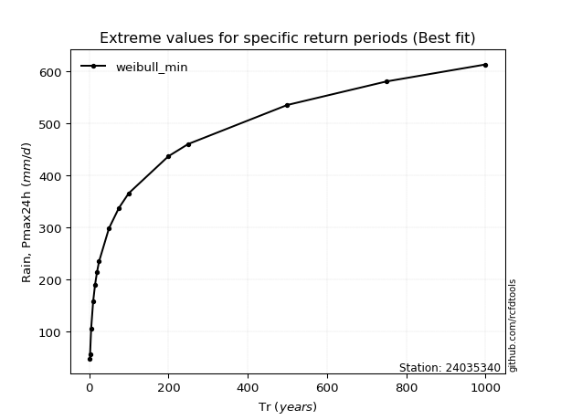</img>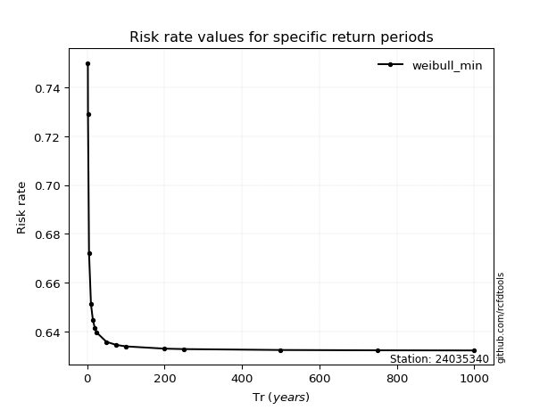</img>

</div>


<sub>**APP DISCLAIMER**: NO WARRANTY - This software is provided by [github.com/rcfdtools](https://github.com/rcfdtools) "as is", without any express or implied warranty, including warranties of merchantability, fitness for a particular purpose, or non-infringement. There is no guarantee that the software will be error-free or operate without interruption. LIMITATION OF LIABILITY - Neither the authors nor copyright holders will be liable for claims or damages arising from the software or its use. You are responsible for determining if the software is appropriate for your use and assume all associated risks, including errors, legal compliance, and data loss. NO PROFESSIONAL ADVICE - The software provides general information and does not offer professional advice. It should not replace consultation with professional advisors.</sub>