<div align="center">


</div>

# PMP Station (Rain, Pmax24h): 24035360

Probable Maximum Precipitation (PMP) is the greatest amount of rainfall for a specific duration that is meteorologically possible for a given location, acting as a "worst-case" scenario for extreme storms, crucial for designing safety-critical infrastructure like bridges, river deviations, dams, spillways, and nuclear plants to prevent catastrophic failure. PMP is calculated by hydrologists using meteorological data to determine the upper limit of extreme rainfall, often leading to the Probable Maximum Flood (PMF) for flood control design, and is increasingly being studied for climate change impacts. Probable Maximum Precipitation (PMP) is the theoretical upper limit of rainfall, a deterministic estimate for extreme events, while probability distributions (like GEV, Gumbel) describe the likelihood and frequency of various precipitation amounts, including rare ones, showing how often events occur, with PMP representing the extreme end of these distributions, used for critical infrastructure design to ensure safety against the worst conceivable weather, unlike standard statistical forecasts which cover typical probabilities.

The most common probability distributions in hydrology, used for analyzing floods, rainfall, and streamflow, include the Normal, Log-Normal, Gumbel, Gamma (including Log-Pearson Type III), and Generalized Extreme Value (GEV) distributions, often chosen based on the data´s skewness and whether modeling extremes or general conditions, with Gumbel and GEV popular for extreme events like floods, while the Normal distribution serves as a baseline, though often requiring transformations for skewed hydrological data. These distributions help in designing water infrastructure, managing water resources, and forecasting hydrologic events.

> Hydrological data often isn´t perfectly normal (it´s skewed), so different distributions are needed for different applications, such as: **Flood Frequency Analysis**: Using Gumbel, GEV, or Log-Pearson Type III for predicting extreme flood magnitudes and their return periods, **Rainfall Analysis**: Normal for annual totals, but Log-Normal, Weibull, or GEV for intensity or extreme daily rainfall, **Streamflow Modeling**: Gamma and Log-Normal for maximum flows, GEV for minimum flows, and Kappa for daily flows.

<div align="center">

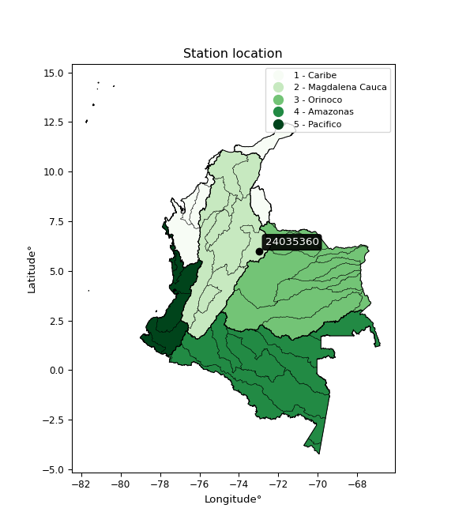</img>

</div>


## A. General information


### 1. General running parameters

• app_version: _v20260103_. • runtime: _2026-01-05 16:20:51.132608_. • Python version: _3.14.0_. • SciPy version: _1.16.3_. • Pandas version: _2.3.3_. • NumPy version: _2.3.5_. • Stations dataset (station_dataset_file): _dataset/pmax24h_in/automatic_colombia_2003_2024.csv_. • Stations catalog (station_catalog_file): _dataset/CNE.xls_. • Minimum year to eval til year_max (date_min): _1900_. • Maximum year to eval since year_min (date_max): _2024_. • Creates, save and include plots into reports (create_plot): _True_. • Plot only fit distributions with Δo > Δ (plot_only_fit): _True_. • Plot only simple graphs avoiding multiple CDFs and multiple Extreme values plots (plot_only_simple): _True_. • Eval low extreme values, if False, evaluates high extreme values (low_extreme): _False_. • Eval every SciPy distribution as logarithmic (pdist_logarithmic_on): _True_. • Standard deviation normalized (ddof): _1.0_. • Return periods to eval in years (Tr): _[2, 2.33, 5, 10, 15, 20, 25, 50, 75, 100, 200, 250, 500, 750, 1000]_. • Minimum data sample per station, 0 means any (minimum_sample): _5_. • Z-Score maximum threshold to adjust a value, 0 means disable (zscore_max): _3.5_. • Z-Score minimum threshold to adjust a value, 0 means disable (zscore_min): _-2.5_. • Avoid zeros, e.g. rain = 0 (avoid_zeros): _True_. • Avoid null values (avoid_nans): _True_. 

[:file_folder:Dataset file](../../dataset/pmax24h_in/automatic_colombia_2003_2024.csv)

> Delta Degrees of Freedom (DDOF): is a parameter used in the formulas for calculating variance and standard deviation. When ddof=0, the divisor is $N$ (the total number of observations) and this is used when your data set is the entire population. When ddof=1, the divisor is $N-1$ and this is used when your data set is a sample drawn from a larger population. Using $N-1$ provides an unbiased estimate of the population variance (known as Bessel´s correction).


### 2. Station info and location

|   id |   CODIGO | NOMBRE                 | CATEGORIA               | TECNOLOGIA                | ESTADO   | FECHA_INSTALACION   |   FECHA_SUSPENSION |   ALTITUD |   LATITUD |   LONGITUD | DEPARTAMENTO   | MUNICIPIO   | AREA_OPERATIVA                              | ENTIDAD                                                     | AREA_HIDROGRAFICA   | ZONA_HIDROGRAFICA   | SUBZONA_HIDROGRAFICA   |   CORRIENTE | Catalogo   |   Version |
|-----:|---------:|:-----------------------|:------------------------|:--------------------------|:---------|:--------------------|-------------------:|----------:|----------:|-----------:|:---------------|:------------|:--------------------------------------------|:------------------------------------------------------------|:--------------------|:--------------------|:-----------------------|------------:|:-----------|----------:|
|    0 | 24035360 | SOCHA - AUT [24035360] | Climatológica Principal | Automática con Telemetría | Activa   | 10/12/2004          |                nan |      2503 |   5.98542 |    -72.997 | Boyacá         | Socha       | Area Operativa 06 - Boyacá-Casanare-Vichada | INSTITUTO DE HIDROLOGIA METEOROLOGIA Y ESTUDIOS AMBIENTALES | Magdalena Cauca     | Sogamoso            | Río Fonce              |         nan | CNE_IDEAM  |  20251226 |

<div align="center">

Dynamic map: [:earth_americas:Google](http://maps.google.com/maps?q=5.985416667,-72.99702778) [:earth_americas:OSM](https://www.openstreetmap.org/#map=18/5.985416667/-72.99702778&layers=P) [:earth_americas:Bing](https://www.bing.com/maps?cp=5.985416667~-72.99702778&lvl=18) [:earth_americas:Apple](https://maps.apple.com/frame?center=5.985416667%2C-72.99702778&span=0.003%2C0.006)

</div>


<div align="center">

```geojson
{
  "type": "Feature",
  "geometry": {
    "type": "Point", 
    "coordinates": [-72.99702778, 5.985416667]
  }, 
  "properties": {
    "Name": "24035360"
  }
}
```

</div>


### 3. Discrete values table and plot

<div align="center">

|               |            0 |           1 |            2 |           3 |           4 |          5 |           6 |           7 |          8 |           9 |          10 |          11 |          12 |         13 |          14 |          15 |          16 |          17 |          18 |          19 |
|:--------------|-------------:|------------:|-------------:|------------:|------------:|-----------:|------------:|------------:|-----------:|------------:|------------:|------------:|------------:|-----------:|------------:|------------:|------------:|------------:|------------:|------------:|
| Date          | 2005         | 2006        | 2007         | 2008        | 2009        | 2010       | 2011        | 2012        | 2013       | 2014        | 2015        | 2016        | 2017        | 2018       | 2019        | 2020        | 2021        | 2022        | 2023        | 2024        |
| Value         |   38.8       |   36        |   40.5       |   32.9      |   37.2      |   28.3     |   27.1      |   28.1      |   42.19    |   28.2      |   25.8      |   36.1      |   19.7      |   29.6     |   25.4      |   31        |   18.3      |   18.5      |   30        |   68.4      |
| Value_initial |   38.8       |   36        |   40.5       |   32.9      |   37.2      |   28.3     |   27.1      |   28.1      |  243.9     |   28.2      |   25.8      |   36.1      |   19.7      |   29.6     |   25.4      |   31        |   18.3      |   18.5      |   30        |   68.4      |
| count         |   20         |   20        |   20         |   20        |   20        |   20       |   20        |   20        |   20       |   20        |   20        |   20        |   20        |   20       |   20        |   20        |   20        |   20        |   20        |   20        |
| mean          |   42.19      |   42.19     |   42.19      |   42.19     |   42.19     |   42.19    |   42.19     |   42.19     |   42.19    |   42.19     |   42.19     |   42.19     |   42.19     |   42.19    |   42.19     |   42.19     |   42.19     |   42.19     |   42.19     |   42.19     |
| std           |   48.672     |   48.672    |   48.672     |   48.672    |   48.672    |   48.672   |   48.672    |   48.672    |   48.672   |   48.672    |   48.672    |   48.672    |   48.672    |   48.672   |   48.672    |   48.672    |   48.672    |   48.672    |   48.672    |   48.672    |
| zscore        |   -0.0696499 |   -0.127178 |   -0.0347222 |   -0.190869 |   -0.102523 |   -0.28538 |   -0.310034 |   -0.289489 |    4.14427 |   -0.287434 |   -0.336744 |   -0.125123 |   -0.462072 |   -0.25867 |   -0.344962 |   -0.229906 |   -0.490836 |   -0.486727 |   -0.250452 |    0.538502 |


</div>


<div align="center">

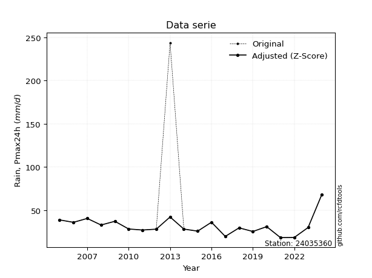</img>

</div>


> The initial value (value_initial) correspond to the initial obtained or null completed value, and value (value) is adjusted only when the initial value is outside the valid range (outlier) definite through the Z-Score value. If Z-Score is active, values out of range or outliers are replaced with the station mean value. A Z-Score (or standard score) measures how many standard deviations a data point is from the mean of a dataset, indicating its relative position; positive scores mean above the mean, negative mean below, and a score of zero is exactly at the mean, allowing for comparison of values from different distributions. It´s calculated using the formula $z=(x–μ)/σ$, where $x$ is the data point, $μ$ is the mean, and $σ$ is the standard deviation, helping identify outliers and understand probability.
>
> <sub>**Note**: In this study, "completing" (filling gaps in) and "extending" (forecasting or lengthening the historical record) rainfall data series are avoided for certain critical analyses because they introduce artificial bias and uncertainty, which can distort the statistics of rare events (extremes), alter day-to-day variability, and compromise the integrity and homogeneity of the original data. Some reasons against Completing/Extending rainfall data are: **Distortion of Extremes and Variability**: The primary issue is that most gap-filling or extension methods rely on averaging or regression with nearby stations, which inherently smooths the data. Rainfall is highly variable in space and time, with a large percentage of zero values and occasional large storms. Infilling methods often underestimate the highest values and overestimate the lowest (zero) values, which severely distorts analyses focused on flood frequency, drought severity, and intensity-duration-frequency (IDF) curves, **Loss of Data Homogeneity**: Infilled or extended data are synthetic estimates, not actual measurements. Combining these estimates with observed data can violate the assumption of data homogeneity, which requires that the data properties do not change over time. Inhomogeneity can lead to incorrect conclusions about long-term trends or changes in climate patterns, **Propagation of Errors**: Errors and biases from the original data (e.g., wind-induced undercatch, instrument errors, site changes) or the data used for imputation can propagate through the analysis, leading to unreliable hydrological models and inaccurate predictions, **Compromised Statistical Integrity**: For statistical analyses, especially those involving the frequency of events, using artificial data can introduce time bias or autocorrelation that doesn´t exist in reality, making it difficult to assess the true probability of events, **Difficulty in Validation**: It is difficult to accurately validate the quality of filled or extended data, especially for past periods where ground-truth measurements are unavailable. The reliability of imputation techniques heavily depends on the density of the surrounding station network and the complexity of the local topography.</sub>


### 4. Active continuous probability distributions from SciPy (44 of 104 available)

A Probability Density Function (PDF) describes the relative likelihood of a continuous random variable falling within a specific range, where the total area under its curve equals 1, and the area over any interval gives the actual probability for that range. Unlike discrete probabilities (like rolling a die), a PDF shows density, not direct probability for a single point (which is zero), with higher points indicating higher likelihood, often visualized as a bell curve for normal distributions.

A log of a probability density function (log-PDF) is simply the logarithm of the PDF´s value, denoted as $log(f(x))$, useful for converting multiplication of probabilities into addition, improving numerical stability with tiny numbers, and connecting to information theory concepts like entropy. Instead of dealing with very small probabilities (e.g., 0.000001), log-PDFs use negative numbers (e.g., $log(0.00001) ≈ -11.51$ that are easier for computers to handle, preventing underflow errors and simplifying complex calculations. In this study, each active probability distribution from SciPy is also evaluated in the $log$ form.

[scipy.stats](https://docs.scipy.org/doc/scipy/reference/stats.html) is a Python´s powerful submodule within the SciPy library for comprehensive statistical analysis, offering over 130 probability distributions (like Normal, Poisson), functions for descriptive stats (mean, variance), hypothesis testing (t-tests, chi-square), random variable generation, and statistical tests, making it essential for data science, modeling, and research. It provides tools to explore, model, and draw conclusions from data efficiently, working seamlessly with NumPy.

<div align="center">

|   id | p_dist             |   n_parameter | fit_method   | label                                                                       | active   | ref                                                                                                        |
|-----:|:-------------------|--------------:|:-------------|:----------------------------------------------------------------------------|:---------|:-----------------------------------------------------------------------------------------------------------|
|    0 | alpha              |             3 | MLE          | Alpha                                                                       | True     | [:mortar_board:](https://docs.scipy.org/doc/scipy/reference/generated/scipy.stats.alpha.html)              |
|    1 | betaprime          |             4 | MLE          | Beta prime                                                                  | True     | [:mortar_board:](https://docs.scipy.org/doc/scipy/reference/generated/scipy.stats.betaprime.html)          |
|    2 | chi2               |             3 | MLE          | Chi²                                                                        | True     | [:mortar_board:](https://docs.scipy.org/doc/scipy/reference/generated/scipy.stats.chi2.html)               |
|    3 | crystalball        |             4 | MLE          | Crystalball                                                                 | True     | [:mortar_board:](https://docs.scipy.org/doc/scipy/reference/generated/scipy.stats.crystalball.html)        |
|    4 | erlang             |             3 | MLE          | Erlang                                                                      | True     | [:mortar_board:](https://docs.scipy.org/doc/scipy/reference/generated/scipy.stats.erlang.html)             |
|    5 | expon              |             2 | MLE          | Exponential                                                                 | True     | [:mortar_board:](https://docs.scipy.org/doc/scipy/reference/generated/scipy.stats.expon.html)              |
|    6 | exponnorm          |             3 | MLE          | Exponentially modified Normal                                               | True     | [:mortar_board:](https://docs.scipy.org/doc/scipy/reference/generated/scipy.stats.exponnorm.html)          |
|    7 | f                  |             4 | MLE          | F                                                                           | True     | [:mortar_board:](https://docs.scipy.org/doc/scipy/reference/generated/scipy.stats.f.html)                  |
|    8 | fatiguelife        |             3 | MLE          | Fatigue-life (Birnbaum-Saunders)                                            | True     | [:mortar_board:](https://docs.scipy.org/doc/scipy/reference/generated/scipy.stats.fatiguelife.html)        |
|    9 | fisk               |             3 | MLE          | Fisk                                                                        | True     | [:mortar_board:](https://docs.scipy.org/doc/scipy/reference/generated/scipy.stats.fisk.html)               |
|   10 | gamma              |             3 | MLE          | Gamma                                                                       | True     | [:mortar_board:](https://docs.scipy.org/doc/scipy/reference/generated/scipy.stats.gamma.html)              |
|   11 | genexpon           |             5 | MLE          | Generalized exponential                                                     | True     | [:mortar_board:](https://docs.scipy.org/doc/scipy/reference/generated/scipy.stats.genexpon.html)           |
|   12 | genlogistic        |             3 | MLE          | Generalized logistic                                                        | True     | [:mortar_board:](https://docs.scipy.org/doc/scipy/reference/generated/scipy.stats.genlogistic.html)        |
|   13 | gibrat             |             2 | MM           | Gibrat                                                                      | True     | [:mortar_board:](https://docs.scipy.org/doc/scipy/reference/generated/scipy.stats.gibrat.html)             |
|   14 | gompertz           |             3 | MLE          | Gompertz (or truncated Gumbel)                                              | True     | [:mortar_board:](https://docs.scipy.org/doc/scipy/reference/generated/scipy.stats.gompertz.html)           |
|   15 | gumbel_l           |             2 | MM           | Gumbel Left Skew                                                            | True     | [:mortar_board:](https://docs.scipy.org/doc/scipy/reference/generated/scipy.stats.gumbel_l.html)           |
|   16 | gumbel_r           |             2 | MM           | Gumbel Right Skew                                                           | True     | [:mortar_board:](https://docs.scipy.org/doc/scipy/reference/generated/scipy.stats.gumbel_r.html)           |
|   17 | halflogistic       |             2 | MM           | Half-logistic                                                               | True     | [:mortar_board:](https://docs.scipy.org/doc/scipy/reference/generated/scipy.stats.halflogistic.html)       |
|   18 | halfnorm           |             2 | MM           | Half Normal                                                                 | True     | [:mortar_board:](https://docs.scipy.org/doc/scipy/reference/generated/scipy.stats.halfnorm.html)           |
|   19 | hypsecant          |             2 | MM           | hyperbolic secant                                                           | True     | [:mortar_board:](https://docs.scipy.org/doc/scipy/reference/generated/scipy.stats.hypsecant.html)          |
|   20 | invgamma           |             3 | MLE          | Inverted gamma                                                              | True     | [:mortar_board:](https://docs.scipy.org/doc/scipy/reference/generated/scipy.stats.invgamma.html)           |
|   21 | invgauss           |             3 | MLE          | Inverse Gaussian                                                            | True     | [:mortar_board:](https://docs.scipy.org/doc/scipy/reference/generated/scipy.stats.invgauss.html)           |
|   22 | invweibull         |             3 | MLE          | Inverted Weibull                                                            | True     | [:mortar_board:](https://docs.scipy.org/doc/scipy/reference/generated/scipy.stats.invweibull.html)         |
|   23 | johnsonsu          |             4 | MLE          | Johnson Su                                                                  | True     | [:mortar_board:](https://docs.scipy.org/doc/scipy/reference/generated/scipy.stats.johnsonsu.html)          |
|   24 | kstwobign          |             2 | MLE          | Limiting distribution of scaled Kolmogorov-Smirnov two-sided test statistic | True     | [:mortar_board:](https://docs.scipy.org/doc/scipy/reference/generated/scipy.stats.kstwobign.html)          |
|   25 | laplace            |             2 | MM           | Laplace                                                                     | True     | [:mortar_board:](https://docs.scipy.org/doc/scipy/reference/generated/scipy.stats.laplace.html)            |
|   26 | laplace_asymmetric |             3 | MLE          | Asymmetric Laplace                                                          | True     | [:mortar_board:](https://docs.scipy.org/doc/scipy/reference/generated/scipy.stats.laplace_asymmetric.html) |
|   27 | loggamma           |             3 | MLE          | Log gamma                                                                   | True     | [:mortar_board:](https://docs.scipy.org/doc/scipy/reference/generated/scipy.stats.loggamma.html)           |
|   28 | logistic           |             2 | MM           | Logistic (or Sech-squared)                                                  | True     | [:mortar_board:](https://docs.scipy.org/doc/scipy/reference/generated/scipy.stats.logistic.html)           |
|   29 | lognorm            |             3 | MLE          | Log Normal                                                                  | True     | [:mortar_board:](https://docs.scipy.org/doc/scipy/reference/generated/scipy.stats.lognorm.html)            |
|   30 | maxwell            |             2 | MM           | Maxwell                                                                     | True     | [:mortar_board:](https://docs.scipy.org/doc/scipy/reference/generated/scipy.stats.maxwell.html)            |
|   31 | mielke             |             4 | MLE          | Mielke Beta-Kappa / Dagum                                                   | True     | [:mortar_board:](https://docs.scipy.org/doc/scipy/reference/generated/scipy.stats.mielke.html)             |
|   32 | moyal              |             2 | MM           | Moyal                                                                       | True     | [:mortar_board:](https://docs.scipy.org/doc/scipy/reference/generated/scipy.stats.moyal.html)              |
|   33 | nakagami           |             3 | MLE          | Nakagami                                                                    | True     | [:mortar_board:](https://docs.scipy.org/doc/scipy/reference/generated/scipy.stats.nakagami.html)           |
|   34 | ncf                |             5 | MLE          | Non-central F distribution                                                  | True     | [:mortar_board:](https://docs.scipy.org/doc/scipy/reference/generated/scipy.stats.ncf.html)                |
|   35 | nct                |             4 | MLE          | Non-central Student’s t                                                     | True     | [:mortar_board:](https://docs.scipy.org/doc/scipy/reference/generated/scipy.stats.nct.html)                |
|   36 | norm               |             2 | MM           | Normal                                                                      | True     | [:mortar_board:](https://docs.scipy.org/doc/scipy/reference/generated/scipy.stats.norm.html)               |
|   37 | pearson3           |             3 | MM           | Pearson type III                                                            | True     | [:mortar_board:](https://docs.scipy.org/doc/scipy/reference/generated/scipy.stats.pearson3.html)           |
|   38 | rayleigh           |             2 | MM           | Rayleigh                                                                    | True     | [:mortar_board:](https://docs.scipy.org/doc/scipy/reference/generated/scipy.stats.rayleigh.html)           |
|   39 | rice               |             3 | MLE          | Rice                                                                        | True     | [:mortar_board:](https://docs.scipy.org/doc/scipy/reference/generated/scipy.stats.rice.html)               |
|   40 | t                  |             3 | MLE          | Student’s t                                                                 | True     | [:mortar_board:](https://docs.scipy.org/doc/scipy/reference/generated/scipy.stats.t.html)                  |
|   41 | truncnorm          |             4 | MLE          | Truncated normal                                                            | True     | [:mortar_board:](https://docs.scipy.org/doc/scipy/reference/generated/scipy.stats.truncnorm.html)          |
|   42 | wald               |             2 | MM           | Wald                                                                        | True     | [:mortar_board:](https://docs.scipy.org/doc/scipy/reference/generated/scipy.stats.wald.html)               |
|   43 | weibull_min        |             3 | MLE          | Weibull minimum                                                             | True     | [:mortar_board:](https://docs.scipy.org/doc/scipy/reference/generated/scipy.stats.weibull_min.html)        |

</div>

> **n_parameter:** # arguments & localization & scale.
>
> **Fit methods:** (MLE) maximum likelihood, (MM) L-moments.
>
>**Inactive** (With the only purpose of prevent loops, zero divisions, infinite values, over high estimated values or horizontal trending for recurrence intervals estimations, the follow distributions were disabled.)**:** foldnorm, gennorm, norminvgauss, powernorm, powerlognorm, skewnorm, genextreme, anglit, arcsine, argus, beta, bradford, burr, burr12, cauchy, cosine, halfcauchy, foldcauchy, skewcauchy, wrapcauchy, dgamma, gengamma, exponweib, exponpow, truncexpon, gausshyper, genhalflogistic, genhyperbolic, geninvgauss, halfgennorm, johnsonsb, kappa4, kappa3, ksone, kstwo, loglaplace, levy, levy_l, levy_stable, ncx2, pareto, genpareto, truncpareto, lomax, powerlaw, rdist, rel_breitwigner, recipinvgauss, semicircular, studentized_range, trapezoid, triang, truncweibull_min, tukeylambda, uniform, loguniform, vonmises, vonmises_line, weibull_max, dweibull, 


## B. Probability (PDF) vs. Empirical (EDF) distributions functions

A continuous probability distribution (CPD) describes probabilities for variables that can take any value within a range (like rain any time), unlike discrete variables with specific outcomes (like temperature). It uses a Probability Density Function (PDF), a curve where the total area under it equals 1, and the probability of the variable falling within an interval (a to b) is found by calculating the area under the curve between those points. A key feature is that the probability of hitting any single exact value is zero, so probabilities are always expressed for ranges, e.g., $P(a ≤ X ≤ b)$.

<div align="center">

Distributions parameters from station values
|    |   station | p_dist                |   n |            loc |         scale | shape                 | shape1                 | shape2               | shape3   |
|---:|----------:|:----------------------|----:|---------------:|--------------:|:----------------------|:-----------------------|:---------------------|:---------|
|  0 |  24035360 | alpha                 |  20 |   -14.122      | 225.865       | 5.103994614845236     |                        |                      |          |
|  1 |  24035360 | betaprime             |  20 |    -0.661561   |   3.27692     | 124.98467023020561    | 13.530549530799647     |                      |          |
|  2 |  24035360 | chi2                  |  20 |    16.1325     |   3.59809     | 4.439032664256947     |                        |                      |          |
|  3 |  24035360 | crystalball           |  20 |    32.1045     |  10.6983      | 1257.9238400293127    | 3854.1986605897782     |                      |          |
|  4 |  24035360 | erlang                |  20 |    16.1325     |   7.19625     | 2.219480209035244     |                        |                      |          |
|  5 |  24035360 | expon                 |  20 |    18.3        |  13.8045      |                       |                        |                      |          |
|  6 |  24035360 | exponnorm             |  20 |    23.4797     |   5.05513     | 1.7061388519106888    |                        |                      |          |
|  7 |  24035360 | f                     |  20 |     5.50428    |  24.186       | 51.42838703389813     | 22.28941907415765      |                      |          |
|  8 |  24035360 | fatiguelife           |  20 |     8.43638    |  21.6721      | 0.4292514435239517    |                        |                      |          |
|  9 |  24035360 | fisk                  |  20 |    -0.050019   |  30.5233      | 6.153200890584651     |                        |                      |          |
| 10 |  24035360 | gamma                 |  20 |    16.1325     |   7.19621     | 2.2195051701936377    |                        |                      |          |
| 11 |  24035360 | genexpon              |  20 |    18.3        |   1.42384     | 0.10316778855024847   | 2.3462592337428222e-07 | 1.4438667603247586   |          |
| 12 |  24035360 | genlogistic           |  20 |   -19.3817     |   7.66334     | 459.3936748798192     |                        |                      |          |
| 13 |  24035360 | gibrat                |  20 |    23.943      |   4.95019     |                       |                        |                      |          |
| 14 |  24035360 | gompertz              |  20 |    18.2978     |  46.638       | 2.5677305983152463    |                        |                      |          |
| 15 |  24035360 | gumbel_l              |  20 |    36.9193     |   8.34142     |                       |                        |                      |          |
| 16 |  24035360 | gumbel_r              |  20 |    27.2897     |   8.34142     |                       |                        |                      |          |
| 17 |  24035360 | halflogistic          |  20 |    19.4246     |   9.14664     |                       |                        |                      |          |
| 18 |  24035360 | halfnorm              |  20 |    17.9442     |  17.7474      |                       |                        |                      |          |
| 19 |  24035360 | hypsecant             |  20 |    32.1045     |   6.81074     |                       |                        |                      |          |
| 20 |  24035360 | invgamma              |  20 |     1.19259    | 304.221       | 10.850777198425401    |                        |                      |          |
| 21 |  24035360 | invgauss              |  20 |     7.95819    | 131.889       | 0.18308012370718613   |                        |                      |          |
| 22 |  24035360 | invweibull            |  20 |  -104.442      | 131.781       | 17.526237835541714    |                        |                      |          |
| 23 |  24035360 | johnsonsu             |  20 |    25.16       |   9.17558     | -0.7572952601213374   | 1.3898169753033147     |                      |          |
| 24 |  24035360 | kstwobign             |  20 |    -0.853055   |  38.234       |                       |                        |                      |          |
| 25 |  24035360 | laplace               |  20 |    32.1045     |   7.56483     |                       |                        |                      |          |
| 26 |  24035360 | laplace_asymmetric    |  20 |    28.2        |   6.50702     | 0.7439943140606959    |                        |                      |          |
| 27 |  24035360 | loggamma              |  20 | -4611.14       | 585.959       | 2763.5893321182584    |                        |                      |          |
| 28 |  24035360 | logistic              |  20 |    32.1045     |   5.89828     |                       |                        |                      |          |
| 29 |  24035360 | lognorm               |  20 |     8.50746    |  21.5823      | 0.4202543165704394    |                        |                      |          |
| 30 |  24035360 | maxwell               |  20 |     6.75405    |  15.886       |                       |                        |                      |          |
| 31 |  24035360 | mielke                |  20 |  -104.096      |  85.7463      | 30658.96063766098     | 17.486652086570956     |                      |          |
| 32 |  24035360 | moyal                 |  20 |    25.9865     |   4.81592     |                       |                        |                      |          |
| 33 |  24035360 | nakagami              |  20 |    18.3        |  16.7828      | 0.3437684038530205    |                        |                      |          |
| 34 |  24035360 | ncf                   |  20 |     0.225196   |   4.52042e-06 | 7.692556772890303e-06 | 122.87538107324303     | 53.17541751146386    |          |
| 35 |  24035360 | nct                   |  20 |    -0.0496736  |   3.81519     | 8.051302094000535     | 7.604987792087127      |                      |          |
| 36 |  24035360 | norm                  |  20 |    32.1045     |  10.6983      |                       |                        |                      |          |
| 37 |  24035360 | pearson3              |  20 |    32.1045     |  10.6983      | 1.7170273873718638    |                        |                      |          |
| 38 |  24035360 | rayleigh              |  20 |    11.638      |  16.3299      |                       |                        |                      |          |
| 39 |  24035360 | rice                  |  20 |    14.2693     |  14.7063      | 0.0007120325512330104 |                        |                      |          |
| 40 |  24035360 | t                     |  20 |    30.4993     |   6.4608      | 2.89675644556231      |                        |                      |          |
| 41 |  24035360 | truncnorm             |  20 |    14.4003     |  30.9229      | -444.9514358327833    | 1.746271517717605      |                      |          |
| 42 |  24035360 | wald                  |  20 |    21.4063     |  10.6983      |                       |                        |                      |          |
| 43 |  24035360 | weibull_min           |  20 |    25.4        |   8.7692      | 0.9208227084140337    |                        |                      |          |
| 44 |  24035360 | logalpha              |  20 |    -1.53543    |  82.8229      | 16.76737610355098     |                        |                      |          |
| 45 |  24035360 | logbetaprime          |  20 |     0.444154   |   5.71483     | 154.90248177581657    | 298.67112340900565     |                      |          |
| 46 |  24035360 | logchi2               |  20 |     2.9069     |   0.944287    | 1.1085992458400535    |                        |                      |          |
| 47 |  24035360 | logcrystalball        |  20 |     3.42189    |   0.299497    | 52.17555105174884     | 141.15347058031548     |                      |          |
| 48 |  24035360 | logerlang             |  20 |     1.71752    |   0.0524267   | 32.50942061056157     |                        |                      |          |
| 49 |  24035360 | logexpon              |  20 |     2.9069     |   0.514986    |                       |                        |                      |          |
| 50 |  24035360 | logexponnorm          |  20 |     3.23691    |   0.233884    | 0.7909141262749988    |                        |                      |          |
| 51 |  24035360 | logf                  |  20 |     0.534818   |   2.8648      | 682.5010542001888     | 261.27382053486014     |                      |          |
| 52 |  24035360 | logfatiguelife        |  20 |     0.879739   |   2.52476     | 0.11736256861939054   |                        |                      |          |
| 53 |  24035360 | logfisk               |  20 |    -0.289185   |   3.70182     | 22.75570733663456     |                        |                      |          |
| 54 |  24035360 | loggamma              |  20 |     1.71752    |   0.0524267   | 32.5094709427702      |                        |                      |          |
| 55 |  24035360 | loggenexpon           |  20 |     2.90528    |   0.109313    | 0.07190107965879211   | 6.067775237801722      | 0.007318055459745447 |          |
| 56 |  24035360 | loggenlogistic        |  20 |     3.37741    |   0.17189     | 1.171663397741142     |                        |                      |          |
| 57 |  24035360 | loggibrat             |  20 |     3.19337    |   0.1386      |                       |                        |                      |          |
| 58 |  24035360 | loggompertz           |  20 |     2.9069     |   0.526792    | 0.45896562464708      |                        |                      |          |
| 59 |  24035360 | loggumbel_l           |  20 |     3.55668    |   0.233516    |                       |                        |                      |          |
| 60 |  24035360 | loggumbel_r           |  20 |     3.2871     |   0.233516    |                       |                        |                      |          |
| 61 |  24035360 | loghalflogistic       |  20 |     3.06695    |   0.256037    |                       |                        |                      |          |
| 62 |  24035360 | loghalfnorm           |  20 |     3.02548    |   0.496824    |                       |                        |                      |          |
| 63 |  24035360 | loghypsecant          |  20 |     3.42189    |   0.190665    |                       |                        |                      |          |
| 64 |  24035360 | loginvgamma           |  20 |     0.0798072  | 421.119       | 127.00568046920523    |                        |                      |          |
| 65 |  24035360 | loginvgauss           |  20 |     1.27589    | 109.237       | 0.019625673598394806  |                        |                      |          |
| 66 |  24035360 | loginvweibull         |  20 |    -2.5469e+07 |   2.5469e+07  | 92788512.42398268     |                        |                      |          |
| 67 |  24035360 | logjohnsonsu          |  20 |     3.39615    |   0.390481    | -0.07864278220794083  | 1.5831438093297305     |                      |          |
| 68 |  24035360 | logkstwobign          |  20 |     2.28933    |   1.30084     |                       |                        |                      |          |
| 69 |  24035360 | loglaplace            |  20 |     3.42189    |   0.211776    |                       |                        |                      |          |
| 70 |  24035360 | loglaplace_asymmetric |  20 |     3.34286    |   0.21612     | 0.8336523829072564    |                        |                      |          |
| 71 |  24035360 | logloggamma           |  20 |   -73.6699     |  10.7969      | 1261.9684598057142    |                        |                      |          |
| 72 |  24035360 | loglogistic           |  20 |     3.42189    |   0.165121    |                       |                        |                      |          |
| 73 |  24035360 | loglognorm            |  20 |     0.900794   |   2.50355     | 0.11813273669178499   |                        |                      |          |
| 74 |  24035360 | logmaxwell            |  20 |     2.71221    |   0.444727    |                       |                        |                      |          |
| 75 |  24035360 | logmielke             |  20 |     2.9069     |   0.868721    | 0.8582915228974035    | 6.784948844178942      |                      |          |
| 76 |  24035360 | logmoyal              |  20 |     3.25062    |   0.134821    |                       |                        |                      |          |
| 77 |  24035360 | lognakagami           |  20 |     2.62977    |   0.846843    | 1.8178997714084346    |                        |                      |          |
| 78 |  24035360 | logncf                |  20 |    -3.3766     |   6.71442     | 801.22260878183       | 438.8886968304806      | 9.053171416621785    |          |
| 79 |  24035360 | lognct                |  20 |    -0.183443   |   0.0830643   | 81.08082978084389     | 42.99701028613012      |                      |          |
| 80 |  24035360 | lognorm               |  20 |     3.42189    |   0.299497    |                       |                        |                      |          |
| 81 |  24035360 | logpearson3           |  20 |     3.42189    |   0.299496    | 0.4415737854436812    |                        |                      |          |
| 82 |  24035360 | lograyleigh           |  20 |     2.84893    |   0.457151    |                       |                        |                      |          |
| 83 |  24035360 | logrice               |  20 |     2.77382    |   0.343243    | 1.5251562093029793    |                        |                      |          |
| 84 |  24035360 | logt                  |  20 |     3.4156     |   0.238512    | 4.987937006742023     |                        |                      |          |
| 85 |  24035360 | logtruncnorm          |  20 |    -0.135433   |   1.35841     | 2.2393718307484924    | 3.210236768700269      |                      |          |
| 86 |  24035360 | logwald               |  20 |     3.12241    |   0.299476    |                       |                        |                      |          |
| 87 |  24035360 | logweibull_min        |  20 |     2.75156    |   0.754643    | 2.355734226350523     |                        |                      |          |

</div>

> **loc** (Location parameter): This shifts the distribution along the x-axis. For many common distributions, like the normal (Gaussian) distribution, loc represents the mean $μ$. For others, like the uniform distribution, it might represent the minimum value, or for the beta distribution, the left end of the support interval.
>
> **scale** (Scale parameter): This determines the width or spread of the distribution. For the normal distribution, scale represents the standard deviation $σ$. For a uniform distribution, it defines the length of the interval (from $loc$ to $loc + scale$).
>
> **shape** (Shape parameters): Refers to parameters that define the specific form of a probability distribution, distinct from its location (loc) and scale (scale). These parameters are required arguments for most distribution functions. For example, a normal (Gaussian) distribution is fully defined by its location (mean) and scale (standard deviation), so it has no specific shape parameters beyond loc and scale. However, other distributions have intrinsic properties that need specification, as Gamma distribution that takes a shape parameter, often named $a$ or $alpha$.


### 0. Cumulative distribution values - CDF (88 evaluated)

Cumulative Distribution Function (CDF), denoted as $F$<sub>$X$</sub>$(x)$, is a function that gives the probability that a random variable $X$ will take a value less than or equal to a specific value, $x$ (i.e., $(P(X≥x)$. It essentially "accumulates" probabilities from a given point up to the far right (positive infinity), providing a complete picture of the distribution´s probabilities for both discrete (like rain) and continuous (like temperature) variables, helping to find probabilities over ranges or above certain values. Each station is evaluated separately ordering the $x$ values ascending, calculating the CDF and PDF values for the activated distributions and their logarithmic forms.

<div align="center">

CDF ordered by x ascending and calculating $log(f(x))$ separately
|   id |   Station |   date |     x |   count |   mean |    std |     zscore |   Value_initial |   station |   m |     alpha |   alpha_pdf |   betaprime |   betaprime_pdf |      chi2 |    chi2_pdf |   crystalball |   crystalball_pdf |    erlang |   erlang_pdf |     expon |   expon_pdf |   exponnorm |   exponnorm_pdf |         f |       f_pdf |   fatiguelife |   fatiguelife_pdf |      fisk |    fisk_pdf |     gamma |   gamma_pdf |    genexpon |   genexpon_pdf |   genlogistic |   genlogistic_pdf |   gibrat |   gibrat_pdf |    gompertz |   gompertz_pdf |   gumbel_l |   gumbel_l_pdf |   gumbel_r |   gumbel_r_pdf |   halflogistic |   halflogistic_pdf |   halfnorm |   halfnorm_pdf |   hypsecant |   hypsecant_pdf |   invgamma |   invgamma_pdf |   invgauss |   invgauss_pdf |   invweibull |   invweibull_pdf |   johnsonsu |   johnsonsu_pdf |   kstwobign |   kstwobign_pdf |   laplace |   laplace_pdf |   laplace_asymmetric |   laplace_asymmetric_pdf |   loggamma |   loggamma_pdf |   logistic |   logistic_pdf |   lognorm |   lognorm_pdf |   maxwell |   maxwell_pdf |   mielke |   mielke_pdf |     moyal |   moyal_pdf |    nakagami |   nakagami_pdf |       ncf |     ncf_pdf |       nct |     nct_pdf |      norm |    norm_pdf |    pearson3 |   pearson3_pdf |   rayleigh |   rayleigh_pdf |      rice |    rice_pdf |         t |       t_pdf |   truncnorm |   truncnorm_pdf |     wald |   wald_pdf |   weibull_min |   weibull_min_pdf |   logalpha |   logalpha_pdf |   logbetaprime |   logbetaprime_pdf |     logchi2 |   logchi2_pdf |   logcrystalball |   logcrystalball_pdf |   logerlang |   logerlang_pdf |   logexpon |   logexpon_pdf |   logexponnorm |   logexponnorm_pdf |      logf |   logf_pdf |   logfatiguelife |   logfatiguelife_pdf |   logfisk |   logfisk_pdf |   loggenexpon |   loggenexpon_pdf |   loggenlogistic |   loggenlogistic_pdf |   loggibrat |   loggibrat_pdf |   loggompertz |   loggompertz_pdf |   loggumbel_l |   loggumbel_l_pdf |   loggumbel_r |   loggumbel_r_pdf |   loghalflogistic |   loghalflogistic_pdf |   loghalfnorm |   loghalfnorm_pdf |   loghypsecant |   loghypsecant_pdf |   loginvgamma |   loginvgamma_pdf |   loginvgauss |   loginvgauss_pdf |   loginvweibull |   loginvweibull_pdf |   logjohnsonsu |   logjohnsonsu_pdf |   logkstwobign |   logkstwobign_pdf |   loglaplace |   loglaplace_pdf |   loglaplace_asymmetric |   loglaplace_asymmetric_pdf |   logloggamma |   logloggamma_pdf |   loglogistic |   loglogistic_pdf |   loglognorm |   loglognorm_pdf |   logmaxwell |   logmaxwell_pdf |   logmielke |   logmielke_pdf |    logmoyal |   logmoyal_pdf |   lognakagami |   lognakagami_pdf |   logncf |   logncf_pdf |    lognct |   lognct_pdf |   logpearson3 |   logpearson3_pdf |   lograyleigh |   lograyleigh_pdf |   logrice |   logrice_pdf |      logt |   logt_pdf |   logtruncnorm |   logtruncnorm_pdf |   logwald |   logwald_pdf |   logweibull_min |   logweibull_min_pdf |
|-----:|----------:|-------:|------:|--------:|-------:|-------:|-----------:|----------------:|----------:|----:|----------:|------------:|------------:|----------------:|----------:|------------:|--------------:|------------------:|----------:|-------------:|----------:|------------:|------------:|----------------:|----------:|------------:|--------------:|------------------:|----------:|------------:|----------:|------------:|------------:|---------------:|--------------:|------------------:|---------:|-------------:|------------:|---------------:|-----------:|---------------:|-----------:|---------------:|---------------:|-------------------:|-----------:|---------------:|------------:|----------------:|-----------:|---------------:|-----------:|---------------:|-------------:|-----------------:|------------:|----------------:|------------:|----------------:|----------:|--------------:|---------------------:|-------------------------:|-----------:|---------------:|-----------:|---------------:|----------:|--------------:|----------:|--------------:|---------:|-------------:|----------:|------------:|------------:|---------------:|----------:|------------:|----------:|------------:|----------:|------------:|------------:|---------------:|-----------:|---------------:|----------:|------------:|----------:|------------:|------------:|----------------:|---------:|-----------:|--------------:|------------------:|-----------:|---------------:|---------------:|-------------------:|------------:|--------------:|-----------------:|---------------------:|------------:|----------------:|-----------:|---------------:|---------------:|-------------------:|----------:|-----------:|-----------------:|---------------------:|----------:|--------------:|--------------:|------------------:|-----------------:|---------------------:|------------:|----------------:|--------------:|------------------:|--------------:|------------------:|--------------:|------------------:|------------------:|----------------------:|--------------:|------------------:|---------------:|-------------------:|--------------:|------------------:|--------------:|------------------:|----------------:|--------------------:|---------------:|-------------------:|---------------:|-------------------:|-------------:|-----------------:|------------------------:|----------------------------:|--------------:|------------------:|--------------:|------------------:|-------------:|-----------------:|-------------:|-----------------:|------------:|----------------:|------------:|---------------:|--------------:|------------------:|---------:|-------------:|----------:|-------------:|--------------:|------------------:|--------------:|------------------:|----------:|--------------:|----------:|-----------:|---------------:|-------------------:|----------:|--------------:|-----------------:|---------------------:|
|    0 |  24035360 |   2021 | 18.3  |      20 |  42.19 | 48.672 | -0.490836  |            18.3 |  24035360 |   1 | 0.031273  |   0.0151318 |   0.0350366 |     0.0160712   | 0.0229692 | 0.0213693   |     0.0984652 |       0.0162199   | 0.0229689 |  0.0213695   | 0         |  0.0724401  |   0.0366976 |     0.0134574   | 0.0305827 | 0.0159091   |     0.0299493 |       0.0173071   | 0.0418422 | 0.0134436   | 0.0229687 |  0.0213692  | 3.80362e-08 |     0.0724573  |     0.035065  |       0.0152753   | 0        |  0           | 0.000118446 |     0.0550526  |   0.101742 |    0.0115545   |  0.0529733 |    0.0186579   |      0         |         0          |  0.0159968 |    0.0449489   |   0.0833925 |     0.0121047   |  0.0307446 |    0.0158293   |  0.0299879 |    0.0171395   |    0.0309829 |      0.0153705   |   0.0428974 |     0.0110636   |   0.0366608 |     0.0169063   | 0.0806229 |   0.0106576   |            0.0461008 |               0.00952262 |  0.0303853 |      0.293216  |  0.0878295 |    0.0135829   | 0.0427613 |     0.303725  | 0.0873544 |   0.0203727   |      nan |          nan | 0.0263396 |  0.0156134  | 1.29913e-11 |  2514.13       | 0.0566894 | 0.0168825   | 0.0317585 | 0.0152106   | 0.0984652 | 0.0162199   | 0           |     0          |  0.0798478 |    0.0229877   | 0.036864  | 0.0179501   | 0.0793504 | 0.0118817   |    0.57333  |      0.0133376  | 0        | 0          |   0           |        0          |  0.0302818 |      0.287788  |      0.0328826 |          0.294499  | 2.44367e-09 |   3.05012e+06 |        0.0427613 |            0.303725  |   0.0303852 |       0.293216  |  0         |       1.9418   |      0.0297024 |          0.267178  | 0.0304938 |  0.289994  |        0.0304577 |            0.291353  | 0.0341339 |     0.234733  |    0.00107136 |         0.663071  |        0.0376032 |            0.24073   |    0        |       0         |   3.55602e-09 |         0.871246  |     0.0600039 |       0.24909     |    0.00613123 |         0.133758  |          0        |             0         |      0        |         0         |      0.0426779 |          0.223167  |     0.0303958 |         0.289306  |     0.0291891 |         0.294576  |       0.0213369 |            0.29907  |      0.0409258 |          0.222028  |      0.022154  |           0.356834 |    0.0439416 |        0.207491  |               0.0364696 |                    0.202419 |     0.0463664 |         0.314404  |     0.042337  |         0.245544  |    0.0303881 |        0.290188  |    0.0210753 |        0.312431  | 2.57523e-05 |       5.65527   | 0.000346691 |      0.0175935 |     0.0264884 |          0.323946 | 0.174944 |     0.491725 | 0.0295458 |     0.287396 |     0.0269898 |         0.287498  |    0.00800746 |         0.275158  | 0.0236203 |      0.356721 | 0.0431168 |  0.22858   |    0.000717946 |           2.00924  |  0        |      0        |        0.0238612 |            0.35749   |
|    1 |  24035360 |   2022 | 18.5  |      20 |  42.19 | 48.672 | -0.486727  |            18.5 |  24035360 |   2 | 0.0344027 |   0.0161696 |   0.0383512 |     0.0170776   | 0.0274218 | 0.0231454   |     0.101748  |       0.016613    | 0.0274215 |  0.0231456   | 0.0143836 |  0.0713982  |   0.039467  |     0.0142409   | 0.033876  | 0.017028    |     0.0335354 |       0.0185557   | 0.0445996 | 0.0141343   | 0.0274213 |  0.0231453  | 0.014387    |     0.0714149  |     0.0382143 |       0.0162214   | 0        |  0           | 0.011092    |     0.0546824  |   0.104077 |    0.0118041   |  0.0567918 |    0.019529    |      0         |         0          |  0.0249854 |    0.0449359   |   0.0858481 |     0.0124525   |  0.034021  |    0.016939    |  0.0335392 |    0.0183753   |    0.034164  |      0.016445    |   0.0451687 |     0.0116542   |   0.0401414 |     0.0179007   | 0.0827828 |   0.0109431   |            0.0480452 |               0.00992426 |  0.033703  |      0.317423  |  0.0905843 |    0.0139666   | 0.0461671 |     0.32307   | 0.0914807 |   0.0208909   |      nan |          nan | 0.029591  |  0.0169067  | 0.0369489   |     0.127014   | 0.0601344 | 0.017568    | 0.0349039 | 0.016248    | 0.101748  | 0.016613    | 0           |     0          |  0.0845025 |    0.0235581   | 0.040536  | 0.0187689   | 0.0817691 | 0.0123083   |    0.575997 |      0.0133265  | 0        | 0          |   0           |        0          |  0.0335383 |      0.311594  |      0.0362079 |          0.317525  | 0.0643471   |   3.26925     |        0.0461672 |            0.32307   |   0.0337029 |       0.317423  |  0.0208856 |       1.90125  |      0.0327247 |          0.289109  | 0.0337748 |  0.313895  |        0.0337541 |            0.31537   | 0.0367748 |     0.251348  |    0.0084704  |         0.69819   |        0.0403075 |            0.257022  |    0        |       0         |   0.00952291  |         0.88094   |     0.0627714 |       0.26019     |    0.00772987 |         0.160964  |          0        |             0         |      0        |         0         |      0.0451735 |          0.236131  |     0.0336692 |         0.313185  |     0.0325277 |         0.319929  |       0.0247746 |            0.33377  |      0.0434147 |          0.236083  |      0.026266  |           0.40006  |    0.0462559 |        0.218419  |               0.0387375 |                    0.215007 |     0.0498869 |         0.333477  |     0.0450878 |         0.260748  |    0.0336715 |        0.314144  |    0.0246446 |        0.344481  | 0.0232859   |       1.83804   | 0.000589714 |      0.0277417 |     0.0301665 |          0.35298  | 0.180335 |     0.500292 | 0.0328004 |     0.311645 |     0.0302541 |         0.313338  |    0.0112734  |         0.325677  | 0.0276589 |      0.386405 | 0.0456787 |  0.242956  |    0.0223629   |           1.97349  |  0        |      0        |        0.0279244 |            0.390187  |
|    2 |  24035360 |   2017 | 19.7  |      20 |  42.19 | 48.672 | -0.462072  |            19.7 |  24035360 |   3 | 0.0577386 |   0.0228219 |   0.0625994 |     0.023394    | 0.0609483 | 0.0323001   |     0.123129  |       0.0190398   | 0.0609485 |  0.0323005   | 0.0964431 |  0.0654538  |   0.0595973 |     0.0194466   | 0.0584889 | 0.0240535   |     0.0603337 |       0.0260819   | 0.064242  | 0.0187291   | 0.0609477 |  0.0323001  | 0.0964649   |     0.0654678  |     0.0612494 |       0.0222538   | 0        |  0           | 0.0753776   |     0.0524603  |   0.119183 |    0.0134007   |  0.0834067 |    0.024838    |      0.0150549 |         0.0546525  |  0.0788104 |    0.0447384   |   0.102128  |     0.0147392   |  0.0584999 |    0.0239242   |  0.0600919 |    0.0258648   |    0.0579587 |      0.0233041   |   0.061542  |     0.0158166   |   0.0652421 |     0.02393     | 0.0970134 |   0.0128243   |            0.0615602 |               0.0127159  |  0.0585238 |      0.478006  |  0.108799  |    0.0164389   | 0.0703262 |     0.449918  | 0.118387  |   0.0239305   |      nan |          nan | 0.0547714 |  0.025155   | 0.140727    |     0.0689877  | 0.0837431 | 0.0218091   | 0.0583307 | 0.0228931   | 0.123129  | 0.0190398   | 0.000833191 |     0.0198117  |  0.114734  |    0.0267639   | 0.0659113 | 0.0234553   | 0.0982237 | 0.0152208   |    0.591944 |      0.0132481  | 0        | 0          |   0           |        0          |  0.0579367 |      0.470659  |      0.0608024 |          0.470587  | 0.183748    |   1.34729     |        0.0703263 |            0.449918  |   0.0585238 |       0.478006  |  0.133372  |       1.68282  |      0.0553985 |          0.438892  | 0.0583289 |  0.473217  |        0.0584165 |            0.475102  | 0.0560496 |     0.368206  |    0.0583142  |         0.882374  |        0.0598611 |            0.371136  |    0        |       0         |   0.0666146   |         0.935353  |     0.0813491 |       0.333795    |    0.0243491  |         0.387395  |          0        |             0         |      0        |         0         |      0.0627133 |          0.326794  |     0.0581759 |         0.472437  |     0.0577464 |         0.488475  |       0.0528038 |            0.565806 |      0.0612135 |          0.335955  |      0.0597638 |           0.66888  |    0.0622373 |        0.293883  |               0.0549068 |                    0.304751 |     0.0746263 |         0.457667  |     0.0646224 |         0.366073  |    0.0582498 |        0.473712  |    0.0524792 |        0.544714  | 0.120372    |       1.40141   | 0.00649151  |      0.198279  |     0.057996  |          0.536423 | 0.213292 |     0.547901 | 0.0572948 |     0.473784 |     0.0551655 |         0.485458  |    0.04064    |         0.604509  | 0.0573691 |      0.55932  | 0.0639694 |  0.344719  |    0.14012     |           1.77667  |  0        |      0        |        0.0585072 |            0.583744  |
|    3 |  24035360 |   2019 | 25.4  |      20 |  42.19 | 48.672 | -0.344962  |            25.4 |  24035360 |   4 | 0.270628  |   0.0478672 |   0.271323  |     0.046101    | 0.305196  | 0.0468609   |     0.265432  |       0.0306417   | 0.305198  |  0.046861    | 0.402096  |  0.0433123  |   0.250431  |     0.0460937   | 0.276053  | 0.0476273   |     0.283633  |       0.0468664   | 0.246293  | 0.0448815   | 0.305195  |  0.0468608  | 0.402169    |     0.0433173  |     0.264597  |       0.0458398   | 0.110654 |  0.129608    | 0.344504    |     0.0420257  |   0.222237 |    0.0234346   |  0.285287  |    0.0428973   |      0.315504  |         0.0492234  |  0.325595  |    0.0411606   |   0.227654  |     0.0306481   |  0.275571  |    0.0476384   |  0.283014  |    0.0469933   |    0.273429  |      0.0478587   |   0.235473  |     0.0465824   |   0.266656  |     0.0429988   | 0.206095  |   0.0272438   |            0.199819  |               0.0412748  |  0.277097  |      1.21019   |  0.242929  |    0.0311811   | 0.266038  |     1.09582   | 0.289217  |   0.0347464   |      nan |          nan | 0.287878  |  0.0500502  | 0.423327    |     0.0391528  | 0.262613  | 0.039426    | 0.271024  | 0.0476707   | 0.265432  | 0.0306417   | 0.31059     |     0.0552991  |  0.298905  |    0.0361819   | 0.249057  | 0.0386478   | 0.244728  | 0.0388139   |    0.665862 |      0.0126199  | 0.24339  | 0.0966149  |   6.70392e-15 |        1.73758    |  0.275826  |      1.2163    |      0.275643  |          1.2004    | 0.401031    |   0.605567    |        0.266038  |            1.09582   |   0.277097  |       1.21019   |  0.47092   |       1.02737  |      0.268151  |          1.23348   | 0.276388  |  1.21394   |        0.276536  |            1.21129   | 0.245897  |     1.19742   |    0.34093    |         1.23159   |        0.24747   |            1.17462   |    0.113368 |       4.64328   |   0.327144    |         1.09231   |     0.222701  |       0.838592    |    0.286136   |         1.53325   |          0.316446 |             1.75729   |      0.326405 |         1.46964   |      0.228261  |          1.09718   |     0.276119  |         1.21406   |     0.282244  |         1.23575   |       0.311835  |            1.32385  |      0.23709   |          1.15705   |      0.333686  |           1.29576  |    0.206634  |        0.975721  |               0.225011  |                    1.24889  |     0.26955   |         1.08061   |     0.243546  |         1.11574   |    0.27633   |        1.21307   |    0.289905  |        1.24199   | 0.433206    |       1.13258   | 0.288869    |      1.7883    |     0.289397  |          1.21838  | 0.372037 |     0.682693 | 0.277225  |     1.22516  |     0.280426  |         1.24091   |    0.299621   |         1.29299   | 0.283104  |      1.17018  | 0.241291  |  1.14797   |    0.505331    |           1.13667  |  0.24526  |      3.44554  |        0.295207  |            1.20212   |
|    4 |  24035360 |   2015 | 25.8  |      20 |  42.19 | 48.672 | -0.336744  |            25.8 |  24035360 |   5 | 0.289908  |   0.0485033 |   0.289887  |     0.0466921   | 0.323906  | 0.0466713   |     0.27783   |       0.0313463   | 0.323908  |  0.0466714   | 0.419172  |  0.0420752  |   0.269111  |     0.047279    | 0.295203  | 0.0480953   |     0.302432  |       0.0471069   | 0.264536  | 0.0463113   | 0.323905  |  0.0466713  | 0.419248    |     0.0420798  |     0.283081  |       0.0465547   | 0.163427 |  0.132847    | 0.361171    |     0.0413099  |   0.23178  |    0.0242841   |  0.302543  |    0.0433619   |      0.335055  |         0.0485281  |  0.34198   |    0.0407623   |   0.240186  |     0.0320132   |  0.294728  |    0.0481202   |  0.301868  |    0.047253    |    0.292684  |      0.0483914   |   0.254489  |     0.0484694   |   0.283948  |     0.043439    | 0.217286  |   0.0287231   |            0.21703   |               0.04483    |  0.296248  |      1.24058   |  0.255618  |    0.0322598   | 0.283435  |     1.13059   | 0.303205  |   0.0351863   |      nan |          nan | 0.30794   |  0.0502248  | 0.438799    |     0.0382147  | 0.27854   | 0.0401973   | 0.290221  | 0.048283    | 0.27783   | 0.0313463   | 0.332497    |     0.0542265  |  0.313435  |    0.0364619   | 0.26463   | 0.0392064   | 0.260674  | 0.0409136   |    0.670898 |      0.0125609  | 0.281305 | 0.0928322  |   0.0565825   |        0.126499   |  0.295082  |      1.24784   |      0.294658  |          1.23305   | 0.410356    |   0.588243    |        0.283435  |            1.13059   |   0.296248  |       1.24058   |  0.486732  |       0.996665 |      0.287727  |          1.27166   | 0.295604  |  1.24511   |        0.295708  |            1.24212   | 0.26504   |     1.25232   |    0.360179   |         1.23194   |        0.266245  |            1.22825   |    0.187147 |       4.7162    |   0.344246    |         1.09659   |     0.236135  |       0.881128    |    0.310274   |         1.55498   |          0.343633 |             1.72224   |      0.349213 |         1.44958   |      0.245936  |          1.16533   |     0.295338  |         1.24531   |     0.301783  |         1.26456   |       0.332606  |            1.33389  |      0.255673  |          1.22135   |      0.353944  |           1.2966   |    0.222457  |        1.05043   |               0.245396  |                    1.36203  |     0.286699  |         1.11416   |     0.2614    |         1.16926   |    0.295531  |        1.24412   |    0.309482  |        1.26332   | 0.45084     |       1.1245    | 0.316878    |      1.79476   |     0.308618  |          1.24134  | 0.382739 |     0.686949 | 0.296615  |     1.2561   |     0.300044  |         1.26944   |    0.319933   |         1.30634   | 0.301581  |      1.19445  | 0.259705  |  1.20876   |    0.522841    |           1.10461  |  0.297622 |      3.24919  |        0.314145  |            1.2214    |
|    5 |  24035360 |   2011 | 27.1  |      20 |  42.19 | 48.672 | -0.310034  |            27.1 |  24035360 |   6 | 0.353745  |   0.0494227 |   0.35135   |     0.0476215   | 0.38387   | 0.0454376   |     0.319969  |       0.0334256   | 0.383872  |  0.0454376   | 0.471374  |  0.0382938  |   0.332497  |     0.049921    | 0.358194  | 0.0485556   |     0.363737  |       0.046994    | 0.327259  | 0.0498966   | 0.383869  |  0.0454376  | 0.471454    |     0.0382971  |     0.344612  |       0.0478515   | 0.326425 |  0.11421     | 0.413373    |     0.0390065  |   0.265194 |    0.0271452   |  0.359514  |    0.0440912   |      0.396573  |         0.0460677  |  0.394075  |    0.0393561   |   0.284695  |     0.0364465   |  0.357777  |    0.0486167   |  0.363394  |    0.0471815   |    0.356162  |      0.0489899   |   0.320756  |     0.0530477   |   0.340975  |     0.0441105   | 0.258026  |   0.0341086   |            0.283884  |               0.0586394  |  0.35917   |      1.31332   |  0.299754  |    0.035587    | 0.341443  |     1.2254    | 0.349714  |   0.0362795   |      nan |          nan | 0.373021  |  0.0496252  | 0.486627    |     0.0354247  | 0.332138  | 0.0421053   | 0.353727  | 0.0491389   | 0.319969  | 0.0334256   | 0.400548    |     0.0503992  |  0.361264  |    0.0370357   | 0.316548  | 0.0405466   | 0.318203  | 0.0474873   |    0.687097 |      0.0123568  | 0.392602 | 0.0781964  |   0.198084    |        0.095887   |  0.358436  |      1.32348   |      0.357404  |          1.31389   | 0.438052    |   0.539958    |        0.341443  |            1.2254    |   0.35917   |       1.31332   |  0.533462  |       0.905925 |      0.352744  |          1.36673   | 0.358801  |  1.31985   |        0.358735  |            1.31604   | 0.330468  |     1.40298   |    0.420508   |         1.21905   |        0.330429  |            1.37699   |    0.394885 |       3.62659   |   0.398384    |         1.10447   |     0.282857  |       1.02107     |    0.387463   |         1.5732    |          0.425351 |             1.59953   |      0.418789 |         1.37932   |      0.308465  |          1.37624   |     0.35855   |         1.32027   |     0.365728  |         1.33059   |       0.398402  |            1.33577  |      0.320437  |          1.40824   |      0.417333  |           1.27708  |    0.280581  |        1.32489   |               0.322378  |                    1.78931  |     0.34382   |         1.20599   |     0.322788  |         1.32385   |    0.358671  |        1.31856   |    0.372829  |        1.30825   | 0.505514    |       1.10001   | 0.404233    |      1.74299   |     0.371026  |          1.29217  | 0.416774 |     0.696853 | 0.360318  |     1.32924  |     0.3642    |         1.33422   |    0.38478    |         1.32649   | 0.361876  |      1.25425  | 0.323582  |  1.38505   |    0.574754    |           1.00868  |  0.439913 |      2.54327  |        0.375341  |            1.2636    |
|    6 |  24035360 |   2012 | 28.1  |      20 |  42.19 | 48.672 | -0.289489  |            28.1 |  24035360 |   7 | 0.403051  |   0.0490453 |   0.398921  |     0.0473929   | 0.428611  | 0.0439824   |     0.354086  |       0.0347673   | 0.428612  |  0.0439824   | 0.508313  |  0.0356179  |   0.382873  |     0.0506406   | 0.406505  | 0.0479383   |     0.410345  |       0.0461203   | 0.378     | 0.0513931   | 0.42861   |  0.0439824  | 0.508397    |     0.0356203  |     0.392531  |       0.0478509   | 0.430683 |  0.0945168   | 0.451505    |     0.0372615  |   0.293475 |    0.0294247   |  0.403561  |    0.0439017   |      0.44162   |         0.0440037  |  0.432844  |    0.0381679   |   0.32278   |     0.0396781   |  0.406158  |    0.0480171   |  0.410195  |    0.046319    |    0.404929  |      0.0484064   |   0.374765  |     0.0546863   |   0.385039  |     0.0439231   | 0.294492  |   0.038929    |            0.349019  |               0.0720938  |  0.407361  |      1.34308   |  0.336501  |    0.0378531   | 0.38685   |     1.2781    | 0.386263  |   0.0367674   |      nan |          nan | 0.421986  |  0.0481863  | 0.521069    |     0.0334844  | 0.374704  | 0.0429336   | 0.402733  | 0.0487321   | 0.354086  | 0.0347673   | 0.449392    |     0.0472756  |  0.398375  |    0.03714     | 0.357403  | 0.041094    | 0.367931  | 0.0518145   |    0.69937  |      0.0121874  | 0.465286 | 0.0673653  |   0.286801    |        0.0822116  |  0.407021  |      1.35449   |      0.405731  |          1.34995   | 0.45705     |   0.509261    |        0.38685   |            1.2781    |   0.407361  |       1.34308   |  0.56516   |       0.844373 |      0.40311   |          1.40898   | 0.407246  |  1.35049   |        0.407037  |            1.34641   | 0.382854  |     1.48323   |    0.464313   |         1.19707   |        0.381887  |            1.45842   |    0.510788 |       2.80054   |   0.438419    |         1.10438   |     0.321785  |       1.12774     |    0.444033   |         1.54375   |          0.481526 |             1.50004   |      0.467734 |         1.32141   |      0.360883  |          1.51255   |     0.407013  |         1.35104   |     0.414435  |         1.35415   |       0.446426  |            1.31167  |      0.373541  |          1.51745   |      0.463063  |           1.24474  |    0.332941  |        1.57214   |               0.394195  |                    2.18792  |     0.388499  |         1.25751   |     0.372493  |         1.41558   |    0.407068  |        1.3491    |    0.420499  |        1.31983   | 0.545047    |       1.08179   | 0.465879    |      1.654     |     0.418198  |          1.30843  | 0.442104 |     0.700728 | 0.409071  |     1.35798  |     0.413019  |         1.35671   |    0.432801   |         1.32129   | 0.407854  |      1.28091  | 0.37574   |  1.489     |    0.610095    |           0.942548 |  0.523607 |      2.09035  |        0.42141   |            1.27656   |
|    7 |  24035360 |   2014 | 28.2  |      20 |  42.19 | 48.672 | -0.287434  |            28.2 |  24035360 |   8 | 0.407951  |   0.0489616 |   0.403657  |     0.0473296   | 0.433001  | 0.0438179   |     0.357569  |       0.0348877   | 0.433002  |  0.0438178   | 0.511862  |  0.0353608  |   0.387938  |     0.0506506   | 0.411294  | 0.0478364   |     0.414951  |       0.0460014   | 0.383144  | 0.0514788   | 0.433     |  0.0438178  | 0.511946    |     0.0353632  |     0.397314  |       0.0478073   | 0.440042 |  0.0926543   | 0.455223    |     0.0370884  |   0.296429 |    0.0296551   |  0.407949  |    0.0438501   |      0.446009  |         0.0437907  |  0.436655  |    0.0380444   |   0.326763  |     0.039984    |  0.410955  |    0.0479164   |  0.414821  |    0.0462004   |    0.409764  |      0.0483048   |   0.380237  |     0.0547566   |   0.389429  |     0.0438746   | 0.29841   |   0.0394471   |            0.356304  |               0.0735984  |  0.412136  |      1.34488   |  0.340297  |    0.0380611   | 0.391398  |     1.28238   | 0.389942  |   0.0367994   |      nan |          nan | 0.426796  |  0.0480056  | 0.524408    |     0.0332982  | 0.379     | 0.0429858   | 0.407602  | 0.0486464   | 0.357569  | 0.0348877   | 0.454103    |     0.0469602  |  0.402089  |    0.0371349   | 0.361514  | 0.0411264   | 0.373131  | 0.052191    |    0.700587 |      0.0121699  | 0.471971 | 0.0663521  |   0.294964    |        0.0810371  |  0.411836  |      1.35636   |      0.41053   |          1.35235   | 0.458855    |   0.506438    |        0.391398  |            1.28238   |   0.412135  |       1.34488   |  0.56815   |       0.838568 |      0.40812   |          1.41175   | 0.412047  |  1.35234   |        0.411824  |            1.34825   | 0.388134  |     1.48936   |    0.468561   |         1.19439   |        0.387079  |            1.4648    |    0.52061  |       2.72973   |   0.442342    |         1.10409   |     0.32581   |       1.13823     |    0.449509   |         1.53919   |          0.486837 |             1.49      |      0.472418 |         1.31548   |      0.366277  |          1.5243    |     0.411816  |         1.3529    |     0.419248  |         1.3553    |       0.45108   |            1.30831  |      0.378947  |          1.52632   |      0.467478  |           1.24089  |    0.338573  |        1.59873   |               0.402045  |                    2.23149  |     0.392974  |         1.26172   |     0.377535  |         1.42321   |    0.411863  |        1.35094   |    0.425188  |        1.32      | 0.548886    |       1.07995   | 0.471736    |      1.64368   |     0.422847  |          1.30906  | 0.444594 |     0.700951 | 0.413898  |     1.35962  |     0.417841  |         1.35776   |    0.437492   |         1.31993   | 0.412408  |      1.28269  | 0.381045  |  1.49756   |    0.613432    |           0.936267 |  0.530962 |      2.05059  |        0.425945  |            1.277     |
|    8 |  24035360 |   2010 | 28.3  |      20 |  42.19 | 48.672 | -0.28538   |            28.3 |  24035360 |   9 | 0.412843  |   0.0488701 |   0.408387  |     0.0472594   | 0.437374  | 0.0436503   |     0.361063  |       0.0350054   | 0.437376  |  0.0436502   | 0.515385  |  0.0351055  |   0.393003  |     0.0506495   | 0.416072  | 0.0477278   |     0.419545  |       0.0458774   | 0.388296  | 0.0515527   | 0.437373  |  0.0436502  | 0.515469    |     0.0351079  |     0.402092  |       0.0477563   | 0.449215 |  0.0908209   | 0.458923    |     0.0369155  |   0.299406 |    0.0298858   |  0.412331  |    0.043793    |      0.450378  |         0.0435767  |  0.440453  |    0.0379202   |   0.330777  |     0.0402859   |  0.415741  |    0.047809    |  0.419435  |    0.0460764   |    0.414589  |      0.048196    |   0.385716  |     0.0548101   |   0.393814  |     0.0438211   | 0.302381  |   0.039972    |            0.363622  |               0.0727617  |  0.416899  |      1.34647   |  0.344113  |    0.0382653   | 0.395944  |     1.28647   | 0.393623  |   0.0368283   |      nan |          nan | 0.431587  |  0.0478191  | 0.527728    |     0.0331132  | 0.383301  | 0.0430325   | 0.412462  | 0.0485532   | 0.361063  | 0.0350054   | 0.458784    |     0.0466446  |  0.405802  |    0.0371272   | 0.365628  | 0.0411547   | 0.378369  | 0.0525554   |    0.701804 |      0.0121523  | 0.478557 | 0.0653531  |   0.30301     |        0.07989    |  0.416641  |      1.35801   |      0.415321  |          1.35454   | 0.460642    |   0.503656    |        0.395944  |            1.28647   |   0.416899  |       1.34647   |  0.571108  |       0.832824 |      0.413122  |          1.41427   | 0.416837  |  1.35397   |        0.416599  |            1.34988   | 0.393416  |     1.49514   |    0.472784   |         1.19164   |        0.392275  |            1.47085   |    0.530151 |       2.66103   |   0.446249    |         1.10374   |     0.329858  |       1.14868     |    0.454949   |         1.53438   |          0.492094 |             1.47995   |      0.477064 |         1.30954   |      0.371693  |          1.53567   |     0.416608  |         1.35455   |     0.424047  |         1.35624   |       0.455705  |            1.30478  |      0.384365  |          1.53479   |      0.471863  |           1.23694  |    0.34428   |        1.62568   |               0.410022  |                    2.27576  |     0.397448  |         1.26576   |     0.382586  |         1.43055   |    0.416649  |        1.35258   |    0.429861  |        1.32001   | 0.552706    |       1.0781    | 0.477536    |      1.63316   |     0.427481  |          1.30952  | 0.447075 |     0.701145 | 0.418713  |     1.36104  |     0.422648  |         1.35859   |    0.442162   |         1.31842   | 0.416951  |      1.28431  | 0.38636   |  1.50575   |    0.616735    |           0.930044 |  0.538152 |      2.01178  |        0.430466  |            1.2773    |
|    9 |  24035360 |   2018 | 29.6  |      20 |  42.19 | 48.672 | -0.25867   |            29.6 |  24035360 |  10 | 0.475309  |   0.0470463 |   0.468969  |     0.0457776   | 0.492594  | 0.0412376   |     0.407453  |       0.0362823   | 0.492596  |  0.0412375   | 0.55894   |  0.0319505  |   0.458408  |     0.0496927   | 0.476951  | 0.0457746   |     0.477945  |       0.0438505   | 0.455468  | 0.0514704   | 0.492593  |  0.0412376  | 0.559026    |     0.0319519  |     0.463459  |       0.0464705   | 0.553088 |  0.0698967   | 0.505464    |     0.0346939  |   0.340212 |    0.0328917   |  0.468565  |    0.0425839   |      0.505181  |         0.040714   |  0.488668  |    0.0362362   |   0.385501  |     0.0437453   |  0.476732  |    0.0458638   |  0.47809   |    0.044039    |    0.476056  |      0.0461995   |   0.456767  |     0.0540741   |   0.450138  |     0.0427088   | 0.359077  |   0.0474666   |            0.451518  |               0.0627119  |  0.477557  |      1.34944   |  0.395413  |    0.0405307   | 0.454659  |     1.32343   | 0.441622  |   0.0369329   |      nan |          nan | 0.491969  |  0.0449532  | 0.569261    |     0.0308134  | 0.439417  | 0.0431507   | 0.474509  | 0.0467248   | 0.407453  | 0.0362823   | 0.51676     |     0.0425607  |  0.453892  |    0.0367846   | 0.419209  | 0.0411697   | 0.449206  | 0.055997    |    0.717449 |      0.0119143  | 0.555664 | 0.053679   |   0.398119    |        0.0669947  |  0.477825  |      1.36111   |      0.476506  |          1.36461   | 0.482509    |   0.47079     |        0.454659  |            1.32343   |   0.477557  |       1.34944   |  0.606927  |       0.763269 |      0.477023  |          1.42464   | 0.477839  |  1.35708   |        0.477419  |            1.35317   | 0.461747  |     1.53813   |    0.525406   |         1.14951   |        0.459623  |            1.51927   |    0.632449 |       1.93796   |   0.495652    |         1.09474   |     0.384395  |       1.27897     |    0.522165   |         1.45295   |          0.555656 |             1.3499    |      0.534136 |         1.23102   |      0.443352  |          1.6431    |     0.477638  |         1.35776   |     0.484956  |         1.35081   |       0.5131    |            1.24737  |      0.455171  |          1.60686   |      0.52616   |           1.17855  |    0.425613  |        2.00973   |               0.503868  |                    1.91376  |     0.455229  |         1.30281   |     0.448536  |         1.498     |    0.477589  |        1.35576   |    0.488926  |        1.30593   | 0.600574    |       1.05289   | 0.547644    |      1.48501   |     0.486203  |          1.30105  | 0.478584 |     0.701218 | 0.479967  |     1.36116  |     0.483635  |         1.35192   |    0.500756   |         1.28722   | 0.474891  |      1.29174  | 0.455847  |  1.57845   |    0.65678     |           0.854081 |  0.618492 |      1.58543  |        0.487726  |            1.26876   |
|   10 |  24035360 |   2023 | 30    |      20 |  42.19 | 48.672 | -0.250452  |            30   |  24035360 |  11 | 0.493977  |   0.0462805 |   0.487154  |     0.045135    | 0.508928  | 0.0404255   |     0.422026  |       0.0365757   | 0.508929  |  0.0404254   | 0.571536  |  0.031038   |   0.478167  |     0.0490772   | 0.495108  | 0.0450012   |     0.495337  |       0.0430971   | 0.475982  | 0.0510732   | 0.508927  |  0.0404254  | 0.571623    |     0.0310391  |     0.48193   |       0.0458689   | 0.579959 |  0.0645374   | 0.519206    |     0.0340204  |   0.353552 |    0.0338097   |  0.485496  |    0.0420566   |      0.521286  |         0.0398103  |  0.503054  |    0.0356946   |   0.403172  |     0.0445907   |  0.494925  |    0.0450905   |  0.495555  |    0.0432787   |    0.494379  |      0.045401    |   0.478263  |     0.0533681   |   0.467127  |     0.0422292   | 0.378575  |   0.050044    |            0.476038  |               0.0599084  |  0.495639  |      1.3443    |  0.411735  |    0.0410644   | 0.472463  |     1.32887   | 0.456383  |   0.036866    |      nan |          nan | 0.50975   |  0.0439438  | 0.581451    |     0.0301399  | 0.456652  | 0.0430111   | 0.49305   | 0.045964    | 0.422026  | 0.0365757   | 0.533537    |     0.0413235  |  0.468569  |    0.0365932   | 0.435654  | 0.0410477   | 0.471715  | 0.0565019   |    0.722199 |      0.0118378  | 0.576506 | 0.0505629  |   0.424235    |        0.0636278  |  0.496063  |      1.35575   |      0.494804  |          1.36132   | 0.488767    |   0.461755    |        0.472463  |            1.32887   |   0.495639  |       1.3443    |  0.61704   |       0.743632 |      0.496119  |          1.42004   | 0.496023  |  1.35181   |        0.495552  |            1.34804   | 0.482409  |     1.53965   |    0.540736   |         1.13454   |        0.480048  |            1.52307   |    0.657303 |       1.76835   |   0.510318    |         1.09033   |     0.401815  |       1.31631     |    0.541466   |         1.42249   |          0.573511 |             1.31052   |      0.550497 |         1.20656   |      0.465528  |          1.65969   |     0.495831  |         1.3525    |     0.50304   |         1.34316   |       0.529704  |            1.22628  |      0.476799  |          1.61458   |      0.541847  |           1.15857  |    0.453463  |        2.14124   |               0.528903  |                    1.81719  |     0.472758  |         1.30856   |     0.468717  |         1.50811   |    0.495755  |        1.35053   |    0.506397  |        1.29688   | 0.614651    |       1.0445    | 0.567259    |      1.43731   |     0.503619  |          1.29356  | 0.487991 |     0.700388 | 0.498199  |     1.35493  |     0.501731  |         1.34395   |    0.517947   |         1.27386   | 0.492216  |      1.28923  | 0.477104  |  1.5879    |    0.668098    |           0.832429 |  0.639052 |      1.47934  |        0.504713  |            1.26191   |
|   11 |  24035360 |   2020 | 31    |      20 |  42.19 | 48.672 | -0.229906  |            31   |  24035360 |  12 | 0.539174  |   0.0440434 |   0.531367  |     0.0432233   | 0.548299  | 0.0382985   |     0.458886  |       0.0370921   | 0.548301  |  0.0382984   | 0.601477  |  0.0288691  |   0.526263  |     0.0469945   | 0.539038  | 0.0428013   |     0.537415  |       0.0410168   | 0.526297  | 0.0494056   | 0.548299  |  0.0382985  | 0.601565    |     0.0288696  |     0.526913  |       0.0440236   | 0.638553 |  0.0530869   | 0.552393    |     0.0323585  |   0.388492 |    0.0360558   |  0.526792  |    0.0404784   |      0.559956  |         0.0375247  |  0.538056  |    0.0342997   |   0.448604  |     0.0461285   |  0.538943  |    0.0428868   |  0.537804  |    0.0411755   |    0.53867   |      0.0431225   |   0.530444  |     0.0508292   |   0.508668  |     0.0408014   | 0.432077  |   0.0571165   |            0.532648  |               0.0534357  |  0.539374  |      1.32073   |  0.453322  |    0.0420159   | 0.516114  |     1.33096   | 0.493091  |   0.0365044   |      nan |          nan | 0.552367  |  0.0412575  | 0.610772    |     0.0285154  | 0.49936   | 0.0423276   | 0.537941  | 0.0437505   | 0.458886  | 0.0370921   | 0.573339    |     0.0382996  |  0.50486   |    0.0359511   | 0.476456  | 0.0405007   | 0.528368  | 0.0565005   |    0.733939 |      0.0116401  | 0.623513 | 0.0436519  |   0.484017    |        0.05614    |  0.540158  |      1.3312    |      0.539162  |          1.34157   | 0.503563    |   0.441       |        0.516114  |            1.33096   |   0.539374  |       1.32073   |  0.640664  |       0.69776  |      0.542318  |          1.39457   | 0.539994  |  1.3276    |        0.539407  |            1.32434   | 0.532679  |     1.52145   |    0.577288   |         1.09402   |        0.529878  |            1.51137   |    0.709394 |       1.424     |   0.545851    |         1.07616   |     0.446404  |       1.40184     |    0.58678    |         1.33959   |          0.614906 |             1.21445   |      0.589061 |         1.14532   |      0.520188  |          1.66611   |     0.539826  |         1.32832   |     0.54664   |         1.31372   |       0.568993  |            1.16891  |      0.529699  |          1.60544   |      0.578988  |           1.10607  |    0.527769  |        2.22986   |               0.584874  |                    1.60129  |     0.515762  |         1.31192   |     0.518313  |         1.51201   |    0.539688  |        1.32652   |    0.54845   |        1.26618   | 0.648535    |       1.02161   | 0.612444    |      1.3185    |     0.545623  |          1.26637  | 0.510903 |     0.696743 | 0.542234  |     1.32838  |     0.545345  |         1.31385   |    0.559094   |         1.23431   | 0.534275  |      1.2741   | 0.529234  |  1.58571   |    0.694551    |           0.781497 |  0.683746 |      1.2543   |        0.545717  |            1.23734   |
|   12 |  24035360 |   2008 | 32.9  |      20 |  42.19 | 48.672 | -0.190869  |            32.9 |  24035360 |  13 | 0.618145  |   0.0389523 |   0.609371  |     0.0387452   | 0.61706   | 0.0340574   |     0.529637  |       0.0371873   | 0.617061  |  0.0340572   | 0.652721  |  0.025157   |   0.610597  |     0.0415325   | 0.615844  | 0.0379425   |     0.611195  |       0.0365723   | 0.615559  | 0.0441921   | 0.617059  |  0.0340574  | 0.652809    |     0.0251566  |     0.606469  |       0.039556    | 0.723412 |  0.0373582   | 0.610944    |     0.0292953  |   0.460785 |    0.0399262   |  0.600262  |    0.0367284   |      0.627106  |         0.0331672  |  0.600608  |    0.0315208   |   0.537095  |     0.0464194   |  0.615896  |    0.0380101   |  0.611835  |    0.0366755   |    0.615924  |      0.0380911   |   0.62086   |     0.0440526   |   0.58309   |     0.0374198   | 0.549909  |   0.0594979   |            0.623905  |               0.0430017  |  0.615816  |      1.24238   |  0.533666  |    0.0421931   | 0.594455  |     1.29453   | 0.561267  |   0.035115    |      nan |          nan | 0.625665  |  0.035878   | 0.662168    |     0.0256251  | 0.577676  | 0.0398847   | 0.616425  | 0.038738    | 0.529637  | 0.0371873   | 0.640906    |     0.0329095  |  0.571575  |    0.0341596   | 0.551776  | 0.0386118   | 0.632145  | 0.0518089   |    0.755681 |      0.0112412  | 0.696184 | 0.0334008  |   0.579335    |        0.0447227  |  0.617139  |      1.24978   |      0.616981  |          1.26711   | 0.528774    |   0.407438    |        0.594456  |            1.29453   |   0.615816  |       1.24238   |  0.679863  |       0.621643 |      0.622797  |          1.30218   | 0.61679   |  1.24723   |        0.616047  |            1.2453    | 0.620483  |     1.41662   |    0.639893   |         1.00867   |        0.617475  |            1.4198    |    0.7801   |       0.986383  |   0.608807    |         1.03779   |     0.533677  |       1.52343     |    0.661516   |         1.17059   |          0.682051 |             1.04439   |      0.653794 |         1.03053   |      0.616798  |          1.55834   |     0.616664  |         1.24791   |     0.622385  |         1.22637   |       0.635071  |            1.05046  |      0.622462  |          1.4949    |      0.641725  |           1.0018   |    0.643412  |        1.6838    |               0.669989  |                    1.27297  |     0.593078  |         1.2794    |     0.606718  |         1.44507   |    0.616434  |        1.24666   |    0.621463  |        1.18336   | 0.707807    |       0.968262  | 0.684523    |      1.10701   |     0.618805  |          1.18855  | 0.55202  |     0.684501 | 0.618955  |     1.24404  |     0.621075  |         1.22584   |    0.629876   |         1.1415    | 0.608522  |      1.21589  | 0.621355  |  1.49374   |    0.73845     |           0.695886 |  0.748586 |      0.943857 |        0.617386  |            1.16716   |
|   13 |  24035360 |   2006 | 36    |      20 |  42.19 | 48.672 | -0.127178  |            36   |  24035360 |  14 | 0.724979  |   0.0300004 |   0.716829  |     0.0305411   | 0.71193   | 0.0272252   |     0.642117  |       0.0348984   | 0.711931  |  0.0272251   | 0.722571  |  0.020097   |   0.723463  |     0.0312945   | 0.720395  | 0.0295454   |     0.712793  |       0.0290079   | 0.735752  | 0.0331847   | 0.711929  |  0.0272252  | 0.722656    |     0.0200956  |     0.716215  |       0.0311833   | 0.813326 |  0.022263    | 0.694373    |     0.0245949  |   0.591657 |    0.0438452   |  0.703304  |    0.0296759   |      0.719252  |         0.0263855  |  0.691028  |    0.0267944   |   0.672877  |     0.0400114   |  0.720597  |    0.0295749   |  0.713609  |    0.0290218   |    0.720556  |      0.0294699   |   0.738295  |     0.0318495   |   0.689256  |     0.0309775   | 0.701234  |   0.039494    |            0.736146  |               0.0301684  |  0.719909  |      1.05962   |  0.659361  |    0.0380796   | 0.705291  |     1.15152   | 0.664584  |   0.0312654   |      nan |          nan | 0.723647  |  0.0275157  | 0.734856    |     0.0213532  | 0.692228  | 0.0336853   | 0.722847  | 0.0299496   | 0.642117  | 0.0348984   | 0.73075     |     0.0253102  |  0.671372  |    0.0300228   | 0.664363  | 0.033724    | 0.770433  | 0.0367135   |    0.789448 |      0.0105338  | 0.781086 | 0.0222952  |   0.696011    |        0.0314451  |  0.721628  |      1.06097   |      0.723281  |          1.08248   | 0.563467    |   0.364511    |        0.705291  |            1.15152   |   0.719909  |       1.05962   |  0.731219  |       0.52192  |      0.730673  |          1.08203   | 0.721138  |  1.06041   |        0.720328  |            1.06084   | 0.736325  |     1.14081   |    0.724187   |         0.861022  |        0.734378  |            1.15954   |    0.84965  |       0.598542  |   0.698525    |         0.948868  |     0.674313  |       1.56461     |    0.755024   |         0.908569  |          0.765259 |             0.809216  |      0.738655 |         0.854635  |      0.742337  |          1.20857   |     0.721067  |         1.06092   |     0.724632  |         1.03598   |       0.721055  |            0.859114 |      0.74361   |          1.17709   |      0.724485  |           0.836186 |    0.766919  |        1.1006    |               0.766826  |                    0.899435 |     0.702906  |         1.1445    |     0.726884  |         1.20229   |    0.720772  |        1.06076   |    0.720561  |        1.01039   | 0.789934    |       0.846676  | 0.771092    |      0.825249  |     0.718579  |          1.01947  | 0.612362 |     0.65339  | 0.722811  |     1.05312  |     0.723276  |         1.0357    |    0.725012   |         0.966576  | 0.711707  |      1.06519  | 0.743548  |  1.19834   |    0.795837    |           0.58167  |  0.818506 |      0.634314 |        0.715873  |            1.01235   |
|   14 |  24035360 |   2016 | 36.1  |      20 |  42.19 | 48.672 | -0.125123  |            36.1 |  24035360 |  15 | 0.727965  |   0.0297201 |   0.71987   |     0.0302777   | 0.714642  | 0.0270144   |     0.645601  |       0.0347783   | 0.714643  |  0.0270143   | 0.724574  |  0.0199519  |   0.726577  |     0.0309751   | 0.723336  | 0.0292828   |     0.715682  |       0.0287706   | 0.739053  | 0.0328262   | 0.714641  |  0.0270144  | 0.724658    |     0.0199506  |     0.719319  |       0.0309127   | 0.815535 |  0.0219174   | 0.696825    |     0.0244499  |   0.596044 |    0.0438973   |  0.706261  |    0.0294455   |      0.72188   |         0.0261784  |  0.6937    |    0.0266409   |   0.676863  |     0.0397058   |  0.723541  |    0.0293111   |  0.716499  |    0.0287821   |    0.723489  |      0.0292022   |   0.741461  |     0.0314807   |   0.692343  |     0.0307636   | 0.705158  |   0.0389754   |            0.739145  |               0.0298254  |  0.722839  |      1.05317   |  0.663158  |    0.037872    | 0.708477  |     1.14573   | 0.667703  |   0.0311163   |      nan |          nan | 0.726386  |  0.0272665  | 0.736984    |     0.0212235  | 0.695586  | 0.0334576   | 0.725828  | 0.0296744   | 0.645601  | 0.0347783   | 0.73327     |     0.0250906  |  0.674367  |    0.0298713   | 0.667726  | 0.0335397   | 0.774078  | 0.0361938   |    0.7905   |      0.01051    | 0.783301 | 0.0220199  |   0.699138    |        0.0310985  |  0.724562  |      1.05434   |      0.726275  |          1.07584   | 0.564477    |   0.363313    |        0.708477  |            1.14573   |   0.722839  |       1.05317   |  0.732663  |       0.519116 |      0.733664  |          1.07432   | 0.724071  |  1.05383   |        0.723261  |            1.05434   | 0.739476  |     1.13119   |    0.726569   |         0.85628   |        0.737581  |            1.15022   |    0.851299 |       0.58996   |   0.701152    |         0.945564  |     0.67865   |       1.56222     |    0.757534   |         0.900824  |          0.767494 |             0.802525  |      0.741018 |         0.849279  |      0.745673  |          1.19643   |     0.724     |         1.05434   |     0.727496  |         1.02942   |       0.72343   |            0.853277 |      0.74686   |          1.16601   |      0.726798  |           0.831112 |    0.769952  |        1.08628   |               0.769308  |                    0.889862 |     0.706073  |         1.13897   |     0.730207  |         1.19309   |    0.723706  |        1.05421   |    0.723356  |        1.00446   | 0.792276    |       0.842044  | 0.773371    |      0.817507  |     0.721399  |          1.0136   | 0.614173 |     0.652215 | 0.725723  |     1.04647  |     0.72614   |         1.02917   |    0.727685   |         0.960795  | 0.714654  |      1.05962  | 0.746857  |  1.18761   |    0.797446    |           0.578426 |  0.820256 |      0.626944 |        0.718673  |            1.0069    |
|   15 |  24035360 |   2009 | 37.2  |      20 |  42.19 | 48.672 | -0.102523  |            37.2 |  24035360 |  16 | 0.758992  |   0.0267187 |   0.751601  |     0.0274333   | 0.743104  | 0.0247521   |     0.683067  |       0.0332916   | 0.743105  |  0.0247519   | 0.745669  |  0.0184238  |   0.758763  |     0.0275851   | 0.753986  | 0.0264673   |     0.745916  |       0.026219    | 0.773029  | 0.0289828   | 0.743103  |  0.0247521  | 0.745752    |     0.0184221  |     0.751705  |       0.0279876   | 0.837712 |  0.0185243   | 0.722854    |     0.0228842  |   0.644498 |    0.0440775   |  0.737267  |    0.0269406   |      0.749447  |         0.0239612  |  0.722077  |    0.0249561   |   0.718608  |     0.036141    |  0.754215  |    0.0264837   |  0.746732  |    0.0262056   |    0.754024  |      0.0263415   |   0.773929  |     0.0276094   |   0.724892  |     0.0284193   | 0.745059  |   0.0337008   |            0.769974  |               0.0263005  |  0.753383  |      0.981528  |  0.703474  |    0.035366    | 0.741884  |     1.07897   | 0.700999  |   0.0294007   |      nan |          nan | 0.754911  |  0.0246298  | 0.759558    |     0.0198281  | 0.730988  | 0.0308955   | 0.756834  | 0.0267262   | 0.683067  | 0.0332916   | 0.759581    |     0.0227784  |  0.706289  |    0.0281545   | 0.703476  | 0.0314393   | 0.810812  | 0.030662    |    0.801916 |      0.0102444  | 0.805959 | 0.0192518  |   0.731354    |        0.0275543  |  0.755112  |      0.980777  |      0.757465  |          1.00177   | 0.575192    |   0.35076     |        0.741884  |            1.07897   |   0.753383  |       0.981528  |  0.747799  |       0.489724 |      0.764639  |          0.989175  | 0.754615  |  0.980897  |        0.753832  |            0.982108  | 0.771855  |     1.02603   |    0.751497   |         0.804669  |        0.770572  |            1.04753   |    0.867711 |       0.506247  |   0.728976    |         0.907806  |     0.724987  |       1.52034     |    0.783337   |         0.819149  |          0.790521 |             0.732467  |      0.765645 |         0.791845  |      0.779617  |          1.06571   |     0.754559  |         0.981333  |     0.757315  |         0.95707   |       0.748103  |            0.790976 |      0.780051  |          1.04557   |      0.750926  |           0.776722 |    0.800353  |        0.942729  |               0.79453   |                    0.792573 |     0.739318  |         1.07499   |     0.764489  |         1.09038   |    0.754266  |        0.981544  |    0.752529  |        0.938987  | 0.816764    |       0.788674  | 0.79669     |      0.737464  |     0.750852  |          0.948479 | 0.633551 |     0.638754 | 0.756036  |     0.972868 |     0.755956  |         0.95714   |    0.755577   |         0.89749   | 0.745527  |      0.996719 | 0.780737  |  1.06942   |    0.814292    |           0.544315 |  0.837944 |      0.553528 |        0.747993  |            0.946214  |
|   16 |  24035360 |   2005 | 38.8  |      20 |  42.19 | 48.672 | -0.0696499 |            38.8 |  24035360 |  17 | 0.798456  |   0.0226819 |   0.792331  |     0.0235333   | 0.780205  | 0.021668    |     0.734293  |       0.0306579   | 0.780206  |  0.0216679   | 0.773503  |  0.0164075  |   0.799257  |     0.0231338   | 0.793239  | 0.0226614   |     0.78504   |       0.0227352   | 0.815217  | 0.0238586   | 0.780204  |  0.021668   | 0.773583    |     0.0164056  |     0.793228  |       0.0239713   | 0.864126 |  0.0146787   | 0.757709    |     0.0207044  |   0.714326 |    0.042909    |  0.777552  |    0.0234535   |      0.78534   |         0.0209498  |  0.760066  |    0.0225388   |   0.77207   |     0.0306787   |  0.793482  |    0.0226635   |  0.78581   |    0.0226938   |    0.793042  |      0.0224996   |   0.814021  |     0.0226413   |   0.76768   |     0.0250878   | 0.79366   |   0.0272762   |            0.80843   |               0.0219036  |  0.792535  |      0.877476  |  0.75679   |    0.0312055   | 0.785169  |     0.975159  | 0.745918  |   0.0267185   |      nan |          nan | 0.791478  |  0.0211495  | 0.789724    |     0.0178995  | 0.777378  | 0.027089    | 0.796364  | 0.0227546   | 0.734293  | 0.0306579   | 0.793547    |     0.0197415  |  0.749259  |    0.0255401   | 0.75122   | 0.0282176   | 0.854016  | 0.0235618   |    0.817991 |      0.00984771 | 0.834016 | 0.0159464  |   0.771821    |        0.0231692  |  0.794181  |      0.874401  |      0.79738   |          0.89335   | 0.589612    |   0.334321    |        0.785169  |            0.975158  |   0.792535  |       0.877476  |  0.767601  |       0.451272 |      0.803737  |          0.867703  | 0.793706  |  0.875274  |        0.792991  |            0.877307  | 0.811971  |     0.880081  |    0.783854   |         0.732103  |        0.811626  |            0.902718  |    0.886966 |       0.412282  |   0.765991    |         0.849056  |     0.786913  |       1.4108      |    0.815546   |         0.712104  |          0.819422 |             0.641602  |      0.797329 |         0.713351  |      0.820768  |          0.891143  |     0.793666  |         0.875611  |     0.795438  |         0.85335   |       0.779629  |            0.707066 |      0.820589  |          0.881329  |      0.782063  |           0.702557 |    0.836354  |        0.77273   |               0.825336  |                    0.673741 |     0.782514  |         0.974783  |     0.807288  |         0.94218   |    0.79339   |        0.876234  |    0.790089  |        0.844605  | 0.848247    |       0.705021  | 0.825574    |      0.636475  |     0.788812  |          0.853988 | 0.660016 |     0.617737 | 0.794778  |     0.866867 |     0.794093  |         0.85397   |    0.791482   |         0.807671  | 0.785532  |      0.902282 | 0.822275  |  0.904236  |    0.836256    |           0.49941  |  0.859378 |      0.467355 |        0.785976  |            0.857111  |
|   17 |  24035360 |   2007 | 40.5  |      20 |  42.19 | 48.672 | -0.0347222 |            40.5 |  24035360 |  18 | 0.833714  |   0.0188866 |   0.829089  |     0.0197841   | 0.814462  | 0.0186864   |     0.7837    |       0.0274075   | 0.814463  |  0.0186863   | 0.799747  |  0.0145064  |   0.835042  |     0.0190821   | 0.828629  | 0.0190512   |     0.820784  |       0.0193787   | 0.851675  | 0.0191689   | 0.814461  |  0.0186864  | 0.799823    |     0.0145043  |     0.830633  |       0.0201097   | 0.886358 |  0.0116246   | 0.79103     |     0.01852    |   0.784788 |    0.0396328   |  0.814472  |    0.0200376   |      0.818444  |         0.0180476  |  0.79625   |    0.020047    |   0.819424  |     0.025114    |  0.828866  |    0.0190424   |  0.821466  |    0.0193179   |    0.828148  |      0.0188825   |   0.848644  |     0.0182377   |   0.807444  |     0.0217299   | 0.835189  |   0.0217865   |            0.842271  |               0.0180343  |  0.827875  |      0.771006  |  0.805868  |    0.0265238   | 0.824577  |     0.862014  | 0.788817  |   0.0237395   |      nan |          nan | 0.824615  |  0.0179127  | 0.818502    |     0.0159791  | 0.820034  | 0.0231231   | 0.831792  | 0.0190102   | 0.7837    | 0.0274075   | 0.824646    |     0.016911   |  0.790265  |    0.0227003   | 0.796215  | 0.0247159   | 0.888721  | 0.0175297   |    0.834366 |      0.00941543 | 0.858665 | 0.0131614  |   0.807838    |        0.0193285  |  0.829349  |      0.766137  |      0.833292  |          0.781774  | 0.603612    |   0.318832    |        0.824577  |            0.862013  |   0.827874  |       0.771006  |  0.786169  |       0.415217 |      0.838333  |          0.74671   | 0.828924  |  0.767589  |        0.82831   |            0.770215  | 0.84667   |     0.740295  |    0.81368    |         0.659269  |        0.847279  |            0.761751  |    0.902986 |       0.337931  |   0.801008    |         0.783233  |     0.843969  |       1.24128     |    0.843925   |         0.613264  |          0.845112 |             0.558094  |      0.826262 |         0.636694  |      0.855495  |          0.732132  |     0.828896  |         0.767833  |     0.829775  |         0.748543  |       0.808211  |            0.626973 |      0.855033  |          0.728005  |      0.81063   |           0.630439 |    0.866351  |        0.631087  |               0.851964  |                    0.571026 |     0.821975  |         0.864726  |     0.844511  |         0.795247  |    0.828655  |        0.76877   |    0.824237  |        0.748232  | 0.87652     |       0.612909  | 0.850894    |      0.546497  |     0.823349  |          0.756934 | 0.686006 |     0.594101 | 0.829638  |     0.759393 |     0.828469  |         0.749753  |    0.824168   |         0.717144  | 0.822083  |      0.80208  | 0.857615  |  0.746478  |    0.856752    |           0.457037 |  0.877832 |      0.395735 |        0.820742  |            0.764284  |
|   18 |  24035360 |   2013 | 42.19 |      20 |  42.19 | 48.672 |  4.14427   |           243.9 |  24035360 |  19 | 0.862813  |   0.0156358 |   0.859689  |     0.0165044   | 0.843757  | 0.0160342   |     0.827088  |       0.0239118   | 0.843758  |  0.0160341   | 0.822821  |  0.0128349  |   0.864357  |     0.0157147   | 0.858118  | 0.015924    |     0.850978  |       0.016417    | 0.880697  | 0.0153058   | 0.843757  |  0.0160342  | 0.822894    |     0.0128326  |     0.8617    |       0.0167345   | 0.903981 |  0.00933582  | 0.820591    |     0.0164868  |   0.847582 |    0.0343728   |  0.84571   |    0.0169903   |      0.846726  |         0.0154732  |  0.828113  |    0.0176816   |   0.857623  |     0.0202147   |  0.858334  |    0.0159083   |  0.851548  |    0.016346    |    0.857363  |      0.0157705   |   0.876351  |     0.0146776   |   0.841517  |     0.0186379   | 0.868185  |   0.0174247   |            0.869985  |               0.0148655  |  0.857362  |      0.672267  |  0.846824  |    0.0219917   | 0.857567  |     0.751903  | 0.826417  |   0.0207642   |      nan |          nan | 0.852484  |  0.0151397  | 0.843986    |     0.0142007  | 0.855939  | 0.0194186   | 0.86113   | 0.0157915   | 0.827088  | 0.0239118   | 0.85111     |     0.0144654  |  0.826257  |    0.0199058   | 0.835075  | 0.0212916   | 0.914328  | 0.0129979   |    0.849909 |      0.00897756 | 0.878976 | 0.0109558  |   0.83776     |        0.0161823  |  0.858613  |      0.666289  |      0.863117  |          0.678019  | 0.616362    |   0.305104    |        0.857567  |            0.751903  |   0.857362  |       0.672268  |  0.802487  |       0.38353  |      0.866609  |          0.638002  | 0.858255  |  0.668099  |        0.857756  |            0.671044  | 0.874425  |     0.619819  |    0.839247   |         0.591927  |        0.875859  |            0.638599  |    0.915615 |       0.281998  |   0.831666    |         0.716027  |     0.890642  |       1.03643     |    0.86724    |         0.528995  |          0.866443 |             0.486797  |      0.85086  |         0.567348  |      0.882684  |          0.601464  |     0.858236  |         0.668267  |     0.858393  |         0.652306  |       0.832379  |            0.556368 |      0.882105  |          0.599456  |      0.835062  |           0.565491 |    0.889813  |        0.520299  |               0.873561  |                    0.48772  |     0.855123  |         0.756865  |     0.874327  |         0.665448  |    0.858037  |        0.669393  |    0.852982  |        0.658553  | 0.899745    |       0.523451  | 0.871673    |      0.471791  |     0.85243   |          0.666236 | 0.709802 |     0.56981  | 0.858646  |     0.660552 |     0.857147  |         0.654036  |    0.851766   |         0.633582  | 0.852906  |      0.706039 | 0.885326  |  0.61215   |    0.874661    |           0.419604 |  0.892823 |      0.339405 |        0.850183  |            0.676317  |
|   19 |  24035360 |   2024 | 68.4  |      20 |  42.19 | 48.672 |  0.538502  |            68.4 |  24035360 |  20 | 0.991033  |   0.0008036 |   0.993812  |     0.000707886 | 0.991718  | 0.000981549 |     0.999654  |       0.000118092 | 0.991718  |  0.000981557 | 0.973464  |  0.00192227 |   0.993504  |     0.000753209 | 0.992018  | 0.000821008 |     0.99333   |       0.000821458 | 0.993101  | 0.000615919 | 0.991718  |  0.00098156 | 0.973487    |     0.00192107 |     0.995143  |       0.000632284 | 0.985922 |  0.000806597 | 0.992918    |     0.00114153 |   1        |    6.34111e-19 |  0.992788  |    0.000861424 |      0.990591  |         0.00102389 |  0.995531  |    0.000790085 |   0.996914  |     0.000453161 |  0.991967  |    0.000821354 |  0.993136  |    0.000828707 |    0.991417  |      0.000866536 |   0.991248  |     0.000745722 |   0.997173  |     0.000535766 | 0.995877  |   0.000545078 |            0.993506  |               0.0007425  |  0.992025  |      0.0567101 |  0.997879  |    0.000358893 | 0.996349  |     0.0364444 | 0.998233  |   0.000406275 |      nan |          nan | 0.990238  |  0.00101344 | 0.992636    |     0.00105656 | 0.998216  | 0.000337025 | 0.991731  | 0.000805136 | 0.999654  | 0.000118092 | 0.989305    |     0.00109772 |  0.997621  |    0.000506355 | 0.998857  | 0.000286074 | 0.994557  | 0.000390193 |    1        |      0.0029265  | 0.984497 | 0.00109273 |   0.986747    |        0.00122707 |  0.991585  |      0.0571909 |      0.993751  |          0.0481226 | 0.733658    |   0.192743    |        0.996349  |            0.0364445 |   0.992025  |       0.0567102 |  0.922712  |       0.150079 |      0.989377  |          0.0573651 | 0.991737  |  0.0570128 |        0.991948  |            0.0566984 | 0.989192  |     0.0538872 |    0.981918   |         0.0967862 |        0.991625  |            0.0483435 |    0.97766  |       0.0515195 |   0.99419     |         0.0618383 |     1         |       1.83892e-06 |    0.982172   |         0.0756594 |          0.978551 |             0.0828741 |      0.98427  |         0.0869257 |      0.990588  |          0.0493567 |     0.991728  |         0.0570265 |     0.99091   |         0.0602223 |       0.968939  |            0.111385 |      0.989054  |          0.0498083 |      0.976174  |           0.109038 |    0.988748  |        0.0531329 |               0.980392  |                    0.075634 |     0.996277  |         0.0374681 |     0.992355  |         0.0459448 |    0.991824  |        0.0568876 |    0.991017  |        0.0636165 | 0.992778    |       0.0359878 | 0.978526    |      0.0796189 |     0.991315  |          0.062523 | 0.907927 |     0.255583 | 0.991239  |     0.058454 |     0.990725  |         0.0613902 |    0.989249   |         0.0708069 | 0.993975  |      0.051115 | 0.990287  |  0.0441621 |    1           |           0.142691 |  0.973183 |      0.070931 |        0.99209   |            0.0611859 |


</div>

An Empirical Distribution Function (EDF) is a step-function estimate of a true cumulative distribution function (CDF) based on observed sample data, representing the proportion of data points less than or equal to a given value. It is calculated by ordering your data and jumping up by $1/n$ (where $n$ is sample size) at each unique data point, allowing analysis without assuming an underlying population distribution, and it gets closer to the true CDF as the sample size grows. For the empirical probability calculations, the parameter $m$ correspond to the order number which means the position of the $x$ values in an ascending order list.

The Kolmogorov-Smirnov (K-S) test is a non-parametric statistical test used to determine if a sample data set comes from a specific theoretical distribution (one-sample) or if two different samples come from the same underlying distribution (two-sample), by comparing their cumulative distribution functions (CDFs). It calculates the maximum vertical difference (D statistic) between these functions, with a small p-value indicating a significant difference and rejection of the null hypothesis (that the data/samples match).


### 1. EDF California (1923)

California´s estimates the true probability distribution of water-related data (like rainfall, streamflow) using observed samples, crucial for risk assessment.

<div align="center">


$P=m/n$


</div>


**1.1. Empirical values**

<div align="center">

|                | 0                  | 1                  | 2                  | 3              | 4                  | 5                  | 6                  | 7                  | 8                  | 9              | 10                 | 11             | 12                | 13                | 14             | 15                | 16                | 17                 | 18                 | 19             |
|:---------------|:-------------------|:-------------------|:-------------------|:---------------|:-------------------|:-------------------|:-------------------|:-------------------|:-------------------|:---------------|:-------------------|:---------------|:------------------|:------------------|:---------------|:------------------|:------------------|:-------------------|:-------------------|:---------------|
| date           | 2021               | 2022               | 2017               | 2019           | 2015               | 2011               | 2012               | 2014               | 2010               | 2018           | 2023               | 2020           | 2008              | 2006              | 2016           | 2009              | 2005              | 2007               | 2013               | 2024           |
| x              | 18.3               | 18.5               | 19.7               | 25.4           | 25.8               | 27.1               | 28.1               | 28.2               | 28.3               | 29.6           | 30.0               | 31.0           | 32.9              | 36.0              | 36.1           | 37.2              | 38.8              | 40.5               | 42.19              | 68.4           |
| m              | 1                  | 2                  | 3                  | 4              | 5                  | 6                  | 7                  | 8                  | 9                  | 10             | 11                 | 12             | 13                | 14                | 15             | 16                | 17                | 18                 | 19                 | 20             |
| empirical_dist | edf_california     | edf_california     | edf_california     | edf_california | edf_california     | edf_california     | edf_california     | edf_california     | edf_california     | edf_california | edf_california     | edf_california | edf_california    | edf_california    | edf_california | edf_california    | edf_california    | edf_california     | edf_california     | edf_california |
| empirical      | 0.05               | 0.1                | 0.15               | 0.2            | 0.25               | 0.3                | 0.35               | 0.4                | 0.45               | 0.5            | 0.55               | 0.6            | 0.65              | 0.7               | 0.75           | 0.8               | 0.85              | 0.9                | 0.95               | 1.0            |
| empirical_tr   | 1.0526315789473684 | 1.1111111111111112 | 1.1764705882352942 | 1.25           | 1.3333333333333333 | 1.4285714285714286 | 1.5384615384615383 | 1.6666666666666667 | 1.8181818181818181 | 2.0            | 2.2222222222222223 | 2.5            | 2.857142857142857 | 3.333333333333333 | 4.0            | 5.000000000000001 | 6.666666666666666 | 10.000000000000002 | 19.999999999999982 | inf            |

</div>


**1.2. Kolmogorov-Smirnov fit test (sorted by Δ)**


<div align="center">

|                | 0                   | 1                  | 2                   | 3                   | 4                   | 5                   | 6                   | 7                   | 8                  | 9                   | 10                  | 11                  | 12                  | 13                  | 14                  | 15                  | 16                  | 17                 | 18                  | 19                  | 20                  | 21                  | 22                  | 23                 | 24                 | 25                  | 26                 | 27                  | 28                  | 29                  | 30                  | 31                  | 32                  | 33                  | 34                  | 35                    | 36                  | 37                  | 38                  | 39                  | 40                  | 41                 | 42                  | 43                 | 44                  | 45                  | 46                  | 47                  | 48                 | 49                 | 50                  | 51                  | 52                  | 53                  | 54                  | 55                  | 56                  | 57                  | 58                  | 59                  | 60                  | 61                  | 62                  | 63                 | 64                  | 65                 | 66                  | 67                 | 68                 | 69                 | 70                 | 71                 | 72                  | 73                  | 74                  | 75                  | 76                 | 77                 | 78                 | 79                  | 80                  | 81                  | 82                  | 83                  | 84                 | 85                 | 86                 | 87                 |
|:---------------|:--------------------|:-------------------|:--------------------|:--------------------|:--------------------|:--------------------|:--------------------|:--------------------|:-------------------|:--------------------|:--------------------|:--------------------|:--------------------|:--------------------|:--------------------|:--------------------|:--------------------|:-------------------|:--------------------|:--------------------|:--------------------|:--------------------|:--------------------|:-------------------|:-------------------|:--------------------|:-------------------|:--------------------|:--------------------|:--------------------|:--------------------|:--------------------|:--------------------|:--------------------|:--------------------|:----------------------|:--------------------|:--------------------|:--------------------|:--------------------|:--------------------|:-------------------|:--------------------|:-------------------|:--------------------|:--------------------|:--------------------|:--------------------|:-------------------|:-------------------|:--------------------|:--------------------|:--------------------|:--------------------|:--------------------|:--------------------|:--------------------|:--------------------|:--------------------|:--------------------|:--------------------|:--------------------|:--------------------|:-------------------|:--------------------|:-------------------|:--------------------|:-------------------|:-------------------|:-------------------|:-------------------|:-------------------|:--------------------|:--------------------|:--------------------|:--------------------|:-------------------|:-------------------|:-------------------|:--------------------|:--------------------|:--------------------|:--------------------|:--------------------|:-------------------|:-------------------|:-------------------|:-------------------|
| station        | 24035360            | 24035360           | 24035360            | 24035360            | 24035360            | 24035360            | 24035360            | 24035360            | 24035360           | 24035360            | 24035360            | 24035360            | 24035360            | 24035360            | 24035360            | 24035360            | 24035360            | 24035360           | 24035360            | 24035360            | 24035360            | 24035360            | 24035360            | 24035360           | 24035360           | 24035360            | 24035360           | 24035360            | 24035360            | 24035360            | 24035360            | 24035360            | 24035360            | 24035360            | 24035360            | 24035360              | 24035360            | 24035360            | 24035360            | 24035360            | 24035360            | 24035360           | 24035360            | 24035360           | 24035360            | 24035360            | 24035360            | 24035360            | 24035360           | 24035360           | 24035360            | 24035360            | 24035360            | 24035360            | 24035360            | 24035360            | 24035360            | 24035360            | 24035360            | 24035360            | 24035360            | 24035360            | 24035360            | 24035360           | 24035360            | 24035360           | 24035360            | 24035360           | 24035360           | 24035360           | 24035360           | 24035360           | 24035360            | 24035360            | 24035360            | 24035360            | 24035360           | 24035360           | 24035360           | 24035360            | 24035360            | 24035360            | 24035360            | 24035360            | 24035360           | 24035360           | 24035360           | 24035360           |
| empirical_dist | edf_california      | edf_california     | edf_california      | edf_california      | edf_california      | edf_california      | edf_california      | edf_california      | edf_california     | edf_california      | edf_california      | edf_california      | edf_california      | edf_california      | edf_california      | edf_california      | edf_california      | edf_california     | edf_california      | edf_california      | edf_california      | edf_california      | edf_california      | edf_california     | edf_california     | edf_california      | edf_california     | edf_california      | edf_california      | edf_california      | edf_california      | edf_california      | edf_california      | edf_california      | edf_california      | edf_california        | edf_california      | edf_california      | edf_california      | edf_california      | edf_california      | edf_california     | edf_california      | edf_california     | edf_california      | edf_california      | edf_california      | edf_california      | edf_california     | edf_california     | edf_california      | edf_california      | edf_california      | edf_california      | edf_california      | edf_california      | edf_california      | edf_california      | edf_california      | edf_california      | edf_california      | edf_california      | edf_california      | edf_california     | edf_california      | edf_california     | edf_california      | edf_california     | edf_california     | edf_california     | edf_california     | edf_california     | edf_california      | edf_california      | edf_california      | edf_california      | edf_california     | edf_california     | edf_california     | edf_california      | edf_california      | edf_california      | edf_california      | edf_california      | edf_california     | edf_california     | edf_california     | edf_california     |
| p_dist         | t                   | loglogistic        | fisk                | logt                | loghypsecant        | laplace_asymmetric  | johnsonsu           | genlogistic         | logjohnsonsu       | logbetaprime        | loggenlogistic      | betaprime           | exponnorm           | invgamma            | nct                 | logf                | loginvgamma         | f                  | loglognorm          | logalpha            | logfatiguelife      | loginvgauss         | alpha               | lognorm            | lognorm            | logcrystalball      | invweibull         | loggamma            | loggamma            | logerlang           | lognct              | logfisk             | logexponnorm        | logpearson3         | logloggamma         | loglaplace_asymmetric | logrice             | moyal               | logmaxwell          | lognakagami         | invgauss            | fatiguelife        | logweibull_min      | ncf                | gumbel_r            | loglaplace          | erlang              | chi2                | gamma              | kstwobign          | lograyleigh         | loginvweibull       | rice                | maxwell             | rayleigh            | halfnorm            | loggumbel_r         | loggompertz         | logkstwobign        | halflogistic        | loggenexpon         | crystalball         | norm                | logmoyal           | gompertz            | logistic           | pearson3            | loghalflogistic    | loghalfnorm        | wald               | gibrat             | hypsecant          | loggumbel_l         | loggibrat           | laplace             | logwald             | weibull_min        | expon              | genexpon           | gumbel_l            | nakagami            | logmielke           | logncf              | logexpon            | logtruncnorm       | logchi2            | truncnorm          | mielke             |
| delta          | 0.07828490921028725 | 0.0853776382381584 | 0.08575799009228584 | 0.08603063666596243 | 0.08728673287687694 | 0.08843984891521345 | 0.08845798146215295 | 0.08875059184275823 | 0.0887864629026166 | 0.08919762006122409 | 0.09013891143518056 | 0.09031133702745309 | 0.09040272239618036 | 0.09166566155033085 | 0.09166932142804926 | 0.09174515953599927 | 0.09182408418106426 | 0.0918818218029136 | 0.09196327148217165 | 0.09206329098604218 | 0.09224396156600334 | 0.09225358369715377 | 0.09226137396089312 | 0.0924334241621999 | 0.0924334241621999 | 0.09243344701940981 | 0.0926374370394687 | 0.09263795567141442 | 0.09263795567141442 | 0.09263797720871592 | 0.09270520951225796 | 0.09395036070058985 | 0.09460152926801903 | 0.09483446514764902 | 0.09487677085332358 | 0.09509324587673662   | 0.09709392157081054 | 0.09751550907313922 | 0.09752080556761783 | 0.09756999343562978 | 0.09845205775408239 | 0.0990219228588618 | 0.09981655465720696 | 0.1006404029667643 | 0.10428995031231014 | 0.10571992072640468 | 0.10624244172484887 | 0.10624265985680548 | 0.1062434753702135 | 0.1084832476602553 | 0.10935999156669599 | 0.11762094157627168 | 0.12354375892979519 | 0.12358288220817482 | 0.12374268110550979 | 0.12559489476603025 | 0.12565094874478858 | 0.12714420647459534 | 0.13368601443318556 | 0.13494505473053522 | 0.14092986873155416 | 0.14111406290507605 | 0.14111407405898635 | 0.1435084885362154 | 0.14450447717623266 | 0.1466782082179977 | 0.14916680850630362 | 0.15               | 0.15               | 0.15               | 0.15               | 0.1513956183937475 | 0.15359558894274628 | 0.16078789510739888 | 0.17142548818760128 | 0.17360708163235228 | 0.1999999999999933 | 0.2020959796119965 | 0.2021694438258153 | 0.21150781581648864 | 0.22332735334035686 | 0.23320647825707252 | 0.24019756468153297 | 0.27092028992923883 | 0.3053311795995742 | 0.3336377952081021 | 0.5233304719804848 | nan                |
| deltao         | 0.3096406529800002  | 0.3096406529800002 | 0.3096406529800002  | 0.3096406529800002  | 0.3096406529800002  | 0.3096406529800002  | 0.3096406529800002  | 0.3096406529800002  | 0.3096406529800002 | 0.3096406529800002  | 0.3096406529800002  | 0.3096406529800002  | 0.3096406529800002  | 0.3096406529800002  | 0.3096406529800002  | 0.3096406529800002  | 0.3096406529800002  | 0.3096406529800002 | 0.3096406529800002  | 0.3096406529800002  | 0.3096406529800002  | 0.3096406529800002  | 0.3096406529800002  | 0.3096406529800002 | 0.3096406529800002 | 0.3096406529800002  | 0.3096406529800002 | 0.3096406529800002  | 0.3096406529800002  | 0.3096406529800002  | 0.3096406529800002  | 0.3096406529800002  | 0.3096406529800002  | 0.3096406529800002  | 0.3096406529800002  | 0.3096406529800002    | 0.3096406529800002  | 0.3096406529800002  | 0.3096406529800002  | 0.3096406529800002  | 0.3096406529800002  | 0.3096406529800002 | 0.3096406529800002  | 0.3096406529800002 | 0.3096406529800002  | 0.3096406529800002  | 0.3096406529800002  | 0.3096406529800002  | 0.3096406529800002 | 0.3096406529800002 | 0.3096406529800002  | 0.3096406529800002  | 0.3096406529800002  | 0.3096406529800002  | 0.3096406529800002  | 0.3096406529800002  | 0.3096406529800002  | 0.3096406529800002  | 0.3096406529800002  | 0.3096406529800002  | 0.3096406529800002  | 0.3096406529800002  | 0.3096406529800002  | 0.3096406529800002 | 0.3096406529800002  | 0.3096406529800002 | 0.3096406529800002  | 0.3096406529800002 | 0.3096406529800002 | 0.3096406529800002 | 0.3096406529800002 | 0.3096406529800002 | 0.3096406529800002  | 0.3096406529800002  | 0.3096406529800002  | 0.3096406529800002  | 0.3096406529800002 | 0.3096406529800002 | 0.3096406529800002 | 0.3096406529800002  | 0.3096406529800002  | 0.3096406529800002  | 0.3096406529800002  | 0.3096406529800002  | 0.3096406529800002 | 0.3096406529800002 | 0.3096406529800002 | 0.3096406529800002 |
| eval           | Δo > Δ              | Δo > Δ             | Δo > Δ              | Δo > Δ              | Δo > Δ              | Δo > Δ              | Δo > Δ              | Δo > Δ              | Δo > Δ             | Δo > Δ              | Δo > Δ              | Δo > Δ              | Δo > Δ              | Δo > Δ              | Δo > Δ              | Δo > Δ              | Δo > Δ              | Δo > Δ             | Δo > Δ              | Δo > Δ              | Δo > Δ              | Δo > Δ              | Δo > Δ              | Δo > Δ             | Δo > Δ             | Δo > Δ              | Δo > Δ             | Δo > Δ              | Δo > Δ              | Δo > Δ              | Δo > Δ              | Δo > Δ              | Δo > Δ              | Δo > Δ              | Δo > Δ              | Δo > Δ                | Δo > Δ              | Δo > Δ              | Δo > Δ              | Δo > Δ              | Δo > Δ              | Δo > Δ             | Δo > Δ              | Δo > Δ             | Δo > Δ              | Δo > Δ              | Δo > Δ              | Δo > Δ              | Δo > Δ             | Δo > Δ             | Δo > Δ              | Δo > Δ              | Δo > Δ              | Δo > Δ              | Δo > Δ              | Δo > Δ              | Δo > Δ              | Δo > Δ              | Δo > Δ              | Δo > Δ              | Δo > Δ              | Δo > Δ              | Δo > Δ              | Δo > Δ             | Δo > Δ              | Δo > Δ             | Δo > Δ              | Δo > Δ             | Δo > Δ             | Δo > Δ             | Δo > Δ             | Δo > Δ             | Δo > Δ              | Δo > Δ              | Δo > Δ              | Δo > Δ              | Δo > Δ             | Δo > Δ             | Δo > Δ             | Δo > Δ              | Δo > Δ              | Δo > Δ              | Δo > Δ              | Δo > Δ              | Δo > Δ             | Δo <= Δ            | Δo <= Δ            | Δo <= Δ            |
| fit            | 1                   | 1                  | 1                   | 1                   | 1                   | 1                   | 1                   | 1                   | 1                  | 1                   | 1                   | 1                   | 1                   | 1                   | 1                   | 1                   | 1                   | 1                  | 1                   | 1                   | 1                   | 1                   | 1                   | 1                  | 1                  | 1                   | 1                  | 1                   | 1                   | 1                   | 1                   | 1                   | 1                   | 1                   | 1                   | 1                     | 1                   | 1                   | 1                   | 1                   | 1                   | 1                  | 1                   | 1                  | 1                   | 1                   | 1                   | 1                   | 1                  | 1                  | 1                   | 1                   | 1                   | 1                   | 1                   | 1                   | 1                   | 1                   | 1                   | 1                   | 1                   | 1                   | 1                   | 1                  | 1                   | 1                  | 1                   | 1                  | 1                  | 1                  | 1                  | 1                  | 1                   | 1                   | 1                   | 1                   | 1                  | 1                  | 1                  | 1                   | 1                   | 1                   | 1                   | 1                   | 1                  | 0                  | 0                  | 0                  |
| n              | 20                  | 20                 | 20                  | 20                  | 20                  | 20                  | 20                  | 20                  | 20                 | 20                  | 20                  | 20                  | 20                  | 20                  | 20                  | 20                  | 20                  | 20                 | 20                  | 20                  | 20                  | 20                  | 20                  | 20                 | 20                 | 20                  | 20                 | 20                  | 20                  | 20                  | 20                  | 20                  | 20                  | 20                  | 20                  | 20                    | 20                  | 20                  | 20                  | 20                  | 20                  | 20                 | 20                  | 20                 | 20                  | 20                  | 20                  | 20                  | 20                 | 20                 | 20                  | 20                  | 20                  | 20                  | 20                  | 20                  | 20                  | 20                  | 20                  | 20                  | 20                  | 20                  | 20                  | 20                 | 20                  | 20                 | 20                  | 20                 | 20                 | 20                 | 20                 | 20                 | 20                  | 20                  | 20                  | 20                  | 20                 | 20                 | 20                 | 20                  | 20                  | 20                  | 20                  | 20                  | 20                 | 20                 | 20                 | 20                 |
| best_fit       | 1                   | 0                  | 0                   | 0                   | 0                   | 0                   | 0                   | 0                   | 0                  | 0                   | 0                   | 0                   | 0                   | 0                   | 0                   | 0                   | 0                   | 0                  | 0                   | 0                   | 0                   | 0                   | 0                   | 0                  | 0                  | 0                   | 0                  | 0                   | 0                   | 0                   | 0                   | 0                   | 0                   | 0                   | 0                   | 0                     | 0                   | 0                   | 0                   | 0                   | 0                   | 0                  | 0                   | 0                  | 0                   | 0                   | 0                   | 0                   | 0                  | 0                  | 0                   | 0                   | 0                   | 0                   | 0                   | 0                   | 0                   | 0                   | 0                   | 0                   | 0                   | 0                   | 0                   | 0                  | 0                   | 0                  | 0                   | 0                  | 0                  | 0                  | 0                  | 0                  | 0                   | 0                   | 0                   | 0                   | 0                  | 0                  | 0                  | 0                   | 0                   | 0                   | 0                   | 0                   | 0                  | 0                  | 0                  | 0                  |
| best_fit_sort  | 1                   | 2                  | 3                   | 4                   | 5                   | 6                   | 7                   | 8                   | 9                  | 10                  | 11                  | 12                  | 13                  | 14                  | 15                  | 16                  | 17                  | 18                 | 19                  | 20                  | 21                  | 22                  | 23                  | 24                 | 25                 | 26                  | 27                 | 28                  | 29                  | 30                  | 31                  | 32                  | 33                  | 34                  | 35                  | 36                    | 37                  | 38                  | 39                  | 40                  | 41                  | 42                 | 43                  | 44                 | 45                  | 46                  | 47                  | 48                  | 49                 | 50                 | 51                  | 52                  | 53                  | 54                  | 55                  | 56                  | 57                  | 58                  | 59                  | 60                  | 61                  | 62                  | 63                  | 64                 | 65                  | 66                 | 67                  | 68                 | 69                 | 70                 | 71                 | 72                 | 73                  | 74                  | 75                  | 76                  | 77                 | 78                 | 79                 | 80                  | 81                  | 82                  | 83                  | 84                  | 85                 | 86                 | 87                 | 88                 |

</div>


**1.3. Best fit**

<div align="center">

|   id |   station | empirical_dist   | p_dist   |     delta |   deltao | eval   |   fit |   n |   best_fit |   best_fit_sort |
|-----:|----------:|:-----------------|:---------|----------:|---------:|:-------|------:|----:|-----------:|----------------:|
|    0 |  24035360 | edf_california   | t        | 0.0782849 | 0.309641 | Δo > Δ |     1 |  20 |          1 |               1 |

</div>


<div align="center">

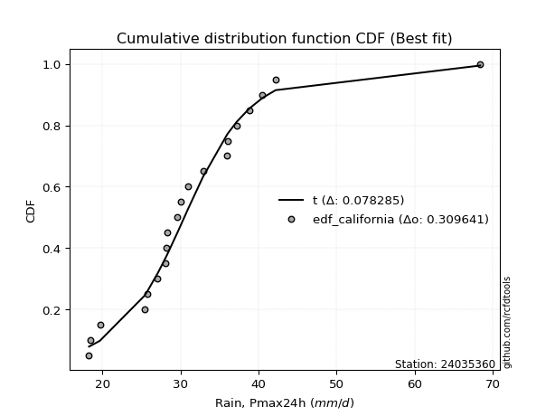</img>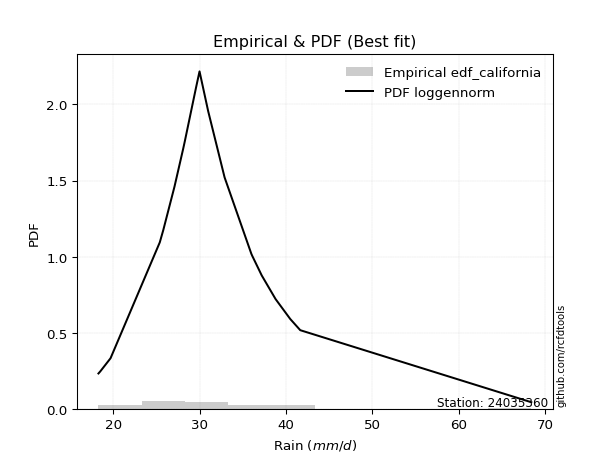</img>

</div>


### 2. EDF Hazen (1930)

Hazen method for plotting positions is a formula used to estimate the empirical cumulative probability distribution of flood events or other hydrological data. This formula often results in biased estimations, particularly when extrapolating to extreme events (high return periods).

<div align="center">


$P=(m-0.5)/n$


</div>


**2.1. Empirical values**

<div align="center">

|                | 0                  | 1                 | 2                  | 3                  | 4                  | 5                  | 6                  | 7         | 8                  | 9                  | 10                 | 11                | 12                 | 13                 | 14                 | 15                | 16                | 17        | 18                 | 19                 |
|:---------------|:-------------------|:------------------|:-------------------|:-------------------|:-------------------|:-------------------|:-------------------|:----------|:-------------------|:-------------------|:-------------------|:------------------|:-------------------|:-------------------|:-------------------|:------------------|:------------------|:----------|:-------------------|:-------------------|
| date           | 2021               | 2022              | 2017               | 2019               | 2015               | 2011               | 2012               | 2014      | 2010               | 2018               | 2023               | 2020              | 2008               | 2006               | 2016               | 2009              | 2005              | 2007      | 2013               | 2024               |
| x              | 18.3               | 18.5              | 19.7               | 25.4               | 25.8               | 27.1               | 28.1               | 28.2      | 28.3               | 29.6               | 30.0               | 31.0              | 32.9               | 36.0               | 36.1               | 37.2              | 38.8              | 40.5      | 42.19              | 68.4               |
| m              | 1                  | 2                 | 3                  | 4                  | 5                  | 6                  | 7                  | 8         | 9                  | 10                 | 11                 | 12                | 13                 | 14                 | 15                 | 16                | 17                | 18        | 19                 | 20                 |
| empirical_dist | edf_hazen          | edf_hazen         | edf_hazen          | edf_hazen          | edf_hazen          | edf_hazen          | edf_hazen          | edf_hazen | edf_hazen          | edf_hazen          | edf_hazen          | edf_hazen         | edf_hazen          | edf_hazen          | edf_hazen          | edf_hazen         | edf_hazen         | edf_hazen | edf_hazen          | edf_hazen          |
| empirical      | 0.025              | 0.075             | 0.125              | 0.175              | 0.225              | 0.275              | 0.325              | 0.375     | 0.425              | 0.475              | 0.525              | 0.575             | 0.625              | 0.675              | 0.725              | 0.775             | 0.825             | 0.875     | 0.925              | 0.975              |
| empirical_tr   | 1.0256410256410258 | 1.081081081081081 | 1.1428571428571428 | 1.2121212121212122 | 1.2903225806451613 | 1.3793103448275863 | 1.4814814814814814 | 1.6       | 1.7391304347826089 | 1.9047619047619047 | 2.1052631578947367 | 2.352941176470588 | 2.6666666666666665 | 3.0769230769230775 | 3.6363636363636362 | 4.444444444444445 | 5.714285714285713 | 8.0       | 13.333333333333341 | 39.999999999999964 |

</div>


**2.2. Kolmogorov-Smirnov fit test (sorted by Δ)**


<div align="center">

|                | 0                   | 1                   | 2                   | 3                  | 4                   | 5                  | 6                   | 7                   | 8                   | 9                  | 10                  | 11                  | 12                  | 13                  | 14                  | 15                  | 16                    | 17                  | 18                  | 19                 | 20                  | 21                  | 22                  | 23                  | 24                  | 25                  | 26                  | 27                  | 28                  | 29                 | 30                  | 31                 | 32                  | 33                  | 34                  | 35                  | 36                  | 37                 | 38                  | 39                  | 40                 | 41                  | 42                  | 43                  | 44                  | 45                  | 46                  | 47                  | 48                  | 49                  | 50                  | 51                  | 52                  | 53                  | 54                  | 55                  | 56                  | 57                  | 58                  | 59                  | 60                  | 61                  | 62                  | 63                  | 64                 | 65                  | 66                  | 67                  | 68                  | 69                  | 70                  | 71                  | 72                 | 73                  | 74                  | 75                  | 76                  | 77                  | 78                  | 79                 | 80                  | 81                  | 82                  | 83                  | 84                 | 85                 | 86                 | 87                 |
|:---------------|:--------------------|:--------------------|:--------------------|:-------------------|:--------------------|:-------------------|:--------------------|:--------------------|:--------------------|:-------------------|:--------------------|:--------------------|:--------------------|:--------------------|:--------------------|:--------------------|:----------------------|:--------------------|:--------------------|:-------------------|:--------------------|:--------------------|:--------------------|:--------------------|:--------------------|:--------------------|:--------------------|:--------------------|:--------------------|:-------------------|:--------------------|:-------------------|:--------------------|:--------------------|:--------------------|:--------------------|:--------------------|:-------------------|:--------------------|:--------------------|:-------------------|:--------------------|:--------------------|:--------------------|:--------------------|:--------------------|:--------------------|:--------------------|:--------------------|:--------------------|:--------------------|:--------------------|:--------------------|:--------------------|:--------------------|:--------------------|:--------------------|:--------------------|:--------------------|:--------------------|:--------------------|:--------------------|:--------------------|:--------------------|:-------------------|:--------------------|:--------------------|:--------------------|:--------------------|:--------------------|:--------------------|:--------------------|:-------------------|:--------------------|:--------------------|:--------------------|:--------------------|:--------------------|:--------------------|:-------------------|:--------------------|:--------------------|:--------------------|:--------------------|:-------------------|:-------------------|:-------------------|:-------------------|
| station        | 24035360            | 24035360            | 24035360            | 24035360           | 24035360            | 24035360           | 24035360            | 24035360            | 24035360            | 24035360           | 24035360            | 24035360            | 24035360            | 24035360            | 24035360            | 24035360            | 24035360              | 24035360            | 24035360            | 24035360           | 24035360            | 24035360            | 24035360            | 24035360            | 24035360            | 24035360            | 24035360            | 24035360            | 24035360            | 24035360           | 24035360            | 24035360           | 24035360            | 24035360            | 24035360            | 24035360            | 24035360            | 24035360           | 24035360            | 24035360            | 24035360           | 24035360            | 24035360            | 24035360            | 24035360            | 24035360            | 24035360            | 24035360            | 24035360            | 24035360            | 24035360            | 24035360            | 24035360            | 24035360            | 24035360            | 24035360            | 24035360            | 24035360            | 24035360            | 24035360            | 24035360            | 24035360            | 24035360            | 24035360            | 24035360           | 24035360            | 24035360            | 24035360            | 24035360            | 24035360            | 24035360            | 24035360            | 24035360           | 24035360            | 24035360            | 24035360            | 24035360            | 24035360            | 24035360            | 24035360           | 24035360            | 24035360            | 24035360            | 24035360            | 24035360           | 24035360           | 24035360           | 24035360           |
| empirical_dist | edf_hazen           | edf_hazen           | edf_hazen           | edf_hazen          | edf_hazen           | edf_hazen          | edf_hazen           | edf_hazen           | edf_hazen           | edf_hazen          | edf_hazen           | edf_hazen           | edf_hazen           | edf_hazen           | edf_hazen           | edf_hazen           | edf_hazen             | edf_hazen           | edf_hazen           | edf_hazen          | edf_hazen           | edf_hazen           | edf_hazen           | edf_hazen           | edf_hazen           | edf_hazen           | edf_hazen           | edf_hazen           | edf_hazen           | edf_hazen          | edf_hazen           | edf_hazen          | edf_hazen           | edf_hazen           | edf_hazen           | edf_hazen           | edf_hazen           | edf_hazen          | edf_hazen           | edf_hazen           | edf_hazen          | edf_hazen           | edf_hazen           | edf_hazen           | edf_hazen           | edf_hazen           | edf_hazen           | edf_hazen           | edf_hazen           | edf_hazen           | edf_hazen           | edf_hazen           | edf_hazen           | edf_hazen           | edf_hazen           | edf_hazen           | edf_hazen           | edf_hazen           | edf_hazen           | edf_hazen           | edf_hazen           | edf_hazen           | edf_hazen           | edf_hazen           | edf_hazen          | edf_hazen           | edf_hazen           | edf_hazen           | edf_hazen           | edf_hazen           | edf_hazen           | edf_hazen           | edf_hazen          | edf_hazen           | edf_hazen           | edf_hazen           | edf_hazen           | edf_hazen           | edf_hazen           | edf_hazen          | edf_hazen           | edf_hazen           | edf_hazen           | edf_hazen           | edf_hazen          | edf_hazen          | edf_hazen          | edf_hazen          |
| p_dist         | laplace_asymmetric  | johnsonsu           | loghypsecant        | loglogistic        | logt                | logjohnsonsu       | logfisk             | fisk                | loggenlogistic      | exponnorm          | ncf                 | genlogistic         | lognorm             | lognorm             | logcrystalball      | kstwobign           | loglaplace_asymmetric | loglaplace          | logexponnorm        | logloggamma        | t                   | alpha               | nct                 | betaprime           | invweibull          | rice                | invgamma            | logbetaprime        | logalpha            | f                  | loginvgamma         | loglognorm         | logf                | logfatiguelife      | logerlang           | loggamma            | loggamma            | lognct             | logpearson3         | loginvgauss         | invgauss           | logrice             | fatiguelife         | gumbel_r            | moyal               | maxwell             | lognakagami         | logmaxwell          | crystalball         | norm                | loggumbel_r         | logweibull_min      | logistic            | rayleigh            | lograyleigh         | hypsecant           | loggumbel_l         | gamma               | chi2                | erlang              | pearson3            | loginvweibull       | gibrat              | wald                | halflogistic       | logmoyal            | laplace             | halfnorm            | loghalfnorm         | loggompertz         | loghalflogistic     | logkstwobign        | loggenexpon        | gompertz            | weibull_min         | loggibrat           | gumbel_l            | logwald             | logncf              | expon              | genexpon            | nakagami            | logmielke           | logexpon            | logchi2            | logtruncnorm       | truncnorm          | mielke             |
| delta          | 0.06343984891521345 | 0.06345798146215295 | 0.06733694411809599 | 0.0685462903102328 | 0.06854826200946085 | 0.0686104595342214 | 0.07089728923878094 | 0.07129308003610421 | 0.07246953686652807 | 0.0754307470647052 | 0.08761262969551781 | 0.08959722724948188 | 0.09103805224621497 | 0.09103805224621497 | 0.09103810661456774 | 0.09165609119396867 | 0.09182618030791612   | 0.09191923409064662 | 0.09315091433894546 | 0.0945495578609975 | 0.09543251872959413 | 0.09562823648285157 | 0.09602416552555704 | 0.09632341901928515 | 0.09842850752147037 | 0.09854375892979517 | 0.10057089586331958 | 0.10064259530632258 | 0.10082589159721844 | 0.1010532503131274 | 0.10111911941058971 | 0.101329831010248  | 0.10138810001423282 | 0.10153614830291602 | 0.10209695868290097 | 0.10209699116341303 | 0.10209699116341303 | 0.1022254404940186 | 0.10542638286388056 | 0.10724409410659969 | 0.1080142375658254 | 0.10810410717156227 | 0.10863311225898814 | 0.11028743565239263 | 0.11287838969080816 | 0.11421725025471158 | 0.11439732895187066 | 0.11490481883935394 | 0.11611406290507603 | 0.11611407405898633 | 0.11903316951680254 | 0.12020672302728169 | 0.12167820821799769 | 0.12390478058850102 | 0.12462066821261436 | 0.12639561839374747 | 0.12859558894274625 | 0.13019521203540246 | 0.13019597440069686 | 0.13019776624093615 | 0.13559005771948957 | 0.13683528045662047 | 0.13832592938796262 | 0.14028561886288327 | 0.1405038074131062 | 0.14087861993688938 | 0.14642548818760126 | 0.15059489476603027 | 0.15140472230358615 | 0.15214420647459537 | 0.15652622900165658 | 0.15868601443318558 | 0.1659298687315542 | 0.16950447717623268 | 0.17499999999999327 | 0.18578789510739885 | 0.18650781581648862 | 0.19860708163235224 | 0.21519756468153306 | 0.2270959796119965 | 0.22716944382581533 | 0.24832735334035688 | 0.25820647825707255 | 0.29592028992923886 | 0.3086377952081022 | 0.3303311795995742 | 0.5483304719804848 | nan                |
| deltao         | 0.3096406529800002  | 0.3096406529800002  | 0.3096406529800002  | 0.3096406529800002 | 0.3096406529800002  | 0.3096406529800002 | 0.3096406529800002  | 0.3096406529800002  | 0.3096406529800002  | 0.3096406529800002 | 0.3096406529800002  | 0.3096406529800002  | 0.3096406529800002  | 0.3096406529800002  | 0.3096406529800002  | 0.3096406529800002  | 0.3096406529800002    | 0.3096406529800002  | 0.3096406529800002  | 0.3096406529800002 | 0.3096406529800002  | 0.3096406529800002  | 0.3096406529800002  | 0.3096406529800002  | 0.3096406529800002  | 0.3096406529800002  | 0.3096406529800002  | 0.3096406529800002  | 0.3096406529800002  | 0.3096406529800002 | 0.3096406529800002  | 0.3096406529800002 | 0.3096406529800002  | 0.3096406529800002  | 0.3096406529800002  | 0.3096406529800002  | 0.3096406529800002  | 0.3096406529800002 | 0.3096406529800002  | 0.3096406529800002  | 0.3096406529800002 | 0.3096406529800002  | 0.3096406529800002  | 0.3096406529800002  | 0.3096406529800002  | 0.3096406529800002  | 0.3096406529800002  | 0.3096406529800002  | 0.3096406529800002  | 0.3096406529800002  | 0.3096406529800002  | 0.3096406529800002  | 0.3096406529800002  | 0.3096406529800002  | 0.3096406529800002  | 0.3096406529800002  | 0.3096406529800002  | 0.3096406529800002  | 0.3096406529800002  | 0.3096406529800002  | 0.3096406529800002  | 0.3096406529800002  | 0.3096406529800002  | 0.3096406529800002  | 0.3096406529800002 | 0.3096406529800002  | 0.3096406529800002  | 0.3096406529800002  | 0.3096406529800002  | 0.3096406529800002  | 0.3096406529800002  | 0.3096406529800002  | 0.3096406529800002 | 0.3096406529800002  | 0.3096406529800002  | 0.3096406529800002  | 0.3096406529800002  | 0.3096406529800002  | 0.3096406529800002  | 0.3096406529800002 | 0.3096406529800002  | 0.3096406529800002  | 0.3096406529800002  | 0.3096406529800002  | 0.3096406529800002 | 0.3096406529800002 | 0.3096406529800002 | 0.3096406529800002 |
| eval           | Δo > Δ              | Δo > Δ              | Δo > Δ              | Δo > Δ             | Δo > Δ              | Δo > Δ             | Δo > Δ              | Δo > Δ              | Δo > Δ              | Δo > Δ             | Δo > Δ              | Δo > Δ              | Δo > Δ              | Δo > Δ              | Δo > Δ              | Δo > Δ              | Δo > Δ                | Δo > Δ              | Δo > Δ              | Δo > Δ             | Δo > Δ              | Δo > Δ              | Δo > Δ              | Δo > Δ              | Δo > Δ              | Δo > Δ              | Δo > Δ              | Δo > Δ              | Δo > Δ              | Δo > Δ             | Δo > Δ              | Δo > Δ             | Δo > Δ              | Δo > Δ              | Δo > Δ              | Δo > Δ              | Δo > Δ              | Δo > Δ             | Δo > Δ              | Δo > Δ              | Δo > Δ             | Δo > Δ              | Δo > Δ              | Δo > Δ              | Δo > Δ              | Δo > Δ              | Δo > Δ              | Δo > Δ              | Δo > Δ              | Δo > Δ              | Δo > Δ              | Δo > Δ              | Δo > Δ              | Δo > Δ              | Δo > Δ              | Δo > Δ              | Δo > Δ              | Δo > Δ              | Δo > Δ              | Δo > Δ              | Δo > Δ              | Δo > Δ              | Δo > Δ              | Δo > Δ              | Δo > Δ             | Δo > Δ              | Δo > Δ              | Δo > Δ              | Δo > Δ              | Δo > Δ              | Δo > Δ              | Δo > Δ              | Δo > Δ             | Δo > Δ              | Δo > Δ              | Δo > Δ              | Δo > Δ              | Δo > Δ              | Δo > Δ              | Δo > Δ             | Δo > Δ              | Δo > Δ              | Δo > Δ              | Δo > Δ              | Δo > Δ             | Δo <= Δ            | Δo <= Δ            | Δo <= Δ            |
| fit            | 1                   | 1                   | 1                   | 1                  | 1                   | 1                  | 1                   | 1                   | 1                   | 1                  | 1                   | 1                   | 1                   | 1                   | 1                   | 1                   | 1                     | 1                   | 1                   | 1                  | 1                   | 1                   | 1                   | 1                   | 1                   | 1                   | 1                   | 1                   | 1                   | 1                  | 1                   | 1                  | 1                   | 1                   | 1                   | 1                   | 1                   | 1                  | 1                   | 1                   | 1                  | 1                   | 1                   | 1                   | 1                   | 1                   | 1                   | 1                   | 1                   | 1                   | 1                   | 1                   | 1                   | 1                   | 1                   | 1                   | 1                   | 1                   | 1                   | 1                   | 1                   | 1                   | 1                   | 1                   | 1                  | 1                   | 1                   | 1                   | 1                   | 1                   | 1                   | 1                   | 1                  | 1                   | 1                   | 1                   | 1                   | 1                   | 1                   | 1                  | 1                   | 1                   | 1                   | 1                   | 1                  | 0                  | 0                  | 0                  |
| n              | 20                  | 20                  | 20                  | 20                 | 20                  | 20                 | 20                  | 20                  | 20                  | 20                 | 20                  | 20                  | 20                  | 20                  | 20                  | 20                  | 20                    | 20                  | 20                  | 20                 | 20                  | 20                  | 20                  | 20                  | 20                  | 20                  | 20                  | 20                  | 20                  | 20                 | 20                  | 20                 | 20                  | 20                  | 20                  | 20                  | 20                  | 20                 | 20                  | 20                  | 20                 | 20                  | 20                  | 20                  | 20                  | 20                  | 20                  | 20                  | 20                  | 20                  | 20                  | 20                  | 20                  | 20                  | 20                  | 20                  | 20                  | 20                  | 20                  | 20                  | 20                  | 20                  | 20                  | 20                  | 20                 | 20                  | 20                  | 20                  | 20                  | 20                  | 20                  | 20                  | 20                 | 20                  | 20                  | 20                  | 20                  | 20                  | 20                  | 20                 | 20                  | 20                  | 20                  | 20                  | 20                 | 20                 | 20                 | 20                 |
| best_fit       | 1                   | 0                   | 0                   | 0                  | 0                   | 0                  | 0                   | 0                   | 0                   | 0                  | 0                   | 0                   | 0                   | 0                   | 0                   | 0                   | 0                     | 0                   | 0                   | 0                  | 0                   | 0                   | 0                   | 0                   | 0                   | 0                   | 0                   | 0                   | 0                   | 0                  | 0                   | 0                  | 0                   | 0                   | 0                   | 0                   | 0                   | 0                  | 0                   | 0                   | 0                  | 0                   | 0                   | 0                   | 0                   | 0                   | 0                   | 0                   | 0                   | 0                   | 0                   | 0                   | 0                   | 0                   | 0                   | 0                   | 0                   | 0                   | 0                   | 0                   | 0                   | 0                   | 0                   | 0                   | 0                  | 0                   | 0                   | 0                   | 0                   | 0                   | 0                   | 0                   | 0                  | 0                   | 0                   | 0                   | 0                   | 0                   | 0                   | 0                  | 0                   | 0                   | 0                   | 0                   | 0                  | 0                  | 0                  | 0                  |
| best_fit_sort  | 1                   | 2                   | 3                   | 4                  | 5                   | 6                  | 7                   | 8                   | 9                   | 10                 | 11                  | 12                  | 13                  | 14                  | 15                  | 16                  | 17                    | 18                  | 19                  | 20                 | 21                  | 22                  | 23                  | 24                  | 25                  | 26                  | 27                  | 28                  | 29                  | 30                 | 31                  | 32                 | 33                  | 34                  | 35                  | 36                  | 37                  | 38                 | 39                  | 40                  | 41                 | 42                  | 43                  | 44                  | 45                  | 46                  | 47                  | 48                  | 49                  | 50                  | 51                  | 52                  | 53                  | 54                  | 55                  | 56                  | 57                  | 58                  | 59                  | 60                  | 61                  | 62                  | 63                  | 64                  | 65                 | 66                  | 67                  | 68                  | 69                  | 70                  | 71                  | 72                  | 73                 | 74                  | 75                  | 76                  | 77                  | 78                  | 79                  | 80                 | 81                  | 82                  | 83                  | 84                  | 85                 | 86                 | 87                 | 88                 |

</div>


**2.3. Best fit**

<div align="center">

|   id |   station | empirical_dist   | p_dist             |     delta |   deltao | eval   |   fit |   n |   best_fit |   best_fit_sort |
|-----:|----------:|:-----------------|:-------------------|----------:|---------:|:-------|------:|----:|-----------:|----------------:|
|    0 |  24035360 | edf_hazen        | laplace_asymmetric | 0.0634398 | 0.309641 | Δo > Δ |     1 |  20 |          1 |               1 |

</div>


<div align="center">

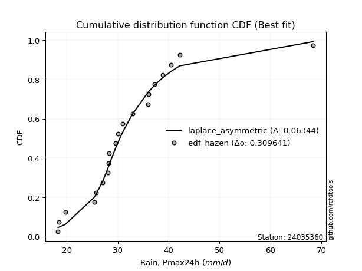</img>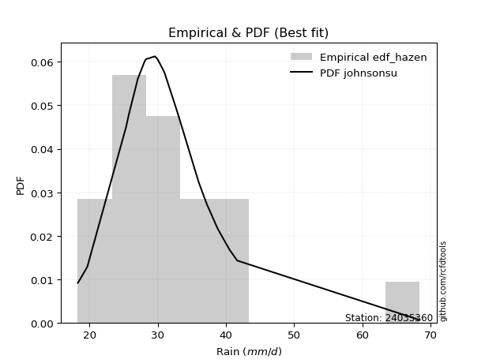</img>

</div>


### 3. EDF Weibull (1939)

Weibull plotting position formula is an empirical method used to estimate the non-exceedance probability or plotting position for a set of observed data, is often recommended or widely used in practice, particularly in flood frequency analysis.

<div align="center">


$P=m/(n+1)$


</div>


**3.1. Empirical values**

<div align="center">

|                | 0                    | 1                   | 2                   | 3                   | 4                   | 5                  | 6                  | 7                   | 8                   | 9                   | 10                 | 11                 | 12                 | 13                 | 14                 | 15                 | 16                 | 17                 | 18                 | 19                 |
|:---------------|:---------------------|:--------------------|:--------------------|:--------------------|:--------------------|:-------------------|:-------------------|:--------------------|:--------------------|:--------------------|:-------------------|:-------------------|:-------------------|:-------------------|:-------------------|:-------------------|:-------------------|:-------------------|:-------------------|:-------------------|
| date           | 2021                 | 2022                | 2017                | 2019                | 2015                | 2011               | 2012               | 2014                | 2010                | 2018                | 2023               | 2020               | 2008               | 2006               | 2016               | 2009               | 2005               | 2007               | 2013               | 2024               |
| x              | 18.3                 | 18.5                | 19.7                | 25.4                | 25.8                | 27.1               | 28.1               | 28.2                | 28.3                | 29.6                | 30.0               | 31.0               | 32.9               | 36.0               | 36.1               | 37.2               | 38.8               | 40.5               | 42.19              | 68.4               |
| m              | 1                    | 2                   | 3                   | 4                   | 5                   | 6                  | 7                  | 8                   | 9                   | 10                  | 11                 | 12                 | 13                 | 14                 | 15                 | 16                 | 17                 | 18                 | 19                 | 20                 |
| empirical_dist | edf_weibull          | edf_weibull         | edf_weibull         | edf_weibull         | edf_weibull         | edf_weibull        | edf_weibull        | edf_weibull         | edf_weibull         | edf_weibull         | edf_weibull        | edf_weibull        | edf_weibull        | edf_weibull        | edf_weibull        | edf_weibull        | edf_weibull        | edf_weibull        | edf_weibull        | edf_weibull        |
| empirical      | 0.047619047619047616 | 0.09523809523809523 | 0.14285714285714285 | 0.19047619047619047 | 0.23809523809523808 | 0.2857142857142857 | 0.3333333333333333 | 0.38095238095238093 | 0.42857142857142855 | 0.47619047619047616 | 0.5238095238095238 | 0.5714285714285714 | 0.6190476190476191 | 0.6666666666666666 | 0.7142857142857143 | 0.7619047619047619 | 0.8095238095238095 | 0.8571428571428571 | 0.9047619047619048 | 0.9523809523809523 |
| empirical_tr   | 1.05                 | 1.1052631578947367  | 1.1666666666666665  | 1.2352941176470589  | 1.3125              | 1.4                | 1.4999999999999998 | 1.6153846153846154  | 1.75                | 1.909090909090909   | 2.1                | 2.333333333333333  | 2.625              | 2.9999999999999996 | 3.5                | 4.199999999999999  | 5.25               | 6.999999999999997  | 10.5               | 20.999999999999975 |

</div>


**3.2. Kolmogorov-Smirnov fit test (sorted by Δ)**


<div align="center">

|                | 0                   | 1                  | 2                  | 3                   | 4                   | 5                   | 6                   | 7                   | 8                   | 9                   | 10                  | 11                 | 12                 | 13                  | 14                  | 15                  | 16                  | 17                  | 18                  | 19                 | 20                  | 21                 | 22                  | 23                  | 24                  | 25                  | 26                  | 27                  | 28                 | 29                  | 30                  | 31                  | 32                 | 33                  | 34                  | 35                  | 36                  | 37                  | 38                  | 39                  | 40                  | 41                  | 42                 | 43                  | 44                  | 45                    | 46                  | 47                  | 48                  | 49                  | 50                  | 51                  | 52                  | 53                  | 54                  | 55                  | 56                  | 57                  | 58                  | 59                  | 60                 | 61                  | 62                 | 63                  | 64                 | 65                  | 66                  | 67                  | 68                 | 69                  | 70                  | 71                  | 72                 | 73                 | 74                  | 75                  | 76                  | 77                  | 78                  | 79                  | 80                  | 81                 | 82                  | 83                 | 84                 | 85                 | 86                 | 87                 |
|:---------------|:--------------------|:-------------------|:-------------------|:--------------------|:--------------------|:--------------------|:--------------------|:--------------------|:--------------------|:--------------------|:--------------------|:-------------------|:-------------------|:--------------------|:--------------------|:--------------------|:--------------------|:--------------------|:--------------------|:-------------------|:--------------------|:-------------------|:--------------------|:--------------------|:--------------------|:--------------------|:--------------------|:--------------------|:-------------------|:--------------------|:--------------------|:--------------------|:-------------------|:--------------------|:--------------------|:--------------------|:--------------------|:--------------------|:--------------------|:--------------------|:--------------------|:--------------------|:-------------------|:--------------------|:--------------------|:----------------------|:--------------------|:--------------------|:--------------------|:--------------------|:--------------------|:--------------------|:--------------------|:--------------------|:--------------------|:--------------------|:--------------------|:--------------------|:--------------------|:--------------------|:-------------------|:--------------------|:-------------------|:--------------------|:-------------------|:--------------------|:--------------------|:--------------------|:-------------------|:--------------------|:--------------------|:--------------------|:-------------------|:-------------------|:--------------------|:--------------------|:--------------------|:--------------------|:--------------------|:--------------------|:--------------------|:-------------------|:--------------------|:-------------------|:-------------------|:-------------------|:-------------------|:-------------------|
| station        | 24035360            | 24035360           | 24035360           | 24035360            | 24035360            | 24035360            | 24035360            | 24035360            | 24035360            | 24035360            | 24035360            | 24035360           | 24035360           | 24035360            | 24035360            | 24035360            | 24035360            | 24035360            | 24035360            | 24035360           | 24035360            | 24035360           | 24035360            | 24035360            | 24035360            | 24035360            | 24035360            | 24035360            | 24035360           | 24035360            | 24035360            | 24035360            | 24035360           | 24035360            | 24035360            | 24035360            | 24035360            | 24035360            | 24035360            | 24035360            | 24035360            | 24035360            | 24035360           | 24035360            | 24035360            | 24035360              | 24035360            | 24035360            | 24035360            | 24035360            | 24035360            | 24035360            | 24035360            | 24035360            | 24035360            | 24035360            | 24035360            | 24035360            | 24035360            | 24035360            | 24035360           | 24035360            | 24035360           | 24035360            | 24035360           | 24035360            | 24035360            | 24035360            | 24035360           | 24035360            | 24035360            | 24035360            | 24035360           | 24035360           | 24035360            | 24035360            | 24035360            | 24035360            | 24035360            | 24035360            | 24035360            | 24035360           | 24035360            | 24035360           | 24035360           | 24035360           | 24035360           | 24035360           |
| empirical_dist | edf_weibull         | edf_weibull        | edf_weibull        | edf_weibull         | edf_weibull         | edf_weibull         | edf_weibull         | edf_weibull         | edf_weibull         | edf_weibull         | edf_weibull         | edf_weibull        | edf_weibull        | edf_weibull         | edf_weibull         | edf_weibull         | edf_weibull         | edf_weibull         | edf_weibull         | edf_weibull        | edf_weibull         | edf_weibull        | edf_weibull         | edf_weibull         | edf_weibull         | edf_weibull         | edf_weibull         | edf_weibull         | edf_weibull        | edf_weibull         | edf_weibull         | edf_weibull         | edf_weibull        | edf_weibull         | edf_weibull         | edf_weibull         | edf_weibull         | edf_weibull         | edf_weibull         | edf_weibull         | edf_weibull         | edf_weibull         | edf_weibull        | edf_weibull         | edf_weibull         | edf_weibull           | edf_weibull         | edf_weibull         | edf_weibull         | edf_weibull         | edf_weibull         | edf_weibull         | edf_weibull         | edf_weibull         | edf_weibull         | edf_weibull         | edf_weibull         | edf_weibull         | edf_weibull         | edf_weibull         | edf_weibull        | edf_weibull         | edf_weibull        | edf_weibull         | edf_weibull        | edf_weibull         | edf_weibull         | edf_weibull         | edf_weibull        | edf_weibull         | edf_weibull         | edf_weibull         | edf_weibull        | edf_weibull        | edf_weibull         | edf_weibull         | edf_weibull         | edf_weibull         | edf_weibull         | edf_weibull         | edf_weibull         | edf_weibull        | edf_weibull         | edf_weibull        | edf_weibull        | edf_weibull        | edf_weibull        | edf_weibull        |
| p_dist         | ncf                 | lognorm            | lognorm            | logcrystalball      | kstwobign           | loglogistic         | fisk                | logt                | logloggamma         | loghypsecant        | betaprime           | laplace_asymmetric | johnsonsu          | genlogistic         | logjohnsonsu        | loggenlogistic      | exponnorm           | nct                 | invweibull          | invgamma           | alpha               | logbetaprime       | logalpha            | f                   | loginvgamma         | loglognorm          | logf                | logfatiguelife      | logerlang          | loggamma            | loggamma            | lognct              | logfisk            | logexponnorm        | logpearson3         | loginvgauss         | invgauss            | logrice             | fatiguelife         | gumbel_r            | rice                | moyal               | maxwell            | lognakagami         | logmaxwell          | loglaplace_asymmetric | loglaplace          | t                   | logweibull_min      | rayleigh            | lograyleigh         | crystalball         | norm                | gamma               | chi2                | erlang              | logistic            | loggumbel_r         | loginvweibull       | hypsecant           | loggumbel_l        | halflogistic        | halfnorm           | logmoyal            | loggompertz        | pearson3            | loghalfnorm         | wald                | logkstwobign       | laplace             | gibrat              | loghalflogistic     | loggenexpon        | gompertz           | gumbel_l            | loggibrat           | logwald             | weibull_min         | logncf              | expon               | genexpon            | nakagami           | logmielke           | logexpon           | logchi2            | logtruncnorm       | truncnorm          | mielke             |
| delta          | 0.07213643921932733 | 0.0755618617700245 | 0.0755618617700245 | 0.07556191613837726 | 0.07761500763624157 | 0.07823478109530126 | 0.07861513294942869 | 0.07888777952310529 | 0.07907336738480703 | 0.08014387573401979 | 0.08084722854309467 | 0.0812969917723563 | 0.0813151243192958 | 0.08160773469990108 | 0.08164360575975946 | 0.08299605429232342 | 0.08325986525332321 | 0.08452646428519212 | 0.08489840211359298 | 0.0850947053871291 | 0.08511851681803598 | 0.0851664048301321 | 0.08534970112102797 | 0.08557705983693692 | 0.08564292893439923 | 0.08585364053405753 | 0.08591190953804234 | 0.08605995782672554 | 0.0866207682067105 | 0.08662080068722255 | 0.08662080068722255 | 0.08674925001782813 | 0.0868075035577327 | 0.08745867212516188 | 0.08995019238769009 | 0.09176790363040921 | 0.09253804708963492 | 0.09262791669537179 | 0.09315692178279766 | 0.09481124517620215 | 0.09497233035836661 | 0.09740219921461768 | 0.0987410597785211 | 0.09892113847568018 | 0.09942862836316346 | 0.10015951364124953   | 0.10025256742398003 | 0.10376585206292754 | 0.10473053255109122 | 0.10842859011231054 | 0.10914447773642388 | 0.11254263433364747 | 0.11254264548755777 | 0.11471902155921199 | 0.11471978392450638 | 0.11472157576474568 | 0.11810677964656913 | 0.11850809160193143 | 0.12135908998042999 | 0.12282418982231891 | 0.1250241603713177 | 0.12780219758767808 | 0.1351187042898398 | 0.13636563139335825 | 0.1366680159984049 | 0.14202395136344648 | 0.14285714285714285 | 0.14285714285714285 | 0.1432098239569951 | 0.14523501199712507 | 0.14665926272129604 | 0.14819289566832328 | 0.1504536782553637 | 0.1540282867000422 | 0.18293638724506006 | 0.18298377009368372 | 0.19027374829901894 | 0.19047619047618375 | 0.19495946944343778 | 0.21161978913580604 | 0.21169325334962485 | 0.2328511628641664 | 0.24273028778088207 | 0.2804440994530484 | 0.2883996999700069 | 0.3148549891233837 | 0.5257114243614371 | nan                |
| deltao         | 0.3096406529800002  | 0.3096406529800002 | 0.3096406529800002 | 0.3096406529800002  | 0.3096406529800002  | 0.3096406529800002  | 0.3096406529800002  | 0.3096406529800002  | 0.3096406529800002  | 0.3096406529800002  | 0.3096406529800002  | 0.3096406529800002 | 0.3096406529800002 | 0.3096406529800002  | 0.3096406529800002  | 0.3096406529800002  | 0.3096406529800002  | 0.3096406529800002  | 0.3096406529800002  | 0.3096406529800002 | 0.3096406529800002  | 0.3096406529800002 | 0.3096406529800002  | 0.3096406529800002  | 0.3096406529800002  | 0.3096406529800002  | 0.3096406529800002  | 0.3096406529800002  | 0.3096406529800002 | 0.3096406529800002  | 0.3096406529800002  | 0.3096406529800002  | 0.3096406529800002 | 0.3096406529800002  | 0.3096406529800002  | 0.3096406529800002  | 0.3096406529800002  | 0.3096406529800002  | 0.3096406529800002  | 0.3096406529800002  | 0.3096406529800002  | 0.3096406529800002  | 0.3096406529800002 | 0.3096406529800002  | 0.3096406529800002  | 0.3096406529800002    | 0.3096406529800002  | 0.3096406529800002  | 0.3096406529800002  | 0.3096406529800002  | 0.3096406529800002  | 0.3096406529800002  | 0.3096406529800002  | 0.3096406529800002  | 0.3096406529800002  | 0.3096406529800002  | 0.3096406529800002  | 0.3096406529800002  | 0.3096406529800002  | 0.3096406529800002  | 0.3096406529800002 | 0.3096406529800002  | 0.3096406529800002 | 0.3096406529800002  | 0.3096406529800002 | 0.3096406529800002  | 0.3096406529800002  | 0.3096406529800002  | 0.3096406529800002 | 0.3096406529800002  | 0.3096406529800002  | 0.3096406529800002  | 0.3096406529800002 | 0.3096406529800002 | 0.3096406529800002  | 0.3096406529800002  | 0.3096406529800002  | 0.3096406529800002  | 0.3096406529800002  | 0.3096406529800002  | 0.3096406529800002  | 0.3096406529800002 | 0.3096406529800002  | 0.3096406529800002 | 0.3096406529800002 | 0.3096406529800002 | 0.3096406529800002 | 0.3096406529800002 |
| eval           | Δo > Δ              | Δo > Δ             | Δo > Δ             | Δo > Δ              | Δo > Δ              | Δo > Δ              | Δo > Δ              | Δo > Δ              | Δo > Δ              | Δo > Δ              | Δo > Δ              | Δo > Δ             | Δo > Δ             | Δo > Δ              | Δo > Δ              | Δo > Δ              | Δo > Δ              | Δo > Δ              | Δo > Δ              | Δo > Δ             | Δo > Δ              | Δo > Δ             | Δo > Δ              | Δo > Δ              | Δo > Δ              | Δo > Δ              | Δo > Δ              | Δo > Δ              | Δo > Δ             | Δo > Δ              | Δo > Δ              | Δo > Δ              | Δo > Δ             | Δo > Δ              | Δo > Δ              | Δo > Δ              | Δo > Δ              | Δo > Δ              | Δo > Δ              | Δo > Δ              | Δo > Δ              | Δo > Δ              | Δo > Δ             | Δo > Δ              | Δo > Δ              | Δo > Δ                | Δo > Δ              | Δo > Δ              | Δo > Δ              | Δo > Δ              | Δo > Δ              | Δo > Δ              | Δo > Δ              | Δo > Δ              | Δo > Δ              | Δo > Δ              | Δo > Δ              | Δo > Δ              | Δo > Δ              | Δo > Δ              | Δo > Δ             | Δo > Δ              | Δo > Δ             | Δo > Δ              | Δo > Δ             | Δo > Δ              | Δo > Δ              | Δo > Δ              | Δo > Δ             | Δo > Δ              | Δo > Δ              | Δo > Δ              | Δo > Δ             | Δo > Δ             | Δo > Δ              | Δo > Δ              | Δo > Δ              | Δo > Δ              | Δo > Δ              | Δo > Δ              | Δo > Δ              | Δo > Δ             | Δo > Δ              | Δo > Δ             | Δo > Δ             | Δo <= Δ            | Δo <= Δ            | Δo <= Δ            |
| fit            | 1                   | 1                  | 1                  | 1                   | 1                   | 1                   | 1                   | 1                   | 1                   | 1                   | 1                   | 1                  | 1                  | 1                   | 1                   | 1                   | 1                   | 1                   | 1                   | 1                  | 1                   | 1                  | 1                   | 1                   | 1                   | 1                   | 1                   | 1                   | 1                  | 1                   | 1                   | 1                   | 1                  | 1                   | 1                   | 1                   | 1                   | 1                   | 1                   | 1                   | 1                   | 1                   | 1                  | 1                   | 1                   | 1                     | 1                   | 1                   | 1                   | 1                   | 1                   | 1                   | 1                   | 1                   | 1                   | 1                   | 1                   | 1                   | 1                   | 1                   | 1                  | 1                   | 1                  | 1                   | 1                  | 1                   | 1                   | 1                   | 1                  | 1                   | 1                   | 1                   | 1                  | 1                  | 1                   | 1                   | 1                   | 1                   | 1                   | 1                   | 1                   | 1                  | 1                   | 1                  | 1                  | 0                  | 0                  | 0                  |
| n              | 20                  | 20                 | 20                 | 20                  | 20                  | 20                  | 20                  | 20                  | 20                  | 20                  | 20                  | 20                 | 20                 | 20                  | 20                  | 20                  | 20                  | 20                  | 20                  | 20                 | 20                  | 20                 | 20                  | 20                  | 20                  | 20                  | 20                  | 20                  | 20                 | 20                  | 20                  | 20                  | 20                 | 20                  | 20                  | 20                  | 20                  | 20                  | 20                  | 20                  | 20                  | 20                  | 20                 | 20                  | 20                  | 20                    | 20                  | 20                  | 20                  | 20                  | 20                  | 20                  | 20                  | 20                  | 20                  | 20                  | 20                  | 20                  | 20                  | 20                  | 20                 | 20                  | 20                 | 20                  | 20                 | 20                  | 20                  | 20                  | 20                 | 20                  | 20                  | 20                  | 20                 | 20                 | 20                  | 20                  | 20                  | 20                  | 20                  | 20                  | 20                  | 20                 | 20                  | 20                 | 20                 | 20                 | 20                 | 20                 |
| best_fit       | 1                   | 0                  | 0                  | 0                   | 0                   | 0                   | 0                   | 0                   | 0                   | 0                   | 0                   | 0                  | 0                  | 0                   | 0                   | 0                   | 0                   | 0                   | 0                   | 0                  | 0                   | 0                  | 0                   | 0                   | 0                   | 0                   | 0                   | 0                   | 0                  | 0                   | 0                   | 0                   | 0                  | 0                   | 0                   | 0                   | 0                   | 0                   | 0                   | 0                   | 0                   | 0                   | 0                  | 0                   | 0                   | 0                     | 0                   | 0                   | 0                   | 0                   | 0                   | 0                   | 0                   | 0                   | 0                   | 0                   | 0                   | 0                   | 0                   | 0                   | 0                  | 0                   | 0                  | 0                   | 0                  | 0                   | 0                   | 0                   | 0                  | 0                   | 0                   | 0                   | 0                  | 0                  | 0                   | 0                   | 0                   | 0                   | 0                   | 0                   | 0                   | 0                  | 0                   | 0                  | 0                  | 0                  | 0                  | 0                  |
| best_fit_sort  | 1                   | 2                  | 3                  | 4                   | 5                   | 6                   | 7                   | 8                   | 9                   | 10                  | 11                  | 12                 | 13                 | 14                  | 15                  | 16                  | 17                  | 18                  | 19                  | 20                 | 21                  | 22                 | 23                  | 24                  | 25                  | 26                  | 27                  | 28                  | 29                 | 30                  | 31                  | 32                  | 33                 | 34                  | 35                  | 36                  | 37                  | 38                  | 39                  | 40                  | 41                  | 42                  | 43                 | 44                  | 45                  | 46                    | 47                  | 48                  | 49                  | 50                  | 51                  | 52                  | 53                  | 54                  | 55                  | 56                  | 57                  | 58                  | 59                  | 60                  | 61                 | 62                  | 63                 | 64                  | 65                 | 66                  | 67                  | 68                  | 69                 | 70                  | 71                  | 72                  | 73                 | 74                 | 75                  | 76                  | 77                  | 78                  | 79                  | 80                  | 81                  | 82                 | 83                  | 84                 | 85                 | 86                 | 87                 | 88                 |

</div>


**3.3. Best fit**

<div align="center">

|   id |   station | empirical_dist   | p_dist   |     delta |   deltao | eval   |   fit |   n |   best_fit |   best_fit_sort |
|-----:|----------:|:-----------------|:---------|----------:|---------:|:-------|------:|----:|-----------:|----------------:|
|    0 |  24035360 | edf_weibull      | ncf      | 0.0721364 | 0.309641 | Δo > Δ |     1 |  20 |          1 |               1 |

</div>


<div align="center">

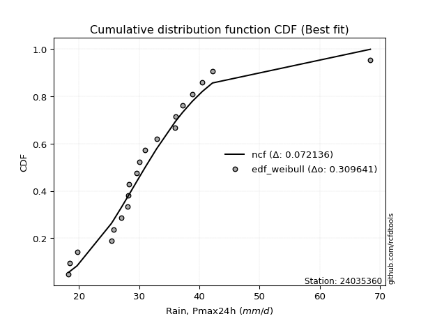</img>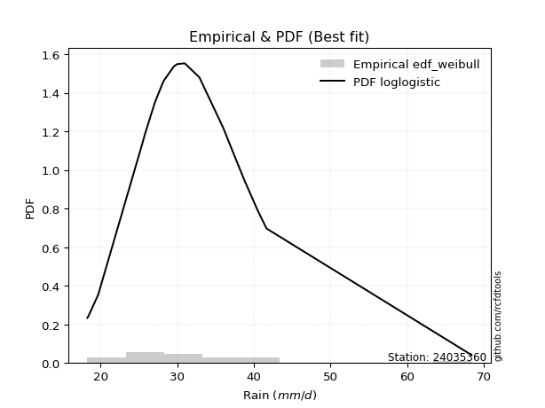</img>

</div>


### 4. EDF Beard (1943)

The Beard formula (or Beard´s plotting position formula) in hydrology is used to estimate the empirical non-exceedance probability _(P)_ of a flood event (or other extreme hydrological data point) within a given dataset.

<div align="center">


$P=(m-0.31)/(n+0.38)$


</div>


**4.1. Empirical values**

<div align="center">

|                | 0                    | 1                   | 2                   | 3                   | 4                   | 5                   | 6                   | 7                  | 8                  | 9                   | 10                 | 11                 | 12                 | 13                 | 14                 | 15                 | 16                 | 17                 | 18                 | 19                 |
|:---------------|:---------------------|:--------------------|:--------------------|:--------------------|:--------------------|:--------------------|:--------------------|:-------------------|:-------------------|:--------------------|:-------------------|:-------------------|:-------------------|:-------------------|:-------------------|:-------------------|:-------------------|:-------------------|:-------------------|:-------------------|
| date           | 2021                 | 2022                | 2017                | 2019                | 2015                | 2011                | 2012                | 2014               | 2010               | 2018                | 2023               | 2020               | 2008               | 2006               | 2016               | 2009               | 2005               | 2007               | 2013               | 2024               |
| x              | 18.3                 | 18.5                | 19.7                | 25.4                | 25.8                | 27.1                | 28.1                | 28.2               | 28.3               | 29.6                | 30.0               | 31.0               | 32.9               | 36.0               | 36.1               | 37.2               | 38.8               | 40.5               | 42.19              | 68.4               |
| m              | 1                    | 2                   | 3                   | 4                   | 5                   | 6                   | 7                   | 8                  | 9                  | 10                  | 11                 | 12                 | 13                 | 14                 | 15                 | 16                 | 17                 | 18                 | 19                 | 20                 |
| empirical_dist | edf_beard            | edf_beard           | edf_beard           | edf_beard           | edf_beard           | edf_beard           | edf_beard           | edf_beard          | edf_beard          | edf_beard           | edf_beard          | edf_beard          | edf_beard          | edf_beard          | edf_beard          | edf_beard          | edf_beard          | edf_beard          | edf_beard          | edf_beard          |
| empirical      | 0.033856722276741906 | 0.08292443572129539 | 0.13199214916584887 | 0.18105986261040236 | 0.23012757605495587 | 0.27919528949950934 | 0.32826300294406285 | 0.3773307163886163 | 0.4263984298331698 | 0.47546614327772324 | 0.5245338567222767 | 0.5736015701668302 | 0.6226692836113837 | 0.6717369970559373 | 0.7208047105004907 | 0.7698724239450442 | 0.8189401373895977 | 0.8680078508341512 | 0.9170755642787047 | 0.9661432777232583 |
| empirical_tr   | 1.0350431691213813   | 1.090422685928304   | 1.152063312605992   | 1.2210904733373276  | 1.2989165073295095  | 1.3873383253914227  | 1.4886778670562455  | 1.6059889676910957 | 1.7433704020530367 | 1.9064546304957901  | 2.1031991744066048 | 2.3452243958573074 | 2.6501950585175553 | 3.0463378176382667 | 3.581722319859402  | 4.345415778251599  | 5.523035230352305  | 7.576208178438667  | 12.059171597633155 | 29.536231884058108 |

</div>


**4.2. Kolmogorov-Smirnov fit test (sorted by Δ)**


<div align="center">

|                | 0                   | 1                   | 2                   | 3                   | 4                   | 5                   | 6                   | 7                   | 8                   | 9                   | 10                  | 11                  | 12                 | 13                 | 14                  | 15                 | 16                  | 17                  | 18                 | 19                  | 20                  | 21                 | 22                  | 23                  | 24                  | 25                  | 26                  | 27                    | 28                 | 29                  | 30                  | 31                  | 32                 | 33                  | 34                  | 35                  | 36                  | 37                  | 38                 | 39                  | 40                  | 41                 | 42                  | 43                  | 44                  | 45                  | 46                  | 47                  | 48                  | 49                 | 50                 | 51                 | 52                  | 53                 | 54                  | 55                 | 56                  | 57                  | 58                  | 59                  | 60                 | 61                 | 62                  | 63                  | 64                  | 65                 | 66                 | 67                  | 68                  | 69                 | 70                  | 71                  | 72                  | 73                  | 74                  | 75                 | 76                  | 77                 | 78                  | 79                  | 80                  | 81                  | 82                 | 83                 | 84                 | 85                  | 86                 | 87                 |
|:---------------|:--------------------|:--------------------|:--------------------|:--------------------|:--------------------|:--------------------|:--------------------|:--------------------|:--------------------|:--------------------|:--------------------|:--------------------|:-------------------|:-------------------|:--------------------|:-------------------|:--------------------|:--------------------|:-------------------|:--------------------|:--------------------|:-------------------|:--------------------|:--------------------|:--------------------|:--------------------|:--------------------|:----------------------|:-------------------|:--------------------|:--------------------|:--------------------|:-------------------|:--------------------|:--------------------|:--------------------|:--------------------|:--------------------|:-------------------|:--------------------|:--------------------|:-------------------|:--------------------|:--------------------|:--------------------|:--------------------|:--------------------|:--------------------|:--------------------|:-------------------|:-------------------|:-------------------|:--------------------|:-------------------|:--------------------|:-------------------|:--------------------|:--------------------|:--------------------|:--------------------|:-------------------|:-------------------|:--------------------|:--------------------|:--------------------|:-------------------|:-------------------|:--------------------|:--------------------|:-------------------|:--------------------|:--------------------|:--------------------|:--------------------|:--------------------|:-------------------|:--------------------|:-------------------|:--------------------|:--------------------|:--------------------|:--------------------|:-------------------|:-------------------|:-------------------|:--------------------|:-------------------|:-------------------|
| station        | 24035360            | 24035360            | 24035360            | 24035360            | 24035360            | 24035360            | 24035360            | 24035360            | 24035360            | 24035360            | 24035360            | 24035360            | 24035360           | 24035360           | 24035360            | 24035360           | 24035360            | 24035360            | 24035360           | 24035360            | 24035360            | 24035360           | 24035360            | 24035360            | 24035360            | 24035360            | 24035360            | 24035360              | 24035360           | 24035360            | 24035360            | 24035360            | 24035360           | 24035360            | 24035360            | 24035360            | 24035360            | 24035360            | 24035360           | 24035360            | 24035360            | 24035360           | 24035360            | 24035360            | 24035360            | 24035360            | 24035360            | 24035360            | 24035360            | 24035360           | 24035360           | 24035360           | 24035360            | 24035360           | 24035360            | 24035360           | 24035360            | 24035360            | 24035360            | 24035360            | 24035360           | 24035360           | 24035360            | 24035360            | 24035360            | 24035360           | 24035360           | 24035360            | 24035360            | 24035360           | 24035360            | 24035360            | 24035360            | 24035360            | 24035360            | 24035360           | 24035360            | 24035360           | 24035360            | 24035360            | 24035360            | 24035360            | 24035360           | 24035360           | 24035360           | 24035360            | 24035360           | 24035360           |
| empirical_dist | edf_beard           | edf_beard           | edf_beard           | edf_beard           | edf_beard           | edf_beard           | edf_beard           | edf_beard           | edf_beard           | edf_beard           | edf_beard           | edf_beard           | edf_beard          | edf_beard          | edf_beard           | edf_beard          | edf_beard           | edf_beard           | edf_beard          | edf_beard           | edf_beard           | edf_beard          | edf_beard           | edf_beard           | edf_beard           | edf_beard           | edf_beard           | edf_beard             | edf_beard          | edf_beard           | edf_beard           | edf_beard           | edf_beard          | edf_beard           | edf_beard           | edf_beard           | edf_beard           | edf_beard           | edf_beard          | edf_beard           | edf_beard           | edf_beard          | edf_beard           | edf_beard           | edf_beard           | edf_beard           | edf_beard           | edf_beard           | edf_beard           | edf_beard          | edf_beard          | edf_beard          | edf_beard           | edf_beard          | edf_beard           | edf_beard          | edf_beard           | edf_beard           | edf_beard           | edf_beard           | edf_beard          | edf_beard          | edf_beard           | edf_beard           | edf_beard           | edf_beard          | edf_beard          | edf_beard           | edf_beard           | edf_beard          | edf_beard           | edf_beard           | edf_beard           | edf_beard           | edf_beard           | edf_beard          | edf_beard           | edf_beard          | edf_beard           | edf_beard           | edf_beard           | edf_beard           | edf_beard          | edf_beard          | edf_beard          | edf_beard           | edf_beard          | edf_beard          |
| p_dist         | loglogistic         | fisk                | laplace_asymmetric  | johnsonsu           | loghypsecant        | logt                | logjohnsonsu        | loggenlogistic      | exponnorm           | logfisk             | ncf                 | genlogistic         | lognorm            | lognorm            | logcrystalball      | kstwobign          | logexponnorm        | logloggamma         | alpha              | nct                 | betaprime           | invweibull         | invgamma            | logbetaprime        | logalpha            | f                   | loginvgamma         | loglaplace_asymmetric | loglaplace         | loglognorm          | logf                | logfatiguelife      | logerlang          | loggamma            | loggamma            | lognct              | rice                | t                   | logpearson3        | loginvgauss         | invgauss            | logrice            | fatiguelife         | gumbel_r            | moyal               | maxwell             | lognakagami         | logmaxwell          | logweibull_min      | crystalball        | norm               | loggumbel_r        | rayleigh            | lograyleigh        | logistic            | gamma              | chi2                | erlang              | hypsecant           | loggumbel_l         | loginvweibull      | pearson3           | halflogistic        | wald                | logmoyal            | gibrat             | halfnorm           | loghalfnorm         | laplace             | loggompertz        | logkstwobign        | loghalflogistic     | loggenexpon         | gompertz            | weibull_min         | loggibrat          | gumbel_l            | logwald            | logncf              | expon               | genexpon            | nakagami            | logmielke          | logexpon           | logchi2            | logtruncnorm        | truncnorm          | mielke             |
| delta          | 0.06736978740400727 | 0.06775013925813471 | 0.07043199808106232 | 0.07045013062800182 | 0.07059994706215877 | 0.07181126495352363 | 0.07187346247828419 | 0.07213106060102943 | 0.07239487156202923 | 0.07594250986643872 | 0.08155276708511544 | 0.08353736463907951 | 0.0849781896358126 | 0.0849781896358126 | 0.08497824400416537 | 0.0855962285835663 | 0.08709105172854309 | 0.08848969525059514 | 0.0895683738724492 | 0.08996430291515467 | 0.09026355640888278 | 0.092368644911068  | 0.09451103325291721 | 0.09458273269592021 | 0.09476602898681608 | 0.09499338770272503 | 0.09505925680018734 | 0.0950891832519789    | 0.0951822370347094 | 0.09526996839984564 | 0.09532823740383045 | 0.09547628569251365 | 0.0960370960724986 | 0.09603712855301066 | 0.09603712855301066 | 0.09616557788361624 | 0.09714532909662543 | 0.09869552167365692 | 0.0993665202534782 | 0.10118423149619732 | 0.10195437495542303 | 0.1020442445611599 | 0.10257324964858577 | 0.10422757304199026 | 0.10681852708040579 | 0.10815738764430921 | 0.10833746634146829 | 0.10884495622895157 | 0.11414686041687933 | 0.1147156330719063 | 0.1147156442258166 | 0.1157701665727397 | 0.11784491797809865 | 0.118560805602212  | 0.12027977838482795 | 0.1241353494250001 | 0.12413611179029449 | 0.12413790363053379 | 0.12499718856057773 | 0.12719715910957652 | 0.1307754178462181 | 0.1311589576721525 | 0.13444394480270383 | 0.13702261591882042 | 0.13761561699282654 | 0.1415889323320254 | 0.1445350321556279 | 0.14534485969318378 | 0.14595934490987794 | 0.146084343864193  | 0.15262615182278322 | 0.15326322605759374 | 0.15987000612115182 | 0.16344461456583032 | 0.18105986261039564 | 0.182524892163336  | 0.18510938598331889 | 0.1953440786882894 | 0.20727312896023775 | 0.22103611700159415 | 0.22110958121541296 | 0.24226749072995452 | 0.2521466156466702 | 0.2898604273188365 | 0.3007133594868069 | 0.32427131698917183 | 0.539473749703743  | nan                |
| deltao         | 0.3096406529800002  | 0.3096406529800002  | 0.3096406529800002  | 0.3096406529800002  | 0.3096406529800002  | 0.3096406529800002  | 0.3096406529800002  | 0.3096406529800002  | 0.3096406529800002  | 0.3096406529800002  | 0.3096406529800002  | 0.3096406529800002  | 0.3096406529800002 | 0.3096406529800002 | 0.3096406529800002  | 0.3096406529800002 | 0.3096406529800002  | 0.3096406529800002  | 0.3096406529800002 | 0.3096406529800002  | 0.3096406529800002  | 0.3096406529800002 | 0.3096406529800002  | 0.3096406529800002  | 0.3096406529800002  | 0.3096406529800002  | 0.3096406529800002  | 0.3096406529800002    | 0.3096406529800002 | 0.3096406529800002  | 0.3096406529800002  | 0.3096406529800002  | 0.3096406529800002 | 0.3096406529800002  | 0.3096406529800002  | 0.3096406529800002  | 0.3096406529800002  | 0.3096406529800002  | 0.3096406529800002 | 0.3096406529800002  | 0.3096406529800002  | 0.3096406529800002 | 0.3096406529800002  | 0.3096406529800002  | 0.3096406529800002  | 0.3096406529800002  | 0.3096406529800002  | 0.3096406529800002  | 0.3096406529800002  | 0.3096406529800002 | 0.3096406529800002 | 0.3096406529800002 | 0.3096406529800002  | 0.3096406529800002 | 0.3096406529800002  | 0.3096406529800002 | 0.3096406529800002  | 0.3096406529800002  | 0.3096406529800002  | 0.3096406529800002  | 0.3096406529800002 | 0.3096406529800002 | 0.3096406529800002  | 0.3096406529800002  | 0.3096406529800002  | 0.3096406529800002 | 0.3096406529800002 | 0.3096406529800002  | 0.3096406529800002  | 0.3096406529800002 | 0.3096406529800002  | 0.3096406529800002  | 0.3096406529800002  | 0.3096406529800002  | 0.3096406529800002  | 0.3096406529800002 | 0.3096406529800002  | 0.3096406529800002 | 0.3096406529800002  | 0.3096406529800002  | 0.3096406529800002  | 0.3096406529800002  | 0.3096406529800002 | 0.3096406529800002 | 0.3096406529800002 | 0.3096406529800002  | 0.3096406529800002 | 0.3096406529800002 |
| eval           | Δo > Δ              | Δo > Δ              | Δo > Δ              | Δo > Δ              | Δo > Δ              | Δo > Δ              | Δo > Δ              | Δo > Δ              | Δo > Δ              | Δo > Δ              | Δo > Δ              | Δo > Δ              | Δo > Δ             | Δo > Δ             | Δo > Δ              | Δo > Δ             | Δo > Δ              | Δo > Δ              | Δo > Δ             | Δo > Δ              | Δo > Δ              | Δo > Δ             | Δo > Δ              | Δo > Δ              | Δo > Δ              | Δo > Δ              | Δo > Δ              | Δo > Δ                | Δo > Δ             | Δo > Δ              | Δo > Δ              | Δo > Δ              | Δo > Δ             | Δo > Δ              | Δo > Δ              | Δo > Δ              | Δo > Δ              | Δo > Δ              | Δo > Δ             | Δo > Δ              | Δo > Δ              | Δo > Δ             | Δo > Δ              | Δo > Δ              | Δo > Δ              | Δo > Δ              | Δo > Δ              | Δo > Δ              | Δo > Δ              | Δo > Δ             | Δo > Δ             | Δo > Δ             | Δo > Δ              | Δo > Δ             | Δo > Δ              | Δo > Δ             | Δo > Δ              | Δo > Δ              | Δo > Δ              | Δo > Δ              | Δo > Δ             | Δo > Δ             | Δo > Δ              | Δo > Δ              | Δo > Δ              | Δo > Δ             | Δo > Δ             | Δo > Δ              | Δo > Δ              | Δo > Δ             | Δo > Δ              | Δo > Δ              | Δo > Δ              | Δo > Δ              | Δo > Δ              | Δo > Δ             | Δo > Δ              | Δo > Δ             | Δo > Δ              | Δo > Δ              | Δo > Δ              | Δo > Δ              | Δo > Δ             | Δo > Δ             | Δo > Δ             | Δo <= Δ             | Δo <= Δ            | Δo <= Δ            |
| fit            | 1                   | 1                   | 1                   | 1                   | 1                   | 1                   | 1                   | 1                   | 1                   | 1                   | 1                   | 1                   | 1                  | 1                  | 1                   | 1                  | 1                   | 1                   | 1                  | 1                   | 1                   | 1                  | 1                   | 1                   | 1                   | 1                   | 1                   | 1                     | 1                  | 1                   | 1                   | 1                   | 1                  | 1                   | 1                   | 1                   | 1                   | 1                   | 1                  | 1                   | 1                   | 1                  | 1                   | 1                   | 1                   | 1                   | 1                   | 1                   | 1                   | 1                  | 1                  | 1                  | 1                   | 1                  | 1                   | 1                  | 1                   | 1                   | 1                   | 1                   | 1                  | 1                  | 1                   | 1                   | 1                   | 1                  | 1                  | 1                   | 1                   | 1                  | 1                   | 1                   | 1                   | 1                   | 1                   | 1                  | 1                   | 1                  | 1                   | 1                   | 1                   | 1                   | 1                  | 1                  | 1                  | 0                   | 0                  | 0                  |
| n              | 20                  | 20                  | 20                  | 20                  | 20                  | 20                  | 20                  | 20                  | 20                  | 20                  | 20                  | 20                  | 20                 | 20                 | 20                  | 20                 | 20                  | 20                  | 20                 | 20                  | 20                  | 20                 | 20                  | 20                  | 20                  | 20                  | 20                  | 20                    | 20                 | 20                  | 20                  | 20                  | 20                 | 20                  | 20                  | 20                  | 20                  | 20                  | 20                 | 20                  | 20                  | 20                 | 20                  | 20                  | 20                  | 20                  | 20                  | 20                  | 20                  | 20                 | 20                 | 20                 | 20                  | 20                 | 20                  | 20                 | 20                  | 20                  | 20                  | 20                  | 20                 | 20                 | 20                  | 20                  | 20                  | 20                 | 20                 | 20                  | 20                  | 20                 | 20                  | 20                  | 20                  | 20                  | 20                  | 20                 | 20                  | 20                 | 20                  | 20                  | 20                  | 20                  | 20                 | 20                 | 20                 | 20                  | 20                 | 20                 |
| best_fit       | 1                   | 0                   | 0                   | 0                   | 0                   | 0                   | 0                   | 0                   | 0                   | 0                   | 0                   | 0                   | 0                  | 0                  | 0                   | 0                  | 0                   | 0                   | 0                  | 0                   | 0                   | 0                  | 0                   | 0                   | 0                   | 0                   | 0                   | 0                     | 0                  | 0                   | 0                   | 0                   | 0                  | 0                   | 0                   | 0                   | 0                   | 0                   | 0                  | 0                   | 0                   | 0                  | 0                   | 0                   | 0                   | 0                   | 0                   | 0                   | 0                   | 0                  | 0                  | 0                  | 0                   | 0                  | 0                   | 0                  | 0                   | 0                   | 0                   | 0                   | 0                  | 0                  | 0                   | 0                   | 0                   | 0                  | 0                  | 0                   | 0                   | 0                  | 0                   | 0                   | 0                   | 0                   | 0                   | 0                  | 0                   | 0                  | 0                   | 0                   | 0                   | 0                   | 0                  | 0                  | 0                  | 0                   | 0                  | 0                  |
| best_fit_sort  | 1                   | 2                   | 3                   | 4                   | 5                   | 6                   | 7                   | 8                   | 9                   | 10                  | 11                  | 12                  | 13                 | 14                 | 15                  | 16                 | 17                  | 18                  | 19                 | 20                  | 21                  | 22                 | 23                  | 24                  | 25                  | 26                  | 27                  | 28                    | 29                 | 30                  | 31                  | 32                  | 33                 | 34                  | 35                  | 36                  | 37                  | 38                  | 39                 | 40                  | 41                  | 42                 | 43                  | 44                  | 45                  | 46                  | 47                  | 48                  | 49                  | 50                 | 51                 | 52                 | 53                  | 54                 | 55                  | 56                 | 57                  | 58                  | 59                  | 60                  | 61                 | 62                 | 63                  | 64                  | 65                  | 66                 | 67                 | 68                  | 69                  | 70                 | 71                  | 72                  | 73                  | 74                  | 75                  | 76                 | 77                  | 78                 | 79                  | 80                  | 81                  | 82                  | 83                 | 84                 | 85                 | 86                  | 87                 | 88                 |

</div>


**4.3. Best fit**

<div align="center">

|   id |   station | empirical_dist   | p_dist      |     delta |   deltao | eval   |   fit |   n |   best_fit |   best_fit_sort |
|-----:|----------:|:-----------------|:------------|----------:|---------:|:-------|------:|----:|-----------:|----------------:|
|    0 |  24035360 | edf_beard        | loglogistic | 0.0673698 | 0.309641 | Δo > Δ |     1 |  20 |          1 |               1 |

</div>


<div align="center">

</img>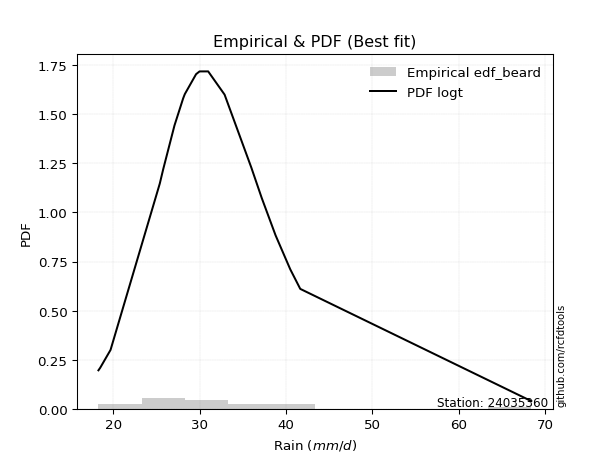</img>

</div>


### 5. EDF Chegodayev (1955)

The Chegodayev formula is an empirical plotting position formula used in hydrological frequency analysis to estimate the exceedance probability or return period of a specific event from a set of observed data. It is primarily used for plotting observed data points on probability paper to fit a theoretical distribution, particularly for analyzing extreme events like maximum flood flows or rainfall intensities. The constant _b_ value in the generalized plotting position formula is 0.3.

<div align="center">


$P=(m-b)/(n+1-2b)$


</div>


**5.1. Empirical values**

<div align="center">

|                | 0                   | 1                   | 2                   | 3                   | 4                  | 5                   | 6                   | 7                  | 8                  | 9                   | 10                 | 11                 | 12                 | 13                 | 14                 | 15                 | 16                 | 17                 | 18                 | 19                 |
|:---------------|:--------------------|:--------------------|:--------------------|:--------------------|:-------------------|:--------------------|:--------------------|:-------------------|:-------------------|:--------------------|:-------------------|:-------------------|:-------------------|:-------------------|:-------------------|:-------------------|:-------------------|:-------------------|:-------------------|:-------------------|
| date           | 2021                | 2022                | 2017                | 2019                | 2015               | 2011                | 2012                | 2014               | 2010               | 2018                | 2023               | 2020               | 2008               | 2006               | 2016               | 2009               | 2005               | 2007               | 2013               | 2024               |
| x              | 18.3                | 18.5                | 19.7                | 25.4                | 25.8               | 27.1                | 28.1                | 28.2               | 28.3               | 29.6                | 30.0               | 31.0               | 32.9               | 36.0               | 36.1               | 37.2               | 38.8               | 40.5               | 42.19              | 68.4               |
| m              | 1                   | 2                   | 3                   | 4                   | 5                  | 6                   | 7                   | 8                  | 9                  | 10                  | 11                 | 12                 | 13                 | 14                 | 15                 | 16                 | 17                 | 18                 | 19                 | 20                 |
| empirical_dist | edf_chegodayev      | edf_chegodayev      | edf_chegodayev      | edf_chegodayev      | edf_chegodayev     | edf_chegodayev      | edf_chegodayev      | edf_chegodayev     | edf_chegodayev     | edf_chegodayev      | edf_chegodayev     | edf_chegodayev     | edf_chegodayev     | edf_chegodayev     | edf_chegodayev     | edf_chegodayev     | edf_chegodayev     | edf_chegodayev     | edf_chegodayev     | edf_chegodayev     |
| empirical      | 0.03431372549019608 | 0.08333333333333334 | 0.13235294117647062 | 0.18137254901960786 | 0.2303921568627451 | 0.27941176470588236 | 0.32843137254901966 | 0.3774509803921569 | 0.4264705882352941 | 0.47549019607843135 | 0.5245098039215687 | 0.5735294117647058 | 0.6225490196078431 | 0.6715686274509804 | 0.7205882352941176 | 0.7696078431372549 | 0.8186274509803921 | 0.8676470588235294 | 0.9166666666666667 | 0.9656862745098039 |
| empirical_tr   | 1.0355329949238579  | 1.090909090909091   | 1.152542372881356   | 1.221556886227545   | 1.299363057324841  | 1.3877551020408163  | 1.4890510948905111  | 1.6062992125984252 | 1.7435897435897436 | 1.9065420560747663  | 2.1030927835051547 | 2.3448275862068964 | 2.6493506493506493 | 3.0447761194029854 | 3.5789473684210527 | 4.340425531914894  | 5.513513513513513  | 7.555555555555557  | 12.00000000000001  | 29.142857142857153 |

</div>


**5.2. Kolmogorov-Smirnov fit test (sorted by Δ)**


<div align="center">

|                | 0                   | 1                   | 2                   | 3                   | 4                   | 5                   | 6                  | 7                   | 8                   | 9                   | 10                  | 11                 | 12                 | 13                 | 14                  | 15                 | 16                  | 17                  | 18                 | 19                  | 20                  | 21                  | 22                 | 23                 | 24                  | 25                  | 26                  | 27                  | 28                  | 29                  | 30                    | 31                  | 32                 | 33                  | 34                  | 35                  | 36                  | 37                  | 38                  | 39                  | 40                  | 41                 | 42                  | 43                  | 44                  | 45                 | 46                  | 47                  | 48                  | 49                  | 50                  | 51                  | 52                  | 53                  | 54                  | 55                  | 56                  | 57                  | 58                  | 59                  | 60                 | 61                  | 62                  | 63                  | 64                  | 65                  | 66                 | 67                  | 68                 | 69                 | 70                 | 71                  | 72                 | 73                 | 74                  | 75                 | 76                 | 77                 | 78                  | 79                  | 80                  | 81                 | 82                  | 83                 | 84                 | 85                 | 86                 | 87                 |
|:---------------|:--------------------|:--------------------|:--------------------|:--------------------|:--------------------|:--------------------|:-------------------|:--------------------|:--------------------|:--------------------|:--------------------|:-------------------|:-------------------|:-------------------|:--------------------|:-------------------|:--------------------|:--------------------|:-------------------|:--------------------|:--------------------|:--------------------|:-------------------|:-------------------|:--------------------|:--------------------|:--------------------|:--------------------|:--------------------|:--------------------|:----------------------|:--------------------|:-------------------|:--------------------|:--------------------|:--------------------|:--------------------|:--------------------|:--------------------|:--------------------|:--------------------|:-------------------|:--------------------|:--------------------|:--------------------|:-------------------|:--------------------|:--------------------|:--------------------|:--------------------|:--------------------|:--------------------|:--------------------|:--------------------|:--------------------|:--------------------|:--------------------|:--------------------|:--------------------|:--------------------|:-------------------|:--------------------|:--------------------|:--------------------|:--------------------|:--------------------|:-------------------|:--------------------|:-------------------|:-------------------|:-------------------|:--------------------|:-------------------|:-------------------|:--------------------|:-------------------|:-------------------|:-------------------|:--------------------|:--------------------|:--------------------|:-------------------|:--------------------|:-------------------|:-------------------|:-------------------|:-------------------|:-------------------|
| station        | 24035360            | 24035360            | 24035360            | 24035360            | 24035360            | 24035360            | 24035360           | 24035360            | 24035360            | 24035360            | 24035360            | 24035360           | 24035360           | 24035360           | 24035360            | 24035360           | 24035360            | 24035360            | 24035360           | 24035360            | 24035360            | 24035360            | 24035360           | 24035360           | 24035360            | 24035360            | 24035360            | 24035360            | 24035360            | 24035360            | 24035360              | 24035360            | 24035360           | 24035360            | 24035360            | 24035360            | 24035360            | 24035360            | 24035360            | 24035360            | 24035360            | 24035360           | 24035360            | 24035360            | 24035360            | 24035360           | 24035360            | 24035360            | 24035360            | 24035360            | 24035360            | 24035360            | 24035360            | 24035360            | 24035360            | 24035360            | 24035360            | 24035360            | 24035360            | 24035360            | 24035360           | 24035360            | 24035360            | 24035360            | 24035360            | 24035360            | 24035360           | 24035360            | 24035360           | 24035360           | 24035360           | 24035360            | 24035360           | 24035360           | 24035360            | 24035360           | 24035360           | 24035360           | 24035360            | 24035360            | 24035360            | 24035360           | 24035360            | 24035360           | 24035360           | 24035360           | 24035360           | 24035360           |
| empirical_dist | edf_chegodayev      | edf_chegodayev      | edf_chegodayev      | edf_chegodayev      | edf_chegodayev      | edf_chegodayev      | edf_chegodayev     | edf_chegodayev      | edf_chegodayev      | edf_chegodayev      | edf_chegodayev      | edf_chegodayev     | edf_chegodayev     | edf_chegodayev     | edf_chegodayev      | edf_chegodayev     | edf_chegodayev      | edf_chegodayev      | edf_chegodayev     | edf_chegodayev      | edf_chegodayev      | edf_chegodayev      | edf_chegodayev     | edf_chegodayev     | edf_chegodayev      | edf_chegodayev      | edf_chegodayev      | edf_chegodayev      | edf_chegodayev      | edf_chegodayev      | edf_chegodayev        | edf_chegodayev      | edf_chegodayev     | edf_chegodayev      | edf_chegodayev      | edf_chegodayev      | edf_chegodayev      | edf_chegodayev      | edf_chegodayev      | edf_chegodayev      | edf_chegodayev      | edf_chegodayev     | edf_chegodayev      | edf_chegodayev      | edf_chegodayev      | edf_chegodayev     | edf_chegodayev      | edf_chegodayev      | edf_chegodayev      | edf_chegodayev      | edf_chegodayev      | edf_chegodayev      | edf_chegodayev      | edf_chegodayev      | edf_chegodayev      | edf_chegodayev      | edf_chegodayev      | edf_chegodayev      | edf_chegodayev      | edf_chegodayev      | edf_chegodayev     | edf_chegodayev      | edf_chegodayev      | edf_chegodayev      | edf_chegodayev      | edf_chegodayev      | edf_chegodayev     | edf_chegodayev      | edf_chegodayev     | edf_chegodayev     | edf_chegodayev     | edf_chegodayev      | edf_chegodayev     | edf_chegodayev     | edf_chegodayev      | edf_chegodayev     | edf_chegodayev     | edf_chegodayev     | edf_chegodayev      | edf_chegodayev      | edf_chegodayev      | edf_chegodayev     | edf_chegodayev      | edf_chegodayev     | edf_chegodayev     | edf_chegodayev     | edf_chegodayev     | edf_chegodayev     |
| p_dist         | loglogistic         | fisk                | loghypsecant        | laplace_asymmetric  | johnsonsu           | logt                | logjohnsonsu       | loggenlogistic      | exponnorm           | logfisk             | ncf                 | genlogistic        | lognorm            | lognorm            | logcrystalball      | kstwobign          | logexponnorm        | logloggamma         | alpha              | nct                 | betaprime           | invweibull          | invgamma           | logbetaprime       | logalpha            | f                   | loginvgamma         | loglognorm          | logf                | logfatiguelife      | loglaplace_asymmetric | loglaplace          | logerlang          | loggamma            | loggamma            | lognct              | rice                | t                   | logpearson3         | loginvgauss         | invgauss            | logrice            | fatiguelife         | gumbel_r            | moyal               | maxwell            | lognakagami         | logmaxwell          | logweibull_min      | crystalball         | norm                | loggumbel_r         | rayleigh            | lograyleigh         | logistic            | gamma               | chi2                | erlang              | hypsecant           | loggumbel_l         | loginvweibull      | pearson3            | halflogistic        | wald                | logmoyal            | gibrat              | halfnorm           | loghalfnorm         | loggompertz        | laplace            | logkstwobign       | loghalflogistic     | loggenexpon        | gompertz           | weibull_min         | loggibrat          | gumbel_l           | logwald            | logncf              | expon               | genexpon            | nakagami           | logmielke           | logexpon           | logchi2            | logtruncnorm       | truncnorm          | mielke             |
| delta          | 0.06773057941462902 | 0.06811093126875646 | 0.07076831666711558 | 0.07079279009168407 | 0.07081092263862357 | 0.07197963455848044 | 0.072041832083241  | 0.07249185261165118 | 0.07275566357265098 | 0.07630330187706047 | 0.08124008067590993 | 0.083224678229874  | 0.0846655032266071 | 0.0846655032266071 | 0.08466555759495986 | 0.0852835421743608 | 0.08677836531933758 | 0.08817700884138963 | 0.0892556874632437 | 0.08965161650594916 | 0.08995086999967727 | 0.09205595850186249 | 0.0941983468437117 | 0.0942700462867147 | 0.09445334257761057 | 0.09468070129351952 | 0.09474657039098183 | 0.09495728199064013 | 0.09501555099462494 | 0.09516359928330814 | 0.09525755285693571   | 0.09535060663966621 | 0.0957244096632931 | 0.09572444214380516 | 0.09572444214380516 | 0.09585289147441073 | 0.09707317069450105 | 0.09886389127861372 | 0.09905383384427269 | 0.10087154508699181 | 0.10164168854621752 | 0.1017315581519544 | 0.10226056323938026 | 0.10391488663278475 | 0.10650584067120028 | 0.1078447012351037 | 0.10802477993226278 | 0.10853226981974606 | 0.11383417400767382 | 0.11464347466978192 | 0.11464348582369221 | 0.11560179696778289 | 0.11753223156889314 | 0.11824811919300648 | 0.12020761998270357 | 0.12382266301579459 | 0.12382342538108898 | 0.12382521722132828 | 0.12492503015845335 | 0.12712500070745214 | 0.1304627314370126 | 0.13151974968277425 | 0.13413125839349832 | 0.13685424631386361 | 0.13744724738786973 | 0.14175730193698222 | 0.1442223457464224 | 0.14503217328397827 | 0.1457716574549875 | 0.1459352921091699 | 0.1523134654135777 | 0.15309485645263693 | 0.1595573197119463 | 0.1631319281566248 | 0.18137254901960115 | 0.1823565225583792 | 0.1850372275811945 | 0.1951757090833326 | 0.20686423134819976 | 0.22072343059238864 | 0.22079689480620746 | 0.241954804320749  | 0.25183392923746467 | 0.289547740909631  | 0.3003044618747689 | 0.3239586305799663 | 0.5390167464902887 | nan                |
| deltao         | 0.3096406529800002  | 0.3096406529800002  | 0.3096406529800002  | 0.3096406529800002  | 0.3096406529800002  | 0.3096406529800002  | 0.3096406529800002 | 0.3096406529800002  | 0.3096406529800002  | 0.3096406529800002  | 0.3096406529800002  | 0.3096406529800002 | 0.3096406529800002 | 0.3096406529800002 | 0.3096406529800002  | 0.3096406529800002 | 0.3096406529800002  | 0.3096406529800002  | 0.3096406529800002 | 0.3096406529800002  | 0.3096406529800002  | 0.3096406529800002  | 0.3096406529800002 | 0.3096406529800002 | 0.3096406529800002  | 0.3096406529800002  | 0.3096406529800002  | 0.3096406529800002  | 0.3096406529800002  | 0.3096406529800002  | 0.3096406529800002    | 0.3096406529800002  | 0.3096406529800002 | 0.3096406529800002  | 0.3096406529800002  | 0.3096406529800002  | 0.3096406529800002  | 0.3096406529800002  | 0.3096406529800002  | 0.3096406529800002  | 0.3096406529800002  | 0.3096406529800002 | 0.3096406529800002  | 0.3096406529800002  | 0.3096406529800002  | 0.3096406529800002 | 0.3096406529800002  | 0.3096406529800002  | 0.3096406529800002  | 0.3096406529800002  | 0.3096406529800002  | 0.3096406529800002  | 0.3096406529800002  | 0.3096406529800002  | 0.3096406529800002  | 0.3096406529800002  | 0.3096406529800002  | 0.3096406529800002  | 0.3096406529800002  | 0.3096406529800002  | 0.3096406529800002 | 0.3096406529800002  | 0.3096406529800002  | 0.3096406529800002  | 0.3096406529800002  | 0.3096406529800002  | 0.3096406529800002 | 0.3096406529800002  | 0.3096406529800002 | 0.3096406529800002 | 0.3096406529800002 | 0.3096406529800002  | 0.3096406529800002 | 0.3096406529800002 | 0.3096406529800002  | 0.3096406529800002 | 0.3096406529800002 | 0.3096406529800002 | 0.3096406529800002  | 0.3096406529800002  | 0.3096406529800002  | 0.3096406529800002 | 0.3096406529800002  | 0.3096406529800002 | 0.3096406529800002 | 0.3096406529800002 | 0.3096406529800002 | 0.3096406529800002 |
| eval           | Δo > Δ              | Δo > Δ              | Δo > Δ              | Δo > Δ              | Δo > Δ              | Δo > Δ              | Δo > Δ             | Δo > Δ              | Δo > Δ              | Δo > Δ              | Δo > Δ              | Δo > Δ             | Δo > Δ             | Δo > Δ             | Δo > Δ              | Δo > Δ             | Δo > Δ              | Δo > Δ              | Δo > Δ             | Δo > Δ              | Δo > Δ              | Δo > Δ              | Δo > Δ             | Δo > Δ             | Δo > Δ              | Δo > Δ              | Δo > Δ              | Δo > Δ              | Δo > Δ              | Δo > Δ              | Δo > Δ                | Δo > Δ              | Δo > Δ             | Δo > Δ              | Δo > Δ              | Δo > Δ              | Δo > Δ              | Δo > Δ              | Δo > Δ              | Δo > Δ              | Δo > Δ              | Δo > Δ             | Δo > Δ              | Δo > Δ              | Δo > Δ              | Δo > Δ             | Δo > Δ              | Δo > Δ              | Δo > Δ              | Δo > Δ              | Δo > Δ              | Δo > Δ              | Δo > Δ              | Δo > Δ              | Δo > Δ              | Δo > Δ              | Δo > Δ              | Δo > Δ              | Δo > Δ              | Δo > Δ              | Δo > Δ             | Δo > Δ              | Δo > Δ              | Δo > Δ              | Δo > Δ              | Δo > Δ              | Δo > Δ             | Δo > Δ              | Δo > Δ             | Δo > Δ             | Δo > Δ             | Δo > Δ              | Δo > Δ             | Δo > Δ             | Δo > Δ              | Δo > Δ             | Δo > Δ             | Δo > Δ             | Δo > Δ              | Δo > Δ              | Δo > Δ              | Δo > Δ             | Δo > Δ              | Δo > Δ             | Δo > Δ             | Δo <= Δ            | Δo <= Δ            | Δo <= Δ            |
| fit            | 1                   | 1                   | 1                   | 1                   | 1                   | 1                   | 1                  | 1                   | 1                   | 1                   | 1                   | 1                  | 1                  | 1                  | 1                   | 1                  | 1                   | 1                   | 1                  | 1                   | 1                   | 1                   | 1                  | 1                  | 1                   | 1                   | 1                   | 1                   | 1                   | 1                   | 1                     | 1                   | 1                  | 1                   | 1                   | 1                   | 1                   | 1                   | 1                   | 1                   | 1                   | 1                  | 1                   | 1                   | 1                   | 1                  | 1                   | 1                   | 1                   | 1                   | 1                   | 1                   | 1                   | 1                   | 1                   | 1                   | 1                   | 1                   | 1                   | 1                   | 1                  | 1                   | 1                   | 1                   | 1                   | 1                   | 1                  | 1                   | 1                  | 1                  | 1                  | 1                   | 1                  | 1                  | 1                   | 1                  | 1                  | 1                  | 1                   | 1                   | 1                   | 1                  | 1                   | 1                  | 1                  | 0                  | 0                  | 0                  |
| n              | 20                  | 20                  | 20                  | 20                  | 20                  | 20                  | 20                 | 20                  | 20                  | 20                  | 20                  | 20                 | 20                 | 20                 | 20                  | 20                 | 20                  | 20                  | 20                 | 20                  | 20                  | 20                  | 20                 | 20                 | 20                  | 20                  | 20                  | 20                  | 20                  | 20                  | 20                    | 20                  | 20                 | 20                  | 20                  | 20                  | 20                  | 20                  | 20                  | 20                  | 20                  | 20                 | 20                  | 20                  | 20                  | 20                 | 20                  | 20                  | 20                  | 20                  | 20                  | 20                  | 20                  | 20                  | 20                  | 20                  | 20                  | 20                  | 20                  | 20                  | 20                 | 20                  | 20                  | 20                  | 20                  | 20                  | 20                 | 20                  | 20                 | 20                 | 20                 | 20                  | 20                 | 20                 | 20                  | 20                 | 20                 | 20                 | 20                  | 20                  | 20                  | 20                 | 20                  | 20                 | 20                 | 20                 | 20                 | 20                 |
| best_fit       | 1                   | 0                   | 0                   | 0                   | 0                   | 0                   | 0                  | 0                   | 0                   | 0                   | 0                   | 0                  | 0                  | 0                  | 0                   | 0                  | 0                   | 0                   | 0                  | 0                   | 0                   | 0                   | 0                  | 0                  | 0                   | 0                   | 0                   | 0                   | 0                   | 0                   | 0                     | 0                   | 0                  | 0                   | 0                   | 0                   | 0                   | 0                   | 0                   | 0                   | 0                   | 0                  | 0                   | 0                   | 0                   | 0                  | 0                   | 0                   | 0                   | 0                   | 0                   | 0                   | 0                   | 0                   | 0                   | 0                   | 0                   | 0                   | 0                   | 0                   | 0                  | 0                   | 0                   | 0                   | 0                   | 0                   | 0                  | 0                   | 0                  | 0                  | 0                  | 0                   | 0                  | 0                  | 0                   | 0                  | 0                  | 0                  | 0                   | 0                   | 0                   | 0                  | 0                   | 0                  | 0                  | 0                  | 0                  | 0                  |
| best_fit_sort  | 1                   | 2                   | 3                   | 4                   | 5                   | 6                   | 7                  | 8                   | 9                   | 10                  | 11                  | 12                 | 13                 | 14                 | 15                  | 16                 | 17                  | 18                  | 19                 | 20                  | 21                  | 22                  | 23                 | 24                 | 25                  | 26                  | 27                  | 28                  | 29                  | 30                  | 31                    | 32                  | 33                 | 34                  | 35                  | 36                  | 37                  | 38                  | 39                  | 40                  | 41                  | 42                 | 43                  | 44                  | 45                  | 46                 | 47                  | 48                  | 49                  | 50                  | 51                  | 52                  | 53                  | 54                  | 55                  | 56                  | 57                  | 58                  | 59                  | 60                  | 61                 | 62                  | 63                  | 64                  | 65                  | 66                  | 67                 | 68                  | 69                 | 70                 | 71                 | 72                  | 73                 | 74                 | 75                  | 76                 | 77                 | 78                 | 79                  | 80                  | 81                  | 82                 | 83                  | 84                 | 85                 | 86                 | 87                 | 88                 |

</div>


**5.3. Best fit**

<div align="center">

|   id |   station | empirical_dist   | p_dist      |     delta |   deltao | eval   |   fit |   n |   best_fit |   best_fit_sort |
|-----:|----------:|:-----------------|:------------|----------:|---------:|:-------|------:|----:|-----------:|----------------:|
|    0 |  24035360 | edf_chegodayev   | loglogistic | 0.0677306 | 0.309641 | Δo > Δ |     1 |  20 |          1 |               1 |

</div>


<div align="center">

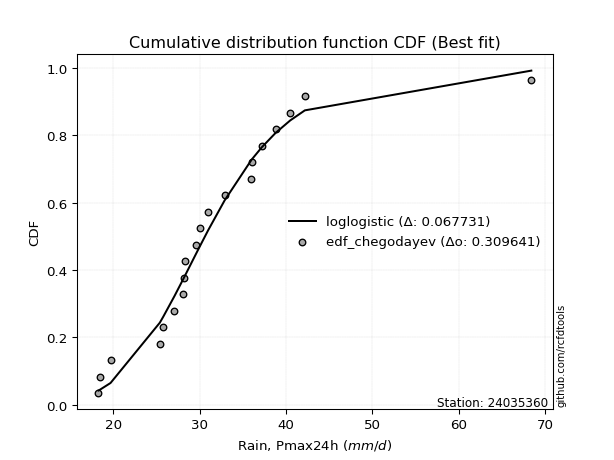</img>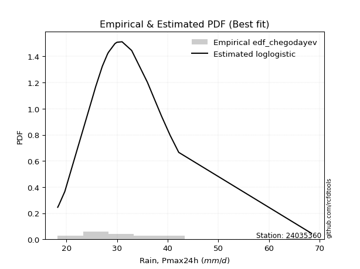</img>

</div>


### 6. EDF Blom (1958)

The Blom formula is a specific "plotting position" formula used in hydrology and statistical analysis to estimate the empirical cumulative probability (or non-exceedance probability) of a data series. It is particularly recommended for data that are approximately normally distributed. The constant _a_ is set to 0.375 (or 3/8).

<div align="center">


$P=(m-a)/(n+1-2a)$


</div>


**6.1. Empirical values**

<div align="center">

|                | 0                    | 1                   | 2                   | 3                   | 4                   | 5                  | 6                  | 7                  | 8                   | 9                   | 10                 | 11                 | 12                 | 13                 | 14                 | 15                 | 16                 | 17                 | 18                 | 19                 |
|:---------------|:---------------------|:--------------------|:--------------------|:--------------------|:--------------------|:-------------------|:-------------------|:-------------------|:--------------------|:--------------------|:-------------------|:-------------------|:-------------------|:-------------------|:-------------------|:-------------------|:-------------------|:-------------------|:-------------------|:-------------------|
| date           | 2021                 | 2022                | 2017                | 2019                | 2015                | 2011               | 2012               | 2014               | 2010                | 2018                | 2023               | 2020               | 2008               | 2006               | 2016               | 2009               | 2005               | 2007               | 2013               | 2024               |
| x              | 18.3                 | 18.5                | 19.7                | 25.4                | 25.8                | 27.1               | 28.1               | 28.2               | 28.3                | 29.6                | 30.0               | 31.0               | 32.9               | 36.0               | 36.1               | 37.2               | 38.8               | 40.5               | 42.19              | 68.4               |
| m              | 1                    | 2                   | 3                   | 4                   | 5                   | 6                  | 7                  | 8                  | 9                   | 10                  | 11                 | 12                 | 13                 | 14                 | 15                 | 16                 | 17                 | 18                 | 19                 | 20                 |
| empirical_dist | edf_blom             | edf_blom            | edf_blom            | edf_blom            | edf_blom            | edf_blom           | edf_blom           | edf_blom           | edf_blom            | edf_blom            | edf_blom           | edf_blom           | edf_blom           | edf_blom           | edf_blom           | edf_blom           | edf_blom           | edf_blom           | edf_blom           | edf_blom           |
| empirical      | 0.030864197530864196 | 0.08024691358024691 | 0.12962962962962962 | 0.17901234567901234 | 0.22839506172839505 | 0.2777777777777778 | 0.3271604938271605 | 0.3765432098765432 | 0.42592592592592593 | 0.47530864197530864 | 0.5246913580246914 | 0.5740740740740741 | 0.6234567901234568 | 0.6728395061728395 | 0.7222222222222222 | 0.7716049382716049 | 0.8209876543209876 | 0.8703703703703703 | 0.9197530864197531 | 0.9691358024691358 |
| empirical_tr   | 1.0318471337579618   | 1.087248322147651   | 1.148936170212766   | 1.218045112781955   | 1.296               | 1.3846153846153846 | 1.4862385321100917 | 1.603960396039604  | 1.7419354838709677  | 1.9058823529411766  | 2.103896103896104  | 2.3478260869565215 | 2.6557377049180326 | 3.0566037735849054 | 3.5999999999999996 | 4.378378378378378  | 5.586206896551723  | 7.714285714285713  | 12.461538461538458 | 32.39999999999997  |

</div>


**6.2. Kolmogorov-Smirnov fit test (sorted by Δ)**


<div align="center">

|                | 0                   | 1                   | 2                   | 3                   | 4                   | 5                   | 6                  | 7                   | 8                   | 9                   | 10                  | 11                  | 12                  | 13                  | 14                  | 15                  | 16                  | 17                  | 18                  | 19                  | 20                 | 21                    | 22                  | 23                  | 24                  | 25                  | 26                 | 27                  | 28                  | 29                  | 30                  | 31                  | 32                  | 33                  | 34                  | 35                  | 36                  | 37                  | 38                  | 39                  | 40                  | 41                  | 42                 | 43                  | 44                  | 45                  | 46                  | 47                  | 48                  | 49                  | 50                  | 51                  | 52                  | 53                  | 54                 | 55                  | 56                  | 57                 | 58                 | 59                  | 60                  | 61                  | 62                  | 63                  | 64                 | 65                  | 66                 | 67                  | 68                 | 69                  | 70                 | 71                  | 72                  | 73                  | 74                  | 75                  | 76                  | 77                  | 78                  | 79                  | 80                  | 81                  | 82                  | 83                 | 84                 | 85                 | 86                 | 87                 |
|:---------------|:--------------------|:--------------------|:--------------------|:--------------------|:--------------------|:--------------------|:-------------------|:--------------------|:--------------------|:--------------------|:--------------------|:--------------------|:--------------------|:--------------------|:--------------------|:--------------------|:--------------------|:--------------------|:--------------------|:--------------------|:-------------------|:----------------------|:--------------------|:--------------------|:--------------------|:--------------------|:-------------------|:--------------------|:--------------------|:--------------------|:--------------------|:--------------------|:--------------------|:--------------------|:--------------------|:--------------------|:--------------------|:--------------------|:--------------------|:--------------------|:--------------------|:--------------------|:-------------------|:--------------------|:--------------------|:--------------------|:--------------------|:--------------------|:--------------------|:--------------------|:--------------------|:--------------------|:--------------------|:--------------------|:-------------------|:--------------------|:--------------------|:-------------------|:-------------------|:--------------------|:--------------------|:--------------------|:--------------------|:--------------------|:-------------------|:--------------------|:-------------------|:--------------------|:-------------------|:--------------------|:-------------------|:--------------------|:--------------------|:--------------------|:--------------------|:--------------------|:--------------------|:--------------------|:--------------------|:--------------------|:--------------------|:--------------------|:--------------------|:-------------------|:-------------------|:-------------------|:-------------------|:-------------------|
| station        | 24035360            | 24035360            | 24035360            | 24035360            | 24035360            | 24035360            | 24035360           | 24035360            | 24035360            | 24035360            | 24035360            | 24035360            | 24035360            | 24035360            | 24035360            | 24035360            | 24035360            | 24035360            | 24035360            | 24035360            | 24035360           | 24035360              | 24035360            | 24035360            | 24035360            | 24035360            | 24035360           | 24035360            | 24035360            | 24035360            | 24035360            | 24035360            | 24035360            | 24035360            | 24035360            | 24035360            | 24035360            | 24035360            | 24035360            | 24035360            | 24035360            | 24035360            | 24035360           | 24035360            | 24035360            | 24035360            | 24035360            | 24035360            | 24035360            | 24035360            | 24035360            | 24035360            | 24035360            | 24035360            | 24035360           | 24035360            | 24035360            | 24035360           | 24035360           | 24035360            | 24035360            | 24035360            | 24035360            | 24035360            | 24035360           | 24035360            | 24035360           | 24035360            | 24035360           | 24035360            | 24035360           | 24035360            | 24035360            | 24035360            | 24035360            | 24035360            | 24035360            | 24035360            | 24035360            | 24035360            | 24035360            | 24035360            | 24035360            | 24035360           | 24035360           | 24035360           | 24035360           | 24035360           |
| empirical_dist | edf_blom            | edf_blom            | edf_blom            | edf_blom            | edf_blom            | edf_blom            | edf_blom           | edf_blom            | edf_blom            | edf_blom            | edf_blom            | edf_blom            | edf_blom            | edf_blom            | edf_blom            | edf_blom            | edf_blom            | edf_blom            | edf_blom            | edf_blom            | edf_blom           | edf_blom              | edf_blom            | edf_blom            | edf_blom            | edf_blom            | edf_blom           | edf_blom            | edf_blom            | edf_blom            | edf_blom            | edf_blom            | edf_blom            | edf_blom            | edf_blom            | edf_blom            | edf_blom            | edf_blom            | edf_blom            | edf_blom            | edf_blom            | edf_blom            | edf_blom           | edf_blom            | edf_blom            | edf_blom            | edf_blom            | edf_blom            | edf_blom            | edf_blom            | edf_blom            | edf_blom            | edf_blom            | edf_blom            | edf_blom           | edf_blom            | edf_blom            | edf_blom           | edf_blom           | edf_blom            | edf_blom            | edf_blom            | edf_blom            | edf_blom            | edf_blom           | edf_blom            | edf_blom           | edf_blom            | edf_blom           | edf_blom            | edf_blom           | edf_blom            | edf_blom            | edf_blom            | edf_blom            | edf_blom            | edf_blom            | edf_blom            | edf_blom            | edf_blom            | edf_blom            | edf_blom            | edf_blom            | edf_blom           | edf_blom           | edf_blom           | edf_blom           | edf_blom           |
| p_dist         | loglogistic         | fisk                | laplace_asymmetric  | johnsonsu           | loghypsecant        | loggenlogistic      | logt               | logjohnsonsu        | exponnorm           | logfisk             | ncf                 | genlogistic         | lognorm             | lognorm             | logcrystalball      | kstwobign           | logexponnorm        | logloggamma         | alpha               | nct                 | betaprime          | loglaplace_asymmetric | loglaplace          | invweibull          | invgamma            | logbetaprime        | logalpha           | f                   | loginvgamma         | loglognorm          | logf                | logfatiguelife      | t                   | rice                | logerlang           | loggamma            | loggamma            | lognct              | logpearson3         | loginvgauss         | invgauss            | logrice             | fatiguelife        | gumbel_r            | moyal               | maxwell             | lognakagami         | logmaxwell          | crystalball         | norm                | logweibull_min      | loggumbel_r         | rayleigh            | lograyleigh         | logistic           | hypsecant           | gamma               | chi2               | erlang             | loggumbel_l         | pearson3            | loginvweibull       | halflogistic        | wald                | logmoyal           | gibrat              | laplace            | halfnorm            | loghalfnorm        | loggompertz         | loghalflogistic    | logkstwobign        | loggenexpon         | gompertz            | weibull_min         | loggibrat           | gumbel_l            | logwald             | logncf              | expon               | genexpon            | nakagami            | logmielke           | logexpon           | logchi2            | logtruncnorm       | truncnorm          | mielke             |
| delta          | 0.06500726786778803 | 0.06728073435709186 | 0.06806947854484308 | 0.06808761109178257 | 0.06949743794525653 | 0.06976854106481019 | 0.0707087558366214 | 0.07077095336138195 | 0.07141840138569286 | 0.07357999033021947 | 0.08360028401650546 | 0.08558488157046953 | 0.08702570656720263 | 0.08702570656720263 | 0.08702576093555539 | 0.08764374551495632 | 0.08913856865993311 | 0.09053721218198515 | 0.09161589080383922 | 0.09201181984654469 | 0.0923110733402728 | 0.09398667413507666   | 0.09407972791780717 | 0.09441616184245802 | 0.09655855018430723 | 0.09663024962731023 | 0.0968135459182061 | 0.09704090463411505 | 0.09710677373157736 | 0.09731748533123566 | 0.09737575433522047 | 0.09752380262390367 | 0.09759301255675468 | 0.09761783300386928 | 0.09808461300388863 | 0.09808464548440068 | 0.09808464548440068 | 0.09821309481500626 | 0.10141403718486822 | 0.10323174842758734 | 0.10400189188681305 | 0.10409176149254992 | 0.1046207665799758 | 0.10627508997338028 | 0.10886604401179581 | 0.11020490457569923 | 0.11038498327285831 | 0.11089247316034159 | 0.11518813697915015 | 0.11518814813306044 | 0.11619437734826935 | 0.11687267568964205 | 0.11989243490948867 | 0.12060832253360201 | 0.1207522822920718 | 0.12546969246782158 | 0.12618286635639012 | 0.1261836287216845 | 0.1261854205619238 | 0.12766966301682037 | 0.13157771204047722 | 0.13282293477760812 | 0.13649146173409385 | 0.13812512503572277 | 0.1387181261097289 | 0.14048642321512317 | 0.1461168462122926 | 0.14658254908701793 | 0.1473923766245738 | 0.14813186079558302 | 0.1543657351744961 | 0.15467366875417324 | 0.16191752305254184 | 0.16549213149722034 | 0.17901234567900562 | 0.18362740128023836 | 0.18558188989056273 | 0.19644658780519175 | 0.20995065110128608 | 0.22308363393298417 | 0.22315709814680298 | 0.24431500766134454 | 0.25419413257806023 | 0.2919079442502265 | 0.3033908816278552 | 0.3263188339205618 | 0.5424662744496206 | nan                |
| deltao         | 0.3096406529800002  | 0.3096406529800002  | 0.3096406529800002  | 0.3096406529800002  | 0.3096406529800002  | 0.3096406529800002  | 0.3096406529800002 | 0.3096406529800002  | 0.3096406529800002  | 0.3096406529800002  | 0.3096406529800002  | 0.3096406529800002  | 0.3096406529800002  | 0.3096406529800002  | 0.3096406529800002  | 0.3096406529800002  | 0.3096406529800002  | 0.3096406529800002  | 0.3096406529800002  | 0.3096406529800002  | 0.3096406529800002 | 0.3096406529800002    | 0.3096406529800002  | 0.3096406529800002  | 0.3096406529800002  | 0.3096406529800002  | 0.3096406529800002 | 0.3096406529800002  | 0.3096406529800002  | 0.3096406529800002  | 0.3096406529800002  | 0.3096406529800002  | 0.3096406529800002  | 0.3096406529800002  | 0.3096406529800002  | 0.3096406529800002  | 0.3096406529800002  | 0.3096406529800002  | 0.3096406529800002  | 0.3096406529800002  | 0.3096406529800002  | 0.3096406529800002  | 0.3096406529800002 | 0.3096406529800002  | 0.3096406529800002  | 0.3096406529800002  | 0.3096406529800002  | 0.3096406529800002  | 0.3096406529800002  | 0.3096406529800002  | 0.3096406529800002  | 0.3096406529800002  | 0.3096406529800002  | 0.3096406529800002  | 0.3096406529800002 | 0.3096406529800002  | 0.3096406529800002  | 0.3096406529800002 | 0.3096406529800002 | 0.3096406529800002  | 0.3096406529800002  | 0.3096406529800002  | 0.3096406529800002  | 0.3096406529800002  | 0.3096406529800002 | 0.3096406529800002  | 0.3096406529800002 | 0.3096406529800002  | 0.3096406529800002 | 0.3096406529800002  | 0.3096406529800002 | 0.3096406529800002  | 0.3096406529800002  | 0.3096406529800002  | 0.3096406529800002  | 0.3096406529800002  | 0.3096406529800002  | 0.3096406529800002  | 0.3096406529800002  | 0.3096406529800002  | 0.3096406529800002  | 0.3096406529800002  | 0.3096406529800002  | 0.3096406529800002 | 0.3096406529800002 | 0.3096406529800002 | 0.3096406529800002 | 0.3096406529800002 |
| eval           | Δo > Δ              | Δo > Δ              | Δo > Δ              | Δo > Δ              | Δo > Δ              | Δo > Δ              | Δo > Δ             | Δo > Δ              | Δo > Δ              | Δo > Δ              | Δo > Δ              | Δo > Δ              | Δo > Δ              | Δo > Δ              | Δo > Δ              | Δo > Δ              | Δo > Δ              | Δo > Δ              | Δo > Δ              | Δo > Δ              | Δo > Δ             | Δo > Δ                | Δo > Δ              | Δo > Δ              | Δo > Δ              | Δo > Δ              | Δo > Δ             | Δo > Δ              | Δo > Δ              | Δo > Δ              | Δo > Δ              | Δo > Δ              | Δo > Δ              | Δo > Δ              | Δo > Δ              | Δo > Δ              | Δo > Δ              | Δo > Δ              | Δo > Δ              | Δo > Δ              | Δo > Δ              | Δo > Δ              | Δo > Δ             | Δo > Δ              | Δo > Δ              | Δo > Δ              | Δo > Δ              | Δo > Δ              | Δo > Δ              | Δo > Δ              | Δo > Δ              | Δo > Δ              | Δo > Δ              | Δo > Δ              | Δo > Δ             | Δo > Δ              | Δo > Δ              | Δo > Δ             | Δo > Δ             | Δo > Δ              | Δo > Δ              | Δo > Δ              | Δo > Δ              | Δo > Δ              | Δo > Δ             | Δo > Δ              | Δo > Δ             | Δo > Δ              | Δo > Δ             | Δo > Δ              | Δo > Δ             | Δo > Δ              | Δo > Δ              | Δo > Δ              | Δo > Δ              | Δo > Δ              | Δo > Δ              | Δo > Δ              | Δo > Δ              | Δo > Δ              | Δo > Δ              | Δo > Δ              | Δo > Δ              | Δo > Δ             | Δo > Δ             | Δo <= Δ            | Δo <= Δ            | Δo <= Δ            |
| fit            | 1                   | 1                   | 1                   | 1                   | 1                   | 1                   | 1                  | 1                   | 1                   | 1                   | 1                   | 1                   | 1                   | 1                   | 1                   | 1                   | 1                   | 1                   | 1                   | 1                   | 1                  | 1                     | 1                   | 1                   | 1                   | 1                   | 1                  | 1                   | 1                   | 1                   | 1                   | 1                   | 1                   | 1                   | 1                   | 1                   | 1                   | 1                   | 1                   | 1                   | 1                   | 1                   | 1                  | 1                   | 1                   | 1                   | 1                   | 1                   | 1                   | 1                   | 1                   | 1                   | 1                   | 1                   | 1                  | 1                   | 1                   | 1                  | 1                  | 1                   | 1                   | 1                   | 1                   | 1                   | 1                  | 1                   | 1                  | 1                   | 1                  | 1                   | 1                  | 1                   | 1                   | 1                   | 1                   | 1                   | 1                   | 1                   | 1                   | 1                   | 1                   | 1                   | 1                   | 1                  | 1                  | 0                  | 0                  | 0                  |
| n              | 20                  | 20                  | 20                  | 20                  | 20                  | 20                  | 20                 | 20                  | 20                  | 20                  | 20                  | 20                  | 20                  | 20                  | 20                  | 20                  | 20                  | 20                  | 20                  | 20                  | 20                 | 20                    | 20                  | 20                  | 20                  | 20                  | 20                 | 20                  | 20                  | 20                  | 20                  | 20                  | 20                  | 20                  | 20                  | 20                  | 20                  | 20                  | 20                  | 20                  | 20                  | 20                  | 20                 | 20                  | 20                  | 20                  | 20                  | 20                  | 20                  | 20                  | 20                  | 20                  | 20                  | 20                  | 20                 | 20                  | 20                  | 20                 | 20                 | 20                  | 20                  | 20                  | 20                  | 20                  | 20                 | 20                  | 20                 | 20                  | 20                 | 20                  | 20                 | 20                  | 20                  | 20                  | 20                  | 20                  | 20                  | 20                  | 20                  | 20                  | 20                  | 20                  | 20                  | 20                 | 20                 | 20                 | 20                 | 20                 |
| best_fit       | 1                   | 0                   | 0                   | 0                   | 0                   | 0                   | 0                  | 0                   | 0                   | 0                   | 0                   | 0                   | 0                   | 0                   | 0                   | 0                   | 0                   | 0                   | 0                   | 0                   | 0                  | 0                     | 0                   | 0                   | 0                   | 0                   | 0                  | 0                   | 0                   | 0                   | 0                   | 0                   | 0                   | 0                   | 0                   | 0                   | 0                   | 0                   | 0                   | 0                   | 0                   | 0                   | 0                  | 0                   | 0                   | 0                   | 0                   | 0                   | 0                   | 0                   | 0                   | 0                   | 0                   | 0                   | 0                  | 0                   | 0                   | 0                  | 0                  | 0                   | 0                   | 0                   | 0                   | 0                   | 0                  | 0                   | 0                  | 0                   | 0                  | 0                   | 0                  | 0                   | 0                   | 0                   | 0                   | 0                   | 0                   | 0                   | 0                   | 0                   | 0                   | 0                   | 0                   | 0                  | 0                  | 0                  | 0                  | 0                  |
| best_fit_sort  | 1                   | 2                   | 3                   | 4                   | 5                   | 6                   | 7                  | 8                   | 9                   | 10                  | 11                  | 12                  | 13                  | 14                  | 15                  | 16                  | 17                  | 18                  | 19                  | 20                  | 21                 | 22                    | 23                  | 24                  | 25                  | 26                  | 27                 | 28                  | 29                  | 30                  | 31                  | 32                  | 33                  | 34                  | 35                  | 36                  | 37                  | 38                  | 39                  | 40                  | 41                  | 42                  | 43                 | 44                  | 45                  | 46                  | 47                  | 48                  | 49                  | 50                  | 51                  | 52                  | 53                  | 54                  | 55                 | 56                  | 57                  | 58                 | 59                 | 60                  | 61                  | 62                  | 63                  | 64                  | 65                 | 66                  | 67                 | 68                  | 69                 | 70                  | 71                 | 72                  | 73                  | 74                  | 75                  | 76                  | 77                  | 78                  | 79                  | 80                  | 81                  | 82                  | 83                  | 84                 | 85                 | 86                 | 87                 | 88                 |

</div>


**6.3. Best fit**

<div align="center">

|   id |   station | empirical_dist   | p_dist      |     delta |   deltao | eval   |   fit |   n |   best_fit |   best_fit_sort |
|-----:|----------:|:-----------------|:------------|----------:|---------:|:-------|------:|----:|-----------:|----------------:|
|    0 |  24035360 | edf_blom         | loglogistic | 0.0650073 | 0.309641 | Δo > Δ |     1 |  20 |          1 |               1 |

</div>


<div align="center">

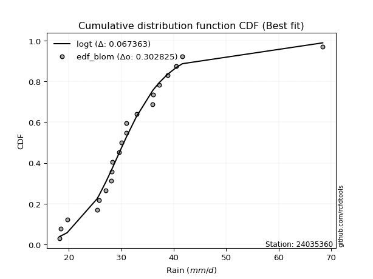</img>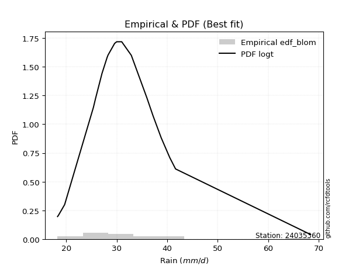</img>

</div>


### 7. EDF Tukey (1962)

In hydrology, the Tukey formula is used as a plotting position formula to estimate the empirical probability or frequency of a flood event (or other hydrological data). The formula parameter is given as _c=0.333_ (or 1/3).

<div align="center">


$P=(m-c)/(n+1-2c)$


</div>


**7.1. Empirical values**

<div align="center">

|                | 0                   | 1                   | 2                   | 3                   | 4                   | 5                  | 6                   | 7                  | 8                  | 9                   | 10                 | 11                 | 12                 | 13                 | 14                 | 15                 | 16                | 17                 | 18                 | 19                 |
|:---------------|:--------------------|:--------------------|:--------------------|:--------------------|:--------------------|:-------------------|:--------------------|:-------------------|:-------------------|:--------------------|:-------------------|:-------------------|:-------------------|:-------------------|:-------------------|:-------------------|:------------------|:-------------------|:-------------------|:-------------------|
| date           | 2021                | 2022                | 2017                | 2019                | 2015                | 2011               | 2012                | 2014               | 2010               | 2018                | 2023               | 2020               | 2008               | 2006               | 2016               | 2009               | 2005              | 2007               | 2013               | 2024               |
| x              | 18.3                | 18.5                | 19.7                | 25.4                | 25.8                | 27.1               | 28.1                | 28.2               | 28.3               | 29.6                | 30.0               | 31.0               | 32.9               | 36.0               | 36.1               | 37.2               | 38.8              | 40.5               | 42.19              | 68.4               |
| m              | 1                   | 2                   | 3                   | 4                   | 5                   | 6                  | 7                   | 8                  | 9                  | 10                  | 11                 | 12                 | 13                 | 14                 | 15                 | 16                 | 17                | 18                 | 19                 | 20                 |
| empirical_dist | edf_tukey           | edf_tukey           | edf_tukey           | edf_tukey           | edf_tukey           | edf_tukey          | edf_tukey           | edf_tukey          | edf_tukey          | edf_tukey           | edf_tukey          | edf_tukey          | edf_tukey          | edf_tukey          | edf_tukey          | edf_tukey          | edf_tukey         | edf_tukey          | edf_tukey          | edf_tukey          |
| empirical      | 0.03278688524590164 | 0.08196721311475409 | 0.13114754098360656 | 0.18032786885245902 | 0.22950819672131148 | 0.2786885245901639 | 0.32786885245901637 | 0.3770491803278688 | 0.4262295081967213 | 0.47540983606557374 | 0.5245901639344263 | 0.5737704918032787 | 0.6229508196721312 | 0.6721311475409836 | 0.7213114754098361 | 0.7704918032786885 | 0.819672131147541 | 0.8688524590163934 | 0.9180327868852459 | 0.9672131147540983 |
| empirical_tr   | 1.033898305084746   | 1.0892857142857142  | 1.150943396226415   | 1.22                | 1.297872340425532   | 1.3863636363636362 | 1.4878048780487803  | 1.6052631578947367 | 1.7428571428571429 | 1.90625             | 2.103448275862069  | 2.346153846153846  | 2.6521739130434785 | 3.05               | 3.588235294117647  | 4.357142857142857  | 5.545454545454546 | 7.624999999999998  | 12.200000000000003 | 30.499999999999964 |

</div>


**7.2. Kolmogorov-Smirnov fit test (sorted by Δ)**


<div align="center">

|                | 0                   | 1                   | 2                   | 3                   | 4                   | 5                   | 6                   | 7                   | 8                   | 9                   | 10                  | 11                  | 12                  | 13                  | 14                 | 15                  | 16                  | 17                  | 18                  | 19                 | 20                  | 21                  | 22                    | 23                  | 24                  | 25                  | 26                  | 27                  | 28                  | 29                  | 30                  | 31                  | 32                  | 33                 | 34                 | 35                  | 36                  | 37                 | 38                  | 39                  | 40                  | 41                  | 42                  | 43                 | 44                  | 45                  | 46                  | 47                 | 48                  | 49                  | 50                  | 51                  | 52                  | 53                  | 54                  | 55                  | 56                  | 57                  | 58                  | 59                  | 60                 | 61                  | 62                  | 63                 | 64                  | 65                 | 66                  | 67                 | 68                  | 69                  | 70                  | 71                  | 72                  | 73                  | 74                 | 75                 | 76                  | 77                 | 78                  | 79                  | 80                 | 81                  | 82                 | 83                  | 84                  | 85                 | 86                 | 87                 |
|:---------------|:--------------------|:--------------------|:--------------------|:--------------------|:--------------------|:--------------------|:--------------------|:--------------------|:--------------------|:--------------------|:--------------------|:--------------------|:--------------------|:--------------------|:-------------------|:--------------------|:--------------------|:--------------------|:--------------------|:-------------------|:--------------------|:--------------------|:----------------------|:--------------------|:--------------------|:--------------------|:--------------------|:--------------------|:--------------------|:--------------------|:--------------------|:--------------------|:--------------------|:-------------------|:-------------------|:--------------------|:--------------------|:-------------------|:--------------------|:--------------------|:--------------------|:--------------------|:--------------------|:-------------------|:--------------------|:--------------------|:--------------------|:-------------------|:--------------------|:--------------------|:--------------------|:--------------------|:--------------------|:--------------------|:--------------------|:--------------------|:--------------------|:--------------------|:--------------------|:--------------------|:-------------------|:--------------------|:--------------------|:-------------------|:--------------------|:-------------------|:--------------------|:-------------------|:--------------------|:--------------------|:--------------------|:--------------------|:--------------------|:--------------------|:-------------------|:-------------------|:--------------------|:-------------------|:--------------------|:--------------------|:-------------------|:--------------------|:-------------------|:--------------------|:--------------------|:-------------------|:-------------------|:-------------------|
| station        | 24035360            | 24035360            | 24035360            | 24035360            | 24035360            | 24035360            | 24035360            | 24035360            | 24035360            | 24035360            | 24035360            | 24035360            | 24035360            | 24035360            | 24035360           | 24035360            | 24035360            | 24035360            | 24035360            | 24035360           | 24035360            | 24035360            | 24035360              | 24035360            | 24035360            | 24035360            | 24035360            | 24035360            | 24035360            | 24035360            | 24035360            | 24035360            | 24035360            | 24035360           | 24035360           | 24035360            | 24035360            | 24035360           | 24035360            | 24035360            | 24035360            | 24035360            | 24035360            | 24035360           | 24035360            | 24035360            | 24035360            | 24035360           | 24035360            | 24035360            | 24035360            | 24035360            | 24035360            | 24035360            | 24035360            | 24035360            | 24035360            | 24035360            | 24035360            | 24035360            | 24035360           | 24035360            | 24035360            | 24035360           | 24035360            | 24035360           | 24035360            | 24035360           | 24035360            | 24035360            | 24035360            | 24035360            | 24035360            | 24035360            | 24035360           | 24035360           | 24035360            | 24035360           | 24035360            | 24035360            | 24035360           | 24035360            | 24035360           | 24035360            | 24035360            | 24035360           | 24035360           | 24035360           |
| empirical_dist | edf_tukey           | edf_tukey           | edf_tukey           | edf_tukey           | edf_tukey           | edf_tukey           | edf_tukey           | edf_tukey           | edf_tukey           | edf_tukey           | edf_tukey           | edf_tukey           | edf_tukey           | edf_tukey           | edf_tukey          | edf_tukey           | edf_tukey           | edf_tukey           | edf_tukey           | edf_tukey          | edf_tukey           | edf_tukey           | edf_tukey             | edf_tukey           | edf_tukey           | edf_tukey           | edf_tukey           | edf_tukey           | edf_tukey           | edf_tukey           | edf_tukey           | edf_tukey           | edf_tukey           | edf_tukey          | edf_tukey          | edf_tukey           | edf_tukey           | edf_tukey          | edf_tukey           | edf_tukey           | edf_tukey           | edf_tukey           | edf_tukey           | edf_tukey          | edf_tukey           | edf_tukey           | edf_tukey           | edf_tukey          | edf_tukey           | edf_tukey           | edf_tukey           | edf_tukey           | edf_tukey           | edf_tukey           | edf_tukey           | edf_tukey           | edf_tukey           | edf_tukey           | edf_tukey           | edf_tukey           | edf_tukey          | edf_tukey           | edf_tukey           | edf_tukey          | edf_tukey           | edf_tukey          | edf_tukey           | edf_tukey          | edf_tukey           | edf_tukey           | edf_tukey           | edf_tukey           | edf_tukey           | edf_tukey           | edf_tukey          | edf_tukey          | edf_tukey           | edf_tukey          | edf_tukey           | edf_tukey           | edf_tukey          | edf_tukey           | edf_tukey          | edf_tukey           | edf_tukey           | edf_tukey          | edf_tukey          | edf_tukey          |
| p_dist         | loglogistic         | fisk                | laplace_asymmetric  | johnsonsu           | loghypsecant        | loggenlogistic      | logt                | logjohnsonsu        | exponnorm           | logfisk             | ncf                 | genlogistic         | lognorm             | lognorm             | logcrystalball     | kstwobign           | logexponnorm        | logloggamma         | alpha               | nct                | betaprime           | invweibull          | loglaplace_asymmetric | loglaplace          | invgamma            | logbetaprime        | logalpha            | f                   | loginvgamma         | loglognorm          | logf                | logfatiguelife      | logerlang           | loggamma           | loggamma           | lognct              | rice                | t                  | logpearson3         | loginvgauss         | invgauss            | logrice             | fatiguelife         | gumbel_r           | moyal               | maxwell             | lognakagami         | logmaxwell         | logweibull_min      | crystalball         | norm                | loggumbel_r         | rayleigh            | lograyleigh         | logistic            | gamma               | chi2                | erlang              | hypsecant           | loggumbel_l         | pearson3           | loginvweibull       | halflogistic        | wald               | logmoyal            | gibrat             | halfnorm            | laplace            | loghalfnorm         | loggompertz         | logkstwobign        | loghalflogistic     | loggenexpon         | gompertz            | weibull_min        | loggibrat          | gumbel_l            | logwald            | logncf              | expon               | genexpon           | nakagami            | logmielke          | logexpon            | logchi2             | logtruncnorm       | truncnorm          | mielke             |
| delta          | 0.06652517922176497 | 0.06690553107589241 | 0.06958738989882002 | 0.06960552244575952 | 0.07020579657711246 | 0.07128645241878713 | 0.07141711446847732 | 0.07147931199323787 | 0.07155026337978693 | 0.07509790168419642 | 0.08228476084305877 | 0.08426935839702285 | 0.08571018339375594 | 0.08571018339375594 | 0.0857102377621087 | 0.08632822234150964 | 0.08782304548648642 | 0.08922168900853847 | 0.09030036763039254 | 0.090696296673098  | 0.09099555016682612 | 0.09310063866901133 | 0.09469503276693259   | 0.09478808654966309 | 0.09524302701086054 | 0.09531472645386355 | 0.09549802274475941 | 0.09572538146066836 | 0.09579125055813068 | 0.09600196215778897 | 0.09606023116177378 | 0.09620827945045698 | 0.09676908983044194 | 0.096769122310954  | 0.096769122310954  | 0.09689757164155957 | 0.09731425073307387 | 0.0983013711886106 | 0.10009851401142153 | 0.10191622525414065 | 0.10268636871336637 | 0.10277623831910324 | 0.10330524340652911 | 0.1049595667999336 | 0.10755052083834912 | 0.10888938140225254 | 0.10906946009941162 | 0.1095769499868949 | 0.11487885417482266 | 0.11488455470835474 | 0.11488456586226503 | 0.11616431705778618 | 0.11857691173604198 | 0.11929279936015533 | 0.12044870002127639 | 0.12486734318294343 | 0.12486810554823782 | 0.12486989738847712 | 0.12516611019702617 | 0.12736608074602496 | 0.1303143494899102 | 0.13150741160416143 | 0.13517593856064716 | 0.1374167664038669 | 0.13800976747787302 | 0.1411947818469791 | 0.14526702591357124 | 0.1460156521220275 | 0.14607685345112711 | 0.14681633762213633 | 0.15335814558072655 | 0.15365737654264022 | 0.16060199987909515 | 0.16417660832377365 | 0.1803278688524523 | 0.1829190426483825 | 0.18527830761976732 | 0.1957382291733359 | 0.20823035156677894 | 0.22176811075953748 | 0.2218415749733563 | 0.24299948448789785 | 0.2528786094046135 | 0.29059242107677985 | 0.30167058209334807 | 0.3250033107471152 | 0.5405435867345831 | nan                |
| deltao         | 0.3096406529800002  | 0.3096406529800002  | 0.3096406529800002  | 0.3096406529800002  | 0.3096406529800002  | 0.3096406529800002  | 0.3096406529800002  | 0.3096406529800002  | 0.3096406529800002  | 0.3096406529800002  | 0.3096406529800002  | 0.3096406529800002  | 0.3096406529800002  | 0.3096406529800002  | 0.3096406529800002 | 0.3096406529800002  | 0.3096406529800002  | 0.3096406529800002  | 0.3096406529800002  | 0.3096406529800002 | 0.3096406529800002  | 0.3096406529800002  | 0.3096406529800002    | 0.3096406529800002  | 0.3096406529800002  | 0.3096406529800002  | 0.3096406529800002  | 0.3096406529800002  | 0.3096406529800002  | 0.3096406529800002  | 0.3096406529800002  | 0.3096406529800002  | 0.3096406529800002  | 0.3096406529800002 | 0.3096406529800002 | 0.3096406529800002  | 0.3096406529800002  | 0.3096406529800002 | 0.3096406529800002  | 0.3096406529800002  | 0.3096406529800002  | 0.3096406529800002  | 0.3096406529800002  | 0.3096406529800002 | 0.3096406529800002  | 0.3096406529800002  | 0.3096406529800002  | 0.3096406529800002 | 0.3096406529800002  | 0.3096406529800002  | 0.3096406529800002  | 0.3096406529800002  | 0.3096406529800002  | 0.3096406529800002  | 0.3096406529800002  | 0.3096406529800002  | 0.3096406529800002  | 0.3096406529800002  | 0.3096406529800002  | 0.3096406529800002  | 0.3096406529800002 | 0.3096406529800002  | 0.3096406529800002  | 0.3096406529800002 | 0.3096406529800002  | 0.3096406529800002 | 0.3096406529800002  | 0.3096406529800002 | 0.3096406529800002  | 0.3096406529800002  | 0.3096406529800002  | 0.3096406529800002  | 0.3096406529800002  | 0.3096406529800002  | 0.3096406529800002 | 0.3096406529800002 | 0.3096406529800002  | 0.3096406529800002 | 0.3096406529800002  | 0.3096406529800002  | 0.3096406529800002 | 0.3096406529800002  | 0.3096406529800002 | 0.3096406529800002  | 0.3096406529800002  | 0.3096406529800002 | 0.3096406529800002 | 0.3096406529800002 |
| eval           | Δo > Δ              | Δo > Δ              | Δo > Δ              | Δo > Δ              | Δo > Δ              | Δo > Δ              | Δo > Δ              | Δo > Δ              | Δo > Δ              | Δo > Δ              | Δo > Δ              | Δo > Δ              | Δo > Δ              | Δo > Δ              | Δo > Δ             | Δo > Δ              | Δo > Δ              | Δo > Δ              | Δo > Δ              | Δo > Δ             | Δo > Δ              | Δo > Δ              | Δo > Δ                | Δo > Δ              | Δo > Δ              | Δo > Δ              | Δo > Δ              | Δo > Δ              | Δo > Δ              | Δo > Δ              | Δo > Δ              | Δo > Δ              | Δo > Δ              | Δo > Δ             | Δo > Δ             | Δo > Δ              | Δo > Δ              | Δo > Δ             | Δo > Δ              | Δo > Δ              | Δo > Δ              | Δo > Δ              | Δo > Δ              | Δo > Δ             | Δo > Δ              | Δo > Δ              | Δo > Δ              | Δo > Δ             | Δo > Δ              | Δo > Δ              | Δo > Δ              | Δo > Δ              | Δo > Δ              | Δo > Δ              | Δo > Δ              | Δo > Δ              | Δo > Δ              | Δo > Δ              | Δo > Δ              | Δo > Δ              | Δo > Δ             | Δo > Δ              | Δo > Δ              | Δo > Δ             | Δo > Δ              | Δo > Δ             | Δo > Δ              | Δo > Δ             | Δo > Δ              | Δo > Δ              | Δo > Δ              | Δo > Δ              | Δo > Δ              | Δo > Δ              | Δo > Δ             | Δo > Δ             | Δo > Δ              | Δo > Δ             | Δo > Δ              | Δo > Δ              | Δo > Δ             | Δo > Δ              | Δo > Δ             | Δo > Δ              | Δo > Δ              | Δo <= Δ            | Δo <= Δ            | Δo <= Δ            |
| fit            | 1                   | 1                   | 1                   | 1                   | 1                   | 1                   | 1                   | 1                   | 1                   | 1                   | 1                   | 1                   | 1                   | 1                   | 1                  | 1                   | 1                   | 1                   | 1                   | 1                  | 1                   | 1                   | 1                     | 1                   | 1                   | 1                   | 1                   | 1                   | 1                   | 1                   | 1                   | 1                   | 1                   | 1                  | 1                  | 1                   | 1                   | 1                  | 1                   | 1                   | 1                   | 1                   | 1                   | 1                  | 1                   | 1                   | 1                   | 1                  | 1                   | 1                   | 1                   | 1                   | 1                   | 1                   | 1                   | 1                   | 1                   | 1                   | 1                   | 1                   | 1                  | 1                   | 1                   | 1                  | 1                   | 1                  | 1                   | 1                  | 1                   | 1                   | 1                   | 1                   | 1                   | 1                   | 1                  | 1                  | 1                   | 1                  | 1                   | 1                   | 1                  | 1                   | 1                  | 1                   | 1                   | 0                  | 0                  | 0                  |
| n              | 20                  | 20                  | 20                  | 20                  | 20                  | 20                  | 20                  | 20                  | 20                  | 20                  | 20                  | 20                  | 20                  | 20                  | 20                 | 20                  | 20                  | 20                  | 20                  | 20                 | 20                  | 20                  | 20                    | 20                  | 20                  | 20                  | 20                  | 20                  | 20                  | 20                  | 20                  | 20                  | 20                  | 20                 | 20                 | 20                  | 20                  | 20                 | 20                  | 20                  | 20                  | 20                  | 20                  | 20                 | 20                  | 20                  | 20                  | 20                 | 20                  | 20                  | 20                  | 20                  | 20                  | 20                  | 20                  | 20                  | 20                  | 20                  | 20                  | 20                  | 20                 | 20                  | 20                  | 20                 | 20                  | 20                 | 20                  | 20                 | 20                  | 20                  | 20                  | 20                  | 20                  | 20                  | 20                 | 20                 | 20                  | 20                 | 20                  | 20                  | 20                 | 20                  | 20                 | 20                  | 20                  | 20                 | 20                 | 20                 |
| best_fit       | 1                   | 0                   | 0                   | 0                   | 0                   | 0                   | 0                   | 0                   | 0                   | 0                   | 0                   | 0                   | 0                   | 0                   | 0                  | 0                   | 0                   | 0                   | 0                   | 0                  | 0                   | 0                   | 0                     | 0                   | 0                   | 0                   | 0                   | 0                   | 0                   | 0                   | 0                   | 0                   | 0                   | 0                  | 0                  | 0                   | 0                   | 0                  | 0                   | 0                   | 0                   | 0                   | 0                   | 0                  | 0                   | 0                   | 0                   | 0                  | 0                   | 0                   | 0                   | 0                   | 0                   | 0                   | 0                   | 0                   | 0                   | 0                   | 0                   | 0                   | 0                  | 0                   | 0                   | 0                  | 0                   | 0                  | 0                   | 0                  | 0                   | 0                   | 0                   | 0                   | 0                   | 0                   | 0                  | 0                  | 0                   | 0                  | 0                   | 0                   | 0                  | 0                   | 0                  | 0                   | 0                   | 0                  | 0                  | 0                  |
| best_fit_sort  | 1                   | 2                   | 3                   | 4                   | 5                   | 6                   | 7                   | 8                   | 9                   | 10                  | 11                  | 12                  | 13                  | 14                  | 15                 | 16                  | 17                  | 18                  | 19                  | 20                 | 21                  | 22                  | 23                    | 24                  | 25                  | 26                  | 27                  | 28                  | 29                  | 30                  | 31                  | 32                  | 33                  | 34                 | 35                 | 36                  | 37                  | 38                 | 39                  | 40                  | 41                  | 42                  | 43                  | 44                 | 45                  | 46                  | 47                  | 48                 | 49                  | 50                  | 51                  | 52                  | 53                  | 54                  | 55                  | 56                  | 57                  | 58                  | 59                  | 60                  | 61                 | 62                  | 63                  | 64                 | 65                  | 66                 | 67                  | 68                 | 69                  | 70                  | 71                  | 72                  | 73                  | 74                  | 75                 | 76                 | 77                  | 78                 | 79                  | 80                  | 81                 | 82                  | 83                 | 84                  | 85                  | 86                 | 87                 | 88                 |

</div>


**7.3. Best fit**

<div align="center">

|   id |   station | empirical_dist   | p_dist      |     delta |   deltao | eval   |   fit |   n |   best_fit |   best_fit_sort |
|-----:|----------:|:-----------------|:------------|----------:|---------:|:-------|------:|----:|-----------:|----------------:|
|    0 |  24035360 | edf_tukey        | loglogistic | 0.0665252 | 0.309641 | Δo > Δ |     1 |  20 |          1 |               1 |

</div>


<div align="center">

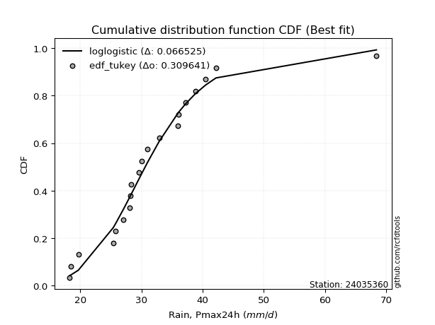</img></img>

</div>


### 8. EDF Gringorten (1963)

Gringorten plotting position formula is essential for estimating the probability and return periods of extreme events like floods and heavy rainfall. The constant _a=0.44_.

<div align="center">


$P=(m-a)/(n+1-2a)$


</div>


**8.1. Empirical values**

<div align="center">

|                | 0                    | 1                  | 2                  | 3                  | 4                   | 5                   | 6                   | 7                   | 8                  | 9                   | 10                 | 11                 | 12                 | 13                 | 14                 | 15                 | 16                 | 17                 | 18                 | 19                 |
|:---------------|:---------------------|:-------------------|:-------------------|:-------------------|:--------------------|:--------------------|:--------------------|:--------------------|:-------------------|:--------------------|:-------------------|:-------------------|:-------------------|:-------------------|:-------------------|:-------------------|:-------------------|:-------------------|:-------------------|:-------------------|
| date           | 2021                 | 2022               | 2017               | 2019               | 2015                | 2011                | 2012                | 2014                | 2010               | 2018                | 2023               | 2020               | 2008               | 2006               | 2016               | 2009               | 2005               | 2007               | 2013               | 2024               |
| x              | 18.3                 | 18.5               | 19.7               | 25.4               | 25.8                | 27.1                | 28.1                | 28.2                | 28.3               | 29.6                | 30.0               | 31.0               | 32.9               | 36.0               | 36.1               | 37.2               | 38.8               | 40.5               | 42.19              | 68.4               |
| m              | 1                    | 2                  | 3                  | 4                  | 5                   | 6                   | 7                   | 8                   | 9                  | 10                  | 11                 | 12                 | 13                 | 14                 | 15                 | 16                 | 17                 | 18                 | 19                 | 20                 |
| empirical_dist | edf_gringorten       | edf_gringorten     | edf_gringorten     | edf_gringorten     | edf_gringorten      | edf_gringorten      | edf_gringorten      | edf_gringorten      | edf_gringorten     | edf_gringorten      | edf_gringorten     | edf_gringorten     | edf_gringorten     | edf_gringorten     | edf_gringorten     | edf_gringorten     | edf_gringorten     | edf_gringorten     | edf_gringorten     | edf_gringorten     |
| empirical      | 0.027833001988071572 | 0.0775347912524851 | 0.1272365805168986 | 0.1769383697813121 | 0.22664015904572563 | 0.27634194831013914 | 0.32604373757455263 | 0.37574552683896617 | 0.4254473161033797 | 0.47514910536779326 | 0.5248508946322068 | 0.5745526838966203 | 0.6242544731610338 | 0.6739562624254473 | 0.7236580516898609 | 0.7733598409542743 | 0.8230616302186877 | 0.8727634194831013 | 0.9224652087475148 | 0.9721669980119283 |
| empirical_tr   | 1.0286298568507157   | 1.084051724137931  | 1.1457858769931661 | 1.2149758454106279 | 1.2930591259640103  | 1.3818681318681318  | 1.4837758112094395  | 1.6019108280254777  | 1.740484429065744  | 1.90530303030303    | 2.1046025104602513 | 2.350467289719626  | 2.6613756613756614 | 3.0670731707317067 | 3.618705035971223  | 4.412280701754386  | 5.651685393258422  | 7.859374999999996  | 12.89743589743588  | 35.92857142857125  |

</div>


**8.2. Kolmogorov-Smirnov fit test (sorted by Δ)**


<div align="center">

|                | 0                   | 1                   | 2                   | 3                   | 4                   | 5                   | 6                   | 7                   | 8                   | 9                   | 10                  | 11                  | 12                  | 13                  | 14                  | 15                  | 16                  | 17                  | 18                    | 19                 | 20                  | 21                  | 22                  | 23                  | 24                  | 25                 | 26                  | 27                  | 28                  | 29                  | 30                  | 31                  | 32                 | 33                 | 34                  | 35                  | 36                  | 37                  | 38                  | 39                  | 40                  | 41                  | 42                  | 43                  | 44                  | 45                  | 46                  | 47                  | 48                  | 49                  | 50                  | 51                  | 52                  | 53                 | 54                  | 55                 | 56                  | 57                  | 58                  | 59                  | 60                  | 61                  | 62                  | 63                  | 64                 | 65                  | 66                  | 67                  | 68                  | 69                  | 70                  | 71                  | 72                  | 73                  | 74                 | 75                  | 76                  | 77                  | 78                  | 79                 | 80                 | 81                  | 82                 | 83                  | 84                  | 85                 | 86                 | 87                 |
|:---------------|:--------------------|:--------------------|:--------------------|:--------------------|:--------------------|:--------------------|:--------------------|:--------------------|:--------------------|:--------------------|:--------------------|:--------------------|:--------------------|:--------------------|:--------------------|:--------------------|:--------------------|:--------------------|:----------------------|:-------------------|:--------------------|:--------------------|:--------------------|:--------------------|:--------------------|:-------------------|:--------------------|:--------------------|:--------------------|:--------------------|:--------------------|:--------------------|:-------------------|:-------------------|:--------------------|:--------------------|:--------------------|:--------------------|:--------------------|:--------------------|:--------------------|:--------------------|:--------------------|:--------------------|:--------------------|:--------------------|:--------------------|:--------------------|:--------------------|:--------------------|:--------------------|:--------------------|:--------------------|:-------------------|:--------------------|:-------------------|:--------------------|:--------------------|:--------------------|:--------------------|:--------------------|:--------------------|:--------------------|:--------------------|:-------------------|:--------------------|:--------------------|:--------------------|:--------------------|:--------------------|:--------------------|:--------------------|:--------------------|:--------------------|:-------------------|:--------------------|:--------------------|:--------------------|:--------------------|:-------------------|:-------------------|:--------------------|:-------------------|:--------------------|:--------------------|:-------------------|:-------------------|:-------------------|
| station        | 24035360            | 24035360            | 24035360            | 24035360            | 24035360            | 24035360            | 24035360            | 24035360            | 24035360            | 24035360            | 24035360            | 24035360            | 24035360            | 24035360            | 24035360            | 24035360            | 24035360            | 24035360            | 24035360              | 24035360           | 24035360            | 24035360            | 24035360            | 24035360            | 24035360            | 24035360           | 24035360            | 24035360            | 24035360            | 24035360            | 24035360            | 24035360            | 24035360           | 24035360           | 24035360            | 24035360            | 24035360            | 24035360            | 24035360            | 24035360            | 24035360            | 24035360            | 24035360            | 24035360            | 24035360            | 24035360            | 24035360            | 24035360            | 24035360            | 24035360            | 24035360            | 24035360            | 24035360            | 24035360           | 24035360            | 24035360           | 24035360            | 24035360            | 24035360            | 24035360            | 24035360            | 24035360            | 24035360            | 24035360            | 24035360           | 24035360            | 24035360            | 24035360            | 24035360            | 24035360            | 24035360            | 24035360            | 24035360            | 24035360            | 24035360           | 24035360            | 24035360            | 24035360            | 24035360            | 24035360           | 24035360           | 24035360            | 24035360           | 24035360            | 24035360            | 24035360           | 24035360           | 24035360           |
| empirical_dist | edf_gringorten      | edf_gringorten      | edf_gringorten      | edf_gringorten      | edf_gringorten      | edf_gringorten      | edf_gringorten      | edf_gringorten      | edf_gringorten      | edf_gringorten      | edf_gringorten      | edf_gringorten      | edf_gringorten      | edf_gringorten      | edf_gringorten      | edf_gringorten      | edf_gringorten      | edf_gringorten      | edf_gringorten        | edf_gringorten     | edf_gringorten      | edf_gringorten      | edf_gringorten      | edf_gringorten      | edf_gringorten      | edf_gringorten     | edf_gringorten      | edf_gringorten      | edf_gringorten      | edf_gringorten      | edf_gringorten      | edf_gringorten      | edf_gringorten     | edf_gringorten     | edf_gringorten      | edf_gringorten      | edf_gringorten      | edf_gringorten      | edf_gringorten      | edf_gringorten      | edf_gringorten      | edf_gringorten      | edf_gringorten      | edf_gringorten      | edf_gringorten      | edf_gringorten      | edf_gringorten      | edf_gringorten      | edf_gringorten      | edf_gringorten      | edf_gringorten      | edf_gringorten      | edf_gringorten      | edf_gringorten     | edf_gringorten      | edf_gringorten     | edf_gringorten      | edf_gringorten      | edf_gringorten      | edf_gringorten      | edf_gringorten      | edf_gringorten      | edf_gringorten      | edf_gringorten      | edf_gringorten     | edf_gringorten      | edf_gringorten      | edf_gringorten      | edf_gringorten      | edf_gringorten      | edf_gringorten      | edf_gringorten      | edf_gringorten      | edf_gringorten      | edf_gringorten     | edf_gringorten      | edf_gringorten      | edf_gringorten      | edf_gringorten      | edf_gringorten     | edf_gringorten     | edf_gringorten      | edf_gringorten     | edf_gringorten      | edf_gringorten      | edf_gringorten     | edf_gringorten     | edf_gringorten     |
| p_dist         | laplace_asymmetric  | johnsonsu           | loglogistic         | loghypsecant        | fisk                | logt                | logjohnsonsu        | loggenlogistic      | logfisk             | exponnorm           | ncf                 | genlogistic         | lognorm             | lognorm             | logcrystalball      | kstwobign           | logexponnorm        | logloggamma         | loglaplace_asymmetric | loglaplace         | alpha               | nct                 | betaprime           | t                   | invweibull          | rice               | invgamma            | logbetaprime        | logalpha            | f                   | loginvgamma         | loglognorm          | logf               | logfatiguelife     | logerlang           | loggamma            | loggamma            | lognct              | logpearson3         | loginvgauss         | invgauss            | logrice             | fatiguelife         | gumbel_r            | moyal               | maxwell             | lognakagami         | logmaxwell          | crystalball         | norm                | loggumbel_r         | logweibull_min      | logistic            | rayleigh           | lograyleigh         | hypsecant          | loggumbel_l         | gamma               | chi2                | erlang              | pearson3            | loginvweibull       | halflogistic        | wald                | gibrat             | logmoyal            | laplace             | halfnorm            | loghalfnorm         | loggompertz         | loghalflogistic     | logkstwobign        | loggenexpon         | gompertz            | weibull_min        | loggibrat           | gumbel_l            | logwald             | logncf              | expon              | genexpon           | nakagami            | logmielke          | logexpon            | logchi2             | logtruncnorm       | truncnorm          | mielke             |
| delta          | 0.06567642943211205 | 0.06569456197905155 | 0.06660792052892067 | 0.06838068169264877 | 0.06935471025479209 | 0.06959199958401363 | 0.06965419710877419 | 0.07053116708521595 | 0.07118694121748845 | 0.07349237728339308 | 0.08567425991420569 | 0.08765885746816976 | 0.08909968246490285 | 0.08909968246490285 | 0.08909973683325562 | 0.08971772141265655 | 0.09121254455763333 | 0.09261118807968538 | 0.0928699178824689    | 0.0929629716651994 | 0.09368986670153945 | 0.09408579574424492 | 0.09438504923797303 | 0.09647625630414691 | 0.09649013774015824 | 0.0980964428264155 | 0.09863252608200745 | 0.09870422552501046 | 0.09888752181590632 | 0.09911488053181527 | 0.09918074962927759 | 0.09939146122893588 | 0.0994497302329207 | 0.0995977785216039 | 0.10015858890158885 | 0.10015862138210091 | 0.10015862138210091 | 0.10028707071270648 | 0.10348801308256844 | 0.10530572432528756 | 0.10607586778451328 | 0.10616573739025015 | 0.10669474247767602 | 0.10834906587108051 | 0.11094001990949603 | 0.11227888047339946 | 0.11245895917055854 | 0.11296644905804182 | 0.11566674680169636 | 0.11566675795560666 | 0.11798943194224992 | 0.11826835324596957 | 0.12123089211461802 | 0.1219664108071889 | 0.12268229843130224 | 0.1259483022903678 | 0.12814827283936658 | 0.12825684225409034 | 0.12825760461938474 | 0.12825939645962403 | 0.13365168793817744 | 0.13489691067530835 | 0.13856543763179408 | 0.13924188128833065 | 0.1393696669625154 | 0.13983488236233677 | 0.14627638281980804 | 0.14865652498471815 | 0.14946635252227403 | 0.15020583669328325 | 0.15548249142710396 | 0.15674764465187346 | 0.16399149895024207 | 0.16756610739492056 | 0.1769383697813054 | 0.18474415753284623 | 0.18606049971310895 | 0.19756334405779963 | 0.21266277342904782 | 0.2251576098306844 | 0.2252310740445032 | 0.24638898355904476 | 0.2562681084757604 | 0.29398192014792673 | 0.30610300395561696 | 0.3283928098182621 | 0.5454974699924132 | nan                |
| deltao         | 0.3096406529800002  | 0.3096406529800002  | 0.3096406529800002  | 0.3096406529800002  | 0.3096406529800002  | 0.3096406529800002  | 0.3096406529800002  | 0.3096406529800002  | 0.3096406529800002  | 0.3096406529800002  | 0.3096406529800002  | 0.3096406529800002  | 0.3096406529800002  | 0.3096406529800002  | 0.3096406529800002  | 0.3096406529800002  | 0.3096406529800002  | 0.3096406529800002  | 0.3096406529800002    | 0.3096406529800002 | 0.3096406529800002  | 0.3096406529800002  | 0.3096406529800002  | 0.3096406529800002  | 0.3096406529800002  | 0.3096406529800002 | 0.3096406529800002  | 0.3096406529800002  | 0.3096406529800002  | 0.3096406529800002  | 0.3096406529800002  | 0.3096406529800002  | 0.3096406529800002 | 0.3096406529800002 | 0.3096406529800002  | 0.3096406529800002  | 0.3096406529800002  | 0.3096406529800002  | 0.3096406529800002  | 0.3096406529800002  | 0.3096406529800002  | 0.3096406529800002  | 0.3096406529800002  | 0.3096406529800002  | 0.3096406529800002  | 0.3096406529800002  | 0.3096406529800002  | 0.3096406529800002  | 0.3096406529800002  | 0.3096406529800002  | 0.3096406529800002  | 0.3096406529800002  | 0.3096406529800002  | 0.3096406529800002 | 0.3096406529800002  | 0.3096406529800002 | 0.3096406529800002  | 0.3096406529800002  | 0.3096406529800002  | 0.3096406529800002  | 0.3096406529800002  | 0.3096406529800002  | 0.3096406529800002  | 0.3096406529800002  | 0.3096406529800002 | 0.3096406529800002  | 0.3096406529800002  | 0.3096406529800002  | 0.3096406529800002  | 0.3096406529800002  | 0.3096406529800002  | 0.3096406529800002  | 0.3096406529800002  | 0.3096406529800002  | 0.3096406529800002 | 0.3096406529800002  | 0.3096406529800002  | 0.3096406529800002  | 0.3096406529800002  | 0.3096406529800002 | 0.3096406529800002 | 0.3096406529800002  | 0.3096406529800002 | 0.3096406529800002  | 0.3096406529800002  | 0.3096406529800002 | 0.3096406529800002 | 0.3096406529800002 |
| eval           | Δo > Δ              | Δo > Δ              | Δo > Δ              | Δo > Δ              | Δo > Δ              | Δo > Δ              | Δo > Δ              | Δo > Δ              | Δo > Δ              | Δo > Δ              | Δo > Δ              | Δo > Δ              | Δo > Δ              | Δo > Δ              | Δo > Δ              | Δo > Δ              | Δo > Δ              | Δo > Δ              | Δo > Δ                | Δo > Δ             | Δo > Δ              | Δo > Δ              | Δo > Δ              | Δo > Δ              | Δo > Δ              | Δo > Δ             | Δo > Δ              | Δo > Δ              | Δo > Δ              | Δo > Δ              | Δo > Δ              | Δo > Δ              | Δo > Δ             | Δo > Δ             | Δo > Δ              | Δo > Δ              | Δo > Δ              | Δo > Δ              | Δo > Δ              | Δo > Δ              | Δo > Δ              | Δo > Δ              | Δo > Δ              | Δo > Δ              | Δo > Δ              | Δo > Δ              | Δo > Δ              | Δo > Δ              | Δo > Δ              | Δo > Δ              | Δo > Δ              | Δo > Δ              | Δo > Δ              | Δo > Δ             | Δo > Δ              | Δo > Δ             | Δo > Δ              | Δo > Δ              | Δo > Δ              | Δo > Δ              | Δo > Δ              | Δo > Δ              | Δo > Δ              | Δo > Δ              | Δo > Δ             | Δo > Δ              | Δo > Δ              | Δo > Δ              | Δo > Δ              | Δo > Δ              | Δo > Δ              | Δo > Δ              | Δo > Δ              | Δo > Δ              | Δo > Δ             | Δo > Δ              | Δo > Δ              | Δo > Δ              | Δo > Δ              | Δo > Δ             | Δo > Δ             | Δo > Δ              | Δo > Δ             | Δo > Δ              | Δo > Δ              | Δo <= Δ            | Δo <= Δ            | Δo <= Δ            |
| fit            | 1                   | 1                   | 1                   | 1                   | 1                   | 1                   | 1                   | 1                   | 1                   | 1                   | 1                   | 1                   | 1                   | 1                   | 1                   | 1                   | 1                   | 1                   | 1                     | 1                  | 1                   | 1                   | 1                   | 1                   | 1                   | 1                  | 1                   | 1                   | 1                   | 1                   | 1                   | 1                   | 1                  | 1                  | 1                   | 1                   | 1                   | 1                   | 1                   | 1                   | 1                   | 1                   | 1                   | 1                   | 1                   | 1                   | 1                   | 1                   | 1                   | 1                   | 1                   | 1                   | 1                   | 1                  | 1                   | 1                  | 1                   | 1                   | 1                   | 1                   | 1                   | 1                   | 1                   | 1                   | 1                  | 1                   | 1                   | 1                   | 1                   | 1                   | 1                   | 1                   | 1                   | 1                   | 1                  | 1                   | 1                   | 1                   | 1                   | 1                  | 1                  | 1                   | 1                  | 1                   | 1                   | 0                  | 0                  | 0                  |
| n              | 20                  | 20                  | 20                  | 20                  | 20                  | 20                  | 20                  | 20                  | 20                  | 20                  | 20                  | 20                  | 20                  | 20                  | 20                  | 20                  | 20                  | 20                  | 20                    | 20                 | 20                  | 20                  | 20                  | 20                  | 20                  | 20                 | 20                  | 20                  | 20                  | 20                  | 20                  | 20                  | 20                 | 20                 | 20                  | 20                  | 20                  | 20                  | 20                  | 20                  | 20                  | 20                  | 20                  | 20                  | 20                  | 20                  | 20                  | 20                  | 20                  | 20                  | 20                  | 20                  | 20                  | 20                 | 20                  | 20                 | 20                  | 20                  | 20                  | 20                  | 20                  | 20                  | 20                  | 20                  | 20                 | 20                  | 20                  | 20                  | 20                  | 20                  | 20                  | 20                  | 20                  | 20                  | 20                 | 20                  | 20                  | 20                  | 20                  | 20                 | 20                 | 20                  | 20                 | 20                  | 20                  | 20                 | 20                 | 20                 |
| best_fit       | 1                   | 0                   | 0                   | 0                   | 0                   | 0                   | 0                   | 0                   | 0                   | 0                   | 0                   | 0                   | 0                   | 0                   | 0                   | 0                   | 0                   | 0                   | 0                     | 0                  | 0                   | 0                   | 0                   | 0                   | 0                   | 0                  | 0                   | 0                   | 0                   | 0                   | 0                   | 0                   | 0                  | 0                  | 0                   | 0                   | 0                   | 0                   | 0                   | 0                   | 0                   | 0                   | 0                   | 0                   | 0                   | 0                   | 0                   | 0                   | 0                   | 0                   | 0                   | 0                   | 0                   | 0                  | 0                   | 0                  | 0                   | 0                   | 0                   | 0                   | 0                   | 0                   | 0                   | 0                   | 0                  | 0                   | 0                   | 0                   | 0                   | 0                   | 0                   | 0                   | 0                   | 0                   | 0                  | 0                   | 0                   | 0                   | 0                   | 0                  | 0                  | 0                   | 0                  | 0                   | 0                   | 0                  | 0                  | 0                  |
| best_fit_sort  | 1                   | 2                   | 3                   | 4                   | 5                   | 6                   | 7                   | 8                   | 9                   | 10                  | 11                  | 12                  | 13                  | 14                  | 15                  | 16                  | 17                  | 18                  | 19                    | 20                 | 21                  | 22                  | 23                  | 24                  | 25                  | 26                 | 27                  | 28                  | 29                  | 30                  | 31                  | 32                  | 33                 | 34                 | 35                  | 36                  | 37                  | 38                  | 39                  | 40                  | 41                  | 42                  | 43                  | 44                  | 45                  | 46                  | 47                  | 48                  | 49                  | 50                  | 51                  | 52                  | 53                  | 54                 | 55                  | 56                 | 57                  | 58                  | 59                  | 60                  | 61                  | 62                  | 63                  | 64                  | 65                 | 66                  | 67                  | 68                  | 69                  | 70                  | 71                  | 72                  | 73                  | 74                  | 75                 | 76                  | 77                  | 78                  | 79                  | 80                 | 81                 | 82                  | 83                 | 84                  | 85                  | 86                 | 87                 | 88                 |

</div>


**8.3. Best fit**

<div align="center">

|   id |   station | empirical_dist   | p_dist             |     delta |   deltao | eval   |   fit |   n |   best_fit |   best_fit_sort |
|-----:|----------:|:-----------------|:-------------------|----------:|---------:|:-------|------:|----:|-----------:|----------------:|
|    0 |  24035360 | edf_gringorten   | laplace_asymmetric | 0.0656764 | 0.309641 | Δo > Δ |     1 |  20 |          1 |               1 |

</div>


<div align="center">

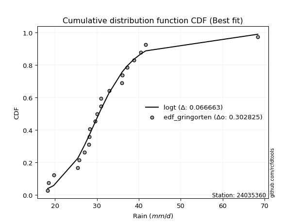</img>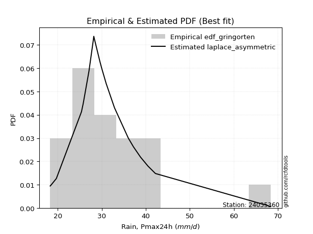</img>

</div>


### 9. EDF Filliben (1975)

The specific values of the constants (0.3175) (often denoted as $alpha$) and (0.365) are derived from a method proposed by James J. Filliben in a 1975 paper. This particular formula is the mean value of the $i$-th order statistic of the normal distribution and is considered a robust and effective plotting position formula for the normal probability plot correlation coefficient test for normality.

<div align="center">


$P=(m-0.3175)/(n+0.365)$


</div>


**9.1. Empirical values**

<div align="center">

|                | 0                   | 1                   | 2                  | 3                   | 4                   | 5                  | 6                   | 7                   | 8                   | 9                   | 10                 | 11                 | 12                 | 13                 | 14                | 15                 | 16                 | 17                 | 18                 | 19                 |
|:---------------|:--------------------|:--------------------|:-------------------|:--------------------|:--------------------|:-------------------|:--------------------|:--------------------|:--------------------|:--------------------|:-------------------|:-------------------|:-------------------|:-------------------|:------------------|:-------------------|:-------------------|:-------------------|:-------------------|:-------------------|
| date           | 2021                | 2022                | 2017               | 2019                | 2015                | 2011               | 2012                | 2014                | 2010                | 2018                | 2023               | 2020               | 2008               | 2006               | 2016              | 2009               | 2005               | 2007               | 2013               | 2024               |
| x              | 18.3                | 18.5                | 19.7               | 25.4                | 25.8                | 27.1               | 28.1                | 28.2                | 28.3                | 29.6                | 30.0               | 31.0               | 32.9               | 36.0               | 36.1              | 37.2               | 38.8               | 40.5               | 42.19              | 68.4               |
| m              | 1                   | 2                   | 3                  | 4                   | 5                   | 6                  | 7                   | 8                   | 9                   | 10                  | 11                 | 12                 | 13                 | 14                 | 15                | 16                 | 17                 | 18                 | 19                 | 20                 |
| empirical_dist | edf_filliben        | edf_filliben        | edf_filliben       | edf_filliben        | edf_filliben        | edf_filliben       | edf_filliben        | edf_filliben        | edf_filliben        | edf_filliben        | edf_filliben       | edf_filliben       | edf_filliben       | edf_filliben       | edf_filliben      | edf_filliben       | edf_filliben       | edf_filliben       | edf_filliben       | edf_filliben       |
| empirical      | 0.03351338080039283 | 0.08261723545298306 | 0.1317210901055733 | 0.18082494475816355 | 0.22992879941075375 | 0.279032654063344  | 0.32813650871593425 | 0.37724036336852446 | 0.42634421802111466 | 0.47544807267370487 | 0.5245519273262951 | 0.5736557819788853 | 0.6227596366314756 | 0.6718634912840659 | 0.720967345936656 | 0.7700712005892463 | 0.8191750552418366 | 0.8682789098944268 | 0.9173827645470171 | 0.9664866191996073 |
| empirical_tr   | 1.0346754731360346  | 1.090057540479058   | 1.1517036618125265 | 1.2207402967181178  | 1.2985812211063288  | 1.3870253703388389 | 1.4883975881600586  | 1.6057559629410605  | 1.7432056494757115  | 1.90638895389656    | 2.1032791117996386 | 2.345522602936942  | 2.6508298080052066 | 3.0475121586232703 | 3.583809942806863 | 4.349172450613988  | 5.5302104548540445 | 7.591798695246976  | 12.104011887072826 | 29.838827838827974 |

</div>


**9.2. Kolmogorov-Smirnov fit test (sorted by Δ)**


<div align="center">

|                | 0                   | 1                   | 2                   | 3                   | 4                   | 5                   | 6                   | 7                   | 8                   | 9                   | 10                  | 11                  | 12                  | 13                  | 14                  | 15                  | 16                 | 17                  | 18                  | 19                  | 20                  | 21                  | 22                  | 23                  | 24                    | 25                  | 26                 | 27                  | 28                  | 29                  | 30                  | 31                  | 32                  | 33                  | 34                  | 35                  | 36                  | 37                  | 38                 | 39                  | 40                  | 41                  | 42                  | 43                  | 44                 | 45                  | 46                 | 47                  | 48                  | 49                  | 50                  | 51                 | 52                  | 53                 | 54                  | 55                 | 56                 | 57                 | 58                  | 59                  | 60                  | 61                 | 62                  | 63                  | 64                  | 65                 | 66                  | 67                 | 68                 | 69                 | 70                  | 71                  | 72                  | 73                  | 74                  | 75                 | 76                 | 77                 | 78                  | 79                  | 80                  | 81                  | 82                 | 83                  | 84                 | 85                 | 86                 | 87                 |
|:---------------|:--------------------|:--------------------|:--------------------|:--------------------|:--------------------|:--------------------|:--------------------|:--------------------|:--------------------|:--------------------|:--------------------|:--------------------|:--------------------|:--------------------|:--------------------|:--------------------|:-------------------|:--------------------|:--------------------|:--------------------|:--------------------|:--------------------|:--------------------|:--------------------|:----------------------|:--------------------|:-------------------|:--------------------|:--------------------|:--------------------|:--------------------|:--------------------|:--------------------|:--------------------|:--------------------|:--------------------|:--------------------|:--------------------|:-------------------|:--------------------|:--------------------|:--------------------|:--------------------|:--------------------|:-------------------|:--------------------|:-------------------|:--------------------|:--------------------|:--------------------|:--------------------|:-------------------|:--------------------|:-------------------|:--------------------|:-------------------|:-------------------|:-------------------|:--------------------|:--------------------|:--------------------|:-------------------|:--------------------|:--------------------|:--------------------|:-------------------|:--------------------|:-------------------|:-------------------|:-------------------|:--------------------|:--------------------|:--------------------|:--------------------|:--------------------|:-------------------|:-------------------|:-------------------|:--------------------|:--------------------|:--------------------|:--------------------|:-------------------|:--------------------|:-------------------|:-------------------|:-------------------|:-------------------|
| station        | 24035360            | 24035360            | 24035360            | 24035360            | 24035360            | 24035360            | 24035360            | 24035360            | 24035360            | 24035360            | 24035360            | 24035360            | 24035360            | 24035360            | 24035360            | 24035360            | 24035360           | 24035360            | 24035360            | 24035360            | 24035360            | 24035360            | 24035360            | 24035360            | 24035360              | 24035360            | 24035360           | 24035360            | 24035360            | 24035360            | 24035360            | 24035360            | 24035360            | 24035360            | 24035360            | 24035360            | 24035360            | 24035360            | 24035360           | 24035360            | 24035360            | 24035360            | 24035360            | 24035360            | 24035360           | 24035360            | 24035360           | 24035360            | 24035360            | 24035360            | 24035360            | 24035360           | 24035360            | 24035360           | 24035360            | 24035360           | 24035360           | 24035360           | 24035360            | 24035360            | 24035360            | 24035360           | 24035360            | 24035360            | 24035360            | 24035360           | 24035360            | 24035360           | 24035360           | 24035360           | 24035360            | 24035360            | 24035360            | 24035360            | 24035360            | 24035360           | 24035360           | 24035360           | 24035360            | 24035360            | 24035360            | 24035360            | 24035360           | 24035360            | 24035360           | 24035360           | 24035360           | 24035360           |
| empirical_dist | edf_filliben        | edf_filliben        | edf_filliben        | edf_filliben        | edf_filliben        | edf_filliben        | edf_filliben        | edf_filliben        | edf_filliben        | edf_filliben        | edf_filliben        | edf_filliben        | edf_filliben        | edf_filliben        | edf_filliben        | edf_filliben        | edf_filliben       | edf_filliben        | edf_filliben        | edf_filliben        | edf_filliben        | edf_filliben        | edf_filliben        | edf_filliben        | edf_filliben          | edf_filliben        | edf_filliben       | edf_filliben        | edf_filliben        | edf_filliben        | edf_filliben        | edf_filliben        | edf_filliben        | edf_filliben        | edf_filliben        | edf_filliben        | edf_filliben        | edf_filliben        | edf_filliben       | edf_filliben        | edf_filliben        | edf_filliben        | edf_filliben        | edf_filliben        | edf_filliben       | edf_filliben        | edf_filliben       | edf_filliben        | edf_filliben        | edf_filliben        | edf_filliben        | edf_filliben       | edf_filliben        | edf_filliben       | edf_filliben        | edf_filliben       | edf_filliben       | edf_filliben       | edf_filliben        | edf_filliben        | edf_filliben        | edf_filliben       | edf_filliben        | edf_filliben        | edf_filliben        | edf_filliben       | edf_filliben        | edf_filliben       | edf_filliben       | edf_filliben       | edf_filliben        | edf_filliben        | edf_filliben        | edf_filliben        | edf_filliben        | edf_filliben       | edf_filliben       | edf_filliben       | edf_filliben        | edf_filliben        | edf_filliben        | edf_filliben        | edf_filliben       | edf_filliben        | edf_filliben       | edf_filliben       | edf_filliben       | edf_filliben       |
| p_dist         | loglogistic         | fisk                | laplace_asymmetric  | johnsonsu           | loghypsecant        | logt                | logjohnsonsu        | loggenlogistic      | exponnorm           | logfisk             | ncf                 | genlogistic         | lognorm             | lognorm             | logcrystalball      | kstwobign           | logexponnorm       | logloggamma         | alpha               | nct                 | betaprime           | invweibull          | invgamma            | logbetaprime        | loglaplace_asymmetric | logalpha            | loglaplace         | f                   | loginvgamma         | loglognorm          | logf                | logfatiguelife      | logerlang           | loggamma            | loggamma            | lognct              | rice                | t                   | logpearson3        | loginvgauss         | invgauss            | logrice             | fatiguelife         | gumbel_r            | moyal              | maxwell             | lognakagami        | logmaxwell          | logweibull_min      | crystalball         | norm                | loggumbel_r        | rayleigh            | lograyleigh        | logistic            | gamma              | chi2               | erlang             | hypsecant           | loggumbel_l         | pearson3            | loginvweibull      | halflogistic        | wald                | logmoyal            | gibrat             | halfnorm            | loghalfnorm        | laplace            | loggompertz        | logkstwobign        | loghalflogistic     | loggenexpon         | gompertz            | weibull_min         | loggibrat          | gumbel_l           | logwald            | logncf              | expon               | genexpon            | nakagami            | logmielke          | logexpon            | logchi2            | logtruncnorm       | truncnorm          | mielke             |
| delta          | 0.06709872834373172 | 0.06747908019785916 | 0.07016093902078677 | 0.07017907156772626 | 0.07047345283403017 | 0.07168477072539503 | 0.07174696825015558 | 0.07186000154075388 | 0.07212381250175368 | 0.07567145080616317 | 0.08178768493735425 | 0.08377228249131832 | 0.08521310748805141 | 0.08521310748805141 | 0.08521316185640418 | 0.08583114643580511 | 0.0873259695807819 | 0.08872461310283394 | 0.08980329172468801 | 0.09019922076739348 | 0.09049847426112159 | 0.09260356276330681 | 0.09474595110515602 | 0.09481765054815902 | 0.0949626890238503    | 0.09500094683905488 | 0.0950557428065808 | 0.09522830555496384 | 0.09529417465242615 | 0.09550488625208445 | 0.09556315525606926 | 0.09571120354475246 | 0.09627201392473742 | 0.09627204640524947 | 0.09627204640524947 | 0.09640049573585505 | 0.09719954090868055 | 0.09856902744552831 | 0.099601438105717  | 0.10141914934843613 | 0.10218929280766184 | 0.10227916241339871 | 0.10280816750082458 | 0.10446249089422907 | 0.1070534449326446 | 0.10839230549654802 | 0.1085723841937071 | 0.10907987408119038 | 0.11438177826911813 | 0.11476984488396141 | 0.11476985603787171 | 0.1158966608008683 | 0.11807983583033746 | 0.1187957234544508 | 0.12033399019688307 | 0.1243702672772389 | 0.1243710296425333 | 0.1243728214827726 | 0.12505140037263285 | 0.12725137092163163 | 0.13088789861187694 | 0.1310103356984569 | 0.13467886265494264 | 0.13714911014694903 | 0.13774211122095514 | 0.1414624381038968 | 0.14476995000786672 | 0.1455797775454226 | 0.1459774155138963 | 0.1463192617164318 | 0.15286106967502203 | 0.15338972028572234 | 0.16010492397339063 | 0.16367953241806912 | 0.18082494475815683 | 0.1826513863914646 | 0.185163597795374  | 0.195470572916418  | 0.20758032922855008 | 0.22127103485383295 | 0.22134449906765177 | 0.24250240858219332 | 0.252381533498909  | 0.29009534517107527 | 0.3010205597551192 | 0.3245062348414106 | 0.539817091180092  | nan                |
| deltao         | 0.3096406529800002  | 0.3096406529800002  | 0.3096406529800002  | 0.3096406529800002  | 0.3096406529800002  | 0.3096406529800002  | 0.3096406529800002  | 0.3096406529800002  | 0.3096406529800002  | 0.3096406529800002  | 0.3096406529800002  | 0.3096406529800002  | 0.3096406529800002  | 0.3096406529800002  | 0.3096406529800002  | 0.3096406529800002  | 0.3096406529800002 | 0.3096406529800002  | 0.3096406529800002  | 0.3096406529800002  | 0.3096406529800002  | 0.3096406529800002  | 0.3096406529800002  | 0.3096406529800002  | 0.3096406529800002    | 0.3096406529800002  | 0.3096406529800002 | 0.3096406529800002  | 0.3096406529800002  | 0.3096406529800002  | 0.3096406529800002  | 0.3096406529800002  | 0.3096406529800002  | 0.3096406529800002  | 0.3096406529800002  | 0.3096406529800002  | 0.3096406529800002  | 0.3096406529800002  | 0.3096406529800002 | 0.3096406529800002  | 0.3096406529800002  | 0.3096406529800002  | 0.3096406529800002  | 0.3096406529800002  | 0.3096406529800002 | 0.3096406529800002  | 0.3096406529800002 | 0.3096406529800002  | 0.3096406529800002  | 0.3096406529800002  | 0.3096406529800002  | 0.3096406529800002 | 0.3096406529800002  | 0.3096406529800002 | 0.3096406529800002  | 0.3096406529800002 | 0.3096406529800002 | 0.3096406529800002 | 0.3096406529800002  | 0.3096406529800002  | 0.3096406529800002  | 0.3096406529800002 | 0.3096406529800002  | 0.3096406529800002  | 0.3096406529800002  | 0.3096406529800002 | 0.3096406529800002  | 0.3096406529800002 | 0.3096406529800002 | 0.3096406529800002 | 0.3096406529800002  | 0.3096406529800002  | 0.3096406529800002  | 0.3096406529800002  | 0.3096406529800002  | 0.3096406529800002 | 0.3096406529800002 | 0.3096406529800002 | 0.3096406529800002  | 0.3096406529800002  | 0.3096406529800002  | 0.3096406529800002  | 0.3096406529800002 | 0.3096406529800002  | 0.3096406529800002 | 0.3096406529800002 | 0.3096406529800002 | 0.3096406529800002 |
| eval           | Δo > Δ              | Δo > Δ              | Δo > Δ              | Δo > Δ              | Δo > Δ              | Δo > Δ              | Δo > Δ              | Δo > Δ              | Δo > Δ              | Δo > Δ              | Δo > Δ              | Δo > Δ              | Δo > Δ              | Δo > Δ              | Δo > Δ              | Δo > Δ              | Δo > Δ             | Δo > Δ              | Δo > Δ              | Δo > Δ              | Δo > Δ              | Δo > Δ              | Δo > Δ              | Δo > Δ              | Δo > Δ                | Δo > Δ              | Δo > Δ             | Δo > Δ              | Δo > Δ              | Δo > Δ              | Δo > Δ              | Δo > Δ              | Δo > Δ              | Δo > Δ              | Δo > Δ              | Δo > Δ              | Δo > Δ              | Δo > Δ              | Δo > Δ             | Δo > Δ              | Δo > Δ              | Δo > Δ              | Δo > Δ              | Δo > Δ              | Δo > Δ             | Δo > Δ              | Δo > Δ             | Δo > Δ              | Δo > Δ              | Δo > Δ              | Δo > Δ              | Δo > Δ             | Δo > Δ              | Δo > Δ             | Δo > Δ              | Δo > Δ             | Δo > Δ             | Δo > Δ             | Δo > Δ              | Δo > Δ              | Δo > Δ              | Δo > Δ             | Δo > Δ              | Δo > Δ              | Δo > Δ              | Δo > Δ             | Δo > Δ              | Δo > Δ             | Δo > Δ             | Δo > Δ             | Δo > Δ              | Δo > Δ              | Δo > Δ              | Δo > Δ              | Δo > Δ              | Δo > Δ             | Δo > Δ             | Δo > Δ             | Δo > Δ              | Δo > Δ              | Δo > Δ              | Δo > Δ              | Δo > Δ             | Δo > Δ              | Δo > Δ             | Δo <= Δ            | Δo <= Δ            | Δo <= Δ            |
| fit            | 1                   | 1                   | 1                   | 1                   | 1                   | 1                   | 1                   | 1                   | 1                   | 1                   | 1                   | 1                   | 1                   | 1                   | 1                   | 1                   | 1                  | 1                   | 1                   | 1                   | 1                   | 1                   | 1                   | 1                   | 1                     | 1                   | 1                  | 1                   | 1                   | 1                   | 1                   | 1                   | 1                   | 1                   | 1                   | 1                   | 1                   | 1                   | 1                  | 1                   | 1                   | 1                   | 1                   | 1                   | 1                  | 1                   | 1                  | 1                   | 1                   | 1                   | 1                   | 1                  | 1                   | 1                  | 1                   | 1                  | 1                  | 1                  | 1                   | 1                   | 1                   | 1                  | 1                   | 1                   | 1                   | 1                  | 1                   | 1                  | 1                  | 1                  | 1                   | 1                   | 1                   | 1                   | 1                   | 1                  | 1                  | 1                  | 1                   | 1                   | 1                   | 1                   | 1                  | 1                   | 1                  | 0                  | 0                  | 0                  |
| n              | 20                  | 20                  | 20                  | 20                  | 20                  | 20                  | 20                  | 20                  | 20                  | 20                  | 20                  | 20                  | 20                  | 20                  | 20                  | 20                  | 20                 | 20                  | 20                  | 20                  | 20                  | 20                  | 20                  | 20                  | 20                    | 20                  | 20                 | 20                  | 20                  | 20                  | 20                  | 20                  | 20                  | 20                  | 20                  | 20                  | 20                  | 20                  | 20                 | 20                  | 20                  | 20                  | 20                  | 20                  | 20                 | 20                  | 20                 | 20                  | 20                  | 20                  | 20                  | 20                 | 20                  | 20                 | 20                  | 20                 | 20                 | 20                 | 20                  | 20                  | 20                  | 20                 | 20                  | 20                  | 20                  | 20                 | 20                  | 20                 | 20                 | 20                 | 20                  | 20                  | 20                  | 20                  | 20                  | 20                 | 20                 | 20                 | 20                  | 20                  | 20                  | 20                  | 20                 | 20                  | 20                 | 20                 | 20                 | 20                 |
| best_fit       | 1                   | 0                   | 0                   | 0                   | 0                   | 0                   | 0                   | 0                   | 0                   | 0                   | 0                   | 0                   | 0                   | 0                   | 0                   | 0                   | 0                  | 0                   | 0                   | 0                   | 0                   | 0                   | 0                   | 0                   | 0                     | 0                   | 0                  | 0                   | 0                   | 0                   | 0                   | 0                   | 0                   | 0                   | 0                   | 0                   | 0                   | 0                   | 0                  | 0                   | 0                   | 0                   | 0                   | 0                   | 0                  | 0                   | 0                  | 0                   | 0                   | 0                   | 0                   | 0                  | 0                   | 0                  | 0                   | 0                  | 0                  | 0                  | 0                   | 0                   | 0                   | 0                  | 0                   | 0                   | 0                   | 0                  | 0                   | 0                  | 0                  | 0                  | 0                   | 0                   | 0                   | 0                   | 0                   | 0                  | 0                  | 0                  | 0                   | 0                   | 0                   | 0                   | 0                  | 0                   | 0                  | 0                  | 0                  | 0                  |
| best_fit_sort  | 1                   | 2                   | 3                   | 4                   | 5                   | 6                   | 7                   | 8                   | 9                   | 10                  | 11                  | 12                  | 13                  | 14                  | 15                  | 16                  | 17                 | 18                  | 19                  | 20                  | 21                  | 22                  | 23                  | 24                  | 25                    | 26                  | 27                 | 28                  | 29                  | 30                  | 31                  | 32                  | 33                  | 34                  | 35                  | 36                  | 37                  | 38                  | 39                 | 40                  | 41                  | 42                  | 43                  | 44                  | 45                 | 46                  | 47                 | 48                  | 49                  | 50                  | 51                  | 52                 | 53                  | 54                 | 55                  | 56                 | 57                 | 58                 | 59                  | 60                  | 61                  | 62                 | 63                  | 64                  | 65                  | 66                 | 67                  | 68                 | 69                 | 70                 | 71                  | 72                  | 73                  | 74                  | 75                  | 76                 | 77                 | 78                 | 79                  | 80                  | 81                  | 82                  | 83                 | 84                  | 85                 | 86                 | 87                 | 88                 |

</div>


**9.3. Best fit**

<div align="center">

|   id |   station | empirical_dist   | p_dist      |     delta |   deltao | eval   |   fit |   n |   best_fit |   best_fit_sort |
|-----:|----------:|:-----------------|:------------|----------:|---------:|:-------|------:|----:|-----------:|----------------:|
|    0 |  24035360 | edf_filliben     | loglogistic | 0.0670987 | 0.309641 | Δo > Δ |     1 |  20 |          1 |               1 |

</div>


<div align="center">

</img>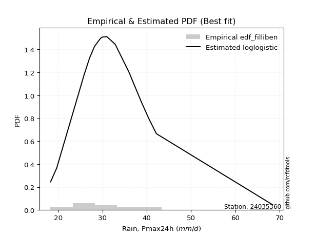</img>

</div>


### 10. EDF Jenkinson (1977)

The Jenkinson formula in hydrology is an empirical plotting position formula used to estimate the non-exceedance probability _(P)_ or return period _(T)_ of a given ordered observation within a sample. It is a widely used method in the frequency analysis of extreme events such as floods and rainfall, as it provides a distribution-free way to plot data. _a≈0.31_ and _b≈0.38_ are constants derived to approximate the median of the probability distribution for the given rank.

<div align="center">


$P=(m-a)/(n+b)$


</div>


**10.1. Empirical values**

<div align="center">

|                | 0                    | 1                   | 2                   | 3                   | 4                   | 5                   | 6                   | 7                  | 8                  | 9                   | 10                 | 11                 | 12                 | 13                 | 14                 | 15                 | 16                 | 17                 | 18                 | 19                 |
|:---------------|:---------------------|:--------------------|:--------------------|:--------------------|:--------------------|:--------------------|:--------------------|:-------------------|:-------------------|:--------------------|:-------------------|:-------------------|:-------------------|:-------------------|:-------------------|:-------------------|:-------------------|:-------------------|:-------------------|:-------------------|
| date           | 2021                 | 2022                | 2017                | 2019                | 2015                | 2011                | 2012                | 2014               | 2010               | 2018                | 2023               | 2020               | 2008               | 2006               | 2016               | 2009               | 2005               | 2007               | 2013               | 2024               |
| x              | 18.3                 | 18.5                | 19.7                | 25.4                | 25.8                | 27.1                | 28.1                | 28.2               | 28.3               | 29.6                | 30.0               | 31.0               | 32.9               | 36.0               | 36.1               | 37.2               | 38.8               | 40.5               | 42.19              | 68.4               |
| m              | 1                    | 2                   | 3                   | 4                   | 5                   | 6                   | 7                   | 8                  | 9                  | 10                  | 11                 | 12                 | 13                 | 14                 | 15                 | 16                 | 17                 | 18                 | 19                 | 20                 |
| empirical_dist | edf_jenkinson        | edf_jenkinson       | edf_jenkinson       | edf_jenkinson       | edf_jenkinson       | edf_jenkinson       | edf_jenkinson       | edf_jenkinson      | edf_jenkinson      | edf_jenkinson       | edf_jenkinson      | edf_jenkinson      | edf_jenkinson      | edf_jenkinson      | edf_jenkinson      | edf_jenkinson      | edf_jenkinson      | edf_jenkinson      | edf_jenkinson      | edf_jenkinson      |
| empirical      | 0.033856722276741906 | 0.08292443572129539 | 0.13199214916584887 | 0.18105986261040236 | 0.23012757605495587 | 0.27919528949950934 | 0.32826300294406285 | 0.3773307163886163 | 0.4263984298331698 | 0.47546614327772324 | 0.5245338567222767 | 0.5736015701668302 | 0.6226692836113837 | 0.6717369970559373 | 0.7208047105004907 | 0.7698724239450442 | 0.8189401373895977 | 0.8680078508341512 | 0.9170755642787047 | 0.9661432777232583 |
| empirical_tr   | 1.0350431691213813   | 1.090422685928304   | 1.152063312605992   | 1.2210904733373276  | 1.2989165073295095  | 1.3873383253914227  | 1.4886778670562455  | 1.6059889676910957 | 1.7433704020530367 | 1.9064546304957901  | 2.1031991744066048 | 2.3452243958573074 | 2.6501950585175553 | 3.0463378176382667 | 3.581722319859402  | 4.345415778251599  | 5.523035230352305  | 7.576208178438667  | 12.059171597633155 | 29.536231884058108 |

</div>


**10.2. Kolmogorov-Smirnov fit test (sorted by Δ)**


<div align="center">

|                | 0                   | 1                   | 2                   | 3                   | 4                   | 5                   | 6                   | 7                   | 8                   | 9                   | 10                  | 11                  | 12                 | 13                 | 14                  | 15                 | 16                  | 17                  | 18                 | 19                  | 20                  | 21                 | 22                  | 23                  | 24                  | 25                  | 26                  | 27                    | 28                 | 29                  | 30                  | 31                  | 32                 | 33                  | 34                  | 35                  | 36                  | 37                  | 38                 | 39                  | 40                  | 41                 | 42                  | 43                  | 44                  | 45                  | 46                  | 47                  | 48                  | 49                 | 50                 | 51                 | 52                  | 53                 | 54                  | 55                 | 56                  | 57                  | 58                  | 59                  | 60                 | 61                 | 62                  | 63                  | 64                  | 65                 | 66                 | 67                  | 68                  | 69                 | 70                  | 71                  | 72                  | 73                  | 74                  | 75                 | 76                  | 77                 | 78                  | 79                  | 80                  | 81                  | 82                 | 83                 | 84                 | 85                  | 86                 | 87                 |
|:---------------|:--------------------|:--------------------|:--------------------|:--------------------|:--------------------|:--------------------|:--------------------|:--------------------|:--------------------|:--------------------|:--------------------|:--------------------|:-------------------|:-------------------|:--------------------|:-------------------|:--------------------|:--------------------|:-------------------|:--------------------|:--------------------|:-------------------|:--------------------|:--------------------|:--------------------|:--------------------|:--------------------|:----------------------|:-------------------|:--------------------|:--------------------|:--------------------|:-------------------|:--------------------|:--------------------|:--------------------|:--------------------|:--------------------|:-------------------|:--------------------|:--------------------|:-------------------|:--------------------|:--------------------|:--------------------|:--------------------|:--------------------|:--------------------|:--------------------|:-------------------|:-------------------|:-------------------|:--------------------|:-------------------|:--------------------|:-------------------|:--------------------|:--------------------|:--------------------|:--------------------|:-------------------|:-------------------|:--------------------|:--------------------|:--------------------|:-------------------|:-------------------|:--------------------|:--------------------|:-------------------|:--------------------|:--------------------|:--------------------|:--------------------|:--------------------|:-------------------|:--------------------|:-------------------|:--------------------|:--------------------|:--------------------|:--------------------|:-------------------|:-------------------|:-------------------|:--------------------|:-------------------|:-------------------|
| station        | 24035360            | 24035360            | 24035360            | 24035360            | 24035360            | 24035360            | 24035360            | 24035360            | 24035360            | 24035360            | 24035360            | 24035360            | 24035360           | 24035360           | 24035360            | 24035360           | 24035360            | 24035360            | 24035360           | 24035360            | 24035360            | 24035360           | 24035360            | 24035360            | 24035360            | 24035360            | 24035360            | 24035360              | 24035360           | 24035360            | 24035360            | 24035360            | 24035360           | 24035360            | 24035360            | 24035360            | 24035360            | 24035360            | 24035360           | 24035360            | 24035360            | 24035360           | 24035360            | 24035360            | 24035360            | 24035360            | 24035360            | 24035360            | 24035360            | 24035360           | 24035360           | 24035360           | 24035360            | 24035360           | 24035360            | 24035360           | 24035360            | 24035360            | 24035360            | 24035360            | 24035360           | 24035360           | 24035360            | 24035360            | 24035360            | 24035360           | 24035360           | 24035360            | 24035360            | 24035360           | 24035360            | 24035360            | 24035360            | 24035360            | 24035360            | 24035360           | 24035360            | 24035360           | 24035360            | 24035360            | 24035360            | 24035360            | 24035360           | 24035360           | 24035360           | 24035360            | 24035360           | 24035360           |
| empirical_dist | edf_jenkinson       | edf_jenkinson       | edf_jenkinson       | edf_jenkinson       | edf_jenkinson       | edf_jenkinson       | edf_jenkinson       | edf_jenkinson       | edf_jenkinson       | edf_jenkinson       | edf_jenkinson       | edf_jenkinson       | edf_jenkinson      | edf_jenkinson      | edf_jenkinson       | edf_jenkinson      | edf_jenkinson       | edf_jenkinson       | edf_jenkinson      | edf_jenkinson       | edf_jenkinson       | edf_jenkinson      | edf_jenkinson       | edf_jenkinson       | edf_jenkinson       | edf_jenkinson       | edf_jenkinson       | edf_jenkinson         | edf_jenkinson      | edf_jenkinson       | edf_jenkinson       | edf_jenkinson       | edf_jenkinson      | edf_jenkinson       | edf_jenkinson       | edf_jenkinson       | edf_jenkinson       | edf_jenkinson       | edf_jenkinson      | edf_jenkinson       | edf_jenkinson       | edf_jenkinson      | edf_jenkinson       | edf_jenkinson       | edf_jenkinson       | edf_jenkinson       | edf_jenkinson       | edf_jenkinson       | edf_jenkinson       | edf_jenkinson      | edf_jenkinson      | edf_jenkinson      | edf_jenkinson       | edf_jenkinson      | edf_jenkinson       | edf_jenkinson      | edf_jenkinson       | edf_jenkinson       | edf_jenkinson       | edf_jenkinson       | edf_jenkinson      | edf_jenkinson      | edf_jenkinson       | edf_jenkinson       | edf_jenkinson       | edf_jenkinson      | edf_jenkinson      | edf_jenkinson       | edf_jenkinson       | edf_jenkinson      | edf_jenkinson       | edf_jenkinson       | edf_jenkinson       | edf_jenkinson       | edf_jenkinson       | edf_jenkinson      | edf_jenkinson       | edf_jenkinson      | edf_jenkinson       | edf_jenkinson       | edf_jenkinson       | edf_jenkinson       | edf_jenkinson      | edf_jenkinson      | edf_jenkinson      | edf_jenkinson       | edf_jenkinson      | edf_jenkinson      |
| p_dist         | loglogistic         | fisk                | laplace_asymmetric  | johnsonsu           | loghypsecant        | logt                | logjohnsonsu        | loggenlogistic      | exponnorm           | logfisk             | ncf                 | genlogistic         | lognorm            | lognorm            | logcrystalball      | kstwobign          | logexponnorm        | logloggamma         | alpha              | nct                 | betaprime           | invweibull         | invgamma            | logbetaprime        | logalpha            | f                   | loginvgamma         | loglaplace_asymmetric | loglaplace         | loglognorm          | logf                | logfatiguelife      | logerlang          | loggamma            | loggamma            | lognct              | rice                | t                   | logpearson3        | loginvgauss         | invgauss            | logrice            | fatiguelife         | gumbel_r            | moyal               | maxwell             | lognakagami         | logmaxwell          | logweibull_min      | crystalball        | norm               | loggumbel_r        | rayleigh            | lograyleigh        | logistic            | gamma              | chi2                | erlang              | hypsecant           | loggumbel_l         | loginvweibull      | pearson3           | halflogistic        | wald                | logmoyal            | gibrat             | halfnorm           | loghalfnorm         | laplace             | loggompertz        | logkstwobign        | loghalflogistic     | loggenexpon         | gompertz            | weibull_min         | loggibrat          | gumbel_l            | logwald            | logncf              | expon               | genexpon            | nakagami            | logmielke          | logexpon           | logchi2            | logtruncnorm        | truncnorm          | mielke             |
| delta          | 0.06736978740400727 | 0.06775013925813471 | 0.07043199808106232 | 0.07045013062800182 | 0.07059994706215877 | 0.07181126495352363 | 0.07187346247828419 | 0.07213106060102943 | 0.07239487156202923 | 0.07594250986643872 | 0.08155276708511544 | 0.08353736463907951 | 0.0849781896358126 | 0.0849781896358126 | 0.08497824400416537 | 0.0855962285835663 | 0.08709105172854309 | 0.08848969525059514 | 0.0895683738724492 | 0.08996430291515467 | 0.09026355640888278 | 0.092368644911068  | 0.09451103325291721 | 0.09458273269592021 | 0.09476602898681608 | 0.09499338770272503 | 0.09505925680018734 | 0.0950891832519789    | 0.0951822370347094 | 0.09526996839984564 | 0.09532823740383045 | 0.09547628569251365 | 0.0960370960724986 | 0.09603712855301066 | 0.09603712855301066 | 0.09616557788361624 | 0.09714532909662543 | 0.09869552167365692 | 0.0993665202534782 | 0.10118423149619732 | 0.10195437495542303 | 0.1020442445611599 | 0.10257324964858577 | 0.10422757304199026 | 0.10681852708040579 | 0.10815738764430921 | 0.10833746634146829 | 0.10884495622895157 | 0.11414686041687933 | 0.1147156330719063 | 0.1147156442258166 | 0.1157701665727397 | 0.11784491797809865 | 0.118560805602212  | 0.12027977838482795 | 0.1241353494250001 | 0.12413611179029449 | 0.12413790363053379 | 0.12499718856057773 | 0.12719715910957652 | 0.1307754178462181 | 0.1311589576721525 | 0.13444394480270383 | 0.13702261591882042 | 0.13761561699282654 | 0.1415889323320254 | 0.1445350321556279 | 0.14534485969318378 | 0.14595934490987794 | 0.146084343864193  | 0.15262615182278322 | 0.15326322605759374 | 0.15987000612115182 | 0.16344461456583032 | 0.18105986261039564 | 0.182524892163336  | 0.18510938598331889 | 0.1953440786882894 | 0.20727312896023775 | 0.22103611700159415 | 0.22110958121541296 | 0.24226749072995452 | 0.2521466156466702 | 0.2898604273188365 | 0.3007133594868069 | 0.32427131698917183 | 0.539473749703743  | nan                |
| deltao         | 0.3096406529800002  | 0.3096406529800002  | 0.3096406529800002  | 0.3096406529800002  | 0.3096406529800002  | 0.3096406529800002  | 0.3096406529800002  | 0.3096406529800002  | 0.3096406529800002  | 0.3096406529800002  | 0.3096406529800002  | 0.3096406529800002  | 0.3096406529800002 | 0.3096406529800002 | 0.3096406529800002  | 0.3096406529800002 | 0.3096406529800002  | 0.3096406529800002  | 0.3096406529800002 | 0.3096406529800002  | 0.3096406529800002  | 0.3096406529800002 | 0.3096406529800002  | 0.3096406529800002  | 0.3096406529800002  | 0.3096406529800002  | 0.3096406529800002  | 0.3096406529800002    | 0.3096406529800002 | 0.3096406529800002  | 0.3096406529800002  | 0.3096406529800002  | 0.3096406529800002 | 0.3096406529800002  | 0.3096406529800002  | 0.3096406529800002  | 0.3096406529800002  | 0.3096406529800002  | 0.3096406529800002 | 0.3096406529800002  | 0.3096406529800002  | 0.3096406529800002 | 0.3096406529800002  | 0.3096406529800002  | 0.3096406529800002  | 0.3096406529800002  | 0.3096406529800002  | 0.3096406529800002  | 0.3096406529800002  | 0.3096406529800002 | 0.3096406529800002 | 0.3096406529800002 | 0.3096406529800002  | 0.3096406529800002 | 0.3096406529800002  | 0.3096406529800002 | 0.3096406529800002  | 0.3096406529800002  | 0.3096406529800002  | 0.3096406529800002  | 0.3096406529800002 | 0.3096406529800002 | 0.3096406529800002  | 0.3096406529800002  | 0.3096406529800002  | 0.3096406529800002 | 0.3096406529800002 | 0.3096406529800002  | 0.3096406529800002  | 0.3096406529800002 | 0.3096406529800002  | 0.3096406529800002  | 0.3096406529800002  | 0.3096406529800002  | 0.3096406529800002  | 0.3096406529800002 | 0.3096406529800002  | 0.3096406529800002 | 0.3096406529800002  | 0.3096406529800002  | 0.3096406529800002  | 0.3096406529800002  | 0.3096406529800002 | 0.3096406529800002 | 0.3096406529800002 | 0.3096406529800002  | 0.3096406529800002 | 0.3096406529800002 |
| eval           | Δo > Δ              | Δo > Δ              | Δo > Δ              | Δo > Δ              | Δo > Δ              | Δo > Δ              | Δo > Δ              | Δo > Δ              | Δo > Δ              | Δo > Δ              | Δo > Δ              | Δo > Δ              | Δo > Δ             | Δo > Δ             | Δo > Δ              | Δo > Δ             | Δo > Δ              | Δo > Δ              | Δo > Δ             | Δo > Δ              | Δo > Δ              | Δo > Δ             | Δo > Δ              | Δo > Δ              | Δo > Δ              | Δo > Δ              | Δo > Δ              | Δo > Δ                | Δo > Δ             | Δo > Δ              | Δo > Δ              | Δo > Δ              | Δo > Δ             | Δo > Δ              | Δo > Δ              | Δo > Δ              | Δo > Δ              | Δo > Δ              | Δo > Δ             | Δo > Δ              | Δo > Δ              | Δo > Δ             | Δo > Δ              | Δo > Δ              | Δo > Δ              | Δo > Δ              | Δo > Δ              | Δo > Δ              | Δo > Δ              | Δo > Δ             | Δo > Δ             | Δo > Δ             | Δo > Δ              | Δo > Δ             | Δo > Δ              | Δo > Δ             | Δo > Δ              | Δo > Δ              | Δo > Δ              | Δo > Δ              | Δo > Δ             | Δo > Δ             | Δo > Δ              | Δo > Δ              | Δo > Δ              | Δo > Δ             | Δo > Δ             | Δo > Δ              | Δo > Δ              | Δo > Δ             | Δo > Δ              | Δo > Δ              | Δo > Δ              | Δo > Δ              | Δo > Δ              | Δo > Δ             | Δo > Δ              | Δo > Δ             | Δo > Δ              | Δo > Δ              | Δo > Δ              | Δo > Δ              | Δo > Δ             | Δo > Δ             | Δo > Δ             | Δo <= Δ             | Δo <= Δ            | Δo <= Δ            |
| fit            | 1                   | 1                   | 1                   | 1                   | 1                   | 1                   | 1                   | 1                   | 1                   | 1                   | 1                   | 1                   | 1                  | 1                  | 1                   | 1                  | 1                   | 1                   | 1                  | 1                   | 1                   | 1                  | 1                   | 1                   | 1                   | 1                   | 1                   | 1                     | 1                  | 1                   | 1                   | 1                   | 1                  | 1                   | 1                   | 1                   | 1                   | 1                   | 1                  | 1                   | 1                   | 1                  | 1                   | 1                   | 1                   | 1                   | 1                   | 1                   | 1                   | 1                  | 1                  | 1                  | 1                   | 1                  | 1                   | 1                  | 1                   | 1                   | 1                   | 1                   | 1                  | 1                  | 1                   | 1                   | 1                   | 1                  | 1                  | 1                   | 1                   | 1                  | 1                   | 1                   | 1                   | 1                   | 1                   | 1                  | 1                   | 1                  | 1                   | 1                   | 1                   | 1                   | 1                  | 1                  | 1                  | 0                   | 0                  | 0                  |
| n              | 20                  | 20                  | 20                  | 20                  | 20                  | 20                  | 20                  | 20                  | 20                  | 20                  | 20                  | 20                  | 20                 | 20                 | 20                  | 20                 | 20                  | 20                  | 20                 | 20                  | 20                  | 20                 | 20                  | 20                  | 20                  | 20                  | 20                  | 20                    | 20                 | 20                  | 20                  | 20                  | 20                 | 20                  | 20                  | 20                  | 20                  | 20                  | 20                 | 20                  | 20                  | 20                 | 20                  | 20                  | 20                  | 20                  | 20                  | 20                  | 20                  | 20                 | 20                 | 20                 | 20                  | 20                 | 20                  | 20                 | 20                  | 20                  | 20                  | 20                  | 20                 | 20                 | 20                  | 20                  | 20                  | 20                 | 20                 | 20                  | 20                  | 20                 | 20                  | 20                  | 20                  | 20                  | 20                  | 20                 | 20                  | 20                 | 20                  | 20                  | 20                  | 20                  | 20                 | 20                 | 20                 | 20                  | 20                 | 20                 |
| best_fit       | 1                   | 0                   | 0                   | 0                   | 0                   | 0                   | 0                   | 0                   | 0                   | 0                   | 0                   | 0                   | 0                  | 0                  | 0                   | 0                  | 0                   | 0                   | 0                  | 0                   | 0                   | 0                  | 0                   | 0                   | 0                   | 0                   | 0                   | 0                     | 0                  | 0                   | 0                   | 0                   | 0                  | 0                   | 0                   | 0                   | 0                   | 0                   | 0                  | 0                   | 0                   | 0                  | 0                   | 0                   | 0                   | 0                   | 0                   | 0                   | 0                   | 0                  | 0                  | 0                  | 0                   | 0                  | 0                   | 0                  | 0                   | 0                   | 0                   | 0                   | 0                  | 0                  | 0                   | 0                   | 0                   | 0                  | 0                  | 0                   | 0                   | 0                  | 0                   | 0                   | 0                   | 0                   | 0                   | 0                  | 0                   | 0                  | 0                   | 0                   | 0                   | 0                   | 0                  | 0                  | 0                  | 0                   | 0                  | 0                  |
| best_fit_sort  | 1                   | 2                   | 3                   | 4                   | 5                   | 6                   | 7                   | 8                   | 9                   | 10                  | 11                  | 12                  | 13                 | 14                 | 15                  | 16                 | 17                  | 18                  | 19                 | 20                  | 21                  | 22                 | 23                  | 24                  | 25                  | 26                  | 27                  | 28                    | 29                 | 30                  | 31                  | 32                  | 33                 | 34                  | 35                  | 36                  | 37                  | 38                  | 39                 | 40                  | 41                  | 42                 | 43                  | 44                  | 45                  | 46                  | 47                  | 48                  | 49                  | 50                 | 51                 | 52                 | 53                  | 54                 | 55                  | 56                 | 57                  | 58                  | 59                  | 60                  | 61                 | 62                 | 63                  | 64                  | 65                  | 66                 | 67                 | 68                  | 69                  | 70                 | 71                  | 72                  | 73                  | 74                  | 75                  | 76                 | 77                  | 78                 | 79                  | 80                  | 81                  | 82                  | 83                 | 84                 | 85                 | 86                  | 87                 | 88                 |

</div>


**10.3. Best fit**

<div align="center">

|   id |   station | empirical_dist   | p_dist      |     delta |   deltao | eval   |   fit |   n |   best_fit |   best_fit_sort |
|-----:|----------:|:-----------------|:------------|----------:|---------:|:-------|------:|----:|-----------:|----------------:|
|    0 |  24035360 | edf_jenkinson    | loglogistic | 0.0673698 | 0.309641 | Δo > Δ |     1 |  20 |          1 |               1 |

</div>


<div align="center">

</img>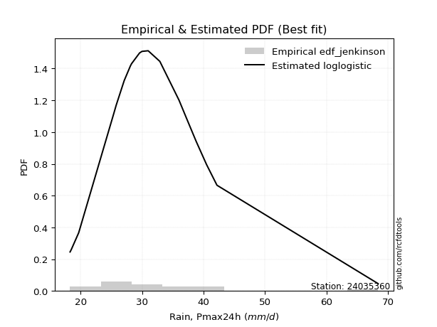</img>

</div>


### 11. EDF Cunnane (1978)

Cunnane´s work in statistical hydrology has focused on the performance and evaluation of different probability distributions (such as GEV, Gumbel, Lognormal) for flood frequency estimation. _b_ is a constant, typically set to 0.4.

<div align="center">


$P=(m-b)/(n+1-2b)$


</div>


**11.1. Empirical values**

<div align="center">

|                | 0                  | 1                   | 2                   | 3                   | 4                  | 5                  | 6                   | 7                   | 8                   | 9                  | 10                 | 11                 | 12                 | 13                 | 14                 | 15                 | 16                 | 17                 | 18                 | 19                 |
|:---------------|:-------------------|:--------------------|:--------------------|:--------------------|:-------------------|:-------------------|:--------------------|:--------------------|:--------------------|:-------------------|:-------------------|:-------------------|:-------------------|:-------------------|:-------------------|:-------------------|:-------------------|:-------------------|:-------------------|:-------------------|
| date           | 2021               | 2022                | 2017                | 2019                | 2015               | 2011               | 2012                | 2014                | 2010                | 2018               | 2023               | 2020               | 2008               | 2006               | 2016               | 2009               | 2005               | 2007               | 2013               | 2024               |
| x              | 18.3               | 18.5                | 19.7                | 25.4                | 25.8               | 27.1               | 28.1                | 28.2                | 28.3                | 29.6               | 30.0               | 31.0               | 32.9               | 36.0               | 36.1               | 37.2               | 38.8               | 40.5               | 42.19              | 68.4               |
| m              | 1                  | 2                   | 3                   | 4                   | 5                  | 6                  | 7                   | 8                   | 9                   | 10                 | 11                 | 12                 | 13                 | 14                 | 15                 | 16                 | 17                 | 18                 | 19                 | 20                 |
| empirical_dist | edf_cunnane        | edf_cunnane         | edf_cunnane         | edf_cunnane         | edf_cunnane        | edf_cunnane        | edf_cunnane         | edf_cunnane         | edf_cunnane         | edf_cunnane        | edf_cunnane        | edf_cunnane        | edf_cunnane        | edf_cunnane        | edf_cunnane        | edf_cunnane        | edf_cunnane        | edf_cunnane        | edf_cunnane        | edf_cunnane        |
| empirical      | 0.0297029702970297 | 0.07920792079207921 | 0.12871287128712872 | 0.17821782178217824 | 0.2277227722772277 | 0.2772277227722772 | 0.32673267326732675 | 0.37623762376237624 | 0.42574257425742573 | 0.4752475247524752 | 0.5247524752475248 | 0.5742574257425742 | 0.6237623762376238 | 0.6732673267326733 | 0.7227722772277227 | 0.7722772277227723 | 0.8217821782178218 | 0.8712871287128714 | 0.9207920792079209 | 0.9702970297029704 |
| empirical_tr   | 1.030612244897959  | 1.086021505376344   | 1.1477272727272727  | 1.216867469879518   | 1.294871794871795  | 1.3835616438356164 | 1.4852941176470589  | 1.6031746031746033  | 1.7413793103448274  | 1.9056603773584906 | 2.104166666666667  | 2.3488372093023253 | 2.6578947368421053 | 3.060606060606061  | 3.6071428571428568 | 4.391304347826087  | 5.611111111111113  | 7.769230769230775  | 12.625000000000025 | 33.666666666666764 |

</div>


**11.2. Kolmogorov-Smirnov fit test (sorted by Δ)**


<div align="center">

|                | 0                   | 1                   | 2                   | 3                   | 4                   | 5                   | 6                   | 7                   | 8                   | 9                   | 10                  | 11                  | 12                  | 13                  | 14                  | 15                  | 16                  | 17                  | 18                  | 19                  | 20                 | 21                    | 22                  | 23                  | 24                  | 25                  | 26                  | 27                 | 28                  | 29                  | 30                  | 31                  | 32                  | 33                  | 34                  | 35                  | 36                  | 37                  | 38                  | 39                  | 40                  | 41                  | 42                  | 43                  | 44                  | 45                  | 46                  | 47                  | 48                  | 49                  | 50                  | 51                 | 52                  | 53                  | 54                  | 55                  | 56                  | 57                 | 58                 | 59                 | 60                  | 61                  | 62                  | 63                  | 64                  | 65                  | 66                 | 67                  | 68                 | 69                  | 70                  | 71                  | 72                  | 73                  | 74                  | 75                  | 76                  | 77                 | 78                  | 79                  | 80                  | 81                  | 82                 | 83                 | 84                 | 85                 | 86                 | 87                 |
|:---------------|:--------------------|:--------------------|:--------------------|:--------------------|:--------------------|:--------------------|:--------------------|:--------------------|:--------------------|:--------------------|:--------------------|:--------------------|:--------------------|:--------------------|:--------------------|:--------------------|:--------------------|:--------------------|:--------------------|:--------------------|:-------------------|:----------------------|:--------------------|:--------------------|:--------------------|:--------------------|:--------------------|:-------------------|:--------------------|:--------------------|:--------------------|:--------------------|:--------------------|:--------------------|:--------------------|:--------------------|:--------------------|:--------------------|:--------------------|:--------------------|:--------------------|:--------------------|:--------------------|:--------------------|:--------------------|:--------------------|:--------------------|:--------------------|:--------------------|:--------------------|:--------------------|:-------------------|:--------------------|:--------------------|:--------------------|:--------------------|:--------------------|:-------------------|:-------------------|:-------------------|:--------------------|:--------------------|:--------------------|:--------------------|:--------------------|:--------------------|:-------------------|:--------------------|:-------------------|:--------------------|:--------------------|:--------------------|:--------------------|:--------------------|:--------------------|:--------------------|:--------------------|:-------------------|:--------------------|:--------------------|:--------------------|:--------------------|:-------------------|:-------------------|:-------------------|:-------------------|:-------------------|:-------------------|
| station        | 24035360            | 24035360            | 24035360            | 24035360            | 24035360            | 24035360            | 24035360            | 24035360            | 24035360            | 24035360            | 24035360            | 24035360            | 24035360            | 24035360            | 24035360            | 24035360            | 24035360            | 24035360            | 24035360            | 24035360            | 24035360           | 24035360              | 24035360            | 24035360            | 24035360            | 24035360            | 24035360            | 24035360           | 24035360            | 24035360            | 24035360            | 24035360            | 24035360            | 24035360            | 24035360            | 24035360            | 24035360            | 24035360            | 24035360            | 24035360            | 24035360            | 24035360            | 24035360            | 24035360            | 24035360            | 24035360            | 24035360            | 24035360            | 24035360            | 24035360            | 24035360            | 24035360           | 24035360            | 24035360            | 24035360            | 24035360            | 24035360            | 24035360           | 24035360           | 24035360           | 24035360            | 24035360            | 24035360            | 24035360            | 24035360            | 24035360            | 24035360           | 24035360            | 24035360           | 24035360            | 24035360            | 24035360            | 24035360            | 24035360            | 24035360            | 24035360            | 24035360            | 24035360           | 24035360            | 24035360            | 24035360            | 24035360            | 24035360           | 24035360           | 24035360           | 24035360           | 24035360           | 24035360           |
| empirical_dist | edf_cunnane         | edf_cunnane         | edf_cunnane         | edf_cunnane         | edf_cunnane         | edf_cunnane         | edf_cunnane         | edf_cunnane         | edf_cunnane         | edf_cunnane         | edf_cunnane         | edf_cunnane         | edf_cunnane         | edf_cunnane         | edf_cunnane         | edf_cunnane         | edf_cunnane         | edf_cunnane         | edf_cunnane         | edf_cunnane         | edf_cunnane        | edf_cunnane           | edf_cunnane         | edf_cunnane         | edf_cunnane         | edf_cunnane         | edf_cunnane         | edf_cunnane        | edf_cunnane         | edf_cunnane         | edf_cunnane         | edf_cunnane         | edf_cunnane         | edf_cunnane         | edf_cunnane         | edf_cunnane         | edf_cunnane         | edf_cunnane         | edf_cunnane         | edf_cunnane         | edf_cunnane         | edf_cunnane         | edf_cunnane         | edf_cunnane         | edf_cunnane         | edf_cunnane         | edf_cunnane         | edf_cunnane         | edf_cunnane         | edf_cunnane         | edf_cunnane         | edf_cunnane        | edf_cunnane         | edf_cunnane         | edf_cunnane         | edf_cunnane         | edf_cunnane         | edf_cunnane        | edf_cunnane        | edf_cunnane        | edf_cunnane         | edf_cunnane         | edf_cunnane         | edf_cunnane         | edf_cunnane         | edf_cunnane         | edf_cunnane        | edf_cunnane         | edf_cunnane        | edf_cunnane         | edf_cunnane         | edf_cunnane         | edf_cunnane         | edf_cunnane         | edf_cunnane         | edf_cunnane         | edf_cunnane         | edf_cunnane        | edf_cunnane         | edf_cunnane         | edf_cunnane         | edf_cunnane         | edf_cunnane        | edf_cunnane        | edf_cunnane        | edf_cunnane        | edf_cunnane        | edf_cunnane        |
| p_dist         | loglogistic         | laplace_asymmetric  | johnsonsu           | fisk                | loghypsecant        | loggenlogistic      | logt                | logjohnsonsu        | exponnorm           | logfisk             | ncf                 | genlogistic         | lognorm             | lognorm             | logcrystalball      | kstwobign           | logexponnorm        | logloggamma         | alpha               | nct                 | betaprime          | loglaplace_asymmetric | loglaplace          | invweibull          | t                   | invgamma            | logbetaprime        | logalpha           | rice                | f                   | loginvgamma         | loglognorm          | logf                | logfatiguelife      | logerlang           | loggamma            | loggamma            | lognct              | logpearson3         | loginvgauss         | invgauss            | logrice             | fatiguelife         | gumbel_r            | moyal               | maxwell             | lognakagami         | logmaxwell          | crystalball         | norm                | logweibull_min      | loggumbel_r        | rayleigh            | logistic            | lograyleigh         | hypsecant           | gamma               | chi2               | erlang             | loggumbel_l        | pearson3            | loginvweibull       | halflogistic        | wald                | logmoyal            | gibrat              | laplace            | halfnorm            | loghalfnorm        | loggompertz         | loghalflogistic     | logkstwobign        | loggenexpon         | gompertz            | weibull_min         | loggibrat           | gumbel_l            | logwald            | logncf              | expon               | genexpon            | nakagami            | logmielke          | logexpon           | logchi2            | logtruncnorm       | truncnorm          | mielke             |
| delta          | 0.06532846852805455 | 0.06715272020234217 | 0.06717085274928167 | 0.06807525825392596 | 0.06906961738542272 | 0.06925171508434982 | 0.07028093527678758 | 0.07034313280154814 | 0.07221292528252696 | 0.07266323198771857 | 0.08439480791333956 | 0.08637940546730363 | 0.08782023046403672 | 0.08782023046403672 | 0.08782028483238949 | 0.08843826941179042 | 0.08993309255676721 | 0.09133173607881925 | 0.09241041470067332 | 0.09280634374337879 | 0.0931055972371069 | 0.09355885357524285   | 0.09365190735797335 | 0.09521068573929212 | 0.09716519199692086 | 0.09735307408114133 | 0.09742477352414433 | 0.0976080698150402 | 0.09780118467236942 | 0.09783542853094915 | 0.09790129762841146 | 0.09811200922806976 | 0.09817027823205457 | 0.09831832652073777 | 0.09887913690072272 | 0.09887916938123478 | 0.09887916938123478 | 0.09900761871184036 | 0.10220856108170231 | 0.10402627232442144 | 0.10479641578364715 | 0.10488628538938402 | 0.10541529047680989 | 0.10706961387021438 | 0.10966056790862991 | 0.11099942847253333 | 0.11117950716969241 | 0.11168699705717569 | 0.11537148864765029 | 0.11537149980156058 | 0.11698890124510344 | 0.1173004962494758 | 0.12068695880632277 | 0.12093563396057194 | 0.12140284643043611 | 0.12565304413632172 | 0.12697739025322421 | 0.1269781526185186 | 0.1269799444587579 | 0.1278530146853205 | 0.13237223593731132 | 0.13361745867444222 | 0.13728598563092795 | 0.13855294559555653 | 0.13914594666956265 | 0.14005860265528935 | 0.146177963435126  | 0.14737707298385203 | 0.1481869005214079 | 0.14892638469241712 | 0.15479355573432985 | 0.15546819265100734 | 0.16271204694937594 | 0.16628665539405443 | 0.17821782178217152 | 0.18405522184007211 | 0.18576524155906288 | 0.1968744083650255 | 0.21098964388945396 | 0.22387815782981826 | 0.22395162204363708 | 0.24510953155817863 | 0.2549886564748943 | 0.2927024681470606 | 0.3044298744160231 | 0.3271133578173959 | 0.5436275016834551 | nan                |
| deltao         | 0.3096406529800002  | 0.3096406529800002  | 0.3096406529800002  | 0.3096406529800002  | 0.3096406529800002  | 0.3096406529800002  | 0.3096406529800002  | 0.3096406529800002  | 0.3096406529800002  | 0.3096406529800002  | 0.3096406529800002  | 0.3096406529800002  | 0.3096406529800002  | 0.3096406529800002  | 0.3096406529800002  | 0.3096406529800002  | 0.3096406529800002  | 0.3096406529800002  | 0.3096406529800002  | 0.3096406529800002  | 0.3096406529800002 | 0.3096406529800002    | 0.3096406529800002  | 0.3096406529800002  | 0.3096406529800002  | 0.3096406529800002  | 0.3096406529800002  | 0.3096406529800002 | 0.3096406529800002  | 0.3096406529800002  | 0.3096406529800002  | 0.3096406529800002  | 0.3096406529800002  | 0.3096406529800002  | 0.3096406529800002  | 0.3096406529800002  | 0.3096406529800002  | 0.3096406529800002  | 0.3096406529800002  | 0.3096406529800002  | 0.3096406529800002  | 0.3096406529800002  | 0.3096406529800002  | 0.3096406529800002  | 0.3096406529800002  | 0.3096406529800002  | 0.3096406529800002  | 0.3096406529800002  | 0.3096406529800002  | 0.3096406529800002  | 0.3096406529800002  | 0.3096406529800002 | 0.3096406529800002  | 0.3096406529800002  | 0.3096406529800002  | 0.3096406529800002  | 0.3096406529800002  | 0.3096406529800002 | 0.3096406529800002 | 0.3096406529800002 | 0.3096406529800002  | 0.3096406529800002  | 0.3096406529800002  | 0.3096406529800002  | 0.3096406529800002  | 0.3096406529800002  | 0.3096406529800002 | 0.3096406529800002  | 0.3096406529800002 | 0.3096406529800002  | 0.3096406529800002  | 0.3096406529800002  | 0.3096406529800002  | 0.3096406529800002  | 0.3096406529800002  | 0.3096406529800002  | 0.3096406529800002  | 0.3096406529800002 | 0.3096406529800002  | 0.3096406529800002  | 0.3096406529800002  | 0.3096406529800002  | 0.3096406529800002 | 0.3096406529800002 | 0.3096406529800002 | 0.3096406529800002 | 0.3096406529800002 | 0.3096406529800002 |
| eval           | Δo > Δ              | Δo > Δ              | Δo > Δ              | Δo > Δ              | Δo > Δ              | Δo > Δ              | Δo > Δ              | Δo > Δ              | Δo > Δ              | Δo > Δ              | Δo > Δ              | Δo > Δ              | Δo > Δ              | Δo > Δ              | Δo > Δ              | Δo > Δ              | Δo > Δ              | Δo > Δ              | Δo > Δ              | Δo > Δ              | Δo > Δ             | Δo > Δ                | Δo > Δ              | Δo > Δ              | Δo > Δ              | Δo > Δ              | Δo > Δ              | Δo > Δ             | Δo > Δ              | Δo > Δ              | Δo > Δ              | Δo > Δ              | Δo > Δ              | Δo > Δ              | Δo > Δ              | Δo > Δ              | Δo > Δ              | Δo > Δ              | Δo > Δ              | Δo > Δ              | Δo > Δ              | Δo > Δ              | Δo > Δ              | Δo > Δ              | Δo > Δ              | Δo > Δ              | Δo > Δ              | Δo > Δ              | Δo > Δ              | Δo > Δ              | Δo > Δ              | Δo > Δ             | Δo > Δ              | Δo > Δ              | Δo > Δ              | Δo > Δ              | Δo > Δ              | Δo > Δ             | Δo > Δ             | Δo > Δ             | Δo > Δ              | Δo > Δ              | Δo > Δ              | Δo > Δ              | Δo > Δ              | Δo > Δ              | Δo > Δ             | Δo > Δ              | Δo > Δ             | Δo > Δ              | Δo > Δ              | Δo > Δ              | Δo > Δ              | Δo > Δ              | Δo > Δ              | Δo > Δ              | Δo > Δ              | Δo > Δ             | Δo > Δ              | Δo > Δ              | Δo > Δ              | Δo > Δ              | Δo > Δ             | Δo > Δ             | Δo > Δ             | Δo <= Δ            | Δo <= Δ            | Δo <= Δ            |
| fit            | 1                   | 1                   | 1                   | 1                   | 1                   | 1                   | 1                   | 1                   | 1                   | 1                   | 1                   | 1                   | 1                   | 1                   | 1                   | 1                   | 1                   | 1                   | 1                   | 1                   | 1                  | 1                     | 1                   | 1                   | 1                   | 1                   | 1                   | 1                  | 1                   | 1                   | 1                   | 1                   | 1                   | 1                   | 1                   | 1                   | 1                   | 1                   | 1                   | 1                   | 1                   | 1                   | 1                   | 1                   | 1                   | 1                   | 1                   | 1                   | 1                   | 1                   | 1                   | 1                  | 1                   | 1                   | 1                   | 1                   | 1                   | 1                  | 1                  | 1                  | 1                   | 1                   | 1                   | 1                   | 1                   | 1                   | 1                  | 1                   | 1                  | 1                   | 1                   | 1                   | 1                   | 1                   | 1                   | 1                   | 1                   | 1                  | 1                   | 1                   | 1                   | 1                   | 1                  | 1                  | 1                  | 0                  | 0                  | 0                  |
| n              | 20                  | 20                  | 20                  | 20                  | 20                  | 20                  | 20                  | 20                  | 20                  | 20                  | 20                  | 20                  | 20                  | 20                  | 20                  | 20                  | 20                  | 20                  | 20                  | 20                  | 20                 | 20                    | 20                  | 20                  | 20                  | 20                  | 20                  | 20                 | 20                  | 20                  | 20                  | 20                  | 20                  | 20                  | 20                  | 20                  | 20                  | 20                  | 20                  | 20                  | 20                  | 20                  | 20                  | 20                  | 20                  | 20                  | 20                  | 20                  | 20                  | 20                  | 20                  | 20                 | 20                  | 20                  | 20                  | 20                  | 20                  | 20                 | 20                 | 20                 | 20                  | 20                  | 20                  | 20                  | 20                  | 20                  | 20                 | 20                  | 20                 | 20                  | 20                  | 20                  | 20                  | 20                  | 20                  | 20                  | 20                  | 20                 | 20                  | 20                  | 20                  | 20                  | 20                 | 20                 | 20                 | 20                 | 20                 | 20                 |
| best_fit       | 1                   | 0                   | 0                   | 0                   | 0                   | 0                   | 0                   | 0                   | 0                   | 0                   | 0                   | 0                   | 0                   | 0                   | 0                   | 0                   | 0                   | 0                   | 0                   | 0                   | 0                  | 0                     | 0                   | 0                   | 0                   | 0                   | 0                   | 0                  | 0                   | 0                   | 0                   | 0                   | 0                   | 0                   | 0                   | 0                   | 0                   | 0                   | 0                   | 0                   | 0                   | 0                   | 0                   | 0                   | 0                   | 0                   | 0                   | 0                   | 0                   | 0                   | 0                   | 0                  | 0                   | 0                   | 0                   | 0                   | 0                   | 0                  | 0                  | 0                  | 0                   | 0                   | 0                   | 0                   | 0                   | 0                   | 0                  | 0                   | 0                  | 0                   | 0                   | 0                   | 0                   | 0                   | 0                   | 0                   | 0                   | 0                  | 0                   | 0                   | 0                   | 0                   | 0                  | 0                  | 0                  | 0                  | 0                  | 0                  |
| best_fit_sort  | 1                   | 2                   | 3                   | 4                   | 5                   | 6                   | 7                   | 8                   | 9                   | 10                  | 11                  | 12                  | 13                  | 14                  | 15                  | 16                  | 17                  | 18                  | 19                  | 20                  | 21                 | 22                    | 23                  | 24                  | 25                  | 26                  | 27                  | 28                 | 29                  | 30                  | 31                  | 32                  | 33                  | 34                  | 35                  | 36                  | 37                  | 38                  | 39                  | 40                  | 41                  | 42                  | 43                  | 44                  | 45                  | 46                  | 47                  | 48                  | 49                  | 50                  | 51                  | 52                 | 53                  | 54                  | 55                  | 56                  | 57                  | 58                 | 59                 | 60                 | 61                  | 62                  | 63                  | 64                  | 65                  | 66                  | 67                 | 68                  | 69                 | 70                  | 71                  | 72                  | 73                  | 74                  | 75                  | 76                  | 77                  | 78                 | 79                  | 80                  | 81                  | 82                  | 83                 | 84                 | 85                 | 86                 | 87                 | 88                 |

</div>


**11.3. Best fit**

<div align="center">

|   id |   station | empirical_dist   | p_dist      |     delta |   deltao | eval   |   fit |   n |   best_fit |   best_fit_sort |
|-----:|----------:|:-----------------|:------------|----------:|---------:|:-------|------:|----:|-----------:|----------------:|
|    0 |  24035360 | edf_cunnane      | loglogistic | 0.0653285 | 0.309641 | Δo > Δ |     1 |  20 |          1 |               1 |

</div>


<div align="center">

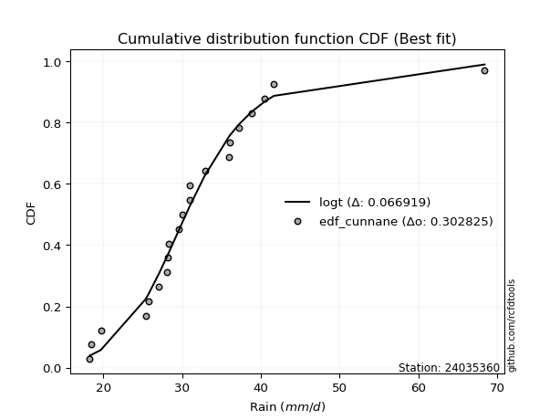</img>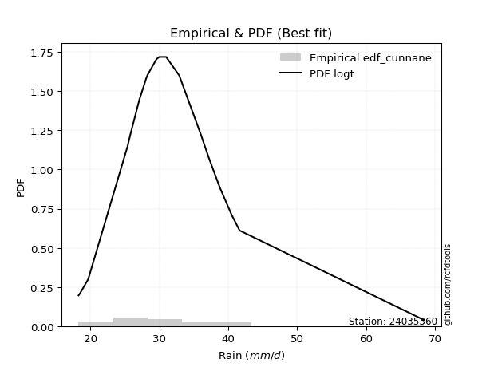</img>

</div>


### 12. EDF Adamowski (1981)

The Adamowski formula in hydrology refers to a specific plotting position formula used for estimating the non-parametric empirical distribution of hydrological events (like flood peaks) to calculate their return periods. This formula provides an alternative to traditional parametric methods (like the Gumbel or Log Pearson Type III distributions). 

<div align="center">


$P=(m-0.25)/(n+0.5)$


</div>


**12.1. Empirical values**

<div align="center">

|                | 0                    | 1                   | 2                   | 3                   | 4                   | 5                  | 6                   | 7                  | 8                  | 9                   | 10                 | 11                 | 12                 | 13                 | 14                 | 15                 | 16                 | 17                 | 18                 | 19                 |
|:---------------|:---------------------|:--------------------|:--------------------|:--------------------|:--------------------|:-------------------|:--------------------|:-------------------|:-------------------|:--------------------|:-------------------|:-------------------|:-------------------|:-------------------|:-------------------|:-------------------|:-------------------|:-------------------|:-------------------|:-------------------|
| date           | 2021                 | 2022                | 2017                | 2019                | 2015                | 2011               | 2012                | 2014               | 2010               | 2018                | 2023               | 2020               | 2008               | 2006               | 2016               | 2009               | 2005               | 2007               | 2013               | 2024               |
| x              | 18.3                 | 18.5                | 19.7                | 25.4                | 25.8                | 27.1               | 28.1                | 28.2               | 28.3               | 29.6                | 30.0               | 31.0               | 32.9               | 36.0               | 36.1               | 37.2               | 38.8               | 40.5               | 42.19              | 68.4               |
| m              | 1                    | 2                   | 3                   | 4                   | 5                   | 6                  | 7                   | 8                  | 9                  | 10                  | 11                 | 12                 | 13                 | 14                 | 15                 | 16                 | 17                 | 18                 | 19                 | 20                 |
| empirical_dist | edf_adamowski        | edf_adamowski       | edf_adamowski       | edf_adamowski       | edf_adamowski       | edf_adamowski      | edf_adamowski       | edf_adamowski      | edf_adamowski      | edf_adamowski       | edf_adamowski      | edf_adamowski      | edf_adamowski      | edf_adamowski      | edf_adamowski      | edf_adamowski      | edf_adamowski      | edf_adamowski      | edf_adamowski      | edf_adamowski      |
| empirical      | 0.036585365853658534 | 0.08536585365853659 | 0.13414634146341464 | 0.18292682926829268 | 0.23170731707317074 | 0.2804878048780488 | 0.32926829268292684 | 0.3780487804878049 | 0.4268292682926829 | 0.47560975609756095 | 0.524390243902439  | 0.573170731707317  | 0.6219512195121951 | 0.6707317073170732 | 0.7195121951219512 | 0.7682926829268293 | 0.8170731707317073 | 0.8658536585365854 | 0.9146341463414634 | 0.9634146341463414 |
| empirical_tr   | 1.0379746835443038   | 1.0933333333333333  | 1.1549295774647887  | 1.2238805970149254  | 1.3015873015873016  | 1.3898305084745763 | 1.490909090909091   | 1.607843137254902  | 1.7446808510638296 | 1.9069767441860463  | 2.1025641025641026 | 2.3428571428571425 | 2.6451612903225805 | 3.037037037037037  | 3.5652173913043477 | 4.315789473684211  | 5.466666666666665  | 7.454545454545454  | 11.714285714285719 | 27.33333333333331  |

</div>


**12.2. Kolmogorov-Smirnov fit test (sorted by Δ)**


<div align="center">

|                | 0                   | 1                   | 2                   | 3                  | 4                  | 5                   | 6                   | 7                   | 8                  | 9                  | 10                  | 11                  | 12                  | 13                  | 14                  | 15                  | 16                  | 17                  | 18                  | 19                  | 20                  | 21                  | 22                  | 23                  | 24                  | 25                 | 26                  | 27                  | 28                  | 29                  | 30                  | 31                  | 32                  | 33                  | 34                    | 35                  | 36                  | 37                  | 38                 | 39                  | 40                  | 41                  | 42                  | 43                  | 44                  | 45                  | 46                  | 47                  | 48                 | 49                 | 50                 | 51                 | 52                  | 53                  | 54                  | 55                  | 56                  | 57                  | 58                  | 59                  | 60                  | 61                 | 62                  | 63                  | 64                  | 65                  | 66                  | 67                  | 68                  | 69                  | 70                 | 71                  | 72                 | 73                 | 74                  | 75                  | 76                 | 77                 | 78                  | 79                  | 80                  | 81                 | 82                  | 83                  | 84                 | 85                 | 86                 | 87                 |
|:---------------|:--------------------|:--------------------|:--------------------|:-------------------|:-------------------|:--------------------|:--------------------|:--------------------|:-------------------|:-------------------|:--------------------|:--------------------|:--------------------|:--------------------|:--------------------|:--------------------|:--------------------|:--------------------|:--------------------|:--------------------|:--------------------|:--------------------|:--------------------|:--------------------|:--------------------|:-------------------|:--------------------|:--------------------|:--------------------|:--------------------|:--------------------|:--------------------|:--------------------|:--------------------|:----------------------|:--------------------|:--------------------|:--------------------|:-------------------|:--------------------|:--------------------|:--------------------|:--------------------|:--------------------|:--------------------|:--------------------|:--------------------|:--------------------|:-------------------|:-------------------|:-------------------|:-------------------|:--------------------|:--------------------|:--------------------|:--------------------|:--------------------|:--------------------|:--------------------|:--------------------|:--------------------|:-------------------|:--------------------|:--------------------|:--------------------|:--------------------|:--------------------|:--------------------|:--------------------|:--------------------|:-------------------|:--------------------|:-------------------|:-------------------|:--------------------|:--------------------|:-------------------|:-------------------|:--------------------|:--------------------|:--------------------|:-------------------|:--------------------|:--------------------|:-------------------|:-------------------|:-------------------|:-------------------|
| station        | 24035360            | 24035360            | 24035360            | 24035360           | 24035360           | 24035360            | 24035360            | 24035360            | 24035360           | 24035360           | 24035360            | 24035360            | 24035360            | 24035360            | 24035360            | 24035360            | 24035360            | 24035360            | 24035360            | 24035360            | 24035360            | 24035360            | 24035360            | 24035360            | 24035360            | 24035360           | 24035360            | 24035360            | 24035360            | 24035360            | 24035360            | 24035360            | 24035360            | 24035360            | 24035360              | 24035360            | 24035360            | 24035360            | 24035360           | 24035360            | 24035360            | 24035360            | 24035360            | 24035360            | 24035360            | 24035360            | 24035360            | 24035360            | 24035360           | 24035360           | 24035360           | 24035360           | 24035360            | 24035360            | 24035360            | 24035360            | 24035360            | 24035360            | 24035360            | 24035360            | 24035360            | 24035360           | 24035360            | 24035360            | 24035360            | 24035360            | 24035360            | 24035360            | 24035360            | 24035360            | 24035360           | 24035360            | 24035360           | 24035360           | 24035360            | 24035360            | 24035360           | 24035360           | 24035360            | 24035360            | 24035360            | 24035360           | 24035360            | 24035360            | 24035360           | 24035360           | 24035360           | 24035360           |
| empirical_dist | edf_adamowski       | edf_adamowski       | edf_adamowski       | edf_adamowski      | edf_adamowski      | edf_adamowski       | edf_adamowski       | edf_adamowski       | edf_adamowski      | edf_adamowski      | edf_adamowski       | edf_adamowski       | edf_adamowski       | edf_adamowski       | edf_adamowski       | edf_adamowski       | edf_adamowski       | edf_adamowski       | edf_adamowski       | edf_adamowski       | edf_adamowski       | edf_adamowski       | edf_adamowski       | edf_adamowski       | edf_adamowski       | edf_adamowski      | edf_adamowski       | edf_adamowski       | edf_adamowski       | edf_adamowski       | edf_adamowski       | edf_adamowski       | edf_adamowski       | edf_adamowski       | edf_adamowski         | edf_adamowski       | edf_adamowski       | edf_adamowski       | edf_adamowski      | edf_adamowski       | edf_adamowski       | edf_adamowski       | edf_adamowski       | edf_adamowski       | edf_adamowski       | edf_adamowski       | edf_adamowski       | edf_adamowski       | edf_adamowski      | edf_adamowski      | edf_adamowski      | edf_adamowski      | edf_adamowski       | edf_adamowski       | edf_adamowski       | edf_adamowski       | edf_adamowski       | edf_adamowski       | edf_adamowski       | edf_adamowski       | edf_adamowski       | edf_adamowski      | edf_adamowski       | edf_adamowski       | edf_adamowski       | edf_adamowski       | edf_adamowski       | edf_adamowski       | edf_adamowski       | edf_adamowski       | edf_adamowski      | edf_adamowski       | edf_adamowski      | edf_adamowski      | edf_adamowski       | edf_adamowski       | edf_adamowski      | edf_adamowski      | edf_adamowski       | edf_adamowski       | edf_adamowski       | edf_adamowski      | edf_adamowski       | edf_adamowski       | edf_adamowski      | edf_adamowski      | edf_adamowski      | edf_adamowski      |
| p_dist         | loglogistic         | fisk                | loghypsecant        | laplace_asymmetric | johnsonsu          | logt                | logjohnsonsu        | loggenlogistic      | exponnorm          | logfisk            | ncf                 | genlogistic         | lognorm             | lognorm             | logcrystalball      | kstwobign           | logexponnorm        | logloggamma         | alpha               | nct                 | betaprime           | invweibull          | invgamma            | logbetaprime        | logalpha            | f                  | loginvgamma         | loglognorm          | logf                | logfatiguelife      | logerlang           | loggamma            | loggamma            | lognct              | loglaplace_asymmetric | loglaplace          | rice                | logpearson3         | loginvgauss        | t                   | invgauss            | logrice             | fatiguelife         | gumbel_r            | moyal               | maxwell             | lognakagami         | logmaxwell          | logweibull_min     | crystalball        | norm               | loggumbel_r        | rayleigh            | lograyleigh         | logistic            | gamma               | chi2                | erlang              | hypsecant           | loggumbel_l         | loginvweibull       | halflogistic       | pearson3            | wald                | logmoyal            | gibrat              | halfnorm            | loghalfnorm         | loggompertz         | laplace             | logkstwobign       | loghalflogistic     | loggenexpon        | gompertz           | loggibrat           | weibull_min         | gumbel_l           | logwald            | logncf              | expon               | genexpon            | nakagami           | logmielke           | logexpon            | logchi2            | logtruncnorm       | truncnorm          | mielke             |
| delta          | 0.06952397970157305 | 0.06990433155570049 | 0.07160523680102282 | 0.0725861903786281 | 0.0726043229255676 | 0.07281655469238768 | 0.07293280436603125 | 0.07428525289859521 | 0.074549063859595  | 0.0780967021640045 | 0.07968580042722512 | 0.08167039798118919 | 0.08311122297792228 | 0.08311122297792228 | 0.08311127734627505 | 0.08372926192567598 | 0.08522408507065277 | 0.08662272859270481 | 0.08770140721455888 | 0.08809733625726435 | 0.08839658975099246 | 0.09050167825317768 | 0.09264406659502689 | 0.09271576603802989 | 0.09289906232892575 | 0.0931264210448347 | 0.09319229014229702 | 0.09340300174195532 | 0.09346127074594013 | 0.09360931903462333 | 0.09417012941460828 | 0.09417016189512034 | 0.09417016189512034 | 0.09429861122572591 | 0.09609447299084295   | 0.09618752677357345 | 0.09671449063711224 | 0.09749955359558787 | 0.099317264838307  | 0.09970081141252096 | 0.10008740829753271 | 0.10017727790326958 | 0.10070628299069545 | 0.10236060638409994 | 0.10495156042251547 | 0.10629042098641889 | 0.10647049968357797 | 0.10697798957106125 | 0.112279893758989  | 0.1142847946123931 | 0.1142848057663034 | 0.1147648768338757 | 0.11597795132020833 | 0.11669383894432167 | 0.11984893992531476 | 0.12226838276710977 | 0.12226914513240417 | 0.12227093697264346 | 0.12456635010106454 | 0.12676632065006332 | 0.12890845118832778 | 0.1325769781448135 | 0.13331314996971827 | 0.13601732617995643 | 0.13661032725396255 | 0.14259422207088945 | 0.14266806549773758 | 0.14347789303529346 | 0.14421737720630268 | 0.14581573209004028 | 0.1507591851648929 | 0.15225793631872975 | 0.1580030394632615 | 0.16157764790794   | 0.18151960242447202 | 0.18292682926828596 | 0.1846785475238057 | 0.1943387889494254 | 0.20483171102299647 | 0.21916915034370382 | 0.21924261455752264 | 0.2404005240720642 | 0.25027964898877986 | 0.28799346066094617 | 0.2982719415495656 | 0.3224043503312815 | 0.5367451061268262 | nan                |
| deltao         | 0.3096406529800002  | 0.3096406529800002  | 0.3096406529800002  | 0.3096406529800002 | 0.3096406529800002 | 0.3096406529800002  | 0.3096406529800002  | 0.3096406529800002  | 0.3096406529800002 | 0.3096406529800002 | 0.3096406529800002  | 0.3096406529800002  | 0.3096406529800002  | 0.3096406529800002  | 0.3096406529800002  | 0.3096406529800002  | 0.3096406529800002  | 0.3096406529800002  | 0.3096406529800002  | 0.3096406529800002  | 0.3096406529800002  | 0.3096406529800002  | 0.3096406529800002  | 0.3096406529800002  | 0.3096406529800002  | 0.3096406529800002 | 0.3096406529800002  | 0.3096406529800002  | 0.3096406529800002  | 0.3096406529800002  | 0.3096406529800002  | 0.3096406529800002  | 0.3096406529800002  | 0.3096406529800002  | 0.3096406529800002    | 0.3096406529800002  | 0.3096406529800002  | 0.3096406529800002  | 0.3096406529800002 | 0.3096406529800002  | 0.3096406529800002  | 0.3096406529800002  | 0.3096406529800002  | 0.3096406529800002  | 0.3096406529800002  | 0.3096406529800002  | 0.3096406529800002  | 0.3096406529800002  | 0.3096406529800002 | 0.3096406529800002 | 0.3096406529800002 | 0.3096406529800002 | 0.3096406529800002  | 0.3096406529800002  | 0.3096406529800002  | 0.3096406529800002  | 0.3096406529800002  | 0.3096406529800002  | 0.3096406529800002  | 0.3096406529800002  | 0.3096406529800002  | 0.3096406529800002 | 0.3096406529800002  | 0.3096406529800002  | 0.3096406529800002  | 0.3096406529800002  | 0.3096406529800002  | 0.3096406529800002  | 0.3096406529800002  | 0.3096406529800002  | 0.3096406529800002 | 0.3096406529800002  | 0.3096406529800002 | 0.3096406529800002 | 0.3096406529800002  | 0.3096406529800002  | 0.3096406529800002 | 0.3096406529800002 | 0.3096406529800002  | 0.3096406529800002  | 0.3096406529800002  | 0.3096406529800002 | 0.3096406529800002  | 0.3096406529800002  | 0.3096406529800002 | 0.3096406529800002 | 0.3096406529800002 | 0.3096406529800002 |
| eval           | Δo > Δ              | Δo > Δ              | Δo > Δ              | Δo > Δ             | Δo > Δ             | Δo > Δ              | Δo > Δ              | Δo > Δ              | Δo > Δ             | Δo > Δ             | Δo > Δ              | Δo > Δ              | Δo > Δ              | Δo > Δ              | Δo > Δ              | Δo > Δ              | Δo > Δ              | Δo > Δ              | Δo > Δ              | Δo > Δ              | Δo > Δ              | Δo > Δ              | Δo > Δ              | Δo > Δ              | Δo > Δ              | Δo > Δ             | Δo > Δ              | Δo > Δ              | Δo > Δ              | Δo > Δ              | Δo > Δ              | Δo > Δ              | Δo > Δ              | Δo > Δ              | Δo > Δ                | Δo > Δ              | Δo > Δ              | Δo > Δ              | Δo > Δ             | Δo > Δ              | Δo > Δ              | Δo > Δ              | Δo > Δ              | Δo > Δ              | Δo > Δ              | Δo > Δ              | Δo > Δ              | Δo > Δ              | Δo > Δ             | Δo > Δ             | Δo > Δ             | Δo > Δ             | Δo > Δ              | Δo > Δ              | Δo > Δ              | Δo > Δ              | Δo > Δ              | Δo > Δ              | Δo > Δ              | Δo > Δ              | Δo > Δ              | Δo > Δ             | Δo > Δ              | Δo > Δ              | Δo > Δ              | Δo > Δ              | Δo > Δ              | Δo > Δ              | Δo > Δ              | Δo > Δ              | Δo > Δ             | Δo > Δ              | Δo > Δ             | Δo > Δ             | Δo > Δ              | Δo > Δ              | Δo > Δ             | Δo > Δ             | Δo > Δ              | Δo > Δ              | Δo > Δ              | Δo > Δ             | Δo > Δ              | Δo > Δ              | Δo > Δ             | Δo <= Δ            | Δo <= Δ            | Δo <= Δ            |
| fit            | 1                   | 1                   | 1                   | 1                  | 1                  | 1                   | 1                   | 1                   | 1                  | 1                  | 1                   | 1                   | 1                   | 1                   | 1                   | 1                   | 1                   | 1                   | 1                   | 1                   | 1                   | 1                   | 1                   | 1                   | 1                   | 1                  | 1                   | 1                   | 1                   | 1                   | 1                   | 1                   | 1                   | 1                   | 1                     | 1                   | 1                   | 1                   | 1                  | 1                   | 1                   | 1                   | 1                   | 1                   | 1                   | 1                   | 1                   | 1                   | 1                  | 1                  | 1                  | 1                  | 1                   | 1                   | 1                   | 1                   | 1                   | 1                   | 1                   | 1                   | 1                   | 1                  | 1                   | 1                   | 1                   | 1                   | 1                   | 1                   | 1                   | 1                   | 1                  | 1                   | 1                  | 1                  | 1                   | 1                   | 1                  | 1                  | 1                   | 1                   | 1                   | 1                  | 1                   | 1                   | 1                  | 0                  | 0                  | 0                  |
| n              | 20                  | 20                  | 20                  | 20                 | 20                 | 20                  | 20                  | 20                  | 20                 | 20                 | 20                  | 20                  | 20                  | 20                  | 20                  | 20                  | 20                  | 20                  | 20                  | 20                  | 20                  | 20                  | 20                  | 20                  | 20                  | 20                 | 20                  | 20                  | 20                  | 20                  | 20                  | 20                  | 20                  | 20                  | 20                    | 20                  | 20                  | 20                  | 20                 | 20                  | 20                  | 20                  | 20                  | 20                  | 20                  | 20                  | 20                  | 20                  | 20                 | 20                 | 20                 | 20                 | 20                  | 20                  | 20                  | 20                  | 20                  | 20                  | 20                  | 20                  | 20                  | 20                 | 20                  | 20                  | 20                  | 20                  | 20                  | 20                  | 20                  | 20                  | 20                 | 20                  | 20                 | 20                 | 20                  | 20                  | 20                 | 20                 | 20                  | 20                  | 20                  | 20                 | 20                  | 20                  | 20                 | 20                 | 20                 | 20                 |
| best_fit       | 1                   | 0                   | 0                   | 0                  | 0                  | 0                   | 0                   | 0                   | 0                  | 0                  | 0                   | 0                   | 0                   | 0                   | 0                   | 0                   | 0                   | 0                   | 0                   | 0                   | 0                   | 0                   | 0                   | 0                   | 0                   | 0                  | 0                   | 0                   | 0                   | 0                   | 0                   | 0                   | 0                   | 0                   | 0                     | 0                   | 0                   | 0                   | 0                  | 0                   | 0                   | 0                   | 0                   | 0                   | 0                   | 0                   | 0                   | 0                   | 0                  | 0                  | 0                  | 0                  | 0                   | 0                   | 0                   | 0                   | 0                   | 0                   | 0                   | 0                   | 0                   | 0                  | 0                   | 0                   | 0                   | 0                   | 0                   | 0                   | 0                   | 0                   | 0                  | 0                   | 0                  | 0                  | 0                   | 0                   | 0                  | 0                  | 0                   | 0                   | 0                   | 0                  | 0                   | 0                   | 0                  | 0                  | 0                  | 0                  |
| best_fit_sort  | 1                   | 2                   | 3                   | 4                  | 5                  | 6                   | 7                   | 8                   | 9                  | 10                 | 11                  | 12                  | 13                  | 14                  | 15                  | 16                  | 17                  | 18                  | 19                  | 20                  | 21                  | 22                  | 23                  | 24                  | 25                  | 26                 | 27                  | 28                  | 29                  | 30                  | 31                  | 32                  | 33                  | 34                  | 35                    | 36                  | 37                  | 38                  | 39                 | 40                  | 41                  | 42                  | 43                  | 44                  | 45                  | 46                  | 47                  | 48                  | 49                 | 50                 | 51                 | 52                 | 53                  | 54                  | 55                  | 56                  | 57                  | 58                  | 59                  | 60                  | 61                  | 62                 | 63                  | 64                  | 65                  | 66                  | 67                  | 68                  | 69                  | 70                  | 71                 | 72                  | 73                 | 74                 | 75                  | 76                  | 77                 | 78                 | 79                  | 80                  | 81                  | 82                 | 83                  | 84                  | 85                 | 86                 | 87                 | 88                 |

</div>


**12.3. Best fit**

<div align="center">

|   id |   station | empirical_dist   | p_dist      |    delta |   deltao | eval   |   fit |   n |   best_fit |   best_fit_sort |
|-----:|----------:|:-----------------|:------------|---------:|---------:|:-------|------:|----:|-----------:|----------------:|
|    0 |  24035360 | edf_adamowski    | loglogistic | 0.069524 | 0.309641 | Δo > Δ |     1 |  20 |          1 |               1 |

</div>


<div align="center">

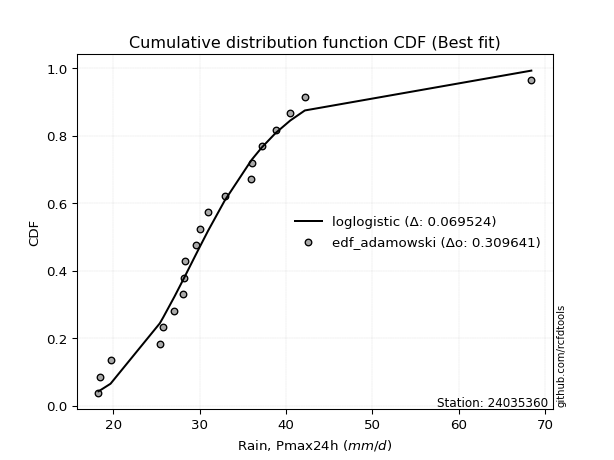</img>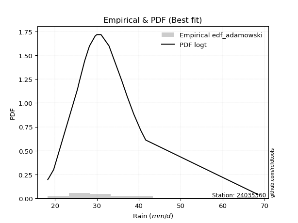</img>

</div>


## C. Best fit & Estimate extreme values for specific return periods - Tr

Best fit in probability distribution analysis means finding the theoretical distribution (like Normal, Poisson, Exponential) that most accurately mirrors your real-world data´s patterns (shape, center, spread) for better predictions, using methods like visual checks (Q-Q plots), goodness-of-fit tests (Kolmogorov-Smirnov, Chi-Squared), and information criteria (AIC) to score and select the simplest, most representative model.


### 1. Best fit (ordered by delta Δ)

<div align="center">

|   id |   station | empirical_dist   | p_dist             |     delta |   deltao | eval   |   fit |   n |   best_fit |   best_fit_sort |
|-----:|----------:|:-----------------|:-------------------|----------:|---------:|:-------|------:|----:|-----------:|----------------:|
|    0 |  24035360 | edf_hazen        | laplace_asymmetric | 0.0634398 | 0.309641 | Δo > Δ |     1 |  20 |          1 |               1 |
|    1 |  24035360 | edf_blom         | loglogistic        | 0.0650073 | 0.309641 | Δo > Δ |     1 |  20 |          1 |               2 |
|    2 |  24035360 | edf_cunnane      | loglogistic        | 0.0653285 | 0.309641 | Δo > Δ |     1 |  20 |          1 |               3 |
|    3 |  24035360 | edf_gringorten   | laplace_asymmetric | 0.0656764 | 0.309641 | Δo > Δ |     1 |  20 |          1 |               4 |
|    4 |  24035360 | edf_tukey        | loglogistic        | 0.0665252 | 0.309641 | Δo > Δ |     1 |  20 |          1 |               5 |
|    5 |  24035360 | edf_filliben     | loglogistic        | 0.0670987 | 0.309641 | Δo > Δ |     1 |  20 |          1 |               6 |
|    6 |  24035360 | edf_beard        | loglogistic        | 0.0673698 | 0.309641 | Δo > Δ |     1 |  20 |          1 |               7 |
|    7 |  24035360 | edf_jenkinson    | loglogistic        | 0.0673698 | 0.309641 | Δo > Δ |     1 |  20 |          1 |               8 |
|    8 |  24035360 | edf_chegodayev   | loglogistic        | 0.0677306 | 0.309641 | Δo > Δ |     1 |  20 |          1 |               9 |
|    9 |  24035360 | edf_adamowski    | loglogistic        | 0.069524  | 0.309641 | Δo > Δ |     1 |  20 |          1 |              10 |
|   10 |  24035360 | edf_weibull      | ncf                | 0.0721364 | 0.309641 | Δo > Δ |     1 |  20 |          1 |              11 |
|   11 |  24035360 | edf_california   | t                  | 0.0782849 | 0.309641 | Δo > Δ |     1 |  20 |          1 |              12 |

</div>

:file_folder:Tables: [bestfit_24035360.csv](table/bestfit_24035360.csv) | [extreme_24035360.csv](table/extreme_24035360.csv)


### 2. Extreme values

In hydrology, a return period (or recurrence interval $Tr$) is the statistical average time between extreme events like floods or droughts of a specific magnitude, indicating how rare an event is, with a 100-year flood, for example, having a 1% chance of occurring in any given year, not that it happens exactly every century. It is a key tool for infrastructure design (like bridges or dams) and risk assessment, calculated from historical data to determine the probability of future events, although it is important to remember it is statistical average, and events can cluster or be missed.

> risk_rate: assuming the return period as the project useful life.

|   id |      tr |   prob_l |     prob_g |   alpha |   betaprime |    chi2 |   crystalball |   erlang |    expon |   exponnorm |       f |   fatiguelife |    fisk |   gamma |   genexpon |   genlogistic |   gibrat |   gompertz |   gumbel_l |   gumbel_r |   halflogistic |   halfnorm |   hypsecant |   invgamma |   invgauss |   invweibull |   johnsonsu |   kstwobign |   laplace |   laplace_asymmetric |   loggamma |   logistic |   lognorm |   maxwell |   mielke |   moyal |   nakagami |     ncf |     nct |    norm |   pearson3 |   rayleigh |    rice |        t |   truncnorm |     wald |   weibull_min |   logalpha |   logbetaprime |     logchi2 |   logcrystalball |   logerlang |   logexpon |   logexponnorm |    logf |   logfatiguelife |   logfisk |   loggenexpon |   loggenlogistic |   loggibrat |   loggompertz |   loggumbel_l |   loggumbel_r |   loghalflogistic |   loghalfnorm |   loghypsecant |   loginvgamma |   loginvgauss |   loginvweibull |   logjohnsonsu |   logkstwobign |   loglaplace |   loglaplace_asymmetric |   logloggamma |   loglogistic |   loglognorm |   logmaxwell |   logmielke |   logmoyal |   lognakagami |   logncf |   lognct |   logpearson3 |   lograyleigh |   logrice |     logt |   logtruncnorm |   logwald |   logweibull_min |   station |   n |   risk_rate |
|-----:|--------:|---------:|-----------:|--------:|------------:|--------:|--------------:|---------:|---------:|------------:|--------:|--------------:|--------:|--------:|-----------:|--------------:|---------:|-----------:|-----------:|-----------:|---------------:|-----------:|------------:|-----------:|-----------:|-------------:|------------:|------------:|----------:|---------------------:|-----------:|-----------:|----------:|----------:|---------:|--------:|-----------:|--------:|--------:|--------:|-----------:|-----------:|--------:|---------:|------------:|---------:|--------------:|-----------:|---------------:|------------:|-----------------:|------------:|-----------:|---------------:|--------:|-----------------:|----------:|--------------:|-----------------:|------------:|--------------:|--------------:|--------------:|------------------:|--------------:|---------------:|--------------:|--------------:|----------------:|---------------:|---------------:|-------------:|------------------------:|--------------:|--------------:|-------------:|-------------:|------------:|-----------:|--------------:|---------:|---------:|--------------:|--------------:|----------:|---------:|---------------:|----------:|-----------------:|----------:|----:|------------:|
|    0 |    2    | 0.5      | 0.5        | 30.1305 |     30.2862 | 29.7804 |       32.1045 |  29.7803 |  27.8686 |     30.4486 | 30.109  |       30.1085 | 30.4732 | 29.7804 |    27.8663 |       30.3968 |  28.8932 |    29.4431 |    33.8621 |    30.3469 |        29.4732 |    29.9146 |     32.1045 |    30.1128 |    30.1029 |      30.1242 |     30.4107 |     30.7884 |   32.1045 |              30.4094 |    30.0975 |    32.1045 |   30.6271 |   31.1895 |  30.1244 | 29.7795 |    27.4816 | 31.0151 | 30.1517 | 32.1045 |    29.2117 |    30.865  | 31.5846 |  30.4993 |     12.8345 |  28.6366 |       31.2898 |    30.0873 |        30.1148 |     30.7519 |          30.6271 |     30.0975 |    26.1503 |        30.0821 | 30.0884 |          30.0992 |   30.345  |       28.9592 |          30.3956 |     27.9934 |       29.7179 |       32.1718 |       29.1567 |           28.4524 |       28.8059 |        30.6271 |       30.0927 |       29.9322 |         29.2927 |        30.4339 |        28.9585 |      30.6271 |                 29.5405 |       30.6299 |       30.6271 |      30.0945 |      29.8526 |     26.9646 |    28.6972 |       29.9162 |  30.5194 |  30.0399 |       29.9614 |       29.5826 |   30.1818 |  30.4351 |        25.2817 |   27.7937 |          29.8883 |  24035360 |  20 |    0.75     |
|    1 |    2.33 | 0.570815 | 0.429185   | 31.7338 |     31.9349 | 31.5982 |       34.0136 |  31.5981 |  29.9768 |     31.9743 | 31.7588 |       31.8334 | 31.9212 | 31.5982 |    29.974  |       32.0231 |  29.8603 |    31.5778 |    35.523  |    32.1159 |        31.292  |    31.975  |     33.6324 |    31.7595 |    31.8203 |      31.7624 |     31.8152 |     32.5747 |   33.2598 |              31.7451 |    31.7542 |    33.7866 |   32.3086 |   33.173  |  31.7624 | 31.4541 |    29.6505 | 32.7286 | 31.7681 | 34.0136 |    30.9343 |    32.8778 | 33.3972 |  31.7582 |     18.1115 |  29.8884 |       32.7116 |    31.7292 |        31.7466 |     36.7421 |          32.3086 |     31.7542 |    28.2901 |        31.6457 | 31.7352 |          31.7513 |   31.7952 |       30.8178 |          31.8594 |     28.7618 |       31.7319 |       33.703  |       30.637  |           29.9385 |       30.5163 |        31.9656 |       31.7389 |       31.5807 |         31.0484 |        31.812  |        30.773  |      31.6339 |                 30.7335 |       32.3358 |       32.1038 |      31.7432 |      31.5571 |     28.7814 |    30.0746 |       31.6283 |  33.8212 |  31.6806 |       31.6124 |       31.2974 |   31.9099 |  31.83   |        26.9948 |   28.7849 |          31.6404 |  24035360 |  20 |    0.729209 |
|    2 |    5    | 0.8      | 0.2        | 38.8683 |     39.1313 | 39.7514 |       41.1084 |  39.7514 |  40.5175 |     38.8322 | 39.1029 |       39.4788 | 38.1863 | 39.7514 |    40.5122 |       39.0866 |  35.4281 |    40.9924 |    40.8889 |    39.8013 |        39.5218 |    40.6883 |     39.761  |    39.0918 |    39.4442 |      39.1142 |     38.2036 |     40.1625 |   39.0361 |              38.4234 |    39.1356 |    40.2812 |   39.4072 |   40.9796 |  39.1134 | 39.211  |    39.3852 | 39.668  | 38.9611 | 41.1084 |    39.1318 |    40.9358 | 40.6541 |  36.8567 |     37.0134 |  36.8961 |       40.103  |    39.0616 |        38.9145 |    102.664  |          39.4072 |     39.1356 |    41.919  |        38.6344 | 39.083  |          39.1149 |   38.2889 |       39.689  |          38.3149 |     33.6139 |       40.448  |       39.1658 |       37.9913 |           37.6946 |       38.9463 |        37.9484 |       39.0847 |       39.0096 |         39.9826 |        37.9449 |        39.837  |      37.1861 |                 37.4612 |       39.5195 |       38.5052 |      39.097  |      39.2654 |     36.4358 |    37.3686 |       39.3209 |  50.3046 |  39.0365 |       39.072  |       39.2173 |   39.4408 |  37.9006 |        36.2605 |   35.0234 |          39.4539 |  24035360 |  20 |    0.67232  |
|    3 |   10    | 0.9      | 0.1        | 44.9671 |     45.0412 | 46.4506 |       45.8149 |  46.4506 |  50.086  |     44.8202 | 45.2912 |       45.7524 | 43.5726 | 46.4507 |    50.0784 |       44.8384 |  41.7747 |    48.1525 |    43.8763 |    46.061  |        46.3563 |    47.136  |     44.6549 |    45.2773 |    45.725  |      45.3944 |     43.9953 |     45.9396 |   44.2796 |              44.4857 |    45.3511 |    45.0643 |   44.957  |   46.4736 |  45.3931 | 45.9646 |    46.8583 | 44.81   | 45.0732 | 45.8149 |    46.2559 |    46.6814 | 45.8284 |  41.183  |     48.3194 |  44.333  |       47.0931 |    45.2807 |        44.8436 |    292.282  |          44.957  |     45.3511 |    59.9014 |        44.7534 | 45.3002 |          45.3255 |   44.1632 |       47.6573 |          43.9772 |     40.1507 |       47.0997 |       42.5822 |       45.2678 |           45.6422 |       46.6503 |        43.5205 |       45.3012 |       45.3707 |         49.1278 |        43.5744 |        48.4897 |      43.0657 |                 44.8355 |       45.1142 |       44.0222 |      45.3113 |      45.7937 |     42.2106 |    45.1458 |       45.7959 |  66.3776 |  45.3079 |       45.4706 |       46.0609 |   45.5229 |  43.2821 |        45.0056 |   43.1291 |          45.9146 |  24035360 |  20 |    0.651322 |
|    4 |   15    | 0.933333 | 0.0666667  | 48.5675 |     48.4073 | 50.1986 |       48.1636 |  50.1986 |  55.6833 |     48.3174 | 48.8731 |       49.2785 | 46.8201 | 50.1986 |    55.6743 |       48.0832 |  46.1523 |    51.8821 |    45.2293 |    49.5926 |        50.224  |    50.4913 |     47.4478 |    48.8616 |    49.2672 |      49.0581 |     47.5541 |     49.0065 |   47.3469 |              48.0319 |    48.9425 |    47.6704 |   48.0123 |   49.2924 |  49.0568 | 49.884  |    50.781  | 47.5507 | 48.6479 | 48.1636 |    50.3453 |    49.6418 | 48.4945 |  43.8806 |     53.2738 |  49.1086 |       51.2713 |    48.9007 |        48.2332 |    554.804  |          48.0123 |     48.9426 |    73.811  |        48.4725 | 48.9104 |          48.9203 |   47.8384 |       52.4003 |          47.425  |     45.3862 |       50.6246 |       44.226  |       49.972  |           50.8611 |       51.2446 |        47.0598 |       48.9115 |       49.0894 |         55.1821 |        47.1695 |        53.8229 |      46.9271 |                 49.8049 |       48.1858 |       47.354  |      48.9151 |      49.5538 |     45.5007 |    50.3814 |       49.5147 |  76.56   |  48.9701 |       49.2119 |       50.0408 |   48.9281 |  46.6611 |        49.8088 |   49.2979 |          49.5718 |  24035360 |  20 |    0.644736 |
|    5 |   20    | 0.95     | 0.05       | 51.173  |     50.7828 | 52.8028 |       49.7016 |  52.8029 |  59.6546 |     50.7986 | 51.4244 |       51.7376 | 49.205  | 52.8029 |    59.6447 |       50.3551 |  49.5862 |    54.3583 |    46.0714 |    52.0654 |        52.9338 |    52.7283 |     49.418  |    51.4168 |    51.7432 |      51.6765 |     50.1819 |     51.0725 |   49.5232 |              50.548  |    51.497  |    49.4716 |   50.1247 |   51.1632 |  51.6753 | 52.6599 |    53.4026 | 49.412  | 51.2138 | 49.7016 |    53.2216 |    51.6094 | 50.2665 |  45.9274 |     56.1742 |  52.6674 |       54.2692 |    51.489  |        50.63   |    882.418  |          50.1247 |     51.497  |    85.5978 |        51.2223 | 51.4872 |          51.4803 |   50.602  |       55.8223 |          49.9696 |     49.9666 |       52.9972 |       45.281  |       53.5538 |           54.8693 |       54.5564 |        49.7284 |       51.4887 |       51.7532 |         59.8599 |        49.9159 |        57.7423 |      49.875  |                 53.6614 |       50.3061 |       49.803  |      51.4849 |      52.2182 |     47.8969 |    54.4526 |       52.1461 |  84.1964 |  51.5933 |       51.8913 |       52.8746 |   51.3035 |  49.2281 |        52.9201 |   54.4619 |          52.1363 |  24035360 |  20 |    0.641514 |
|    6 |   25    | 0.96     | 0.04       | 53.2337 |     52.625  | 54.7967 |       50.8338 |  54.7968 |  62.735  |     52.7232 | 53.416  |       53.6259 | 51.1109 | 54.7968 |    62.7243 |       52.105  |  52.4489 |    56.1923 |    46.6707 |    53.97   |        55.0216 |    54.3928 |     50.9428 |    53.4125 |    53.6474 |      53.7238 |     52.2859 |     52.62   |   51.2112 |              52.4996 |    53.4886 |    50.8495 |   51.739  |   52.5521 |  53.7227 | 54.8114 |    55.3551 | 50.8169 | 53.2288 | 50.8338 |    55.4407 |    53.0714 | 51.5831 |  47.6098 |     58.1072 |  55.5179 |       56.6118 |    53.5153 |        52.4911 |   1270.34   |          51.739  |     53.4886 |    96.0218 |        53.4333 | 53.5017 |          53.4781 |   52.8505 |       58.5142 |          52.01   |     54.1364 |       54.7738 |       46.0471 |       56.4868 |           58.1716 |       57.1586 |        51.8971 |       53.5036 |       53.8408 |         63.7317 |        52.1791 |        60.8639 |      52.2884 |                 56.8572 |       51.9244 |       51.7617 |      53.4924 |      54.2885 |     49.8212 |    57.8332 |       54.1889 |  90.3756 |  53.6495 |       53.9905 |       55.0835 |   53.1295 |  51.3403 |        55.1183 |   58.9857 |          54.114  |  24035360 |  20 |    0.639603 |
|    7 |   50    | 0.98     | 0.02       | 59.9259 |     58.3826 | 60.8716 |       54.0761 |  60.8717 |  72.3035 |     58.7014 | 59.7098 |       59.4092 | 57.4035 | 60.8717 |    72.2906 |       57.4956 |  62.54   |    61.4688 |    48.2975 |    59.8374 |        61.4545 |    59.2307 |     55.6704 |    59.7266 |    59.4962 |      60.2008 |     59.2272 |     57.1643 |   56.4548 |              58.5619 |    59.7667 |    55.0595 |   56.6548 |   56.58   |  60.2005 | 61.4907 |    61.0344 | 55.009  | 59.6713 | 54.0761 |    62.2797 |    57.3151 | 55.4049 |  53.5006 |     62.5892 |  64.8248 |       63.9744 |    59.9535 |        58.3183 |   4019.25   |          56.6548 |     59.7667 |   137.213  |        60.827  | 59.8857 |          59.7874 |   60.5276 |       67.1158 |          58.7836 |     71.8116 |       59.9895 |       48.1926 |       66.5707 |           69.6489 |       65.4485 |        59.2408 |       59.89   |       60.4816 |         77.3048 |        60.1117 |        71.0405 |      60.5559 |                 68.0496 |       56.8427 |       58.2363 |      59.8452 |      60.7687 |     56.363  |    69.7243 |       60.5742 | 111.138  |  60.1966 |       60.6638 |       62.0322 |   58.7441 |  58.7668 |        60.5916 |   76.5407 |          60.2244 |  24035360 |  20 |    0.63583  |
|    8 |   75    | 0.986667 | 0.0133333  | 64.0958 |     61.7967 | 64.3575 |       55.8158 |  64.3576 |  77.9008 |     62.1984 | 63.4897 |       62.7486 | 61.3846 | 64.3576 |    77.8865 |       60.6288 |  69.3555 |    64.2995 |    49.1201 |    63.2478 |        65.1939 |    61.8642 |     58.4332 |    63.5238 |    62.8845 |      64.0867 |     63.5982 |     59.6645 |   59.522  |              62.1081 |    63.5246 |    57.4911 |   59.4823 |   58.77   |  64.0871 | 65.3967 |    64.1264 | 57.3657 | 63.5973 | 55.8158 |    66.2494 |    59.6239 | 57.4841 |  57.5221 |     64.3346 |  70.5518 |       68.335  |    63.8461 |        61.7804 |   7973.81   |          59.4824 |     63.5246 |   169.075  |        65.5806 | 63.7323 |          63.5725 |   65.5882 |       72.3337 |          63.0948 |     86.9101 |       62.8594 |       49.3153 |       73.2396 |           77.3346 |       70.456  |        64.0045 |       63.7388 |       64.4991 |         86.4856 |        65.5217 |        77.348  |      65.9855 |                 75.5921 |       59.6647 |       62.3385 |      63.6661 |      64.6108 |     60.7346 |    77.7808 |       64.3545 | 124.49   |  64.1642 |       64.6967 |       66.1739 |   62.0079 |  63.8879 |        62.8588 |   89.8498 |          63.7931 |  24035360 |  20 |    0.634587 |
|    9 |  100    | 0.99     | 0.01       | 67.1929 |     64.2479 | 66.8058 |       56.9924 |  66.8059 |  81.8721 |     64.6796 | 66.2243 |       65.103  | 64.3603 | 66.8059 |    81.8569 |       62.8463 |  74.6353 |    66.2085 |    49.6581 |    65.6615 |        67.8405 |    63.6583 |     60.393  |    66.2733 |    65.2782 |      66.8922 |     66.8492 |     61.3776 |   61.6983 |              64.6242 |    66.237  |    59.2078 |   61.4743 |   60.2616 |  66.8933 | 68.1678 |    66.2322 | 59.004  | 66.4651 | 56.9924 |    69.0546 |    61.1968 | 58.9007 |  60.6885 |     65.2704 |  74.7273 |       71.4506 |    66.6748 |        64.2684 |  13018      |          61.4743 |     66.237  |   196.075  |        69.1702 | 66.5211 |          66.3086 |   69.4752 |       76.1265 |          66.3289 |    100.756  |       64.8262 |       50.0638 |       78.3596 |           83.2817 |       74.0849 |        67.6141 |       66.5296 |       67.4184 |         93.635  |        69.7778 |        81.99   |      70.1306 |                 81.4454 |       61.6499 |       65.4076 |      66.4329 |      67.366  |     64.1537 |    84.055  |       67.0633 | 134.554  |  67.0513 |       67.6248 |       69.1529 |   64.3213 |  67.9643 |        64.1036 |  100.99   |          66.3287 |  24035360 |  20 |    0.633968 |
|   10 |  200    | 0.995    | 0.005      | 75.2169 |     70.2734 | 72.6334 |       59.6615 |  72.6336 |  91.4406 |     70.6578 | 73.0179 |       70.7362 | 72.0995 | 72.6336 |    91.4231 |       68.1775 |  88.9994 |    70.5106 |    50.8277 |    71.4643 |        74.2034 |    67.7616 |     65.1142 |    73.1125 |    71.0209 |      73.8297 |     75.2265 |     65.3231 |   66.9418 |              70.6865 |    72.9516 |    63.3259 |   66.2436 |   63.6743 |  73.8328 | 74.8442 |    71.0457 | 62.8574 | 73.6916 | 59.6615 |    75.7813 |    64.7958 | 62.1418 |  69.601  |     66.7682 |  85.1282 |       79.0245 |    73.7477 |        70.3917 |  42905.7    |          66.2436 |     72.9516 |   280.187  |        78.6373 | 73.4702 |          73.097  |   80.0072 |       85.5945 |          74.7817 |    150.639  |       69.3584 |       51.7301 |       92.1812 |           99.5184 |       83.1029 |        77.1682 |       73.4849 |       74.7128 |        113.336  |        81.7592 |        93.7692 |      81.2192 |                 97.478  |       66.3929 |       73.3999 |      73.3145 |      74.1194 |     73.7621 |   101.33   |       73.6962 | 160.996  |  74.2836 |       74.932  |       76.4834 |   69.905  |  79.7189 |        66.1354 |  135.122  |          72.4662 |  24035360 |  20 |    0.633042 |
|   11 |  250    | 0.996    | 0.004      | 77.9947 |     72.254  | 74.4908 |       60.4771 |  74.491  |  94.521  |     72.5824 | 75.2723 |       72.54   | 74.7762 | 74.491  |    94.5028 |       69.8914 |  94.1533 |    71.8153 |    51.1718 |    73.3298 |        76.249  |    69.0239 |     66.634  |    75.3847 |    72.8642 |      76.1192 |     78.0955 |     66.5442 |   68.6299 |              72.6381 |    75.172  |    64.648  |   67.7736 |   64.7248 |  76.123  | 76.9936 |    72.5256 | 64.0743 | 76.1221 | 60.4771 |    77.9384 |    65.9036 | 63.1395 |  72.9196 |     67.083  |  88.5691 |       81.4815 |    76.1094 |        72.4063 |  63179.4    |          67.7736 |     75.172  |   314.308  |        81.9516 | 75.7827 |          75.3465 |   83.7937 |       88.7465 |          77.7182 |    174.023  |       70.7618 |       52.2308 |       97.1233 |          105.383  |       86.0921 |        80.5223 |       75.8    |       77.1459 |        120.511  |        86.2291 |        97.7468 |      85.1494 |                103.283  |       67.9116 |       76.1675 |      75.6006 |      76.3316 |     77.3551 |   107.614  |       75.8669 | 170.217  |  76.7023 |       77.3662 |       78.8926 |   71.709  |  84.2228 |        66.5683 |  148.784  |          74.4536 |  24035360 |  20 |    0.632858 |
|   12 |  500    | 0.998    | 0.002      | 87.351  |     78.5509 | 80.2114 |       62.8959 |  80.2116 | 104.09   |     78.5606 | 82.5068 |       78.1195 | 83.7257 | 80.2116 |   104.069  |       75.2109 | 111.965  |    75.6495 |    52.1583 |    79.12   |        82.5982 |    72.7876 |     71.355  |    82.6847 |    78.5793 |      83.414  |     87.5759 |     70.2034 |   73.8734 |              78.7004 |    82.2707 |    68.7482 |   72.5217 |   67.8596 |  83.4209 | 83.6699 |    76.9348 | 67.7951 | 84.0314 | 62.8959 |    84.6168 |    69.2091 | 66.1164 |  84.9285 |     67.7294 |  99.51   |       89.167  |    83.7374 |        78.8159 | 211840      |          72.5217 |     82.2707 |   449.14   |        93.1631 | 83.225  |          82.5539 |   96.9985 |       98.8792 |          87.5801 |    286.546  |       74.9701 |       53.6933 |      114.214  |          125.88   |       95.658  |        91.8995 |       83.2519 |       84.9916 |        145.806  |       102.497  |       110.706  |      98.6127 |                123.615  |       72.6158 |       85.4318 |      82.9441 |      83.3329 |     90.5195 |   129.729  |       82.7321 | 201.274  |  84.5262 |       85.2044 |       86.5415 |   77.3451 | 101.216  |        67.4633 |  202.101  |          80.6742 |  24035360 |  20 |    0.632489 |
|   13 |  750    | 0.998667 | 0.00133333 | 93.4186 |     82.3447 | 83.5275 |       64.2396 |  83.5277 | 109.687  |     82.0576 | 86.913  |       81.3699 | 89.4417 | 83.5277 |   109.665  |       78.3207 | 123.745  |    77.7545 |    52.6855 |    82.505  |        86.3099 |    74.8902 |     74.1165 |    87.137  |    81.9175 |      87.8144 |     93.5398 |     72.2591 |   76.9407 |              82.2467 |    86.5739 |    71.1436 |   75.3016 |   69.6129 |  87.8233 | 87.5753 |    79.396  | 69.937  | 88.9305 | 64.2396 |    88.5099 |    71.0575 | 67.781  |  93.3525 |     67.9501 | 106.07   |       93.6975 |    88.4203 |        82.6803 | 431955      |          75.3017 |     86.5739 |   553.434  |       100.419  | 87.7734 |          86.9345 |  105.878  |      105.056  |          93.9118 |    398.502  |       77.3361 |       54.4916 |      125.567  |          139.663  |      101.458  |        99.286  |       87.8072 |       89.7964 |        162.985  |       114.033  |       118.726  |     107.454  |                137.316  |       75.3638 |       91.3575 |      87.4217 |      87.5252 |     99.9588 |   144.717  |       86.8392 | 221.266  |  89.3371 |       89.996  |       91.1375 |   80.6701 | 113.872  |        67.7707 |  242.839  |          84.3507 |  24035360 |  20 |    0.632366 |
|   14 | 1000    | 0.999    | 0.001      | 98.0358 |     85.0897 | 85.8683 |       65.1647 |  85.8686 | 113.658  |     84.5388 | 90.1226 |       83.6712 | 93.7302 | 85.8685 |   113.635  |       80.5265 | 132.759  |    79.1924 |    53.0403 |    84.906  |        88.9427 |    76.3423 |     76.0758 |    90.383  |    84.2847 |      90.998  |     97.9676 |     73.6832 |   79.117  |              84.7628 |    89.6988 |    72.8424 |   77.2773 |   70.8247 |  91.0086 | 90.3462 |    81.0947 | 71.4437 | 92.538  | 65.1647 |    91.2667 |    72.3349 | 68.9313 | 100.067  |     68.0615 | 110.789  |       96.9266 |    91.8491 |        85.4773 | 717445      |          77.2773 |     89.6988 |   641.812  |       105.908  | 91.0939 |          90.1211 |  112.77   |      109.555  |          98.6777 |    512.913  |       78.9761 |       55.0356 |      134.297  |          150.345  |      105.667  |       104.884  |       91.1333 |       93.308  |        176.385  |       123.319  |       124.62   |     114.205  |                147.949  |       77.3141 |       95.8072 |      90.6856 |      90.5454 |    107.628  |   156.39   |       89.7966 | 236.332  |  92.8632 |       93.4937 |       94.4555 |   83.044  | 124.441  |        67.9262 |  277.131  |          86.9782 |  24035360 |  20 |    0.632305 |

<div align="center">

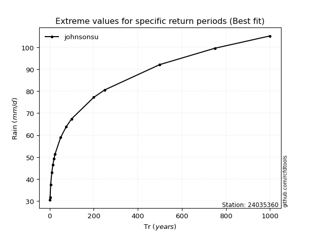</img>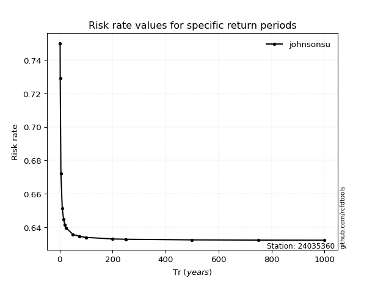</img>

</div>


<sub>**APP DISCLAIMER**: NO WARRANTY - This software is provided by [github.com/rcfdtools](https://github.com/rcfdtools) "as is", without any express or implied warranty, including warranties of merchantability, fitness for a particular purpose, or non-infringement. There is no guarantee that the software will be error-free or operate without interruption. LIMITATION OF LIABILITY - Neither the authors nor copyright holders will be liable for claims or damages arising from the software or its use. You are responsible for determining if the software is appropriate for your use and assume all associated risks, including errors, legal compliance, and data loss. NO PROFESSIONAL ADVICE - The software provides general information and does not offer professional advice. It should not replace consultation with professional advisors.</sub>