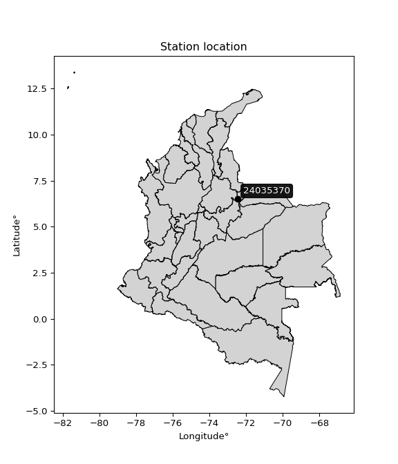

<div align="center">


</div>

# PMax24h Station (Rain): 24035370

Maximum Precipitation in 24 hours (PMax24h) is the greatest amount of rainfall for a specific duration that is meteorologically possible for a given location, acting as a "worst-case" scenario for extreme storms, crucial for designing safety-critical infrastructure like bridges, river deviations, dams, spillways, and nuclear plants to prevent catastrophic failure. The PMax24h is related with the Probable Maximum Precipitation (PMP) and it is calculated by hydrologists using meteorological data to determine the upper limit of extreme rainfall, often leading to the Probable Maximum Flood (PMF) for flood control design, and is increasingly being studied for climate change impacts. Probable Maximum Precipitation (PMP) is the theoretical upper limit of rainfall, a deterministic estimate for extreme events, while probability distributions (like GEV, Gumbel) describe the likelihood and frequency of various precipitation amounts, including rare ones, showing how often events occur, with PMP representing the extreme end of these distributions, used for critical infrastructure design to ensure safety against the worst conceivable weather, unlike standard statistical forecasts which cover typical probabilities.

The most common probability distributions in hydrology, used for analyzing floods, rainfall, and streamflow, include the Normal, Log-Normal, Gumbel, Gamma (including Log-Pearson Type III), and Generalized Extreme Value (GEV) distributions, often chosen based on the data´s skewness and whether modeling extremes or general conditions, with Gumbel and GEV popular for extreme events like floods, while the Normal distribution serves as a baseline, though often requiring transformations for skewed hydrological data. These distributions help in designing water infrastructure, managing water resources, and forecasting hydrologic events.

> Hydrological data often isn´t perfectly normal (it´s skewed), so different distributions are needed for different applications, such as: **Flood Frequency Analysis**: Using Gumbel, GEV, or Log-Pearson Type III for predicting extreme flood magnitudes and their return periods, **Rainfall Analysis**: Normal for annual totals, but Log-Normal, Weibull, or GEV for intensity or extreme daily rainfall, **Streamflow Modeling**: Gamma and Log-Normal for maximum flows, GEV for minimum flows, and Kappa for daily flows.

<div align="center">

</img>

</div>


## A. General information


### 1. General running parameters

• app_version: _v20260225_. • runtime: _2026-02-28 16:54:07.457399_. • Python version: _3.14.0_. • SciPy version: _1.16.3_. • Pandas version: _2.3.3_. • NumPy version: _2.3.5_. • Stations dataset (station_dataset_file): _dataset/pmax24h_in/automatic_colombia_2003_2025.csv_. • Stations catalog (station_catalog_file): _dataset/CNE.xls_. • Minimum year to eval til year_max (date_min): _1900_. • Maximum year to eval since year_min (date_max): _2025_. • Creates, save and include plots into reports (create_plot): _False_. • Plot only fit distributions with Δo > Δ (plot_only_fit): _True_. • Plot only simple graphs avoiding multiple CDFs and multiple Extreme values plots (plot_only_simple): _False_. • Eval low extreme values, if False, evaluates high extreme values (low_extreme): _False_. • Eval every SciPy distribution as logarithmic (pdist_logarithmic_on): _True_. • Standard deviation normalized (ddof): _1.0_. • Return periods to eval in years (Tr): _[2, 2.33, 5, 10, 15, 20, 25, 50, 75, 100, 200, 250, 500, 750, 1000]_. • Minimum data sample per station, 0 means any (minimum_sample): _5_. • Z-Score maximum threshold to adjust a value, 0 means disable (zscore_max): _3.5_. • Z-Score minimum threshold to adjust a value, 0 means disable (zscore_min): _-2.5_. • Avoid zeros, e.g. rain = 0 (avoid_zeros): _True_. • Avoid null values (avoid_nans): _True_. 

:file_folder:Table: [dataset.csv](../../dataset/pmax24h_in/automatic_colombia_2003_2025.csv)

> Delta Degrees of Freedom (DDOF): is a parameter used in the formulas for calculating variance and standard deviation. When ddof=0, the divisor is $N$ (the total number of observations) and this is used when your data set is the entire population. When ddof=1, the divisor is $N-1$ and this is used when your data set is a sample drawn from a larger population. Using $N-1$ provides an unbiased estimate of the population variance (known as Bessel´s correction).


### 2. Station info and location

|   id |   CODIGO | NOMBRE                     | CATEGORIA               | TECNOLOGIA                | ESTADO   | FECHA_INSTALACION   |   FECHA_SUSPENSION |   ALTITUD |   LATITUD |   LONGITUD | DEPARTAMENTO   | MUNICIPIO   | AREA_OPERATIVA                              | ENTIDAD                                                     | AREA_HIDROGRAFICA   | ZONA_HIDROGRAFICA   | SUBZONA_HIDROGRAFICA   |   CORRIENTE | Catalogo   |   Version |
|-----:|---------:|:---------------------------|:------------------------|:--------------------------|:---------|:--------------------|-------------------:|----------:|----------:|-----------:|:---------------|:------------|:--------------------------------------------|:------------------------------------------------------------|:--------------------|:--------------------|:-----------------------|------------:|:-----------|----------:|
|    0 | 24035370 | EL ESPINO - AUT [24035370] | Climatológica Principal | Automática con Telemetría | Activa   | 19/11/2005          |                nan |      3510 |   6.50675 |   -72.4527 | Boyacá         | El Espino   | Area Operativa 06 - Boyacá-Casanare-Vichada | INSTITUTO DE HIDROLOGIA METEOROLOGIA Y ESTUDIOS AMBIENTALES | Magdalena Cauca     | Sogamoso            | Río Chicamocha         |         nan | CNE_IDEAM  |  20251226 |

<div align="center">

Dynamic map: [:earth_americas:Google](http://maps.google.com/maps?q=6.50675,-72.45275) [:earth_americas:OSM](https://www.openstreetmap.org/#map=18/6.50675/-72.45275&layers=P) [:earth_americas:Bing](https://www.bing.com/maps?cp=6.50675~-72.45275&lvl=18) [:earth_americas:Apple](https://maps.apple.com/frame?center=6.50675%2C-72.45275&span=0.003%2C0.006)

</div>


<div align="center">

```geojson
{
  "type": "Feature",
  "geometry": {
    "type": "Point", 
    "coordinates": [-72.45275, 6.50675]
  }, 
  "properties": {
    "Name": "24035370"
  }
}
```

</div>


### 3. Discrete values table and plot

<div align="center">

|               |         0 |           1 |            2 |           3 |           4 |            5 |          6 |          7 |           8 |           9 |          10 |          11 |          12 |         13 |           14 |          15 |          16 |          17 |         18 |             19 |
|:--------------|----------:|------------:|-------------:|------------:|------------:|-------------:|-----------:|-----------:|------------:|------------:|------------:|------------:|------------:|-----------:|-------------:|------------:|------------:|------------:|-----------:|---------------:|
| Date          | 2006      | 2007        | 2008         | 2009        | 2010        | 2011         | 2012       | 2013       | 2014        | 2015        | 2016        | 2017        | 2018        | 2019       | 2020         | 2021        | 2022        | 2023        | 2024       | 2025           |
| Value         |   18.8    |   28.6      |   38.9       |   41.7      |   47.6      |   39.6       |   55.9     |   53.7     |   36.4      |   35        |   46.8      |   44.8      |   45.7      |   51.1     |   37.8       |   36        |   28.6      |   36.2      |   12.2     |   38.7         |
| Value_initial |   18.8    |   28.6      |   38.9       |   41.7      |   47.6      |   39.6       |   55.9     |   53.7     |   36.4      |   35        |   46.8      |   44.8      |   45.7      |   51.1     |   37.8       |   36        |   28.6      |   36.2      |   12.2     |   38.7         |
| count         |   20      |   20        |   20         |   20        |   20        |   20         |   20       |   20       |   20        |   20        |   20        |   20        |   20        |   20       |   20         |   20        |   20        |   20        |   20       |   20           |
| mean          |   38.705  |   38.705    |   38.705     |   38.705    |   38.705    |   38.705     |   38.705   |   38.705   |   38.705    |   38.705    |   38.705    |   38.705    |   38.705    |   38.705   |   38.705     |   38.705    |   38.705    |   38.705    |   38.705   |   38.705       |
| std           |   10.8848 |   10.8848   |   10.8848    |   10.8848   |   10.8848   |   10.8848    |   10.8848  |   10.8848  |   10.8848   |   10.8848   |   10.8848   |   10.8848   |   10.8848   |   10.8848  |   10.8848    |   10.8848   |   10.8848   |   10.8848   |   10.8848  |   10.8848      |
| zscore        |   -1.8287 |   -0.928361 |    0.0179149 |    0.275155 |    0.817196 |    0.0822249 |    1.57973 |    1.37761 |   -0.211764 |   -0.340384 |    0.743699 |    0.559956 |    0.642641 |    1.13875 |   -0.0831436 |   -0.248512 |   -0.928361 |   -0.230138 |   -2.43505 |   -0.000459357 |


</div>


> The initial value (value_initial) correspond to the initial obtained or null completed value, and value (value) is adjusted only when the initial value is outside the valid range (outlier) definite through the Z-Score value. If Z-Score is active, values out of range or outliers are replaced with the station mean value. A Z-Score (or standard score) measures how many standard deviations a data point is from the mean of a dataset, indicating its relative position; positive scores mean above the mean, negative mean below, and a score of zero is exactly at the mean, allowing for comparison of values from different distributions. It´s calculated using the formula $z=(x–μ)/σ$, where $x$ is the data point, $μ$ is the mean, and $σ$ is the standard deviation, helping identify outliers and understand probability.
>
> <sub>**Note**: In this study, "completing" (filling gaps in) and "extending" (forecasting or lengthening the historical record) rainfall data series are avoided for certain critical analyses because they introduce artificial bias and uncertainty, which can distort the statistics of rare events (extremes), alter day-to-day variability, and compromise the integrity and homogeneity of the original data. Some reasons against Completing/Extending rainfall data are: **Distortion of Extremes and Variability**: The primary issue is that most gap-filling or extension methods rely on averaging or regression with nearby stations, which inherently smooths the data. Rainfall is highly variable in space and time, with a large percentage of zero values and occasional large storms. Infilling methods often underestimate the highest values and overestimate the lowest (zero) values, which severely distorts analyses focused on flood frequency, drought severity, and intensity-duration-frequency (IDF) curves, **Loss of Data Homogeneity**: Infilled or extended data are synthetic estimates, not actual measurements. Combining these estimates with observed data can violate the assumption of data homogeneity, which requires that the data properties do not change over time. Inhomogeneity can lead to incorrect conclusions about long-term trends or changes in climate patterns, **Propagation of Errors**: Errors and biases from the original data (e.g., wind-induced undercatch, instrument errors, site changes) or the data used for imputation can propagate through the analysis, leading to unreliable hydrological models and inaccurate predictions, **Compromised Statistical Integrity**: For statistical analyses, especially those involving the frequency of events, using artificial data can introduce time bias or autocorrelation that doesn´t exist in reality, making it difficult to assess the true probability of events, **Difficulty in Validation**: It is difficult to accurately validate the quality of filled or extended data, especially for past periods where ground-truth measurements are unavailable. The reliability of imputation techniques heavily depends on the density of the surrounding station network and the complexity of the local topography.</sub>


### 4. Active continuous probability distributions from SciPy (80 of 104 available)

A Probability Density Function (PDF) describes the relative likelihood of a continuous random variable falling within a specific range, where the total area under its curve equals 1, and the area over any interval gives the actual probability for that range. Unlike discrete probabilities (like rolling a die), a PDF shows density, not direct probability for a single point (which is zero), with higher points indicating higher likelihood, often visualized as a bell curve for normal distributions.

A log of a probability density function (log-PDF) is simply the logarithm of the PDF´s value, denoted as $log(f(x))$, useful for converting multiplication of probabilities into addition, improving numerical stability with tiny numbers, and connecting to information theory concepts like entropy. Instead of dealing with very small probabilities (e.g., 0.000001), log-PDFs use negative numbers (e.g., $log(0.00001) ≈ -11.51$ that are easier for computers to handle, preventing underflow errors and simplifying complex calculations. In this study, each active probability distribution from SciPy is also evaluated in the $log$ form.

[scipy.stats](https://docs.scipy.org/doc/scipy/reference/stats.html) is a Python´s powerful submodule within the SciPy library for comprehensive statistical analysis, offering over 130 probability distributions (like Normal, Poisson, etc.), functions for descriptive stats (mean, variance), hypothesis testing (t-tests, chi-square), random variable generation, and statistical tests, making it essential for data science, modeling, and research. It provides tools to explore, model, and draw conclusions from data efficiently, working seamlessly with [NumPy](https://numpy.org/).

<div align="center">

|   id | p_dist           |   n_parameter | fit_method   | label                                                                       | active   | ref                                                                                                      |
|-----:|:-----------------|--------------:|:-------------|:----------------------------------------------------------------------------|:---------|:---------------------------------------------------------------------------------------------------------|
|    0 | alpha            |             3 | MLE          | Alpha                                                                       | True     | [:mortar_board:](https://docs.scipy.org/doc/scipy/reference/generated/scipy.stats.alpha.html)            |
|    1 | anglit           |             2 | MM           | Anglit                                                                      | True     | [:mortar_board:](https://docs.scipy.org/doc/scipy/reference/generated/scipy.stats.anglit.html)           |
|    2 | arcsine          |             2 | MM           | Arcsine                                                                     | True     | [:mortar_board:](https://docs.scipy.org/doc/scipy/reference/generated/scipy.stats.arcsine.html)          |
|    3 | argus            |             3 | MLE          | Argus                                                                       | True     | [:mortar_board:](https://docs.scipy.org/doc/scipy/reference/generated/scipy.stats.argus.html)            |
|    4 | beta             |             4 | MLE          | Beta                                                                        | True     | [:mortar_board:](https://docs.scipy.org/doc/scipy/reference/generated/scipy.stats.beta.html)             |
|    5 | betaprime        |             4 | MLE          | Beta prime                                                                  | True     | [:mortar_board:](https://docs.scipy.org/doc/scipy/reference/generated/scipy.stats.betaprime.html)        |
|    6 | bradford         |             3 | MLE          | Bradford                                                                    | True     | [:mortar_board:](https://docs.scipy.org/doc/scipy/reference/generated/scipy.stats.bradford.html)         |
|    7 | burr             |             4 | MLE          | Burr (Type III)                                                             | True     | [:mortar_board:](https://docs.scipy.org/doc/scipy/reference/generated/scipy.stats.burr.html)             |
|    8 | burr12           |             4 | MLE          | Burr (Type III) 12                                                          | True     | [:mortar_board:](https://docs.scipy.org/doc/scipy/reference/generated/scipy.stats.burr12.html)           |
|    9 | cosine           |             2 | MLE          | Cosine                                                                      | True     | [:mortar_board:](https://docs.scipy.org/doc/scipy/reference/generated/scipy.stats.cosine.html)           |
|   10 | crystalball      |             4 | MLE          | Crystalball                                                                 | True     | [:mortar_board:](https://docs.scipy.org/doc/scipy/reference/generated/scipy.stats.crystalball.html)      |
|   11 | dgamma           |             3 | MLE          | Double gamma                                                                | True     | [:mortar_board:](https://docs.scipy.org/doc/scipy/reference/generated/scipy.stats.dgamma.html)           |
|   12 | dweibull         |             3 | MLE          | Double Weibull                                                              | True     | [:mortar_board:](https://docs.scipy.org/doc/scipy/reference/generated/scipy.stats.dweibull.html)         |
|   13 | erlang           |             3 | MLE          | Erlang                                                                      | True     | [:mortar_board:](https://docs.scipy.org/doc/scipy/reference/generated/scipy.stats.erlang.html)           |
|   14 | exponnorm        |             3 | MLE          | Exponentially modified Normal                                               | True     | [:mortar_board:](https://docs.scipy.org/doc/scipy/reference/generated/scipy.stats.exponnorm.html)        |
|   15 | exponpow         |             3 | MLE          | Exponential power                                                           | True     | [:mortar_board:](https://docs.scipy.org/doc/scipy/reference/generated/scipy.stats.exponpow.html)         |
|   16 | exponweib        |             4 | MLE          | Exponentiated Weibull                                                       | True     | [:mortar_board:](https://docs.scipy.org/doc/scipy/reference/generated/scipy.stats.exponweib.html)        |
|   17 | f                |             4 | MLE          | F                                                                           | True     | [:mortar_board:](https://docs.scipy.org/doc/scipy/reference/generated/scipy.stats.f.html)                |
|   18 | fatiguelife      |             3 | MLE          | Fatigue-life (Birnbaum-Saunders)                                            | True     | [:mortar_board:](https://docs.scipy.org/doc/scipy/reference/generated/scipy.stats.fatiguelife.html)      |
|   19 | foldnorm         |             3 | MM           | Fold Normal                                                                 | True     | [:mortar_board:](https://docs.scipy.org/doc/scipy/reference/generated/scipy.stats.foldnorm.html)         |
|   20 | gamma            |             3 | MLE          | Gamma                                                                       | True     | [:mortar_board:](https://docs.scipy.org/doc/scipy/reference/generated/scipy.stats.gamma.html)            |
|   21 | gausshyper       |             6 | MLE          | Gauss hypergeometric                                                        | True     | [:mortar_board:](https://docs.scipy.org/doc/scipy/reference/generated/scipy.stats.gausshyper.html)       |
|   22 | genexpon         |             5 | MLE          | Generalized exponential                                                     | True     | [:mortar_board:](https://docs.scipy.org/doc/scipy/reference/generated/scipy.stats.genexpon.html)         |
|   23 | genextreme       |             3 | MLE          | Generalized exponential                                                     | True     | [:mortar_board:](https://docs.scipy.org/doc/scipy/reference/generated/scipy.stats.genextreme.html)       |
|   24 | gengamma         |             4 | MLE          | Generalized gamma                                                           | True     | [:mortar_board:](https://docs.scipy.org/doc/scipy/reference/generated/scipy.stats.gengamma.html)         |
|   25 | genhalflogistic  |             3 | MLE          | Generalized half-logistic                                                   | True     | [:mortar_board:](https://docs.scipy.org/doc/scipy/reference/generated/scipy.stats.genhalflogistic.html)  |
|   26 | genlogistic      |             3 | MLE          | Generalized logistic                                                        | True     | [:mortar_board:](https://docs.scipy.org/doc/scipy/reference/generated/scipy.stats.genlogistic.html)      |
|   27 | gennorm          |             3 | MLE          | Generalized Normal                                                          | True     | [:mortar_board:](https://docs.scipy.org/doc/scipy/reference/generated/scipy.stats.gennorm.html)          |
|   28 | genpareto        |             3 | MLE          | Generalized Pareto                                                          | True     | [:mortar_board:](https://docs.scipy.org/doc/scipy/reference/generated/scipy.stats.genpareto.html)        |
|   29 | gompertz         |             3 | MLE          | Gompertz (or truncated Gumbel)                                              | True     | [:mortar_board:](https://docs.scipy.org/doc/scipy/reference/generated/scipy.stats.gompertz.html)         |
|   30 | gumbel_l         |             2 | MM           | Gumbel Left Skew                                                            | True     | [:mortar_board:](https://docs.scipy.org/doc/scipy/reference/generated/scipy.stats.gumbel_l.html)         |
|   31 | gumbel_r         |             2 | MM           | Gumbel Right Skew                                                           | True     | [:mortar_board:](https://docs.scipy.org/doc/scipy/reference/generated/scipy.stats.gumbel_r.html)         |
|   32 | halfgennorm      |             3 | MLE          | Upper half of a generalized normal                                          | True     | [:mortar_board:](https://docs.scipy.org/doc/scipy/reference/generated/scipy.stats.halfgennorm.html)      |
|   33 | halflogistic     |             2 | MM           | Half-logistic                                                               | True     | [:mortar_board:](https://docs.scipy.org/doc/scipy/reference/generated/scipy.stats.halflogistic.html)     |
|   34 | halfnorm         |             2 | MM           | Half Normal                                                                 | True     | [:mortar_board:](https://docs.scipy.org/doc/scipy/reference/generated/scipy.stats.halfnorm.html)         |
|   35 | hypsecant        |             2 | MM           | hyperbolic secant                                                           | True     | [:mortar_board:](https://docs.scipy.org/doc/scipy/reference/generated/scipy.stats.hypsecant.html)        |
|   36 | invgamma         |             3 | MLE          | Inverted gamma                                                              | True     | [:mortar_board:](https://docs.scipy.org/doc/scipy/reference/generated/scipy.stats.invgamma.html)         |
|   37 | invgauss         |             3 | MLE          | Inverse Gaussian                                                            | True     | [:mortar_board:](https://docs.scipy.org/doc/scipy/reference/generated/scipy.stats.invgauss.html)         |
|   38 | invweibull       |             3 | MLE          | Inverted Weibull                                                            | True     | [:mortar_board:](https://docs.scipy.org/doc/scipy/reference/generated/scipy.stats.invweibull.html)       |
|   39 | johnsonsb        |             4 | MLE          | Johnson SB                                                                  | True     | [:mortar_board:](https://docs.scipy.org/doc/scipy/reference/generated/scipy.stats.johnsonsb.html)        |
|   40 | johnsonsu        |             4 | MLE          | Johnson Su                                                                  | True     | [:mortar_board:](https://docs.scipy.org/doc/scipy/reference/generated/scipy.stats.johnsonsu.html)        |
|   41 | kappa3           |             3 | MLE          | Kappa 3                                                                     | True     | [:mortar_board:](https://docs.scipy.org/doc/scipy/reference/generated/scipy.stats.kappa3.html)           |
|   42 | kappa4           |             4 | MLE          | Kappa 4                                                                     | True     | [:mortar_board:](https://docs.scipy.org/doc/scipy/reference/generated/scipy.stats.kappa4.html)           |
|   43 | ksone            |             3 | MLE          | Kolmogorov-Smirnov one-sided test statistic distribution                    | True     | [:mortar_board:](https://docs.scipy.org/doc/scipy/reference/generated/scipy.stats.ksone.html)            |
|   44 | kstwobign        |             2 | MLE          | Limiting distribution of scaled Kolmogorov-Smirnov two-sided test statistic | True     | [:mortar_board:](https://docs.scipy.org/doc/scipy/reference/generated/scipy.stats.kstwobign.html)        |
|   45 | laplace          |             2 | MM           | Laplace                                                                     | True     | [:mortar_board:](https://docs.scipy.org/doc/scipy/reference/generated/scipy.stats.laplace.html)          |
|   46 | levy_l           |             2 | MLE          | Left-skewed Levy                                                            | True     | [:mortar_board:](https://docs.scipy.org/doc/scipy/reference/generated/scipy.stats.levy_l.html)           |
|   47 | loggamma         |             3 | MLE          | Log gamma                                                                   | True     | [:mortar_board:](https://docs.scipy.org/doc/scipy/reference/generated/scipy.stats.loggamma.html)         |
|   48 | logistic         |             2 | MM           | Logistic (or Sech-squared)                                                  | True     | [:mortar_board:](https://docs.scipy.org/doc/scipy/reference/generated/scipy.stats.logistic.html)         |
|   49 | loglaplace       |             3 | MLE          | Log-Laplace                                                                 | True     | [:mortar_board:](https://docs.scipy.org/doc/scipy/reference/generated/scipy.stats.loglaplace.html)       |
|   50 | lomax            |             3 | MLE          | Lomax (Pareto of the second kind)                                           | True     | [:mortar_board:](https://docs.scipy.org/doc/scipy/reference/generated/scipy.stats.lomax.html)            |
|   51 | maxwell          |             2 | MM           | Maxwell                                                                     | True     | [:mortar_board:](https://docs.scipy.org/doc/scipy/reference/generated/scipy.stats.maxwell.html)          |
|   52 | mielke           |             4 | MLE          | Mielke Beta-Kappa / Dagum                                                   | True     | [:mortar_board:](https://docs.scipy.org/doc/scipy/reference/generated/scipy.stats.mielke.html)           |
|   53 | moyal            |             2 | MM           | Moyal                                                                       | True     | [:mortar_board:](https://docs.scipy.org/doc/scipy/reference/generated/scipy.stats.moyal.html)            |
|   54 | nakagami         |             3 | MLE          | Nakagami                                                                    | True     | [:mortar_board:](https://docs.scipy.org/doc/scipy/reference/generated/scipy.stats.nakagami.html)         |
|   55 | ncf              |             5 | MLE          | Non-central F distribution                                                  | True     | [:mortar_board:](https://docs.scipy.org/doc/scipy/reference/generated/scipy.stats.ncf.html)              |
|   56 | nct              |             4 | MLE          | Non-central Student’s t                                                     | True     | [:mortar_board:](https://docs.scipy.org/doc/scipy/reference/generated/scipy.stats.nct.html)              |
|   57 | norm             |             2 | MM           | Normal                                                                      | True     | [:mortar_board:](https://docs.scipy.org/doc/scipy/reference/generated/scipy.stats.norm.html)             |
|   58 | pearson3         |             3 | MM           | Pearson type III                                                            | True     | [:mortar_board:](https://docs.scipy.org/doc/scipy/reference/generated/scipy.stats.pearson3.html)         |
|   59 | powerlaw         |             3 | MLE          | Power-function                                                              | True     | [:mortar_board:](https://docs.scipy.org/doc/scipy/reference/generated/scipy.stats.powerlaw.html)         |
|   60 | rayleigh         |             2 | MM           | Rayleigh                                                                    | True     | [:mortar_board:](https://docs.scipy.org/doc/scipy/reference/generated/scipy.stats.rayleigh.html)         |
|   61 | rdist            |             3 | MLE          | R-distributed (symmetric beta)                                              | True     | [:mortar_board:](https://docs.scipy.org/doc/scipy/reference/generated/scipy.stats.rdist.html)            |
|   62 | rice             |             3 | MLE          | Rice                                                                        | True     | [:mortar_board:](https://docs.scipy.org/doc/scipy/reference/generated/scipy.stats.rice.html)             |
|   63 | semicircular     |             2 | MM           | Semicircular                                                                | True     | [:mortar_board:](https://docs.scipy.org/doc/scipy/reference/generated/scipy.stats.semicircular.html)     |
|   64 | skewnorm         |             3 | MLE          | Skew normal                                                                 | True     | [:mortar_board:](https://docs.scipy.org/doc/scipy/reference/generated/scipy.stats.skewnorm.html)         |
|   65 | t                |             3 | MLE          | Student’s t                                                                 | True     | [:mortar_board:](https://docs.scipy.org/doc/scipy/reference/generated/scipy.stats.t.html)                |
|   66 | trapezoid        |             4 | MLE          | Trapezoid                                                                   | True     | [:mortar_board:](https://docs.scipy.org/doc/scipy/reference/generated/scipy.stats.trapezoid.html)        |
|   67 | triang           |             3 | MLE          | Triangular                                                                  | True     | [:mortar_board:](https://docs.scipy.org/doc/scipy/reference/generated/scipy.stats.triang.html)           |
|   68 | truncexpon       |             3 | MLE          | Truncated exponential                                                       | True     | [:mortar_board:](https://docs.scipy.org/doc/scipy/reference/generated/scipy.stats.truncexpon.html)       |
|   69 | truncnorm        |             4 | MLE          | Truncated normal                                                            | True     | [:mortar_board:](https://docs.scipy.org/doc/scipy/reference/generated/scipy.stats.truncnorm.html)        |
|   70 | truncpareto      |             4 | MLE          | Upper truncated Pareto                                                      | True     | [:mortar_board:](https://docs.scipy.org/doc/scipy/reference/generated/scipy.stats.truncpareto.html)      |
|   71 | truncweibull_min |             5 | MLE          | Doubly truncated Weibull minimum                                            | True     | [:mortar_board:](https://docs.scipy.org/doc/scipy/reference/generated/scipy.stats.truncweibull_min.html) |
|   72 | tukeylambda      |             3 | MLE          | Tukey-Lamdba                                                                | True     | [:mortar_board:](https://docs.scipy.org/doc/scipy/reference/generated/scipy.stats.tukeylambda.html)      |
|   73 | uniform          |             2 | MLE          | Uniform                                                                     | True     | [:mortar_board:](https://docs.scipy.org/doc/scipy/reference/generated/scipy.stats.uniform.html)          |
|   74 | vonmises         |             3 | MLE          | Von Mises                                                                   | True     | [:mortar_board:](https://docs.scipy.org/doc/scipy/reference/generated/scipy.stats.vonmises.html)         |
|   75 | vonmises_line    |             3 | MLE          | Von Mises line                                                              | True     | [:mortar_board:](https://docs.scipy.org/doc/scipy/reference/generated/scipy.stats.vonmises_line.html)    |
|   76 | wald             |             2 | MM           | Wald                                                                        | True     | [:mortar_board:](https://docs.scipy.org/doc/scipy/reference/generated/scipy.stats.wald.html)             |
|   77 | weibull_max      |             3 | MLE          | Weibull maximum                                                             | True     | [:mortar_board:](https://docs.scipy.org/doc/scipy/reference/generated/scipy.stats.weibull_max.html)      |
|   78 | weibull_min      |             3 | MLE          | Weibull minimum                                                             | True     | [:mortar_board:](https://docs.scipy.org/doc/scipy/reference/generated/scipy.stats.weibull_min.html)      |
|   79 | wrapcauchy       |             3 | MLE          | Wrapped  Cauchy                                                             | True     | [:mortar_board:](https://docs.scipy.org/doc/scipy/reference/generated/scipy.stats.wrapcauchy.html)       |

</div>

> **n_parameter:** # arguments & localization & scale.
>
> **Fit methods:** (MLE) maximum likelihood, (MM) L-moments.
>
>**Inactive** (With the only purpose of prevent loops, zero divisions, infinite values, over high estimated values or horizontal trending for recurrence intervals estimations, the follow distributions were disabled.)**:** lognorm, norminvgauss, powernorm, powerlognorm, cauchy, halfcauchy, foldcauchy, skewcauchy, chi2, expon, fisk, genhyperbolic, geninvgauss, gibrat, kstwo, laplace_asymmetric, levy, levy_stable, ncx2, pareto, rel_breitwigner, recipinvgauss, studentized_range, loguniform, 


## B. Probability (PDF) vs. Empirical (EDF) distributions functions

A continuous probability distribution (CPD) describes probabilities for variables that can take any value within a range (like rain any time), unlike discrete variables with specific outcomes (like temperature). It uses a Probability Density Function (PDF), a curve where the total area under it equals 1, and the probability of the variable falling within an interval (a to b) is found by calculating the area under the curve between those points. A key feature is that the probability of hitting any single exact value is zero, so probabilities are always expressed for ranges, e.g., $P(a ≤ X ≤ b)$.

<div align="center">

Distributions parameters from station values
|     |   station | p_dist              |   n |              loc |            scale | shape                  | shape1                 | shape2                | shape3             |
|----:|----------:|:--------------------|----:|-----------------:|-----------------:|:-----------------------|:-----------------------|:----------------------|:-------------------|
|   0 |  24035370 | alpha               |  20 |   -199.662       |   5103.26        | 21.460287651450926     |                        |                       |                    |
|   1 |  24035370 | anglit              |  20 |     38.705       |     31.036       |                        |                        |                       |                    |
|   2 |  24035370 | arcsine             |  20 |     23.7014      |     30.0072      |                        |                        |                       |                    |
|   3 |  24035370 | argus               |  20 |      7.47208     |     49.2681      | 1.1716797802026993     |                        |                       |                    |
|   4 |  24035370 | beta                |  20 |     12.0171      |     43.8829      | 1.1661247990803        | 0.7836459960482305     |                       |                    |
|   5 |  24035370 | betaprime           |  20 |   -329.393       |  15588           | 1211.8957429726802     | 51321.583329952584     |                       |                    |
|   6 |  24035370 | bradford            |  20 |     12.2         |     46.6671      | 2.889326853351015e-05  |                        |                       |                    |
|   7 |  24035370 | burr                |  20 |     -0.346398    |     50.0655      | 15.287767341922756     | 0.2063802819070199     |                       |                    |
|   8 |  24035370 | burr12              |  20 |    -65.3289      |    231.145       | 11.987953541941089     | 8586.641886779425      |                       |                    |
|   9 |  24035370 | cosine              |  20 |     37.2133      |      9.75666     |                        |                        |                       |                    |
|  10 |  24035370 | crystalball         |  20 |     38.705       |     10.6092      | 2925.5574209779516     | 4135.13852121366       |                       |                    |
|  11 |  24035370 | dgamma              |  20 |     38.7         |      9.42968     | 0.8258815672239432     |                        |                       |                    |
|  12 |  24035370 | dweibull            |  20 |     38.9         |      7.85868     | 0.9412789689864821     |                        |                       |                    |
|  13 |  24035370 | erlang              |  20 |   -146.466       |      0.647442    | 286.0886695329525      |                        |                       |                    |
|  14 |  24035370 | exponnorm           |  20 |     38.6961      |     10.6092      | 0.0008399655300071235  |                        |                       |                    |
|  15 |  24035370 | exponpow            |  20 |     -1.04842e+10 |      1.04842e+10 | 464279480.5582031      |                        |                       |                    |
|  16 |  24035370 | exponweib           |  20 |     12.2         |      1.31023     | 1.8303618199723144     | 0.2789789332706024     |                       |                    |
|  17 |  24035370 | f                   |  20 |  -3899.16        |   3937.85        | 518257.9059942415      | 585536.9489151872      |                       |                    |
|  18 |  24035370 | fatiguelife         |  20 |  -1099.7         |   1138.43        | 0.009327007303104519   |                        |                       |                    |
|  19 |  24035370 | foldnorm            |  20 |    -16.3202      |     10.1363      | 5.436251588701777      |                        |                       |                    |
|  20 |  24035370 | gamma               |  20 |   -152.884       |      0.615693    | 311.17686734083304     |                        |                       |                    |
|  21 |  24035370 | gausshyper          |  20 |      9.43539     |     46.4646      | 1.2883555626976024     | 0.7409852232238576     | 0.6256612859563282    | 1.100845362634188  |
|  22 |  24035370 | genexpon            |  20 |     12.2         |      1.31287     | 0.0495628651717852     | 1.2071500575354547e-07 | 2.1479509939915378    |                    |
|  23 |  24035370 | genextreme          |  20 |     36.3133      |     11.6066      | 0.5349714760507209     |                        |                       |                    |
|  24 |  24035370 | gengamma            |  20 |     12.2         |      0.735186    | 1.4693942831916411     | 0.21999336929058516    |                       |                    |
|  25 |  24035370 | genhalflogistic     |  20 |      7.81668     |     50.6273      | 1.0529087046088397     |                        |                       |                    |
|  26 |  24035370 | genlogistic         |  20 |     44.4273      |      4.33497     | 0.5156279774769122     |                        |                       |                    |
|  27 |  24035370 | gennorm             |  20 |     38.8779      |      9.05833     | 1.1128319707298886     |                        |                       |                    |
|  28 |  24035370 | genpareto           |  20 |      0.0438355   |     83.3489      | -1.492205120268447     |                        |                       |                    |
|  29 |  24035370 | gompertz            |  20 |     12.2         |      9.49571     | 0.03870715325278892    |                        |                       |                    |
|  30 |  24035370 | gumbel_l            |  20 |     43.4797      |      8.27194     |                        |                        |                       |                    |
|  31 |  24035370 | gumbel_r            |  20 |     33.9303      |      8.27194     |                        |                        |                       |                    |
|  32 |  24035370 | halfgennorm         |  20 |     12.2         |      0.798755    | 0.3428977731459928     |                        |                       |                    |
|  33 |  24035370 | halflogistic        |  20 |     26.1307      |      9.07045     |                        |                        |                       |                    |
|  34 |  24035370 | halfnorm            |  20 |     24.6626      |     17.5995      |                        |                        |                       |                    |
|  35 |  24035370 | hypsecant           |  20 |     38.705       |      6.75401     |                        |                        |                       |                    |
|  36 |  24035370 | invgamma            |  20 |   -114.645       |  27983.1         | 183.3754962892569      |                        |                       |                    |
|  37 |  24035370 | invgauss            |  20 |    -45.0363      |   4304.96        | 0.01936215815855235    |                        |                       |                    |
|  38 |  24035370 | invweibull          |  20 |     -2.03103e+09 |      2.03103e+09 | 149712847.0340386      |                        |                       |                    |
|  39 |  24035370 | johnsonsb           |  20 |    -11.5973      |     73.4918      | -1.1761230324341905    | 1.3619796225997103     |                       |                    |
|  40 |  24035370 | johnsonsu           |  20 |     77.9821      |      5.37129     | 10.022795137514569     | 3.7782762540326216     |                       |                    |
|  41 |  24035370 | kappa3              |  20 |     12.2         |     43.5981      | 1209.7453474086185     |                        |                       |                    |
|  42 |  24035370 | kappa4              |  20 |      7.7473      |     49.2996      | 1.0993984042882006     | 1.0219101743973384     |                       |                    |
|  43 |  24035370 | ksone               |  20 |      7.83        |     52.44        | 1.0                    |                        |                       |                    |
|  44 |  24035370 | kstwobign           |  20 |    -11.0862      |     57.2268      |                        |                        |                       |                    |
|  45 |  24035370 | laplace             |  20 |     38.705       |      7.50182     |                        |                        |                       |                    |
|  46 |  24035370 | levy_l              |  20 |     57.3339      |      9.61406     |                        |                        |                       |                    |
|  47 |  24035370 | loggamma            |  20 |     35.1558      |     12.4427      | 1.8003435679857778     |                        |                       |                    |
|  48 |  24035370 | logistic            |  20 |     38.705       |      5.84914     |                        |                        |                       |                    |
|  49 |  24035370 | loglaplace          |  20 |     -0.093724    |     38.9937      | 4.3695991153549905     |                        |                       |                    |
|  50 |  24035370 | lomax               |  20 |     12.1994      | 350214           | 13226.457134419652     |                        |                       |                    |
|  51 |  24035370 | maxwell             |  20 |     13.5657      |     15.7537      |                        |                        |                       |                    |
|  52 |  24035370 | mielke              |  20 |     -0.153403    |     49.9071      | 3.131967886905424      | 15.277340312747134     |                       |                    |
|  53 |  24035370 | moyal               |  20 |     32.638       |      4.7758      |                        |                        |                       |                    |
|  54 |  24035370 | nakagami            |  20 |  -6093.41        |   6132.11        | 83069.6356919911       |                        |                       |                    |
|  55 |  24035370 | ncf                 |  20 |      1.26307     |      0.00524846  | 0.005562715318975474   | 1613.0501741688427     | 39.60212073110763     |                    |
|  56 |  24035370 | nct                 |  20 |   -579.423       |     10.5478      | 122627.75393030996     | 58.602038716176594     |                       |                    |
|  57 |  24035370 | norm                |  20 |     38.705       |     10.6092      |                        |                        |                       |                    |
|  58 |  24035370 | pearson3            |  20 |     38.705       |     10.6092      | -0.689979908289527     |                        |                       |                    |
|  59 |  24035370 | powerlaw            |  20 |     12.2         |     43.7         | 0.42017781204513904    |                        |                       |                    |
|  60 |  24035370 | rayleigh            |  20 |     18.409       |     16.1939      |                        |                        |                       |                    |
|  61 |  24035370 | rdist               |  20 |      8.88877     |     27.5112      | 0.9942650586203816     |                        |                       |                    |
|  62 |  24035370 | rice                |  20 |     12.194       |      2.83819     | 2.9185790993894127e-08 |                        |                       |                    |
|  63 |  24035370 | semicircular        |  20 |     38.705       |     21.2184      |                        |                        |                       |                    |
|  64 |  24035370 | skewnorm            |  20 |     50.4199      |     15.8048      | -2.6114551412165623    |                        |                       |                    |
|  65 |  24035370 | t                   |  20 |     38.705       |     10.6091      | 485928.5520056149      |                        |                       |                    |
|  66 |  24035370 | trapezoid           |  20 |      7.83        |     52.44        | 1.0                    | 1.0                    |                       |                    |
|  67 |  24035370 | triang              |  20 |      6.87671     |     50.5248      | 0.9267380660884832     |                        |                       |                    |
|  68 |  24035370 | truncexpon          |  20 |     12.2         |     76.5185      | 0.5711034362648328     |                        |                       |                    |
|  69 |  24035370 | truncnorm           |  20 |     38.705       |     10.6092      | -161.88883064556833    | 758.7486771608083      |                       |                    |
|  70 |  24035370 | truncpareto         |  20 |     12.2         |      5.36142e-08 | 0.05263159852126162    | 815082366.9701076      |                       |                    |
|  71 |  24035370 | truncweibull_min    |  20 |      7.71801     |     87.1454      | 1.9941025557437353     | 0.006975940591284906   | 0.5528921215239324    |                    |
|  72 |  24035370 | tukeylambda         |  20 |     34.0487      |     37.4522      | 1.7139592543107012     |                        |                       |                    |
|  73 |  24035370 | uniform             |  20 |     12.2         |     43.7         |                        |                        |                       |                    |
|  74 |  24035370 | vonmises            |  20 |     -2.0799      |      1           | 0.10756335773709316    |                        |                       |                    |
|  75 |  24035370 | vonmises_line       |  20 |     34.0499      |      6.95511     | 0.019774136033115064   |                        |                       |                    |
|  76 |  24035370 | wald                |  20 |     28.0958      |     10.6092      |                        |                        |                       |                    |
|  77 |  24035370 | weibull_max         |  20 |     55.9         |      1.35703     | 0.31906652453465556    |                        |                       |                    |
|  78 |  24035370 | weibull_min         |  20 |    -68.5813      |    111.857       | 12.355532691299901     |                        |                       |                    |
|  79 |  24035370 | wrapcauchy          |  20 |     12.0764      |      6.97474     | 0.0018880043399166703  |                        |                       |                    |
|  80 |  24035370 | logalpha            |  20 |     -9.08319     |    425.055       | 33.55170774339865      |                        |                       |                    |
|  81 |  24035370 | loganglit           |  20 |      3.60484     |      1.02656     |                        |                        |                       |                    |
|  82 |  24035370 | logarcsine          |  20 |      3.10859     |      0.992508    |                        |                        |                       |                    |
|  83 |  24035370 | logargus            |  20 |      2.11552     |      1.92212     | 2.6045830583436995     |                        |                       |                    |
|  84 |  24035370 | logbeta             |  20 |      2.13242     |      1.89115     | 3.4577620331557384     | 0.5668021325383001     |                       |                    |
|  85 |  24035370 | logbetaprime        |  20 |     -9.99831     |     17.5252      | 2411.079458437821      | 3107.6076660092876     |                       |                    |
|  86 |  24035370 | logbradford         |  20 |      2.49779     |      1.52578     | 1.9012705699196467e-06 |                        |                       |                    |
|  87 |  24035370 | logburr             |  20 |   -573.376       |    577.293       | 9465.27680058333       | 0.18614950418337173    |                       |                    |
|  88 |  24035370 | logburr12           |  20 |   -195.816       |    202.163       | 865.2208309672452      | 72451.17089337864      |                       |                    |
|  89 |  24035370 | logcosine           |  20 |      8.37349     |      2.81354e-30 |                        |                        |                       |                    |
|  90 |  24035370 | logcrystalball      |  20 |      3.60484     |      0.350917    | 557.926386451506       | 82.95697988199689      |                       |                    |
|  91 |  24035370 | logdgamma           |  20 |      3.66099     |      0.251565    | 0.926686327714099      |                        |                       |                    |
|  92 |  24035370 | logdweibull         |  20 |      3.66099     |      0.245784    | 0.8854024436725207     |                        |                       |                    |
|  93 |  24035370 | logerlang           |  20 |     -2.79017     |      0.0218361   | 292.6935886732839      |                        |                       |                    |
|  94 |  24035370 | logexponnorm        |  20 |      3.60461     |      0.350918    | 0.0006577521363075619  |                        |                       |                    |
|  95 |  24035370 | logexponpow         |  20 |      2.50144     |      1.30814     | 0.9066423770395247     |                        |                       |                    |
|  96 |  24035370 | logexponweib        |  20 |     -2.55462e+07 |      2.55462e+07 | 0.342966379892673      | 229945332.36556315     |                       |                    |
|  97 |  24035370 | logf                |  20 |   -899.29        |    902.896       | 36054931.37130736      | 20715564.666473933     |                       |                    |
|  98 |  24035370 | logfatiguelife      |  20 |   -308.21        |    311.813       | 0.0011267321595183578  |                        |                       |                    |
|  99 |  24035370 | logfoldnorm         |  20 |      3.11861     |      0.412249    | 1.0228809829862426     |                        |                       |                    |
| 100 |  24035370 | loggamma            |  20 |     -3.11714     |      0.0211897   | 316.8237099658236      |                        |                       |                    |
| 101 |  24035370 | loggausshyper       |  20 |      2.46033     |      1.56323     | 1.0446234532118366     | 0.4898956529681736     | 1.0846355465800435    | 1.5051216701754537 |
| 102 |  24035370 | loggenexpon         |  20 |      2.46169     |      0.0269333   | 0.00116091448442827    | 12.302812188624877     | 7.825170943874353e-05 |                    |
| 103 |  24035370 | loggenextreme       |  20 |      3.57773     |      0.372612    | 0.823601231715885      |                        |                       |                    |
| 104 |  24035370 | loggengamma         |  20 |     -4.0644e+06  |      4.06441e+06 | 0.3748867234712191     | 34573742.859645635     |                       |                    |
| 105 |  24035370 | loggenhalflogistic  |  20 |      2.49416     |      1.59901     | 1.045512903973659      |                        |                       |                    |
| 106 |  24035370 | loggenlogistic      |  20 |      3.90762     |      0.0655017   | 0.20396284300885517    |                        |                       |                    |
| 107 |  24035370 | loggennorm          |  20 |      3.66099     |      0.101897    | 0.6667404076374923     |                        |                       |                    |
| 108 |  24035370 | loggenpareto        |  20 |     -0.00499912  |     12.5395      | -3.1126414170769223    |                        |                       |                    |
| 109 |  24035370 | loggompertz         |  20 |      2.50144     |      1.18209     | 0.6510203787444502     |                        |                       |                    |
| 110 |  24035370 | loggumbel_l         |  20 |      3.76277     |      0.273609    |                        |                        |                       |                    |
| 111 |  24035370 | loggumbel_r         |  20 |      3.44691     |      0.273609    |                        |                        |                       |                    |
| 112 |  24035370 | loghalfgennorm      |  20 |      2.50143     |      1.52293     | 11468.90124153009      |                        |                       |                    |
| 113 |  24035370 | loghalflogistic     |  20 |      3.18893     |      0.300019    |                        |                        |                       |                    |
| 114 |  24035370 | loghalfnorm         |  20 |      3.14036     |      0.582144    |                        |                        |                       |                    |
| 115 |  24035370 | loghypsecant        |  20 |      3.60484     |      0.223401    |                        |                        |                       |                    |
| 116 |  24035370 | loginvgamma         |  20 |     -5.30584     |   5233.35        | 588.5546401373945      |                        |                       |                    |
| 117 |  24035370 | loginvgauss         |  20 |     -1.03624     |    637.259       | 0.007275116462879011   |                        |                       |                    |
| 118 |  24035370 | loginvweibull       |  20 |     -3.11103e+07 |      3.11104e+07 | 66877825.869511545     |                        |                       |                    |
| 119 |  24035370 | logjohnsonsb        |  20 |     -3.11684     |      7.24939     | -4.015555460978317     | 1.466973566147694      |                       |                    |
| 120 |  24035370 | logjohnsonsu        |  20 |      4.16194     |      0.0133606   | 7.296169315394447      | 1.715190251613238      |                       |                    |
| 121 |  24035370 | logkappa3           |  20 |      2.50143     |      1.52065     | 2918.4748067508717     |                        |                       |                    |
| 122 |  24035370 | logkappa4           |  20 |      2.61531     |      1.67359     | 0.9246261057117127     | 1.1884125981038227     |                       |                    |
| 123 |  24035370 | logksone            |  20 |      2.34922     |      1.82655     | 1.0                    |                        |                       |                    |
| 124 |  24035370 | logkstwobign        |  20 |      1.61906     |      2.29121     |                        |                        |                       |                    |
| 125 |  24035370 | loglaplace          |  20 |      3.60484     |      0.248136    |                        |                        |                       |                    |
| 126 |  24035370 | loglevy_l           |  20 |      4.05405     |      0.200801    |                        |                        |                       |                    |
| 127 |  24035370 | logloggamma         |  20 |      3.93379     |      0.113255    | 0.35733096448614143    |                        |                       |                    |
| 128 |  24035370 | loglogistic         |  20 |      3.60484     |      0.193471    |                        |                        |                       |                    |
| 129 |  24035370 | logloglaplace       |  20 |     -3.31259e+07 |      3.31259e+07 | 143421721.50094014     |                        |                       |                    |
| 130 |  24035370 | loglomax            |  20 |      2.50102     |    206.389       | 183.45746662827855     |                        |                       |                    |
| 131 |  24035370 | logmaxwell          |  20 |      2.77338     |      0.521045    |                        |                        |                       |                    |
| 132 |  24035370 | logmielke           |  20 |   -607.212       |    611.126       | 1837.091854286541      | 9703.518555638546      |                       |                    |
| 133 |  24035370 | logmoyal            |  20 |      3.40417     |      0.157968    |                        |                        |                       |                    |
| 134 |  24035370 | lognakagami         |  20 |   -419.908       |    423.513       | 363524.3653849127      |                        |                       |                    |
| 135 |  24035370 | logncf              |  20 |    -51.8894      |     50.4767      | 55607.33258844666      | 423420.16831021477     | 5527.615970386611     |                    |
| 136 |  24035370 | lognct              |  20 |    -19.3372      |      0.306913    | 8031.662472007345      | 74.73934231832175      |                       |                    |
| 137 |  24035370 | lognorm             |  20 |      3.60484     |      0.350917    |                        |                        |                       |                    |
| 138 |  24035370 | logpearson3         |  20 |      3.60484     |      0.350917    | -1.6919972284066658    |                        |                       |                    |
| 139 |  24035370 | logpowerlaw         |  20 |      2.50144     |      1.52213     | 0.48187587758879863    |                        |                       |                    |
| 140 |  24035370 | lograyleigh         |  20 |      2.93355     |      0.535616    |                        |                        |                       |                    |
| 141 |  24035370 | logrdist            |  20 |      3.2653      |      0.763866    | 1.0883828891284897     |                        |                       |                    |
| 142 |  24035370 | logrice             |  20 |   -114.341       |      0.350901    | 336.12163858094164     |                        |                       |                    |
| 143 |  24035370 | logsemicircular     |  20 |      3.60484     |      0.701825    |                        |                        |                       |                    |
| 144 |  24035370 | logskewnorm         |  20 |      4.02356     |      0.546305    | -107993284.2419546     |                        |                       |                    |
| 145 |  24035370 | logt                |  20 |      3.68711     |      0.175268    | 2.023914897076983      |                        |                       |                    |
| 146 |  24035370 | logtrapezoid        |  20 |      2.34922     |      1.82655     | 1.0                    | 1.0                    |                       |                    |
| 147 |  24035370 | logtriang           |  20 |      2.38588     |      1.63768     | 0.9999997937715397     |                        |                       |                    |
| 148 |  24035370 | logtruncexpon       |  20 |      2.49263     |      1.94889     | 0.7855418188185519     |                        |                       |                    |
| 149 |  24035370 | logtruncnorm        |  20 |     -0.0691924   |      1.68782     | 1.7792517292864762     | 4.323052737856458      |                       |                    |
| 150 |  24035370 | logtruncpareto      |  20 |     -6.71089e+07 |      6.71089e+07 | 60819657.3903767       | 1.0000000226814811     |                       |                    |
| 151 |  24035370 | logtruncweibull_min |  20 |      2.46911     |      2.17812     | 1.5003358742615498     | 0.004308193430247464   | 0.7136693725779213    |                    |
| 152 |  24035370 | logtukeylambda      |  20 |      3.2625      |      0.909847    | 1.19549245076918       |                        |                       |                    |
| 153 |  24035370 | loguniform          |  20 |      2.50144     |      1.52213     |                        |                        |                       |                    |
| 154 |  24035370 | logvonmises         |  20 |     -2.66616     |      1           | 8.904279237268504      |                        |                       |                    |
| 155 |  24035370 | logvonmises_line    |  20 |      6.62752     |      3.94872e-29 | 1.3053444573105129     |                        |                       |                    |
| 156 |  24035370 | logwald             |  20 |      3.25394     |      0.35091     |                        |                        |                       |                    |
| 157 |  24035370 | logweibull_max      |  20 |      4.03014     |      0.452396    | 1.2141584423254406     |                        |                       |                    |
| 158 |  24035370 | logweibull_min      |  20 | -51063.8         |  51067.5         | 222167.7054604779      |                        |                       |                    |
| 159 |  24035370 | logwrapcauchy       |  20 |      2.50144     |      0.242254    | 0.1752411075581084     |                        |                       |                    |

</div>

> **loc** (Location parameter): This shifts the distribution along the x-axis. For many common distributions, like the normal (Gaussian) distribution, loc represents the mean $μ$. For others, like the uniform distribution, it might represent the minimum value, or for the beta distribution, the left end of the support interval.
>
> **scale** (Scale parameter): This determines the width or spread of the distribution. For the normal distribution, scale represents the standard deviation $σ$. For a uniform distribution, it defines the length of the interval (from $loc$ to $loc + scale$).
>
> **shape** (Shape parameters): Refers to parameters that define the specific form of a probability distribution, distinct from its location (loc) and scale (scale). These parameters are required arguments for most distribution functions. For example, a normal (Gaussian) distribution is fully defined by its location (mean) and scale (standard deviation), so it has no specific shape parameters beyond loc and scale. However, other distributions have intrinsic properties that need specification, as Gamma distribution that takes a shape parameter, often named $a$ or $alpha$.


### 0. Cumulative distribution values - CDF (160 evaluated)

Cumulative Distribution Function (CDF), denoted as $F$<sub>$X$</sub>$(x)$, is a function that gives the probability that a random variable $X$ will take a value less than or equal to a specific value, $x$ (i.e., $(P(X≥x)$. It essentially "accumulates" probabilities from a given point up to the far right (positive infinity), providing a complete picture of the distribution´s probabilities for both discrete (like rain) and continuous (like temperature) variables, helping to find probabilities over ranges or above certain values. Each station is evaluated separately ordering the $x$ values ascending, calculating the CDF and PDF values for the activated distributions and their logarithmic forms.

<div align="center">

CDF ordered by x ascending and calculating $log(f(x))$ separately
|   id |   Station |   date |    x |   count |   mean |     std |       zscore |   Value_initial |   station |   m |      alpha |   alpha_pdf |    anglit |   anglit_pdf |   arcsine |   arcsine_pdf |     argus |   argus_pdf |       beta |   beta_pdf |   betaprime |   betaprime_pdf |   bradford |   bradford_pdf |      burr |   burr_pdf |    burr12 |   burr12_pdf |     cosine |   cosine_pdf |   crystalball |   crystalball_pdf |    dgamma |   dgamma_pdf |   dweibull |   dweibull_pdf |     erlang |   erlang_pdf |   exponnorm |   exponnorm_pdf |   exponpow |   exponpow_pdf |   exponweib |   exponweib_pdf |          f |      f_pdf |   fatiguelife |   fatiguelife_pdf |   foldnorm |   foldnorm_pdf |      gamma |   gamma_pdf |   gausshyper |   gausshyper_pdf |    genexpon |   genexpon_pdf |   genextreme |   genextreme_pdf |    gengamma |   gengamma_pdf |   genhalflogistic |   genhalflogistic_pdf |   genlogistic |   genlogistic_pdf |   gennorm |   gennorm_pdf |   genpareto |   genpareto_pdf |    gompertz |   gompertz_pdf |   gumbel_l |   gumbel_l_pdf |    gumbel_r |   gumbel_r_pdf |   halfgennorm |   halfgennorm_pdf |   halflogistic |   halflogistic_pdf |   halfnorm |   halfnorm_pdf |   hypsecant |   hypsecant_pdf |   invgamma |   invgamma_pdf |   invgauss |   invgauss_pdf |   invweibull |   invweibull_pdf |   johnsonsb |   johnsonsb_pdf |   johnsonsu |   johnsonsu_pdf |      kappa3 |   kappa3_pdf |      kappa4 |   kappa4_pdf |     ksone |   ksone_pdf |   kstwobign |   kstwobign_pdf |   laplace |   laplace_pdf |   levy_l |   levy_l_pdf |   loggamma |   loggamma_pdf |   logistic |   logistic_pdf |   loglaplace |   loglaplace_pdf |       lomax |   lomax_pdf |    maxwell |   maxwell_pdf |    mielke |   mielke_pdf |       moyal |   moyal_pdf |   nakagami |   nakagami_pdf |        ncf |    ncf_pdf |        nct |    nct_pdf |       norm |   norm_pdf |   pearson3 |   pearson3_pdf |    powerlaw |   powerlaw_pdf |   rayleigh |   rayleigh_pdf |    rdist |      rdist_pdf |        rice |    rice_pdf |   semicircular |   semicircular_pdf |   skewnorm |   skewnorm_pdf |          t |      t_pdf |   trapezoid |   trapezoid_pdf |    triang |   triang_pdf |   truncexpon |   truncexpon_pdf |   truncnorm |   truncnorm_pdf |   truncpareto |   truncpareto_pdf |   truncweibull_min |   truncweibull_min_pdf |   tukeylambda |   tukeylambda_pdf |   uniform |   uniform_pdf |   vonmises |   vonmises_pdf |   vonmises_line |   vonmises_line_pdf |        wald |    wald_pdf |   weibull_max |   weibull_max_pdf |   weibull_min |   weibull_min_pdf |   wrapcauchy |   wrapcauchy_pdf |   logalpha |   logalpha_pdf |   loganglit |   loganglit_pdf |   logarcsine |   logarcsine_pdf |   logargus |   logargus_pdf |    logbeta |   logbeta_pdf |   logbetaprime |   logbetaprime_pdf |   logbradford |   logbradford_pdf |   logburr |   logburr_pdf |   logburr12 |   logburr12_pdf |   logcosine |   logcosine_pdf |   logcrystalball |   logcrystalball_pdf |   logdgamma |   logdgamma_pdf |   logdweibull |   logdweibull_pdf |   logerlang |   logerlang_pdf |   logexponnorm |   logexponnorm_pdf |   logexponpow |   logexponpow_pdf |   logexponweib |   logexponweib_pdf |        logf |   logf_pdf |   logfatiguelife |   logfatiguelife_pdf |   logfoldnorm |   logfoldnorm_pdf |   loggausshyper |   loggausshyper_pdf |   loggenexpon |   loggenexpon_pdf |   loggenextreme |   loggenextreme_pdf |   loggengamma |   loggengamma_pdf |   loggenhalflogistic |   loggenhalflogistic_pdf |   loggenlogistic |   loggenlogistic_pdf |   loggennorm |   loggennorm_pdf |   loggenpareto |   loggenpareto_pdf |   loggompertz |   loggompertz_pdf |   loggumbel_l |   loggumbel_l_pdf |   loggumbel_r |   loggumbel_r_pdf |   loghalfgennorm |   loghalfgennorm_pdf |   loghalflogistic |   loghalflogistic_pdf |   loghalfnorm |   loghalfnorm_pdf |   loghypsecant |   loghypsecant_pdf |   loginvgamma |   loginvgamma_pdf |   loginvgauss |   loginvgauss_pdf |   loginvweibull |   loginvweibull_pdf |   logjohnsonsb |   logjohnsonsb_pdf |   logjohnsonsu |   logjohnsonsu_pdf |   logkappa3 |   logkappa3_pdf |   logkappa4 |   logkappa4_pdf |   logksone |   logksone_pdf |   logkstwobign |   logkstwobign_pdf |   loglevy_l |   loglevy_l_pdf |   logloggamma |   logloggamma_pdf |   loglogistic |   loglogistic_pdf |   logloglaplace |   logloglaplace_pdf |    loglomax |   loglomax_pdf |   logmaxwell |   logmaxwell_pdf |   logmielke |   logmielke_pdf |    logmoyal |   logmoyal_pdf |   lognakagami |   lognakagami_pdf |      logncf |   logncf_pdf |      lognct |   lognct_pdf |     lognorm |   lognorm_pdf |   logpearson3 |   logpearson3_pdf |   logpowerlaw |   logpowerlaw_pdf |   lograyleigh |   lograyleigh_pdf |   logrdist |   logrdist_pdf |     logrice |   logrice_pdf |   logsemicircular |   logsemicircular_pdf |   logskewnorm |   logskewnorm_pdf |      logt |   logt_pdf |   logtrapezoid |   logtrapezoid_pdf |   logtriang |   logtriang_pdf |   logtruncexpon |   logtruncexpon_pdf |   logtruncnorm |   logtruncnorm_pdf |   logtruncpareto |   logtruncpareto_pdf |   logtruncweibull_min |   logtruncweibull_min_pdf |   logtukeylambda |   logtukeylambda_pdf |   loguniform |   loguniform_pdf |   logvonmises |   logvonmises_pdf |   logvonmises_line |   logvonmises_line_pdf |   logwald |   logwald_pdf |   logweibull_max |   logweibull_max_pdf |   logweibull_min |   logweibull_min_pdf |   logwrapcauchy |   logwrapcauchy_pdf |
|-----:|----------:|-------:|-----:|--------:|-------:|--------:|-------------:|----------------:|----------:|----:|-----------:|------------:|----------:|-------------:|----------:|--------------:|----------:|------------:|-----------:|-----------:|------------:|----------------:|-----------:|---------------:|----------:|-----------:|----------:|-------------:|-----------:|-------------:|--------------:|------------------:|----------:|-------------:|-----------:|---------------:|-----------:|-------------:|------------:|----------------:|-----------:|---------------:|------------:|----------------:|-----------:|-----------:|--------------:|------------------:|-----------:|---------------:|-----------:|------------:|-------------:|-----------------:|------------:|---------------:|-------------:|-----------------:|------------:|---------------:|------------------:|----------------------:|--------------:|------------------:|----------:|--------------:|------------:|----------------:|------------:|---------------:|-----------:|---------------:|------------:|---------------:|--------------:|------------------:|---------------:|-------------------:|-----------:|---------------:|------------:|----------------:|-----------:|---------------:|-----------:|---------------:|-------------:|-----------------:|------------:|----------------:|------------:|----------------:|------------:|-------------:|------------:|-------------:|----------:|------------:|------------:|----------------:|----------:|--------------:|---------:|-------------:|-----------:|---------------:|-----------:|---------------:|-------------:|-----------------:|------------:|------------:|-----------:|--------------:|----------:|-------------:|------------:|------------:|-----------:|---------------:|-----------:|-----------:|-----------:|-----------:|-----------:|-----------:|-----------:|---------------:|------------:|---------------:|-----------:|---------------:|---------:|---------------:|------------:|------------:|---------------:|-------------------:|-----------:|---------------:|-----------:|-----------:|------------:|----------------:|----------:|-------------:|-------------:|-----------------:|------------:|----------------:|--------------:|------------------:|-------------------:|-----------------------:|--------------:|------------------:|----------:|--------------:|-----------:|---------------:|----------------:|--------------------:|------------:|------------:|--------------:|------------------:|--------------:|------------------:|-------------:|-----------------:|-----------:|---------------:|------------:|----------------:|-------------:|-----------------:|-----------:|---------------:|-----------:|--------------:|---------------:|-------------------:|--------------:|------------------:|----------:|--------------:|------------:|----------------:|------------:|----------------:|-----------------:|---------------------:|------------:|----------------:|--------------:|------------------:|------------:|----------------:|---------------:|-------------------:|--------------:|------------------:|---------------:|-------------------:|------------:|-----------:|-----------------:|---------------------:|--------------:|------------------:|----------------:|--------------------:|--------------:|------------------:|----------------:|--------------------:|--------------:|------------------:|---------------------:|-------------------------:|-----------------:|---------------------:|-------------:|-----------------:|---------------:|-------------------:|--------------:|------------------:|--------------:|------------------:|--------------:|------------------:|-----------------:|---------------------:|------------------:|----------------------:|--------------:|------------------:|---------------:|-------------------:|--------------:|------------------:|--------------:|------------------:|----------------:|--------------------:|---------------:|-------------------:|---------------:|-------------------:|------------:|----------------:|------------:|----------------:|-----------:|---------------:|---------------:|-------------------:|------------:|----------------:|--------------:|------------------:|--------------:|------------------:|----------------:|--------------------:|------------:|---------------:|-------------:|-----------------:|------------:|----------------:|------------:|---------------:|--------------:|------------------:|------------:|-------------:|------------:|-------------:|------------:|--------------:|--------------:|------------------:|--------------:|------------------:|--------------:|------------------:|-----------:|---------------:|------------:|--------------:|------------------:|----------------------:|--------------:|------------------:|----------:|-----------:|---------------:|-------------------:|------------:|----------------:|----------------:|--------------------:|---------------:|-------------------:|-----------------:|---------------------:|----------------------:|--------------------------:|-----------------:|---------------------:|-------------:|-----------------:|--------------:|------------------:|-------------------:|-----------------------:|----------:|--------------:|-----------------:|---------------------:|-----------------:|---------------------:|----------------:|--------------------:|
|    0 |  24035370 |   2024 | 12.2 |      20 | 38.705 | 10.8848 | -2.43505     |            12.2 |  24035370 |   1 | 0.00430225 |  0.00143766 | 0         |   0          |  0        |     0         | 0.0103344 |  0.00437535 | 0.00128373 |  0.0081903 |  0.00568297 |      0.00159398 | 8.1893e-08 |      0.0214287 | 0.0126978 | 0.00319315 | 0.0174851 |   0.00267987 | 0.00503406 |   0.00264873 |    0.00623934 |        0.00165917 | 0.021099  |   0.00234601 |  0.021169  |     0.00235982 | 0.00566887 |   0.00163779 |  0.00623941 |      0.00165919 |   0.19697  |     0.00859987 | 2.55848e-08 |     7.35436e+06 | 0.00616518 | 0.00165073 |    0.00572884 |        0.00157373 | 0.00436337 |     0.00126331 | 0.00548079 |  0.00159627 |    0.0251263 |        0.0115913 | 5.53492e-07 |     0.0377516  |    0.0175427 |       0.00289422 | 1.44693e-05 |    2.63244e+09 |         0.0453608 |             0.0108443 |     0.0216312 |        0.00257143 | 0.0145015 |    0.00206175 |    0.151662 |       0.0130095 | 1.55166e-09 |     0.00407628 |  0.0225325 |     0.00269305 | 9.83545e-07 |    1.64466e-06 |   1.31204e-13 |        0.231537   |       0        |         0          |   0        |     0          |   0.0125749 |      0.00186136 | 0.00456671 |     0.00151552 | 0.00396668 |     0.00150643 |   0.00724807 |       0.00263238 |   0.0146666 |      0.00314397 |   0.0193187 |      0.00269136 | 3.16673e-13 |    0.0228026 | 3.07532e-15 |    0.56304   | 0.0833333 |   0.0190694 |  0.00357838 |       0.0021363 | 0.0146065 |    0.00194706 | 0.355583 |   0.00366736 | 0.00111215 |      0.0110904 |  0.0106506 |     0.00180148 |   0.00585809 |        0.0236084 | 2.34124e-05 |  0.0377659  | 0          |    0          | 0.0126139 |   0.00319801 | 1.94116e-17 | 1.48718e-16 | 0.00635293 |     0.00168376 | 0.00273898 | 0.00129449 | 0.00627484 | 0.00166752 | 0.00623934 | 0.00165917 |  0.0170784 |     0.00265535 | 1.29684e-07 |    3.06753e+07 | 0          |     0          | 0.538252 |      0.011609  | 2.25133e-06 | 0.00074764  |     0          |          0         |  0.0155958 |     0.00271205 | 0.00623937 | 0.00165917 |  0.00694444 |      0.00317824 | 0.0119783 |   0.00450032 |  1.29085e-08 |        0.0300363 |  0.00623933 |      0.00165917 |      0        |       1.48652e+06 |          0.0099883 |             0.00452226 |   6.83504e-05 |         0.0266737 |  0        |     0.0228833 |    2.78957 |       0.156286 |     5.53697e-06 |           0.0224329 | 0           | 0           |     0.0484251 |        0.0010705  |     0.0177679 |        0.00269333 |   0.00283003 |        0.0229051 | 0.00084599 |     0.00914528 |   0         |        0        |     0        |         0        |  0.0110089 |      0.0604272 | 0.00135665 |   0.0130004   |    0.000988605 |         0.00978233 |    0.00238804 |          0.655405 | 0.0132399 |     0.0405089 |  0.00438481 |       0.0190881 |           0 |               0 |      0.000832278 |           0.00810556 |  0.00419112 |       0.0168838 |    0.00963321 |         0.0290502 |  0.00092923 |      0.00956446 |    0.000832299 |         0.00810573 |   9.44025e-15 |         19.273    |      0.013053  |          0.0402958 | 0.000845659 | 0.00821025 |      0.000842188 |           0.00821372 |      0        |          0        |       0.0212687 |         0.533141    |    0.00275763 |         0.0955851 |       0.0124539 |           0.0433816 |     0.0118699 |         0.0378527 |           0.00227914 |                 0.314186 |        0.0125422 |            0.0390545 |   0.00878267 |        0.0234218 |       0.268525 |        0.15439     |   2.88101e-09 |          0.550739 |    0.00990244 |         0.0360121 |   1.75035e-14 |       2.02642e-12 |         0        |             0.656664 |          0        |              0        |      0        |          0        |     0.00455862 |          0.0204049 |   0.000599146 |         0.0068202 |   0.000843593 |        0.00964096 |     0.000935042 |            0.01402  |      0.0138588 |          0.0410535 |      0.0152182 |          0.0396048 | 7.75292e-07 |        0.655819 |  0.00901288 |        0.413854 |  0.0833333 |       0.547479 |     0.00158828 |          0.0281458 |    0.280873 |        0.086619 |     0.0122381 |         0.0386125 |    0.00332412 |         0.0171244 |      0.00332239 |           0.0143846 | 0.000371087 |       0.88856  |   0          |         0        |   0.0142557 |        0.042953 | 6.38284e-68 |    6.14704e-65 |   0.000839079 |        0.00816672 | 0.000815174 |   0.00803034 | 0.000887763 |    0.0086708 | 0.000832278 |    0.00810556 |     0.0138682 |         0.0436378 |   3.26638e-08 |       3.54432e+07 |   0           |        0          | 2.2553e-09 |     2.8944e+06 | 0.000831878 |    0.00810238 |        0          |              0        |    0.00533262 |          0.030115 | 0.0102587 |  0.016952  |     0.00694444 |          0.0912465 |  0.00497879 |       0.0861711 |      0.00828861 |            0.938746 |    0           |           0        |         0        |             1.21114  |            0.00336296 |                  0.184869 |      7.10543e-15 |             1.09721  |     0        |         0.656975 |       1.00096 |        0.00798524 |                  0 |                      0 |  0        |      0        |        0.0124525 |            0.0433771 |       0.00437488 |            0.0189915 |     6.34761e-08 |            0.936157 |
|    1 |  24035370 |   2006 | 18.8 |      20 | 38.705 | 10.8848 | -1.8287      |            18.8 |  24035370 |   2 | 0.0287387  |  0.00702074 | 0.0206063 |   0.00915467 |  0        |     0         | 0.0595544 |  0.0105614  | 0.0884234  |  0.0154663 |  0.0296319  |      0.00653905 | 0.141429   |      0.0214286 | 0.0481838 | 0.0079401  | 0.0458865 |   0.00638622 | 0.0483821  |   0.0112359  |    0.0303134  |        0.006469   | 0.0441292 |   0.00496545 |  0.0444405 |     0.00503731 | 0.0305548  |   0.00680845 |  0.0303136  |      0.00646903 |   0.262349 |     0.0113183  | 0.652505    |     0.0208213   | 0.0302224  | 0.00647771 |    0.0291219  |        0.00636367 | 0.0243361  |     0.00563717 | 0.0299642  |  0.00673515 |    0.117751  |        0.0157808 | 0.220546    |     0.0294257  |    0.0486613 |       0.00701271 | 0.654174    |    0.0151318   |         0.122525  |             0.0126077 |     0.0473749 |        0.00561984 | 0.0366488 |    0.00508158 |    0.23982  |       0.0137314 | 0.0381095   |     0.00785681 |  0.0493536 |     0.00581667 | 0.00197268  |    0.00148533  |   0.360375    |        0.0294263  |       0        |         0          |   0        |     0          |   0.0333853 |      0.00493398 | 0.029903   |     0.00720357 | 0.0315622  |     0.00808058 |   0.0483643  |       0.0107986  |   0.049317  |      0.00779463 |   0.0474568 |      0.00628939 | 0.150497    |    0.0228026 | 0.175624    |    0.0242475 | 0.209191  |   0.0190694 |  0.0520859  |       0.0140241 | 0.0352072 |    0.00469316 | 0.38257  |   0.00456479 | 0.0360315  |      0.224899  |  0.0321999 |     0.0053278  |   0.0334651  |        0.134866  | 0.22064     |  0.0294334  | 0.00943855 |    0.00529096 | 0.0482041 |   0.00796552 | 2.06416e-05 | 4.11486e-05 | 0.030693   |     0.00652541 | 0.0299414  | 0.00825876 | 0.0304456  | 0.00649052 | 0.0303134  | 0.006469   |  0.0457083 |     0.00650961 | 0.451919    |    0.0287706   | 0.00029145 |     0.00149057 | 0.616861 |      0.0123586 | 0.93338     | 0.0546342   |     0.00915662 |          0.0103918 |  0.0454304 |     0.00682337 | 0.0303133  | 0.00646896 |  0.0437611  |      0.00797832 | 0.0600932 |   0.01008    |  0.189931    |        0.0275541 |  0.0303134  |      0.00646899 |      0.946204 |       0.00453005  |          0.0612817 |             0.0109709  |   0.160304    |         0.0231506 |  0.15103  |     0.0228833 |    3.83828 |       0.151302 |     0.148484    |           0.0226189 | 0           | 0           |     0.0564937 |        0.00139617 |     0.0462073 |        0.00638028 |   0.153917   |        0.0228678 | 0.0344352  |     0.224419   |   0.0172639 |        0.253766 |     0        |         0        |  0.0611545 |      0.190903  | 0.0220095  |   0.101079    |    0.03256     |         0.206974   |    0.285799   |          0.655404 | 0.0496887 |     0.151914  |  0.0285151  |       0.122348  |           0 |               0 |      0.0279322   |           0.182723   |  0.0240411  |       0.0974646 |    0.0366702  |         0.116659  |  0.0334227  |      0.214386   |    0.0279325   |         0.182725   |   0.357733    |          0.71215  |      0.0495964 |          0.153097  | 0.028066    | 0.183019   |      0.0282884   |           0.184841   |      0        |          0        |       0.243403  |         0.489308    |    0.154835   |         0.565678  |       0.0534527 |           0.173397  |     0.0471308 |         0.150275  |           0.1607     |                 0.427531 |        0.0482113 |            0.150123  |   0.0298952  |        0.0906267 |       0.342994 |        0.1937      |   0.249898    |          0.595575 |    0.0471869  |         0.168326  |   0.00147114  |       0.035066    |         0        |             0.656664 |          0        |              0        |      0        |          0        |     0.0315586  |          0.141033  |   0.0296891   |         0.203743  |   0.0376016   |        0.242938   |     0.0637266   |            0.377163 |      0.0504391 |          0.152281  |      0.0497819 |          0.143533  | 0.283591    |        0.655819 |  0.227962   |        0.556682 |  0.320075  |       0.547479 |     0.103092   |          0.509105  |    0.327986 |        0.137857 |     0.0478875 |         0.151074  |    0.0302321  |         0.151538  |      0.0216042  |           0.0935375 | 0.319103    |       0.603977 |   0.00755323 |         0.138535 |   0.0524362 |        0.15788  | 9.38096e-06 |    0.000610207 |   0.0280741   |        0.183439   | 0.0280863   |   0.184283   | 0.0294595   |    0.1908    | 0.0279322   |    0.182723   |     0.0533122 |         0.163914  |   0.545297    |       0.607662    |   1.66708e-07 |        0.00107805 | 0.349025   |     0.485758   | 0.0279271   |    0.182705   |        0.00549249 |              0.265945 |    0.0460771  |          0.199768 | 0.0245291 |  0.0609738 |     0.102448   |          0.350468  |  0.11196    |       0.408631  |      0.372342   |            0.751946 |    1.65815e-10 |           1.29141  |         0.433288 |             0.818456 |            0.206717   |                  0.636927 |      0.292203    |             0.638672 |     0.28409  |         0.656975 |       1.02456 |        0.158983   |                  0 |                      0 |  0        |      0        |        0.0534478 |            0.173384  |       0.0283603  |            0.121616  |     0.336169    |            0.576181 |
|    2 |  24035370 |   2022 | 28.6 |      20 | 38.705 | 10.8848 | -0.928361    |            28.6 |  24035370 |   3 | 0.184927   |  0.0261379  | 0.196938  |   0.0256273  |  0.264788 |     0.0287013 | 0.20912   |  0.0200058  | 0.259064   |  0.0191736 |  0.172651   |      0.0243474  | 0.351428   |      0.0214284 | 0.177518  | 0.0193447  | 0.161382  |   0.0188373  | 0.236544   |   0.0266705  |    0.170427   |        0.0238907  | 0.135244  |   0.0157976  |  0.137636  |     0.0162256  | 0.177353   |   0.0246486  |  0.170428   |      0.0238908  |   0.397597 |     0.016481   | 0.771499    |     0.00740261  | 0.170704   | 0.0239489  |    0.168897   |        0.0239462  | 0.157538   |     0.0237612  | 0.176613   |  0.0247504  |    0.288399  |        0.0188384 | 0.461586    |     0.020326   |    0.171051  |       0.0191979  | 0.742712    |    0.00570607  |         0.26251   |             0.016196  |     0.150196  |        0.0174131  | 0.138086  |    0.0181647  |    0.381065 |       0.0151934 | 0.163889    |     0.0191689  |  0.152526  |     0.0169552  | 0.14885     |    0.0342764   |   0.55534     |        0.0138216  |       0.135284 |         0.0541152  |   0.177026 |     0.0442151  |   0.140282  |      0.0201043  | 0.186648   |     0.025913   | 0.204904   |     0.0278441  |   0.229728   |       0.0249074  |   0.178913  |      0.0195501  |   0.161231  |      0.0185997  | 0.373963    |    0.0228026 | 0.403001    |    0.0224729 | 0.396072  |   0.0190694 |  0.277956   |       0.0289294 | 0.130009  |    0.0173303  | 0.437031 |   0.00679384 | 0.26335    |      0.887156  |  0.150894  |     0.021905   |   0.181509   |        0.731492  | 0.461724    |  0.020328   | 0.177168   |    0.0292543  | 0.17781   |   0.0193638  | 0.12697     | 0.0397825   | 0.171381   |     0.0239244  | 0.205616   | 0.0277145  | 0.170799   | 0.0239073  | 0.170427   | 0.0238907  |  0.164295  |     0.0192863  | 0.662455    |    0.0169725   | 0.179644   |     0.03188    | 0.753401 |      0.0165536 | 1           | 1.13038e-07 |     0.208703   |          0.0263823 |  0.167403  |     0.0194624  | 0.170427   | 0.0238907  |  0.156873   |      0.0151057  | 0.199473  |   0.0183649  |  0.443384    |        0.0242418 |  0.170427   |      0.0238907  |      0.972776 |       0.00173779  |          0.212818  |             0.0197577  |   0.380446    |         0.022029  |  0.375286 |     0.0228833 |    5.37115 |       0.171865 |     0.37306     |           0.0232037 | 1.19586e-05 | 0.000259954 |     0.0738503 |        0.00224904 |     0.161319  |        0.0187587  |   0.377466   |        0.0227571 | 0.265649   |     0.90126    |   0.264748  |        0.859568 |     0.330876 |         0.743992 |  0.201533  |      0.539047  | 0.108508   |   0.351158    |    0.251477    |         0.878981   |    0.560773   |          0.655404 | 0.179107  |     0.547135  |  0.164192   |       0.651219  |           0 |               0 |      0.236838    |           0.879477   |  0.133299   |       0.550222  |    0.14766    |         0.518425  |  0.257107   |      0.886254   |    0.236839    |         0.879477   |   0.620808    |          0.538804 |      0.180903  |          0.556551  | 0.236517    | 0.876302   |      0.238658    |           0.882848   |      0.269515 |          1.14556  |       0.446942  |         0.494575    |    0.431997   |         0.695812  |       0.195819  |           0.572868  |     0.179266  |         0.568564  |           0.375319   |                 0.613092 |        0.178033  |            0.554251  |   0.121431   |        0.457139  |       0.437997 |        0.269422    |   0.497139    |          0.569384 |    0.200673   |         0.654354  |   0.244778    |       1.2591      |         0        |             0.656664 |          0.267445 |              1.54736  |      0.285614 |          1.28182  |     0.199754   |          0.836607  |   0.254732    |         0.907096  |   0.274722    |        0.8919     |     0.327189    |            0.785803 |      0.181331  |          0.556105  |      0.176157  |          0.549044  | 0.55874     |        0.655819 |  0.47766    |        0.635763 |  0.549769  |       0.547479 |     0.384531   |          0.733044  |    0.407589 |        0.264127 |     0.179658  |         0.564363  |    0.214231   |         0.870085  |      0.13287    |           0.575271  | 0.530516    |       0.415604 |   0.256388   |         1.02122  |   0.185372  |        0.557677 | 0.240279    |    1.48826     |   0.237344    |        0.879943   | 0.237983    |   0.880284   | 0.242047    |    0.881189  | 0.236838    |    0.879477   |     0.18887   |         0.554773  |   0.756057    |       0.427627    |   0.264522    |        1.07638    | 0.538995   |     0.444406   | 0.236832    |    0.879508   |        0.276903   |              0.846881 |    0.219932   |          0.688237 | 0.0978585 |  0.427885  |     0.302246   |          0.601974  |  0.349032   |       0.721494  |      0.656174   |            0.606308 |    0.433882    |           0.804576 |         0.718933 |             0.559581 |            0.503015   |                  0.748762 |      0.557226    |             0.629943 |     0.559723 |         0.656975 |       1.21987 |        0.862232   |                  0 |                      0 |  0.14801  |      3.04551  |        0.195807  |            0.572851  |       0.163478   |            0.649623  |     0.542163    |            0.469338 |
|    3 |  24035370 |   2007 | 28.6 |      20 | 38.705 | 10.8848 | -0.928361    |            28.6 |  24035370 |   4 | 0.184927   |  0.0261379  | 0.196938  |   0.0256273  |  0.264788 |     0.0287013 | 0.20912   |  0.0200058  | 0.259064   |  0.0191736 |  0.172651   |      0.0243474  | 0.351428   |      0.0214284 | 0.177518  | 0.0193447  | 0.161382  |   0.0188373  | 0.236544   |   0.0266705  |    0.170427   |        0.0238907  | 0.135244  |   0.0157976  |  0.137636  |     0.0162256  | 0.177353   |   0.0246486  |  0.170428   |      0.0238908  |   0.397597 |     0.016481   | 0.771499    |     0.00740261  | 0.170704   | 0.0239489  |    0.168897   |        0.0239462  | 0.157538   |     0.0237612  | 0.176613   |  0.0247504  |    0.288399  |        0.0188384 | 0.461586    |     0.020326   |    0.171051  |       0.0191979  | 0.742712    |    0.00570607  |         0.26251   |             0.016196  |     0.150196  |        0.0174131  | 0.138086  |    0.0181647  |    0.381065 |       0.0151934 | 0.163889    |     0.0191689  |  0.152526  |     0.0169552  | 0.14885     |    0.0342764   |   0.55534     |        0.0138216  |       0.135284 |         0.0541152  |   0.177026 |     0.0442151  |   0.140282  |      0.0201043  | 0.186648   |     0.025913   | 0.204904   |     0.0278441  |   0.229728   |       0.0249074  |   0.178913  |      0.0195501  |   0.161231  |      0.0185997  | 0.373963    |    0.0228026 | 0.403001    |    0.0224729 | 0.396072  |   0.0190694 |  0.277956   |       0.0289294 | 0.130009  |    0.0173303  | 0.437031 |   0.00679384 | 0.26335    |      0.887156  |  0.150894  |     0.021905   |   0.181509   |        0.731492  | 0.461724    |  0.020328   | 0.177168   |    0.0292543  | 0.17781   |   0.0193638  | 0.12697     | 0.0397825   | 0.171381   |     0.0239244  | 0.205616   | 0.0277145  | 0.170799   | 0.0239073  | 0.170427   | 0.0238907  |  0.164295  |     0.0192863  | 0.662455    |    0.0169725   | 0.179644   |     0.03188    | 0.753401 |      0.0165536 | 1           | 1.13038e-07 |     0.208703   |          0.0263823 |  0.167403  |     0.0194624  | 0.170427   | 0.0238907  |  0.156873   |      0.0151057  | 0.199473  |   0.0183649  |  0.443384    |        0.0242418 |  0.170427   |      0.0238907  |      0.972776 |       0.00173779  |          0.212818  |             0.0197577  |   0.380446    |         0.022029  |  0.375286 |     0.0228833 |    5.37115 |       0.171865 |     0.37306     |           0.0232037 | 1.19586e-05 | 0.000259954 |     0.0738503 |        0.00224904 |     0.161319  |        0.0187587  |   0.377466   |        0.0227571 | 0.265649   |     0.90126    |   0.264748  |        0.859568 |     0.330876 |         0.743992 |  0.201533  |      0.539047  | 0.108508   |   0.351158    |    0.251477    |         0.878981   |    0.560773   |          0.655404 | 0.179107  |     0.547135  |  0.164192   |       0.651219  |           0 |               0 |      0.236838    |           0.879477   |  0.133299   |       0.550222  |    0.14766    |         0.518425  |  0.257107   |      0.886254   |    0.236839    |         0.879477   |   0.620808    |          0.538804 |      0.180903  |          0.556551  | 0.236517    | 0.876302   |      0.238658    |           0.882848   |      0.269515 |          1.14556  |       0.446942  |         0.494575    |    0.431997   |         0.695812  |       0.195819  |           0.572868  |     0.179266  |         0.568564  |           0.375319   |                 0.613092 |        0.178033  |            0.554251  |   0.121431   |        0.457139  |       0.437997 |        0.269422    |   0.497139    |          0.569384 |    0.200673   |         0.654354  |   0.244778    |       1.2591      |         0        |             0.656664 |          0.267445 |              1.54736  |      0.285614 |          1.28182  |     0.199754   |          0.836607  |   0.254732    |         0.907096  |   0.274722    |        0.8919     |     0.327189    |            0.785803 |      0.181331  |          0.556105  |      0.176157  |          0.549044  | 0.55874     |        0.655819 |  0.47766    |        0.635763 |  0.549769  |       0.547479 |     0.384531   |          0.733044  |    0.407589 |        0.264127 |     0.179658  |         0.564363  |    0.214231   |         0.870085  |      0.13287    |           0.575271  | 0.530516    |       0.415604 |   0.256388   |         1.02122  |   0.185372  |        0.557677 | 0.240279    |    1.48826     |   0.237344    |        0.879943   | 0.237983    |   0.880284   | 0.242047    |    0.881189  | 0.236838    |    0.879477   |     0.18887   |         0.554773  |   0.756057    |       0.427627    |   0.264522    |        1.07638    | 0.538995   |     0.444406   | 0.236832    |    0.879508   |        0.276903   |              0.846881 |    0.219932   |          0.688237 | 0.0978585 |  0.427885  |     0.302246   |          0.601974  |  0.349032   |       0.721494  |      0.656174   |            0.606308 |    0.433882    |           0.804576 |         0.718933 |             0.559581 |            0.503015   |                  0.748762 |      0.557226    |             0.629943 |     0.559723 |         0.656975 |       1.21987 |        0.862232   |                  0 |                      0 |  0.14801  |      3.04551  |        0.195807  |            0.572851  |       0.163478   |            0.649623  |     0.542163    |            0.469338 |
|    4 |  24035370 |   2015 | 35   |      20 | 38.705 | 10.8848 | -0.340384    |            35   |  24035370 |   5 | 0.387057   |  0.0354802  | 0.381753  |   0.0313066  |  0.420575 |     0.0218936 | 0.356917  |  0.0261325  | 0.388936   |  0.0214463 |  0.367789   |      0.0354677  | 0.48857    |      0.0214284 | 0.333069  | 0.029586   | 0.321499  |   0.0314445  | 0.4281     |   0.0322069  |    0.36346    |        0.035379   | 0.2926    |   0.0370927  |  0.298121  |     0.0372074  | 0.372229   |   0.0350177  |  0.36346    |      0.035379   |   0.514941 |     0.0201521  | 0.809991    |     0.00491117  | 0.364004   | 0.0353897  |    0.362384   |        0.0354298  | 0.354487   |     0.0367097  | 0.372787   |  0.035302   |    0.414562  |        0.020617  | 0.57715     |     0.0159633  |    0.327549  |       0.0297     | 0.772928    |    0.00393424  |         0.376229  |             0.0195051 |     0.308251  |        0.0329238  | 0.313572  |    0.0389151  |    0.482516 |       0.0165929 | 0.32188     |     0.0305034  |  0.301454  |     0.030296   | 0.415324    |    0.0441183   |   0.629976    |        0.00986616 |       0.453353 |         0.0437945  |   0.443043 |     0.0381525  |   0.333538  |      0.0408301  | 0.385814   |     0.0348334  | 0.411667   |     0.0350323  |   0.399448   |       0.0270203  |   0.334488  |      0.0290804  |   0.319709  |      0.0311808  | 0.5199      |    0.0228026 | 0.544961    |    0.0219336 | 0.518116  |   0.0190694 |  0.464497   |       0.0282662 | 0.305127  |    0.0406737  | 0.488241 |   0.00945019 | 0.464155   |      1.05767   |  0.346734  |     0.0387253  |   0.409584   |        1.65064   | 0.577294    |  0.0159632  | 0.396142   |    0.0371559  | 0.333356  |   0.0295603  | 0.434852    | 0.0480889   | 0.364341   |     0.0353191  | 0.408441   | 0.0340097  | 0.363819   | 0.035356   | 0.36346    | 0.035379   |  0.32624   |     0.0314042  | 0.760817    |    0.014021    | 0.408341   |     0.037432   | 0.897163 |      0.0368348 | 1           | 2.69903e-14 |     0.389405   |          0.0295423 |  0.328949  |     0.0311954  | 0.363459   | 0.035379   |  0.268444   |      0.0197603  | 0.334322  |   0.0237755  |  0.592221    |        0.0222967 |  0.36346    |      0.035379   |      0.982086 |       0.0012285   |          0.355589  |             0.0247427  |   0.520833    |         0.0219025 |  0.521739 |     0.0228833 |    6.39131 |       0.173223 |     0.522172    |           0.0233336 | 0.483005    | 0.0652206   |     0.0913717 |        0.00333777 |     0.320816  |        0.0313419  |   0.523      |        0.0227337 | 0.468148   |     1.05822    |   0.451861  |        0.969601 |     0.468199 |         0.64464  |  0.34318   |      0.892003  | 0.202112   |   0.597499    |    0.45343     |         1.07697    |    0.693127   |          0.655404 | 0.331738  |     1.01043   |  0.350164   |       1.21557   |           0 |               0 |      0.443917    |           1.1256     |  0.310319   |       1.32797   |    0.311408   |         1.23578   |  0.458858   |      1.06721    |    0.443918    |         1.1256     |   0.720631    |          0.449517 |      0.335402  |          1.0137    | 0.442658    | 1.12166    |      0.446084    |           1.12531    |      0.495912 |          1.07779  |       0.550497  |         0.538002    |    0.568287   |         0.644223  |       0.346325  |           0.939114  |     0.338181  |         1.04611   |           0.512479   |                 0.753142 |        0.333582  |            1.03395   |   0.281143   |        1.32537   |       0.499151 |        0.343662    |   0.608116    |          0.526389 |    0.374091   |         1.07186   |   0.510282    |       1.25476     |         0        |             0.656664 |          0.54459  |              1.1723   |      0.524071 |          1.06307  |     0.430048   |          1.39057   |   0.461116    |         1.08823   |   0.471813    |        1.01705    |     0.484917    |            0.754484 |      0.335374  |          1.00645   |      0.33094   |          1.02492   | 0.691177    |        0.655819 |  0.610819   |        0.685542 |  0.660328  |       0.547479 |     0.527197   |          0.668396  |    0.474274 |        0.415046 |     0.337142  |         1.0363    |    0.43639    |         1.27127   |      0.318522   |           1.37907   | 0.607335    |       0.347262 |   0.478285   |         1.11843  |   0.340107  |        1.01955  | 0.535456    |    1.29161     |   0.4444      |        1.12489    | 0.444681    |   1.12093    | 0.447814    |    1.11115   | 0.443917    |    1.1256     |     0.337799  |         0.948935  |   0.837664    |       0.383002    |   0.490258    |        1.10482    | 0.631114   |     0.474186   | 0.443921    |    1.12566    |        0.455142   |              0.904833 |    0.391412   |          1.01158  | 0.264898  |  1.39193   |     0.436033   |          0.723031  |  0.509937   |       0.872083  |      0.772483   |            0.546629 |    0.577828    |           0.626742 |         0.822198 |             0.465994 |            0.655325   |                  0.755849 |      0.684974    |             0.636573 |     0.692394 |         0.656975 |       1.42807 |        1.1531     |                  0 |                      0 |  0.605323 |      1.41169  |        0.346311  |            0.93911   |       0.349313   |            1.21647   |     0.643659    |            0.55143  |
|    5 |  24035370 |   2021 | 36   |      20 | 38.705 | 10.8848 | -0.248512    |            36   |  24035370 |   6 | 0.422808   |  0.0359704  | 0.413284  |   0.0317323  |  0.442296 |     0.021569  | 0.383509  |  0.0270486  | 0.410573   |  0.0218289 |  0.403738   |      0.0363825  | 0.509998   |      0.0214283 | 0.363522  | 0.0313217  | 0.353923  |   0.0333891  | 0.460467   |   0.0324989  |    0.399374   |        0.0364009  | 0.332786  |   0.0435683  |  0.3381    |     0.0429376  | 0.407663   |   0.0358031  |  0.399374   |      0.0364009  |   0.535359 |     0.0206814  | 0.814769    |     0.0046483   | 0.399922   | 0.0363976  |    0.39834    |        0.0364327  | 0.39182    |     0.0379017  | 0.408512   |  0.0360993  |    0.43533   |        0.0209202 | 0.592816    |     0.0153719  |    0.358022  |       0.0312331  | 0.776766    |    0.00374518  |         0.396039  |             0.0201202 |     0.342539  |        0.0356423  | 0.354718  |    0.0434344  |    0.499243 |       0.0168634 | 0.353297    |     0.0323208  |  0.332927  |     0.0326487  | 0.45903     |    0.0432086   |   0.639614    |        0.00941514 |       0.496037 |         0.0415606  |   0.480546 |     0.0368407  |   0.375793  |      0.0435864  | 0.420905   |     0.0353004  | 0.446783   |     0.035153   |   0.426365   |       0.0267916  |   0.364286  |      0.0305056  |   0.351872  |      0.0331294  | 0.542702    |    0.0228026 | 0.566863    |    0.0218708 | 0.537185  |   0.0190694 |  0.492468   |       0.0276598 | 0.348636  |    0.0464736  | 0.497972 |   0.0100208  | 0.493981   |      1.05886   |  0.386402  |     0.0405351  |   0.458826   |        1.84909   | 0.59296     |  0.0153716  | 0.433376   |    0.0372607  | 0.363779  |   0.031287   | 0.481874    | 0.0458769   | 0.400188   |     0.0363271  | 0.442499   | 0.0340627  | 0.399707   | 0.0363714  | 0.399374   | 0.0364009  |  0.358545  |     0.0331872  | 0.774664    |    0.0136763   | 0.445671   |     0.0371841  | 0.945003 |      0.0685199 | 1           | 1.56071e-15 |     0.419062   |          0.0297585 |  0.361057  |     0.0330098  | 0.399373   | 0.036401   |  0.288568   |      0.0204876  | 0.358521  |   0.0246209  |  0.614372    |        0.0220072 |  0.399374   |      0.0364009  |      0.983287 |       0.00117423  |          0.38069   |             0.0254565  |   0.542741    |         0.0219149 |  0.544622 |     0.0228833 |    6.56712 |       0.175361 |     0.5455      |           0.0233199 | 0.543481    | 0.0559778   |     0.0948291 |        0.00358167 |     0.35314   |        0.0332913  |   0.545735   |        0.0227363 | 0.497954   |     1.05687    |   0.479234  |        0.973286 |     0.486317 |         0.642018 |  0.369193  |      0.955402  | 0.219591   |   0.644076    |    0.483846    |         1.08132    |    0.71159    |          0.655404 | 0.361437  |     1.09912   |  0.385584   |       1.29858   |           0 |               0 |      0.475773    |           1.13476    |  0.350342   |       1.51949   |    0.348906   |         1.43468   |  0.488967   |      1.06935    |    0.475773    |         1.13476    |   0.733118    |          0.436978 |      0.365118  |          1.09675   | 0.471858    | 1.13098    |      0.477922    |           1.13385    |      0.526006 |          1.05822  |       0.565792  |         0.548081    |    0.586277   |         0.632796  |       0.373633  |           0.999978  |     0.368846  |         1.13157   |           0.534027   |                 0.77685  |        0.363982  |            1.1254    |   0.322223   |        1.60488   |       0.509036 |        0.358445    |   0.62284     |          0.518831 |    0.405101   |         1.12923   |   0.545001    |       1.20902     |         0        |             0.656664 |          0.576769 |              1.11216  |      0.553496 |          1.02582  |     0.469663   |          1.41837   |   0.491793    |         1.08858   |   0.500424    |        1.01336    |     0.505985    |            0.741003 |      0.364846  |          1.08646   |      0.361004  |          1.11013   | 0.709652    |        0.655819 |  0.630248   |        0.693956 |  0.675751  |       0.547479 |     0.545836   |          0.654773  |    0.486413 |        0.447446 |     0.367525  |         1.12136   |    0.472473   |         1.28827   |      0.35984    |           1.55796   | 0.616997    |       0.338672 |   0.509621   |         1.10529  |   0.370048  |        1.10716  | 0.570826    |    1.21907     |   0.476233    |        1.1339     | 0.476395    |   1.12942    | 0.479236    |    1.11855   | 0.475773    |    1.13476    |     0.365493  |         1.01777   |   0.84838     |       0.377803    |   0.521114    |        1.08497    | 0.644576   |     0.481793   | 0.475778    |    1.13482    |        0.480662   |              0.906673 |    0.420535   |          1.05588  | 0.306878  |  1.58773   |     0.456639   |          0.739919  |  0.5348     |       0.89309   |      0.787771   |            0.538784 |    0.595171    |           0.604592 |         0.835159 |             0.454247 |            0.676608   |                  0.75511  |      0.70293     |             0.638196 |     0.710901 |         0.656975 |       1.46077 |        1.16694    |                  0 |                      0 |  0.642707 |      1.24655  |        0.373619  |            0.999977  |       0.384768   |            1.30015   |     0.659459    |            0.570636 |
|    6 |  24035370 |   2023 | 36.2 |      20 | 38.705 | 10.8848 | -0.230138    |            36.2 |  24035370 |   7 | 0.430008   |  0.036032   | 0.419637  |   0.0318017  |  0.446605 |     0.0215176 | 0.388937  |  0.0272295  | 0.414946   |  0.0219069 |  0.41103    |      0.0365293  | 0.514284   |      0.0214283 | 0.369821  | 0.0316695  | 0.360639  |   0.0337657  | 0.46697    |   0.032537   |    0.406671   |        0.0365698  | 0.341651  |   0.0451026  |  0.346816  |     0.0442297  | 0.414836   |   0.0359252  |  0.406671   |      0.0365698  |   0.539506 |     0.0207841  | 0.815693    |     0.00459852  | 0.407218   | 0.0365636  |    0.405643   |        0.0365973  | 0.39942    |     0.0381002  | 0.415745   |  0.036223   |    0.43952   |        0.0209822 | 0.595879    |     0.0152562  |    0.364299  |       0.0315295  | 0.777512    |    0.00370932  |         0.400076  |             0.020247  |     0.349721  |        0.0361758  | 0.363499  |    0.0443785  |    0.502621 |       0.0169197 | 0.359797    |     0.032677   |  0.339504  |     0.033118   | 0.467648    |    0.0429683   |   0.641489    |        0.00932889 |       0.504304 |         0.0411047  |   0.487887 |     0.0365696  |   0.384559  |      0.0440635  | 0.427971   |     0.0353593  | 0.453813   |     0.0351436  |   0.431717   |       0.0267309  |   0.370415  |      0.0307837  |   0.358536  |      0.0335073  | 0.547263    |    0.0228026 | 0.571236    |    0.0218588 | 0.540999  |   0.0190694 |  0.497987   |       0.0275275 | 0.358056  |    0.0477292  | 0.499988 |   0.0101417  | 0.499846   |      1.0584    |  0.39454   |     0.0408399  |   0.469186   |        1.89084   | 0.596022    |  0.0152559  | 0.440826   |    0.0372454  | 0.370071  |   0.031633   | 0.491       | 0.0453843   | 0.40747    |     0.0364934  | 0.449309   | 0.0340435  | 0.406998   | 0.0365391  | 0.406671   | 0.0365698  |  0.365217  |     0.0335295  | 0.777392    |    0.0136101   | 0.4531     |     0.0371028  | 0.961058 |      0.0969163 | 1           | 8.69323e-16 |     0.425017   |          0.0297934 |  0.367694  |     0.0333634  | 0.40667    | 0.0365698  |  0.29268    |      0.0206331  | 0.363462  |   0.02479    |  0.618768    |        0.0219498 |  0.406671   |      0.0365698  |      0.98352  |       0.00116393  |          0.385795  |             0.025597   |   0.547124    |         0.0219185 |  0.549199 |     0.0228833 |    6.60203 |       0.173628 |     0.550163    |           0.023316  | 0.554508    | 0.0543046   |     0.0955506 |        0.00363383 |     0.359836  |        0.0336693  |   0.550283   |        0.022737  | 0.503807   |     1.05591    |   0.484627  |        0.973666 |     0.489873 |         0.64175  |  0.374522  |      0.968298  | 0.223186   |   0.653714    |    0.489837    |         1.08144    |    0.715221   |          0.655404 | 0.367576  |     1.11733   |  0.392823   |       1.31447   |           0 |               0 |      0.482062    |           1.13571    |  0.358877   |       1.56179   |    0.35698    |         1.48041   |  0.49489    |      1.06905    |    0.482063    |         1.1357     |   0.735532    |          0.434514 |      0.371241  |          1.11358   | 0.476166    | 1.13197    |      0.484207    |           1.13468    |      0.531857 |          1.05404  |       0.568834  |         0.550226    |    0.589776   |         0.63045   |       0.379207  |           1.01219   |     0.375163  |         1.1488    |           0.538344   |                 0.781659 |        0.370269  |            1.14413   |   0.331295   |        1.67072   |       0.511031 |        0.361541    |   0.62571     |          0.517302 |    0.411387   |         1.14016   |   0.551672    |       1.19929     |         0        |             0.656664 |          0.582897 |              1.10032  |      0.559159 |          1.01837  |     0.477529   |          1.42129   |   0.497822    |         1.08789   |   0.506035    |        1.01203    |     0.510083    |            0.73816  |      0.370909  |          1.1026    |      0.367202  |          1.12731   | 0.713285    |        0.655819 |  0.634098   |        0.695671 |  0.678784  |       0.547479 |     0.549456   |          0.652004  |    0.488911 |        0.45431  |     0.373785  |         1.13854   |    0.479616   |         1.29004   |      0.368576   |           1.59578   | 0.618868    |       0.337008 |   0.515735   |         1.10203  |   0.376231  |        1.12511  | 0.57754     |    1.20453     |   0.482518    |        1.13482    | 0.482655    |   1.13025    | 0.485435    |    1.11919   | 0.482062    |    1.13571    |     0.37117   |         1.03169   |   0.85047     |       0.376804    |   0.527113    |        1.08051    | 0.64725    |     0.483422   | 0.482068    |    1.13576    |        0.485685   |              0.906862 |    0.426409   |          1.06449  | 0.315778  |  1.62523   |     0.460748   |          0.74324   |  0.539759   |       0.897222  |      0.790752   |            0.537255 |    0.598508    |           0.600309 |         0.83767  |             0.451972 |            0.680791   |                  0.75492  |      0.706466    |             0.638541 |     0.714541 |         0.656975 |       1.46724 |        1.16871    |                  0 |                      0 |  0.649531 |      1.21687  |        0.379193  |            1.01219   |       0.392015   |            1.31618   |     0.662632    |            0.57465  |
|    7 |  24035370 |   2014 | 36.4 |      20 | 38.705 | 10.8848 | -0.211764    |            36.4 |  24035370 |   8 | 0.43722    |  0.0360814  | 0.426004  |   0.0318658  |  0.450904 |     0.0214704 | 0.394401  |  0.0274094  | 0.419335   |  0.0219853 |  0.418349   |      0.0366638  | 0.51857    |      0.0214283 | 0.376189  | 0.0320171  | 0.367429  |   0.0341373  | 0.473481   |   0.0325682  |    0.414001   |        0.0367264  | 0.350834  |   0.0467431  |  0.355796  |     0.0455804  | 0.422033   |   0.0360354  |  0.414001   |      0.0367264  |   0.543673 |     0.0208856  | 0.816608    |     0.00454962  | 0.414546   | 0.0367173  |    0.412978   |        0.0367496  | 0.407059   |     0.0382848  | 0.423001   |  0.0363345  |    0.443723  |        0.0210448 | 0.598919    |     0.0151415  |    0.370634  |       0.0318219  | 0.77825     |    0.00367406  |         0.404138  |             0.0203751 |     0.357009  |        0.0367038  | 0.37247   |    0.0453349  |    0.506011 |       0.0169767 | 0.366367    |     0.0330301  |  0.346174  |     0.0335858  | 0.476216    |    0.0427103   |   0.643346    |        0.0092439  |       0.512479 |         0.0406465  |   0.495174 |     0.0362958  |   0.393417  |      0.0445116  | 0.435048   |     0.0354067  | 0.46084    |     0.0351234  |   0.437057   |       0.0266655  |   0.376599  |      0.031059   |   0.365274  |      0.0338804  | 0.551823    |    0.0228026 | 0.575607    |    0.021847  | 0.544813  |   0.0190694 |  0.503479   |       0.0273918 | 0.36773   |    0.0490188  | 0.502029 |   0.010265   | 0.505676   |      1.05771   |  0.402737  |     0.041124   |   0.47972    |        1.9333    | 0.599062    |  0.0151411  | 0.448273   |    0.0372184  | 0.376432  |   0.0319788  | 0.500027    | 0.0448783   | 0.414785   |     0.0366475  | 0.456115   | 0.0340145  | 0.414322   | 0.0366945  | 0.414001   | 0.0367264  |  0.371956  |     0.0338664  | 0.780108    |    0.0135448   | 0.460512   |     0.0370115  | 1        | 427088         | 1           | 4.81785e-16 |     0.430979   |          0.0298257 |  0.374402  |     0.0337132  | 0.414      | 0.0367265  |  0.296821   |      0.0207785  | 0.368437  |   0.024959   |  0.623152    |        0.0218925 |  0.414001   |      0.0367264  |      0.983752 |       0.00115381  |          0.390929  |             0.0257368  |   0.551508    |         0.0219224 |  0.553776 |     0.0228833 |    6.63653 |       0.171297 |     0.554826    |           0.0233118 | 0.565206    | 0.0526875   |     0.0962827 |        0.00368721 |     0.366608  |        0.0340424  |   0.55483    |        0.0227378 | 0.509621   |     1.05474    |   0.489993  |        0.973931 |     0.493409 |         0.641563 |  0.379892  |      0.981261  | 0.226815   |   0.663466    |    0.495795    |         1.08131    |    0.718832   |          0.655404 | 0.373783  |     1.13569   |  0.400108   |       1.33008   |           0 |               0 |      0.488321    |           1.13637    |  0.367602   |       1.60573   |    0.365268   |         1.52868   |  0.500779   |      1.06852    |    0.488322    |         1.13637    |   0.737919    |          0.432063 |      0.377423  |          1.13046   | 0.479062    | 1.13267    |      0.49046     |           1.13523    |      0.537652 |          1.04978  |       0.571872  |         0.552416    |    0.593243   |         0.628087  |       0.384817  |           1.0244    |     0.38154   |         1.16604   |           0.542664   |                 0.786493 |        0.376624  |            1.16298   |   0.340691   |        1.74069   |       0.513031 |        0.364686    |   0.628556    |          0.515767 |    0.417699   |         1.15087   |   0.558253    |       1.1894      |         0        |             0.656664 |          0.588927 |              1.08854  |      0.564749 |          1.01092  |     0.485366   |          1.42333   |   0.503813    |         1.08696   |   0.511607    |        1.01052    |     0.514142    |            0.735274 |      0.377029  |          1.11877   |      0.37346   |          1.14451   | 0.716898    |        0.655819 |  0.637935   |        0.697397 |  0.681801  |       0.547479 |     0.553041   |          0.649224  |    0.491433 |        0.46131  |     0.380105  |         1.15576   |    0.486727   |         1.29127   |      0.377474   |           1.63431   | 0.62072     |       0.335362 |   0.521797   |         1.09856  |   0.38248   |        1.14318  | 0.584136    |    1.19001     |   0.488772    |        1.13546    | 0.488884    |   1.13079    | 0.491603    |    1.11956   | 0.488321    |    1.13637    |     0.376893  |         1.04565   |   0.852544    |       0.375819    |   0.533053    |        1.07591    | 0.649918   |     0.485087   | 0.488327    |    1.13643    |        0.490682   |              0.906994 |    0.432297   |          1.07301  | 0.324834  |  1.66185   |     0.464852   |          0.746543  |  0.544714   |       0.90133   |      0.793708   |            0.535738 |    0.601804    |           0.596073 |         0.840154 |             0.449721 |            0.68495    |                  0.754718 |      0.709985    |             0.638892 |     0.718161 |         0.656975 |       1.47368 |        1.17016    |                  0 |                      0 |  0.656156 |      1.1882   |        0.384803  |            1.0244    |       0.39931    |            1.33193   |     0.665809    |            0.57872  |
|    8 |  24035370 |   2020 | 37.8 |      20 | 38.705 | 10.8848 | -0.0831436   |            37.8 |  24035370 |   9 | 0.487807   |  0.0360883  | 0.470857  |   0.0321658  |  0.480788 |     0.0212542 | 0.433642  |  0.0286406  | 0.450507   |  0.0225508 |  0.470162   |      0.0372489  | 0.548569   |      0.0214283 | 0.422705  | 0.034423   | 0.416959  |   0.0365628  | 0.519135   |   0.0325954  |    0.46601    |        0.037467   | 0.426659  |   0.0638479  |  0.427307  |     0.0574453  | 0.472855   |   0.0364682  |  0.46601    |      0.0374669  |   0.573392 |     0.0215582  | 0.82275     |     0.00423007  | 0.466528   | 0.0374374  |    0.464997   |        0.0374577  | 0.461363   |     0.0391731  | 0.474244   |  0.0367679  |    0.4735    |        0.0214991 | 0.619566    |     0.014362   |    0.416556  |       0.0337418  | 0.783229    |    0.00344315  |         0.433309  |             0.0213102 |     0.410874  |        0.0401644  | 0.440767  |    0.0522906  |    0.530069 |       0.0173991 | 0.414284    |     0.0353826  |  0.395452  |     0.0367814  | 0.534527    |    0.0404758   |   0.655887    |        0.00868198 |       0.567115 |         0.0373951  |   0.544612 |     0.0343118  |   0.457475  |      0.0467091  | 0.48469    |     0.0354185  | 0.509765   |     0.034684   |   0.474006   |       0.0260842  |   0.421388  |      0.0328969  |   0.414455  |      0.0363233  | 0.583747    |    0.0228026 | 0.606137    |    0.0217696 | 0.57151   |   0.0190694 |  0.541119   |       0.0263574 | 0.443178  |    0.059076   | 0.51704  |   0.0112022  | 0.545425   |      1.04703   |  0.461396  |     0.0424865  |   0.552392   |        1.80388   | 0.619709    |  0.0143613  | 0.500087   |    0.0367102  | 0.422886  |   0.0343729  | 0.560233    | 0.0410656   | 0.466672   |     0.0373726  | 0.503462   | 0.0335492  | 0.466281   | 0.0374276  | 0.46601    | 0.037467   |  0.420931  |     0.0360394  | 0.798762    |    0.0131102   | 0.511745   |     0.0361032  | 1        |      0         | 1           | 6.72004e-18 |     0.472855   |          0.029976  |  0.423249  |     0.0360231  | 0.466009   | 0.037467   |  0.326624   |      0.0217967  | 0.404208  |   0.0261426  |  0.653523    |        0.0214956 |  0.46601    |      0.037467   |      0.98532  |       0.00108748  |          0.427635  |             0.0266937  |   0.582224    |         0.0219596 |  0.585812 |     0.0228833 |    6.86088 |       0.149212 |     0.587437    |           0.0232725 | 0.631775    | 0.0428137   |     0.101725  |        0.00409833 |     0.416014  |        0.0364823  |   0.586668   |        0.0227452 | 0.549196   |     1.0408     |   0.526743  |        0.972732 |     0.517626 |         0.64241  |  0.41865   |      1.07367   | 0.253178   |   0.735097    |    0.536501    |         1.07398    |    0.743567   |          0.655404 | 0.419103  |     1.2678    |  0.452238   |       1.43028   |           0 |               0 |      0.531193    |           1.13338    |  0.434803   |       1.98409   |    0.430663   |         1.98441   |  0.540954   |      1.05872    |    0.531194    |         1.13338    |   0.753909    |          0.415303 |      0.422315  |          1.24944   | 0.53071     | 1.13005    |      0.533274    |           1.13146    |      0.576681 |          1.01767  |       0.593026  |         0.569102    |    0.616631   |         0.61111   |       0.425082  |           1.10983   |     0.427809  |         1.28647   |           0.57299    |                 0.821003 |        0.423031  |            1.29786   |   0.417634   |        2.40268   |       0.527227 |        0.388207    |   0.647818    |          0.504886 |    0.462458   |         1.21954   |   0.601798    |       1.11697     |         0        |             0.656664 |          0.628492 |              1.00827  |      0.601927 |          0.959039 |     0.539037   |          1.41414   |   0.544628    |         1.07413   |   0.54948     |        0.995053   |     0.541499    |            0.71405  |      0.421378  |          1.23214   |      0.418913  |          1.26477   | 0.741649    |        0.655819 |  0.664487   |        0.709831 |  0.702463  |       0.547479 |     0.577175   |          0.62952   |    0.509816 |        0.514439 |     0.425988  |         1.27641   |    0.535432   |         1.2857    |      0.444478   |           1.92441   | 0.633167    |       0.324297 |   0.562736   |         1.06939  |   0.428039  |        1.27275  | 0.627164    |    1.09018     |   0.531607    |        1.13231    | 0.531532    |   1.12713    | 0.533806    |    1.11488   | 0.531193    |    1.13338    |     0.418202  |         1.14435   |   0.866603    |       0.369268    |   0.573004    |        1.04003    | 0.668458   |     0.497833   | 0.531201    |    1.13343    |        0.52491    |              0.906396 |    0.473878   |          1.13012  | 0.391898  |  1.88086   |     0.493454   |          0.769167  |  0.579261   |       0.929474  |      0.813732   |            0.525464 |    0.623761    |           0.56769  |         0.856839 |             0.434599 |            0.713402   |                  0.752957 |      0.734146    |             0.641539 |     0.742955 |         0.656975 |       1.51792 |        1.17157    |                  0 |                      0 |  0.697575 |      1.0125   |        0.425067  |            1.10984   |       0.45153    |            1.43315   |     0.688204    |            0.608668 |
|    9 |  24035370 |   2025 | 38.7 |      20 | 38.705 | 10.8848 | -0.000459357 |            38.7 |  24035370 |  10 | 0.520169   |  0.0357873  | 0.499839  |   0.0322206  |  0.499894 |     0.0212155 | 0.459763  |  0.0294006  | 0.470973   |  0.0229313 |  0.503724   |      0.0372895  | 0.567855   |      0.0214283 | 0.454361  | 0.0359109  | 0.450487  |   0.0379123  | 0.548409   |   0.0324359  |    0.499812   |        0.0376035  | 0.5       |  17.7711     |  0.484461  |     0.0719859  | 0.505678   |   0.0364306  |  0.499812   |      0.0376035  |   0.592973 |     0.0219481  | 0.826472    |     0.00404369  | 0.500298   | 0.0375613  |    0.498781   |        0.0375727  | 0.496725   |     0.0393565  | 0.507334   |  0.036723   |    0.492987  |        0.0218085 | 0.632275    |     0.0138822  |    0.447425  |       0.0348351  | 0.786266    |    0.00330799  |         0.452774  |             0.0219491 |     0.447897  |        0.0420547  | 0.489846  |    0.0567014  |    0.54586  |       0.0176943 | 0.446751    |     0.0367439  |  0.42943   |     0.0387041  | 0.570182    |    0.0387247   |   0.66355     |        0.00834877 |       0.599824 |         0.0352911  |   0.574898 |     0.0329835  |   0.499764  |      0.047129   | 0.516457   |     0.0351376  | 0.540751   |     0.0341419  |   0.497273   |       0.025608   |   0.451488  |      0.0339752  |   0.447776  |      0.0376916  | 0.604269    |    0.0228026 | 0.625709    |    0.0217246 | 0.588673  |   0.0190694 |  0.564516   |       0.0256266 | 0.499667  |    0.0666061  | 0.527423 |   0.0118815  | 0.569931   |      1.03524   |  0.499786  |     0.0427413  |   0.592888   |        1.64068   | 0.632417    |  0.0138814  | 0.53287    |    0.0361063  | 0.454494  |   0.0358544  | 0.596031    | 0.0384779   | 0.500385   |     0.0375017  | 0.533432   | 0.0330221  | 0.500046   | 0.0375603  | 0.499812   | 0.0376035  |  0.453915  |     0.0372266  | 0.810443    |    0.0128502   | 0.543886   |     0.035292   | 1        |      0         | 1           | 3.785e-19   |     0.49985    |          0.0300033 |  0.456273  |     0.0373357  | 0.499811   | 0.0376036  |  0.346536   |      0.0224513  | 0.428078  |   0.0269035  |  0.672756    |        0.0212442 |  0.499812   |      0.0376035  |      0.986281 |       0.00104864  |          0.451928  |             0.0272887  |   0.602002    |         0.021993  |  0.606407 |     0.0228833 |    6.99133 |       0.14254  |     0.608368    |           0.0232387 | 0.667914    | 0.0376299   |     0.105547  |        0.00440262 |     0.449475  |        0.0378446  |   0.607141   |        0.0227516 | 0.573533   |     1.02712    |   0.549596  |        0.969323 |     0.532768 |         0.644839 |  0.444623  |      1.13432   | 0.271049   |   0.784566    |    0.561661    |         1.06383    |    0.758989   |          0.655404 | 0.449956  |     1.35511   |  0.486548   |       1.4846    |           0 |               0 |      0.557772    |           1.12491    |  0.486109   |       2.47079   |    0.483935   |         2.71462   |  0.56574    |      1.04729    |    0.557773    |         1.12491    |   0.763559    |          0.404884 |      0.45261   |          1.32559   | 0.556412    | 1.12187    |      0.559803    |           1.12255    |      0.600366 |          0.99514  |       0.606556  |         0.581204    |    0.63088    |         0.599885  |       0.451837  |           1.16438   |     0.458973  |         1.36224   |           0.592575   |                 0.84385  |        0.454602  |            1.38589   |   0.482458   |        3.21982   |       0.536555 |        0.404899    |   0.659615    |          0.497784 |    0.491604   |         1.257     |   0.627516    |       1.06873     |         0        |             0.656664 |          0.651634 |              0.958895 |      0.624107 |          0.926076 |     0.572039   |          1.3885    |   0.569752    |         1.06061   |   0.572736    |        0.981127   |     0.558133    |            0.699683 |      0.451219  |          1.30424   |      0.449567  |          1.34073   | 0.757081    |        0.655819 |  0.681287   |        0.718196 |  0.715345  |       0.547479 |     0.591838   |          0.61673   |    0.522364 |        0.552871 |     0.456921  |         1.35279   |    0.565518   |         1.27      |      0.492148   |           2.1308    | 0.640719    |       0.317585 |   0.587639   |         1.04674  |   0.458982  |        1.35775  | 0.65209     |    1.02859     |   0.55816     |        1.12376    | 0.55796     |   1.11836    | 0.559941    |    1.10568   | 0.557772    |    1.12491    |     0.445878  |         1.20828   |   0.875245    |       0.365348    |   0.597178    |        1.01419    | 0.68028    |     0.507115   | 0.557782    |    1.12497    |        0.546219   |              0.904693 |    0.500876   |          1.16445  | 0.437322  |  1.97282   |     0.511719   |          0.783273  |  0.601339   |       0.947021  |      0.826022   |            0.519157 |    0.636917    |           0.550542 |         0.866957 |             0.425429 |            0.731103   |                  0.751541 |      0.749263    |             0.643426 |     0.758414 |         0.656975 |       1.54542 |        1.16495    |                  0 |                      0 |  0.720278 |      0.919015 |        0.451823  |            1.16439   |       0.485914   |            1.4881    |     0.702764    |            0.629131 |
|   10 |  24035370 |   2008 | 38.9 |      20 | 38.705 | 10.8848 |  0.0179149   |            38.9 |  24035370 |  11 | 0.527316   |  0.0356891  | 0.506283  |   0.0322181  |  0.504137 |     0.0212173 | 0.46566   |  0.0295655  | 0.475568   |  0.023018  |  0.511179   |      0.0372627  | 0.572141   |      0.0214283 | 0.461575  | 0.0362308  | 0.458097  |   0.0381846  | 0.554891   |   0.0323817  |    0.507332   |        0.0375972  | 0.521892  |   0.0893558  |  0.5       |     0.457851   | 0.51296    |   0.0363889  |  0.507333   |      0.0375971  |   0.59737  |     0.0220294  | 0.827276    |     0.0040041   | 0.50781    | 0.0375522  |    0.506295   |        0.0375616  | 0.504596   |     0.0393552  | 0.514674   |  0.0366788  |    0.497356  |        0.0218794 | 0.635041    |     0.0137778  |    0.454415  |       0.0350605  | 0.786925    |    0.00327923  |         0.457178  |             0.0220953 |     0.456346  |        0.042426   | 0.501269  |    0.0573495  |    0.549405 |       0.0177627 | 0.454128    |     0.0370256  |  0.437212  |     0.0391106  | 0.577886    |    0.0383103   |   0.665212    |        0.00827747 |       0.606835 |         0.0348247  |   0.581465 |     0.0326838  |   0.509189  |      0.0471094  | 0.523476   |     0.0350456  | 0.547565   |     0.0339958  |   0.502383   |       0.0254926  |   0.458305  |      0.0342016  |   0.455342  |      0.0379691  | 0.60883     |    0.0228026 | 0.630053    |    0.0217151 | 0.592487  |   0.0190694 |  0.569624   |       0.0254584 | 0.512829  |    0.0649404  | 0.529815 |   0.0120416  | 0.57526    |      1.03214   |  0.508334  |     0.0427294  |   0.601258   |        1.60695   | 0.635183    |  0.0137769  | 0.540075   |    0.0359448  | 0.461697  |   0.036173   | 0.603669    | 0.0378984   | 0.507885   |     0.037494   | 0.540023   | 0.0328825  | 0.507557   | 0.0375533  | 0.507332   | 0.0375972  |  0.461384  |     0.0374639  | 0.813007    |    0.0127943   | 0.550924   |     0.0350899  | 1        |      0         | 1           | 1.96989e-19 |     0.505851   |          0.030002  |  0.463767  |     0.0376039  | 0.507332   | 0.0375973  |  0.35104    |      0.0225967  | 0.433476  |   0.0270725  |  0.676999    |        0.0211888 |  0.507332   |      0.0375972  |      0.98649  |       0.00104038  |          0.457399  |             0.0274187  |   0.606401    |         0.0220015 |  0.610984 |     0.0228833 |    7.01984 |       0.14266  |     0.613014    |           0.0232304 | 0.675335    | 0.0365838   |     0.106435  |        0.00447515 |     0.457072  |        0.0381201  |   0.611692   |        0.0227531 | 0.578819   |     1.02363    |   0.55459   |        0.968303 |     0.536094 |         0.645571 |  0.450505  |      1.14789   | 0.275123   |   0.795959    |    0.567138    |         1.06105    |    0.762368   |          0.655404 | 0.456991  |     1.37462   |  0.494228   |       1.49541   |           0 |               0 |      0.563565    |           1.12239    |  0.5        |      22.8854    |    0.5        |        88.1208    |  0.57113    |      1.04427    |    0.563565    |         1.12239    |   0.76564     |          0.402606 |      0.459486  |          1.34234   | 0.562154    | 1.11942    |      0.565582    |           1.11994    |      0.605483 |          0.989953 |       0.60956   |         0.584055    |    0.633965   |         0.597365  |       0.45787   |           1.17643   |     0.466037  |         1.37874   |           0.596938   |                 0.849002 |        0.461796  |            1.40541   |   0.5        |        3.69166   |       0.538652 |        0.408797    |   0.662177    |          0.496197 |    0.498103   |         1.26453   |   0.632998    |       1.05794     |         0        |             0.656664 |          0.656549 |              0.948179 |      0.628861 |          0.918808 |     0.579177   |          1.38098   |   0.57521     |         1.05711   |   0.577785    |        0.97766    |     0.561731    |            0.696433 |      0.457982  |          1.32006   |      0.456521  |          1.35733   | 0.760462    |        0.655819 |  0.684994   |        0.7201   |  0.718167  |       0.547479 |     0.595009   |          0.613884  |    0.525237 |        0.561921 |     0.463937  |         1.36948   |    0.572053   |         1.26535   |      0.503234   |           2.15079   | 0.642352    |       0.316134 |   0.593021   |         1.04136  |   0.46603   |        1.37666  | 0.657357    |    1.01525     |   0.563946    |        1.12123    | 0.563718    |   1.11578    | 0.565634    |    1.10304   | 0.563565    |    1.12239    |     0.452143  |         1.2225    |   0.877126    |       0.364506    |   0.60239     |        1.00821    | 0.682899   |     0.509304   | 0.563574    |    1.12245    |        0.550882   |              0.904183 |    0.506897   |          1.17181  | 0.447529  |  1.98688   |     0.515764   |          0.786363  |  0.60623    |       0.950864  |      0.828695   |            0.517786 |    0.639745    |           0.546841 |         0.869145 |             0.423447 |            0.734976   |                  0.7512   |      0.752581    |             0.643866 |     0.761801 |         0.656975 |       1.55142 |        1.16274    |                  0 |                      0 |  0.724966 |      0.899978 |        0.457856  |            1.17644   |       0.493613   |            1.49906   |     0.706019    |            0.633791 |
|   11 |  24035370 |   2011 | 39.6 |      20 | 38.705 | 10.8848 |  0.0822249   |            39.6 |  24035370 |  12 | 0.552156   |  0.0352596  | 0.528821  |   0.032167   |  0.518999 |     0.0212534 | 0.486554  |  0.03013    | 0.491788   |  0.0233277 |  0.537204   |      0.0370671  | 0.58714    |      0.0214283 | 0.487318  | 0.0373078  | 0.485137  |   0.0390479  | 0.577478   |   0.0321392  |    0.533615   |        0.03747    | 0.573341  |   0.0638479  |  0.548785  |     0.0622908  | 0.538357   |   0.0361487  |  0.533616   |      0.0374699  |   0.612886 |     0.0222969  | 0.830032    |     0.00387044  | 0.534058   | 0.037416   |    0.532547   |        0.0374181  | 0.532112   |     0.0392302  | 0.54027    |  0.036428   |    0.51276   |        0.0221342 | 0.644559    |     0.0134185  |    0.479219  |       0.0357941  | 0.789186    |    0.00318201  |         0.472827  |             0.0226202 |     0.486456  |        0.0435582  | 0.540311  |    0.0540806  |    0.561925 |       0.0180108 | 0.480374    |     0.0379418  |  0.465068  |     0.0404575  | 0.604181    |    0.0368035   |   0.670921    |        0.00803529 |       0.630643 |         0.0332006  |   0.603973 |     0.0316239  |   0.542058  |      0.0467183  | 0.547874   |     0.0346427  | 0.571165   |     0.0334151  |   0.52008    |       0.0250634  |   0.482513  |      0.0349508  |   0.482238  |      0.0388538  | 0.624792    |    0.0228026 | 0.645243    |    0.0216832 | 0.605835  |   0.0190694 |  0.587235   |       0.0248556 | 0.556231  |    0.0591548  | 0.538448 |   0.0126309  | 0.593563   |      1.02008   |  0.538179  |     0.0424921  |   0.628912   |        1.4955    | 0.6447      |  0.0134175  | 0.565019   |    0.035306   | 0.487398  |   0.0372465  | 0.629488    | 0.0358733   | 0.534095   |     0.0373629  | 0.562854   | 0.0323338  | 0.533809   | 0.0374239  | 0.533615   | 0.03747    |  0.487878  |     0.0382098  | 0.821896    |    0.0126037   | 0.575224   |     0.034325   | 1        |      0         | 1           | 1.9257e-20  |     0.526845   |          0.0299766 |  0.490398  |     0.0384635  | 0.533615   | 0.03747    |  0.367036   |      0.0231058  | 0.452634  |   0.0276643  |  0.691763    |        0.0209958 |  0.533615   |      0.03747    |      0.987209 |       0.00101242  |          0.476749  |             0.0278676  |   0.621813    |         0.0220341 |  0.627002 |     0.0228833 |    7.12107 |       0.147692 |     0.629265    |           0.023199  | 0.699733    | 0.0331925   |     0.109661  |        0.00474469 |     0.484071  |        0.0389957  |   0.627621   |        0.022759  | 0.596959   |     1.01025    |   0.571823  |        0.964024 |     0.547634 |         0.648675 |  0.471401  |      1.19555   | 0.289681   |   0.837071    |    0.585966    |         1.04993    |    0.774057   |          0.655404 | 0.482115  |     1.44284   |  0.52121    |       1.52935   |           0 |               0 |      0.583493    |           1.11187    |  0.542839   |       2.14499   |    0.546681   |         2.20572   |  0.589652   |      1.03237    |    0.583493    |         1.11186    |   0.77275     |          0.394736 |      0.483942  |          1.40012   | 0.581987    | 1.10914    |      0.585464    |           1.1091     |      0.622974 |          0.971327 |       0.620068  |         0.594534    |    0.64454    |         0.588491  |       0.479224  |           1.21831   |     0.491132  |         1.43511   |           0.612242   |                 0.867254 |        0.487465  |            1.4731    |   0.554757   |        2.69991   |       0.546068 |        0.423035    |   0.670977    |          0.490618 |    0.520874   |         1.28847   |   0.65153     |       1.0202      |         0        |             0.656664 |          0.673132 |              0.911433 |      0.645023 |          0.893555 |     0.603542   |          1.35012   |   0.593946    |         1.04354   |   0.595107    |        0.964557   |     0.57405     |            0.684936 |      0.482012  |          1.37459   |      0.481238  |          1.41425   | 0.772158    |        0.655819 |  0.697897   |        0.726903 |  0.727931  |       0.547479 |     0.605869   |          0.603926  |    0.535551 |        0.595187 |     0.488874  |         1.4267    |    0.594455   |         1.24607   |      0.540149   |           1.99097   | 0.647946    |       0.311162 |   0.61142    |         1.02165  |   0.491169  |        1.44251  | 0.675056    |    0.969658    |   0.583853    |        1.11065    | 0.583527    |   1.1051     | 0.585213    |    1.09218   | 0.583493    |    1.11187    |     0.474388  |         1.27215   |   0.883602    |       0.361635    |   0.620181    |        0.986708   | 0.692053   |     0.51735    | 0.583503    |    1.11192    |        0.566989   |              0.902037 |    0.528021   |          1.19684  | 0.483274  |  2.01657   |     0.529884   |          0.797054  |  0.623307   |       0.964164  |      0.837887   |            0.513069 |    0.649385    |           0.534189 |         0.876636 |             0.416657 |            0.748363   |                  0.749932 |      0.764079    |             0.645469 |     0.773518 |         0.656975 |       1.57207 |        1.15302    |                  0 |                      0 |  0.740454 |      0.837757 |        0.479211  |            1.21832   |       0.520664   |            1.53346   |     0.71747     |            0.650387 |
|   12 |  24035370 |   2009 | 41.7 |      20 | 38.705 | 10.8848 |  0.275155    |            41.7 |  24035370 |  13 | 0.62426    |  0.0332386  | 0.595903  |   0.0316224  |  0.56397  |     0.0216513 | 0.551495  |  0.0316782  | 0.541807   |  0.0243291 |  0.613703   |      0.0355687  | 0.63214    |      0.0214283 | 0.568595  | 0.0398995  | 0.569088  |   0.04063    | 0.643825   |   0.0309303  |    0.611144   |        0.0361346  | 0.67996   |   0.0414368  |  0.657574  |     0.0435766  | 0.612847   |   0.0345944  |  0.611145   |      0.0361345  |   0.660407 |     0.0229085  | 0.837772    |     0.00351037  | 0.611449   | 0.036059   |    0.609923   |        0.0360424  | 0.613233   |     0.0377616  | 0.615298   |  0.0348221  |    0.560102  |        0.0229739 | 0.67165     |     0.0123958  |    0.556238  |       0.0373949  | 0.795585    |    0.00291897  |         0.522085  |             0.0243265 |     0.58001   |        0.0450018  | 0.642852  |    0.0436964  |    0.600601 |       0.0188491 | 0.562317    |     0.0398687  |  0.553547  |     0.0435242  | 0.676442    |    0.0319667   |   0.687083    |        0.00737172 |       0.695352 |         0.0284708  |   0.666986 |     0.0283754  |   0.636741  |      0.0428469  | 0.618797   |     0.0327402  | 0.639048   |     0.0311057  |   0.5712     |       0.0235793  |   0.557898  |      0.0367092  |   0.565876  |      0.0405348  | 0.672677    |    0.0228026 | 0.690687    |    0.0216004 | 0.645881  |   0.0190694 |  0.63745    |       0.0229471 | 0.664584  |    0.0447113  | 0.567069 |   0.0147139  | 0.645149   |      0.973911  |  0.625285  |     0.0400578  |   0.698672   |        1.21437   | 0.671788    |  0.0123945  | 0.636662   |    0.0327868  | 0.568542  |   0.0398373  | 0.698587    | 0.0300103   | 0.611393   |     0.0360243  | 0.628626   | 0.0301936  | 0.611237   | 0.0360858  | 0.611144   | 0.0361346  |  0.569763  |     0.0395281  | 0.847799    |    0.0120755   | 0.644524   |     0.0315717  | 1        |      0         | 1           | 1.24415e-23 |     0.58956    |          0.0297029 |  0.573176  |     0.0401122  | 0.611144   | 0.0361347  |  0.417162   |      0.0246331  | 0.512593  |   0.0294397  |  0.735255    |        0.0204274 |  0.611144   |      0.0361346  |      0.989253 |       0.000936699 |          0.536639  |             0.0291547  |   0.668211    |         0.0221622 |  0.675057 |     0.0228833 |    7.46426 |       0.17633  |     0.677869    |           0.0230871 | 0.760457    | 0.0251041   |     0.120609  |        0.00573223 |     0.567958  |        0.0406226  |   0.675436   |        0.02278   | 0.64795    |     0.960914   |   0.621188  |        0.94508  |     0.581487 |         0.663033 |  0.536846  |      1.33845   | 0.33634    |   0.973635    |    0.63914     |         1.00528    |    0.807923   |          0.655404 | 0.561764  |     1.63769   |  0.602068   |       1.58991   |           0 |               0 |      0.63986     |           1.06626    |  0.637308   |       1.58092   |    0.6394     |         1.50132   |  0.641877   |      0.98628    |    0.63986     |         1.06625    |   0.792561    |          0.372073 |      0.560487  |          1.55945   | 0.638226    | 1.06437    |      0.641667    |           1.06272    |      0.67166  |          0.911768 |       0.651695  |         0.631385    |    0.67426    |         0.561545  |       0.545322  |           1.3399    |     0.569265  |         1.58428   |           0.658499   |                 0.924244 |        0.568507  |            1.65919   |   0.664611   |        1.70098   |       0.569143 |        0.472327    |   0.695896    |          0.473721 |    0.588825   |         1.33558   |   0.701382    |       0.90926     |         0        |             0.656664 |          0.717543 |              0.808503 |      0.689294 |          0.819887 |     0.670286   |          1.22577   |   0.64662     |         0.99249   |   0.643791    |        0.91769    |     0.608544    |            0.649757 |      0.557004  |          1.52535   |      0.558391  |          1.56821   | 0.806046    |        0.655819 |  0.736009   |        0.748856 |  0.756221  |       0.547479 |     0.636314   |          0.574296  |    0.569182 |        0.712221 |     0.566671  |         1.58018   |    0.656896   |         1.16495   |      0.632331   |           1.59186   | 0.663661    |       0.297199 |   0.662568   |         0.956151 |   0.570561  |        1.62711  | 0.721864    |    0.843793    |   0.640155    |        1.06495    | 0.63954     |   1.05939    | 0.640556    |    1.04649   | 0.63986     |    1.06626    |     0.543892  |         1.41829   |   0.90208     |       0.353676    |   0.669434    |        0.918296   | 0.719481   |     0.545595   | 0.639873    |    1.0663     |        0.613373   |              0.892433 |    0.59165    |          1.26478  | 0.586331  |  1.93086   |     0.57187    |          0.82803   |  0.674123   |       1.0027    |      0.86405    |            0.499645 |    0.676066    |           0.498846 |         0.89767  |             0.397595 |            0.787004   |                  0.74554  |      0.797566    |             0.650913 |     0.807465 |         0.656975 |       1.63058 |        1.10752    |                  0 |                      0 |  0.779638 |      0.68521  |        0.54531   |            1.33993   |       0.601765   |            1.59514   |     0.752393    |            0.702175 |
|   13 |  24035370 |   2017 | 44.8 |      20 | 38.705 | 10.8848 |  0.559956    |            44.8 |  24035370 |  14 | 0.720662   |  0.0287125  | 0.691374  |   0.0297671  |  0.633159 |     0.0232176 | 0.652556  |  0.0333774  | 0.619847   |  0.0260876 |  0.717807   |      0.0312327  | 0.698567   |      0.0214282 | 0.694252  | 0.0402392  | 0.694389  |   0.0394333  | 0.735415   |   0.0279368  |    0.717186   |        0.0318829  | 0.782539  |   0.0263601  |  0.766985  |     0.0283833  | 0.714074   |   0.0303906  |  0.717186   |      0.0318829  |   0.731978 |     0.023101   | 0.847947    |     0.00307025  | 0.717233   | 0.0317964  |    0.715633   |        0.0317705  | 0.723606   |     0.0330004  | 0.717062   |  0.0305049  |    0.633589  |        0.0245103 | 0.707914    |     0.0110268  |    0.67333   |       0.0376872  | 0.804114    |    0.00259487  |         0.601926  |             0.0272811 |     0.714825  |        0.0406865  | 0.757418  |    0.0307915  |    0.661371 |       0.0204443 | 0.686572    |     0.0395722  |  0.69058   |     0.0438793  | 0.764349    |    0.0248315   |   0.708601    |        0.0065371  |       0.773558 |         0.0221382  |   0.74746  |     0.0235587  |   0.754703  |      0.0328292  | 0.71402    |     0.0284588  | 0.728733   |     0.0265931  |   0.640431   |       0.0210365  |   0.673508  |      0.0374374  |   0.691237  |      0.0395854  | 0.743365    |    0.0228026 | 0.757504    |    0.0215155 | 0.704996  |   0.0190694 |  0.704037   |       0.0200034 | 0.77812   |    0.0295769  | 0.618866 |   0.0189964  | 0.711994   |      0.886529  |  0.739242  |     0.0329558  |   0.774298   |        0.909591  | 0.708047    |  0.0110251  | 0.730982   |    0.0278907  | 0.69405   |   0.0402127  | 0.779548    | 0.0224836   | 0.717114   |     0.03179    | 0.716055   | 0.0260681  | 0.717134   | 0.0318404  | 0.717186   | 0.0318829  |  0.691553  |     0.0383743  | 0.884151    |    0.0113957   | 0.734979   |     0.0266707  | 1        |      0         | 1           | 8.86646e-29 |     0.680323   |          0.0287388 |  0.697078  |     0.0390239  | 0.717186   | 0.031883   |  0.49702    |      0.0268877  | 0.607918  |   0.0320604  |  0.797314    |        0.0196164 |  0.717186   |      0.031883   |      0.992007 |       0.00084318  |          0.629755  |             0.0308867  |   0.737323    |         0.0224469 |  0.745995 |     0.0228833 |    7.96519 |       0.142967 |     0.749143    |           0.0228923 | 0.824971    | 0.0171393   |     0.141516  |        0.00795401 |     0.693352  |        0.0395001  |   0.74611    |        0.0228168 | 0.713757   |     0.870942   |   0.687556  |        0.902995 |     0.630194 |         0.699092 |  0.639995  |      1.53636   | 0.414623   |   1.22473     |    0.708224    |         0.91707    |    0.85492    |          0.655404 | 0.686807  |     1.81801   |  0.715619   |       1.54993   |           0 |               0 |      0.713087    |           0.970547   |  0.733251   |       1.12862   |    0.728926   |         1.04053   |  0.709585   |      0.898094   |    0.713087    |         0.970545   |   0.818126    |          0.341083 |      0.678548  |          1.71295   | 0.711364    | 0.969981   |      0.714614    |           0.966337   |      0.733729 |          0.817452 |       0.699449  |         0.706508    |    0.713114   |         0.521762  |       0.647251  |           1.49986   |     0.688048  |         1.70422   |           0.727953   |                 1.01561  |        0.693896  |            1.80054   |   0.761126   |        1.06506   |       0.606286 |        0.571425    |   0.728975    |          0.448595 |    0.684951   |         1.32996   |   0.761149    |       0.759248    |         0        |             0.656664 |          0.770707 |              0.676643 |      0.744428 |          0.718172 |     0.750469   |          1.00603   |   0.714535    |         0.89775   |   0.706727    |        0.834728   |     0.653291    |            0.597889 |      0.672505  |          1.67984   |      0.676693  |          1.71118   | 0.853072    |        0.655819 |  0.791013   |        0.787189 |  0.795479  |       0.547479 |     0.675984   |          0.531996  |    0.628105 |        0.949425 |     0.685517  |         1.71087   |    0.734998   |         1.00675   |      0.730459   |           1.167     | 0.684307    |       0.278859 |   0.727406   |         0.849915 |   0.694048  |        1.78357  | 0.77665     |    0.688185    |   0.713288    |        0.969259   | 0.712293    |   0.964338   | 0.712423    |    0.952758  | 0.713087    |    0.970547   |     0.652699  |         1.61249   |   0.927069    |       0.343436    |   0.731555    |        0.812825   | 0.760489   |     0.602553   | 0.713102    |    0.970571   |        0.676641   |              0.870484 |    0.685339   |          1.34541  | 0.710924  |  1.50837   |     0.632786   |          0.871016  |  0.747941   |       1.05617   |      0.899227   |            0.481595 |    0.710169    |           0.452935 |         0.925273 |             0.372578 |            0.840198   |                  0.737792 |      0.844585    |             0.661124 |     0.854575 |         0.656975 |       1.70663 |        1.00718    |                  0 |                      0 |  0.822759 |      0.526079 |        0.647241  |            1.49991   |       0.715717   |            1.55558   |     0.805506    |            0.779782 |
|   14 |  24035370 |   2018 | 45.7 |      20 | 38.705 | 10.8848 |  0.642641    |            45.7 |  24035370 |  15 | 0.745816   |  0.0271743  | 0.717828  |   0.0290022  |  0.654385 |     0.0239814 | 0.68274   |  0.0336805  | 0.643592   |  0.0266891 |  0.7452     |      0.0296206  | 0.717853   |      0.0214282 | 0.730017  | 0.0391329  | 0.72935   |   0.0381888  | 0.760068   |   0.0268332  |    0.74516    |        0.0302573  | 0.804895  |   0.0233932  |  0.791083  |     0.0252368  | 0.740744   |   0.0288579  |  0.74516    |      0.0302572  |   0.75271  |     0.0229515  | 0.85066     |     0.00295907  | 0.745129   | 0.0301727  |    0.743507   |        0.0301495  | 0.7525     |     0.0311831  | 0.743819   |  0.0289354  |    0.655889  |        0.0250537 | 0.717671    |     0.0106584  |    0.707058  |       0.0372204  | 0.806412    |    0.00251248  |         0.626914  |             0.0282587 |     0.750323  |        0.0381202  | 0.783713  |    0.0276875  |    0.680026 |       0.0210226 | 0.721789    |     0.038618   |  0.72961   |     0.0427518  | 0.78582     |    0.0228972   |   0.714387    |        0.00632194 |       0.792731 |         0.0204828  |   0.768045 |     0.0221907  |   0.782844  |      0.0297156  | 0.73898    |     0.0269974  | 0.752017   |     0.0251417  |   0.659014   |       0.0202574  |   0.707071  |      0.0370984  |   0.726374  |      0.038428   | 0.763887    |    0.0228026 | 0.776861    |    0.0215003 | 0.722159  |   0.0190694 |  0.721655   |       0.0191479 | 0.803204  |    0.0262331  | 0.636679 |   0.0206218  | 0.72935    |      0.858511  |  0.767795  |     0.0304807  |   0.791684   |        0.839525  | 0.717803    |  0.0106566  | 0.755379   |    0.0263168  | 0.729798  |   0.0391238  | 0.798925    | 0.0206      | 0.745008   |     0.0301733  | 0.738923   | 0.0247433  | 0.745071   | 0.0302185  | 0.74516    | 0.0302573  |  0.725617  |     0.0372649  | 0.894326    |    0.0112172   | 0.758301   |     0.0251532  | 1        |      0         | 1           | 2.26782e-30 |     0.706007   |          0.028326  |  0.731668  |     0.0377694  | 0.74516    | 0.0302573  |  0.521513   |      0.0275423  | 0.637115  |   0.0328213  |  0.814866    |        0.019387  |  0.74516    |      0.0302573  |      0.992755 |       0.000819352 |          0.657764  |             0.0313511  |   0.757573    |         0.0225554 |  0.76659  |     0.0228833 |    8.0942  |       0.145729 |     0.76972     |           0.0228339 | 0.839612    | 0.0154325   |     0.149077  |        0.00887558 |     0.728381  |        0.0382745  |   0.76665    |        0.0228279 | 0.7308     |     0.842609   |   0.705372  |        0.888161 |     0.644238 |         0.713426 |  0.671061  |      1.5868    | 0.439847   |   1.31339     |    0.726181    |         0.888276   |    0.867956   |          0.655404 | 0.723043  |     1.82056   |  0.746058   |       1.50849   |           0 |               0 |      0.732077    |           0.938586   |  0.75473    |       1.03279   |    0.748705   |         0.950154  |  0.727169   |      0.869699   |    0.732077    |         0.938584   |   0.824826    |          0.332606 |      0.712789  |          1.72722   | 0.730347    | 0.938397   |      0.733519    |           0.934279   |      0.749711 |          0.78943  |       0.713778  |         0.735091    |    0.723379   |         0.510367  |       0.677482  |           1.53951   |     0.721985  |         1.70519   |           0.748434   |                 1.04409  |        0.729631  |            1.78755   |   0.781137   |        0.950161  |       0.618017 |        0.609134    |   0.737826    |          0.44131  |    0.711229   |         1.31095   |   0.775855    |       0.719653    |         0        |             0.656664 |          0.783825 |              0.642656 |      0.758436 |          0.690407 |     0.769849   |          0.942769  |   0.732094    |         0.867721  |   0.723075    |        0.808921   |     0.665037    |            0.583163 |      0.706143  |          1.70029   |      0.71088   |          1.7238    | 0.866117    |        0.655819 |  0.806798   |        0.800218 |  0.806368  |       0.547479 |     0.686448   |          0.520156  |    0.64785  |        1.03803  |     0.719622  |         1.71546   |    0.754533   |         0.957317  |      0.752699   |           1.07071   | 0.689805    |       0.273976 |   0.743998   |         0.818381 |   0.729523  |        1.77869  | 0.789948    |    0.649279    |   0.732253    |        0.937328   | 0.731162    |   0.932714   | 0.731068    |    0.92172   | 0.732077    |    0.938586   |     0.68525   |         1.65976   |   0.933873    |       0.340746    |   0.74742     |        0.782301   | 0.772682   |     0.623947   | 0.732093    |    0.938606   |        0.693878   |              0.862535 |    0.712292   |          1.3645   | 0.739545  |  1.36953   |     0.65023    |          0.882939  |  0.769096   |       1.071     |      0.908757   |            0.476705 |    0.719057    |           0.440826 |         0.932618 |             0.365923 |            0.854849   |                  0.735327 |      0.85777     |             0.664725 |     0.867642 |         0.656975 |       1.72633 |        0.973179   |                  0 |                      0 |  0.832861 |      0.490223 |        0.677474  |            1.53957   |       0.746266   |            1.51391   |     0.821232    |            0.801409 |
|   15 |  24035370 |   2016 | 46.8 |      20 | 38.705 | 10.8848 |  0.743699    |            46.8 |  24035370 |  16 | 0.774638   |  0.0252196  | 0.749156  |   0.0279352  |  0.6814   |     0.0251977 | 0.719922  |  0.033892   | 0.673389   |  0.0275027 |  0.776633   |      0.0275074  | 0.741424   |      0.0214282 | 0.771933  | 0.0369214  | 0.770274  |   0.0361222  | 0.788788   |   0.0253639  |    0.777274   |        0.0281064  | 0.828876  |   0.0202951  |  0.816968  |     0.021916   | 0.771399   |   0.0268603  |  0.777274   |      0.0281064  |   0.77779  |     0.0226193  | 0.853844    |     0.0028318   | 0.777153   | 0.0280271  |    0.775509   |        0.0280107  | 0.785498   |     0.0287873  | 0.774535   |  0.0268928  |    0.68385   |        0.0258029 | 0.729155    |     0.0102249  |    0.747519  |       0.036275   | 0.809123    |    0.00241785  |         0.658695  |             0.0295425 |     0.79028   |        0.0344496  | 0.812249  |    0.0242632  |    0.703583 |       0.0218289 | 0.763371    |     0.0368802  |  0.775506  |     0.0405435  | 0.809762    |    0.0206568   |   0.721203    |        0.00607336 |       0.814204 |         0.0185808  |   0.79155  |     0.0205531  |   0.8135    |      0.0260602  | 0.767659   |     0.0251355  | 0.778679   |     0.0233315  |   0.680769   |       0.0192964  |   0.74747   |      0.036277   |   0.76762   |      0.0364673  | 0.78897     |    0.0228026 | 0.800504    |    0.0214883 | 0.743135  |   0.0190694 |  0.742147   |       0.0181127 | 0.830045  |    0.0226552  | 0.660594 |   0.0229241  | 0.749355   |      0.823358  |  0.799627  |     0.0273927  |   0.810724   |        0.76279   | 0.729285    |  0.010223   | 0.78325    |    0.0243531  | 0.771716  |   0.0369338  | 0.820402    | 0.0184821   | 0.777036   |     0.0280351  | 0.765233   | 0.0230884  | 0.777146   | 0.0280731  | 0.777274   | 0.0281064  |  0.765648  |     0.0354341  | 0.90655     |    0.011009    | 0.784942   |     0.0232828  | 1        |      0         | 1           | 2.23834e-32 |     0.736849   |          0.027734  |  0.77211   |     0.035659   | 0.777274   | 0.0281065  |  0.55225    |      0.0283423  | 0.67373   |   0.0337512  |  0.836039    |        0.0191103 |  0.777274   |      0.0281065  |      0.993641 |       0.000791956 |          0.692551  |             0.031895   |   0.782465    |         0.0227072 |  0.791762 |     0.0228833 |    8.26259 |       0.16187  |     0.794798    |           0.0227638 | 0.855565    | 0.0136187   |     0.159575  |        0.0102683  |     0.769411  |        0.0362268  |   0.791768   |        0.0228413 | 0.750425   |     0.80731    |   0.726268  |        0.868673 |     0.661442 |         0.733799 |  0.709465  |      1.64118   | 0.472498   |   1.43532     |    0.74688     |         0.851925   |    0.883544   |          0.655404 | 0.765964  |     1.77984   |  0.781172   |       1.44086   |           0 |               0 |      0.753923    |           0.897951   |  0.77805    |       0.93018   |    0.770152   |         0.855456  |  0.747434   |      0.834027   |    0.753923    |         0.897949   |   0.832617    |          0.322548 |      0.753838  |          1.71951   | 0.752193    | 0.898206   |      0.755261    |           0.893576   |      0.768081 |          0.755145 |       0.731732  |         0.776003    |    0.735355   |         0.496593  |       0.714619  |           1.58222   |     0.762308  |         1.6803    |           0.773694   |                 1.08037  |        0.771548  |            1.72886   |   0.802313   |        0.833908  |       0.633128 |        0.663353    |   0.748217    |          0.432432 |    0.742035   |         1.27746   |   0.792424    |       0.673824    |         0        |             0.656664 |          0.798643 |              0.603579 |      0.774466 |          0.657601 |     0.791384   |          0.868389  |   0.75229     |         0.830241  |   0.741936    |        0.776888   |     0.678697    |            0.565477 |      0.746687  |          1.70494   |      0.751844  |          1.71619   | 0.881715    |        0.655819 |  0.826035   |        0.817767 |  0.81939   |       0.547479 |     0.698651   |          0.505992  |    0.673971 |        1.16201  |     0.76024   |         1.69479   |    0.776585   |         0.89678   |      0.776899   |           0.965938  | 0.696253    |       0.26825  |   0.763008   |         0.779975 |   0.771354  |        1.73047  | 0.804861    |    0.605187    |   0.754069    |        0.89674    | 0.752874    |   0.892554   | 0.752527    |    0.882363  | 0.753923    |    0.897951   |     0.72533   |         1.70886   |   0.94194     |       0.33761     |   0.765589    |        0.745461   | 0.787871   |     0.654286   | 0.753939    |    0.897964   |        0.714269   |              0.851914 |    0.744998   |          1.38527  | 0.770176  |  1.20739   |     0.6714     |          0.897198  |  0.79478    |       1.08874   |      0.920027   |            0.470922 |    0.729373    |           0.426691 |         0.941228 |             0.358119 |            0.872302   |                  0.73221  |      0.873638    |             0.669637 |     0.883268 |         0.656975 |       1.74897 |        0.929808   |                  0 |                      0 |  0.844049 |      0.451179 |        0.714612  |            1.58228   |       0.781504   |            1.44579   |     0.840595    |            0.82664  |
|   16 |  24035370 |   2010 | 47.6 |      20 | 38.705 | 10.8848 |  0.817196    |            47.6 |  24035370 |  17 | 0.794234   |  0.0237687  | 0.771164  |   0.0270707  |  0.702    |     0.0263446 | 0.747053  |  0.0339143  | 0.695651   |  0.0281619 |  0.797999   |      0.0259009  | 0.758566   |      0.0214282 | 0.80063   | 0.0347471  | 0.798449  |   0.0342665  | 0.808626   |   0.024222   |    0.799104   |        0.0264596  | 0.844315  |   0.0183411  |  0.833642  |     0.019807   | 0.792285   |   0.0253472  |  0.799104   |      0.0264596  |   0.79575  |     0.0222658  | 0.856074    |     0.00274469  | 0.798922   | 0.0263859  |    0.797267   |        0.0263765  | 0.807801   |     0.0269612  | 0.795433   |  0.025348   |    0.704735  |        0.0264213 | 0.737213    |     0.00992067 |    0.776172  |       0.0353175  | 0.811031    |    0.0023529   |         0.682727  |             0.0305456 |     0.816689  |        0.0315499  | 0.830747  |    0.0220127  |    0.72131  |       0.0225017 | 0.792235    |     0.0352278  |  0.807104  |     0.0383744  | 0.825668    |    0.019121    |   0.725993    |        0.00590183 |       0.828544 |         0.0172822  |   0.807526 |     0.0193908  |   0.833339  |      0.0235637  | 0.787214   |     0.0237495  | 0.796815   |     0.0220069  |   0.695926   |       0.0185964  |   0.776148  |      0.035373   |   0.796099  |      0.0346827  | 0.807212    |    0.0228026 | 0.817693    |    0.0214849 | 0.758391  |   0.0190694 |  0.75634    |       0.0173701 | 0.847236  |    0.0203636  | 0.679691 |   0.0248575  | 0.763092   |      0.797392  |  0.820647  |     0.0251636  |   0.823222   |        0.712425  | 0.737341    |  0.00991877 | 0.802157   |    0.0229155  | 0.800429  |   0.0347734  | 0.834614    | 0.0170648   | 0.798813   |     0.0263981  | 0.783218   | 0.0218746  | 0.798951   | 0.0264307  | 0.799104   | 0.0264596  |  0.793355  |     0.03379    | 0.915299    |    0.0108641   | 0.803025   |     0.021926   | 1        |      0         | 1           | 7.07941e-34 |     0.758842   |          0.0272396 |  0.799895  |     0.0337554  | 0.799104   | 0.0264596  |  0.575156   |      0.0289241  | 0.701001  |   0.0344275  |  0.851248    |        0.0189115 |  0.799104   |      0.0264596  |      0.994267 |       0.000773128 |          0.71822   |             0.0322739  |   0.80068     |         0.0228327 |  0.810069 |     0.0228833 |    8.39714 |       0.173578 |     0.812989    |           0.0227148 | 0.865988    | 0.0124603   |     0.168277  |        0.0115284  |     0.797673  |        0.0343812  |   0.810045   |        0.0228507 | 0.763889   |     0.781388   |   0.740866  |        0.853645 |     0.674021 |         0.750869 |  0.73757   |      1.67418   | 0.497658   |   1.53574     |    0.761093    |         0.824945   |    0.894653   |          0.655404 | 0.795643  |     1.71737   |  0.8051     |       1.38099   |           0 |               0 |      0.768887    |           0.867635   |  0.793248   |       0.863999  |    0.784134   |         0.79538   |  0.761347   |      0.807652   |    0.768887    |         0.867634   |   0.838024    |          0.315437 |      0.782794  |          1.6942    | 0.767164    | 0.8682     |      0.770151    |           0.863246   |      0.78067  |          0.730301 |       0.745174  |         0.811012    |    0.743688   |         0.486698  |       0.741665  |           1.60851   |     0.790495  |         1.64272   |           0.792237   |                 1.10791  |        0.800272  |            1.65609   |   0.81583    |        0.762441  |       0.644756 |        0.710062    |   0.755492    |          0.426002 |    0.763432   |         1.24637   |   0.803576    |       0.642262    |         0        |             0.656664 |          0.808645 |              0.576787 |      0.785416 |          0.634532 |     0.805664   |          0.816855  |   0.76613     |         0.802687  |   0.754906    |        0.753426   |     0.688175    |            0.552857 |      0.775498  |          1.69212   |      0.780758  |          1.69284   | 0.892831    |        0.655819 |  0.840013   |        0.831921 |  0.828669  |       0.547479 |     0.707142   |          0.495911  |    0.694518 |        1.26465  |     0.788695  |         1.65989   |    0.791416   |         0.853238  |      0.792685   |           0.897591  | 0.700766    |       0.264243 |   0.775994   |         0.752299 |   0.800164  |        1.66457  | 0.814864    |    0.575359    |   0.769013    |        0.866467   | 0.76775     |   0.86262    | 0.767236    |    0.85306   | 0.768887    |    0.867635   |     0.754542  |         1.73699   |   0.947644    |       0.335425    |   0.778001    |        0.719105   | 0.799174   |     0.67998    | 0.768903    |    0.867645   |        0.728639   |              0.84358  |    0.768593   |          1.39865  | 0.789704  |  1.09791   |     0.686693   |          0.907358  |  0.813341   |       1.10138   |      0.927974   |            0.466845 |    0.736522    |           0.416846 |         0.947252 |             0.35266  |            0.884693   |                  0.72988  |      0.885021    |             0.673633 |     0.894403 |         0.656975 |       1.76445 |        0.897394   |                  0 |                      0 |  0.851477 |      0.42565  |        0.741659  |            1.60858   |       0.805511   |            1.38541   |     0.854753    |            0.843911 |
|   17 |  24035370 |   2019 | 51.1 |      20 | 38.705 | 10.8848 |  1.13875     |            51.1 |  24035370 |  18 | 0.866343   |  0.0175     | 0.858242  |   0.0224772  |  0.809465 |     0.0376513 | 0.86364   |  0.0320783  | 0.800576   |  0.0322023 |  0.876029   |      0.0187042  | 0.833565   |      0.0214281 | 0.900719  | 0.0219568  | 0.900666  |   0.0236155  | 0.883952   |   0.0187097  |    0.878663   |        0.0190031  | 0.896433  |   0.011944   |  0.889859  |     0.0128559  | 0.869144   |   0.0185891  |  0.878663   |      0.0190031  |   0.869428 |     0.0194931  | 0.865074    |     0.00240989  | 0.878281   | 0.0189652  |    0.876666   |        0.0189997  | 0.887839   |     0.018811   | 0.872078   |  0.0184732  |    0.803391  |        0.0304063 | 0.769739    |     0.00869275 |    0.888894  |       0.0283244  | 0.818812    |    0.00210159  |         0.798429  |             0.0358641 |     0.904639  |        0.0190072  | 0.893253  |    0.0142214  |    0.806921 |       0.0269566 | 0.898626    |     0.0248494  |  0.918924  |     0.0246246  | 0.882079    |    0.0133799   |   0.74544     |        0.00523146 |       0.880145 |         0.0124219  |   0.866945 |     0.0146705  |   0.899257  |      0.0146682  | 0.859697   |     0.0177175  | 0.863887   |     0.0164009  |   0.755726   |       0.0156021  |   0.888764  |      0.0280334  |   0.900119  |      0.0241672  | 0.887022    |    0.0228026 | 0.892953    |    0.0215456 | 0.825133  |   0.0190694 |  0.811632   |       0.0142714 | 0.904192  |    0.0127712  | 0.785711 |   0.0367563  | 0.815662   |      0.683413  |  0.892747  |     0.0163699  |   0.867185   |        0.535251  | 0.769861    |  0.00869066 | 0.871552   |    0.0168261  | 0.900661  |   0.0219992  | 0.884922    | 0.0119641   | 0.878235   |     0.0189858  | 0.850602   | 0.0166904  | 0.878444   | 0.0189946  | 0.878663   | 0.0190031  |  0.895727  |     0.02416    | 0.952287    |    0.0102861   | 0.869663   |     0.0162478  | 1        |      0         | 1           | 7.57912e-41 |     0.849497   |          0.0243517 |  0.899986  |     0.0229621  | 0.878663   | 0.0190031  |  0.680845   |      0.0314696  | 0.826676  |   0.0373864  |  0.915947    |        0.018066  |  0.878663   |      0.0190031  |      0.996841 |       0.000700083 |          0.833869  |             0.033766   |   0.881804    |         0.023591  |  0.89016  |     0.0228833 |    8.96759 |       0.142906 |     0.892156    |           0.0225347 | 0.902339    | 0.00859694  |     0.223928  |        0.0222743  |     0.900312  |        0.0237291  |   0.890087   |        0.0228853 | 0.815362   |     0.668794   |   0.798943  |        0.780841 |     0.730652 |         0.856656 |  0.858914  |      1.71022   | 0.626654   |   2.1816      |    0.815436    |         0.705591   |    0.941155   |          0.655404 | 0.900647  |     1.18201   |  0.891795   |       1.04223   |           0 |               0 |      0.825717    |           0.732662   |  0.846076   |       0.637431  |    0.833014   |         0.5944    |  0.814578   |      0.691716   |    0.825717    |         0.732661   |   0.859363    |          0.286238 |      0.893577  |          1.36472   | 0.824078    | 0.7344     |      0.826675    |           0.728471   |      0.828739 |          0.624376 |       0.810226  |         1.06048     |    0.776739   |         0.444875  |       0.858183  |           1.65376   |     0.896244  |         1.28333   |           0.875444   |                 1.24431  |        0.90061   |            1.12581   |   0.861322   |        0.536826  |       0.705375 |        1.0543      |   0.78474     |          0.398244 |    0.84561    |         1.05421   |   0.844736    |       0.520938    |         0.940572 |             0.656664 |          0.845839 |              0.474231 |      0.827098 |          0.541423 |     0.856463   |          0.620956  |   0.818861    |         0.682911  |   0.80478     |        0.651802   |     0.725535    |            0.500417 |      0.888712  |          1.43887   |      0.892246  |          1.39036   | 0.939363    |        0.655819 |  0.901742   |        0.91728  |  0.867514  |       0.547479 |     0.740839   |          0.454077  |    0.803691 |        1.86003  |     0.895872  |         1.30358   |    0.845563   |         0.674968  |      0.847518   |           0.660187  | 0.718936    |       0.248113 |   0.825241   |         0.636081 |   0.901615  |        1.14194  | 0.851616    |    0.46421     |   0.825768    |        0.731721   | 0.824289    |   0.729522   | 0.8232      |    0.722942  | 0.825718    |    0.732662   |     0.87925   |         1.73653   |   0.97113     |       0.326711    |   0.825125    |        0.609709   | 0.852791   |     0.856097   | 0.825734    |    0.732655   |        0.787065   |              0.801287 |    0.869463   |          1.44092  | 0.85338   |  0.719834  |     0.752581   |          0.949891  |  0.893363   |       1.15429   |      0.960502   |            0.450154 |    0.764688    |           0.377624 |         0.971486 |             0.330697 |            0.936108   |                  0.719201 |      0.933582    |             0.697753 |     0.941017 |         0.656975 |       1.82306 |        0.753071   |                  0 |                      0 |  0.878348 |      0.33605  |        0.858183  |            1.65386   |       0.892416   |            1.04349   |     0.916916    |            0.904517 |
|   18 |  24035370 |   2013 | 53.7 |      20 | 38.705 | 10.8848 |  1.37761     |            53.7 |  24035370 |  19 | 0.906267   |  0.0133045  | 0.911393  |   0.0183126  |  0.98921  |     0.626016  | 0.941511  |  0.0270297  | 0.891298   |  0.0385335 |  0.918103   |      0.0137649  | 0.889278   |      0.0214281 | 0.945726  | 0.0130798  | 0.950666  |   0.0149489  | 0.926967   |   0.014376   |    0.921231   |        0.0138495  | 0.923135  |   0.00877019 |  0.918544  |     0.0094004  | 0.9113     |   0.0139309  |  0.921231   |      0.0138495  |   0.915954 |     0.0161214  | 0.871063    |     0.00220153  | 0.920789   | 0.013841   |    0.91931    |        0.0139097  | 0.929438   |     0.0133279  | 0.913858   |  0.0137632  |    0.889796  |        0.0371542 | 0.791266    |     0.00788005 |    0.952438  |       0.0201335  | 0.824066    |    0.00194369  |         0.89857   |             0.0415673 |     0.94421   |        0.0118329  | 0.924705  |    0.0101819  |    0.885534 |       0.0348678 | 0.951299    |     0.0156978  |  0.967943  |     0.0133323  | 0.912441    |    0.0101076   |   0.758476    |        0.00480505 |       0.908651 |         0.00961107 |   0.901036 |     0.0116233  |   0.931138  |      0.0101163  | 0.900341   |     0.0136301  | 0.901604   |     0.0126973  |   0.793557   |       0.0135258  |   0.950594  |      0.0191098  |   0.951374  |      0.0153243  | 0.946308    |    0.0228026 | 0.949199    |    0.0217664 | 0.874714  |   0.0190694 |  0.845967   |       0.0121719 | 0.932254  |    0.00903055 | 0.896165 |   0.047567   | 0.847556   |      0.601942  |  0.928483  |     0.0113524  |   0.891261   |        0.438224  | 0.791382    |  0.00787788 | 0.909954   |    0.0128077  | 0.945753  |   0.013101   | 0.912217    | 0.0091532   | 0.920794   |     0.0138586  | 0.889373   | 0.0132019  | 0.921008   | 0.0138538  | 0.921231   | 0.0138495  |  0.947757  |     0.0158724  | 0.97853     |    0.00990738  | 0.906952   |     0.0125219  | 1        |      0         | 1           | 1.86967e-46 |     0.908972   |          0.0212277 |  0.948507  |     0.0145219  | 0.921231   | 0.0138495  |  0.765125   |      0.0333606  | 0.926738  |   0.0395845  |  0.96213     |        0.0174625 |  0.921231   |      0.0138495  |      0.9986   |       0.000653992 |          0.922905  |             0.0346984  |   0.944281    |         0.0245601 |  0.949657 |     0.0228833 |    9.36553 |       0.171452 |     0.950631    |           0.0224549 | 0.922004    | 0.00663042  |     0.3114    |        0.0526899  |     0.950559  |        0.0150218  |   0.949611   |        0.0229008 | 0.846575   |     0.589233   |   0.836239  |        0.720968 |     0.776202 |         0.992041 |  0.940141  |      1.51162   | 0.75781    |   3.30506     |    0.848322    |         0.619694   |    0.973682   |          0.655404 | 0.947717  |     0.724761  |  0.936515   |       0.757927  |           0 |               0 |      0.859662    |           0.635311   |  0.874612   |       0.516933  |    0.859812   |         0.489542  |  0.846847   |      0.608772   |    0.859662    |         0.635311   |   0.873075    |          0.26643  |      0.950917  |          0.924059  | 0.858125    | 0.637701   |      0.860419    |           0.631467   |      0.857887 |          0.550505 |       0.872879  |         1.56748     |    0.79809    |         0.415572  |       0.938454  |           1.54879   |     0.949998  |         0.868702  |           0.940315   |                 1.37937  |        0.945767  |            0.704427  |   0.885128   |        0.427674  |       0.772494 |        1.82039     |   0.804008    |          0.378145 |    0.893524   |         0.871642  |   0.868714    |       0.446856    |         0.973161 |             0.656664 |          0.867789 |              0.411545 |      0.852436 |          0.480282 |     0.884357   |          0.506337  |   0.85065     |         0.598382  |   0.835343    |        0.57997    |     0.749478    |            0.464621 |      0.950672  |          1.02468   |      0.951376  |          0.966317  | 0.97191     |        0.655819 |  0.949982   |        1.0462   |  0.894685  |       0.547479 |     0.762661   |          0.425417  |    0.908208 |        2.29856  |     0.950439  |         0.87969   |    0.876179   |         0.560755  |      0.877001   |           0.532537  | 0.730982    |       0.237422 |   0.854832   |         0.55692  |   0.947287  |        0.708307 | 0.872988    |    0.398605    |   0.859671    |        0.634562   | 0.858113    |   0.633605   | 0.856752    |    0.629226  | 0.859662    |    0.635311   |     0.960232  |         1.45691   |   0.987201    |       0.320996    |   0.853541    |        0.535972   | 0.901832   |     1.17815    | 0.859678    |    0.635295   |        0.825931   |              0.76381  |    0.941411   |          1.45657  | 0.88424   |  0.533548  |     0.800461   |          0.979642  |  0.951567   |       1.1913    |      0.98256    |            0.438836 |    0.782787    |           0.352035 |         0.987534 |             0.316153 |            0.971598   |                  0.710911 |      0.96895     |             0.732193 |     0.973622 |         0.656975 |       1.85786 |        0.649466   |                  0 |                      0 |  0.893762 |      0.286695 |        0.938459  |            1.54889   |       0.937134   |            0.75669   |     0.9625      |            0.929593 |
|   19 |  24035370 |   2012 | 55.9 |      20 | 38.705 | 10.8848 |  1.57973     |            55.9 |  24035370 |  20 | 0.932086   |  0.0102495  | 0.947419  |   0.014383   |  1        |     0         | 0.990893  |  0.0159698  | 1          | 57.5647    |  0.944325   |      0.0101774  | 0.93642    |      0.0214281 | 0.968339  | 0.00784068 | 0.97643   |   0.00873342 | 0.95463    |   0.0108037  |    0.947466   |        0.0101113  | 0.940144  |   0.00678167 |  0.936742  |     0.00724113 | 0.938085   |   0.0105108  |  0.947466   |      0.0101113  |   0.947615 |     0.0125829  | 0.875732    |     0.0020468   | 0.94703    | 0.0101232  |    0.945727   |        0.0102132  | 0.954358   |     0.00945841 | 0.94025    |  0.0103246  |    1         |      228.357     | 0.807902    |     0.00725203 |    0.987265  |       0.0112148  | 0.82821     |    0.00182554  |         1         |             0.250244  |     0.965298  |        0.00760126 | 0.944175  |    0.00763395 |    1        |    2196.52      | 0.978074    |     0.00891025 |  0.988762  |     0.00609806 | 0.932176    |    0.0079147   |   0.768687    |        0.00448356 |       0.927613 |         0.00769169 |   0.924085 |     0.00938354 |   0.950189  |      0.00734495 | 0.926931   |     0.0106192  | 0.926487   |     0.00999328 |   0.821508   |       0.0119061  |   0.983063  |      0.0103968  |   0.977671  |      0.00883588 | 0.996463    |    0.0224888 | 0.997869    |    0.0232156 | 0.916667  |   0.0190694 |  0.870935   |       0.0105512 | 0.949474  |    0.00673523 | 0.990384 |   0.0252158  | 0.870417   |      0.537088  |  0.949777  |     0.0081552  |   0.907506   |        0.372754  | 0.808013    |  0.00724982 | 0.934833   |    0.00988732 | 0.968394  |   0.00784608 | 0.930224    | 0.00728647  | 0.947067   |     0.0101352  | 0.915497   | 0.0106061  | 0.947261   | 0.010123   | 0.947466   | 0.0101113  |  0.975467  |     0.00951183 | 1           |    0.00961505  | 0.931432   |     0.00980276 | 1        |      0         | 1           | 1.74041e-51 |     0.951876   |          0.0175789 |  0.973732  |     0.00868072 | 0.947466   | 0.0101113  |  0.840278   |      0.0349606  | 0.987944  |   0.0160576  |  1           |        0.0169675 |  0.947466   |      0.0101113  |      1        |       0.000619382 |          1         |             0.0353697  |   1           |         0.0267002 |  1        |     0.0228833 |    9.74478 |       0.161088 |     0.999999    |           0.0224329 | 0.935147    | 0.00536948  |     0.999972  |        1.2465e+09 |     0.976437  |        0.00876578 |   0.999999   |        0.0229051 | 0.868964   |     0.52631    |   0.864129  |        0.667572 |     0.819664 |         1.19509  |  0.991268  |      0.908945  | 1          |   5.35585e+06 |    0.871822    |         0.551144   |    0.999997   |          0.655404 | 0.970713  |     0.437168  |  0.962388   |       0.534187  |           0 |               0 |      0.883608    |           0.557875   |  0.893714   |       0.436899  |    0.878036   |         0.420215  |  0.869959   |      0.542741   |    0.883608    |         0.557874   |   0.883458    |          0.250822 |      0.979947  |          0.526136  | 0.882176    | 0.560664   |      0.884218    |           0.554398   |      0.878815 |          0.492237 |       1         |         3.27835e+07 |    0.814302   |         0.392054  |       0.994138  |           1.0782    |     0.977694  |         0.51627   |           1          |                 6.19026  |        0.96843   |            0.438862  |   0.900869   |        0.358853  |       0.999993 |        5.37738e+09 |   0.818859    |          0.361566 |    0.925269   |         0.708461  |   0.885563    |       0.39335     |         0.999527 |             0.655041 |          0.883384 |              0.366031 |      0.870774 |          0.433595 |     0.90306    |          0.427253  |   0.87333     |         0.531705  |   0.85748     |        0.522967   |     0.767565    |            0.436486 |      0.982988  |          0.576489  |      0.981857  |          0.549839  | 0.99824     |        0.65198  |  1          |      202.215    |  0.916667  |       0.547479 |     0.779285   |          0.402739  |    0.989724 |        1.24707  |     0.978355  |         0.516359  |    0.896994   |         0.47757   |      0.896627   |           0.447561  | 0.740347    |       0.229113 |   0.875953   |         0.495607 |   0.969921  |        0.434289 | 0.888039    |    0.352043    |   0.88359     |        0.557284   | 0.882014    |   0.557302   | 0.880512    |    0.554636  | 0.883608    |    0.557875   |     1         |         0         |   1           |       0.31658     |   0.873909    |        0.47908    | 0.968826   |     3.03127    | 0.883623    |    0.557852   |        0.855897   |              0.727962 |    1          |          1.46051  | 0.903306  |  0.421124  |     0.840278   |          1.00371   |  1          |       1.22124   |      1          |            0.429887 |    0.796525    |           0.332396 |         1        |             0.304855 |            1          |                  0.703756 |      1           |             1.06051  |     1        |         0.656975 |       1.88229 |        0.567594   |                  0 |                      0 |  0.90458  |      0.252999 |        0.994145  |            1.0781    |       0.962925   |            0.531426  |     1           |            0.936157 |


</div>

An Empirical Distribution Function (EDF) is a step-function estimate of a true cumulative distribution function (CDF) based on observed sample data, representing the proportion of data points less than or equal to a given value. It is calculated by ordering your data and jumping up by $1/n$ (where $n$ is sample size) at each unique data point, allowing analysis without assuming an underlying population distribution, and it gets closer to the true CDF as the sample size grows. For the empirical probability calculations, the parameter $m$ correspond to the order number which means the position of the $x$ values in an ascending order list.

The Kolmogorov-Smirnov (K-S) test is a non-parametric statistical test used to determine if a sample data set comes from a specific theoretical distribution (one-sample) or if two different samples come from the same underlying distribution (two-sample), by comparing their cumulative distribution functions (CDFs). It calculates the maximum vertical difference (D statistic) between these functions, with a small p-value indicating a significant difference and rejection of the null hypothesis (that the data/samples match).


### 1. EDF California (1923)

California´s estimates the true probability distribution of water-related data (like rainfall, streamflow) using observed samples, crucial for risk assessment.

<div align="center">


$P=m/n$


</div>


**1.1. Empirical values**

<div align="center">

|                | 0                  | 1                  | 2                  | 3              | 4                  | 5                  | 6                  | 7                  | 8                  | 9              | 10                 | 11             | 12                | 13                | 14             | 15                | 16                | 17                 | 18                 | 19             |
|:---------------|:-------------------|:-------------------|:-------------------|:---------------|:-------------------|:-------------------|:-------------------|:-------------------|:-------------------|:---------------|:-------------------|:---------------|:------------------|:------------------|:---------------|:------------------|:------------------|:-------------------|:-------------------|:---------------|
| date           | 2024               | 2006               | 2022               | 2007           | 2015               | 2021               | 2023               | 2014               | 2020               | 2025           | 2008               | 2011           | 2009              | 2017              | 2018           | 2016              | 2010              | 2019               | 2013               | 2012           |
| x              | 12.2               | 18.8               | 28.6               | 28.6           | 35.0               | 36.0               | 36.2               | 36.4               | 37.8               | 38.7           | 38.9               | 39.6           | 41.7              | 44.8              | 45.7           | 46.8              | 47.6              | 51.1               | 53.7               | 55.9           |
| m              | 1                  | 2                  | 3                  | 4              | 5                  | 6                  | 7                  | 8                  | 9                  | 10             | 11                 | 12             | 13                | 14                | 15             | 16                | 17                | 18                 | 19                 | 20             |
| empirical_dist | edf_california     | edf_california     | edf_california     | edf_california | edf_california     | edf_california     | edf_california     | edf_california     | edf_california     | edf_california | edf_california     | edf_california | edf_california    | edf_california    | edf_california | edf_california    | edf_california    | edf_california     | edf_california     | edf_california |
| empirical      | 0.05               | 0.1                | 0.15               | 0.2            | 0.25               | 0.3                | 0.35               | 0.4                | 0.45               | 0.5            | 0.55               | 0.6            | 0.65              | 0.7               | 0.75           | 0.8               | 0.85              | 0.9                | 0.95               | 1.0            |
| empirical_tr   | 1.0526315789473684 | 1.1111111111111112 | 1.1764705882352942 | 1.25           | 1.3333333333333333 | 1.4285714285714286 | 1.5384615384615383 | 1.6666666666666667 | 1.8181818181818181 | 2.0            | 2.2222222222222223 | 2.5            | 2.857142857142857 | 3.333333333333333 | 4.0            | 5.000000000000001 | 6.666666666666666 | 10.000000000000002 | 19.999999999999982 | inf            |

</div>


**1.2. Kolmogorov-Smirnov fit test (sorted by Δ)**


<div align="center">

|                | 0                   | 1                   | 2                   | 3                   | 4                   | 5                   | 6                   | 7                   | 8                   | 9                   | 10                  | 11                  | 12                  | 13                 | 14                  | 15                  | 16                  | 17                  | 18                  | 19                  | 20                  | 21                  | 22                  | 23                  | 24                  | 25                 | 26                  | 27                  | 28                  | 29                 | 30                  | 31                  | 32                  | 33                  | 34                  | 35                  | 36                  | 37                  | 38                  | 39                  | 40                  | 41                  | 42                  | 43                  | 44                  | 45                  | 46                  | 47                 | 48                 | 49                  | 50                  | 51                  | 52                  | 53                 | 54                 | 55                 | 56                  | 57                  | 58                 | 59                 | 60                  | 61                  | 62                 | 63                 | 64                 | 65                  | 66                 | 67                  | 68                  | 69                 | 70                  | 71                 | 72                 | 73                 | 74                 | 75                  | 76                 | 77                  | 78                  | 79                 | 80                  | 81                 | 82                 | 83                 | 84                  | 85                 | 86                  | 87                  | 88                  | 89                  | 90                  | 91                  | 92                 | 93                 | 94                  | 95                  | 96                 | 97                 | 98                  | 99                  | 100                 | 101                 | 102                 | 103                 | 104                 | 105                 | 106                | 107                | 108                 | 109                | 110                | 111                | 112                | 113                | 114                 | 115                | 116                | 117                | 118                | 119                 | 120                | 121                 | 122                | 123                | 124                 | 125                 | 126                | 127                 | 128                 | 129                | 130                | 131                 | 132                | 133                 | 134                 | 135                | 136                | 137                 | 138                 | 139                 | 140                | 141                 | 142                 | 143                 | 144                 | 145                | 146                | 147                | 148                | 149                | 150                | 151                | 152                | 153                | 154                | 155                | 156                | 157                | 158                | 159                |
|:---------------|:--------------------|:--------------------|:--------------------|:--------------------|:--------------------|:--------------------|:--------------------|:--------------------|:--------------------|:--------------------|:--------------------|:--------------------|:--------------------|:-------------------|:--------------------|:--------------------|:--------------------|:--------------------|:--------------------|:--------------------|:--------------------|:--------------------|:--------------------|:--------------------|:--------------------|:-------------------|:--------------------|:--------------------|:--------------------|:-------------------|:--------------------|:--------------------|:--------------------|:--------------------|:--------------------|:--------------------|:--------------------|:--------------------|:--------------------|:--------------------|:--------------------|:--------------------|:--------------------|:--------------------|:--------------------|:--------------------|:--------------------|:-------------------|:-------------------|:--------------------|:--------------------|:--------------------|:--------------------|:-------------------|:-------------------|:-------------------|:--------------------|:--------------------|:-------------------|:-------------------|:--------------------|:--------------------|:-------------------|:-------------------|:-------------------|:--------------------|:-------------------|:--------------------|:--------------------|:-------------------|:--------------------|:-------------------|:-------------------|:-------------------|:-------------------|:--------------------|:-------------------|:--------------------|:--------------------|:-------------------|:--------------------|:-------------------|:-------------------|:-------------------|:--------------------|:-------------------|:--------------------|:--------------------|:--------------------|:--------------------|:--------------------|:--------------------|:-------------------|:-------------------|:--------------------|:--------------------|:-------------------|:-------------------|:--------------------|:--------------------|:--------------------|:--------------------|:--------------------|:--------------------|:--------------------|:--------------------|:-------------------|:-------------------|:--------------------|:-------------------|:-------------------|:-------------------|:-------------------|:-------------------|:--------------------|:-------------------|:-------------------|:-------------------|:-------------------|:--------------------|:-------------------|:--------------------|:-------------------|:-------------------|:--------------------|:--------------------|:-------------------|:--------------------|:--------------------|:-------------------|:-------------------|:--------------------|:-------------------|:--------------------|:--------------------|:-------------------|:-------------------|:--------------------|:--------------------|:--------------------|:-------------------|:--------------------|:--------------------|:--------------------|:--------------------|:-------------------|:-------------------|:-------------------|:-------------------|:-------------------|:-------------------|:-------------------|:-------------------|:-------------------|:-------------------|:-------------------|:-------------------|:-------------------|:-------------------|:-------------------|
| station        | 24035370            | 24035370            | 24035370            | 24035370            | 24035370            | 24035370            | 24035370            | 24035370            | 24035370            | 24035370            | 24035370            | 24035370            | 24035370            | 24035370           | 24035370            | 24035370            | 24035370            | 24035370            | 24035370            | 24035370            | 24035370            | 24035370            | 24035370            | 24035370            | 24035370            | 24035370           | 24035370            | 24035370            | 24035370            | 24035370           | 24035370            | 24035370            | 24035370            | 24035370            | 24035370            | 24035370            | 24035370            | 24035370            | 24035370            | 24035370            | 24035370            | 24035370            | 24035370            | 24035370            | 24035370            | 24035370            | 24035370            | 24035370           | 24035370           | 24035370            | 24035370            | 24035370            | 24035370            | 24035370           | 24035370           | 24035370           | 24035370            | 24035370            | 24035370           | 24035370           | 24035370            | 24035370            | 24035370           | 24035370           | 24035370           | 24035370            | 24035370           | 24035370            | 24035370            | 24035370           | 24035370            | 24035370           | 24035370           | 24035370           | 24035370           | 24035370            | 24035370           | 24035370            | 24035370            | 24035370           | 24035370            | 24035370           | 24035370           | 24035370           | 24035370            | 24035370           | 24035370            | 24035370            | 24035370            | 24035370            | 24035370            | 24035370            | 24035370           | 24035370           | 24035370            | 24035370            | 24035370           | 24035370           | 24035370            | 24035370            | 24035370            | 24035370            | 24035370            | 24035370            | 24035370            | 24035370            | 24035370           | 24035370           | 24035370            | 24035370           | 24035370           | 24035370           | 24035370           | 24035370           | 24035370            | 24035370           | 24035370           | 24035370           | 24035370           | 24035370            | 24035370           | 24035370            | 24035370           | 24035370           | 24035370            | 24035370            | 24035370           | 24035370            | 24035370            | 24035370           | 24035370           | 24035370            | 24035370           | 24035370            | 24035370            | 24035370           | 24035370           | 24035370            | 24035370            | 24035370            | 24035370           | 24035370            | 24035370            | 24035370            | 24035370            | 24035370           | 24035370           | 24035370           | 24035370           | 24035370           | 24035370           | 24035370           | 24035370           | 24035370           | 24035370           | 24035370           | 24035370           | 24035370           | 24035370           | 24035370           |
| empirical_dist | edf_california      | edf_california      | edf_california      | edf_california      | edf_california      | edf_california      | edf_california      | edf_california      | edf_california      | edf_california      | edf_california      | edf_california      | edf_california      | edf_california     | edf_california      | edf_california      | edf_california      | edf_california      | edf_california      | edf_california      | edf_california      | edf_california      | edf_california      | edf_california      | edf_california      | edf_california     | edf_california      | edf_california      | edf_california      | edf_california     | edf_california      | edf_california      | edf_california      | edf_california      | edf_california      | edf_california      | edf_california      | edf_california      | edf_california      | edf_california      | edf_california      | edf_california      | edf_california      | edf_california      | edf_california      | edf_california      | edf_california      | edf_california     | edf_california     | edf_california      | edf_california      | edf_california      | edf_california      | edf_california     | edf_california     | edf_california     | edf_california      | edf_california      | edf_california     | edf_california     | edf_california      | edf_california      | edf_california     | edf_california     | edf_california     | edf_california      | edf_california     | edf_california      | edf_california      | edf_california     | edf_california      | edf_california     | edf_california     | edf_california     | edf_california     | edf_california      | edf_california     | edf_california      | edf_california      | edf_california     | edf_california      | edf_california     | edf_california     | edf_california     | edf_california      | edf_california     | edf_california      | edf_california      | edf_california      | edf_california      | edf_california      | edf_california      | edf_california     | edf_california     | edf_california      | edf_california      | edf_california     | edf_california     | edf_california      | edf_california      | edf_california      | edf_california      | edf_california      | edf_california      | edf_california      | edf_california      | edf_california     | edf_california     | edf_california      | edf_california     | edf_california     | edf_california     | edf_california     | edf_california     | edf_california      | edf_california     | edf_california     | edf_california     | edf_california     | edf_california      | edf_california     | edf_california      | edf_california     | edf_california     | edf_california      | edf_california      | edf_california     | edf_california      | edf_california      | edf_california     | edf_california     | edf_california      | edf_california     | edf_california      | edf_california      | edf_california     | edf_california     | edf_california      | edf_california      | edf_california      | edf_california     | edf_california      | edf_california      | edf_california      | edf_california      | edf_california     | edf_california     | edf_california     | edf_california     | edf_california     | edf_california     | edf_california     | edf_california     | edf_california     | edf_california     | edf_california     | edf_california     | edf_california     | edf_california     | edf_california     |
| p_dist         | gennorm             | dweibull            | laplace             | dgamma              | hypsecant           | logistic            | loggennorm          | logweibull_min      | logburr12           | logloglaplace       | foldnorm            | logdgamma           | logmielke           | loggengamma        | skewnorm            | logloggamma         | pearson3            | fatiguelife         | loggenlogistic      | mielke              | burr                | argus               | t                   | truncnorm           | crystalball         | norm               | exponnorm           | genlogistic         | nct                 | f                  | nakagami            | burr12              | weibull_min         | logexponweib        | logt                | johnsonsb           | johnsonsu           | betaprime           | logburr             | logjohnsonsb        | logjohnsonsu        | gompertz            | loggenextreme       | genextreme          | logweibull_max      | logdweibull         | erlang              | gamma              | loggumbel_l        | logpearson3         | logargus            | anglit              | truncweibull_min    | gumbel_l           | invgamma           | alpha              | semicircular        | logskewnorm         | maxwell            | triang             | beta                | rayleigh            | ncf                | loglaplace         | loglaplace         | invgauss            | gausshyper         | gumbel_r            | genhalflogistic     | arcsine            | cosine              | invweibull         | loghypsecant       | moyal              | logtrapezoid       | loglogistic         | logf               | halfnorm            | logcrystalball      | lognorm            | logexponnorm        | logrice            | lognakagami        | logncf             | logfatiguelife      | lognct             | loganglit           | halflogistic        | logbetaprime        | logsemicircular     | logerlang           | loginvgamma         | loggamma           | loggamma           | kstwobign           | logalpha            | logarcsine         | loginvgauss        | logmaxwell          | genpareto           | loginvweibull       | bradford            | lograyleigh         | wald                | logfoldnorm         | loglevy_l           | logtriang          | loggumbel_r        | loggenhalflogistic  | exponpow           | ksone              | kappa3             | tukeylambda        | uniform            | vonmises_line       | wrapcauchy         | loghalfnorm        | trapezoid          | logkstwobign       | logmoyal            | loggenpareto       | loghalflogistic     | kappa4             | loggausshyper      | levy_l              | loggenexpon         | genexpon           | lomax               | logtruncnorm        | truncexpon         | logbeta            | logwald             | loggompertz        | logkappa4           | loglomax            | logrdist           | logwrapcauchy      | logtruncweibull_min | halfgennorm         | logksone            | logtukeylambda     | logkappa3           | loguniform          | logbradford         | logexponpow         | powerlaw           | logtruncexpon      | logtruncpareto     | gengamma           | logpowerlaw        | exponweib          | rdist              | weibull_max        | truncpareto        | rice               | loghalfgennorm     | logvonmises_line   | logcosine          | logvonmises        | vonmises           |
| delta          | 0.06357191496227899 | 0.06698548141982996 | 0.07811968475891673 | 0.08253884945529599 | 0.08353816210590792 | 0.09673404677951813 | 0.09913138098196705 | 0.09931273066846225 | 0.10016401353839877 | 0.10337255174223314 | 0.10448670075529476 | 0.10628606946998942 | 0.10883107532585223 | 0.1088684973292427 | 0.10960226549508434 | 0.11112641871662654 | 0.11212234319567926 | 0.11238441383653375 | 0.11253492368727375 | 0.11260247999868583 | 0.11268222133088851 | 0.11344586575031246 | 0.11345899536257315 | 0.11345962071240479 | 0.11345974108105034 | 0.1134597458730422 | 0.11346015283934863 | 0.11354399635163298 | 0.11381923969163105 | 0.1140039511524864 | 0.11434096802975913 | 0.11486323297274847 | 0.11592935434791618 | 0.11605785511158784 | 0.11672627945542213 | 0.11748712972720327 | 0.11776197908119912 | 0.11778863574496357 | 0.11788529166949452 | 0.11798777934353277 | 0.11876235588285211 | 0.11962636833124762 | 0.12077582021980232 | 0.12078087162624945 | 0.12078945863435658 | 0.12196430987142559 | 0.12222892545242092 | 0.1227872485264413 | 0.1240909614139642 | 0.12561220382132032 | 0.12859911670414714 | 0.13175344100911202 | 0.13178015768642293 | 0.1349318025772408 | 0.1358139928098317 | 0.13705695086524   | 0.13940540864809475 | 0.14141183052220446 | 0.1461418913867884 | 0.1489986125815449 | 0.15434937324677334 | 0.15834090772132003 | 0.1584413902398667 | 0.1595837361475032 | 0.1595837361475032 | 0.16166737988118351 | 0.1645622338032276 | 0.16532390846415906 | 0.16727348539554876 | 0.1705747464621432 | 0.17809953649099508 | 0.1784923423475545 | 0.1800478126329721 | 0.1848523338936625 | 0.1860331597942692 | 0.18639003948983857 | 0.1926576099594955 | 0.19304337599451954 | 0.19391743283198004 | 0.1939174812156108 | 0.19391810710639917 | 0.193921124158204  | 0.1944002493997431 | 0.194681165385571  | 0.19608424255995738 | 0.197813787975805  | 0.20186066785914558 | 0.20335291120560411 | 0.20343025907537793 | 0.20514242527632248 | 0.20885784816932873 | 0.21111613668931134 | 0.2141552082704588 | 0.2141552082704588 | 0.21449703621387106 | 0.21814816078113536 | 0.2181991911631147 | 0.2218130142460527 | 0.22828460538563888 | 0.23251628197545515 | 0.23491693599485164 | 0.23857012924702975 | 0.24025848337880673 | 0.24348060502418772 | 0.24591215092025293 | 0.25758855916794043 | 0.2599366295028147 | 0.2602819788795001 | 0.26247896119344394 | 0.2649405975710408 | 0.2681159420289855 | 0.2698995495315083 | 0.2708328155314135 | 0.2717391304347826 | 0.27217216806392064 | 0.273000385491293  | 0.2740707078818778 | 0.2748437864551606 | 0.2771971736672654 | 0.28545565381391147 | 0.287996722774559  | 0.29459042449064243 | 0.2949612459770302 | 0.3004972783644543 | 0.30558306890852155 | 0.31828716605350726 | 0.3271504694295866 | 0.32729398803190923 | 0.32782825819020567 | 0.3422206326271595 | 0.3523415141569898 | 0.35532288634949705 | 0.358116358817832  | 0.36081869483114515 | 0.38051579880069053 | 0.3889952903198559 | 0.3936592326855233 | 0.40532492604860004 | 0.40534009708520957 | 0.41032806982156167 | 0.4349743456871167 | 0.44117674038194876 | 0.44239368378587407 | 0.44312662633595434 | 0.47080809510996635 | 0.5124552239275757 | 0.5224828226478448 | 0.572197920171892  | 0.5927119522962606 | 0.6060568610581597 | 0.62149885551423   | 0.6471633662773443 | 0.6817228876179905 | 0.8462042092136594 | 0.8499999444985195 | 0.85               | 1.0                | 1.0                | 1.1780688762792093 | 8.744776002265759  |
| deltao         | 0.3096406529800002  | 0.3096406529800002  | 0.3096406529800002  | 0.3096406529800002  | 0.3096406529800002  | 0.3096406529800002  | 0.3096406529800002  | 0.3096406529800002  | 0.3096406529800002  | 0.3096406529800002  | 0.3096406529800002  | 0.3096406529800002  | 0.3096406529800002  | 0.3096406529800002 | 0.3096406529800002  | 0.3096406529800002  | 0.3096406529800002  | 0.3096406529800002  | 0.3096406529800002  | 0.3096406529800002  | 0.3096406529800002  | 0.3096406529800002  | 0.3096406529800002  | 0.3096406529800002  | 0.3096406529800002  | 0.3096406529800002 | 0.3096406529800002  | 0.3096406529800002  | 0.3096406529800002  | 0.3096406529800002 | 0.3096406529800002  | 0.3096406529800002  | 0.3096406529800002  | 0.3096406529800002  | 0.3096406529800002  | 0.3096406529800002  | 0.3096406529800002  | 0.3096406529800002  | 0.3096406529800002  | 0.3096406529800002  | 0.3096406529800002  | 0.3096406529800002  | 0.3096406529800002  | 0.3096406529800002  | 0.3096406529800002  | 0.3096406529800002  | 0.3096406529800002  | 0.3096406529800002 | 0.3096406529800002 | 0.3096406529800002  | 0.3096406529800002  | 0.3096406529800002  | 0.3096406529800002  | 0.3096406529800002 | 0.3096406529800002 | 0.3096406529800002 | 0.3096406529800002  | 0.3096406529800002  | 0.3096406529800002 | 0.3096406529800002 | 0.3096406529800002  | 0.3096406529800002  | 0.3096406529800002 | 0.3096406529800002 | 0.3096406529800002 | 0.3096406529800002  | 0.3096406529800002 | 0.3096406529800002  | 0.3096406529800002  | 0.3096406529800002 | 0.3096406529800002  | 0.3096406529800002 | 0.3096406529800002 | 0.3096406529800002 | 0.3096406529800002 | 0.3096406529800002  | 0.3096406529800002 | 0.3096406529800002  | 0.3096406529800002  | 0.3096406529800002 | 0.3096406529800002  | 0.3096406529800002 | 0.3096406529800002 | 0.3096406529800002 | 0.3096406529800002  | 0.3096406529800002 | 0.3096406529800002  | 0.3096406529800002  | 0.3096406529800002  | 0.3096406529800002  | 0.3096406529800002  | 0.3096406529800002  | 0.3096406529800002 | 0.3096406529800002 | 0.3096406529800002  | 0.3096406529800002  | 0.3096406529800002 | 0.3096406529800002 | 0.3096406529800002  | 0.3096406529800002  | 0.3096406529800002  | 0.3096406529800002  | 0.3096406529800002  | 0.3096406529800002  | 0.3096406529800002  | 0.3096406529800002  | 0.3096406529800002 | 0.3096406529800002 | 0.3096406529800002  | 0.3096406529800002 | 0.3096406529800002 | 0.3096406529800002 | 0.3096406529800002 | 0.3096406529800002 | 0.3096406529800002  | 0.3096406529800002 | 0.3096406529800002 | 0.3096406529800002 | 0.3096406529800002 | 0.3096406529800002  | 0.3096406529800002 | 0.3096406529800002  | 0.3096406529800002 | 0.3096406529800002 | 0.3096406529800002  | 0.3096406529800002  | 0.3096406529800002 | 0.3096406529800002  | 0.3096406529800002  | 0.3096406529800002 | 0.3096406529800002 | 0.3096406529800002  | 0.3096406529800002 | 0.3096406529800002  | 0.3096406529800002  | 0.3096406529800002 | 0.3096406529800002 | 0.3096406529800002  | 0.3096406529800002  | 0.3096406529800002  | 0.3096406529800002 | 0.3096406529800002  | 0.3096406529800002  | 0.3096406529800002  | 0.3096406529800002  | 0.3096406529800002 | 0.3096406529800002 | 0.3096406529800002 | 0.3096406529800002 | 0.3096406529800002 | 0.3096406529800002 | 0.3096406529800002 | 0.3096406529800002 | 0.3096406529800002 | 0.3096406529800002 | 0.3096406529800002 | 0.3096406529800002 | 0.3096406529800002 | 0.3096406529800002 | 0.3096406529800002 |
| eval           | Δo > Δ              | Δo > Δ              | Δo > Δ              | Δo > Δ              | Δo > Δ              | Δo > Δ              | Δo > Δ              | Δo > Δ              | Δo > Δ              | Δo > Δ              | Δo > Δ              | Δo > Δ              | Δo > Δ              | Δo > Δ             | Δo > Δ              | Δo > Δ              | Δo > Δ              | Δo > Δ              | Δo > Δ              | Δo > Δ              | Δo > Δ              | Δo > Δ              | Δo > Δ              | Δo > Δ              | Δo > Δ              | Δo > Δ             | Δo > Δ              | Δo > Δ              | Δo > Δ              | Δo > Δ             | Δo > Δ              | Δo > Δ              | Δo > Δ              | Δo > Δ              | Δo > Δ              | Δo > Δ              | Δo > Δ              | Δo > Δ              | Δo > Δ              | Δo > Δ              | Δo > Δ              | Δo > Δ              | Δo > Δ              | Δo > Δ              | Δo > Δ              | Δo > Δ              | Δo > Δ              | Δo > Δ             | Δo > Δ             | Δo > Δ              | Δo > Δ              | Δo > Δ              | Δo > Δ              | Δo > Δ             | Δo > Δ             | Δo > Δ             | Δo > Δ              | Δo > Δ              | Δo > Δ             | Δo > Δ             | Δo > Δ              | Δo > Δ              | Δo > Δ             | Δo > Δ             | Δo > Δ             | Δo > Δ              | Δo > Δ             | Δo > Δ              | Δo > Δ              | Δo > Δ             | Δo > Δ              | Δo > Δ             | Δo > Δ             | Δo > Δ             | Δo > Δ             | Δo > Δ              | Δo > Δ             | Δo > Δ              | Δo > Δ              | Δo > Δ             | Δo > Δ              | Δo > Δ             | Δo > Δ             | Δo > Δ             | Δo > Δ              | Δo > Δ             | Δo > Δ              | Δo > Δ              | Δo > Δ              | Δo > Δ              | Δo > Δ              | Δo > Δ              | Δo > Δ             | Δo > Δ             | Δo > Δ              | Δo > Δ              | Δo > Δ             | Δo > Δ             | Δo > Δ              | Δo > Δ              | Δo > Δ              | Δo > Δ              | Δo > Δ              | Δo > Δ              | Δo > Δ              | Δo > Δ              | Δo > Δ             | Δo > Δ             | Δo > Δ              | Δo > Δ             | Δo > Δ             | Δo > Δ             | Δo > Δ             | Δo > Δ             | Δo > Δ              | Δo > Δ             | Δo > Δ             | Δo > Δ             | Δo > Δ             | Δo > Δ              | Δo > Δ             | Δo > Δ              | Δo > Δ             | Δo > Δ             | Δo > Δ              | Δo <= Δ             | Δo <= Δ            | Δo <= Δ             | Δo <= Δ             | Δo <= Δ            | Δo <= Δ            | Δo <= Δ             | Δo <= Δ            | Δo <= Δ             | Δo <= Δ             | Δo <= Δ            | Δo <= Δ            | Δo <= Δ             | Δo <= Δ             | Δo <= Δ             | Δo <= Δ            | Δo <= Δ             | Δo <= Δ             | Δo <= Δ             | Δo <= Δ             | Δo <= Δ            | Δo <= Δ            | Δo <= Δ            | Δo <= Δ            | Δo <= Δ            | Δo <= Δ            | Δo <= Δ            | Δo <= Δ            | Δo <= Δ            | Δo <= Δ            | Δo <= Δ            | Δo <= Δ            | Δo <= Δ            | Δo <= Δ            | Δo <= Δ            |
| fit            | 1                   | 1                   | 1                   | 1                   | 1                   | 1                   | 1                   | 1                   | 1                   | 1                   | 1                   | 1                   | 1                   | 1                  | 1                   | 1                   | 1                   | 1                   | 1                   | 1                   | 1                   | 1                   | 1                   | 1                   | 1                   | 1                  | 1                   | 1                   | 1                   | 1                  | 1                   | 1                   | 1                   | 1                   | 1                   | 1                   | 1                   | 1                   | 1                   | 1                   | 1                   | 1                   | 1                   | 1                   | 1                   | 1                   | 1                   | 1                  | 1                  | 1                   | 1                   | 1                   | 1                   | 1                  | 1                  | 1                  | 1                   | 1                   | 1                  | 1                  | 1                   | 1                   | 1                  | 1                  | 1                  | 1                   | 1                  | 1                   | 1                   | 1                  | 1                   | 1                  | 1                  | 1                  | 1                  | 1                   | 1                  | 1                   | 1                   | 1                  | 1                   | 1                  | 1                  | 1                  | 1                   | 1                  | 1                   | 1                   | 1                   | 1                   | 1                   | 1                   | 1                  | 1                  | 1                   | 1                   | 1                  | 1                  | 1                   | 1                   | 1                   | 1                   | 1                   | 1                   | 1                   | 1                   | 1                  | 1                  | 1                   | 1                  | 1                  | 1                  | 1                  | 1                  | 1                   | 1                  | 1                  | 1                  | 1                  | 1                   | 1                  | 1                   | 1                  | 1                  | 1                   | 0                   | 0                  | 0                   | 0                   | 0                  | 0                  | 0                   | 0                  | 0                   | 0                   | 0                  | 0                  | 0                   | 0                   | 0                   | 0                  | 0                   | 0                   | 0                   | 0                   | 0                  | 0                  | 0                  | 0                  | 0                  | 0                  | 0                  | 0                  | 0                  | 0                  | 0                  | 0                  | 0                  | 0                  | 0                  |
| n              | 20                  | 20                  | 20                  | 20                  | 20                  | 20                  | 20                  | 20                  | 20                  | 20                  | 20                  | 20                  | 20                  | 20                 | 20                  | 20                  | 20                  | 20                  | 20                  | 20                  | 20                  | 20                  | 20                  | 20                  | 20                  | 20                 | 20                  | 20                  | 20                  | 20                 | 20                  | 20                  | 20                  | 20                  | 20                  | 20                  | 20                  | 20                  | 20                  | 20                  | 20                  | 20                  | 20                  | 20                  | 20                  | 20                  | 20                  | 20                 | 20                 | 20                  | 20                  | 20                  | 20                  | 20                 | 20                 | 20                 | 20                  | 20                  | 20                 | 20                 | 20                  | 20                  | 20                 | 20                 | 20                 | 20                  | 20                 | 20                  | 20                  | 20                 | 20                  | 20                 | 20                 | 20                 | 20                 | 20                  | 20                 | 20                  | 20                  | 20                 | 20                  | 20                 | 20                 | 20                 | 20                  | 20                 | 20                  | 20                  | 20                  | 20                  | 20                  | 20                  | 20                 | 20                 | 20                  | 20                  | 20                 | 20                 | 20                  | 20                  | 20                  | 20                  | 20                  | 20                  | 20                  | 20                  | 20                 | 20                 | 20                  | 20                 | 20                 | 20                 | 20                 | 20                 | 20                  | 20                 | 20                 | 20                 | 20                 | 20                  | 20                 | 20                  | 20                 | 20                 | 20                  | 20                  | 20                 | 20                  | 20                  | 20                 | 20                 | 20                  | 20                 | 20                  | 20                  | 20                 | 20                 | 20                  | 20                  | 20                  | 20                 | 20                  | 20                  | 20                  | 20                  | 20                 | 20                 | 20                 | 20                 | 20                 | 20                 | 20                 | 20                 | 20                 | 20                 | 20                 | 20                 | 20                 | 20                 | 20                 |
| best_fit       | 1                   | 0                   | 0                   | 0                   | 0                   | 0                   | 0                   | 0                   | 0                   | 0                   | 0                   | 0                   | 0                   | 0                  | 0                   | 0                   | 0                   | 0                   | 0                   | 0                   | 0                   | 0                   | 0                   | 0                   | 0                   | 0                  | 0                   | 0                   | 0                   | 0                  | 0                   | 0                   | 0                   | 0                   | 0                   | 0                   | 0                   | 0                   | 0                   | 0                   | 0                   | 0                   | 0                   | 0                   | 0                   | 0                   | 0                   | 0                  | 0                  | 0                   | 0                   | 0                   | 0                   | 0                  | 0                  | 0                  | 0                   | 0                   | 0                  | 0                  | 0                   | 0                   | 0                  | 0                  | 0                  | 0                   | 0                  | 0                   | 0                   | 0                  | 0                   | 0                  | 0                  | 0                  | 0                  | 0                   | 0                  | 0                   | 0                   | 0                  | 0                   | 0                  | 0                  | 0                  | 0                   | 0                  | 0                   | 0                   | 0                   | 0                   | 0                   | 0                   | 0                  | 0                  | 0                   | 0                   | 0                  | 0                  | 0                   | 0                   | 0                   | 0                   | 0                   | 0                   | 0                   | 0                   | 0                  | 0                  | 0                   | 0                  | 0                  | 0                  | 0                  | 0                  | 0                   | 0                  | 0                  | 0                  | 0                  | 0                   | 0                  | 0                   | 0                  | 0                  | 0                   | 0                   | 0                  | 0                   | 0                   | 0                  | 0                  | 0                   | 0                  | 0                   | 0                   | 0                  | 0                  | 0                   | 0                   | 0                   | 0                  | 0                   | 0                   | 0                   | 0                   | 0                  | 0                  | 0                  | 0                  | 0                  | 0                  | 0                  | 0                  | 0                  | 0                  | 0                  | 0                  | 0                  | 0                  | 0                  |
| best_fit_sort  | 1                   | 2                   | 3                   | 4                   | 5                   | 6                   | 7                   | 8                   | 9                   | 10                  | 11                  | 12                  | 13                  | 14                 | 15                  | 16                  | 17                  | 18                  | 19                  | 20                  | 21                  | 22                  | 23                  | 24                  | 25                  | 26                 | 27                  | 28                  | 29                  | 30                 | 31                  | 32                  | 33                  | 34                  | 35                  | 36                  | 37                  | 38                  | 39                  | 40                  | 41                  | 42                  | 43                  | 44                  | 45                  | 46                  | 47                  | 48                 | 49                 | 50                  | 51                  | 52                  | 53                  | 54                 | 55                 | 56                 | 57                  | 58                  | 59                 | 60                 | 61                  | 62                  | 63                 | 64                 | 65                 | 66                  | 67                 | 68                  | 69                  | 70                 | 71                  | 72                 | 73                 | 74                 | 75                 | 76                  | 77                 | 78                  | 79                  | 80                 | 81                  | 82                 | 83                 | 84                 | 85                  | 86                 | 87                  | 88                  | 89                  | 90                  | 91                  | 92                  | 93                 | 94                 | 95                  | 96                  | 97                 | 98                 | 99                  | 100                 | 101                 | 102                 | 103                 | 104                 | 105                 | 106                 | 107                | 108                | 109                 | 110                | 111                | 112                | 113                | 114                | 115                 | 116                | 117                | 118                | 119                | 120                 | 121                | 122                 | 123                | 124                | 125                 | 126                 | 127                | 128                 | 129                 | 130                | 131                | 132                 | 133                | 134                 | 135                 | 136                | 137                | 138                 | 139                 | 140                 | 141                | 142                 | 143                 | 144                 | 145                 | 146                | 147                | 148                | 149                | 150                | 151                | 152                | 153                | 154                | 155                | 156                | 157                | 158                | 159                | 160                |

</div>


**1.3. Best fit**

<div align="center">

|   id |   station | empirical_dist   | p_dist   |     delta |   deltao | eval   |   fit |   n |   best_fit |   best_fit_sort |
|-----:|----------:|:-----------------|:---------|----------:|---------:|:-------|------:|----:|-----------:|----------------:|
|    0 |  24035370 | edf_california   | gennorm  | 0.0635719 | 0.309641 | Δo > Δ |     1 |  20 |          1 |               1 |

</div>


### 2. EDF Hazen (1930)

Hazen method for plotting positions is a formula used to estimate the empirical cumulative probability distribution of flood events or other hydrological data. This formula often results in biased estimations, particularly when extrapolating to extreme events (high return periods).

<div align="center">


$P=(m-0.5)/n$


</div>


**2.1. Empirical values**

<div align="center">

|                | 0                  | 1                 | 2                  | 3                  | 4                  | 5                  | 6                  | 7         | 8                  | 9                  | 10                 | 11                | 12                 | 13                 | 14                 | 15                | 16                | 17        | 18                 | 19                 |
|:---------------|:-------------------|:------------------|:-------------------|:-------------------|:-------------------|:-------------------|:-------------------|:----------|:-------------------|:-------------------|:-------------------|:------------------|:-------------------|:-------------------|:-------------------|:------------------|:------------------|:----------|:-------------------|:-------------------|
| date           | 2024               | 2006              | 2022               | 2007               | 2015               | 2021               | 2023               | 2014      | 2020               | 2025               | 2008               | 2011              | 2009               | 2017               | 2018               | 2016              | 2010              | 2019      | 2013               | 2012               |
| x              | 12.2               | 18.8              | 28.6               | 28.6               | 35.0               | 36.0               | 36.2               | 36.4      | 37.8               | 38.7               | 38.9               | 39.6              | 41.7               | 44.8               | 45.7               | 46.8              | 47.6              | 51.1      | 53.7               | 55.9               |
| m              | 1                  | 2                 | 3                  | 4                  | 5                  | 6                  | 7                  | 8         | 9                  | 10                 | 11                 | 12                | 13                 | 14                 | 15                 | 16                | 17                | 18        | 19                 | 20                 |
| empirical_dist | edf_hazen          | edf_hazen         | edf_hazen          | edf_hazen          | edf_hazen          | edf_hazen          | edf_hazen          | edf_hazen | edf_hazen          | edf_hazen          | edf_hazen          | edf_hazen         | edf_hazen          | edf_hazen          | edf_hazen          | edf_hazen         | edf_hazen         | edf_hazen | edf_hazen          | edf_hazen          |
| empirical      | 0.025              | 0.075             | 0.125              | 0.175              | 0.225              | 0.275              | 0.325              | 0.375     | 0.425              | 0.475              | 0.525              | 0.575             | 0.625              | 0.675              | 0.725              | 0.775             | 0.825             | 0.875     | 0.925              | 0.975              |
| empirical_tr   | 1.0256410256410258 | 1.081081081081081 | 1.1428571428571428 | 1.2121212121212122 | 1.2903225806451613 | 1.3793103448275863 | 1.4814814814814814 | 1.6       | 1.7391304347826089 | 1.9047619047619047 | 2.1052631578947367 | 2.352941176470588 | 2.6666666666666665 | 3.0769230769230775 | 3.6363636363636362 | 4.444444444444445 | 5.714285714285713 | 8.0       | 13.333333333333341 | 39.999999999999964 |

</div>


**2.2. Kolmogorov-Smirnov fit test (sorted by Δ)**


<div align="center">

|                | 0                   | 1                   | 2                   | 3                   | 4                   | 5                   | 6                  | 7                   | 8                   | 9                   | 10                  | 11                  | 12                  | 13                  | 14                  | 15                  | 16                  | 17                  | 18                 | 19                  | 20                  | 21                  | 22                  | 23                  | 24                  | 25                  | 26                  | 27                  | 28                  | 29                  | 30                  | 31                  | 32                  | 33                  | 34                  | 35                  | 36                  | 37                  | 38                  | 39                 | 40                  | 41                  | 42                  | 43                  | 44                  | 45                 | 46                  | 47                  | 48                 | 49                  | 50                  | 51                  | 52                 | 53                 | 54                 | 55                 | 56                 | 57                 | 58                 | 59                  | 60                  | 61                 | 62                  | 63                  | 64                 | 65                 | 66                 | 67                 | 68                 | 69                  | 70                 | 71                  | 72                 | 73                 | 74                 | 75                  | 76                  | 77                  | 78                  | 79                 | 80                  | 81                 | 82                 | 83                 | 84                  | 85                 | 86                  | 87                 | 88                  | 89                  | 90                  | 91                  | 92                 | 93                 | 94                  | 95                  | 96                 | 97                 | 98                 | 99                 | 100                | 101                 | 102                | 103                 | 104                | 105                | 106                 | 107                 | 108                 | 109                 | 110                 | 111                | 112                | 113                | 114                | 115                 | 116                 | 117                 | 118                | 119                | 120                 | 121                 | 122                 | 123                | 124                 | 125                | 126                | 127                | 128                 | 129                | 130                 | 131                 | 132                | 133                 | 134                 | 135                 | 136                | 137                 | 138                | 139                | 140                | 141                | 142                | 143                 | 144                | 145                | 146                | 147                | 148                | 149                | 150                | 151                | 152                | 153                | 154                | 155                | 156                | 157                | 158                | 159                |
|:---------------|:--------------------|:--------------------|:--------------------|:--------------------|:--------------------|:--------------------|:-------------------|:--------------------|:--------------------|:--------------------|:--------------------|:--------------------|:--------------------|:--------------------|:--------------------|:--------------------|:--------------------|:--------------------|:-------------------|:--------------------|:--------------------|:--------------------|:--------------------|:--------------------|:--------------------|:--------------------|:--------------------|:--------------------|:--------------------|:--------------------|:--------------------|:--------------------|:--------------------|:--------------------|:--------------------|:--------------------|:--------------------|:--------------------|:--------------------|:-------------------|:--------------------|:--------------------|:--------------------|:--------------------|:--------------------|:-------------------|:--------------------|:--------------------|:-------------------|:--------------------|:--------------------|:--------------------|:-------------------|:-------------------|:-------------------|:-------------------|:-------------------|:-------------------|:-------------------|:--------------------|:--------------------|:-------------------|:--------------------|:--------------------|:-------------------|:-------------------|:-------------------|:-------------------|:-------------------|:--------------------|:-------------------|:--------------------|:-------------------|:-------------------|:-------------------|:--------------------|:--------------------|:--------------------|:--------------------|:-------------------|:--------------------|:-------------------|:-------------------|:-------------------|:--------------------|:-------------------|:--------------------|:-------------------|:--------------------|:--------------------|:--------------------|:--------------------|:-------------------|:-------------------|:--------------------|:--------------------|:-------------------|:-------------------|:-------------------|:-------------------|:-------------------|:--------------------|:-------------------|:--------------------|:-------------------|:-------------------|:--------------------|:--------------------|:--------------------|:--------------------|:--------------------|:-------------------|:-------------------|:-------------------|:-------------------|:--------------------|:--------------------|:--------------------|:-------------------|:-------------------|:--------------------|:--------------------|:--------------------|:-------------------|:--------------------|:-------------------|:-------------------|:-------------------|:--------------------|:-------------------|:--------------------|:--------------------|:-------------------|:--------------------|:--------------------|:--------------------|:-------------------|:--------------------|:-------------------|:-------------------|:-------------------|:-------------------|:-------------------|:--------------------|:-------------------|:-------------------|:-------------------|:-------------------|:-------------------|:-------------------|:-------------------|:-------------------|:-------------------|:-------------------|:-------------------|:-------------------|:-------------------|:-------------------|:-------------------|:-------------------|
| station        | 24035370            | 24035370            | 24035370            | 24035370            | 24035370            | 24035370            | 24035370           | 24035370            | 24035370            | 24035370            | 24035370            | 24035370            | 24035370            | 24035370            | 24035370            | 24035370            | 24035370            | 24035370            | 24035370           | 24035370            | 24035370            | 24035370            | 24035370            | 24035370            | 24035370            | 24035370            | 24035370            | 24035370            | 24035370            | 24035370            | 24035370            | 24035370            | 24035370            | 24035370            | 24035370            | 24035370            | 24035370            | 24035370            | 24035370            | 24035370           | 24035370            | 24035370            | 24035370            | 24035370            | 24035370            | 24035370           | 24035370            | 24035370            | 24035370           | 24035370            | 24035370            | 24035370            | 24035370           | 24035370           | 24035370           | 24035370           | 24035370           | 24035370           | 24035370           | 24035370            | 24035370            | 24035370           | 24035370            | 24035370            | 24035370           | 24035370           | 24035370           | 24035370           | 24035370           | 24035370            | 24035370           | 24035370            | 24035370           | 24035370           | 24035370           | 24035370            | 24035370            | 24035370            | 24035370            | 24035370           | 24035370            | 24035370           | 24035370           | 24035370           | 24035370            | 24035370           | 24035370            | 24035370           | 24035370            | 24035370            | 24035370            | 24035370            | 24035370           | 24035370           | 24035370            | 24035370            | 24035370           | 24035370           | 24035370           | 24035370           | 24035370           | 24035370            | 24035370           | 24035370            | 24035370           | 24035370           | 24035370            | 24035370            | 24035370            | 24035370            | 24035370            | 24035370           | 24035370           | 24035370           | 24035370           | 24035370            | 24035370            | 24035370            | 24035370           | 24035370           | 24035370            | 24035370            | 24035370            | 24035370           | 24035370            | 24035370           | 24035370           | 24035370           | 24035370            | 24035370           | 24035370            | 24035370            | 24035370           | 24035370            | 24035370            | 24035370            | 24035370           | 24035370            | 24035370           | 24035370           | 24035370           | 24035370           | 24035370           | 24035370            | 24035370           | 24035370           | 24035370           | 24035370           | 24035370           | 24035370           | 24035370           | 24035370           | 24035370           | 24035370           | 24035370           | 24035370           | 24035370           | 24035370           | 24035370           | 24035370           |
| empirical_dist | edf_hazen           | edf_hazen           | edf_hazen           | edf_hazen           | edf_hazen           | edf_hazen           | edf_hazen          | edf_hazen           | edf_hazen           | edf_hazen           | edf_hazen           | edf_hazen           | edf_hazen           | edf_hazen           | edf_hazen           | edf_hazen           | edf_hazen           | edf_hazen           | edf_hazen          | edf_hazen           | edf_hazen           | edf_hazen           | edf_hazen           | edf_hazen           | edf_hazen           | edf_hazen           | edf_hazen           | edf_hazen           | edf_hazen           | edf_hazen           | edf_hazen           | edf_hazen           | edf_hazen           | edf_hazen           | edf_hazen           | edf_hazen           | edf_hazen           | edf_hazen           | edf_hazen           | edf_hazen          | edf_hazen           | edf_hazen           | edf_hazen           | edf_hazen           | edf_hazen           | edf_hazen          | edf_hazen           | edf_hazen           | edf_hazen          | edf_hazen           | edf_hazen           | edf_hazen           | edf_hazen          | edf_hazen          | edf_hazen          | edf_hazen          | edf_hazen          | edf_hazen          | edf_hazen          | edf_hazen           | edf_hazen           | edf_hazen          | edf_hazen           | edf_hazen           | edf_hazen          | edf_hazen          | edf_hazen          | edf_hazen          | edf_hazen          | edf_hazen           | edf_hazen          | edf_hazen           | edf_hazen          | edf_hazen          | edf_hazen          | edf_hazen           | edf_hazen           | edf_hazen           | edf_hazen           | edf_hazen          | edf_hazen           | edf_hazen          | edf_hazen          | edf_hazen          | edf_hazen           | edf_hazen          | edf_hazen           | edf_hazen          | edf_hazen           | edf_hazen           | edf_hazen           | edf_hazen           | edf_hazen          | edf_hazen          | edf_hazen           | edf_hazen           | edf_hazen          | edf_hazen          | edf_hazen          | edf_hazen          | edf_hazen          | edf_hazen           | edf_hazen          | edf_hazen           | edf_hazen          | edf_hazen          | edf_hazen           | edf_hazen           | edf_hazen           | edf_hazen           | edf_hazen           | edf_hazen          | edf_hazen          | edf_hazen          | edf_hazen          | edf_hazen           | edf_hazen           | edf_hazen           | edf_hazen          | edf_hazen          | edf_hazen           | edf_hazen           | edf_hazen           | edf_hazen          | edf_hazen           | edf_hazen          | edf_hazen          | edf_hazen          | edf_hazen           | edf_hazen          | edf_hazen           | edf_hazen           | edf_hazen          | edf_hazen           | edf_hazen           | edf_hazen           | edf_hazen          | edf_hazen           | edf_hazen          | edf_hazen          | edf_hazen          | edf_hazen          | edf_hazen          | edf_hazen           | edf_hazen          | edf_hazen          | edf_hazen          | edf_hazen          | edf_hazen          | edf_hazen          | edf_hazen          | edf_hazen          | edf_hazen          | edf_hazen          | edf_hazen          | edf_hazen          | edf_hazen          | edf_hazen          | edf_hazen          | edf_hazen          |
| p_dist         | logdgamma           | loggennorm          | genlogistic         | gennorm             | logt                | dweibull            | logloglaplace      | johnsonsu           | weibull_min         | burr12              | gompertz            | logdweibull         | pearson3            | genextreme          | laplace             | skewnorm            | logjohnsonsu        | logburr             | dgamma             | burr                | mielke              | hypsecant           | loggenlogistic      | johnsonsb           | gumbel_l            | logjohnsonsb        | logexponweib        | logloggamma         | logpearson3         | loggengamma         | logmielke           | logargus            | logweibull_max      | loggenextreme       | logistic            | triang              | logweibull_min      | logburr12           | foldnorm            | truncweibull_min   | argus               | fatiguelife         | t                   | truncnorm           | crystalball         | norm               | exponnorm           | nct                 | f                  | nakagami            | betaprime           | erlang              | gamma              | loggumbel_l        | genhalflogistic    | anglit             | invgamma           | alpha              | beta               | semicircular        | logskewnorm         | maxwell            | invweibull          | rayleigh            | ncf                | loglaplace         | loglaplace         | invgauss           | gausshyper         | gumbel_r            | arcsine            | cosine              | loghypsecant       | moyal              | logtrapezoid       | loglogistic         | logf                | halfnorm            | logcrystalball      | lognorm            | logexponnorm        | logrice            | lognakagami        | logncf             | logfatiguelife      | lognct             | loganglit           | halflogistic       | logbetaprime        | logsemicircular     | logerlang           | loginvgamma         | loggamma           | loggamma           | kstwobign           | logalpha            | logarcsine         | loginvgauss        | trapezoid          | logmaxwell         | genpareto          | loginvweibull       | bradford           | lograyleigh         | wald               | logfoldnorm        | loglevy_l           | logtriang           | loggumbel_r         | loggenhalflogistic  | exponpow            | ksone              | kappa3             | tukeylambda        | uniform            | vonmises_line       | wrapcauchy          | loghalfnorm         | logkstwobign       | logmoyal           | loggenpareto        | loghalflogistic     | kappa4              | loggausshyper      | logbeta             | levy_l             | loggenexpon        | genexpon           | lomax               | logtruncnorm       | truncexpon          | logwald             | loggompertz        | logkappa4           | loglomax            | logrdist            | logwrapcauchy      | logtruncweibull_min | halfgennorm        | logksone           | logtukeylambda     | logkappa3          | loguniform         | logbradford         | logexponpow        | powerlaw           | logtruncexpon      | logtruncpareto     | gengamma           | logpowerlaw        | exponweib          | weibull_max        | rdist              | loghalfgennorm     | truncpareto        | rice               | logvonmises_line   | logcosine          | logvonmises        | vonmises           |
| delta          | 0.08531860256245269 | 0.08612557835369006 | 0.08854399635163296 | 0.08857191496227898 | 0.09172627945542211 | 0.09198548141982987 | 0.0935220569726157 | 0.09470945816444074 | 0.09581628718935706 | 0.09649885580935139 | 0.09688043432566987 | 0.09696430987142557 | 0.10123997384428526 | 0.10254902107697525 | 0.10311968475891664 | 0.10394854756136615 | 0.10593986026272492 | 0.10673820015503319 | 0.1075388494552959 | 0.10806867932891165 | 0.10835646389657508 | 0.10853816210590791 | 0.10858157525004306 | 0.10948844845236058 | 0.10993180257724078 | 0.11037439964812154 | 0.11040159745796954 | 0.11214236145604536 | 0.11279866320831197 | 0.11318147934979769 | 0.11510657697852497 | 0.11818005550238683 | 0.12131083489291192 | 0.12132506631336856 | 0.12173404677951813 | 0.12399861258154488 | 0.12431273066846224 | 0.12516401353839876 | 0.12948670075529475 | 0.1305889269679302 | 0.13191725622306447 | 0.13738441383653374 | 0.13845899536257314 | 0.13845962071240478 | 0.13845974108105033 | 0.1384597458730422 | 0.13846015283934862 | 0.13881923969163104 | 0.1390039511524864 | 0.13934096802975912 | 0.14278863574496356 | 0.14722892545242092 | 0.1477872485264413 | 0.1490909614139642 | 0.1512287354156415 | 0.156753441009112  | 0.1608139928098317 | 0.16205695086524   | 0.1639359060898378 | 0.16440540864809475 | 0.16641183052220446 | 0.1711418913867884 | 0.17444824147744684 | 0.18334090772132003 | 0.1834413902398667 | 0.1845837361475032 | 0.1845837361475032 | 0.1866673798811835 | 0.1895622338032276 | 0.19032390846415906 | 0.1955747464621432 | 0.20309953649099508 | 0.2050478126329721 | 0.2098523338936625 | 0.2110331597942692 | 0.21139003948983856 | 0.21765760995949548 | 0.21804337599451953 | 0.21891743283198004 | 0.2189174812156108 | 0.21891810710639917 | 0.218921124158204  | 0.2194002493997431 | 0.219681165385571  | 0.22108424255995737 | 0.222813787975805  | 0.22686066785914558 | 0.2283529112056041 | 0.22843025907537792 | 0.23014242527632248 | 0.23385784816932872 | 0.23611613668931133 | 0.2391552082704588 | 0.2391552082704588 | 0.23949703621387106 | 0.24314816078113535 | 0.2431991911631147 | 0.2468130142460527 | 0.2498437864551606 | 0.2532846053856389 | 0.2575162819754552 | 0.25991693599485166 | 0.2635701292470297 | 0.26525848337880675 | 0.2684806050241877 | 0.2709121509202529 | 0.28258855916794046 | 0.28493662950281473 | 0.28528197887950013 | 0.28747896119344396 | 0.28994059757104085 | 0.2931159420289855 | 0.2948995495315083 | 0.2958328155314135 | 0.2967391304347826 | 0.29717216806392066 | 0.29800038549129304 | 0.29907070788187784 | 0.3021971736672654 | 0.3104556538139115 | 0.31299672277455903 | 0.31959042449064246 | 0.31996124597703024 | 0.3254972783644543 | 0.32734151415698975 | 0.3305830689085215 | 0.3432871660535073 | 0.3521504694295866 | 0.35229398803190926 | 0.3528282581902057 | 0.36722063262715954 | 0.38032288634949707 | 0.383116358817832  | 0.38581869483114517 | 0.40551579880069055 | 0.41399529031985594 | 0.4186592326855233 | 0.43032492604860006 | 0.4303400970852096 | 0.4353280698215617 | 0.4599743456871167 | 0.4661767403819488 | 0.4673936837858741 | 0.46812662633595437 | 0.4958080951099664 | 0.5374552239275757 | 0.5474828226478449 | 0.597197920171892  | 0.6177119522962606 | 0.6310568610581597 | 0.64649885551423   | 0.6567228876179905 | 0.6721633662773443 | 0.825              | 0.8712042092136594 | 0.8749999444985195 | 0.975              | 0.975              | 1.2030688762792092 | 8.76977600226576   |
| deltao         | 0.3096406529800002  | 0.3096406529800002  | 0.3096406529800002  | 0.3096406529800002  | 0.3096406529800002  | 0.3096406529800002  | 0.3096406529800002 | 0.3096406529800002  | 0.3096406529800002  | 0.3096406529800002  | 0.3096406529800002  | 0.3096406529800002  | 0.3096406529800002  | 0.3096406529800002  | 0.3096406529800002  | 0.3096406529800002  | 0.3096406529800002  | 0.3096406529800002  | 0.3096406529800002 | 0.3096406529800002  | 0.3096406529800002  | 0.3096406529800002  | 0.3096406529800002  | 0.3096406529800002  | 0.3096406529800002  | 0.3096406529800002  | 0.3096406529800002  | 0.3096406529800002  | 0.3096406529800002  | 0.3096406529800002  | 0.3096406529800002  | 0.3096406529800002  | 0.3096406529800002  | 0.3096406529800002  | 0.3096406529800002  | 0.3096406529800002  | 0.3096406529800002  | 0.3096406529800002  | 0.3096406529800002  | 0.3096406529800002 | 0.3096406529800002  | 0.3096406529800002  | 0.3096406529800002  | 0.3096406529800002  | 0.3096406529800002  | 0.3096406529800002 | 0.3096406529800002  | 0.3096406529800002  | 0.3096406529800002 | 0.3096406529800002  | 0.3096406529800002  | 0.3096406529800002  | 0.3096406529800002 | 0.3096406529800002 | 0.3096406529800002 | 0.3096406529800002 | 0.3096406529800002 | 0.3096406529800002 | 0.3096406529800002 | 0.3096406529800002  | 0.3096406529800002  | 0.3096406529800002 | 0.3096406529800002  | 0.3096406529800002  | 0.3096406529800002 | 0.3096406529800002 | 0.3096406529800002 | 0.3096406529800002 | 0.3096406529800002 | 0.3096406529800002  | 0.3096406529800002 | 0.3096406529800002  | 0.3096406529800002 | 0.3096406529800002 | 0.3096406529800002 | 0.3096406529800002  | 0.3096406529800002  | 0.3096406529800002  | 0.3096406529800002  | 0.3096406529800002 | 0.3096406529800002  | 0.3096406529800002 | 0.3096406529800002 | 0.3096406529800002 | 0.3096406529800002  | 0.3096406529800002 | 0.3096406529800002  | 0.3096406529800002 | 0.3096406529800002  | 0.3096406529800002  | 0.3096406529800002  | 0.3096406529800002  | 0.3096406529800002 | 0.3096406529800002 | 0.3096406529800002  | 0.3096406529800002  | 0.3096406529800002 | 0.3096406529800002 | 0.3096406529800002 | 0.3096406529800002 | 0.3096406529800002 | 0.3096406529800002  | 0.3096406529800002 | 0.3096406529800002  | 0.3096406529800002 | 0.3096406529800002 | 0.3096406529800002  | 0.3096406529800002  | 0.3096406529800002  | 0.3096406529800002  | 0.3096406529800002  | 0.3096406529800002 | 0.3096406529800002 | 0.3096406529800002 | 0.3096406529800002 | 0.3096406529800002  | 0.3096406529800002  | 0.3096406529800002  | 0.3096406529800002 | 0.3096406529800002 | 0.3096406529800002  | 0.3096406529800002  | 0.3096406529800002  | 0.3096406529800002 | 0.3096406529800002  | 0.3096406529800002 | 0.3096406529800002 | 0.3096406529800002 | 0.3096406529800002  | 0.3096406529800002 | 0.3096406529800002  | 0.3096406529800002  | 0.3096406529800002 | 0.3096406529800002  | 0.3096406529800002  | 0.3096406529800002  | 0.3096406529800002 | 0.3096406529800002  | 0.3096406529800002 | 0.3096406529800002 | 0.3096406529800002 | 0.3096406529800002 | 0.3096406529800002 | 0.3096406529800002  | 0.3096406529800002 | 0.3096406529800002 | 0.3096406529800002 | 0.3096406529800002 | 0.3096406529800002 | 0.3096406529800002 | 0.3096406529800002 | 0.3096406529800002 | 0.3096406529800002 | 0.3096406529800002 | 0.3096406529800002 | 0.3096406529800002 | 0.3096406529800002 | 0.3096406529800002 | 0.3096406529800002 | 0.3096406529800002 |
| eval           | Δo > Δ              | Δo > Δ              | Δo > Δ              | Δo > Δ              | Δo > Δ              | Δo > Δ              | Δo > Δ             | Δo > Δ              | Δo > Δ              | Δo > Δ              | Δo > Δ              | Δo > Δ              | Δo > Δ              | Δo > Δ              | Δo > Δ              | Δo > Δ              | Δo > Δ              | Δo > Δ              | Δo > Δ             | Δo > Δ              | Δo > Δ              | Δo > Δ              | Δo > Δ              | Δo > Δ              | Δo > Δ              | Δo > Δ              | Δo > Δ              | Δo > Δ              | Δo > Δ              | Δo > Δ              | Δo > Δ              | Δo > Δ              | Δo > Δ              | Δo > Δ              | Δo > Δ              | Δo > Δ              | Δo > Δ              | Δo > Δ              | Δo > Δ              | Δo > Δ             | Δo > Δ              | Δo > Δ              | Δo > Δ              | Δo > Δ              | Δo > Δ              | Δo > Δ             | Δo > Δ              | Δo > Δ              | Δo > Δ             | Δo > Δ              | Δo > Δ              | Δo > Δ              | Δo > Δ             | Δo > Δ             | Δo > Δ             | Δo > Δ             | Δo > Δ             | Δo > Δ             | Δo > Δ             | Δo > Δ              | Δo > Δ              | Δo > Δ             | Δo > Δ              | Δo > Δ              | Δo > Δ             | Δo > Δ             | Δo > Δ             | Δo > Δ             | Δo > Δ             | Δo > Δ              | Δo > Δ             | Δo > Δ              | Δo > Δ             | Δo > Δ             | Δo > Δ             | Δo > Δ              | Δo > Δ              | Δo > Δ              | Δo > Δ              | Δo > Δ             | Δo > Δ              | Δo > Δ             | Δo > Δ             | Δo > Δ             | Δo > Δ              | Δo > Δ             | Δo > Δ              | Δo > Δ             | Δo > Δ              | Δo > Δ              | Δo > Δ              | Δo > Δ              | Δo > Δ             | Δo > Δ             | Δo > Δ              | Δo > Δ              | Δo > Δ             | Δo > Δ             | Δo > Δ             | Δo > Δ             | Δo > Δ             | Δo > Δ              | Δo > Δ             | Δo > Δ              | Δo > Δ             | Δo > Δ             | Δo > Δ              | Δo > Δ              | Δo > Δ              | Δo > Δ              | Δo > Δ              | Δo > Δ             | Δo > Δ             | Δo > Δ             | Δo > Δ             | Δo > Δ              | Δo > Δ              | Δo > Δ              | Δo > Δ             | Δo <= Δ            | Δo <= Δ             | Δo <= Δ             | Δo <= Δ             | Δo <= Δ            | Δo <= Δ             | Δo <= Δ            | Δo <= Δ            | Δo <= Δ            | Δo <= Δ             | Δo <= Δ            | Δo <= Δ             | Δo <= Δ             | Δo <= Δ            | Δo <= Δ             | Δo <= Δ             | Δo <= Δ             | Δo <= Δ            | Δo <= Δ             | Δo <= Δ            | Δo <= Δ            | Δo <= Δ            | Δo <= Δ            | Δo <= Δ            | Δo <= Δ             | Δo <= Δ            | Δo <= Δ            | Δo <= Δ            | Δo <= Δ            | Δo <= Δ            | Δo <= Δ            | Δo <= Δ            | Δo <= Δ            | Δo <= Δ            | Δo <= Δ            | Δo <= Δ            | Δo <= Δ            | Δo <= Δ            | Δo <= Δ            | Δo <= Δ            | Δo <= Δ            |
| fit            | 1                   | 1                   | 1                   | 1                   | 1                   | 1                   | 1                  | 1                   | 1                   | 1                   | 1                   | 1                   | 1                   | 1                   | 1                   | 1                   | 1                   | 1                   | 1                  | 1                   | 1                   | 1                   | 1                   | 1                   | 1                   | 1                   | 1                   | 1                   | 1                   | 1                   | 1                   | 1                   | 1                   | 1                   | 1                   | 1                   | 1                   | 1                   | 1                   | 1                  | 1                   | 1                   | 1                   | 1                   | 1                   | 1                  | 1                   | 1                   | 1                  | 1                   | 1                   | 1                   | 1                  | 1                  | 1                  | 1                  | 1                  | 1                  | 1                  | 1                   | 1                   | 1                  | 1                   | 1                   | 1                  | 1                  | 1                  | 1                  | 1                  | 1                   | 1                  | 1                   | 1                  | 1                  | 1                  | 1                   | 1                   | 1                   | 1                   | 1                  | 1                   | 1                  | 1                  | 1                  | 1                   | 1                  | 1                   | 1                  | 1                   | 1                   | 1                   | 1                   | 1                  | 1                  | 1                   | 1                   | 1                  | 1                  | 1                  | 1                  | 1                  | 1                   | 1                  | 1                   | 1                  | 1                  | 1                   | 1                   | 1                   | 1                   | 1                   | 1                  | 1                  | 1                  | 1                  | 1                   | 1                   | 1                   | 1                  | 0                  | 0                   | 0                   | 0                   | 0                  | 0                   | 0                  | 0                  | 0                  | 0                   | 0                  | 0                   | 0                   | 0                  | 0                   | 0                   | 0                   | 0                  | 0                   | 0                  | 0                  | 0                  | 0                  | 0                  | 0                   | 0                  | 0                  | 0                  | 0                  | 0                  | 0                  | 0                  | 0                  | 0                  | 0                  | 0                  | 0                  | 0                  | 0                  | 0                  | 0                  |
| n              | 20                  | 20                  | 20                  | 20                  | 20                  | 20                  | 20                 | 20                  | 20                  | 20                  | 20                  | 20                  | 20                  | 20                  | 20                  | 20                  | 20                  | 20                  | 20                 | 20                  | 20                  | 20                  | 20                  | 20                  | 20                  | 20                  | 20                  | 20                  | 20                  | 20                  | 20                  | 20                  | 20                  | 20                  | 20                  | 20                  | 20                  | 20                  | 20                  | 20                 | 20                  | 20                  | 20                  | 20                  | 20                  | 20                 | 20                  | 20                  | 20                 | 20                  | 20                  | 20                  | 20                 | 20                 | 20                 | 20                 | 20                 | 20                 | 20                 | 20                  | 20                  | 20                 | 20                  | 20                  | 20                 | 20                 | 20                 | 20                 | 20                 | 20                  | 20                 | 20                  | 20                 | 20                 | 20                 | 20                  | 20                  | 20                  | 20                  | 20                 | 20                  | 20                 | 20                 | 20                 | 20                  | 20                 | 20                  | 20                 | 20                  | 20                  | 20                  | 20                  | 20                 | 20                 | 20                  | 20                  | 20                 | 20                 | 20                 | 20                 | 20                 | 20                  | 20                 | 20                  | 20                 | 20                 | 20                  | 20                  | 20                  | 20                  | 20                  | 20                 | 20                 | 20                 | 20                 | 20                  | 20                  | 20                  | 20                 | 20                 | 20                  | 20                  | 20                  | 20                 | 20                  | 20                 | 20                 | 20                 | 20                  | 20                 | 20                  | 20                  | 20                 | 20                  | 20                  | 20                  | 20                 | 20                  | 20                 | 20                 | 20                 | 20                 | 20                 | 20                  | 20                 | 20                 | 20                 | 20                 | 20                 | 20                 | 20                 | 20                 | 20                 | 20                 | 20                 | 20                 | 20                 | 20                 | 20                 | 20                 |
| best_fit       | 1                   | 0                   | 0                   | 0                   | 0                   | 0                   | 0                  | 0                   | 0                   | 0                   | 0                   | 0                   | 0                   | 0                   | 0                   | 0                   | 0                   | 0                   | 0                  | 0                   | 0                   | 0                   | 0                   | 0                   | 0                   | 0                   | 0                   | 0                   | 0                   | 0                   | 0                   | 0                   | 0                   | 0                   | 0                   | 0                   | 0                   | 0                   | 0                   | 0                  | 0                   | 0                   | 0                   | 0                   | 0                   | 0                  | 0                   | 0                   | 0                  | 0                   | 0                   | 0                   | 0                  | 0                  | 0                  | 0                  | 0                  | 0                  | 0                  | 0                   | 0                   | 0                  | 0                   | 0                   | 0                  | 0                  | 0                  | 0                  | 0                  | 0                   | 0                  | 0                   | 0                  | 0                  | 0                  | 0                   | 0                   | 0                   | 0                   | 0                  | 0                   | 0                  | 0                  | 0                  | 0                   | 0                  | 0                   | 0                  | 0                   | 0                   | 0                   | 0                   | 0                  | 0                  | 0                   | 0                   | 0                  | 0                  | 0                  | 0                  | 0                  | 0                   | 0                  | 0                   | 0                  | 0                  | 0                   | 0                   | 0                   | 0                   | 0                   | 0                  | 0                  | 0                  | 0                  | 0                   | 0                   | 0                   | 0                  | 0                  | 0                   | 0                   | 0                   | 0                  | 0                   | 0                  | 0                  | 0                  | 0                   | 0                  | 0                   | 0                   | 0                  | 0                   | 0                   | 0                   | 0                  | 0                   | 0                  | 0                  | 0                  | 0                  | 0                  | 0                   | 0                  | 0                  | 0                  | 0                  | 0                  | 0                  | 0                  | 0                  | 0                  | 0                  | 0                  | 0                  | 0                  | 0                  | 0                  | 0                  |
| best_fit_sort  | 1                   | 2                   | 3                   | 4                   | 5                   | 6                   | 7                  | 8                   | 9                   | 10                  | 11                  | 12                  | 13                  | 14                  | 15                  | 16                  | 17                  | 18                  | 19                 | 20                  | 21                  | 22                  | 23                  | 24                  | 25                  | 26                  | 27                  | 28                  | 29                  | 30                  | 31                  | 32                  | 33                  | 34                  | 35                  | 36                  | 37                  | 38                  | 39                  | 40                 | 41                  | 42                  | 43                  | 44                  | 45                  | 46                 | 47                  | 48                  | 49                 | 50                  | 51                  | 52                  | 53                 | 54                 | 55                 | 56                 | 57                 | 58                 | 59                 | 60                  | 61                  | 62                 | 63                  | 64                  | 65                 | 66                 | 67                 | 68                 | 69                 | 70                  | 71                 | 72                  | 73                 | 74                 | 75                 | 76                  | 77                  | 78                  | 79                  | 80                 | 81                  | 82                 | 83                 | 84                 | 85                  | 86                 | 87                  | 88                 | 89                  | 90                  | 91                  | 92                  | 93                 | 94                 | 95                  | 96                  | 97                 | 98                 | 99                 | 100                | 101                | 102                 | 103                | 104                 | 105                | 106                | 107                 | 108                 | 109                 | 110                 | 111                 | 112                | 113                | 114                | 115                | 116                 | 117                 | 118                 | 119                | 120                | 121                 | 122                 | 123                 | 124                | 125                 | 126                | 127                | 128                | 129                 | 130                | 131                 | 132                 | 133                | 134                 | 135                 | 136                 | 137                | 138                 | 139                | 140                | 141                | 142                | 143                | 144                 | 145                | 146                | 147                | 148                | 149                | 150                | 151                | 152                | 153                | 154                | 155                | 156                | 157                | 158                | 159                | 160                |

</div>


**2.3. Best fit**

<div align="center">

|   id |   station | empirical_dist   | p_dist    |     delta |   deltao | eval   |   fit |   n |   best_fit |   best_fit_sort |
|-----:|----------:|:-----------------|:----------|----------:|---------:|:-------|------:|----:|-----------:|----------------:|
|    0 |  24035370 | edf_hazen        | logdgamma | 0.0853186 | 0.309641 | Δo > Δ |     1 |  20 |          1 |               1 |

</div>


### 3. EDF Weibull (1939)

Weibull plotting position formula is an empirical method used to estimate the non-exceedance probability or plotting position for a set of observed data, is often recommended or widely used in practice, particularly in flood frequency analysis.

<div align="center">


$P=m/(n+1)$


</div>


**3.1. Empirical values**

<div align="center">

|                | 0                    | 1                   | 2                   | 3                   | 4                   | 5                  | 6                  | 7                   | 8                   | 9                   | 10                 | 11                 | 12                 | 13                 | 14                 | 15                 | 16                 | 17                 | 18                 | 19                 |
|:---------------|:---------------------|:--------------------|:--------------------|:--------------------|:--------------------|:-------------------|:-------------------|:--------------------|:--------------------|:--------------------|:-------------------|:-------------------|:-------------------|:-------------------|:-------------------|:-------------------|:-------------------|:-------------------|:-------------------|:-------------------|
| date           | 2024                 | 2006                | 2022                | 2007                | 2015                | 2021               | 2023               | 2014                | 2020                | 2025                | 2008               | 2011               | 2009               | 2017               | 2018               | 2016               | 2010               | 2019               | 2013               | 2012               |
| x              | 12.2                 | 18.8                | 28.6                | 28.6                | 35.0                | 36.0               | 36.2               | 36.4                | 37.8                | 38.7                | 38.9               | 39.6               | 41.7               | 44.8               | 45.7               | 46.8               | 47.6               | 51.1               | 53.7               | 55.9               |
| m              | 1                    | 2                   | 3                   | 4                   | 5                   | 6                  | 7                  | 8                   | 9                   | 10                  | 11                 | 12                 | 13                 | 14                 | 15                 | 16                 | 17                 | 18                 | 19                 | 20                 |
| empirical_dist | edf_weibull          | edf_weibull         | edf_weibull         | edf_weibull         | edf_weibull         | edf_weibull        | edf_weibull        | edf_weibull         | edf_weibull         | edf_weibull         | edf_weibull        | edf_weibull        | edf_weibull        | edf_weibull        | edf_weibull        | edf_weibull        | edf_weibull        | edf_weibull        | edf_weibull        | edf_weibull        |
| empirical      | 0.047619047619047616 | 0.09523809523809523 | 0.14285714285714285 | 0.19047619047619047 | 0.23809523809523808 | 0.2857142857142857 | 0.3333333333333333 | 0.38095238095238093 | 0.42857142857142855 | 0.47619047619047616 | 0.5238095238095238 | 0.5714285714285714 | 0.6190476190476191 | 0.6666666666666666 | 0.7142857142857143 | 0.7619047619047619 | 0.8095238095238095 | 0.8571428571428571 | 0.9047619047619048 | 0.9523809523809523 |
| empirical_tr   | 1.05                 | 1.1052631578947367  | 1.1666666666666665  | 1.2352941176470589  | 1.3125              | 1.4                | 1.4999999999999998 | 1.6153846153846154  | 1.75                | 1.909090909090909   | 2.1                | 2.333333333333333  | 2.625              | 2.9999999999999996 | 3.5                | 4.199999999999999  | 5.25               | 6.999999999999997  | 10.5               | 20.999999999999975 |

</div>


**3.2. Kolmogorov-Smirnov fit test (sorted by Δ)**


<div align="center">

|                | 0                   | 1                   | 2                   | 3                  | 4                  | 5                  | 6                   | 7                   | 8                   | 9                   | 10                  | 11                  | 12                  | 13                  | 14                  | 15                  | 16                  | 17                 | 18                  | 19                  | 20                 | 21                  | 22                  | 23                  | 24                 | 25                  | 26                  | 27                 | 28                  | 29                  | 30                  | 31                  | 32                  | 33                  | 34                  | 35                  | 36                  | 37                  | 38                  | 39                  | 40                  | 41                  | 42                  | 43                 | 44                  | 45                 | 46                  | 47                  | 48                  | 49                  | 50                  | 51                  | 52                 | 53                 | 54                  | 55                  | 56                  | 57                  | 58                  | 59                  | 60                  | 61                  | 62                  | 63                  | 64                  | 65                  | 66                  | 67                  | 68                  | 69                  | 70                  | 71                 | 72                 | 73                  | 74                  | 75                  | 76                 | 77                  | 78                  | 79                  | 80                 | 81                  | 82                  | 83                  | 84                 | 85                  | 86                 | 87                  | 88                  | 89                 | 90                  | 91                  | 92                  | 93                  | 94                  | 95                  | 96                  | 97                  | 98                  | 99                 | 100                 | 101                 | 102                 | 103                 | 104                | 105                 | 106                | 107                | 108                | 109                 | 110                 | 111                | 112                | 113                | 114                | 115                 | 116                 | 117                 | 118                | 119                | 120                | 121                 | 122                 | 123                | 124                 | 125                | 126                | 127                | 128                 | 129                | 130                 | 131                 | 132                | 133                 | 134                | 135                | 136                | 137                 | 138                 | 139                | 140                | 141                | 142                | 143                 | 144                 | 145                | 146                | 147                | 148                | 149                | 150                | 151                | 152                | 153                | 154                | 155                | 156                | 157                | 158                | 159                |
|:---------------|:--------------------|:--------------------|:--------------------|:-------------------|:-------------------|:-------------------|:--------------------|:--------------------|:--------------------|:--------------------|:--------------------|:--------------------|:--------------------|:--------------------|:--------------------|:--------------------|:--------------------|:-------------------|:--------------------|:--------------------|:-------------------|:--------------------|:--------------------|:--------------------|:-------------------|:--------------------|:--------------------|:-------------------|:--------------------|:--------------------|:--------------------|:--------------------|:--------------------|:--------------------|:--------------------|:--------------------|:--------------------|:--------------------|:--------------------|:--------------------|:--------------------|:--------------------|:--------------------|:-------------------|:--------------------|:-------------------|:--------------------|:--------------------|:--------------------|:--------------------|:--------------------|:--------------------|:-------------------|:-------------------|:--------------------|:--------------------|:--------------------|:--------------------|:--------------------|:--------------------|:--------------------|:--------------------|:--------------------|:--------------------|:--------------------|:--------------------|:--------------------|:--------------------|:--------------------|:--------------------|:--------------------|:-------------------|:-------------------|:--------------------|:--------------------|:--------------------|:-------------------|:--------------------|:--------------------|:--------------------|:-------------------|:--------------------|:--------------------|:--------------------|:-------------------|:--------------------|:-------------------|:--------------------|:--------------------|:-------------------|:--------------------|:--------------------|:--------------------|:--------------------|:--------------------|:--------------------|:--------------------|:--------------------|:--------------------|:-------------------|:--------------------|:--------------------|:--------------------|:--------------------|:-------------------|:--------------------|:-------------------|:-------------------|:-------------------|:--------------------|:--------------------|:-------------------|:-------------------|:-------------------|:-------------------|:--------------------|:--------------------|:--------------------|:-------------------|:-------------------|:-------------------|:--------------------|:--------------------|:-------------------|:--------------------|:-------------------|:-------------------|:-------------------|:--------------------|:-------------------|:--------------------|:--------------------|:-------------------|:--------------------|:-------------------|:-------------------|:-------------------|:--------------------|:--------------------|:-------------------|:-------------------|:-------------------|:-------------------|:--------------------|:--------------------|:-------------------|:-------------------|:-------------------|:-------------------|:-------------------|:-------------------|:-------------------|:-------------------|:-------------------|:-------------------|:-------------------|:-------------------|:-------------------|:-------------------|:-------------------|
| station        | 24035370            | 24035370            | 24035370            | 24035370           | 24035370           | 24035370           | 24035370            | 24035370            | 24035370            | 24035370            | 24035370            | 24035370            | 24035370            | 24035370            | 24035370            | 24035370            | 24035370            | 24035370           | 24035370            | 24035370            | 24035370           | 24035370            | 24035370            | 24035370            | 24035370           | 24035370            | 24035370            | 24035370           | 24035370            | 24035370            | 24035370            | 24035370            | 24035370            | 24035370            | 24035370            | 24035370            | 24035370            | 24035370            | 24035370            | 24035370            | 24035370            | 24035370            | 24035370            | 24035370           | 24035370            | 24035370           | 24035370            | 24035370            | 24035370            | 24035370            | 24035370            | 24035370            | 24035370           | 24035370           | 24035370            | 24035370            | 24035370            | 24035370            | 24035370            | 24035370            | 24035370            | 24035370            | 24035370            | 24035370            | 24035370            | 24035370            | 24035370            | 24035370            | 24035370            | 24035370            | 24035370            | 24035370           | 24035370           | 24035370            | 24035370            | 24035370            | 24035370           | 24035370            | 24035370            | 24035370            | 24035370           | 24035370            | 24035370            | 24035370            | 24035370           | 24035370            | 24035370           | 24035370            | 24035370            | 24035370           | 24035370            | 24035370            | 24035370            | 24035370            | 24035370            | 24035370            | 24035370            | 24035370            | 24035370            | 24035370           | 24035370            | 24035370            | 24035370            | 24035370            | 24035370           | 24035370            | 24035370           | 24035370           | 24035370           | 24035370            | 24035370            | 24035370           | 24035370           | 24035370           | 24035370           | 24035370            | 24035370            | 24035370            | 24035370           | 24035370           | 24035370           | 24035370            | 24035370            | 24035370           | 24035370            | 24035370           | 24035370           | 24035370           | 24035370            | 24035370           | 24035370            | 24035370            | 24035370           | 24035370            | 24035370           | 24035370           | 24035370           | 24035370            | 24035370            | 24035370           | 24035370           | 24035370           | 24035370           | 24035370            | 24035370            | 24035370           | 24035370           | 24035370           | 24035370           | 24035370           | 24035370           | 24035370           | 24035370           | 24035370           | 24035370           | 24035370           | 24035370           | 24035370           | 24035370           | 24035370           |
| empirical_dist | edf_weibull         | edf_weibull         | edf_weibull         | edf_weibull        | edf_weibull        | edf_weibull        | edf_weibull         | edf_weibull         | edf_weibull         | edf_weibull         | edf_weibull         | edf_weibull         | edf_weibull         | edf_weibull         | edf_weibull         | edf_weibull         | edf_weibull         | edf_weibull        | edf_weibull         | edf_weibull         | edf_weibull        | edf_weibull         | edf_weibull         | edf_weibull         | edf_weibull        | edf_weibull         | edf_weibull         | edf_weibull        | edf_weibull         | edf_weibull         | edf_weibull         | edf_weibull         | edf_weibull         | edf_weibull         | edf_weibull         | edf_weibull         | edf_weibull         | edf_weibull         | edf_weibull         | edf_weibull         | edf_weibull         | edf_weibull         | edf_weibull         | edf_weibull        | edf_weibull         | edf_weibull        | edf_weibull         | edf_weibull         | edf_weibull         | edf_weibull         | edf_weibull         | edf_weibull         | edf_weibull        | edf_weibull        | edf_weibull         | edf_weibull         | edf_weibull         | edf_weibull         | edf_weibull         | edf_weibull         | edf_weibull         | edf_weibull         | edf_weibull         | edf_weibull         | edf_weibull         | edf_weibull         | edf_weibull         | edf_weibull         | edf_weibull         | edf_weibull         | edf_weibull         | edf_weibull        | edf_weibull        | edf_weibull         | edf_weibull         | edf_weibull         | edf_weibull        | edf_weibull         | edf_weibull         | edf_weibull         | edf_weibull        | edf_weibull         | edf_weibull         | edf_weibull         | edf_weibull        | edf_weibull         | edf_weibull        | edf_weibull         | edf_weibull         | edf_weibull        | edf_weibull         | edf_weibull         | edf_weibull         | edf_weibull         | edf_weibull         | edf_weibull         | edf_weibull         | edf_weibull         | edf_weibull         | edf_weibull        | edf_weibull         | edf_weibull         | edf_weibull         | edf_weibull         | edf_weibull        | edf_weibull         | edf_weibull        | edf_weibull        | edf_weibull        | edf_weibull         | edf_weibull         | edf_weibull        | edf_weibull        | edf_weibull        | edf_weibull        | edf_weibull         | edf_weibull         | edf_weibull         | edf_weibull        | edf_weibull        | edf_weibull        | edf_weibull         | edf_weibull         | edf_weibull        | edf_weibull         | edf_weibull        | edf_weibull        | edf_weibull        | edf_weibull         | edf_weibull        | edf_weibull         | edf_weibull         | edf_weibull        | edf_weibull         | edf_weibull        | edf_weibull        | edf_weibull        | edf_weibull         | edf_weibull         | edf_weibull        | edf_weibull        | edf_weibull        | edf_weibull        | edf_weibull         | edf_weibull         | edf_weibull        | edf_weibull        | edf_weibull        | edf_weibull        | edf_weibull        | edf_weibull        | edf_weibull        | edf_weibull        | edf_weibull        | edf_weibull        | edf_weibull        | edf_weibull        | edf_weibull        | edf_weibull        | edf_weibull        |
| p_dist         | logdgamma           | logdweibull         | logloglaplace       | genlogistic        | burr12             | weibull_min        | pearson3            | johnsonsu           | gennorm             | skewnorm            | gompertz            | genextreme          | logt                | logjohnsonsu        | logburr             | loggennorm          | burr                | mielke             | hypsecant           | loggenlogistic      | johnsonsb          | logjohnsonsb        | logexponweib        | logloggamma         | logpearson3        | loggengamma         | dweibull            | logmielke          | logargus            | gumbel_l            | logweibull_max      | loggenextreme       | logistic            | logweibull_min      | laplace             | logburr12           | dgamma              | foldnorm            | truncweibull_min    | triang              | argus               | fatiguelife         | t                   | truncnorm          | crystalball         | norm               | exponnorm           | nct                 | f                   | nakagami            | betaprime           | erlang              | gamma              | loggumbel_l        | genhalflogistic     | anglit              | invgamma            | alpha               | beta                | semicircular        | logskewnorm         | maxwell             | invweibull          | rayleigh            | ncf                 | loglaplace          | loglaplace          | invgauss            | gausshyper          | gumbel_r            | arcsine             | cosine             | loghypsecant       | moyal               | logtrapezoid        | loglogistic         | logf               | halfnorm            | logcrystalball      | lognorm             | logexponnorm       | logrice             | lognakagami         | logncf              | logfatiguelife     | lognct              | loganglit          | halflogistic        | logbetaprime        | logsemicircular    | logerlang           | loginvgamma         | loggamma            | loggamma            | kstwobign           | logalpha            | logarcsine          | loginvgauss         | trapezoid           | logmaxwell         | genpareto           | loginvweibull       | bradford            | lograyleigh         | wald               | logfoldnorm         | loglevy_l          | logtriang          | loggumbel_r        | loggenhalflogistic  | exponpow            | ksone              | kappa3             | tukeylambda        | uniform            | vonmises_line       | wrapcauchy          | loghalfnorm         | logkstwobign       | loggenpareto       | logmoyal           | loghalflogistic     | kappa4              | levy_l             | logbeta             | loggausshyper      | loggenexpon        | genexpon           | lomax               | logtruncnorm       | truncexpon          | logwald             | loggompertz        | logkappa4           | loglomax           | logrdist           | logwrapcauchy      | halfgennorm         | logtruncweibull_min | logksone           | logtukeylambda     | logkappa3          | loguniform         | logbradford         | logexponpow         | powerlaw           | logtruncexpon      | logtruncpareto     | gengamma           | logpowerlaw        | exponweib          | weibull_max        | rdist              | loghalfgennorm     | truncpareto        | rice               | logvonmises_line   | logcosine          | logvonmises        | vonmises           |
| delta          | 0.07222336446721461 | 0.07434526225237792 | 0.08042681887737763 | 0.0849725677802044 | 0.0862918044013199 | 0.0873579257764876 | 0.08814473574904719 | 0.08919055050977054 | 0.09075146149813584 | 0.09085330946612807 | 0.09105493975981904 | 0.09220944305482087 | 0.09261771231136855 | 0.09284462216748685 | 0.09364296205979511 | 0.09445891168702347 | 0.09497344123367357 | 0.095261225801337  | 0.09544292401066984 | 0.09548633715480498 | 0.0963932103571225 | 0.09727916155288346 | 0.09730635936273146 | 0.09904712336080729 | 0.0997034251130739 | 0.10008624125455962 | 0.10031881475316329 | 0.1020113388832869 | 0.10508481740714876 | 0.10636037400581222 | 0.10821559679767384 | 0.10822982821813049 | 0.10863880868428005 | 0.11121749257322416 | 0.11145301809225006 | 0.11206877544316068 | 0.11587218278862932 | 0.11639146266005668 | 0.11749368887269213 | 0.11879463777068561 | 0.11882201812782639 | 0.12428917574129567 | 0.12536375726733506 | 0.1253643826171667 | 0.12536450298581225 | 0.1253645077778041 | 0.12536491474411054 | 0.12572400159639296 | 0.12590871305724832 | 0.12624572993452104 | 0.12969339764972548 | 0.13413368735718284 | 0.1346920104312032 | 0.1359957233187261 | 0.13813349732040342 | 0.14365820291387393 | 0.14771875471459361 | 0.14896171277000192 | 0.15084066799459972 | 0.15131017055285667 | 0.15331659242696638 | 0.15804665329155032 | 0.16135300338220876 | 0.17024566962608195 | 0.17034615214462862 | 0.17311185949855395 | 0.17311185949855395 | 0.17357214178594543 | 0.17646699570798952 | 0.17722867036892098 | 0.18247950836690513 | 0.190004298395757  | 0.191952574537734  | 0.19675709579842443 | 0.19793792169903113 | 0.19829480139460048 | 0.2045623718642574 | 0.20494813789928146 | 0.20582219473674196 | 0.20582224312037273 | 0.2058228690111611 | 0.20582588606296592 | 0.20630501130450501 | 0.20658592729033293 | 0.2079890044647193 | 0.20971854988056693 | 0.2137654297639075 | 0.21525767311036603 | 0.21533502098013985 | 0.2170471871810844 | 0.22076261007409065 | 0.22302089859407326 | 0.22605997017522073 | 0.22605997017522073 | 0.22640179811863298 | 0.23005292268589728 | 0.23010395306787662 | 0.23371777615081463 | 0.23436759597897017 | 0.2401893672904008 | 0.24442104388021707 | 0.24682169789961356 | 0.25047489115179167 | 0.25216324528356865 | 0.257766319309902  | 0.25781691282501484 | 0.2647314163107976 | 0.2718413914075766 | 0.272186740784262  | 0.27438372309820586 | 0.27684535947580274 | 0.2800207039337474 | 0.2818043114362702 | 0.2827375774361754 | 0.2836438923395445 | 0.28407692996868256 | 0.28490514739605494 | 0.28597546978663974 | 0.2891019355720273 | 0.2951395799174162 | 0.2973604157186734 | 0.30649518639540435 | 0.30686600788179214 | 0.3079640212894739 | 0.31186532368079933 | 0.3124020402692162 | 0.3301919279582692 | 0.3390552313343485 | 0.33919874993667115 | 0.3397330200949676 | 0.35412539453192143 | 0.36722764825425896 | 0.3700211207225939 | 0.37272345673590707 | 0.3876586559435477 | 0.3961381474627131 | 0.4055639945902852 | 0.41248295422806674 | 0.41722968795336196 | 0.4222328317263236 | 0.4468791075918786 | 0.4530815022867107 | 0.454298445690636  | 0.45503138824071626 | 0.48253620930482005 | 0.5227217337663523 | 0.5343875845526067 | 0.584102682076654  | 0.5998548094391178 | 0.6131997182010169 | 0.6286417126570871 | 0.6412466971418    | 0.6592886027257367 | 0.8095238095238095 | 0.8509661139755641 | 0.8571428016413767 | 0.9523809523809523 | 0.9523809523809523 | 1.1899736381839712 | 8.792395049884806  |
| deltao         | 0.3096406529800002  | 0.3096406529800002  | 0.3096406529800002  | 0.3096406529800002 | 0.3096406529800002 | 0.3096406529800002 | 0.3096406529800002  | 0.3096406529800002  | 0.3096406529800002  | 0.3096406529800002  | 0.3096406529800002  | 0.3096406529800002  | 0.3096406529800002  | 0.3096406529800002  | 0.3096406529800002  | 0.3096406529800002  | 0.3096406529800002  | 0.3096406529800002 | 0.3096406529800002  | 0.3096406529800002  | 0.3096406529800002 | 0.3096406529800002  | 0.3096406529800002  | 0.3096406529800002  | 0.3096406529800002 | 0.3096406529800002  | 0.3096406529800002  | 0.3096406529800002 | 0.3096406529800002  | 0.3096406529800002  | 0.3096406529800002  | 0.3096406529800002  | 0.3096406529800002  | 0.3096406529800002  | 0.3096406529800002  | 0.3096406529800002  | 0.3096406529800002  | 0.3096406529800002  | 0.3096406529800002  | 0.3096406529800002  | 0.3096406529800002  | 0.3096406529800002  | 0.3096406529800002  | 0.3096406529800002 | 0.3096406529800002  | 0.3096406529800002 | 0.3096406529800002  | 0.3096406529800002  | 0.3096406529800002  | 0.3096406529800002  | 0.3096406529800002  | 0.3096406529800002  | 0.3096406529800002 | 0.3096406529800002 | 0.3096406529800002  | 0.3096406529800002  | 0.3096406529800002  | 0.3096406529800002  | 0.3096406529800002  | 0.3096406529800002  | 0.3096406529800002  | 0.3096406529800002  | 0.3096406529800002  | 0.3096406529800002  | 0.3096406529800002  | 0.3096406529800002  | 0.3096406529800002  | 0.3096406529800002  | 0.3096406529800002  | 0.3096406529800002  | 0.3096406529800002  | 0.3096406529800002 | 0.3096406529800002 | 0.3096406529800002  | 0.3096406529800002  | 0.3096406529800002  | 0.3096406529800002 | 0.3096406529800002  | 0.3096406529800002  | 0.3096406529800002  | 0.3096406529800002 | 0.3096406529800002  | 0.3096406529800002  | 0.3096406529800002  | 0.3096406529800002 | 0.3096406529800002  | 0.3096406529800002 | 0.3096406529800002  | 0.3096406529800002  | 0.3096406529800002 | 0.3096406529800002  | 0.3096406529800002  | 0.3096406529800002  | 0.3096406529800002  | 0.3096406529800002  | 0.3096406529800002  | 0.3096406529800002  | 0.3096406529800002  | 0.3096406529800002  | 0.3096406529800002 | 0.3096406529800002  | 0.3096406529800002  | 0.3096406529800002  | 0.3096406529800002  | 0.3096406529800002 | 0.3096406529800002  | 0.3096406529800002 | 0.3096406529800002 | 0.3096406529800002 | 0.3096406529800002  | 0.3096406529800002  | 0.3096406529800002 | 0.3096406529800002 | 0.3096406529800002 | 0.3096406529800002 | 0.3096406529800002  | 0.3096406529800002  | 0.3096406529800002  | 0.3096406529800002 | 0.3096406529800002 | 0.3096406529800002 | 0.3096406529800002  | 0.3096406529800002  | 0.3096406529800002 | 0.3096406529800002  | 0.3096406529800002 | 0.3096406529800002 | 0.3096406529800002 | 0.3096406529800002  | 0.3096406529800002 | 0.3096406529800002  | 0.3096406529800002  | 0.3096406529800002 | 0.3096406529800002  | 0.3096406529800002 | 0.3096406529800002 | 0.3096406529800002 | 0.3096406529800002  | 0.3096406529800002  | 0.3096406529800002 | 0.3096406529800002 | 0.3096406529800002 | 0.3096406529800002 | 0.3096406529800002  | 0.3096406529800002  | 0.3096406529800002 | 0.3096406529800002 | 0.3096406529800002 | 0.3096406529800002 | 0.3096406529800002 | 0.3096406529800002 | 0.3096406529800002 | 0.3096406529800002 | 0.3096406529800002 | 0.3096406529800002 | 0.3096406529800002 | 0.3096406529800002 | 0.3096406529800002 | 0.3096406529800002 | 0.3096406529800002 |
| eval           | Δo > Δ              | Δo > Δ              | Δo > Δ              | Δo > Δ             | Δo > Δ             | Δo > Δ             | Δo > Δ              | Δo > Δ              | Δo > Δ              | Δo > Δ              | Δo > Δ              | Δo > Δ              | Δo > Δ              | Δo > Δ              | Δo > Δ              | Δo > Δ              | Δo > Δ              | Δo > Δ             | Δo > Δ              | Δo > Δ              | Δo > Δ             | Δo > Δ              | Δo > Δ              | Δo > Δ              | Δo > Δ             | Δo > Δ              | Δo > Δ              | Δo > Δ             | Δo > Δ              | Δo > Δ              | Δo > Δ              | Δo > Δ              | Δo > Δ              | Δo > Δ              | Δo > Δ              | Δo > Δ              | Δo > Δ              | Δo > Δ              | Δo > Δ              | Δo > Δ              | Δo > Δ              | Δo > Δ              | Δo > Δ              | Δo > Δ             | Δo > Δ              | Δo > Δ             | Δo > Δ              | Δo > Δ              | Δo > Δ              | Δo > Δ              | Δo > Δ              | Δo > Δ              | Δo > Δ             | Δo > Δ             | Δo > Δ              | Δo > Δ              | Δo > Δ              | Δo > Δ              | Δo > Δ              | Δo > Δ              | Δo > Δ              | Δo > Δ              | Δo > Δ              | Δo > Δ              | Δo > Δ              | Δo > Δ              | Δo > Δ              | Δo > Δ              | Δo > Δ              | Δo > Δ              | Δo > Δ              | Δo > Δ             | Δo > Δ             | Δo > Δ              | Δo > Δ              | Δo > Δ              | Δo > Δ             | Δo > Δ              | Δo > Δ              | Δo > Δ              | Δo > Δ             | Δo > Δ              | Δo > Δ              | Δo > Δ              | Δo > Δ             | Δo > Δ              | Δo > Δ             | Δo > Δ              | Δo > Δ              | Δo > Δ             | Δo > Δ              | Δo > Δ              | Δo > Δ              | Δo > Δ              | Δo > Δ              | Δo > Δ              | Δo > Δ              | Δo > Δ              | Δo > Δ              | Δo > Δ             | Δo > Δ              | Δo > Δ              | Δo > Δ              | Δo > Δ              | Δo > Δ             | Δo > Δ              | Δo > Δ             | Δo > Δ             | Δo > Δ             | Δo > Δ              | Δo > Δ              | Δo > Δ             | Δo > Δ             | Δo > Δ             | Δo > Δ             | Δo > Δ              | Δo > Δ              | Δo > Δ              | Δo > Δ             | Δo > Δ             | Δo > Δ             | Δo > Δ              | Δo > Δ              | Δo > Δ             | Δo <= Δ             | Δo <= Δ            | Δo <= Δ            | Δo <= Δ            | Δo <= Δ             | Δo <= Δ            | Δo <= Δ             | Δo <= Δ             | Δo <= Δ            | Δo <= Δ             | Δo <= Δ            | Δo <= Δ            | Δo <= Δ            | Δo <= Δ             | Δo <= Δ             | Δo <= Δ            | Δo <= Δ            | Δo <= Δ            | Δo <= Δ            | Δo <= Δ             | Δo <= Δ             | Δo <= Δ            | Δo <= Δ            | Δo <= Δ            | Δo <= Δ            | Δo <= Δ            | Δo <= Δ            | Δo <= Δ            | Δo <= Δ            | Δo <= Δ            | Δo <= Δ            | Δo <= Δ            | Δo <= Δ            | Δo <= Δ            | Δo <= Δ            | Δo <= Δ            |
| fit            | 1                   | 1                   | 1                   | 1                  | 1                  | 1                  | 1                   | 1                   | 1                   | 1                   | 1                   | 1                   | 1                   | 1                   | 1                   | 1                   | 1                   | 1                  | 1                   | 1                   | 1                  | 1                   | 1                   | 1                   | 1                  | 1                   | 1                   | 1                  | 1                   | 1                   | 1                   | 1                   | 1                   | 1                   | 1                   | 1                   | 1                   | 1                   | 1                   | 1                   | 1                   | 1                   | 1                   | 1                  | 1                   | 1                  | 1                   | 1                   | 1                   | 1                   | 1                   | 1                   | 1                  | 1                  | 1                   | 1                   | 1                   | 1                   | 1                   | 1                   | 1                   | 1                   | 1                   | 1                   | 1                   | 1                   | 1                   | 1                   | 1                   | 1                   | 1                   | 1                  | 1                  | 1                   | 1                   | 1                   | 1                  | 1                   | 1                   | 1                   | 1                  | 1                   | 1                   | 1                   | 1                  | 1                   | 1                  | 1                   | 1                   | 1                  | 1                   | 1                   | 1                   | 1                   | 1                   | 1                   | 1                   | 1                   | 1                   | 1                  | 1                   | 1                   | 1                   | 1                   | 1                  | 1                   | 1                  | 1                  | 1                  | 1                   | 1                   | 1                  | 1                  | 1                  | 1                  | 1                   | 1                   | 1                   | 1                  | 1                  | 1                  | 1                   | 1                   | 1                  | 0                   | 0                  | 0                  | 0                  | 0                   | 0                  | 0                   | 0                   | 0                  | 0                   | 0                  | 0                  | 0                  | 0                   | 0                   | 0                  | 0                  | 0                  | 0                  | 0                   | 0                   | 0                  | 0                  | 0                  | 0                  | 0                  | 0                  | 0                  | 0                  | 0                  | 0                  | 0                  | 0                  | 0                  | 0                  | 0                  |
| n              | 20                  | 20                  | 20                  | 20                 | 20                 | 20                 | 20                  | 20                  | 20                  | 20                  | 20                  | 20                  | 20                  | 20                  | 20                  | 20                  | 20                  | 20                 | 20                  | 20                  | 20                 | 20                  | 20                  | 20                  | 20                 | 20                  | 20                  | 20                 | 20                  | 20                  | 20                  | 20                  | 20                  | 20                  | 20                  | 20                  | 20                  | 20                  | 20                  | 20                  | 20                  | 20                  | 20                  | 20                 | 20                  | 20                 | 20                  | 20                  | 20                  | 20                  | 20                  | 20                  | 20                 | 20                 | 20                  | 20                  | 20                  | 20                  | 20                  | 20                  | 20                  | 20                  | 20                  | 20                  | 20                  | 20                  | 20                  | 20                  | 20                  | 20                  | 20                  | 20                 | 20                 | 20                  | 20                  | 20                  | 20                 | 20                  | 20                  | 20                  | 20                 | 20                  | 20                  | 20                  | 20                 | 20                  | 20                 | 20                  | 20                  | 20                 | 20                  | 20                  | 20                  | 20                  | 20                  | 20                  | 20                  | 20                  | 20                  | 20                 | 20                  | 20                  | 20                  | 20                  | 20                 | 20                  | 20                 | 20                 | 20                 | 20                  | 20                  | 20                 | 20                 | 20                 | 20                 | 20                  | 20                  | 20                  | 20                 | 20                 | 20                 | 20                  | 20                  | 20                 | 20                  | 20                 | 20                 | 20                 | 20                  | 20                 | 20                  | 20                  | 20                 | 20                  | 20                 | 20                 | 20                 | 20                  | 20                  | 20                 | 20                 | 20                 | 20                 | 20                  | 20                  | 20                 | 20                 | 20                 | 20                 | 20                 | 20                 | 20                 | 20                 | 20                 | 20                 | 20                 | 20                 | 20                 | 20                 | 20                 |
| best_fit       | 1                   | 0                   | 0                   | 0                  | 0                  | 0                  | 0                   | 0                   | 0                   | 0                   | 0                   | 0                   | 0                   | 0                   | 0                   | 0                   | 0                   | 0                  | 0                   | 0                   | 0                  | 0                   | 0                   | 0                   | 0                  | 0                   | 0                   | 0                  | 0                   | 0                   | 0                   | 0                   | 0                   | 0                   | 0                   | 0                   | 0                   | 0                   | 0                   | 0                   | 0                   | 0                   | 0                   | 0                  | 0                   | 0                  | 0                   | 0                   | 0                   | 0                   | 0                   | 0                   | 0                  | 0                  | 0                   | 0                   | 0                   | 0                   | 0                   | 0                   | 0                   | 0                   | 0                   | 0                   | 0                   | 0                   | 0                   | 0                   | 0                   | 0                   | 0                   | 0                  | 0                  | 0                   | 0                   | 0                   | 0                  | 0                   | 0                   | 0                   | 0                  | 0                   | 0                   | 0                   | 0                  | 0                   | 0                  | 0                   | 0                   | 0                  | 0                   | 0                   | 0                   | 0                   | 0                   | 0                   | 0                   | 0                   | 0                   | 0                  | 0                   | 0                   | 0                   | 0                   | 0                  | 0                   | 0                  | 0                  | 0                  | 0                   | 0                   | 0                  | 0                  | 0                  | 0                  | 0                   | 0                   | 0                   | 0                  | 0                  | 0                  | 0                   | 0                   | 0                  | 0                   | 0                  | 0                  | 0                  | 0                   | 0                  | 0                   | 0                   | 0                  | 0                   | 0                  | 0                  | 0                  | 0                   | 0                   | 0                  | 0                  | 0                  | 0                  | 0                   | 0                   | 0                  | 0                  | 0                  | 0                  | 0                  | 0                  | 0                  | 0                  | 0                  | 0                  | 0                  | 0                  | 0                  | 0                  | 0                  |
| best_fit_sort  | 1                   | 2                   | 3                   | 4                  | 5                  | 6                  | 7                   | 8                   | 9                   | 10                  | 11                  | 12                  | 13                  | 14                  | 15                  | 16                  | 17                  | 18                 | 19                  | 20                  | 21                 | 22                  | 23                  | 24                  | 25                 | 26                  | 27                  | 28                 | 29                  | 30                  | 31                  | 32                  | 33                  | 34                  | 35                  | 36                  | 37                  | 38                  | 39                  | 40                  | 41                  | 42                  | 43                  | 44                 | 45                  | 46                 | 47                  | 48                  | 49                  | 50                  | 51                  | 52                  | 53                 | 54                 | 55                  | 56                  | 57                  | 58                  | 59                  | 60                  | 61                  | 62                  | 63                  | 64                  | 65                  | 66                  | 67                  | 68                  | 69                  | 70                  | 71                  | 72                 | 73                 | 74                  | 75                  | 76                  | 77                 | 78                  | 79                  | 80                  | 81                 | 82                  | 83                  | 84                  | 85                 | 86                  | 87                 | 88                  | 89                  | 90                 | 91                  | 92                  | 93                  | 94                  | 95                  | 96                  | 97                  | 98                  | 99                  | 100                | 101                 | 102                 | 103                 | 104                 | 105                | 106                 | 107                | 108                | 109                | 110                 | 111                 | 112                | 113                | 114                | 115                | 116                 | 117                 | 118                 | 119                | 120                | 121                | 122                 | 123                 | 124                | 125                 | 126                | 127                | 128                | 129                 | 130                | 131                 | 132                 | 133                | 134                 | 135                | 136                | 137                | 138                 | 139                 | 140                | 141                | 142                | 143                | 144                 | 145                 | 146                | 147                | 148                | 149                | 150                | 151                | 152                | 153                | 154                | 155                | 156                | 157                | 158                | 159                | 160                |

</div>


**3.3. Best fit**

<div align="center">

|   id |   station | empirical_dist   | p_dist    |     delta |   deltao | eval   |   fit |   n |   best_fit |   best_fit_sort |
|-----:|----------:|:-----------------|:----------|----------:|---------:|:-------|------:|----:|-----------:|----------------:|
|    0 |  24035370 | edf_weibull      | logdgamma | 0.0722234 | 0.309641 | Δo > Δ |     1 |  20 |          1 |               1 |

</div>


### 4. EDF Beard (1943)

The Beard formula (or Beard´s plotting position formula) in hydrology is used to estimate the empirical non-exceedance probability _(P)_ of a flood event (or other extreme hydrological data point) within a given dataset.

<div align="center">


$P=(m-0.31)/(n+0.38)$


</div>


**4.1. Empirical values**

<div align="center">

|                | 0                    | 1                   | 2                   | 3                   | 4                   | 5                   | 6                   | 7                  | 8                  | 9                   | 10                 | 11                 | 12                 | 13                 | 14                 | 15                 | 16                 | 17                 | 18                 | 19                 |
|:---------------|:---------------------|:--------------------|:--------------------|:--------------------|:--------------------|:--------------------|:--------------------|:-------------------|:-------------------|:--------------------|:-------------------|:-------------------|:-------------------|:-------------------|:-------------------|:-------------------|:-------------------|:-------------------|:-------------------|:-------------------|
| date           | 2024                 | 2006                | 2022                | 2007                | 2015                | 2021                | 2023                | 2014               | 2020               | 2025                | 2008               | 2011               | 2009               | 2017               | 2018               | 2016               | 2010               | 2019               | 2013               | 2012               |
| x              | 12.2                 | 18.8                | 28.6                | 28.6                | 35.0                | 36.0                | 36.2                | 36.4               | 37.8               | 38.7                | 38.9               | 39.6               | 41.7               | 44.8               | 45.7               | 46.8               | 47.6               | 51.1               | 53.7               | 55.9               |
| m              | 1                    | 2                   | 3                   | 4                   | 5                   | 6                   | 7                   | 8                  | 9                  | 10                  | 11                 | 12                 | 13                 | 14                 | 15                 | 16                 | 17                 | 18                 | 19                 | 20                 |
| empirical_dist | edf_beard            | edf_beard           | edf_beard           | edf_beard           | edf_beard           | edf_beard           | edf_beard           | edf_beard          | edf_beard          | edf_beard           | edf_beard          | edf_beard          | edf_beard          | edf_beard          | edf_beard          | edf_beard          | edf_beard          | edf_beard          | edf_beard          | edf_beard          |
| empirical      | 0.033856722276741906 | 0.08292443572129539 | 0.13199214916584887 | 0.18105986261040236 | 0.23012757605495587 | 0.27919528949950934 | 0.32826300294406285 | 0.3773307163886163 | 0.4263984298331698 | 0.47546614327772324 | 0.5245338567222767 | 0.5736015701668302 | 0.6226692836113837 | 0.6717369970559373 | 0.7208047105004907 | 0.7698724239450442 | 0.8189401373895977 | 0.8680078508341512 | 0.9170755642787047 | 0.9661432777232583 |
| empirical_tr   | 1.0350431691213813   | 1.090422685928304   | 1.152063312605992   | 1.2210904733373276  | 1.2989165073295095  | 1.3873383253914227  | 1.4886778670562455  | 1.6059889676910957 | 1.7433704020530367 | 1.9064546304957901  | 2.1031991744066048 | 2.3452243958573074 | 2.6501950585175553 | 3.0463378176382667 | 3.581722319859402  | 4.345415778251599  | 5.523035230352305  | 7.576208178438667  | 12.059171597633155 | 29.536231884058108 |

</div>


**4.2. Kolmogorov-Smirnov fit test (sorted by Δ)**


<div align="center">

|                | 0                   | 1                   | 2                   | 3                   | 4                   | 5                   | 6                   | 7                   | 8                   | 9                   | 10                  | 11                  | 12                 | 13                  | 14                  | 15                  | 16                  | 17                  | 18                  | 19                  | 20                  | 21                  | 22                  | 23                  | 24                  | 25                 | 26                 | 27                  | 28                  | 29                 | 30                  | 31                  | 32                  | 33                 | 34                  | 35                  | 36                  | 37                  | 38                  | 39                  | 40                 | 41                  | 42                  | 43                 | 44                  | 45                  | 46                  | 47                  | 48                  | 49                  | 50                 | 51                  | 52                  | 53                  | 54                  | 55                  | 56                  | 57                  | 58                  | 59                  | 60                 | 61                  | 62                  | 63                  | 64                  | 65                  | 66                  | 67                  | 68                  | 69                 | 70                  | 71                 | 72                  | 73                  | 74                  | 75                 | 76                  | 77                  | 78                  | 79                  | 80                 | 81                  | 82                  | 83                  | 84                 | 85                  | 86                 | 87                  | 88                  | 89                 | 90                  | 91                  | 92                  | 93                  | 94                 | 95                  | 96                  | 97                  | 98                  | 99                 | 100                | 101                 | 102                | 103                 | 104                | 105                 | 106                 | 107                 | 108                 | 109                 | 110                 | 111                | 112                | 113                | 114                | 115                 | 116                 | 117                 | 118                | 119                | 120                 | 121                 | 122                 | 123                | 124                | 125                | 126                | 127                | 128                 | 129                | 130                 | 131                | 132                | 133                | 134                 | 135                 | 136                | 137                | 138                 | 139                | 140                | 141                | 142                | 143                 | 144                 | 145                | 146                | 147                | 148                | 149                | 150                | 151                | 152                | 153                | 154                | 155                | 156                | 157                | 158                | 159                |
|:---------------|:--------------------|:--------------------|:--------------------|:--------------------|:--------------------|:--------------------|:--------------------|:--------------------|:--------------------|:--------------------|:--------------------|:--------------------|:-------------------|:--------------------|:--------------------|:--------------------|:--------------------|:--------------------|:--------------------|:--------------------|:--------------------|:--------------------|:--------------------|:--------------------|:--------------------|:-------------------|:-------------------|:--------------------|:--------------------|:-------------------|:--------------------|:--------------------|:--------------------|:-------------------|:--------------------|:--------------------|:--------------------|:--------------------|:--------------------|:--------------------|:-------------------|:--------------------|:--------------------|:-------------------|:--------------------|:--------------------|:--------------------|:--------------------|:--------------------|:--------------------|:-------------------|:--------------------|:--------------------|:--------------------|:--------------------|:--------------------|:--------------------|:--------------------|:--------------------|:--------------------|:-------------------|:--------------------|:--------------------|:--------------------|:--------------------|:--------------------|:--------------------|:--------------------|:--------------------|:-------------------|:--------------------|:-------------------|:--------------------|:--------------------|:--------------------|:-------------------|:--------------------|:--------------------|:--------------------|:--------------------|:-------------------|:--------------------|:--------------------|:--------------------|:-------------------|:--------------------|:-------------------|:--------------------|:--------------------|:-------------------|:--------------------|:--------------------|:--------------------|:--------------------|:-------------------|:--------------------|:--------------------|:--------------------|:--------------------|:-------------------|:-------------------|:--------------------|:-------------------|:--------------------|:-------------------|:--------------------|:--------------------|:--------------------|:--------------------|:--------------------|:--------------------|:-------------------|:-------------------|:-------------------|:-------------------|:--------------------|:--------------------|:--------------------|:-------------------|:-------------------|:--------------------|:--------------------|:--------------------|:-------------------|:-------------------|:-------------------|:-------------------|:-------------------|:--------------------|:-------------------|:--------------------|:-------------------|:-------------------|:-------------------|:--------------------|:--------------------|:-------------------|:-------------------|:--------------------|:-------------------|:-------------------|:-------------------|:-------------------|:--------------------|:--------------------|:-------------------|:-------------------|:-------------------|:-------------------|:-------------------|:-------------------|:-------------------|:-------------------|:-------------------|:-------------------|:-------------------|:-------------------|:-------------------|:-------------------|:-------------------|
| station        | 24035370            | 24035370            | 24035370            | 24035370            | 24035370            | 24035370            | 24035370            | 24035370            | 24035370            | 24035370            | 24035370            | 24035370            | 24035370           | 24035370            | 24035370            | 24035370            | 24035370            | 24035370            | 24035370            | 24035370            | 24035370            | 24035370            | 24035370            | 24035370            | 24035370            | 24035370           | 24035370           | 24035370            | 24035370            | 24035370           | 24035370            | 24035370            | 24035370            | 24035370           | 24035370            | 24035370            | 24035370            | 24035370            | 24035370            | 24035370            | 24035370           | 24035370            | 24035370            | 24035370           | 24035370            | 24035370            | 24035370            | 24035370            | 24035370            | 24035370            | 24035370           | 24035370            | 24035370            | 24035370            | 24035370            | 24035370            | 24035370            | 24035370            | 24035370            | 24035370            | 24035370           | 24035370            | 24035370            | 24035370            | 24035370            | 24035370            | 24035370            | 24035370            | 24035370            | 24035370           | 24035370            | 24035370           | 24035370            | 24035370            | 24035370            | 24035370           | 24035370            | 24035370            | 24035370            | 24035370            | 24035370           | 24035370            | 24035370            | 24035370            | 24035370           | 24035370            | 24035370           | 24035370            | 24035370            | 24035370           | 24035370            | 24035370            | 24035370            | 24035370            | 24035370           | 24035370            | 24035370            | 24035370            | 24035370            | 24035370           | 24035370           | 24035370            | 24035370           | 24035370            | 24035370           | 24035370            | 24035370            | 24035370            | 24035370            | 24035370            | 24035370            | 24035370           | 24035370           | 24035370           | 24035370           | 24035370            | 24035370            | 24035370            | 24035370           | 24035370           | 24035370            | 24035370            | 24035370            | 24035370           | 24035370           | 24035370           | 24035370           | 24035370           | 24035370            | 24035370           | 24035370            | 24035370           | 24035370           | 24035370           | 24035370            | 24035370            | 24035370           | 24035370           | 24035370            | 24035370           | 24035370           | 24035370           | 24035370           | 24035370            | 24035370            | 24035370           | 24035370           | 24035370           | 24035370           | 24035370           | 24035370           | 24035370           | 24035370           | 24035370           | 24035370           | 24035370           | 24035370           | 24035370           | 24035370           | 24035370           |
| empirical_dist | edf_beard           | edf_beard           | edf_beard           | edf_beard           | edf_beard           | edf_beard           | edf_beard           | edf_beard           | edf_beard           | edf_beard           | edf_beard           | edf_beard           | edf_beard          | edf_beard           | edf_beard           | edf_beard           | edf_beard           | edf_beard           | edf_beard           | edf_beard           | edf_beard           | edf_beard           | edf_beard           | edf_beard           | edf_beard           | edf_beard          | edf_beard          | edf_beard           | edf_beard           | edf_beard          | edf_beard           | edf_beard           | edf_beard           | edf_beard          | edf_beard           | edf_beard           | edf_beard           | edf_beard           | edf_beard           | edf_beard           | edf_beard          | edf_beard           | edf_beard           | edf_beard          | edf_beard           | edf_beard           | edf_beard           | edf_beard           | edf_beard           | edf_beard           | edf_beard          | edf_beard           | edf_beard           | edf_beard           | edf_beard           | edf_beard           | edf_beard           | edf_beard           | edf_beard           | edf_beard           | edf_beard          | edf_beard           | edf_beard           | edf_beard           | edf_beard           | edf_beard           | edf_beard           | edf_beard           | edf_beard           | edf_beard          | edf_beard           | edf_beard          | edf_beard           | edf_beard           | edf_beard           | edf_beard          | edf_beard           | edf_beard           | edf_beard           | edf_beard           | edf_beard          | edf_beard           | edf_beard           | edf_beard           | edf_beard          | edf_beard           | edf_beard          | edf_beard           | edf_beard           | edf_beard          | edf_beard           | edf_beard           | edf_beard           | edf_beard           | edf_beard          | edf_beard           | edf_beard           | edf_beard           | edf_beard           | edf_beard          | edf_beard          | edf_beard           | edf_beard          | edf_beard           | edf_beard          | edf_beard           | edf_beard           | edf_beard           | edf_beard           | edf_beard           | edf_beard           | edf_beard          | edf_beard          | edf_beard          | edf_beard          | edf_beard           | edf_beard           | edf_beard           | edf_beard          | edf_beard          | edf_beard           | edf_beard           | edf_beard           | edf_beard          | edf_beard          | edf_beard          | edf_beard          | edf_beard          | edf_beard           | edf_beard          | edf_beard           | edf_beard          | edf_beard          | edf_beard          | edf_beard           | edf_beard           | edf_beard          | edf_beard          | edf_beard           | edf_beard          | edf_beard          | edf_beard          | edf_beard          | edf_beard           | edf_beard           | edf_beard          | edf_beard          | edf_beard          | edf_beard          | edf_beard          | edf_beard          | edf_beard          | edf_beard          | edf_beard          | edf_beard          | edf_beard          | edf_beard          | edf_beard          | edf_beard          | edf_beard          |
| p_dist         | logdgamma           | gennorm             | genlogistic         | logdweibull         | logloglaplace       | loggennorm          | logt                | weibull_min         | johnsonsu           | burr12              | gompertz            | dweibull            | pearson3           | genextreme          | skewnorm            | logjohnsonsu        | logburr             | burr                | mielke              | hypsecant           | loggenlogistic      | johnsonsb           | logjohnsonsb        | logexponweib        | laplace             | logloggamma        | logpearson3        | loggengamma         | gumbel_l            | logmielke          | dgamma              | logargus            | logweibull_max      | loggenextreme      | logistic            | logweibull_min      | logburr12           | triang              | foldnorm            | truncweibull_min    | argus              | fatiguelife         | t                   | truncnorm          | crystalball         | norm                | exponnorm           | nct                 | f                   | nakagami            | betaprime          | erlang              | gamma               | loggumbel_l         | genhalflogistic     | anglit              | invgamma            | alpha               | beta                | semicircular        | logskewnorm        | maxwell             | invweibull          | rayleigh            | ncf                 | loglaplace          | loglaplace          | invgauss            | gausshyper          | gumbel_r           | arcsine             | cosine             | loghypsecant        | moyal               | logtrapezoid        | loglogistic        | logf                | halfnorm            | logcrystalball      | lognorm             | logexponnorm       | logrice             | lognakagami         | logncf              | logfatiguelife     | lognct              | loganglit          | halflogistic        | logbetaprime        | logsemicircular    | logerlang           | loginvgamma         | loggamma            | loggamma            | kstwobign          | logalpha            | logarcsine          | loginvgauss         | trapezoid           | logmaxwell         | genpareto          | loginvweibull       | bradford           | lograyleigh         | wald               | logfoldnorm         | loglevy_l           | logtriang           | loggumbel_r         | loggenhalflogistic  | exponpow            | ksone              | kappa3             | tukeylambda        | uniform            | vonmises_line       | wrapcauchy          | loghalfnorm         | logkstwobign       | logmoyal           | loggenpareto        | loghalflogistic     | kappa4              | loggausshyper      | logbeta            | levy_l             | loggenexpon        | genexpon           | lomax               | logtruncnorm       | truncexpon          | logwald            | loggompertz        | logkappa4          | loglomax            | logrdist            | logwrapcauchy      | halfgennorm        | logtruncweibull_min | logksone           | logtukeylambda     | logkappa3          | loguniform         | logbradford         | logexponpow         | powerlaw           | logtruncexpon      | logtruncpareto     | gengamma           | logpowerlaw        | exponweib          | weibull_max        | rdist              | loghalfgennorm     | truncpareto        | rice               | logvonmises_line   | logcosine          | logvonmises        | vonmises           |
| delta          | 0.08019102650749682 | 0.08568113110886522 | 0.08714556651846322 | 0.08810758759468384 | 0.08839448091765983 | 0.08938858129775284 | 0.09032784962225238 | 0.09068871113440119 | 0.09136354924802936 | 0.09137127975439552 | 0.09322793849807787 | 0.09524848436389266 | 0.0961123977893294 | 0.09742144502201938 | 0.09882097150641028 | 0.10081228420776905 | 0.10161062410007732 | 0.10294110327395578 | 0.10322888784161921 | 0.10341058605095205 | 0.10345399919508719 | 0.10436087239740471 | 0.10524682359316567 | 0.10527402140301367 | 0.10638268770297943 | 0.1070147854010895 | 0.1076710871533561 | 0.10805390329484182 | 0.10853337274407104 | 0.1099790009235691 | 0.11080185239935869 | 0.11305247944743096 | 0.11618325883795605 | 0.1161974902584127 | 0.11660647072456226 | 0.11918515461350637 | 0.12003643748344289 | 0.12096763650894443 | 0.12435912470033889 | 0.12546135091297433 | 0.1267896801681086 | 0.13225683778157787 | 0.13333141930761727 | 0.1333320446574489 | 0.13333216502609446 | 0.13333216981808632 | 0.13333257678439275 | 0.13369166363667517 | 0.13387637509753053 | 0.13421339197480325 | 0.1376610596900077 | 0.14210134939746505 | 0.14265967247148542 | 0.14396338535900832 | 0.14610115936068563 | 0.15162586495415614 | 0.15568641675487582 | 0.15692937481028413 | 0.15880833003488193 | 0.15927783259313888 | 0.1612842544672486 | 0.16601431533183253 | 0.16932066542249097 | 0.17821333166636416 | 0.17831381418491082 | 0.17963085571333032 | 0.17963085571333032 | 0.18153980382622764 | 0.18443465774827172 | 0.1851963324092032 | 0.19044717040718734 | 0.1979719604360392 | 0.19992023657801622 | 0.20472475783870664 | 0.20590558373931334 | 0.2062624634348827 | 0.21253003390453962 | 0.21291579993956367 | 0.21378985677702417 | 0.21378990516065494 | 0.2137905310514433 | 0.21379354810324813 | 0.21427267334478722 | 0.21455358933061514 | 0.2159566665050015 | 0.21768621192084914 | 0.2217330918041897 | 0.22322533515064824 | 0.22330268302042205 | 0.2250148492213666 | 0.22873027211437286 | 0.23098856063435547 | 0.23402763221550293 | 0.23402763221550293 | 0.2343694601589152 | 0.23802058472617948 | 0.23807161510815883 | 0.24168543819109684 | 0.24378392384475833 | 0.248157029330683  | 0.2523887059204993 | 0.25478935993989577 | 0.2584425531920739 | 0.26013090732385086 | 0.2642853155246784 | 0.26578457486529705 | 0.27559641000209156 | 0.27980905344785884 | 0.28015440282454424 | 0.28235138513848806 | 0.28481302151608495 | 0.2879883659740296 | 0.2897719734765524 | 0.2907052394764576 | 0.2916115543798267 | 0.29204459200896477 | 0.29287280943633714 | 0.29394313182692194 | 0.2970695976123095 | 0.3053280777589556 | 0.30600457360871014 | 0.31446284843568656 | 0.31483366992207434 | 0.3203697023094984 | 0.3212816515465875 | 0.3217263466317796 | 0.3381595899985514 | 0.3470228933746307 | 0.34716641197695336 | 0.3477006821352498 | 0.36209305657220364 | 0.3751953102945412 | 0.3779887827628761 | 0.3806911187761893 | 0.39852364963484166 | 0.40700314115400704 | 0.4135316566305674 | 0.4233479479193607 | 0.42519734999364417 | 0.4302004937666058 | 0.4548467696321608 | 0.4610491643269929 | 0.4622661077309182 | 0.46299905028099847 | 0.49050387134510226 | 0.5306893958066345 | 0.5423552465928889 | 0.5920703441169362 | 0.6107198031304117 | 0.6240647118923108 | 0.6395067063483811 | 0.6506630250075882 | 0.6670357902223885 | 0.8189401373895977 | 0.863279773492364  | 0.8680077953326706 | 0.9661432777232583 | 0.9661432777232583 | 1.1979413002242534 | 8.7786327245425    |
| deltao         | 0.3096406529800002  | 0.3096406529800002  | 0.3096406529800002  | 0.3096406529800002  | 0.3096406529800002  | 0.3096406529800002  | 0.3096406529800002  | 0.3096406529800002  | 0.3096406529800002  | 0.3096406529800002  | 0.3096406529800002  | 0.3096406529800002  | 0.3096406529800002 | 0.3096406529800002  | 0.3096406529800002  | 0.3096406529800002  | 0.3096406529800002  | 0.3096406529800002  | 0.3096406529800002  | 0.3096406529800002  | 0.3096406529800002  | 0.3096406529800002  | 0.3096406529800002  | 0.3096406529800002  | 0.3096406529800002  | 0.3096406529800002 | 0.3096406529800002 | 0.3096406529800002  | 0.3096406529800002  | 0.3096406529800002 | 0.3096406529800002  | 0.3096406529800002  | 0.3096406529800002  | 0.3096406529800002 | 0.3096406529800002  | 0.3096406529800002  | 0.3096406529800002  | 0.3096406529800002  | 0.3096406529800002  | 0.3096406529800002  | 0.3096406529800002 | 0.3096406529800002  | 0.3096406529800002  | 0.3096406529800002 | 0.3096406529800002  | 0.3096406529800002  | 0.3096406529800002  | 0.3096406529800002  | 0.3096406529800002  | 0.3096406529800002  | 0.3096406529800002 | 0.3096406529800002  | 0.3096406529800002  | 0.3096406529800002  | 0.3096406529800002  | 0.3096406529800002  | 0.3096406529800002  | 0.3096406529800002  | 0.3096406529800002  | 0.3096406529800002  | 0.3096406529800002 | 0.3096406529800002  | 0.3096406529800002  | 0.3096406529800002  | 0.3096406529800002  | 0.3096406529800002  | 0.3096406529800002  | 0.3096406529800002  | 0.3096406529800002  | 0.3096406529800002 | 0.3096406529800002  | 0.3096406529800002 | 0.3096406529800002  | 0.3096406529800002  | 0.3096406529800002  | 0.3096406529800002 | 0.3096406529800002  | 0.3096406529800002  | 0.3096406529800002  | 0.3096406529800002  | 0.3096406529800002 | 0.3096406529800002  | 0.3096406529800002  | 0.3096406529800002  | 0.3096406529800002 | 0.3096406529800002  | 0.3096406529800002 | 0.3096406529800002  | 0.3096406529800002  | 0.3096406529800002 | 0.3096406529800002  | 0.3096406529800002  | 0.3096406529800002  | 0.3096406529800002  | 0.3096406529800002 | 0.3096406529800002  | 0.3096406529800002  | 0.3096406529800002  | 0.3096406529800002  | 0.3096406529800002 | 0.3096406529800002 | 0.3096406529800002  | 0.3096406529800002 | 0.3096406529800002  | 0.3096406529800002 | 0.3096406529800002  | 0.3096406529800002  | 0.3096406529800002  | 0.3096406529800002  | 0.3096406529800002  | 0.3096406529800002  | 0.3096406529800002 | 0.3096406529800002 | 0.3096406529800002 | 0.3096406529800002 | 0.3096406529800002  | 0.3096406529800002  | 0.3096406529800002  | 0.3096406529800002 | 0.3096406529800002 | 0.3096406529800002  | 0.3096406529800002  | 0.3096406529800002  | 0.3096406529800002 | 0.3096406529800002 | 0.3096406529800002 | 0.3096406529800002 | 0.3096406529800002 | 0.3096406529800002  | 0.3096406529800002 | 0.3096406529800002  | 0.3096406529800002 | 0.3096406529800002 | 0.3096406529800002 | 0.3096406529800002  | 0.3096406529800002  | 0.3096406529800002 | 0.3096406529800002 | 0.3096406529800002  | 0.3096406529800002 | 0.3096406529800002 | 0.3096406529800002 | 0.3096406529800002 | 0.3096406529800002  | 0.3096406529800002  | 0.3096406529800002 | 0.3096406529800002 | 0.3096406529800002 | 0.3096406529800002 | 0.3096406529800002 | 0.3096406529800002 | 0.3096406529800002 | 0.3096406529800002 | 0.3096406529800002 | 0.3096406529800002 | 0.3096406529800002 | 0.3096406529800002 | 0.3096406529800002 | 0.3096406529800002 | 0.3096406529800002 |
| eval           | Δo > Δ              | Δo > Δ              | Δo > Δ              | Δo > Δ              | Δo > Δ              | Δo > Δ              | Δo > Δ              | Δo > Δ              | Δo > Δ              | Δo > Δ              | Δo > Δ              | Δo > Δ              | Δo > Δ             | Δo > Δ              | Δo > Δ              | Δo > Δ              | Δo > Δ              | Δo > Δ              | Δo > Δ              | Δo > Δ              | Δo > Δ              | Δo > Δ              | Δo > Δ              | Δo > Δ              | Δo > Δ              | Δo > Δ             | Δo > Δ             | Δo > Δ              | Δo > Δ              | Δo > Δ             | Δo > Δ              | Δo > Δ              | Δo > Δ              | Δo > Δ             | Δo > Δ              | Δo > Δ              | Δo > Δ              | Δo > Δ              | Δo > Δ              | Δo > Δ              | Δo > Δ             | Δo > Δ              | Δo > Δ              | Δo > Δ             | Δo > Δ              | Δo > Δ              | Δo > Δ              | Δo > Δ              | Δo > Δ              | Δo > Δ              | Δo > Δ             | Δo > Δ              | Δo > Δ              | Δo > Δ              | Δo > Δ              | Δo > Δ              | Δo > Δ              | Δo > Δ              | Δo > Δ              | Δo > Δ              | Δo > Δ             | Δo > Δ              | Δo > Δ              | Δo > Δ              | Δo > Δ              | Δo > Δ              | Δo > Δ              | Δo > Δ              | Δo > Δ              | Δo > Δ             | Δo > Δ              | Δo > Δ             | Δo > Δ              | Δo > Δ              | Δo > Δ              | Δo > Δ             | Δo > Δ              | Δo > Δ              | Δo > Δ              | Δo > Δ              | Δo > Δ             | Δo > Δ              | Δo > Δ              | Δo > Δ              | Δo > Δ             | Δo > Δ              | Δo > Δ             | Δo > Δ              | Δo > Δ              | Δo > Δ             | Δo > Δ              | Δo > Δ              | Δo > Δ              | Δo > Δ              | Δo > Δ             | Δo > Δ              | Δo > Δ              | Δo > Δ              | Δo > Δ              | Δo > Δ             | Δo > Δ             | Δo > Δ              | Δo > Δ             | Δo > Δ              | Δo > Δ             | Δo > Δ              | Δo > Δ              | Δo > Δ              | Δo > Δ              | Δo > Δ              | Δo > Δ              | Δo > Δ             | Δo > Δ             | Δo > Δ             | Δo > Δ             | Δo > Δ              | Δo > Δ              | Δo > Δ              | Δo > Δ             | Δo > Δ             | Δo > Δ              | Δo <= Δ             | Δo <= Δ             | Δo <= Δ            | Δo <= Δ            | Δo <= Δ            | Δo <= Δ            | Δo <= Δ            | Δo <= Δ             | Δo <= Δ            | Δo <= Δ             | Δo <= Δ            | Δo <= Δ            | Δo <= Δ            | Δo <= Δ             | Δo <= Δ             | Δo <= Δ            | Δo <= Δ            | Δo <= Δ             | Δo <= Δ            | Δo <= Δ            | Δo <= Δ            | Δo <= Δ            | Δo <= Δ             | Δo <= Δ             | Δo <= Δ            | Δo <= Δ            | Δo <= Δ            | Δo <= Δ            | Δo <= Δ            | Δo <= Δ            | Δo <= Δ            | Δo <= Δ            | Δo <= Δ            | Δo <= Δ            | Δo <= Δ            | Δo <= Δ            | Δo <= Δ            | Δo <= Δ            | Δo <= Δ            |
| fit            | 1                   | 1                   | 1                   | 1                   | 1                   | 1                   | 1                   | 1                   | 1                   | 1                   | 1                   | 1                   | 1                  | 1                   | 1                   | 1                   | 1                   | 1                   | 1                   | 1                   | 1                   | 1                   | 1                   | 1                   | 1                   | 1                  | 1                  | 1                   | 1                   | 1                  | 1                   | 1                   | 1                   | 1                  | 1                   | 1                   | 1                   | 1                   | 1                   | 1                   | 1                  | 1                   | 1                   | 1                  | 1                   | 1                   | 1                   | 1                   | 1                   | 1                   | 1                  | 1                   | 1                   | 1                   | 1                   | 1                   | 1                   | 1                   | 1                   | 1                   | 1                  | 1                   | 1                   | 1                   | 1                   | 1                   | 1                   | 1                   | 1                   | 1                  | 1                   | 1                  | 1                   | 1                   | 1                   | 1                  | 1                   | 1                   | 1                   | 1                   | 1                  | 1                   | 1                   | 1                   | 1                  | 1                   | 1                  | 1                   | 1                   | 1                  | 1                   | 1                   | 1                   | 1                   | 1                  | 1                   | 1                   | 1                   | 1                   | 1                  | 1                  | 1                   | 1                  | 1                   | 1                  | 1                   | 1                   | 1                   | 1                   | 1                   | 1                   | 1                  | 1                  | 1                  | 1                  | 1                   | 1                   | 1                   | 1                  | 1                  | 1                   | 0                   | 0                   | 0                  | 0                  | 0                  | 0                  | 0                  | 0                   | 0                  | 0                   | 0                  | 0                  | 0                  | 0                   | 0                   | 0                  | 0                  | 0                   | 0                  | 0                  | 0                  | 0                  | 0                   | 0                   | 0                  | 0                  | 0                  | 0                  | 0                  | 0                  | 0                  | 0                  | 0                  | 0                  | 0                  | 0                  | 0                  | 0                  | 0                  |
| n              | 20                  | 20                  | 20                  | 20                  | 20                  | 20                  | 20                  | 20                  | 20                  | 20                  | 20                  | 20                  | 20                 | 20                  | 20                  | 20                  | 20                  | 20                  | 20                  | 20                  | 20                  | 20                  | 20                  | 20                  | 20                  | 20                 | 20                 | 20                  | 20                  | 20                 | 20                  | 20                  | 20                  | 20                 | 20                  | 20                  | 20                  | 20                  | 20                  | 20                  | 20                 | 20                  | 20                  | 20                 | 20                  | 20                  | 20                  | 20                  | 20                  | 20                  | 20                 | 20                  | 20                  | 20                  | 20                  | 20                  | 20                  | 20                  | 20                  | 20                  | 20                 | 20                  | 20                  | 20                  | 20                  | 20                  | 20                  | 20                  | 20                  | 20                 | 20                  | 20                 | 20                  | 20                  | 20                  | 20                 | 20                  | 20                  | 20                  | 20                  | 20                 | 20                  | 20                  | 20                  | 20                 | 20                  | 20                 | 20                  | 20                  | 20                 | 20                  | 20                  | 20                  | 20                  | 20                 | 20                  | 20                  | 20                  | 20                  | 20                 | 20                 | 20                  | 20                 | 20                  | 20                 | 20                  | 20                  | 20                  | 20                  | 20                  | 20                  | 20                 | 20                 | 20                 | 20                 | 20                  | 20                  | 20                  | 20                 | 20                 | 20                  | 20                  | 20                  | 20                 | 20                 | 20                 | 20                 | 20                 | 20                  | 20                 | 20                  | 20                 | 20                 | 20                 | 20                  | 20                  | 20                 | 20                 | 20                  | 20                 | 20                 | 20                 | 20                 | 20                  | 20                  | 20                 | 20                 | 20                 | 20                 | 20                 | 20                 | 20                 | 20                 | 20                 | 20                 | 20                 | 20                 | 20                 | 20                 | 20                 |
| best_fit       | 1                   | 0                   | 0                   | 0                   | 0                   | 0                   | 0                   | 0                   | 0                   | 0                   | 0                   | 0                   | 0                  | 0                   | 0                   | 0                   | 0                   | 0                   | 0                   | 0                   | 0                   | 0                   | 0                   | 0                   | 0                   | 0                  | 0                  | 0                   | 0                   | 0                  | 0                   | 0                   | 0                   | 0                  | 0                   | 0                   | 0                   | 0                   | 0                   | 0                   | 0                  | 0                   | 0                   | 0                  | 0                   | 0                   | 0                   | 0                   | 0                   | 0                   | 0                  | 0                   | 0                   | 0                   | 0                   | 0                   | 0                   | 0                   | 0                   | 0                   | 0                  | 0                   | 0                   | 0                   | 0                   | 0                   | 0                   | 0                   | 0                   | 0                  | 0                   | 0                  | 0                   | 0                   | 0                   | 0                  | 0                   | 0                   | 0                   | 0                   | 0                  | 0                   | 0                   | 0                   | 0                  | 0                   | 0                  | 0                   | 0                   | 0                  | 0                   | 0                   | 0                   | 0                   | 0                  | 0                   | 0                   | 0                   | 0                   | 0                  | 0                  | 0                   | 0                  | 0                   | 0                  | 0                   | 0                   | 0                   | 0                   | 0                   | 0                   | 0                  | 0                  | 0                  | 0                  | 0                   | 0                   | 0                   | 0                  | 0                  | 0                   | 0                   | 0                   | 0                  | 0                  | 0                  | 0                  | 0                  | 0                   | 0                  | 0                   | 0                  | 0                  | 0                  | 0                   | 0                   | 0                  | 0                  | 0                   | 0                  | 0                  | 0                  | 0                  | 0                   | 0                   | 0                  | 0                  | 0                  | 0                  | 0                  | 0                  | 0                  | 0                  | 0                  | 0                  | 0                  | 0                  | 0                  | 0                  | 0                  |
| best_fit_sort  | 1                   | 2                   | 3                   | 4                   | 5                   | 6                   | 7                   | 8                   | 9                   | 10                  | 11                  | 12                  | 13                 | 14                  | 15                  | 16                  | 17                  | 18                  | 19                  | 20                  | 21                  | 22                  | 23                  | 24                  | 25                  | 26                 | 27                 | 28                  | 29                  | 30                 | 31                  | 32                  | 33                  | 34                 | 35                  | 36                  | 37                  | 38                  | 39                  | 40                  | 41                 | 42                  | 43                  | 44                 | 45                  | 46                  | 47                  | 48                  | 49                  | 50                  | 51                 | 52                  | 53                  | 54                  | 55                  | 56                  | 57                  | 58                  | 59                  | 60                  | 61                 | 62                  | 63                  | 64                  | 65                  | 66                  | 67                  | 68                  | 69                  | 70                 | 71                  | 72                 | 73                  | 74                  | 75                  | 76                 | 77                  | 78                  | 79                  | 80                  | 81                 | 82                  | 83                  | 84                  | 85                 | 86                  | 87                 | 88                  | 89                  | 90                 | 91                  | 92                  | 93                  | 94                  | 95                 | 96                  | 97                  | 98                  | 99                  | 100                | 101                | 102                 | 103                | 104                 | 105                | 106                 | 107                 | 108                 | 109                 | 110                 | 111                 | 112                | 113                | 114                | 115                | 116                 | 117                 | 118                 | 119                | 120                | 121                 | 122                 | 123                 | 124                | 125                | 126                | 127                | 128                | 129                 | 130                | 131                 | 132                | 133                | 134                | 135                 | 136                 | 137                | 138                | 139                 | 140                | 141                | 142                | 143                | 144                 | 145                 | 146                | 147                | 148                | 149                | 150                | 151                | 152                | 153                | 154                | 155                | 156                | 157                | 158                | 159                | 160                |

</div>


**4.3. Best fit**

<div align="center">

|   id |   station | empirical_dist   | p_dist    |    delta |   deltao | eval   |   fit |   n |   best_fit |   best_fit_sort |
|-----:|----------:|:-----------------|:----------|---------:|---------:|:-------|------:|----:|-----------:|----------------:|
|    0 |  24035370 | edf_beard        | logdgamma | 0.080191 | 0.309641 | Δo > Δ |     1 |  20 |          1 |               1 |

</div>


### 5. EDF Chegodayev (1955)

The Chegodayev formula is an empirical plotting position formula used in hydrological frequency analysis to estimate the exceedance probability or return period of a specific event from a set of observed data. It is primarily used for plotting observed data points on probability paper to fit a theoretical distribution, particularly for analyzing extreme events like maximum flood flows or rainfall intensities. The constant _b_ value in the generalized plotting position formula is 0.3.

<div align="center">


$P=(m-b)/(n+1-2b)$


</div>


**5.1. Empirical values**

<div align="center">

|                | 0                   | 1                   | 2                   | 3                   | 4                  | 5                   | 6                   | 7                  | 8                  | 9                   | 10                 | 11                 | 12                 | 13                 | 14                 | 15                 | 16                 | 17                 | 18                 | 19                 |
|:---------------|:--------------------|:--------------------|:--------------------|:--------------------|:-------------------|:--------------------|:--------------------|:-------------------|:-------------------|:--------------------|:-------------------|:-------------------|:-------------------|:-------------------|:-------------------|:-------------------|:-------------------|:-------------------|:-------------------|:-------------------|
| date           | 2024                | 2006                | 2022                | 2007                | 2015               | 2021                | 2023                | 2014               | 2020               | 2025                | 2008               | 2011               | 2009               | 2017               | 2018               | 2016               | 2010               | 2019               | 2013               | 2012               |
| x              | 12.2                | 18.8                | 28.6                | 28.6                | 35.0               | 36.0                | 36.2                | 36.4               | 37.8               | 38.7                | 38.9               | 39.6               | 41.7               | 44.8               | 45.7               | 46.8               | 47.6               | 51.1               | 53.7               | 55.9               |
| m              | 1                   | 2                   | 3                   | 4                   | 5                  | 6                   | 7                   | 8                  | 9                  | 10                  | 11                 | 12                 | 13                 | 14                 | 15                 | 16                 | 17                 | 18                 | 19                 | 20                 |
| empirical_dist | edf_chegodayev      | edf_chegodayev      | edf_chegodayev      | edf_chegodayev      | edf_chegodayev     | edf_chegodayev      | edf_chegodayev      | edf_chegodayev     | edf_chegodayev     | edf_chegodayev      | edf_chegodayev     | edf_chegodayev     | edf_chegodayev     | edf_chegodayev     | edf_chegodayev     | edf_chegodayev     | edf_chegodayev     | edf_chegodayev     | edf_chegodayev     | edf_chegodayev     |
| empirical      | 0.03431372549019608 | 0.08333333333333334 | 0.13235294117647062 | 0.18137254901960786 | 0.2303921568627451 | 0.27941176470588236 | 0.32843137254901966 | 0.3774509803921569 | 0.4264705882352941 | 0.47549019607843135 | 0.5245098039215687 | 0.5735294117647058 | 0.6225490196078431 | 0.6715686274509804 | 0.7205882352941176 | 0.7696078431372549 | 0.8186274509803921 | 0.8676470588235294 | 0.9166666666666667 | 0.9656862745098039 |
| empirical_tr   | 1.0355329949238579  | 1.090909090909091   | 1.152542372881356   | 1.221556886227545   | 1.299363057324841  | 1.3877551020408163  | 1.4890510948905111  | 1.6062992125984252 | 1.7435897435897436 | 1.9065420560747663  | 2.1030927835051547 | 2.3448275862068964 | 2.6493506493506493 | 3.0447761194029854 | 3.5789473684210527 | 4.340425531914894  | 5.513513513513513  | 7.555555555555557  | 12.00000000000001  | 29.142857142857153 |

</div>


**5.2. Kolmogorov-Smirnov fit test (sorted by Δ)**


<div align="center">

|                | 0                   | 1                   | 2                   | 3                   | 4                  | 5                   | 6                  | 7                   | 8                   | 9                   | 10                  | 11                  | 12                  | 13                  | 14                  | 15                  | 16                  | 17                  | 18                  | 19                  | 20                  | 21                  | 22                  | 23                  | 24                  | 25                  | 26                  | 27                  | 28                  | 29                  | 30                 | 31                  | 32                  | 33                  | 34                  | 35                  | 36                  | 37                  | 38                  | 39                 | 40                  | 41                  | 42                  | 43                  | 44                  | 45                  | 46                  | 47                  | 48                 | 49                  | 50                  | 51                 | 52                  | 53                  | 54                 | 55                 | 56                  | 57                 | 58                 | 59                  | 60                  | 61                 | 62                  | 63                  | 64                  | 65                 | 66                 | 67                 | 68                  | 69                  | 70                 | 71                  | 72                  | 73                 | 74                 | 75                  | 76                  | 77                  | 78                  | 79                 | 80                  | 81                 | 82                  | 83                 | 84                  | 85                 | 86                  | 87                 | 88                  | 89                  | 90                  | 91                  | 92                 | 93                 | 94                  | 95                  | 96                 | 97                 | 98                  | 99                  | 100                 | 101                | 102                 | 103                | 104                 | 105                | 106                 | 107                | 108                | 109                | 110                | 111                 | 112                | 113                 | 114                | 115                | 116                | 117                | 118                 | 119                 | 120                | 121                | 122                | 123                 | 124                 | 125                 | 126                 | 127                | 128                | 129                 | 130                | 131                 | 132                | 133                 | 134                 | 135                | 136                 | 137                | 138                 | 139                 | 140                 | 141                 | 142                 | 143                 | 144                | 145                | 146                | 147                | 148                | 149                | 150                | 151                | 152                | 153                | 154                | 155                | 156                | 157                | 158                | 159                |
|:---------------|:--------------------|:--------------------|:--------------------|:--------------------|:-------------------|:--------------------|:-------------------|:--------------------|:--------------------|:--------------------|:--------------------|:--------------------|:--------------------|:--------------------|:--------------------|:--------------------|:--------------------|:--------------------|:--------------------|:--------------------|:--------------------|:--------------------|:--------------------|:--------------------|:--------------------|:--------------------|:--------------------|:--------------------|:--------------------|:--------------------|:-------------------|:--------------------|:--------------------|:--------------------|:--------------------|:--------------------|:--------------------|:--------------------|:--------------------|:-------------------|:--------------------|:--------------------|:--------------------|:--------------------|:--------------------|:--------------------|:--------------------|:--------------------|:-------------------|:--------------------|:--------------------|:-------------------|:--------------------|:--------------------|:-------------------|:-------------------|:--------------------|:-------------------|:-------------------|:--------------------|:--------------------|:-------------------|:--------------------|:--------------------|:--------------------|:-------------------|:-------------------|:-------------------|:--------------------|:--------------------|:-------------------|:--------------------|:--------------------|:-------------------|:-------------------|:--------------------|:--------------------|:--------------------|:--------------------|:-------------------|:--------------------|:-------------------|:--------------------|:-------------------|:--------------------|:-------------------|:--------------------|:-------------------|:--------------------|:--------------------|:--------------------|:--------------------|:-------------------|:-------------------|:--------------------|:--------------------|:-------------------|:-------------------|:--------------------|:--------------------|:--------------------|:-------------------|:--------------------|:-------------------|:--------------------|:-------------------|:--------------------|:-------------------|:-------------------|:-------------------|:-------------------|:--------------------|:-------------------|:--------------------|:-------------------|:-------------------|:-------------------|:-------------------|:--------------------|:--------------------|:-------------------|:-------------------|:-------------------|:--------------------|:--------------------|:--------------------|:--------------------|:-------------------|:-------------------|:--------------------|:-------------------|:--------------------|:-------------------|:--------------------|:--------------------|:-------------------|:--------------------|:-------------------|:--------------------|:--------------------|:--------------------|:--------------------|:--------------------|:--------------------|:-------------------|:-------------------|:-------------------|:-------------------|:-------------------|:-------------------|:-------------------|:-------------------|:-------------------|:-------------------|:-------------------|:-------------------|:-------------------|:-------------------|:-------------------|:-------------------|
| station        | 24035370            | 24035370            | 24035370            | 24035370            | 24035370           | 24035370            | 24035370           | 24035370            | 24035370            | 24035370            | 24035370            | 24035370            | 24035370            | 24035370            | 24035370            | 24035370            | 24035370            | 24035370            | 24035370            | 24035370            | 24035370            | 24035370            | 24035370            | 24035370            | 24035370            | 24035370            | 24035370            | 24035370            | 24035370            | 24035370            | 24035370           | 24035370            | 24035370            | 24035370            | 24035370            | 24035370            | 24035370            | 24035370            | 24035370            | 24035370           | 24035370            | 24035370            | 24035370            | 24035370            | 24035370            | 24035370            | 24035370            | 24035370            | 24035370           | 24035370            | 24035370            | 24035370           | 24035370            | 24035370            | 24035370           | 24035370           | 24035370            | 24035370           | 24035370           | 24035370            | 24035370            | 24035370           | 24035370            | 24035370            | 24035370            | 24035370           | 24035370           | 24035370           | 24035370            | 24035370            | 24035370           | 24035370            | 24035370            | 24035370           | 24035370           | 24035370            | 24035370            | 24035370            | 24035370            | 24035370           | 24035370            | 24035370           | 24035370            | 24035370           | 24035370            | 24035370           | 24035370            | 24035370           | 24035370            | 24035370            | 24035370            | 24035370            | 24035370           | 24035370           | 24035370            | 24035370            | 24035370           | 24035370           | 24035370            | 24035370            | 24035370            | 24035370           | 24035370            | 24035370           | 24035370            | 24035370           | 24035370            | 24035370           | 24035370           | 24035370           | 24035370           | 24035370            | 24035370           | 24035370            | 24035370           | 24035370           | 24035370           | 24035370           | 24035370            | 24035370            | 24035370           | 24035370           | 24035370           | 24035370            | 24035370            | 24035370            | 24035370            | 24035370           | 24035370           | 24035370            | 24035370           | 24035370            | 24035370           | 24035370            | 24035370            | 24035370           | 24035370            | 24035370           | 24035370            | 24035370            | 24035370            | 24035370            | 24035370            | 24035370            | 24035370           | 24035370           | 24035370           | 24035370           | 24035370           | 24035370           | 24035370           | 24035370           | 24035370           | 24035370           | 24035370           | 24035370           | 24035370           | 24035370           | 24035370           | 24035370           |
| empirical_dist | edf_chegodayev      | edf_chegodayev      | edf_chegodayev      | edf_chegodayev      | edf_chegodayev     | edf_chegodayev      | edf_chegodayev     | edf_chegodayev      | edf_chegodayev      | edf_chegodayev      | edf_chegodayev      | edf_chegodayev      | edf_chegodayev      | edf_chegodayev      | edf_chegodayev      | edf_chegodayev      | edf_chegodayev      | edf_chegodayev      | edf_chegodayev      | edf_chegodayev      | edf_chegodayev      | edf_chegodayev      | edf_chegodayev      | edf_chegodayev      | edf_chegodayev      | edf_chegodayev      | edf_chegodayev      | edf_chegodayev      | edf_chegodayev      | edf_chegodayev      | edf_chegodayev     | edf_chegodayev      | edf_chegodayev      | edf_chegodayev      | edf_chegodayev      | edf_chegodayev      | edf_chegodayev      | edf_chegodayev      | edf_chegodayev      | edf_chegodayev     | edf_chegodayev      | edf_chegodayev      | edf_chegodayev      | edf_chegodayev      | edf_chegodayev      | edf_chegodayev      | edf_chegodayev      | edf_chegodayev      | edf_chegodayev     | edf_chegodayev      | edf_chegodayev      | edf_chegodayev     | edf_chegodayev      | edf_chegodayev      | edf_chegodayev     | edf_chegodayev     | edf_chegodayev      | edf_chegodayev     | edf_chegodayev     | edf_chegodayev      | edf_chegodayev      | edf_chegodayev     | edf_chegodayev      | edf_chegodayev      | edf_chegodayev      | edf_chegodayev     | edf_chegodayev     | edf_chegodayev     | edf_chegodayev      | edf_chegodayev      | edf_chegodayev     | edf_chegodayev      | edf_chegodayev      | edf_chegodayev     | edf_chegodayev     | edf_chegodayev      | edf_chegodayev      | edf_chegodayev      | edf_chegodayev      | edf_chegodayev     | edf_chegodayev      | edf_chegodayev     | edf_chegodayev      | edf_chegodayev     | edf_chegodayev      | edf_chegodayev     | edf_chegodayev      | edf_chegodayev     | edf_chegodayev      | edf_chegodayev      | edf_chegodayev      | edf_chegodayev      | edf_chegodayev     | edf_chegodayev     | edf_chegodayev      | edf_chegodayev      | edf_chegodayev     | edf_chegodayev     | edf_chegodayev      | edf_chegodayev      | edf_chegodayev      | edf_chegodayev     | edf_chegodayev      | edf_chegodayev     | edf_chegodayev      | edf_chegodayev     | edf_chegodayev      | edf_chegodayev     | edf_chegodayev     | edf_chegodayev     | edf_chegodayev     | edf_chegodayev      | edf_chegodayev     | edf_chegodayev      | edf_chegodayev     | edf_chegodayev     | edf_chegodayev     | edf_chegodayev     | edf_chegodayev      | edf_chegodayev      | edf_chegodayev     | edf_chegodayev     | edf_chegodayev     | edf_chegodayev      | edf_chegodayev      | edf_chegodayev      | edf_chegodayev      | edf_chegodayev     | edf_chegodayev     | edf_chegodayev      | edf_chegodayev     | edf_chegodayev      | edf_chegodayev     | edf_chegodayev      | edf_chegodayev      | edf_chegodayev     | edf_chegodayev      | edf_chegodayev     | edf_chegodayev      | edf_chegodayev      | edf_chegodayev      | edf_chegodayev      | edf_chegodayev      | edf_chegodayev      | edf_chegodayev     | edf_chegodayev     | edf_chegodayev     | edf_chegodayev     | edf_chegodayev     | edf_chegodayev     | edf_chegodayev     | edf_chegodayev     | edf_chegodayev     | edf_chegodayev     | edf_chegodayev     | edf_chegodayev     | edf_chegodayev     | edf_chegodayev     | edf_chegodayev     | edf_chegodayev     |
| p_dist         | logdgamma           | gennorm             | genlogistic         | logdweibull         | logloglaplace      | loggennorm          | logt               | weibull_min         | burr12              | johnsonsu           | gompertz            | dweibull            | pearson3            | genextreme          | skewnorm            | logjohnsonsu        | logburr             | burr                | mielke              | hypsecant           | loggenlogistic      | johnsonsb           | logjohnsonsb        | logexponweib        | laplace             | logloggamma         | logpearson3         | loggengamma         | gumbel_l            | logmielke           | dgamma             | logargus            | logweibull_max      | loggenextreme       | logistic            | logweibull_min      | logburr12           | triang              | foldnorm            | truncweibull_min   | argus               | fatiguelife         | t                   | truncnorm           | crystalball         | norm                | exponnorm           | nct                 | f                  | nakagami            | betaprime           | erlang             | gamma               | loggumbel_l         | genhalflogistic    | anglit             | invgamma            | alpha              | beta               | semicircular        | logskewnorm         | maxwell            | invweibull          | rayleigh            | ncf                 | loglaplace         | loglaplace         | invgauss           | gausshyper          | gumbel_r            | arcsine            | cosine              | loghypsecant        | moyal              | logtrapezoid       | loglogistic         | logf                | halfnorm            | logcrystalball      | lognorm            | logexponnorm        | logrice            | lognakagami         | logncf             | logfatiguelife      | lognct             | loganglit           | halflogistic       | logbetaprime        | logsemicircular     | logerlang           | loginvgamma         | loggamma           | loggamma           | kstwobign           | logalpha            | logarcsine         | loginvgauss        | trapezoid           | logmaxwell          | genpareto           | loginvweibull      | bradford            | lograyleigh        | wald                | logfoldnorm        | loglevy_l           | logtriang          | loggumbel_r        | loggenhalflogistic | exponpow           | ksone               | kappa3             | tukeylambda         | uniform            | vonmises_line      | wrapcauchy         | loghalfnorm        | logkstwobign        | logmoyal            | loggenpareto       | loghalflogistic    | kappa4             | loggausshyper       | logbeta             | levy_l              | loggenexpon         | genexpon           | lomax              | logtruncnorm        | truncexpon         | logwald             | loggompertz        | logkappa4           | loglomax            | logrdist           | logwrapcauchy       | halfgennorm        | logtruncweibull_min | logksone            | logtukeylambda      | logkappa3           | loguniform          | logbradford         | logexponpow        | powerlaw           | logtruncexpon      | logtruncpareto     | gengamma           | logpowerlaw        | exponweib          | weibull_max        | rdist              | loghalfgennorm     | truncpareto        | rice               | logvonmises_line   | logcosine          | logvonmises        | vonmises           |
| delta          | 0.07992644569970758 | 0.08584950071382202 | 0.08707340811633885 | 0.08765058438122952 | 0.0881299001098706 | 0.08955695090270965 | 0.090255691220128  | 0.09042413032661195 | 0.09110669894660628 | 0.09129139084590498 | 0.09315578009595349 | 0.09541685396884947 | 0.09584781698154016 | 0.09715686421423014 | 0.09855639069862104 | 0.10054770339997982 | 0.10134604329228808 | 0.10267652246616654 | 0.10296430703382997 | 0.10314600524316281 | 0.10318941838729795 | 0.10409629158961548 | 0.10498224278537643 | 0.10500944059522443 | 0.10655105730793624 | 0.10675020459330026 | 0.10740650634556687 | 0.10778932248705259 | 0.10846121434194667 | 0.10971442011577986 | 0.1109702220043155 | 0.11278789863964173 | 0.11591867803016681 | 0.11593290945062346 | 0.11634188991677302 | 0.11892057380571713 | 0.11977185667565365 | 0.12089547810682005 | 0.12409454389254965 | 0.1251967701051851 | 0.12652509936031936 | 0.13199225697378864 | 0.13306683849982803 | 0.13306746384965967 | 0.13306758421830522 | 0.13306758901029708 | 0.13306799597660351 | 0.13342708282888593 | 0.1336117942897413 | 0.13394881116701401 | 0.13739647888221845 | 0.1418367685896758 | 0.14239509166369618 | 0.14369880455121908 | 0.1458365785528964 | 0.1513612841463669 | 0.15542183594708658 | 0.1566647940024949 | 0.1585437492270927 | 0.15901325178534964 | 0.16101967365945935 | 0.1657497345240433 | 0.16905608461470173 | 0.17794875085857492 | 0.17804923337712159 | 0.1794143805069573 | 0.1794143805069573 | 0.1812752230184384 | 0.18417007694048249 | 0.18493175160141395 | 0.1901825895993981 | 0.19770737962824997 | 0.19965565577022698 | 0.2044601770309174 | 0.2056410029315241 | 0.20599788262709345 | 0.21226545309675038 | 0.21265121913177443 | 0.21352527596923493 | 0.2135253243528657 | 0.21352595024365406 | 0.2135289672954589 | 0.21400809253699798 | 0.2142890085228259 | 0.21569208569721227 | 0.2174216311130599 | 0.22146851099640047 | 0.222960754342859  | 0.22303810221263282 | 0.22475026841357737 | 0.22846569130658362 | 0.23072397982656623 | 0.2337630514077137 | 0.2337630514077137 | 0.23410487935112595 | 0.23775600391839025 | 0.2378070343003696 | 0.2414208573833076 | 0.24347123743555277 | 0.24789244852289377 | 0.25212412511271004 | 0.2545247791321065 | 0.25817797238428464 | 0.2598663265160616 | 0.26406884031830535 | 0.2655199940575078 | 0.27523561799146984 | 0.2795444726400696 | 0.279889822016755  | 0.2820868043306988 | 0.2845484407082957 | 0.28772378516624036 | 0.2895073926687632 | 0.29044065866866836 | 0.2913469735720375 | 0.2917800112011755 | 0.2926082286285479 | 0.2936785510191327 | 0.29680501680452026 | 0.30506349695116636 | 0.3056437815980884 | 0.3141982676278973 | 0.3145690891142851 | 0.32010512150170917 | 0.32096896513738193 | 0.32126934341832547 | 0.33789500919076215 | 0.3467583125668415 | 0.3469018311691641 | 0.34743610132746056 | 0.3618284757644144 | 0.37493072948675193 | 0.3777242019550869 | 0.38042653796840004 | 0.39816285762421993 | 0.4066423491433853 | 0.41326707582277816 | 0.422987155908739  | 0.42493276918585493 | 0.42993591295881656 | 0.45458218882437157 | 0.46078458351920365 | 0.46200152692312896 | 0.46273446947320923 | 0.490239290537313  | 0.5304248149988453 | 0.5420906657850997 | 0.5918057633091469 | 0.6103590111197901 | 0.6237039198816892 | 0.6391459143377594 | 0.6503503385983826 | 0.6667712094145992 | 0.8186274509803921 | 0.862870875880326  | 0.8676470033220489 | 0.9656862745098039 | 0.9656862745098039 | 1.1976767194164641 | 8.779089727755956  |
| deltao         | 0.3096406529800002  | 0.3096406529800002  | 0.3096406529800002  | 0.3096406529800002  | 0.3096406529800002 | 0.3096406529800002  | 0.3096406529800002 | 0.3096406529800002  | 0.3096406529800002  | 0.3096406529800002  | 0.3096406529800002  | 0.3096406529800002  | 0.3096406529800002  | 0.3096406529800002  | 0.3096406529800002  | 0.3096406529800002  | 0.3096406529800002  | 0.3096406529800002  | 0.3096406529800002  | 0.3096406529800002  | 0.3096406529800002  | 0.3096406529800002  | 0.3096406529800002  | 0.3096406529800002  | 0.3096406529800002  | 0.3096406529800002  | 0.3096406529800002  | 0.3096406529800002  | 0.3096406529800002  | 0.3096406529800002  | 0.3096406529800002 | 0.3096406529800002  | 0.3096406529800002  | 0.3096406529800002  | 0.3096406529800002  | 0.3096406529800002  | 0.3096406529800002  | 0.3096406529800002  | 0.3096406529800002  | 0.3096406529800002 | 0.3096406529800002  | 0.3096406529800002  | 0.3096406529800002  | 0.3096406529800002  | 0.3096406529800002  | 0.3096406529800002  | 0.3096406529800002  | 0.3096406529800002  | 0.3096406529800002 | 0.3096406529800002  | 0.3096406529800002  | 0.3096406529800002 | 0.3096406529800002  | 0.3096406529800002  | 0.3096406529800002 | 0.3096406529800002 | 0.3096406529800002  | 0.3096406529800002 | 0.3096406529800002 | 0.3096406529800002  | 0.3096406529800002  | 0.3096406529800002 | 0.3096406529800002  | 0.3096406529800002  | 0.3096406529800002  | 0.3096406529800002 | 0.3096406529800002 | 0.3096406529800002 | 0.3096406529800002  | 0.3096406529800002  | 0.3096406529800002 | 0.3096406529800002  | 0.3096406529800002  | 0.3096406529800002 | 0.3096406529800002 | 0.3096406529800002  | 0.3096406529800002  | 0.3096406529800002  | 0.3096406529800002  | 0.3096406529800002 | 0.3096406529800002  | 0.3096406529800002 | 0.3096406529800002  | 0.3096406529800002 | 0.3096406529800002  | 0.3096406529800002 | 0.3096406529800002  | 0.3096406529800002 | 0.3096406529800002  | 0.3096406529800002  | 0.3096406529800002  | 0.3096406529800002  | 0.3096406529800002 | 0.3096406529800002 | 0.3096406529800002  | 0.3096406529800002  | 0.3096406529800002 | 0.3096406529800002 | 0.3096406529800002  | 0.3096406529800002  | 0.3096406529800002  | 0.3096406529800002 | 0.3096406529800002  | 0.3096406529800002 | 0.3096406529800002  | 0.3096406529800002 | 0.3096406529800002  | 0.3096406529800002 | 0.3096406529800002 | 0.3096406529800002 | 0.3096406529800002 | 0.3096406529800002  | 0.3096406529800002 | 0.3096406529800002  | 0.3096406529800002 | 0.3096406529800002 | 0.3096406529800002 | 0.3096406529800002 | 0.3096406529800002  | 0.3096406529800002  | 0.3096406529800002 | 0.3096406529800002 | 0.3096406529800002 | 0.3096406529800002  | 0.3096406529800002  | 0.3096406529800002  | 0.3096406529800002  | 0.3096406529800002 | 0.3096406529800002 | 0.3096406529800002  | 0.3096406529800002 | 0.3096406529800002  | 0.3096406529800002 | 0.3096406529800002  | 0.3096406529800002  | 0.3096406529800002 | 0.3096406529800002  | 0.3096406529800002 | 0.3096406529800002  | 0.3096406529800002  | 0.3096406529800002  | 0.3096406529800002  | 0.3096406529800002  | 0.3096406529800002  | 0.3096406529800002 | 0.3096406529800002 | 0.3096406529800002 | 0.3096406529800002 | 0.3096406529800002 | 0.3096406529800002 | 0.3096406529800002 | 0.3096406529800002 | 0.3096406529800002 | 0.3096406529800002 | 0.3096406529800002 | 0.3096406529800002 | 0.3096406529800002 | 0.3096406529800002 | 0.3096406529800002 | 0.3096406529800002 |
| eval           | Δo > Δ              | Δo > Δ              | Δo > Δ              | Δo > Δ              | Δo > Δ             | Δo > Δ              | Δo > Δ             | Δo > Δ              | Δo > Δ              | Δo > Δ              | Δo > Δ              | Δo > Δ              | Δo > Δ              | Δo > Δ              | Δo > Δ              | Δo > Δ              | Δo > Δ              | Δo > Δ              | Δo > Δ              | Δo > Δ              | Δo > Δ              | Δo > Δ              | Δo > Δ              | Δo > Δ              | Δo > Δ              | Δo > Δ              | Δo > Δ              | Δo > Δ              | Δo > Δ              | Δo > Δ              | Δo > Δ             | Δo > Δ              | Δo > Δ              | Δo > Δ              | Δo > Δ              | Δo > Δ              | Δo > Δ              | Δo > Δ              | Δo > Δ              | Δo > Δ             | Δo > Δ              | Δo > Δ              | Δo > Δ              | Δo > Δ              | Δo > Δ              | Δo > Δ              | Δo > Δ              | Δo > Δ              | Δo > Δ             | Δo > Δ              | Δo > Δ              | Δo > Δ             | Δo > Δ              | Δo > Δ              | Δo > Δ             | Δo > Δ             | Δo > Δ              | Δo > Δ             | Δo > Δ             | Δo > Δ              | Δo > Δ              | Δo > Δ             | Δo > Δ              | Δo > Δ              | Δo > Δ              | Δo > Δ             | Δo > Δ             | Δo > Δ             | Δo > Δ              | Δo > Δ              | Δo > Δ             | Δo > Δ              | Δo > Δ              | Δo > Δ             | Δo > Δ             | Δo > Δ              | Δo > Δ              | Δo > Δ              | Δo > Δ              | Δo > Δ             | Δo > Δ              | Δo > Δ             | Δo > Δ              | Δo > Δ             | Δo > Δ              | Δo > Δ             | Δo > Δ              | Δo > Δ             | Δo > Δ              | Δo > Δ              | Δo > Δ              | Δo > Δ              | Δo > Δ             | Δo > Δ             | Δo > Δ              | Δo > Δ              | Δo > Δ             | Δo > Δ             | Δo > Δ              | Δo > Δ              | Δo > Δ              | Δo > Δ             | Δo > Δ              | Δo > Δ             | Δo > Δ              | Δo > Δ             | Δo > Δ              | Δo > Δ             | Δo > Δ             | Δo > Δ             | Δo > Δ             | Δo > Δ              | Δo > Δ             | Δo > Δ              | Δo > Δ             | Δo > Δ             | Δo > Δ             | Δo > Δ             | Δo > Δ              | Δo > Δ              | Δo > Δ             | Δo <= Δ            | Δo <= Δ            | Δo <= Δ             | Δo <= Δ             | Δo <= Δ             | Δo <= Δ             | Δo <= Δ            | Δo <= Δ            | Δo <= Δ             | Δo <= Δ            | Δo <= Δ             | Δo <= Δ            | Δo <= Δ             | Δo <= Δ             | Δo <= Δ            | Δo <= Δ             | Δo <= Δ            | Δo <= Δ             | Δo <= Δ             | Δo <= Δ             | Δo <= Δ             | Δo <= Δ             | Δo <= Δ             | Δo <= Δ            | Δo <= Δ            | Δo <= Δ            | Δo <= Δ            | Δo <= Δ            | Δo <= Δ            | Δo <= Δ            | Δo <= Δ            | Δo <= Δ            | Δo <= Δ            | Δo <= Δ            | Δo <= Δ            | Δo <= Δ            | Δo <= Δ            | Δo <= Δ            | Δo <= Δ            |
| fit            | 1                   | 1                   | 1                   | 1                   | 1                  | 1                   | 1                  | 1                   | 1                   | 1                   | 1                   | 1                   | 1                   | 1                   | 1                   | 1                   | 1                   | 1                   | 1                   | 1                   | 1                   | 1                   | 1                   | 1                   | 1                   | 1                   | 1                   | 1                   | 1                   | 1                   | 1                  | 1                   | 1                   | 1                   | 1                   | 1                   | 1                   | 1                   | 1                   | 1                  | 1                   | 1                   | 1                   | 1                   | 1                   | 1                   | 1                   | 1                   | 1                  | 1                   | 1                   | 1                  | 1                   | 1                   | 1                  | 1                  | 1                   | 1                  | 1                  | 1                   | 1                   | 1                  | 1                   | 1                   | 1                   | 1                  | 1                  | 1                  | 1                   | 1                   | 1                  | 1                   | 1                   | 1                  | 1                  | 1                   | 1                   | 1                   | 1                   | 1                  | 1                   | 1                  | 1                   | 1                  | 1                   | 1                  | 1                   | 1                  | 1                   | 1                   | 1                   | 1                   | 1                  | 1                  | 1                   | 1                   | 1                  | 1                  | 1                   | 1                   | 1                   | 1                  | 1                   | 1                  | 1                   | 1                  | 1                   | 1                  | 1                  | 1                  | 1                  | 1                   | 1                  | 1                   | 1                  | 1                  | 1                  | 1                  | 1                   | 1                   | 1                  | 0                  | 0                  | 0                   | 0                   | 0                   | 0                   | 0                  | 0                  | 0                   | 0                  | 0                   | 0                  | 0                   | 0                   | 0                  | 0                   | 0                  | 0                   | 0                   | 0                   | 0                   | 0                   | 0                   | 0                  | 0                  | 0                  | 0                  | 0                  | 0                  | 0                  | 0                  | 0                  | 0                  | 0                  | 0                  | 0                  | 0                  | 0                  | 0                  |
| n              | 20                  | 20                  | 20                  | 20                  | 20                 | 20                  | 20                 | 20                  | 20                  | 20                  | 20                  | 20                  | 20                  | 20                  | 20                  | 20                  | 20                  | 20                  | 20                  | 20                  | 20                  | 20                  | 20                  | 20                  | 20                  | 20                  | 20                  | 20                  | 20                  | 20                  | 20                 | 20                  | 20                  | 20                  | 20                  | 20                  | 20                  | 20                  | 20                  | 20                 | 20                  | 20                  | 20                  | 20                  | 20                  | 20                  | 20                  | 20                  | 20                 | 20                  | 20                  | 20                 | 20                  | 20                  | 20                 | 20                 | 20                  | 20                 | 20                 | 20                  | 20                  | 20                 | 20                  | 20                  | 20                  | 20                 | 20                 | 20                 | 20                  | 20                  | 20                 | 20                  | 20                  | 20                 | 20                 | 20                  | 20                  | 20                  | 20                  | 20                 | 20                  | 20                 | 20                  | 20                 | 20                  | 20                 | 20                  | 20                 | 20                  | 20                  | 20                  | 20                  | 20                 | 20                 | 20                  | 20                  | 20                 | 20                 | 20                  | 20                  | 20                  | 20                 | 20                  | 20                 | 20                  | 20                 | 20                  | 20                 | 20                 | 20                 | 20                 | 20                  | 20                 | 20                  | 20                 | 20                 | 20                 | 20                 | 20                  | 20                  | 20                 | 20                 | 20                 | 20                  | 20                  | 20                  | 20                  | 20                 | 20                 | 20                  | 20                 | 20                  | 20                 | 20                  | 20                  | 20                 | 20                  | 20                 | 20                  | 20                  | 20                  | 20                  | 20                  | 20                  | 20                 | 20                 | 20                 | 20                 | 20                 | 20                 | 20                 | 20                 | 20                 | 20                 | 20                 | 20                 | 20                 | 20                 | 20                 | 20                 |
| best_fit       | 1                   | 0                   | 0                   | 0                   | 0                  | 0                   | 0                  | 0                   | 0                   | 0                   | 0                   | 0                   | 0                   | 0                   | 0                   | 0                   | 0                   | 0                   | 0                   | 0                   | 0                   | 0                   | 0                   | 0                   | 0                   | 0                   | 0                   | 0                   | 0                   | 0                   | 0                  | 0                   | 0                   | 0                   | 0                   | 0                   | 0                   | 0                   | 0                   | 0                  | 0                   | 0                   | 0                   | 0                   | 0                   | 0                   | 0                   | 0                   | 0                  | 0                   | 0                   | 0                  | 0                   | 0                   | 0                  | 0                  | 0                   | 0                  | 0                  | 0                   | 0                   | 0                  | 0                   | 0                   | 0                   | 0                  | 0                  | 0                  | 0                   | 0                   | 0                  | 0                   | 0                   | 0                  | 0                  | 0                   | 0                   | 0                   | 0                   | 0                  | 0                   | 0                  | 0                   | 0                  | 0                   | 0                  | 0                   | 0                  | 0                   | 0                   | 0                   | 0                   | 0                  | 0                  | 0                   | 0                   | 0                  | 0                  | 0                   | 0                   | 0                   | 0                  | 0                   | 0                  | 0                   | 0                  | 0                   | 0                  | 0                  | 0                  | 0                  | 0                   | 0                  | 0                   | 0                  | 0                  | 0                  | 0                  | 0                   | 0                   | 0                  | 0                  | 0                  | 0                   | 0                   | 0                   | 0                   | 0                  | 0                  | 0                   | 0                  | 0                   | 0                  | 0                   | 0                   | 0                  | 0                   | 0                  | 0                   | 0                   | 0                   | 0                   | 0                   | 0                   | 0                  | 0                  | 0                  | 0                  | 0                  | 0                  | 0                  | 0                  | 0                  | 0                  | 0                  | 0                  | 0                  | 0                  | 0                  | 0                  |
| best_fit_sort  | 1                   | 2                   | 3                   | 4                   | 5                  | 6                   | 7                  | 8                   | 9                   | 10                  | 11                  | 12                  | 13                  | 14                  | 15                  | 16                  | 17                  | 18                  | 19                  | 20                  | 21                  | 22                  | 23                  | 24                  | 25                  | 26                  | 27                  | 28                  | 29                  | 30                  | 31                 | 32                  | 33                  | 34                  | 35                  | 36                  | 37                  | 38                  | 39                  | 40                 | 41                  | 42                  | 43                  | 44                  | 45                  | 46                  | 47                  | 48                  | 49                 | 50                  | 51                  | 52                 | 53                  | 54                  | 55                 | 56                 | 57                  | 58                 | 59                 | 60                  | 61                  | 62                 | 63                  | 64                  | 65                  | 66                 | 67                 | 68                 | 69                  | 70                  | 71                 | 72                  | 73                  | 74                 | 75                 | 76                  | 77                  | 78                  | 79                  | 80                 | 81                  | 82                 | 83                  | 84                 | 85                  | 86                 | 87                  | 88                 | 89                  | 90                  | 91                  | 92                  | 93                 | 94                 | 95                  | 96                  | 97                 | 98                 | 99                  | 100                 | 101                 | 102                | 103                 | 104                | 105                 | 106                | 107                 | 108                | 109                | 110                | 111                | 112                 | 113                | 114                 | 115                | 116                | 117                | 118                | 119                 | 120                 | 121                | 122                | 123                | 124                 | 125                 | 126                 | 127                 | 128                | 129                | 130                 | 131                | 132                 | 133                | 134                 | 135                 | 136                | 137                 | 138                | 139                 | 140                 | 141                 | 142                 | 143                 | 144                 | 145                | 146                | 147                | 148                | 149                | 150                | 151                | 152                | 153                | 154                | 155                | 156                | 157                | 158                | 159                | 160                |

</div>


**5.3. Best fit**

<div align="center">

|   id |   station | empirical_dist   | p_dist    |     delta |   deltao | eval   |   fit |   n |   best_fit |   best_fit_sort |
|-----:|----------:|:-----------------|:----------|----------:|---------:|:-------|------:|----:|-----------:|----------------:|
|    0 |  24035370 | edf_chegodayev   | logdgamma | 0.0799264 | 0.309641 | Δo > Δ |     1 |  20 |          1 |               1 |

</div>


### 6. EDF Blom (1958)

The Blom formula is a specific "plotting position" formula used in hydrology and statistical analysis to estimate the empirical cumulative probability (or non-exceedance probability) of a data series. It is particularly recommended for data that are approximately normally distributed. The constant _a_ is set to 0.375 (or 3/8).

<div align="center">


$P=(m-a)/(n+1-2a)$


</div>


**6.1. Empirical values**

<div align="center">

|                | 0                    | 1                   | 2                   | 3                   | 4                   | 5                  | 6                  | 7                  | 8                   | 9                   | 10                 | 11                 | 12                 | 13                 | 14                 | 15                 | 16                 | 17                 | 18                 | 19                 |
|:---------------|:---------------------|:--------------------|:--------------------|:--------------------|:--------------------|:-------------------|:-------------------|:-------------------|:--------------------|:--------------------|:-------------------|:-------------------|:-------------------|:-------------------|:-------------------|:-------------------|:-------------------|:-------------------|:-------------------|:-------------------|
| date           | 2024                 | 2006                | 2022                | 2007                | 2015                | 2021               | 2023               | 2014               | 2020                | 2025                | 2008               | 2011               | 2009               | 2017               | 2018               | 2016               | 2010               | 2019               | 2013               | 2012               |
| x              | 12.2                 | 18.8                | 28.6                | 28.6                | 35.0                | 36.0               | 36.2               | 36.4               | 37.8                | 38.7                | 38.9               | 39.6               | 41.7               | 44.8               | 45.7               | 46.8               | 47.6               | 51.1               | 53.7               | 55.9               |
| m              | 1                    | 2                   | 3                   | 4                   | 5                   | 6                  | 7                  | 8                  | 9                   | 10                  | 11                 | 12                 | 13                 | 14                 | 15                 | 16                 | 17                 | 18                 | 19                 | 20                 |
| empirical_dist | edf_blom             | edf_blom            | edf_blom            | edf_blom            | edf_blom            | edf_blom           | edf_blom           | edf_blom           | edf_blom            | edf_blom            | edf_blom           | edf_blom           | edf_blom           | edf_blom           | edf_blom           | edf_blom           | edf_blom           | edf_blom           | edf_blom           | edf_blom           |
| empirical      | 0.030864197530864196 | 0.08024691358024691 | 0.12962962962962962 | 0.17901234567901234 | 0.22839506172839505 | 0.2777777777777778 | 0.3271604938271605 | 0.3765432098765432 | 0.42592592592592593 | 0.47530864197530864 | 0.5246913580246914 | 0.5740740740740741 | 0.6234567901234568 | 0.6728395061728395 | 0.7222222222222222 | 0.7716049382716049 | 0.8209876543209876 | 0.8703703703703703 | 0.9197530864197531 | 0.9691358024691358 |
| empirical_tr   | 1.0318471337579618   | 1.087248322147651   | 1.148936170212766   | 1.218045112781955   | 1.296               | 1.3846153846153846 | 1.4862385321100917 | 1.603960396039604  | 1.7419354838709677  | 1.9058823529411766  | 2.103896103896104  | 2.3478260869565215 | 2.6557377049180326 | 3.0566037735849054 | 3.5999999999999996 | 4.378378378378378  | 5.586206896551723  | 7.714285714285713  | 12.461538461538458 | 32.39999999999997  |

</div>


**6.2. Kolmogorov-Smirnov fit test (sorted by Δ)**


<div align="center">

|                | 0                   | 1                   | 2                   | 3                  | 4                   | 5                   | 6                   | 7                   | 8                   | 9                   | 10                  | 11                  | 12                  | 13                 | 14                 | 15                  | 16                  | 17                 | 18                  | 19                  | 20                  | 21                  | 22                  | 23                 | 24                 | 25                  | 26                  | 27                  | 28                  | 29                  | 30                  | 31                  | 32                  | 33                  | 34                  | 35                 | 36                  | 37                  | 38                 | 39                  | 40                  | 41                 | 42                 | 43                  | 44                 | 45                  | 46                  | 47                 | 48                  | 49                  | 50                  | 51                  | 52                  | 53                  | 54                  | 55                  | 56                  | 57                  | 58                  | 59                 | 60                 | 61                  | 62                 | 63                  | 64                  | 65                  | 66                  | 67                  | 68                  | 69                  | 70                  | 71                  | 72                  | 73                  | 74                  | 75                  | 76                  | 77                 | 78                 | 79                  | 80                  | 81                  | 82                  | 83                  | 84                  | 85                  | 86                  | 87                  | 88                  | 89                  | 90                  | 91                 | 92                  | 93                  | 94                 | 95                 | 96                  | 97                  | 98                  | 99                  | 100                | 101                 | 102                 | 103                 | 104                | 105                | 106                | 107                 | 108                 | 109                 | 110                 | 111                | 112                | 113                | 114                | 115                 | 116                 | 117                 | 118                | 119                | 120                | 121                 | 122                 | 123                | 124                 | 125                | 126                | 127                | 128                 | 129                | 130                 | 131                 | 132                | 133                 | 134                | 135                | 136                | 137                 | 138                 | 139                | 140                | 141                | 142                | 143                 | 144                 | 145                | 146                | 147                | 148                | 149                | 150                | 151                | 152                | 153                | 154                | 155                | 156                | 157                | 158                | 159                |
|:---------------|:--------------------|:--------------------|:--------------------|:-------------------|:--------------------|:--------------------|:--------------------|:--------------------|:--------------------|:--------------------|:--------------------|:--------------------|:--------------------|:-------------------|:-------------------|:--------------------|:--------------------|:-------------------|:--------------------|:--------------------|:--------------------|:--------------------|:--------------------|:-------------------|:-------------------|:--------------------|:--------------------|:--------------------|:--------------------|:--------------------|:--------------------|:--------------------|:--------------------|:--------------------|:--------------------|:-------------------|:--------------------|:--------------------|:-------------------|:--------------------|:--------------------|:-------------------|:-------------------|:--------------------|:-------------------|:--------------------|:--------------------|:-------------------|:--------------------|:--------------------|:--------------------|:--------------------|:--------------------|:--------------------|:--------------------|:--------------------|:--------------------|:--------------------|:--------------------|:-------------------|:-------------------|:--------------------|:-------------------|:--------------------|:--------------------|:--------------------|:--------------------|:--------------------|:--------------------|:--------------------|:--------------------|:--------------------|:--------------------|:--------------------|:--------------------|:--------------------|:--------------------|:-------------------|:-------------------|:--------------------|:--------------------|:--------------------|:--------------------|:--------------------|:--------------------|:--------------------|:--------------------|:--------------------|:--------------------|:--------------------|:--------------------|:-------------------|:--------------------|:--------------------|:-------------------|:-------------------|:--------------------|:--------------------|:--------------------|:--------------------|:-------------------|:--------------------|:--------------------|:--------------------|:-------------------|:-------------------|:-------------------|:--------------------|:--------------------|:--------------------|:--------------------|:-------------------|:-------------------|:-------------------|:-------------------|:--------------------|:--------------------|:--------------------|:-------------------|:-------------------|:-------------------|:--------------------|:--------------------|:-------------------|:--------------------|:-------------------|:-------------------|:-------------------|:--------------------|:-------------------|:--------------------|:--------------------|:-------------------|:--------------------|:-------------------|:-------------------|:-------------------|:--------------------|:--------------------|:-------------------|:-------------------|:-------------------|:-------------------|:--------------------|:--------------------|:-------------------|:-------------------|:-------------------|:-------------------|:-------------------|:-------------------|:-------------------|:-------------------|:-------------------|:-------------------|:-------------------|:-------------------|:-------------------|:-------------------|:-------------------|
| station        | 24035370            | 24035370            | 24035370            | 24035370           | 24035370            | 24035370            | 24035370            | 24035370            | 24035370            | 24035370            | 24035370            | 24035370            | 24035370            | 24035370           | 24035370           | 24035370            | 24035370            | 24035370           | 24035370            | 24035370            | 24035370            | 24035370            | 24035370            | 24035370           | 24035370           | 24035370            | 24035370            | 24035370            | 24035370            | 24035370            | 24035370            | 24035370            | 24035370            | 24035370            | 24035370            | 24035370           | 24035370            | 24035370            | 24035370           | 24035370            | 24035370            | 24035370           | 24035370           | 24035370            | 24035370           | 24035370            | 24035370            | 24035370           | 24035370            | 24035370            | 24035370            | 24035370            | 24035370            | 24035370            | 24035370            | 24035370            | 24035370            | 24035370            | 24035370            | 24035370           | 24035370           | 24035370            | 24035370           | 24035370            | 24035370            | 24035370            | 24035370            | 24035370            | 24035370            | 24035370            | 24035370            | 24035370            | 24035370            | 24035370            | 24035370            | 24035370            | 24035370            | 24035370           | 24035370           | 24035370            | 24035370            | 24035370            | 24035370            | 24035370            | 24035370            | 24035370            | 24035370            | 24035370            | 24035370            | 24035370            | 24035370            | 24035370           | 24035370            | 24035370            | 24035370           | 24035370           | 24035370            | 24035370            | 24035370            | 24035370            | 24035370           | 24035370            | 24035370            | 24035370            | 24035370           | 24035370           | 24035370           | 24035370            | 24035370            | 24035370            | 24035370            | 24035370           | 24035370           | 24035370           | 24035370           | 24035370            | 24035370            | 24035370            | 24035370           | 24035370           | 24035370           | 24035370            | 24035370            | 24035370           | 24035370            | 24035370           | 24035370           | 24035370           | 24035370            | 24035370           | 24035370            | 24035370            | 24035370           | 24035370            | 24035370           | 24035370           | 24035370           | 24035370            | 24035370            | 24035370           | 24035370           | 24035370           | 24035370           | 24035370            | 24035370            | 24035370           | 24035370           | 24035370           | 24035370           | 24035370           | 24035370           | 24035370           | 24035370           | 24035370           | 24035370           | 24035370           | 24035370           | 24035370           | 24035370           | 24035370           |
| empirical_dist | edf_blom            | edf_blom            | edf_blom            | edf_blom           | edf_blom            | edf_blom            | edf_blom            | edf_blom            | edf_blom            | edf_blom            | edf_blom            | edf_blom            | edf_blom            | edf_blom           | edf_blom           | edf_blom            | edf_blom            | edf_blom           | edf_blom            | edf_blom            | edf_blom            | edf_blom            | edf_blom            | edf_blom           | edf_blom           | edf_blom            | edf_blom            | edf_blom            | edf_blom            | edf_blom            | edf_blom            | edf_blom            | edf_blom            | edf_blom            | edf_blom            | edf_blom           | edf_blom            | edf_blom            | edf_blom           | edf_blom            | edf_blom            | edf_blom           | edf_blom           | edf_blom            | edf_blom           | edf_blom            | edf_blom            | edf_blom           | edf_blom            | edf_blom            | edf_blom            | edf_blom            | edf_blom            | edf_blom            | edf_blom            | edf_blom            | edf_blom            | edf_blom            | edf_blom            | edf_blom           | edf_blom           | edf_blom            | edf_blom           | edf_blom            | edf_blom            | edf_blom            | edf_blom            | edf_blom            | edf_blom            | edf_blom            | edf_blom            | edf_blom            | edf_blom            | edf_blom            | edf_blom            | edf_blom            | edf_blom            | edf_blom           | edf_blom           | edf_blom            | edf_blom            | edf_blom            | edf_blom            | edf_blom            | edf_blom            | edf_blom            | edf_blom            | edf_blom            | edf_blom            | edf_blom            | edf_blom            | edf_blom           | edf_blom            | edf_blom            | edf_blom           | edf_blom           | edf_blom            | edf_blom            | edf_blom            | edf_blom            | edf_blom           | edf_blom            | edf_blom            | edf_blom            | edf_blom           | edf_blom           | edf_blom           | edf_blom            | edf_blom            | edf_blom            | edf_blom            | edf_blom           | edf_blom           | edf_blom           | edf_blom           | edf_blom            | edf_blom            | edf_blom            | edf_blom           | edf_blom           | edf_blom           | edf_blom            | edf_blom            | edf_blom           | edf_blom            | edf_blom           | edf_blom           | edf_blom           | edf_blom            | edf_blom           | edf_blom            | edf_blom            | edf_blom           | edf_blom            | edf_blom           | edf_blom           | edf_blom           | edf_blom            | edf_blom            | edf_blom           | edf_blom           | edf_blom           | edf_blom           | edf_blom            | edf_blom            | edf_blom           | edf_blom           | edf_blom           | edf_blom           | edf_blom           | edf_blom           | edf_blom           | edf_blom           | edf_blom           | edf_blom           | edf_blom           | edf_blom           | edf_blom           | edf_blom           | edf_blom           |
| p_dist         | logdgamma           | gennorm             | genlogistic         | loggennorm         | logloglaplace       | logt                | logdweibull         | johnsonsu           | weibull_min         | burr12              | gompertz            | dweibull            | pearson3            | genextreme         | skewnorm           | logjohnsonsu        | logburr             | burr               | mielke              | hypsecant           | loggenlogistic      | laplace             | johnsonsb           | logjohnsonsb       | logexponweib       | logloggamma         | gumbel_l            | logpearson3         | dgamma              | loggengamma         | logmielke           | logargus            | logweibull_max      | loggenextreme       | logistic            | logweibull_min     | triang              | logburr12           | foldnorm           | truncweibull_min    | argus               | fatiguelife        | t                  | truncnorm           | crystalball        | norm                | exponnorm           | nct                | f                   | nakagami            | betaprime           | erlang              | gamma               | loggumbel_l         | genhalflogistic     | anglit              | invgamma            | alpha               | beta                | semicircular       | logskewnorm        | maxwell             | invweibull         | rayleigh            | ncf                 | loglaplace          | loglaplace          | invgauss            | gausshyper          | gumbel_r            | arcsine             | cosine              | loghypsecant        | moyal               | logtrapezoid        | loglogistic         | logf                | halfnorm           | logcrystalball     | lognorm             | logexponnorm        | logrice             | lognakagami         | logncf              | logfatiguelife      | lognct              | loganglit           | halflogistic        | logbetaprime        | logsemicircular     | logerlang           | loginvgamma        | loggamma            | loggamma            | kstwobign          | logalpha           | logarcsine          | loginvgauss         | trapezoid           | logmaxwell          | genpareto          | loginvweibull       | bradford            | lograyleigh         | wald               | logfoldnorm        | loglevy_l          | logtriang           | loggumbel_r         | loggenhalflogistic  | exponpow            | ksone              | kappa3             | tukeylambda        | uniform            | vonmises_line       | wrapcauchy          | loghalfnorm         | logkstwobign       | logmoyal           | loggenpareto       | loghalflogistic     | kappa4              | loggausshyper      | logbeta             | levy_l             | loggenexpon        | genexpon           | lomax               | logtruncnorm       | truncexpon          | logwald             | loggompertz        | logkappa4           | loglomax           | logrdist           | logwrapcauchy      | halfgennorm         | logtruncweibull_min | logksone           | logtukeylambda     | logkappa3          | loguniform         | logbradford         | logexponpow         | powerlaw           | logtruncexpon      | logtruncpareto     | gengamma           | logpowerlaw        | exponweib          | weibull_max        | rdist              | loghalfgennorm     | truncpareto        | rice               | logvonmises_line   | logcosine          | logvonmises        | vonmises           |
| delta          | 0.08192354083405765 | 0.08517685323388394 | 0.08761807042570707 | 0.0882860721808506 | 0.09012699524422066 | 0.09080035352949622 | 0.09110011234056137 | 0.09183605315527321 | 0.09242122546096201 | 0.09310379408095634 | 0.09370044240532172 | 0.09414597524699042 | 0.09784491211589022 | 0.0991539593485802 | 0.1005534858329711 | 0.10254479853432988 | 0.10334313842663814 | 0.1046736176005166 | 0.10496140216818003 | 0.10514310037751287 | 0.10518651352164801 | 0.10528017858607719 | 0.10609338672396554 | 0.1069793379197265 | 0.1070065357295745 | 0.10874729972765032 | 0.10900587665131489 | 0.10940360147991693 | 0.10969934328245645 | 0.10978641762140265 | 0.11171151525012993 | 0.11478499377399179 | 0.11791577316451687 | 0.11793000458497352 | 0.11833898505112309 | 0.1209176689400672 | 0.12144014041618828 | 0.12176895181000372 | 0.1260916390268997 | 0.12719386523953516 | 0.12852219449466942 | 0.1339893521081387 | 0.1350639336341781 | 0.13506455898400974 | 0.1350646793526553 | 0.13506468414464715 | 0.13506509111095358 | 0.135424177963236  | 0.13560888942409136 | 0.13594590630136408 | 0.13939357401656852 | 0.14383386372402587 | 0.14439218679804625 | 0.14569589968556915 | 0.14783367368724645 | 0.15335837928071697 | 0.15741893108143665 | 0.15866188913684495 | 0.16054084436144275 | 0.1610103469196997 | 0.1630167687938094 | 0.16774682965839335 | 0.1710531797490518 | 0.17994584599292499 | 0.18004632851147165 | 0.18118867441910816 | 0.18118867441910816 | 0.18327231815278847 | 0.18616717207483255 | 0.18692884673576401 | 0.19217968473374816 | 0.19970447476260003 | 0.20165275090457704 | 0.20645727216526746 | 0.20763809806587416 | 0.20799497776144352 | 0.21426254823110044 | 0.2146483142661245 | 0.215522371103585  | 0.21552241948721576 | 0.21552304537800412 | 0.21552606242980896 | 0.21600518767134805 | 0.21628610365717596 | 0.21768918083156233 | 0.21941872624740996 | 0.22346560613075053 | 0.22495784947720907 | 0.22503519734698288 | 0.22674736354792743 | 0.23046278644093368 | 0.2327210749609163 | 0.23576014654206376 | 0.23576014654206376 | 0.236101974485476  | 0.2397530990527403 | 0.23980412943471965 | 0.24341795251765766 | 0.24583144077614827 | 0.24988954365724383 | 0.2541212202470601 | 0.25652187426645656 | 0.26017506751863473 | 0.26186342165041165 | 0.2657028272464099 | 0.2675170891918579 | 0.2779589295383108 | 0.28154156777441963 | 0.28188691715110503 | 0.28408389946504886 | 0.28654553584264575 | 0.2897208803005904 | 0.2915044878031132 | 0.2924377538030184 | 0.2933440687063875 | 0.29377710633552556 | 0.29460532376289794 | 0.29567564615348274 | 0.2988021119388703 | 0.3070605920855164 | 0.3083670931449294 | 0.31619536276224736 | 0.31656618424863514 | 0.3221022166360592 | 0.32332916847797744 | 0.3247188713776573 | 0.3398921043251122 | 0.3487554077011915 | 0.34889892630351416 | 0.3494331964618106 | 0.36382557089876444 | 0.37692782462110197 | 0.3797212970894369 | 0.38242363310275007 | 0.4008861691710609 | 0.4093656606902263 | 0.4152641709571282 | 0.42571046745557994 | 0.42692986432020497 | 0.4319330080931666 | 0.4565792839587216 | 0.4627816786535537 | 0.463998622057479  | 0.46473156460755927 | 0.49223638567166306 | 0.5328255942979461 | 0.5440877609194498 | 0.5938028584434969 | 0.613082322666631  | 0.6264272314285301 | 0.6418692258846004 | 0.6527105419389782 | 0.6687683045489492 | 0.8209876543209876 | 0.8659572956334124 | 0.8703703148688898 | 0.9691358024691358 | 0.9691358024691358 | 1.1996738145508143 | 8.775640199796623  |
| deltao         | 0.3096406529800002  | 0.3096406529800002  | 0.3096406529800002  | 0.3096406529800002 | 0.3096406529800002  | 0.3096406529800002  | 0.3096406529800002  | 0.3096406529800002  | 0.3096406529800002  | 0.3096406529800002  | 0.3096406529800002  | 0.3096406529800002  | 0.3096406529800002  | 0.3096406529800002 | 0.3096406529800002 | 0.3096406529800002  | 0.3096406529800002  | 0.3096406529800002 | 0.3096406529800002  | 0.3096406529800002  | 0.3096406529800002  | 0.3096406529800002  | 0.3096406529800002  | 0.3096406529800002 | 0.3096406529800002 | 0.3096406529800002  | 0.3096406529800002  | 0.3096406529800002  | 0.3096406529800002  | 0.3096406529800002  | 0.3096406529800002  | 0.3096406529800002  | 0.3096406529800002  | 0.3096406529800002  | 0.3096406529800002  | 0.3096406529800002 | 0.3096406529800002  | 0.3096406529800002  | 0.3096406529800002 | 0.3096406529800002  | 0.3096406529800002  | 0.3096406529800002 | 0.3096406529800002 | 0.3096406529800002  | 0.3096406529800002 | 0.3096406529800002  | 0.3096406529800002  | 0.3096406529800002 | 0.3096406529800002  | 0.3096406529800002  | 0.3096406529800002  | 0.3096406529800002  | 0.3096406529800002  | 0.3096406529800002  | 0.3096406529800002  | 0.3096406529800002  | 0.3096406529800002  | 0.3096406529800002  | 0.3096406529800002  | 0.3096406529800002 | 0.3096406529800002 | 0.3096406529800002  | 0.3096406529800002 | 0.3096406529800002  | 0.3096406529800002  | 0.3096406529800002  | 0.3096406529800002  | 0.3096406529800002  | 0.3096406529800002  | 0.3096406529800002  | 0.3096406529800002  | 0.3096406529800002  | 0.3096406529800002  | 0.3096406529800002  | 0.3096406529800002  | 0.3096406529800002  | 0.3096406529800002  | 0.3096406529800002 | 0.3096406529800002 | 0.3096406529800002  | 0.3096406529800002  | 0.3096406529800002  | 0.3096406529800002  | 0.3096406529800002  | 0.3096406529800002  | 0.3096406529800002  | 0.3096406529800002  | 0.3096406529800002  | 0.3096406529800002  | 0.3096406529800002  | 0.3096406529800002  | 0.3096406529800002 | 0.3096406529800002  | 0.3096406529800002  | 0.3096406529800002 | 0.3096406529800002 | 0.3096406529800002  | 0.3096406529800002  | 0.3096406529800002  | 0.3096406529800002  | 0.3096406529800002 | 0.3096406529800002  | 0.3096406529800002  | 0.3096406529800002  | 0.3096406529800002 | 0.3096406529800002 | 0.3096406529800002 | 0.3096406529800002  | 0.3096406529800002  | 0.3096406529800002  | 0.3096406529800002  | 0.3096406529800002 | 0.3096406529800002 | 0.3096406529800002 | 0.3096406529800002 | 0.3096406529800002  | 0.3096406529800002  | 0.3096406529800002  | 0.3096406529800002 | 0.3096406529800002 | 0.3096406529800002 | 0.3096406529800002  | 0.3096406529800002  | 0.3096406529800002 | 0.3096406529800002  | 0.3096406529800002 | 0.3096406529800002 | 0.3096406529800002 | 0.3096406529800002  | 0.3096406529800002 | 0.3096406529800002  | 0.3096406529800002  | 0.3096406529800002 | 0.3096406529800002  | 0.3096406529800002 | 0.3096406529800002 | 0.3096406529800002 | 0.3096406529800002  | 0.3096406529800002  | 0.3096406529800002 | 0.3096406529800002 | 0.3096406529800002 | 0.3096406529800002 | 0.3096406529800002  | 0.3096406529800002  | 0.3096406529800002 | 0.3096406529800002 | 0.3096406529800002 | 0.3096406529800002 | 0.3096406529800002 | 0.3096406529800002 | 0.3096406529800002 | 0.3096406529800002 | 0.3096406529800002 | 0.3096406529800002 | 0.3096406529800002 | 0.3096406529800002 | 0.3096406529800002 | 0.3096406529800002 | 0.3096406529800002 |
| eval           | Δo > Δ              | Δo > Δ              | Δo > Δ              | Δo > Δ             | Δo > Δ              | Δo > Δ              | Δo > Δ              | Δo > Δ              | Δo > Δ              | Δo > Δ              | Δo > Δ              | Δo > Δ              | Δo > Δ              | Δo > Δ             | Δo > Δ             | Δo > Δ              | Δo > Δ              | Δo > Δ             | Δo > Δ              | Δo > Δ              | Δo > Δ              | Δo > Δ              | Δo > Δ              | Δo > Δ             | Δo > Δ             | Δo > Δ              | Δo > Δ              | Δo > Δ              | Δo > Δ              | Δo > Δ              | Δo > Δ              | Δo > Δ              | Δo > Δ              | Δo > Δ              | Δo > Δ              | Δo > Δ             | Δo > Δ              | Δo > Δ              | Δo > Δ             | Δo > Δ              | Δo > Δ              | Δo > Δ             | Δo > Δ             | Δo > Δ              | Δo > Δ             | Δo > Δ              | Δo > Δ              | Δo > Δ             | Δo > Δ              | Δo > Δ              | Δo > Δ              | Δo > Δ              | Δo > Δ              | Δo > Δ              | Δo > Δ              | Δo > Δ              | Δo > Δ              | Δo > Δ              | Δo > Δ              | Δo > Δ             | Δo > Δ             | Δo > Δ              | Δo > Δ             | Δo > Δ              | Δo > Δ              | Δo > Δ              | Δo > Δ              | Δo > Δ              | Δo > Δ              | Δo > Δ              | Δo > Δ              | Δo > Δ              | Δo > Δ              | Δo > Δ              | Δo > Δ              | Δo > Δ              | Δo > Δ              | Δo > Δ             | Δo > Δ             | Δo > Δ              | Δo > Δ              | Δo > Δ              | Δo > Δ              | Δo > Δ              | Δo > Δ              | Δo > Δ              | Δo > Δ              | Δo > Δ              | Δo > Δ              | Δo > Δ              | Δo > Δ              | Δo > Δ             | Δo > Δ              | Δo > Δ              | Δo > Δ             | Δo > Δ             | Δo > Δ              | Δo > Δ              | Δo > Δ              | Δo > Δ              | Δo > Δ             | Δo > Δ              | Δo > Δ              | Δo > Δ              | Δo > Δ             | Δo > Δ             | Δo > Δ             | Δo > Δ              | Δo > Δ              | Δo > Δ              | Δo > Δ              | Δo > Δ             | Δo > Δ             | Δo > Δ             | Δo > Δ             | Δo > Δ              | Δo > Δ              | Δo > Δ              | Δo > Δ             | Δo > Δ             | Δo > Δ             | Δo <= Δ             | Δo <= Δ             | Δo <= Δ            | Δo <= Δ             | Δo <= Δ            | Δo <= Δ            | Δo <= Δ            | Δo <= Δ             | Δo <= Δ            | Δo <= Δ             | Δo <= Δ             | Δo <= Δ            | Δo <= Δ             | Δo <= Δ            | Δo <= Δ            | Δo <= Δ            | Δo <= Δ             | Δo <= Δ             | Δo <= Δ            | Δo <= Δ            | Δo <= Δ            | Δo <= Δ            | Δo <= Δ             | Δo <= Δ             | Δo <= Δ            | Δo <= Δ            | Δo <= Δ            | Δo <= Δ            | Δo <= Δ            | Δo <= Δ            | Δo <= Δ            | Δo <= Δ            | Δo <= Δ            | Δo <= Δ            | Δo <= Δ            | Δo <= Δ            | Δo <= Δ            | Δo <= Δ            | Δo <= Δ            |
| fit            | 1                   | 1                   | 1                   | 1                  | 1                   | 1                   | 1                   | 1                   | 1                   | 1                   | 1                   | 1                   | 1                   | 1                  | 1                  | 1                   | 1                   | 1                  | 1                   | 1                   | 1                   | 1                   | 1                   | 1                  | 1                  | 1                   | 1                   | 1                   | 1                   | 1                   | 1                   | 1                   | 1                   | 1                   | 1                   | 1                  | 1                   | 1                   | 1                  | 1                   | 1                   | 1                  | 1                  | 1                   | 1                  | 1                   | 1                   | 1                  | 1                   | 1                   | 1                   | 1                   | 1                   | 1                   | 1                   | 1                   | 1                   | 1                   | 1                   | 1                  | 1                  | 1                   | 1                  | 1                   | 1                   | 1                   | 1                   | 1                   | 1                   | 1                   | 1                   | 1                   | 1                   | 1                   | 1                   | 1                   | 1                   | 1                  | 1                  | 1                   | 1                   | 1                   | 1                   | 1                   | 1                   | 1                   | 1                   | 1                   | 1                   | 1                   | 1                   | 1                  | 1                   | 1                   | 1                  | 1                  | 1                   | 1                   | 1                   | 1                   | 1                  | 1                   | 1                   | 1                   | 1                  | 1                  | 1                  | 1                   | 1                   | 1                   | 1                   | 1                  | 1                  | 1                  | 1                  | 1                   | 1                   | 1                   | 1                  | 1                  | 1                  | 0                   | 0                   | 0                  | 0                   | 0                  | 0                  | 0                  | 0                   | 0                  | 0                   | 0                   | 0                  | 0                   | 0                  | 0                  | 0                  | 0                   | 0                   | 0                  | 0                  | 0                  | 0                  | 0                   | 0                   | 0                  | 0                  | 0                  | 0                  | 0                  | 0                  | 0                  | 0                  | 0                  | 0                  | 0                  | 0                  | 0                  | 0                  | 0                  |
| n              | 20                  | 20                  | 20                  | 20                 | 20                  | 20                  | 20                  | 20                  | 20                  | 20                  | 20                  | 20                  | 20                  | 20                 | 20                 | 20                  | 20                  | 20                 | 20                  | 20                  | 20                  | 20                  | 20                  | 20                 | 20                 | 20                  | 20                  | 20                  | 20                  | 20                  | 20                  | 20                  | 20                  | 20                  | 20                  | 20                 | 20                  | 20                  | 20                 | 20                  | 20                  | 20                 | 20                 | 20                  | 20                 | 20                  | 20                  | 20                 | 20                  | 20                  | 20                  | 20                  | 20                  | 20                  | 20                  | 20                  | 20                  | 20                  | 20                  | 20                 | 20                 | 20                  | 20                 | 20                  | 20                  | 20                  | 20                  | 20                  | 20                  | 20                  | 20                  | 20                  | 20                  | 20                  | 20                  | 20                  | 20                  | 20                 | 20                 | 20                  | 20                  | 20                  | 20                  | 20                  | 20                  | 20                  | 20                  | 20                  | 20                  | 20                  | 20                  | 20                 | 20                  | 20                  | 20                 | 20                 | 20                  | 20                  | 20                  | 20                  | 20                 | 20                  | 20                  | 20                  | 20                 | 20                 | 20                 | 20                  | 20                  | 20                  | 20                  | 20                 | 20                 | 20                 | 20                 | 20                  | 20                  | 20                  | 20                 | 20                 | 20                 | 20                  | 20                  | 20                 | 20                  | 20                 | 20                 | 20                 | 20                  | 20                 | 20                  | 20                  | 20                 | 20                  | 20                 | 20                 | 20                 | 20                  | 20                  | 20                 | 20                 | 20                 | 20                 | 20                  | 20                  | 20                 | 20                 | 20                 | 20                 | 20                 | 20                 | 20                 | 20                 | 20                 | 20                 | 20                 | 20                 | 20                 | 20                 | 20                 |
| best_fit       | 1                   | 0                   | 0                   | 0                  | 0                   | 0                   | 0                   | 0                   | 0                   | 0                   | 0                   | 0                   | 0                   | 0                  | 0                  | 0                   | 0                   | 0                  | 0                   | 0                   | 0                   | 0                   | 0                   | 0                  | 0                  | 0                   | 0                   | 0                   | 0                   | 0                   | 0                   | 0                   | 0                   | 0                   | 0                   | 0                  | 0                   | 0                   | 0                  | 0                   | 0                   | 0                  | 0                  | 0                   | 0                  | 0                   | 0                   | 0                  | 0                   | 0                   | 0                   | 0                   | 0                   | 0                   | 0                   | 0                   | 0                   | 0                   | 0                   | 0                  | 0                  | 0                   | 0                  | 0                   | 0                   | 0                   | 0                   | 0                   | 0                   | 0                   | 0                   | 0                   | 0                   | 0                   | 0                   | 0                   | 0                   | 0                  | 0                  | 0                   | 0                   | 0                   | 0                   | 0                   | 0                   | 0                   | 0                   | 0                   | 0                   | 0                   | 0                   | 0                  | 0                   | 0                   | 0                  | 0                  | 0                   | 0                   | 0                   | 0                   | 0                  | 0                   | 0                   | 0                   | 0                  | 0                  | 0                  | 0                   | 0                   | 0                   | 0                   | 0                  | 0                  | 0                  | 0                  | 0                   | 0                   | 0                   | 0                  | 0                  | 0                  | 0                   | 0                   | 0                  | 0                   | 0                  | 0                  | 0                  | 0                   | 0                  | 0                   | 0                   | 0                  | 0                   | 0                  | 0                  | 0                  | 0                   | 0                   | 0                  | 0                  | 0                  | 0                  | 0                   | 0                   | 0                  | 0                  | 0                  | 0                  | 0                  | 0                  | 0                  | 0                  | 0                  | 0                  | 0                  | 0                  | 0                  | 0                  | 0                  |
| best_fit_sort  | 1                   | 2                   | 3                   | 4                  | 5                   | 6                   | 7                   | 8                   | 9                   | 10                  | 11                  | 12                  | 13                  | 14                 | 15                 | 16                  | 17                  | 18                 | 19                  | 20                  | 21                  | 22                  | 23                  | 24                 | 25                 | 26                  | 27                  | 28                  | 29                  | 30                  | 31                  | 32                  | 33                  | 34                  | 35                  | 36                 | 37                  | 38                  | 39                 | 40                  | 41                  | 42                 | 43                 | 44                  | 45                 | 46                  | 47                  | 48                 | 49                  | 50                  | 51                  | 52                  | 53                  | 54                  | 55                  | 56                  | 57                  | 58                  | 59                  | 60                 | 61                 | 62                  | 63                 | 64                  | 65                  | 66                  | 67                  | 68                  | 69                  | 70                  | 71                  | 72                  | 73                  | 74                  | 75                  | 76                  | 77                  | 78                 | 79                 | 80                  | 81                  | 82                  | 83                  | 84                  | 85                  | 86                  | 87                  | 88                  | 89                  | 90                  | 91                  | 92                 | 93                  | 94                  | 95                 | 96                 | 97                  | 98                  | 99                  | 100                 | 101                | 102                 | 103                 | 104                 | 105                | 106                | 107                | 108                 | 109                 | 110                 | 111                 | 112                | 113                | 114                | 115                | 116                 | 117                 | 118                 | 119                | 120                | 121                | 122                 | 123                 | 124                | 125                 | 126                | 127                | 128                | 129                 | 130                | 131                 | 132                 | 133                | 134                 | 135                | 136                | 137                | 138                 | 139                 | 140                | 141                | 142                | 143                | 144                 | 145                 | 146                | 147                | 148                | 149                | 150                | 151                | 152                | 153                | 154                | 155                | 156                | 157                | 158                | 159                | 160                |

</div>


**6.3. Best fit**

<div align="center">

|   id |   station | empirical_dist   | p_dist    |     delta |   deltao | eval   |   fit |   n |   best_fit |   best_fit_sort |
|-----:|----------:|:-----------------|:----------|----------:|---------:|:-------|------:|----:|-----------:|----------------:|
|    0 |  24035370 | edf_blom         | logdgamma | 0.0819235 | 0.309641 | Δo > Δ |     1 |  20 |          1 |               1 |

</div>


### 7. EDF Tukey (1962)

In hydrology, the Tukey formula is used as a plotting position formula to estimate the empirical probability or frequency of a flood event (or other hydrological data). The formula parameter is given as _c=0.333_ (or 1/3).

<div align="center">


$P=(m-c)/(n+1-2c)$


</div>


**7.1. Empirical values**

<div align="center">

|                | 0                   | 1                   | 2                   | 3                   | 4                   | 5                  | 6                   | 7                  | 8                  | 9                   | 10                 | 11                 | 12                 | 13                 | 14                 | 15                 | 16                | 17                 | 18                 | 19                 |
|:---------------|:--------------------|:--------------------|:--------------------|:--------------------|:--------------------|:-------------------|:--------------------|:-------------------|:-------------------|:--------------------|:-------------------|:-------------------|:-------------------|:-------------------|:-------------------|:-------------------|:------------------|:-------------------|:-------------------|:-------------------|
| date           | 2024                | 2006                | 2022                | 2007                | 2015                | 2021               | 2023                | 2014               | 2020               | 2025                | 2008               | 2011               | 2009               | 2017               | 2018               | 2016               | 2010              | 2019               | 2013               | 2012               |
| x              | 12.2                | 18.8                | 28.6                | 28.6                | 35.0                | 36.0               | 36.2                | 36.4               | 37.8               | 38.7                | 38.9               | 39.6               | 41.7               | 44.8               | 45.7               | 46.8               | 47.6              | 51.1               | 53.7               | 55.9               |
| m              | 1                   | 2                   | 3                   | 4                   | 5                   | 6                  | 7                   | 8                  | 9                  | 10                  | 11                 | 12                 | 13                 | 14                 | 15                 | 16                 | 17                | 18                 | 19                 | 20                 |
| empirical_dist | edf_tukey           | edf_tukey           | edf_tukey           | edf_tukey           | edf_tukey           | edf_tukey          | edf_tukey           | edf_tukey          | edf_tukey          | edf_tukey           | edf_tukey          | edf_tukey          | edf_tukey          | edf_tukey          | edf_tukey          | edf_tukey          | edf_tukey         | edf_tukey          | edf_tukey          | edf_tukey          |
| empirical      | 0.03278688524590164 | 0.08196721311475409 | 0.13114754098360656 | 0.18032786885245902 | 0.22950819672131148 | 0.2786885245901639 | 0.32786885245901637 | 0.3770491803278688 | 0.4262295081967213 | 0.47540983606557374 | 0.5245901639344263 | 0.5737704918032787 | 0.6229508196721312 | 0.6721311475409836 | 0.7213114754098361 | 0.7704918032786885 | 0.819672131147541 | 0.8688524590163934 | 0.9180327868852459 | 0.9672131147540983 |
| empirical_tr   | 1.033898305084746   | 1.0892857142857142  | 1.150943396226415   | 1.22                | 1.297872340425532   | 1.3863636363636362 | 1.4878048780487803  | 1.6052631578947367 | 1.7428571428571429 | 1.90625             | 2.103448275862069  | 2.346153846153846  | 2.6521739130434785 | 3.05               | 3.588235294117647  | 4.357142857142857  | 5.545454545454546 | 7.624999999999998  | 12.200000000000003 | 30.499999999999964 |

</div>


**7.2. Kolmogorov-Smirnov fit test (sorted by Δ)**


<div align="center">

|                | 0                   | 1                  | 2                   | 3                   | 4                   | 5                   | 6                   | 7                   | 8                  | 9                   | 10                 | 11                  | 12                  | 13                  | 14                  | 15                  | 16                  | 17                  | 18                 | 19                  | 20                  | 21                 | 22                  | 23                  | 24                  | 25                  | 26                 | 27                  | 28                  | 29                  | 30                 | 31                  | 32                  | 33                  | 34                  | 35                  | 36                  | 37                  | 38                  | 39                  | 40                 | 41                  | 42                  | 43                 | 44                  | 45                  | 46                  | 47                  | 48                  | 49                  | 50                  | 51                  | 52                  | 53                  | 54                  | 55                  | 56                  | 57                  | 58                  | 59                  | 60                  | 61                  | 62                  | 63                  | 64                  | 65                  | 66                  | 67                  | 68                  | 69                  | 70                  | 71                 | 72                 | 73                  | 74                  | 75                  | 76                 | 77                  | 78                  | 79                  | 80                 | 81                  | 82                  | 83                  | 84                 | 85                  | 86                 | 87                  | 88                  | 89                 | 90                  | 91                  | 92                  | 93                  | 94                  | 95                  | 96                  | 97                  | 98                  | 99                 | 100                 | 101                 | 102                | 103                | 104                | 105                | 106                 | 107                | 108                | 109                 | 110                | 111                 | 112                | 113                 | 114                | 115                 | 116                | 117                | 118                 | 119                 | 120                 | 121                | 122                | 123                 | 124                | 125                | 126                 | 127                | 128                | 129                 | 130                | 131                 | 132                | 133                 | 134                 | 135                 | 136                 | 137                | 138                 | 139                 | 140                | 141                 | 142                 | 143                 | 144                | 145                | 146                | 147                | 148                | 149                | 150                | 151                | 152                | 153                | 154                | 155                | 156                | 157                | 158                | 159                |
|:---------------|:--------------------|:-------------------|:--------------------|:--------------------|:--------------------|:--------------------|:--------------------|:--------------------|:-------------------|:--------------------|:-------------------|:--------------------|:--------------------|:--------------------|:--------------------|:--------------------|:--------------------|:--------------------|:-------------------|:--------------------|:--------------------|:-------------------|:--------------------|:--------------------|:--------------------|:--------------------|:-------------------|:--------------------|:--------------------|:--------------------|:-------------------|:--------------------|:--------------------|:--------------------|:--------------------|:--------------------|:--------------------|:--------------------|:--------------------|:--------------------|:-------------------|:--------------------|:--------------------|:-------------------|:--------------------|:--------------------|:--------------------|:--------------------|:--------------------|:--------------------|:--------------------|:--------------------|:--------------------|:--------------------|:--------------------|:--------------------|:--------------------|:--------------------|:--------------------|:--------------------|:--------------------|:--------------------|:--------------------|:--------------------|:--------------------|:--------------------|:--------------------|:--------------------|:--------------------|:--------------------|:--------------------|:-------------------|:-------------------|:--------------------|:--------------------|:--------------------|:-------------------|:--------------------|:--------------------|:--------------------|:-------------------|:--------------------|:--------------------|:--------------------|:-------------------|:--------------------|:-------------------|:--------------------|:--------------------|:-------------------|:--------------------|:--------------------|:--------------------|:--------------------|:--------------------|:--------------------|:--------------------|:--------------------|:--------------------|:-------------------|:--------------------|:--------------------|:-------------------|:-------------------|:-------------------|:-------------------|:--------------------|:-------------------|:-------------------|:--------------------|:-------------------|:--------------------|:-------------------|:--------------------|:-------------------|:--------------------|:-------------------|:-------------------|:--------------------|:--------------------|:--------------------|:-------------------|:-------------------|:--------------------|:-------------------|:-------------------|:--------------------|:-------------------|:-------------------|:--------------------|:-------------------|:--------------------|:-------------------|:--------------------|:--------------------|:--------------------|:--------------------|:-------------------|:--------------------|:--------------------|:-------------------|:--------------------|:--------------------|:--------------------|:-------------------|:-------------------|:-------------------|:-------------------|:-------------------|:-------------------|:-------------------|:-------------------|:-------------------|:-------------------|:-------------------|:-------------------|:-------------------|:-------------------|:-------------------|:-------------------|
| station        | 24035370            | 24035370           | 24035370            | 24035370            | 24035370            | 24035370            | 24035370            | 24035370            | 24035370           | 24035370            | 24035370           | 24035370            | 24035370            | 24035370            | 24035370            | 24035370            | 24035370            | 24035370            | 24035370           | 24035370            | 24035370            | 24035370           | 24035370            | 24035370            | 24035370            | 24035370            | 24035370           | 24035370            | 24035370            | 24035370            | 24035370           | 24035370            | 24035370            | 24035370            | 24035370            | 24035370            | 24035370            | 24035370            | 24035370            | 24035370            | 24035370           | 24035370            | 24035370            | 24035370           | 24035370            | 24035370            | 24035370            | 24035370            | 24035370            | 24035370            | 24035370            | 24035370            | 24035370            | 24035370            | 24035370            | 24035370            | 24035370            | 24035370            | 24035370            | 24035370            | 24035370            | 24035370            | 24035370            | 24035370            | 24035370            | 24035370            | 24035370            | 24035370            | 24035370            | 24035370            | 24035370            | 24035370           | 24035370           | 24035370            | 24035370            | 24035370            | 24035370           | 24035370            | 24035370            | 24035370            | 24035370           | 24035370            | 24035370            | 24035370            | 24035370           | 24035370            | 24035370           | 24035370            | 24035370            | 24035370           | 24035370            | 24035370            | 24035370            | 24035370            | 24035370            | 24035370            | 24035370            | 24035370            | 24035370            | 24035370           | 24035370            | 24035370            | 24035370           | 24035370           | 24035370           | 24035370           | 24035370            | 24035370           | 24035370           | 24035370            | 24035370           | 24035370            | 24035370           | 24035370            | 24035370           | 24035370            | 24035370           | 24035370           | 24035370            | 24035370            | 24035370            | 24035370           | 24035370           | 24035370            | 24035370           | 24035370           | 24035370            | 24035370           | 24035370           | 24035370            | 24035370           | 24035370            | 24035370           | 24035370            | 24035370            | 24035370            | 24035370            | 24035370           | 24035370            | 24035370            | 24035370           | 24035370            | 24035370            | 24035370            | 24035370           | 24035370           | 24035370           | 24035370           | 24035370           | 24035370           | 24035370           | 24035370           | 24035370           | 24035370           | 24035370           | 24035370           | 24035370           | 24035370           | 24035370           | 24035370           |
| empirical_dist | edf_tukey           | edf_tukey          | edf_tukey           | edf_tukey           | edf_tukey           | edf_tukey           | edf_tukey           | edf_tukey           | edf_tukey          | edf_tukey           | edf_tukey          | edf_tukey           | edf_tukey           | edf_tukey           | edf_tukey           | edf_tukey           | edf_tukey           | edf_tukey           | edf_tukey          | edf_tukey           | edf_tukey           | edf_tukey          | edf_tukey           | edf_tukey           | edf_tukey           | edf_tukey           | edf_tukey          | edf_tukey           | edf_tukey           | edf_tukey           | edf_tukey          | edf_tukey           | edf_tukey           | edf_tukey           | edf_tukey           | edf_tukey           | edf_tukey           | edf_tukey           | edf_tukey           | edf_tukey           | edf_tukey          | edf_tukey           | edf_tukey           | edf_tukey          | edf_tukey           | edf_tukey           | edf_tukey           | edf_tukey           | edf_tukey           | edf_tukey           | edf_tukey           | edf_tukey           | edf_tukey           | edf_tukey           | edf_tukey           | edf_tukey           | edf_tukey           | edf_tukey           | edf_tukey           | edf_tukey           | edf_tukey           | edf_tukey           | edf_tukey           | edf_tukey           | edf_tukey           | edf_tukey           | edf_tukey           | edf_tukey           | edf_tukey           | edf_tukey           | edf_tukey           | edf_tukey          | edf_tukey          | edf_tukey           | edf_tukey           | edf_tukey           | edf_tukey          | edf_tukey           | edf_tukey           | edf_tukey           | edf_tukey          | edf_tukey           | edf_tukey           | edf_tukey           | edf_tukey          | edf_tukey           | edf_tukey          | edf_tukey           | edf_tukey           | edf_tukey          | edf_tukey           | edf_tukey           | edf_tukey           | edf_tukey           | edf_tukey           | edf_tukey           | edf_tukey           | edf_tukey           | edf_tukey           | edf_tukey          | edf_tukey           | edf_tukey           | edf_tukey          | edf_tukey          | edf_tukey          | edf_tukey          | edf_tukey           | edf_tukey          | edf_tukey          | edf_tukey           | edf_tukey          | edf_tukey           | edf_tukey          | edf_tukey           | edf_tukey          | edf_tukey           | edf_tukey          | edf_tukey          | edf_tukey           | edf_tukey           | edf_tukey           | edf_tukey          | edf_tukey          | edf_tukey           | edf_tukey          | edf_tukey          | edf_tukey           | edf_tukey          | edf_tukey          | edf_tukey           | edf_tukey          | edf_tukey           | edf_tukey          | edf_tukey           | edf_tukey           | edf_tukey           | edf_tukey           | edf_tukey          | edf_tukey           | edf_tukey           | edf_tukey          | edf_tukey           | edf_tukey           | edf_tukey           | edf_tukey          | edf_tukey          | edf_tukey          | edf_tukey          | edf_tukey          | edf_tukey          | edf_tukey          | edf_tukey          | edf_tukey          | edf_tukey          | edf_tukey          | edf_tukey          | edf_tukey          | edf_tukey          | edf_tukey          | edf_tukey          |
| p_dist         | logdgamma           | gennorm            | genlogistic         | loggennorm          | logloglaplace       | logdweibull         | logt                | weibull_min         | johnsonsu          | burr12              | gompertz           | dweibull            | pearson3            | genextreme          | skewnorm            | logjohnsonsu        | logburr             | burr                | mielke             | hypsecant           | loggenlogistic      | johnsonsb          | logjohnsonsb        | logexponweib        | laplace             | logloggamma         | logpearson3        | loggengamma         | gumbel_l            | dgamma              | logmielke          | logargus            | logweibull_max      | loggenextreme       | logistic            | logweibull_min      | logburr12           | triang              | foldnorm            | truncweibull_min    | argus              | fatiguelife         | t                   | truncnorm          | crystalball         | norm                | exponnorm           | nct                 | f                   | nakagami            | betaprime           | erlang              | gamma               | loggumbel_l         | genhalflogistic     | anglit              | invgamma            | alpha               | beta                | semicircular        | logskewnorm         | maxwell             | invweibull          | rayleigh            | ncf                 | loglaplace          | loglaplace          | invgauss            | gausshyper          | gumbel_r            | arcsine             | cosine             | loghypsecant       | moyal               | logtrapezoid        | loglogistic         | logf               | halfnorm            | logcrystalball      | lognorm             | logexponnorm       | logrice             | lognakagami         | logncf              | logfatiguelife     | lognct              | loganglit          | halflogistic        | logbetaprime        | logsemicircular    | logerlang           | loginvgamma         | loggamma            | loggamma            | kstwobign           | logalpha            | logarcsine          | loginvgauss         | trapezoid           | logmaxwell         | genpareto           | loginvweibull       | bradford           | lograyleigh        | wald               | logfoldnorm        | loglevy_l           | logtriang          | loggumbel_r        | loggenhalflogistic  | exponpow           | ksone               | kappa3             | tukeylambda         | uniform            | vonmises_line       | wrapcauchy         | loghalfnorm        | logkstwobign        | logmoyal            | loggenpareto        | loghalflogistic    | kappa4             | loggausshyper       | logbeta            | levy_l             | loggenexpon         | genexpon           | lomax              | logtruncnorm        | truncexpon         | logwald             | loggompertz        | logkappa4           | loglomax            | logrdist            | logwrapcauchy       | halfgennorm        | logtruncweibull_min | logksone            | logtukeylambda     | logkappa3           | loguniform          | logbradford         | logexponpow        | powerlaw           | logtruncexpon      | logtruncpareto     | gengamma           | logpowerlaw        | exponweib          | weibull_max        | rdist              | loghalfgennorm     | truncpareto        | rice               | logvonmises_line   | logcosine          | logvonmises        | vonmises           |
| delta          | 0.08081040584114121 | 0.0852869806238189 | 0.08731448815491166 | 0.08899443081270653 | 0.08901386025130423 | 0.08917742462552392 | 0.09049677125870081 | 0.09130809046804558 | 0.0915324708844778 | 0.09199065908803991 | 0.0933968601345263 | 0.09485433387884634 | 0.09673177712297379 | 0.09804082435566377 | 0.09944035084005468 | 0.10143166354141345 | 0.10223000343372171 | 0.10356048260760017 | 0.1038482671752636 | 0.10402996538459644 | 0.10407337852873158 | 0.1049802517310491 | 0.10586620292681007 | 0.10589340073665807 | 0.10598853721793311 | 0.10763416473473389 | 0.1082904664870005 | 0.10867328262848622 | 0.10870229438051948 | 0.11040770191431237 | 0.1105983802572135 | 0.11367185878107536 | 0.11680263817160044 | 0.11681686959205709 | 0.11722585005820665 | 0.11980453394715077 | 0.12065581681708729 | 0.12113655814539287 | 0.12497850403398328 | 0.12608073024661873 | 0.127409059501753  | 0.13287621711522227 | 0.13395079864126166 | 0.1339514239910933 | 0.13395154435973886 | 0.13395154915173071 | 0.13395195611803715 | 0.13431104297031957 | 0.13449575443117492 | 0.13483277130844765 | 0.13828043902365209 | 0.14272072873110944 | 0.14327905180512981 | 0.14458276469265272 | 0.14672053869433002 | 0.15224524428780054 | 0.15630579608852022 | 0.15754875414392852 | 0.15942770936852632 | 0.15989721192678327 | 0.16190363380089298 | 0.16663369466547692 | 0.16994004475613536 | 0.17883271100000855 | 0.17893319351855522 | 0.18013762062267574 | 0.18013762062267574 | 0.18215918315987203 | 0.18505403708191612 | 0.18581571174284758 | 0.19106654974083173 | 0.1985913397696836 | 0.2005396159116606 | 0.20534413717235103 | 0.20652496307295773 | 0.20688184276852709 | 0.213149413238184  | 0.21353517927320806 | 0.21440923611066856 | 0.21440928449429933 | 0.2144099103850877 | 0.21441292743689253 | 0.21489205267843162 | 0.21517296866425953 | 0.2165760458386459 | 0.21830559125449353 | 0.2223524711378341 | 0.22384471448429263 | 0.22392206235406645 | 0.225634228555011  | 0.22934965144801725 | 0.23160793996799986 | 0.23464701154914733 | 0.23464701154914733 | 0.23498883949255958 | 0.23863996405982388 | 0.23869099444180322 | 0.24230481752474123 | 0.24451591760270164 | 0.2487764086643274 | 0.25300808525414364 | 0.25540873927354013 | 0.2590619325257183 | 0.2607502866574952 | 0.2647920804340238 | 0.2664039541989415 | 0.27644101818433386 | 0.2804284327815032 | 0.2807737821581886 | 0.28297076447213243 | 0.2854324008497293 | 0.28860774530767397 | 0.2903913528101968 | 0.29132461881010197 | 0.2922309337134711 | 0.29266397134260913 | 0.2934921887699815 | 0.2945625111605663 | 0.29768897694595386 | 0.30594745709259996 | 0.30684918179095244 | 0.3150822277693309 | 0.3154530492557187 | 0.32098908164314277 | 0.3220136453045308 | 0.3227961836626199 | 0.33877896933219576 | 0.3476422727082751 | 0.3477857913105977 | 0.34832006146889416 | 0.362712435905848  | 0.37581468962818554 | 0.3786081620965205 | 0.38131049810983364 | 0.39936825781708396 | 0.40784774933624934 | 0.41415103596421177 | 0.424192556101603  | 0.42581672932728853 | 0.43081987310025016 | 0.4554661489658052 | 0.46166854366063725 | 0.46288548706456256 | 0.46361842961464284 | 0.4911232506787466 | 0.531308775140279  | 0.5429746259265333 | 0.5926897234505805 | 0.611564411312654  | 0.6249093200745531 | 0.6403513145306234 | 0.6513950187655315 | 0.6676551695560328 | 0.819672131147541  | 0.8642369960989053 | 0.8688524035149129 | 0.9672131147540983 | 0.9672131147540983 | 1.1985606795578978 | 8.77756288751166   |
| deltao         | 0.3096406529800002  | 0.3096406529800002 | 0.3096406529800002  | 0.3096406529800002  | 0.3096406529800002  | 0.3096406529800002  | 0.3096406529800002  | 0.3096406529800002  | 0.3096406529800002 | 0.3096406529800002  | 0.3096406529800002 | 0.3096406529800002  | 0.3096406529800002  | 0.3096406529800002  | 0.3096406529800002  | 0.3096406529800002  | 0.3096406529800002  | 0.3096406529800002  | 0.3096406529800002 | 0.3096406529800002  | 0.3096406529800002  | 0.3096406529800002 | 0.3096406529800002  | 0.3096406529800002  | 0.3096406529800002  | 0.3096406529800002  | 0.3096406529800002 | 0.3096406529800002  | 0.3096406529800002  | 0.3096406529800002  | 0.3096406529800002 | 0.3096406529800002  | 0.3096406529800002  | 0.3096406529800002  | 0.3096406529800002  | 0.3096406529800002  | 0.3096406529800002  | 0.3096406529800002  | 0.3096406529800002  | 0.3096406529800002  | 0.3096406529800002 | 0.3096406529800002  | 0.3096406529800002  | 0.3096406529800002 | 0.3096406529800002  | 0.3096406529800002  | 0.3096406529800002  | 0.3096406529800002  | 0.3096406529800002  | 0.3096406529800002  | 0.3096406529800002  | 0.3096406529800002  | 0.3096406529800002  | 0.3096406529800002  | 0.3096406529800002  | 0.3096406529800002  | 0.3096406529800002  | 0.3096406529800002  | 0.3096406529800002  | 0.3096406529800002  | 0.3096406529800002  | 0.3096406529800002  | 0.3096406529800002  | 0.3096406529800002  | 0.3096406529800002  | 0.3096406529800002  | 0.3096406529800002  | 0.3096406529800002  | 0.3096406529800002  | 0.3096406529800002  | 0.3096406529800002  | 0.3096406529800002 | 0.3096406529800002 | 0.3096406529800002  | 0.3096406529800002  | 0.3096406529800002  | 0.3096406529800002 | 0.3096406529800002  | 0.3096406529800002  | 0.3096406529800002  | 0.3096406529800002 | 0.3096406529800002  | 0.3096406529800002  | 0.3096406529800002  | 0.3096406529800002 | 0.3096406529800002  | 0.3096406529800002 | 0.3096406529800002  | 0.3096406529800002  | 0.3096406529800002 | 0.3096406529800002  | 0.3096406529800002  | 0.3096406529800002  | 0.3096406529800002  | 0.3096406529800002  | 0.3096406529800002  | 0.3096406529800002  | 0.3096406529800002  | 0.3096406529800002  | 0.3096406529800002 | 0.3096406529800002  | 0.3096406529800002  | 0.3096406529800002 | 0.3096406529800002 | 0.3096406529800002 | 0.3096406529800002 | 0.3096406529800002  | 0.3096406529800002 | 0.3096406529800002 | 0.3096406529800002  | 0.3096406529800002 | 0.3096406529800002  | 0.3096406529800002 | 0.3096406529800002  | 0.3096406529800002 | 0.3096406529800002  | 0.3096406529800002 | 0.3096406529800002 | 0.3096406529800002  | 0.3096406529800002  | 0.3096406529800002  | 0.3096406529800002 | 0.3096406529800002 | 0.3096406529800002  | 0.3096406529800002 | 0.3096406529800002 | 0.3096406529800002  | 0.3096406529800002 | 0.3096406529800002 | 0.3096406529800002  | 0.3096406529800002 | 0.3096406529800002  | 0.3096406529800002 | 0.3096406529800002  | 0.3096406529800002  | 0.3096406529800002  | 0.3096406529800002  | 0.3096406529800002 | 0.3096406529800002  | 0.3096406529800002  | 0.3096406529800002 | 0.3096406529800002  | 0.3096406529800002  | 0.3096406529800002  | 0.3096406529800002 | 0.3096406529800002 | 0.3096406529800002 | 0.3096406529800002 | 0.3096406529800002 | 0.3096406529800002 | 0.3096406529800002 | 0.3096406529800002 | 0.3096406529800002 | 0.3096406529800002 | 0.3096406529800002 | 0.3096406529800002 | 0.3096406529800002 | 0.3096406529800002 | 0.3096406529800002 | 0.3096406529800002 |
| eval           | Δo > Δ              | Δo > Δ             | Δo > Δ              | Δo > Δ              | Δo > Δ              | Δo > Δ              | Δo > Δ              | Δo > Δ              | Δo > Δ             | Δo > Δ              | Δo > Δ             | Δo > Δ              | Δo > Δ              | Δo > Δ              | Δo > Δ              | Δo > Δ              | Δo > Δ              | Δo > Δ              | Δo > Δ             | Δo > Δ              | Δo > Δ              | Δo > Δ             | Δo > Δ              | Δo > Δ              | Δo > Δ              | Δo > Δ              | Δo > Δ             | Δo > Δ              | Δo > Δ              | Δo > Δ              | Δo > Δ             | Δo > Δ              | Δo > Δ              | Δo > Δ              | Δo > Δ              | Δo > Δ              | Δo > Δ              | Δo > Δ              | Δo > Δ              | Δo > Δ              | Δo > Δ             | Δo > Δ              | Δo > Δ              | Δo > Δ             | Δo > Δ              | Δo > Δ              | Δo > Δ              | Δo > Δ              | Δo > Δ              | Δo > Δ              | Δo > Δ              | Δo > Δ              | Δo > Δ              | Δo > Δ              | Δo > Δ              | Δo > Δ              | Δo > Δ              | Δo > Δ              | Δo > Δ              | Δo > Δ              | Δo > Δ              | Δo > Δ              | Δo > Δ              | Δo > Δ              | Δo > Δ              | Δo > Δ              | Δo > Δ              | Δo > Δ              | Δo > Δ              | Δo > Δ              | Δo > Δ              | Δo > Δ             | Δo > Δ             | Δo > Δ              | Δo > Δ              | Δo > Δ              | Δo > Δ             | Δo > Δ              | Δo > Δ              | Δo > Δ              | Δo > Δ             | Δo > Δ              | Δo > Δ              | Δo > Δ              | Δo > Δ             | Δo > Δ              | Δo > Δ             | Δo > Δ              | Δo > Δ              | Δo > Δ             | Δo > Δ              | Δo > Δ              | Δo > Δ              | Δo > Δ              | Δo > Δ              | Δo > Δ              | Δo > Δ              | Δo > Δ              | Δo > Δ              | Δo > Δ             | Δo > Δ              | Δo > Δ              | Δo > Δ             | Δo > Δ             | Δo > Δ             | Δo > Δ             | Δo > Δ              | Δo > Δ             | Δo > Δ             | Δo > Δ              | Δo > Δ             | Δo > Δ              | Δo > Δ             | Δo > Δ              | Δo > Δ             | Δo > Δ              | Δo > Δ             | Δo > Δ             | Δo > Δ              | Δo > Δ              | Δo > Δ              | Δo <= Δ            | Δo <= Δ            | Δo <= Δ             | Δo <= Δ            | Δo <= Δ            | Δo <= Δ             | Δo <= Δ            | Δo <= Δ            | Δo <= Δ             | Δo <= Δ            | Δo <= Δ             | Δo <= Δ            | Δo <= Δ             | Δo <= Δ             | Δo <= Δ             | Δo <= Δ             | Δo <= Δ            | Δo <= Δ             | Δo <= Δ             | Δo <= Δ            | Δo <= Δ             | Δo <= Δ             | Δo <= Δ             | Δo <= Δ            | Δo <= Δ            | Δo <= Δ            | Δo <= Δ            | Δo <= Δ            | Δo <= Δ            | Δo <= Δ            | Δo <= Δ            | Δo <= Δ            | Δo <= Δ            | Δo <= Δ            | Δo <= Δ            | Δo <= Δ            | Δo <= Δ            | Δo <= Δ            | Δo <= Δ            |
| fit            | 1                   | 1                  | 1                   | 1                   | 1                   | 1                   | 1                   | 1                   | 1                  | 1                   | 1                  | 1                   | 1                   | 1                   | 1                   | 1                   | 1                   | 1                   | 1                  | 1                   | 1                   | 1                  | 1                   | 1                   | 1                   | 1                   | 1                  | 1                   | 1                   | 1                   | 1                  | 1                   | 1                   | 1                   | 1                   | 1                   | 1                   | 1                   | 1                   | 1                   | 1                  | 1                   | 1                   | 1                  | 1                   | 1                   | 1                   | 1                   | 1                   | 1                   | 1                   | 1                   | 1                   | 1                   | 1                   | 1                   | 1                   | 1                   | 1                   | 1                   | 1                   | 1                   | 1                   | 1                   | 1                   | 1                   | 1                   | 1                   | 1                   | 1                   | 1                   | 1                  | 1                  | 1                   | 1                   | 1                   | 1                  | 1                   | 1                   | 1                   | 1                  | 1                   | 1                   | 1                   | 1                  | 1                   | 1                  | 1                   | 1                   | 1                  | 1                   | 1                   | 1                   | 1                   | 1                   | 1                   | 1                   | 1                   | 1                   | 1                  | 1                   | 1                   | 1                  | 1                  | 1                  | 1                  | 1                   | 1                  | 1                  | 1                   | 1                  | 1                   | 1                  | 1                   | 1                  | 1                   | 1                  | 1                  | 1                   | 1                   | 1                   | 0                  | 0                  | 0                   | 0                  | 0                  | 0                   | 0                  | 0                  | 0                   | 0                  | 0                   | 0                  | 0                   | 0                   | 0                   | 0                   | 0                  | 0                   | 0                   | 0                  | 0                   | 0                   | 0                   | 0                  | 0                  | 0                  | 0                  | 0                  | 0                  | 0                  | 0                  | 0                  | 0                  | 0                  | 0                  | 0                  | 0                  | 0                  | 0                  |
| n              | 20                  | 20                 | 20                  | 20                  | 20                  | 20                  | 20                  | 20                  | 20                 | 20                  | 20                 | 20                  | 20                  | 20                  | 20                  | 20                  | 20                  | 20                  | 20                 | 20                  | 20                  | 20                 | 20                  | 20                  | 20                  | 20                  | 20                 | 20                  | 20                  | 20                  | 20                 | 20                  | 20                  | 20                  | 20                  | 20                  | 20                  | 20                  | 20                  | 20                  | 20                 | 20                  | 20                  | 20                 | 20                  | 20                  | 20                  | 20                  | 20                  | 20                  | 20                  | 20                  | 20                  | 20                  | 20                  | 20                  | 20                  | 20                  | 20                  | 20                  | 20                  | 20                  | 20                  | 20                  | 20                  | 20                  | 20                  | 20                  | 20                  | 20                  | 20                  | 20                 | 20                 | 20                  | 20                  | 20                  | 20                 | 20                  | 20                  | 20                  | 20                 | 20                  | 20                  | 20                  | 20                 | 20                  | 20                 | 20                  | 20                  | 20                 | 20                  | 20                  | 20                  | 20                  | 20                  | 20                  | 20                  | 20                  | 20                  | 20                 | 20                  | 20                  | 20                 | 20                 | 20                 | 20                 | 20                  | 20                 | 20                 | 20                  | 20                 | 20                  | 20                 | 20                  | 20                 | 20                  | 20                 | 20                 | 20                  | 20                  | 20                  | 20                 | 20                 | 20                  | 20                 | 20                 | 20                  | 20                 | 20                 | 20                  | 20                 | 20                  | 20                 | 20                  | 20                  | 20                  | 20                  | 20                 | 20                  | 20                  | 20                 | 20                  | 20                  | 20                  | 20                 | 20                 | 20                 | 20                 | 20                 | 20                 | 20                 | 20                 | 20                 | 20                 | 20                 | 20                 | 20                 | 20                 | 20                 | 20                 |
| best_fit       | 1                   | 0                  | 0                   | 0                   | 0                   | 0                   | 0                   | 0                   | 0                  | 0                   | 0                  | 0                   | 0                   | 0                   | 0                   | 0                   | 0                   | 0                   | 0                  | 0                   | 0                   | 0                  | 0                   | 0                   | 0                   | 0                   | 0                  | 0                   | 0                   | 0                   | 0                  | 0                   | 0                   | 0                   | 0                   | 0                   | 0                   | 0                   | 0                   | 0                   | 0                  | 0                   | 0                   | 0                  | 0                   | 0                   | 0                   | 0                   | 0                   | 0                   | 0                   | 0                   | 0                   | 0                   | 0                   | 0                   | 0                   | 0                   | 0                   | 0                   | 0                   | 0                   | 0                   | 0                   | 0                   | 0                   | 0                   | 0                   | 0                   | 0                   | 0                   | 0                  | 0                  | 0                   | 0                   | 0                   | 0                  | 0                   | 0                   | 0                   | 0                  | 0                   | 0                   | 0                   | 0                  | 0                   | 0                  | 0                   | 0                   | 0                  | 0                   | 0                   | 0                   | 0                   | 0                   | 0                   | 0                   | 0                   | 0                   | 0                  | 0                   | 0                   | 0                  | 0                  | 0                  | 0                  | 0                   | 0                  | 0                  | 0                   | 0                  | 0                   | 0                  | 0                   | 0                  | 0                   | 0                  | 0                  | 0                   | 0                   | 0                   | 0                  | 0                  | 0                   | 0                  | 0                  | 0                   | 0                  | 0                  | 0                   | 0                  | 0                   | 0                  | 0                   | 0                   | 0                   | 0                   | 0                  | 0                   | 0                   | 0                  | 0                   | 0                   | 0                   | 0                  | 0                  | 0                  | 0                  | 0                  | 0                  | 0                  | 0                  | 0                  | 0                  | 0                  | 0                  | 0                  | 0                  | 0                  | 0                  |
| best_fit_sort  | 1                   | 2                  | 3                   | 4                   | 5                   | 6                   | 7                   | 8                   | 9                  | 10                  | 11                 | 12                  | 13                  | 14                  | 15                  | 16                  | 17                  | 18                  | 19                 | 20                  | 21                  | 22                 | 23                  | 24                  | 25                  | 26                  | 27                 | 28                  | 29                  | 30                  | 31                 | 32                  | 33                  | 34                  | 35                  | 36                  | 37                  | 38                  | 39                  | 40                  | 41                 | 42                  | 43                  | 44                 | 45                  | 46                  | 47                  | 48                  | 49                  | 50                  | 51                  | 52                  | 53                  | 54                  | 55                  | 56                  | 57                  | 58                  | 59                  | 60                  | 61                  | 62                  | 63                  | 64                  | 65                  | 66                  | 67                  | 68                  | 69                  | 70                  | 71                  | 72                 | 73                 | 74                  | 75                  | 76                  | 77                 | 78                  | 79                  | 80                  | 81                 | 82                  | 83                  | 84                  | 85                 | 86                  | 87                 | 88                  | 89                  | 90                 | 91                  | 92                  | 93                  | 94                  | 95                  | 96                  | 97                  | 98                  | 99                  | 100                | 101                 | 102                 | 103                | 104                | 105                | 106                | 107                 | 108                | 109                | 110                 | 111                | 112                 | 113                | 114                 | 115                | 116                 | 117                | 118                | 119                 | 120                 | 121                 | 122                | 123                | 124                 | 125                | 126                | 127                 | 128                | 129                | 130                 | 131                | 132                 | 133                | 134                 | 135                 | 136                 | 137                 | 138                | 139                 | 140                 | 141                | 142                 | 143                 | 144                 | 145                | 146                | 147                | 148                | 149                | 150                | 151                | 152                | 153                | 154                | 155                | 156                | 157                | 158                | 159                | 160                |

</div>


**7.3. Best fit**

<div align="center">

|   id |   station | empirical_dist   | p_dist    |     delta |   deltao | eval   |   fit |   n |   best_fit |   best_fit_sort |
|-----:|----------:|:-----------------|:----------|----------:|---------:|:-------|------:|----:|-----------:|----------------:|
|    0 |  24035370 | edf_tukey        | logdgamma | 0.0808104 | 0.309641 | Δo > Δ |     1 |  20 |          1 |               1 |

</div>


### 8. EDF Gringorten (1963)

Gringorten plotting position formula is essential for estimating the probability and return periods of extreme events like floods and heavy rainfall. The constant _a=0.44_.

<div align="center">


$P=(m-a)/(n+1-2a)$


</div>


**8.1. Empirical values**

<div align="center">

|                | 0                    | 1                  | 2                  | 3                  | 4                   | 5                   | 6                   | 7                   | 8                  | 9                   | 10                 | 11                 | 12                 | 13                 | 14                 | 15                 | 16                 | 17                 | 18                 | 19                 |
|:---------------|:---------------------|:-------------------|:-------------------|:-------------------|:--------------------|:--------------------|:--------------------|:--------------------|:-------------------|:--------------------|:-------------------|:-------------------|:-------------------|:-------------------|:-------------------|:-------------------|:-------------------|:-------------------|:-------------------|:-------------------|
| date           | 2024                 | 2006               | 2022               | 2007               | 2015                | 2021                | 2023                | 2014                | 2020               | 2025                | 2008               | 2011               | 2009               | 2017               | 2018               | 2016               | 2010               | 2019               | 2013               | 2012               |
| x              | 12.2                 | 18.8               | 28.6               | 28.6               | 35.0                | 36.0                | 36.2                | 36.4                | 37.8               | 38.7                | 38.9               | 39.6               | 41.7               | 44.8               | 45.7               | 46.8               | 47.6               | 51.1               | 53.7               | 55.9               |
| m              | 1                    | 2                  | 3                  | 4                  | 5                   | 6                   | 7                   | 8                   | 9                  | 10                  | 11                 | 12                 | 13                 | 14                 | 15                 | 16                 | 17                 | 18                 | 19                 | 20                 |
| empirical_dist | edf_gringorten       | edf_gringorten     | edf_gringorten     | edf_gringorten     | edf_gringorten      | edf_gringorten      | edf_gringorten      | edf_gringorten      | edf_gringorten     | edf_gringorten      | edf_gringorten     | edf_gringorten     | edf_gringorten     | edf_gringorten     | edf_gringorten     | edf_gringorten     | edf_gringorten     | edf_gringorten     | edf_gringorten     | edf_gringorten     |
| empirical      | 0.027833001988071572 | 0.0775347912524851 | 0.1272365805168986 | 0.1769383697813121 | 0.22664015904572563 | 0.27634194831013914 | 0.32604373757455263 | 0.37574552683896617 | 0.4254473161033797 | 0.47514910536779326 | 0.5248508946322068 | 0.5745526838966203 | 0.6242544731610338 | 0.6739562624254473 | 0.7236580516898609 | 0.7733598409542743 | 0.8230616302186877 | 0.8727634194831013 | 0.9224652087475148 | 0.9721669980119283 |
| empirical_tr   | 1.0286298568507157   | 1.084051724137931  | 1.1457858769931661 | 1.2149758454106279 | 1.2930591259640103  | 1.3818681318681318  | 1.4837758112094395  | 1.6019108280254777  | 1.740484429065744  | 1.90530303030303    | 2.1046025104602513 | 2.350467289719626  | 2.6613756613756614 | 3.0670731707317067 | 3.618705035971223  | 4.412280701754386  | 5.651685393258422  | 7.859374999999996  | 12.89743589743588  | 35.92857142857125  |

</div>


**8.2. Kolmogorov-Smirnov fit test (sorted by Δ)**


<div align="center">

|                | 0                   | 1                   | 2                   | 3                   | 4                   | 5                   | 6                   | 7                   | 8                   | 9                   | 10                  | 11                  | 12                  | 13                  | 14                  | 15                  | 16                 | 17                  | 18                  | 19                  | 20                 | 21                  | 22                  | 23                  | 24                  | 25                  | 26                  | 27                  | 28                  | 29                  | 30                  | 31                  | 32                 | 33                  | 34                  | 35                  | 36                  | 37                  | 38                  | 39                  | 40                  | 41                  | 42                  | 43                  | 44                 | 45                  | 46                 | 47                  | 48                  | 49                 | 50                  | 51                 | 52                  | 53                  | 54                  | 55                 | 56                  | 57                  | 58                  | 59                  | 60                  | 61                  | 62                  | 63                 | 64                  | 65                  | 66                  | 67                 | 68                  | 69                  | 70                 | 71                  | 72                  | 73                 | 74                  | 75                  | 76                  | 77                  | 78                  | 79                  | 80                  | 81                  | 82                  | 83                  | 84                  | 85                  | 86                  | 87                 | 88                 | 89                  | 90                 | 91                  | 92                  | 93                  | 94                  | 95                  | 96                  | 97                  | 98                  | 99                  | 100                | 101                | 102                 | 103                | 104                | 105                 | 106                | 107                 | 108                 | 109                | 110                | 111                | 112                 | 113                | 114                 | 115                | 116                 | 117                 | 118                | 119                | 120                 | 121                | 122                 | 123                | 124                | 125                 | 126                | 127                 | 128                | 129                | 130                 | 131                | 132                 | 133                | 134                | 135                 | 136                | 137                | 138                 | 139                | 140                 | 141                | 142                | 143                | 144                | 145                | 146                | 147                | 148                | 149                | 150                | 151                | 152                | 153                | 154                | 155                | 156                | 157                | 158                | 159                |
|:---------------|:--------------------|:--------------------|:--------------------|:--------------------|:--------------------|:--------------------|:--------------------|:--------------------|:--------------------|:--------------------|:--------------------|:--------------------|:--------------------|:--------------------|:--------------------|:--------------------|:-------------------|:--------------------|:--------------------|:--------------------|:-------------------|:--------------------|:--------------------|:--------------------|:--------------------|:--------------------|:--------------------|:--------------------|:--------------------|:--------------------|:--------------------|:--------------------|:-------------------|:--------------------|:--------------------|:--------------------|:--------------------|:--------------------|:--------------------|:--------------------|:--------------------|:--------------------|:--------------------|:--------------------|:-------------------|:--------------------|:-------------------|:--------------------|:--------------------|:-------------------|:--------------------|:-------------------|:--------------------|:--------------------|:--------------------|:-------------------|:--------------------|:--------------------|:--------------------|:--------------------|:--------------------|:--------------------|:--------------------|:-------------------|:--------------------|:--------------------|:--------------------|:-------------------|:--------------------|:--------------------|:-------------------|:--------------------|:--------------------|:-------------------|:--------------------|:--------------------|:--------------------|:--------------------|:--------------------|:--------------------|:--------------------|:--------------------|:--------------------|:--------------------|:--------------------|:--------------------|:--------------------|:-------------------|:-------------------|:--------------------|:-------------------|:--------------------|:--------------------|:--------------------|:--------------------|:--------------------|:--------------------|:--------------------|:--------------------|:--------------------|:-------------------|:-------------------|:--------------------|:-------------------|:-------------------|:--------------------|:-------------------|:--------------------|:--------------------|:-------------------|:-------------------|:-------------------|:--------------------|:-------------------|:--------------------|:-------------------|:--------------------|:--------------------|:-------------------|:-------------------|:--------------------|:-------------------|:--------------------|:-------------------|:-------------------|:--------------------|:-------------------|:--------------------|:-------------------|:-------------------|:--------------------|:-------------------|:--------------------|:-------------------|:-------------------|:--------------------|:-------------------|:-------------------|:--------------------|:-------------------|:--------------------|:-------------------|:-------------------|:-------------------|:-------------------|:-------------------|:-------------------|:-------------------|:-------------------|:-------------------|:-------------------|:-------------------|:-------------------|:-------------------|:-------------------|:-------------------|:-------------------|:-------------------|:-------------------|:-------------------|
| station        | 24035370            | 24035370            | 24035370            | 24035370            | 24035370            | 24035370            | 24035370            | 24035370            | 24035370            | 24035370            | 24035370            | 24035370            | 24035370            | 24035370            | 24035370            | 24035370            | 24035370           | 24035370            | 24035370            | 24035370            | 24035370           | 24035370            | 24035370            | 24035370            | 24035370            | 24035370            | 24035370            | 24035370            | 24035370            | 24035370            | 24035370            | 24035370            | 24035370           | 24035370            | 24035370            | 24035370            | 24035370            | 24035370            | 24035370            | 24035370            | 24035370            | 24035370            | 24035370            | 24035370            | 24035370           | 24035370            | 24035370           | 24035370            | 24035370            | 24035370           | 24035370            | 24035370           | 24035370            | 24035370            | 24035370            | 24035370           | 24035370            | 24035370            | 24035370            | 24035370            | 24035370            | 24035370            | 24035370            | 24035370           | 24035370            | 24035370            | 24035370            | 24035370           | 24035370            | 24035370            | 24035370           | 24035370            | 24035370            | 24035370           | 24035370            | 24035370            | 24035370            | 24035370            | 24035370            | 24035370            | 24035370            | 24035370            | 24035370            | 24035370            | 24035370            | 24035370            | 24035370            | 24035370           | 24035370           | 24035370            | 24035370           | 24035370            | 24035370            | 24035370            | 24035370            | 24035370            | 24035370            | 24035370            | 24035370            | 24035370            | 24035370           | 24035370           | 24035370            | 24035370           | 24035370           | 24035370            | 24035370           | 24035370            | 24035370            | 24035370           | 24035370           | 24035370           | 24035370            | 24035370           | 24035370            | 24035370           | 24035370            | 24035370            | 24035370           | 24035370           | 24035370            | 24035370           | 24035370            | 24035370           | 24035370           | 24035370            | 24035370           | 24035370            | 24035370           | 24035370           | 24035370            | 24035370           | 24035370            | 24035370           | 24035370           | 24035370            | 24035370           | 24035370           | 24035370            | 24035370           | 24035370            | 24035370           | 24035370           | 24035370           | 24035370           | 24035370           | 24035370           | 24035370           | 24035370           | 24035370           | 24035370           | 24035370           | 24035370           | 24035370           | 24035370           | 24035370           | 24035370           | 24035370           | 24035370           | 24035370           |
| empirical_dist | edf_gringorten      | edf_gringorten      | edf_gringorten      | edf_gringorten      | edf_gringorten      | edf_gringorten      | edf_gringorten      | edf_gringorten      | edf_gringorten      | edf_gringorten      | edf_gringorten      | edf_gringorten      | edf_gringorten      | edf_gringorten      | edf_gringorten      | edf_gringorten      | edf_gringorten     | edf_gringorten      | edf_gringorten      | edf_gringorten      | edf_gringorten     | edf_gringorten      | edf_gringorten      | edf_gringorten      | edf_gringorten      | edf_gringorten      | edf_gringorten      | edf_gringorten      | edf_gringorten      | edf_gringorten      | edf_gringorten      | edf_gringorten      | edf_gringorten     | edf_gringorten      | edf_gringorten      | edf_gringorten      | edf_gringorten      | edf_gringorten      | edf_gringorten      | edf_gringorten      | edf_gringorten      | edf_gringorten      | edf_gringorten      | edf_gringorten      | edf_gringorten     | edf_gringorten      | edf_gringorten     | edf_gringorten      | edf_gringorten      | edf_gringorten     | edf_gringorten      | edf_gringorten     | edf_gringorten      | edf_gringorten      | edf_gringorten      | edf_gringorten     | edf_gringorten      | edf_gringorten      | edf_gringorten      | edf_gringorten      | edf_gringorten      | edf_gringorten      | edf_gringorten      | edf_gringorten     | edf_gringorten      | edf_gringorten      | edf_gringorten      | edf_gringorten     | edf_gringorten      | edf_gringorten      | edf_gringorten     | edf_gringorten      | edf_gringorten      | edf_gringorten     | edf_gringorten      | edf_gringorten      | edf_gringorten      | edf_gringorten      | edf_gringorten      | edf_gringorten      | edf_gringorten      | edf_gringorten      | edf_gringorten      | edf_gringorten      | edf_gringorten      | edf_gringorten      | edf_gringorten      | edf_gringorten     | edf_gringorten     | edf_gringorten      | edf_gringorten     | edf_gringorten      | edf_gringorten      | edf_gringorten      | edf_gringorten      | edf_gringorten      | edf_gringorten      | edf_gringorten      | edf_gringorten      | edf_gringorten      | edf_gringorten     | edf_gringorten     | edf_gringorten      | edf_gringorten     | edf_gringorten     | edf_gringorten      | edf_gringorten     | edf_gringorten      | edf_gringorten      | edf_gringorten     | edf_gringorten     | edf_gringorten     | edf_gringorten      | edf_gringorten     | edf_gringorten      | edf_gringorten     | edf_gringorten      | edf_gringorten      | edf_gringorten     | edf_gringorten     | edf_gringorten      | edf_gringorten     | edf_gringorten      | edf_gringorten     | edf_gringorten     | edf_gringorten      | edf_gringorten     | edf_gringorten      | edf_gringorten     | edf_gringorten     | edf_gringorten      | edf_gringorten     | edf_gringorten      | edf_gringorten     | edf_gringorten     | edf_gringorten      | edf_gringorten     | edf_gringorten     | edf_gringorten      | edf_gringorten     | edf_gringorten      | edf_gringorten     | edf_gringorten     | edf_gringorten     | edf_gringorten     | edf_gringorten     | edf_gringorten     | edf_gringorten     | edf_gringorten     | edf_gringorten     | edf_gringorten     | edf_gringorten     | edf_gringorten     | edf_gringorten     | edf_gringorten     | edf_gringorten     | edf_gringorten     | edf_gringorten     | edf_gringorten     | edf_gringorten     |
| p_dist         | logdgamma           | gennorm             | loggennorm          | genlogistic         | logt                | logloglaplace       | dweibull            | johnsonsu           | logdweibull         | weibull_min         | burr12              | gompertz            | pearson3            | genextreme          | skewnorm            | laplace             | logjohnsonsu       | logburr             | burr                | mielke              | hypsecant          | loggenlogistic      | johnsonsb           | dgamma              | logjohnsonsb        | logexponweib        | gumbel_l            | logloggamma         | logpearson3         | loggengamma         | logmielke           | logargus            | logweibull_max     | loggenextreme       | logistic            | triang              | logweibull_min      | logburr12           | foldnorm            | truncweibull_min    | argus               | fatiguelife         | t                   | truncnorm           | crystalball        | norm                | exponnorm          | nct                 | f                   | nakagami           | betaprime           | erlang             | gamma               | loggumbel_l         | genhalflogistic     | anglit             | invgamma            | alpha               | beta                | semicircular        | logskewnorm         | maxwell             | invweibull          | rayleigh           | ncf                 | loglaplace          | loglaplace          | invgauss           | gausshyper          | gumbel_r            | arcsine            | cosine              | loghypsecant        | moyal              | logtrapezoid        | loglogistic         | logf                | halfnorm            | logcrystalball      | lognorm             | logexponnorm        | logrice             | lognakagami         | logncf              | logfatiguelife      | lognct              | loganglit           | halflogistic       | logbetaprime       | logsemicircular     | logerlang          | loginvgamma         | loggamma            | loggamma            | kstwobign           | logalpha            | logarcsine          | loginvgauss         | trapezoid           | logmaxwell          | genpareto          | loginvweibull      | bradford            | lograyleigh        | wald               | logfoldnorm         | loglevy_l          | logtriang           | loggumbel_r         | loggenhalflogistic | exponpow           | ksone              | kappa3              | tukeylambda        | uniform             | vonmises_line      | wrapcauchy          | loghalfnorm         | logkstwobign       | logmoyal           | loggenpareto        | loghalflogistic    | kappa4              | loggausshyper      | logbeta            | levy_l              | loggenexpon        | genexpon            | lomax              | logtruncnorm       | truncexpon          | logwald            | loggompertz         | logkappa4          | loglomax           | logrdist            | logwrapcauchy      | halfgennorm        | logtruncweibull_min | logksone           | logtukeylambda      | logkappa3          | loguniform         | logbradford        | logexponpow        | powerlaw           | logtruncexpon      | logtruncpareto     | gengamma           | logpowerlaw        | exponweib          | weibull_max        | rdist              | loghalfgennorm     | truncpareto        | rice               | logvonmises_line   | logcosine          | logvonmises        | vonmises           |
| delta          | 0.08367844351672707 | 0.08693175591655336 | 0.08716931592824284 | 0.08809668024825329 | 0.09127896335204244 | 0.09188189792689008 | 0.09302921899438266 | 0.09306929911871512 | 0.09413130788335389 | 0.09417612814363144 | 0.09485869676362577 | 0.09524027527994425 | 0.09959981479855964 | 0.10090886203124963 | 0.10230838851564053 | 0.10416342233346942 | 0.1042997012169993 | 0.10509804110930757 | 0.10642852028318603 | 0.10671630485084946 | 0.1068980030601823 | 0.10694141620431744 | 0.10784828940663496 | 0.10858258702984869 | 0.10873424060239592 | 0.10876143841224392 | 0.10948448647386111 | 0.11050220241031974 | 0.11115850416258635 | 0.11154132030407207 | 0.11346641793279935 | 0.11653989645666121 | 0.1196706758471863 | 0.11968490726764294 | 0.12009388773379251 | 0.12206024280023264 | 0.12267257162273662 | 0.12352385449267314 | 0.12784654170956913 | 0.12894876792220458 | 0.13027709717733885 | 0.13574425479080812 | 0.13681883631684752 | 0.13681946166667916 | 0.1368195820353247 | 0.13681958682731657 | 0.136819993793623  | 0.13717908064590542 | 0.13736379210676078 | 0.1377008089840335 | 0.14114847669923794 | 0.1455887664066953 | 0.14614708948071567 | 0.14745080236823857 | 0.14958857636991588 | 0.1551132819633864 | 0.15917383376410607 | 0.16041679181951438 | 0.16229574704411218 | 0.16276524960236913 | 0.16477167147647884 | 0.16950173234106278 | 0.17280808243172122 | 0.1817007486755944 | 0.18180123119414107 | 0.18294357710177758 | 0.18294357710177758 | 0.1850272208354579 | 0.18792207475750197 | 0.18868374941843344 | 0.1939345874164176 | 0.20145937744526946 | 0.20340765358724647 | 0.2082121748479369 | 0.20939300074854358 | 0.20974988044411294 | 0.21601745091376987 | 0.21640321694879391 | 0.21727727378625442 | 0.21727732216988518 | 0.21727794806067355 | 0.21728096511247838 | 0.21776009035401747 | 0.21804100633984538 | 0.21944408351423175 | 0.22117362893007939 | 0.22522050881341996 | 0.2267127521598785 | 0.2267901000296523 | 0.22850226623059686 | 0.2322176891236031 | 0.23447597764358571 | 0.23751504922473318 | 0.23751504922473318 | 0.23785687716814544 | 0.24150800173540973 | 0.24155903211738908 | 0.24517285520032708 | 0.24790541667384836 | 0.25164444633991323 | 0.2558761229297295 | 0.258276776949126  | 0.26192997020130415 | 0.2636183243330811 | 0.2671386567140486 | 0.26927199187452733 | 0.2803519786510419 | 0.28329647045708906 | 0.28364181983377446 | 0.2858388021477183 | 0.2883004385253152 | 0.2914757829832598 | 0.29325939048578265 | 0.2941926564856878 | 0.29509897138905694 | 0.295532009018195  | 0.29636022644556737 | 0.29743054883615216 | 0.3005570146215397 | 0.3088154947681858 | 0.31076014225766047 | 0.3179502654449168 | 0.31832108693130456 | 0.3238571193187286 | 0.3254031443756775 | 0.32775006692044995 | 0.3416470070077816 | 0.35051031038386093 | 0.3506538289861836 | 0.35118809914448   | 0.36558047358143386 | 0.3786827273037714 | 0.38147619977210634 | 0.3841785357854195 | 0.403279218283792  | 0.41175870980295737 | 0.4170190736397976 | 0.428103516568311  | 0.4286847670028744  | 0.433687910775836  | 0.45833418664139103 | 0.4645365813362231 | 0.4657535247401484 | 0.4664864672902287 | 0.4939912883543325 | 0.5352186434106772 | 0.5458426636021192 | 0.5955577611261663 | 0.6154753717793621 | 0.6288202805412612 | 0.6442622749973315 | 0.6547845178366782 | 0.6705232072316186 | 0.8230616302186877 | 0.8686694179611743 | 0.8727633639816209 | 0.9721669980119283 | 0.9721669980119283 | 1.2014287172334837 | 8.77260900425383   |
| deltao         | 0.3096406529800002  | 0.3096406529800002  | 0.3096406529800002  | 0.3096406529800002  | 0.3096406529800002  | 0.3096406529800002  | 0.3096406529800002  | 0.3096406529800002  | 0.3096406529800002  | 0.3096406529800002  | 0.3096406529800002  | 0.3096406529800002  | 0.3096406529800002  | 0.3096406529800002  | 0.3096406529800002  | 0.3096406529800002  | 0.3096406529800002 | 0.3096406529800002  | 0.3096406529800002  | 0.3096406529800002  | 0.3096406529800002 | 0.3096406529800002  | 0.3096406529800002  | 0.3096406529800002  | 0.3096406529800002  | 0.3096406529800002  | 0.3096406529800002  | 0.3096406529800002  | 0.3096406529800002  | 0.3096406529800002  | 0.3096406529800002  | 0.3096406529800002  | 0.3096406529800002 | 0.3096406529800002  | 0.3096406529800002  | 0.3096406529800002  | 0.3096406529800002  | 0.3096406529800002  | 0.3096406529800002  | 0.3096406529800002  | 0.3096406529800002  | 0.3096406529800002  | 0.3096406529800002  | 0.3096406529800002  | 0.3096406529800002 | 0.3096406529800002  | 0.3096406529800002 | 0.3096406529800002  | 0.3096406529800002  | 0.3096406529800002 | 0.3096406529800002  | 0.3096406529800002 | 0.3096406529800002  | 0.3096406529800002  | 0.3096406529800002  | 0.3096406529800002 | 0.3096406529800002  | 0.3096406529800002  | 0.3096406529800002  | 0.3096406529800002  | 0.3096406529800002  | 0.3096406529800002  | 0.3096406529800002  | 0.3096406529800002 | 0.3096406529800002  | 0.3096406529800002  | 0.3096406529800002  | 0.3096406529800002 | 0.3096406529800002  | 0.3096406529800002  | 0.3096406529800002 | 0.3096406529800002  | 0.3096406529800002  | 0.3096406529800002 | 0.3096406529800002  | 0.3096406529800002  | 0.3096406529800002  | 0.3096406529800002  | 0.3096406529800002  | 0.3096406529800002  | 0.3096406529800002  | 0.3096406529800002  | 0.3096406529800002  | 0.3096406529800002  | 0.3096406529800002  | 0.3096406529800002  | 0.3096406529800002  | 0.3096406529800002 | 0.3096406529800002 | 0.3096406529800002  | 0.3096406529800002 | 0.3096406529800002  | 0.3096406529800002  | 0.3096406529800002  | 0.3096406529800002  | 0.3096406529800002  | 0.3096406529800002  | 0.3096406529800002  | 0.3096406529800002  | 0.3096406529800002  | 0.3096406529800002 | 0.3096406529800002 | 0.3096406529800002  | 0.3096406529800002 | 0.3096406529800002 | 0.3096406529800002  | 0.3096406529800002 | 0.3096406529800002  | 0.3096406529800002  | 0.3096406529800002 | 0.3096406529800002 | 0.3096406529800002 | 0.3096406529800002  | 0.3096406529800002 | 0.3096406529800002  | 0.3096406529800002 | 0.3096406529800002  | 0.3096406529800002  | 0.3096406529800002 | 0.3096406529800002 | 0.3096406529800002  | 0.3096406529800002 | 0.3096406529800002  | 0.3096406529800002 | 0.3096406529800002 | 0.3096406529800002  | 0.3096406529800002 | 0.3096406529800002  | 0.3096406529800002 | 0.3096406529800002 | 0.3096406529800002  | 0.3096406529800002 | 0.3096406529800002  | 0.3096406529800002 | 0.3096406529800002 | 0.3096406529800002  | 0.3096406529800002 | 0.3096406529800002 | 0.3096406529800002  | 0.3096406529800002 | 0.3096406529800002  | 0.3096406529800002 | 0.3096406529800002 | 0.3096406529800002 | 0.3096406529800002 | 0.3096406529800002 | 0.3096406529800002 | 0.3096406529800002 | 0.3096406529800002 | 0.3096406529800002 | 0.3096406529800002 | 0.3096406529800002 | 0.3096406529800002 | 0.3096406529800002 | 0.3096406529800002 | 0.3096406529800002 | 0.3096406529800002 | 0.3096406529800002 | 0.3096406529800002 | 0.3096406529800002 |
| eval           | Δo > Δ              | Δo > Δ              | Δo > Δ              | Δo > Δ              | Δo > Δ              | Δo > Δ              | Δo > Δ              | Δo > Δ              | Δo > Δ              | Δo > Δ              | Δo > Δ              | Δo > Δ              | Δo > Δ              | Δo > Δ              | Δo > Δ              | Δo > Δ              | Δo > Δ             | Δo > Δ              | Δo > Δ              | Δo > Δ              | Δo > Δ             | Δo > Δ              | Δo > Δ              | Δo > Δ              | Δo > Δ              | Δo > Δ              | Δo > Δ              | Δo > Δ              | Δo > Δ              | Δo > Δ              | Δo > Δ              | Δo > Δ              | Δo > Δ             | Δo > Δ              | Δo > Δ              | Δo > Δ              | Δo > Δ              | Δo > Δ              | Δo > Δ              | Δo > Δ              | Δo > Δ              | Δo > Δ              | Δo > Δ              | Δo > Δ              | Δo > Δ             | Δo > Δ              | Δo > Δ             | Δo > Δ              | Δo > Δ              | Δo > Δ             | Δo > Δ              | Δo > Δ             | Δo > Δ              | Δo > Δ              | Δo > Δ              | Δo > Δ             | Δo > Δ              | Δo > Δ              | Δo > Δ              | Δo > Δ              | Δo > Δ              | Δo > Δ              | Δo > Δ              | Δo > Δ             | Δo > Δ              | Δo > Δ              | Δo > Δ              | Δo > Δ             | Δo > Δ              | Δo > Δ              | Δo > Δ             | Δo > Δ              | Δo > Δ              | Δo > Δ             | Δo > Δ              | Δo > Δ              | Δo > Δ              | Δo > Δ              | Δo > Δ              | Δo > Δ              | Δo > Δ              | Δo > Δ              | Δo > Δ              | Δo > Δ              | Δo > Δ              | Δo > Δ              | Δo > Δ              | Δo > Δ             | Δo > Δ             | Δo > Δ              | Δo > Δ             | Δo > Δ              | Δo > Δ              | Δo > Δ              | Δo > Δ              | Δo > Δ              | Δo > Δ              | Δo > Δ              | Δo > Δ              | Δo > Δ              | Δo > Δ             | Δo > Δ             | Δo > Δ              | Δo > Δ             | Δo > Δ             | Δo > Δ              | Δo > Δ             | Δo > Δ              | Δo > Δ              | Δo > Δ             | Δo > Δ             | Δo > Δ             | Δo > Δ              | Δo > Δ             | Δo > Δ              | Δo > Δ             | Δo > Δ              | Δo > Δ              | Δo > Δ             | Δo > Δ             | Δo <= Δ             | Δo <= Δ            | Δo <= Δ             | Δo <= Δ            | Δo <= Δ            | Δo <= Δ             | Δo <= Δ            | Δo <= Δ             | Δo <= Δ            | Δo <= Δ            | Δo <= Δ             | Δo <= Δ            | Δo <= Δ             | Δo <= Δ            | Δo <= Δ            | Δo <= Δ             | Δo <= Δ            | Δo <= Δ            | Δo <= Δ             | Δo <= Δ            | Δo <= Δ             | Δo <= Δ            | Δo <= Δ            | Δo <= Δ            | Δo <= Δ            | Δo <= Δ            | Δo <= Δ            | Δo <= Δ            | Δo <= Δ            | Δo <= Δ            | Δo <= Δ            | Δo <= Δ            | Δo <= Δ            | Δo <= Δ            | Δo <= Δ            | Δo <= Δ            | Δo <= Δ            | Δo <= Δ            | Δo <= Δ            | Δo <= Δ            |
| fit            | 1                   | 1                   | 1                   | 1                   | 1                   | 1                   | 1                   | 1                   | 1                   | 1                   | 1                   | 1                   | 1                   | 1                   | 1                   | 1                   | 1                  | 1                   | 1                   | 1                   | 1                  | 1                   | 1                   | 1                   | 1                   | 1                   | 1                   | 1                   | 1                   | 1                   | 1                   | 1                   | 1                  | 1                   | 1                   | 1                   | 1                   | 1                   | 1                   | 1                   | 1                   | 1                   | 1                   | 1                   | 1                  | 1                   | 1                  | 1                   | 1                   | 1                  | 1                   | 1                  | 1                   | 1                   | 1                   | 1                  | 1                   | 1                   | 1                   | 1                   | 1                   | 1                   | 1                   | 1                  | 1                   | 1                   | 1                   | 1                  | 1                   | 1                   | 1                  | 1                   | 1                   | 1                  | 1                   | 1                   | 1                   | 1                   | 1                   | 1                   | 1                   | 1                   | 1                   | 1                   | 1                   | 1                   | 1                   | 1                  | 1                  | 1                   | 1                  | 1                   | 1                   | 1                   | 1                   | 1                   | 1                   | 1                   | 1                   | 1                   | 1                  | 1                  | 1                   | 1                  | 1                  | 1                   | 1                  | 1                   | 1                   | 1                  | 1                  | 1                  | 1                   | 1                  | 1                   | 1                  | 1                   | 1                   | 1                  | 1                  | 0                   | 0                  | 0                   | 0                  | 0                  | 0                   | 0                  | 0                   | 0                  | 0                  | 0                   | 0                  | 0                   | 0                  | 0                  | 0                   | 0                  | 0                  | 0                   | 0                  | 0                   | 0                  | 0                  | 0                  | 0                  | 0                  | 0                  | 0                  | 0                  | 0                  | 0                  | 0                  | 0                  | 0                  | 0                  | 0                  | 0                  | 0                  | 0                  | 0                  |
| n              | 20                  | 20                  | 20                  | 20                  | 20                  | 20                  | 20                  | 20                  | 20                  | 20                  | 20                  | 20                  | 20                  | 20                  | 20                  | 20                  | 20                 | 20                  | 20                  | 20                  | 20                 | 20                  | 20                  | 20                  | 20                  | 20                  | 20                  | 20                  | 20                  | 20                  | 20                  | 20                  | 20                 | 20                  | 20                  | 20                  | 20                  | 20                  | 20                  | 20                  | 20                  | 20                  | 20                  | 20                  | 20                 | 20                  | 20                 | 20                  | 20                  | 20                 | 20                  | 20                 | 20                  | 20                  | 20                  | 20                 | 20                  | 20                  | 20                  | 20                  | 20                  | 20                  | 20                  | 20                 | 20                  | 20                  | 20                  | 20                 | 20                  | 20                  | 20                 | 20                  | 20                  | 20                 | 20                  | 20                  | 20                  | 20                  | 20                  | 20                  | 20                  | 20                  | 20                  | 20                  | 20                  | 20                  | 20                  | 20                 | 20                 | 20                  | 20                 | 20                  | 20                  | 20                  | 20                  | 20                  | 20                  | 20                  | 20                  | 20                  | 20                 | 20                 | 20                  | 20                 | 20                 | 20                  | 20                 | 20                  | 20                  | 20                 | 20                 | 20                 | 20                  | 20                 | 20                  | 20                 | 20                  | 20                  | 20                 | 20                 | 20                  | 20                 | 20                  | 20                 | 20                 | 20                  | 20                 | 20                  | 20                 | 20                 | 20                  | 20                 | 20                  | 20                 | 20                 | 20                  | 20                 | 20                 | 20                  | 20                 | 20                  | 20                 | 20                 | 20                 | 20                 | 20                 | 20                 | 20                 | 20                 | 20                 | 20                 | 20                 | 20                 | 20                 | 20                 | 20                 | 20                 | 20                 | 20                 | 20                 |
| best_fit       | 1                   | 0                   | 0                   | 0                   | 0                   | 0                   | 0                   | 0                   | 0                   | 0                   | 0                   | 0                   | 0                   | 0                   | 0                   | 0                   | 0                  | 0                   | 0                   | 0                   | 0                  | 0                   | 0                   | 0                   | 0                   | 0                   | 0                   | 0                   | 0                   | 0                   | 0                   | 0                   | 0                  | 0                   | 0                   | 0                   | 0                   | 0                   | 0                   | 0                   | 0                   | 0                   | 0                   | 0                   | 0                  | 0                   | 0                  | 0                   | 0                   | 0                  | 0                   | 0                  | 0                   | 0                   | 0                   | 0                  | 0                   | 0                   | 0                   | 0                   | 0                   | 0                   | 0                   | 0                  | 0                   | 0                   | 0                   | 0                  | 0                   | 0                   | 0                  | 0                   | 0                   | 0                  | 0                   | 0                   | 0                   | 0                   | 0                   | 0                   | 0                   | 0                   | 0                   | 0                   | 0                   | 0                   | 0                   | 0                  | 0                  | 0                   | 0                  | 0                   | 0                   | 0                   | 0                   | 0                   | 0                   | 0                   | 0                   | 0                   | 0                  | 0                  | 0                   | 0                  | 0                  | 0                   | 0                  | 0                   | 0                   | 0                  | 0                  | 0                  | 0                   | 0                  | 0                   | 0                  | 0                   | 0                   | 0                  | 0                  | 0                   | 0                  | 0                   | 0                  | 0                  | 0                   | 0                  | 0                   | 0                  | 0                  | 0                   | 0                  | 0                   | 0                  | 0                  | 0                   | 0                  | 0                  | 0                   | 0                  | 0                   | 0                  | 0                  | 0                  | 0                  | 0                  | 0                  | 0                  | 0                  | 0                  | 0                  | 0                  | 0                  | 0                  | 0                  | 0                  | 0                  | 0                  | 0                  | 0                  |
| best_fit_sort  | 1                   | 2                   | 3                   | 4                   | 5                   | 6                   | 7                   | 8                   | 9                   | 10                  | 11                  | 12                  | 13                  | 14                  | 15                  | 16                  | 17                 | 18                  | 19                  | 20                  | 21                 | 22                  | 23                  | 24                  | 25                  | 26                  | 27                  | 28                  | 29                  | 30                  | 31                  | 32                  | 33                 | 34                  | 35                  | 36                  | 37                  | 38                  | 39                  | 40                  | 41                  | 42                  | 43                  | 44                  | 45                 | 46                  | 47                 | 48                  | 49                  | 50                 | 51                  | 52                 | 53                  | 54                  | 55                  | 56                 | 57                  | 58                  | 59                  | 60                  | 61                  | 62                  | 63                  | 64                 | 65                  | 66                  | 67                  | 68                 | 69                  | 70                  | 71                 | 72                  | 73                  | 74                 | 75                  | 76                  | 77                  | 78                  | 79                  | 80                  | 81                  | 82                  | 83                  | 84                  | 85                  | 86                  | 87                  | 88                 | 89                 | 90                  | 91                 | 92                  | 93                  | 94                  | 95                  | 96                  | 97                  | 98                  | 99                  | 100                 | 101                | 102                | 103                 | 104                | 105                | 106                 | 107                | 108                 | 109                 | 110                | 111                | 112                | 113                 | 114                | 115                 | 116                | 117                 | 118                 | 119                | 120                | 121                 | 122                | 123                 | 124                | 125                | 126                 | 127                | 128                 | 129                | 130                | 131                 | 132                | 133                 | 134                | 135                | 136                 | 137                | 138                | 139                 | 140                | 141                 | 142                | 143                | 144                | 145                | 146                | 147                | 148                | 149                | 150                | 151                | 152                | 153                | 154                | 155                | 156                | 157                | 158                | 159                | 160                |

</div>


**8.3. Best fit**

<div align="center">

|   id |   station | empirical_dist   | p_dist    |     delta |   deltao | eval   |   fit |   n |   best_fit |   best_fit_sort |
|-----:|----------:|:-----------------|:----------|----------:|---------:|:-------|------:|----:|-----------:|----------------:|
|    0 |  24035370 | edf_gringorten   | logdgamma | 0.0836784 | 0.309641 | Δo > Δ |     1 |  20 |          1 |               1 |

</div>


### 9. EDF Filliben (1975)

The specific values of the constants (0.3175) (often denoted as $alpha$) and (0.365) are derived from a method proposed by James J. Filliben in a 1975 paper. This particular formula is the mean value of the $i$-th order statistic of the normal distribution and is considered a robust and effective plotting position formula for the normal probability plot correlation coefficient test for normality.

<div align="center">


$P=(m-0.3175)/(n+0.365)$


</div>


**9.1. Empirical values**

<div align="center">

|                | 0                   | 1                   | 2                  | 3                   | 4                   | 5                  | 6                   | 7                   | 8                   | 9                   | 10                 | 11                 | 12                 | 13                 | 14                | 15                 | 16                 | 17                 | 18                 | 19                 |
|:---------------|:--------------------|:--------------------|:-------------------|:--------------------|:--------------------|:-------------------|:--------------------|:--------------------|:--------------------|:--------------------|:-------------------|:-------------------|:-------------------|:-------------------|:------------------|:-------------------|:-------------------|:-------------------|:-------------------|:-------------------|
| date           | 2024                | 2006                | 2022               | 2007                | 2015                | 2021               | 2023                | 2014                | 2020                | 2025                | 2008               | 2011               | 2009               | 2017               | 2018              | 2016               | 2010               | 2019               | 2013               | 2012               |
| x              | 12.2                | 18.8                | 28.6               | 28.6                | 35.0                | 36.0               | 36.2                | 36.4                | 37.8                | 38.7                | 38.9               | 39.6               | 41.7               | 44.8               | 45.7              | 46.8               | 47.6               | 51.1               | 53.7               | 55.9               |
| m              | 1                   | 2                   | 3                  | 4                   | 5                   | 6                  | 7                   | 8                   | 9                   | 10                  | 11                 | 12                 | 13                 | 14                 | 15                | 16                 | 17                 | 18                 | 19                 | 20                 |
| empirical_dist | edf_filliben        | edf_filliben        | edf_filliben       | edf_filliben        | edf_filliben        | edf_filliben       | edf_filliben        | edf_filliben        | edf_filliben        | edf_filliben        | edf_filliben       | edf_filliben       | edf_filliben       | edf_filliben       | edf_filliben      | edf_filliben       | edf_filliben       | edf_filliben       | edf_filliben       | edf_filliben       |
| empirical      | 0.03351338080039283 | 0.08261723545298306 | 0.1317210901055733 | 0.18082494475816355 | 0.22992879941075375 | 0.279032654063344  | 0.32813650871593425 | 0.37724036336852446 | 0.42634421802111466 | 0.47544807267370487 | 0.5245519273262951 | 0.5736557819788853 | 0.6227596366314756 | 0.6718634912840659 | 0.720967345936656 | 0.7700712005892463 | 0.8191750552418366 | 0.8682789098944268 | 0.9173827645470171 | 0.9664866191996073 |
| empirical_tr   | 1.0346754731360346  | 1.090057540479058   | 1.1517036618125265 | 1.2207402967181178  | 1.2985812211063288  | 1.3870253703388389 | 1.4883975881600586  | 1.6057559629410605  | 1.7432056494757115  | 1.90638895389656    | 2.1032791117996386 | 2.345522602936942  | 2.6508298080052066 | 3.0475121586232703 | 3.583809942806863 | 4.349172450613988  | 5.5302104548540445 | 7.591798695246976  | 12.104011887072826 | 29.838827838827974 |

</div>


**9.2. Kolmogorov-Smirnov fit test (sorted by Δ)**


<div align="center">

|                | 0                   | 1                   | 2                   | 3                   | 4                   | 5                   | 6                   | 7                   | 8                   | 9                   | 10                  | 11                  | 12                  | 13                 | 14                 | 15                  | 16                  | 17                 | 18                  | 19                  | 20                  | 21                  | 22                  | 23                 | 24                  | 25                  | 26                  | 27                  | 28                  | 29                  | 30                  | 31                  | 32                  | 33                  | 34                  | 35                  | 36                  | 37                  | 38                 | 39                  | 40                  | 41                 | 42                 | 43                  | 44                  | 45                  | 46                  | 47                 | 48                  | 49                  | 50                 | 51                  | 52                  | 53                  | 54                  | 55                  | 56                  | 57                  | 58                  | 59                 | 60                 | 61                  | 62                 | 63                  | 64                  | 65                  | 66                  | 67                  | 68                  | 69                 | 70                  | 71                  | 72                  | 73                  | 74                  | 75                 | 76                  | 77                  | 78                 | 79                  | 80                  | 81                  | 82                  | 83                  | 84                  | 85                  | 86                  | 87                  | 88                  | 89                  | 90                  | 91                 | 92                  | 93                  | 94                 | 95                 | 96                  | 97                  | 98                  | 99                  | 100                | 101                | 102                 | 103                | 104                | 105                 | 106                 | 107                | 108                | 109                | 110                | 111                 | 112                | 113                 | 114                 | 115                | 116                | 117                | 118                 | 119                 | 120                | 121                | 122                | 123                 | 124                 | 125                | 126                 | 127                 | 128                | 129                 | 130                | 131                | 132                 | 133                | 134                 | 135                | 136                 | 137                | 138                 | 139                 | 140                 | 141                 | 142                 | 143                | 144                | 145                | 146                | 147                | 148                | 149                | 150                | 151                | 152                | 153                | 154                | 155                | 156                | 157                | 158                | 159                |
|:---------------|:--------------------|:--------------------|:--------------------|:--------------------|:--------------------|:--------------------|:--------------------|:--------------------|:--------------------|:--------------------|:--------------------|:--------------------|:--------------------|:-------------------|:-------------------|:--------------------|:--------------------|:-------------------|:--------------------|:--------------------|:--------------------|:--------------------|:--------------------|:-------------------|:--------------------|:--------------------|:--------------------|:--------------------|:--------------------|:--------------------|:--------------------|:--------------------|:--------------------|:--------------------|:--------------------|:--------------------|:--------------------|:--------------------|:-------------------|:--------------------|:--------------------|:-------------------|:-------------------|:--------------------|:--------------------|:--------------------|:--------------------|:-------------------|:--------------------|:--------------------|:-------------------|:--------------------|:--------------------|:--------------------|:--------------------|:--------------------|:--------------------|:--------------------|:--------------------|:-------------------|:-------------------|:--------------------|:-------------------|:--------------------|:--------------------|:--------------------|:--------------------|:--------------------|:--------------------|:-------------------|:--------------------|:--------------------|:--------------------|:--------------------|:--------------------|:-------------------|:--------------------|:--------------------|:-------------------|:--------------------|:--------------------|:--------------------|:--------------------|:--------------------|:--------------------|:--------------------|:--------------------|:--------------------|:--------------------|:--------------------|:--------------------|:-------------------|:--------------------|:--------------------|:-------------------|:-------------------|:--------------------|:--------------------|:--------------------|:--------------------|:-------------------|:-------------------|:--------------------|:-------------------|:-------------------|:--------------------|:--------------------|:-------------------|:-------------------|:-------------------|:-------------------|:--------------------|:-------------------|:--------------------|:--------------------|:-------------------|:-------------------|:-------------------|:--------------------|:--------------------|:-------------------|:-------------------|:-------------------|:--------------------|:--------------------|:-------------------|:--------------------|:--------------------|:-------------------|:--------------------|:-------------------|:-------------------|:--------------------|:-------------------|:--------------------|:-------------------|:--------------------|:-------------------|:--------------------|:--------------------|:--------------------|:--------------------|:--------------------|:-------------------|:-------------------|:-------------------|:-------------------|:-------------------|:-------------------|:-------------------|:-------------------|:-------------------|:-------------------|:-------------------|:-------------------|:-------------------|:-------------------|:-------------------|:-------------------|:-------------------|
| station        | 24035370            | 24035370            | 24035370            | 24035370            | 24035370            | 24035370            | 24035370            | 24035370            | 24035370            | 24035370            | 24035370            | 24035370            | 24035370            | 24035370           | 24035370           | 24035370            | 24035370            | 24035370           | 24035370            | 24035370            | 24035370            | 24035370            | 24035370            | 24035370           | 24035370            | 24035370            | 24035370            | 24035370            | 24035370            | 24035370            | 24035370            | 24035370            | 24035370            | 24035370            | 24035370            | 24035370            | 24035370            | 24035370            | 24035370           | 24035370            | 24035370            | 24035370           | 24035370           | 24035370            | 24035370            | 24035370            | 24035370            | 24035370           | 24035370            | 24035370            | 24035370           | 24035370            | 24035370            | 24035370            | 24035370            | 24035370            | 24035370            | 24035370            | 24035370            | 24035370           | 24035370           | 24035370            | 24035370           | 24035370            | 24035370            | 24035370            | 24035370            | 24035370            | 24035370            | 24035370           | 24035370            | 24035370            | 24035370            | 24035370            | 24035370            | 24035370           | 24035370            | 24035370            | 24035370           | 24035370            | 24035370            | 24035370            | 24035370            | 24035370            | 24035370            | 24035370            | 24035370            | 24035370            | 24035370            | 24035370            | 24035370            | 24035370           | 24035370            | 24035370            | 24035370           | 24035370           | 24035370            | 24035370            | 24035370            | 24035370            | 24035370           | 24035370           | 24035370            | 24035370           | 24035370           | 24035370            | 24035370            | 24035370           | 24035370           | 24035370           | 24035370           | 24035370            | 24035370           | 24035370            | 24035370            | 24035370           | 24035370           | 24035370           | 24035370            | 24035370            | 24035370           | 24035370           | 24035370           | 24035370            | 24035370            | 24035370           | 24035370            | 24035370            | 24035370           | 24035370            | 24035370           | 24035370           | 24035370            | 24035370           | 24035370            | 24035370           | 24035370            | 24035370           | 24035370            | 24035370            | 24035370            | 24035370            | 24035370            | 24035370           | 24035370           | 24035370           | 24035370           | 24035370           | 24035370           | 24035370           | 24035370           | 24035370           | 24035370           | 24035370           | 24035370           | 24035370           | 24035370           | 24035370           | 24035370           | 24035370           |
| empirical_dist | edf_filliben        | edf_filliben        | edf_filliben        | edf_filliben        | edf_filliben        | edf_filliben        | edf_filliben        | edf_filliben        | edf_filliben        | edf_filliben        | edf_filliben        | edf_filliben        | edf_filliben        | edf_filliben       | edf_filliben       | edf_filliben        | edf_filliben        | edf_filliben       | edf_filliben        | edf_filliben        | edf_filliben        | edf_filliben        | edf_filliben        | edf_filliben       | edf_filliben        | edf_filliben        | edf_filliben        | edf_filliben        | edf_filliben        | edf_filliben        | edf_filliben        | edf_filliben        | edf_filliben        | edf_filliben        | edf_filliben        | edf_filliben        | edf_filliben        | edf_filliben        | edf_filliben       | edf_filliben        | edf_filliben        | edf_filliben       | edf_filliben       | edf_filliben        | edf_filliben        | edf_filliben        | edf_filliben        | edf_filliben       | edf_filliben        | edf_filliben        | edf_filliben       | edf_filliben        | edf_filliben        | edf_filliben        | edf_filliben        | edf_filliben        | edf_filliben        | edf_filliben        | edf_filliben        | edf_filliben       | edf_filliben       | edf_filliben        | edf_filliben       | edf_filliben        | edf_filliben        | edf_filliben        | edf_filliben        | edf_filliben        | edf_filliben        | edf_filliben       | edf_filliben        | edf_filliben        | edf_filliben        | edf_filliben        | edf_filliben        | edf_filliben       | edf_filliben        | edf_filliben        | edf_filliben       | edf_filliben        | edf_filliben        | edf_filliben        | edf_filliben        | edf_filliben        | edf_filliben        | edf_filliben        | edf_filliben        | edf_filliben        | edf_filliben        | edf_filliben        | edf_filliben        | edf_filliben       | edf_filliben        | edf_filliben        | edf_filliben       | edf_filliben       | edf_filliben        | edf_filliben        | edf_filliben        | edf_filliben        | edf_filliben       | edf_filliben       | edf_filliben        | edf_filliben       | edf_filliben       | edf_filliben        | edf_filliben        | edf_filliben       | edf_filliben       | edf_filliben       | edf_filliben       | edf_filliben        | edf_filliben       | edf_filliben        | edf_filliben        | edf_filliben       | edf_filliben       | edf_filliben       | edf_filliben        | edf_filliben        | edf_filliben       | edf_filliben       | edf_filliben       | edf_filliben        | edf_filliben        | edf_filliben       | edf_filliben        | edf_filliben        | edf_filliben       | edf_filliben        | edf_filliben       | edf_filliben       | edf_filliben        | edf_filliben       | edf_filliben        | edf_filliben       | edf_filliben        | edf_filliben       | edf_filliben        | edf_filliben        | edf_filliben        | edf_filliben        | edf_filliben        | edf_filliben       | edf_filliben       | edf_filliben       | edf_filliben       | edf_filliben       | edf_filliben       | edf_filliben       | edf_filliben       | edf_filliben       | edf_filliben       | edf_filliben       | edf_filliben       | edf_filliben       | edf_filliben       | edf_filliben       | edf_filliben       | edf_filliben       |
| p_dist         | logdgamma           | gennorm             | genlogistic         | logdweibull         | logloglaplace       | loggennorm          | logt                | weibull_min         | johnsonsu           | burr12              | gompertz            | dweibull            | pearson3            | genextreme         | skewnorm           | logjohnsonsu        | logburr             | burr               | mielke              | hypsecant           | loggenlogistic      | johnsonsb           | logjohnsonsb        | logexponweib       | laplace             | logloggamma         | logpearson3         | loggengamma         | gumbel_l            | logmielke           | dgamma              | logargus            | logweibull_max      | loggenextreme       | logistic            | logweibull_min      | logburr12           | triang              | foldnorm           | truncweibull_min    | argus               | fatiguelife        | t                  | truncnorm           | crystalball         | norm                | exponnorm           | nct                | f                   | nakagami            | betaprime          | erlang              | gamma               | loggumbel_l         | genhalflogistic     | anglit              | invgamma            | alpha               | beta                | semicircular       | logskewnorm        | maxwell             | invweibull         | rayleigh            | ncf                 | loglaplace          | loglaplace          | invgauss            | gausshyper          | gumbel_r           | arcsine             | cosine              | loghypsecant        | moyal               | logtrapezoid        | loglogistic        | logf                | halfnorm            | logcrystalball     | lognorm             | logexponnorm        | logrice             | lognakagami         | logncf              | logfatiguelife      | lognct              | loganglit           | halflogistic        | logbetaprime        | logsemicircular     | logerlang           | loginvgamma        | loggamma            | loggamma            | kstwobign          | logalpha           | logarcsine          | loginvgauss         | trapezoid           | logmaxwell          | genpareto          | loginvweibull      | bradford            | lograyleigh        | wald               | logfoldnorm         | loglevy_l           | logtriang          | loggumbel_r        | loggenhalflogistic | exponpow           | ksone               | kappa3             | tukeylambda         | uniform             | vonmises_line      | wrapcauchy         | loghalfnorm        | logkstwobign        | logmoyal            | loggenpareto       | loghalflogistic    | kappa4             | loggausshyper       | logbeta             | levy_l             | loggenexpon         | genexpon            | lomax              | logtruncnorm        | truncexpon         | logwald            | loggompertz         | logkappa4          | loglomax            | logrdist           | logwrapcauchy       | halfgennorm        | logtruncweibull_min | logksone            | logtukeylambda      | logkappa3           | loguniform          | logbradford        | logexponpow        | powerlaw           | logtruncexpon      | logtruncpareto     | gengamma           | logpowerlaw        | exponweib          | weibull_max        | rdist              | loghalfgennorm     | truncpareto        | rice               | logvonmises_line   | logcosine          | logvonmises        | vonmises           |
| delta          | 0.08038980315169894 | 0.08555463688073661 | 0.08719977833051834 | 0.08845092907103291 | 0.08859325756186195 | 0.08926208706962424 | 0.09038206143430749 | 0.09088748777860331 | 0.09141776106008448 | 0.09157005639859764 | 0.09328215031013298 | 0.09512199013576406 | 0.09631117443353152 | 0.0976202216662215 | 0.0990197481506124 | 0.10101106085197117 | 0.10180940074427944 | 0.1031398799181579 | 0.10342766448582133 | 0.10360936269515417 | 0.10365277583928931 | 0.10455964904160683 | 0.10544560023736779 | 0.1054727980472158 | 0.10625619347485082 | 0.10721356204529162 | 0.10786986379755822 | 0.10825267993904394 | 0.10858758455612616 | 0.11017777756777122 | 0.11067535817123009 | 0.11325125609163308 | 0.11638203548215817 | 0.11639626690261481 | 0.11680524736876438 | 0.11938393125770849 | 0.12023521412764501 | 0.12102184832099955 | 0.124557901344541  | 0.12566012755717645 | 0.12698845681231072 | 0.13245561442578   | 0.1335301959518194 | 0.13353082130165103 | 0.13353094167029658 | 0.13353094646228844 | 0.13353135342859487 | 0.1338904402808773 | 0.13407515174173265 | 0.13441216861900537 | 0.1378598363342098 | 0.14230012604166717 | 0.14285844911568754 | 0.14416216200321044 | 0.14629993600488775 | 0.15182464159835826 | 0.15588519339907794 | 0.15712815145448625 | 0.15900710667908405 | 0.159476609237341  | 0.1614830311114507 | 0.16621309197603465 | 0.1695194420666931 | 0.17841210831056628 | 0.17851259082911294 | 0.17979349114949567 | 0.17979349114949567 | 0.18173858047042976 | 0.18463343439247384 | 0.1853951090534053 | 0.19064594705138946 | 0.19817073708024133 | 0.20011901322221834 | 0.20492353448290876 | 0.20610436038351546 | 0.2064612400790848 | 0.21272881054874174 | 0.21311457658376579 | 0.2139886334212263 | 0.21398868180485706 | 0.21398930769564542 | 0.21399232474745025 | 0.21447144998898934 | 0.21475236597481726 | 0.21615544314920362 | 0.21788498856505126 | 0.22193186844839183 | 0.22342411179485036 | 0.22350145966462417 | 0.22521362586556873 | 0.22892904875857498 | 0.2311873372785576 | 0.23422640885970505 | 0.23422640885970505 | 0.2345682368031173 | 0.2382193613703816 | 0.23827039175236095 | 0.24188421483529896 | 0.24401884169699728 | 0.24835580597488513 | 0.2525874825647014 | 0.2549881365840979 | 0.25864132983627597 | 0.260329683968053  | 0.2644479509608437 | 0.26598335150949914 | 0.27586746906236714 | 0.280007830092061  | 0.2803531794687464 | 0.2825501617826902 | 0.2850117981602871 | 0.28818714261823175 | 0.2899707501207546 | 0.29090401612065975 | 0.29181033102402887 | 0.2922433686531669 | 0.2930715860805393 | 0.2941419084711241 | 0.29726837425651165 | 0.30552685440315774 | 0.3062756326689857 | 0.3146616250798887 | 0.3150324465662765 | 0.32056847895370055 | 0.32151656939882645 | 0.3220696881081287 | 0.33835836664275354 | 0.34722167001883286 | 0.3473651886211555 | 0.34789945877945194 | 0.3622918332164058 | 0.3753940869387433 | 0.37818755940707827 | 0.3808898954203914 | 0.39879470869511724 | 0.4072742002142826 | 0.41373043327476955 | 0.4236190069796363 | 0.4253961266378463  | 0.43039927041080794 | 0.45504554627636296 | 0.46124794097119504 | 0.46246488437512034 | 0.4631978269252006 | 0.4907026479893044 | 0.5308881724508367 | 0.5425540232370911 | 0.5922691207611382 | 0.6109908621906873 | 0.6243357709525864 | 0.6397777654086567 | 0.6508979428598272 | 0.6672345668665906 | 0.8191750552418366 | 0.8635869737606763 | 0.8682788543929462 | 0.9664866191996073 | 0.9664866191996073 | 1.1981400768684556 | 8.778289383066152  |
| deltao         | 0.3096406529800002  | 0.3096406529800002  | 0.3096406529800002  | 0.3096406529800002  | 0.3096406529800002  | 0.3096406529800002  | 0.3096406529800002  | 0.3096406529800002  | 0.3096406529800002  | 0.3096406529800002  | 0.3096406529800002  | 0.3096406529800002  | 0.3096406529800002  | 0.3096406529800002 | 0.3096406529800002 | 0.3096406529800002  | 0.3096406529800002  | 0.3096406529800002 | 0.3096406529800002  | 0.3096406529800002  | 0.3096406529800002  | 0.3096406529800002  | 0.3096406529800002  | 0.3096406529800002 | 0.3096406529800002  | 0.3096406529800002  | 0.3096406529800002  | 0.3096406529800002  | 0.3096406529800002  | 0.3096406529800002  | 0.3096406529800002  | 0.3096406529800002  | 0.3096406529800002  | 0.3096406529800002  | 0.3096406529800002  | 0.3096406529800002  | 0.3096406529800002  | 0.3096406529800002  | 0.3096406529800002 | 0.3096406529800002  | 0.3096406529800002  | 0.3096406529800002 | 0.3096406529800002 | 0.3096406529800002  | 0.3096406529800002  | 0.3096406529800002  | 0.3096406529800002  | 0.3096406529800002 | 0.3096406529800002  | 0.3096406529800002  | 0.3096406529800002 | 0.3096406529800002  | 0.3096406529800002  | 0.3096406529800002  | 0.3096406529800002  | 0.3096406529800002  | 0.3096406529800002  | 0.3096406529800002  | 0.3096406529800002  | 0.3096406529800002 | 0.3096406529800002 | 0.3096406529800002  | 0.3096406529800002 | 0.3096406529800002  | 0.3096406529800002  | 0.3096406529800002  | 0.3096406529800002  | 0.3096406529800002  | 0.3096406529800002  | 0.3096406529800002 | 0.3096406529800002  | 0.3096406529800002  | 0.3096406529800002  | 0.3096406529800002  | 0.3096406529800002  | 0.3096406529800002 | 0.3096406529800002  | 0.3096406529800002  | 0.3096406529800002 | 0.3096406529800002  | 0.3096406529800002  | 0.3096406529800002  | 0.3096406529800002  | 0.3096406529800002  | 0.3096406529800002  | 0.3096406529800002  | 0.3096406529800002  | 0.3096406529800002  | 0.3096406529800002  | 0.3096406529800002  | 0.3096406529800002  | 0.3096406529800002 | 0.3096406529800002  | 0.3096406529800002  | 0.3096406529800002 | 0.3096406529800002 | 0.3096406529800002  | 0.3096406529800002  | 0.3096406529800002  | 0.3096406529800002  | 0.3096406529800002 | 0.3096406529800002 | 0.3096406529800002  | 0.3096406529800002 | 0.3096406529800002 | 0.3096406529800002  | 0.3096406529800002  | 0.3096406529800002 | 0.3096406529800002 | 0.3096406529800002 | 0.3096406529800002 | 0.3096406529800002  | 0.3096406529800002 | 0.3096406529800002  | 0.3096406529800002  | 0.3096406529800002 | 0.3096406529800002 | 0.3096406529800002 | 0.3096406529800002  | 0.3096406529800002  | 0.3096406529800002 | 0.3096406529800002 | 0.3096406529800002 | 0.3096406529800002  | 0.3096406529800002  | 0.3096406529800002 | 0.3096406529800002  | 0.3096406529800002  | 0.3096406529800002 | 0.3096406529800002  | 0.3096406529800002 | 0.3096406529800002 | 0.3096406529800002  | 0.3096406529800002 | 0.3096406529800002  | 0.3096406529800002 | 0.3096406529800002  | 0.3096406529800002 | 0.3096406529800002  | 0.3096406529800002  | 0.3096406529800002  | 0.3096406529800002  | 0.3096406529800002  | 0.3096406529800002 | 0.3096406529800002 | 0.3096406529800002 | 0.3096406529800002 | 0.3096406529800002 | 0.3096406529800002 | 0.3096406529800002 | 0.3096406529800002 | 0.3096406529800002 | 0.3096406529800002 | 0.3096406529800002 | 0.3096406529800002 | 0.3096406529800002 | 0.3096406529800002 | 0.3096406529800002 | 0.3096406529800002 | 0.3096406529800002 |
| eval           | Δo > Δ              | Δo > Δ              | Δo > Δ              | Δo > Δ              | Δo > Δ              | Δo > Δ              | Δo > Δ              | Δo > Δ              | Δo > Δ              | Δo > Δ              | Δo > Δ              | Δo > Δ              | Δo > Δ              | Δo > Δ             | Δo > Δ             | Δo > Δ              | Δo > Δ              | Δo > Δ             | Δo > Δ              | Δo > Δ              | Δo > Δ              | Δo > Δ              | Δo > Δ              | Δo > Δ             | Δo > Δ              | Δo > Δ              | Δo > Δ              | Δo > Δ              | Δo > Δ              | Δo > Δ              | Δo > Δ              | Δo > Δ              | Δo > Δ              | Δo > Δ              | Δo > Δ              | Δo > Δ              | Δo > Δ              | Δo > Δ              | Δo > Δ             | Δo > Δ              | Δo > Δ              | Δo > Δ             | Δo > Δ             | Δo > Δ              | Δo > Δ              | Δo > Δ              | Δo > Δ              | Δo > Δ             | Δo > Δ              | Δo > Δ              | Δo > Δ             | Δo > Δ              | Δo > Δ              | Δo > Δ              | Δo > Δ              | Δo > Δ              | Δo > Δ              | Δo > Δ              | Δo > Δ              | Δo > Δ             | Δo > Δ             | Δo > Δ              | Δo > Δ             | Δo > Δ              | Δo > Δ              | Δo > Δ              | Δo > Δ              | Δo > Δ              | Δo > Δ              | Δo > Δ             | Δo > Δ              | Δo > Δ              | Δo > Δ              | Δo > Δ              | Δo > Δ              | Δo > Δ             | Δo > Δ              | Δo > Δ              | Δo > Δ             | Δo > Δ              | Δo > Δ              | Δo > Δ              | Δo > Δ              | Δo > Δ              | Δo > Δ              | Δo > Δ              | Δo > Δ              | Δo > Δ              | Δo > Δ              | Δo > Δ              | Δo > Δ              | Δo > Δ             | Δo > Δ              | Δo > Δ              | Δo > Δ             | Δo > Δ             | Δo > Δ              | Δo > Δ              | Δo > Δ              | Δo > Δ              | Δo > Δ             | Δo > Δ             | Δo > Δ              | Δo > Δ             | Δo > Δ             | Δo > Δ              | Δo > Δ              | Δo > Δ             | Δo > Δ             | Δo > Δ             | Δo > Δ             | Δo > Δ              | Δo > Δ             | Δo > Δ              | Δo > Δ              | Δo > Δ             | Δo > Δ             | Δo > Δ             | Δo > Δ              | Δo > Δ              | Δo > Δ             | Δo <= Δ            | Δo <= Δ            | Δo <= Δ             | Δo <= Δ             | Δo <= Δ            | Δo <= Δ             | Δo <= Δ             | Δo <= Δ            | Δo <= Δ             | Δo <= Δ            | Δo <= Δ            | Δo <= Δ             | Δo <= Δ            | Δo <= Δ             | Δo <= Δ            | Δo <= Δ             | Δo <= Δ            | Δo <= Δ             | Δo <= Δ             | Δo <= Δ             | Δo <= Δ             | Δo <= Δ             | Δo <= Δ            | Δo <= Δ            | Δo <= Δ            | Δo <= Δ            | Δo <= Δ            | Δo <= Δ            | Δo <= Δ            | Δo <= Δ            | Δo <= Δ            | Δo <= Δ            | Δo <= Δ            | Δo <= Δ            | Δo <= Δ            | Δo <= Δ            | Δo <= Δ            | Δo <= Δ            | Δo <= Δ            |
| fit            | 1                   | 1                   | 1                   | 1                   | 1                   | 1                   | 1                   | 1                   | 1                   | 1                   | 1                   | 1                   | 1                   | 1                  | 1                  | 1                   | 1                   | 1                  | 1                   | 1                   | 1                   | 1                   | 1                   | 1                  | 1                   | 1                   | 1                   | 1                   | 1                   | 1                   | 1                   | 1                   | 1                   | 1                   | 1                   | 1                   | 1                   | 1                   | 1                  | 1                   | 1                   | 1                  | 1                  | 1                   | 1                   | 1                   | 1                   | 1                  | 1                   | 1                   | 1                  | 1                   | 1                   | 1                   | 1                   | 1                   | 1                   | 1                   | 1                   | 1                  | 1                  | 1                   | 1                  | 1                   | 1                   | 1                   | 1                   | 1                   | 1                   | 1                  | 1                   | 1                   | 1                   | 1                   | 1                   | 1                  | 1                   | 1                   | 1                  | 1                   | 1                   | 1                   | 1                   | 1                   | 1                   | 1                   | 1                   | 1                   | 1                   | 1                   | 1                   | 1                  | 1                   | 1                   | 1                  | 1                  | 1                   | 1                   | 1                   | 1                   | 1                  | 1                  | 1                   | 1                  | 1                  | 1                   | 1                   | 1                  | 1                  | 1                  | 1                  | 1                   | 1                  | 1                   | 1                   | 1                  | 1                  | 1                  | 1                   | 1                   | 1                  | 0                  | 0                  | 0                   | 0                   | 0                  | 0                   | 0                   | 0                  | 0                   | 0                  | 0                  | 0                   | 0                  | 0                   | 0                  | 0                   | 0                  | 0                   | 0                   | 0                   | 0                   | 0                   | 0                  | 0                  | 0                  | 0                  | 0                  | 0                  | 0                  | 0                  | 0                  | 0                  | 0                  | 0                  | 0                  | 0                  | 0                  | 0                  | 0                  |
| n              | 20                  | 20                  | 20                  | 20                  | 20                  | 20                  | 20                  | 20                  | 20                  | 20                  | 20                  | 20                  | 20                  | 20                 | 20                 | 20                  | 20                  | 20                 | 20                  | 20                  | 20                  | 20                  | 20                  | 20                 | 20                  | 20                  | 20                  | 20                  | 20                  | 20                  | 20                  | 20                  | 20                  | 20                  | 20                  | 20                  | 20                  | 20                  | 20                 | 20                  | 20                  | 20                 | 20                 | 20                  | 20                  | 20                  | 20                  | 20                 | 20                  | 20                  | 20                 | 20                  | 20                  | 20                  | 20                  | 20                  | 20                  | 20                  | 20                  | 20                 | 20                 | 20                  | 20                 | 20                  | 20                  | 20                  | 20                  | 20                  | 20                  | 20                 | 20                  | 20                  | 20                  | 20                  | 20                  | 20                 | 20                  | 20                  | 20                 | 20                  | 20                  | 20                  | 20                  | 20                  | 20                  | 20                  | 20                  | 20                  | 20                  | 20                  | 20                  | 20                 | 20                  | 20                  | 20                 | 20                 | 20                  | 20                  | 20                  | 20                  | 20                 | 20                 | 20                  | 20                 | 20                 | 20                  | 20                  | 20                 | 20                 | 20                 | 20                 | 20                  | 20                 | 20                  | 20                  | 20                 | 20                 | 20                 | 20                  | 20                  | 20                 | 20                 | 20                 | 20                  | 20                  | 20                 | 20                  | 20                  | 20                 | 20                  | 20                 | 20                 | 20                  | 20                 | 20                  | 20                 | 20                  | 20                 | 20                  | 20                  | 20                  | 20                  | 20                  | 20                 | 20                 | 20                 | 20                 | 20                 | 20                 | 20                 | 20                 | 20                 | 20                 | 20                 | 20                 | 20                 | 20                 | 20                 | 20                 | 20                 |
| best_fit       | 1                   | 0                   | 0                   | 0                   | 0                   | 0                   | 0                   | 0                   | 0                   | 0                   | 0                   | 0                   | 0                   | 0                  | 0                  | 0                   | 0                   | 0                  | 0                   | 0                   | 0                   | 0                   | 0                   | 0                  | 0                   | 0                   | 0                   | 0                   | 0                   | 0                   | 0                   | 0                   | 0                   | 0                   | 0                   | 0                   | 0                   | 0                   | 0                  | 0                   | 0                   | 0                  | 0                  | 0                   | 0                   | 0                   | 0                   | 0                  | 0                   | 0                   | 0                  | 0                   | 0                   | 0                   | 0                   | 0                   | 0                   | 0                   | 0                   | 0                  | 0                  | 0                   | 0                  | 0                   | 0                   | 0                   | 0                   | 0                   | 0                   | 0                  | 0                   | 0                   | 0                   | 0                   | 0                   | 0                  | 0                   | 0                   | 0                  | 0                   | 0                   | 0                   | 0                   | 0                   | 0                   | 0                   | 0                   | 0                   | 0                   | 0                   | 0                   | 0                  | 0                   | 0                   | 0                  | 0                  | 0                   | 0                   | 0                   | 0                   | 0                  | 0                  | 0                   | 0                  | 0                  | 0                   | 0                   | 0                  | 0                  | 0                  | 0                  | 0                   | 0                  | 0                   | 0                   | 0                  | 0                  | 0                  | 0                   | 0                   | 0                  | 0                  | 0                  | 0                   | 0                   | 0                  | 0                   | 0                   | 0                  | 0                   | 0                  | 0                  | 0                   | 0                  | 0                   | 0                  | 0                   | 0                  | 0                   | 0                   | 0                   | 0                   | 0                   | 0                  | 0                  | 0                  | 0                  | 0                  | 0                  | 0                  | 0                  | 0                  | 0                  | 0                  | 0                  | 0                  | 0                  | 0                  | 0                  | 0                  |
| best_fit_sort  | 1                   | 2                   | 3                   | 4                   | 5                   | 6                   | 7                   | 8                   | 9                   | 10                  | 11                  | 12                  | 13                  | 14                 | 15                 | 16                  | 17                  | 18                 | 19                  | 20                  | 21                  | 22                  | 23                  | 24                 | 25                  | 26                  | 27                  | 28                  | 29                  | 30                  | 31                  | 32                  | 33                  | 34                  | 35                  | 36                  | 37                  | 38                  | 39                 | 40                  | 41                  | 42                 | 43                 | 44                  | 45                  | 46                  | 47                  | 48                 | 49                  | 50                  | 51                 | 52                  | 53                  | 54                  | 55                  | 56                  | 57                  | 58                  | 59                  | 60                 | 61                 | 62                  | 63                 | 64                  | 65                  | 66                  | 67                  | 68                  | 69                  | 70                 | 71                  | 72                  | 73                  | 74                  | 75                  | 76                 | 77                  | 78                  | 79                 | 80                  | 81                  | 82                  | 83                  | 84                  | 85                  | 86                  | 87                  | 88                  | 89                  | 90                  | 91                  | 92                 | 93                  | 94                  | 95                 | 96                 | 97                  | 98                  | 99                  | 100                 | 101                | 102                | 103                 | 104                | 105                | 106                 | 107                 | 108                | 109                | 110                | 111                | 112                 | 113                | 114                 | 115                 | 116                | 117                | 118                | 119                 | 120                 | 121                | 122                | 123                | 124                 | 125                 | 126                | 127                 | 128                 | 129                | 130                 | 131                | 132                | 133                 | 134                | 135                 | 136                | 137                 | 138                | 139                 | 140                 | 141                 | 142                 | 143                 | 144                | 145                | 146                | 147                | 148                | 149                | 150                | 151                | 152                | 153                | 154                | 155                | 156                | 157                | 158                | 159                | 160                |

</div>


**9.3. Best fit**

<div align="center">

|   id |   station | empirical_dist   | p_dist    |     delta |   deltao | eval   |   fit |   n |   best_fit |   best_fit_sort |
|-----:|----------:|:-----------------|:----------|----------:|---------:|:-------|------:|----:|-----------:|----------------:|
|    0 |  24035370 | edf_filliben     | logdgamma | 0.0803898 | 0.309641 | Δo > Δ |     1 |  20 |          1 |               1 |

</div>


### 10. EDF Jenkinson (1977)

The Jenkinson formula in hydrology is an empirical plotting position formula used to estimate the non-exceedance probability _(P)_ or return period _(T)_ of a given ordered observation within a sample. It is a widely used method in the frequency analysis of extreme events such as floods and rainfall, as it provides a distribution-free way to plot data. _a≈0.31_ and _b≈0.38_ are constants derived to approximate the median of the probability distribution for the given rank.

<div align="center">


$P=(m-a)/(n+b)$


</div>


**10.1. Empirical values**

<div align="center">

|                | 0                    | 1                   | 2                   | 3                   | 4                   | 5                   | 6                   | 7                  | 8                  | 9                   | 10                 | 11                 | 12                 | 13                 | 14                 | 15                 | 16                 | 17                 | 18                 | 19                 |
|:---------------|:---------------------|:--------------------|:--------------------|:--------------------|:--------------------|:--------------------|:--------------------|:-------------------|:-------------------|:--------------------|:-------------------|:-------------------|:-------------------|:-------------------|:-------------------|:-------------------|:-------------------|:-------------------|:-------------------|:-------------------|
| date           | 2024                 | 2006                | 2022                | 2007                | 2015                | 2021                | 2023                | 2014               | 2020               | 2025                | 2008               | 2011               | 2009               | 2017               | 2018               | 2016               | 2010               | 2019               | 2013               | 2012               |
| x              | 12.2                 | 18.8                | 28.6                | 28.6                | 35.0                | 36.0                | 36.2                | 36.4               | 37.8               | 38.7                | 38.9               | 39.6               | 41.7               | 44.8               | 45.7               | 46.8               | 47.6               | 51.1               | 53.7               | 55.9               |
| m              | 1                    | 2                   | 3                   | 4                   | 5                   | 6                   | 7                   | 8                  | 9                  | 10                  | 11                 | 12                 | 13                 | 14                 | 15                 | 16                 | 17                 | 18                 | 19                 | 20                 |
| empirical_dist | edf_jenkinson        | edf_jenkinson       | edf_jenkinson       | edf_jenkinson       | edf_jenkinson       | edf_jenkinson       | edf_jenkinson       | edf_jenkinson      | edf_jenkinson      | edf_jenkinson       | edf_jenkinson      | edf_jenkinson      | edf_jenkinson      | edf_jenkinson      | edf_jenkinson      | edf_jenkinson      | edf_jenkinson      | edf_jenkinson      | edf_jenkinson      | edf_jenkinson      |
| empirical      | 0.033856722276741906 | 0.08292443572129539 | 0.13199214916584887 | 0.18105986261040236 | 0.23012757605495587 | 0.27919528949950934 | 0.32826300294406285 | 0.3773307163886163 | 0.4263984298331698 | 0.47546614327772324 | 0.5245338567222767 | 0.5736015701668302 | 0.6226692836113837 | 0.6717369970559373 | 0.7208047105004907 | 0.7698724239450442 | 0.8189401373895977 | 0.8680078508341512 | 0.9170755642787047 | 0.9661432777232583 |
| empirical_tr   | 1.0350431691213813   | 1.090422685928304   | 1.152063312605992   | 1.2210904733373276  | 1.2989165073295095  | 1.3873383253914227  | 1.4886778670562455  | 1.6059889676910957 | 1.7433704020530367 | 1.9064546304957901  | 2.1031991744066048 | 2.3452243958573074 | 2.6501950585175553 | 3.0463378176382667 | 3.581722319859402  | 4.345415778251599  | 5.523035230352305  | 7.576208178438667  | 12.059171597633155 | 29.536231884058108 |

</div>


**10.2. Kolmogorov-Smirnov fit test (sorted by Δ)**


<div align="center">

|                | 0                   | 1                   | 2                   | 3                   | 4                   | 5                   | 6                   | 7                   | 8                   | 9                   | 10                  | 11                  | 12                 | 13                  | 14                  | 15                  | 16                  | 17                  | 18                  | 19                  | 20                  | 21                  | 22                  | 23                  | 24                  | 25                 | 26                 | 27                  | 28                  | 29                 | 30                  | 31                  | 32                  | 33                 | 34                  | 35                  | 36                  | 37                  | 38                  | 39                  | 40                 | 41                  | 42                  | 43                 | 44                  | 45                  | 46                  | 47                  | 48                  | 49                  | 50                 | 51                  | 52                  | 53                  | 54                  | 55                  | 56                  | 57                  | 58                  | 59                  | 60                 | 61                  | 62                  | 63                  | 64                  | 65                  | 66                  | 67                  | 68                  | 69                 | 70                  | 71                 | 72                  | 73                  | 74                  | 75                 | 76                  | 77                  | 78                  | 79                  | 80                 | 81                  | 82                  | 83                  | 84                 | 85                  | 86                 | 87                  | 88                  | 89                 | 90                  | 91                  | 92                  | 93                  | 94                 | 95                  | 96                  | 97                  | 98                  | 99                 | 100                | 101                 | 102                | 103                 | 104                | 105                 | 106                 | 107                 | 108                 | 109                 | 110                 | 111                | 112                | 113                | 114                | 115                 | 116                 | 117                 | 118                | 119                | 120                 | 121                 | 122                 | 123                | 124                | 125                | 126                | 127                | 128                 | 129                | 130                 | 131                | 132                | 133                | 134                 | 135                 | 136                | 137                | 138                 | 139                | 140                | 141                | 142                | 143                 | 144                 | 145                | 146                | 147                | 148                | 149                | 150                | 151                | 152                | 153                | 154                | 155                | 156                | 157                | 158                | 159                |
|:---------------|:--------------------|:--------------------|:--------------------|:--------------------|:--------------------|:--------------------|:--------------------|:--------------------|:--------------------|:--------------------|:--------------------|:--------------------|:-------------------|:--------------------|:--------------------|:--------------------|:--------------------|:--------------------|:--------------------|:--------------------|:--------------------|:--------------------|:--------------------|:--------------------|:--------------------|:-------------------|:-------------------|:--------------------|:--------------------|:-------------------|:--------------------|:--------------------|:--------------------|:-------------------|:--------------------|:--------------------|:--------------------|:--------------------|:--------------------|:--------------------|:-------------------|:--------------------|:--------------------|:-------------------|:--------------------|:--------------------|:--------------------|:--------------------|:--------------------|:--------------------|:-------------------|:--------------------|:--------------------|:--------------------|:--------------------|:--------------------|:--------------------|:--------------------|:--------------------|:--------------------|:-------------------|:--------------------|:--------------------|:--------------------|:--------------------|:--------------------|:--------------------|:--------------------|:--------------------|:-------------------|:--------------------|:-------------------|:--------------------|:--------------------|:--------------------|:-------------------|:--------------------|:--------------------|:--------------------|:--------------------|:-------------------|:--------------------|:--------------------|:--------------------|:-------------------|:--------------------|:-------------------|:--------------------|:--------------------|:-------------------|:--------------------|:--------------------|:--------------------|:--------------------|:-------------------|:--------------------|:--------------------|:--------------------|:--------------------|:-------------------|:-------------------|:--------------------|:-------------------|:--------------------|:-------------------|:--------------------|:--------------------|:--------------------|:--------------------|:--------------------|:--------------------|:-------------------|:-------------------|:-------------------|:-------------------|:--------------------|:--------------------|:--------------------|:-------------------|:-------------------|:--------------------|:--------------------|:--------------------|:-------------------|:-------------------|:-------------------|:-------------------|:-------------------|:--------------------|:-------------------|:--------------------|:-------------------|:-------------------|:-------------------|:--------------------|:--------------------|:-------------------|:-------------------|:--------------------|:-------------------|:-------------------|:-------------------|:-------------------|:--------------------|:--------------------|:-------------------|:-------------------|:-------------------|:-------------------|:-------------------|:-------------------|:-------------------|:-------------------|:-------------------|:-------------------|:-------------------|:-------------------|:-------------------|:-------------------|:-------------------|
| station        | 24035370            | 24035370            | 24035370            | 24035370            | 24035370            | 24035370            | 24035370            | 24035370            | 24035370            | 24035370            | 24035370            | 24035370            | 24035370           | 24035370            | 24035370            | 24035370            | 24035370            | 24035370            | 24035370            | 24035370            | 24035370            | 24035370            | 24035370            | 24035370            | 24035370            | 24035370           | 24035370           | 24035370            | 24035370            | 24035370           | 24035370            | 24035370            | 24035370            | 24035370           | 24035370            | 24035370            | 24035370            | 24035370            | 24035370            | 24035370            | 24035370           | 24035370            | 24035370            | 24035370           | 24035370            | 24035370            | 24035370            | 24035370            | 24035370            | 24035370            | 24035370           | 24035370            | 24035370            | 24035370            | 24035370            | 24035370            | 24035370            | 24035370            | 24035370            | 24035370            | 24035370           | 24035370            | 24035370            | 24035370            | 24035370            | 24035370            | 24035370            | 24035370            | 24035370            | 24035370           | 24035370            | 24035370           | 24035370            | 24035370            | 24035370            | 24035370           | 24035370            | 24035370            | 24035370            | 24035370            | 24035370           | 24035370            | 24035370            | 24035370            | 24035370           | 24035370            | 24035370           | 24035370            | 24035370            | 24035370           | 24035370            | 24035370            | 24035370            | 24035370            | 24035370           | 24035370            | 24035370            | 24035370            | 24035370            | 24035370           | 24035370           | 24035370            | 24035370           | 24035370            | 24035370           | 24035370            | 24035370            | 24035370            | 24035370            | 24035370            | 24035370            | 24035370           | 24035370           | 24035370           | 24035370           | 24035370            | 24035370            | 24035370            | 24035370           | 24035370           | 24035370            | 24035370            | 24035370            | 24035370           | 24035370           | 24035370           | 24035370           | 24035370           | 24035370            | 24035370           | 24035370            | 24035370           | 24035370           | 24035370           | 24035370            | 24035370            | 24035370           | 24035370           | 24035370            | 24035370           | 24035370           | 24035370           | 24035370           | 24035370            | 24035370            | 24035370           | 24035370           | 24035370           | 24035370           | 24035370           | 24035370           | 24035370           | 24035370           | 24035370           | 24035370           | 24035370           | 24035370           | 24035370           | 24035370           | 24035370           |
| empirical_dist | edf_jenkinson       | edf_jenkinson       | edf_jenkinson       | edf_jenkinson       | edf_jenkinson       | edf_jenkinson       | edf_jenkinson       | edf_jenkinson       | edf_jenkinson       | edf_jenkinson       | edf_jenkinson       | edf_jenkinson       | edf_jenkinson      | edf_jenkinson       | edf_jenkinson       | edf_jenkinson       | edf_jenkinson       | edf_jenkinson       | edf_jenkinson       | edf_jenkinson       | edf_jenkinson       | edf_jenkinson       | edf_jenkinson       | edf_jenkinson       | edf_jenkinson       | edf_jenkinson      | edf_jenkinson      | edf_jenkinson       | edf_jenkinson       | edf_jenkinson      | edf_jenkinson       | edf_jenkinson       | edf_jenkinson       | edf_jenkinson      | edf_jenkinson       | edf_jenkinson       | edf_jenkinson       | edf_jenkinson       | edf_jenkinson       | edf_jenkinson       | edf_jenkinson      | edf_jenkinson       | edf_jenkinson       | edf_jenkinson      | edf_jenkinson       | edf_jenkinson       | edf_jenkinson       | edf_jenkinson       | edf_jenkinson       | edf_jenkinson       | edf_jenkinson      | edf_jenkinson       | edf_jenkinson       | edf_jenkinson       | edf_jenkinson       | edf_jenkinson       | edf_jenkinson       | edf_jenkinson       | edf_jenkinson       | edf_jenkinson       | edf_jenkinson      | edf_jenkinson       | edf_jenkinson       | edf_jenkinson       | edf_jenkinson       | edf_jenkinson       | edf_jenkinson       | edf_jenkinson       | edf_jenkinson       | edf_jenkinson      | edf_jenkinson       | edf_jenkinson      | edf_jenkinson       | edf_jenkinson       | edf_jenkinson       | edf_jenkinson      | edf_jenkinson       | edf_jenkinson       | edf_jenkinson       | edf_jenkinson       | edf_jenkinson      | edf_jenkinson       | edf_jenkinson       | edf_jenkinson       | edf_jenkinson      | edf_jenkinson       | edf_jenkinson      | edf_jenkinson       | edf_jenkinson       | edf_jenkinson      | edf_jenkinson       | edf_jenkinson       | edf_jenkinson       | edf_jenkinson       | edf_jenkinson      | edf_jenkinson       | edf_jenkinson       | edf_jenkinson       | edf_jenkinson       | edf_jenkinson      | edf_jenkinson      | edf_jenkinson       | edf_jenkinson      | edf_jenkinson       | edf_jenkinson      | edf_jenkinson       | edf_jenkinson       | edf_jenkinson       | edf_jenkinson       | edf_jenkinson       | edf_jenkinson       | edf_jenkinson      | edf_jenkinson      | edf_jenkinson      | edf_jenkinson      | edf_jenkinson       | edf_jenkinson       | edf_jenkinson       | edf_jenkinson      | edf_jenkinson      | edf_jenkinson       | edf_jenkinson       | edf_jenkinson       | edf_jenkinson      | edf_jenkinson      | edf_jenkinson      | edf_jenkinson      | edf_jenkinson      | edf_jenkinson       | edf_jenkinson      | edf_jenkinson       | edf_jenkinson      | edf_jenkinson      | edf_jenkinson      | edf_jenkinson       | edf_jenkinson       | edf_jenkinson      | edf_jenkinson      | edf_jenkinson       | edf_jenkinson      | edf_jenkinson      | edf_jenkinson      | edf_jenkinson      | edf_jenkinson       | edf_jenkinson       | edf_jenkinson      | edf_jenkinson      | edf_jenkinson      | edf_jenkinson      | edf_jenkinson      | edf_jenkinson      | edf_jenkinson      | edf_jenkinson      | edf_jenkinson      | edf_jenkinson      | edf_jenkinson      | edf_jenkinson      | edf_jenkinson      | edf_jenkinson      | edf_jenkinson      |
| p_dist         | logdgamma           | gennorm             | genlogistic         | logdweibull         | logloglaplace       | loggennorm          | logt                | weibull_min         | johnsonsu           | burr12              | gompertz            | dweibull            | pearson3           | genextreme          | skewnorm            | logjohnsonsu        | logburr             | burr                | mielke              | hypsecant           | loggenlogistic      | johnsonsb           | logjohnsonsb        | logexponweib        | laplace             | logloggamma        | logpearson3        | loggengamma         | gumbel_l            | logmielke          | dgamma              | logargus            | logweibull_max      | loggenextreme      | logistic            | logweibull_min      | logburr12           | triang              | foldnorm            | truncweibull_min    | argus              | fatiguelife         | t                   | truncnorm          | crystalball         | norm                | exponnorm           | nct                 | f                   | nakagami            | betaprime          | erlang              | gamma               | loggumbel_l         | genhalflogistic     | anglit              | invgamma            | alpha               | beta                | semicircular        | logskewnorm        | maxwell             | invweibull          | rayleigh            | ncf                 | loglaplace          | loglaplace          | invgauss            | gausshyper          | gumbel_r           | arcsine             | cosine             | loghypsecant        | moyal               | logtrapezoid        | loglogistic        | logf                | halfnorm            | logcrystalball      | lognorm             | logexponnorm       | logrice             | lognakagami         | logncf              | logfatiguelife     | lognct              | loganglit          | halflogistic        | logbetaprime        | logsemicircular    | logerlang           | loginvgamma         | loggamma            | loggamma            | kstwobign          | logalpha            | logarcsine          | loginvgauss         | trapezoid           | logmaxwell         | genpareto          | loginvweibull       | bradford           | lograyleigh         | wald               | logfoldnorm         | loglevy_l           | logtriang           | loggumbel_r         | loggenhalflogistic  | exponpow            | ksone              | kappa3             | tukeylambda        | uniform            | vonmises_line       | wrapcauchy          | loghalfnorm         | logkstwobign       | logmoyal           | loggenpareto        | loghalflogistic     | kappa4              | loggausshyper      | logbeta            | levy_l             | loggenexpon        | genexpon           | lomax               | logtruncnorm       | truncexpon          | logwald            | loggompertz        | logkappa4          | loglomax            | logrdist            | logwrapcauchy      | halfgennorm        | logtruncweibull_min | logksone           | logtukeylambda     | logkappa3          | loguniform         | logbradford         | logexponpow         | powerlaw           | logtruncexpon      | logtruncpareto     | gengamma           | logpowerlaw        | exponweib          | weibull_max        | rdist              | loghalfgennorm     | truncpareto        | rice               | logvonmises_line   | logcosine          | logvonmises        | vonmises           |
| delta          | 0.08019102650749682 | 0.08568113110886522 | 0.08714556651846322 | 0.08810758759468384 | 0.08839448091765983 | 0.08938858129775284 | 0.09032784962225238 | 0.09068871113440119 | 0.09136354924802936 | 0.09137127975439552 | 0.09322793849807787 | 0.09524848436389266 | 0.0961123977893294 | 0.09742144502201938 | 0.09882097150641028 | 0.10081228420776905 | 0.10161062410007732 | 0.10294110327395578 | 0.10322888784161921 | 0.10341058605095205 | 0.10345399919508719 | 0.10436087239740471 | 0.10524682359316567 | 0.10527402140301367 | 0.10638268770297943 | 0.1070147854010895 | 0.1076710871533561 | 0.10805390329484182 | 0.10853337274407104 | 0.1099790009235691 | 0.11080185239935869 | 0.11305247944743096 | 0.11618325883795605 | 0.1161974902584127 | 0.11660647072456226 | 0.11918515461350637 | 0.12003643748344289 | 0.12096763650894443 | 0.12435912470033889 | 0.12546135091297433 | 0.1267896801681086 | 0.13225683778157787 | 0.13333141930761727 | 0.1333320446574489 | 0.13333216502609446 | 0.13333216981808632 | 0.13333257678439275 | 0.13369166363667517 | 0.13387637509753053 | 0.13421339197480325 | 0.1376610596900077 | 0.14210134939746505 | 0.14265967247148542 | 0.14396338535900832 | 0.14610115936068563 | 0.15162586495415614 | 0.15568641675487582 | 0.15692937481028413 | 0.15880833003488193 | 0.15927783259313888 | 0.1612842544672486 | 0.16601431533183253 | 0.16932066542249097 | 0.17821333166636416 | 0.17831381418491082 | 0.17963085571333032 | 0.17963085571333032 | 0.18153980382622764 | 0.18443465774827172 | 0.1851963324092032 | 0.19044717040718734 | 0.1979719604360392 | 0.19992023657801622 | 0.20472475783870664 | 0.20590558373931334 | 0.2062624634348827 | 0.21253003390453962 | 0.21291579993956367 | 0.21378985677702417 | 0.21378990516065494 | 0.2137905310514433 | 0.21379354810324813 | 0.21427267334478722 | 0.21455358933061514 | 0.2159566665050015 | 0.21768621192084914 | 0.2217330918041897 | 0.22322533515064824 | 0.22330268302042205 | 0.2250148492213666 | 0.22873027211437286 | 0.23098856063435547 | 0.23402763221550293 | 0.23402763221550293 | 0.2343694601589152 | 0.23802058472617948 | 0.23807161510815883 | 0.24168543819109684 | 0.24378392384475833 | 0.248157029330683  | 0.2523887059204993 | 0.25478935993989577 | 0.2584425531920739 | 0.26013090732385086 | 0.2642853155246784 | 0.26578457486529705 | 0.27559641000209156 | 0.27980905344785884 | 0.28015440282454424 | 0.28235138513848806 | 0.28481302151608495 | 0.2879883659740296 | 0.2897719734765524 | 0.2907052394764576 | 0.2916115543798267 | 0.29204459200896477 | 0.29287280943633714 | 0.29394313182692194 | 0.2970695976123095 | 0.3053280777589556 | 0.30600457360871014 | 0.31446284843568656 | 0.31483366992207434 | 0.3203697023094984 | 0.3212816515465875 | 0.3217263466317796 | 0.3381595899985514 | 0.3470228933746307 | 0.34716641197695336 | 0.3477006821352498 | 0.36209305657220364 | 0.3751953102945412 | 0.3779887827628761 | 0.3806911187761893 | 0.39852364963484166 | 0.40700314115400704 | 0.4135316566305674 | 0.4233479479193607 | 0.42519734999364417 | 0.4302004937666058 | 0.4548467696321608 | 0.4610491643269929 | 0.4622661077309182 | 0.46299905028099847 | 0.49050387134510226 | 0.5306893958066345 | 0.5423552465928889 | 0.5920703441169362 | 0.6107198031304117 | 0.6240647118923108 | 0.6395067063483811 | 0.6506630250075882 | 0.6670357902223885 | 0.8189401373895977 | 0.863279773492364  | 0.8680077953326706 | 0.9661432777232583 | 0.9661432777232583 | 1.1979413002242534 | 8.7786327245425    |
| deltao         | 0.3096406529800002  | 0.3096406529800002  | 0.3096406529800002  | 0.3096406529800002  | 0.3096406529800002  | 0.3096406529800002  | 0.3096406529800002  | 0.3096406529800002  | 0.3096406529800002  | 0.3096406529800002  | 0.3096406529800002  | 0.3096406529800002  | 0.3096406529800002 | 0.3096406529800002  | 0.3096406529800002  | 0.3096406529800002  | 0.3096406529800002  | 0.3096406529800002  | 0.3096406529800002  | 0.3096406529800002  | 0.3096406529800002  | 0.3096406529800002  | 0.3096406529800002  | 0.3096406529800002  | 0.3096406529800002  | 0.3096406529800002 | 0.3096406529800002 | 0.3096406529800002  | 0.3096406529800002  | 0.3096406529800002 | 0.3096406529800002  | 0.3096406529800002  | 0.3096406529800002  | 0.3096406529800002 | 0.3096406529800002  | 0.3096406529800002  | 0.3096406529800002  | 0.3096406529800002  | 0.3096406529800002  | 0.3096406529800002  | 0.3096406529800002 | 0.3096406529800002  | 0.3096406529800002  | 0.3096406529800002 | 0.3096406529800002  | 0.3096406529800002  | 0.3096406529800002  | 0.3096406529800002  | 0.3096406529800002  | 0.3096406529800002  | 0.3096406529800002 | 0.3096406529800002  | 0.3096406529800002  | 0.3096406529800002  | 0.3096406529800002  | 0.3096406529800002  | 0.3096406529800002  | 0.3096406529800002  | 0.3096406529800002  | 0.3096406529800002  | 0.3096406529800002 | 0.3096406529800002  | 0.3096406529800002  | 0.3096406529800002  | 0.3096406529800002  | 0.3096406529800002  | 0.3096406529800002  | 0.3096406529800002  | 0.3096406529800002  | 0.3096406529800002 | 0.3096406529800002  | 0.3096406529800002 | 0.3096406529800002  | 0.3096406529800002  | 0.3096406529800002  | 0.3096406529800002 | 0.3096406529800002  | 0.3096406529800002  | 0.3096406529800002  | 0.3096406529800002  | 0.3096406529800002 | 0.3096406529800002  | 0.3096406529800002  | 0.3096406529800002  | 0.3096406529800002 | 0.3096406529800002  | 0.3096406529800002 | 0.3096406529800002  | 0.3096406529800002  | 0.3096406529800002 | 0.3096406529800002  | 0.3096406529800002  | 0.3096406529800002  | 0.3096406529800002  | 0.3096406529800002 | 0.3096406529800002  | 0.3096406529800002  | 0.3096406529800002  | 0.3096406529800002  | 0.3096406529800002 | 0.3096406529800002 | 0.3096406529800002  | 0.3096406529800002 | 0.3096406529800002  | 0.3096406529800002 | 0.3096406529800002  | 0.3096406529800002  | 0.3096406529800002  | 0.3096406529800002  | 0.3096406529800002  | 0.3096406529800002  | 0.3096406529800002 | 0.3096406529800002 | 0.3096406529800002 | 0.3096406529800002 | 0.3096406529800002  | 0.3096406529800002  | 0.3096406529800002  | 0.3096406529800002 | 0.3096406529800002 | 0.3096406529800002  | 0.3096406529800002  | 0.3096406529800002  | 0.3096406529800002 | 0.3096406529800002 | 0.3096406529800002 | 0.3096406529800002 | 0.3096406529800002 | 0.3096406529800002  | 0.3096406529800002 | 0.3096406529800002  | 0.3096406529800002 | 0.3096406529800002 | 0.3096406529800002 | 0.3096406529800002  | 0.3096406529800002  | 0.3096406529800002 | 0.3096406529800002 | 0.3096406529800002  | 0.3096406529800002 | 0.3096406529800002 | 0.3096406529800002 | 0.3096406529800002 | 0.3096406529800002  | 0.3096406529800002  | 0.3096406529800002 | 0.3096406529800002 | 0.3096406529800002 | 0.3096406529800002 | 0.3096406529800002 | 0.3096406529800002 | 0.3096406529800002 | 0.3096406529800002 | 0.3096406529800002 | 0.3096406529800002 | 0.3096406529800002 | 0.3096406529800002 | 0.3096406529800002 | 0.3096406529800002 | 0.3096406529800002 |
| eval           | Δo > Δ              | Δo > Δ              | Δo > Δ              | Δo > Δ              | Δo > Δ              | Δo > Δ              | Δo > Δ              | Δo > Δ              | Δo > Δ              | Δo > Δ              | Δo > Δ              | Δo > Δ              | Δo > Δ             | Δo > Δ              | Δo > Δ              | Δo > Δ              | Δo > Δ              | Δo > Δ              | Δo > Δ              | Δo > Δ              | Δo > Δ              | Δo > Δ              | Δo > Δ              | Δo > Δ              | Δo > Δ              | Δo > Δ             | Δo > Δ             | Δo > Δ              | Δo > Δ              | Δo > Δ             | Δo > Δ              | Δo > Δ              | Δo > Δ              | Δo > Δ             | Δo > Δ              | Δo > Δ              | Δo > Δ              | Δo > Δ              | Δo > Δ              | Δo > Δ              | Δo > Δ             | Δo > Δ              | Δo > Δ              | Δo > Δ             | Δo > Δ              | Δo > Δ              | Δo > Δ              | Δo > Δ              | Δo > Δ              | Δo > Δ              | Δo > Δ             | Δo > Δ              | Δo > Δ              | Δo > Δ              | Δo > Δ              | Δo > Δ              | Δo > Δ              | Δo > Δ              | Δo > Δ              | Δo > Δ              | Δo > Δ             | Δo > Δ              | Δo > Δ              | Δo > Δ              | Δo > Δ              | Δo > Δ              | Δo > Δ              | Δo > Δ              | Δo > Δ              | Δo > Δ             | Δo > Δ              | Δo > Δ             | Δo > Δ              | Δo > Δ              | Δo > Δ              | Δo > Δ             | Δo > Δ              | Δo > Δ              | Δo > Δ              | Δo > Δ              | Δo > Δ             | Δo > Δ              | Δo > Δ              | Δo > Δ              | Δo > Δ             | Δo > Δ              | Δo > Δ             | Δo > Δ              | Δo > Δ              | Δo > Δ             | Δo > Δ              | Δo > Δ              | Δo > Δ              | Δo > Δ              | Δo > Δ             | Δo > Δ              | Δo > Δ              | Δo > Δ              | Δo > Δ              | Δo > Δ             | Δo > Δ             | Δo > Δ              | Δo > Δ             | Δo > Δ              | Δo > Δ             | Δo > Δ              | Δo > Δ              | Δo > Δ              | Δo > Δ              | Δo > Δ              | Δo > Δ              | Δo > Δ             | Δo > Δ             | Δo > Δ             | Δo > Δ             | Δo > Δ              | Δo > Δ              | Δo > Δ              | Δo > Δ             | Δo > Δ             | Δo > Δ              | Δo <= Δ             | Δo <= Δ             | Δo <= Δ            | Δo <= Δ            | Δo <= Δ            | Δo <= Δ            | Δo <= Δ            | Δo <= Δ             | Δo <= Δ            | Δo <= Δ             | Δo <= Δ            | Δo <= Δ            | Δo <= Δ            | Δo <= Δ             | Δo <= Δ             | Δo <= Δ            | Δo <= Δ            | Δo <= Δ             | Δo <= Δ            | Δo <= Δ            | Δo <= Δ            | Δo <= Δ            | Δo <= Δ             | Δo <= Δ             | Δo <= Δ            | Δo <= Δ            | Δo <= Δ            | Δo <= Δ            | Δo <= Δ            | Δo <= Δ            | Δo <= Δ            | Δo <= Δ            | Δo <= Δ            | Δo <= Δ            | Δo <= Δ            | Δo <= Δ            | Δo <= Δ            | Δo <= Δ            | Δo <= Δ            |
| fit            | 1                   | 1                   | 1                   | 1                   | 1                   | 1                   | 1                   | 1                   | 1                   | 1                   | 1                   | 1                   | 1                  | 1                   | 1                   | 1                   | 1                   | 1                   | 1                   | 1                   | 1                   | 1                   | 1                   | 1                   | 1                   | 1                  | 1                  | 1                   | 1                   | 1                  | 1                   | 1                   | 1                   | 1                  | 1                   | 1                   | 1                   | 1                   | 1                   | 1                   | 1                  | 1                   | 1                   | 1                  | 1                   | 1                   | 1                   | 1                   | 1                   | 1                   | 1                  | 1                   | 1                   | 1                   | 1                   | 1                   | 1                   | 1                   | 1                   | 1                   | 1                  | 1                   | 1                   | 1                   | 1                   | 1                   | 1                   | 1                   | 1                   | 1                  | 1                   | 1                  | 1                   | 1                   | 1                   | 1                  | 1                   | 1                   | 1                   | 1                   | 1                  | 1                   | 1                   | 1                   | 1                  | 1                   | 1                  | 1                   | 1                   | 1                  | 1                   | 1                   | 1                   | 1                   | 1                  | 1                   | 1                   | 1                   | 1                   | 1                  | 1                  | 1                   | 1                  | 1                   | 1                  | 1                   | 1                   | 1                   | 1                   | 1                   | 1                   | 1                  | 1                  | 1                  | 1                  | 1                   | 1                   | 1                   | 1                  | 1                  | 1                   | 0                   | 0                   | 0                  | 0                  | 0                  | 0                  | 0                  | 0                   | 0                  | 0                   | 0                  | 0                  | 0                  | 0                   | 0                   | 0                  | 0                  | 0                   | 0                  | 0                  | 0                  | 0                  | 0                   | 0                   | 0                  | 0                  | 0                  | 0                  | 0                  | 0                  | 0                  | 0                  | 0                  | 0                  | 0                  | 0                  | 0                  | 0                  | 0                  |
| n              | 20                  | 20                  | 20                  | 20                  | 20                  | 20                  | 20                  | 20                  | 20                  | 20                  | 20                  | 20                  | 20                 | 20                  | 20                  | 20                  | 20                  | 20                  | 20                  | 20                  | 20                  | 20                  | 20                  | 20                  | 20                  | 20                 | 20                 | 20                  | 20                  | 20                 | 20                  | 20                  | 20                  | 20                 | 20                  | 20                  | 20                  | 20                  | 20                  | 20                  | 20                 | 20                  | 20                  | 20                 | 20                  | 20                  | 20                  | 20                  | 20                  | 20                  | 20                 | 20                  | 20                  | 20                  | 20                  | 20                  | 20                  | 20                  | 20                  | 20                  | 20                 | 20                  | 20                  | 20                  | 20                  | 20                  | 20                  | 20                  | 20                  | 20                 | 20                  | 20                 | 20                  | 20                  | 20                  | 20                 | 20                  | 20                  | 20                  | 20                  | 20                 | 20                  | 20                  | 20                  | 20                 | 20                  | 20                 | 20                  | 20                  | 20                 | 20                  | 20                  | 20                  | 20                  | 20                 | 20                  | 20                  | 20                  | 20                  | 20                 | 20                 | 20                  | 20                 | 20                  | 20                 | 20                  | 20                  | 20                  | 20                  | 20                  | 20                  | 20                 | 20                 | 20                 | 20                 | 20                  | 20                  | 20                  | 20                 | 20                 | 20                  | 20                  | 20                  | 20                 | 20                 | 20                 | 20                 | 20                 | 20                  | 20                 | 20                  | 20                 | 20                 | 20                 | 20                  | 20                  | 20                 | 20                 | 20                  | 20                 | 20                 | 20                 | 20                 | 20                  | 20                  | 20                 | 20                 | 20                 | 20                 | 20                 | 20                 | 20                 | 20                 | 20                 | 20                 | 20                 | 20                 | 20                 | 20                 | 20                 |
| best_fit       | 1                   | 0                   | 0                   | 0                   | 0                   | 0                   | 0                   | 0                   | 0                   | 0                   | 0                   | 0                   | 0                  | 0                   | 0                   | 0                   | 0                   | 0                   | 0                   | 0                   | 0                   | 0                   | 0                   | 0                   | 0                   | 0                  | 0                  | 0                   | 0                   | 0                  | 0                   | 0                   | 0                   | 0                  | 0                   | 0                   | 0                   | 0                   | 0                   | 0                   | 0                  | 0                   | 0                   | 0                  | 0                   | 0                   | 0                   | 0                   | 0                   | 0                   | 0                  | 0                   | 0                   | 0                   | 0                   | 0                   | 0                   | 0                   | 0                   | 0                   | 0                  | 0                   | 0                   | 0                   | 0                   | 0                   | 0                   | 0                   | 0                   | 0                  | 0                   | 0                  | 0                   | 0                   | 0                   | 0                  | 0                   | 0                   | 0                   | 0                   | 0                  | 0                   | 0                   | 0                   | 0                  | 0                   | 0                  | 0                   | 0                   | 0                  | 0                   | 0                   | 0                   | 0                   | 0                  | 0                   | 0                   | 0                   | 0                   | 0                  | 0                  | 0                   | 0                  | 0                   | 0                  | 0                   | 0                   | 0                   | 0                   | 0                   | 0                   | 0                  | 0                  | 0                  | 0                  | 0                   | 0                   | 0                   | 0                  | 0                  | 0                   | 0                   | 0                   | 0                  | 0                  | 0                  | 0                  | 0                  | 0                   | 0                  | 0                   | 0                  | 0                  | 0                  | 0                   | 0                   | 0                  | 0                  | 0                   | 0                  | 0                  | 0                  | 0                  | 0                   | 0                   | 0                  | 0                  | 0                  | 0                  | 0                  | 0                  | 0                  | 0                  | 0                  | 0                  | 0                  | 0                  | 0                  | 0                  | 0                  |
| best_fit_sort  | 1                   | 2                   | 3                   | 4                   | 5                   | 6                   | 7                   | 8                   | 9                   | 10                  | 11                  | 12                  | 13                 | 14                  | 15                  | 16                  | 17                  | 18                  | 19                  | 20                  | 21                  | 22                  | 23                  | 24                  | 25                  | 26                 | 27                 | 28                  | 29                  | 30                 | 31                  | 32                  | 33                  | 34                 | 35                  | 36                  | 37                  | 38                  | 39                  | 40                  | 41                 | 42                  | 43                  | 44                 | 45                  | 46                  | 47                  | 48                  | 49                  | 50                  | 51                 | 52                  | 53                  | 54                  | 55                  | 56                  | 57                  | 58                  | 59                  | 60                  | 61                 | 62                  | 63                  | 64                  | 65                  | 66                  | 67                  | 68                  | 69                  | 70                 | 71                  | 72                 | 73                  | 74                  | 75                  | 76                 | 77                  | 78                  | 79                  | 80                  | 81                 | 82                  | 83                  | 84                  | 85                 | 86                  | 87                 | 88                  | 89                  | 90                 | 91                  | 92                  | 93                  | 94                  | 95                 | 96                  | 97                  | 98                  | 99                  | 100                | 101                | 102                 | 103                | 104                 | 105                | 106                 | 107                 | 108                 | 109                 | 110                 | 111                 | 112                | 113                | 114                | 115                | 116                 | 117                 | 118                 | 119                | 120                | 121                 | 122                 | 123                 | 124                | 125                | 126                | 127                | 128                | 129                 | 130                | 131                 | 132                | 133                | 134                | 135                 | 136                 | 137                | 138                | 139                 | 140                | 141                | 142                | 143                | 144                 | 145                 | 146                | 147                | 148                | 149                | 150                | 151                | 152                | 153                | 154                | 155                | 156                | 157                | 158                | 159                | 160                |

</div>


**10.3. Best fit**

<div align="center">

|   id |   station | empirical_dist   | p_dist    |    delta |   deltao | eval   |   fit |   n |   best_fit |   best_fit_sort |
|-----:|----------:|:-----------------|:----------|---------:|---------:|:-------|------:|----:|-----------:|----------------:|
|    0 |  24035370 | edf_jenkinson    | logdgamma | 0.080191 | 0.309641 | Δo > Δ |     1 |  20 |          1 |               1 |

</div>


### 11. EDF Cunnane (1978)

Cunnane´s work in statistical hydrology has focused on the performance and evaluation of different probability distributions (such as GEV, Gumbel, Lognormal) for flood frequency estimation. _b_ is a constant, typically set to 0.4.

<div align="center">


$P=(m-b)/(n+1-2b)$


</div>


**11.1. Empirical values**

<div align="center">

|                | 0                  | 1                   | 2                   | 3                   | 4                  | 5                  | 6                   | 7                   | 8                   | 9                  | 10                 | 11                 | 12                 | 13                 | 14                 | 15                 | 16                 | 17                 | 18                 | 19                 |
|:---------------|:-------------------|:--------------------|:--------------------|:--------------------|:-------------------|:-------------------|:--------------------|:--------------------|:--------------------|:-------------------|:-------------------|:-------------------|:-------------------|:-------------------|:-------------------|:-------------------|:-------------------|:-------------------|:-------------------|:-------------------|
| date           | 2024               | 2006                | 2022                | 2007                | 2015               | 2021               | 2023                | 2014                | 2020                | 2025               | 2008               | 2011               | 2009               | 2017               | 2018               | 2016               | 2010               | 2019               | 2013               | 2012               |
| x              | 12.2               | 18.8                | 28.6                | 28.6                | 35.0               | 36.0               | 36.2                | 36.4                | 37.8                | 38.7               | 38.9               | 39.6               | 41.7               | 44.8               | 45.7               | 46.8               | 47.6               | 51.1               | 53.7               | 55.9               |
| m              | 1                  | 2                   | 3                   | 4                   | 5                  | 6                  | 7                   | 8                   | 9                   | 10                 | 11                 | 12                 | 13                 | 14                 | 15                 | 16                 | 17                 | 18                 | 19                 | 20                 |
| empirical_dist | edf_cunnane        | edf_cunnane         | edf_cunnane         | edf_cunnane         | edf_cunnane        | edf_cunnane        | edf_cunnane         | edf_cunnane         | edf_cunnane         | edf_cunnane        | edf_cunnane        | edf_cunnane        | edf_cunnane        | edf_cunnane        | edf_cunnane        | edf_cunnane        | edf_cunnane        | edf_cunnane        | edf_cunnane        | edf_cunnane        |
| empirical      | 0.0297029702970297 | 0.07920792079207921 | 0.12871287128712872 | 0.17821782178217824 | 0.2277227722772277 | 0.2772277227722772 | 0.32673267326732675 | 0.37623762376237624 | 0.42574257425742573 | 0.4752475247524752 | 0.5247524752475248 | 0.5742574257425742 | 0.6237623762376238 | 0.6732673267326733 | 0.7227722772277227 | 0.7722772277227723 | 0.8217821782178218 | 0.8712871287128714 | 0.9207920792079209 | 0.9702970297029704 |
| empirical_tr   | 1.030612244897959  | 1.086021505376344   | 1.1477272727272727  | 1.216867469879518   | 1.294871794871795  | 1.3835616438356164 | 1.4852941176470589  | 1.6031746031746033  | 1.7413793103448274  | 1.9056603773584906 | 2.104166666666667  | 2.3488372093023253 | 2.6578947368421053 | 3.060606060606061  | 3.6071428571428568 | 4.391304347826087  | 5.611111111111113  | 7.769230769230775  | 12.625000000000025 | 33.666666666666764 |

</div>


**11.2. Kolmogorov-Smirnov fit test (sorted by Δ)**


<div align="center">

|                | 0                   | 1                   | 2                   | 3                   | 4                  | 5                   | 6                   | 7                   | 8                   | 9                   | 10                  | 11                  | 12                  | 13                  | 14                  | 15                  | 16                  | 17                  | 18                  | 19                  | 20                  | 21                  | 22                  | 23                  | 24                  | 25                  | 26                  | 27                  | 28                  | 29                 | 30                  | 31                  | 32                  | 33                  | 34                  | 35                  | 36                  | 37                  | 38                  | 39                 | 40                  | 41                  | 42                  | 43                  | 44                  | 45                 | 46                  | 47                  | 48                 | 49                  | 50                  | 51                  | 52                 | 53                 | 54                 | 55                 | 56                 | 57                 | 58                 | 59                  | 60                  | 61                 | 62                  | 63                  | 64                 | 65                 | 66                 | 67                 | 68                 | 69                  | 70                 | 71                  | 72                 | 73                 | 74                 | 75                  | 76                 | 77                  | 78                  | 79                 | 80                  | 81                 | 82                 | 83                 | 84                  | 85                 | 86                  | 87                 | 88                  | 89                  | 90                  | 91                  | 92                 | 93                 | 94                  | 95                  | 96                 | 97                 | 98                  | 99                 | 100                 | 101                 | 102                 | 103                 | 104                | 105                | 106                 | 107                | 108                | 109                 | 110                | 111                | 112                | 113                 | 114                | 115                 | 116                | 117                | 118                 | 119                 | 120                | 121                 | 122                | 123                | 124                 | 125                | 126                 | 127                | 128                 | 129                 | 130                | 131                 | 132                | 133                 | 134                 | 135                | 136                 | 137                | 138                 | 139                 | 140                | 141                 | 142                 | 143                 | 144                 | 145                | 146                | 147                | 148                | 149                | 150                | 151                | 152                | 153                | 154                | 155                | 156                | 157                | 158                | 159                |
|:---------------|:--------------------|:--------------------|:--------------------|:--------------------|:-------------------|:--------------------|:--------------------|:--------------------|:--------------------|:--------------------|:--------------------|:--------------------|:--------------------|:--------------------|:--------------------|:--------------------|:--------------------|:--------------------|:--------------------|:--------------------|:--------------------|:--------------------|:--------------------|:--------------------|:--------------------|:--------------------|:--------------------|:--------------------|:--------------------|:-------------------|:--------------------|:--------------------|:--------------------|:--------------------|:--------------------|:--------------------|:--------------------|:--------------------|:--------------------|:-------------------|:--------------------|:--------------------|:--------------------|:--------------------|:--------------------|:-------------------|:--------------------|:--------------------|:-------------------|:--------------------|:--------------------|:--------------------|:-------------------|:-------------------|:-------------------|:-------------------|:-------------------|:-------------------|:-------------------|:--------------------|:--------------------|:-------------------|:--------------------|:--------------------|:-------------------|:-------------------|:-------------------|:-------------------|:-------------------|:--------------------|:-------------------|:--------------------|:-------------------|:-------------------|:-------------------|:--------------------|:-------------------|:--------------------|:--------------------|:-------------------|:--------------------|:-------------------|:-------------------|:-------------------|:--------------------|:-------------------|:--------------------|:-------------------|:--------------------|:--------------------|:--------------------|:--------------------|:-------------------|:-------------------|:--------------------|:--------------------|:-------------------|:-------------------|:--------------------|:-------------------|:--------------------|:--------------------|:--------------------|:--------------------|:-------------------|:-------------------|:--------------------|:-------------------|:-------------------|:--------------------|:-------------------|:-------------------|:-------------------|:--------------------|:-------------------|:--------------------|:-------------------|:-------------------|:--------------------|:--------------------|:-------------------|:--------------------|:-------------------|:-------------------|:--------------------|:-------------------|:--------------------|:-------------------|:--------------------|:--------------------|:-------------------|:--------------------|:-------------------|:--------------------|:--------------------|:-------------------|:--------------------|:-------------------|:--------------------|:--------------------|:-------------------|:--------------------|:--------------------|:--------------------|:--------------------|:-------------------|:-------------------|:-------------------|:-------------------|:-------------------|:-------------------|:-------------------|:-------------------|:-------------------|:-------------------|:-------------------|:-------------------|:-------------------|:-------------------|:-------------------|
| station        | 24035370            | 24035370            | 24035370            | 24035370            | 24035370           | 24035370            | 24035370            | 24035370            | 24035370            | 24035370            | 24035370            | 24035370            | 24035370            | 24035370            | 24035370            | 24035370            | 24035370            | 24035370            | 24035370            | 24035370            | 24035370            | 24035370            | 24035370            | 24035370            | 24035370            | 24035370            | 24035370            | 24035370            | 24035370            | 24035370           | 24035370            | 24035370            | 24035370            | 24035370            | 24035370            | 24035370            | 24035370            | 24035370            | 24035370            | 24035370           | 24035370            | 24035370            | 24035370            | 24035370            | 24035370            | 24035370           | 24035370            | 24035370            | 24035370           | 24035370            | 24035370            | 24035370            | 24035370           | 24035370           | 24035370           | 24035370           | 24035370           | 24035370           | 24035370           | 24035370            | 24035370            | 24035370           | 24035370            | 24035370            | 24035370           | 24035370           | 24035370           | 24035370           | 24035370           | 24035370            | 24035370           | 24035370            | 24035370           | 24035370           | 24035370           | 24035370            | 24035370           | 24035370            | 24035370            | 24035370           | 24035370            | 24035370           | 24035370           | 24035370           | 24035370            | 24035370           | 24035370            | 24035370           | 24035370            | 24035370            | 24035370            | 24035370            | 24035370           | 24035370           | 24035370            | 24035370            | 24035370           | 24035370           | 24035370            | 24035370           | 24035370            | 24035370            | 24035370            | 24035370            | 24035370           | 24035370           | 24035370            | 24035370           | 24035370           | 24035370            | 24035370           | 24035370           | 24035370           | 24035370            | 24035370           | 24035370            | 24035370           | 24035370           | 24035370            | 24035370            | 24035370           | 24035370            | 24035370           | 24035370           | 24035370            | 24035370           | 24035370            | 24035370           | 24035370            | 24035370            | 24035370           | 24035370            | 24035370           | 24035370            | 24035370            | 24035370           | 24035370            | 24035370           | 24035370            | 24035370            | 24035370           | 24035370            | 24035370            | 24035370            | 24035370            | 24035370           | 24035370           | 24035370           | 24035370           | 24035370           | 24035370           | 24035370           | 24035370           | 24035370           | 24035370           | 24035370           | 24035370           | 24035370           | 24035370           | 24035370           |
| empirical_dist | edf_cunnane         | edf_cunnane         | edf_cunnane         | edf_cunnane         | edf_cunnane        | edf_cunnane         | edf_cunnane         | edf_cunnane         | edf_cunnane         | edf_cunnane         | edf_cunnane         | edf_cunnane         | edf_cunnane         | edf_cunnane         | edf_cunnane         | edf_cunnane         | edf_cunnane         | edf_cunnane         | edf_cunnane         | edf_cunnane         | edf_cunnane         | edf_cunnane         | edf_cunnane         | edf_cunnane         | edf_cunnane         | edf_cunnane         | edf_cunnane         | edf_cunnane         | edf_cunnane         | edf_cunnane        | edf_cunnane         | edf_cunnane         | edf_cunnane         | edf_cunnane         | edf_cunnane         | edf_cunnane         | edf_cunnane         | edf_cunnane         | edf_cunnane         | edf_cunnane        | edf_cunnane         | edf_cunnane         | edf_cunnane         | edf_cunnane         | edf_cunnane         | edf_cunnane        | edf_cunnane         | edf_cunnane         | edf_cunnane        | edf_cunnane         | edf_cunnane         | edf_cunnane         | edf_cunnane        | edf_cunnane        | edf_cunnane        | edf_cunnane        | edf_cunnane        | edf_cunnane        | edf_cunnane        | edf_cunnane         | edf_cunnane         | edf_cunnane        | edf_cunnane         | edf_cunnane         | edf_cunnane        | edf_cunnane        | edf_cunnane        | edf_cunnane        | edf_cunnane        | edf_cunnane         | edf_cunnane        | edf_cunnane         | edf_cunnane        | edf_cunnane        | edf_cunnane        | edf_cunnane         | edf_cunnane        | edf_cunnane         | edf_cunnane         | edf_cunnane        | edf_cunnane         | edf_cunnane        | edf_cunnane        | edf_cunnane        | edf_cunnane         | edf_cunnane        | edf_cunnane         | edf_cunnane        | edf_cunnane         | edf_cunnane         | edf_cunnane         | edf_cunnane         | edf_cunnane        | edf_cunnane        | edf_cunnane         | edf_cunnane         | edf_cunnane        | edf_cunnane        | edf_cunnane         | edf_cunnane        | edf_cunnane         | edf_cunnane         | edf_cunnane         | edf_cunnane         | edf_cunnane        | edf_cunnane        | edf_cunnane         | edf_cunnane        | edf_cunnane        | edf_cunnane         | edf_cunnane        | edf_cunnane        | edf_cunnane        | edf_cunnane         | edf_cunnane        | edf_cunnane         | edf_cunnane        | edf_cunnane        | edf_cunnane         | edf_cunnane         | edf_cunnane        | edf_cunnane         | edf_cunnane        | edf_cunnane        | edf_cunnane         | edf_cunnane        | edf_cunnane         | edf_cunnane        | edf_cunnane         | edf_cunnane         | edf_cunnane        | edf_cunnane         | edf_cunnane        | edf_cunnane         | edf_cunnane         | edf_cunnane        | edf_cunnane         | edf_cunnane        | edf_cunnane         | edf_cunnane         | edf_cunnane        | edf_cunnane         | edf_cunnane         | edf_cunnane         | edf_cunnane         | edf_cunnane        | edf_cunnane        | edf_cunnane        | edf_cunnane        | edf_cunnane        | edf_cunnane        | edf_cunnane        | edf_cunnane        | edf_cunnane        | edf_cunnane        | edf_cunnane        | edf_cunnane        | edf_cunnane        | edf_cunnane        | edf_cunnane        |
| p_dist         | logdgamma           | gennorm             | genlogistic         | loggennorm          | logloglaplace      | logt                | johnsonsu           | logdweibull         | weibull_min         | dweibull            | burr12              | gompertz            | pearson3            | genextreme          | skewnorm            | logjohnsonsu        | logburr             | laplace             | burr                | mielke              | hypsecant           | loggenlogistic      | johnsonsb           | logjohnsonsb        | logexponweib        | gumbel_l            | dgamma              | logloggamma         | logpearson3         | loggengamma        | logmielke           | logargus            | logweibull_max      | loggenextreme       | logistic            | logweibull_min      | triang              | logburr12           | foldnorm            | truncweibull_min   | argus               | fatiguelife         | t                   | truncnorm           | crystalball         | norm               | exponnorm           | nct                 | f                  | nakagami            | betaprime           | erlang              | gamma              | loggumbel_l        | genhalflogistic    | anglit             | invgamma           | alpha              | beta               | semicircular        | logskewnorm         | maxwell            | invweibull          | rayleigh            | ncf                | loglaplace         | loglaplace         | invgauss           | gausshyper         | gumbel_r            | arcsine            | cosine              | loghypsecant       | moyal              | logtrapezoid       | loglogistic         | logf               | halfnorm            | logcrystalball      | lognorm            | logexponnorm        | logrice            | lognakagami        | logncf             | logfatiguelife      | lognct             | loganglit           | halflogistic       | logbetaprime        | logsemicircular     | logerlang           | loginvgamma         | loggamma           | loggamma           | kstwobign           | logalpha            | logarcsine         | loginvgauss        | trapezoid           | logmaxwell         | genpareto           | loginvweibull       | bradford            | lograyleigh         | wald               | logfoldnorm        | loglevy_l           | logtriang          | loggumbel_r        | loggenhalflogistic  | exponpow           | ksone              | kappa3             | tukeylambda         | uniform            | vonmises_line       | wrapcauchy         | loghalfnorm        | logkstwobign        | logmoyal            | loggenpareto       | loghalflogistic     | kappa4             | loggausshyper      | logbeta             | levy_l             | loggenexpon         | genexpon           | lomax               | logtruncnorm        | truncexpon         | logwald             | loggompertz        | logkappa4           | loglomax            | logrdist           | logwrapcauchy       | halfgennorm        | logtruncweibull_min | logksone            | logtukeylambda     | logkappa3           | loguniform          | logbradford         | logexponpow         | powerlaw           | logtruncexpon      | logtruncpareto     | gengamma           | logpowerlaw        | exponweib          | weibull_max        | rdist              | loghalfgennorm     | truncpareto        | rice               | logvonmises_line   | logcosine          | logvonmises        | vonmises           |
| delta          | 0.08259583028522499 | 0.08584914268505128 | 0.08780142209420722 | 0.08785825162101679 | 0.090799284695388  | 0.09098370519799637 | 0.09201940482377335 | 0.09226133957439597 | 0.09309351491212936 | 0.09371815468715661 | 0.09377608353212369 | 0.09415766204844217 | 0.09851720156705757 | 0.09982624879974755 | 0.10122577528413845 | 0.10321708798549722 | 0.10401542787780549 | 0.10485235802624338 | 0.10534590705168395 | 0.10563369161934738 | 0.10581538982868022 | 0.10585880297281536 | 0.10676567617513288 | 0.10765162737089384 | 0.10767882518074184 | 0.10918922831981503 | 0.10927152272262264 | 0.10941958917881767 | 0.11007589093108427 | 0.11045870707257   | 0.11238380470129727 | 0.11545728322515914 | 0.11858806261568422 | 0.11860229403614087 | 0.11901127450229043 | 0.12158995839123454 | 0.12162349208468842 | 0.12244124126117106 | 0.12676392847806706 | 0.1278661546907025 | 0.12919448394583677 | 0.13466164155930604 | 0.13573622308534544 | 0.13573684843517708 | 0.13573696880382263 | 0.1357369735958145 | 0.13573738056212092 | 0.13609646741440334 | 0.1362811788752587 | 0.13661819575253142 | 0.14006586346773586 | 0.14450615317519322 | 0.1450644762492136 | 0.1463681891367365 | 0.1485059631384138 | 0.1540306687318843 | 0.158091220532604  | 0.1593341785880123 | 0.1612131338126101 | 0.16168263637086705 | 0.16368905824497676 | 0.1684191191095607 | 0.17172546920021914 | 0.18061813544409233 | 0.180718617962639  | 0.1818609638702755 | 0.1818609638702755 | 0.1839446076039558 | 0.1868394615259999 | 0.18760113618693136 | 0.1928519741849155 | 0.20037676421376738 | 0.2023250403557444 | 0.2071295616164348 | 0.2083103875170415 | 0.20866726721261086 | 0.2149348376822678 | 0.21532060371729184 | 0.21619466055475234 | 0.2161947089383831 | 0.21619533482917147 | 0.2161983518809763 | 0.2166774771225154 | 0.2169583931083433 | 0.21836147028272967 | 0.2200910156985773 | 0.22413789558191788 | 0.2256301389283764 | 0.22570748679815023 | 0.22741965299909478 | 0.23113507589210103 | 0.23339336441208364 | 0.2364324359932311 | 0.2364324359932311 | 0.23677426393664336 | 0.24042538850390766 | 0.240476418885887  | 0.244090241968825  | 0.24662596467298248 | 0.2505618331084112 | 0.25479350969822745 | 0.25719416371762394 | 0.26084735696980205 | 0.26253571110157903 | 0.2662528822519105 | 0.2681893786430252 | 0.27887568788081174 | 0.282213857225587  | 0.2825592066022724 | 0.28475618891621624 | 0.2872178252938131 | 0.2903931697517578 | 0.2921767772542806 | 0.29311004325418577 | 0.2940163581575549 | 0.29444939578669294 | 0.2952776132140653 | 0.2963479356046501 | 0.29947440139003767 | 0.30773288153668377 | 0.3092838514874303 | 0.31686765221341473 | 0.3172384736998025 | 0.3227745060872266 | 0.32412369237481164 | 0.3258800986114918 | 0.34056439377627956 | 0.3494276971523589 | 0.34957121575468153 | 0.35010548591297797 | 0.3644978603499318 | 0.37760011407226934 | 0.3803935865406043 | 0.38309592255391745 | 0.40180292751356184 | 0.4102824190327272 | 0.41593646040829557 | 0.4266272257980809 | 0.42760215377137234 | 0.43260529754433397 | 0.457251573409889  | 0.46345396810472106 | 0.46467091150864637 | 0.46540385405872664 | 0.49290867512283043 | 0.533742352640447  | 0.5447600503706171 | 0.5944751478946643 | 0.6139990810091319 | 0.627343989771031  | 0.6427859842271013 | 0.6535050658358124 | 0.6694405940001166 | 0.8217821782178218 | 0.8669962884215802 | 0.8712870732113908 | 0.9702970297029704 | 0.9702970297029704 | 1.2003461040019816 | 8.774478972562788  |
| deltao         | 0.3096406529800002  | 0.3096406529800002  | 0.3096406529800002  | 0.3096406529800002  | 0.3096406529800002 | 0.3096406529800002  | 0.3096406529800002  | 0.3096406529800002  | 0.3096406529800002  | 0.3096406529800002  | 0.3096406529800002  | 0.3096406529800002  | 0.3096406529800002  | 0.3096406529800002  | 0.3096406529800002  | 0.3096406529800002  | 0.3096406529800002  | 0.3096406529800002  | 0.3096406529800002  | 0.3096406529800002  | 0.3096406529800002  | 0.3096406529800002  | 0.3096406529800002  | 0.3096406529800002  | 0.3096406529800002  | 0.3096406529800002  | 0.3096406529800002  | 0.3096406529800002  | 0.3096406529800002  | 0.3096406529800002 | 0.3096406529800002  | 0.3096406529800002  | 0.3096406529800002  | 0.3096406529800002  | 0.3096406529800002  | 0.3096406529800002  | 0.3096406529800002  | 0.3096406529800002  | 0.3096406529800002  | 0.3096406529800002 | 0.3096406529800002  | 0.3096406529800002  | 0.3096406529800002  | 0.3096406529800002  | 0.3096406529800002  | 0.3096406529800002 | 0.3096406529800002  | 0.3096406529800002  | 0.3096406529800002 | 0.3096406529800002  | 0.3096406529800002  | 0.3096406529800002  | 0.3096406529800002 | 0.3096406529800002 | 0.3096406529800002 | 0.3096406529800002 | 0.3096406529800002 | 0.3096406529800002 | 0.3096406529800002 | 0.3096406529800002  | 0.3096406529800002  | 0.3096406529800002 | 0.3096406529800002  | 0.3096406529800002  | 0.3096406529800002 | 0.3096406529800002 | 0.3096406529800002 | 0.3096406529800002 | 0.3096406529800002 | 0.3096406529800002  | 0.3096406529800002 | 0.3096406529800002  | 0.3096406529800002 | 0.3096406529800002 | 0.3096406529800002 | 0.3096406529800002  | 0.3096406529800002 | 0.3096406529800002  | 0.3096406529800002  | 0.3096406529800002 | 0.3096406529800002  | 0.3096406529800002 | 0.3096406529800002 | 0.3096406529800002 | 0.3096406529800002  | 0.3096406529800002 | 0.3096406529800002  | 0.3096406529800002 | 0.3096406529800002  | 0.3096406529800002  | 0.3096406529800002  | 0.3096406529800002  | 0.3096406529800002 | 0.3096406529800002 | 0.3096406529800002  | 0.3096406529800002  | 0.3096406529800002 | 0.3096406529800002 | 0.3096406529800002  | 0.3096406529800002 | 0.3096406529800002  | 0.3096406529800002  | 0.3096406529800002  | 0.3096406529800002  | 0.3096406529800002 | 0.3096406529800002 | 0.3096406529800002  | 0.3096406529800002 | 0.3096406529800002 | 0.3096406529800002  | 0.3096406529800002 | 0.3096406529800002 | 0.3096406529800002 | 0.3096406529800002  | 0.3096406529800002 | 0.3096406529800002  | 0.3096406529800002 | 0.3096406529800002 | 0.3096406529800002  | 0.3096406529800002  | 0.3096406529800002 | 0.3096406529800002  | 0.3096406529800002 | 0.3096406529800002 | 0.3096406529800002  | 0.3096406529800002 | 0.3096406529800002  | 0.3096406529800002 | 0.3096406529800002  | 0.3096406529800002  | 0.3096406529800002 | 0.3096406529800002  | 0.3096406529800002 | 0.3096406529800002  | 0.3096406529800002  | 0.3096406529800002 | 0.3096406529800002  | 0.3096406529800002 | 0.3096406529800002  | 0.3096406529800002  | 0.3096406529800002 | 0.3096406529800002  | 0.3096406529800002  | 0.3096406529800002  | 0.3096406529800002  | 0.3096406529800002 | 0.3096406529800002 | 0.3096406529800002 | 0.3096406529800002 | 0.3096406529800002 | 0.3096406529800002 | 0.3096406529800002 | 0.3096406529800002 | 0.3096406529800002 | 0.3096406529800002 | 0.3096406529800002 | 0.3096406529800002 | 0.3096406529800002 | 0.3096406529800002 | 0.3096406529800002 |
| eval           | Δo > Δ              | Δo > Δ              | Δo > Δ              | Δo > Δ              | Δo > Δ             | Δo > Δ              | Δo > Δ              | Δo > Δ              | Δo > Δ              | Δo > Δ              | Δo > Δ              | Δo > Δ              | Δo > Δ              | Δo > Δ              | Δo > Δ              | Δo > Δ              | Δo > Δ              | Δo > Δ              | Δo > Δ              | Δo > Δ              | Δo > Δ              | Δo > Δ              | Δo > Δ              | Δo > Δ              | Δo > Δ              | Δo > Δ              | Δo > Δ              | Δo > Δ              | Δo > Δ              | Δo > Δ             | Δo > Δ              | Δo > Δ              | Δo > Δ              | Δo > Δ              | Δo > Δ              | Δo > Δ              | Δo > Δ              | Δo > Δ              | Δo > Δ              | Δo > Δ             | Δo > Δ              | Δo > Δ              | Δo > Δ              | Δo > Δ              | Δo > Δ              | Δo > Δ             | Δo > Δ              | Δo > Δ              | Δo > Δ             | Δo > Δ              | Δo > Δ              | Δo > Δ              | Δo > Δ             | Δo > Δ             | Δo > Δ             | Δo > Δ             | Δo > Δ             | Δo > Δ             | Δo > Δ             | Δo > Δ              | Δo > Δ              | Δo > Δ             | Δo > Δ              | Δo > Δ              | Δo > Δ             | Δo > Δ             | Δo > Δ             | Δo > Δ             | Δo > Δ             | Δo > Δ              | Δo > Δ             | Δo > Δ              | Δo > Δ             | Δo > Δ             | Δo > Δ             | Δo > Δ              | Δo > Δ             | Δo > Δ              | Δo > Δ              | Δo > Δ             | Δo > Δ              | Δo > Δ             | Δo > Δ             | Δo > Δ             | Δo > Δ              | Δo > Δ             | Δo > Δ              | Δo > Δ             | Δo > Δ              | Δo > Δ              | Δo > Δ              | Δo > Δ              | Δo > Δ             | Δo > Δ             | Δo > Δ              | Δo > Δ              | Δo > Δ             | Δo > Δ             | Δo > Δ              | Δo > Δ             | Δo > Δ              | Δo > Δ              | Δo > Δ              | Δo > Δ              | Δo > Δ             | Δo > Δ             | Δo > Δ              | Δo > Δ             | Δo > Δ             | Δo > Δ              | Δo > Δ             | Δo > Δ             | Δo > Δ             | Δo > Δ              | Δo > Δ             | Δo > Δ              | Δo > Δ             | Δo > Δ             | Δo > Δ              | Δo > Δ              | Δo > Δ             | Δo <= Δ             | Δo <= Δ            | Δo <= Δ            | Δo <= Δ             | Δo <= Δ            | Δo <= Δ             | Δo <= Δ            | Δo <= Δ             | Δo <= Δ             | Δo <= Δ            | Δo <= Δ             | Δo <= Δ            | Δo <= Δ             | Δo <= Δ             | Δo <= Δ            | Δo <= Δ             | Δo <= Δ            | Δo <= Δ             | Δo <= Δ             | Δo <= Δ            | Δo <= Δ             | Δo <= Δ             | Δo <= Δ             | Δo <= Δ             | Δo <= Δ            | Δo <= Δ            | Δo <= Δ            | Δo <= Δ            | Δo <= Δ            | Δo <= Δ            | Δo <= Δ            | Δo <= Δ            | Δo <= Δ            | Δo <= Δ            | Δo <= Δ            | Δo <= Δ            | Δo <= Δ            | Δo <= Δ            | Δo <= Δ            |
| fit            | 1                   | 1                   | 1                   | 1                   | 1                  | 1                   | 1                   | 1                   | 1                   | 1                   | 1                   | 1                   | 1                   | 1                   | 1                   | 1                   | 1                   | 1                   | 1                   | 1                   | 1                   | 1                   | 1                   | 1                   | 1                   | 1                   | 1                   | 1                   | 1                   | 1                  | 1                   | 1                   | 1                   | 1                   | 1                   | 1                   | 1                   | 1                   | 1                   | 1                  | 1                   | 1                   | 1                   | 1                   | 1                   | 1                  | 1                   | 1                   | 1                  | 1                   | 1                   | 1                   | 1                  | 1                  | 1                  | 1                  | 1                  | 1                  | 1                  | 1                   | 1                   | 1                  | 1                   | 1                   | 1                  | 1                  | 1                  | 1                  | 1                  | 1                   | 1                  | 1                   | 1                  | 1                  | 1                  | 1                   | 1                  | 1                   | 1                   | 1                  | 1                   | 1                  | 1                  | 1                  | 1                   | 1                  | 1                   | 1                  | 1                   | 1                   | 1                   | 1                   | 1                  | 1                  | 1                   | 1                   | 1                  | 1                  | 1                   | 1                  | 1                   | 1                   | 1                   | 1                   | 1                  | 1                  | 1                   | 1                  | 1                  | 1                   | 1                  | 1                  | 1                  | 1                   | 1                  | 1                   | 1                  | 1                  | 1                   | 1                   | 1                  | 0                   | 0                  | 0                  | 0                   | 0                  | 0                   | 0                  | 0                   | 0                   | 0                  | 0                   | 0                  | 0                   | 0                   | 0                  | 0                   | 0                  | 0                   | 0                   | 0                  | 0                   | 0                   | 0                   | 0                   | 0                  | 0                  | 0                  | 0                  | 0                  | 0                  | 0                  | 0                  | 0                  | 0                  | 0                  | 0                  | 0                  | 0                  | 0                  |
| n              | 20                  | 20                  | 20                  | 20                  | 20                 | 20                  | 20                  | 20                  | 20                  | 20                  | 20                  | 20                  | 20                  | 20                  | 20                  | 20                  | 20                  | 20                  | 20                  | 20                  | 20                  | 20                  | 20                  | 20                  | 20                  | 20                  | 20                  | 20                  | 20                  | 20                 | 20                  | 20                  | 20                  | 20                  | 20                  | 20                  | 20                  | 20                  | 20                  | 20                 | 20                  | 20                  | 20                  | 20                  | 20                  | 20                 | 20                  | 20                  | 20                 | 20                  | 20                  | 20                  | 20                 | 20                 | 20                 | 20                 | 20                 | 20                 | 20                 | 20                  | 20                  | 20                 | 20                  | 20                  | 20                 | 20                 | 20                 | 20                 | 20                 | 20                  | 20                 | 20                  | 20                 | 20                 | 20                 | 20                  | 20                 | 20                  | 20                  | 20                 | 20                  | 20                 | 20                 | 20                 | 20                  | 20                 | 20                  | 20                 | 20                  | 20                  | 20                  | 20                  | 20                 | 20                 | 20                  | 20                  | 20                 | 20                 | 20                  | 20                 | 20                  | 20                  | 20                  | 20                  | 20                 | 20                 | 20                  | 20                 | 20                 | 20                  | 20                 | 20                 | 20                 | 20                  | 20                 | 20                  | 20                 | 20                 | 20                  | 20                  | 20                 | 20                  | 20                 | 20                 | 20                  | 20                 | 20                  | 20                 | 20                  | 20                  | 20                 | 20                  | 20                 | 20                  | 20                  | 20                 | 20                  | 20                 | 20                  | 20                  | 20                 | 20                  | 20                  | 20                  | 20                  | 20                 | 20                 | 20                 | 20                 | 20                 | 20                 | 20                 | 20                 | 20                 | 20                 | 20                 | 20                 | 20                 | 20                 | 20                 |
| best_fit       | 1                   | 0                   | 0                   | 0                   | 0                  | 0                   | 0                   | 0                   | 0                   | 0                   | 0                   | 0                   | 0                   | 0                   | 0                   | 0                   | 0                   | 0                   | 0                   | 0                   | 0                   | 0                   | 0                   | 0                   | 0                   | 0                   | 0                   | 0                   | 0                   | 0                  | 0                   | 0                   | 0                   | 0                   | 0                   | 0                   | 0                   | 0                   | 0                   | 0                  | 0                   | 0                   | 0                   | 0                   | 0                   | 0                  | 0                   | 0                   | 0                  | 0                   | 0                   | 0                   | 0                  | 0                  | 0                  | 0                  | 0                  | 0                  | 0                  | 0                   | 0                   | 0                  | 0                   | 0                   | 0                  | 0                  | 0                  | 0                  | 0                  | 0                   | 0                  | 0                   | 0                  | 0                  | 0                  | 0                   | 0                  | 0                   | 0                   | 0                  | 0                   | 0                  | 0                  | 0                  | 0                   | 0                  | 0                   | 0                  | 0                   | 0                   | 0                   | 0                   | 0                  | 0                  | 0                   | 0                   | 0                  | 0                  | 0                   | 0                  | 0                   | 0                   | 0                   | 0                   | 0                  | 0                  | 0                   | 0                  | 0                  | 0                   | 0                  | 0                  | 0                  | 0                   | 0                  | 0                   | 0                  | 0                  | 0                   | 0                   | 0                  | 0                   | 0                  | 0                  | 0                   | 0                  | 0                   | 0                  | 0                   | 0                   | 0                  | 0                   | 0                  | 0                   | 0                   | 0                  | 0                   | 0                  | 0                   | 0                   | 0                  | 0                   | 0                   | 0                   | 0                   | 0                  | 0                  | 0                  | 0                  | 0                  | 0                  | 0                  | 0                  | 0                  | 0                  | 0                  | 0                  | 0                  | 0                  | 0                  |
| best_fit_sort  | 1                   | 2                   | 3                   | 4                   | 5                  | 6                   | 7                   | 8                   | 9                   | 10                  | 11                  | 12                  | 13                  | 14                  | 15                  | 16                  | 17                  | 18                  | 19                  | 20                  | 21                  | 22                  | 23                  | 24                  | 25                  | 26                  | 27                  | 28                  | 29                  | 30                 | 31                  | 32                  | 33                  | 34                  | 35                  | 36                  | 37                  | 38                  | 39                  | 40                 | 41                  | 42                  | 43                  | 44                  | 45                  | 46                 | 47                  | 48                  | 49                 | 50                  | 51                  | 52                  | 53                 | 54                 | 55                 | 56                 | 57                 | 58                 | 59                 | 60                  | 61                  | 62                 | 63                  | 64                  | 65                 | 66                 | 67                 | 68                 | 69                 | 70                  | 71                 | 72                  | 73                 | 74                 | 75                 | 76                  | 77                 | 78                  | 79                  | 80                 | 81                  | 82                 | 83                 | 84                 | 85                  | 86                 | 87                  | 88                 | 89                  | 90                  | 91                  | 92                  | 93                 | 94                 | 95                  | 96                  | 97                 | 98                 | 99                  | 100                | 101                 | 102                 | 103                 | 104                 | 105                | 106                | 107                 | 108                | 109                | 110                 | 111                | 112                | 113                | 114                 | 115                | 116                 | 117                | 118                | 119                 | 120                 | 121                | 122                 | 123                | 124                | 125                 | 126                | 127                 | 128                | 129                 | 130                 | 131                | 132                 | 133                | 134                 | 135                 | 136                | 137                 | 138                | 139                 | 140                 | 141                | 142                 | 143                 | 144                 | 145                 | 146                | 147                | 148                | 149                | 150                | 151                | 152                | 153                | 154                | 155                | 156                | 157                | 158                | 159                | 160                |

</div>


**11.3. Best fit**

<div align="center">

|   id |   station | empirical_dist   | p_dist    |     delta |   deltao | eval   |   fit |   n |   best_fit |   best_fit_sort |
|-----:|----------:|:-----------------|:----------|----------:|---------:|:-------|------:|----:|-----------:|----------------:|
|    0 |  24035370 | edf_cunnane      | logdgamma | 0.0825958 | 0.309641 | Δo > Δ |     1 |  20 |          1 |               1 |

</div>


### 12. EDF Adamowski (1981)

The Adamowski formula in hydrology refers to a specific plotting position formula used for estimating the non-parametric empirical distribution of hydrological events (like flood peaks) to calculate their return periods. This formula provides an alternative to traditional parametric methods (like the Gumbel or Log Pearson Type III distributions). 

<div align="center">


$P=(m-0.25)/(n+0.5)$


</div>


**12.1. Empirical values**

<div align="center">

|                | 0                    | 1                   | 2                   | 3                   | 4                   | 5                  | 6                   | 7                  | 8                  | 9                   | 10                 | 11                 | 12                 | 13                 | 14                 | 15                 | 16                 | 17                 | 18                 | 19                 |
|:---------------|:---------------------|:--------------------|:--------------------|:--------------------|:--------------------|:-------------------|:--------------------|:-------------------|:-------------------|:--------------------|:-------------------|:-------------------|:-------------------|:-------------------|:-------------------|:-------------------|:-------------------|:-------------------|:-------------------|:-------------------|
| date           | 2024                 | 2006                | 2022                | 2007                | 2015                | 2021               | 2023                | 2014               | 2020               | 2025                | 2008               | 2011               | 2009               | 2017               | 2018               | 2016               | 2010               | 2019               | 2013               | 2012               |
| x              | 12.2                 | 18.8                | 28.6                | 28.6                | 35.0                | 36.0               | 36.2                | 36.4               | 37.8               | 38.7                | 38.9               | 39.6               | 41.7               | 44.8               | 45.7               | 46.8               | 47.6               | 51.1               | 53.7               | 55.9               |
| m              | 1                    | 2                   | 3                   | 4                   | 5                   | 6                  | 7                   | 8                  | 9                  | 10                  | 11                 | 12                 | 13                 | 14                 | 15                 | 16                 | 17                 | 18                 | 19                 | 20                 |
| empirical_dist | edf_adamowski        | edf_adamowski       | edf_adamowski       | edf_adamowski       | edf_adamowski       | edf_adamowski      | edf_adamowski       | edf_adamowski      | edf_adamowski      | edf_adamowski       | edf_adamowski      | edf_adamowski      | edf_adamowski      | edf_adamowski      | edf_adamowski      | edf_adamowski      | edf_adamowski      | edf_adamowski      | edf_adamowski      | edf_adamowski      |
| empirical      | 0.036585365853658534 | 0.08536585365853659 | 0.13414634146341464 | 0.18292682926829268 | 0.23170731707317074 | 0.2804878048780488 | 0.32926829268292684 | 0.3780487804878049 | 0.4268292682926829 | 0.47560975609756095 | 0.524390243902439  | 0.573170731707317  | 0.6219512195121951 | 0.6707317073170732 | 0.7195121951219512 | 0.7682926829268293 | 0.8170731707317073 | 0.8658536585365854 | 0.9146341463414634 | 0.9634146341463414 |
| empirical_tr   | 1.0379746835443038   | 1.0933333333333333  | 1.1549295774647887  | 1.2238805970149254  | 1.3015873015873016  | 1.3898305084745763 | 1.490909090909091   | 1.607843137254902  | 1.7446808510638296 | 1.9069767441860463  | 2.1025641025641026 | 2.3428571428571425 | 2.6451612903225805 | 3.037037037037037  | 3.5652173913043477 | 4.315789473684211  | 5.466666666666665  | 7.454545454545454  | 11.714285714285719 | 27.33333333333331  |

</div>


**12.2. Kolmogorov-Smirnov fit test (sorted by Δ)**


<div align="center">

|                | 0                   | 1                   | 2                   | 3                   | 4                   | 5                   | 6                   | 7                   | 8                   | 9                   | 10                  | 11                  | 12                  | 13                 | 14                  | 15                  | 16                  | 17                  | 18                  | 19                  | 20                  | 21                  | 22                 | 23                 | 24                  | 25                  | 26                  | 27                  | 28                  | 29                  | 30                 | 31                  | 32                  | 33                  | 34                  | 35                 | 36                  | 37                  | 38                  | 39                  | 40                  | 41                 | 42                 | 43                  | 44                 | 45                  | 46                  | 47                 | 48                  | 49                  | 50                  | 51                  | 52                  | 53                  | 54                  | 55                  | 56                  | 57                  | 58                  | 59                 | 60                  | 61                  | 62                 | 63                 | 64                  | 65                  | 66                  | 67                  | 68                  | 69                  | 70                  | 71                  | 72                  | 73                  | 74                  | 75                  | 76                  | 77                 | 78                 | 79                  | 80                  | 81                  | 82                  | 83                  | 84                  | 85                  | 86                  | 87                  | 88                  | 89                  | 90                 | 91                 | 92                  | 93                  | 94                  | 95                  | 96                  | 97                  | 98                 | 99                  | 100                 | 101                | 102                | 103                | 104                | 105                 | 106                | 107                | 108                | 109                | 110                | 111                 | 112                | 113                 | 114                | 115                | 116                | 117                | 118                 | 119                 | 120                | 121                | 122                | 123                 | 124                | 125                 | 126                 | 127                | 128                | 129                 | 130                | 131                 | 132                | 133                 | 134                | 135                | 136                 | 137                 | 138                 | 139                 | 140                 | 141                 | 142                 | 143                 | 144                | 145                | 146                | 147                | 148                | 149                | 150                | 151                | 152                | 153                | 154                | 155                | 156                | 157                | 158                | 159                |
|:---------------|:--------------------|:--------------------|:--------------------|:--------------------|:--------------------|:--------------------|:--------------------|:--------------------|:--------------------|:--------------------|:--------------------|:--------------------|:--------------------|:-------------------|:--------------------|:--------------------|:--------------------|:--------------------|:--------------------|:--------------------|:--------------------|:--------------------|:-------------------|:-------------------|:--------------------|:--------------------|:--------------------|:--------------------|:--------------------|:--------------------|:-------------------|:--------------------|:--------------------|:--------------------|:--------------------|:-------------------|:--------------------|:--------------------|:--------------------|:--------------------|:--------------------|:-------------------|:-------------------|:--------------------|:-------------------|:--------------------|:--------------------|:-------------------|:--------------------|:--------------------|:--------------------|:--------------------|:--------------------|:--------------------|:--------------------|:--------------------|:--------------------|:--------------------|:--------------------|:-------------------|:--------------------|:--------------------|:-------------------|:-------------------|:--------------------|:--------------------|:--------------------|:--------------------|:--------------------|:--------------------|:--------------------|:--------------------|:--------------------|:--------------------|:--------------------|:--------------------|:--------------------|:-------------------|:-------------------|:--------------------|:--------------------|:--------------------|:--------------------|:--------------------|:--------------------|:--------------------|:--------------------|:--------------------|:--------------------|:--------------------|:-------------------|:-------------------|:--------------------|:--------------------|:--------------------|:--------------------|:--------------------|:--------------------|:-------------------|:--------------------|:--------------------|:-------------------|:-------------------|:-------------------|:-------------------|:--------------------|:-------------------|:-------------------|:-------------------|:-------------------|:-------------------|:--------------------|:-------------------|:--------------------|:-------------------|:-------------------|:-------------------|:-------------------|:--------------------|:--------------------|:-------------------|:-------------------|:-------------------|:--------------------|:-------------------|:--------------------|:--------------------|:-------------------|:-------------------|:--------------------|:-------------------|:--------------------|:-------------------|:--------------------|:-------------------|:-------------------|:--------------------|:--------------------|:--------------------|:--------------------|:--------------------|:--------------------|:--------------------|:--------------------|:-------------------|:-------------------|:-------------------|:-------------------|:-------------------|:-------------------|:-------------------|:-------------------|:-------------------|:-------------------|:-------------------|:-------------------|:-------------------|:-------------------|:-------------------|:-------------------|
| station        | 24035370            | 24035370            | 24035370            | 24035370            | 24035370            | 24035370            | 24035370            | 24035370            | 24035370            | 24035370            | 24035370            | 24035370            | 24035370            | 24035370           | 24035370            | 24035370            | 24035370            | 24035370            | 24035370            | 24035370            | 24035370            | 24035370            | 24035370           | 24035370           | 24035370            | 24035370            | 24035370            | 24035370            | 24035370            | 24035370            | 24035370           | 24035370            | 24035370            | 24035370            | 24035370            | 24035370           | 24035370            | 24035370            | 24035370            | 24035370            | 24035370            | 24035370           | 24035370           | 24035370            | 24035370           | 24035370            | 24035370            | 24035370           | 24035370            | 24035370            | 24035370            | 24035370            | 24035370            | 24035370            | 24035370            | 24035370            | 24035370            | 24035370            | 24035370            | 24035370           | 24035370            | 24035370            | 24035370           | 24035370           | 24035370            | 24035370            | 24035370            | 24035370            | 24035370            | 24035370            | 24035370            | 24035370            | 24035370            | 24035370            | 24035370            | 24035370            | 24035370            | 24035370           | 24035370           | 24035370            | 24035370            | 24035370            | 24035370            | 24035370            | 24035370            | 24035370            | 24035370            | 24035370            | 24035370            | 24035370            | 24035370           | 24035370           | 24035370            | 24035370            | 24035370            | 24035370            | 24035370            | 24035370            | 24035370           | 24035370            | 24035370            | 24035370           | 24035370           | 24035370           | 24035370           | 24035370            | 24035370           | 24035370           | 24035370           | 24035370           | 24035370           | 24035370            | 24035370           | 24035370            | 24035370           | 24035370           | 24035370           | 24035370           | 24035370            | 24035370            | 24035370           | 24035370           | 24035370           | 24035370            | 24035370           | 24035370            | 24035370            | 24035370           | 24035370           | 24035370            | 24035370           | 24035370            | 24035370           | 24035370            | 24035370           | 24035370           | 24035370            | 24035370            | 24035370            | 24035370            | 24035370            | 24035370            | 24035370            | 24035370            | 24035370           | 24035370           | 24035370           | 24035370           | 24035370           | 24035370           | 24035370           | 24035370           | 24035370           | 24035370           | 24035370           | 24035370           | 24035370           | 24035370           | 24035370           | 24035370           |
| empirical_dist | edf_adamowski       | edf_adamowski       | edf_adamowski       | edf_adamowski       | edf_adamowski       | edf_adamowski       | edf_adamowski       | edf_adamowski       | edf_adamowski       | edf_adamowski       | edf_adamowski       | edf_adamowski       | edf_adamowski       | edf_adamowski      | edf_adamowski       | edf_adamowski       | edf_adamowski       | edf_adamowski       | edf_adamowski       | edf_adamowski       | edf_adamowski       | edf_adamowski       | edf_adamowski      | edf_adamowski      | edf_adamowski       | edf_adamowski       | edf_adamowski       | edf_adamowski       | edf_adamowski       | edf_adamowski       | edf_adamowski      | edf_adamowski       | edf_adamowski       | edf_adamowski       | edf_adamowski       | edf_adamowski      | edf_adamowski       | edf_adamowski       | edf_adamowski       | edf_adamowski       | edf_adamowski       | edf_adamowski      | edf_adamowski      | edf_adamowski       | edf_adamowski      | edf_adamowski       | edf_adamowski       | edf_adamowski      | edf_adamowski       | edf_adamowski       | edf_adamowski       | edf_adamowski       | edf_adamowski       | edf_adamowski       | edf_adamowski       | edf_adamowski       | edf_adamowski       | edf_adamowski       | edf_adamowski       | edf_adamowski      | edf_adamowski       | edf_adamowski       | edf_adamowski      | edf_adamowski      | edf_adamowski       | edf_adamowski       | edf_adamowski       | edf_adamowski       | edf_adamowski       | edf_adamowski       | edf_adamowski       | edf_adamowski       | edf_adamowski       | edf_adamowski       | edf_adamowski       | edf_adamowski       | edf_adamowski       | edf_adamowski      | edf_adamowski      | edf_adamowski       | edf_adamowski       | edf_adamowski       | edf_adamowski       | edf_adamowski       | edf_adamowski       | edf_adamowski       | edf_adamowski       | edf_adamowski       | edf_adamowski       | edf_adamowski       | edf_adamowski      | edf_adamowski      | edf_adamowski       | edf_adamowski       | edf_adamowski       | edf_adamowski       | edf_adamowski       | edf_adamowski       | edf_adamowski      | edf_adamowski       | edf_adamowski       | edf_adamowski      | edf_adamowski      | edf_adamowski      | edf_adamowski      | edf_adamowski       | edf_adamowski      | edf_adamowski      | edf_adamowski      | edf_adamowski      | edf_adamowski      | edf_adamowski       | edf_adamowski      | edf_adamowski       | edf_adamowski      | edf_adamowski      | edf_adamowski      | edf_adamowski      | edf_adamowski       | edf_adamowski       | edf_adamowski      | edf_adamowski      | edf_adamowski      | edf_adamowski       | edf_adamowski      | edf_adamowski       | edf_adamowski       | edf_adamowski      | edf_adamowski      | edf_adamowski       | edf_adamowski      | edf_adamowski       | edf_adamowski      | edf_adamowski       | edf_adamowski      | edf_adamowski      | edf_adamowski       | edf_adamowski       | edf_adamowski       | edf_adamowski       | edf_adamowski       | edf_adamowski       | edf_adamowski       | edf_adamowski       | edf_adamowski      | edf_adamowski      | edf_adamowski      | edf_adamowski      | edf_adamowski      | edf_adamowski      | edf_adamowski      | edf_adamowski      | edf_adamowski      | edf_adamowski      | edf_adamowski      | edf_adamowski      | edf_adamowski      | edf_adamowski      | edf_adamowski      | edf_adamowski      |
| p_dist         | logdgamma           | logdweibull         | gennorm             | genlogistic         | logloglaplace       | weibull_min         | burr12              | logt                | loggennorm          | johnsonsu           | gompertz            | pearson3            | genextreme          | dweibull           | skewnorm            | logjohnsonsu        | logburr             | burr                | mielke              | hypsecant           | loggenlogistic      | johnsonsb           | logjohnsonsb       | logexponweib       | logloggamma         | logpearson3         | loggengamma         | laplace             | gumbel_l            | logmielke           | logargus           | dgamma              | logweibull_max      | loggenextreme       | logistic            | logweibull_min     | logburr12           | triang              | foldnorm            | truncweibull_min    | argus               | fatiguelife        | t                  | truncnorm           | crystalball        | norm                | exponnorm           | nct                | f                   | nakagami            | betaprime           | erlang              | gamma               | loggumbel_l         | genhalflogistic     | anglit              | invgamma            | alpha               | beta                | semicircular       | logskewnorm         | maxwell             | invweibull         | rayleigh           | ncf                 | loglaplace          | loglaplace          | invgauss            | gausshyper          | gumbel_r            | arcsine             | cosine              | loghypsecant        | moyal               | logtrapezoid        | loglogistic         | logf                | halfnorm           | logcrystalball     | lognorm             | logexponnorm        | logrice             | lognakagami         | logncf              | logfatiguelife      | lognct              | loganglit           | halflogistic        | logbetaprime        | logsemicircular     | logerlang          | loginvgamma        | loggamma            | loggamma            | kstwobign           | logalpha            | logarcsine          | loginvgauss         | trapezoid          | logmaxwell          | genpareto           | loginvweibull      | bradford           | lograyleigh        | wald               | logfoldnorm         | loglevy_l          | logtriang          | loggumbel_r        | loggenhalflogistic | exponpow           | ksone               | kappa3             | tukeylambda         | uniform            | vonmises_line      | wrapcauchy         | loghalfnorm        | logkstwobign        | logmoyal            | loggenpareto       | loghalflogistic    | kappa4             | loggausshyper       | levy_l             | logbeta             | loggenexpon         | genexpon           | lomax              | logtruncnorm        | truncexpon         | logwald             | loggompertz        | logkappa4           | loglomax           | logrdist           | logwrapcauchy       | halfgennorm         | logtruncweibull_min | logksone            | logtukeylambda      | logkappa3           | loguniform          | logbradford         | logexponpow        | powerlaw           | logtruncexpon      | logtruncpareto     | gengamma           | logpowerlaw        | exponweib          | weibull_max        | rdist              | loghalfgennorm     | truncpareto        | rice               | logvonmises_line   | logcosine          | logvonmises        | vonmises           |
| delta          | 0.07861128548928195 | 0.08537894401776702 | 0.08668642084772926 | 0.08671472805895003 | 0.08681473989944496 | 0.08910897011618632 | 0.08979153873618065 | 0.08989701116273918 | 0.09039387103661689 | 0.09093271078851617 | 0.09279710003856467 | 0.09453265677111453 | 0.09584170400380451 | 0.0962537741027567 | 0.09724123048819541 | 0.09923254318955418 | 0.10003088308186245 | 0.10136136225574091 | 0.10164914682340434 | 0.10183084503273718 | 0.10187425817687232 | 0.10278113137918984 | 0.1036670825749508 | 0.1036942803847988 | 0.10543504438287463 | 0.10609134613514123 | 0.10647416227662695 | 0.10738797744184347 | 0.10810253428455785 | 0.10839925990535423 | 0.1114727384292161 | 0.11180714213822274 | 0.11460351781974118 | 0.11461774924019782 | 0.11502672970634739 | 0.1176054135952915 | 0.11845669646522802 | 0.12053679804943124 | 0.12277938368212402 | 0.12388160989475946 | 0.12520993914989373 | 0.130677096763363  | 0.1317516782894024 | 0.13175230363923404 | 0.1317524240078796 | 0.13175242879987145 | 0.13175283576617788 | 0.1321119226184603 | 0.13229663407931566 | 0.13263365095658838 | 0.13608131867179282 | 0.14052160837925018 | 0.14107993145327055 | 0.14238364434079345 | 0.14452141834247076 | 0.15004612393594127 | 0.15410667573666095 | 0.15534963379206926 | 0.15722858901666706 | 0.157698091574924  | 0.15970451344903372 | 0.16443457431361766 | 0.1677409244042761 | 0.1766335906481493 | 0.17673407316669595 | 0.17833834033479085 | 0.17833834033479085 | 0.17996006280801277 | 0.18285491673005685 | 0.18361659139098832 | 0.18886742938897247 | 0.19639221941782434 | 0.19834049555980135 | 0.20314501682049177 | 0.20432584272109847 | 0.20468272241666782 | 0.21095029288632475 | 0.2113360589213488 | 0.2122101157588093 | 0.21221016414244007 | 0.21221079003322843 | 0.21221380708503326 | 0.21269293232657235 | 0.21297384831240027 | 0.21437692548678663 | 0.21610647090263427 | 0.22015335078597484 | 0.22164559413243337 | 0.22172294200220719 | 0.22343510820315174 | 0.227150531096158  | 0.2294088196161406 | 0.23244789119728806 | 0.23244789119728806 | 0.23278971914070032 | 0.23644084370796462 | 0.23649187408994396 | 0.24010569717288197 | 0.2419169571868679 | 0.24657728831246814 | 0.25080896490228444 | 0.2532096189216809 | 0.256862812173859  | 0.258551166305636  | 0.2629928001461389 | 0.26420483384708215 | 0.2734422177045258 | 0.278229312429644  | 0.2785746618063294 | 0.2807716441202732 | 0.2832332804978701 | 0.28640862495581476 | 0.2881922324583376 | 0.28912549845824276 | 0.2900318133616119 | 0.2904648509907499 | 0.2912930684181223 | 0.2923633908087071 | 0.29548985659409466 | 0.30374833674074075 | 0.3038503813111444 | 0.3128831074174717 | 0.3132539289038595 | 0.31878996129128356 | 0.318997703054863  | 0.31941468488869706 | 0.33657984898033655 | 0.3454431523564159 | 0.3455866709587385 | 0.34612094111703495 | 0.3605133155539888 | 0.37361556927632633 | 0.3764090417446613 | 0.37911137775797443 | 0.3963694573372759 | 0.4048489488564413 | 0.41195191561235256 | 0.42119375562179495 | 0.4236176089754293  | 0.42862075274839095 | 0.45326702861394597 | 0.45946942330877805 | 0.46068636671270335 | 0.46141930926278363 | 0.4889241303268874 | 0.5291096547884198 | 0.5407755055746741 | 0.5904906030987213 | 0.608565610832846  | 0.6219105195947451 | 0.6373525140508154 | 0.6487960583496978 | 0.6654560492041736 | 0.8170731707317073 | 0.8608383555551228 | 0.8658536030351048 | 0.9634146341463414 | 0.9634146341463414 | 1.1963615592060386 | 8.781361368119418  |
| deltao         | 0.3096406529800002  | 0.3096406529800002  | 0.3096406529800002  | 0.3096406529800002  | 0.3096406529800002  | 0.3096406529800002  | 0.3096406529800002  | 0.3096406529800002  | 0.3096406529800002  | 0.3096406529800002  | 0.3096406529800002  | 0.3096406529800002  | 0.3096406529800002  | 0.3096406529800002 | 0.3096406529800002  | 0.3096406529800002  | 0.3096406529800002  | 0.3096406529800002  | 0.3096406529800002  | 0.3096406529800002  | 0.3096406529800002  | 0.3096406529800002  | 0.3096406529800002 | 0.3096406529800002 | 0.3096406529800002  | 0.3096406529800002  | 0.3096406529800002  | 0.3096406529800002  | 0.3096406529800002  | 0.3096406529800002  | 0.3096406529800002 | 0.3096406529800002  | 0.3096406529800002  | 0.3096406529800002  | 0.3096406529800002  | 0.3096406529800002 | 0.3096406529800002  | 0.3096406529800002  | 0.3096406529800002  | 0.3096406529800002  | 0.3096406529800002  | 0.3096406529800002 | 0.3096406529800002 | 0.3096406529800002  | 0.3096406529800002 | 0.3096406529800002  | 0.3096406529800002  | 0.3096406529800002 | 0.3096406529800002  | 0.3096406529800002  | 0.3096406529800002  | 0.3096406529800002  | 0.3096406529800002  | 0.3096406529800002  | 0.3096406529800002  | 0.3096406529800002  | 0.3096406529800002  | 0.3096406529800002  | 0.3096406529800002  | 0.3096406529800002 | 0.3096406529800002  | 0.3096406529800002  | 0.3096406529800002 | 0.3096406529800002 | 0.3096406529800002  | 0.3096406529800002  | 0.3096406529800002  | 0.3096406529800002  | 0.3096406529800002  | 0.3096406529800002  | 0.3096406529800002  | 0.3096406529800002  | 0.3096406529800002  | 0.3096406529800002  | 0.3096406529800002  | 0.3096406529800002  | 0.3096406529800002  | 0.3096406529800002 | 0.3096406529800002 | 0.3096406529800002  | 0.3096406529800002  | 0.3096406529800002  | 0.3096406529800002  | 0.3096406529800002  | 0.3096406529800002  | 0.3096406529800002  | 0.3096406529800002  | 0.3096406529800002  | 0.3096406529800002  | 0.3096406529800002  | 0.3096406529800002 | 0.3096406529800002 | 0.3096406529800002  | 0.3096406529800002  | 0.3096406529800002  | 0.3096406529800002  | 0.3096406529800002  | 0.3096406529800002  | 0.3096406529800002 | 0.3096406529800002  | 0.3096406529800002  | 0.3096406529800002 | 0.3096406529800002 | 0.3096406529800002 | 0.3096406529800002 | 0.3096406529800002  | 0.3096406529800002 | 0.3096406529800002 | 0.3096406529800002 | 0.3096406529800002 | 0.3096406529800002 | 0.3096406529800002  | 0.3096406529800002 | 0.3096406529800002  | 0.3096406529800002 | 0.3096406529800002 | 0.3096406529800002 | 0.3096406529800002 | 0.3096406529800002  | 0.3096406529800002  | 0.3096406529800002 | 0.3096406529800002 | 0.3096406529800002 | 0.3096406529800002  | 0.3096406529800002 | 0.3096406529800002  | 0.3096406529800002  | 0.3096406529800002 | 0.3096406529800002 | 0.3096406529800002  | 0.3096406529800002 | 0.3096406529800002  | 0.3096406529800002 | 0.3096406529800002  | 0.3096406529800002 | 0.3096406529800002 | 0.3096406529800002  | 0.3096406529800002  | 0.3096406529800002  | 0.3096406529800002  | 0.3096406529800002  | 0.3096406529800002  | 0.3096406529800002  | 0.3096406529800002  | 0.3096406529800002 | 0.3096406529800002 | 0.3096406529800002 | 0.3096406529800002 | 0.3096406529800002 | 0.3096406529800002 | 0.3096406529800002 | 0.3096406529800002 | 0.3096406529800002 | 0.3096406529800002 | 0.3096406529800002 | 0.3096406529800002 | 0.3096406529800002 | 0.3096406529800002 | 0.3096406529800002 | 0.3096406529800002 |
| eval           | Δo > Δ              | Δo > Δ              | Δo > Δ              | Δo > Δ              | Δo > Δ              | Δo > Δ              | Δo > Δ              | Δo > Δ              | Δo > Δ              | Δo > Δ              | Δo > Δ              | Δo > Δ              | Δo > Δ              | Δo > Δ             | Δo > Δ              | Δo > Δ              | Δo > Δ              | Δo > Δ              | Δo > Δ              | Δo > Δ              | Δo > Δ              | Δo > Δ              | Δo > Δ             | Δo > Δ             | Δo > Δ              | Δo > Δ              | Δo > Δ              | Δo > Δ              | Δo > Δ              | Δo > Δ              | Δo > Δ             | Δo > Δ              | Δo > Δ              | Δo > Δ              | Δo > Δ              | Δo > Δ             | Δo > Δ              | Δo > Δ              | Δo > Δ              | Δo > Δ              | Δo > Δ              | Δo > Δ             | Δo > Δ             | Δo > Δ              | Δo > Δ             | Δo > Δ              | Δo > Δ              | Δo > Δ             | Δo > Δ              | Δo > Δ              | Δo > Δ              | Δo > Δ              | Δo > Δ              | Δo > Δ              | Δo > Δ              | Δo > Δ              | Δo > Δ              | Δo > Δ              | Δo > Δ              | Δo > Δ             | Δo > Δ              | Δo > Δ              | Δo > Δ             | Δo > Δ             | Δo > Δ              | Δo > Δ              | Δo > Δ              | Δo > Δ              | Δo > Δ              | Δo > Δ              | Δo > Δ              | Δo > Δ              | Δo > Δ              | Δo > Δ              | Δo > Δ              | Δo > Δ              | Δo > Δ              | Δo > Δ             | Δo > Δ             | Δo > Δ              | Δo > Δ              | Δo > Δ              | Δo > Δ              | Δo > Δ              | Δo > Δ              | Δo > Δ              | Δo > Δ              | Δo > Δ              | Δo > Δ              | Δo > Δ              | Δo > Δ             | Δo > Δ             | Δo > Δ              | Δo > Δ              | Δo > Δ              | Δo > Δ              | Δo > Δ              | Δo > Δ              | Δo > Δ             | Δo > Δ              | Δo > Δ              | Δo > Δ             | Δo > Δ             | Δo > Δ             | Δo > Δ             | Δo > Δ              | Δo > Δ             | Δo > Δ             | Δo > Δ             | Δo > Δ             | Δo > Δ             | Δo > Δ              | Δo > Δ             | Δo > Δ              | Δo > Δ             | Δo > Δ             | Δo > Δ             | Δo > Δ             | Δo > Δ              | Δo > Δ              | Δo > Δ             | Δo <= Δ            | Δo <= Δ            | Δo <= Δ             | Δo <= Δ            | Δo <= Δ             | Δo <= Δ             | Δo <= Δ            | Δo <= Δ            | Δo <= Δ             | Δo <= Δ            | Δo <= Δ             | Δo <= Δ            | Δo <= Δ             | Δo <= Δ            | Δo <= Δ            | Δo <= Δ             | Δo <= Δ             | Δo <= Δ             | Δo <= Δ             | Δo <= Δ             | Δo <= Δ             | Δo <= Δ             | Δo <= Δ             | Δo <= Δ            | Δo <= Δ            | Δo <= Δ            | Δo <= Δ            | Δo <= Δ            | Δo <= Δ            | Δo <= Δ            | Δo <= Δ            | Δo <= Δ            | Δo <= Δ            | Δo <= Δ            | Δo <= Δ            | Δo <= Δ            | Δo <= Δ            | Δo <= Δ            | Δo <= Δ            |
| fit            | 1                   | 1                   | 1                   | 1                   | 1                   | 1                   | 1                   | 1                   | 1                   | 1                   | 1                   | 1                   | 1                   | 1                  | 1                   | 1                   | 1                   | 1                   | 1                   | 1                   | 1                   | 1                   | 1                  | 1                  | 1                   | 1                   | 1                   | 1                   | 1                   | 1                   | 1                  | 1                   | 1                   | 1                   | 1                   | 1                  | 1                   | 1                   | 1                   | 1                   | 1                   | 1                  | 1                  | 1                   | 1                  | 1                   | 1                   | 1                  | 1                   | 1                   | 1                   | 1                   | 1                   | 1                   | 1                   | 1                   | 1                   | 1                   | 1                   | 1                  | 1                   | 1                   | 1                  | 1                  | 1                   | 1                   | 1                   | 1                   | 1                   | 1                   | 1                   | 1                   | 1                   | 1                   | 1                   | 1                   | 1                   | 1                  | 1                  | 1                   | 1                   | 1                   | 1                   | 1                   | 1                   | 1                   | 1                   | 1                   | 1                   | 1                   | 1                  | 1                  | 1                   | 1                   | 1                   | 1                   | 1                   | 1                   | 1                  | 1                   | 1                   | 1                  | 1                  | 1                  | 1                  | 1                   | 1                  | 1                  | 1                  | 1                  | 1                  | 1                   | 1                  | 1                   | 1                  | 1                  | 1                  | 1                  | 1                   | 1                   | 1                  | 0                  | 0                  | 0                   | 0                  | 0                   | 0                   | 0                  | 0                  | 0                   | 0                  | 0                   | 0                  | 0                   | 0                  | 0                  | 0                   | 0                   | 0                   | 0                   | 0                   | 0                   | 0                   | 0                   | 0                  | 0                  | 0                  | 0                  | 0                  | 0                  | 0                  | 0                  | 0                  | 0                  | 0                  | 0                  | 0                  | 0                  | 0                  | 0                  |
| n              | 20                  | 20                  | 20                  | 20                  | 20                  | 20                  | 20                  | 20                  | 20                  | 20                  | 20                  | 20                  | 20                  | 20                 | 20                  | 20                  | 20                  | 20                  | 20                  | 20                  | 20                  | 20                  | 20                 | 20                 | 20                  | 20                  | 20                  | 20                  | 20                  | 20                  | 20                 | 20                  | 20                  | 20                  | 20                  | 20                 | 20                  | 20                  | 20                  | 20                  | 20                  | 20                 | 20                 | 20                  | 20                 | 20                  | 20                  | 20                 | 20                  | 20                  | 20                  | 20                  | 20                  | 20                  | 20                  | 20                  | 20                  | 20                  | 20                  | 20                 | 20                  | 20                  | 20                 | 20                 | 20                  | 20                  | 20                  | 20                  | 20                  | 20                  | 20                  | 20                  | 20                  | 20                  | 20                  | 20                  | 20                  | 20                 | 20                 | 20                  | 20                  | 20                  | 20                  | 20                  | 20                  | 20                  | 20                  | 20                  | 20                  | 20                  | 20                 | 20                 | 20                  | 20                  | 20                  | 20                  | 20                  | 20                  | 20                 | 20                  | 20                  | 20                 | 20                 | 20                 | 20                 | 20                  | 20                 | 20                 | 20                 | 20                 | 20                 | 20                  | 20                 | 20                  | 20                 | 20                 | 20                 | 20                 | 20                  | 20                  | 20                 | 20                 | 20                 | 20                  | 20                 | 20                  | 20                  | 20                 | 20                 | 20                  | 20                 | 20                  | 20                 | 20                  | 20                 | 20                 | 20                  | 20                  | 20                  | 20                  | 20                  | 20                  | 20                  | 20                  | 20                 | 20                 | 20                 | 20                 | 20                 | 20                 | 20                 | 20                 | 20                 | 20                 | 20                 | 20                 | 20                 | 20                 | 20                 | 20                 |
| best_fit       | 1                   | 0                   | 0                   | 0                   | 0                   | 0                   | 0                   | 0                   | 0                   | 0                   | 0                   | 0                   | 0                   | 0                  | 0                   | 0                   | 0                   | 0                   | 0                   | 0                   | 0                   | 0                   | 0                  | 0                  | 0                   | 0                   | 0                   | 0                   | 0                   | 0                   | 0                  | 0                   | 0                   | 0                   | 0                   | 0                  | 0                   | 0                   | 0                   | 0                   | 0                   | 0                  | 0                  | 0                   | 0                  | 0                   | 0                   | 0                  | 0                   | 0                   | 0                   | 0                   | 0                   | 0                   | 0                   | 0                   | 0                   | 0                   | 0                   | 0                  | 0                   | 0                   | 0                  | 0                  | 0                   | 0                   | 0                   | 0                   | 0                   | 0                   | 0                   | 0                   | 0                   | 0                   | 0                   | 0                   | 0                   | 0                  | 0                  | 0                   | 0                   | 0                   | 0                   | 0                   | 0                   | 0                   | 0                   | 0                   | 0                   | 0                   | 0                  | 0                  | 0                   | 0                   | 0                   | 0                   | 0                   | 0                   | 0                  | 0                   | 0                   | 0                  | 0                  | 0                  | 0                  | 0                   | 0                  | 0                  | 0                  | 0                  | 0                  | 0                   | 0                  | 0                   | 0                  | 0                  | 0                  | 0                  | 0                   | 0                   | 0                  | 0                  | 0                  | 0                   | 0                  | 0                   | 0                   | 0                  | 0                  | 0                   | 0                  | 0                   | 0                  | 0                   | 0                  | 0                  | 0                   | 0                   | 0                   | 0                   | 0                   | 0                   | 0                   | 0                   | 0                  | 0                  | 0                  | 0                  | 0                  | 0                  | 0                  | 0                  | 0                  | 0                  | 0                  | 0                  | 0                  | 0                  | 0                  | 0                  |
| best_fit_sort  | 1                   | 2                   | 3                   | 4                   | 5                   | 6                   | 7                   | 8                   | 9                   | 10                  | 11                  | 12                  | 13                  | 14                 | 15                  | 16                  | 17                  | 18                  | 19                  | 20                  | 21                  | 22                  | 23                 | 24                 | 25                  | 26                  | 27                  | 28                  | 29                  | 30                  | 31                 | 32                  | 33                  | 34                  | 35                  | 36                 | 37                  | 38                  | 39                  | 40                  | 41                  | 42                 | 43                 | 44                  | 45                 | 46                  | 47                  | 48                 | 49                  | 50                  | 51                  | 52                  | 53                  | 54                  | 55                  | 56                  | 57                  | 58                  | 59                  | 60                 | 61                  | 62                  | 63                 | 64                 | 65                  | 66                  | 67                  | 68                  | 69                  | 70                  | 71                  | 72                  | 73                  | 74                  | 75                  | 76                  | 77                  | 78                 | 79                 | 80                  | 81                  | 82                  | 83                  | 84                  | 85                  | 86                  | 87                  | 88                  | 89                  | 90                  | 91                 | 92                 | 93                  | 94                  | 95                  | 96                  | 97                  | 98                  | 99                 | 100                 | 101                 | 102                | 103                | 104                | 105                | 106                 | 107                | 108                | 109                | 110                | 111                | 112                 | 113                | 114                 | 115                | 116                | 117                | 118                | 119                 | 120                 | 121                | 122                | 123                | 124                 | 125                | 126                 | 127                 | 128                | 129                | 130                 | 131                | 132                 | 133                | 134                 | 135                | 136                | 137                 | 138                 | 139                 | 140                 | 141                 | 142                 | 143                 | 144                 | 145                | 146                | 147                | 148                | 149                | 150                | 151                | 152                | 153                | 154                | 155                | 156                | 157                | 158                | 159                | 160                |

</div>


**12.3. Best fit**

<div align="center">

|   id |   station | empirical_dist   | p_dist    |     delta |   deltao | eval   |   fit |   n |   best_fit |   best_fit_sort |
|-----:|----------:|:-----------------|:----------|----------:|---------:|:-------|------:|----:|-----------:|----------------:|
|    0 |  24035370 | edf_adamowski    | logdgamma | 0.0786113 | 0.309641 | Δo > Δ |     1 |  20 |          1 |               1 |

</div>


## C. Best fit & Estimate extreme values for specific return periods - Tr

Best fit in probability distribution analysis means finding the theoretical distribution (like Normal, Poisson, Exponential, etc.) that most accurately mirrors your real-world data´s patterns (shape, center, spread) for better predictions, using methods like visual checks (Q-Q plots), goodness-of-fit tests (Kolmogorov-Smirnov, Chi-Squared), and information criteria (AIC) to score and select the simplest, most representative model.


### 1. Best fit (ordered by delta Δ)

:file_folder:Table: [bestfit_24035370.csv](table/bestfit_24035370.csv)

<div align="center">

|   id |   station | empirical_dist   | p_dist    |     delta |   deltao | eval   |   fit |   n |   best_fit |   best_fit_sort |
|-----:|----------:|:-----------------|:----------|----------:|---------:|:-------|------:|----:|-----------:|----------------:|
|    0 |  24035370 | edf_california   | gennorm   | 0.0635719 | 0.309641 | Δo > Δ |     1 |  20 |          1 |               1 |
|    1 |  24035370 | edf_weibull      | logdgamma | 0.0722234 | 0.309641 | Δo > Δ |     1 |  20 |          1 |               2 |
|    2 |  24035370 | edf_adamowski    | logdgamma | 0.0786113 | 0.309641 | Δo > Δ |     1 |  20 |          1 |               3 |
|    3 |  24035370 | edf_chegodayev   | logdgamma | 0.0799264 | 0.309641 | Δo > Δ |     1 |  20 |          1 |               4 |
|    4 |  24035370 | edf_jenkinson    | logdgamma | 0.080191  | 0.309641 | Δo > Δ |     1 |  20 |          1 |               5 |
|    5 |  24035370 | edf_beard        | logdgamma | 0.080191  | 0.309641 | Δo > Δ |     1 |  20 |          1 |               6 |
|    6 |  24035370 | edf_filliben     | logdgamma | 0.0803898 | 0.309641 | Δo > Δ |     1 |  20 |          1 |               7 |
|    7 |  24035370 | edf_tukey        | logdgamma | 0.0808104 | 0.309641 | Δo > Δ |     1 |  20 |          1 |               8 |
|    8 |  24035370 | edf_blom         | logdgamma | 0.0819235 | 0.309641 | Δo > Δ |     1 |  20 |          1 |               9 |
|    9 |  24035370 | edf_cunnane      | logdgamma | 0.0825958 | 0.309641 | Δo > Δ |     1 |  20 |          1 |              10 |
|   10 |  24035370 | edf_gringorten   | logdgamma | 0.0836784 | 0.309641 | Δo > Δ |     1 |  20 |          1 |              11 |
|   11 |  24035370 | edf_hazen        | logdgamma | 0.0853186 | 0.309641 | Δo > Δ |     1 |  20 |          1 |              12 |

</div>


### 2. Extreme values and % difference analysis

In hydrology, a return period (or recurrence interval $Tr$) is the statistical average time between extreme events like floods or droughts of a specific magnitude, indicating how rare an event is, with a 100-year flood, for example, having a 1% chance of occurring in any given year, not that it happens exactly every century. It is a key tool for infrastructure design (like bridges or dams) and risk assessment, calculated from historical data to determine the probability of future events, although it is important to remember it is statistical average, and events can cluster or be missed.

The extreme value porcentage difference is evaluated as $pdiff = 1 - (ETrBf / ETr) * 100$, where _ETrBf_ correspond to the bestfit extreme value for a specific recurrence interval and _ETr_ correspond to the extreme value for one of the most used PDFsused in hydrology.

> risk_rate: assuming the return period as the project useful life.

:file_folder:Table: [extreme_24035370.csv](table/extreme_24035370.csv), all PDFs.  
:file_folder:Table: [extremepdiff_24035370.csv](table/extremepdiff_24035370.csv), % difference between bestfit and most used PDFs in Hydrology.

<div align="center">

Extreme values table for only best fit PDFs
|   id |      tr |   prob_l |     prob_g |   alpha |   anglit |   arcsine |   argus |    beta |   betaprime |   bradford |    burr |   burr12 |   cosine |   crystalball |   dgamma |   dweibull |   erlang |   exponnorm |   exponpow |   exponweib |       f |   fatiguelife |   foldnorm |   gamma |   gausshyper |   genexpon |   genextreme |   gengamma |   genhalflogistic |   genlogistic |   gennorm |   genpareto |   gompertz |   gumbel_l |   gumbel_r |   halfgennorm |   halflogistic |   halfnorm |   hypsecant |   invgamma |   invgauss |   invweibull |   johnsonsb |   johnsonsu |   kappa3 |   kappa4 |   ksone |   kstwobign |   laplace |   levy_l |   loggamma |   logistic |   loglaplace |    lomax |   maxwell |   mielke |   moyal |   nakagami |     ncf |     nct |    norm |   pearson3 |   powerlaw |   rayleigh |    rdist |    rice |   semicircular |   skewnorm |       t |   trapezoid |   triang |   truncexpon |   truncnorm |   truncpareto |   truncweibull_min |   tukeylambda |   uniform |   vonmises |   vonmises_line |     wald |   weibull_max |   weibull_min |   wrapcauchy |   logalpha |   loganglit |   logarcsine |   logargus |   logbeta |   logbetaprime |   logbradford |   logburr |   logburr12 |   logcosine |   logcrystalball |   logdgamma |   logdweibull |   logerlang |   logexponnorm |   logexponpow |   logexponweib |     logf |   logfatiguelife |   logfoldnorm |   loggausshyper |   loggenexpon |   loggenextreme |   loggengamma |   loggenhalflogistic |   loggenlogistic |   loggennorm |   loggenpareto |   loggompertz |   loggumbel_l |   loggumbel_r |   loghalfgennorm |   loghalflogistic |   loghalfnorm |   loghypsecant |   loginvgamma |   loginvgauss |   loginvweibull |   logjohnsonsb |   logjohnsonsu |   logkappa3 |   logkappa4 |   logksone |   logkstwobign |   loglevy_l |   logloggamma |   loglogistic |   logloglaplace |   loglomax |   logmaxwell |   logmielke |   logmoyal |   lognakagami |   logncf |   lognct |   lognorm |   logpearson3 |   logpowerlaw |   lograyleigh |   logrdist |   logrice |   logsemicircular |   logskewnorm |      logt |   logtrapezoid |   logtriang |   logtruncexpon |   logtruncnorm |   logtruncpareto |   logtruncweibull_min |   logtukeylambda |   loguniform |   logvonmises |   logvonmises_line |   logwald |   logweibull_max |   logweibull_min |   logwrapcauchy |   station |   n |   risk_rate |
|-----:|--------:|---------:|-----------:|--------:|---------:|----------:|--------:|--------:|------------:|-----------:|--------:|---------:|---------:|--------------:|---------:|-----------:|---------:|------------:|-----------:|------------:|--------:|--------------:|-----------:|--------:|-------------:|-----------:|-------------:|-----------:|------------------:|--------------:|----------:|------------:|-----------:|-----------:|-----------:|--------------:|---------------:|-----------:|------------:|-----------:|-----------:|-------------:|------------:|------------:|---------:|---------:|--------:|------------:|----------:|---------:|-----------:|-----------:|-------------:|---------:|----------:|---------:|--------:|-----------:|--------:|--------:|--------:|-----------:|-----------:|-----------:|---------:|--------:|---------------:|-----------:|--------:|------------:|---------:|-------------:|------------:|--------------:|-------------------:|--------------:|----------:|-----------:|----------------:|---------:|--------------:|--------------:|-------------:|-----------:|------------:|-------------:|-----------:|----------:|---------------:|--------------:|----------:|------------:|------------:|-----------------:|------------:|--------------:|------------:|---------------:|--------------:|---------------:|---------:|-----------------:|--------------:|----------------:|--------------:|----------------:|--------------:|---------------------:|-----------------:|-------------:|---------------:|--------------:|--------------:|--------------:|-----------------:|------------------:|--------------:|---------------:|--------------:|--------------:|----------------:|---------------:|---------------:|------------:|------------:|-----------:|---------------:|------------:|--------------:|--------------:|----------------:|-----------:|-------------:|------------:|-----------:|--------------:|---------:|---------:|----------:|--------------:|--------------:|--------------:|-----------:|----------:|------------------:|--------------:|----------:|---------------:|------------:|----------------:|---------------:|-----------------:|----------------------:|-----------------:|-------------:|--------------:|-------------------:|----------:|-----------------:|-----------------:|----------------:|----------:|----:|------------:|
|    0 |    2    | 0.5      | 0.5        | 38.1382 |  38.705  |   38.705  | 40.0437 | 39.9508 |     38.6002 |    35.5334 | 39.9377 |  39.9786 |  37.2133 |       38.705  |  38.7    |    38.9    |  38.5442 |     38.705  |    34.251  |     14.3922 | 38.6921 |       38.7324 |    38.7832 | 38.5004 |      39.0207 |    30.5607 |      40.1762 |    13.6031 |           40.7773 |       39.9095 |   38.8779 |     36.0449 |    40.1132 |    40.4479 |    36.9621 |       25.0242 |        36.0956 |    36.5333 |     38.705  |    38.2329 |    37.519  |      38.8066 |     40.0968 |     40.0542 |  12.2    |  32.9567 | 34.05   |     36.2732 |   38.705  |  36.2012 |    36.2053 |    38.705  |      36.7759 |  30.5532 |   37.7976 |  39.9361 | 36.3994 |    38.6897 | 37.6969 | 38.6988 | 38.705  |    39.916  |    20.5955 |    37.4758 |  8.88877 | 15.5357 |        38.705  |    39.8488 | 38.705  |     44.9107 |  41.2696 |      30.9718 |     38.705  |       12.2001 |            40.4266 |       34.0487 |   34.05   |  -2.0799   |         34.0499 |  35.2659 |       55.4698 |       40.0062 |      33.9882 |    36.0698 |     36.7759 |      36.7759 |    40.5336 |   47.6724 |        36.5418 |       26.0673 |   40.086  |     39.05   |     4330.74 |          36.7759 |     38.9    |       38.9    |     36.3735 |        36.7759 |       23.2491 |        40.0509 |  36.8169 |          36.7071 |       35.1332 |         31.7848 |       31.5706 |         40.2701 |       39.8438 |              34.4197 |          39.9348 |      38.9    |        35.0865 |       28.7442 |       38.9583 |       34.7157 |          12.2    |           33.735  |       34.2268 |        36.7759 |       36.2726 |       35.9849 |         35.7112 |        40.1143 |        40.1212 |     12.2    |     29.6167 |    26.1147 |        33.6228 |     37.0649 |       39.9074 |       36.7759 |         38.8417 |    26.6365 |      35.6887 |     39.8413 |    34.0756 |       36.7616 |  36.7595 |  36.674  |   36.7759 |       40.388  |       17.5076 |       35.3108 |    26.188  |   36.7757 |           36.7758 |       38.6709 |   39.9295 |        38.122  |     34.6015 |         22.4543 |        31.186  |          20.4613 |               28.4851 |          26.1147 |      26.1147 |     0.0695188 |            755.607 |   32.8219 |          40.2705 |          39.0656 |         26.1147 |  24035370 |  20 |    0.75     |
|    1 |    2.33 | 0.570815 | 0.429185   | 40.1322 |  40.9102 |   42.0154 | 42.306  | 42.8775 |     40.5123 |    38.8382 | 41.7556 |  41.7425 |  39.393  |       40.5982 |  39.5607 |    39.9674 |  40.504  |     40.5982 |    37.6803 |     15.8648 | 40.5879 |       40.6288 |    40.5921 | 40.4439 |      42.1643 |    34.6061 |      42.0888 |    15.0769 |           43.6341 |       41.4957 |   40.1797 |     40.0911 |    41.9129 |    42.095  |    38.7164 |       29.7577 |        37.8993 |    38.5766 |     40.2201 |    40.2668 |    39.5895 |      41.6837 |     42.0509 |     41.8218 |  37.2329 |  36.1808 | 37.7636 |     38.9468 |   39.8507 |  41.9522 |    38.7331 |    40.3731 |      38.1963 |  34.5972 |   39.7646 |  41.757  | 38.0601 |    40.5882 | 39.847  | 40.5943 | 40.5982 |    41.7266 |    23.7068 |    39.4718 | 14.9825  | 15.8855 |        41.0702 |    41.6411 | 40.5982 |     47.4496 |  43.6245 |      34.046  |     40.5982 |       12.2004 |            42.8588 |       37.2803 |   37.1446 |  -1.67802  |         37.0861 |  36.5073 |       55.6787 |       41.7703 |      37.103  |    38.5978 |     39.5586 |      41.0314 |    42.7444 |   49.7042 |        39.0352 |       29.0416 |   41.9297 |     40.8848 |     4330.74 |          39.1525 |     40.1466 |       40.0619 |     38.8883 |        39.1525 |       26.1499 |        41.9755 |  39.2037 |          39.0824 |       37.5833 |         36.3304 |       35.1378 |         42.4881 |       41.7408 |              37.6999 |          41.758  |      39.8446 |        41.8473 |       32.6434 |       41.1397 |       36.7897 |          12.2    |           35.8088 |       36.62   |        38.6659 |       38.7388 |       38.6244 |         39.4138 |        42.0763 |        42.0295 |     12.2    |     32.9926 |    29.7208 |        37.4217 |     41.7954 |       41.8093 |       38.862  |         40.2363 |    31.6524 |      38.0876 |     41.7065 |    35.9997 |       39.1394 |  39.1486 |  39.0834 |   39.1525 |       42.4845 |       19.627  |       37.7206 |    30.7089 |   39.1522 |           39.7684 |       41.0131 |   41.3688 |        41.6469 |     37.4568 |         24.965  |        34.6133 |          22.5594 |               31.2977 |          29.2235 |      29.087  |     0.0738702 |            755.607 |   34.1976 |          42.4884 |          40.8952 |         30.374  |  24035370 |  20 |    0.729209 |
|    2 |    5    | 0.8      | 0.2        | 47.8449 |  48.6909 |   50.8432 | 49.1673 | 51.0821 |     47.6775 |    49.5336 | 47.5819 |  47.6453 |  47.2476 |       47.6339 |  45.4936 |    46.0617 |  47.908  |     47.6339 |    47.7913 |     33.076  | 47.6409 |       47.704  |    47.3141 | 47.7814 |      50.9881 |    54.8322 |      48.2841 |    43.259  |           51.1438 |       47.0864 |   46.3099 |     50.841  |    47.822  |    47.4162 |    46.3377 |       63.7316 |        46.0605 |    47.2173 |     46.2977 |    48.1494 |    47.7455 |      54.1829 |     48.2835 |     47.7129 |  47.2837 |  46.7765 | 49.782  |     50.3038 |   45.5788 |  51.4802 |    49.972  |    46.8136 |      46.1643 |  54.8171 |   47.5062 |  47.5877 | 45.7523 |    47.645  | 48.3887 | 47.6398 | 47.6339 |    47.798  |    37.8945 |    47.4628 | 31.1922  | 17.286  |        49.1415 |    47.6031 | 47.6339 |     54.7338 |  50.3806 |      44.937  |     47.6339 |       12.2851 |            50.091  |       47.5702 |   47.16   |  -0.299393 |         47.0286 |  43.4567 |       55.8877 |       47.6678 |      47.1604 |    49.9696 |     51.1693 |      54.9444 |    49.3799 |   54.3366 |        50.022  |       41.199  |   47.7213 |     47.4254 |     4330.74 |          49.4115 |     47.98   |       48.6023 |     50.0598 |        49.4115 |       42.5524 |        48.0892 |  49.5163 |          49.3431 |       48.9135 |         50.5973 |       53.9482 |         49.334  |       47.8776 |              47.9329 |          47.5922 |      46.6713 |        54.4172 |       53.137  |       49.0569 |       47.3378 |          12.2    |           46.9057 |       48.7354 |        47.2752 |       49.7524 |       50.7296 |         60.5042 |        48.2988 |        48.1481 |     41.3174 |     45.312  |    45.1715 |        58.9656 |     50.9981 |       47.9272 |       48.0889 |         47.9966 |    75.1582 |      49.2022 |     47.5953 |    46.43   |       49.4062 |  49.4931 |  49.5473 |   49.4115 |       48.8509 |       31.7973 |       49.1319 |    47.6578 |   49.4104 |           51.9376 |       48.6747 |   48.0611 |        53.6748 |     47.0245 |         36.8313 |        56.492  |          33.4052 |               42.4341 |          41.8561 |      41.2289 |     0.0926587 |            755.607 |   43.035  |          49.3341 |          47.412  |         44.4832 |  24035370 |  20 |    0.67232  |
|    3 |   10    | 0.9      | 0.1        | 53.2409 |  53.0948 |   52.9743 | 52.2616 | 53.9232 |     52.4825 |    54.2004 | 51.0673 |  51.0718 |  51.9931 |       52.3012 |  51.4041 |    51.9292 |  52.9255 |     52.3012 |    52.7508 |     70.5371 | 52.3266 |       52.4217 |    51.7734 | 52.7496 |      53.9701 |    73.1929 |      51.4997 |   133.946  |           53.7344 |       50.8608 |   51.5893 |     54.1017 |    51.1555 |    50.3788 |    52.5452 |      110.36   |        52.8381 |    53.6113 |     51.1508 |    53.675  |    53.5745 |      64.3633 |     51.5097 |     51.0951 |  51.6692 |  51.427  | 55.026  |     58.9507 |   50.7787 |  53.7805 |    59.3787 |    51.5569 |      54.8281 |  73.1732 |   52.9544 |  51.07   | 52.4496 |    52.3279 | 54.5379 | 52.3148 | 52.3012 |    51.2789 |    46.208  |    53.1605 | 35.076   | 18.2846 |        53.283  |    51.1006 | 52.3012 |     57.579  |  53.0196 |      50.2223 |     52.3012 |       13.6938 |            53.0378 |       51.8676 |   51.53   |   0.365939 |         51.4482 |  50.8317 |       55.8988 |       51.0869 |      51.5331 |    59.6544 |     59.1931 |      58.9571 |    52.3611 |   55.4428 |        59.1074 |       47.9899 |   51.0721 |     51.5128 |     4330.74 |          57.6599 |     56.7356 |       59.2461 |     59.4009 |        57.6599 |       59.9293 |        51.3443 |  57.8146 |          57.6012 |       58.5352 |         54.5361 |       73.2498 |         52.4181 |       51.2511 |              52.1    |          51.0724 |      55.7656 |        55.7265 |       72.896  |       54.1075 |       58.1271 |          12.2    |           58.6928 |       60.2137 |        55.5071 |       59.0391 |       61.3082 |         85.7811 |        51.5099 |        51.3899 |     48.1232 |     51.0029 |    54.2239 |        83.3587 |     53.5081 |       51.2636 |       56.2576 |         56.3299 |   165.297  |      58.9172 |     51.0282 |    57.9436 |       57.6639 |  57.8456 |  58.031  |   57.6599 |       51.7198 |       41.4558 |       59.3209 |    53.616  |   57.6582 |           59.5627 |       52.1913 |   55.4726 |        59.2665 |     51.3941 |         44.872  |        84.8708 |          41.9458 |               48.6109 |          48.6656 |      48.0072 |     0.107904  |            755.607 |   54.9239 |          52.418  |          51.4804 |         50.1462 |  24035370 |  20 |    0.651322 |
|    4 |   15    | 0.933333 | 0.0666667  | 56.0227 |  54.9754 |   53.3808 | 53.4022 | 54.7237 |     54.8958 |    55.756  | 52.8381 |  52.6577 |  54.1547 |       54.6303 |  54.9502 |    55.4419 |  55.4611 |     54.6303 |    54.8399 |    106.513  | 54.6669 |       54.7831 |    53.9987 | 55.2591 |      54.783  |    83.9332 |      52.8191 |   240.488  |           54.5125 |       52.8533 |   54.5979 |     54.918  |    52.6722 |    51.7204 |    56.0474 |      145.13   |        56.6736 |    56.9386 |     53.9204 |    56.5258 |    56.6134 |      70.107  |     52.8657 |     52.6437 |  53.131  |  52.9694 | 56.774  |     63.5412 |   53.8204 |  54.4754 |    64.7829 |    54.1412 |      60.6314 |  83.9112 |   55.7498 |  52.8378 | 56.3364 |    54.6652 | 57.7518 | 54.6481 | 54.6303 |    52.8611 |    49.2826 |    56.0962 | 35.8116  | 18.7992 |        54.8981 |    52.7507 | 54.6303 |     58.4919 |  53.8705 |      52.0685 |     54.6303 |       16.5119 |            54.0001 |       53.2523 |   52.9867 |   0.5957   |         52.93   |  55.5676 |       55.8997 |       52.6681 |      52.9892 |    65.2867 |     62.992  |      59.755  |    53.4613 |   55.6768 |        64.2871 |       50.4938 |   52.7458 |     53.4786 |     4330.74 |          62.2775 |     62.6402 |       66.902  |     64.7646 |        62.2775 |       71.1052 |        52.7727 |  62.4628 |          62.2272 |       64.0541 |         55.2975 |       85.756  |         53.5236 |       52.7635 |              53.4272 |          52.838  |      62.6169 |        55.8508 |       84.8677 |       56.5628 |       65.2662 |          12.2    |           66.6318 |       67.2193 |        60.8323 |       64.4046 |       67.5622 |        104.454  |        52.8621 |        52.7849 |     50.6324 |     52.8273 |    57.6279 |       100.177  |     54.2904 |       52.7529 |       61.2782 |         61.8601 |   262.476  |      64.6242 |     52.7496 |    65.8931 |       62.2877 |  62.5344 |  62.806  |   62.2775 |       52.7691 |       45.6277 |       65.3699 |    54.9594 |   62.2755 |           62.8311 |       53.4029 |   61.2391 |        61.1813 |     52.8804 |         48.1512 |       106.226  |          45.7896 |               50.9033 |          51.0818 |      50.5058 |     0.116539  |            755.607 |   64.2378 |          53.5234 |          53.4359 |         52.03   |  24035370 |  20 |    0.644736 |
|    5 |   20    | 0.95     | 0.05       | 57.8777 |  56.0816 |   53.5239 | 54.02   | 55.0858 |     56.4819 |    56.5338 | 54.0392 |  53.6557 |  55.4841 |       56.1555 |  57.4914 |    57.9617 |  57.1332 |     56.1555 |    56.0921 |    139.995  | 56.2002 |       56.3322 |    55.4559 | 56.9134 |      55.1423 |    91.5536 |      53.5802 |   350.888  |           54.8843 |       54.2143 |   56.7043 |     55.2608 |    53.618  |    52.5556 |    58.4996 |      173.336  |        59.3609 |    59.1571 |     55.8743 |    58.4275 |    58.6516 |      74.1286 |     53.669  |     53.6112 |  53.8619 |  53.7368 | 57.648  |     66.6335 |   55.9786 |  54.8312 |    68.6117 |    55.9274 |      65.1177 |  91.5302 |   57.605  |  54.0365 | 59.0891 |    56.1959 | 59.9091 | 56.1763 | 56.1555 |    53.8433 |    50.8781 |    58.0475 | 36.0696  | 19.1411 |        55.7939 |    53.8039 | 56.1555 |     58.9422 |  54.3436 |      53.0085 |     56.1555 |       19.6966 |            54.478  |       53.9323 |   53.715  |   0.711615 |         53.6719 |  59.0967 |       55.8999 |       53.663  |      53.717  |    69.307  |     65.3396 |      60.0386 |    54.0579 |   55.7657 |        67.9405 |       51.7943 |   53.8726 |     54.7401 |     4330.74 |          65.5    |     67.2168 |       73.0719 |     68.5635 |        65.5001 |       79.4664 |        53.647  |  65.7077 |          65.4569 |       67.9534 |         55.5639 |       95.2298 |         54.1068 |       53.7001 |              54.075  |          54.0349 |      68.3002 |        55.8799 |       93.525  |       58.147  |       70.7805 |          51.839  |           72.8255 |       72.3372 |        64.8935 |       68.2196 |       72.0687 |        119.899  |        53.6649 |        53.6242 |     51.9356 |     53.7009 |    59.4092 |       113.381  |     54.6954 |       53.6733 |       65.0077 |         66.11   |   364.626  |      68.7138 |     53.9107 |    72.1743 |       65.515  |  65.8119 |  66.1489 |   65.5    |       53.3331 |       47.936  |       69.7279 |    55.4698 |   65.4978 |           64.7206 |       54.0175 |   66.34   |        62.1486 |     53.6294 |         49.9286 |       123.893  |          47.9738 |               52.0988 |          52.306  |      51.8035 |     0.122619  |            755.607 |   72.1915 |          54.1066 |          54.6905 |         52.9809 |  24035370 |  20 |    0.641514 |
|    6 |   25    | 0.96     | 0.04       | 59.2606 |  56.8313 |   53.5903 | 54.4153 | 55.2878 |     57.6522 |    57.0004 | 54.9527 |  54.371  |  56.4163 |       57.2783 |  59.474  |    59.93   |  58.3698 |     57.2783 |    56.961  |    171.194  | 57.3293 |       57.4738 |    56.5287 | 58.1367 |      55.3393 |    97.4644 |      54.0895 |   461.306  |           55.1013 |       55.2488 |   58.3239 |     55.4418 |    54.2918 |    53.1498 |    60.3884 |      197.307  |        61.4313 |    60.8076 |     57.3864 |    59.8453 |    60.1767 |      77.2263 |     54.2197 |     54.3007 |  54.3004 |  54.1953 | 58.1724 |     68.9497 |   57.6526 |  55.0546 |    71.5876 |    57.2939 |      68.825  |  97.4401 |   58.9823 |  54.948  | 61.2228 |    57.3229 | 61.524  | 57.3013 | 57.2783 |    54.5396 |    51.8541 |    59.4972 | 36.1889  | 19.3952 |        56.3751 |    54.567  | 57.2783 |     59.2105 |  54.6664 |      53.5781 |     57.2783 |       22.7296 |            54.7638 |       54.3356 |   54.152  |   0.781413 |         54.1173 |  61.9235 |       55.8999 |       54.3758 |      54.1536 |    72.4488 |     66.9801 |      60.1707 |    54.4399 |   55.8094 |        70.7713 |       52.5906 |   54.7258 |     55.6559 |     4330.74 |          67.9783 |     71.0044 |       78.3253 |     71.5158 |        67.9784 |       86.1921 |        54.2624 |  68.2037 |          67.9414 |       70.977  |         55.6865 |      102.941  |         54.4715 |       54.3645 |              54.4574 |          54.9449 |      73.2444 |        55.89   |      100.327  |       59.3014 |       75.3436 |          52.6344 |           77.9875 |       76.3964 |        68.2218 |       71.1928 |       75.6142 |        133.335  |        54.2165 |        54.2063 |     52.7336 |     54.2061 |    60.5043 |       124.398  |     54.9511 |       54.3252 |       68.0133 |         69.6066 |   470.689  |      71.9163 |     54.7909 |    77.452  |       67.9971 |  68.3354 |  68.7254 |   67.9783 |       53.6915 |       49.3989 |       73.153  |    55.7186 |   67.9759 |           65.9767 |       54.3892 |   71.0737 |        62.7321 |     54.0807 |         51.0431 |       139.197  |          49.3821 |               52.8327 |          53.0423 |      52.5981 |     0.127328  |            755.607 |   79.2669 |          54.4712 |          55.6012 |         53.5557 |  24035370 |  20 |    0.639603 |
|    7 |   50    | 0.98     | 0.02       | 63.3041 |  58.6767 |   53.679  | 55.3027 | 55.6474 |     61.0171 |    57.9338 | 57.7507 |  56.3347 |  58.8574 |       60.4936 |  65.6812 |    66.1099 |  61.9387 |     60.4936 |    59.2293 |    302.551  | 60.5644 |       60.7493 |    59.6006 | 61.666  |      55.6799 |   115.825  |      55.3187 |   984.209  |           55.5191 |       58.3855 |   63.2857 |     55.7371 |    56.1236 |    54.7631 |    66.2069 |      283.928  |        67.8105 |    65.6052 |     62.0746 |    63.9915 |    64.6615 |      86.7688 |     55.6201 |     56.1744 |  55.1775 |  55.1052 | 59.2212 |     75.7513 |   62.8524 |  55.5575 |    80.9157 |    61.4688 |      81.7415 | 115.798  |   62.9767 |  57.7392 | 67.8464 |    60.5504 | 66.2744 | 60.5232 | 60.4936 |    56.4114 |    53.8486 |    63.7057 | 36.3476  | 20.1328 |        57.7027 |    56.7025 | 60.4936 |     59.743  |  55.4675 |      54.7303 |     60.4936 |       33.3671 |            55.3333 |       55.1296 |   55.026  |   0.921408 |         55.0085 |  71.1529 |       55.9    |       56.332  |      55.0269 |    82.3916 |     71.1959 |      60.3474 |    55.2984 |   55.8733 |        79.5968 |       54.2202 |   57.3238 |     58.2205 |     4330.74 |          75.6062 |     84.2297 |       97.6491 |     80.7669 |        75.6063 |      108.381  |        55.9056 |  75.8891 |          75.5919 |       80.4085 |         55.848  |      129.052  |         55.2548 |       56.1597 |              55.2038 |          57.7312 |      92.1942 |        55.8988 |      121.899  |       62.5516 |       91.3335 |          54.2622 |           96.308  |       89.5348 |        79.6654 |       80.557  |       86.9634 |        184.949  |        55.6246 |        55.7171 |     54.3665 |     55.151  |    62.7555 |       163.335  |     55.5313 |       56.0833 |       78.0849 |         81.6919 |  1042.41   |      82.0736 |     57.4752 |    96.4233 |       75.6382 |  76.1178 |  76.686  |   75.6062 |       54.4853 |       52.5134 |       84.0782 |    56.0748 |   75.6031 |           68.9385 |       55.1397 |   92.43   |        63.9064 |     54.9875 |         53.3881 |       196.941  |          52.4487 |               54.3393 |          54.5064 |      54.2239 |     0.142034  |            755.607 |  107.565  |          55.2545 |          58.1504 |         54.7176 |  24035370 |  20 |    0.63583  |
|    8 |   75    | 0.986667 | 0.0133333  | 65.5262 |  59.4889 |   53.6955 | 55.6512 | 55.7495 |     62.8307 |    58.2449 | 59.3904 |  57.3399 |  60.0232 |       62.2188 |  69.3389 |    69.7649 |  63.8704 |     62.2188 |    60.3275 |    407.903  | 62.3013 |       62.5106 |    61.2489 | 63.5756 |      55.7727 |   126.565  |      55.8472 |  1453.32   |           55.6524 |       60.1865 |   66.1459 |     55.8111 |    57.0514 |    55.5788 |    69.5888 |      343.517  |        71.5187 |    68.2169 |     64.8144 |    66.2701 |    67.141  |      92.3153 |     56.2722 |     57.1211 |  55.4699 |  55.4051 | 59.5708 |     79.4935 |   65.8941 |  55.7641 |    86.4598 |    63.8801 |      90.3935 | 126.538  |   65.1484 |  59.3747 | 71.7198 |    62.2824 | 68.9006 | 62.2522 | 62.2188 |    57.3434 |    54.526  |    65.9952 | 36.3768  | 20.5341 |        58.233  |    57.8222 | 62.2188 |     59.9192 |  55.8224 |      55.1182 |     62.2188 |       39.0703 |            55.5225 |       55.3897 |   55.3173 |   0.968153 |         55.3057 |  76.8323 |       55.9    |       57.333  |      55.3179 |    88.3683 |     73.1344 |      60.3803 |    55.636  |   55.887  |        84.8103 |       54.7745 |   58.8379 |     59.5623 |     4330.74 |          80.0461 |     93.1069 |      111.425  |     86.2635 |        80.0462 |      122.242  |        56.7224 |  80.3644 |          80.0473 |       85.979  |         55.8773 |      145.944  |         55.5429 |       57.0635 |              55.4449 |          59.3637 |     106.381  |        55.8997 |      134.805  |       64.2624 |      102.144  |          54.8159 |          108.876  |       97.6132 |        87.222  |       86.1548 |       93.8743 |        223.691  |        56.284  |        56.439  |     54.922  |     55.4363 |    63.5243 |       189.736  |     55.7716 |       56.9663 |       84.5678 |         89.712  |  1662.01   |      88.1856 |     59.0423 |   109.603  |       80.0864 |  80.6578 |  81.3398 |   80.0461 |       54.791  |       53.6107 |       90.6925 |    56.1479 |   80.0425 |           70.1585 |       55.392  |  112.58   |        64.3    |     55.291  |         54.2061 |       238.94   |          53.553  |               54.8534 |          54.9864 |      54.7769 |     0.150759  |            755.607 |  129.793  |          55.5426 |          59.4836 |         55.1093 |  24035370 |  20 |    0.634587 |
|    9 |  100    | 0.99     | 0.01       | 67.0505 |  59.9718 |   53.7012 | 55.8449 | 55.7957 |     64.0607 |    58.4005 | 60.5647 |  58.0019 |  60.7539 |       63.3856 |  71.9434 |    72.374  |  65.1836 |     63.3856 |    61.0285 |    497.576  | 63.4765 |       63.7034 |    62.3638 | 64.8736 |      55.8136 |   134.186  |      56.1573 |  1878.99   |           55.7174 |       61.4552 |   68.1587 |     55.8421 |    57.6586 |    56.1124 |    71.9824 |      389.969  |        74.1434 |    69.996  |     66.7578 |    67.8332 |    68.8474 |      96.2409 |     56.6775 |     57.7394 |  55.6161 |  55.554  | 59.7456 |     82.0575 |   68.0523 |  55.8849 |    90.4431 |    65.5825 |      97.0821 | 134.158  |   66.6276 |  60.546  | 74.4679 |    63.454  | 70.7076 | 63.4217 | 63.3856 |    57.9459 |    54.8671 |    67.555  | 36.387   | 20.8075 |        58.53   |    58.5705 | 63.3857 |     60.0071 |  56.034  |      55.3129 |     63.3856 |       42.5089 |            55.617  |       55.5187 |   55.463  |   0.991534 |         55.4543 |  80.9731 |       55.9    |       57.9921 |      55.4635 |    92.693  |     74.3121 |      60.3918 |    55.8237 |   55.8922 |        88.5423 |       55.0538 |   59.9192 |     60.4567 |     4330.74 |          83.1959 |     99.9772 |      122.507  |     90.212  |        83.196  |      132.46   |        57.2521 |  83.5401 |          83.2092 |       89.9647 |         55.8874 |      158.702  |         55.6961 |       57.6534 |              55.5634 |          60.5326 |     118.175  |        55.8999 |      144.079  |       65.4067 |      110.56   |          55.0948 |          118.75   |      103.53   |        93.013  |       90.1914 |       98.9141 |        255.922  |        56.6953 |        56.8947 |     55.2019 |     55.5703 |    63.9123 |       210.248  |     55.9124 |       57.5421 |       89.4665 |         95.8755 |  2315.52   |      92.6073 |     60.1626 |   120.033  |       83.2426 |  83.8831 |  84.6502 |   83.1959 |       54.9586 |       54.171  |       95.4942 |    56.1751 |   83.1921 |           70.8511 |       55.5186 |  132.734  |        64.4972 |     55.443  |         54.6222 |       272.932  |          54.122  |               55.1127 |          55.2231 |      55.0556 |     0.157029  |            755.607 |  148.845  |          55.6958 |          60.3722 |         55.306  |  24035370 |  20 |    0.633968 |
|   10 |  200    | 0.995    | 0.005      | 70.5741 |  60.8842 |   53.7068 | 56.1802 | 55.857  |     66.8602 |    58.6338 | 63.4517 |  59.4533 |  62.2395 |       66.0324 |  78.2446 |    78.7081 |  68.1824 |     66.0324 |    62.5065 |    772.377  | 66.1435 |       66.4135 |    64.8926 | 67.8367 |      55.8661 |   152.547  |      56.7327 |  3299.26   |           55.8122 |       64.4921 |   72.9577 |     55.8794 |    58.9797 |    57.2722 |    77.7369 |      516.737  |        80.4533 |    74.0651 |     71.4397 |    71.4454 |    72.8071 |     105.678  |     57.4984 |     59.0792 |  55.8354 |  55.7751 | 60.0078 |     87.963  |   73.2521 |  56.1138 |   100.237  |    69.6663 |     115.302  | 152.518  |   70.0119 |  63.4253 | 81.0887 |    66.1117 | 74.8988 | 66.0747 | 66.0324 |    59.2318 |    55.3818 |    71.124  | 36.3968  | 21.433  |        59.0478 |    60.2442 | 66.0325 |     60.1387 |  56.4345 |      55.6059 |     66.0324 |       48.5616 |            55.7586 |       55.7106 |   55.6815 |   1.02661  |         55.6771 |  91.2874 |       55.9    |       59.4367 |      55.6817 |   103.433  |     76.5889 |      60.4029 |    56.1488 |   55.8977 |        97.6726 |       55.4754 |   62.5691 |     62.4476 |     4330.74 |          90.8079 |    118.719  |      154.508  |     99.9189 |        90.808  |      158.351  |        58.3921 |  91.2173 |          90.8536 |       99.7059 |         55.8969 |      192.255  |         55.9453 |       58.9328 |              55.7371 |          63.4063 |     154.023  |        55.9    |      166.799  |       67.9646 |      133.739  |          55.5159 |          146.31   |      118.446  |       108.593  |      100.169  |      111.565  |        353.712  |        57.5332 |        57.8385 |     55.6243 |     55.7551 |    64.4987 |       266.328  |     56.1804 |       58.7889 |      102.406  |        112.522  |  5159.08   |     103.575  |     62.9111 |   149.42   |       90.8708 |  91.6923 |  92.6794 |   90.8079 |       55.2432 |       55.0264 |      107.459  |    56.2031 |   90.8032 |           72.0749 |       55.709  |  219.735  |        64.7935 |     55.6713 |         55.2555 |       370.777  |          54.9973 |               55.5046 |          55.5713 |      55.4762 |     0.172491  |            755.607 |  209.361  |          55.9449 |          62.3496 |         55.6022 |  24035370 |  20 |    0.633042 |
|   11 |  250    | 0.996    | 0.004      | 71.6695 |  61.1164 |   53.7074 | 56.2584 | 55.8676 |     67.7184 |    58.6805 | 64.4022 |  59.8835 |  62.6468 |       66.8413 |  80.2798 |    80.7604 |  69.1043 |     66.8413 |    62.9298 |    880.654  | 66.9589 |       67.2429 |    65.6654 | 68.7475 |      55.8749 |   158.457  |      56.8766 |  3897.88   |           55.8306 |       65.4658 |   74.4888 |     55.8852 |    59.3686 |    57.6135 |    79.5869 |      562.17   |        82.4818 |    75.3169 |     72.9469 |    72.5682 |    74.0422 |     108.712  |     57.7242 |     59.4719 |  55.8795 |  55.8189 | 60.0602 |     89.7907 |   74.9261 |  56.1734 |   103.456  |    70.9774 |     121.866  | 158.429  |   71.0536 |  64.3732 | 83.2201 |    66.924  | 76.2053 | 66.8855 | 66.8413 |    59.603  |    55.4851 |    72.2227 | 36.3979  | 21.6255 |        59.1692 |    60.7497 | 66.8413 |     60.165  |  56.5366 |      55.6646 |     66.8413 |       49.918  |            55.7869 |       55.7487 |   55.7252 |   1.03363  |         55.7217 |  94.6997 |       55.9    |       59.8648 |      55.7254 |   106.995  |     77.1794 |      60.4042 |    56.2247 |   55.8984 |       100.659  |       55.5601 |   63.4393 |     63.0458 |     4330.74 |          93.2701 |    125.479  |      166.661  |    103.108  |        93.2703 |      167.06   |        58.7249 |  93.7014 |          93.3275 |      102.889  |         55.8981 |      203.949  |         55.9996 |       59.3086 |              55.771  |          64.3524 |     168.299  |        55.9    |      174.22   |       68.7361 |      142.179  |          55.6005 |          156.464  |      123.453  |       114.143  |      103.464  |      115.801  |        392.493  |        57.7648 |        58.1036 |     55.7092 |     55.7888 |    64.6166 |       286.547  |     56.2503 |       59.1547 |      106.944  |        118.473  |  6681.26   |     107.206  |     63.8145 |   160.334  |       93.3387 |  94.2227 |  95.2852 |   93.2701 |       55.3082 |       55.1996 |      111.436  |    56.2068 |   93.2653 |           72.365  |       55.7471 |  268.866  |        64.8528 |     55.717  |         55.3835 |       407.42   |          55.1756 |               55.5834 |          55.6394 |      55.5607 |     0.177594  |            755.607 |  234.375  |          55.9993 |          62.9436 |         55.6617 |  24035370 |  20 |    0.632858 |
|   12 |  500    | 0.998    | 0.002      | 74.9708 |  61.6922 |   53.7083 | 56.4379 | 55.8866 |     70.2709 |    58.7738 | 67.4315 |  61.1253 |  63.7306 |       69.2399 |  86.6182 |    87.1721 |  71.8538 |     69.2399 |    64.1146 |   1287.89   | 69.3778 |       69.7061 |    67.9571 | 71.463  |      55.8902 |   176.818  |      57.2279 |  6302.33   |           55.8666 |       68.4833 |   79.2061 |     55.8948 |    60.4842 |    58.5917 |    85.3289 |      718.311  |        88.7781 |    79.0492 |     77.6285 |    75.9507 |    77.7744 |     118.129  |     58.3311 |     60.5928 |  55.9703 |  55.9057 | 60.1651 |     95.2676 |   80.126  |  56.3272 |   113.677  |    75.0434 |     144.737  | 176.79   |   74.1623 |  67.3944 | 89.8408 |    69.333  | 80.1507 | 69.2902 | 69.2399 |    60.6458 |    55.6923 |    75.5006 | 36.3995  | 22.2    |        59.4489 |    62.2346 | 69.24   |     60.2175 |  56.79   |      55.7822 |     69.2399 |       52.7932 |            55.8434 |       55.8246 |   55.8126 |   1.04766  |         55.8109 | 105.55   |       55.9    |       61.1001 |      55.8127 |   118.413  |     78.6633 |      60.406  |    56.3988 |   55.8995 |       110.103  |       55.7299 |   66.2058 |     64.7929 |     4330.74 |         100.972  |    149.061  |      211.447  |    113.235  |       100.972  |      195.247  |        59.6735 | 101.474  |         101.068  |      112.937  |         55.8995 |      243.245  |         56.1168 |       60.3849 |              55.8375 |          67.3677 |     223.844  |        55.9    |      197.576  |       70.9966 |      171.917  |          55.7701 |          192.69   |      139.675  |       133.261  |      113.98   |      129.506  |        542.087  |        58.391  |        58.8305 |     55.8795 |     55.8512 |    64.8531 |       356.804  |     56.4313 |       60.2012 |      122.34   |        139.043  | 14945.9    |     118.816  |     66.6898 |   199.587  |      101.059  | 102.151  | 103.462  |  100.972  |       55.4545 |       55.5483 |      124.197  |    56.212  |  100.966  |           73.0376 |       55.8235 |  590.907  |        64.9716 |     55.8085 |         55.6408 |       537.78   |          55.5355 |               55.7414 |          55.7732 |      55.7301 |     0.193903  |            755.607 |  335.557  |          56.1164 |          64.6781 |         55.7807 |  24035370 |  20 |    0.632489 |
|   13 |  750    | 0.998667 | 0.00133333 | 76.8397 |  61.9471 |   53.7085 | 56.5098 | 55.892  |     71.6937 |    58.8049 | 69.262  |  61.794  |  64.2558 |       70.5724 |  90.336  |    90.9465 |  73.391  |     70.5724 |    64.7309 |   1581.47   | 70.7222 |       71.0767 |    69.2302 | 72.981  |      55.8943 |   187.558  |      57.3804 |  8159.3    |           55.8782 |       70.2453 |   81.9405 |     55.8971 |    61.0807 |    59.1145 |    88.6856 |      820.55   |        92.4589 |    81.1343 |     80.367  |    77.8647 |    79.8933 |     123.634  |     58.6311 |     61.1883 |  56.0042 |  55.9342 | 60.2001 |     98.3445 |   83.1677 |  56.4002 |   119.825  |    77.4189 |     160.056  | 187.531  |   75.901  |  69.2201 | 93.7137 |    70.6713 | 82.3884 | 70.6261 | 70.5724 |    61.1886 |    55.7615 |    77.3336 | 36.3998  | 22.5213 |        59.5615 |    63.0509 | 70.5725 |     60.235  |  56.9022 |      55.8215 |     70.5724 |       53.8021 |            55.8623 |       55.8498 |   55.8417 |   1.05234  |         55.8406 | 112.055  |       55.9    |       61.7652 |      55.8418 |   125.356  |     79.3294 |      60.4063 |    56.4687 |   55.8998 |       115.753  |       55.7866 |   67.8731 |     65.7465 |     4330.74 |         105.521  |    164.877  |      243.481  |    119.324  |       105.522  |      212.514  |        60.1776 | 106.067  |         105.643  |      118.938  |         55.8998 |      268.435  |         56.1601 |       60.9596 |              55.8591 |          69.1898 |     266.255  |        55.9    |      211.442  |       72.235  |      192.105  |          55.8268 |          217.638  |      149.648  |       145.895  |      120.341  |      137.929  |        654.712  |        58.7025 |        59.1986 |     55.9368 |     55.8699 |    64.9321 |       403.58   |     56.5174 |       60.7594 |      132.34   |        152.693  | 23970.5    |     125.849  |     68.4246 |   226.865  |      105.62   | 106.843  | 108.311  |  105.521  |       55.5117 |       55.6652 |      131.96   |    56.2131 |  105.515  |           73.31   |       55.849  | 1077.97   |        65.0112 |     55.839  |         55.727  |       624.958  |          55.6565 |               55.7942 |          55.8167 |      55.7867 |     0.203807  |            755.607 |  416.116  |          56.1597 |          65.6246 |         55.8204 |  24035370 |  20 |    0.632366 |
|   14 | 1000    | 0.999    | 0.001      | 78.1413 |  62.099  |   53.7085 | 56.5502 | 55.8945 |     72.6752 |    58.8205 | 70.5889 |  62.2461 |  64.5871 |       71.4898 |  92.9777 |    93.6343 |  74.4535 |     71.4898 |    65.1393 |   1817.31   | 71.6481 |       72.0212 |    70.1067 | 74.03   |      55.8961 |   195.179  |      57.4701 |  9713.33   |           55.8839 |       71.4945 |   83.8703 |     55.8981 |    61.4824 |    59.4664 |    91.0667 |      898.145  |        95.0698 |    82.5743 |     82.31   |    79.1973 |    81.3712 |     127.539  |     58.8235 |     61.5875 |  56.0236 |  55.9484 | 60.2176 |    100.476  |   85.3258 |  56.446  |   124.266  |    79.1036 |     171.9    | 195.153  |   77.1027 |  70.5433 | 96.4615 |    71.5928 | 83.9483 | 71.5459 | 71.4898 |    61.5477 |    55.7961 |    78.6003 | 36.3999  | 22.7433 |        59.6247 |    63.6098 | 71.4899 |     60.2438 |  56.9691 |      55.8411 |     71.4898 |       54.3165 |            55.8717 |       55.8624 |   55.8563 |   1.05468  |         55.8555 | 116.734  |       55.9    |       62.2147 |      55.8564 |   130.406  |     79.729  |      60.4064 |    56.5078 |   55.8999 |       119.822  |       55.815  |   69.0797 |     66.3962 |     4330.74 |         108.773  |    177.114  |      269.319  |    123.723  |       108.773  |      225.107  |        60.516  | 109.35   |         108.913  |      123.254  |         55.8999 |      287.353  |         56.1831 |       61.3463 |              55.8697 |          70.5105 |     302.003  |        55.9    |      221.366  |       73.0806 |      207.846  |          55.8551 |          237.268  |      156.949  |       155.58   |      124.955  |      144.097  |        748.52   |        58.9031 |        59.4382 |     55.9663 |     55.8786 |    64.9716 |       439.535  |     56.5715 |       61.1348 |      139.924  |        163.184  | 33536.1    |     130.951  |     69.6809 |   248.45   |      108.88   | 110.201  | 111.783  |  108.773  |       55.5433 |       55.7238 |      137.606  |    56.2135 |  108.766  |           73.4635 |       55.8617 | 1786.91   |        65.031  |     55.8542 |         55.7702 |       690.802  |          55.7172 |               55.8206 |          55.8382 |      55.815  |     0.211017  |            755.607 |  485.773  |          56.1827 |          66.2695 |         55.8403 |  24035370 |  20 |    0.632305 |


</div>


<sub>**APP DISCLAIMER**: NO WARRANTY - This software is provided by [github.com/rcfdtools](https://github.com/rcfdtools) "as is", without any express or implied warranty, including warranties of merchantability, fitness for a particular purpose, or non-infringement. There is no guarantee that the software will be error-free or operate without interruption. LIMITATION OF LIABILITY - Neither the authors nor copyright holders will be liable for claims or damages arising from the software or its use. You are responsible for determining if the software is appropriate for your use and assume all associated risks, including errors, legal compliance, and data loss. NO PROFESSIONAL ADVICE - The software provides general information and does not offer professional advice. It should not replace consultation with professional advisors.</sub>