<div align="center">


</div>

# PMP Station (Rain, Pmax24h): 24035370

Probable Maximum Precipitation (PMP) is the greatest amount of rainfall for a specific duration that is meteorologically possible for a given location, acting as a "worst-case" scenario for extreme storms, crucial for designing safety-critical infrastructure like bridges, river deviations, dams, spillways, and nuclear plants to prevent catastrophic failure. PMP is calculated by hydrologists using meteorological data to determine the upper limit of extreme rainfall, often leading to the Probable Maximum Flood (PMF) for flood control design, and is increasingly being studied for climate change impacts. Probable Maximum Precipitation (PMP) is the theoretical upper limit of rainfall, a deterministic estimate for extreme events, while probability distributions (like GEV, Gumbel) describe the likelihood and frequency of various precipitation amounts, including rare ones, showing how often events occur, with PMP representing the extreme end of these distributions, used for critical infrastructure design to ensure safety against the worst conceivable weather, unlike standard statistical forecasts which cover typical probabilities.

The most common probability distributions in hydrology, used for analyzing floods, rainfall, and streamflow, include the Normal, Log-Normal, Gumbel, Gamma (including Log-Pearson Type III), and Generalized Extreme Value (GEV) distributions, often chosen based on the data´s skewness and whether modeling extremes or general conditions, with Gumbel and GEV popular for extreme events like floods, while the Normal distribution serves as a baseline, though often requiring transformations for skewed hydrological data. These distributions help in designing water infrastructure, managing water resources, and forecasting hydrologic events.

> Hydrological data often isn´t perfectly normal (it´s skewed), so different distributions are needed for different applications, such as: **Flood Frequency Analysis**: Using Gumbel, GEV, or Log-Pearson Type III for predicting extreme flood magnitudes and their return periods, **Rainfall Analysis**: Normal for annual totals, but Log-Normal, Weibull, or GEV for intensity or extreme daily rainfall, **Streamflow Modeling**: Gamma and Log-Normal for maximum flows, GEV for minimum flows, and Kappa for daily flows.

<div align="center">

</img>

</div>


## A. General information


### 1. General running parameters

• app_version: _v20260103_. • runtime: _2026-01-05 16:20:51.132608_. • Python version: _3.14.0_. • SciPy version: _1.16.3_. • Pandas version: _2.3.3_. • NumPy version: _2.3.5_. • Stations dataset (station_dataset_file): _dataset/pmax24h_in/automatic_colombia_2003_2024.csv_. • Stations catalog (station_catalog_file): _dataset/CNE.xls_. • Minimum year to eval til year_max (date_min): _1900_. • Maximum year to eval since year_min (date_max): _2024_. • Creates, save and include plots into reports (create_plot): _True_. • Plot only fit distributions with Δo > Δ (plot_only_fit): _True_. • Plot only simple graphs avoiding multiple CDFs and multiple Extreme values plots (plot_only_simple): _True_. • Eval low extreme values, if False, evaluates high extreme values (low_extreme): _False_. • Eval every SciPy distribution as logarithmic (pdist_logarithmic_on): _True_. • Standard deviation normalized (ddof): _1.0_. • Return periods to eval in years (Tr): _[2, 2.33, 5, 10, 15, 20, 25, 50, 75, 100, 200, 250, 500, 750, 1000]_. • Minimum data sample per station, 0 means any (minimum_sample): _5_. • Z-Score maximum threshold to adjust a value, 0 means disable (zscore_max): _3.5_. • Z-Score minimum threshold to adjust a value, 0 means disable (zscore_min): _-2.5_. • Avoid zeros, e.g. rain = 0 (avoid_zeros): _True_. • Avoid null values (avoid_nans): _True_. 

[:file_folder:Dataset file](../../dataset/pmax24h_in/automatic_colombia_2003_2024.csv)

> Delta Degrees of Freedom (DDOF): is a parameter used in the formulas for calculating variance and standard deviation. When ddof=0, the divisor is $N$ (the total number of observations) and this is used when your data set is the entire population. When ddof=1, the divisor is $N-1$ and this is used when your data set is a sample drawn from a larger population. Using $N-1$ provides an unbiased estimate of the population variance (known as Bessel´s correction).


### 2. Station info and location

|   id |   CODIGO | NOMBRE                     | CATEGORIA               | TECNOLOGIA                | ESTADO   | FECHA_INSTALACION   |   FECHA_SUSPENSION |   ALTITUD |   LATITUD |   LONGITUD | DEPARTAMENTO   | MUNICIPIO   | AREA_OPERATIVA                              | ENTIDAD                                                     | AREA_HIDROGRAFICA   | ZONA_HIDROGRAFICA   | SUBZONA_HIDROGRAFICA   |   CORRIENTE | Catalogo   |   Version |
|-----:|---------:|:---------------------------|:------------------------|:--------------------------|:---------|:--------------------|-------------------:|----------:|----------:|-----------:|:---------------|:------------|:--------------------------------------------|:------------------------------------------------------------|:--------------------|:--------------------|:-----------------------|------------:|:-----------|----------:|
|    0 | 24035370 | EL ESPINO - AUT [24035370] | Climatológica Principal | Automática con Telemetría | Activa   | 19/11/2005          |                nan |      3510 |   6.50675 |   -72.4527 | Boyacá         | El Espino   | Area Operativa 06 - Boyacá-Casanare-Vichada | INSTITUTO DE HIDROLOGIA METEOROLOGIA Y ESTUDIOS AMBIENTALES | Magdalena Cauca     | Sogamoso            | Río Chicamocha         |         nan | CNE_IDEAM  |  20251226 |

<div align="center">

Dynamic map: [:earth_americas:Google](http://maps.google.com/maps?q=6.50675,-72.45275) [:earth_americas:OSM](https://www.openstreetmap.org/#map=18/6.50675/-72.45275&layers=P) [:earth_americas:Bing](https://www.bing.com/maps?cp=6.50675~-72.45275&lvl=18) [:earth_americas:Apple](https://maps.apple.com/frame?center=6.50675%2C-72.45275&span=0.003%2C0.006)

</div>


<div align="center">

```geojson
{
  "type": "Feature",
  "geometry": {
    "type": "Point", 
    "coordinates": [-72.45275, 6.50675]
  }, 
  "properties": {
    "Name": "24035370"
  }
}
```

</div>


### 3. Discrete values table and plot

<div align="center">

|               |          0 |           1 |            2 |           3 |           4 |            5 |          6 |          7 |           8 |           9 |         10 |          11 |          12 |         13 |           14 |          15 |          16 |          17 |         18 |
|:--------------|-----------:|------------:|-------------:|------------:|------------:|-------------:|-----------:|-----------:|------------:|------------:|-----------:|------------:|------------:|-----------:|-------------:|------------:|------------:|------------:|-----------:|
| Date          | 2006       | 2007        | 2008         | 2009        | 2010        | 2011         | 2012       | 2013       | 2014        | 2015        | 2016       | 2017        | 2018        | 2019       | 2020         | 2021        | 2022        | 2023        | 2024       |
| Value         |   18.8     |   28.6      |   38.9       |   41.7      |   47.6      |   39.6       |   55.9     |   53.7     |   36.4      |   35        |   46.8     |   44.8      |   45.7      |   51.1     |   37.8       |   36        |   28.6      |   36.2      |   12.2     |
| Value_initial |   18.8     |   28.6      |   38.9       |   41.7      |   47.6      |   39.6       |   55.9     |   53.7     |   36.4      |   35        |   46.8     |   44.8      |   45.7      |   51.1     |   37.8       |   36        |   28.6      |   36.2      |   12.2     |
| count         |   19       |   19        |   19         |   19        |   19        |   19         |   19       |   19       |   19        |   19        |   19       |   19        |   19        |   19       |   19         |   19        |   19        |   19        |   19       |
| mean          |   38.7053  |   38.7053   |   38.7053    |   38.7053   |   38.7053   |   38.7053    |   38.7053  |   38.7053  |   38.7053   |   38.7053   |   38.7053  |   38.7053   |   38.7053   |   38.7053  |   38.7053    |   38.7053   |   38.7053   |   38.7053   |   38.7053  |
| std           |   11.183   |   11.183    |   11.183     |   11.183    |   11.183    |   11.183     |   11.183   |   11.183   |   11.183    |   11.183    |   11.183   |   11.183    |   11.183    |   11.183   |   11.183     |   11.183    |   11.183    |   11.183    |   11.183   |
| zscore        |   -1.77995 |   -0.903623 |    0.0174136 |    0.267793 |    0.795377 |    0.0800083 |    1.53757 |    1.34085 |   -0.206139 |   -0.331329 |    0.72384 |    0.544998 |    0.625477 |    1.10835 |   -0.0809496 |   -0.241908 |   -0.903623 |   -0.224023 |   -2.37013 |


</div>


<div align="center">

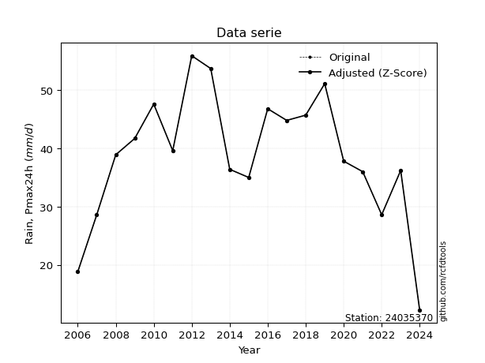</img>

</div>


> The initial value (value_initial) correspond to the initial obtained or null completed value, and value (value) is adjusted only when the initial value is outside the valid range (outlier) definite through the Z-Score value. If Z-Score is active, values out of range or outliers are replaced with the station mean value. A Z-Score (or standard score) measures how many standard deviations a data point is from the mean of a dataset, indicating its relative position; positive scores mean above the mean, negative mean below, and a score of zero is exactly at the mean, allowing for comparison of values from different distributions. It´s calculated using the formula $z=(x–μ)/σ$, where $x$ is the data point, $μ$ is the mean, and $σ$ is the standard deviation, helping identify outliers and understand probability.
>
> <sub>**Note**: In this study, "completing" (filling gaps in) and "extending" (forecasting or lengthening the historical record) rainfall data series are avoided for certain critical analyses because they introduce artificial bias and uncertainty, which can distort the statistics of rare events (extremes), alter day-to-day variability, and compromise the integrity and homogeneity of the original data. Some reasons against Completing/Extending rainfall data are: **Distortion of Extremes and Variability**: The primary issue is that most gap-filling or extension methods rely on averaging or regression with nearby stations, which inherently smooths the data. Rainfall is highly variable in space and time, with a large percentage of zero values and occasional large storms. Infilling methods often underestimate the highest values and overestimate the lowest (zero) values, which severely distorts analyses focused on flood frequency, drought severity, and intensity-duration-frequency (IDF) curves, **Loss of Data Homogeneity**: Infilled or extended data are synthetic estimates, not actual measurements. Combining these estimates with observed data can violate the assumption of data homogeneity, which requires that the data properties do not change over time. Inhomogeneity can lead to incorrect conclusions about long-term trends or changes in climate patterns, **Propagation of Errors**: Errors and biases from the original data (e.g., wind-induced undercatch, instrument errors, site changes) or the data used for imputation can propagate through the analysis, leading to unreliable hydrological models and inaccurate predictions, **Compromised Statistical Integrity**: For statistical analyses, especially those involving the frequency of events, using artificial data can introduce time bias or autocorrelation that doesn´t exist in reality, making it difficult to assess the true probability of events, **Difficulty in Validation**: It is difficult to accurately validate the quality of filled or extended data, especially for past periods where ground-truth measurements are unavailable. The reliability of imputation techniques heavily depends on the density of the surrounding station network and the complexity of the local topography.</sub>


### 4. Active continuous probability distributions from SciPy (44 of 104 available)

A Probability Density Function (PDF) describes the relative likelihood of a continuous random variable falling within a specific range, where the total area under its curve equals 1, and the area over any interval gives the actual probability for that range. Unlike discrete probabilities (like rolling a die), a PDF shows density, not direct probability for a single point (which is zero), with higher points indicating higher likelihood, often visualized as a bell curve for normal distributions.

A log of a probability density function (log-PDF) is simply the logarithm of the PDF´s value, denoted as $log(f(x))$, useful for converting multiplication of probabilities into addition, improving numerical stability with tiny numbers, and connecting to information theory concepts like entropy. Instead of dealing with very small probabilities (e.g., 0.000001), log-PDFs use negative numbers (e.g., $log(0.00001) ≈ -11.51$ that are easier for computers to handle, preventing underflow errors and simplifying complex calculations. In this study, each active probability distribution from SciPy is also evaluated in the $log$ form.

[scipy.stats](https://docs.scipy.org/doc/scipy/reference/stats.html) is a Python´s powerful submodule within the SciPy library for comprehensive statistical analysis, offering over 130 probability distributions (like Normal, Poisson), functions for descriptive stats (mean, variance), hypothesis testing (t-tests, chi-square), random variable generation, and statistical tests, making it essential for data science, modeling, and research. It provides tools to explore, model, and draw conclusions from data efficiently, working seamlessly with NumPy.

<div align="center">

|   id | p_dist             |   n_parameter | fit_method   | label                                                                       | active   | ref                                                                                                        |
|-----:|:-------------------|--------------:|:-------------|:----------------------------------------------------------------------------|:---------|:-----------------------------------------------------------------------------------------------------------|
|    0 | alpha              |             3 | MLE          | Alpha                                                                       | True     | [:mortar_board:](https://docs.scipy.org/doc/scipy/reference/generated/scipy.stats.alpha.html)              |
|    1 | betaprime          |             4 | MLE          | Beta prime                                                                  | True     | [:mortar_board:](https://docs.scipy.org/doc/scipy/reference/generated/scipy.stats.betaprime.html)          |
|    2 | chi2               |             3 | MLE          | Chi²                                                                        | True     | [:mortar_board:](https://docs.scipy.org/doc/scipy/reference/generated/scipy.stats.chi2.html)               |
|    3 | crystalball        |             4 | MLE          | Crystalball                                                                 | True     | [:mortar_board:](https://docs.scipy.org/doc/scipy/reference/generated/scipy.stats.crystalball.html)        |
|    4 | erlang             |             3 | MLE          | Erlang                                                                      | True     | [:mortar_board:](https://docs.scipy.org/doc/scipy/reference/generated/scipy.stats.erlang.html)             |
|    5 | expon              |             2 | MLE          | Exponential                                                                 | True     | [:mortar_board:](https://docs.scipy.org/doc/scipy/reference/generated/scipy.stats.expon.html)              |
|    6 | exponnorm          |             3 | MLE          | Exponentially modified Normal                                               | True     | [:mortar_board:](https://docs.scipy.org/doc/scipy/reference/generated/scipy.stats.exponnorm.html)          |
|    7 | f                  |             4 | MLE          | F                                                                           | True     | [:mortar_board:](https://docs.scipy.org/doc/scipy/reference/generated/scipy.stats.f.html)                  |
|    8 | fatiguelife        |             3 | MLE          | Fatigue-life (Birnbaum-Saunders)                                            | True     | [:mortar_board:](https://docs.scipy.org/doc/scipy/reference/generated/scipy.stats.fatiguelife.html)        |
|    9 | fisk               |             3 | MLE          | Fisk                                                                        | True     | [:mortar_board:](https://docs.scipy.org/doc/scipy/reference/generated/scipy.stats.fisk.html)               |
|   10 | gamma              |             3 | MLE          | Gamma                                                                       | True     | [:mortar_board:](https://docs.scipy.org/doc/scipy/reference/generated/scipy.stats.gamma.html)              |
|   11 | genexpon           |             5 | MLE          | Generalized exponential                                                     | True     | [:mortar_board:](https://docs.scipy.org/doc/scipy/reference/generated/scipy.stats.genexpon.html)           |
|   12 | genlogistic        |             3 | MLE          | Generalized logistic                                                        | True     | [:mortar_board:](https://docs.scipy.org/doc/scipy/reference/generated/scipy.stats.genlogistic.html)        |
|   13 | gibrat             |             2 | MM           | Gibrat                                                                      | True     | [:mortar_board:](https://docs.scipy.org/doc/scipy/reference/generated/scipy.stats.gibrat.html)             |
|   14 | gompertz           |             3 | MLE          | Gompertz (or truncated Gumbel)                                              | True     | [:mortar_board:](https://docs.scipy.org/doc/scipy/reference/generated/scipy.stats.gompertz.html)           |
|   15 | gumbel_l           |             2 | MM           | Gumbel Left Skew                                                            | True     | [:mortar_board:](https://docs.scipy.org/doc/scipy/reference/generated/scipy.stats.gumbel_l.html)           |
|   16 | gumbel_r           |             2 | MM           | Gumbel Right Skew                                                           | True     | [:mortar_board:](https://docs.scipy.org/doc/scipy/reference/generated/scipy.stats.gumbel_r.html)           |
|   17 | halflogistic       |             2 | MM           | Half-logistic                                                               | True     | [:mortar_board:](https://docs.scipy.org/doc/scipy/reference/generated/scipy.stats.halflogistic.html)       |
|   18 | halfnorm           |             2 | MM           | Half Normal                                                                 | True     | [:mortar_board:](https://docs.scipy.org/doc/scipy/reference/generated/scipy.stats.halfnorm.html)           |
|   19 | hypsecant          |             2 | MM           | hyperbolic secant                                                           | True     | [:mortar_board:](https://docs.scipy.org/doc/scipy/reference/generated/scipy.stats.hypsecant.html)          |
|   20 | invgamma           |             3 | MLE          | Inverted gamma                                                              | True     | [:mortar_board:](https://docs.scipy.org/doc/scipy/reference/generated/scipy.stats.invgamma.html)           |
|   21 | invgauss           |             3 | MLE          | Inverse Gaussian                                                            | True     | [:mortar_board:](https://docs.scipy.org/doc/scipy/reference/generated/scipy.stats.invgauss.html)           |
|   22 | invweibull         |             3 | MLE          | Inverted Weibull                                                            | True     | [:mortar_board:](https://docs.scipy.org/doc/scipy/reference/generated/scipy.stats.invweibull.html)         |
|   23 | johnsonsu          |             4 | MLE          | Johnson Su                                                                  | True     | [:mortar_board:](https://docs.scipy.org/doc/scipy/reference/generated/scipy.stats.johnsonsu.html)          |
|   24 | kstwobign          |             2 | MLE          | Limiting distribution of scaled Kolmogorov-Smirnov two-sided test statistic | True     | [:mortar_board:](https://docs.scipy.org/doc/scipy/reference/generated/scipy.stats.kstwobign.html)          |
|   25 | laplace            |             2 | MM           | Laplace                                                                     | True     | [:mortar_board:](https://docs.scipy.org/doc/scipy/reference/generated/scipy.stats.laplace.html)            |
|   26 | laplace_asymmetric |             3 | MLE          | Asymmetric Laplace                                                          | True     | [:mortar_board:](https://docs.scipy.org/doc/scipy/reference/generated/scipy.stats.laplace_asymmetric.html) |
|   27 | loggamma           |             3 | MLE          | Log gamma                                                                   | True     | [:mortar_board:](https://docs.scipy.org/doc/scipy/reference/generated/scipy.stats.loggamma.html)           |
|   28 | logistic           |             2 | MM           | Logistic (or Sech-squared)                                                  | True     | [:mortar_board:](https://docs.scipy.org/doc/scipy/reference/generated/scipy.stats.logistic.html)           |
|   29 | lognorm            |             3 | MLE          | Log Normal                                                                  | True     | [:mortar_board:](https://docs.scipy.org/doc/scipy/reference/generated/scipy.stats.lognorm.html)            |
|   30 | maxwell            |             2 | MM           | Maxwell                                                                     | True     | [:mortar_board:](https://docs.scipy.org/doc/scipy/reference/generated/scipy.stats.maxwell.html)            |
|   31 | mielke             |             4 | MLE          | Mielke Beta-Kappa / Dagum                                                   | True     | [:mortar_board:](https://docs.scipy.org/doc/scipy/reference/generated/scipy.stats.mielke.html)             |
|   32 | moyal              |             2 | MM           | Moyal                                                                       | True     | [:mortar_board:](https://docs.scipy.org/doc/scipy/reference/generated/scipy.stats.moyal.html)              |
|   33 | nakagami           |             3 | MLE          | Nakagami                                                                    | True     | [:mortar_board:](https://docs.scipy.org/doc/scipy/reference/generated/scipy.stats.nakagami.html)           |
|   34 | ncf                |             5 | MLE          | Non-central F distribution                                                  | True     | [:mortar_board:](https://docs.scipy.org/doc/scipy/reference/generated/scipy.stats.ncf.html)                |
|   35 | nct                |             4 | MLE          | Non-central Student’s t                                                     | True     | [:mortar_board:](https://docs.scipy.org/doc/scipy/reference/generated/scipy.stats.nct.html)                |
|   36 | norm               |             2 | MM           | Normal                                                                      | True     | [:mortar_board:](https://docs.scipy.org/doc/scipy/reference/generated/scipy.stats.norm.html)               |
|   37 | pearson3           |             3 | MM           | Pearson type III                                                            | True     | [:mortar_board:](https://docs.scipy.org/doc/scipy/reference/generated/scipy.stats.pearson3.html)           |
|   38 | rayleigh           |             2 | MM           | Rayleigh                                                                    | True     | [:mortar_board:](https://docs.scipy.org/doc/scipy/reference/generated/scipy.stats.rayleigh.html)           |
|   39 | rice               |             3 | MLE          | Rice                                                                        | True     | [:mortar_board:](https://docs.scipy.org/doc/scipy/reference/generated/scipy.stats.rice.html)               |
|   40 | t                  |             3 | MLE          | Student’s t                                                                 | True     | [:mortar_board:](https://docs.scipy.org/doc/scipy/reference/generated/scipy.stats.t.html)                  |
|   41 | truncnorm          |             4 | MLE          | Truncated normal                                                            | True     | [:mortar_board:](https://docs.scipy.org/doc/scipy/reference/generated/scipy.stats.truncnorm.html)          |
|   42 | wald               |             2 | MM           | Wald                                                                        | True     | [:mortar_board:](https://docs.scipy.org/doc/scipy/reference/generated/scipy.stats.wald.html)               |
|   43 | weibull_min        |             3 | MLE          | Weibull minimum                                                             | True     | [:mortar_board:](https://docs.scipy.org/doc/scipy/reference/generated/scipy.stats.weibull_min.html)        |

</div>

> **n_parameter:** # arguments & localization & scale.
>
> **Fit methods:** (MLE) maximum likelihood, (MM) L-moments.
>
>**Inactive** (With the only purpose of prevent loops, zero divisions, infinite values, over high estimated values or horizontal trending for recurrence intervals estimations, the follow distributions were disabled.)**:** foldnorm, gennorm, norminvgauss, powernorm, powerlognorm, skewnorm, genextreme, anglit, arcsine, argus, beta, bradford, burr, burr12, cauchy, cosine, halfcauchy, foldcauchy, skewcauchy, wrapcauchy, dgamma, gengamma, exponweib, exponpow, truncexpon, gausshyper, genhalflogistic, genhyperbolic, geninvgauss, halfgennorm, johnsonsb, kappa4, kappa3, ksone, kstwo, loglaplace, levy, levy_l, levy_stable, ncx2, pareto, genpareto, truncpareto, lomax, powerlaw, rdist, rel_breitwigner, recipinvgauss, semicircular, studentized_range, trapezoid, triang, truncweibull_min, tukeylambda, uniform, loguniform, vonmises, vonmises_line, weibull_max, dweibull, 


## B. Probability (PDF) vs. Empirical (EDF) distributions functions

A continuous probability distribution (CPD) describes probabilities for variables that can take any value within a range (like rain any time), unlike discrete variables with specific outcomes (like temperature). It uses a Probability Density Function (PDF), a curve where the total area under it equals 1, and the probability of the variable falling within an interval (a to b) is found by calculating the area under the curve between those points. A key feature is that the probability of hitting any single exact value is zero, so probabilities are always expressed for ranges, e.g., $P(a ≤ X ≤ b)$.

<div align="center">

Distributions parameters from station values
|    |   station | p_dist                |   n |               loc |            scale | shape                 | shape1               | shape2                 | shape3   |
|---:|----------:|:----------------------|----:|------------------:|-----------------:|:----------------------|:---------------------|:-----------------------|:---------|
|  0 |  24035370 | alpha                 |  19 |    -287.888       |   9370.07        | 28.729618490233577    |                      |                        |          |
|  1 |  24035370 | betaprime             |  19 |    -165.286       |  12549.8         | 340.92519434164103    | 20981.315598987756   |                        |          |
|  2 |  24035370 | chi2                  |  19 |    -128.349       |      0.374372    | 446.2984205999077     |                      |                        |          |
|  3 |  24035370 | crystalball           |  19 |      38.7053      |     10.8848      | 3042.6625611252357    | 3750.696401144686    |                        |          |
|  4 |  24035370 | erlang                |  19 |    -137.26        |      0.702573    | 250.26374940250082    |                      |                        |          |
|  5 |  24035370 | expon                 |  19 |      12.2         |     26.5053      |                       |                      |                        |          |
|  6 |  24035370 | exponnorm             |  19 |      38.697       |     10.8848      | 0.0007576870554121702 |                      |                        |          |
|  7 |  24035370 | f                     |  19 |   -4198.26        |   4236.96        | 553933.6844389741     | 663957.8147224742    |                        |          |
|  8 |  24035370 | fatiguelife           |  19 |   -2223.6         |   2262.28        | 0.0048084396965028964 |                      |                        |          |
|  9 |  24035370 | fisk                  |  19 |      -6.09283e+08 |      6.09283e+08 | 100595849.27329798    |                      |                        |          |
| 10 |  24035370 | gamma                 |  19 |    -132.349       |      0.731745    | 233.49737088790266    |                      |                        |          |
| 11 |  24035370 | genexpon              |  19 |      12.2         |      1.32316     | 0.049926710495358614  | 3.31325412507288e-07 | 2.1547452664139497     |          |
| 12 |  24035370 | genlogistic           |  19 |      45.221       |      4.30238     | 0.47756310800251517   |                      |                        |          |
| 13 |  24035370 | gibrat                |  19 |      30.4016      |      5.03645     |                       |                      |                        |          |
| 14 |  24035370 | gompertz              |  19 |      12.2         |     10.0092      | 0.04634487809185972   |                      |                        |          |
| 15 |  24035370 | gumbel_l              |  19 |      43.604       |      8.48683     |                       |                      |                        |          |
| 16 |  24035370 | gumbel_r              |  19 |      33.8065      |      8.48683     |                       |                      |                        |          |
| 17 |  24035370 | halflogistic          |  19 |      25.8042      |      9.30614     |                       |                      |                        |          |
| 18 |  24035370 | halfnorm              |  19 |      24.2981      |     18.0567      |                       |                      |                        |          |
| 19 |  24035370 | hypsecant             |  19 |      38.7053      |      6.92946     |                       |                      |                        |          |
| 20 |  24035370 | invgamma              |  19 |    -133.369       |  37913.2         | 221.6087413587553     |                      |                        |          |
| 21 |  24035370 | invgauss              |  19 |     -54.1174      |   5375.93        | 0.017207397606797917  |                      |                        |          |
| 22 |  24035370 | invweibull            |  19 |      -1.79816e+09 |      1.79816e+09 | 153811813.56087542    |                      |                        |          |
| 23 |  24035370 | johnsonsu             |  19 |      75.8669      |      4.49904     | 9.584336944255206     | 3.4641086951714666   |                        |          |
| 24 |  24035370 | kstwobign             |  19 |     -11.6679      |     57.8552      |                       |                      |                        |          |
| 25 |  24035370 | laplace               |  19 |      38.7053      |      7.6967      |                       |                      |                        |          |
| 26 |  24035370 | laplace_asymmetric    |  19 |      38.9         |      8.27232     | 1.012137602024493     |                      |                        |          |
| 27 |  24035370 | loggamma              |  19 |      37.4729      |     11.7742      | 1.5753457505506616    |                      |                        |          |
| 28 |  24035370 | logistic              |  19 |      38.7053      |      6.00109     |                       |                      |                        |          |
| 29 |  24035370 | lognorm               |  19 | -950776           | 950815           | 1.144788664881589e-05 |                      |                        |          |
| 30 |  24035370 | maxwell               |  19 |      12.9129      |     16.163       |                       |                      |                        |          |
| 31 |  24035370 | mielke                |  19 |      -0.150584    |     51.2596      | 2.910899026458589     | 17.51594487927972    |                        |          |
| 32 |  24035370 | moyal                 |  19 |      32.4806      |      4.89987     |                       |                      |                        |          |
| 33 |  24035370 | nakagami              |  19 |   -5204.92        |   5243.68        | 57835.20118586063     |                      |                        |          |
| 34 |  24035370 | ncf                   |  19 |       1.52411     |      0.023621    | 0.024449455779186294  | 625.730655198287     | 38.365927488122324     |          |
| 35 |  24035370 | nct                   |  19 |    -654.7         |     10.8104      | 125859.1974755486     | 64.14143149260397    |                        |          |
| 36 |  24035370 | norm                  |  19 |      38.7053      |     10.8848      |                       |                      |                        |          |
| 37 |  24035370 | pearson3              |  19 |      38.7053      |     10.8848      | -0.6725579769787344   |                      |                        |          |
| 38 |  24035370 | rayleigh              |  19 |      17.882       |     16.6146      |                       |                      |                        |          |
| 39 |  24035370 | rice                  |  19 |      12.1936      |      2.83813     | 6.865789322675751e-09 |                      |                        |          |
| 40 |  24035370 | t                     |  19 |      38.7053      |     10.8848      | 492395.75193781336    |                      |                        |          |
| 41 |  24035370 | truncnorm             |  19 |      38.7053      |     10.8848      | -181.52307885626905   | 818.5614130338205    |                        |          |
| 42 |  24035370 | wald                  |  19 |      27.8205      |     10.8848      |                       |                      |                        |          |
| 43 |  24035370 | weibull_min           |  19 |     -85.2107      |    128.656       | 13.974794019429142    |                      |                        |          |
| 44 |  24035370 | logalpha              |  19 |      -9.81368     |    467.014       | 34.86536048438667     |                      |                        |          |
| 45 |  24035370 | logbetaprime          |  19 |      -6.87672     |     14.5372      | 1244.5686826847432    | 1727.5133127943373   |                        |          |
| 46 |  24035370 | logchi2               |  19 |       2.50144     |      0.9257      | 1.1771971833392936    |                      |                        |          |
| 47 |  24035370 | logcrystalball        |  19 |       3.60216     |      0.359833    | 1120.999772546892     | 14.219713887687611   |                        |          |
| 48 |  24035370 | logerlang             |  19 |      -3.26202     |      0.0215205   | 319.24083009927995    |                      |                        |          |
| 49 |  24035370 | logexpon              |  19 |       2.50144     |      1.10072     |                       |                      |                        |          |
| 50 |  24035370 | logexponnorm          |  19 |       3.60195     |      0.359831    | 0.0005795277823074407 |                      |                        |          |
| 51 |  24035370 | logf                  |  19 |    -420.141       |    423.741       | 7174581.467343206     | 4509135.292500709    |                        |          |
| 52 |  24035370 | logfatiguelife        |  19 |    -318.708       |    322.308       | 0.0011169043997691815 |                      |                        |          |
| 53 |  24035370 | logfisk               |  19 |      -2.92068e+07 |      2.92068e+07 | 168178609.75359398    |                      |                        |          |
| 54 |  24035370 | loggamma              |  19 |      -3.45351     |      0.0207831   | 339.0720120662437     |                      |                        |          |
| 55 |  24035370 | loggenexpon           |  19 |       2.48575     |      0.0228571   | 0.0020109440803962693 | 5.457795757628439    | 0.00012544719127346185 |          |
| 56 |  24035370 | loggenlogistic        |  19 |       3.93453     |      0.0570719   | 0.1651899711605569    |                      |                        |          |
| 57 |  24035370 | loggibrat             |  19 |       3.32761     |      0.166519    |                       |                      |                        |          |
| 58 |  24035370 | loggompertz           |  19 |       2.50144     |      1.18208     | 0.6508942306312495    |                      |                        |          |
| 59 |  24035370 | loggumbel_l           |  19 |       3.7641      |      0.280561    |                       |                      |                        |          |
| 60 |  24035370 | loggumbel_r           |  19 |       3.44021     |      0.280561    |                       |                      |                        |          |
| 61 |  24035370 | loghalflogistic       |  19 |       3.1757      |      0.307625    |                       |                      |                        |          |
| 62 |  24035370 | loghalfnorm           |  19 |       3.12586     |      0.596947    |                       |                      |                        |          |
| 63 |  24035370 | loghypsecant          |  19 |       3.60216     |      0.229077    |                       |                      |                        |          |
| 64 |  24035370 | loginvgamma           |  19 |      -8.35895     |  12418           | 1039.505931147184     |                      |                        |          |
| 65 |  24035370 | loginvgauss           |  19 |      -1.38558     |    758.322       | 0.0065806768025619446 |                      |                        |          |
| 66 |  24035370 | loginvweibull         |  19 |      -5.31596e+07 |      5.31596e+07 | 112931365.38293627    |                      |                        |          |
| 67 |  24035370 | logjohnsonsu          |  19 |       4.15061     |      0.0106689   | 7.218723777465026     | 1.6239690905184085   |                        |          |
| 68 |  24035370 | logkstwobign          |  19 |       1.60092     |      2.30737     |                       |                      |                        |          |
| 69 |  24035370 | loglaplace            |  19 |       3.60216     |      0.254441    |                       |                      |                        |          |
| 70 |  24035370 | loglaplace_asymmetric |  19 |       3.84588     |      0.183946    | 1.8621670757971522    |                      |                        |          |
| 71 |  24035370 | logloggamma           |  19 |       3.95624     |      0.0997387   | 0.2961547469518381    |                      |                        |          |
| 72 |  24035370 | loglogistic           |  19 |       3.60216     |      0.198387    |                       |                      |                        |          |
| 73 |  24035370 | loglognorm            |  19 |  -75983.4         |  75987           | 4.735479973473745e-06 |                      |                        |          |
| 74 |  24035370 | logmaxwell            |  19 |       2.74954     |      0.534302    |                       |                      |                        |          |
| 75 |  24035370 | logmielke             |  19 |     -52.34        |     56.2788      | 161.44044090967571    | 1013.2471788982971   |                        |          |
| 76 |  24035370 | logmoyal              |  19 |       3.39638     |      0.161982    |                       |                      |                        |          |
| 77 |  24035370 | lognakagami           |  19 |    -311.887       |    315.489       | 191224.33565855504    |                      |                        |          |
| 78 |  24035370 | logncf                |  19 |      -3.61911     |      7.22236     | 600.9335780215613     | 10324.301227467917   | 0.0004902972314015344  |          |
| 79 |  24035370 | lognct                |  19 |     -15.5866      |      0.330373    | 7059.371065818137     | 58.073976791813365   |                        |          |
| 80 |  24035370 | lognorm               |  19 |       3.60216     |      0.359833    |                       |                      |                        |          |
| 81 |  24035370 | logpearson3           |  19 |       3.60216     |      0.359833    | -1.6296676075382448   |                      |                        |          |
| 82 |  24035370 | lograyleigh           |  19 |       2.9138      |      0.549236    |                       |                      |                        |          |
| 83 |  24035370 | logrice               |  19 |    -195.283       |      0.359838    | 552.7070253778343     |                      |                        |          |
| 84 |  24035370 | logt                  |  19 |       3.69056     |      0.189282    | 2.1467097653096943    |                      |                        |          |
| 85 |  24035370 | logtruncnorm          |  19 |      -0.0675493   |      1.68934     | 1.776677326507446     | 4.339085854935137    |                        |          |
| 86 |  24035370 | logwald               |  19 |       3.24233     |      0.359831    |                       |                      |                        |          |
| 87 |  24035370 | logweibull_min        |  19 |      -2.97439e+07 |      2.97439e+07 | 126347839.65182854    |                      |                        |          |

</div>

> **loc** (Location parameter): This shifts the distribution along the x-axis. For many common distributions, like the normal (Gaussian) distribution, loc represents the mean $μ$. For others, like the uniform distribution, it might represent the minimum value, or for the beta distribution, the left end of the support interval.
>
> **scale** (Scale parameter): This determines the width or spread of the distribution. For the normal distribution, scale represents the standard deviation $σ$. For a uniform distribution, it defines the length of the interval (from $loc$ to $loc + scale$).
>
> **shape** (Shape parameters): Refers to parameters that define the specific form of a probability distribution, distinct from its location (loc) and scale (scale). These parameters are required arguments for most distribution functions. For example, a normal (Gaussian) distribution is fully defined by its location (mean) and scale (standard deviation), so it has no specific shape parameters beyond loc and scale. However, other distributions have intrinsic properties that need specification, as Gamma distribution that takes a shape parameter, often named $a$ or $alpha$.


### 0. Cumulative distribution values - CDF (88 evaluated)

Cumulative Distribution Function (CDF), denoted as $F$<sub>$X$</sub>$(x)$, is a function that gives the probability that a random variable $X$ will take a value less than or equal to a specific value, $x$ (i.e., $(P(X≥x)$. It essentially "accumulates" probabilities from a given point up to the far right (positive infinity), providing a complete picture of the distribution´s probabilities for both discrete (like rain) and continuous (like temperature) variables, helping to find probabilities over ranges or above certain values. Each station is evaluated separately ordering the $x$ values ascending, calculating the CDF and PDF values for the activated distributions and their logarithmic forms.

<div align="center">

CDF ordered by x ascending and calculating $log(f(x))$ separately
|   id |   Station |   date |    x |   count |    mean |    std |     zscore |   Value_initial |   station |   m |     alpha |   alpha_pdf |   betaprime |   betaprime_pdf |       chi2 |   chi2_pdf |   crystalball |   crystalball_pdf |     erlang |   erlang_pdf |    expon |   expon_pdf |   exponnorm |   exponnorm_pdf |          f |      f_pdf |   fatiguelife |   fatiguelife_pdf |      fisk |   fisk_pdf |      gamma |   gamma_pdf |    genexpon |   genexpon_pdf |   genlogistic |   genlogistic_pdf |   gibrat |   gibrat_pdf |    gompertz |   gompertz_pdf |   gumbel_l |   gumbel_l_pdf |    gumbel_r |   gumbel_r_pdf |   halflogistic |   halflogistic_pdf |   halfnorm |   halfnorm_pdf |   hypsecant |   hypsecant_pdf |   invgamma |   invgamma_pdf |   invgauss |   invgauss_pdf |   invweibull |   invweibull_pdf |   johnsonsu |   johnsonsu_pdf |   kstwobign |   kstwobign_pdf |   laplace |   laplace_pdf |   laplace_asymmetric |   laplace_asymmetric_pdf |   loggamma |   loggamma_pdf |   logistic |   logistic_pdf |    lognorm |   lognorm_pdf |   maxwell |   maxwell_pdf |    mielke |   mielke_pdf |       moyal |   moyal_pdf |   nakagami |   nakagami_pdf |        ncf |    ncf_pdf |        nct |    nct_pdf |       norm |   norm_pdf |   pearson3 |   pearson3_pdf |   rayleigh |   rayleigh_pdf |        rice |    rice_pdf |          t |      t_pdf |   truncnorm |   truncnorm_pdf |        wald |   wald_pdf |   weibull_min |   weibull_min_pdf |   logalpha |   logalpha_pdf |   logbetaprime |   logbetaprime_pdf |     logchi2 |   logchi2_pdf |   logcrystalball |   logcrystalball_pdf |   logerlang |   logerlang_pdf |   logexpon |   logexpon_pdf |   logexponnorm |   logexponnorm_pdf |      logf |   logf_pdf |   logfatiguelife |   logfatiguelife_pdf |    logfisk |   logfisk_pdf |   loggenexpon |   loggenexpon_pdf |   loggenlogistic |   loggenlogistic_pdf |   loggibrat |   loggibrat_pdf |   loggompertz |   loggompertz_pdf |   loggumbel_l |   loggumbel_l_pdf |   loggumbel_r |   loggumbel_r_pdf |   loghalflogistic |   loghalflogistic_pdf |   loghalfnorm |   loghalfnorm_pdf |   loghypsecant |   loghypsecant_pdf |   loginvgamma |   loginvgamma_pdf |   loginvgauss |   loginvgauss_pdf |   loginvweibull |   loginvweibull_pdf |   logjohnsonsu |   logjohnsonsu_pdf |   logkstwobign |   logkstwobign_pdf |   loglaplace |   loglaplace_pdf |   loglaplace_asymmetric |   loglaplace_asymmetric_pdf |   logloggamma |   logloggamma_pdf |   loglogistic |   loglogistic_pdf |   loglognorm |   loglognorm_pdf |   logmaxwell |   logmaxwell_pdf |   logmielke |   logmielke_pdf |    logmoyal |   logmoyal_pdf |   lognakagami |   lognakagami_pdf |     logncf |   logncf_pdf |     lognct |   lognct_pdf |   logpearson3 |   logpearson3_pdf |   lograyleigh |   lograyleigh_pdf |    logrice |   logrice_pdf |      logt |   logt_pdf |   logtruncnorm |   logtruncnorm_pdf |   logwald |   logwald_pdf |   logweibull_min |   logweibull_min_pdf |
|-----:|----------:|-------:|-----:|--------:|--------:|-------:|-----------:|----------------:|----------:|----:|----------:|------------:|------------:|----------------:|-----------:|-----------:|--------------:|------------------:|-----------:|-------------:|---------:|------------:|------------:|----------------:|-----------:|-----------:|--------------:|------------------:|----------:|-----------:|-----------:|------------:|------------:|---------------:|--------------:|------------------:|---------:|-------------:|------------:|---------------:|-----------:|---------------:|------------:|---------------:|---------------:|-------------------:|-----------:|---------------:|------------:|----------------:|-----------:|---------------:|-----------:|---------------:|-------------:|-----------------:|------------:|----------------:|------------:|----------------:|----------:|--------------:|---------------------:|-------------------------:|-----------:|---------------:|-----------:|---------------:|-----------:|--------------:|----------:|--------------:|----------:|-------------:|------------:|------------:|-----------:|---------------:|-----------:|-----------:|-----------:|-----------:|-----------:|-----------:|-----------:|---------------:|-----------:|---------------:|------------:|------------:|-----------:|-----------:|------------:|----------------:|------------:|-----------:|--------------:|------------------:|-----------:|---------------:|---------------:|-------------------:|------------:|--------------:|-----------------:|---------------------:|------------:|----------------:|-----------:|---------------:|---------------:|-------------------:|----------:|-----------:|-----------------:|---------------------:|-----------:|--------------:|--------------:|------------------:|-----------------:|---------------------:|------------:|----------------:|--------------:|------------------:|--------------:|------------------:|--------------:|------------------:|------------------:|----------------------:|--------------:|------------------:|---------------:|-------------------:|--------------:|------------------:|--------------:|------------------:|----------------:|--------------------:|---------------:|-------------------:|---------------:|-------------------:|-------------:|-----------------:|------------------------:|----------------------------:|--------------:|------------------:|--------------:|------------------:|-------------:|-----------------:|-------------:|-----------------:|------------:|----------------:|------------:|---------------:|--------------:|------------------:|-----------:|-------------:|-----------:|-------------:|--------------:|------------------:|--------------:|------------------:|-----------:|--------------:|----------:|-----------:|---------------:|-------------------:|----------:|--------------:|-----------------:|---------------------:|
|    0 |  24035370 |   2024 | 12.2 |      19 | 38.7053 | 11.183 | -2.37013   |            12.2 |  24035370 |   1 | 0.0063008 |  0.00184752 |  0.00676558 |      0.00186654 | 0.00641892 | 0.00181229 |    0.00744433 |        0.00189015 | 0.00654519 |   0.00184243 | 0        |  0.0377284  |  0.00744436 |      0.00189015 | 0.00739322 | 0.00188688 |    0.00718066 |        0.00185387 | 0.010995  | 0.00179536 | 0.00687096 |  0.00191784 | 6.29022e-07 |     0.0377328  |     0.0255903 |        0.00283919 | 0        |   0          | 9.06814e-09 |     0.00463024 |  0.0244126 |     0.00284113 | 2.88904e-06 |    4.34185e-06 |       0        |         0          |   0        |      0         |   0.0138877 |      0.00200352 |  0.0063409 |     0.00192816 | 0.00640116 |     0.00210333 |   0.00307567 |       0.00152176 |   0.0227332 |      0.00292849 |  0.00432006 |      0.00244307 | 0.0159729 |    0.00207529 |            0.0208566 |               0.00249102 | 0.00136126 |      0.0130651 |  0.0119295 |     0.00196417 | 0.00111046 |     0.0103011 | 0         |    0          | 0.0158785 |   0.00374238 | 2.35748e-15 | 1.53268e-14 | 0.00742235 |     0.00188543 | 0.00295507 | 0.0013883  | 0.00749009 | 0.00190026 | 0.00744433 | 0.00189015 |  0.0186848 |     0.00283653 | 0          |     0          | 2.53404e-06 | 0.00079321  | 0.00744437 | 0.00189014 |  0.00744433 |      0.00189014 | 0           | 0          |     0.0202815 |        0.00287992 |  0.0011191 |      0.0114954 |     0.00154665 |          0.0142938 | 7.17084e-10 | 950428        |       0.00111046 |            0.0103011 |  0.00122135 |       0.0118338 |   0        |       0.908494 |     0.00111037 |          0.0103004 | 0.0011192 |  0.0103958 |       0.00112125 |            0.0104239 | 0.00128321 |     0.0073795 |    0.00154057 |          0.108373 |        0.0157964 |            0.0457214 |   0         |        0        |    3.7821e-08 |          0.550632 |     0.0110419 |         0.0391385 |   4.67595e-13 |       4.73179e-11 |          0        |              0        |      0        |          0        |     0.00521279 |          0.0227546 |   0.000868846 |        0.00907033 |    0.00114391 |         0.0121843 |      0.00120887 |           0.0172527 |      0.0181801 |          0.0439619 |     0.00195018 |          0.0329163 |   0.00660983 |        0.0259779 |               0.0153238 |                   0.0447361 |     0.0148129 |          0.043984 |    0.00387867 |         0.0194753 |   0.00111043 |         0.010301 |    0         |         0        |   0.0153485 |       0.0451824 | 1.66806e-56 |    1.29687e-53 |    0.00113328 |          0.010481 | 0.00342333 |    0.0270101 | 0.00126534 |     0.011599 |     0.0147843 |         0.0463027 |    0          |         0         | 0.00111062 |     0.0103024 | 0.0102322 |  0.017746  |    0           |           0        |  0        |      0        |       0.00493232 |            0.0209001 |
|    1 |  24035370 |   2006 | 18.8 |      19 | 38.7053 | 11.183 | -1.77995   |            18.8 |  24035370 |   2 | 0.0341611 |  0.00754583 |  0.0339176  |      0.00724991 | 0.0331921  | 0.00720052 |    0.0337204  |        0.00688493 | 0.0337175  |   0.00730221 | 0.220426 |  0.0294121  |  0.0337205  |      0.00688493 | 0.0336969  | 0.00690043 |    0.0332469  |        0.00686988 | 0.0319978 | 0.00511395 | 0.0348731  |  0.00747888 | 0.22045     |     0.0294148  |     0.0531971 |        0.00589218 | 0        |   0          | 0.0423459   |     0.00857401 |  0.05237   |     0.00600626 | 0.00285015  |    0.00196811  |       0        |         0          |   0        |      0         |   0.0359653 |      0.00517916 |  0.0358656 |     0.00802135 | 0.0394711  |     0.00899566 |   0.0372911  |       0.0104913  |   0.0523744 |      0.00647595 |  0.0556727  |      0.0144298  | 0.0376526 |    0.00489204 |            0.0458762 |               0.00547925 | 0.0390188  |      0.235657  |  0.0349946 |     0.00562731 | 0.0316375  |     0.197598  | 0.0123521 |    0.00612875 | 0.0552137 |   0.00848109 | 5.36574e-05 | 9.42766e-05 | 0.0336355  |     0.00686848 | 0.0315348  | 0.00857635 | 0.0338775  | 0.00690886 | 0.0337204  | 0.00688493 |  0.0488137 |     0.00677444 | 0.00152524 |     0.00332046 | 0.933406    | 0.0546174   | 0.0337203  | 0.00688489 |  0.0337204  |      0.00688493 | 0           | 0          |     0.0499284 |        0.00653802 |  0.0383411 |      0.239265  |     0.0398597  |          0.234663  | 0.437738    |      0.513121 |       0.0316375  |            0.197598  |  0.036261   |       0.221668  |   0.324871 |       0.61335  |     0.0316364  |          0.197594  | 0.0319267 |  0.199261  |       0.0320436  |            0.200019  | 0.01526    |     0.0865293 |    0.157088   |          0.568548 |        0.0552236 |            0.15984   |   0         |        0        |    0.249856   |          0.595493 |     0.0505368 |         0.175497  |   0.00229095  |       0.049637    |          0        |              0        |      0        |          0        |     0.0343922  |          0.149842  |   0.032845    |        0.213348   |    0.0407399  |         0.250483  |      0.0684976  |           0.39012   |      0.0549034 |          0.148259  |     0.107618   |          0.516212  |   0.0361636  |        0.14213   |               0.0541529 |                   0.158093  |     0.0534892 |          0.158822 |    0.0332885  |         0.162211  |   0.0316376  |         0.197599 |    0.0105372 |         0.16745  |   0.054542  |       0.159303  | 3.05753e-05 |    0.00172623  |    0.0319397  |          0.198801 | 0.0550451  |    0.278086  | 0.0340916  |     0.208276 |     0.0562892 |         0.171312  |    0.00066684 |         0.0664583 | 0.0316396  |     0.197606  | 0.0254298 |  0.0655957 |    5.45852e-10 |           1.2889   |  0        |      0        |       0.0305592  |            0.127807  |
|    2 |  24035370 |   2022 | 28.6 |      19 | 38.7053 | 11.183 | -0.903623  |            28.6 |  24035370 |   3 | 0.190292  |  0.0254093  |  0.184278   |      0.0247478  | 0.183398   | 0.0247469  |    0.176604   |        0.0238194  | 0.185857   |   0.0250406  | 0.46138  |  0.0203212  |  0.176604   |      0.0238194  | 0.17692    | 0.0238601  |    0.176659   |        0.0239457  | 0.142884  | 0.0202202  | 0.188832   |  0.0251593  | 0.461422    |     0.0203222  |     0.156476  |        0.0170116  | 0        |   0          | 0.174868    |     0.0196661  |  0.156916  |     0.0169562  | 0.157732    |    0.0343248   |       0.149093 |         0.0525337  |   0.188309 |      0.0429512 |   0.145509  |      0.0202749  |  0.199166  |     0.0261381  | 0.214897   |     0.0270226  |   0.241147   |       0.0293392  |   0.165521  |      0.0181477  |  0.282134   |      0.0286802  | 0.134515  |    0.0174769  |            0.147882  |               0.0176624  | 0.268836   |      0.882226  |  0.156579  |     0.0220064  | 0.244689   |     0.873043  | 0.184714  |    0.0290344  | 0.185775  |   0.0188083  | 0.137316    | 0.0401134   | 0.176163   |     0.0237594  | 0.209598   | 0.0276987  | 0.177013   | 0.0238354  | 0.176604   | 0.0238194  |  0.169531  |     0.0193413  | 0.187854   |     0.0315334  | 1           | 1.12891e-07 | 0.176603   | 0.0238194  |  0.176604   |      0.0238194  | 0.000490613 | 0.00465689 |     0.16495   |        0.0184834  |  0.273278  |      0.89603   |     0.264687   |          0.859436  | 0.604078    |      0.309484 |       0.244689   |            0.873043  |  0.257113   |       0.860068  |   0.53884  |       0.418961 |     0.244687   |          0.873045  | 0.246086  |  0.875541  |       0.246842   |            0.877454  | 0.147884   |     0.725617  |    0.433822   |          0.692062 |        0.185998  |            0.538336  |   0.0310936 |        2.71728  |    0.497072   |          0.56935  |     0.206535  |         0.654279  |   0.255989    |       1.24328     |          0.28106  |              1.49696  |      0.296928 |          1.24295  |     0.207275   |          0.842224  |   0.25804     |        0.895276   |    0.27525    |         0.869362  |      0.333025   |           0.777892  |      0.180768  |          0.53591   |     0.388824   |          0.727134  |   0.188098   |        0.739262  |               0.184314  |                   0.538084  |     0.185809  |          0.550715 |    0.22203    |         0.870687  |   0.24469    |         0.873044 |    0.265484  |         1.00714  |   0.184885  |       0.53592   | 0.253512    |    1.46531     |    0.245286   |          0.872243 | 0.283496   |    0.809807  | 0.250529   |     0.86925  |     0.195784  |         0.56345   |    0.274086   |         1.05788   | 0.244694   |     0.87304   | 0.104075  |  0.451529  |    0.433253    |           0.80389  |  0.175052 |      2.98087  |       0.168432   |            0.651519  |
|    3 |  24035370 |   2007 | 28.6 |      19 | 38.7053 | 11.183 | -0.903623  |            28.6 |  24035370 |   4 | 0.190292  |  0.0254093  |  0.184278   |      0.0247478  | 0.183398   | 0.0247469  |    0.176604   |        0.0238194  | 0.185857   |   0.0250406  | 0.46138  |  0.0203212  |  0.176604   |      0.0238194  | 0.17692    | 0.0238601  |    0.176659   |        0.0239457  | 0.142884  | 0.0202202  | 0.188832   |  0.0251593  | 0.461422    |     0.0203222  |     0.156476  |        0.0170116  | 0        |   0          | 0.174868    |     0.0196661  |  0.156916  |     0.0169562  | 0.157732    |    0.0343248   |       0.149093 |         0.0525337  |   0.188309 |      0.0429512 |   0.145509  |      0.0202749  |  0.199166  |     0.0261381  | 0.214897   |     0.0270226  |   0.241147   |       0.0293392  |   0.165521  |      0.0181477  |  0.282134   |      0.0286802  | 0.134515  |    0.0174769  |            0.147882  |               0.0176624  | 0.268836   |      0.882226  |  0.156579  |     0.0220064  | 0.244689   |     0.873043  | 0.184714  |    0.0290344  | 0.185775  |   0.0188083  | 0.137316    | 0.0401134   | 0.176163   |     0.0237594  | 0.209598   | 0.0276987  | 0.177013   | 0.0238354  | 0.176604   | 0.0238194  |  0.169531  |     0.0193413  | 0.187854   |     0.0315334  | 1           | 1.12891e-07 | 0.176603   | 0.0238194  |  0.176604   |      0.0238194  | 0.000490613 | 0.00465689 |     0.16495   |        0.0184834  |  0.273278  |      0.89603   |     0.264687   |          0.859436  | 0.604078    |      0.309484 |       0.244689   |            0.873043  |  0.257113   |       0.860068  |   0.53884  |       0.418961 |     0.244687   |          0.873045  | 0.246086  |  0.875541  |       0.246842   |            0.877454  | 0.147884   |     0.725617  |    0.433822   |          0.692062 |        0.185998  |            0.538336  |   0.0310936 |        2.71728  |    0.497072   |          0.56935  |     0.206535  |         0.654279  |   0.255989    |       1.24328     |          0.28106  |              1.49696  |      0.296928 |          1.24295  |     0.207275   |          0.842224  |   0.25804     |        0.895276   |    0.27525    |         0.869362  |      0.333025   |           0.777892  |      0.180768  |          0.53591   |     0.388824   |          0.727134  |   0.188098   |        0.739262  |               0.184314  |                   0.538084  |     0.185809  |          0.550715 |    0.22203    |         0.870687  |   0.24469    |         0.873044 |    0.265484  |         1.00714  |   0.184885  |       0.53592   | 0.253512    |    1.46531     |    0.245286   |          0.872243 | 0.283496   |    0.809807  | 0.250529   |     0.86925  |     0.195784  |         0.56345   |    0.274086   |         1.05788   | 0.244694   |     0.87304   | 0.104075  |  0.451529  |    0.433253    |           0.80389  |  0.175052 |      2.98087  |       0.168432   |            0.651519  |
|    4 |  24035370 |   2015 | 35   |      19 | 38.7053 | 11.183 | -0.331329  |            35   |  24035370 |   5 | 0.385913  |  0.0343787  |  0.377931   |      0.0345573  | 0.376801   | 0.034465   |    0.366775   |        0.0345882  | 0.38126    |   0.0347605  | 0.576925 |  0.0159619  |  0.366774   |      0.0345881  | 0.367198   | 0.0345706  |    0.367669   |        0.034694   | 0.324128  | 0.0361695  | 0.384249   |  0.0346387  | 0.576971    |     0.0159622  |     0.308209  |        0.0313016  | 0.463752 |   0.0863977  | 0.333562    |     0.0301056  |  0.304299  |     0.0297432  | 0.419449    |    0.0429398   |       0.457442 |         0.0424852  |   0.446607 |      0.03707   |   0.337371  |      0.0400696  |  0.39708   |     0.0342705  | 0.413033   |     0.0333901  |   0.439234   |       0.0309108  |   0.318944  |      0.0300893  |  0.466609   |      0.0279177  | 0.308956  |    0.0401414  |            0.317603  |               0.037933   | 0.467477   |      1.04266   |  0.350366  |     0.037928   | 0.448247   |     1.09934   | 0.399619  |    0.0362373  | 0.333406  |   0.0275729  | 0.439343    | 0.0466898   | 0.365881   |     0.0345135  | 0.410706   | 0.033524   | 0.367161   | 0.0345628  | 0.366775   | 0.0345882  |  0.330119  |     0.0308701  | 0.411842   |     0.0364728  | 1           | 2.69315e-14 | 0.366774   | 0.0345882  |  0.366775   |      0.0345882  | 0.489061    | 0.0626658  |     0.321053  |        0.0305624  |  0.473221  |      1.04007   |     0.458724   |          1.02274   | 0.660728    |      0.254251 |       0.448248   |            1.09934   |  0.452593   |       1.03542   |   0.616138 |       0.348736 |     0.448246   |          1.09935   | 0.449899  |  1.09915   |       0.450958   |            1.09998   | 0.356985   |     1.32177   |    0.569269   |          0.639885 |        0.333629  |            0.964408  |   0.622889  |        1.668    |    0.608045   |          0.526383 |     0.378226  |         1.05308   |   0.515094    |       1.21798     |          0.549077 |              1.13533  |      0.528147 |          1.03182  |     0.435403   |          1.36102   |   0.461685    |        1.07552    |    0.467283   |         0.992809  |      0.488716   |           0.743338  |      0.330647  |          0.988608  |     0.530163   |          0.661633  |   0.415978   |        1.63487   |               0.332349  |                   0.970256  |     0.33724   |          0.987575 |    0.441283   |         1.24279   |   0.448249   |         1.09934  |    0.482584  |         1.08927  |   0.33159   |       0.95678   | 0.540402    |    1.25013     |    0.448481   |          1.09675  | 0.462388   |    0.930866  | 0.451399   |     1.07774  |     0.345257  |         0.941689  |    0.4945     |         1.07507   | 0.44825    |     1.09933   | 0.272342  |  1.34591   |    0.577115    |           0.626562 |  0.610706 |      1.35326  |       0.352681   |            1.1959    |
|    5 |  24035370 |   2021 | 36   |      19 | 38.7053 | 11.183 | -0.241908  |            36   |  24035370 |   6 | 0.420588  |  0.0349256  |  0.412873   |      0.0352809  | 0.411642   | 0.0351701  |    0.40186    |        0.0355367  | 0.416387   |   0.0354449  | 0.59259  |  0.0153709  |  0.401859   |      0.0355366  | 0.402259   | 0.035506   |    0.40285    |        0.0356234  | 0.361293  | 0.0380997  | 0.419235   |  0.0352877  | 0.592636    |     0.0153711  |     0.340791  |        0.0338571  | 0.542124 |   0.070862   | 0.364483    |     0.0317252  |  0.33516   |     0.0319782  | 0.461975    |    0.0420366   |       0.498869 |         0.0403567  |   0.483057 |      0.035818  |   0.378773  |      0.0426445  |  0.431567  |     0.0346592  | 0.446508   |     0.0335188  |   0.469882   |       0.0303566  |   0.349984  |      0.0319811  |  0.494234   |      0.0273179  | 0.351822  |    0.0457107  |            0.357894  |               0.0427452  | 0.496872   |      1.04331   |  0.389172  |     0.0396123  | 0.479343   |     1.1072    | 0.435918  |    0.0363134  | 0.361721  |   0.0290622  | 0.484999    | 0.044553    | 0.400892   |     0.0354643  | 0.444255   | 0.0335335  | 0.402217   | 0.0355047  | 0.40186    | 0.0355367  |  0.361834  |     0.032541   | 0.448208   |     0.0362167  | 1           | 1.55707e-15 | 0.401859   | 0.0355368  |  0.40186    |      0.0355367  | 0.547279    | 0.0539984  |     0.352566  |        0.032451   |  0.502505  |      1.03801   |     0.487582   |          1.02514   | 0.667797    |      0.247709 |       0.479344   |            1.1072    |  0.481823   |       1.03885   |   0.625838 |       0.339924 |     0.479343   |          1.10721   | 0.480933  |  1.10656   |       0.482063   |            1.10715   | 0.39502    |     1.37609   |    0.587137   |          0.628492 |        0.361923  |            1.04533   |   0.666295  |        1.42146  |    0.622769   |          0.518829 |     0.408663  |         1.10732   |   0.548796    |       1.1737      |          0.580254 |              1.07811  |      0.556716 |          0.99626  |     0.474128   |          1.38494   |   0.492017    |        1.0769     |    0.49523    |         0.990431  |      0.509471   |           0.729892  |      0.359645  |          1.07079   |     0.548613   |          0.648081  |   0.46468    |        1.82628   |               0.360838  |                   1.05342   |     0.366175  |          1.06746  |    0.476528   |         1.25739   |   0.479344   |         1.1072   |    0.513096  |         1.07608  |   0.359653  |       1.03655   | 0.574648    |    1.18081     |    0.479502   |          1.10449  | 0.488637   |    0.932073  | 0.481864   |     1.08409  |     0.372685  |         1.00595   |    0.524522   |         1.05562   | 0.479346   |     1.10719   | 0.312628  |  1.51303   |    0.594453    |           0.604467 |  0.646605 |      1.19909  |       0.387498   |            1.27542   |
|    6 |  24035370 |   2023 | 36.2 |      19 | 38.7053 | 11.183 | -0.224023  |            36.2 |  24035370 |   7 | 0.42758   |  0.035002   |  0.41994    |      0.0353923  | 0.418687   | 0.0352779  |    0.408983   |        0.0356933  | 0.423486   |   0.0355479  | 0.595652 |  0.0152554  |  0.408982   |      0.0356933  | 0.409376   | 0.03566    |    0.40999    |        0.0357759  | 0.368947  | 0.0384406  | 0.426303   |  0.035384   | 0.595698    |     0.0152555  |     0.347613  |        0.0343632  | 0.55602  |   0.0681223  | 0.37086     |     0.0320408  |  0.3416    |     0.0324236  | 0.47036     |    0.0418027   |       0.506897 |         0.0399228  |   0.490195 |      0.0355596 |   0.387347  |      0.0430888  |  0.438504  |     0.0347046  | 0.453211   |     0.0335156  |   0.47594    |       0.0302265  |   0.356418  |      0.0323506  |  0.499685   |      0.0271874  | 0.361084  |    0.0469141  |            0.366546  |               0.0437786  | 0.50265    |      1.04277   |  0.397123  |     0.0398954  | 0.48548    |     1.10795   | 0.443179  |    0.0362953  | 0.367564  |   0.0293626  | 0.493862    | 0.0440807   | 0.408001   |     0.0356216  | 0.450959   | 0.033507   | 0.409334   | 0.0356601  | 0.408983   | 0.0356933  |  0.368374  |     0.0328611  | 0.455443   |     0.0361363  | 1           | 8.67269e-16 | 0.408982   | 0.0356934  |  0.408983   |      0.0356933  | 0.55792     | 0.0524265  |     0.359093  |        0.0328184  |  0.508253  |      1.03696   |     0.493261   |          1.02497   | 0.669166    |      0.24645  |       0.48548    |            1.10795   |  0.487579   |       1.03886   |   0.627716 |       0.338217 |     0.485479   |          1.10796   | 0.487027  |  1.10722   |       0.488198   |            1.10776   | 0.402668   |     1.385     |    0.590613   |          0.626156 |        0.367761  |            1.06196   |   0.67405   |        1.37827  |    0.625639   |          0.5173   |     0.414826  |         1.11763   |   0.555272    |       1.16433     |          0.586196 |              1.06684  |      0.562215 |          0.989154 |     0.481807   |          1.38726   |   0.497982    |        1.07643    |    0.500714   |         0.989396  |      0.513506   |           0.727066  |      0.365623  |          1.08743   |     0.552196   |          0.64533   |   0.474909   |        1.86648   |               0.366721  |                   1.0706    |     0.372134  |          1.08369  |    0.483498   |         1.25879   |   0.485481   |         1.10795  |    0.519049  |         1.07286  |   0.365441  |       1.05295   | 0.581152    |    1.16696     |    0.485623   |          1.10523  | 0.493801   |    0.931834  | 0.487872   |     1.08459  |     0.378294  |         1.01887   |    0.530358   |         1.05129   | 0.485482   |     1.10794   | 0.321098  |  1.54468   |    0.59779     |           0.600194 |  0.653171 |      1.17132  |       0.394606   |            1.29064   |
|    7 |  24035370 |   2014 | 36.4 |      19 | 38.7053 | 11.183 | -0.206139  |            36.4 |  24035370 |   8 | 0.434588  |  0.0350672  |  0.427029   |      0.0354923  | 0.425752   | 0.0353744  |    0.416136   |        0.0358386  | 0.430605   |   0.0356393  | 0.598692 |  0.0151407  |  0.416136   |      0.0358385  | 0.416522   | 0.0358026  |    0.41716    |        0.0359168  | 0.376668  | 0.0387649  | 0.433388   |  0.035469   | 0.598738    |     0.0151408  |     0.354536  |        0.0348661  | 0.56938  |   0.0654994  | 0.377299    |     0.0323529  |  0.348129  |     0.0328676  | 0.478695    |    0.0415527   |       0.514838 |         0.0394869  |   0.497281 |      0.0352988 |   0.396007  |      0.043506   |  0.445448  |     0.0347392  | 0.459913   |     0.0335027  |   0.481972   |       0.0300904  |   0.362924  |      0.0327163  |  0.505109   |      0.0270537  | 0.370589  |    0.0481491  |            0.375407  |               0.0448369  | 0.508394   |      1.04202   |  0.405129  |     0.0401593  | 0.491586   |     1.10844   | 0.450435  |    0.0362662  | 0.373466  |   0.0296636  | 0.50263     | 0.0435964   | 0.41514    |     0.0357675  | 0.457657   | 0.0334712  | 0.416481   | 0.0358041  | 0.416136   | 0.0358386  |  0.374978  |     0.0331758  | 0.462662   |     0.0360466  | 1           | 4.80631e-16 | 0.416136   | 0.0358386  |  0.416136   |      0.0358386  | 0.568253    | 0.0509062  |     0.365693  |        0.0331815  |  0.513963  |      1.03569   |     0.498907   |          1.02461   | 0.670521    |      0.245207 |       0.491586   |            1.10844   |  0.493302   |       1.03866   |   0.629575 |       0.336529 |     0.491585   |          1.10845   | 0.493065  |  1.10762   |       0.494303   |            1.10812   | 0.410322   |     1.39324   |    0.594056   |          0.623803 |        0.373658  |            1.07873   |   0.681529  |        1.3369   |    0.628485   |          0.515766 |     0.421012  |         1.12775   |   0.561661    |       1.15482     |          0.592043 |              1.05564  |      0.567646 |          0.982054 |     0.489455   |          1.38877   |   0.503911    |        1.07573    |    0.506162   |         0.988184  |      0.517504   |           0.724201  |      0.37166   |          1.10411   |     0.555744   |          0.642569  |   0.485305   |        1.90734   |               0.372667  |                   1.08796   |     0.37815   |          1.09999  |    0.490436   |         1.25971   |   0.491587   |         1.10844  |    0.524951  |         1.06947  |   0.371288  |       1.06949   | 0.587543    |    1.15313     |    0.491714   |          1.1057   | 0.498934   |    0.931443  | 0.493848   |     1.08485  |     0.383943  |         1.03181   |    0.536138   |         1.04682   | 0.491588   |     1.10843   | 0.329694  |  1.5755    |    0.601085    |           0.595969 |  0.65955  |      1.14447  |       0.401758   |            1.30559   |
|    8 |  24035370 |   2020 | 37.8 |      19 | 38.7053 | 11.183 | -0.0809496 |            37.8 |  24035370 |   9 | 0.483847  |  0.0352123  |  0.477048   |      0.0358695  | 0.475591   | 0.03573    |    0.466859   |        0.0365249  | 0.480786   |   0.0359531  | 0.619339 |  0.0143617  |  0.466858   |      0.0365248  | 0.467182   | 0.0364713  |    0.46797    |        0.03657    | 0.432276  | 0.0405191  | 0.483302   |  0.0357425  | 0.619385    |     0.0143618  |     0.40574   |        0.0382253  | 0.649721 |   0.050079   | 0.424065    |     0.0344154  |  0.396285  |     0.0358988  | 0.535444    |    0.0394105   |       0.567963 |         0.0363963  |   0.545389 |      0.0334108 |   0.458534  |      0.0455465  |  0.494104  |     0.0346818  | 0.506625   |     0.0331533  |   0.523355   |       0.0289863  |   0.410455  |      0.035141   |  0.542287   |      0.0260366  | 0.444518  |    0.0577544  |            0.443732  |               0.0529973  | 0.547546   |      1.03116   |  0.462359  |     0.041423   | 0.533388   |     1.1048    | 0.500919  |    0.0357684  | 0.416476  |   0.0317805  | 0.561162    | 0.039963    | 0.465768   |     0.0364606  | 0.504217   | 0.0329724  | 0.46715    | 0.0364828  | 0.466859   | 0.0365249  |  0.42288   |     0.0352003  | 0.512563   |     0.0351712  | 1           | 6.70244e-18 | 0.466858   | 0.0365249  |  0.466859   |      0.0365249  | 0.632743    | 0.0415929  |     0.413855  |        0.0355714  |  0.552812  |      1.02147   |     0.537455   |          1.01662   | 0.679617    |      0.236928 |       0.533388   |            1.1048    |  0.532399   |       1.0316    |   0.64206  |       0.325186 |     0.533388   |          1.10481   | 0.534985  |  1.10342   |       0.536076   |            1.10357   | 0.463735   |     1.43198   |    0.617284   |          0.606921 |        0.416621  |            1.19986   |   0.727148  |        1.09086  |    0.647747   |          0.50489  |     0.464823  |         1.1925    |   0.603957    |       1.08549     |          0.630441 |              0.979348 |      0.60378  |          0.932629 |     0.541774   |          1.37758   |   0.544335    |        1.06465    |    0.543235   |         0.975104  |      0.544447   |           0.703203  |      0.415531  |          1.22159   |     0.579629   |          0.623027  |   0.555872   |        1.74551   |               0.416075  |                   1.21468   |     0.421823  |          1.21546  |    0.537921   |         1.25292   |   0.533389   |         1.1048   |    0.564806  |         1.04116  |   0.413872  |       1.18903   | 0.62927     |    1.05819     |    0.533412   |          1.10201  | 0.533981   |    0.924665  | 0.534736   |     1.08007  |     0.424586  |         1.12257   |    0.575015   |         1.01226   | 0.53339    |     1.10479   | 0.392794  |  1.75888   |    0.623039    |           0.567653 |  0.69953  |      0.979469 |       0.452883   |            1.40163   |
|    9 |  24035370 |   2008 | 38.9 |      19 | 38.7053 | 11.183 |  0.0174136 |            38.9 |  24035370 |  10 | 0.522465  |  0.0349488  |  0.51648    |      0.0357672  | 0.514862   | 0.0356151  |    0.507137   |        0.0366455  | 0.520282   |   0.0357985  | 0.634814 |  0.0137779  |  0.507136   |      0.0366455  | 0.507394   | 0.0365797  |    0.508282   |        0.0366626  | 0.477277  | 0.0411911  | 0.522552   |  0.0355636  | 0.63486     |     0.0137779  |     0.449088  |        0.0405237  | 0.699575 |   0.0409387  | 0.462722    |     0.035835   |  0.437009  |     0.0381101  | 0.577687    |    0.0373508   |       0.606655 |         0.0339545  |   0.581295 |      0.0318638 |   0.508944  |      0.0459176  |  0.532061  |     0.0342795  | 0.542799   |     0.0325767  |   0.554688   |       0.0279629  |   0.450055  |      0.0368192  |  0.570448   |      0.0251548  | 0.512492  |    0.0633399  |            0.506032  |               0.0604382  | 0.576927   |      1.01644   |  0.508112  |     0.0416481  | 0.56494    |     1.09396   | 0.539888  |    0.0350389  | 0.452347  |   0.0334338  | 0.603472    | 0.0369534   | 0.505979   |     0.0365887  | 0.540137   | 0.0322967  | 0.507379   | 0.0365988  | 0.507137   | 0.0366455  |  0.462352  |     0.0365218  | 0.550742   |     0.0342066  | 1           | 1.96437e-19 | 0.507136   | 0.0366456  |  0.507137   |      0.0366455  | 0.675145    | 0.0356839  |     0.453902  |        0.037199   |  0.581881  |      1.00444   |     0.566454   |          1.00433   | 0.686327    |      0.230894 |       0.564941   |            1.09396   |  0.561834   |       1.01973   |   0.651268 |       0.316821 |     0.56494    |          1.09397   | 0.566488  |  1.09218   |       0.567583   |            1.09207   | 0.504964   |     1.43941   |    0.634499   |          0.593272 |        0.452445  |            1.2988    |   0.756216  |        0.940433 |    0.662106   |          0.496205 |     0.499655  |         1.23491   |   0.634293    |       1.02922     |          0.657712 |              0.92225  |      0.629985 |          0.894339 |     0.580869   |          1.34493   |   0.574666    |        1.04911    |    0.570998   |         0.959819  |      0.564372   |           0.685844  |      0.451885  |          1.31326   |     0.59728    |          0.607543  |   0.603223   |        1.55941   |               0.452419  |                   1.32079   |     0.45799   |          1.3065   |    0.573604   |         1.23286   |   0.564941   |         1.09396  |    0.594296  |         1.01425  |   0.44937   |       1.2869    | 0.6586      |    0.987011    |    0.564884   |          1.0912   | 0.560374   |    0.914843  | 0.565574   |     1.0689   |     0.457801  |         1.19348   |    0.603623   |         0.981809  | 0.564942   |     1.09395   | 0.444669  |  1.84933   |    0.639023    |           0.546852 |  0.726068 |      0.873315 |       0.494014   |            1.46424   |
|   10 |  24035370 |   2011 | 39.6 |      19 | 38.7053 | 11.183 |  0.0800083 |            39.6 |  24035370 |  11 | 0.54682   |  0.0346145  |  0.54144    |      0.035522   | 0.539713   | 0.0353645  |    0.532756   |        0.0365278  | 0.545251   |   0.03552    | 0.644332 |  0.0134188  |  0.532756   |      0.0365277  | 0.532965   | 0.0364552  |    0.533907   |        0.0365267  | 0.506155  | 0.0412701  | 0.547353   |  0.0352732  | 0.644378    |     0.0134187  |     0.477895  |        0.0417433  | 0.726523 |   0.0361755  | 0.488086    |     0.0366166  |  0.464141  |     0.0393921  | 0.603337    |    0.0359208   |       0.629882 |         0.0324113  |   0.603248 |      0.0308572 |   0.540987  |      0.0455554  |  0.555919  |     0.0338687  | 0.565436   |     0.0320826  |   0.574016   |       0.0272555  |   0.476161  |      0.0377484  |  0.587851   |      0.0245641  | 0.554873  |    0.0578334  |            0.546578  |               0.0554773  | 0.594953   |      1.0046    |  0.537205  |     0.0414284  | 0.584364   |     1.0838    | 0.56421   |    0.0344341  | 0.476112  |   0.0344644  | 0.628665    | 0.0350294   | 0.531561   |     0.0364766  | 0.562558   | 0.0317498  | 0.532964   | 0.0364789  | 0.532756   | 0.0365278  |  0.488166  |     0.0372117  | 0.574437   |     0.0334816  | 1           | 1.92007e-20 | 0.532756   | 0.0365278  |  0.532757   |      0.0365278  | 0.698971    | 0.0324544  |     0.480259  |        0.0380838  |  0.599681  |      0.991306  |     0.584277   |          0.994093  | 0.690412    |      0.227249 |       0.584365   |            1.0838    |  0.579934   |       1.00964   |   0.656873 |       0.311729 |     0.584364   |          1.08381   | 0.585878  |  1.08179   |       0.58697    |            1.08151   | 0.5306     |     1.43416   |    0.645002   |          0.584468 |        0.476178  |            1.36282   |   0.772256  |        0.859792 |    0.670906   |          0.490628 |     0.521885  |         1.25749   |   0.65233     |       0.993291    |          0.673848 |              0.887328 |      0.645721 |          0.870315 |     0.604601   |          1.31518   |   0.593267    |        1.0365     |    0.588014   |         0.948131  |      0.576504   |           0.67454   |      0.475816  |          1.37036   |     0.608027   |          0.597692  |   0.630083   |        1.45385   |               0.476599  |                   1.39138   |     0.481801  |          1.36365  |    0.595432   |         1.21426   |   0.584365   |         1.0838   |    0.612219  |         0.995417 |   0.472885  |       1.35041   | 0.675816    |    0.943698    |    0.584259   |          1.08108  | 0.57662    |    0.906778  | 0.584551   |     1.05878  |     0.479484  |         1.23807   |    0.620952   |         0.961295  | 0.584366   |     1.08379   | 0.477935  |  1.87722   |    0.648663    |           0.534227 |  0.741111 |      0.814437 |       0.520428   |            1.49703   |
|   11 |  24035370 |   2009 | 41.7 |      19 | 38.7053 | 11.183 |  0.267793  |            41.7 |  24035370 |  12 | 0.617887  |  0.0328985  |  0.614632   |      0.0339947  | 0.612569   | 0.0338351  |    0.608392   |        0.0352901  | 0.618338   |   0.0338981  | 0.671424 |  0.0123966  |  0.608391   |      0.0352901  | 0.608432   | 0.0352036  |    0.609485   |        0.0352372  | 0.591783  | 0.0398854  | 0.619898   |  0.0336341  | 0.67147     |     0.0123965  |     0.568162  |        0.0437609  | 0.790444 |   0.0254764  | 0.566875    |     0.0382131  |  0.550239  |     0.0423452  | 0.674003    |    0.0313319   |       0.693179 |         0.0279118  |   0.664822 |      0.0277726 |   0.633473  |      0.0419562  |  0.625228  |     0.0319874  | 0.630837   |     0.0300855  |   0.628872   |       0.0249505  |   0.557711  |      0.0396814  |  0.637495   |      0.022696   | 0.661165  |    0.0440235  |            0.649316  |               0.042907   | 0.645765   |      0.959593  |  0.622232  |     0.0391694  | 0.639331   |     1.04036   | 0.634163  |    0.0320589  | 0.551552  |   0.037294   | 0.696296    | 0.0294489   | 0.60711    |     0.0352596  | 0.627136   | 0.0296479  | 0.608493   | 0.0352384  | 0.608392   | 0.0352901  |  0.567828  |     0.038427   | 0.642117   |     0.0308794  | 1           | 1.24005e-23 | 0.608392   | 0.0352902  |  0.608392   |      0.0352901  | 0.758538    | 0.0247098  |     0.562325  |        0.0398222  |  0.649723  |      0.943234  |     0.634672   |          0.953943  | 0.70189     |      0.217123 |       0.639331   |            1.04036   |  0.631132   |       0.969411  |   0.672608 |       0.297433 |     0.639331   |          1.04037   | 0.640725  |  1.03777   |       0.64179    |            1.03704   | 0.603505   |     1.37786   |    0.67452    |          0.557763 |        0.551503  |            1.55278   |   0.811531  |        0.670202 |    0.695826   |          0.473739 |     0.588163  |         1.30222   |   0.700931    |       0.887767    |          0.717146 |              0.789437 |      0.688884 |          0.800252 |     0.669677   |          1.19674   |   0.645651    |        0.988258   |    0.635962   |         0.90568   |      0.610477   |           0.640032  |      0.550795  |          1.52912   |     0.638159   |          0.56841   |   0.698069   |        1.18665   |               0.5542    |                   1.61793   |     0.556472  |          1.52431  |    0.656318   |         1.137     |   0.639331   |         1.04036  |    0.66209   |         0.933096 |   0.547561  |       1.54058   | 0.721445    |    0.824014    |    0.639091   |          1.03787  | 0.622715   |    0.875456  | 0.638247   |     1.01646  |     0.546796  |         1.36685   |    0.668975   |         0.896207  | 0.639332   |     1.04035   | 0.574382  |  1.82268   |    0.675348    |           0.498957 |  0.779298 |      0.669483 |       0.599576   |            1.55676   |
|   12 |  24035370 |   2017 | 44.8 |      19 | 38.7053 | 11.183 |  0.544998  |            44.8 |  24035370 |  13 | 0.71391   |  0.0287938  |  0.714182   |      0.0299232  | 0.71167    | 0.0298013  |    0.712237   |        0.0313336  | 0.717412   |   0.0297212  | 0.707691 |  0.0110283  |  0.712236   |      0.0313336  | 0.712003   | 0.0312475  |    0.713071   |        0.0312255  | 0.707478  | 0.034169   | 0.718174   |  0.0294786  | 0.707736    |     0.011028   |     0.701203  |        0.0408192  | 0.853237 |   0.0159588  | 0.685672    |     0.0377998  |  0.683787  |     0.0428981  | 0.760484    |    0.0245346   |       0.770113 |         0.0218633  |   0.743799 |      0.0231932 |   0.749587  |      0.0325236  |  0.718285  |     0.0278276  | 0.718164   |     0.0260937  |   0.700619   |       0.0213225  |   0.681377  |      0.0393923  |  0.703403   |      0.019816   | 0.7735    |    0.0294282  |            0.760011  |               0.0293632  | 0.71167    |      0.874781  |  0.734116  |     0.0325257  | 0.710877   |     0.949933  | 0.72665   |    0.0274436  | 0.671537  |   0.0395265  | 0.776046    | 0.0222432   | 0.710916   |     0.0313394  | 0.713052   | 0.0256481  | 0.712185   | 0.0312881  | 0.712237   | 0.0313336  |  0.686269  |     0.0373725  | 0.730836   |     0.0262471  | 1           | 8.83212e-29 | 0.712237   | 0.0313336  |  0.712237   |      0.0313336  | 0.822298    | 0.0170133  |     0.685791  |        0.0391003  |  0.714358  |      0.856138  |     0.700418   |          0.87598   | 0.716984    |      0.204058 |       0.710877   |            0.949932  |  0.697952   |       0.890276  |   0.693257 |       0.278675 |     0.710878   |          0.949938  | 0.712065  |  0.946822  |       0.713057   |            0.945547  | 0.696988   |     1.21611   |    0.713117   |          0.51839  |        0.671326  |            1.76899   |   0.852532  |        0.48572  |    0.728907   |          0.448622 |     0.681927  |         1.29863   |   0.759418    |       0.744914    |          0.769171 |              0.663757 |      0.742788 |          0.703481 |     0.748174   |          0.988168  |   0.713394    |        0.897116   |    0.698268   |         0.829162  |      0.654567   |           0.58929   |      0.666942  |          1.69344   |     0.677426   |          0.526665  |   0.772221   |        0.895215  |               0.683254  |                   1.99468   |     0.672384  |          1.6905   |    0.732703   |         0.98721   |   0.710877   |         0.949927 |    0.725465  |         0.832308 |   0.66677   |       1.76671   | 0.77508     |    0.675585    |    0.710477   |          0.947986 | 0.683424   |    0.81475   | 0.708202   |     0.929854 |     0.650857  |         1.53037   |    0.7297     |         0.796055  | 0.710877   |     0.949921  | 0.694278  |  1.48629   |    0.709463    |           0.453134 |  0.821558 |      0.51723  |       0.710943   |            1.52395   |
|   13 |  24035370 |   2018 | 45.7 |      19 | 38.7053 | 11.183 |  0.625477  |            45.7 |  24035370 |  14 | 0.739184  |  0.0273564  |  0.740454   |      0.0284422  | 0.737841   | 0.0283392  |    0.739763   |        0.0298139  | 0.743493   |   0.0282202  | 0.71745  |  0.0106601  |  0.739763   |      0.0298139  | 0.739454   | 0.0297326  |    0.740496   |        0.0296969  | 0.737257  | 0.0319824  | 0.744043   |  0.0279924  | 0.717495    |     0.0106598  |     0.736993  |        0.0386284  | 0.866726 |   0.0140673  | 0.719326    |     0.0369283  |  0.722002  |     0.0419328  | 0.781726    |    0.0226823   |       0.789069 |         0.0202753  |   0.764085 |      0.0218899 |   0.777519  |      0.0295555  |  0.742698  |     0.0264135  | 0.741065   |     0.0247894  |   0.719335   |       0.02027    |   0.716443  |      0.0384654  |  0.72086    |      0.0189788  | 0.798496  |    0.0261806  |            0.785035  |               0.0263015  | 0.728802   |      0.847616  |  0.762345  |     0.0301904  | 0.729475   |     0.919778  | 0.750683  |    0.0259558  | 0.707054  |   0.0393136  | 0.79524     | 0.0204296   | 0.738452   |     0.0298304  | 0.735562   | 0.0243698  | 0.739672   | 0.0297722  | 0.739763   | 0.0298139  |  0.719472  |     0.036359   | 0.753813   |     0.0248092  | 1           | 2.25863e-30 | 0.739763   | 0.0298139  |  0.739764   |      0.0298139  | 0.836847    | 0.0153531  |     0.720531  |        0.0380336  |  0.731117  |      0.828763  |     0.717592   |          0.850642  | 0.721009    |      0.200621 |       0.729475   |            0.919778  |  0.715405   |       0.864432  |   0.69875  |       0.273684 |     0.729476   |          0.919783  | 0.7306    |  0.916586  |       0.731566   |            0.915186  | 0.720617   |     1.15929   |    0.723316   |          0.507121 |        0.706813  |            1.79543   |   0.861793  |        0.446185 |    0.737758   |          0.441339 |     0.707599  |         1.28152   |   0.773857    |       0.707126    |          0.782048 |              0.631289 |      0.756517 |          0.677043 |     0.767229   |          0.927952  |   0.73095     |        0.867955   |    0.714522   |         0.805114  |      0.666145   |           0.574901  |      0.700868  |          1.7156    |     0.687786   |          0.514989  |   0.789349   |        0.8279    |               0.724103  |                   2.11394   |     0.706236  |          1.71083  |    0.751876   |         0.94038   |   0.729475   |         0.919772 |    0.741723  |         0.802397 |   0.702268  |       1.79908   | 0.788145    |    0.638358    |    0.729037   |          0.918018 | 0.699434   |    0.794934  | 0.726414   |     0.901141 |     0.681679  |         1.56808   |    0.745246   |         0.767069  | 0.729474   |     0.919768  | 0.722669  |  1.36801   |    0.718355    |           0.441046 |  0.831498 |      0.482756 |       0.740903   |            1.48643   |
|   14 |  24035370 |   2016 | 46.8 |      19 | 38.7053 | 11.183 |  0.72384   |            46.8 |  24035370 |  15 | 0.768266  |  0.0255068  |  0.770689   |      0.0265115  | 0.767977   | 0.0264352  |    0.771463   |        0.0277969  | 0.773473   |   0.0262722  | 0.728936 |  0.0102268  |  0.771463   |      0.0277969  | 0.771069   | 0.0277241  |    0.772063   |        0.0276738  | 0.770896  | 0.0291601  | 0.773784   |  0.0260662  | 0.72898     |     0.0102264  |     0.777724  |        0.0353307  | 0.881096 |   0.01212    | 0.759141    |     0.0353712  |  0.767136  |     0.0399859  | 0.805481    |    0.0205304   |       0.810355 |         0.0184462  |   0.787301 |      0.0203273 |   0.808084  |      0.0260479  |  0.770768  |     0.0246124  | 0.767435   |     0.0231496  |   0.740933   |       0.0190036  |   0.757887  |      0.0367879  |  0.741178   |      0.0179653  | 0.825331  |    0.022694   |            0.812104  |               0.0229895  | 0.74856    |      0.813535  |  0.793946  |     0.027261   | 0.7509     |     0.88143   | 0.778214  |    0.0240954  | 0.74981   |   0.0382676  | 0.81657     | 0.0183845   | 0.770177   |     0.027826   | 0.761494   | 0.0227751  | 0.771329   | 0.0277607  | 0.771463   | 0.0277969  |  0.758591  |     0.0346868  | 0.780128   |     0.0230336  | 1           | 2.22878e-32 | 0.771463   | 0.0277969  |  0.771463   |      0.0277969  | 0.852738    | 0.0135837  |     0.76141   |        0.0361941  |  0.750426  |      0.794667  |     0.737447   |          0.818665  | 0.725733    |      0.196611 |       0.7509     |            0.88143   |  0.735581   |       0.831768  |   0.705189 |       0.267834 |     0.750901   |          0.881435  | 0.751948  |  0.878177  |       0.752879   |            0.876644  | 0.747342   |     1.08727   |    0.735216   |          0.493502 |        0.749551  |            1.79068   |   0.871894  |        0.404042 |    0.74815    |          0.432464 |     0.73774   |         1.25111   |   0.790152    |       0.663329    |          0.796616 |              0.59391  |      0.772248 |          0.645787 |     0.788453   |          0.856979  |   0.751163    |        0.831417   |    0.733318   |         0.775131  |      0.679613   |           0.557625  |      0.741792  |          1.72138   |     0.699868   |          0.501024  |   0.808148   |        0.754016  |               0.776169  |                   2.26594   |     0.746994  |          1.71161  |    0.773562   |         0.882943  |   0.7509     |         0.881425 |    0.760376  |         0.765951 |   0.745195  |       1.80314   | 0.80282     |    0.596102    |    0.750424   |          0.879906 | 0.718046   |    0.769831  | 0.747419   |     0.864682 |     0.719442  |         1.60565   |    0.763075   |         0.732066  | 0.750899   |     0.881421  | 0.753509  |  1.22551   |    0.728677    |           0.426935 |  0.842526 |      0.445137 |       0.775558   |            1.42451   |
|   15 |  24035370 |   2010 | 47.6 |      19 | 38.7053 | 11.183 |  0.795377  |            47.6 |  24035370 |  16 | 0.788118  |  0.0241189  |  0.791316   |      0.0250484  | 0.788551   | 0.0249933  |    0.793085   |        0.0262474  | 0.793905   |   0.0248013  | 0.736995 |  0.00992273 |  0.793084   |      0.0262474  | 0.792635   | 0.0261821  |    0.793586   |        0.026123   | 0.793387  | 0.0270647  | 0.794058   |  0.0246131  | 0.737039    |     0.00992231 |     0.804921  |        0.0326274  | 0.890298 |   0.010912   | 0.786869    |     0.0339035  |  0.798376  |     0.0380437  | 0.821308    |    0.0190507   |       0.824607 |         0.0171942  |   0.803117 |      0.0192165 |   0.827949  |      0.0236375  |  0.789923  |     0.0232717  | 0.785471   |     0.0219404  |   0.755774   |       0.0181022  |   0.786702  |      0.0351996  |  0.755259   |      0.0172381  | 0.842575  |    0.0204536  |            0.829624  |               0.0208459  | 0.762137   |      0.788358  |  0.814903  |     0.0251348  | 0.765599   |     0.852806  | 0.796945  |    0.0227301  | 0.779909  |   0.0368904  | 0.830723    | 0.0170121   | 0.791825   |     0.0262851  | 0.779247   | 0.0216061  | 0.792923   | 0.0262157  | 0.793085   | 0.0262474  |  0.785754  |     0.0331843  | 0.798038   |     0.0217426  | 1           | 7.048e-34   | 0.793085   | 0.0262474  |  0.793085   |      0.0262474  | 0.863144    | 0.0124509  |     0.789707  |        0.0345027  |  0.763684  |      0.769629  |     0.751123   |          0.794921  | 0.729041    |      0.193818 |       0.765599   |            0.852806  |  0.749474   |       0.807487  |   0.709694 |       0.263741 |     0.7656     |          0.85281   | 0.766592  |  0.849532  |       0.767496   |            0.847916  | 0.765322   |     1.0342    |    0.743498   |          0.483721 |        0.779653  |            1.75652   |   0.87851   |        0.377014 |    0.755425   |          0.426036 |     0.758713  |         1.22274   |   0.801138    |       0.633124    |          0.806464 |              0.568251 |      0.783007 |          0.623793 |     0.802559   |          0.807683  |   0.765028    |        0.804464   |    0.74627    |         0.753082  |      0.68896    |           0.545301  |      0.770883  |          1.70864   |     0.708276   |          0.491086  |   0.820512   |        0.705423  |               0.811462  |                   1.90866   |     0.775872  |          1.693    |    0.788177   |         0.84156   |   0.765598   |         0.852801 |    0.773136  |         0.739672 |   0.775565  |       1.77584   | 0.81268     |    0.567471    |    0.765098   |          0.851455 | 0.730936   |    0.751114  | 0.761845   |     0.837494 |     0.746836  |         1.62582   |    0.77527    |         0.70701   | 0.765598   |     0.852797  | 0.773437  |  1.12658   |    0.735829    |           0.417106 |  0.849859 |      0.420493 |       0.799247   |            1.36928   |
|   16 |  24035370 |   2019 | 51.1 |      19 | 38.7053 | 11.183 |  1.10835   |            51.1 |  24035370 |  17 | 0.861764  |  0.0179931  |  0.867497   |      0.018494   | 0.864711   | 0.0185368  |    0.87259    |        0.0191654  | 0.869218   |   0.0182554  | 0.76953  |  0.00869527 |  0.87259    |      0.0191655  | 0.871982   | 0.0191413  |    0.872683   |        0.019063   | 0.872509  | 0.0183658  | 0.868861   |  0.0181529  | 0.769572    |     0.00869476 |     0.897201  |        0.0202359  | 0.921224 |   0.00709912 | 0.890558    |     0.0246971  |  0.910967  |     0.0253744  | 0.877805    |    0.0134803   |       0.876182 |         0.0124813  |   0.862275 |      0.0146853 |   0.894547  |      0.0149412  |  0.861069  |     0.0174258  | 0.853058   |     0.0167304  |   0.812559   |       0.0144269  |   0.893697  |      0.0252477  |  0.810199   |      0.0142001  | 0.900096  |    0.0129801  |            0.888973  |               0.0135844  | 0.814185   |      0.677737  |  0.887496  |     0.0166381  | 0.821634   |     0.725056  | 0.866186  |    0.0169079  | 0.890967  |   0.0253413  | 0.881103    | 0.0120425   | 0.871518   |     0.0192317  | 0.84603    | 0.0166125  | 0.872355   | 0.0191549  | 0.87259    | 0.0191654  |  0.887326  |     0.0243346  | 0.864484   |     0.0163075  | 1           | 7.53976e-41 | 0.87259    | 0.0191654  |  0.872591   |      0.0191654  | 0.899595    | 0.00865375 |     0.893838  |        0.0244103  |  0.814456  |      0.660804  |     0.803831   |          0.689531  | 0.742393    |      0.182672 |       0.821634   |            0.725056  |  0.802986   |       0.699566  |   0.727817 |       0.247277 |     0.821635   |          0.725058  | 0.822396  |  0.721891  |       0.823176   |            0.720039  | 0.830706   |     0.809796  |    0.776355   |          0.442392 |        0.890847  |            1.29766   |   0.901831  |        0.285632 |    0.784677   |          0.398285 |     0.839727  |         1.04591   |   0.841829    |       0.516625    |          0.843202 |              0.469743 |      0.824079 |          0.534867 |     0.852988   |          0.619184  |   0.817957    |        0.686526   |    0.796315   |         0.656782  |      0.725828   |           0.494101  |      0.885136  |          1.45077   |     0.741653   |          0.449858  |   0.86419    |        0.533759  |               0.90807   |                   0.930646  |     0.887606  |          1.39207  |    0.841791   |         0.671311  |   0.821633   |         0.725053 |    0.82169   |         0.629081 |   0.888891  |       1.33246   | 0.849026    |    0.460419    |    0.821063   |          0.724455 | 0.781294   |    0.667077  | 0.817021   |     0.716227 |     0.86282   |         1.60968   |    0.821723   |         0.602798  | 0.821632   |     0.725051  | 0.840017  |  0.767205  |    0.764016    |           0.377942 |  0.876471 |      0.333682 |       0.885876   |            1.05221   |
|   17 |  24035370 |   2013 | 53.7 |      19 | 38.7053 | 11.183 |  1.34085   |            53.7 |  24035370 |  18 | 0.902972  |  0.0137854  |  0.909562   |      0.0139488  | 0.906971   | 0.0140533  |    0.915835   |        0.0141906  | 0.910708   |   0.0137484  | 0.791064 |  0.00788282 |  0.915834   |      0.0141906  | 0.915204   | 0.0141968  |    0.915704   |        0.0141223  | 0.913141  | 0.0130952  | 0.910163   |  0.0137042  | 0.791105    |     0.00788226 |     0.939599  |        0.012756   | 0.9372   |   0.00529839 | 0.943996    |     0.0163866  |  0.962589  |     0.0144841  | 0.908519    |    0.0102703   |       0.904928 |         0.00973038 |   0.89654  |      0.0117371 |   0.927187  |      0.0104163  |  0.901102  |     0.0134479  | 0.891876   |     0.0131968  |   0.846896   |       0.0120382  |   0.947782  |      0.0163504  |  0.844398   |      0.0121377  | 0.928735  |    0.00925916 |            0.919226  |               0.00988289 | 0.845853   |      0.598503  |  0.924048  |     0.011695   | 0.855321   |     0.632468  | 0.904984  |    0.0130205  | 0.943215  |   0.0151205  | 0.90867     | 0.00927879  | 0.914949   |     0.0142662  | 0.884758   | 0.0132421  | 0.91559    | 0.0141937  | 0.915835   | 0.0141906  |  0.940547  |     0.0165838  | 0.902097   |     0.0127034  | 1           | 1.85885e-46 | 0.915835   | 0.0141906  |  0.915835   |      0.0141906  | 0.919438    | 0.00670753 |     0.946095  |        0.015838   |  0.845336  |      0.58376   |     0.836156   |          0.613079  | 0.751276    |      0.175366 |       0.855321   |            0.632468  |  0.835763   |       0.621219  |   0.739816 |       0.236375 |     0.855322   |          0.632468  | 0.855931  |  0.629533  |       0.856618   |            0.627623  | 0.867198   |     0.663146  |    0.797592   |          0.413443 |        0.943213  |            0.813734  |   0.914773  |        0.237754 |    0.803946   |          0.378191 |     0.887539  |         0.875903  |   0.86566     |       0.445119    |          0.864986 |              0.409262 |      0.849156 |          0.476297 |     0.880884   |          0.507933  |   0.849943    |        0.602633   |    0.827202   |         0.587968  |      0.749479   |           0.459149  |      0.94765   |          1.0369    |     0.763275   |          0.421618  |   0.888256   |        0.439174  |               0.944376  |                   0.563106  |     0.946661  |          0.96407  |    0.872336   |         0.561358  |   0.85532    |         0.632465 |    0.851023  |         0.553454 |   0.94273   |       0.835961  | 0.870264    |    0.396917    |    0.854733   |          0.632364 | 0.812864   |    0.604933  | 0.850384   |     0.628214 |     0.938702  |         1.40713   |    0.849878   |         0.532297  | 0.855319   |     0.632465  | 0.873217  |  0.579276  |    0.782132    |           0.352386 |  0.891802 |      0.285625 |       0.931426   |            0.78062   |
|   18 |  24035370 |   2012 | 55.9 |      19 | 38.7053 | 11.183 |  1.53757   |            55.9 |  24035370 |  19 | 0.929788  |  0.0106696  |  0.93646    |      0.0105905  | 0.934142   | 0.0107307  |    0.942913   |        0.0105246  | 0.937211   |   0.0104319  | 0.807706 |  0.00725494 |  0.942912   |      0.0105247  | 0.942318   | 0.0105507  |    0.942666   |        0.0104872  | 0.937955  | 0.00960842 | 0.936613   |  0.010426   | 0.807746    |     0.00725435 |     0.962397  |        0.00823858 | 0.947589 |   0.00419921 | 0.972739    |     0.00993754 |  0.985852  |     0.0070988  | 0.928643    |    0.00810064  |       0.924186 |         0.00783787 |   0.919907 |      0.0095538 |   0.946885  |      0.00762953 |  0.927372  |     0.0105055  | 0.917944   |     0.010561   |   0.871385   |       0.0102616  |   0.976024  |      0.00955069 |  0.869321   |      0.0105428  | 0.946453  |    0.00695719 |            0.938288  |               0.00755062 | 0.86861    |      0.535296  |  0.946103  |     0.00849721 | 0.879223   |     0.558457  | 0.930408  |    0.010164   | 0.968942  |   0.0087014  | 0.926977    | 0.00743067  | 0.942195   |     0.0106002  | 0.911059   | 0.0107227  | 0.942685   | 0.0105359  | 0.942913   | 0.0105246  |  0.970131  |     0.01046    | 0.927052   |     0.0100467  | 1           | 1.72941e-51 | 0.942913   | 0.0105246  |  0.942913   |      0.0105246  | 0.932759    | 0.00545354 |     0.973688  |        0.0094792  |  0.867543  |      0.522697  |     0.859534   |          0.551536  | 0.758203    |      0.169727 |       0.879223   |            0.558457  |  0.859436   |       0.558164  |   0.749136 |       0.227908 |     0.879225   |          0.558457  | 0.879721  |  0.555777  |       0.880331   |            0.553879  | 0.89164    |     0.556344  |    0.813725   |          0.390209 |        0.968985  |            0.486998  |   0.923666  |        0.206148 |    0.818799   |          0.361616 |     0.919649  |         0.7221    |   0.882473    |       0.393258    |          0.88052  |              0.365193 |      0.867372 |          0.431451 |     0.89969    |          0.430677  |   0.872798    |        0.536117   |    0.849701   |         0.532921  |      0.76736    |           0.431667  |      0.980645  |          0.599796  |     0.779753   |          0.399273  |   0.904569   |        0.375062  |               0.962955  |                   0.375026  |     0.977342  |          0.566533 |    0.89323    |         0.48073   |   0.879222   |         0.558456 |    0.872056  |         0.494655 |   0.969119  |       0.496058  | 0.885275    |    0.351678    |    0.878639   |          0.558715 | 0.836132   |    0.554033  | 0.874186   |     0.557672 |     0.987216  |         0.927277  |    0.870146   |         0.477715  | 0.879221   |     0.558456  | 0.894028  |  0.462097  |    0.795884    |           0.33277  |  0.902593 |      0.252705 |       0.958339   |            0.562442  |


</div>

An Empirical Distribution Function (EDF) is a step-function estimate of a true cumulative distribution function (CDF) based on observed sample data, representing the proportion of data points less than or equal to a given value. It is calculated by ordering your data and jumping up by $1/n$ (where $n$ is sample size) at each unique data point, allowing analysis without assuming an underlying population distribution, and it gets closer to the true CDF as the sample size grows. For the empirical probability calculations, the parameter $m$ correspond to the order number which means the position of the $x$ values in an ascending order list.

The Kolmogorov-Smirnov (K-S) test is a non-parametric statistical test used to determine if a sample data set comes from a specific theoretical distribution (one-sample) or if two different samples come from the same underlying distribution (two-sample), by comparing their cumulative distribution functions (CDFs). It calculates the maximum vertical difference (D statistic) between these functions, with a small p-value indicating a significant difference and rejection of the null hypothesis (that the data/samples match).


### 1. EDF California (1923)

California´s estimates the true probability distribution of water-related data (like rainfall, streamflow) using observed samples, crucial for risk assessment.

<div align="center">


$P=m/n$


</div>


**1.1. Empirical values**

<div align="center">

|                | 0                   | 1                   | 2                   | 3                   | 4                  | 5                  | 6                  | 7                   | 8                   | 9                  | 10                 | 11                | 12                 | 13                 | 14                 | 15                 | 16                 | 17                 | 18             |
|:---------------|:--------------------|:--------------------|:--------------------|:--------------------|:-------------------|:-------------------|:-------------------|:--------------------|:--------------------|:-------------------|:-------------------|:------------------|:-------------------|:-------------------|:-------------------|:-------------------|:-------------------|:-------------------|:---------------|
| date           | 2024                | 2006                | 2022                | 2007                | 2015               | 2021               | 2023               | 2014                | 2020                | 2008               | 2011               | 2009              | 2017               | 2018               | 2016               | 2010               | 2019               | 2013               | 2012           |
| x              | 12.2                | 18.8                | 28.6                | 28.6                | 35.0               | 36.0               | 36.2               | 36.4                | 37.8                | 38.9               | 39.6               | 41.7              | 44.8               | 45.7               | 46.8               | 47.6               | 51.1               | 53.7               | 55.9           |
| m              | 1                   | 2                   | 3                   | 4                   | 5                  | 6                  | 7                  | 8                   | 9                   | 10                 | 11                 | 12                | 13                 | 14                 | 15                 | 16                 | 17                 | 18                 | 19             |
| empirical_dist | edf_california      | edf_california      | edf_california      | edf_california      | edf_california     | edf_california     | edf_california     | edf_california      | edf_california      | edf_california     | edf_california     | edf_california    | edf_california     | edf_california     | edf_california     | edf_california     | edf_california     | edf_california     | edf_california |
| empirical      | 0.05263157894736842 | 0.10526315789473684 | 0.15789473684210525 | 0.21052631578947367 | 0.2631578947368421 | 0.3157894736842105 | 0.3684210526315789 | 0.42105263157894735 | 0.47368421052631576 | 0.5263157894736842 | 0.5789473684210527 | 0.631578947368421 | 0.6842105263157895 | 0.7368421052631579 | 0.7894736842105263 | 0.8421052631578947 | 0.8947368421052632 | 0.9473684210526315 | 1.0            |
| empirical_tr   | 1.0555555555555556  | 1.1176470588235294  | 1.1875              | 1.2666666666666666  | 1.357142857142857  | 1.4615384615384615 | 1.5833333333333335 | 1.7272727272727273  | 1.8999999999999997  | 2.111111111111111  | 2.375              | 2.714285714285714 | 3.166666666666667  | 3.7999999999999994 | 4.75               | 6.333333333333331  | 9.5                | 18.999999999999982 | inf            |

</div>


**1.2. Kolmogorov-Smirnov fit test (sorted by Δ)**


<div align="center">

|                | 0                   | 1                   | 2                   | 3                   | 4                   | 5                   | 6                   | 7                   | 8                   | 9                   | 10                  | 11                  | 12                    | 13                  | 14                  | 15                  | 16                  | 17                  | 18                  | 19                  | 20                  | 21                  | 22                  | 23                  | 24                  | 25                  | 26                  | 27                  | 28                  | 29                  | 30                  | 31                  | 32                  | 33                  | 34                  | 35                  | 36                  | 37                  | 38                  | 39                  | 40                  | 41                  | 42                  | 43                  | 44                  | 45                  | 46                  | 47                  | 48                  | 49                  | 50                  | 51                  | 52                  | 53                  | 54                  | 55                  | 56                  | 57                  | 58                  | 59                  | 60                  | 61                  | 62                  | 63                  | 64                  | 65                  | 66                  | 67                  | 68                  | 69                  | 70                  | 71                  | 72                  | 73                  | 74                  | 75                  | 76                  | 77                  | 78                  | 79                  | 80                  | 81                  | 82                  | 83                  | 84                  | 85                  | 86                  | 87                  |
|:---------------|:--------------------|:--------------------|:--------------------|:--------------------|:--------------------|:--------------------|:--------------------|:--------------------|:--------------------|:--------------------|:--------------------|:--------------------|:----------------------|:--------------------|:--------------------|:--------------------|:--------------------|:--------------------|:--------------------|:--------------------|:--------------------|:--------------------|:--------------------|:--------------------|:--------------------|:--------------------|:--------------------|:--------------------|:--------------------|:--------------------|:--------------------|:--------------------|:--------------------|:--------------------|:--------------------|:--------------------|:--------------------|:--------------------|:--------------------|:--------------------|:--------------------|:--------------------|:--------------------|:--------------------|:--------------------|:--------------------|:--------------------|:--------------------|:--------------------|:--------------------|:--------------------|:--------------------|:--------------------|:--------------------|:--------------------|:--------------------|:--------------------|:--------------------|:--------------------|:--------------------|:--------------------|:--------------------|:--------------------|:--------------------|:--------------------|:--------------------|:--------------------|:--------------------|:--------------------|:--------------------|:--------------------|:--------------------|:--------------------|:--------------------|:--------------------|:--------------------|:--------------------|:--------------------|:--------------------|:--------------------|:--------------------|:--------------------|:--------------------|:--------------------|:--------------------|:--------------------|:--------------------|:--------------------|
| station        | 24035370            | 24035370            | 24035370            | 24035370            | 24035370            | 24035370            | 24035370            | 24035370            | 24035370            | 24035370            | 24035370            | 24035370            | 24035370              | 24035370            | 24035370            | 24035370            | 24035370            | 24035370            | 24035370            | 24035370            | 24035370            | 24035370            | 24035370            | 24035370            | 24035370            | 24035370            | 24035370            | 24035370            | 24035370            | 24035370            | 24035370            | 24035370            | 24035370            | 24035370            | 24035370            | 24035370            | 24035370            | 24035370            | 24035370            | 24035370            | 24035370            | 24035370            | 24035370            | 24035370            | 24035370            | 24035370            | 24035370            | 24035370            | 24035370            | 24035370            | 24035370            | 24035370            | 24035370            | 24035370            | 24035370            | 24035370            | 24035370            | 24035370            | 24035370            | 24035370            | 24035370            | 24035370            | 24035370            | 24035370            | 24035370            | 24035370            | 24035370            | 24035370            | 24035370            | 24035370            | 24035370            | 24035370            | 24035370            | 24035370            | 24035370            | 24035370            | 24035370            | 24035370            | 24035370            | 24035370            | 24035370            | 24035370            | 24035370            | 24035370            | 24035370            | 24035370            | 24035370            | 24035370            |
| empirical_dist | edf_california      | edf_california      | edf_california      | edf_california      | edf_california      | edf_california      | edf_california      | edf_california      | edf_california      | edf_california      | edf_california      | edf_california      | edf_california        | edf_california      | edf_california      | edf_california      | edf_california      | edf_california      | edf_california      | edf_california      | edf_california      | edf_california      | edf_california      | edf_california      | edf_california      | edf_california      | edf_california      | edf_california      | edf_california      | edf_california      | edf_california      | edf_california      | edf_california      | edf_california      | edf_california      | edf_california      | edf_california      | edf_california      | edf_california      | edf_california      | edf_california      | edf_california      | edf_california      | edf_california      | edf_california      | edf_california      | edf_california      | edf_california      | edf_california      | edf_california      | edf_california      | edf_california      | edf_california      | edf_california      | edf_california      | edf_california      | edf_california      | edf_california      | edf_california      | edf_california      | edf_california      | edf_california      | edf_california      | edf_california      | edf_california      | edf_california      | edf_california      | edf_california      | edf_california      | edf_california      | edf_california      | edf_california      | edf_california      | edf_california      | edf_california      | edf_california      | edf_california      | edf_california      | edf_california      | edf_california      | edf_california      | edf_california      | edf_california      | edf_california      | edf_california      | edf_california      | edf_california      | edf_california      |
| p_dist         | fisk                | hypsecant           | laplace_asymmetric  | logistic            | laplace             | logweibull_min      | pearson3            | gompertz            | logloggamma         | weibull_min         | logpearson3         | genlogistic         | loglaplace_asymmetric | nakagami            | loggenlogistic      | johnsonsu           | mielke              | logjohnsonsu        | t                   | exponnorm           | norm                | crystalball         | truncnorm           | nct                 | f                   | fatiguelife         | logmielke           | logt                | logfisk             | chi2                | betaprime           | gumbel_l            | loggumbel_l         | erlang              | gamma               | alpha               | invgamma            | maxwell             | ncf                 | rayleigh            | invgauss            | loglaplace          | gumbel_r            | loghypsecant        | invweibull          | moyal               | loglogistic         | halfnorm            | logexponnorm        | lognorm             | lognorm             | logcrystalball      | loglognorm          | logrice             | lognakagami         | logf                | logfatiguelife      | lognct              | logerlang           | halflogistic        | logbetaprime        | loginvgamma         | logncf              | kstwobign           | loginvgauss         | loggamma            | loggamma            | logalpha            | logmaxwell          | gibrat              | lograyleigh         | wald                | loginvweibull       | loggumbel_r         | loghalfnorm         | logkstwobign        | logmoyal            | loghalflogistic     | loggenexpon         | expon               | genexpon            | logtruncnorm        | loggompertz         | logwald             | loggibrat           | logexpon            | logchi2             | rice                |
| delta          | 0.07326540147857608 | 0.0742133274614517  | 0.07580080936925926 | 0.08720796553267118 | 0.08928957406176008 | 0.08952289913973305 | 0.09078137084141624 | 0.09086157476342582 | 0.09714648554547473 | 0.09868829095871556 | 0.09946378030294989 | 0.1010525834112374  | 0.10234849808818958   | 0.10272299560152515 | 0.10276984722203958 | 0.10278623904658862 | 0.10283505276944621 | 0.1031310334092782  | 0.10361612002183324 | 0.10361635370844124 | 0.10361683473163985 | 0.10361684141308641 | 0.10361686505180101 | 0.10400315930630144 | 0.10404010110346257 | 0.10451092253646926 | 0.1060624101381466  | 0.10645092686440592 | 0.10835963644868152 | 0.11364356805834053 | 0.11477265760848804 | 0.11480591072560942 | 0.11506857003933313 | 0.11810257775825561 | 0.12109111638624293 | 0.12275467297643444 | 0.13392203241615352 | 0.13646136131055359 | 0.14754823292380048 | 0.14868440123972587 | 0.1498749552742571  | 0.15282020177101047 | 0.15629064576324453 | 0.17224495934496048 | 0.17607618812749826 | 0.17618478014392075 | 0.17812484750622326 | 0.18344928888019385 | 0.18508853881551252 | 0.18508959029982364 | 0.18508959029982364 | 0.18508972503345694 | 0.18509070966163182 | 0.1850925261101723  | 0.18532296893968447 | 0.18674072751693044 | 0.1878005685869404  | 0.18824142551910578 | 0.1894351793845535  | 0.19428426579546326 | 0.19556600823568127 | 0.1985267930434556  | 0.19922967454273005 | 0.20345061256578845 | 0.20412542049462445 | 0.20431864542914707 | 0.20431864542914707 | 0.21006336296630057 | 0.21942582978735564 | 0.22633405530640938 | 0.23134206826852738 | 0.23148936115377838 | 0.2326404319252151  | 0.25193612113242964 | 0.2649890738993416  | 0.26700525021774774 | 0.27724396531322854 | 0.2859188148763872  | 0.30611158523964116 | 0.31376740243840157 | 0.313813004562367   | 0.31395691180320023 | 0.3448874843264022  | 0.34754855892095843 | 0.3597314003124367  | 0.38094524324015816 | 0.4461828303219781  | 0.8421052077321807  |
| deltao         | 0.31564497164100014 | 0.31564497164100014 | 0.31564497164100014 | 0.31564497164100014 | 0.31564497164100014 | 0.31564497164100014 | 0.31564497164100014 | 0.31564497164100014 | 0.31564497164100014 | 0.31564497164100014 | 0.31564497164100014 | 0.31564497164100014 | 0.31564497164100014   | 0.31564497164100014 | 0.31564497164100014 | 0.31564497164100014 | 0.31564497164100014 | 0.31564497164100014 | 0.31564497164100014 | 0.31564497164100014 | 0.31564497164100014 | 0.31564497164100014 | 0.31564497164100014 | 0.31564497164100014 | 0.31564497164100014 | 0.31564497164100014 | 0.31564497164100014 | 0.31564497164100014 | 0.31564497164100014 | 0.31564497164100014 | 0.31564497164100014 | 0.31564497164100014 | 0.31564497164100014 | 0.31564497164100014 | 0.31564497164100014 | 0.31564497164100014 | 0.31564497164100014 | 0.31564497164100014 | 0.31564497164100014 | 0.31564497164100014 | 0.31564497164100014 | 0.31564497164100014 | 0.31564497164100014 | 0.31564497164100014 | 0.31564497164100014 | 0.31564497164100014 | 0.31564497164100014 | 0.31564497164100014 | 0.31564497164100014 | 0.31564497164100014 | 0.31564497164100014 | 0.31564497164100014 | 0.31564497164100014 | 0.31564497164100014 | 0.31564497164100014 | 0.31564497164100014 | 0.31564497164100014 | 0.31564497164100014 | 0.31564497164100014 | 0.31564497164100014 | 0.31564497164100014 | 0.31564497164100014 | 0.31564497164100014 | 0.31564497164100014 | 0.31564497164100014 | 0.31564497164100014 | 0.31564497164100014 | 0.31564497164100014 | 0.31564497164100014 | 0.31564497164100014 | 0.31564497164100014 | 0.31564497164100014 | 0.31564497164100014 | 0.31564497164100014 | 0.31564497164100014 | 0.31564497164100014 | 0.31564497164100014 | 0.31564497164100014 | 0.31564497164100014 | 0.31564497164100014 | 0.31564497164100014 | 0.31564497164100014 | 0.31564497164100014 | 0.31564497164100014 | 0.31564497164100014 | 0.31564497164100014 | 0.31564497164100014 | 0.31564497164100014 |
| eval           | Δo > Δ              | Δo > Δ              | Δo > Δ              | Δo > Δ              | Δo > Δ              | Δo > Δ              | Δo > Δ              | Δo > Δ              | Δo > Δ              | Δo > Δ              | Δo > Δ              | Δo > Δ              | Δo > Δ                | Δo > Δ              | Δo > Δ              | Δo > Δ              | Δo > Δ              | Δo > Δ              | Δo > Δ              | Δo > Δ              | Δo > Δ              | Δo > Δ              | Δo > Δ              | Δo > Δ              | Δo > Δ              | Δo > Δ              | Δo > Δ              | Δo > Δ              | Δo > Δ              | Δo > Δ              | Δo > Δ              | Δo > Δ              | Δo > Δ              | Δo > Δ              | Δo > Δ              | Δo > Δ              | Δo > Δ              | Δo > Δ              | Δo > Δ              | Δo > Δ              | Δo > Δ              | Δo > Δ              | Δo > Δ              | Δo > Δ              | Δo > Δ              | Δo > Δ              | Δo > Δ              | Δo > Δ              | Δo > Δ              | Δo > Δ              | Δo > Δ              | Δo > Δ              | Δo > Δ              | Δo > Δ              | Δo > Δ              | Δo > Δ              | Δo > Δ              | Δo > Δ              | Δo > Δ              | Δo > Δ              | Δo > Δ              | Δo > Δ              | Δo > Δ              | Δo > Δ              | Δo > Δ              | Δo > Δ              | Δo > Δ              | Δo > Δ              | Δo > Δ              | Δo > Δ              | Δo > Δ              | Δo > Δ              | Δo > Δ              | Δo > Δ              | Δo > Δ              | Δo > Δ              | Δo > Δ              | Δo > Δ              | Δo > Δ              | Δo > Δ              | Δo > Δ              | Δo > Δ              | Δo <= Δ             | Δo <= Δ             | Δo <= Δ             | Δo <= Δ             | Δo <= Δ             | Δo <= Δ             |
| fit            | 1                   | 1                   | 1                   | 1                   | 1                   | 1                   | 1                   | 1                   | 1                   | 1                   | 1                   | 1                   | 1                     | 1                   | 1                   | 1                   | 1                   | 1                   | 1                   | 1                   | 1                   | 1                   | 1                   | 1                   | 1                   | 1                   | 1                   | 1                   | 1                   | 1                   | 1                   | 1                   | 1                   | 1                   | 1                   | 1                   | 1                   | 1                   | 1                   | 1                   | 1                   | 1                   | 1                   | 1                   | 1                   | 1                   | 1                   | 1                   | 1                   | 1                   | 1                   | 1                   | 1                   | 1                   | 1                   | 1                   | 1                   | 1                   | 1                   | 1                   | 1                   | 1                   | 1                   | 1                   | 1                   | 1                   | 1                   | 1                   | 1                   | 1                   | 1                   | 1                   | 1                   | 1                   | 1                   | 1                   | 1                   | 1                   | 1                   | 1                   | 1                   | 1                   | 0                   | 0                   | 0                   | 0                   | 0                   | 0                   |
| n              | 19                  | 19                  | 19                  | 19                  | 19                  | 19                  | 19                  | 19                  | 19                  | 19                  | 19                  | 19                  | 19                    | 19                  | 19                  | 19                  | 19                  | 19                  | 19                  | 19                  | 19                  | 19                  | 19                  | 19                  | 19                  | 19                  | 19                  | 19                  | 19                  | 19                  | 19                  | 19                  | 19                  | 19                  | 19                  | 19                  | 19                  | 19                  | 19                  | 19                  | 19                  | 19                  | 19                  | 19                  | 19                  | 19                  | 19                  | 19                  | 19                  | 19                  | 19                  | 19                  | 19                  | 19                  | 19                  | 19                  | 19                  | 19                  | 19                  | 19                  | 19                  | 19                  | 19                  | 19                  | 19                  | 19                  | 19                  | 19                  | 19                  | 19                  | 19                  | 19                  | 19                  | 19                  | 19                  | 19                  | 19                  | 19                  | 19                  | 19                  | 19                  | 19                  | 19                  | 19                  | 19                  | 19                  | 19                  | 19                  |
| best_fit       | 1                   | 0                   | 0                   | 0                   | 0                   | 0                   | 0                   | 0                   | 0                   | 0                   | 0                   | 0                   | 0                     | 0                   | 0                   | 0                   | 0                   | 0                   | 0                   | 0                   | 0                   | 0                   | 0                   | 0                   | 0                   | 0                   | 0                   | 0                   | 0                   | 0                   | 0                   | 0                   | 0                   | 0                   | 0                   | 0                   | 0                   | 0                   | 0                   | 0                   | 0                   | 0                   | 0                   | 0                   | 0                   | 0                   | 0                   | 0                   | 0                   | 0                   | 0                   | 0                   | 0                   | 0                   | 0                   | 0                   | 0                   | 0                   | 0                   | 0                   | 0                   | 0                   | 0                   | 0                   | 0                   | 0                   | 0                   | 0                   | 0                   | 0                   | 0                   | 0                   | 0                   | 0                   | 0                   | 0                   | 0                   | 0                   | 0                   | 0                   | 0                   | 0                   | 0                   | 0                   | 0                   | 0                   | 0                   | 0                   |
| best_fit_sort  | 1                   | 2                   | 3                   | 4                   | 5                   | 6                   | 7                   | 8                   | 9                   | 10                  | 11                  | 12                  | 13                    | 14                  | 15                  | 16                  | 17                  | 18                  | 19                  | 20                  | 21                  | 22                  | 23                  | 24                  | 25                  | 26                  | 27                  | 28                  | 29                  | 30                  | 31                  | 32                  | 33                  | 34                  | 35                  | 36                  | 37                  | 38                  | 39                  | 40                  | 41                  | 42                  | 43                  | 44                  | 45                  | 46                  | 47                  | 48                  | 49                  | 50                  | 51                  | 52                  | 53                  | 54                  | 55                  | 56                  | 57                  | 58                  | 59                  | 60                  | 61                  | 62                  | 63                  | 64                  | 65                  | 66                  | 67                  | 68                  | 69                  | 70                  | 71                  | 72                  | 73                  | 74                  | 75                  | 76                  | 77                  | 78                  | 79                  | 80                  | 81                  | 82                  | 83                  | 84                  | 85                  | 86                  | 87                  | 88                  |

</div>


**1.3. Best fit**

<div align="center">

|   id |   station | empirical_dist   | p_dist   |     delta |   deltao | eval   |   fit |   n |   best_fit |   best_fit_sort |
|-----:|----------:|:-----------------|:---------|----------:|---------:|:-------|------:|----:|-----------:|----------------:|
|    0 |  24035370 | edf_california   | fisk     | 0.0732654 | 0.315645 | Δo > Δ |     1 |  19 |          1 |               1 |

</div>


<div align="center">

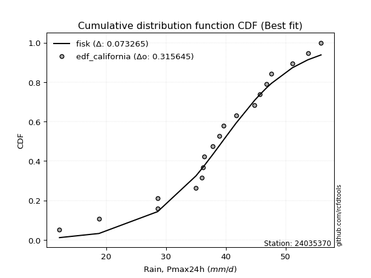</img>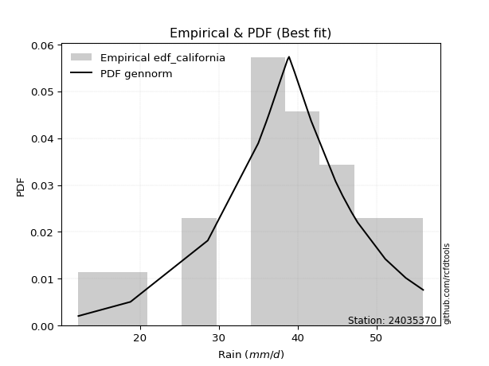</img>

</div>


### 2. EDF Hazen (1930)

Hazen method for plotting positions is a formula used to estimate the empirical cumulative probability distribution of flood events or other hydrological data. This formula often results in biased estimations, particularly when extrapolating to extreme events (high return periods).

<div align="center">


$P=(m-0.5)/n$


</div>


**2.1. Empirical values**

<div align="center">

|                | 0                   | 1                   | 2                   | 3                   | 4                   | 5                  | 6                   | 7                   | 8                  | 9         | 10                 | 11                 | 12                 | 13                 | 14                 | 15                 | 16                | 17                 | 18                 |
|:---------------|:--------------------|:--------------------|:--------------------|:--------------------|:--------------------|:-------------------|:--------------------|:--------------------|:-------------------|:----------|:-------------------|:-------------------|:-------------------|:-------------------|:-------------------|:-------------------|:------------------|:-------------------|:-------------------|
| date           | 2024                | 2006                | 2022                | 2007                | 2015                | 2021               | 2023                | 2014                | 2020               | 2008      | 2011               | 2009               | 2017               | 2018               | 2016               | 2010               | 2019              | 2013               | 2012               |
| x              | 12.2                | 18.8                | 28.6                | 28.6                | 35.0                | 36.0               | 36.2                | 36.4                | 37.8               | 38.9      | 39.6               | 41.7               | 44.8               | 45.7               | 46.8               | 47.6               | 51.1              | 53.7               | 55.9               |
| m              | 1                   | 2                   | 3                   | 4                   | 5                   | 6                  | 7                   | 8                   | 9                  | 10        | 11                 | 12                 | 13                 | 14                 | 15                 | 16                 | 17                | 18                 | 19                 |
| empirical_dist | edf_hazen           | edf_hazen           | edf_hazen           | edf_hazen           | edf_hazen           | edf_hazen          | edf_hazen           | edf_hazen           | edf_hazen          | edf_hazen | edf_hazen          | edf_hazen          | edf_hazen          | edf_hazen          | edf_hazen          | edf_hazen          | edf_hazen         | edf_hazen          | edf_hazen          |
| empirical      | 0.02631578947368421 | 0.07894736842105263 | 0.13157894736842105 | 0.18421052631578946 | 0.23684210526315788 | 0.2894736842105263 | 0.34210526315789475 | 0.39473684210526316 | 0.4473684210526316 | 0.5       | 0.5526315789473685 | 0.6052631578947368 | 0.6578947368421053 | 0.7105263157894737 | 0.7631578947368421 | 0.8157894736842105 | 0.868421052631579 | 0.9210526315789473 | 0.9736842105263158 |
| empirical_tr   | 1.027027027027027   | 1.0857142857142856  | 1.1515151515151514  | 1.2258064516129032  | 1.3103448275862069  | 1.4074074074074074 | 1.5199999999999998  | 1.6521739130434783  | 1.8095238095238098 | 2.0       | 2.235294117647059  | 2.533333333333333  | 2.9230769230769234 | 3.4545454545454546 | 4.222222222222223  | 5.428571428571428  | 7.600000000000002 | 12.666666666666663 | 38.00000000000004  |

</div>


**2.2. Kolmogorov-Smirnov fit test (sorted by Δ)**


<div align="center">

|                | 0                   | 1                   | 2                   | 3                   | 4                   | 5                   | 6                   | 7                   | 8                   | 9                     | 10                  | 11                  | 12                  | 13                  | 14                  | 15                  | 16                  | 17                  | 18                  | 19                  | 20                  | 21                  | 22                  | 23                  | 24                  | 25                  | 26                  | 27                  | 28                  | 29                  | 30                  | 31                  | 32                  | 33                  | 34                  | 35                  | 36                  | 37                  | 38                  | 39                  | 40                  | 41                  | 42                  | 43                  | 44                  | 45                  | 46                  | 47                  | 48                  | 49                  | 50                  | 51                  | 52                  | 53                  | 54                  | 55                  | 56                  | 57                  | 58                  | 59                  | 60                  | 61                  | 62                  | 63                  | 64                  | 65                  | 66                  | 67                  | 68                  | 69                  | 70                  | 71                  | 72                  | 73                  | 74                  | 75                  | 76                  | 77                  | 78                  | 79                  | 80                  | 81                  | 82                  | 83                  | 84                  | 85                  | 86                  | 87                  |
|:---------------|:--------------------|:--------------------|:--------------------|:--------------------|:--------------------|:--------------------|:--------------------|:--------------------|:--------------------|:----------------------|:--------------------|:--------------------|:--------------------|:--------------------|:--------------------|:--------------------|:--------------------|:--------------------|:--------------------|:--------------------|:--------------------|:--------------------|:--------------------|:--------------------|:--------------------|:--------------------|:--------------------|:--------------------|:--------------------|:--------------------|:--------------------|:--------------------|:--------------------|:--------------------|:--------------------|:--------------------|:--------------------|:--------------------|:--------------------|:--------------------|:--------------------|:--------------------|:--------------------|:--------------------|:--------------------|:--------------------|:--------------------|:--------------------|:--------------------|:--------------------|:--------------------|:--------------------|:--------------------|:--------------------|:--------------------|:--------------------|:--------------------|:--------------------|:--------------------|:--------------------|:--------------------|:--------------------|:--------------------|:--------------------|:--------------------|:--------------------|:--------------------|:--------------------|:--------------------|:--------------------|:--------------------|:--------------------|:--------------------|:--------------------|:--------------------|:--------------------|:--------------------|:--------------------|:--------------------|:--------------------|:--------------------|:--------------------|:--------------------|:--------------------|:--------------------|:--------------------|:--------------------|:--------------------|
| station        | 24035370            | 24035370            | 24035370            | 24035370            | 24035370            | 24035370            | 24035370            | 24035370            | 24035370            | 24035370              | 24035370            | 24035370            | 24035370            | 24035370            | 24035370            | 24035370            | 24035370            | 24035370            | 24035370            | 24035370            | 24035370            | 24035370            | 24035370            | 24035370            | 24035370            | 24035370            | 24035370            | 24035370            | 24035370            | 24035370            | 24035370            | 24035370            | 24035370            | 24035370            | 24035370            | 24035370            | 24035370            | 24035370            | 24035370            | 24035370            | 24035370            | 24035370            | 24035370            | 24035370            | 24035370            | 24035370            | 24035370            | 24035370            | 24035370            | 24035370            | 24035370            | 24035370            | 24035370            | 24035370            | 24035370            | 24035370            | 24035370            | 24035370            | 24035370            | 24035370            | 24035370            | 24035370            | 24035370            | 24035370            | 24035370            | 24035370            | 24035370            | 24035370            | 24035370            | 24035370            | 24035370            | 24035370            | 24035370            | 24035370            | 24035370            | 24035370            | 24035370            | 24035370            | 24035370            | 24035370            | 24035370            | 24035370            | 24035370            | 24035370            | 24035370            | 24035370            | 24035370            | 24035370            |
| empirical_dist | edf_hazen           | edf_hazen           | edf_hazen           | edf_hazen           | edf_hazen           | edf_hazen           | edf_hazen           | edf_hazen           | edf_hazen           | edf_hazen             | edf_hazen           | edf_hazen           | edf_hazen           | edf_hazen           | edf_hazen           | edf_hazen           | edf_hazen           | edf_hazen           | edf_hazen           | edf_hazen           | edf_hazen           | edf_hazen           | edf_hazen           | edf_hazen           | edf_hazen           | edf_hazen           | edf_hazen           | edf_hazen           | edf_hazen           | edf_hazen           | edf_hazen           | edf_hazen           | edf_hazen           | edf_hazen           | edf_hazen           | edf_hazen           | edf_hazen           | edf_hazen           | edf_hazen           | edf_hazen           | edf_hazen           | edf_hazen           | edf_hazen           | edf_hazen           | edf_hazen           | edf_hazen           | edf_hazen           | edf_hazen           | edf_hazen           | edf_hazen           | edf_hazen           | edf_hazen           | edf_hazen           | edf_hazen           | edf_hazen           | edf_hazen           | edf_hazen           | edf_hazen           | edf_hazen           | edf_hazen           | edf_hazen           | edf_hazen           | edf_hazen           | edf_hazen           | edf_hazen           | edf_hazen           | edf_hazen           | edf_hazen           | edf_hazen           | edf_hazen           | edf_hazen           | edf_hazen           | edf_hazen           | edf_hazen           | edf_hazen           | edf_hazen           | edf_hazen           | edf_hazen           | edf_hazen           | edf_hazen           | edf_hazen           | edf_hazen           | edf_hazen           | edf_hazen           | edf_hazen           | edf_hazen           | edf_hazen           | edf_hazen           |
| p_dist         | genlogistic         | logt                | johnsonsu           | weibull_min         | fisk                | gumbel_l            | pearson3            | logjohnsonsu        | logmielke           | loglaplace_asymmetric | mielke              | gompertz            | loggenlogistic      | logloggamma         | hypsecant           | laplace_asymmetric  | logpearson3         | logistic            | laplace             | logweibull_min      | logfisk             | nakagami            | t                   | exponnorm           | norm                | crystalball         | truncnorm           | nct                 | f                   | fatiguelife         | chi2                | betaprime           | loggumbel_l         | erlang              | gamma               | alpha               | invgamma            | maxwell             | ncf                 | rayleigh            | invgauss            | loglaplace          | gumbel_r            | loghypsecant        | invweibull          | moyal               | loglogistic         | halfnorm            | logexponnorm        | lognorm             | lognorm             | logcrystalball      | loglognorm          | logrice             | lognakagami         | logf                | logfatiguelife      | lognct              | logerlang           | halflogistic        | logbetaprime        | loginvgamma         | logncf              | kstwobign           | loginvgauss         | loggamma            | loggamma            | logalpha            | logmaxwell          | loginvweibull       | gibrat              | lograyleigh         | wald                | loggumbel_r         | loghalfnorm         | logkstwobign        | logmoyal            | loghalflogistic     | loggenexpon         | expon               | genexpon            | logtruncnorm        | loggompertz         | logwald             | loggibrat           | logexpon            | logchi2             | rice                |
| delta          | 0.07473679393755323 | 0.08013513739072171 | 0.08210168418330918 | 0.08421096501494299 | 0.08728619391890582 | 0.08849012125192524 | 0.09327685795176247 | 0.09380471667810872 | 0.09474773118956045 | 0.09550703803637431   | 0.09656349015802015 | 0.09672032405269718 | 0.09678736581012934 | 0.10039777924855878 | 0.10052911693513591 | 0.10211659884294344 | 0.10841535740971378 | 0.11352375500635539 | 0.11560536353544426 | 0.11583868861341726 | 0.12014303797344297 | 0.12903878507520936 | 0.12993190949551744 | 0.12993214318212545 | 0.12993262420532406 | 0.12993263088677062 | 0.12993265452548522 | 0.13031894877998565 | 0.13035589057714678 | 0.13082671201015347 | 0.13995935753202474 | 0.14108844708217225 | 0.14138435951301734 | 0.14441836723193982 | 0.14740690585992713 | 0.14907046245011865 | 0.16023782188983773 | 0.1627771507842378  | 0.1738640223974847  | 0.17500019071341008 | 0.1761907447479413  | 0.17913599124469468 | 0.18260643523692874 | 0.1985607488186447  | 0.20239197760118247 | 0.20250056961760496 | 0.20444063697990747 | 0.20976507835387806 | 0.21140432828919672 | 0.21140537977350785 | 0.21140537977350785 | 0.21140551450714115 | 0.21140649913531603 | 0.2114083155838565  | 0.21163875841336868 | 0.21305651699061465 | 0.2141163580606246  | 0.21455721499278999 | 0.21575096885823772 | 0.22060005526914747 | 0.22188179770936547 | 0.22484258251713982 | 0.22554546401641426 | 0.22976640203947266 | 0.23044120996830866 | 0.23063443490283128 | 0.23063443490283128 | 0.23637915243998478 | 0.24574161926103985 | 0.25187360501077716 | 0.25264984478009356 | 0.2576578577422116  | 0.25780515062746256 | 0.2782519106061139  | 0.29130486337302586 | 0.293321039691432   | 0.30355975478691277 | 0.31223460435007144 | 0.3324273747133254  | 0.3400831919120858  | 0.34012879403605123 | 0.34027270127688447 | 0.37120327380008644 | 0.37386434839464266 | 0.38604718978612096 | 0.4072610327138424  | 0.4724986197956623  | 0.868420997205865   |
| deltao         | 0.31564497164100014 | 0.31564497164100014 | 0.31564497164100014 | 0.31564497164100014 | 0.31564497164100014 | 0.31564497164100014 | 0.31564497164100014 | 0.31564497164100014 | 0.31564497164100014 | 0.31564497164100014   | 0.31564497164100014 | 0.31564497164100014 | 0.31564497164100014 | 0.31564497164100014 | 0.31564497164100014 | 0.31564497164100014 | 0.31564497164100014 | 0.31564497164100014 | 0.31564497164100014 | 0.31564497164100014 | 0.31564497164100014 | 0.31564497164100014 | 0.31564497164100014 | 0.31564497164100014 | 0.31564497164100014 | 0.31564497164100014 | 0.31564497164100014 | 0.31564497164100014 | 0.31564497164100014 | 0.31564497164100014 | 0.31564497164100014 | 0.31564497164100014 | 0.31564497164100014 | 0.31564497164100014 | 0.31564497164100014 | 0.31564497164100014 | 0.31564497164100014 | 0.31564497164100014 | 0.31564497164100014 | 0.31564497164100014 | 0.31564497164100014 | 0.31564497164100014 | 0.31564497164100014 | 0.31564497164100014 | 0.31564497164100014 | 0.31564497164100014 | 0.31564497164100014 | 0.31564497164100014 | 0.31564497164100014 | 0.31564497164100014 | 0.31564497164100014 | 0.31564497164100014 | 0.31564497164100014 | 0.31564497164100014 | 0.31564497164100014 | 0.31564497164100014 | 0.31564497164100014 | 0.31564497164100014 | 0.31564497164100014 | 0.31564497164100014 | 0.31564497164100014 | 0.31564497164100014 | 0.31564497164100014 | 0.31564497164100014 | 0.31564497164100014 | 0.31564497164100014 | 0.31564497164100014 | 0.31564497164100014 | 0.31564497164100014 | 0.31564497164100014 | 0.31564497164100014 | 0.31564497164100014 | 0.31564497164100014 | 0.31564497164100014 | 0.31564497164100014 | 0.31564497164100014 | 0.31564497164100014 | 0.31564497164100014 | 0.31564497164100014 | 0.31564497164100014 | 0.31564497164100014 | 0.31564497164100014 | 0.31564497164100014 | 0.31564497164100014 | 0.31564497164100014 | 0.31564497164100014 | 0.31564497164100014 | 0.31564497164100014 |
| eval           | Δo > Δ              | Δo > Δ              | Δo > Δ              | Δo > Δ              | Δo > Δ              | Δo > Δ              | Δo > Δ              | Δo > Δ              | Δo > Δ              | Δo > Δ                | Δo > Δ              | Δo > Δ              | Δo > Δ              | Δo > Δ              | Δo > Δ              | Δo > Δ              | Δo > Δ              | Δo > Δ              | Δo > Δ              | Δo > Δ              | Δo > Δ              | Δo > Δ              | Δo > Δ              | Δo > Δ              | Δo > Δ              | Δo > Δ              | Δo > Δ              | Δo > Δ              | Δo > Δ              | Δo > Δ              | Δo > Δ              | Δo > Δ              | Δo > Δ              | Δo > Δ              | Δo > Δ              | Δo > Δ              | Δo > Δ              | Δo > Δ              | Δo > Δ              | Δo > Δ              | Δo > Δ              | Δo > Δ              | Δo > Δ              | Δo > Δ              | Δo > Δ              | Δo > Δ              | Δo > Δ              | Δo > Δ              | Δo > Δ              | Δo > Δ              | Δo > Δ              | Δo > Δ              | Δo > Δ              | Δo > Δ              | Δo > Δ              | Δo > Δ              | Δo > Δ              | Δo > Δ              | Δo > Δ              | Δo > Δ              | Δo > Δ              | Δo > Δ              | Δo > Δ              | Δo > Δ              | Δo > Δ              | Δo > Δ              | Δo > Δ              | Δo > Δ              | Δo > Δ              | Δo > Δ              | Δo > Δ              | Δo > Δ              | Δo > Δ              | Δo > Δ              | Δo > Δ              | Δo > Δ              | Δo > Δ              | Δo > Δ              | Δo <= Δ             | Δo <= Δ             | Δo <= Δ             | Δo <= Δ             | Δo <= Δ             | Δo <= Δ             | Δo <= Δ             | Δo <= Δ             | Δo <= Δ             | Δo <= Δ             |
| fit            | 1                   | 1                   | 1                   | 1                   | 1                   | 1                   | 1                   | 1                   | 1                   | 1                     | 1                   | 1                   | 1                   | 1                   | 1                   | 1                   | 1                   | 1                   | 1                   | 1                   | 1                   | 1                   | 1                   | 1                   | 1                   | 1                   | 1                   | 1                   | 1                   | 1                   | 1                   | 1                   | 1                   | 1                   | 1                   | 1                   | 1                   | 1                   | 1                   | 1                   | 1                   | 1                   | 1                   | 1                   | 1                   | 1                   | 1                   | 1                   | 1                   | 1                   | 1                   | 1                   | 1                   | 1                   | 1                   | 1                   | 1                   | 1                   | 1                   | 1                   | 1                   | 1                   | 1                   | 1                   | 1                   | 1                   | 1                   | 1                   | 1                   | 1                   | 1                   | 1                   | 1                   | 1                   | 1                   | 1                   | 1                   | 1                   | 0                   | 0                   | 0                   | 0                   | 0                   | 0                   | 0                   | 0                   | 0                   | 0                   |
| n              | 19                  | 19                  | 19                  | 19                  | 19                  | 19                  | 19                  | 19                  | 19                  | 19                    | 19                  | 19                  | 19                  | 19                  | 19                  | 19                  | 19                  | 19                  | 19                  | 19                  | 19                  | 19                  | 19                  | 19                  | 19                  | 19                  | 19                  | 19                  | 19                  | 19                  | 19                  | 19                  | 19                  | 19                  | 19                  | 19                  | 19                  | 19                  | 19                  | 19                  | 19                  | 19                  | 19                  | 19                  | 19                  | 19                  | 19                  | 19                  | 19                  | 19                  | 19                  | 19                  | 19                  | 19                  | 19                  | 19                  | 19                  | 19                  | 19                  | 19                  | 19                  | 19                  | 19                  | 19                  | 19                  | 19                  | 19                  | 19                  | 19                  | 19                  | 19                  | 19                  | 19                  | 19                  | 19                  | 19                  | 19                  | 19                  | 19                  | 19                  | 19                  | 19                  | 19                  | 19                  | 19                  | 19                  | 19                  | 19                  |
| best_fit       | 1                   | 0                   | 0                   | 0                   | 0                   | 0                   | 0                   | 0                   | 0                   | 0                     | 0                   | 0                   | 0                   | 0                   | 0                   | 0                   | 0                   | 0                   | 0                   | 0                   | 0                   | 0                   | 0                   | 0                   | 0                   | 0                   | 0                   | 0                   | 0                   | 0                   | 0                   | 0                   | 0                   | 0                   | 0                   | 0                   | 0                   | 0                   | 0                   | 0                   | 0                   | 0                   | 0                   | 0                   | 0                   | 0                   | 0                   | 0                   | 0                   | 0                   | 0                   | 0                   | 0                   | 0                   | 0                   | 0                   | 0                   | 0                   | 0                   | 0                   | 0                   | 0                   | 0                   | 0                   | 0                   | 0                   | 0                   | 0                   | 0                   | 0                   | 0                   | 0                   | 0                   | 0                   | 0                   | 0                   | 0                   | 0                   | 0                   | 0                   | 0                   | 0                   | 0                   | 0                   | 0                   | 0                   | 0                   | 0                   |
| best_fit_sort  | 1                   | 2                   | 3                   | 4                   | 5                   | 6                   | 7                   | 8                   | 9                   | 10                    | 11                  | 12                  | 13                  | 14                  | 15                  | 16                  | 17                  | 18                  | 19                  | 20                  | 21                  | 22                  | 23                  | 24                  | 25                  | 26                  | 27                  | 28                  | 29                  | 30                  | 31                  | 32                  | 33                  | 34                  | 35                  | 36                  | 37                  | 38                  | 39                  | 40                  | 41                  | 42                  | 43                  | 44                  | 45                  | 46                  | 47                  | 48                  | 49                  | 50                  | 51                  | 52                  | 53                  | 54                  | 55                  | 56                  | 57                  | 58                  | 59                  | 60                  | 61                  | 62                  | 63                  | 64                  | 65                  | 66                  | 67                  | 68                  | 69                  | 70                  | 71                  | 72                  | 73                  | 74                  | 75                  | 76                  | 77                  | 78                  | 79                  | 80                  | 81                  | 82                  | 83                  | 84                  | 85                  | 86                  | 87                  | 88                  |

</div>


**2.3. Best fit**

<div align="center">

|   id |   station | empirical_dist   | p_dist      |     delta |   deltao | eval   |   fit |   n |   best_fit |   best_fit_sort |
|-----:|----------:|:-----------------|:------------|----------:|---------:|:-------|------:|----:|-----------:|----------------:|
|    0 |  24035370 | edf_hazen        | genlogistic | 0.0747368 | 0.315645 | Δo > Δ |     1 |  19 |          1 |               1 |

</div>


<div align="center">

</img></img>

</div>


### 3. EDF Weibull (1939)

Weibull plotting position formula is an empirical method used to estimate the non-exceedance probability or plotting position for a set of observed data, is often recommended or widely used in practice, particularly in flood frequency analysis.

<div align="center">


$P=m/(n+1)$


</div>


**3.1. Empirical values**

<div align="center">

|                | 0                  | 1                  | 2                  | 3           | 4                  | 5                  | 6                  | 7                  | 8                  | 9           | 10                 | 11          | 12                | 13                | 14          | 15                | 16                | 17                 | 18                 |
|:---------------|:-------------------|:-------------------|:-------------------|:------------|:-------------------|:-------------------|:-------------------|:-------------------|:-------------------|:------------|:-------------------|:------------|:------------------|:------------------|:------------|:------------------|:------------------|:-------------------|:-------------------|
| date           | 2024               | 2006               | 2022               | 2007        | 2015               | 2021               | 2023               | 2014               | 2020               | 2008        | 2011               | 2009        | 2017              | 2018              | 2016        | 2010              | 2019              | 2013               | 2012               |
| x              | 12.2               | 18.8               | 28.6               | 28.6        | 35.0               | 36.0               | 36.2               | 36.4               | 37.8               | 38.9        | 39.6               | 41.7        | 44.8              | 45.7              | 46.8        | 47.6              | 51.1              | 53.7               | 55.9               |
| m              | 1                  | 2                  | 3                  | 4           | 5                  | 6                  | 7                  | 8                  | 9                  | 10          | 11                 | 12          | 13                | 14                | 15          | 16                | 17                | 18                 | 19                 |
| empirical_dist | edf_weibull        | edf_weibull        | edf_weibull        | edf_weibull | edf_weibull        | edf_weibull        | edf_weibull        | edf_weibull        | edf_weibull        | edf_weibull | edf_weibull        | edf_weibull | edf_weibull       | edf_weibull       | edf_weibull | edf_weibull       | edf_weibull       | edf_weibull        | edf_weibull        |
| empirical      | 0.05               | 0.1                | 0.15               | 0.2         | 0.25               | 0.3                | 0.35               | 0.4                | 0.45               | 0.5         | 0.55               | 0.6         | 0.65              | 0.7               | 0.75        | 0.8               | 0.85              | 0.9                | 0.95               |
| empirical_tr   | 1.0526315789473684 | 1.1111111111111112 | 1.1764705882352942 | 1.25        | 1.3333333333333333 | 1.4285714285714286 | 1.5384615384615383 | 1.6666666666666667 | 1.8181818181818181 | 2.0         | 2.2222222222222223 | 2.5         | 2.857142857142857 | 3.333333333333333 | 4.0         | 5.000000000000001 | 6.666666666666666 | 10.000000000000002 | 19.999999999999982 |

</div>


**3.2. Kolmogorov-Smirnov fit test (sorted by Δ)**


<div align="center">

|                | 0                   | 1                   | 2                   | 3                   | 4                   | 5                   | 6                   | 7                     | 8                   | 9                   | 10                  | 11                  | 12                  | 13                  | 14                  | 15                  | 16                  | 17                  | 18                  | 19                  | 20                  | 21                  | 22                  | 23                  | 24                  | 25                  | 26                  | 27                  | 28                  | 29                  | 30                  | 31                  | 32                  | 33                  | 34                  | 35                  | 36                  | 37                  | 38                  | 39                  | 40                  | 41                  | 42                  | 43                  | 44                  | 45                  | 46                  | 47                  | 48                  | 49                  | 50                  | 51                  | 52                  | 53                  | 54                  | 55                  | 56                  | 57                  | 58                  | 59                  | 60                  | 61                  | 62                  | 63                  | 64                  | 65                  | 66                  | 67                  | 68                  | 69                  | 70                  | 71                  | 72                  | 73                  | 74                  | 75                  | 76                  | 77                  | 78                  | 79                  | 80                  | 81                  | 82                  | 83                  | 84                  | 85                  | 86                  | 87                  |
|:---------------|:--------------------|:--------------------|:--------------------|:--------------------|:--------------------|:--------------------|:--------------------|:----------------------|:--------------------|:--------------------|:--------------------|:--------------------|:--------------------|:--------------------|:--------------------|:--------------------|:--------------------|:--------------------|:--------------------|:--------------------|:--------------------|:--------------------|:--------------------|:--------------------|:--------------------|:--------------------|:--------------------|:--------------------|:--------------------|:--------------------|:--------------------|:--------------------|:--------------------|:--------------------|:--------------------|:--------------------|:--------------------|:--------------------|:--------------------|:--------------------|:--------------------|:--------------------|:--------------------|:--------------------|:--------------------|:--------------------|:--------------------|:--------------------|:--------------------|:--------------------|:--------------------|:--------------------|:--------------------|:--------------------|:--------------------|:--------------------|:--------------------|:--------------------|:--------------------|:--------------------|:--------------------|:--------------------|:--------------------|:--------------------|:--------------------|:--------------------|:--------------------|:--------------------|:--------------------|:--------------------|:--------------------|:--------------------|:--------------------|:--------------------|:--------------------|:--------------------|:--------------------|:--------------------|:--------------------|:--------------------|:--------------------|:--------------------|:--------------------|:--------------------|:--------------------|:--------------------|:--------------------|:--------------------|
| station        | 24035370            | 24035370            | 24035370            | 24035370            | 24035370            | 24035370            | 24035370            | 24035370              | 24035370            | 24035370            | 24035370            | 24035370            | 24035370            | 24035370            | 24035370            | 24035370            | 24035370            | 24035370            | 24035370            | 24035370            | 24035370            | 24035370            | 24035370            | 24035370            | 24035370            | 24035370            | 24035370            | 24035370            | 24035370            | 24035370            | 24035370            | 24035370            | 24035370            | 24035370            | 24035370            | 24035370            | 24035370            | 24035370            | 24035370            | 24035370            | 24035370            | 24035370            | 24035370            | 24035370            | 24035370            | 24035370            | 24035370            | 24035370            | 24035370            | 24035370            | 24035370            | 24035370            | 24035370            | 24035370            | 24035370            | 24035370            | 24035370            | 24035370            | 24035370            | 24035370            | 24035370            | 24035370            | 24035370            | 24035370            | 24035370            | 24035370            | 24035370            | 24035370            | 24035370            | 24035370            | 24035370            | 24035370            | 24035370            | 24035370            | 24035370            | 24035370            | 24035370            | 24035370            | 24035370            | 24035370            | 24035370            | 24035370            | 24035370            | 24035370            | 24035370            | 24035370            | 24035370            | 24035370            |
| empirical_dist | edf_weibull         | edf_weibull         | edf_weibull         | edf_weibull         | edf_weibull         | edf_weibull         | edf_weibull         | edf_weibull           | edf_weibull         | edf_weibull         | edf_weibull         | edf_weibull         | edf_weibull         | edf_weibull         | edf_weibull         | edf_weibull         | edf_weibull         | edf_weibull         | edf_weibull         | edf_weibull         | edf_weibull         | edf_weibull         | edf_weibull         | edf_weibull         | edf_weibull         | edf_weibull         | edf_weibull         | edf_weibull         | edf_weibull         | edf_weibull         | edf_weibull         | edf_weibull         | edf_weibull         | edf_weibull         | edf_weibull         | edf_weibull         | edf_weibull         | edf_weibull         | edf_weibull         | edf_weibull         | edf_weibull         | edf_weibull         | edf_weibull         | edf_weibull         | edf_weibull         | edf_weibull         | edf_weibull         | edf_weibull         | edf_weibull         | edf_weibull         | edf_weibull         | edf_weibull         | edf_weibull         | edf_weibull         | edf_weibull         | edf_weibull         | edf_weibull         | edf_weibull         | edf_weibull         | edf_weibull         | edf_weibull         | edf_weibull         | edf_weibull         | edf_weibull         | edf_weibull         | edf_weibull         | edf_weibull         | edf_weibull         | edf_weibull         | edf_weibull         | edf_weibull         | edf_weibull         | edf_weibull         | edf_weibull         | edf_weibull         | edf_weibull         | edf_weibull         | edf_weibull         | edf_weibull         | edf_weibull         | edf_weibull         | edf_weibull         | edf_weibull         | edf_weibull         | edf_weibull         | edf_weibull         | edf_weibull         | edf_weibull         |
| p_dist         | weibull_min         | genlogistic         | johnsonsu           | fisk                | pearson3            | logjohnsonsu        | logmielke           | loglaplace_asymmetric | mielke              | gompertz            | loggenlogistic      | gumbel_l            | logloggamma         | logpearson3         | logt                | hypsecant           | logistic            | logweibull_min      | logfisk             | laplace_asymmetric  | nakagami            | t                   | exponnorm           | norm                | crystalball         | truncnorm           | nct                 | f                   | fatiguelife         | laplace             | chi2                | betaprime           | loggumbel_l         | erlang              | gamma               | alpha               | invgamma            | maxwell             | ncf                 | rayleigh            | invgauss            | loglaplace          | gumbel_r            | loghypsecant        | invweibull          | moyal               | loglogistic         | halfnorm            | logexponnorm        | lognorm             | lognorm             | logcrystalball      | loglognorm          | logrice             | lognakagami         | logf                | logfatiguelife      | lognct              | logerlang           | halflogistic        | logbetaprime        | loginvgamma         | logncf              | kstwobign           | loginvgauss         | loggamma            | loggamma            | logalpha            | logmaxwell          | loginvweibull       | gibrat              | lograyleigh         | wald                | loggumbel_r         | loghalfnorm         | logkstwobign        | logmoyal            | loghalflogistic     | loggenexpon         | expon               | genexpon            | logtruncnorm        | loggompertz         | logwald             | loggibrat           | logexpon            | logchi2             | rice                |
| delta          | 0.07105307027810087 | 0.0721052149901848  | 0.07383887062553601 | 0.0741282991820637  | 0.08011896321492035 | 0.0806468219412666  | 0.08158983645271833 | 0.08234914329953219   | 0.08340559542117804 | 0.08356242931585506 | 0.08362947107328722 | 0.0858585423045568  | 0.08723988451171666 | 0.09525746267287166 | 0.09592461107493226 | 0.09958687616857542 | 0.10036586026951327 | 0.10268079387657514 | 0.10698514323660085 | 0.11001133568504873 | 0.11588089033836724 | 0.11677401475867533 | 0.11677424844528334 | 0.11677472946848194 | 0.1167747361499285  | 0.1167747597886431  | 0.11716105404314353 | 0.11719799584030466 | 0.11766881727331135 | 0.12350010037754955 | 0.12680146279518262 | 0.12793055234533013 | 0.12822646477617522 | 0.1312604724950977  | 0.13424901112308502 | 0.13591256771327653 | 0.14707992715299562 | 0.14961925604739568 | 0.16070612766064257 | 0.16184229597656796 | 0.16303285001109918 | 0.16597809650785256 | 0.16944854050008662 | 0.18540285408180257 | 0.18923408286434035 | 0.18934267488076284 | 0.19128274224306535 | 0.19660718361703594 | 0.1982464335523546  | 0.19824748503666573 | 0.19824748503666573 | 0.19824761977029903 | 0.19824860439847392 | 0.19825042084701439 | 0.19848086367652656 | 0.19989862225377253 | 0.20095846332378248 | 0.20139932025594787 | 0.2025930741213956  | 0.20744216053230535 | 0.20872390297252336 | 0.2116846877802977  | 0.21238756927957214 | 0.21660850730263054 | 0.21728331523146655 | 0.21747654016598916 | 0.21747654016598916 | 0.22322125770314266 | 0.23258372452419773 | 0.23871571027393507 | 0.2421235289906199  | 0.24449996300536947 | 0.2472788348379889  | 0.2650940158692717  | 0.2781469686361837  | 0.2801631449545898  | 0.2904018600500706  | 0.2990767096132293  | 0.31926947997648325 | 0.32692529717524366 | 0.3269708992992091  | 0.3271148065400423  | 0.3580453790632443  | 0.3607064536578005  | 0.3728892950492788  | 0.3888399800822634  | 0.4540775671640833  | 0.849999944574286   |
| deltao         | 0.31564497164100014 | 0.31564497164100014 | 0.31564497164100014 | 0.31564497164100014 | 0.31564497164100014 | 0.31564497164100014 | 0.31564497164100014 | 0.31564497164100014   | 0.31564497164100014 | 0.31564497164100014 | 0.31564497164100014 | 0.31564497164100014 | 0.31564497164100014 | 0.31564497164100014 | 0.31564497164100014 | 0.31564497164100014 | 0.31564497164100014 | 0.31564497164100014 | 0.31564497164100014 | 0.31564497164100014 | 0.31564497164100014 | 0.31564497164100014 | 0.31564497164100014 | 0.31564497164100014 | 0.31564497164100014 | 0.31564497164100014 | 0.31564497164100014 | 0.31564497164100014 | 0.31564497164100014 | 0.31564497164100014 | 0.31564497164100014 | 0.31564497164100014 | 0.31564497164100014 | 0.31564497164100014 | 0.31564497164100014 | 0.31564497164100014 | 0.31564497164100014 | 0.31564497164100014 | 0.31564497164100014 | 0.31564497164100014 | 0.31564497164100014 | 0.31564497164100014 | 0.31564497164100014 | 0.31564497164100014 | 0.31564497164100014 | 0.31564497164100014 | 0.31564497164100014 | 0.31564497164100014 | 0.31564497164100014 | 0.31564497164100014 | 0.31564497164100014 | 0.31564497164100014 | 0.31564497164100014 | 0.31564497164100014 | 0.31564497164100014 | 0.31564497164100014 | 0.31564497164100014 | 0.31564497164100014 | 0.31564497164100014 | 0.31564497164100014 | 0.31564497164100014 | 0.31564497164100014 | 0.31564497164100014 | 0.31564497164100014 | 0.31564497164100014 | 0.31564497164100014 | 0.31564497164100014 | 0.31564497164100014 | 0.31564497164100014 | 0.31564497164100014 | 0.31564497164100014 | 0.31564497164100014 | 0.31564497164100014 | 0.31564497164100014 | 0.31564497164100014 | 0.31564497164100014 | 0.31564497164100014 | 0.31564497164100014 | 0.31564497164100014 | 0.31564497164100014 | 0.31564497164100014 | 0.31564497164100014 | 0.31564497164100014 | 0.31564497164100014 | 0.31564497164100014 | 0.31564497164100014 | 0.31564497164100014 | 0.31564497164100014 |
| eval           | Δo > Δ              | Δo > Δ              | Δo > Δ              | Δo > Δ              | Δo > Δ              | Δo > Δ              | Δo > Δ              | Δo > Δ                | Δo > Δ              | Δo > Δ              | Δo > Δ              | Δo > Δ              | Δo > Δ              | Δo > Δ              | Δo > Δ              | Δo > Δ              | Δo > Δ              | Δo > Δ              | Δo > Δ              | Δo > Δ              | Δo > Δ              | Δo > Δ              | Δo > Δ              | Δo > Δ              | Δo > Δ              | Δo > Δ              | Δo > Δ              | Δo > Δ              | Δo > Δ              | Δo > Δ              | Δo > Δ              | Δo > Δ              | Δo > Δ              | Δo > Δ              | Δo > Δ              | Δo > Δ              | Δo > Δ              | Δo > Δ              | Δo > Δ              | Δo > Δ              | Δo > Δ              | Δo > Δ              | Δo > Δ              | Δo > Δ              | Δo > Δ              | Δo > Δ              | Δo > Δ              | Δo > Δ              | Δo > Δ              | Δo > Δ              | Δo > Δ              | Δo > Δ              | Δo > Δ              | Δo > Δ              | Δo > Δ              | Δo > Δ              | Δo > Δ              | Δo > Δ              | Δo > Δ              | Δo > Δ              | Δo > Δ              | Δo > Δ              | Δo > Δ              | Δo > Δ              | Δo > Δ              | Δo > Δ              | Δo > Δ              | Δo > Δ              | Δo > Δ              | Δo > Δ              | Δo > Δ              | Δo > Δ              | Δo > Δ              | Δo > Δ              | Δo > Δ              | Δo > Δ              | Δo > Δ              | Δo > Δ              | Δo <= Δ             | Δo <= Δ             | Δo <= Δ             | Δo <= Δ             | Δo <= Δ             | Δo <= Δ             | Δo <= Δ             | Δo <= Δ             | Δo <= Δ             | Δo <= Δ             |
| fit            | 1                   | 1                   | 1                   | 1                   | 1                   | 1                   | 1                   | 1                     | 1                   | 1                   | 1                   | 1                   | 1                   | 1                   | 1                   | 1                   | 1                   | 1                   | 1                   | 1                   | 1                   | 1                   | 1                   | 1                   | 1                   | 1                   | 1                   | 1                   | 1                   | 1                   | 1                   | 1                   | 1                   | 1                   | 1                   | 1                   | 1                   | 1                   | 1                   | 1                   | 1                   | 1                   | 1                   | 1                   | 1                   | 1                   | 1                   | 1                   | 1                   | 1                   | 1                   | 1                   | 1                   | 1                   | 1                   | 1                   | 1                   | 1                   | 1                   | 1                   | 1                   | 1                   | 1                   | 1                   | 1                   | 1                   | 1                   | 1                   | 1                   | 1                   | 1                   | 1                   | 1                   | 1                   | 1                   | 1                   | 1                   | 1                   | 0                   | 0                   | 0                   | 0                   | 0                   | 0                   | 0                   | 0                   | 0                   | 0                   |
| n              | 19                  | 19                  | 19                  | 19                  | 19                  | 19                  | 19                  | 19                    | 19                  | 19                  | 19                  | 19                  | 19                  | 19                  | 19                  | 19                  | 19                  | 19                  | 19                  | 19                  | 19                  | 19                  | 19                  | 19                  | 19                  | 19                  | 19                  | 19                  | 19                  | 19                  | 19                  | 19                  | 19                  | 19                  | 19                  | 19                  | 19                  | 19                  | 19                  | 19                  | 19                  | 19                  | 19                  | 19                  | 19                  | 19                  | 19                  | 19                  | 19                  | 19                  | 19                  | 19                  | 19                  | 19                  | 19                  | 19                  | 19                  | 19                  | 19                  | 19                  | 19                  | 19                  | 19                  | 19                  | 19                  | 19                  | 19                  | 19                  | 19                  | 19                  | 19                  | 19                  | 19                  | 19                  | 19                  | 19                  | 19                  | 19                  | 19                  | 19                  | 19                  | 19                  | 19                  | 19                  | 19                  | 19                  | 19                  | 19                  |
| best_fit       | 1                   | 0                   | 0                   | 0                   | 0                   | 0                   | 0                   | 0                     | 0                   | 0                   | 0                   | 0                   | 0                   | 0                   | 0                   | 0                   | 0                   | 0                   | 0                   | 0                   | 0                   | 0                   | 0                   | 0                   | 0                   | 0                   | 0                   | 0                   | 0                   | 0                   | 0                   | 0                   | 0                   | 0                   | 0                   | 0                   | 0                   | 0                   | 0                   | 0                   | 0                   | 0                   | 0                   | 0                   | 0                   | 0                   | 0                   | 0                   | 0                   | 0                   | 0                   | 0                   | 0                   | 0                   | 0                   | 0                   | 0                   | 0                   | 0                   | 0                   | 0                   | 0                   | 0                   | 0                   | 0                   | 0                   | 0                   | 0                   | 0                   | 0                   | 0                   | 0                   | 0                   | 0                   | 0                   | 0                   | 0                   | 0                   | 0                   | 0                   | 0                   | 0                   | 0                   | 0                   | 0                   | 0                   | 0                   | 0                   |
| best_fit_sort  | 1                   | 2                   | 3                   | 4                   | 5                   | 6                   | 7                   | 8                     | 9                   | 10                  | 11                  | 12                  | 13                  | 14                  | 15                  | 16                  | 17                  | 18                  | 19                  | 20                  | 21                  | 22                  | 23                  | 24                  | 25                  | 26                  | 27                  | 28                  | 29                  | 30                  | 31                  | 32                  | 33                  | 34                  | 35                  | 36                  | 37                  | 38                  | 39                  | 40                  | 41                  | 42                  | 43                  | 44                  | 45                  | 46                  | 47                  | 48                  | 49                  | 50                  | 51                  | 52                  | 53                  | 54                  | 55                  | 56                  | 57                  | 58                  | 59                  | 60                  | 61                  | 62                  | 63                  | 64                  | 65                  | 66                  | 67                  | 68                  | 69                  | 70                  | 71                  | 72                  | 73                  | 74                  | 75                  | 76                  | 77                  | 78                  | 79                  | 80                  | 81                  | 82                  | 83                  | 84                  | 85                  | 86                  | 87                  | 88                  |

</div>


**3.3. Best fit**

<div align="center">

|   id |   station | empirical_dist   | p_dist      |     delta |   deltao | eval   |   fit |   n |   best_fit |   best_fit_sort |
|-----:|----------:|:-----------------|:------------|----------:|---------:|:-------|------:|----:|-----------:|----------------:|
|    0 |  24035370 | edf_weibull      | weibull_min | 0.0710531 | 0.315645 | Δo > Δ |     1 |  19 |          1 |               1 |

</div>


<div align="center">

</img>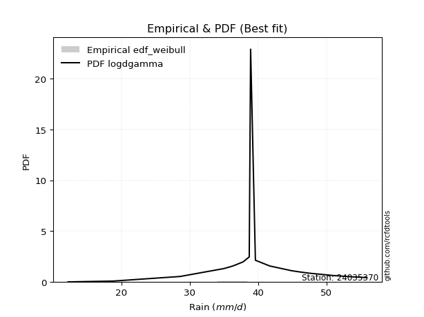</img>

</div>


### 4. EDF Beard (1943)

The Beard formula (or Beard´s plotting position formula) in hydrology is used to estimate the empirical non-exceedance probability _(P)_ of a flood event (or other extreme hydrological data point) within a given dataset.

<div align="center">


$P=(m-0.31)/(n+0.38)$


</div>


**4.1. Empirical values**

<div align="center">

|                | 0                   | 1                   | 2                  | 3                   | 4                   | 5                   | 6                  | 7                  | 8                  | 9         | 10                 | 11                 | 12                 | 13                 | 14                 | 15                 | 16                 | 17                 | 18                 |
|:---------------|:--------------------|:--------------------|:-------------------|:--------------------|:--------------------|:--------------------|:-------------------|:-------------------|:-------------------|:----------|:-------------------|:-------------------|:-------------------|:-------------------|:-------------------|:-------------------|:-------------------|:-------------------|:-------------------|
| date           | 2024                | 2006                | 2022               | 2007                | 2015                | 2021                | 2023               | 2014               | 2020               | 2008      | 2011               | 2009               | 2017               | 2018               | 2016               | 2010               | 2019               | 2013               | 2012               |
| x              | 12.2                | 18.8                | 28.6               | 28.6                | 35.0                | 36.0                | 36.2               | 36.4               | 37.8               | 38.9      | 39.6               | 41.7               | 44.8               | 45.7               | 46.8               | 47.6               | 51.1               | 53.7               | 55.9               |
| m              | 1                   | 2                   | 3                  | 4                   | 5                   | 6                   | 7                  | 8                  | 9                  | 10        | 11                 | 12                 | 13                 | 14                 | 15                 | 16                 | 17                 | 18                 | 19                 |
| empirical_dist | edf_beard           | edf_beard           | edf_beard          | edf_beard           | edf_beard           | edf_beard           | edf_beard          | edf_beard          | edf_beard          | edf_beard | edf_beard          | edf_beard          | edf_beard          | edf_beard          | edf_beard          | edf_beard          | edf_beard          | edf_beard          | edf_beard          |
| empirical      | 0.03560371517027864 | 0.08720330237358101 | 0.1388028895768834 | 0.19040247678018576 | 0.24200206398348817 | 0.29360165118679055 | 0.3452012383900929 | 0.3968008255933953 | 0.4484004127966976 | 0.5       | 0.5515995872033024 | 0.6031991744066048 | 0.6547987616099071 | 0.7063983488132095 | 0.7579979360165119 | 0.8095975232198143 | 0.8611971104231168 | 0.9127966976264191 | 0.9643962848297215 |
| empirical_tr   | 1.0369181380417336  | 1.0955342001130581  | 1.1611743559017376 | 1.2351816443594645  | 1.3192648059904697  | 1.4156318480642804  | 1.5271867612293144 | 1.6578272027373824 | 1.812909260991581  | 2.0       | 2.230149597238205  | 2.5201560468140443 | 2.896860986547085  | 3.40597539543058   | 4.132196162046909  | 5.252032520325204  | 7.204460966542758  | 11.467455621301793 | 28.086956521739243 |

</div>


**4.2. Kolmogorov-Smirnov fit test (sorted by Δ)**


<div align="center">

|                | 0                   | 1                   | 2                   | 3                   | 4                   | 5                   | 6                   | 7                   | 8                   | 9                     | 10                  | 11                  | 12                  | 13                  | 14                  | 15                  | 16                  | 17                  | 18                  | 19                  | 20                  | 21                  | 22                  | 23                  | 24                  | 25                  | 26                  | 27                  | 28                  | 29                  | 30                  | 31                  | 32                  | 33                  | 34                  | 35                  | 36                  | 37                  | 38                  | 39                  | 40                  | 41                  | 42                  | 43                  | 44                  | 45                  | 46                  | 47                  | 48                  | 49                  | 50                  | 51                  | 52                  | 53                  | 54                  | 55                  | 56                  | 57                  | 58                  | 59                  | 60                  | 61                  | 62                  | 63                  | 64                  | 65                  | 66                  | 67                  | 68                  | 69                  | 70                  | 71                  | 72                  | 73                  | 74                  | 75                  | 76                  | 77                  | 78                  | 79                  | 80                  | 81                  | 82                  | 83                  | 84                  | 85                  | 86                  | 87                  |
|:---------------|:--------------------|:--------------------|:--------------------|:--------------------|:--------------------|:--------------------|:--------------------|:--------------------|:--------------------|:----------------------|:--------------------|:--------------------|:--------------------|:--------------------|:--------------------|:--------------------|:--------------------|:--------------------|:--------------------|:--------------------|:--------------------|:--------------------|:--------------------|:--------------------|:--------------------|:--------------------|:--------------------|:--------------------|:--------------------|:--------------------|:--------------------|:--------------------|:--------------------|:--------------------|:--------------------|:--------------------|:--------------------|:--------------------|:--------------------|:--------------------|:--------------------|:--------------------|:--------------------|:--------------------|:--------------------|:--------------------|:--------------------|:--------------------|:--------------------|:--------------------|:--------------------|:--------------------|:--------------------|:--------------------|:--------------------|:--------------------|:--------------------|:--------------------|:--------------------|:--------------------|:--------------------|:--------------------|:--------------------|:--------------------|:--------------------|:--------------------|:--------------------|:--------------------|:--------------------|:--------------------|:--------------------|:--------------------|:--------------------|:--------------------|:--------------------|:--------------------|:--------------------|:--------------------|:--------------------|:--------------------|:--------------------|:--------------------|:--------------------|:--------------------|:--------------------|:--------------------|:--------------------|:--------------------|
| station        | 24035370            | 24035370            | 24035370            | 24035370            | 24035370            | 24035370            | 24035370            | 24035370            | 24035370            | 24035370              | 24035370            | 24035370            | 24035370            | 24035370            | 24035370            | 24035370            | 24035370            | 24035370            | 24035370            | 24035370            | 24035370            | 24035370            | 24035370            | 24035370            | 24035370            | 24035370            | 24035370            | 24035370            | 24035370            | 24035370            | 24035370            | 24035370            | 24035370            | 24035370            | 24035370            | 24035370            | 24035370            | 24035370            | 24035370            | 24035370            | 24035370            | 24035370            | 24035370            | 24035370            | 24035370            | 24035370            | 24035370            | 24035370            | 24035370            | 24035370            | 24035370            | 24035370            | 24035370            | 24035370            | 24035370            | 24035370            | 24035370            | 24035370            | 24035370            | 24035370            | 24035370            | 24035370            | 24035370            | 24035370            | 24035370            | 24035370            | 24035370            | 24035370            | 24035370            | 24035370            | 24035370            | 24035370            | 24035370            | 24035370            | 24035370            | 24035370            | 24035370            | 24035370            | 24035370            | 24035370            | 24035370            | 24035370            | 24035370            | 24035370            | 24035370            | 24035370            | 24035370            | 24035370            |
| empirical_dist | edf_beard           | edf_beard           | edf_beard           | edf_beard           | edf_beard           | edf_beard           | edf_beard           | edf_beard           | edf_beard           | edf_beard             | edf_beard           | edf_beard           | edf_beard           | edf_beard           | edf_beard           | edf_beard           | edf_beard           | edf_beard           | edf_beard           | edf_beard           | edf_beard           | edf_beard           | edf_beard           | edf_beard           | edf_beard           | edf_beard           | edf_beard           | edf_beard           | edf_beard           | edf_beard           | edf_beard           | edf_beard           | edf_beard           | edf_beard           | edf_beard           | edf_beard           | edf_beard           | edf_beard           | edf_beard           | edf_beard           | edf_beard           | edf_beard           | edf_beard           | edf_beard           | edf_beard           | edf_beard           | edf_beard           | edf_beard           | edf_beard           | edf_beard           | edf_beard           | edf_beard           | edf_beard           | edf_beard           | edf_beard           | edf_beard           | edf_beard           | edf_beard           | edf_beard           | edf_beard           | edf_beard           | edf_beard           | edf_beard           | edf_beard           | edf_beard           | edf_beard           | edf_beard           | edf_beard           | edf_beard           | edf_beard           | edf_beard           | edf_beard           | edf_beard           | edf_beard           | edf_beard           | edf_beard           | edf_beard           | edf_beard           | edf_beard           | edf_beard           | edf_beard           | edf_beard           | edf_beard           | edf_beard           | edf_beard           | edf_beard           | edf_beard           | edf_beard           |
| p_dist         | genlogistic         | johnsonsu           | weibull_min         | fisk                | logt                | gumbel_l            | pearson3            | logjohnsonsu        | logmielke           | loglaplace_asymmetric | mielke              | gompertz            | loggenlogistic      | logloggamma         | hypsecant           | logpearson3         | laplace_asymmetric  | logistic            | logweibull_min      | logfisk             | laplace             | nakagami            | t                   | exponnorm           | norm                | crystalball         | truncnorm           | nct                 | f                   | fatiguelife         | chi2                | betaprime           | loggumbel_l         | erlang              | gamma               | alpha               | invgamma            | maxwell             | ncf                 | rayleigh            | invgauss            | loglaplace          | gumbel_r            | loghypsecant        | invweibull          | moyal               | loglogistic         | halfnorm            | logexponnorm        | lognorm             | lognorm             | logcrystalball      | loglognorm          | logrice             | lognakagami         | logf                | logfatiguelife      | lognct              | logerlang           | halflogistic        | logbetaprime        | loginvgamma         | logncf              | kstwobign           | loginvgauss         | loggamma            | loggamma            | logalpha            | logmaxwell          | loginvweibull       | gibrat              | lograyleigh         | wald                | loggumbel_r         | loghalfnorm         | logkstwobign        | logmoyal            | loghalflogistic     | loggenexpon         | expon               | genexpon            | logtruncnorm        | loggompertz         | logwald             | loggibrat           | logexpon            | logchi2             | rice                |
| delta          | 0.07370480219348713 | 0.0769417254629789  | 0.0790510062946127  | 0.08212623519857554 | 0.08632708785511801 | 0.08745812950785914 | 0.08811689923143218 | 0.08864475795777843 | 0.08958777246923016 | 0.09034707931604402   | 0.09140353143768987 | 0.09156036533236689 | 0.09162740708979905 | 0.09523782052822849 | 0.09536915821480563 | 0.10325539868938349 | 0.10521257407514162 | 0.1083637962860251  | 0.11067872989308697 | 0.11498307925311269 | 0.11870133876764244 | 0.12387882635487907 | 0.12477195077518716 | 0.12477218446179517 | 0.12477266548499377 | 0.12477267216644033 | 0.12477269580515493 | 0.12515899005965536 | 0.1251959318568165  | 0.12566675328982319 | 0.13479939881169445 | 0.13592848836184196 | 0.13622440079268705 | 0.13925840851160953 | 0.14224694713959685 | 0.14391050372978836 | 0.15507786316950745 | 0.1576171920639075  | 0.1687040636771544  | 0.1698402319930798  | 0.17103078602761101 | 0.1739760325243644  | 0.17744647651659845 | 0.1934007900983144  | 0.19723201888085218 | 0.19734061089727467 | 0.19928067825957718 | 0.20460511963354777 | 0.20624436956886644 | 0.20624542105317756 | 0.20624542105317756 | 0.20624555578681086 | 0.20624654041498575 | 0.20624835686352622 | 0.2064787996930384  | 0.20789655827028436 | 0.2089563993402943  | 0.2093972562724597  | 0.21059101013790743 | 0.21544009654881718 | 0.2167218389890352  | 0.21968262379680953 | 0.22038550529608397 | 0.22460644331914237 | 0.22528125124797838 | 0.225474476182501   | 0.225474476182501   | 0.2312191937196545  | 0.24058166054070956 | 0.2467136462904469  | 0.24852187780382934 | 0.2524978990218813  | 0.25367718365119835 | 0.27309195188578356 | 0.28614490465269554 | 0.28816108097110166 | 0.29839979606658246 | 0.3070746456297411  | 0.3272674159929951  | 0.3349232331917555  | 0.3349688353157209  | 0.33511274255655416 | 0.3660433150797561  | 0.36870438967431235 | 0.38088723106579064 | 0.40003709050538006 | 0.4652746775872     | 0.8611970549974026  |
| deltao         | 0.31564497164100014 | 0.31564497164100014 | 0.31564497164100014 | 0.31564497164100014 | 0.31564497164100014 | 0.31564497164100014 | 0.31564497164100014 | 0.31564497164100014 | 0.31564497164100014 | 0.31564497164100014   | 0.31564497164100014 | 0.31564497164100014 | 0.31564497164100014 | 0.31564497164100014 | 0.31564497164100014 | 0.31564497164100014 | 0.31564497164100014 | 0.31564497164100014 | 0.31564497164100014 | 0.31564497164100014 | 0.31564497164100014 | 0.31564497164100014 | 0.31564497164100014 | 0.31564497164100014 | 0.31564497164100014 | 0.31564497164100014 | 0.31564497164100014 | 0.31564497164100014 | 0.31564497164100014 | 0.31564497164100014 | 0.31564497164100014 | 0.31564497164100014 | 0.31564497164100014 | 0.31564497164100014 | 0.31564497164100014 | 0.31564497164100014 | 0.31564497164100014 | 0.31564497164100014 | 0.31564497164100014 | 0.31564497164100014 | 0.31564497164100014 | 0.31564497164100014 | 0.31564497164100014 | 0.31564497164100014 | 0.31564497164100014 | 0.31564497164100014 | 0.31564497164100014 | 0.31564497164100014 | 0.31564497164100014 | 0.31564497164100014 | 0.31564497164100014 | 0.31564497164100014 | 0.31564497164100014 | 0.31564497164100014 | 0.31564497164100014 | 0.31564497164100014 | 0.31564497164100014 | 0.31564497164100014 | 0.31564497164100014 | 0.31564497164100014 | 0.31564497164100014 | 0.31564497164100014 | 0.31564497164100014 | 0.31564497164100014 | 0.31564497164100014 | 0.31564497164100014 | 0.31564497164100014 | 0.31564497164100014 | 0.31564497164100014 | 0.31564497164100014 | 0.31564497164100014 | 0.31564497164100014 | 0.31564497164100014 | 0.31564497164100014 | 0.31564497164100014 | 0.31564497164100014 | 0.31564497164100014 | 0.31564497164100014 | 0.31564497164100014 | 0.31564497164100014 | 0.31564497164100014 | 0.31564497164100014 | 0.31564497164100014 | 0.31564497164100014 | 0.31564497164100014 | 0.31564497164100014 | 0.31564497164100014 | 0.31564497164100014 |
| eval           | Δo > Δ              | Δo > Δ              | Δo > Δ              | Δo > Δ              | Δo > Δ              | Δo > Δ              | Δo > Δ              | Δo > Δ              | Δo > Δ              | Δo > Δ                | Δo > Δ              | Δo > Δ              | Δo > Δ              | Δo > Δ              | Δo > Δ              | Δo > Δ              | Δo > Δ              | Δo > Δ              | Δo > Δ              | Δo > Δ              | Δo > Δ              | Δo > Δ              | Δo > Δ              | Δo > Δ              | Δo > Δ              | Δo > Δ              | Δo > Δ              | Δo > Δ              | Δo > Δ              | Δo > Δ              | Δo > Δ              | Δo > Δ              | Δo > Δ              | Δo > Δ              | Δo > Δ              | Δo > Δ              | Δo > Δ              | Δo > Δ              | Δo > Δ              | Δo > Δ              | Δo > Δ              | Δo > Δ              | Δo > Δ              | Δo > Δ              | Δo > Δ              | Δo > Δ              | Δo > Δ              | Δo > Δ              | Δo > Δ              | Δo > Δ              | Δo > Δ              | Δo > Δ              | Δo > Δ              | Δo > Δ              | Δo > Δ              | Δo > Δ              | Δo > Δ              | Δo > Δ              | Δo > Δ              | Δo > Δ              | Δo > Δ              | Δo > Δ              | Δo > Δ              | Δo > Δ              | Δo > Δ              | Δo > Δ              | Δo > Δ              | Δo > Δ              | Δo > Δ              | Δo > Δ              | Δo > Δ              | Δo > Δ              | Δo > Δ              | Δo > Δ              | Δo > Δ              | Δo > Δ              | Δo > Δ              | Δo > Δ              | Δo <= Δ             | Δo <= Δ             | Δo <= Δ             | Δo <= Δ             | Δo <= Δ             | Δo <= Δ             | Δo <= Δ             | Δo <= Δ             | Δo <= Δ             | Δo <= Δ             |
| fit            | 1                   | 1                   | 1                   | 1                   | 1                   | 1                   | 1                   | 1                   | 1                   | 1                     | 1                   | 1                   | 1                   | 1                   | 1                   | 1                   | 1                   | 1                   | 1                   | 1                   | 1                   | 1                   | 1                   | 1                   | 1                   | 1                   | 1                   | 1                   | 1                   | 1                   | 1                   | 1                   | 1                   | 1                   | 1                   | 1                   | 1                   | 1                   | 1                   | 1                   | 1                   | 1                   | 1                   | 1                   | 1                   | 1                   | 1                   | 1                   | 1                   | 1                   | 1                   | 1                   | 1                   | 1                   | 1                   | 1                   | 1                   | 1                   | 1                   | 1                   | 1                   | 1                   | 1                   | 1                   | 1                   | 1                   | 1                   | 1                   | 1                   | 1                   | 1                   | 1                   | 1                   | 1                   | 1                   | 1                   | 1                   | 1                   | 0                   | 0                   | 0                   | 0                   | 0                   | 0                   | 0                   | 0                   | 0                   | 0                   |
| n              | 19                  | 19                  | 19                  | 19                  | 19                  | 19                  | 19                  | 19                  | 19                  | 19                    | 19                  | 19                  | 19                  | 19                  | 19                  | 19                  | 19                  | 19                  | 19                  | 19                  | 19                  | 19                  | 19                  | 19                  | 19                  | 19                  | 19                  | 19                  | 19                  | 19                  | 19                  | 19                  | 19                  | 19                  | 19                  | 19                  | 19                  | 19                  | 19                  | 19                  | 19                  | 19                  | 19                  | 19                  | 19                  | 19                  | 19                  | 19                  | 19                  | 19                  | 19                  | 19                  | 19                  | 19                  | 19                  | 19                  | 19                  | 19                  | 19                  | 19                  | 19                  | 19                  | 19                  | 19                  | 19                  | 19                  | 19                  | 19                  | 19                  | 19                  | 19                  | 19                  | 19                  | 19                  | 19                  | 19                  | 19                  | 19                  | 19                  | 19                  | 19                  | 19                  | 19                  | 19                  | 19                  | 19                  | 19                  | 19                  |
| best_fit       | 1                   | 0                   | 0                   | 0                   | 0                   | 0                   | 0                   | 0                   | 0                   | 0                     | 0                   | 0                   | 0                   | 0                   | 0                   | 0                   | 0                   | 0                   | 0                   | 0                   | 0                   | 0                   | 0                   | 0                   | 0                   | 0                   | 0                   | 0                   | 0                   | 0                   | 0                   | 0                   | 0                   | 0                   | 0                   | 0                   | 0                   | 0                   | 0                   | 0                   | 0                   | 0                   | 0                   | 0                   | 0                   | 0                   | 0                   | 0                   | 0                   | 0                   | 0                   | 0                   | 0                   | 0                   | 0                   | 0                   | 0                   | 0                   | 0                   | 0                   | 0                   | 0                   | 0                   | 0                   | 0                   | 0                   | 0                   | 0                   | 0                   | 0                   | 0                   | 0                   | 0                   | 0                   | 0                   | 0                   | 0                   | 0                   | 0                   | 0                   | 0                   | 0                   | 0                   | 0                   | 0                   | 0                   | 0                   | 0                   |
| best_fit_sort  | 1                   | 2                   | 3                   | 4                   | 5                   | 6                   | 7                   | 8                   | 9                   | 10                    | 11                  | 12                  | 13                  | 14                  | 15                  | 16                  | 17                  | 18                  | 19                  | 20                  | 21                  | 22                  | 23                  | 24                  | 25                  | 26                  | 27                  | 28                  | 29                  | 30                  | 31                  | 32                  | 33                  | 34                  | 35                  | 36                  | 37                  | 38                  | 39                  | 40                  | 41                  | 42                  | 43                  | 44                  | 45                  | 46                  | 47                  | 48                  | 49                  | 50                  | 51                  | 52                  | 53                  | 54                  | 55                  | 56                  | 57                  | 58                  | 59                  | 60                  | 61                  | 62                  | 63                  | 64                  | 65                  | 66                  | 67                  | 68                  | 69                  | 70                  | 71                  | 72                  | 73                  | 74                  | 75                  | 76                  | 77                  | 78                  | 79                  | 80                  | 81                  | 82                  | 83                  | 84                  | 85                  | 86                  | 87                  | 88                  |

</div>


**4.3. Best fit**

<div align="center">

|   id |   station | empirical_dist   | p_dist      |     delta |   deltao | eval   |   fit |   n |   best_fit |   best_fit_sort |
|-----:|----------:|:-----------------|:------------|----------:|---------:|:-------|------:|----:|-----------:|----------------:|
|    0 |  24035370 | edf_beard        | genlogistic | 0.0737048 | 0.315645 | Δo > Δ |     1 |  19 |          1 |               1 |

</div>


<div align="center">

</img>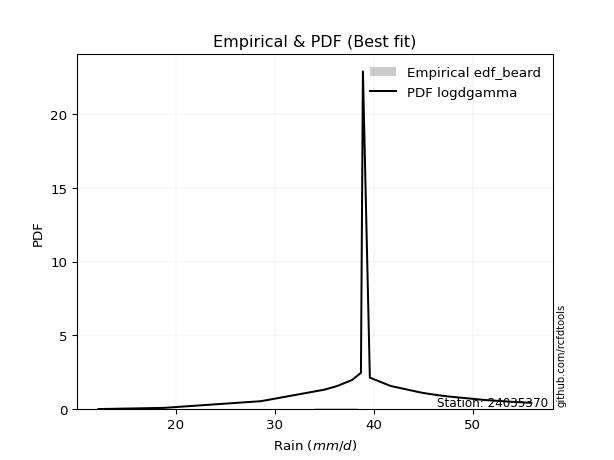</img>

</div>


### 5. EDF Chegodayev (1955)

The Chegodayev formula is an empirical plotting position formula used in hydrological frequency analysis to estimate the exceedance probability or return period of a specific event from a set of observed data. It is primarily used for plotting observed data points on probability paper to fit a theoretical distribution, particularly for analyzing extreme events like maximum flood flows or rainfall intensities. The constant _b_ value in the generalized plotting position formula is 0.3.

<div align="center">


$P=(m-b)/(n+1-2b)$


</div>


**5.1. Empirical values**

<div align="center">

|                | 0                   | 1                   | 2                  | 3                  | 4                   | 5                   | 6                  | 7                  | 8                  | 9              | 10                 | 11                 | 12                 | 13                 | 14                 | 15                 | 16                 | 17                 | 18                 |
|:---------------|:--------------------|:--------------------|:-------------------|:-------------------|:--------------------|:--------------------|:-------------------|:-------------------|:-------------------|:---------------|:-------------------|:-------------------|:-------------------|:-------------------|:-------------------|:-------------------|:-------------------|:-------------------|:-------------------|
| date           | 2024                | 2006                | 2022               | 2007               | 2015                | 2021                | 2023               | 2014               | 2020               | 2008           | 2011               | 2009               | 2017               | 2018               | 2016               | 2010               | 2019               | 2013               | 2012               |
| x              | 12.2                | 18.8                | 28.6               | 28.6               | 35.0                | 36.0                | 36.2               | 36.4               | 37.8               | 38.9           | 39.6               | 41.7               | 44.8               | 45.7               | 46.8               | 47.6               | 51.1               | 53.7               | 55.9               |
| m              | 1                   | 2                   | 3                  | 4                  | 5                   | 6                   | 7                  | 8                  | 9                  | 10             | 11                 | 12                 | 13                 | 14                 | 15                 | 16                 | 17                 | 18                 | 19                 |
| empirical_dist | edf_chegodayev      | edf_chegodayev      | edf_chegodayev     | edf_chegodayev     | edf_chegodayev      | edf_chegodayev      | edf_chegodayev     | edf_chegodayev     | edf_chegodayev     | edf_chegodayev | edf_chegodayev     | edf_chegodayev     | edf_chegodayev     | edf_chegodayev     | edf_chegodayev     | edf_chegodayev     | edf_chegodayev     | edf_chegodayev     | edf_chegodayev     |
| empirical      | 0.03608247422680413 | 0.08762886597938145 | 0.1391752577319588 | 0.1907216494845361 | 0.24226804123711343 | 0.29381443298969073 | 0.3453608247422681 | 0.3969072164948454 | 0.4484536082474227 | 0.5            | 0.5515463917525774 | 0.6030927835051546 | 0.654639175257732  | 0.7061855670103093 | 0.7577319587628866 | 0.8092783505154639 | 0.8608247422680413 | 0.9123711340206185 | 0.9639175257731959 |
| empirical_tr   | 1.0374331550802138  | 1.096045197740113   | 1.1616766467065869 | 1.2356687898089171 | 1.3197278911564627  | 1.416058394160584   | 1.5275590551181104 | 1.6581196581196582 | 1.8130841121495327 | 2.0            | 2.2298850574712645 | 2.519480519480519  | 2.8955223880597014 | 3.403508771929825  | 4.127659574468085  | 5.243243243243244  | 7.185185185185188  | 11.41176470588235  | 27.714285714285726 |

</div>


**5.2. Kolmogorov-Smirnov fit test (sorted by Δ)**


<div align="center">

|                | 0                   | 1                   | 2                   | 3                   | 4                   | 5                   | 6                   | 7                   | 8                   | 9                     | 10                  | 11                  | 12                  | 13                  | 14                  | 15                  | 16                  | 17                  | 18                  | 19                  | 20                  | 21                  | 22                  | 23                  | 24                  | 25                  | 26                  | 27                  | 28                  | 29                  | 30                  | 31                  | 32                  | 33                  | 34                  | 35                  | 36                  | 37                  | 38                  | 39                  | 40                  | 41                  | 42                  | 43                  | 44                  | 45                  | 46                  | 47                  | 48                  | 49                  | 50                  | 51                  | 52                  | 53                  | 54                  | 55                  | 56                  | 57                  | 58                  | 59                  | 60                  | 61                  | 62                  | 63                  | 64                  | 65                  | 66                  | 67                  | 68                  | 69                  | 70                  | 71                  | 72                  | 73                  | 74                  | 75                  | 76                  | 77                  | 78                  | 79                  | 80                  | 81                  | 82                  | 83                  | 84                  | 85                  | 86                  | 87                  |
|:---------------|:--------------------|:--------------------|:--------------------|:--------------------|:--------------------|:--------------------|:--------------------|:--------------------|:--------------------|:----------------------|:--------------------|:--------------------|:--------------------|:--------------------|:--------------------|:--------------------|:--------------------|:--------------------|:--------------------|:--------------------|:--------------------|:--------------------|:--------------------|:--------------------|:--------------------|:--------------------|:--------------------|:--------------------|:--------------------|:--------------------|:--------------------|:--------------------|:--------------------|:--------------------|:--------------------|:--------------------|:--------------------|:--------------------|:--------------------|:--------------------|:--------------------|:--------------------|:--------------------|:--------------------|:--------------------|:--------------------|:--------------------|:--------------------|:--------------------|:--------------------|:--------------------|:--------------------|:--------------------|:--------------------|:--------------------|:--------------------|:--------------------|:--------------------|:--------------------|:--------------------|:--------------------|:--------------------|:--------------------|:--------------------|:--------------------|:--------------------|:--------------------|:--------------------|:--------------------|:--------------------|:--------------------|:--------------------|:--------------------|:--------------------|:--------------------|:--------------------|:--------------------|:--------------------|:--------------------|:--------------------|:--------------------|:--------------------|:--------------------|:--------------------|:--------------------|:--------------------|:--------------------|:--------------------|
| station        | 24035370            | 24035370            | 24035370            | 24035370            | 24035370            | 24035370            | 24035370            | 24035370            | 24035370            | 24035370              | 24035370            | 24035370            | 24035370            | 24035370            | 24035370            | 24035370            | 24035370            | 24035370            | 24035370            | 24035370            | 24035370            | 24035370            | 24035370            | 24035370            | 24035370            | 24035370            | 24035370            | 24035370            | 24035370            | 24035370            | 24035370            | 24035370            | 24035370            | 24035370            | 24035370            | 24035370            | 24035370            | 24035370            | 24035370            | 24035370            | 24035370            | 24035370            | 24035370            | 24035370            | 24035370            | 24035370            | 24035370            | 24035370            | 24035370            | 24035370            | 24035370            | 24035370            | 24035370            | 24035370            | 24035370            | 24035370            | 24035370            | 24035370            | 24035370            | 24035370            | 24035370            | 24035370            | 24035370            | 24035370            | 24035370            | 24035370            | 24035370            | 24035370            | 24035370            | 24035370            | 24035370            | 24035370            | 24035370            | 24035370            | 24035370            | 24035370            | 24035370            | 24035370            | 24035370            | 24035370            | 24035370            | 24035370            | 24035370            | 24035370            | 24035370            | 24035370            | 24035370            | 24035370            |
| empirical_dist | edf_chegodayev      | edf_chegodayev      | edf_chegodayev      | edf_chegodayev      | edf_chegodayev      | edf_chegodayev      | edf_chegodayev      | edf_chegodayev      | edf_chegodayev      | edf_chegodayev        | edf_chegodayev      | edf_chegodayev      | edf_chegodayev      | edf_chegodayev      | edf_chegodayev      | edf_chegodayev      | edf_chegodayev      | edf_chegodayev      | edf_chegodayev      | edf_chegodayev      | edf_chegodayev      | edf_chegodayev      | edf_chegodayev      | edf_chegodayev      | edf_chegodayev      | edf_chegodayev      | edf_chegodayev      | edf_chegodayev      | edf_chegodayev      | edf_chegodayev      | edf_chegodayev      | edf_chegodayev      | edf_chegodayev      | edf_chegodayev      | edf_chegodayev      | edf_chegodayev      | edf_chegodayev      | edf_chegodayev      | edf_chegodayev      | edf_chegodayev      | edf_chegodayev      | edf_chegodayev      | edf_chegodayev      | edf_chegodayev      | edf_chegodayev      | edf_chegodayev      | edf_chegodayev      | edf_chegodayev      | edf_chegodayev      | edf_chegodayev      | edf_chegodayev      | edf_chegodayev      | edf_chegodayev      | edf_chegodayev      | edf_chegodayev      | edf_chegodayev      | edf_chegodayev      | edf_chegodayev      | edf_chegodayev      | edf_chegodayev      | edf_chegodayev      | edf_chegodayev      | edf_chegodayev      | edf_chegodayev      | edf_chegodayev      | edf_chegodayev      | edf_chegodayev      | edf_chegodayev      | edf_chegodayev      | edf_chegodayev      | edf_chegodayev      | edf_chegodayev      | edf_chegodayev      | edf_chegodayev      | edf_chegodayev      | edf_chegodayev      | edf_chegodayev      | edf_chegodayev      | edf_chegodayev      | edf_chegodayev      | edf_chegodayev      | edf_chegodayev      | edf_chegodayev      | edf_chegodayev      | edf_chegodayev      | edf_chegodayev      | edf_chegodayev      | edf_chegodayev      |
| p_dist         | genlogistic         | johnsonsu           | weibull_min         | fisk                | logt                | gumbel_l            | pearson3            | logjohnsonsu        | logmielke           | loglaplace_asymmetric | mielke              | gompertz            | loggenlogistic      | logloggamma         | hypsecant           | logpearson3         | laplace_asymmetric  | logistic            | logweibull_min      | logfisk             | laplace             | nakagami            | t                   | exponnorm           | norm                | crystalball         | truncnorm           | nct                 | f                   | fatiguelife         | chi2                | betaprime           | loggumbel_l         | erlang              | gamma               | alpha               | invgamma            | maxwell             | ncf                 | rayleigh            | invgauss            | loglaplace          | gumbel_r            | loghypsecant        | invweibull          | moyal               | loglogistic         | halfnorm            | logexponnorm        | lognorm             | lognorm             | logcrystalball      | loglognorm          | logrice             | lognakagami         | logf                | logfatiguelife      | lognct              | logerlang           | halflogistic        | logbetaprime        | loginvgamma         | logncf              | kstwobign           | loginvgauss         | loggamma            | loggamma            | logalpha            | logmaxwell          | loginvweibull       | gibrat              | lograyleigh         | wald                | loggumbel_r         | loghalfnorm         | logkstwobign        | logmoyal            | loghalflogistic     | loggenexpon         | expon               | genexpon            | logtruncnorm        | loggompertz         | logwald             | loggibrat           | logexpon            | logchi2             | rice                |
| delta          | 0.07365160674276211 | 0.07667574820935363 | 0.07878502904098744 | 0.08186025794495028 | 0.08664626055946835 | 0.08740493405713412 | 0.08785092197780692 | 0.08837878070415317 | 0.0893217952156049  | 0.09008110206241876   | 0.0911375541840646  | 0.09129438807874163 | 0.09136142983617379 | 0.09497184327460323 | 0.09510318096118037 | 0.10298942143575823 | 0.10537216042731679 | 0.10809781903239984 | 0.11041275263946171 | 0.11471710199948743 | 0.1188609251198176  | 0.12361284910125381 | 0.1245059735215619  | 0.1245062072081699  | 0.12450668823136851 | 0.12450669491281507 | 0.12450671855152967 | 0.1248930128060301  | 0.12492995460319123 | 0.12540077603619793 | 0.1345334215580692  | 0.1356625111082167  | 0.1359584235390618  | 0.13899243125798427 | 0.1419809698859716  | 0.1436445264761631  | 0.15481188591588219 | 0.15735121481028225 | 0.16843808642352914 | 0.16957425473945453 | 0.17076480877398575 | 0.17371005527073913 | 0.1771804992629732  | 0.19313481284468914 | 0.19696604162722692 | 0.1970746336436494  | 0.19901470100595192 | 0.2043391423799225  | 0.20597839231524118 | 0.2059794437995523  | 0.2059794437995523  | 0.2059795785331856  | 0.20598056316136049 | 0.20598237960990096 | 0.20621282243941313 | 0.2076305810166591  | 0.20869042208666905 | 0.20913127901883444 | 0.21032503288428217 | 0.21517411929519192 | 0.21645586173540993 | 0.21941664654318427 | 0.2201195280424587  | 0.2243404660655171  | 0.22501527399435312 | 0.22520849892887573 | 0.22520849892887573 | 0.23095321646602923 | 0.2403156832870843  | 0.24644766903682164 | 0.24830909600092915 | 0.25223192176825604 | 0.25346440184829816 | 0.2728259746321583  | 0.2858789273990703  | 0.2878951037174764  | 0.2981338188129572  | 0.30680866837611587 | 0.3270014387393698  | 0.3346572559381302  | 0.33470285806209565 | 0.3348467653029289  | 0.36577733782613087 | 0.3684384124206871  | 0.3806212538121654  | 0.3996647223503046  | 0.4649023094321245  | 0.8608246868423272  |
| deltao         | 0.31564497164100014 | 0.31564497164100014 | 0.31564497164100014 | 0.31564497164100014 | 0.31564497164100014 | 0.31564497164100014 | 0.31564497164100014 | 0.31564497164100014 | 0.31564497164100014 | 0.31564497164100014   | 0.31564497164100014 | 0.31564497164100014 | 0.31564497164100014 | 0.31564497164100014 | 0.31564497164100014 | 0.31564497164100014 | 0.31564497164100014 | 0.31564497164100014 | 0.31564497164100014 | 0.31564497164100014 | 0.31564497164100014 | 0.31564497164100014 | 0.31564497164100014 | 0.31564497164100014 | 0.31564497164100014 | 0.31564497164100014 | 0.31564497164100014 | 0.31564497164100014 | 0.31564497164100014 | 0.31564497164100014 | 0.31564497164100014 | 0.31564497164100014 | 0.31564497164100014 | 0.31564497164100014 | 0.31564497164100014 | 0.31564497164100014 | 0.31564497164100014 | 0.31564497164100014 | 0.31564497164100014 | 0.31564497164100014 | 0.31564497164100014 | 0.31564497164100014 | 0.31564497164100014 | 0.31564497164100014 | 0.31564497164100014 | 0.31564497164100014 | 0.31564497164100014 | 0.31564497164100014 | 0.31564497164100014 | 0.31564497164100014 | 0.31564497164100014 | 0.31564497164100014 | 0.31564497164100014 | 0.31564497164100014 | 0.31564497164100014 | 0.31564497164100014 | 0.31564497164100014 | 0.31564497164100014 | 0.31564497164100014 | 0.31564497164100014 | 0.31564497164100014 | 0.31564497164100014 | 0.31564497164100014 | 0.31564497164100014 | 0.31564497164100014 | 0.31564497164100014 | 0.31564497164100014 | 0.31564497164100014 | 0.31564497164100014 | 0.31564497164100014 | 0.31564497164100014 | 0.31564497164100014 | 0.31564497164100014 | 0.31564497164100014 | 0.31564497164100014 | 0.31564497164100014 | 0.31564497164100014 | 0.31564497164100014 | 0.31564497164100014 | 0.31564497164100014 | 0.31564497164100014 | 0.31564497164100014 | 0.31564497164100014 | 0.31564497164100014 | 0.31564497164100014 | 0.31564497164100014 | 0.31564497164100014 | 0.31564497164100014 |
| eval           | Δo > Δ              | Δo > Δ              | Δo > Δ              | Δo > Δ              | Δo > Δ              | Δo > Δ              | Δo > Δ              | Δo > Δ              | Δo > Δ              | Δo > Δ                | Δo > Δ              | Δo > Δ              | Δo > Δ              | Δo > Δ              | Δo > Δ              | Δo > Δ              | Δo > Δ              | Δo > Δ              | Δo > Δ              | Δo > Δ              | Δo > Δ              | Δo > Δ              | Δo > Δ              | Δo > Δ              | Δo > Δ              | Δo > Δ              | Δo > Δ              | Δo > Δ              | Δo > Δ              | Δo > Δ              | Δo > Δ              | Δo > Δ              | Δo > Δ              | Δo > Δ              | Δo > Δ              | Δo > Δ              | Δo > Δ              | Δo > Δ              | Δo > Δ              | Δo > Δ              | Δo > Δ              | Δo > Δ              | Δo > Δ              | Δo > Δ              | Δo > Δ              | Δo > Δ              | Δo > Δ              | Δo > Δ              | Δo > Δ              | Δo > Δ              | Δo > Δ              | Δo > Δ              | Δo > Δ              | Δo > Δ              | Δo > Δ              | Δo > Δ              | Δo > Δ              | Δo > Δ              | Δo > Δ              | Δo > Δ              | Δo > Δ              | Δo > Δ              | Δo > Δ              | Δo > Δ              | Δo > Δ              | Δo > Δ              | Δo > Δ              | Δo > Δ              | Δo > Δ              | Δo > Δ              | Δo > Δ              | Δo > Δ              | Δo > Δ              | Δo > Δ              | Δo > Δ              | Δo > Δ              | Δo > Δ              | Δo > Δ              | Δo <= Δ             | Δo <= Δ             | Δo <= Δ             | Δo <= Δ             | Δo <= Δ             | Δo <= Δ             | Δo <= Δ             | Δo <= Δ             | Δo <= Δ             | Δo <= Δ             |
| fit            | 1                   | 1                   | 1                   | 1                   | 1                   | 1                   | 1                   | 1                   | 1                   | 1                     | 1                   | 1                   | 1                   | 1                   | 1                   | 1                   | 1                   | 1                   | 1                   | 1                   | 1                   | 1                   | 1                   | 1                   | 1                   | 1                   | 1                   | 1                   | 1                   | 1                   | 1                   | 1                   | 1                   | 1                   | 1                   | 1                   | 1                   | 1                   | 1                   | 1                   | 1                   | 1                   | 1                   | 1                   | 1                   | 1                   | 1                   | 1                   | 1                   | 1                   | 1                   | 1                   | 1                   | 1                   | 1                   | 1                   | 1                   | 1                   | 1                   | 1                   | 1                   | 1                   | 1                   | 1                   | 1                   | 1                   | 1                   | 1                   | 1                   | 1                   | 1                   | 1                   | 1                   | 1                   | 1                   | 1                   | 1                   | 1                   | 0                   | 0                   | 0                   | 0                   | 0                   | 0                   | 0                   | 0                   | 0                   | 0                   |
| n              | 19                  | 19                  | 19                  | 19                  | 19                  | 19                  | 19                  | 19                  | 19                  | 19                    | 19                  | 19                  | 19                  | 19                  | 19                  | 19                  | 19                  | 19                  | 19                  | 19                  | 19                  | 19                  | 19                  | 19                  | 19                  | 19                  | 19                  | 19                  | 19                  | 19                  | 19                  | 19                  | 19                  | 19                  | 19                  | 19                  | 19                  | 19                  | 19                  | 19                  | 19                  | 19                  | 19                  | 19                  | 19                  | 19                  | 19                  | 19                  | 19                  | 19                  | 19                  | 19                  | 19                  | 19                  | 19                  | 19                  | 19                  | 19                  | 19                  | 19                  | 19                  | 19                  | 19                  | 19                  | 19                  | 19                  | 19                  | 19                  | 19                  | 19                  | 19                  | 19                  | 19                  | 19                  | 19                  | 19                  | 19                  | 19                  | 19                  | 19                  | 19                  | 19                  | 19                  | 19                  | 19                  | 19                  | 19                  | 19                  |
| best_fit       | 1                   | 0                   | 0                   | 0                   | 0                   | 0                   | 0                   | 0                   | 0                   | 0                     | 0                   | 0                   | 0                   | 0                   | 0                   | 0                   | 0                   | 0                   | 0                   | 0                   | 0                   | 0                   | 0                   | 0                   | 0                   | 0                   | 0                   | 0                   | 0                   | 0                   | 0                   | 0                   | 0                   | 0                   | 0                   | 0                   | 0                   | 0                   | 0                   | 0                   | 0                   | 0                   | 0                   | 0                   | 0                   | 0                   | 0                   | 0                   | 0                   | 0                   | 0                   | 0                   | 0                   | 0                   | 0                   | 0                   | 0                   | 0                   | 0                   | 0                   | 0                   | 0                   | 0                   | 0                   | 0                   | 0                   | 0                   | 0                   | 0                   | 0                   | 0                   | 0                   | 0                   | 0                   | 0                   | 0                   | 0                   | 0                   | 0                   | 0                   | 0                   | 0                   | 0                   | 0                   | 0                   | 0                   | 0                   | 0                   |
| best_fit_sort  | 1                   | 2                   | 3                   | 4                   | 5                   | 6                   | 7                   | 8                   | 9                   | 10                    | 11                  | 12                  | 13                  | 14                  | 15                  | 16                  | 17                  | 18                  | 19                  | 20                  | 21                  | 22                  | 23                  | 24                  | 25                  | 26                  | 27                  | 28                  | 29                  | 30                  | 31                  | 32                  | 33                  | 34                  | 35                  | 36                  | 37                  | 38                  | 39                  | 40                  | 41                  | 42                  | 43                  | 44                  | 45                  | 46                  | 47                  | 48                  | 49                  | 50                  | 51                  | 52                  | 53                  | 54                  | 55                  | 56                  | 57                  | 58                  | 59                  | 60                  | 61                  | 62                  | 63                  | 64                  | 65                  | 66                  | 67                  | 68                  | 69                  | 70                  | 71                  | 72                  | 73                  | 74                  | 75                  | 76                  | 77                  | 78                  | 79                  | 80                  | 81                  | 82                  | 83                  | 84                  | 85                  | 86                  | 87                  | 88                  |

</div>


**5.3. Best fit**

<div align="center">

|   id |   station | empirical_dist   | p_dist      |     delta |   deltao | eval   |   fit |   n |   best_fit |   best_fit_sort |
|-----:|----------:|:-----------------|:------------|----------:|---------:|:-------|------:|----:|-----------:|----------------:|
|    0 |  24035370 | edf_chegodayev   | genlogistic | 0.0736516 | 0.315645 | Δo > Δ |     1 |  19 |          1 |               1 |

</div>


<div align="center">

</img></img>

</div>


### 6. EDF Blom (1958)

The Blom formula is a specific "plotting position" formula used in hydrology and statistical analysis to estimate the empirical cumulative probability (or non-exceedance probability) of a data series. It is particularly recommended for data that are approximately normally distributed. The constant _a_ is set to 0.375 (or 3/8).

<div align="center">


$P=(m-a)/(n+1-2a)$


</div>


**6.1. Empirical values**

<div align="center">

|                | 0                    | 1                   | 2                   | 3                   | 4                   | 5                  | 6                   | 7                  | 8                   | 9        | 10                 | 11                 | 12                 | 13                 | 14                 | 15                 | 16                 | 17                 | 18                 |
|:---------------|:---------------------|:--------------------|:--------------------|:--------------------|:--------------------|:-------------------|:--------------------|:-------------------|:--------------------|:---------|:-------------------|:-------------------|:-------------------|:-------------------|:-------------------|:-------------------|:-------------------|:-------------------|:-------------------|
| date           | 2024                 | 2006                | 2022                | 2007                | 2015                | 2021               | 2023                | 2014               | 2020                | 2008     | 2011               | 2009               | 2017               | 2018               | 2016               | 2010               | 2019               | 2013               | 2012               |
| x              | 12.2                 | 18.8                | 28.6                | 28.6                | 35.0                | 36.0               | 36.2                | 36.4               | 37.8                | 38.9     | 39.6               | 41.7               | 44.8               | 45.7               | 46.8               | 47.6               | 51.1               | 53.7               | 55.9               |
| m              | 1                    | 2                   | 3                   | 4                   | 5                   | 6                  | 7                   | 8                  | 9                   | 10       | 11                 | 12                 | 13                 | 14                 | 15                 | 16                 | 17                 | 18                 | 19                 |
| empirical_dist | edf_blom             | edf_blom            | edf_blom            | edf_blom            | edf_blom            | edf_blom           | edf_blom            | edf_blom           | edf_blom            | edf_blom | edf_blom           | edf_blom           | edf_blom           | edf_blom           | edf_blom           | edf_blom           | edf_blom           | edf_blom           | edf_blom           |
| empirical      | 0.032467532467532464 | 0.08441558441558442 | 0.13636363636363635 | 0.18831168831168832 | 0.24025974025974026 | 0.2922077922077922 | 0.34415584415584416 | 0.3961038961038961 | 0.44805194805194803 | 0.5      | 0.551948051948052  | 0.6038961038961039 | 0.6558441558441559 | 0.7077922077922078 | 0.7597402597402597 | 0.8116883116883117 | 0.8636363636363636 | 0.9155844155844156 | 0.9675324675324676 |
| empirical_tr   | 1.0335570469798658   | 1.0921985815602837  | 1.1578947368421053  | 1.232               | 1.3162393162393162  | 1.4128440366972477 | 1.5247524752475246  | 1.6559139784946235 | 1.811764705882353   | 2.0      | 2.2318840579710146 | 2.5245901639344264 | 2.905660377358491  | 3.4222222222222216 | 4.162162162162161  | 5.310344827586206  | 7.333333333333334  | 11.84615384615385  | 30.800000000000043 |

</div>


**6.2. Kolmogorov-Smirnov fit test (sorted by Δ)**


<div align="center">

|                | 0                   | 1                   | 2                   | 3                   | 4                   | 5                   | 6                   | 7                   | 8                   | 9                     | 10                  | 11                  | 12                  | 13                  | 14                  | 15                  | 16                  | 17                  | 18                  | 19                  | 20                  | 21                  | 22                  | 23                  | 24                  | 25                  | 26                  | 27                  | 28                  | 29                  | 30                  | 31                  | 32                  | 33                  | 34                  | 35                  | 36                  | 37                  | 38                  | 39                  | 40                  | 41                  | 42                  | 43                  | 44                  | 45                  | 46                  | 47                  | 48                  | 49                  | 50                  | 51                  | 52                  | 53                  | 54                  | 55                  | 56                  | 57                  | 58                  | 59                  | 60                  | 61                  | 62                  | 63                  | 64                  | 65                  | 66                  | 67                  | 68                  | 69                  | 70                  | 71                  | 72                  | 73                  | 74                  | 75                  | 76                  | 77                  | 78                  | 79                  | 80                  | 81                  | 82                  | 83                  | 84                  | 85                  | 86                  | 87                  |
|:---------------|:--------------------|:--------------------|:--------------------|:--------------------|:--------------------|:--------------------|:--------------------|:--------------------|:--------------------|:----------------------|:--------------------|:--------------------|:--------------------|:--------------------|:--------------------|:--------------------|:--------------------|:--------------------|:--------------------|:--------------------|:--------------------|:--------------------|:--------------------|:--------------------|:--------------------|:--------------------|:--------------------|:--------------------|:--------------------|:--------------------|:--------------------|:--------------------|:--------------------|:--------------------|:--------------------|:--------------------|:--------------------|:--------------------|:--------------------|:--------------------|:--------------------|:--------------------|:--------------------|:--------------------|:--------------------|:--------------------|:--------------------|:--------------------|:--------------------|:--------------------|:--------------------|:--------------------|:--------------------|:--------------------|:--------------------|:--------------------|:--------------------|:--------------------|:--------------------|:--------------------|:--------------------|:--------------------|:--------------------|:--------------------|:--------------------|:--------------------|:--------------------|:--------------------|:--------------------|:--------------------|:--------------------|:--------------------|:--------------------|:--------------------|:--------------------|:--------------------|:--------------------|:--------------------|:--------------------|:--------------------|:--------------------|:--------------------|:--------------------|:--------------------|:--------------------|:--------------------|:--------------------|:--------------------|
| station        | 24035370            | 24035370            | 24035370            | 24035370            | 24035370            | 24035370            | 24035370            | 24035370            | 24035370            | 24035370              | 24035370            | 24035370            | 24035370            | 24035370            | 24035370            | 24035370            | 24035370            | 24035370            | 24035370            | 24035370            | 24035370            | 24035370            | 24035370            | 24035370            | 24035370            | 24035370            | 24035370            | 24035370            | 24035370            | 24035370            | 24035370            | 24035370            | 24035370            | 24035370            | 24035370            | 24035370            | 24035370            | 24035370            | 24035370            | 24035370            | 24035370            | 24035370            | 24035370            | 24035370            | 24035370            | 24035370            | 24035370            | 24035370            | 24035370            | 24035370            | 24035370            | 24035370            | 24035370            | 24035370            | 24035370            | 24035370            | 24035370            | 24035370            | 24035370            | 24035370            | 24035370            | 24035370            | 24035370            | 24035370            | 24035370            | 24035370            | 24035370            | 24035370            | 24035370            | 24035370            | 24035370            | 24035370            | 24035370            | 24035370            | 24035370            | 24035370            | 24035370            | 24035370            | 24035370            | 24035370            | 24035370            | 24035370            | 24035370            | 24035370            | 24035370            | 24035370            | 24035370            | 24035370            |
| empirical_dist | edf_blom            | edf_blom            | edf_blom            | edf_blom            | edf_blom            | edf_blom            | edf_blom            | edf_blom            | edf_blom            | edf_blom              | edf_blom            | edf_blom            | edf_blom            | edf_blom            | edf_blom            | edf_blom            | edf_blom            | edf_blom            | edf_blom            | edf_blom            | edf_blom            | edf_blom            | edf_blom            | edf_blom            | edf_blom            | edf_blom            | edf_blom            | edf_blom            | edf_blom            | edf_blom            | edf_blom            | edf_blom            | edf_blom            | edf_blom            | edf_blom            | edf_blom            | edf_blom            | edf_blom            | edf_blom            | edf_blom            | edf_blom            | edf_blom            | edf_blom            | edf_blom            | edf_blom            | edf_blom            | edf_blom            | edf_blom            | edf_blom            | edf_blom            | edf_blom            | edf_blom            | edf_blom            | edf_blom            | edf_blom            | edf_blom            | edf_blom            | edf_blom            | edf_blom            | edf_blom            | edf_blom            | edf_blom            | edf_blom            | edf_blom            | edf_blom            | edf_blom            | edf_blom            | edf_blom            | edf_blom            | edf_blom            | edf_blom            | edf_blom            | edf_blom            | edf_blom            | edf_blom            | edf_blom            | edf_blom            | edf_blom            | edf_blom            | edf_blom            | edf_blom            | edf_blom            | edf_blom            | edf_blom            | edf_blom            | edf_blom            | edf_blom            | edf_blom            |
| p_dist         | genlogistic         | johnsonsu           | weibull_min         | fisk                | logt                | gumbel_l            | pearson3            | logjohnsonsu        | logmielke           | loglaplace_asymmetric | mielke              | gompertz            | loggenlogistic      | logloggamma         | hypsecant           | laplace_asymmetric  | logpearson3         | logistic            | logweibull_min      | logfisk             | laplace             | nakagami            | t                   | exponnorm           | norm                | crystalball         | truncnorm           | nct                 | f                   | fatiguelife         | chi2                | betaprime           | loggumbel_l         | erlang              | gamma               | alpha               | invgamma            | maxwell             | ncf                 | rayleigh            | invgauss            | loglaplace          | gumbel_r            | loghypsecant        | invweibull          | moyal               | loglogistic         | halfnorm            | logexponnorm        | lognorm             | lognorm             | logcrystalball      | loglognorm          | logrice             | lognakagami         | logf                | logfatiguelife      | lognct              | logerlang           | halflogistic        | logbetaprime        | loginvgamma         | logncf              | kstwobign           | loginvgauss         | loggamma            | loggamma            | logalpha            | logmaxwell          | loginvweibull       | gibrat              | lograyleigh         | wald                | loggumbel_r         | loghalfnorm         | logkstwobign        | logmoyal            | loghalflogistic     | loggenexpon         | expon               | genexpon            | logtruncnorm        | loggompertz         | logwald             | loggibrat           | logexpon            | logchi2             | rice                |
| delta          | 0.07405326693823672 | 0.0786840491867268  | 0.08079333001836062 | 0.08386855892232345 | 0.08423629938662057 | 0.08780659425260873 | 0.08985922295518009 | 0.09038708168152634 | 0.09133009619297808 | 0.09208940303979193   | 0.09314585516143778 | 0.0933026890561148  | 0.09336973081354696 | 0.0969801442519764  | 0.09711148193855354 | 0.10416717984089285 | 0.1049977224131314  | 0.11010612000977302 | 0.11242105361683488 | 0.1167254029768606  | 0.11765594453339367 | 0.12562115007862698 | 0.12651427449893507 | 0.12651450818554308 | 0.12651498920874168 | 0.12651499589018825 | 0.12651501952890284 | 0.12690131378340327 | 0.1269382555805644  | 0.1274090770135711  | 0.13654172253544236 | 0.13767081208558987 | 0.13796672451643496 | 0.14100073223535745 | 0.14398927086334476 | 0.14565282745353628 | 0.15682018689325536 | 0.15935951578765542 | 0.17044638740090232 | 0.1715825557168277  | 0.17277310975135893 | 0.1757183562481123  | 0.17918880024034636 | 0.19514311382206231 | 0.1989743426046001  | 0.19908293462102258 | 0.2010230019833251  | 0.20634744335729568 | 0.20798669329261435 | 0.20798774477692547 | 0.20798774477692547 | 0.20798787951055878 | 0.20798886413873366 | 0.20799068058727413 | 0.2082211234167863  | 0.20963888199403227 | 0.21069872306404222 | 0.2111395799962076  | 0.21233333386165534 | 0.2171824202725651  | 0.2184641627127831  | 0.22142494752055744 | 0.22212782901983188 | 0.22634876704289028 | 0.2270235749717263  | 0.2272167999062489  | 0.2272167999062489  | 0.2329615174434024  | 0.24232398426445748 | 0.2484559700141948  | 0.2499157367828277  | 0.2542402227456292  | 0.2550710426301967  | 0.27483427560953144 | 0.2878872283764434  | 0.28990340469484954 | 0.30014211979033034 | 0.308816969353489   | 0.32900973971674297 | 0.3366655569155034  | 0.3367111590394688  | 0.33685506628030204 | 0.367785638803504   | 0.37044671339806023 | 0.38262955478953853 | 0.40247634371862706 | 0.467713930800447   | 0.8636363082106496  |
| deltao         | 0.31564497164100014 | 0.31564497164100014 | 0.31564497164100014 | 0.31564497164100014 | 0.31564497164100014 | 0.31564497164100014 | 0.31564497164100014 | 0.31564497164100014 | 0.31564497164100014 | 0.31564497164100014   | 0.31564497164100014 | 0.31564497164100014 | 0.31564497164100014 | 0.31564497164100014 | 0.31564497164100014 | 0.31564497164100014 | 0.31564497164100014 | 0.31564497164100014 | 0.31564497164100014 | 0.31564497164100014 | 0.31564497164100014 | 0.31564497164100014 | 0.31564497164100014 | 0.31564497164100014 | 0.31564497164100014 | 0.31564497164100014 | 0.31564497164100014 | 0.31564497164100014 | 0.31564497164100014 | 0.31564497164100014 | 0.31564497164100014 | 0.31564497164100014 | 0.31564497164100014 | 0.31564497164100014 | 0.31564497164100014 | 0.31564497164100014 | 0.31564497164100014 | 0.31564497164100014 | 0.31564497164100014 | 0.31564497164100014 | 0.31564497164100014 | 0.31564497164100014 | 0.31564497164100014 | 0.31564497164100014 | 0.31564497164100014 | 0.31564497164100014 | 0.31564497164100014 | 0.31564497164100014 | 0.31564497164100014 | 0.31564497164100014 | 0.31564497164100014 | 0.31564497164100014 | 0.31564497164100014 | 0.31564497164100014 | 0.31564497164100014 | 0.31564497164100014 | 0.31564497164100014 | 0.31564497164100014 | 0.31564497164100014 | 0.31564497164100014 | 0.31564497164100014 | 0.31564497164100014 | 0.31564497164100014 | 0.31564497164100014 | 0.31564497164100014 | 0.31564497164100014 | 0.31564497164100014 | 0.31564497164100014 | 0.31564497164100014 | 0.31564497164100014 | 0.31564497164100014 | 0.31564497164100014 | 0.31564497164100014 | 0.31564497164100014 | 0.31564497164100014 | 0.31564497164100014 | 0.31564497164100014 | 0.31564497164100014 | 0.31564497164100014 | 0.31564497164100014 | 0.31564497164100014 | 0.31564497164100014 | 0.31564497164100014 | 0.31564497164100014 | 0.31564497164100014 | 0.31564497164100014 | 0.31564497164100014 | 0.31564497164100014 |
| eval           | Δo > Δ              | Δo > Δ              | Δo > Δ              | Δo > Δ              | Δo > Δ              | Δo > Δ              | Δo > Δ              | Δo > Δ              | Δo > Δ              | Δo > Δ                | Δo > Δ              | Δo > Δ              | Δo > Δ              | Δo > Δ              | Δo > Δ              | Δo > Δ              | Δo > Δ              | Δo > Δ              | Δo > Δ              | Δo > Δ              | Δo > Δ              | Δo > Δ              | Δo > Δ              | Δo > Δ              | Δo > Δ              | Δo > Δ              | Δo > Δ              | Δo > Δ              | Δo > Δ              | Δo > Δ              | Δo > Δ              | Δo > Δ              | Δo > Δ              | Δo > Δ              | Δo > Δ              | Δo > Δ              | Δo > Δ              | Δo > Δ              | Δo > Δ              | Δo > Δ              | Δo > Δ              | Δo > Δ              | Δo > Δ              | Δo > Δ              | Δo > Δ              | Δo > Δ              | Δo > Δ              | Δo > Δ              | Δo > Δ              | Δo > Δ              | Δo > Δ              | Δo > Δ              | Δo > Δ              | Δo > Δ              | Δo > Δ              | Δo > Δ              | Δo > Δ              | Δo > Δ              | Δo > Δ              | Δo > Δ              | Δo > Δ              | Δo > Δ              | Δo > Δ              | Δo > Δ              | Δo > Δ              | Δo > Δ              | Δo > Δ              | Δo > Δ              | Δo > Δ              | Δo > Δ              | Δo > Δ              | Δo > Δ              | Δo > Δ              | Δo > Δ              | Δo > Δ              | Δo > Δ              | Δo > Δ              | Δo > Δ              | Δo <= Δ             | Δo <= Δ             | Δo <= Δ             | Δo <= Δ             | Δo <= Δ             | Δo <= Δ             | Δo <= Δ             | Δo <= Δ             | Δo <= Δ             | Δo <= Δ             |
| fit            | 1                   | 1                   | 1                   | 1                   | 1                   | 1                   | 1                   | 1                   | 1                   | 1                     | 1                   | 1                   | 1                   | 1                   | 1                   | 1                   | 1                   | 1                   | 1                   | 1                   | 1                   | 1                   | 1                   | 1                   | 1                   | 1                   | 1                   | 1                   | 1                   | 1                   | 1                   | 1                   | 1                   | 1                   | 1                   | 1                   | 1                   | 1                   | 1                   | 1                   | 1                   | 1                   | 1                   | 1                   | 1                   | 1                   | 1                   | 1                   | 1                   | 1                   | 1                   | 1                   | 1                   | 1                   | 1                   | 1                   | 1                   | 1                   | 1                   | 1                   | 1                   | 1                   | 1                   | 1                   | 1                   | 1                   | 1                   | 1                   | 1                   | 1                   | 1                   | 1                   | 1                   | 1                   | 1                   | 1                   | 1                   | 1                   | 0                   | 0                   | 0                   | 0                   | 0                   | 0                   | 0                   | 0                   | 0                   | 0                   |
| n              | 19                  | 19                  | 19                  | 19                  | 19                  | 19                  | 19                  | 19                  | 19                  | 19                    | 19                  | 19                  | 19                  | 19                  | 19                  | 19                  | 19                  | 19                  | 19                  | 19                  | 19                  | 19                  | 19                  | 19                  | 19                  | 19                  | 19                  | 19                  | 19                  | 19                  | 19                  | 19                  | 19                  | 19                  | 19                  | 19                  | 19                  | 19                  | 19                  | 19                  | 19                  | 19                  | 19                  | 19                  | 19                  | 19                  | 19                  | 19                  | 19                  | 19                  | 19                  | 19                  | 19                  | 19                  | 19                  | 19                  | 19                  | 19                  | 19                  | 19                  | 19                  | 19                  | 19                  | 19                  | 19                  | 19                  | 19                  | 19                  | 19                  | 19                  | 19                  | 19                  | 19                  | 19                  | 19                  | 19                  | 19                  | 19                  | 19                  | 19                  | 19                  | 19                  | 19                  | 19                  | 19                  | 19                  | 19                  | 19                  |
| best_fit       | 1                   | 0                   | 0                   | 0                   | 0                   | 0                   | 0                   | 0                   | 0                   | 0                     | 0                   | 0                   | 0                   | 0                   | 0                   | 0                   | 0                   | 0                   | 0                   | 0                   | 0                   | 0                   | 0                   | 0                   | 0                   | 0                   | 0                   | 0                   | 0                   | 0                   | 0                   | 0                   | 0                   | 0                   | 0                   | 0                   | 0                   | 0                   | 0                   | 0                   | 0                   | 0                   | 0                   | 0                   | 0                   | 0                   | 0                   | 0                   | 0                   | 0                   | 0                   | 0                   | 0                   | 0                   | 0                   | 0                   | 0                   | 0                   | 0                   | 0                   | 0                   | 0                   | 0                   | 0                   | 0                   | 0                   | 0                   | 0                   | 0                   | 0                   | 0                   | 0                   | 0                   | 0                   | 0                   | 0                   | 0                   | 0                   | 0                   | 0                   | 0                   | 0                   | 0                   | 0                   | 0                   | 0                   | 0                   | 0                   |
| best_fit_sort  | 1                   | 2                   | 3                   | 4                   | 5                   | 6                   | 7                   | 8                   | 9                   | 10                    | 11                  | 12                  | 13                  | 14                  | 15                  | 16                  | 17                  | 18                  | 19                  | 20                  | 21                  | 22                  | 23                  | 24                  | 25                  | 26                  | 27                  | 28                  | 29                  | 30                  | 31                  | 32                  | 33                  | 34                  | 35                  | 36                  | 37                  | 38                  | 39                  | 40                  | 41                  | 42                  | 43                  | 44                  | 45                  | 46                  | 47                  | 48                  | 49                  | 50                  | 51                  | 52                  | 53                  | 54                  | 55                  | 56                  | 57                  | 58                  | 59                  | 60                  | 61                  | 62                  | 63                  | 64                  | 65                  | 66                  | 67                  | 68                  | 69                  | 70                  | 71                  | 72                  | 73                  | 74                  | 75                  | 76                  | 77                  | 78                  | 79                  | 80                  | 81                  | 82                  | 83                  | 84                  | 85                  | 86                  | 87                  | 88                  |

</div>


**6.3. Best fit**

<div align="center">

|   id |   station | empirical_dist   | p_dist      |     delta |   deltao | eval   |   fit |   n |   best_fit |   best_fit_sort |
|-----:|----------:|:-----------------|:------------|----------:|---------:|:-------|------:|----:|-----------:|----------------:|
|    0 |  24035370 | edf_blom         | genlogistic | 0.0740533 | 0.315645 | Δo > Δ |     1 |  19 |          1 |               1 |

</div>


<div align="center">

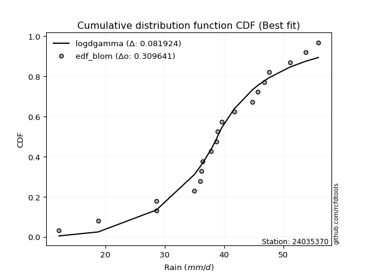</img></img>

</div>


### 7. EDF Tukey (1962)

In hydrology, the Tukey formula is used as a plotting position formula to estimate the empirical probability or frequency of a flood event (or other hydrological data). The formula parameter is given as _c=0.333_ (or 1/3).

<div align="center">


$P=(m-c)/(n+1-2c)$


</div>


**7.1. Empirical values**

<div align="center">

|                | 0                    | 1                   | 2                   | 3                  | 4                  | 5                   | 6                  | 7                   | 8                  | 9         | 10                 | 11                 | 12                 | 13                 | 14                 | 15                 | 16                 | 17                 | 18                 |
|:---------------|:---------------------|:--------------------|:--------------------|:-------------------|:-------------------|:--------------------|:-------------------|:--------------------|:-------------------|:----------|:-------------------|:-------------------|:-------------------|:-------------------|:-------------------|:-------------------|:-------------------|:-------------------|:-------------------|
| date           | 2024                 | 2006                | 2022                | 2007               | 2015               | 2021                | 2023               | 2014                | 2020               | 2008      | 2011               | 2009               | 2017               | 2018               | 2016               | 2010               | 2019               | 2013               | 2012               |
| x              | 12.2                 | 18.8                | 28.6                | 28.6               | 35.0               | 36.0                | 36.2               | 36.4                | 37.8               | 38.9      | 39.6               | 41.7               | 44.8               | 45.7               | 46.8               | 47.6               | 51.1               | 53.7               | 55.9               |
| m              | 1                    | 2                   | 3                   | 4                  | 5                  | 6                   | 7                  | 8                   | 9                  | 10        | 11                 | 12                 | 13                 | 14                 | 15                 | 16                 | 17                 | 18                 | 19                 |
| empirical_dist | edf_tukey            | edf_tukey           | edf_tukey           | edf_tukey          | edf_tukey          | edf_tukey           | edf_tukey          | edf_tukey           | edf_tukey          | edf_tukey | edf_tukey          | edf_tukey          | edf_tukey          | edf_tukey          | edf_tukey          | edf_tukey          | edf_tukey          | edf_tukey          | edf_tukey          |
| empirical      | 0.034482758620689655 | 0.08620689655172414 | 0.13793103448275862 | 0.1896551724137931 | 0.2413793103448276 | 0.29310344827586204 | 0.3448275862068966 | 0.39655172413793105 | 0.4482758620689655 | 0.5       | 0.5517241379310345 | 0.603448275862069  | 0.6551724137931034 | 0.7068965517241379 | 0.7586206896551724 | 0.8103448275862069 | 0.8620689655172413 | 0.9137931034482759 | 0.9655172413793104 |
| empirical_tr   | 1.0357142857142856   | 1.0943396226415094  | 1.1600000000000001  | 1.2340425531914894 | 1.3181818181818183 | 1.4146341463414636  | 1.5263157894736843 | 1.6571428571428573  | 1.8125             | 2.0       | 2.230769230769231  | 2.5217391304347827 | 2.9                | 3.4117647058823524 | 4.142857142857142  | 5.272727272727272  | 7.249999999999997  | 11.600000000000007 | 29.000000000000036 |

</div>


**7.2. Kolmogorov-Smirnov fit test (sorted by Δ)**


<div align="center">

|                | 0                   | 1                   | 2                   | 3                   | 4                   | 5                   | 6                   | 7                   | 8                   | 9                     | 10                  | 11                  | 12                  | 13                  | 14                  | 15                  | 16                  | 17                  | 18                  | 19                  | 20                  | 21                  | 22                  | 23                  | 24                  | 25                  | 26                  | 27                  | 28                  | 29                  | 30                  | 31                  | 32                  | 33                  | 34                  | 35                  | 36                  | 37                  | 38                  | 39                  | 40                  | 41                  | 42                  | 43                  | 44                  | 45                  | 46                  | 47                  | 48                  | 49                  | 50                  | 51                  | 52                  | 53                  | 54                  | 55                  | 56                  | 57                  | 58                  | 59                  | 60                  | 61                  | 62                  | 63                  | 64                  | 65                  | 66                  | 67                  | 68                  | 69                  | 70                  | 71                  | 72                  | 73                  | 74                  | 75                  | 76                  | 77                  | 78                  | 79                  | 80                  | 81                  | 82                  | 83                  | 84                  | 85                  | 86                  | 87                  |
|:---------------|:--------------------|:--------------------|:--------------------|:--------------------|:--------------------|:--------------------|:--------------------|:--------------------|:--------------------|:----------------------|:--------------------|:--------------------|:--------------------|:--------------------|:--------------------|:--------------------|:--------------------|:--------------------|:--------------------|:--------------------|:--------------------|:--------------------|:--------------------|:--------------------|:--------------------|:--------------------|:--------------------|:--------------------|:--------------------|:--------------------|:--------------------|:--------------------|:--------------------|:--------------------|:--------------------|:--------------------|:--------------------|:--------------------|:--------------------|:--------------------|:--------------------|:--------------------|:--------------------|:--------------------|:--------------------|:--------------------|:--------------------|:--------------------|:--------------------|:--------------------|:--------------------|:--------------------|:--------------------|:--------------------|:--------------------|:--------------------|:--------------------|:--------------------|:--------------------|:--------------------|:--------------------|:--------------------|:--------------------|:--------------------|:--------------------|:--------------------|:--------------------|:--------------------|:--------------------|:--------------------|:--------------------|:--------------------|:--------------------|:--------------------|:--------------------|:--------------------|:--------------------|:--------------------|:--------------------|:--------------------|:--------------------|:--------------------|:--------------------|:--------------------|:--------------------|:--------------------|:--------------------|:--------------------|
| station        | 24035370            | 24035370            | 24035370            | 24035370            | 24035370            | 24035370            | 24035370            | 24035370            | 24035370            | 24035370              | 24035370            | 24035370            | 24035370            | 24035370            | 24035370            | 24035370            | 24035370            | 24035370            | 24035370            | 24035370            | 24035370            | 24035370            | 24035370            | 24035370            | 24035370            | 24035370            | 24035370            | 24035370            | 24035370            | 24035370            | 24035370            | 24035370            | 24035370            | 24035370            | 24035370            | 24035370            | 24035370            | 24035370            | 24035370            | 24035370            | 24035370            | 24035370            | 24035370            | 24035370            | 24035370            | 24035370            | 24035370            | 24035370            | 24035370            | 24035370            | 24035370            | 24035370            | 24035370            | 24035370            | 24035370            | 24035370            | 24035370            | 24035370            | 24035370            | 24035370            | 24035370            | 24035370            | 24035370            | 24035370            | 24035370            | 24035370            | 24035370            | 24035370            | 24035370            | 24035370            | 24035370            | 24035370            | 24035370            | 24035370            | 24035370            | 24035370            | 24035370            | 24035370            | 24035370            | 24035370            | 24035370            | 24035370            | 24035370            | 24035370            | 24035370            | 24035370            | 24035370            | 24035370            |
| empirical_dist | edf_tukey           | edf_tukey           | edf_tukey           | edf_tukey           | edf_tukey           | edf_tukey           | edf_tukey           | edf_tukey           | edf_tukey           | edf_tukey             | edf_tukey           | edf_tukey           | edf_tukey           | edf_tukey           | edf_tukey           | edf_tukey           | edf_tukey           | edf_tukey           | edf_tukey           | edf_tukey           | edf_tukey           | edf_tukey           | edf_tukey           | edf_tukey           | edf_tukey           | edf_tukey           | edf_tukey           | edf_tukey           | edf_tukey           | edf_tukey           | edf_tukey           | edf_tukey           | edf_tukey           | edf_tukey           | edf_tukey           | edf_tukey           | edf_tukey           | edf_tukey           | edf_tukey           | edf_tukey           | edf_tukey           | edf_tukey           | edf_tukey           | edf_tukey           | edf_tukey           | edf_tukey           | edf_tukey           | edf_tukey           | edf_tukey           | edf_tukey           | edf_tukey           | edf_tukey           | edf_tukey           | edf_tukey           | edf_tukey           | edf_tukey           | edf_tukey           | edf_tukey           | edf_tukey           | edf_tukey           | edf_tukey           | edf_tukey           | edf_tukey           | edf_tukey           | edf_tukey           | edf_tukey           | edf_tukey           | edf_tukey           | edf_tukey           | edf_tukey           | edf_tukey           | edf_tukey           | edf_tukey           | edf_tukey           | edf_tukey           | edf_tukey           | edf_tukey           | edf_tukey           | edf_tukey           | edf_tukey           | edf_tukey           | edf_tukey           | edf_tukey           | edf_tukey           | edf_tukey           | edf_tukey           | edf_tukey           | edf_tukey           |
| p_dist         | genlogistic         | johnsonsu           | weibull_min         | fisk                | logt                | gumbel_l            | pearson3            | logjohnsonsu        | logmielke           | loglaplace_asymmetric | mielke              | gompertz            | loggenlogistic      | logloggamma         | hypsecant           | logpearson3         | laplace_asymmetric  | logistic            | logweibull_min      | logfisk             | laplace             | nakagami            | t                   | exponnorm           | norm                | crystalball         | truncnorm           | nct                 | f                   | fatiguelife         | chi2                | betaprime           | loggumbel_l         | erlang              | gamma               | alpha               | invgamma            | maxwell             | ncf                 | rayleigh            | invgauss            | loglaplace          | gumbel_r            | loghypsecant        | invweibull          | moyal               | loglogistic         | halfnorm            | logexponnorm        | lognorm             | lognorm             | logcrystalball      | loglognorm          | logrice             | lognakagami         | logf                | logfatiguelife      | lognct              | logerlang           | halflogistic        | logbetaprime        | loginvgamma         | logncf              | kstwobign           | loginvgauss         | loggamma            | loggamma            | logalpha            | logmaxwell          | loginvweibull       | gibrat              | lograyleigh         | wald                | loggumbel_r         | loghalfnorm         | logkstwobign        | logmoyal            | loghalflogistic     | loggenexpon         | expon               | genexpon            | logtruncnorm        | loggompertz         | logwald             | loggibrat           | logexpon            | logchi2             | rice                |
| delta          | 0.07382935292121923 | 0.07756447910163947 | 0.07967375993327327 | 0.08274898883723611 | 0.08557978348872534 | 0.08758268023559124 | 0.08873965287009275 | 0.089267511596439   | 0.09021052610789074 | 0.0909698329547046    | 0.09202628507635044 | 0.09218311897102746 | 0.09225016072845962 | 0.09586057416688906 | 0.0959919118534662  | 0.10387815232804407 | 0.10483892189194532 | 0.10898654992468568 | 0.11130148353174754 | 0.11560583289177326 | 0.11832768658444615 | 0.12450157999353964 | 0.12539470441384773 | 0.12539493810045574 | 0.12539541912365434 | 0.1253954258051009  | 0.1253954494438155  | 0.12578174369831593 | 0.12581868549547706 | 0.12628950692848376 | 0.13542215245035502 | 0.13655124200050253 | 0.13684715443134762 | 0.1398811621502701  | 0.14286970077825742 | 0.14453325736844894 | 0.15570061680816802 | 0.15823994570256808 | 0.16932681731581498 | 0.17046298563174037 | 0.1716535396662716  | 0.17459878616302496 | 0.17806923015525902 | 0.19402354373697497 | 0.19785477251951275 | 0.19796336453593524 | 0.19990343189823775 | 0.20522787327220834 | 0.206867123207527   | 0.20686817469183813 | 0.20686817469183813 | 0.20686830942547144 | 0.20686929405364632 | 0.2068711105021868  | 0.20710155333169897 | 0.20851931190894493 | 0.20957915297895488 | 0.21002000991112027 | 0.211213763776568   | 0.21606285018747776 | 0.21734459262769576 | 0.2203053774354701  | 0.22100825893474454 | 0.22522919695780294 | 0.22590400488663895 | 0.22609722982116157 | 0.22609722982116157 | 0.23184194735831506 | 0.24120441417937014 | 0.24733639992910747 | 0.24902008071475784 | 0.25312065266054184 | 0.25417538656212685 | 0.2737147055244441  | 0.2867676582913561  | 0.2887838346097622  | 0.299022549705243   | 0.3076973992684017  | 0.3278901696316556  | 0.33554598683041603 | 0.33559158895438146 | 0.3357354961952147  | 0.36666606871841667 | 0.3693271433129729  | 0.3815099847044512  | 0.4009089455995048  | 0.4661465326813247  | 0.8620689100915273  |
| deltao         | 0.31564497164100014 | 0.31564497164100014 | 0.31564497164100014 | 0.31564497164100014 | 0.31564497164100014 | 0.31564497164100014 | 0.31564497164100014 | 0.31564497164100014 | 0.31564497164100014 | 0.31564497164100014   | 0.31564497164100014 | 0.31564497164100014 | 0.31564497164100014 | 0.31564497164100014 | 0.31564497164100014 | 0.31564497164100014 | 0.31564497164100014 | 0.31564497164100014 | 0.31564497164100014 | 0.31564497164100014 | 0.31564497164100014 | 0.31564497164100014 | 0.31564497164100014 | 0.31564497164100014 | 0.31564497164100014 | 0.31564497164100014 | 0.31564497164100014 | 0.31564497164100014 | 0.31564497164100014 | 0.31564497164100014 | 0.31564497164100014 | 0.31564497164100014 | 0.31564497164100014 | 0.31564497164100014 | 0.31564497164100014 | 0.31564497164100014 | 0.31564497164100014 | 0.31564497164100014 | 0.31564497164100014 | 0.31564497164100014 | 0.31564497164100014 | 0.31564497164100014 | 0.31564497164100014 | 0.31564497164100014 | 0.31564497164100014 | 0.31564497164100014 | 0.31564497164100014 | 0.31564497164100014 | 0.31564497164100014 | 0.31564497164100014 | 0.31564497164100014 | 0.31564497164100014 | 0.31564497164100014 | 0.31564497164100014 | 0.31564497164100014 | 0.31564497164100014 | 0.31564497164100014 | 0.31564497164100014 | 0.31564497164100014 | 0.31564497164100014 | 0.31564497164100014 | 0.31564497164100014 | 0.31564497164100014 | 0.31564497164100014 | 0.31564497164100014 | 0.31564497164100014 | 0.31564497164100014 | 0.31564497164100014 | 0.31564497164100014 | 0.31564497164100014 | 0.31564497164100014 | 0.31564497164100014 | 0.31564497164100014 | 0.31564497164100014 | 0.31564497164100014 | 0.31564497164100014 | 0.31564497164100014 | 0.31564497164100014 | 0.31564497164100014 | 0.31564497164100014 | 0.31564497164100014 | 0.31564497164100014 | 0.31564497164100014 | 0.31564497164100014 | 0.31564497164100014 | 0.31564497164100014 | 0.31564497164100014 | 0.31564497164100014 |
| eval           | Δo > Δ              | Δo > Δ              | Δo > Δ              | Δo > Δ              | Δo > Δ              | Δo > Δ              | Δo > Δ              | Δo > Δ              | Δo > Δ              | Δo > Δ                | Δo > Δ              | Δo > Δ              | Δo > Δ              | Δo > Δ              | Δo > Δ              | Δo > Δ              | Δo > Δ              | Δo > Δ              | Δo > Δ              | Δo > Δ              | Δo > Δ              | Δo > Δ              | Δo > Δ              | Δo > Δ              | Δo > Δ              | Δo > Δ              | Δo > Δ              | Δo > Δ              | Δo > Δ              | Δo > Δ              | Δo > Δ              | Δo > Δ              | Δo > Δ              | Δo > Δ              | Δo > Δ              | Δo > Δ              | Δo > Δ              | Δo > Δ              | Δo > Δ              | Δo > Δ              | Δo > Δ              | Δo > Δ              | Δo > Δ              | Δo > Δ              | Δo > Δ              | Δo > Δ              | Δo > Δ              | Δo > Δ              | Δo > Δ              | Δo > Δ              | Δo > Δ              | Δo > Δ              | Δo > Δ              | Δo > Δ              | Δo > Δ              | Δo > Δ              | Δo > Δ              | Δo > Δ              | Δo > Δ              | Δo > Δ              | Δo > Δ              | Δo > Δ              | Δo > Δ              | Δo > Δ              | Δo > Δ              | Δo > Δ              | Δo > Δ              | Δo > Δ              | Δo > Δ              | Δo > Δ              | Δo > Δ              | Δo > Δ              | Δo > Δ              | Δo > Δ              | Δo > Δ              | Δo > Δ              | Δo > Δ              | Δo > Δ              | Δo <= Δ             | Δo <= Δ             | Δo <= Δ             | Δo <= Δ             | Δo <= Δ             | Δo <= Δ             | Δo <= Δ             | Δo <= Δ             | Δo <= Δ             | Δo <= Δ             |
| fit            | 1                   | 1                   | 1                   | 1                   | 1                   | 1                   | 1                   | 1                   | 1                   | 1                     | 1                   | 1                   | 1                   | 1                   | 1                   | 1                   | 1                   | 1                   | 1                   | 1                   | 1                   | 1                   | 1                   | 1                   | 1                   | 1                   | 1                   | 1                   | 1                   | 1                   | 1                   | 1                   | 1                   | 1                   | 1                   | 1                   | 1                   | 1                   | 1                   | 1                   | 1                   | 1                   | 1                   | 1                   | 1                   | 1                   | 1                   | 1                   | 1                   | 1                   | 1                   | 1                   | 1                   | 1                   | 1                   | 1                   | 1                   | 1                   | 1                   | 1                   | 1                   | 1                   | 1                   | 1                   | 1                   | 1                   | 1                   | 1                   | 1                   | 1                   | 1                   | 1                   | 1                   | 1                   | 1                   | 1                   | 1                   | 1                   | 0                   | 0                   | 0                   | 0                   | 0                   | 0                   | 0                   | 0                   | 0                   | 0                   |
| n              | 19                  | 19                  | 19                  | 19                  | 19                  | 19                  | 19                  | 19                  | 19                  | 19                    | 19                  | 19                  | 19                  | 19                  | 19                  | 19                  | 19                  | 19                  | 19                  | 19                  | 19                  | 19                  | 19                  | 19                  | 19                  | 19                  | 19                  | 19                  | 19                  | 19                  | 19                  | 19                  | 19                  | 19                  | 19                  | 19                  | 19                  | 19                  | 19                  | 19                  | 19                  | 19                  | 19                  | 19                  | 19                  | 19                  | 19                  | 19                  | 19                  | 19                  | 19                  | 19                  | 19                  | 19                  | 19                  | 19                  | 19                  | 19                  | 19                  | 19                  | 19                  | 19                  | 19                  | 19                  | 19                  | 19                  | 19                  | 19                  | 19                  | 19                  | 19                  | 19                  | 19                  | 19                  | 19                  | 19                  | 19                  | 19                  | 19                  | 19                  | 19                  | 19                  | 19                  | 19                  | 19                  | 19                  | 19                  | 19                  |
| best_fit       | 1                   | 0                   | 0                   | 0                   | 0                   | 0                   | 0                   | 0                   | 0                   | 0                     | 0                   | 0                   | 0                   | 0                   | 0                   | 0                   | 0                   | 0                   | 0                   | 0                   | 0                   | 0                   | 0                   | 0                   | 0                   | 0                   | 0                   | 0                   | 0                   | 0                   | 0                   | 0                   | 0                   | 0                   | 0                   | 0                   | 0                   | 0                   | 0                   | 0                   | 0                   | 0                   | 0                   | 0                   | 0                   | 0                   | 0                   | 0                   | 0                   | 0                   | 0                   | 0                   | 0                   | 0                   | 0                   | 0                   | 0                   | 0                   | 0                   | 0                   | 0                   | 0                   | 0                   | 0                   | 0                   | 0                   | 0                   | 0                   | 0                   | 0                   | 0                   | 0                   | 0                   | 0                   | 0                   | 0                   | 0                   | 0                   | 0                   | 0                   | 0                   | 0                   | 0                   | 0                   | 0                   | 0                   | 0                   | 0                   |
| best_fit_sort  | 1                   | 2                   | 3                   | 4                   | 5                   | 6                   | 7                   | 8                   | 9                   | 10                    | 11                  | 12                  | 13                  | 14                  | 15                  | 16                  | 17                  | 18                  | 19                  | 20                  | 21                  | 22                  | 23                  | 24                  | 25                  | 26                  | 27                  | 28                  | 29                  | 30                  | 31                  | 32                  | 33                  | 34                  | 35                  | 36                  | 37                  | 38                  | 39                  | 40                  | 41                  | 42                  | 43                  | 44                  | 45                  | 46                  | 47                  | 48                  | 49                  | 50                  | 51                  | 52                  | 53                  | 54                  | 55                  | 56                  | 57                  | 58                  | 59                  | 60                  | 61                  | 62                  | 63                  | 64                  | 65                  | 66                  | 67                  | 68                  | 69                  | 70                  | 71                  | 72                  | 73                  | 74                  | 75                  | 76                  | 77                  | 78                  | 79                  | 80                  | 81                  | 82                  | 83                  | 84                  | 85                  | 86                  | 87                  | 88                  |

</div>


**7.3. Best fit**

<div align="center">

|   id |   station | empirical_dist   | p_dist      |     delta |   deltao | eval   |   fit |   n |   best_fit |   best_fit_sort |
|-----:|----------:|:-----------------|:------------|----------:|---------:|:-------|------:|----:|-----------:|----------------:|
|    0 |  24035370 | edf_tukey        | genlogistic | 0.0738294 | 0.315645 | Δo > Δ |     1 |  19 |          1 |               1 |

</div>


<div align="center">

</img></img>

</div>


### 8. EDF Gringorten (1963)

Gringorten plotting position formula is essential for estimating the probability and return periods of extreme events like floods and heavy rainfall. The constant _a=0.44_.

<div align="center">


$P=(m-a)/(n+1-2a)$


</div>


**8.1. Empirical values**

<div align="center">

|                | 0                    | 1                   | 2                   | 3                   | 4                   | 5                   | 6                  | 7                  | 8                  | 9              | 10                 | 11                | 12                 | 13                 | 14                 | 15                 | 16                 | 17                 | 18                 |
|:---------------|:---------------------|:--------------------|:--------------------|:--------------------|:--------------------|:--------------------|:-------------------|:-------------------|:-------------------|:---------------|:-------------------|:------------------|:-------------------|:-------------------|:-------------------|:-------------------|:-------------------|:-------------------|:-------------------|
| date           | 2024                 | 2006                | 2022                | 2007                | 2015                | 2021                | 2023               | 2014               | 2020               | 2008           | 2011               | 2009              | 2017               | 2018               | 2016               | 2010               | 2019               | 2013               | 2012               |
| x              | 12.2                 | 18.8                | 28.6                | 28.6                | 35.0                | 36.0                | 36.2               | 36.4               | 37.8               | 38.9           | 39.6               | 41.7              | 44.8               | 45.7               | 46.8               | 47.6               | 51.1               | 53.7               | 55.9               |
| m              | 1                    | 2                   | 3                   | 4                   | 5                   | 6                   | 7                  | 8                  | 9                  | 10             | 11                 | 12                | 13                 | 14                 | 15                 | 16                 | 17                 | 18                 | 19                 |
| empirical_dist | edf_gringorten       | edf_gringorten      | edf_gringorten      | edf_gringorten      | edf_gringorten      | edf_gringorten      | edf_gringorten     | edf_gringorten     | edf_gringorten     | edf_gringorten | edf_gringorten     | edf_gringorten    | edf_gringorten     | edf_gringorten     | edf_gringorten     | edf_gringorten     | edf_gringorten     | edf_gringorten     | edf_gringorten     |
| empirical      | 0.029288702928870293 | 0.08158995815899582 | 0.13389121338912133 | 0.18619246861924685 | 0.23849372384937234 | 0.29079497907949786 | 0.3430962343096234 | 0.3953974895397489 | 0.4476987447698745 | 0.5            | 0.5523012552301255 | 0.604602510460251 | 0.6569037656903766 | 0.7092050209205021 | 0.7615062761506276 | 0.8138075313807531 | 0.8661087866108785 | 0.918410041841004  | 0.9707112970711296 |
| empirical_tr   | 1.0301724137931034   | 1.0888382687927107  | 1.1545893719806763  | 1.2287917737789202  | 1.313186813186813   | 1.4100294985250739  | 1.522292993630573  | 1.6539792387543253 | 1.8106060606060606 | 2.0            | 2.2336448598130842 | 2.529100529100529 | 2.9146341463414633 | 3.4388489208633093 | 4.192982456140351  | 5.370786516853932  | 7.468749999999993  | 12.256410256410238 | 34.14285714285699  |

</div>


**8.2. Kolmogorov-Smirnov fit test (sorted by Δ)**


<div align="center">

|                | 0                   | 1                   | 2                   | 3                   | 4                   | 5                   | 6                   | 7                   | 8                   | 9                     | 10                  | 11                  | 12                  | 13                  | 14                  | 15                  | 16                  | 17                  | 18                  | 19                  | 20                  | 21                  | 22                  | 23                  | 24                  | 25                  | 26                  | 27                  | 28                  | 29                  | 30                  | 31                  | 32                  | 33                  | 34                  | 35                  | 36                  | 37                  | 38                  | 39                  | 40                  | 41                  | 42                  | 43                  | 44                  | 45                  | 46                  | 47                  | 48                  | 49                  | 50                  | 51                  | 52                  | 53                  | 54                  | 55                  | 56                  | 57                  | 58                  | 59                  | 60                  | 61                  | 62                  | 63                  | 64                  | 65                  | 66                  | 67                  | 68                  | 69                  | 70                  | 71                  | 72                  | 73                  | 74                  | 75                  | 76                  | 77                  | 78                  | 79                  | 80                  | 81                  | 82                  | 83                  | 84                  | 85                  | 86                  | 87                  |
|:---------------|:--------------------|:--------------------|:--------------------|:--------------------|:--------------------|:--------------------|:--------------------|:--------------------|:--------------------|:----------------------|:--------------------|:--------------------|:--------------------|:--------------------|:--------------------|:--------------------|:--------------------|:--------------------|:--------------------|:--------------------|:--------------------|:--------------------|:--------------------|:--------------------|:--------------------|:--------------------|:--------------------|:--------------------|:--------------------|:--------------------|:--------------------|:--------------------|:--------------------|:--------------------|:--------------------|:--------------------|:--------------------|:--------------------|:--------------------|:--------------------|:--------------------|:--------------------|:--------------------|:--------------------|:--------------------|:--------------------|:--------------------|:--------------------|:--------------------|:--------------------|:--------------------|:--------------------|:--------------------|:--------------------|:--------------------|:--------------------|:--------------------|:--------------------|:--------------------|:--------------------|:--------------------|:--------------------|:--------------------|:--------------------|:--------------------|:--------------------|:--------------------|:--------------------|:--------------------|:--------------------|:--------------------|:--------------------|:--------------------|:--------------------|:--------------------|:--------------------|:--------------------|:--------------------|:--------------------|:--------------------|:--------------------|:--------------------|:--------------------|:--------------------|:--------------------|:--------------------|:--------------------|:--------------------|
| station        | 24035370            | 24035370            | 24035370            | 24035370            | 24035370            | 24035370            | 24035370            | 24035370            | 24035370            | 24035370              | 24035370            | 24035370            | 24035370            | 24035370            | 24035370            | 24035370            | 24035370            | 24035370            | 24035370            | 24035370            | 24035370            | 24035370            | 24035370            | 24035370            | 24035370            | 24035370            | 24035370            | 24035370            | 24035370            | 24035370            | 24035370            | 24035370            | 24035370            | 24035370            | 24035370            | 24035370            | 24035370            | 24035370            | 24035370            | 24035370            | 24035370            | 24035370            | 24035370            | 24035370            | 24035370            | 24035370            | 24035370            | 24035370            | 24035370            | 24035370            | 24035370            | 24035370            | 24035370            | 24035370            | 24035370            | 24035370            | 24035370            | 24035370            | 24035370            | 24035370            | 24035370            | 24035370            | 24035370            | 24035370            | 24035370            | 24035370            | 24035370            | 24035370            | 24035370            | 24035370            | 24035370            | 24035370            | 24035370            | 24035370            | 24035370            | 24035370            | 24035370            | 24035370            | 24035370            | 24035370            | 24035370            | 24035370            | 24035370            | 24035370            | 24035370            | 24035370            | 24035370            | 24035370            |
| empirical_dist | edf_gringorten      | edf_gringorten      | edf_gringorten      | edf_gringorten      | edf_gringorten      | edf_gringorten      | edf_gringorten      | edf_gringorten      | edf_gringorten      | edf_gringorten        | edf_gringorten      | edf_gringorten      | edf_gringorten      | edf_gringorten      | edf_gringorten      | edf_gringorten      | edf_gringorten      | edf_gringorten      | edf_gringorten      | edf_gringorten      | edf_gringorten      | edf_gringorten      | edf_gringorten      | edf_gringorten      | edf_gringorten      | edf_gringorten      | edf_gringorten      | edf_gringorten      | edf_gringorten      | edf_gringorten      | edf_gringorten      | edf_gringorten      | edf_gringorten      | edf_gringorten      | edf_gringorten      | edf_gringorten      | edf_gringorten      | edf_gringorten      | edf_gringorten      | edf_gringorten      | edf_gringorten      | edf_gringorten      | edf_gringorten      | edf_gringorten      | edf_gringorten      | edf_gringorten      | edf_gringorten      | edf_gringorten      | edf_gringorten      | edf_gringorten      | edf_gringorten      | edf_gringorten      | edf_gringorten      | edf_gringorten      | edf_gringorten      | edf_gringorten      | edf_gringorten      | edf_gringorten      | edf_gringorten      | edf_gringorten      | edf_gringorten      | edf_gringorten      | edf_gringorten      | edf_gringorten      | edf_gringorten      | edf_gringorten      | edf_gringorten      | edf_gringorten      | edf_gringorten      | edf_gringorten      | edf_gringorten      | edf_gringorten      | edf_gringorten      | edf_gringorten      | edf_gringorten      | edf_gringorten      | edf_gringorten      | edf_gringorten      | edf_gringorten      | edf_gringorten      | edf_gringorten      | edf_gringorten      | edf_gringorten      | edf_gringorten      | edf_gringorten      | edf_gringorten      | edf_gringorten      | edf_gringorten      |
| p_dist         | genlogistic         | johnsonsu           | logt                | weibull_min         | fisk                | gumbel_l            | pearson3            | logjohnsonsu        | logmielke           | loglaplace_asymmetric | mielke              | gompertz            | loggenlogistic      | logloggamma         | hypsecant           | laplace_asymmetric  | logpearson3         | logistic            | logweibull_min      | laplace             | logfisk             | nakagami            | t                   | exponnorm           | norm                | crystalball         | truncnorm           | nct                 | f                   | fatiguelife         | chi2                | betaprime           | loggumbel_l         | erlang              | gamma               | alpha               | invgamma            | maxwell             | ncf                 | rayleigh            | invgauss            | loglaplace          | gumbel_r            | loghypsecant        | invweibull          | moyal               | loglogistic         | halfnorm            | logexponnorm        | lognorm             | lognorm             | logcrystalball      | loglognorm          | logrice             | lognakagami         | logf                | logfatiguelife      | lognct              | logerlang           | halflogistic        | logbetaprime        | loginvgamma         | logncf              | kstwobign           | loginvgauss         | loggamma            | loggamma            | logalpha            | logmaxwell          | loginvweibull       | gibrat              | lograyleigh         | wald                | loggumbel_r         | loghalfnorm         | logkstwobign        | logmoyal            | loghalflogistic     | loggenexpon         | expon               | genexpon            | logtruncnorm        | loggompertz         | logwald             | loggibrat           | logexpon            | logchi2             | rice                |
| delta          | 0.07440647022031027 | 0.08045006559709472 | 0.0821170796941791  | 0.08255934642872853 | 0.08563457533269137 | 0.08815979753468228 | 0.091625239365548   | 0.09215309809189426 | 0.09309611260334599 | 0.09385541945015985   | 0.0949118715718057  | 0.09506870546648272 | 0.09513574722391488 | 0.09874616066234432 | 0.09887749834892146 | 0.10310756999467219 | 0.10676373882349932 | 0.11187213642014093 | 0.1141870700272028  | 0.11659633468717301 | 0.11849141938722851 | 0.1273871664889949  | 0.12828029090930299 | 0.128280524595911   | 0.1282810056191096  | 0.12828101230055616 | 0.12828103593927076 | 0.1286673301937712  | 0.12870427199093232 | 0.129175093423939   | 0.13830773894581028 | 0.1394368284959578  | 0.13973274092680288 | 0.14276674864572536 | 0.14575528727371267 | 0.1474188438639042  | 0.15858620330362327 | 0.16112553219802334 | 0.17221240381127023 | 0.17334857212719562 | 0.17453912616172684 | 0.17748437265848022 | 0.18095481665071428 | 0.19690913023243023 | 0.200740359014968   | 0.2008489510313905  | 0.202789018393693   | 0.2081134597676636  | 0.20975270970298227 | 0.20975376118729339 | 0.20975376118729339 | 0.2097538959209267  | 0.20975488054910157 | 0.20975669699764204 | 0.20998713982715422 | 0.2114048984044002  | 0.21246473947441014 | 0.21290559640657553 | 0.21409935027202326 | 0.218948436682933   | 0.22023017912315102 | 0.22319096393092536 | 0.2238938454301998  | 0.2281147834532582  | 0.2287895913820942  | 0.22898281631661682 | 0.22898281631661682 | 0.23472753385377032 | 0.2440900006748254  | 0.2502219864245627  | 0.251328549911122   | 0.25600623915599713 | 0.25648385575849103 | 0.2766002920198994  | 0.28965324478681137 | 0.2916694211052175  | 0.3019081362006983  | 0.31058298576385696 | 0.3307757561271109  | 0.3384315733258713  | 0.33847717544983674 | 0.33862108269067    | 0.36955165521387195 | 0.3722127298084282  | 0.38439557119990647 | 0.40494876669314206 | 0.470186353774962   | 0.8661087311851646  |
| deltao         | 0.31564497164100014 | 0.31564497164100014 | 0.31564497164100014 | 0.31564497164100014 | 0.31564497164100014 | 0.31564497164100014 | 0.31564497164100014 | 0.31564497164100014 | 0.31564497164100014 | 0.31564497164100014   | 0.31564497164100014 | 0.31564497164100014 | 0.31564497164100014 | 0.31564497164100014 | 0.31564497164100014 | 0.31564497164100014 | 0.31564497164100014 | 0.31564497164100014 | 0.31564497164100014 | 0.31564497164100014 | 0.31564497164100014 | 0.31564497164100014 | 0.31564497164100014 | 0.31564497164100014 | 0.31564497164100014 | 0.31564497164100014 | 0.31564497164100014 | 0.31564497164100014 | 0.31564497164100014 | 0.31564497164100014 | 0.31564497164100014 | 0.31564497164100014 | 0.31564497164100014 | 0.31564497164100014 | 0.31564497164100014 | 0.31564497164100014 | 0.31564497164100014 | 0.31564497164100014 | 0.31564497164100014 | 0.31564497164100014 | 0.31564497164100014 | 0.31564497164100014 | 0.31564497164100014 | 0.31564497164100014 | 0.31564497164100014 | 0.31564497164100014 | 0.31564497164100014 | 0.31564497164100014 | 0.31564497164100014 | 0.31564497164100014 | 0.31564497164100014 | 0.31564497164100014 | 0.31564497164100014 | 0.31564497164100014 | 0.31564497164100014 | 0.31564497164100014 | 0.31564497164100014 | 0.31564497164100014 | 0.31564497164100014 | 0.31564497164100014 | 0.31564497164100014 | 0.31564497164100014 | 0.31564497164100014 | 0.31564497164100014 | 0.31564497164100014 | 0.31564497164100014 | 0.31564497164100014 | 0.31564497164100014 | 0.31564497164100014 | 0.31564497164100014 | 0.31564497164100014 | 0.31564497164100014 | 0.31564497164100014 | 0.31564497164100014 | 0.31564497164100014 | 0.31564497164100014 | 0.31564497164100014 | 0.31564497164100014 | 0.31564497164100014 | 0.31564497164100014 | 0.31564497164100014 | 0.31564497164100014 | 0.31564497164100014 | 0.31564497164100014 | 0.31564497164100014 | 0.31564497164100014 | 0.31564497164100014 | 0.31564497164100014 |
| eval           | Δo > Δ              | Δo > Δ              | Δo > Δ              | Δo > Δ              | Δo > Δ              | Δo > Δ              | Δo > Δ              | Δo > Δ              | Δo > Δ              | Δo > Δ                | Δo > Δ              | Δo > Δ              | Δo > Δ              | Δo > Δ              | Δo > Δ              | Δo > Δ              | Δo > Δ              | Δo > Δ              | Δo > Δ              | Δo > Δ              | Δo > Δ              | Δo > Δ              | Δo > Δ              | Δo > Δ              | Δo > Δ              | Δo > Δ              | Δo > Δ              | Δo > Δ              | Δo > Δ              | Δo > Δ              | Δo > Δ              | Δo > Δ              | Δo > Δ              | Δo > Δ              | Δo > Δ              | Δo > Δ              | Δo > Δ              | Δo > Δ              | Δo > Δ              | Δo > Δ              | Δo > Δ              | Δo > Δ              | Δo > Δ              | Δo > Δ              | Δo > Δ              | Δo > Δ              | Δo > Δ              | Δo > Δ              | Δo > Δ              | Δo > Δ              | Δo > Δ              | Δo > Δ              | Δo > Δ              | Δo > Δ              | Δo > Δ              | Δo > Δ              | Δo > Δ              | Δo > Δ              | Δo > Δ              | Δo > Δ              | Δo > Δ              | Δo > Δ              | Δo > Δ              | Δo > Δ              | Δo > Δ              | Δo > Δ              | Δo > Δ              | Δo > Δ              | Δo > Δ              | Δo > Δ              | Δo > Δ              | Δo > Δ              | Δo > Δ              | Δo > Δ              | Δo > Δ              | Δo > Δ              | Δo > Δ              | Δo > Δ              | Δo <= Δ             | Δo <= Δ             | Δo <= Δ             | Δo <= Δ             | Δo <= Δ             | Δo <= Δ             | Δo <= Δ             | Δo <= Δ             | Δo <= Δ             | Δo <= Δ             |
| fit            | 1                   | 1                   | 1                   | 1                   | 1                   | 1                   | 1                   | 1                   | 1                   | 1                     | 1                   | 1                   | 1                   | 1                   | 1                   | 1                   | 1                   | 1                   | 1                   | 1                   | 1                   | 1                   | 1                   | 1                   | 1                   | 1                   | 1                   | 1                   | 1                   | 1                   | 1                   | 1                   | 1                   | 1                   | 1                   | 1                   | 1                   | 1                   | 1                   | 1                   | 1                   | 1                   | 1                   | 1                   | 1                   | 1                   | 1                   | 1                   | 1                   | 1                   | 1                   | 1                   | 1                   | 1                   | 1                   | 1                   | 1                   | 1                   | 1                   | 1                   | 1                   | 1                   | 1                   | 1                   | 1                   | 1                   | 1                   | 1                   | 1                   | 1                   | 1                   | 1                   | 1                   | 1                   | 1                   | 1                   | 1                   | 1                   | 0                   | 0                   | 0                   | 0                   | 0                   | 0                   | 0                   | 0                   | 0                   | 0                   |
| n              | 19                  | 19                  | 19                  | 19                  | 19                  | 19                  | 19                  | 19                  | 19                  | 19                    | 19                  | 19                  | 19                  | 19                  | 19                  | 19                  | 19                  | 19                  | 19                  | 19                  | 19                  | 19                  | 19                  | 19                  | 19                  | 19                  | 19                  | 19                  | 19                  | 19                  | 19                  | 19                  | 19                  | 19                  | 19                  | 19                  | 19                  | 19                  | 19                  | 19                  | 19                  | 19                  | 19                  | 19                  | 19                  | 19                  | 19                  | 19                  | 19                  | 19                  | 19                  | 19                  | 19                  | 19                  | 19                  | 19                  | 19                  | 19                  | 19                  | 19                  | 19                  | 19                  | 19                  | 19                  | 19                  | 19                  | 19                  | 19                  | 19                  | 19                  | 19                  | 19                  | 19                  | 19                  | 19                  | 19                  | 19                  | 19                  | 19                  | 19                  | 19                  | 19                  | 19                  | 19                  | 19                  | 19                  | 19                  | 19                  |
| best_fit       | 1                   | 0                   | 0                   | 0                   | 0                   | 0                   | 0                   | 0                   | 0                   | 0                     | 0                   | 0                   | 0                   | 0                   | 0                   | 0                   | 0                   | 0                   | 0                   | 0                   | 0                   | 0                   | 0                   | 0                   | 0                   | 0                   | 0                   | 0                   | 0                   | 0                   | 0                   | 0                   | 0                   | 0                   | 0                   | 0                   | 0                   | 0                   | 0                   | 0                   | 0                   | 0                   | 0                   | 0                   | 0                   | 0                   | 0                   | 0                   | 0                   | 0                   | 0                   | 0                   | 0                   | 0                   | 0                   | 0                   | 0                   | 0                   | 0                   | 0                   | 0                   | 0                   | 0                   | 0                   | 0                   | 0                   | 0                   | 0                   | 0                   | 0                   | 0                   | 0                   | 0                   | 0                   | 0                   | 0                   | 0                   | 0                   | 0                   | 0                   | 0                   | 0                   | 0                   | 0                   | 0                   | 0                   | 0                   | 0                   |
| best_fit_sort  | 1                   | 2                   | 3                   | 4                   | 5                   | 6                   | 7                   | 8                   | 9                   | 10                    | 11                  | 12                  | 13                  | 14                  | 15                  | 16                  | 17                  | 18                  | 19                  | 20                  | 21                  | 22                  | 23                  | 24                  | 25                  | 26                  | 27                  | 28                  | 29                  | 30                  | 31                  | 32                  | 33                  | 34                  | 35                  | 36                  | 37                  | 38                  | 39                  | 40                  | 41                  | 42                  | 43                  | 44                  | 45                  | 46                  | 47                  | 48                  | 49                  | 50                  | 51                  | 52                  | 53                  | 54                  | 55                  | 56                  | 57                  | 58                  | 59                  | 60                  | 61                  | 62                  | 63                  | 64                  | 65                  | 66                  | 67                  | 68                  | 69                  | 70                  | 71                  | 72                  | 73                  | 74                  | 75                  | 76                  | 77                  | 78                  | 79                  | 80                  | 81                  | 82                  | 83                  | 84                  | 85                  | 86                  | 87                  | 88                  |

</div>


**8.3. Best fit**

<div align="center">

|   id |   station | empirical_dist   | p_dist      |     delta |   deltao | eval   |   fit |   n |   best_fit |   best_fit_sort |
|-----:|----------:|:-----------------|:------------|----------:|---------:|:-------|------:|----:|-----------:|----------------:|
|    0 |  24035370 | edf_gringorten   | genlogistic | 0.0744065 | 0.315645 | Δo > Δ |     1 |  19 |          1 |               1 |

</div>


<div align="center">

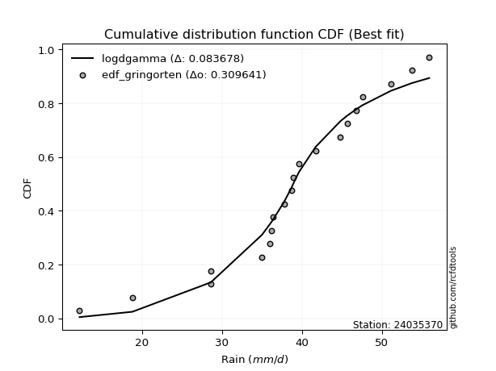</img>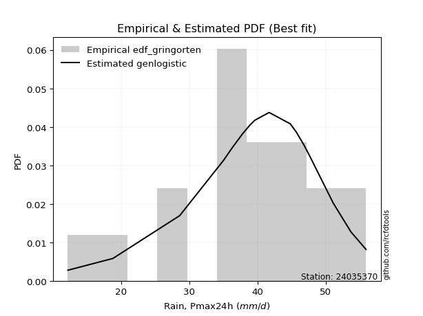</img>

</div>


### 9. EDF Filliben (1975)

The specific values of the constants (0.3175) (often denoted as $alpha$) and (0.365) are derived from a method proposed by James J. Filliben in a 1975 paper. This particular formula is the mean value of the $i$-th order statistic of the normal distribution and is considered a robust and effective plotting position formula for the normal probability plot correlation coefficient test for normality.

<div align="center">


$P=(m-0.3175)/(n+0.365)$


</div>


**9.1. Empirical values**

<div align="center">

|                | 0                   | 1                   | 2                  | 3                   | 4                   | 5                  | 6                  | 7                  | 8                  | 9            | 10                 | 11                 | 12                 | 13                 | 14                 | 15                 | 16                | 17                 | 18                 |
|:---------------|:--------------------|:--------------------|:-------------------|:--------------------|:--------------------|:-------------------|:-------------------|:-------------------|:-------------------|:-------------|:-------------------|:-------------------|:-------------------|:-------------------|:-------------------|:-------------------|:------------------|:-------------------|:-------------------|
| date           | 2024                | 2006                | 2022               | 2007                | 2015                | 2021               | 2023               | 2014               | 2020               | 2008         | 2011               | 2009               | 2017               | 2018               | 2016               | 2010               | 2019              | 2013               | 2012               |
| x              | 12.2                | 18.8                | 28.6               | 28.6                | 35.0                | 36.0               | 36.2               | 36.4               | 37.8               | 38.9         | 39.6               | 41.7               | 44.8               | 45.7               | 46.8               | 47.6               | 51.1              | 53.7               | 55.9               |
| m              | 1                   | 2                   | 3                  | 4                   | 5                   | 6                  | 7                  | 8                  | 9                  | 10           | 11                 | 12                 | 13                 | 14                 | 15                 | 16                 | 17                | 18                 | 19                 |
| empirical_dist | edf_filliben        | edf_filliben        | edf_filliben       | edf_filliben        | edf_filliben        | edf_filliben       | edf_filliben       | edf_filliben       | edf_filliben       | edf_filliben | edf_filliben       | edf_filliben       | edf_filliben       | edf_filliben       | edf_filliben       | edf_filliben       | edf_filliben      | edf_filliben       | edf_filliben       |
| empirical      | 0.03524399690162665 | 0.08688355280144593 | 0.1385231087012652 | 0.19016266460108444 | 0.24180222050090372 | 0.293441776400723  | 0.3450813323005423 | 0.3967208882003615 | 0.4483604441001807 | 0.5          | 0.5516395558998193 | 0.6032791117996386 | 0.6549186676994578 | 0.7065582235992771 | 0.7581977794990963 | 0.8098373353989156 | 0.861476891298735 | 0.9131164471985542 | 0.9647560030983735 |
| empirical_tr   | 1.0365315134484143  | 1.0951505726000283  | 1.1607972426195114 | 1.2348158775705405  | 1.3189170781542654  | 1.4153115293257812 | 1.5269071555292728 | 1.6576075326342818 | 1.8127779077931194 | 2.0          | 2.2303484019579614 | 2.5206638464041657 | 2.8978675645342316 | 3.407831060272768  | 4.135611318739989  | 5.258655804480651  | 7.219012115563846 | 11.509658246656779 | 28.373626373626497 |

</div>


**9.2. Kolmogorov-Smirnov fit test (sorted by Δ)**


<div align="center">

|                | 0                   | 1                   | 2                   | 3                   | 4                   | 5                   | 6                   | 7                   | 8                   | 9                     | 10                  | 11                  | 12                  | 13                  | 14                  | 15                  | 16                  | 17                  | 18                  | 19                  | 20                  | 21                  | 22                  | 23                  | 24                  | 25                  | 26                  | 27                  | 28                  | 29                  | 30                  | 31                  | 32                  | 33                  | 34                  | 35                  | 36                  | 37                  | 38                  | 39                  | 40                  | 41                  | 42                  | 43                  | 44                  | 45                  | 46                  | 47                  | 48                  | 49                  | 50                  | 51                  | 52                  | 53                  | 54                  | 55                  | 56                  | 57                  | 58                  | 59                  | 60                  | 61                  | 62                  | 63                  | 64                  | 65                  | 66                  | 67                  | 68                  | 69                  | 70                  | 71                  | 72                  | 73                  | 74                  | 75                  | 76                  | 77                  | 78                  | 79                  | 80                  | 81                  | 82                  | 83                  | 84                  | 85                  | 86                  | 87                  |
|:---------------|:--------------------|:--------------------|:--------------------|:--------------------|:--------------------|:--------------------|:--------------------|:--------------------|:--------------------|:----------------------|:--------------------|:--------------------|:--------------------|:--------------------|:--------------------|:--------------------|:--------------------|:--------------------|:--------------------|:--------------------|:--------------------|:--------------------|:--------------------|:--------------------|:--------------------|:--------------------|:--------------------|:--------------------|:--------------------|:--------------------|:--------------------|:--------------------|:--------------------|:--------------------|:--------------------|:--------------------|:--------------------|:--------------------|:--------------------|:--------------------|:--------------------|:--------------------|:--------------------|:--------------------|:--------------------|:--------------------|:--------------------|:--------------------|:--------------------|:--------------------|:--------------------|:--------------------|:--------------------|:--------------------|:--------------------|:--------------------|:--------------------|:--------------------|:--------------------|:--------------------|:--------------------|:--------------------|:--------------------|:--------------------|:--------------------|:--------------------|:--------------------|:--------------------|:--------------------|:--------------------|:--------------------|:--------------------|:--------------------|:--------------------|:--------------------|:--------------------|:--------------------|:--------------------|:--------------------|:--------------------|:--------------------|:--------------------|:--------------------|:--------------------|:--------------------|:--------------------|:--------------------|:--------------------|
| station        | 24035370            | 24035370            | 24035370            | 24035370            | 24035370            | 24035370            | 24035370            | 24035370            | 24035370            | 24035370              | 24035370            | 24035370            | 24035370            | 24035370            | 24035370            | 24035370            | 24035370            | 24035370            | 24035370            | 24035370            | 24035370            | 24035370            | 24035370            | 24035370            | 24035370            | 24035370            | 24035370            | 24035370            | 24035370            | 24035370            | 24035370            | 24035370            | 24035370            | 24035370            | 24035370            | 24035370            | 24035370            | 24035370            | 24035370            | 24035370            | 24035370            | 24035370            | 24035370            | 24035370            | 24035370            | 24035370            | 24035370            | 24035370            | 24035370            | 24035370            | 24035370            | 24035370            | 24035370            | 24035370            | 24035370            | 24035370            | 24035370            | 24035370            | 24035370            | 24035370            | 24035370            | 24035370            | 24035370            | 24035370            | 24035370            | 24035370            | 24035370            | 24035370            | 24035370            | 24035370            | 24035370            | 24035370            | 24035370            | 24035370            | 24035370            | 24035370            | 24035370            | 24035370            | 24035370            | 24035370            | 24035370            | 24035370            | 24035370            | 24035370            | 24035370            | 24035370            | 24035370            | 24035370            |
| empirical_dist | edf_filliben        | edf_filliben        | edf_filliben        | edf_filliben        | edf_filliben        | edf_filliben        | edf_filliben        | edf_filliben        | edf_filliben        | edf_filliben          | edf_filliben        | edf_filliben        | edf_filliben        | edf_filliben        | edf_filliben        | edf_filliben        | edf_filliben        | edf_filliben        | edf_filliben        | edf_filliben        | edf_filliben        | edf_filliben        | edf_filliben        | edf_filliben        | edf_filliben        | edf_filliben        | edf_filliben        | edf_filliben        | edf_filliben        | edf_filliben        | edf_filliben        | edf_filliben        | edf_filliben        | edf_filliben        | edf_filliben        | edf_filliben        | edf_filliben        | edf_filliben        | edf_filliben        | edf_filliben        | edf_filliben        | edf_filliben        | edf_filliben        | edf_filliben        | edf_filliben        | edf_filliben        | edf_filliben        | edf_filliben        | edf_filliben        | edf_filliben        | edf_filliben        | edf_filliben        | edf_filliben        | edf_filliben        | edf_filliben        | edf_filliben        | edf_filliben        | edf_filliben        | edf_filliben        | edf_filliben        | edf_filliben        | edf_filliben        | edf_filliben        | edf_filliben        | edf_filliben        | edf_filliben        | edf_filliben        | edf_filliben        | edf_filliben        | edf_filliben        | edf_filliben        | edf_filliben        | edf_filliben        | edf_filliben        | edf_filliben        | edf_filliben        | edf_filliben        | edf_filliben        | edf_filliben        | edf_filliben        | edf_filliben        | edf_filliben        | edf_filliben        | edf_filliben        | edf_filliben        | edf_filliben        | edf_filliben        | edf_filliben        |
| p_dist         | genlogistic         | johnsonsu           | weibull_min         | fisk                | logt                | gumbel_l            | pearson3            | logjohnsonsu        | logmielke           | loglaplace_asymmetric | mielke              | gompertz            | loggenlogistic      | logloggamma         | hypsecant           | logpearson3         | laplace_asymmetric  | logistic            | logweibull_min      | logfisk             | laplace             | nakagami            | t                   | exponnorm           | norm                | crystalball         | truncnorm           | nct                 | f                   | fatiguelife         | chi2                | betaprime           | loggumbel_l         | erlang              | gamma               | alpha               | invgamma            | maxwell             | ncf                 | rayleigh            | invgauss            | loglaplace          | gumbel_r            | loghypsecant        | invweibull          | moyal               | loglogistic         | halfnorm            | logexponnorm        | lognorm             | lognorm             | logcrystalball      | loglognorm          | logrice             | lognakagami         | logf                | logfatiguelife      | lognct              | logerlang           | halflogistic        | logbetaprime        | loginvgamma         | logncf              | kstwobign           | loginvgauss         | loggamma            | loggamma            | logalpha            | logmaxwell          | loginvweibull       | gibrat              | lograyleigh         | wald                | loggumbel_r         | loghalfnorm         | logkstwobign        | logmoyal            | loghalflogistic     | loggenexpon         | expon               | genexpon            | logtruncnorm        | loggompertz         | logwald             | loggibrat           | logexpon            | logchi2             | rice                |
| delta          | 0.07374477089000403 | 0.07714156894556334 | 0.07925084977719715 | 0.08232607868115999 | 0.08608727567601669 | 0.08749809820437604 | 0.08831674271401663 | 0.08884460144036288 | 0.08978761595181461 | 0.09054692279862847   | 0.09160337492027432 | 0.09176020881495134 | 0.0918272505723835  | 0.09543766401081294 | 0.09556900169739008 | 0.10345524217196794 | 0.10509266798559092 | 0.10856363976860955 | 0.11087857337567142 | 0.11518292273569714 | 0.11858143267809174 | 0.12407866983746352 | 0.1249717942577716  | 0.12497202794437962 | 0.12497250896757822 | 0.12497251564902478 | 0.12497253928773938 | 0.1253588335422398  | 0.12539577533940094 | 0.12586659677240764 | 0.1349992422942789  | 0.1361283318444264  | 0.1364242442752715  | 0.13945825199419398 | 0.1424467906221813  | 0.1441103472123728  | 0.1552777066520919  | 0.15781703554649196 | 0.16890390715973885 | 0.17004007547566424 | 0.17123062951019546 | 0.17417587600694884 | 0.1776463199991829  | 0.19360063358089885 | 0.19743186236343663 | 0.19754045437985912 | 0.19948052174216163 | 0.20480496311613222 | 0.2064442130514509  | 0.206445264535762   | 0.206445264535762   | 0.2064453992693953  | 0.2064463838975702  | 0.20644820034611067 | 0.20667864317562284 | 0.2080964017528688  | 0.20915624282287876 | 0.20959709975504415 | 0.21079085362049188 | 0.21563994003140163 | 0.21692168247161964 | 0.21988246727939398 | 0.22058534877866842 | 0.22480628680172682 | 0.22548109473056283 | 0.22567431966508544 | 0.22567431966508544 | 0.23141903720223894 | 0.240781504023294   | 0.24691348977303135 | 0.2486817525898969  | 0.25269774250446575 | 0.2538370584372659  | 0.273291795368368   | 0.28634474813528    | 0.2883609244536861  | 0.2985996395491669  | 0.3072744891123256  | 0.32746725947557953 | 0.33512307667433994 | 0.33516867879830536 | 0.3353125860391386  | 0.3662431585623406  | 0.3689042331568968  | 0.3810870745483751  | 0.40031687138099825 | 0.4655544584628182  | 0.8614768358730208  |
| deltao         | 0.31564497164100014 | 0.31564497164100014 | 0.31564497164100014 | 0.31564497164100014 | 0.31564497164100014 | 0.31564497164100014 | 0.31564497164100014 | 0.31564497164100014 | 0.31564497164100014 | 0.31564497164100014   | 0.31564497164100014 | 0.31564497164100014 | 0.31564497164100014 | 0.31564497164100014 | 0.31564497164100014 | 0.31564497164100014 | 0.31564497164100014 | 0.31564497164100014 | 0.31564497164100014 | 0.31564497164100014 | 0.31564497164100014 | 0.31564497164100014 | 0.31564497164100014 | 0.31564497164100014 | 0.31564497164100014 | 0.31564497164100014 | 0.31564497164100014 | 0.31564497164100014 | 0.31564497164100014 | 0.31564497164100014 | 0.31564497164100014 | 0.31564497164100014 | 0.31564497164100014 | 0.31564497164100014 | 0.31564497164100014 | 0.31564497164100014 | 0.31564497164100014 | 0.31564497164100014 | 0.31564497164100014 | 0.31564497164100014 | 0.31564497164100014 | 0.31564497164100014 | 0.31564497164100014 | 0.31564497164100014 | 0.31564497164100014 | 0.31564497164100014 | 0.31564497164100014 | 0.31564497164100014 | 0.31564497164100014 | 0.31564497164100014 | 0.31564497164100014 | 0.31564497164100014 | 0.31564497164100014 | 0.31564497164100014 | 0.31564497164100014 | 0.31564497164100014 | 0.31564497164100014 | 0.31564497164100014 | 0.31564497164100014 | 0.31564497164100014 | 0.31564497164100014 | 0.31564497164100014 | 0.31564497164100014 | 0.31564497164100014 | 0.31564497164100014 | 0.31564497164100014 | 0.31564497164100014 | 0.31564497164100014 | 0.31564497164100014 | 0.31564497164100014 | 0.31564497164100014 | 0.31564497164100014 | 0.31564497164100014 | 0.31564497164100014 | 0.31564497164100014 | 0.31564497164100014 | 0.31564497164100014 | 0.31564497164100014 | 0.31564497164100014 | 0.31564497164100014 | 0.31564497164100014 | 0.31564497164100014 | 0.31564497164100014 | 0.31564497164100014 | 0.31564497164100014 | 0.31564497164100014 | 0.31564497164100014 | 0.31564497164100014 |
| eval           | Δo > Δ              | Δo > Δ              | Δo > Δ              | Δo > Δ              | Δo > Δ              | Δo > Δ              | Δo > Δ              | Δo > Δ              | Δo > Δ              | Δo > Δ                | Δo > Δ              | Δo > Δ              | Δo > Δ              | Δo > Δ              | Δo > Δ              | Δo > Δ              | Δo > Δ              | Δo > Δ              | Δo > Δ              | Δo > Δ              | Δo > Δ              | Δo > Δ              | Δo > Δ              | Δo > Δ              | Δo > Δ              | Δo > Δ              | Δo > Δ              | Δo > Δ              | Δo > Δ              | Δo > Δ              | Δo > Δ              | Δo > Δ              | Δo > Δ              | Δo > Δ              | Δo > Δ              | Δo > Δ              | Δo > Δ              | Δo > Δ              | Δo > Δ              | Δo > Δ              | Δo > Δ              | Δo > Δ              | Δo > Δ              | Δo > Δ              | Δo > Δ              | Δo > Δ              | Δo > Δ              | Δo > Δ              | Δo > Δ              | Δo > Δ              | Δo > Δ              | Δo > Δ              | Δo > Δ              | Δo > Δ              | Δo > Δ              | Δo > Δ              | Δo > Δ              | Δo > Δ              | Δo > Δ              | Δo > Δ              | Δo > Δ              | Δo > Δ              | Δo > Δ              | Δo > Δ              | Δo > Δ              | Δo > Δ              | Δo > Δ              | Δo > Δ              | Δo > Δ              | Δo > Δ              | Δo > Δ              | Δo > Δ              | Δo > Δ              | Δo > Δ              | Δo > Δ              | Δo > Δ              | Δo > Δ              | Δo > Δ              | Δo <= Δ             | Δo <= Δ             | Δo <= Δ             | Δo <= Δ             | Δo <= Δ             | Δo <= Δ             | Δo <= Δ             | Δo <= Δ             | Δo <= Δ             | Δo <= Δ             |
| fit            | 1                   | 1                   | 1                   | 1                   | 1                   | 1                   | 1                   | 1                   | 1                   | 1                     | 1                   | 1                   | 1                   | 1                   | 1                   | 1                   | 1                   | 1                   | 1                   | 1                   | 1                   | 1                   | 1                   | 1                   | 1                   | 1                   | 1                   | 1                   | 1                   | 1                   | 1                   | 1                   | 1                   | 1                   | 1                   | 1                   | 1                   | 1                   | 1                   | 1                   | 1                   | 1                   | 1                   | 1                   | 1                   | 1                   | 1                   | 1                   | 1                   | 1                   | 1                   | 1                   | 1                   | 1                   | 1                   | 1                   | 1                   | 1                   | 1                   | 1                   | 1                   | 1                   | 1                   | 1                   | 1                   | 1                   | 1                   | 1                   | 1                   | 1                   | 1                   | 1                   | 1                   | 1                   | 1                   | 1                   | 1                   | 1                   | 0                   | 0                   | 0                   | 0                   | 0                   | 0                   | 0                   | 0                   | 0                   | 0                   |
| n              | 19                  | 19                  | 19                  | 19                  | 19                  | 19                  | 19                  | 19                  | 19                  | 19                    | 19                  | 19                  | 19                  | 19                  | 19                  | 19                  | 19                  | 19                  | 19                  | 19                  | 19                  | 19                  | 19                  | 19                  | 19                  | 19                  | 19                  | 19                  | 19                  | 19                  | 19                  | 19                  | 19                  | 19                  | 19                  | 19                  | 19                  | 19                  | 19                  | 19                  | 19                  | 19                  | 19                  | 19                  | 19                  | 19                  | 19                  | 19                  | 19                  | 19                  | 19                  | 19                  | 19                  | 19                  | 19                  | 19                  | 19                  | 19                  | 19                  | 19                  | 19                  | 19                  | 19                  | 19                  | 19                  | 19                  | 19                  | 19                  | 19                  | 19                  | 19                  | 19                  | 19                  | 19                  | 19                  | 19                  | 19                  | 19                  | 19                  | 19                  | 19                  | 19                  | 19                  | 19                  | 19                  | 19                  | 19                  | 19                  |
| best_fit       | 1                   | 0                   | 0                   | 0                   | 0                   | 0                   | 0                   | 0                   | 0                   | 0                     | 0                   | 0                   | 0                   | 0                   | 0                   | 0                   | 0                   | 0                   | 0                   | 0                   | 0                   | 0                   | 0                   | 0                   | 0                   | 0                   | 0                   | 0                   | 0                   | 0                   | 0                   | 0                   | 0                   | 0                   | 0                   | 0                   | 0                   | 0                   | 0                   | 0                   | 0                   | 0                   | 0                   | 0                   | 0                   | 0                   | 0                   | 0                   | 0                   | 0                   | 0                   | 0                   | 0                   | 0                   | 0                   | 0                   | 0                   | 0                   | 0                   | 0                   | 0                   | 0                   | 0                   | 0                   | 0                   | 0                   | 0                   | 0                   | 0                   | 0                   | 0                   | 0                   | 0                   | 0                   | 0                   | 0                   | 0                   | 0                   | 0                   | 0                   | 0                   | 0                   | 0                   | 0                   | 0                   | 0                   | 0                   | 0                   |
| best_fit_sort  | 1                   | 2                   | 3                   | 4                   | 5                   | 6                   | 7                   | 8                   | 9                   | 10                    | 11                  | 12                  | 13                  | 14                  | 15                  | 16                  | 17                  | 18                  | 19                  | 20                  | 21                  | 22                  | 23                  | 24                  | 25                  | 26                  | 27                  | 28                  | 29                  | 30                  | 31                  | 32                  | 33                  | 34                  | 35                  | 36                  | 37                  | 38                  | 39                  | 40                  | 41                  | 42                  | 43                  | 44                  | 45                  | 46                  | 47                  | 48                  | 49                  | 50                  | 51                  | 52                  | 53                  | 54                  | 55                  | 56                  | 57                  | 58                  | 59                  | 60                  | 61                  | 62                  | 63                  | 64                  | 65                  | 66                  | 67                  | 68                  | 69                  | 70                  | 71                  | 72                  | 73                  | 74                  | 75                  | 76                  | 77                  | 78                  | 79                  | 80                  | 81                  | 82                  | 83                  | 84                  | 85                  | 86                  | 87                  | 88                  |

</div>


**9.3. Best fit**

<div align="center">

|   id |   station | empirical_dist   | p_dist      |     delta |   deltao | eval   |   fit |   n |   best_fit |   best_fit_sort |
|-----:|----------:|:-----------------|:------------|----------:|---------:|:-------|------:|----:|-----------:|----------------:|
|    0 |  24035370 | edf_filliben     | genlogistic | 0.0737448 | 0.315645 | Δo > Δ |     1 |  19 |          1 |               1 |

</div>


<div align="center">

</img>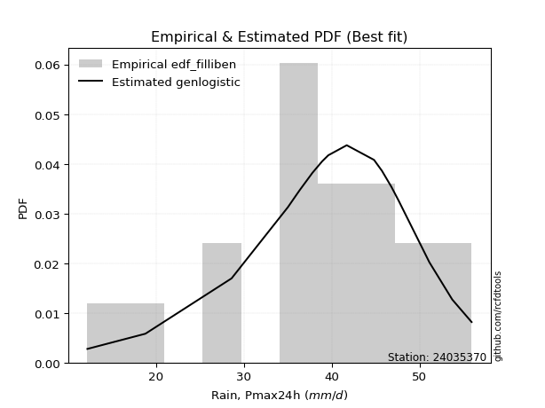</img>

</div>


### 10. EDF Jenkinson (1977)

The Jenkinson formula in hydrology is an empirical plotting position formula used to estimate the non-exceedance probability _(P)_ or return period _(T)_ of a given ordered observation within a sample. It is a widely used method in the frequency analysis of extreme events such as floods and rainfall, as it provides a distribution-free way to plot data. _a≈0.31_ and _b≈0.38_ are constants derived to approximate the median of the probability distribution for the given rank.

<div align="center">


$P=(m-a)/(n+b)$


</div>


**10.1. Empirical values**

<div align="center">

|                | 0                   | 1                   | 2                  | 3                   | 4                   | 5                   | 6                  | 7                  | 8                  | 9             | 10                 | 11                 | 12                 | 13                 | 14                 | 15                 | 16                 | 17                 | 18                 |
|:---------------|:--------------------|:--------------------|:-------------------|:--------------------|:--------------------|:--------------------|:-------------------|:-------------------|:-------------------|:--------------|:-------------------|:-------------------|:-------------------|:-------------------|:-------------------|:-------------------|:-------------------|:-------------------|:-------------------|
| date           | 2024                | 2006                | 2022               | 2007                | 2015                | 2021                | 2023               | 2014               | 2020               | 2008          | 2011               | 2009               | 2017               | 2018               | 2016               | 2010               | 2019               | 2013               | 2012               |
| x              | 12.2                | 18.8                | 28.6               | 28.6                | 35.0                | 36.0                | 36.2               | 36.4               | 37.8               | 38.9          | 39.6               | 41.7               | 44.8               | 45.7               | 46.8               | 47.6               | 51.1               | 53.7               | 55.9               |
| m              | 1                   | 2                   | 3                  | 4                   | 5                   | 6                   | 7                  | 8                  | 9                  | 10            | 11                 | 12                 | 13                 | 14                 | 15                 | 16                 | 17                 | 18                 | 19                 |
| empirical_dist | edf_jenkinson       | edf_jenkinson       | edf_jenkinson      | edf_jenkinson       | edf_jenkinson       | edf_jenkinson       | edf_jenkinson      | edf_jenkinson      | edf_jenkinson      | edf_jenkinson | edf_jenkinson      | edf_jenkinson      | edf_jenkinson      | edf_jenkinson      | edf_jenkinson      | edf_jenkinson      | edf_jenkinson      | edf_jenkinson      | edf_jenkinson      |
| empirical      | 0.03560371517027864 | 0.08720330237358101 | 0.1388028895768834 | 0.19040247678018576 | 0.24200206398348817 | 0.29360165118679055 | 0.3452012383900929 | 0.3968008255933953 | 0.4484004127966976 | 0.5           | 0.5515995872033024 | 0.6031991744066048 | 0.6547987616099071 | 0.7063983488132095 | 0.7579979360165119 | 0.8095975232198143 | 0.8611971104231168 | 0.9127966976264191 | 0.9643962848297215 |
| empirical_tr   | 1.0369181380417336  | 1.0955342001130581  | 1.1611743559017376 | 1.2351816443594645  | 1.3192648059904697  | 1.4156318480642804  | 1.5271867612293144 | 1.6578272027373824 | 1.812909260991581  | 2.0           | 2.230149597238205  | 2.5201560468140443 | 2.896860986547085  | 3.40597539543058   | 4.132196162046909  | 5.252032520325204  | 7.204460966542758  | 11.467455621301793 | 28.086956521739243 |

</div>


**10.2. Kolmogorov-Smirnov fit test (sorted by Δ)**


<div align="center">

|                | 0                   | 1                   | 2                   | 3                   | 4                   | 5                   | 6                   | 7                   | 8                   | 9                     | 10                  | 11                  | 12                  | 13                  | 14                  | 15                  | 16                  | 17                  | 18                  | 19                  | 20                  | 21                  | 22                  | 23                  | 24                  | 25                  | 26                  | 27                  | 28                  | 29                  | 30                  | 31                  | 32                  | 33                  | 34                  | 35                  | 36                  | 37                  | 38                  | 39                  | 40                  | 41                  | 42                  | 43                  | 44                  | 45                  | 46                  | 47                  | 48                  | 49                  | 50                  | 51                  | 52                  | 53                  | 54                  | 55                  | 56                  | 57                  | 58                  | 59                  | 60                  | 61                  | 62                  | 63                  | 64                  | 65                  | 66                  | 67                  | 68                  | 69                  | 70                  | 71                  | 72                  | 73                  | 74                  | 75                  | 76                  | 77                  | 78                  | 79                  | 80                  | 81                  | 82                  | 83                  | 84                  | 85                  | 86                  | 87                  |
|:---------------|:--------------------|:--------------------|:--------------------|:--------------------|:--------------------|:--------------------|:--------------------|:--------------------|:--------------------|:----------------------|:--------------------|:--------------------|:--------------------|:--------------------|:--------------------|:--------------------|:--------------------|:--------------------|:--------------------|:--------------------|:--------------------|:--------------------|:--------------------|:--------------------|:--------------------|:--------------------|:--------------------|:--------------------|:--------------------|:--------------------|:--------------------|:--------------------|:--------------------|:--------------------|:--------------------|:--------------------|:--------------------|:--------------------|:--------------------|:--------------------|:--------------------|:--------------------|:--------------------|:--------------------|:--------------------|:--------------------|:--------------------|:--------------------|:--------------------|:--------------------|:--------------------|:--------------------|:--------------------|:--------------------|:--------------------|:--------------------|:--------------------|:--------------------|:--------------------|:--------------------|:--------------------|:--------------------|:--------------------|:--------------------|:--------------------|:--------------------|:--------------------|:--------------------|:--------------------|:--------------------|:--------------------|:--------------------|:--------------------|:--------------------|:--------------------|:--------------------|:--------------------|:--------------------|:--------------------|:--------------------|:--------------------|:--------------------|:--------------------|:--------------------|:--------------------|:--------------------|:--------------------|:--------------------|
| station        | 24035370            | 24035370            | 24035370            | 24035370            | 24035370            | 24035370            | 24035370            | 24035370            | 24035370            | 24035370              | 24035370            | 24035370            | 24035370            | 24035370            | 24035370            | 24035370            | 24035370            | 24035370            | 24035370            | 24035370            | 24035370            | 24035370            | 24035370            | 24035370            | 24035370            | 24035370            | 24035370            | 24035370            | 24035370            | 24035370            | 24035370            | 24035370            | 24035370            | 24035370            | 24035370            | 24035370            | 24035370            | 24035370            | 24035370            | 24035370            | 24035370            | 24035370            | 24035370            | 24035370            | 24035370            | 24035370            | 24035370            | 24035370            | 24035370            | 24035370            | 24035370            | 24035370            | 24035370            | 24035370            | 24035370            | 24035370            | 24035370            | 24035370            | 24035370            | 24035370            | 24035370            | 24035370            | 24035370            | 24035370            | 24035370            | 24035370            | 24035370            | 24035370            | 24035370            | 24035370            | 24035370            | 24035370            | 24035370            | 24035370            | 24035370            | 24035370            | 24035370            | 24035370            | 24035370            | 24035370            | 24035370            | 24035370            | 24035370            | 24035370            | 24035370            | 24035370            | 24035370            | 24035370            |
| empirical_dist | edf_jenkinson       | edf_jenkinson       | edf_jenkinson       | edf_jenkinson       | edf_jenkinson       | edf_jenkinson       | edf_jenkinson       | edf_jenkinson       | edf_jenkinson       | edf_jenkinson         | edf_jenkinson       | edf_jenkinson       | edf_jenkinson       | edf_jenkinson       | edf_jenkinson       | edf_jenkinson       | edf_jenkinson       | edf_jenkinson       | edf_jenkinson       | edf_jenkinson       | edf_jenkinson       | edf_jenkinson       | edf_jenkinson       | edf_jenkinson       | edf_jenkinson       | edf_jenkinson       | edf_jenkinson       | edf_jenkinson       | edf_jenkinson       | edf_jenkinson       | edf_jenkinson       | edf_jenkinson       | edf_jenkinson       | edf_jenkinson       | edf_jenkinson       | edf_jenkinson       | edf_jenkinson       | edf_jenkinson       | edf_jenkinson       | edf_jenkinson       | edf_jenkinson       | edf_jenkinson       | edf_jenkinson       | edf_jenkinson       | edf_jenkinson       | edf_jenkinson       | edf_jenkinson       | edf_jenkinson       | edf_jenkinson       | edf_jenkinson       | edf_jenkinson       | edf_jenkinson       | edf_jenkinson       | edf_jenkinson       | edf_jenkinson       | edf_jenkinson       | edf_jenkinson       | edf_jenkinson       | edf_jenkinson       | edf_jenkinson       | edf_jenkinson       | edf_jenkinson       | edf_jenkinson       | edf_jenkinson       | edf_jenkinson       | edf_jenkinson       | edf_jenkinson       | edf_jenkinson       | edf_jenkinson       | edf_jenkinson       | edf_jenkinson       | edf_jenkinson       | edf_jenkinson       | edf_jenkinson       | edf_jenkinson       | edf_jenkinson       | edf_jenkinson       | edf_jenkinson       | edf_jenkinson       | edf_jenkinson       | edf_jenkinson       | edf_jenkinson       | edf_jenkinson       | edf_jenkinson       | edf_jenkinson       | edf_jenkinson       | edf_jenkinson       | edf_jenkinson       |
| p_dist         | genlogistic         | johnsonsu           | weibull_min         | fisk                | logt                | gumbel_l            | pearson3            | logjohnsonsu        | logmielke           | loglaplace_asymmetric | mielke              | gompertz            | loggenlogistic      | logloggamma         | hypsecant           | logpearson3         | laplace_asymmetric  | logistic            | logweibull_min      | logfisk             | laplace             | nakagami            | t                   | exponnorm           | norm                | crystalball         | truncnorm           | nct                 | f                   | fatiguelife         | chi2                | betaprime           | loggumbel_l         | erlang              | gamma               | alpha               | invgamma            | maxwell             | ncf                 | rayleigh            | invgauss            | loglaplace          | gumbel_r            | loghypsecant        | invweibull          | moyal               | loglogistic         | halfnorm            | logexponnorm        | lognorm             | lognorm             | logcrystalball      | loglognorm          | logrice             | lognakagami         | logf                | logfatiguelife      | lognct              | logerlang           | halflogistic        | logbetaprime        | loginvgamma         | logncf              | kstwobign           | loginvgauss         | loggamma            | loggamma            | logalpha            | logmaxwell          | loginvweibull       | gibrat              | lograyleigh         | wald                | loggumbel_r         | loghalfnorm         | logkstwobign        | logmoyal            | loghalflogistic     | loggenexpon         | expon               | genexpon            | logtruncnorm        | loggompertz         | logwald             | loggibrat           | logexpon            | logchi2             | rice                |
| delta          | 0.07370480219348713 | 0.0769417254629789  | 0.0790510062946127  | 0.08212623519857554 | 0.08632708785511801 | 0.08745812950785914 | 0.08811689923143218 | 0.08864475795777843 | 0.08958777246923016 | 0.09034707931604402   | 0.09140353143768987 | 0.09156036533236689 | 0.09162740708979905 | 0.09523782052822849 | 0.09536915821480563 | 0.10325539868938349 | 0.10521257407514162 | 0.1083637962860251  | 0.11067872989308697 | 0.11498307925311269 | 0.11870133876764244 | 0.12387882635487907 | 0.12477195077518716 | 0.12477218446179517 | 0.12477266548499377 | 0.12477267216644033 | 0.12477269580515493 | 0.12515899005965536 | 0.1251959318568165  | 0.12566675328982319 | 0.13479939881169445 | 0.13592848836184196 | 0.13622440079268705 | 0.13925840851160953 | 0.14224694713959685 | 0.14391050372978836 | 0.15507786316950745 | 0.1576171920639075  | 0.1687040636771544  | 0.1698402319930798  | 0.17103078602761101 | 0.1739760325243644  | 0.17744647651659845 | 0.1934007900983144  | 0.19723201888085218 | 0.19734061089727467 | 0.19928067825957718 | 0.20460511963354777 | 0.20624436956886644 | 0.20624542105317756 | 0.20624542105317756 | 0.20624555578681086 | 0.20624654041498575 | 0.20624835686352622 | 0.2064787996930384  | 0.20789655827028436 | 0.2089563993402943  | 0.2093972562724597  | 0.21059101013790743 | 0.21544009654881718 | 0.2167218389890352  | 0.21968262379680953 | 0.22038550529608397 | 0.22460644331914237 | 0.22528125124797838 | 0.225474476182501   | 0.225474476182501   | 0.2312191937196545  | 0.24058166054070956 | 0.2467136462904469  | 0.24852187780382934 | 0.2524978990218813  | 0.25367718365119835 | 0.27309195188578356 | 0.28614490465269554 | 0.28816108097110166 | 0.29839979606658246 | 0.3070746456297411  | 0.3272674159929951  | 0.3349232331917555  | 0.3349688353157209  | 0.33511274255655416 | 0.3660433150797561  | 0.36870438967431235 | 0.38088723106579064 | 0.40003709050538006 | 0.4652746775872     | 0.8611970549974026  |
| deltao         | 0.31564497164100014 | 0.31564497164100014 | 0.31564497164100014 | 0.31564497164100014 | 0.31564497164100014 | 0.31564497164100014 | 0.31564497164100014 | 0.31564497164100014 | 0.31564497164100014 | 0.31564497164100014   | 0.31564497164100014 | 0.31564497164100014 | 0.31564497164100014 | 0.31564497164100014 | 0.31564497164100014 | 0.31564497164100014 | 0.31564497164100014 | 0.31564497164100014 | 0.31564497164100014 | 0.31564497164100014 | 0.31564497164100014 | 0.31564497164100014 | 0.31564497164100014 | 0.31564497164100014 | 0.31564497164100014 | 0.31564497164100014 | 0.31564497164100014 | 0.31564497164100014 | 0.31564497164100014 | 0.31564497164100014 | 0.31564497164100014 | 0.31564497164100014 | 0.31564497164100014 | 0.31564497164100014 | 0.31564497164100014 | 0.31564497164100014 | 0.31564497164100014 | 0.31564497164100014 | 0.31564497164100014 | 0.31564497164100014 | 0.31564497164100014 | 0.31564497164100014 | 0.31564497164100014 | 0.31564497164100014 | 0.31564497164100014 | 0.31564497164100014 | 0.31564497164100014 | 0.31564497164100014 | 0.31564497164100014 | 0.31564497164100014 | 0.31564497164100014 | 0.31564497164100014 | 0.31564497164100014 | 0.31564497164100014 | 0.31564497164100014 | 0.31564497164100014 | 0.31564497164100014 | 0.31564497164100014 | 0.31564497164100014 | 0.31564497164100014 | 0.31564497164100014 | 0.31564497164100014 | 0.31564497164100014 | 0.31564497164100014 | 0.31564497164100014 | 0.31564497164100014 | 0.31564497164100014 | 0.31564497164100014 | 0.31564497164100014 | 0.31564497164100014 | 0.31564497164100014 | 0.31564497164100014 | 0.31564497164100014 | 0.31564497164100014 | 0.31564497164100014 | 0.31564497164100014 | 0.31564497164100014 | 0.31564497164100014 | 0.31564497164100014 | 0.31564497164100014 | 0.31564497164100014 | 0.31564497164100014 | 0.31564497164100014 | 0.31564497164100014 | 0.31564497164100014 | 0.31564497164100014 | 0.31564497164100014 | 0.31564497164100014 |
| eval           | Δo > Δ              | Δo > Δ              | Δo > Δ              | Δo > Δ              | Δo > Δ              | Δo > Δ              | Δo > Δ              | Δo > Δ              | Δo > Δ              | Δo > Δ                | Δo > Δ              | Δo > Δ              | Δo > Δ              | Δo > Δ              | Δo > Δ              | Δo > Δ              | Δo > Δ              | Δo > Δ              | Δo > Δ              | Δo > Δ              | Δo > Δ              | Δo > Δ              | Δo > Δ              | Δo > Δ              | Δo > Δ              | Δo > Δ              | Δo > Δ              | Δo > Δ              | Δo > Δ              | Δo > Δ              | Δo > Δ              | Δo > Δ              | Δo > Δ              | Δo > Δ              | Δo > Δ              | Δo > Δ              | Δo > Δ              | Δo > Δ              | Δo > Δ              | Δo > Δ              | Δo > Δ              | Δo > Δ              | Δo > Δ              | Δo > Δ              | Δo > Δ              | Δo > Δ              | Δo > Δ              | Δo > Δ              | Δo > Δ              | Δo > Δ              | Δo > Δ              | Δo > Δ              | Δo > Δ              | Δo > Δ              | Δo > Δ              | Δo > Δ              | Δo > Δ              | Δo > Δ              | Δo > Δ              | Δo > Δ              | Δo > Δ              | Δo > Δ              | Δo > Δ              | Δo > Δ              | Δo > Δ              | Δo > Δ              | Δo > Δ              | Δo > Δ              | Δo > Δ              | Δo > Δ              | Δo > Δ              | Δo > Δ              | Δo > Δ              | Δo > Δ              | Δo > Δ              | Δo > Δ              | Δo > Δ              | Δo > Δ              | Δo <= Δ             | Δo <= Δ             | Δo <= Δ             | Δo <= Δ             | Δo <= Δ             | Δo <= Δ             | Δo <= Δ             | Δo <= Δ             | Δo <= Δ             | Δo <= Δ             |
| fit            | 1                   | 1                   | 1                   | 1                   | 1                   | 1                   | 1                   | 1                   | 1                   | 1                     | 1                   | 1                   | 1                   | 1                   | 1                   | 1                   | 1                   | 1                   | 1                   | 1                   | 1                   | 1                   | 1                   | 1                   | 1                   | 1                   | 1                   | 1                   | 1                   | 1                   | 1                   | 1                   | 1                   | 1                   | 1                   | 1                   | 1                   | 1                   | 1                   | 1                   | 1                   | 1                   | 1                   | 1                   | 1                   | 1                   | 1                   | 1                   | 1                   | 1                   | 1                   | 1                   | 1                   | 1                   | 1                   | 1                   | 1                   | 1                   | 1                   | 1                   | 1                   | 1                   | 1                   | 1                   | 1                   | 1                   | 1                   | 1                   | 1                   | 1                   | 1                   | 1                   | 1                   | 1                   | 1                   | 1                   | 1                   | 1                   | 0                   | 0                   | 0                   | 0                   | 0                   | 0                   | 0                   | 0                   | 0                   | 0                   |
| n              | 19                  | 19                  | 19                  | 19                  | 19                  | 19                  | 19                  | 19                  | 19                  | 19                    | 19                  | 19                  | 19                  | 19                  | 19                  | 19                  | 19                  | 19                  | 19                  | 19                  | 19                  | 19                  | 19                  | 19                  | 19                  | 19                  | 19                  | 19                  | 19                  | 19                  | 19                  | 19                  | 19                  | 19                  | 19                  | 19                  | 19                  | 19                  | 19                  | 19                  | 19                  | 19                  | 19                  | 19                  | 19                  | 19                  | 19                  | 19                  | 19                  | 19                  | 19                  | 19                  | 19                  | 19                  | 19                  | 19                  | 19                  | 19                  | 19                  | 19                  | 19                  | 19                  | 19                  | 19                  | 19                  | 19                  | 19                  | 19                  | 19                  | 19                  | 19                  | 19                  | 19                  | 19                  | 19                  | 19                  | 19                  | 19                  | 19                  | 19                  | 19                  | 19                  | 19                  | 19                  | 19                  | 19                  | 19                  | 19                  |
| best_fit       | 1                   | 0                   | 0                   | 0                   | 0                   | 0                   | 0                   | 0                   | 0                   | 0                     | 0                   | 0                   | 0                   | 0                   | 0                   | 0                   | 0                   | 0                   | 0                   | 0                   | 0                   | 0                   | 0                   | 0                   | 0                   | 0                   | 0                   | 0                   | 0                   | 0                   | 0                   | 0                   | 0                   | 0                   | 0                   | 0                   | 0                   | 0                   | 0                   | 0                   | 0                   | 0                   | 0                   | 0                   | 0                   | 0                   | 0                   | 0                   | 0                   | 0                   | 0                   | 0                   | 0                   | 0                   | 0                   | 0                   | 0                   | 0                   | 0                   | 0                   | 0                   | 0                   | 0                   | 0                   | 0                   | 0                   | 0                   | 0                   | 0                   | 0                   | 0                   | 0                   | 0                   | 0                   | 0                   | 0                   | 0                   | 0                   | 0                   | 0                   | 0                   | 0                   | 0                   | 0                   | 0                   | 0                   | 0                   | 0                   |
| best_fit_sort  | 1                   | 2                   | 3                   | 4                   | 5                   | 6                   | 7                   | 8                   | 9                   | 10                    | 11                  | 12                  | 13                  | 14                  | 15                  | 16                  | 17                  | 18                  | 19                  | 20                  | 21                  | 22                  | 23                  | 24                  | 25                  | 26                  | 27                  | 28                  | 29                  | 30                  | 31                  | 32                  | 33                  | 34                  | 35                  | 36                  | 37                  | 38                  | 39                  | 40                  | 41                  | 42                  | 43                  | 44                  | 45                  | 46                  | 47                  | 48                  | 49                  | 50                  | 51                  | 52                  | 53                  | 54                  | 55                  | 56                  | 57                  | 58                  | 59                  | 60                  | 61                  | 62                  | 63                  | 64                  | 65                  | 66                  | 67                  | 68                  | 69                  | 70                  | 71                  | 72                  | 73                  | 74                  | 75                  | 76                  | 77                  | 78                  | 79                  | 80                  | 81                  | 82                  | 83                  | 84                  | 85                  | 86                  | 87                  | 88                  |

</div>


**10.3. Best fit**

<div align="center">

|   id |   station | empirical_dist   | p_dist      |     delta |   deltao | eval   |   fit |   n |   best_fit |   best_fit_sort |
|-----:|----------:|:-----------------|:------------|----------:|---------:|:-------|------:|----:|-----------:|----------------:|
|    0 |  24035370 | edf_jenkinson    | genlogistic | 0.0737048 | 0.315645 | Δo > Δ |     1 |  19 |          1 |               1 |

</div>


<div align="center">

</img>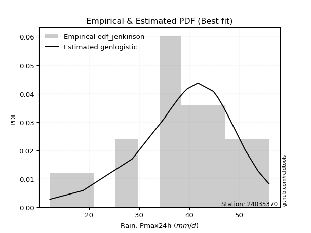</img>

</div>


### 11. EDF Cunnane (1978)

Cunnane´s work in statistical hydrology has focused on the performance and evaluation of different probability distributions (such as GEV, Gumbel, Lognormal) for flood frequency estimation. _b_ is a constant, typically set to 0.4.

<div align="center">


$P=(m-b)/(n+1-2b)$


</div>


**11.1. Empirical values**

<div align="center">

|                | 0                 | 1                   | 2                   | 3                  | 4                   | 5                  | 6                  | 7                  | 8                  | 9           | 10                 | 11                 | 12                | 13                 | 14                 | 15                | 16                 | 17                 | 18                 |
|:---------------|:------------------|:--------------------|:--------------------|:-------------------|:--------------------|:-------------------|:-------------------|:-------------------|:-------------------|:------------|:-------------------|:-------------------|:------------------|:-------------------|:-------------------|:------------------|:-------------------|:-------------------|:-------------------|
| date           | 2024              | 2006                | 2022                | 2007               | 2015                | 2021               | 2023               | 2014               | 2020               | 2008        | 2011               | 2009               | 2017              | 2018               | 2016               | 2010              | 2019               | 2013               | 2012               |
| x              | 12.2              | 18.8                | 28.6                | 28.6               | 35.0                | 36.0               | 36.2               | 36.4               | 37.8               | 38.9        | 39.6               | 41.7               | 44.8              | 45.7               | 46.8               | 47.6              | 51.1               | 53.7               | 55.9               |
| m              | 1                 | 2                   | 3                   | 4                  | 5                   | 6                  | 7                  | 8                  | 9                  | 10          | 11                 | 12                 | 13                | 14                 | 15                 | 16                | 17                 | 18                 | 19                 |
| empirical_dist | edf_cunnane       | edf_cunnane         | edf_cunnane         | edf_cunnane        | edf_cunnane         | edf_cunnane        | edf_cunnane        | edf_cunnane        | edf_cunnane        | edf_cunnane | edf_cunnane        | edf_cunnane        | edf_cunnane       | edf_cunnane        | edf_cunnane        | edf_cunnane       | edf_cunnane        | edf_cunnane        | edf_cunnane        |
| empirical      | 0.03125           | 0.08333333333333334 | 0.13541666666666669 | 0.1875             | 0.23958333333333331 | 0.2916666666666667 | 0.34375            | 0.3958333333333333 | 0.4479166666666667 | 0.5         | 0.5520833333333334 | 0.6041666666666666 | 0.65625           | 0.7083333333333334 | 0.7604166666666666 | 0.8125            | 0.8645833333333335 | 0.9166666666666667 | 0.9687500000000001 |
| empirical_tr   | 1.032258064516129 | 1.090909090909091   | 1.1566265060240966  | 1.2307692307692308 | 1.3150684931506849  | 1.411764705882353  | 1.5238095238095237 | 1.6551724137931032 | 1.8113207547169814 | 2.0         | 2.2325581395348837 | 2.526315789473684  | 2.909090909090909 | 3.428571428571429  | 4.17391304347826   | 5.333333333333333 | 7.384615384615393  | 12.00000000000001  | 32.000000000000114 |

</div>


**11.2. Kolmogorov-Smirnov fit test (sorted by Δ)**


<div align="center">

|                | 0                   | 1                   | 2                   | 3                   | 4                   | 5                   | 6                   | 7                   | 8                   | 9                     | 10                  | 11                  | 12                  | 13                  | 14                  | 15                  | 16                  | 17                  | 18                  | 19                  | 20                  | 21                  | 22                  | 23                  | 24                  | 25                  | 26                  | 27                  | 28                  | 29                  | 30                  | 31                  | 32                  | 33                  | 34                  | 35                  | 36                  | 37                  | 38                  | 39                  | 40                  | 41                  | 42                  | 43                  | 44                  | 45                  | 46                  | 47                  | 48                  | 49                  | 50                  | 51                  | 52                  | 53                  | 54                  | 55                  | 56                  | 57                  | 58                  | 59                  | 60                  | 61                  | 62                  | 63                  | 64                  | 65                  | 66                  | 67                  | 68                  | 69                  | 70                  | 71                  | 72                  | 73                  | 74                  | 75                  | 76                  | 77                  | 78                  | 79                  | 80                  | 81                  | 82                  | 83                  | 84                  | 85                  | 86                  | 87                  |
|:---------------|:--------------------|:--------------------|:--------------------|:--------------------|:--------------------|:--------------------|:--------------------|:--------------------|:--------------------|:----------------------|:--------------------|:--------------------|:--------------------|:--------------------|:--------------------|:--------------------|:--------------------|:--------------------|:--------------------|:--------------------|:--------------------|:--------------------|:--------------------|:--------------------|:--------------------|:--------------------|:--------------------|:--------------------|:--------------------|:--------------------|:--------------------|:--------------------|:--------------------|:--------------------|:--------------------|:--------------------|:--------------------|:--------------------|:--------------------|:--------------------|:--------------------|:--------------------|:--------------------|:--------------------|:--------------------|:--------------------|:--------------------|:--------------------|:--------------------|:--------------------|:--------------------|:--------------------|:--------------------|:--------------------|:--------------------|:--------------------|:--------------------|:--------------------|:--------------------|:--------------------|:--------------------|:--------------------|:--------------------|:--------------------|:--------------------|:--------------------|:--------------------|:--------------------|:--------------------|:--------------------|:--------------------|:--------------------|:--------------------|:--------------------|:--------------------|:--------------------|:--------------------|:--------------------|:--------------------|:--------------------|:--------------------|:--------------------|:--------------------|:--------------------|:--------------------|:--------------------|:--------------------|:--------------------|
| station        | 24035370            | 24035370            | 24035370            | 24035370            | 24035370            | 24035370            | 24035370            | 24035370            | 24035370            | 24035370              | 24035370            | 24035370            | 24035370            | 24035370            | 24035370            | 24035370            | 24035370            | 24035370            | 24035370            | 24035370            | 24035370            | 24035370            | 24035370            | 24035370            | 24035370            | 24035370            | 24035370            | 24035370            | 24035370            | 24035370            | 24035370            | 24035370            | 24035370            | 24035370            | 24035370            | 24035370            | 24035370            | 24035370            | 24035370            | 24035370            | 24035370            | 24035370            | 24035370            | 24035370            | 24035370            | 24035370            | 24035370            | 24035370            | 24035370            | 24035370            | 24035370            | 24035370            | 24035370            | 24035370            | 24035370            | 24035370            | 24035370            | 24035370            | 24035370            | 24035370            | 24035370            | 24035370            | 24035370            | 24035370            | 24035370            | 24035370            | 24035370            | 24035370            | 24035370            | 24035370            | 24035370            | 24035370            | 24035370            | 24035370            | 24035370            | 24035370            | 24035370            | 24035370            | 24035370            | 24035370            | 24035370            | 24035370            | 24035370            | 24035370            | 24035370            | 24035370            | 24035370            | 24035370            |
| empirical_dist | edf_cunnane         | edf_cunnane         | edf_cunnane         | edf_cunnane         | edf_cunnane         | edf_cunnane         | edf_cunnane         | edf_cunnane         | edf_cunnane         | edf_cunnane           | edf_cunnane         | edf_cunnane         | edf_cunnane         | edf_cunnane         | edf_cunnane         | edf_cunnane         | edf_cunnane         | edf_cunnane         | edf_cunnane         | edf_cunnane         | edf_cunnane         | edf_cunnane         | edf_cunnane         | edf_cunnane         | edf_cunnane         | edf_cunnane         | edf_cunnane         | edf_cunnane         | edf_cunnane         | edf_cunnane         | edf_cunnane         | edf_cunnane         | edf_cunnane         | edf_cunnane         | edf_cunnane         | edf_cunnane         | edf_cunnane         | edf_cunnane         | edf_cunnane         | edf_cunnane         | edf_cunnane         | edf_cunnane         | edf_cunnane         | edf_cunnane         | edf_cunnane         | edf_cunnane         | edf_cunnane         | edf_cunnane         | edf_cunnane         | edf_cunnane         | edf_cunnane         | edf_cunnane         | edf_cunnane         | edf_cunnane         | edf_cunnane         | edf_cunnane         | edf_cunnane         | edf_cunnane         | edf_cunnane         | edf_cunnane         | edf_cunnane         | edf_cunnane         | edf_cunnane         | edf_cunnane         | edf_cunnane         | edf_cunnane         | edf_cunnane         | edf_cunnane         | edf_cunnane         | edf_cunnane         | edf_cunnane         | edf_cunnane         | edf_cunnane         | edf_cunnane         | edf_cunnane         | edf_cunnane         | edf_cunnane         | edf_cunnane         | edf_cunnane         | edf_cunnane         | edf_cunnane         | edf_cunnane         | edf_cunnane         | edf_cunnane         | edf_cunnane         | edf_cunnane         | edf_cunnane         | edf_cunnane         |
| p_dist         | genlogistic         | johnsonsu           | weibull_min         | logt                | fisk                | gumbel_l            | pearson3            | logjohnsonsu        | logmielke           | loglaplace_asymmetric | mielke              | gompertz            | loggenlogistic      | logloggamma         | hypsecant           | laplace_asymmetric  | logpearson3         | logistic            | logweibull_min      | laplace             | logfisk             | nakagami            | t                   | exponnorm           | norm                | crystalball         | truncnorm           | nct                 | f                   | fatiguelife         | chi2                | betaprime           | loggumbel_l         | erlang              | gamma               | alpha               | invgamma            | maxwell             | ncf                 | rayleigh            | invgauss            | loglaplace          | gumbel_r            | loghypsecant        | invweibull          | moyal               | loglogistic         | halfnorm            | logexponnorm        | lognorm             | lognorm             | logcrystalball      | loglognorm          | logrice             | lognakagami         | logf                | logfatiguelife      | lognct              | logerlang           | halflogistic        | logbetaprime        | loginvgamma         | logncf              | kstwobign           | loginvgauss         | loggamma            | loggamma            | logalpha            | logmaxwell          | loginvweibull       | gibrat              | lograyleigh         | wald                | loggumbel_r         | loghalfnorm         | logkstwobign        | logmoyal            | loghalflogistic     | loggenexpon         | expon               | genexpon            | logtruncnorm        | loggompertz         | logwald             | loggibrat           | logexpon            | logchi2             | rice                |
| delta          | 0.07418854832351812 | 0.07936045611313375 | 0.08146973694476756 | 0.08342461107493225 | 0.08454496584873039 | 0.08794187563789013 | 0.09053562988158703 | 0.09106348860793329 | 0.09200650311938502 | 0.09276580996619888   | 0.09382226208784472 | 0.09397909598252174 | 0.0940461377399539  | 0.09765655117838334 | 0.09778788886496048 | 0.10376133568504875 | 0.10567412933953835 | 0.11078252693617996 | 0.11309746054324182 | 0.11725010037754957 | 0.11740180990326754 | 0.12629755700503392 | 0.127190681425342   | 0.12719091511195002 | 0.12719139613514863 | 0.1271914028165952  | 0.1271914264553098  | 0.12757772070981022 | 0.12761466250697134 | 0.12808548393997804 | 0.1372181294618493  | 0.1383472190119968  | 0.1386431314428419  | 0.1416771391617644  | 0.1446656777897517  | 0.14632923437994322 | 0.1574965938196623  | 0.16003592271406236 | 0.17112279432730926 | 0.17225896264323465 | 0.17344951667776587 | 0.17639476317451924 | 0.1798652071667533  | 0.19581952074846926 | 0.19965074953100703 | 0.19975934154742953 | 0.20169940890973204 | 0.20702385028370263 | 0.2086631002190213  | 0.2086641517033324  | 0.2086641517033324  | 0.20866428643696572 | 0.2086652710651406  | 0.20866708751368107 | 0.20889753034319325 | 0.21031528892043921 | 0.21137512999044916 | 0.21181598692261455 | 0.21300974078806229 | 0.21785882719897204 | 0.21914056963919004 | 0.22210135444696438 | 0.22280423594623883 | 0.22702517396929722 | 0.22769998189813323 | 0.22789320683265585 | 0.22789320683265585 | 0.23363792436980935 | 0.24300039119086442 | 0.24913237694060175 | 0.2504568623239532  | 0.25491662967203615 | 0.2556121681713222  | 0.2755106825359384  | 0.2885636353028504  | 0.2905798116212565  | 0.3008185267167373  | 0.309493376279896   | 0.32968614664314994 | 0.33734196384191034 | 0.33738756596587577 | 0.337531473206709   | 0.368462045729911   | 0.3711231203244672  | 0.3833059617159455  | 0.40342331341559673 | 0.46866090049741665 | 0.8645832779076192  |
| deltao         | 0.31564497164100014 | 0.31564497164100014 | 0.31564497164100014 | 0.31564497164100014 | 0.31564497164100014 | 0.31564497164100014 | 0.31564497164100014 | 0.31564497164100014 | 0.31564497164100014 | 0.31564497164100014   | 0.31564497164100014 | 0.31564497164100014 | 0.31564497164100014 | 0.31564497164100014 | 0.31564497164100014 | 0.31564497164100014 | 0.31564497164100014 | 0.31564497164100014 | 0.31564497164100014 | 0.31564497164100014 | 0.31564497164100014 | 0.31564497164100014 | 0.31564497164100014 | 0.31564497164100014 | 0.31564497164100014 | 0.31564497164100014 | 0.31564497164100014 | 0.31564497164100014 | 0.31564497164100014 | 0.31564497164100014 | 0.31564497164100014 | 0.31564497164100014 | 0.31564497164100014 | 0.31564497164100014 | 0.31564497164100014 | 0.31564497164100014 | 0.31564497164100014 | 0.31564497164100014 | 0.31564497164100014 | 0.31564497164100014 | 0.31564497164100014 | 0.31564497164100014 | 0.31564497164100014 | 0.31564497164100014 | 0.31564497164100014 | 0.31564497164100014 | 0.31564497164100014 | 0.31564497164100014 | 0.31564497164100014 | 0.31564497164100014 | 0.31564497164100014 | 0.31564497164100014 | 0.31564497164100014 | 0.31564497164100014 | 0.31564497164100014 | 0.31564497164100014 | 0.31564497164100014 | 0.31564497164100014 | 0.31564497164100014 | 0.31564497164100014 | 0.31564497164100014 | 0.31564497164100014 | 0.31564497164100014 | 0.31564497164100014 | 0.31564497164100014 | 0.31564497164100014 | 0.31564497164100014 | 0.31564497164100014 | 0.31564497164100014 | 0.31564497164100014 | 0.31564497164100014 | 0.31564497164100014 | 0.31564497164100014 | 0.31564497164100014 | 0.31564497164100014 | 0.31564497164100014 | 0.31564497164100014 | 0.31564497164100014 | 0.31564497164100014 | 0.31564497164100014 | 0.31564497164100014 | 0.31564497164100014 | 0.31564497164100014 | 0.31564497164100014 | 0.31564497164100014 | 0.31564497164100014 | 0.31564497164100014 | 0.31564497164100014 |
| eval           | Δo > Δ              | Δo > Δ              | Δo > Δ              | Δo > Δ              | Δo > Δ              | Δo > Δ              | Δo > Δ              | Δo > Δ              | Δo > Δ              | Δo > Δ                | Δo > Δ              | Δo > Δ              | Δo > Δ              | Δo > Δ              | Δo > Δ              | Δo > Δ              | Δo > Δ              | Δo > Δ              | Δo > Δ              | Δo > Δ              | Δo > Δ              | Δo > Δ              | Δo > Δ              | Δo > Δ              | Δo > Δ              | Δo > Δ              | Δo > Δ              | Δo > Δ              | Δo > Δ              | Δo > Δ              | Δo > Δ              | Δo > Δ              | Δo > Δ              | Δo > Δ              | Δo > Δ              | Δo > Δ              | Δo > Δ              | Δo > Δ              | Δo > Δ              | Δo > Δ              | Δo > Δ              | Δo > Δ              | Δo > Δ              | Δo > Δ              | Δo > Δ              | Δo > Δ              | Δo > Δ              | Δo > Δ              | Δo > Δ              | Δo > Δ              | Δo > Δ              | Δo > Δ              | Δo > Δ              | Δo > Δ              | Δo > Δ              | Δo > Δ              | Δo > Δ              | Δo > Δ              | Δo > Δ              | Δo > Δ              | Δo > Δ              | Δo > Δ              | Δo > Δ              | Δo > Δ              | Δo > Δ              | Δo > Δ              | Δo > Δ              | Δo > Δ              | Δo > Δ              | Δo > Δ              | Δo > Δ              | Δo > Δ              | Δo > Δ              | Δo > Δ              | Δo > Δ              | Δo > Δ              | Δo > Δ              | Δo > Δ              | Δo <= Δ             | Δo <= Δ             | Δo <= Δ             | Δo <= Δ             | Δo <= Δ             | Δo <= Δ             | Δo <= Δ             | Δo <= Δ             | Δo <= Δ             | Δo <= Δ             |
| fit            | 1                   | 1                   | 1                   | 1                   | 1                   | 1                   | 1                   | 1                   | 1                   | 1                     | 1                   | 1                   | 1                   | 1                   | 1                   | 1                   | 1                   | 1                   | 1                   | 1                   | 1                   | 1                   | 1                   | 1                   | 1                   | 1                   | 1                   | 1                   | 1                   | 1                   | 1                   | 1                   | 1                   | 1                   | 1                   | 1                   | 1                   | 1                   | 1                   | 1                   | 1                   | 1                   | 1                   | 1                   | 1                   | 1                   | 1                   | 1                   | 1                   | 1                   | 1                   | 1                   | 1                   | 1                   | 1                   | 1                   | 1                   | 1                   | 1                   | 1                   | 1                   | 1                   | 1                   | 1                   | 1                   | 1                   | 1                   | 1                   | 1                   | 1                   | 1                   | 1                   | 1                   | 1                   | 1                   | 1                   | 1                   | 1                   | 0                   | 0                   | 0                   | 0                   | 0                   | 0                   | 0                   | 0                   | 0                   | 0                   |
| n              | 19                  | 19                  | 19                  | 19                  | 19                  | 19                  | 19                  | 19                  | 19                  | 19                    | 19                  | 19                  | 19                  | 19                  | 19                  | 19                  | 19                  | 19                  | 19                  | 19                  | 19                  | 19                  | 19                  | 19                  | 19                  | 19                  | 19                  | 19                  | 19                  | 19                  | 19                  | 19                  | 19                  | 19                  | 19                  | 19                  | 19                  | 19                  | 19                  | 19                  | 19                  | 19                  | 19                  | 19                  | 19                  | 19                  | 19                  | 19                  | 19                  | 19                  | 19                  | 19                  | 19                  | 19                  | 19                  | 19                  | 19                  | 19                  | 19                  | 19                  | 19                  | 19                  | 19                  | 19                  | 19                  | 19                  | 19                  | 19                  | 19                  | 19                  | 19                  | 19                  | 19                  | 19                  | 19                  | 19                  | 19                  | 19                  | 19                  | 19                  | 19                  | 19                  | 19                  | 19                  | 19                  | 19                  | 19                  | 19                  |
| best_fit       | 1                   | 0                   | 0                   | 0                   | 0                   | 0                   | 0                   | 0                   | 0                   | 0                     | 0                   | 0                   | 0                   | 0                   | 0                   | 0                   | 0                   | 0                   | 0                   | 0                   | 0                   | 0                   | 0                   | 0                   | 0                   | 0                   | 0                   | 0                   | 0                   | 0                   | 0                   | 0                   | 0                   | 0                   | 0                   | 0                   | 0                   | 0                   | 0                   | 0                   | 0                   | 0                   | 0                   | 0                   | 0                   | 0                   | 0                   | 0                   | 0                   | 0                   | 0                   | 0                   | 0                   | 0                   | 0                   | 0                   | 0                   | 0                   | 0                   | 0                   | 0                   | 0                   | 0                   | 0                   | 0                   | 0                   | 0                   | 0                   | 0                   | 0                   | 0                   | 0                   | 0                   | 0                   | 0                   | 0                   | 0                   | 0                   | 0                   | 0                   | 0                   | 0                   | 0                   | 0                   | 0                   | 0                   | 0                   | 0                   |
| best_fit_sort  | 1                   | 2                   | 3                   | 4                   | 5                   | 6                   | 7                   | 8                   | 9                   | 10                    | 11                  | 12                  | 13                  | 14                  | 15                  | 16                  | 17                  | 18                  | 19                  | 20                  | 21                  | 22                  | 23                  | 24                  | 25                  | 26                  | 27                  | 28                  | 29                  | 30                  | 31                  | 32                  | 33                  | 34                  | 35                  | 36                  | 37                  | 38                  | 39                  | 40                  | 41                  | 42                  | 43                  | 44                  | 45                  | 46                  | 47                  | 48                  | 49                  | 50                  | 51                  | 52                  | 53                  | 54                  | 55                  | 56                  | 57                  | 58                  | 59                  | 60                  | 61                  | 62                  | 63                  | 64                  | 65                  | 66                  | 67                  | 68                  | 69                  | 70                  | 71                  | 72                  | 73                  | 74                  | 75                  | 76                  | 77                  | 78                  | 79                  | 80                  | 81                  | 82                  | 83                  | 84                  | 85                  | 86                  | 87                  | 88                  |

</div>


**11.3. Best fit**

<div align="center">

|   id |   station | empirical_dist   | p_dist      |     delta |   deltao | eval   |   fit |   n |   best_fit |   best_fit_sort |
|-----:|----------:|:-----------------|:------------|----------:|---------:|:-------|------:|----:|-----------:|----------------:|
|    0 |  24035370 | edf_cunnane      | genlogistic | 0.0741885 | 0.315645 | Δo > Δ |     1 |  19 |          1 |               1 |

</div>


<div align="center">

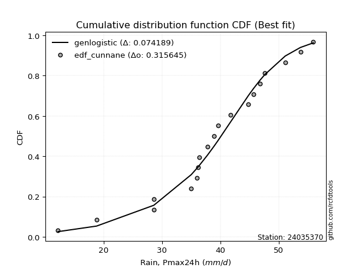</img></img>

</div>


### 12. EDF Adamowski (1981)

The Adamowski formula in hydrology refers to a specific plotting position formula used for estimating the non-parametric empirical distribution of hydrological events (like flood peaks) to calculate their return periods. This formula provides an alternative to traditional parametric methods (like the Gumbel or Log Pearson Type III distributions). 

<div align="center">


$P=(m-0.25)/(n+0.5)$


</div>


**12.1. Empirical values**

<div align="center">

|                | 0                    | 1                   | 2                   | 3                   | 4                   | 5                  | 6                   | 7                  | 8                   | 9             | 10                 | 11                 | 12                 | 13                 | 14                 | 15                 | 16                 | 17                 | 18                 |
|:---------------|:---------------------|:--------------------|:--------------------|:--------------------|:--------------------|:-------------------|:--------------------|:-------------------|:--------------------|:--------------|:-------------------|:-------------------|:-------------------|:-------------------|:-------------------|:-------------------|:-------------------|:-------------------|:-------------------|
| date           | 2024                 | 2006                | 2022                | 2007                | 2015                | 2021               | 2023                | 2014               | 2020                | 2008          | 2011               | 2009               | 2017               | 2018               | 2016               | 2010               | 2019               | 2013               | 2012               |
| x              | 12.2                 | 18.8                | 28.6                | 28.6                | 35.0                | 36.0               | 36.2                | 36.4               | 37.8                | 38.9          | 39.6               | 41.7               | 44.8               | 45.7               | 46.8               | 47.6               | 51.1               | 53.7               | 55.9               |
| m              | 1                    | 2                   | 3                   | 4                   | 5                   | 6                  | 7                   | 8                  | 9                   | 10            | 11                 | 12                 | 13                 | 14                 | 15                 | 16                 | 17                 | 18                 | 19                 |
| empirical_dist | edf_adamowski        | edf_adamowski       | edf_adamowski       | edf_adamowski       | edf_adamowski       | edf_adamowski      | edf_adamowski       | edf_adamowski      | edf_adamowski       | edf_adamowski | edf_adamowski      | edf_adamowski      | edf_adamowski      | edf_adamowski      | edf_adamowski      | edf_adamowski      | edf_adamowski      | edf_adamowski      | edf_adamowski      |
| empirical      | 0.038461538461538464 | 0.08974358974358974 | 0.14102564102564102 | 0.19230769230769232 | 0.24358974358974358 | 0.2948717948717949 | 0.34615384615384615 | 0.3974358974358974 | 0.44871794871794873 | 0.5           | 0.5512820512820513 | 0.6025641025641025 | 0.6538461538461539 | 0.7051282051282052 | 0.7564102564102564 | 0.8076923076923077 | 0.8589743589743589 | 0.9102564102564102 | 0.9615384615384616 |
| empirical_tr   | 1.04                 | 1.0985915492957747  | 1.164179104477612   | 1.2380952380952381  | 1.3220338983050848  | 1.4181818181818182 | 1.5294117647058822  | 1.6595744680851061 | 1.813953488372093   | 2.0           | 2.2285714285714286 | 2.5161290322580645 | 2.888888888888889  | 3.3913043478260874 | 4.105263157894736  | 5.2                | 7.090909090909088  | 11.14285714285714  | 26.000000000000018 |

</div>


**12.2. Kolmogorov-Smirnov fit test (sorted by Δ)**


<div align="center">

|                | 0                   | 1                   | 2                   | 3                   | 4                   | 5                   | 6                   | 7                   | 8                   | 9                     | 10                  | 11                  | 12                  | 13                  | 14                  | 15                  | 16                  | 17                  | 18                  | 19                  | 20                  | 21                  | 22                  | 23                  | 24                  | 25                  | 26                  | 27                  | 28                  | 29                  | 30                  | 31                  | 32                  | 33                  | 34                  | 35                  | 36                  | 37                  | 38                  | 39                  | 40                  | 41                  | 42                  | 43                  | 44                  | 45                  | 46                  | 47                  | 48                  | 49                  | 50                  | 51                  | 52                  | 53                  | 54                  | 55                  | 56                  | 57                  | 58                  | 59                  | 60                  | 61                  | 62                  | 63                  | 64                  | 65                  | 66                  | 67                  | 68                  | 69                  | 70                  | 71                  | 72                  | 73                  | 74                  | 75                  | 76                  | 77                  | 78                  | 79                  | 80                  | 81                  | 82                  | 83                  | 84                  | 85                  | 86                  | 87                  |
|:---------------|:--------------------|:--------------------|:--------------------|:--------------------|:--------------------|:--------------------|:--------------------|:--------------------|:--------------------|:----------------------|:--------------------|:--------------------|:--------------------|:--------------------|:--------------------|:--------------------|:--------------------|:--------------------|:--------------------|:--------------------|:--------------------|:--------------------|:--------------------|:--------------------|:--------------------|:--------------------|:--------------------|:--------------------|:--------------------|:--------------------|:--------------------|:--------------------|:--------------------|:--------------------|:--------------------|:--------------------|:--------------------|:--------------------|:--------------------|:--------------------|:--------------------|:--------------------|:--------------------|:--------------------|:--------------------|:--------------------|:--------------------|:--------------------|:--------------------|:--------------------|:--------------------|:--------------------|:--------------------|:--------------------|:--------------------|:--------------------|:--------------------|:--------------------|:--------------------|:--------------------|:--------------------|:--------------------|:--------------------|:--------------------|:--------------------|:--------------------|:--------------------|:--------------------|:--------------------|:--------------------|:--------------------|:--------------------|:--------------------|:--------------------|:--------------------|:--------------------|:--------------------|:--------------------|:--------------------|:--------------------|:--------------------|:--------------------|:--------------------|:--------------------|:--------------------|:--------------------|:--------------------|:--------------------|
| station        | 24035370            | 24035370            | 24035370            | 24035370            | 24035370            | 24035370            | 24035370            | 24035370            | 24035370            | 24035370              | 24035370            | 24035370            | 24035370            | 24035370            | 24035370            | 24035370            | 24035370            | 24035370            | 24035370            | 24035370            | 24035370            | 24035370            | 24035370            | 24035370            | 24035370            | 24035370            | 24035370            | 24035370            | 24035370            | 24035370            | 24035370            | 24035370            | 24035370            | 24035370            | 24035370            | 24035370            | 24035370            | 24035370            | 24035370            | 24035370            | 24035370            | 24035370            | 24035370            | 24035370            | 24035370            | 24035370            | 24035370            | 24035370            | 24035370            | 24035370            | 24035370            | 24035370            | 24035370            | 24035370            | 24035370            | 24035370            | 24035370            | 24035370            | 24035370            | 24035370            | 24035370            | 24035370            | 24035370            | 24035370            | 24035370            | 24035370            | 24035370            | 24035370            | 24035370            | 24035370            | 24035370            | 24035370            | 24035370            | 24035370            | 24035370            | 24035370            | 24035370            | 24035370            | 24035370            | 24035370            | 24035370            | 24035370            | 24035370            | 24035370            | 24035370            | 24035370            | 24035370            | 24035370            |
| empirical_dist | edf_adamowski       | edf_adamowski       | edf_adamowski       | edf_adamowski       | edf_adamowski       | edf_adamowski       | edf_adamowski       | edf_adamowski       | edf_adamowski       | edf_adamowski         | edf_adamowski       | edf_adamowski       | edf_adamowski       | edf_adamowski       | edf_adamowski       | edf_adamowski       | edf_adamowski       | edf_adamowski       | edf_adamowski       | edf_adamowski       | edf_adamowski       | edf_adamowski       | edf_adamowski       | edf_adamowski       | edf_adamowski       | edf_adamowski       | edf_adamowski       | edf_adamowski       | edf_adamowski       | edf_adamowski       | edf_adamowski       | edf_adamowski       | edf_adamowski       | edf_adamowski       | edf_adamowski       | edf_adamowski       | edf_adamowski       | edf_adamowski       | edf_adamowski       | edf_adamowski       | edf_adamowski       | edf_adamowski       | edf_adamowski       | edf_adamowski       | edf_adamowski       | edf_adamowski       | edf_adamowski       | edf_adamowski       | edf_adamowski       | edf_adamowski       | edf_adamowski       | edf_adamowski       | edf_adamowski       | edf_adamowski       | edf_adamowski       | edf_adamowski       | edf_adamowski       | edf_adamowski       | edf_adamowski       | edf_adamowski       | edf_adamowski       | edf_adamowski       | edf_adamowski       | edf_adamowski       | edf_adamowski       | edf_adamowski       | edf_adamowski       | edf_adamowski       | edf_adamowski       | edf_adamowski       | edf_adamowski       | edf_adamowski       | edf_adamowski       | edf_adamowski       | edf_adamowski       | edf_adamowski       | edf_adamowski       | edf_adamowski       | edf_adamowski       | edf_adamowski       | edf_adamowski       | edf_adamowski       | edf_adamowski       | edf_adamowski       | edf_adamowski       | edf_adamowski       | edf_adamowski       | edf_adamowski       |
| p_dist         | genlogistic         | johnsonsu           | weibull_min         | fisk                | pearson3            | logjohnsonsu        | gumbel_l            | logmielke           | logt                | loglaplace_asymmetric | mielke              | gompertz            | loggenlogistic      | logloggamma         | hypsecant           | logpearson3         | laplace_asymmetric  | logistic            | logweibull_min      | logfisk             | laplace             | nakagami            | t                   | exponnorm           | norm                | crystalball         | truncnorm           | nct                 | f                   | fatiguelife         | chi2                | betaprime           | loggumbel_l         | erlang              | gamma               | alpha               | invgamma            | maxwell             | ncf                 | rayleigh            | invgauss            | loglaplace          | gumbel_r            | loghypsecant        | invweibull          | moyal               | loglogistic         | halfnorm            | logexponnorm        | lognorm             | lognorm             | logcrystalball      | loglognorm          | logrice             | lognakagami         | logf                | logfatiguelife      | lognct              | logerlang           | halflogistic        | logbetaprime        | loginvgamma         | logncf              | kstwobign           | loginvgauss         | loggamma            | loggamma            | logalpha            | logmaxwell          | loginvweibull       | gibrat              | lograyleigh         | wald                | loggumbel_r         | loghalfnorm         | logkstwobign        | logmoyal            | loghalflogistic     | loggenexpon         | expon               | genexpon            | logtruncnorm        | loggompertz         | logwald             | loggibrat           | logexpon            | logchi2             | rice                |
| delta          | 0.07338726627223607 | 0.07535404585672348 | 0.07746332668835729 | 0.08053855559232012 | 0.08652921962517676 | 0.08705707835152302 | 0.08714059358660808 | 0.08800009286297475 | 0.08823230338262457 | 0.0887593997097886    | 0.08981585183143445 | 0.08997268572611147 | 0.09003972748354364 | 0.09365014092197307 | 0.09574072232242159 | 0.10166771908312808 | 0.1061651818388949  | 0.10677611667976969 | 0.10909105028683155 | 0.11339539964685727 | 0.11965394653139572 | 0.12229114674862365 | 0.12318427116893174 | 0.12318450485553975 | 0.12318498587873836 | 0.12318499256018492 | 0.12318501619889952 | 0.12357131045339995 | 0.12360825225056107 | 0.12407907368356777 | 0.13321171920543903 | 0.13434080875558654 | 0.13463672118643163 | 0.13767072890535412 | 0.14065926753334143 | 0.14232282412353295 | 0.15349018356325203 | 0.1560295124576521  | 0.167116384070899   | 0.16825255238682438 | 0.1694431064213556  | 0.17238835291810897 | 0.17585879691034303 | 0.19181311049205899 | 0.19564433927459676 | 0.19575293129101926 | 0.19769299865332177 | 0.20301744002729236 | 0.20465668996261102 | 0.20465774144692214 | 0.20465774144692214 | 0.20465787618055545 | 0.20465886080873033 | 0.2046606772572708  | 0.20489112008678298 | 0.20630887866402894 | 0.2073687197340389  | 0.20780957666620428 | 0.20900333053165202 | 0.21385241694256177 | 0.21513415938277977 | 0.2180949441905541  | 0.21879782568982856 | 0.22301876371288695 | 0.22369357164172296 | 0.22388679657624558 | 0.22388679657624558 | 0.22963151411339908 | 0.23899398093445415 | 0.24512596668419148 | 0.247251734118825   | 0.25091021941562586 | 0.252407039966194   | 0.2715042722795281  | 0.2845572250464401  | 0.2865734013648462  | 0.296812116460327   | 0.3054869660234857  | 0.32567973638673964 | 0.33333555358550004 | 0.33338115570946547 | 0.3335250629502987  | 0.3644556354735007  | 0.3671167100680569  | 0.3792995514595352  | 0.3978143390566224  | 0.4630519261384423  | 0.858974303548645   |
| deltao         | 0.31564497164100014 | 0.31564497164100014 | 0.31564497164100014 | 0.31564497164100014 | 0.31564497164100014 | 0.31564497164100014 | 0.31564497164100014 | 0.31564497164100014 | 0.31564497164100014 | 0.31564497164100014   | 0.31564497164100014 | 0.31564497164100014 | 0.31564497164100014 | 0.31564497164100014 | 0.31564497164100014 | 0.31564497164100014 | 0.31564497164100014 | 0.31564497164100014 | 0.31564497164100014 | 0.31564497164100014 | 0.31564497164100014 | 0.31564497164100014 | 0.31564497164100014 | 0.31564497164100014 | 0.31564497164100014 | 0.31564497164100014 | 0.31564497164100014 | 0.31564497164100014 | 0.31564497164100014 | 0.31564497164100014 | 0.31564497164100014 | 0.31564497164100014 | 0.31564497164100014 | 0.31564497164100014 | 0.31564497164100014 | 0.31564497164100014 | 0.31564497164100014 | 0.31564497164100014 | 0.31564497164100014 | 0.31564497164100014 | 0.31564497164100014 | 0.31564497164100014 | 0.31564497164100014 | 0.31564497164100014 | 0.31564497164100014 | 0.31564497164100014 | 0.31564497164100014 | 0.31564497164100014 | 0.31564497164100014 | 0.31564497164100014 | 0.31564497164100014 | 0.31564497164100014 | 0.31564497164100014 | 0.31564497164100014 | 0.31564497164100014 | 0.31564497164100014 | 0.31564497164100014 | 0.31564497164100014 | 0.31564497164100014 | 0.31564497164100014 | 0.31564497164100014 | 0.31564497164100014 | 0.31564497164100014 | 0.31564497164100014 | 0.31564497164100014 | 0.31564497164100014 | 0.31564497164100014 | 0.31564497164100014 | 0.31564497164100014 | 0.31564497164100014 | 0.31564497164100014 | 0.31564497164100014 | 0.31564497164100014 | 0.31564497164100014 | 0.31564497164100014 | 0.31564497164100014 | 0.31564497164100014 | 0.31564497164100014 | 0.31564497164100014 | 0.31564497164100014 | 0.31564497164100014 | 0.31564497164100014 | 0.31564497164100014 | 0.31564497164100014 | 0.31564497164100014 | 0.31564497164100014 | 0.31564497164100014 | 0.31564497164100014 |
| eval           | Δo > Δ              | Δo > Δ              | Δo > Δ              | Δo > Δ              | Δo > Δ              | Δo > Δ              | Δo > Δ              | Δo > Δ              | Δo > Δ              | Δo > Δ                | Δo > Δ              | Δo > Δ              | Δo > Δ              | Δo > Δ              | Δo > Δ              | Δo > Δ              | Δo > Δ              | Δo > Δ              | Δo > Δ              | Δo > Δ              | Δo > Δ              | Δo > Δ              | Δo > Δ              | Δo > Δ              | Δo > Δ              | Δo > Δ              | Δo > Δ              | Δo > Δ              | Δo > Δ              | Δo > Δ              | Δo > Δ              | Δo > Δ              | Δo > Δ              | Δo > Δ              | Δo > Δ              | Δo > Δ              | Δo > Δ              | Δo > Δ              | Δo > Δ              | Δo > Δ              | Δo > Δ              | Δo > Δ              | Δo > Δ              | Δo > Δ              | Δo > Δ              | Δo > Δ              | Δo > Δ              | Δo > Δ              | Δo > Δ              | Δo > Δ              | Δo > Δ              | Δo > Δ              | Δo > Δ              | Δo > Δ              | Δo > Δ              | Δo > Δ              | Δo > Δ              | Δo > Δ              | Δo > Δ              | Δo > Δ              | Δo > Δ              | Δo > Δ              | Δo > Δ              | Δo > Δ              | Δo > Δ              | Δo > Δ              | Δo > Δ              | Δo > Δ              | Δo > Δ              | Δo > Δ              | Δo > Δ              | Δo > Δ              | Δo > Δ              | Δo > Δ              | Δo > Δ              | Δo > Δ              | Δo > Δ              | Δo > Δ              | Δo <= Δ             | Δo <= Δ             | Δo <= Δ             | Δo <= Δ             | Δo <= Δ             | Δo <= Δ             | Δo <= Δ             | Δo <= Δ             | Δo <= Δ             | Δo <= Δ             |
| fit            | 1                   | 1                   | 1                   | 1                   | 1                   | 1                   | 1                   | 1                   | 1                   | 1                     | 1                   | 1                   | 1                   | 1                   | 1                   | 1                   | 1                   | 1                   | 1                   | 1                   | 1                   | 1                   | 1                   | 1                   | 1                   | 1                   | 1                   | 1                   | 1                   | 1                   | 1                   | 1                   | 1                   | 1                   | 1                   | 1                   | 1                   | 1                   | 1                   | 1                   | 1                   | 1                   | 1                   | 1                   | 1                   | 1                   | 1                   | 1                   | 1                   | 1                   | 1                   | 1                   | 1                   | 1                   | 1                   | 1                   | 1                   | 1                   | 1                   | 1                   | 1                   | 1                   | 1                   | 1                   | 1                   | 1                   | 1                   | 1                   | 1                   | 1                   | 1                   | 1                   | 1                   | 1                   | 1                   | 1                   | 1                   | 1                   | 0                   | 0                   | 0                   | 0                   | 0                   | 0                   | 0                   | 0                   | 0                   | 0                   |
| n              | 19                  | 19                  | 19                  | 19                  | 19                  | 19                  | 19                  | 19                  | 19                  | 19                    | 19                  | 19                  | 19                  | 19                  | 19                  | 19                  | 19                  | 19                  | 19                  | 19                  | 19                  | 19                  | 19                  | 19                  | 19                  | 19                  | 19                  | 19                  | 19                  | 19                  | 19                  | 19                  | 19                  | 19                  | 19                  | 19                  | 19                  | 19                  | 19                  | 19                  | 19                  | 19                  | 19                  | 19                  | 19                  | 19                  | 19                  | 19                  | 19                  | 19                  | 19                  | 19                  | 19                  | 19                  | 19                  | 19                  | 19                  | 19                  | 19                  | 19                  | 19                  | 19                  | 19                  | 19                  | 19                  | 19                  | 19                  | 19                  | 19                  | 19                  | 19                  | 19                  | 19                  | 19                  | 19                  | 19                  | 19                  | 19                  | 19                  | 19                  | 19                  | 19                  | 19                  | 19                  | 19                  | 19                  | 19                  | 19                  |
| best_fit       | 1                   | 0                   | 0                   | 0                   | 0                   | 0                   | 0                   | 0                   | 0                   | 0                     | 0                   | 0                   | 0                   | 0                   | 0                   | 0                   | 0                   | 0                   | 0                   | 0                   | 0                   | 0                   | 0                   | 0                   | 0                   | 0                   | 0                   | 0                   | 0                   | 0                   | 0                   | 0                   | 0                   | 0                   | 0                   | 0                   | 0                   | 0                   | 0                   | 0                   | 0                   | 0                   | 0                   | 0                   | 0                   | 0                   | 0                   | 0                   | 0                   | 0                   | 0                   | 0                   | 0                   | 0                   | 0                   | 0                   | 0                   | 0                   | 0                   | 0                   | 0                   | 0                   | 0                   | 0                   | 0                   | 0                   | 0                   | 0                   | 0                   | 0                   | 0                   | 0                   | 0                   | 0                   | 0                   | 0                   | 0                   | 0                   | 0                   | 0                   | 0                   | 0                   | 0                   | 0                   | 0                   | 0                   | 0                   | 0                   |
| best_fit_sort  | 1                   | 2                   | 3                   | 4                   | 5                   | 6                   | 7                   | 8                   | 9                   | 10                    | 11                  | 12                  | 13                  | 14                  | 15                  | 16                  | 17                  | 18                  | 19                  | 20                  | 21                  | 22                  | 23                  | 24                  | 25                  | 26                  | 27                  | 28                  | 29                  | 30                  | 31                  | 32                  | 33                  | 34                  | 35                  | 36                  | 37                  | 38                  | 39                  | 40                  | 41                  | 42                  | 43                  | 44                  | 45                  | 46                  | 47                  | 48                  | 49                  | 50                  | 51                  | 52                  | 53                  | 54                  | 55                  | 56                  | 57                  | 58                  | 59                  | 60                  | 61                  | 62                  | 63                  | 64                  | 65                  | 66                  | 67                  | 68                  | 69                  | 70                  | 71                  | 72                  | 73                  | 74                  | 75                  | 76                  | 77                  | 78                  | 79                  | 80                  | 81                  | 82                  | 83                  | 84                  | 85                  | 86                  | 87                  | 88                  |

</div>


**12.3. Best fit**

<div align="center">

|   id |   station | empirical_dist   | p_dist      |     delta |   deltao | eval   |   fit |   n |   best_fit |   best_fit_sort |
|-----:|----------:|:-----------------|:------------|----------:|---------:|:-------|------:|----:|-----------:|----------------:|
|    0 |  24035370 | edf_adamowski    | genlogistic | 0.0733873 | 0.315645 | Δo > Δ |     1 |  19 |          1 |               1 |

</div>


<div align="center">

</img></img>

</div>


## C. Best fit & Estimate extreme values for specific return periods - Tr

Best fit in probability distribution analysis means finding the theoretical distribution (like Normal, Poisson, Exponential) that most accurately mirrors your real-world data´s patterns (shape, center, spread) for better predictions, using methods like visual checks (Q-Q plots), goodness-of-fit tests (Kolmogorov-Smirnov, Chi-Squared), and information criteria (AIC) to score and select the simplest, most representative model.


### 1. Best fit (ordered by delta Δ)

<div align="center">

|   id |   station | empirical_dist   | p_dist      |     delta |   deltao | eval   |   fit |   n |   best_fit |   best_fit_sort |
|-----:|----------:|:-----------------|:------------|----------:|---------:|:-------|------:|----:|-----------:|----------------:|
|    0 |  24035370 | edf_weibull      | weibull_min | 0.0710531 | 0.315645 | Δo > Δ |     1 |  19 |          1 |               1 |
|    1 |  24035370 | edf_california   | fisk        | 0.0732654 | 0.315645 | Δo > Δ |     1 |  19 |          1 |               2 |
|    2 |  24035370 | edf_adamowski    | genlogistic | 0.0733873 | 0.315645 | Δo > Δ |     1 |  19 |          1 |               3 |
|    3 |  24035370 | edf_chegodayev   | genlogistic | 0.0736516 | 0.315645 | Δo > Δ |     1 |  19 |          1 |               4 |
|    4 |  24035370 | edf_jenkinson    | genlogistic | 0.0737048 | 0.315645 | Δo > Δ |     1 |  19 |          1 |               5 |
|    5 |  24035370 | edf_beard        | genlogistic | 0.0737048 | 0.315645 | Δo > Δ |     1 |  19 |          1 |               6 |
|    6 |  24035370 | edf_filliben     | genlogistic | 0.0737448 | 0.315645 | Δo > Δ |     1 |  19 |          1 |               7 |
|    7 |  24035370 | edf_tukey        | genlogistic | 0.0738294 | 0.315645 | Δo > Δ |     1 |  19 |          1 |               8 |
|    8 |  24035370 | edf_blom         | genlogistic | 0.0740533 | 0.315645 | Δo > Δ |     1 |  19 |          1 |               9 |
|    9 |  24035370 | edf_cunnane      | genlogistic | 0.0741885 | 0.315645 | Δo > Δ |     1 |  19 |          1 |              10 |
|   10 |  24035370 | edf_gringorten   | genlogistic | 0.0744065 | 0.315645 | Δo > Δ |     1 |  19 |          1 |              11 |
|   11 |  24035370 | edf_hazen        | genlogistic | 0.0747368 | 0.315645 | Δo > Δ |     1 |  19 |          1 |              12 |

</div>

:file_folder:Tables: [bestfit_24035370.csv](table/bestfit_24035370.csv) | [extreme_24035370.csv](table/extreme_24035370.csv)


### 2. Extreme values

In hydrology, a return period (or recurrence interval $Tr$) is the statistical average time between extreme events like floods or droughts of a specific magnitude, indicating how rare an event is, with a 100-year flood, for example, having a 1% chance of occurring in any given year, not that it happens exactly every century. It is a key tool for infrastructure design (like bridges or dams) and risk assessment, calculated from historical data to determine the probability of future events, although it is important to remember it is statistical average, and events can cluster or be missed.

> risk_rate: assuming the return period as the project useful life.

|   id |      tr |   prob_l |     prob_g |   alpha |   betaprime |    chi2 |   crystalball |   erlang |    expon |   exponnorm |       f |   fatiguelife |    fisk |   gamma |   genexpon |   genlogistic |   gibrat |   gompertz |   gumbel_l |   gumbel_r |   halflogistic |   halfnorm |   hypsecant |   invgamma |   invgauss |   invweibull |   johnsonsu |   kstwobign |   laplace |   laplace_asymmetric |   loggamma |   logistic |   lognorm |   maxwell |   mielke |   moyal |   nakagami |     ncf |     nct |    norm |   pearson3 |   rayleigh |    rice |       t |   truncnorm |     wald |   weibull_min |   logalpha |   logbetaprime |     logchi2 |   logcrystalball |   logerlang |   logexpon |   logexponnorm |     logf |   logfatiguelife |   logfisk |   loggenexpon |   loggenlogistic |   loggibrat |   loggompertz |   loggumbel_l |   loggumbel_r |   loghalflogistic |   loghalfnorm |   loghypsecant |   loginvgamma |   loginvgauss |   loginvweibull |   logjohnsonsu |   logkstwobign |   loglaplace |   loglaplace_asymmetric |   logloggamma |   loglogistic |   loglognorm |   logmaxwell |   logmielke |   logmoyal |   lognakagami |   logncf |   lognct |   logpearson3 |   lograyleigh |   logrice |      logt |   logtruncnorm |   logwald |   logweibull_min |   station |   n |   risk_rate |
|-----:|--------:|---------:|-----------:|--------:|------------:|--------:|--------------:|---------:|---------:|------------:|--------:|--------------:|--------:|--------:|-----------:|--------------:|---------:|-----------:|-----------:|-----------:|---------------:|-----------:|------------:|-----------:|-----------:|-------------:|------------:|------------:|----------:|---------------------:|-----------:|-----------:|----------:|----------:|---------:|--------:|-----------:|--------:|--------:|--------:|-----------:|-----------:|--------:|--------:|------------:|---------:|--------------:|-----------:|---------------:|------------:|-----------------:|------------:|-----------:|---------------:|---------:|-----------------:|----------:|--------------:|-----------------:|------------:|--------------:|--------------:|--------------:|------------------:|--------------:|---------------:|--------------:|--------------:|----------------:|---------------:|---------------:|-------------:|------------------------:|--------------:|--------------:|-------------:|-------------:|------------:|-----------:|--------------:|---------:|---------:|--------------:|--------------:|----------:|----------:|---------------:|----------:|-----------------:|----------:|----:|------------:|
|    0 |    2    | 0.5      | 0.5        | 38.2591 |     38.4398 | 38.4832 |       38.7053 |  38.3345 |  30.572  |     38.7053 | 38.6979 |       38.6742 | 39.4509 | 38.2673 |    30.5697 |       40.1246 |  35.438  |    39.9239 |    40.4935 |    36.9171 |        36.028  |    36.4772 |     38.7053 |    37.9701 |    37.6004 |      37.0035 |     40.2254 |     36.2116 |   38.7053 |              38.7996 |    36.1081 |    38.7053 |   36.6773 |   37.7743 |  40.2834 | 36.3398 |    38.7366 | 37.6722 | 38.6984 | 38.7053 |    39.9169 |    37.4441 | 15.5353 | 38.7053 |     38.7053 |  35.1769 |       40.1145 |    35.9132 |        36.4388 |     21.4756 |          36.6773 |     36.6355 |    26.1644 |        36.6774 |  36.6226 |          36.5876 |   38.7661 |       31.5038 |          40.2825 |     32.9217 |       28.7476 |       38.9109 |       34.572  |           33.571  |       34.0728 |        36.6773 |       36.2679 |       36.1739 |         35.5379 |        40.2911 |        33.4632 |      36.6773 |                 40.2556 |       40.1239 |       36.6773 |      36.6773 |      35.5658 |     40.3823 |    33.9185 |       36.6738 |  36.4417 |  36.607  |       40.2509 |       35.1798 |   36.6773 |   40.0673 |        31.2152 |   32.6393 |          39.0589 |  24035370 |  19 |    0.75     |
|    1 |    2.33 | 0.570815 | 0.429185   | 40.2976 |     40.4321 | 40.4854 |       40.6477 |  40.3238 |  34.62   |     40.6477 | 40.6441 |       40.6162 | 41.1781 | 40.2688 |    34.6172 |       41.7606 |  36.422  |    41.8031 |    42.1834 |    38.7169 |        37.8786 |    38.5735 |     40.2598 |    40.0418 |    39.768  |      39.4828 |     42.0295 |     38.9146 |   39.8807 |              40.049  |    38.6672 |    40.4166 |   39.1097 |   39.7923 |  42.2124 | 38.0436 |    40.6822 | 39.861  | 40.6433 | 40.6477 |    41.7777 |    39.492  | 15.8851 | 40.6477 |     40.6477 |  36.4505 |       41.913  |    38.4753 |        39.0695 |     25.8302 |          39.1097 |     39.2449 |    30.954  |        39.1097 |  39.0546 |          39.0154 |   40.7343 |       35.0847 |          42.2145 |     34.0103 |       32.6476 |       41.1465 |       36.6915 |           35.6887 |       36.5179 |        38.6114 |       38.7576 |       38.8926 |         39.2688 |        42.243  |        37.2722 |      38.1306 |                 42.1241 |       42.0908 |       38.8122 |      39.1097 |      38.0193 |     42.3232 |    35.8837 |       39.1123 |  39.3477 |  39.0915 |       42.4279 |       37.6438 |   39.1097 |   41.6186 |        34.6521 |   34.0429 |          40.9334 |  24035370 |  19 |    0.729209 |
|    2 |    5    | 0.8      | 0.2        | 48.1018 |     47.9513 | 48.066  |       47.8661 |  47.8481 |  54.8586 |     47.8662 | 47.8843 |       47.8479 | 47.8473 | 47.8436 |    54.8532 |       47.4504 |  42.0868 |    47.992  |    47.6427 |    46.5363 |        46.2519 |    47.4387 |     46.4952 |    48.04   |    48.2781 |      50.254  |     47.9824 |     50.3963 |   45.7577 |              46.2897 |    50.0661 |    47.0245 |   49.6502 |   47.7351 |  48.1538 | 45.9356 |    47.9147 | 48.5939 | 47.8727 | 47.8661 |    48.0352 |    47.6906 | 17.2856 | 47.8661 |     47.8661 |  43.5804 |       47.9014 |    50.021  |        50.8186 |     73.5274 |          49.6502 |     50.8834 |    71.7352 |        49.6501 |  49.5955 |          49.5422 |   49.3184 |       54.015  |          48.1608 |     41.0158 |       53.1457 |       49.2849 |       47.5147 |           47.0694 |       48.9541 |        47.4503 |       49.8202 |       51.3893 |         60.5902 |        48.4246 |        58.9187 |      46.3073 |                 47.3233 |       48.289  |       48.2879 |      49.6502 |      49.4351 |     48.2673 |    46.5806 |       49.6853 |  52.5938 |  49.9326 |       49.1711 |       49.3626 |   49.6503 |   48.8123 |        56.602  |   43.0914 |          47.6262 |  24035370 |  19 |    0.67232  |
|    3 |   10    | 0.9      | 0.1        | 53.4869 |     53.0404 | 53.2175 |       52.6547 |  52.9544 |  73.2306 |     52.6547 | 52.6939 |       52.6579 | 52.7589 | 52.9884 |    73.223  |       51.2399 |  48.544  |    51.492  |    50.6823 |    52.905  |        53.2056 |    53.9988 |     51.4744 |    53.6184 |    54.3349 |      59.027  |     51.3539 |     59.1381 |   51.0926 |              51.9549 |    59.628  |    51.891  |   58.1662 |   53.3248 |  51.4674 | 52.8069 |    52.7144 | 54.9178 | 52.6699 | 52.6547 |    51.6383 |    53.5363 | 18.2841 | 52.6547 |     52.6547 |  51.1469 |       51.3569 |    59.8744 |        60.7094 |    210.156  |          58.1662 |     60.6635 |   153.845  |        58.166  |  58.1187 |          58.0545 |   56.7768 |       73.5003 |          51.4716 |     50.7773 |       72.909  |       54.4945 |       58.6495 |           59.2334 |       60.81   |        55.9404 |       59.0778 |       62.338  |         86.261  |        51.6393 |        83.4961 |      55.2388 |                 50.677  |       51.5681 |       56.7161 |      58.1663 |      59.4681 |     51.5416 |    58.4597 |       58.234  |  64.0395 |  58.7741 |       52.3163 |       59.8857 |   58.1664 |   56.6547 |        85.0923 |   55.338  |          51.8158 |  24035370 |  19 |    0.651322 |
|    4 |   15    | 0.933333 | 0.0666667  | 56.2393 |     55.6104 | 55.825  |       55.0443 |  55.5372 |  83.9776 |     55.0443 | 55.096  |       55.062  | 55.435  | 55.5917 |    83.9686 |       53.2303 |  52.9979 |    53.0859 |    52.0588 |    56.4982 |        57.1407 |    57.4126 |     54.316  |    56.4875 |    57.485  |      63.9767 |     52.8852 |     63.779  |   54.2134 |              55.2688 |    65.1286 |    54.5425 |   62.9474 |   56.1928 |  53.0906 | 56.7947 |    55.1101 | 58.2352 | 55.0642 | 55.0443 |    53.2807 |    56.5483 | 18.7987 | 55.0443 |     55.0442 |  56.0058 |       52.9512 |    65.6113 |        66.4122 |    398.484  |          62.9474 |     66.2959 |   240.387  |        62.9472 |  62.9065 |          62.8364 |   61.3048 |       86.1503 |          53.092  |     58.8333 |       84.8834 |       57.0316 |       66.0469 |           67.4622 |       68.0752 |        61.45   |       64.3982 |       68.82   |        105.286  |        53.0062 |       100.473  |      61.2419 |                 52.7479 |       53.0076 |       61.9119 |      62.9476 |      65.3821 |     53.1347 |    66.6975 |       63.0359 |  70.7455 |  63.7681 |       53.4973 |       66.1554 |   62.9477 |   62.6633 |       106.542  |   64.9804 |          53.8325 |  24035370 |  19 |    0.644736 |
|    5 |   20    | 0.95     | 0.05       | 58.066  |     57.3044 | 57.546  |       56.6091 |  57.241  |  91.6027 |     56.6092 | 56.6698 |       56.6378 | 57.2846 | 57.3097 |    91.5928 |       54.5871 |  56.4917 |    54.0802 |    52.9156 |    59.0141 |        59.8978 |    59.6886 |     56.3206 |    58.3981 |    59.5952 |      67.4423 |     53.8376 |     66.9053 |   56.4276 |              57.6201 |    69.0284 |    56.3751 |   66.2895 |   58.0962 |  54.1741 | 59.6189 |    56.6791 | 60.4669 | 56.6323 | 56.6091 |    54.302  |    58.5502 | 19.1406 | 56.6091 |     56.6091 |  59.6266 |       53.9529 |    69.7087 |        70.4607 |    632.613  |          66.2895 |     70.2918 |   329.939  |        66.2893 |  66.2542 |          66.1801 |   64.6439 |       95.7442 |          54.1732 |     66.0374 |       93.5426 |       58.6702 |       71.7749 |           73.8995 |       73.3952 |        65.6602 |       68.1689 |       73.4944 |        121.052  |        53.8232 |       113.814  |      65.8929 |                 54.2684 |       53.8897 |       65.7787 |      66.2898 |      69.6282 |     54.195  |    73.2246 |       66.3933 |  75.5496 |  67.2712 |       54.1426 |       70.6817 |   66.2899 |   67.921  |       124.294  |   73.243  |          55.1273 |  24035370 |  19 |    0.641514 |
|    6 |   25    | 0.96     | 0.04       | 59.4231 |     58.557  | 58.8196 |       57.7611 |  58.5017 |  97.5172 |     57.7611 | 57.8287 |       57.7985 | 58.6995 | 58.5809 |    97.5065 |       55.6174 |  59.4042 |    54.7887 |    53.5254 |    60.9519 |        62.022  |    61.3821 |     57.872  |    59.8209 |    61.1726 |      70.1118 |     54.5143 |     69.2469 |   58.145  |              59.4439 |    72.0611 |    57.7771 |   68.8627 |   59.5093 |  54.9906 | 61.808  |    57.8343 | 62.1398 | 57.7867 | 57.7611 |    55.027  |    60.0377 | 19.3947 | 57.7611 |     57.7611 |  62.5268 |       54.6702 |    72.912  |        73.612  |    908.933  |          68.8627 |     73.4006 |   421.798  |        68.8624 |  68.8322 |          68.7551 |   67.3205 |      103.559  |          54.9878 |     72.7129 |      100.346  |       59.8647 |       76.5235 |           79.2751 |       77.6214 |        69.1156 |       71.1006 |       77.1737 |        134.788  |        54.3874 |       124.955  |      69.7423 |                 55.4779 |       54.5113 |       68.899  |      68.863  |      72.9578 |     54.9927 |    78.7201 |       68.9787 |  79.3127 |  69.9748 |       54.5576 |       74.244  |   68.8631 |   72.7588 |       139.675  |   80.6128 |          56.0676 |  24035370 |  19 |    0.639603 |
|    7 |   50    | 0.98     | 0.02       | 63.3689 |     62.1701 | 62.4986 |       61.0599 |  62.1414 | 115.889  |     61.0599 | 61.1489 |       61.1254 | 63.0226 | 62.2522 |   115.876  |       58.7376 |  69.6712 |    56.7155 |    55.1805 |    66.9216 |        68.567  |    66.3043 |     62.682  |    63.9736 |    65.805  |      78.335  |     56.3441 |     76.1232 |   63.48   |              65.109  |    81.5745 |    62.0604 |   76.7971 |   63.6075 |  57.4599 | 68.6037 |    61.1427 | 67.0733 | 61.0929 | 61.0599 |    56.98   |    64.3554 | 20.1323 | 61.0599 |     61.0599 |  71.9959 |       56.636  |    83.0559 |        83.5135 |   2851.63   |          76.7971 |     83.1603 |   904.597  |        76.7967 |  76.7846 |          76.6984 |   76.2045 |      130.059  |          57.4507 |    102.102  |      121.923  |       63.2316 |       93.2185 |           98.4232 |       91.3383 |        81.0277 |       80.2958 |       88.9607 |        187.694  |        55.8405 |       164.383  |      83.1937 |                 59.4095 |       56.174  |       79.3798 |      76.7975 |      83.5426 |     57.4001 |    98.5491 |       76.9535 |  91.2636 |  78.3466 |       55.4958 |       85.6347 |   76.7976 |   94.1881 |       197.746  |  110.243  |          58.7017 |  24035370 |  19 |    0.63583  |
|    8 |   75    | 0.986667 | 0.0133333  | 65.5232 |     64.1249 | 64.4921 |       62.8299 |  64.1127 | 126.636  |     62.8299 | 62.9315 |       62.9126 | 65.5195 | 64.2412 |   126.622  |       60.5273 |  76.6055 |    57.6916 |    56.0175 |    70.3914 |        72.3716 |    68.9838 |     65.4929 |    66.2506 |    68.3621 |      83.1147 |     57.2634 |     79.9065 |   66.6007 |              68.4229 |    87.2338 |    64.5344 |   81.4248 |   65.8356 |  58.8903 | 72.5778 |    62.9181 | 69.8086 | 62.8671 | 62.8299 |    57.9549 |    66.7044 | 20.5336 | 62.8299 |     62.8299 |  77.8228 |       57.6405 |    89.1576 |        89.4145 |   5622.13   |          81.4248 |     88.9712 |  1413.46   |        81.4244 |  81.4249 |          81.3336 |   81.8602 |      147.23   |          58.8771 |    128.411  |      134.832  |       65.0055 |      104.549  |          111.614  |       99.7984 |        88.9181 |       85.7656 |       96.1443 |        227.527  |        56.5289 |       191.154  |      92.2349 |                 61.8372 |       57.0022 |       86.1446 |      81.4253 |      89.9282 |     58.7922 |   112.385  |       81.6065 |  98.4717 |  83.2531 |       55.8671 |       92.5495 |   81.4255 |  113.944  |       240.019  |  133.662  |          60.0805 |  24035370 |  19 |    0.634587 |
|    9 |  100    | 0.99     | 0.01       | 66.9954 |     65.4534 | 65.8482 |       64.027  |  65.4532 | 134.261  |     64.0271 | 64.1375 |       64.1221 | 67.2823 | 65.5941 |   134.246  |       61.7875 |  81.9772 |    58.3306 |    56.5649 |    72.8472 |        75.0644 |    70.8092 |     67.4868 |    67.8105 |    70.1202 |      86.4976 |     57.8618 |     82.4987 |   68.8149 |              70.7742 |    91.3019 |    66.281  |   84.7119 |   67.3532 |  59.909  | 75.3972 |    64.1191 | 71.6939 | 64.0671 | 64.027  |    58.5861 |    68.3048 | 20.8069 | 64.0271 |     64.027  |  82.0711 |       58.3014 |    93.5742 |        93.6613 |   9133.69   |          84.7119 |     93.1506 |  1940.02   |        84.7115 |  84.7218 |          84.627  |   86.1043 |      160.212  |          59.8928 |    153.368  |      144.108  |       66.1927 |      113.39   |          122.004  |      106.006  |        94.9767 |       89.6979 |      101.385  |        260.728  |        56.9613 |       211.973  |      99.2395 |                 63.6197 |       57.5397 |       91.2651 |      84.7125 |      94.5549 |     59.7829 |   123.363  |       84.9122 | 103.696  |  86.7483 |       56.0742 |       97.5775 |   84.7126 |  133.352  |       274.258  |  153.817  |          60.9998 |  24035370 |  19 |    0.633968 |
|   10 |  200    | 0.995    | 0.005      | 70.3806 |     68.486  | 68.9475 |       66.7426 |  68.5157 | 152.633  |     66.7427 | 66.8745 |       66.8681 | 71.5111 | 68.6854 |   152.616  |       64.8033 |  96.5917 |    59.721  |    57.7548 |    78.7512 |        81.5383 |    74.984  |     72.2904 |    71.409  |    74.1953 |      94.6304 |     59.1528 |     88.469  |   74.1499 |              76.4394 |   101.312  |    70.4709 |   92.6685 |   70.8254 |  62.3968 | 82.19   |    66.8435 | 76.0771 | 66.7895 | 66.7426 |    59.9364 |    71.9665 | 21.4324 | 66.7427 |     66.7426 |  92.6533 |       59.7485 |   104.548  |       104.127  |  29709.7    |          92.6685 |    103.442  |  4160.6    |        92.6679 |  92.7049 |          92.6019 |   97.2038 |      194.396  |          62.3732 |    248.647  |      166.833  |       68.8484 |      137.829  |          151.117  |      121.694  |       111.322  |       99.376  |      114.549  |        361.747  |        57.8508 |       268.962  |     118.38   |                 68.1283 |       58.6975 |      104.824  |      92.6692 |     106.055  |     62.2006 |   154.423  |       92.9162 | 116.696  |  95.2422 |       56.4339 |      110.134  |   92.6694 |  214.224  |       372.954  |  218.239  |          63.0468 |  24035370 |  19 |    0.633042 |
|   11 |  250    | 0.996    | 0.004      | 71.4281 |     69.4181 | 69.901  |       67.5725 |  69.4576 | 158.548  |     67.5725 | 67.7113 |       67.7079 | 72.8687 | 69.6364 |   158.53   |       65.77   | 101.835  |    60.1304 |    58.1049 |    80.6492 |        83.6196 |    76.2683 |     73.8367 |    72.5257 |    75.465  |      97.2449 |     59.5297 |     90.3167 |   75.8673 |              78.2632 |   104.603  |    71.816  |   95.2459 |   71.8942 |  63.2115 | 84.3768 |    67.6762 | 77.4464 | 67.6216 | 67.5725 |    60.327  |    73.0936 | 21.625  | 67.5725 |     67.5724 |  96.1542 |       60.1771 |   108.189  |       107.573  |  43547.9    |          95.2459 |    106.827  |  5318.97   |        95.2453 |  95.2918 |          95.1862 |  101.062  |      206.323  |          63.1855 |    295.718  |      174.255  |       69.6499 |      146.754  |          161.88   |      126.973  |       117.161  |      102.559  |      118.959  |        401.907  |        58.0991 |       289.53   |     125.296  |                 69.6466 |       59.0356 |      109.59   |      95.2467 |     109.87   |     62.9919 |   166      |       95.5096 | 121.014  |  98.0037 |       56.5181 |      114.315  |   95.2469 |  258.338  |       409.982  |  245.015  |          63.6621 |  24035370 |  19 |    0.632858 |
|   12 |  500    | 0.998    | 0.002      | 74.5706 |     72.1968 | 72.7467 |       70.0334 |  72.2676 | 176.92   |     70.0335 | 70.1936 |       70.2002 | 77.079  | 72.474  |   176.899  |       68.7656 | 119.958  |    61.3048 |    59.1086 |    86.5403 |        90.0794 |    80.0976 |     78.6399 |    75.885  |    79.2983 |     105.36   |     60.6017 |     95.8538 |   81.2023 |              83.9283 |   115.062  |    75.9877 |  103.319  |   75.0837 |  65.7957 | 91.1695 |    70.1458 | 81.5899 | 70.0892 | 70.0334 |    61.4265 |    76.4568 | 22.1995 | 70.0335 |     70.0334 | 107.286  |       61.4126 |   119.863  |       118.538  | 143823      |         103.319  |    117.594  | 11407.2    |       103.318  | 103.397  |         103.283  |  114.03   |      246.45   |          65.7618 |    538.384  |      197.617  |       71.9996 |      178.308  |          200.416  |      144.109  |       137.323  |      112.679  |      133.233  |        557.228  |        58.7762 |       361.076  |     149.462  |                 74.5823 |       59.9991 |      125.795  |     103.32   |     122.086  |     65.5011 |   207.793  |      103.635  | 134.867  | 106.683  |       56.7118 |      127.757  |  103.32   |  531.014  |       542.081  |  354.006  |          65.4594 |  24035370 |  19 |    0.632489 |
|   13 |  750    | 0.998667 | 0.00133333 | 76.3401 |     73.7499 | 74.339  |       71.4005 |  73.8393 | 187.667  |     71.4006 | 71.5732 |       71.5859 | 79.5389 | 74.0616 |   187.645  |       70.5145 | 131.942  |    61.9328 |    59.645  |    89.9843 |        93.8558 |    82.2369 |     81.4496 |    77.7824 |    81.4721 |     110.104  |     61.1688 |     98.9644 |   84.323  |              87.2422 |   121.355  |    78.4249 |  108.095  |   76.8675 |  67.3491 | 95.143  |    71.5178 | 83.9456 | 71.4601 | 71.4005 |    62.0002 |    78.3374 | 22.5207 | 71.4006 |     71.4005 | 113.96   |       62.0773 |   126.964  |       125.148  | 290521      |         108.095  |    124.077  | 17824      |       108.094  | 108.194  |         108.076  |  122.363  |      272.208  |          67.3103 |    800.169  |      211.486  |       73.2877 |      199.809  |          227.063  |      154.67   |       150.689  |      118.772  |      142.01   |        674.515  |        59.1168 |       408.767  |     165.705  |                 77.6301 |       60.5107 |      136.35   |     108.096  |     129.502  |     67.0089 |   236.962  |      108.443  | 143.296  | 111.839  |       56.7897 |      135.952  |  108.096  |  912.613  |       630.83   |  441.401  |          66.4406 |  24035370 |  19 |    0.632366 |
|   14 | 1000    | 0.999    | 0.001      | 77.5686 |     74.8232 | 75.4401 |       72.3418 |  74.9259 | 195.292  |     72.3418 | 72.5232 |       72.5404 | 81.2833 | 75.1593 |   195.269  |       71.7544 | 141.114  |    62.3557 |    60.006  |    92.4272 |        96.5346 |    83.7143 |     83.4431 |    79.102  |    82.9875 |     113.469  |     61.5479 |    101.119  |   86.5372 |              89.5935 |   125.904  |    80.1533 |  111.511  |   78.1004 |  68.4715 | 97.9622 |    72.4626 | 85.5902 | 72.404  | 72.3418 |    62.3804 |    79.637  | 22.7427 | 72.3419 |     72.3418 | 118.761  |       62.5263 |   132.131  |       129.93   | 479227      |         111.511  |    128.765  | 24464.1    |       111.511  | 111.626  |         111.506  |  128.639  |      291.567  |          68.4292 |   1083.61   |      221.412  |       74.1676 |      216.615  |          248.086  |      162.411  |       160.954  |      123.178  |      148.44   |        772.392  |        59.3377 |       445.453  |     178.289  |                 79.8678 |       60.854  |      144.368  |     111.513  |     134.889  |     68.0981 |   260.108  |      111.884  | 149.431  | 115.537  |       56.8334 |      141.92   |  111.513  | 1432.34   |       698.138  |  517.323  |          67.1093 |  24035370 |  19 |    0.632305 |

<div align="center">

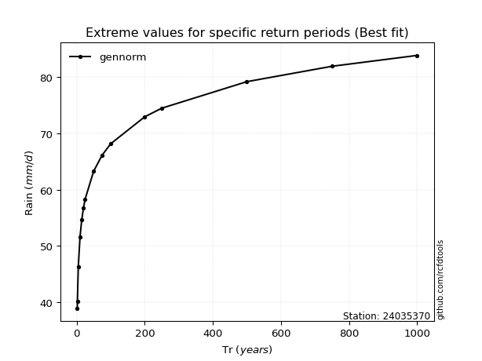</img>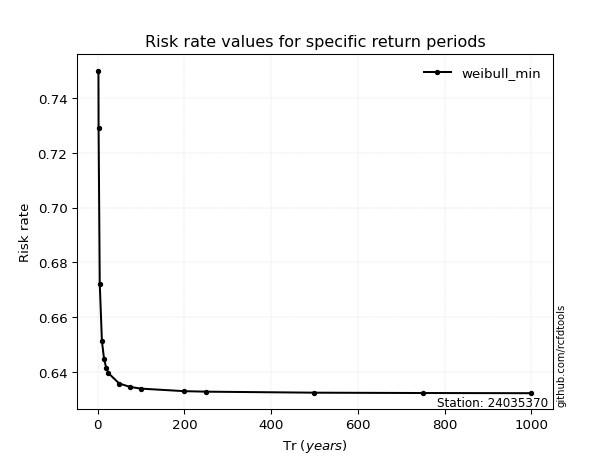</img>

</div>


<sub>**APP DISCLAIMER**: NO WARRANTY - This software is provided by [github.com/rcfdtools](https://github.com/rcfdtools) "as is", without any express or implied warranty, including warranties of merchantability, fitness for a particular purpose, or non-infringement. There is no guarantee that the software will be error-free or operate without interruption. LIMITATION OF LIABILITY - Neither the authors nor copyright holders will be liable for claims or damages arising from the software or its use. You are responsible for determining if the software is appropriate for your use and assume all associated risks, including errors, legal compliance, and data loss. NO PROFESSIONAL ADVICE - The software provides general information and does not offer professional advice. It should not replace consultation with professional advisors.</sub>