<div align="center">


</div>

# PMP Station (Rain, Pmax24h): 24035390

Probable Maximum Precipitation (PMP) is the greatest amount of rainfall for a specific duration that is meteorologically possible for a given location, acting as a "worst-case" scenario for extreme storms, crucial for designing safety-critical infrastructure like bridges, river deviations, dams, spillways, and nuclear plants to prevent catastrophic failure. PMP is calculated by hydrologists using meteorological data to determine the upper limit of extreme rainfall, often leading to the Probable Maximum Flood (PMF) for flood control design, and is increasingly being studied for climate change impacts. Probable Maximum Precipitation (PMP) is the theoretical upper limit of rainfall, a deterministic estimate for extreme events, while probability distributions (like GEV, Gumbel) describe the likelihood and frequency of various precipitation amounts, including rare ones, showing how often events occur, with PMP representing the extreme end of these distributions, used for critical infrastructure design to ensure safety against the worst conceivable weather, unlike standard statistical forecasts which cover typical probabilities.

The most common probability distributions in hydrology, used for analyzing floods, rainfall, and streamflow, include the Normal, Log-Normal, Gumbel, Gamma (including Log-Pearson Type III), and Generalized Extreme Value (GEV) distributions, often chosen based on the data´s skewness and whether modeling extremes or general conditions, with Gumbel and GEV popular for extreme events like floods, while the Normal distribution serves as a baseline, though often requiring transformations for skewed hydrological data. These distributions help in designing water infrastructure, managing water resources, and forecasting hydrologic events.

> Hydrological data often isn´t perfectly normal (it´s skewed), so different distributions are needed for different applications, such as: **Flood Frequency Analysis**: Using Gumbel, GEV, or Log-Pearson Type III for predicting extreme flood magnitudes and their return periods, **Rainfall Analysis**: Normal for annual totals, but Log-Normal, Weibull, or GEV for intensity or extreme daily rainfall, **Streamflow Modeling**: Gamma and Log-Normal for maximum flows, GEV for minimum flows, and Kappa for daily flows.

<div align="center">

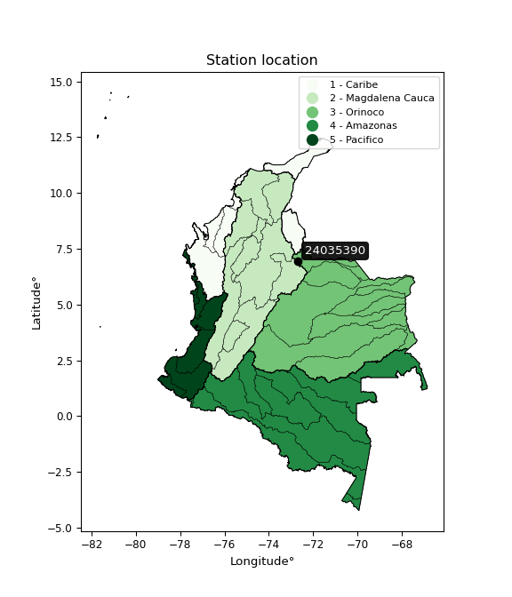</img>

</div>


## A. General information


### 1. General running parameters

• app_version: _v20260103_. • runtime: _2026-01-05 16:20:51.132608_. • Python version: _3.14.0_. • SciPy version: _1.16.3_. • Pandas version: _2.3.3_. • NumPy version: _2.3.5_. • Stations dataset (station_dataset_file): _dataset/pmax24h_in/automatic_colombia_2003_2024.csv_. • Stations catalog (station_catalog_file): _dataset/CNE.xls_. • Minimum year to eval til year_max (date_min): _1900_. • Maximum year to eval since year_min (date_max): _2024_. • Creates, save and include plots into reports (create_plot): _True_. • Plot only fit distributions with Δo > Δ (plot_only_fit): _True_. • Plot only simple graphs avoiding multiple CDFs and multiple Extreme values plots (plot_only_simple): _True_. • Eval low extreme values, if False, evaluates high extreme values (low_extreme): _False_. • Eval every SciPy distribution as logarithmic (pdist_logarithmic_on): _True_. • Standard deviation normalized (ddof): _1.0_. • Return periods to eval in years (Tr): _[2, 2.33, 5, 10, 15, 20, 25, 50, 75, 100, 200, 250, 500, 750, 1000]_. • Minimum data sample per station, 0 means any (minimum_sample): _5_. • Z-Score maximum threshold to adjust a value, 0 means disable (zscore_max): _3.5_. • Z-Score minimum threshold to adjust a value, 0 means disable (zscore_min): _-2.5_. • Avoid zeros, e.g. rain = 0 (avoid_zeros): _True_. • Avoid null values (avoid_nans): _True_. 

[:file_folder:Dataset file](../../dataset/pmax24h_in/automatic_colombia_2003_2024.csv)

> Delta Degrees of Freedom (DDOF): is a parameter used in the formulas for calculating variance and standard deviation. When ddof=0, the divisor is $N$ (the total number of observations) and this is used when your data set is the entire population. When ddof=1, the divisor is $N-1$ and this is used when your data set is a sample drawn from a larger population. Using $N-1$ provides an unbiased estimate of the population variance (known as Bessel´s correction).


### 2. Station info and location

|   id |   CODIGO | NOMBRE                               | CATEGORIA               | TECNOLOGIA                | ESTADO   | FECHA_INSTALACION   |   FECHA_SUSPENSION |   ALTITUD |   LATITUD |   LONGITUD | DEPARTAMENTO   | MUNICIPIO   | AREA_OPERATIVA                         | ENTIDAD                                                     | AREA_HIDROGRAFICA   | ZONA_HIDROGRAFICA   | SUBZONA_HIDROGRAFICA   |   CORRIENTE | Catalogo   |   Version |
|-----:|---------:|:-------------------------------------|:------------------------|:--------------------------|:---------|:--------------------|-------------------:|----------:|----------:|-----------:|:---------------|:------------|:---------------------------------------|:------------------------------------------------------------|:--------------------|:--------------------|:-----------------------|------------:|:-----------|----------:|
|    0 | 24035390 | PARAMO ALMORZADERO  - AUT [24035390] | Climatológica Principal | Automática con Telemetría | Activa   | 25/10/2004          |                nan |      3733 |   6.94539 |   -72.6963 | Santander      | Cerrito     | Area Operativa 08 - Santanderes-Arauca | INSTITUTO DE HIDROLOGIA METEOROLOGIA Y ESTUDIOS AMBIENTALES | Magdalena Cauca     | Sogamoso            | Río Chicamocha         |         nan | CNE_IDEAM  |  20251226 |

<div align="center">

Dynamic map: [:earth_americas:Google](http://maps.google.com/maps?q=6.94539,-72.69633) [:earth_americas:OSM](https://www.openstreetmap.org/#map=18/6.94539/-72.69633&layers=P) [:earth_americas:Bing](https://www.bing.com/maps?cp=6.94539~-72.69633&lvl=18) [:earth_americas:Apple](https://maps.apple.com/frame?center=6.94539%2C-72.69633&span=0.003%2C0.006)

</div>


<div align="center">

```geojson
{
  "type": "Feature",
  "geometry": {
    "type": "Point", 
    "coordinates": [-72.69633, 6.94539]
  }, 
  "properties": {
    "Name": "24035390"
  }
}
```

</div>


### 3. Discrete values table and plot

<div align="center">

|               |           0 |         1 |           2 |           3 |          4 |            5 |            6 |           7 |           8 |          9 |         10 |          11 |          12 |          13 |           14 |          15 |           16 |          17 |          18 |
|:--------------|------------:|----------:|------------:|------------:|-----------:|-------------:|-------------:|------------:|------------:|-----------:|-----------:|------------:|------------:|------------:|-------------:|------------:|-------------:|------------:|------------:|
| Date          | 2005        | 2006      | 2007        | 2008        | 2009       | 2010         | 2011         | 2012        | 2013        | 2014       | 2015       | 2016        | 2017        | 2018        | 2019         | 2020        | 2021         | 2022        | 2023        |
| Value         |   32.1      |   97      |   40.2      |   29.8      |   28.5     |   48.1       |   47.4       |   24.9      |   34.2      |   46.2947  |   49.3     |   34.2      |   35.9      |   33.7      |   48.6       |   38        |   44.3       |   32.6      |   32.2      |
| Value_initial |   32.1      |   97      |   40.2      |   29.8      |   28.5     |   48.1       |   47.4       |   24.9      |   34.2      |  148.6     |   49.3     |   34.2      |   35.9      |   33.7      |   48.6       |   38        |   44.3       |   32.6      |   32.2      |
| count         |   19        |   19      |   19        |   19        |   19       |   19         |   19         |   19        |   19        |   19       |   19       |   19        |   19        |   19        |   19         |   19        |   19         |   19        |   19        |
| mean          |   46.2947   |   46.2947 |   46.2947   |   46.2947   |   46.2947  |   46.2947    |   46.2947    |   46.2947   |   46.2947   |   46.2947  |   46.2947  |   46.2947   |   46.2947   |   46.2947   |   46.2947    |   46.2947   |   46.2947    |   46.2947   |   46.2947   |
| std           |   29.2114   |   29.2114 |   29.2114   |   29.2114   |   29.2114  |   29.2114    |   29.2114    |   29.2114   |   29.2114   |   29.2114  |   29.2114  |   29.2114   |   29.2114   |   29.2114   |   29.2114    |   29.2114   |   29.2114    |   29.2114   |   29.2114   |
| zscore        |   -0.485931 |    1.7358 |   -0.208642 |   -0.564667 |   -0.60917 |    0.0617999 |    0.0378367 |   -0.732409 |   -0.414041 |    3.50223 |    0.10288 |   -0.414041 |   -0.355845 |   -0.431158 |    0.0789164 |   -0.283955 |   -0.0682861 |   -0.468814 |   -0.482507 |


</div>


<div align="center">

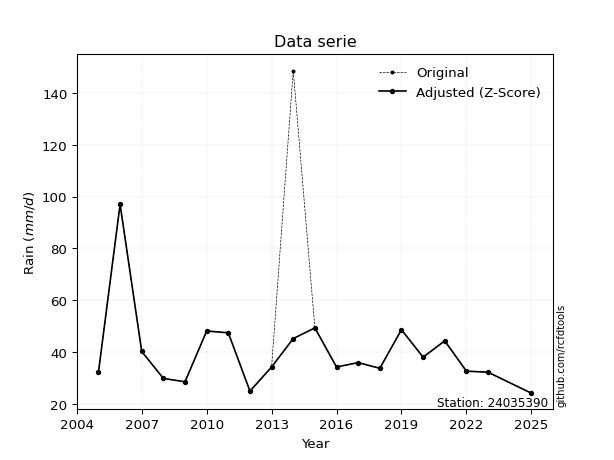</img>

</div>


> The initial value (value_initial) correspond to the initial obtained or null completed value, and value (value) is adjusted only when the initial value is outside the valid range (outlier) definite through the Z-Score value. If Z-Score is active, values out of range or outliers are replaced with the station mean value. A Z-Score (or standard score) measures how many standard deviations a data point is from the mean of a dataset, indicating its relative position; positive scores mean above the mean, negative mean below, and a score of zero is exactly at the mean, allowing for comparison of values from different distributions. It´s calculated using the formula $z=(x–μ)/σ$, where $x$ is the data point, $μ$ is the mean, and $σ$ is the standard deviation, helping identify outliers and understand probability.
>
> <sub>**Note**: In this study, "completing" (filling gaps in) and "extending" (forecasting or lengthening the historical record) rainfall data series are avoided for certain critical analyses because they introduce artificial bias and uncertainty, which can distort the statistics of rare events (extremes), alter day-to-day variability, and compromise the integrity and homogeneity of the original data. Some reasons against Completing/Extending rainfall data are: **Distortion of Extremes and Variability**: The primary issue is that most gap-filling or extension methods rely on averaging or regression with nearby stations, which inherently smooths the data. Rainfall is highly variable in space and time, with a large percentage of zero values and occasional large storms. Infilling methods often underestimate the highest values and overestimate the lowest (zero) values, which severely distorts analyses focused on flood frequency, drought severity, and intensity-duration-frequency (IDF) curves, **Loss of Data Homogeneity**: Infilled or extended data are synthetic estimates, not actual measurements. Combining these estimates with observed data can violate the assumption of data homogeneity, which requires that the data properties do not change over time. Inhomogeneity can lead to incorrect conclusions about long-term trends or changes in climate patterns, **Propagation of Errors**: Errors and biases from the original data (e.g., wind-induced undercatch, instrument errors, site changes) or the data used for imputation can propagate through the analysis, leading to unreliable hydrological models and inaccurate predictions, **Compromised Statistical Integrity**: For statistical analyses, especially those involving the frequency of events, using artificial data can introduce time bias or autocorrelation that doesn´t exist in reality, making it difficult to assess the true probability of events, **Difficulty in Validation**: It is difficult to accurately validate the quality of filled or extended data, especially for past periods where ground-truth measurements are unavailable. The reliability of imputation techniques heavily depends on the density of the surrounding station network and the complexity of the local topography.</sub>


### 4. Active continuous probability distributions from SciPy (44 of 104 available)

A Probability Density Function (PDF) describes the relative likelihood of a continuous random variable falling within a specific range, where the total area under its curve equals 1, and the area over any interval gives the actual probability for that range. Unlike discrete probabilities (like rolling a die), a PDF shows density, not direct probability for a single point (which is zero), with higher points indicating higher likelihood, often visualized as a bell curve for normal distributions.

A log of a probability density function (log-PDF) is simply the logarithm of the PDF´s value, denoted as $log(f(x))$, useful for converting multiplication of probabilities into addition, improving numerical stability with tiny numbers, and connecting to information theory concepts like entropy. Instead of dealing with very small probabilities (e.g., 0.000001), log-PDFs use negative numbers (e.g., $log(0.00001) ≈ -11.51$ that are easier for computers to handle, preventing underflow errors and simplifying complex calculations. In this study, each active probability distribution from SciPy is also evaluated in the $log$ form.

[scipy.stats](https://docs.scipy.org/doc/scipy/reference/stats.html) is a Python´s powerful submodule within the SciPy library for comprehensive statistical analysis, offering over 130 probability distributions (like Normal, Poisson), functions for descriptive stats (mean, variance), hypothesis testing (t-tests, chi-square), random variable generation, and statistical tests, making it essential for data science, modeling, and research. It provides tools to explore, model, and draw conclusions from data efficiently, working seamlessly with NumPy.

<div align="center">

|   id | p_dist             |   n_parameter | fit_method   | label                                                                       | active   | ref                                                                                                        |
|-----:|:-------------------|--------------:|:-------------|:----------------------------------------------------------------------------|:---------|:-----------------------------------------------------------------------------------------------------------|
|    0 | alpha              |             3 | MLE          | Alpha                                                                       | True     | [:mortar_board:](https://docs.scipy.org/doc/scipy/reference/generated/scipy.stats.alpha.html)              |
|    1 | betaprime          |             4 | MLE          | Beta prime                                                                  | True     | [:mortar_board:](https://docs.scipy.org/doc/scipy/reference/generated/scipy.stats.betaprime.html)          |
|    2 | chi2               |             3 | MLE          | Chi²                                                                        | True     | [:mortar_board:](https://docs.scipy.org/doc/scipy/reference/generated/scipy.stats.chi2.html)               |
|    3 | crystalball        |             4 | MLE          | Crystalball                                                                 | True     | [:mortar_board:](https://docs.scipy.org/doc/scipy/reference/generated/scipy.stats.crystalball.html)        |
|    4 | erlang             |             3 | MLE          | Erlang                                                                      | True     | [:mortar_board:](https://docs.scipy.org/doc/scipy/reference/generated/scipy.stats.erlang.html)             |
|    5 | expon              |             2 | MLE          | Exponential                                                                 | True     | [:mortar_board:](https://docs.scipy.org/doc/scipy/reference/generated/scipy.stats.expon.html)              |
|    6 | exponnorm          |             3 | MLE          | Exponentially modified Normal                                               | True     | [:mortar_board:](https://docs.scipy.org/doc/scipy/reference/generated/scipy.stats.exponnorm.html)          |
|    7 | f                  |             4 | MLE          | F                                                                           | True     | [:mortar_board:](https://docs.scipy.org/doc/scipy/reference/generated/scipy.stats.f.html)                  |
|    8 | fatiguelife        |             3 | MLE          | Fatigue-life (Birnbaum-Saunders)                                            | True     | [:mortar_board:](https://docs.scipy.org/doc/scipy/reference/generated/scipy.stats.fatiguelife.html)        |
|    9 | fisk               |             3 | MLE          | Fisk                                                                        | True     | [:mortar_board:](https://docs.scipy.org/doc/scipy/reference/generated/scipy.stats.fisk.html)               |
|   10 | gamma              |             3 | MLE          | Gamma                                                                       | True     | [:mortar_board:](https://docs.scipy.org/doc/scipy/reference/generated/scipy.stats.gamma.html)              |
|   11 | genexpon           |             5 | MLE          | Generalized exponential                                                     | True     | [:mortar_board:](https://docs.scipy.org/doc/scipy/reference/generated/scipy.stats.genexpon.html)           |
|   12 | genlogistic        |             3 | MLE          | Generalized logistic                                                        | True     | [:mortar_board:](https://docs.scipy.org/doc/scipy/reference/generated/scipy.stats.genlogistic.html)        |
|   13 | gibrat             |             2 | MM           | Gibrat                                                                      | True     | [:mortar_board:](https://docs.scipy.org/doc/scipy/reference/generated/scipy.stats.gibrat.html)             |
|   14 | gompertz           |             3 | MLE          | Gompertz (or truncated Gumbel)                                              | True     | [:mortar_board:](https://docs.scipy.org/doc/scipy/reference/generated/scipy.stats.gompertz.html)           |
|   15 | gumbel_l           |             2 | MM           | Gumbel Left Skew                                                            | True     | [:mortar_board:](https://docs.scipy.org/doc/scipy/reference/generated/scipy.stats.gumbel_l.html)           |
|   16 | gumbel_r           |             2 | MM           | Gumbel Right Skew                                                           | True     | [:mortar_board:](https://docs.scipy.org/doc/scipy/reference/generated/scipy.stats.gumbel_r.html)           |
|   17 | halflogistic       |             2 | MM           | Half-logistic                                                               | True     | [:mortar_board:](https://docs.scipy.org/doc/scipy/reference/generated/scipy.stats.halflogistic.html)       |
|   18 | halfnorm           |             2 | MM           | Half Normal                                                                 | True     | [:mortar_board:](https://docs.scipy.org/doc/scipy/reference/generated/scipy.stats.halfnorm.html)           |
|   19 | hypsecant          |             2 | MM           | hyperbolic secant                                                           | True     | [:mortar_board:](https://docs.scipy.org/doc/scipy/reference/generated/scipy.stats.hypsecant.html)          |
|   20 | invgamma           |             3 | MLE          | Inverted gamma                                                              | True     | [:mortar_board:](https://docs.scipy.org/doc/scipy/reference/generated/scipy.stats.invgamma.html)           |
|   21 | invgauss           |             3 | MLE          | Inverse Gaussian                                                            | True     | [:mortar_board:](https://docs.scipy.org/doc/scipy/reference/generated/scipy.stats.invgauss.html)           |
|   22 | invweibull         |             3 | MLE          | Inverted Weibull                                                            | True     | [:mortar_board:](https://docs.scipy.org/doc/scipy/reference/generated/scipy.stats.invweibull.html)         |
|   23 | johnsonsu          |             4 | MLE          | Johnson Su                                                                  | True     | [:mortar_board:](https://docs.scipy.org/doc/scipy/reference/generated/scipy.stats.johnsonsu.html)          |
|   24 | kstwobign          |             2 | MLE          | Limiting distribution of scaled Kolmogorov-Smirnov two-sided test statistic | True     | [:mortar_board:](https://docs.scipy.org/doc/scipy/reference/generated/scipy.stats.kstwobign.html)          |
|   25 | laplace            |             2 | MM           | Laplace                                                                     | True     | [:mortar_board:](https://docs.scipy.org/doc/scipy/reference/generated/scipy.stats.laplace.html)            |
|   26 | laplace_asymmetric |             3 | MLE          | Asymmetric Laplace                                                          | True     | [:mortar_board:](https://docs.scipy.org/doc/scipy/reference/generated/scipy.stats.laplace_asymmetric.html) |
|   27 | loggamma           |             3 | MLE          | Log gamma                                                                   | True     | [:mortar_board:](https://docs.scipy.org/doc/scipy/reference/generated/scipy.stats.loggamma.html)           |
|   28 | logistic           |             2 | MM           | Logistic (or Sech-squared)                                                  | True     | [:mortar_board:](https://docs.scipy.org/doc/scipy/reference/generated/scipy.stats.logistic.html)           |
|   29 | lognorm            |             3 | MLE          | Log Normal                                                                  | True     | [:mortar_board:](https://docs.scipy.org/doc/scipy/reference/generated/scipy.stats.lognorm.html)            |
|   30 | maxwell            |             2 | MM           | Maxwell                                                                     | True     | [:mortar_board:](https://docs.scipy.org/doc/scipy/reference/generated/scipy.stats.maxwell.html)            |
|   31 | mielke             |             4 | MLE          | Mielke Beta-Kappa / Dagum                                                   | True     | [:mortar_board:](https://docs.scipy.org/doc/scipy/reference/generated/scipy.stats.mielke.html)             |
|   32 | moyal              |             2 | MM           | Moyal                                                                       | True     | [:mortar_board:](https://docs.scipy.org/doc/scipy/reference/generated/scipy.stats.moyal.html)              |
|   33 | nakagami           |             3 | MLE          | Nakagami                                                                    | True     | [:mortar_board:](https://docs.scipy.org/doc/scipy/reference/generated/scipy.stats.nakagami.html)           |
|   34 | ncf                |             5 | MLE          | Non-central F distribution                                                  | True     | [:mortar_board:](https://docs.scipy.org/doc/scipy/reference/generated/scipy.stats.ncf.html)                |
|   35 | nct                |             4 | MLE          | Non-central Student’s t                                                     | True     | [:mortar_board:](https://docs.scipy.org/doc/scipy/reference/generated/scipy.stats.nct.html)                |
|   36 | norm               |             2 | MM           | Normal                                                                      | True     | [:mortar_board:](https://docs.scipy.org/doc/scipy/reference/generated/scipy.stats.norm.html)               |
|   37 | pearson3           |             3 | MM           | Pearson type III                                                            | True     | [:mortar_board:](https://docs.scipy.org/doc/scipy/reference/generated/scipy.stats.pearson3.html)           |
|   38 | rayleigh           |             2 | MM           | Rayleigh                                                                    | True     | [:mortar_board:](https://docs.scipy.org/doc/scipy/reference/generated/scipy.stats.rayleigh.html)           |
|   39 | rice               |             3 | MLE          | Rice                                                                        | True     | [:mortar_board:](https://docs.scipy.org/doc/scipy/reference/generated/scipy.stats.rice.html)               |
|   40 | t                  |             3 | MLE          | Student’s t                                                                 | True     | [:mortar_board:](https://docs.scipy.org/doc/scipy/reference/generated/scipy.stats.t.html)                  |
|   41 | truncnorm          |             4 | MLE          | Truncated normal                                                            | True     | [:mortar_board:](https://docs.scipy.org/doc/scipy/reference/generated/scipy.stats.truncnorm.html)          |
|   42 | wald               |             2 | MM           | Wald                                                                        | True     | [:mortar_board:](https://docs.scipy.org/doc/scipy/reference/generated/scipy.stats.wald.html)               |
|   43 | weibull_min        |             3 | MLE          | Weibull minimum                                                             | True     | [:mortar_board:](https://docs.scipy.org/doc/scipy/reference/generated/scipy.stats.weibull_min.html)        |

</div>

> **n_parameter:** # arguments & localization & scale.
>
> **Fit methods:** (MLE) maximum likelihood, (MM) L-moments.
>
>**Inactive** (With the only purpose of prevent loops, zero divisions, infinite values, over high estimated values or horizontal trending for recurrence intervals estimations, the follow distributions were disabled.)**:** foldnorm, gennorm, norminvgauss, powernorm, powerlognorm, skewnorm, genextreme, anglit, arcsine, argus, beta, bradford, burr, burr12, cauchy, cosine, halfcauchy, foldcauchy, skewcauchy, wrapcauchy, dgamma, gengamma, exponweib, exponpow, truncexpon, gausshyper, genhalflogistic, genhyperbolic, geninvgauss, halfgennorm, johnsonsb, kappa4, kappa3, ksone, kstwo, loglaplace, levy, levy_l, levy_stable, ncx2, pareto, genpareto, truncpareto, lomax, powerlaw, rdist, rel_breitwigner, recipinvgauss, semicircular, studentized_range, trapezoid, triang, truncweibull_min, tukeylambda, uniform, loguniform, vonmises, vonmises_line, weibull_max, dweibull, 


## B. Probability (PDF) vs. Empirical (EDF) distributions functions

A continuous probability distribution (CPD) describes probabilities for variables that can take any value within a range (like rain any time), unlike discrete variables with specific outcomes (like temperature). It uses a Probability Density Function (PDF), a curve where the total area under it equals 1, and the probability of the variable falling within an interval (a to b) is found by calculating the area under the curve between those points. A key feature is that the probability of hitting any single exact value is zero, so probabilities are always expressed for ranges, e.g., $P(a ≤ X ≤ b)$.

<div align="center">

Distributions parameters from station values
|    |   station | p_dist                |   n |          loc |        scale | shape                  | shape1             | shape2               | shape3   |
|---:|----------:|:----------------------|----:|-------------:|-------------:|:-----------------------|:-------------------|:---------------------|:---------|
|  0 |  24035390 | alpha                 |  19 |     6.31566  | 104.551      | 3.3972115049658242     |                    |                      |          |
|  1 |  24035390 | betaprime             |  19 |    -1.21026  |   3.49866    | 172.19269693551        | 15.453031357954213 |                      |          |
|  2 |  24035390 | chi2                  |  19 |    24.261    |   5.31712    | 3.1312528723413973     |                    |                      |          |
|  3 |  24035390 | crystalball           |  19 |    40.9102   |  15.1176     | 5011.544820509282      | 2728.3660823500636 |                      |          |
|  4 |  24035390 | erlang                |  19 |    24.2611   |  10.6342     | 1.5656200553671191     |                    |                      |          |
|  5 |  24035390 | expon                 |  19 |    24.9      |  16.0102     |                        |                    |                      |          |
|  6 |  24035390 | exponnorm             |  19 |    28.3425   |   3.0162     | 4.166718141384993      |                    |                      |          |
|  7 |  24035390 | f                     |  19 |    16.7882   |  18.9607     | 791.3707308158882      | 9.56717401707245   |                      |          |
|  8 |  24035390 | fatiguelife           |  19 |    20.4712   |  17.0244     | 0.6351242570110738     |                    |                      |          |
|  9 |  24035390 | fisk                  |  19 |    21.8168   |  15.2632     | 2.7463596347600125     |                    |                      |          |
| 10 |  24035390 | gamma                 |  19 |    24.2611   |  10.6343     | 1.5656164770598666     |                    |                      |          |
| 11 |  24035390 | genexpon              |  19 |    24.9      |  12.3086     | 0.28673524061268113    | 0.8004466246591772 | 1.3696846171514614   |          |
| 12 |  24035390 | genlogistic           |  19 |   -25.7404   |   8.5134     | 1300.2933695371253     |                    |                      |          |
| 13 |  24035390 | gibrat                |  19 |    29.3774   |   6.99503    |                        |                    |                      |          |
| 14 |  24035390 | gompertz              |  19 |    24.9      | 324.075      | 19.292228620717026     |                    |                      |          |
| 15 |  24035390 | gumbel_l              |  19 |    47.714    |  11.7872     |                        |                    |                      |          |
| 16 |  24035390 | gumbel_r              |  19 |    34.1065   |  11.7872     |                        |                    |                      |          |
| 17 |  24035390 | halflogistic          |  19 |    22.9923   |  12.925      |                        |                    |                      |          |
| 18 |  24035390 | halfnorm              |  19 |    20.9004   |  25.0786     |                        |                    |                      |          |
| 19 |  24035390 | hypsecant             |  19 |    40.9102   |   9.62419    |                        |                    |                      |          |
| 20 |  24035390 | invgamma              |  19 |    16.6757   |  91.1087     | 4.7829483666342725     |                    |                      |          |
| 21 |  24035390 | invgauss              |  19 |    20.1445   |  49.2994     | 0.4212163077919938     |                    |                      |          |
| 22 |  24035390 | invweibull            |  19 |     2.87929  |  31.3618     | 4.204211222991279      |                    |                      |          |
| 23 |  24035390 | johnsonsu             |  19 |    28.8457   |   5.31996    | -1.3307251944950444    | 1.1122915103041557 |                      |          |
| 24 |  24035390 | kstwobign             |  19 |     1.54888  |  46.2896     |                        |                    |                      |          |
| 25 |  24035390 | laplace               |  19 |    40.9102   |  10.6898     |                        |                    |                      |          |
| 26 |  24035390 | laplace_asymmetric    |  19 |    32.2      |   6.29289    | 0.5240494524784206     |                    |                      |          |
| 27 |  24035390 | loggamma              |  19 | -5948.69     | 768.524      | 2426.0283342724197     |                    |                      |          |
| 28 |  24035390 | logistic              |  19 |    40.9102   |   8.3348     |                        |                    |                      |          |
| 29 |  24035390 | lognorm               |  19 |    21.0366   |  16.1933     | 0.6250893563525914     |                    |                      |          |
| 30 |  24035390 | maxwell               |  19 |     5.08778  |  22.4484     |                        |                    |                      |          |
| 31 |  24035390 | mielke                |  19 |     4.03567  |  12.1595     | 176.67713088384477     | 4.11717538909915   |                      |          |
| 32 |  24035390 | moyal                 |  19 |    32.265    |   6.80533    |                        |                    |                      |          |
| 33 |  24035390 | nakagami              |  19 |    24.9      |  22.7169     | 0.3126322357936899     |                    |                      |          |
| 34 |  24035390 | ncf                   |  19 |    -0.575334 |   0.00105926 | 0.0019981564329796028  | 64.34853143532378  | 75.08456874971371    |          |
| 35 |  24035390 | nct                   |  19 |     0.011378 |   0.48594    | 7.758926872847152      | 74.92028349210764  |                      |          |
| 36 |  24035390 | norm                  |  19 |    40.9102   |  15.1176     |                        |                    |                      |          |
| 37 |  24035390 | pearson3              |  19 |    40.9102   |  15.1177     | 2.5578497473791426     |                    |                      |          |
| 38 |  24035390 | rayleigh              |  19 |    11.9893   |  23.0756     |                        |                    |                      |          |
| 39 |  24035390 | rice                  |  19 |    18.9746   |  18.8377     | 0.0003497925831313633  |                    |                      |          |
| 40 |  24035390 | t                     |  19 |    40.9659   |  15.1935     | 5.683718564502437      |                    |                      |          |
| 41 |  24035390 | truncnorm             |  19 |    40.9102   |  15.1176     | -269.62151474910445    | 453.554781812869   |                      |          |
| 42 |  24035390 | wald                  |  19 |    25.7926   |  15.1176     |                        |                    |                      |          |
| 43 |  24035390 | weibull_min           |  19 |    28.5      |  11.976      | 0.8667389535980077     |                    |                      |          |
| 44 |  24035390 | logalpha              |  19 |     2.2265   |   7.74452    | 5.5859593256660744     |                    |                      |          |
| 45 |  24035390 | logbetaprime          |  19 |     3.08779  | 720.275      | 4.157728049282653      | 5208.698591567981  |                      |          |
| 46 |  24035390 | logchi2               |  19 |     3.21487  |   0.958905   | 1.0914791401877135     |                    |                      |          |
| 47 |  24035390 | logcrystalball        |  19 |     3.66278  |   0.290583   | 131.2359660935552      | 383.7833633787169  |                      |          |
| 48 |  24035390 | logerlang             |  19 |     3.21487  |   0.609097   | 0.801488600599378      |                    |                      |          |
| 49 |  24035390 | logexpon              |  19 |     3.21487  |   0.447907   |                        |                    |                      |          |
| 50 |  24035390 | logexponnorm          |  19 |     3.40623  |   0.133897   | 1.9160061671615174     |                    |                      |          |
| 51 |  24035390 | logf                  |  19 |     3.07239  |   0.584659   | 9.255600640902593      | 218.03642751230274 |                      |          |
| 52 |  24035390 | logfatiguelife        |  19 |     2.88273  |   0.733133   | 0.3578252447648911     |                    |                      |          |
| 53 |  24035390 | logfisk               |  19 |     2.94906  |   0.662997   | 4.602176378084376      |                    |                      |          |
| 54 |  24035390 | loggamma              |  19 |     3.21487  |   0.745002   | 0.8281889824996251     |                    |                      |          |
| 55 |  24035390 | loggenexpon           |  19 |     3.2125   |   0.367452   | 0.20942242727988047    | 2.3649689217008314 | 0.38230985329091915  |          |
| 56 |  24035390 | loggenlogistic        |  19 |     2.52085  |   0.217232   | 107.50989460871483     |                    |                      |          |
| 57 |  24035390 | loggibrat             |  19 |     3.44109  |   0.134458   |                        |                    |                      |          |
| 58 |  24035390 | loggompertz           |  19 |     3.21487  |   0.794349   | 1.1094072096496435     |                    |                      |          |
| 59 |  24035390 | loggumbel_l           |  19 |     3.79355  |   0.226567   |                        |                    |                      |          |
| 60 |  24035390 | loggumbel_r           |  19 |     3.532    |   0.226567   |                        |                    |                      |          |
| 61 |  24035390 | loghalflogistic       |  19 |     3.31832  |   0.248469   |                        |                    |                      |          |
| 62 |  24035390 | loghalfnorm           |  19 |     3.27817  |   0.482031   |                        |                    |                      |          |
| 63 |  24035390 | loghypsecant          |  19 |     3.66278  |   0.184991   |                        |                    |                      |          |
| 64 |  24035390 | loginvgamma           |  19 |     2.68459  |  12.4243     | 13.70748848286399      |                    |                      |          |
| 65 |  24035390 | loginvgauss           |  19 |     2.87443  |   6.11903    | 0.1288351464686105     |                    |                      |          |
| 66 |  24035390 | loginvweibull         |  19 |    -5.71417  |   9.247      | 42.616911800297046     |                    |                      |          |
| 67 |  24035390 | logjohnsonsu          |  19 |     3.31682  |   0.292611   | -1.5542844042185326    | 1.7570878255364468 |                      |          |
| 68 |  24035390 | logkstwobign          |  19 |     2.72902  |   1.08022    |                        |                    |                      |          |
| 69 |  24035390 | loglaplace            |  19 |     3.66278  |   0.205473   |                        |                    |                      |          |
| 70 |  24035390 | loglaplace_asymmetric |  19 |     3.47197  |   0.166301   | 0.579172973507198      |                    |                      |          |
| 71 |  24035390 | logloggamma           |  19 |   -88.0245   |  12.3676     | 1658.7183069837429     |                    |                      |          |
| 72 |  24035390 | loglogistic           |  19 |     3.66278  |   0.160207   |                        |                    |                      |          |
| 73 |  24035390 | loglognorm            |  19 |     2.89966  |   0.714672   | 0.3604325866440005     |                    |                      |          |
| 74 |  24035390 | logmaxwell            |  19 |     2.97421  |   0.431491   |                        |                    |                      |          |
| 75 |  24035390 | logmielke             |  19 |     1.67406  |   1.65333    | 38.97447545017451      | 10.18886753373198  |                      |          |
| 76 |  24035390 | logmoyal              |  19 |     3.4966   |   0.130808   |                        |                    |                      |          |
| 77 |  24035390 | lognakagami           |  19 |     3.18677  |   0.557711   | 0.773785224084081      |                    |                      |          |
| 78 |  24035390 | logncf                |  19 |    -2.63323  |   6.29919    | 508.3215667490399      | 2579.5845686828934 | 0.007129776940714481 |          |
| 79 |  24035390 | lognct                |  19 |    -0.376702 |   0.0567661  | 112.76478980223914     | 70.68275853376966  |                      |          |
| 80 |  24035390 | lognorm               |  19 |     3.66278  |   0.290583   |                        |                    |                      |          |
| 81 |  24035390 | logpearson3           |  19 |     3.66278  |   0.290583   | 1.3695804193695271     |                    |                      |          |
| 82 |  24035390 | lograyleigh           |  19 |     3.10687  |   0.443546   |                        |                    |                      |          |
| 83 |  24035390 | logrice               |  19 |     3.14638  |   0.418987   | 0.00026397079462002585 |                    |                      |          |
| 84 |  24035390 | logt                  |  19 |     3.65326  |   0.295061   | 10.385288776677925     |                    |                      |          |
| 85 |  24035390 | logtruncnorm          |  19 |    -0.139334 |   1.40351    | 2.3882812169414898     | 3.6780747355583507 |                      |          |
| 86 |  24035390 | logwald               |  19 |     3.37218  |   0.290592   |                        |                    |                      |          |
| 87 |  24035390 | logweibull_min        |  19 |     3.18087  |   0.539708   | 1.7141023527857808     |                    |                      |          |

</div>

> **loc** (Location parameter): This shifts the distribution along the x-axis. For many common distributions, like the normal (Gaussian) distribution, loc represents the mean $μ$. For others, like the uniform distribution, it might represent the minimum value, or for the beta distribution, the left end of the support interval.
>
> **scale** (Scale parameter): This determines the width or spread of the distribution. For the normal distribution, scale represents the standard deviation $σ$. For a uniform distribution, it defines the length of the interval (from $loc$ to $loc + scale$).
>
> **shape** (Shape parameters): Refers to parameters that define the specific form of a probability distribution, distinct from its location (loc) and scale (scale). These parameters are required arguments for most distribution functions. For example, a normal (Gaussian) distribution is fully defined by its location (mean) and scale (standard deviation), so it has no specific shape parameters beyond loc and scale. However, other distributions have intrinsic properties that need specification, as Gamma distribution that takes a shape parameter, often named $a$ or $alpha$.


### 0. Cumulative distribution values - CDF (88 evaluated)

Cumulative Distribution Function (CDF), denoted as $F$<sub>$X$</sub>$(x)$, is a function that gives the probability that a random variable $X$ will take a value less than or equal to a specific value, $x$ (i.e., $(P(X≥x)$. It essentially "accumulates" probabilities from a given point up to the far right (positive infinity), providing a complete picture of the distribution´s probabilities for both discrete (like rain) and continuous (like temperature) variables, helping to find probabilities over ranges or above certain values. Each station is evaluated separately ordering the $x$ values ascending, calculating the CDF and PDF values for the activated distributions and their logarithmic forms.

<div align="center">

CDF ordered by x ascending and calculating $log(f(x))$ separately
|   id |   Station |   date |       x |   count |    mean |     std |     zscore |   Value_initial |   station |   m |     alpha |   alpha_pdf |   betaprime |   betaprime_pdf |       chi2 |    chi2_pdf |   crystalball |   crystalball_pdf |     erlang |   erlang_pdf |    expon |   expon_pdf |   exponnorm |   exponnorm_pdf |         f |       f_pdf |   fatiguelife |   fatiguelife_pdf |      fisk |    fisk_pdf |      gamma |   gamma_pdf |    genexpon |   genexpon_pdf |   genlogistic |   genlogistic_pdf |     gibrat |   gibrat_pdf |    gompertz |   gompertz_pdf |   gumbel_l |   gumbel_l_pdf |   gumbel_r |   gumbel_r_pdf |   halflogistic |   halflogistic_pdf |   halfnorm |   halfnorm_pdf |   hypsecant |   hypsecant_pdf |   invgamma |   invgamma_pdf |   invgauss |   invgauss_pdf |   invweibull |   invweibull_pdf |   johnsonsu |   johnsonsu_pdf |   kstwobign |   kstwobign_pdf |   laplace |   laplace_pdf |   laplace_asymmetric |   laplace_asymmetric_pdf |    loggamma |   loggamma_pdf |   logistic |   logistic_pdf |   lognorm |   lognorm_pdf |   maxwell |   maxwell_pdf |    mielke |   mielke_pdf |     moyal |   moyal_pdf |    nakagami |    nakagami_pdf |      ncf |     ncf_pdf |       nct |     nct_pdf |     norm |    norm_pdf |   pearson3 |   pearson3_pdf |   rayleigh |   rayleigh_pdf |      rice |    rice_pdf |        t |       t_pdf |   truncnorm |   truncnorm_pdf |      wald |    wald_pdf |   weibull_min |   weibull_min_pdf |   logalpha |   logalpha_pdf |   logbetaprime |   logbetaprime_pdf |     logchi2 |   logchi2_pdf |   logcrystalball |   logcrystalball_pdf |   logerlang |   logerlang_pdf |   logexpon |   logexpon_pdf |   logexponnorm |   logexponnorm_pdf |      logf |   logf_pdf |   logfatiguelife |   logfatiguelife_pdf |   logfisk |   logfisk_pdf |   loggenexpon |   loggenexpon_pdf |   loggenlogistic |   loggenlogistic_pdf |   loggibrat |   loggibrat_pdf |   loggompertz |   loggompertz_pdf |   loggumbel_l |   loggumbel_l_pdf |   loggumbel_r |   loggumbel_r_pdf |   loghalflogistic |   loghalflogistic_pdf |   loghalfnorm |   loghalfnorm_pdf |   loghypsecant |   loghypsecant_pdf |   loginvgamma |   loginvgamma_pdf |   loginvgauss |   loginvgauss_pdf |   loginvweibull |   loginvweibull_pdf |   logjohnsonsu |   logjohnsonsu_pdf |   logkstwobign |   logkstwobign_pdf |   loglaplace |   loglaplace_pdf |   loglaplace_asymmetric |   loglaplace_asymmetric_pdf |   logloggamma |   logloggamma_pdf |   loglogistic |   loglogistic_pdf |   loglognorm |   loglognorm_pdf |   logmaxwell |   logmaxwell_pdf |   logmielke |   logmielke_pdf |   logmoyal |   logmoyal_pdf |   lognakagami |   lognakagami_pdf |   logncf |   logncf_pdf |    lognct |   lognct_pdf |   logpearson3 |   logpearson3_pdf |   lograyleigh |   lograyleigh_pdf |   logrice |   logrice_pdf |      logt |   logt_pdf |   logtruncnorm |   logtruncnorm_pdf |    logwald |   logwald_pdf |   logweibull_min |   logweibull_min_pdf |
|-----:|----------:|-------:|--------:|--------:|--------:|--------:|-----------:|----------------:|----------:|----:|----------:|------------:|------------:|----------------:|-----------:|------------:|--------------:|------------------:|-----------:|-------------:|---------:|------------:|------------:|----------------:|----------:|------------:|--------------:|------------------:|----------:|------------:|-----------:|------------:|------------:|---------------:|--------------:|------------------:|-----------:|-------------:|------------:|---------------:|-----------:|---------------:|-----------:|---------------:|---------------:|-------------------:|-----------:|---------------:|------------:|----------------:|-----------:|---------------:|-----------:|---------------:|-------------:|-----------------:|------------:|----------------:|------------:|----------------:|----------:|--------------:|---------------------:|-------------------------:|------------:|---------------:|-----------:|---------------:|----------:|--------------:|----------:|--------------:|----------:|-------------:|----------:|------------:|------------:|----------------:|---------:|------------:|----------:|------------:|---------:|------------:|-----------:|---------------:|-----------:|---------------:|----------:|------------:|---------:|------------:|------------:|----------------:|----------:|------------:|--------------:|------------------:|-----------:|---------------:|---------------:|-------------------:|------------:|--------------:|-----------------:|---------------------:|------------:|----------------:|-----------:|---------------:|---------------:|-------------------:|----------:|-----------:|-----------------:|---------------------:|----------:|--------------:|--------------:|------------------:|-----------------:|---------------------:|------------:|----------------:|--------------:|------------------:|--------------:|------------------:|--------------:|------------------:|------------------:|----------------------:|--------------:|------------------:|---------------:|-------------------:|--------------:|------------------:|--------------:|------------------:|----------------:|--------------------:|---------------:|-------------------:|---------------:|-------------------:|-------------:|-----------------:|------------------------:|----------------------------:|--------------:|------------------:|--------------:|------------------:|-------------:|-----------------:|-------------:|-----------------:|------------:|----------------:|-----------:|---------------:|--------------:|------------------:|---------:|-------------:|----------:|-------------:|--------------:|------------------:|--------------:|------------------:|----------:|--------------:|----------:|-----------:|---------------:|-------------------:|-----------:|--------------:|-----------------:|---------------------:|
|    0 |  24035390 |   2012 | 24.9    |      19 | 46.2947 | 29.2114 | -0.732409  |            24.9 |  24035390 |   1 | 0.0129265 | 0.0100844   |   0.0478043 |     0.0159927   | 0.00847251 | 0.0202767   |      0.14479  |       0.0150619   | 0.00847222 |  0.0202767   | 0        | 0.06246     |   0.0137253 |     0.00900221  | 0.0114425 | 0.0106872   |     0.0111882 |       0.0129076   | 0.0122155 | 0.0107481   | 0.00847227 |  0.0202768  | 5.38732e-12 |     0.0232955  |     0.0337209 |       0.0134086   | 0          |  0           | 1.26896e-15 |    0.0595301   |   0.134418 |    0.0106005   |   0.112614 |     0.0208638  |      0.0736639 |        0.0384747   |   0.126711 |    0.0314133   |    0.119205 |     0.0120985   |  0.0114415 |    0.0106872   |  0.0109006 |    0.012399    |    0.0120076 |      0.0101379   |   0.018117  |     0.00747516  |   0.0389774 |     0.0145152   |  0.11182  |   0.0104605   |            0.0235507 |              0.00714137  | 2.62022e-13 |     488.649    |   0.127762 |    0.0133703   | 0.0616088 |    0.418515   |  0.145499 |   0.0187546   | 0.0121309 |  0.0100367   | 0.0858093 | 0.0230252   | 1.01672e-10 | 17893.9         | 0.073998 | 0.0171477   | 0.0308343 | 0.0142705   | 0.14479  | 0.0150619   |   0        |    0           |   0.144884 |    0.0207334   | 0.0482675 | 0.015892    | 0.166589 | 0.0137911   |    0.14479  |     0.0150619   | 0         | 0           |   0           |       0           |  0.0122345 |      0.251806  |      0.0111276 |          0.301182  | 3.29982e-09 |   4.05513e+06 |        0.0616086 |           0.418515   | 7.91372e-13 |     1428.26     |   0        |       2.2326   |      0.0148146 |          0.240372  | 0.0113408 |  0.294698  |        0.0115739 |            0.274908  | 0.0146813 |     0.25046   |    0.00136608 |         0.584953  |        0.0133358 |            0.259787  |   0         |        0        |   2.36991e-08 |         1.39663   |     0.0748121 |       0.317527    |     0.0173519 |         0.310485  |         0         |             0         |      0        |         0         |      0.0563913 |          0.30324   |     0.011761  |          0.257731 |     0.0115249 |         0.273076  |       0.0117662 |            0.249484 |      0.0155904 |           0.221983 |      0.0125153 |          0.288447  |    0.0565276 |        0.275109  |               0.0174074 |                   0.18073   |      0.070976 |          0.441495 |     0.0575513 |         0.338557  |    0.0115701 |        0.266349  |    0.0420641 |         0.492336 |   0.0140308 |       0.23857   | 0.00332965 |      0.120425  |    0.00869311 |         0.478222  | 0.144952 |     0.558226 | 0.0421711 |    0.393539  |     0         |          0        |     0.0292067 |         0.53291   | 0.0132701 |     0.384944  | 0.0835251 |  0.440617  |     0.00438688 |           1.95872  | 0          |     0         |       0.00871091 |            0.437211  |
|    1 |  24035390 |   2009 | 28.5    |      19 | 46.2947 | 29.2114 | -0.60917   |            28.5 |  24035390 |   2 | 0.0941834 | 0.0356816   |   0.128401  |     0.0285905   | 0.134021   | 0.0421499   |      0.205848 |       0.0188405   | 0.134022   |  0.0421502   | 0.201369 | 0.0498825   |   0.0883174 |     0.0344137   | 0.100374  | 0.0381731   |     0.112859  |       0.0402418   | 0.0938006 | 0.0349304   | 0.134022   |  0.0421502  | 0.117569    |     0.0394987  |     0.108416  |       0.0282696   | 0          |  0           | 0.193864    |    0.0485254   |   0.177918 |    0.0136638   |   0.200078 |     0.0273123  |      0.209895  |        0.0369803   |   0.238134 |    0.0303876   |    0.171091 |     0.0169335   |  0.100381  |    0.038177    |  0.111266  |    0.040436    |    0.0963506 |      0.036993    |   0.0803146 |     0.0311097   |   0.113097  |     0.0263476   |  0.156595 |   0.014649    |            0.0701613 |              0.0212753   | 0.238751    |       1.32417  |   0.184077 |    0.0180199   | 0.140807  |    0.768961   |  0.219959 |   0.0224427   | 0.095609  |  0.0367573   | 0.18728   | 0.0324043   | 0.244877    |     0.0422776   | 0.15203  | 0.026043    | 0.112691  | 0.0310582   | 0.205848 | 0.0188405   |   0        |    0           |   0.225838 |    0.0240045   | 0.12001   | 0.0236215   | 0.222492 | 0.0172898   |    0.205848 |     0.0188405   | 0.0459021 | 0.0530534   |   3.47932e-14 |       8.48833     |  0.0954673 |      1.04094   |      0.10684   |          1.11517   | 0.258063    |   0.996279    |        0.140807  |           0.768961   | 0.291356    |        1.52577  |   0.260279 |       1.6515   |      0.0901644 |          0.962183  | 0.105312  |  1.10439   |        0.10204   |            1.09256   | 0.0898216 |     0.938634  |    0.129436   |         1.24254   |        0.0963051 |            1.02628   |   0         |        0        |   0.18582     |         1.34781   |     0.131616  |       0.540888    |     0.10712   |         1.05614   |         0.0634667 |             2.00422   |      0.118297 |         1.63703   |      0.116017  |          0.613357  |     0.0977117 |          1.06511  |     0.10174   |         1.09246   |       0.0960146 |            1.05783  |      0.0875399 |           0.949168 |      0.104175  |          1.08538   |    0.109063  |        0.530788  |               0.0707315 |                   0.734359  |      0.15187  |          0.767603 |     0.124235  |         0.679128  |    0.099944  |        1.08099   |    0.140534  |         0.959549 |   0.090995  |       0.985332  | 0.0797817  |      1.15159   |    0.128582   |         1.17486   | 0.232559 |     0.735359 | 0.124536  |    0.846293  |     0.0882582 |          1.40008  |     0.139389  |         1.06314   | 0.111282  |     1.03032   | 0.163622  |  0.760197  |     0.240335   |           1.54918  | 0          |     0         |       0.127776   |            1.20914   |
|    2 |  24035390 |   2008 | 29.8    |      19 | 46.2947 | 29.2114 | -0.564667  |            29.8 |  24035390 |   3 | 0.145823  | 0.0433772   |   0.168134  |     0.0324288   | 0.189807   | 0.0433924   |      0.231194 |       0.0201439   | 0.189808   |  0.0433927   | 0.263653 | 0.0459922   |   0.139207  |     0.0434703   | 0.154623  | 0.0447973   |     0.168158  |       0.0443449   | 0.14431   | 0.042481    | 0.189809   |  0.0433927  | 0.170698    |     0.0419867  |     0.148469  |       0.0332393   | 0.00250387 |  0.0183905   | 0.254659    |    0.0450462   |   0.196484 |    0.0149125   |   0.236685 |     0.0289356  |      0.257428  |        0.036121    |   0.277311 |    0.0298738   |    0.194413 |     0.0189677   |  0.154635  |    0.0448015   |  0.167106  |    0.0449566   |    0.149538  |      0.0443762   |   0.128762  |     0.0432471   |   0.14966   |     0.0297942   |  0.176845 |   0.0165434   |            0.104064  |              0.0315556   | 0.294647    |       1.18753  |   0.208664 |    0.0198113   | 0.177951  |    0.89653    |  0.249839 |   0.0234993   | 0.148574  |  0.0442779   | 0.230705  | 0.0342595   | 0.296467    |     0.0374135   | 0.187731 | 0.0288209   | 0.156436  | 0.0360607   | 0.231194 | 0.0201439   |   0.146213 |    0.122996    |   0.257602 |    0.0248321   | 0.15221   | 0.025863    | 0.245794 | 0.0185565   |    0.231194 |     0.0201439   | 0.12847   | 0.06981     |   0.135782    |       0.0840841   |  0.148114  |      1.31244   |      0.161512  |          1.3265    | 0.299143    |   0.855013    |        0.177951  |           0.89653    | 0.355091    |        1.33992  |   0.330394 |       1.49496  |      0.139935  |          1.26759   | 0.159657  |  1.32287   |        0.15627   |            1.32942   | 0.138209  |     1.23057   |    0.187762   |         1.36478   |        0.148129  |            1.2907    |   0         |        0        |   0.245368    |         1.32139   |     0.157875  |       0.638662    |     0.159675  |         1.29296   |         0.152121  |             1.96576   |      0.190712 |         1.60775   |      0.146657  |          0.765028  |     0.151223  |          1.32579  |     0.156012  |         1.33137   |       0.149431  |            1.32902  |      0.137173  |           1.27396  |      0.157673  |          1.30338   |    0.135504  |        0.659474  |               0.112391  |                   1.16689   |      0.188694 |          0.883352 |     0.157825  |         0.829653  |    0.153913  |        1.32979   |    0.186355  |         1.09171  |   0.141698  |       1.28402   | 0.139587   |      1.51296   |    0.183641   |         1.28704   | 0.266512 |     0.786089 | 0.165896  |    1.00723   |     0.156602  |          1.63812  |     0.189635  |         1.1848    | 0.16084   |     1.18609   | 0.200173  |  0.878915  |     0.306765   |           1.43076  | 0.00081193 |     0.251622  |       0.184727   |            1.33591   |
|    3 |  24035390 |   2005 | 32.1    |      19 | 46.2947 | 29.2114 | -0.485931  |            32.1 |  24035390 |   4 | 0.25548   | 0.0505554   |   0.248874  |     0.0373406   | 0.289189   | 0.04254     |      0.280021 |       0.0222677   | 0.28919    |  0.0425401   | 0.362188 | 0.0398377   |   0.250362  |     0.0511799   | 0.264729  | 0.0495759   |     0.272995  |       0.0458347   | 0.252629  | 0.0504254   | 0.289191   |  0.0425401  | 0.269352    |     0.0432116  |     0.233151  |       0.0398541   | 0.172684   |  0.0938809   | 0.351708    |    0.0394599   |   0.233479 |    0.0172911   |   0.305571 |     0.0307348  |      0.338437  |        0.0342537   |   0.344821 |    0.0287959   |    0.242427 |     0.0228239   |  0.26475   |    0.0495793   |  0.273806  |    0.0467521   |    0.260225  |      0.0504028   |   0.246077  |     0.056201    |   0.223636  |     0.0341435   |  0.219299 |   0.0205148   |            0.209022  |              0.0633825   | 0.376124    |       1.01266  |   0.257875 |    0.022961    | 0.252276  |    1.09884    |  0.305663 |   0.024951    | 0.259334  |  0.0505487   | 0.311444  | 0.0355508   | 0.375622    |     0.0318474   | 0.258741 | 0.0326762   | 0.246833  | 0.0418446   | 0.280021 | 0.0222677   |   0.338259 |    0.0623026   |   0.31598  |    0.0258339   | 0.215525  | 0.029016    | 0.290966 | 0.0206919   |    0.280021 |     0.0222677   | 0.287757  | 0.0651798   |   0.297298    |       0.0596915   |  0.25857   |      1.62292   |      0.269105  |          1.53738   | 0.356606    |   0.702767    |        0.252276  |           1.09884    | 0.445604    |        1.10716  |   0.432807 |       1.26632  |      0.250561  |          1.67398   | 0.267436  |  1.54546   |        0.265421  |            1.57278   | 0.246035  |     1.6424    |    0.293769   |         1.46663   |        0.256745  |            1.59687   |   0.0573528 |        4.14074  |   0.341636    |         1.26593   |     0.212242  |       0.829471    |     0.266763  |         1.55583   |         0.293985  |             1.83841   |      0.307588 |         1.53068   |      0.214644  |          1.07434   |     0.261701  |          1.61001  |     0.265409  |         1.57707   |       0.260714  |            1.62655  |      0.24885   |           1.68914  |      0.263777  |          1.51891   |    0.194579  |        0.946981  |               0.243202  |                   2.52501   |      0.261272 |          1.06516  |     0.229625  |         1.10418   |    0.263874  |        1.59309   |    0.274218  |         1.25964  |   0.252385  |       1.65665   | 0.26619    |      1.82759   |    0.28376    |         1.38994   | 0.327682 |     0.856009 | 0.249967  |    1.24498   |     0.284416  |          1.75263  |     0.283244  |         1.31881   | 0.256348  |     1.36604   | 0.272737  |  1.06975   |     0.406305   |           1.25035  | 0.200709   |     3.66368   |       0.288758   |            1.44245   |
|    4 |  24035390 |   2023 | 32.2    |      19 | 46.2947 | 29.2114 | -0.482507  |            32.2 |  24035390 |   5 | 0.260542  | 0.0506788   |   0.252615  |     0.0374929   | 0.293438   | 0.0424451   |      0.282252 |       0.0223532   | 0.29344    |  0.0424452   | 0.366159 | 0.0395897   |   0.255484  |     0.0512468   | 0.269689  | 0.0496096   |     0.277576  |       0.0457812   | 0.25768   | 0.050594    | 0.29344    |  0.0424452  | 0.273672    |     0.0431907  |     0.237147  |       0.0400643   | 0.18206    |  0.0936293   | 0.355642    |    0.0392325   |   0.235214 |    0.0173989   |   0.308646 |     0.0307819  |      0.341858  |        0.0341636   |   0.347698 |    0.0287444   |    0.244718 |     0.0229956   |  0.26971   |    0.0496129   |  0.278478  |    0.0467003   |    0.265269  |      0.0504744   |   0.251708  |     0.0564047   |   0.227057  |     0.0342794   |  0.22136  |   0.0207076   |            0.215457  |              0.0653339   | 0.379264    |       1.00633  |   0.260177 |    0.0230942   | 0.255706  |    1.10665    |  0.30816  |   0.0250015   | 0.264393  |  0.050628    | 0.314999  | 0.0355552   | 0.378797    |     0.0316554   | 0.262016 | 0.0328083   | 0.251025  | 0.042       | 0.282252 | 0.0223532   |   0.344434 |    0.061199    |   0.318565 |    0.0258643   | 0.218432  | 0.0291287   | 0.29304  | 0.0207798   |    0.282252 |     0.0223532   | 0.294248  | 0.0646476   |   0.303231    |       0.0589718   |  0.26363   |      1.63099   |      0.273894  |          1.54226   | 0.358784    |   0.69776     |        0.255706  |           1.10665    | 0.449035    |        1.09886  |   0.436732 |       1.25755  |      0.255787  |          1.68581   | 0.272252  |  1.55073   |        0.270322  |            1.57851   | 0.251164  |     1.65533   |    0.298334   |         1.46833   |        0.261724  |            1.60498   |   0.0706164 |        4.37779  |   0.345569    |         1.2633    |     0.214835  |       0.838168    |     0.271613  |         1.56251   |         0.299692  |             1.83159   |      0.312343 |         1.52675   |      0.218007  |          1.08848   |     0.26672   |          1.61706  |     0.270323  |         1.58284   |       0.265784  |            1.63387  |      0.254122  |           1.7005   |      0.268509  |          1.5238    |    0.197547  |        0.961425  |               0.251184  |                   2.60788   |      0.264596 |          1.07216  |     0.233078  |         1.11576   |    0.268839  |        1.59945   |    0.278145  |         1.265    |   0.257554  |       1.66695   | 0.271882   |      1.83241   |    0.288087   |         1.39219   | 0.330348 |     0.858468 | 0.253853  |    1.25352   |     0.289866  |          1.75185  |     0.287352  |         1.32252   | 0.260605  |     1.37132   | 0.276076  |  1.07717   |     0.410183   |           1.24325  | 0.212072   |     3.64175   |       0.293248   |            1.44439   |
|    5 |  24035390 |   2022 | 32.6    |      19 | 46.2947 | 29.2114 | -0.468814  |            32.6 |  24035390 |   6 | 0.280891  | 0.0510297   |   0.267727  |     0.0380498   | 0.310335   | 0.0420307   |      0.291261 |       0.0226887   | 0.310337   |  0.0420308   | 0.381799 | 0.0386128   |   0.276007  |     0.0513181   | 0.289542  | 0.0496247   |     0.295835  |       0.0454948   | 0.278031  | 0.0511237   | 0.310337   |  0.0420308  | 0.290924    |     0.0430558  |     0.253331  |       0.0408362   | 0.219166   |  0.0916803   | 0.371155    |    0.0383353   |   0.24226  |    0.0178337   |   0.320993 |     0.0309451  |      0.35545   |        0.033797    |   0.359154 |    0.0285349   |    0.254054 |     0.0236828   |  0.289564  |    0.0496278   |  0.297105  |    0.0464134   |    0.285495  |      0.0506243   |   0.274391  |     0.0569375   |   0.240871  |     0.0347791   |  0.2298   |   0.0214971   |            0.24116   |              0.0631935   | 0.391535    |       0.981847 |   0.269521 |    0.0236214   | 0.269557  |    1.13693    |  0.3182   |   0.0251925   | 0.284687  |  0.0508062   | 0.329219  | 0.0355349   | 0.39131     |     0.0309163   | 0.27524  | 0.033305    | 0.267938  | 0.0425429   | 0.291261 | 0.0226887   |   0.368092 |    0.0571927   |   0.328934 |    0.0259749   | 0.23017   | 0.029559    | 0.301421 | 0.0211262   |    0.291261 |     0.0226887   | 0.319669  | 0.0624399   |   0.326267    |       0.0562474   |  0.283945  |      1.65895   |      0.293041  |          1.55866   | 0.367279    |   0.678668    |        0.269557  |           1.13693    | 0.462402    |        1.06683  |   0.452045 |       1.22337  |      0.276867  |          1.72774   | 0.291512  |  1.56857   |        0.289935  |            1.59779   | 0.271897  |     1.70217   |    0.316494   |         1.47319   |        0.28172   |            1.63328   |   0.128216  |        4.84754  |   0.361101    |         1.25264   |     0.225398  |       0.8732      |     0.291051  |         1.58554   |         0.322133  |             1.80351   |      0.331093 |         1.51061   |      0.231795  |          1.14516   |     0.286839  |          1.64113  |     0.28999   |         1.60226   |       0.286116  |            1.65878  |      0.275369  |           1.74008  |      0.287428  |          1.54013   |    0.209781  |        1.02096   |               0.282698  |                   2.49813   |      0.278001 |          1.09926  |     0.247135  |         1.16137   |    0.288725  |        1.62102   |    0.293887  |         1.28487  |   0.278365  |       1.70309   | 0.294596   |      1.8456    |    0.305323   |         1.3996    | 0.341005 |     0.867822 | 0.269531  |    1.28602   |     0.31146   |          1.74538  |     0.303764  |         1.33575   | 0.277656  |     1.39049   | 0.289553  |  1.1059    |     0.425359   |           1.21538  | 0.256298   |     3.51334   |       0.311119   |            1.45025   |
|    6 |  24035390 |   2018 | 33.7    |      19 | 46.2947 | 29.2114 | -0.431158  |            33.7 |  24035390 |   7 | 0.337102  | 0.0509271   |   0.310244  |     0.0391501   | 0.355839   | 0.0406519   |      0.316702 |       0.0235521   | 0.355841   |  0.040652    | 0.422847 | 0.036049    |   0.331974  |     0.0501429   | 0.343785  | 0.0488086   |     0.345233  |       0.044212    | 0.334595  | 0.0514553   | 0.355841   |  0.040652   | 0.337921    |     0.0423078  |     0.29918   |       0.0423868   | 0.315136   |  0.0821967   | 0.412008    |    0.0359667   |   0.262545 |    0.0190539   |   0.355195 |     0.0311914  |      0.392051  |        0.0327386   |   0.390214 |    0.0279301   |    0.28114  |     0.0255593   |  0.343811  |    0.0488108   |  0.34749   |    0.0450763   |    0.340986  |      0.0500444   |   0.336966  |     0.0563955   |   0.279736  |     0.0358001   |  0.254706 |   0.023827    |            0.307584  |              0.0576619   | 0.423084    |       0.920517 |   0.296279 |    0.0250154   | 0.308555  |    1.21161    |  0.346163 |   0.0256284   | 0.34041   |  0.0502788   | 0.368154  | 0.0351891   | 0.424286    |     0.0290858   | 0.312516 | 0.0344051   | 0.315293  | 0.043408    | 0.316701 | 0.0235521   |   0.42601  |    0.0485988   |   0.357637 |    0.0261908   | 0.263265  | 0.030572    | 0.325163 | 0.0220288   |    0.316702 |     0.0235521   | 0.384887  | 0.0561264   |   0.384463    |       0.0497867   |  0.339844  |      1.70229   |      0.345212  |          1.58025   | 0.389019    |   0.632744    |        0.308555  |           1.21161    | 0.49646     |        0.987236 |   0.491176 |       1.136    |      0.335551  |          1.79876   | 0.344064  |  1.59311   |        0.343489  |            1.62364   | 0.330001  |     1.79007   |    0.365421   |         1.4722    |        0.336797  |            1.67875   |   0.285986  |        4.45051  |   0.402171    |         1.22212   |     0.255985  |       0.971021    |     0.344353  |         1.62032   |         0.380638  |             1.72077   |      0.380454 |         1.46331   |      0.272352  |          1.29907   |     0.341996  |          1.67597  |     0.343695  |         1.62816   |       0.341872  |            1.69393  |      0.334329  |           1.80273  |      0.338975  |          1.56109   |    0.246551  |        1.19992   |               0.360988  |                   2.22547   |      0.315616 |          1.16611  |     0.287653  |         1.27902   |    0.343128  |        1.65112   |    0.33727   |         1.32689  |   0.336017  |       1.76231   | 0.355887   |      1.83865   |    0.351954   |         1.40806   | 0.37018  |     0.889645 | 0.313507  |    1.36115   |     0.368795  |          1.70502  |     0.348536  |         1.35975   | 0.32448   |     1.42806   | 0.327456  |  1.17671   |     0.464482   |           1.14308  | 0.365039   |     3.02378   |       0.359336   |            1.4525    |
|    7 |  24035390 |   2013 | 34.2    |      19 | 46.2947 | 29.2114 | -0.414041  |            34.2 |  24035390 |   8 | 0.362452  | 0.050434    |   0.329898  |     0.039446    | 0.375988   | 0.0399338   |      0.328569 |       0.0239135   | 0.37599    |  0.0399339   | 0.440593 | 0.0349406   |   0.356796  |     0.049105    | 0.368019  | 0.0480965   |     0.36715   |       0.0434421   | 0.360249  | 0.0511138   | 0.37599    |  0.0399339  | 0.358955    |     0.0418112  |     0.320488  |       0.0428181   | 0.354988   |  0.0771965   | 0.429733    |    0.0349364   |   0.272213 |    0.019619    |   0.370797 |     0.0312092  |      0.408296  |        0.0322356   |   0.404107 |    0.0276419   |    0.29413  |     0.0263943   |  0.368046  |    0.0480984   |  0.369829  |    0.0442622   |    0.365851  |      0.0493801   |   0.364928  |     0.0553875   |   0.297716  |     0.0361002   |  0.266902 |   0.024968    |            0.335823  |              0.0553103   | 0.436453    |       0.89516  |   0.308938 |    0.0256149   | 0.326619  |    1.24111    |  0.359017 |   0.0257829   | 0.365396  |  0.0496268   | 0.385681  | 0.0349069   | 0.438639    |     0.0283339   | 0.329815 | 0.0347748   | 0.337031  | 0.0435157   | 0.328569 | 0.0239135   |   0.449518 |    0.0455006   |   0.370747 |    0.0262472   | 0.278648  | 0.0309501   | 0.336274 | 0.0224115   |    0.328569 |     0.0239135   | 0.412241  | 0.0533007   |   0.408712    |       0.0472439   |  0.364962  |      1.70734   |      0.368491  |          1.58008   | 0.398202    |   0.614495    |        0.326619  |           1.24111    | 0.510757    |        0.954604 |   0.507635 |       1.09926  |      0.362145  |          1.8106    | 0.36754   |  1.59381   |        0.367411  |            1.62384   | 0.356529  |     1.81049   |    0.38706    |         1.46568   |        0.361579  |            1.68525   |   0.348679  |        4.05859  |   0.420065    |         1.20773   |     0.270616  |       1.01586     |     0.36825   |         1.62371   |         0.405691  |             1.68113   |      0.401839 |         1.44061   |      0.291981  |          1.36614   |     0.366706  |          1.6783   |     0.367682  |         1.62825   |       0.366842  |            1.69556  |      0.360953  |           1.81083  |      0.361969  |          1.56058   |    0.264872  |        1.28908   |               0.392938  |                   2.1142    |      0.332988 |          1.19255  |     0.306851  |         1.32762   |    0.367463  |        1.65229   |    0.356914  |         1.34014  |   0.362051  |       1.77131   | 0.38283    |      1.81869   |    0.372686   |         1.40677   | 0.383343 |     0.897717 | 0.333758  |    1.38827   |     0.393716  |          1.67835  |     0.368605  |         1.36513   | 0.345592  |     1.43833   | 0.344994  |  1.20455   |     0.481089   |           1.11219  | 0.407891   |     2.79651   |       0.380697   |            1.44767   |
|    8 |  24035390 |   2016 | 34.2    |      19 | 46.2947 | 29.2114 | -0.414041  |            34.2 |  24035390 |   9 | 0.362452  | 0.050434    |   0.329898  |     0.039446    | 0.375988   | 0.0399338   |      0.328569 |       0.0239135   | 0.37599    |  0.0399339   | 0.440593 | 0.0349406   |   0.356796  |     0.049105    | 0.368019  | 0.0480965   |     0.36715   |       0.0434421   | 0.360249  | 0.0511138   | 0.37599    |  0.0399339  | 0.358955    |     0.0418112  |     0.320488  |       0.0428181   | 0.354988   |  0.0771965   | 0.429733    |    0.0349364   |   0.272213 |    0.019619    |   0.370797 |     0.0312092  |      0.408296  |        0.0322356   |   0.404107 |    0.0276419   |    0.29413  |     0.0263943   |  0.368046  |    0.0480984   |  0.369829  |    0.0442622   |    0.365851  |      0.0493801   |   0.364928  |     0.0553875   |   0.297716  |     0.0361002   |  0.266902 |   0.024968    |            0.335823  |              0.0553103   | 0.436453    |       0.89516  |   0.308938 |    0.0256149   | 0.326619  |    1.24111    |  0.359017 |   0.0257829   | 0.365396  |  0.0496268   | 0.385681  | 0.0349069   | 0.438639    |     0.0283339   | 0.329815 | 0.0347748   | 0.337031  | 0.0435157   | 0.328569 | 0.0239135   |   0.449518 |    0.0455006   |   0.370747 |    0.0262472   | 0.278648  | 0.0309501   | 0.336274 | 0.0224115   |    0.328569 |     0.0239135   | 0.412241  | 0.0533007   |   0.408712    |       0.0472439   |  0.364962  |      1.70734   |      0.368491  |          1.58008   | 0.398202    |   0.614495    |        0.326619  |           1.24111    | 0.510757    |        0.954604 |   0.507635 |       1.09926  |      0.362145  |          1.8106    | 0.36754   |  1.59381   |        0.367411  |            1.62384   | 0.356529  |     1.81049   |    0.38706    |         1.46568   |        0.361579  |            1.68525   |   0.348679  |        4.05859  |   0.420065    |         1.20773   |     0.270616  |       1.01586     |     0.36825   |         1.62371   |         0.405691  |             1.68113   |      0.401839 |         1.44061   |      0.291981  |          1.36614   |     0.366706  |          1.6783   |     0.367682  |         1.62825   |       0.366842  |            1.69556  |      0.360953  |           1.81083  |      0.361969  |          1.56058   |    0.264872  |        1.28908   |               0.392938  |                   2.1142    |      0.332988 |          1.19255  |     0.306851  |         1.32762   |    0.367463  |        1.65229   |    0.356914  |         1.34014  |   0.362051  |       1.77131   | 0.38283    |      1.81869   |    0.372686   |         1.40677   | 0.383343 |     0.897717 | 0.333758  |    1.38827   |     0.393716  |          1.67835  |     0.368605  |         1.36513   | 0.345592  |     1.43833   | 0.344994  |  1.20455   |     0.481089   |           1.11219  | 0.407891   |     2.79651   |       0.380697   |            1.44767   |
|    9 |  24035390 |   2017 | 35.9    |      19 | 46.2947 | 29.2114 | -0.355845  |            35.9 |  24035390 |  10 | 0.445752  | 0.047228    |   0.397245  |     0.0395655   | 0.441613   | 0.0372135   |      0.370165 |       0.024979    | 0.441615   |  0.0372136   | 0.496947 | 0.0314207   |   0.43642   |     0.0443574   | 0.447     | 0.0445919   |     0.438406  |       0.0402742   | 0.444977  | 0.0481621   | 0.441615   |  0.0372135  | 0.428235    |     0.0395693  |     0.393762  |       0.0430919   | 0.472126   |  0.0610137   | 0.486277    |    0.0316378   |   0.307221 |    0.0215726   |   0.423647 |     0.0308684  |      0.461588  |        0.0304423   |   0.450229 |    0.0266046   |    0.341306 |     0.029048    |  0.447029  |    0.0445927   |  0.442314  |    0.0408913   |    0.447012  |      0.0458252   |   0.454758  |     0.0498995   |   0.359507  |     0.0364256   |  0.312909 |   0.0292718   |            0.423498  |              0.048009    | 0.477979    |       0.818478 |   0.354086 |    0.0274403   | 0.388848  |    1.31926    |  0.403166 |   0.0261054   | 0.446984  |  0.0460723   | 0.443902  | 0.0334802   | 0.484816    |     0.0260558   | 0.389618 | 0.0354288   | 0.410575  | 0.0427322   | 0.370165 | 0.024979    |   0.519454 |    0.0372703   |   0.415411 |    0.0262505   | 0.332115  | 0.0318556   | 0.375384 | 0.0235576   |    0.370165 |     0.024979    | 0.495149  | 0.0444652   |   0.482551    |       0.0399307   |  0.447192  |      1.66988   |      0.444455  |          1.54301   | 0.42669     |   0.561655    |        0.388848  |           1.31926    | 0.554642    |        0.856979 |   0.558175 |       0.98642  |      0.449474  |          1.77079   | 0.444206  |  1.55781   |        0.44543   |            1.58278   | 0.444551  |     1.79901   |    0.457217   |         1.42121   |        0.442884  |            1.65419   |   0.515107  |        2.85471  |   0.477439    |         1.15677   |     0.323551  |       1.16708     |     0.446444  |         1.58907   |         0.4839    |             1.54112   |      0.469791 |         1.35929   |      0.363251  |          1.56432   |     0.447398  |          1.63675  |     0.445896  |         1.58631   |       0.448266  |            1.6491   |      0.448079  |           1.76384  |      0.436974  |          1.52325   |    0.335407  |        1.63236   |               0.487305  |                   1.78555   |      0.392658 |          1.26298  |     0.374707  |         1.46249   |    0.44687   |        1.6107    |    0.422562  |         1.36042  |   0.447466  |       1.7342    | 0.46846    |      1.70008   |    0.440464   |         1.38266   | 0.427406 |     0.91695  | 0.402741  |    1.44793   |     0.472496  |          1.56376  |     0.434865  |         1.36122   | 0.415706  |     1.44569   | 0.405315  |  1.27709   |     0.532665   |           1.01543  | 0.52688    |     2.13601   |       0.450133   |            1.40972   |
|   10 |  24035390 |   2020 | 38      |      19 | 46.2947 | 29.2114 | -0.283955  |            38   |  24035390 |  11 | 0.538996  | 0.0413652   |   0.479065  |     0.0380973   | 0.515944   | 0.0335495   |      0.423673 |       0.0259047   | 0.515946   |  0.0335495   | 0.558786 | 0.0275582   |   0.52276   |     0.0379193   | 0.534946  | 0.0390469   |     0.518333  |       0.0358003   | 0.540097  | 0.0421533   | 0.515946   |  0.0335495  | 0.507718    |     0.0360301  |     0.482716  |       0.0412851   | 0.582849   |  0.0452658   | 0.548789    |    0.0279687   |   0.355076 |    0.0239988   |   0.487387 |     0.0297173  |      0.523076  |        0.0281001   |   0.50466  |    0.0252164   |    0.405181 |     0.0316174   |  0.534975  |    0.0390466   |  0.523238  |    0.0361326   |    0.537237  |      0.0399576   |   0.550851  |     0.0415694   |   0.435323  |     0.0355784   |  0.380834 |   0.0356259   |            0.515994  |              0.0403063   | 0.52222     |       0.73976  |   0.413584 |    0.0290988   | 0.465461  |    1.36775    |  0.458042 |   0.0260816   | 0.537679  |  0.0401514   | 0.511725  | 0.0310153   | 0.536959    |     0.0236676   | 0.46382  | 0.0350307   | 0.49762   | 0.0398912   | 0.423673 | 0.0259047   |   0.58978  |    0.0301183   |   0.470216 |    0.0258789   | 0.399514  | 0.0321945   | 0.426011 | 0.0245781   |    0.423673 |     0.0259047   | 0.578774  | 0.0355429   |   0.55874     |       0.0329365   |  0.538888  |      1.54428   |      0.529587  |          1.44376   | 0.457122    |   0.510626    |        0.465461  |           1.36775    | 0.600489    |        0.758551 |   0.610839 |       0.868842 |      0.545926  |          1.60621   | 0.530147  |  1.45699   |        0.532523  |            1.47222   | 0.54336   |     1.65846   |    0.535657   |         1.33283   |        0.533945  |            1.53778   |   0.647804  |        1.88928  |   0.541351    |         1.09062   |     0.394913  |       1.3417      |     0.533934  |         1.47874   |         0.566574  |             1.36636   |      0.544105 |         1.25355   |      0.456791  |          1.70485   |     0.537273  |          1.51459  |     0.533148  |         1.47419   |       0.538614  |            1.51875  |      0.544221  |           1.60457  |      0.521042  |          1.42674   |    0.442313  |        2.15265   |               0.579395  |                   1.46483   |      0.46594  |          1.30793  |     0.460774  |         1.55088   |    0.535398  |        1.49402   |    0.499549  |         1.34058  |   0.542387  |       1.5912    | 0.559631   |      1.50082   |    0.517466   |         1.32094   | 0.479829 |     0.92468  | 0.485638  |    1.45769   |     0.556797  |          1.3985   |     0.511216  |         1.31856   | 0.497025  |     1.40737   | 0.47932   |  1.31792   |     0.587386   |           0.911314 | 0.631152   |     1.5664    |       0.528166   |            1.33012   |
|   11 |  24035390 |   2007 | 40.2    |      19 | 46.2947 | 29.2114 | -0.208642  |            40.2 |  24035390 |  12 | 0.622572  | 0.0346172   |   0.559871  |     0.0351773   | 0.585471   | 0.0296706   |      0.481264 |       0.0263601   | 0.585473   |  0.0296706   | 0.615433 | 0.02402     |   0.599362  |     0.0318751   | 0.614162  | 0.0330013   |     0.591863  |       0.0310747   | 0.624992  | 0.0350148   | 0.585473   |  0.0296705  | 0.582506    |     0.0319287  |     0.569781  |       0.0376389   | 0.66874    |  0.0335133   | 0.606492    |    0.0245581   |   0.410586 |    0.0264338   |   0.550829 |     0.0278673  |      0.582125  |        0.0255755   |   0.558441 |    0.0236611   |    0.476531 |     0.0329841   |  0.61419   |    0.0330002   |  0.597197  |    0.0311428   |    0.618006  |      0.0335046   |   0.633099  |     0.033401    |   0.511592  |     0.0336071   |  0.467859 |   0.0437669   |            0.597019  |              0.0335588   | 0.56189     |       0.67136  |   0.478709 |    0.0299404   | 0.542605  |    1.36506    |  0.514963 |   0.0255887   | 0.618793  |  0.0336252   | 0.576693  | 0.0280028   | 0.586593    |     0.0215007   | 0.5393   | 0.0334065   | 0.580836  | 0.035612    | 0.481264 | 0.0263601   |   0.649754 |    0.02467     |   0.526354 |    0.0250936   | 0.469951  | 0.0317042   | 0.480761 | 0.0250956   |    0.481264 |     0.0263601   | 0.648679  | 0.0283316   |   0.624688    |       0.0272471   |  0.621011  |      1.36838   |      0.607134  |          1.30735   | 0.484641    |   0.468488    |        0.542605  |           1.36507    | 0.640764    |        0.674652 |   0.656791 |       0.76625  |      0.630109  |          1.38002   | 0.60835   |  1.31723   |        0.611295  |            1.32235   | 0.63076   |     1.43911   |    0.607556   |         1.21877   |        0.61596   |            1.37091   |   0.736065  |        1.29312  |   0.600745    |         1.01909   |     0.474836  |       1.49284     |     0.612955  |         1.3242    |         0.638548  |             1.19181   |      0.611523 |         1.14123   |      0.553249  |          1.69666   |     0.617957  |          1.34749  |     0.611983  |         1.32268   |       0.619313  |            1.34419  |      0.628676  |           1.39166  |      0.597796  |          1.29673   |    0.570213  |        2.09169   |               0.65426   |                   1.2041    |      0.539769 |          1.30818  |     0.548366  |         1.54588   |    0.615151  |        1.33518   |    0.573469  |         1.2801   |   0.626476  |       1.39111   | 0.63802    |      1.28452   |    0.589418   |         1.23201   | 0.531715 |     0.916556 | 0.566503  |    1.40649   |     0.630601  |          1.22379  |     0.583434  |         1.24291   | 0.57417   |     1.32803   | 0.553413  |  1.30634   |     0.635993   |           0.817435 | 0.707576   |     1.17262   |       0.600158   |            1.22469   |
|   12 |  24035390 |   2021 | 44.3    |      19 | 46.2947 | 29.2114 | -0.0682861 |            44.3 |  24035390 |  13 | 0.740703  | 0.0234916   |   0.689619  |     0.0279025   | 0.693059   | 0.0229677   |      0.588709 |       0.0257341   | 0.693061   |  0.0229676   | 0.702316 | 0.0185933   |   0.710883  |     0.0230048   | 0.728436  | 0.0231571   |     0.702608  |       0.023207    | 0.743401  | 0.0233012   | 0.693061   |  0.0229676  | 0.697785    |     0.0244245  |     0.706422  |       0.0288344   | 0.775678   |  0.0200635   | 0.695825    |    0.0192247   |   0.526941 |    0.0300412   |   0.6563   |     0.0234486  |      0.677392  |        0.0209338   |   0.649206 |    0.020587    |    0.609864 |     0.0311234   |  0.728458  |    0.0231557   |  0.707497  |    0.0229614   |    0.73308   |      0.0231037   |   0.744732  |     0.0218647   |   0.638964  |     0.0282926   |  0.635872 |   0.0340632   |            0.713581  |              0.023852    | 0.622052    |       0.570908 |   0.600296 |    0.0287878   | 0.670471  |    1.24557    |  0.616203 |   0.0235866   | 0.734124  |  0.0231181   | 0.679584  | 0.0222331   | 0.667452    |     0.018046    | 0.666289 | 0.0281903   | 0.708548  | 0.0266948   | 0.588709 | 0.0257341   |   0.735464 |    0.0176629   |   0.6248   |    0.0227669   | 0.594935  | 0.0289085   | 0.583015 | 0.0244344   |    0.588709 |     0.0257341   | 0.744355  | 0.0190861   |   0.719583    |       0.0195589   |  0.737535  |      1.03131   |      0.721059  |          1.03571   | 0.527158    |   0.40953     |        0.670471  |           1.24557    | 0.700227    |        0.554521 |   0.723692 |       0.616885 |      0.74461   |          0.987574  | 0.722902  |  1.03883   |        0.725667  |            1.03135   | 0.750176  |     1.02444   |    0.71506    |         0.991717  |        0.733347  |            1.04547   |   0.830561  |        0.721693 |   0.693285    |         0.884697  |     0.62795   |       1.62361     |     0.726998  |         1.02305   |         0.740303  |             0.909473  |      0.712607 |         0.939939  |      0.70481   |          1.37662   |     0.733322  |          1.02797  |     0.726277  |         1.0296    |       0.733957  |            1.01784  |      0.745131  |           1.01236  |      0.711435  |          1.04089   |    0.732094  |        1.30385   |               0.753476  |                   0.858561  |      0.662875 |          1.20672  |     0.690033  |         1.33507   |    0.730009  |        1.02919   |    0.689853  |         1.10451  |   0.743434  |       1.02077   | 0.745505   |      0.939096  |    0.699899   |         1.03676   | 0.618709 |     0.868116 | 0.69434   |    1.207     |     0.73517   |          0.935007 |     0.695612  |         1.05847   | 0.693782  |     1.1244    | 0.674846  |  1.17282   |     0.708274   |           0.675053 | 0.798566   |     0.741662  |       0.70885    |            1.00931   |
|   13 |  24035390 |   2014 | 46.2947 |      19 | 46.2947 | 29.2114 |  3.50223   |           148.6 |  24035390 |  14 | 0.78318   | 0.0192268   |   0.741565  |     0.0241977   | 0.735957   | 0.0200893   |      0.639144 |       0.0247673   | 0.735959   |  0.0200892   | 0.737188 | 0.0164153   |   0.753315  |     0.0196285   | 0.770698  | 0.0193219   |     0.745613  |       0.0199796   | 0.785359  | 0.0189132   | 0.735958   |  0.0200892  | 0.743178    |     0.0211397  |     0.759606  |       0.0245302   | 0.811419   |  0.0159668   | 0.731958    |    0.0170455   |   0.587929 |    0.0309935   |   0.700772 |     0.0211395  |      0.717     |        0.0187973   |   0.688743 |    0.0190541   |    0.669462 |     0.0284965   |  0.770717  |    0.0193204   |  0.749932  |    0.0196605   |    0.775078  |      0.0191236   |   0.784197  |     0.0178547   |   0.692524  |     0.0253996   |  0.697856 |   0.0282647   |            0.757418  |              0.0202014   | 0.646313    |       0.531367 |   0.656114 |    0.0270707   | 0.723337  |    1.15169    |  0.661919 |   0.0222146   | 0.776119  |  0.0191081   | 0.721298  | 0.0196228   | 0.701949    |     0.0165594   | 0.7195   | 0.0251352   | 0.757698  | 0.0226452   | 0.639144 | 0.0247673   |   0.768148 |    0.0151865   |   0.668813 |    0.0213369   | 0.650648  | 0.0268962   | 0.630791 | 0.0233975   |    0.639144 |     0.0247673   | 0.779179  | 0.0159456   |   0.755733    |       0.0167697   |  0.779737  |      0.886873  |      0.763948  |          0.912548  | 0.544692    |   0.38706     |        0.723337  |           1.15169    | 0.723616    |        0.50835  |   0.749569 |       0.559113 |      0.784705  |          0.836546  | 0.765868  |  0.913042  |        0.768232  |            0.90258   | 0.791537  |     0.857127  |    0.756411   |         0.886264  |        0.776245  |            0.904018  |   0.858801  |        0.568283 |   0.730845    |         0.820622  |     0.699072  |       1.59502     |     0.769123  |         0.891118  |         0.777801  |             0.794919  |      0.752003 |         0.849319  |      0.761005  |          1.17392   |     0.775523  |          0.889921 |     0.768753  |         0.900325  |       0.775696  |            0.879288 |      0.786296  |           0.859675 |      0.75471   |          0.924786  |    0.783782  |        1.05229   |               0.788533  |                   0.73647   |      0.714281 |          1.12444  |     0.745583  |         1.18403   |    0.772364  |        0.895454  |    0.736359  |         1.00604  |   0.784979  |       0.868274  | 0.783868   |      0.80563   |    0.743425   |         0.939312  | 0.65621  |     0.833625 | 0.744903  |    1.08716   |     0.773723  |          0.817351 |     0.74012   |         0.961874  | 0.740943  |     1.01623   | 0.724432  |  1.07605   |     0.736733   |           0.617958 | 0.828256   |     0.611633  |       0.751052   |            0.907056  |
|   14 |  24035390 |   2011 | 47.4    |      19 | 46.2947 | 29.2114 |  0.0378367 |            47.4 |  24035390 |  15 | 0.803284  | 0.0171889   |   0.767207  |     0.0222144   | 0.757338   | 0.0186144   |      0.666141 |       0.0240663   | 0.75734    |  0.0186144   | 0.754719 | 0.0153203   |   0.774083  |     0.017976    | 0.791009  | 0.0174621   |     0.766792  |       0.0183638   | 0.805097  | 0.0168449   | 0.757339   |  0.0186143  | 0.765604    |     0.019457   |     0.785463  |       0.0222776   | 0.828035   |  0.0141445   | 0.750181    |    0.0159409   |   0.622322 |    0.0311992   |   0.723433 |     0.0198698  |      0.737146  |        0.017664    |   0.709334 |    0.0182047   |    0.700011 |     0.0267567   |  0.791027  |    0.0174607   |  0.770744  |    0.0180214   |    0.795141  |      0.0172127   |   0.802881  |     0.0159925   |   0.719707  |     0.023791    |  0.727535 |   0.0254883   |            0.778749  |              0.018425    | 0.658614    |       0.51151  |   0.685386 |    0.0258713   | 0.749837  |    1.09396    |  0.686011 |   0.0213724   | 0.796157  |  0.0171857   | 0.74223   | 0.0182657   | 0.719817    |     0.0157791   | 0.746325 | 0.0234047   | 0.78157   | 0.0205743   | 0.666141 | 0.0240663   |   0.784267 |    0.0139998   |   0.69193  |    0.0204871   | 0.679697  | 0.0256574   | 0.65625  | 0.0226548   |    0.666141 |     0.0240663   | 0.795976  | 0.0144794   |   0.773512    |       0.0154247   |  0.7998    |      0.814418  |      0.784722  |          0.848802  | 0.553691    |   0.375897    |        0.749838  |           1.09396    | 0.735338    |        0.485424 |   0.762419 |       0.530423 |      0.803577  |          0.764219  | 0.78664   |  0.848098  |        0.788746  |            0.836693  | 0.810793  |     0.776208  |    0.776665   |         0.83081   |        0.796724  |            0.832573  |   0.871417  |        0.502821 |   0.749797    |         0.785838  |     0.736232  |       1.55151     |     0.789352  |         0.824107  |         0.795876  |             0.737683  |      0.771478 |         0.801666  |      0.787419  |          1.0656    |     0.795691  |          0.820232 |     0.789211  |         0.834274  |       0.795615  |            0.809837 |      0.805688  |           0.785046 |      0.775814  |          0.864402  |    0.807238  |        0.938138  |               0.805215  |                   0.678373  |      0.740216 |          1.07325  |     0.772496  |         1.09699   |    0.792684  |        0.827514  |    0.759446  |         0.950772 |   0.80457   |       0.793221  | 0.802101   |      0.740738  |    0.764964   |         0.886462  | 0.675632 |     0.812457 | 0.769756  |    1.01928   |     0.792308  |          0.758562 |     0.762189  |         0.908714  | 0.764217  |     0.956613  | 0.749145  |  1.01825   |     0.750971   |           0.589147 | 0.841986   |     0.553457  |       0.77181    |            0.852725  |
|   15 |  24035390 |   2010 | 48.1    |      19 | 46.2947 | 29.2114 |  0.0617999 |            48.1 |  24035390 |  16 | 0.814898  | 0.0160102   |   0.78233   |     0.0209982   | 0.770055   | 0.0177249   |      0.682816 |       0.0235674   | 0.770056   |  0.0177248   | 0.765212 | 0.0146649   |   0.786323  |     0.0170022   | 0.802848  | 0.0163759   |     0.779307  |       0.0174019   | 0.816468  | 0.0156578   | 0.770056   |  0.0177248  | 0.778867    |     0.0184441  |     0.800577  |       0.0209142   | 0.837573   |  0.0131239   | 0.761106    |    0.0152768   |   0.644166 |    0.0311932   |   0.737064 |     0.019077   |      0.749266  |        0.0169671   |   0.721889 |    0.0176688   |    0.718335 |     0.0255938   |  0.802865  |    0.0163746   |  0.783016  |    0.01705     |    0.806797  |      0.0161031   |   0.813698  |     0.014928    |   0.736007  |     0.0227814   |  0.744805 |   0.0238728   |            0.791278  |              0.0173817   | 0.666026    |       0.499607 |   0.703208 |    0.0250404   | 0.765599  |    1.05604    |  0.700778 |   0.0208146   | 0.807793  |  0.0160705   | 0.754726  | 0.017442    | 0.730694    |     0.0152996   | 0.762325 | 0.0223117   | 0.795535  | 0.0193341   | 0.682816 | 0.0235674   |   0.793821 |    0.0133066   |   0.706077 |    0.0199326   | 0.697372  | 0.0248385   | 0.671928 | 0.0221315   |    0.682816 |     0.0235674   | 0.805813  | 0.0136362   |   0.784031    |       0.0146372   |  0.811422  |      0.771376  |      0.796882  |          0.810242  | 0.559153    |   0.369238    |        0.765599  |           1.05604    | 0.742353    |        0.471766 |   0.77007  |       0.513344 |      0.81447   |          0.722231  | 0.798785  |  0.808873  |        0.80072   |            0.797087  | 0.821824  |     0.729146  |    0.788596   |         0.796943  |        0.808616  |            0.789965  |   0.87852   |        0.466859 |   0.761158    |         0.764128  |     0.758713  |       1.51414     |     0.801138  |         0.784006  |         0.806439  |             0.703623  |      0.783016 |         0.772481  |      0.802559  |          1.00017   |     0.80741   |          0.77867  |     0.801149  |         0.794601  |       0.807183  |            0.768564 |      0.816874  |           0.741297 |      0.788216  |          0.827736  |    0.820511  |        0.873536  |               0.81491   |                   0.644608  |      0.755703 |          1.03941  |     0.788176  |         1.04212   |    0.804516  |        0.786845  |    0.773129  |         0.91593  |   0.815873  |       0.749094  | 0.81268    |      0.702708  |    0.777719   |         0.853647  | 0.687441 |     0.798462 | 0.784385  |    0.976438  |     0.803171  |          0.723579 |     0.775267  |         0.875487  | 0.777968  |     0.919365  | 0.763799  |  0.980876  |     0.75948    |           0.571844 | 0.849857   |     0.520693  |       0.784066   |            0.819352  |
|   16 |  24035390 |   2019 | 48.6    |      19 | 46.2947 | 29.2114 |  0.0789164 |            48.6 |  24035390 |  17 | 0.822704  | 0.0152186   |   0.792616  |     0.0201515   | 0.778763   | 0.0171105   |      0.694505 |       0.0231869   | 0.778764   |  0.0171104   | 0.772431 | 0.014214    |   0.794657  |     0.016339    | 0.810851  | 0.0156416   |     0.787842  |       0.0167431   | 0.824096  | 0.0148644   | 0.778764   |  0.0171104  | 0.787913    |     0.0177461  |     0.810798  |       0.0199733   | 0.843965   |  0.0124508   | 0.768629    |    0.0148186   |   0.659746 |    0.0311198   |   0.746462 |     0.0185178  |      0.757627  |        0.0164797   |   0.730628 |    0.0172874   |    0.730921 |     0.0247458   |  0.810867  |    0.0156403   |  0.791374  |    0.0163868   |    0.81466   |      0.0153557   |   0.820983  |     0.0142175   |   0.747219  |     0.0220672   |  0.756467 |   0.0227819   |            0.79979   |              0.0166728   | 0.67115     |       0.491402 |   0.715573 |    0.0244191   | 0.776378  |    1.02851    |  0.711083 |   0.0204063   | 0.815639  |  0.0153197   | 0.763303  | 0.0168711   | 0.73826     |     0.0149637   | 0.773287 | 0.0215365   | 0.804988  | 0.0184832   | 0.694505 | 0.0231869   |   0.800356 |    0.0128367   |   0.715943 |    0.0195303   | 0.709642  | 0.0242406   | 0.682895 | 0.0217354   |    0.694505 |     0.0231869   | 0.812489  | 0.0130707   |   0.791215    |       0.0141029   |  0.819246  |      0.741969  |      0.805123  |          0.78358   | 0.562947    |   0.364662    |        0.776378  |           1.02851    | 0.747183    |        0.462392 |   0.775317 |       0.501627 |      0.821792  |          0.693932  | 0.807009  |  0.781779  |        0.808821  |            0.769811  | 0.8292    |     0.697433  |    0.796715   |         0.773375  |        0.816634  |            0.760778  |   0.883226  |        0.443409 |   0.768981    |         0.748785  |     0.774213  |       1.48304     |     0.809103  |         0.756472  |         0.813594  |             0.680296  |      0.790899 |         0.752116  |      0.812668  |          0.9552    |     0.815314  |          0.750196 |     0.809224  |         0.767292  |       0.814985  |            0.740348 |      0.824386  |           0.711648 |      0.796645  |          0.80231   |    0.829321  |        0.83066   |               0.821457  |                   0.621805  |      0.766325 |          1.01473  |     0.798753  |         1.00337   |    0.812508  |        0.758914  |    0.782473  |         0.891218 |   0.823464  |       0.719141  | 0.819812   |      0.676916  |    0.786428   |         0.830573  | 0.695645 |     0.788232 | 0.794326  |    0.946075  |     0.810529  |          0.699621 |     0.7842    |         0.852033  | 0.78734   |     0.893087  | 0.773804  |  0.954015  |     0.765332   |           0.559909 | 0.855128   |     0.498991  |       0.792419   |            0.796042  |
|   17 |  24035390 |   2015 | 49.3    |      19 | 46.2947 | 29.2114 |  0.10288   |            49.3 |  24035390 |  18 | 0.832988  | 0.0141772   |   0.806317  |     0.0189996   | 0.790447   | 0.0162795   |      0.71054  |       0.0226229   | 0.790449   |  0.0162794   | 0.782166 | 0.0136059   |   0.805781  |     0.0154538   | 0.821456  | 0.014669    |     0.799251  |       0.0158591   | 0.834133  | 0.0138256   | 0.790449   |  0.0162794  | 0.800003    |     0.0168042  |     0.824331  |       0.018704    | 0.852371   |  0.0115793   | 0.778784    |    0.0141988   |   0.681466 |    0.0309159   |   0.759154 |     0.0177468  |      0.768929  |        0.0158123   |   0.742543 |    0.016756    |    0.747823 |     0.0235462   |  0.821472  |    0.0146678   |  0.802531  |    0.0154994   |    0.82506   |      0.0143693   |   0.830605  |     0.0132874   |   0.76232   |     0.0210796   |  0.771903 |   0.0213378   |            0.811127  |              0.0157287   | 0.678097    |       0.48031  |   0.732353 |    0.0235173   | 0.790809  |    0.989555   |  0.725164 |   0.0198228   | 0.826012  |  0.0143294   | 0.77484   | 0.0160966   | 0.748572    |     0.0145025   | 0.787986 | 0.0204631   | 0.817523  | 0.0173413   | 0.71054  | 0.0226229   |   0.809121 |    0.0122118   |   0.729415 |    0.0189597   | 0.726313  | 0.0233886   | 0.697908 | 0.0211533   |    0.71054  |     0.0226229   | 0.821375  | 0.0123264   |   0.800836    |       0.0133918   |  0.829574  |      0.702634  |      0.816069  |          0.747496  | 0.568118    |   0.358491    |        0.790809  |           0.989555   | 0.753705    |        0.449769 |   0.782378 |       0.485864 |      0.831445  |          0.656541  | 0.817926  |  0.74515   |        0.819566  |            0.733039  | 0.838871  |     0.655583  |    0.807545   |         0.741276  |        0.827231  |            0.721639  |   0.889349  |        0.413351 |   0.779537    |         0.727551  |     0.795077  |       1.43369     |     0.819655  |         0.719463  |         0.823098  |             0.648996  |      0.801456 |         0.724286  |      0.825895  |          0.894925  |     0.825768  |          0.712007 |     0.819933  |         0.730494  |       0.8253    |            0.70258  |      0.834279  |           0.672287 |      0.80787   |          0.767793  |    0.840796  |        0.774814  |               0.830132  |                   0.591595  |      0.780587 |          0.979663 |     0.81272   |         0.95006   |    0.823091  |        0.721363  |    0.794973  |         0.856963 |   0.833461  |       0.679323  | 0.829246   |      0.642631  |    0.798078   |         0.79883   | 0.706813 |     0.77363  | 0.807555  |    0.904057  |     0.820303  |          0.667474 |     0.796152  |         0.819657  | 0.799852  |     0.856845  | 0.787179  |  0.916372  |     0.773223   |           0.543764 | 0.86206    |     0.470758  |       0.803574   |            0.764177  |
|   18 |  24035390 |   2006 | 97      |      19 | 46.2947 | 29.2114 |  1.7358    |            97   |  24035390 |  19 | 0.98793   | 0.000408861 |   0.998607  |     0.000135737 | 0.996154   | 0.000335412 |      0.999896 |       2.70545e-05 | 0.996154   |  0.000335408 | 0.988928 | 0.000691537 |   0.995635  |     0.000347289 | 0.991285  | 0.000420445 |     0.995279  |       0.000366295 | 0.987618  | 0.000446716 | 0.996154   |  0.00033541 | 0.996924    |     0.00027162 |     0.999288  |       8.36112e-05 | 0.988358   |  0.000449904 | 0.991828    |    0.000607695 |   1        |    2.08405e-28 |   0.995195 |     0.00040664 |      0.9935    |        0.000501233 |   0.99759  |    0.000318552 |    0.998126 |     0.000194736 |  0.991284  |    0.000420435 |  0.994344  |    0.000400481 |    0.990199  |      0.000435631 |   0.988656  |     0.000484007 |   0.999595  |     7.22183e-05 |  0.997368 |   0.000246173 |            0.996443  |              0.000296176 | 0.87993     |       0.172035 |   0.998806 |    0.000143036 | 0.99915   |    0.00997659 |  0.99921  |   0.000136424 | 0.990154  |  0.000433864 | 0.99314   | 0.000504028 | 0.994221    |     0.000594371 | 0.99934  | 8.50744e-05 | 0.996874  | 0.000222524 | 0.999896 | 2.70545e-05 |   0.988533 |    0.000646803 |   0.99887  |    0.000180326 | 0.999812  | 4.13803e-05 | 0.994364 | 0.000423712 |    0.999896 |     2.70545e-05 | 0.987771  | 0.000598751 |   0.989259    |       0.000616164 |  0.988929  |      0.0409037 |      0.992799  |          0.0382435 | 0.742134    |   0.184238    |        0.99915   |           0.00997649 | 0.926255    |        0.129143 |   0.951973 |       0.107225 |      0.987947  |          0.0469813 | 0.992683  |  0.0379218 |        0.991935  |            0.0396969 | 0.984135  |     0.0442004 |    0.992226   |         0.0423363 |        0.991615  |            0.0384348 |   0.983493  |        0.036265 |   0.993501    |         0.0502797 |     1         |       3.10289e-12 |     0.990021  |         0.0438252 |         0.987345  |             0.0506085 |      0.992849 |         0.0444494 |      0.995398  |          0.0248771 |     0.990095  |          0.041068 |     0.99174   |         0.0400646 |       0.989488  |            0.043312 |      0.987756  |           0.043243 |      0.994175  |          0.0368544 |    0.994091  |        0.0287555 |               0.983913  |                   0.0560249 |      0.998807 |          0.013355 |     0.996639  |         0.0209069 |    0.990941  |        0.0404898 |    0.996747  |         0.026179 |   0.987647  |       0.0430537 | 0.987052   |      0.0494894 |    0.99532    |         0.0336204 | 0.977676 |     0.110632 | 0.997864  |    0.0176036 |     0.988458  |          0.049506 |     0.995813  |         0.0312381 | 0.997005  |     0.0243721 | 0.994822  |  0.0304356 |     0.967176   |           0.120922 | 0.981189   |     0.0496169 |       0.993812   |            0.0386958 |


</div>

An Empirical Distribution Function (EDF) is a step-function estimate of a true cumulative distribution function (CDF) based on observed sample data, representing the proportion of data points less than or equal to a given value. It is calculated by ordering your data and jumping up by $1/n$ (where $n$ is sample size) at each unique data point, allowing analysis without assuming an underlying population distribution, and it gets closer to the true CDF as the sample size grows. For the empirical probability calculations, the parameter $m$ correspond to the order number which means the position of the $x$ values in an ascending order list.

The Kolmogorov-Smirnov (K-S) test is a non-parametric statistical test used to determine if a sample data set comes from a specific theoretical distribution (one-sample) or if two different samples come from the same underlying distribution (two-sample), by comparing their cumulative distribution functions (CDFs). It calculates the maximum vertical difference (D statistic) between these functions, with a small p-value indicating a significant difference and rejection of the null hypothesis (that the data/samples match).


### 1. EDF California (1923)

California´s estimates the true probability distribution of water-related data (like rainfall, streamflow) using observed samples, crucial for risk assessment.

<div align="center">


$P=m/n$


</div>


**1.1. Empirical values**

<div align="center">

|                | 0                   | 1                   | 2                   | 3                   | 4                  | 5                  | 6                  | 7                   | 8                   | 9                  | 10                 | 11                | 12                 | 13                 | 14                 | 15                 | 16                 | 17                 | 18             |
|:---------------|:--------------------|:--------------------|:--------------------|:--------------------|:-------------------|:-------------------|:-------------------|:--------------------|:--------------------|:-------------------|:-------------------|:------------------|:-------------------|:-------------------|:-------------------|:-------------------|:-------------------|:-------------------|:---------------|
| date           | 2012                | 2009                | 2008                | 2005                | 2023               | 2022               | 2018               | 2013                | 2016                | 2017               | 2020               | 2007              | 2021               | 2014               | 2011               | 2010               | 2019               | 2015               | 2006           |
| x              | 24.9                | 28.5                | 29.8                | 32.1                | 32.2               | 32.6               | 33.7               | 34.2                | 34.2                | 35.9               | 38.0               | 40.2              | 44.3               | 46.294736842105266 | 47.4               | 48.1               | 48.6               | 49.3               | 97.0           |
| m              | 1                   | 2                   | 3                   | 4                   | 5                  | 6                  | 7                  | 8                   | 9                   | 10                 | 11                 | 12                | 13                 | 14                 | 15                 | 16                 | 17                 | 18                 | 19             |
| empirical_dist | edf_california      | edf_california      | edf_california      | edf_california      | edf_california     | edf_california     | edf_california     | edf_california      | edf_california      | edf_california     | edf_california     | edf_california    | edf_california     | edf_california     | edf_california     | edf_california     | edf_california     | edf_california     | edf_california |
| empirical      | 0.05263157894736842 | 0.10526315789473684 | 0.15789473684210525 | 0.21052631578947367 | 0.2631578947368421 | 0.3157894736842105 | 0.3684210526315789 | 0.42105263157894735 | 0.47368421052631576 | 0.5263157894736842 | 0.5789473684210527 | 0.631578947368421 | 0.6842105263157895 | 0.7368421052631579 | 0.7894736842105263 | 0.8421052631578947 | 0.8947368421052632 | 0.9473684210526315 | 1.0            |
| empirical_tr   | 1.0555555555555556  | 1.1176470588235294  | 1.1875              | 1.2666666666666666  | 1.357142857142857  | 1.4615384615384615 | 1.5833333333333335 | 1.7272727272727273  | 1.8999999999999997  | 2.111111111111111  | 2.375              | 2.714285714285714 | 3.166666666666667  | 3.7999999999999994 | 4.75               | 6.333333333333331  | 9.5                | 18.999999999999982 | inf            |

</div>


**1.2. Kolmogorov-Smirnov fit test (sorted by Δ)**


<div align="center">

|                | 0                   | 1                   | 2                   | 3                   | 4                   | 5                   | 6                   | 7                     | 8                   | 9                   | 10                  | 11                  | 12                  | 13                  | 14                  | 15                  | 16                  | 17                  | 18                  | 19                  | 20                  | 21                  | 22                  | 23                  | 24                  | 25                  | 26                  | 27                  | 28                  | 29                  | 30                  | 31                  | 32                  | 33                  | 34                  | 35                  | 36                  | 37                  | 38                  | 39                  | 40                  | 41                  | 42                  | 43                  | 44                  | 45                  | 46                  | 47                  | 48                  | 49                  | 50                  | 51                  | 52                  | 53                  | 54                  | 55                  | 56                  | 57                  | 58                  | 59                  | 60                  | 61                  | 62                  | 63                  | 64                  | 65                  | 66                  | 67                  | 68                  | 69                  | 70                  | 71                  | 72                  | 73                  | 74                  | 75                  | 76                  | 77                  | 78                  | 79                  | 80                  | 81                  | 82                  | 83                  | 84                  | 85                  | 86                  | 87                  |
|:---------------|:--------------------|:--------------------|:--------------------|:--------------------|:--------------------|:--------------------|:--------------------|:----------------------|:--------------------|:--------------------|:--------------------|:--------------------|:--------------------|:--------------------|:--------------------|:--------------------|:--------------------|:--------------------|:--------------------|:--------------------|:--------------------|:--------------------|:--------------------|:--------------------|:--------------------|:--------------------|:--------------------|:--------------------|:--------------------|:--------------------|:--------------------|:--------------------|:--------------------|:--------------------|:--------------------|:--------------------|:--------------------|:--------------------|:--------------------|:--------------------|:--------------------|:--------------------|:--------------------|:--------------------|:--------------------|:--------------------|:--------------------|:--------------------|:--------------------|:--------------------|:--------------------|:--------------------|:--------------------|:--------------------|:--------------------|:--------------------|:--------------------|:--------------------|:--------------------|:--------------------|:--------------------|:--------------------|:--------------------|:--------------------|:--------------------|:--------------------|:--------------------|:--------------------|:--------------------|:--------------------|:--------------------|:--------------------|:--------------------|:--------------------|:--------------------|:--------------------|:--------------------|:--------------------|:--------------------|:--------------------|:--------------------|:--------------------|:--------------------|:--------------------|:--------------------|:--------------------|:--------------------|:--------------------|
| station        | 24035390            | 24035390            | 24035390            | 24035390            | 24035390            | 24035390            | 24035390            | 24035390              | 24035390            | 24035390            | 24035390            | 24035390            | 24035390            | 24035390            | 24035390            | 24035390            | 24035390            | 24035390            | 24035390            | 24035390            | 24035390            | 24035390            | 24035390            | 24035390            | 24035390            | 24035390            | 24035390            | 24035390            | 24035390            | 24035390            | 24035390            | 24035390            | 24035390            | 24035390            | 24035390            | 24035390            | 24035390            | 24035390            | 24035390            | 24035390            | 24035390            | 24035390            | 24035390            | 24035390            | 24035390            | 24035390            | 24035390            | 24035390            | 24035390            | 24035390            | 24035390            | 24035390            | 24035390            | 24035390            | 24035390            | 24035390            | 24035390            | 24035390            | 24035390            | 24035390            | 24035390            | 24035390            | 24035390            | 24035390            | 24035390            | 24035390            | 24035390            | 24035390            | 24035390            | 24035390            | 24035390            | 24035390            | 24035390            | 24035390            | 24035390            | 24035390            | 24035390            | 24035390            | 24035390            | 24035390            | 24035390            | 24035390            | 24035390            | 24035390            | 24035390            | 24035390            | 24035390            | 24035390            |
| empirical_dist | edf_california      | edf_california      | edf_california      | edf_california      | edf_california      | edf_california      | edf_california      | edf_california        | edf_california      | edf_california      | edf_california      | edf_california      | edf_california      | edf_california      | edf_california      | edf_california      | edf_california      | edf_california      | edf_california      | edf_california      | edf_california      | edf_california      | edf_california      | edf_california      | edf_california      | edf_california      | edf_california      | edf_california      | edf_california      | edf_california      | edf_california      | edf_california      | edf_california      | edf_california      | edf_california      | edf_california      | edf_california      | edf_california      | edf_california      | edf_california      | edf_california      | edf_california      | edf_california      | edf_california      | edf_california      | edf_california      | edf_california      | edf_california      | edf_california      | edf_california      | edf_california      | edf_california      | edf_california      | edf_california      | edf_california      | edf_california      | edf_california      | edf_california      | edf_california      | edf_california      | edf_california      | edf_california      | edf_california      | edf_california      | edf_california      | edf_california      | edf_california      | edf_california      | edf_california      | edf_california      | edf_california      | edf_california      | edf_california      | edf_california      | edf_california      | edf_california      | edf_california      | edf_california      | edf_california      | edf_california      | edf_california      | edf_california      | edf_california      | edf_california      | edf_california      | edf_california      | edf_california      | edf_california      |
| p_dist         | logjohnsonsu        | fisk                | logmielke           | alpha               | logexponnorm        | johnsonsu           | logfisk             | loglaplace_asymmetric | logalpha            | logmoyal            | loggenlogistic      | mielke              | loginvgamma         | loginvweibull       | invweibull          | loghalflogistic     | loglognorm          | invgamma            | f                   | wald                | logpearson3         | loginvgauss         | loggumbel_r         | logfatiguelife      | logf                | logbetaprime        | nct                 | laplace_asymmetric  | pearson3            | logkstwobign        | loggenexpon         | lognct              | exponnorm           | betaprime           | logweibull_min      | invgauss            | loghalfnorm         | weibull_min         | genexpon            | logrice             | fatiguelife         | lognakagami         | lograyleigh         | logmaxwell          | genlogistic         | gibrat              | logcrystalball      | lognorm             | lognorm             | erlang              | gamma               | chi2                | logwald             | ncf                 | logt                | expon               | logloggamma         | loglogistic         | loggompertz         | gompertz            | moyal               | halflogistic        | loghypsecant        | kstwobign           | gumbel_r            | loggibrat           | logtruncnorm        | nakagami            | hypsecant           | loggumbel_l         | halfnorm            | loglaplace          | laplace             | logistic            | rayleigh            | rice                | maxwell             | logexpon            | logerlang           | truncnorm           | crystalball         | norm                | logncf              | t                   | gumbel_l            | loggamma            | loggamma            | logchi2             |
| delta          | 0.11308962000765832 | 0.113435572973694   | 0.11390750747488587 | 0.11438051678217265 | 0.11592299872982326 | 0.11676330272126278 | 0.11715518326910296 | 0.11723662211431962   | 0.11779463178875804 | 0.11812273497890502 | 0.1201369357050539  | 0.1213567269037562  | 0.12160067117136453 | 0.1220682104504196  | 0.12230870365659263 | 0.12427073631838303 | 0.12427728797668558 | 0.12589685857862976 | 0.12591205986449328 | 0.12599374524354512 | 0.12706553314600733 | 0.1274357191952159  | 0.12771368407553796 | 0.12780275880426928 | 0.12944242485438795 | 0.1312991617084801  | 0.13665300275387665 | 0.13786083768784524 | 0.13824717070843928 | 0.13949814949774264 | 0.1398235071541829  | 0.13992607256221468 | 0.14158700858759754 | 0.14378575976336194 | 0.14379412877815512 | 0.14483712786052438 | 0.14591272942516686 | 0.1465322896489757  | 0.14736502810596397 | 0.14751620147967348 | 0.14811782580171073 | 0.14929044697112503 | 0.15121596556332484 | 0.15239499938664858 | 0.15319600871692718 | 0.15539086676507213 | 0.1565595113836178  | 0.15655984933269596 | 0.15655984933269596 | 0.15691963404817033 | 0.1569199048244435  | 0.15692103051096773 | 0.15708280704893854 | 0.159382626655032   | 0.16018969498941682 | 0.16520203676995882 | 0.16678146392637339 | 0.16683285047366453 | 0.16783161074949204 | 0.16858463819209168 | 0.172527961839251   | 0.17843990430971013 | 0.18170339686817483 | 0.18504884570013602 | 0.1882142428141933  | 0.19254147980224584 | 0.19577831288602265 | 0.19879597199232146 | 0.19954513169480748 | 0.20306845482171537 | 0.20482522129689484 | 0.2088118670430807  | 0.21340652195680793 | 0.21501545473030048 | 0.21795349004331233 | 0.2210549598398991  | 0.22220441690543236 | 0.22228037484077057 | 0.23507752978507362 | 0.23682800313201247 | 0.2368280222014345  | 0.23682803166649158 | 0.24055500018883647 | 0.24946028193225045 | 0.2659025063407534  | 0.26927116889274627 | 0.26927116889274627 | 0.37925047689244284 |
| deltao         | 0.31564497164100014 | 0.31564497164100014 | 0.31564497164100014 | 0.31564497164100014 | 0.31564497164100014 | 0.31564497164100014 | 0.31564497164100014 | 0.31564497164100014   | 0.31564497164100014 | 0.31564497164100014 | 0.31564497164100014 | 0.31564497164100014 | 0.31564497164100014 | 0.31564497164100014 | 0.31564497164100014 | 0.31564497164100014 | 0.31564497164100014 | 0.31564497164100014 | 0.31564497164100014 | 0.31564497164100014 | 0.31564497164100014 | 0.31564497164100014 | 0.31564497164100014 | 0.31564497164100014 | 0.31564497164100014 | 0.31564497164100014 | 0.31564497164100014 | 0.31564497164100014 | 0.31564497164100014 | 0.31564497164100014 | 0.31564497164100014 | 0.31564497164100014 | 0.31564497164100014 | 0.31564497164100014 | 0.31564497164100014 | 0.31564497164100014 | 0.31564497164100014 | 0.31564497164100014 | 0.31564497164100014 | 0.31564497164100014 | 0.31564497164100014 | 0.31564497164100014 | 0.31564497164100014 | 0.31564497164100014 | 0.31564497164100014 | 0.31564497164100014 | 0.31564497164100014 | 0.31564497164100014 | 0.31564497164100014 | 0.31564497164100014 | 0.31564497164100014 | 0.31564497164100014 | 0.31564497164100014 | 0.31564497164100014 | 0.31564497164100014 | 0.31564497164100014 | 0.31564497164100014 | 0.31564497164100014 | 0.31564497164100014 | 0.31564497164100014 | 0.31564497164100014 | 0.31564497164100014 | 0.31564497164100014 | 0.31564497164100014 | 0.31564497164100014 | 0.31564497164100014 | 0.31564497164100014 | 0.31564497164100014 | 0.31564497164100014 | 0.31564497164100014 | 0.31564497164100014 | 0.31564497164100014 | 0.31564497164100014 | 0.31564497164100014 | 0.31564497164100014 | 0.31564497164100014 | 0.31564497164100014 | 0.31564497164100014 | 0.31564497164100014 | 0.31564497164100014 | 0.31564497164100014 | 0.31564497164100014 | 0.31564497164100014 | 0.31564497164100014 | 0.31564497164100014 | 0.31564497164100014 | 0.31564497164100014 | 0.31564497164100014 |
| eval           | Δo > Δ              | Δo > Δ              | Δo > Δ              | Δo > Δ              | Δo > Δ              | Δo > Δ              | Δo > Δ              | Δo > Δ                | Δo > Δ              | Δo > Δ              | Δo > Δ              | Δo > Δ              | Δo > Δ              | Δo > Δ              | Δo > Δ              | Δo > Δ              | Δo > Δ              | Δo > Δ              | Δo > Δ              | Δo > Δ              | Δo > Δ              | Δo > Δ              | Δo > Δ              | Δo > Δ              | Δo > Δ              | Δo > Δ              | Δo > Δ              | Δo > Δ              | Δo > Δ              | Δo > Δ              | Δo > Δ              | Δo > Δ              | Δo > Δ              | Δo > Δ              | Δo > Δ              | Δo > Δ              | Δo > Δ              | Δo > Δ              | Δo > Δ              | Δo > Δ              | Δo > Δ              | Δo > Δ              | Δo > Δ              | Δo > Δ              | Δo > Δ              | Δo > Δ              | Δo > Δ              | Δo > Δ              | Δo > Δ              | Δo > Δ              | Δo > Δ              | Δo > Δ              | Δo > Δ              | Δo > Δ              | Δo > Δ              | Δo > Δ              | Δo > Δ              | Δo > Δ              | Δo > Δ              | Δo > Δ              | Δo > Δ              | Δo > Δ              | Δo > Δ              | Δo > Δ              | Δo > Δ              | Δo > Δ              | Δo > Δ              | Δo > Δ              | Δo > Δ              | Δo > Δ              | Δo > Δ              | Δo > Δ              | Δo > Δ              | Δo > Δ              | Δo > Δ              | Δo > Δ              | Δo > Δ              | Δo > Δ              | Δo > Δ              | Δo > Δ              | Δo > Δ              | Δo > Δ              | Δo > Δ              | Δo > Δ              | Δo > Δ              | Δo > Δ              | Δo > Δ              | Δo <= Δ             |
| fit            | 1                   | 1                   | 1                   | 1                   | 1                   | 1                   | 1                   | 1                     | 1                   | 1                   | 1                   | 1                   | 1                   | 1                   | 1                   | 1                   | 1                   | 1                   | 1                   | 1                   | 1                   | 1                   | 1                   | 1                   | 1                   | 1                   | 1                   | 1                   | 1                   | 1                   | 1                   | 1                   | 1                   | 1                   | 1                   | 1                   | 1                   | 1                   | 1                   | 1                   | 1                   | 1                   | 1                   | 1                   | 1                   | 1                   | 1                   | 1                   | 1                   | 1                   | 1                   | 1                   | 1                   | 1                   | 1                   | 1                   | 1                   | 1                   | 1                   | 1                   | 1                   | 1                   | 1                   | 1                   | 1                   | 1                   | 1                   | 1                   | 1                   | 1                   | 1                   | 1                   | 1                   | 1                   | 1                   | 1                   | 1                   | 1                   | 1                   | 1                   | 1                   | 1                   | 1                   | 1                   | 1                   | 1                   | 1                   | 0                   |
| n              | 19                  | 19                  | 19                  | 19                  | 19                  | 19                  | 19                  | 19                    | 19                  | 19                  | 19                  | 19                  | 19                  | 19                  | 19                  | 19                  | 19                  | 19                  | 19                  | 19                  | 19                  | 19                  | 19                  | 19                  | 19                  | 19                  | 19                  | 19                  | 19                  | 19                  | 19                  | 19                  | 19                  | 19                  | 19                  | 19                  | 19                  | 19                  | 19                  | 19                  | 19                  | 19                  | 19                  | 19                  | 19                  | 19                  | 19                  | 19                  | 19                  | 19                  | 19                  | 19                  | 19                  | 19                  | 19                  | 19                  | 19                  | 19                  | 19                  | 19                  | 19                  | 19                  | 19                  | 19                  | 19                  | 19                  | 19                  | 19                  | 19                  | 19                  | 19                  | 19                  | 19                  | 19                  | 19                  | 19                  | 19                  | 19                  | 19                  | 19                  | 19                  | 19                  | 19                  | 19                  | 19                  | 19                  | 19                  | 19                  |
| best_fit       | 1                   | 0                   | 0                   | 0                   | 0                   | 0                   | 0                   | 0                     | 0                   | 0                   | 0                   | 0                   | 0                   | 0                   | 0                   | 0                   | 0                   | 0                   | 0                   | 0                   | 0                   | 0                   | 0                   | 0                   | 0                   | 0                   | 0                   | 0                   | 0                   | 0                   | 0                   | 0                   | 0                   | 0                   | 0                   | 0                   | 0                   | 0                   | 0                   | 0                   | 0                   | 0                   | 0                   | 0                   | 0                   | 0                   | 0                   | 0                   | 0                   | 0                   | 0                   | 0                   | 0                   | 0                   | 0                   | 0                   | 0                   | 0                   | 0                   | 0                   | 0                   | 0                   | 0                   | 0                   | 0                   | 0                   | 0                   | 0                   | 0                   | 0                   | 0                   | 0                   | 0                   | 0                   | 0                   | 0                   | 0                   | 0                   | 0                   | 0                   | 0                   | 0                   | 0                   | 0                   | 0                   | 0                   | 0                   | 0                   |
| best_fit_sort  | 1                   | 2                   | 3                   | 4                   | 5                   | 6                   | 7                   | 8                     | 9                   | 10                  | 11                  | 12                  | 13                  | 14                  | 15                  | 16                  | 17                  | 18                  | 19                  | 20                  | 21                  | 22                  | 23                  | 24                  | 25                  | 26                  | 27                  | 28                  | 29                  | 30                  | 31                  | 32                  | 33                  | 34                  | 35                  | 36                  | 37                  | 38                  | 39                  | 40                  | 41                  | 42                  | 43                  | 44                  | 45                  | 46                  | 47                  | 48                  | 49                  | 50                  | 51                  | 52                  | 53                  | 54                  | 55                  | 56                  | 57                  | 58                  | 59                  | 60                  | 61                  | 62                  | 63                  | 64                  | 65                  | 66                  | 67                  | 68                  | 69                  | 70                  | 71                  | 72                  | 73                  | 74                  | 75                  | 76                  | 77                  | 78                  | 79                  | 80                  | 81                  | 82                  | 83                  | 84                  | 85                  | 86                  | 87                  | 88                  |

</div>


**1.3. Best fit**

<div align="center">

|   id |   station | empirical_dist   | p_dist       |   delta |   deltao | eval   |   fit |   n |   best_fit |   best_fit_sort |
|-----:|----------:|:-----------------|:-------------|--------:|---------:|:-------|------:|----:|-----------:|----------------:|
|    0 |  24035390 | edf_california   | logjohnsonsu | 0.11309 | 0.315645 | Δo > Δ |     1 |  19 |          1 |               1 |

</div>


<div align="center">

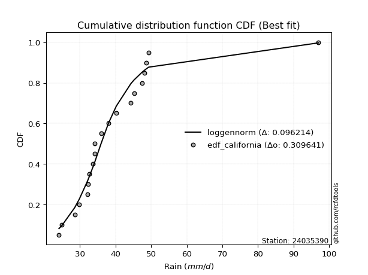</img>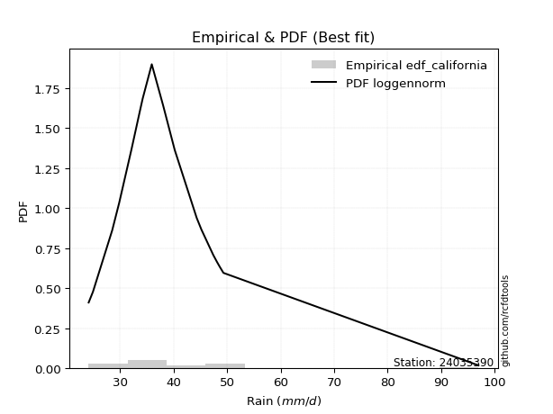</img>

</div>


### 2. EDF Hazen (1930)

Hazen method for plotting positions is a formula used to estimate the empirical cumulative probability distribution of flood events or other hydrological data. This formula often results in biased estimations, particularly when extrapolating to extreme events (high return periods).

<div align="center">


$P=(m-0.5)/n$


</div>


**2.1. Empirical values**

<div align="center">

|                | 0                   | 1                   | 2                   | 3                   | 4                   | 5                  | 6                   | 7                   | 8                  | 9         | 10                 | 11                 | 12                 | 13                 | 14                 | 15                 | 16                | 17                 | 18                 |
|:---------------|:--------------------|:--------------------|:--------------------|:--------------------|:--------------------|:-------------------|:--------------------|:--------------------|:-------------------|:----------|:-------------------|:-------------------|:-------------------|:-------------------|:-------------------|:-------------------|:------------------|:-------------------|:-------------------|
| date           | 2012                | 2009                | 2008                | 2005                | 2023                | 2022               | 2018                | 2013                | 2016               | 2017      | 2020               | 2007               | 2021               | 2014               | 2011               | 2010               | 2019              | 2015               | 2006               |
| x              | 24.9                | 28.5                | 29.8                | 32.1                | 32.2                | 32.6               | 33.7                | 34.2                | 34.2               | 35.9      | 38.0               | 40.2               | 44.3               | 46.294736842105266 | 47.4               | 48.1               | 48.6              | 49.3               | 97.0               |
| m              | 1                   | 2                   | 3                   | 4                   | 5                   | 6                  | 7                   | 8                   | 9                  | 10        | 11                 | 12                 | 13                 | 14                 | 15                 | 16                 | 17                | 18                 | 19                 |
| empirical_dist | edf_hazen           | edf_hazen           | edf_hazen           | edf_hazen           | edf_hazen           | edf_hazen          | edf_hazen           | edf_hazen           | edf_hazen          | edf_hazen | edf_hazen          | edf_hazen          | edf_hazen          | edf_hazen          | edf_hazen          | edf_hazen          | edf_hazen         | edf_hazen          | edf_hazen          |
| empirical      | 0.02631578947368421 | 0.07894736842105263 | 0.13157894736842105 | 0.18421052631578946 | 0.23684210526315788 | 0.2894736842105263 | 0.34210526315789475 | 0.39473684210526316 | 0.4473684210526316 | 0.5       | 0.5526315789473685 | 0.6052631578947368 | 0.6578947368421053 | 0.7105263157894737 | 0.7631578947368421 | 0.8157894736842105 | 0.868421052631579 | 0.9210526315789473 | 0.9736842105263158 |
| empirical_tr   | 1.027027027027027   | 1.0857142857142856  | 1.1515151515151514  | 1.2258064516129032  | 1.3103448275862069  | 1.4074074074074074 | 1.5199999999999998  | 1.6521739130434783  | 1.8095238095238098 | 2.0       | 2.235294117647059  | 2.533333333333333  | 2.9230769230769234 | 3.4545454545454546 | 4.222222222222223  | 5.428571428571428  | 7.600000000000002 | 12.666666666666663 | 38.00000000000004  |

</div>


**2.2. Kolmogorov-Smirnov fit test (sorted by Δ)**


<div align="center">

|                | 0                   | 1                   | 2                   | 3                   | 4                   | 5                   | 6                   | 7                   | 8                   | 9                   | 10                  | 11                  | 12                    | 13                  | 14                  | 15                  | 16                  | 17                  | 18                  | 19                  | 20                  | 21                  | 22                  | 23                  | 24                  | 25                  | 26                  | 27                  | 28                  | 29                  | 30                  | 31                  | 32                  | 33                  | 34                  | 35                  | 36                  | 37                  | 38                  | 39                  | 40                  | 41                  | 42                  | 43                  | 44                  | 45                  | 46                  | 47                  | 48                  | 49                  | 50                  | 51                  | 52                  | 53                  | 54                  | 55                  | 56                  | 57                  | 58                  | 59                  | 60                  | 61                  | 62                  | 63                  | 64                  | 65                  | 66                  | 67                  | 68                  | 69                  | 70                  | 71                  | 72                  | 73                  | 74                  | 75                  | 76                  | 77                  | 78                  | 79                  | 80                  | 81                  | 82                  | 83                  | 84                  | 85                  | 86                  | 87                  |
|:---------------|:--------------------|:--------------------|:--------------------|:--------------------|:--------------------|:--------------------|:--------------------|:--------------------|:--------------------|:--------------------|:--------------------|:--------------------|:----------------------|:--------------------|:--------------------|:--------------------|:--------------------|:--------------------|:--------------------|:--------------------|:--------------------|:--------------------|:--------------------|:--------------------|:--------------------|:--------------------|:--------------------|:--------------------|:--------------------|:--------------------|:--------------------|:--------------------|:--------------------|:--------------------|:--------------------|:--------------------|:--------------------|:--------------------|:--------------------|:--------------------|:--------------------|:--------------------|:--------------------|:--------------------|:--------------------|:--------------------|:--------------------|:--------------------|:--------------------|:--------------------|:--------------------|:--------------------|:--------------------|:--------------------|:--------------------|:--------------------|:--------------------|:--------------------|:--------------------|:--------------------|:--------------------|:--------------------|:--------------------|:--------------------|:--------------------|:--------------------|:--------------------|:--------------------|:--------------------|:--------------------|:--------------------|:--------------------|:--------------------|:--------------------|:--------------------|:--------------------|:--------------------|:--------------------|:--------------------|:--------------------|:--------------------|:--------------------|:--------------------|:--------------------|:--------------------|:--------------------|:--------------------|:--------------------|
| station        | 24035390            | 24035390            | 24035390            | 24035390            | 24035390            | 24035390            | 24035390            | 24035390            | 24035390            | 24035390            | 24035390            | 24035390            | 24035390              | 24035390            | 24035390            | 24035390            | 24035390            | 24035390            | 24035390            | 24035390            | 24035390            | 24035390            | 24035390            | 24035390            | 24035390            | 24035390            | 24035390            | 24035390            | 24035390            | 24035390            | 24035390            | 24035390            | 24035390            | 24035390            | 24035390            | 24035390            | 24035390            | 24035390            | 24035390            | 24035390            | 24035390            | 24035390            | 24035390            | 24035390            | 24035390            | 24035390            | 24035390            | 24035390            | 24035390            | 24035390            | 24035390            | 24035390            | 24035390            | 24035390            | 24035390            | 24035390            | 24035390            | 24035390            | 24035390            | 24035390            | 24035390            | 24035390            | 24035390            | 24035390            | 24035390            | 24035390            | 24035390            | 24035390            | 24035390            | 24035390            | 24035390            | 24035390            | 24035390            | 24035390            | 24035390            | 24035390            | 24035390            | 24035390            | 24035390            | 24035390            | 24035390            | 24035390            | 24035390            | 24035390            | 24035390            | 24035390            | 24035390            | 24035390            |
| empirical_dist | edf_hazen           | edf_hazen           | edf_hazen           | edf_hazen           | edf_hazen           | edf_hazen           | edf_hazen           | edf_hazen           | edf_hazen           | edf_hazen           | edf_hazen           | edf_hazen           | edf_hazen             | edf_hazen           | edf_hazen           | edf_hazen           | edf_hazen           | edf_hazen           | edf_hazen           | edf_hazen           | edf_hazen           | edf_hazen           | edf_hazen           | edf_hazen           | edf_hazen           | edf_hazen           | edf_hazen           | edf_hazen           | edf_hazen           | edf_hazen           | edf_hazen           | edf_hazen           | edf_hazen           | edf_hazen           | edf_hazen           | edf_hazen           | edf_hazen           | edf_hazen           | edf_hazen           | edf_hazen           | edf_hazen           | edf_hazen           | edf_hazen           | edf_hazen           | edf_hazen           | edf_hazen           | edf_hazen           | edf_hazen           | edf_hazen           | edf_hazen           | edf_hazen           | edf_hazen           | edf_hazen           | edf_hazen           | edf_hazen           | edf_hazen           | edf_hazen           | edf_hazen           | edf_hazen           | edf_hazen           | edf_hazen           | edf_hazen           | edf_hazen           | edf_hazen           | edf_hazen           | edf_hazen           | edf_hazen           | edf_hazen           | edf_hazen           | edf_hazen           | edf_hazen           | edf_hazen           | edf_hazen           | edf_hazen           | edf_hazen           | edf_hazen           | edf_hazen           | edf_hazen           | edf_hazen           | edf_hazen           | edf_hazen           | edf_hazen           | edf_hazen           | edf_hazen           | edf_hazen           | edf_hazen           | edf_hazen           | edf_hazen           |
| p_dist         | fisk                | logjohnsonsu        | logmielke           | alpha               | logexponnorm        | johnsonsu           | logalpha            | logmoyal            | logfisk             | loggenlogistic      | mielke              | loginvgamma         | loglaplace_asymmetric | loginvweibull       | invweibull          | loglognorm          | invgamma            | f                   | logpearson3         | loginvgauss         | loggumbel_r         | logfatiguelife      | logf                | wald                | logbetaprime        | loghalflogistic     | nct                 | laplace_asymmetric  | logkstwobign        | loggenexpon         | lognct              | exponnorm           | betaprime           | logweibull_min      | invgauss            | weibull_min         | genexpon            | logrice             | fatiguelife         | lognakagami         | loghalfnorm         | lograyleigh         | logmaxwell          | genlogistic         | gibrat              | logcrystalball      | lognorm             | lognorm             | erlang              | gamma               | chi2                | ncf                 | logt                | logloggamma         | loglogistic         | logwald             | moyal               | pearson3            | halflogistic        | loghypsecant        | loggompertz         | kstwobign           | gumbel_r            | gompertz            | loggibrat           | hypsecant           | loggumbel_l         | expon               | halfnorm            | loglaplace          | laplace             | logistic            | nakagami            | rayleigh            | rice                | maxwell             | truncnorm           | crystalball         | norm                | logncf              | logtruncnorm        | t                   | gumbel_l            | loggamma            | loggamma            | logexpon            | logerlang           | logchi2             |
| delta          | 0.08711978350000982 | 0.087236624285711   | 0.08759171800120169 | 0.08806472730848847 | 0.08960720925613908 | 0.0904475132475786  | 0.09147884231507386 | 0.09180694550522084 | 0.09228084895473143 | 0.09382114623136972 | 0.09504093743007203 | 0.09528488169768035 | 0.09558167671263884   | 0.09575242097673542 | 0.09599291418290845 | 0.0979614985030014  | 0.09958106910494557 | 0.0995962703908091  | 0.10074974367232314 | 0.10111992972153172 | 0.10139789460185378 | 0.1014869693305851  | 0.10312663538070377 | 0.10354605008448939 | 0.10498337223479592 | 0.10977410515006367 | 0.11033721328019247 | 0.11154504821416106 | 0.11318236002405846 | 0.11350771768049872 | 0.1136102830885305  | 0.11527121911391336 | 0.11746997028967776 | 0.11747833930447094 | 0.1185213383868402  | 0.12021650017529151 | 0.12104923863227979 | 0.1212004120059893  | 0.12180203632802655 | 0.12297465749744085 | 0.12337726460019352 | 0.12490017608964066 | 0.1260792099129644  | 0.126880219243243   | 0.12907507729138792 | 0.1302437219099336  | 0.13024405985901177 | 0.13024405985901177 | 0.13060384457448615 | 0.13060411535075933 | 0.13060524103728355 | 0.13306683718134782 | 0.13387390551573264 | 0.1404656744526892  | 0.14051706099998035 | 0.14067165923850522 | 0.14621217236556683 | 0.15404857822936543 | 0.1542266320562796  | 0.15538760739449065 | 0.15742542899089826 | 0.15873305622645184 | 0.16189845334050912 | 0.16749712614081344 | 0.17266626156335008 | 0.1732293422211233  | 0.1767526653480312  | 0.17797760944658178 | 0.17850943182321066 | 0.1824960775693965  | 0.18709073248312375 | 0.1886996652566163  | 0.19141116628240637 | 0.19163770056962814 | 0.1947391703662149  | 0.19588862743174817 | 0.21051221365832828 | 0.21051223272775033 | 0.2105122421928074  | 0.21423921071515228 | 0.22209410235970686 | 0.22314449245856627 | 0.23958671686706923 | 0.2429553794190621  | 0.2429553794190621  | 0.24859616431445478 | 0.26139331925875786 | 0.35293468741875866 |
| deltao         | 0.31564497164100014 | 0.31564497164100014 | 0.31564497164100014 | 0.31564497164100014 | 0.31564497164100014 | 0.31564497164100014 | 0.31564497164100014 | 0.31564497164100014 | 0.31564497164100014 | 0.31564497164100014 | 0.31564497164100014 | 0.31564497164100014 | 0.31564497164100014   | 0.31564497164100014 | 0.31564497164100014 | 0.31564497164100014 | 0.31564497164100014 | 0.31564497164100014 | 0.31564497164100014 | 0.31564497164100014 | 0.31564497164100014 | 0.31564497164100014 | 0.31564497164100014 | 0.31564497164100014 | 0.31564497164100014 | 0.31564497164100014 | 0.31564497164100014 | 0.31564497164100014 | 0.31564497164100014 | 0.31564497164100014 | 0.31564497164100014 | 0.31564497164100014 | 0.31564497164100014 | 0.31564497164100014 | 0.31564497164100014 | 0.31564497164100014 | 0.31564497164100014 | 0.31564497164100014 | 0.31564497164100014 | 0.31564497164100014 | 0.31564497164100014 | 0.31564497164100014 | 0.31564497164100014 | 0.31564497164100014 | 0.31564497164100014 | 0.31564497164100014 | 0.31564497164100014 | 0.31564497164100014 | 0.31564497164100014 | 0.31564497164100014 | 0.31564497164100014 | 0.31564497164100014 | 0.31564497164100014 | 0.31564497164100014 | 0.31564497164100014 | 0.31564497164100014 | 0.31564497164100014 | 0.31564497164100014 | 0.31564497164100014 | 0.31564497164100014 | 0.31564497164100014 | 0.31564497164100014 | 0.31564497164100014 | 0.31564497164100014 | 0.31564497164100014 | 0.31564497164100014 | 0.31564497164100014 | 0.31564497164100014 | 0.31564497164100014 | 0.31564497164100014 | 0.31564497164100014 | 0.31564497164100014 | 0.31564497164100014 | 0.31564497164100014 | 0.31564497164100014 | 0.31564497164100014 | 0.31564497164100014 | 0.31564497164100014 | 0.31564497164100014 | 0.31564497164100014 | 0.31564497164100014 | 0.31564497164100014 | 0.31564497164100014 | 0.31564497164100014 | 0.31564497164100014 | 0.31564497164100014 | 0.31564497164100014 | 0.31564497164100014 |
| eval           | Δo > Δ              | Δo > Δ              | Δo > Δ              | Δo > Δ              | Δo > Δ              | Δo > Δ              | Δo > Δ              | Δo > Δ              | Δo > Δ              | Δo > Δ              | Δo > Δ              | Δo > Δ              | Δo > Δ                | Δo > Δ              | Δo > Δ              | Δo > Δ              | Δo > Δ              | Δo > Δ              | Δo > Δ              | Δo > Δ              | Δo > Δ              | Δo > Δ              | Δo > Δ              | Δo > Δ              | Δo > Δ              | Δo > Δ              | Δo > Δ              | Δo > Δ              | Δo > Δ              | Δo > Δ              | Δo > Δ              | Δo > Δ              | Δo > Δ              | Δo > Δ              | Δo > Δ              | Δo > Δ              | Δo > Δ              | Δo > Δ              | Δo > Δ              | Δo > Δ              | Δo > Δ              | Δo > Δ              | Δo > Δ              | Δo > Δ              | Δo > Δ              | Δo > Δ              | Δo > Δ              | Δo > Δ              | Δo > Δ              | Δo > Δ              | Δo > Δ              | Δo > Δ              | Δo > Δ              | Δo > Δ              | Δo > Δ              | Δo > Δ              | Δo > Δ              | Δo > Δ              | Δo > Δ              | Δo > Δ              | Δo > Δ              | Δo > Δ              | Δo > Δ              | Δo > Δ              | Δo > Δ              | Δo > Δ              | Δo > Δ              | Δo > Δ              | Δo > Δ              | Δo > Δ              | Δo > Δ              | Δo > Δ              | Δo > Δ              | Δo > Δ              | Δo > Δ              | Δo > Δ              | Δo > Δ              | Δo > Δ              | Δo > Δ              | Δo > Δ              | Δo > Δ              | Δo > Δ              | Δo > Δ              | Δo > Δ              | Δo > Δ              | Δo > Δ              | Δo > Δ              | Δo <= Δ             |
| fit            | 1                   | 1                   | 1                   | 1                   | 1                   | 1                   | 1                   | 1                   | 1                   | 1                   | 1                   | 1                   | 1                     | 1                   | 1                   | 1                   | 1                   | 1                   | 1                   | 1                   | 1                   | 1                   | 1                   | 1                   | 1                   | 1                   | 1                   | 1                   | 1                   | 1                   | 1                   | 1                   | 1                   | 1                   | 1                   | 1                   | 1                   | 1                   | 1                   | 1                   | 1                   | 1                   | 1                   | 1                   | 1                   | 1                   | 1                   | 1                   | 1                   | 1                   | 1                   | 1                   | 1                   | 1                   | 1                   | 1                   | 1                   | 1                   | 1                   | 1                   | 1                   | 1                   | 1                   | 1                   | 1                   | 1                   | 1                   | 1                   | 1                   | 1                   | 1                   | 1                   | 1                   | 1                   | 1                   | 1                   | 1                   | 1                   | 1                   | 1                   | 1                   | 1                   | 1                   | 1                   | 1                   | 1                   | 1                   | 0                   |
| n              | 19                  | 19                  | 19                  | 19                  | 19                  | 19                  | 19                  | 19                  | 19                  | 19                  | 19                  | 19                  | 19                    | 19                  | 19                  | 19                  | 19                  | 19                  | 19                  | 19                  | 19                  | 19                  | 19                  | 19                  | 19                  | 19                  | 19                  | 19                  | 19                  | 19                  | 19                  | 19                  | 19                  | 19                  | 19                  | 19                  | 19                  | 19                  | 19                  | 19                  | 19                  | 19                  | 19                  | 19                  | 19                  | 19                  | 19                  | 19                  | 19                  | 19                  | 19                  | 19                  | 19                  | 19                  | 19                  | 19                  | 19                  | 19                  | 19                  | 19                  | 19                  | 19                  | 19                  | 19                  | 19                  | 19                  | 19                  | 19                  | 19                  | 19                  | 19                  | 19                  | 19                  | 19                  | 19                  | 19                  | 19                  | 19                  | 19                  | 19                  | 19                  | 19                  | 19                  | 19                  | 19                  | 19                  | 19                  | 19                  |
| best_fit       | 1                   | 0                   | 0                   | 0                   | 0                   | 0                   | 0                   | 0                   | 0                   | 0                   | 0                   | 0                   | 0                     | 0                   | 0                   | 0                   | 0                   | 0                   | 0                   | 0                   | 0                   | 0                   | 0                   | 0                   | 0                   | 0                   | 0                   | 0                   | 0                   | 0                   | 0                   | 0                   | 0                   | 0                   | 0                   | 0                   | 0                   | 0                   | 0                   | 0                   | 0                   | 0                   | 0                   | 0                   | 0                   | 0                   | 0                   | 0                   | 0                   | 0                   | 0                   | 0                   | 0                   | 0                   | 0                   | 0                   | 0                   | 0                   | 0                   | 0                   | 0                   | 0                   | 0                   | 0                   | 0                   | 0                   | 0                   | 0                   | 0                   | 0                   | 0                   | 0                   | 0                   | 0                   | 0                   | 0                   | 0                   | 0                   | 0                   | 0                   | 0                   | 0                   | 0                   | 0                   | 0                   | 0                   | 0                   | 0                   |
| best_fit_sort  | 1                   | 2                   | 3                   | 4                   | 5                   | 6                   | 7                   | 8                   | 9                   | 10                  | 11                  | 12                  | 13                    | 14                  | 15                  | 16                  | 17                  | 18                  | 19                  | 20                  | 21                  | 22                  | 23                  | 24                  | 25                  | 26                  | 27                  | 28                  | 29                  | 30                  | 31                  | 32                  | 33                  | 34                  | 35                  | 36                  | 37                  | 38                  | 39                  | 40                  | 41                  | 42                  | 43                  | 44                  | 45                  | 46                  | 47                  | 48                  | 49                  | 50                  | 51                  | 52                  | 53                  | 54                  | 55                  | 56                  | 57                  | 58                  | 59                  | 60                  | 61                  | 62                  | 63                  | 64                  | 65                  | 66                  | 67                  | 68                  | 69                  | 70                  | 71                  | 72                  | 73                  | 74                  | 75                  | 76                  | 77                  | 78                  | 79                  | 80                  | 81                  | 82                  | 83                  | 84                  | 85                  | 86                  | 87                  | 88                  |

</div>


**2.3. Best fit**

<div align="center">

|   id |   station | empirical_dist   | p_dist   |     delta |   deltao | eval   |   fit |   n |   best_fit |   best_fit_sort |
|-----:|----------:|:-----------------|:---------|----------:|---------:|:-------|------:|----:|-----------:|----------------:|
|    0 |  24035390 | edf_hazen        | fisk     | 0.0871198 | 0.315645 | Δo > Δ |     1 |  19 |          1 |               1 |

</div>


<div align="center">

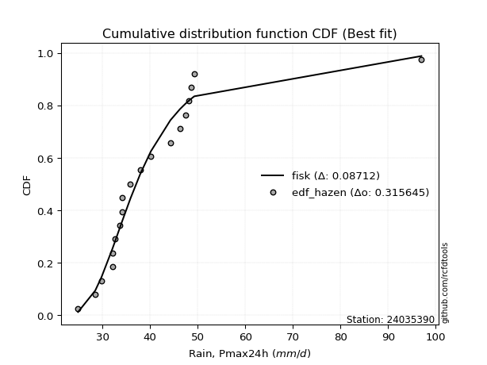</img>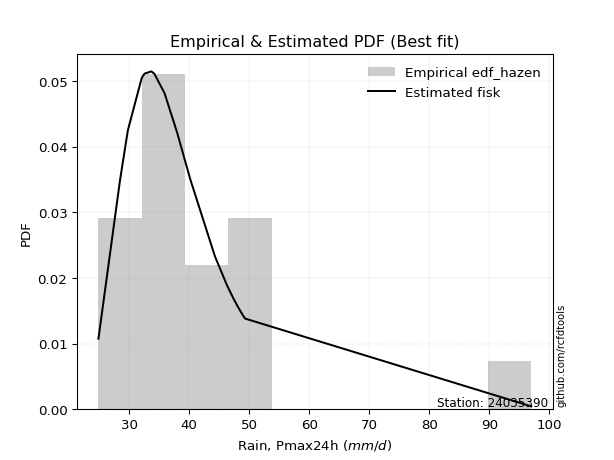</img>

</div>


### 3. EDF Weibull (1939)

Weibull plotting position formula is an empirical method used to estimate the non-exceedance probability or plotting position for a set of observed data, is often recommended or widely used in practice, particularly in flood frequency analysis.

<div align="center">


$P=m/(n+1)$


</div>


**3.1. Empirical values**

<div align="center">

|                | 0                  | 1                  | 2                  | 3           | 4                  | 5                  | 6                  | 7                  | 8                  | 9           | 10                 | 11          | 12                | 13                 | 14          | 15                | 16                | 17                 | 18                 |
|:---------------|:-------------------|:-------------------|:-------------------|:------------|:-------------------|:-------------------|:-------------------|:-------------------|:-------------------|:------------|:-------------------|:------------|:------------------|:-------------------|:------------|:------------------|:------------------|:-------------------|:-------------------|
| date           | 2012               | 2009               | 2008               | 2005        | 2023               | 2022               | 2018               | 2013               | 2016               | 2017        | 2020               | 2007        | 2021              | 2014               | 2011        | 2010              | 2019              | 2015               | 2006               |
| x              | 24.9               | 28.5               | 29.8               | 32.1        | 32.2               | 32.6               | 33.7               | 34.2               | 34.2               | 35.9        | 38.0               | 40.2        | 44.3              | 46.294736842105266 | 47.4        | 48.1              | 48.6              | 49.3               | 97.0               |
| m              | 1                  | 2                  | 3                  | 4           | 5                  | 6                  | 7                  | 8                  | 9                  | 10          | 11                 | 12          | 13                | 14                 | 15          | 16                | 17                | 18                 | 19                 |
| empirical_dist | edf_weibull        | edf_weibull        | edf_weibull        | edf_weibull | edf_weibull        | edf_weibull        | edf_weibull        | edf_weibull        | edf_weibull        | edf_weibull | edf_weibull        | edf_weibull | edf_weibull       | edf_weibull        | edf_weibull | edf_weibull       | edf_weibull       | edf_weibull        | edf_weibull        |
| empirical      | 0.05               | 0.1                | 0.15               | 0.2         | 0.25               | 0.3                | 0.35               | 0.4                | 0.45               | 0.5         | 0.55               | 0.6         | 0.65              | 0.7                | 0.75        | 0.8               | 0.85              | 0.9                | 0.95               |
| empirical_tr   | 1.0526315789473684 | 1.1111111111111112 | 1.1764705882352942 | 1.25        | 1.3333333333333333 | 1.4285714285714286 | 1.5384615384615383 | 1.6666666666666667 | 1.8181818181818181 | 2.0         | 2.2222222222222223 | 2.5         | 2.857142857142857 | 3.333333333333333  | 4.0         | 5.000000000000001 | 6.666666666666666 | 10.000000000000002 | 19.999999999999982 |

</div>


**3.2. Kolmogorov-Smirnov fit test (sorted by Δ)**


<div align="center">

|                | 0                   | 1                   | 2                   | 3                   | 4                   | 5                   | 6                   | 7                   | 8                   | 9                   | 10                  | 11                  | 12                  | 13                  | 14                  | 15                  | 16                  | 17                  | 18                  | 19                  | 20                  | 21                  | 22                  | 23                  | 24                  | 25                  | 26                  | 27                  | 28                  | 29                  | 30                  | 31                  | 32                  | 33                  | 34                    | 35                  | 36                  | 37                  | 38                  | 39                  | 40                  | 41                  | 42                  | 43                  | 44                  | 45                  | 46                  | 47                  | 48                  | 49                  | 50                  | 51                  | 52                  | 53                  | 54                  | 55                  | 56                  | 57                  | 58                  | 59                  | 60                  | 61                  | 62                  | 63                  | 64                  | 65                  | 66                  | 67                  | 68                  | 69                  | 70                  | 71                  | 72                  | 73                  | 74                  | 75                  | 76                  | 77                  | 78                  | 79                  | 80                  | 81                  | 82                  | 83                  | 84                  | 85                  | 86                  | 87                  |
|:---------------|:--------------------|:--------------------|:--------------------|:--------------------|:--------------------|:--------------------|:--------------------|:--------------------|:--------------------|:--------------------|:--------------------|:--------------------|:--------------------|:--------------------|:--------------------|:--------------------|:--------------------|:--------------------|:--------------------|:--------------------|:--------------------|:--------------------|:--------------------|:--------------------|:--------------------|:--------------------|:--------------------|:--------------------|:--------------------|:--------------------|:--------------------|:--------------------|:--------------------|:--------------------|:----------------------|:--------------------|:--------------------|:--------------------|:--------------------|:--------------------|:--------------------|:--------------------|:--------------------|:--------------------|:--------------------|:--------------------|:--------------------|:--------------------|:--------------------|:--------------------|:--------------------|:--------------------|:--------------------|:--------------------|:--------------------|:--------------------|:--------------------|:--------------------|:--------------------|:--------------------|:--------------------|:--------------------|:--------------------|:--------------------|:--------------------|:--------------------|:--------------------|:--------------------|:--------------------|:--------------------|:--------------------|:--------------------|:--------------------|:--------------------|:--------------------|:--------------------|:--------------------|:--------------------|:--------------------|:--------------------|:--------------------|:--------------------|:--------------------|:--------------------|:--------------------|:--------------------|:--------------------|:--------------------|
| station        | 24035390            | 24035390            | 24035390            | 24035390            | 24035390            | 24035390            | 24035390            | 24035390            | 24035390            | 24035390            | 24035390            | 24035390            | 24035390            | 24035390            | 24035390            | 24035390            | 24035390            | 24035390            | 24035390            | 24035390            | 24035390            | 24035390            | 24035390            | 24035390            | 24035390            | 24035390            | 24035390            | 24035390            | 24035390            | 24035390            | 24035390            | 24035390            | 24035390            | 24035390            | 24035390              | 24035390            | 24035390            | 24035390            | 24035390            | 24035390            | 24035390            | 24035390            | 24035390            | 24035390            | 24035390            | 24035390            | 24035390            | 24035390            | 24035390            | 24035390            | 24035390            | 24035390            | 24035390            | 24035390            | 24035390            | 24035390            | 24035390            | 24035390            | 24035390            | 24035390            | 24035390            | 24035390            | 24035390            | 24035390            | 24035390            | 24035390            | 24035390            | 24035390            | 24035390            | 24035390            | 24035390            | 24035390            | 24035390            | 24035390            | 24035390            | 24035390            | 24035390            | 24035390            | 24035390            | 24035390            | 24035390            | 24035390            | 24035390            | 24035390            | 24035390            | 24035390            | 24035390            | 24035390            |
| empirical_dist | edf_weibull         | edf_weibull         | edf_weibull         | edf_weibull         | edf_weibull         | edf_weibull         | edf_weibull         | edf_weibull         | edf_weibull         | edf_weibull         | edf_weibull         | edf_weibull         | edf_weibull         | edf_weibull         | edf_weibull         | edf_weibull         | edf_weibull         | edf_weibull         | edf_weibull         | edf_weibull         | edf_weibull         | edf_weibull         | edf_weibull         | edf_weibull         | edf_weibull         | edf_weibull         | edf_weibull         | edf_weibull         | edf_weibull         | edf_weibull         | edf_weibull         | edf_weibull         | edf_weibull         | edf_weibull         | edf_weibull           | edf_weibull         | edf_weibull         | edf_weibull         | edf_weibull         | edf_weibull         | edf_weibull         | edf_weibull         | edf_weibull         | edf_weibull         | edf_weibull         | edf_weibull         | edf_weibull         | edf_weibull         | edf_weibull         | edf_weibull         | edf_weibull         | edf_weibull         | edf_weibull         | edf_weibull         | edf_weibull         | edf_weibull         | edf_weibull         | edf_weibull         | edf_weibull         | edf_weibull         | edf_weibull         | edf_weibull         | edf_weibull         | edf_weibull         | edf_weibull         | edf_weibull         | edf_weibull         | edf_weibull         | edf_weibull         | edf_weibull         | edf_weibull         | edf_weibull         | edf_weibull         | edf_weibull         | edf_weibull         | edf_weibull         | edf_weibull         | edf_weibull         | edf_weibull         | edf_weibull         | edf_weibull         | edf_weibull         | edf_weibull         | edf_weibull         | edf_weibull         | edf_weibull         | edf_weibull         | edf_weibull         |
| p_dist         | loggumbel_r         | invgamma            | f                   | loginvgauss         | logf                | loglognorm          | logfatiguelife      | loginvgamma         | logbetaprime        | loginvweibull       | invweibull          | mielke              | logpearson3         | logalpha            | loggenlogistic      | alpha               | logkstwobign        | fisk                | logmielke           | loggenexpon         | loghalflogistic     | exponnorm           | wald                | logexponnorm        | johnsonsu           | logjohnsonsu        | logmoyal            | logweibull_min      | invgauss            | genexpon            | weibull_min         | logfisk             | fatiguelife         | lognakagami         | loglaplace_asymmetric | lograyleigh         | logrice             | logmaxwell          | loghalfnorm         | erlang              | gamma               | chi2                | logt                | nct                 | laplace_asymmetric  | lognct              | logloggamma         | betaprime           | ncf                 | lognorm             | lognorm             | logcrystalball      | moyal               | genlogistic         | pearson3            | halflogistic        | gumbel_r            | loggompertz         | loglogistic         | gibrat              | logwald             | gompertz            | kstwobign           | halfnorm            | loghypsecant        | hypsecant           | expon               | logistic            | rayleigh            | rice                | maxwell             | nakagami            | loggumbel_l         | loggibrat           | loglaplace          | laplace             | truncnorm           | crystalball         | norm                | logncf              | t                   | logtruncnorm        | gumbel_l            | loggamma            | loggamma            | logexpon            | logerlang           | logchi2             |
| delta          | 0.0817498166054883  | 0.08195437097733355 | 0.08198093528092582 | 0.08231754070855529 | 0.08246010258095943 | 0.08253729069527799 | 0.08258920241643958 | 0.08332162651703234 | 0.0839307406558486  | 0.08395651939180515 | 0.08414883137187534 | 0.08460443214267255 | 0.08516971726235445 | 0.08753498663829196 | 0.08842063647937459 | 0.09070275642757364 | 0.09212972844511114 | 0.09340098892207649 | 0.09343447082722534 | 0.09376916376098188 | 0.09398463146585312 | 0.09421858753496604 | 0.09435491995315637 | 0.09461038189837134 | 0.09473192528303176 | 0.09513136112781628 | 0.09550472813461941 | 0.09642570772552361 | 0.09746870680789288 | 0.09999660705333246 | 0.09999999999996521 | 0.10017558579683672 | 0.10074940474907923 | 0.10192202591849353 | 0.10347641355474413   | 0.10384754451069333 | 0.10440778874523887 | 0.10502657833401707 | 0.10758779091598297 | 0.10955121299553883 | 0.10955148377181201 | 0.10955260945833623 | 0.11282127393678532 | 0.1129687922275609  | 0.11417662716152949 | 0.11624186203589892 | 0.11941304287374188 | 0.12010154923704619 | 0.12018516883851871 | 0.123380629696134   | 0.123380629696134   | 0.12338064992282693 | 0.1251595407866195  | 0.12951179819061143 | 0.1382591045451549  | 0.13843715837206905 | 0.1408458217615618  | 0.1416359553066877  | 0.14314863994734878 | 0.14749612992296687 | 0.14918807020683328 | 0.1517076524566029  | 0.15228449141780126 | 0.15745680024426334 | 0.15801918634185907 | 0.15869411372611864 | 0.16218813576237123 | 0.16764703367766898 | 0.17058506899068082 | 0.17368653878726759 | 0.17483599585280085 | 0.17562169259819582 | 0.17938424429539962 | 0.18056099840545536 | 0.18512765651676494 | 0.18709073248312375 | 0.18945958207938096 | 0.189459601148803   | 0.18945961061386007 | 0.19318657913620496 | 0.20209186087961895 | 0.20630462867549632 | 0.2185340852881219  | 0.22190274784011477 | 0.22190274784011477 | 0.23280669063024423 | 0.24560384557454729 | 0.33188205583981134 |
| deltao         | 0.31564497164100014 | 0.31564497164100014 | 0.31564497164100014 | 0.31564497164100014 | 0.31564497164100014 | 0.31564497164100014 | 0.31564497164100014 | 0.31564497164100014 | 0.31564497164100014 | 0.31564497164100014 | 0.31564497164100014 | 0.31564497164100014 | 0.31564497164100014 | 0.31564497164100014 | 0.31564497164100014 | 0.31564497164100014 | 0.31564497164100014 | 0.31564497164100014 | 0.31564497164100014 | 0.31564497164100014 | 0.31564497164100014 | 0.31564497164100014 | 0.31564497164100014 | 0.31564497164100014 | 0.31564497164100014 | 0.31564497164100014 | 0.31564497164100014 | 0.31564497164100014 | 0.31564497164100014 | 0.31564497164100014 | 0.31564497164100014 | 0.31564497164100014 | 0.31564497164100014 | 0.31564497164100014 | 0.31564497164100014   | 0.31564497164100014 | 0.31564497164100014 | 0.31564497164100014 | 0.31564497164100014 | 0.31564497164100014 | 0.31564497164100014 | 0.31564497164100014 | 0.31564497164100014 | 0.31564497164100014 | 0.31564497164100014 | 0.31564497164100014 | 0.31564497164100014 | 0.31564497164100014 | 0.31564497164100014 | 0.31564497164100014 | 0.31564497164100014 | 0.31564497164100014 | 0.31564497164100014 | 0.31564497164100014 | 0.31564497164100014 | 0.31564497164100014 | 0.31564497164100014 | 0.31564497164100014 | 0.31564497164100014 | 0.31564497164100014 | 0.31564497164100014 | 0.31564497164100014 | 0.31564497164100014 | 0.31564497164100014 | 0.31564497164100014 | 0.31564497164100014 | 0.31564497164100014 | 0.31564497164100014 | 0.31564497164100014 | 0.31564497164100014 | 0.31564497164100014 | 0.31564497164100014 | 0.31564497164100014 | 0.31564497164100014 | 0.31564497164100014 | 0.31564497164100014 | 0.31564497164100014 | 0.31564497164100014 | 0.31564497164100014 | 0.31564497164100014 | 0.31564497164100014 | 0.31564497164100014 | 0.31564497164100014 | 0.31564497164100014 | 0.31564497164100014 | 0.31564497164100014 | 0.31564497164100014 | 0.31564497164100014 |
| eval           | Δo > Δ              | Δo > Δ              | Δo > Δ              | Δo > Δ              | Δo > Δ              | Δo > Δ              | Δo > Δ              | Δo > Δ              | Δo > Δ              | Δo > Δ              | Δo > Δ              | Δo > Δ              | Δo > Δ              | Δo > Δ              | Δo > Δ              | Δo > Δ              | Δo > Δ              | Δo > Δ              | Δo > Δ              | Δo > Δ              | Δo > Δ              | Δo > Δ              | Δo > Δ              | Δo > Δ              | Δo > Δ              | Δo > Δ              | Δo > Δ              | Δo > Δ              | Δo > Δ              | Δo > Δ              | Δo > Δ              | Δo > Δ              | Δo > Δ              | Δo > Δ              | Δo > Δ                | Δo > Δ              | Δo > Δ              | Δo > Δ              | Δo > Δ              | Δo > Δ              | Δo > Δ              | Δo > Δ              | Δo > Δ              | Δo > Δ              | Δo > Δ              | Δo > Δ              | Δo > Δ              | Δo > Δ              | Δo > Δ              | Δo > Δ              | Δo > Δ              | Δo > Δ              | Δo > Δ              | Δo > Δ              | Δo > Δ              | Δo > Δ              | Δo > Δ              | Δo > Δ              | Δo > Δ              | Δo > Δ              | Δo > Δ              | Δo > Δ              | Δo > Δ              | Δo > Δ              | Δo > Δ              | Δo > Δ              | Δo > Δ              | Δo > Δ              | Δo > Δ              | Δo > Δ              | Δo > Δ              | Δo > Δ              | Δo > Δ              | Δo > Δ              | Δo > Δ              | Δo > Δ              | Δo > Δ              | Δo > Δ              | Δo > Δ              | Δo > Δ              | Δo > Δ              | Δo > Δ              | Δo > Δ              | Δo > Δ              | Δo > Δ              | Δo > Δ              | Δo > Δ              | Δo <= Δ             |
| fit            | 1                   | 1                   | 1                   | 1                   | 1                   | 1                   | 1                   | 1                   | 1                   | 1                   | 1                   | 1                   | 1                   | 1                   | 1                   | 1                   | 1                   | 1                   | 1                   | 1                   | 1                   | 1                   | 1                   | 1                   | 1                   | 1                   | 1                   | 1                   | 1                   | 1                   | 1                   | 1                   | 1                   | 1                   | 1                     | 1                   | 1                   | 1                   | 1                   | 1                   | 1                   | 1                   | 1                   | 1                   | 1                   | 1                   | 1                   | 1                   | 1                   | 1                   | 1                   | 1                   | 1                   | 1                   | 1                   | 1                   | 1                   | 1                   | 1                   | 1                   | 1                   | 1                   | 1                   | 1                   | 1                   | 1                   | 1                   | 1                   | 1                   | 1                   | 1                   | 1                   | 1                   | 1                   | 1                   | 1                   | 1                   | 1                   | 1                   | 1                   | 1                   | 1                   | 1                   | 1                   | 1                   | 1                   | 1                   | 0                   |
| n              | 19                  | 19                  | 19                  | 19                  | 19                  | 19                  | 19                  | 19                  | 19                  | 19                  | 19                  | 19                  | 19                  | 19                  | 19                  | 19                  | 19                  | 19                  | 19                  | 19                  | 19                  | 19                  | 19                  | 19                  | 19                  | 19                  | 19                  | 19                  | 19                  | 19                  | 19                  | 19                  | 19                  | 19                  | 19                    | 19                  | 19                  | 19                  | 19                  | 19                  | 19                  | 19                  | 19                  | 19                  | 19                  | 19                  | 19                  | 19                  | 19                  | 19                  | 19                  | 19                  | 19                  | 19                  | 19                  | 19                  | 19                  | 19                  | 19                  | 19                  | 19                  | 19                  | 19                  | 19                  | 19                  | 19                  | 19                  | 19                  | 19                  | 19                  | 19                  | 19                  | 19                  | 19                  | 19                  | 19                  | 19                  | 19                  | 19                  | 19                  | 19                  | 19                  | 19                  | 19                  | 19                  | 19                  | 19                  | 19                  |
| best_fit       | 1                   | 0                   | 0                   | 0                   | 0                   | 0                   | 0                   | 0                   | 0                   | 0                   | 0                   | 0                   | 0                   | 0                   | 0                   | 0                   | 0                   | 0                   | 0                   | 0                   | 0                   | 0                   | 0                   | 0                   | 0                   | 0                   | 0                   | 0                   | 0                   | 0                   | 0                   | 0                   | 0                   | 0                   | 0                     | 0                   | 0                   | 0                   | 0                   | 0                   | 0                   | 0                   | 0                   | 0                   | 0                   | 0                   | 0                   | 0                   | 0                   | 0                   | 0                   | 0                   | 0                   | 0                   | 0                   | 0                   | 0                   | 0                   | 0                   | 0                   | 0                   | 0                   | 0                   | 0                   | 0                   | 0                   | 0                   | 0                   | 0                   | 0                   | 0                   | 0                   | 0                   | 0                   | 0                   | 0                   | 0                   | 0                   | 0                   | 0                   | 0                   | 0                   | 0                   | 0                   | 0                   | 0                   | 0                   | 0                   |
| best_fit_sort  | 1                   | 2                   | 3                   | 4                   | 5                   | 6                   | 7                   | 8                   | 9                   | 10                  | 11                  | 12                  | 13                  | 14                  | 15                  | 16                  | 17                  | 18                  | 19                  | 20                  | 21                  | 22                  | 23                  | 24                  | 25                  | 26                  | 27                  | 28                  | 29                  | 30                  | 31                  | 32                  | 33                  | 34                  | 35                    | 36                  | 37                  | 38                  | 39                  | 40                  | 41                  | 42                  | 43                  | 44                  | 45                  | 46                  | 47                  | 48                  | 49                  | 50                  | 51                  | 52                  | 53                  | 54                  | 55                  | 56                  | 57                  | 58                  | 59                  | 60                  | 61                  | 62                  | 63                  | 64                  | 65                  | 66                  | 67                  | 68                  | 69                  | 70                  | 71                  | 72                  | 73                  | 74                  | 75                  | 76                  | 77                  | 78                  | 79                  | 80                  | 81                  | 82                  | 83                  | 84                  | 85                  | 86                  | 87                  | 88                  |

</div>


**3.3. Best fit**

<div align="center">

|   id |   station | empirical_dist   | p_dist      |     delta |   deltao | eval   |   fit |   n |   best_fit |   best_fit_sort |
|-----:|----------:|:-----------------|:------------|----------:|---------:|:-------|------:|----:|-----------:|----------------:|
|    0 |  24035390 | edf_weibull      | loggumbel_r | 0.0817498 | 0.315645 | Δo > Δ |     1 |  19 |          1 |               1 |

</div>


<div align="center">

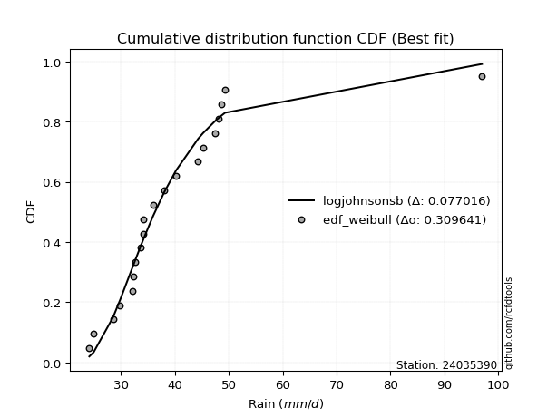</img>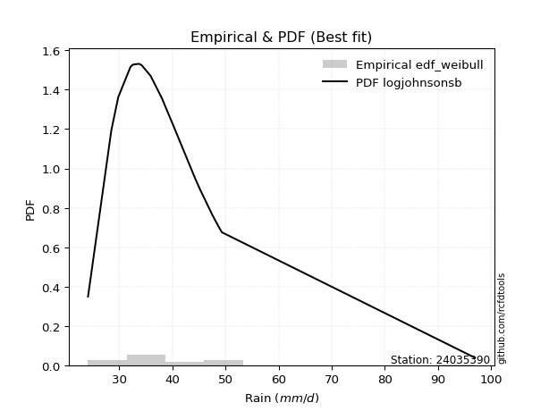</img>

</div>


### 4. EDF Beard (1943)

The Beard formula (or Beard´s plotting position formula) in hydrology is used to estimate the empirical non-exceedance probability _(P)_ of a flood event (or other extreme hydrological data point) within a given dataset.

<div align="center">


$P=(m-0.31)/(n+0.38)$


</div>


**4.1. Empirical values**

<div align="center">

|                | 0                   | 1                   | 2                  | 3                   | 4                   | 5                   | 6                  | 7                  | 8                  | 9         | 10                 | 11                 | 12                 | 13                 | 14                 | 15                 | 16                 | 17                 | 18                 |
|:---------------|:--------------------|:--------------------|:-------------------|:--------------------|:--------------------|:--------------------|:-------------------|:-------------------|:-------------------|:----------|:-------------------|:-------------------|:-------------------|:-------------------|:-------------------|:-------------------|:-------------------|:-------------------|:-------------------|
| date           | 2012                | 2009                | 2008               | 2005                | 2023                | 2022                | 2018               | 2013               | 2016               | 2017      | 2020               | 2007               | 2021               | 2014               | 2011               | 2010               | 2019               | 2015               | 2006               |
| x              | 24.9                | 28.5                | 29.8               | 32.1                | 32.2                | 32.6                | 33.7               | 34.2               | 34.2               | 35.9      | 38.0               | 40.2               | 44.3               | 46.294736842105266 | 47.4               | 48.1               | 48.6               | 49.3               | 97.0               |
| m              | 1                   | 2                   | 3                  | 4                   | 5                   | 6                   | 7                  | 8                  | 9                  | 10        | 11                 | 12                 | 13                 | 14                 | 15                 | 16                 | 17                 | 18                 | 19                 |
| empirical_dist | edf_beard           | edf_beard           | edf_beard          | edf_beard           | edf_beard           | edf_beard           | edf_beard          | edf_beard          | edf_beard          | edf_beard | edf_beard          | edf_beard          | edf_beard          | edf_beard          | edf_beard          | edf_beard          | edf_beard          | edf_beard          | edf_beard          |
| empirical      | 0.03560371517027864 | 0.08720330237358101 | 0.1388028895768834 | 0.19040247678018576 | 0.24200206398348817 | 0.29360165118679055 | 0.3452012383900929 | 0.3968008255933953 | 0.4484004127966976 | 0.5       | 0.5515995872033024 | 0.6031991744066048 | 0.6547987616099071 | 0.7063983488132095 | 0.7579979360165119 | 0.8095975232198143 | 0.8611971104231168 | 0.9127966976264191 | 0.9643962848297215 |
| empirical_tr   | 1.0369181380417336  | 1.0955342001130581  | 1.1611743559017376 | 1.2351816443594645  | 1.3192648059904697  | 1.4156318480642804  | 1.5271867612293144 | 1.6578272027373824 | 1.812909260991581  | 2.0       | 2.230149597238205  | 2.5201560468140443 | 2.896860986547085  | 3.40597539543058   | 4.132196162046909  | 5.252032520325204  | 7.204460966542758  | 11.467455621301793 | 28.086956521739243 |

</div>


**4.2. Kolmogorov-Smirnov fit test (sorted by Δ)**


<div align="center">

|                | 0                   | 1                   | 2                   | 3                   | 4                   | 5                   | 6                   | 7                   | 8                   | 9                   | 10                  | 11                  | 12                  | 13                  | 14                  | 15                  | 16                  | 17                  | 18                  | 19                  | 20                  | 21                  | 22                  | 23                  | 24                    | 25                  | 26                  | 27                  | 28                  | 29                  | 30                  | 31                  | 32                  | 33                  | 34                  | 35                  | 36                  | 37                  | 38                  | 39                  | 40                  | 41                  | 42                  | 43                  | 44                  | 45                  | 46                  | 47                  | 48                  | 49                  | 50                  | 51                  | 52                  | 53                  | 54                  | 55                  | 56                  | 57                  | 58                  | 59                  | 60                  | 61                  | 62                  | 63                  | 64                  | 65                  | 66                  | 67                  | 68                  | 69                  | 70                  | 71                  | 72                  | 73                  | 74                  | 75                  | 76                  | 77                  | 78                  | 79                  | 80                  | 81                  | 82                  | 83                  | 84                  | 85                  | 86                  | 87                  |
|:---------------|:--------------------|:--------------------|:--------------------|:--------------------|:--------------------|:--------------------|:--------------------|:--------------------|:--------------------|:--------------------|:--------------------|:--------------------|:--------------------|:--------------------|:--------------------|:--------------------|:--------------------|:--------------------|:--------------------|:--------------------|:--------------------|:--------------------|:--------------------|:--------------------|:----------------------|:--------------------|:--------------------|:--------------------|:--------------------|:--------------------|:--------------------|:--------------------|:--------------------|:--------------------|:--------------------|:--------------------|:--------------------|:--------------------|:--------------------|:--------------------|:--------------------|:--------------------|:--------------------|:--------------------|:--------------------|:--------------------|:--------------------|:--------------------|:--------------------|:--------------------|:--------------------|:--------------------|:--------------------|:--------------------|:--------------------|:--------------------|:--------------------|:--------------------|:--------------------|:--------------------|:--------------------|:--------------------|:--------------------|:--------------------|:--------------------|:--------------------|:--------------------|:--------------------|:--------------------|:--------------------|:--------------------|:--------------------|:--------------------|:--------------------|:--------------------|:--------------------|:--------------------|:--------------------|:--------------------|:--------------------|:--------------------|:--------------------|:--------------------|:--------------------|:--------------------|:--------------------|:--------------------|:--------------------|
| station        | 24035390            | 24035390            | 24035390            | 24035390            | 24035390            | 24035390            | 24035390            | 24035390            | 24035390            | 24035390            | 24035390            | 24035390            | 24035390            | 24035390            | 24035390            | 24035390            | 24035390            | 24035390            | 24035390            | 24035390            | 24035390            | 24035390            | 24035390            | 24035390            | 24035390              | 24035390            | 24035390            | 24035390            | 24035390            | 24035390            | 24035390            | 24035390            | 24035390            | 24035390            | 24035390            | 24035390            | 24035390            | 24035390            | 24035390            | 24035390            | 24035390            | 24035390            | 24035390            | 24035390            | 24035390            | 24035390            | 24035390            | 24035390            | 24035390            | 24035390            | 24035390            | 24035390            | 24035390            | 24035390            | 24035390            | 24035390            | 24035390            | 24035390            | 24035390            | 24035390            | 24035390            | 24035390            | 24035390            | 24035390            | 24035390            | 24035390            | 24035390            | 24035390            | 24035390            | 24035390            | 24035390            | 24035390            | 24035390            | 24035390            | 24035390            | 24035390            | 24035390            | 24035390            | 24035390            | 24035390            | 24035390            | 24035390            | 24035390            | 24035390            | 24035390            | 24035390            | 24035390            | 24035390            |
| empirical_dist | edf_beard           | edf_beard           | edf_beard           | edf_beard           | edf_beard           | edf_beard           | edf_beard           | edf_beard           | edf_beard           | edf_beard           | edf_beard           | edf_beard           | edf_beard           | edf_beard           | edf_beard           | edf_beard           | edf_beard           | edf_beard           | edf_beard           | edf_beard           | edf_beard           | edf_beard           | edf_beard           | edf_beard           | edf_beard             | edf_beard           | edf_beard           | edf_beard           | edf_beard           | edf_beard           | edf_beard           | edf_beard           | edf_beard           | edf_beard           | edf_beard           | edf_beard           | edf_beard           | edf_beard           | edf_beard           | edf_beard           | edf_beard           | edf_beard           | edf_beard           | edf_beard           | edf_beard           | edf_beard           | edf_beard           | edf_beard           | edf_beard           | edf_beard           | edf_beard           | edf_beard           | edf_beard           | edf_beard           | edf_beard           | edf_beard           | edf_beard           | edf_beard           | edf_beard           | edf_beard           | edf_beard           | edf_beard           | edf_beard           | edf_beard           | edf_beard           | edf_beard           | edf_beard           | edf_beard           | edf_beard           | edf_beard           | edf_beard           | edf_beard           | edf_beard           | edf_beard           | edf_beard           | edf_beard           | edf_beard           | edf_beard           | edf_beard           | edf_beard           | edf_beard           | edf_beard           | edf_beard           | edf_beard           | edf_beard           | edf_beard           | edf_beard           | edf_beard           |
| p_dist         | logalpha            | alpha               | mielke              | loggenlogistic      | loginvgamma         | loginvweibull       | invweibull          | fisk                | logmielke           | loglognorm          | logexponnorm        | johnsonsu           | logjohnsonsu        | logmoyal            | invgamma            | f                   | loginvgauss         | loggumbel_r         | logfatiguelife      | logpearson3         | logf                | logfisk             | logbetaprime        | wald                | loglaplace_asymmetric | loghalflogistic     | logkstwobign        | loggenexpon         | exponnorm           | logweibull_min      | invgauss            | nct                 | weibull_min         | laplace_asymmetric  | genexpon            | logrice             | fatiguelife         | lognct              | lognakagami         | lograyleigh         | loghalfnorm         | logmaxwell          | betaprime           | logcrystalball      | lognorm             | lognorm             | erlang              | gamma               | chi2                | ncf                 | logt                | genlogistic         | logloggamma         | gibrat              | moyal               | loglogistic         | logwald             | pearson3            | halflogistic        | kstwobign           | loggompertz         | gumbel_r            | loghypsecant        | gompertz            | hypsecant           | halfnorm            | expon               | loggibrat           | loggumbel_l         | logistic            | rayleigh            | loglaplace          | nakagami            | rice                | laplace             | maxwell             | truncnorm           | crystalball         | norm                | logncf              | t                   | logtruncnorm        | gumbel_l            | loggamma            | loggamma            | logexpon            | logerlang           | logchi2             |
| delta          | 0.08343839870161046 | 0.0859480283369754  | 0.08678500347754381 | 0.0868210492760722  | 0.08702894774515213 | 0.0874964870242072  | 0.08773698023038023 | 0.08860222731216938 | 0.08863570921731823 | 0.08970556455047318 | 0.08981162028846423 | 0.08993316367312465 | 0.09033259951790917 | 0.0907059665247123  | 0.09132513515241736 | 0.09134033643828088 | 0.0928639957690035  | 0.09314196064932556 | 0.09323103537805688 | 0.09401327161624665 | 0.09487070142817555 | 0.09537682418692961 | 0.09672743828226771 | 0.09735409962009309 | 0.09867765194483702   | 0.10358215468566737 | 0.10492642607153024 | 0.1052517837279705  | 0.10701528516138514 | 0.10922240535194272 | 0.11026540443431199 | 0.11136920502425851 | 0.11196056622276329 | 0.1125770399582271  | 0.11279330467975157 | 0.11294447805346108 | 0.11354610237549834 | 0.11464227483259654 | 0.11471872354491264 | 0.11664424213711244 | 0.11718531413579722 | 0.11782327596043618 | 0.1185019620337438  | 0.12198778795740539 | 0.12198812590648356 | 0.12198812590648356 | 0.12234791062195793 | 0.12234818139823112 | 0.12234930708475533 | 0.1248109032288196  | 0.12561797156320442 | 0.12791221098730904 | 0.132209740500161   | 0.13629901949985027 | 0.1379562384130386  | 0.1415490527440464  | 0.1437676344707034  | 0.14785662776496913 | 0.1480346815918833  | 0.15068490421449887 | 0.15123347852650196 | 0.1536425193879809  | 0.1564195991385567  | 0.16130517567641714 | 0.16497340826859508 | 0.17025349787068245 | 0.17178565898218548 | 0.17576223679554825 | 0.17778465709209723 | 0.18044373130408808 | 0.18338176661709993 | 0.18352806931346255 | 0.18521921581801007 | 0.1864832364136867  | 0.18709073248312375 | 0.18763269347921996 | 0.20225627970580007 | 0.2022562987752221  | 0.20225630824027918 | 0.20598327676262407 | 0.21488855850603805 | 0.21590215189531056 | 0.231330782914541   | 0.23469944546653387 | 0.23469944546653387 | 0.24240421385005848 | 0.2552013687943615  | 0.34467875346623045 |
| deltao         | 0.31564497164100014 | 0.31564497164100014 | 0.31564497164100014 | 0.31564497164100014 | 0.31564497164100014 | 0.31564497164100014 | 0.31564497164100014 | 0.31564497164100014 | 0.31564497164100014 | 0.31564497164100014 | 0.31564497164100014 | 0.31564497164100014 | 0.31564497164100014 | 0.31564497164100014 | 0.31564497164100014 | 0.31564497164100014 | 0.31564497164100014 | 0.31564497164100014 | 0.31564497164100014 | 0.31564497164100014 | 0.31564497164100014 | 0.31564497164100014 | 0.31564497164100014 | 0.31564497164100014 | 0.31564497164100014   | 0.31564497164100014 | 0.31564497164100014 | 0.31564497164100014 | 0.31564497164100014 | 0.31564497164100014 | 0.31564497164100014 | 0.31564497164100014 | 0.31564497164100014 | 0.31564497164100014 | 0.31564497164100014 | 0.31564497164100014 | 0.31564497164100014 | 0.31564497164100014 | 0.31564497164100014 | 0.31564497164100014 | 0.31564497164100014 | 0.31564497164100014 | 0.31564497164100014 | 0.31564497164100014 | 0.31564497164100014 | 0.31564497164100014 | 0.31564497164100014 | 0.31564497164100014 | 0.31564497164100014 | 0.31564497164100014 | 0.31564497164100014 | 0.31564497164100014 | 0.31564497164100014 | 0.31564497164100014 | 0.31564497164100014 | 0.31564497164100014 | 0.31564497164100014 | 0.31564497164100014 | 0.31564497164100014 | 0.31564497164100014 | 0.31564497164100014 | 0.31564497164100014 | 0.31564497164100014 | 0.31564497164100014 | 0.31564497164100014 | 0.31564497164100014 | 0.31564497164100014 | 0.31564497164100014 | 0.31564497164100014 | 0.31564497164100014 | 0.31564497164100014 | 0.31564497164100014 | 0.31564497164100014 | 0.31564497164100014 | 0.31564497164100014 | 0.31564497164100014 | 0.31564497164100014 | 0.31564497164100014 | 0.31564497164100014 | 0.31564497164100014 | 0.31564497164100014 | 0.31564497164100014 | 0.31564497164100014 | 0.31564497164100014 | 0.31564497164100014 | 0.31564497164100014 | 0.31564497164100014 | 0.31564497164100014 |
| eval           | Δo > Δ              | Δo > Δ              | Δo > Δ              | Δo > Δ              | Δo > Δ              | Δo > Δ              | Δo > Δ              | Δo > Δ              | Δo > Δ              | Δo > Δ              | Δo > Δ              | Δo > Δ              | Δo > Δ              | Δo > Δ              | Δo > Δ              | Δo > Δ              | Δo > Δ              | Δo > Δ              | Δo > Δ              | Δo > Δ              | Δo > Δ              | Δo > Δ              | Δo > Δ              | Δo > Δ              | Δo > Δ                | Δo > Δ              | Δo > Δ              | Δo > Δ              | Δo > Δ              | Δo > Δ              | Δo > Δ              | Δo > Δ              | Δo > Δ              | Δo > Δ              | Δo > Δ              | Δo > Δ              | Δo > Δ              | Δo > Δ              | Δo > Δ              | Δo > Δ              | Δo > Δ              | Δo > Δ              | Δo > Δ              | Δo > Δ              | Δo > Δ              | Δo > Δ              | Δo > Δ              | Δo > Δ              | Δo > Δ              | Δo > Δ              | Δo > Δ              | Δo > Δ              | Δo > Δ              | Δo > Δ              | Δo > Δ              | Δo > Δ              | Δo > Δ              | Δo > Δ              | Δo > Δ              | Δo > Δ              | Δo > Δ              | Δo > Δ              | Δo > Δ              | Δo > Δ              | Δo > Δ              | Δo > Δ              | Δo > Δ              | Δo > Δ              | Δo > Δ              | Δo > Δ              | Δo > Δ              | Δo > Δ              | Δo > Δ              | Δo > Δ              | Δo > Δ              | Δo > Δ              | Δo > Δ              | Δo > Δ              | Δo > Δ              | Δo > Δ              | Δo > Δ              | Δo > Δ              | Δo > Δ              | Δo > Δ              | Δo > Δ              | Δo > Δ              | Δo > Δ              | Δo <= Δ             |
| fit            | 1                   | 1                   | 1                   | 1                   | 1                   | 1                   | 1                   | 1                   | 1                   | 1                   | 1                   | 1                   | 1                   | 1                   | 1                   | 1                   | 1                   | 1                   | 1                   | 1                   | 1                   | 1                   | 1                   | 1                   | 1                     | 1                   | 1                   | 1                   | 1                   | 1                   | 1                   | 1                   | 1                   | 1                   | 1                   | 1                   | 1                   | 1                   | 1                   | 1                   | 1                   | 1                   | 1                   | 1                   | 1                   | 1                   | 1                   | 1                   | 1                   | 1                   | 1                   | 1                   | 1                   | 1                   | 1                   | 1                   | 1                   | 1                   | 1                   | 1                   | 1                   | 1                   | 1                   | 1                   | 1                   | 1                   | 1                   | 1                   | 1                   | 1                   | 1                   | 1                   | 1                   | 1                   | 1                   | 1                   | 1                   | 1                   | 1                   | 1                   | 1                   | 1                   | 1                   | 1                   | 1                   | 1                   | 1                   | 0                   |
| n              | 19                  | 19                  | 19                  | 19                  | 19                  | 19                  | 19                  | 19                  | 19                  | 19                  | 19                  | 19                  | 19                  | 19                  | 19                  | 19                  | 19                  | 19                  | 19                  | 19                  | 19                  | 19                  | 19                  | 19                  | 19                    | 19                  | 19                  | 19                  | 19                  | 19                  | 19                  | 19                  | 19                  | 19                  | 19                  | 19                  | 19                  | 19                  | 19                  | 19                  | 19                  | 19                  | 19                  | 19                  | 19                  | 19                  | 19                  | 19                  | 19                  | 19                  | 19                  | 19                  | 19                  | 19                  | 19                  | 19                  | 19                  | 19                  | 19                  | 19                  | 19                  | 19                  | 19                  | 19                  | 19                  | 19                  | 19                  | 19                  | 19                  | 19                  | 19                  | 19                  | 19                  | 19                  | 19                  | 19                  | 19                  | 19                  | 19                  | 19                  | 19                  | 19                  | 19                  | 19                  | 19                  | 19                  | 19                  | 19                  |
| best_fit       | 1                   | 0                   | 0                   | 0                   | 0                   | 0                   | 0                   | 0                   | 0                   | 0                   | 0                   | 0                   | 0                   | 0                   | 0                   | 0                   | 0                   | 0                   | 0                   | 0                   | 0                   | 0                   | 0                   | 0                   | 0                     | 0                   | 0                   | 0                   | 0                   | 0                   | 0                   | 0                   | 0                   | 0                   | 0                   | 0                   | 0                   | 0                   | 0                   | 0                   | 0                   | 0                   | 0                   | 0                   | 0                   | 0                   | 0                   | 0                   | 0                   | 0                   | 0                   | 0                   | 0                   | 0                   | 0                   | 0                   | 0                   | 0                   | 0                   | 0                   | 0                   | 0                   | 0                   | 0                   | 0                   | 0                   | 0                   | 0                   | 0                   | 0                   | 0                   | 0                   | 0                   | 0                   | 0                   | 0                   | 0                   | 0                   | 0                   | 0                   | 0                   | 0                   | 0                   | 0                   | 0                   | 0                   | 0                   | 0                   |
| best_fit_sort  | 1                   | 2                   | 3                   | 4                   | 5                   | 6                   | 7                   | 8                   | 9                   | 10                  | 11                  | 12                  | 13                  | 14                  | 15                  | 16                  | 17                  | 18                  | 19                  | 20                  | 21                  | 22                  | 23                  | 24                  | 25                    | 26                  | 27                  | 28                  | 29                  | 30                  | 31                  | 32                  | 33                  | 34                  | 35                  | 36                  | 37                  | 38                  | 39                  | 40                  | 41                  | 42                  | 43                  | 44                  | 45                  | 46                  | 47                  | 48                  | 49                  | 50                  | 51                  | 52                  | 53                  | 54                  | 55                  | 56                  | 57                  | 58                  | 59                  | 60                  | 61                  | 62                  | 63                  | 64                  | 65                  | 66                  | 67                  | 68                  | 69                  | 70                  | 71                  | 72                  | 73                  | 74                  | 75                  | 76                  | 77                  | 78                  | 79                  | 80                  | 81                  | 82                  | 83                  | 84                  | 85                  | 86                  | 87                  | 88                  |

</div>


**4.3. Best fit**

<div align="center">

|   id |   station | empirical_dist   | p_dist   |     delta |   deltao | eval   |   fit |   n |   best_fit |   best_fit_sort |
|-----:|----------:|:-----------------|:---------|----------:|---------:|:-------|------:|----:|-----------:|----------------:|
|    0 |  24035390 | edf_beard        | logalpha | 0.0834384 | 0.315645 | Δo > Δ |     1 |  19 |          1 |               1 |

</div>


<div align="center">

</img></img>

</div>


### 5. EDF Chegodayev (1955)

The Chegodayev formula is an empirical plotting position formula used in hydrological frequency analysis to estimate the exceedance probability or return period of a specific event from a set of observed data. It is primarily used for plotting observed data points on probability paper to fit a theoretical distribution, particularly for analyzing extreme events like maximum flood flows or rainfall intensities. The constant _b_ value in the generalized plotting position formula is 0.3.

<div align="center">


$P=(m-b)/(n+1-2b)$


</div>


**5.1. Empirical values**

<div align="center">

|                | 0                   | 1                   | 2                  | 3                  | 4                   | 5                   | 6                  | 7                  | 8                  | 9              | 10                 | 11                 | 12                 | 13                 | 14                 | 15                 | 16                 | 17                 | 18                 |
|:---------------|:--------------------|:--------------------|:-------------------|:-------------------|:--------------------|:--------------------|:-------------------|:-------------------|:-------------------|:---------------|:-------------------|:-------------------|:-------------------|:-------------------|:-------------------|:-------------------|:-------------------|:-------------------|:-------------------|
| date           | 2012                | 2009                | 2008               | 2005               | 2023                | 2022                | 2018               | 2013               | 2016               | 2017           | 2020               | 2007               | 2021               | 2014               | 2011               | 2010               | 2019               | 2015               | 2006               |
| x              | 24.9                | 28.5                | 29.8               | 32.1               | 32.2                | 32.6                | 33.7               | 34.2               | 34.2               | 35.9           | 38.0               | 40.2               | 44.3               | 46.294736842105266 | 47.4               | 48.1               | 48.6               | 49.3               | 97.0               |
| m              | 1                   | 2                   | 3                  | 4                  | 5                   | 6                   | 7                  | 8                  | 9                  | 10             | 11                 | 12                 | 13                 | 14                 | 15                 | 16                 | 17                 | 18                 | 19                 |
| empirical_dist | edf_chegodayev      | edf_chegodayev      | edf_chegodayev     | edf_chegodayev     | edf_chegodayev      | edf_chegodayev      | edf_chegodayev     | edf_chegodayev     | edf_chegodayev     | edf_chegodayev | edf_chegodayev     | edf_chegodayev     | edf_chegodayev     | edf_chegodayev     | edf_chegodayev     | edf_chegodayev     | edf_chegodayev     | edf_chegodayev     | edf_chegodayev     |
| empirical      | 0.03608247422680413 | 0.08762886597938145 | 0.1391752577319588 | 0.1907216494845361 | 0.24226804123711343 | 0.29381443298969073 | 0.3453608247422681 | 0.3969072164948454 | 0.4484536082474227 | 0.5            | 0.5515463917525774 | 0.6030927835051546 | 0.654639175257732  | 0.7061855670103093 | 0.7577319587628866 | 0.8092783505154639 | 0.8608247422680413 | 0.9123711340206185 | 0.9639175257731959 |
| empirical_tr   | 1.0374331550802138  | 1.096045197740113   | 1.1616766467065869 | 1.2356687898089171 | 1.3197278911564627  | 1.416058394160584   | 1.5275590551181104 | 1.6581196581196582 | 1.8130841121495327 | 2.0            | 2.2298850574712645 | 2.519480519480519  | 2.8955223880597014 | 3.403508771929825  | 4.127659574468085  | 5.243243243243244  | 7.185185185185188  | 11.41176470588235  | 27.714285714285726 |

</div>


**5.2. Kolmogorov-Smirnov fit test (sorted by Δ)**


<div align="center">

|                | 0                   | 1                   | 2                   | 3                   | 4                   | 5                   | 6                   | 7                   | 8                   | 9                   | 10                  | 11                  | 12                  | 13                  | 14                  | 15                  | 16                  | 17                  | 18                  | 19                  | 20                  | 21                  | 22                  | 23                  | 24                    | 25                  | 26                  | 27                  | 28                  | 29                  | 30                  | 31                  | 32                  | 33                  | 34                  | 35                  | 36                  | 37                  | 38                  | 39                  | 40                  | 41                  | 42                  | 43                  | 44                  | 45                  | 46                  | 47                  | 48                  | 49                  | 50                  | 51                  | 52                  | 53                  | 54                  | 55                  | 56                  | 57                  | 58                  | 59                  | 60                  | 61                  | 62                  | 63                  | 64                  | 65                  | 66                  | 67                  | 68                  | 69                  | 70                  | 71                  | 72                  | 73                  | 74                  | 75                  | 76                  | 77                  | 78                  | 79                  | 80                  | 81                  | 82                  | 83                  | 84                  | 85                  | 86                  | 87                  |
|:---------------|:--------------------|:--------------------|:--------------------|:--------------------|:--------------------|:--------------------|:--------------------|:--------------------|:--------------------|:--------------------|:--------------------|:--------------------|:--------------------|:--------------------|:--------------------|:--------------------|:--------------------|:--------------------|:--------------------|:--------------------|:--------------------|:--------------------|:--------------------|:--------------------|:----------------------|:--------------------|:--------------------|:--------------------|:--------------------|:--------------------|:--------------------|:--------------------|:--------------------|:--------------------|:--------------------|:--------------------|:--------------------|:--------------------|:--------------------|:--------------------|:--------------------|:--------------------|:--------------------|:--------------------|:--------------------|:--------------------|:--------------------|:--------------------|:--------------------|:--------------------|:--------------------|:--------------------|:--------------------|:--------------------|:--------------------|:--------------------|:--------------------|:--------------------|:--------------------|:--------------------|:--------------------|:--------------------|:--------------------|:--------------------|:--------------------|:--------------------|:--------------------|:--------------------|:--------------------|:--------------------|:--------------------|:--------------------|:--------------------|:--------------------|:--------------------|:--------------------|:--------------------|:--------------------|:--------------------|:--------------------|:--------------------|:--------------------|:--------------------|:--------------------|:--------------------|:--------------------|:--------------------|:--------------------|
| station        | 24035390            | 24035390            | 24035390            | 24035390            | 24035390            | 24035390            | 24035390            | 24035390            | 24035390            | 24035390            | 24035390            | 24035390            | 24035390            | 24035390            | 24035390            | 24035390            | 24035390            | 24035390            | 24035390            | 24035390            | 24035390            | 24035390            | 24035390            | 24035390            | 24035390              | 24035390            | 24035390            | 24035390            | 24035390            | 24035390            | 24035390            | 24035390            | 24035390            | 24035390            | 24035390            | 24035390            | 24035390            | 24035390            | 24035390            | 24035390            | 24035390            | 24035390            | 24035390            | 24035390            | 24035390            | 24035390            | 24035390            | 24035390            | 24035390            | 24035390            | 24035390            | 24035390            | 24035390            | 24035390            | 24035390            | 24035390            | 24035390            | 24035390            | 24035390            | 24035390            | 24035390            | 24035390            | 24035390            | 24035390            | 24035390            | 24035390            | 24035390            | 24035390            | 24035390            | 24035390            | 24035390            | 24035390            | 24035390            | 24035390            | 24035390            | 24035390            | 24035390            | 24035390            | 24035390            | 24035390            | 24035390            | 24035390            | 24035390            | 24035390            | 24035390            | 24035390            | 24035390            | 24035390            |
| empirical_dist | edf_chegodayev      | edf_chegodayev      | edf_chegodayev      | edf_chegodayev      | edf_chegodayev      | edf_chegodayev      | edf_chegodayev      | edf_chegodayev      | edf_chegodayev      | edf_chegodayev      | edf_chegodayev      | edf_chegodayev      | edf_chegodayev      | edf_chegodayev      | edf_chegodayev      | edf_chegodayev      | edf_chegodayev      | edf_chegodayev      | edf_chegodayev      | edf_chegodayev      | edf_chegodayev      | edf_chegodayev      | edf_chegodayev      | edf_chegodayev      | edf_chegodayev        | edf_chegodayev      | edf_chegodayev      | edf_chegodayev      | edf_chegodayev      | edf_chegodayev      | edf_chegodayev      | edf_chegodayev      | edf_chegodayev      | edf_chegodayev      | edf_chegodayev      | edf_chegodayev      | edf_chegodayev      | edf_chegodayev      | edf_chegodayev      | edf_chegodayev      | edf_chegodayev      | edf_chegodayev      | edf_chegodayev      | edf_chegodayev      | edf_chegodayev      | edf_chegodayev      | edf_chegodayev      | edf_chegodayev      | edf_chegodayev      | edf_chegodayev      | edf_chegodayev      | edf_chegodayev      | edf_chegodayev      | edf_chegodayev      | edf_chegodayev      | edf_chegodayev      | edf_chegodayev      | edf_chegodayev      | edf_chegodayev      | edf_chegodayev      | edf_chegodayev      | edf_chegodayev      | edf_chegodayev      | edf_chegodayev      | edf_chegodayev      | edf_chegodayev      | edf_chegodayev      | edf_chegodayev      | edf_chegodayev      | edf_chegodayev      | edf_chegodayev      | edf_chegodayev      | edf_chegodayev      | edf_chegodayev      | edf_chegodayev      | edf_chegodayev      | edf_chegodayev      | edf_chegodayev      | edf_chegodayev      | edf_chegodayev      | edf_chegodayev      | edf_chegodayev      | edf_chegodayev      | edf_chegodayev      | edf_chegodayev      | edf_chegodayev      | edf_chegodayev      | edf_chegodayev      |
| p_dist         | logalpha            | alpha               | mielke              | loginvgamma         | loggenlogistic      | loginvweibull       | invweibull          | fisk                | logmielke           | loglognorm          | logexponnorm        | johnsonsu           | logjohnsonsu        | logmoyal            | invgamma            | f                   | loginvgauss         | loggumbel_r         | logfatiguelife      | logpearson3         | logf                | logfisk             | logbetaprime        | wald                | loglaplace_asymmetric | loghalflogistic     | logkstwobign        | loggenexpon         | exponnorm           | logweibull_min      | invgauss            | nct                 | weibull_min         | genexpon            | logrice             | laplace_asymmetric  | fatiguelife         | lognakagami         | lognct              | lograyleigh         | loghalfnorm         | logmaxwell          | betaprime           | lognorm             | lognorm             | logcrystalball      | erlang              | gamma               | chi2                | ncf                 | logt                | genlogistic         | logloggamma         | gibrat              | moyal               | loglogistic         | logwald             | pearson3            | halflogistic        | kstwobign           | loggompertz         | gumbel_r            | loghypsecant        | gompertz            | hypsecant           | halfnorm            | expon               | loggibrat           | loggumbel_l         | logistic            | rayleigh            | loglaplace          | nakagami            | rice                | laplace             | maxwell             | truncnorm           | crystalball         | norm                | logncf              | t                   | logtruncnorm        | gumbel_l            | loggamma            | loggamma            | logexpon            | logerlang           | logchi2             |
| delta          | 0.08349159415233554 | 0.0860635811698417  | 0.08635943987174322 | 0.08660338413935154 | 0.08687424472679728 | 0.08707092341840661 | 0.08731141662457964 | 0.08876181366434455 | 0.0887952955694934  | 0.08928000094467259 | 0.0899712066406394  | 0.09009275002529982 | 0.09049218587008434 | 0.09086555287688747 | 0.09089957154661676 | 0.09091477283248028 | 0.09243843216320291 | 0.09271639704352497 | 0.09280547177225629 | 0.09369409891189631 | 0.09444513782237496 | 0.09553641053910478 | 0.09630187467646711 | 0.09703492691574275 | 0.09883723829701219   | 0.10326298198131703 | 0.10450086246572965 | 0.10482622012216991 | 0.10658972155558455 | 0.10879684174614213 | 0.10983984082851139 | 0.11142240047498359 | 0.1115350026169627  | 0.11236774107395098 | 0.11251891444766049 | 0.11263023540895217 | 0.11312053876969774 | 0.11429315993911204 | 0.11469547028332161 | 0.11621867853131185 | 0.11686614143144688 | 0.11739771235463559 | 0.11855515748446888 | 0.12183423794355669 | 0.12183423794355669 | 0.12183425817024962 | 0.12192234701615734 | 0.12192261779243052 | 0.12192374347895474 | 0.12438533962301901 | 0.12519240795740383 | 0.1279654064380341  | 0.1317841768943604  | 0.13667138765492567 | 0.13753067480723802 | 0.14160224819477146 | 0.14392722082287857 | 0.1475374550606188  | 0.14771550888753296 | 0.15073809966522395 | 0.15091430582215162 | 0.1532169557821803  | 0.15647279458928176 | 0.1609860029720668  | 0.16454784466279448 | 0.16982793426488185 | 0.17146648627783515 | 0.17592182314772342 | 0.1778378525428223  | 0.1800181676982875  | 0.18295620301129933 | 0.18358126476418762 | 0.18490004311365973 | 0.1860576728078861  | 0.18709073248312375 | 0.18720712987341936 | 0.20183071609999947 | 0.20183073516942152 | 0.2018307446344786  | 0.20555771315682347 | 0.21446299490023746 | 0.21558297919096023 | 0.23090521930874042 | 0.23427388186073328 | 0.23427388186073328 | 0.24208504114570814 | 0.25488219609001117 | 0.34425318986042985 |
| deltao         | 0.31564497164100014 | 0.31564497164100014 | 0.31564497164100014 | 0.31564497164100014 | 0.31564497164100014 | 0.31564497164100014 | 0.31564497164100014 | 0.31564497164100014 | 0.31564497164100014 | 0.31564497164100014 | 0.31564497164100014 | 0.31564497164100014 | 0.31564497164100014 | 0.31564497164100014 | 0.31564497164100014 | 0.31564497164100014 | 0.31564497164100014 | 0.31564497164100014 | 0.31564497164100014 | 0.31564497164100014 | 0.31564497164100014 | 0.31564497164100014 | 0.31564497164100014 | 0.31564497164100014 | 0.31564497164100014   | 0.31564497164100014 | 0.31564497164100014 | 0.31564497164100014 | 0.31564497164100014 | 0.31564497164100014 | 0.31564497164100014 | 0.31564497164100014 | 0.31564497164100014 | 0.31564497164100014 | 0.31564497164100014 | 0.31564497164100014 | 0.31564497164100014 | 0.31564497164100014 | 0.31564497164100014 | 0.31564497164100014 | 0.31564497164100014 | 0.31564497164100014 | 0.31564497164100014 | 0.31564497164100014 | 0.31564497164100014 | 0.31564497164100014 | 0.31564497164100014 | 0.31564497164100014 | 0.31564497164100014 | 0.31564497164100014 | 0.31564497164100014 | 0.31564497164100014 | 0.31564497164100014 | 0.31564497164100014 | 0.31564497164100014 | 0.31564497164100014 | 0.31564497164100014 | 0.31564497164100014 | 0.31564497164100014 | 0.31564497164100014 | 0.31564497164100014 | 0.31564497164100014 | 0.31564497164100014 | 0.31564497164100014 | 0.31564497164100014 | 0.31564497164100014 | 0.31564497164100014 | 0.31564497164100014 | 0.31564497164100014 | 0.31564497164100014 | 0.31564497164100014 | 0.31564497164100014 | 0.31564497164100014 | 0.31564497164100014 | 0.31564497164100014 | 0.31564497164100014 | 0.31564497164100014 | 0.31564497164100014 | 0.31564497164100014 | 0.31564497164100014 | 0.31564497164100014 | 0.31564497164100014 | 0.31564497164100014 | 0.31564497164100014 | 0.31564497164100014 | 0.31564497164100014 | 0.31564497164100014 | 0.31564497164100014 |
| eval           | Δo > Δ              | Δo > Δ              | Δo > Δ              | Δo > Δ              | Δo > Δ              | Δo > Δ              | Δo > Δ              | Δo > Δ              | Δo > Δ              | Δo > Δ              | Δo > Δ              | Δo > Δ              | Δo > Δ              | Δo > Δ              | Δo > Δ              | Δo > Δ              | Δo > Δ              | Δo > Δ              | Δo > Δ              | Δo > Δ              | Δo > Δ              | Δo > Δ              | Δo > Δ              | Δo > Δ              | Δo > Δ                | Δo > Δ              | Δo > Δ              | Δo > Δ              | Δo > Δ              | Δo > Δ              | Δo > Δ              | Δo > Δ              | Δo > Δ              | Δo > Δ              | Δo > Δ              | Δo > Δ              | Δo > Δ              | Δo > Δ              | Δo > Δ              | Δo > Δ              | Δo > Δ              | Δo > Δ              | Δo > Δ              | Δo > Δ              | Δo > Δ              | Δo > Δ              | Δo > Δ              | Δo > Δ              | Δo > Δ              | Δo > Δ              | Δo > Δ              | Δo > Δ              | Δo > Δ              | Δo > Δ              | Δo > Δ              | Δo > Δ              | Δo > Δ              | Δo > Δ              | Δo > Δ              | Δo > Δ              | Δo > Δ              | Δo > Δ              | Δo > Δ              | Δo > Δ              | Δo > Δ              | Δo > Δ              | Δo > Δ              | Δo > Δ              | Δo > Δ              | Δo > Δ              | Δo > Δ              | Δo > Δ              | Δo > Δ              | Δo > Δ              | Δo > Δ              | Δo > Δ              | Δo > Δ              | Δo > Δ              | Δo > Δ              | Δo > Δ              | Δo > Δ              | Δo > Δ              | Δo > Δ              | Δo > Δ              | Δo > Δ              | Δo > Δ              | Δo > Δ              | Δo <= Δ             |
| fit            | 1                   | 1                   | 1                   | 1                   | 1                   | 1                   | 1                   | 1                   | 1                   | 1                   | 1                   | 1                   | 1                   | 1                   | 1                   | 1                   | 1                   | 1                   | 1                   | 1                   | 1                   | 1                   | 1                   | 1                   | 1                     | 1                   | 1                   | 1                   | 1                   | 1                   | 1                   | 1                   | 1                   | 1                   | 1                   | 1                   | 1                   | 1                   | 1                   | 1                   | 1                   | 1                   | 1                   | 1                   | 1                   | 1                   | 1                   | 1                   | 1                   | 1                   | 1                   | 1                   | 1                   | 1                   | 1                   | 1                   | 1                   | 1                   | 1                   | 1                   | 1                   | 1                   | 1                   | 1                   | 1                   | 1                   | 1                   | 1                   | 1                   | 1                   | 1                   | 1                   | 1                   | 1                   | 1                   | 1                   | 1                   | 1                   | 1                   | 1                   | 1                   | 1                   | 1                   | 1                   | 1                   | 1                   | 1                   | 0                   |
| n              | 19                  | 19                  | 19                  | 19                  | 19                  | 19                  | 19                  | 19                  | 19                  | 19                  | 19                  | 19                  | 19                  | 19                  | 19                  | 19                  | 19                  | 19                  | 19                  | 19                  | 19                  | 19                  | 19                  | 19                  | 19                    | 19                  | 19                  | 19                  | 19                  | 19                  | 19                  | 19                  | 19                  | 19                  | 19                  | 19                  | 19                  | 19                  | 19                  | 19                  | 19                  | 19                  | 19                  | 19                  | 19                  | 19                  | 19                  | 19                  | 19                  | 19                  | 19                  | 19                  | 19                  | 19                  | 19                  | 19                  | 19                  | 19                  | 19                  | 19                  | 19                  | 19                  | 19                  | 19                  | 19                  | 19                  | 19                  | 19                  | 19                  | 19                  | 19                  | 19                  | 19                  | 19                  | 19                  | 19                  | 19                  | 19                  | 19                  | 19                  | 19                  | 19                  | 19                  | 19                  | 19                  | 19                  | 19                  | 19                  |
| best_fit       | 1                   | 0                   | 0                   | 0                   | 0                   | 0                   | 0                   | 0                   | 0                   | 0                   | 0                   | 0                   | 0                   | 0                   | 0                   | 0                   | 0                   | 0                   | 0                   | 0                   | 0                   | 0                   | 0                   | 0                   | 0                     | 0                   | 0                   | 0                   | 0                   | 0                   | 0                   | 0                   | 0                   | 0                   | 0                   | 0                   | 0                   | 0                   | 0                   | 0                   | 0                   | 0                   | 0                   | 0                   | 0                   | 0                   | 0                   | 0                   | 0                   | 0                   | 0                   | 0                   | 0                   | 0                   | 0                   | 0                   | 0                   | 0                   | 0                   | 0                   | 0                   | 0                   | 0                   | 0                   | 0                   | 0                   | 0                   | 0                   | 0                   | 0                   | 0                   | 0                   | 0                   | 0                   | 0                   | 0                   | 0                   | 0                   | 0                   | 0                   | 0                   | 0                   | 0                   | 0                   | 0                   | 0                   | 0                   | 0                   |
| best_fit_sort  | 1                   | 2                   | 3                   | 4                   | 5                   | 6                   | 7                   | 8                   | 9                   | 10                  | 11                  | 12                  | 13                  | 14                  | 15                  | 16                  | 17                  | 18                  | 19                  | 20                  | 21                  | 22                  | 23                  | 24                  | 25                    | 26                  | 27                  | 28                  | 29                  | 30                  | 31                  | 32                  | 33                  | 34                  | 35                  | 36                  | 37                  | 38                  | 39                  | 40                  | 41                  | 42                  | 43                  | 44                  | 45                  | 46                  | 47                  | 48                  | 49                  | 50                  | 51                  | 52                  | 53                  | 54                  | 55                  | 56                  | 57                  | 58                  | 59                  | 60                  | 61                  | 62                  | 63                  | 64                  | 65                  | 66                  | 67                  | 68                  | 69                  | 70                  | 71                  | 72                  | 73                  | 74                  | 75                  | 76                  | 77                  | 78                  | 79                  | 80                  | 81                  | 82                  | 83                  | 84                  | 85                  | 86                  | 87                  | 88                  |

</div>


**5.3. Best fit**

<div align="center">

|   id |   station | empirical_dist   | p_dist   |     delta |   deltao | eval   |   fit |   n |   best_fit |   best_fit_sort |
|-----:|----------:|:-----------------|:---------|----------:|---------:|:-------|------:|----:|-----------:|----------------:|
|    0 |  24035390 | edf_chegodayev   | logalpha | 0.0834916 | 0.315645 | Δo > Δ |     1 |  19 |          1 |               1 |

</div>


<div align="center">

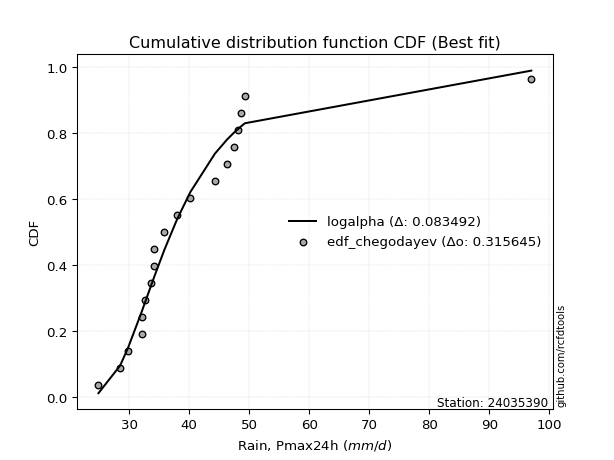</img></img>

</div>


### 6. EDF Blom (1958)

The Blom formula is a specific "plotting position" formula used in hydrology and statistical analysis to estimate the empirical cumulative probability (or non-exceedance probability) of a data series. It is particularly recommended for data that are approximately normally distributed. The constant _a_ is set to 0.375 (or 3/8).

<div align="center">


$P=(m-a)/(n+1-2a)$


</div>


**6.1. Empirical values**

<div align="center">

|                | 0                    | 1                   | 2                   | 3                   | 4                   | 5                  | 6                   | 7                  | 8                   | 9        | 10                 | 11                 | 12                 | 13                 | 14                 | 15                 | 16                 | 17                 | 18                 |
|:---------------|:---------------------|:--------------------|:--------------------|:--------------------|:--------------------|:-------------------|:--------------------|:-------------------|:--------------------|:---------|:-------------------|:-------------------|:-------------------|:-------------------|:-------------------|:-------------------|:-------------------|:-------------------|:-------------------|
| date           | 2012                 | 2009                | 2008                | 2005                | 2023                | 2022               | 2018                | 2013               | 2016                | 2017     | 2020               | 2007               | 2021               | 2014               | 2011               | 2010               | 2019               | 2015               | 2006               |
| x              | 24.9                 | 28.5                | 29.8                | 32.1                | 32.2                | 32.6               | 33.7                | 34.2               | 34.2                | 35.9     | 38.0               | 40.2               | 44.3               | 46.294736842105266 | 47.4               | 48.1               | 48.6               | 49.3               | 97.0               |
| m              | 1                    | 2                   | 3                   | 4                   | 5                   | 6                  | 7                   | 8                  | 9                   | 10       | 11                 | 12                 | 13                 | 14                 | 15                 | 16                 | 17                 | 18                 | 19                 |
| empirical_dist | edf_blom             | edf_blom            | edf_blom            | edf_blom            | edf_blom            | edf_blom           | edf_blom            | edf_blom           | edf_blom            | edf_blom | edf_blom           | edf_blom           | edf_blom           | edf_blom           | edf_blom           | edf_blom           | edf_blom           | edf_blom           | edf_blom           |
| empirical      | 0.032467532467532464 | 0.08441558441558442 | 0.13636363636363635 | 0.18831168831168832 | 0.24025974025974026 | 0.2922077922077922 | 0.34415584415584416 | 0.3961038961038961 | 0.44805194805194803 | 0.5      | 0.551948051948052  | 0.6038961038961039 | 0.6558441558441559 | 0.7077922077922078 | 0.7597402597402597 | 0.8116883116883117 | 0.8636363636363636 | 0.9155844155844156 | 0.9675324675324676 |
| empirical_tr   | 1.0335570469798658   | 1.0921985815602837  | 1.1578947368421053  | 1.232               | 1.3162393162393162  | 1.4128440366972477 | 1.5247524752475246  | 1.6559139784946235 | 1.811764705882353   | 2.0      | 2.2318840579710146 | 2.5245901639344264 | 2.905660377358491  | 3.4222222222222216 | 4.162162162162161  | 5.310344827586206  | 7.333333333333334  | 11.84615384615385  | 30.800000000000043 |

</div>


**6.2. Kolmogorov-Smirnov fit test (sorted by Δ)**


<div align="center">

|                | 0                   | 1                   | 2                   | 3                   | 4                   | 5                   | 6                   | 7                   | 8                   | 9                   | 10                  | 11                  | 12                  | 13                  | 14                  | 15                  | 16                  | 17                  | 18                  | 19                  | 20                  | 21                    | 22                  | 23                  | 24                  | 25                  | 26                  | 27                  | 28                  | 29                  | 30                  | 31                  | 32                  | 33                  | 34                  | 35                  | 36                  | 37                  | 38                  | 39                  | 40                  | 41                  | 42                  | 43                  | 44                  | 45                  | 46                  | 47                  | 48                  | 49                  | 50                  | 51                  | 52                  | 53                  | 54                  | 55                  | 56                  | 57                  | 58                  | 59                  | 60                  | 61                  | 62                  | 63                  | 64                  | 65                  | 66                  | 67                  | 68                  | 69                  | 70                  | 71                  | 72                  | 73                  | 74                  | 75                  | 76                  | 77                  | 78                  | 79                  | 80                  | 81                  | 82                  | 83                  | 84                  | 85                  | 86                  | 87                  |
|:---------------|:--------------------|:--------------------|:--------------------|:--------------------|:--------------------|:--------------------|:--------------------|:--------------------|:--------------------|:--------------------|:--------------------|:--------------------|:--------------------|:--------------------|:--------------------|:--------------------|:--------------------|:--------------------|:--------------------|:--------------------|:--------------------|:----------------------|:--------------------|:--------------------|:--------------------|:--------------------|:--------------------|:--------------------|:--------------------|:--------------------|:--------------------|:--------------------|:--------------------|:--------------------|:--------------------|:--------------------|:--------------------|:--------------------|:--------------------|:--------------------|:--------------------|:--------------------|:--------------------|:--------------------|:--------------------|:--------------------|:--------------------|:--------------------|:--------------------|:--------------------|:--------------------|:--------------------|:--------------------|:--------------------|:--------------------|:--------------------|:--------------------|:--------------------|:--------------------|:--------------------|:--------------------|:--------------------|:--------------------|:--------------------|:--------------------|:--------------------|:--------------------|:--------------------|:--------------------|:--------------------|:--------------------|:--------------------|:--------------------|:--------------------|:--------------------|:--------------------|:--------------------|:--------------------|:--------------------|:--------------------|:--------------------|:--------------------|:--------------------|:--------------------|:--------------------|:--------------------|:--------------------|:--------------------|
| station        | 24035390            | 24035390            | 24035390            | 24035390            | 24035390            | 24035390            | 24035390            | 24035390            | 24035390            | 24035390            | 24035390            | 24035390            | 24035390            | 24035390            | 24035390            | 24035390            | 24035390            | 24035390            | 24035390            | 24035390            | 24035390            | 24035390              | 24035390            | 24035390            | 24035390            | 24035390            | 24035390            | 24035390            | 24035390            | 24035390            | 24035390            | 24035390            | 24035390            | 24035390            | 24035390            | 24035390            | 24035390            | 24035390            | 24035390            | 24035390            | 24035390            | 24035390            | 24035390            | 24035390            | 24035390            | 24035390            | 24035390            | 24035390            | 24035390            | 24035390            | 24035390            | 24035390            | 24035390            | 24035390            | 24035390            | 24035390            | 24035390            | 24035390            | 24035390            | 24035390            | 24035390            | 24035390            | 24035390            | 24035390            | 24035390            | 24035390            | 24035390            | 24035390            | 24035390            | 24035390            | 24035390            | 24035390            | 24035390            | 24035390            | 24035390            | 24035390            | 24035390            | 24035390            | 24035390            | 24035390            | 24035390            | 24035390            | 24035390            | 24035390            | 24035390            | 24035390            | 24035390            | 24035390            |
| empirical_dist | edf_blom            | edf_blom            | edf_blom            | edf_blom            | edf_blom            | edf_blom            | edf_blom            | edf_blom            | edf_blom            | edf_blom            | edf_blom            | edf_blom            | edf_blom            | edf_blom            | edf_blom            | edf_blom            | edf_blom            | edf_blom            | edf_blom            | edf_blom            | edf_blom            | edf_blom              | edf_blom            | edf_blom            | edf_blom            | edf_blom            | edf_blom            | edf_blom            | edf_blom            | edf_blom            | edf_blom            | edf_blom            | edf_blom            | edf_blom            | edf_blom            | edf_blom            | edf_blom            | edf_blom            | edf_blom            | edf_blom            | edf_blom            | edf_blom            | edf_blom            | edf_blom            | edf_blom            | edf_blom            | edf_blom            | edf_blom            | edf_blom            | edf_blom            | edf_blom            | edf_blom            | edf_blom            | edf_blom            | edf_blom            | edf_blom            | edf_blom            | edf_blom            | edf_blom            | edf_blom            | edf_blom            | edf_blom            | edf_blom            | edf_blom            | edf_blom            | edf_blom            | edf_blom            | edf_blom            | edf_blom            | edf_blom            | edf_blom            | edf_blom            | edf_blom            | edf_blom            | edf_blom            | edf_blom            | edf_blom            | edf_blom            | edf_blom            | edf_blom            | edf_blom            | edf_blom            | edf_blom            | edf_blom            | edf_blom            | edf_blom            | edf_blom            | edf_blom            |
| p_dist         | alpha               | logalpha            | logmielke           | fisk                | loggenlogistic      | logexponnorm        | johnsonsu           | logjohnsonsu        | mielke              | logmoyal            | loginvgamma         | loginvweibull       | invweibull          | loglognorm          | invgamma            | f                   | logfisk             | loginvgauss         | loggumbel_r         | logfatiguelife      | logpearson3         | loglaplace_asymmetric | logf                | wald                | logbetaprime        | loghalflogistic     | logkstwobign        | loggenexpon         | exponnorm           | nct                 | logweibull_min      | laplace_asymmetric  | invgauss            | lognct              | weibull_min         | genexpon            | logrice             | fatiguelife         | lognakagami         | betaprime           | loghalfnorm         | lograyleigh         | logmaxwell          | logcrystalball      | lognorm             | lognorm             | erlang              | gamma               | chi2                | genlogistic         | ncf                 | logt                | gibrat              | logloggamma         | moyal               | loglogistic         | logwald             | pearson3            | halflogistic        | kstwobign           | loggompertz         | loghypsecant        | gumbel_r            | gompertz            | hypsecant           | halfnorm            | expon               | loggibrat           | loggumbel_l         | loglaplace          | logistic            | rayleigh            | laplace             | nakagami            | rice                | maxwell             | truncnorm           | crystalball         | norm                | logncf              | t                   | logtruncnorm        | gumbel_l            | loggamma            | loggamma            | logexpon            | logerlang           | logchi2             |
| delta          | 0.08559956359222581 | 0.08601062632054213 | 0.08759031498306946 | 0.08780331049932627 | 0.08835293023683799 | 0.08876622605421547 | 0.08888776943887589 | 0.08928720528366041 | 0.08957272143554029 | 0.08966057229046354 | 0.08981666570314861 | 0.09028420498220369 | 0.09052469818837672 | 0.09249328250846967 | 0.09411285311041384 | 0.09412805439627736 | 0.09433142995268085 | 0.09565171372699999 | 0.09592967860732204 | 0.09601875333605336 | 0.09610406008474409 | 0.09763225771058825   | 0.09765841938617204 | 0.09944488808859053 | 0.09951515624026419 | 0.10567294315416481 | 0.10771414402952673 | 0.10803950168596699 | 0.10980300311938163 | 0.11102074027950892 | 0.1120101233099392  | 0.11222857521347751 | 0.11305312239230847 | 0.11429381008784695 | 0.11474828418075977 | 0.11558102263774805 | 0.11573219601145757 | 0.11633382033349482 | 0.11750644150290912 | 0.11815349728899421 | 0.11927610260429466 | 0.11943196009510892 | 0.12061099391843266 | 0.12477550591540187 | 0.12477584386448004 | 0.12477584386448004 | 0.12513562857995442 | 0.1251358993562276  | 0.12513702504275181 | 0.12756374624255945 | 0.12759862118681609 | 0.1284056895212009  | 0.13385976628660323 | 0.13499745845815747 | 0.1407439563710351  | 0.1412005879992968  | 0.14272224023645463 | 0.14994741623346658 | 0.15012547006038074 | 0.1532648402319201  | 0.1533242669949994  | 0.1560711343938071  | 0.15643023734597739 | 0.16339596414491458 | 0.16776112622659156 | 0.17304121582867893 | 0.17387644745068292 | 0.1747168425612995  | 0.17743619234734764 | 0.18317960456871296 | 0.18323144926208457 | 0.1861694845750964  | 0.18709073248312375 | 0.18731000428650751 | 0.18927095437168318 | 0.19042041143721644 | 0.20504399766379655 | 0.2050440167332186  | 0.20504402619827566 | 0.20877099472062055 | 0.21767627646403453 | 0.217992940363808   | 0.2341185008725375  | 0.23748716342453036 | 0.23748716342453036 | 0.24449500231855592 | 0.257292157262859   | 0.34746647142422693 |
| deltao         | 0.31564497164100014 | 0.31564497164100014 | 0.31564497164100014 | 0.31564497164100014 | 0.31564497164100014 | 0.31564497164100014 | 0.31564497164100014 | 0.31564497164100014 | 0.31564497164100014 | 0.31564497164100014 | 0.31564497164100014 | 0.31564497164100014 | 0.31564497164100014 | 0.31564497164100014 | 0.31564497164100014 | 0.31564497164100014 | 0.31564497164100014 | 0.31564497164100014 | 0.31564497164100014 | 0.31564497164100014 | 0.31564497164100014 | 0.31564497164100014   | 0.31564497164100014 | 0.31564497164100014 | 0.31564497164100014 | 0.31564497164100014 | 0.31564497164100014 | 0.31564497164100014 | 0.31564497164100014 | 0.31564497164100014 | 0.31564497164100014 | 0.31564497164100014 | 0.31564497164100014 | 0.31564497164100014 | 0.31564497164100014 | 0.31564497164100014 | 0.31564497164100014 | 0.31564497164100014 | 0.31564497164100014 | 0.31564497164100014 | 0.31564497164100014 | 0.31564497164100014 | 0.31564497164100014 | 0.31564497164100014 | 0.31564497164100014 | 0.31564497164100014 | 0.31564497164100014 | 0.31564497164100014 | 0.31564497164100014 | 0.31564497164100014 | 0.31564497164100014 | 0.31564497164100014 | 0.31564497164100014 | 0.31564497164100014 | 0.31564497164100014 | 0.31564497164100014 | 0.31564497164100014 | 0.31564497164100014 | 0.31564497164100014 | 0.31564497164100014 | 0.31564497164100014 | 0.31564497164100014 | 0.31564497164100014 | 0.31564497164100014 | 0.31564497164100014 | 0.31564497164100014 | 0.31564497164100014 | 0.31564497164100014 | 0.31564497164100014 | 0.31564497164100014 | 0.31564497164100014 | 0.31564497164100014 | 0.31564497164100014 | 0.31564497164100014 | 0.31564497164100014 | 0.31564497164100014 | 0.31564497164100014 | 0.31564497164100014 | 0.31564497164100014 | 0.31564497164100014 | 0.31564497164100014 | 0.31564497164100014 | 0.31564497164100014 | 0.31564497164100014 | 0.31564497164100014 | 0.31564497164100014 | 0.31564497164100014 | 0.31564497164100014 |
| eval           | Δo > Δ              | Δo > Δ              | Δo > Δ              | Δo > Δ              | Δo > Δ              | Δo > Δ              | Δo > Δ              | Δo > Δ              | Δo > Δ              | Δo > Δ              | Δo > Δ              | Δo > Δ              | Δo > Δ              | Δo > Δ              | Δo > Δ              | Δo > Δ              | Δo > Δ              | Δo > Δ              | Δo > Δ              | Δo > Δ              | Δo > Δ              | Δo > Δ                | Δo > Δ              | Δo > Δ              | Δo > Δ              | Δo > Δ              | Δo > Δ              | Δo > Δ              | Δo > Δ              | Δo > Δ              | Δo > Δ              | Δo > Δ              | Δo > Δ              | Δo > Δ              | Δo > Δ              | Δo > Δ              | Δo > Δ              | Δo > Δ              | Δo > Δ              | Δo > Δ              | Δo > Δ              | Δo > Δ              | Δo > Δ              | Δo > Δ              | Δo > Δ              | Δo > Δ              | Δo > Δ              | Δo > Δ              | Δo > Δ              | Δo > Δ              | Δo > Δ              | Δo > Δ              | Δo > Δ              | Δo > Δ              | Δo > Δ              | Δo > Δ              | Δo > Δ              | Δo > Δ              | Δo > Δ              | Δo > Δ              | Δo > Δ              | Δo > Δ              | Δo > Δ              | Δo > Δ              | Δo > Δ              | Δo > Δ              | Δo > Δ              | Δo > Δ              | Δo > Δ              | Δo > Δ              | Δo > Δ              | Δo > Δ              | Δo > Δ              | Δo > Δ              | Δo > Δ              | Δo > Δ              | Δo > Δ              | Δo > Δ              | Δo > Δ              | Δo > Δ              | Δo > Δ              | Δo > Δ              | Δo > Δ              | Δo > Δ              | Δo > Δ              | Δo > Δ              | Δo > Δ              | Δo <= Δ             |
| fit            | 1                   | 1                   | 1                   | 1                   | 1                   | 1                   | 1                   | 1                   | 1                   | 1                   | 1                   | 1                   | 1                   | 1                   | 1                   | 1                   | 1                   | 1                   | 1                   | 1                   | 1                   | 1                     | 1                   | 1                   | 1                   | 1                   | 1                   | 1                   | 1                   | 1                   | 1                   | 1                   | 1                   | 1                   | 1                   | 1                   | 1                   | 1                   | 1                   | 1                   | 1                   | 1                   | 1                   | 1                   | 1                   | 1                   | 1                   | 1                   | 1                   | 1                   | 1                   | 1                   | 1                   | 1                   | 1                   | 1                   | 1                   | 1                   | 1                   | 1                   | 1                   | 1                   | 1                   | 1                   | 1                   | 1                   | 1                   | 1                   | 1                   | 1                   | 1                   | 1                   | 1                   | 1                   | 1                   | 1                   | 1                   | 1                   | 1                   | 1                   | 1                   | 1                   | 1                   | 1                   | 1                   | 1                   | 1                   | 0                   |
| n              | 19                  | 19                  | 19                  | 19                  | 19                  | 19                  | 19                  | 19                  | 19                  | 19                  | 19                  | 19                  | 19                  | 19                  | 19                  | 19                  | 19                  | 19                  | 19                  | 19                  | 19                  | 19                    | 19                  | 19                  | 19                  | 19                  | 19                  | 19                  | 19                  | 19                  | 19                  | 19                  | 19                  | 19                  | 19                  | 19                  | 19                  | 19                  | 19                  | 19                  | 19                  | 19                  | 19                  | 19                  | 19                  | 19                  | 19                  | 19                  | 19                  | 19                  | 19                  | 19                  | 19                  | 19                  | 19                  | 19                  | 19                  | 19                  | 19                  | 19                  | 19                  | 19                  | 19                  | 19                  | 19                  | 19                  | 19                  | 19                  | 19                  | 19                  | 19                  | 19                  | 19                  | 19                  | 19                  | 19                  | 19                  | 19                  | 19                  | 19                  | 19                  | 19                  | 19                  | 19                  | 19                  | 19                  | 19                  | 19                  |
| best_fit       | 1                   | 0                   | 0                   | 0                   | 0                   | 0                   | 0                   | 0                   | 0                   | 0                   | 0                   | 0                   | 0                   | 0                   | 0                   | 0                   | 0                   | 0                   | 0                   | 0                   | 0                   | 0                     | 0                   | 0                   | 0                   | 0                   | 0                   | 0                   | 0                   | 0                   | 0                   | 0                   | 0                   | 0                   | 0                   | 0                   | 0                   | 0                   | 0                   | 0                   | 0                   | 0                   | 0                   | 0                   | 0                   | 0                   | 0                   | 0                   | 0                   | 0                   | 0                   | 0                   | 0                   | 0                   | 0                   | 0                   | 0                   | 0                   | 0                   | 0                   | 0                   | 0                   | 0                   | 0                   | 0                   | 0                   | 0                   | 0                   | 0                   | 0                   | 0                   | 0                   | 0                   | 0                   | 0                   | 0                   | 0                   | 0                   | 0                   | 0                   | 0                   | 0                   | 0                   | 0                   | 0                   | 0                   | 0                   | 0                   |
| best_fit_sort  | 1                   | 2                   | 3                   | 4                   | 5                   | 6                   | 7                   | 8                   | 9                   | 10                  | 11                  | 12                  | 13                  | 14                  | 15                  | 16                  | 17                  | 18                  | 19                  | 20                  | 21                  | 22                    | 23                  | 24                  | 25                  | 26                  | 27                  | 28                  | 29                  | 30                  | 31                  | 32                  | 33                  | 34                  | 35                  | 36                  | 37                  | 38                  | 39                  | 40                  | 41                  | 42                  | 43                  | 44                  | 45                  | 46                  | 47                  | 48                  | 49                  | 50                  | 51                  | 52                  | 53                  | 54                  | 55                  | 56                  | 57                  | 58                  | 59                  | 60                  | 61                  | 62                  | 63                  | 64                  | 65                  | 66                  | 67                  | 68                  | 69                  | 70                  | 71                  | 72                  | 73                  | 74                  | 75                  | 76                  | 77                  | 78                  | 79                  | 80                  | 81                  | 82                  | 83                  | 84                  | 85                  | 86                  | 87                  | 88                  |

</div>


**6.3. Best fit**

<div align="center">

|   id |   station | empirical_dist   | p_dist   |     delta |   deltao | eval   |   fit |   n |   best_fit |   best_fit_sort |
|-----:|----------:|:-----------------|:---------|----------:|---------:|:-------|------:|----:|-----------:|----------------:|
|    0 |  24035390 | edf_blom         | alpha    | 0.0855996 | 0.315645 | Δo > Δ |     1 |  19 |          1 |               1 |

</div>


<div align="center">

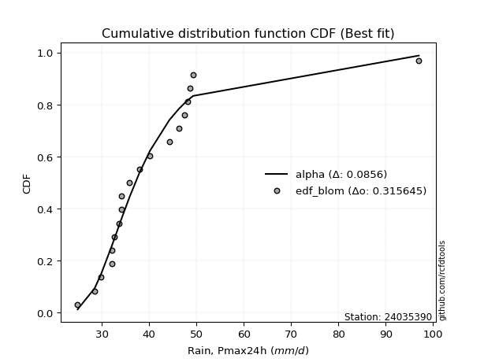</img>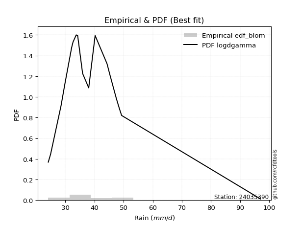</img>

</div>


### 7. EDF Tukey (1962)

In hydrology, the Tukey formula is used as a plotting position formula to estimate the empirical probability or frequency of a flood event (or other hydrological data). The formula parameter is given as _c=0.333_ (or 1/3).

<div align="center">


$P=(m-c)/(n+1-2c)$


</div>


**7.1. Empirical values**

<div align="center">

|                | 0                    | 1                   | 2                   | 3                  | 4                  | 5                   | 6                  | 7                   | 8                  | 9         | 10                 | 11                 | 12                 | 13                 | 14                 | 15                 | 16                 | 17                 | 18                 |
|:---------------|:---------------------|:--------------------|:--------------------|:-------------------|:-------------------|:--------------------|:-------------------|:--------------------|:-------------------|:----------|:-------------------|:-------------------|:-------------------|:-------------------|:-------------------|:-------------------|:-------------------|:-------------------|:-------------------|
| date           | 2012                 | 2009                | 2008                | 2005               | 2023               | 2022                | 2018               | 2013                | 2016               | 2017      | 2020               | 2007               | 2021               | 2014               | 2011               | 2010               | 2019               | 2015               | 2006               |
| x              | 24.9                 | 28.5                | 29.8                | 32.1               | 32.2               | 32.6                | 33.7               | 34.2                | 34.2               | 35.9      | 38.0               | 40.2               | 44.3               | 46.294736842105266 | 47.4               | 48.1               | 48.6               | 49.3               | 97.0               |
| m              | 1                    | 2                   | 3                   | 4                  | 5                  | 6                   | 7                  | 8                   | 9                  | 10        | 11                 | 12                 | 13                 | 14                 | 15                 | 16                 | 17                 | 18                 | 19                 |
| empirical_dist | edf_tukey            | edf_tukey           | edf_tukey           | edf_tukey          | edf_tukey          | edf_tukey           | edf_tukey          | edf_tukey           | edf_tukey          | edf_tukey | edf_tukey          | edf_tukey          | edf_tukey          | edf_tukey          | edf_tukey          | edf_tukey          | edf_tukey          | edf_tukey          | edf_tukey          |
| empirical      | 0.034482758620689655 | 0.08620689655172414 | 0.13793103448275862 | 0.1896551724137931 | 0.2413793103448276 | 0.29310344827586204 | 0.3448275862068966 | 0.39655172413793105 | 0.4482758620689655 | 0.5       | 0.5517241379310345 | 0.603448275862069  | 0.6551724137931034 | 0.7068965517241379 | 0.7586206896551724 | 0.8103448275862069 | 0.8620689655172413 | 0.9137931034482759 | 0.9655172413793104 |
| empirical_tr   | 1.0357142857142856   | 1.0943396226415094  | 1.1600000000000001  | 1.2340425531914894 | 1.3181818181818183 | 1.4146341463414636  | 1.5263157894736843 | 1.6571428571428573  | 1.8125             | 2.0       | 2.230769230769231  | 2.5217391304347827 | 2.9                | 3.4117647058823524 | 4.142857142857142  | 5.272727272727272  | 7.249999999999997  | 11.600000000000007 | 29.000000000000036 |

</div>


**7.2. Kolmogorov-Smirnov fit test (sorted by Δ)**


<div align="center">

|                | 0                   | 1                   | 2                   | 3                   | 4                   | 5                   | 6                   | 7                   | 8                   | 9                   | 10                  | 11                  | 12                  | 13                  | 14                  | 15                  | 16                  | 17                  | 18                  | 19                  | 20                  | 21                  | 22                  | 23                  | 24                    | 25                  | 26                  | 27                  | 28                  | 29                  | 30                  | 31                  | 32                  | 33                  | 34                  | 35                  | 36                  | 37                  | 38                  | 39                  | 40                  | 41                  | 42                  | 43                  | 44                  | 45                  | 46                  | 47                  | 48                  | 49                  | 50                  | 51                  | 52                  | 53                  | 54                  | 55                  | 56                  | 57                  | 58                  | 59                  | 60                  | 61                  | 62                  | 63                  | 64                  | 65                  | 66                  | 67                  | 68                  | 69                  | 70                  | 71                  | 72                  | 73                  | 74                  | 75                  | 76                  | 77                  | 78                  | 79                  | 80                  | 81                  | 82                  | 83                  | 84                  | 85                  | 86                  | 87                  |
|:---------------|:--------------------|:--------------------|:--------------------|:--------------------|:--------------------|:--------------------|:--------------------|:--------------------|:--------------------|:--------------------|:--------------------|:--------------------|:--------------------|:--------------------|:--------------------|:--------------------|:--------------------|:--------------------|:--------------------|:--------------------|:--------------------|:--------------------|:--------------------|:--------------------|:----------------------|:--------------------|:--------------------|:--------------------|:--------------------|:--------------------|:--------------------|:--------------------|:--------------------|:--------------------|:--------------------|:--------------------|:--------------------|:--------------------|:--------------------|:--------------------|:--------------------|:--------------------|:--------------------|:--------------------|:--------------------|:--------------------|:--------------------|:--------------------|:--------------------|:--------------------|:--------------------|:--------------------|:--------------------|:--------------------|:--------------------|:--------------------|:--------------------|:--------------------|:--------------------|:--------------------|:--------------------|:--------------------|:--------------------|:--------------------|:--------------------|:--------------------|:--------------------|:--------------------|:--------------------|:--------------------|:--------------------|:--------------------|:--------------------|:--------------------|:--------------------|:--------------------|:--------------------|:--------------------|:--------------------|:--------------------|:--------------------|:--------------------|:--------------------|:--------------------|:--------------------|:--------------------|:--------------------|:--------------------|
| station        | 24035390            | 24035390            | 24035390            | 24035390            | 24035390            | 24035390            | 24035390            | 24035390            | 24035390            | 24035390            | 24035390            | 24035390            | 24035390            | 24035390            | 24035390            | 24035390            | 24035390            | 24035390            | 24035390            | 24035390            | 24035390            | 24035390            | 24035390            | 24035390            | 24035390              | 24035390            | 24035390            | 24035390            | 24035390            | 24035390            | 24035390            | 24035390            | 24035390            | 24035390            | 24035390            | 24035390            | 24035390            | 24035390            | 24035390            | 24035390            | 24035390            | 24035390            | 24035390            | 24035390            | 24035390            | 24035390            | 24035390            | 24035390            | 24035390            | 24035390            | 24035390            | 24035390            | 24035390            | 24035390            | 24035390            | 24035390            | 24035390            | 24035390            | 24035390            | 24035390            | 24035390            | 24035390            | 24035390            | 24035390            | 24035390            | 24035390            | 24035390            | 24035390            | 24035390            | 24035390            | 24035390            | 24035390            | 24035390            | 24035390            | 24035390            | 24035390            | 24035390            | 24035390            | 24035390            | 24035390            | 24035390            | 24035390            | 24035390            | 24035390            | 24035390            | 24035390            | 24035390            | 24035390            |
| empirical_dist | edf_tukey           | edf_tukey           | edf_tukey           | edf_tukey           | edf_tukey           | edf_tukey           | edf_tukey           | edf_tukey           | edf_tukey           | edf_tukey           | edf_tukey           | edf_tukey           | edf_tukey           | edf_tukey           | edf_tukey           | edf_tukey           | edf_tukey           | edf_tukey           | edf_tukey           | edf_tukey           | edf_tukey           | edf_tukey           | edf_tukey           | edf_tukey           | edf_tukey             | edf_tukey           | edf_tukey           | edf_tukey           | edf_tukey           | edf_tukey           | edf_tukey           | edf_tukey           | edf_tukey           | edf_tukey           | edf_tukey           | edf_tukey           | edf_tukey           | edf_tukey           | edf_tukey           | edf_tukey           | edf_tukey           | edf_tukey           | edf_tukey           | edf_tukey           | edf_tukey           | edf_tukey           | edf_tukey           | edf_tukey           | edf_tukey           | edf_tukey           | edf_tukey           | edf_tukey           | edf_tukey           | edf_tukey           | edf_tukey           | edf_tukey           | edf_tukey           | edf_tukey           | edf_tukey           | edf_tukey           | edf_tukey           | edf_tukey           | edf_tukey           | edf_tukey           | edf_tukey           | edf_tukey           | edf_tukey           | edf_tukey           | edf_tukey           | edf_tukey           | edf_tukey           | edf_tukey           | edf_tukey           | edf_tukey           | edf_tukey           | edf_tukey           | edf_tukey           | edf_tukey           | edf_tukey           | edf_tukey           | edf_tukey           | edf_tukey           | edf_tukey           | edf_tukey           | edf_tukey           | edf_tukey           | edf_tukey           | edf_tukey           |
| p_dist         | logalpha            | alpha               | loggenlogistic      | mielke              | loginvgamma         | fisk                | logmielke           | loginvweibull       | invweibull          | logexponnorm        | johnsonsu           | logjohnsonsu        | logmoyal            | loglognorm          | invgamma            | f                   | loginvgauss         | loggumbel_r         | logfatiguelife      | logpearson3         | logfisk             | logf                | logbetaprime        | wald                | loglaplace_asymmetric | loghalflogistic     | logkstwobign        | loggenexpon         | exponnorm           | logweibull_min      | nct                 | invgauss            | laplace_asymmetric  | weibull_min         | genexpon            | logrice             | lognct              | fatiguelife         | lognakagami         | lograyleigh         | loghalfnorm         | betaprime           | logmaxwell          | logcrystalball      | lognorm             | lognorm             | erlang              | gamma               | chi2                | ncf                 | logt                | genlogistic         | logloggamma         | gibrat              | moyal               | loglogistic         | logwald             | pearson3            | halflogistic        | kstwobign           | loggompertz         | gumbel_r            | loghypsecant        | gompertz            | hypsecant           | halfnorm            | expon               | loggibrat           | loggumbel_l         | logistic            | loglaplace          | rayleigh            | nakagami            | laplace             | rice                | maxwell             | truncnorm           | crystalball         | norm                | logncf              | t                   | logtruncnorm        | gumbel_l            | loggamma            | loggamma            | logexpon            | logerlang           | logchi2             |
| delta          | 0.08421931418440243 | 0.0858234776092433  | 0.0866964985483401  | 0.08778140929940059 | 0.08802535356700891 | 0.08822857512897309 | 0.08826205703412193 | 0.08849289284606399 | 0.08873338605223702 | 0.08943796810526794 | 0.08955951148992836 | 0.08995894733471288 | 0.090332314341516   | 0.09070197037232997 | 0.09232154097427414 | 0.09233674226013766 | 0.09386040159086029 | 0.09413836647118234 | 0.09422744119991366 | 0.09476057598263932 | 0.09500317200373332 | 0.09586710725003234 | 0.09772384410412449 | 0.09810140398648576 | 0.09830399976164073   | 0.10432945905206004 | 0.10592283189338703 | 0.10624818954982729 | 0.10801169098324193 | 0.1102188111737995  | 0.11124465429652641 | 0.11126181025616877 | 0.112452489230495   | 0.11295697204462007 | 0.11378971050160835 | 0.11394088387531787 | 0.11451772410486444 | 0.11454250819735512 | 0.11571512936676942 | 0.11764064795896922 | 0.11793261850218989 | 0.1183774113060117  | 0.11881968178229296 | 0.12298419377926217 | 0.12298453172834034 | 0.12298453172834034 | 0.12334431644381472 | 0.1233445872200879  | 0.12334571290661211 | 0.12580730905067639 | 0.1266143773850612  | 0.12778766025957694 | 0.13320614632201777 | 0.1354271644057255  | 0.1389526442348954  | 0.1414245020163143  | 0.1433939822875071  | 0.1486039321313618  | 0.14878198595827596 | 0.1514735280957804  | 0.15198078289289463 | 0.15463892520983769 | 0.1562950484108246  | 0.1620524800428098  | 0.16596981409045186 | 0.17124990369253923 | 0.17253296334857815 | 0.17538858461235196 | 0.17766010636436513 | 0.18144013712594487 | 0.18340351858573045 | 0.1843781724389567  | 0.18596652018440274 | 0.18709073248312375 | 0.18747964223554348 | 0.18862909930107674 | 0.20325268552765685 | 0.2032527045970789  | 0.20325271406213596 | 0.20697968258448085 | 0.21588496432789483 | 0.21664945626170323 | 0.2323271887363978  | 0.23569585128839066 | 0.23569585128839066 | 0.24315151821645115 | 0.2559486731607542  | 0.34567515928808723 |
| deltao         | 0.31564497164100014 | 0.31564497164100014 | 0.31564497164100014 | 0.31564497164100014 | 0.31564497164100014 | 0.31564497164100014 | 0.31564497164100014 | 0.31564497164100014 | 0.31564497164100014 | 0.31564497164100014 | 0.31564497164100014 | 0.31564497164100014 | 0.31564497164100014 | 0.31564497164100014 | 0.31564497164100014 | 0.31564497164100014 | 0.31564497164100014 | 0.31564497164100014 | 0.31564497164100014 | 0.31564497164100014 | 0.31564497164100014 | 0.31564497164100014 | 0.31564497164100014 | 0.31564497164100014 | 0.31564497164100014   | 0.31564497164100014 | 0.31564497164100014 | 0.31564497164100014 | 0.31564497164100014 | 0.31564497164100014 | 0.31564497164100014 | 0.31564497164100014 | 0.31564497164100014 | 0.31564497164100014 | 0.31564497164100014 | 0.31564497164100014 | 0.31564497164100014 | 0.31564497164100014 | 0.31564497164100014 | 0.31564497164100014 | 0.31564497164100014 | 0.31564497164100014 | 0.31564497164100014 | 0.31564497164100014 | 0.31564497164100014 | 0.31564497164100014 | 0.31564497164100014 | 0.31564497164100014 | 0.31564497164100014 | 0.31564497164100014 | 0.31564497164100014 | 0.31564497164100014 | 0.31564497164100014 | 0.31564497164100014 | 0.31564497164100014 | 0.31564497164100014 | 0.31564497164100014 | 0.31564497164100014 | 0.31564497164100014 | 0.31564497164100014 | 0.31564497164100014 | 0.31564497164100014 | 0.31564497164100014 | 0.31564497164100014 | 0.31564497164100014 | 0.31564497164100014 | 0.31564497164100014 | 0.31564497164100014 | 0.31564497164100014 | 0.31564497164100014 | 0.31564497164100014 | 0.31564497164100014 | 0.31564497164100014 | 0.31564497164100014 | 0.31564497164100014 | 0.31564497164100014 | 0.31564497164100014 | 0.31564497164100014 | 0.31564497164100014 | 0.31564497164100014 | 0.31564497164100014 | 0.31564497164100014 | 0.31564497164100014 | 0.31564497164100014 | 0.31564497164100014 | 0.31564497164100014 | 0.31564497164100014 | 0.31564497164100014 |
| eval           | Δo > Δ              | Δo > Δ              | Δo > Δ              | Δo > Δ              | Δo > Δ              | Δo > Δ              | Δo > Δ              | Δo > Δ              | Δo > Δ              | Δo > Δ              | Δo > Δ              | Δo > Δ              | Δo > Δ              | Δo > Δ              | Δo > Δ              | Δo > Δ              | Δo > Δ              | Δo > Δ              | Δo > Δ              | Δo > Δ              | Δo > Δ              | Δo > Δ              | Δo > Δ              | Δo > Δ              | Δo > Δ                | Δo > Δ              | Δo > Δ              | Δo > Δ              | Δo > Δ              | Δo > Δ              | Δo > Δ              | Δo > Δ              | Δo > Δ              | Δo > Δ              | Δo > Δ              | Δo > Δ              | Δo > Δ              | Δo > Δ              | Δo > Δ              | Δo > Δ              | Δo > Δ              | Δo > Δ              | Δo > Δ              | Δo > Δ              | Δo > Δ              | Δo > Δ              | Δo > Δ              | Δo > Δ              | Δo > Δ              | Δo > Δ              | Δo > Δ              | Δo > Δ              | Δo > Δ              | Δo > Δ              | Δo > Δ              | Δo > Δ              | Δo > Δ              | Δo > Δ              | Δo > Δ              | Δo > Δ              | Δo > Δ              | Δo > Δ              | Δo > Δ              | Δo > Δ              | Δo > Δ              | Δo > Δ              | Δo > Δ              | Δo > Δ              | Δo > Δ              | Δo > Δ              | Δo > Δ              | Δo > Δ              | Δo > Δ              | Δo > Δ              | Δo > Δ              | Δo > Δ              | Δo > Δ              | Δo > Δ              | Δo > Δ              | Δo > Δ              | Δo > Δ              | Δo > Δ              | Δo > Δ              | Δo > Δ              | Δo > Δ              | Δo > Δ              | Δo > Δ              | Δo <= Δ             |
| fit            | 1                   | 1                   | 1                   | 1                   | 1                   | 1                   | 1                   | 1                   | 1                   | 1                   | 1                   | 1                   | 1                   | 1                   | 1                   | 1                   | 1                   | 1                   | 1                   | 1                   | 1                   | 1                   | 1                   | 1                   | 1                     | 1                   | 1                   | 1                   | 1                   | 1                   | 1                   | 1                   | 1                   | 1                   | 1                   | 1                   | 1                   | 1                   | 1                   | 1                   | 1                   | 1                   | 1                   | 1                   | 1                   | 1                   | 1                   | 1                   | 1                   | 1                   | 1                   | 1                   | 1                   | 1                   | 1                   | 1                   | 1                   | 1                   | 1                   | 1                   | 1                   | 1                   | 1                   | 1                   | 1                   | 1                   | 1                   | 1                   | 1                   | 1                   | 1                   | 1                   | 1                   | 1                   | 1                   | 1                   | 1                   | 1                   | 1                   | 1                   | 1                   | 1                   | 1                   | 1                   | 1                   | 1                   | 1                   | 0                   |
| n              | 19                  | 19                  | 19                  | 19                  | 19                  | 19                  | 19                  | 19                  | 19                  | 19                  | 19                  | 19                  | 19                  | 19                  | 19                  | 19                  | 19                  | 19                  | 19                  | 19                  | 19                  | 19                  | 19                  | 19                  | 19                    | 19                  | 19                  | 19                  | 19                  | 19                  | 19                  | 19                  | 19                  | 19                  | 19                  | 19                  | 19                  | 19                  | 19                  | 19                  | 19                  | 19                  | 19                  | 19                  | 19                  | 19                  | 19                  | 19                  | 19                  | 19                  | 19                  | 19                  | 19                  | 19                  | 19                  | 19                  | 19                  | 19                  | 19                  | 19                  | 19                  | 19                  | 19                  | 19                  | 19                  | 19                  | 19                  | 19                  | 19                  | 19                  | 19                  | 19                  | 19                  | 19                  | 19                  | 19                  | 19                  | 19                  | 19                  | 19                  | 19                  | 19                  | 19                  | 19                  | 19                  | 19                  | 19                  | 19                  |
| best_fit       | 1                   | 0                   | 0                   | 0                   | 0                   | 0                   | 0                   | 0                   | 0                   | 0                   | 0                   | 0                   | 0                   | 0                   | 0                   | 0                   | 0                   | 0                   | 0                   | 0                   | 0                   | 0                   | 0                   | 0                   | 0                     | 0                   | 0                   | 0                   | 0                   | 0                   | 0                   | 0                   | 0                   | 0                   | 0                   | 0                   | 0                   | 0                   | 0                   | 0                   | 0                   | 0                   | 0                   | 0                   | 0                   | 0                   | 0                   | 0                   | 0                   | 0                   | 0                   | 0                   | 0                   | 0                   | 0                   | 0                   | 0                   | 0                   | 0                   | 0                   | 0                   | 0                   | 0                   | 0                   | 0                   | 0                   | 0                   | 0                   | 0                   | 0                   | 0                   | 0                   | 0                   | 0                   | 0                   | 0                   | 0                   | 0                   | 0                   | 0                   | 0                   | 0                   | 0                   | 0                   | 0                   | 0                   | 0                   | 0                   |
| best_fit_sort  | 1                   | 2                   | 3                   | 4                   | 5                   | 6                   | 7                   | 8                   | 9                   | 10                  | 11                  | 12                  | 13                  | 14                  | 15                  | 16                  | 17                  | 18                  | 19                  | 20                  | 21                  | 22                  | 23                  | 24                  | 25                    | 26                  | 27                  | 28                  | 29                  | 30                  | 31                  | 32                  | 33                  | 34                  | 35                  | 36                  | 37                  | 38                  | 39                  | 40                  | 41                  | 42                  | 43                  | 44                  | 45                  | 46                  | 47                  | 48                  | 49                  | 50                  | 51                  | 52                  | 53                  | 54                  | 55                  | 56                  | 57                  | 58                  | 59                  | 60                  | 61                  | 62                  | 63                  | 64                  | 65                  | 66                  | 67                  | 68                  | 69                  | 70                  | 71                  | 72                  | 73                  | 74                  | 75                  | 76                  | 77                  | 78                  | 79                  | 80                  | 81                  | 82                  | 83                  | 84                  | 85                  | 86                  | 87                  | 88                  |

</div>


**7.3. Best fit**

<div align="center">

|   id |   station | empirical_dist   | p_dist   |     delta |   deltao | eval   |   fit |   n |   best_fit |   best_fit_sort |
|-----:|----------:|:-----------------|:---------|----------:|---------:|:-------|------:|----:|-----------:|----------------:|
|    0 |  24035390 | edf_tukey        | logalpha | 0.0842193 | 0.315645 | Δo > Δ |     1 |  19 |          1 |               1 |

</div>


<div align="center">

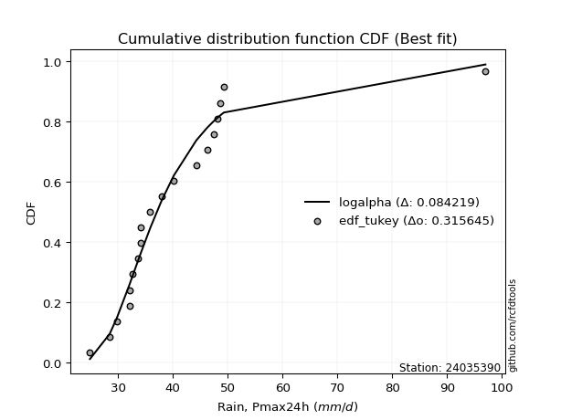</img></img>

</div>


### 8. EDF Gringorten (1963)

Gringorten plotting position formula is essential for estimating the probability and return periods of extreme events like floods and heavy rainfall. The constant _a=0.44_.

<div align="center">


$P=(m-a)/(n+1-2a)$


</div>


**8.1. Empirical values**

<div align="center">

|                | 0                    | 1                   | 2                   | 3                   | 4                   | 5                   | 6                  | 7                  | 8                  | 9              | 10                 | 11                | 12                 | 13                 | 14                 | 15                 | 16                 | 17                 | 18                 |
|:---------------|:---------------------|:--------------------|:--------------------|:--------------------|:--------------------|:--------------------|:-------------------|:-------------------|:-------------------|:---------------|:-------------------|:------------------|:-------------------|:-------------------|:-------------------|:-------------------|:-------------------|:-------------------|:-------------------|
| date           | 2012                 | 2009                | 2008                | 2005                | 2023                | 2022                | 2018               | 2013               | 2016               | 2017           | 2020               | 2007              | 2021               | 2014               | 2011               | 2010               | 2019               | 2015               | 2006               |
| x              | 24.9                 | 28.5                | 29.8                | 32.1                | 32.2                | 32.6                | 33.7               | 34.2               | 34.2               | 35.9           | 38.0               | 40.2              | 44.3               | 46.294736842105266 | 47.4               | 48.1               | 48.6               | 49.3               | 97.0               |
| m              | 1                    | 2                   | 3                   | 4                   | 5                   | 6                   | 7                  | 8                  | 9                  | 10             | 11                 | 12                | 13                 | 14                 | 15                 | 16                 | 17                 | 18                 | 19                 |
| empirical_dist | edf_gringorten       | edf_gringorten      | edf_gringorten      | edf_gringorten      | edf_gringorten      | edf_gringorten      | edf_gringorten     | edf_gringorten     | edf_gringorten     | edf_gringorten | edf_gringorten     | edf_gringorten    | edf_gringorten     | edf_gringorten     | edf_gringorten     | edf_gringorten     | edf_gringorten     | edf_gringorten     | edf_gringorten     |
| empirical      | 0.029288702928870293 | 0.08158995815899582 | 0.13389121338912133 | 0.18619246861924685 | 0.23849372384937234 | 0.29079497907949786 | 0.3430962343096234 | 0.3953974895397489 | 0.4476987447698745 | 0.5            | 0.5523012552301255 | 0.604602510460251 | 0.6569037656903766 | 0.7092050209205021 | 0.7615062761506276 | 0.8138075313807531 | 0.8661087866108785 | 0.918410041841004  | 0.9707112970711296 |
| empirical_tr   | 1.0301724137931034   | 1.0888382687927107  | 1.1545893719806763  | 1.2287917737789202  | 1.313186813186813   | 1.4100294985250739  | 1.522292993630573  | 1.6539792387543253 | 1.8106060606060606 | 2.0            | 2.2336448598130842 | 2.529100529100529 | 2.9146341463414633 | 3.4388489208633093 | 4.192982456140351  | 5.370786516853932  | 7.468749999999993  | 12.256410256410238 | 34.14285714285699  |

</div>


**8.2. Kolmogorov-Smirnov fit test (sorted by Δ)**


<div align="center">

|                | 0                   | 1                   | 2                   | 3                   | 4                   | 5                   | 6                   | 7                   | 8                   | 9                   | 10                  | 11                  | 12                  | 13                  | 14                  | 15                    | 16                  | 17                  | 18                  | 19                  | 20                  | 21                  | 22                  | 23                  | 24                  | 25                  | 26                  | 27                  | 28                  | 29                  | 30                  | 31                  | 32                  | 33                  | 34                  | 35                  | 36                  | 37                  | 38                  | 39                  | 40                  | 41                  | 42                  | 43                  | 44                  | 45                  | 46                  | 47                  | 48                  | 49                  | 50                  | 51                  | 52                  | 53                  | 54                  | 55                  | 56                  | 57                  | 58                  | 59                  | 60                  | 61                  | 62                  | 63                  | 64                  | 65                  | 66                  | 67                  | 68                  | 69                  | 70                  | 71                  | 72                  | 73                  | 74                  | 75                  | 76                  | 77                  | 78                  | 79                  | 80                  | 81                  | 82                  | 83                  | 84                  | 85                  | 86                  | 87                  |
|:---------------|:--------------------|:--------------------|:--------------------|:--------------------|:--------------------|:--------------------|:--------------------|:--------------------|:--------------------|:--------------------|:--------------------|:--------------------|:--------------------|:--------------------|:--------------------|:----------------------|:--------------------|:--------------------|:--------------------|:--------------------|:--------------------|:--------------------|:--------------------|:--------------------|:--------------------|:--------------------|:--------------------|:--------------------|:--------------------|:--------------------|:--------------------|:--------------------|:--------------------|:--------------------|:--------------------|:--------------------|:--------------------|:--------------------|:--------------------|:--------------------|:--------------------|:--------------------|:--------------------|:--------------------|:--------------------|:--------------------|:--------------------|:--------------------|:--------------------|:--------------------|:--------------------|:--------------------|:--------------------|:--------------------|:--------------------|:--------------------|:--------------------|:--------------------|:--------------------|:--------------------|:--------------------|:--------------------|:--------------------|:--------------------|:--------------------|:--------------------|:--------------------|:--------------------|:--------------------|:--------------------|:--------------------|:--------------------|:--------------------|:--------------------|:--------------------|:--------------------|:--------------------|:--------------------|:--------------------|:--------------------|:--------------------|:--------------------|:--------------------|:--------------------|:--------------------|:--------------------|:--------------------|:--------------------|
| station        | 24035390            | 24035390            | 24035390            | 24035390            | 24035390            | 24035390            | 24035390            | 24035390            | 24035390            | 24035390            | 24035390            | 24035390            | 24035390            | 24035390            | 24035390            | 24035390              | 24035390            | 24035390            | 24035390            | 24035390            | 24035390            | 24035390            | 24035390            | 24035390            | 24035390            | 24035390            | 24035390            | 24035390            | 24035390            | 24035390            | 24035390            | 24035390            | 24035390            | 24035390            | 24035390            | 24035390            | 24035390            | 24035390            | 24035390            | 24035390            | 24035390            | 24035390            | 24035390            | 24035390            | 24035390            | 24035390            | 24035390            | 24035390            | 24035390            | 24035390            | 24035390            | 24035390            | 24035390            | 24035390            | 24035390            | 24035390            | 24035390            | 24035390            | 24035390            | 24035390            | 24035390            | 24035390            | 24035390            | 24035390            | 24035390            | 24035390            | 24035390            | 24035390            | 24035390            | 24035390            | 24035390            | 24035390            | 24035390            | 24035390            | 24035390            | 24035390            | 24035390            | 24035390            | 24035390            | 24035390            | 24035390            | 24035390            | 24035390            | 24035390            | 24035390            | 24035390            | 24035390            | 24035390            |
| empirical_dist | edf_gringorten      | edf_gringorten      | edf_gringorten      | edf_gringorten      | edf_gringorten      | edf_gringorten      | edf_gringorten      | edf_gringorten      | edf_gringorten      | edf_gringorten      | edf_gringorten      | edf_gringorten      | edf_gringorten      | edf_gringorten      | edf_gringorten      | edf_gringorten        | edf_gringorten      | edf_gringorten      | edf_gringorten      | edf_gringorten      | edf_gringorten      | edf_gringorten      | edf_gringorten      | edf_gringorten      | edf_gringorten      | edf_gringorten      | edf_gringorten      | edf_gringorten      | edf_gringorten      | edf_gringorten      | edf_gringorten      | edf_gringorten      | edf_gringorten      | edf_gringorten      | edf_gringorten      | edf_gringorten      | edf_gringorten      | edf_gringorten      | edf_gringorten      | edf_gringorten      | edf_gringorten      | edf_gringorten      | edf_gringorten      | edf_gringorten      | edf_gringorten      | edf_gringorten      | edf_gringorten      | edf_gringorten      | edf_gringorten      | edf_gringorten      | edf_gringorten      | edf_gringorten      | edf_gringorten      | edf_gringorten      | edf_gringorten      | edf_gringorten      | edf_gringorten      | edf_gringorten      | edf_gringorten      | edf_gringorten      | edf_gringorten      | edf_gringorten      | edf_gringorten      | edf_gringorten      | edf_gringorten      | edf_gringorten      | edf_gringorten      | edf_gringorten      | edf_gringorten      | edf_gringorten      | edf_gringorten      | edf_gringorten      | edf_gringorten      | edf_gringorten      | edf_gringorten      | edf_gringorten      | edf_gringorten      | edf_gringorten      | edf_gringorten      | edf_gringorten      | edf_gringorten      | edf_gringorten      | edf_gringorten      | edf_gringorten      | edf_gringorten      | edf_gringorten      | edf_gringorten      | edf_gringorten      |
| p_dist         | alpha               | logmielke           | fisk                | logexponnorm        | johnsonsu           | logjohnsonsu        | logalpha            | logmoyal            | loggenlogistic      | mielke              | loginvgamma         | loginvweibull       | logfisk             | invweibull          | loglognorm          | loglaplace_asymmetric | invgamma            | f                   | logpearson3         | loginvgauss         | loggumbel_r         | logfatiguelife      | logf                | wald                | logbetaprime        | loghalflogistic     | logkstwobign        | nct                 | loggenexpon         | laplace_asymmetric  | exponnorm           | lognct              | logweibull_min      | invgauss            | weibull_min         | betaprime           | genexpon            | logrice             | fatiguelife         | lognakagami         | loghalfnorm         | lograyleigh         | logmaxwell          | genlogistic         | logcrystalball      | lognorm             | lognorm             | erlang              | gamma               | chi2                | ncf                 | logt                | gibrat              | logloggamma         | loglogistic         | logwald             | moyal               | pearson3            | halflogistic        | loggompertz         | loghypsecant        | kstwobign           | gumbel_r            | gompertz            | hypsecant           | loggibrat           | halfnorm            | expon               | loggumbel_l         | loglaplace          | logistic            | laplace             | rayleigh            | nakagami            | rice                | maxwell             | truncnorm           | crystalball         | norm                | logncf              | logtruncnorm        | t                   | gumbel_l            | loggamma            | loggamma            | logexpon            | logerlang           | logchi2             |
| delta          | 0.08542213757054518 | 0.0865307051368488  | 0.08745010721725271 | 0.0877066162079948  | 0.08782815959265522 | 0.08822759543743974 | 0.08883625257713057 | 0.08916435576727755 | 0.09117855649342643 | 0.09239834769212873 | 0.09264229195973706 | 0.09310983123879213 | 0.09327182010646018 | 0.09335032444496516 | 0.09531890876505811 | 0.09657264786436759   | 0.09693847936700228 | 0.0969536806528658  | 0.09822327977718556 | 0.09847733998358843 | 0.09875530486391049 | 0.0988443795926418  | 0.10048404564276048 | 0.101564107781032   | 0.10234078249685263 | 0.10779216284660628 | 0.11053977028611517 | 0.11066753699743537 | 0.11086512794255543 | 0.11187537193140396 | 0.11262862937597007 | 0.11394060680577339 | 0.11483574956652765 | 0.11587874864889691 | 0.11757391043734822 | 0.11780029400692066 | 0.1184066488943365  | 0.11855782226804601 | 0.11915944659008326 | 0.12033206775949756 | 0.12139532229673614 | 0.12225758635169737 | 0.1234366201750211  | 0.1272105429604859  | 0.12760113217199032 | 0.12760147012106848 | 0.12760147012106848 | 0.12796125483654286 | 0.12796152561281604 | 0.12796265129934026 | 0.13042424744340453 | 0.13123131577778935 | 0.1313873433120882  | 0.1378230847147459  | 0.14084738471722325 | 0.14166263039023397 | 0.14356958262762354 | 0.15206663592590805 | 0.1522446897528222  | 0.15544348668744087 | 0.15571793111173354 | 0.15609046648850855 | 0.15925586360256583 | 0.16551518383735606 | 0.17058675248318    | 0.17365723271507882 | 0.17586684208526737 | 0.1759956671431244  | 0.1770829890652741  | 0.1828264012866394  | 0.186057075518673   | 0.18709073248312375 | 0.18899511083168485 | 0.18942922397894899 | 0.19209658062827162 | 0.19324603769380488 | 0.207869623920385   | 0.20786964298980704 | 0.2078696524548641  | 0.211596620977209   | 0.22011216005624948 | 0.22050190272062298 | 0.23694412712912594 | 0.2403127896811188  | 0.2403127896811188  | 0.2466142220109974  | 0.2594113769553005  | 0.3502920976808154  |
| deltao         | 0.31564497164100014 | 0.31564497164100014 | 0.31564497164100014 | 0.31564497164100014 | 0.31564497164100014 | 0.31564497164100014 | 0.31564497164100014 | 0.31564497164100014 | 0.31564497164100014 | 0.31564497164100014 | 0.31564497164100014 | 0.31564497164100014 | 0.31564497164100014 | 0.31564497164100014 | 0.31564497164100014 | 0.31564497164100014   | 0.31564497164100014 | 0.31564497164100014 | 0.31564497164100014 | 0.31564497164100014 | 0.31564497164100014 | 0.31564497164100014 | 0.31564497164100014 | 0.31564497164100014 | 0.31564497164100014 | 0.31564497164100014 | 0.31564497164100014 | 0.31564497164100014 | 0.31564497164100014 | 0.31564497164100014 | 0.31564497164100014 | 0.31564497164100014 | 0.31564497164100014 | 0.31564497164100014 | 0.31564497164100014 | 0.31564497164100014 | 0.31564497164100014 | 0.31564497164100014 | 0.31564497164100014 | 0.31564497164100014 | 0.31564497164100014 | 0.31564497164100014 | 0.31564497164100014 | 0.31564497164100014 | 0.31564497164100014 | 0.31564497164100014 | 0.31564497164100014 | 0.31564497164100014 | 0.31564497164100014 | 0.31564497164100014 | 0.31564497164100014 | 0.31564497164100014 | 0.31564497164100014 | 0.31564497164100014 | 0.31564497164100014 | 0.31564497164100014 | 0.31564497164100014 | 0.31564497164100014 | 0.31564497164100014 | 0.31564497164100014 | 0.31564497164100014 | 0.31564497164100014 | 0.31564497164100014 | 0.31564497164100014 | 0.31564497164100014 | 0.31564497164100014 | 0.31564497164100014 | 0.31564497164100014 | 0.31564497164100014 | 0.31564497164100014 | 0.31564497164100014 | 0.31564497164100014 | 0.31564497164100014 | 0.31564497164100014 | 0.31564497164100014 | 0.31564497164100014 | 0.31564497164100014 | 0.31564497164100014 | 0.31564497164100014 | 0.31564497164100014 | 0.31564497164100014 | 0.31564497164100014 | 0.31564497164100014 | 0.31564497164100014 | 0.31564497164100014 | 0.31564497164100014 | 0.31564497164100014 | 0.31564497164100014 |
| eval           | Δo > Δ              | Δo > Δ              | Δo > Δ              | Δo > Δ              | Δo > Δ              | Δo > Δ              | Δo > Δ              | Δo > Δ              | Δo > Δ              | Δo > Δ              | Δo > Δ              | Δo > Δ              | Δo > Δ              | Δo > Δ              | Δo > Δ              | Δo > Δ                | Δo > Δ              | Δo > Δ              | Δo > Δ              | Δo > Δ              | Δo > Δ              | Δo > Δ              | Δo > Δ              | Δo > Δ              | Δo > Δ              | Δo > Δ              | Δo > Δ              | Δo > Δ              | Δo > Δ              | Δo > Δ              | Δo > Δ              | Δo > Δ              | Δo > Δ              | Δo > Δ              | Δo > Δ              | Δo > Δ              | Δo > Δ              | Δo > Δ              | Δo > Δ              | Δo > Δ              | Δo > Δ              | Δo > Δ              | Δo > Δ              | Δo > Δ              | Δo > Δ              | Δo > Δ              | Δo > Δ              | Δo > Δ              | Δo > Δ              | Δo > Δ              | Δo > Δ              | Δo > Δ              | Δo > Δ              | Δo > Δ              | Δo > Δ              | Δo > Δ              | Δo > Δ              | Δo > Δ              | Δo > Δ              | Δo > Δ              | Δo > Δ              | Δo > Δ              | Δo > Δ              | Δo > Δ              | Δo > Δ              | Δo > Δ              | Δo > Δ              | Δo > Δ              | Δo > Δ              | Δo > Δ              | Δo > Δ              | Δo > Δ              | Δo > Δ              | Δo > Δ              | Δo > Δ              | Δo > Δ              | Δo > Δ              | Δo > Δ              | Δo > Δ              | Δo > Δ              | Δo > Δ              | Δo > Δ              | Δo > Δ              | Δo > Δ              | Δo > Δ              | Δo > Δ              | Δo > Δ              | Δo <= Δ             |
| fit            | 1                   | 1                   | 1                   | 1                   | 1                   | 1                   | 1                   | 1                   | 1                   | 1                   | 1                   | 1                   | 1                   | 1                   | 1                   | 1                     | 1                   | 1                   | 1                   | 1                   | 1                   | 1                   | 1                   | 1                   | 1                   | 1                   | 1                   | 1                   | 1                   | 1                   | 1                   | 1                   | 1                   | 1                   | 1                   | 1                   | 1                   | 1                   | 1                   | 1                   | 1                   | 1                   | 1                   | 1                   | 1                   | 1                   | 1                   | 1                   | 1                   | 1                   | 1                   | 1                   | 1                   | 1                   | 1                   | 1                   | 1                   | 1                   | 1                   | 1                   | 1                   | 1                   | 1                   | 1                   | 1                   | 1                   | 1                   | 1                   | 1                   | 1                   | 1                   | 1                   | 1                   | 1                   | 1                   | 1                   | 1                   | 1                   | 1                   | 1                   | 1                   | 1                   | 1                   | 1                   | 1                   | 1                   | 1                   | 0                   |
| n              | 19                  | 19                  | 19                  | 19                  | 19                  | 19                  | 19                  | 19                  | 19                  | 19                  | 19                  | 19                  | 19                  | 19                  | 19                  | 19                    | 19                  | 19                  | 19                  | 19                  | 19                  | 19                  | 19                  | 19                  | 19                  | 19                  | 19                  | 19                  | 19                  | 19                  | 19                  | 19                  | 19                  | 19                  | 19                  | 19                  | 19                  | 19                  | 19                  | 19                  | 19                  | 19                  | 19                  | 19                  | 19                  | 19                  | 19                  | 19                  | 19                  | 19                  | 19                  | 19                  | 19                  | 19                  | 19                  | 19                  | 19                  | 19                  | 19                  | 19                  | 19                  | 19                  | 19                  | 19                  | 19                  | 19                  | 19                  | 19                  | 19                  | 19                  | 19                  | 19                  | 19                  | 19                  | 19                  | 19                  | 19                  | 19                  | 19                  | 19                  | 19                  | 19                  | 19                  | 19                  | 19                  | 19                  | 19                  | 19                  |
| best_fit       | 1                   | 0                   | 0                   | 0                   | 0                   | 0                   | 0                   | 0                   | 0                   | 0                   | 0                   | 0                   | 0                   | 0                   | 0                   | 0                     | 0                   | 0                   | 0                   | 0                   | 0                   | 0                   | 0                   | 0                   | 0                   | 0                   | 0                   | 0                   | 0                   | 0                   | 0                   | 0                   | 0                   | 0                   | 0                   | 0                   | 0                   | 0                   | 0                   | 0                   | 0                   | 0                   | 0                   | 0                   | 0                   | 0                   | 0                   | 0                   | 0                   | 0                   | 0                   | 0                   | 0                   | 0                   | 0                   | 0                   | 0                   | 0                   | 0                   | 0                   | 0                   | 0                   | 0                   | 0                   | 0                   | 0                   | 0                   | 0                   | 0                   | 0                   | 0                   | 0                   | 0                   | 0                   | 0                   | 0                   | 0                   | 0                   | 0                   | 0                   | 0                   | 0                   | 0                   | 0                   | 0                   | 0                   | 0                   | 0                   |
| best_fit_sort  | 1                   | 2                   | 3                   | 4                   | 5                   | 6                   | 7                   | 8                   | 9                   | 10                  | 11                  | 12                  | 13                  | 14                  | 15                  | 16                    | 17                  | 18                  | 19                  | 20                  | 21                  | 22                  | 23                  | 24                  | 25                  | 26                  | 27                  | 28                  | 29                  | 30                  | 31                  | 32                  | 33                  | 34                  | 35                  | 36                  | 37                  | 38                  | 39                  | 40                  | 41                  | 42                  | 43                  | 44                  | 45                  | 46                  | 47                  | 48                  | 49                  | 50                  | 51                  | 52                  | 53                  | 54                  | 55                  | 56                  | 57                  | 58                  | 59                  | 60                  | 61                  | 62                  | 63                  | 64                  | 65                  | 66                  | 67                  | 68                  | 69                  | 70                  | 71                  | 72                  | 73                  | 74                  | 75                  | 76                  | 77                  | 78                  | 79                  | 80                  | 81                  | 82                  | 83                  | 84                  | 85                  | 86                  | 87                  | 88                  |

</div>


**8.3. Best fit**

<div align="center">

|   id |   station | empirical_dist   | p_dist   |     delta |   deltao | eval   |   fit |   n |   best_fit |   best_fit_sort |
|-----:|----------:|:-----------------|:---------|----------:|---------:|:-------|------:|----:|-----------:|----------------:|
|    0 |  24035390 | edf_gringorten   | alpha    | 0.0854221 | 0.315645 | Δo > Δ |     1 |  19 |          1 |               1 |

</div>


<div align="center">

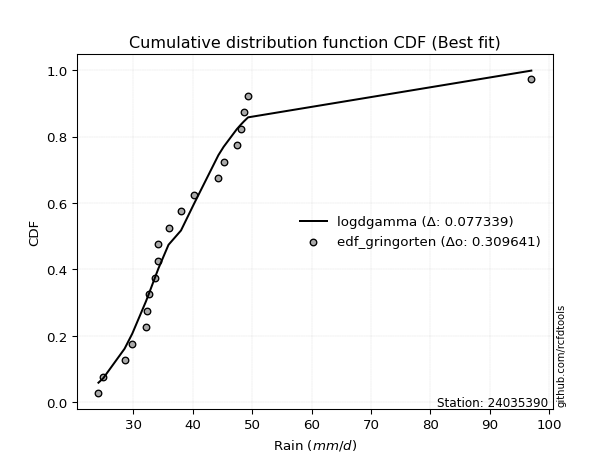</img>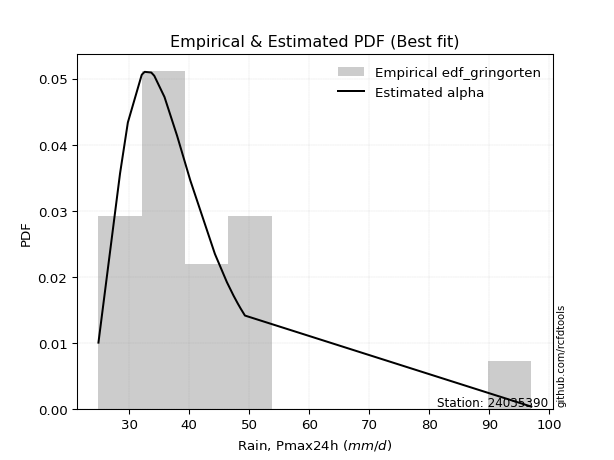</img>

</div>


### 9. EDF Filliben (1975)

The specific values of the constants (0.3175) (often denoted as $alpha$) and (0.365) are derived from a method proposed by James J. Filliben in a 1975 paper. This particular formula is the mean value of the $i$-th order statistic of the normal distribution and is considered a robust and effective plotting position formula for the normal probability plot correlation coefficient test for normality.

<div align="center">


$P=(m-0.3175)/(n+0.365)$


</div>


**9.1. Empirical values**

<div align="center">

|                | 0                   | 1                   | 2                  | 3                   | 4                   | 5                  | 6                  | 7                  | 8                  | 9            | 10                 | 11                 | 12                 | 13                 | 14                 | 15                 | 16                | 17                 | 18                 |
|:---------------|:--------------------|:--------------------|:-------------------|:--------------------|:--------------------|:-------------------|:-------------------|:-------------------|:-------------------|:-------------|:-------------------|:-------------------|:-------------------|:-------------------|:-------------------|:-------------------|:------------------|:-------------------|:-------------------|
| date           | 2012                | 2009                | 2008               | 2005                | 2023                | 2022               | 2018               | 2013               | 2016               | 2017         | 2020               | 2007               | 2021               | 2014               | 2011               | 2010               | 2019              | 2015               | 2006               |
| x              | 24.9                | 28.5                | 29.8               | 32.1                | 32.2                | 32.6               | 33.7               | 34.2               | 34.2               | 35.9         | 38.0               | 40.2               | 44.3               | 46.294736842105266 | 47.4               | 48.1               | 48.6              | 49.3               | 97.0               |
| m              | 1                   | 2                   | 3                  | 4                   | 5                   | 6                  | 7                  | 8                  | 9                  | 10           | 11                 | 12                 | 13                 | 14                 | 15                 | 16                 | 17                | 18                 | 19                 |
| empirical_dist | edf_filliben        | edf_filliben        | edf_filliben       | edf_filliben        | edf_filliben        | edf_filliben       | edf_filliben       | edf_filliben       | edf_filliben       | edf_filliben | edf_filliben       | edf_filliben       | edf_filliben       | edf_filliben       | edf_filliben       | edf_filliben       | edf_filliben      | edf_filliben       | edf_filliben       |
| empirical      | 0.03524399690162665 | 0.08688355280144593 | 0.1385231087012652 | 0.19016266460108444 | 0.24180222050090372 | 0.293441776400723  | 0.3450813323005423 | 0.3967208882003615 | 0.4483604441001807 | 0.5          | 0.5516395558998193 | 0.6032791117996386 | 0.6549186676994578 | 0.7065582235992771 | 0.7581977794990963 | 0.8098373353989156 | 0.861476891298735 | 0.9131164471985542 | 0.9647560030983735 |
| empirical_tr   | 1.0365315134484143  | 1.0951505726000283  | 1.1607972426195114 | 1.2348158775705405  | 1.3189170781542654  | 1.4153115293257812 | 1.5269071555292728 | 1.6576075326342818 | 1.8127779077931194 | 2.0          | 2.2303484019579614 | 2.5206638464041657 | 2.8978675645342316 | 3.407831060272768  | 4.135611318739989  | 5.258655804480651  | 7.219012115563846 | 11.509658246656779 | 28.373626373626497 |

</div>


**9.2. Kolmogorov-Smirnov fit test (sorted by Δ)**


<div align="center">

|                | 0                   | 1                   | 2                   | 3                   | 4                   | 5                   | 6                   | 7                   | 8                   | 9                   | 10                  | 11                  | 12                  | 13                  | 14                  | 15                  | 16                  | 17                  | 18                  | 19                  | 20                  | 21                  | 22                  | 23                  | 24                    | 25                  | 26                  | 27                  | 28                  | 29                  | 30                  | 31                  | 32                  | 33                  | 34                  | 35                  | 36                  | 37                  | 38                  | 39                  | 40                  | 41                  | 42                  | 43                  | 44                  | 45                  | 46                  | 47                  | 48                  | 49                  | 50                  | 51                  | 52                  | 53                  | 54                  | 55                  | 56                  | 57                  | 58                  | 59                  | 60                  | 61                  | 62                  | 63                  | 64                  | 65                  | 66                  | 67                  | 68                  | 69                  | 70                  | 71                  | 72                  | 73                  | 74                  | 75                  | 76                  | 77                  | 78                  | 79                  | 80                  | 81                  | 82                  | 83                  | 84                  | 85                  | 86                  | 87                  |
|:---------------|:--------------------|:--------------------|:--------------------|:--------------------|:--------------------|:--------------------|:--------------------|:--------------------|:--------------------|:--------------------|:--------------------|:--------------------|:--------------------|:--------------------|:--------------------|:--------------------|:--------------------|:--------------------|:--------------------|:--------------------|:--------------------|:--------------------|:--------------------|:--------------------|:----------------------|:--------------------|:--------------------|:--------------------|:--------------------|:--------------------|:--------------------|:--------------------|:--------------------|:--------------------|:--------------------|:--------------------|:--------------------|:--------------------|:--------------------|:--------------------|:--------------------|:--------------------|:--------------------|:--------------------|:--------------------|:--------------------|:--------------------|:--------------------|:--------------------|:--------------------|:--------------------|:--------------------|:--------------------|:--------------------|:--------------------|:--------------------|:--------------------|:--------------------|:--------------------|:--------------------|:--------------------|:--------------------|:--------------------|:--------------------|:--------------------|:--------------------|:--------------------|:--------------------|:--------------------|:--------------------|:--------------------|:--------------------|:--------------------|:--------------------|:--------------------|:--------------------|:--------------------|:--------------------|:--------------------|:--------------------|:--------------------|:--------------------|:--------------------|:--------------------|:--------------------|:--------------------|:--------------------|:--------------------|
| station        | 24035390            | 24035390            | 24035390            | 24035390            | 24035390            | 24035390            | 24035390            | 24035390            | 24035390            | 24035390            | 24035390            | 24035390            | 24035390            | 24035390            | 24035390            | 24035390            | 24035390            | 24035390            | 24035390            | 24035390            | 24035390            | 24035390            | 24035390            | 24035390            | 24035390              | 24035390            | 24035390            | 24035390            | 24035390            | 24035390            | 24035390            | 24035390            | 24035390            | 24035390            | 24035390            | 24035390            | 24035390            | 24035390            | 24035390            | 24035390            | 24035390            | 24035390            | 24035390            | 24035390            | 24035390            | 24035390            | 24035390            | 24035390            | 24035390            | 24035390            | 24035390            | 24035390            | 24035390            | 24035390            | 24035390            | 24035390            | 24035390            | 24035390            | 24035390            | 24035390            | 24035390            | 24035390            | 24035390            | 24035390            | 24035390            | 24035390            | 24035390            | 24035390            | 24035390            | 24035390            | 24035390            | 24035390            | 24035390            | 24035390            | 24035390            | 24035390            | 24035390            | 24035390            | 24035390            | 24035390            | 24035390            | 24035390            | 24035390            | 24035390            | 24035390            | 24035390            | 24035390            | 24035390            |
| empirical_dist | edf_filliben        | edf_filliben        | edf_filliben        | edf_filliben        | edf_filliben        | edf_filliben        | edf_filliben        | edf_filliben        | edf_filliben        | edf_filliben        | edf_filliben        | edf_filliben        | edf_filliben        | edf_filliben        | edf_filliben        | edf_filliben        | edf_filliben        | edf_filliben        | edf_filliben        | edf_filliben        | edf_filliben        | edf_filliben        | edf_filliben        | edf_filliben        | edf_filliben          | edf_filliben        | edf_filliben        | edf_filliben        | edf_filliben        | edf_filliben        | edf_filliben        | edf_filliben        | edf_filliben        | edf_filliben        | edf_filliben        | edf_filliben        | edf_filliben        | edf_filliben        | edf_filliben        | edf_filliben        | edf_filliben        | edf_filliben        | edf_filliben        | edf_filliben        | edf_filliben        | edf_filliben        | edf_filliben        | edf_filliben        | edf_filliben        | edf_filliben        | edf_filliben        | edf_filliben        | edf_filliben        | edf_filliben        | edf_filliben        | edf_filliben        | edf_filliben        | edf_filliben        | edf_filliben        | edf_filliben        | edf_filliben        | edf_filliben        | edf_filliben        | edf_filliben        | edf_filliben        | edf_filliben        | edf_filliben        | edf_filliben        | edf_filliben        | edf_filliben        | edf_filliben        | edf_filliben        | edf_filliben        | edf_filliben        | edf_filliben        | edf_filliben        | edf_filliben        | edf_filliben        | edf_filliben        | edf_filliben        | edf_filliben        | edf_filliben        | edf_filliben        | edf_filliben        | edf_filliben        | edf_filliben        | edf_filliben        | edf_filliben        |
| p_dist         | logalpha            | alpha               | loggenlogistic      | mielke              | loginvgamma         | loginvweibull       | invweibull          | fisk                | logmielke           | logexponnorm        | johnsonsu           | loglognorm          | logjohnsonsu        | logmoyal            | invgamma            | f                   | loginvgauss         | loggumbel_r         | logfatiguelife      | logpearson3         | logf                | logfisk             | logbetaprime        | wald                | loglaplace_asymmetric | loghalflogistic     | logkstwobign        | loggenexpon         | exponnorm           | logweibull_min      | invgauss            | nct                 | weibull_min         | laplace_asymmetric  | genexpon            | logrice             | fatiguelife         | lognct              | lognakagami         | lograyleigh         | loghalfnorm         | logmaxwell          | betaprime           | logcrystalball      | lognorm             | lognorm             | erlang              | gamma               | chi2                | ncf                 | logt                | genlogistic         | logloggamma         | gibrat              | moyal               | loglogistic         | logwald             | pearson3            | halflogistic        | kstwobign           | loggompertz         | gumbel_r            | loghypsecant        | gompertz            | hypsecant           | halfnorm            | expon               | loggibrat           | loggumbel_l         | logistic            | loglaplace          | rayleigh            | nakagami            | rice                | laplace             | maxwell             | truncnorm           | crystalball         | norm                | logncf              | t                   | logtruncnorm        | gumbel_l            | loggamma            | loggamma            | logexpon            | logerlang           | logchi2             |
| delta          | 0.08354265793468074 | 0.0859080596404585  | 0.0867810805795553  | 0.0871047530496789  | 0.08734869731728723 | 0.0878162365963423  | 0.08805672980251533 | 0.08848232122261868 | 0.08851580312776752 | 0.08969171419891353 | 0.08981325758357395 | 0.09002531412260828 | 0.09021269342835847 | 0.0905860604351616  | 0.09164488472455246 | 0.09166008601041598 | 0.0931837453411386  | 0.09346171022146066 | 0.09355078495019198 | 0.09425308379534797 | 0.09519045100031065 | 0.0952569180973789  | 0.0970471878544028  | 0.09759391179919441 | 0.09855774585528632   | 0.10382196686476869 | 0.10524617564366534 | 0.1055715333001056  | 0.10733503473352024 | 0.10954215492407782 | 0.11058515400644708 | 0.11132923632774161 | 0.11228031579489839 | 0.1125370712617102  | 0.11311305425188667 | 0.11326422762559618 | 0.11386585194763343 | 0.11460230613607963 | 0.11503847311704773 | 0.11696399170924754 | 0.11742512631489854 | 0.11814302553257128 | 0.1184619933372269  | 0.12230753752954049 | 0.12230787547861866 | 0.12230787547861866 | 0.12266766019409303 | 0.12266793097036621 | 0.12266905665689043 | 0.1251306528009547  | 0.12593772113533952 | 0.12787224229079214 | 0.13252949007229609 | 0.13601923862423207 | 0.1382759879851737  | 0.1415090840475295  | 0.1436477283811527  | 0.14809643994407046 | 0.14827449377098462 | 0.15079687184605872 | 0.15147329070560328 | 0.153962268960116   | 0.15637963044203979 | 0.16154498785551846 | 0.16529315784073018 | 0.17057324744281754 | 0.1720254711612868  | 0.17564233070599755 | 0.17774468839558033 | 0.18076348087622318 | 0.18348810061694565 | 0.18370151618923503 | 0.1854590279971114  | 0.1868029859858218  | 0.18709073248312375 | 0.18795244305135506 | 0.20257602927793517 | 0.2025760483473572  | 0.20257605781241428 | 0.20630302633475917 | 0.21520830807817315 | 0.21614196407441189 | 0.2316505324866761  | 0.23501919503866897 | 0.23501919503866897 | 0.2426440260291598  | 0.25544118097346286 | 0.34499850303836554 |
| deltao         | 0.31564497164100014 | 0.31564497164100014 | 0.31564497164100014 | 0.31564497164100014 | 0.31564497164100014 | 0.31564497164100014 | 0.31564497164100014 | 0.31564497164100014 | 0.31564497164100014 | 0.31564497164100014 | 0.31564497164100014 | 0.31564497164100014 | 0.31564497164100014 | 0.31564497164100014 | 0.31564497164100014 | 0.31564497164100014 | 0.31564497164100014 | 0.31564497164100014 | 0.31564497164100014 | 0.31564497164100014 | 0.31564497164100014 | 0.31564497164100014 | 0.31564497164100014 | 0.31564497164100014 | 0.31564497164100014   | 0.31564497164100014 | 0.31564497164100014 | 0.31564497164100014 | 0.31564497164100014 | 0.31564497164100014 | 0.31564497164100014 | 0.31564497164100014 | 0.31564497164100014 | 0.31564497164100014 | 0.31564497164100014 | 0.31564497164100014 | 0.31564497164100014 | 0.31564497164100014 | 0.31564497164100014 | 0.31564497164100014 | 0.31564497164100014 | 0.31564497164100014 | 0.31564497164100014 | 0.31564497164100014 | 0.31564497164100014 | 0.31564497164100014 | 0.31564497164100014 | 0.31564497164100014 | 0.31564497164100014 | 0.31564497164100014 | 0.31564497164100014 | 0.31564497164100014 | 0.31564497164100014 | 0.31564497164100014 | 0.31564497164100014 | 0.31564497164100014 | 0.31564497164100014 | 0.31564497164100014 | 0.31564497164100014 | 0.31564497164100014 | 0.31564497164100014 | 0.31564497164100014 | 0.31564497164100014 | 0.31564497164100014 | 0.31564497164100014 | 0.31564497164100014 | 0.31564497164100014 | 0.31564497164100014 | 0.31564497164100014 | 0.31564497164100014 | 0.31564497164100014 | 0.31564497164100014 | 0.31564497164100014 | 0.31564497164100014 | 0.31564497164100014 | 0.31564497164100014 | 0.31564497164100014 | 0.31564497164100014 | 0.31564497164100014 | 0.31564497164100014 | 0.31564497164100014 | 0.31564497164100014 | 0.31564497164100014 | 0.31564497164100014 | 0.31564497164100014 | 0.31564497164100014 | 0.31564497164100014 | 0.31564497164100014 |
| eval           | Δo > Δ              | Δo > Δ              | Δo > Δ              | Δo > Δ              | Δo > Δ              | Δo > Δ              | Δo > Δ              | Δo > Δ              | Δo > Δ              | Δo > Δ              | Δo > Δ              | Δo > Δ              | Δo > Δ              | Δo > Δ              | Δo > Δ              | Δo > Δ              | Δo > Δ              | Δo > Δ              | Δo > Δ              | Δo > Δ              | Δo > Δ              | Δo > Δ              | Δo > Δ              | Δo > Δ              | Δo > Δ                | Δo > Δ              | Δo > Δ              | Δo > Δ              | Δo > Δ              | Δo > Δ              | Δo > Δ              | Δo > Δ              | Δo > Δ              | Δo > Δ              | Δo > Δ              | Δo > Δ              | Δo > Δ              | Δo > Δ              | Δo > Δ              | Δo > Δ              | Δo > Δ              | Δo > Δ              | Δo > Δ              | Δo > Δ              | Δo > Δ              | Δo > Δ              | Δo > Δ              | Δo > Δ              | Δo > Δ              | Δo > Δ              | Δo > Δ              | Δo > Δ              | Δo > Δ              | Δo > Δ              | Δo > Δ              | Δo > Δ              | Δo > Δ              | Δo > Δ              | Δo > Δ              | Δo > Δ              | Δo > Δ              | Δo > Δ              | Δo > Δ              | Δo > Δ              | Δo > Δ              | Δo > Δ              | Δo > Δ              | Δo > Δ              | Δo > Δ              | Δo > Δ              | Δo > Δ              | Δo > Δ              | Δo > Δ              | Δo > Δ              | Δo > Δ              | Δo > Δ              | Δo > Δ              | Δo > Δ              | Δo > Δ              | Δo > Δ              | Δo > Δ              | Δo > Δ              | Δo > Δ              | Δo > Δ              | Δo > Δ              | Δo > Δ              | Δo > Δ              | Δo <= Δ             |
| fit            | 1                   | 1                   | 1                   | 1                   | 1                   | 1                   | 1                   | 1                   | 1                   | 1                   | 1                   | 1                   | 1                   | 1                   | 1                   | 1                   | 1                   | 1                   | 1                   | 1                   | 1                   | 1                   | 1                   | 1                   | 1                     | 1                   | 1                   | 1                   | 1                   | 1                   | 1                   | 1                   | 1                   | 1                   | 1                   | 1                   | 1                   | 1                   | 1                   | 1                   | 1                   | 1                   | 1                   | 1                   | 1                   | 1                   | 1                   | 1                   | 1                   | 1                   | 1                   | 1                   | 1                   | 1                   | 1                   | 1                   | 1                   | 1                   | 1                   | 1                   | 1                   | 1                   | 1                   | 1                   | 1                   | 1                   | 1                   | 1                   | 1                   | 1                   | 1                   | 1                   | 1                   | 1                   | 1                   | 1                   | 1                   | 1                   | 1                   | 1                   | 1                   | 1                   | 1                   | 1                   | 1                   | 1                   | 1                   | 0                   |
| n              | 19                  | 19                  | 19                  | 19                  | 19                  | 19                  | 19                  | 19                  | 19                  | 19                  | 19                  | 19                  | 19                  | 19                  | 19                  | 19                  | 19                  | 19                  | 19                  | 19                  | 19                  | 19                  | 19                  | 19                  | 19                    | 19                  | 19                  | 19                  | 19                  | 19                  | 19                  | 19                  | 19                  | 19                  | 19                  | 19                  | 19                  | 19                  | 19                  | 19                  | 19                  | 19                  | 19                  | 19                  | 19                  | 19                  | 19                  | 19                  | 19                  | 19                  | 19                  | 19                  | 19                  | 19                  | 19                  | 19                  | 19                  | 19                  | 19                  | 19                  | 19                  | 19                  | 19                  | 19                  | 19                  | 19                  | 19                  | 19                  | 19                  | 19                  | 19                  | 19                  | 19                  | 19                  | 19                  | 19                  | 19                  | 19                  | 19                  | 19                  | 19                  | 19                  | 19                  | 19                  | 19                  | 19                  | 19                  | 19                  |
| best_fit       | 1                   | 0                   | 0                   | 0                   | 0                   | 0                   | 0                   | 0                   | 0                   | 0                   | 0                   | 0                   | 0                   | 0                   | 0                   | 0                   | 0                   | 0                   | 0                   | 0                   | 0                   | 0                   | 0                   | 0                   | 0                     | 0                   | 0                   | 0                   | 0                   | 0                   | 0                   | 0                   | 0                   | 0                   | 0                   | 0                   | 0                   | 0                   | 0                   | 0                   | 0                   | 0                   | 0                   | 0                   | 0                   | 0                   | 0                   | 0                   | 0                   | 0                   | 0                   | 0                   | 0                   | 0                   | 0                   | 0                   | 0                   | 0                   | 0                   | 0                   | 0                   | 0                   | 0                   | 0                   | 0                   | 0                   | 0                   | 0                   | 0                   | 0                   | 0                   | 0                   | 0                   | 0                   | 0                   | 0                   | 0                   | 0                   | 0                   | 0                   | 0                   | 0                   | 0                   | 0                   | 0                   | 0                   | 0                   | 0                   |
| best_fit_sort  | 1                   | 2                   | 3                   | 4                   | 5                   | 6                   | 7                   | 8                   | 9                   | 10                  | 11                  | 12                  | 13                  | 14                  | 15                  | 16                  | 17                  | 18                  | 19                  | 20                  | 21                  | 22                  | 23                  | 24                  | 25                    | 26                  | 27                  | 28                  | 29                  | 30                  | 31                  | 32                  | 33                  | 34                  | 35                  | 36                  | 37                  | 38                  | 39                  | 40                  | 41                  | 42                  | 43                  | 44                  | 45                  | 46                  | 47                  | 48                  | 49                  | 50                  | 51                  | 52                  | 53                  | 54                  | 55                  | 56                  | 57                  | 58                  | 59                  | 60                  | 61                  | 62                  | 63                  | 64                  | 65                  | 66                  | 67                  | 68                  | 69                  | 70                  | 71                  | 72                  | 73                  | 74                  | 75                  | 76                  | 77                  | 78                  | 79                  | 80                  | 81                  | 82                  | 83                  | 84                  | 85                  | 86                  | 87                  | 88                  |

</div>


**9.3. Best fit**

<div align="center">

|   id |   station | empirical_dist   | p_dist   |     delta |   deltao | eval   |   fit |   n |   best_fit |   best_fit_sort |
|-----:|----------:|:-----------------|:---------|----------:|---------:|:-------|------:|----:|-----------:|----------------:|
|    0 |  24035390 | edf_filliben     | logalpha | 0.0835427 | 0.315645 | Δo > Δ |     1 |  19 |          1 |               1 |

</div>


<div align="center">

</img>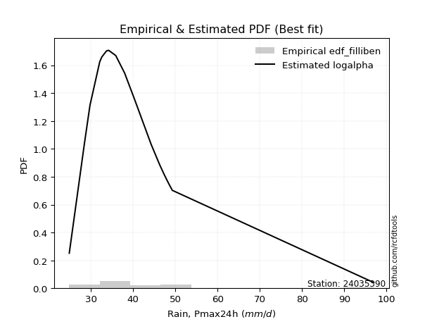</img>

</div>


### 10. EDF Jenkinson (1977)

The Jenkinson formula in hydrology is an empirical plotting position formula used to estimate the non-exceedance probability _(P)_ or return period _(T)_ of a given ordered observation within a sample. It is a widely used method in the frequency analysis of extreme events such as floods and rainfall, as it provides a distribution-free way to plot data. _a≈0.31_ and _b≈0.38_ are constants derived to approximate the median of the probability distribution for the given rank.

<div align="center">


$P=(m-a)/(n+b)$


</div>


**10.1. Empirical values**

<div align="center">

|                | 0                   | 1                   | 2                  | 3                   | 4                   | 5                   | 6                  | 7                  | 8                  | 9             | 10                 | 11                 | 12                 | 13                 | 14                 | 15                 | 16                 | 17                 | 18                 |
|:---------------|:--------------------|:--------------------|:-------------------|:--------------------|:--------------------|:--------------------|:-------------------|:-------------------|:-------------------|:--------------|:-------------------|:-------------------|:-------------------|:-------------------|:-------------------|:-------------------|:-------------------|:-------------------|:-------------------|
| date           | 2012                | 2009                | 2008               | 2005                | 2023                | 2022                | 2018               | 2013               | 2016               | 2017          | 2020               | 2007               | 2021               | 2014               | 2011               | 2010               | 2019               | 2015               | 2006               |
| x              | 24.9                | 28.5                | 29.8               | 32.1                | 32.2                | 32.6                | 33.7               | 34.2               | 34.2               | 35.9          | 38.0               | 40.2               | 44.3               | 46.294736842105266 | 47.4               | 48.1               | 48.6               | 49.3               | 97.0               |
| m              | 1                   | 2                   | 3                  | 4                   | 5                   | 6                   | 7                  | 8                  | 9                  | 10            | 11                 | 12                 | 13                 | 14                 | 15                 | 16                 | 17                 | 18                 | 19                 |
| empirical_dist | edf_jenkinson       | edf_jenkinson       | edf_jenkinson      | edf_jenkinson       | edf_jenkinson       | edf_jenkinson       | edf_jenkinson      | edf_jenkinson      | edf_jenkinson      | edf_jenkinson | edf_jenkinson      | edf_jenkinson      | edf_jenkinson      | edf_jenkinson      | edf_jenkinson      | edf_jenkinson      | edf_jenkinson      | edf_jenkinson      | edf_jenkinson      |
| empirical      | 0.03560371517027864 | 0.08720330237358101 | 0.1388028895768834 | 0.19040247678018576 | 0.24200206398348817 | 0.29360165118679055 | 0.3452012383900929 | 0.3968008255933953 | 0.4484004127966976 | 0.5           | 0.5515995872033024 | 0.6031991744066048 | 0.6547987616099071 | 0.7063983488132095 | 0.7579979360165119 | 0.8095975232198143 | 0.8611971104231168 | 0.9127966976264191 | 0.9643962848297215 |
| empirical_tr   | 1.0369181380417336  | 1.0955342001130581  | 1.1611743559017376 | 1.2351816443594645  | 1.3192648059904697  | 1.4156318480642804  | 1.5271867612293144 | 1.6578272027373824 | 1.812909260991581  | 2.0           | 2.230149597238205  | 2.5201560468140443 | 2.896860986547085  | 3.40597539543058   | 4.132196162046909  | 5.252032520325204  | 7.204460966542758  | 11.467455621301793 | 28.086956521739243 |

</div>


**10.2. Kolmogorov-Smirnov fit test (sorted by Δ)**


<div align="center">

|                | 0                   | 1                   | 2                   | 3                   | 4                   | 5                   | 6                   | 7                   | 8                   | 9                   | 10                  | 11                  | 12                  | 13                  | 14                  | 15                  | 16                  | 17                  | 18                  | 19                  | 20                  | 21                  | 22                  | 23                  | 24                    | 25                  | 26                  | 27                  | 28                  | 29                  | 30                  | 31                  | 32                  | 33                  | 34                  | 35                  | 36                  | 37                  | 38                  | 39                  | 40                  | 41                  | 42                  | 43                  | 44                  | 45                  | 46                  | 47                  | 48                  | 49                  | 50                  | 51                  | 52                  | 53                  | 54                  | 55                  | 56                  | 57                  | 58                  | 59                  | 60                  | 61                  | 62                  | 63                  | 64                  | 65                  | 66                  | 67                  | 68                  | 69                  | 70                  | 71                  | 72                  | 73                  | 74                  | 75                  | 76                  | 77                  | 78                  | 79                  | 80                  | 81                  | 82                  | 83                  | 84                  | 85                  | 86                  | 87                  |
|:---------------|:--------------------|:--------------------|:--------------------|:--------------------|:--------------------|:--------------------|:--------------------|:--------------------|:--------------------|:--------------------|:--------------------|:--------------------|:--------------------|:--------------------|:--------------------|:--------------------|:--------------------|:--------------------|:--------------------|:--------------------|:--------------------|:--------------------|:--------------------|:--------------------|:----------------------|:--------------------|:--------------------|:--------------------|:--------------------|:--------------------|:--------------------|:--------------------|:--------------------|:--------------------|:--------------------|:--------------------|:--------------------|:--------------------|:--------------------|:--------------------|:--------------------|:--------------------|:--------------------|:--------------------|:--------------------|:--------------------|:--------------------|:--------------------|:--------------------|:--------------------|:--------------------|:--------------------|:--------------------|:--------------------|:--------------------|:--------------------|:--------------------|:--------------------|:--------------------|:--------------------|:--------------------|:--------------------|:--------------------|:--------------------|:--------------------|:--------------------|:--------------------|:--------------------|:--------------------|:--------------------|:--------------------|:--------------------|:--------------------|:--------------------|:--------------------|:--------------------|:--------------------|:--------------------|:--------------------|:--------------------|:--------------------|:--------------------|:--------------------|:--------------------|:--------------------|:--------------------|:--------------------|:--------------------|
| station        | 24035390            | 24035390            | 24035390            | 24035390            | 24035390            | 24035390            | 24035390            | 24035390            | 24035390            | 24035390            | 24035390            | 24035390            | 24035390            | 24035390            | 24035390            | 24035390            | 24035390            | 24035390            | 24035390            | 24035390            | 24035390            | 24035390            | 24035390            | 24035390            | 24035390              | 24035390            | 24035390            | 24035390            | 24035390            | 24035390            | 24035390            | 24035390            | 24035390            | 24035390            | 24035390            | 24035390            | 24035390            | 24035390            | 24035390            | 24035390            | 24035390            | 24035390            | 24035390            | 24035390            | 24035390            | 24035390            | 24035390            | 24035390            | 24035390            | 24035390            | 24035390            | 24035390            | 24035390            | 24035390            | 24035390            | 24035390            | 24035390            | 24035390            | 24035390            | 24035390            | 24035390            | 24035390            | 24035390            | 24035390            | 24035390            | 24035390            | 24035390            | 24035390            | 24035390            | 24035390            | 24035390            | 24035390            | 24035390            | 24035390            | 24035390            | 24035390            | 24035390            | 24035390            | 24035390            | 24035390            | 24035390            | 24035390            | 24035390            | 24035390            | 24035390            | 24035390            | 24035390            | 24035390            |
| empirical_dist | edf_jenkinson       | edf_jenkinson       | edf_jenkinson       | edf_jenkinson       | edf_jenkinson       | edf_jenkinson       | edf_jenkinson       | edf_jenkinson       | edf_jenkinson       | edf_jenkinson       | edf_jenkinson       | edf_jenkinson       | edf_jenkinson       | edf_jenkinson       | edf_jenkinson       | edf_jenkinson       | edf_jenkinson       | edf_jenkinson       | edf_jenkinson       | edf_jenkinson       | edf_jenkinson       | edf_jenkinson       | edf_jenkinson       | edf_jenkinson       | edf_jenkinson         | edf_jenkinson       | edf_jenkinson       | edf_jenkinson       | edf_jenkinson       | edf_jenkinson       | edf_jenkinson       | edf_jenkinson       | edf_jenkinson       | edf_jenkinson       | edf_jenkinson       | edf_jenkinson       | edf_jenkinson       | edf_jenkinson       | edf_jenkinson       | edf_jenkinson       | edf_jenkinson       | edf_jenkinson       | edf_jenkinson       | edf_jenkinson       | edf_jenkinson       | edf_jenkinson       | edf_jenkinson       | edf_jenkinson       | edf_jenkinson       | edf_jenkinson       | edf_jenkinson       | edf_jenkinson       | edf_jenkinson       | edf_jenkinson       | edf_jenkinson       | edf_jenkinson       | edf_jenkinson       | edf_jenkinson       | edf_jenkinson       | edf_jenkinson       | edf_jenkinson       | edf_jenkinson       | edf_jenkinson       | edf_jenkinson       | edf_jenkinson       | edf_jenkinson       | edf_jenkinson       | edf_jenkinson       | edf_jenkinson       | edf_jenkinson       | edf_jenkinson       | edf_jenkinson       | edf_jenkinson       | edf_jenkinson       | edf_jenkinson       | edf_jenkinson       | edf_jenkinson       | edf_jenkinson       | edf_jenkinson       | edf_jenkinson       | edf_jenkinson       | edf_jenkinson       | edf_jenkinson       | edf_jenkinson       | edf_jenkinson       | edf_jenkinson       | edf_jenkinson       | edf_jenkinson       |
| p_dist         | logalpha            | alpha               | mielke              | loggenlogistic      | loginvgamma         | loginvweibull       | invweibull          | fisk                | logmielke           | loglognorm          | logexponnorm        | johnsonsu           | logjohnsonsu        | logmoyal            | invgamma            | f                   | loginvgauss         | loggumbel_r         | logfatiguelife      | logpearson3         | logf                | logfisk             | logbetaprime        | wald                | loglaplace_asymmetric | loghalflogistic     | logkstwobign        | loggenexpon         | exponnorm           | logweibull_min      | invgauss            | nct                 | weibull_min         | laplace_asymmetric  | genexpon            | logrice             | fatiguelife         | lognct              | lognakagami         | lograyleigh         | loghalfnorm         | logmaxwell          | betaprime           | logcrystalball      | lognorm             | lognorm             | erlang              | gamma               | chi2                | ncf                 | logt                | genlogistic         | logloggamma         | gibrat              | moyal               | loglogistic         | logwald             | pearson3            | halflogistic        | kstwobign           | loggompertz         | gumbel_r            | loghypsecant        | gompertz            | hypsecant           | halfnorm            | expon               | loggibrat           | loggumbel_l         | logistic            | rayleigh            | loglaplace          | nakagami            | rice                | laplace             | maxwell             | truncnorm           | crystalball         | norm                | logncf              | t                   | logtruncnorm        | gumbel_l            | loggamma            | loggamma            | logexpon            | logerlang           | logchi2             |
| delta          | 0.08343839870161046 | 0.0859480283369754  | 0.08678500347754381 | 0.0868210492760722  | 0.08702894774515213 | 0.0874964870242072  | 0.08773698023038023 | 0.08860222731216938 | 0.08863570921731823 | 0.08970556455047318 | 0.08981162028846423 | 0.08993316367312465 | 0.09033259951790917 | 0.0907059665247123  | 0.09132513515241736 | 0.09134033643828088 | 0.0928639957690035  | 0.09314196064932556 | 0.09323103537805688 | 0.09401327161624665 | 0.09487070142817555 | 0.09537682418692961 | 0.09672743828226771 | 0.09735409962009309 | 0.09867765194483702   | 0.10358215468566737 | 0.10492642607153024 | 0.1052517837279705  | 0.10701528516138514 | 0.10922240535194272 | 0.11026540443431199 | 0.11136920502425851 | 0.11196056622276329 | 0.1125770399582271  | 0.11279330467975157 | 0.11294447805346108 | 0.11354610237549834 | 0.11464227483259654 | 0.11471872354491264 | 0.11664424213711244 | 0.11718531413579722 | 0.11782327596043618 | 0.1185019620337438  | 0.12198778795740539 | 0.12198812590648356 | 0.12198812590648356 | 0.12234791062195793 | 0.12234818139823112 | 0.12234930708475533 | 0.1248109032288196  | 0.12561797156320442 | 0.12791221098730904 | 0.132209740500161   | 0.13629901949985027 | 0.1379562384130386  | 0.1415490527440464  | 0.1437676344707034  | 0.14785662776496913 | 0.1480346815918833  | 0.15068490421449887 | 0.15123347852650196 | 0.1536425193879809  | 0.1564195991385567  | 0.16130517567641714 | 0.16497340826859508 | 0.17025349787068245 | 0.17178565898218548 | 0.17576223679554825 | 0.17778465709209723 | 0.18044373130408808 | 0.18338176661709993 | 0.18352806931346255 | 0.18521921581801007 | 0.1864832364136867  | 0.18709073248312375 | 0.18763269347921996 | 0.20225627970580007 | 0.2022562987752221  | 0.20225630824027918 | 0.20598327676262407 | 0.21488855850603805 | 0.21590215189531056 | 0.231330782914541   | 0.23469944546653387 | 0.23469944546653387 | 0.24240421385005848 | 0.2552013687943615  | 0.34467875346623045 |
| deltao         | 0.31564497164100014 | 0.31564497164100014 | 0.31564497164100014 | 0.31564497164100014 | 0.31564497164100014 | 0.31564497164100014 | 0.31564497164100014 | 0.31564497164100014 | 0.31564497164100014 | 0.31564497164100014 | 0.31564497164100014 | 0.31564497164100014 | 0.31564497164100014 | 0.31564497164100014 | 0.31564497164100014 | 0.31564497164100014 | 0.31564497164100014 | 0.31564497164100014 | 0.31564497164100014 | 0.31564497164100014 | 0.31564497164100014 | 0.31564497164100014 | 0.31564497164100014 | 0.31564497164100014 | 0.31564497164100014   | 0.31564497164100014 | 0.31564497164100014 | 0.31564497164100014 | 0.31564497164100014 | 0.31564497164100014 | 0.31564497164100014 | 0.31564497164100014 | 0.31564497164100014 | 0.31564497164100014 | 0.31564497164100014 | 0.31564497164100014 | 0.31564497164100014 | 0.31564497164100014 | 0.31564497164100014 | 0.31564497164100014 | 0.31564497164100014 | 0.31564497164100014 | 0.31564497164100014 | 0.31564497164100014 | 0.31564497164100014 | 0.31564497164100014 | 0.31564497164100014 | 0.31564497164100014 | 0.31564497164100014 | 0.31564497164100014 | 0.31564497164100014 | 0.31564497164100014 | 0.31564497164100014 | 0.31564497164100014 | 0.31564497164100014 | 0.31564497164100014 | 0.31564497164100014 | 0.31564497164100014 | 0.31564497164100014 | 0.31564497164100014 | 0.31564497164100014 | 0.31564497164100014 | 0.31564497164100014 | 0.31564497164100014 | 0.31564497164100014 | 0.31564497164100014 | 0.31564497164100014 | 0.31564497164100014 | 0.31564497164100014 | 0.31564497164100014 | 0.31564497164100014 | 0.31564497164100014 | 0.31564497164100014 | 0.31564497164100014 | 0.31564497164100014 | 0.31564497164100014 | 0.31564497164100014 | 0.31564497164100014 | 0.31564497164100014 | 0.31564497164100014 | 0.31564497164100014 | 0.31564497164100014 | 0.31564497164100014 | 0.31564497164100014 | 0.31564497164100014 | 0.31564497164100014 | 0.31564497164100014 | 0.31564497164100014 |
| eval           | Δo > Δ              | Δo > Δ              | Δo > Δ              | Δo > Δ              | Δo > Δ              | Δo > Δ              | Δo > Δ              | Δo > Δ              | Δo > Δ              | Δo > Δ              | Δo > Δ              | Δo > Δ              | Δo > Δ              | Δo > Δ              | Δo > Δ              | Δo > Δ              | Δo > Δ              | Δo > Δ              | Δo > Δ              | Δo > Δ              | Δo > Δ              | Δo > Δ              | Δo > Δ              | Δo > Δ              | Δo > Δ                | Δo > Δ              | Δo > Δ              | Δo > Δ              | Δo > Δ              | Δo > Δ              | Δo > Δ              | Δo > Δ              | Δo > Δ              | Δo > Δ              | Δo > Δ              | Δo > Δ              | Δo > Δ              | Δo > Δ              | Δo > Δ              | Δo > Δ              | Δo > Δ              | Δo > Δ              | Δo > Δ              | Δo > Δ              | Δo > Δ              | Δo > Δ              | Δo > Δ              | Δo > Δ              | Δo > Δ              | Δo > Δ              | Δo > Δ              | Δo > Δ              | Δo > Δ              | Δo > Δ              | Δo > Δ              | Δo > Δ              | Δo > Δ              | Δo > Δ              | Δo > Δ              | Δo > Δ              | Δo > Δ              | Δo > Δ              | Δo > Δ              | Δo > Δ              | Δo > Δ              | Δo > Δ              | Δo > Δ              | Δo > Δ              | Δo > Δ              | Δo > Δ              | Δo > Δ              | Δo > Δ              | Δo > Δ              | Δo > Δ              | Δo > Δ              | Δo > Δ              | Δo > Δ              | Δo > Δ              | Δo > Δ              | Δo > Δ              | Δo > Δ              | Δo > Δ              | Δo > Δ              | Δo > Δ              | Δo > Δ              | Δo > Δ              | Δo > Δ              | Δo <= Δ             |
| fit            | 1                   | 1                   | 1                   | 1                   | 1                   | 1                   | 1                   | 1                   | 1                   | 1                   | 1                   | 1                   | 1                   | 1                   | 1                   | 1                   | 1                   | 1                   | 1                   | 1                   | 1                   | 1                   | 1                   | 1                   | 1                     | 1                   | 1                   | 1                   | 1                   | 1                   | 1                   | 1                   | 1                   | 1                   | 1                   | 1                   | 1                   | 1                   | 1                   | 1                   | 1                   | 1                   | 1                   | 1                   | 1                   | 1                   | 1                   | 1                   | 1                   | 1                   | 1                   | 1                   | 1                   | 1                   | 1                   | 1                   | 1                   | 1                   | 1                   | 1                   | 1                   | 1                   | 1                   | 1                   | 1                   | 1                   | 1                   | 1                   | 1                   | 1                   | 1                   | 1                   | 1                   | 1                   | 1                   | 1                   | 1                   | 1                   | 1                   | 1                   | 1                   | 1                   | 1                   | 1                   | 1                   | 1                   | 1                   | 0                   |
| n              | 19                  | 19                  | 19                  | 19                  | 19                  | 19                  | 19                  | 19                  | 19                  | 19                  | 19                  | 19                  | 19                  | 19                  | 19                  | 19                  | 19                  | 19                  | 19                  | 19                  | 19                  | 19                  | 19                  | 19                  | 19                    | 19                  | 19                  | 19                  | 19                  | 19                  | 19                  | 19                  | 19                  | 19                  | 19                  | 19                  | 19                  | 19                  | 19                  | 19                  | 19                  | 19                  | 19                  | 19                  | 19                  | 19                  | 19                  | 19                  | 19                  | 19                  | 19                  | 19                  | 19                  | 19                  | 19                  | 19                  | 19                  | 19                  | 19                  | 19                  | 19                  | 19                  | 19                  | 19                  | 19                  | 19                  | 19                  | 19                  | 19                  | 19                  | 19                  | 19                  | 19                  | 19                  | 19                  | 19                  | 19                  | 19                  | 19                  | 19                  | 19                  | 19                  | 19                  | 19                  | 19                  | 19                  | 19                  | 19                  |
| best_fit       | 1                   | 0                   | 0                   | 0                   | 0                   | 0                   | 0                   | 0                   | 0                   | 0                   | 0                   | 0                   | 0                   | 0                   | 0                   | 0                   | 0                   | 0                   | 0                   | 0                   | 0                   | 0                   | 0                   | 0                   | 0                     | 0                   | 0                   | 0                   | 0                   | 0                   | 0                   | 0                   | 0                   | 0                   | 0                   | 0                   | 0                   | 0                   | 0                   | 0                   | 0                   | 0                   | 0                   | 0                   | 0                   | 0                   | 0                   | 0                   | 0                   | 0                   | 0                   | 0                   | 0                   | 0                   | 0                   | 0                   | 0                   | 0                   | 0                   | 0                   | 0                   | 0                   | 0                   | 0                   | 0                   | 0                   | 0                   | 0                   | 0                   | 0                   | 0                   | 0                   | 0                   | 0                   | 0                   | 0                   | 0                   | 0                   | 0                   | 0                   | 0                   | 0                   | 0                   | 0                   | 0                   | 0                   | 0                   | 0                   |
| best_fit_sort  | 1                   | 2                   | 3                   | 4                   | 5                   | 6                   | 7                   | 8                   | 9                   | 10                  | 11                  | 12                  | 13                  | 14                  | 15                  | 16                  | 17                  | 18                  | 19                  | 20                  | 21                  | 22                  | 23                  | 24                  | 25                    | 26                  | 27                  | 28                  | 29                  | 30                  | 31                  | 32                  | 33                  | 34                  | 35                  | 36                  | 37                  | 38                  | 39                  | 40                  | 41                  | 42                  | 43                  | 44                  | 45                  | 46                  | 47                  | 48                  | 49                  | 50                  | 51                  | 52                  | 53                  | 54                  | 55                  | 56                  | 57                  | 58                  | 59                  | 60                  | 61                  | 62                  | 63                  | 64                  | 65                  | 66                  | 67                  | 68                  | 69                  | 70                  | 71                  | 72                  | 73                  | 74                  | 75                  | 76                  | 77                  | 78                  | 79                  | 80                  | 81                  | 82                  | 83                  | 84                  | 85                  | 86                  | 87                  | 88                  |

</div>


**10.3. Best fit**

<div align="center">

|   id |   station | empirical_dist   | p_dist   |     delta |   deltao | eval   |   fit |   n |   best_fit |   best_fit_sort |
|-----:|----------:|:-----------------|:---------|----------:|---------:|:-------|------:|----:|-----------:|----------------:|
|    0 |  24035390 | edf_jenkinson    | logalpha | 0.0834384 | 0.315645 | Δo > Δ |     1 |  19 |          1 |               1 |

</div>


<div align="center">

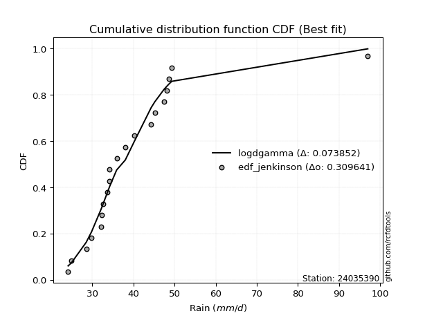</img>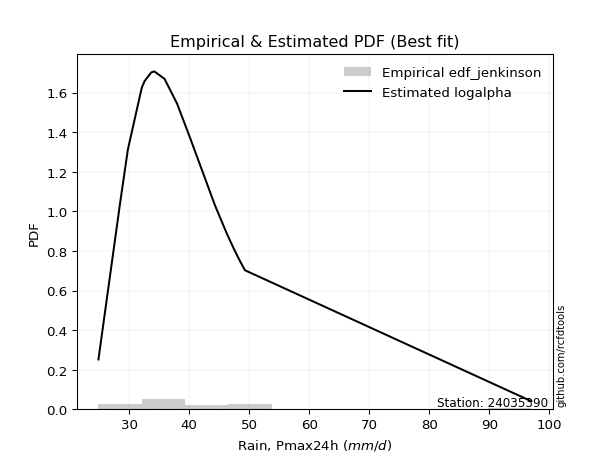</img>

</div>


### 11. EDF Cunnane (1978)

Cunnane´s work in statistical hydrology has focused on the performance and evaluation of different probability distributions (such as GEV, Gumbel, Lognormal) for flood frequency estimation. _b_ is a constant, typically set to 0.4.

<div align="center">


$P=(m-b)/(n+1-2b)$


</div>


**11.1. Empirical values**

<div align="center">

|                | 0                 | 1                   | 2                   | 3                  | 4                   | 5                  | 6                  | 7                  | 8                  | 9           | 10                 | 11                 | 12                | 13                 | 14                 | 15                | 16                 | 17                 | 18                 |
|:---------------|:------------------|:--------------------|:--------------------|:-------------------|:--------------------|:-------------------|:-------------------|:-------------------|:-------------------|:------------|:-------------------|:-------------------|:------------------|:-------------------|:-------------------|:------------------|:-------------------|:-------------------|:-------------------|
| date           | 2012              | 2009                | 2008                | 2005               | 2023                | 2022               | 2018               | 2013               | 2016               | 2017        | 2020               | 2007               | 2021              | 2014               | 2011               | 2010              | 2019               | 2015               | 2006               |
| x              | 24.9              | 28.5                | 29.8                | 32.1               | 32.2                | 32.6               | 33.7               | 34.2               | 34.2               | 35.9        | 38.0               | 40.2               | 44.3              | 46.294736842105266 | 47.4               | 48.1              | 48.6               | 49.3               | 97.0               |
| m              | 1                 | 2                   | 3                   | 4                  | 5                   | 6                  | 7                  | 8                  | 9                  | 10          | 11                 | 12                 | 13                | 14                 | 15                 | 16                | 17                 | 18                 | 19                 |
| empirical_dist | edf_cunnane       | edf_cunnane         | edf_cunnane         | edf_cunnane        | edf_cunnane         | edf_cunnane        | edf_cunnane        | edf_cunnane        | edf_cunnane        | edf_cunnane | edf_cunnane        | edf_cunnane        | edf_cunnane       | edf_cunnane        | edf_cunnane        | edf_cunnane       | edf_cunnane        | edf_cunnane        | edf_cunnane        |
| empirical      | 0.03125           | 0.08333333333333334 | 0.13541666666666669 | 0.1875             | 0.23958333333333331 | 0.2916666666666667 | 0.34375            | 0.3958333333333333 | 0.4479166666666667 | 0.5         | 0.5520833333333334 | 0.6041666666666666 | 0.65625           | 0.7083333333333334 | 0.7604166666666666 | 0.8125            | 0.8645833333333335 | 0.9166666666666667 | 0.9687500000000001 |
| empirical_tr   | 1.032258064516129 | 1.090909090909091   | 1.1566265060240966  | 1.2307692307692308 | 1.3150684931506849  | 1.411764705882353  | 1.5238095238095237 | 1.6551724137931032 | 1.8113207547169814 | 2.0         | 2.2325581395348837 | 2.526315789473684  | 2.909090909090909 | 3.428571428571429  | 4.17391304347826   | 5.333333333333333 | 7.384615384615393  | 12.00000000000001  | 32.000000000000114 |

</div>


**11.2. Kolmogorov-Smirnov fit test (sorted by Δ)**


<div align="center">

|                | 0                   | 1                   | 2                   | 3                   | 4                   | 5                   | 6                   | 7                   | 8                   | 9                   | 10                  | 11                  | 12                  | 13                  | 14                  | 15                  | 16                  | 17                  | 18                  | 19                  | 20                  | 21                    | 22                  | 23                  | 24                  | 25                  | 26                  | 27                  | 28                  | 29                  | 30                  | 31                  | 32                  | 33                  | 34                  | 35                  | 36                  | 37                  | 38                  | 39                  | 40                  | 41                  | 42                  | 43                  | 44                  | 45                  | 46                  | 47                  | 48                  | 49                  | 50                  | 51                  | 52                  | 53                  | 54                  | 55                  | 56                  | 57                  | 58                  | 59                  | 60                  | 61                  | 62                  | 63                  | 64                  | 65                  | 66                  | 67                  | 68                  | 69                  | 70                  | 71                  | 72                  | 73                  | 74                  | 75                  | 76                  | 77                  | 78                  | 79                  | 80                  | 81                  | 82                  | 83                  | 84                  | 85                  | 86                  | 87                  |
|:---------------|:--------------------|:--------------------|:--------------------|:--------------------|:--------------------|:--------------------|:--------------------|:--------------------|:--------------------|:--------------------|:--------------------|:--------------------|:--------------------|:--------------------|:--------------------|:--------------------|:--------------------|:--------------------|:--------------------|:--------------------|:--------------------|:----------------------|:--------------------|:--------------------|:--------------------|:--------------------|:--------------------|:--------------------|:--------------------|:--------------------|:--------------------|:--------------------|:--------------------|:--------------------|:--------------------|:--------------------|:--------------------|:--------------------|:--------------------|:--------------------|:--------------------|:--------------------|:--------------------|:--------------------|:--------------------|:--------------------|:--------------------|:--------------------|:--------------------|:--------------------|:--------------------|:--------------------|:--------------------|:--------------------|:--------------------|:--------------------|:--------------------|:--------------------|:--------------------|:--------------------|:--------------------|:--------------------|:--------------------|:--------------------|:--------------------|:--------------------|:--------------------|:--------------------|:--------------------|:--------------------|:--------------------|:--------------------|:--------------------|:--------------------|:--------------------|:--------------------|:--------------------|:--------------------|:--------------------|:--------------------|:--------------------|:--------------------|:--------------------|:--------------------|:--------------------|:--------------------|:--------------------|:--------------------|
| station        | 24035390            | 24035390            | 24035390            | 24035390            | 24035390            | 24035390            | 24035390            | 24035390            | 24035390            | 24035390            | 24035390            | 24035390            | 24035390            | 24035390            | 24035390            | 24035390            | 24035390            | 24035390            | 24035390            | 24035390            | 24035390            | 24035390              | 24035390            | 24035390            | 24035390            | 24035390            | 24035390            | 24035390            | 24035390            | 24035390            | 24035390            | 24035390            | 24035390            | 24035390            | 24035390            | 24035390            | 24035390            | 24035390            | 24035390            | 24035390            | 24035390            | 24035390            | 24035390            | 24035390            | 24035390            | 24035390            | 24035390            | 24035390            | 24035390            | 24035390            | 24035390            | 24035390            | 24035390            | 24035390            | 24035390            | 24035390            | 24035390            | 24035390            | 24035390            | 24035390            | 24035390            | 24035390            | 24035390            | 24035390            | 24035390            | 24035390            | 24035390            | 24035390            | 24035390            | 24035390            | 24035390            | 24035390            | 24035390            | 24035390            | 24035390            | 24035390            | 24035390            | 24035390            | 24035390            | 24035390            | 24035390            | 24035390            | 24035390            | 24035390            | 24035390            | 24035390            | 24035390            | 24035390            |
| empirical_dist | edf_cunnane         | edf_cunnane         | edf_cunnane         | edf_cunnane         | edf_cunnane         | edf_cunnane         | edf_cunnane         | edf_cunnane         | edf_cunnane         | edf_cunnane         | edf_cunnane         | edf_cunnane         | edf_cunnane         | edf_cunnane         | edf_cunnane         | edf_cunnane         | edf_cunnane         | edf_cunnane         | edf_cunnane         | edf_cunnane         | edf_cunnane         | edf_cunnane           | edf_cunnane         | edf_cunnane         | edf_cunnane         | edf_cunnane         | edf_cunnane         | edf_cunnane         | edf_cunnane         | edf_cunnane         | edf_cunnane         | edf_cunnane         | edf_cunnane         | edf_cunnane         | edf_cunnane         | edf_cunnane         | edf_cunnane         | edf_cunnane         | edf_cunnane         | edf_cunnane         | edf_cunnane         | edf_cunnane         | edf_cunnane         | edf_cunnane         | edf_cunnane         | edf_cunnane         | edf_cunnane         | edf_cunnane         | edf_cunnane         | edf_cunnane         | edf_cunnane         | edf_cunnane         | edf_cunnane         | edf_cunnane         | edf_cunnane         | edf_cunnane         | edf_cunnane         | edf_cunnane         | edf_cunnane         | edf_cunnane         | edf_cunnane         | edf_cunnane         | edf_cunnane         | edf_cunnane         | edf_cunnane         | edf_cunnane         | edf_cunnane         | edf_cunnane         | edf_cunnane         | edf_cunnane         | edf_cunnane         | edf_cunnane         | edf_cunnane         | edf_cunnane         | edf_cunnane         | edf_cunnane         | edf_cunnane         | edf_cunnane         | edf_cunnane         | edf_cunnane         | edf_cunnane         | edf_cunnane         | edf_cunnane         | edf_cunnane         | edf_cunnane         | edf_cunnane         | edf_cunnane         | edf_cunnane         |
| p_dist         | alpha               | logalpha            | logmielke           | fisk                | logexponnorm        | johnsonsu           | logjohnsonsu        | logmoyal            | loggenlogistic      | mielke              | loginvgamma         | loginvweibull       | invweibull          | loglognorm          | logfisk             | invgamma            | f                   | loginvgauss         | logpearson3         | loggumbel_r         | logfatiguelife      | loglaplace_asymmetric | logf                | wald                | logbetaprime        | loghalflogistic     | logkstwobign        | loggenexpon         | exponnorm           | nct                 | laplace_asymmetric  | logweibull_min      | invgauss            | lognct              | weibull_min         | genexpon            | logrice             | fatiguelife         | betaprime           | lognakagami         | loghalfnorm         | lograyleigh         | logmaxwell          | logcrystalball      | lognorm             | lognorm             | erlang              | gamma               | chi2                | genlogistic         | ncf                 | logt                | gibrat              | logloggamma         | loglogistic         | moyal               | logwald             | pearson3            | halflogistic        | loggompertz         | kstwobign           | loghypsecant        | gumbel_r            | gompertz            | hypsecant           | halfnorm            | loggibrat           | expon               | loggumbel_l         | loglaplace          | logistic            | laplace             | rayleigh            | nakagami            | rice                | maxwell             | truncnorm           | crystalball         | norm                | logncf              | t                   | logtruncnorm        | gumbel_l            | loggamma            | loggamma            | logexpon            | logerlang           | logchi2             |
| delta          | 0.08546428220694446 | 0.08709287740279326 | 0.08718447082722536 | 0.08766802911404492 | 0.08836038189837137 | 0.08848192528303178 | 0.0888813611278163  | 0.08925472813461943 | 0.08943518131908912 | 0.09065497251779142 | 0.09089891678539974 | 0.09136645606445482 | 0.09160694927062785 | 0.0935755335907208  | 0.09392558579683674 | 0.09519510419266497 | 0.09521030547852849 | 0.09673396480925112 | 0.09691574839643241 | 0.09701192968957317 | 0.09710100441830449 | 0.09722641355474415   | 0.09874067046842316 | 0.10025657640027885 | 0.10059740732251532 | 0.10648463146585313 | 0.10879639511177785 | 0.10912175276821812 | 0.11088525420163275 | 0.11088545889422757 | 0.11209329382819616 | 0.11309237439219033 | 0.1141353734745596  | 0.1141585287025656  | 0.1158305352630109  | 0.11666327371999918 | 0.1168144470937087  | 0.11741607141574595 | 0.11801821590371286 | 0.11858869258516025 | 0.12008779091598298 | 0.12051421117736005 | 0.12169324500068379 | 0.125857756997653   | 0.12585809494673117 | 0.12585809494673117 | 0.12621787966220555 | 0.12621815043847873 | 0.12621927612500294 | 0.1274284648572781  | 0.12868087226906721 | 0.12948794060345203 | 0.13291279658963356 | 0.1360797095404086  | 0.14106530661401545 | 0.14182620745328622 | 0.14231639608061053 | 0.1507591045451549  | 0.15093715837206906 | 0.15413595530668772 | 0.15434709131417124 | 0.15593585300852575 | 0.15751248842822851 | 0.1642076524566029  | 0.1688433773088427  | 0.17412346691093006 | 0.1743109984054554  | 0.17468813576237124 | 0.1773009109620663  | 0.1830443231834316  | 0.1843137003443357  | 0.18709073248312375 | 0.18725173565734754 | 0.18812169259819583 | 0.1903532054539343  | 0.19150266251946757 | 0.20612624874604768 | 0.20612626781546972 | 0.2061262772805268  | 0.20985324580287168 | 0.21875852754628566 | 0.21880462867549633 | 0.23520075195478862 | 0.23856941450678149 | 0.23856941450678149 | 0.24530669063024424 | 0.2581038455745473  | 0.34854872250647806 |
| deltao         | 0.31564497164100014 | 0.31564497164100014 | 0.31564497164100014 | 0.31564497164100014 | 0.31564497164100014 | 0.31564497164100014 | 0.31564497164100014 | 0.31564497164100014 | 0.31564497164100014 | 0.31564497164100014 | 0.31564497164100014 | 0.31564497164100014 | 0.31564497164100014 | 0.31564497164100014 | 0.31564497164100014 | 0.31564497164100014 | 0.31564497164100014 | 0.31564497164100014 | 0.31564497164100014 | 0.31564497164100014 | 0.31564497164100014 | 0.31564497164100014   | 0.31564497164100014 | 0.31564497164100014 | 0.31564497164100014 | 0.31564497164100014 | 0.31564497164100014 | 0.31564497164100014 | 0.31564497164100014 | 0.31564497164100014 | 0.31564497164100014 | 0.31564497164100014 | 0.31564497164100014 | 0.31564497164100014 | 0.31564497164100014 | 0.31564497164100014 | 0.31564497164100014 | 0.31564497164100014 | 0.31564497164100014 | 0.31564497164100014 | 0.31564497164100014 | 0.31564497164100014 | 0.31564497164100014 | 0.31564497164100014 | 0.31564497164100014 | 0.31564497164100014 | 0.31564497164100014 | 0.31564497164100014 | 0.31564497164100014 | 0.31564497164100014 | 0.31564497164100014 | 0.31564497164100014 | 0.31564497164100014 | 0.31564497164100014 | 0.31564497164100014 | 0.31564497164100014 | 0.31564497164100014 | 0.31564497164100014 | 0.31564497164100014 | 0.31564497164100014 | 0.31564497164100014 | 0.31564497164100014 | 0.31564497164100014 | 0.31564497164100014 | 0.31564497164100014 | 0.31564497164100014 | 0.31564497164100014 | 0.31564497164100014 | 0.31564497164100014 | 0.31564497164100014 | 0.31564497164100014 | 0.31564497164100014 | 0.31564497164100014 | 0.31564497164100014 | 0.31564497164100014 | 0.31564497164100014 | 0.31564497164100014 | 0.31564497164100014 | 0.31564497164100014 | 0.31564497164100014 | 0.31564497164100014 | 0.31564497164100014 | 0.31564497164100014 | 0.31564497164100014 | 0.31564497164100014 | 0.31564497164100014 | 0.31564497164100014 | 0.31564497164100014 |
| eval           | Δo > Δ              | Δo > Δ              | Δo > Δ              | Δo > Δ              | Δo > Δ              | Δo > Δ              | Δo > Δ              | Δo > Δ              | Δo > Δ              | Δo > Δ              | Δo > Δ              | Δo > Δ              | Δo > Δ              | Δo > Δ              | Δo > Δ              | Δo > Δ              | Δo > Δ              | Δo > Δ              | Δo > Δ              | Δo > Δ              | Δo > Δ              | Δo > Δ                | Δo > Δ              | Δo > Δ              | Δo > Δ              | Δo > Δ              | Δo > Δ              | Δo > Δ              | Δo > Δ              | Δo > Δ              | Δo > Δ              | Δo > Δ              | Δo > Δ              | Δo > Δ              | Δo > Δ              | Δo > Δ              | Δo > Δ              | Δo > Δ              | Δo > Δ              | Δo > Δ              | Δo > Δ              | Δo > Δ              | Δo > Δ              | Δo > Δ              | Δo > Δ              | Δo > Δ              | Δo > Δ              | Δo > Δ              | Δo > Δ              | Δo > Δ              | Δo > Δ              | Δo > Δ              | Δo > Δ              | Δo > Δ              | Δo > Δ              | Δo > Δ              | Δo > Δ              | Δo > Δ              | Δo > Δ              | Δo > Δ              | Δo > Δ              | Δo > Δ              | Δo > Δ              | Δo > Δ              | Δo > Δ              | Δo > Δ              | Δo > Δ              | Δo > Δ              | Δo > Δ              | Δo > Δ              | Δo > Δ              | Δo > Δ              | Δo > Δ              | Δo > Δ              | Δo > Δ              | Δo > Δ              | Δo > Δ              | Δo > Δ              | Δo > Δ              | Δo > Δ              | Δo > Δ              | Δo > Δ              | Δo > Δ              | Δo > Δ              | Δo > Δ              | Δo > Δ              | Δo > Δ              | Δo <= Δ             |
| fit            | 1                   | 1                   | 1                   | 1                   | 1                   | 1                   | 1                   | 1                   | 1                   | 1                   | 1                   | 1                   | 1                   | 1                   | 1                   | 1                   | 1                   | 1                   | 1                   | 1                   | 1                   | 1                     | 1                   | 1                   | 1                   | 1                   | 1                   | 1                   | 1                   | 1                   | 1                   | 1                   | 1                   | 1                   | 1                   | 1                   | 1                   | 1                   | 1                   | 1                   | 1                   | 1                   | 1                   | 1                   | 1                   | 1                   | 1                   | 1                   | 1                   | 1                   | 1                   | 1                   | 1                   | 1                   | 1                   | 1                   | 1                   | 1                   | 1                   | 1                   | 1                   | 1                   | 1                   | 1                   | 1                   | 1                   | 1                   | 1                   | 1                   | 1                   | 1                   | 1                   | 1                   | 1                   | 1                   | 1                   | 1                   | 1                   | 1                   | 1                   | 1                   | 1                   | 1                   | 1                   | 1                   | 1                   | 1                   | 0                   |
| n              | 19                  | 19                  | 19                  | 19                  | 19                  | 19                  | 19                  | 19                  | 19                  | 19                  | 19                  | 19                  | 19                  | 19                  | 19                  | 19                  | 19                  | 19                  | 19                  | 19                  | 19                  | 19                    | 19                  | 19                  | 19                  | 19                  | 19                  | 19                  | 19                  | 19                  | 19                  | 19                  | 19                  | 19                  | 19                  | 19                  | 19                  | 19                  | 19                  | 19                  | 19                  | 19                  | 19                  | 19                  | 19                  | 19                  | 19                  | 19                  | 19                  | 19                  | 19                  | 19                  | 19                  | 19                  | 19                  | 19                  | 19                  | 19                  | 19                  | 19                  | 19                  | 19                  | 19                  | 19                  | 19                  | 19                  | 19                  | 19                  | 19                  | 19                  | 19                  | 19                  | 19                  | 19                  | 19                  | 19                  | 19                  | 19                  | 19                  | 19                  | 19                  | 19                  | 19                  | 19                  | 19                  | 19                  | 19                  | 19                  |
| best_fit       | 1                   | 0                   | 0                   | 0                   | 0                   | 0                   | 0                   | 0                   | 0                   | 0                   | 0                   | 0                   | 0                   | 0                   | 0                   | 0                   | 0                   | 0                   | 0                   | 0                   | 0                   | 0                     | 0                   | 0                   | 0                   | 0                   | 0                   | 0                   | 0                   | 0                   | 0                   | 0                   | 0                   | 0                   | 0                   | 0                   | 0                   | 0                   | 0                   | 0                   | 0                   | 0                   | 0                   | 0                   | 0                   | 0                   | 0                   | 0                   | 0                   | 0                   | 0                   | 0                   | 0                   | 0                   | 0                   | 0                   | 0                   | 0                   | 0                   | 0                   | 0                   | 0                   | 0                   | 0                   | 0                   | 0                   | 0                   | 0                   | 0                   | 0                   | 0                   | 0                   | 0                   | 0                   | 0                   | 0                   | 0                   | 0                   | 0                   | 0                   | 0                   | 0                   | 0                   | 0                   | 0                   | 0                   | 0                   | 0                   |
| best_fit_sort  | 1                   | 2                   | 3                   | 4                   | 5                   | 6                   | 7                   | 8                   | 9                   | 10                  | 11                  | 12                  | 13                  | 14                  | 15                  | 16                  | 17                  | 18                  | 19                  | 20                  | 21                  | 22                    | 23                  | 24                  | 25                  | 26                  | 27                  | 28                  | 29                  | 30                  | 31                  | 32                  | 33                  | 34                  | 35                  | 36                  | 37                  | 38                  | 39                  | 40                  | 41                  | 42                  | 43                  | 44                  | 45                  | 46                  | 47                  | 48                  | 49                  | 50                  | 51                  | 52                  | 53                  | 54                  | 55                  | 56                  | 57                  | 58                  | 59                  | 60                  | 61                  | 62                  | 63                  | 64                  | 65                  | 66                  | 67                  | 68                  | 69                  | 70                  | 71                  | 72                  | 73                  | 74                  | 75                  | 76                  | 77                  | 78                  | 79                  | 80                  | 81                  | 82                  | 83                  | 84                  | 85                  | 86                  | 87                  | 88                  |

</div>


**11.3. Best fit**

<div align="center">

|   id |   station | empirical_dist   | p_dist   |     delta |   deltao | eval   |   fit |   n |   best_fit |   best_fit_sort |
|-----:|----------:|:-----------------|:---------|----------:|---------:|:-------|------:|----:|-----------:|----------------:|
|    0 |  24035390 | edf_cunnane      | alpha    | 0.0854643 | 0.315645 | Δo > Δ |     1 |  19 |          1 |               1 |

</div>


<div align="center">

</img></img>

</div>


### 12. EDF Adamowski (1981)

The Adamowski formula in hydrology refers to a specific plotting position formula used for estimating the non-parametric empirical distribution of hydrological events (like flood peaks) to calculate their return periods. This formula provides an alternative to traditional parametric methods (like the Gumbel or Log Pearson Type III distributions). 

<div align="center">


$P=(m-0.25)/(n+0.5)$


</div>


**12.1. Empirical values**

<div align="center">

|                | 0                    | 1                   | 2                   | 3                   | 4                   | 5                  | 6                   | 7                  | 8                   | 9             | 10                 | 11                 | 12                 | 13                 | 14                 | 15                 | 16                 | 17                 | 18                 |
|:---------------|:---------------------|:--------------------|:--------------------|:--------------------|:--------------------|:-------------------|:--------------------|:-------------------|:--------------------|:--------------|:-------------------|:-------------------|:-------------------|:-------------------|:-------------------|:-------------------|:-------------------|:-------------------|:-------------------|
| date           | 2012                 | 2009                | 2008                | 2005                | 2023                | 2022               | 2018                | 2013               | 2016                | 2017          | 2020               | 2007               | 2021               | 2014               | 2011               | 2010               | 2019               | 2015               | 2006               |
| x              | 24.9                 | 28.5                | 29.8                | 32.1                | 32.2                | 32.6               | 33.7                | 34.2               | 34.2                | 35.9          | 38.0               | 40.2               | 44.3               | 46.294736842105266 | 47.4               | 48.1               | 48.6               | 49.3               | 97.0               |
| m              | 1                    | 2                   | 3                   | 4                   | 5                   | 6                  | 7                   | 8                  | 9                   | 10            | 11                 | 12                 | 13                 | 14                 | 15                 | 16                 | 17                 | 18                 | 19                 |
| empirical_dist | edf_adamowski        | edf_adamowski       | edf_adamowski       | edf_adamowski       | edf_adamowski       | edf_adamowski      | edf_adamowski       | edf_adamowski      | edf_adamowski       | edf_adamowski | edf_adamowski      | edf_adamowski      | edf_adamowski      | edf_adamowski      | edf_adamowski      | edf_adamowski      | edf_adamowski      | edf_adamowski      | edf_adamowski      |
| empirical      | 0.038461538461538464 | 0.08974358974358974 | 0.14102564102564102 | 0.19230769230769232 | 0.24358974358974358 | 0.2948717948717949 | 0.34615384615384615 | 0.3974358974358974 | 0.44871794871794873 | 0.5           | 0.5512820512820513 | 0.6025641025641025 | 0.6538461538461539 | 0.7051282051282052 | 0.7564102564102564 | 0.8076923076923077 | 0.8589743589743589 | 0.9102564102564102 | 0.9615384615384616 |
| empirical_tr   | 1.04                 | 1.0985915492957747  | 1.164179104477612   | 1.2380952380952381  | 1.3220338983050848  | 1.4181818181818182 | 1.5294117647058822  | 1.6595744680851061 | 1.813953488372093   | 2.0           | 2.2285714285714286 | 2.5161290322580645 | 2.888888888888889  | 3.3913043478260874 | 4.105263157894736  | 5.2                | 7.090909090909088  | 11.14285714285714  | 26.000000000000018 |

</div>


**12.2. Kolmogorov-Smirnov fit test (sorted by Δ)**


<div align="center">

|                | 0                   | 1                   | 2                   | 3                   | 4                   | 5                   | 6                   | 7                   | 8                   | 9                   | 10                  | 11                  | 12                  | 13                  | 14                  | 15                  | 16                  | 17                  | 18                  | 19                  | 20                  | 21                  | 22                  | 23                  | 24                    | 25                  | 26                  | 27                  | 28                  | 29                  | 30                  | 31                  | 32                  | 33                  | 34                  | 35                  | 36                  | 37                  | 38                  | 39                  | 40                  | 41                  | 42                  | 43                  | 44                  | 45                  | 46                  | 47                  | 48                  | 49                  | 50                  | 51                  | 52                  | 53                  | 54                  | 55                  | 56                  | 57                  | 58                  | 59                  | 60                  | 61                  | 62                  | 63                  | 64                  | 65                  | 66                  | 67                  | 68                  | 69                  | 70                  | 71                  | 72                  | 73                  | 74                  | 75                  | 76                  | 77                  | 78                  | 79                  | 80                  | 81                  | 82                  | 83                  | 84                  | 85                  | 86                  | 87                  |
|:---------------|:--------------------|:--------------------|:--------------------|:--------------------|:--------------------|:--------------------|:--------------------|:--------------------|:--------------------|:--------------------|:--------------------|:--------------------|:--------------------|:--------------------|:--------------------|:--------------------|:--------------------|:--------------------|:--------------------|:--------------------|:--------------------|:--------------------|:--------------------|:--------------------|:----------------------|:--------------------|:--------------------|:--------------------|:--------------------|:--------------------|:--------------------|:--------------------|:--------------------|:--------------------|:--------------------|:--------------------|:--------------------|:--------------------|:--------------------|:--------------------|:--------------------|:--------------------|:--------------------|:--------------------|:--------------------|:--------------------|:--------------------|:--------------------|:--------------------|:--------------------|:--------------------|:--------------------|:--------------------|:--------------------|:--------------------|:--------------------|:--------------------|:--------------------|:--------------------|:--------------------|:--------------------|:--------------------|:--------------------|:--------------------|:--------------------|:--------------------|:--------------------|:--------------------|:--------------------|:--------------------|:--------------------|:--------------------|:--------------------|:--------------------|:--------------------|:--------------------|:--------------------|:--------------------|:--------------------|:--------------------|:--------------------|:--------------------|:--------------------|:--------------------|:--------------------|:--------------------|:--------------------|:--------------------|
| station        | 24035390            | 24035390            | 24035390            | 24035390            | 24035390            | 24035390            | 24035390            | 24035390            | 24035390            | 24035390            | 24035390            | 24035390            | 24035390            | 24035390            | 24035390            | 24035390            | 24035390            | 24035390            | 24035390            | 24035390            | 24035390            | 24035390            | 24035390            | 24035390            | 24035390              | 24035390            | 24035390            | 24035390            | 24035390            | 24035390            | 24035390            | 24035390            | 24035390            | 24035390            | 24035390            | 24035390            | 24035390            | 24035390            | 24035390            | 24035390            | 24035390            | 24035390            | 24035390            | 24035390            | 24035390            | 24035390            | 24035390            | 24035390            | 24035390            | 24035390            | 24035390            | 24035390            | 24035390            | 24035390            | 24035390            | 24035390            | 24035390            | 24035390            | 24035390            | 24035390            | 24035390            | 24035390            | 24035390            | 24035390            | 24035390            | 24035390            | 24035390            | 24035390            | 24035390            | 24035390            | 24035390            | 24035390            | 24035390            | 24035390            | 24035390            | 24035390            | 24035390            | 24035390            | 24035390            | 24035390            | 24035390            | 24035390            | 24035390            | 24035390            | 24035390            | 24035390            | 24035390            | 24035390            |
| empirical_dist | edf_adamowski       | edf_adamowski       | edf_adamowski       | edf_adamowski       | edf_adamowski       | edf_adamowski       | edf_adamowski       | edf_adamowski       | edf_adamowski       | edf_adamowski       | edf_adamowski       | edf_adamowski       | edf_adamowski       | edf_adamowski       | edf_adamowski       | edf_adamowski       | edf_adamowski       | edf_adamowski       | edf_adamowski       | edf_adamowski       | edf_adamowski       | edf_adamowski       | edf_adamowski       | edf_adamowski       | edf_adamowski         | edf_adamowski       | edf_adamowski       | edf_adamowski       | edf_adamowski       | edf_adamowski       | edf_adamowski       | edf_adamowski       | edf_adamowski       | edf_adamowski       | edf_adamowski       | edf_adamowski       | edf_adamowski       | edf_adamowski       | edf_adamowski       | edf_adamowski       | edf_adamowski       | edf_adamowski       | edf_adamowski       | edf_adamowski       | edf_adamowski       | edf_adamowski       | edf_adamowski       | edf_adamowski       | edf_adamowski       | edf_adamowski       | edf_adamowski       | edf_adamowski       | edf_adamowski       | edf_adamowski       | edf_adamowski       | edf_adamowski       | edf_adamowski       | edf_adamowski       | edf_adamowski       | edf_adamowski       | edf_adamowski       | edf_adamowski       | edf_adamowski       | edf_adamowski       | edf_adamowski       | edf_adamowski       | edf_adamowski       | edf_adamowski       | edf_adamowski       | edf_adamowski       | edf_adamowski       | edf_adamowski       | edf_adamowski       | edf_adamowski       | edf_adamowski       | edf_adamowski       | edf_adamowski       | edf_adamowski       | edf_adamowski       | edf_adamowski       | edf_adamowski       | edf_adamowski       | edf_adamowski       | edf_adamowski       | edf_adamowski       | edf_adamowski       | edf_adamowski       | edf_adamowski       |
| p_dist         | logalpha            | mielke              | loginvgamma         | loginvweibull       | invweibull          | alpha               | loggenlogistic      | loglognorm          | invgamma            | f                   | fisk                | logmielke           | loginvgauss         | loggumbel_r         | logfatiguelife      | logexponnorm        | johnsonsu           | logjohnsonsu        | logmoyal            | logpearson3         | logf                | logbetaprime        | wald                | logfisk             | loglaplace_asymmetric | loghalflogistic     | logkstwobign        | loggenexpon         | exponnorm           | logweibull_min      | invgauss            | weibull_min         | genexpon            | logrice             | fatiguelife         | nct                 | lognakagami         | laplace_asymmetric  | lograyleigh         | lognct              | loghalfnorm         | logmaxwell          | betaprime           | erlang              | gamma               | chi2                | lognorm             | lognorm             | logcrystalball      | ncf                 | logt                | genlogistic         | logloggamma         | moyal               | gibrat              | loglogistic         | logwald             | pearson3            | halflogistic        | loggompertz         | kstwobign           | gumbel_r            | loghypsecant        | gompertz            | hypsecant           | halfnorm            | expon               | loggibrat           | logistic            | loggumbel_l         | rayleigh            | nakagami            | loglaplace          | rice                | maxwell             | laplace             | truncnorm           | crystalball         | norm                | logncf              | t                   | logtruncnorm        | gumbel_l            | loggamma            | loggamma            | logexpon            | logerlang           | logchi2             |
| delta          | 0.08375593462286157 | 0.08424471610753492 | 0.08448866037514324 | 0.08495619965419832 | 0.08519669286037135 | 0.0868566025814198  | 0.08713858519732331 | 0.0871652771804643  | 0.08878484778240847 | 0.08880004906827199 | 0.08955483507592266 | 0.0895883169810715  | 0.09032370839899462 | 0.09060167327931667 | 0.090690748008048   | 0.09076422805221751 | 0.09088577143687793 | 0.09128520728166245 | 0.09165857428846558 | 0.09210805608874009 | 0.09233041405816667 | 0.09418715091225882 | 0.09544888409258653 | 0.09632943195068289 | 0.0996302597085903    | 0.10167693915816081 | 0.10238613870152136 | 0.10271149635796162 | 0.10447499779137626 | 0.10668211798193383 | 0.1077251170643031  | 0.1094202788527544  | 0.11025301730974268 | 0.1104041906834522  | 0.11100581500548945 | 0.11168674094550962 | 0.11217843617490375 | 0.11289457587947821 | 0.11410395476710355 | 0.11495981075384765 | 0.11528009860829067 | 0.1152829885904273  | 0.11881949795499491 | 0.11980762325194905 | 0.11980789402822223 | 0.11980901971474645 | 0.12209857841408273 | 0.12209857841408273 | 0.12209859864077566 | 0.12227061585881072 | 0.12307768419319554 | 0.12822974690856015 | 0.1296694531301521  | 0.13541595104302973 | 0.1385217709486079  | 0.1418665886652975  | 0.14472024223445668 | 0.14595141223746258 | 0.14612946606437674 | 0.1493282629989954  | 0.15100244013574998 | 0.15110223201797202 | 0.1567371350598078  | 0.15939996014891059 | 0.1624331208985862  | 0.16771321050067356 | 0.16988044345467893 | 0.17671484455930153 | 0.1779034439340792  | 0.17810219301334834 | 0.18084147924709104 | 0.18331400029050351 | 0.18384560523471366 | 0.1839429490436778  | 0.18509240610921107 | 0.18709073248312375 | 0.19971599233579118 | 0.19971601140521322 | 0.1997160208702703  | 0.20344298939261518 | 0.21234827113602917 | 0.213996936367804   | 0.22879049554453212 | 0.232159158096525   | 0.232159158096525   | 0.24049899832255192 | 0.25329615326685495 | 0.34213846609622156 |
| deltao         | 0.31564497164100014 | 0.31564497164100014 | 0.31564497164100014 | 0.31564497164100014 | 0.31564497164100014 | 0.31564497164100014 | 0.31564497164100014 | 0.31564497164100014 | 0.31564497164100014 | 0.31564497164100014 | 0.31564497164100014 | 0.31564497164100014 | 0.31564497164100014 | 0.31564497164100014 | 0.31564497164100014 | 0.31564497164100014 | 0.31564497164100014 | 0.31564497164100014 | 0.31564497164100014 | 0.31564497164100014 | 0.31564497164100014 | 0.31564497164100014 | 0.31564497164100014 | 0.31564497164100014 | 0.31564497164100014   | 0.31564497164100014 | 0.31564497164100014 | 0.31564497164100014 | 0.31564497164100014 | 0.31564497164100014 | 0.31564497164100014 | 0.31564497164100014 | 0.31564497164100014 | 0.31564497164100014 | 0.31564497164100014 | 0.31564497164100014 | 0.31564497164100014 | 0.31564497164100014 | 0.31564497164100014 | 0.31564497164100014 | 0.31564497164100014 | 0.31564497164100014 | 0.31564497164100014 | 0.31564497164100014 | 0.31564497164100014 | 0.31564497164100014 | 0.31564497164100014 | 0.31564497164100014 | 0.31564497164100014 | 0.31564497164100014 | 0.31564497164100014 | 0.31564497164100014 | 0.31564497164100014 | 0.31564497164100014 | 0.31564497164100014 | 0.31564497164100014 | 0.31564497164100014 | 0.31564497164100014 | 0.31564497164100014 | 0.31564497164100014 | 0.31564497164100014 | 0.31564497164100014 | 0.31564497164100014 | 0.31564497164100014 | 0.31564497164100014 | 0.31564497164100014 | 0.31564497164100014 | 0.31564497164100014 | 0.31564497164100014 | 0.31564497164100014 | 0.31564497164100014 | 0.31564497164100014 | 0.31564497164100014 | 0.31564497164100014 | 0.31564497164100014 | 0.31564497164100014 | 0.31564497164100014 | 0.31564497164100014 | 0.31564497164100014 | 0.31564497164100014 | 0.31564497164100014 | 0.31564497164100014 | 0.31564497164100014 | 0.31564497164100014 | 0.31564497164100014 | 0.31564497164100014 | 0.31564497164100014 | 0.31564497164100014 |
| eval           | Δo > Δ              | Δo > Δ              | Δo > Δ              | Δo > Δ              | Δo > Δ              | Δo > Δ              | Δo > Δ              | Δo > Δ              | Δo > Δ              | Δo > Δ              | Δo > Δ              | Δo > Δ              | Δo > Δ              | Δo > Δ              | Δo > Δ              | Δo > Δ              | Δo > Δ              | Δo > Δ              | Δo > Δ              | Δo > Δ              | Δo > Δ              | Δo > Δ              | Δo > Δ              | Δo > Δ              | Δo > Δ                | Δo > Δ              | Δo > Δ              | Δo > Δ              | Δo > Δ              | Δo > Δ              | Δo > Δ              | Δo > Δ              | Δo > Δ              | Δo > Δ              | Δo > Δ              | Δo > Δ              | Δo > Δ              | Δo > Δ              | Δo > Δ              | Δo > Δ              | Δo > Δ              | Δo > Δ              | Δo > Δ              | Δo > Δ              | Δo > Δ              | Δo > Δ              | Δo > Δ              | Δo > Δ              | Δo > Δ              | Δo > Δ              | Δo > Δ              | Δo > Δ              | Δo > Δ              | Δo > Δ              | Δo > Δ              | Δo > Δ              | Δo > Δ              | Δo > Δ              | Δo > Δ              | Δo > Δ              | Δo > Δ              | Δo > Δ              | Δo > Δ              | Δo > Δ              | Δo > Δ              | Δo > Δ              | Δo > Δ              | Δo > Δ              | Δo > Δ              | Δo > Δ              | Δo > Δ              | Δo > Δ              | Δo > Δ              | Δo > Δ              | Δo > Δ              | Δo > Δ              | Δo > Δ              | Δo > Δ              | Δo > Δ              | Δo > Δ              | Δo > Δ              | Δo > Δ              | Δo > Δ              | Δo > Δ              | Δo > Δ              | Δo > Δ              | Δo > Δ              | Δo <= Δ             |
| fit            | 1                   | 1                   | 1                   | 1                   | 1                   | 1                   | 1                   | 1                   | 1                   | 1                   | 1                   | 1                   | 1                   | 1                   | 1                   | 1                   | 1                   | 1                   | 1                   | 1                   | 1                   | 1                   | 1                   | 1                   | 1                     | 1                   | 1                   | 1                   | 1                   | 1                   | 1                   | 1                   | 1                   | 1                   | 1                   | 1                   | 1                   | 1                   | 1                   | 1                   | 1                   | 1                   | 1                   | 1                   | 1                   | 1                   | 1                   | 1                   | 1                   | 1                   | 1                   | 1                   | 1                   | 1                   | 1                   | 1                   | 1                   | 1                   | 1                   | 1                   | 1                   | 1                   | 1                   | 1                   | 1                   | 1                   | 1                   | 1                   | 1                   | 1                   | 1                   | 1                   | 1                   | 1                   | 1                   | 1                   | 1                   | 1                   | 1                   | 1                   | 1                   | 1                   | 1                   | 1                   | 1                   | 1                   | 1                   | 0                   |
| n              | 19                  | 19                  | 19                  | 19                  | 19                  | 19                  | 19                  | 19                  | 19                  | 19                  | 19                  | 19                  | 19                  | 19                  | 19                  | 19                  | 19                  | 19                  | 19                  | 19                  | 19                  | 19                  | 19                  | 19                  | 19                    | 19                  | 19                  | 19                  | 19                  | 19                  | 19                  | 19                  | 19                  | 19                  | 19                  | 19                  | 19                  | 19                  | 19                  | 19                  | 19                  | 19                  | 19                  | 19                  | 19                  | 19                  | 19                  | 19                  | 19                  | 19                  | 19                  | 19                  | 19                  | 19                  | 19                  | 19                  | 19                  | 19                  | 19                  | 19                  | 19                  | 19                  | 19                  | 19                  | 19                  | 19                  | 19                  | 19                  | 19                  | 19                  | 19                  | 19                  | 19                  | 19                  | 19                  | 19                  | 19                  | 19                  | 19                  | 19                  | 19                  | 19                  | 19                  | 19                  | 19                  | 19                  | 19                  | 19                  |
| best_fit       | 1                   | 0                   | 0                   | 0                   | 0                   | 0                   | 0                   | 0                   | 0                   | 0                   | 0                   | 0                   | 0                   | 0                   | 0                   | 0                   | 0                   | 0                   | 0                   | 0                   | 0                   | 0                   | 0                   | 0                   | 0                     | 0                   | 0                   | 0                   | 0                   | 0                   | 0                   | 0                   | 0                   | 0                   | 0                   | 0                   | 0                   | 0                   | 0                   | 0                   | 0                   | 0                   | 0                   | 0                   | 0                   | 0                   | 0                   | 0                   | 0                   | 0                   | 0                   | 0                   | 0                   | 0                   | 0                   | 0                   | 0                   | 0                   | 0                   | 0                   | 0                   | 0                   | 0                   | 0                   | 0                   | 0                   | 0                   | 0                   | 0                   | 0                   | 0                   | 0                   | 0                   | 0                   | 0                   | 0                   | 0                   | 0                   | 0                   | 0                   | 0                   | 0                   | 0                   | 0                   | 0                   | 0                   | 0                   | 0                   |
| best_fit_sort  | 1                   | 2                   | 3                   | 4                   | 5                   | 6                   | 7                   | 8                   | 9                   | 10                  | 11                  | 12                  | 13                  | 14                  | 15                  | 16                  | 17                  | 18                  | 19                  | 20                  | 21                  | 22                  | 23                  | 24                  | 25                    | 26                  | 27                  | 28                  | 29                  | 30                  | 31                  | 32                  | 33                  | 34                  | 35                  | 36                  | 37                  | 38                  | 39                  | 40                  | 41                  | 42                  | 43                  | 44                  | 45                  | 46                  | 47                  | 48                  | 49                  | 50                  | 51                  | 52                  | 53                  | 54                  | 55                  | 56                  | 57                  | 58                  | 59                  | 60                  | 61                  | 62                  | 63                  | 64                  | 65                  | 66                  | 67                  | 68                  | 69                  | 70                  | 71                  | 72                  | 73                  | 74                  | 75                  | 76                  | 77                  | 78                  | 79                  | 80                  | 81                  | 82                  | 83                  | 84                  | 85                  | 86                  | 87                  | 88                  |

</div>


**12.3. Best fit**

<div align="center">

|   id |   station | empirical_dist   | p_dist   |     delta |   deltao | eval   |   fit |   n |   best_fit |   best_fit_sort |
|-----:|----------:|:-----------------|:---------|----------:|---------:|:-------|------:|----:|-----------:|----------------:|
|    0 |  24035390 | edf_adamowski    | logalpha | 0.0837559 | 0.315645 | Δo > Δ |     1 |  19 |          1 |               1 |

</div>


<div align="center">

</img>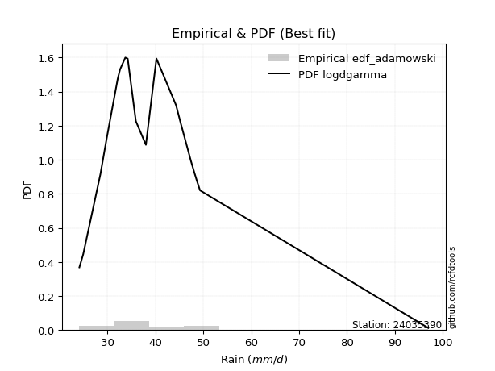</img>

</div>


## C. Best fit & Estimate extreme values for specific return periods - Tr

Best fit in probability distribution analysis means finding the theoretical distribution (like Normal, Poisson, Exponential) that most accurately mirrors your real-world data´s patterns (shape, center, spread) for better predictions, using methods like visual checks (Q-Q plots), goodness-of-fit tests (Kolmogorov-Smirnov, Chi-Squared), and information criteria (AIC) to score and select the simplest, most representative model.


### 1. Best fit (ordered by delta Δ)

<div align="center">

|   id |   station | empirical_dist   | p_dist       |     delta |   deltao | eval   |   fit |   n |   best_fit |   best_fit_sort |
|-----:|----------:|:-----------------|:-------------|----------:|---------:|:-------|------:|----:|-----------:|----------------:|
|    0 |  24035390 | edf_weibull      | loggumbel_r  | 0.0817498 | 0.315645 | Δo > Δ |     1 |  19 |          1 |               1 |
|    1 |  24035390 | edf_jenkinson    | logalpha     | 0.0834384 | 0.315645 | Δo > Δ |     1 |  19 |          1 |               2 |
|    2 |  24035390 | edf_beard        | logalpha     | 0.0834384 | 0.315645 | Δo > Δ |     1 |  19 |          1 |               3 |
|    3 |  24035390 | edf_chegodayev   | logalpha     | 0.0834916 | 0.315645 | Δo > Δ |     1 |  19 |          1 |               4 |
|    4 |  24035390 | edf_filliben     | logalpha     | 0.0835427 | 0.315645 | Δo > Δ |     1 |  19 |          1 |               5 |
|    5 |  24035390 | edf_adamowski    | logalpha     | 0.0837559 | 0.315645 | Δo > Δ |     1 |  19 |          1 |               6 |
|    6 |  24035390 | edf_tukey        | logalpha     | 0.0842193 | 0.315645 | Δo > Δ |     1 |  19 |          1 |               7 |
|    7 |  24035390 | edf_gringorten   | alpha        | 0.0854221 | 0.315645 | Δo > Δ |     1 |  19 |          1 |               8 |
|    8 |  24035390 | edf_cunnane      | alpha        | 0.0854643 | 0.315645 | Δo > Δ |     1 |  19 |          1 |               9 |
|    9 |  24035390 | edf_blom         | alpha        | 0.0855996 | 0.315645 | Δo > Δ |     1 |  19 |          1 |              10 |
|   10 |  24035390 | edf_hazen        | fisk         | 0.0871198 | 0.315645 | Δo > Δ |     1 |  19 |          1 |              11 |
|   11 |  24035390 | edf_california   | logjohnsonsu | 0.11309   | 0.315645 | Δo > Δ |     1 |  19 |          1 |              12 |

</div>

:file_folder:Tables: [bestfit_24035390.csv](table/bestfit_24035390.csv) | [extreme_24035390.csv](table/extreme_24035390.csv)


### 2. Extreme values

In hydrology, a return period (or recurrence interval $Tr$) is the statistical average time between extreme events like floods or droughts of a specific magnitude, indicating how rare an event is, with a 100-year flood, for example, having a 1% chance of occurring in any given year, not that it happens exactly every century. It is a key tool for infrastructure design (like bridges or dams) and risk assessment, calculated from historical data to determine the probability of future events, although it is important to remember it is statistical average, and events can cluster or be missed.

> risk_rate: assuming the return period as the project useful life.

|   id |      tr |   prob_l |     prob_g |    alpha |   betaprime |     chi2 |   crystalball |   erlang |    expon |   exponnorm |        f |   fatiguelife |     fisk |    gamma |   genexpon |   genlogistic |   gibrat |   gompertz |   gumbel_l |   gumbel_r |   halflogistic |   halfnorm |   hypsecant |   invgamma |   invgauss |   invweibull |   johnsonsu |   kstwobign |   laplace |   laplace_asymmetric |   loggamma |   logistic |   lognorm |   maxwell |   mielke |    moyal |   nakagami |     ncf |      nct |    norm |   pearson3 |   rayleigh |    rice |        t |   truncnorm |     wald |   weibull_min |   logalpha |   logbetaprime |          logchi2 |   logcrystalball |   logerlang |   logexpon |   logexponnorm |     logf |   logfatiguelife |   logfisk |   loggenexpon |   loggenlogistic |   loggibrat |   loggompertz |   loggumbel_l |   loggumbel_r |   loghalflogistic |   loghalfnorm |   loghypsecant |   loginvgamma |   loginvgauss |   loginvweibull |   logjohnsonsu |   logkstwobign |   loglaplace |   loglaplace_asymmetric |   logloggamma |   loglogistic |   loglognorm |   logmaxwell |   logmielke |   logmoyal |   lognakagami |   logncf |   lognct |   logpearson3 |   lograyleigh |   logrice |     logt |   logtruncnorm |   logwald |   logweibull_min |   station |   n |   risk_rate |
|-----:|--------:|---------:|-----------:|---------:|------------:|---------:|--------------:|---------:|---------:|------------:|---------:|--------------:|---------:|---------:|-----------:|--------------:|---------:|-----------:|-----------:|-----------:|---------------:|-----------:|------------:|-----------:|-----------:|-------------:|------------:|------------:|----------:|---------------------:|-----------:|-----------:|----------:|----------:|---------:|---------:|-----------:|--------:|---------:|--------:|-----------:|-----------:|--------:|---------:|------------:|---------:|--------------:|-----------:|---------------:|-----------------:|-----------------:|------------:|-----------:|---------------:|---------:|-----------------:|----------:|--------------:|-----------------:|------------:|--------------:|--------------:|--------------:|------------------:|--------------:|---------------:|--------------:|--------------:|----------------:|---------------:|---------------:|-------------:|------------------------:|--------------:|--------------:|-------------:|-------------:|------------:|-----------:|--------------:|---------:|---------:|--------------:|--------------:|----------:|---------:|---------------:|----------:|-----------------:|----------:|----:|------------:|
|    0 |    2    | 0.5      | 0.5        |  37.0873 |     38.554  |  37.5306 |       40.9102 |  37.5305 |  35.9975 |     37.4133 |  37.1316 |       37.4956 |  37.0801 |  37.5305 |    37.7869 |       38.4216 |  36.3724 |    36.3393 |    43.3938 |    38.4267 |        37.1919 |    37.8157 |     40.9102 |    37.1309 |    37.3695 |      37.0979 |     36.8412 |     39.8569 |   40.9102 |              37.6096 |    36.9038 |    40.9102 |   38.9693 |   39.6173 |  37.0919 |  37.6249 |    36.4909 | 39.0416 |  38.0597 | 40.9102 |    35.3925 |    39.1587 | 41.1543 |  40.9659 |     40.9102 |  36.0097 |       36.3463 |    37.0743 |        37.2401 |     41.5732      |          38.9693 |     33.8216 |    33.9651 |        36.9594 |  37.233  |          37.1833 |   37.0422 |       37.0137 |          37.1845 |     35.7141 |       36.6139 |       40.8748 |       37.1527 |           36.281  |       36.7191 |        38.9693 |       37.0943 |       37.1693 |         37.0662 |        36.9942 |        37.4493 |      38.9693 |                 36.1594 |       38.9997 |       38.9693 |      37.1264 |      38.0128 |     37.0247 |    36.5845 |       37.5041 |  38.8385 |  38.3768 |       36.5472 |       37.6792 |   38.0805 |  38.6004 |        34.7961 |   35.466  |          37.2136 |  24035390 |  19 |    0.75     |
|    1 |    2.33 | 0.570815 | 0.429185   |  38.7924 |     40.5133 |  39.713  |       43.608  |  39.713  |  38.4426 |     39.3348 |  38.9507 |       39.5376 |  38.7502 |  39.713  |    39.8377 |       40.2275 |  37.739  |    38.8064 |    45.7409 |    40.9264 |        39.7621 |    40.7273 |     43.0693 |    38.9499 |    39.377  |      38.8682 |     38.4917 |     42.0196 |   42.5428 |              39.4435 |    40.7442 |    43.2872 |   41.0434 |   42.4201 |  38.8524 |  39.9912 |    39.4775 | 41.1575 |  39.9209 | 43.608  |    37.3887 |    42.003  | 43.4762 |  43.8027 |     43.608  |  37.7787 |       38.3727 |    38.8099 |        39.1269 |     49.674       |          41.0434 |     36.5986 |    36.3698 |        38.6046 |  39.1009 |          39.0246 |   38.6459 |       39.0358 |          38.9429 |     36.6647 |       39.0573 |       42.7611 |       38.9815 |           38.1186 |       38.8326 |        40.6206 |       38.869  |       39.0062 |         38.8316 |        38.6472 |        39.3878 |      40.2116 |                 37.7803 |       41.17   |       40.7911 |      38.9316 |      40.1168 |     38.6982 |    38.287  |       39.6038 |  41.9668 |  40.3236 |       38.3871 |       39.7965 |   40.0988 |  40.7412 |        37.3268 |   36.6927 |          39.266  |  24035390 |  19 |    0.729209 |
|    2 |    5    | 0.8      | 0.2        |  47.2108 |     48.9721 |  49.8995 |       53.6336 |  49.8994 |  50.6675 |     48.9314 |  47.9274 |       49.3473 |  47.1021 |  49.8994 |    49.2998 |       48.0724 |  45.6067 |    50.867  |    53.3233 |    51.7866 |        51.3916 |    53.0399 |     51.7295 |    47.9264 |    49.1377 |      47.6862 |     47.2215 |     51.206  |   50.7052 |              48.6126 |    68.1159 |    52.4647 |   49.7662 |   53.4516 |  47.626  |  50.9524 |    53.169  | 49.9004 |  48.3334 | 53.6336 |    48.5723 |    53.3897 | 52.7717 |  54.7846 |     53.6336 |  47.6813 |       49.2377 |    47.4116 |        48.2866 |    139.574       |          49.7662 |     55.2896 |    51.2004 |        47.1806 |  48.1725 |          48.0567 |   46.7639 |       48.8081 |          47.5882 |     42.6509 |       50.7498 |       49.4703 |       48.0304 |           47.6682 |       49.2013 |        47.9778 |       47.652  |       48.0307 |         47.6598 |        47.0625 |        48.805  |      47.0424 |                 47.0418 |       50.3134 |       48.6606 |      47.8274 |      49.5924 |     47.1307 |    47.2664 |       49.4192 |  56.3334 |  48.8951 |       47.8912 |       49.5335 |   49.3085 |  50.0094 |        51.9274 |   44.3861 |          49.0715 |  24035390 |  19 |    0.67232  |
|    3 |   10    | 0.9      | 0.1        |  55.6926 |     55.8173 |  58.5951 |       60.2843 |  58.595  |  61.765  |     57.6426 |  56.6319 |       58.0955 |  55.7875 |  58.595  |    57.4076 |       54.4615 |  54.5751 |    61.4397 |    57.5449 |    60.632  |        61.0493 |    62.1511 |     58.645  |    56.6309 |    58.0351 |      56.4422 |     56.4428 |     58.2003 |   58.1148 |              56.9361 |   110.239  |    59.2237 |   56.5527 |   61.215  |  56.3587 |  60.4958 |    63.8133 | 56.5657 |  55.6085 | 60.2843 |    59.7032 |    61.5087 | 59.3996 |  62.991  |     60.2843 |  58.1902 |       59.8485 |    56.0197 |        56.8807 |    401.218       |          56.5527 |     81.5643 |    69.8404 |        56.3674 |  56.7159 |          56.7051 |   55.5767 |       57.8361 |          56.0207 |     50.6752 |       60.7821 |       53.6519 |       56.9319 |           57.3931 |       58.618  |        54.7986 |       56.3147 |       56.7004 |         56.5001 |        55.8418 |        57.4579 |      54.2429 |                 57.4011 |       57.4389 |       55.4114 |      56.4818 |      57.5735 |     55.8702 |    56.783  |       57.97   |  68.8797 |  56.0216 |       57.4793 |       57.8994 |   57.1406 |  57.8053 |        67.9135 |   54.3221 |          57.9062 |  24035390 |  19 |    0.651322 |
|    4 |   15    | 0.933333 | 0.0666667  |  61.3837 |     59.6795 |  63.5466 |       63.6031 |  63.5465 |  68.2566 |     62.7383 |  62.1587 |       63.213  |  61.7168 |  63.5466 |    62.07   |       58.0661 |  60.761  |    67.4682 |    59.4567 |    65.6225 |        66.5148 |    66.8924 |     62.5917 |    62.1578 |    63.3245 |      62.1172 |     62.5653 |     61.9134 |   62.4491 |              61.805  |   146.642  |    62.9063 |   60.2779 |   65.1983 |  62.0317 |  66.0343 |    69.4168 | 60.1853 |  59.9043 | 63.6031 |    66.462  |    65.692  | 62.8146 |  67.5633 |     63.6031 |  64.9386 |       66.2997 |    61.7071 |        62.1926 |    766.82        |          60.2779 |    102.76   |    83.749  |        62.5466 |  62.0193 |          62.1379 |   61.8958 |       63.3443 |          61.4197 |     57.0736 |       66.4527 |       55.6602 |       62.6636 |           63.7513 |       64.2111 |        59.1173 |       61.9291 |       62.162  |         62.2758 |        61.7897 |        62.6588 |      58.9556 |                 64.4885 |       61.3527 |       59.4759 |      62.0113 |      62.1548 |     61.7962 |    63.1616 |       62.9543 |  76.2834 |  60.1142 |       63.6702 |       62.7474 |   61.6499 |  62.4134 |        78.2368 |   61.8461 |          63.1781 |  24035390 |  19 |    0.644736 |
|    5 |   20    | 0.95     | 0.05       |  65.8724 |     62.3905 |  67.0163 |       65.7766 |  67.0162 |  72.8624 |     66.3538 |  66.3176 |       66.8509 |  66.4096 |  67.0163 |    65.3595 |       60.5899 |  65.6134 |    71.6784 |    60.6468 |    69.1167 |        70.344  |    70.0536 |     65.3758 |    66.3168 |    67.1207 |      66.4449 |     67.2719 |     64.4147 |   65.5244 |              65.2595 |   179.766  |    65.4515 |   62.8495 |   67.8419 |  66.3646 |  69.9568 |    73.1644 | 62.6705 |  63.0035 | 65.7766 |    71.3374 |    68.4725 | 65.0845 |  70.7864 |     65.7766 |  69.9675 |       70.9694 |    66.1258 |        66.1207 |   1226.05        |          62.8494 |    121.2    |    95.2665 |        67.3375 |  65.9539 |          66.1975 |   67.0985 |       67.3849 |          65.5062 |     62.6532 |       70.4008 |       56.9481 |       67.0169 |           68.6213 |       68.2335 |        62.3672 |       66.2225 |       66.2508 |         66.7063 |        66.4698 |        66.425  |      62.5456 |                 70.0417 |       64.0551 |       62.458  |      66.1953 |      65.3947 |     66.4692 |    68.1079 |       66.5059 |  81.6102 |  63.017  |       68.365  |       66.1921 |   64.8422 |  65.7619 |        85.8238 |   68.1229 |          66.9877 |  24035390 |  19 |    0.641514 |
|    6 |   25    | 0.96     | 0.04       |  69.6682 |     64.4848 |  69.6869 |       67.3765 |  69.6868 |  76.435  |     69.1582 |  69.6939 |       69.6778 |  70.3688 |  69.6869 |    67.9039 |       62.5338 |  69.6586 |    74.9069 |    61.4936 |    71.8082 |        73.2943 |    72.4056 |     67.5305 |    69.6932 |    70.0903 |      69.9927 |     71.1426 |     66.2883 |   67.9098 |              67.9391 |   210.649  |    67.3987 |   64.8123 |   69.8045 |  69.921  |  72.9972 |    75.9564 | 64.5607 |  65.4455 | 67.3765 |    75.157  |    70.5383 | 66.7709 |  73.2947 |     67.3765 |  73.9955 |       74.6396 |    69.8105 |        69.2684 |   1772.57        |          64.8123 |    137.829  |   105.28   |        71.3048 |  69.115  |          69.4757 |   71.6377 |       70.604  |          68.8381 |     67.7193 |       73.424  |       57.8826 |       70.5752 |           72.6256 |       71.3889 |        65.0045 |       69.7544 |       69.5574 |         70.3556 |        70.4026 |        69.3937 |      65.4801 |                 74.6764 |       66.1181 |       64.8399 |      69.6082 |      67.9088 |     70.4047 |    72.2067 |       69.2752 |  85.7956 |  65.2762 |       72.1942 |       68.8734 |   67.3206 |  68.4215 |        91.763  |   73.6071 |          69.988  |  24035390 |  19 |    0.639603 |
|    7 |   50    | 0.98     | 0.02       |  83.7434 |     70.9873 |  77.8889 |       71.9581 |  77.8887 |  87.5325 |     77.8695 |  81.1228 |       78.4904 |  84.7788 |  77.8888 |    75.7837 |       68.5223 |  83.9182 |    84.735  |    63.7924 |    80.0994 |        82.3845 |    79.242  |     74.211  |    81.1227 |    79.4516 |      82.2154 |     84.482  |     71.79   |   75.3194 |              76.2625 |   345.588  |    73.3478 |   70.7789 |   75.4964 |  82.2005 |  82.4356 |    84.0795 | 70.2757 |  73.2966 | 71.9581 |    87.1929 |    76.5351 | 71.6664 |  81.2453 |     71.9581 |  87.147  |       86.2821 |    83.0164 |        79.6722 |   5687.62        |          70.7788 |    205.996  |   143.609  |        85.1819 |  79.6171 |          80.4642 |   89.4342 |       81.1366 |          80.2046 |     89.074  |       82.6195 |       60.4976 |       82.7685 |           86.4932 |       81.4137 |        73.9113 |       82.0443 |       80.6714 |         83.0504 |        84.6418 |        78.9002 |      75.5027 |                 91.1213 |       72.3897 |       72.695  |      81.2817 |      75.7601 |     84.7252 |    86.5701 |       77.9892 |  99.1594 |  72.3814 |       85.2474 |       77.2879 |   75.0648 |  77.14   |       109.641  |   94.7783 |          79.5952 |  24035390 |  19 |    0.63583  |
|    8 |   75    | 0.986667 | 0.0133333  |  94.1324 |     74.8144 |  82.6332 |       74.4164 |  82.6331 |  94.0241 |     82.9652 |  88.5489 |       83.6682 |  94.9759 |  82.6331 |    80.3834 |       72.003  |  93.5491 |    90.3489 |    64.9548 |    84.9185 |        87.6686 |    82.9635 |     78.1151 |    88.5493 |    85.0195 |      90.3182 |     93.2777 |     74.817  |   79.6537 |              81.1314 |   462.341  |    76.7837 |   74.2037 |   78.591  |  90.3626 |  87.9551 |    88.502  | 73.5382 |  78.1095 | 74.4164 |    94.3306 |    79.7976 | 74.3297 |  86.0782 |     74.4164 |  95.2399 |       93.2453 |    92.282  |        86.2443 |  11382.2         |          74.2036 |    260.949  |   172.208  |        94.5199 |  86.2951 |          87.5217 |  103.362  |       87.714  |          87.6544 |    107.189  |       87.8762 |       61.8645 |       90.8017 |           95.741  |       87.4505 |        79.6711 |       90.3247 |       87.833  |         91.5727 |        94.6952 |        84.6752 |      82.0625 |                102.372  |       75.9897 |       77.6582 |      88.9755 |      80.4032 |     94.9057 |    96.2594 |       83.1835 | 107.27   |  76.6258 |       93.7852 |       82.2899 |   79.6459 |  82.642  |       119.006  |  110.731  |          85.4377 |  24035390 |  19 |    0.634587 |
|    9 |  100    | 0.99     | 0.01       | 102.825  |     77.5494 |  85.9798 |       76.0792 |  85.9796 |  98.6299 |     86.5807 |  94.1886 |       87.352  | 103.155  |  85.9797 |    83.6446 |       74.4665 | 101.01   |    94.2739 |    65.7151 |    88.3293 |        91.4086 |    85.4986 |     80.8844 |    94.1895 |    89.0087 |      96.5483 |     99.9962 |     76.8909 |   82.729  |              84.5859 |   568.694  |    79.2096 |   76.6135 |   80.6988 |  96.649  |  91.8709 |    91.5138 | 75.8271 |  81.6372 | 76.0792 |    99.4301 |    82.0203 | 76.1442 |  89.6172 |     76.0792 | 101.14   |       98.2477 |    99.7233 |        91.1466 |  18700.5         |          76.6134 |    308.775  |   195.891  |       101.76   |  91.2988 |          92.8417 |  115.412  |       92.5861 |          93.3415 |    123.718  |       91.5568 |       62.7753 |       96.9542 |          102.878  |       91.8173 |        84.0269 |       96.7769 |       93.2432 |         98.1835 |       102.771  |        88.8741 |      87.0595 |                111.188  |       78.5226 |       81.365  |      94.8793 |      83.7277 |    103.125  |   103.784  |       86.9192 | 113.172  |  79.6871 |      100.291  |       85.8817 |   82.9259 |  86.764  |       124.888  |  124.03   |          89.6913 |  24035390 |  19 |    0.633968 |
|   10 |  200    | 0.995    | 0.005      | 130.173  |     84.231  |  93.9868 |       79.8507 |  93.9867 | 109.727  |     95.2919 | 109.185  |       96.2601 | 126.699  |  93.9868 |    91.4977 |       80.3889 | 121.308  |   103.54   |    67.3678 |    96.5292 |       100.4    |    91.2969 |     87.556  |   109.187  |    98.744  |     113.404  |    117.931  |     81.6678 |   90.1386 |              92.9094 |   937.967  |    85.0289 |   82.3739 |   85.5213 | 113.699  | 101.305  |    98.397  | 81.2793 |  90.5666 | 79.8507 |   111.817  |    87.106  | 80.2959 |  98.6048 |     79.8507 | 115.838  |      110.494  |   121.427  |       103.848  |  62612.3         |          82.3738 |    463.841  |   267.207  |       121.564  | 104.353  |         106.836  |  154.98   |      105.089  |         108.57   |    182.758  |      100.273  |       64.8015 |      113.506  |          122.29   |      102.642  |        95.5237 |      114.653  |      107.52   |        116.323  |       126.193  |        99.3546 |     100.385  |                135.673  |       84.5764 |       90.9946 |     110.844  |      91.8599 |    127.159  |   124.419  |       96.1096 | 127.936  |  87.261  |      117.663  |       94.7011 |   90.9481 |  97.5797 |       136.048  |  164.521  |         100.334  |  24035390 |  19 |    0.633042 |
|   11 |  250    | 0.996    | 0.004      | 141.617  |     86.4148 |  96.5499 |       81.0033 |  96.5497 | 113.3    |     98.0963 | 114.476  |       99.1372 | 135.618  |  96.5498 |    94.0251 |       82.2929 | 128.59   |   106.467  |    67.8541 |    99.1653 |       103.291  |    93.0807 |     89.7036 |   114.479  |   101.913  |     119.442  |    124.262  |     83.1461 |   92.5239 |              95.5889 |  1102.35   |    86.8971 |   84.2192 |   87.0057 | 119.821  | 104.343  |   100.513  | 83.021  |  93.5817 | 81.0033 |   115.831  |    88.6715 | 81.5739 | 101.658  |     81.0033 | 120.7    |      114.491  |   129.823  |       108.225  |  92677.5         |          84.2191 |    528.966  |   295.294  |       128.726  | 108.881  |         111.726  |  172.056  |      109.361  |         113.974  |    210.22   |      103.037  |       65.41   |      119.405  |          129.277  |      106.222  |        99.5495 |      121.218  |      112.523  |        122.911  |       135.161  |       102.842  |     105.095  |                144.65   |       86.5153 |       94.3216 |     116.572  |      94.5187 |    136.437  |   131.899  |       99.1292 | 132.863  |  89.7655 |      123.812  |       97.5941 |   93.5704 | 101.367  |       138.743  |  180.639  |         103.884  |  24035390 |  19 |    0.632858 |
|   12 |  500    | 0.998    | 0.002      | 190.094  |     93.3194 | 104.473  |       84.4213 | 104.473  | 124.397  |    106.808  | 132.532  |      108.101  | 168.397  | 104.473  |   101.874  |       88.2025 | 153.76   |   115.396  |    69.248  |   107.347  |       112.262  |    98.3992 |     96.3747 |   132.537  |   111.856  |     140.368  |    145.8    |     87.5763 |   99.9335 |             103.912  |  1822.25   |    92.691  |   89.9381 |   91.4354 | 141.085  | 113.777  |   106.815  | 88.4066 | 103.429  | 84.4213 |   128.366  |    93.3425 | 85.387  | 111.726  |     84.4213 | 136.161  |      127.062  |   161.835  |       122.8    | 315898           |          89.938  |    796.333  |   402.799  |       153.778  | 124.068  |         128.242  |  246.247  |      123.47   |         132.525  |    341.026  |      111.505  |       67.1863 |      139.742  |          153.613  |      117.655  |       113.169  |      144.679  |      129.476  |        146.102  |       168.714  |       114.043  |     121.181  |                176.504  |       92.5228 |      105.433  |     136.502  |     102.919  |    171.487  |   158.124  |      108.713  | 148.751  |  97.7752 |      144.852  |      106.762  |  101.853  | 114.263  |       144.764  |  243.151  |         115.323  |  24035390 |  19 |    0.632489 |
|   13 |  750    | 0.998667 | 0.00133333 | 232.012  |     97.4525 | 109.084  |       86.32   | 109.084  | 130.889  |    111.903  | 144.345  |      113.361  | 191.758  | 109.084  |   106.465  |       91.6572 | 170.405  |   120.507  |    69.993  |   112.131  |       117.507  |   101.37   |    100.277  |   144.351  |   117.738  |     154.3    |    159.794  |     90.0651 |  104.268  |             108.781  |  2446.67   |    96.0761 |   93.2811 |   93.913  | 155.281  | 119.295  |   110.332  | 91.5476 | 109.554  | 86.32   |   135.74   |    95.9544 | 87.5193 | 118.074  |     86.32   | 145.43   |      134.518  |   185.989  |       132.066  | 650484           |          93.281  |   1012.24   |   483.015  |       170.636  | 133.809  |         138.92   |  311.771  |      132.354  |         144.737  |    469.618  |      116.381  |       68.1553 |      153.199  |          169.909  |      124.57   |       121.984  |      160.941  |      140.476  |        161.849  |       193.272  |       120.863  |     131.71   |                198.298  |       96.0334 |      112.521  |     149.864  |     107.939  |    197.462  |   175.819  |      114.468  | 158.474  | 102.635  |      158.655  |      112.259  |  106.799  | 122.724  |       146.991  |  290.577  |         122.314  |  24035390 |  19 |    0.632366 |
|   14 | 1000    | 0.999    | 0.001      | 271.015  |    100.431  | 112.346  |       87.6273 | 112.346  | 135.495  |    115.519  | 153.344  |      117.101  | 210.548  | 112.346  |   109.723  |       94.1078 | 183.143  |   124.085  |    70.4944 |   115.524  |       121.228  |   103.422  |    103.046  |   153.352  |   121.938  |     165.03   |    170.389  |     91.7893 |  107.343  |             112.236  |  3016.31   |    98.4766 |   95.6548 |   95.6254 | 166.234  | 123.211  |   112.759  | 93.7752 | 114.076  | 87.6273 |   140.988  |    97.7594 | 88.9928 | 122.809  |     87.6273 | 152.098  |      139.851  |   206.356  |       138.996  |      1.08803e+06 |          95.6547 |   1200.36   |   549.442  |       183.706  | 141.139  |         146.994  |  373.404  |      138.961  |         154.077  |    599.903  |      119.809  |       68.8153 |      163.523  |          182.506  |      129.581  |       128.652  |      173.831  |      148.813  |        174.141  |       213.451  |       125.825  |     139.73   |                215.373  |       98.5255 |      117.835  |     160.217  |     111.551  |    218.995  |   189.562  |      118.622  | 165.576  | 106.167  |      169.187  |      116.222  |  110.358  | 129.202  |       148.152  |  330.313  |         127.414  |  24035390 |  19 |    0.632305 |

<div align="center">

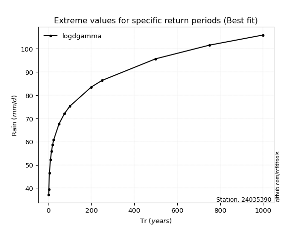</img>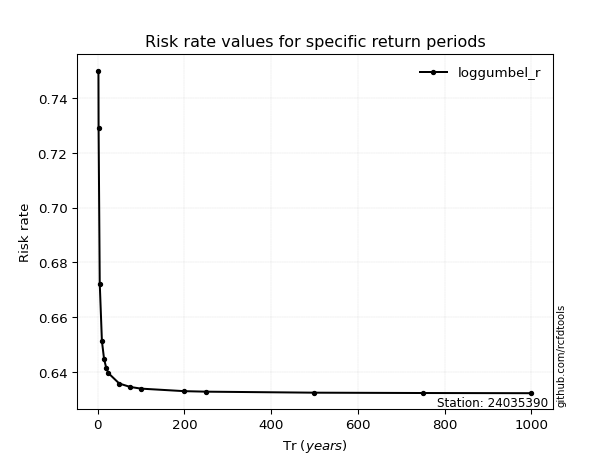</img>

</div>


<sub>**APP DISCLAIMER**: NO WARRANTY - This software is provided by [github.com/rcfdtools](https://github.com/rcfdtools) "as is", without any express or implied warranty, including warranties of merchantability, fitness for a particular purpose, or non-infringement. There is no guarantee that the software will be error-free or operate without interruption. LIMITATION OF LIABILITY - Neither the authors nor copyright holders will be liable for claims or damages arising from the software or its use. You are responsible for determining if the software is appropriate for your use and assume all associated risks, including errors, legal compliance, and data loss. NO PROFESSIONAL ADVICE - The software provides general information and does not offer professional advice. It should not replace consultation with professional advisors.</sub>